# BEYOND GRADIENT FLOW: IDENTIFIABILITY AND RECOVERY FROM DISTRIBUTION SNAPSHOTS

Nam D. Nguyen<sup>1,2,3,4</sup> Valeriya Malysheva<sup>1,2,3,5</sup>

<sup>1</sup>VIB, Center for Molecular Neurology, Antwerp, Belgium

<sup>2</sup>VIB, Center for AI and Computational Biology, Leuven, Belgium

<sup>3</sup>Faculty of Pharmaceutical, Biomedical and Veterinary Sciences,

University of Antwerp, Antwerp, Belgium

<sup>4</sup>Research Foundation – Flanders (FWO), Brussels, Belgium

<sup>5</sup>Trinity Hall, University of Cambridge, Cambridge, UK

ducnam.nguyen@uantwerpen.be valeriya.malysheva@uantwerpen.be

## ABSTRACT

Inferring dynamics from snapshots of evolving distributions is fundamentally underdetermined: the Fokker–Planck equation constrains the drift F only through its score-weighted divergence $\nabla \cdot F + \mathbf { \dot { \boldsymbol { F } } } \cdot \nabla \log \rho ,$ leaving $\textbf { a } \rho \mathbf { \cdot }$ -solenoidal gauge invisible to any single-time constraint. Time-indexed transport formulations cannot resolve this ambiguity: every admissible marginal path admits a curl-free explanation, minimum-action reconstruction selects it, and marginal fit alone cannot distinguish dynamically inequivalent explanations. Requiring one autonomous field to explain several marginals instead makes part of the hidden circulation visible as ∇ log ρ changes across marginals. Separating instantaneous Fokker– Planck source constraints from the snapshot experiment, we show that the source constraints identify the field modulo the kernel of a stacked score-weighted divergence operator. For generic Gaussian shape variation, source constraints at $K \geq m$ time points in intrinsic dimension m eliminate every polynomial gauge direction, whereas finitely many density snapshots alone admit aliasing; we give the obstruction explicitly. At a Gaussian anchor, for Sobolev smoothness s and n samples per time point, we derive a conditional lower rate $( n K ) ^ { - 2 s / ( 2 s + m + 1 ) }$ for the tangent snapshot experiment, with a matching upper rate in a degreewise benchmark. Strong-form fitting is non-orthogonal to score error and cannot be repaired by spectral filtering. Instead, we estimate using smooth test functions while retaining the known diffusion term, and derive a finite-sample bound that separates sampling error from fixed-grid quadrature bias. Planted-circulation experiments confirm the predicted gauge contraction and expose a design tension between cross-slice information and covariance-aware whitening.

## 1 INTRODUCTION

Inferring dynamical systems from snapshots of their time-evolving distributions is a central problem in fields ranging from single-cell biology to climate science. Suppose a latent state $Z _ { t }$ evolves according to

$$
d Z _ { t } = F _ { t } ( Z _ { t } ) d t + \sqrt { 2 \sigma ^ { 2 } } d W _ { t } ,\tag{1}
$$

with $W _ { t }$ a standard Brownian motion and $\sigma \geq 0$ a known, fixed diffusion scale. Only independent samples from the marginals $\rho _ { t _ { 1 } } , \ldots , \rho _ { t _ { K } }$ are observed, and the goal is to recover the drift $F _ { t }$ . The problem is underdetermined: the Fokker–Planck equation constrains only the gradient component of the weighted Helmholtz decomposition $F _ { t } = - \nabla \hat { \Phi } _ { t } + h _ { t }$ , with scalar potential $\Phi _ { t }$ and $\nabla \cdot \left( \rho _ { t } h _ { t } \right) = 0$ leaving the weighted-solenoidal field $h _ { t }$ as a time-local gauge freedom.

At stationarity the gauge is precisely the probability current $J = \rho h$ separating equilibrium from nonequilibrium steady states: $h = 0$ is detailed balance, $h \neq 0$ permits persistent circulation without changing the stationary marginal. Such fluxes are widespread in living systems (Battle et al., 2016;

Gnesotto et al., 2018), motivate landscape–flux descriptions of cell fate (Wang et al., 2008; Kwon et al., 2005), and drive irreversible Langevin samplers (Hwang et al., 1993; Lelievre et al.\` , 2013; Rey-Bellet & Spiliopoulos, 2015), game dynamics (Balduzzi et al., 2018) and stochastic optimization (Kunin et al., 2024). We ask whether it can be inferred when the dynamics are unobserved.

Existing methods resolve the underdetermination by imposing a selection principle — transport cost, a reference process, a coupling, or an action (Schiebinger et al., 2019; Tong et al., 2020; Huguet et al., 2022; Bunne et al., 2022; Terpin et al., 2024; De Bortoli et al., 2021; Shi et al., 2023; Albergo & Vanden-Eijnden, 2023; Lipman et al., 2023; Tong et al., 2024; Lee et al., 2025; Neklyudov et al., 2023; Benamou & Brenier, 2000). These select a representative compatible with the marginals rather than identifying the circulation; within an unrestricted time-indexed class every admissible marginal path admits a curl-free explanation (§2.1), so marginal fit cannot distinguish true circulation from a gauge choice.

The situation changes under autonomy, $F _ { t } \equiv F \colon$ one field must now explain all observed marginals. A direction invisible under one density $\rho _ { t }$ may become visible as its score $\nabla$ log $\rho _ { t }$ changes, so the persistent gauge contracts to directions invisible across all source constraints. We formalize this through Stein operators, ask what becomes structurally identifiable, how the remaining near-gauge directions control statistical recovery, and how that structure dictates an estimator.

1. Source constraints and snapshot identifiability (§2). We separate known sources and finitely many snapshots. For a time-indexed drift, minimum-action reconstruction selects the gradient representative (Cor. 2). Under autonomy, the residual gauge under the source constraints consists of directions lying in every per-time Stein kernel and is contracted pointwise by changing scores (Prop. 6). Snapshots identify strictly less: this shared gauge is neither necessary nor sufficient there, and we give the aliasing obstruction (Ex. 5).

2. Statistical limits and a conditional rate (§3). For generic Gaussian shape variation, source constraints at $K \geq m$ time points eliminate every finite-degree polynomial gauge direction in intrinsic dimension m (Thm. 8). Linearizing the snapshot map around a reference system, we derive a conditional lower rate for the tangent snapshot experiment, with a matching upper rate in a degreewise benchmark (Thm. 12).

3. A gauge-aware estimator, and a design tension (§4, §5). Strong-form estimation is nonorthogonal to score error (Prop. 14) and spectral filtering cannot separate the resulting bias from signal (Prop. 35). A weak formulation removes the nuisance and, under independent slices, yields moment equations with exact block-tridiagonal covariance (Prop. 16). Empirically we find that the regime in which that covariance structure would pay is the regime in which the target ceases to be identifiable (Obs. 17).

Positioning. Trajectory inference is usually posed as transport between temporal marginals and closed by an optimal-transport, reference-process, flow-matching, or action-based principle. These construct dynamics consistent with prescribed distributions; we ask which aspects of the dynamics those distributions determine. Consistency results typically assume gradient drift (Lavenant et al., 2024) and action matching explicitly targets a gradient representative (Neklyudov et al., 2023); rotational ambiguity from population snapshots was noted by Weinreb et al. (2018). The closest identifiability result, Guan et al. (2024), characterizes linear additive-noise SDEs through generalized rotational symmetries of the initial law; we treat an infinite-dimensional field class, condition on the observed marginal shapes rather than the initial law, and study finite-sample recovery (App. I). Velocity, pairing and lineage measurements supply Lagrangian information we deliberately exclude (App. R). App. B gives the full discussion.

## 2 WHAT CAN BE IDENTIFIED FROM EVOLVING MARGINALS

Marginal evolution does not reveal a vector field directly, only its effect on probability mass. A Stein operator captures this effect. We use it to separate source constraints from the snapshot experiment and to characterize time-indexed blindness. Proofs are in App. C.

Let $\rho _ { t }$ be the marginal of (1) and $s _ { t } = \nabla \log \rho _ { t }$ its score. Dividing the Fokker–Planck equation by $\rho _ { t }$ gives

$$
\begin{array} { r l } & { A _ { \rho _ { t } } F _ { t } = b _ { t } , \quad A _ { \rho } F : = \nabla \cdot F + F \cdot \nabla \log \rho , \quad b _ { t } = - \partial _ { t } \log \rho _ { t } + \sigma ^ { 2 } \big ( \nabla \cdot s _ { t } + \| s _ { t } \| ^ { 2 } \big ) . } \end{array}\tag{2}
$$

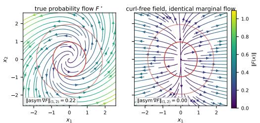  
(a)

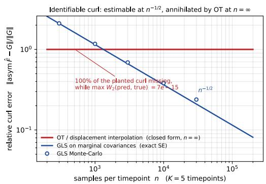  
(b)  
Figure 1: Identical marginal flow, different dynamics. (a) A flow with a planted rotational component and a curl-free transport generate the same Gaussian marginals. (b) On the reference model of Tab. 1, linearized-GLS decays at the $n ^ { - 1 / 2 }$ rate whereas displacement interpolation has solenoidal relative error 1 for every n, including $n = \infty$ . Both match the observed marginals to machine precision, so marginal fit cannot distinguish them.

The operator $A _ { \rho }$ is the vector Stein operator associated with $\rho ;$ we call $\mathcal { A } _ { \rho } F$ thefootprint of $F$ on $\rho .$ We fix $\sigma$ throughout; joint drift–diffusion identifiability is discussed in App. X. A vector field h is invisible at $\rho$ exactly when its footprint vanishes, ker $\mathcal { \bar { A } } _ { \rho } = \{ h : \nabla \cdot ( \rho h ) \ \stackrel {  } { = } 0 \}$ ; we call such fields ρ-solenoidal<sup>1</sup>.

Two information levels must be distinguished. At the source-level, one knows $( \rho _ { t } , \partial _ { t } \rho _ { t } )$ at the times under consideration, so (2) is an observed population constraint; a smooth complete marginal path provides these constraints for every t. In the snapshot experiment one observes only independent samples from $\rho _ { t _ { 1 } } , \ldots , \rho _ { t _ { K } }$ , so the temporal source is not directly available.

## 2.1 TIME-INDEXED SATURATION AND ARCHITECTURAL BLINDNESS

Optimal transport and related models fit a separate field $F _ { t }$ at each time, letting every slice choose its own representative of the single-slice gauge.

Proposition 1 (Gradient saturation). Suppose $\{ \rho _ { t } \}$ is a smooth path of positive densities such that each $\rho _ { t }$ satisfies a Poincare inequality and´ $\partial _ { t }$ log $\rho _ { t } \ \in \ L ^ { 2 } ( \rho _ { t } )$ . Then for every t there is $\phi _ { t } ~ \in$ $H ^ { 1 } ( \rho _ { t } ) / \mathbb { R }$ with $\nabla \cdot \left( \rho _ { t } \nabla \phi _ { t } \right) = - \partial _ { t } \rho _ { t }$ weakly, so the path solves the continuity equation driven by the curl-free velocity $v _ { t } = \nabla \phi _ { t }$ . The corresponding Ito driftˆ $F _ { t } = v _ { t } + \sigma ^ { 2 } s _ { t }$ is also curl-free.

Zero circulation is therefore unfalsifiable from marginal fit within a time-indexed gradient class, however strongly the underlying system rotates.

Corollary 2 (Minimum-action projection). At each t, among all velocities meeting the same marginal constraint, the minimum- $. L ^ { 2 } ( \rho _ { t } )$ action solution lies in (ker $A _ { \rho _ { t } } ) ^ { \perp } = \overline { { \{ \nabla \phi \} } }$ and has zero $\rho _ { t } { - } s o l e n o i d a l$ component.

Optimal transport is the closed-form instance: for Gaussian marginals the Benamou–Brenier displacement velocity is a gradient on every segment, so its solenoidal relative error equals 1 at every sample size while the induced marginal path matches the observed one exactly (Cor. 18, App. C). The same population floor holds for conditional flow matching with exact OT couplings; Schrodinger bridges add only a gradient correction to the reference drift and hence preserve its¨ $\rho _ { t }$ -solenoidal projection (Cor. 19). Fig. 1 shows both halves of the blindness: identical marginal transport and an error floor that no amount of data removes.

This blindness is architectural: a time-conditioned curl head is compensable slice by slice, making circulation unidentifiable even given oracle nuisances (Prop. 21). Autonomy instead forces one compensator to satisfy the constraints across all selected times.

## 2.2 AUTONOMY, SNAPSHOT EQUIVALENCE, AND THE RESIDUAL GAUGE

This motivates an autonomy hypothesis at the representation level: the chosen state is sufficiently informative that a single field can explain the entire marginal evolution.

Assumption 3 (Representation-level autonomy). On the chosen m-dimensional state space $\mathcal { M } ,$ , the observed evolution is generated by a single time-independent Ito driftˆ $F : \mathcal { M }  T \mathcal { M }$

Proposition 4 (Source-constraint equivalence). Two autonomousfields satisfy the same source constraints (2) iff their difference lies in ker $\mathcal { A } _ { K } : = \bigcap _ { k = 1 } ^ { K }$ ker $\boldsymbol { \mathcal { A } } _ { \rho _ { t _ { k } } }$ , where $\boldsymbol { \mathcal { A } } _ { K } \boldsymbol { F } : = ( \boldsymbol { \mathcal { A } } _ { \rho _ { t _ { k } } } \boldsymbol { F } ) _ { k = 1 } ^ { K }$ . For a continuum of source times the intersection is taken over the whole interval; with the same initial law andforward uniqueness, this is equivalent to generating the same complete marginal path.

Changing marginals can reveal directions hidden at a single slice: if $\mathcal { A } _ { \rho _ { t _ { 1 } } } h = 0$ then $\mathcal { A } _ { \rho _ { t _ { k } } } h =$ $h \cdot \left( s _ { k } - s _ { 1 } \right)$ , so cross-slice score variation creates a footprint for otherwise invisible directions.

Finite snapshots are weaker. Their population observation map is nonlinear, $\mathcal { S } _ { K } ( F , \rho _ { 0 } ) =$ $( \rho _ { t _ { 1 } } ^ { F } , \dots , \overset { \bullet } { \rho _ { t _ { K } } ^ { F } } )$ , and its fibres, not ker $\boldsymbol { \mathcal { A } } _ { K }$ , are the observational equivalence classes; an unknown initial law is a further nuisance. In a finite-dimensional parameterization, full column rank of the derivative of a continuously differentiable snapshot-statistic map at the truth gives local injectivity by the inverse function theorem applied to a full-rank square submap, but neither implies global injectivity nor follows from instantaneous score rank.

Example 5 (Temporal aliasing). Let $J \ = \ { \binom { 0 \ - 1 } { 1 \ 0 } } , F _ { \omega } ( x ) \ = \ ( - a I + \omega J ) x$ with $a \ > \ 0 .$ , and $\rho _ { 0 } = \mathcal { N } ( 0 , \Sigma _ { 0 } )$ with $\Sigma _ { 0 }$ anisotropic. Then $\Sigma _ { t } = e ^ { - 2 a t } R _ { \omega t } \Sigma _ { 0 } R _ { \omega t } ^ { \top } + \frac { \sigma ^ { 2 } } { a } ( 1 - e ^ { - 2 a t } ) I$ with $R _ { \theta } = e ^ { \theta J }$ At $t _ { k } ~ = ~ k \Delta$ , the drifts $F _ { \omega }$ and $F _ { \omega + \pi / \Delta }$ give identical Gaussian snapshots, yet their difference $( \pi / \Delta )$ Jx is not in ker $\mathcal { A } _ { \rho _ { 0 } }$

Thus ker $\boldsymbol { \mathcal { A } } _ { K }$ is neither sufficient for snapshot equivalence — vanishing footprints at the selected instants leave the path unconstrained in between — nor necessary, by Ex. 5. It characterizes sourcelevel identifiability, whereas local snapshot identifiability is governed by $D \mathcal { S } _ { K } \left( \ S 3 . 2 \right)$ .

Unlike the time-indexed model, autonomy is falsifiable. If one autonomous field explains the slices but no autonomous gradient field does, then non-gradient structure is required within the specified model. The same cross-slice restriction therefore creates both falsifiability and additional identifiability.

Autonomy is a property of the chosen representation: failure of one field to explain several slices may instead signal missing dynamical state rather than genuinely time-varying dynamics. App. W gives both cases at the population level, including one where every stationary snapshot is compatible with a zero-rotation drift although the underlying system circulates. We return to this representation level tradeoff in App. X.

Although not the finite-snapshot equivalence class, ker $\boldsymbol { \mathcal { A } } _ { K }$ is the residual gauge of the stacked source constraints and the structural benchmark below. Its geometry has a pointwise reduction.

Proposition 6 (Residual fibre dimension). Define $\mathcal { C } _ { x } : = \operatorname { s p a n } \{ s _ { k } ( x ) - s _ { 1 } ( x ) : k = 2 , \ldots , K \} ^ { \perp } \subseteq$ $T _ { x } \bar { \mathcal { M } }$ and $r ( x ) : =$ rank[s<sub>2</sub>(x) − s<sub>1</sub>(x), . . . , s<sub>K</sub>(x) − s<sub>1</sub>(x)]. Then ker $\dot { \mathcal { A } } _ { K } = \{ h : \dot { \mathcal { A } } _ { \rho _ { t _ { 1 } } } \} h =$ 0, $, \ h ( x ) \in \mathcal { C } _ { x } \ \rho _ { t _ { 1 } } { - } a . e . \ \}$ , with dim $\mathcal { C } _ { x } = m - r ( x )$

The relevant quantity is the score-rank $r ( x )$ , not K alone, and at stationarity all constraints coincide. The count $m - r ( x )$ is a fibre dimension only: the unknown is a square-integrable section, so even low-dimensional fibres support infinitely many such fields. A fixed finite-dimensional model class replaces this infinite-dimensional freedom by a finite-dimensional rank problem, though nonidentifiability can remain through null directions or temporal aliasing (App. I).

## 3 SOURCE IDENTIFIABILITY AND TANGENT STATISTICAL LIMITS

Section 2 separated the stacked source constraints from the finite snapshot map $\mathcal { S } _ { K }$ We now characterize the Gaussian source gauge and the statistical recovery of locally visible directions in the tangent snapshot experiment. The lower bound is matched in a degreewise benchmark; transfer to sampled snapshots is not claimed. We work in intrinsic dimension $m \geq 2$ . Proofs are in Apps. D– I, with ambient reduction, manifold concentration and the stationary specialization in Apps. J–L.

## 3.1 GAUSSIAN SHAPE CHANGE CONTRACTS THE WEIGHTED GAUGE

Fix comparison slices $\bar { \rho } _ { t _ { 1 } } , \ldots , \bar { \rho } _ { t _ { K } }$ and an anchor $t _ { \star }$ such that, after centering and whitening, $\rho _ { \star } : =$ $\bar { \rho } _ { t _ { \star } } = \mathcal { N } ( 0 , I _ { m } ) ;$ in $\ S 3 . 2$ these are the slices of the reference system at the observation times. Let $\{ \Psi _ { \beta } \}$ be the normalized probabilists’ Hermite basis, $\mathcal { P } _ { q }$ the degree-q chaos, $D _ { q } : = \dim { \mathcal { P } } _ { q } =$ $\binom { q + m - 1 } { m - 1 } , W _ { q } : = \mathcal { P } _ { q - 1 } \otimes \mathbb { R } ^ { m }$ , and $S _ { q } : = \ker ( \mathcal { A } _ { \rho _ { \star } } \vert _ { W _ { q } } )$ .

Proposition 7 (Anchor-weighted gauge). $\mathcal { A } _ { \rho _ { \star } } ( \Psi _ { \beta } e _ { i } ) = - \sqrt { \beta _ { i } + 1 } \Psi _ { \beta + e _ { i } }$ for every multi-index $\beta$ and coordinate i. Hence $\mathcal { \bar { A } } _ { \rho _ { \star } } : W _ { q } \to \mathcal { P } _ { q }$ is onto and, for $q \geq 2 ,$ , dim $S \bar { \boldsymbol { \mathbf { \mathit { z } } } } _ { q } = m D \boldsymbol { \mathbf { \mathit { z } } } _ { q - 1 } - D \boldsymbol { \mathbf { \mathit { z } } } _ { q } ,$ , with dim $S _ { q } /$ dim $W _ { q }  ( m - \mathrm { i } ) / m$ as $q \to \infty$

Thus a single Gaussian anchor slice leaves most high-degree directions in its weighted gauge. With $\bar { s } _ { t _ { k } } : = \nabla \log \bar { \rho } _ { t _ { k } }$ and the stacked reference operator $\bar { \mathcal { A } } _ { K } \bar { h } : = ( \mathcal { A } _ { \bar { \rho } _ { t _ { k } } } h ) _ { k }$ , the cross-slice footprint of $h \in S _ { q } \mathrm { i s } T _ { K , q } h : = ( h \cdot ( \bar { s } _ { t _ { k } } - s _ { \star } ) ) _ { k \neq \star }$ , and ker $T _ { K , q } = S _ { q } \cap \ker \bar { A } _ { K }$

For an explicit criterion, suppose further that the comparison slices are Gaussian with a common mean. After a common translation and whitening, write $\bar { \rho } _ { t _ { k } } = \mathcal { N } ( 0 , \Sigma _ { k } )$ with $\Sigma ^ { \star } = I _ { m }$ , and define the precision contrasts $\Xi _ { k } : = \Sigma _ { k } ^ { - 1 } - I _ { m }$ . Then $T _ { K , q } h = - ( h ( x ) ^ { \top } \Xi _ { k } x ) _ { k \neq 1 }$

Theorem 8 (Gauge contraction by shape change). $L e t \Xi _ { 1 } , \ldots , \Xi _ { \scriptscriptstyle { i } }$ be the distinct precision contrasts among the comparison slices, and call the shapes shape-rich if span $\{ x , \Xi _ { 1 } x , \ldots , \Xi _ { r } x \} = \mathbb { R } ^ { m }$ for x in a nonempty open set. With $\begin{array} { r } { S _ { \leq Q } : = \bigoplus _ { \mathrm { 2 } < q < Q } S _ { q } , } \end{array}$ shape richness implies $s _ { \scriptscriptstyle \leq Q } \cap$ ker $\bar { \mathcal { A } } _ { K } = \{ 0 \}$ for every $Q \geq 2 .$ . Generically, shape richness holds $\nmid f f r \geq m - 1$ , and this threshold is sharp: for $r = m - 2$ the nonzero field $w ( x ) : = \star ( x \wedge \Xi _ { 1 } x \wedge \dots \wedge \Xi _ { m - 2 } x )$ lies in $\boldsymbol { S } _ { \le m }$ ∩ ker $\bar { \mathcal { A } } _ { K }$ . Hence, with distinct generic comparison shapes, $K \geq m$ is necessary and sufficient to eliminate every finite-degree polynomial gauge.

Thm. 8 is proved in App. E. Below the threshold the residual polynomial gauge can remain macroscopic: for $m = 3$ it contains the Euler rigid-body field $x \times \Xi _ { 1 } x$ , and its degreewise size is quantified in App. E.1. More generally, with $K \leq m - 1$ generic shapes, the first surviving polynomial gauge appears at degree K (App. E.1). $\operatorname { A t } q = 2 , S _ { 2 } \overset { \vartriangle } { = } \{ G x : \dot { G } ^ { \top } = - G \}$ , and invisibility is equivalent to $[ G , \Sigma _ { k } ^ { - 1 } ] = 0$ for every k. Thus one generic comparison shape eliminates the linear gauge; the threshold $\dot { K } \ge m$ is imposed by higher polynomial degrees (cf. Guan et al. (2024); App. I).

## 3.2 A CONDITIONAL TANGENT BENCHMARK

Visibility to the source constraints does not determine how strongly a direction appears in snapshots. Linearize around a known reference $( \bar { F } , \bar { \rho } _ { t } )$ whose observed slices are those of $\ S 3 . 1$ , with anchor $\bar { \rho } _ { t _ { \star } } = \rho _ { \star }$ and fixed initial law. For $\dot { F } ^ { \delta } = \bar { F } + \delta g$ , write $\rho _ { t } ^ { \delta } = { \bar { \rho } } _ { t } ( 1 + \delta u _ { t } ) + o ( \delta )$ , defining the relative-density perturbation $u _ { t } .$ . Let $\mathcal { L } _ { t }$ be its linearized Fokker–Planck operator and $\boldsymbol { \mathcal { U } } ( t , s )$ the propagator of $\partial _ { t } u = \mathcal { L } _ { t } u \left( \mathrm { A p p . ~ F } \right)$ . Then $\partial _ { t } u _ { t } = \mathcal { L } _ { t } u _ { t } - \mathcal { A } _ { \bar { \rho } _ { t } } g$ with $u _ { 0 } = 0$ , and

$$
u _ { t _ { k } } = - ( \boldsymbol { B } _ { K } \boldsymbol { g } ) _ { k } , \qquad ( \boldsymbol { B } _ { K } \boldsymbol { g } ) _ { k } : = \int _ { 0 } ^ { t _ { k } } \mathcal { U } ( t _ { k } , s ) \mathcal { A } _ { \bar { \rho } _ { s } } \boldsymbol { g } d s .\tag{3}
$$

Thus $B _ { K } = - D \mathcal { S } _ { K } ( \bar { F } )$ . Unlike $T _ { K , q } , B _ { K }$ integrates source footprints along the reference path, so ker $\boldsymbol { B } _ { K }$ and ker $\bar { A } _ { K }$ need not be nested: between-slice visibility and Duhamel cancellation can both occur (App. F). An unknown initial law would add a propagated nuisance term.

Let $\mathsf { M } _ { K }$ map the stacked tangent densities to the retained snapshot statistics, let $\Gamma _ { K }$ be the covariance <sub>of</sub> <sub>their</sub> √<sub>n-scaled</sub> <sub>fluctuations,</sub> <sub>and</sub> <sub>set</sub> $\widetilde { B } _ { K } : = \Gamma _ { K } ^ { - 1 / 2 } \mathsf { M } _ { K } \mathsf { B } _ { K }$ . The whitened tangent snapshot experiment observes $Y = \widetilde { B } _ { K } g + n ^ { - 1 / 2 } \xi$ with $\mathbb { E } \xi = 0$ and $\operatorname { C o v } ( \xi ) = I$ . At the anchor, write the degree-q anchor-weighted Helmholtz split $W _ { q } = { \ ' { G } } _ { q } \oplus S _ { q } ,$ , with $\overset { \cdot } { G } _ { q } : = S _ { q } ^ { \perp } \cap W _ { q } = \nabla \mathcal { P } _ { q } .$ , and decompose $g _ { q } = g _ { q , \mathrm { g r a d } } + h _ { q }$ accordingly. Treating the gradient part as an unrestricted nuisance and profiling it out degree by degree gives

$$
\begin{array} { r } { \mathcal { I } _ { \mathrm { s o l } , q } : = \big ( \widetilde { \mathcal { B } } _ { K } | _ { S _ { q } } \big ) ^ { * } \big ( I - \Pi _ { q , \mathrm { g r a d } } \big ) \big ( \widetilde { \mathcal { B } } _ { K } | _ { S _ { q } } \big ) , } \end{array}\tag{4}
$$

where $\Pi _ { q , \mathrm { g r a d } }$ projects onto the range of $\widetilde { B } _ { K } | _ { G _ { q } }$ . Each operator in (4) is self-adjoint and nonnegative on $S _ { q } ;$ let $\bar { \kappa } _ { q , 1 } ^ { 2 } \geq \cdot \cdot \cdot \geq \kappa _ { q , r _ { q } } ^ { 2 } \geq 0$ be its eigenvalues, zeros included, so that $r _ { q } = \dim S _ { q } \asymp q ^ { m - 1 }$ by Prop. 7.

To align tangent with source identifiability we assume, on the degrees considered, the faithfulness condition ker $\mathcal { T } _ { \mathrm { s o l } , q } ~ \subseteq ~ \ker T _ { K , q } \colon$ tangent propagation creates no invisible direction beyond the source gauge. Under the shape-rich setting of Thm. 8 it makes $\mathcal { I } _ { \mathrm { s o l } , q }$ injective on $S _ { q } ,$ so all $r _ { q }$ eigenvalues are positive and the tangent experiment targets exactly the circulation made visible by Thm. 8. The rate theorem below does not use it.

Assumption 9 (Block comparability). Let $\mathcal { I } _ { \mathrm { s o l } , \leq Q }$ be the information on $S _ { \leq Q }$ obtained by profiling the gradient directions of degree at most Q jointly, with all components above degree Q set to zero, and let $\mathcal { T } _ { Q } ^ { \mathrm { b l k } } : = \oplus _ { q = 2 } ^ { Q } \mathcal { T } _ { \mathrm { s o l } , q }$ . There is $C < \infty$ , independent of $Q _ { \ l }$ , with $\mathcal { I } _ { \mathrm { s o l } , \leq Q } \preceq C \mathcal { I } _ { Q } ^ { \mathrm { b l k } }$

Joint profiling therefore cannot raise information beyond the degreewise benchmark by more than a constant, which suffices for the lower bound; the reverse comparison can fail (App. F.4) and is not used. Let $\{ e _ { q , j } \} _ { j = 1 } ^ { r _ { q } }$ be an orthonormal eigenbasis of $\mathcal { I } _ { \mathrm { s o l } , q }$ and write $\begin{array} { r } { h _ { q } = \sum _ { j = 1 } ^ { r _ { q } } \hat { \theta } _ { q , j } e _ { q , j } } \end{array}$ . In these eigencoordinates, the block-diagonal degreewise benchmark is

$$
Z _ { q , j } = \kappa _ { q , j } \theta _ { q , j } + n ^ { - 1 / 2 } \xi _ { q , j } , \quad \quad \sum _ { q \geq 2 } ( 1 + q ) ^ { 2 s } \| \theta _ { q } \| ^ { 2 } \leq R ^ { 2 } ,\tag{5}
$$

which defines the Hermite–Sobolev ball ${ \mathcal { F } } _ { m } ^ { s } ( R )$ for $\begin{array} { r } { h = \sum _ { q \ge 2 } h _ { q } } \end{array}$ (conventions in App. H). The dimension law $r _ { q } \asymp q ^ { m - 1 }$ is proved; the information scale is not.

Assumption 10 (First-moment information scale). Uniformly over the degrees and designs considered, $\begin{array} { r } { \bar { \mu _ { q } } : = r _ { q } ^ { - 1 } \sum _ { j } \kappa _ { q , j } ^ { 2 } \asymp K / q } \end{array}$

Here the factor K describes temporal excitation, not merely the number of snapshots, and does not follow from the structural threshold $K \geq m ;$ ; weakly excited designs can violate it (§5.2), and App. H.2 sketches where the scale comes from. By Markov’s inequality, Asm. 10 implies that a constant fraction of degree-q directions have information $O ( K / q )$ , which drives the lower bound. A matching upper bound requires additional control near zero.

Assumption 11 (Uniform thin lower tail). There exist $C ^ { \prime } < \infty$ and $\gamma > 1$ , independent of $q , n , K$ such that $\mathcal { N } _ { q } ( t ) : = r _ { q } ^ { - 1 } \# \{ j : \kappa _ { q , j } ^ { 2 } \leq t \bar { \mu } _ { q } \} \leq C ^ { \prime } t ^ { \gamma }$ for $0 < t \leq 1$

This requires no degree-uniform spectral gap, excludes zero eigenvalues, and, together with Asm. 10, yields $\textstyle \sum _ { j } \kappa _ { q , j } ^ { - 2 } \asymp q ^ { m } / K ( \bar { \mathrm { A p p . ~ G } } )$

Theorem 12 (Conditional tangent benchmark). Suppose the whitened noise in the tangent snapshot experiment is standard Gaussian. Then Asm. 10 and Asm. 9 imply that in that experiment, as $n K $ ∞,

$$
\operatorname* { i n f } _ { \widehat { h } } \operatorname* { s u p } _ { h \in \mathcal { F } _ { m } ^ { s } ( R ) } \mathbb { E } \big \| \widehat { h } - h \big \| _ { L ^ { 2 } ( \rho _ { \star } ) } ^ { 2 } \ \gtrsim \ ( n K ) ^ { - 2 s / ( 2 s + m + 1 ) } .
$$

If Asm. 11 also holds, then in the degreewise benchmark (5), for any noise $\xi _ { q , j }$ there with $\mathbb { E } \xi = 0$ and $\mathrm { C o v } ( \xi ) = I ,$ , a linear estimator with degree cutoff $Q _ { \star } \asymp ( n K ) ^ { 1 / ( 2 s + m + 1 ) }$ attains the matching rate. Constants may depend on $s , m , R$ and the hypothesis constants; at $\gamma = 1$ the upper bound incurs a logarithmicfactor.

Indeed, $r _ { q } \asymp q ^ { m - 1 }$ directions with average inverse information of order $q / K$ give cumulative vari-$\mathrm { a n c e } \asymp \bar { Q ^ { m + 1 } } / ( n K )$ , which balances the Sobolev bias $R ^ { 2 } Q ^ { - 2 s }$ at the stated rate (App. H).

Remark 13 (What remains for sampled snapshots). Thm. 12 gives the lower bound for the tangent snapshot experiment and the matching upper bound for the degreewise benchmark. By our argument, extending the upper bound to the full tangent experiment would need the reverse block comparison and control of omitted-degree leakage; transferring either result to nonlinear sampled snapshots would further need uniform control of the linearization remainder and of the sampling likelihood (App. H.7). We do not prove these transfers; the estimator of §4 instead has its own finite-basis guarantee (Thm. 37).

## 4 ESTIMATION FROM SNAPSHOT MOMENTS

Sections 2–3 characterize the identifiable target and its local statistical difficulty. A direct implementation of (2) requires estimating the score and the source $b _ { t }$ , including the temporal log-density derivative, before fitting the field, so plug-in nuisance error enters at first order.

Proposition 14 (Strong-form nuisance amplification). Writing the strong-form moment against test functions $\chi _ { p } a s m _ { p } = \mathbb { E } [ r _ { \theta } \chi _ { p } ]$ , its derivative with respect to the score nuisance is nonzero. Along a solenoidal eigendirection of the profiled strong-form Hessian (Prop. 15) with curvature $\lambda > 0 ,$ , the corresponding component ofthefirst-order coefficient bias is amplified by $\lambda ^ { - 1 }$

Nuisance error is amplified along weakly visible solenoidal directions. Spectral filtering cannot fix this: it attenuates signal and first-order nuisance bias together (Prop. 35). A coefficient-side Riesz correction likewise leaves a nonzero nuisance derivative, so it is only a one-step estimating-equation correction, not a Neyman orthogonalization (App. M). We therefore remove the score nuisance altogether, retaining only a covariance-based strength audit from the strong-form geometry.

Proposition 15 (Covariance-only strength audit). For centered Gaussian slices and a linear field $F ( x ) = H x ,$ , the unweighted population loss has quadratic part $\begin{array} { r } { \frac { 1 } { K } \sum _ { k = 1 } ^ { K } \operatorname { v e c } ( H ) ^ { \top } \left( \Sigma _ { t _ { k } } \otimes \Sigma _ { t _ { k } } ^ { - 1 } + \right. } \end{array}$ $\mathsf C _ { m } ) \mathrm { v e c } ( H )$ , with vec column-stacked and $\mathsf { C } _ { m }$ the commutation matrix. Hence the profiled solenoidal curvature — the corresponding Schur complement after profiling the gradient part — depends only on the slice covariances; so does any version weighted deterministicallyfrom them.

Thus, in the Gaussian linear model, zero eigenvalues mark source-level gauge directions and small positive ones weakly visible directions. We use this covariance-only geometry only as a secondmoment design audit: beyond Gaussian slices, strong-form curvature depends on higher moments, while feasible-GLS information generally involves fourth moments (App. H). Estimation instead uses score-free weak moments.

## 4.1 NUISANCE-FREE WEAK MOMENTS

For any smooth test function ψ in the generator domain, Ito’s formula givesˆ $\begin{array} { r } { \frac { d } { d t } \mathbb { E } _ { \rho _ { t } } [ \psi ] = \mathbb { E } _ { \rho _ { t } } [ F } \end{array}$ $\nabla \psi + \sigma ^ { 2 } \Delta \psi ]$ , and the trapezoidal rule between adjacent snapshots yields

$$
\mathbb { E } _ { k + 1 } [ \psi _ { j } ] - \mathbb { E } _ { k } [ \psi _ { j } ] = \frac { \Delta _ { k } } { 2 } ( \mathbb { E } _ { k } + \mathbb { E } _ { k + 1 } ) \big [ F \cdot \nabla \psi _ { j } + \sigma ^ { 2 } \Delta \psi _ { j } \big ] + O ( \Delta _ { k } ^ { 3 } ) ,\tag{6}
$$

with $\Delta _ { k } = t _ { k + 1 } - t _ { k }$ and $\mathbb { E } _ { k } : = \mathbb { E } _ { \rho _ { t _ { k } } }$ . The diffusion term requires only an empirical moment, so (6) estimates the Ito driftˆ $F \colon$ no score, density estimate, or pointwise source. With $F _ { a } ( x ) =$ $\textstyle \sum _ { p = 1 } ^ { P } a _ { p } \phi _ { p } ( x )$ the system is linear in a.

Proposition 16 (Block-tridiagonal moment noise under independent slices). Let the slices be sampled independently with sizes $n _ { k }$ , let $\Psi = ( \psi _ { 1 } , \ldots , \psi _ { J } ) ^ { \top }$ , write $f _ { a } : = ( F _ { a } \cdot \nabla \psi _ { j } + \sigma ^ { 2 } \Delta \psi _ { j } ) _ { j }$ and $\begin{array} { r } { u _ { k } ^ { \mp } ( x ; a ) : = \mp \Psi ( x ) - \frac { \Delta _ { k } } { 2 } f _ { a } ( x ) } \end{array}$ . Then $V _ { k k } ( a ) ~ = ~ \mathrm { C o v } _ { k } ( u _ { k } ^ { - } ) / n _ { k } + \mathrm { C o v } _ { k + 1 } ( u _ { k } ^ { + } ) / n _ { k + 1 } ,$ $V _ { k , k + 1 } ( a ) = \mathrm { C o v } _ { k + 1 } ( u _ { k } ^ { + } , u _ { k + 1 } ^ { - } ) / n _ { k + 1 }$ , and $V _ { k \ell } = 0 f o r | k - \ell | > 1$ . The stacked covariance is block tridiagonal, adjacent blocks sharing a slice with opposite sign.

The covariance depends on the field through $f _ { a }$ , so feasible GLS needs a pilot (App. N). For the implemented finite representation this yields a snapshot-only guarantee of a different kind from Thm. 12: Thm. 37 bounds any linear readout by a sampling term of order $n _ { \mathrm { m i n } } ^ { - 1 / 2 }$ plus a non-stochastic quadrature residual, both amplified by the smallest whitened singular value, so increasing n leaves a floor (App. O). Independence across slices is a hypothesis, not a formality: with lineage-tracked particles the true covariance is dominated by blocks this surrogate sets to zero (App. R).

Stacking (6) over intervals k and probes $j ,$ with $\widehat { \mathbb { E } } _ { k }$ the empirical mean over slice k, gives the response and design

$$
\begin{array} { r } { \widehat { b } _ { k j } : = \widehat { \mathbb { E } } _ { k + 1 } [ \psi _ { j } ] - \widehat { \mathbb { E } } _ { k } [ \psi _ { j } ] - \frac { \Delta _ { k } } { 2 } ( \widehat { \mathbb { E } } _ { k } + \widehat { \mathbb { E } } _ { k + 1 } ) [ \sigma ^ { 2 } \Delta \psi _ { j } ] , \qquad \widehat { X } _ { k j , p } : = \frac { \Delta _ { k } } { 2 } ( \widehat { \mathbb { E } } _ { k } + \widehat { \mathbb { E } } _ { k + 1 } ) [ \phi _ { p } \cdot \nabla \psi _ { j } ] , } \end{array}
$$

and $\widehat { V }$ is the covariance of Prop. 16 at a pilot fit. The estimator is $\begin{array} { r } { \widehat { a } _ { \zeta } \in \arg \operatorname* { m i n } _ { a \in A _ { \mathrm { v i s } } } \| \widehat { V } ^ { - 1 / 2 } ( \widehat { b } - } \end{array}$ ${ \widehat { X } } a ) \| _ { 2 } ^ { 2 } + \zeta \| a \| _ { 2 } ^ { 2 }$ , with $\mathcal { A } _ { \mathrm { v i s } }$ excluding the exact snapshot gauge, removed rather than weakly penalized so it carries neither an estimate nor spurious variance. We use the ridge penalty $\mathcal { R } ( a ) \dot { = } \| a \| _ { 2 } ^ { 2 }$ (App. Q) or a truncated-SVD cutoff of the whitened design (App. N). The local residual in (6) is $O ( \bar { \Delta } _ { k } ^ { 3 } )$ whereas the corresponding design row is $O ( \Delta _ { k } )$ , so under stable inversion fixed gaps leave the usual $O ( \Delta _ { \operatorname* { m a x } } ^ { 2 } )$ coefficient-level quadrature floor, which increasing n does not remove (App. N).

Table 1: Planted-curl OU benchmark $( d { = } 1 2 , m { = } 4 , K { = } 5 , \sigma ^ { 2 } { = } \nu { = } 1 )$ . Entries are relErr. Only weak rows are nuisance-free: the parametric reference is given the symmetric–antisymmetric tie, while strong-form rows use the exact score and temporal source. Multi-seed entries are ${ \mathrm { m e a n } } \pm { \mathrm { s . d . } }$ the four snapshot-only arms share identical draws over 12 paired seeds, whereas strong-form rows use a separate 8-seed set. See $\mathbf { A p p } .$ . Y for single-seed and seed-spread caveats and solver variants.
<table><tr><td>estimator</td><td>ingredients</td><td>n=40k</td><td>n=200k</td><td>n=40k, 12 seeds</td></tr><tr><td>gradient-only / displacement</td><td></td><td>1.000</td><td>1.000</td><td></td></tr><tr><td>weak, unweighted</td><td>moments</td><td></td><td></td><td> $0 . 7 3 4 \pm 0 . 1 5 7$ </td></tr><tr><td>weak, diagonal weights</td><td>moments</td><td>0.893</td><td>0.303</td><td> $0 . 7 8 2 \pm 0 . 1 9 9$ </td></tr><tr><td>weak, GLS</td><td>moments</td><td>0.651</td><td>0.282</td><td> $0 . 7 5 1 \pm 0 . 2 6 0$ </td></tr><tr><td>parametric reference</td><td>exact linear model</td><td>0.511</td><td>0.179</td><td> $0 . 3 0 8 \pm 0 . 0 8 8$ </td></tr><tr><td>strong form, oracle nuisances</td><td>exact score &amp; source</td><td></td><td></td><td></td></tr><tr><td>strong form, 10% score error</td><td>corrupted score</td><td></td><td></td><td> $0 . 5 3 5 \pm 0 . 1 7 7$   $2 . 4 6 1 \pm 0 . 6 8 9$ </td></tr></table>

## 4.2 REPRESENTATION AND STABILIZATION

Three ingredients follow: GLS whitening, exact gauge exclusion before fitting, and a representation — a theory-aligned frame or fixed features — solved linearly rather than by descent. Regularization is then selected for the solenoidal target, not for held-out moment fit.

Fit-based selection is aimed at the wrong target: the regularization strength minimizing momentprediction risk and the one minimizing the risk of a linear functional of the field have different minimizers in general, with the gap governed by the near-gauge spectrum (Prop. 38, App. Q).

Because whitening makes the response law exactly $\mathcal { N } ( 0 , I )$ , the solenoidal risk is estimable without ground truth by perturbing the whitened response under its known law; its failure mode is documented in App. Q.

## 5 EXPERIMENTS

Because marginal agreement cannot validate an ambiguous component, we use planted dynamics with known identifiable part and exact gauge, matched across data, seeds, and readouts. We report solenoidal relative error relErr $\smash { \operatorname { \rho } : = \| \widehat { h } - h ^ { \star } \| / \| h ^ { \star } \| }$ , so relErr = 1 for a zero-circulation estimate. These finite-dimensional experiments test the structural predictions and estimator, not the rate exponent of Thm. 12. Protocol and receipts are in Apps. Y–Z.

Structural predictions. For a planted rotation of norm 0.5, exactly matched marginals yield antisymmetric displacement at the $1 0 ^ { - 1 6 }$ level and gradient-only $\mathrm { r e l E r r } ~ = ~ 1 . 0 0 0 0$ , illustrating Cor. 18 (Fig. 1b). An isotropic-block rotation leaves all marginals unchanged to machine precision (Prop. 22); operator checks are in App. S.

## 5.1 RECOVERY FROM WEAK MOMENTS

Our main benchmark is an autonomous planted-curl Ornstein–Uhlenbeck system with ambient $d =$ 12, intrinsic $m = 4 , K = 5$ snapshots, and diffusion $\sigma ^ { 2 }$ equal to the relaxation rate $\nu \ ( \mathrm { T a b . \ 1 } )$ Slices are drawn independently, as Prop. 16 requires. The single-draw columns at n = 40k and 200k are consistent with the parametric $n ^ { - 1 / 2 }$ benchmark, but each is one draw from a heavy-tailed seed distribution, so we do not read them as a measured rate; the pre-estimation audit of Prop. 15 correctly refuses the n = 4k design, predicting relErr > 1 against a realized 3.70.

Whitening. We find no point-estimation gain from weighting of any kind here. Paired differences are reported as mean ± standard error over seeds, and t is the paired t-statistic, their ratio. Over the twelve paired seeds diagonal-to- ${ \mathsf { G L S ~ i s ~ } } + 0 . 0 3 1 \pm 0 . 0 3 6 ~ ( t = + 0 . 8 8 )$ , unweighted-to-GLS is $- 0 . 0 1 7 \pm \bar { 0 . 0 5 } 1 ( t = - 0 . 3 \bar { 2 } )$ , and unweighted is marginally better than diagonal $( - 0 . 0 4 8 \pm 0 . 0 2 6 .$ t= − 1.82). Calibration is already good without whitening (1.03× diagonal, 0.87× GLS). We therefore report Prop. 16 as correct algebra for the independent-slice model, not a demonstrated gain; §5.2 says why.

The cost of not knowing the model class. The parametric reference, told the exact linear tie between symmetric and antisymmetric coefficients, beats every nuisance-free arm: 0.308 against 0.751 for GLS, paired $+ 0 . 4 4 3 { \pm } 0 . 0 7 5 ( t { = } + 5 . 8 7 )$ . The price of model-class agnosticism is therefore substantial here.

## 5.2 A DESIGN TENSION

Prop. 16 gives whitening its largest potential efficiency gain when adjacent moment equations are strongly correlated through shared snapshots, which favors short gaps. Thm. 8 instead requires enough cross-slice shape variation to expose circulation, which on this system favors longer gaps.

Observation 17 (Efficiency and identifiability compete for the same knob). Compressing the five snapshot times sixfold, from a span of 1.45 to 0.20 while holding everything else fixed, raises solenoidal errorfrom 0.78 to $3 0 . 9 \pm 1 8 . 3$ with diagonal weights and $2 5 . 9 \pm 1 3 . 5$ with GLS, roughly a 40-fold increase andfar above the no-information level. The whitening contrast remains null there $( t = + 1 . 6 2$ over six paired seeds).

The collapse is consistent with the mechanism behind Thm. 8: compressing time suppresses the covariance contrasts that expose circulation, driving the planted component toward the near-gauge directions diagnosed by Prop. 15. In this design, the regime that strengthens the covariance exploited by whitening weakens the shape variation needed for recovery. We treat this as a limitation rather than a general law: we have not characterized when both requirements can hold simultaneously.

## 5.3 ABLATIONS

All ablations are reported in full in the appendices. With exact score and source, a closed-form strong-form solve recovers the planted circulation; fitting the score raises relative error to 0.862 and fitting both nuisances to 2.19. A probe-wise decomposition attributes 38% amplitude bias to the temporal log-density value channel versus $7 \%$ to the score channel; denoising score matching supplies ∇ log ρ<sub>t</sub> but not the additive normalization of log $\rho _ { t }$ , which (6) eliminates (App. M). On the nonlinear system of App. R, no snapshot-only recovery remains once slices are drawn independently: curl-channel error is 1.65 (diagonal) and 1.01 (GLS) against a no-information level of 1.0. The recovery under lineage tracking therefore came from particle identity rather than snapshot moments.

Polynomial frames scale as $P = 5 0 4 , 5 , 4 6 0 , 8 1 , 9 0 0$ at $d = 6 , 1 2 , 2 5$ , with the $O ( P ^ { 3 } )$ whitening Cholesky as the bottleneck. Random features reach parity with the correctly specified degree-three frame at $m = 6 \ ( t = 0 . 4 9 ,$ six seeds), while a random rotation of all 12 features leaves recovery unchanged and the audit recovers the $m \ : = \ : 4$ tangent space to 2.58<sup>◦</sup>. Noise, parameterization, conditioning, latent-regime, and autonomy stress tests are in Apps. P, T, U, V and W.

## 6 DISCUSSION

Snapshot data supports a smaller estimand than the literature implicitly assumes, parts of its visibility can be diagnosed from the snapshot geometry before fitting, and the resulting estimator is a whitened linear solve rather than a trained field. Reporting zero circulation is a property of a parameterization, not a finding: within a time-indexed class it is unfalsifiable from marginal fit (Prop. 1) and least-action reconstruction actively selects it (Cor. 2). Marginal metrics therefore cannot validate non-gradient structure; planted-circulation benchmarks can. Autonomy converts an untestable model into a testable one, but it is an assumption about the chosen state representation rather than necessarily about the underlying biology, and App. W shows it can fail invisibly. The price is explicit: the rate is governed by intrinsic dimension m, and $K \geq m$ generic shapes eliminate all finite-degree polynomial gauge directions at the source level (Thm. 8); fewer shapes can already identify lower-degree components. Assumptions 9–11 and the faithfulness condition of §3.2 remain unproved; App. A tags every claim.

The current implementation is computationally limited by the intrinsic representation dimension: polynomial frames grow combinatorially in m, and dense whitening has $O ( P ^ { 3 } )$ Cholesky cost. Thus the exact-solve estimator is most practical when the dynamics admit a low-dimensional representation or a compact feature basis, consistent with the intrinsic-dimensional formulation of the theory. All validation here is synthetic. We therefore do not claim a biological benchmark result or a neural-baseline leaderboard; methods supplied with velocity, pairing, or lineage information answer a strictly richer observation problem, while snapshot-only neural transport baselines remain useful empirical comparisons for future work.

## REPRODUCIBILITY STATEMENT

All theoretical claims are stated with their hypotheses in the main text and proved in the appendices; App. A tabulates every numbered claim against its status, distinguishing results proved as stated, results proved conditional on stated assumptions, results with numerical support only, and open problems. Assumptions that remain unproved are identified as such at the point of use, and Rem. 13 states explicitly what Thm. 12 does and does not establish.

All experiments are synthetic with closed-form ground truth. The supplementary material contains the estimator library, the benchmark suite, every experiment script, and machine-readable JSON receipts from which each number and table in this paper is generated; App. Z maps each reported quantity to its receipt and generating command, and the weak-form path runs on NumPy and SciPy alone, while the strong-form and neural comparison arms also require PyTorch. Gates were fixed before each run. App. Y records the negative results and every retracted or superseded claim, including two corrections that changed reported numbers, with superseded intermediate values retained in the receipts rather than deleted. The complete suite runs on a single CPU core.

## AI USE STATEMENT

Large language models (Claude, Anthropic, and ChatGPT, OpenAI) were used in preparing and conducting parts of this work. Their roles are disclosed below by subtask, following the ICLR 2027 AI Policy for Authors.

Manuscript preparation. The models revised the experiments and discussion sections, drafted appendices from existing proof notes and experimental receipts, repaired cross-references, and audited reported numbers against the machine-readable receipts in the supplement. They also assisted with a feedback-driven algebra and exposition audit, including corrections to the Gaussian fourth-moment calculation, the finite-basis proof, and scope statements.

Conceptual and theoretical development. The models assisted in developing and refining the conceptual and theoretical framework of the work, including stress-testing the formulation of the identifiability problem and proposing or refining hypotheses and intermediate conjectures considered during development. The authors evaluated these suggestions and determined the final framework, assumptions, and claims.

Mathematical claims and proofs. The models assisted in checking and refining mathematical claims, derivations, and proof arguments, and in drafting portions of proofs from the authors’ existing arguments and notes. This included identifying gaps or errors and suggesting corrections during the proof audit. The authors checked the final statements and proofs and take responsibility for their correctness.

Methodology, implementation, and interpretation. The models provided feedback on experimental methodology and benchmark design and assisted with implementation, diagnostic code, and interpretation of the resulting experiments. In particular, a model identified two defects in the shipped experimental code—an omitted diffusion term in the weak-form response and a lineage-tracked sampling design inconsistent with the independence hypothesis of Prop. 16—wrote the corrections and diagnostic scripts that quantified them, and re-ran the affected benchmarks. The resulting retractions in App. Y and the design tension reported in Obs. 17 follow from those runs. All corrections, re-runs, and interpretations were verified by the authors against the receipts.

Synthetic data. The synthetic data used in the experimental benchmarks were generated by simulation code whose design, implementation, or debugging was assisted by the models. The authors verified the data-generating mechanisms and experimental configurations used for the reported re sults.

Literature retrieval and bibliography. The models assisted in searching for and identifying potentially relevant literature and in checking bibliographic records. The authors verified cited works against primary sources and checked titles, author lists, identifiers, and the relevance of the cited results.

Other uses. Generative AI was not used for translation, cleaning or reformatting an external dataset, or qualitative or thematic data analysis; these tasks were not applicable to this work.

The authors reviewed all AI-assisted work and take full responsibility for the final content of this paper, including all text, mathematical claims, proofs, code, experimental results, citations, and conclusions produced with model assistance.

## ACKNOWLEDGEMENTS

N.D.N. is a Senior Postdoctoral Fellow of the Research Foundation – Flanders (FWO; fellowship 12ADS26N-7029), and was further supported by a Pilot Grant from the Stichting Alzheimer Onderzoek – Fondation Recherche Alzheimer (SAO-FRA; grant 20230054) and a Young Researcher Grant from the Queen Elisabeth Medical Foundation for Neurosciences (QEMF). N.D.N. thanks his wife, Dao Ha Anh, for her steady support, and for caring for their newborn child while this work was completed.

## REFERENCES

Michael S. Albergo and Eric Vanden-Eijnden. Building normalizing flows with stochastic interpolants. In International Conference on Learning Representations, 2023.

David Balduzzi, Sebastien Racani´ ere, James Martens, Jakob Foerster, Karl Tuyls, and Thore Grae-\` pel. The mechanics of n-player differentiable games. In International Conference on Machine Learning, 2018.

Christopher Battle, Chase P. Broedersz, Nikta Fakhri, Veikko F. Geyer, Jonathon Howard, Christoph F. Schmidt, and Fred C. MacKintosh. Broken detailed balance at mesoscopic scales in active biological systems. Science, 352(6285):604–607, 2016.

Jean-David Benamou and Yann Brenier. A computational fluid mechanics solution to the Monge– Kantorovich mass transfer problem. Numerische Mathematik, 84(3):375–393, 2000.

Volker Bergen, Marius Lange, Stefan Peidli, F. Alexander Wolf, and Fabian J. Theis. Generalizing RNA velocity to transient cell states through dynamical modeling. Nature Biotechnology, 38(12): 1408–1414, 2020.

Nicholas M. Boffi and Eric Vanden-Eijnden. Probability flow solution of the Fokker–Planck equation. Machine Learning: Science and Technology, 4(3):035012, 2023.

Steven L. Brunton, Joshua L. Proctor, and J. Nathan Kutz. Discovering governing equations from data by sparse identification of nonlinear dynamical systems. Proceedings of the National Academy ofSciences, 113(15):3932–3937, 2016.

Charlotte Bunne, Laetitia Papaxanthos, Andreas Krause, and Marco Cuturi. Proximal optimal transport modeling of population dynamics. In Proceedings of the 25th International Conference on Artificial Intelligence and Statistics, volume 151 of Proceedings of Machine Learning Research, pp. 6511–6528. PMLR, 2022. URL https://proceedings.mlr.press/v151/ bunne22a.html.

Valentin De Bortoli, James Thornton, Jeremy Heng, and Arnaud Doucet. Diffusion Schrodinger ¨ bridge with applications to score-based generative modeling. In Advances in Neural Information Processing Systems, 2021.

David L. Donoho, Richard C. Liu, and Brenda MacGibbon. Minimax risk over hyperrectangles, and implications. The Annals ofStatistics, 18(3):1416–1437, 1990.

Anna Frishman and Pierre Ronceray. Learning force fields from stochastic trajectories. Physical Review X, 10(2):021009, 2020.

Federico S. Gnesotto, Federica Mura, Jannes Gladrow, and Chase P. Broedersz. Broken detailed balance and non-equilibrium dynamics in living systems: a review. Reports on Progress in Physics, 81(6):066601, 2018.

Vincent Guan, Joseph Janssen, Hossein Rahmani, Andrew Warren, Stephen Y. Zhang, Elina Robeva, and Geoffrey Schiebinger. Identifying drift, diffusion, and causal structure from temporal snapshots. arXiv preprint arXiv:2410.22729, 2024.

Lars Peter Hansen. Large sample properties of generalized method of moments estimators. Econometrica, 50(4):1029–1054, 1982.

Tatsunori Hashimoto, David Gifford, and Tommi Jaakkola. Learning population-level diffusions with generative RNNs. In International Conference on Machine Learning, 2016.

Guillaume Huguet, Daniel S. Magruder, Alexander Tong, Oluwadamilola Fasina, Manik Kuchroo, Guy Wolf, and Smita Krishnaswamy. Manifold interpolating optimal-transport flows for trajectory inference. In Advances in Neural Information Processing Systems, 2022.

Chii-Ruey Hwang, Shu-Yin Hwang-Ma, and Shuenn-Jyi Sheu. Accelerating Gaussian diffusions. The Annals ofApplied Probability, 3(3):897–913, 1993.

Aapo Hyvarinen. Estimation of non-normalized statistical models by score matching. ¨ Journal of Machine Learning Research, 6:695–709, 2005.

Ildar A. Ibragimov and Rafail Z. Has’minskii. Statistical Estimation: Asymptotic Theory. Springer, 1981.

Daniel Kunin, Javier Sagastuy-Brena, Lauren Gillespie, Eshed Margalit, Hidenori Tanaka, Surya Ganguli, and Daniel L. K. Yamins. The limiting dynamics of SGD: Modified loss, phase-space oscillations, and anomalous diffusion. Neural Computation, 36(1):151–174, 2024. doi: 10.1162/ neco a 01626.

Chulan Kwon, Ping Ao, and David J. Thouless. Structure of stochastic dynamics near fixed points. Proceedings ofthe National Academy ofSciences, 102(37):13029–13033, 2005.

Gioele La Manno, Ruslan Soldatov, Amit Zeisel, Emelie Braun, Hannah Hochgerner, Viktor Petukhov, Katja Lidschreiber, Maria E. Kastriti, Peter Lonnerberg, Alessandro Furlan, et al. RNA¨ velocity of single cells. Nature, 560(7719):494–498, 2018.

Hugo Lavenant, Stephen Zhang, Young-Heon Kim, and Geoffrey Schiebinger. Towards a mathematical theory of trajectory inference. The Annals of Applied Probability, 34(1A):428–500, 2024.

Justin Lee, Behnaz Moradijamei, and Heman Shakeri. Multi-marginal stochastic flow matching for high-dimensional snapshot data at irregular time points. In Aarti Singh, Maryam Fazel, Daniel Hsu, Simon Lacoste-Julien, Felix Berkenkamp, Tegan Maharaj, Kiri Wagstaff, and Jerry Zhu (eds.), Proceedings of the 42nd International Conference on Machine Learning, volume 267 of Proceedings of Machine Learning Research, pp. 33476–33498. PMLR, 13–19 Jul 2025. URL https://proceedings.mlr.press/v267/lee25x.html.

Tony Lelievre, Francis Nier, and Grigorios A. Pavliotis. Optimal non-reversible linear drift for the\` convergence to equilibrium of a diffusion. Journal ofStatistical Physics, 152(2):237–274, 2013.

Xiang Li, Zebang Shen, Ya-Ping Hsieh, and Niao He. When scores learn geometry: Rate separations under the manifold hypothesis. In International Conference on Learning Representations, 2026. URL https://proceedings.iclr.cc/paper\_files/paper/2026/ hash/4406cafe40d3ca4a7511a8996b6bd1b6-Abstract-Conference.html. arXiv:2509.24912.

Yaron Lipman, Ricky T. Q. Chen, Heli Ben-Hamu, Maximilian Nickel, and Matt Le. Flow matching for generative modeling. In International Conference on Learning Representations, 2023.

Dimitra Maoutsa, Sebastian Reich, and Manfred Opper. Interacting particle solutions of Fokker– Planck equations through gradient–log-density estimation. Entropy, 22(8):802, 2020.

Daniel A. Messenger and David M. Bortz. Weak SINDy: Galerkin-based data-driven model selection. Multiscale Modeling & Simulation, 19(3):1474–1497, 2021.

Kirill Neklyudov, Rob Brekelmans, Daniel Severo, and Alireza Makhzani. Action matching: Learning stochastic dynamics from samples. In Proceedings of the 40th International Con ference on Machine Learning, volume 202 of Proceedings of Machine Learning Research, pp. 25858–25889. PMLR, 2023. URL https://proceedings.mlr.press/v202/ neklyudov23a.html.

Katarina Petrovic, Lazar Atanackovic, Viggo Moro, Kacper Kapu´ sniak,´ <sup>˙</sup>Ismail <sup>˙</sup>Ilkan Ceylan, Michael M. Bronstein, Avishek Joey Bose, and Alexander Tong. Curly flow matching for learning non-gradient field dynamics. In Advances in Neural Information Processing Systems, volume 38, 2025. doi: 10.52202/085713-4053. URL https://proceedings.neurips.cc/paper\_files/paper/2025/hash/ b00692865928625ace212e89ded2decd-Abstract-Conference.html. arXiv:2510.26645.

Luc Rey-Bellet and Konstantinos Spiliopoulos. Irreversible Langevin samplers and variance reduction: a large deviations approach. Nonlinearity, 28(7):2081–2103, 2015.

Jack Richter-Powell, Yaron Lipman, and Ricky T. Q. Chen. Neural conservation laws: A divergencefree perspective. In Advances in Neural Information Processing Systems, 2022.

Geoffrey Schiebinger, Jian Shu, Marcin Tabaka, Brian Cleary, Vidya Subramanian, Aryeh Solomon, Joshua Gould, Siyan Liu, Stacie Lin, Peter Berube, Lia Lee, Jenny Chen, Justin Brumbaugh, Philippe Rigollet, Konrad Hochedlinger, Rudolf Jaenisch, Aviv Regev, and Eric S. Lander. Optimal-transport analysis of single-cell gene expression identifies developmental trajectories in reprogramming. Cell, 176(4):928–943.e22, 2019. doi: 10.1016/j.cell.2019.01.006.

Yuyang Shi, Valentin De Bortoli, Andrew Campbell, and Arnaud Doucet. Diffusion Schrodinger bridge matching.¨ In Advances in Neural Information Processing Systems, volume 36, 2023. doi: 10.52202/075280-2717. URL https://proceedings.neurips.cc/paper\_files/paper/2023/hash/ c428adf74782c2092d254329b6b02482-Abstract-Conference.html.

Yang Song and Stefano Ermon. Generative modeling by estimating gradients of the data distribution. In Advances in Neural Information Processing Systems, 2019.

Yang Song, Jascha Sohl-Dickstein, Diederik P. Kingma, Abhishek Kumar, Stefano Ermon, and Ben Poole. Score-based generative modeling through stochastic differential equations. In International Conference on Learning Representations, 2021.

Antonio Terpin, Nicolas Lanzetti, Mart´ın Gadea, and Florian Dorfler.¨ Learning diffusion at lightspeed. In Advances in Neural Information Processing Systems, volume 37, pp. 6797–6832, 2024. doi: 10.52202/079017-0218. URL https://proceedings.neurips.cc/paper\_files/paper/2024/hash/ 0ce1eb87dbb03fdfa872a93d15cfe333-Abstract-Conference.html.

Alexander Tong, Jessie Huang, Guy Wolf, David van Dijk, and Smita Krishnaswamy. TrajectoryNet: A dynamic optimal transport network for modeling cellular dynamics. In International Conference on Machine Learning, 2020.

Alexander Tong, Kilian Fatras, Nikolay Malkin, Guillaume Huguet, Yanlei Zhang, Jarrid Rector-Brooks, Guy Wolf, and Yoshua Bengio. Improving and generalizing flow-based generative models with minibatch optimal transport. Transactions on Machine Learning Research, 2024.

Pascal Vincent. A connection between score matching and denoising autoencoders. Neural Computation, 23(7):1661–1674, 2011.

Jin Wang, Li Xu, and Erkang Wang. Potential landscape and flux framework of nonequilibrium networks: Robustness, dissipation, and coherence of biochemical oscillations. Proceedings of the National Academy ofSciences, 105(34):12271–12276, 2008.

Caleb Weinreb, Samuel Wolock, Betsabeh K. Tusi, Merav Socolovsky, and Allon M. Klein. Fundamental limits on dynamic inference from single-cell snapshots. Proceedings of the National Academy of Sciences, 115(10):E2467–E2476, 2018.

Grace Hui Ting Yeo, Sachit D. Saksena, and David K. Gifford. Generative modeling of single-cell time series with PRESCIENT enables prediction of cell trajectories with interventions. Nature Communications, 12(1):3222, 2021.

## APPENDIX

The appendices are organized as follows. App. A is the hypothesis ledger: every numbered claim against its status. App. B extends the positioning. Apps. C–E prove the structural results of §2– 3.1. Apps. F–L develop the tangent analysis, its Gaussian specialization and the intrinsic-dimension reduction. Apps. M–Q cover the estimator, including its finite-basis guarantee (App. O). Apps. R–Z contain the remaining experiments, stress tests, scope, negative results and reproduction instructions.

## A HYPOTHESIS LEDGER

Tab. 2 labels each claim P (proved as stated), C (proved conditional on stated assumptions), N (numerically supported, not proved), or O (open).

Three cautions carry across the paper. First, every rate statement lives in the tangent snapshot experiment or its degreewise benchmark, never in the sampled-snapshot experiment. Second, the finite-dimensional experiments of §5 exercise the structural predictions and the estimator; they do not validate the nonparametric exponent. Third, ρ-solenoidal, Euclidean divergence-free, and “antisymmetric linear coefficient” are three different things, and results proved for one do not transfer to another.

## B EXTENDED RELATED WORK

Population dynamics and generative transport. Trajectory inference is commonly posed as transport between temporal marginals: optimal transport (Schiebinger et al., 2019), neural-ODE and JKO approaches (Tong et al., 2020; Huguet et al., 2022; Bunne et al., 2022; Terpin et al., 2024), Schrodinger bridges (¨ De Bortoli et al., 2021; Shi et al., 2023), and flow-matching or generative formulations (Hashimoto et al., 2016; Yeo et al., 2021; Lipman et al., 2023; Tong et al., 2024; Lee et al., 2025). These construct dynamics consistent with prescribed distributions; we ask which aspects of the dynamics those distributions determine, and Cor. 19 shows that OT-coupled flow matching returns a gradient field at the population level and that Schrodinger-bridge matching, for any reference¨ drift, only ever adds a gradient correction to it, so neither method can manufacture circulation a curl-free reference lacks. Consistency results often assume gradient drift (Lavenant et al., 2024), and action matching explicitly targets a gradient representative (Neklyudov et al., 2023); rotational ambiguity from population snapshots was noted by Weinreb et al. (2018). Scores near a smoothed manifold encode support geometry strongly (Li et al., 2026), which we connect to the present setting in App. K.

Breaking the gauge with dynamical information. Autonomy couples Eulerian marginals through one shared field; velocity, pairing or lineage measurements instead supply Lagrangian information (Petrovic et al. ´ , 2025; La Manno et al., 2018; Bergen et al., 2020). We isolate what marginals alone determine; a lineage-tracked variant of our nonlinear benchmark is in App. R.

Identifiability from marginals. The closest identifiability results either impose gradient dynamics (Hashimoto et al., 2016; Lavenant et al., 2024; Neklyudov et al., 2023) or specialize to linear-Gaussian models. Guan et al. (2024) characterize when the drift and diffusion of a linear additivenoise SDE are identifiable from population marginals, in terms of generalized rotational symmetries of the initial law. We treat an infinite-dimensional field class, condition on the observed shape family rather than on the initial law, and study finite-sample recovery; App. I makes the comparison precise.

Table 2: Hypothesis ledger. Status of every numbered claim and what it rests on (App. A).
<table><tr><td>claim</td><td>status</td><td>scope and what it rests on</td></tr><tr><td>Prop. 1</td><td>P</td><td>Poincaré inequality, ∂t log  $\rho _ { t } \in L ^ { 2 } ( \rho _ { t } ) ; \mathrm { A p p . } \mathrm { C }$ </td></tr><tr><td>Cor. 2</td><td>P</td><td> $( \ker \mathcal { A } _ { \rho } ) ^ { \perp } = \overline { { \{ \nabla \phi \} } }$  ; single time</td></tr><tr><td>Cor. 18</td><td>P</td><td>Gaussian marginals; closed-form Benamou-Brenier</td></tr><tr><td>Cor. 19</td><td> $\mathrm { \bf P }$ </td><td>population level; (i) Gaussian slices, exact OT coupling, noise- less interpolant; (ii) any (possibly non-gradient) reference drift,</td></tr><tr><td>Prop. 4</td><td>P</td><td>smooth positive Schrödinger potentials source constraints only, at finitely many or a continuum of times;</td></tr><tr><td>Ex.5</td><td>P</td><td>forward uniqueness for the continuum converse explicit; shows ker  $\boldsymbol { \mathcal { A } } _ { K }$  is not necessary for snapshot equiva-</td></tr><tr><td>Prop. 6</td><td>P</td><td>lence smooth h; fibre dimension, not function-space dimension</td></tr><tr><td>Prop. 21</td><td>P</td><td>time-conditioned head; per-slice Poisson solvability</td></tr><tr><td>Prop. 22</td><td>P</td><td>isotropic block; exact marginal invariance</td></tr><tr><td>Prop. 7</td><td>P</td><td>Gaussian anchor slice; Hermite ladder (App. D)</td></tr><tr><td>Thm. 8</td><td>P</td><td>compared slices Gaussian with a common mean (the reference slices in the local analysis); exact, no linearization; sharpness by</td></tr><tr><td>Prop. 28</td><td>P</td><td>the explicit field of Lem. 29 leading-degree bound; its attainment below threshold is numer-</td></tr><tr><td>degree cap (App. E.1)</td><td>P/N</td><td>ical (App. E.1), open in general exact gauge of degree K for  $K \leq m - 1$  proved; identification up to degree  $K - 1$  proved for  $K = m - 1$  , certified exactly for</td></tr><tr><td>faithfulness (§3.2)</td><td>0</td><td> $m \leq 6 ,$  open in general bridges source identifiability to the tangent statistical limits; not used by Thm. 12; implied by Asm. 11; holds with equality in</td></tr><tr><td>Asm. 9</td><td>0</td><td>the shape-rich cases computed (App. F) one-sided Loewner comparison at every cutoff; used for the</td></tr><tr><td>Asm. 10</td><td>0</td><td>lower bound through Lem. 32; not verified  $r _ { q } \asymp q ^ { m - 1 }$  proved in Prop. 7; the  $K / q$  scale is a heuristic fac-</td></tr><tr><td>Asm. 11</td><td>N</td><td>torization with four stated gaps (App. H.2) tail exponent measured only on the source operator; the implied</td></tr><tr><td>Thm. 12</td><td>C</td><td>trace law measured on the propagated design (App. G) lower bound in the tangent snapshot experiment under Asm. 10</td></tr><tr><td>Thm. 37</td><td>P</td><td>and 9; upper bound in the degreewise benchmark under Asm. 10 and 11; not a sampled-snapshot theorem (Rem. 13) snapshot-only, finite basis, finite sample; needs  $\alpha \quad =$ </td></tr><tr><td></td><td></td><td> $s _ { \operatorname* { m i n } } ( W X ) > 0$  on the retained subspace</td></tr><tr><td>Prop. 14 Prop. 35</td><td>P P</td><td>nonzero solenoidal component; first-order expansion diagonal filters in the profiled basis only</td></tr><tr><td>Prop. 15</td><td>P</td><td>centered Gaussian slices, covariance-determined weighting;</td></tr><tr><td>Prop. 16</td><td>P</td><td>fails for general densities independent slices, fixed  $^ { a ; }$  violated by lineage-tracked designs</td></tr><tr><td>Prop. 38</td><td>P</td><td>(App. R) whitened linear experiment; ridge penalty; risks averaged over</td></tr><tr><td>extensions (App. X)</td><td>P</td><td>coordinate signs of a*; linear functional known state-dependent diffusion, for §2 and the weak moments</td></tr><tr><td></td><td></td><td>only; not §3.2</td></tr><tr><td>Prop. 34 Obs. 17</td><td>C N</td><td>smoothed-manifold regime of App. K one system,  $m = 4 ;$  no characterization of when both require-</td></tr></table>

Score-based and weak-form estimation. Strong-form approaches combine score estimation (Hyvarinen¨ , 2005; Vincent, 2011; Song & Ermon, 2019) with continuity or Fokker–Planck equations (Maoutsa et al., 2020; Song et al., 2021; Boffi & Vanden-Eijnden, 2023); we show score error is a non-orthogonal nuisance there. Weak formulations are classical in system identification (Brunton et al., 2016; Messenger & Bortz, 2021) and correspond to generalized method of moments (Hansen, 1982); we adapt them to unpaired snapshots. Related nonequilibrium methods infer forces from full trajectories (Frishman & Ronceray, 2020; Gnesotto et al., 2018).

## C PROOFS FOR SECTION 2

Throughout, densities are smooth and positive with enough decay for the displayed integrations by parts, and $\mathscr { A } _ { \rho } F = \rho ^ { - 1 } \nabla \cdot ( \rho F )$ ).

## C.1 THE ADJOINT AND THE TWO ORTHOGONAL COMPLEMENTS

Scalars live in $L ^ { 2 } ( \rho )$ and vector fields in $L ^ { 2 } ( \rho ; \mathbb { R } ^ { m } )$ , with $\begin{array} { r } { \langle F , G \rangle _ { L ^ { 2 } ( \rho ) } : = \int F \cdot G \rho ; } \end{array}$ orthogonal complements and closures of sets of fields are taken in $L ^ { 2 } ( \rho ; \mathbb { R } ^ { m } )$ . For scalar ϕ and field $F$ in the relevant domains, $\begin{array} { r } { \langle A _ { \rho } F , \phi \rangle _ { L ^ { 2 } ( \rho ) } = \int \nabla \cdot ( \rho F ) \phi = - \int \rho F \cdot \nabla \phi = - \langle F , \nabla \phi \rangle _ { L ^ { 2 } ( \rho ) } , \operatorname { s o } A _ { \rho } ^ { * } \phi = - \nabla \phi } \end{array}$ and

$$
( \ker { A _ { \rho } } ) ^ { \perp } = \overline { { \mathrm { r a n g e } \ : \mathcal { A } _ { \rho } ^ { * } } } = \overline { { \{ \nabla \phi \} } } .\tag{7}
$$

This is a statement about one measure and does not survive stacking: for the stacked operator, with fields in $L ^ { 2 } ( \mu ; \mathbb { R } ^ { m } )$ for a reference density $\mu$ and the k-th component in $L ^ { 2 } ( \rho _ { t _ { k } } ) , \mathbf { \mathcal { \bar { A } } } _ { K } ^ { * } ( \phi _ { k } ) _ { k } \ =$ $- \mu ^ { - 1 } \Sigma _ { k } \rho _ { t _ { k } } \nabla \phi _ { k }$ , whose range is the span of reweighted gradients — strictly larger than $\scriptstyle { \overline { { \{ \nabla \phi \} } } }$ as soon as two slices differ. Much of the folklore about $L ^ { 2 }$ actions losing the curl is (7) applied at a single time; $\ S 2 . 2$ is what happens when it is not.

ProofofProp. 1. Fix $t ,$ write $\rho = \rho _ { t }$ and $f = \partial _ { t } \rho _ { t }$ , and let $C _ { P }$ be the Poincare constant of ´ $\rho ,$ so that $\begin{array} { r } { \operatorname { \dot { V } a r } _ { \rho } ( \psi ) \leq C _ { P } \int | \nabla \psi | ^ { 2 } \rho . } \end{array}$ . On $\mathcal { H } : = H ^ { 1 } ( \rho ) / \mathbb { R }$ let

$$
a ( \phi , \psi ) : = \int \nabla \phi \cdot \nabla \psi \rho , \qquad \ell ( \psi ) : = \int \psi f .
$$

Mass conservation gives $\begin{array} { r } { \int f = \frac { d } { d t } \int \rho _ { t } = 0 } \end{array}$ , so ℓ annihilates constants and is well defined on $\mathcal { H } .$ The form a is bounded and, by the Poincare inequality, coercive on ´ $\mathcal { H }$ , and

$$
| \ell ( \psi ) | = \left| \int \left( \psi - \mathbb { E } _ { \rho } \psi \right) \partial _ { t } \log \rho \ d \rho \right| \leq C _ { P } ^ { 1 / 2 } \| \nabla \psi \| _ { L ^ { 2 } ( \rho ) } \| \partial _ { t } \log \rho \| _ { L ^ { 2 } ( \rho ) } ,
$$

so ℓ is bounded. Lax–Milgram gives a unique $\phi _ { t } \in \mathcal { H }$ with $a ( \phi _ { t } , \cdot ) = \ell .$ , which is the weak form of $\nabla \cdot \left( \rho _ { t } \nabla \phi _ { t } \right) = - \partial _ { t } \rho _ { t }$ . Thus $\boldsymbol { v } _ { t } : = \nabla \phi _ { t }$ satisfies $\begin{array} { r } { \partial _ { t } \rho _ { t } + \nabla \cdot ( \rho _ { t } \dot { v } _ { t } ) = 0 , } \end{array}$ , and testing with $\psi = \phi _ { t }$ gives $\| v _ { t } \| _ { L ^ { 2 } ( \rho _ { t } ) } \leq C _ { P } ^ { 1 / 2 } \| \partial _ { t }$ log $\rho _ { t } \| _ { L ^ { 2 } ( \rho _ { t } ) }$ . That transporting ρ<sub>0</sub> along v recovers $\{ \rho _ { t } \}$ , rather than merely being consistent with it, would further require uniqueness for the continuity equation, which needs regularity of v beyond $L ^ { 2 }$ ; the unfalsifiability conclusion uses only the consistency proved here.

ProofofCor. 2. The velocities compatible with the observed path at time t form the affine set $v _ { t } ^ { 0 } +$ ker $\textstyle A _ { \rho _ { t } }$ for any particular solution $v _ { t } ^ { 0 } .$ . The element of least $L ^ { 2 } ( \rho _ { t } )$ norm in an affine set is its projection onto the orthogonal complement of the direction space, which is $\scriptstyle { \overline { { \{ \nabla \phi \} } } }$ by (7). Its ρ -solenoidal component is therefore zero. Note this is a projection, not a bias: least-action reconstruction does not shrink the circulation, it deletes it. □

Corollary 18 (Displacement interpolation is curl-blind in closed form). For Gaussian marginals with a planted rotation, the Benamou–Brenier displacement velocity between consecutive slices is a gradient on every segment. Its solenoidal relative error equals 1 at every sample size, while the induced marginal path matches the observed one exactly.

Proof. Between consecutive centered Gaussians $\mathcal { N } ( 0 , \Sigma _ { k } )$ and $\mathcal { N } ( 0 , \Sigma _ { k + 1 } )$ the quadratic-cost optimal map is the linear map $T _ { k } = \Sigma _ { k } ^ { - 1 / 2 } ( \Sigma _ { k } ^ { 1 / 2 } \Sigma _ { k + 1 } \Sigma _ { k } ^ { 1 / 2 } ) ^ { 1 / 2 } \Sigma _ { k } ^ { - 1 / 2 }$ , which is symmetric positive definite. Displacement interpolation uses $X _ { s } ^ { ^ { . . . } } = ( ( 1 - \overset { . . . } { s } ) I + s \overset { . . . } { T _ { k } } ) X _ { 0 }$ , whose velocity field at time s is $v _ { s } ( x ) = ( T _ { k } - I ) ( ( 1 - s ) I + s T _ { k } ) ^ { - 1 } x .$ . All three factors are symmetric and commute (they are polynomials in $T _ { k } ) _ { : }$ , so $v _ { s }$ is a symmetric matrix field, hence the gradient of a quadratic form and exactly curl-free. Writing the readout as rel $\mathrm { E r r } = \| \widehat { h } - h ^ { \star } \| / \| h ^ { \star } \|$ with $\widehat { h } = 0$ gives 1 at every sample size, while by construction the interpolation matches both endpoint marginals exactly.

Corollary 19 (Flow matching and Schrodinger bridges cannot manufacture circulation)¨ . (i) Between consecutive centered Gaussian slices, conditional flow matching with the exact quadratic-cost OT coupling and the noiseless linear interpolant has population regression target equal to the displacement velocity $v _ { s }$ of Cor. $^ { l \delta , }$ whose $\rho _ { s }$ -solenoidal component vanishes, so its solenoidal relative error is 1 at every sample size. (ii) Let a reference process obey (1) with any smooth, possibly timedependent, possibly non-gradient drift $F _ { \mathrm { r e f } , t } ,$ , and diffusion $\sigma ^ { \dot { 2 } }$ as fixed throughout. A Schrodinger¨ bridge between two marginals relative to this reference, with smooth positive Schrodinger potentials¨ (as holdsfor Gaussian marginals), is Markov with Ito driftˆ $ { F _ { \mathrm { r e f } , t } } + \dot { 2 } \sigma ^ { 2 }  { \nabla }$ log η : the reference drift plus a gradient correction. Consequently the bridge’s ρ -solenoidal component at every t equals that of $F _ { \mathrm { r e f } , t }$ exactly, whether or not $F _ { \mathrm { r e f } , t }$ is itselfa gradient: a Schrodinger bridge can neither cre-¨ ate circulation a curl-free reference lacks nor remove circulation a rotational reference has, alsofor multi-marginal constructions built segment by segment. In particular, a curl-free reference (Brownian motion, or any gradient drift) forces the bridge to be curl-free, with solenoidal relative error 1 at every sample size, as for (i); with a circulating reference the fitted circulation is whatever the modeller built into the reference, not information extractedfrom the marginals.

Proof. (i) The OT plan between the two Gaussians is deterministic, $X _ { 1 } = T _ { k } X _ { 0 }$ (proof of Cor. 18). The interpolant $\dot { X _ { s } } = ( 1 - s ) X _ { 0 } + s X _ { 1 } = ( ( 1 - s ) I + s T _ { k } ) X _ { 0 }$ is an invertible linear image of $X _ { 0 } ,$ and conditional flow matching regresses on $X _ { 1 } - X _ { 0 } = ( T _ { k } - I ) X _ { 0 }$ , so its L<sup>2</sup>-minimizer is $\mathbb { E } [ X _ { 1 } - X _ { 0 } \mid X _ { s } = x ] = ( T _ { k } - I ) \hat ( ( 1 - s ) I + s T _ { k } ) ^ { - 1 } x = \hat { v } _ { s } ( x )$ , the velocity of Cor. 18; the corresponding Ito driftˆ $v _ { s } + \sigma ^ { 2 } s _ { s }$ is a gradient as well (§2.1). (ii) The bridge law is the reference path law reweighted by $f _ { 0 } ( X _ { 0 } ) f _ { 1 } ( X _ { 1 } )$ for the Schrodinger potentials¨ $f _ { 0 } , f _ { 1 }$ . Conditionally on $X _ { t } = x$ the future is the reference reweighted by $f _ { 1 } ( X _ { 1 } )$ , a Doob transform with $\eta _ { t } ( x ) : = \dot { \mathbb { E } } _ { \mathrm { r e f } } [ f _ { 1 } ( X _ { 1 } )$ | $X _ { t } = x \vert$ , which is space–time harmonic, $( \partial _ { t } + \mathcal { L } _ { \mathrm { r e f } , t } ) \eta _ { t } = 0$ with $\mathcal { L } _ { \mathrm { { r e f } } , t } u : = F _ { \mathrm { { r e f } } , t } \cdot \nabla \dot { u } + \sigma ^ { 2 } \Delta { u }$ for the (possibly non-gradient) reference generator. For space–time harmonic $\eta _ { t }$ and any smooth $u ,$ the product rule gives, at every (x, t),

$$
\begin{array} { r l } & { \eta _ { t } ^ { - 1 } \big ( \partial _ { t } + \mathcal { L } _ { \mathrm { r e f } , t } \big ) ( \eta _ { t } u ) = \eta _ { t } ^ { - 1 } \big [ ( \partial _ { t } \eta _ { t } ) u + \eta _ { t } \partial _ { t } u + F _ { \mathrm { r e f } , t } \cdot ( u \nabla \eta _ { t } + \eta _ { t } \nabla u ) \big ] } \\ & { \qquad + \sigma ^ { 2 } \eta _ { t } ^ { - 1 } \big ( u \Delta \eta _ { t } + 2 \nabla \eta _ { t } \cdot \nabla u + \eta _ { t } \Delta u \big ) } \\ & { \qquad = u \eta _ { t } ^ { - 1 } \big [ ( \partial _ { t } + \mathcal { L } _ { \mathrm { r e f } , t } ) \eta _ { t } \big ] + \partial _ { t } u + \mathcal { L } _ { \mathrm { r e f } , t } u + 2 \sigma ^ { 2 } \nabla \log \eta _ { t } \cdot \nabla u } \\ & { \qquad = \partial _ { t } u + \mathcal { L } _ { \mathrm { r e f } , t } u + 2 \sigma ^ { 2 } \nabla \log \eta _ { t } \cdot \nabla u , } \end{array}
$$

the bracketed harmonicity term vanishing identically; this uses only that $F _ { \mathrm { r e f } , t } \cdot \nabla$ is a first-order operator, not that $F _ { \mathrm { r e f } , t }$ is a gradient. Hence the bridge Ito drift isˆ $F _ { \mathrm { r e f } , t } + 2 \sigma ^ { 2 } \nabla \log \eta _ { t }$ . By (7), $\overline { { \{ \nabla \phi \} } } \ = \ ( \ker \mathcal { A } _ { \rho _ { t } } ) ^ { \perp }$ for every $\rho _ { t }$ , so adding a gradient field to any vector field leaves its $\rho _ { t } .$ solenoidal projection unchanged: the bridge and the reference drift have the same ρ -solenoidal component at every t. When $F _ { \mathrm { r e f } , t }$ is itself a gradient this component is zero and the readout of Cor. 18 gives 1. □

ProofofProp. 4. Finitely many times: if $\mathcal { A } _ { \rho _ { t _ { k } } } F = b _ { t _ { k } }$ and $A _ { \rho _ { t _ { k } } } F ^ { \prime } = b _ { t _ { k } }$ for all k, subtracting gives $\mathcal { A } _ { \rho _ { t _ { k } } } ( F - F ^ { \prime } ) = 0$ for every k, i.e. $F - \tilde { F } ^ { \prime } \in$ ker $\mathbf { \mathcal { A } } _ { K } ;$ the converse is immediate by linearity. A continuum of times: the same argument at every t gives the intersection over the interval. For the converse, let $h : = F ^ { \prime } - F$ satisfy $\nabla \cdot \left( \rho _ { t } h \right) = \mathrm { \dot { 0 } }$ for all t. Then $\begin{array} { r } { \partial _ { t } \rho _ { t } + \nabla \cdot ( \rho _ { t } F ^ { \prime } ) - \sigma ^ { 2 } \Delta \rho _ { t } = } \end{array}$ $\partial _ { t } \rho _ { t } + \boldsymbol { \nabla } \cdot ( \rho _ { t } \boldsymbol { F } ) - \sigma ^ { 2 } \Delta \rho _ { t } = 0$ , so $\rho _ { t }$ solves the Fokker–Planck equation for ${ \dot { F } } ^ { \prime }$ as well; with the same initial law and uniqueness of the forward equation, $F ^ { \prime }$ generates exactly the path $\{ \rho _ { t } \}$ □

Remark 20 (Path operator, not snapshot operator). Always ker $\mathcal { A } _ { [ 0 , T ] } \subseteq$ ker $\mathbf { \mathcal { A } } _ { K } ~ \subseteq$ ker $\mathcal { A } _ { \rho _ { t _ { 1 } } }$ where $\mathcal A _ { [ 0 , T ] } F : = ( \mathcal A _ { \rho _ { t } } F ) _ { t \in [ 0 , T ] }$ . Membership in ker $\boldsymbol { \mathcal { A } } _ { K }$ is not sufficient for path equivalence: annihilating $\mathrm { ~  ~ \omega ~ } \mathrm { ~  ~ \omega ~ } \mathrm { ~  ~ \omega ~ } \nabla \cdot \left( \rho _ { t _ { k } } h \right)$ at K instants leaves $\rho _ { t }$ free to solve a different equation between them, so the paths — and hence later marginals — separate. Only the continuum condition makes $\rho _ { t }$ solve the perturbed equation. At first order around a stationary base all three operators collapse onto $A _ { \rho } ,$ which is why the distinction is easy to miss.

Verification ofEx. 5. For $F _ { \omega } ( x ) = ( - a I + \omega J ) z$ x with isotropic diffusion $\sigma ^ { 2 } I ,$ the covariance solves $\dot { \Sigma } = ( - a I + \omega J ) \Sigma + \Sigma ( - a I + \omega J ) ^ { \top } + 2 \sigma ^ { 2 } I ,$ , whose solution with $R _ { \theta } : = e ^ { \theta J }$ is the displayed $\Sigma _ { t } .$ , using $J ^ { \top } = - J$ and $R _ { \theta } R _ { \theta } ^ { \top } = I . \mathrm { A t } \ t _ { k } = k \Delta$ , replacing ω by $\omega + \pi / \Delta$ replaces $R _ { \omega t _ { k } }$ by $R _ { \omega t _ { k } + \pi k } = ( - 1 ) ^ { k } R _ { \omega t _ { k } }$ , and $( - 1 ) ^ { k } R \Sigma _ { 0 } R ^ { \top } ( - 1 ) ^ { k } = R \Sigma _ { 0 } R ^ { \top }$ ; every centered Gaussian snapshot is therefore unchanged. The drift difference is $( \pi / \Delta ) J x$ . A linear field Gx is ρ-solenoidal for $\rho =$ $\mathcal { N } ( 0 , \Sigma )$ ) iff tr $G = 0$ and $\Sigma ^ { - 1 } G$ is antisymmetric (Lem. 26). For $G = J$ and $\mathrm { \Sigma } ~ \Sigma _ { 0 } = \mathrm { d i a g } ( \sigma _ { 1 } ^ { 2 } , \mathrm { \bar { \sigma } _ { 2 } ^ { 2 } } )$ $\Sigma _ { 0 } ^ { - 1 } J = \bigl ( \begin{array} { c c } { { 0 } } & { { { - \sigma _ { 1 } ^ { - 2 } } } } \\ { { { \sigma _ { 2 } ^ { - 2 } } } } & { { 0 } } \end{array} \bigr )$ , antisymmetric iff $\sigma _ { 1 } = \sigma _ { 2 }$ . For anisotropic $\Sigma _ { 0 }$ the difference is therefore not in ker $\mathcal { A } _ { \rho _ { 0 } }$ , so ker $\boldsymbol { \mathcal { A } } _ { K }$ is not necessary for snapshot equivalence. With $a = 0 . 4 , \sigma ^ { 2 } = 0 . 3 , \Delta = 0 . 5$ $\omega = 0 . 8$ and $\Sigma _ { 0 } = \mathrm { d i a g } ( 2 , 0 . 7 )$ , the maximum covariance discrepancy over five sampled times is $2 . 0 \times 1 0 ^ { - 1 4 }$ while the discrepancy halfway to the next snapshot is 1.505. □

ProofofProp. 6. If $h \in$ ker $\boldsymbol { \mathcal { A } } _ { K }$ then $\nabla \cdot h + h \cdot s _ { k } = 0$ for every k. Subtracting the $k = 1$ equation from the k-th eliminates $\nabla \cdot h$ and leaves $h ( x ) \cdot ( s _ { k } ( x ) - s _ { 1 } ( x ) ) = 0$ pointwise. Conversely these $K - 1$ conditions together with $\mathcal { A } _ { \rho _ { t _ { 1 } } } h = 0$ reconstitute all K equations. At each x the conditions say $h ( x ) \perp$ span $\{ s _ { k } ( x ) - s _ { 1 } ( x ) \} _ { k \geq 2 } = : \mathcal { C } _ { x } ^ { \perp }$ , a subspace of dimension $r ( x )$ , so $h ( x )$ is confined to $\mathcal { C } _ { x }$ of dimension $m - r ( x )$ This is a constraint on the value at each point; the unknown is a section x $\mapsto h ( x ) \in \mathcal { C } _ { x }$ in $L ^ { 2 } ( \rho _ { t _ { 1 } } )$ , and the space of such sections is infinite-dimensional whenever $m - r ( x ) \geq 1$ on a set of positive measure. The differential condition $\mathcal { A } _ { \rho _ { t _ { 1 } } } h = 0$ then removes further sections; Thm. 8 shows that on polynomials it removes all of them once the shapes are rich. □

Proposition 21 (A time-conditioned curl head is exactly compensable). Let a model represent $F _ { t } ~ = ~ - \nabla \Phi _ { t } + h _ { t }$ with $h _ { t }$ an unconstrained time-conditioned $\rho _ { t }$ -solenoidal head, and suppose the marginal path satisfies the hypotheses ofProp. 1. Thenfor every choice of $\{ h _ { t } \}$ there is a $\left\{ \Phi _ { t } \right\}$ reproducing the observed path exactly. The circulation is therefore unidentifiable within such a model even given oracle nuisances.

Proof. Fix $\left\{ h _ { t } \right\}$ with $\nabla \cdot \left( \rho _ { t } h _ { t } \right) = 0$ . We need $\Phi _ { t }$ with $\begin{array} { r } { \partial _ { t } \rho _ { t } + \nabla \cdot \left( \rho _ { t } ( - \nabla \Phi _ { t } + h _ { t } ) \right) - \sigma ^ { 2 } \Delta \rho _ { t } = 0 } \end{array}$ Since $\nabla \cdot \left( \rho _ { t } h _ { t } \right) = 0$ this reduces to $\nabla \cdot \left( \rho _ { t } \nabla \Phi _ { t } \right) = \partial _ { t } \rho _ { t } - \sigma ^ { 2 } \Delta \rho _ { t }$ , whose right-hand side integrates to zero, so Prop. 1 applies verbatim at each t and supplies $\Phi _ { t }$ . The compensation is per-slice and independent across t. □

Autonomy is exactly what breaks this: a single $F$ must satisfy K constraints with one potential, so the compensator would have to solve K Poisson problems simultaneously with a shared solution, which Thm. 8 shows is impossible on polynomials under shape richness.

Proposition 22 (Rotation in an isotropic block is an exact gauge). Let the state split as $\mathbb { R } ^ { m } =$ $E \bar { \oplus E ^ { \perp } } w i t h \Sigma _ { 0 } | _ { E ^ { \perp } } = \varsigma ^ { 2 } I$ , let G be antisymmetric supported in $\bar { E } ^ { \perp }$ , and let the reference dynamics act blockwise. Then G leaves every marginal unchanged, so it lies in ker $\boldsymbol { \mathcal { A } } _ { K }$ for any K and any snapshot times.

Proof. With $Q _ { t } \ = \ e ^ { G t }$ orthogonal and supported in $E ^ { \perp }$ , the covariance contribution from that block is $Q _ { t } ( \varsigma ^ { 2 } \bar { I } ) Q _ { t } ^ { \top } = \varsigma ^ { 2 } Q _ { t } \tilde { Q _ { t } ^ { \top } } = \varsigma ^ { 2 } I$ , unchanged for every $t ;$ the isotropic part of the stationary covariance is likewise Q -invariant. Hence $\Sigma _ { t }$ and every centered Gaussian marginal are identical with and without G. Numerically, planting a rotation of Frobenius norm 0.4 in the isotropic normal block of the $d = 1 2$ benchmark leaves the maximal off-diagonal entry of that block below $1 0 ^ { - 1 6 }$ at all five snapshot times, whereas a tangent-block rotation is visible. □

## D WEIGHTED-SOLENOIDAL HERMITE ALGEBRA

Fix ${ \rho } _ { \star } = \mathcal { N } ( 0 , I _ { m } )$ . Write $\delta _ { j } : = x _ { j } - \partial _ { j }$ for the Gaussian creation operator, so that $\delta _ { j } \Psi _ { \beta } \ =$ $\sqrt { \beta _ { j } + 1 } \Psi _ { \beta + e _ { j } }$ and $\partial _ { j } \Psi _ { \beta } = \sqrt { \beta _ { j } } \Psi _ { \beta - e _ { j } }$ ; the $\delta _ { j }$ commute, and $x _ { j } = \delta _ { j } + \partial _ { j }$ on polynomials.

$$
2 3 ( \mathrm { i } )
$$

Lemma 23 (Degree raising and the Koszul model). (i) $\begin{array} { r } { \mathcal { A } _ { \rho _ { \star } } h = - \delta \cdot h : = - \sum _ { i } \delta _ { i } h _ { i } } \end{array}$ for every polynomial field $h ;$ in particular $\mathcal { A } _ { \rho _ { \star } } ( \Psi _ { \beta } e _ { i } ) = - \sqrt { \beta _ { i } + 1 } \Psi _ { \beta + e _ { i } }$ . (ii) The linear map $\iota : \Psi _ { \beta } \mapsto \Psi$ $x ^ { \beta } / \sqrt { \beta ! }$ , extended componentwise to fields, is an isomorphism of polynomial spaces intertwining $\delta _ { j }$ with multiplication $b y \boldsymbol { x } _ { j }$ and $\partial _ { j }$ with $\partial _ { j }$ . Consequently ι maps $S _ { q }$ onto the homogeneousfields g of degree $q - 1$ with $x \cdot g \equiv 0 .$

Proof. (i) $\mathcal { A } _ { \rho _ { \star } } h = \nabla \cdot h + h \cdot \nabla$ log $\begin{array} { r } { \rho _ { \star } = \sum _ { i } ( \partial _ { i } - x _ { i } ) h _ { i } = - \sum _ { i } \delta _ { i } h _ { i } } \end{array}$ , and the action on $\Psi _ { \beta } \boldsymbol { e } _ { i }$ is the creation identity. (ii) On unnormalized Hermite polynomials $\dot { \delta } _ { j } H _ { \beta } = H _ { \beta + e _ { j } }$ and $\partial _ { j } H _ { \beta } =$ $\beta _ { j } H _ { \beta - e _ { i } }$ , which are the actions of $x _ { j }$ · and $\partial _ { j }$ on $x ^ { \beta } ;$ ; normalization is a diagonal change of basis. By (i), h ∈ S<sub>q</sub> iff $\delta \cdot h = 0$ , which ι carries to $x \cdot g = 0$ □

Lemma 24 (Surjectivity and the gauge dimension). For $q \geq 1 , \mathcal { A } _ { \rho _ { \star } } | _ { W _ { q } } : W _ { q } \to \mathcal { P } _ { q }$ is onto, so for $q \geq 2$ dim $S _ { q } = m D _ { q - 1 } - D _ { q } \asymp q ^ { m - 1 }$ and dim $S _ { q } /$ dim $W _ { q }  ( m - 1 ) / m$

Proof. Given $| \alpha | = q$ choose i with $\alpha _ { i } \ \geq 1$ ; then $\mathcal { A } _ { \rho _ { \star } } ( \Psi _ { \alpha - e _ { i } } e _ { i } ) = - \sqrt { \alpha _ { i } } \Psi _ { \alpha }$ by Lem. 23(i). Rank–nullity gives the dimension, and $D _ { q } / D _ { q - 1 } = ( q + m - 1 ) / q \to 1$ gives the ratio. □

The limit $( m - 1 ) / m$ is a reference-weighted gauge fraction and should not be confused with any fraction computed in the Euclidean divergence-free class, a different subspace with a different Stein operator. On $S _ { q }$ the reference Stein operator vanishes identically by definition, which is why a stationary spectrum computed in that other class cannot verify anything about $S _ { q }$

Proposition 25 (Structure of the single-slice gauge). For $q \ \geq \ 2 , \ S _ { q }$ is exactly the image of an antisymmetric matrix potential,

$$
\begin{array} { r } { S _ { q } = \Big \{ h _ { i } = \sum _ { j } \delta _ { j } a _ { i j } \ : \ a _ { i j } = - a _ { j i } \in \mathscr { P } _ { q - 2 } \Big \} = \Big \{ \rho _ { \star } ^ { - 1 } \nabla \cdot ( \rho _ { \star } a ) \ : \ a ^ { \top } = - a , \ a _ { i j } \in \mathscr { P } _ { q - 2 } \Big \} , } \end{array}
$$

and the parameterization $a \mapsto h$ has kernel $\begin{array} { r } { \{ ( \sum _ { k } \delta _ { k } b _ { i j k } ) _ { i j } } \end{array}$ : b totally antisymmetric}.

Proof. If $\begin{array} { r } { h _ { i } = \sum _ { j } \delta _ { j } a _ { i j } } \end{array}$ with a antisymmetric then $\begin{array} { r } { \delta \cdot h = \sum _ { i j } \delta _ { i } \delta _ { j } a _ { i j } = 0 } \end{array}$ , since the $\delta \mathbf { \dot { s } }$ commute and a is antisymmetric, so the image lies in $S _ { q }$ . Under ι the claim becomes exactness of the Koszul complex of $( x _ { 1 } , \ldots , x _ { m } )$ on polynomials: a homogeneous field g with $x \cdot g = 0$ is $\begin{array} { r } { g _ { i } = \sum _ { j } x _ { j } a _ { i j } } \end{array}$ for some antisymmetric a of one lower degree, unique modulo $\begin{array} { r } { a _ { i j } = \sum _ { k } x _ { k } b _ { i j k } } \end{array}$ with b totally antisymmetric. The second description is $\rho _ { \star } ^ { - 1 } \partial _ { j } ( \rho _ { \star } a _ { i j } ) = ( \partial _ { j } - x _ { j } ) a _ { i j } = - \delta _ { j } a _ { i j } , \mathsf { a }$ sign convention. □

Lemma 26 (Linear fields). For $\rho = \mathcal { N } ( 0 , \Sigma )$ and $h ( x ) \ = \ G x ,$ , h is ρ-solenoidal $i f f \Sigma ^ { - 1 } G$ is antisymmetric; equivalently $G = \Sigma N$ with $N ^ { \top } = - N$ , equivalently $G \Sigma ^ { ' } + \Sigma G ^ { \top } = 0 .$ . For $\Sigma = I$ this $i s G ^ { \top } = - G$

Proof. $\mathcal { A } _ { \rho } ( G x ) = \mathrm { t r } G - x ^ { \top } G ^ { \top } \Sigma ^ { - 1 } x$ , which vanishes identically iff tr $G = 0$ and $G ^ { \top } \Sigma ^ { - 1 } +$ $\Sigma ^ { - 1 } G = { \mathrm { 0 } }$ . With $N : = \Sigma ^ { - 1 } G$ the second condition is $N ^ { \top } = - N$ , and then tr $G = \operatorname { t r } ( \Sigma N ) = 0$ automatically, as the trace of a symmetric times an antisymmetric matrix. Multiplying $\dot { G } ^ { \top } \Sigma ^ { - 1 } +$ $\Sigma ^ { - 1 } G = 0$ by Σ on both sides gives $G \Sigma + \Sigma G ^ { \top } = 0$ □

Lem. 26 is the bridge to Guan et al. (2024): their Σ-generalized rotations solve $A \Sigma + \Sigma A ^ { \top } = 0 .$ , so the ρ-solenoidal linear fields are exactly those rotations $( \mathrm { A p p . ~ I } )$

Multiplication by $x _ { j }$ is not degree-preserving in the Hermite basis, since $x _ { j } = \delta _ { j } + \partial _ { j }$ raises and lowers. This is what makes the cross-slice operator banded rather than block diagonal.

Lemma 27 (Raising/lowering split). For symmetric B and $h \in W _ { q }$ put $R _ { B } h : = - \delta \cdot ( B h ) \in \mathcal { P } _ { q }$ and $L _ { B } h : = - \nabla \cdot \left( \overline { { B } } h \right) \in \mathcal { P } _ { q - 2 } . \ T h e n - h \cdot B x = R _ { B } h + L _ { B } h ,$ , the two summands are orthogonal in $L ^ { 2 } ( \rho _ { \star } )$ , and under ι the operator $R _ { B }$ becomes $g \mapsto - g \cdot B x .$

Proof. By symmetry of $\begin{array} { r } { B , - h \cdot B x = - \sum _ { i j } B _ { i j } x _ { j } h _ { i } = - \sum _ { i } x _ { j } ( B h ) _ { j } = - \sum _ { i } ( \delta _ { j } + \partial _ { j } ) ( B h ) _ { j } } \end{array}$ The two sums lie in different chaoses, hence are orthogonal, and the last claim is Lem. 23(ii).

## E GAUGE CONTRACTION UNDER CHANGING SHAPE

Throughout, the compared slices are Gaussian with a common mean and are whitened at $t _ { \star }$ as in $\ S 3 . 1$ — the reference slices in the local analysis, or the observed marginals when these are themselves Gaussian — and $\boldsymbol { \mathcal { A } } _ { K }$ denotes their stacked Stein operator $( \bar { \mathcal { A } } _ { K } \mathrm { i n } \ S 3 . 1 )$ , so $s _ { k } - s _ { \star } = - \Xi _ { k } \ i$ exactly. Write $T _ { K } : = \bigoplus _ { q } T _ { K , q }$ on $\scriptstyle { S \leq Q }$ and $R _ { K , q } : = ( R _ { \Xi _ { k } } ^ { \overline { { \mathbf { \alpha } } } } ) _ { k \neq \star }$ for its raising part.

Proposition 28 (Structure of the persistent gauge). $( i ) ~ { \cal S } _ { \leq Q }$ ∩ ker $\mathcal { A } _ { K } = \ker ( T _ { K } \vert s _ { \le Q } )$ , and ker $\mathcal A _ { K } \subseteq \ker \mathcal A _ { \rho _ { \star } }$

(ii) dim ker $\textstyle ( T _ { K } | _ { S \leq Q } ) \leq \sum _ { q \leq Q }$ dim ker $R _ { K , q } .$

(iii) Under $\iota ,$ ker $R _ { K , q } \cong \{ g \in \mathbb { R } [ x ] _ { q - 1 } ^ { m } : g ( x ) \perp \mathrm { s p a n } \{ x , \Xi _ { 1 } x , . . . , \Xi _ { r } x \} \forall x \}$

(iv) ker $R _ { K , q } = \{ 0 \}$ for every q iff the shapes are shape-rich in the sense of Thm. 8; generically this holds $i f f r \geq m - 1$

(v) For $r = m - 2$ and generic shapes, ker $R _ { K , q } = \{ p w : p \in \mathcal { P } _ { q - m } \}$ under ι, ofdimension $D _ { q - m } ,$ , with w as in Lem. 29.

Proof. (i) For $h \in S _ { q } , \mathcal { A } _ { \rho _ { k } } h = \mathcal { A } _ { \rho _ { \star } } h + h \cdot ( s _ { k } - s _ { \star } ) = h \cdot ( s _ { k } - s _ { \star } ) , \mathrm { s o } \mathcal { A } _ { K } h = ( T _ { K } h , 0 )$ ; and $\rho _ { \star }$ is itself observed.

(ii) By Lem. 27, $T _ { K }$ maps $S _ { q }$ into $\mathcal { P } _ { q } \oplus \mathcal { P } _ { q - 2 }$ , with the $\mathcal { P } _ { q }$ part equal to $R _ { K , q }$ . If $0 \neq h \ =$ $\textstyle \sum _ { q \leq Q ^ { \prime } } h _ { q } \in$ ker $T _ { K }$ with top component $h _ { Q ^ { \prime } } \neq 0$ , the only contribution to the $\mathcal { P } _ { Q ^ { \prime } }$ component of $T _ { K } h$ is ${ \cal R } _ { K , Q ^ { \prime } } h _ { Q ^ { \prime } }$ , so $h _ { Q ^ { \prime } } \in$ ker $R _ { K , Q ^ { \prime } }$ . The map $h \mapsto h _ { Q ^ { \prime } }$ has kernel ker $\left( T _ { K } | _ { { \cal S } _ { < Q ^ { \prime } - 1 } } \right)$ ; induct on $Q ^ { \prime }$

(iii) By Lem. 27, $R _ { K , q } h = 0 \mathrm { i f f } \ g \cdot \Xi _ { k } x \equiv 0$ for all k, and by Lem. 23, $h \in S _ { q }$ iff $g \cdot x \equiv 0 ;$ ; by Prop. 25 such $g$ are exactly the Koszul images $\begin{array} { r } { g _ { i } = \sum _ { j } x _ { j } a _ { i j } } \end{array}$ of antisymmetric potentials.

(iv) If the span is $\mathbb { R } ^ { m }$ on an open set, a polynomial field orthogonal to it vanishes there, hence identically. If $r \leq m - 2$ the span has dimension at most $r + 1 < m$ everywhere, and (v) or its analogue with fewer shapes gives nonzero orthogonal polynomial fields. For genericity when $r = m - 1$ , the tuples with $\mathrm { d e t } [ x | \Xi _ { 1 } x | \cdot \cdot \cdot | \Xi _ { m - 1 } x ] \bar { \equiv } \bar { 0 }$ form an algebraic subset, and it is proper: for $\Xi _ { j } = \bar { \Xi } ^ { j } \mathrm { w i t h } \Xi = \mathrm { d i a } \dot { \bf g } ( \dot { \lambda } _ { 1 } , \dots , \lambda _ { m } )$ and distinct $\lambda _ { i } ,$ the determinant is $\prod _ { i } x _ { i }$ times the Vandermonde determinant of the $\lambda _ { i } .$ , not identically zero.

(v) For $r = m - 2$ the pointwise orthogonal complement of the span is generically the line through $w ( x )$ , whose entries are the maximal minors of $[ x | \Xi _ { 1 } x | \cdot \cdot \cdot | \bar { \Xi } _ { m - 2 } x ]$ , homogeneous of degree $m - 1$ and without common polynomial factor for generic shapes. $\mathbf { A }$ polynomial field proportional to w at every x is then p w with p a polynomial, of degree $( q - 1 ) - ( m - 1 ) = q - m$ □

Prop. 28(ii) bounds the full gauge by its leading-degree part but does not show that leading elements extend to full kernel elements, because the lowering part of a degree- $( q + 2 )$ component can cancel the raising part of a degree-q one. Sharpness therefore needs an explicit element.

Lemma 29 (An explicit residual gauge field). Let $\begin{array} { r l r } { r } & { { } = } & { m - 2 } \end{array}$ and define $w _ { i } ( x ) \quad : =$ det $[ e _ { i } | x | \Xi _ { 1 } x | \cdots | \bar { \Xi } _ { m - 2 } x ]$ Then $\nabla \cdot w \ = \ 0 , \ x \cdot w \ = \ 0$ and $\Xi _ { k } x \cdot w \ : = \ : 0 \ : f o r$ every $k ,$ so $w \in$ ker $\mathbf { \mathcal { A } } _ { K } ;$ w is a polynomial field of degree $m { - } 1$ , hence lies in $\boldsymbol { S } _ { \le m } ,$ , and it is nonzero for generic shapes. More genera $l l y p ( \varphi _ { 0 } , \ldots , \varphi _ { m - 2 } ) w \in$ ker $\mathcal { A } _ { K } f o r$ every polynomial $p ,$ where $\varphi _ { 0 } : = | x | ^ { 2 } / 2$ and $\varphi _ { k } : = x ^ { \top } \bar { \Xi } _ { k } x / 2$

Proof. For any $v , v \cdot w = \operatorname * { d e t } [ v | x | \Xi _ { 1 } x | \cdot \cdot \cdot ]$ , which vanishes when v repeats a column; this gives the three orthogonality relations. For the divergence, differentiate the determinant column by column: $\partial _ { i } w _ { i }$ is a sum of terms $\begin{array} { r } { \sum _ { i } \operatorname* { d e t } [ e _ { i } | \cdots | M \tilde { e } _ { i } | \cdots ] } \end{array}$ with $M \in \{ I , \Xi _ { 1 } , . . . , \Xi _ { m - 2 } \}$ in one column and the others fixed. Each such sum is $\begin{array} { r } { \sum _ { i } \Omega ( e _ { i } , \dot { M } e _ { i } ) = \mathrm { t r } ( \Omega \dot { M } ) } \end{array}$ for the antisymmetric bilinear form Ω obtained by fixing the other columns, and it vanishes because M is symmetric.

Hence $\mathcal { A } _ { \rho _ { \star } } w = \nabla \cdot w - x \cdot w = 0$ and $\mathcal { A } _ { \rho _ { k } } w = \nabla \cdot w - w \cdot ( I + \Xi _ { k } ) x = 0$ . For the multiplied field, $\mathcal { A } _ { \rho _ { \star } } ( p w ) = \nabla p \cdot w + p \mathcal { A } _ { \rho _ { \star } } w = 0$ because $\nabla p \in \operatorname { s p a n } \{ x , \Xi _ { 1 } x , \dots , \Xi _ { m - 2 } x \}$ , and the cross-slice conditions are unchanged. Nonvanishing: $w ( x ) = 0$ iff the $m - 1$ columns are dependent, which for generic shapes fails on an open set. □

ProofofThm. 8. Sufficiency: under shape richness Prop. 28(iv) gives ker $R _ { K , q } = \{ 0 \}$ for every q, and (ii) then gives ker $( T _ { K } | \dot { s } _ { < Q } ) = \{ 0 \}$ , which by (i) is the claim. Genericity is (iv). Sharpness is Lem. 29: with $r = m - 2 , \mathrm { i . e . } \ K = m - 1$ distinct shapes, a nonzero polynomial gauge direction survives. □

For $m = 3$ and one shape change, $w ( x ) = x \times \Xi _ { 1 } x$ is the vector field of Euler’s equations for a free rigid body. It is divergence-free, tangent to the spheres $| x | = \mathrm { c o n s t } .$ , and tangent to the ellipsoids $x ^ { \dag } \Xi _ { 1 } x = \mathrm { c o n s t }$ , which is exactly why neither Gaussian slice can see it.

## E.1 ONE SHAPE BELOW THE THRESHOLD

By Prop. 28(ii) and (v), for $r = m - 2$ the residual gauge gains at most $D _ { q - m }$ new directions at each degree $q ,$ so dim $( { \cal S } _ { \leq Q } \Gamma$ ker $\begin{array} { r } { A _ { K } ) \le \sum _ { q \le Q } D _ { q - m } . } \end{array}$ . Since $D _ { q - m } \sim \dot { q } ^ { m - 1 } / ( m - 1 ) !$ ! while dim $S _ { q } \sim ( m - 1 ) q ^ { m - 1 } / ( m - 1 ) !$ , the bound is a fraction tending to $1 / ( m - 1 )$ of dim $ S _ { \leq Q } -$ one half at $m = 3 .$ The bound is attained in every case we computed. Solving the full linear system $\left\{ \nabla \cdot h - x \cdot h = 0 , h \cdot \Xi _ { k } x = 0 \right\}$ on polynomial fields of degree at most ℓ with random integer shapes gives

```latex
m, r degrees ℓ $\dim ( S _ { \leq \ell + 1 } \cap \ker { A _ { K } } )$
3, 0 1–5 $ { 3 , 1 1 , 2 6 , 5 0 , 8 5 } = \textstyle \sum _ { q }  { \mathrm { d i m } } S _ { q }$
3, 1 1–8 $\begin{array} { r } { 0 , 1 , 4 , 1 0 , 2 0 , 3 5 , 5 6 , \mathring { \mathrm { \& } } 4 = \bar { \sum _ { q } } D _ { q - 3 } } \end{array}$
3, 2 1–8 0 throughout
4, 2 1–6 $\textstyle 0 , 0 , 1 , 5 , 1 5 , 3 5 = \sum _ { q } D _ { q - 4 }$
4, 3 1–6 0 throughout
```

Whether equality holds in general is open. The fields of Lem. 29 account for only a small part of the residual gauge: their number grows like $q ^ { m - 2 }$ , against $q ^ { m - 1 }$ for the bound, so most residual directions have leading part $p w$ with $p$ not a function of the quadratic invariants, completed at lower degrees.

A degree cap below the threshold. Fewer shapes do not remove identifiability; they cap its degree. For $r ~ \leq ~ m - 2$ and constant vectors $c _ { 1 } , \ldots , c _ { m - r - 2 } ,$ , the field $( w _ { c } ) _ { i } ( x ) \ : = $ det $[ e _ { i } | x | \Xi _ { 1 } x | \cdots | \Xi _ { r } x | c _ { 1 } | \cdots | c _ { m - r - 2 } ]$ lies in ker $\boldsymbol { \mathcal { A } } _ { K }$ by the proof of Lem. 29 verbatim, constant columns not entering the divergence; it is homogeneous of degree $r + 1$ and nonzero for generic shapes and c. With $K = r + 1$ distinct generic slices an exact polynomial gauge of degree $K$ therefore survives. Conversely, if ker $R _ { K , q } = \{ 0 \}$ for every $q \leq K ,$ , then $\bar { \mathcal { S } _ { < K } \cap }$ ker $\mathcal { A } _ { K } = \{ 0 \}$ by Prop. 28(ii), and every polynomial drift of degree at most $K - 1$ is identified by the source constraints, since the difference of two such drifts lies in that intersection. For $r = m - 2$ this is (v), for every m. For $r < m - 2$ we certify it exactly for $m \leq 6 \colon$ for one draw of integer shapes the homogeneous system of (iii) has full column rank modulo the prime $2 ^ { 3 1 } - 1$ at every degree $q - 1 \leq r$ , which implies full rank over $\mathbb { Q }$ and hence, full rank being a Zariski-open condition, for generic shapes; at degree $r + 1$ its kernel is nonzero, as $w _ { c }$ requires. The general case is open. The number of distinct shapes thus sets the polynomial degree to which the drift is identified, and $K \geq m$ removes the cap.

This is the algebraic counterpart of Obs. 17. When the shapes stop moving the failure is not a gradual loss of precision: one shape short of the threshold a fixed fraction of every high-degree block reappears in the gauge, and with no shape change $( r = 0 )$ all of it does.

## F LINEARIZATION, PROPAGATION, AND THE BRIDGE ASSUMPTIONS

## F.1 THE TANGENT EQUATION

Write $\rho _ { t } ^ { \delta } = { \bar { \rho } } _ { t } ( 1 + \delta u _ { t } ) + o ( \delta )$ for the system with drift $F ^ { \delta } = \bar { F } + \delta g$ . Substituting into $\partial _ { t } \rho =$ $- { \boldsymbol { \nabla } } \cdot ( { \dot { \rho } } { \boldsymbol { F } } ) + \sigma ^ { 2 } \Delta \rho ,$ , subtracting the reference equation and dividing by $\bar { \rho } _ { t }$ gives, to first order,

$$
\partial _ { t } u _ { t } = \mathcal { L } _ { t } u _ { t } - \mathcal { A } _ { \bar { \rho } _ { t } } g , \qquad \mathcal { L } _ { t } u : = - \bar { F } \cdot \nabla u + \sigma ^ { 2 } \big ( \Delta u + 2 \bar { s } _ { t } \cdot \nabla u \big ) ,
$$

which is the first line of (3); with $u _ { 0 } = 0$ Duhamel’s formula gives the second. If the initial law is unknown, $u _ { 0 } \ne 0$ propagates as $\mathcal { U } ( t _ { k } , 0 ) u _ { 0 }$ , an additional nuisance to be profiled. The map $g \mapsto \left( u _ { t _ { 1 } } , \ldots , u _ { t _ { K } } \right)$ is the derivative of the snapshot map $\mathcal { S } _ { K }$ at ${ \bar { F } } ,$ so local identifiability in the snapshot experiment (§2.2) is a statement about the column rank of $\boldsymbol { B } _ { K }$

Lemma 30 (Hermite truncation is closed under propagation). For the Gaussian reference, $\mathcal { L } _ { t }$ maps $\mathcal { P } _ { q }$ into $\mathcal { P } _ { q } \oplus \mathcal { P } _ { q - 2 }$ and never raises degree. Hence $\boldsymbol { \mathcal { U } } ( t , s )$ preserves $\mathcal { P } _ { \leq Q }$ and is invertible on it, and for $g \in W _ { \leq Q }$ the Duhamel integral lies in $\mathcal { P } _ { \leq Q }$

Proof. Each term of $\mathcal { L } _ { t }$ is a differential operator with constant or linear coefficients: $- { \bar { F } } \cdot \nabla =$ $- \textstyle \sum _ { i j } \bar { A } _ { i j } x _ { j } \partial _ { i }$ for a linear reference drift, $\sigma ^ { 2 } \Delta$ , and $\begin{array} { r } { 2 \sigma ^ { 2 } \bar { s } _ { t } \cdot \nabla = - 2 \sigma ^ { 2 } \sum _ { i j } ( \bar { \Sigma } _ { t } ^ { - 1 } ) _ { i j } x _ { j } \partial _ { i } } \end{array}$ . Each $\partial$ lowers degree by one and $x _ { j } = \delta _ { j } + \partial _ { j }$ changes it by ±1, so each term changes degree by 0 or −2. A degree-nonincreasing generator has a degree-nonincreasing, block lower triangular propagator, invertible because its diagonal blocks are, and $A _ { \bar { \rho } _ { s } }$ maps $W { \underline { { \boldsymbol { \imath } } } } _ { \boldsymbol { \leq } \boldsymbol { Q } }$ into $\mathcal { P } _ { \leq Q }$ by Lem. 27. □

Lem. 30 says a truncated input propagates exactly. It does not say that low-degree observations exclude high-degree inputs, and they do not (App. F.3).

## F.2 HOW THE SNAPSHOT KERNEL RELATES TO THE SOURCE KERNEL

Three kernels are in play. If $\mathcal { A } _ { \bar { \rho } _ { s } } h = 0$ for every s — the path constraints — then every Duhamel integrand vanishes and $B _ { K } h = 0$ , so the path kernel lies in ker $\boldsymbol { B } _ { K }$ and in ker $\bar { A } _ { K }$ . Between ker $\boldsymbol { B } _ { K }$ and ker $\bar { \mathcal { A } } _ { K }$ there is no inclusion in general.

Source-invisible but snapshot-visible. A direction with $\mathcal { A } _ { \bar { \rho } _ { t _ { k } } } h = 0$ at every observed time can have $\mathcal { A } _ { \bar { \rho } _ { s } } h \neq 0$ for s between them, and propagation accumulates that footprint. The oracle design is informed by the continuum of shapes $\{ \bar { \Sigma } _ { s } \}$ traversed along the path, whereas $T _ { K , q }$ sees only the K observed shapes; this is the precise sense in which an oracle that knows the reference trajectory is stronger than an estimator that sees only snapshots.

Source-visible but snapshot-invisible. Because $\boldsymbol { \mathcal { U } } ( t , s )$ is invertible on each truncation (Lem. 30), $\boldsymbol { B } _ { K }$ can fail to be injective on directions the source constraints see only through cancellation in the s-integral — an analytic condition on the path. That is a first-order form of the aliasing in Ex. 5, and it is what the faithfulness condition of §3.2 excludes, together with the analogous possibility that the profiling projection in (4) cancels a solenoidal direction exactly.

Numerically, for an autonomous Gaussian reference with $\dot { \bar { \Sigma } } = \bar { A } \bar { \Sigma } + \bar { \Sigma } \bar { A } ^ { \top } + 2 \sigma ^ { 2 } I$ , building $\boldsymbol { B } _ { K }$ by integrating the tangent equation from $u _ { 0 } = 0$ gives ker $T _ { K , q } = \ker { \mathcal { I } } _ { \mathrm { s o l } , q } = \{ 0 \}$ in every shape-rich case tested $( m = \bar { 3 } , K = 4 , Q \le 6 ; m = \bar { 4 } , K = 5 , \bar { Q ^ { ' } } \le 5 ;$ two reference paths each), so the faithfulness condition holds there with equality. Without shape richness the inclusion is strict in the favourable direction: at $m = 3 , K = 2$ the source gauge has dimension 10 while the profiled kernel has dimension 1 and 0 on two paths, and at $m \overset { \cdot } { = } 4 , \overset { \cdot } { K } = 2$ the dimensions are 18 against 7 and 6. The directions propagation recovers are recovered weakly — the profiled spectrum has $\kappa _ { \mathrm { m i n } } / \kappa _ { \mathrm { m a x } } \approx 1 0 ^ { - 5 }$ against $\approx 1 0 ^ { - 1 }$ for the source operator — so shape-poor paths convert exact gauge into near-gauge rather than into usable information.

## F.3 PROPAGATED ALIASING: THE GUARD BAND DOES NOT TRANSFER

The instantaneous source has only raising and lowering bands, and $P _ { \leq Q - 2 } T _ { > Q } = 0$ for the source operator. This does not justify the same statement for $\textstyle B _ { K } \colon$ exponentiating a degree-lowering generator produces arbitrarily many downward bands, so invariance of $\mathcal { P } _ { \leq Q }$ proves exact propagation of a truncated input but not that projecting observations to low degree excludes high-degree inputs.

The leakage is nonzero. Take the Brownian reference $\bar { F } = 0 , \sigma ^ { 2 } = 1 , \bar { \Sigma } _ { t } = ( 1 + 2 t ) I _ { 2 }$ , and with $H _ { j }$ the unnormalized probabilists’ Hermite polynomials set $h = ( x _ { 2 } H _ { 5 } ( x _ { 1 } ) , - H _ { 6 } ( x _ { 1 } ) ) \in S _ { 7 }$ , which satisfies $\mathcal { A } _ { \rho _ { \star } } h = 0$ at $\rho _ { \star } = \mathcal { N } ( 0 , I _ { 2 } )$ . The transient source is $\begin{array} { r } { \mathcal { A } _ { \bar { \rho } _ { t } } h = 5 ( 1 - \frac { 1 } { v } ) x _ { 2 } H _ { 4 } ( x _ { 1 } ) } \end{array}$ with $v = 1 + 2 i$ . Writing $\begin{array} { r } { u _ { t } = x _ { 2 } [ c _ { 0 } ( t ) + c _ { 2 } ( t ) H _ { 2 } ( x _ { 1 } ) + c _ { 4 } ( t ) H _ { 4 } ( x _ { 1 } ) ] } \end{array}$ , the tangent generator gives

$$
\begin{array} { r } { \dot { c } _ { 4 } = - \frac { 1 0 c _ { 4 } } { v } - 5 \big ( 1 - \frac 1 v \big ) , \quad \dot { c } _ { 2 } = - \frac { 6 c _ { 2 } } { v } + 1 2 \big ( 1 - \frac 2 v \big ) c _ { 4 } , \quad \dot { c } _ { 0 } = - \frac { 2 c _ { 0 } } { v } + 2 \big ( 1 - \frac 2 v \big ) c _ { 2 } . } \end{array}
$$

From zero initial conditions, $c _ { 0 } ( 0 . 4 ) = - 7 . 7 2 1 3 1 6 2 \times 1 0 ^ { - 3 }$ : a degree-7 field reaches scalar degree 1. The degreewise benchmark (5) has no such term by construction, since it treats degrees as independent; in the linearized experiment high-degree leakage is an additional bias, one of the transfer steps of Rem. 13, and its control is open $( \mathrm { A p p . ~ A } )$ .

## F.4 JOINT VERSUS BLOCKWISE INFORMATION

Asm. 9 bounds the jointly profiled information above by the blockwise one. The reverse bound, which would be needed to carry the upper bound of Thm. 12 from the benchmark to the tangent experiment (App. H.7), is not assumed, and it can fail: good information in every block does not control the joint inverse trace. With

$$
A = { \binom { 1 } { 0 } } \delta \Biggr ) ,
$$

the two coordinates have individual information 1 and $1 + \delta ^ { 2 }$ , whereas $\operatorname { t r } [ ( A ^ { \top } A ) ^ { - 1 } ] = 1 + 2 / \delta ^ { 2 }$ which diverges as $\delta  0$ . Because propagation is not Hermite-degree diagonal $- \boldsymbol { \mathcal { U } } ( t , s )$ mixes degrees, and profiling removes only $G _ { q }$ within each block rather than gradients at other degrees or guard-band nuisance fields — overlapping output degrees can in principle create exactly this configuration. Neither direction of the comparison has been verified numerically, and both are open.

## G NEAR-GAUGE SPECTRAL GEOMETRY AND THE THIN TAIL

## G.1 FROM A THIN TAIL TO THE INVERSE-TRACE LAW

Lemma 31 (Trace law). Under Asm. 10 and 11, every $\kappa _ { q , j } ^ { 2 }$ is positive and

$$
\frac { r _ { q } } { \bar { \mu } _ { q } } \ \leq \ \mathrm { t r } \big ( \mathcal { T } _ { \mathrm { s o l } , q } ^ { - 1 } \big ) \ \leq \ \Big ( 1 + \frac { C ^ { \prime } } { \gamma - 1 } \Big ) \frac { r _ { q } } { \bar { \mu } _ { q } } \ \asymp \ \frac { q ^ { m } } { K } .
$$

Proof. Since $\mathcal { N } _ { q } ( t ) \ \leq \ C ^ { \prime } t ^ { \gamma } \ \to \ 0 \ \mathrm { ~ a s ~ } t \ \to \ 0$ and $\textstyle { \mathcal { N } } _ { q }$ takes values in $r _ { q } ^ { - 1 } \mathbb { Z } ,$ , no eigenvalue is zero. The lower bound is Cauchy–Schwarz, $\begin{array} { r } { r _ { q } ^ { 2 } = ( \sum _ { j } \kappa _ { q , j } \kappa _ { q , j } ^ { - 1 } ) ^ { 2 } \leq ( \sum _ { j } \kappa _ { q , j } ^ { 2 } ) ( \sum _ { j } \kappa _ { q , j } ^ { - 2 } ) } \end{array}$ . For the upper bound put $t _ { j } : = \kappa _ { q , j } ^ { 2 } / \bar { \mu } _ { q } ;$ the layer-cake formula gives $\begin{array} { r } { r _ { q } ^ { - 1 } \sum _ { j } t _ { j } ^ { - 1 } = \int _ { 0 } ^ { \infty } r _ { q } ^ { - 1 } \# \{ j \ \stackrel { . } { = } \ } \end{array}$ $t _ { j } ~ < ~ 1 / u \}$ du $\begin{array} { r } { \leq 1 + \int _ { 1 } ^ { \infty } \mathcal { N } _ { q } ( 1 / u ) } \end{array}$ du $\begin{array} { r } { \leq 1 + C ^ { \prime } \int _ { 1 } ^ { \infty } u ^ { - \gamma } d u } \end{array}$ , finite exactly because $\gamma > 1$ . At $\gamma = 1$ the integral is cut off at $u \leq C ^ { \prime } r _ { q } .$ , since $\mathcal { N } _ { q } ( t ) < r _ { q } ^ { - 1 }$ forces $\mathcal { N } _ { q } ( t ) = 0$ , giving an extra log $r _ { q } \asymp \log q .$ □

The thin tail bounds no individual eigenvalue: what it excludes is a large population of near-gauge directions, and it needs no degree-uniform spectral gap.

## G.2 WHAT HAS BEEN MEASURED, AND ON WHICH OPERATOR

The diagnostics bearing on Asm. 10 and 11 were computed by direct construction in the tensor-Hermite basis, and they are not all computed on the operator the assumptions concern. We separate them.

On the propagated, profiled operator $\mathcal { I } _ { \mathrm { s o l } , q } .$ . Fitting $\mathrm { t r } ( \mathcal { I } _ { \mathrm { s o l } , q } ^ { - 1 } ) \sim q ^ { p }$ with propagation and gradient profiling included gives $p = 3 . 2 0 $ at $m = 3$ , 4.08 at $m = 4$ and 4.76 at $m = 5 ,$ , each with $r = m - 1$ shapes, against the predicted $p = m$ . This is the conclusion of Lem. 31, measured where it is used, and it is the evidence the upper bound actually rests on.

On the source operator $T _ { K , q } ^ { * } T _ { K , q } .$ The tail exponent itself has been measured only here: $\gamma \approx 1 . 6$ at $m = 3$ and $\gamma \approx 2 . 0 – 2 . 2$ at $\dot { m } = 4$ (degrees up to 40 and 14), comfortably above the threshold. For the source operator the inverse trace scales as $q ^ { m - 2 }$ , and one shape short of richness it drifts only logarithmically while two short it gains a power. Asm. 11 is stated for $\mathcal { I } _ { \mathrm { s o l } , q }$ , so these source-level exponents support it only through the structural relation between the two operators; they are not a measurement of it.

Why the symbol does not settle it. The raising part of the source operator alone has a semiclassical symbol whose lower-tail exponent is $\gamma _ { \mathrm { s y m } } = 1 / 2$ , below the threshold, and the exponent measured for the raising part drifts downward toward that value as q grows. What restores $\gamma > 1$ for the full source operator is the lowering part of Lem. 27, which the symbol discards. That is also where a proof would have to come from, and no fixed-degree computation substitutes for a bound uniform in q.

## H THE TANGENT BENCHMARK: REDUCTION, RATE PROOFS, AND TRANSFER

## H.1 REDUCTION TO A GAUSSIAN SHIFT, AND COMPARISON

In the tangent snapshot experiment the gradient part of $g$ is an unrestricted nuisance. For the lower bound it suffices to consider, at a cutoff $Q ,$ , the subproblem in which $h \in { \cal S } _ { < Q }$ , the gradient directions of degree at most $Q$ are unrestricted, and all components above degree $\bar { Q }$ vanish: its parameter set is contained in the full one, so its minimax risk is no larger. With standard Gaussian noise the subproblem is a linear Gaussian model with unrestricted linear nuisance. Projecting $Y$ onto the orthocomplement of the range of the retained gradient columns leaves a Gaussian shift for h with information operator $\mathcal { I } _ { \mathrm { s o l } , \leq Q }$ of Asm. 9, and this reduction loses nothing for minimax risk, by the usual limit of least favourable priors on the nuisance with growing variance.

Lemma 32 (Comparison of Gaussian shifts). For $J \succeq 0$ on a finite-dimensional parameter space, let $\mathcal { E } _ { J }$ be the Gaussian shift with sufficient statistic $S \sim \mathcal { N } ( J \theta , J )$ $I f \ J _ { 2 } \ \preceq \ J _ { 1 }$ , then $\mathcal { E } _ { J _ { 2 } }$ is a randomization of $\mathcal { E } _ { J _ { 1 } } ,$ , so every minimax risk in $\mathcal { E } _ { J _ { 1 } }$ is at most the corresponding one in $\mathcal { E } _ { J _ { 2 } }$ . For estimators linear in S the same conclusion holds when the Gaussian law is replaced by any noise with the same mean and covariance.

Proof. If $J _ { 1 } x = 0$ then $0 \leq x ^ { \top } J _ { 2 } x \leq x ^ { \top } J _ { 1 } x = 0 .$ so $J _ { 2 } x = 0 \colon$ hence ker $J _ { 1 } \subseteq$ ker $J _ { 2 }$ and $J _ { 2 } J _ { 1 } ^ { + } J _ { 1 } = J _ { 2 }$ , with $J _ { 1 } ^ { + }$ the pseudo-inverse. Put $M : = J _ { 2 } J _ { 1 } ^ { + }$ Then $M S _ { 1 }$ has mean $J _ { 2 } \theta$ and covariance ${ J } _ { 2 } { J } _ { 1 } ^ { + } { J } _ { 2 }$ , and $J _ { 2 } - J _ { 2 } J _ { 1 } ^ { + } J _ { 2 } = J _ { 2 } ^ { 1 / 2 } ( I - J _ { 2 } ^ { 1 / 2 } J _ { 1 } ^ { + } J _ { 2 } ^ { 1 / 2 } ) J _ { 2 } ^ { 1 / 2 } \succeq 0$ , because $J _ { 2 } \preceq J _ { 1 }$ gives $( J _ { 1 } ^ { + } ) ^ { 1 / 2 } J _ { 2 } ( J _ { 1 } ^ { + } ) ^ { 1 / 2 } \preceq I$ and the nonzero spectra of $X X ^ { * }$ and $X ^ { * } X$ coincide for $X = ( J _ { 1 } ^ { + } ) ^ { 1 / 2 } J _ { 2 } ^ { 1 / 2 }$ Adding independent Gaussian noise with that covariance yields exactly the law of the sufficient statistic of $\bar { \mathcal { E } _ { J _ { 2 } } } .$ , so any estimator in $\mathcal { E } _ { J _ { 2 } }$ can be run in $\mathcal { E } _ { J _ { 1 } }$ with the same risk. The risk of a linear estimator depends only on the first two moments, which gives the last claim. Scaling J by a constant is the same as scaling n. □

Under Asm. 9 the subproblem at cutoff $Q$ is therefore a randomization of the benchmark $( 5 )$ , restricted to degrees at most $Q .$ , with n replaced by Cn. The comparison is stated at every cutoff and one-sidedly because that is exactly what the lower bound uses. A statement about inverse traces alone would not suffice: comparable traces do not prevent the joint experiment from being more informative along the weak directions on which the lower bound is built.

Two conventions. The weights $( 1 + q ) ^ { 2 s }$ define the smoothness class and are not identified with a conventional s-derivative norm. And θ are coordinates of h itself: if one writes $F ^ { \delta } = \bar { F } + \delta g$ with g fixed, the signal is $\delta \kappa \theta , n$ becomes $n \delta ^ { 2 }$ , and the risk must be rescaled accordingly. Coordinates with $\kappa _ { q , j } = 0$ are unidentified, which only helps the lower bound.

## H.2 WHERE THE $K / q$ SCALE COMES FROM

Asm. 10 is assumed, not proved. The heuristic behind it is a factorization of each slice’s contribution to tr $\mathcal { I } _ { \mathrm { s o l } , q }$ into a source strength and a propagator gain.

Source strength ≍ q. For $h \in S _ { q }$ the footprint at time s is $\mathcal { A } _ { \bar { \rho } _ { s } } h = - h ^ { \top } \Xi _ { s } x$ with $\Xi _ { s } : = \bar { \Sigma } _ { s } ^ { - 1 } - I .$ By Lem. 27 its raising part multiplies by x, and on degree-q Hermite modes multiplication by $x _ { j }$ has norm ≍ ${ \sqrt { q } } ,$ , so $\| \ b { \mathcal { A } } _ { \bar { \rho } _ { s } } \bar { h } \| ^ { 2 } \lesssim \| \ b { \Xi } _ { s } \| ^ { 2 } q \| h \| ^ { 2 }$ . A matching lower bound uniform over $S _ { q }$ is exactly what shape richness does not quantify: it makes $R _ { K , q }$ injective (Prop. 28) without bounding its smallest singular value.

Propagator gain $\asymp q ^ { - 2 }$ per slice. For an Ornstein–Uhlenbeck-type reference with relaxation rate $\nu > 0 .$ , the diagonal part of $\mathcal { L } _ { t }$ on $\mathcal { P } _ { q }$ is $\approx - q \nu ,$ so on degree-q components $\begin{array} { r } { \int _ { 0 } ^ { t _ { k } } \mathcal { U } ( t _ { k } , s ) } \end{array}$ ds ≈ $( q \nu ) ^ { - 1 }$ once $q \nu t _ { k } \gg 1$ , and the squared gain is $\asymp q ^ { - 2 }$ . Summing over the K observed slices gives the factor K, provided each slice sees a shape perturbation $\Xi _ { s }$ of order one on the preceding window of length $\asymp ( q \nu ) ^ { - 1 }$

Multiplying, $\bar { \mu } _ { q } \asymp q \cdot K / q ^ { 2 } = K / q$ . The gaps are explicit: the uniform lower bound on the source strength, uniformity of the damping along a transient path, the requirement that every slice be preceded by genuine shape change — which fails in the short-gap design of Obs. 17 — and a non-degeneracy of profiling against $G _ { q } .$ , which can only decrease the trace and could in principle decrease it by more than a constant. Without diffusion there is no damping and the factorization changes. Numerically, the trace law that Asm. 10 and 11 jointly imply is observed on the propagated design (App. G).

Corollary 33 (Bulk consequence). Under Asm. 10, at least half the degree-q coordinates satisfy $\kappa _ { q , j } ^ { 2 } \leq 2 \bar { \mu } _ { q } \lesssim K / q$

Proof. Markov’s inequality for the empirical measure of $\{ \kappa _ { q , j } ^ { 2 } \} _ { \mathcal { I } }$ <sub>j</sub>, whose mean is $\bar { \mu } _ { q }$ . No tail hypothesis is used. □

## H.3 UPPER BOUND

Estimate $\theta _ { q , j }$ by $Z _ { q , j } / \kappa _ { q , j }$ for $q \leq Q$ and by zero beyond; this is well defined because Asm. 11 excludes zero eigenvalues (Lem. 31). The risk is

$$
\sum _ { q \leq Q } \frac { 1 } { n } \operatorname { t r } \bigl ( \mathcal T _ { \mathrm { s o l } , q } ^ { - 1 } \bigr ) + \sum _ { q > Q } \| \theta _ { q } \| ^ { 2 } \lesssim \sum _ { q \leq Q } \frac { q ^ { m } } { n K } + R ^ { 2 } ( 1 + Q ) ^ { - 2 s } \asymp \frac { Q ^ { m + 1 } } { n K } + R ^ { 2 } Q ^ { - 2 s } ,
$$

using Lem. 31 for the first term and the Sobolev constraint in (5) for the second. Taking $Q _ { \star } \ \asymp$ $( n \bar { K } ) ^ { 1 / ( 2 s + m + 1 ) }$ gives risk $\asymp ( n K ) ^ { - 2 s / ( 2 s + m + 1 ) }$ $\mathrm { A t } \gamma = 1$ , Lem. 31 carries an extra log q, which costs a logarithmic factor in the rate. This is the only place Asm. 11 is used, and since the estimator is linear the calculation uses only second moments of the noise.

## H.4 LOWER BOUND

The lower bound uses only Cor. 33. Fix a small constant $c > 0$ and consider the band of degrees $q \in [ Q _ { \star } / 2 , Q _ { \star } ]$ with $Q _ { \star } \stackrel { \cdot } { : = } ( n K ) ^ { 1 / ( 2 s + m + 1 ) }$ . In each such degree keep the at-least-half of the coordinates with $\kappa _ { q , j } ^ { 2 } \leq 2 \bar { \mu } _ { q } .$ , whose noise variance $1 / ( n \kappa _ { q , j } ^ { 2 } ) \mathrm { i s } \gtrsim q / ( n K )$ , and let $\theta _ { q , j }$ range over $[ - \tau _ { q } , \tau _ { q } ]$ with $\tau _ { q } ^ { 2 } : = c q / ( n K )$ , setting all other coordinates to zero. For c small this hyperrectangle lies in the Sobolev ball, since

$$
\sum _ { q \in [ Q _ { \star } / 2 , Q _ { \star } ] } ( 1 + q ) ^ { 2 s } r _ { q } \tau _ { q } ^ { 2 } \lesssim c Q _ { \star } ^ { 2 s } \cdot Q _ { \star } \cdot Q _ { \star } ^ { m - 1 } \cdot \frac { Q _ { \star } } { n K } = c \frac { Q _ { \star } ^ { 2 s + m + 1 } } { n K } = c \leq R ^ { 2 } .
$$

The minimax risk over a hyperrectangle in a Gaussian sequence model is at least a constant multiple of $\begin{array} { r } { \sum _ { j } \operatorname* { m i n } ( \tau _ { j } ^ { 2 } , \sigma _ { j } ^ { 2 } ) } \end{array}$ (Donoho et al., 1990; Ibragimov & Has’minskii, 1981), and here $\tau _ { q } ^ { 2 } \lesssim \sigma _ { q , j } ^ { 2 }$ on every kept coordinate, so the risk is

$$
\gtrsim \sum _ { q \in [ Q _ { \star } / 2 , Q _ { \star } ] } \frac { r _ { q } } { 2 } \cdot \frac { c q } { n K } \asymp \frac { Q _ { \star } ^ { m + 1 } } { n K } \asymp ( n K ) ^ { - 2 s / ( 2 s + m + 1 ) } .
$$

Restricting to a single degree $q \asymp Q$ <sub>⋆</sub> would give only $Q _ { \star } ^ { m } / ( n K )$ , short of the rate by a factor $Q _ { \star }$ ;   
the band of $\asymp Q ,$ degrees is what recovers it.

## H.5 PROOF OF THM. 12

Lower bound. The hyperrectangle of the lower-bound subsection lives in degrees $q \leq Q _ { \star }$ . By the reduction above, the minimax risk of the tangent experiment is at least that of the subproblem at cutoff $Q _ { \star } , \mathsf { a }$ Gaussian shift with information $\mathcal { I } _ { \mathrm { s o l } , \leq Q . }$ . By Asm. 9 and Lem. 32 this is at least the minimax risk of (5) restricted to degrees at most $Q _ { \star }$ at sample size $C n$ , which the lower-bound subsection bounds below by a constant multiple of $( C n K ) ^ { - 2 s / ( 2 s + m + 1 ) }$ . Constants in n do not change the rate.

Upper bound. This is the upper-bound subsection, stated in (5); the estimator is linear, so only the first two moments of the noise enter.

In both parts the $L ^ { 2 } ( \rho _ { \star } )$ loss equals the coordinate loss, because the eigenbases are orthonormal in $L ^ { 2 } ( \rho _ { \star } )$ and the Sobolev weights are constant on each degree.

## H.6 WHERE THE +1 COMES FROM

Direct regression on the $\ l \asymp Q ^ { m }$ Hermite coefficients up to degree $Q ,$ , each with unit inverse information, gives exponent $2 s + m$ . Here each degree-q direction has inverse information $\asymp q / K$ one power of $q$ worse, which multiplies the cumulative variance by $Q$ and gives $2 s + m + 1$ . In the factorization of $\mathbf { A p p }$ . H.2, the propagator’s degree-proportional damping costs two powers and the degree-raising footprint returns one. This is bookkeeping under Asm. 10; the proof is the two bounds above.

## H.7 FROM THE BENCHMARK TO THE TANGENT EXPERIMENT, AND TO SAMPLED SNAPSHOTS

The upper bound of Thm. 12 is stated in the benchmark. Carrying it to the tangent experiment along the route of this appendix would need two further ingredients. The first is the reverse comparison $\mathcal { T } _ { \mathrm { s o l } , \leq Q } \succeq { c } \mathcal { T } _ { Q } ^ { \mathrm { b l k } }$ , uniformly in $Q ;$ with it, the second-moment part of Lem. 32 transfers the variance of the cutoff estimator with n replaced by cn. It is not assumed, and it can fail (App. F.4). The second is control of omitted-degree leakage. Components above the cutoff reach the retained statistics through propagation, which lowers degree (App. F.3), so the bias of a cutoff estimator is not just the Sobolev tail. For the solenoidal part this is a boundedness condition on the leakage map; for the gradient part it cannot hold while the nuisance is unrestricted in every degree, so the gradient nuisance above the cutoff must be either restricted or profiled jointly with the retained degrees. Neither ingredient is established.

The nonlinear sampled-snapshot experiment observes $X _ { i } ^ { ( k ) } \overset { \mathrm { i i d } } { \sim } \rho _ { t _ { k } } ^ { F }$ . Transfer from the tangent experiment would need uniform control of the linearization remainder and of the sampling likelihood through the growing cutoff. A direct lower bound, for example, would need $\mathrm { K L } ( \rho _ { t _ { k } } , \bar { \rho } _ { t _ { k } } ^ { \prime } ) =$ $\begin{array} { r } { \frac 1 2 \| u _ { k } - u _ { k } ^ { \prime } \| _ { L ^ { 2 } ( \bar { \rho } _ { t _ { s } } ) } ^ { 2 } ( 1 + o ( 1 ) ) } \end{array}$ uniformly over the hypercube used in the proof. Finally, the tangent oracle is credited with the reference path entering $\boldsymbol { B } _ { K }$ up to each observation time, whereas $T _ { K , q }$ uses only the source footprints at the observed slices: the oracle knows shapes that the data never show.

## H.8 PROOF OF THE COVARIANCE-ONLY AUDIT

ProofofProp. 15. Let the slices be centered Gaussians $\mathcal { N } ( 0 , \Sigma _ { k } )$ and the field class linear, $F =$ Hx. By Lem. 26 the footprint at slice k is $A _ { \rho _ { k } } ( H x ) ~ =$ tr $H - x ^ { \top } H ^ { \top } \Sigma _ { k } ^ { - 1 } x$ , affine in $H ,$ and $b _ { k }$ does not depend on H, so the Hessian of $\begin{array} { r } { \frac { 1 } { 2 K } \sum _ { k } \mathbb { E } _ { k } [ ( A _ { \rho _ { k } } ( H x ) - b _ { k } ) ^ { \dagger } ] } \end{array}$ is the quadratic form $\begin{array} { r } { G \mapsto \frac { 1 } { K } \sum _ { k } \mathbb { E } _ { k } [ ( { A } _ { \rho _ { k } } ( G x ) ) ^ { 2 } ] } \end{array}$ . Put $M : = G ^ { \top } \Sigma _ { k } ^ { - 1 }$ , which is not symmetric in general, and $M _ { s } : = ( M + M ^ { \top } ) / 2 .$ Since $x ^ { \top } M x = x ^ { \top } M _ { s } x$ and $\mathbb { E } _ { k } [ x ^ { \top } M x ] = \operatorname { t r } ( M \Sigma _ { k } ) = \operatorname { t r } G$ , the footprint $\begin{array} { r } { \mathcal A _ { \rho _ { k } } ( G x ) = - ( x ^ { \top } M _ { s } x - \mathbb E _ { k } x ^ { \top } M _ { s } x ) } \end{array}$ is centered. The consolidated fourth-moment identity $\mathbb { E } [ ( x ^ { \top } \dot { A } x ) ( x ^ { \top } B x ) ] = \operatorname { t r } ( A \Sigma ) \operatorname { t r } ( B \Sigma ) + 2 \operatorname { t r } ( A \Sigma B \Sigma )$ from Isserlis’ theorem holds for symmetric $A , B -$ for general A, B the last term is tr $( A \Sigma B \Sigma ) + \mathrm { t r } ( A \Sigma B ^ { \top } \Sigma ) - \mathrm { s o }$ it must be applied to $M _ { s }$ not M:

$$
\begin{array} { r } { \mathbb E _ { k } [ ( \mathcal A _ { \rho _ { k } } ( G x ) ) ^ { 2 } ] = 2 \operatorname { t r } ( M _ { s } \Sigma _ { k } M _ { s } \Sigma _ { k } ) = \operatorname { t r } ( G ^ { 2 } ) + \operatorname { t r } ( G ^ { \top } \Sigma _ { k } ^ { - 1 } G \Sigma _ { k } ) . } \end{array}
$$

Every term is a function of $\Sigma _ { k }$ alone. With ${ \vec { G } } : = \operatorname { v e c } ( G )$ column-stacked, $\mathrm { v e c } ( \Sigma _ { k } ^ { - 1 } G \Sigma _ { k } ) =$ $( \Sigma _ { k } \otimes \Sigma _ { k } ^ { - 1 } ) \vec { G }$ and $\mathrm { t r } ( G ^ { 2 } ) = \vec { G } ^ { \top } \mathsf C _ { m } \vec { G }$ , so the Hessian is $\begin{array} { r } { \frac { 1 } { K } \sum _ { k } [ \Sigma _ { k } \otimes \Sigma _ { k } ^ { - 1 } + \mathsf { C } _ { m } ] } \end{array}$ ; in row-stacked coordinates the Kronecker factors appear in the opposite order. Profiling against the symmetric block is the Schur complement. As a check, the exact gauge $G = \Sigma _ { k } N$ with $\Breve { N } ^ { \top } = - N$ (Lem. 26) gives $\mathrm { t r } ( \Sigma _ { k } N \Sigma _ { k } N ) + \mathrm { \bar { t r } } ( N ^ { \top } \Sigma _ { k } N \Sigma _ { k } ) = 0$ , a null direction of the slice-k term, as it must be. □

The Gaussian hypothesis is essential and its failure is not subtle. In one dimension with $g ( x ) = x ,$ a variance-one Gaussian gives $\mathbb { E } [ ( \mathcal { A } _ { \rho } g ) ^ { 2 } ] = 2$ , whereas a variance-one rescaling of a density proportional to $e ^ { - a x ^ { 4 } }$ gives 4. The two densities have the same covariance, so no covariance-determined expression can distinguish them: for a general density, linearity of Hx does not make $\mathcal { A } _ { \rho } ( H x )$ covariance-determined. Nonzero means and an arbitrary weighting operator add further dependence. Prop. 15 is therefore a second-moment design audit under a Gaussian reference, not a general information audit; a GLS information audit for the weak form needs fourth moments as well.

## I THE GAUSSIAN SPECIALIZATION

## I.1 THE COMMUTANT CRITERION

Take the compared slices Gaussian with a common mean, whitened as in $\ S 3 . 1$ so that ${ \rho } _ { \star } = \mathcal { N } ( 0 , I _ { m } )$ and the others are $\mathcal { N } ( 0 , \Sigma _ { k } ) ;$ the statements below are exact. Restrict to $q = 2$ , so $h ( x ) = G x$ with $G ^ { \top } = - G$ by Lem. 26. With $\Xi _ { k } = \Sigma _ { k } ^ { - 1 } - I$ , the cross-slice footprint is $T _ { K , 2 } h = - ( \boldsymbol { x } ^ { \top } G ^ { \top } \boldsymbol { \Xi } _ { k } \boldsymbol { x } ) _ { k } =$ $( x ^ { \top } G \Xi _ { k } x ) _ { k }$ , which vanishes for all x iff the symmetric part of $G \Xi _ { k }$ vanishes, i.e.

$$
G \Xi _ { k } + \Xi _ { k } ^ { \top } G ^ { \top } = G \Xi _ { k } - \Xi _ { k } G = [ G , \Xi _ { k } ] = 0 \iff [ G , \Sigma _ { k } ^ { - 1 } ] = 0 .
$$

So the degree-two gauge is the commutant of the observed precision family inside the antisymmetric matrices. It is {0} exactly when the $\Sigma _ { k } ^ { - 1 }$ have no common nontrivial antisymmetric commutant — and at $q = 2$ a single generic shape difference already suffices: a symmetric matrix with distinct eigenvalues has only symmetric commutant, whose intersection with the antisymmetric matrices is trivial, so $K = 2$ is enough. The $K \geq m$ threshold of Thm. 8 is therefore not driven by $q = 2 ;$ it comes from shape richness (Thm. 8), which needs $r \geq m - 1$ and governs all degrees jointly. The theorem gives a sufficient condition uniform in $q ,$ and the low-degree blocks are cleared sooner. Both statements are verified in App. S.

The common-mean hypothesis is where the degree separation lives. For a general mean, an affine field $H x + c$ is invisible under $\textstyle { \mathcal { N } } ( { \boldsymbol { \mu } } , { \boldsymbol { \Sigma } } )$ iff $\bar { H \mu } + c \bar { = } 0$ and $\begin{array} { r } { H \Sigma + \Sigma H ^ { \top } = 0 \colon } \end{array}$ with $y : = x - \mu , $ $\begin{array} { r } { A _ { \rho } ( H x + c ) = \operatorname { t r } H - y ^ { \top } H ^ { \top } \Sigma ^ { - 1 } y - ( H \mu + c ) ^ { \top } \Sigma ^ { - 1 } y . } \end{array}$ , and the three terms have different degrees in y. Differing means across slices mix these degrees, which is why Thm. 8 assumes a common one.

## I.2 COMPARISON WITH GUAN ET AL. (2024)

By Lem. 26 the $\rho \mathrm { - }$ -solenoidal linear fields are exactly the Σ-generalized rotations of Guan et al. (2024), so the algebra agrees. The statistical experiments do not, in three ways, and the comparison is worth making precisely because it is easy to overstate.

What is conditioned on. Their criterion is a property of the initial law: they characterize when the pair (drift, diffusion) is identifiable for the whole linear class given $p _ { 0 } ,$ and a Gaussian $p _ { 0 }$ is always auto-rotationally invariant, so their theorem declines to certify it. Ours is a property of a fixed family of Gaussian shapes — the reference slices in the local analysis, the observed marginals when these are Gaussian — for a given system: we ask whether the particular $\Sigma _ { k }$ move. There is no contradiction — their non-identifiability witness has zero base drift, so every traversed shape commutes with the perturbation and shape richness fails — but the two statements are not the same statement, and ours is the per-system refinement their own limitations section leaves open.

What is estimated. They identify drift and diffusion jointly. We take σ known throughout, which removes their second clause, the mean-zero Gaussian cross-section, since that clause encodes a drift–diffusion rescaling ambiguity that a known σ eliminates. Our comparison is therefore only with the rotational clause.

What is observed. Their result uses marginals on a continuum of times; ours uses K discrete shapes, and Ex. 5 shows the discrete case admits aliasing that the continuum case does not. We therefore do not claim to recover their theorem, and we do not claim our criterion implies theirs.

## I.3 FIBREWISE CONDITIONS BECOME ALGEBRAIC

Under a fixed finite-dimensional model class the infinite-dimensional difficulty of Prop. 6 disappears: with $F = H x$ the gauge directions are $h = G x , G ^ { \top } = - G$ , and the conditions $\bar { h } ( x ) \in \bar { \mathcal { C } } _ { x }$ become $[ G , \Sigma _ { k } ^ { - 1 } ] = 0$ , finitely many linear equations in the $\binom m 2$ free parameters of G. This is why the linear benchmark of §5 has an exactly computable gauge and why Prop. 15 can refuse a design before any field is fitted.

## J INTRINSIC DIMENSION AND THE NORMAL SCALE

The rate of Thm. 12 is governed by m, not the ambient dimension d. Suppose the slices concentrate near an m-dimensional affine subspace $E$ with normal width $\tau _ { \perp }$ , so that $\Sigma _ { k } = \Sigma _ { k } ^ { \parallel } \oplus \tau _ { \perp } ^ { 2 } I _ { d - m }$ with $\Sigma _ { k } ^ { \parallel }$ of order one. Two consequences follow, and we keep the diffusion amplitude σ and the normal width $\tau _ { \perp }$ notationally distinct because they have different physical dimensions.

First, by Prop. 22 every rotation supported in the isotropic normal block is an exact gauge, so the estimable antisymmetric parameters number $\binom m 2$ rather than $\binom { d } { 2 }$ , and the remaining $\bar { ( } \stackrel { d - \bar { m } } { 2 } )$ directions are declared, not estimated. Second, the typical score magnitude in the normal directions is $O ( \tau _ { \perp } ^ { - 1 } )$ and the corresponding block of the information is $\Theta ( \tau _ { 1 } ^ { - \frac { \pi } { 2 } } )$ ; these are a score magnitude and a precision respectively, and conflating them is how the normal block acquires a spurious reputation for carrying information about the field. It carries information about the support, not the circulation, and recovery is correspondingly flat in d (Fig. 2).

The subspace is recovered rather than assumed: the isotropic bulk of each $\Sigma _ { k }$ is its maximalmultiplicity eigenvalue cluster, and the curl-visible subspace is the average of the complements projectors across $k .$ . This is basis-free, and §5.3 reports that a random orthogonal rotation of all 12 ambient coordinates leaves the recovered tangent space correct to a principal angle of 2 $. 5 8 ^ { \circ }$ and the solenoidal error essentially unchanged (0.6373 against 0.6361, both under the velocity convention of App. Y).

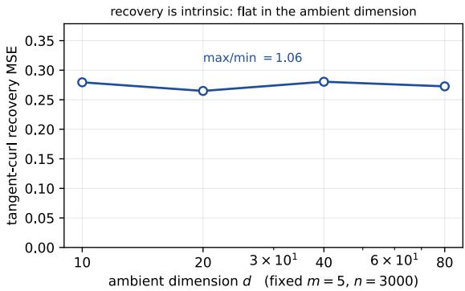  
Figure 2: Recovery is intrinsic. Tangent-curl recovery mean squared error against ambient dimension d at fixed intrinsic $m = 5$ and $n = 3 0 0 0$ , over 300 trials per point with the parametric estimator. The error is flat in $d \colon$ the ratio of largest to smallest across $d \in \{ \bar { 1 } 0 , 2 0 , 4 0 , 8 0 \}$ is close to one. Am bient dimension enters the cost of assembly, not the statistical difficulty of the solenoidal channel.

We do not claim a solution to intrinsic-dimension selection. The audit above assumes a spectral gap between tangent and normal blocks; when that gap is absent the cluster is ill-defined and the method has no principled fallback. Nonlinear intrinsic geometry is discussed in App. K.

## K MANIFOLD CONCENTRATION AND RATE SEPARATION

When the slices concentrate near a curved m-dimensional submanifold rather than an affine sub space, the score acquires a large normal component that encodes support geometry rather than dynamics. Li et al. (2026) show that near a smoothed manifold the score is dominated by the normal projection at scale $\tau _ { \perp }$ , with the tangential component an order smaller. In our setting this produces a clean separation.

Proposition 34 (Rate separation under manifold concentration). In the smoothed-manifold regime with normal width $\tau _ { \bot }  0$ and curvature bounded on the region carrying the mass, the footprint decomposes as $\mathcal { A } _ { \rho } g = \mathcal { A } _ { \rho } ^ { \| } g ^ { \| } - \tau _ { \perp } ^ { - 2 } r \left. g ^ { \perp } , e _ { \perp } \right. + O ( 1 )$ , where r is the signed normal coordinate, $e _ { \perp }$ the outward unit normal, $\mathcal { A } ^ { \parallel }$ the intrinsic Stein operator, and the $O ( 1 )$ term is controlled by the curvature bound and the $C ^ { 1 }$ norm of $g .$ Since $r \overset { \cdot } { = } O ( \tau _ { \perp } )$ on the mass, the normal term has size $\tau _ { \perp } ^ { - 1 }$ and its block of the information is $\Theta ( \tau _ { \perp } ^ { - 2 } )$ , against $\Theta ( 1 )$ tangentially. Hence the normal component of g is identified at rate $\tau _ { \perp } ^ { 2 }$ times the tangential rate, and the solenoidal estimand, which is tangential by Prop. 22, is governed by the intrinsic operator alone.

Sketch. Write $\rho$ in tubular coordinates as a product of an intrinsic density and a Gaussian factor of width $\tau _ { \perp }$ in the normal fibre. Then ∇ log $\rho =$ ∇<sup>∥</sup> log $\rho ^ { \parallel } - \tau _ { 1 } ^ { - 2 } r e _ { \perp } + O ( \mathrm { i } )$ with r the signed normal coordinate, and substituting into $\mathcal { A } _ { \rho } g = \nabla \cdot g + g \cdot \nabla$ log ρ gives the stated split; the curvature bound controls the cross terms at $O ( 1 ) -$ the mean-curvature term from the volume element and the $O ( r )$ curvature distortion of tangential derivatives off the manifold. (For higher codimension read $r e _ { \perp }$ as the normal displacement.) Because $\mathbb { E } [ r ^ { 2 } ] = \tau _ { \perp } ^ { 2 }$ under the normal factor, $\mathbb { E } [ ( \tau _ { \perp } ^ { - 2 } r \langle g ^ { \perp } , e _ { \perp } \rangle ) ^ { 2 } ] \stackrel { - } { = }$ $\tau _ { \perp } ^ { - 2 } \mathbb { E } \langle g ^ { \perp } , e _ { \perp } \rangle ^ { 2 } \colon$ the normal block of the information is $\Theta ( \tau _ { \perp } ^ { - 2 } )$ , which is the claimed separation. Without the factor r it would be $\Theta ( \tau _ { \perp } ^ { - 4 } )$ ). □

Two cautions. The Euclidean diffusion in (1) is not silently projected onto an estimated manifold; a genuinely intrinsic treatment requires intrinsic differential operators and boundary conditions, which we do not develop. And the separation is a statement about scales, not a selection procedure: choosing m and $\tau _ { \perp }$ from data remains open.

Numerically, on a curved benchmark with normal width $\tau _ { \perp }$ swept over 1, $0 . 1 , 0 . 0 3 , 0 . 0 1$ , the withinmanifold and moving-frame readouts separate as predicted. $\mathbf { A t } \ \tau _ { \perp } = 1$ the two are comparable $( 0 . 2 1 0 \pm 0 . 0 3 0$ and $0 . 2 0 1 \pm 0 . 0 8 7$ over five seeds); at $\tau _ { \perp } = 0 . 0 1$ 1 with 10% score error they differ by more than an order of magnitude $( 0 . 9 5 4 \pm 0 . 0 8 5$ against $0 . 0 2 8 \pm 0 . 0 3 0 )$ ), and the score-free weak form gives 0.116 and 0.054 on the same design.

## L STATIONARY SEPARABLE-OU SPECIALIZATION

For a stationary reference with separable space–time structure the propagated operator factorizes, and the temporal channel can be analysed in closed form. Let the reference be an OU process at stationarity, so $\bar { \rho } _ { t } \equiv \bar { \rho } ,$ and let the temporal profile of the perturbation be $\varpi ( t )$ with relaxation rate $\nu .$ Then $\boldsymbol { B } _ { K }$ separates into a spatial factor, which is the stationary Stein operator, and a temporal factor determined by $\varpi .$

This regime is a warning, not a target. With $\bar { \rho } _ { t }$ constant, all snapshot shapes coincide, $r ( x ) \equiv 0$ in Prop. $^ { 6 , }$ and Thm. 8 gives no contraction at all: the entire degree-q gauge $\hat { S } _ { q }$ survives. The separable calculation therefore describes how much temporal information a shared field supplies when the spatial shapes supply none, and it should not be read as a rate for the transient problem.

## L.1 COST OF ESTIMATING THE TEMPORAL SPECTRUM

Take one spatial mode of amplitude θ that is an eigenfunction of the stationary tangent generator with eigenvalue $- \nu .$ From $u _ { 0 } ~ = ~ 0$ , the Duhamel formula (3) gives it the temporal profile $\varpi ( t ; \nu ) \stackrel { \smile } { = } ( 1 - e ^ { - \nu t } ) / \nu ,$ so slice k carries $\theta \varpi ( t _ { k } ; \nu )$ . Suppose ν is itself unknown. With ϖ $\mathrel { \mathop : } = ( \varpi ( t _ { k } ; \nu ) ) _ { k \le K }$ and $\overline { { \omega } } _ { \nu } : = ( \partial _ { \nu } \varpi ( t _ { k } ; \nu ) ) _ { k \leq K }$ in $\mathbf { \mathbb { R } } ^ { K }$ , the joint Fisher information for $( \theta , \nu )$ is proportional to $\begin{array} { r l r } & { } & { \Big ( \begin{array} { c c } { \parallel \varpi \parallel ^ { 2 } } & { \theta \langle \varpi , \varpi _ { \nu } \rangle } \\ { \theta \langle \varpi , \varpi _ { \nu } \rangle } & { \theta ^ { 2 } \parallel \varpi _ { \nu } \parallel ^ { 2 } } \end{array} \Big ) } \end{array}$ , and profiling out ν multiplies the variance of $\widehat { \theta }$ by

$$
\frac { 1 } { 1 - \rho _ { \mathrm { t e m p } } ^ { 2 } } , \qquad \rho _ { \mathrm { t e m p } } : = \frac { \langle \varpi , \varpi _ { \nu } \rangle } { \| \varpi \| \| \varpi _ { \nu } \| } ,\tag{8}
$$

where $\rho _ { \mathrm { t e m p } }$ is the cosine between the profile and its derivative in the parameter $\nu ,$ not in time, and $\rho _ { \mathrm { t e m p } } ^ { 2 }$ is the squared cosine. With $K \geq 2$ distinct times $\varpi _ { \nu } / \varpi$ is not constant in $k ,$ so $\rho _ { \mathrm { t e m p } } ^ { 2 } < 1$ and the inflation is finite for every $\nu t _ { 1 }$ . It is nevertheless large once the mode has relaxed before the first observation: the slices then see it only near its plateau $\theta / \nu ,$ in which amplitude and rate are confounded, and separating them requires the transient, of size $e ^ { - \nu t _ { 1 } }$ . Numerically the inflation tracks $e ^ { 2 \nu t _ { 1 } } / ( \nu t _ { 1 } ) ^ { 2 }$ up to a constant (Fig. 3).

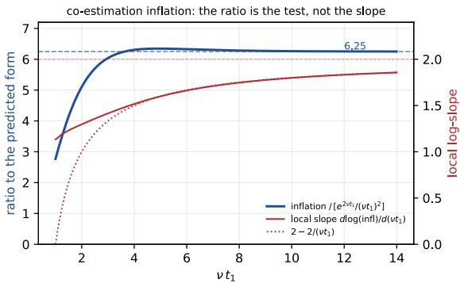  
Figure 3: Cost of profiling the temporal nuisance. Ratio of the exact inflation (8) to the surrogate $e ^ { 2 \nu t _ { 1 } } / ( \nu t _ { 1 } ) ^ { 2 }$ against $\nu t _ { 1 } ,$ , for $K = 5$ observation times with $t _ { k } / t _ { 1 } \in \{ 1 , 1 . 6 , 2 . 4 , 3 . 4 , 5 \}$ : the ratio settles at ≈6.25 for $\nu t _ { 1 } \gtrsim$ 4 while the inflation grows by more than seven orders of magnitude, so the surrogate captures the growth and misses only a constant; the local log-slope approaches 2 only as $2 - 2 / ( \nu t _ { 1 } )$ . The inflation is finite at every $\nu t _ { 1 }$ and large once the mode has relaxed before the first observation.

This is a nuisance-conditioning statement about one scalar, and we state it as such. Earlier drafts of this work claimed a phase transition in which co-estimating the dynamics collapses the polynomial rate to a logarithmic one. That claim was tied to a spectral model this paper no longer uses, and we withdraw it: nothing here establishes a dichotomy, and (8) is a finite factor for each mode, not a change of rate.

## M STRONG-FORM DIAGNOSTICS AND FAILED REPAIRS

## M.1 FIRST-ORDER NUISANCE SENSITIVITY

ProofofProp. 14. Write the strong-form residual at slice k as $r _ { \theta } = \mathcal { A } _ { \rho _ { k } } ^ { \eta } F _ { \theta } - b _ { k } ^ { \eta }$ , where η collects the score and temporal-source nuisances, and the moment as $m _ { p } ( \theta , \eta ) \dot { } = \mathbb { E } [ r _ { \theta } \chi _ { p } ]$ . Then $\partial _ { \eta } m _ { p } =$ $\mathbb { E } [ ( \partial _ { \eta } \mathcal { A } ^ { \eta } F _ { \theta } - \partial _ { \eta } \bar { b } ^ { \eta } ) \chi _ { p } ]$ , which contains $\mathbb { E } [ F _ { \theta } \cdot \delta s \chi _ { p } ]$ and does not vanish at the truth unless $\bar { F } _ { \theta }$ orthogonal to the score perturbation in every probe direction. Solving the moment equations to first order, the induced parameter bias $\mathrm { i s } - \mathcal { H } ^ { - 1 } \dot { \partial _ { \eta } } \bar { m }$ δη with H the profiled Hessian of Prop. 15. Reading out a solenoidal coordinate with curvature λ multiplies the bias by $\lambda ^ { - 1 }$ . Since $\lambda  0$ precisely along near-gauge directions, nuisance error is amplified exactly where the signal is weakest. Exact orthogonalization of this moment is unavailable whenever F has a nonzero solenoidal component, because $\partial _ { \eta } m$ then has a component along the solenoidal block that no reweighting of $\chi _ { p }$ removes.

Proposition 35 (Filtering cannot separate signal from nuisance bias). Let $\begin{array} { r } { \mathcal { H } \ = \ \sum _ { i } \lambda _ { i } v _ { i } v _ { i } ^ { \top } } \end{array}$ be the profiled Hessian in the solenoidal basis and let a spectral filter act diagonally, $\widehat { \theta } _ { \phi } \ =$ $\begin{array} { r } { \sum _ { i } \phi ( \lambda _ { i } ) \lambda _ { i } ^ { - 1 } v _ { i } ^ { \top } z } \end{array}$ , where z is the right-hand side of the profiled normal equations. Then both the signal and the nuisance bias along $v _ { i }$ are multiplied by the same factor $\phi ( \lambda _ { i } )$ , so the ratio ofbias to signal in every coordinate is invariant under ϕ. No diagonalfilter improves it.

Proof. Both the signal contribution and the first-order nuisance bias enter $v _ { i } ^ { \top } z$ linearly and are acted on by the same scalar $\phi ( \lambda _ { i } ) \lambda _ { i } ^ { - 1 }$ ; their ratio is therefore unchanged. Filtering trades variance against bias uniformly, which is useful, but it cannot separate two contributions that occupy the same eigendirection. □

Fig. 4 separates the two failures: the optimization one is a solver choice, the nuisance one is struc tural.

## M.2 THE COEFFICIENT-SIDE CORRECTION IS NOT AN ORTHOGONALIZATION

A natural repair solves $\mathcal { H } ^ { \top } r _ { c } = \ell$ for a Riesz representer and reports $\ell ^ { \top } a - r _ { c } ^ { \top } m ( a , \eta )$ . In the local model $m ( a , \eta ) = \mathcal { H } ( a - a ^ { \star } ) + b ( \eta )$ with $\bar { b } ( \eta ^ { \star } ) = 0$ , the corrected functional is exactly $\ell ^ { \top } a ^ { \star } - r _ { c } ^ { \top } b ( \eta )$ , whose nuisance derivative is $- r _ { c } ^ { \top } D _ { \eta } b -$ generally nonzero. The correction removes first-order sensitivity to the initial coefficient estimate, not to the nuisance, and at a samesample exact moment root it is identically zero. Cross-fitting does not change this derivative. We therefore describe the implemented method as a one-step estimating-equation correction and report its behaviour empirically; we do not claim Neyman orthogonality, and Prop. 14 is not a proof that every orthogonal construction must fail.

Proposition 36 (The targeting window). The correction’s own sampling error is amplified by the same $\lambda ^ { - 1 }$ that amplifies the bias it removes. The corrected estimator improves on the plug-in only when the nuisance error lies below a threshold set by that amplification.

Measured on the planted-curl benchmark over eight paired seeds (Fig. 5), the threshold sits below the practical denoising-score-matching error floor: the targeting study’s plug-in at $\varepsilon = 0 . 1 0$ score error gives $2 . 5 4 7 \pm 1 . 2 0 1$ (the Gauss–Newton arm of Tab. 1, on a different eight-seed set, gives $2 . 4 6 1 { \pm } 0 . 6 8 9 )$ and the targeted variant does not recover the score-free weak form’s performance. The two failure modes — amplitude bias from the temporal log-density value channel, and gradient error from the score — separate cleanly: a probe-wise decomposition attributes 38% to the former against 7% to the latter. Denoising score matching supervises ∇ log $\rho _ { t }$ but not the additive normalization of log $\rho _ { t }$ , which is exactly the quantity (6) eliminates.

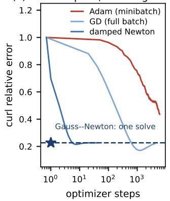

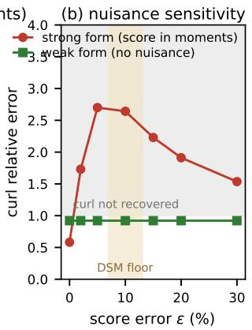

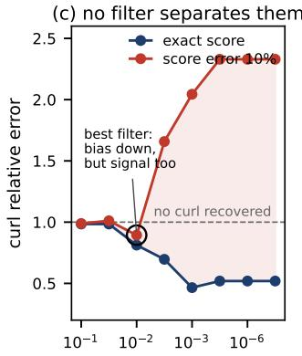  
Figure 4: Repairing the strong form, and the limit of repair. (a) The optimization failure is a solver choice: Gauss–Newton returns the exact minimizer in one linear solve, damped Newton in ${ \sim } 5$ steps, first-order methods in $\mathrm { 1 0 ^ { 3 } { - } 1 0 ^ { 4 } }$ . (b) The nuisance failure is structural: as score error grows the strong form degrades through the “no curl recovered” line while the weak form stays flat, its moments containing no score; the band is the 7–13% error floor of denoising score matching. (c) Filtering cannot rescue it (Prop. 35) — the truncation that best suppresses the nuisance bias suppresses the curl with it.

## M.3 REFERENCE ARMS

With exact score and temporal source, a closed-form linear least squares reaches solenoidal relative error 0.351; a Gauss–Newton solve on the same objective gives $0 . { \bar { 5 } } 3 5 \pm 0 . 1 7 7$ over eight seeds and

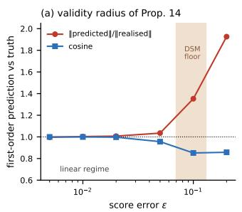

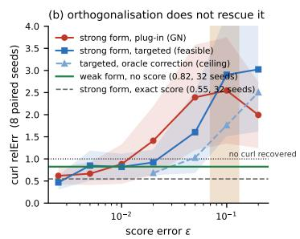

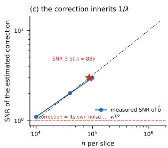  
Figure 5: The targeting window. Correcting the strong-form moment helps only for score error $\varepsilon \lesssim 0 . 0 5$ , and the window shuts below the practical denoising-score-matching floor, so the one-step route cannot rescue the strong form at feasible nuisance quality (Prop. 36). The correction’s own sampling error is amplified by the same $\lambda ^ { - 1 }$ that amplifies the bias it removes.

$0 . 5 4 7 \pm 0 . 1 8 2$ over thirty-two; Adam on the same objective gives $0 . 5 1 0 \pm 0 . 1 2 3$ . Fitting the score alone raises the closed-form arm to 0.862, and fitting both score and source to 2.19. These arms are handed oracle nuisances and are reported as references, not as competitors to the weak form.

## N WEAK-FORM IMPLEMENTATION

## N.1 ASSEMBLY

Probes are tensor frames $\psi _ { e }$ , either monomial $\prod _ { a } x _ { a } ^ { e _ { a } }$ or normalized probabilists’ Hermite $\Pi _ { a } \Psi _ { e _ { a } } ( x _ { a } / \hat { \varsigma } _ { a } )$ , with $\Psi _ { k }$ the univariate case of the basis of §3.1 and ςˆ the pooled per-coordinate standard deviation. Both require gradients and Laplacians; for the Hermite frame $\Psi _ { k } ^ { \prime } = \sqrt { k } \Psi _ { k - 1 }$ gives $\partial _ { a } \psi _ { e } = \hat { \varsigma } _ { a } ^ { - 1 } \sqrt { e _ { a } } \psi _ { e - e _ { a } }$ and $\begin{array} { r } { \Delta { \psi } _ { e } = \sum _ { a } \hat { \varsigma } _ { a } ^ { - 2 } \sqrt { e _ { a } \left( e _ { a } - 1 \right) } \psi _ { e - 2 e _ { a } } , } \end{array}$ , and for the monomial frame $\begin{array} { r } { \Delta x ^ { e } = \sum _ { a } e _ { a } ( e _ { a } - 1 ) x ^ { e - 2 e _ { a } } } \end{array}$ . The Laplacian is what carries the $\sigma ^ { 2 } \Delta \psi$ term of (6); omitting it silently changes the estimand, as §5 quantifies. For degree-two monomial probes $\Delta \psi$ is constant, so the correction is a deterministic offset to the response and leaves the noise model untouched.

The design entry for field basis element $\phi _ { p } ~ = ~ x ^ { e _ { p } } e _ { i _ { p } }$ and probe $\psi _ { j }$ is $\begin{array} { r } { \frac { \Delta _ { k } } { 2 } ( \mathbb { E } _ { k } + \mathbb { E } _ { k + 1 } ) [ \partial _ { i _ { p } } \psi _ { j } } \end{array}$ $x ^ { e _ { p } } ] _ { { \mathrm { ~ } } }$ , an empirical moment of a single monomial; the response is $\begin{array} { r } { \mathbb { E } _ { k + 1 } [ \psi _ { j } ] - \mathbb { E } _ { k } [ \psi _ { j } ] - \frac { \Delta _ { k } } { 2 } \big ( \mathbb { E } _ { k } + } \end{array}$ $\mathbb { E } _ { k + 1 } ) [ \sigma ^ { 2 } \Delta \psi _ { j } ]$ . Both sides are computable from raw samples with no score, density, or pointwise source.

## N.2 FEASIBLE GLS

Prop. 16 gives the covariance at a fixed coefficient vector, and the covariance depends on a through $f _ { a } .$ We use a same-sample unweighted least-squares pilot $\widehat { a } _ { 0 } .$ build $\widehat { V } ( \widehat { a } _ { 0 } )$ , and take one frozen GLS step; the one-step feasible variant that rebuilds $\widehat { V } ( \widehat { a } _ { 1 } )$ is reported separately where it differs. The covariance is regularized by an eigenvalue floor at $1 0 ^ { - 1 0 }$ times the largest eigenvalue before the Cholesky factorization, and singular blocks are handled by the same truncation as the design. The distinction between the exact population covariance algebra and the estimated whitening matters: the finite-sample coverage of a same-sample pilot is not the coverage the fixed-weight proposition describes, and we do not claim it.

## N.3 TRUNCATION, GAUGE EXCLUSION, AND THE QUADRATURE FLOOR

Fig. 6 collects the recovery, calibration and conditioning diagnostics. The whitened design is column-equilibrated before a truncated SVD solve, so the truncation metric is comparable across monomial columns spanning orders of magnitude. The cutoff is selected by split-sample scoring on independently assembled halves, with a tie-break preferring the least truncation among candidates within 15% of the best score: the half-sample fit has a ${ \sqrt { 2 } } .$ -higher noise floor, so its optimum is biased toward over-truncation.

(c) whitened-design spectra

(a) planted-curl OU: recovery

Gauge columns are excluded structurally rather than penalized. For the linear benchmark these are the zero-curvature directions of Prop. 15; for the Hermite construction they are the blockwise kernels of §3.1. A downstream monitor verifies that the fitted field has exactly zero component along the declared gauge.

Because the snapshot times are fixed, increasing n does not remove the trapezoidal bias. The residual of (6) is $O ( \Delta _ { k } ^ { 3 } )$ per interval, but the design entries carry the factor $\Delta _ { k } \bar { / 2 }$ , so the induced bias in the coefficients, and hence in the drift, is $\mathrm { \dot { \it O } } ( \Delta ^ { 2 } )$ . On a two-dimensional OU control with exact moments, the population drift error falls as $\Delta ^ { 2 } - 3 . 0 \times 1 0 ^ { - 2 } , 7 . 5 \times 1 0 ^ { - 3 } , 1 . 9 \times 1 0 ^ { - 3 } , 4 . 6 \times 1 0 ^ { - 4 }$ at gaps 0.2, 0.1, 0.05, 0.025 — confirming the order and showing that the floor is a property of the design, not of the sample size. On the main benchmark the corresponding floor is 0.033 in solenoidal relative error.

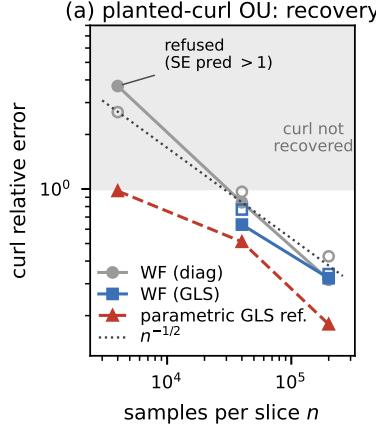

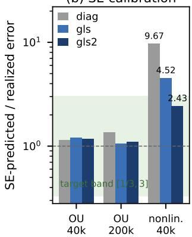

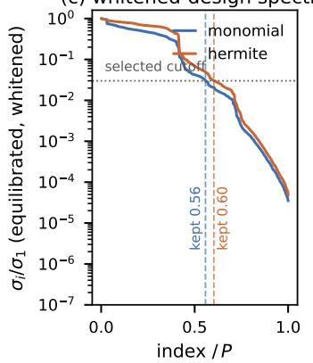  
Figure 6: Recovery, calibration, conditioning. (a) Curl error against $n ,$ filled for realized and open for standard-error predicted; the power check of Prop. 15 refuses the $n { = } 4 \mathrm { k }$ design. (c) Equilibrated spectra of the whitened nonlinear design: Hermite frames retain more of the spectrum and decay more slowly, which is where their advantage lies. Panel (b) is retained as a record of a withdrawn claim and should not be read as a current result: its $9 . 7 \times$ calibration gap was measured on the lineage-tracked design of App. R, where the slices are not independent, and with independent slices the diagonal predictor is calibrated at 1.00× with nothing to repair (App. Y). Panels (a) and (c) were computed under the velocity convention and are qualitatively unchanged under the correction, but their absolute values are those of $\mathrm { { A p p . ~ Y ^ { \prime } s } }$ first column.

## O A SNAPSHOT-ONLY FINITE-BASIS ERROR BOUND

Thm. 12 is a statement about the tangent experiment and its degreewise benchmark, under unproved assumptions. This appendix gives a complementary guarantee of a different kind: finite sample, snapshot only, no Gaussian-reference or spectral hypothesis, for the estimator actually implemented. It is much weaker than the oracle rate — it says nothing about a nonparametric exponent — but it is unconditional in the assumptions the rate needs, and it makes the quadrature obstruction explicit.

Fix the probe set, the field basis, and a retained coefficient subspace with orthonormal coordinates, and restrict $\widehat { X }$ to that subspace. Write $X = \mathbb { E } \widehat { X } , b = \mathbb { E } \widehat { b }$ , and $r = b - X a ^ { \star }$ for the population residual of a reference coefficient vector $a ^ { \star }$

Theorem 37 (Snapshot-only finite-basis error bound). Let $a ^ { \star }$ and the whitener W be deterministic, and let $\alpha : = s _ { \operatorname* { m i n } } ( W X ) > 0$ on the retained subspace. Suppose the required second moments are finite and $\operatorname* { P r } ( \| W ( { \widehat { X } } - X ) \| _ { \mathrm { o p } } > \alpha / 2 ) \leq \eta .$ . Thenfor the unregularized solution $\widehat { a } _ { 0 } o f \operatorname* { m i n } _ { a } \| W ( \widehat { b } -$ ${ \widehat { X } } a ) \parallel ^ { 2 }$ and any linear readout $C ,$ with probability at least $1 - \eta - \delta$ and $0 < \delta < 1$

$$
\left\| C ( { \widehat { a } } _ { 0 } - a ^ { \star } ) \right\| \leq { \frac { 2 \| C \| _ { \mathrm { o p } } } { \alpha } } \left( \| W r \| + { \sqrt { \frac { \mathrm { t r } \left( W V ( a ^ { \star } ) W ^ { \top } \right) } { \delta } } } \right) .\tag{9}
$$

One may take $\eta \leq 4 \mathbb { E } \| W ( \widehat { X } - X ) \| _ { F } ^ { 2 } / \alpha ^ { 2 }$ . The statement holds conditionally on an independent pilotfixing W and the retained subspace, provided the conditional hypotheses hold.

Proof. Write $E : = W ( { \widehat { X } } - X )$ and $\varepsilon : = W ( \widehat { b } - b )$ , and let $M : = W X$ . On the event $\varepsilon : =$ $\{ \| E \| _ { \mathrm { o p } } \leq \alpha / 2 \}$ , which has probability at least $1 - \eta$ , Weyl’s inequality gives $s _ { \mathrm { m i n } } ( M + E ) \geq$ $\bar { \alpha } - \| \hat { E } \| _ { \mathrm { o p } } \geq \bar { \alpha ^ { } / 2 } > 0$ , so $M + E$ has full column rank on the retained subspace, the least-squares solution is unique, $\widehat { a } _ { 0 } = ( M + E ) ^ { + } W \widehat { b } ,$ and $( M + E ) ^ { + } ( M + E ) = I$ there with $\| ( M + E ) ^ { + } \| _ { \mathrm { o p } } \leq$ $2 / \alpha$ . The product $( M + E ) \widehat { a } _ { 0 }$ is only the projection of $W b$ onto the range of $M + E ,$ , so we do not equate it with $W \widehat { b } ;$ instead, since $M + E = W { \widehat { X } }$

$$
\widehat { a } _ { 0 } - a ^ { \star } = ( M + E ) ^ { + } \bigl ( W \widehat { b } - ( M + E ) a ^ { \star } \bigr ) , \qquad W \widehat { b } - ( M + E ) a ^ { \star } = W ( \widehat { b } - \widehat { X } a ^ { \star } ) = W r + Z ,
$$

with $Z : = W ( \widehat { b } - \widehat { X } a ^ { \star } ) - W r = \varepsilon - E a ^ { \star }$ , using $W b = W r + M a ^ { \star }$ . Hence, on $\mathcal { E } , \| C ( \widehat { a } _ { 0 } - a ^ { \star } ) \| \leq$ $\frac { 2 \| C \| _ { \mathrm { o p } } } { \alpha } ( \| W r \| + \| Z \| )$ . Since $\mathbb { E } [ \widehat { b } - \widehat { X } a ^ { \star } ] = b - X a ^ { \star } = r ,$ Z is the centred whitened empirical moment at $a ^ { \star }$ , with mean zero and covariance $W V ( a ^ { \star } ) W ^ { \top }$ , V the block-tridiagonal covariance of Prop. 16. Chebyshev’s inequality in the form $\operatorname* { P r } ( \| Z \| ^ { 2 } > \operatorname { t r } \operatorname { C o v } ( Z ) / \delta ) \leq \delta$ for mean-zero $Z$ gives (9) on the intersection, of probability at least $1 - \eta - \delta$ . For the bound on $\eta _ { : }$ Markov’s inequality applied to $\| E \| _ { \mathrm { o p } } ^ { 2 } \leq \| E \| _ { F } ^ { 2 }$ gives $\mathrm { P r } \overset { \cdot } { ( } \| E \| _ { \mathrm { o p } } > \alpha / 2 \overset { \cdot } { ) } \leq 4 \mathbb { E } \| E \| _ { F } ^ { 2 } / \alpha ^ { 2 }$ □

Three consequences deserve statement, because they are what the theorem is for.

Sampling error and quadrature bias are different terms. The second bracket in (9) is $O ( n _ { \operatorname* { m i n } } ^ { - 1 / 2 } )$ through ${ \bar { V } } ( a ^ { \star } ) ;$ the first, $\| W r \|$ , is not stochastic at all. At fixed snapshot times r is the whitened trapezoidal residual, of order $\ddot { \Delta } _ { \mathrm { m a x } } ^ { 3 }$ in moment scale by (6), and no amount of data removes it. The design entries carry the factor $\Delta _ { k } / 2$ while the whitener does not shrink with the gaps (the moment noise of Prop. 16 contains the gap-independent term $\mp \Psi )$ , so α scales with the gaps and, for comparable gaps, the amplified bias $\| \ b { W r } \| \big / \alpha$ is $O ( \Delta _ { \mathrm { m a x } } ^ { 2 } )$ in coefficient scale — the formal version of the $\Delta ^ { \frac { \pi } { 2 } }$ floor measured in App. N.

Both terms are amplified by $1 / \alpha .$ . The same near-gauge ill-conditioning that governs the oracle spectrum governs the finite-basis bound, which is why gauge exclusion — removing directions with $\alpha = 0$ rather than penalizing them — is not a numerical convenience.

The population target need not be the truth. With W fixed the population least-squares target is $( W \bar { X } ) ^ { + } W b ,$ which equals $a ^ { \star }$ only when $W r \perp$ range(WX). Consistency for the drift along refining grids therefore requires the amplified bias $\| W r \| / \dot { \alpha } \to 0$ as well as design stability; increasing n alone does not deliver it. A readout in a moment-null direction is not identified at all unless $C$ annihilates that null space, and excluding such a direction is a modelling convention rather than recovery of its coefficient.

Two scope limits. The theorem needs $\alpha > 0$ on the retained subspace, and empirically small singular values indicate weak identification, not a proved structural gauge: the exclusion in ${ \mathcal A } _ { \mathrm { v i s } }$ is certified by Prop. 15 only in the centered-Gaussian linear case, so for the frame constructions the retained subspace is a modelling choice. And the field metric must be specified — orthonormality of coordinates is imposed through a field Gram matrix under a chosen evaluation measure, not assumed for arbitrary features.

## P MEASUREMENT NOISE

Suppose $Y = X + \varepsilon { \mathrm { ~ w i t h ~ } } \varepsilon$ independent of $X ,$ , mean zero and covariance $\Sigma _ { \varepsilon } .$ . Independence, or at least zero cross-covariance, is required: mean-zero noise alone does not give $\mathbb { E } [ Y Y ^ { \top } ] =$ $\mathbb { E } [ X X ^ { \top } ] + \Sigma _ { \varepsilon }$

It is tempting to argue that the antisymmetric readout is immune, because shifting a covariance by cI leaves $G { \breve { \Sigma } } - \Sigma { \breve { G } }$ unchanged. That argument is incomplete. For $H = S + G$ the same shift moves the drift moment by 2cS, so an uncorrected symmetric block can bias a jointly profiled estimate of G. The effect is real at the population level: with

$$
H = \left( { \begin{array} { c c } { - 1 } & { - 0 . 6 } \\ { 0 . 6 } & { - 2 } \end{array} } \right) , \quad \Sigma _ { 0 } = \left( { \begin{array} { c c } { 2 } & { 0 . 3 } \\ { 0 . 3 } & { 0 . 5 } \end{array} } \right) , \quad D = 0 . 4 I ,
$$

regressing exact diffusion-corrected covariance derivatives on $\begin{array} { r } { H \Sigma + \Sigma H ^ { \top } \mathrm { ~ a t ~ } t = 0 . 1 , 0 . 3 , 0 . 7 , 1 } \end{array}$ recovers skew coefficient 0.600000 with clean covariances and 0.441094 after adding 0.2I to the design covariances without deconvolution — a 26% bias with no sampling noise at all. We therefore do not claim universal immunity (Fig. 7). Moment deconvolution of the design, using a known or separately estimated $\Sigma _ { \varepsilon }$ , restores the clean value; without it, the symmetric nuisance reaches the solenoidal readout.

A transparent second-moment variant of the estimator isolates the design perturbation (clean-data curl 0.849, against 0.844 and 0.636 for the full pipeline at diagonal and GLS weighting). Under isotropic contamination the curl readout degrades from 0.8494 clean to 1.145 naive, and deconvolution does not repair it (1.1501); under a curl-aligned contamination the same numbers are 0.8494, 0.9345 and 1.0274. What deconvolution does repair is the symmetric channel, where the distance to the truth falls from 0.2823 to 0.1134. This is the honest version of the earlier claim: the fix is exact at second moments on the block where the bias lands, and the solenoidal channel is not protected.

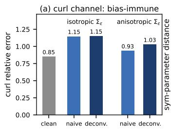

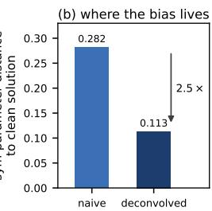  
Figure 7: Measurement noise. The symmetric channel absorbs the constant design shift and its residual bias is removed by design deconvolution; the solenoidal channel is not exactly immune, contrary to an earlier version of this claim (App. Y). Isotropic contamination is the adverse case: deconvolution of the design covariances repairs the symmetric block without restoring the curl readout.

## Q TARGET-AWARE STABILIZATION

Proposition 38 (Selection misalignment). In the whitened linear experiment with ridge penalty, and with risks averaged over the signs ofthe coordinates ofthe true coefficient vector in the eigenbasis of the profiled Hessian, the regularization strengths minimizing moment-prediction risk and the risk of a linearfunctional ofthefield differ in general; they coincide when thefunctional’s squared weights are proportional to the curvatures or the coordinate signal is constant across the spectrum. For the solenoidal readout the gap is governed by the near-gauge spectrum.

ProofofProp. 38. Write the whitened experiment as $y = X a ^ { \star } + \varepsilon$ with $\varepsilon \sim \mathcal { N } ( 0 , I )$ , let $\varkappa : =$ $\begin{array} { r } { X ^ { \top } \dot { X } = \sum _ { i } \lambda _ { i } v _ { i } v _ { i } ^ { \top } } \end{array}$ , and write the ridge path as $\widehat { \boldsymbol { a } } _ { \zeta } = ( \mathcal { H } + \zeta I ) ^ { - 1 } \boldsymbol { X } ^ { \top } \boldsymbol { y } = ( \mathcal { H } + \zeta I ) ^ { - 1 } \mathcal { \dot { H } } \boldsymbol { a } ^ { \star } + ( \mathcal { H } +$ $\zeta I ) ^ { - 1 } \xi$ with $\xi : = X ^ { \top } \varepsilon \sim { \mathcal { N } } ( 0 , { \mathcal { H } } )$ . In the coordinates $a _ { i } ^ { \star } : = v _ { i } ^ { \top } a ^ { \star }$ and $\ell _ { i } : = v _ { i } ^ { \top } \ell .$ coordinate i has $\mathrm { b i a s } - \zeta a _ { i } ^ { \star } / ( \lambda _ { i } + \zeta )$ and variance $\bar { \lambda _ { i } } / ( \lambda _ { i } + \zeta ) ^ { 2 }$ , independently across i. The moment-prediction risk is

$$
\mathbb { E } \| X ( \widehat { a } _ { \zeta } - a ^ { \star } ) \| ^ { 2 } = \sum _ { i } \frac { \zeta ^ { 2 } \lambda _ { i } ( a _ { i } ^ { \star } ) ^ { 2 } + \lambda _ { i } ^ { 2 } } { ( \lambda _ { i } + \zeta ) ^ { 2 } } ,
$$

which has no cross terms. The risk of $\ell ^ { \top }$ a is $\begin{array} { r } { \left( \sum _ { i } \ell _ { i } \zeta a _ { i } ^ { \star } / ( \lambda _ { i } + \zeta ) \right) ^ { 2 } + \sum _ { i } \ell _ { i } ^ { 2 } \lambda _ { i } / ( \lambda _ { i } + \zeta ) ^ { 2 } } \end{array}$ ; averaging over independent signs of the $a _ { i } ^ { \star }$ , which leaves the moment risk unchanged, removes the cross terms and gives $\textstyle \sum _ { i } \ell _ { i } ^ { 2 } ( \zeta ^ { 2 } ( a _ { i } ^ { \star } ) ^ { 2 } + \lambda _ { i } ) / ( \lambda _ { i } + \zeta ) ^ { 2 }$ . Since $\begin{array} { r } { \frac { d } { d \zeta } \frac { \zeta ^ { 2 } c ^ { 2 } + \lambda } { ( \lambda + \zeta ) ^ { 2 } } = \frac { 2 \lambda ( \zeta c ^ { 2 } - 1 ) } { ( \lambda + \zeta ) ^ { 3 } } } \end{array}$ , the two stationarity conditions are

$$
\sum _ { i } w _ { i } { \frac { \lambda _ { i } { \big ( } \zeta ( a _ { i } ^ { \star } ) ^ { 2 } - 1 { \big ) } } { ( \lambda _ { i } + \zeta ) ^ { 3 } } } = 0 , \qquad w _ { i } = \lambda _ { i } ( \mathrm { m o m e n t } ) , \quad w _ { i } = \ell _ { i } ^ { 2 } ( \mathrm { f u n c t i o n a l } ) .
$$

If $( a _ { i } ^ { \star } ) ^ { 2 } \equiv c ^ { 2 }$ both are solved by $\zeta = 1 / c ^ { 2 } ;$ otherwise the two conditions weight the same terms differently, and their roots differ unless $\ell _ { i } ^ { 2 } \propto \lambda _ { i }$ . For the solenoidal readout ℓ is supported on the near-gauge coordinates where $\lambda _ { i }$ is smallest, which the moment criterion downweights by $\lambda _ { i } ,$ , so the two criteria disagree most exactly where the estimand lives. □

Because whitening makes the response law exactly $\mathcal { N } ( 0 , I )$ , target risk can be estimated without ground truth: perturb the whitened response under its known law, re-run the estimator along its regularization path, and average the resulting functional deviations. The rule needs only that the estimand be a linear functional of the field. Its failure mode is a plain estimate that is already near-unbiased, in which case the perturbation estimate is dominated by variance and the selected ζ collapses to zero; on the main benchmark split-sample selection picks $\zeta = 0$ on every seed, and a fixed ridge at $\zeta = 0 . 0 3$ outperforms the selected value. We report the rule as correctly motivated and unreliable in this regime.

## R SINGLE SNAPSHOTS AND LAGRANGIAN INFORMATION

## R.1 ONE SNAPSHOT

With $K = 1$ the gauge is the full ker $\mathcal { A } _ { \rho _ { t _ { 1 } } }$ and Prop. 6 gives $r ( x ) \equiv 0 \colon$ : nothing about the circulation is identified. A single snapshot constrains only the gradient part, and any reported circulation is a property of the prior, not of the data.

## R.2 LINEAGE-TRACKED OBSERVATION

Autonomy is one way to couple slices; particle identity is another, and it is a different observation model with different statistics. If the same particles are observed at every time, the slices are deterministic images of one another and the independence hypothesis of Prop. 16 fails badly.

Our nonlinear benchmark is of exactly this type, and we report it here rather than in $\ S 5$ for that reason. The system is a deterministic ODE $( \sigma = 0 )$ in $d = 6$ with a planted degree-three solenoidal field, $F ( x ) \stackrel { . } { = } - 0 . 7 x + ( 3 c x _ { 1 } x _ { 2 } ^ { 2 } , - c x _ { 2 } ^ { 3 } , 0 , . . . )$ with $c = 0 . 2$ , integrated by RK4 from a Gaussian initial ensemble to five closely spaced times. Because $\sigma = 0$ the continuity identity is exact and the diffusion correction of §4.1 does not apply.

Measuring the true moment-residual covariance over 250 independent replications at $n \ : = \ : 1 5 0 0$ against the surrogates the estimator uses:

<table><tr><td></td><td>tr V</td><td>ratio to truth</td></tr><tr><td>true Monte-Carlo covariance</td><td> $2 . 1 1 \times 1 0 ^ { - 3 }$ </td><td></td></tr><tr><td>block-tridiagonal surrogate</td><td> $1 . 0 8 \times 1 0 ^ { - 1 }$ </td><td> $5 1 . 3 \times$ </td></tr><tr><td>diagonal surrogate</td><td> $1 . 0 8 \times 1 0 ^ { - 1 }$ </td><td> $5 1 . 3 \times$ </td></tr></table>

Moreover 54.5% of the true covariance mass lies in non-adjacent blocks, which both surrogates set to zero by construction. That the two surrogates agree to four digits is itself diagnostic: with coupled particles the off-diagonal $- C _ { k + 1 }$ correction is negligible against a covariance dominated by cross-slice terms neither model contains.

The consequences for recovery are large. Under the coupled design the estimator attains curlchannel error 0.4027 with diagonal weights and 0.2095 with GLS, with a null-circulation control at 0.038 and standard-error ratios of $9 . 6 7 \times$ and 4.52×. Re-drawing each slice independently — the observation model of §2 — gives 1.6455 and 1.0142 respectively, against a no-information level of 1.0, with a null control at 0.1835 and standard-error ratios of $1 . 0 0 \times$ and 1.09×.

Three readings follow. The recovery was a consequence of particle identity, not of the snapshot moments. The apparent $9 . 6 7 \times$ conservatism of the diagonal predictor was not a pathology to be fixed: with independent slices that predictor is calibrated, and its own power check, which prescribed 6.7M samples per slice, was correct. And the lineage-tracked design is a legitimate and arguably more realistic observation model — it is what pairing or lineage barcoding supplies — but it belongs to this appendix, because Lagrangian information is precisely what $\ S 2$ sets out to do without. An estimator for it would need a covariance model containing the cross-slice blocks measured above; we do not develop one.

## S NUMERICAL VERIFICATION OF THE ANALYTIC IDENTITIES

Each identity below is checked by an executable entry point listed in App. Z; these are machineprecision checks of the stated algebra, not validation of the rate theorem.

Reference-slice algebra. dim $S _ { q } = m D _ { q - 1 } - D _ { q }$ from Lem. 24 is checked against explicit kernels of $\mathbf { \nabla } \mathcal { A } _ { \rho _ { \star } } | _ { W _ { q } }$ for $m = 2 , \ldots , 6$ and $q \leq 8 ;$ surjectivity is checked by rank. The linear characterization of Lem. 26 is checked by sampling random $\Sigma$ and verifying $\| \mathcal { A } _ { \rho } \overset { \cdot } { ( } \Sigma N x ) \| = 0$ to machine precision for antisymmetric N, and $\neq 0$ otherwise.

Gauge contraction. The $q = 2$ commutant is computed by explicit nullspace sweep over $K$ for $m =$ $3 , \ldots , 6$ : it has full dimension $\binom m 2$ at $K = 1$ and collapses to {0} already at $K = \bar { 2 }$ , confirming that the degree-two block is cleared well before the uniform threshold. The shape-richness condition of Thm. 8 is checked separately by sampling x and computing r $\operatorname { a n k } [ x | \Xi _ { 1 } x | \cdots | \Xi _ { r } x ]$ : it is deficient at $r = m - 2$ and full at $r = m - 1$ , i.e. exactly at $K = m$ . The two gates are distinct and the paper should not be read as claiming otherwise.

Propagated spectrum. The first-moment law $\bar { \mu } _ { q } \ \asymp \ K / q$ is checked by assembling $\boldsymbol { B } _ { K }$ on the reference path and computing tr $\mathcal { I } _ { \mathrm { s o l } , q } / r _ { q }$ across $q ;$ the fitted inverse-trace powers are 3.20, 4.08 and 4.76 at $m = 3 , 4 , 5$ against the predicted $m _ { : }$ and the fitted lower-tail exponent lies in [1.6, 2.2].

Estimator assembly. The Laplacian tables of $\mathsf { A p p }$ . N are checked against central finite differences for both frames, with maximum deviation $8 \times 1 0 ^ { - 8 }$ . The block-tridiagonal covariance of Prop. 16 is checked against a 1500-replication Monte-Carlo covariance on an independent-slice design, agreeing to 4.6% in relative Frobenius norm with exactly zero non-adjacent blocks; the same check on the lineage-tracked design fails by the factor reported in App. R, which is how that defect was found.

## T HOW THE CURL IS PARAMETERIZED

The solenoidal component can be carried by several parameterizations of the same field class; the antisymmetric potential of Prop. 25 is the ρ-weighted analogue of the divergence-free parameterization of Richter-Powell et al. (2022). They differ enormously in conditioning, and — because first-order optimization is sensitive to conditioning while an exact solve is not — in how close a descent method gets to the exact minimizer. Five variants on the linear benchmark, five seeds each (Tab. 3), against Gauss–Newton on the same objective:

Table 3: Curl parameterizations. Solenoidal relative error after 8000 descent steps; “reached” counts seeds whose loss came within 2.7% of the Gauss–Newton value. Conditioning is of the whitened design in that parameterization.
<table><tr><td>parameterization</td><td>params</td><td>rank</td><td>cond.</td><td>error</td><td>reached</td></tr><tr><td>antisymmetric potential</td><td>5226</td><td>144</td><td> $3 . 1 \times 1 0 ^ { 4 }$ </td><td> $0 . 5 4 2 \pm 0 . 1 0 5$ </td><td> $4 / 5$ </td></tr><tr><td>generator frame</td><td>144</td><td>144</td><td> $2 . 7 \times 1 0 ^ { 4 }$ </td><td> $0 . 5 2 1 \pm 0 . 0 9 2$ </td><td> $5 / 5$ </td></tr><tr><td>+ gauge reduction</td><td>116</td><td>116</td><td> $1 . 0 \times 1 0 ^ { 3 }$ </td><td> $0 . 5 2 1 \pm 0 . 0 9 2$ </td><td> $5 / 5$ </td></tr><tr><td>+ audit preconditioning</td><td>116</td><td>116</td><td>1.0</td><td> $0 . 9 6 3 \pm 0 . 3 8 5$ </td><td> $2 / 5$ </td></tr><tr><td>+ tangent-only support</td><td>84</td><td>84</td><td> $9 . 2 \times 1 0 ^ { 2 }$ </td><td> $\mathbf { 0 . 5 2 0 \pm 0 . 0 8 1 }$ </td><td> $5 / 5$ </td></tr><tr><td>Gauss-Newton (exact solve)</td><td></td><td></td><td></td><td> $0 . 4 7 9 \pm 0 . 1 9 4$ </td><td></td></tr></table>

Three readings. Over-parameterization is not free: the antisymmetric potential carries 5226 parameters for a design of rank 144, and is the only variant that fails to reach the exact minimizer on every seed. Gauge reduction buys a factor of 26 in conditioning at no cost in error, which is the quantitative case for excluding gauge columns rather than penalizing them. And perfect conditioning is not the objective: audit preconditioning drives the condition number to 1.000 and makes the result worse, because it whitens the parameterization rather than the residual, destroying the correspondence between descent geometry and the estimand. The exact solve is insensitive to all of this, which is the argument for using one.

Under a 10% score error the ordering changes and the margins compress: the antisymmetric potential gives 2.470, the generator frame 2.468, Gauss–Newton 2.397, and tangent-only support 1.019.

Restricting the support to the audit-identified tangent block is the only variant that retains a meaningful advantage once the nuisance is corrupted, which is consistent with Prop. 22: the normal-block coordinates it removes were never identified, so they contribute variance and nuisance sensitivity without signal.

## U CONDITIONING OF THE LINEAR DESIGN

The Schur complement of Prop. 15 is computable before any field is fitted, and its spectrum is the design’s own account of which solenoidal directions are visible. On the $d = 1 2 , m = 4$ benchmark the six tangent antisymmetric directions carry eigenvalues $\{ 5 . 1 , 7 . 8 , 1 4 . 0 , 2 3 . 7 , 4 0 . 8 , 7 1 . 4 \} \times 1 0 ^ { - 3 }$ a spread of 14× between the best- and worst-determined direction within a single design. Recovery error is not uniform across the curl; it is concentrated in the small end of this spectrum, which is what makes a scalar readout of “curl error” a summary rather than a diagnosis.

Adding snapshots helps, but with sharply diminishing returns, and the gain is in the weakest direction rather than the strongest:
<table><tr><td></td><td> $K = 3$ </td><td> $K = 5$ </td><td> $K = 9$ </td></tr><tr><td>smallest Schur eigenvalue</td><td> $1 . 7 9 \times 1 0 ^ { - 3 }$ </td><td> $3 . 7 7 \times 1 0 ^ { - 3 }$ </td><td> $3 . 8 5 \times 1 0 ^ { - 3 }$ </td></tr><tr><td>largest Schur eigenvalue</td><td> $2 . 3 8 \times 1 0 ^ { - 2 }$ </td><td> $5 . 4 7 \times 1 0 ^ { - 2 }$ </td><td> $5 . 6 5 \times 1 0 ^ { - 2 }$ </td></tr><tr><td>pinned-direction eigenvalue</td><td> $7 . 5 6 \times 1 0 ^ { - 2 }$ </td><td> $7 . 0 5 \times 1 0 ^ { - 2 }$ </td><td> $6 . 8 2 \times 1 0 ^ { - 2 }$ </td></tr></table>

Going from three to five snapshots roughly doubles the weakest eigenvalue; going from five to nine adds 2%. This is Thm. 8 seen numerically: once $K \geq m$ the polynomial gauge is gone and further snapshots buy only the shape diversity they happen to add, which for a fixed reference trajectory saturates quickly. The pinned direction, fixed by a constraint rather than by the data, is flat as expected and serves as a control.

A composite check, run under the velocity convention of App. Y, closes the loop between the audit and the fit. Predicting the solenoidal error from the Schur spectrum and the quadrature residual alone gives 0.6326 against a realized 0.6323 at $n = 4 0 \mathrm { k \Omega }$ , a consistency of 0.001; the cosine between the estimated and planted curl rises from 0.825 at n = 40k to 0.950 at $n = 2 0 0 \mathrm { { k } } ;$ ; and the gauge monitor returns exactly 0, confirming the excluded directions carry no estimate. A gradient-head control on the same data, handed the true generator, returns 0.2196 — the residual is genuinely in the solenoidal channel and not an artifact of the gradient fit.

## V ADDITIONAL ROBUSTNESS AND NEGATIVE RESULTS

Frames. Monomial and Hermite frames recover comparably at $n = 4 0 \mathbf { k }$ (full-field 0.062 against 0.067, curl channel 0.210 against 0.226); the Hermite frame mainly improves conditioning, with reciprocal condition number 0.03 against 0.01 at $n = 1 0 0 \mathrm { k \Omega }$

Degree ladder. At $\textit { m } = \textit { 6 }$ with a planted degree-three field, fitting degrees one through five gives 0.896, 0.935, 0.535, 2.513 and an infeasible solve. Under-specification is graceful; overspecification is not, and the failure is conditioning rather than variance.

Representation scaling. P grows as 504, 5,460, 81,900, 1,171,300 at $d = 6 , 1 2 , 2 5$ , 50 for the ambient degree-three construction. The binding cost is the $O ( P ^ { 3 } )$ whitening Cholesky, not enumeration. A neural field at $d = 2 5$ reaches 0.989, essentially the no-information level.

Hard latent regime. With $d _ { \mathrm { l a t e n t } } = 8 , n = 3 0 0 0$ and four snapshots, latent-space cosine similarity is 0.83 and 0.86 on two seeds, against 0.51 and 0.48 for the earlier strong-form pipeline on the same data.

Optimization. Holding whitened moments and representation fixed, first-order descent on the same objective continues to reduce moment loss after the solenoidal error has turned over; over a long trace the final-minus-best gap is +0.040 with standard error $0 . 0 1 5 \ : ( t = + 2 . 6 8$ , six seeds). We report this as near-null overfitting only. An earlier draft attributed it to the fitted field leaking into the exact design gauge; that attribution was wrong. For Euclidean descent on $\| A a - z \| ^ { 2 }$ every update lies in $\mathrm { r a n g e } ( A ^ { \top } )$ , so $P _ { \ker A } a _ { r + 1 } = P _ { \ker A } a _ { \scriptscriptstyle 1 }$ and an exact design-null component cannot move. The monitor that appeared to grow was measuring a population gauge against a fitted design whose gauge columns had been excluded in the other arm, so the two procedures did not share a feasible model. The corrected comparison — projected descent against the direct solve on identical columns, initialization, whitening and penalty — shows the exact solve avoiding the failure by never building those columns, and shows no motion into the design kernel.

## W HIDDEN-STATE STRESS TESTS

Asm. 3 is what converts an untestable model into a testable one, so it deserves adversarial testing. Both diagnostics below are exact-moment population calculations at the benchmark parameters $\nu =$ $\sigma ^ { 2 } = 1$ : there is no sampling and no quadrature error, so any residual is misspecification and nothing else. They are population contrasts, not calibrated hypothesis tests.

## W.1 MISSPECIFICATION THAT IS DETECTABLE

Take the autonomous two-dimensional system $H = - I { + } 1 . 5 J$ with $\begin{array} { r } { J = \left( \begin{array} { l l } { 0 \ { - } 1 } \\ { 1 } & { 0 } \end{array} \right) } \end{array}$ , isotropic diffusion $\sigma ^ { 2 } I ,$ and $\Sigma _ { 0 } = \mathrm { d i a g } ( 2 , 0 . 7 )$ , and retain only the first coordinate. Fitting the exact variance derivative on 101 times in $[ 0 , 2 ]$ to the scalar autonomous linear model $\dot { v } = 2 \bar { a { v } } + 2 \sigma ^ { 2 }$ gives $\widehat { a } = - 1$ .1083 with relative diffusion-corrected residual 0.1204, while fitting the full two-dimensional covariance derivatives gives residual $3 . 8 \times 1 0 ^ { - 1 6 }$

The projection is therefore visibly inadequate: the shape of the observed variance path is incompatible with any autonomous scalar linear drift, and the diagnostic says so without reference to the truth. This is the favourable case, and it is the one a practitioner hopes for. Note its scope: it rejects the scalar linear model, not autonomy against every nonlinear scalar drift.

## W.2 MISSPECIFICATION THAT IS NOT

Now start the same system at its stationary covariance. Every snapshot is then exactly compatible with the zero-rotation drift $- x \boldsymbol { \cdot }$ the endpoint-moment residual against that drift is 0 to machine precision, at every time. An analyst fitting autonomous models to these marginals would accept a detailed-balance explanation of a system that is in fact circulating at $\omega = 1 . 5$

The marginals are not merely uninformative, they are actively misleading, and nothing in the snapshot experiment reveals it. The projected process is not Markov: its lag autocovariance oscillates, changing sign three times over [0, 6], whereas a scalar Ornstein–Uhlenbeck autocovariance is a decaying exponential with no sign change at all. Paired full-state measurements would separate the two models immediately — their lag-0.3 cross-covariances differ by 0.4675 in Frobenius norm — but such measurements are exactly the Lagrangian information §2 sets out to do without.

This is the sharp form of the caution in §2.2, and it connects to two results already in the paper. It is the extreme case of Obs. 17: stationary shapes give $r ( x ) \equiv 0$ in Prop. 6, so Thm. 8 yields no contraction whatsoever and the entire gauge survives, which is also why App. L is a warning rather than a target. Enforcing autonomy on an inadequate representation does not here manufacture spurious circulation; it does something quieter and worse, returning the confident answer zero.

Fig. 8 shows the two mechanisms. A sampling-calibrated misspecification test and large-scale nonlinear stress studies remain future work; neither is represented by these population checks.

We therefore do not claim a calibrated test for representation adequacy. What the paper offers is narrower: shape movement is necessary for any recovery at all, is computable in advance from second moments by Prop. 15, and its absence is detectable even when the inadequacy of the representation is not.

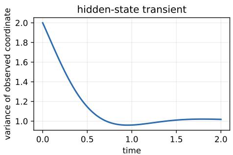

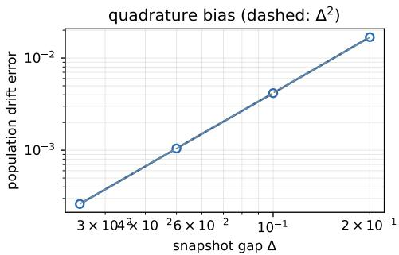  
Figure 8: Controlled diagnostics. Left: transient variance of the projected coordinate in the hiddenstate example, whose shape no autonomous scalar linear drift reproduces. Right: population error of the diffusion-corrected weak fit as the time grid is refined, against a $\Delta ^ { 2 }$ reference; sampling alone cannot remove the quadrature bias at fixed gap (Thm. 37).

## X SCOPE: AUTONOMY, DIFFUSION, AND DESIGN SIZE

## X.1 AUTONOMY IS A PROPERTY OF THE REPRESENTATION

Asm. 3 is not the biological claim that a regulatory program is fixed. Suppose the observed coordinates obey $d X _ { t } = G ( X _ { t } , Z _ { t } ) d t + \sqrt { 2 \sigma ^ { 2 } } d W _ { t }$ , with $Z _ { t }$ latent regulatory state — chromatin, protein levels, signalling context — evolving in any way. If $Z _ { t }$ is part of the modelled state, the enlarged system is autonomous however much regulation changes along Z. If it is omitted, Ito’s formula givesˆ $\begin{array} { r } { \frac { \dot { d } } { d t } \mathbb { E } [ \psi ( X _ { t } ) ] = \mathbb { E } [ F _ { t } ( X _ { t } ) \cdot \nabla \psi ( X _ { t } ) + \overleftarrow { \sigma } ^ { 2 } \Delta \psi ( X _ { t } ) ] } \end{array}$ with $F _ { t } \tilde { ( x ) } : = \mathbb { E } [ G ( x , Z _ { t } ) \mid X _ { t } = x ] .$ , so the marginals of $X$ solve the Fokker–Planck equation with drift $F _ { t }$ . This drift is autonomous when the conditional law of $Z _ { t }$ given $X _ { t } = x$ does not change with $t -$ more precisely, when the conditional mean of $G ( x , Z _ { t } )$ does not — and genuinely time-dependent otherwise, the projected process then being non-Markov. Asm. 3 is therefore a state-sufficiency assumption on the chosen representation. Its failure is sometimes detectable (App. W, first case) and sometimes not (second case), so it can be falsified but not certified from snapshots. Restoring it by enlarging the state raises the intrinsic dimension $m ,$ , the quantity that sets the threshold of Thm. 8 and the rate of Thm. 12: representation sufficiency and statistical efficiency pull in opposite directions. Any model that predicts responses from the current state, perturbation prediction included, presupposes the same sufficiency.

## X.2 DIFFUSION: KNOWN, STATE-DEPENDENT, UNKNOWN

With $d Z _ { t } ~ = ~ F ( Z _ { t } ) d t + \sqrt { 2 } \Lambda ( Z _ { t } ) d W _ { t }$ and known $D : = \Lambda \Lambda ^ { \top }$ , the Fokker–Planck equation is $\begin{array} { r } { \partial _ { t } \rho ~ = ~ - \nabla \cdot ( \rho { \boldsymbol F } ) + \sum _ { i j } \partial _ { i } \partial _ { j } ( D _ { i j } \rho ) } \end{array}$ , and dividing by $\rho _ { t }$ gives $A _ { \rho _ { t } } F = b _ { t } ^ { D }$ with $\begin{array} { r } { \dot { b } _ { t } ^ { D } : = } \end{array}$ $- \partial _ { t }$ $\begin{array} { r } { \log \rho _ { t } + \rho _ { t } ^ { - 1 } \sum _ { i j } \partial _ { i } \partial _ { j } ( D _ { i j } \rho _ { t } ) } \end{array}$ . The operator acting on the drift is unchanged; only the known source changes. The results of §2 that use the diffusion only through the source therefore hold verbatim: Prop. 4, Prop. 6, Cor. 2 applied to drifts, and Prop. 21, whose Poisson problem becomes $\begin{array} { r } { \nabla \cdot \left( \rho _ { t } \nabla \Phi _ { t } \right) = \partial _ { t } \rho _ { t } ^ { \phantom { } } - \sum _ { i j } \partial _ { i } \partial _ { j } ( \bar { D } _ { i j } \rho _ { t } ) } \end{array}$ , again with zero integral. The relation $\dot { F } _ { t } = v _ { t } + \sigma ^ { 2 } s _ { t }$ of tJ   
$\ S 2 . 1$ becomes $F _ { t } = v _ { t } + \rho _ { t } ^ { - 1 } \nabla \cdot ( \rho _ { t } D )$ , which is not a gradient for anisotropic or state-dependent $D _ { \bullet }$ so drift-level saturation should then be read from Prop. 21 with $h _ { t } = 0$ . Thm. 8 concerns the source constraints of Gaussian slices and involves no diffusion. The weak moments extend as well: Ito’sˆ formula gives $\begin{array} { r } { \frac { d } { d t } \mathbb { E } _ { \rho _ { t } } [ \psi ] = \mathbb { E } _ { \rho _ { t } } [ F \cdot \nabla \psi + \mathrm { t r } ( D \nabla ^ { 2 } \psi ) ] } \end{array}$ ], so (6) and Prop. 16 hold with $\sigma ^ { 2 } \Delta \psi _ { j }$ replaced by the empirical moment of tr $( D \nabla ^ { 2 } \psi _ { j } )$ ). What does not extend is $\ S 3 . 2 \colon$ the Hermite structure of the tangent generator (Lem. 30) uses a Gaussian reference with constant isotropic diffusion, and no rate is claimed beyond it.

Unknown diffusion is a different problem. The drift is then identified only jointly with $D ,$ which already for linear SDEs requires conditions on the initial law (Guan et al., 2024; App. I), and every identifiability statement here is conditional on D. Misspecifying D biases the weak form: with $\sigma ^ { \bar { 2 } }$ replaced by 0 it fits an autonomous approximation to the time-dependent probability-flow velocity, which on the main benchmark raises the population floor from 0.0332 to 0.3545 (App. Y).

## X.3 DESIGN SIZE WHEN $K < m$

The threshold $K \geq m$ of Thm. 8 is uniform over all polynomial degrees. With fewer distinct shapes, as in many single-cell time courses, the source constraints still identify every polynomial drift of degree at most $K - 1$ and leave an exact gauge at degree K (App. E.1; proved for $K = m - 1$ certified for $m \leq 6 )$ . Three consequences follow. First, m is the intrinsic dimension of the chosen representation, not the number of measured features; ambient dimension does not enter $( \mathrm { A p p . ~ J } )$ Second, for fixed K one may restrict the drift class to degree at most $K - 1$ ; the linear class needs only $K = 2 ( \mathrm { A p p } .$ I). Third, the factor K in Asm. 10 measures temporal excitation rather than the snapshot count, and designs whose shapes barely move lose it even when $K \geq m \ ( \mathrm { O b s . ~ } 1 7 )$ .

## Y EXPERIMENTAL PROTOCOL AND NEGATIVE-RESULT LOG

## Y.1 PROTOCOL

Gates were fixed before each run and are recorded with the receipts. All comparisons within a table share seeds and draws; seed sets are stated wherever arms come from different runs. Readouts are relative errors in the solenoidal channel unless marked otherwise, normalized by the Frobenius norm of the planted circulation; for null-circulation controls that denominator vanishes, so those values are reported against the norm of the symmetric part instead and are not comparable to the main readout. Standard errors are plug-in and noise-only in the whitened metric. The full suite runs on a single CPU core.

Multi-seed entries are mean ± standard deviation over seeds. Paired differences are mean ± standard error of the per-seed differences, and t is their ratio, the paired t-statistic with one fewer degree of freedom than seeds. Seed counts are small and the spread is heavy-tailed. A 32-seed replication of the weak-form GLS arm in the targeting study gives $0 . 8 2 4 \pm 0 . { \dot { 3 } } 1 3$ , a standard deviation about 1.2× the 12-seed value in Tab. 1 and 1.8× an earlier 8-seed estimate, so we treat any paired difference below roughly two standard errors as no effect, and we do not report equivalence without an equivalence test.

## Y.2 READING TAB. 1

The four snapshot-only arms share one 12-seed set with identical draws, so their differences are paired; the two strong-form rows come from a separate 8-seed set and are not paired against them. The single-seed columns are one draw and are noisier than they look: seed 0 is a high draw for the parametric arm (0.511 against a 12-seed mean of 0.308), so the paired column is the reliable comparison. Seed spread is heavy-tailed relative to these counts (App. Y, protocol), so small paired differences should not be read as effects; for reference, the strong-form oracle gives $0 . 5 4 7 \pm 0 . 1 8 2$ over thirty-two seeds against $0 . 5 3 5 \pm 0 . 1 7 7$ over eight. The strong-form oracle row uses a Gauss– Newton solve; a closed-form linear least squares on exact ingredients reaches 0.351 and Adam on the same objective $0 . 5 1 0 \pm 0 . 1 2 3 ( \mathrm { A p p . M } )$

## Y.3 RETRACTED AND SUPERSEDED CLAIMS

The estimand was the wrong field. The shipped weak form used the deterministic continuity identity, omitting the $\sigma ^ { 2 } \Delta q$ term of (6), and therefore fitted an autonomous approximation to the probabilityflow velocity $\boldsymbol { v } _ { t } = \boldsymbol { F } - \sigma ^ { 2 } \boldsymbol { s } _ { t }$ , which is time-dependent even for autonomous F. On the main benchmark this has a population floor of 0.3545 against 0.0332 with the term retained. The velocityconvention numbers are retained here in full. The within-run comparisons reported in $\operatorname { A p p s . J , P } ,$ U and V (frames, latent regime) come from receipts computed under the same velocity convention and have not been rerun under the correction.

<table><tr><td>n</td><td>weights</td><td>velocity convention</td><td>drift convention</td></tr><tr><td>40k</td><td>diagonal</td><td>0.8442</td><td>0.8928</td></tr><tr><td>40k</td><td>GLS</td><td>0.6361</td><td>0.6505</td></tr><tr><td>40k</td><td>GLS²</td><td>0.6514</td><td>0.6534</td></tr><tr><td>200k</td><td>diagonal</td><td>0.3153</td><td>0.3030</td></tr><tr><td>200k</td><td>GLS</td><td>0.3217</td><td>0.2818</td></tr><tr><td>200k</td><td> $\mathtt { G L S ^ { 2 } }$ </td><td>0.3067</td><td>0.2556</td></tr><tr><td>population floor</td><td></td><td>0.3545</td><td>0.0332</td></tr></table>

At $n = 4 0 \mathrm { k }$ sampling error dominates and the numbers barely move. $\mathbf { A } \mathbf { i } n = 2 0 0 \mathbf { k }$ the uncorrected estimator has converged to its own floor, so that column measured misspecification rather than sample size, and the fitted $n ^ { - 1 / 2 }$ slope of −0.61 was measuring saturation. Under the correction the floor is ten times lower, so the two sample sizes are no longer separated by a floor; with one draw at each they are consistent with $n ^ { - 1 / 2 }$ scaling but do not measure it (§5.1). A side effect: under the old convention GLS was worse than diagonal weighting at $n = 2 0 0 \mathrm { { k } }$ , an artifact of a bias-dominated error in which variance-optimal whitening buys nothing.

Whitening was claimed as an efficiency gain, twice, in both directions. An early single-seed reading $( 0 . 8 4 4  0 . 6 3 6 )$ was reported as a gain; an eight-seed replication reduced it to $t = 1 . 6 7$ and the claim was retracted. A subsequent draft reinstated a stronger claim from statistics that compared unweighted against GLS rather than diagonal against GLS. The corrected twelve-seed comparison shows no effect of any weighting (§5.1), and §5.2 gives the structural reason.

A calibration pathology that did not exist. The $9 . 6 7 \times$ conservatism of the diagonal predictor, and its repair by GLS, were measured on a lineage-tracked design in which the slices are not independent. With independent slices the diagonal predictor is calibrated at 1.00× and there is nothing to repair; its power check, which prescribed 6.7M samples per slice and was overridden, was correct. See App. R.

Descent into the exact gauge. Withdrawn; see App. V.

A co-estimation phase transition. Withdrawn; see App. L.

Superseded spectral model. An earlier version analysed a stationary ladder inside the Euclidean divergence-free class ker $( \mathrm { d i v } ) \cap W _ { q } .$ . The present theory uses $S _ { q } = \operatorname { \bar { k e r } } \mathcal { A } _ { \rho _ { \star } } \cap W _ { q }$ and a transient cross-slice operator, on which the reference Stein operator vanishes identically. Machine-precision checks of the former are not validation of the latter, and the associated lower bound, figures and verification claims have been removed rather than re-labelled.

## Y.4 NEGATIVE RESULTS RETAINED

Split-sample selection picks $\zeta ~ = ~ 0$ on every seed while a fixed ridge at $\zeta ~ = ~ 0 . 0 3$ does better $( \bar { 0 } . 4 6 8 \pm \bar { 0 } . 1 1 2 , t = - \bar { 5 } . 0 9 )$ . Random features and the correctly specified degree-three frame show no detectable difference at six seeds. A neural field at $d = \dot { 2 } 5$ returns the no-information level. Targeting the strong form does not close the gap to the score-free weak form at any score error we could reach.

## Z REPRODUCIBILITY

The supplement contains the estimator library, the benchmark suite, every experiment script, and machine-readable JSON receipts. The weak-form path depends only on NumPy and SciPy; the strong-form comparison arms require PyTorch and are imported lazily, so every number in Tab. 1 can be regenerated without it.

<table><tr><td>reported quantity</td><td>script (in scripts/)</td><td>receipt (in results/)</td></tr><tr><td>Tab. 1 scaling columns; population diffusion_rerun.py floors</td><td></td><td>diffusion_rerun. json</td></tr><tr><td>Tab. 1 paired column</td><td>paired_rerun.py, parametric_matched.</td><td>tablel_paired. json</td></tr><tr><td>Obs. 17 Fig. 1(b); structural predictions of ot_blindness.py §5</td><td>py ou_shortgap.py</td><td>ou_shortgap.json printed to stdout</td></tr><tr><td>App. R</td><td>nonlinear_ independent.py</td><td>nonlinear_</td></tr><tr><td>strong-form arms (App. M)</td><td>repair_strongform.py,../repair/*.json</td><td>independent.json</td></tr><tr><td>targeting study (Fig. 5)</td><td>paired_bench.py targeting/</td><td>../scripts/</td></tr><tr><td>App. W; Fig. 8</td><td>hidden_state_stress.</td><td>targeting/ hidden_state_</td></tr><tr><td>App. S</td><td>py</td><td>stress.json</td></tr><tr><td>degree cap (App. E.1)</td><td>verify_identities.py check_gauge_degree.</td><td>verification.json gauge_degree.json</td></tr></table>

Superseded intermediate values are retained in the receipts rather than deleted, so the velocityconvention numbers of App. Y and the lineage-tracked numbers of App. R can be reproduced alongside the corrected ones. The repository README maps each table and each figure regenerated from the current receipts to its generating command.