# BEYOND RECONSTRUCTION LOSS IN POST-TRAINING QUANTIZATION: BALANCED FITTING FOR LARGE VISION-LANGUAGE MODELS

Minchan Kang1, Kyeonghye Park1, Seungyeon Sa1, Seoyoung Cho1, Daeshik Kim1\* Yucheol Cho2\* 1Korea Advanced Institute of Science and Technology (KAIST), 2Hanbat National University {mc.kang,pkhpjhs,lucy.sa,52tjdud,daeshik}@kaist.ac.kr; yccho@hanbat.ac.kr

## ABSTRACT

Post-training quantization (PTQ) enables efficient deployment of large visionlanguage models (LVLMs), but is typically calibrated on a small set while expected to generalize across diverse downstream tasks. Although recent PTQ methods for LVLMs incorporate sensitivity signals, they still minimize reconstruction loss with respect to the full-precision model, potentially over-preserving FP behavior and calibration-specific bias. Rather than treating quantization solely as an error to be minimized, we observe that it can also provide beneficial regularization for certain layers and modalities. Motivated by this observation, we propose Balanced Fitting, a quantization effect-based framework that balances precision and regularization beyond reconstruction-based optimization. By measuring layer- and component-wise quantization effects for weights, vision activations, and text activations, Balanced Fitting combines fine-grained fitting for sensitive components with coarser fitting to exploit potential regularization benefits. Experiments on multiple LVLMs show that our method consistently outperforms prior PTQ approaches under both weight-only and weight-activation quantization, while lower reconstruction loss does not reliably translate into better downstream performance. The source code is publicly available at https : //github.com/kmc3661/BFQ.

## 1 INTRODUCTION

Large Vision-Language Models (LVLMs) have achieved strong multimodal reasoning performance across diverse tasks (Liu et al., 2023a), but at the cost of high computational and memory overhead. This has motivated research on model compression, including token pruning (Rao et al., 2021; Bolya et al., 2022), knowledge distillation (Hinton et al., 2015; Li et al., 2023b), and quantization (Jacob et al., 2018; Zhou et al., 2016). Among these, post-training quantization (PTQ) is particularly practical, as it reduces memory and computation using low-precision representations and enables efficient compression with only a small calibration set (Nagel et al., 2020).

While PTQ has shown strong performance in large language models (LLMs) (Frantar et al., 2022; Lin et al., 2024; Xiao et al., 2023), extending it to LVLMs remains challenging due to heterogeneous multimodal representations. Recent LVLM-specific methods incorporate sensitivity signals, including cross-layer dependencies (Q-VLM (Wang et al., 2024a)), modality-wise gradients (MBQ (Li et al., 2025)), and token-level importance (QIG (Xiang et al., 2026)). Despite these advances, they share a common objective of optimizing quantization by minimizing reconstruction error with respect to the full-precision (FP) model on a small calibration set.

We argue that this paradigm is fundamentally limited. First, prior work (Chen et al., 2021; Liang et al., 2021; Kuzmin et al., 2023; Wang et al., 2020) has reported that compression can sometimes improve performance, suggesting that the full-precision (FP) model may contain overfitted or suboptimal components. This suggests that quantization is not always a harmful perturbation; in some layers or components, it may act as an implicit regularizer. We further observe similar phenomena in LVLMs, where different components (weights, vision tokens, and text tokens) exhibit varying sensitivity across layers, and some benefit from quantization (Fig. 2(a)). Second, the calibration set is inherently limited and may not reflect the full downstream distribution, introducing bias. Consequently, minimizing reconstruction error with respect to the FP model on a limited calibration set can preserve overfitted FP behavior and calibration-set bias, leading to suboptimal generalization.

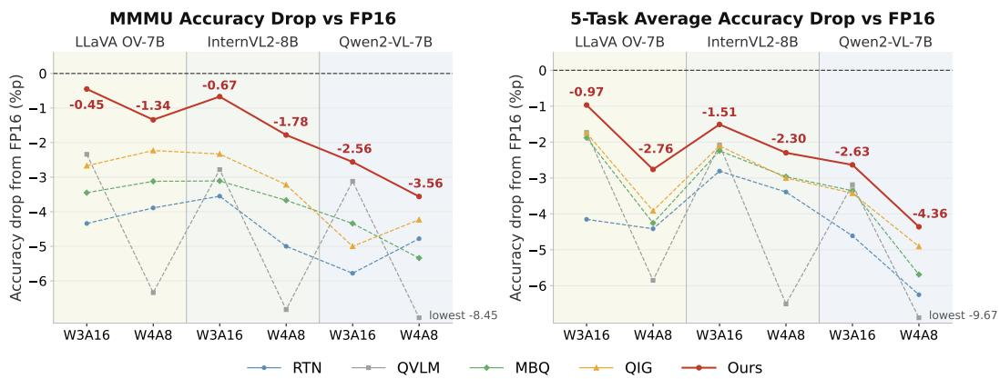  
Figure 1: Accuracy drop from the full-precision (FP16) model across multiple LVLMs under low-bit settings (W3A16 and W4A8). Results are reported on the MMMU benchmark (left) and the average across five multimodal benchmarks (right). Our method consistently achieves the lowest accuracy drop across all models and configurations among state-of-the-art PTQ methods for LVLMs.

To address these limitations, we propose Balanced Fitting, a novel PTQ framework for LVLMs that goes beyond local reconstruction error minimization. As illustrated in Figure 2(b), our key idea is to adaptively control the fitting strength of quantization using component-wise effects, balancing precise fitting for sensitive components and coarser fitting where quantization serves as regularization. Specifically, we first measure the quantization effect of weights, vision activations, and text activations at each layer, indicating whether quantization disrupts important information or provides beneficial regularization on calibration samples. Based on these effects, we adapt fitting capacity using component-aware scores, encouraging finer-grained fitting for sensitive components and coarser fitting where quantization serves as regularization. This leads to a balanced distribution of quantization resources that better preserves generalization.

Extensive experiments on state-of-the-art LVLMs demonstrate the effectiveness of our approach. As shown in Figure 1, our method consistently outperforms prior PTQ methods for LVLMs under both weight-only and weight-activation settings (W3A16 and W4A8), substantially reducing the accuracy drop from the full-precision model. Notably, on MMMU, a challenging benchmark requiring broad multidisciplinary knowledge and visual reasoning, our approach achieves a 2.43× average and up to 5.2× reduction in accuracy drop relative to the strongest prior PTQ baseline across models and bit-widths, demonstrating robust generalization on complex multimodal tasks.

## 2 RELATED WORK

## 2.1 LARGE VISION LANGUAGE MODELS

Large language models (LLMs) have demonstrated strong reasoning capabilities across diverse tasks (Brown et al., 2020; Chowdhery et al., 2023; Touvron et al., 2023). Large vision-language models (LVLMs) project features from vision encoders such as ViT (Dosovitskiy et al., 2020) and CLIP (Radford et al., 2021) into the language embedding space and combine them with text tokens for multimodal reasoning (Alayrac et al., 2022; Li et al., 2023a). Representative models include LLaVA-OneVision (Li et al., 2024), InternVL (Chen et al., 2024b), and Qwen-VL (Wang et al., 2024b). While prior work primarily focuses on improving cross-modal alignment and reasoning, we instead focus on efficient deployment, particularly post-training quantization for LVLMs.

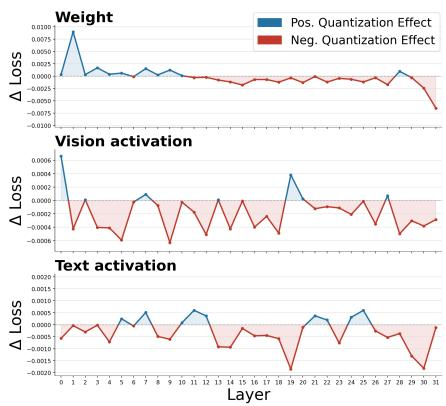  
(a) InternVL2-8B

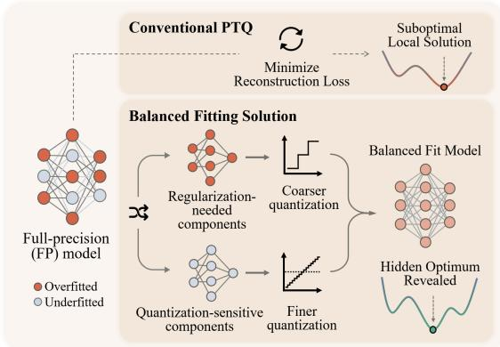  
(b) Conventional PTQ vs Balanced Fitting  
Figure 2: Motivation of our approach. (a) Component-wise quantization effects across layers reveal heterogeneous sensitivity across weights and modalities, where some components benefit from quantization while others are sensitive. (b) Conventional PTQ uniformly minimizes reconstruction error, leading to suboptimal solutions, whereas our Balanced Fitting adapts fitting strength using component-wise effects, improving generalization.

## 2.2 POST-TRAINING QUANTIZATION

Post-training quantization (PTQ) is a widely used compression technique that reduces model precision without retraining (Banner et al., 2019). For vision transformers, prior work addresses challenges in token-wise representations and attention through various calibration and quantization strategies (Liu et al., 2021; Yuan et al., 2022; Li & Gu, 2023; Lin et al., 2021). For large language models (LLMs), existing approaches mitigate quantization errors caused by activation outliers and model scale (Yao et al., 2022; Wei et al., 2022; Liu et al., 2023b). PTQ has also been extended to large vision-language models (LVLMs). Representative methods incorporate sensitivity signals such as cross-layer dependencies (Q-VLM (Wang et al., 2024a)), modality-wise gradients (MBQ (Li et al., 2025)), and token-level importance (QIG (Xiang et al., 2026)), yet still rely on reconstructionbased optimization over limited calibration data. Our approach instead adapts fitting strength to component-wise quantization effects, preserving sensitive components while allowing beneficial deviations from the FP model.

## 3 METHOD

## 3.1 PRELIMINARIES

Quantization maps full-precision weights and activations to a discrete set of low-bit values, reducing memory and computation. We use uniform integer quantization, with group-wise affine quantization for weights and symmetric per-token quantization for activations. The format $\mathrm { W } x \mathrm { A } y$ denotes x-bit weights and y-bit activations; for example, W4A8 uses 4-bit weights and 8-bit activations.

Let W and X denote the full-precision weight and activation matrices, respectively. PTQ commonly minimizes the reconstruction error between quantized and full-precision outputs. Existing LVLM PTQ methods (Wang et al., 2024a; Li et al., 2025; Xiang et al., 2026) use channel-wise equalization (CWE) to mitigate activation outliers by inversely rescaling W and X. The channel-wise scaling vector E is optimized to minimize reconstruction error:

$$
\mathbf { E } ^ { * } = \arg \operatorname* { m i n } _ { \mathbf { E } } \left\| { \cal Q } ( \mathbf { W } \odot \mathbf { E } ) { \cal Q } ( \mathbf { E } ^ { - 1 } \odot \mathbf { X } ) - \mathbf { W } \mathbf { X } \right\| _ { 2 } ^ { 2 } ,\tag{1}
$$

where $Q ( \cdot )$ denotes quantization and  denotes channel-wise scaling. We retain the quantization operator and reconstruction objective, changing only the number of CWE search candidates per layer.

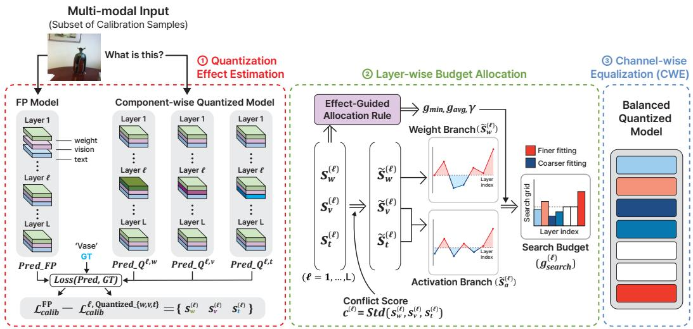  
Figure 3: Overview of the proposed balanced fitting framework. We first estimate layer- and component-wise quantization effects by selectively quantizing weights and activations. These effects are then used to guide a layer-wise budget allocation policy that adaptively controls the search granularity. The resulting allocation balances precise fitting for quantization-sensitive components and coarser fitting for others, improving generalization.

## 3.2 LAYER- AND COMPONENT-WISE QUANTIZATION EFFECTS

As illustrated in Figure 3, we first estimate layer- and component-wise quantization effects by selectively quantizing each component and measuring its impact on the calibration loss. Instead of assigning uniform fitting strength across layers, our method characterizes how each component responds to quantization and uses this information to guide quantization budget allocation. Let $\ell \in \{ 1 , \ldots , L \}$ denote the transformer layer index. For each layer, we consider quantizing one component at a time with the same scheme used in the target PTQ setting, where $c \in \{ w , v , t \}$ indicates weights, vision activations, and text activations, respectively. Given a calibration set, we define the calibration loss on a small subset as the token-level negative log-likelihood (NLL) of ground-truth target tokens:

$$
\mathcal { L } _ { \mathrm { c a l i b } } = \frac { 1 } { N } \sum _ { i = 1 } ^ { N } \frac { 1 } { T _ { i } } \sum _ { r = 1 } ^ { T _ { i } } - \log p _ { \theta } ( y _ { i , r } \mid x _ { i } , y _ { i , < r } ) ,\tag{2}
$$

where N is the calibration-subset size, $x _ { i }$ the ¿-th multimodal input, $T _ { i }$ the number of valid target tokens, and $y _ { i , r }$ . the r-th ground-truth token. Here, $p _ { \theta }$ is the model output distribution under the current quantization setting. We then quantize only component c at layer l while keeping all others unchanged and define the quantization effect as

$$
s _ { c } ^ { ( \ell ) } = \mathcal { L } _ { \mathrm { c a l i b } } ^ { ( \mathrm { F P } ) } - \mathcal { L } _ { \mathrm { c a l i b } } ^ { ( \ell , \mathrm { c - q u a n t i z e d } ) } , \quad c \in \{ w , v , t \} .\tag{3}
$$

A positive value of $s _ { c } ^ { ( \ell ) }$ indicates that quantization reduces the calibration loss, suggesting a potential regularization benefit for that component. Conversely, a negative value indicates that quantization increases the loss, implying that preserving full-precision information is important. Figure 2(a) illustrates the measured $\mathbf { \sigma } _ { s _ { c } ^ { ( \ell ) } }$ on the InternVL2-8B model (Chen et al., 2024b). The results reveal that the impact of quantization varies significantly across layers and components (weights, vision activations, and text activations), highlighting the need for quantization adapted to this heterogeneity.

Based on this observation, we transform $s _ { c } ^ { ( \ell ) }$ into an importance score for budget allocation. Sensitive components receive positive importance scores, whereas components that benefit from quantization receive negative scores to encourage coarser fitting:

$$
\hat { s } _ { c } ^ { ( \ell ) } = \left\{ \begin{array} { l l } { - \alpha s _ { c } ^ { ( \ell ) } , } & { s _ { c } ^ { ( \ell ) } \geq 0 , } \\ { - s _ { c } ^ { ( \ell ) } , } & { s _ { c } ^ { ( \ell ) } < 0 , } \end{array} \right.\tag{4}
$$

The transformed score $\hat { s } _ { c } ^ { ( \ell ) }$ represents the resulting importance of component c at layer $\ell ,$ where $\alpha \in [ 0 , 1 ]$ controls how strongly positive quantization effects are down-weighted in the importance score. For activations, we aggregate the visual and textual components to obtain a unified importance score, $\hat { s } _ { a } ^ { ( \ell ) } = \hat { s } _ { v } ^ { ( \ell ) } + \hat { s } _ { t } ^ { ( \ell ) }$ , where $\hat { s } _ { a } ^ { ( \ell ) }$ denotes the activation importance score at layer l

In practice, different components within the same layer can exhibit heterogeneous responses to quantization. When such disagreement occurs, directly aggregating component-wise quantization effects may obscure vulnerable components, potentially causing sensitive components to receive insufficient search capacity. To address this issue, we introduce a layer-wise conflict score and incorporate it into the final importance scores as follows:

$$
\begin{array} { r l } & { \kappa ^ { ( \ell ) } = \mathrm { S t d } \Big ( s _ { w } ^ { ( \ell ) } , s _ { v } ^ { ( \ell ) } , s _ { t } ^ { ( \ell ) } \Big ) , } \\ & { \tilde { s } _ { w } ^ { ( \ell ) } = \hat { s } _ { w } ^ { ( \ell ) } + \beta \kappa ^ { ( \ell ) } , \quad \tilde { s } _ { a } ^ { ( \ell ) } = \hat { s } _ { a } ^ { ( \ell ) } + \beta \kappa ^ { ( \ell ) } . } \end{array}\tag{5}
$$

where $\kappa ^ { ( \ell ) }$ measures the degree of disagreement among component-wise quantization effects in the l-th layer, and $\beta$ controls how strongly this disagreement is reflected in the final importance scores, thereby encouraging additional allocation to layers with heterogeneous sensitivity. This dispersion captures differences in magnitude as well as sign. In all experiments, we set $\alpha = 0 . 5$ and $\beta = 0 . 5$

## 3.3 LAYER-WISE BUDGET ALLOCATION

We allocate the search budget across layers based on the importance scores computed in the previous section. Concretely, each layer l is assigned a discrete budget $g ^ { ( \ell ) }$ , representing the number of grid points used to optimize channel-wise equalization (CWE). We define a budget policy with three quantities: the minimum per-layer budget $g _ { \mathrm { m i n } }$ , the target average budget $g _ { \mathrm { a v g } } ,$ and the concentration factor $\gamma$ . These values are automatically determined from the distribution of quantization effects $\{ s _ { c } ^ { ( \ell ) } \}$ using our Quantization Effect-Guided Allocation Rule, with details provided in Appendix B. Each layer is first assigned the minimum budget $g _ { \mathrm { m i n } } .$ and the total budget is defined as

$$
G _ { \mathrm { m i n } } = L \cdot g _ { \mathrm { m i n } } , \quad G _ { \mathrm { t a r g e t } } = \mathrm { r o u n d } ( L \cdot g _ { \mathrm { a v g } } ) , \quad R = G _ { \mathrm { t a r g e t } } - G _ { \mathrm { m i n } } .\tag{6}
$$

Here, $G _ { \mathrm { m i n } }$ is the minimum total budget obtained by assigning $g _ { \mathrm { m i n } }$ to all L layers, $G _ { \mathrm { t a r g e t } }$ is the desired total budget determined by the target average budget ${ \mathit { g } } _ { \mathrm { a v g } } ,$ and R denotes the remaining budget to be distributed across layers. Let $u ^ { ( \ell ) }$ denote the branch-specific importance score, where $u ^ { ( \ell ) } = \tilde { s } _ { w } ^ { ( \ell ) }$ for the weight branch and $u ^ { ( \ell ) } = \tilde { s } _ { a } ^ { ( \ell ) }$ for the activation branch. We then transform these scores into allocation weights and distribute the remaining budget accordingly:

$$
\begin{array} { r l } & { t ^ { ( \ell ) } = \operatorname* { m a x } \\\\Bigl ( u ^ { ( \ell ) } - q _ { \mathrm { l o w } } , 0 \Bigr ) , \qquad p ^ { ( \ell ) } = \frac { \bigl ( t ^ { ( \ell ) } \bigr ) ^ { \gamma } } { \sum _ { j = 1 } ^ { L } \big ( t ^ { ( j ) } \bigr ) ^ { \gamma } } , } \\ & { g ^ { ( \ell ) } = g _ { \mathrm { m i n } } + \mathrm { r o u n d } ( R \cdot p ^ { ( \ell ) } ) . } \end{array}\tag{7}
$$

where $q _ { \mathrm { l o w } }$ is the 50th percentile of the branch-wise score distribution and $\gamma$ controls how strongly the remaining budget is concentrated on high-importance layers. Layers below this quantile remain at $g _ { \mathrm { m i n } }$ , while upper-tail layers receive additional budget according to $p ^ { ( \ell ) }$ ; rounding is adjusted to preserve $G _ { \mathrm { t a r g e t } }$ . Thus, smaller budgets yield coarser CWE search that can act as regularization, whereas additional budget enables more precise fitting.

Although importance scores are computed at the component level, we allocate the search budget at the layer level because CWE parameters are jointly optimized within each layer and component effects are inherently coupled. Using a unified budget per layer enables efficient exploration of candidate configurations that account for these interactions. Therefore, we allocate a single search budget $g _ { \mathrm { s e a r c h } } ^ { ( \ell ) }$ per layer, determined by the quantization setting.

For W3A16, only the weight branch is used, and the search budget is $g _ { \mathrm { s e a r c h } } ^ { ( \ell ) } = g _ { w } ^ { ( \ell ) }$ . For W4A8, both the weight and activation branches contribute to the final search budget."We first compute the total positive importance of each branch and derive global branch weights:

$$
\begin{array} { l } { { S _ { w } = \displaystyle \sum _ { \ell } \operatorname* { m a x } ( \tilde { s } _ { w } ^ { ( \ell ) } , 0 ) , \qquad S _ { a } = \displaystyle \sum _ { \ell } \operatorname* { m a x } ( \tilde { s } _ { a } ^ { ( \ell ) } , 0 ) , } } \\ { { \qquad \rho _ { w } = \displaystyle \frac { S _ { w } } { S _ { w } + S _ { a } } , \quad \rho _ { a } = 1 - \rho _ { w } , \qquad g _ { \mathrm { s e a r c h } } ^ { ( \ell ) } = \mathrm { r o u n d } \Bigl ( \rho _ { w } g _ { w } ^ { ( \ell ) } + \rho _ { a } g _ { a } ^ { ( \ell ) } \Bigr ) . } } \end{array}\tag{8}
$$

Here, $S _ { w }$ and $S _ { a }$ denote the total positive importance mass of the weight and activation branches, respectively. They summarize how strongly each branch demands additional search capacity across all layers. The normalized branch weights $\rho _ { w }$ and $\rho _ { a }$ determine each branch's contribution to the final budget. The branch-wise budgets $g _ { w } ^ { ( \ell ) }$ and $g _ { a } ^ { ( \ell ) }$ follow the allocation rule above; their rounded weighted combination gives the W4A8 search budget $g _ { \mathrm { s e a r c h } } ^ { ( \ell ) } .$

## 3.4 CWE WITH BUDGET-CONTROLLED SEARCH

Given the allocated layer-wise search budget $g _ { \mathrm { s e a r c h } } ^ { ( \ell ) } ,$ we apply channel-wise equalization (CWE) to optimize the scaling factors for each layer. For each linear layer, we search for an optimal scaling vector $E$ within a discrete set of candidate values determined by the allocated budget. The optimization follows the standard CWE objective:

$$
E ^ { * } = \arg \operatorname* { m i n } _ { E } \sum _ { i = 1 } ^ { M } \left\| Q _ { W } ( W \odot E ) Q _ { X } ( E ^ { - 1 } \odot X _ { i } ) - W X _ { i } \right\| _ { 2 } ^ { 2 } ,\tag{9}
$$

where $X _ { i }$ denotes the activation of the i-th calibration token; activation quantization is omitted for weight-only settings. Unlike prior approaches that incorporate sensitivity signals while still applying uniform fitting strength across layers, we preserve the original CWE formulation and instead control the granularity of the scale search via the allocated budget. Larger budgets enable finer-grained search for quantization-sensitive layers, while smaller budgets enforce coarser search, potentially reducing overfitting. This design aims to improve generalization by controlling the fitting granularity without modifying the underlying objective.

## 4 EXPERIMENTS

## 4.1 EXPERIMENTAL SETUP

Implementation Details. Following prior work (Li et al., 2025; Xiang et al., 2026), we use groupwise affine weight quantization and symmetric per-token activation quantization, and evaluate all methods under W3A16 and W4A8 settings. Experiments use a single NVIDIA RTX A6000 GPU (48GB), except for InternVL2-8B (Chen et al., 2024b) evaluation on MMMU (Yue et al., 2024) and InternVL2-26B evaluation, which use NVIDIA DGX Spark for its larger unified memory.

Datasets and Models. We use the improved COCO Caption dataset (Chen et al., 2015) from ShareGPT4V (Chen et al., 2024a) for calibration, sampling 64 image-caption pairs formatted with each LVLM's prompt template; as this calibration set is already small, we use all samples for both quantization effect estimation and CWE optimization. Following LMMs-Eval (Zhang et al., 2025), we evaluate on MMMU (Yue et al., 2024) and ScienceQA (Lu et al., 2022) for visual reasoning, VizWiz (Gurari et al., 2018) for real-world perception, and ChartQA (Masry et al., 2022) and AI2D (Kembhavi et al., 2017) for visual understanding. We benchmark LLaVA-OneVision-7B (Li et al., 2024), InternVL2-8B (Chen et al., 2024b), and Qwen2-VL-7B (Wang et al., 2024b). For InternVL2-26B, we additionally evaluate image captioning on NoCaps-lite (Agrawal et al., 2019).

Baselines. We compare with round-to-nearest (RTN), Q-VLM (Wang et al., 2024a), Modality-Balanced Quantization (MBQ) (Li et al., 2025), and Quantization-Aware Integrated Gradients (QIG) (Xiang et al., 2026). For Q-VLM, MBQ, and QIG, we follow the official open-source implementations. Since Q-VLM is designed for LLaVA-style architectures, we adapt and re-implement it to ensure compatibility with all evaluated models.

Table 1: Quantitative results across three LVLMs and five benchmarks. ∆FP: Avg. – FP Avg. (pp).
<table><tr><td>Model</td><td>Bitwidth</td><td>Method</td><td>MMMU</td><td>VizWiz</td><td>ScienceQA</td><td>ChartQA</td><td>AI2D</td><td>Avg.</td><td>∆FP</td></tr><tr><td rowspan="10">LLaVA-OV-7B</td><td rowspan="5">FP16</td><td>-</td><td>46.56</td><td>58.71</td><td>95.84</td><td>80.00</td><td>81.28</td><td>72.48</td><td></td></tr><tr><td>RTN</td><td>42.22</td><td>57.00</td><td>94.55</td><td>68.88</td><td>78.98</td><td>68.33</td><td>-4.15</td></tr><tr><td>Q-VLM W3A16</td><td>44.22</td><td>59.72</td><td>94.40</td><td>76.76</td><td>78.63</td><td>70.75</td><td>-1.73</td></tr><tr><td>MBQ</td><td>43.11</td><td>59.88</td><td>94.74</td><td>77.00</td><td>78.27</td><td>70.60</td><td>-1.88</td></tr><tr><td>QIG</td><td>43.89</td><td>59.54</td><td>94.65</td><td>77.12</td><td>78.47</td><td>70.73</td><td>-1.75</td></tr><tr><td>Ours</td><td>46.11</td><td>60.28</td><td>94.94</td><td>77.20</td><td>79.02</td><td>71.51</td><td>-0.97</td></tr><tr><td rowspan="5">W4A8</td><td>RTN</td><td>42.67</td><td>54.92</td><td>94.10</td><td>70.28</td><td>78.34</td><td>68.06</td><td>-4.42</td></tr><tr><td>Q-VLM</td><td>40.22</td><td>51.93</td><td>92.36</td><td>71.48</td><td>77.14</td><td>66.63</td><td>-5.85</td></tr><tr><td>MBQ</td><td>43.44</td><td>55.00</td><td>94.25</td><td>70.44</td><td>77.98</td><td>68.22</td><td>-4.26</td></tr><tr><td>QIG</td><td>44.33</td><td>52.48</td><td>93.70</td><td>75.00</td><td>77.30</td><td>68.56</td><td>-3.92</td></tr><tr><td>Ours</td><td>45.22</td><td>55.78</td><td>94.00</td><td>75.08</td><td>78.50</td><td>69.72</td><td>-2.76</td></tr><tr><td rowspan="11">InternVL2-8B</td><td>FP16</td><td>-</td><td>48.11</td><td>60.67</td><td>97.07</td><td>82.48</td><td>82.35</td><td>74.14</td><td></td></tr><tr><td rowspan="5">W3A16</td><td>RTN</td><td>44.56</td><td>55.74</td><td>96.28</td><td>79.52</td><td>80.54</td><td>71.33</td><td>-2.81</td></tr><tr><td>Q-VLM</td><td>45.33</td><td>59.60</td><td>96.18</td><td>79.00</td><td>80.18</td><td>72.06</td><td>-2.08</td></tr><tr><td>MBQ</td><td>45.00</td><td>59.87</td><td>96.18</td><td>78.76</td><td>79.66</td><td>71.89</td><td>-2.25</td></tr><tr><td>QIG</td><td>45.78</td><td>58.42</td><td>96.13</td><td>79.52</td><td>80.31</td><td>72.03</td><td>-2.11</td></tr><tr><td>Ours</td><td>47.44</td><td>59.77</td><td>96.18</td><td>80.12</td><td>79.63</td><td>72.63</td><td>-1.51</td></tr><tr><td rowspan="5">W4A8</td><td>RTN</td><td>43.11</td><td>57.04</td><td>96.18</td><td>78.48</td><td>78.92</td><td>70.75</td><td>-3.39</td></tr><tr><td>Q-VLM</td><td>39.89</td><td>56.57</td><td>93.26</td><td>73.60</td><td>74.81</td><td>67.63</td><td>-6.51</td></tr><tr><td>MBQ</td><td>44.44</td><td>57.59</td><td>96.33</td><td>78.16</td><td>79.34</td><td>71.17</td><td>-2.97</td></tr><tr><td>QIG</td><td>44.89</td><td>55.72</td><td>96.58</td><td>78.76</td><td>79.73</td><td>71.14</td><td>-3.00</td></tr><tr><td>Ours</td><td>46.33</td><td>58.01</td><td>96.58</td><td>78.44</td><td>79.83</td><td>71.84</td><td>-2.30</td></tr><tr><td rowspan="11">Qwen2-VL-7B</td><td>FP16</td><td></td><td>50.56</td><td>68.91</td><td>84.88</td><td>81.56</td><td>80.08</td><td>73.20</td><td></td></tr><tr><td rowspan="5">W3A16</td><td>RTN</td><td>44.78</td><td>66.28</td><td>81.41</td><td>73.84</td><td>76.62</td><td>68.59</td><td></td></tr><tr><td>Q-VLM</td><td>47.44</td><td>66.73</td><td>79.97</td><td>78.36</td><td>77.56</td><td>70.01</td><td>-4.61 -3.19</td></tr><tr><td>MBQ</td><td>46.22</td><td>64.87</td><td>82.80</td><td>78.00</td><td>77.33</td><td>69.84</td><td>-3.36</td></tr><tr><td>QIG</td><td>45.56</td><td>64.95</td><td>82.90</td><td>78.16</td><td>77.30</td><td>69.77</td><td>-3.43</td></tr><tr><td>Ours</td><td>48.00</td><td>66.86</td><td>82.30</td><td>77.84</td><td>77.82</td><td>70.56</td><td>-2.64</td></tr><tr><td rowspan="5">W4A8</td><td>RTN</td><td>45.78</td><td>58.59</td><td>79.23</td><td>74.96</td><td>76.17</td><td>66.95</td><td>-6.25</td></tr><tr><td>Q-VLM</td><td>42.11</td><td>51.30</td><td>80.52</td><td>70.72</td><td>72.99</td><td>63.53</td><td>-9.67</td></tr><tr><td>MBQ</td><td>45.22</td><td>58.99</td><td>79.42</td><td>77.00</td><td>76.91</td><td>67.51</td><td>-5.69</td></tr><tr><td>QIG</td><td>46.33</td><td>61.26</td><td>79.57</td><td>76.76</td><td>77.53</td><td>68.29</td><td>-4.91</td></tr><tr><td>Ours</td><td>47.00</td><td>62.93</td><td>80.81</td><td>77.12</td><td>76.33</td><td>68.84</td><td>-4.36</td></tr></table>

Table 2: InternVL2-26B under W4A8. NoCaps-lite: CIDEr ×100.
<table><tr><td>Method</td><td>MMMU</td><td>ScienceQA</td><td>AI2D-lite</td><td>NoCaps-lite</td><td>Avg.</td><td>∆FP</td></tr><tr><td>FP</td><td>47.11</td><td>97.27</td><td>83.00</td><td>87.74</td><td>78.78</td><td></td></tr><tr><td>MBQ</td><td>44.67</td><td>96.93</td><td>78.60</td><td>77.48</td><td>74.42</td><td>-4.36</td></tr><tr><td>QIG</td><td>44.00</td><td>96.63</td><td>78.40</td><td>79.66</td><td>74.67</td><td>-4.11</td></tr><tr><td>Ours</td><td>44.89</td><td>96.98</td><td>79.00</td><td>78.98</td><td>74.96</td><td>-3.82</td></tr></table>

## 4.2 MAIN RESULTS

Table 1 and Figure 1 show that Balanced Fitting outperforms existing PTQ methods in five-task average across all models and both precisions, indicating consistent performance preservation across diverse tasks. On MMMU (Yue et al., 2024), which requires multidisciplinary knowledge and visual reasoning, it reduces the accuracy drop by 2.43× on average relative to the strongest competing baseline. Table 2 extends this comparison to the larger InternVL2-26B under W4A8, where our method also leads in average performance.

Figure 4 presents qualitative comparisons on MMMU and VizWiz. Balanced Fitting preserves correct FP answers while correcting erroneous predictions reproduced by MBQ and QIG, illustrating a balance between retaining useful FP behavior and allowing beneficial deviations.

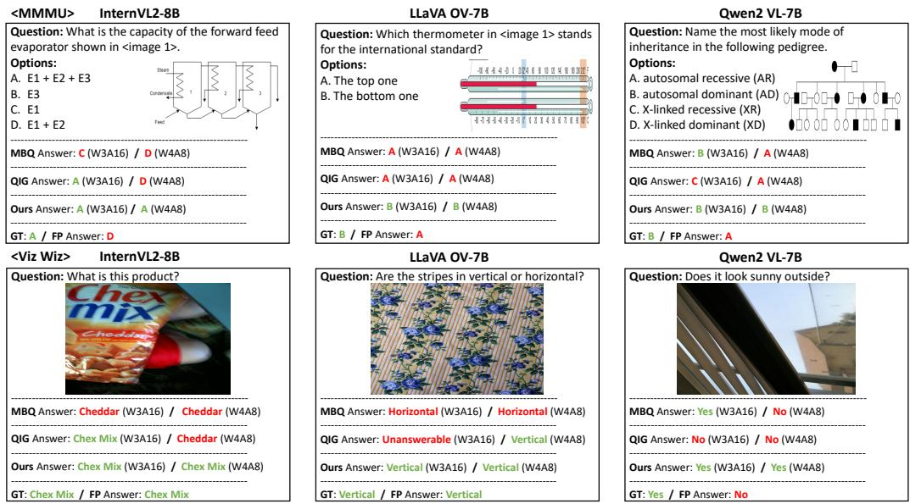  
Figure 4: Qualitative comparison on MMMU and VizWiz.

Table 3: Ablation on the gain-discount coefficient (α) and conflict coefficient (β) under the W4A8 setting. Each cell reports MMMU / 5-task Avg.
<table><tr><td rowspan="2">Model</td><td colspan="3">Gain-discount coefficient (α)</td><td colspan="3">Conflict coefficient (β)</td></tr><tr><td>0</td><td>0.5</td><td>1.0</td><td>0</td><td>0.5</td><td>1.0</td></tr><tr><td>Qwen2-VL-7B</td><td>46.67 / 68.70</td><td>47.00 / 68.84</td><td>47.33 / 68.83</td><td>45.67 / 68.98</td><td>47.00 / 68.84</td><td>46.22 / 68.59</td></tr><tr><td>LLaVA-OV-7B</td><td>43.67 / 69.06</td><td>45.22 / 69.72</td><td>41.78 / 68.69</td><td>43.67 / 69.37</td><td>45.22 / 69.72</td><td>44.56 / 69.18</td></tr><tr><td>InternVL2-8B</td><td>43.22 / 71.16</td><td>46.33 / 71.84</td><td>45.56 / 71.87</td><td>45.44 / 71.44</td><td>46.33 / 71.84</td><td>44.67 / 71.44</td></tr></table>

Table 4: Uniform vs. adaptive grid allocation. Adap. (k) indicates mean grid size k.
<table><tr><td></td><td></td><td colspan="4">InternVL2-8B</td><td colspan="4">LLaVA-OV-7B</td><td colspan="4">Qwen2-VL-7B</td></tr><tr><td>Precision</td><td>Method</td><td>Grid</td><td>Loss ↓</td><td>MMMU ↑</td><td>Avg. ↑</td><td>Grid</td><td>Loss ↓</td><td>MMMU ↑</td><td>Avg. ↑</td><td>Grid</td><td>Loss ↓</td><td>MMMU ↑</td><td>Avg. ↑</td></tr><tr><td>W3A16</td><td>Low</td><td>18</td><td>2.34</td><td>46.4</td><td>72.4</td><td>16</td><td>0.82</td><td>42.6</td><td>70.9</td><td>20</td><td>0.85</td><td>47.2</td><td>70.5</td></tr><tr><td></td><td>Mean</td><td>23</td><td>1.85</td><td>46.6</td><td>72.3</td><td>27</td><td>0.96</td><td>44.8</td><td>70.6</td><td>22</td><td>0.85</td><td>47.4</td><td>70.4</td></tr><tr><td></td><td>High</td><td>28</td><td>1.94</td><td>45.9</td><td>72.1</td><td>32</td><td>0.94</td><td>45.7</td><td>70.8</td><td>24</td><td>0.79</td><td>46.6</td><td>70.0</td></tr><tr><td></td><td>Ours</td><td>Adap. (23)</td><td>2.34</td><td>47.4</td><td>72.6</td><td>Adap. (27)</td><td>0.90</td><td>46.1</td><td>71.5</td><td>Adap. (22)</td><td>0.87</td><td>48.0</td><td>70.6</td></tr><tr><td>W4A8</td><td>Low</td><td>17</td><td>0.28</td><td>44.4</td><td>71.3</td><td>15</td><td>0.32</td><td>43.4</td><td>69.1</td><td>16</td><td>0.27</td><td>46.4</td><td>68.8</td></tr><tr><td></td><td>Mean</td><td>21</td><td>0.41</td><td>44.6</td><td>71.2</td><td>18</td><td>0.38</td><td>45.0</td><td>69.3</td><td>19</td><td>0.25</td><td>45.3</td><td>67.8</td></tr><tr><td></td><td>High</td><td>25</td><td>0.37</td><td>45.0</td><td>71.3</td><td>23</td><td>0.30</td><td>43.1</td><td>68.9</td><td>23</td><td>0.25</td><td>46.4</td><td>68.7</td></tr><tr><td></td><td>Ours</td><td>Adap. (21)</td><td>0.32</td><td>46.3</td><td>71.8</td><td>Adap. (18)</td><td>0.33</td><td>45.2</td><td>69.7</td><td>Adap. (19)</td><td>0.28</td><td>47.0</td><td>68.8</td></tr></table>

## 4.3 ABLATION STUDY AND ANALYSIS

To examine the effect of each allocation component, we vary the gain-discount coefficient α in equation 4 and the conflict coefficient β in equation 5. These coefficients control how strongly beneficial quantization effects are discounted and conflicting component responses are emphasized, respectively. Table 3 reports the resulting performance. $\alpha = \beta = 0 . 5$ yields competitive performance across models and metrics.

We next examine whether adaptive allocation improves on uniform budgets, comparing reconstruction loss and downstream performance in Table 4. Adaptive allocation consistently achieves superior performance across all models and settings. Notably, uniformly allocating high budgets can underperform configurations with lower budgets, indicating that excessive fitting can be detrimental. Moreover, we observe that models with lower reconstruction loss do not necessarily achieve better downstream performance, highlighting the limitation of reconstruction-based optimization.

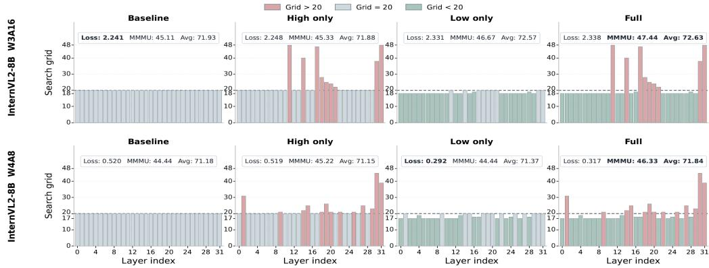  
Figure 5: Layer-wise budget allocation and downstream performance on InternVL2-8B.

Table 5: Quantization effect (QE) stability across disjoint calibration subsets and an independent held-out subset under W3A16 and W4A8. Parentheses give agreement counts.
<table><tr><td>QE-ranked subset</td><td>Count</td><td></td><td></td><td></td><td>QE mass 3-subset sign agreement Held-out agreement Beneficial held-out agreement</td></tr><tr><td>Top 50%</td><td>176</td><td>89.90%</td><td>87.5% (154/176)</td><td>93.2% (164/176)</td><td>89.8% (44/49)</td></tr><tr><td>Top 25%</td><td>88</td><td>73.90%</td><td>94.3% (83/88)</td><td>100% (88/88)</td><td>100% (23/23)</td></tr><tr><td>Top 10%</td><td>38</td><td>57.00%</td><td>100% (38/38)</td><td>100% (38/38)</td><td>100% (10/10)</td></tr></table>

Table 6: Calibration-domain shift from COCO Caption to Flickr30k: W4A8 five-task average.
<table><tr><td>Model</td><td>FP</td><td>MBQ (∆FP)</td><td>QIG (∆FP)</td><td>Ours (∆FP)</td></tr><tr><td>InternVL2</td><td>74.14</td><td>71.60 (-2.54)</td><td>70.87 (-3.27)</td><td>71.78 (-2.36)</td></tr><tr><td>LLaVA-OV</td><td></td><td>72.48 68.06 (—4.42)</td><td>68.92 (−3.56)69.43 (−3.05)</td><td></td></tr><tr><td>Qwen2-VL</td><td></td><td></td><td>73.2067.57 (−5.63)67.27 (−5.93)67.68 (−5.52)</td><td></td></tr></table>

Figure 5 compares refinement (High-only), coarsening (Low-only), and Balanced Fitting (Full), which combines both. Reconstruction loss fails to track downstream performance across these variants, making it an unreliable performance proxy. Full achieves the best average; Low-only also outperforms the uniform baseline, consistent with a regularization effect from constrained fitting.

To verify that quantization effects remain stable across samples, we compare their signs across three disjoint COCO-64 subsets and an independent held-out-64 subset, ranking components using calibration data only. Table 5 shows strong held-out sign agreement for high-magnitude effects, including beneficial effects. This suggests that the signals guiding refinement and coarsening are not specific to a single calibration subset, supporting their use for budget allocation. Appendix Figure 8 further shows consistent layer-wise estimates across sample sizes.

To test robustness to a calibration-domain shift from COCO Caption to Flickr30k, we re-estimate quantization effects on 64 Flickr30k training pairs and apply the unchanged W4A8 allocation rule without retuning. Table 6 shows that Ours retains the highest five-task average across all three models, supporting robustness to a change in calibration data. Additional controls, analyses, and costs are provided in the appendix.

## 5 CONCLUSION

In this work, we revisit post-training quantization (PTQ) for large vision-language models (LVLMs) and show that minimizing reconstruction loss on small calibration sets is insufficient for generalization. We propose Balanced Fitting, a quantization effect-based framework that allocates layer-wise budgets to control fitting strength, balancing precision and regularization across components. Extensive experiments demonstrate consistent improvements over prior PTQ methods and reveal the limitation of reconstruction loss as a proxy for downstream performance.

## REFERENCES

Harsh Agrawal, Karan Desai, Yufei Wang, Xinlei Chen, Rishabh Jain, Mark Johnson, Dhruv Batra, Devi Parikh, Stefan Lee, and Peter Anderson. Nocaps: Novel object captioning at scale. In 2019 IEEE/CVF International Conference on Computer Vision (ICCV), pp. 8947–8956. IEEE, 2019.

Jean-Baptiste Alayrac, Jeff Donahue, Pauline Luc, Antoine Miech, Iain Barr, Yana Hasson, Karel Lenc, Arthur Mensch, Katherine Millican, Malcolm Reynolds, et al. Flamingo: a visual language model for few-shot learning. Advances in neural information processing systems, 35:23716– 23736, 2022.

Ron Banner, Yury Nahshan, and Daniel Soudry. Post training 4-bit quantization of convolutional networks for rapid-deployment. Advances in neural information processing systems, 32, 2019.

Daniel Bolya, Cheng-Yang Fu, Xiaoliang Dai, Peizhao Zhang, Christoph Feichtenhofer, and Judy Hoffman. Token merging: Your vit but faster. arXiv preprint arXiv:2210.09461, 2022.

Tom Brown, Benjamin Mann, Nick Ryder, Melanie Subbiah, Jared D Kaplan, Prafulla Dhariwal, Arvind Neelakantan, Pranav Shyam, Girish Sastry, Amanda Askell, et al. Language models are few-shot learners. Advances in neural information processing systems, 33:1877–1901, 2020.

Lin Chen, Jinsong Li, Xiaoyi Dong, Pan Zhang, Conghui He, Jiaqi Wang, Feng Zhao, and Dahua Lin. Sharegpt4v: Improving large multi-modal models with better captions. In European Conference on Computer Vision, pp. 370–387. Springer, 2024a.

Wentao Chen, Hailong Qiu, Jian Zhuang, Chutong Zhang, Yu Hu, Qing Lu, Tianchen Wang, Yiyu Shi, Meiping Huang, and Xiaowe Xu. Quantization of deep neural networks for accurate edge computing. ACM Journal on Emerging Technologies in Computing Systems (JETC), 17(4):1–11, 2021.

Xinlei Chen, Hao Fang, Tsung-Yi Lin, Ramakrishna Vedantam, Saurabh Gupta, Piotr Dollár, and C. Lawrence Zitnick. Microsoft coco captions: Data collection and evaluation server. arXiv preprint arXiv:1504.00325, 2015.

Zhe Chen, Jiannan Wu, Wenhai Wang, Weijie Su, Guo Chen, Sen Xing, Muyan Zhong, Qinglong Zhang, Xizhou Zhu, Lewei Lu, et al. Internvl: Scaling up vision foundation models and aligning for generic visual-linguistic tasks. In Proceedings of the IEEE/CVF conference on computer vision and pattern recognition, pp. 24185–24198, 2024b.

Aakanksha Chowdhery, Sharan Narang, Jacob Devlin, Maarten Bosma, Gaurav Mishra, Adam Roberts, Paul Barham, Hyung Won Chung, Charles Sutton, Sebastian Gehrmann, et al. Palm: Scaling language modeling with pathways. Journal of machine learning research, 24(240):1– 113, 2023.

Alexey Dosovitskiy, Lucas Beyer, Alexander Kolesnikov, Dirk Weissenborn, Xiaohua Zhai, Thomas Unterthiner, Mostafa Dehghani, Matthias Minderer, Georg Heigold, Sylvain Gelly, et al. An image is worth 16x16 words: Transformers for image recognition at scale. arXiv preprint arXiv:2010.11929, 2020.

Elias Frantar, Saleh Ashkboos, Torsten Hoefler, and Dan Alistarh. Gptq: Accurate post-training quantization for generative pre-trained transformers. arXiv preprint arXiv:2210.17323, 2022.

Danna Gurari, Qing Li, Abigale J Stangl, Anhong Guo, Chi Lin, Kristen Grauman, Jiebo Luo, and Jeffrey P Bigham. Vizwiz grand challenge: Answering visual questions from blind people. In Proceedings of the IEEE conference on computer vision and pattern recognition, pp. 3608–3617, 2018.

Geoffrey Hinton, Oriol Vinyals, and Jeff Dean. Distilling the knowledge in a neural network. arXiv preprint arXiv:1503.02531, 2015.

Benoit Jacob, Skirmantas Kligys, Bo Chen, Menglong Zhu, Matthew Tang, Andrew Howard, Hartwig Adam, and Dmitry Kalenichenko. Quantization and training of neural networks for efficient integer-arithmetic-only inference. In Proceedings of the IEEE conference on computer vision and pattern recognition, pp. 2704–2713, 2018.

Aniruddha Kembhavi, Minjoon Seo, Dustin Schwenk, Jonghyun Choi, Ali Farhadi, and Hannaneh Hajishirzi. Are you smarter than a sixth grader? textbook question answering for multimodal machine comprehension. In Proceedings of the IEEE Conference on Computer Vision and Pattern recognition, pp. 4999–5007, 2017.

Andrey Kuzmin, Markus Nagel, Mart Van Baalen, Arash Behboodi, and Tijmen Blankevoort. Pruning vs quantization: Which is better? Advances in neural information processing systems, 36: 62414–62427, 2023.

Bo Li, Yuanhan Zhang, Dong Guo, Renrui Zhang, Feng Li, Hao Zhang, Kaichen Zhang, Peiyuan Zhang, Yanwei Li, Ziwei Liu, et al. Llava-onevision: Easy visual task transfer. arXiv preprint arXiv:2408.03326, 2024.

Junnan Li, Dongxu Li, Silvio Savarese, and Steven Hoi. Blip-2: Bootstrapping language-image pre-training with frozen image encoders and large language models. In International conference on machine learning, pp. 19730–19742. PMLR, 2023a.

Shiyao Li, Yingchun Hu, Xuefei Ning, Xihui Liu, Ke Hong, Xiaotao Jia, Xiuhong Li, Yaqi Yan, Pei Ran, Guohao Dai, et al. Mbq: Modality-balanced quantization for large vision-language models. In Proceedings of the Computer Vision and Pattern Recognition Conference, pp. 4167–4177, 2025.

Xuanlin Li, Yunhao Fang, Minghua Liu, Zhan Ling, Zhuowen Tu, and Hao Su. Distilling large vision-language model with out-of-distribution generalizability. In Proceedings of the IEEE/CVF International Conference on Computer Vision, pp. 2492–2503, 2023b.

Zhikai Li and Qingyi Gu. I-vit: Integer-only quantization for efficient vision transformer inference. In Proceedings of the IEEE/CVF International Conference on Computer Vision, pp. 17065– 17075, 2023.

Tailin Liang, John Glossner, Lei Wang, Shaobo Shi, and Xiaotong Zhang. Pruning and quantization for deep neural network acceleration: A survey. Neurocomputing, 461:370–403, 2021.

Ji Lin, Jiaming Tang, Haotian Tang, Shang Yang, Wei-Ming Chen, Wei-Chen Wang, Guangxuan Xiao, Xingyu Dang, Chuang Gan, and Song Han. Awq: Activation-aware weight quantization for on-device llm compression and acceleration. Proceedings of machine learning and systems, 6:87–100, 2024.

Yang Lin, Tianyu Zhang, Peiqin Sun, Zheng Li, and Shuchang Zhou. Fq-vit: Post-training quantization for fully quantized vision transformer. arXiv preprint arXiv:2111.13824, 2021.

Haotian Liu, Chunyuan Li, Qingyang Wu, and Yong Jae Lee. Visual instruction tuning. Advances in neural information processing systems, 36:34892–34916, 2023a.

Yijiang Liu, Huanrui Yang, Zhen Dong, Kurt Keutzer, Li Du, and Shanghang Zhang. Noisyquant: Noisy bias-enhanced post-training activation quantization for vision transformers. In Proceedings of the IEEE/CVF conference on computer vision and pattern recognition, pp. 20321–20330, 2023b.

Zhenhua Liu, Yunhe Wang, Kai Han, Wei Zhang, Siwei Ma, and Wen Gao. Post-training quantization for vision transformer. Advances in Neural Information Processing Systems, 34:28092– 28103, 2021.

Pan Lu, Swaroop Mishra, Tanglin Xia, Liang Qiu, Kai-Wei Chang, Song-Chun Zhu, Oyvind Tafjord, Peter Clark, and Ashwin Kalyan. Learn to explain: Multimodal reasoning via thought chains for science question answering. Advances in neural information processing systems, 35:2507–2521, 2022.

Ahmed Masry, Do Long, Jiaqi Tan, Shafiq Joty, and Enamul Hoque. Chartqa: A benchmark for question answering about charts with visual and logical reasoning. In Findings of the Association for Computational Linguistics: ACL 2022, pp. 2263–2279, 2022.

Markus Nagel, Rana Ali Amjad, Mart Van Baalen, Christos Louizos, and Tijmen Blankevoort. Up or down? adaptive rounding for post-training quantization. In International conference on machine learning, pp. 7197–7206. PMLR, 2020.

Alec Radford, Jong Wook Kim, Chris Hallacy, Aditya Ramesh, Gabriel Goh, Sandhini Agarwal, Girish Sastry, Amanda Askell, Pamela Mishkin, Jack Clark, et al. Learning transferable visual models from natural language supervision. In International conference on machine learning, pp. 8748–8763. PmLR, 2021.

Yongming Rao, Wenliang Zhao, Benlin Liu, Jiwen Lu, Jie Zhou, and Cho-Jui Hsieh. Dynamicvit: Efficient vision transformers with dynamic token sparsification. Advances in neural information processing systems, 34:13937–13949, 2021.

Hugo Touvron, Thibaut Lavril, Gautier Izacard, Xavier Martinet, Marie-Anne Lachaux, Timothée Lacroix, Baptiste Rozière, Naman Goyal, Eric Hambro, Faisal Azhar, et al. Llama: Open and efficient foundation language models. arXiv preprint arXiv:2302.13971, 2023.

Changyuan Wang, Ziwei Wang, Xiuwei Xu, Yansong Tang, Jie Zhou, and Jiwen Lu. Q-vlm: Posttraining quantization for large vision-language models. Advances in Neural Information Processing Systems, 37:114553–114573, 2024a.

Peng Wang, Shuai Bai, Sinan Tan, Shijie Wang, Zhihao Fan, Jinze Bai, Keqin Chen, Xuejing Liu, Jialin Wang, Wenbin Ge, et al. Qwen2-vl: Enhancing vision-language model's perception of the world at any resolution. arXiv preprint arXiv:2409.12191, 2024b.

Ying Wang, Yadong Lu, and Tijmen Blankevoort. Differentiable joint pruning and quantization for hardware efficiency. In European Conference on Computer Vision, pp. 259–277. Springer, 2020.

Xiuying Wei, Yunchen Zhang, Xiangguo Zhang, Ruihao Gong, Shanghang Zhang, Qi Zhang, Fengwei Yu, and Xianglong Liu. Outlier suppression: Pushing the limit of low-bit transformer language models. Advances in Neural Information Processing Systems, 35:17402–17414, 2022.

Ziwei Xiang, Fanhu Zeng, Hongjian Fang, Rui-Qi Wang, Renxing Chen, Yanan Zhu, Yi Chen, Peipei Yang, and Xu-Yao Zhang. Fine-grained post-training quantization for large vision language models with quantization-aware integrated gradients. arXiv preprint arXiv:2603.17809, 2026.

Guangxuan Xiao, Ji Lin, Mickael Seznec, Hao Wu, Julien Demouth, and Song Han. Smoothquant: Accurate and efficient post-training quantization for large language models. In International conference on machine learning, pp. 38087–38099. PMLR, 2023.

Zhewei Yao, Reza Yazdani Aminabadi, Minjia Zhang, Xiaoxia Wu, Conglong Li, and Yuxiong He. Zeroquant: Efficient and affordable post-training quantization for large-scale transformers. Advances in neural information processing systems, 35:27168–27183, 2022.

Zhihang Yuan, Chenhao Xue, Yiqi Chen, Qiang Wu, and Guangyu Sun. Ptq4vit: Post-training quantization for vision transformers with twin uniform quantization. In European conference on computer vision, pp. 191–207. Springer, 2022.

Xiang Yue, Yuansheng Ni, Kai Zhang, Tianyu Zheng, Ruoqi Liu, Ge Zhang, Samuel Stevens, Dongfu Jiang, Weiming Ren, Yuxuan Sun, et al. Mmmu: A massive multi-discipline multimodal understanding and reasoning benchmark for expert agi. In Proceedings of the IEEE/CVF conference on computer vision and pattern recognition, pp. 9556–9567, 2024.

Kaichen Zhang, Bo Li, Peiyuan Zhang, Fanyi Pu, Joshua Adrian Cahyono, Kairui Hu, Shuai Liu, Yuanhan Zhang, Jingkang Yang, Chunyuan Li, et al. Lmms-eval: Reality check on the evaluation of large multimodal models. In Findings of the Association for Computational Linguistics: NAACL 2025, pp. 881–916, 2025.

Shuchang Zhou, Yuxin Wu, Zekun Ni, Xinyu Zhou, He Wen, and Yuheng Zou. Dorefa-net: Training low bitwidth convolutional neural networks with low bitwidth gradients. arXiv preprint arXiv:1606.06160, 2016.

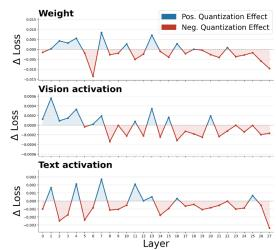

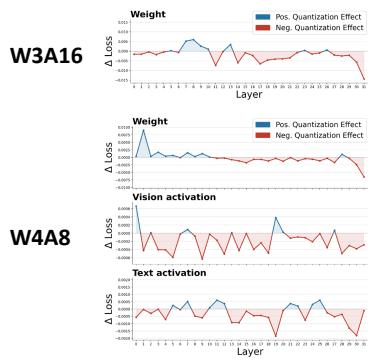  
(a) InternVL2-8B

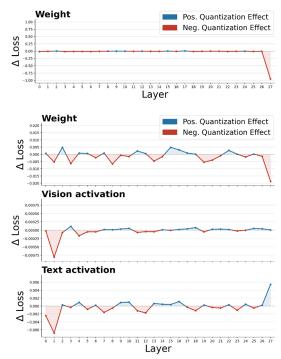  
(b) LLaVA-OV-7B  
(c) Qwen2-VL-7B  
Figure 6: Component-wise quantization effects across layers for three vision-language models (InternVL2-8B, LLaVA-OV-7B, and Qwen2-VL-7B) under two quantization settings (W3A16 and W4A8). The results reveal heterogeneous sensitivity across weights and modalities, where some components benefit from quantization while others are more sensitive.

## A ADDITIONAL ANALYSIS

Component-wise Quantization Effects Across Models and Settings. Figure 6 extends Figure 2(a) to InternVL2-8B (Chen et al., 2024b), LLaVA-OV-7B (Li et al., 2024), and Qwen2-VL-7B (Wang et al., 2024b) under W3A16 and W4A8.

The sign and magnitude of quantization effects vary across layers, components, models, and bitwidths. Negative effects indicate increased calibration loss, whereas positive effects indicate reduced loss and suggest potential regularization benefits. The locations of sensitive and beneficial components differ across models and settings, supporting allocation based on the measured effects rather than a fixed layer-wise policy.

Effect of Balanced Budget Allocation on Downstream Performance. Figure 7 extends the allocation ablation to LLaVA-OV-7B and Qwen2-VL-7B. Under W4A8, it compares uniform allocation, refinement alone (High-only), coarsening alone (Low-only), and Balanced Fitting (Full), allowing the contributions of refinement and coarsening to be examined separately. The results support combining both operations rather than relying on either alone. Under W3A16, the minimum grid size is 20, so High-only coincides with Full and Low-only coincides with the uniform baseline; only the distinct configurations are shown. This setting therefore evaluates refinement above the baseline budget rather than a separate coarsening effect.

To examine how calibration-set size affects quantization effect estimation, Figure 8 compares layerwise profiles using 16, 32, and 64 samples across three LVLMs under W3A16 and W4A8. The profiles remain highly correlated across sample sizes, supporting reliable estimation with limited calibration data. This complements Table 5, which tests sign agreement across disjoint calibration subsets and an independent held-out subset.

## B QUANTIZATION EFFECT-GUIDED ALLOCATION RULE

To reduce the manual effort in configuring Balanced Fitting, we provide a simple statistics-driven rule that maps quantization effect distributions to allocation settings. This rule selects allocation settings automatically and achieves performance close to empirically selected configurations. The same formulas and normalization constants are used across models within each quantization mode. The rule operates directly on summary statistics of quantization effects and is included as a practical supplementary tool.

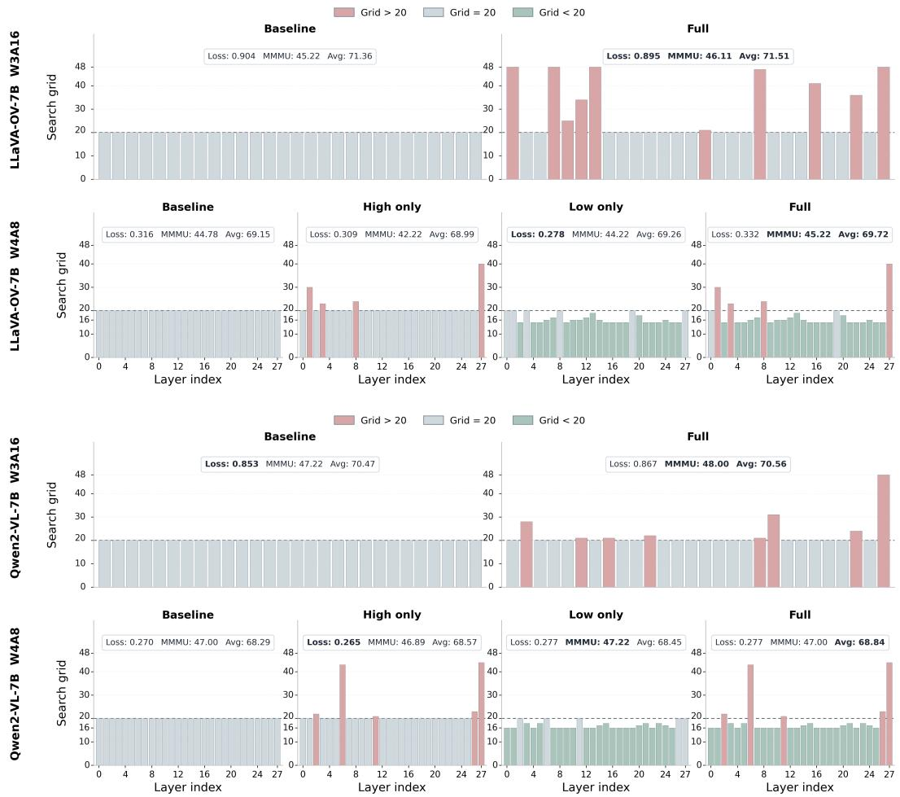  
Figure 7: Layer-wise budget allocation and downstream performance on LLaVA-OV-7B and Qwen2-VL-7B. For the W3A16 setting, the minimum grid size is set to 20, making the high-only configuration equivalent to the full setting and the low-only configuration equivalent to the baseline; thus, they are excluded from comparison.

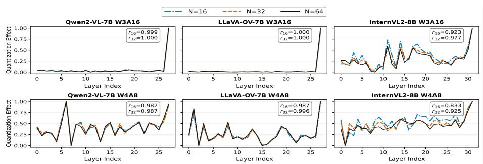  
Figure 8: Stability of layer-wise quantization effects estimated from 16, 32, and 64 calibration samples on Qwen2-VL-7B, LLaVA-OV-7B, and InternVL2-8B under W3A16 (top) and W4A8 (bottom). W4A8 aggregates weight, visual-token, and textual-token effects. The reported Pearson correlations compare the 16- and 32-sample profiles with the 64-sample reference.

Quantization effect statistics. For each layer l and component $c ,$ let $s _ { c } ^ { ( \ell ) }$ denote the quantization effect defined in equation 3. We decompose it into positive and negative parts:

$$
s _ { \ell , c } ^ { \mathrm { l o s s } } = \operatorname* { m a x } ( - s _ { c } ^ { ( \ell ) } , 0 ) , \qquad s _ { \ell , c } ^ { \mathrm { g a i n } } = \operatorname* { m a x } ( s _ { c } ^ { ( \ell ) } , 0 ) .\tag{10}
$$

For W3A16, we use only the weight component:

$$
H _ { \ell } = s _ { \ell , w } ^ { \mathrm { l o s s } } , \qquad G _ { \ell } = s _ { \ell , w } ^ { \mathrm { g a i n } } , \qquad H = \sum _ { \ell } H _ { \ell } , \qquad G = \sum _ { \ell } G _ { \ell } .\tag{11}
$$

We then define the gain ratio

$$
r = { \frac { G } { H + G } } ,\tag{12}
$$

and the loss severity ratio

$$
M = \frac { H } { \mathcal { L } _ { \mathrm { t a s k } } ^ { ( \mathrm { F P } ) } } ,\tag{13}
$$

where $\mathcal { L } _ { \mathrm { t a s k } } ^ { ( \mathrm { F P } ) }$ is the FP model's calibration-set task loss.

For W4A8, we aggregate all components:

$$
H _ { \ell } = \sum _ { c \in \{ w , v , t \} } s _ { \ell , c } ^ { \mathrm { l o s s } } , \qquad H = \sum _ { \ell } H _ { \ell } .\tag{14}
$$

We additionally define the activation-side loss share

$$
A = \frac { \sum _ { \ell } \left( s _ { \ell , v } ^ { \mathrm { l o s s } } + s _ { \ell , t } ^ { \mathrm { l o s s } } \right) } { H } ,\tag{15}
$$

and the support ratio

$$
S = \frac { k _ { 0 . 9 } } { L } ,\tag{16}
$$

where $k _ { 0 . 9 }$ is the minimum number of layers needed to explain 90% of the total loss mass and $L$ is the number of layers.

For both quantization modes, we measure concentration using the top 10% of layers with positive loss mass. Let $\mathcal { T } _ { 0 . 1 }$ denote the set of layer indices corresponding to the largest $\lceil 0 . 1 L _ { + } \rceil$ values of $H _ { \ell }$ among layers with $H _ { \ell } > 0$ , where $L _ { + }$ is the number of layers satisfying $H _ { \ell } > 0$ . We define

$$
C _ { 0 . 1 } = \frac { \sum _ { \ell \in \mathcal { T } _ { 0 . 1 } } H _ { \ell } } { H } .\tag{17}
$$

Normalization. To place the raw statistics on a comparable scale, we normalize each statistic z into the unit interval:

$$
\bar { z } = \mathrm { c l i p } \left( \frac { z - z _ { \operatorname* { m i n } } } { z _ { \operatorname* { m a x } } - z _ { \operatorname* { m i n } } } , 0 , 1 \right) ,\tag{18}
$$

where $z _ { \mathrm { m i n } }$ and $z _ { \mathrm { m a x } }$ are the normalization bounds. W3A16 uses $r ~ \in ~ [ 0 . 0 1 7 , 0 . 2 0 7 ] , \ C _ { 0 . 1 } ~ \in$ $[ 0 . 3 7 5 , 0 . 9 1 5 ]$ , and $M \ \in \ [ 0 . 0 6 5 , 1 . 3 7 1 ]$ (bounds shown rounded to three decimal places). For W4A8, we retain the zero origin of the ratios and round their upper bounds upward to one decimal: $A \in [ 0 , 0 . 8 ] , S \in [ 0 , 0 . 7 ]$ , and $C _ { 0 . 1 } \in [ 0 , 0 . 6 ]$ . Values outside these ranges are clipped. These bounds and all coefficients below are shared across models within a quantization mode.

W3A16 rule. For W3A16, after normalizing $r , M ,$ and $C _ { 0 . 1 }$ into $\bar { r } , \bar { M } ,$ and $\bar { C } ,$ we compute

$$
g _ { \mathrm { m i n } } ^ { ( \mathrm { w 3 a 1 6 } ) } = \mathrm { r o u n d } \big ( g _ { \mathrm { r e f } } - ( 2 + 1 . 6 ( 1 - \bar { r } ) ) \bar { r } ( 1 - \bar { C } ) \big ) ,\tag{19}
$$

$$
g _ { \mathrm { a v g } } ^ { ( \mathrm { w 3 a 1 6 } ) } = g _ { \mathrm { r e f } } + 2 + \mathrm { r o u n d } \big ( 5 \bar { C } \bar { M } ^ { 3 } + \bar { r } ( 1 - \bar { C } ) \big ) ,\tag{20}
$$

$$
\gamma ^ { ( \mathrm { w 3 a 1 6 ) } } = \left[ 2 . 1 2 + 0 . 4 5 \bar { C } \right] _ { 0 . 0 5 } ,\tag{21}
$$

where $[ \cdot ] _ { 0 . 0 5 }$ denotes rounding to the nearest multiple of 0.05.

W4A8 rule. For W4A8, after normalizing A, S, and $C _ { 0 . 1 }$ into Ā, , and $\bar { C } ,$ we compute

$$
g _ { \mathrm { m i n } } ^ { ( \mathrm { w } 4 \mathrm { a } 8 ) } = g _ { \mathrm { r e f } } - 8 + \mathrm { r o u n d } \big ( 2 \bar { A } \bar { S } + 9 . 5 ( 1 - \bar { C } ) \big ) ,\tag{22}
$$

$$
g _ { \mathrm { a v g } } ^ { ( \mathrm { w } 4 \mathrm { a } 8 ) } = g _ { \mathrm { r e f } } - 4 + \mathrm { r o u n d } \big ( 9 \bar { A } \bar { S } + \bar { S } ( 1 - \bar { C } ) \big ) ,\tag{23}
$$

$$
\gamma ^ { ( \mathrm { w 4 a 8 ) } } = \left[ 1 + 0 . 9 \bar { C } + 0 . 6 ( 1 - \bar { A } ) ( 1 - \bar { C } ) \right] _ { 0 . 0 5 } .\tag{24}
$$

Here, $g _ { \mathrm { r e f } }$ denotes the common reference grid budget. In our experiments, we follow prior work and set $g _ { \mathrm { r e f } } = 2 0$ . After rounding, we enforce $2 \leq g _ { \mathrm { m i n } } \leq g _ { \mathrm { a v g } } \leq 4 8$ ; no-effect profiles use uniform 20- grid search. Intuitively, for $\mathrm { W } 4 \mathrm { A } 8 , g _ { \mathrm { m i n } }$ decreases when the loss profile is highly concentrated and increases when the loss mass is more diffuse or activation-heavy. The target budget $g _ { \mathrm { a v g } }$ increases when activation-side loss is broader and stronger, while $\gamma$ is governed by concentration with an adjustment for diffuse low-activation cases.

Figure 9 examines key allocation dimensions, including base grid, target mean, and $\gamma .$ The selected settings are close to the best observed configurations, even when they do not always maximize MMMU.

Interpretation. The rule remains interpretable by linking allocation decisions to quantization effect statistics. For W3A16, the gain ratio and loss concentration jointly determine the minimum budget and allocation sharpness. For W4A8, the allocation is further influenced by the spread and magnitude of activation-side loss, leading to increased budgets when activation sensitivity is broader and stronger.

## C ADDITIONAL COMPARATIVE EVALUATION

## C.1 EVALUATION SETTINGS

InternVL2-26B uses COCO-64 on one NVIDIA DGX Spark (GB10, 128 GB unified memory). MMMU and ScienceQA use at most five image tiles instead of six for all methods, including FP. Its QE is measured directly, and the common rule reproduces $g _ { \mathrm { m i n } } = 1 4 , g _ { \mathrm { a v g } } = 2 1$ , and $\gamma =$ 1.8. AI2D-lite and NoCaps-lite use the official fixed 500-example splits. For Flickr30k, we reestimate quantization effects on 64 training pairs and apply the same allocation rule, normalization bounds, and coefficients without retuning, yielding $( g _ { \mathrm { m i n } } , g _ { \mathrm { a v g } } , \gamma ) = ( 1 6 , 2 5 , 1 . 6 5 )$ , (16, 18, 1.90), and (16, 30, 1.70) for InternVL2, LLaVA-OV, and Qwen2-VL, respectively. Calibration pairs do not overlap with the 1,000-image Karpathy test split.

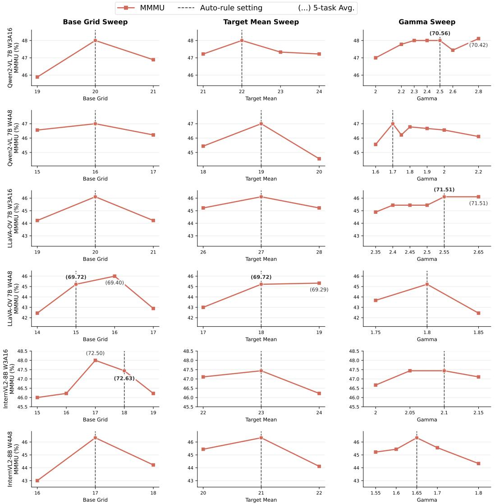  
Figure 9: Analysis of the proposed Quantization Effect-Guided Allocation Rule. Each row corresponds to a model and setting, and each column sweeps one allocation dimension (base grid, target mean, or γ) while keeping the others fixed. Numbers in parentheses indicate the 5-task average performance, and curves report MMMU performance. The dashed vertical line indicates the reference allocation in the sweep.

Table 7: W3A16 per-task results with LLM-backbone AWQ and GPTQ; FP16 is the reference. Bold denotes the best quantized result.
<table><tr><td>Model</td><td>Method MMMU</td><td>VizWiz</td><td>ScienceQA</td><td>ChartQA</td><td>AI2D Avg.</td></tr><tr><td rowspan="4">InternVL2</td><td>FP16</td><td>48.11</td><td>60.67</td><td>97.07</td><td>82.48 82.35 74.14</td></tr><tr><td>AWQ</td><td>45.22</td><td>58.06 95.84</td><td>79.36 79.99</td><td>71.69</td></tr><tr><td>GPTQ</td><td>41.33</td><td>60.52 93.90</td><td>75.68 75.58</td><td>69.40</td></tr><tr><td>Ours</td><td>47.44 59.77</td><td>96.18</td><td>80.12 79.63</td><td>72.63</td></tr><tr><td rowspan="4">LLaVA-OV</td><td>FP16</td><td>46.56</td><td>58.71</td><td>95.84</td><td>80.00 81.28 72.48</td></tr><tr><td>AWQ</td><td>41.78</td><td>58.59 95.09</td><td>77.04 78.59</td><td>70.22</td></tr><tr><td>GPTQ</td><td>37.22</td><td>51.79</td><td>90.43 72.68</td><td>75.19 65.46</td></tr><tr><td>Ours</td><td>46.11</td><td>60.28 94.94</td><td>77.20</td><td>79.02 71.51</td></tr><tr><td rowspan="4">Qwen2-VL</td><td>FP16</td><td>50.56</td><td>68.91</td><td>84.88 81.56</td><td>80.08 73.20</td></tr><tr><td>AWQ</td><td>45.56</td><td>63.18 82.10</td><td>78.44</td><td>77.46 69.35</td></tr><tr><td>GPTQ</td><td>41.89</td><td>67.13</td><td>77.79 72.56</td><td>72.22 66.32</td></tr><tr><td>Ours</td><td>48.00</td><td>66.86</td><td>82.30 77.84</td><td>77.82 70.56</td></tr></table>

Table 8: Per-task comparison of sensitivity-matched mixed precision, uniform CWE-20, and Ours under W3A16 and W4A8 target budgets. Bold denotes the best quantized result within each target setting. Collapse denotes severe performance breakdown with repetitive, invalid MMMU outputs; the five-task average is therefore omitted.
<table><tr><td>Model</td><td>Target</td><td>Method</td><td>MMMU</td><td>VizWiz</td><td>ScienceQA</td><td>ChartQA</td><td>AI2D</td><td>Avg.</td></tr><tr><td rowspan="6">InternVL2</td><td>FP16</td><td>FP</td><td>48.11</td><td>60.67</td><td>97.07</td><td>82.48</td><td>82.35</td><td>74.14</td></tr><tr><td rowspan="2"></td><td>Uniform CWE-20</td><td>45.11</td><td>59.27</td><td>95.93</td><td>79.48</td><td>79.86</td><td>71.93</td></tr><tr><td>W3A16 Mixed precision</td><td>35.11</td><td>54.21</td><td>80.07</td><td>55.76</td><td>64.67</td><td>57.96</td></tr><tr><td rowspan="2"></td><td>Ours</td><td>47.44</td><td>59.77</td><td>96.18</td><td>80.12</td><td>79.63</td><td>72.63</td></tr><tr><td>Uniform CWE-20</td><td>44.44</td><td>57.25</td><td>96.53</td><td>78.88</td><td>78.79</td><td>71.18</td></tr><tr><td rowspan="2">W4A8</td><td>Mixed precision</td><td>Collapse</td><td>8.50</td><td>30.44</td><td>2.80</td><td>21.15</td><td></td></tr><tr><td>Ours</td><td>46.33</td><td>58.01</td><td>96.58</td><td>78.44</td><td>79.83</td><td>71.84</td></tr><tr><td rowspan="8">LLaVA-OV</td><td rowspan="2">FP16</td><td>FP</td><td>46.56</td><td>58.71</td><td>95.84</td><td>80.00</td><td>81.28</td><td>72.48</td></tr><tr><td>Uniform CWE-20</td><td>45.22</td><td>60.35</td><td>95.09</td><td>77.36</td><td>78.76</td><td>71.36</td></tr><tr><td rowspan="2"></td><td>W3A16 Mixed precision</td><td>36.00</td><td>51.87</td><td>87.46</td><td>71.12</td><td>72.51</td><td>63.79</td></tr><tr><td>Ours</td><td>46.11</td><td>60.28</td><td>94.94</td><td>77.20</td><td>79.02</td><td>71.51</td></tr><tr><td rowspan="2">W4A8</td><td>Uniform CWE-20</td><td>44.78</td><td>55.04</td><td>93.41</td><td>74.52</td><td>78.01</td><td>69.15</td></tr><tr><td>Mixed precision</td><td>27.33</td><td>41.56</td><td>48.34</td><td>38.52</td><td>37.76</td><td>38.70</td></tr><tr><td rowspan="2">FP16</td><td>Ours</td><td>45.22</td><td>55.78</td><td>94.00</td><td>75.08</td><td>78.50</td><td>69.72</td></tr><tr><td>FP</td><td>50.56</td><td>68.91</td><td>84.88</td><td>81.56</td><td>80.08</td><td>73.20</td></tr><tr><td rowspan="6">Qwen2-VL</td><td rowspan="2"></td><td>Uniform CWE-20</td><td>47.22</td><td>67.06</td><td>81.76</td><td></td><td></td><td></td></tr><tr><td>W3A16 Mixed precision</td><td>40.00</td><td>55.63</td><td>76.05</td><td>78.24 71.76</td><td>78.08 66.35</td><td>70.47 61.96</td></tr><tr><td rowspan="2"></td><td>Ours</td><td>48.00</td><td>66.86</td><td>82.30</td><td>77.84</td><td>77.82</td><td>70.56</td></tr><tr><td>Uniform CWE-20</td><td></td><td></td><td></td><td></td><td></td><td></td></tr><tr><td rowspan="2">W4A8</td><td>Mixed precision</td><td>47.00 27.78</td><td>58.87 36.55</td><td>80.96 53.20</td><td>77.28 47.32</td><td>77.36 44.07</td><td>68.29</td></tr><tr><td>Ours</td><td>47.00</td><td>62.93</td><td>80.81</td><td>77.12</td><td>76.33</td><td>41.78 68.84</td></tr></table>

## C.2 LLM-BACKBONE QUANTIZATION BASELINES

To compare Balanced Fitting with established language-model quantization methods, we apply AWQ (Lin et al., 2024) and GPTQ (Frantar et al., 2022) to the LLM backbone under W3A16 while keeping the visual encoder in FP.

Table 7 shows that Ours achieves a higher five-task average on all three models. This comparison extends the evaluation beyond LVLM-specific baselines and supports the value of allocating fitting capacity using quantization effects measured on multimodal calibration data.

## C.3 SENSITIVITY-MATCHED MIXED PRECISION

To distinguish allocating search capacity from allocating numerical precision, we construct a mixedprecision control using the same quantization effect scores. The control assigns W2/W3/W4 at an exact parameter-weighted 3-bit average for W3A16, or fixes W4 and assigns A4/A8/A16 at an exact input-width-weighted 8-bit average for W4A8, monotonically following the same QE score. Every layer uses 20-candidate CWE.

Table 8 compares it with uniform 20-candidate search and Ours. Ours outperforms both controls across all three models and both target budgets. Thus, directly translating the same sensitivity signal into bit-width allocation does not reproduce the benefit of Balanced Fitting in these settings. Adjusting search capacity also retains uniform inference precision; this comparison concerns the tested mixed-precision control rather than mixed-precision methods in general.

## C.4 QIG WITH A LARGER CALIBRATION SET

QIG (Xiang et al., 2026) uses 128 calibration pairs in its reported setting, whereas our main comparison fixes all methods to 64 pairs for a matched calibration-data budget. To check whether this choice accounts for our advantage, Table 9 additionally compares QIG with 128 pairs against Ours with 64.

Despite using half as many calibration pairs, Ours achieves the higher five-task average in five of the six model-precision settings; Qwen2-VL under W3A16 is the exception. These results support calibration-data efficiency without implying that Ours wins on every individual task.

Table 9: Five-task comparison between QIG with 128 calibration pairs and Ours with 64 pairs. Avg. is the unweighted five-task mean.
<table><tr><td>Model</td><td>Precision Method</td><td></td><td>MMMU</td><td>VizWiz</td><td>ScienceQA</td><td>ChartQA</td><td>AI2D</td><td>Avg.</td></tr><tr><td rowspan="3">InternVL2</td><td>FP16</td><td>FP</td><td>48.11</td><td>60.67</td><td>97.07</td><td>82.48</td><td>82.35</td><td>74.14</td></tr><tr><td>W3A16</td><td>QIG (n = 128) Ours (n = 64)</td><td>45.44 47.44</td><td>59.05 59.77</td><td>96.33 96.18</td><td>79.76 80.12</td><td>80.05 79.63</td><td>72.13 72.63</td></tr><tr><td>W4A8</td><td>QIG (n = 128)</td><td>45.56</td><td>56.19</td><td>96.73</td><td>79.32</td><td>79.21</td><td>71.40</td></tr><tr><td rowspan="4"></td><td>FP16</td><td>Ours (n = 64) FP</td><td>46.33 46.56</td><td>58.01 58.71</td><td>96.58 95.84</td><td>78.44 80.00</td><td>79.83 81.28</td><td>71.84 72.48</td></tr><tr><td>LLaVA-OV W3A16</td><td>QIG (n = 128)</td><td>45.00</td><td>60.21</td><td>95.09</td><td>77.44</td><td>79.05</td><td>71.36</td></tr><tr><td></td><td>Ours (n = 64)</td><td>46.11</td><td>60.28</td><td>94.94</td><td>77.20</td><td>79.02</td><td>71.51</td></tr><tr><td>W4A8</td><td>QIG (n = 128) Ours (n = 64)</td><td>43.22 45.22</td><td>53.96 55.78</td><td>94.25 94.00</td><td>75.12 75.08</td><td>77.88 78.50</td><td>68.89 69.72</td></tr><tr><td rowspan="4">Qwen2-VL</td><td>FP16</td><td>FP</td><td>50.56</td><td>68.91</td><td>84.88</td><td>81.56</td><td>80.08</td><td>73.20</td></tr><tr><td>W3A16</td><td>QIG (n = 128)</td><td>47.44</td><td>67.44</td><td>83.19</td><td>78.04</td><td>77.27</td><td>70.68</td></tr><tr><td></td><td>Ours (n = 64)</td><td>48.00</td><td>66.86</td><td>82.30</td><td>77.84</td><td>77.82</td><td>70.56</td></tr><tr><td rowspan="2">W4A8</td><td>QIG (n = 128)</td><td>45.33</td><td>59.78</td><td>81.56</td><td>76.68</td><td>76.91</td><td>68.05</td></tr><tr><td>Ours (n = 64)</td><td>47.00</td><td>62.93</td><td></td><td>80.81</td><td>77.12</td><td>76.33 68.84</td></tr></table>

## C.5 BLOCK-SENSITIVITY ALLOCATION CONTROLS

We compare two block-sensitivity controls under W4A8 using the same 64 COCO calibration pairs and CWE search setup. Both rank layers by unsigned, unweighted block reconstruction error, assigning larger grids to more sensitive layers. Fixed-grid Block independently assigns grids {16, 18, 20, 22, 24} to five ordered sensitivity groups, placing residual layers in the middle group to retain an exact mean of 20. It does not use our grid distribution or QE-to-budget rule. Ours-gridmatched Block instead reassigns the exact grid-size multiset of Ours according to block sensitivity, preserving its total search budget. Ours uses target mean grids of 21, 18, and 19 for InternVL2, LLaVA-OV, and Qwen2-VL, respectively; the independent control therefore has a comparable, but not identical, budget.

Table 10 shows that Ours achieves the highest five-task average against both controls on all three models. Relative to Fixed-grid Block, MMMU improves on every model, by up to 2.55 points; VizWiz improves on two models, by up to 3.43 points. The controls answer complementary questions: Fixed-grid Block compares the complete allocation procedure with an independent blockbased policy, whereas Ours-grid-matched Block isolates layer assignment at the same grid distribution. They are not successive ablations, and inheriting our grid distribution alone does not consistently improve block-based allocation.

Table 10: W4A8 per-task comparison with independent fixed-grid Block sensitivity. FP16 is the reference; bold denotes the best quantized result within each model.
<table><tr><td>Model</td><td>Method</td><td>MMMU</td><td>VizWiz ScienceQA</td><td></td><td>ChartQA</td><td>AI2D</td><td>Avg.</td></tr><tr><td rowspan="4">InternVL2</td><td>FP16</td><td>48.11</td><td>60.67</td><td>97.07</td><td>82.48</td><td>82.35</td><td>74.14</td></tr><tr><td>Fixed-grid Block</td><td>43.78</td><td>55.93</td><td>96.63</td><td>78.48</td><td>78.89</td><td>70.74</td></tr><tr><td>Ours-grid-matched Block</td><td>44.00</td><td>57.47</td><td>96.33</td><td>78.80</td><td>79.57</td><td>71.23</td></tr><tr><td>Ours</td><td>46.33</td><td>58.01</td><td>96.58</td><td>78.44</td><td>79.83</td><td>71.84</td></tr><tr><td rowspan="4">LLaVA-OV</td><td>FP16</td><td>46.56</td><td>58.71</td><td>95.84</td><td>80.00</td><td>81.28</td><td>72.48</td></tr><tr><td>Fixed-grid Block</td><td>44.22</td><td>56.19</td><td>94.79</td><td>74.40</td><td>78.50</td><td>69.62</td></tr><tr><td>Ours-grid-matched Block</td><td>45.22</td><td>54.56</td><td>94.40</td><td>74.64</td><td>78.04</td><td>69.37</td></tr><tr><td>Ours</td><td>45.22</td><td>55.78</td><td>94.00</td><td>75.08</td><td>78.50</td><td>69.72</td></tr><tr><td rowspan="4">Qwen2-VL</td><td>FP16</td><td>50.56</td><td>68.91</td><td>84.88</td><td>81.56</td><td>80.08</td><td>73.20</td></tr><tr><td>Fixed-grid Block</td><td>46.44</td><td>59.50</td><td>80.81</td><td>76.76</td><td>77.33</td><td>68.17</td></tr><tr><td>Ours-grid-matched Block</td><td>45.56</td><td>60.24</td><td>80.52</td><td>76.68</td><td>76.68</td><td>67.94</td></tr><tr><td>Ours</td><td>47.00</td><td>62.93</td><td>80.81</td><td>77.12</td><td>76.33</td><td>68.84</td></tr></table>

## C.6 COMPUTATIONAL COST

Table 11 reports W4A8 calibration wall-clock time on COCO-64, excluding model loading and evaluation. Ours runs three quantization effect analyses concurrently on three NVIDIA RTX A6000 GPUs (48GB each); each CWE search run and both baselines use one GPU. Thus, this comparison measures wall-clock time under different GPU allocations, rather than matched compute.

Ours has the shortest CWE search time on all three models, which offsets much of the additional effect-analysis time. Its total elapsed time is lower than QIG on all three models and lower than MBQ on LLaVA-OV, while MBQ remains faster on InternVL2 and Qwen2-VL. The benefit is therefore comparable calibration turnaround under the stated hardware allocation, not a claim of uniformly lower computational cost. Calibration is performed once and introduces no inference overhead.

Table 11: W4A8 calibration time on NVIDIA RTX A6000 48GB GPUs using 64 COCO samples; model loading and evaluation are excluded. Times are wall-clock times.
<table><tr><td>Model</td><td>Method</td><td>1Analysis</td><td>CWE search</td><td>Total</td></tr><tr><td>InternVL2</td><td>MBQ QIG Ours</td><td>0m 56s 4m 24s 21m 02s</td><td>24m 12s 23m 30s 6m 28s</td><td>25m 08s 27m 54s 27m 30s</td></tr><tr><td>LLaVA-OV</td><td>MBQ QIG Ours</td><td>1m 10s 7m 04s 32m 11s</td><td>35m 02s 35m 31s 1m 55s</td><td>36m 12s 42m 35s 34m 06s</td></tr><tr><td>Qwen2-VL</td><td>MBQ QIG Ours</td><td>1m 01s 4m 49s 18m 59s</td><td>26m 21s 26m 57s 31m 46s</td><td>27m 22s 8m 41s 27m 40s</td></tr></table>

## D QUANTIZATION EFFECT AND PREDICTION ANALYSES

## D.1 STABILITY METRIC DEFINITIONS

To test whether the allocation signal depends on a particular calibration subset, Table 5 compares three disjoint calibration subsets with an independent held-out subset. Components are ranked by calibration mean relative absolute QE. QE mass is the captured fraction of absolute QE. Three-subset agreement requires matching signs across all calibration subsets; held-out agreement compares their majority sign with the held-out sign. Beneficial held-out agreement restricts this comparison to calibration-beneficial effects. Ranking uses calibration data only, so the held-out subset tests whether the selected effects retain their direction on unseen samples.

Agreement is strongest for high-magnitude effects, including beneficial ones, supporting both refinement and coarsening decisions. This analysis tests the stability of the allocation signal, rather than the variance of final downstream performance across calibration seeds.

## D.2 CONTROLLED SEARCH GRANULARITY

To examine whether coarser fitting can help independently of bit-width allocation, we use W4A8 and COCO-64 and vary only the CWE grids that Ours coarsens below the 20-point reference, keeping precision and all remaining grids fixed. Fine replaces these counts with 25 for InternVL2 and 23 for LLaVA-OV and Qwen2-VL; Mid uses 20, and Coarse retains the original Ours counts. All counts uniformly discretize the same exponent interval [0, 1], so their interior candidates need not be nested. After recalibration, we compare aligned per-channel scale vectors.

Table 12 shows that Coarse achieves the highest five-task average on all three models despite highly similar Fine-Coarse scale vectors. The intermediate setting is not consistently better than Fine, so the result does not suggest a monotonic benefit from reducing candidates. Instead, it supports selectively restricting fitting capacity according to the QE-guided allocation.

Table 12: W4A8 per-task results under controlled search granularity. Fine-Coarse scale-vector cosine similarity is 0.9895 / 0.9955 / 0.9902 for InternVL2 / LLaVA-OV / Qwen2-VL, respectively. Bold denotes the best quantized result.
<table><tr><td>Model</td><td>Setting</td><td>MMMU</td><td>VizWiz ScienceQA</td><td></td><td>ChartQA AI2D</td><td>Avg.</td></tr><tr><td rowspan="4">InternVL2</td><td>FP16</td><td>48.11</td><td>60.67</td><td>97.07</td><td>82.48 82.35</td><td>74.14</td></tr><tr><td>Fine</td><td>45.11</td><td>57.39</td><td>96.63</td><td>78.96 79.15</td><td>71.45</td></tr><tr><td>Mid</td><td>45.22</td><td>57.26</td><td>96.63</td><td>78.52 78.14</td><td>71.15</td></tr><tr><td>Coarse (Ours)</td><td>46.33</td><td>58.01</td><td>96.58</td><td>78.44 79.83</td><td>71.84</td></tr><tr><td rowspan="4">LLaVA-OV</td><td>FP16</td><td>46.56</td><td>58.71</td><td>95.84</td><td>80.00 81.28</td><td>72.48</td></tr><tr><td>Fine</td><td>43.67</td><td>55.36</td><td>94.35</td><td>75.08 78.11</td><td>69.31</td></tr><tr><td>Mid</td><td>42.22</td><td>55.93</td><td>93.51</td><td>75.04 78.24</td><td>68.99</td></tr><tr><td>Coarse (Ours)</td><td>45.22</td><td>55.78</td><td>94.00</td><td>75.08 78.50</td><td>69.72</td></tr><tr><td rowspan="4">Qwen2-VL</td><td>FP16</td><td>50.56</td><td>68.91</td><td>84.88</td><td>81.56 80.08</td><td>73.20</td></tr><tr><td>Fine</td><td>46.89</td><td>61.58</td><td>80.42</td><td>77.00 76.59</td><td>68.50</td></tr><tr><td>Mid</td><td>46.89</td><td>61.64</td><td>80.61</td><td>76.52 77.20</td><td>68.57</td></tr><tr><td>Coarse (Ours)</td><td>47.00</td><td>62.93</td><td>80.81</td><td>77.12 76.33</td><td>68.84</td></tr></table>

## D.3 FULL-SET FP-ANSWER TRANSITIONS

To determine whether the gains primarily come from correcting FP mistakes or avoiding new errors, we evaluate all paired FP–PTQ predictions on MMMU (900), VizWiz (4,319), ScienceQA (2,017), ChartQA (2,500), and AI2D (3,088): 12,824 examples per model and precision. Correctness follows each benchmark's evaluator, with positive VQA credit counted as correct for VizWiz. Transition rates use their corresponding FP-wrong or FP-correct subset; fixes/new errors is a ratio of counts.

Table 13 shows that Ours consistently reduces new errors and improves retention and the fixes/newerrors ratio, while its correction rate is not uniformly highest. The aggregate gains therefore primarily reflect better preservation of correct FP behavior and fewer newly introduced errors, complemented by corrections of some FP mistakes. This full-set analysis provides context for the qualitative examples rather than relying on selected corrections alone.

Table 13: Full-set FP-answer transitions under W3A16 and W4A8. Rates are conditional on the corresponding FP-correct or FP-wrong subset.
<table><tr><td colspan="3"></td><td rowspan="2">FP wrong → correct (%)</td><td rowspan="2">FP correct → FP correct → wrong (%)</td><td rowspan="2">correct (%)</td><td rowspan="2">Fixes/ new errors</td></tr><tr><td>Model</td><td>Precision</td><td>Method</td></tr><tr><td rowspan="6">InternVL2</td><td rowspan="3">W3A16</td><td>MBQ</td><td>15.92</td><td>6.99</td><td>93.01</td><td>0.63</td></tr><tr><td>QIG</td><td>14.27</td><td>6.70</td><td>93.30</td><td>0.59</td></tr><tr><td>Ours</td><td>15.38</td><td>6.23</td><td>93.77</td><td>0.68</td></tr><tr><td rowspan="3">W4A8</td><td>MBQ</td><td>19.13</td><td>9.00</td><td>91.00</td><td>0.59</td></tr><tr><td>QIG</td><td>16.53</td><td>8.98</td><td>91.02</td><td>0.51</td></tr><tr><td>Ours</td><td>19.02</td><td>8.32</td><td>91.68</td><td>0.63</td></tr><tr><td rowspan="5">LLaVA-OV</td><td rowspan="3">W3A16</td><td>MBQ</td><td>22.52</td><td>8.59</td><td>91.41</td><td>0.80</td></tr><tr><td>QIG</td><td>21.78</td><td>8.33</td><td>91.67</td><td>0.80</td></tr><tr><td>Ours</td><td>23.05</td><td>7.94</td><td>92.06</td><td>0.88</td></tr><tr><td rowspan="3">W4A8</td><td>MBQ</td><td>23.02</td><td>12.81</td><td>87.19</td><td>0.55</td></tr><tr><td>QIG</td><td>20.01</td><td>12.26</td><td>87.74</td><td>0.50</td></tr><tr><td>Ours</td><td>22.19</td><td>10.70</td><td>89.30</td><td>0.63</td></tr><tr><td rowspan="6">Qwen2-VL</td><td rowspan="3">W3A16</td><td>MBQ</td><td>20.28</td><td>9.74</td><td>90.26</td><td>0.55</td></tr><tr><td>QIG</td><td>19.76</td><td>9.50</td><td>90.50</td><td>0.55</td></tr><tr><td>Ours</td><td>20.73</td><td>8.70</td><td>91.30</td><td>0.63</td></tr><tr><td rowspan="3">W4A8</td><td>MBQ</td><td>19.99</td><td>13.44</td><td>86.56</td><td>0.40</td></tr><tr><td>QIG</td><td>20.58</td><td>12.22</td><td>87.78</td><td>0.45</td></tr><tr><td>Ours</td><td>19.80</td><td>11.02</td><td>88.98</td><td>0.48</td></tr></table>

## D.4 QE UNDER JOINT QUANTIZATION

Isolated component effects may change when multiple components are quantized together. To examine whether their direction remains informative in that setting, we compare isolated QE with restoration-based QE obtained by restoring one layer-component to FP in an otherwise quantized model. We define restoration-based QE as $\mathcal { L } _ { \mathrm { r e s t o r e } } - \mathcal { L } _ { \mathrm { j o i n t } }$ , the calibration loss after restoration minus that of the jointly quantized model; positive values indicate that retaining the quantized component lowers loss. Both use COCO-64 with allocation and CWE search disabled. QE mass uses absolute isolated QE; beneficial agreement considers only beneficial isolated effects.

Table 14 reports sign agreement between isolated and restoration-based QE, with stronger agreement for high-magnitude effects, including beneficial effects. This supports using isolated measurements to identify influential components even in jointly quantized models. The imperfect agreement also indicates that isolated effects do not fully capture interactions among quantized components.

Table 14: Agreement between isolated QE and restoration-based QE in jointly quantized W3A16 and W4A8 models. Parentheses give agreement counts.
<table><tr><td>QE-ranked subset</td><td>Count</td><td>QE mass</td><td>Joint sign agreement</td><td>Beneficial joint agreement</td></tr><tr><td>Top 50%</td><td>176</td><td>91.50%</td><td>68.20% (120/176)</td><td>75.60% (34/45)</td></tr><tr><td>Top 25%</td><td>88</td><td>75.80%</td><td>81.80% (72/88)</td><td>95.50% (21/22)</td></tr><tr><td>Top 10%</td><td>38</td><td>58.20%</td><td>89.50% (34/38)</td><td>100% (11/11)</td></tr></table>

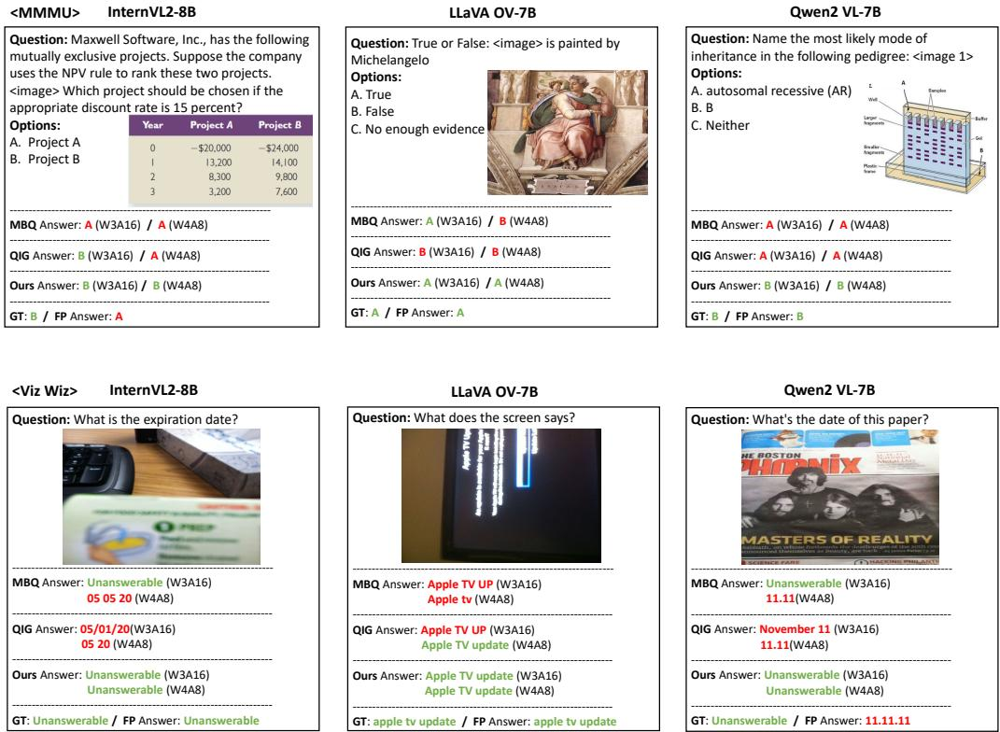  
Figure 10: Additional qualitative comparison on MMMU and VizWiz.

## E ADDITIONAL QUALITATIVE RESULTS

Figure 10 and Figure 11 provide additional qualitative comparisons on five vision-language benchmarks (Yue et al., 2024; Gurari et al., 2018; Lu et al., 2022; Masry et al., 2022; Kembhavi et al., 2017) across three LVLMs (Chen et al., 2024b; Li et al., 2024; Wang et al., 2024b).

Consistent with the full-set transition analysis, baseline PTQ methods (MBQ (Li et al., 2025) and QIG (Xiang et al., 2026)) can replicate incorrect FP predictions or introduce specific but erroneous outputs under low-bit settings, particularly in W4A8. In contrast, our method more reliably preserves correct FP predictions and introduces fewer new errors; selected examples also show corrections of FP errors. On MMMU (Yue et al., 2024), the examples illustrate that selective coarse fitting need not reproduce an incorrect FP answer and can recover the correct choice. On VizWiz (Gurari et al., 2018), where inputs are often ambiguous or low-quality, baseline methods frequently generate incorrect specific answers, while our method produces more reliable outputs, including correctly identifying unanswerable cases. Figure 11 shows similar trends on ScienceQA (Lu et al., 2022), ChartQA (Masry et al., 2022), and AI2D (Kembhavi et al., 2017). Across these structured reasoning and diagram understanding tasks, our method primarily benefits from preserving valid FP behavior while using regularization-like constrained fitting to reduce calibration-specific overfitting.

Overall, these results suggest that our approach better balances precise fitting and regularizationlike capacity control, preserving valid FP behavior and improving generalization under aggressive quantization.

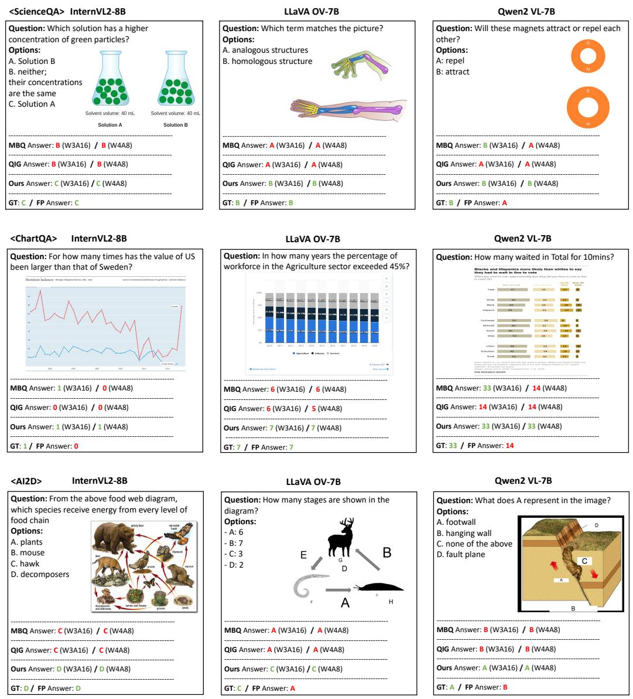  
Figure 11: Additional qualitative comparison on ScienceQA, ChartQA, and AI2D.