# BEYOND TOKEN SCALE: CHUNK-LEVEL SPARSE AUTOENCODERS FOR RELIABLE SEMANTIC FEATURE DISCOVERY

Xu Wang1,2 Yifan Yang2 Tinghao Yu2 Difan Zou1

1The University of Hong Kong 2Hunyuan Team, Tencent

{sunny615@connect.hku.hk, dzou@hku.hk} {ioanyang, maxwellyu}@tencent.com

§ github.com/Xu0615/Chunk\_Level\_SAE

## ABSTRACT

Sparse autoencoders (SAEs) expose features that help us understand and steer language models, but faithful reconstruction does not guarantee informative concepts. Token-level objectives reward lexical and formatting details alongside semantic content, all competing for a limited sparse budget. We introduce a family of chunklevel SAEs that encode mean-pooled activations over chunks, each a contiguous span of tokens: Mean-Chunk reconstructs the observed chunk, Cross-Chunk predicts an independently processed neighbor, and Joint-Chunk combines both targets. These designs separate the effect of a larger observation unit from that of predicting information shared across passages. With matched training data, chunk-level SAEs remain powerful interpretability tools while learning reliable semantic features that capture high-level concepts and respond selectively to relevant content. Their strengths are complementary: Mean-Chunk improves high-level feature discovery, reasoning detection beyond surface cues, and steering; Cross-Chunk leads document retrieval and classification transfer while producing selective, persistent features. Changing what an SAE sees and predicts yields reliable semantic features for more meaningful tasks. We demonstrate their practical value through gains across downstream tasks such as retrieval, reasoning detection, and steering.

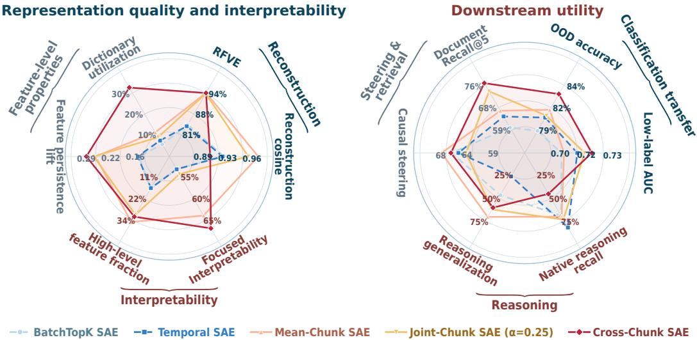  
Figure 1: SAE representation quality and downstream utility. Left: reconstruction fidelity (activation preservation), semantic interpretability (concept clarity and abstraction), feature persistence (consistency across related contexts), and dictionary utilization (breadth of feature use). Right: retrieval (semantic matching), classification transfer (domain generalization and label efficiency), reasoning detection (sensitivity beyond surface cues), and steering (causal output control). Chunk-level SAEs learn more meaningful features with complementary strengths across downstream tasks.

## 1 INTRODUCTION

Language models are remarkably capable, yet understanding how they arrive at their outputs remains difficult: information is distributed across many neurons, whose individual activities often have no clear meaning. Sparse autoencoders (SAEs) offer a more interpretable view by decomposing activations into sparse combinations of features (Bricken et al., 2023; Huben et al., 2024; Templeton et al., 2024). These features provide concrete handles for editing causal circuits (Marks et al., 2025), selectively unlearning knowledge (Farrell et al., 2024; Wang et al., 2025b), and steering instruction-following behavior (He et al., 2025). The appeal of SAEs is therefore practical: revealing human-readable concepts we can inspect and use to understand or steer model behavior.

In addition to the standard SAE, a number of different architectures have been recently developed, such as Gated (Rajamanoharan et al., 2024a), JumpReLU (Rajamanoharan et al., 2024b), TopK (Gao et al., 2024), BatchTopK (Bussmann et al., 2024), Matryoshka (Bussmann et al., 2025), and Temporal (Bhalla et al., 2026), to further improve reconstruction under a limited sparsity budget through better gating, feature selection, and dictionary organization. These token-level SAEs encode individual token states and retain token reconstruction as their common target. However, better reconstruction may not guarantee better semantic features (Karvonen et al., 2025; Chanin & Garriga-Alonso, 2025): architectural improvements remain centered on reconstruction loss, while semantic feature quality is less directly constrained. A concrete example has been observed for reasoning feature detection via SAE (Ma et al., 2026): “The route is blocked; let’s return and try another” expresses backtracking without “wait,” whereas “Please wait by the entrance” contains the cue without any backtracking. Therefore, a semantically coherent feature should recognize the revision of a plan across different wordings and reject isolated surface cues.

Features that track meaning across different wordings need to capture more than isolated lexical cues, making longer spans a natural unit for sparse coding. Recent work takes steps in this direction: turn-averaged SAEs pool activations to discover high-level features in multi-turn dialogue (Der et al., 2026), while step-level SAEs reconstruct reasoning steps conditioned on prior context (Yang et al., 2026). These approaches motivate moving beyond individual tokens, but a broader input alone does not determine what features will learn. Reconstructing a pooled representation still rewards any words or formatting preserved in the average, whereas predicting a related passage may favor information that carries across different wordings. We therefore study two distinct choices together in ordinary text: how much text should a feature encode, and what should it predict?

These two questions naturally lead to our method: a family of chunk-level SAEs that varies both the scale of observation and the target of prediction. A chunk is a contiguous span of tokens, and we train on pairs of non-overlapping chunks of varying lengths from the same document, processing each independently. Moreover, we consider three different chunk-level SAEs, each designed to preserve different information: Mean-Chunk reconstructs a chunk’s own mean activation, Cross-Chunk predicts the mean activation of its same-document neighbor, and Joint-Chunk combines both targets through a nested shared dictionary. Using the same sparse-coding backbone and token stream across multiple chunk lengths lets us separate the benefits of pooling from those of predicting a neighboring passage. Together, these designs show how the input span and prediction target shape what features learn and how selectively they respond to content across passages.

The resulting dictionaries retain strong target-relative fidelity while uncovering reliable semantic features, making SAEs more effective interpretability tools (see Figure 1). These features capture meaningful concepts across different wordings, with activation patterns that follow relevant content while largely rejecting unrelated cues. The difference becomes particularly clear in the inspected passage traces. On a news passage, token-level SAEs can activate several unrelated features, obscuring which aspects of the text they represent. Cross-Chunk instead produces a cleaner pattern, with activity concentrated in features relevant to the passage and unrelated features remaining largely inactive. This makes it easier to connect a feature’s explanation to its observed behavior in context. Chunk-level training thus improves both the semantic content of the dictionary and the clarity of its responses. We summarize the contributions of this paper as follows:

• We introduce a family of chunk-level SAEs for semantic feature discovery. Mean-Chunk reconstructs a span’s mean activation, Cross-Chunk predicts an independently processed neighbor, and Joint-Chunk combines the two through a nested dictionary. A shared sparse-coding backbone, token stream, and range of chunk lengths make the roles of pooling and partner prediction explicit • Chunk-level training improves semantic feature quality and cross-passage consistency. In a random sample of dictionary coordinates, Mean-Chunk more than doubles the high-level feature fraction to 34.8% from BatchTopK’s 17.2%, while retaining strong target-relative fidelity. Across related passages, Cross-Chunk achieves the strongest feature persistence and over five times BatchTopK’s dictionary utilization, alongside more human-readable explanations than the token-level baselines.

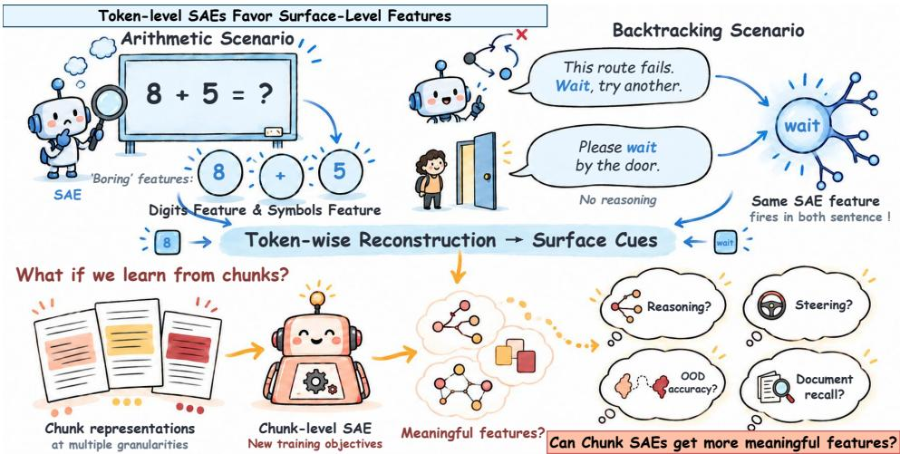  
Figure 2: Rethinking token-level sparse autoencoders. Top left: An arithmetic example illustrates we often get ’boring’ features. Top right: The same feature activates on “wait” in both backtracking and non-reasoning contexts. Bottom: We investigate whether modifying input granularity and training objectives yields more meaningful SAE features and validate across diverse downstream applications.

• We further demonstrate that the improvements of Chunk-level SAEs can be extended to downstream tasks that restrict reliance on surface cues. In retrieval with little lexical overlap, Cross-Chunk reaches 77.0% Recall@5 versus 64.1% for Temporal, the strongest token-level baseline. Even after reasoning cues are removed, Mean-Chunk detects backtracking with 66% recall versus under 5% for both token baselines, a gain of over 60 percentage points. Cross-Chunk also leads classification transfer, while Mean-Chunk achieves the highest steering.

## 2 TOKEN-LEVEL SAES FAVOR SURFACE-LEVEL FEATURES

SAEs use dictionary learning to expose interpretable directions in model activations (Olshausen & Field, 1996; Elhage et al., 2022). We use BatchTopK and Temporal SAEs as representative token-level baselines: both reconstruct individual token states under a limited sparse budget, while Temporal additionally encourages consistency between neighboring codes.

A shared sparse-coding backbone. For an input $\textbf { x } \in \ \mathbb { R } ^ { d }$ , the encoder computes ${ \bf a } ( { \bf x } ) { \bf \beta } = { \bf \beta }$ ReL $\mathrm { U } ( W _ { \mathrm { e n c } } ( s \mathbf { x } - \mathbf { b } _ { \mathrm { i n } } ) + \mathbf { b } _ { \mathrm { e n c } } )$ . The sparse code and decoded prediction are

$$
\begin{array} { r } { { \bf z } ( { \bf x } ) = \mathrm { B a t c h T o p K } _ { K } ( { \bf a } ( { \bf x } ) ) , \qquad \widehat { \bf y } ( { \bf x } ) = W _ { \mathrm { d e c } } { \bf z } ( { \bf x } ) + { \bf b } _ { \mathrm { o u t } } . } \end{array}\tag{1}
$$

Here, $W _ { \mathrm { e n c } } \in \mathbb { R } ^ { m \times d } , W _ { \mathrm { d e c } } \in \mathbb { R } ^ { d \times m }$ , and s fixes the activation scale. BatchTopK retains the largest positive activations under a batch-wide budget of nK for n inputs (Bussmann et al., 2024). All methods normalize decoder columns and use squared reconstruction error $\mathcal { L } _ { \mathrm { r e c } } ( \mathbf { x } , \mathbf { y } ) = \| \widehat { \mathbf { y } } ( \mathbf { x } ) - s \mathbf { y } \| _ { 2 } ^ { 2 }$ The shared AuxK penalty revives inactive features with weight $\lambda _ { \mathrm { a u x } } = 0 . 0 6 2 5$ (Gao et al., 2024).

Token-level training objectives. BatchTopK reconstructs each contextualized token state $\mathbf { h } _ { t }$ . Temporal adds prefix reconstruction and symmetric contrastive alignment between adjacent-token prefix codes (Bhalla et al., 2026; van den Oord et al., 2018):

$$
\mathcal { L } _ { \mathrm { B a t c h T o p K } } = \mathbb { E } _ { t } [ \mathcal { L } _ { \mathrm { r e c } } ( \mathbf { h } _ { t } , \mathbf { h } _ { t } ) ] + \lambda _ { \mathrm { a u x } } \mathcal { L } _ { \mathrm { A u x K } } ,\tag{2}
$$

$$
{ \mathcal { L } } _ { \mathrm { T e m p o r a l } } = { \frac { 0 . 8 { \mathcal { L } } _ { \mathrm { f u l l } } + 0 . 2 { \mathcal { L } } _ { H } } { 2 } } + { \mathcal { L } } _ { \mathrm { I n f o N C E } } ^ { \mathrm { s y m } } + \lambda _ { \mathrm { a u x } } { \mathcal { L } } _ { \mathrm { A u x K } } .\tag{3}
$$

Here, $\mathbb { E } _ { t }$ is computed by averaging the reconstruction loss over all non-padding token positions in each training minibatch, with equal weight for each position. The full-code loss ${ \mathcal { L } } _ { \mathrm { f u l l } }$ uses the same averaging rule. The prefix loss $\mathcal { L } _ { H }$ instead averages over tokens with a preceding token in the same input sequence, measuring how well a designated subset of features reconstructs the current token. The contrastive term encourages this subset to carry similar information across neighboring tokens. Temporal therefore changes how features relate across tokens, but both baselines still learn to reproduce individual token states. This objective rewards surface details alongside semantic content, motivating our shift toward observing and predicting longer spans. See Appendix A.3 for details.

## 3 DESIGNING CHUNK-LEVEL SAES TO LEARN MEANINGFUL FEATURES

Our design assigns one sparse code to a text span rather than to each token. We form adjacent, non-overlapping chunks A and B from the same document and process them independently, resetting position indices and blocking attention between them. For a chunk A containing $L _ { A }$ tokens, its mean activation is $\begin{array} { r } { \pmb { \mu } _ { A } = L _ { A } ^ { - 1 } \sum _ { t = 1 } ^ { L _ { A } } \mathbf { h } _ { t } ^ { A } } \end{array}$ , where $\mathbf { h } _ { t } ^ { A } \in \mathbb { R } ^ { d }$ is the layer-ℓ activation at position $t ; \pmb { \mu } _ { B }$ is defined analogously. We vary both chunk lengths to cover different context scales and encode each mean using $\operatorname { E q . 1 }$ . This gives us a common starting point for comparing three training targets: reconstructing the observed chunk, predicting its neighbor, and combining both tasks.

## 3.1 MEAN-CHUNK: RECONSTRUCTING THE CHUNK MEAN

The first step is to give each sparse code a broader view of the text without changing the reconstruction task. Averaging token activations lets the code describe a span as a whole, rather than spend a separate sparse budget at every position. Mean-Chunk therefore encodes the pooled activation $\pmb { \mu } _ { A }$ and learns to reconstruct that same mean:

$$
\begin{array} { r } { \mathcal { L } _ { \mathrm { m e a n } } = \mathbb { E } _ { A } [ \mathcal { L } _ { \mathrm { r e c } } ( \pmb { \mu } _ { A } , \pmb { \mu } _ { A } ) ] + \lambda _ { \mathrm { a u x } } \mathcal { L } _ { \mathrm { A u x K } } . } \end{array}\tag{4}
$$

Here, $\mathbb { E } _ { A }$ averages over chunks produced by the shared training-pair sampler, using the chunk lengths specified in Appendix A. In each minibatch, we average the per-chunk reconstruction losses, so each sampled chunk contributes one loss regardless of its length. The reconstruction error $\mathcal { L } _ { \mathrm { r e c } }$ is defined in Section 2, and the shared AuxK penalty revives inactive features with weight $\lambda _ { \mathrm { a u x } } = 0 . 0 6 2 5$ . This design isolates the effect of pooling, which preserves both semantic content and surface details.

## 3.2 CROSS-CHUNK: PREDICTING A SAME-DOCUMENT NEIGHBOR

To change that priority, Cross-Chunk asks the code to predict a neighboring passage instead of reconstructing its own input. Two passages may describe the same event in different words, so their shared subject can help predict the neighbor even when passage-specific details cannot. We implement this idea by replacing the self target in Eq. 4 with the neighboring chunk’s mean and averaging both prediction directions:

$$
\begin{array} { r } { \mathcal { L } _ { \mathrm { c r o s s } } = \frac { 1 } { 2 } \mathbb { E } _ { A , B } \left[ \mathcal { L } _ { \mathrm { r e c } } ( \mu _ { A } , \mu _ { B } ) + \mathcal { L } _ { \mathrm { r e c } } ( \mu _ { B } , \mu _ { A } ) \right] + \lambda _ { \mathrm { a u x } } \mathcal { L } _ { \mathrm { A u x K } } . } \end{array}\tag{5}
$$

The expectation averages over neighboring chunk pairs, with the factor $1 / 2$ equally weighting prediction from A to $B$ and from B to A. Both directions use the same encoder and decoder, so each chunk serves as both input and target. Independent processing prevents the encoder from reading the target passage, encouraging it to capture information in the input that helps predict its neighbor. Shared topics can therefore be more useful than passage-specific wording.

## 3.3 JOINT-CHUNK: BALANCING SELF AND PARTNER TARGETS

Joint-Chunk encodes the observed chunk mean $\pmb { \mu } _ { A }$ once, producing $\mathbf { z } _ { A } = \mathbf { z } ( \mu _ { A } )$ with dictionary width $m = 6 5 , 5 3 6$ and batch-average sparse budget $K = 1 2 8$ . Its two predictions are

$$
{ \widehat { \bf y } } _ { \mathrm { s e l f } } ( \mu _ { A } ) = W _ { \mathrm { d e c } } { \bf z } _ { A } + { \bf b } _ { \mathrm { s e l f } } , \qquad { \widehat { \bf y } } _ { \mathrm { p a r t n e r } } ( \mu _ { A } ) = W _ { \mathrm { d e c } } [ ; , 1 : h ] { \bf z } _ { A , 1 : h } + { \bf b } _ { \mathrm { p a r t n e r } } , \quad h = 3 2 , 7 6 8 . \dots ,\tag{6}
$$

The self decoder reads the full sparse code, while the partner decoder reads only its shared prefix. Prefix coordinates therefore share decoder columns across the two predictions; the output biases are separate. The prefix is sliced after a single BatchTopK operation.

(a) Reference-normalized reconstruction across 1B training occurrences  
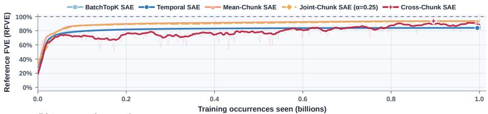

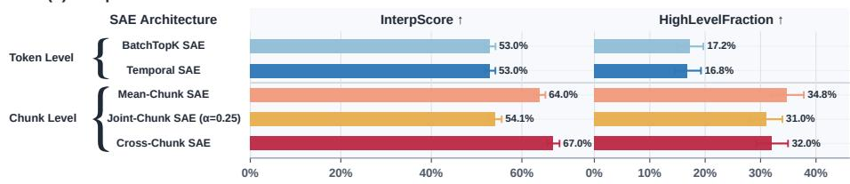  
Figure 3: Training fidelity and feature interpretation. Top (a): RFVE during training, normalized to a target-appropriate reference. Bottom (b): architectures grouped by encoding granularity, focused interpretability (InterpScore), and high-level feature fraction (HighLevelFraction). Chunk-level SAEs improve semantic feature quality while retaining strong target-relative fidelity.

Let $b _ { \mathrm { s e l f } }$ and $b _ { \mathrm { p a r t n e r } }$ denote the training-set mean constant-predictor squared errors for the two targets, as defined in Eq. 14. For a directed pair $A  B$ , the reconstruction loss is

$$
\ell _ { \mathrm { j o i n t } } ( A , B ; \alpha ) = \frac { 1 } { 1 + \alpha } \left[ \frac { \| \widehat { \mathbf { y } } _ { \mathrm { s e l f } } ( \mu _ { A } ) - s \pmb { \mu } _ { A } \| _ { 2 } ^ { 2 } } { b _ { \mathrm { s e l f } } } + \alpha \frac { \| \widehat { \mathbf { y } } _ { \mathrm { p a r t n e r } } ( \mu _ { A } ) - s \pmb { \mu } _ { B } \| _ { 2 } ^ { 2 } } { b _ { \mathrm { p a r t n e r } } } \right] .\tag{7}
$$

Each prediction error is divided by the constant-predictor normalizer for its own target. The shared activation scale s applies to both targets, and α sets the partner term’s weight relative to the self term. The factor $1 / ( 1 + { \bar { \alpha } } )$ ensures that the two task weights sum to one.

We combine this loss with the per-pair AuxK residual loss defined in Eq. 16:

$$
\begin{array} { r } { \mathcal { L } _ { \mathrm { j o i n t } } ( \alpha ) = \mathbb { E } _ { ( A , B ) } \left[ \ell _ { \mathrm { j o i n t } } ( A , B ; \alpha ) + \lambda _ { \mathrm { a u x } } \ell _ { \mathrm { A u x K } } ( A , B ; \alpha ) \right] , \qquad \lambda _ { \mathrm { a u x } } = 0 . 0 6 2 5 . } \end{array}\tag{8}
$$

The AuxK term uses the same target normalizers and task weights as Eq. 7, keeping its scale aligned with the reconstruction terms. The expectation averages both terms over directed training pairs. We use $\alpha = 0 . 2 5$ in the main comparisons and evaluate $\alpha \in \{ 0 . 5 , 1 , 1 . 5 \}$ in Appendix I.

## 4 CHUNK-LEVEL SAES REVEAL CLEARER SEMANTIC STRUCTURE

We test whether chunk-level codes retain information, expose concepts, and respond selectively across related passages. These analyses connect reconstruction fidelity to semantic feature quality.

## 4.1 EXPERIMENTAL SETUP

All five SAE families use layer-21 activations from Qwen3.5-9B-Base (Qwen Team, 2026a), with $d =$ 4096, $m = 6 5 , 5 3 6 .$ , and BatchTopK budget $K = 1 2 8$ . Training uses the same one billion Pile token occurrences (Gao et al., 2020; Lee et al., 2022) and chunk lengths {32, 64, 128, 256, 512}. Paired chunks are non-overlapping and processed independently with position indices reset. Joint-Chunk uses $\alpha = 0 . 2 5 ;$ Appendix I examines additional partner weights under the same training protocol.

Token-level SAEs encode and threshold tokens before averaging their codes; chunk-level SAEs average hidden states before encoding and thresholding. Reasoning instead uses document-level scoring (Appendix H). Training settings, splits, and metric definitions are collected in Appendices A and J.

## 4.2 FIDELITY: RETAINING PREDICTABLE INFORMATION

Fraction of variance explained (FVE) measures error reduction relative to a constant-mean predictor (Gao et al., 2024). Predicting a neighbor is harder than reconstructing the observed input, so

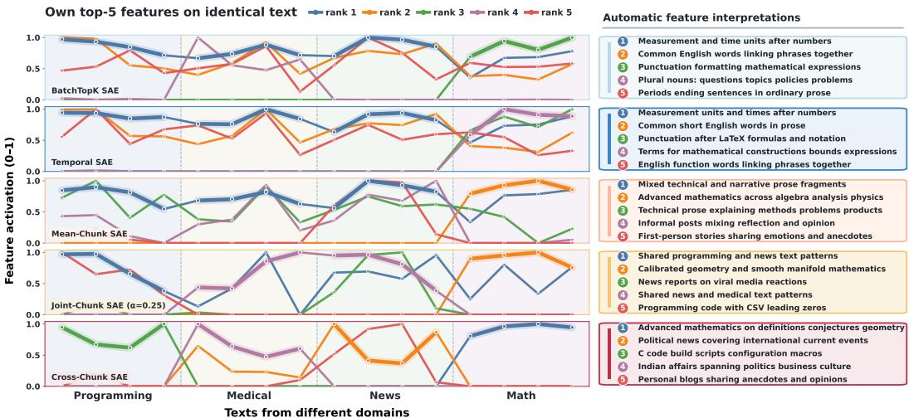  
Figure 4: Changes and interpretation of top-5 feature activation values for each SAE across texts from different domains. Left: normalized traces of each SAE’s own top-five features across programming, medical, news, and mathematics passages. Right: automatic interpretations matched by color. Feature identities differ across SAEs. Cross-Chunk SAE exhibits sharper semantic selectivity, activating domain-relevant features while leaving unrelated features largely inactive.

raw FVE mixes representation quality with task difficulty. We introduce reference-normalized FVE (RFVE), which divides each SAE’s FVE by that of a reference with the same inputs and targets:

$$
\mathrm { F V E } ( \widehat { \mathbf { y } } ) = 1 - \frac { \sum _ { i } \| s \mathbf { y } _ { i } - \widehat { \mathbf { y } } _ { i } \| _ { 2 } ^ { 2 } } { \sum _ { i } \| s ( \mathbf { y } _ { i } - \overline { { \mathbf { y } } } ) \| _ { 2 } ^ { 2 } } , \qquad \mathrm { R F V E } = \frac { \mathrm { F V E } _ { \mathrm { S A E } } } { \mathrm { F V E } _ { \mathrm { r e f } } } .\tag{9}
$$

Here, $\mathbf { y } _ { i }$ is the unscaled target, $\bar { \mathbf { y } }$ its training-set mean, and $\widehat { \mathbf { y } } _ { i }$ predicts $s \mathbf { y } _ { i } .$ Self-reconstruction uses an identity reference; partner prediction uses a train-fitted dense predictor of width 1,024 selected on validation. Each SAE and reference share the same evaluation monitor. Joint-Chunk weights self and partner FVEs by 1 and α in both numerator and denominator (Appendix I). Target-relative fidelity provides a fair measure of SAE faithfulness within each prediction task.

Reconstruction cosine (Bhalla et al., 2026) compares the directions of a prediction and its target: their dot product divided by the product of their Euclidean norms. Higher values mean closer alignment, independently of vector magnitude. This complements FVE, which also penalizes errors in magnitude.

Mean-Chunk SAE reaches 93.8% RFVE and also leads reconstruction cosine (Figures 3 and 1). Cross-Chunk SAE approaches its dense partner reference despite having to predict content it never directly observes. Its sparse code retains much of what the reference can predict. Together, these results show chunk-level SAEs remain faithful tools for interpreting model representations.

## 4.3 INTERPRETABILITY: SELECTIVE EXPLANATIONS AND HIGH-LEVEL CONCEPTS

Focused interpretability, denoted InterpScore, measures the agreement between frozen explanations and feature activation in complete 128-token contexts. We judge 1,000 feature explanations per method on four active and four inactive contexts at temperature zero. Let $r _ { f } ^ { + }$ be the fraction of active contexts matched and $r _ { f } ^ { - }$ the fraction of inactive contexts rejected. For feature $f ,$ we define

$$
I _ { f } = \left\{ \frac { 2 r _ { f } ^ { + } r _ { f } ^ { - } } { r _ { f } ^ { + } + r _ { f } ^ { - } } , \quad r _ { f } ^ { + } + r _ { f } ^ { - } > 0 , \qquad \mathrm { I n t e r p S c o r e } = \frac { 1 0 0 } { | \mathcal { F } | } \sum _ { f \in \mathcal { F } } I _ { f } . \right.\tag{10}
$$

The score averages all 1,000 sampled features, including explanations matching no active context. For all SAE families, token-level features use whole-context activations, and chunklevel features use encoded context means. Appendix C details the full scoring procedure.

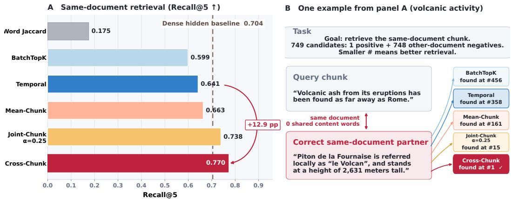  
Figure 5: Same-document retrieval beyond lexical overlap. Left (A): Recall@5 for word-set Jaccard matching and SAE representations; the dashed line marks the dense hidden-state baseline. Right (B): an example about volcanic activity with no shared content words, showing each SAE’s rank for the correct partner among length-matched candidates. Chunk-level SAEs outperform token-level baselines in retrieval, with Cross-Chunk SAE delivering substantial further gains.

High-levelfeaturefraction asks how common semantic features are across the dictionary. We uniformly sample 1,000 coordinates and divide the number passing a blinded semantic test by all 1,000. A feature passes when at least six of ten strong contexts from distinct held-out documents share a stable semantic or functional concept, without a sufficient surface-only rule, such as a fixed phrase or punctuation pattern (Appendix H). Every sampled coordinate counts, regardless of explanation support.

Pooling makes reusable concepts more common across the dictionary. High-level feature fraction reaches 34.8% for Mean-Chunk versus 17.2% for BatchTopK (Figure 3). This gain concerns what a random coordinate represents, not how its explanation is phrased. The census complements focused interpretability by measuring concept prevalence across all coordinates.

## 4.4 FEATURE STRUCTURE: PERSISTENCE AND DICTIONARY UTILIZATION

Feature persistence lift tracks document continuity. For feature $f \in \mathcal { F } , \Delta _ { f }$ is its probability of firing in both adjacent same-document chunks minus that probability in length-matched chunks shuffled across documents. Dictionary utilization measures how evenly activation mass is spread across a sampled alive-feature set $\mathcal { F } _ { \mathrm { a l i v e } }$ of size $N _ { \mathrm { a l i v e } }$ , with $p _ { f }$ each feature’s share of that mass (Hill, 1973):

$$
\mathrm { P e r s i s t e n c e L i f t } = \frac { 1 } { | \mathcal { F } | } \sum _ { f \in \mathcal { F } } \Delta _ { f } , \qquad \mathrm { U t i l i z a t i o n } = \frac { \exp \Bigl ( - \sum _ { f \in \mathcal { F } _ { \mathrm { a l i v e } } } p _ { f } \log p _ { f } \Bigr ) } { N _ { \mathrm { a l i v e } } } .\tag{11}
$$

Persistence lift averages $\Delta _ { f }$ across features, controlling for frequent firing. Utilization divides the entropy-equivalent feature count by the sampled alive-feature count: equal shares yield 100%, while concentration lowers it. Together, these metrics capture feature continuity and diversity (Appendix D).

Cross-Chunk combines the strongest feature persistence lift with 32.5% dictionary utilization, over five times BatchTopK’s level (Figure 1). Broader dictionary use accompanies selective passage responses: relevant features follow the content, while unrelated features remain largely quiet (Figure 4). In the news passage, Cross-Chunk concentrates activity in relevant features, while token-level traces include responses whose explanations concern other domains. Chunk-level SAEs thus draws on a broader range of features while selectively activating those that match each passage’s content.

## 5 CHUNK-LEVEL SAES IMPROVE DOWNSTREAM UTILITY

## 5.1 RETRIEVAL: CONNECTING PASSAGES BEYOND SHARED WORDS

Document recall tests whether SAE representations can connect related passages that use different words. Given a query chunk, the task is to retrieve its same-document partner from a candidate pool.

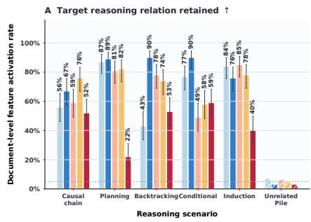

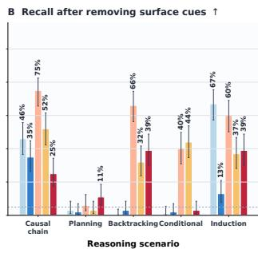  
BatchTopK SAE Temporal SAE Mean-Chunk SAE Joint-Chunk SAE (α = 0.25) Cross-Chunk SAE

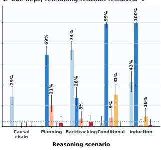  
Figure 6: Reasoning detection beyond surface cues. (A) Native reasoning recall on original texts with unrelated Pile controls; (B) recall with reasoning structure preserved but surface cues removed; (C) false feature activation with cues retained but reasoning structure removed. Mean-Chunk retains strong native recall, detects cue-free reasoning, and rejects cue-only distractors.

Figure 1 reports Recall@5: the fraction of queries whose correct partner ranks among the top five candidates. Query–partner pairs have word-set Jaccard overlap at most 0.1 (Manning et al., 2008), and candidates match the target’s token length. We rank candidates by SAE-code cosine similarity (Kang et al., 2025). These controls make shared wording and passage length less useful, testing whether the codes retain information that connects passages from the same document (Appendix A).

Cross-Chunk retrieves related content even when shared wording offers little help. Document recall reaches 77.0%, compared with 64.1% for Temporal, the strongest token baseline (Figure 5). The volcanic-activity example makes this ability concrete: the query and its partner share no content words, yet their SAE codes reveal a connection that word matching misses. Predicting neighboring chunks encourages features to capture information shared across passages, beyond the wording of either passage alone. This gives chunk-level saes practical value for semantic retrieval: they can help locate related material expressed in different terms while representing each passage through features.

## 5.2 REASONING: RECOGNIZING RELATIONS BEYOND SURFACE CUES

We search each dictionary for causal mechanism, planning, backtracking, conditional assumption, and induction. Rank is weighted target activation rate minus the largest rate on other relations or Pile background. Selection and confirmation folds require support and specificity, with a distinct eligible feature per relation. Cutoffs use confirmation-fold Pile background. Feature IDs and detection cutoffs are frozen before held-out testing and independent control rewrites (Appendix H).

Native reasoning recall is the fraction of original held-out reasoning passages whose relation-specific feature exceeds its fixed detection cutoff. Reasoning generalization is the mean of cue-free recall and cue-only rejection. Cue-free recall measures detection after removing verbal cues while preserving the relation; cue-only rejection is the fraction of passages not detected when the cues remain but the relation is removed. Together, these controls separate reasoning from familiar wording.

These results show that chunk-level SAE features can generalize beyond specific words to capture reasoning relations across different wordings. Mean-Chunk SAE achieves 66% cuefree recall for backtracking, compared with under 5% for both token baselines (Figure 6). It detects the revision in a passage’s events and decisions even after words such as wait are removed. Cue-only controls test whether those words trigger detection when no reasoning relation is present. Temporal SAE leads native reasoning recall. Overall, this suggests that chunk-level SAEs, unlike token-level SAEs, do not rely heavily on the presence of a few highly activating tokens, reducing the risk of missing relevant data when such tokens are absent.

## 5.3 CLASSIFICATION: FEW LABELS AND FUTURE DOCUMENTS

We fit multinomial logistic probes to frozen SAE representations from eight balanced ArXiv domains, with shared regularization and fixed data splits. OOD accuracy is the fraction of future-year documents assigned the correct domain. Low-label AUC summarizes accuracy at {1, 2, 4, 8, 16, 64, 256} labels per class: we integrate the accuracy curve over base-two log label budgets using trapezoids and divide by the log-budget range. Low-label results average five fixed sampling seeds (Appendix F).

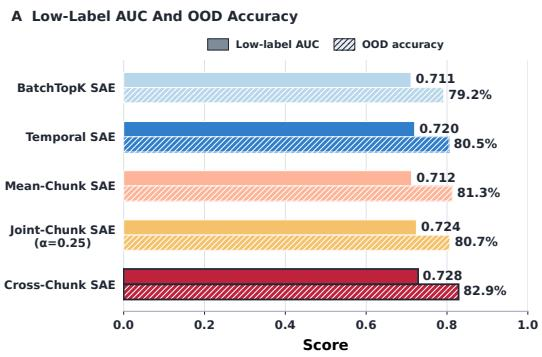

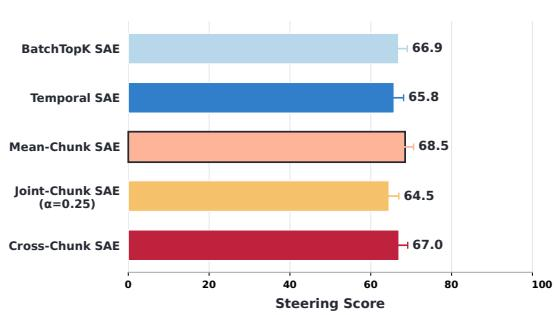  
Figure 7: Classification transfer and feature steering. Left (A): low-label AUC across supervision budgets (solid bars) and OOD accuracy on future-year documents (hatched bars). Right (B): steering scores combining feature concept and coherence preservation; 50 denotes neutral output. Cross-Chunk leads both classification metrics, while Mean-Chunk achieves the highest steering score.

Cross-Chunk leads both metrics, reaching 82.9% OOD accuracy (Figure 7A). The two settings test different demands: exposing distinctions a probe can learn from few examples, and preserving those distinctions as the document collection shifts to a later period. Its retrieval advantage thus extends to classification under limited supervision and a time shift. Because the Pile contains ArXiv material, the OOD split does not establish an absence of source-corpus pre-exposure (Appendix A).

## 5.4 STEERING: GUIDING GENERATION WITH SEMANTIC FEATURES

Causal steering tests whether a feature’s decoder direction steers generation toward its concept (Wang et al., 2025a). Following Wu et al. (2025), we add normalized decoder column $\mathbf { d } _ { f }$ to the layer-ℓ residual stream during prefill and generation. A blinded judge compares the steered continuation with the baseline, rating concept direction $C _ { f , \gamma }$ and coherence preservation $H _ { f , \gamma }$ on 0–100 scales:

$$
\mathbf { r } _ { \ell } ^ { + } = \mathbf { r } _ { \ell } + \gamma \frac { \mathbf { d } _ { f } } { \| \mathbf { d } _ { f } \| _ { 2 } } , \qquad s _ { f , \gamma } = C _ { f , \gamma } \left( 0 . 7 + 0 . 3 \frac { H _ { f , \gamma } } { 1 0 0 } \right) .\tag{12}
$$

Normalization makes γ independent of decoder-column magnitude. The score rewards movement toward the concept while discounting loss of coherence; unchanged continuations score 50. We test base strengths {1, 3, 5, 7, 10} and adaptive rescue for eligible unchanged outputs. For each feature, we retain the highest score among all tested strengths, including rescue; ties favor lower strength. The causal steering score is the mean of these maxima over 1000 features (Appendix H and Eq. 33).

Mean-Chunk achieves the strongest causal steering performance (Figure 7B). Its higher score reflects more effective steering toward the intended concept under an evaluation that also accounts for the coherence of the generated text. These results show that its features offer a practical way to guide model outputs toward the semantic concepts described by the corresponding feature explanations.

## 6 CONCLUSION AND DISCUSSION

We introduce a family of chunk-level SAEs that reconstruct pooled activations (Mean-Chunk), predict independently processed neighboring chunks (Cross-Chunk), or combine both objectives (Joint-Chunk). Chunk-level training retains strong target-relative fidelity while uncovering more reliable semantic features that generalize across wordings and respond selectively to relevant content. These properties give the features value beyond reconstruction. Mean-Chunk detects reasoning without familiar cue words and achieves the strongest causal steering, making its features useful for both recognizing semantic patterns and guiding generation. Cross-Chunk leads retrieval under limited lexical overlap and classification transfer, showing that its codes capture information shared across passages. Within this scope, learning from chunks makes sparse dictionaries more effective tools for understanding representations and influencing model behavior.

## REPRODUCIBILITY STATEMENT

We document the SAE architectures and training objectives in Sections 2 and 3, and the experimental settings and evaluation metrics in Sections 4 and 5. Appendix A provides additional training details, evaluation splits, and representation aggregation rules. Appendix H documents the judge prompts and control procedures, while Appendix I reports the alpha sweep and additional ablation results.

## AI USE STATEMENT

Generative AI assisted with drafting and language editing. The authors checked all equations, numerical claims, citations, and figure captions against the training and evaluation artifacts.

## REFERENCES

arXiv. arXiv category taxonomy. Official subject classification, n.d. URL https://arxiv.org/ category\_taxonomy.

Jimmy Lei Ba, Jamie Ryan Kiros, and Geoffrey E. Hinton. Layer normalization, 2016. URL https://arxiv.org/abs/1607.06450.

Usha Bhalla, Alex Oesterling, Claudio Mayrink Verdun, Himabindu Lakkaraju, and Flavio P. Calmon. Temporal sparse autoencoders: Leveraging the sequential nature of language for interpretability. In International Conference on Learning Representations, 2026. URL https://arxiv.org/ abs/2511.05541.

Trenton Bricken, Adly Templeton, Joshua Batson, Brian Chen, Adam Jermyn, Tom Conerly, Nick Turner, Cem Anil, Carson Denison, Amanda Askell, Robert Lasenby, Yifan Wu, Shauna Kravec, Nicholas Schiefer, Tim Maxwell, Nicholas Joseph, Zac Hatfield-Dodds, Alex Tamkin, Karina Nguyen, Brayden McLean, Josiah E Burke, Tristan Hume, Shan Carter, Tom Henighan, and Christopher Olah. Towards monosemanticity: Decomposing language models with dictionary learning. Transformer Circuits Thread, 2023. URL https://transformer-circuits. pub/2023/monosemantic-features/index.html.

Bart Bussmann, Patrick Leask, and Neel Nanda. BatchTopK sparse autoencoders. In NeurIPS 2024 Workshop on Scientific Methodsfor Understanding Neural Networks, 2024. URL https: //neurips.cc/virtual/2024/99271.

Bart Bussmann, Noa Nabeshima, Adam Karvonen, and Neel Nanda. Learning multi-level features with matryoshka sparse autoencoders. In Proceedings of the 42nd International Conference on Machine Learning, volume 267 of Proceedings of Machine Learning Research, pp. 6077–6101. PMLR, 2025. URL https://proceedings.mlr.press/v267/bussmann25a.html.

David Chanin and Adria Garriga-Alonso. Sparse but wrong: Incorrect L0 leads to incorrect features\` in sparse autoencoders. arXiv preprint arXiv:2508.16560, 2025. doi: 10.48550/arXiv.2508.16560. URL https://arxiv.org/abs/2508.16560.

DeepSeek-AI et al. DeepSeek-V4: Towards highly efficient million-token context intelligence. arXiv preprint arXiv:2606.19348, 2026. URL https://arxiv.org/abs/2606.19348.

Kevin Der, Harish Kamath, and Ben Thompson. Turn-averaged SAEs for feature discovery and long-context attribution. arXiv preprint arXiv:2606.28548, 2026. URL https://arxiv.org/ abs/2606.28548.

Bradley Efron. Bootstrap methods: Another look at the jackknife. The Annals of Statistics, 7 (1):1–26, 1979. doi: 10.1214/aos/1176344552. URL https://doi.org/10.1214/aos/ 1176344552.

Stefan Elfwing, Eiji Uchibe, and Kenji Doya. Sigmoid-weighted linear units for neural network function approximation in reinforcement learning. Neural Networks, 107:3–11, 2018. doi: 10.1016/j.neunet.2017.12.012. URL https://arxiv.org/abs/1702.03118.

Nelson Elhage, Tristan Hume, Catherine Olsson, Nicholas Schiefer, Tom Henighan, Shauna Kravec, Zac Hatfield-Dodds, Robert Lasenby, Dawn Drain, Carol Chen, Roger Grosse, Sam McCandlish, Jared Kaplan, Dario Amodei, Martin Wattenberg, and Christopher Olah. Toy models of superposition. Transformer Circuits Thread, 2022. URL https://transformer-circuits.pub/ 2022/toy\_model/index.html.

Eoin Farrell, Yeu-Tong Lau, and Arthur Conmy. Applying sparse autoencoders to unlearn knowledge in language models, 2024. URL https://arxiv.org/abs/2410.19278.

Leo Gao, Stella Biderman, Sid Black, Laurence Golding, Travis Hoppe, Charles Foster, Jason Phang, Horace He, Anish Thite, Noa Nabeshima, Shawn Presser, and Connor Leahy. The Pile: An 800GB dataset of diverse text for language modeling. arXiv preprint arXiv:2101.00027, 2020. URL https://arxiv.org/abs/2101.00027.

Leo Gao, Tom Dupre la Tour, Henk Tillman, Gabriel Goh, Rajan Troll, Alec Radford, Ilya ´ Sutskever, Jan Leike, and Jeffrey Wu. Scaling and evaluating sparse autoencoders. arXiv preprint arXiv:2406.04093, 2024. URL https://arxiv.org/abs/2406.04093.

Kaiming He, Xiangyu Zhang, Shaoqing Ren, and Jian Sun. Deep residual learning for image recognition. In Proceedings of the IEEE Conference on Computer Vision and Pattern Recognition, pp. 770–778, 2016. URL https://arxiv.org/abs/1512.03385.

Zirui He, Haiyan Zhao, Yiran Qiao, Fan Yang, Ali Payani, Jing Ma, and Mengnan Du. SAIF: A sparse autoencoder framework for interpreting and steering instruction following of language models, 2025. URL https://arxiv.org/abs/2502.11356.

M. O. Hill. Diversity and evenness: A unifying notation and its consequences. Ecology, 54(2): 427–432, 1973. doi: 10.2307/1934352. URL https://esajournals.onlinelibrary. wiley.com/doi/10.2307/1934352.

Robert Huben, Hoagy Cunningham, Logan Smith, Aidan Ewart, and Lee Sharkey. Sparse autoencoders find highly interpretable features in language models. In International Conference on Learning Representations, pp. 7827–7845, 2024. URL https://proceedings.iclr.cc/paper\_files/paper/2024/file/ 1fa1ab11f4bd5f94b2ec20e794dbfa3b-Paper-Conference.pdf.

Hao Kang, Tevin Wang, and Chenyan Xiong. Interpret and control dense retrieval with sparse latent features. In Proceedings ofthe 2025 Conference ofthe Nations ofthe Americas Chapter ofthe Association for Computational Linguistics: Human Language Technologies (Volume 2: Short Papers), pp. 700–709. Association for Computational Linguistics, 2025. doi: 10.18653/v1/2025. naacl-short.58. URL https://aclanthology.org/2025.naacl-short.58/.

Subhash Kantamneni, Joshua Engels, Senthooran Rajamanoharan, Max Tegmark, and Neel Nanda. Are sparse autoencoders useful? A case study in sparse probing. In Proceedings of the 42nd International Conference on Machine Learning, volume 267 of Proceedings of Machine Learning Research, pp. 29018–29049. PMLR, 2025. URL https://proceedings.mlr.press/ v267/kantamneni25a.html.

Adam Karvonen, Can Rager, Johnny Lin, Curt Tigges, Joseph Isaac Bloom, David Chanin, Yeu-Tong Lau, Eoin Farrell, Callum Stuart Mcdougall, Kola Ayonrinde, Demian Till, Matthew Wearden, Arthur Conmy, Samuel Marks, and Neel Nanda. SAEBench: A comprehensive benchmark for sparse autoencoders in language model interpretability. In Proceedings of the 42nd International Conference on Machine Learning, volume 267 of Proceedings of Machine Learning Research, pp. 29223–29264. PMLR, 2025. URL https://proceedings.mlr.press/ v267/karvonen25a.html.

Diederik P. Kingma and Jimmy Ba. Adam: A method for stochastic optimization. In International Conference on Learning Representations, 2015. URL https://arxiv.org/abs/1412. 6980.

Katherine Lee, Daphne Ippolito, Andrew Nystrom, Chiyuan Zhang, Douglas Eck, Chris Callison-Burch, and Nicholas Carlini. Deduplicating training data makes language models better. In

Proceedings of the 60th Annual Meeting of the Association for Computational Linguistics (Volume 1: Long Papers), pp. 8424–8445. Association for Computational Linguistics, 2022. doi: 10.18653/ v1/2022.acl-long.577. URL https://aclanthology.org/2022.acl-long.577/.

George Ma, Zhongyuan Liang, Irene Y. Chen, and Somayeh Sojoudi. Do sparse autoencoders identify reasoning features in language models? In International Conference on Machine Learning, 2026. URL https://arxiv.org/abs/2601.05679.

Christopher D. Manning, Prabhakar Raghavan, and Hinrich Schutze.¨ Introduction to Information Retrieval. Cambridge University Press, 2008. URL https://nlp.stanford.edu/ IR-book/.

Samuel Marks, Can Rager, Eric J. Michaud, Yonatan Belinkov, David Bau, and Aaron Mueller. Sparse feature circuits: Discovering and editing interpretable causal graphs in language models. In International Conference on Learning Representations, 2025. URL https://arxiv.org/ abs/2403.19647.

Bruno A. Olshausen and David J. Field. Emergence of simple-cell receptive field properties by learning a sparse code for natural images. Nature, 381(6583):607–609, 1996. doi: 10.1038/ 381607a0. URL https://www.nature.com/articles/381607a0.

Qwen Team. Qwen3.5: Towards native multimodal agents, February 2026a. URL https://qwen. ai/blog?id=qwen3.5.

Qwen Team. Qwen3.5-9B-Base. Hugging Face model card, 2026b. URL https:// huggingface.co/Qwen/Qwen3.5-9B-Base. Accessed September 9, 2026.

Senthooran Rajamanoharan, Arthur Conmy, Lewis Smith, Tom Lieberum, Vikrant Varma, Janos ´ Kramar, Rohin Shah, and Neel Nanda. Improving sparse decomposition of language model´ activations with gated sparse autoencoders. In Advances in Neural Information Processing Systems, volume 37, pp. 775–818. Curran Associates, Inc., 2024a. doi: 10.52202/079017-0024. URL https://proceedings.neurips.cc/paper\_files/paper/2024/hash/ 01772a8b0420baec00c4d59fe2fbace6-Abstract-Conference.html.

Senthooran Rajamanoharan, Tom Lieberum, Nicolas Sonnerat, Arthur Conmy, Vikrant Varma, Janos´ Kramar, and Neel Nanda. Jumping ahead: Improving reconstruction fidelity with JumpReLU´ sparse autoencoders, 2024b. URL https://arxiv.org/abs/2407.14435.

Peter J. Rousseeuw. Silhouettes: A graphical aid to the interpretation and validation of cluster analysis. Journal of Computational and Applied Mathematics, 20:53–65, 1987. doi: 10.1016/ 0377-0427(87)90125-7. URL https://doi.org/10.1016/0377-0427(87)90125-7.

Adly Templeton, Tom Conerly, Jonathan Marcus, Jack Lindsey, Trenton Bricken, Brian Chen, Adam Pearce, Craig Citro, Emmanuel Ameisen, Andy Jones, Hoagy Cunningham, Nicholas L Turner, Callum McDougall, Monte MacDiarmid, C. Daniel Freeman, Theodore R. Sumers, Edward Rees, Joshua Batson, Adam Jermyn, Shan Carter, Chris Olah, and Tom Henighan. Scaling monosemanticity: Extracting interpretable features from Claude 3 Sonnet. Transformer Circuits Thread, 2024. URL https://transformer-circuits.pub/2024/ scaling-monosemanticity/index.html.

Aaron van den Oord, Yazhe Li, and Oriol Vinyals. Representation learning with contrastive predictive coding. arXiv preprint arXiv:1807.03748, 2018. URL https://arxiv.org/abs/1807. 03748.

Laurens van der Maaten and Geoffrey Hinton. Visualizing data using t-SNE. Journal of Machine Learning Research, 9(86):2579–2605, 2008. URL https://jmlr.org/papers/v9/ vandermaaten08a.html.

Xu Wang, Yan Hu, Benyou Wang, and Difan Zou. Does higher interpretability imply better utility? a pairwise analysis on sparse autoencoders. arXiv preprint arXiv:2510.03659, 2025a. URL https://arxiv.org/abs/2510.03659.

Xu Wang, Zihao Li, Benyou Wang, Yan Hu, and Difan Zou. Model unlearning via sparse autoencoder subspace guided projections. In Christos Christodoulopoulos, Tanmoy Chakraborty, Carolyn Rose, and Violet Peng (eds.), Proceedings of the 2025 Conference on Empirical Methods in Natural Language Processing, pp. 26530–26546, Suzhou, China, November 2025b. Association for Computational Linguistics. ISBN 979-8-89176-332-6. doi: 10.18653/v1/2025.emnlp-main.1348. URL https://aclanthology.org/2025.emnlp-main.1348/.

Edwin B. Wilson. Probable inference, the law of succession, and statistical inference. Journal ofthe American Statistical Association, 22(158):209–212, 1927. doi: 10.1080/01621459.1927.10502953. URL https://doi.org/10.1080/01621459.1927.10502953.

Zhengxuan Wu, Aryaman Arora, Atticus Geiger, Zheng Wang, Jing Huang, Dan Jurafsky, Christopher D. Manning, and Christopher Potts. AxBench: Steering LLMs? even simple baselines outperform sparse autoencoders. arXiv preprint arXiv:2501.17148, 2025. URL https: //arxiv.org/abs/2501.17148.

Xuan Yang, Jiayu Liu, Yuhang Lai, Hao Xu, Zhenya Huang, and Ning Miao. Step-level sparse autoencoder for reasoning process interpretation. arXiv preprint arXiv:2603.03031, 2026. doi: 10.48550/arXiv.2603.03031. URL https://arxiv.org/abs/2603.03031.

## A TRAINING AND EVALUATION PROTOCOLS

Our comparison varies the observation unit and prediction target while sharing the model, token stream, dictionary width, and sparse-coding backbone. This appendix specifies how the five SAE families are trained and how their representations enter each evaluation. The descriptions complement the objectives in Sections 2 and 3; judge instructions and metric definitions appear in Appendices H and J. Notation and evaluation units follow the corresponding main-text experiment.

## A.1 MODEL, CORPUS, AND TRAINING SCHEDULE

We extract layer-21 activations from Qwen3.5-9B-Base (Qwen Team, 2026b), with hidden width $d = 4 0 9 6$ . Every dictionary contains $m = 6 5 { , } 5 3 6$ coordinates and uses BatchTopK budget $K =$ 128 (Bussmann et al., 2024). The common Pile stream (Gao et al., 2020) contains exactly one billion training token occurrences. Validation and test caches are disjoint, with 10,000,128 occurrences each. Activations are cached in bfloat16; dictionary parameters and optimizer accumulators use float32. Cached states and learned dictionaries thus use distinct numerical precision.

Training comprises 31,250 updates with a global batch of 32,000 token occurrences, distributed across eight ranks. Adam (Kingma & Ba, 2015) uses $( \beta _ { 1 } , \beta _ { 2 } ) = ( 0 . 9 , 0 . 9 9 9 )$ . The learning rate reaches $1 0 ^ { - 4 }$ after 200 warmup updates and follows cosine decay to $1 0 ^ { - 5 } ;$ ; gradients are clipped at 1.0. All methods share the activation scale, decoder-column normalization, data order, and validation-based checkpoint-selection procedure. All main runs use this schedule.

The AuxK coefficient is $\lambda _ { \mathrm { a u x } } = 0 . 0 6 2 5$ (Gao et al., 2024). A feature becomes eligible for rescue after five million inactive occurrences, while the training-health diagnostic tracks inactivity over ten million occurrences. These settings retain a common feature-rescue mechanism across the five dictionary families. Rescue accompanies the reconstruction terms defined in the main text.

Adjacent chunks A and B are non-overlapping spans from the same document. Their lengths belong to {32, 64, 128, 256, 512}, covering all 25 ordered length combinations. Each chunk receives a separate model forward with position indices reset, so its hidden states contain no attention to its partner. The resulting caches contain 2,520,159 training pairs, 25,202 validation pairs, and 25,201 test pairs, as summarized in Table 1. Pair and token counts describe the same cached streams.

Table 1: Shared model, training budget, and chunk-pair caches for all five SAE families and every Joint-Chunk partner weight. Token occurrences account for data volume; each objective retains its own encoding and loss-averaging unit for the token-level or chunk-level prediction task.
<table><tr><td>Quantity</td><td>Value</td></tr><tr><td>Model layer / hidden width</td><td>21 / 4096</td></tr><tr><td>Dictionary width / BatchTopK budget</td><td>65,536 / 128</td></tr><tr><td>Training token occurrences</td><td>1,000,000,000</td></tr><tr><td>Validation / test occurrences</td><td>10,000,128 / 10,000,128</td></tr><tr><td>Training updates / global token batch</td><td>31,250 / 32,000</td></tr><tr><td>Chunk lengths</td><td>32, 64, 128, 256, 512</td></tr><tr><td>Training / validation / test pairs</td><td>2,520,159 / 25,202 / 25,201</td></tr></table>

Token baselines average reconstruction error over valid token positions. Mean-Chunk averages over sampled chunks, with one loss per chunk regardless of length. Cross-Chunk equally weights the two directed predictions in a pair. Joint-Chunk averages the directed self/partner objective in Eq. 7. This distinguishes training-text volume from the unit represented by each individual sparse code.

## A.2 REPRESENTATIONS, TARGETS, AND JOINT-CHUNK NORMALIZATION

Let ψM denote the inference mapping for method M, consisting of its encoder followed by its fixed inference-time thresholding rule. For a chunk C, let $\bar { V ( C ) }$ be the set of valid, nonpadding token positions and let $L ^ { ' } = | V ( C ) |$ . If h denotes the representation at position t within the chunk, the chunk mean is $\begin{array} { r } { \dot { \pmb { \mu } } _ { C } = - 1 \sum _ { t \in V ( C ) } \mathbf { h } _ { t } } \end{array}$ We group the methods into token-level methods, $\mathcal { M } _ { \mathrm { t o k e n } } = \mathrm { \{ B a t c h T o p K } { \Omega } $ , Temporal}, and chunk-level methods, $\mathcal { M } _ { \mathrm { c h u n k } } =$ {Mean-Chunk, Cross-Chunk, Joint-Chunk}. Retrieval and classification use the representations defined below. Whenever token representations are averaged, padding positions are excluded from both the sum and the token count, so the average includes only valid tokens in the relevant input:

$$
\begin{array} { r } { \mathbf { z } _ { M } ( C ) = \left\{ \begin{array} { l l } { \displaystyle L ^ { - 1 } \sum _ { t \in C } \psi _ { M } ( \mathbf { h } _ { t } ) , } & { \displaystyle M \in \mathcal { M } _ { \mathrm { t o k e n } } , } \\ { \displaystyle \psi _ { M } ( \pmb { \mu } _ { C } ) , } & { \displaystyle M \in \mathcal { M } _ { \mathrm { c h u n k } } . } \end{array} \right. } \end{array}\tag{13}
$$

Token methods therefore threshold before pooling, whereas chunk methods pool before encoding and thresholding. Each representation depends only on the observed chunk. The neighboring hidden states supply a prediction target during training and fidelity evaluation, while retrieval and classification compare the observed chunks’ own codes. These codes support both ranking and classification.

Joint-Chunk produces one full code $\mathbf { z } _ { A } \in \mathbb { R } ^ { m }$ with $m = 6 5 { , } 5 3 6$ . Its self decoder reads the full code, whereas its partner decoder reads the first $h = 3 2 , 7 6 8$ coordinates. Both predictions use the same decoder columns for this prefix, with separate self and partner biases as in Eq. 6. The prefix is sliced after the single BatchTopK operation; it is not re-encoded or assigned another main-task sparse budget.

For target type $q \in \{ \mathrm { s e l f } , \mathrm { p a r t n e r } \}$ , let $\mathcal { T } _ { q }$ be its training target set, $N _ { q } = | \mathcal { T } _ { q } |$ |, and $\overline { { \mathbf { y } } } _ { \mathrm { t r a i n } } ^ { ( q ) }$ its mean. We normalize each per-example squared Euclidean error by the corresponding per-target average constant-predictor error:

$$
b _ { q } = \frac { 1 } { N _ { q } } \sum _ { i \in \mathcal { T } _ { q } } \left. s \left( \mathbf { y } _ { i } ^ { \left( q \right) } - \overline { { \mathbf { y } } } _ { \mathrm { t r a i n } } ^ { \left( q \right) } \right) \right. _ { 2 } ^ { 2 } .\tag{14}
$$

Self targets are observed chunk means, and partner targets are neighboring chunk means. The constants $b _ { \mathrm { s e l f } }$ and $b _ { \mathrm { p a r t n e r } }$ are computed once from training targets and remain fixed during optimization. Equation 7 divides each directed example’s self and partner reconstruction errors by these respective constants.

The AuxK term uses the same target normalization. Let $\mathcal { D } _ { \mathrm { d e a d } }$ be the coordinates eligible for inactive-feature rescue, and let ${ \bf u } _ { A } ^ { \mathrm { a u x } }$ retain the largest $K _ { \mathrm { a u x } }$ positive encoder activations among those coordinates, setting all other coordinates to zero. This auxiliary code is used only in the rescue loss. Define the main-prediction residuals and their auxiliary reconstructions by

$$
\begin{array} { r l } { { \bf e } _ { \mathrm { s e l f } } ( A ) = s \mu _ { A } - \widehat { \bf y } _ { \mathrm { s e l f } } ( \mu _ { A } ) , } & { \widehat { \bf e } _ { \mathrm { s e l f } } ^ { \mathrm { a u x } } ( A ) = W _ { \mathrm { d e c } } { \bf u } _ { A } ^ { \mathrm { a u x } } , } \\ { { \bf e } _ { \mathrm { p a r t n e r } } ( A , B ) = s \mu _ { B } - \widehat { \bf y } _ { \mathrm { p a r t n e r } } ( \mu _ { A } ) , } & { \widehat { \bf e } _ { \mathrm { p a r t n e r } } ^ { \mathrm { a u x } } ( A ) = W _ { \mathrm { d e c } } [ ; , 1 : h ] { \bf u } _ { A , 1 : h } ^ { \mathrm { a u x } } . } \end{array}\tag{15}
$$

For a directed pair, the normalized auxiliary loss is

$$
\ell _ { \mathrm { A u x K } } ( A , B ; \alpha ) = \frac { 1 } { 1 + \alpha } \Bigg [ \frac { \left\| \mathbf { e } _ { \mathrm { s e l f } } ( A ) - \widehat { \mathbf { e } } _ { \mathrm { s e l f } } ^ { \mathrm { a u x } } ( A ) \right\| _ { 2 } ^ { 2 } } { b _ { \mathrm { s e l f } } }\tag{16}
$$

and $\mathcal { L } _ { \mathrm { A u x K } } = \mathbb { E } _ { ( A , B ) } [ \ell _ { \mathrm { A u x K } } ( A , B ; \alpha ) ]$ . Thus, both the main loss and AuxK use minibatch means, the same self-to-partner weighting $1 : \alpha .$ , and the same respective per-target scales $b _ { \mathrm { s e l f } }$ and $b _ { \mathrm { p a r t n e r } } .$ Their relative coefficient in Eq. 8 is therefore $\lambda _ { \mathrm { a u x } } = 0 . 0 6 2 5$ , independently of the number of training pairs. $\mathrm { A t } \alpha = 0 . 2 5$ , the normalized self and partner components each receive weights 0.8 and 0.2, respectively.

## A.3 TOKEN-LEVEL BASELINE OBJECTIVES

BatchTopK reconstructs contextualized token states with the scaled error from Section 2. Averaging over valid positions and adding the shared AuxK term gives the token-level objective:

$$
\begin{array} { r } { \mathcal { L } _ { \mathrm { t o k e n } } = \mathbb { E } _ { t } \mathcal { L } _ { \mathrm { r e c } } ( \mathbf { h } _ { t } , \mathbf { h } _ { t } ) + \lambda _ { \mathrm { a u x } } \mathcal { L } _ { \mathrm { A u x K } } . } \end{array}\tag{17}
$$

Temporal (Bhalla et al., 2026) also reconstructs token states and couples adjacent-token prefix codes. Its designated prefix has width $h _ { T } = \left\lfloor 0 . 2 m \right\rfloor = 1 3 , 1 0 7$ , giving ${ \bf z } _ { t } ^ { ( H ) } = { \bf z } ( { \bf h } _ { t } ) [ 1 : h _ { T } ]$ . This token-level prefix and Joint-Chunk’s 32,768-coordinate shared prefix are defined separately for their respective objectives. Each prefix serves its own objective’s information-sharing task.

Let B contain valid current tokens in a minibatch, and let $\mathcal { P } \subseteq B$ contain those with an immediate predecessor in the same independently processed chunk. The full-code term includes chunk-first tokens; the prefix term averages over anchors with a predecessor. The objective combines full-code and prefix reconstruction, contrastive alignment, and the shared inactive-feature rescue term

$$
\begin{array} { r l r } & { \mathcal { L } _ { \mathrm { f u l l } } = \mathbb { E } _ { t \in \mathcal { B } } \mathcal { L } _ { \mathrm { r e c } } ( { \bf h } _ { t } , { \bf h } _ { t } ) , } & \\ & { \mathcal { L } _ { H } = \mathbb { E } _ { t \in \mathcal { P } } \left\| { \cal W } _ { \mathrm { d e c } } [ : , 1 : h _ { T } ] { \bf z } _ { t } ^ { ( H ) } + { \bf b } _ { \mathrm { o u t } } - s { \bf h } _ { t } \right\| _ { 2 } ^ { 2 } , } & \\ & { \mathcal { L } _ { \mathrm { t e m p o r a l } } = \frac { 0 . 8 \mathcal { L } _ { \mathrm { f u l l } } + 0 . 2 \mathcal { L } _ { H } } { 2 } + \mathcal { L } _ { \mathrm { I n f o N C E } } ^ { \mathrm { s y m } } + 0 . 0 6 2 5 \mathcal { L } _ { \mathrm { A u x K } } . } & \end{array}\tag{18}
$$

For the N valid adjacent pairs gathered across ranks, let $\mathbf { u } _ { i }$ and $\mathbf { v } _ { i }$ be current- and previous-token prefix codes. With cosine similarity, temperature $\tau = 0 . 1$ , and $A _ { i j } = \sin ( { \mathbf u } _ { i } , { \mathbf v } _ { j } ) / \tau$ , symmetric InfoNCE (van den Oord et al., 2018) averages the two matching directions over all paired anchors:

$$
\mathcal { L } _ { \mathrm { I n f o N C E } } ^ { \mathrm { s y m } } = - \frac { 1 } { 2 N } \sum _ { i = 1 } ^ { N } \left[ \log \frac { \exp ( A _ { i i } ) } { \sum _ { j = 1 } ^ { N } \exp ( A _ { i j } ) } + \log \frac { \exp ( A _ { i i } ) } { \sum _ { j = 1 } ^ { N } \exp ( A _ { j i } ) } \right] .\tag{19}
$$

Diagonal entries identify immediate within-chunk positives; off-diagonal entries supply negatives without an additional token-identity exclusion. Temporal thus aligns neighboring token codes while preserving token reconstruction. Cross-Chunk changes the prediction target to the mean activation of an independently processed neighboring passage, targeting shared passage content.

## A.4 FIDELITY REFERENCES AND STATISTICAL SUMMARIES

Each fidelity reference uses the same observed inputs, targets, and evaluation examples as its SAE. Self-reconstruction uses the identity reference, whose FVE equals one. Partner prediction uses a dense residual MLP with LayerNorm, a linear skip, and a SiLU residual branch (Ba et al., 2016; He et al., 2016; Elfwing et al., 2018). The predictor receives the observed chunk mean without a prediction-direction flag. Both directions use this same dense reference architecture and parameters.

Reference widths {1024, 2048, 4096} are trained for two epochs. Selecting the smallest width within 0.002 FVE of the best validation score yields width 1,024. Its FVE is 0.676758 on the fixed 262,144-occurrence monitor. Each SAE score is divided by the reference score from its corresponding evaluation set, preserving the same examples and target throughout the RFVE calculation. This alignment also applies to the two separately evaluated prediction targets. But using FVE for all SAEs does not constitute an apples-to-apples comparison. A truly fair comparison involves measuring performance within their respective tasks. True fairness requires ensuring that each SAE serves as a faithful tool relative to its specific objective. Our design precisely embodies this fairness.

Intervals use 10,000 paired bootstrap resamples unless a panel specifies another procedure (Efron, 1979). Retrieval uses 100,000 paired randomization permutations. The high-level census reports Wilson 95% intervals (Wilson, 1927), and the matched reasoning audit uses 20,000 paired bootstrap resamples. These summaries quantify variation over the evaluated examples or features for the checkpoints used in each comparison. Resampling pairs the evaluated examples or features.

## A.5 RETRIEVAL AND CLASSIFICATION DATA

Each query-specific retrieval gallery contains 749 candidates: one same-document partner and 748 distractor chunks from other documents, each matched to the partner’s length. Each query is paired with a different chunk from its document, subject to Jaccard overlap at most 0.10. The gallery contains the partner and distractors from other documents. Every method ranks the same query-specific gallery: the lexical baseline uses Jaccard similarity, the dense baseline uses hidden-state representations, and SAEs use cosine similarity between the codes in Eq. 13. This production-critical setting calls for better SAEs: token-level methods fall short, while our approach closes the gap.

Classification uses eight balanced ArXiv domains: Computer Science, Economics, Electrical Engineering, Mathematics, Physics, Quantitative Biology, Quantitative Finance, and Statistics (arXiv, n.d.). Each class has 1,024 training, 256 validation, and 256 test documents. The OOD collection contains papers first submitted in 2023 or later, fixed before feature extraction. Frozen-code multinomial logistic probes share $C = 1 , { \mathrm { L } } { \mathrm { - B F G S } }$ , and a 2,000-iteration limit for every method.

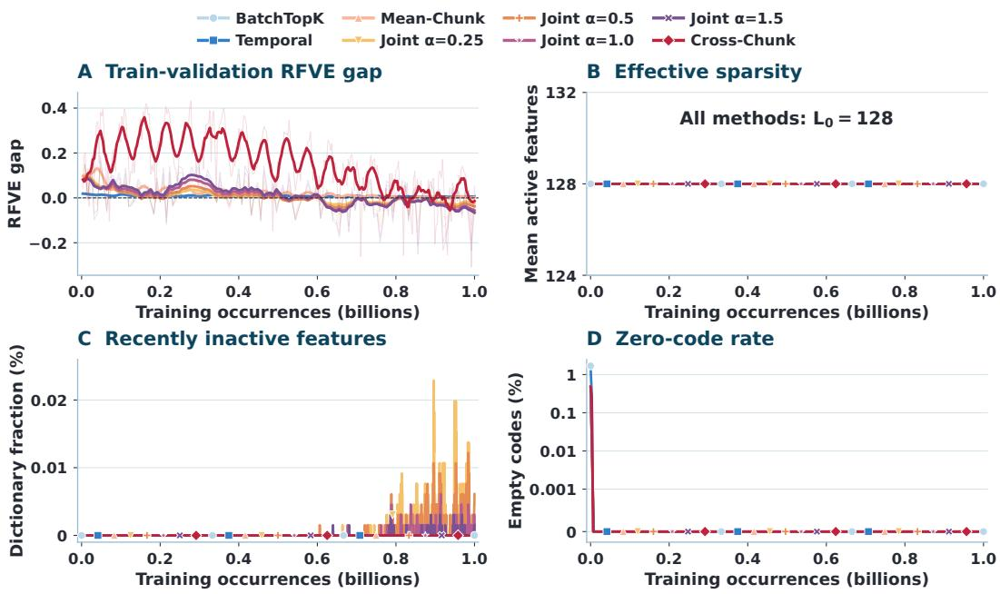  
Figure 8: Training stability and sparse-code activity. (A) Training-batch and fixed-monitor RFVE, shown as logged values and nine-observation moving averages. (B) Validation effective $L _ { 0 } ,$ the mean number of active coordinates per code. (the sparsity variation curve demonstrates stability.) (C) Fraction of dictionary coordinates that have not activated in the preceding ten million token occurrences. (D) Validation empty-code rate; the symmetric-log axis has a linear region below 0.001%. Coincident curves use staggered markers. For Joint-Chunk, the activity summaries show the smaller effective $L _ { 0 }$ and larger empty-code rate across its full-code and partner-prefix views.

The ArXiv feature archive retains native tokenized lengths up to 512 and excludes padding through the attention mask. Low-label budgets are {1, 2, 4, 8, 16, 64, 256} documents per class, with five sampling seeds shared across methods. The publication-year split evaluates transfer from the probe’s training distribution to later documents. The geometry analysis uses the same document codes with the label-free dimensionality reduction described in Appendix E. These neighborhoods connect scientific domains to the local arrangement of frozen sparse document representations.

## B TRAINING STABILITY AND FEATURE ACTIVITY

Figure 8 follows reconstruction fidelity and feature activity throughout training. Panel A compares RFVE on the current training batch with RFVE on a fixed 262,144-occurrence validation monitor. The faint curves retain individual observations; the nine-observation moving averages make longer-term changes easier to inspect. Each validation RFVE uses a reference evaluated on that same monitor.

The activity panels examine different parts of the sparse code. Effective $L _ { 0 }$ counts nonzero coordinates per evaluated input, while the empty-code rate records inputs for which no coordinate activates. Recent inactivity instead asks whether each dictionary coordinate has activated at least once during the preceding ten million token occurrences. Together, these measurements distinguish activity within individual codes from continued use of the dictionary across the data stream.

At the selected checkpoints, the validation empty-code rate is zero. Once the ten-million-occurrence window is available, fewer than 0.025% of dictionary coordinates are recently inactive at any logged step. These observations show that the reported checkpoints produce nonempty sparse codes while continuing to use nearly all dictionary coordinates.

The budget K = 128 applies to Joint-Chunk’s full code, not separately to its partner prefix. Because the partner decoder reads the first h coordinates of that code, their realized activities satisfy

$$
\| \mathbf { z } \| _ { 0 } = \| \mathbf { z } _ { 1 : h } \| _ { 0 } + \| \mathbf { z } _ { h + 1 : m } \| _ { 0 } .\tag{20}
$$

The identity separates full-code activity from the activity available to partner prediction. Both predictions use coordinates selected by the same encoder pass; partner decoding introduces no additional feature-selection step. The fidelity and activity traces therefore characterize the dictionaries and sparse codes used by the reported evaluations.

## C FOCUSED INTERPRETABILITY AND HIGH-LEVEL FEATURES

## C.1 FOCUSED INTERPRETABILITY

For each SAE family, we evaluate 1,000 frozen feature explanations. The judge examines four active and four inactive complete 128-token contexts per feature at temperature zero. Token-level features are evaluated through whole-context activations, and chunk-level features through encoded context means.

Let $a _ { f }$ be the number of active contexts matched by the explanation, and let $b _ { f }$ be the number of inactive contexts it correctly rejects. Define $r _ { f } ^ { + } = a _ { f } / 4$ and $r _ { f } ^ { - } = b _ { f } / 4$ . The feature score and its dictionary-level average are

$$
I _ { f } = \left\{ \frac { 2 r _ { f } ^ { + } r _ { f } ^ { - } } { r _ { f } ^ { + } + r _ { f } ^ { - } } , \quad r _ { f } ^ { + } + r _ { f } ^ { - } > 0 , \qquad \mathrm { I n t e r p S c o r e } = \frac { 1 0 0 } { | \mathcal { F } | } \sum _ { f \in \mathcal { F } } I _ { f } , \right.\tag{21}
$$

where $\mathcal { F }$ contains all 1,000 sampled features. A feature receives zero when either active-context coverage or inactive-context rejection is zero. InterpScore averages the feature scores and is reported on a 0–100 scale.

The high-level feature census in the following subsection uses its separate ten-context criterion and does not enter InterpScore.

## C.2 HIGH-LEVEL FEATURE CENSUS

The census uniformly samples 1,000 coordinates from each complete dictionary. A blinded judge sees ten strong contexts from distinct held-out documents, without method names or activation magnitudes. A coordinate passes when a stable semantic or functional concept explains at least six examples and no sufficient surface-only rule accounts for the pattern. Appendix H reproduces the rubric used to distinguish semantic content from fixed phrases, formatting, and other surface regularities.

All sampled coordinates remain in the denominator. Mean-Chunk’s 34.8% and BatchTopK’s 17.2% therefore correspond to 348 and 172 passing coordinates, respectively, with Wilson 95% intervals shown in Figure 3. Focused interpretability measures how consistently a frozen explanation agrees with a feature’s activation pattern across active and inactive contexts. Together, they connect explanation quality with reusable concepts across the learned sparse representation.

## D DICTIONARY UTILIZATION AND FEATURE DYNAMICS

The dictionary audit uses 2,048 validation pairs and 8,192 sampled coordinates, with a minimumsupport threshold of eight. Feature persistence lift compares coactivation in adjacent same-document chunks with coactivation in length-matched chunks shuffled across documents. Shuffling preserves the lengths of the input units while changing their document relationship, allowing the audit to identify continuity associated with related content. Both pair collections use the same feature-activation rule when estimating their coactivation probabilities over pairs of independently processed passages.

Dictionary utilization summarizes how activation mass is distributed within the sampled alive-feature set. We sum each feature’s nonnegative activations over the audit contexts, normalize these masses, and compute the entropy-equivalent feature count (Hill, 1973). Dividing by the sampled alive-feature count yields Eq. 28. Equal shares produce 100% utilization; concentration on a smaller subset produces a lower value, even when many coordinates have fired. The normalization expresses this distribution relative to the number of alive coordinates retained in the sampled dictionary audit.

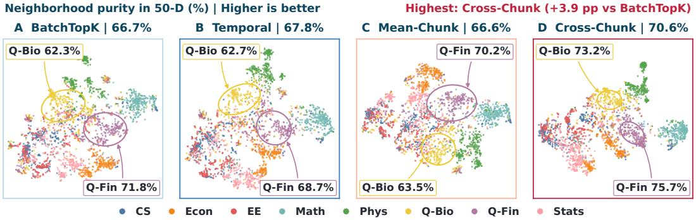  
Figure 9: Scientific-domain structure in document representations. Independently fitted t-SNE projections of the same 2,048 held-out ArXiv document codes for BatchTopK, Temporal, Mean-Chunk, and Cross-Chunk. Colors identify domains. Titles and callouts report purity in the cached 50-dimensional cosine neighborhoods, using non-self ranks 2–11. Cross-Chunk has the highest overall purity among the displayed methods, with domain-specific values highlighted in the callouts.

Figure 4 illustrates local behavior with each SAE’s own five selected features and their frozen explanations. The colors connect each explanation to its trace, making it possible to inspect where a described concept becomes active as the passage changes domain. The held-out persistence and utilization audit complements these examples with aggregate measurements of continuity and activation-mass distribution across the sampled dictionary. Both connect features to content.

## E SEMANTIC NEIGHBORHOODS ACROSS DOMAINS AND TIME

The geometry audit examines the organization of 2,048 held-out ArXiv documents balanced across eight domains. Frozen codes are projected to 50 dimensions by SVD without class labels. Domain labels then measure separation and neighborhood agreement in this representation. Figure 9 displays the documents through independently fitted t-SNE projections (van der Maaten & Hinton, 2008), while all reported neighborhood statistics are computed in the 50-dimensional space.

Cross-Chunk reaches 70.6% overall purity, compared with 66.7% for BatchTopK. Quantitative Biology and Quantitative Finance improve by 9.7 and 3.9 percentage points over the strongest other displayed method. These neighborhoods complement the trained probes in Section 5.3.

Table 2: Separation, neighborhood agreement, and cross-time nearest-neighbor classification for frozen ArXiv codes. Higher is better; bold marks column maxima across the displayed methods.
<table><tr><td>Method</td><td>Silhouette</td><td>Neighbor purity</td><td>Cross-time NN</td></tr><tr><td>BatchTopK</td><td>0.086</td><td>0.667</td><td>0.745</td></tr><tr><td>Temporal</td><td>0.102</td><td>0.678</td><td>0.744</td></tr><tr><td>Mean-Chunk</td><td>0.068</td><td>0.666</td><td>0.736</td></tr><tr><td>Cross-Chunk</td><td>0.100</td><td>0.706</td><td>0.774</td></tr></table>

Silhouette averages $( b _ { i } - a _ { i } ) / \operatorname* { m a x } ( a _ { i } , b _ { i } )$ , where $a _ { i }$ is a document’s mean distance to its own class and $b _ { i }$ is its smallest mean distance to another class (Rousseeuw, 1987). Neighbor purity is the fraction of selected neighbors sharing the query’s label. Cross-time NN assigns each later document the majority label among its ten nearest earlier test-set codes, using those codes as its labeled gallery.

For each within-test query, we exclude the query itself and its closest non-self neighbor, then compute neighborhood purity using non-self ranks 2–11. For an OOD query, we use the ten nearest codes from the earlier test set. Both calculations therefore use ten neighbors per query, but draw them from different reference pools. Figure 10 reports the fraction of neighbors sharing the query’s label, while Table 2 reports majority-vote accuracy for cross-time classification. These readouts distinguish local label agreement from the final class assigned by a neighborhood vote.

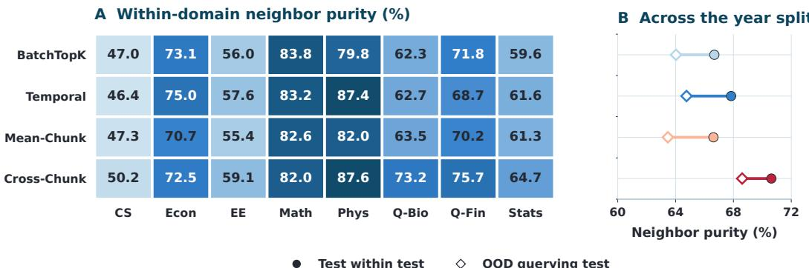  
Figure 10: Semantic neighborhoods across domains and time. (A) Cosine-neighborhood label purity by ArXiv domain. (B) Filled circles show within-test purity using non-self ranks 2–11; open diamonds show OOD purity over the ten nearest test codes. Both query collections contain 2,048 documents balanced across eight classes. All statistics use label-free 50-D SVD codes.

Temporal achieves the highest silhouette score, whereas Cross-Chunk leads in neighbor purity and cross-time nearest-neighbor accuracy. The rankings can differ because silhouette measures overall class separation, while the other metrics depend on local neighborhoods. Economics and Mathematics favor the token baselines; Quantitative Biology and Quantitative Finance show larger Cross-Chunk gains. Cross-Chunk’s advantage therefore varies across scientific domains. The domain labels give these neighborhood results a subject-level interpretation beyond geometric proximity alone.

## F CLASSIFICATION WITH LIMITED LABELS

Frozen-code classification tests whether useful distinctions are accessible to a simple probe as supervision varies (Kantamneni et al., 2025; Karvonen et al., 2025). We use {1, 2, 4, 8, 16, 64, 256} labeled documents per class, keeping the representation, probe settings, and evaluation split fixed. Five sampling seeds are used at each budget. All methods receive identical labeled subsets.

Figure 11A averages test accuracy across these seeds and shows one standard error. Panel B subtracts BatchTopK accuracy within each seed before averaging; its band therefore reflects variation in the paired differences. These curves reveal how performance changes as the same probe receives more examples from each scientific domain. The axis varies labeled examples per class.

Low-label AUC integrates accuracy over the base-two logarithm of the label budget and divides by the observed log-budget range. A doubling occupies one horizontal unit, while the 16-to-64 interval occupies two. Equation 30 provides the trapezoidal calculation. The five seeds vary the labeled subsets supplied to the probes, keeping the trained SAE representations fixed across those classification trials. The curves use one frozen representation per method across all label budgets.

## G JOINT-CHUNK ALPHA SWEEP ACROSS THE EVALUATION SUITE

We use α = 0.25 as a randomly chosen representative Joint-Chunk setting in the main comparisons. The sweep evaluates α ∈ {0.25, 0.5, 1.0, 1.5} with the same architecture, token budget, caches, and downstream procedures. The additional settings test whether the paper’s conclusions depend on the particular partner weight used to illustrate Joint-Chunk. All settings share these metric definitions.

The three additional weights retain the central pattern of stronger semantic feature discovery and downstream transfer relative to the token baselines. Their high-level feature fractions range from 29.5% to 34.4%, compared with 16.8–17.2% for the token methods. Reasoning generalization reaches 59.2–64.0%, compared with 46.6% for BatchTopK and 25.9% for Temporal; document retrieval and classification transfer also improve across all three additional evaluated settings.

Changing α adjusts the balance of capabilities. Among the additional settings, α = 0.5 has the highest high-level fraction and focused interpretability. Larger partner weights reduce reconstruction cosine and native reasoning recall, while retrieval and classification vary less. The main conclusions remain consistent across the tested weights: chunk-level objectives expose semantic structure and support downstream utility, with the observation unit and prediction target determining their complementary strengths. The weight controls the relative emphasis within this shared design.

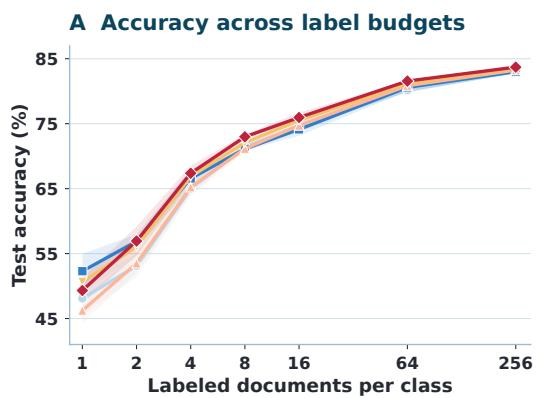

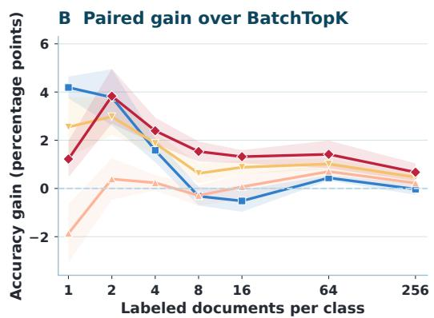  
Figure 11: Classification with limited supervision. (A) Test accuracy across seven labels-per-class budgets. (B) Within-seed differences from BatchTopK in percentage points. Points average five shared sampling seeds, and bands show one standard error of the mean, computed from paired differences in panel B. The curves expand the aggregate low-label summary in Section 5.3.

All Joint-Chunk runs use three random seeds and the shared training protocol. Appendix I separates self and partner fidelity for each weight, showing how their contributions enter composite RFVE. This target-specific accounting connects the sweep to the main equations while keeping the interpretation of each downstream metric unchanged. The sweep connects weights to feature and task scores.

## H LLM JUDGE PROMPTS AND EVALUATION CONTROLS

Scoring uses DeepSeek V4 Flash at temperature zero (DeepSeek-AI et al., 2026). DeepSeek V4 Pro generates the reasoning passages and their paired controls. The judge evaluates frozen evidence with SAE names hidden, and the templates use fixed output schemas. The following prompts retain the evaluation instructions; bracketed fields contain the feature-specific descriptions, contexts, or reasoning inputs supplied to each request. Judgments determine the main-text scores.

## H.1 FROZEN EXPLANATIONS AND HIGH-LEVEL SCORING

Explanation generation treats a complete 128-token context as one activation unit. Its instruction asks for a concise semantic or functional pattern rather than a list of isolated trigger words. This choice aligns the explanation with the passage-level interpretation task shared across the five methods. The resulting description is frozen before the judge examines its four active and four inactive scoring contexts. That description is used throughout the fixed scoring panel of complete contexts.

## Explanation generation

SYSTEM:

We are interpreting one sparse feature over complete 128-token text contexts. Every example is the same length and is one indivisible activation unit. The feature’s scalar activation is computed for the whole context. Summarize one concise, general pattern shared by the activating contexts: topic, domain, style, intent, or discourse function. Do not search for a trigger token, do not mention activation strength, and do not describe incidental words. Use at most 30 words and output only the explanation. USER:

Activating contexts: [ACTIVATING CONTEXTS]

The scoring prompt tests whether each complete context matches the frozen description. Its selections determine $\bar { \boldsymbol { r } _ { f } ^ { + } }$ and $\boldsymbol { r } _ { f } ^ { - }$ in Eq. 10. All 1,000 sampled features enter the average, including those whose explanations match no active context. The explanation remains frozen across all eight scoring contexts.

## Explanation scoring

## SYSTEM:

We are evaluating a sparse feature over complete 128-token contexts. Given an explanation and eight contexts, select the contexts that should activate as a whole. Every context is one indivisible unit: do not search for a single trigger token or substring. Return only comma-separated 1-based indices, or None if no context matches.

USER:

Explanation: [FROZEN EXPLANATION]

Contexts: [FOUR ACTIVE AND FOUR INACTIVE CONTEXTS]

The high-level census examines a separate question: whether a randomly sampled coordinate expresses a reusable concept across strong activations. The judge sees ten contexts from distinct held-out documents, with method identity and activation magnitude hidden. The complete rubric records a concept, matched examples, and whether a single surface-only rule is sufficient to explain the observed pattern. The decision rests on content shared across these activating contexts.

## High-level feature census

You are classifying one sparse-autoencoder feature from ten typical strong activations. The SAE type, feature number, and activation values are hidden. Identify the most informative common explanation and use exactly one level: 0 means no reusable rule covers at least six examples; 1 means one context-free surface/form rule alone explains at least eight; 2 means one coherent semantic or functional concept is the best explanation for at least six. Surface rules include exact tokens, fixed phrases, named entities, boilerplate, markup, punctuation, local syntax, or programming/API spelling. Related words may coexist with a level-2 concept; set surface sufficient=true only when a single surface-only rule is sufficient. Do not use protocol artifacts such as continuation across a split, generic topical consistency, or one-document coherence as the feature rule. Mark exactly the matching examples. A feature passes only when level=2, at least six examples match, and surface sufficient=false. Return one JSON array with id, level, concept, matching example IDs, surface sufficient, and reason.

A passing coordinate receives level 2, matches at least six contexts, and has no sufficient surface-only explanation. The fraction counts these coordinates among all 1,000 sampled features, connecting repeated semantic evidence to the distinction between concepts and surface patterns.

## H.2 REASONING RELATIONS, SELECTION, AND CALIBRATION

The reasoning panel contains five relations. Causal mechanism explains how a cause produces an outcome; planning organizes actions toward a goal; backtracking revises a prior choice after an obstacle or new information. Conditional assumption develops consequences under an assumption, and induction extends a pattern across examples. These definitions identify relations expressed by the text, independently of whether a familiar category word or conventional cue phrase appears.

Each relation has 500 native examples: 400 form the discovery pool and 100 are held out. Selection and confirmation require target support and specificity, with a distinct eligible feature assigned to each relation by Eq. 31. Feature identities and detection cutoffs are frozen before held-out scoring and before constructing the paired control views, keeping feature discovery separate from the texts used to test generalization. The views share one selected feature per method and relation.

For method M, feature $f ,$ and document D, native-resolution scoring takes the maximum over its thresholded token activations or independently encoded chunk activations within the document:

$$
S _ { M , f } ( D ) = \left\{ \begin{array} { l l } { \underset { t \in D } { \operatorname* { m a x } } [ \psi _ { M } ( \mathbf { h } _ { t } ) ] _ { f } , } & { M \in \mathcal { M } _ { \mathrm { t o k e n } } , } \\ { \underset { C \in \mathcal { C } ( D ) } { \operatorname* { m a x } } [ \psi _ { M } ( \pmb { \mu } _ { C } ) ] _ { f } , } & { M \in \mathcal { M } _ { \mathrm { c h u n k } } . } \end{array} \right.\tag{22}
$$

Here, C(D) denotes the evaluation chunks in the document. A relation is detected when its selected feature exceeds its fixed cutoff. Calibration uses 208 confirmation-fold Pile documents and sets each cutoff to an empirical background false-positive rate of at most 5%, giving the subsequent native and control views a common decision rule calibrated against the same background document collection.

## H.3 SEPARATING REASONING RELATIONS FROM SURFACE CUES

A word can accompany a reasoning relation without defining it. For example, “wait” can mark a revision of a plan or simply ask someone to remain in place. Testing the relation therefore requires varying its structure and its familiar wording separately. The native, cue-free, and cue-only views implement this distinction: they ask whether a feature recognizes the original relation, recognizes it under new wording, and rejects familiar words when the reasoning relation is absent.

Native passages are generated before the discovery/evaluation split. Each expresses its relation across multiple 128-token chunks with varied domains, entities, and sentence styles. Cue families are used as nuisance controls, and the generator records the relation stages and the cue terms actually present in each passage. The following template fixes the intended structure of these native instances.

## Native reasoning instances

Generate exactly [COUNT] independent latent instances for the reasoning category [CATEGORY], whose defining relation is [DEFINITION]. Use the registered cue family [CUES] only as a balanced nuisance control: some instances should contain several cues and some none or a different member; no cue may be perfectly predictive. Cover many domains, entities, numeric ranges, templates, and sentence styles. Each text must be a natural paragraph of about 280–420 words (at least 256 tokenizer tokens), with the relation spread across two or more 128-token chunks. Do not insert labels such as Premise, Step, Conclusion, or JSON. Return only a JSON array. Each object must contain exactly these useful fields: instance id, category, text, relation steps (three concrete stages), cue terms (only cues that actually occur), cue present (boolean), domain, and template id.

Two independent requests then create paired control views for each held-out native passage. The cuefree positive preserves the relation, broad topic, and native length stratum while replacing wording and removing cues. The cue-only negative preserves recognizable lexical anchors while replacing the events so that the target relation is absent. Independent rewriting gives each view natural text suited to its intended semantic condition. The views separate relations from their cues.

## Cue-free positive (view B)

Write one completely new, independent full-length paragraph for the supplied source. Preserve the target reasoning relation, broad topic and domain, and the native length stratum, but remove every registered cue, observed anchor, morphological variant, and direct surface equivalent. Use fresh entities and sentence structure; do not copy a source sentence, add labels, or mention this evaluation. Keep the relation genuinely multi-stage and express it through ordinary content. Return only a JSON array with one object containing pair id and text; copy pair id exactly.

The negative view retains observed BatchTopK and Temporal anchor words because these supply concrete, activation-linked candidates for a lexical explanation. Retaining such words makes the control informative: a detector must distinguish their use in ordinary content from their use in a genuine reasoning relation. The resulting passages are shared by every method, with frozen features and cutoffs used across all three views. Every method scores identical control views.

## Cue-only negative (view C)

Write one completely new, independent full-length paragraph about the same topic, entities, time frame, and setting, but discard the source events and target reasoning relation. Preserve comparable length and include both literal center-token surfaces supplied for the paired BatchTopK and Temporal anchors. Remove the complete relation and all implicit multi-stage equivalents; do not deny the relation in a meta-sentence, copy the source, or mention this evaluation. Return only a JSON array with one object containing pair id and text; copy pair id exactly.

Local validation and blind review reject failed rewrites before feature scoring. Cue-free detection supplies positive evidence that the relation remains recognizable after its familiar wording changes. Cue-only rejection tests whether those words are sufficient to produce a detection without the relation. Read together with native recall, these outcomes evaluate reasoning-sensitive feature behavior across the five relation types in both original and independently rewritten passages. The 66% versus below-5% backtracking comparison therefore measures recognition under this shared, baseline-anchored lexical stress test, in which cue-free positives remove observed anchors and cue-only negatives preserve token-baseline anchors.

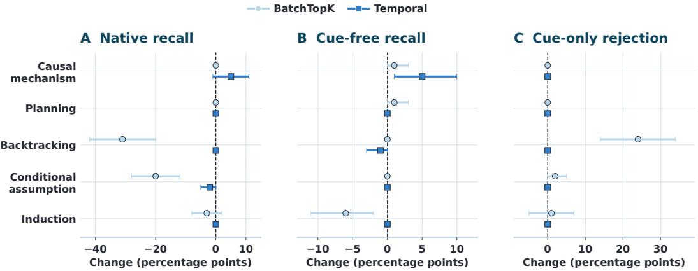  
Figure 12: Reasoning decisions under matched pooling and recalibration. Matched minus nativeresolution rates for BatchTopK and Temporal: native recall, cue-free recall, and cue-only rejection. Comparisons pair the same 100 documents per relation and view; whiskers show paired-bootstrap 95% intervals from 20,000 resamples. Mean-Chunk and Cross-Chunk retain the same decisions on these views. Positive differences indicate higher reasoning recall or cue-only rejection.

This is because, in real-world retrieval scenarios, it is highly likely that no anchor words are activated. Our experiments must replicate this condition. We believe this comparison is most relevant when SAEs are used to retrieve reasoning examples that lack salient cues such as “step” or “wait”. We do not want the SAE to miss retrieving these inference data, as they are highly valuable. Our chunk-level SAE excels precisely at this, which constitutes the primary significance of this experiment.

## H.4 MATCHED POOLING AND CUTOFF SENSITIVITY

The matched audit pools each token method’s thresholded codes within shared 128-token chunks, then takes the maximum chunk score for the document. Feature identities remain fixed. Cutoffs are recalibrated on the same 208 Pile confirmation documents to empirical false-positive rate at most 5%. This protocol evaluates the joint effect of chunk pooling, document-level score opportunities, and background recalibration on document decisions made by the selected reasoning features.

Figure 12 pairs the same 100 held-out documents per relation and view. BatchTopK’s backtracking native recall falls by 31 percentage points, while its cue-only rejection rises by 24 points. Temporal changes remain within five points, and Mean-Chunk and Cross-Chunk retain their decisions. The paired-bootstrap intervals describe changes in the document decisions made by these frozen features under the two calibrated scoring protocols. Differences pair documents across protocols.

## H.5 STEERING GENERATION AND SCORING

Steering tests whether adding a feature’s decoder direction moves generation toward its frozen concept description (Wang et al., 2025a; Wu et al., 2025). We evaluate 1,000 features per method, including each Joint-Chunk weight. Generation is greedy, with a 192-token prompt and at most 32 new tokens. At every non-padding layer-21 position during prefill and generation, the intervention adds $\gamma \mathbf { d } _ { f } / \lVert \mathbf { d } _ { f } \rVert _ { 2 }$ , using the unit-normalized decoder intervention defined in Eq. 12.

Following AxBench’s concept-specific steering-strength selection Wu et al. (2025), we evaluate every feature and method on the same prespecified strength grid and report the feature-wise maximum as a measure of attainable steering score. We simplify the process and extract the core ideas. Base strengths are {1, 3, 5, 7, 10}. When the entire continuation remains unchanged at every base strength, the feature enters the ordered rescue grid {15, 20, 30, 50}. Rescue stops at the first changed continuation or when the grid is exhausted. Baseline and intervention use the same prompt and decoding settings for each feature, preserving a direct comparison between the resulting continuations.

The blinded judge scores concept direction $C _ { f , \gamma }$ and coherence preservation $H _ { f , \gamma }$ on 0–100 scales. The deterministic combination applies the main-text coefficients to the two judge scores

$$
s _ { f , \gamma } = 0 . 7 C _ { f , \gamma } + 0 . 3 C _ { f , \gamma } \frac { H _ { f , \gamma } } { 1 0 0 } .\tag{23}
$$

Concept direction measures change relative to baseline, and coherence preservation measures additional degradation caused by intervention. An unchanged continuation has $C = 5 0$ and $H = 1 0 0 .$ yielding the neutral score 50. The prompt below specifies the two judgments used in this deterministic combination. The returned scores use the main-text coefficients for concept and coherence.

## Steering judge

You are a blind, critical evaluator of causal feature steering. The concept hypothesis may be wrong. The same prompt was decoded twice: BASELINE has no intervention and POSITIVE adds the normalized decoder direction at every non-padding layer-21 position during prefill and generation. The prompt, hypothesis, and both continuations are supplied below.

Score exactly two integer rubrics in [0,100]. For concept direction, 0 means strong movement away from the concept, 25 modest movement away, 50 no meaningful change (including identical output), 75 clear movement toward it, and 100 unmistakable dominant movement toward it. For coherence preservation, compare POSITIVE only with BASELINE: 100 means no additional degradation (or an improvement), 75 mild degradation, 50 clear but interpretable degradation, 25 severe degradation, and 0 unusable. Do not penalize defects already present in BASELINE or reward lexical copying. Return JSON only with the two fields and a brief comparative rationale; do not return an overall score.

For each feature, we retain the highest score among its evaluated strengths, including eligible rescue attempts, with ties resolved in favor of the lower strength. The method score averages these featurewise maxima over the complete 1,000-feature panel. This aggregation follows Eq. 33 and uses the same strength-search procedure across the compared dictionaries. The averaging unit is the feature, with one selected score contributed by each coordinate in the evaluated dictionary panel.

## I JOINT-CHUNK SAE ALPHA ABLATION

The alpha ablation holds the architecture, shared prefix, activation normalization, and training budget fixed while varying $\alpha \in \{ 0 . 2 5 , 0 . 5 , 1 . 0 , 1 . 5 \}$ . Each run, one billion training occurrences, dictionary width 65,536, and K = 128. Table 3 evaluates all selected checkpoints on the same 262,144-occurrence monitor, complementing the evaluation-suite comparison in Appendix G.

Let $F _ { \mathrm { s e l f } }$ and $F _ { \mathrm { p a r t n e r } }$ be the target-specific SAE FVEs. The self reference has FVE one; the dense partner reference has $F _ { \mathrm { r e f } } ^ { \mathrm { p a r t n e r } } = 0 . 6 7 6 7 5 8$ on this monitor. The composite score applies weights 1 and α to the two SAE FVEs and to both target-matched reference FVEs on this monitor

$$
\mathrm { R F V E _ { j o i n t } } ( \alpha ) = \frac { F _ { \mathrm { s e l f } } + \alpha F _ { \mathrm { p a r t n e r } } } { 1 + \alpha F _ { \mathrm { r e f } } ^ { \mathrm { p a r t n e r } } } .\tag{24}
$$

The common task-weight factor $1 / ( 1 + \alpha )$ cancels from the ratio. This construction compares the weighted explained variance of the sparse predictions with that of the weighted target-matched references, preserving the same partner emphasis in the numerator and denominator.

Table 3: Target fidelity across Joint-Chunk weights. Each setting is evaluated on the shared monitor. Self and partner FVE describe the two prediction targets, and composite RFVE uses Eq. 24.
<table><tr><td>α</td><td>Self FVE</td><td>Partner FVE</td><td>Composite RFVE</td></tr><tr><td>0.25</td><td>0.9263</td><td>0.6698</td><td>0.9355</td></tr><tr><td>0.50</td><td>0.9163</td><td>0.6701</td><td>0.9350</td></tr><tr><td>1.00</td><td>0.9045</td><td>0.6662</td><td>0.9367</td></tr><tr><td>1.50</td><td>0.8966</td><td>0.6621</td><td>0.9378</td></tr></table>

Self FVE decreases from 0.9263 to 0.8966 across the sweep. Partner FVE remains close between $\alpha = 0 . 2 5$ and $\alpha = 0 . 5$ , then reaches 0.6621 at $\alpha = 1 . 5 .$ Composite RFVE stays between 0.9350 and

0.9378. Its endpoint increase follows from giving greater weight to partner prediction, whose FVE is closer to its own reference, while the separate columns show the absolute behavior of each target.

## J EVALUATION METRIC DEFINITIONS

## J.1 FIDELITY AND DIRECTIONAL AGREEMENT

For evaluation set $\mathcal { E } ,$ let $\mathbf { y } _ { i }$ be an unscaled target, $\widehat { \mathbf { y } } _ { i }$ its scaled prediction, and $\overline { { \mathbf { y } } }$ the fixed training-set target mean. The prediction error and constant-predictor error are evaluated on the same targets

$$
\begin{array} { r l r } { \displaystyle } & { { } } & { E _ { \mathrm { S A E } } = \displaystyle \sum _ { i \in \mathcal { E } } \| s \mathbf { y } _ { i } - \widehat { \mathbf { y } } _ { i } \| _ { 2 } ^ { 2 } , } \\ { \displaystyle } & { { } } & { E _ { \mathrm { c o n s t } } = \displaystyle \sum _ { i \in \mathcal { E } } \| s ( \mathbf { y } _ { i } - \overline { { \mathbf { y } } } ) \| _ { 2 } ^ { 2 } . } \end{array}\tag{25}
$$

FVE is $1 - E _ { \mathrm { S A E } } / E _ { \mathrm { c o n s t } }$ , measuring improvement over the constant predictor (Gao et al., 2024). RFVE divides this value by reference FVE on the same examples and target. The self reference is the identity map; the partner reference is the dense predictor selected in Appendix A.

Reconstruction cosine compares prediction and target directions. For nonzero vectors, their normalized inner product is computed using the nonzero scaled prediction and target vectors:

$$
\mathrm { C o s i n e } _ { i } = \frac { \widehat { \mathbf { y } } _ { i } ^ { \top } ( s \mathbf { y } _ { i } ) } { \| \widehat { \mathbf { y } } _ { i } \| _ { 2 } \| s \mathbf { y } _ { i } \| _ { 2 } } .\tag{26}
$$

Self predictions use observed activations as targets, and partner predictions use neighboring chunk means. Positive rescaling leaves cosine unchanged, complementing squared-error fidelity.

## J.2 FEATURE STRUCTURE

For persistence, let $I _ { f } ( C ) = \mathbf { 1 } \{ [ \mathbf { z } ( C ) ] _ { f } > 0 \}$ indicate that feature $f$ activates in chunk C. Let $\mathcal { P } _ { \mathrm { s a m e } }$ and $\mathcal { P } _ { \mathrm { s h u f } }$ contain adjacent same-document pairs and length-matched pairs shuffled across documents. The two coactivation estimates and their difference after averaging across features are

$$
\begin{array} { r l } & { \widehat { p } _ { f , q } = \frac { 1 } { | \mathcal { P } _ { q } | } \displaystyle \sum _ { ( A , B ) \in \mathcal { P } _ { q } } I _ { f } ( A ) I _ { f } ( B ) , \qquad q \in \{ \mathrm { s a m e } , \mathrm { s h u f } \} , } \\ & { \mathrm { P e r s i s t e n c e L i f t } = \frac { 1 } { | \mathcal { F } | } \displaystyle \sum _ { f \in \mathcal { F } } \left( \widehat { p } _ { f , \mathrm { s a m e } } - \widehat { p } _ { f , \mathrm { s h u f } } \right) . } \end{array}\tag{27}
$$

The set $\mathcal { F }$ contains features meeting the audit’s support criterion. Positive lift identifies coactivation associated with same-document continuity beyond the length-matched shuffled comparison.

For utilization, let $M _ { f }$ be the activation mass of feature $f$ over the held-out audit contexts, and let $\mathcal { F } _ { \mathrm { a l i v e } }$ be the sampled alive-feature set. Normalized masses and entropy-equivalent utilization are

$$
p _ { f } = \frac { M _ { f } } { \sum _ { g \in \mathcal { F } _ { \mathrm { a l i v e } } } M _ { g } } , \qquad \mathrm { U t i l i z a t i o n } = \frac { \exp \Bigl ( - \sum _ { f \in \mathcal { F } _ { \mathrm { a l i v e } } } p _ { f } \log p _ { f } \Bigr ) } { | \mathcal { F } _ { \mathrm { a l i v e } } | } .\tag{28}
$$

Natural-log entropy makes the numerator an effective feature count (Hill, 1973). Expressed as a percentage, utilization reaches 100% for equal masses and falls as mass becomes concentrated.

## J.3 DOCUMENT RETRIEVAL AND CLASSIFICATION

For query $q ,$ let $r _ { q }$ be the rank of its correct partner among the length-matched candidates. For the complete query set Q, we average the indicator that the partner’s rank is at most k

$$
{ \mathrm { R e c a l l @ } } k = { \frac { 1 } { | \mathcal { Q } | } } \sum _ { q \in \mathcal { Q } } \mathbf { 1 } \{ r _ { q } \leq k \} .\tag{29}
$$

The figures report 100 Recall@5, averaging equally over queries. Every method ranks the same partners and galleries, using its corresponding representation or lexical similarity score.

OOD accuracy is the percentage of future-year documents whose domain is correctly predicted by the frozen-representation multinomial logistic probe. Low-label $\mathbf { A U C }$ summarizes test accuracy across budgets $\bar { b _ { j } } \in \{ 1 , 2 , 4 , 8 , 1 6 , 6 4 , 2 5 6 \}$ . Writing $x _ { j } = \log _ { 2 } b _ { j }$ and $a _ { s , j }$ for fractional accuracy under sampling seed $s ,$ we average the normalized log-budget integrals across seeds

$$
\mathrm { L o w L a b e l A U C } = \frac { 1 } { 5 } \sum _ { s = 1 } ^ { 5 } \frac { 1 } { x _ { 7 } - x _ { 1 } } \sum _ { j = 1 } ^ { 6 } \frac { a _ { s , j } + a _ { s , j + 1 } } { 2 } \big ( x _ { j + 1 } - x _ { j } \big ) , \qquad x _ { 7 } - x _ { 1 } = 8 .\tag{30}
$$

This normalized trapezoidal area summarizes accuracy over label doublings. Averaging seed-wise areas is equivalent to integrating the mean accuracy curve because both operations are linear.

## J.4 REASONING SELECTION, RECALL, AND GENERALIZATION

For relation c, let $p _ { c } ^ { \mathrm { s e l } } ( f )$ be the weighted selection-fold fraction activating feature $f ,$ with background and other-relation rates defined analogously. The eligible set $\mathcal { E } _ { c }$ contains features meeting support and specificity requirements in selection and confirmation data and available for assignment to the relation. We select the largest target advantage over background or other-relation activation

$$
f _ { c } ^ { \star } = \underset { f \in \mathcal { E } _ { c } } { \arg \operatorname* { m a x } } \left[ p _ { c } ^ { \mathrm { s e l } } ( f ) - \operatorname* { m a x } \left\{ p _ { \mathrm { b g } } ^ { \mathrm { s e l } } ( f ) , \underset { r \neq c } { \operatorname* { m a x } } p _ { r } ^ { \mathrm { s e l } } ( f ) \right\} \right] .\tag{31}
$$

The selected feature and calibrated cutoff $\theta _ { c }$ remain fixed across the held-out views. Its document decision is $D _ { c } ( x ) = \mathbf { 1 } \{ S _ { f _ { c } ^ { \star } } ( x ) > \theta _ { c } \}$ , giving the corresponding binary detection.

Let $\mathcal { V } _ { c } ^ { \mathrm { n a t i v e } } , \mathcal { V } _ { c } ^ { \mathrm { f r e e } }$ , and $\mathcal { V } _ { c } ^ { \mathrm { o n l y } }$ denote the views for relation c. Their detection and rejection rates are

$$
R _ { c } ^ { \mathrm { n a t i v e } } = \frac { 1 } { | \mathcal { V } _ { c } ^ { \mathrm { n a t i v e } } | } \sum _ { x \in \mathcal { V } _ { c } ^ { \mathrm { n a t i v e } } } D _ { c } ( x ) ,
$$

$$
R _ { c } ^ { \mathrm { f r e e } } = \frac { 1 } { | \mathcal { V } _ { c } ^ { \mathrm { f r e e } } | } \sum _ { x \in \mathcal { V } _ { c } ^ { \mathrm { f r e e } } } D _ { c } ( x ) ,\tag{32}
$$

$$
Q _ { c } ^ { \mathrm { o n l y } } = \frac { 1 } { | \mathcal { V } _ { c } ^ { \mathrm { o n l y } } | } \sum _ { x \in \mathcal { V } _ { c } ^ { \mathrm { o n l y } } } \bigl ( 1 - D _ { c } ( x ) \bigr ) .
$$

Native recall averages $R _ { c } ^ { \mathrm { n a t i v e } }$ over the five relations; generalization averages $( R _ { c } ^ { \mathrm { f r e e } } + Q _ { c } ^ { \mathrm { o n l y } } ) / 2$ Both are percentages, with 100 documents per relation and view giving equal relation weights.

Figure 6 displays cue-only false activation, $1 - Q _ { c } ^ { \mathrm { o n l y } }$ . Generalization uses the complementary rejection rate, combining cue-free detection with rejection of cues without the relation.

## J.5 CAUSAL STEERING AND AGGREGATION

Steering uses the unit-normalized decoder intervention in Eq. 12 and the concept/coherence combination in Eq. 23. Let $\Gamma _ { f }$ contain the positive strengths actually evaluated for feature $f ,$ , including eligible rescue attempts. Averaging the selected feature-wise scores over the sampled panel gives

$$
S _ { \mathrm { s t e e r } } ( f ) = \operatorname* { m a x } _ { \gamma \in \Gamma _ { f } } s _ { f , \gamma } , \qquad S _ { \mathrm { s t e e r } } = \frac { 1 } { | \mathcal { F } _ { \mathrm { s t e e r } } | } \sum _ { f \in \mathcal { F } _ { \mathrm { s t e e r } } } S _ { \mathrm { s t e e r } } ( f ) ,\tag{33}
$$

where $| \mathcal { F } _ { \mathrm { s t e e r } } | = 1 0 0 0$ . Each feature contributes one maximum with equal weight, and ties favor lower strength, yielding the dictionary-level steering summary used in the main comparison.