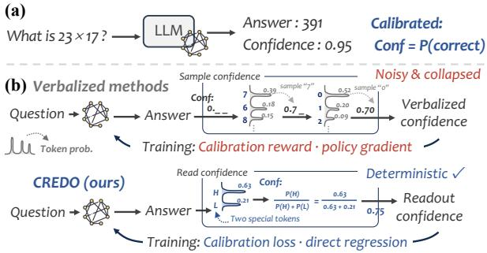
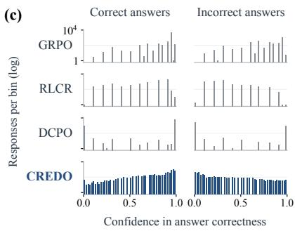
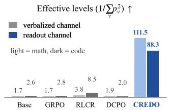
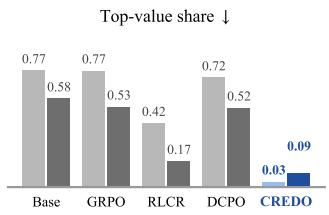
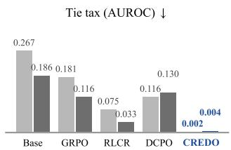
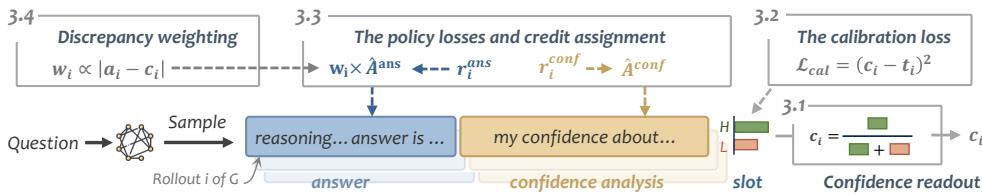
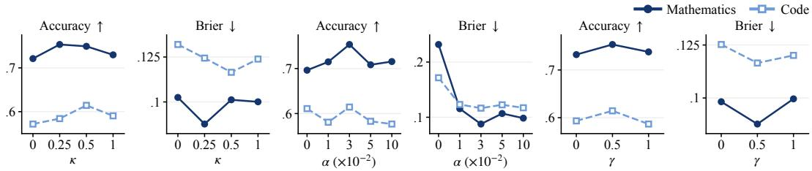
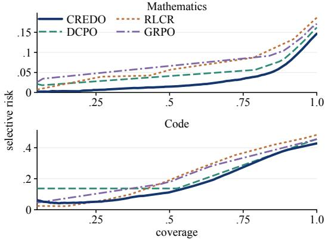
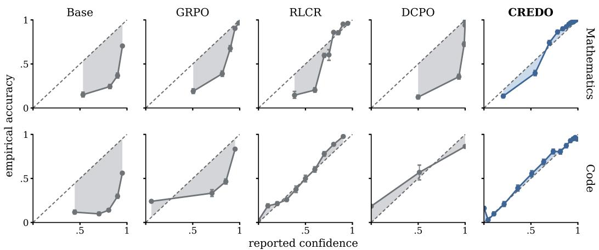

# BEYOND VERBALIZED CONFIDENCE: CALIBRATING REASONERS WITH DIFFERENTIABLE READOUTS

Chenxiao Fan1,2, Chongming Gao1, Gangyi Zhang2, Leyang Shen3, Yaxin Gong1, Jiamin Wang1, Jiakai Wang2, Dong Wang2, Yang Liu2, Fuli Feng1, Xiangnan He

1 University of Science and Technology of China

2 Qwen Business Unit of Alibaba 3 National University of Singapore

simonfan@mail.ustc.edu.cn

## ABSTRACT

Reinforcement learning with verifiable rewards (RLVR) trains reasoning models to produce correct answers, but does not ensure that their stated confidence is calibrated. The resulting models are systematically overconfident. Recent methods train calibration inside the RLVR loop by having the model state a numerical confidence alongside its answer, but they all obtain the confidence by sampling it as text. This choice imposes two costs: a sampled confidence introduces variance and in practice collapses to a handful of distinct values, and sampling makes the confidence non-differentiable, forcing the calibration loss through a scalar reward. We propose CREDO (Confidence REaDOut) to replace sampling with a deterministic readout. While RLVR optimizes correctness, CREDO reads the confidence from a dedicated token pair in the model’s output distribution and trains it by differentiable regression. CREDO further turns the trained confidence into a signal for accuracy, weighting rollouts by how far confidence and outcome disagree, so that accuracy and calibration improve together. Across mathematical and code reasoning, CREDO attains the best accuracy and calibration, and the gains extend to abstention and selective prediction.

## 1 INTRODUCTION

Reinforcement learning with verifiable rewards (RLVR) has become the standard recipe for training reasoning models (Shao et al., 2024; Guo et al., 2025). Answers in mathematics and code can be checked automatically, so the training reward is simply whether the answer is correct. This produces strong reasoners, but the reward carries no signal about how confident the model should be in any particular answer. Models trained this way are systematically overconfident (Yang et al., 2024; Bereket & Leskovec, 2025; Mei et al., 2025).

Overconfidence has practical costs: downstream systems route answers by their stated confidence, so a confidently wrong answer passes through the filters meant to catch it (Geifman & El-Yaniv, 2017; Kirichenko et al., 2025). The remedy is calibration: a model’s stated confidence should match how often it is actually correct, so that when it reports 0.9, roughly nine in ten of those answers are right (DeGroot & Fienberg, 1983; Guo et al., 2017). Calibration does not emerge from a correctness reward, so it has to be trained for.

For calibration to be trainable, the model must produce a confidence estimate alongside each answer (Figure 1a). One approach reads confidence from the model’s generation probabilities (Fomicheva et al., 2020), but these reflect the likelihood of the generated text rather than the probability of being correct. Recent methods instead ask the model to state a numerical confidence after its answer, scored by a reward based on a proper scoring rule (Gneiting & Raftery, 2007). Several methods along this route have refined the reward design and the balance between correctness and calibration (Damani et al., 2026; Ma et al., 2026; Xu et al., 2024; Bani-Harouni et al., 2026; Leng et al., 2025). Despite their differences, these methods share one choice: the confidence is a numeral sampled as text, which forces the calibration loss to work through a scalar reward (Figure 1b).

This choice imposes two costs. First, a sampled confidence introduces variance that persists as long as the report is stochastic. In practice, the reported confidence collapses to a handful of distinct values, and correct and incorrect answers end up sharing the same confidence (Figure 1c). Second, sampling makes the confidence non-differentiable, forcing the calibration loss to work through a scalar reward rather than a direct gradient. The resulting gradient estimate carries additional variance from the report, making calibration harder to learn. Both costs follow from verbalizing the confidence; redesigning the reward cannot remove them.

  
Figure 1: (a) The calibration task: a model answers and reports a confidence; calibration means the reported probability matches observed correctness. (b) Verbalized methods sample the confidence as text and train it through a scalar reward. CREDO reads the relative probability of a pair of reserved tokenprob.tokens and trains it by direct regression from the calibration loss. (c) Confidence distributions on code. Verbalized reports (GRPO, RLCR, DCPO) concentrate on a few values shared by correct and incorrect answers, even when calibration is trained explicitly (RLCR, DCPO). The readout (CREDO) spreads across the full range.

We propose CREDO (Confidence REaDOut),1 which reads the confidence directly from the output distribution rather than sampling it. While RLVR optimizes correctness, CREDO sets aside a pair of reserved tokens and takes their relative probability as the confidence, trained by differentiable regression (Figure 1b). The readout is deterministic and directly differentiable, so the calibration loss trains it by gradient descent. CREDO further turns the trained confidence into a signal for accuracy. A confident mistake or an unexpected success is more informative than a rollout where confidence and outcome already agree, so CREDO weights learning on the answer by the size of the discrepancy. Accuracy and calibration improve together in both domains.

Our main contributions are as follows:

• We show that sampling the confidence as text imposes two costs: the report introduces variance and in practice collapses to a handful of distinct values, and the sampling step makes the confidence non-differentiable, forcing the calibration loss through a scalar reward.

• We propose CREDO, which reads the confidence as the relative probability between a pair of reserved tokens and trains it by differentiable regression, giving the calibration loss a direct gradient path. The policy gradient continues to handle correctness and credit assignment.

• We turn the trained confidence into a signal for accuracy, weighting each rollout by the gap between confidence and outcome. The weighting improves accuracy in both domains.

• Across mathematical and code reasoning, CREDO attains the best accuracy and calibration. Ablations isolate the contributions of the readout and the weighting, and the improved calibration pays off downstream in abstention and selective prediction.

## 2 CONFIDENCE CHANNELS AND THEIR COSTS

We start from the RLVR setup and the calibration objective (§2.1). The rest of the section identifies the channel choice behind verbalized confidence (§2.2), analyzes its two costs (§2.3), and derives three requirements for removing them (§2.4).

## 2.1 SETUP: RLVR AND THE CALIBRATION OBJECTIVE

We work in the GRPO form of RLVR (Shao et al., 2024). For a question $x ,$ the policy $\pi _ { \theta }$ samples a group of G rollouts $o _ { 1 } , \ldots , o _ { G }$ , and a verifier scores each one for correctness, $a _ { i } = \mathcal { H } [ y _ { i } \equiv y ^ { * } ]$ where $y _ { i }$ is the answer extracted from $o _ { i }$ and $y ^ { * }$ the reference answer. The policy maximizes the clipped objective of Schulman et al. (2017), using the group as the baseline:

$$
\mathcal { I } ( \theta ) = \mathbb { E } \Big [ \frac { 1 } { G } \sum _ { i = 1 } ^ { G } \frac { 1 } { | o _ { i } | } \sum _ { k \in \sigma _ { i } } \operatorname* { m i n } \big ( \rho _ { i , k } \hat { A } _ { i , k } , \mathrm { { \ c l i p } } ( \rho _ { i , k } , 1 \pm \epsilon ) \hat { A } _ { i , k } \big ) \Big ] , \quad \hat { A } _ { i , k } = \hat { A } _ { i } = \frac { r _ { i } - \bar { r } } { \mathrm { s t d } ( r ) } .\tag{1}
$$

Here $\rho _ { i , k }$ is the token-level importance ratio, ϵ the clipping range, and $\bar { r }$ and std(r) the mean and standard deviation of the group’s rewards. The reward is the correctness score, $r _ { i } = a _ { i }$ . In standard GRPO every token of a rollout shares the same ${ \hat { A } } _ { i }$ . The verifier’s signal is not differentiable in the parameters, so training on it runs through the policy gradient.

A calibrated model must also report a scalar $q \in [ 0 , 1 ]$ alongside its answer, and the report must be right as often as it claims:

$$
\mathbb { E } [ a \mid q = v ] = v , \qquad \forall v \in [ 0 , 1 ] .\tag{2}
$$

The standard way to train toward equation 2 is a strictly proper scoring rule, whose expectation is uniquely minimized at $\mathbb { E } [ a \mid \ q ]$ (Gneiting & Raftery, 2007); the Brier score $( q - a ) ^ { 2 }$ is the canonical example (Brier, 1950). RLVR on its own does not target equation 2. Its reward depends only on correctness and is indifferent to the model’s confidence, so nothing in the objective pushes a confident error down (Damani et al., 2026).

## 2.2 THE VERBALIZED CHANNEL

A confidence report has two design choices: where the confidence comes from and how it is trained. Definition 1 (confidence channel). A confidence channel is a pair $( \mathcal { E } , \mathcal { T } )$ : an emission map $\mathcal { E }$ from the rollout prefix to a scalar report, and a training path $\tau _ { \ast }$ , the route by which the calibration objective reaches the report’s value.

The methods that train a model to state its confidence inside RLVR make the same pair of choices. The confidence is written out as a numeral in the text,

$$
\begin{array} { r } { \mathcal { E } ^ { \mathrm { v e r b } } : \quad \hat { q } = \mathrm { p a r s e } ( s ) , \qquad s \sim \pi _ { \theta } ( \cdot \mid h ) , } \end{array}\tag{3}
$$

where $h = ( x , y , \dots )$ is the rollout prefix up to the confidence slot. The model generates a rollout containing a solution y to x, samples a numeral $s ~ ( \mathrm { s a y } ~ ^ {  } 0 . 9 ^ {  } )$ at the confidence slot, and parses it into a report ${ \hat { q } } .$ We call a channel whose emission includes a sampling step a verbalized channel.

This choice of E determines $\tau$ . Sampling makes the realized value of $\hat { q }$ non-differentiable in the parameters, so the calibration signal can only enter equation 1 as a scalar reward. RLCR (Damani et al., 2026) and DCPO (Ma et al., 2026) are the two representative methods along this route,

$$
\begin{array} { r l } & { r ^ { \mathrm { R L C R } } = a - ( \hat { q } - a ) ^ { 2 } , } \\ & { r _ { \mathrm { r e a s o n } } ^ { \mathrm { D C P O } } = a , \qquad r _ { \mathrm { c o n f } } ^ { \mathrm { D C P O } } = - \big | \hat { q } - R _ { I G } \big | , \qquad R _ { I G } = \lambda \tilde { R } _ { G } + ( 1 - \lambda ) a , } \end{array}\tag{4}
$$

where $\tilde { R } _ { G }$ is the group’s mean accuracy and λ its mixing weight. The first couples the calibration term into a single reward; the second scores the two segments separately and mixes the target. The disagreements are all internal to the reward, but the channel is shared: every verbalized variant uses the same emission and training path (Xu et al., 2024; Bani-Harouni et al., 2026; Leng et al., 2025; Stengel-Eskin et al., 2024; Zhang et al., 2026).

In both analyses, the optimal report is calibrated and the calibration term does not hurt accuracy (Damani et al., 2026; Ma et al., 2026). These analyses validate the reward design but leave the channel unexamined.

## 2.3 COSTS OF THE VERBALIZED CHANNEL

Each component of the verbalized channel carries a cost. The first falls on the emission E (proofs of all propositions are in Appendix A).

  
Figure 2: Collapse of the verbalized channel, with CREDO for contrast. Effective level $\begin{array} { r } { \mathbf { s } = 1 / \sum _ { v } p _ { v } ^ { 2 } } \end{array}$ (equiprobable-level equivalent); top-value share = pool fraction of the most frequent value; tie $\mathbf { t a x } =$ AUROC lost to exactly equal reports.

Proposition 1 (a verbalized report pays a variance tax or determinizes). Fix a rollout prefix and let qˆ be the parsed report of equation 3, with conditional mean q¯ and variance v. Every verbalized policy either pays a per-prefix tax that persists as long as the report is stochastic, or determinizes its per-prefix report distribution. Under the squared loss the tax is exactly $v ,$ since $\mathbb { E } [ ( \hat { q } - t ) ^ { 2 } ] =$ $( \bar { q } - t ) ^ { 2 } + v$ for any target $t \in [ 0 , 1 ] ,$ ; under any strictly convex loss $\ell ,$ Jensen’s inequality gives $\dot { \mathbb { E } } [ \ell ( \hat { q } , t ) ] - \ell ( \bar { q } , t ) > 0$

Proposition 1 leaves two outcomes: variance or determinization. Determinization avoids the tax but does not by itself prevent different prefixes from using different values. Empirically, however, reports cluster onto a handful of values, so correct and incorrect answers share the same confidence (Figure 2). The collapse is visible already in an untrained base model, and training does not spread the values out: GRPO, RLCR, and DCPO all have effective levels in single digits.

The variance can be avoided if the report is not sampled but computed. We call a channel whose report is a deterministic functional of the output distribution a readout channel (the rightmost group of Figure 2). Even the conditional mean of a verbalized channel is such a functional and removes the variance, but it cannot be optimized through the reward, which only observes sampled values. Removing the variance is not enough; the calibration loss must also reach the report directly.

The second cost falls on $\tau { : }$ how the calibration loss trains the report.

Proposition 2 (gradient availability). Fix a calibration loss ℓ. A sampled report admits no unbiased pathwise gradient estimator, so ℓ can be queried only through its value. If instead the report c is a differentiable function of the parameters at a single position, the exact derivative $\begin{array} { r l } {  { \frac { \partial \ell } { \partial c } \hat { \nabla } _ { \theta } c } } & { { } } \end{array}$ is available, with zero estimator variance given the rollout. Exact pathwise training also requires the report to be computable inside the forward pass that generates the rollout. A verbalized numeral does not satisfy this: its realized value is a sample, and its conditional mean requires marginalizing over the numeral span.

For the same loss $\ell ,$ the two kinds of report give gradient estimators

$$
\underbrace { \hat { g } _ { \mathrm { S F } } = \left( \ell ( \hat { q } , t ) - b \right) \nabla _ { \theta } \log \pi _ { \theta } ( \hat { q } \mid \cdot ) } _ { \mathrm { s a m p l e d ~ r e p o r t : z e r o - o r d e r ~ q u e r y } } \qquad \mathrm { v s . } \qquad \underbrace { \hat { g } _ { \mathrm { P W } } = \frac { \partial \ell ( c , t ) } { \partial c } \nabla _ { \theta } c } _ { \mathrm { d e t e r m i n i s t i c ~ r e p o r t : e x a c t ~ d e r i v a t i v e } }\tag{5}
$$

where b is a baseline. The left side is the score-function estimator of Williams (1992); the right is the pathwise form, available when the report is differentiable in the parameters (Kingma & Welling, 2014; Mohamed et al., 2020).

The two costs reinforce each other: once the grid collapses, the channel can no longer express fine-grained values, and the scalar reward provides no direct gradient to recover them.

## 2.4 DESIGN REQUIREMENTS

The two costs come from a single choice. A report is either sampled, and then the calibration signal reaches it only through a score-function estimate, or computed deterministically, and then the calibration gradient reaches it directly.

  
Figure 3: Overview of CREDO. Each rollout contains an answer, a confidence analysis, and a confidence slot. The readout c is the relative probability of two reserved tokens at the slot. The calibration loss trains c by differentiable regression toward a hybrid target t. The policy gradient scores the answer and analysis segments through their text. Discrepancy weighting gives more weight to rollouts where the outcome and the readout disagree.

The two costs then convert into three requirements, two on $\mathcal { E }$ and one on $\tau { : }$

(i) the report is a deterministic functional of the output distribution rather than a sample from it, removing the variance term of Proposition 1;

(ii) its value is not confined to the vocabulary grid, removing the tie tax of Figure 2;

token H logits(iii) the calibration loss is differentiable in the report, and the report is computable exactly in the forward pass that generates the rollout, which yields the right-hand branch of equation 5.

A pair of reserved tokens and their relative probability is a simple functional of the output distribu tion that meets all three. The next section develops such a channel and trains its report directly.

## 3 CREDO: INSTANTIATING THE READOUT CHANNEL

CREDO operates within the RLVR loop of §2.1 (Figure 3), changing the confidence channel. It takes the report from a pair of reserved tokens (§3.1) and trains it by a regression that uses the calibration gradient directly (§3.2), meeting the three requirements of §2.4. The policy gradient keeps the verifier’s correctness judgment and the credit assignment over the text (§3.3), and the trained readout weights learning on the answer (§3.4).

## 3.1 ROLLOUT FORMAT AND THE READOUT

A rollout ends in a fixed format with three segments: an answer, a confidence analysis, and the confidence slot. At the first generated position inside the slot, a pair of reserved tokens $\{ H , L \}$ set aside in the vocabulary serves as the two events of the readout (Chuang et al., 2025). Writing $\grave { h ^ { \prime } }$ for the prefix up to the slot, we restrict the next-token distribution to the pair and renormalize,

$$
c = \frac { \pi _ { \theta } ( H \mid h ^ { \prime } ) } { \pi _ { \theta } ( H \mid h ^ { \prime } ) + \pi _ { \theta } ( L \mid h ^ { \prime } ) } = \sigma ( z _ { H } - z _ { L } ) \in ( 0 , 1 ) ,\tag{6}
$$

where $z _ { H }$ and $z _ { L }$ are the logits of the two tokens and σ is the logistic function. c depends on the output distribution alone and varies continuously, which gives (i) and (ii). Because the readout is finished inside the forward pass that generates the rollout, the second half of (iii) holds as well. The training in §3.2 gives c its meaning as a confidence.

## 3.2 THE CALIBRATION LOSS

The readout is differentiable, which gives the first half of (iii). We train it by a regression whose target takes the within-group hybrid form of Ma et al. (2026),

$$
\mathcal { L } _ { \mathrm { c a l } } = \frac { 1 } { | \mathcal { V } | } \sum _ { i \in \mathcal { V } } \left( c _ { i } - t _ { i } \right) ^ { 2 } , \qquad t _ { i } = \gamma a _ { i } + \left( 1 - \gamma \right) \bar { a } _ { \mathrm { g r o u p } } ,\tag{7}
$$

where V collects the rollouts whose readout is available, $\gamma \in [ 0 , 1 ]$ is the mixing weight, and $\bar { a } _ { \mathrm { g r o u p } }$ is the mean correctness over all $G$ rollouts. The group term shrinks the binary target toward the group mean, reducing target variance conditional on the question. The gradient follows the righthand branch of equation 5 into the readout position: $\nabla _ { \boldsymbol { \theta } } \mathcal { L } _ { \mathrm { c a l } } \propto 2 ( c - t ) c ( 1 - c ) \nabla _ { \boldsymbol { \theta } } ( z _ { H } - z _ { L } )$ , one term per sample, with no estimator variance given the rollout.

Proposition 3 (the Bayes-optimal readout). Fix the rollout policy and assume independent rollouts given x. Let I comprise x and this rollout’s prefix up to the readout, and $\mu = \mathbb { E } [ a \mid \hat { \mathcal { T } } ]$ the conditional correctness probability. The Bayes-optimal readout for the unfiltered per-rollout risk of equation 7 i $\mathrm { ~ \it ~ : ~ c ^ { * } = \lambda \mu + ( 1 - \lambda ) \bar { p } ( x ) , \lambda = \gamma + ( 1 - \gamma ) / G , a n d \mathbb { E } } [ c ^ { * } \mid x ] = p ( x ) \bar { f } o r e \nu e r y \mathrm { ~ \it ~ \gamma > \gamma ~ }$

Here $p ( x ) = \mathbb { E } _ { \pi _ { \theta } } [ a \mid x ]$ is prompt-level accuracy under the current policy. Decreasing γ reduces target variance conditional on the question but shrinks $c ^ { * }$ toward $p ( x )$ , biasing it relative to $\mu .$ . Promptlevel mean consistency does not, in general, imply calibration as defined in equation 2, so we treat the hybrid target as regularized correctness supervision. §4.3 evaluates sensitivity to γ; Appendix A contains the proof and quantifies target variance and shrinkage.

## 3.3 POLICY LOSSES AND CREDIT ASSIGNMENT

With the report’s value trained by the regression, the policy gradient is left with two jobs: whether the answer is right, and whether the confidence analysis deserves reinforcement. The answer and analysis segments are scored separately, on the token sets ans and con $\mathrm { f } _ { i } ,$ , and $F _ { i } \in \{ 0 , 1 \}$ records whether all three segments are present and parseable,

$$
r _ { i } ^ { \mathrm { a n s } } = \beta F _ { i } + a _ { i } , \qquad r _ { i } ^ { \mathrm { c o n f } } = F _ { i } \big ( 1 - ( t _ { i } - c _ { i } ) ^ { 2 } \big ) ,\tag{8}
$$

where $\beta$ weights the format term. Each reward is standardized within its own group into ${ \hat { A } } ^ { \mathrm { a n s } }$ and $\hat { A } ^ { \mathrm { c o n f } }$ , each acting only on its own segment; the segmented credit assignment is inherited from Ma et al. (2026). The policy gradient thus scores the two text segments, while the slot’s value is trained by the exact derivative of $\mathcal { L } _ { \mathrm { c a l } } ;$ the policy gradient and the calibration loss share parameters but no credit.

## 3.4 DISCREPANCY WEIGHTING: THE READOUT AS A TRAINING SIGNAL

A rollout whose outcome falls far from what the model expected has more to teach about the answer. We therefore turn that distance into a per-sample weight. Discrepancy weighting centers it within the group and lets the high-discrepancy rollouts count for more in the answer segment,

$$
s _ { i } = | a _ { i } - c _ { i } | , \qquad w _ { i } = \mathrm { c l i p } \big ( 1 + \kappa \big ( s _ { i } - \bar { s } _ { \mathrm { g r o u p } } \big ) , ~ w _ { - } , ~ w _ { + } \big ) , \qquad \hat { A } _ { i } ^ { \mathrm { a n s } } ~ \gets ~ w _ { i } \hat { A } _ { i } ^ { \mathrm { a n s } } ,\tag{9}
$$

where $s _ { i } = | a _ { i } - c _ { i } |$ is the discrepancy, $\kappa \geq 0$ sets the strength, $\bar { s } _ { \mathrm { g r o u p } }$ is its group mean, and $w _ { \pm }$ are clipping bounds with $w _ { - } > 0$ . The standardization uses the unweighted rewards, and the weights have group mean one before clipping, so the weighting redistributes learning within the group. Calibration information thus becomes a per-sample signal inside the training loop.

The training objective is

$$
{ \mathcal { L } } = - { \mathcal { I } } + \alpha { \mathcal { L } } _ { \mathrm { c a l } } , \qquad { \hat { A } } _ { i , k } = { \mathcal { k } } [ k \in \mathrm { a n s } _ { i } ] w _ { i } { \hat { A } } _ { i } ^ { \mathrm { a n s } } + { \mathcal { k } } [ k \in \mathrm { c o n f } _ { i } ] { \hat { A } } _ { i } ^ { \mathrm { c o n f } } ,\tag{10}
$$

where $\mathcal { I }$ is the objective of equation 1, α weights the calibration loss, and the per-token advantage $\hat { A } _ { i , k }$ of equation 1 now takes the form on the right.

## 4 EXPERIMENTS

We compare the methods in and out of domain (§4.2), locate the gain by removing one component at a time (§4.3), and measure what the calibration is worth to a user who can abstain (§4.4).

## 4.1 EXPERIMENTAL SETUP

Datasets and metrics. Mathematics trains on DeepScaleR (Luo et al., 2025b) and is evaluated on seven sets: its in-distribution split, MATH-500 (Hendrycks et al., 2021; Lightman et al., 2024), AIME 2024–2026, and AMC 2023–2024. Code trains on DeepCoder (Luo et al., 2025a) and is evaluated on four: its in-distribution split, LiveCodeBench v5 and v6 (Jain et al., 2025), and HumanEval+ (Liu et al., 2023). We report accuracy and three calibration measures: ECE (Guo et al., 2017) on the reported values, AUROC on the ranking they induce, and Brier (Brier, 1950) on both.

Table 1: Accuracy and calibration in and out of domain, each entry macro-averaged over evaluation sets and training seeds. Column groups are the evaluation domain. Baselines are read through their own verbalized numeral and again through a digit expectation (Appendix B.3), in the rows named -d ; CREDO is read through its readout. Bold marks the best mean in each column and any within one joint standard error of it.
<table><tr><td rowspan="2"></td><td rowspan="2">Method</td><td colspan="4">Mathematics</td><td colspan="4">Code</td></tr><tr><td>Acc↑</td><td>ECE↓</td><td>AUROC↑</td><td>Brier↓</td><td>Acc↑</td><td>ECE↓</td><td>AUROC↑</td><td>Brier ↓</td></tr><tr><td rowspan="9">IN DOMAIN</td><td>Base</td><td>.439±.001</td><td>.472±.002</td><td>.644±.004</td><td>.453±.002</td><td>.455±.001</td><td>.418±.001</td><td>.690±.004</td><td>.395±.002</td></tr><tr><td>GRPO</td><td>.706±.009</td><td>.199±.027</td><td>.775±.062</td><td>.204±.029</td><td>.581±.007</td><td>.182±.070</td><td>.753±.061</td><td>.205±.066</td></tr><tr><td>RLCR</td><td>.682±.010</td><td>.159±.012</td><td>.831±.009</td><td>.171±.009</td><td>.553±.013</td><td>.075±.005</td><td>.815±.014</td><td>.146±.006</td></tr><tr><td>DCPO</td><td>.722±.008</td><td>.217±.008</td><td>.848±.012</td><td>.198±.003</td><td>.576±.003</td><td>.153±.024</td><td>.776±.025</td><td>.153±.024</td></tr><tr><td>Base-d</td><td>.439±.001</td><td>.442±.001</td><td>.765±.010</td><td>.424±.001</td><td>.455±.001</td><td>.389±.002</td><td>.782±.003</td><td>.373±.002</td></tr><tr><td>GRPO-d</td><td>.706±.009</td><td>.192±.025</td><td>.864±.020</td><td>.203±.023</td><td>.581±.007</td><td>.155±.022</td><td>.833±.034</td><td>.184±.025</td></tr><tr><td>RLCR-d</td><td>.682±.010</td><td>.163±.005</td><td>.852±.006</td><td>.171±.009</td><td>.553±.013</td><td>.080±.004</td><td>.818±.011</td><td>.145±.005</td></tr><tr><td>DCPO-d</td><td>.722±.008</td><td>.188±.010</td><td>.858±.006</td><td>.191±.013</td><td>.576±.003</td><td>.152±.025</td><td>.849±.027</td><td>.152±.025</td></tr><tr><td>CREDO</td><td>.752±.013</td><td>.103±.013</td><td>.933±.007</td><td>.086±.004</td><td>.600±.018</td><td>.064±.020</td><td>.850±.027</td><td>.127±.016</td></tr><tr><td rowspan="7">OUT OF DOMAIN</td><td>GRPO</td><td>.564±.003</td><td>.335±.019</td><td>.734±.030</td><td>.325±.020</td><td>.495±.004</td><td>.315±.041</td><td>.721±.032</td><td>.308±.040</td></tr><tr><td>RLCR</td><td>.515±.011</td><td>.170±.004</td><td>.815±.016</td><td>.186±.007</td><td>.502±.002</td><td>.228±.014</td><td>.792±.005</td><td>.229±.010</td></tr><tr><td>DCPO</td><td>.548±.003</td><td>.205±.021</td><td>.755±.024</td><td>.205±.020</td><td>.508±.014</td><td>.330±.040</td><td>.746±.038</td><td>.318±.032</td></tr><tr><td>GRPO-d</td><td>.564±.003</td><td>.311±.017</td><td>.826±.004</td><td>.308±.015</td><td>.495±.004</td><td>.298±.028</td><td>.792±.026</td><td>.299±.028</td></tr><tr><td>RLCR-d</td><td>.515±.011</td><td>.172±.006</td><td>.833±.014</td><td>.184±.006</td><td>.502±.002</td><td>.232±.013</td><td>.816±.003</td><td>.226±.011</td></tr><tr><td>DCPO-d</td><td>.548±.003</td><td>.203±.020</td><td>.835±.004</td><td>.203±.020</td><td>.508±.014</td><td>.275±.027</td><td>.778±.021</td><td>.283±.017</td></tr><tr><td>CREDO</td><td>.560±.007</td><td>.117±.030</td><td>.855±.013</td><td>.142±.013</td><td>.504±.021</td><td>.138±.016</td><td>.836±.009</td><td>.165±.008</td></tr></table>

Baselines and training. On Qwen3-8B (Yang et al., 2025a) we compare the untrained base model with GRPO (Shao et al., 2024), which trains no calibration term, and with RLCR (Damani et al., 2026) and DCPO (Ma et al., 2026), which train one. Training runs for two epochs at learning rate $2 \times 1 0 ^ { - 6 }$ with eight rollouts per question and temperature 1.0. Every run uses seed 43, and the main comparisons add seeds 44 and 45.

Appendix B provides prompt templates, training hyperparameters, the evaluation protocol, and other implementation details.

## 4.2 ACCURACY AND CALIBRATION IN AND OUT OF DOMAIN

Table 1 compares each method three ways: in its own domain, with only the readout replaced, and on the other domain with nothing adapted.

In domain, CREDO leads on all four metrics in both mathematics and code. Among the baselines, DCPO is the most accurate on mathematics but still trails CREDO on calibration; RLCR trades accuracy for a tighter ECE on code, where it is the only baseline to match CREDO on any calibration metric. All baselines use the verbalized channel and incur both costs of §2.3 (Figure 2).

The -d rows replace the sampled numeral with the expectation over each baseline’s digit distribution, giving a continuous confidence without retraining. Every swap improves ranking metrics such as AUROC, confirming that sampling adds noise to an otherwise informative signal. None of the swaps closes the calibration gap to CREDO: the reported values were shaped by the training path, and changing the emission alone does not recalibrate them.

The OUT OF DOMAIN rows move each checkpoint to the other domain. Accuracy is comparable across methods, but CREDO’s calibration advantage persists and remains the largest. RLCR was the only baseline to match CREDO’s code ECE in domain; that match does not survive the domain shift. The calibration advantage transfers across domains.

Appendix C.1 repeats the mathematics comparison at 1.7B and 4B. CREDO leads on all four metrics at every scale, and its calibration advantage widens as models grow larger. Per-set breakdowns and calibration curves appear in Appendices D and C.5.

Table 2: Leave-one-out ablation of CREDO (seed 43).
<table><tr><td rowspan="2"></td><td colspan="4">Mathematics</td><td colspan="4">Code</td></tr><tr><td>Acc ↑</td><td>ECE↓</td><td>AUROC↑</td><td>Brier↓</td><td>Acc ↑</td><td>ECE↓</td><td>AUROC↑</td><td>Brier↓</td></tr><tr><td>CREDO</td><td>.753</td><td>.094</td><td>.933</td><td>.088</td><td>.614</td><td>.052</td><td>.869</td><td>.117</td></tr><tr><td>w/o differentiable regression (α=0)</td><td>.696</td><td>.241</td><td>.880</td><td>.232</td><td>.611</td><td>.172</td><td>.857</td><td>.172</td></tr><tr><td>w/o uncertainty-analysis segment</td><td>.709</td><td>.096</td><td>.902</td><td>.107</td><td>.587</td><td>.048</td><td>.868</td><td>.117</td></tr><tr><td>w/o confidence-segment advantage  $( \hat { A } ^ { \mathrm { c o n f } } { \equiv } 0 )$ </td><td>.696</td><td>.099</td><td>.909</td><td>.102</td><td>.576</td><td>.047</td><td>.867</td><td>.126</td></tr><tr><td>w/o discrepancy weighting (κ=0)</td><td>.721</td><td>.122</td><td>.904</td><td>.102</td><td>.572</td><td>.051</td><td>.843</td><td>.132</td></tr></table>

  
Figure 4: Accuracy and Brier for the two evaluation domains as each coefficient $( \kappa , \alpha , \gamma )$ of $\ S 3$ is varied on seed 43, the others held fixed. Exact values are in Table 15.

## 4.3 ABLATION AND ATTRIBUTION

Table 2 removes one component at a time. Setting $\alpha { = } 0$ disables the calibration loss entirely: ECE and Brier degrade sharply in both domains, and accuracy drops on mathematics. Without differentiable regression the readout loses its direct supervision and calibration collapses. The next two rows restore the regression but remove the confidence reasoning: dropping the analysis text, or keeping it but withholding its policy-gradient credit, both lower accuracy in both domains while calibration is largely unaffected. This suggests that reasoning about confidence improves the model’s answers, not only its confidence estimates. Appendix C.2 goes further, independently swapping the emission and training path; neither axis alone recovers the full method’s performance.

Discrepancy weighting is the only component feeding the readout back into the answer segment. Removing it causes the largest accuracy drop on code and a substantial drop on mathematics. Calibration also degrades on mathematics, though the weighting acts only on the answer advantage. The confidence and answer channels are therefore not independent: the readout shapes how the model learns from its answers. Appendix C.3 adds the same weighting to RLCR and DCPO, driven by the parsed numeral or a continuous digit expectation; in neither case are the gains as large or as consistent as CREDO’s.

Figure 4 varies each coefficient in turn. Any moderate discrepancy weight κ outperforms $\kappa { = } 0 .$ confirming that the weighting itself, not just the readout, contributes to accuracy. The calibration weight α has a threshold effect: α=0 disables calibration training and both ECE and Brier collapse, while all tested positive values restore calibration. The target mixture γ trades variance against shrinkage (§3.2); among tested values, $\gamma { = } 0 . 5$ gives the best accuracy and Brier in both domains, though γ=1 achieves lower code ECE. Appendix C.4 compares two alternative reward shapes; the additive form is the best or tied in mathematics and competitive in code.

## 4.4 DOWNSTREAM BENEFITS OF CALIBRATION

Figure 5 plots the error among answered questions as the model keeps only its most confident fraction (Geifman & El-Yaniv, 2017). In mathematics CREDO is below every baseline throughout. In code RLCR is lower at very low coverage; above it CREDO is lowest. At the evaluated coverage budgets (Table 3), CREDO answers the most accurately and has the lowest aggregate error in both domains; only the two tightest code budgets are statistically tied with DCPO. Selective prediction relies on setting a confidence threshold, and the channel’s granularity determines how finely it can be tuned. Verbalized reports concentrate on a few values (Figure 2), leaving a threshold policy only a dozen or two operating points (Table 3); the readout supplies hundreds. On code, DCPO’s most confident value already covers half the pool.

Table 3: AURC, selective accuracy at three coverages, and the number of operable thresholds.
<table><tr><td rowspan=1 colspan=1>AURC (%)↓acc@50↑acc@80↑acc@90↑Thr. ↑</td></tr><tr><td rowspan=1 colspan=1>MATHEMATICS</td></tr><tr><td rowspan=1 colspan=1>CREDO  2.62±0.04 .986±.001.962±.001.927±.002  372</td></tr><tr><td rowspan=2 colspan=1>DCPO    4.98±0.65.958±.006.941±.002.909±.005   22RLCR   5.88±0.67          .910±.009.878±.007   15</td></tr><tr><td rowspan=1 colspan=1>RLCR 5.88±0.67 .952±.009</td></tr><tr><td rowspan=1 colspan=1>GRPO   7.92±0.67.927±.003.915±.023.888±.011   21Base    29.64±0.30.712±.001 .705±.005.666±.001   34</td></tr><tr><td rowspan=1 colspan=1>CODE</td></tr><tr><td rowspan=1 colspan=1>CREDO 16.80±1.57.885±.013.686±.025.617±.019  932</td></tr><tr><td rowspan=1 colspan=1>DCPO   21.26±0.95.863±.016.679±.003.611±.003   10</td></tr><tr><td rowspan=1 colspan=1>RLCR   21.36±1.00.809±.015.608±.014.562±.014   12</td></tr><tr><td rowspan=1 colspan=1>GRPO  21.50±3.08.797±.081.652±.041.599±.023   17</td></tr><tr><td rowspan=1 colspan=1>Base    45.10±0.50.572±.005.478±.002.437±.002   16</td></tr></table>

  
Figure 5: Risk–coverage frontiers, pooled over three seeds; Base omitted.

## 5 RELATED WORK

Confidence estimation. The most direct way to obtain a confidence estimate is to ask for one: Lin et al. (2022) fine-tune a model to state a number, but such numbers are systematically overconfident (Xiong et al., 2024; Tian et al., 2023). Instead of asking, the confidence can be read from the model’s own probabilities or internal representations (Fomicheva et al., 2020; Kadavath et al., 2022; Azaria & Mitchell, 2023; Orgad et al., 2025), or estimated from sample agreement (Kuhn et al., 2023; Aichberger et al., 2025; Geng et al., 2024). A dedicated readout can also be trained directly: Chuang et al. (2025) learn a confidence-token readout under supervised finetuning, applied to routing and rejection. CREDO trains the same form of readout on-policy inside RLVR, against a hybrid calibration target, and feeds it back as a signal for answer learning.

Calibration in RLVR. Inside RLVR, one line of work incorporates confidence derived from response likelihood or token-level statistics into policy optimization (Wang et al., 2026; Liu et al., 2025; Zhao et al., 2026). Another trains the model to state a numerical confidence and scores it with a reward. RLCR (Damani et al., 2026) folds a proper scoring rule into the reward, while DCPO (Ma et al., 2026) separates credit by scoring answer and confidence tokens; other work extends to ques tion answering, preference tuning, and generative recommendation (Xu et al., 2024; Bani-Harouni et al., 2026; Stengel-Eskin et al., 2024; Leng et al., 2025; Fan et al., 2026). In the numerical-report methods, the confidence is sampled as text and trained through a scalar reward (§2). A dedicated readout can also serve as a self-reward signal: LaSeR (Yang et al., 2025b) aligns a last-token score with verifier rewards during RLVR and mixes score-derived advantages into policy updates. CREDO targets calibration rather than self-reward: it regresses a normalized two-token readout toward a hybrid calibration target and uses confidence–outcome discrepancies to rescale answer advantages.

## 6 CONCLUSION

In this work, we examined the confidence channel shared by all verbalized calibration methods. We analyzed the variance cost of sampling the report, observed that it collapses to a handful of values in the baselines we evaluated, and showed that sampling forces the calibration loss through a scalar reward. We therefore proposed CREDO, which reads the confidence as a deterministic function of the output distribution and trains it by differentiable regression, while the policy gradient optimizes correctness. The same readout also serves as a training signal: it weights learning on the answer by how far each outcome departs from the model’s own confidence, and this improves accuracy in both domains. On mathematical and code reasoning tasks CREDO attains the best accuracy and calibration, and its confidence translates into finer abstention control. Because CREDO trains confidence by regression, it is not tied to binary correctness labels; open-ended tasks with graded reward models are a natural next step. Looking further, feeding the confidence signal back during generation would let uncertain steps be reconsidered before the answer is finalized, moving toward reasoners that know when they are right.

## REFERENCES

Lukas Aichberger, Kajetan Schweighofer, Mykyta Ielanskyi, and Sepp Hochreiter. Improving uncertainty estimation through semantically diverse language generation. In International Conference on Learning Representations, 2025.

Amos Azaria and Tom Mitchell. The internal state of an LLM knows when it’s lying. In Findings of the Association for Computational Linguistics: EMNLP 2023, pp. 967–976, Singapore, 2023. Association for Computational Linguistics. doi: 10.18653/v1/2023.findings-emnlp.68. URL https://aclanthology.org/2023.findings-emnlp.68/.

David Bani-Harouni, Chantal Pellegrini, Paul Stangel, Ege Ozsoy, Kamilia Zaripova, Nassir Navab, ¨ and Matthias Keicher. Rewarding doubt: A reinforcement learning approach to calibrated confidence expression of large language models. In International Conference on Learning Represen tations, 2026.

Michael Bereket and Jure Leskovec. Uncalibrated reasoning: GRPO induces overconfidence for stochastic outcomes. arXiv preprint arXiv:2508.11800, 2025.

Glenn W. Brier. Verification of forecasts expressed in terms of probability. Monthly Weather Review, 78(1):1–3, 1950. doi: 10.1175/1520-0493(1950)078⟨0001:VOFEIT⟩2.0.CO;2.

Mark Chen, Jerry Tworek, Heewoo Jun, Qiming Yuan, Henrique Ponde de Oliveira Pinto, Jared Kaplan, Harri Edwards, Yuri Burda, Nicholas Joseph, Greg Brockman, et al. Evaluating large language models trained on code. arXiv preprint arXiv:2107.03374, 2021.

Yu-Neng Chuang, Prathusha Kameswara Sarma, Parikshit Gopalan, John Boccio, Sara Bolouki, Xia Hu, and Helen Zhou. Learning to route LLMs with confidence tokens. In International Conference on Machine Learning, 2025.

Mehul Damani, Isha Puri, Stewart Slocum, Idan Shenfeld, Leshem Choshen, Yoon Kim, and Jacob Andreas. Beyond binary rewards: Training LMs to reason about their uncertainty. In International Conference on Learning Representations, 2026.

Morris H. DeGroot and Stephen E. Fienberg. The comparison and evaluation of forecasters. The Statistician, 32(1/2), 1983. doi: 10.2307/2987588.

Chenxiao Fan, Chongming Gao, Yaxin Gong, Haoyan Liu, Fuli Feng, and Xiangnan He. Uncertainty-aware generative recommendation. In Proceedings of the 32nd ACM SIGKDD Conference on Knowledge Discovery and Data Mining, pp. 1015–1026. ACM, 2026. doi: 10.1145/3770855.3817975.

Marina Fomicheva, Shuo Sun, Lisa Yankovskaya, Fred´ eric Blain, Francisco Guzm´ an, Mark Fishel,´ Nikolaos Aletras, Vishrav Chaudhary, and Lucia Specia. Unsupervised quality estimation for neural machine translation. Transactions of the Association for Computational Linguistics, 8: 539–555, 2020. doi: 10.1162/tacl a 00330.

Yonatan Geifman and Ran El-Yaniv. Selective classification for deep neural networks. In Advances in Neural Information Processing Systems, volume 30. Curran Associates, Inc., 2017.

Jiahui Geng, Fengyu Cai, Yuxia Wang, Heinz Koeppl, Preslav Nakov, and Iryna Gurevych. A survey of confidence estimation and calibration in large language models. In Proceedings of the 2024 Conference of the North American Chapter of the Association for Computational Linguistics: Human Language Technologies (Volume 1: Long Papers), pp. 6577–6595, Mexico City, Mexico, 2024. Association for Computational Linguistics. doi: 10.18653/v1/2024.naacl-long.366. URL https://aclanthology.org/2024.naacl-long.366/.

Tilmann Gneiting and Adrian E. Raftery. Strictly proper scoring rules, prediction, and estimation. Journal of the American Statistical Association, 102(477):359–378, 2007. doi: 10.1198/016214 506000001437.

Chuan Guo, Geoff Pleiss, Yu Sun, and Kilian Q. Weinberger. On calibration of modern neural networks. In International Conference on Machine Learning, 2017.

Daya Guo, Dejian Yang, Haowei Zhang, Junxiao Song, Peiyi Wang, Qihao Zhu, et al. DeepSeek-R1 incentivizes reasoning in LLMs through reinforcement learning. Nature, 645(8081):633–638, 2025. doi: 10.1038/s41586-025-09422-z.

James A. Hanley and Barbara J. McNeil. The meaning and use of the area under a receiver operating characteristic (ROC) curve. Radiology, 143(1):29–36, 1982. doi: 10.1148/radiology.143.1.7063 747.

Dan Hendrycks, Collin Burns, Saurav Kadavath, Akul Arora, Steven Basart, Eric Tang, Dawn Song, and Jacob Steinhardt. Measuring mathematical problem solving with the MATH dataset. In Advances in Neural Information Processing Systems Track on Datasets and Benchmarks, 2021.

Hugging Face. Math-Verify: A robust mathematical expression evaluation system. https://gi thub.com/huggingface/Math-Verify, 2025.

Naman Jain, King Han, Alex Gu, Wen-Ding Li, Fanjia Yan, Tianjun Zhang, Sida Wang, Armando Solar-Lezama, Koushik Sen, and Ion Stoica. LiveCodeBench: Holistic and contamination free evaluation of large language models for code. In International Conference on Learning Representations, 2025.

Saurav Kadavath, Tom Conerly, Amanda Askell, Tom Henighan, Dawn Drain, Ethan Perez, Nicholas Schiefer, Zac Hatfield-Dodds, Nova DasSarma, Eli Tran-Johnson, Scott Johnston, Sheer El-Showk, Andy Jones, Nelson Elhage, Tristan Hume, Anna Chen, Yuntao Bai, Sam Bowman, Stanislav Fort, Deep Ganguli, Danny Hernandez, Josh Jacobson, Jackson Kernion, Shauna Kravec, Liane Lovitt, Kamal Ndousse, Catherine Olsson, Sam Ringer, Dario Amodei, Tom Brown, Jack Clark, Nicholas Joseph, Ben Mann, Sam McCandlish, Chris Olah, and Jared Kaplan. Language models (mostly) know what they know. arXiv preprint arXiv:2207.05221, 2022.

Diederik P. Kingma and Max Welling. Auto-encoding variational bayes. In International Conference on Learning Representations, 2014.

Polina Kirichenko, Mark Ibrahim, Kamalika Chaudhuri, and Samuel J. Bell. AbstentionBench: Reasoning LLMs fail on unanswerable questions. In Advances in Neural Information Processing Systems, 2025.

Lorenz Kuhn, Yarin Gal, and Sebastian Farquhar. Semantic uncertainty: Linguistic invariances for uncertainty estimation in natural language generation. In International Conference on Learning Representations, 2023.

Woosuk Kwon, Zhuohan Li, Siyuan Zhuang, Ying Sheng, Lianmin Zheng, Cody Hao Yu, Joseph E. Gonzalez, Hao Zhang, and Ion Stoica. Efficient memory management for large language model serving with PagedAttention. In Proceedings ofthe 29th Symposium on Operating Systems Principles, 2023.

Jixuan Leng, Chengsong Huang, Banghua Zhu, and Jiaxin Huang. Taming overconfidence in LLMs: Reward calibration in RLHF. In International Conference on Learning Representations, 2025.

Hunter Lightman, Vineet Kosaraju, Yura Burda, Harri Edwards, Bowen Baker, Teddy Lee, Jan Leike, John Schulman, Ilya Sutskever, and Karl Cobbe. Let’s verify step by step. In International Conference on Learning Representations, 2024.

Stephanie Lin, Jacob Hilton, and Owain Evans. Teaching models to express their uncertainty in words. Transactions on Machine Learning Research, 2022. URL https://openreview.n et/forum?id=8s8K2UZGTZ.

Haotian Liu, Shuo Wang, and Hongteng Xu. C2GSPG: Confidence-calibrated group sequence policy gradient towards self-aware reasoning. arXiv preprint arXiv:2509.23129, 2025.

Jiawei Liu, Chunqiu Steven Xia, Yuyao Wang, and Lingming Zhang. Is your code generated by ChatGPT really correct? rigorous evaluation of large language models for code generation. In Advances in Neural Information Processing Systems, 2023.

Ilya Loshchilov and Frank Hutter. Decoupled weight decay regularization. In International Conference on Learning Representations, 2019.

Michael Luo, Sijun Tan, Roy Huang, Ameen Patel, Alpay Ariyak, Qingyang Wu, Xiaoxiang Shi, Rachel Xin, Colin Cai, Maurice Weber, Ce Zhang, Li Erran Li, Raluca Ada Popa, and Ion Stoica. DeepCoder: A fully open-source 14B coder at O3-mini level. https://pretty-radio-b 75.notion.site/DeepCoder-A-Fully-Open-Source-14B-Coder-at-O3-m ini-Level-1cf81902c14680b3bee5eb349a512a51, 2025a. Notion Blog.

Michael Luo, Sijun Tan, Justin Wong, Xiaoxiang Shi, William Y. Tang, Manan Roongta, Colin Cai, Jeffrey Luo, Li Erran Li, Raluca Ada Popa, and Ion Stoica. DeepScaleR: Surpassing O1-preview with a 1.5B model by scaling RL. https://pretty-radio-b75.notion.site/Dee pScaleR-Surpassing-O1-Preview-with-a-1-5B-Model-by-Scaling-RL-1 9681902c1468005bed8ca303013a4e2, 2025b. Notion Blog.

Zhengzhao Ma, Xueru Wen, Boxi Cao, Yaojie Lu, Hongyu Lin, Jinglin Yang, Min He, Xianpei Han, and Le Sun. Decoupling reasoning and confidence: Resurrecting calibration in reinforcement learning from verifiable rewards. In International Conference on Machine Learning, 2026.

Zhiting Mei, Christina Zhang, Tenny Yin, Justin Lidard, Ola Shorinwa, and Anirudha Majumdar. Reasoning about uncertainty: Do reasoning models know when they don’t know? arXiv preprint arXiv:2506.18183, 2025.

Shakir Mohamed, Mihaela Rosca, Michael Figurnov, and Andriy Mnih. Monte carlo gradient estimation in machine learning. Journal ofMachine Learning Research, 21(132):1–62, 2020.

Hadas Orgad, Michael Toker, Zorik Gekhman, Roi Reichart, Idan Szpektor, Hadas Kotek, and Yonatan Belinkov. LLMs know more than they show: On the intrinsic representation of LLM hallucinations. In International Conference on Learning Representations, 2025.

Mahdi Pakdaman Naeini, Gregory Cooper, and Milos Hauskrecht. Obtaining well calibrated probabilities using bayesian binning. In Proceedings ofthe AAAI Conference on Artificial Intelligence, volume 29, 2015. doi: 10.1609/aaai.v29i1.9602.

John Schulman, Filip Wolski, Prafulla Dhariwal, Alec Radford, and Oleg Klimov. Proximal policy optimization algorithms. arXiv preprint arXiv:1707.06347, 2017.

Zhihong Shao, Peiyi Wang, Qihao Zhu, Runxin Xu, Junxiao Song, Xiao Bi, Haowei Zhang, Mingchuan Zhang, Y. K. Li, Y. Wu, and Daya Guo. DeepSeekMath: Pushing the limits of mathematical reasoning in open language models. arXiv preprint arXiv:2402.03300, 2024.

Elias Stengel-Eskin, Peter Hase, and Mohit Bansal. LACIE: Listener-aware finetuning for calibration in large language models. In Advances in Neural Information Processing Systems, volume 37, pp. 43080–43106. Curran Associates, Inc., 2024. doi: 10.52202/079017-1364.

Katherine Tian, Eric Mitchell, Allan Zhou, Archit Sharma, Rafael Rafailov, Huaxiu Yao, Chelsea Finn, and Christopher D. Manning. Just ask for calibration: Strategies for eliciting calibrated confidence scores from language models fine-tuned with human feedback. In Proceedings of the 2023 Conference on Empirical Methods in Natural Language Processing, Singapore, 2023. Association for Computational Linguistics.

Ziqi Wang, Xingzhou Lou, Meiqi Wu, Zhengqi Wen, and Junge Zhang. Calibration-aware policy optimization for reasoning LLMs. In Proceedings ofthe 64th Annual Meeting ofthe Association for Computational Linguistics (Volume 1: Long Papers), pp. 18375–18390, San Diego, California, United States, 2026. Association for Computational Linguistics. doi: 10.18653/v1/2026.acl -long.836. URL https://aclanthology.org/2026.acl-long.836/.

Ronald J. Williams. Simple statistical gradient-following algorithms for connectionist reinforcement learning. Machine Learning, 8(3–4):229–256, 1992. doi: 10.1007/BF00992696.

Edwin B. Wilson. Probable inference, the law of succession, and statistical inference. Journal of the American Statistical Association, 22(158):209–212, 1927. doi: 10.1080/01621459.1927.10 502953.

Miao Xiong, Zhiyuan Hu, Xinyang Lu, Yifei Li, Jie Fu, Junxian He, and Bryan Hooi. Can LLMs express their uncertainty? an empirical evaluation of confidence elicitation in LLMs. In International Conference on Learning Representations, 2024.

Tianyang Xu, Shujin Wu, Shizhe Diao, Xiaoze Liu, Xingyao Wang, Yangyi Chen, and Jing Gao. SaySelf: Teaching LLMs to express confidence with self-reflective rationales. In Proceedings of the 2024 Conference on Empirical Methods in Natural Language Processing, pp. 5985–5998, Miami, Florida, USA, 2024. Association for Computational Linguistics. doi: 10.18653/v1/2024 .emnlp-main.343. URL https://aclanthology.org/2024.emnlp-main.343/.

An Yang, Anfeng Li, Baosong Yang, Beichen Zhang, Binyuan Hui, Bo Zheng, et al. Qwen3 technical report. arXiv preprint arXiv:2505.09388, 2025a.

Daniel Yang, Yao-Hung Hubert Tsai, and Makoto Yamada. On verbalized confidence scores for LLMs. arXiv preprint arXiv:2412.14737, 2024.

Wenkai Yang, Weijie Liu, Ruobing Xie, Yiju Guo, Lulu Wu, Saiyong Yang, and Yankai Lin. LaSeR: Reinforcement learning with last-token self-rewarding. arXiv preprint arXiv:2510.14943, 2025b.

Caiqi Zhang, Xiaochen Zhu, Chengzu Li, Nigel Collier, and Andreas Vlachos. LoVeC: Reinforcement learning for better verbalized confidence in long-form generation. In Proceedings of the 64th Annual Meeting ofthe Associationfor Computational Linguistics (Volume 1: Long Papers), pp. 33336–33363, San Diego, California, United States, 2026. Association for Computational Linguistics. doi: 10.18653/v1/2026.acl-long.1539. URL https://aclanthology.org/2 026.acl-long.1539/.

Qiannian Zhao, Chen Yang, Jinhao Jing, Yunke Zhang, Xuhui Ren, Lu Yu, Shijie Zhang, and Hongzhi Yin. Know what you know: Metacognitive entropy calibration for verifiable RL reasoning. arXiv preprint arXiv:2602.22751, 2026.

## A PROOFS

For the verbalized channel, h denotes the rollout prefix up to the confidence slot, and the report is $\hat { q } = \mathrm { p a r s e } ( s )$ for a numeral $s \sim \pi _ { \theta } ( \cdot \mid h )$ sampled from the policy, taking values in a finite set $\bar { \mathcal { Q } } \subset \bar { [ 0 , 1 ] }$ . Expectations are conditional on h and on the other rollouts of the group, which fixes any target $t \in [ 0 , 1 ]$ determined by them.

## A.1 PROOF OF PROPOSITION 1

Fix a rolloutprefix and let qˆbe the parsed report ofequation $^ { 3 , }$ with conditional mean q¯and variance v. Every verbalizedpolicy eitherpays a per-prefix tax thatpersists as long as the report is stochastic, or determinizes its per-prefix report distribution. Under the squared loss the tax is exactly $v ,$ since $\mathbb { E } [ ( \hat { q } - t ) ^ { 2 } ] = ( \bar { q } - t ) ^ { \hat { 2 } } \dot { + } v .$ for any target $t \in [ 0 , 1 ] ,$ ; under any strictly convex loss $\ell ,$ Jensen ${ \bf \Phi } _ { s }$ inequality gives $\dot { \mathbb { E } } [ \ell ( \hat { q } , t ) ] - \ell ( \bar { q } , t ) > 0 .$

Proof. The tax is the excess of scoring the sampled report over scoring the same policy’s conditional mean, $\tau = \mathbb { E } [ \ell ( \hat { q } , t ) ] - \ell ( \bar { q } , t )$

Under the squared loss, t and $\bar { q }$ are fixed given $h ,$ , and expanding about $\bar { q }$ gives

$$
\begin{array} { r } { \mathbb { E } \big [ ( \hat { q } - t ) ^ { 2 } \big ] = \mathbb { E } \big [ ( \hat { q } - \bar { q } ) ^ { 2 } \big ] + 2 ( \bar { q } - t ) \mathbb { E } \big [ \hat { q } - \bar { q } \big ] + ( \bar { q } - t ) ^ { 2 } = v + ( \bar { q } - t ) ^ { 2 } , } \end{array}\tag{11}
$$

where the middle term vanishes. So the tax is the conditional variance itself, $\tau = v .$ , and it does not involve the target. Changing calibration moves ${ \bar { q } } ,$ and with it only the $( \bar { q } - t ) ^ { 2 }$ term.

For a strictly convex $\ell ,$ Jensen’s inequality gives $\mathbb { E } [ \ell ( \hat { q } , t ) ] \geq \ell ( \bar { q } , t )$ , with equality only $\operatorname { i f } { \hat { q } }$ is almost surely constant given h.

Both branches follow. A non-degenerate per-prefix report distribution pays $\tau > 0$ . A degenerate one concentrates the report on a single element of $\mathcal { Q }$ and pays nothing — the determinized case. □

## A.2 PROOF OF PROPOSITION 2

Fix a calibration loss ℓ. A sampled report admits no unbiased pathwise gradient estimator, so $\ell$ can be queried only through its value. If instead the report c is a differentiable function of the parameters at a single position, the exact derivative $\begin{array} { r l } { \frac { \partial \ell } { \partial c } \nabla } & { { } } \end{array}$ θc is available, with zero estimator variance given the rollout. Exact pathwise training also requires the report to be computable inside the forward pass that generates the rollout. A verbalized numeral does not satisfy this: its realized value is a sample, and its conditional mean requires marginalizing over the numeral span.

Proof. A pathwise estimator (Kingma & Welling, 2014) writes the draw as $s = S _ { \theta } ( \xi )$ , with noise $\xi$ whose law does not depend on $\theta ,$ and differentiates the composition, $\begin{array} { r } { \frac { \partial \ell } { \partial \hat { q } } \nabla _ { \theta } \mathrm { p a r s e } ( S _ { \theta } ( \xi ) ) } \end{array}$ . The map $\theta \mapsto \mathrm { p a r s e } ( S _ { \theta } ( \xi ) )$ takes values in the finite set $\mathcal { Q } ,$ so it is locally constant wherever it is continuous and its gradient is zero wherever it exists. The estimator is therefore zero, while the gradient

$$
\nabla _ { \theta } \mathbb { E } \big [ \ell ( \hat { q } , t ) \big ] = \sum _ { s } \ell \big ( \mathrm { p a r s e } ( s ) , t \big ) \nabla _ { \theta } \pi _ { \theta } ( s \mid h )\tag{12}
$$

is not whenever two values in $\mathcal { Q }$ carry different losses and the policy can shift probability between them. In this identity ℓ enters only through its values on $\mathcal { Q } ,$ never through $\partial \ell / \partial { \hat { q } }$ . Equivalently, the same gradient has the score-function form (Williams, 1992) $\mathbb { E } [ \ell ( \hat { q } , t ) \nabla _ { \theta } \overset { \cdot } { \log } \pi _ { \theta } ^ { \cdot } ( s \cdot \mid h ) \ ]$ ], the left-hand branch of equation 5.

Now let $c$ be differentiable in θ at a single position, with ℓ differentiable in the report. Given the rollout, c is a deterministic function of $\theta ,$ so the chain-rule derivative $\begin{array} { r } { \nabla _ { \theta } \ell ( c , t ) = \dot { \frac { \partial \ell } { \partial c } } \nabla _ { \theta } c } \end{array}$ is exact and carries no variance.

Exact pathwise training also needs a differentiable value inside the pass that generates the rollout, and a verbalized numeral has none. Its realized value is a sample, which carries no pathwise derivative. Its conditional mean,

$$
\bar { q } = \sum _ { s } \pi _ { \theta } ( s \mid h ) \operatorname { p a r s e } ( s ) ,\tag{13}
$$

is differentiable in θ, but the sum ranges over every string the numeral span can produce, because parse couples the span’s positions. The generating pass produces one of those strings, not the sum. A report read at a single position is instead a function of that position’s logits, which the same pass has already computed. □

## A.3 PROOF OF PROPOSITION 3

Fix the rollout policy and assume independent rollouts given x. Let I comprise x and this rollout’s prefix up to the readout, and $\mu = \mathbb { E } [ a \mid \mathcal { T } ]$ the conditional correctness probability. The Bayesoptimal readout for the unfiltered per-rollout risk of equation 7 is $c ^ { * } = \hat { \lambda } \mu + ( 1 \stackrel { \cdot } { - } \lambda ) p ( x ) , \stackrel { . } { \lambda } =$ $\gamma + ( 1 - \gamma ) / G ,$ , and $\mathbb { E } [ c ^ { * } \mid x ] = p ( x ) f o r$ every γ.

Proof. We analyze the unfiltered per-rollout population risk $R ( c ) = \mathbb { E } [ ( c ( \mathcal { T } ) - t ) ^ { 2 } ]$ , which coincides with the expected loss of equation 7 when every rollout has an available readout. Expectations are over the group drawn at a question x, and $p ( x ) = \mathbb { E } [ a \mid x ]$ denotes the current policy’s accuracy on it. The target is $t = \gamma a + ( 1 - \gamma ) \bar { a } _ { \mathrm { g r o u p } }$ , with $\bar { a } _ { \mathrm { g r o u p } }$ the mean correctness over all G rollouts. Each squared error is minimized pointwise by the conditional mean of its target, so the best readout among functions of I is $c ^ { * } = \mathbb { E } [ t \mid \mathcal { T } ]$

By definition $\mathbb { E } [ a \mid { \mathcal { T } } ] = \mu$ . The other rollouts are drawn independently given x, and I is a function of x and this rollout alone, so each of the other $G - 1$ scores has conditional mean $p ( x )$ ), and

$$
\operatorname { \mathbb { E } } { \bigl [ } { \bar { a } } _ { \mathrm { g r o u p } } \mid { \mathcal { T } } { \bigr ] } = { \frac { \mu } { G } } + { \frac { G - 1 } { G } } p ( x ) = p ( x ) + { \frac { \mu - p ( x ) } { G } } .\tag{14}
$$

Therefore

$$
c ^ { * } = \gamma \mu + \left( 1 - \gamma \right) p ( x ) + \left( 1 - \gamma \right) \frac { \mu - p ( x ) } { G } = \lambda \mu + \left( 1 - \lambda \right) p ( x ) , \quad \quad \lambda = \gamma + \frac { 1 - \gamma } { G } .\tag{15}
$$

Averaging over rollouts at the same question, $\mathbb { E } [ \mu \mid x ] = \mathbb { E } [ \mathbb { E } [ a \mid \mathcal { T } ] \mid x ] = p ( x )$ , so $\mathbb { E } [ c ^ { * } \mid x ] =$ $\lambda p ( x ) + ( 1 - \lambda ) p ( x ) = p ( x )$ for every γ. □

Target variance and shrinkage bias. Writing $\begin{array} { r } { t _ { i } = \lambda a _ { i } + \frac { 1 - \gamma } { G } \sum _ { j \neq i } a _ { j } } \end{array}$ and using conditional independence given x:

Target variance.

$$
\operatorname { V a r } ( t _ { i } \mid x ) = \left[ \gamma ^ { 2 } + { \frac { 1 - \gamma ^ { 2 } } { G } } \right] p ( x ) { \bigl ( } 1 - p ( x ) { \bigr ) } .\tag{16}
$$

At $G { = } 8$ and $\gamma { = } 0 . 5$ the bracketed coefficient is 0.344, compared with 1 at $\gamma { = } 1$ . This is a reduction in marginal target variance conditional on the question; it does not by itself establish lower prediction error or gradient variance.

Shrinkage bias. Relative to the conditional correctness probability $\mu ,$

$$
c _ { \gamma } ^ { * } - \mu = ( 1 - \lambda ) \big ( p ( x ) - \mu \big ) .\tag{17}
$$

For fixed $\gamma < 1$ , the limit as $G  \infty$ is $( 1 - \gamma ) ( p ( x ) - \mu )$ : increasing the group size does not generally eliminate the bias.

Brier cost. Because $\mu$ minimizes Brier risk over $\mathcal { T } \cdot$ measurable predictors and the cross term vanishes $( \mathbb { E } [ a - \mu \mid { \mathcal { T } } ] = 0 )$

$$
\begin{array} { r } { \mathbb { E } \big [ ( c _ { \gamma } ^ { * } - a ) ^ { 2 } \big ] - \mathbb { E } \big [ ( \mu - a ) ^ { 2 } \big ] = ( 1 - \lambda ) ^ { 2 } \mathbb { E } \big [ ( \mu - p ( x ) ) ^ { 2 } \big ] . } \end{array}\tag{18}
$$

The hybrid target thus reduces target variance conditional on x while introducing a population-level Brier cost relative to $\mu .$ . Whether this regularization improves the learned readout under finite data and limited optimization is an empirical question (§4.3).

## B EXPERIMENTAL SETUP AND IMPLEMENTATION DETAILS

## B.1 MODEL AND PROMPTS

All experiments use Qwen3-8B (Yang et al., 2025a). The reserved tokens H and L of §3.1 are added to the vocabulary as special tokens, with embeddings copied from the rows of “high” and “low”.

The system prompts of the two channels fix the three-segment format of §3.1: they differ only in the slot instruction, and the coding versions differ only in carrying the answer in a python block.

Verbalized channel. A conversation between User and Assistant. The user asks a question, and the Assistant solves it. Solve the problem step by step, and put your final answer within \boxed{}. After the final answer, analyze the uncertainty of your solution within <analysis> </analysis> tags. This analysis is the basis for the confidence level you will report next, and must follow these rules: (1) point out specific steps that could be wrong or ambiguous, including alternative approaches that might lead to different answers; (2) do not solve the problem again and do not revise or change your answer; (3) be specific — if you cannot find more uncertainties, say so explicitly. Then provide your confidence that the final answer is correct, as a decimal number between 0 and 1 (e.g. 0.3 or 0.8), within <confidence> </confidence> tags. The final format that must be followed is: {step-by-step solution with \boxed{final answer}} <analysis> uncertainty analysis here </analysis> <confidence> confidence here </confidence>

Readout channel (CREDO). A conversation between User and Assistant. The user asks a question, and the Assistant solves it. Solve the problem step by step, and put your final answer within \boxed{}. After the final answer, analyze the uncertainty of your solution within <analysis> </analysis> tags. This analysis is the basis for the confidence level you will report next, and must follow these rules: (1) point out specific steps that could be wrong or ambiguous, including alternative approaches that might lead to different answers; (2) do not solve the problem again and do not revise or change your answer; (3) be specific — if you cannot find more uncertainties, say so explicitly. Then, within <confidence> </confidence> tags, output exactly one token: <CONF HIGH> if your final answer is more likely correct than not, otherwise <CONF LOW>. The final format that must be followed is: {step-by-step solution with \boxed{final answer}} <analysis> uncertainty analysis here </analysis> <confidence><CONF HIGH></confidence>

## B.2 TRAINING

Table 4: Training configuration. Values that differ by domain are given as mathematics / code. Rollouts are generated with vLLM (Kwon et al., 2023).
<table><tr><td colspan="4">SHARED</td></tr><tr><td>Base model</td><td>Qwen3-8B</td><td>Precision</td><td>bf16</td></tr><tr><td>Seeds</td><td>43, 44, 45</td><td>Rollouts per question G</td><td>8</td></tr><tr><td>Learning rate</td><td> $2 \times 1 0 ^ { - 6 }$ </td><td>Per-device batch size</td><td>2</td></tr><tr><td>Schedule</td><td>constant, no warmup</td><td>Gradient accumulation</td><td>64</td></tr><tr><td>Optimizer</td><td>AdamW (Loshchilov &amp; Hutter, 2019)</td><td>Epochs</td><td>2</td></tr><tr><td>Rollout temperature</td><td>1.0</td><td>Rollout top-k</td><td>50</td></tr><tr><td>Prompt budget</td><td>1,024 /2,048</td><td>Clipping range €</td><td>0.2</td></tr><tr><td>Completion budget</td><td>8,192 / 6,144</td><td>KL coefficient</td><td>0</td></tr><tr><td colspan="4">CREDO</td></tr><tr><td>Target mixture γ</td><td>0.5</td><td>Weighting strength κ</td><td>0.25 / 0.50</td></tr><tr><td>Calibration weight α</td><td>0.03</td><td>Weight clip [w_, w+]</td><td>[0.5, 2.0]</td></tr><tr><td>Format weight β</td><td>0.5</td><td>Warmup for α and κ</td><td>30 steps</td></tr></table>

## B.3 EVALUATION AND METRICS

Mathematics trains on DeepScaleR, code on DeepCoder, and each domain is evaluated on the sets of Table 5. We evaluate at temperature 0.7, generating each trained run under its own training seed; the base model has no training seed, so its error bars come from the three evaluation seeds.

Table 5: Datasets. n is the number of samples drawn per problem at evaluation. AIME and AMC are the corresponding years’ competition problems; HumanEval+ strengthens the tests of HumanEval (Chen et al., 2021).
<table><tr><td colspan="3">Mathematics</td><td colspan="3">Code</td></tr><tr><td>Set</td><td>Problems</td><td>n</td><td>Set</td><td>Problems</td><td>n</td></tr><tr><td>DeepScaleR (train)</td><td>9,500</td><td></td><td>DeepCoder (train)</td><td>9,500</td><td></td></tr><tr><td>DeepScaleR test</td><td>500</td><td>4</td><td>DeepCoder test</td><td>500</td><td>4</td></tr><tr><td>MATH-500</td><td>500</td><td>4</td><td>HumanEval+</td><td>163</td><td>4</td></tr><tr><td>AIME 2024</td><td>30</td><td>8</td><td>LiveCodeBench v5</td><td>279</td><td>4</td></tr><tr><td>AIME 2025</td><td>30</td><td>8</td><td>LiveCodeBench v6</td><td>131</td><td>4</td></tr><tr><td>AIME 2026</td><td>30</td><td>8</td><td></td><td></td><td></td></tr><tr><td>AMC 2023</td><td>46</td><td>8</td><td></td><td></td><td></td></tr><tr><td>AMC 2024</td><td>45</td><td>8</td><td></td><td></td><td></td></tr></table>

Write $\{ ( c _ { i } , a _ { i } ) \} _ { i = 1 } ^ { n }$ for an evaluation pool, with $c _ { i }$ the reported confidence and $a _ { i } \in \{ 0 , 1 \}$ the correctness, decided by symbolic equivalence in mathematics (Hugging Face, 2025) and by executing the program against the problem’s tests in code.

Digit-probability expectation. The -d rows throughout the paper replace the sampled numeral with a continuous value derived from the model’s token probabilities at the confidence slot. Given the verbalized format <confidence>0.d</confidence>, we teacher-force the prefix up to the confidence position and read the logits at two slots:

• Integer position (candidates “0” and $^ { 6 6 } 1 ^ { \prime 9 } )$ , renormalized: pˆ0, $\hat { p } _ { 1 }$

• Decimal position (candidates $\ " 0 \ "$ through $^ { 6 6 } 9 ^ { \prime 3 } )$ , renormalized: $\hat { q } _ { d }$ for $d = 0 , \ldots , 9$

The confidence is a mixture over the two integer outcomes:

$$
c = \hat { p } _ { 1 } \cdot 1 . 0 + \hat { p } _ { 0 } \cdot \frac { \mathbb { E } [ d ] } { 1 0 } , \qquad \mathbb { E } [ d ] = \sum _ { d = 0 } ^ { 9 } d \hat { q } _ { d } .\tag{19}
$$

The mixture covers [0, 1] continuously. Probabilities are renormalized within each candidate set, and the logits are read from the existing rollout without an additional forward pass.

We report the following metrics over each evaluation pool:

• Accuracy is the mean of $a _ { i }$

• ECE uses ten equal-width bins $B _ { 1 } , \ldots , B _ { 1 0 }$ (Pakdaman Naeini et al., 2015; Guo et al., 2017), with 0 and 1 falling in the first and last bin:

$$
\mathrm { E C E } = \sum _ { b = 1 } ^ { 1 0 } \frac { | B _ { b } | } { n } \left| \overline { { a } } _ { B _ { b } } - \overline { { c } } _ { B _ { b } } \right| ,\tag{20}
$$

where $\overline { { a } } _ { B }$ and $\overline { { c } } _ { B }$ are the bin’s mean correctness and mean confidence.

• Brier is the mean squared error, $\textstyle { \frac { 1 } { n } } \sum _ { i } ( c _ { i } - a _ { i } ) ^ { 2 }$ (Brier, 1950).

• AUROC is the area under the ROC curve (Hanley & McNeil, 1982) obtained by scoring a with c.

• Selective prediction (AURC, acc@τ , Thr.) (Geifman & El-Yaniv, 2017) answers questions in decreasing order of c. Equal confidences cannot be separated by a threshold, so the achievable coverages are the boundaries of the tie groups: for the distinct values $v _ { 1 } > \cdots > v _ { K }$ of c,

$$
\operatorname { c o v } _ { k } = { \frac { | \{ i : c _ { i } \geq v _ { k } \} | } { n } } , \qquad \operatorname { a c c } _ { k } = { \frac { 1 } { | \{ i : c _ { i } \geq v _ { k } \} | } } \sum _ { i : c _ { i } \geq v _ { k } } a _ { i } ,\tag{21}
$$

and Thr. is the number K of achievable points. AURC integrates the risk 1−acc against coverage over $[ 0 , 1 ]$ by the trapezoid rule, extended as a constant below $\mathrm { c o v } _ { 1 } .$ , and acc@τ interpolates $\left( \mathrm { c o v } _ { k } , \mathrm { a c c } _ { k } \right)$ linearly in coverage.

## C ADDITIONAL ANALYSES

## C.1 ADDITIONAL MODEL SCALES

The main table uses Qwen3-8B. Table 6 runs the same mathematics comparison at 1.7B and 4B (seed 43), with the 8B seed-43 run included for direct comparison; three-seed averages for 8B appear in Table 1. Accuracy grows with model size for every method. CREDO leads on all four metrics at every scale, and its calibration advantage widens as models grow larger. The digit-expectation rows (-d) consistently outrank their verbalized counterparts in AUROC at all three scales, indicating that sampling noise is not specific to 8B.

Table 6: Mathematics results at three model scales (seed 43). All methods follow the same protocol as Table 1. -d rows evaluate through the digit expectation; CREDO through its logit readout. Bold marks the best in each column.
<table><tr><td></td><td colspan="4">Qwen3-1.7B</td><td colspan="4">Qwen3-4B</td><td colspan="4">Qwen3-8B</td></tr><tr><td></td><td>Acc↑</td><td>ECE↓</td><td>AUROC↑</td><td>Brier ↓</td><td>Acc ↑</td><td>ECE↓</td><td>AUROC↑</td><td>Brier ↓</td><td>Acc↑</td><td>ECE↓</td><td>AUROC↑</td><td>Brier ↓</td></tr><tr><td>Base</td><td>.268</td><td>.531</td><td>.691</td><td>.477</td><td>.425</td><td>.468</td><td>.641</td><td>.447</td><td>.440</td><td>.474</td><td>.640</td><td>.455</td></tr><tr><td>GRPO</td><td>.460</td><td>.391</td><td>.782</td><td>.357</td><td>.660</td><td>.221</td><td>.813</td><td>.220</td><td>.717</td><td>.174</td><td>.820</td><td>.179</td></tr><tr><td>RLCR</td><td>.494</td><td>.145</td><td>.853</td><td>.155</td><td>.663</td><td>.186</td><td>.836</td><td>.185</td><td>.682</td><td>.167</td><td>.837</td><td>.181</td></tr><tr><td>DCPO</td><td>.501</td><td>.203</td><td>.823</td><td>.189</td><td>.651</td><td>.220</td><td>.797</td><td>.196</td><td>.715</td><td>.222</td><td>.846</td><td>.195</td></tr><tr><td>Base-d</td><td>.268</td><td>.557</td><td>.717</td><td>.495</td><td>.425</td><td>.446</td><td>.765</td><td>.428</td><td>.440</td><td>.443</td><td>.772</td><td>.425</td></tr><tr><td>GRPO-d</td><td>.460</td><td>.379</td><td>.806</td><td>.350</td><td>.660</td><td>.208</td><td>.851</td><td>.211</td><td>.717</td><td>.170</td><td>.886</td><td>.184</td></tr><tr><td>RLCR-d</td><td>.494</td><td>.152</td><td>.867</td><td>.154</td><td>.663</td><td>.191</td><td>.866</td><td>.190</td><td>.682</td><td>.164</td><td>.855</td><td>.180</td></tr><tr><td>DCPO-d</td><td>.501</td><td>.214</td><td>.873</td><td>.191</td><td>.651</td><td>.183</td><td>.871</td><td>.186</td><td>.715</td><td>.184</td><td>.852</td><td>.180</td></tr><tr><td>CREDO</td><td>.514</td><td>.115</td><td>.905</td><td>.122</td><td>.689</td><td>.116</td><td>.884</td><td>.128</td><td>.753</td><td>.094</td><td>.933</td><td>.088</td></tr></table>

## C.2 EMISSION AND TRAINING-PATH DECOMPOSITION

Table 2 removes one component at a time while keeping the rest of CREDO intact. To disentangle the emission from the training path, we fill the two remaining cells of the 2×2 design space (Table 7) and add one fully decoupled reference. All arms follow the protocol of Table 1.

Table 7: Design space for the confidence channel.
<table><tr><td></td><td>Score-function reward</td><td>Differentiable regression</td></tr><tr><td>Verbalized numeral</td><td>RLCR / DCPO (Table 1)</td><td>Digit-exp. emission</td></tr><tr><td>{H, L} readout</td><td>Readout + reward only</td><td>CREDO (Table 1)</td></tr></table>

• Digit-expectation emission. The confidence slot produces a verbalized numeral, but the value used for training and evaluation is the continuous expectation over the digit probabilities rather than the {H,L} logit readout. The regression loss, target, and discrepancy weighting are all kept; only the emission differs from CREDO.

• Readout + reward only. The {H,L} readout is kept, but differentiable regression is removed and the readout tokens are trained through the reward signal via policy gradient, as in verbalized methods. Only the training path differs from CREDO.

• GRPO + auxiliary head. A standard GRPO model whose answer reward uses accuracy alone. The confidence channel plays no role in policy training; a separate BCE head at the readout position learns to predict per-rollout correctness.

Changing either axis alone degrades performance. Replacing the dedicated token pair with a digitprobability expectation while keeping the regression causes the largest drop: the verbalized digit distribution, though continuous, provides a weaker training signal. Keeping the readout but training it only through the reward also hurts, which confirms that differentiable regression is what drives the calibration gains. A standalone BCE head on top of GRPO provides a natural lower bound; it achieves reasonable calibration, but CREDO outperforms it on every metric—optimizing the readout inside the training loop works better than attaching a head afterward.

Table 8: Emission and training-path decomposition (seed 43). Bold marks the best in each column.
<table><tr><td></td><td colspan="4">Mathematics</td><td colspan="4">Code</td></tr><tr><td></td><td>Acc↑</td><td>ECE↓</td><td>AUROC↑</td><td>Brier ↓</td><td>Acc↑</td><td>ECE↓</td><td>AUROC↑</td><td>Brier ↓</td></tr><tr><td>CREDO (full)</td><td>.753</td><td>.094</td><td>.933</td><td>.088</td><td>.614</td><td>.052</td><td>.869</td><td>.117</td></tr><tr><td>Digit-exp. emission</td><td>.676</td><td>.251</td><td>.671</td><td>.218</td><td>.587</td><td>.180</td><td>.724</td><td>.229</td></tr><tr><td>Readout + reward only</td><td>.695</td><td>.262</td><td>.869</td><td>.252</td><td>.588</td><td>.187</td><td>.818</td><td>.186</td></tr><tr><td>GRPO + auxiliary head</td><td>.702</td><td>.106</td><td>.902</td><td>.111</td><td>.599</td><td>.125</td><td>.832</td><td>.155</td></tr></table>

## C.3 DISCREPANCY WEIGHTING ON VERBALIZED BASELINES

Table 2 shows that discrepancy weighting contributes substantially to accuracy. A natural question is whether the same weighting transfers to verbalized baselines. Table 9 adds it to RLCR and DCPO, varying the source of the confidence value c in the weight w ∝ $| a - c | { \mathrm { : } }$

• Parsed numeral. The weight uses each baseline’s own parsed confidence value. With only a handful of distinct values per group, rollouts within a group share one of only a few distinct weights.

• Digit-probability expectation. The weight uses the continuous expectation over each baseline’s own digit logits, so that rollouts within a group receive distinct weights even when their verbalized reports coincide.

Adding discrepancy weighting to RLCR or DCPO does not reproduce the accuracy improvement that CREDO obtains from the same mechanism (Table 2), because the verbalized channel cannot supply the per-rollout confidence variation the weighting needs. With parsed numerals, collapsed values leave rollouts in a group sharing one of only a few distinct weights, so the reweighting barely acts. Digit-expectation confidence gives the weights more variation, but does not close the gap either: for DCPO, accuracy drops in both domains, and calibration worsens in mathematics though it improves on several code metrics. Whether the confidence is read as a parsed numeral or as a continuous expectation, the verbalized channel does not give the weighting enough signal to redistribute learning. CREDO’s readout varies continuously across rollouts, which lets the weighting concentrate updates on those where confidence and outcome disagree most—and that is where the accuracy gains come from.

Table 9: Verbalized baselines with discrepancy weighting (seed 43). The Eval column indicates the confidence source at evaluation. Shaded rows evaluate through the digit-probability expectation; CREDO through its logit readout; unshaded rows through the parsed verbalized numeral. Bold marks the best in each column.
<table><tr><td></td><td></td><td colspan="4">Mathematics</td><td colspan="4">Code</td></tr><tr><td></td><td>Eval</td><td>Acc↑</td><td>ECE↓</td><td>AUROC↑</td><td>Brier ↓</td><td>Acc ↑</td><td>ECE↓</td><td>AUROC↑</td><td>Brier ↓</td></tr><tr><td>RLCR</td><td>verbalized</td><td>.682</td><td>.167</td><td>.837</td><td>.181</td><td>.539</td><td>.070</td><td>.820</td><td>.144</td></tr><tr><td>RLCR + weighting (parsed)</td><td>verbalized</td><td>.701</td><td>.142</td><td>.837</td><td>.152</td><td>.545</td><td>.104</td><td>.818</td><td>.155</td></tr><tr><td>RLCR + weighting (digit-exp)</td><td>verbalized</td><td>.697</td><td>.141</td><td>.847</td><td>.148</td><td>.542</td><td>.085</td><td>.810</td><td>.149</td></tr><tr><td>RLCR</td><td>digit-exp</td><td>.682</td><td>.164</td><td>.855</td><td>.180</td><td>.539</td><td>.078</td><td>.822</td><td>.144</td></tr><tr><td>RLCR + weighting (parsed)</td><td>digit-exp</td><td>.701</td><td>.151</td><td>.857</td><td>.152</td><td>.545</td><td>.108</td><td>.823</td><td>.153</td></tr><tr><td>RLCR + weighting (digit-exp)</td><td>digit-exp</td><td>.697</td><td>.152</td><td>.866</td><td>.147</td><td>.542</td><td>.090</td><td>.813</td><td>.147</td></tr><tr><td>DCPO</td><td>verbalized</td><td>.715</td><td>.222</td><td>.846</td><td>.195</td><td>.579</td><td>.180</td><td>.747</td><td>.179</td></tr><tr><td>DCPO + weighting (parsed)</td><td>verbalized</td><td>.716</td><td>.223</td><td>.816</td><td>.203</td><td>.581</td><td>.150</td><td>.791</td><td>.154</td></tr><tr><td>DCPO + weighting (digit-exp)</td><td>verbalized</td><td>.690</td><td>.277</td><td>.780</td><td>.262</td><td>.560</td><td>.153</td><td>.801</td><td>.153</td></tr><tr><td>DCPO</td><td>digit-exp</td><td>.715</td><td>.184</td><td>.852</td><td>.180</td><td>.579</td><td>.179</td><td>.842</td><td>.178</td></tr><tr><td>DCPO + weighting (parsed)</td><td>digit-exp</td><td>.716</td><td>.187</td><td>.865</td><td>.187</td><td>.581</td><td>.147</td><td>.850</td><td>.151</td></tr><tr><td>DCPO + weighting (digit-exp)</td><td>digit-exp</td><td>.690</td><td>.221</td><td>.785</td><td>.233</td><td>.560</td><td>.149</td><td>.818</td><td>.147</td></tr><tr><td>CREDO</td><td>readout</td><td>.753</td><td>.094</td><td>.933</td><td>.088</td><td>.614</td><td>.052</td><td>.869</td><td>.117</td></tr></table>

## C.4 SHAPE OF THE ANSWER REWARD

We compare the answer-segment reward with two variants of it:

• additive (CREDO, equation 8): $r ^ { \mathrm { a n s } } = \beta F + a ;$

• gated: $r ^ { \mathrm { a n s } } = F \left( \beta + a \right) ;$

• no format term: $r ^ { \mathrm { a n s } } = a .$

The additive form is best or tied on every metric in mathematics, and neither variant dominates it in code (Table 10). Under the gated form, a format failure zeroes out the entire reward including the correctness signal, which slows accuracy learning. Removing the format term has a milder effect on accuracy but yields mixed results on calibration.

Table 10: Answer-reward shapes on seed 43; all else follows Table 4.
<table><tr><td rowspan="3">pans</td><td colspan="4">Mathematics</td><td colspan="4">Code</td></tr><tr><td>Acc↑</td><td>ECE↓</td><td>AUROC↑</td><td>Brier ↓</td><td>Acc↑</td><td>ECE↓</td><td>AUROC↑</td><td>Brier ↓</td></tr><tr><td> $\beta F + a$ </td><td>.753</td><td>.094</td><td>.933</td><td>.088</td><td>.614</td><td>.052</td><td>.869</td><td>.117</td></tr><tr><td> $F \left( { \boldsymbol { \beta } } + { \boldsymbol { a } } \right)$ </td><td>.714</td><td>.105</td><td>.910</td><td>.110</td><td>.589</td><td>.038</td><td>.871</td><td>.113</td></tr><tr><td>a</td><td>.723</td><td>.113</td><td>.924</td><td>.091</td><td>.583</td><td>.042</td><td>.889</td><td>.102</td></tr></table>

## C.5 CALIBRATION CURVES

Figure 6 shows calibration curves for all methods in both domains. The verbalized baselines resolve only a handful of points, reflecting the collapse documented in Figure 2: with few distinct confidence values, each bin absorbs a large share of the evaluation pool. Most of these points fall below the diagonal, indicating systematic overconfidence. CREDO’s readout, by contrast, populates the full confidence range and tracks the diagonal closely. We use equal-mass bins here so that every marker represents a comparable number of samples; the quantitative ECE in Table 1 uses the standard ten equal-width bins defined in Appendix B.3.

Figure 6: Calibration curves, pooled over the three seeds and over each domain’s evaluation sets.   
Baselines report through their verbalized numeral, CREDO through its readout. Equal-mass bins;   
bars are Wilson 95% intervals (Wilson, 1927).

## D EXTENDED QUANTITATIVE RESULTS

## D.1 PER-SET RESULTS

Tables 11–14 decompose Table 1 by evaluation set, in domain and under transfer. Entries are mean ± std over the three seeds. The Average column reproduces Table 1. DeepScaleR and DeepCoder name the in-distribution test splits.

Table 11: Per-set results on mathematics.
<table><tr><td></td><td>DeepScaleR</td><td>MATH-500</td><td>AIME-24</td><td>AIME-25</td><td>AIME-26</td><td>AMC-23</td><td>AMC-24</td><td>Average</td></tr><tr><td colspan="7">ACCURACY ↑</td><td colspan="3"></td></tr><tr><td>Base</td><td>.603±.005</td><td>.821±.004</td><td>.240±.013</td><td>.172±.009</td><td>.136±.002</td><td>.599±.010</td><td>.503±.008</td><td>.439±.001</td></tr><tr><td>GRPO</td><td>.836±.006</td><td>.939±.001</td><td>.610±.021</td><td>.451±.021</td><td>.475±.030</td><td>.856±.014</td><td>.779±.014</td><td>.706±.009</td></tr><tr><td>RLCR</td><td>.821±.011</td><td>.932±.006</td><td>.564±.021</td><td>.382±.010</td><td>.465±.039</td><td>.851±.021</td><td>.762±.008</td><td>.682±.010</td></tr><tr><td>DCPO</td><td>.845±.003</td><td>.944±.007</td><td>.624±.035</td><td>.478±.009</td><td>.521±.019</td><td>.864±.018</td><td>.780±.029</td><td>.722±.008</td></tr><tr><td>Base-d</td><td>.603±.005</td><td>.821±.004</td><td>.240±.013</td><td>.172±.009</td><td>.136±.002</td><td>.599±.010</td><td>.503±.008</td><td>.439±.001</td></tr><tr><td>GRPO-d</td><td>.836±.006</td><td>.939±.001</td><td>.610±.021</td><td>.451±.021</td><td>.475±.030</td><td>.856±.014</td><td>.779±.014</td><td>.706±.009</td></tr><tr><td>RLCR-d</td><td>.821±.011</td><td>.932±.006</td><td>.564±.021</td><td>.382±.010</td><td>.465±.039</td><td>.851±.021</td><td>.762±.008</td><td>.682±.010</td></tr><tr><td>DCPO-d</td><td>.845±.003</td><td>.944±.007</td><td>.624±.035</td><td>.478±.009</td><td>.521±.019</td><td>.864±.018</td><td>.780±.029</td><td>.722±.008</td></tr><tr><td>CREDO</td><td>.850±.003</td><td>.953±.002</td><td>.682±.032</td><td>.504±.015</td><td>.561±.042</td><td>.909±.015</td><td>.801±.008</td><td>.752±.013</td></tr><tr><td colspan="9">ECE↓</td></tr><tr><td>Base</td><td>.317±.005</td><td>.118±.004</td><td>.660±.011</td><td>.714±.018</td><td>.751±.005</td><td>.329±.009</td><td>.416±.013</td><td></td></tr><tr><td>GRPO</td><td>.093±.017</td><td>.028±.007</td><td>.254±.054</td><td>.396±.066</td><td>.388±.037</td><td>.083±.019</td><td>.149±.028</td><td>.472±.002 .199±.027</td></tr><tr><td>RLCR</td><td>.054±.003</td><td>.078±.033</td><td>.196±.029</td><td>.345±.030</td><td>.266±.032</td><td>.103±.017</td><td>.072±.024</td><td>.159±.012</td></tr><tr><td>DCPO</td><td>.129±.002</td><td>.048±.006</td><td>.279±.039</td><td>.388±.014</td><td>.379±.029</td><td>.107±.015</td><td>.189±.019</td><td>.217±.008</td></tr><tr><td>Base-d</td><td>.276±.005</td><td>.113±.006</td><td>.626±.015</td><td>.694±.010</td><td>.731±.005</td><td>.284±.010</td><td>.374±.011</td><td>.442±.001</td></tr><tr><td>GRPO-d</td><td>.058±.012</td><td>.076±.011</td><td>.252±.036</td><td>.390±.047</td><td>.368±.021</td><td>.088±.053</td><td>.109±.018</td><td>.192±.025</td></tr><tr><td>RLCR-d</td><td>.070±.005</td><td>.101±.017</td><td>.201±.002</td><td>.336±.025</td><td>.256±.024</td><td>.107±.014</td><td>.073±.011</td><td>.163±.005</td></tr><tr><td>DCPO-d</td><td>.065±.012</td><td>.083±.012</td><td>.249±.021</td><td>.359±.037</td><td>.329±.029</td><td>.121±.021</td><td>.108±.015</td><td>.188±.010</td></tr><tr><td>CREDO</td><td>.033±.016</td><td>.051±.021</td><td>.128±.017</td><td>.129±.021</td><td>.171±.007</td><td>.111±.029</td><td>.099±.026</td><td>.103±.013</td></tr><tr><td colspan="9">AUROC ↑</td></tr><tr><td>Base</td><td>.619±.018</td><td>.663±.018</td><td>.674±.015</td><td>.653±.025</td><td>.641±.011</td><td>.620±.024</td><td>.640±.017</td><td>.644±.004</td></tr><tr><td>GRPO</td><td>.699±.044</td><td>.732±.031</td><td>.820±.090</td><td>.826±.072</td><td>.840±.069</td><td>.787±.102</td><td>.722±.031</td><td>.775±.062</td></tr><tr><td>RLCR</td><td>.737±.021</td><td>.843±.008</td><td>.863±.029</td><td>.871±.003</td><td>.877±.037</td><td>.848±.018</td><td>.781±.017</td><td>.831±.009</td></tr><tr><td>DCPO</td><td>.752±.009</td><td>.813±.037</td><td>.913±.033</td><td>.882±.017</td><td>.921±.024</td><td>.863±.042</td><td>.793±.049</td><td>.848±.012</td></tr><tr><td>Base-d</td><td>.703±.007</td><td>.829±.009</td><td>.791±.020</td><td>.779±.020</td><td>.768±.021</td><td>.770±.007</td><td>.711±.039</td><td>.765±.010</td></tr><tr><td>GRPO-d</td><td>.768±.027</td><td>.866±.013</td><td>.900±.029</td><td>.900±.013</td><td>.906±.024</td><td>.907±.024</td><td>.804±.024</td><td>.864±.020</td></tr><tr><td>RLCR-d</td><td>.754±.011</td><td>.870±.009</td><td>.877±.020</td><td>.891±.010</td><td>.901±.024</td><td>.877±.019</td><td>.798±.007</td><td>.852±.006</td></tr><tr><td>DCPO-d</td><td>.749±.009</td><td>.847±.038</td><td>.903±.028</td><td>.903±.007</td><td>.938±.019</td><td>.887±.053</td><td>.776±.043</td><td>.858±.006</td></tr><tr><td>CREDO</td><td>.846±.011</td><td>.926±.017</td><td>.961±.002</td><td>.941±.027</td><td>.968±.007</td><td>.954±.009</td><td>.935±.013</td><td>.933±.007</td></tr><tr><td colspan="9">BRIER↓</td></tr><tr><td>Base</td><td>.326±.004</td><td>.150±.002</td><td>.608±.010</td><td>.657±.018</td><td>.691±.006</td><td>.336±.010</td><td>.406±.011</td><td>.453±.002</td></tr><tr><td>GRPO</td><td>.133±.009</td><td>.051±.002</td><td>.251±.053</td><td>.359±.071</td><td>.348±.045</td><td>.116±.015</td><td>.172±.021</td><td>.204±.029</td></tr><tr><td>RLCR</td><td>.130±.009</td><td>.057±.005</td><td>.214±.012</td><td>.291±.024</td><td>.250±.018</td><td>.106±.011</td><td>.151±.006</td><td>.171±.009</td></tr><tr><td>DCPO</td><td>.130±.001</td><td>.047±.006</td><td>.250±.029</td><td>.345±.005</td><td>.330±.048</td><td>.104±.014</td><td>.181±.012</td><td>.198±.003</td></tr><tr><td>Base-d</td><td>.304±.004</td><td>.143±.003</td><td>.565±.013</td><td>.619±.010</td><td>.648±.006</td><td>.310±.008</td><td>.376±.009</td><td>.424±.001</td></tr><tr><td>GRPO-d</td><td>.127±.008</td><td>.054±.001</td><td>.262±.041</td><td>.360±.054</td><td>.340±.029</td><td>.111±.017</td><td>.169±.015</td><td>.203±.023</td></tr><tr><td>RLCR-d</td><td>.129±.008</td><td>.059±.004</td><td>.218±.015</td><td>.288±.022</td><td>.245±.016</td><td>.107±.011</td><td>.150±.004</td><td>.171±.009</td></tr><tr><td>DCPO-d</td><td>.122±.002</td><td>.050±.004</td><td>.249±.019</td><td>.339±.045</td><td>.308±.048</td><td>.106±.011</td><td>.165±.006</td><td>.191±.013</td></tr><tr><td>CREDO</td><td>.093±.004</td><td>.030±.003</td><td>.091±.007</td><td>.122±.010</td><td>.114±.007</td><td>.060±.012</td><td>.092±.007</td><td>.086±.004</td></tr></table>

Table 12: Per-set results on code, models trained on mathematics.
<table><tr><td rowspan="2"></td><td colspan="5">Accuracy ↑</td><td colspan="5">ECE↓</td></tr><tr><td>DeepCoder</td><td>HumanEval+</td><td>LCB v5</td><td>LCB v6</td><td>Average</td><td>DeepCoder</td><td>HumanEval+</td><td>LCB v5</td><td>LCB v6</td><td>Average</td></tr><tr><td>GRPO</td><td>.389±.015</td><td>.852±.003</td><td>.400±.002</td><td>.338±.007</td><td>.495±.004</td><td>.418±.058</td><td>.086±.011</td><td>.360±.042</td><td>.396±.057</td><td>.315±.041</td></tr><tr><td>RLCR</td><td>.388±.006</td><td>.858±.003</td><td>.400±.009</td><td>.365±.007</td><td>.502±.002</td><td>.311±.027</td><td>.054±.017</td><td>.271±.017</td><td>.276±.022</td><td>.228±.014</td></tr><tr><td>DCPO</td><td>.394±.022</td><td>.861±.004</td><td>.415±.025</td><td>.363±.019</td><td>.508±.014</td><td>.436±.059</td><td>.153±.017</td><td>.344±.047</td><td>.387±.049</td><td>.330±.040</td></tr><tr><td>GRPO-d</td><td>.389±.015</td><td>.852±.003</td><td>.400±.002</td><td>.338±.007</td><td>.495±.004</td><td>.405±.040</td><td>.050±.002</td><td>.345±.031</td><td>.391±.042</td><td>.298±.028</td></tr><tr><td>RLCR-d</td><td>.388±.006</td><td>.858±.003</td><td>.400±.009</td><td>.365±.007</td><td>.502±.002</td><td>.315±.022</td><td>.056±.011</td><td>.270±.016</td><td>.285±.023</td><td>.232±.013</td></tr><tr><td>DCPO-d</td><td>.394±.022</td><td>.861±.004</td><td>.415±.025</td><td>.363±.019</td><td>.508±.014</td><td>.384±.036</td><td>.050±.021</td><td>.304±.031</td><td>.361±.039</td><td>.275±.027</td></tr><tr><td>CREDO</td><td>.401±.025</td><td>.853±.016</td><td>.406±.030</td><td>.357±.018</td><td>.504±.021</td><td>.178±.019</td><td>.062±.010</td><td>.148±.016</td><td>.165±.025</td><td>.138±.016</td></tr><tr><td rowspan="2"></td><td colspan="5">AUROC ↑</td><td colspan="5">Brier ↓</td></tr><tr><td>DeepCoder</td><td>HumanEval+</td><td>LCB v5</td><td>LCB v6</td><td>Average</td><td>DeepCoder</td><td>HumanEval+</td><td>LCB v5</td><td>LCB v6</td><td>Average</td></tr><tr><td>GRPO</td><td>.765±.033</td><td>.611±.036</td><td>.733±.026</td><td>.777±.041</td><td>.721±.032</td><td>.390±.058</td><td>.127±.005</td><td>.349±.039</td><td>.365±.059</td><td>.308±.040</td></tr><tr><td>RLCR</td><td>.832±.005</td><td>.717±.025</td><td>.795±.003</td><td>.826±.011</td><td>.792±.005</td><td>.279±.017</td><td>.118±.003</td><td>.263±.011</td><td>.255±.015</td><td>.229±.010</td></tr><tr><td>DCPO</td><td>.776±.052</td><td>.626±.058</td><td>.784±.025</td><td>.799±.031</td><td>.746±.038</td><td>.415±.047</td><td>.153±.018</td><td>.338±.036</td><td>.366±.044</td><td>.318±.032</td></tr><tr><td>GRPO-d</td><td>.827±.029</td><td>.702±.035</td><td>.794±.019</td><td>.846±.024</td><td>.792±.026</td><td>.380±.041</td><td>.122±.003</td><td>.338±.028</td><td>.358±.042</td><td>.299±.028</td></tr><tr><td>RLCR-d</td><td>.850±.006</td><td>.754±.026</td><td>.821±.006</td><td>.838±.017</td><td>.816±.003</td><td>.281±.015</td><td>.110±.002</td><td>.258±.011</td><td>.255±.017</td><td>.226±.011</td></tr><tr><td>DCPO-d</td><td>.803±.023</td><td>.688±.022</td><td>.807±.026</td><td>.812±.030</td><td>.778±.021</td><td>.366±.025</td><td>.119±.004</td><td>.309±.019</td><td>.337±.027</td><td>.283±.017</td></tr><tr><td>CREDO</td><td>.869±.010</td><td>.735±.033</td><td>.858±.013</td><td>.883±.003</td><td>.836±.009</td><td>.191±.008</td><td>.120±.011</td><td>.176±.009</td><td>.173±.010</td><td>.165±.008</td></tr></table>

Table 13: Per-set results on code.
<table><tr><td rowspan="2"></td><td colspan="5">Accuracy ↑</td><td colspan="5">ECE↓</td></tr><tr><td>DeepCoder</td><td>HumanEval+</td><td>LCB v5</td><td>LCB v6</td><td>Average</td><td>DeepCoder</td><td>HumanEval+</td><td>LCB v5</td><td>LCB v6</td><td>Average</td></tr><tr><td>Base</td><td> $. 3 1 8 \pm . 0 0 4$ </td><td>.829±.007</td><td> $. 3 4 5 { \pm } . 0 1 2$ </td><td> $. 3 3 0 { \pm } . 0 0 7$ </td><td>.455±.001</td><td> $. 5 5 8 \pm . 0 0 5$ </td><td> $. 1 0 5 { \pm } . 0 0 8$ </td><td> $. 5 0 3 { \pm } . 0 1 2$ </td><td> $. 5 0 6 \pm . 0 0 1$ </td><td> $. 4 1 8 \pm . 0 0 1$ </td></tr><tr><td>GRPO</td><td> $. 4 7 5 { \pm } . 0 0 6$ </td><td>.882±.011</td><td> $. 5 2 2 { \pm } . 0 0 8$ </td><td> $. 4 4 3 \pm . 0 0 7$ </td><td>.581±.007</td><td> $. 2 2 9 { \pm } . 0 7 0$ </td><td> $. 1 1 3 { \pm } . 0 9 8$ </td><td> $. 1 8 7 \pm . 0 8 3$ </td><td> $. 1 9 9 \pm . 0 3 6$ </td><td>.182±.070</td></tr><tr><td>RLCR</td><td> $. 4 4 9 { \pm } . 0 0 8$ </td><td>.872±.019</td><td> $. 4 8 0 \pm . 0 1 7$ </td><td> $. 4 1 2 \pm . 0 1 6$ </td><td>.553±.013</td><td> $\mathbf { \delta _ { \delta } _ { \delta } _ { \delta } _ { \delta } _ { \delta } _ { \delta } _ { \delta } _ { \delta } _ { \delta } _ { \delta } _ { \delta } _ { \delta } _ { \delta } _ { \delta } }$ </td><td>.111±.017</td><td>.068±.010</td><td> $\mathbf { \delta } \mathbf { \delta } \mathbf { \delta } \mathbf { \delta } \mathbf { \delta } \mathbf { \delta } \mathbf { \delta } \mathbf { \delta } \mathbf { \delta } \mathbf { \delta } \mathbf { \delta } \mathbf { \delta } \mathbf { \delta } \mathbf { \delta } \mathbf { \delta } \mathbf { \delta } \mathbf { \delta } \mathbf { \delta } \mathbf { \delta } \mathbf { \delta } \mathbf { \delta } \mathbf { \delta } \mathbf { \delta } \mathbf { \delta } \mathbf { \delta } \mathbf { \delta } \mathbf { \delta } \mathbf { \delta } \mathbf { \delta } \mathbf { \delta } \mathbf { \delta } \mathbf { \delta } \mathbf { \delta } \mathbf { \delta } \mathbf { \delta } \mathbf { \delta } \mathbf { \delta } \mathbf { \delta } \mathbf { \delta } \mathbf { \delta } \mathbf { \delta } \mathbf { \delta } \mathbf { \delta } \mathbf { \delta } \mathbf { \delta } \mathbf { \delta } \mathbf { \delta } \mathbf { \delta } \mathbf { \delta } \mathbf { \delta } \delta \mathbf { \delta } \mathbf { \delta } \delta \mathbf { \delta } \delta \mathbf { \delta } \delta \mathbf { \delta } \delta \mathbf { \delta } \delta \mathbf { \delta } \delta \delta \mathbf { \delta } \delta \delta \mathbf { \delta } \delta \delta \mathbf { \delta \delta } \delta \delta \delta \mathbf \delta \delta \delta \delta \delta \delta \delta \delta \delta \delta \delta \delta \delta \delta \delta \delta \delta \delta \delta \delta \delta \delta \delta \delta \delta \delta \delta \delta \delta \delta \delta \delta \delta \delta \delta \delta \delta \delta \delta \delta \delta \delta \delta \delta \delta \delta \delta \delta \delta \delta \delta \delta \delta \delta \delta \delta \delta \delta \delta \delta \delta \delta \delta \delta \delta \delta \delta \delta \delta \delta \delta \delta \delta \delta \delta \delta \delta \delta \delta \delta \delta \delta \delta \delta \delta \delta \delta \delta \delta \delta \delta \delta \delta \delta \delta \delta \delta \delta \delta \delta \delta \delta \delta \delta \delta \delta \delta \delta \delta \delta \delta \delta \delta \delta \delta \delta \delta \delta \delta \delta \delta \delta \delta \delta \delta \delta \delta \delta \delta \delta \delta \delta \delta \delta \delta \delta \delta \delta \delta \delta \delta \delta \delta \delta \delta \delta \delta \delta \delta \delta \delta \delta \delta \delta \delta \delta \delta \delta \delta \delta \delta \delta \delta \delta \delta \delta \delta$ </td><td>.075±.005</td></tr><tr><td>DCPO</td><td> $. 4 7 7 { \pm } . 0 1 6$ </td><td>.878±.016</td><td> $. 5 2 5 { \pm } . 0 1 3$ </td><td> $. 4 2 2 { \pm } . 0 1 0$ </td><td>.576±.003</td><td> $. 1 6 7 \pm . 0 3 1$ </td><td>.112±.015</td><td> $. 1 7 8 \pm . 0 4 1$ </td><td> $. 1 5 6 { \pm } . 0 1 3$ </td><td> $. 1 5 3 \pm . 0 2 4$ </td></tr><tr><td>Base-d</td><td> $. 3 1 8 \pm . 0 0 4$ </td><td> $. 8 2 9 { \pm } . 0 0 7$ </td><td> $. 3 4 5 { \pm } . 0 1 2$ </td><td> $. 3 3 0 { \pm } . 0 0 7$ </td><td>.455±.001</td><td> $. 5 2 8 { \pm } . 0 0 4$ </td><td> $. 0 7 4 \pm . 0 1 7$ </td><td> $. 4 7 4 \pm . 0 1 2$ </td><td> $. 4 8 1 \pm . 0 0 3$ </td><td>.389±.002</td></tr><tr><td>GRPO-d</td><td> $. 4 7 5 { \pm } . 0 0 6$ </td><td> $\mathbf { . 8 8 2 \pm . 0 1 1 }$ </td><td> $. 5 2 2 { \pm } . 0 0 8$ </td><td> $. 4 4 3 \pm . 0 0 7$ </td><td>.581±.007</td><td> $. 2 1 8 { \pm } . 0 3 8$ </td><td>.040±.019</td><td> $. 1 5 0 { \pm } . 0 2 2$ </td><td> $. 2 1 3 { \pm } . 0 3 0$ </td><td>.155±.022</td></tr><tr><td>RLCR-d</td><td> $. 4 4 9 { \pm } . 0 0 8$ </td><td> $\mathbf { \delta } . 8 7 2 \pm . 0 1 9$ </td><td> $. 4 8 0 \pm . 0 1 7$ </td><td> $. 4 1 2 \pm . 0 1 6$ </td><td> $. 5 5 3 { \pm } . 0 1 3$ </td><td> $\mathbf { . 0 5 6 \pm . 0 1 3 }$ </td><td> $. 1 1 5 { \pm } . 0 1 4$ </td><td> $\mathbf { . 0 6 6 \pm . 0 1 2 }$ </td><td> $\mathbf { 0 8 2 \pm . 0 1 7 }$ </td><td>.080±.004</td></tr><tr><td>DCPO-d</td><td> $. 4 7 7 { \pm } . 0 1 6$ </td><td> $\mathbf { . 8 7 8 \pm . 0 1 6 }$ </td><td> $. 5 2 5 { \pm } . 0 1 3$ </td><td> $. 4 2 2 { \pm } . 0 1 0$ </td><td>.576±.003</td><td> $. 1 6 4 \pm . 0 3 1$ </td><td> $. 1 1 2 \pm . 0 1 5$ </td><td> $. 1 7 6 \pm . 0 4 1$ </td><td> $. 1 5 7 { \pm } . 0 1 3$ </td><td> $. 1 5 2 { \pm } . 0 2 5$ </td></tr><tr><td>CREDO</td><td> ${ \bf 5 0 9 } \pm { \bf . 0 2 7 }$ </td><td> $\mathbf { . 8 8 1 \pm . 0 0 6 }$ </td><td> $. 5 6 3 \pm . 0 1 6$ </td><td> $. 4 4 8 \pm . 0 2 4$ </td><td>.600±.018</td><td> $\mathbf { \delta } \mathbf { \delta } \mathbf { \delta } \mathbf { \delta } \mathbf { \delta } \mathbf { \delta } \mathbf { \delta } \mathbf { \delta } \mathbf { \delta } \mathbf { \delta } \mathbf { \delta } \mathbf { 0 } 4 \mathbf { 9 } \pm \mathbf { 0 } 1 2$ </td><td> $\mathbf { 0 6 2 \pm . 0 4 6 }$ </td><td> $\mathbf { 0 6 9 } \pm . 0 0 9$ </td><td> $\mathbf { 0 7 6 } { \pm } . \mathbf { 0 1 7 }$ </td><td> $\mathbf { \delta _ { \delta } } \mathbf { 0 6 4 } \pm . 0 2 \mathbf { 0 }$ </td></tr><tr><td colspan="9">AUROC↑</td><td></td><td></td></tr><tr><td></td><td>DeepCoder</td><td>HumanEval+</td><td>LCB v5</td><td>LCB v6</td><td>Average</td><td>DeepCoder</td><td>HumanEval+</td><td>LCB v5</td><td>LCB v6</td><td>Average</td></tr><tr><td>Base</td><td> $. 7 0 1 { \pm } . 0 1 0 $ </td><td> $. 6 2 8 { \pm } . 0 1 9$ </td><td> $. 6 9 5 { \scriptstyle \pm . 0 0 6 }$ </td><td>.735±.012</td><td>.690±.004</td><td> $. 5 1 3 { \pm } . 0 0 6$ </td><td> $. 1 4 6 \pm . 0 0 6$ </td><td> $. 4 6 4 \pm . 0 0 9$ </td><td> $. 4 5 4 \pm . 0 0 7$ </td><td> $. 3 9 5 { \pm } . 0 0 2$ </td></tr><tr><td>GRPO</td><td> $. 7 9 1 \pm . 0 9 4$ </td><td> $. 6 0 5 { \pm } . 0 3 3$ </td><td>.794±.083</td><td>.822±.057</td><td>.753±.061</td><td> $. 2 3 7 { \scriptstyle \pm . 0 6 7 }$ </td><td>.156±.097</td><td>.215±.074</td><td>.211±.035</td><td>.205±.066</td></tr><tr><td>RLCR</td><td>.845±.003</td><td>.763±.028</td><td>.825±.017</td><td>.825±.020</td><td>.815±.014</td><td> $. 1 5 6 \pm . 0 0 3$ </td><td>.110±.004</td><td>.166±.008</td><td>.150±.012</td><td>.146±.006</td></tr><tr><td>DCPO</td><td>.834±.032</td><td>.603±.040</td><td>.829±.040</td><td>.839±.017</td><td>.776±.025</td><td> $. 1 6 8 \pm . 0 3 0$ </td><td>.113±.014</td><td>.177±.041</td><td>.155±.014</td><td>.153±.024</td></tr><tr><td>Base-d</td><td>.796±.010</td><td>.719±.022</td><td>.782±.006</td><td>.832±.006</td><td>.782±.003</td><td> $. 4 8 2 \pm . 0 0 4$ </td><td>.141±.006</td><td>.437±.009</td><td>.432±.006</td><td>.373±.002</td></tr><tr><td>GRPO-d</td><td>.874±.033</td><td>.713±.047</td><td>.861±.031</td><td>.884±.027</td><td>.833±.034</td><td> $. 2 3 0 { \pm } . 0 3 6$ </td><td>.098±.010</td><td>.192±.024</td><td>.214±.030</td><td>.184±.025</td></tr><tr><td>RLCR-d</td><td>.848±.001</td><td>.775±.027</td><td>.826±.017</td><td> $. 8 2 1 { \pm } . 0 1 8 $ </td><td>.818±.011</td><td> $. 1 5 5 { \pm } . 0 0 1$ </td><td>.110±.003</td><td>.165±.008</td><td>.151±.012</td><td>.145±.005</td></tr><tr><td>DCPO-d</td><td>.883±.034</td><td>.730±.081</td><td>.887±.051</td><td>.896±.031</td><td>.849±.027</td><td> $. 1 6 5 \pm . 0 3 1$ </td><td>.112±.015</td><td>.175±.041</td><td>.155±.013</td><td>.152±.025</td></tr><tr><td>CREDO</td><td>.889±.025</td><td>.736±.045</td><td>.888±.023</td><td>.887±.029</td><td>.850±.027</td><td> $\mathbf { . 1 3 1 } \pm . 0 1 2$ </td><td>.115±.037</td><td>.132±.010</td><td>.129±.010</td><td>.127±.016</td></tr></table>

Table 14: Per-set results on mathematics, models trained on code.
<table><tr><td></td><td>DeepScaleR</td><td>MATH-500</td><td>AIME-24</td><td>AIME-25</td><td>AIME-26</td><td>AMC-23</td><td>AMC-24</td><td>Average</td></tr><tr><td colspan="7">ACCURACY ↑</td><td></td></tr><tr><td>GRPO</td><td>.743±.004</td><td>.892±.005</td><td>.374±.016</td><td>.276±.009</td><td>.288±.004</td><td>.728±.003</td><td>.644±.010</td><td>.564±.003</td></tr><tr><td>RLCR</td><td>.701±.016</td><td>.873±.009</td><td>.324±.009</td><td>.233±.026</td><td>.207±.016</td><td>.688±.024</td><td>.579±.025</td><td>.515±.011</td></tr><tr><td>DCPO</td><td>.721±.009</td><td>.894±.002</td><td>.357±.010</td><td>.240±.024</td><td>.253±.013</td><td>.727±.004</td><td>.644±.017</td><td>.548±.003</td></tr><tr><td>GRPO-d</td><td>.743±.004</td><td>.892±.005</td><td>.374±.016</td><td>.276±.009</td><td>.288±.004</td><td>.728±.003</td><td>.644±.010</td><td>.564±.003</td></tr><tr><td>RLCR-d</td><td>.701±.016</td><td>.873±.009</td><td>.324±.009</td><td>.233±.026</td><td>.207±.016</td><td>.688±.024</td><td>.579±.025</td><td>.515±.011</td></tr><tr><td>DCPO-d</td><td>.721±.009</td><td>.894±.002</td><td>.357±.010</td><td>.240±.024</td><td>.253±.013</td><td>.727±.004</td><td>.644±.017</td><td>.548±.003</td></tr><tr><td>CREDO</td><td>.717±.021</td><td>.888±.013</td><td>.401±.038</td><td>.268±.017</td><td>.269±.023</td><td>.737±.020</td><td>.642±.027</td><td>.560±.007</td></tr><tr><td colspan="7">ECE↓</td><td></td><td></td></tr><tr><td>GRPO</td><td></td><td>.048±.009</td><td></td><td></td><td></td><td></td><td></td><td></td></tr><tr><td>RLCR</td><td>.178±.010 .034±.002</td><td>.102±.010</td><td>.496±.035 .249±.014</td><td>.587±.038 .306±.020</td><td>.571±.033 .328±.019</td><td>.200±.012 .055±.018</td><td>.263±.007 .117±.003</td><td>.335±.019</td></tr><tr><td>DCPO</td><td>.224±.006</td><td>.092±.009</td><td>.237±.044</td><td>.197±.061</td><td>.237±.034</td><td>.216±.015</td><td>.228±.023</td><td>.170±.004</td></tr><tr><td>GRPO-d</td><td>.133±.011</td><td>.063±.019</td><td>.468±.032</td><td>.569±.023</td><td>.551±.022</td><td>.165±.014</td><td>.227±.008</td><td>.205±.021 .311±.017</td></tr><tr><td>RLCR-d</td><td>.049±.005</td><td>.115±.007</td><td>.250±.008</td><td>.308±.015</td><td>.331±.018</td><td>.056±.014</td><td></td><td></td></tr><tr><td>DCPO-d</td><td>.224±.006</td><td>.091±.008</td><td>.234±.039</td><td>.196±.059</td><td>.238±.031</td><td>.214±.016</td><td>.098±.020</td><td>.172±.006</td></tr><tr><td>CREDO</td><td>.127±.071</td><td>.109±.086</td><td>.100±.036</td><td>.146±.071</td><td>.126±.067</td><td>.118±.073</td><td>.225±.023 .093±.063</td><td>.203±.020 .117±.030</td></tr><tr><td colspan="7">AUROC↑</td><td></td><td></td></tr><tr><td></td><td></td><td></td><td></td><td></td><td></td><td></td><td></td><td></td></tr><tr><td>GRPO RLCR</td><td>.682±.037 .734±.013</td><td>.739±.048 .857±.005</td><td>.773±.014 .837±.029</td><td>.780±.039 .889±.041</td><td>.767±.035 .843±.017</td><td>.682±.046 .747±.020</td><td>.712±.028</td><td>.734±.030</td></tr><tr><td>DCPO</td><td>.686±.025</td><td>.747±.027</td><td>.769±.037</td><td>.837±.050</td><td>.815±.008</td><td>.711±.022</td><td>.797±.032 .720±.035</td><td>.815±.016</td></tr><tr><td>GRPO-d</td><td>.755±.003</td><td>.857±.015</td><td>.848±.024</td><td>.887±.009</td><td>.841±.004</td><td>.819±.014</td><td>.776±.015</td><td>.755±.024</td></tr><tr><td>RLCR-d</td><td>.748±.010</td><td>.876±.007</td><td>.856±.018</td><td>.907±.036</td><td>.861±.025</td><td>.762±.018</td><td>.819±.027</td><td>.826±.004 .833±.014</td></tr><tr><td>DCPO-d</td><td>.750±.005</td><td>.859±.028</td><td>.818±.019</td><td>.916±.047</td><td>.866±.016</td><td>.830±.022</td><td>.803±.036</td><td>.835±.004</td></tr><tr><td>CREDO</td><td>.736±.022</td><td>.874±.011</td><td>.900±.009</td><td>.944±.013</td><td>.850±.026</td><td>.845±.028</td><td>.834±.049</td><td>.855±.013</td></tr><tr><td colspan="8">BRIER↓</td></tr><tr><td>GRPO</td><td>.207±.006</td><td>.090±.006</td><td></td><td></td><td>.510±.039</td><td>.220±.011</td><td>.268±.008</td><td></td></tr><tr><td>RLCR</td><td>.176±.008</td><td>.090±.002</td><td>.452±.036 .217±.011</td><td>.525±.042 .216±.011</td><td>.234±.012</td><td>.177±.008</td><td>.191±.008</td><td>.325±.020 .186±.007</td></tr><tr><td>DCPO</td><td>.228±.005</td><td>.091±.008</td><td>.235±.043</td><td>.197±.060</td><td>.237±.031</td><td>.216±.015</td><td>.229±.024</td><td>.205±.020</td></tr><tr><td>GRPO-d</td><td>.193±.007</td><td>.087±.007</td><td>.426±.031</td><td>.503±.028</td><td>.485±.030</td><td>.208±.005</td><td>.257±.006</td><td>.308±.015</td></tr><tr><td>RLCR-d</td><td>.175±.007</td><td>.089±.002</td><td>.213±.012</td><td>.214±.009</td><td>.232±.013</td><td>.175±.009</td><td>.186±.006</td><td>.184±.006</td></tr><tr><td>DCPO-d</td><td>.227±.006</td><td>.091±.008</td><td>.232±.039</td><td>.195±.059</td><td>.235±.030</td><td>.213±.015</td><td>.226±.023</td><td>.203±.020</td></tr><tr><td>CREDO</td><td>.188±.034</td><td>.092±.042</td><td>.130±.007</td><td>.111±.025</td><td>.153±.019</td><td>.155±.032</td><td>.164±.029</td><td>.142±.013</td></tr></table>

## D.2 SENSITIVITY TO THE COEFFICIENTS

Table 15 gives every evaluated setting of the three coefficients.

Table 15: Every evaluated setting of the three coefficients of §3, all on seed 43.
<table><tr><td></td><td colspan="4">Mathematics</td><td colspan="4">Code</td></tr><tr><td>Acc↑</td><td></td><td>ECE↓</td><td>AUROC↑</td><td>Brier ↓</td><td>Acc↑</td><td>ECE↓</td><td>AUROC↑</td><td>Brier ↓</td></tr><tr><td colspan="9">WEIGHTING STRENGTH κ</td></tr><tr><td>0</td><td>.721</td><td>.122</td><td>.904</td><td>.102</td><td>.572</td><td>.051</td><td>.843</td><td>.132</td></tr><tr><td>0.25</td><td>.753</td><td>.094</td><td>.933</td><td>.088</td><td>.584</td><td>.044</td><td>.854</td><td>.124</td></tr><tr><td>0.5</td><td>.749</td><td>.093</td><td>.924</td><td>.101</td><td>.614</td><td>.052</td><td>.869</td><td>.117</td></tr><tr><td>1</td><td>.730</td><td>.108</td><td>.924</td><td>.100</td><td>.591</td><td>.049</td><td>.858</td><td>.124</td></tr><tr><td colspan="9">CALIBRATION WEIGHT α</td></tr><tr><td>0</td><td>.696</td><td>.241</td><td>.880</td><td>.232</td><td>.611</td><td>.172</td><td>.857</td><td>.172</td></tr><tr><td>0.01</td><td>.715</td><td>.123</td><td>.912</td><td>.115</td><td>.581</td><td>.044</td><td>.851</td><td>.123</td></tr><tr><td>0.03</td><td>.753</td><td>.094</td><td>.933</td><td>.088</td><td>.614</td><td>.052</td><td>.869</td><td>.117</td></tr><tr><td>0.05</td><td>.708</td><td>.103</td><td>.910</td><td>.107</td><td>.583</td><td>.042</td><td>.857</td><td>.123</td></tr><tr><td>0.10</td><td>.716</td><td>.089</td><td>.915</td><td>.098</td><td>.577</td><td>.042</td><td>.867</td><td>.117</td></tr><tr><td colspan="9">TARGET MIXTURE γ</td></tr><tr><td>0</td><td>.732</td><td>.130</td><td>.918</td><td>.098</td><td>.593</td><td>.054</td><td>.854</td><td>.125</td></tr><tr><td>0.5</td><td>.753</td><td>.094</td><td>.933</td><td>.088</td><td>.614</td><td>.052</td><td>.869</td><td>.117</td></tr><tr><td>1</td><td>.738</td><td>.101</td><td>.924</td><td>.100</td><td>.587</td><td>.034</td><td>.855</td><td>.120</td></tr></table>