# Beyond Selection: Token Parameterization for Extreme Visual Token Compression

Rui Zhong Yu Li Zheyu Yan∗ Cheng Zhuo Zhejiang University {rzhong,li.yu,zyan2,czhuo}@zju.edu.cn

## Abstract

Visual-token compression is effective for improving the efficiency of visionlanguage models, but under extreme compression budgets, token pruning can break visual grounding while learned resamplers increase parameter count, attention cost, and training complexity. We revisit compression through a token parameterization lens, separating (i) basis transformation and structured truncation (retained subspace/compressibility) from (ii) coordinate organization (optimization and cross-modal alignment). This view yields two coupled objectives, compressibility and learnability, which we formalize as unified functionals. Guided by these objectives, we design Braco†, a lightweight four-step coder that combines transform-basis truncation, input-independent basis-coordinate embeddings, budget-dependent orthogonal re-parameterization, and learned spatial residual tokens from lightweight pooling. Experiments show that Braco forms the favorable empirical accuracy-efficiency frontier under 23×–64× compression and remains competitive at 144×, reaching 95.2% accuracy while reducing prefill FLOPs by 84.2%–86.7% relative to the uncompressed upper bound. Against prior methods, Braco matches or improves accuracy while achieving up to a ∼36% end-to-end speedup and using 16.6×/78.8× lower compressor latency/FLOPs.

## 1 Introduction

Vision–language models (VLMs) encode images as visual-token sequences, enabling strong multimodal reasoning [Bai et al., 2025, GLM-V Team et al., 2025, Wu et al., 2024, Zhu et al., 2025] but incurring costs linear in token count. Although many systems use hundreds or thousands of image tokens, deployment settings such as mobile inference, low-latency interactive agents, and long-context multimodal reasoning may allow only dozens. In this regime, naive token reduction often degrades grounding and compositional understanding, creating a sharp efficiency–fidelity trade-off.

Prior work therefore compresses visual tokens before or within the LLM. The most straightforward method is token selection: pruning unimportant patches or merging redundant ones [Rao et al., 2021, Liang et al., 2022, Bolya et al., 2023, Alvar et al., 2025]. These methods offer strong performance– latency trade-offs at moderate compression with low overhead. Under extreme compression, they become brittle by dropping rare but critical regions. Unstable importance proxies such as raw attention [Jain and Wallace, 2019] further weaken this strategy at high compression ratios [Alvar et al., 2025, Wen et al., 2025, Zhang et al., 2025a]. Learned resampling mitigates this brittleness by distilling dense grids into fixed latent tokens through attention bottlenecks such as Perceiver-style cross-attention and query-driven interfaces [Jaegle et al., 2021, Alayrac et al., 2022, Li et al., 2023a, Zhang et al., 2025b, Li et al., 2025b,a]. This accuracy often comes with extra attention computation or parameters inside the compression module, as well as staged training and careful multimodal alignment [Alayrac et al., 2022, Li et al., 2023a]; Figure 1 contrasts these failure modes.

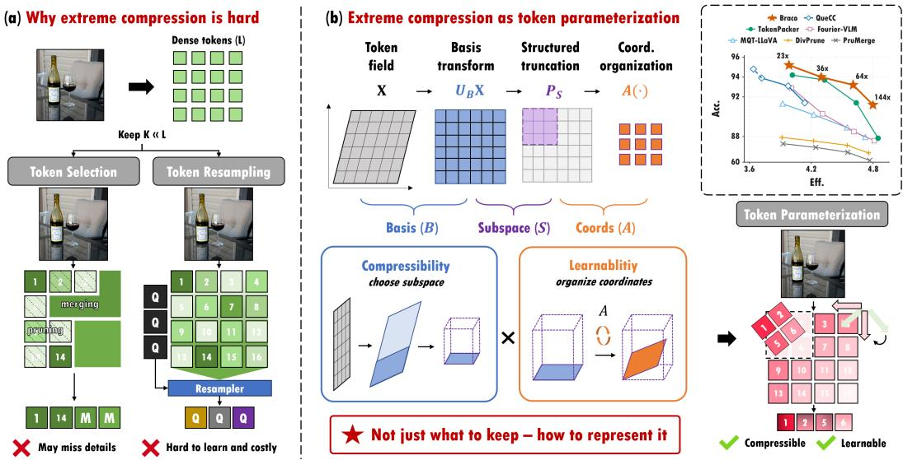  
Figure 1: Overview. Token selection can miss rare evidence and learned resampling can be costly; Braco instead parameterizes the visual token field by choosing a basis/subspace for compressibility, organizing coordinates for learnability, and adding a lightweight residual branch. The right plot summarizes the empirical accuracy–efficiency frontier. Acc. is benchmark accuracy normalized by the uncompressed interface, and Eff. is the average of FLOPs- and latency-efficiency ratios.

Taken together, performance at extreme compression ratios is limited by two constraints. The retained subspace must concentrate task-relevant information (compressibility), and the retained coordinates must induce a tractable alignment problem (learnability). These observations motivate a basic question: under extreme token budgets, is performance mainly a matter of selecting tokens more carefully, or of choosing a better parameterization for the visual token field?

We address this question by treating extreme vision-token compression as a token parameterization problem. Under this view, we build Braco (Backbone–residual + basis + coordinate), a deployable coder with four components. (1) Basis choice: we re-express the spatial token field in an orthonormal transform basis to concentrate task-relevant information into a compact coefficient set, then apply structured truncation under a fixed budget. (2) Position embedding: because transform coefficients lose explicit spatial identity, we inject an input-independent basis-coordinate embedding on the transform lattice to provide consistent indexing cues for downstream multimodal fusion. (3) Coordinate organization: within the same retained subspace, we optionally apply an orthogonal re-parameterization that trades statistical conditioning against geometric compatibility, since downstream optimization is not invariant to token-axis rotations [Salimans and Kingma, 2016]. (4) Residual connection: finally, we add a small set of learned spatial residual tokens via lightweight sparse pooling to recover localized details beyond the low-pass backbone. This yields a factorized compressed interface: a compact transform-domain backbone, coordinate identity for alignment, and sparse spatial residuals for local cues beyond the low-pass subspace.

In summary, we make the following contributions:

• We introduce a token-parameterization view of extreme visual-token compression. Rather than treating compression as token selection alone, we separate basis transformation and structured truncation, which determine the retained subspace, from coordinate organization, which affects optimization and cross-modal alignment.

• We formalize this view through unified compressibility and learnability diagnostics. These objectives quantify how well a structured subspace preserves task-relevant information and how coordinate choices within the same subspace affect conditioning and downstream alignment.

• We compensate for transform truncation with basis-coordinate embeddings and spatial residuals. We restore stable token identity in the transform lattice using an inputindependent basis-coordinate embedding, and we compensate for information lost under low-pass truncation using a lightweight sparse pooling module that learns a small set of spatial residual tokens.

• We design a lightweight, deployable four-step coder. Guided by the analysis, we design Braco, which combines transform-basis truncation, basis-coordinate embeddings, subspace-preserving re-parameterization, and a small spatial residual budget to recover localized details.

Experiments show that Braco realizes a strong empirical accuracy–efficiency frontier under extreme budgets (Figure 1). At matched budgets, it gives the leading aggregate Acc.–cost trade-off at 25/16/9 tokens; under 36×–64× compression, it matches a competitive prior while running ∼36% faster. At 16 tokens, its compressor has 16.6× lower latency and 78.8× fewer FLOPs than that prior compressor. Relative to the 576-token Vanilla upper bound, Braco preserves 95.2% Acc. at 23× and 93.2–94.0% Acc. at 36×–64× while reducing prefill FLOPs to 1.15–1.37T; on larger inputs, it retains 90.8% Acc. at 182× versus 68.9% for a comparable prior. These results show that extreme compression needs a compact, alignable visual coordinate system, not just fewer tokens.

## 2 Related Work

Token compression in VLMs. Most VLM efficiency methods shorten the visual sequence produced by the vision encoder. One line prunes or reorganizes patch tokens using learned importance signals [Rao et al., 2021, Liang et al., 2022, Alvar et al., 2025, Shang et al., 2025], and another merges redundant tokens at inference [Bolya et al., 2023]. These methods are cheap and effective at moderate compression, but brittle at very small budgets because a low-scoring token can still contain task-critical evidence; attention-style importance proxies can also be unstable under aggressive pruning [Jain and Wallace, 2019, Wen et al., 2025, Zhang et al., 2025a]. Learned interfaces instead form compact latent tokens through Perceiver-style resamplers, query modules, or stronger projectors [Jaegle et al., 2021, Alayrac et al., 2022, Li et al., 2023a, Zhang et al., 2025b, Ryoo et al., 2021]. Recent extreme-budget learned-interface methods add query-conditioned aggregation, elastic latent queries, or stronger projectors [Li et al., 2025a, Hu et al., 2024, Li et al., 2025b]. They achieve strong accuracy, but add attention-style computation and alignment complexity to the compression interface. Braco instead emphasizes a fixed, lightweight visual interface whose cost can be measured independently of downstream prompting.

Transform-domain compression. Transform coding applies structured orthonormal bases so that signal energy concentrates before coefficient selection [Ahmed et al., 1974, Wallace, 1991, Mallat, 1989]. In VLMs, transform-domain methods such as Fourier-VLM apply a 2D-DCT, truncate high-frequency coefficients, and reconstruct a coarser spatial grid by inverse DCT before flattening to fewer tokens [Wang et al., 2025a, Feng et al., 2024]. Under extreme budgets, however, the retained representation is not only a signal code but also the visual interface that the LLM must align to. Braco therefore studies the compressed interface along two axes: compressibility, determined by basis choice and structured truncation, and learnability, determined by coordinate organization within the retained subspace. This view further motivates basis-coordinate embeddings for stable token identity and a small spatial residual budget for sparse local evidence.

## 3 Methodology

In this section, we present our token coder and its data path in Figure 2. We first introduce our token parameterization, then formalize a unified view that separates compressibility (basis + structured truncation) from learnability (coordinate organization), and specialize these functionals to our design space. Finally, we instantiate a deployable coder under a strict budget by combining a structured DCT backbone with basis-coordinate embeddings and a lightweight spatial residual module.

## 3.1 Token parameterization

Let a vision encoder $f _ { \mathrm { v i s } }$ produce patch tokens for an image I,

$$
{ \bf X } = f _ { \mathrm { v i s } } ( I ) \in \mathbb { R } ^ { L \times D _ { v } } , \qquad L = N ^ { 2 } ,\tag{1}
$$

where $N \times N$ is the patch-grid resolution, $L$ is the number of visual tokens, and $D _ { v }$ is the token dimension. Let $[ L ] \triangleq \{ 1 , \dots , L \} , \langle \mathbf { A } , \mathbf { B } \rangle _ { F } \triangleq \operatorname { t r } ( \mathbf { A } ^ { \top } \mathbf { B } )$ , and let OfDiag(·) zero diagonal entries.

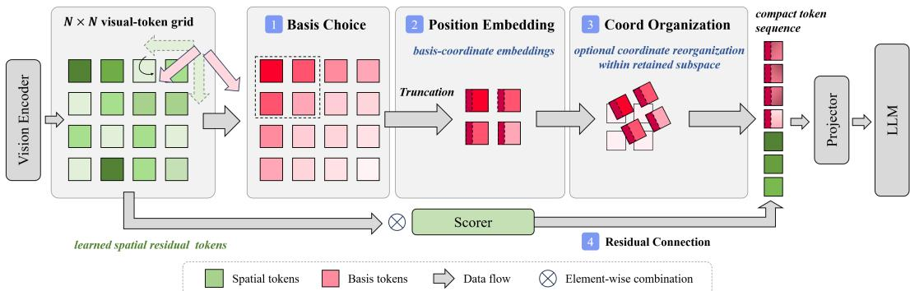  
Figure 2: Our four-step token coder. Starting from an $N \times N$ visual-token grid, Braco transforms tokens into an orthonormal basis, keeps a fixed $C \times C$ low-frequency block, adds basis-coordinate embeddings, optionally changes coordinates within the same retained subspace, and appends learned spatial residual tokens pooled in parallel from the original grid.

A token coder outputs $\mathbf { Z } = g ( \mathbf { X } ) \in \mathbb { R } ^ { K \times D _ { v } }$ before the projector, where K is the token budget. Braco parameterizes g by three choices. First, an orthonormal basis $\mathbf { B } \in \mathbb { R } ^ { N \times N }$ with $\mathbf { B } ^ { \top } \mathbf { B } = \mathbf { I } _ { N }$ induces $\mathbf { U _ { B } } = \mathbf { B } \otimes \mathbf { \bar { B } } \in \mathbb { R } ^ { L \times L }$ and re-expresses the token lattice as $\mathbf { Y } = \mathbf { U _ { B } } \mathbf { X }$ . Second, a fixed structured index set ${ \mathcal { S } } \subseteq [ L ]$ ] with $| S | = K$ keeps K transform coordinates through the row-selection matrix $\mathbf { P } _ { \mathcal { S } }$ , giving $\bar { \mathbf { Z } } = \bar { \mathbf { P } _ { S } } \bar { \mathbf { Y } }$ . Third, an orthogonal matrix $\mathbf { A } \in \mathbb { R } ^ { K \times K }$ may reorganize the retained coordinates:

$$
\boxed { \mathbf { Z } = \mathbf { A } \mathbf { P } \boldsymbol { s } \mathbf { U } _ { \mathbf { B } } \mathbf { X } . }\tag{2}
$$

Here (B, S) determines which subspace is retained, while A changes only the coordinates inside that subspace. Varying (B, S) tests information preservation, while varying A with $( \mathbf { B } , S )$ fixed tests optimization and alignment. With this parameterization in place, we next define objectives that assess (1) how much task-relevant information is preserved under a structured retention rule, and (2) how well the resulting coordinates support downstream optimization.

## 3.2 Token compression objectives

We characterize token compression through two complementary objectives: compressibility, the task-relevant information retained by a small structured set, and learnability, the ease of mapping compressed tokens into the LLM input space.

Compressibility. For a dataset D, define the token-axis second moment $\mathbf { M } = \mathbb { E } _ { I _ { i } \sim \mathcal { D } } [ \mathbf { X } _ { i } \mathbf { X } _ { i } ^ { \top } ]$ where $\mathbf { X } _ { i } = f _ { \mathrm { v i s } } ( I _ { i } )$ is the visual-token grid of sample $I _ { i }$ . The energy retained by a basis–truncation pair is

$$
\mathscr { E } ( \mathbf { B } ; \mathcal { S } ) = \frac { \mathrm { t r } \big ( \mathbf { P } _ { \mathcal { S } } \mathbf { U } _ { \mathbf { B } } \mathbf { M } \mathbf { U } _ { \mathbf { B } } ^ { \top } \mathbf { P } _ { \mathcal { S } } ^ { \top } \big ) } { \mathrm { t r ( \mathbf { M } ) } } .\tag{3}
$$

Here $\mathrm { t r } ( \mathbf { M } )$ is the total expected token energy; Section A derives this normalized-trace form. Because energy may be task-irrelevant and low-energy directions may matter, we also define a readability score $\mathcal { R } ( \bar { \bf B } ; S ) \in [ 0 , 1 ]$ as the fraction of a downstream task direction retained by the same subspace. Let

$$
\mathcal { U } ( \mathbf { B } , \mathcal { S } ) \triangleq \{ \mathbf { U } _ { \mathbf { B } } ^ { \top } \mathbf { P } _ { \mathcal { S } } ^ { \top } \mathbf { Q } : \mathbf { Q } \in \mathbb { R } ^ { K \times D _ { v } } \}\tag{4}
$$

be the token fields representable from the retained coordinates, and let $\Pi _ { \mathbf { B } , S }$ be the M-orthogonal projector onto this subspace. We model the downstream task locally by a linear target $f ^ { \star } ( \bar { \bf X } ) =$ $\bf \tilde { \langle } \Psi _ { \mathbf { W } ^ { \star } , \mathbf { X } \rangle }$ , where $\mathbf { W ^ { \star } } \in \mathbb { R } ^ { L \times D _ { v } }$ is the task direction and $\| \cdot \| _ { \mathbf { M } }$ denotes the corresponding Mweighted norm. We use

$$
\mathcal { R } ( \mathbf { B } ; \mathcal { S } ) = \frac { \mathbb { E } \| \mathbf { I } _ { \mathbf { B } , \mathcal { S } } \mathbf { W } ^ { \star } \| _ { \mathbf { M } } ^ { 2 } } { \mathbb { E } \| \mathbf { W } ^ { \star } \| _ { \mathbf { M } } ^ { 2 } } ,\tag{5}
$$

with the full construction in Section B. The main compressibility diagnostic is

$$
\begin{array} { r } { \boxed { \mathcal { C } ( \mathbf { B } ; \mathcal { S } ) = \lambda \mathcal { E } ( \mathbf { B } ; \mathcal { S } ) + ( 1 - \lambda ) \mathcal { R } ( \mathbf { B } ; \mathcal { S } ) . } } \end{array}\tag{6}
$$

where $\lambda \in [ 0 , 1 ]$ trades off energy retention and task-direction retention. Thus basis choice controls whether a fixed, deployable truncation rule keeps a useful subspace.

Learnability. Once $( \mathbf { B } , S )$ is fixed, every orthogonal A in (2) preserves the same information, but downstream optimization is not invariant to token-axis rotations [Salimans and Kingma, 2016]. Let $\bar { \mathbf { Z } } = \mathbf { P } _ { S } \mathbf { U } _ { \mathbf { B } } \dot { \mathbf { X } }$ and $\mathbf { G } ( \mathbf { A } ) = \mathbb { E } [ ( \mathbf { A } \bar { \mathbf { Z } } ) ( \mathbf { A } \bar { \mathbf { Z } } ) ^ { \top } ] = \mathbf { A } \bar { \mathbf { G } } \mathbf { A } ^ { \top }$ , where $\bar { \bf G } = \mathbb { E } [ \bar { \bf Z } \bar { \bf Z } ^ { \top } ] \stackrel { \smile } { \in } \mathbb { R } ^ { K \times K }$ is the Gram matrix before coordinate organization. We score A by a statistical-conditioning penalty

$$
\begin{array} { r } { \mathcal { L } _ { \mathrm { s t } } ( { \bf A } ) = \| \mathrm { O f f D i a g } ( { \bf G } ( { \bf A } ) ) \| _ { F } ^ { 2 } + \gamma \big \| \mathrm { d i a g } ( { \bf G } ( { \bf A } ) ) - \frac { \mathrm { t r } ( \bar { \bf G } ) } { K } { \bf 1 } \big \| _ { 2 } ^ { 2 } , } \end{array}\tag{7}
$$

where $\gamma > 0$ is a fixed weight, $\mathbf { 1 } \in \mathbb { R } ^ { K }$ is the all-ones vector, and $\mathrm { d i a g ( \cdot ) }$ extracts diagonal entries. Section C gives the expanded Gram-transform view and term interpretation. We also use a geometric penalty

$$
\mathcal { L } _ { \mathrm { g e o } } ( { \bf A } ) = 1 - \frac { 1 } { K } \langle { \bf A } , { \bf A } _ { 0 } \rangle _ { F } = \frac { 1 } { 2 K } \| { \bf A } - { \bf A } _ { 0 } \| _ { F } ^ { 2 } ,\tag{8}
$$

where $\mathbf { A } _ { 0 } \in \mathbb { R } ^ { K \times K }$ is a preferred orthogonal structured organization and $\langle { \bf A } , { \bf A } _ { 0 } \rangle _ { F } = \mathrm { t r } ( { \bf A } ^ { \top } { \bf A } _ { 0 } )$ The combined objective is

$$
\boxed { \mathcal { L } _ { \mathrm { l e a r n } } ( \mathbf { A } ; K ) = \frac { 1 } { K ^ { 2 } } \mathcal { L } _ { \mathrm { s t } } ( \mathbf { A } ) + \beta \mathcal { L } _ { \mathrm { g e o } } ( \mathbf { A } ) . }\tag{9}
$$

Section D justifies the budget normalization, and $\beta > 0$ controls the trade-off with geometric compatibility. Applying this objective to coefficient coordinates and inverse-DCT coarse-grid coordinates gives a budget-dependent comparison. Let I keep coefficient coordinates and let $\mathbf { U } _ { C } ^ { - } \in \mathbb { R } ^ { K _ { b } \times K _ { b } }$ be the inverse-DCT coarse-grid organization for the retained $C \times C$ backbone, where $K _ { b } = C ^ { 2 }$ . With $\Delta _ { \mathrm { s t } } = \mathcal { L } _ { \mathrm { s t } } ( \mathbf { U } _ { C } ) - \mathcal { L } _ { \mathrm { s t } } ( \mathbf { I } )$ and $\rho _ { C } = 1 - K _ { b } ^ { - 1 } \langle { \bf I } , { \bf U } _ { C } \rangle _ { F } ,$

$$
\mathcal { L } _ { \mathrm { l e a r n } } ( \mathbf { U } _ { C } ; K _ { b } ) - \mathcal { L } _ { \mathrm { l e a r n } } ( \mathbf { I } ; K _ { b } ) = \Delta _ { \mathrm { s t } } / K _ { b } ^ { 2 } - \beta \rho _ { C } .\tag{10}
$$

Thus coefficient coordinates are favored when statistical conditioning dominates at very small $K _ { b } ,$ while the coarse grid becomes preferable once geometric compatibility dominates; Section H gives the threshold conditions and random-rotation comparison.

## 3.3 Specializing the functionals to our design space

We now specialize the objectives to choose (B, S, A) and motivate the embedding and residual components.

Basis and structured truncation. Step 1 in Figure 2 uses a deployable $C \times C$ low-frequency block $\mathit { S } _ { \mathit { C } }$ in a separable transform lattice, where C is the retained frequency cut-off per axis and $\bar { K _ { b } } = \bar { C } ^ { 2 }$ is the backbone token count. This is a standard rule in transform coding and frequency-domain neural operators [Wallace, 1991, dos Santos et al., 2020, Qin et al., 2021]. Among spatial, DCT, Haar, and random orthonormal bases under this same rule [Ahmed et al., 1974, Wallace, 1991, Mallat, 1989, Stewart, 1980], DCT gives the most favorable empirical combination of energy concentration, task readability, and implementation simplicity in our diagnostics, so Braco sets $\mathbf { B } = \mathbf { D } _ { N }$ , where $\mathbf { D } _ { N }$ is the $N \dot { \times } N$ orthonormal cosine basis; Sections E and F give the full comparison.

Position embeddings. A structured basis change can improve compressibility but removes explicit spatial identity: after DCT, each retained token is a global coefficient and token order no longer directly encodes locality. Braco restores stable indexing cues by adding the Step 2 input-independent embedding on the retained transform coordinate $( u , v )$ ; the exact formula is in Section G.

Coordinate organization. For Step 3, with $( { \bf B } , { \cal S } ) = ( { \bf D } _ { N } , { \cal S } _ { C } )$ fixed, Braco compares three information-equivalent organizations: coefficient tokens (vanilla), a coarse spatial grid obtained by inverse DCT (idct), and a random orthogonal rotation (randrot). The learnability surrogate and experiments agree on a budget-dependent rule: use coefficient coordinates for very small backbones and switch to the coarse-grid organization once the backbone is large enough. In our implementation, vanilla is used when $\check { K } _ { b } = \check { C } ^ { 2 } < 1 6$ , and idct when $K _ { b } \ge 1 6$ (Section H).

Spatial residual tokens. Step 4 in Figure 2 adds a spatial residual branch: the structured backbone carries the compressible global component, but low-pass truncation can still drop localized evidence. Braco therefore allocates a residual budget in the spatial domain, where sparse highfrequency details are naturally concentrated. The reason is that a spatially sparse residual is diffuse in an incoherent transform basis: for a residual $\mathbf { r } \in \mathbb { R } ^ { L }$ with at most s nonzero spatial entries and an orthonormal transform U with coherence $\mu = \sqrt { L } \operatorname* { m a x } _ { i , j } | U _ { i j } |$ |, the best m transform coefficients satisfy

$$
\operatorname* { m a x } _ { | \Omega | = m } \| ( \mathbf { U r } ) _ { \Omega } \| _ { 2 } ^ { 2 } \leq \frac { m \mu ^ { 2 } s } { L } \| \mathbf { r } \| _ { 2 } ^ { 2 } .\tag{11}
$$

Here $\Omega \subseteq [ L ]$ indexes the selected transform coordinates. When $m \mu ^ { 2 } s \ll L$ , transform truncation retains little of this localized evidence, motivating Braco’s spatial residual branch; Section I gives the derivation.

## 3.4 The overall framework

We summarize our token coder (Figure 2) and instantiate g under a strict token budget. It combines (1) a structured transform-domain backbone, (2) input-independent basis-coordinate embeddings, (3) a budget-dependent orthogonal coordinate organization within the retained subspace, and (4) a lightweight spatial residual module. The total budget is split into a structured backbone and learned residual tokens,

$$
K = K _ { b } + K _ { r } , \qquad K _ { b } = C ^ { 2 } , \qquad K _ { r } = S .\tag{12}
$$

where $K _ { b }$ is the backbone budget, $K _ { r }$ is the residual-token budget, and S is the number of residual tokens. Braco applies a 2D DCT to the $N \times N$ visual-token lattice, keeps the $C \times C$ low-frequency block, adds basis-coordinate embeddings, and applies the budget-dependent coordinate organization above to obtain $\mathbf { Z } _ { b } \in \mathbb { R } ^ { C ^ { 2 } \times D _ { v } }$ . In parallel, a lightweight TokenLearner-style scorer produces S sparsemax weight maps over the original spatial grid [Ryoo et al., 2021, Martins and Astudillo, 2016]; each residual token is a weighted sum of spatial tokens,

$$
\begin{array} { r } { { \bf z } _ { r } ^ { ( s ) } = ( { \bf w } ^ { ( s ) } ) ^ { \top } { \bf X } , \qquad { \bf Z } _ { r } = [ { \bf z } _ { r } ^ { ( 1 ) } ; \ldots ; { \bf z } _ { r } ^ { ( S ) } ] . } \end{array}\tag{13}
$$

where $\mathbf { w } ^ { ( s ) }$ is the s-th sparsemax weight vector over the L spatial locations, $s \in [ S ]$ , and $\mathbf { z } _ { r } ^ { ( s ) }$ is the corresponding residual token. The final compressed visual interface is $\mathbf { Z } = [ \mathbf { Z } _ { b } ; \mathbf { \bar { Z } } _ { r } ]$ , normalized and projected into the LLM hidden size. Residual-pooling and projection details are in Section I.2. Budget instantiations are in Section J.2; stage costs are in Section J.3; training details are in Section J.5.

## 4 Experiments

We evaluate Braco in two stages. First, basis and coordinate diagnostics test whether a tiny structured interface retains readable information and remains learnable, guiding basis selection and coordinate organization. Second, end-to-end comparisons under matched token budgets test the resulting empirical accuracy–efficiency frontier, with compressor costs, larger-input studies, and ablations validating the same design choices. Full protocols and additional diagnostics are in Section J.

## 4.1 Compressibility under basis choice and structured truncation

Under an input-independent, deployable truncation rule, we test whether basis choice determines how much task evidence survives at tiny token budgets. Before multimodal training, we measure two properties of the retained coordinates: generic token-field energy and linearly readable semantic directions. We report energy retention E(K), the empirical counterpart of $\mathcal { E } ( \mathbf { B } ; \mathcal { S } )$ in Equation (3) at budget K, comparing spatial, DCT, Haar, random orthonormal, and KLT-oracle bases under structured truncation and magnitude truncation; KLT serves as a fitted oracle reference for this diagnostic. DCT/Haar retain far more energy than spatial or random bases (Figure 3a), $\mathrm { e . g . , \approx 0 . 5 1 \mathrm { v s . \approx 0 . 0 4 } }$ at K=32 and ≈ 0.57 vs. ≈ 0.08 at K=64; the gap largely disappears under magnitude truncation (Figure 3b), showing that the fixed deployable ordering matters. Separately, the CelebA [Liu et al., 2015] probes in Figures 4b and 4c measure task-readability under structured truncation: using frozen patch tokens and the same linear-probe setup, DCT reaches 91.6% vs. 89.8% for spatial at K=1 and 92.5% vs. 90.9% at K=4. Together with the maps, protocol details, and full probe curves in Figure 4a and Section J.1, these diagnostics identify basis choice as an important lever for making a fixed tiny interface informative.

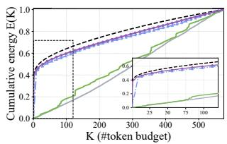  
(a) Structured truncation

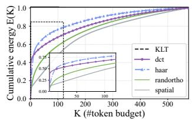

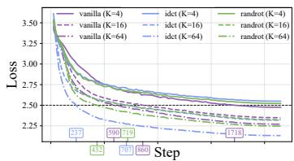  
(b) Magnitude truncation  
(c) Development loss  
Figure 3: Compression vs. optimization probes. (a–b) Orthonormal basis choice controls energy retention under deployable structured truncation and oracle magnitude truncation. KLT is an oracle upper bound fitted to the diagnostic token second moment. (c) With an identical retained subspace, coordinate organization can still change optimization behavior.

Table 1: Main results under matched visual-token budgets. We report eight benchmark scores, Acc. (↑; the mean score normalized by the 576-token Vanilla model), and single-image full-pipeline prefill FLOPs/latency (↓). QueCC is omitted at 25 tokens because its native grid does not support a 5 × 5 output on the fixed 24 × 24 visual-token lattice. Braco is on the leading empirical Acc.–cost frontier at 25/16/9 tokens and remains within 0.2 Acc. of QueCC at 4 tokens with lower cost.
<table><tr><td>Method</td><td colspan="7">GQA MMBEN MMBCN MMEA&quot; POPEF1</td><td colspan="2">Acc. SQA VQA-T MMVet (%)</td><td>FLOPs (T)</td><td>Lat. (ms)</td></tr><tr><td></td><td colspan="7">Upper Bound, 576 Tokens (1×)</td><td></td><td></td><td></td><td></td><td></td></tr><tr><td>Vanilla</td><td>62.9</td><td>65.5</td><td>60.7</td><td>1785</td><td>85.7</td><td>69.7</td><td>58.0</td><td>32.8</td><td>100.0</td><td>8.67</td><td>67.25</td></tr><tr><td colspan="10">25 Retained Tokens (23×)</td></tr><tr><td>PruMerge (ICCV25)</td><td>49.8</td><td>55.8</td><td>47.0</td><td>1515</td><td>58.5</td><td>68.7</td><td>50.4</td><td>20.2</td><td>80.2</td><td>1.37</td><td>44.10</td></tr><tr><td>DivPrune (CVPR25)</td><td>54.0</td><td>59.8</td><td>50.8</td><td>1510</td><td>75.2</td><td>68.5</td><td>49.5</td><td>26.0</td><td>87.0</td><td>1.40</td><td>41.00</td></tr><tr><td>MQT-LLaVA (NIPS24)</td><td>57.1</td><td>61.4</td><td>53.1</td><td>1689</td><td>79.9</td><td>69.4</td><td>50.2</td><td>27.7</td><td>91.3</td><td>1.37</td><td>44.20</td></tr><tr><td>TokenPacker (IJCV25)</td><td>57.4</td><td>64.1</td><td>55.8</td><td>1688</td><td>83.0</td><td>69.4</td><td>53.3</td><td>29.3</td><td>94.2</td><td>1.38</td><td>38.40</td></tr><tr><td>Fourier-VLM</td><td>58.4</td><td>63.3</td><td>54.6</td><td>1730</td><td>83.0</td><td>69.7</td><td>50.2</td><td>27.5</td><td>92.9</td><td>1.37</td><td>39.83</td></tr><tr><td>Braco (ours)</td><td>58.1</td><td>65.4</td><td>57.2</td><td>1705</td><td>82.6</td><td>70.0</td><td>52.3</td><td>30.4</td><td>95.2</td><td>1.37</td><td>41.03</td></tr><tr><td colspan="10">16 Retained Tokens (36×)</td><td colspan="2"></td></tr><tr><td>PruMerge (ICCV25)</td><td>46.9</td><td>53.1</td><td>44.2</td><td>1446</td><td>51.6</td><td>68.2</td><td>49.3</td><td>18.8</td><td>76.2</td><td>1.25</td><td>43.37</td></tr><tr><td>DivPrune (CVPR25)</td><td>52.6</td><td>56.7</td><td>47.4</td><td>1411</td><td>71.3</td><td>67.3</td><td>48.3</td><td>24.8</td><td>83.2</td><td>1.28</td><td>40.26</td></tr><tr><td>MQT-LLaVA (NIPS24)</td><td>55.3</td><td>62.8</td><td>53.9</td><td>1630</td><td>78.2</td><td>68.9</td><td>48.2</td><td>27.6</td><td>90.2</td><td>1.25</td><td>44.27</td></tr><tr><td>QueCC (ICLR25)</td><td>59.0</td><td>63.1</td><td>54.6</td><td>1668</td><td>83.5</td><td>70.6</td><td>52.8</td><td>28.8</td><td>93.9</td><td>1.36</td><td>63.22</td></tr><tr><td>TokenPacker (IJCV25)</td><td>57.0</td><td>63.7</td><td>55.2</td><td>1681</td><td>83.0</td><td>69.3</td><td>53.4</td><td>29.0</td><td>93.7</td><td>1.26</td><td>37.87</td></tr><tr><td>Fourier-VLM</td><td>56.7</td><td>61.4</td><td>51.0</td><td>1644</td><td>82.5</td><td>69.6</td><td>48.5</td><td>27.2</td><td>90.3</td><td>1.25</td><td>40.00</td></tr><tr><td>Braco (ours)</td><td>57.5</td><td>63.3</td><td>55.8</td><td>1704</td><td>82.4</td><td>69.5</td><td>51.9</td><td>29.8</td><td>94.0</td><td>1.25</td><td>40.59</td></tr><tr><td colspan="10">9 Retained Tokens (64×)</td></tr><tr><td>PruMerge (ICCV25)</td><td>44.5</td><td>49.0</td><td>40.5</td><td>1350</td><td>47.0</td><td>66.5</td><td>46.0</td><td>16.0</td><td>70.8</td><td>1.15</td><td>42.90</td></tr><tr><td>DivPrune (CVPR25)</td><td>50.0</td><td>53.5</td><td>44.0</td><td>1320</td><td>68.0</td><td>66.0</td><td>46.0</td><td>22.0</td><td>78.5</td><td>1.17</td><td>39.90</td></tr><tr><td>MQT-LLaVA (NIPS24)</td><td>53.9</td><td>62.4</td><td>52.9</td><td>1565</td><td>78.8</td><td>69.5</td><td>47.1</td><td>27.1</td><td>88.9</td><td>1.15</td><td>43.02</td></tr><tr><td>QueCC (ICLR25)</td><td>58.3</td><td>62.9</td><td>55.6</td><td>1707</td><td>83.3</td><td>69.0</td><td>51.4</td><td>27.6</td><td>93.1</td><td>1.26</td><td>62.79</td></tr><tr><td>TokenPacker (IJCV25)</td><td>55.9</td><td>62.5</td><td>53.5</td><td>1645</td><td>81.8</td><td>68.7</td><td>51.2</td><td>27.7</td><td>91.4</td><td>1.16</td><td>37.40</td></tr><tr><td>Fourier-VLM</td><td>56.4</td><td>60.5</td><td>50.4</td><td>1683</td><td>81.4</td><td>67.4</td><td>47.0</td><td>24.9</td><td>88.5</td><td>1.15</td><td>39.88</td></tr><tr><td>Braco (ours)</td><td>57.0</td><td>63.4</td><td>54.2</td><td>1773</td><td>81.7</td><td>69.7</td><td>51.1</td><td>28.2</td><td>93.2</td><td>1.15</td><td>40.22</td></tr><tr><td colspan="10">4 Retained Tokens (144×)</td></tr><tr><td>PruMerge (ICCV25)</td><td>39.0</td><td>43.0</td><td>35.5</td><td>1210</td><td>38.5</td><td>63.0</td><td>40.0</td><td>12.5</td><td>62.0</td><td>1.09</td><td>42.60</td></tr><tr><td>DivPrune (CVPR25)</td><td>44.0</td><td>48.0</td><td>39.5</td><td>1200</td><td>60.0</td><td>62.5</td><td>41.0</td><td>18.0</td><td>70.1</td><td>1.11</td><td>39.50</td></tr><tr><td>MQT-LLaVA (NIPS24)</td><td>51.5</td><td>62.9</td><td>53.4</td><td>1449</td><td>78.2</td><td>69.8</td><td>46.2</td><td>25.8</td><td>87.1</td><td>1.09</td><td>44.82</td></tr><tr><td>QueCC (ICLR25)</td><td>56.5</td><td>61.0</td><td>53.5</td><td>1641</td><td>81.7</td><td>68.2</td><td>50.4</td><td>28.8</td><td>91.4</td><td>1.20</td><td>64.17</td></tr><tr><td>TokenPacker (IJCV25)</td><td>53.0</td><td>60.2</td><td>51.0</td><td>1550</td><td>79.0</td><td>66.8</td><td>47.0</td><td>24.0</td><td>86.2</td><td>1.10</td><td>37.10</td></tr><tr><td>Fourier-VLM</td><td>54.0</td><td>56.1</td><td>45.4</td><td>1609</td><td>81.0</td><td>64.8</td><td>45.7</td><td>21.5</td><td>83.5</td><td>1.09</td><td>40.30</td></tr><tr><td>Braco (ours)</td><td>54.4</td><td>62.2</td><td>53.8</td><td>1658</td><td>80.7</td><td>69.9</td><td>50.2</td><td>28.0</td><td>91.2</td><td>1.09</td><td>40.97</td></tr><tr><td></td><td></td><td></td><td></td><td></td><td></td><td></td><td></td><td></td><td></td><td></td><td></td></tr></table>

## 4.2 Learnability under subspace-preserving coordinate organizations

The learnability diagnostic isolates a different question from compressibility: even with an identical retained subspace, coordinate organization can change optimization. We fix the same low-frequency DCT backbone subspace and vary only its coordinates: coefficient tokens (vanilla), a coarse spatial grid (idct), or a random orthogonal rotation. Since the variants span the same subspace, we run only the pretraining objective, split the stream 0.99/0.01 into train/dev, and use time-to-threshold on held-out dev cross-entropy $( < 2 . 5 0 )$ to isolate optimization effects. The pattern is budget-dependent (Figure 3c): at $K _ { b } { = } 4 ,$ , only vanilla reaches the target; at $K _ { b } { = } 1 6$ and $\bar { K _ { b } } { = } 6 4$ , idct reaches it 18% and 60% faster. This motivates coordinate organization as a separate design axis in Section 3.2; the objective-level derivation and candidates are given in Sections D and H.

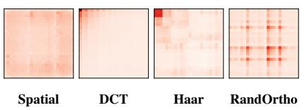  
(a) Energy

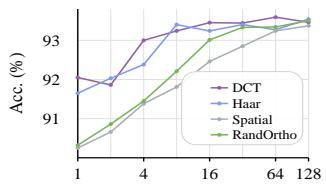  
(b) Validation split

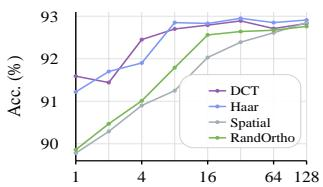  
(c) Test split  
Figure 4: Compact compressibility diagnostics. (a) DCT concentrates energy into a compact low-frequency region. (b–c) CelebA linear probes test task-readability under the same structured truncation rule.

## 4.3 End-to-end comparison

We now evaluate Braco end-to-end under hard, deployment-friendly visual-token budgets and compare it to prior token compression paradigms under matched budgets.

Benchmarks and metrics. We evaluate on GQA [Hudson and Manning, 2019], MMBench (EN/CN) [Liu et al., 2024b], MME (All) [Fu et al., 2023], POPE (F1) [Li et al., 2023b], ScienceQA [Lu et al., 2022], VQA-Text (TextVQA) [Singh et al., 2019], and MMVet [Yu et al., 2024]; Table 1 reports per-benchmark scores, Vanilla-normalized Acc., and single-image full-pipeline prefill FLOPs/latency from the vision encoder through LLM prefill. All baselines share the retraining/evaluation harness and matched budgets. Section J.5 and Table 12 give the Acc. definition, training/measurement protocols, and three-seed results.

Baselines and implementation. Baselines cover pruning/merging (PruMerge [Shang et al., 2025], DivPrune [Alvar et al., 2025]), learned interfaces (MQT-LLaVA [Hu et al., 2024], QueCC [Li et al., 2025a], TokenPacker [Li et al., 2025b]), and transform coding (Fourier-VLM [Wang et al., 2025a]), all evaluated under matched retained-token budgets. We implement Braco on LLaVA-1.5-7B [Liu et al., 2024a] by replacing the dense visual stream with a structured backbone plus spatial residual interface. For each budget, Braco splits tokens between a low-frequency backbone and spatial residuals: c1s3/c2s5/c3s7/c4s9 for $\overset { \cdot } { K } = 4 / 9 / 1 6 / 2 5$ . Exact coordinate choices are in Section J.2.

Main results. Table 1 shows that Braco provides a favorable accuracy–efficiency trade-off under matched extreme token budgets. Relative to the 576-token Vanilla model, Braco reduces fullpipeline prefill FLOPs from 8.67T to 1.09–1.37T while retaining 91.2–95.2 Vanilla-normalized Acc. across 4–25 tokens. Compared with prior compression methods, Braco is consistently competitive in aggregate accuracy at similar or lower compute: it attains the highest Acc. among the evaluated methods at 25, 16, and 9 tokens, and remains within 0.2 Acc. of QueCC at 4 tokens. The comparison with QueCC highlights the main efficiency difference: at 16 and 9 tokens, Braco matches QueCC within 0.1 Acc. while reducing latency by about 36%; at 4 tokens, it keeps a similar aggregate score with lower FLOPs and substantially lower latency. Together, these results show that Braco preserves much of Vanilla’s aggregate performance at substantially lower prefill compute and latency.

Table 2: Compressor cost at 16 tokens. Boundary denotes pre- or post-projector measurement.
<table><tr><td>Method</td><td>Boundary Acc. (%) Lat. (ms)</td><td></td><td></td><td></td><td>FLOPs (G) Mem. (MB)</td></tr><tr><td>QueCC (ICLR25)</td><td>pre-proj.</td><td>93.9</td><td>17.864</td><td>109.504</td><td>14.875</td></tr><tr><td>MQT-LLaVA (NIPS24) pre-proj.</td><td></td><td>90.2</td><td>5.154</td><td>2.674</td><td>11.336</td></tr><tr><td>PruMerge (ICCV25)</td><td>pre-proj.</td><td>76.2</td><td>3.300</td><td>0.724</td><td>13.749</td></tr><tr><td>Braco (ours)</td><td>pre-proj.</td><td>94.0</td><td>1.073</td><td>1.389</td><td>8.731</td></tr><tr><td>TokenPacker (IJCV25)</td><td>post-proj.</td><td>93.7</td><td>1.004</td><td>15.271</td><td>15.125</td></tr><tr><td>DivPrune (CVPR25)</td><td>post-proj.</td><td>83.2</td><td>1.061</td><td>29.603</td><td>23.008</td></tr><tr><td>Braco (ours)</td><td>post-proj.</td><td>94.0</td><td>1.270</td><td>2.060</td><td>8.731</td></tr></table>

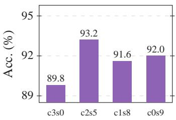  
(a) Allocation (K = 9)

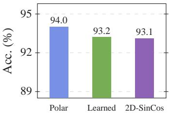  
(b) PE variants (K = 16)

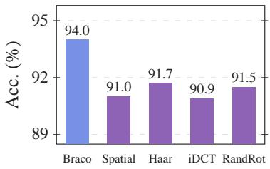  
(c) Substitutions (K = 16)  
Figure 5: Ablations. (a) Backbone–residual allocation under the 9-token budget. (b) Basiscoordinate embedding variants under the 16-token budget. (c) Basis and coordinate substitutions under the 16-token budget.

Compressor cost. We further isolate the 16-token compressor to measure the cost of the compression module itself. Braco matches QueCC’s accuracy with 16.6× lower module latency and 78.8× fewer compressor FLOPs (Table 2). The pre-/post-projector split rules out a boundary artifact: Braco keeps QueCC-level accuracy pre-projector and far lower post-projector FLOPs than TokenPacker/DivPrune. Stage and multi-budget costs are in Section J.3.

Generalization. Beyond the 576-token Vicuna-7B [Chiang et al., 2023] setting, Table 8 shows that Braco keeps 98.1 Acc. at 2880 input tokens with Vicuna-7B. The 576-token sweep primarily stresses whether accuracy survives extreme compression, since full-pipeline FLOPs and latency in this regime also include token-insensitive vision and prompt-processing cost. As the visual interface grows, however, keeping the retained-token budget small turns extreme compression into a larger end-to-end saving: Braco removes a much larger uncompressed prefill burden, reducing full-pipeline FLOPs from 40.57T to 3.45T and latency from 261.08ms to 44.36ms at 2880 input tokens. With Qwen2.5-3B [Yang et al., 2024], Braco retains 93.1/92.6 Acc. at 729/1024 input tokens and 90.8 Acc. at 3645 input tokens (182× compression). QueCC is close in the 576-token Vicuna setting but degrades on Qwen2.5-3B, where its query/downsampling overhead is less well amortized. This may also reflect the sensitivity of query-dependent compression to weaker prompt understanding in smaller LLMs. Braco remains prompt-independent, with larger savings as uncompressed prefill cost grows. Sections J.4 and J.8 give inference/training-time breakdowns and cross-family results.

## 4.4 Ablations

We ablate Braco’s structured backbone + spatial residual interface using the same Vanillanormalized Acc. as in Table 1.

At 9 tokens, hybrid c2s5 reaches 93.2 Acc. (Figure 5a), above pure-backbone c3s0 (89.8) and residual-only c0s9 (92.0) at comparable compressor cost, indicating that hybrid allocation uses the small token budget more effectively than either branch alone. At the 16-token c3s7 setting, replacing the DCT backbone with spatial/Haar tokens costs 2.3–3.0 Acc. points, replacing the selected coordinate organization with idct/random rotation costs 2.5–3.1 points (Figure 5c), and replacing Polar Fourier embeddings with learned/2D sine–cosine variants costs 0.8–0.9 points (Figure 5b). Additional costs and design-space definitions are in Sections G to I and J.3.

## 5 Conclusion

We propose a deployable token coder for extreme visual-token compression in visionencoder→LLM pipelines. The design disentangles compressibility (basis transform + structured truncation) from learnability (coordinate organization within the retained subspace), enabling principled comparisons under a fixed interface. Instantiated with a structured backbone, basis-coordinate embeddings, budget-dependent coordinate organization, and a lightweight sparse-pooled spatial residual, Braco delivers a strong accuracy–efficiency trade-off.

# Acknowledgments and Disclosure of Funding

This work received no external funding. The authors declare no competing interests.

## References

Nasir Ahmed, T. Natarajan, and Kamisetty R. Rao. Discrete cosine transform. IEEE Transactions on Computers, C-23(1):90–93, 1974. doi: 10.1109/T-C.1974.223784.

Jean-Baptiste Alayrac, Jeff Donahue, Pauline Luc, Antoine Miech, Iain Barr, Yana Hasson, Karel Lenc, Arthur Mensch, Katherine Millican, Malcolm Reynolds, et al. Flamingo: A visual language model for few-shot learning. Advances in Neural Information Processing Systems, 35:23716–23736, 2022.

Saeed Ranjbar Alvar, Gursimran Singh, Mohammad Akbari, and Yong Zhang. DivPrune: Diversity-based visual token pruning for large multimodal models. In 2025 IEEE/CVF Conference on Computer Vision and Pattern Recognition (CVPR), pages 9392–9401. IEEE, June 2025. doi: 10.1109/CVPR52734.2025.00877.

Shuai Bai, Yuxuan Cai, Ruizhe Chen, Keqin Chen, Xionghui Chen, Zesen Cheng, Lianghao Deng, Wei Ding, Chang Gao, Chunjiang Ge, Wenbin Ge, Zhifang Guo, Qidong Huang, Jie Huang, Fei Huang, Binyuan Hui, Shutong Jiang, Zhaohai Li, Mingsheng Li, Mei Li, Kaixin Li, Zicheng Lin, Junyang Lin, Xuejing Liu, Jiawei Liu, Chenglong Liu, Yang Liu, Dayiheng Liu, Shixuan Liu, Dunjie Lu, Ruilin Luo, Chenxu Lv, Rui Men, Lingchen Meng, Xuancheng Ren, Xingzhang Ren, Sibo Song, Yuchong Sun, Jun Tang, Jianhong Tu, Jianqiang Wan, Peng Wang, Pengfei Wang, Qiuyue Wang, Yuxuan Wang, Tianbao Xie, Yiheng Xu, Haiyang Xu, Jin Xu, Zhibo Yang, Mingkun Yang, Jianxin Yang, An Yang, Bowen Yu, Fei Zhang, Hang Zhang, Xi Zhang, Bo Zheng, Humen Zhong, Jingren Zhou, Fan Zhou, Jing Zhou, Yuanzhi Zhu, and Ke Zhu. Qwen3-VL technical report, 2025. URL https://arxiv.org/abs/2511.21631. arXiv preprint arXiv:2511.21631.

Daniel Bolya, Cheng-Yang Fu, Xiaoliang Dai, Peizhao Zhang, Christoph Feichtenhofer, and Judy Hoffman. Token merging: Your ViT but faster. In International Conference on Learning Representations, 2023. URL https://openreview.net/forum?id=JroZRaRw7Eu.

Wei-Lin Chiang, Zhuohan Li, Zi Lin, Ying Sheng, Zhanghao Wu, Hao Zhang, Lianmin Zheng, Siyuan Zhuang, Yonghao Zhuang, Joseph E. Gonzalez, Ion Stoica, and Eric P. Xing. Vicuna: An open-source chatbot impressing GPT-4 with 90% ChatGPT quality. Blog post, March 2023. URL https://lmsys.org/blog/ 2023-03-30-vicuna/.

Samuel Felipe dos Santos, Nicu Sebe, and Jurandy Almeida. The good, the bad, and the ugly: Neural networks straight from JPEG. In 2020 IEEE International Conference on Image Processing (ICIP), pages 1896–1900. IEEE, 2020. doi: 10.1109/ICIP40778.2020.9190741. URL https://doi.org/10.1109/ ICIP40778.2020.9190741.

Hao Feng, Qi Liu, Hao Liu, Jingqun Tang, Wengang Zhou, Houqiang Li, and Can Huang. DocPedia: Unleashing the power of large multimodal model in the frequency domain for versatile document understanding. Science China Information Sciences, 67(12):220106, 2024. doi: 10.1007/s11432-024-4250-y. URL https://doi.org/10.1007/s11432-024-4250-y.

Chaoyou Fu, Peixian Chen, Yunhang Shen, Yulei Qin, Mengdan Zhang, Xu Lin, Jinrui Yang, Xiawu Zheng, Ke Li, Xing Sun, Yunsheng Wu, Rongrong Ji, Caifeng Shan, and Ran He. MME: A comprehensive evaluation benchmark for multimodal large language models, 2023. URL https://arxiv.org/abs/2306. 13394. arXiv preprint arXiv:2306.13394; NeurIPS Datasets and Benchmarks 2025 spotlight.

GLM-V Team, Wenyi Hong, Wenmeng Yu, Xiaotao Gu, Guo Wang, Guobing Gan, Haomiao Tang, Jiale Cheng, Ji Qi, Junhui Ji, Lihang Pan, Shuaiqi Duan, Weihan Wang, Yan Wang, Yean Cheng, Zehai He, Zhe Su, Zhen Yang, Ziyang Pan, Aohan Zeng, Baoxu Wang, Bin Chen, Boyan Shi, Changyu Pang, Chenhui Zhang, Da Yin, Fan Yang, Guoqing Chen, Haochen Li, Jiale Zhu, Jiali Chen, Jiaxing Xu, Jiazheng Xu, Jing Chen, Jinghao Lin, Jinhao Chen, Jinjiang Wang, Junjie Chen, Leqi Lei, Letian Gong, Leyi Pan, Mingdao Liu, Mingde Xu, Mingzhi Zhang, Qinkai Zheng, Ruiliang Lyu, Shangqin Tu, Sheng Yang, Shengbiao Meng, Shi Zhong, Shiyu Huang, Shuyuan Zhao, Siyan Xue, Tianshu Zhang, Tianwei Luo, Tianxiang Hao, Tianyu Tong, Wei Jia, Wenkai Li, Xiao Liu, Xiaohan Zhang, Xin Lyu, Xinyu Zhang, Xinyue Fan, Xuancheng Huang, Yadong Xue, Yanfeng Wang, Yanling Wang, Yanzi Wang, Yifan An, Yifan Du, Yiheng Huang, Yilin Niu, Yiming Shi, Yu Wang, Yuan Wang, Yuanchang Yue, Yuchen Li, Yusen Liu, Yutao Zhang, Yuting Wang, Yuxuan Zhang, Zhao Xue, Zhengxiao Du, Zhenyu Hou, Zihan Wang, Peng Zhang, Debing Liu, Bin Xu, Juanzi Li, Minlie Huang, Yuxiao Dong, and Jie Tang. GLM-4.5V and GLM-4.1V-Thinking: Towards versatile multimodal reasoning with scalable reinforcement learning, 2025. URL https://arxiv.org/abs/2507. 01006. arXiv preprint arXiv:2507.01006; version 6 updated on 2026-01-01.

Wenbo Hu, Zi-Yi Dou, Liunian Li, Amita Kamath, Nanyun Peng, and Kai-Wei Chang. Matryoshka query transformer for large vision-language models. Advances in Neural Information Processing Systems, 37: 50168–50188, 2024.

Drew A. Hudson and Christopher D. Manning. GQA: A new dataset for real-world visual reasoning and compositional question answering. In Proceedings of the IEEE/CVF Conference on Computer Vision and Pattern Recognition (CVPR), pages 6700–6709, 2019. doi: 10.1109/CVPR.2019. 00686. URL https://openaccess.thecvf.com/content\_CVPR\_2019/html/Hudson\_GQA\_A\_New\_ Dataset\_for\_Real-World\_Visual\_Reasoning\_and\_Compositional\_CVPR\_2019\_paper.html.

Andrew Jaegle, Felix Gimeno, Andy Brock, Oriol Vinyals, Andrew Zisserman, and Joao Carreira. Perceiver: General perception with iterative attention. In International Conference on Machine Learning, pages 4651– 4664. PMLR, 2021.

Sarthak Jain and Byron C. Wallace. Attention is not explanation. In Proceedings of the 2019 Conference of the North American Chapter ofthe Associationfor Computational Linguistics: Human Language Technolo gies, Volume 1 (Long and Short Papers), pages 3543–3556, Minneapolis, Minnesota, 2019. Association for Computational Linguistics. doi: 10.18653/v1/N19-1357.

Bo Li, Yuanhan Zhang, Dong Guo, Renrui Zhang, Feng Li, Hao Zhang, Kaichen Zhang, Peiyuan Zhang, Yanwei Li, Ziwei Liu, and Chunyuan Li. LLaVA-OneVision: Easy visual task transfer, 2024. URL https: //arxiv.org/abs/2408.03326. arXiv preprint arXiv:2408.03326.

Junnan Li, Dongxu Li, Silvio Savarese, and Steven Hoi. BLIP-2: Bootstrapping language-image pre-training with frozen image encoders and large language models. In International Conference on Machine Learning, pages 19730–19742. PMLR, 2023a.

Kevin Y. Li, Sachin Goyal, Joao D. Semedo, and J. Zico Kolter. Inference optimal VLMs need fewer visual tokens and more parameters. In International Conference on Learning Representations, 2025a. URL https: //openreview.net/forum?id=6VhDQP7WGX.

Wentong Li, Yuqian Yuan, Jian Liu, Dongqi Tang, Song Wang, Jie Qin, Jianke Zhu, and Lei Zhang. Token-Packer: Efficient visual projector for multimodal LLM. International Journal of Computer Vision, 133(10): 6794–6812, June 2025b. doi: 10.1007/s11263-025-02491-7.

Yifan Li, Yifan Du, Kun Zhou, Jinpeng Wang, Xin Zhao, and Ji-Rong Wen. Evaluating object hallucination in large vision-language models. In Proceedings ofthe 2023 Conference on Empirical Methods in Natural Language Processing, pages 292–305, Singapore, December 2023b. Association for Computational Linguistics. doi: 10.18653/v1/2023.emnlp-main.20. URL https://aclanthology.org/2023.emnlp-main.20/.

Youwei Liang, Chongjian Ge, Zhan Tong, Yibing Song, Jue Wang, and Pengtao Xie. EViT: Expediting vision transformers via token reorganizations. In International Conference on Learning Representations, 2022. URL https://openreview.net/forum?id=BjyvwnXXVn\_.

Haotian Liu, Chunyuan Li, Yuheng Li, and Yong Jae Lee. Improved baselines with visual instruction tuning. In Proceedings of the IEEE/CVF Conference on Computer Vision and Pattern Recognition (CVPR), pages 26296–26306, 2024a. URL https://openaccess.thecvf.com/content/CVPR2024/html/Liu\_ Improved\_Baselines\_with\_Visual\_Instruction\_Tuning\_CVPR\_2024\_paper.html.

Yuan Liu, Haodong Duan, Yuanhan Zhang, Bo Li, Songyang Zhang, Wangbo Zhao, Yike Yuan, Jiaqi Wang, Conghui He, Ziwei Liu, Kai Chen, and Dahua Lin. MMBench: Is your multi-modal model an all-around player? In Computer Vision – ECCV 2024, volume 15064 of Lecture Notes in Computer Science, pages 216–233. Springer, 2024b. doi: 10.1007/978-3-031-72658-3\_13. URL https://doi.org/10.1007/ 978-3-031-72658-3\_13.

Ziwei Liu, Ping Luo, Xiaogang Wang, and Xiaoou Tang. Deep learning face attributes in the wild. In Proceedings of the IEEE International Conference on Computer Vision (ICCV), pages 3730–3738, 2015. doi: 10.1109/ICCV.2015.425. URL https://openaccess.thecvf.com/content\_iccv\_2015/html/Liu\_ Deep\_Learning\_Face\_ICCV\_2015\_paper.html.

Pan Lu, Swaroop Mishra, Tanglin Xia, Liang Qiu, Kai-Wei Chang, Song-Chun Zhu, Oyvind Tafjord, Peter Clark, and Ashwin Kalyan. Learn to explain: Multimodal reasoning via thought chains for science question answering. In Advances in Neural Information Processing Systems, volume 35, pages 2507–2521, 2022. URL https://proceedings.neurips.cc/paper\_files/paper/2022/hash/ 11332b6b6cf4485b84afadb1352d3a9a-Abstract-Conference.html.

Stephane G. Mallat. Multiresolution approximations and wavelet orthonormal bases of L2(R). Transactions of the American Mathematical Society, 315(1):69–87, 1989. doi: 10.1090/S0002-9947-1989-1008470-5. URL https://doi.org/10.1090/S0002-9947-1989-1008470-5.

Andre Martins and Ramon Astudillo. From softmax to sparsemax: A sparse model of attention and multilabel classification. In Proceedings of the 33rd International Conference on Machine Learning, volume 48 of Proceedings of Machine Learning Research, pages 1614–1623, New York, New York, USA, 20–22 Jun 2016. PMLR. URL https://proceedings.mlr.press/v48/martins16.html.

Minesh Mathew, Dimosthenis Karatzas, and C. V. Jawahar. DocVQA: A dataset for VQA on document images. In Proceedings of the IEEE/CVF Winter Conference on Applications of Computer Vision (WACV), pages 2200–2209, 2021.

Zequn Qin, Pengyi Zhang, Fei Wu, and Xi Li. FcaNet: Frequency channel attention networks. In Proceedings of the IEEE/CVF International Conference on Computer Vision, pages 763–772, 2021. doi: 10. 1109/ICCV48922.2021.00082. URL https://openaccess.thecvf.com/content/ICCV2021/html/ Qin\_FcaNet\_Frequency\_Channel\_Attention\_Networks\_ICCV\_2021\_paper.html.

Yongming Rao, Wenliang Zhao, Benlin Liu, Jiwen Lu, Jie Zhou, and Cho-Jui Hsieh. DynamicViT: Efficient vision transformers with dynamic token sparsification. Advances in Neural Information Processing Systems, 34:13937–13949, 2021.

Michael Ryoo, A. J. Piergiovanni, Anurag Arnab, Mostafa Dehghani, and Anelia Angelova. TokenLearner: Adaptive space-time tokenization for videos. Advances in Neural Information Processing Systems, 34: 12786–12797, 2021.

Tim Salimans and Durk P. Kingma. Weight normalization: A simple reparameterization to accelerate training of deep neural networks. Advances in Neural Information Processing Systems, 29, 2016.

Yuzhang Shang, Mu Cai, Bingxin Xu, Yong Jae Lee, and Yan Yan. LLaVA-PruMerge: Adaptive token reduction for efficient large multimodal models. In Proceedings of the IEEE/CVF International Conference on Computer Vision, pages 22857–22867, October 2025.

Amanpreet Singh, Vivek Natarajan, Meet Shah, Yu Jiang, Xinlei Chen, Dhruv Batra, Devi Parikh, and Marcus Rohrbach. Towards VQA models that can read. In Proceedings of the IEEE/CVF Conference on Computer Vision and Pattern Recognition (CVPR), pages 8317–8326, 2019. doi: 10.1109/CVPR.2019. 00851. URL https://openaccess.thecvf.com/content\_CVPR\_2019/html/Singh\_Towards\_VQA\_ Models\_That\_Can\_Read\_CVPR\_2019\_paper.html.

Gilbert W. Stewart. The efficient generation of random orthogonal matrices with an application to condition estimators. SIAM Journal on Numerical Analysis, 17(3):403–409, 1980. doi: 10.1137/0717034. URL https://doi.org/10.1137/0717034.

Michael Tschannen, Alexey Gritsenko, Xiao Wang, Muhammad Ferjad Naeem, Ibrahim Alabdulmohsin, Nikhil Parthasarathy, Talfan Evans, Lucas Beyer, Ye Xia, Basil Mustafa, Olivier Hénaff, Jeremiah Harmsen, Andreas Steiner, and Xiaohua Zhai. SigLIP 2: Multilingual vision-language encoders with improved semantic understanding, localization, and dense features, 2025. URL https://arxiv.org/abs/2502.14786. arXiv preprint arXiv:2502.14786.

Gregory K. Wallace. The JPEG still picture compression standard. Communications of the ACM, 34(4):30–44, 1991. doi: 10.1145/103085.103089. URL https://doi.org/10.1145/103085.103089.

Huanyu Wang, Jushi Kai, Haoli Bai, Lu Hou, Bo Jiang, Ziwei He, and Zhouhan Lin. Fourier-VLM: Compressing vision tokens in the frequency domain for large vision-language models, 2025a. URL https: //arxiv.org/abs/2508.06038. arXiv preprint arXiv:2508.06038.

Weiyun Wang, Zhangwei Gao, Lixin Gu, et al. InternVL3.5: Advancing open-source multimodal models in versatility, reasoning, and efficiency, 2025b. URL https://arxiv.org/abs/2508.18265. arXiv preprint arXiv:2508.18265.

Zichen Wen, Yifeng Gao, Shaobo Wang, Junyuan Zhang, Qintong Zhang, Weijia Li, Conghui He, and Linfeng Zhang. Stop looking for important tokens in multimodal language models: Duplication matters more. In Proceedings of the 2025 Conference on Empirical Methods in Natural Language Processing, pages 9961– 9980, Suzhou, China, November 2025. Association for Computational Linguistics. doi: 10.18653/v1/2025. emnlp-main.505. URL https://aclanthology.org/2025.emnlp-main.505/.

Zhiyu Wu, Xiaokang Chen, Zizheng Pan, Xingchao Liu, Wen Liu, Damai Dai, Huazuo Gao, Yiyang Ma, Chengyue Wu, Bingxuan Wang, et al. DeepSeek-VL2: Mixture-of-experts vision-language models for advanced multimodal understanding, 2024. URL https://arxiv.org/abs/2412.10302. arXiv preprint arXiv:2412.10302.

An Yang, Baosong Yang, Beichen Zhang, Binyuan Hui, Bo Zheng, Bowen Yu, Chengyuan Li, Dayiheng Liu, Fei Huang, Haoran Wei, Huan Lin, Jian Yang, Jianhong Tu, Jianwei Zhang, Jianxin Yang, Jiaxi Yang, Jingren Zhou, Junyang Lin, Kai Dang, Keming Lu, Keqin Bao, Kexin Yang, Le Yu, Mei Li, Mingfeng Xue, Pei Zhang, Qin Zhu, Rui Men, Runji Lin, Tianhao Li, Tianyi Tang, Tingyu Xia, Xingzhang Ren, Xuancheng Ren, Yang Fan, Yang Su, Yichang Zhang, Yu Wan, Yuqiong Liu, Zeyu Cui, Zhenru Zhang, and Zihan Qiu. Qwen2.5 technical report, 2024. URL https://arxiv.org/abs/2412.15115. arXiv preprint arXiv:2412.15115.

Weihao Yu, Zhengyuan Yang, Linjie Li, Jianfeng Wang, Kevin Lin, Zicheng Liu, Xinchao Wang, and Lijuan Wang. MM-vet: Evaluating large multimodal models for integrated capabilities. In Proceedings of the 41st International Conference on Machine Learning, volume 235 of Proceedings of Machine Learning Research, pages 57730–57754. PMLR, 2024. URL https://proceedings.mlr.press/v235/yu24o.html.

Xiaohua Zhai, Basil Mustafa, Alexander Kolesnikov, and Lucas Beyer. Sigmoid loss for language image pretraining, 2023. URL https://arxiv.org/abs/2303.15343. arXiv preprint arXiv:2303.15343.

Qizhe Zhang, Mengzhen Liu, Lichen Li, Ming Lu, Yuan Zhang, Junwen Pan, Qi She, and Shanghang Zhang. Beyond attention or similarity: Maximizing conditional diversity for token pruning in MLLMs. In Advances in Neural Information Processing Systems, 2025a. URL https://openreview.net/forum?id= BLLixcuZgl.

Shaolei Zhang, Qingkai Fang, Zhe Yang, and Yang Feng. LLaVA-Mini: Efficient image and video large multimodal models with one vision token. In International Conference on Learning Representations, 2025b. URL https://openreview.net/forum?id=UQJ7CDW8nb.

Jinguo Zhu, Weiyun Wang, Zhe Chen, Zhaoyang Liu, Shenglong Ye, Lixin Gu, Hao Tian, Yuchen Duan, Weijie Su, Jie Shao, et al. InternVL3: Exploring advanced training and test-time recipes for open-source multimodal models, 2025. URL https://arxiv.org/abs/2504.10479. arXiv preprint arXiv:2504.10479.

## A Derivation of the energy-retention term in the compressibility functional

This theory appendix follows the methodology in Section 3. It first derives the compressibility terms, then the learnability objective, and finally the concrete Braco design choices: the structured lowpass set, basis baselines, basis-coordinate embedding, coordinate organization, and spatial residual domain and implementation details.

The main text reports the normalized-trace energy score in Equation (3). This section derives that form from the token-axis second moment $\begin{array} { r } { \mathcal { E } _ { o } ( \mathbf { B } ; \mathcal { S } ; \bar { \mathbf { Z } } _ { i } ) = \bar { \mathbf { Z } } _ { i } \dot { \bar { \mathbf { Z } } } _ { i } ^ { \top } } \end{array}$ by scalarizing the matrix second moment with $\operatorname { t r } ( \cdot )$ and normalizing by the total expected token energy.

Retained energy. Recall $\bar { \mathbf { Z } } _ { i } = \mathbf { P } _ { \mathcal { S } } \mathbf { U _ { B } } \mathbf { X } _ { i } \in \mathbb { R } ^ { K \times D _ { \iota } }$ . Here $\mathbf { X } _ { i }$ is the i-th visual-token grid, U is the token-lattice transform induced by basis B, $\mathbf { P } _ { \mathcal { S } }$ selects the retained index set S, $K = | \boldsymbol { S } |$ |, and $D _ { v }$ is the token dimension. A canonical scalar notion of “retained energy” is the squared Frobenius norm

$$
\| \bar { \bf Z } _ { i } \| _ { F } ^ { 2 } = \mathrm { t r } ( \bar { \bf Z } _ { i } \bar { \bf Z } _ { i } ^ { \top } ) = \mathrm { t r } \Big ( { \bf P } _ { S } { \bf U _ { B } } { \bf X } _ { i } { \bf X } _ { i } ^ { \top } { \bf U _ { B } ^ { \top } } { \bf P } _ { S } ^ { \top } \Big ) ,\tag{14}
$$

where we used the cyclic trace identity $\operatorname { t r } ( \mathbf { A } \mathbf { B } ) \ = \ \operatorname { t r } ( \mathbf { B } \mathbf { A } )$ for conformable matrices. Taking expectation over $\mathbf { X } _ { i } \sim \mathcal { D }$ and defining $\mathbf { M } \triangleq \mathbb { E } [ \mathbf { X } _ { i } \mathbf { X } _ { i } ^ { \top } ] \in \mathbb { R } ^ { L \times L }$ as in Equation (3), we obtain

$$
\mathbb { E } \Vert \bar { \mathbf { Z } } _ { i } \Vert _ { F } ^ { 2 } = \mathrm { t r } \Big ( \mathbf { P } _ { \mathcal { S } } \mathbf { U } _ { \mathbf { B } } \mathbf { M } \mathbf { U } _ { \mathbf { B } } ^ { \top } \mathbf { P } _ { \mathcal { S } } ^ { \top } \Big ) = \mathrm { t r } \big ( \mathbb { E } [ \bar { \mathbf { Z } } _ { i } \bar { \mathbf { Z } } _ { i } ^ { \top } ] \big ) .\tag{15}
$$

Thus, the trace of the matrix second moment is exactly the expected retained energy under the fixed index set $s$

Normalization by total expected energy. Similarly, the expected total energy of the original token grid is

$$
\mathbb { E } \Vert \mathbf { X } _ { i } \Vert _ { F } ^ { 2 } = \mathbb { E } \operatorname { t r } ( \mathbf { X } _ { i } \mathbf { X } _ { i } ^ { \top } ) = \operatorname { t r } ( \mathbf { M } ) .\tag{16}
$$

Therefore, the fraction of energy preserved by the basis–truncation pair $( \mathbf { B } , S )$ admits the normalized form

$$
\frac { \mathbb { E } \| \bar { \mathbf { Z } } _ { i } \| _ { F } ^ { 2 } } { \mathbb { E } \| \mathbf { X } _ { i } \| _ { F } ^ { 2 } } = \frac { \mathrm { t r } \left( \mathbf { P } _ { \mathcal { S } } \mathbf { U _ { B } } \mathbf { M } \mathbf { U _ { B } ^ { \top } } \mathbf { P } _ { \mathcal { S } } ^ { \top } \right) } { \mathrm { t r ( \mathbf { M } ) } } ,\tag{17}
$$

which is exactly the scalar quantity used in Equation (3). It is a dimensionless score and is comparable across choices of $( \mathbf { B } , { \mathcal { S } } )$ for the same token-field distribution.

Interpretation as energy restricted to a fixed retained subspace. Let $\mathbf { S } _ { \mathcal { S } } \triangleq \mathbf { P } _ { \mathcal { S } } ^ { \intercal } \mathbf { P } _ { \mathcal { S } } \in \mathbb { R } ^ { L \times L }$ which is the coordinate projector onto the fixed index set S in the transformed domain. Then the numerator in Equation (17) can be rewritten as tr $\left( \mathbf { U _ { B } M U _ { B } ^ { \top } S } _ { { S } } \right)$ , i.e., the expected energy of $\mathbf { U } _ { \mathbf { B } } \mathbf { X } _ { i }$ restricted to the fixed retained coordinates S. Since $\mathbf { U _ { B } }$ is orthonormal (because B is orthonormal and $\mathbf { U _ { B } } = \mathbf { B } \otimes \mathbf { B } )$ , the transform itself preserves total energy: $\mathbb { E } \| \mathbf { U _ { B } } \mathbf { X } _ { i } \| _ { F } ^ { 2 } = \mathbb { E } \| \mathbf { X } _ { i } \| _ { F } ^ { 2 } = \operatorname { t r } ( \mathbf { M } )$ the only energy loss comes from the structured truncation $\mathbf { P } _ { \mathcal { S } }$

Invariance to orthogonal coordinate organization A. Finally, if we further apply an orthogonal re-parameterization inside the retained subspace $\mathbf { Z } _ { i } = \mathbf { A } \bar { \mathbf { Z } } _ { i }$ i with $\mathbf { A } ^ { \top } \mathbf { A } = \mathbf { I } _ { K }$ , then

$$
\| \mathbf { Z } _ { i } \| _ { F } ^ { 2 } = \operatorname { t r } ( \mathbf { A } \bar { \mathbf { Z } } _ { i } \bar { \mathbf { Z } } _ { i } ^ { \top } \mathbf { A } ^ { \top } ) = \operatorname { t r } ( \bar { \mathbf { Z } } _ { i } \bar { \mathbf { Z } } _ { i } ^ { \top } \mathbf { A } ^ { \top } \mathbf { A } ) = \| \bar { \mathbf { Z } } _ { i } \| _ { F } ^ { 2 } ,\tag{18}
$$

so the energy-retention score in Equation (3) depends only on $( \mathbf { B } , S )$ (the retained subspace), and is unaffected by A (which only changes the coordinates inside that subspace).

## B Task-readability term in the compressibility functional

Energy retention is a useful distortion proxy, but it does not by itself say whether the retained subspace contains task-relevant evidence. To formalize this complementary notion, model the downstream task locally by a linear target

$$
f ^ { \star } ( \mathbf { X } ) = \langle \mathbf { W } ^ { \star } , \mathbf { X } \rangle , \qquad \langle \mathbf { W } , \mathbf { X } \rangle = \operatorname { t r } ( \mathbf { W } ^ { \top } \mathbf { X } ) ,\tag{19}
$$

where $\mathbf { W } ^ { \star } \in \mathbb { R } ^ { L \times D _ { \iota } }$ v is the task direction. The set of original token fields representable using only the retained transform coordinates is

$$
\mathcal { U } ( \mathbf { B } , \mathcal { S } ) \triangleq \left\{ \mathbf { U } _ { \mathbf { B } } ^ { \top } \mathbf { P } _ { \mathcal { S } } ^ { \top } \mathbf { Q } : \mathbf { Q } \in \mathbb { R } ^ { K \times D _ { v } } \right\} .\tag{20}
$$

Let $\Pi _ { { \mathbf { B } } , S }$ be the M-orthogonal projector onto $\mathcal { U } ( \mathbf { B } , \mathcal { S } )$ , and let $\| \cdot \| _ { \mathbf { M } }$ denote the induced Mweighted norm. We define readability as the fraction of task-direction power retained by the subspace:

$$
\mathcal { R } ( \mathbf { B } ; \mathcal { S } ) \triangleq \frac { \mathbb { E } \left\| \mathbf { I } _ { \mathbf { B } , \mathcal { S } } \mathbf { W } ^ { \star } \right\| _ { \mathbf { M } } ^ { 2 } } { \mathbb { E } \left\| \mathbf { W } ^ { \star } \right\| _ { \mathbf { M } } ^ { 2 } } .\tag{21}
$$

By construction, $\mathcal { R } \in [ 0 , 1 ]$ , and larger values indicate that the retained subspace is better aligned with the task direction. The main-text compressibility score C combines this readability term with energy retention.

## C Statistical conditioning term

We use a rotation-sensitive surrogate that favors weak cross-token correlations and balanced token scales. For retained coordinates $\tilde { \mathbf { Z } } ,$ let $\bar { \bf G } = \mathbb { E } [ \bar { \bf Z } \bar { \bf Z } ^ { \top } ]$ be the pre-organization token Gram matrix and $\mathbf { G } ( \mathbf { A } ) = \mathbf { A } \bar { \mathbf { G } } \mathbf { A } ^ { \top }$ be the Gram matrix after applying the coordinate organization A. Since A is orthogonal, $\operatorname { t r } ( \mathbf { G } ( \mathbf { A } ) ) = \operatorname { t r } ( { \bar { \mathbf { G } } } )$ ; rotations can therefore change token correlations and scale balance while preserving total token variance.

$$
\begin{array} { r l } { \mathcal { L } _ { \mathrm { s t } } ( \mathbf { A } ) } & { \triangleq \ : \left\| \mathrm { O f f D i a g } ( \mathbf { G } ( \mathbf { A } ) ) \right\| _ { F } ^ { 2 } } \\ & { + \ : \gamma \left\| \mathrm { d i a g } ( \mathbf { G } ( \mathbf { A } ) ) - \frac { \mathrm { t r } ( \bar { \mathbf { G } } ) } { K } \mathbf { 1 } \right\| _ { 2 } ^ { 2 } , } \end{array}\tag{22}
$$

where $\gamma > 0$ is a fixed weight, $\mathbf { 1 } \in \mathbb { R } ^ { K }$ is all-ones, OfDiag(·) zeroes diagonal entries, and $\mathrm { d i a g ( \cdot ) }$ extracts diagonal entries. The first term penalizes off-diagonal correlations; the second penalizes deviations of per-token variance from the uniform average $\mathrm { t r } ( \bar { \bf G } ) / K$

## D Final learnability objective

To compare learnability across token budgets, we adjust the relative strength of statistical conditioning and geometric alignment. Since the statistical term $\mathcal { L } _ { \mathrm { s t } }$ is computed from a $K \times K$ Gram matrix, its raw magnitude grows with $K ;$ we therefore normalize it by $K ^ { 2 }$ to keep it comparable across budgets. The geometric term $\mathcal { L } _ { \mathrm { g e o } }$ is already normalized by construction (see Equation (8)), so we keep it unscaled and tune its relative importance with $\beta .$ This yields the budget-aware objective:

$$
\boxed { \mathcal { L } _ { \mathrm { l e a r n } } ( \mathbf { A } ; K ) \triangleq \frac { 1 } { K ^ { 2 } } \mathcal { L } _ { \mathrm { s t } } ( \mathbf { A } ) + \beta \mathcal { L } _ { \mathrm { g e o } } ( \mathbf { A } ) . }\tag{23}
$$

The scaling in Equation (23) keeps the statistical conditioning term comparable across token budgets, while $\beta$ controls the trade-off with geometric compatibility.

## E Choosing $s { : }$ the $C \times C$ low-pass block

For separable transforms with lattice coordinates $( u , v ) \in \{ 0 , \ldots , N - 1 \} ^ { 2 }$ , the canonical deployable structured low-pass rule is the tensor-product block

$$
S _ { C } \ = \ \{ ( u , v ) : 0 \leq u < C , 0 \leq v < C \} , \qquad K _ { b } = C ^ { 2 } ,\tag{24}
$$

where $C$ is the retained frequency cut-off per axis, and $K _ { b }$ is the backbone token count. In implementation, $\mathit { S } _ { \mathit { C } }$ is mapped to a length- $K _ { b }$ index set in $[ L ]$ via a fixed flattening order of the $( u , v )$ lattice.

## F Baselines and qualitative implications

randortho. As an isotropic reference, consider a full Haar-random orthogonal transform $\mathbf { U } \in \mathbb { R } ^ { L \times L }$ independent of M. A fixed selection of $K _ { b }$ coordinates retains the proportional expected energy share:

$$
\mathbb { E } _ { \mathbf { U } } \left[ \frac { \mathrm { t r } ( \mathbf { P } _ { \mathcal { S } _ { C } } \mathbf { U } \mathbf { M } \mathbf { U } ^ { \top } \mathbf { P } _ { \mathcal { S } _ { C } } ^ { \top } ) } { \mathrm { t r } ( \mathbf { M } ) } \right] = \frac { K _ { b } } { L } ,\tag{25}
$$

since $\mathbb { E } _ { \mathbf { U } } [ \mathbf { U M U } ^ { \top } ] \ = \ \mathrm { t r } ( \mathbf { M } ) \mathbf { I } _ { L } / L$ . Our separable randortho baseline uses $\mathbf { Q } _ { N } \otimes \mathbf { Q } _ { N }$ for a Haar-random orthogonal $\dot { \bf Q } _ { N } \in \mathrm { ~ \mathbb { R } ^ { N \times N } ~ }$ , with its energy retention and task readability evaluated empirically in Figures 3a and 4.

spatial. With $\mathbf { B } = \mathbf { I } _ { N }$ , where ${ \mathbf { I } } _ { N }$ is the $N \times N$ identity basis, $\scriptstyle { S _ { C } }$ is a fixed spatial mask. Then (3) becomes $\mathcal { E } ( \mathbf { I } _ { N } ; \mathcal { S } _ { C } ) = \mathrm { t r } ( \mathbf { P } _ { \mathcal { S } _ { C } } \mathbf { M } \mathbf { P } _ { \mathcal { S } _ { C } } ^ { \top } ) / \mathrm { t r } ( \mathbf { M } )$ , which is large only if M concentrates mass on those selected locations; the same limitation carries to $\mathcal { R } ( \mathbf { I } _ { N } ; \mathcal { S } _ { C } )$ .

haar. With $\mathbf { B } = \mathbf { H } _ { N }$ , where ${ \bf { H } } _ { N }$ is the $N \times N$ orthonormal Haar basis, Haar coordinates capture multiscale structure, but the fixed low-pass block $\mathit { S } _ { \mathit { C } }$ does not implement tree-structured selections typically favored by Haar, limiting $\mathcal { C } ( \bar { \mathbf { H } } _ { N } ; \mathcal { S } _ { C } )$ under our deployable rule.

dct. With $\mathbf { B } = \mathbf { D } _ { N }$ , where ${ \bf D } _ { N }$ is the $N \times N$ orthonormal cosine basis, token fields with dominant short-range correlations make M well-approximated by a structured operator whose eigenvectors are close to cosine modes. In this regime, the DCT approximately diagonalizes M and concentrates energy toward low frequencies, directly increasing both $\mathcal { E } ( \mathbf { D } _ { N } ; \mathcal { S } _ { C } )$ and $\mathcal { R } ( \mathbf { D } _ { N } ; \mathcal { S } _ { C } )$ under the same $\mathit { S } _ { \mathit { C } }$

## G Basis-coordinate embedding details

A structured truncation in the basis space removes the explicit spatial coordinates that a downstream multimodal projector would otherwise receive from the original patch grid. Braco therefore adds an input-independent embedding on the retained transform lattice before serialization.

For a lattice coordinate $( u , v ) \in \{ 0 , \ldots , N - 1 \} ^ { 2 }$ , define

$$
r = \frac { \sqrt { u ^ { 2 } + v ^ { 2 } } } { \sqrt { 2 } \left( N - 1 \right) } , \qquad \theta = \mathrm { a t a n 2 } ( v , u ) ,\tag{26}
$$

where r is the normalized radial frequency and θ is the polar angle, with $\theta = 0$ at $( u , v ) = ( 0 , 0 )$ by convention. With $F$ Fourier frequencies $\omega _ { k } = 2 ^ { k }$ , the polar Fourier feature is

$$
\phi ( u , v ) = \left[ \left\{ \sin ( \pi \omega _ { k } r ) , \cos ( \pi \omega _ { k } r ) \right\} _ { k = 0 } ^ { F - 1 } , \left\{ \sin ( \omega _ { k } \theta ) , \cos ( \omega _ { k } \theta ) \right\} _ { k = 0 } ^ { F - 1 } \right] ^ { \top } .\tag{27}
$$

A shared linear map $\mathbf { W } _ { \mathrm { p e } } \in \mathbb { R } ^ { D _ { v } \times { 4 F } }$ projects $\phi ( u , v ) \in \mathbb { R } ^ { 4 F }$ into the token feature dimension, and a learnable scalar gate α controls the embedding magnitude. If $\mathbf { Y } _ { u , v , : }$ is the retained transform token at coordinate $( u , v )$ , the embedded token $\tilde { \mathbf { Y } } _ { u , v , : }$ is

$$
\begin{array} { r } { \tilde { \mathbf { Y } } _ { u , v , : } = \mathbf { Y } _ { u , v , : } + \alpha \mathbf { W } _ { \mathrm { p e } } \phi ( u , v ) . } \end{array}\tag{28}
$$

This embedding is independent of the input image and serves only as a stable coordinate code for the retained transform tokens.

## H Coordinate organization candidates

In this section, $K _ { b } = C ^ { 2 }$ denotes the retained backbone subspace size before adding spatial residual tokens. $\mathbf { \Psi } ( \mathrm { i } ) \textbf { I } \in \mathbf { \bar { \mathbb { R } } } ^ { K _ { b } \times K _ { b } }$ keeps the retained DCT coefficients as tokens (vanilla); (ii) ${ \mathbf { U } } _ { C } \in$ $\mathbb { R } ^ { K _ { b } \times K _ { b } }$ is the orthogonal inverse-DCT map restricted to the retained $C \times C$ subspace, converting coefficients into a $\bar { C } \bar { \times } \bar { C }$ coarse spatial grid which is then serialized (idct); and (iii) $\mathbf { R } \in \mathbb { R } ^ { K _ { b } \times K _ { b } ^ { \times } }$ is a fixed Haar-random orthogonal rotation. In this setting, the natural preferred organization for downstream geometry is the coarse-grid layout, so we set

$$
{ \bf A } _ { 0 } = { \bf U } _ { C } .\tag{29}
$$

Substituting the Gram transform. Using $\mathbf { G } ( \mathbf { A } ) = \mathbf { A } \bar { \mathbf { G } } \mathbf { A } ^ { \top }$ and (9), we obtain

$$
\mathcal { L } _ { \mathrm { l e a r n } } ( \mathbf { A } ; K _ { b } ) = \frac { 1 } { K _ { b } ^ { 2 } } \mathcal { L } _ { \mathrm { s t } } ( \mathbf { A } ) + \beta \Big ( 1 - \frac { 1 } { K _ { b } } \langle \mathbf { A } , \mathbf { U } _ { C } \rangle _ { F } \Big ) ,\tag{30}
$$

where $\mathcal { L } _ { \mathrm { s t } }$ is defined in (22) and $\langle { \bf A } , { \bf U } _ { C } \rangle _ { F } = \mathrm { t r } ( { \bf A } ^ { \top } { \bf U } _ { C } )$

vanilla vs. idct: an explicit budget threshold. Under low-pass DCT truncation, $\bar { \mathbf { G } }$ is often closer to diagonal in coefficient coordinates than after dense mixings. Thus $\textbf { A } = \textbf { I }$ tends to reduce cross-token correlations (the off-diagonal penalty in ${ \mathcal E } _ { \mathrm { s t } } )$ , while $\mathbf { A } = \mathbf { U } _ { C }$ improves geometric compatibility but usually densifies $\mathbf { G } ( \mathbf { A } )$

Define the data-dependent statistical gap and geometric mismatch

$$
\begin{array} { r l } & { \Delta _ { \mathrm { s t } } \triangleq \mathcal { L } _ { \mathrm { s t } } ( \mathbf { U } _ { C } ) - \mathcal { L } _ { \mathrm { s t } } ( \mathbf { I } ) , } \\ & { \rho _ { C } \triangleq \mathcal { L } _ { \mathrm { g e o } } ( \mathbf { I } ) = 1 - \cfrac { 1 } { K _ { b } } \langle \mathbf { I } , \mathbf { U } _ { C } \rangle _ { F } , } \end{array}\tag{31}
$$

where $\Delta _ { \mathrm { s t } }$ measures how much statistical conditioning worsens when moving from vanilla to idct, and $\rho _ { C } \in [ 0 , 2 ]$ is the geometric penalty incurred by staying in coefficient coordinates.

Since $\mathcal { L } _ { \mathrm { g e o } } ( \mathbf { U } _ { C } ) = 0 \ : \mathrm { b y } \left( 8 \right)$ , subtracting $\mathcal { L } _ { \mathrm { l e a r n } } ( \mathbf { I } ; K _ { b } )$ from $\mathcal { L } _ { \mathrm { l e a r n } } ( \mathbf { U } _ { C } ; K _ { b } )$ yields

$$
\mathcal { L } _ { \mathrm { l e a r n } } ( \mathbf { U } _ { C } ; K _ { b } ) - \mathcal { L } _ { \mathrm { l e a r n } } ( \mathbf { I } ; K _ { b } ) = \frac { 1 } { K _ { b } ^ { 2 } } \Delta _ { \mathrm { s t } } - \beta \rho _ { C } .\tag{32}
$$

When $\Delta _ { \mathrm { s t } } > 0$ and $\rho _ { C } > 0$ , this two-candidate surrogate comparison admits a crossover threshold:

$$
\mathbf { A } ^ { \star } = \left\{ \begin{array} { l l } { \mathbf { I } } & { \mathrm { i f } \ K _ { b } ^ { 2 } < \frac { \Delta _ { \mathrm { s t } } } { \beta \rho _ { C } } , } \\ { \mathbf { U } _ { C } } & { \mathrm { i f } \ K _ { b } ^ { 2 } > \frac { \Delta _ { \mathrm { s t } } } { \beta \rho _ { C } } . } \end{array} \right.\tag{33}
$$

Equation (33) formalizes the intended comparison between I and ${ \bf U } _ { C } \colon { \bf \Omega } $ when $K _ { b }$ is extremely small, the $\frac { 1 } { K _ { b } ^ { 2 } }$ -weighted statistical term dominates and vanilla is preferable; when $K _ { b }$ is larger, the geometric term dominates and idct becomes preferable. If $\Delta _ { \mathrm { s t } } \leq 0$ or $\rho _ { C } = 0 ,$ , Equation (32) should instead be read directly as the surrogate score difference, without a positive threshold. We therefore use the threshold only as a design heuristic for the two deployed coordinate candidates, not as a theorem over all rotations.

Random rotation. A Haar-random R typically densifies token correlations (large $\mathcal { L } _ { \mathrm { s t } } ( \mathbf { R } ) )$ and is nearly orthogonal to $\mathbf { U } _ { C }$ in high dimensions $( \langle { \bf R } , { \bf U } _ { C } \rangle _ { F } \approx 0 )$ , so it is dominated by I in the small-K regime and by $\mathbf { U } _ { C }$ in the larger-K regime.

Outcome. We implement a simple, reproducible proxy of (33): for very small backbones we keep vanilla $( \mathbf { A } = \mathbf { I } )$ , and once the backbone reaches a modest size we switch to idct $( \mathbf { A } = \mathbf { U } _ { C } )$ . In the main experiments, this uses vanilla at $K _ { b } \in \{ 1 , 4 , 9 \}$ and idct at $K _ { b } = 1 6 ,$ corresponding to total budgets $K \in \{ 4 , 9 , 1 6 , 2 5 \}$

Robustness of the threshold. The numeric cutoff $K _ { b } { = } 1 6$ is not intended to be a universal constant. What should transfer is the criterion in Equation (32), which compares the statistical-conditioning gap against the geometric-compatibility gain. For a new dataset, encoder, or resolution, one can estimate $\Delta _ { \mathrm { s t } }$ and $\rho _ { C }$ on a small unlabeled calibration split and choose vanilla vs. idct by the sign of $\frac { 1 } { K _ { b } ^ { 2 } } \Delta _ { \mathrm { s t } } - \dot { \beta } \rho _ { C }$ . The deployed choices in the main experiments are consistent with this check: vanilla is better at c3s7 (94.0 vs. 90.9), whereas idct is better at c4s9 (95.2 vs. 93.2). Table 11 reports calibration results across three encoders and two data distributions.

## I Spatial residual domain

## I.1 Residual-domain motivation

Low-pass transform truncation is efficient for global structure but inevitably drops localized details. To motivate the spatial residual branch, first fix the DCT backbone induced by $( \bar { \bf D } _ { N } , { \cal S } _ { C } )$ and define

the corresponding low-pass reconstruction in original token coordinates:

$$
\begin{array} { r l } & { \mathcal { P } ( \mathbf { X } ) \triangleq \mathbf { U } _ { \mathbf { D } } ^ { \top } \mathbf { P } _ { \mathcal { S } _ { C } } ^ { \top } \mathbf { P } _ { \mathcal { S } _ { C } } \mathbf { U } _ { \mathbf { D } } \mathbf { X } , } \\ & { \mathbf { R } ( \mathbf { X } ) \triangleq \mathbf { X } - \mathcal { P } ( \mathbf { X } ) , } \end{array}\tag{34}
$$

where $\mathbf { U _ { D } } = \mathbf { D } _ { N } \otimes \mathbf { D } _ { N } , \mathcal { P } ( \mathbf { X } )$ is the retained low-pass component, and $\mathbf { R } ( \mathbf { X } )$ is the discarded residual. Even when the low-pass subspace has high average compressibility, task error can be dominated by localized components in this discarded residual. To decide the residual domain, consider a single-channel residual $\mathbf { r } \in \mathbb { R } ^ { L }$ with at most s nonzero spatial entries. For an orthonormal transform $\textbf { U } \in \mathbb { R } ^ { L \times L }$ , define its coherence with the spatial basis as $\mu = \sqrt { L } \operatorname* { m a x } _ { i , j } | U _ { i j } |$ . By Cauchy–Schwarz, each coefficient obeys $| ( \mathbf { U r } ) _ { i } | \le ( \mu / \sqrt { L } ) \| \mathbf { r } \| _ { 1 } \le \mu \sqrt { s / L } \| \mathbf { r } \| _ { 2 }$ . Squaring and summing over any m coordinates gives

$$
\operatorname* { m a x } _ { | \Omega | = m } \| ( \mathbf { U r } ) _ { \Omega } \| _ { 2 } ^ { 2 } \leq \frac { m \mu ^ { 2 } s } { L } \| \mathbf { r } \| _ { 2 } ^ { 2 } ,\tag{35}
$$

where $\Omega \subseteq [ L ]$ indexes selected transform coordinates. For the orthonormal 2D DCT, $\mu \leq 2$ . When $m \mu ^ { 2 } s \ll L .$ , even the best m transform coefficients retain only a small fraction of the residual energy. This motivates Braco’s spatial branch, which directly pools localized evidence to complement the low-pass backbone.

## I.2 Residual-pooling implementation

This subsection records the residual-pooling and projection details summarized in Section 3.4. After the DCT backbone and budget-dependent coordinate organization produce $\mathbf { Z } _ { b } \in \mathbb { R } ^ { C ^ { 2 } \times D _ { v } }$ , a lightweight scorer outputs residual logits $\boldsymbol { \ell } ^ { ( s ) } \in \mathbb { R } ^ { L }$ for each residual slot $s \in [ S ]$ . When enabled, a normalized gradient-energy bias on the token grid is added to these logits before sparsemax; equivalently, $\ell ^ { ( s ) }$ denotes the biased logits in that case. With sparsemax temperature $\tau > 0$ , the residual weights are

$$
\mathbf { w } ^ { ( s ) } = \mathrm { s p a r s e m a x } \Big ( \pmb { \ell } ^ { ( s ) } / \tau \Big ) , \qquad \mathbf { 1 } ^ { \top } \mathbf { w } ^ { ( s ) } = 1 ,\tag{36}
$$

where sparsemax(·) maps logits to the probability simplex with sparse support. We anneal τ during training to encourage sharper spatial selection. The residual token is then the weighted spatial sum used in Equation (13).

After concatenating backbone and residual tokens,

$$
\mathbf { Z } = [ \mathbf { Z } _ { b } ; \mathbf { Z } _ { r } ] \in \mathbb { R } ^ { ( C ^ { 2 } + S ) \times D _ { v } } , \qquad \mathbf { H } _ { \mathrm { v i s } } = p _ { \mathrm { p r o j } } ( \mathrm { N o r m } ( \mathbf { Z } ) ) ,\tag{37}
$$

where Norm(·) harmonizes token scales and $p _ { \mathrm { p r o j } }$ maps visual-token features into the LLM hidden size.

## J Additional Experiments and Reproducibility

This appendix follows the same evidence chain as the main text: Table 3 summarizes how each diagnostic motivates a Braco design choice and where the corresponding end-to-end check appears. We then clarify the diagnostic setup and operating regime, give the exact Braco configurations, modulelevel costs, larger-input results, training time, and hardware protocol. We also report functionalranking validation, cross-encoder calibration, training-seed robustness, and cross-family generalization. Unless otherwise stated, “Acc.” denotes the same Vanilla-normalized aggregate used in the main table.

## J.1 Compression diagnostics and operating regime

Diagnostic interpretation. The compact diagnostic figure is placed in the main text as Figure 4. This appendix section records how to read it and why the selected token budgets form the comparable extreme-compression regime. The maps visualize why a structured low-frequency DCT block is deployable: the retained coordinates cover the concentrated energy region, whereas the same structured block in spatial or random coordinates misses most evidence.

Table 3: Design-validation map. Each diagnostic identifies a failure mode, motivates a Braco design choice, and connects it to the corresponding end-to-end experiment.
<table><tr><td>Design axis</td><td>Failure mode diagnosed</td><td>Braco choice</td><td>End-to-end confirmation</td></tr><tr><td>Retained subspace</td><td>Tiny structured budgets may discard task-relevant visual directions.</td><td>Use a DCT low-frequency backbone.</td><td>DCT has higher energy/readability in Figure 4; replacing it with spatial/Haar tokens drops Acc. in</td></tr><tr><td>Coordinate organization</td><td>can differ in optimization and coordinate rule. alignment.</td><td>Equal-information coordinates Use a budget-dependent</td><td>are validated in Section J.6. Figure 3c isolates this effect within the same retained subspace; wrong coordinates or random rotations reduce</td></tr><tr><td>Token identity</td><td>Transform coefficients no longer carry ordinary patch-position semantics.</td><td>Add basis-coordinate positional embeddings.</td><td>Acc. in Figure 5c. Replacing the basis-coordinate embedding with learned or 2D sine-cosine alternatives</td></tr><tr><td>Local evidence</td><td>A pure low-pass backbone can Allocate a small spatial miss sparse localized evidence. residual budget.</td><td></td><td>reduces Acc. in Figure 5b. The hybrid c2s5 interface outperforms backbone-only and residual-only variants in</td></tr><tr><td>Compressor overhead Learned resamplers can</td><td>recover accuracy while adding prompt-independent and module cost.</td><td>Keep the interface lightweight.</td><td>Figure 5a and Table 6. Braco matches QueCC-level Acc. with lower compressor latency/FLOPs in Tables 2 and 7.</td></tr></table>

Compressibility and readability protocol. The energy maps in Figure 4 and the energy curves in Figure 3a are measured on frozen visual-token grids. After flattening the $N \times N$ token grid along the token axis, the token-axis second moment $\begin{array} { r } { \mathbf { M } = \mathbb { E } [ \mathbf { X } \mathbf { X } ^ { \top } . } \end{array}$ ] is used to compute the retained-energy ratio in Equation (3). We compare spatial, DCT, Haar, and random orthonormal bases under structured truncation, and include magnitude truncation as an adaptive top-K comparison that chooses the largest coefficients after seeing each representation. The KLT curve is reported as an oracle reference for the diagnostic distribution under the same K-coordinate budget; Braco does not use this fitted basis. It shows the headroom between fixed analytic bases and a fitted orthonormal basis.

The CelebA [Liu et al., 2015] results in Figures 4b and 4c provide a controlled readability diagnostic, separate from the learnability result in Figure 3c. The dataset provides visually grounded binary attributes, making it useful for testing whether frozen retained coordinates still support simple semantic readout at tiny budgets. For each basis and budget, we keep the visual encoder and compression map fixed and compare the retained-token representations under the same linear-probe setup, reporting both validation and test curves. The end-to-end VLM benchmarks in Table 1 remain the evidence for multimodal task performance.

Learnability protocol. Figure 3c uses the pretraining objective, not CelebA. We fix the lowfrequency DCT backbone subspace with $K _ { b } = C ^ { 2 }$ , compare only subspace-preserving coordinate organizations (vanilla, idct, and randrot), and split the stream into train/dev at 0.99/0.01. We report time-to-threshold, defined as the first step where held-out dev cross-entropy falls below 2.50, together with the final dev loss. At $K _ { b } { = } 4$ , only vanilla reaches the threshold (1718 steps), while idct and randrot plateau above it. $\mathrm { A t } \ K _ { b } { = } 1 6 ,$ idct reaches the same threshold in 707 steps versus 860 for vanilla and 719 for randrot; at $K _ { b } { = } 6 4$ , idct reaches it in 237 steps versus 590 for vanilla and 432 for randrot.

Extreme-budget regime. We treat compression ratios above 23× as the extreme-budget regime studied in this paper. The main table therefore uses $K \in \{ 2 5 , 1 6 , 9 , 4 \}$ , corresponding to 23×–144× compression from the 576-token LLaVA-v1.5 [Liu et al., 2024a] visual interface. We do not report K=1 or K=2 because these settings are not cleanly comparable across key baselines: QueCC is defined around square-grid outputs in its original setup and does not naturally support $K { = } 2 ,$ while K=1 is degenerate for Braco because the method contains both a structured backbone and a residual branch. We therefore set K=4 as the smallest comparable operating point and use Table 8 to study higher visual resolutions and larger effective compression ratios.

Table 4: Braco configurations used in the main table. $\mathsf { c } \{ \mathsf { C } \} \mathsf { s } \{ \mathsf { S } \}$ denotes a $C \times C$ low-frequency backbone and S spatial residual tokens; PE denotes the basis-coordinate positional embedding.
<table><tr><td>Budget K</td><td>Config.</td><td>Backbone  $C ^ { 2 }$ </td><td>Residual S</td><td>Coordinate org.</td><td>PE</td></tr><tr><td>4</td><td>c1s3</td><td>1</td><td>3</td><td>vanilla</td><td>yes</td></tr><tr><td>9</td><td>c2s5</td><td>4</td><td>5</td><td>vanilla</td><td>yes</td></tr><tr><td>16</td><td>c3s7</td><td>9</td><td>7</td><td>vanilla</td><td>yes</td></tr><tr><td>25</td><td>c4s9</td><td>16</td><td>9</td><td>idct</td><td>yes</td></tr></table>

## J.2 Main Braco configurations

Configuration interpretation. Table 4 gives the exact Braco instantiation behind the main-table budgets. As the token budget increases, Braco expands the low-frequency backbone and keeps a small residual budget for localized evidence; only the 25-token setting uses the idct coordinate organization, matching the budget-dependent behavior discussed in the main text.

## J.3 Compression-module cost

We report module-level costs at the compression boundary used by each family of methods. The main compressor comparison is already reported in Table 2; this appendix adds stage-level and multi-budget breakdowns that are not shown in the main text.

Stage-cost interpretation. Table 5 decomposes Braco’s compressor into its four implementation stages. The transform and basis-coordinate embedding stages are small and nearly identical across the representative allocations; the residual pooling stage dominates the module cost, but remains at the GFLOP scale shown in the previous tables.

Residual-only interpretation. Table 6 complements the main ablation in Figure 5a. The pairwise contrasts make the complementarity explicit: adding five residual tokens to the same $\bar { C } { = } 2$ backbone raises accuracy from 85.7 (c2s0) to 93.2 (c2s5), while adding the same backbone to five residual-only tokens raises accuracy from 88.2 (c0s5) to 93.2 (c2s5) at essentially unchanged module FLOPs/latency. Residual-only variants (c0s5, c0s9) are therefore weaker and not cheaper overall, supporting Braco’s joint parameterized backbone plus spatial residual design.

Table 5: Analytic FLOPs decomposition of Braco stages. Values are reported in MFLOPs for the two representative allocations used in the main paper.
<table><tr><td>Allocation</td><td>Step 1</td><td>Step 2</td><td>Step 3</td><td>Step 4</td></tr><tr><td>c3s7</td><td>56.623</td><td>38.928</td><td>0</td><td>1236.293</td></tr><tr><td>c4s9</td><td>56.623</td><td>38.928</td><td>0.262</td><td>1240.663</td></tr></table>

Table 6: Ablation cost: residual-only variants at the compressor boundary. Residual-only vari ants are weaker and not cheaper overall than the hybrid backbone–residual allocation.
<table><tr><td>Method</td><td>Acc. (%)</td><td> $\mathrm { F L O P s \left( G \right) }$ </td><td>Latency (ms)</td><td>Peak memory (MB)</td></tr><tr><td>c2s5</td><td>93.2</td><td>1.382</td><td>1.067</td><td>8.729</td></tr><tr><td>c2s0</td><td>85.7</td><td>0.152</td><td>0.288</td><td>4.504</td></tr><tr><td>c0s5</td><td>88.2</td><td>1.382</td><td>1.091</td><td>8.729</td></tr><tr><td>c3s0</td><td>89.8</td><td>0.152</td><td>0.289</td><td>4.504</td></tr><tr><td>c0s9</td><td>92.0</td><td>1.396</td><td>1.077</td><td>8.734</td></tr></table>

Table 7: Multi-budget Braco compressor cost. Peak memory varies little across retained-token budgets.
<table><tr><td>Method</td><td>#Tokens</td><td>FLOPs (G)</td><td>Latency (ms)</td><td>Peak memory (MB)</td></tr><tr><td>Braco</td><td>4</td><td>1.375</td><td>1.060</td><td>8.727</td></tr><tr><td>Braco</td><td>9</td><td>1.382</td><td>1.065</td><td>8.729</td></tr><tr><td>Braco</td><td>25</td><td>1.396</td><td>1.197</td><td>8.734</td></tr></table>

Table 8: Generalization to larger visual-token inputs. FLOPs and latency include vision encoder, projector, and LLM prefill.
<table><tr><td>Method LLM</td><td>Input tokens</td><td>Retain tokens</td><td colspan="8">GQA MMBEN MMBCN MME POPE SQA VQAText MMVet Acc. FLOPs</td><td>(%)</td><td>(T)</td><td>Lat. (ms)</td></tr><tr><td>Vanilla</td><td>Vicuna-7B</td><td>576</td><td>576</td><td>62.9</td><td>65.5</td><td>60.7</td><td>1785</td><td>85.7 69.7</td><td>58.0</td><td>32.8 100.0</td><td></td><td>8.67</td><td>67.25</td></tr><tr><td>QueCC</td><td>Vicuna-7B</td><td>576</td><td>16 (36×)</td><td>59.0</td><td>63.1</td><td>54.6</td><td>1668</td><td>83.5 70.6</td><td>52.8</td><td>28.8 93.9</td><td></td><td>1.36</td><td>63.22</td></tr><tr><td>Braco</td><td>Vicuna-7B</td><td>576</td><td>16 (36×)</td><td>57.5</td><td>63.3</td><td>55.8</td><td>1704</td><td>82.4 69.5</td><td>51.9</td><td>29.8 94.0</td><td></td><td>1.25</td><td>40.59</td></tr><tr><td>Vanilla</td><td>Vicuna-7B</td><td>2880</td><td>2880</td><td>63.7</td><td>66.2</td><td>59.7 1701</td><td></td><td>86.6 67.8</td><td>64.1</td><td>31.2100.0</td><td></td><td>40.57261.08</td><td></td></tr><tr><td>QueCC</td><td>Vicuna-7B</td><td>2880</td><td>80 (36×)</td><td>62.0</td><td>65.1</td><td>57.5</td><td>1762</td><td>85.2 68.6</td><td>59.1</td><td>29.4 97.7</td><td></td><td></td><td>3.9966.73</td></tr><tr><td>Braco</td><td>Vicuna-7B</td><td>2880</td><td>80 (36×)</td><td>61.8</td><td>66.0</td><td>58.8</td><td>1801</td><td>83.9 69.1</td><td>57.3</td><td>29.8 98.1</td><td></td><td>3.45</td><td>44.36</td></tr><tr><td>Vanilla</td><td></td><td>729</td><td>729</td><td>63.5</td><td>74.7</td><td>73.5</td><td>1758</td><td>86.7 74.5</td><td>59.7</td><td>34.7 100.0</td><td></td><td></td><td></td></tr><tr><td>QueCC</td><td>Qwen2.5-3B Qwen2.5-3B</td><td>729</td><td>16 (46×)</td><td>53.8</td><td>51.6</td><td>50.1 1484</td><td></td><td>83.4 68.8</td><td>42.5</td><td>17.877.2</td><td></td><td>5.37 0.97</td><td>62.84 84.77</td></tr><tr><td>Braco</td><td>Qwen2.5-3B</td><td>729</td><td>16(46×)</td><td>58.3</td><td>69.8</td><td>67.5</td><td>1723</td><td>83.6 75.6</td><td>53.3</td><td>28.7 93.1</td><td></td><td>0.96</td><td>49.56</td></tr><tr><td>Vanilla</td><td>Qwen2.5-3B</td><td>1024</td><td>1024</td><td>61.7</td><td>74.7</td><td>72.5</td><td>1809</td><td>84.5 74.9</td><td>62.9</td><td>34.4100.0</td><td></td><td></td><td></td></tr><tr><td>QueCC</td><td>Qwen2.5-3B</td><td>1024</td><td>16 (64×)</td><td>51.2</td><td>50.3</td><td>49.0</td><td>1356</td><td>72.5 69.0</td><td>42.0</td><td>18.7 74.0</td><td></td><td>1.18</td><td>7.4077.08 83.95</td></tr><tr><td>Braco</td><td>Qwen2.5-3B</td><td>1024</td><td>16 (64×)</td><td>57.0</td><td>69.9</td><td>68.8</td><td>1744</td><td>81.6 74.2</td><td>54.0</td><td>28.2 92.6</td><td></td><td>1.10</td><td>52.04</td></tr><tr><td>Vanilla</td><td>Qwen2.5-3B</td><td>3645</td><td>3645</td><td>63.8</td><td>75.0</td><td>72.7</td><td>1836</td><td>88.1 75.1</td><td>65.7</td><td>37.8 100.0</td><td></td><td>25.91 240.66</td><td></td></tr><tr><td>QueCC</td><td>Qwen2.5-3B</td><td>3645</td><td>20 (182×)</td><td>50.0</td><td>41.1</td><td></td><td>39.4 1355</td><td>81.1 68.3</td><td>41.2</td><td>16.7 68.9</td><td></td><td></td><td>3.81118.61</td></tr><tr><td>Braco</td><td>Qwen2.5-3B 3645 20 (182×) 57.6</td><td></td><td></td><td></td><td>69.9</td><td>66.8</td><td>1742</td><td>84.3 75.5</td><td>53.8</td><td>29.5 90.8</td><td></td><td></td><td>3.5088.64</td></tr></table>

Multi-budget cost interpretation. Table 7 shows that Braco’s standalone compressor overhead changes only mildly from 4 to 25 retained tokens, excluding the 16-token row already reported in the main compressor-cost table. This supports the main-text cost analysis: the deployed interface remains lightweight across the extreme budget range, with no large overhead increase at the larger operating points.

## J.4 Larger-input generalization and training time

We first report the complete larger-input accuracy and inference-cost comparison, then provide the corresponding wall-clock training time for the same two-stage recipe. These larger-input settings use the LLaVA-NeXT/AnyRes-style image pipeline [Li et al., 2024]: each high-resolution image is sliced into multiple visual views, which increases the number of vision-encoder tokens before compression while keeping the downstream compression interface unchanged.

Larger-input interpretation. Table 8 evaluates Braco along two axes: it remains effective when the LLaVA-NeXT/AnyRes-style input grows beyond the 576-token LLaVA setting, and it also transfers from Vicuna-7B [Chiang et al., 2023] to the smaller Qwen2.5-3B [Yang et al., 2024] backbone. In the Vicuna-7B setting, increasing the input from 576 to 2880 visual tokens raises the uncompressed full-pipeline cost from 8.67T FLOPs and 67.25ms to 40.57T FLOPs and 261.08ms. At the same 36× compression ratio, Braco improves normalized Acc. over QueCC (98.1 vs. 97.7), reduces FLOPs further (3.45T vs. 3.99T), and lowers latency from 66.73ms to 44.36ms.

The Qwen2.5-3B rows show that QueCC’s query-based compression is less favorable with a smaller LLM backbone: despite being close to Braco in the 576-token Vicuna-7B main comparison, QueCC drops to 77.2/74.0 Acc. at 729/1024 input tokens and 68.9 Acc. at 3645 tokens. A likely factor is that its prompt-conditioned compression queries provide a weaker semantic signal under a smaller LLM, while the query/downsampling module adds enough fixed cost that latency exceeds the uncompressed baseline at 729 and 1024 tokens (84.77/83.95ms vs. 62.84/77.08ms). Braco avoids this mismatch, keeping 93.1/92.6 Acc. at 46×/64× compression while remaining faster than the corresponding uncompressed baselines.

Table 9: Training time on 8 NVIDIA A100 GPUs. All entries use the same two-stage training recipe.
<table><tr><td>Method</td><td>#Vision tokens</td><td>Pre-training</td><td>Instruction-tuning</td></tr><tr><td>Vanilla</td><td>576</td><td>3.5h</td><td>10h</td></tr><tr><td>QueCC</td><td>16 (36×)</td><td>0.7h</td><td>7h</td></tr><tr><td>Braco</td><td>16 (36×)</td><td>0.4h</td><td>6.5h</td></tr><tr><td>Vanilla</td><td>2880</td><td>14h</td><td>28h</td></tr><tr><td>QueCC</td><td>80 (36×)</td><td>1.1h</td><td>8.2h</td></tr><tr><td>Braco</td><td>80 (36×)</td><td>1h</td><td>7.5h</td></tr></table>

The high-resolution, high-cost rows also clarify the practical significance of extreme compression. The 576-token setting mainly tests whether accuracy survives a very small retained-token budget; as the visual interface grows, the same small budget removes a much larger uncompressed prefill burden and therefore yields larger end-to-end latency and FLOP savings. Braco’s $1 8 2 \times { \mathrm { ~ Q w e n } } 2 . 5 .$ 3B row still retains 90.8 Acc. while cutting full-pipeline cost from 25.91T FLOPs and 240.66ms to 3.50T FLOPs and 88.64ms, indicating that the lightweight backbone–residual interface remains useful when extreme compression is not just a benchmark stress test but a practical deployment need.

Training-time interpretation. Table 9 reports representative wall-clock training time under the shared two-stage recipe. Braco is consistently no slower than QueCC and is often faster, indicating that the lightweight interface does not introduce extra training burden despite adding transformdomain parameterization and residual pooling.

## J.5 Hardware scaling and measurement protocol

This subsection first states the shared measurement protocol used for the main LLaVA-v1.5-7B [Liu et al., 2024a] comparisons, then reports additional A100/A800 batch-scaling measurements.

Metric and cost scope. For a benchmark set $B ,$ the main-table aggregate is the Vanilla-normalized accuracy

$$
1 0 0 | \boldsymbol { B } | ^ { - 1 } \sum _ { b \in \boldsymbol { B } } { s _ { b } } \big / s _ { b } ^ { \mathrm { V a n i l l a } } ,\tag{38}
$$

where $s _ { b }$ is the method score on benchmark $b ,$ and $s _ { b } ^ { \mathrm { V a n i l l a } }$ is the corresponding uncompressed baseline score. The FLOPs and latency columns in Table 1 measure single-image full-pipeline prefill cost, from the vision encoder through the projector and LLM prefill.

Training and inference details. All main-table LLaVA-v1.5-7B [Liu et al., 2024a] numbers are produced by our own retraining and evaluation runs. For every compressor baseline and Braco budget, we train a budget-specific checkpoint with the LLaVA two-stage pipeline [Liu et al., 2024a]. For both stages, the optimizer, learning-rate schedule, and weight decay follow the public LLaVAv1.5-7B training recipe. Both pre-training and instruction-tuning are run for one epoch. In pretraining, the total batch size is 256 for 2181 steps, and the compressor/interface parameters and projector are trained while the vision encoder and LLM remain frozen. In instruction-tuning, the total batch size is 128 for 5198 steps, and the compressor/interface parameters, projector, and LLM are trained. The pre-training stage uses blip\_laion\_cc\_sbu\_558k; instruction-tuning uses llava\_v1\_5\_mix665k; both are the LLaVA-v1.5 data mixtures [Liu et al., 2024a]. We then run the same benchmark and cost-measurement scripts for each reproduced checkpoint. Latency is measured on NVIDIA A100 GPUs, with additional A800 scaling results in Figure 6 and Table 10. All inference costs are measured on a single GPU with a single image and a fixed-length prompt. Maintable latency and FLOPs are averaged over 100 measured prefill runs after 20 warmup iterations; latency uses CUDA events, and FLOPs use PyTorch-profiler estimates under the same input setting. The batch-scaling measurements in Figure 6 use the same prompt and implementation within each curve; their absolute batch-1 latency is not intended to be directly compared with benchmark latency in Table 1. We use CUDA 11.8, PyTorch 2.1.2, fp16 precision, 20 warmup iterations, and 100 measured runs.

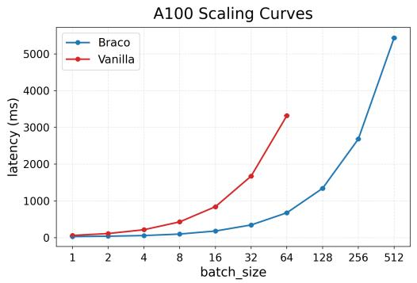

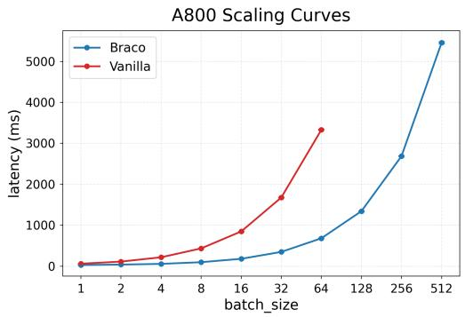  
Figure 6: Latency scaling curves on A100 and A800. Comparison of Braco and Vanilla across batch sizes. Braco consistently achieves lower latency than Vanilla, and both methods exhibit increasing latency as batch size grows. Vanilla runs out of memory (OOM) at batch size 128 and above, so its curves stop at batch size 64. Curves show mean latency, with shaded bands indicating standard deviation over repeated measurements. This batch-scaling profile uses the same measurement protocol within each curve and is intended for scaling comparison.

Table 10: Latency comparison across batch sizes on A100 and A800. Reported values are mean latency (ms) with standard deviation; OOM denotes Vanilla out-of-memory at batch size 128 and above.  
(a) A100 latency comparison.  
(b) A800 latency comparison.
<table><tr><td>batch size</td><td>Braco</td><td>Vanilla</td></tr><tr><td>1</td><td> $3 0 . 7 1 \pm 0 . 3 9$ </td><td> $6 1 . 9 8 \pm 0 . 2 3$ </td></tr><tr><td>2</td><td> $4 0 . 9 4 \pm 0 . 1 2$ </td><td> $1 1 2 . 7 5 \pm 0 . 3 9$ </td></tr><tr><td>4</td><td> $5 8 . 0 7 \pm 0 . 5 2$ </td><td> $2 1 6 . 8 0 \pm 0 . 7 0$ </td></tr><tr><td>8</td><td> $9 9 . 4 0 \pm 0 . 4 3 $ </td><td> $4 3 0 . 6 6 \pm 1 . 2 2$ </td></tr><tr><td>16</td><td> $1 8 1 . 6 4 \pm 0 . 5 4$ </td><td>843.89 ± 3.10</td></tr><tr><td>32</td><td> $3 4 6 . 8 7 \pm 0 . 5 5$ </td><td> $1 6 7 5 . 4 5 \pm 3 . 4 3$ </td></tr><tr><td>64</td><td> $6 7 7 . 8 9 \pm 4 . 3 6$ </td><td> $3 3 2 1 . 4 9 \pm 5 . 1 2$ </td></tr><tr><td>128</td><td> $1 3 4 3 . 3 3 \pm 3 . 0 0$ </td><td>OOM</td></tr><tr><td>256</td><td> $2 6 8 4 . 5 8 \pm 3 . 4 9$ </td><td>O0M</td></tr><tr><td>512</td><td> $5 4 3 4 . 7 9 \pm 1 6 . 0 9$ </td><td>OOM</td></tr></table>

<table><tr><td>batch size</td><td>Braco</td><td>Vanilla</td></tr><tr><td>1</td><td> $3 0 . 2 5 \pm 0 . 0 8$ </td><td> $6 2 . 3 4 \pm 0 . 2 1$ </td></tr><tr><td>2</td><td> $4 1 . 0 4 \pm 0 . 0 4$ </td><td> $1 1 3 . 5 9 \pm 0 . 4 0$ </td></tr><tr><td>4</td><td> $5 7 . 8 4 \pm 0 . 0 7$ </td><td> $2 1 8 . 6 0 \pm 0 . 4 9$ </td></tr><tr><td>8</td><td> $9 9 . 0 6 \pm 0 . 1 7$ </td><td> $4 3 5 . 7 9 \pm 1 . 5 4$ </td></tr><tr><td>16</td><td> $1 8 1 . 8 2 \pm 0 . 5 7$ </td><td> $8 5 0 . 1 0 \pm 3 . 1 4$ </td></tr><tr><td>32</td><td> $3 5 0 . 1 5 \pm 1 . 1 1$ </td><td> $1 6 7 7 . 6 2 \pm 5 . 6 3$ </td></tr><tr><td>64</td><td> $6 8 2 . 6 4 \pm 1 . 5 7$ </td><td> $3 3 3 0 . 9 8 \pm 1 1 . 5 1$ </td></tr><tr><td>128</td><td> $1 3 4 4 . 8 3 \pm 4 . 9 4$ </td><td>OOM</td></tr><tr><td>256</td><td> $2 6 8 8 . 0 1 \pm 7 . 8 8$ </td><td>OOM</td></tr><tr><td>512</td><td> $5 4 5 6 . 5 6 \pm 2 0 . 9 0$ </td><td>OOM</td></tr></table>

Compute-resource accounting. Table 9 reports measured wall-clock training time for representative Vanilla, QueCC, and Braco runs on a cloud GPU platform with 8 NVIDIA A100 80 GB GPUs. Multiplying by the worker count gives the run-level training budgets: 108, 61.6, and 55.2 A100 GPU-hours for the 576-token Vanilla, QueCC, and Braco runs, respectively, and 336, 74.4, and 68 A100 GPU-hours for the corresponding 2880-token runs. We estimate the total training compute for the reported main, larger-input, and extended comparisons at approximately 4.5k A100 GPU-hours, including the additional training seeds, nine-token basis comparison, and InternVL3.5 experiments.

The benchmark and cost measurements use the same single-GPU inference workers: Tables 1 and 8 report per-image full-pipeline prefill FLOPs and latency, and Tables 2 and 7 report compressor boundary peak memory. A800 80 GB resources are used only for additional batch-scaling latency in Figure 6 and Table 10. We recommend reserving approximately 2 TB of local storage for public checkpoints, LLaVA data mixtures, reproduced checkpoints, derived features, and logs; no methodspecific storage system is required. Preliminary debugging, calibration, and unused pilot variants used below 870 additional A100 GPU-hours and are accounted for separately from the full-model training estimate.

Batch-scaling interpretation. Table 10 gives the values behind Figure 6, with A100/A800 splits in Tables 10a and 10b; both GPUs show the same scaling trend.

## J.6 Functional rankings and cross-encoder calibration

Compressibility rankings. We evaluate four bases at each of six fixed budgets using a held-out two-layer MLP readout. The coefficients λ, β, γ are held fixed, and the readability term R uses only the probe-task training split. No reported VLM validation/test labels are used. All correlations are computed within a fixed budget. The mean within-budget Spearman correlation with held-out MLP accuracy is $\rho = 0 . 9 3$ for the combined compressibility score C in Equation (6), compared with 0.67 for the energy term E and 0.80 for the readability term $R ; C$ selects the best basis in all six budgets. In the fully retrained 16-token basis ablation and the 9-token comparison, the basis ranking induced by C agrees with the end-to-end ordering and selects the best basis at both budgets. The functional therefore guides basis selection across both nonlinear readout and full VLM training.

Learnability rankings. Across the coordinate candidates at $K _ { b } \in \{ 4 , 1 6 , 6 4 \} , \mathcal { L } _ { \mathrm { l e a r n } }$ in Equation (9) has mean within-budget Spearman correlation $\rho = 0 . 8 8$ with held-out dev-loss AUC. At $K _ { b } = 4$ , only coefficient coordinates reach the held-out dev-loss target; at $K _ { b } = 1 6$ and 64, iDCT reaches the target 18% and 60% faster, respectively. Separately, the coefficient-versus-iDCT choice induced by Equation (32) matches the final-accuracy winner at $K _ { b } \in \{ 4 , 9 , 1 6 \}$ (c2s5/c3s7/c4s9), whereas the fixed random-rotation controls do not. These results connect the learnability objective to both optimization speed and final accuracy, supporting Braco’s budget-dependent coordinate design.

Calibration protocol. We evaluate the coordinate criterion in Equation (32) on CLIP ViT-L/14- 336, SigLIP-SO400M/14-384 [Zhai et al., 2023], and SigLIP2-SO400M/16-512 [Tschannen et al., 2025]. For each encoder and dataset, we sample 1,024 unlabeled images without replacement in three seed-defined resamples (seeds 0/1/2), use the encoder’s native square preprocessing, and scan $C = 2 , \ldots , 1 6$ with $K _ { b } \stackrel { \cdot } { = } C ^ { 2 }$ . LLaVA-Pretrain (LLaVA-558K) determines the deployed threshold, while the DocVQA training split [Mathew et al., 2021] provides an OCR-heavy distribution-shift check. No captions or downstream labels are used, and $\beta , \gamma$ are fixed in the original CLIP setting and reused unchanged. We define $K _ { b } ^ { \star }$ as the first scanned budget for which the criterion prefers iDCT.

Table 11: Coordinate-rule calibration across encoders and distributions. Entries report the median crossover budget $K _ { b } ^ { \star }$ and its range across three resamples of 1,024 unlabeled images.
<table><tr><td>Vision encoder / resolution</td><td> $\operatorname { L L a V A - P r e t r a i n } K _ { b } ^ { \star }$ </td><td> $\operatorname { D o c V Q A } K _ { b } ^ { \star }$ </td></tr><tr><td>CLIP ViT-L/14-336</td><td>16 (16–16)</td><td>25 (16–25)</td></tr><tr><td>SigLIP-SO400M/14-384</td><td>64 (64–64)</td><td>81 (64–81)</td></tr><tr><td>SigLIP2-SO400M/16-512</td><td>36 (36–36)</td><td>49 (36–49)</td></tr></table>

Table 11 shows that the calibration rule adapts to different encoder statistics while remaining stable across resamples. All three encoders yield identical thresholds across LLaVA-Pretrain resamples; under the DocVQA shift, the threshold moves by at most one scanned square budget. This gives Braco a practical, label-free adaptation procedure: estimate the crossover from the visual-interface training distribution, or use a small unlabeled sample from the target domain when the deployment distribution changes.

## J.7 Robustness to training seeds

Repeated training. We evaluate Braco and QueCC at 16/9/4 tokens, and Braco and TokenPacker at 25/16/9 tokens, with three matched training seeds per available method and budget. Within each seed, the methods share the base checkpoint, shuffled data order, and training schedule. Table 12 reports the sample mean and sample standard deviation of normalized Acc. across the three runs.

Table 12: Accuracy across three matched training seeds. Values are sample mean ± sample standard deviation. QueCC does not support 25 tokens on the fixed $2 4 \times 2 4$ lattice; TokenPacker is not included in the four-token repeated-training comparison.
<table><tr><td>Tokens</td><td>Braco</td><td>QueCC</td><td>TokenPacker</td></tr><tr><td>25</td><td> $9 5 . 1 8 \pm 0 . 1 0$ </td><td>二</td><td> $9 4 . 2 4 \pm 0 . 1 3$ </td></tr><tr><td>16</td><td> $9 4 . 1 2 \pm 0 . 1 0$ </td><td> $9 3 . 8 8 \pm 0 . 1 2$ </td><td> $9 3 . 7 0 \pm 0 . 1 5$ </td></tr><tr><td>9</td><td> $9 3 . 2 9 \pm 0 . 1 2$ </td><td> $9 3 . 0 2 \pm 0 . 1 4$ </td><td> $9 1 . 4 8 \pm 0 . 1 8$ </td></tr><tr><td>4</td><td> $9 1 . 2 8 \pm 0 . 1 5$ </td><td> $9 1 . 3 5 \pm 0 . 1 6$ </td><td></td></tr></table>

Braco preserves its accuracy advantage across three matched training runs: it leads QueCC at 16/9 tokens by 0.24/0.27 Acc. points and TokenPacker at 25/16/9 tokens by 0.94/0.42/1.81 points. The Braco and QueCC standard deviations at 16/9 tokens are at most 0.14, showing low run-to-run variation. At four tokens, the two methods remain effectively tied (a difference of −0.07), while Braco retains the substantial latency advantage reported in Table 1.

## J.8 Cross-family generalization

Model and training setup. We evaluate InternVL3.5-8B [Wang et al., 2025b], whose language backbone is Qwen3-8B. Relative to the primary LLaVA-v1.5 setting, this changes the vision encoder, multimodal projector, native visual-token interface, and LLM. We use a single 448 × 448 image tile, yielding a fixed $1 6 \times 1 6$ visual-token grid (256 tokens after InternVL’s native pixel-shuffle interface). Vanilla, QueCC, and Braco start from the same pretrained checkpoint and use the same LLaVA-558K alignment data, LLaVA-665K instruction data, data order, optimization budget, and two-stage freeze policy. We evaluate four and nine retained tokens, corresponding to 64× and 28.4× compression.

Table 13: Cross-family generalization on InternVL3.5-8B. Acc. is the mean benchmark score normalized by the retrained 256-token Vanilla model. FLOPs and latency cover the full pipeline from the vision encoder through LLM prefill under the single-tile setting.
<table><tr><td colspan="17">Method Tokens GQA MMBEN MMBCN MME POPE SQA VQAText MMVet Acc. FLOPs Lat.</td></tr><tr><td>Vanilla</td><td>256</td><td>65.4</td><td>77.8</td><td></td><td>75.9 1888</td><td>87.9 78.4</td><td>64.8</td><td></td><td>45.2 100.0</td><td>(%)</td><td></td><td>(T) (ms) 4.92 58.4</td></tr><tr><td>QueCC</td><td></td><td>4 61.2</td><td>73.1</td><td>70.4</td><td>1770</td><td>84.4 73.9</td><td>59.0</td><td>39.8</td><td>92.9</td><td></td><td>1.5052.8</td><td></td></tr><tr><td>Braco</td><td></td><td>4 61.7</td><td>73.9</td><td></td><td>71.4 1794</td><td>84.9 74.6</td><td>59.8</td><td>40.8</td><td></td><td>94.1</td><td>1.3734.8</td><td></td></tr><tr><td>QueCC</td><td></td><td>9 61.7</td><td>73.6</td><td>70.9</td><td>1783</td><td>84.8 74.3</td><td>59.8</td><td>40.4</td><td></td><td>93.7</td><td>1.55 53.1</td><td></td></tr><tr><td>Braco</td><td>9</td><td>62.4</td><td>74.7</td><td></td><td>72.3 1814</td><td>85.4 75.3</td><td>60.9</td><td>41.9</td><td></td><td>95.3</td><td>1.41 35.2</td><td></td></tr></table>

Results. Braco outperforms QueCC on all eight benchmarks at both token budgets while reducing prefill latency by about 34%. At four tokens, Braco retains 94.1% of Vanilla accuracy, compared with 92.9% for QueCC, while reducing full-pipeline prefill latency from 52.8ms to 34.8ms. At nine tokens, Braco retains 95.3% versus 93.7% for QueCC, with 35.2ms versus 53.1ms latency. Together with the larger-input results in Table 8, these results demonstrate that Braco’s accuracy–efficiency advantage transfers across model families and visual-token scales.

## K Limitations

Braco is evaluated on LLaVA-family and InternVL3.5 vision-encoder→LLM pipelines and standard single-image multimodal benchmarks. This scope reflects the need for fair, fully reproducible comparisons: Braco and the learned baselines are trainable visual-interface modules, so matched comparisons require an open end-to-end training pipeline, including the training code/recipe, data mixture, and checkpoints needed to retrain each method under the same conditions. Its budgetdependent coordinate choice is calibrated for the tested encoders and resolutions, so new backbones, video inputs, dense localization tasks, domain-specific distributions, irregular region features, or dynamic visual tokens may require a small calibration sweep over the backbone–residual split, coordinate organization, or structured basis. The current study reports three-seed accuracy comparisons for the key Braco–QueCC and Braco–TokenPacker settings (Table 12), while the remaining accuracy comparisons use one trained checkpoint per setting.

## L Broader Impacts

This paper studies extreme visual-token compression for vision–language models and proposes a lightweight token coder that can reduce inference latency and memory footprint, enabling broader deployment on resource-constrained devices. Improved efficiency may also lower the energy cost of multimodal systems, but it could facilitate more scalable surveillance or automated content understanding when paired with high-capability models. We do not introduce new data sources or userfacing interaction mechanisms; the primary risks therefore mirror those of the underlying vision– language models. We encourage practitioners to follow existing responsible-deployment practices (e.g., data governance, access control, and misuse monitoring) when applying our method in sensitive settings.

## M Existing Assets and Licenses

We use public third-party models, training data, benchmarks, and baseline implementations only under their original licenses or terms of use, and this paper does not redistribute model weights, benchmark images, or dataset files. The LLaVA codebase and LLaVA-v1.5 model family [Liu et al., 2024a] are released with Apache-2.0 code, while the LLaVA-v1.5 and Vicuna-v1.5 [Chiang et al., 2023] model weights follow the Llama 2 Community License. The Qwen2.5-3B backbone [Yang et al., 2024] follows the Qwen Research License. The LLaVA pretraining subset follows the LAION/CC/SBU image-source licenses, and the LLaVA instruction mixtures are used under their posted dataset-card and source-dataset terms. For evaluation assets, we use the original benchmark releases and cite the corresponding papers: MMBench data is released under CC BY 4.0 [Liu et al., 2024b]; ScienceQA code is MIT-licensed and its dataset is CC BY-NC-SA 4.0 [Lu et al., 2022]; MM-Vet code is Apache-2.0 and its dataset is CC BY-NC 4.0 [Yu et al., 2024]; TextVQA/VQA annotations are available under CC BY 4.0 where applicable [Singh et al., 2019]; GQA/Visual Genome assets are available under CC BY 4.0 [Hudson and Manning, 2019]; and the POPE repository is MIT licensed, with underlying MSCOCO-image terms where COCO images are used [Li et al., 2023b]. MME and any additional benchmark files are used under their posted release terms [Fu et al., 2023]. Baseline methods are cited in the related work and experiments; any official code or checkpoints used for reproduction are governed by their respective repository or model-card licenses, and methods without reusable licensed code are reimplemented from the paper description.