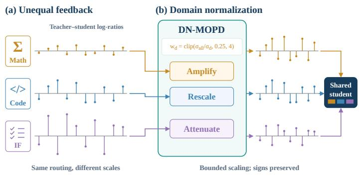
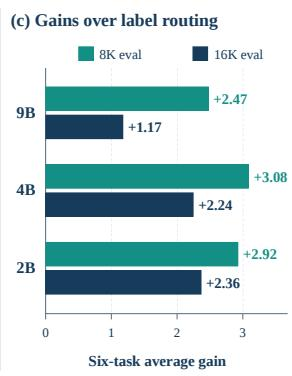
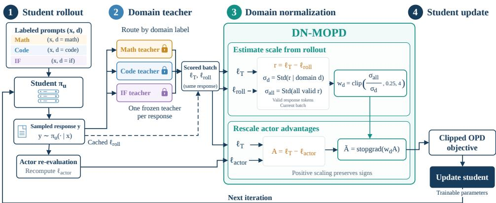
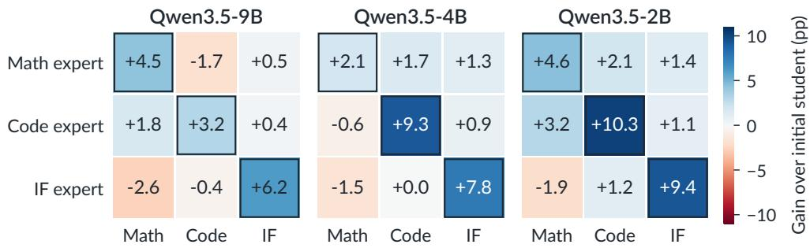
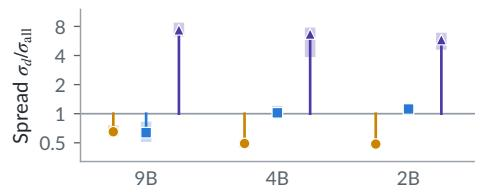
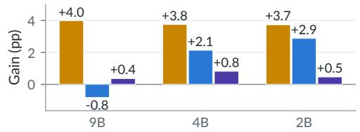
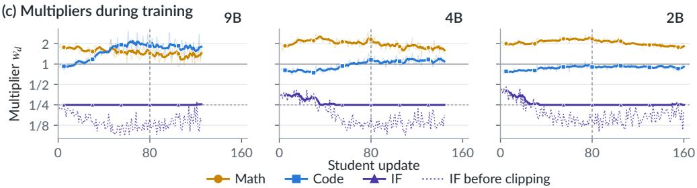

# Beyond Teacher Assignment: Domain-Normalized Multi-Teacher On-Policy Distillation

Xin Li1, Hao Jiang1, Xin Gao2, Annan Wang1, Yuchen Xie1, Jinghao Guo1, Xingwei Qu3, Yichi Zhang and Chau Yuen   
1Nanyang Technological University, 2Yale University, 3University of Manchester   
Project page: https://lixin.ai/DN-MOPD

Reinforcement learning can turn one language model into several specialists, each excellent at a single skill such as mathematics, coding or following instructions, but users need one model with all of these skills. Multi-teacher on-policy distillation (MOPD) merges them by letting the specialists teach one student: the student answers each prompt, and the specialist for that prompt’s domain gives feedback on every token. This routing decides which specialist teaches, but not how strongly its feedback moves the shared student. In Qwen3.5 models at three sizes, we find that MOPD’s student does not beat one taught by the best single specialist and gains little of the mathematics specialist’s advantage. The feedback is unbalanced: instruction-following feedback is several times more spread out than mathematics feedback and dominates the student’s updates. We propose Domain-Normalized MOPD (DN-MOPD), which keeps the routing and rescales each domain’s feedback by its measured spread. On six public benchmarks, DN-MOPD improves the average score over MOPD at every size, across three random seeds and under two answer-length limits, and recovers most of the lost mathematics gain. Controls with fixed domain weights show that the gain comes mainly from turning down instruction-following feedback rather than turning up mathematics alone, and that fixed weights close to those DN-MOPD measures perform comparably. Combining specialists therefore requires deciding not only which one teaches, but also how strongly its feedback counts.

## 1. Introduction

Post-training of large language models increasingly relies on domain-specific reinforcement learning (RL), with verifiable rewards for mathematical reasoning (Shao et al., 2024; DeepSeek-AI et al., 2025), execution feedback for code (Cui et al., 2025), and constraint checking for instruction following (Lambert et al., 2024; Pyatkin et al., 2025). Because these pipelines difer in data, rewards and optimization, they are usually run separately from a shared initialization, yielding experts that each excel in one domain. A deployable model must integrate them (Ma et al., 2026).

  
Figure 1 | Label routing decides which teacher supervises a prompt; DN-MOPD also controls how strongly each teacher’s feedback counts. (a) Teacher–student log-ratios difer in scale across domains (schematic). (b) DN-MOPD rescales each domain’s feedback with a bounded, sign-preserving multiplier (schematic). (c) Six-task Total gain of DN-MOPD over label routing; paired 95% intervals are reported in App. C.

Multi-teacher on-policy distillation (MOPD) performs this integration in policy space (Ma et al., 2026; LLM-Core Xiaomi et al., 2026): the student samples responses, each prompt is routed to the expert of its domain, and that expert’s token-level log-probabilities on the student’s own response provide a dense distillation signal (Agarwal et al., 2023; Gu et al., 2024). MOPD has been adopted in the post-training of several recent frontier models (DeepSeek-AI et al., 2026; DeepSeek-AI, 2026; LLM-Core Xiaomi et al., 2026; NVIDIA et al., 2026; Park et al., 2026; Lim et al., 2026), and follow-up work reweights each domain’s loss by its token share and its remaining teacher–student gap (Gao et al., 2026). The routing rule, however, specifies only which expert supervises a prompt, and existing weights are fixed by hand or set from the size of the remaining gap. Neither accounts for the spread of each expert’s feedback, which difers when experts are trained by diferent RL pipelines.

Our empirical investigation reveals that this choice matters: across independently trained Qwen3.5 expert pools at 9B, 4B and 2B, MOPD with label routing (Label in our tables) does not outperform the strongest single-teacher student at any size and transfers little of the mathematics expert’s gain. At an 8K evaluation budget the student retains only 14–32% of that gain, and at 16K it shows no gain over its initialization. The feedback itself is unbalanced. Token-level teacher–student log-ratios from the instruction-following expert are 2.3 to 4.4 times as dispersed as the pooled signal of the first training batch, whereas mathematics feedback is about half as dispersed (App. D.2). Because all domains update the same parameters, this imbalance shapes the update even when prompt counts are equal: for the initial 4B student, the instruction-following loss supplies 94% of the combined gradient under equal weights (App. D.5). Routing determines where feedback comes from, but not how much it counts.

We introduce Domain-Normalized Multi-Teacher On-Policy Distillation (DN-MOPD). For each batch, it measures the spread of teacher–student log-ratios within each domain and uses a bounded multiplier to bring that domain’s distillation advantages toward the pooled scale. The selected experts continue to supervise fresh student answers. This adds one operation to MOPD, with no additional teacher model, teacher call or learned router; MOPD is the special case in which every multiplier equals one.

Across independently trained Qwen3.5 expert pools at 9B, 4B and 2B, DN-MOPD improves the six-task average over MOPD at both evaluation budgets (Figure 1): by 1.17 to 2.36 percentage points at 16K and 2.47 to 3.08 at 8K. The advantage holds across three student seeds, and DN-MOPD also exceeds the strongest single-teacher student at every size, with some of these intervals including zero. Mathematics, which MOPD failed to transfer, carries the largest gains. Controls with fixed domain weights show that most of them come from limiting the instruction-following feedback rather than from amplifying mathematics alone, and that fixed weights near DN-MOPD’s measured multipliers perform comparably at 9B and 4B; DN-MOPD obtains this calibration from batch statistics without a per-size weight search.

## Our contributions are:

• Teacher assignment alone does not transfer the specialists’ skills. MOPD with label routing does not outperform the strongest single-teacher student at any of three Qwen3.5 sizes and transfers little of the mathematics expert’s gain. Its domains give feedback on unequal scales: in the first training batch, instruction-following log-ratios are 2.3–4.4 times as dispersed as the pooled signal and mathematics log-ratios about half as dispersed, and for the initial 4B student the instruction-following loss supplies 94% of the combined gradient.

• DN-MOPD puts every teacher’s feedback on a common scale. It rescales each domain’s distillation advantages by the clipped ratio of pooled to domain log-ratio spread, estimated on every batch, while keeping label routing and the sign of every advantage; MOPD is the special case in which every multiplier is one.

  
Figure 2 | One DN-MOPD training iteration. (1) The student samples responses to labeled prompts. (2) Each response is scored by the frozen teacher of its domain. (3) Each domain’s multiplier is estimated from cached rollout log-ratios and applied to the actor-side advantages. (4) The student is updated with the clipped OPD objective. Label routing is the special case in which every multiplier is 1.

• Calibrating feedback scale consistently improves on MOPD. DN-MOPD improves the six-task average over MOPD at every size and both evaluation budgets, with every paired interval above zero and the gain holding across three student seeds; it also exceeds the strongest single-teacher student and recovers most of the mathematics gain that MOPD loses.

## 2. DN-MOPD

DN-MOPD keeps the domain-label assignment of multi-teacher OPD and adds one operation: before the shared student is updated, each domain’s distillation advantages are rescaled using its feedback spread relative to the current batch (Figure 2). We build on the multi-teacher OPD recipe of Ma et al. (2026) and the Uni-OPD implementation (Hou et al., 2026).

Setting. We start from one initial model. Three copies are trained separately with reinforcement learning into specialists for mathematics, code and instruction following (IF). A fourth copy, the student $\pi _ { u } ,$ is trained to acquire all three skills. Every training prompt � carries a domain label $d \in$ {math, code, IF}, and $T _ { d }$ denotes the specialist for that domain.

How a teacher gives feedback. The student first writes its own answer $y = ( y _ { 1 } , \ldots , y _ { n } )$ to the prompt. The matching teacher then reads the same answer and, at every position �, reports how likely it would have been to write the student’s token given the preceding text $h _ { t } = ( x , y _ { < t } )$ . Comparing the two probabilities gives the token’s distillation advantage

$$
A _ { t } = \log p _ { T _ { d } } ( y _ { t } \mid h _ { t } ) - \log \pi _ { u } ( y _ { t } \mid h _ { t } ) .
$$

A positive $A _ { t }$ encourages the sampled token, while a negative $A _ { t }$ discourages it. Its magnitude weights that token’s policy-gradient contribution. Label-routed OPD uses $A _ { t }$ directly.

Why the size of feedback matters. All domains update the same student parameters, but independently trained specialists need not produce advantages on comparable scales. Domain labels select the source of supervision without calibrating these scalar weights. In the first training batch of our Qwen3.5 runs, IF log-ratios are 2.3–4.4 times as dispersed as the pooled batch signal, and mathematics log-ratios about half as dispersed (App. D.2). This motivates an explicit adjustment of feedback scale. The scale afects the weighting of token contributions; the resulting domain gradient also depends on their directions and the loss reduction.

Domain normalization. We use standard deviation to measure the dispersion of the feedback within each domain. For response $i ,$ let $r _ { i , t } = \ell _ { i , t } ^ { T } - \ell _ { i , t } ^ { \mathrm { r o l l } }$ , where $\ell ^ { T }$ is the assigned teacher’s token log-probability and $\ell ^ { \mathrm { { r o l l } } }$ is the student’s cached rollout log-probability. In each batch, $\sigma _ { d }$ is the population standard deviation of $r _ { i , t }$ over valid response tokens with $d _ { i } = d$ . We compute $\sigma _ { \mathrm { a l l } }$ over all valid response tokens pooled across domains. Each domain receives one multiplier:

$$
w _ { d } = \mathrm { c l i p } \left( { \frac { \sigma _ { \mathrm { a l l } } } { \sigma _ { d } } } , 0 . 2 5 , 4 \right) , \qquad \widetilde { A } _ { t } = w _ { d } A _ { t } .
$$

The pooled spread supplies a common reference that follows the current batch. For a nondegenerate domain whose ratio is not clipped, the scaled rollout signal satisfies

$$
\mathrm { { S t d } } ( w _ { d } r _ { d } ) = \sigma _ { \mathrm { { a l l } } } .
$$

Thus the rule amplifies feedback with a smaller spread and attenuates feedback with a larger spread. It targets dispersion rather than treating the statistic as an estimate of teacher quality or remaining capability gap. This difers from allocating more budget to domains with larger mean absolute rewards, as in Open-MOPD (Gao et al., 2026).

We multiply by a positive factor without subtracting the domain mean, preserving each advantage’s sign and hence whether it encourages or discourages the sampled token. The mean is scaled along with the rest of the signal. The bounds [0.25, 4] limit the adjustment when a scale ratio is extreme; clipping can prevent full equalization. We use $w _ { d } = 1$ if either standard deviation is zero or has fewer than two observations. Matching these spreads does not fix the batch loss scale or equalize domain gradient norms.

Student update. The actor recomputes the pre-update student log-probabilities $\ell ^ { \mathrm { a c t o r } }$ on the sampled responses, forming $A _ { i , t } = \ell _ { i , t } ^ { T } - \ell _ { i , t } ^ { \mathrm { a c t o r } }$ . We detach the scaled advantage, $\widetilde { A } _ { i , t } = \mathrm { s t o p g r a d } ( w _ { d _ { i } } A _ { i , t } )$ , and use it in the baseline clipped OPD loss. With $\rho _ { i , t } ( \theta ) = \pi _ { \theta } ( y _ { i , t } \mid h _ { i , t } ) / \exp ( \ell _ { i , t } ^ { \mathrm { a c t o r } } )$ , the token loss is

$$
\begin{array} { r } { \mathcal { L } _ { i , t } ( \theta ) = - \operatorname* { m i n } \bigl \{ \rho _ { i , t } ( \theta ) \widetilde { A } _ { i , t } , \ \mathrm { c l i p } \bigl ( \rho _ { i , t } ( \theta ) , 1 - \eta _ { - } , 1 + \eta _ { + } \bigr ) \widetilde { A } _ { i , t } \bigr \} , } \end{array}
$$

where $\eta _ { - }$ and $\eta _ { + }$ are the baseline policy-ratio clipping bounds. We retain Label’s response masks and loss reduction: average valid token losses within each response, then average across responses. Scale estimation pools tokens, whereas the training loss averages responses. Setting every $w _ { d }$ to one recovers Label. Algorithm 1 summarizes the iteration; App. D.1 gives the implementation details.

What the rule does in practice. In the Qwen3.5   
runs, the multiplier amplifies mathematics feed- Algorithm 1 DN-MOPD, one training iteration   
back by about 1.5–2.1 at every size and keeps Require: student $\pi _ { u } ,$ teachers $\left\{ T _ { d } \right\}$ , labeled prompts   
code near 1 at 4B and 2B. The IF multiplier sits 1: Sample responses $y _ { i } \sim \pi _ { u } ( \cdot \mid x _ { i } )$   
2: Score each $y _ { i }$ with its domain teacher $T _ { d _ { i } }$   
at the 0.25 floor in most batches, so clipping 3: $r _ { i , t } \gets \ell _ { i , t } ^ { T } - \dot { \ell } _ { i , t } ^ { \mathrm { r o l l } }$ on valid tokens   
bounds rather than equalizes that domain’s scale 4: $\sigma _ { \mathrm { a l l } } \gets \dot { \mathrm { S t d } } ( \{ r _ { i , t } \} )$   
(Figure 4). 5: for each domain � do   
6: $\sigma _ { d } \gets \mathsf { S t d } ( \{ r _ { i , t } : d _ { i } = d \} )$   
Cost and scope. The operation needs no addi- 7: $w _ { d } \gets \mathrm { c l i p } ( \sigma _ { \mathrm { a l l } } / \sigma _ { d } , 0 . 2 5 , 4 )$   
tional teacher call: it reuses the log-ratios already 8: Use $w _ { d } = 1$ if either statistic is degenerate   
available from rollout scoring, computes one 9: end for   
10: Recompute $A _ { i , t } \gets \ell _ { i , t } ^ { T } - \ell _ { i , t } ^ { \mathrm { a c t o r } }$   
pooled standard deviation and one per domain,   
11: $\widetilde { A } _ { i , t } \gets$ stopgrad(��� ��,�)   
and scales the existing advantages. It changes   
12: Update $\pi _ { u }$ on $\widetilde { A }$ with the clipped OPD objective   
neither which teacher supervises a prompt nor   
how many prompts each domain receives.

Table 1 | Capability integration at 9B. Qwen3.5-9B scores (%) on six public tasks. Total averages the six task scores.
<table><tr><td rowspan="2">Method</td><td colspan="2">Math (avg@64)</td><td colspan="2">Code (avg@6)</td><td colspan="2">IF (avg@16)</td><td></td></tr><tr><td>AIME25 AIME26</td><td></td><td>LCB v5 LCB v6</td><td></td><td>IFEval IFBench</td><td></td><td>Total</td></tr><tr><td>Initial student</td><td>57.7</td><td>62.6</td><td>54.9</td><td>51.4</td><td>82.4</td><td>33.8</td><td>57.1</td></tr><tr><td>RL experts</td><td></td><td></td><td></td><td></td><td></td><td></td><td></td></tr><tr><td>Math expert</td><td>59.7</td><td>69.4</td><td>53.4</td><td>49.4</td><td>82.3</td><td>34.9</td><td>58.2</td></tr><tr><td>Code expert</td><td>58.5</td><td>65.4</td><td>58.5</td><td>54.3</td><td>82.3</td><td>34.6</td><td>58.9</td></tr><tr><td>IF expert</td><td>54.6</td><td>60.5</td><td>54.0</td><td>51.5</td><td>86.5</td><td>42.1</td><td>58.2</td></tr><tr><td>Offline distillation</td><td></td><td></td><td></td><td></td><td></td><td></td><td></td></tr><tr><td>SeqKD-SFT</td><td>61.3</td><td>67.6</td><td>62.7</td><td>56.0</td><td>86.0</td><td></td><td>42.4 62.6</td></tr><tr><td>Parameter merging</td><td></td><td></td><td></td><td></td><td></td><td></td><td></td></tr><tr><td>ParamMerge-Avg</td><td>59.4</td><td>68.3</td><td>54.0</td><td>50.9</td><td>84.1</td><td>36.4</td><td>58.9</td></tr><tr><td>ParamMerge-TA</td><td>59.1</td><td>68.6</td><td>55.2</td><td>50.9</td><td>86.1</td><td>43.3</td><td>60.5</td></tr><tr><td>Single-teacher OPD</td><td></td><td></td><td></td><td></td><td></td><td></td><td></td></tr><tr><td>Math teacher</td><td>58.9</td><td>69.5</td><td>53.7</td><td>49.4</td><td>82.4</td><td>34.7</td><td>58.1</td></tr><tr><td>Code teacher</td><td>58.3</td><td>66.2</td><td>57.0</td><td>52.6</td><td>82.6</td><td>34.2</td><td>58.5</td></tr><tr><td>IF teacher</td><td>56.8</td><td>61.9</td><td>52.1</td><td>49.2</td><td>84.7</td><td>38.9</td><td>57.3</td></tr><tr><td>Multi-teacher OPD</td><td></td><td></td><td></td><td></td><td></td><td></td><td></td></tr><tr><td>Uniform pool</td><td>57.1</td><td>65.9</td><td>53.6</td><td>52.3</td><td>83.3</td><td>35.7</td><td>58.0</td></tr><tr><td>Dynamic router</td><td>56.4</td><td>63.5</td><td>55.4</td><td>51.5</td><td>84.3</td><td>37.7</td><td>58.1</td></tr><tr><td>Label-routed MOPD</td><td>55.3</td><td>63.2</td><td>56.8</td><td>52.6</td><td>84.0</td><td>38.4</td><td>58.4</td></tr><tr><td>DN-MOPD (Ours)</td><td>58.9</td><td>67.7</td><td>56.3</td><td>51.4</td><td>84.5</td><td>38.7</td><td>59.6</td></tr></table>

Bold: best within the multi-teacher OPD block.

## 3. Experiments

We first compare DN-MOPD with label-routed OPD, then examine which specialist capabilities improve and how these changes relate to the feedback scales. We also test sensitivity to evaluation length and training duration.

Experimental setup. We use Qwen3.5-9B, 4B and 2B with independently trained specialist pools at each size. Students learn from teachers at their own size. The main OPD comparisons share experts, student initialization and prompts within each pool, and use 80 updates, student seed 42 (seeds 43 and 44 in App. C.5) and an 8,192-token training response cap. The earlier Qwen3 results use diferent teacher pools and protocols and are reported separately in App. E.2.

Baselines and variants. We report the initial student, all three RL experts and OPD students trained with each single expert. Uniform pooling averages teacher probabilities, Dynamic selects a teacher from the current student response, and Label uses the prompt’s domain. DN-MOPD is compared with Label under the same OPD setup. Annealed injection adds early imitation of teacher answers to Label (Table 3, App. C.1). SeqKD-SFT (Kim & Rush, 2016) trains for 84 updates on fixed teacher answers generated with a 16K cap, while parameter averaging and task arithmetic (Ilharco et al., 2023) combine expert weights directly; task arithmetic uses � = 1. These recipes difer in token exposure and compute (App. A.2). The strongest single-teacher student is selected on the same public Total, favoring that comparator.

Evaluation. AIME25/AIME26 measure mathematics, LiveCodeBench (LCB) v5/v6 measure code generation on 167/175 disjoint problems, and IFEval/IFBench measure instruction following. Task scores average correctness first over sampled answers for each question, then over questions, estimating single-answer accuracy. We sample 64, 6 and 16 responses per question for math, code and IF, respectively. IF uses strict prompt accuracy. Domain scores and mean response lengths equally average their two suite means; Total and the overall cap-hit rate equally average all six suites. The main tables use a 16,384-token evaluation cap, chosen after inspecting both caps; complete six-task results at 8K and 16K are in App. B. Paired 95% confidence intervals resample questions within each suite and are conditional on the student training seed and teacher pool. App. A gives training configurations and scoring details.

Table 2 | Capability integration at smaller scales. Independently trained Qwen3.5-4B and 2B expert pools. Each domain averages its two tasks; Total weights the three domains equally.
<table><tr><td rowspan="2">Method</td><td colspan="4">Qwen3.5-4B</td><td colspan="4">Qwen3.5-2B</td></tr><tr><td>Math</td><td>Code</td><td>IF</td><td>Total</td><td>Math</td><td>Code</td><td>IF</td><td>Total</td></tr><tr><td>Initial student</td><td>52.2</td><td>38.1</td><td>52.8</td><td>47.7</td><td>17.6</td><td>11.3</td><td>43.3</td><td>24.0</td></tr><tr><td>RL experts</td><td></td><td></td><td></td><td></td><td></td><td></td><td></td><td></td></tr><tr><td>Math expert</td><td>54.2</td><td>39.7</td><td>54.0</td><td>49.3</td><td>22.1</td><td>13.4</td><td>44.7</td><td>26.7</td></tr><tr><td>Code expert</td><td>51.6 50.7</td><td>47.4 38.1</td><td>53.6 60.6</td><td>50.8</td><td>20.7</td><td>21.6</td><td>44.4</td><td>28.9</td></tr><tr><td>IF expert</td><td></td><td></td><td></td><td>49.8</td><td>15.6</td><td>12.5</td><td>52.8</td><td>27.0</td></tr><tr><td>Offline distillation</td><td></td><td></td><td></td><td></td><td></td><td></td><td></td><td></td></tr><tr><td>SeqKD-SFT</td><td>55.6</td><td>52.3</td><td>59.7</td><td>55.9</td><td>23.1</td><td>23.9</td><td>51.6</td><td>32.9</td></tr><tr><td>Parameter merging</td><td>54.5</td><td></td><td></td><td></td><td></td><td></td><td></td><td></td></tr><tr><td>ParamMerge-Avg ParamMerge-TA</td><td>53.8</td><td>43.1 44.4</td><td>56.2 61.4</td><td>51.2 53.2</td><td>20.7</td><td>16.3</td><td>47.5</td><td>28.2</td></tr><tr><td></td><td></td><td></td><td></td><td></td><td>24.4</td><td>20.4</td><td>53.3</td><td>32.7</td></tr><tr><td>Single-teacher OPD</td><td></td><td></td><td></td><td></td><td></td><td></td><td></td><td></td></tr><tr><td>Math teacher</td><td>53.9</td><td>39.9</td><td>53.6</td><td>49.1</td><td>22.1</td><td>14.1</td><td>44.2</td><td>26.8</td></tr><tr><td>Code teacher</td><td>52.2</td><td>46.8</td><td>53.5</td><td>50.9</td><td>20.4</td><td>21.2</td><td>44.9</td><td>28.8</td></tr><tr><td>IF teacher</td><td>50.3</td><td>39.2</td><td>57.6</td><td>49.0</td><td>16.5</td><td>11.7</td><td>49.2</td><td>25.8</td></tr><tr><td>Multi-teacher OPD</td><td></td><td></td><td></td><td></td><td></td><td></td><td></td><td></td></tr><tr><td>Uniform pool</td><td>52.3</td><td>41.5</td><td>55.0</td><td>49.6</td><td>19.9</td><td>14.6</td><td>46.2</td><td>26.9</td></tr><tr><td>Dynamic router</td><td>49.9</td><td>44.7</td><td>57.1</td><td>50.6</td><td>17.3</td><td>13.8</td><td>48.5</td><td>26.5</td></tr><tr><td>Label-routed MOPD</td><td>50.2</td><td>43.3</td><td>57.4</td><td>50.3</td><td>17.0</td><td>13.4</td><td>49.5</td><td>26.6</td></tr><tr><td>DN-MOPD (Ours)</td><td>54.0</td><td>45.4</td><td>58.2</td><td>52.5</td><td>20.7</td><td>16.3</td><td>49.9</td><td>29.0</td></tr></table>

Bold: best within the multi-teacher OPD block at each size.

## 3.1. Main results

DN-MOPD improves on Label at every model size and both evaluation budgets (Figure 1, App. B), with paired intervals consistently above zero (App. C.3). This comparison holds the experts, student initialization, prompts and update budget fixed, isolating the change in feedback weighting. The same normalization rule transfers across independently trained expert pools without size-specific tuning. Across three student seeds, every seed-matched comparison favors DN-MOPD (mean gains +1.12, +1.97 and +2.34 at 16K, intervals above zero; App. C.5).

The main gain is in mathematics. At 16K, Label shows no mathematics gain over the initial student at any size, whereas DN-MOPD improves mathematics at every size (App. E.1). On MATH-500, Label likewise does not exceed the initial student at 16K, while DN-MOPD leads Label by +0.74, +1.25 and +5.95 points (App. C.7). Matching prompts to the right specialist therefore leaves room to improve how its feedback is used. Gains in code and instruction following are smaller and less consistent; at 9B, code does not improve at 16K.

The single-teacher students provide a stronger reference than the initial model: learning from one specialist can already yield a competitive student across domains. Multi-teacher integration should therefore be evaluated against this alternative as well as Label. Label never exceeds the strongest single-teacher student, whereas DN-MOPD exceeds it at every size. This lead is smaller than the gain over Label, with some intervals including zero; at 9B it grows to +2.57 [+1.65, +3.46] when both continue to 160 updates (App. C.3). The clearest evidence is thus for improving the label-routed recipe; SeqKD-SFT and task arithmetic retain higher Totals under their own training recipes (Tables 1–2).

  
Figure 3 | Expert specialization across domains. Each cell is the gain over the shared initialization (pp) at 16K, averaged over the two tasks in the evaluation domain. Rows identify experts and columns identify evaluation domains.

## 3.2. Understanding the improvement

Figure 3 establishes that the teachers have specialist capabilities available to transfer: each expert improves its own domain, while its efects on other domains vary. Yet Label fails to retain the mathematics gain. Mathematics-only OPD retains much more of that gain (Tables 1–2), showing that the student can learn from this teacher in isolation. The dificulty appears when its feedback is combined with feedback from the other domains. App. E.1 gives the detailed capability-transfer comparison.

We next test whether changing teacher assignment can alleviate this integration gap. Pooling combines teacher distributions, while dynamic routing selects a teacher from the student’s current response. Neither brings consistent gains across sizes (Table 3). DN-MOPD instead retains Label’s assignment and changes the strength of each domain’s feedback, improving every size under the same teachers and training budget. This comparison supports treating feedback scale as a separate design choice from teacher selection. The two fixed-weight rows separate the directions of DN-MOPD’s adjustment at 4B and 2B. The intuitive remedy, amplifying the under-transferred mathematics feedback while leaving IF unchanged, recovers about half of DN-MOPD’s improvement at 4B and little at 2B. Reducing IF alone recovers most of it and raises mathematics by about three points (App. C.6).

Fixed weights for all three domains show where the benefit comes from (App. C.6). Weights fixed at DN-MOPD’s first-batch multipliers, or at a global (2, 1, 0.25) chosen after inspecting them, show no detectable diference from DN-MOPD at 16K at 9B and 4B; at 2B, per-batch estimation outperforms the first-batch weights by 1.10 points. The gain therefore comes mainly from calibrating the feedback scale, which DN-MOPD obtains from batch statistics rather than from a per-size weight search.

Figure 4 shows why this calibration matters. IF log-ratios are more dispersed than the pooled signal and mathematics log-ratios less so (panel a), and DN-MOPD amplifies mathematics and downweights IF throughout training rather than only near initialization (panel c), consistent with fixed first-batch weights working at the larger sizes. IF supplies about 1% of response tokens but up to half of the pooled variance. For the initial 4B student it accounts for 94% of the combined gradient under equal weights and 64% under DN-MOPD’s first-batch weights, and still 88% if the loss is averaged over tokens instead of responses (App. D.5). DN-MOPD thus appears to help mainly by limiting this

(a) Feedback scale

Table 3 | Changes to label-routed OPD. Total point diferences (pp) relative to Label, evaluated at 16K. Pooling and Dynamic change the teacher assignment; annealed injection and DN-MOPD retain it and change the learning signal. The two fixed-weight rows set one domain’s weight (mathematics 2 or IF 0.25, others 1) and were run at 4B and 2B only.
<table><tr><td>Variant</td><td>Teacher rule</td><td>Signal change</td><td>9B</td><td>4B</td><td>2B</td></tr><tr><td>Uniform pool</td><td>Mixture</td><td>Unchanged</td><td>-0.41</td><td>-0.69</td><td>+0.30</td></tr><tr><td>Dynamic router</td><td>Response</td><td>Unchanged</td><td>-0.25</td><td>+0.28</td><td>-0.07</td></tr><tr><td>Label-routed</td><td>Domain</td><td>Unchanged</td><td>+0.00</td><td>+0.00</td><td>+0.00</td></tr><tr><td>Annealed injection</td><td>Domain</td><td>Early imitation</td><td>-0.24</td><td>+1.11</td><td>+0.30</td></tr><tr><td>Math ×2 only</td><td>Domain</td><td>Math scale</td><td></td><td>+1.20</td><td>+0.27</td></tr><tr><td>IF ×0.25 only</td><td>Domain</td><td>IF scale</td><td></td><td>+1.79</td><td>+2.19</td></tr><tr><td>DN-MOPD</td><td>Domain</td><td>Domain scale</td><td>+1.17</td><td>+2.24</td><td>+2.36</td></tr></table>

(b) DN-MOPD − Label (16K)

  
Figure 4 | Feedback scales, domain gains and training multipliers. (a) Median relative log-ratio spread with interquartile ranges over the recorded batches of the DN-MOPD runs, including their continuation beyond 80 updates. (b) Domain accuracy diferences between DN-MOPD and Label at 16K; point estimates. (c) Raw multipliers (faint), trailing 5-update means (solid), and IF before clipping (dotted). Vertical dashed lines mark update 80; traces end at updates 125, 144 and 160 for 9B, 4B and 2B.

domain’s influence on the shared update. After 80 updates IF dominates the gradient under either weighting, but the DN-MOPD student’s mathematics and code log-ratios are about three times less dispersed than Label’s, consistent with more of those teachers’ feedback having been absorbed.

The mathematics gains come with shorter answers and fewer responses reaching the generation cap (Table 4), so they do not come from longer generations; App. C.4 reports both caps.

## 3.3. Training budget and scope

We vary the evaluation and training budgets to check whether the advantage depends on limited generation room or an early training endpoint. Allowing longer evaluation responses helps Label more, narrowing the gap, but DN-MOPD remains ahead across sizes with positive paired intervals (App. C.3). Its advantage survives the larger generation budget, although the margin depends on the allowed response length.

The training extension tests whether Label catches up when given more updates (Table 5). Each run continues its own checkpoint with the same recipe; the single-teacher comparators were selected on the development instrument (IF at 9B, code at 4B and 2B). The longer runs narrow the gaps at the two smaller sizes in Table 5, but DN-MOPD remains ahead at every size under both evaluation caps. Its advantage therefore persists beyond the main training endpoint, although the eventual ordering at convergence remains unresolved.

Table 4 | Capability and generated length. Mean response tokens by domain and the share of responses reaching the 16K cap. Scores and lengths come from the same evaluation outputs.
<table><tr><td>Method</td><td>Total</td><td>Math tokens</td><td>Code tokens</td><td>IF tokens</td><td>At cap (%)</td></tr><tr><td colspan="6">Qwen3.5-9B</td></tr><tr><td>SeqKD-SFT</td><td>62.6</td><td>5,547</td><td>5,896</td><td>422</td><td>1.5</td></tr><tr><td>ParamMerge-TA</td><td>60.5</td><td>5,083</td><td>5,479</td><td>430</td><td>1.7</td></tr><tr><td>Label-routed</td><td>58.4</td><td>8,637</td><td>6,846</td><td>450</td><td>9.8</td></tr><tr><td>DN-MOPD</td><td>59.6</td><td>7,032</td><td>6,427</td><td>441</td><td>5.2</td></tr><tr><td colspan="6">Qwen3.5-4B</td></tr><tr><td>SeqKD-SFT</td><td>55.9</td><td>5,534</td><td>7,389</td><td>440</td><td>3.2</td></tr><tr><td>ParamMerge-TA</td><td>53.2</td><td>4,865</td><td>6,332</td><td>494</td><td>2.9</td></tr><tr><td>Label-routed</td><td>50.3</td><td>8,653</td><td>8,238</td><td>523</td><td>12.4</td></tr><tr><td>DN-MOPD</td><td>52.5</td><td>6,146</td><td>7,649</td><td>522</td><td>5.3</td></tr><tr><td colspan="6">Qwen3.5-2B</td></tr><tr><td>SeqKD-SFT</td><td>32.9</td><td>6,670</td><td>9,419</td><td>822</td><td>8.9</td></tr><tr><td>ParamMerge-TA</td><td>32.7</td><td>5,383</td><td>8,315</td><td>930</td><td>8.9</td></tr><tr><td>Label-routed</td><td>26.6</td><td>10,246</td><td>10,047</td><td>744</td><td>20.2</td></tr><tr><td>DN-MOPD</td><td>29.0</td><td>7,444</td><td>10,054</td><td>706</td><td>13.5</td></tr></table>

Table 5 | Training-duration comparison. Six-task Total at fixed 80- and 160-update endpoints, evaluated at 16K. Changes use unrounded scores.
<table><tr><td>Method</td><td>80</td><td>160</td><td>∆ Total</td></tr><tr><td>Qwen3.5-9B</td><td></td><td></td><td></td></tr><tr><td>Single teacher (IF) Label-routed</td><td>57.3</td><td>57.6</td><td>+0.4 +1.0</td></tr><tr><td>DN-MOPD</td><td>58.4 59.6</td><td>59.4 60.7</td><td>+1.2</td></tr><tr><td>Qwen3.5-4B</td><td></td><td></td><td></td></tr><tr><td>Single teacher (code)</td><td>50.9</td><td>51.2</td><td>+0.4</td></tr><tr><td>Label-routed</td><td>50.3</td><td>51.6</td><td>+1.3</td></tr><tr><td>DN-MOPD</td><td>52.5</td><td>53.1</td><td>+0.5</td></tr><tr><td>Qwen3.5-2B</td><td></td><td></td><td></td></tr><tr><td>Single teacher (code)</td><td>28.8</td><td>28.8</td><td>-0.1</td></tr><tr><td>Label-routed</td><td>26.6</td><td>28.3</td><td>+1.7</td></tr><tr><td>DN-MOPD</td><td>29.0</td><td>30.0</td><td>+1.1</td></tr></table>

## 4. Related work

On-Policy Distillation. Supervising student-generated responses addresses the training–inference mismatch of fixed teacher-written corpora. MiniLLM (Gu et al., 2024) uses reverse KL, generalized knowledge distillation (Agarwal et al., 2023) supports alternative divergences, and DistiLLM (Ko et al., 2024) combines skew-KL targets with adaptive response reuse. Later methods refine the feedback: Uni-OPD (Hou et al., 2026) uses outcome calibration and improved exploration; CROP (Li et al., 2026) selects task-relevant supervision positions. Lightning OPD 2.0 (Wu et al., 2026) removes a recurring style component from teacher–reference disagreement, while PowerOPD (Zhao et al., 2026) transforms sampled-token rewards to control their magnitude. ExOPD (Yang et al., 2026) changes the balance between reward and KL regularization, studying reward extrapolation in both singleand multi-teacher settings. DN-MOPD rescales the ordinary sampled-token log-ratio by domain after teacher assignment, leaving teacher probabilities unchanged.

Multi-Teacher On-Policy Distillation. MOPD (Ma et al., 2026) integrates independently trained domain specialists into a shared student. Open-MOPD (Gao et al., 2026) examines capability imbalance under fixed domain assignments, addressing token allocation, domain budgets and reward refresh. Multi-teacher OPD also appears in specialized applications: UI-MOPD (Lian et al., 2026) integrates platform-specific GUI teachers, and LS-MOPD (Xie et al., 2026) integrates language specialists for multilingual speech recognition. Our focus is the relative strength of domain feedback under a fixed assignment and prompt schedule. DN-MOPD rescales distillation advantages by the spread of each teacher’s log-ratios rather than by token share or mean reward magnitude, complementing decisions about which expert teaches and how much weight each domain’s loss receives.

Balancing learning signals across objectives and domains. Multi-task learning weights losses by gradient norms (Chen et al., 2018) or learned uncertainty (Kendall et al., 2018), PopArt normalizes value targets across reward scales (van Hasselt et al., 2016), and Dr. GRPO (Liu et al., 2025) and DAPO (Yu et al., 2025) revisit how RL advantages and losses are normalized over responses and tokens. DTO-KD (Hayder et al., 2026) balances task and distillation losses at the gradient level, and DRPO (Dai et al., 2025) scales rewards by domain rarity and dificulty. DN-MOPD addresses imbalance across teachers: it rescales distillation advantages by the measured spread of each teacher’s log-ratios on current student answers, without learned weights or per-domain gradients, while retaining the loss, teacher assignment and data mix.

## 5. Conclusion and limitations

MOPD integrates RL-trained experts by routing each prompt to the expert of its domain, but in our Qwen3.5 constructions routing alone did not make the student better than its strongest single-teacher counterpart, and mathematics barely transferred. DN-MOPD adds the missing control: it rescales each domain’s distillation advantages by the batch-wise spread of its teacher–student log-ratios. Across Qwen3.5-9B, 4B and 2B and three student seeds, it improves the six-task average over MOPD at both evaluation caps and recovers most of the lost mathematics gain. Controls attribute most of this gain to limiting the dispersed instruction-following feedback, which otherwise dominates the shared gradient of the initial student. Integrating RL experts thus requires calibrating how much each expert’s feedback counts.

Scope and limitations. The comparisons use one expert pool per size within one model family; the three student seeds do not cover retraining the experts. DN-MOPD was selected on an earlier Qwen3 development instrument (App. A.4), and an earlier Qwen3-4B comparison under a diferent setup found no clear gain (App. E.2), so benefits depend on the teacher–student configuration. The scale estimates depend on domain composition and response length, and the clipping bounds were not tuned per size; the instruction-following multiplier usually sits at the lower bound, so the rule bounds rather than equalizes that domain’s scale. Fixed weights near DN-MOPD’s measured multipliers perform comparably at 9B and 4B, so per-batch re-estimation adds to the gain only at 2B.

## AI use statement

We used large language model (LLM) agents in this work, under our direction, in three roles. For the experiments, they wrote the training launchers, job supervisors, evaluation and analysis scripts, launched and monitored the runs. For the writing, they drafted, revised and shortened the text and formatted tables and figures. For checking, they searched the literature, verified each reference against its arXiv or publisher record, re-derived the reported numbers from the stored result files, and reviewed experiment protocols and analysis code adversarially. Every output was treated as a draft: reported values, chart marks and confidence intervals are computed by scripts from stored model outputs, and we read and approved the final text. We chose the research questions, approved each experimental design and decision rule before it ran, decided which experiments to continue or stop and what to report, and drew the conclusions; we are responsible for everything that appears here.

## Reproducibility statement

The paper and its appendices document each stage in the order it runs. Section 2, Algorithm 1 and App. D.1 define DN-MOPD, including the statistic conventions and where the multiplier enters the loss. App. A.1 gives the models, training data, and expert and student training configurations; App. A.2 specifies the baselines; App. A.3 gives the question lists, sampling settings, generation caps, grading and bootstrap procedure behind every reported score; and App. A.4 states how the method was selected. Apps. B and C report the complete results and controls, and App. D defines the feedback and gradient diagnostics.

Our code, training data and evaluation records are released at https://github.com/LiXin97/DN-MOPD. The release contains the per-question correctness of all 80 evaluated Qwen3.5 models on the six tasks at both caps, with hashes that link each score to its model, question manifest and grader revision, together with the MATH-500 records and the training-time multiplier traces. It includes a script that recomputes every Qwen3.5 score, domain mean, Total and paired interval from these records, checking each score against its stored summary and each reported contrast and interval against the values in the paper, a standalone reference implementation of DN-MOPD with unit tests, and the training code with recipes for every row of the tables. Scores can therefore be recomputed without rerunning any model. Teacher and student checkpoints will be released later.

## Ethics statement

The work distils public open-weight models on mathematics, code and instruction-following data; it involves no human subjects and no personal data. The code judge executes model-generated programs; it was run in a resource-limited sandbox on completions generated by our own rollouts only.

## References

Rishabh Agarwal, Nino Vieillard, Yongchao Zhou, Piotr Stanczyk, Sabela Ramos, Matthieu Geist, and Olivier Bachem. On-Policy Distillation of Language Models: Learning from Self-Generated Mistakes. arXiv preprint arXiv:2306.13649, 2023. URL https://arxiv.org/abs/2306.13649.

Zhao Chen, Vijay Badrinarayanan, Chen-Yu Lee, and Andrew Rabinovich. GradNorm: Gradient Normalization for Adaptive Loss Balancing in Deep Multitask Networks. In International Conference on Machine Learning, 2018. URL https://arxiv.org/abs/1711.02257.

Ganqu Cui, Lifan Yuan, Zefan Wang, Hanbin Wang, Yuchen Zhang, Jiacheng Chen, Wendi Li, Bingxiang He, Yuchen Fan, Tianyu Yu, et al. Process Reinforcement through Implicit Rewards. arXiv preprint arXiv:2502.01456, 2025. URL https://arxiv.org/abs/2502.01456.

Wei Dai, Peilin Chen, Chanakya Ekbote, and Paul Pu Liang. QoQ-Med: Building multimodal clinical foundation models with domain-aware GRPO training. In Advances in Neural Information Processing Systems, 2025. URL https://arxiv.org/abs/2506.00711.

DeepSeek-AI. DeepSeek-V4.1-Flash: Pushing the Limits of KV Cache Compression. Technical report, DeepSeek-AI, 2026. URL https://huggingface.co/deepseek-ai/DeepSeek-V4.1-Flash/blob/main/DeepSeek\_V41\_Tech\_ Report.pdf.

DeepSeek-AI, Daya Guo, Dejian Yang, Haowei Zhang, Junxiao Song, Peiyi Wang, Qihao Zhu, Runxin Xu, Ruoyu Zhang, Shirong Ma, et al. DeepSeek-R1: Incentivizing Reasoning Capability in LLMs via Reinforcement Learning. arXiv preprint arXiv:2501.12948, 2025. URL https://arxiv.org/abs/2501.12948.

DeepSeek-AI, Anyi Xu, Bangcai Lin, Bing Xue, Bingxuan Wang, Bingzheng Xu, Bochao Wu, Bowei Zhang, Chaofan Lin, Chen Dong, et al. DeepSeek-V4: Towards Highly Eficient Million-Token Context Intelligence. arXiv preprint arXiv:2606.19348, 2026. URL https://arxiv.org/abs/2606.19348.

Huan-ang Gao, Haohan Chi, Yong Yan, Shiyuan Feng, Hanlin Wu, Zheng Jiang, Bingxiang He, Wei-Ying Ma, Ya-Qin Zhang, and Hao Zhou. Open-MOPD: Diagnosing and Fixing Capability Imbalance in Multi-Teacher On-Policy Distillation. arXiv preprint arXiv:2608.19098, 2026. URL https://arxiv.org/abs/2608.19098.

Yuxian Gu, Li Dong, Furu Wei, and Minlie Huang. MiniLLM: Knowledge distillation of large language models. In International Conference on Learning Representations, 2024. URL https://arxiv.org/abs/2306.08543.

Zeeshan Hayder, Ali Cheraghian, Lars Petersson, Mehrtash Harandi, and Richard Hartley. DTO-KD: Dynamic trade-of optimization for efective knowledge distillation. In International Conference on Learning Representations, 2026. URL https://openreview.net/forum?id=QMItTyQW92.

Zhiwei He, Tian Liang, Jiahao Xu, Qiuzhi Liu, Xingyu Chen, Yue Wang, Linfeng Song, Dian Yu, Zhenwen Liang, Wenxuan Wang, et al. DeepMath-103K: A Large-Scale, Challenging, Decontaminated, and Verifiable Mathematical Dataset for Advancing Reasoning. arXiv preprint arXiv:2504.11456, 2025. URL https: //arxiv.org/abs/2504.11456.

Dan Hendrycks, Collin Burns, Saurav Kadavath, Akul Arora, Steven Basart, Eric Tang, Dawn Song, and Jacob Steinhardt. Measuring Mathematical Problem Solving With the MATH Dataset. arXiv preprint arXiv:2103.03874, 2021. URL https://arxiv.org/abs/2103.03874.

Wenjin Hou, Shangpin Peng, Weinong Wang, Zheng Ruan, Yue Zhang, Zhenglin Zhou, Mingqi Gao, Yifei Chen, Kaiqi Wang, Hongming Yang, et al. Uni-OPD: Unifying On-Policy Distillation with a Dual-Perspective Recipe. arXiv preprint arXiv:2605.03677, 2026. URL https://arxiv.org/abs/2605.03677.

Gabriel Ilharco, Marco Tulio Ribeiro, Mitchell Wortsman, Suchin Gururangan, Ludwig Schmidt, Hannaneh Hajishirzi, and Ali Farhadi. Editing models with task arithmetic. In International Conference on Learning Representations, 2023. URL https://arxiv.org/abs/2212.04089.

Naman Jain, King Han, Alex Gu, Wen-Ding Li, Fanjia Yan, Tianjun Zhang, Sida Wang, Armando Solar-Lezama, Koushik Sen, and Ion Stoica. LiveCodeBench: Holistic and Contamination Free Evaluation of Large Language Models for Code. arXiv preprint arXiv:2403.07974, 2024. URL https://arxiv.org/abs/2403.07974.

Alex Kendall, Yarin Gal, and Roberto Cipolla. Multi-Task Learning Using Uncertainty to Weigh Losses for Scene Geometry and Semantics. In IEEE Conference on Computer Vision and Pattern Recognition, 2018. URL https://arxiv.org/abs/1705.07115.

Yoon Kim and Alexander M. Rush. Sequence-Level Knowledge Distillation. arXiv preprint arXiv:1606.07947, 2016. URL https://arxiv.org/abs/1606.07947.

Jongwoo Ko, Sungnyun Kim, Tianyi Chen, and Se-Young Yun. DistiLLM: Towards streamlined distillation for large language models. In International Conference on Machine Learning, 2024. URL https://arxiv.org/ abs/2402.03898.

Nathan Lambert, Jacob Morrison, Valentina Pyatkin, Shengyi Huang, Hamish Ivison, Faeze Brahman, Lester James V. Miranda, Alisa Liu, Nouha Dziri, Shane Lyu, et al. Tulu 3: Pushing Frontiers in Open Language Model Post-Training. arXiv preprint arXiv:2411.15124, 2024. URL https://arxiv.org/abs/2411.15124.

Enhan Li, Junhao He, and Hongyang Du. CROP: Task Relevance via Counterfactuals for Selective On-Policy Distillation. arXiv preprint arXiv:2608.13387, 2026. URL https://arxiv.org/abs/2608.13387.

Niu Lian, Tongbo Chen, Zhehao Yu, Chengzhen Duan, Fazhan Liu, Hui Liu, Pei Fu, Jian Luan, Heng Qu, Shu-Tao Xia, et al. UI-MOPD: Multi-Platform On-Policy Distillation for Unified GUI Agents. arXiv preprint arXiv:2607.04425, 2026. URL https://arxiv.org/abs/2607.04425.

Hunter Lightman, Vineet Kosaraju, Yura Burda, Harri Edwards, Bowen Baker, Teddy Lee, Jan Leike, John Schulman, Ilya Sutskever, and Karl Cobbe. Let’s Verify Step by Step. arXiv preprint arXiv:2305.20050, 2023. URL https://arxiv.org/abs/2305.20050.

Junghwan Lim, Joon Son Chung, Sungmin Lee, Wai Ting Cheung, Gihun Cho, Minsu Ha, Sangho Kang, Beomgyu Kim, Dongseok Kim, Jangwoong Kim, et al. Motif 3: Technical Report. arXiv preprint arXiv:2608.09119, 2026. URL https://arxiv.org/abs/2608.09119.

Zichen Liu, Changyu Chen, Wenjun Li, Penghui Qi, Tianyu Pang, Chao Du, Wee Sun Lee, and Min Lin. Understanding R1-Zero-Like Training: A Critical Perspective. arXiv preprint arXiv:2503.20783, 2025. URL https://arxiv.org/abs/2503.20783.

LLM-Core Xiaomi, Bangjun Xiao, Bingquan Xia, Bo Yang, Bofei Gao, Bowen Shen, Chen Zhang, Chenhong He, Chiheng Lou, Fuli Luo, et al. MiMo-V2-Flash Technical Report. arXiv preprint arXiv:2601.02780, 2026. URL https://arxiv.org/abs/2601.02780.

Wenhan Ma, Jianyu Wei, Liang Zhao, Hailin Zhang, Bangjun Xiao, Lei Li, Qibin Yang, Bofei Gao, Yudong Wang, Rang Li, et al. MOPD: Multi-Teacher On-Policy Distillation for Capability Integration in LLM Post-Training. arXiv preprint arXiv:2606.30406, 2026. URL https://arxiv.org/abs/2606.30406.

NVIDIA, Aaron Blakeman, Aaron Thomas, Aastha Jhunjhunwala, Abhibha Gupta, Abhinav Khattar, Adam Rajfer, Adi Renduchintala, Adil Asif, Aditya Vavre, et al. Nemotron 3 Ultra: Open, Eficient Mixture-of-Experts Hybrid Mamba-Transformer Model for Agentic Reasoning. arXiv preprint arXiv:2606.15007, 2026. URL https://arxiv.org/abs/2606.15007.

Sungrae Park, Sanghoon Kim, Gyoungjin Gim, Jungho Cho, Hyunwoong Ko, Minbyul Jeong, Minjeong Kim, Keunwoo Choi, Chaehun Shin, Chanwoong Yoon, et al. Solar Open 2 Technical Report. arXiv preprint arXiv:2607.20062, 2026. URL https://arxiv.org/abs/2607.20062.

Valentina Pyatkin, Saumya Malik, Victoria Graf, Hamish Ivison, Shengyi Huang, Pradeep Dasigi, Nathan Lambert, and Hannaneh Hajishirzi. Generalizing Verifiable Instruction Following. arXiv preprint arXiv:2507.02833, 2025. URL https://arxiv.org/abs/2507.02833.

Qwen Team. Qwen3.5: Towards native multimodal agents, February 2026. URL https://qwen.ai/blog?id= qwen3.5.

Zhihong Shao, Peiyi Wang, Qihao Zhu, Runxin Xu, Junxiao Song, Xiao Bi, Haowei Zhang, Mingchuan Zhang, Y. K. Li, Y. Wu, et al. DeepSeekMath: Pushing the Limits of Mathematical Reasoning in Open Language Models. arXiv preprint arXiv:2402.03300, 2024. URL https://arxiv.org/abs/2402.03300.

Hado van Hasselt, Arthur Guez, Matteo Hessel, Volodymyr Mnih, and David Silver. Learning values across many orders of magnitude. In Advances in Neural Information Processing Systems, 2016. URL https: //arxiv.org/abs/1602.07714.

Mitchell Wortsman, Gabriel Ilharco, Samir Yitzhak Gadre, Rebecca Roelofs, Raphael Gontijo-Lopes, Ari S. Morcos, Hongseok Namkoong, Ali Farhadi, Yair Carmon, Simon Kornblith, et al. Model Soups: Averaging Weights of Multiple Fine-Tuned Models Improves Accuracy without Increasing Inference Time. In International Conference on Machine Learning, 2022. URL https://arxiv.org/abs/2203.05482.

Yecheng Wu, Song Han, and Han Cai. Lightning OPD 2.0: Mitigating Style Bias in Cross-Teacher On-Policy Distillation for Large Reasoning Models. arXiv preprint arXiv:2607.28449, 2026. URL https://arxiv.org/ abs/2607.28449.

Yuan Xie, Jiaqi Song, Xianliang Wang, Ming Lei, Jie Gao, and Jie Wu. Language-Specialized Multi-Teacher On-Policy Distillation for Multilingual LLM-Based ASR. arXiv preprint arXiv:2608.03610, 2026. URL https://arxiv.org/abs/2608.03610.

An Yang, Anfeng Li, Baosong Yang, Beichen Zhang, Binyuan Hui, Bo Zheng, Bowen Yu, Chang Gao, Chengen Huang, Chenxu Lv, et al. Qwen3 Technical Report. arXiv preprint arXiv:2505.09388, 2025. URL https: //arxiv.org/abs/2505.09388.

Wenkai Yang, Weijie Liu, Ruobing Xie, Kai Yang, Saiyong Yang, and Yankai Lin. Learning beyond Teacher: Generalized On-Policy Distillation with Reward Extrapolation. arXiv preprint arXiv:2602.12125, 2026. URL https://arxiv.org/abs/2602.12125.

Qiying Yu, Zheng Zhang, Ruofei Zhu, Yufeng Yuan, Xiaochen Zuo, Yu Yue, Weinan Dai, Tiantian Fan, Gaohong Liu, Lingjun Liu, et al. DAPO: An Open-Source LLM Reinforcement Learning System at Scale. arXiv preprint arXiv:2503.14476, 2025. URL https://arxiv.org/abs/2503.14476.

Lifan Yuan, Ganqu Cui, Hanbin Wang, Ning Ding, Xingyao Wang, Jia Deng, Boji Shan, Huimin Chen, Ruobing Xie, Yankai Lin, et al. Advancing LLM Reasoning Generalists with Preference Trees. arXiv preprint arXiv:2404.02078, 2024. URL https://arxiv.org/abs/2404.02078.

Anhao Zhao, Junlong Tong, Yingqi Fan, Ping Nie, Wenjie Li, and Xiaoyu Shen. PowerOPD: Stabilizing On-Policy Distillation with Bounded Power Transformation. arXiv preprint arXiv:2606.17199, 2026. URL https://arxiv.org/abs/2606.17199.

Jefrey Zhou, Tianjian Lu, Swaroop Mishra, Siddhartha Brahma, Sujoy Basu, Yi Luan, Denny Zhou, and Le Hou. Instruction-Following Evaluation for Large Language Models. arXiv preprint arXiv:2311.07911, 2023. URL https://arxiv.org/abs/2311.07911.

## Appendix overview

The appendices provide the experimental details and additional evidence for DN-MOPD. Appendix A specifies the training recipes, baselines, evaluation and statistical protocol. Appendix B expands the main results into complete task-level tables at both evaluation budgets. Appendix C reports the annealed-injection and longer-training comparisons, generation-length and truncation diagnostics, additional student seeds, fixed-domain-weight controls and MATH-500. Appendix D describes the exact scaling operation and the measurements underlying the feedback analysis, including domain token shares, clipping frequency, the sources of the pooled spread and per-domain gradients. Appendix E quantifies mathematics capability transfer and an earlier construction in which normalization yields no clear improvement.

## Contents

Page   
A Experimental setup and reproducibility 16   
B Complete six-task results 18   
C Additional controls and training budgets 21   
D Implementation and diagnostic details 28   
E Capability transfer and a boundary case 32

## A. Experimental setup and reproducibility

A.1 Models, data and training. We construct separate pools of mathematics, code and instructionfollowing specialists from Qwen3.5-9B, 4B and 2B (Qwen Team, 2026). Each student starts from the corresponding initial model and learns from specialists at its own size. The teacher data draw mathematics prompts from DeepMath-103K (He et al., 2025), code prompts from Eurus (Yuan et al., 2024), and generated instruction-following prompts. Student training uses a fixed mixture of 2,700 prompts, 900 per domain, with the domain label identifying the corresponding teacher.

The experts use GRPO (Shao et al., 2024) with temperature 1.0, a 2,048-token prompt limit and an 8,192-token response cap. Candidate rollout batches contain 128 prompts with eight responses per prompt; the optimizer global batch is 256 responses. Dynamic sampling filters prompt groups without reward variation, with at most eight generation batches per rollout. Adam uses learning rate $1 0 ^ { - 6 } \mathrm { \Omega }$ constant after ten warm-up updates, betas (0.9, 0.98), weight decay 0.1 and gradient clipping at 1.0. Teacher training uses seed 42. Expert training ran for up to 400 updates or until a fixed wall-clock budget for the construction ended, and we use the last complete checkpoint; update counts therefore difer across pools (Table A.1). Each roster is shared by every student comparison at that size.

Table A.1 | Shared specialist checkpoints. Update counts for the domain experts used by every student comparison within each size. Each specialist is trained from the same initialization as its student.
<table><tr><td>Size</td><td>Math expert</td><td>Code expert</td><td>IF expert</td></tr><tr><td>9B</td><td>250</td><td>200</td><td>400</td></tr><tr><td>4B</td><td>320</td><td>300</td><td>400</td></tr><tr><td>2B</td><td>400</td><td>400</td><td>400</td></tr></table>

All main OPD students use 80 updates and training seed 42. Each rollout batch contains 64 prompts with eight responses per prompt, giving a global batch of 512 responses. The prompt and response limits are 2,048 and 8,192 tokens, respectively; rollout temperature is 1.0. Adam uses a learning rate of $1 0 ^ { - 6 }$ , held constant after five warm-up updates, betas (0.9, 0.98), weight decay 0.1 and gradient clipping at 1.0. The learning signal is the sampled-token reverse-KL advantage inside the clipped policy-gradient surrogate. App. D specifies where DN-MOPD changes that signal.

A.2 Baselines. Single-teacher OPD uses one specialist for every prompt. Label selects the specialist matching the prompt’s domain. Uniform pooling averages teacher probabilities, while Dynamic selects the teacher with the lowest mean log-probability on the current student response. These comparisons share the student initialization, expert roster, prompt mixture and OPD training budget. The strongest single-teacher reference in the main results is selected on the same public Total, favoring that comparator. The continuation study instead uses its development-selected teacher (IF at 9B; code at 4B and 2B).

SeqKD-SFT trains on fixed answers from the domain-matched teachers, generated with a 16,384-token response cap, for 84 updates. This corresponds to approximately four passes over one fixed answer per training prompt, using a global batch of 128, learning rate $1 0 ^ { - 5 }$ with cosine decay to $1 0 ^ { - 6 }$ , and five warm-up updates. The optimizer uses weight decay 0.1, betas (0.9, 0.98) and gradient clipping at 1.0. The teacher answer corpus is reused across updates, whereas OPD generates fresh student responses. Parameter averaging (Wortsman et al., 2022) combines the expert weights directly. Task arithmetic adds the sum of expert-minus-initialization parameter diferences to the initial model with coeficient 1.0. SFT, merging and OPD therefore use diferent token and optimization budgets; their scores compare capability under the stated recipes. Annealed injection and 160-update continuations are specified in App. C.

A.3 Evaluation and uncertainty. AIME25 and AIME26 each contain 30 questions with 64 sampled answers per question. LiveCodeBench v5/v6 (Jain et al., 2024) contain 167/175 disjoint problems with six answers each. IFEval-541 (Zhou et al., 2023) and IFBench-300 (Pyatkin et al., 2025) use 16 answers per prompt and strict prompt-level correctness. The fixed question lists, prompt rendering, answer extraction, grader revisions and sample identities accompany the score records. Evaluation uses the non-thinking prompt rendering, temperature and top-p 1.0, and generation seed 42. The same checkpoints are evaluated at response caps of 8,192 and 16,384 tokens. Mathematics answers are graded with Math-Verify on the last boxed expression, and a missing boxed answer counts as incorrect. Code is run against the oficial LiveCodeBench tests with its oficial runner; each program runs in a separate process with an 8 GiB memory limit and a 6-second limit per test, and a response is correct only if it passes every test. IFEval and IFBench responses are scored with the benchmarks oficial strict instruction checkers.

Task scores average correctness over answers within each question and then over questions. Thus avg@N estimates single-answer accuracy, rather than pass@N. Each domain score equally averages its two suites; Total equally averages all six. Response lengths are averaged within each suite before taking domain means, and the overall cap-hit rate equally averages the six suite rates. Displayed scores are percentages; diferences use unrounded values and are expressed in percentage points.

Paired 95% intervals use 10,000 bootstrap replicates with seed 20260923, resampling questions within each suite while preserving method pairing. Repeated answers to one question are not treated as independent questions. These intervals are conditional on one student training seed and one expert pool per size; they do not quantify variation from retraining students or experts.

A.4 Method selection and reporting. The domain-scaling operation and its clipping bounds were selected on an earlier Qwen3 development instrument at the 80-update port-selection point, then transferred unchanged to all three Qwen3.5 sizes. The later 160-update and annealed comparisons are separate experiments. The earlier Qwen3 public comparison yielded no clear gain over Label and is retained in App. E.

The original Qwen3.5 public protocol specified an 8K evaluation cap. The choice to show 16K in the main text was made after both caps had been inspected, to match the generation budget of the earlier Qwen3 public comparison. This was a presentation amendment, not a preregistered preference for 16K. The original internal development comparisons kept their own 8K evaluation protocol; their scores are not substituted for public-suite cells. App. B retains complete 8K results for all methods and tasks. The feedback diagnostics in App. D are descriptive analyses of recorded training signals.

A.5 Reproduction materials. The released records (https://github.com/LiXin97/DN-MOPD) associate each score with its model, checkpoint, training configuration, question manifest and grader revision. Task scores, domain means, paired contrasts and plotting data are derived from stored model outputs. Machine-readable task scores and paired contrasts accompany the tables.

## B. Complete six-task results

The following tables expand the domain summaries in the main text. The 9B results at 16K are already reported in Table 1; B.1 supplies the corresponding 4B and 2B tables. B.2 reports all three sizes at the originally specified 8K evaluation cap. Every method uses the same checkpoint at both evaluation caps. Scores are percentages, and boldface identifies the best result within the multi-teacher OPD block.

B.1 Full six-task results for the smaller scales at 16K. At 4B and 2B, DN-MOPD has the highest Total in the multi-teacher OPD block and the best score on every task, tying Dynamic on LCB v6 at 4B. Relative to Label, AIME25 and AIME26 improve by 2.9 to 4.5 points and both LCB versions by 1.7 to 3.1 points, while IFEval and IFBench change by at most 1.2 points. SeqKD-SFT and task arithmetic retain higher Totals at both sizes, as in Table 2.

Table B.1 | Complete results for Qwen3.5-4B at 16K. Scores (%) on the six public tasks; all OPD students use 80 updates. Total equally averages the tasks. Boldface identifies the best result within the multi-teacher OPD block.
<table><tr><td rowspan="2">Method</td><td colspan="2">Math (avg@64)</td><td colspan="2">Code (avg@6)</td><td colspan="2">IF (avg@16)</td><td rowspan="2"></td></tr><tr><td>AIME25 AIME26</td><td></td><td></td><td>LCB v5 LCB v6</td><td>IFEval IFBench</td><td></td></tr><tr><td>Initial student</td><td>48.4</td><td>56.0</td><td>39.1</td><td>37.0</td><td>78.3</td><td></td><td>27.2 47.7</td></tr><tr><td>RL experts</td><td></td><td></td><td></td><td></td><td></td><td></td><td></td></tr><tr><td>Math expert</td><td>50.6</td><td>57.9</td><td>41.1</td><td>38.4</td><td>79.0</td><td>29.0</td><td>49.3</td></tr><tr><td>Code expert</td><td>48.5</td><td>54.6</td><td>49.5</td><td>45.2</td><td>79.2</td><td>28.0</td><td>50.8</td></tr><tr><td>IF expert</td><td>47.9</td><td>53.4</td><td>38.4</td><td>37.8</td><td>84.3</td><td>36.9</td><td>49.8</td></tr><tr><td>Offline distillation</td><td></td><td></td><td></td><td></td><td></td><td></td><td></td></tr><tr><td>SeqKD-SFT</td><td>51.9</td><td>59.3</td><td>55.2</td><td>49.4</td><td>83.2</td><td></td><td>36.2 55.9</td></tr><tr><td>Parameter merging</td><td></td><td></td><td></td><td></td><td></td><td></td><td></td></tr><tr><td>ParamMerge-Avg</td><td>50.3</td><td>58.6</td><td>46.7</td><td>39.4</td><td>81.0</td><td>31.3</td><td>51.2</td></tr><tr><td>ParamMerge-TA</td><td>49.9</td><td>57.8</td><td>45.3</td><td>43.4</td><td>84.4</td><td>38.3</td><td>53.2</td></tr><tr><td>Single-teacher OPD</td><td></td><td></td><td></td><td></td><td></td><td></td><td></td></tr><tr><td>Math teacher</td><td>49.9</td><td>57.8</td><td>42.4</td><td>37.4</td><td>78.7</td><td>28.5</td><td>49.1</td></tr><tr><td>Code teacher</td><td>47.7</td><td>56.6</td><td>49.5</td><td>44.2</td><td>78.4</td><td>28.7</td><td>50.9</td></tr><tr><td>IF teacher</td><td>46.6</td><td>54.0</td><td>40.1</td><td>38.2</td><td>81.8</td><td>33.4</td><td>49.0</td></tr><tr><td>Multi-teacher OPD</td><td></td><td></td><td></td><td></td><td></td><td></td><td></td></tr><tr><td>Uniform pool</td><td>48.3</td><td>56.3</td><td>43.6</td><td>39.4</td><td>80.0</td><td>30.0</td><td>49.6</td></tr><tr><td>Dynamic router</td><td>46.0</td><td>53.9</td><td>46.6</td><td>42.9</td><td>81.4</td><td>32.7</td><td>50.6</td></tr><tr><td>Label-routed MOPD</td><td>46.0</td><td>54.4</td><td>46.3</td><td>40.3</td><td>81.6</td><td>33.2</td><td>50.3</td></tr><tr><td>DN-MOPD (Ours)</td><td>50.2</td><td>57.8</td><td>48.0</td><td>42.9</td><td>82.0</td><td></td><td>34.4 52.5</td></tr></table>

B.2 Complete results at the declared 8K evaluation cap. The ordering is unchanged at the shorter budget. DN-MOPD has the highest Total in the multi-teacher OPD block at every size and the best score on five or six of the six tasks; Label is marginally ahead on IFEval at 9B and 2B, by 0.06 and 0.10 points. The AIME gains over Label are larger than at 16K, from 3.6 to 9.0 points (computed from unrounded scores), consistent with the larger Total advantage at 8K (App. C.3). SeqKD-SFT and task arithmetic again have higher Totals.

Table B.2 | Complete results for Qwen3.5-2B at 16K. Scores (%) on the six public tasks; all OPD students use 80 updates. Total equally averages the tasks. Boldface identifies the best result within the multi-teacher OPD block.
<table><tr><td rowspan="2">Method</td><td colspan="2">Math (avg@64)</td><td colspan="2">Code (avg@6)</td><td colspan="2">IF (avg@16)</td><td rowspan="2"></td></tr><tr><td>AIME25 AIME26</td><td></td><td>LCB v5  LCB v6</td><td></td><td>IFEval IFBench</td><td></td></tr><tr><td>Initial student</td><td>17.7</td><td>17.4</td><td>9.0</td><td>13.5</td><td>62.8</td><td></td><td>23.9 24.0</td></tr><tr><td>RL experts</td><td></td><td></td><td></td><td></td><td></td><td></td><td></td></tr><tr><td>Math expert</td><td>20.9</td><td>23.3</td><td>10.1</td><td>16.7</td><td>64.1</td><td>25.3</td><td>26.7</td></tr><tr><td>Code expert</td><td>19.6</td><td>21.8</td><td>20.1</td><td>23.0</td><td>63.5</td><td>25.3</td><td>28.9</td></tr><tr><td>IF expert</td><td>16.0</td><td>15.2</td><td>10.0</td><td>15.0</td><td>74.6</td><td>30.9</td><td>27.0</td></tr><tr><td>Offline distillation</td><td></td><td></td><td></td><td></td><td></td><td></td><td></td></tr><tr><td>SeqKD-SFT</td><td>21.0</td><td>25.3</td><td>21.7</td><td>26.2</td><td>71.9</td><td></td><td>31.3 32.9</td></tr><tr><td>Parameter merging</td><td></td><td></td><td></td><td></td><td></td><td></td><td></td></tr><tr><td>ParamMerge-Avg</td><td>19.4</td><td>22.0</td><td>13.8</td><td>18.9</td><td>68.7</td><td></td><td>26.2 28.2</td></tr><tr><td>ParamMerge-TA</td><td>22.7</td><td>26.1</td><td>18.6</td><td>22.3</td><td>74.7</td><td>31.9</td><td>32.7</td></tr><tr><td>Single-teacher OPD</td><td></td><td></td><td></td><td></td><td></td><td></td><td></td></tr><tr><td>Math teacher</td><td>20.8</td><td>23.3</td><td>11.6</td><td>16.7</td><td>63.7</td><td>24.6</td><td>26.8</td></tr><tr><td>Code teacher</td><td>19.9</td><td>20.9</td><td>18.1</td><td>24.3</td><td>64.8</td><td>25.0</td><td>28.8</td></tr><tr><td>IF teacher</td><td>16.4</td><td>16.6</td><td>10.4</td><td>13.0</td><td>70.0</td><td>28.4</td><td>25.8</td></tr><tr><td>Multi-teacher OPD</td><td></td><td></td><td></td><td></td><td></td><td></td><td></td></tr><tr><td>Uniform pool</td><td>19.2</td><td>20.7</td><td>11.8</td><td>17.4</td><td>66.9</td><td>25.5</td><td>26.9</td></tr><tr><td>Dynamic router</td><td>16.9</td><td>17.8</td><td>11.3</td><td>16.3</td><td>69.1</td><td>27.8</td><td>26.5</td></tr><tr><td>Label-routed MOPD</td><td>16.8</td><td>17.1</td><td>11.4</td><td>15.4</td><td>70.0</td><td>28.9</td><td>26.6</td></tr><tr><td>DN-MOPD (Ours)</td><td>19.7</td><td>21.6</td><td>14.5</td><td>18.1</td><td>70.2</td><td></td><td>29.6 29.0</td></tr></table>

Table B.3 | Complete results for Qwen3.5-9B at 8K. Scores (%) on the six public tasks; all OPD students use 80 updates. Total equally averages the tasks. Boldface identifies the best result within the multi-teacher OPD block.
<table><tr><td rowspan="2"></td><td colspan="2">Math (avg@64)</td><td colspan="2">Code (avg@6)</td><td colspan="2">IF (avg@16)</td><td rowspan="2"></td></tr><tr><td>AIME25</td><td>AIME26</td><td></td><td>LCB v5  LCB v6</td><td>IFEval IFBench</td><td>Total</td></tr><tr><td>Initial student</td><td>45.5</td><td>50.7</td><td>45.0</td><td>42.2</td><td>82.0</td><td>34.0</td><td>49.9</td></tr><tr><td>RL experts</td><td></td><td></td><td></td><td></td><td></td><td></td><td></td></tr><tr><td>Math expert</td><td>56.2</td><td>64.6</td><td>45.5</td><td>44.3</td><td>82.5</td><td>35.0</td><td>54.7</td></tr><tr><td>Code expert</td><td>48.3</td><td>55.7</td><td>52.1</td><td>46.4</td><td>82.2</td><td>34.3</td><td>53.2</td></tr><tr><td>IF expert</td><td>45.2</td><td>50.0</td><td>45.1</td><td>43.9</td><td>86.4</td><td>41.9</td><td>52.1</td></tr><tr><td>Offline distillation</td><td></td><td></td><td></td><td></td><td></td><td></td><td></td></tr><tr><td>SeqKD-SFT</td><td>58.7</td><td>66.7</td><td>55.8</td><td>49.9</td><td>85.9</td><td></td><td>42.6 59.9</td></tr><tr><td>Parameter merging</td><td></td><td></td><td></td><td></td><td></td><td></td><td></td></tr><tr><td>ParamMerge-Avg</td><td>50.1</td><td>60.5</td><td>48.0</td><td>45.2</td><td>83.9</td><td>36.1</td><td>54.0</td></tr><tr><td>ParamMerge-TA</td><td>55.9</td><td>66.4</td><td>50.4</td><td>47.6</td><td>86.2</td><td>43.5</td><td>58.3</td></tr><tr><td>Single-teacher OPD</td><td></td><td></td><td></td><td></td><td></td><td></td><td></td></tr><tr><td>Math teacher</td><td>54.6</td><td>63.0</td><td>48.1</td><td>44.6</td><td>81.9</td><td>35.0</td><td>54.5</td></tr><tr><td>Code teacher</td><td>49.6</td><td>57.0</td><td>50.6</td><td>46.5</td><td>82.5</td><td>34.1</td><td>53.4</td></tr><tr><td>IF teacher</td><td>45.6</td><td>48.9</td><td>44.7</td><td>41.7</td><td>84.6</td><td>38.8</td><td>50.7</td></tr><tr><td>Multi-teacher OPD</td><td></td><td></td><td></td><td></td><td></td><td></td><td></td></tr><tr><td>Uniform pool</td><td>49.2</td><td>55.8</td><td>47.7</td><td>44.2</td><td>83.2</td><td>36.0</td><td>52.7</td></tr><tr><td>Dynamic router</td><td>46.6</td><td>53.1</td><td>47.7</td><td>44.4</td><td>84.1</td><td>37.7</td><td>52.2</td></tr><tr><td>Label-routed MOPD</td><td>47.7</td><td>54.6</td><td>47.5</td><td>44.6</td><td>84.3</td><td>38.3</td><td>52.8</td></tr><tr><td>DN-MOPD (Ours)</td><td>51.3</td><td>60.0</td><td>51.1</td><td>46.0</td><td>84.3</td><td></td><td>39.2 55.3</td></tr></table>

Table B.4 | Complete results for Qwen3.5-4B at 8K. Scores (%) on the six public tasks; all OPD students use 80 updates. Total equally averages the tasks. Boldface identifies the best result within the multi-teacher OPD block.
<table><tr><td rowspan="2">Method</td><td colspan="2">Math (avg@64)</td><td colspan="2">Code (avg@6)</td><td colspan="2">IF (avg@16)</td><td rowspan="2"></td></tr><tr><td>AIME25 AIME26</td><td></td><td>LCB v5 LCB v6</td><td></td><td>IFEval IFBench Total</td><td></td></tr><tr><td>Initial student</td><td>37.8</td><td>43.0</td><td>30.6</td><td>32.1</td><td>78.5</td><td>27.6</td><td>41.6</td></tr><tr><td>RL experts</td><td></td><td></td><td></td><td></td><td></td><td></td><td></td></tr><tr><td>Math expert</td><td>49.4</td><td>57.1</td><td>34.0</td><td>33.2</td><td>79.4</td><td>28.9</td><td>47.0</td></tr><tr><td>Code expert</td><td>42.3</td><td>47.7</td><td>43.5</td><td>41.5</td><td>79.3</td><td>28.3</td><td>47.1</td></tr><tr><td>IF expert</td><td>37.4</td><td>41.8</td><td>31.3</td><td>32.9</td><td>84.4</td><td>36.7</td><td>44.1</td></tr><tr><td>Offline distillation</td><td></td><td></td><td></td><td></td><td></td><td></td><td></td></tr><tr><td>SeqKD-SFT</td><td>51.0</td><td>57.9</td><td>48.2</td><td>43.6</td><td>83.2</td><td></td><td>36.0 53.3</td></tr><tr><td>Parameter merging</td><td></td><td></td><td></td><td></td><td></td><td></td><td></td></tr><tr><td>ParamMerge-Avg</td><td>44.4</td><td>52.9</td><td>37.5</td><td>34.0</td><td>81.3</td><td></td><td>31.8 47.0</td></tr><tr><td>ParamMerge-TA</td><td>49.4</td><td>56.8</td><td>41.0</td><td>39.0</td><td>84.1</td><td>38.5</td><td>51.5</td></tr><tr><td>Single-teacher OPD</td><td></td><td></td><td></td><td></td><td></td><td></td><td></td></tr><tr><td>Math teacher</td><td>47.7</td><td>56.7</td><td>32.8</td><td>33.3</td><td>78.5</td><td>29.1</td><td>46.3</td></tr><tr><td>Code teacher</td><td>42.1</td><td>48.9</td><td>43.1</td><td>38.0</td><td>78.5</td><td>28.6</td><td>46.5</td></tr><tr><td>IF teacher</td><td>38.6</td><td>42.9</td><td>31.0</td><td>31.9</td><td>81.8</td><td>33.6</td><td>43.3</td></tr><tr><td>Multi-teacher OPD</td><td></td><td></td><td></td><td></td><td></td><td></td><td></td></tr><tr><td>Uniform pool</td><td>42.5</td><td>49.8</td><td>33.7</td><td>33.3</td><td>79.8</td><td>29.9</td><td>44.8</td></tr><tr><td>Dynamic router</td><td>39.2</td><td>44.9</td><td>38.3</td><td>34.8</td><td>81.4</td><td>32.2</td><td>45.1</td></tr><tr><td>Label-routed MOPD</td><td>40.5</td><td>44.0</td><td>37.8</td><td>35.1</td><td>81.8</td><td>33.6</td><td>45.5</td></tr><tr><td>DN-MOPD (Ours)</td><td>46.4</td><td>52.9</td><td>39.7</td><td>35.8</td><td>82.1</td><td></td><td>34.4 48.6</td></tr></table>

Table B.5 | Complete results for Qwen3.5-2B at 8K. Scores (%) on the six public tasks; all OPD students use 80 updates. Total equally averages the tasks. Boldface identifies the best result within the multi-teacher OPD block.
<table><tr><td rowspan="2">Method</td><td colspan="2">Math (avg@64)</td><td colspan="2">Code (avg@6)</td><td colspan="2">IF (avg@16)</td><td rowspan="2"></td></tr><tr><td>AIME25 AIME26</td><td></td><td>LCB v5  LCB v6</td><td></td><td>IFEval IFBench</td><td></td></tr><tr><td>Initial student</td><td>11.1</td><td>8.0</td><td>7.6</td><td>12.0</td><td>63.6</td><td>24.1</td><td>21.1</td></tr><tr><td>RL experts</td><td></td><td></td><td></td><td></td><td></td><td></td><td></td></tr><tr><td>Math expert</td><td>19.6</td><td>21.6</td><td>8.4</td><td>15.2</td><td>63.5</td><td>25.2</td><td>25.6</td></tr><tr><td>Code expert</td><td>17.8</td><td>17.3</td><td>15.7</td><td>19.9</td><td>63.9</td><td>24.8</td><td>26.6</td></tr><tr><td>IF expert</td><td>12.1</td><td>8.2</td><td>8.0</td><td>12.8</td><td>74.8</td><td>30.5</td><td>24.4</td></tr><tr><td>Offline distillation</td><td></td><td></td><td></td><td></td><td></td><td></td><td></td></tr><tr><td>SeqKD-SFT</td><td>20.6</td><td>22.0</td><td>21.9</td><td>25.1</td><td>71.7</td><td></td><td>31.4 32.1</td></tr><tr><td>Parameter merging</td><td></td><td></td><td></td><td></td><td></td><td></td><td></td></tr><tr><td>ParamMerge-Avg</td><td>16.4</td><td>16.0</td><td>10.5</td><td>16.9</td><td>69.1</td><td>26.3</td><td>25.8</td></tr><tr><td>ParamMerge-TA</td><td>22.3</td><td>24.6</td><td>18.6</td><td>21.5</td><td>74.6</td><td>31.9</td><td>32.3</td></tr><tr><td>Single-teacher OPD</td><td></td><td></td><td></td><td></td><td></td><td></td><td></td></tr><tr><td>Math teacher</td><td>19.5</td><td>20.9</td><td>9.1</td><td>13.5</td><td>63.9</td><td>24.9</td><td>25.3</td></tr><tr><td>Code teacher</td><td>16.6</td><td>17.8</td><td>17.2</td><td>21.6</td><td>64.3</td><td>25.1</td><td>27.1</td></tr><tr><td>IF teacher</td><td>11.9</td><td>9.1</td><td>7.5</td><td>11.3</td><td>69.6</td><td>28.5</td><td>23.0</td></tr><tr><td>Multi-teacher OPD</td><td></td><td></td><td></td><td></td><td></td><td></td><td></td></tr><tr><td>Uniform pool</td><td>16.1</td><td>15.1</td><td>9.2</td><td>14.4</td><td>66.7</td><td>25.3</td><td>24.5</td></tr><tr><td>Dynamic router</td><td>14.3</td><td>11.8</td><td>8.9</td><td>14.6</td><td>69.5</td><td>28.2</td><td>24.5</td></tr><tr><td>Label-routed MOPD</td><td>14.5</td><td>11.7</td><td>9.9</td><td>14.4</td><td>70.3</td><td>29.0</td><td>25.0</td></tr><tr><td>DN-MOPD (Ours)</td><td>19.1</td><td>19.8</td><td>11.5</td><td>17.0</td><td>70.2</td><td></td><td>29.6 27.9</td></tr></table>

## C. Additional controls and training budgets

C.1 Annealed injection. This control augments Label with imitation of verified-correct answers from the domain-matched teacher. For each prompt covered by the fixed answer bank, one of the eight response slots is replaced by a teacher answer, prioritizing an incorrect student response. Other slots retain the Label learning signal. Injected tokens receive a constant advantage with weight max(0, 1 − �/40) at training step �; injection stops at step 40. The student is evaluated at 80 updates. Bank coverage varies across pools, so the intervention applies to covered prompts rather than every prompt. Table C.1 reports this coverage so that the strength of the intervention can be interpreted across sizes. A covered prompt has at least one usable verified teacher answer; coverage is not the proportion of training tokens supplied by a teacher.

Table C.1 | Teacher-answer coverage for annealed injection. Prompts with at least one usable verifiedcorrect answer, out of the 900 training prompts in each domain. One response slot is replaced for covered groups while the imitation weight is positive; uncovered prompts retain Label training.
<table><tr><td>Size</td><td>Math</td><td>Code</td><td>IF</td></tr><tr><td>9B</td><td>792/900</td><td>724/900</td><td>812/900</td></tr><tr><td>4B</td><td>794/900</td><td>686/900</td><td>763/900</td></tr><tr><td>2B</td><td>599/900</td><td>363/900</td><td>771/900</td></tr></table>

The comparison tests early teacher imitation as an alternative change to the supervision; fixed domain weights are tested separately in App. C.6. At 16K, annealed injection changes the Total by −0.24, +1.11 and +0.30 points relative to Label at 9B, 4B and 2B, so its gains depend on model size, and it trails DN-MOPD at every size (Table 3).

C.2 Longer training. Label, DN-MOPD and a single-teacher reference continue their own runs from 80 to 160 updates with the same recipe. The single teacher is selected on the development instrument: IF at 9B, code at 4B and 2B. The tables below give all six task scores at both evaluation caps, including the completed continuations behind Table 5. They test whether the ordering persists beyond the main endpoint, without assuming that either method has converged.

Table C.2 | Additional controls at 16K. Scores (%); each block includes three 160-update continuations and the 80-update annealed-injection control. All runs use seed 42. The single-teacher reference is selected on the development instrument.
<table><tr><td>Method</td><td>Updates AIME25</td><td></td><td>AIME26</td><td>LCB v5  LCB v6</td><td></td><td></td><td>IFEval IFBench Total</td><td></td></tr><tr><td>Qwen3.5-9B</td><td></td><td></td><td></td><td></td><td></td><td></td><td></td><td></td></tr><tr><td>Label</td><td>160</td><td>57.0</td><td>63.9</td><td>58.9</td><td>51.0</td><td>84.9</td><td></td><td>40.6 59.4</td></tr><tr><td>DN-MOPD</td><td>160</td><td>58.9</td><td>70.1</td><td>56.7</td><td>52.5</td><td>85.1</td><td>41.1</td><td>60.7</td></tr><tr><td>Single IF</td><td>160</td><td>55.8</td><td>61.7</td><td>52.4</td><td>50.1</td><td>85.1</td><td>40.6</td><td>57.6</td></tr><tr><td>Annealed injection</td><td>80</td><td>55.8</td><td>63.6</td><td>54.3</td><td>52.0</td><td>84.6</td><td>38.6</td><td>58.2</td></tr><tr><td>Qwen3.5-4B</td><td></td><td></td><td></td><td></td><td></td><td></td><td></td><td></td></tr><tr><td>Label</td><td>160</td><td>47.6</td><td>54.2</td><td>47.3</td><td>42.6</td><td>82.8</td><td></td><td>35.2 51.6</td></tr><tr><td>DN-MOPD</td><td>160</td><td>50.3</td><td>58.1</td><td>47.2</td><td>44.6</td><td>82.3</td><td>35.9</td><td>53.1</td></tr><tr><td>Single code</td><td>160</td><td>48.3</td><td>55.9</td><td>51.0</td><td>44.5</td><td>78.9</td><td>28.6</td><td>51.2</td></tr><tr><td>Annealed injection</td><td>80</td><td>47.6</td><td>55.5</td><td>47.0</td><td>43.2</td><td>81.9</td><td>33.3</td><td>51.4</td></tr><tr><td>Qwen3.5-2B</td><td></td><td></td><td></td><td></td><td></td><td></td><td></td><td></td></tr><tr><td>Label</td><td>160</td><td>16.4</td><td>19.1</td><td>13.2</td><td>18.8</td><td>71.3</td><td></td><td>31.0 28.3</td></tr><tr><td>DN-MOPD</td><td>160</td><td>20.0</td><td>23.1</td><td>14.5</td><td>20.6</td><td>71.5</td><td>30.6</td><td>30.0</td></tr><tr><td>Single code</td><td>160</td><td>19.8</td><td>20.7</td><td>18.9</td><td>24.0</td><td>63.9</td><td>25.3</td><td>28.8</td></tr><tr><td>Annealed injection</td><td>80</td><td>18.1</td><td>17.4</td><td>11.1</td><td>16.5</td><td>70.0</td><td>28.4</td><td>26.9</td></tr></table>

Table C.3 | Additional controls at 8K. Scores (%); each block includes three 160-update continuations and the 80-update annealed-injection control. All runs use seed 42. The single-teacher reference is selected on the development instrument.
<table><tr><td>Method</td><td>Updates AIME25</td><td></td><td>AIME26</td><td>LCB v5  LCB v6</td><td></td><td></td><td>IFEval IFBench Total</td><td></td></tr><tr><td>Qwen3.5-9B</td><td></td><td></td><td></td><td></td><td></td><td></td><td></td><td></td></tr><tr><td>Label</td><td>160</td><td>47.3</td><td>54.5</td><td>48.6</td><td>44.5</td><td>85.1</td><td></td><td>40.3 53.4</td></tr><tr><td>DN-MOPD</td><td>160</td><td>52.2</td><td>62.3</td><td>50.3</td><td>45.8</td><td>85.1</td><td>41.2</td><td>56.2</td></tr><tr><td>Single IF</td><td>160</td><td>45.9</td><td>51.3</td><td>43.7</td><td>43.2</td><td>85.3</td><td>41.0</td><td>51.8</td></tr><tr><td>Annealed injection</td><td>80</td><td>46.4</td><td>52.0</td><td>45.1</td><td>42.9</td><td>84.5</td><td>38.2</td><td>51.5</td></tr><tr><td>Qwen3.5-4B</td><td></td><td></td><td></td><td></td><td></td><td></td><td></td><td></td></tr><tr><td>Label</td><td>160</td><td>40.7</td><td>47.3</td><td>38.3</td><td>34.8</td><td>82.6</td><td></td><td>36.0 46.6</td></tr><tr><td>DN-MOPD</td><td>160</td><td>46.0</td><td>54.9</td><td>42.9</td><td>37.7</td><td>82.6</td><td></td><td>36.0 50.0</td></tr><tr><td>Single code</td><td>160</td><td>41.0</td><td>47.4</td><td>44.4</td><td>39.4</td><td>79.1</td><td>28.6</td><td>46.7</td></tr><tr><td>Annealed injection</td><td>80</td><td>39.6</td><td>44.8</td><td>36.0</td><td>34.9</td><td>81.8</td><td>33.3</td><td>45.1</td></tr><tr><td>Qwen3.5-2B</td><td></td><td></td><td></td><td></td><td></td><td></td><td></td><td></td></tr><tr><td>Label</td><td>160</td><td>15.0</td><td>14.7</td><td>8.8</td><td>16.4</td><td>71.1</td><td>31.0 26.2</td><td></td></tr><tr><td>DN-MOPD</td><td>160</td><td>18.6</td><td>19.9</td><td>11.6</td><td>17.8</td><td>71.6</td><td>30.8</td><td>28.4</td></tr><tr><td>Single code</td><td>160</td><td>17.1</td><td>17.2</td><td>16.7</td><td>21.8</td><td>63.5</td><td>25.0</td><td>26.9</td></tr><tr><td>Annealed injection</td><td>80</td><td>13.8</td><td>12.1</td><td>9.0</td><td>15.0</td><td>70.0</td><td>28.9</td><td>24.8</td></tr></table>

Label and DN-MOPD both improve from 80 to 160 updates at every size and cap, and DN-MOPD remains the highest within every block. At the 8K evaluation cap, Label after 160 updates still does not reach DN-MOPD after 80 updates: the 80-update DN-MOPD student is ahead by 1.93, 1.95 and 1.71 points at 9B, 4B and 2B, with every interval above zero. At 16K these diferences are smaller, +0.18 to +0.94, and their intervals include or touch zero. Annealed injection at 80 updates is close to Label at 9B and 2B, higher at 4B, and below DN-MOPD at every size (App. C.3).

C.3 Paired contrasts. The paired intervals below accompany the aggregate comparisons in the main text. They use the question-level bootstrap described in App. A.3. The DN-MOPD-minus-Label intervals remain above zero at both endpoints and both evaluation caps. Comparisons involving annealed injection use the 80-update checkpoints.

Table C.4 | Paired Total diferences at 16K. Diferences and intervals are in pp. Parentheses give student update counts. The 95% intervals use 10,000 paired question-bootstrap replicates, conditional on seed 42 and the shared expert pool.
<table><tr><td>Contrast (updates)</td><td>∆ Total</td><td>95% CI</td></tr><tr><td>Qwen3.5-9B</td><td></td><td>[+0.28,+2.03]</td></tr><tr><td>DN – Label (80) DN – Label (160)</td><td>+1.17 +1.33</td><td>[+0.42, +2.22]</td></tr><tr><td>Annealed – Label (80) DN – Annealed (80)</td><td>-0.24 +1.41</td><td>[-0.98, +0.51] [+0.48, +2.34]</td></tr><tr><td>Qwen3.5-4B</td><td></td><td></td></tr><tr><td>DN – Label (80) DN – Label (160)</td><td>+2.24 +1.46</td><td>[+1.30,+3.20] [+0.53,+2.40]</td></tr><tr><td>Annealed – Label (80)</td><td>+1.11</td><td>[+0.28, +1.95]</td></tr><tr><td>DN – Annealed (80)</td><td>+1.12</td><td>[+0.20, +2.04]</td></tr><tr><td>Qwen3.5-2B DN – Label (80)</td><td></td><td></td></tr><tr><td>DN – Label (160)</td><td>+2.36 +1.77</td><td>[+1.58,+3.17] [+0.97,+2.60]</td></tr><tr><td></td><td>+0.30</td><td></td></tr><tr><td>Annealed – Label (80) DN – Annealed (80)</td><td>+2.06</td><td>[-0.27,+0.87] [+1.26, +2.90]</td></tr></table>

Table C.5 | Paired Total diferences at 8K. Diferences and intervals are in pp. Parentheses give student update counts. The 95% intervals use 10,000 paired question-bootstrap replicates, conditional on seed 42 and the shared expert pool.
<table><tr><td>Contrast (updates)</td><td>∆ Total</td><td>95% CI</td></tr><tr><td>Qwen3.5-9B</td><td></td><td></td></tr><tr><td>DN – Label (80) DN – Label (160)</td><td>+2.47 +2.79</td><td>[+1.65,+3.27] [+1.93,+3.65]</td></tr><tr><td>Annealed – Label (80) DN – Annealed (80)</td><td>-1.33 +3.80</td><td>[-2.04,-0.65] [+2.91, +4.69]</td></tr><tr><td>Qwen3.5-4B</td><td></td><td></td></tr><tr><td>DN – Label (80) DN – Label (160)</td><td>+3.08</td><td>[+2.12,+4.06]</td></tr><tr><td>Annealed – Label (80)</td><td>+3.42 -0.41</td><td>[+2.43,+4.43] [-1.13,+0.34]</td></tr><tr><td>DN – Annealed (80)</td><td>+3.49</td><td>[+2.48, +4.51]</td></tr><tr><td>Qwen3.5-2B</td><td></td><td></td></tr><tr><td>DN – Label (80)</td><td>+2.92</td><td>[+2.02, +3.85]</td></tr><tr><td>DN – Label (160) Annealed – Label (80)</td><td>+2.23</td><td>[+1.46, +3.05]</td></tr><tr><td>DN – Annealed (80)</td><td>-0.17 +3.09</td><td>[-0.69, +0.34] [+2.17, +4.06]</td></tr></table>

Table C.6 compares both label-based recipes with the strongest single-teacher student, chosen at each size and cap on the same public Total. Label is never ahead of that student: the diference includes zero at 9B and 4B at 16K and is negative with an interval excluding zero in the other four cells. DN-MOPD is ahead in every cell; its lead is separable in four of six cells and includes zero at 9B at 8K and at 2B at 16K.

Table C.6 | Label and DN-MOPD against the strongest single-teacher student. Paired six-task Total diferences (pp) with 95% question-bootstrap intervals, 80 updates. The strongest single-teacher student is chosen separately at each size and cap on the same public Total, which favors that comparator.
<table><tr><td>Size</td><td>Strongest single</td><td>Label – single</td><td>DN-MOPD – single</td></tr><tr><td colspan="2">16K evaluation</td><td></td><td></td></tr><tr><td></td><td>9B Code</td><td>-0.09 [-1.00, +0.83]</td><td>+1.08 [+0.20, +1.98]</td></tr><tr><td>4B</td><td>Code</td><td>–0.55 [-1.58, +0.46]</td><td>+1.69 [+0.77, +2.61]</td></tr><tr><td></td><td>2B Code</td><td>-2.23 [-3.17, -1.31]</td><td>+0.13 [-0.68, +0.93]</td></tr><tr><td colspan="2">8K evaluation</td><td></td><td></td></tr><tr><td></td><td>9B Math</td><td>-1.69 [-2.84, -0.58]</td><td>+0.78 [-0.13, +1.68]</td></tr><tr><td>4B</td><td>Code</td><td>-1.05 [-1.96, −0.14]</td><td> $+ 2 . 0 3 \ [ + 1 . 0 9 , + 2 . 9 6 ]$ </td></tr><tr><td>2B</td><td>Code</td><td>-2.12 [-3.08, -1.21]</td><td> $+ 0 . 7 9 \ [ + 0 . 0 1 , + 1 . 6 0 ]$ </td></tr></table>

The strongest 9B single-teacher student at the main 16K cap, trained from the code expert, was also continued to 160 updates. It does not improve with the additional updates (the diference from its 80-update checkpoint includes zero at both caps), whereas DN-MOPD’s lead over it widens from +1.08 at 80 updates to +2.57 at 160 updates at 16K, and from +1.92 to +2.97 at 8K, with every interval above zero. Label after 160 updates is ahead of it at 16K and tied at 8K.

The following table resolves DN-MOPD minus Label by domain. Mathematics improves at every size, cap and endpoint, with every interval above zero. Code and IF diferences are smaller and mixed. At 9B, code is lower at 16K (−0.82, with an interval including zero) but higher at 8K (+2.51, with an interval above zero). The domain pattern supports the mathematics-led gain described in the main text; it does not establish a code cost at 9B.

Table C.7 | Continuing the strongest 9B single-teacher student. The code-teacher student has the highest six-task Total among the 9B single-teacher students at the main 16K cap (at 8K the mathematics-teacher student is higher, 54.53 versus 53.39, and was not continued). It is continued from 80 to 160 updates with the same recipe, alongside the Label and DN-MOPD continuations of Table 5. Paired six-task Total diferences (pp) with 95% question-bootstrap intervals.
<table><tr><td></td><td>Cap DN-MOPD – code (80) DN-MOPD – code (160) Label – code (160)</td><td></td><td></td><td> $\mathrm { C o d e } \colon 1 6 0 - 8 0$ </td></tr><tr><td>16K</td><td> $+ 1 . 0 8 \ [ + 0 . 2 0 , + 1 . 9 8 ]$ </td><td>+2.57 [+1.65, +3.46]</td><td> $+ 1 . 2 4 \ [ + 0 . 2 2 , + 2 . 2 5 ]$ </td><td> $- 0 . 3 4 \ [ - 1 . 1 8 , + 0 . 5 3 ]$ </td></tr><tr><td>8K</td><td> $+ 1 . 9 2 \ [ + 1 . 1 0 , + 2 . 7 1 ]$ </td><td>+2.97 [+2.10, +3.83]</td><td> $+ 0 . 1 8 \ [ - 0 . 7 1 , + 1 . 0 5 ]$ </td><td> $- 0 . 1 9 \ [ - 0 . 9 2 , + 0 . 5 4 ]$ </td></tr></table>

Table C.8 | DN-MOPD minus Label by domain. Paired diferences in each domain mean (pp) with 95% question-bootstrap intervals, at the main 80-update endpoint and after continuing both runs to 160 updates.
<table><tr><td>Size</td><td>Updates</td><td></td><td>Math</td><td></td><td>Code</td><td></td><td>IF</td></tr><tr><td colspan="2">16K evaluation</td><td></td><td></td><td></td><td></td><td></td><td></td></tr><tr><td>9B</td><td>80</td><td></td><td>+3.98 [+2.32, +5.68]</td><td></td><td>-0.82 [-2.78,+1.06]</td><td></td><td>+0.36 [-0.09, +0.82]</td></tr><tr><td>9B</td><td>160</td><td></td><td>+4.06 [+2.21, +5.99]</td><td></td><td>-0.38 [-2.27, +1.51]</td><td></td><td>+0.31 [−0.11, +0.74]</td></tr><tr><td>4B</td><td>80</td><td></td><td>+3.75 [+1.95, +5.60]</td><td></td><td>+2.13 [+0.02, +4.28]</td><td></td><td>+0.82 [+0.29, +1.38]</td></tr><tr><td>4B</td><td>160</td><td></td><td>+3.33 [+1.56, +5.21]</td><td></td><td>+0.95 [-1.16, +3.09]</td><td></td><td>+0.10 [−0.38, +0.59]</td></tr><tr><td>2B</td><td>80</td><td></td><td>+3.72 [+2.03, +5.52]</td><td></td><td>+2.88 [+1.31, +4.44]</td><td></td><td>+0.47 [-0.09, +1.03]</td></tr><tr><td>2B</td><td>160</td><td></td><td>+3.83 [+2.11, +5.68]</td><td></td><td>+1.55 [+0.00, +3.10]</td><td></td><td>-0.08 [-0.67, +0.51]</td></tr><tr><td colspan="2">8K evaluation</td><td></td><td></td><td></td><td></td><td></td><td></td></tr><tr><td>9B</td><td>80</td><td></td><td>+4.51 [+2.84, +6.17]</td><td></td><td>+2.51 [+0.78, +4.22]</td><td></td><td>+0.40 [−0.06, +0.89]</td></tr><tr><td>9B</td><td>160</td><td></td><td>+6.35 [+4.48, +8.33]</td><td></td><td>+1.51 [-0.14, +3.14]</td><td></td><td>+0.49 [+0.06, +0.92]</td></tr><tr><td>4B</td><td>80</td><td></td><td>+7.42 [+5.21, +9.74]</td><td></td><td>+1.28 [-0.46, +3.04]</td><td></td><td>+0.55 [+0.04, +1.06]</td></tr><tr><td>4B</td><td>160</td><td></td><td>+6.43 [+4.22, +8.78]</td><td></td><td>+3.77 [+1.78, +5.82]</td><td></td><td>+0.05 [−0.43, +0.53]</td></tr><tr><td>2B</td><td>80</td><td></td><td>+6.35 [+4.11, +8.80]</td><td></td><td>+2.13 [+0.72, +3.54]</td><td></td><td>+0.26 [-0.29, +0.81]</td></tr><tr><td>2B</td><td>160</td><td></td><td>+4.45 [+2.60, +6.46]</td><td></td><td>+2.11 [+0.82, +3.47]</td><td></td><td>+0.12 [−0.39, +0.64]</td></tr></table>

C.4 Generation length and truncation. The main text reports length diagnostics at 16K. The complete paired measurements below cover both evaluation budgets, using fresh generations at each cap. Mathematics improvements accompany shorter answers at every size under both caps. This weakens the explanation that DN-MOPD succeeds simply by spending more output tokens, while leaving open whether shorter answers are a cause or a consequence of better solutions. Average length alone does not measure inference latency or training cost.

Table C.9 | Generation length and cap hits at both budgets. Mean output tokens for the 80-update students, averaged equally over the two suites in each domain. The final column is the cap-hit percentage averaged equally over all six suites. Each budget uses its own generated responses.
<table><tr><td>Method</td><td>Math tokens</td><td>Code tokens</td><td>IF tokens</td><td>Cap hits (%)</td></tr><tr><td>Qwen3.5-9B (16K evaluation)</td><td></td><td></td><td></td><td></td></tr><tr><td>Label</td><td>8,637</td><td>6,846</td><td>450</td><td>9.8</td></tr><tr><td>DN-MOPD</td><td>7,032</td><td>6,427</td><td>441</td><td>5.2</td></tr><tr><td>Qwen3.5-4B (16K evaluation)</td><td></td><td></td><td></td><td></td></tr><tr><td>Label</td><td>8,653</td><td>8,238</td><td>523</td><td>12.4</td></tr><tr><td>DN-MOPD</td><td>6,146</td><td>7,649</td><td>522</td><td>5.3</td></tr><tr><td>Qwen3.5-2B (16K evaluation)</td><td></td><td></td><td></td><td></td></tr><tr><td>Label</td><td>10,246</td><td>10,047</td><td>744</td><td>20.2</td></tr><tr><td>DN-MOPD</td><td>7,444</td><td>10,054</td><td>706</td><td>13.5</td></tr><tr><td>Qwen3.5-9B (8K evaluation)</td><td></td><td></td><td></td><td></td></tr><tr><td>Label</td><td>6,071</td><td>4,886</td><td>408</td><td>31.4</td></tr><tr><td>DN-MOPD</td><td>5,712</td><td>4,811</td><td>387</td><td>25.7</td></tr><tr><td>Qwen3.5-4B (8K evaluation)</td><td></td><td></td><td></td><td></td></tr><tr><td>Label</td><td>6,318</td><td>5,421</td><td>450</td><td>36.2</td></tr><tr><td>DN-MOPD</td><td>5,642</td><td>5,363</td><td>417</td><td>26.4</td></tr><tr><td>Qwen3.5-2B (8K evaluation)</td><td></td><td></td><td></td><td></td></tr><tr><td>Label</td><td>7,443</td><td>5,834</td><td>563</td><td>45.4</td></tr><tr><td>DN-MOPD</td><td>6,700</td><td>6,003</td><td>569</td><td>34.5</td></tr></table>

C.5 Additional student seeds. The main comparison uses student seed 42. Two further seed-matched pairs of Label and DN-MOPD runs (seeds 43 and 44) change the prompt order and rollout sampling while keeping the experts, initialization, prompts and 80-update recipe fixed; the seed-43 and seed-44 Label runs use the same training code as DN-MOPD with every multiplier set to one. DN-MOPD is ahead in all nine seed-matched comparisons at each cap, with every per-seed interval above zero. The three-seed mean diferences at 16K are +1.12, +1.97 and +2.34 points at 9B, 4B and 2B, and their two-level intervals exclude zero. A second seed-42 Label run, trained with the same code as the seed-43 and seed-44 Label runs, difers from the original seed-42 Label run by −0.32, +0.62 and +0.19 points in Total at 16K, with every interval including zero.

C.6 Fixed domain weights. These controls replace DN-MOPD’s per-batch multiplier with constants that are fixed for the whole run, keeping Label assignment and the rest of the recipe. The update-0 control uses the multipliers DN-MOPD measured on its first batch at the same size, before training could afect the student; the global control applies one setting, (2, 1, 0.25), at every size. Two single-component controls at 4B and 2B change only one domain: mathematics amplified to 2 with IF at 1, or IF reduced to 0.25 with mathematics at 1.

Every fixed-weight control that changes both domains improves on Label at every size and cap. The update-0 weights show no detectable diference from DN-MOPD at 9B and 4B (intervals include zero) but trail it at 2B (−1.10 at 16K and −1.42 at 8K, intervals below zero): a calibration measured once before training recovers the gain at the two larger sizes, while per-batch estimation adds to it at 2B.

Table C.10 | DN-MOPD minus Label across student seeds. Six-task Total diferences (pp) between seedmatched runs at 80 updates; each seed changes the prompt order and rollout sampling while the teachers and initialization are shared. Per-seed intervals resample questions within suite; the three-seed mean uses a two-level bootstrap over seeds and questions. Seed 42 is the main comparison in Tables 1–2.
<table><tr><td>Size</td><td></td><td>Seed 42</td><td>Seed 43</td><td>Seed 44</td><td>Three-seed mean</td></tr><tr><td colspan="6">16K evaluation</td></tr><tr><td>9B</td><td>+1.17 [+0.28, +2.03]</td><td></td><td>+1.08 [+0.21, +1.96]</td><td>+1.10 [+0.23, +1.97]</td><td>+1.12 [+0.62, +1.62]</td></tr><tr><td>4B</td><td>+2.24 [+1.30, +3.20]</td><td></td><td>+1.85 [+0.91, +2.84]</td><td>+1.82 [+0.88, +2.77]</td><td>+1.97 [+1.39, +2.56]</td></tr><tr><td></td><td>2B +2.36 [+1.58, +3.17]</td><td></td><td>+2.24 [+1.45, +3.04]</td><td>+2.43 [+1.53, +3.40]</td><td>+2.34 [+1.86, +2.84]</td></tr><tr><td colspan="6">8K evaluation</td></tr><tr><td>9B +2.47 [+1.65, +3.27]</td><td></td><td>+2.62 [+1.80, +3.44]</td><td></td><td>+3.05 [+2.14, +3.96]</td><td>+2.71 [+2.16, +3.29]</td></tr><tr><td>4B</td><td>+3.08 [+2.12, +4.06]</td><td>+2.74 [+1.79, +3.72]</td><td></td><td> $+ 3 . 0 1 \ [ + 2 . 0 6 , + 3 . 9 7 ]$ </td><td>+2.94 [+2.37, +3.53]</td></tr><tr><td>2B</td><td>+2.92 [+2.02, +3.85]</td><td></td><td>+2.88 [+2.03, +3.77]</td><td>+2.83 [+1.92, +3.80]</td><td>+2.87 [+2.36, +3.40]</td></tr></table>

The global setting, chosen after inspecting DN-MOPD’s measured multipliers, shows no detectable diference from DN-MOPD at 9B, ahead of it at 4B at 8K (+0.85, interval above zero) and behind it at 2B at 8K (−0.64, interval below zero). Among the single-component controls, reducing IF alone improves on Label at both sizes and caps and raises the mathematics score by 2.76 and 3.07 points at 16K at 4B and 2B. Amplifying mathematics alone helps less: it is ahead of Label at 4B at 16K and indistinguishable from Label at 2B. Neither component alone exceeds DN-MOPD. These controls use one seed and are read against the seed-42 runs.

Table C.11 | Fixed domain weights. Each control trains with Label assignment and a constant multiplier per domain (math / code / IF), with the DN-MOPD recipe otherwise unchanged (80 updates, seed 42). Update 0 uses the multipliers DN-MOPD measured on its first batch at that size; Global uses one setting at every size. Paired diferences (pp) with 95% question-bootstrap intervals; the last column is the mathematics domain mean.
<table><tr><td>Size Control</td><td></td><td>Weights</td><td>- Label</td><td></td><td>- DN-MOPD</td><td>Math – Label</td></tr><tr><td colspan="7">16K evaluation</td></tr><tr><td>9B</td><td>Update 0</td><td>1.77/0.89/0.25</td><td>+1.29 [+0.40, +2.16]</td><td></td><td>+0.12 [-0.69, +0.93]</td><td>+3.59 [+1.77, +5.42]</td></tr><tr><td>9B Global</td><td></td><td>2/1/0.25</td><td>+1.32 [+0.36, +2.29]</td><td>+0.14 [−0.67, +0.95]</td><td></td><td>+4.01 [+2.01, +6.15]</td></tr><tr><td>4B</td><td>Update 0</td><td>2.01/0.81/0.34</td><td>+2.34 [+1.47, +3.24]</td><td>+0.10 [−0.62, +0.82]</td><td></td><td>+3.96 [+2.21, +5.83]</td></tr><tr><td>4B Global</td><td></td><td>2/1/0.25</td><td>+2.86 [+1.90, +3.84]</td><td>+0.62 [-0.09, +1.36]</td><td></td><td>+4.53 [+2.63, +6.51]</td></tr><tr><td>4B</td><td>Math only</td><td>2/1/1</td><td>+1.20 [+0.34, +2.08]</td><td>-1.04 [-1.95, -0.14]</td><td></td><td>+1.72 [+0.08, +3.44]</td></tr><tr><td>4B IF only</td><td></td><td>1/1/0.25</td><td>+1.79 [+0.86, +2.76]</td><td>-0.44 [-1.35, +0.48]</td><td></td><td>+2.76 [+0.99, +4.58]</td></tr><tr><td>2B</td><td>Update 0</td><td>2.10/0.82/0.43</td><td>+1.26 [+0.52, +2.01]</td><td>-1.10 [-1.74, -0.47]</td><td></td><td>+3.41 [+1.72, +5.18]</td></tr><tr><td>2B</td><td>Global</td><td>2/1/0.25</td><td>+2.27 [+1.45, +3.13]</td><td></td><td>−0.09 [−0.73, +0.58]</td><td>+3.62 [+1.72, +5.70]</td></tr><tr><td>2B</td><td>Math only</td><td>2/1/1</td><td>+0.27 [-0.34, +0.88]</td><td></td><td>-2.08 [-2.86, -1.34]</td><td>+1.02 [−0.26, +2.29]</td></tr><tr><td>2B IF only</td><td></td><td>1/1/0.25</td><td>+2.19 [+1.37, +3.03]</td><td>-0.17 [-0.84, +0.52]</td><td></td><td>+3.07 [+1.35, +4.84]</td></tr><tr><td colspan="7">8K evaluation</td></tr><tr><td>9B Update 0</td><td></td><td>1.77/0.89/0.25</td><td>+1.92 [+1.06, +2.78]</td><td>-0.55 [-1.28, +0.19]</td><td></td><td>+4.77 [+2.94, +6.64]</td></tr><tr><td>9B Global</td><td></td><td>2/1/0.25</td><td>+2.39 [+1.49, +3.33]</td><td>–0.08 [−0.82, +0.67]</td><td></td><td>+4.92 [+2.86, +7.01]</td></tr><tr><td>4B Update 0</td><td>2.01/0.81/0.34</td><td></td><td>+2.98 [+2.09, +3.93]</td><td>-0.10 [−0.82, +0.62]</td><td></td><td>+6.61 [+4.61, +8.88]</td></tr><tr><td>4B Global</td><td></td><td>2/1/0.25</td><td>+3.93 [+2.95, +4.94]</td><td>+0.85 [+0.21, +1.50]</td><td></td><td>+7.94 [+5.63, +10.39]</td></tr><tr><td>4B Math only</td><td></td><td>2/1/1</td><td>+0.65 [-0.11, +1.43]</td><td>-2.43 [-3.37, -1.51]</td><td></td><td>+1.17 [-0.34, +2.76]</td></tr><tr><td>4B IF only</td><td></td><td>1/1/0.25</td><td>+2.22 [+1.29, +3.17]</td><td>-0.86 [-1.64, -0.09]</td><td></td><td>+5.03 [+3.10, +6.98]</td></tr><tr><td>2B Update 0</td><td></td><td>2.10/0.82/0.43</td><td>+1.49 [+0.76, +2.25]</td><td>-1.42 [-2.05, -0.83]</td><td></td><td>+3.85 [+2.16, +5.70]</td></tr><tr><td>2B Global</td><td></td><td>2/1/0.25</td><td>+2.28 [+1.47, +3.12]</td><td>-0.64 [-1.14, -0.12]</td><td></td><td>+4.84 [+2.86, +6.95]</td></tr><tr><td>2B Math only</td><td></td><td>2/1/1</td><td>+0.04 [−0.50, +0.59]</td><td>-2.88 [-3.73, -2.04]</td><td></td><td>+0.44 [−0.44, +1.33]</td></tr><tr><td>2B IF only</td><td></td><td>1/1/0.25</td><td>+1.73 [+0.97, +2.52]</td><td>-1.18 [-1.87, −0.50]</td><td></td><td>+3.44 [+1.74, +5.23]</td></tr><tr><td></td><td></td><td></td><td></td><td></td><td></td><td></td></tr></table>

C.7 MATH-500. AIME25 and AIME26 contain 30 problems each. MATH-500 (Hendrycks et al., 2021; Lightman et al., 2023) provides a larger mathematics test, evaluated with the same caps and sampling but outside the six-task Total. At 16K, Label is indistinguishable from the initial student at every size, whereas DN-MOPD is ahead of Label at every size and cap with every interval above zero. The larger models are close to the ceiling on this benchmark, so the absolute diferences at 9B and 4B are small.

Table C.12 | MATH-500. Mean accuracy (%) over 500 problems with 16 samples each, graded by Math-Verify, and paired diferences (pp) with 95% question-bootstrap intervals. Students use 80 updates. This benchmark is not part of the six-task Total.
<table><tr><td>Size</td><td>Initial</td><td>Label</td><td>Math-only OPD</td><td>DN-MOPD</td><td></td><td>Label – initial</td><td>DN-MOPD – Label</td></tr><tr><td>16K evaluation</td><td></td><td></td><td></td><td></td><td></td><td></td><td></td></tr><tr><td>9B</td><td>95.84</td><td>95.76</td><td>97.30</td><td>96.50</td><td></td><td>-0.08 [-0.51,+0.35]</td><td>+0.74 [+0.31, +1.18]</td></tr><tr><td>4B</td><td>94.46</td><td>94.08</td><td>95.84</td><td>95.33</td><td></td><td>-0.39 [−0.91, +0.12]</td><td>+1.25 [+0.67, +1.85]</td></tr><tr><td>2B</td><td>76.91</td><td>77.21</td><td>82.93</td><td>83.16</td><td></td><td>+0.30 [-0.64, +1.22]</td><td>+5.95 [+4.95, +6.96]</td></tr><tr><td>8K evaluation</td><td></td><td></td><td></td><td></td><td></td><td></td><td></td></tr><tr><td>9B</td><td>94.08</td><td>94.38</td><td>96.80</td><td>95.83</td><td></td><td>+0.30 [-0.19, +0.81]</td><td>+1.45 [+0.92, +2.00]</td></tr><tr><td>4B</td><td>92.01</td><td>92.89</td><td>95.24</td><td>94.55</td><td></td><td>+0.88 [+0.31, +1.45]</td><td>+1.66 [+1.05, +2.29]</td></tr><tr><td>2B</td><td>68.40</td><td>72.91</td><td>80.90</td><td>79.76</td><td></td><td>+4.51 [+3.54, +5.52]</td><td>+6.85 [+5.73, +7.99]</td></tr></table>

## D. Implementation and diagnostic details

D.1 Domain scaling and policy optimization. In both DN-MOPD and Label, every domain label selects its corresponding expert, and the current student generates all training responses.

For each rollout batch, let $m _ { i , t }$ mark a valid response token, and form ${ r } _ { i , t } = \ell _ { i , t } ^ { T } - \ell _ { i , t } ^ { \mathrm { r o l l } }$ wherever $m _ { i , t } = 1$ All valid tokens with domain $d _ { i } = d$ enter the same domain statistic. The standard deviations use the population convention (division by the number of tokens), not the sample convention. The global statistic is computed after concatenating all domains’ valid token values; it is not an average of their standard deviations. The multiplier is $\mathrm { c l i p } ( \sigma _ { \mathrm { a l l } } / \sigma _ { d } , 0 . 2 5 , 4 )$ , with multiplier one if either standard deviation is zero or has fewer than two observations. The same factor multiplies every advantage in a sample from that domain. Statistics and factors are recomputed for each batch and recorded in the run audit.

There are two evaluations of the pre-update student. The rollout service provides cached logprobabilities for the scale estimate. The actor recomputes the response-token log-probabilities before optimization; these enter the advantage $A = \ell ^ { T } - \ell ^ { \mathrm { a c t o r } }$ and the denominator of the clipped policy ratio. The reported configuration multiplies this actor-side advantage by the domain factor. It does not replace actor log-probabilities with cached rollout values. All factors and advantages are detached before policy optimization, and response masks and loss reduction are inherited from the Label control.

The complete clipped policy-gradient token term is

$$
\begin{array} { r } { \mathcal { L } _ { i , t } ( \theta ) = - \operatorname* { m i n } \bigr \{ \rho _ { i , t } ( \theta ) \widetilde { A } _ { i , t } , \ \mathrm { c l i p } \big ( \rho _ { i , t } ( \theta ) , 1 - \eta _ { - } , 1 + \eta _ { + } \big ) \widetilde { A } _ { i , t } \bigr \} . } \end{array}
$$

$$
\rho _ { i , t } ( \theta ) = \frac { \pi _ { \theta } ( y _ { i , t } \mid h _ { i , t } ) } { \pi _ { u } ( y _ { i , t } \mid h _ { i , t } ) } .
$$

Here $\pi _ { u }$ is the pre-update student, $\eta _ { - }$ and $\eta _ { + }$ are the baseline policy-ratio clipping bounds, and $\widetilde { A } _ { i , t } = \mathrm { s t o p g r a d } ( w _ { d _ { i } } A _ { i , t } )$ . The actor-side $A _ { i , t }$ uses the recomputed pre-update student log-probability. Prompt and padding positions are excluded through the response mask; the Label baseline’s masking and loss reduction are preserved. These implementation choices are shared in the matched comparison. The response-token loss is averaged within each response and then across responses. This responselevel reduction difers from the token-pooled statistics used to estimate the scaling factors. The policy-ratio clipping bounds are $\eta _ { - } = \eta _ { + } = 0 . 2$ . The additional scaling operation uses already available scores and does not itself require another teacher forward pass.

For a nondegenerate domain whose ratio is not clipped, the scaled rollout signal has population standard deviation $\mathrm { S t d } ( w _ { d } r ) = \sigma _ { \mathrm { a l l } }$ on that batch. This identity concerns the measured rollout logratios. It neither normalizes each domain to unit variance nor establishes equality of actor-side gradients. Domain means are scaled rather than subtracted, and the positive factor preserves each advantage’s sign. The lower and upper clips limit the adjustment when a scale ratio is extreme.

Relation to Open-MOPD. Open-MOPD (Gao et al., 2026) sets per-domain loss weights from a running estimate of each domain’s mean reward magnitude, and reports that inverting this rule, so that domains with smaller rewards receive larger weights, creates an unstable feedback loop. DN-MOPD difers in three respects: it scales by the spread of the log-ratios rather than by their mean magnitude, it recomputes the statistic on every batch instead of carrying a running estimate, and it bounds each multiplier to [0.25, 4] rather than [0.05, 20]. All DN-MOPD runs reported here, including the 160-update continuations and the two additional student seeds, completed training and improved on Label.

The implementation changes only the advantage computation of the Label training code; a reference implementation, the training code and the configurations are released at https://github.com/LiXin97/ DN-MOPD.

D.2 Feedback measurements. Figure 4 (panel a) reports the ratio of each domain’s rollout log-ratio standard deviation to the pooled standard deviation. Points are medians and whiskers are interquartile ranges over the recorded batches of the DN-MOPD runs, which include their continuation beyond the 80-update endpoint: the logged batches run through updates 115, 131 and 160 at 9B, 4B and 2B (134 batches at 4B, three of them repeats after a restart), while the multiplier traces in panel (c) run through updates 125, 144 and 160. Domain statistics pool valid response tokens, so longer answers contribute more observations than shorter ones.

The imbalance is present before normalization can afect the student. At the first update, DN-MOPD samples from the same initial student as Label, so its first batch measures the feedback with which Label training also starts. There, the spread ratios for mathematics, code and IF are 0.57, 1.13 and 4.41 at 9B, 0.50, 1.23 and 2.93 at 4B, and 0.48, 1.22 and 2.32 at 2B (Table D.1). The IF spread grows during training, so the medians in Figure 4 (panel a) exceed these starting values, while mathematics remains below the pooled spread throughout.

Figure 4 (panel b) reports DN-MOPD minus Label in each evaluation domain at 16K, computed from the same six-task records as Tables 1 and 2. Figure 4 (panel c) uses the last recorded attempt for each rollout identifier and plots the applied multiplier, together with the raw IF multiplier before clipping. These traces include the training continuations; their archived endpoints are updates 125, 144 and 160 at 9B, 4B and 2B. The dashed vertical line marks the main 80-update endpoint. No missing continuation values are extrapolated.

The batch summaries and trajectories describe the measured feedback signal. They show a correspondence between mathematics amplification and mathematics gains, but the fixed-weight controls (App. C.6) show that reducing IF alone produces most of the mathematics gain, so the correspondence does not identify amplification as the cause. At 9B the code multiplier is also raised, yet code does not improve at 16K (App. C.3), so amplification alone does not guarantee a domain gain. App. D.5 measures each domain’s contribution to the shared parameter update directly.

D.3 Scale imbalance, clipping and token composition. Table D.1 expands the feedback summary with the raw multiplier, its applied value after clipping, and each domain’s share of response tokens. Mathematics receives an increased multiplier across all three pools. IF has a much larger log-ratio spread, so its multiplier often reaches the lower clipping bound. The clipping frequency therefore matters when interpreting normalization: the applied rule limits IF feedback without fully equalizing its spread.

The pooled variance includes both within-domain dispersion and diferences in domain means. With $p _ { d }$ denoting a domain’s fraction of valid response tokens and $\mu _ { d }$ its mean log-ratio,

$$
\sigma _ { \mathrm { a l l } } ^ { 2 } = \sum _ { d } p _ { d } \left[ \sigma _ { d } ^ { 2 } + \left( \mu _ { d } - \mu _ { \mathrm { a l l } } \right) ^ { 2 } \right] .
$$

Consequently, the common target scale depends on the batch’s domain composition as well as the individual spreads. DN-MOPD multiplies the original advantages; it does not subtract domain means. This also explains why the rule should not be interpreted as independent unit-variance normalization of each domain.

IF contributes few response tokens because its answers are short. This does not imply that IF has a negligible contribution to the training loss: token shares describe the scale estimator, whereas the loss averages within responses before averaging across responses. Nor does the multiplier alone determine the resulting gradient. The diferent code outcomes across sizes are a concrete reason to distinguish feedback scaling from an established account of parameter-update interference; App. D.5 reports the per-domain gradients at 4B.

Table D.1 | Feedback scale, clipping and token composition. The first column is the spread ratio in the first training batch, sampled from the same initial student as Label. The other columns are medians over the recorded batches of the DN-MOPD runs, including their continuation beyond 80 updates (App. D.2); the clipping column counts logged batches where the factor reaches a bound. Token share is the within-batch fraction of valid response tokens.
<table><tr><td>Domain</td><td>Update 0</td><td> $\sigma _ { d } / \sigma _ { \mathrm { a l l } }$ </td><td>Raw factor</td><td>Applied factor</td><td>Clipped</td><td>Tokens (%)</td></tr><tr><td colspan="7">Qwen3.5-9B</td></tr><tr><td>Math</td><td>0.57</td><td>0.65</td><td>1.54</td><td>1.54</td><td>0/115</td><td>48.9</td></tr><tr><td>Code</td><td>1.13</td><td>0.64</td><td>1.57</td><td>1.57</td><td>0/115</td><td>50.1</td></tr><tr><td>IF</td><td>4.41</td><td>7.37</td><td>0.14</td><td>0.25</td><td>115/115</td><td>0.9</td></tr><tr><td colspan="7">Qwen3.5-4B</td></tr><tr><td>Math</td><td>0.50</td><td>0.49</td><td>2.03</td><td>2.03</td><td>0/134</td><td>46.9</td></tr><tr><td>Code</td><td>1.23</td><td>1.02</td><td>0.98</td><td>0.98</td><td>0/134</td><td>52.5</td></tr><tr><td>IF</td><td>2.93</td><td>6.68</td><td>0.15</td><td>0.25</td><td>99/134</td><td>0.7</td></tr><tr><td colspan="7">Qwen3.5-2B</td></tr><tr><td>Math</td><td>0.48</td><td>0.49</td><td>2.06</td><td>2.06</td><td>0/160</td><td>46.4</td></tr><tr><td>Code</td><td>1.22</td><td>1.12</td><td>0.89</td><td>0.89</td><td>0/160</td><td>52.9</td></tr><tr><td>IF</td><td>2.32</td><td>5.85</td><td>0.17</td><td>0.25</td><td>135/160</td><td>0.6</td></tr></table>

D.4 What the controls establish. The Label comparison holds teacher identities fixed and changes the scale applied to their feedback. Uniform pooling and Dynamic examine alternative teacher rules; annealed injection retains Label assignments but adds an early imitation signal. Together these comparisons support feedback scaling as a useful change to the tested Label recipe. The fixed-weight controls (App. C.6) add that constant weights measured before training recover the benefit at 9B and 4B, while per-batch estimation adds to it at 2B. The experiments do not separately vary the clipping bounds, domain proportions or the statistic used to estimate scale.

D.5 Sources of the pooled spread and of the update. IF answers are short, so IF contributes about 1% of the valid response tokens, but its large spread gives it 51%, 21% and 19% of the pooled log-ratio variance at 9B, 4B and 2B; diferences between domain means contribute about 1%. The imbalance is not specific to DN-MOPD training. The seed-42 to seed-44 Label runs record, without applying, the multiplier DN-MOPD would use; these stay near 1.5–1.9 for mathematics and 0.25–0.34 for IF throughout training, with almost no variation across seeds.

To measure contributions to the shared update, we computed the gradient of each domain’s OPD loss over all trainable parameters of the 4B student, with 32 prompts per domain, four sampled responses each and the response-averaged reduction used in training. At the initial student, the IF gradient norm is 5 to 15 times those of code and mathematics, and IF supplies 94% of the combined gradient under equal weights. Under DN-MOPD’s first-batch weights its share falls to 64%, while mathematics and code rise from 1% and 5% to 16% and 20%. The IF gradient is also the least consistent: the cosine between the gradients of two disjoint prompt halves is 0.41 for IF against 0.89 and 0.88 for mathematics and code, and it falls to −0.07 at the Label checkpoint after 80 updates, where a few very short IF answers carry most of the IF gradient. After training, IF dominates the combined gradient under either weighting. Averaging the loss over tokens instead of responses does not remove the imbalance at the initial student: IF would still supply 88% of the combined gradient under equal weights and 45% under DN-MOPD’s first-batch weights. The residual feedback also difers after training. On the probe answers, the standard deviation of the mathematics and code log-ratios falls from 0.31 and 0.68 at initialization to 0.20 and 0.41 for Label after 80 updates, but to 0.07 and 0.12 for DN-MOPD; the IF values stay between 1.1 and 1.7. This is consistent with the DN-MOPD student having absorbed more of the mathematics and code teachers’ feedback, so that little gradient remains in these domains and IF stays dominant. These measurements are descriptive: they use one probe set, gradients at policy ratio one without clipping or optimizer state, and they do not by themselves establish the cause of the capability diferences.

Table D.2 | Sources of the pooled spread. Token share and each domain's share of the pooled rollout log-ratio variance (within-domain plus mean-diference terms), averaged over updates 0–79 of the DN-MOPD runs. The last two columns give the multiplier DN-MOPD would apply, recorded but not applied during three Label runs (range over seeds of the mean over updates 0–79), and the multiplier DN-MOPD applied.
<table><tr><td>Domain Tokens (%)</td><td>Pooled variance (%)</td><td>Would-be under Label</td><td>Applied by DN-MOPD</td></tr><tr><td colspan="2">Qwen3.5-9B</td><td></td><td></td></tr><tr><td>Math</td><td>48.4</td><td>20.8</td><td>1.49 1.59</td></tr><tr><td>Code</td><td>50.6</td><td>28.3</td><td>0.99-1.00 1.53</td></tr><tr><td>IF</td><td>1.0</td><td>50.9</td><td>0.25 0.25</td></tr><tr><td colspan="2">Qwen3.5-4B</td><td></td><td></td></tr><tr><td>Math</td><td>47.2</td><td>10.9 1.91-1.93</td><td>2.15</td></tr><tr><td>Code</td><td>52.0</td><td>67.9</td><td>0.79 0.89</td></tr><tr><td>IF</td><td>0.8</td><td>21.2</td><td>0.34 0.28</td></tr><tr><td colspan="2"></td><td></td><td></td></tr><tr><td>Qwen3.5-2B Math</td><td>46.5</td><td>10.3</td><td>1.76-1.78 2.18</td></tr><tr><td>Code</td><td>52.8</td><td>70.9</td><td>0.81 0.86</td></tr><tr><td>IF</td><td>0.7</td><td>18.8</td><td>0.31 0.28</td></tr></table>

Table D.3 | Per-domain gradients of the OPD loss at 4B. Gradients over all trainable parameters for 32 prompts per domain and four sampled responses each, using the response-averaged loss of training. Splithalf cosine compares the gradients of two disjoint prompt halves. Shares are each domain's contribution $\langle w _ { d } g _ { d } , g \rangle / \| g \| ^ { 2 }$ to the combined gradient $g = \textstyle \sum _ { d }$ ����, under equal weights and under DN-MOPD's first-batch weights $\left( 2 . 0 1 / 0 . 8 1 / 0 . 3 4 \right)$ . Descriptive, one probe set; a replicate draw preserves the ordering.
<table><tr><td>Domain</td><td>l|gall</td><td>Split-half cos.</td><td>Share, equal (%)</td><td>Share, DN (%)</td></tr><tr><td colspan="5">Initial student</td></tr><tr><td>Math</td><td>3.6</td><td>0.89</td><td>1</td><td>16</td></tr><tr><td>Code</td><td>10.6</td><td>0.88</td><td>5</td><td>20</td></tr><tr><td>IF</td><td>51.7</td><td>0.41</td><td>94</td><td>64</td></tr><tr><td colspan="5">Label, 80 updates</td></tr><tr><td>Math</td><td>2.6</td><td>0.90</td><td>0</td><td>0</td></tr><tr><td>Code</td><td>10.2</td><td>0.70</td><td>0</td><td>1</td></tr><tr><td>IF</td><td>315.6</td><td>-0.07</td><td>100</td><td>99</td></tr><tr><td colspan="5">DN-MOPD, 80 updates</td></tr><tr><td>Math</td><td>0.7</td><td>0.74</td><td>0</td><td>0</td></tr><tr><td>Code</td><td>2.4</td><td>0.57</td><td>0</td><td>0</td></tr><tr><td>IF</td><td>223.5</td><td>0.21</td><td>100</td><td>100</td></tr></table>

## E. Capability transfer and a boundary case

E.1 Capability transfer in Qwen3.5. Figure 3 compares each expert with the shared initialization across evaluation domains. Every specialist improves its own domain at every size, while its efects on other domains vary. Label nevertheless retains little of the mathematics specialist’s gain. Mathematicsonly OPD preserves much more of that gain under the same update budget, showing that the student can learn from this teacher. The loss of transfer appears when its feedback is combined with the other domains.

We measure retained mathematics gain as the student’s improvement over initialization divided by the mathematics expert’s improvement over the same initialization. At 8K, DN-MOPD retains 61–90% of that gain across sizes, compared with 14–32% for Label. Table E.1 reports the absolute mathematics gains at both caps with paired 95% intervals. At 16K, Label shows no mathematics gain over initialization at any size and falls below it at 4B, whereas DN-MOPD improves mathematics at every size. At 4B, neither the specialist nor math-only OPD gains separably at 16K, so retained fractions are reported at 8K only. Using absolute gains alongside retained fractions avoids hiding this loss behind an aggregate Total. The ratio is sensitive to the expert’s gain over initialization, so it is a within-construction diagnostic rather than a scale-independent measure of distillation quality.

Table E.1 | Mathematics capability transferred from the expert. Mathematics gains over the shared initialization (pp) with paired 95% question-bootstrap intervals. The single-teacher student learns only from the mathematics expert. Students use 80 updates; all four gains in a row share the same initialization and evaluation cap.
<table><tr><td>Size</td><td>Math expert</td><td>Math-only OPD</td><td>Label</td><td></td><td>DN-MOPD</td></tr><tr><td colspan="6">Evaluation cap: 16K</td></tr><tr><td>9B</td><td>+4.45 [+2.55, +6.35]</td><td>+4.09 [+2.16, +6.04]</td><td>-0.86 [−2.42, +0.76]</td><td></td><td>+3.12 [+1.20, +5.03]</td></tr><tr><td>4B</td><td>+2.06 [-0.23, +4.53]</td><td></td><td>+1.69 [-0.42, +3.91]</td><td>-1.98 [-3.78, -0.18]</td><td>+1.77 [+0.05, +3.65]</td></tr><tr><td>2B</td><td>+4.58 [+2.47, +6.95]</td><td></td><td>+4.51 [+2.45, +6.74]</td><td>-0.60 [-1.88, +0.73]</td><td>+3.12 [+1.25, +5.26]</td></tr><tr><td colspan="6">Evaluation cap: 8K</td></tr><tr><td></td><td>9B +12.32 [+8.93,+15.76]</td><td>+10.70 [+7.50, +14.04]</td><td>+3.05 [+1.48, +4.66]</td><td></td><td>+7.55 [+5.26, +9.95]</td></tr><tr><td>4B</td><td>+12.86 [+9.24, +16.77]</td><td>+11.74 [+8.12, +15.50]</td><td></td><td>+1.82 [+0.08, +3.65]</td><td>+9.24 [+6.25, +12.34]</td></tr><tr><td>2B</td><td>+11.02 [+7.08, +15.13]</td><td></td><td>+10.62 [+7.14, +14.32]</td><td>+3.57 [+2.19, +5.08]</td><td>+9.92 [+6.64, +13.44]</td></tr></table>

E.2 Earlier Qwen3-4B comparison. The earlier construction uses a Qwen3-4B student (Yang et al., 2025), three same-base experts after 400 RL updates, and the 2,700-prompt domain mixture. Label and DN-MOPD are compared at 160 student updates with seed 42 and a 16,384-token training response cap. Their public evaluation uses the same six-suite averaging definition and a 16,384-token response cap. This difers from the Qwen3.5 main comparison in model family, expert checkpoints, training cap and training duration.

Table E.2 | Earlier Qwen3-4B boundary case. Domain means and six-task Total (%) at 160 updates and a 16K evaluation cap. Diferences are DN-MOPD minus Label (pp), with paired 95% question-bootstrap intervals. The intervals include zero for every domain and Total.
<table><tr><td>Metric</td><td>Label</td><td>DN-MOPD</td><td>∆(pp) 95% CI</td></tr><tr><td>Math</td><td>53.67</td><td>53.41 -0.26</td><td>[-1.35,+0.76]</td></tr><tr><td>Code</td><td>38.36</td><td>38.27</td><td>-0.08 [-1.32, +1.16]</td></tr><tr><td>IF</td><td>56.13</td><td>56.53</td><td>+0.40 [-0.19,+1.04]</td></tr><tr><td>Total</td><td>49.39</td><td>49.41</td><td>+0.02 [-0.56,+0.59]</td></tr></table>

Label already transfers substantial mathematics capability in this construction, and DN-MOPD leaves the mathematics signal near its original scale: the median applied multiplier is 1.00 for mathematics, 1.22 for code and 0.37 for IF (clipped in 29 of 172 logged batches), against 1.54–2.06 for mathematics in the Qwen3.5 runs (Table D.1). The domain-resolved results show no clear improvement in mathematics or code; the small IF increase is also uncertain. This supports a configuration-dependent benefit, but model and protocol diferences prevent treating the two constructions as a controlled test of imbalance.