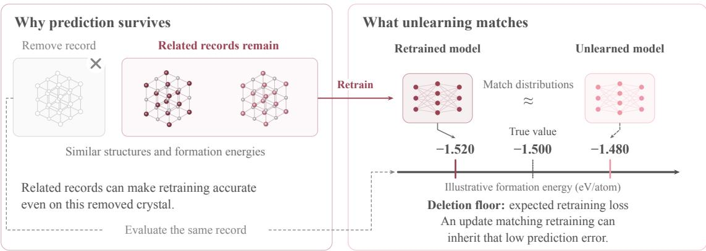
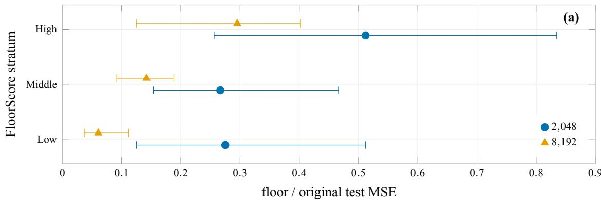
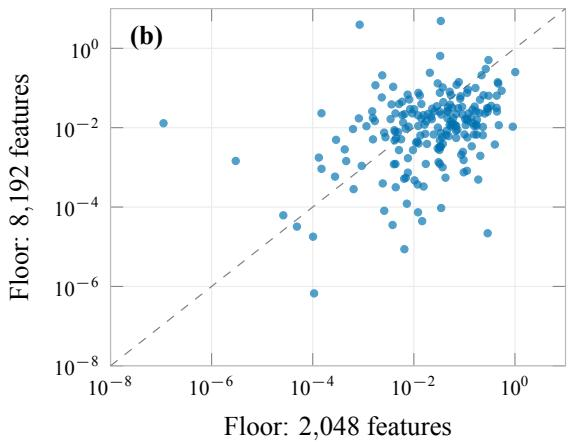
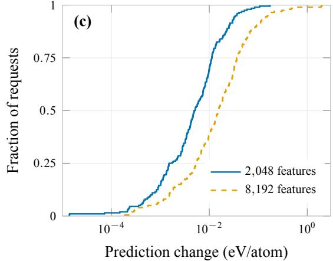
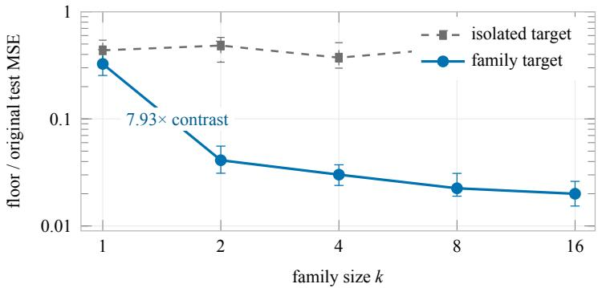

# Bounding Retraining Equivalence and the Deletion Floor in Materials Machine Unlearning

Can Polat 1 Mustafa Kurban 2,3, Erchin Serpedin 1 Hasan Kurban 4,

1 Department of Electrical and Computer Engineering, Texas A&M University, College Station, Texas, USA

2 Department of Electrical and Computer Engineering, Texas A&M University at Qatar, Doha, Qatar

3 Department of Prosthetics and Orthotics, Ankara University, Ankara, Turkey

College of Science and Engineering, Hamad Bin Khalifa University, Doha, Qatar

Correspondence: kurbanm@ankara.edu.tr, hkurban@hbku.edu.qa

## A B S T R A C T

In materials machine learning, closely related retained structures can sustain accurate property predictions even after removing a specific record, rendering post-deletion prediction error an ambiguous metric for machine unlearning. To resolve this ambiguity, we define the deletion floor as the expected target loss under a specified retraining procedure at the deleted request. Standard indistinguishability constraints yield a sharp interval bounding an update’s target loss around this baseline reference. The- oretically, a conditional neighbor bound links a low deletion floor directly to retained fit, prediction regularity, and local label agreement, while an exact ridge identity isolates residual fit from the pre- diction change induced by record deletion. Empirically, controlled redundancy sweeps show an ≈ 8× dro in median normalized retrainin loss when one retained relative remains after deletion. Across two distinct fitting regimes in a paired Materials Project study, the lower-floor regime also exhibits a larger prediction change on more than 50% of the shared requests. Systematic comparisons against approximate updates and the original model decouple deliberate target suppression from preserved overall model utility. Consequently, request-level unlearning evaluations should report reference loss, prediction change, and retained utility together, interpreting post-deletion accuracy against what retraining itself leaves behind.

## 1 Introduction

Materials-property datasets map chemical compositions and crystal structures directly to thermodynamic targets (Ward et al., 2018; Jain et al., 2013). Because ionic substitutions routinely preserve underlying crystal lattices across varying chemical compositions, physically interpretable relationships naturally form among distinct database entries (Hautier et al., 2011). Recent findings in data duplication reveal that retained related examples can sustain original model behavior even after exact retraining (Ye et al., 2025). Consequently, removing a specific record’s training contribution difers fundamentally from eliminating the broader physical behavior represented by that record (Triantafillou et al., 2026).

  
Figure 1 Related materials can keep a removed record predictable. With good retained fit and smooth predictions, remaining relatives can keep retraining loss low; an update matching retraining can preserve that accuracy. The dashed path brings the removed record to the formation-energy comparison, where model arrows identify illustrative predictions beside its true value. The deletion floor is expected retraining loss at that record. Distributional certification requires model-law evidence beyond agreement of individual predictions.

Standard certified removal frameworks evaluate updated models by comparing their output distributions against references trained without the deleted records (Guo et al., 2019; Sekhari et al., 2021). In practice, however, widespread unlearning membership attacks frequently overestimate privacy guarantees (Hayes et al., 2025), while simple accuracy-gap measurements often conflict with distribution-based forgetting scores (Triantafillou et al., 2024). Resolving what accuracy remains after deletion requires examining individual requests against a clear reference. Without establishing what exact retraining itself would predict for a removed target, continued post-deletion accuracy remains an ambiguous signal of unlearning performance.

To resolve this ambiguity, we study individual deletion requests through the deletion floor defined as the expected target loss under a specified retraining procedure. When a model accurately fits retained data and exhibits smooth prediction behavior across neighboring inputs, structural and property redundancies preserve target predictability. This mechanism decouples retained support, reference matching, and deletion sensitivity. Mathematically, a conditional neighbor bound directly connects retained structural support to the deletion floor, while retraining equivalence restricts how far an update’s loss can deviate from this reference. Furthermore, an exact ridge identity isolates residual model fit from the true prediction change induced by record deletion (Figure 1).

We validate these theoretical distinctions through a controlled redundancy sweep alongside 44,344 crystal structures from the Materials Project (MP) (Jain et al., 2013). Exact fixed-feature ridge calculations evaluate the floor and prediction change on identical requests, while approximate updates and unedited baselines expose how target suppression trades of against overall model utility. This work delivers three key contributions:

Derives a request-level reference interval: Formulates a sharp bounded-loss interval that precisely identifies the target losses compatible with approximate retraining equivalence.

Establishes a theoretical mechanism for retained predictability: Proves a conditional neighbor bound linking the deletion floor to retained support, and derives an exact ridge de- composition that separates residual fit from deletion-induced sensitivity.

Proposes a robust evaluation protocol: Demonstrates via synthetic redundancy sweeps and materials benchmarks why reference loss, prediction change, and preserved utility measure distinct properties and must be reported independently.

The remainder of this paper is organized as follows: Section 2 positions our contributions within the unlearning literature, Section 3 presents the mathematical characterization, and Section 4 details experiments across synthetic sweeps, materials fitting regimes, and approximate update procedures. Section 5 outlines the proposed request-level reporting protocol. Appendix A provides mathematical proofs, Appendix B specifies experimental parameters, and Appendix C presents complete operating-point summaries and neural descriptor diagnostics.

## 2 Related work

Retraining objectives and evaluation.. Retraining establishes the baseline benchmark for elimi-nating a record’s training contribution, with certified removal requiring that an updated model’s distribution remain statistically indistinguishable from one trained entirely without that record (Guo et al., 2019; Sekhari et al., 2021). Because exact retraining is computationally expensive, practical approximate algorithms frequently trade theoretical guarantees for eficiency; SCRUB, for instance, balances forgetting objectives against retained utility without providing a distributional certificate (Kurmanji et al., 2023). Consequently, robust evaluation hinges on clarifying both the target objective and the specific properties measured by an evaluation metric. Existing membership inference attacks frequently overestimate privacy protections (Hayes et al., 2025), while simple accuracy-gap metrics often diverge from distribution-based forgetting scores (Triantafillou et al., 2024). Evaluating post-deletion performance thus requires isolating the exact baseline error left by retraining at individual deletion requests.

Duplication, memorization, and retained support.. Data redundancy presents a distinct challenge for unlearning algorithms. Empirical studies by Ye et al. (2025) demonstrate that adversarially duplicated or near-duplicated training instances can preserve original model behavior even after exact retraining. Similarly, Zhao et al. (2024) connect the dificulty of approximate unlearning to data memorization and retain–forget entanglement, showing that low memorization leaves a model’s prediction largely insensitive to the inclusion or exclusion of a specific training point.

Broader behavioral removal.. Removing a specific record’s training influence represents a distinct objective from eliminating the overarching behavioral concept or domain knowledge associated with that record (Triantafillou et al., 2026). Correlated-knowledge unlearning evaluates how inference persists through retained structural relationships (Wu et al., 2024), whereas retain–forget entanglement focuses on unwanted collateral damage inflicted on related retained samples during forgetting (Cheng et al., 2026). Additionally, distributional unlearning selects data subsets to excise entire target distributions while leaving complementary distributions intact (Allouah et al., 2026). Together, these formulations highlight the need to distinguish between broader distribution removal and sample-level reference agreement.

Positioning of this work.. This work investigates the baseline target loss left by exact retraining at individual deletion requests. By defining the deletion floor, we complement existing update algorithms and evaluation metrics by identifying the exact target behavior constrained by reference matching. Building on prior observations of persistence under data duplication and low memorization, we formalize retained support as a theoretical mechanism, connecting it directly to retraining equivalence, local neighbor fit, and ridge leverage. Our bounded-loss transfer theorem delineates the precise loss intervals permitted under indistinguishability, while our exact ridge decomposition decouples retraining accuracy from deletion-induced prediction changes. Paired materials experiments confirm that lower reference loss can coexist with larger prediction sensitivity. Ultimately, these findings establish a reference-based evaluation protocol for regression unlearning, while leaving broader knowledge and distribution removal as distinct objectives.

## 3 Bounding loss around the retraining reference

## 3.1 The deletion floor and bounded-loss transfer

We first define the retraining reference following data deletion. Let $\ b { \mathscr { D } } = ( ( x _ { i } , y _ { i } ) ) _ { i = 1 } ^ { n }$ denote an indexed dataset, where  specifies requested deletion records and  contains remaining indices. Explicit indexing keeps identical record copies distinct. Applying a training procedure ${ \mathcal { A } } _ { \mathrm { t r } }$ to  induces a model distribution law $Q$ over training randomness. At a target deletion request $( x _ { f } , y _ { f } )$ let $h ( \theta ) = \ell ( f _ { \theta } ( x _ { f } ) , y _ { f } )$ be a nonnegative measurable loss with finite expectation under $Q$

Definition 1 Deletion floor. The deletion floor is the expected target loss under the specified retraining procedure,

$$
\Phi ( x _ { f } ; \mathcal { F } , D ) = \mathbb { E } _ { \theta \sim Q } [ h ( \theta ) ] .
$$

Definition 1 quantifies the expected residual error left at the deleted target by retraining. Under squared loss, a low floor indicates that exact retraining inherently predicts the deleted target accurately. Because this benchmark reflects the specific retraining procedure $\scriptstyle A _ { \mathrm { t r } } .$ , alternative estimators may yield losses above or below this reference.

To evaluate what an update algorithm constrained by retraining equivalence can alter, let � represent its output law on the same measurable model space. Symmetric $( \epsilon , \delta )$ retraining equiva- lence requires $P ( S ) \leq e ^ { \epsilon } Q ( S ) + \delta$ and $Q ( S ) \leq e ^ { \epsilon } P ( S ) + \delta$ across all measurable sets � (Guo et al., 2019). By translating standard hypothesis-testing constraints to target loss observables (Kairouz et al., 2015), we establish sharp bounds on the update’s expected loss relative to the floor.

Theorem 1 Sharp bounded-loss transfer. Let $B > 0 , \epsilon \geq 0 , \delta \in [ 0 , 1 ]$ , and let ℎ be a measurable observable taking values in [0, �]. If �, � satisfy symmetric $( \epsilon , \delta )$ retraining equivalence and $\Phi =$ $\mathbb { E } _ { Q } [ h ]$ , then

$$
\begin{array} { r l } & { \operatorname* { m a x } \{ 0 , e ^ { - \epsilon } ( \Phi - \delta B ) , B - e ^ { \epsilon } ( B - \Phi ) - \delta B \} \leq \mathbb { E } _ { P } [ h ] } \\ & { \qquad \leq \operatorname* { m i n } \{ B , e ^ { \epsilon } \Phi + \delta B , B - e ^ { - \epsilon } ( B - \Phi - \delta B ) \} . } \end{array}
$$

For each fixed $( \epsilon , \delta , B , \Phi )$ with $0 \leq \Phi \leq B$ , both endpoints are attainable over bounded observables and admissible pairs, converging to $\Phi \ a s \left( \epsilon , \delta \right) \to \left( 0 , 0 \right)$

Theorem 1 bounds the expected target loss deviation permitted under approximate equivalence. Applying the event inequalities to ℎ and $B - h$ yields the stated interval. Its endpoints converge to $\Phi$ as $( \epsilon , \delta )  ( 0 , 0 )$ , while the two-point construction in Appendix ${ \mathrm { A . 1 } }$ establishes sharpness.

Applying the guarantee to squared error.. Because standard squared error is unbounded, we apply Theorem 1 by defining a clipped loss observable $h _ { B } ( \theta ) = \mathrm { m i n } \{ ( f _ { \theta } ( x _ { f } ) - y _ { f } ) ^ { 2 } , B \}$ for a fixed threshold $B > 0$ . Measurable predictions yield integrable clipped losses $0 \le h _ { B } \le B$ under both � and $Q ,$ , anchored by the clipped reference expectation $\Phi _ { B } = \mathbb { E } _ { Q } [ h _ { B } ]$ . While theoretical bounds govern this clipped observable, our empirical analyses report unclipped raw squared loss to describe full retraining behavior. Local target agreement reflects retraining equivalence, but complete distributional equivalence requires model-law validation beyond scalar agreement at a single point.

A target-error threshold.. When an unlearning objective requires increasing target error to $\mathbb { E } _ { P } [ h ] \ge \tau$ (where $0 < \Phi < \tau < B )$ under pure $( \epsilon , 0 )$ equivalence, both upper bounds in Theorem 1 must simultaneously reach �. Solving for � establishes the necessary equivalence budget:

$$
\epsilon \geq \operatorname* { m a x } \left\{ \log \frac { \tau } { \Phi } , \log \frac { B - \Phi } { B - \tau } \right\} .\tag{1}
$$

The first term quantifies the required loss increase from Φ to $\tau ,$ while the second reflects the corresponding reduction in the complement expectation $B - h$ . For example, elevating expected unit-bounded loss from $\Phi = 0 . 1$ to $\tau = 0 . 5$ requires $\epsilon \geq$ log 5. Equation (1) provides a necessary compatibility condition between target-suppression goals and formal equivalence guarantees; relaxed guarantees with $\delta > 0$ introduce additive slack across the full interval.

## 3.2 How retained support can keep the floor low

To understand why retraining often leaves deleted targets predictable, consider a retained neighbor $\left( x _ { r } , y _ { r } \right)$ near the deleted input $x _ { f }$ under distance metric �. If a retrained model accurately fits $x _ { r } ,$ varies smoothly between inputs, and target labels align, the retained example constrains prediction error on the removed target.

Assumption 1 Uniform retained-neighbor control. For a fixed retained neighbor $\left( x _ { r } , y _ { r } \right)$ assume $f _ { \theta } ( x _ { f } )$ and $f _ { \theta } ( x _ { r } )$ are measurable in �. For �-almost every $\theta ,$ suppose $| f _ { \theta } ( x _ { f } ) - f _ { \theta } ( x _ { r } ) | \leq$ $\bar { L } d ( x _ { f } , x _ { r } )$ and $| f _ { \theta } ( x _ { r } ) - y _ { r } | \leq \bar { \varepsilon }$ for fixed $\bar { L } , \bar { \varepsilon } \geq 0$

Bounding the input distance $d ( x _ { f } , x _ { r } ) \leq \rho$ and label gap $| y _ { f } - y _ { r } | \leq \eta$ , target error decomposes into retained fit error, prediction variation, and label disparity:

$$
\begin{array} { r l } & { | f _ { \theta } ( x _ { f } ) - y _ { f } | \leq \underbrace { | f _ { \theta } ( x _ { r } ) - y _ { r } | } _ { \mathrm { r e t a i n e d f t } } + \underbrace { | f _ { \theta } ( x _ { f } ) - f _ { \theta } ( x _ { r } ) | } _ { \mathrm { p r e d i c t i o n ~ v a r i a t i o n } } + \underbrace { | y _ { r } - y _ { f } | } _ { \mathrm { l a b e l ~ g a p } } } \\ & { \leq \bar { \varepsilon } + \bar { L } \rho + \eta \equiv C ( x _ { f } ) . } \end{array}\tag{2}
$$

Under Assumption 1, taking expectations bounds the absolute-loss floor by $C ,$ while squaring first bounds the squared-loss floor by $C ^ { 2 }$ . Consequently, high retained accuracy, smooth local predictions, and small label gaps jointly guarantee a low deletion floor. For finite neighbor sets, the tightest valid bound holds almost surely across retrained models.

An empirical diagnostic.. We construct a request-level surrogate for the theoretical bound via

$$
\begin{array} { r } { \oint ( x _ { f } ) = ⨏ _ { \mathbf { \epsilon } } + \hat { L } d ( x _ { f } , x _ { r } ) + | y _ { f } - y _ { r } | , } \end{array}
$$

where $x _ { r }$ represents the nearest retained neighbor in standardized descriptor space. Here, $\begin{array} { r } { \Big \{ \qquad \hfill } \end{array}$ is estimated from the original model’s 90th-percentile absolute training residual, and $\hat { l }$ is set to the 99.5th percentile of sampled prediction diference quotients. Because its components are estimated from original-model quantiles rather than uniform bounds over retrained models, FloorScore is a ranking diagnostic, not a certified upper bound on the deletion floor. Neighbor selection is performed prior to evaluating deletion losses, avoiding direct use of the observed deletion losses in constructing the proxy.

## 3.3 An exact ridge connection: fit, leverage and deletion

While neighbor bounds establish suficient conditions for low floors, ridge regression enables exact calculation of retraining residuals and decouples baseline model fit from deletion sensitivity. Consider a feature matrix $A \in \mathbb { R } ^ { n \times p }$ with rows $a _ { i } ^ { \top }$ , target vector $\boldsymbol { y } \in \mathbb { R } ^ { n }$ , and objective $n ^ { - 1 } \| A w -$ $y \| ^ { 2 } + \lambda \| w \| ^ { 2 } \left( n \geq 2 , \lambda > 0 \right)$ minimized by $w _ { D }$ . Because row deletion alters mean-loss normalization from �� to $( n - 1 ) \lambda$ , we define an adjusted full-data estimator $\downarrow$ using the retained-size penalty coeficient:

$$
\boldsymbol { M } = \boldsymbol { A } ^ { \top } \boldsymbol { A } + ( n - 1 ) \boldsymbol { \lambda } \boldsymbol { I } , \qquad \forall = \boldsymbol { M } ^ { - 1 } \boldsymbol { A } ^ { \top } \boldsymbol { y } , \qquad \forall _ { i } = \boldsymbol { a } _ { i } ^ { \top } \boldsymbol { M } ^ { - 1 } \boldsymbol { a } _ { i } .\tag{3}
$$

The adjusted fit $\downarrow$ maintains all training rows while adopting the penalty scaling of the retained system. Applying the Sherman–Morrison identity (Hager, 1989) yields an exact closed-form ex-pression for the retrained residual $r _ { - i }$ and corresponding deletion floor $\Phi _ { i } \mathbf { : }$

$$
r _ { - i } : = a _ { i } ^ { \top } w _ { - i } - y _ { i } = \frac { a _ { i } ^ { \top } \mathbb { \backslash } \mathbb { \backslash } \mathbb { - } y _ { i } } { 1 - h _ { i } } , \qquad \Phi _ { i } = r _ { - i } ^ { 2 } .\tag{4}
$$

The denominator is strictly positive because $M - a _ { i } a _ { i } ^ { \top } = A _ { - i } ^ { \top } A _ { - i } + ( n - 1 ) \lambda I$ is positive definite, which implies $\not R _ { i } < 1$ . Equation (4) reveals that retraining error is governed jointly by the adjusted full-data residual $a _ { i } ^ { \top } \psi - y _ { i }$ and the deleted point’s leverage $\not { h _ { i } }$ . A small adjusted residual yields a low deletion floor provided leverage remains bounded away from one, whereas high full-data residual error carries over into large retraining loss.

Comparing predictions before and after deletion isolates model sensitivity to record removal. Defining full-model residual $\begin{array} { r } { r _ { i } = a _ { i } ^ { \top } w _ { D } - y _ { i } } \end{array}$ , deletion response is captured by target prediction change $| r _ { i } - r _ { - i } |$ . Because squared losses discard residual signs, evaluating prediction change requires signed residual tracking. We decompose the total prediction change into penalty rescaling and row removal components:

$$
a _ { i } ^ { \top } ( w _ { - i } - w _ { D } ) = \underbrace { \lambda a _ { i } ^ { \top } M ^ { - 1 } w _ { D } } _ { \mathrm { p e n a l t y ~ r e s c a l i n g } } + \underbrace { \frac { \not h _ { i } \not h _ { i } } { 1 - \not h _ { i } } } _ { \mathrm { r e m o v i n g ~ t h e ~ r o w } } ,\tag{5}
$$

where $\forall _ { i } = a _ { i } ^ { \top } \forall - y _ { i }$ . Equation (5) demonstrates that a highly accurate model fit can still exhibit strong prediction sensitivity upon record removal, motivating joint measurement of retraining floors and deletion changes.

Why the no-update reference matters.. The unedited original model serves as a necessary control because baseline predictions may already align closely with retraining outcomes. To formalize this intuition, consider $n \geq 2$ and diferentiable, $\mu -$ strongly convex objectives $( \mu > 0 )$ sharing a regularizer. Assuming per-example gradient norms are bounded by � and model predictions are $L _ { p }$ -Lipschitz in parameters $( G , L _ { f } \geq 0 )$ , unconstrained minimizers satisfy the leave-one-out stability bound:

$$
| f _ { w _ { D } } ( x _ { f } ) - f _ { w _ { R } } ( x _ { f } ) | \leq \frac { 2 G L _ { p } } { \mu n } .\tag{6}
$$

The $O ( 1 / n )$ scaling in Equation (6) confirms that small original-to-retrained prediction shifts occur naturally in stable models, highlighting why no-update controls are indispensable when evaluating update agreement against retraining benchmarks.

## 4 Experiments and results

Empirical evaluations demonstrate how data redundancy and fitting capacity shape the retraining reference, establishing the benchmark against which approximate unlearning updates and unedited baselines are assessed across matched requests.

## 4.1 Shared reference and measurement protocol

Evaluating deletion behavior requires tracking both loss relative to the retraining reference and physical prediction shifts. For each single-example deletion request �, we record the squared target loss $e _ { i } ,$ its corresponding retraining floor $\Phi _ { i }$ , and the normalized error ratio $q _ { i } = e _ { i } / \operatorname* { m a x } ( \Phi _ { i } , 1 0 ^ { - 1 2 } )$ Predictive utility is measured by test MSE relative to the original model. To isolate distinct predic- tion shifts, let $\bar { \psi } _ { i } ^ { D } , \bar { \psi } _ { i } ^ { R }$ , and $\mathbf { \mathcal { Y } } _ { i } ^ { U }$ denote predictions from the original, retrained, and updated models, respectively. The deletion-induced prediction change $| \bar { y } _ { i } ^ { D } - \bar { y } _ { i } ^ { R } |$ measures original model sensitivity to record removal, while the update-to-reference prediction distance $| { \sqrt { y } } _ { i } ^ { U } - { \sqrt { y } } _ { i } ^ { R } |$ measures update deviation from retraining. The scalar loss gap $g _ { i } = \vert e _ { i } - \Phi _ { i } \vert$ relates directly to the normalized ratio via

$$
g _ { i } = \left| \operatorname* { m a x } ( \Phi _ { i } , 1 0 ^ { - 1 2 } ) q _ { i } - \Phi _ { i } \right| .\tag{7}
$$

The safeguard denominator $1 0 ^ { - 1 2 }$ ensures numeric stability for near-zero reference losses with- out altering observed ratios, as all measured ridge floors exceed $1 . 1 2 \times 1 0 ^ { - 7 } ~ \mathrm { ( e V / a t o m ) ^ { 2 } }$ . Thus, Equation (7) unifies target loss comparisons while prediction distances capture directional shifts.

To isolate data-level efects, the materials ridge reference refits weights on retained rows while holding feature standardization, RFF kernel bandwidth, and random projections fixed (Rahimi and Recht, 2007). This conditional procedure, denoted $\mathcal { A } _ { \mathrm { t r } } ( \cdot ; T _ { D } )$ , preserves the request’s contribution to learned preprocessing $T _ { D }$ . Under deterministic ridge fitting, the squared residual equals the expected loss floor under fixed hyperparameters, with across-request medians reporting cen- tral tendencies. Score thresholds are calculated within each diagnostic sample, and request-level distributions accompany aggregate medians.

## 4.2 Retraining residuals across controlled redundancy settings

Retained family members substantially reduce retraining loss even after a target record is removed. We evaluate synthetic datasets constructed with 90 prototype families and 160 isolated points in a six-dimensional descriptor space, where labels generated from a smooth random-feature function are corrupted by additive noise. Across family sizes $k \in \left\{ 1 , 2 , 4 , 8 , 1 6 \right\}$ and total dataset sizes $9 0 k + 1 6 0$ we assess 300 independent trials, deleting one family member and one isolated control separately and normalizing floors by original test MSE.

Transitioning from $k = 1$ (where deletion removes the sole family member) to $k = 2$ (leaving one retained relative) produces a dramatic 7.934× drop in median normalized retraining loss, from 0.326 down to 0.041. Additional family members yield diminishing loss reductions, reaching a median floor of 0.020 (≈ 2% of test MSE) at $k = 1 6$ . In contrast, isolated controls retain higher median normalized retraining losses than family targets throughout the sweep, consistent with retained family support contributing to lower target loss.

## 4.3 Materials floors depend on the fitting regime

Deletion floors vary systematically with model capacity and regularization. We analyze 44,344 crystal structures (35,476 train, 8,868 test) from the MP using 134 structural and chemical descriptors targeting formation energy per atom. Two distinct ridge regimes evaluate exact retained residuals: a 2,048-feature model $( \lambda = 1 0 ^ { - 6 }$ , 200 diagnostic requests) and an 8,192-feature model $( \lambda = 1 0 ^ { - 8 }$ , 300 diagnostic requests), coupling feature count and regularization across separate diagnostic samples.

The fitting regime strongly modulates the relationship between the local structural proxy FloorScore and actual retraining loss (Figure 2(a)). In the 2,048-feature setting, low-, middle-, and high-FloorScore requests exhibit median normalized floors of 0.275, 0.267, and 0.512. The 8,192-feature, lower-penalty regime lowers the corresponding medians to 0.0605, 0.142, and 0.295—yielding a 4.88× high-to-low contrast and rank correlation of 0.261—while simultaneously reducing training MSE from 0.0754 to 0.0166 and test MSE from 0.0870 to 0.0704. These results show that FloorScore is a setting-dependent diagnostic whose empirical stratification varies with the fitting regime.

## 4.4 Lower floors can coexist with larger deletion changes

Evaluating identical deletion requests reveals that higher model accuracy does not imply lower deletion sensitivity. We compare both fitting regimes on a shared set of 200 deletion requests using identical train/test splits.

The paired medians embedded in Figure 2 show that the 8,192-feature setting has smaller original and retrained residuals but larger adjusted leverage and deletion-induced prediction change. Compared with the 2,048-feature baseline, it achieves a lower retraining floor on 132 of200 requests while exhibiting a larger prediction change on 172 requests, dropping median squared retraining loss from 0.0324 to 0.0118 $\mathrm { ( e V / a t o m ) ^ { 2 } }$ while increasing median prediction change from 0.00503 to 0.0152 eV/atom (Figure 2(b)–(c)).

On 104 individual requests, the 8,192-feature, lower-penalty regime predicts removed targets more accurately after retraining despite moving predictions farther from the original fits. This decoupling highlights that retraining floors evaluate post-deletion accuracy, whereas prediction changes quantify target sensitivity.

<table><tr><td>Setting</td><td>Original  $\left| \boldsymbol { r } _ { i } \right|$ </td><td>Retrained  $| r _ { - i } |$ </td><td>Leverage  $\widetilde { h } _ { i }$ </td><td>Prediction change</td></tr><tr><td>2,048 features</td><td>0.1698</td><td>0.1800</td><td>0.0346</td><td>0.00503</td></tr><tr><td>8,192 features</td><td>0.0845</td><td>0.1086</td><td>0.1692</td><td>0.01523</td></tr></table>

  
Figure 2 Lower retraining loss can accompany larger prediction changes after deletion. (a) Median normalized floors across FloorScore strata for the 2,048-feature $( \lambda = 1 0 ^ { - 6 } )$ and 8,192-feature $( \lambda = 1 0 ^ { - 8 } )$ fits; error bars are 95% request-bootstrap intervals. Their diagnostic samples contain 200 and 300 requests, respectively, and difer across fits. The embedded table reports medians on a separate paired cohort of 200 shared requests: original and retrained absolute residuals and prediction changes are in eV/atom, while adjusted leverage is dimensionless. (b) Paired squared retraining losses in $( \mathrm { e V / a t o m } ) ^ { 2 } ;$ 132 points fall below equality. (c) Empirical distributions of deletion-induced prediction changes; the 8,192-feature setting has the larger change on 172 requests. Feature count and regularization vary jointly.

## 4.5 Target loss and retained utility at fixed operating points

Approximate unlearning interventions reveal a trade-of between target suppression and preserved overall model utility. Using the shared cohort of 200 requests in the 2,048-feature setting $( \lambda = 1 0 ^ { - 6 } )$ we compare approximate updates against exact retraining and the unedited no-update control (Table 1).

Evaluated updates start from independent copies of the original model under fixed hyperpa- rameter settings: NegGrad+ (Kurmanji et al., 2023) (30 updates combining target loss ascent with retain loss descent), SCRUB-style regression (Kurmanji et al., 2023) (40 alternating ascent/teachermatching updates), Newton-style removal (1 damped Hessian step), retain fine-tuning (60 steps), random relabeling (40 steps), and gradient ascent (30 target ascent steps), all using learning rate 0.010 and retained minibatches $\le 2 5 6$

Table 1 Increasing target error can also reduce predictive utility. A target-loss ratio above one indicates greater error than retraining, and a test-MSE ratio above one indicates worse utility than the original model. Gradient ascent raises both ratios. Several other updates remain near the no-update control. Entries are medians over 200 shared requests in full-corpus ridge with 2,048 features and $\lambda = 1 0 ^ { - 6 }$ at the fixed update settings.
<table><tr><td>Procedure</td><td>Target loss / floor</td><td>Test MSE ratio</td></tr><tr><td>Retrain (reference)</td><td>1.000</td><td>1.000</td></tr><tr><td>No update</td><td>0.932</td><td>1.000</td></tr><tr><td>Retain fine-tuning</td><td>0.930</td><td>1.000</td></tr><tr><td>Newton-style update</td><td>0.934</td><td>1.000</td></tr><tr><td>Random relabeling</td><td>0.928</td><td>1.000</td></tr><tr><td>SCRUB-style regression</td><td>1.141</td><td>1.001</td></tr><tr><td>NegGrad+</td><td>1.645</td><td>1.013</td></tr><tr><td>Gradient ascent</td><td>3.081</td><td>1.083</td></tr></table>

The unedited control exhibits a median target-loss/floor ratio of 0.932 and reference distance of 0.00503 eV/atom. Retain fine-tuning, Newton-style updates, and random relabeling closely mirror the control’s loss ratio and test utility. In contrast, gradient ascent forces target loss to 3.081× the reference while increasing test MSE by 8.3% (1.083× ratio). These results emphasize that target loss inflation alone does not signify successful unlearning unless evaluated alongside reference agreement and retained utility.

## 5 Evaluation protocol and scope

Unlearning evaluations must decouple post-deletion accuracy from record sensitivity: the deletion floor quantifies what a specified retraining reference predicts, whereas prediction change measures model sensitivity to record removal. Because higher post-retraining accuracy can coexist with larger prediction shifts, reporting both properties is necessary to contextualize unlearning performance.

A request-level reporting protocol.. Evaluations should explicitly define the target deletion ob- jective, training reference, and any refitted preprocessing steps. For each request, benchmarks should report original, retrained, and updated target losses, deletion-induced prediction changes, update-to-reference prediction distances (when available), and retained test utility, alongside an unedited original model as a no-update control. Retaining signed residuals enables exact recovery of prediction shifts under squared loss. Comparing predictions across original, retrained, and up- dated models isolates true update efects beyond baseline reference agreement, whereas proving formal retraining equivalence requires distributional certification beyond scalar point agreement.

Interpreting operating points.. Evaluating approximate updates requires measuring target loss shifts against both reference floors and preserved utility. An update satisfying retraining equiv-alence naturally remains accurate when the reference deletion floor is low. Conversely, target- suppression interventions elevate loss above the floor, requiring separate utility accounting; for example, gradient ascent forces target loss higher while degrading overall test utility. Because squared loss discards residual signs and near-zero reference floors produce artificially inflated loss ratios, evaluations should report full request-level distributions and explicit loss normalizations alongside aggregate medians.

Scope and limitations.. These findings reflect specific experimental and theoretical scopes. In controlled sweeps, global redundancy scales jointly with total dataset size, while in materials stud- ies, feature dimension and regularization vary together under fixed descriptors, preprocessing, and model architectures. Crystal graph neural network diagnostics provide exploratory observations per request, and FloorScore serves as a setting-dependent proxy whose empirical rank correlation varies with model capacity. Additionally, leave-one-out stability bounds assume uniform gradient control. Broader behavioral removal, comparative hyperparameter tuning, distributional certification, and end-to-end refitting of learned representations remain distinct objectives requiring expanded frameworks. Within this scope, our protocol provides transparent accounting of retraining references and update behavior.

## 6 Conclusion

The deletion floor establishes an explicit baseline for evaluating regression unlearning by mea- suring the residual target error left by exact retraining. Retraining equivalence restricts updated models around this reference, retained structural support maintains low reference loss, and ridge leverage explains how accurate retraining can remain highly sensitive to record removal. Across synthetic redundancy sweeps and materials benchmarks, empirical measurements confirm that lower reference loss frequently coexists with larger prediction sensitivity. Consequently, continued post-deletion accuracy can only be interpreted relative to reference floors and target objectives. Standardizing unlearning evaluation requires reporting retraining predictions, record removal shifts, and retained model utility together.

## Reproducibility statement

The accompanying repository (https://github.com/KurbanIntelligenceLab/materials-unlea rning) contains implementation details, data provenance, environment information, result records, and verification scripts. It also includes Lean 4 formalizations verifying bounded-loss transfer and sharpness, endpoint convergence, target-error thresholds, retained-neighbor bounds, ridge identities, and conditional leave-one-out stability.

## Ethics statement

This study uses synthetic data and public materials-property records, involving no human subjects or personal data. Demonstrating that retained structural support preserves target accuracy after deletion is a technical observation and should not be used to infer compliance with specific legal or regulatory data removal mandates. Applications seeking broader behavioral concept removal require evaluations tailored to that specific objective.

## Use of AI statement

Generative AI tools assisted with literature review, text polishing, code development, and data analysis. The submitting authors retain full responsibility for the final text, theoretical proofs, cited sources, code, and reported empirical findings.

## References

Youssef Allouah, Rachid Guerraoui, and Sanmi Koyejo. Distributional machine unlearning via selective data removal. In International Conference on Learning Representations, volume 2026, pages 119258–119289, 2026.

Olivier Bousquet and André Elisseef. Stability and generalization. Journal of machine learning research, 2 (Mar):499–526, 2002.

Jingpu Cheng, Ping Liu, Qianxiao Li, and Chi Zhang. Machine unlearning under retain-forget entanglement. arXiv preprint arXiv:2603.26569, 2026.

Bradley Efron. Bootstrap methods: Another look at the jackknife. The Annals of Statistics, 7(1):1–26, 1979. doi: 10.1214/aos/1176344552.

Chuan Guo, Tom Goldstein, Awni Hannun, and Laurens Van Der Maaten. Certified data removal from machine learning models. arXiv preprint arXiv:1911.03030, 2019.

William W Hager. Updating the inverse of a matrix. SIAM review, 31(2):221–239, 1989.

Geofroy Hautier, Chris Fischer, Virginie Ehrlacher, Anubhav Jain, and Gerbrand Ceder. Data mined ionic substitutions for the discovery of new compounds. Inorganic chemistry, 50(2):656–663, 2011.

Jamie Hayes, Ilia Shumailov, Eleni Triantafillou, Amr Khalifa, and Nicolas Papernot. Inexact unlearning needs more careful evaluations to avoid a false sense of privacy. In 2025 IEEE Conference on Secure and Trustworthy Machine Learning (SaTML), pages 497–519. IEEE, 2025.

Anubhav Jain, Shyue Ping Ong, Geofroy Hautier, Wei Chen, William Davidson Richards, Stephen Dacek, Shreyas Cholia, Dan Gunter, David Skinner, Gerbrand Ceder, et al. Commentary: The materials project: A materials genome approach to accelerating materials innovation. APL materials, 1(1):011002, 2013. doi: 10.1063/1.4812323.

Peter Kairouz, Sewoong Oh, and Pramod Viswanath. The composition theorem for diferential privacy. In International conference on machine learning, pages 1376–1385. PMLR, 2015.

Diederik P Kingma and Jimmy Ba. Adam: A method for stochastic optimization. arXiv preprint arXiv:1412.6980, 2014.

Meghdad Kurmanji, Peter Triantafillou, Jamie Hayes, and Eleni Triantafillou. Towards unbounded machine unlearning. Advances in neural information processing systems, 36:1957–1987, 2023.

Ali Rahimi and Benjamin Recht. Random features for large-scale kernel machines. Advances in neural information processing systems, 20, 2007.

Ayush Sekhari, Jayadev Acharya, Gautam Kamath, and Ananda Theertha Suresh. Remember what you want to forget: Algorithms for machine unlearning. Advances in Neural Information Processing Systems, 34: 18075–18086, 2021.

Eleni Triantafillou, Peter Kairouz, Fabian Pedregosa, Jamie Hayes, Meghdad Kurmanji, Kairan Zhao, Vincent Dumoulin, Julio Jacques Junior, Ioannis Mitliagkas, Jun Wan, et al. Are we making progress in unlearning? findings from the first neurips unlearning competition. arXiv preprint arXiv:2406.09073, 2024.

Eleni Triantafillou, Ahmed Imtiaz Humayun, Monica Ribero, Alexander Matt Turner, Michael C Mozer, and Georgios Kaissis. Is your algorithm unlearning or untraining? arXiv preprint arXiv:2604.07962, 2026.

Logan Ward, Alexander Dunn, Alireza Faghaninia, Nils ER Zimmermann, Saurabh Bajaj, Qi Wang, Joseph Montoya, Jiming Chen, Kyle Bystrom, Maxwell Dylla, et al. Matminer: An open source toolkit for materials data mining. Computational Materials Science, 152:60–69, 2018.

Ruihan Wu, Chhavi Yadav, Russ Salakhutdinov, and Kamalika Chaudhuri. Evaluating deep unlearning in large language models. arXiv preprint arXiv:2410.15153, 2024.

Tian Xie and Jefrey C Grossman. Crystal graph convolutional neural networks for an accurate and interpretable prediction of material properties. Physical review letters, 120(14):145301, 2018.

Dayong Ye, Tianqing Zhu, Jiayang Li, Kun Gao, Bo Liu, Leo Yu Zhang, Wanlei Zhou, and Yang Zhang. Data duplication: A novel Multi-Purpose attack paradigm in machine unlearning. In 34th USENIX Security Symposium (USENIX Security 25), pages 6399–6418, 2025.

Kairan Zhao, Meghdad Kurmanji, George-Octavian Barbulescu, Eleni Triantafillou, and Peter Triantafillou. What makes unlearning hard and what to do about it. Advances in Neural Information Processing Systems, 37:12293–12333, 2024.

## APPENDIX

## A Proofs of the main characterization

## A.1 Proof of Theorem 1: bounded-loss transfer

The bounded-loss transfer theorem establishes how symmetric $( \epsilon , \delta )$ retraining equivalence re- stricts expected loss shifts relative to the retraining reference floor Φ.

Proof of Theorem 1. Applying hypothesis-testing constraints on bounded observables (Kairouz et al., 2015), let $a = e ^ { \epsilon }$ . For any measurable loss $h \in [ 0 , B ]$ , the layer-cake representation combined with distributional indistinguishability $P ( S ) \leq a Q ( S ) + \delta$ yields

$$
\mathbb { E } _ { P } [ h ] = \int _ { 0 } ^ { B } P ( h > t ) d t \le a \int _ { 0 } ^ { B } Q ( h > t ) d t + \delta B = a \Phi + \delta B .
$$

Reversing the roles of� and $Q$ gives the lower bound $\mathbb { E } _ { P } [ h ] \ge a ^ { - 1 } ( \Phi - \delta B )$ . Applying these identical constraints to the complementary bounded observable $B - h$ establishes

$$
\mathbb { E } _ { P } [ h ] \ge B - a ( B - \Phi ) - \delta B , \qquad \mathbb { E } _ { P } [ h ] \le B - a ^ { - 1 } ( B - \Phi - \delta B ) .
$$

Intersecting these four inequalities with the physical loss range $0 \leq \mathbb { E } _ { P } [ h ] \leq B$ completes the proof of the transfer interval.

To prove sharpness, normalize by � and define $q = \Phi / B .$ . Consider a two-point sample space with observable $h = B \mathbf { 1 } _ { S }$ , setting $Q ( S ) = q$ and $P ( S ) = p .$ . Symmetric $( \epsilon , \delta )$ -indistinguishability reduces to the four joint constraints

$$
\begin{array} { r } { p \leq a q + \delta , \quad q \leq a p + \delta , \quad 1 - p \leq a ( 1 - q ) + \delta , \quad 1 - q \leq a ( 1 - p ) + \delta , } \end{array}
$$

subject to $0 \leq p \leq 1$ . The feasible interval for $\boldsymbol { p }$ corresponds exactly to the normalized upper and lower bounds of Theorem 1. Feasibility is guaranteed because $\ p = q$ satisfies all constraints for valid parameters. Endpoint attainability holds across all $0 \leq \Phi \leq B ,$ including extreme points $q = 0$ and $q = 1 . \ A s ( \epsilon , \delta )  ( 0 , 0 )$ , the maximum defining the lower endpoint and the minimum defining the upper endpoint both converge to Φ.

Justification of Equation (1).. Under pure $( \epsilon , 0 )$ equivalence $( \delta \ : = \ : 0 )$ , requiring updated target error to reach $\mathbb { E } _ { P } [ h ] \ge \tau$ (where $0 < \Phi < \tau < B )$ forces both upper bounds in Theorem 1 to be at least $\tau ,$ namely $e ^ { \epsilon } \Phi \ge \tau$ and $B - e ^ { - \epsilon } ( B - \Phi ) \geq \tau$ . Taking logarithms yields the two necessary constraints in Equation (1), defining the minimum equivalence budget � compatible with the target error objective.

## A.2 Justification of the retained-neighbor bound

Justification of Equation (2). Under uniform retained-neighbor control (Assumption 1), target error at deletion request $x _ { f }$ decomposes into retained neighbor fit, local prediction variation, and label disparity. For �-almost every retrained predictor $\theta ,$ triangle inequality yields

$$
| f _ { \theta } ( x _ { f } ) - y _ { f } | \leq | f _ { \theta } ( x _ { f } ) - f _ { \theta } ( x _ { r } ) | + | f _ { \theta } ( x _ { r } ) - y _ { r } | + | y _ { r } - y _ { f } | \leq \bar { L } \rho + \bar { \varepsilon } + \eta \equiv C ( x _ { f } ) .
$$

Because $C ( x _ { f } )$ is deterministic and nonnegative, taking expectations bounds absolute loss by $\mathbb { E } _ { Q } [ | f _ { \theta } ( x _ { f } ) - y _ { f } | ] \le C ( x _ { f } )$ , while squaring first yields squared loss bound $\mathbb { E } _ { Q } [ ( f _ { \theta } ( x _ { f } ) - y _ { f } ) ^ { 2 } ] \ \leq$ $C ( x _ { f } ) ^ { 2 }$ . For clipped squared loss, expectation is bounded by min $\ [ C ( x _ { f } ) ^ { 2 } , B \}$ . For any finite collection of valid retained neighbors, intersecting their measure-one validity sets preserves a measure-one domain where the minimum bound remains valid.

## A.3 Derivation of the ridge identities

Derivation ofEquations (4) and (5). Define the retained normal matrix $H _ { - i } = A _ { - i } ^ { \top } A _ { - i } + ( n - 1 ) \lambda I =$ $M - a _ { i } a _ { i } ^ { \top }$ . For $n \geq 2$ and $\lambda > 0$ , both $H _ { - i }$ and � are positive definite. Setting $t = a _ { i } ^ { \top } H _ { - i } ^ { - 1 } a _ { i } \geq 0$ Sherman–Morrison rank-one update formulas yield adjusted leverage $\not h _ { i } = t / ( 1 + t ) < 1$ , ensuring positive leverage denominators $1 - { \mathbb { H } } _ { i } > 0$

The stationarity condition for retained ridge fitting is

$$
( M - a _ { i } a _ { i } ^ { \top } ) w _ { - i } = A ^ { \top } y - a _ { i } y _ { i } .
$$

Multiplying by $M ^ { - 1 }$ and isolating the weight vector gives $w _ { - i } = { \not \downarrow } + M ^ { - 1 } a _ { i } ( a _ { i } ^ { \top } w _ { - i } - y _ { i } )$ . Taking the inner product with $a _ { i } ^ { \top }$ , subtracting target $y _ { i } .$ , and solving for residual $r _ { - i } = a _ { i } ^ { \top } w _ { - i } - y _ { i }$ yields the exact leave-one-out residual identity in Equation (4).

For prediction change, comparing full minimizer $( M { + } \lambda I ) w _ { D } = A ^ { \top } y$ with adjusted fit $M \ d \mathbf { \ b { u } } = \ b { A } ^ { \top } \ b { y }$ gives parameter shift $\surd - w _ { D } = \lambda M ^ { - 1 } w _ { D }$ . Subtracting predictions yields

$$
a _ { i } ^ { \top } ( w _ { - i } - w _ { D } ) = a _ { i } ^ { \top } ( \downarrow - w _ { D } ) + ( r _ { - i } - \lfloor _ { i } ^ { \downarrow } ) = \lambda a _ { i } ^ { \top } M ^ { - 1 } w _ { D } + \frac { \not H _ { i } \not n _ { i } } { 1 - \not H _ { i } } ,
$$

proving Equation (5).

Under an unnormalized penalty $\alpha > 0$ , full matrix $M = A ^ { \top } A + \alpha I$ uses unadjusted full fit $w _ { D }$ and standard leverage $h _ { i } = a _ { i } ^ { \top } M ^ { - 1 } a _ { i }$ , yielding residual ratio $r _ { - i } = r _ { i } / ( 1 - h _ { i } )$ and squared loss ratio $r _ { i } ^ { 2 } / \Phi _ { i } = ( 1 - h _ { i } ) ^ { 2 }$ . When penalty � is defined per sample mean loss, adjusted matrix � provides the exact sample-size normalization correction.

## A.4 Leave-one-out stability: statement and proof

Leave-one-out stability bounds quantify how record deletion impacts parameter estimation in strongly convex objectives (Bousquet and Elisseef, 2002). Let $n \geq 2$ , let $\ell _ { i } ( \boldsymbol { w } )$ be example losses, and let $r ( w )$ be a diferentiable regularizer. Objective functions $\begin{array} { r } { F _ { D } ( w ) = \frac { 1 } { n } \sum _ { i \in D } \ell _ { i } ( w ) + r ( w ) } \end{array}$ and $\begin{array} { r } { F _ { \mathcal { R } } ( w ) = \frac { 1 } { n - 1 } \sum _ { i \in \mathcal { R } } \ell _ { i } ( w ) + r ( w ) } \end{array}$ are �-strongly convex $( \mu > 0 )$ with minimizers $w _ { D } , w _ { R }$ . Assuming loss gradients are bounded $\| \nabla \ell _ { i } ( w ) \| \leq G$ and predictions are $L _ { p }$ -Lipschitz in parameters, parameter shift satisfies $\left\| w _ { D } - w _ { \mathcal { R } } \right\| \leq 2 G / ( \mu n )$ , proving Equation (6).

Proofofthe leave-one-out stability bound. Stationarity of the retained objective gives $\nabla r ( w _ { \mathcal { R } } ) =$ $\begin{array} { r l } { - ( n - 1 ) ^ { - 1 } \sum _ { i \in \mathcal { R } } \nabla \ell _ { i } ( w _ { \mathcal { R } } ) } & { { } } \end{array}$ . Substituting into the full gradient $\nabla F _ { D } ( w _ { R } )$ yields

$$
\nabla F _ { D } ( w _ { \mathcal { R } } ) = \frac { 1 } { n } \left( \nabla \ell _ { f } ( w _ { \mathcal { R } } ) - \frac { 1 } { n - 1 } \sum _ { i \in { \mathcal { R } } } \nabla \ell _ { i } ( w _ { \mathcal { R } } ) \right) , \qquad \| \nabla F _ { D } ( w _ { \mathcal { R } } ) \| \le \frac { 2 G } { n } .
$$

Strong convexity of $F _ { D }$ at stationarity $\nabla F _ { D } ( w _ { D } ) = 0$ implies

$$
\mu \| w _ { \mathcal { R } } - w _ { \mathcal { D } } \| ^ { 2 } \leq \left. \nabla F _ { \mathcal { D } } ( w _ { \mathcal { R } } ) , w _ { \mathcal { R } } - w _ { \mathcal { D } } \right. \leq \frac { 2 G } { n } \| w _ { \mathcal { R } } - w _ { \mathcal { D } } \| .
$$

Dividing by $\| w _ { \mathcal { R } } - w _ { D } \|$ yields $\| w _ { \mathcal { R } } - w _ { \mathcal { D } } \| \leq 2 G / ( \mu n )$ . Applying prediction Lipschitz continuity $| f _ { w _ { D } } ( x _ { f } ) - f _ { w _ { R } } ( x _ { f } ) | \leq L _ { p } \| w _ { D } - w _ { R } \|$ completes the proof of Equation (6). ■

The $O ( 1 / n )$ asymptotic decay relies on uniform gradient bounds � and positive lower bound $\mu >$ 0. For mean-squared loss, $\mu = 2 \lambda$ provides strong convexity, though unrestricted regression lacks global gradient bounds. Thus, algorithmic stability provides a conditional theoretical mechanism for low prediction sensitivity, whereas exact ridge identities provide unconstrained exact calculations.

## B Experimental details

## B.1 Controlled family construction

To systematically analyze the impact of structural redundancy on deletion floors, we construct a synthetic benchmark in a six-dimensional descriptor space using 300 cosine Random Fourier Features (RFFs). Projection frequencies are drawn from a standard Gaussian distribution $N ( 0 , I )$ phases are sampled uniformly over [0, 2�), and latent target function weights are initialized from a Gaussian distribution with standard deviation 0.30. Target evaluations share a fixed latent function and a held-out set of 1,500 noiseless test points across all sweep evaluations.

Each generated dataset contains 90 prototype family centers (coordinate standard deviation 1.5) with within-family perturbations (standard deviation 0.05) alongside 160 isolated background points, yielding labels corrupted by additive Gaussian noise with standard deviation 0.02. Model training uses ridge regression with regularization parameter $\lambda = 1 0 ^ { - 4 }$ under mean-squared error. Across family sizes $k \in \{ 1 , 2 , 4 , 8 , 1 6 \}$ (scaling total dataset size as $9 0 k + 1 6 0 )$ , we evaluate 300 independently generated dataset draws, refitting ridge weights after deleting a family member and an isolated control separately. The resulting family-size sweep is summarized in Figure A1.

  
Figure A1 Retained relatives can keep a deleted family member predictable. Increasing family size from $k = 1$ to $k = 2$ leaves one relative after deletion and sharply lowers the median normalized retraining loss. Isolated controls remain higher throughout the sweep. Loss is divided by each draw’s original-model test MSE, and error bars are 95% bootstrap intervals over 300 generated datasets and targets per family size. All 90 families grow together, coupling redundancy with total training size.

## B.2 Materials representation and reference

The real-world evaluation uses 44,344 crystal structures extracted from the MP export, filtered by maximum site count $n _ { \mathrm { s i t e s } } ~ \leq ~ 2 0$ , energy above hull $\leq \ 0 . 0 8$ eV/atom, and formation energy $\leq 2 \ \mathrm { e V } / \mathrm { a t o m }$ . Structures are randomly partitioned into 35,476 training entries and 8,868 test entries, targeting formation energy per atom in eV/atom.

Each crystal structure is parameterized by 134 features: 94 elemental composition fractions, 8 global geometric attributes, and a 32-bin pair-distance radial histogram spanning 0–12 Å. Standardized feature vectors � map through a cosine RFF kernel $\phi ( x ) = { \sqrt { 2 / p } } \cos ( W x + b )$ , where weights $W _ { i j } \sim N ( 0 , \gamma ^ { 2 } )$ and bias $b _ { j } \sim \mathrm { U n i f } [ 0 , 2 \pi )$ . Kernel bandwidth $\gamma$ is set to the inverse median non-zero Euclidean distance across 4,000 randomly sampled training pairs. Feature standardization, bandwidth parameters, and RFF projections remain fixed during deletion, ensuring that exact retraining refits linear weights under identical mean-loss penalties. The two fitting regimes and their train/test errors are summarized in Table A1.

Table A1 The higher-feature, lower-penalty setting fits both training and test data better. Both settings use the same train/test partition, and MSE is reported in (eV/atom)2. The table compares fitting regimes with feature count and regularization coupled. Diagnostic requests are sampled separately; the paired comparison uses the same 200 targets.
<table><tr><td>Features p</td><td>λ</td><td>Diagnostic requests</td><td>Train MSE</td><td>Test MSE</td></tr><tr><td>2,048</td><td> $1 0 ^ { - 6 }$ </td><td>200</td><td>0.0753784</td><td>0.0869666</td></tr><tr><td>8,192</td><td> $1 0 ^ { - 8 }$ </td><td>300</td><td>0.0166086</td><td>0.0703859</td></tr></table>

## B.3 Request sampling and uncertainty

Diagnostic deletion requests are sampled uniformly without replacement from the training set, reserving a shared cohort of 200 requests for paired-regime and operating-point evaluations.

The empirical proxy FloorScore identifies the nearest retained structural neighbor in standardized descriptor space. Its regularity estimate $\underline { { \boldsymbol { \hat { l } } } }$ corresponds to the 99.5th percentile of prediction diference quotients across 20,000 sampled pairs, while residual estimate $\begin{array} { r } { \Big \{ \qquad \hfill } \end{array}$ matches the original model’s 90th-percentile absolute training residual. Score tertiles are computed independently within each diagnostic sample. Statistical uncertainty is quantified via 95% percentile bootstrap confidence intervals (Efron, 1979), drawing 10,000 resamples for ridge strata and 2,000 resamples for synthetic, operating-point, and neural diagnostics.

## B.4 Approximate-update settings

Approximate unlearning procedures initialize from independent copies or refits of the original full-data model, using training data for unlearning updates and reserved held-out data exclusively for test utility evaluation.

Table A2 Fixed update settings define the operating points being compared. Step counts and objectives specify each intervention’s strength; all gradient methods use learning rate $1 0 ^ { - 2 }$ and retain minibatches of at most 256 points. The results characterize the selected interventions at these fixed strengths; comparative tuning lies outside this experiment.

<table><tr><td>Procedure</td><td>Steps</td><td>Additional setting</td></tr><tr><td>Gradient ascent</td><td>30</td><td>Target squared-loss ascent</td></tr><tr><td>NegGrad+ (Kurmanji et al., 2023)</td><td>30</td><td>Forget/retain mixing  $\alpha = 0 . 5$ </td></tr><tr><td>Retain fine-tuning</td><td>60</td><td>Retain squared-loss descent</td></tr><tr><td>SCRUB-style regression</td><td>40</td><td>20 ascent, 20 retain; weight 0.3</td></tr><tr><td>Newton-style update</td><td>1</td><td>Hessian damping  $1 0 ^ { - 2 }$ </td></tr><tr><td>Random relabeling</td><td>40</td><td>Replacement target drawn from retained labels</td></tr></table>

Algorithm variants adapt standard unlearning formulations to regression tasks: SCRUB-style regression alternates target loss ascent with retain-task and teacher-prediction matching under squared loss (Kurmanji et al., 2023); random relabeling replaces the target label with a randomly sampled retained label during retain fine-tuning; and Newton-style removal adapts Hessian-based unlearning (Guo et al., 2019) via a damped retained Hessian correction scaled by the forget fraction. Utility impact is reported as median test MSE relative to the original model.

## C Supplementary results

## C.1 Complete operating-point summaries

Evaluating approximate unlearning procedures across shared deletion requests isolates diferences between target loss shifts, baseline reference agreement, and retained model utility.

Table A3 Target-error increases can move an update farther from the retraining reference. Gradient ascent has the largest median absolute loss gap and test-error ratio among these operating points. A gap near zero indicates similar target losses; a target-loss ratio above one indicates greater error than retraining. Entries summarize 200 shared requests in 2,048-feature ridge, with brackets giving 95% bootstrap intervals. Gap values are in units of $1 0 ^ { - 3 } ( \mathrm { e V / a t o m ) ^ { 2 } }$ , and test ratios use original-model test MSE. The retrain gap and its interval are below $1 0 ^ { - 9 }$ in the displayed units.
<table><tr><td>Procedure</td><td>Loss gap  $\times 1 0 ^ { 3 }$ </td><td>Target loss / floor</td><td>Test ratio</td></tr><tr><td>Retrain (reference)</td><td> $< 1 0 ^ { - 9 }$ </td><td>1.000 [1.000, 1.000]</td><td>1.000</td></tr><tr><td>No update</td><td>1.72 [1.07, 2.93]</td><td>0.932 [0.922, 0.939]</td><td>1.000</td></tr><tr><td>Retain fine-tuning</td><td>1.83 [1.23, 2.86]</td><td>0.930 [0.918, 0.938]</td><td>1.000</td></tr><tr><td>SCRUB-style regression</td><td>3.65 [2.28, 5.38]</td><td>1.141 [1.132, 1.156]</td><td>1.001</td></tr><tr><td>NegGrad+</td><td>18.85 [11.58, 24.24]</td><td>1.645 [1.631, 1.659]</td><td>1.013</td></tr><tr><td>Gradient ascent</td><td>62.58 [37.40, 78.31]</td><td>3.081 [3.048, 3.116]</td><td>1.083</td></tr><tr><td>Newton-style update</td><td>1.66 [1.01, 2.82]</td><td>0.934 [0.925, 0.941]</td><td>1.000</td></tr><tr><td>Random relabeling</td><td>1.92 [1.28, 2.58]</td><td>0.928 [0.909, 0.936]</td><td>1.000</td></tr></table>

The absolute loss gap $g _ { i } = | e _ { i } - \Phi _ { i } |$ and target loss ratio $q _ { i } = e _ { i } / \Phi _ { i }$ provide complementary perspectives on reference agreement across all eight procedures evaluated on the shared 200- request cohort (Table A3, with hyperparameter configurations specified in Table A2). The bootstrap intervals overlap for several conservative updates, but this alone establishes neither statistical equivalence nor the absence of paired diferences. Distributional retraining equivalence cannot be inferred from these scalar summaries.

## C.2 Exploratory neural descriptor diagnostic

To examine whether retained-support patterns extend beyond the fixed-feature kernel models, we evaluate single-seed retraining losses from a Crystal Graph Convolutional Neural Network (CGCNN) (Xie and Grossman, 2018) on the same crystal population. The 134-dimensional descrip- tors are used only to define the retained-neighbor diagnostics. The CGCNN architecture comprises three message-passing layers of width 64, processing graphs with up to 12 neighbors within an 8 Å cutof and 41 Gaussian distance features. Model training proceeds for 60 epochs using the Adam optimizer (Kingma and Ba, 2014) (batch size 128, learning rate $1 0 ^ { - 2 }$ , zero weight decay), achieving a baseline test MSE of 0.0029175 (eV/atom)2.

Each of the 200 deletion requests was evaluated by a separate from-scratch CGCNN retraining run. For request �, only record � was removed from the original 35,476-record training split, and the model was trained on the remaining 35,475 records for the full 60 epochs; the 8,868 held-out test records were excluded from training. Network weights, Adam optimizer state, and the learning-rate scheduler were initialized anew for every run, using the same seed, rather than reusing the original model or a previous request’s model. Deletions were evaluated independently, not cumulatively. The reported loss is the squared prediction error at the removed record after that run. These are single-seed realizations of the retraining reference, not averages over training randomness. The request-bootstrap intervals quantify sampling uncertainty across deletion requests, conditional on the fixed training seed; they do not capture variability across training seeds.

For each deleted target, we identify its nearest retained descriptor neighbor under fixed stan- dardization and measure rank associations using Spearman correlation without fitting parameters to deletion losses.

Table A4 Neighbor label gaps show a stronger association than descriptor distance. Larger label gaps are positively associated with higher neural retraining loss. Descriptor distance has little rank association, and its interval includes zero. Entries are Spearman correlations over 200 requests with 95% request-bootstrap intervals conditional on one training seed. The correlations quantify association within this sample.
<table><tr><td>Diagnostic</td><td>Correlation</td><td>95% interval</td></tr><tr><td>Nearest retained descriptor distance</td><td>0.0367</td><td>[-0.0913, 0.1700]</td></tr><tr><td>Label gap to that neighbor</td><td>0.2128</td><td>[0.0729, 0.3464]</td></tr></table>

Within this single-seed diagnostic, neighbor label disparity shows a stronger positive association with post-deletion loss than raw descriptor distance (Table A4). Descriptor distance has little rank association $( \rho = 0 . 0 3 6 7$ , with a confidence interval spanning zero), whereas the target label gap shows a positive association $( \rho = 0 . 2 1 2 8 )$ . This pattern is consistent with local property agreement contributing to retraining predictability in this neural-model setting.