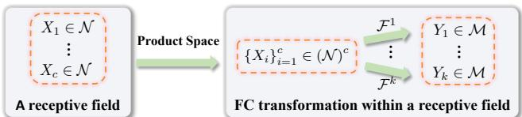

# Building Transformation Layers for Riemannian Neural Networks

Ziheng Chen University of Trento; MPI for Intelligent Systems, Tübingen ziheng\_ch@163.com

## Abstract

Recently, deep neural networks on manifold-valued representations have garnered significant attention across various machine learning applications. One recent focus is the generalization of Euclidean fully connected (FC) and convolutional layers to non-Euclidean geometries. However, previous approaches typically focus on a few selected manifolds and rely on specific properties of the target manifold. In contrast, this work proposes a framework for constructing FC and convolutional layers over computationally tractable Riemannian spaces. This framework incorporates several previous FC layers across different geometries as special cases and is instantiated on ten representative manifolds, including three hyperbolic models, five geometries of the symmetric positive definite (SPD) manifold, and two Grassmannian perspectives. Experiments on different manifolds demonstrate the effectiveness and applicability of our approach. Code can be found at https://github.com/GitZH-Chen/RieTrans.

## 1 Introduction

Deep neural networks on Riemannian manifolds have achieved remarkable success across various applications [34, 28, 67, 47, 33, 77, 13, 39, 61, 44, 45, 32, 37, 21, 22]. Commonly encountered manifolds include Symmetric Positive Definite (SPD) [59], Grassmannian [5], matrix Lie group [31], and hyperbolic [72] manifolds. These manifolds admit computationally tractable tools such as geodesics, exponential and logarithmic maps, and parallel transport, which have enabled the extension of fundamental deep learning components, including normalization [8, 10, 48, 41, 16, 19, 79], attention [30, 58, 76, 78], residual blocks [74, 38], and classification layers [28, 55, 15, 17, 4].

Yet, the extension of the most basic layers, Fully Connected (FC) and convolutional layers, remains particularly challenging. Early works targeted specific manifolds: Huang and Van Gool [34], Huang et al. [35, 36] proposed layers for SPD, special orthogonal, and Grassmann manifolds. Later, Ganea et al. [28], Mao et al. [51] developed hyperbolic counterparts via tangent spaces, and Chen et al. [14] introduced LFC via spacetime transformations. Fan et al. [26] further introduced nested hyperbolic spaces and a Lorentz-specific feature transformation that supports dimensionality reduction. To better respect geometry, Shimizu et al. [66] extended FC and convolutional layers on the Poincaré model, while Nguyen et al. [56, 57] proposed SPD counterparts based on gyrovector structures and symmetric spaces. However, these methods largely rely on specific properties, such as Poincaré geometry, gyro or symmetric structures, which restricts their generality. In another direction, Chakraborty et al. [11] introduced a convolution based on the weighted Fréchet mean, but unlike the Euclidean convolution, its output manifold dimension is restricted to match the input, limiting flexibility. Consequently, a general and flexible framework for constructing FC and convolutional layers across different geometries remains unsolved.

We address this challenge by proposing a principled framework for building Riemannian FC and convolutional layers on computationally tractable manifolds. Our framework relies solely on Riemannian operators such as exponential and logarithmic maps. It thus applies broadly to different geometries, such as hyperbolic, SPD, and Grassmannian spaces. Our contributions are summarized as follows.

• Riemannian FC and convolutional layers. We introduce a principled generalization of FC and convolutional layers to Riemannian spaces. In contrast to previous approaches, our framework requires only tractable Riemannian operators, ensuring broad applicability. Moreover, several existing Riemannian FC layers are subsumed as special cases.

• Ten concrete instantiations. We instantiate our framework on three hyperbolic models, five SPD geometries, and two Grassmannian perspectives. Our approach enables direct variation of the latent geometry under a consistent network architecture.

• Empirical validation. We validate our approach on benchmark tasks across hyperbolic, SPD, and Grassmannian manifolds, demonstrating both effectiveness and versatility.

## 2 Preliminaries

Notations. For the Euclidean space $\mathbb { R } ^ { n }$ or $\mathbb { R } ^ { n \times n }$ , we denote the standard inner product by $\langle \cdot , \cdot \rangle$ and the induced norm by $\lVert \cdot \rVert , i . e .$ , the $L _ { \mathrm { { 2 } } } \mathrm { { - n o r m } }$ for vectors and the Frobenius norm for matrices. A Riemannian manifold $( \mathcal { M } , g )$ with the Riemannian metric $g$ is abbreviated as $\mathcal { M } .$ Its tangent space at $P \in { \mathcal { M } }$ is denoted by $T _ { P } \mathcal { M }$ . The Riemannian logarithmic map, exponential map, and metric at $P \in { \mathcal { M } }$ are denoted by Log ${ \bf \Lambda } _ { P } , \mathrm { E x p } _ { P } .$ , and $\langle \cdot , \cdot \rangle _ { P } = g _ { P } ( \cdot , \cdot )$ , respectively. The parallel transport along the geodesic connecting $P , Q \in \mathcal { M } \mathrm { i s } \Gamma _ { P  Q \cdot } \mathrm { A }$ table of notation is summarized in Sec. C.

Hyperbolic manifold. There are five isometric hyperbolic models [9]. We focus on the Poincaré ball $\mathbb { P } _ { K } ^ { n } = \left\{ x \in \mathbb { R } ^ { n } \mid \left. x \right. ^ { 2 } < - 1 / K \right\}$ , the Beltrami–Klein ball $\mathbb { K } _ { K } ^ { n } = \left\{ x \in \mathbb { R } ^ { n } \mid \| x \| ^ { 2 } < - 1 / K \right\}$ and the hyperboloid (or Lorentz) model $\mathbb { H } _ { K } ^ { n } = \left\{ x \in \mathbb { R } ^ { n + 1 } \mid \left. x \right. _ { \mathcal { L } } ^ { 2 } = { ^ { 1 } \mathrm { / } K } , x _ { 1 } > 0 \right\}$ , where $\| x \| _ { \mathcal { L } } ^ { 2 } =$ $\scriptstyle \sum _ { i = 2 } ^ { n + 1 } x _ { i } ^ { 2 } - x _ { 1 } ^ { 2 }$ is the Lorentz inner product. Here, $K < 0$ is the constant curvature. The Poincaré and Beltrami–Klein balls admit gyrovector spaces, known as the Möbius and Einstein gyrovector spaces [73], respectively. The Möbius gyroaddition and scalar gyromultiplication are denoted by M and $\otimes _ { \mathrm { M } }$ , while the Einstein counterparts are E and E. Sec. D.1 summarizes the associated Riemannian and gyro operators.

SPD manifold. The set of $n \times n \ : \mathrm { S P D }$ matrices, denoted $S _ { + + } ^ { n }$ , forms a smooth manifold, called the SPD manifold [2]. It admits five widely used Riemannian metrics: Affine-Invariant Metric (AIM) [59], Log-Euclidean Metric (LEM) [2], Power-Euclidean Metric (PEM) [24], Log-Cholesky Metric (LCM) [46], and Bures–Wasserstein Metric (BWM) [6]. Each metric provides closed-form expressions for Riemannian operators, which are summarized in Sec. D.2.

Grassmannian. The Grassmannian is the manifold of p-dimensional subspaces of the n-dimensional vector space [71, Prob. 7.8]. It has two common matrix representations [5]. The Projector Perspective (PP) embeds each element as an $n \times n$ symmetric matrix: ${ \widetilde { \mathrm { G r } } } ( p , n ) = \{ P \in { \mathcal { S } } ^ { n } \mid P ^ { 2 } =$ $P , \operatorname { r a n k } ( P ) = p \}$ , where $S ^ { n }$ is the Euclidean space of symmetric matrices. The OrthoNormal Basis (ONB) perspective is the quotient of the Stiefel manifold $\operatorname { S t } ( p , n ) \colon \operatorname { G r } ( p , n ) = \operatorname { S t } ( p , n ) / \operatorname { O } ( p ) =$ $\{ [ U ] \ | \ [ U ] = \{ \widetilde { U }  \in \operatorname { S t } ( p , n ) \ | \ { \widetilde { U } } = U R , R \in \operatorname { O } ( p ) \} \}$ , where $\mathrm { O } ( p )$ is the $p \times p$ orthogonal group. By abuse of notation, we use [U] and $U$ interchangeably. The associated Riemannian structures are summarized in Sec. D.3.

The considered manifolds admit multiple geometries, including isometric hyperbolic models, distinct SPD metrics, and diffeomorphic Grassmannian perspectives, whose empirical performance often varies across tasks [54, 38, 20]. This motivates a unified framework to flexibly handle such variants. Moreover, exponential and logarithmic maps may encounter singular cases, but these cases can be handled numerically (Rmks. D.1 and D.2), and the maps are assumed well-defined.

## 3 Proposed Framework

## 3.1 Riemannian fully connected layers

Our method for building FC layers over Riemannian manifolds relies on the point-to-hyperplane distance, which has shown success in building hyperbolic and SPD networks [66, 55, 4, 15, 17, 56, 57].

The hyperplane in the Riemannian manifold $\mathcal { N } \left[ 1 7 , \mathrm { E q . } 5 \right]$ is $H _ { A , P } = \{ X \in \mathcal { N } | \langle \mathrm { L o g } _ { P } ( X ) , A \rangle _ { P } =$ 0 , with $\dot { P } \in \mathcal N$ and $A \in T _ { P } \mathcal { N }$ . When $\mathcal { N } = \mathbb { R } ^ { \bar { n } }$ , it recovers the Euclidean hyperplane, $H _ { a , p } = \{ x \in$ $\bar { \mathbb { R } ^ { n } } \mid \langle a , x - p \rangle = 0 \}$

The Euclidean FC layer is defined as $y = A x + b$ with $A \in \mathbb { R } ^ { m \times n }$ and $b \in \mathbb { R } ^ { m }$ . It can be expressed element-wise as $y _ { k } = \langle a _ { k } , x \rangle - b _ { k } = \langle a _ { k } , x - p _ { k } \rangle$ with $a _ { k } , p _ { k } \in \mathbb { R } ^ { n }$ and $\langle p _ { k } , a _ { k } \rangle = b _ { k }$ . As shown by Shimizu et al. [66, Sec. 3.2], the LHS $y _ { k }$ is the signed distance from y to the hyperplane passing through the origin and orthogonal to the k-th axis of the output space, which can be formulated as

$$
\mathrm { s i g n } ( \langle e _ { k } , y - \mathbf { 0 } \rangle ) d ( y , H _ { e _ { k } , \mathbf { 0 } } ) = \langle a _ { k } , x - p _ { k } \rangle , \quad \forall 1 \leq k \leq m ,\tag{1}
$$

where $\mathbf { 0 } \in \mathbb { R } ^ { m }$ is the zero vector, and $\{ e _ { k } \} _ { k = 1 } ^ { m }$ forms an orthonormal basis over $\mathbb { R } ^ { m }$ with $e _ { k }$ denoting the vector whose k-th element is 1 and all others are 0. Here, the LHS of Eq. (1) equals $y _ { k }$

Given a point-to-hyperplane distance, Eq. (1) can be readily generalized to manifolds. Noting that $\mathrm { L o g } _ { p } ( x ) = x - p$ under the Euclidean geometry and that $T _ { \mathbf { 0 } } \dot { \mathbb { R } ^ { m } } \cong \mathbb { R } ^ { m }$ , the counterparts of $H _ { e _ { k } , \mathbf { 0 } }$ on an m-dimensional Riemannian manifold are defined as

$$
H _ { B _ { k } , E } = \left\{ S \in \mathcal { M } \vert \langle \mathrm { L o g } _ { E } S , B _ { k } \rangle _ { E } = 0 \right\} , \quad \forall 1 \leq k \leq m ,\tag{2}
$$

where $E \in { \mathcal { M } }$ is the predefined origin, and $\{ B _ { k } \} _ { k = 1 } ^ { m }$ is an orthogonal basis over $\{ T _ { E } \mathcal { M } , g _ { E } \}$ Eq. (2) characterizes the hyperplane containing the origin E and orthogonal to the geodesic starting from E with the initial velocity $B _ { k }$ , which recovers the Euclidean $H _ { e _ { k } , \mathbf { 0 } }$ as $\mathcal { M } = \mathbb { \breve { R } } ^ { m }$ . With all the above ingredients, we define the Riemannian FC layer in the following.

Definition 3.1. Given an n-dimensional manifold $\mathcal { N }$ and an m-dimensional manifold $\mathcal { M } ,$ , the Riemannian FC layer $\mathcal { F } : \mathcal { N }  \mathcal { M }$ for the input $X \in \mathcal { N }$ returns the output $Y \in { \mathcal { M } }$ by solving m equations:

$$
\mathrm { s i g n } \left( \left. \mathrm { L o g } _ { E } ^ { \mathcal { M } } ( Y ) , B _ { k } \right. _ { E } ^ { \mathcal { M } } \right) \mathrm { d } ^ { \mathcal { M } } ( Y , H _ { B _ { k } , E ^ { \mathcal { M } } } ^ { \mathcal { M } } ) = \left. A _ { k } , \mathrm { L o g } _ { P _ { k } } ^ { \mathcal { N } } ( X ) \right. _ { P _ { k } } ^ { \mathcal { N } } , 1 \leq k \leq m ,\tag{3}
$$

where $E ^ { \mathcal { M } } \in \mathcal { M }$ is the origin, and $\{ B _ { k } \} _ { k = 1 } ^ { m }$ is an orthonormal basis over $T _ { E } { \mathcal { M } } { \mathcal { M } }$ . Here, $\mathrm { d } ^ { \mathcal { M } }$ denotes a chosen point-to-hyperplane distance, which can be either the true distance in $\mathrm { f } _ { { S \in H _ { B _ { k } , E } ^ { \mathcal { M } } } } d _ { \mathcal { M } } ( Y , S )$

or a surrogate. Meanwhile, $\mathrm { L o g } _ { P _ { i } } ^ { \mathcal { N } }$ and $\langle \cdot , \cdot \rangle _ { P _ { i } } ^ { \mathcal { N } }$ are the Riemannian logarithm and metric over $\mathcal { N }$ . The pairs $P _ { k } \in \mathcal N$ and $A _ { k } \in T _ { P _ { k } } \mathcal { N }$ are the FC parameters.

Our Def. 3.1 naturally extends previous FC layers over different geometries.

Proposition 3.2. [ ] When $\mathcal { N } = \mathbb { R } ^ { n }$ and $\mathcal { M } = \mathbb { R } ^ { m } , D e f . \ 3 . I$ with the true point-to-hyperplane distance reduces to the Euclidean FC layer. When $\mathcal { N } = \mathbb { P } _ { K } ^ { n } , \mathcal { M } = \mathbb { P } _ { K } ^ { m }$ , the true point-to-hyperplane distancefollows Ganea et al. [28, Thm. 5], and the LHS ofEq. (3)follows $v _ { k } ( \cdot )$ from Shimizu et al. $I 6 6 , E q . \ ( 3 ) J$ . In this case, Def. 3.1 yields the Poincaré FC layer [66, Sec. 3.2]. When $\mathcal { N } = S _ { + + } ^ { n } ,$ $\mathcal { M } = \mathcal { S } _ { + + } ^ { m }$ , and the point-to-hyperplane distances are pseudo-gyrodistances [55, Thms. 2.23–2.25], Def. 3.1 recovers the corresponding gyro SPD FC layers [56, Props. 3.4–3.6].

The crux of Def. 3.1 lies in the point-to-hyperplane distance and solving the resulting m equations. Using the true point-to-hyperplane distance presents three difficulties: it has no general closed-form expression on arbitrary Riemannian manifolds; on a specific manifold, evaluating its infimum may require a difficult geometry-specific nonconvex optimization [17, Sec. 3.1]; and having a computable distance alone does not ensure that the m equations in Def. 3.1 admit a common output $Y .$ , as illustrated by the counterexample in Chen et al. [21, App. D]. To avoid these difficulties, we adopt the Riemannian-trigonometric point-to-hyperplane pseudo-distance of Chen et al. [17, Def. 3.1 and Thm. 3.2]: $\begin{array} { r } { \mathrm { d } ( X , \dot { H _ { A _ { k } , P _ { k } } } ) = \frac { | \dot { \langle \mathrm { L o g } _ { P _ { k } } ( X ) , \dot { A _ { k } } \rangle } _ { P _ { k } } | } { \| A _ { k } \| _ { P _ { k } } } } \end{array}$ , where $\left\| \cdot \right\| _ { P _ { k } }$ denotes the norm induced by $\langle \cdot , \cdot \rangle _ { P _ { k } }$ Under this pseudo-distance, the implicit Def. 3.1 admits the following explicit solution.

Theorem 3.3 (Riemannian FC Layers). [ ] Following the notation in Def. 3.1 the Riemannian FC layer $\mathcal { F } ( \cdot ) : \mathcal { N }  \mathcal { M }$ for the input $\begin{array} { r } { X \in \mathcal { N } \mathrm { ~ } i s \ : Y = \mathrm { E x p } _ { E } ^ { \mathcal { M } } \left( \sum _ { i = 1 } ^ { m } \langle \mathrm { L o g } _ { P _ { i } } ^ { \mathcal { N } } ( X ) , A _ { i } \rangle _ { P _ { i } } ^ { \mathcal { N } } B _ { i } \right) } \end{array}$ , where $\mathrm { E x p } _ { E } ^ { \mathcal { M } }$ is the Riemannian exponential map on .

The tangent FC layer [28, Lem. 6] uses a single tangent space and is written as $\mathrm { E x p } _ { E } ( f ( \mathrm { L o g } _ { E } ( X ) ) )$ with $f$ being a Euclidean FC layer. In contrast, our formulation involves multiple tangent spaces, where each $\left. \mathrm { L o g } ^ { \mathcal { N } } P _ { i } ( X ) , A _ { i } \right. _ { P _ { i } } ^ { \tilde { \mathcal { N } } } = 0$ corresponds to a Riemannian hyperplane $H _ { A _ { i } , P _ { i } }$ . Moreover, our formulation naturally incorporates prior Riemannian FC layers without requiring additional geometric or algebraic structures, as summarized in Tab. 2.

Remark 3.4. The point-to-hyperplane pseudo-distance adopted above coincides with the true geodesic point-to-hyperplane distance when the manifold is isometric to an Euclidean space. Specifically, if $\dot { \phi ^ { \mathbf { \cdot } } } : ( \mathbf { \mathcal { N } } , g ) \ \to \ ( \mathbb { R } ^ { n } , \langle \cdot , \cdot \rangle )$ is an isometry, extending Chen et al. [15, Lem. 3.5] gives $\begin{array} { r } { \operatorname* { i n f } _ { Q \in H _ { A , P } } \mathrm { d } ( X , Q ) = \frac { | \langle \mathrm { L o g } _ { P } ( \dot { X } ) , \dot { A } \rangle _ { P } | } { \| A \| _ { P } } } \end{array}$ . This includes Euclidean space as well as LEM and LCM on SPD manifolds.

Remark 3.5. Theoretically, the origin $E ^ { \mathcal { M } }$ in Def. 3.1 can be chosen arbitrarily. On a homogeneous space, any two choices and the FC layers defined through them are identified by an isometry (Thm. E.1). In practice, we choose canonical origins that simplify the Riemannian operators and the resulting FC expressions. The examples in Sec. 4 follow this computational criterion.

## 3.2 Riemannian convolutional layers

As shown in [66, Sec. 3.4], Euclidean convolution first concatenates the features within each receptive field and then applies an FC transformation. The concatenated feature vector $x \in ( \mathbb { R } ^ { n } ) ^ { c }$ is an element of the product space $( \mathbb { R } ^ { n } ) ^ { c }$ , and its k-th output is the affine transformation $y _ { k } = \langle a _ { k } , x \rangle - b _ { k }$ . This view naturally extends to manifolds: concatenating manifold-valued features forms an element of the product manifold, on which we apply the Riemannian FC layer in Sec. 3.1.

Riemannian convolution. In each receptive field, the product-manifold element $X = ( X _ { 1 } , \bar { \ } . \cdot . , X _ { c } ) \in ( \mathcal { N } ) ^ { c }$ is fed into k Riemannian FC layers, where k is the number of kernels. Here, each Riemannian FC layer is implemented under the product geometry $( \mathcal { N } ) ^ { c } = \Pi _ { i = 1 } ^ { c } \mathcal { N }$ , which is detailed in Sec. E.3. Fig. 1 illustrates the above process.

  
Figure 1: Riemannian convolution within a receptive field. Here, $\mathcal { F } ^ { k } ( \cdot )$ denotes the k-th FC transformation.

## 3.3 Parameter trivialization

As convolution uses the FC layer as its prototype, we focus on the FC parameters. Since $P _ { i }$ varies during training, $A _ { i } \in T _ { P _ { i } } \mathcal { N }$ cannot be updated directly by a Euclidean optimizer. As shown by Chen et al. [17, Eqs. (12)–(13)], it can be determined from the fixed tangent space at the origin $E ^ { N } \in \mathcal { N } \mathfrak { b y } ^ { 1 } \bar { \mathbf { \zeta } } A _ { i } = \bar { \Gamma } _ { E ^ { N } \to P _ { i } } ( Z _ { i } )$ with $Z _ { i } \in \mathsf { \Gamma } \bar { T _ { E } } \mathcal { N } \bar { N }$ Moreover, as

Table 1: Comparison of hyperbolic FC layers. An extended table can be found in Sec. F.
<table><tr><td>Method</td><td>Space</td><td>Mechanism</td><td>References</td></tr><tr><td>Möbius</td><td> $\mathbb { P } _ { K } ^ { n }$ </td><td>Tangent</td><td>[28, Def. 3.2]</td></tr><tr><td>Einstein</td><td> $\mathbb { K } _ { \nu } ^ { n }$ </td><td>Tangent</td><td>[51, Thm. 9]</td></tr><tr><td>LFC</td><td> $\mathbb { H } _ { \kappa } ^ { n }$ </td><td>Spacetime</td><td>[14, Eq. (1)]</td></tr><tr><td>NestFC</td><td> $\begin{array} { c } { { \frac { \mathrm { u } \mathrm { u } } { K } } } \\ { { \overline { { \mathbb { H } \mathbb { I } } } _ { r } ^ { n } } } \end{array}$  HK</td><td>Nested projection</td><td>[26, Eq. (14)]</td></tr><tr><td>Poincaré FC</td><td> $\mathbb { P } _ { K } ^ { n }$ </td><td>Poincaré</td><td>[66, Sec. 3.2]</td></tr><tr><td>Ours</td><td> $\underline { { \mathbb { P } _ { K } ^ { n } , \mathbb { K } _ { K } ^ { n } , \mathbb { H } _ { K } ^ { n } } }$ </td><td>Riemannian</td><td>Thms. 4.1 and 4.2</td></tr></table>

shown by Shimizu et al. [66, Sec. 3.1], pk in Eq. (1) may be over-parameterized, since there are countless $p _ { k }$ satisfying $\langle a _ { k } , p _ { k } \rangle = b _ { k }$ . Therefore, following Shimizu et al. [66], each $P _ { i }$ in the Riemannian FC layer is parameterized as $\mathrm { E x p } _ { E ^ { N } } ^ { \mathcal { N } } ( \gamma _ { i } [ Z _ { i } ] )$ , where $\gamma _ { i } \in \mathbb { R } , Z _ { i } \neq 0 .$ , and $[ Z _ { i } ]$ is the unit vector of $Z _ { i }$ . This use of the exponential map to optimize manifold-valued parameters is known as trivialization [43, Sec. 4.1].

Thus, instead of independently optimizing the two n-dimensional parameters $P _ { i }$ and $A _ { i } .$ , we parsimoniously optimize one tangent vector $Z _ { i }$ and one scalar $\gamma _ { i }$ for each output dimension. This reduces the number of parameters from 2n to $n + 1$ and allows them to be updated by a Euclidean optimizer, instead of expensive Riemannian optimizers.

## 4 Examples

Although Thm. 3.3 is geometry-agnostic, its instantiation can be further simplified under a specific geometry. We now instantiate the FC layer in Thm. 3.3 over different geometries, including three hyperbolic models, five SPD geometries, and two Grassmannian perspectives.

## 4.1 Hyperbolic vector manifolds

We focus on three hyperbolic models: the Poincaré ball, the Beltrami–Klein model, and the hyperboloid model. The resulting FC layers are denoted by HFC-P, HFC-K, and HFC-H, respectively. Tab. 1 compares our hyperbolic FC layers against prior layers, where we refer to the hyperbolic feature transformation of Fan et al. [26, Eq. (14)] as NestFC.

Poincaré & Beltrami–Klein. These two models admit Möbius and Einstein gyrovector spaces [73], respectively. These structures further simplify the concrete HFC layers.

Theorem 4.1 (HFC-P & HFC-K). [ ] Let $\mathcal { H } ^ { n } \ \in \ \{ \mathbb { P } _ { K } ^ { n } , \mathbb { K } _ { K } ^ { n } \}$ Given $x \in \mathcal { H } ^ { n }$ , the Riemannian FC layer $\mathcal { F } ( \cdot ) \ : \ \mathcal { H } ^ { n } \  \ \mathcal { H } ^ { m }$ is $y ~ = ~ \mathrm { E x p } _ { \bf 0 } \left( \left( v _ { 1 } ( x ) , \cdot \cdot \cdot , v _ { m } ( x ) \right) ^ { \top } \right)$ Here, $v _ { i } ( x ) \ =$ $\langle \mathrm { L o g } _ { \mathbf { 0 } } ( - p _ { i } \oplus _ { \mathcal { H } } x ) , z _ { i } \rangle$ , with the zero vector 0 as the origin and $p _ { i } = \mathrm { E x p } _ { \mathbf { 0 } } \big ( \gamma _ { i } [ z _ { i } ] \big )$ . The $F C p a \cdot$ rameters are $\{ \gamma _ { i } \in \mathbb { R } \} _ { i = 1 } ^ { m }$ and $\{ z _ { i } \in \mathbb { R } ^ { n } \} _ { i = 1 } ^ { m }$ . The gyroaddition and Riemannian exponential and logarithmic maps can befound in Sec. D.1, where $\mathrm { E x p } _ { \mathbf { 0 } } ( \mathrm { L o g } _ { \mathbf { 0 } } )$ shares the same expression in the two models.

Interestingly, the only difference between the HFC-P and HFC-K layers lies in the gyroaddition. Moreover, HFC-P takes an expression different from that of the Poincaré FC layer [66, Sec. 3.2], since their point-to-hyperplane distances and LHSs of Eq. (3) are different.

Hyperboloid. The origin is defined as $e = \left( 1 / \sqrt { | \boldsymbol { K } | } , 0 , \cdots , 0 \right) ^ { \top }$ , which corresponds to the Poincaré origin under the stereographic projection [67, Sec. 2.1]. Then, we have the following.

Theorem 4.2 (HFC-H FC layer). [ ] The Riemannian $F C ~ l a y e r ~ \mathcal { F } ( \cdot ) ~ : ~ \mathbb { H } _ { K } ^ { n } ~ \to ~ \mathbb { H } _ { K } ^ { m } ~ f o r ~ x ~ \in$ $\mathbb { H } _ { K } ^ { n }$ is $y = \mathrm { E x p } _ { e } \left( \left( 0 , v _ { 1 } ( x ) , \cdots , v _ { m } ( x ) \right) ^ { \top } \right)$ , where $v _ { i } ( x ) =  \mathrm { L o g } _ { p _ { i } } ( x ) , \Gamma _ { e  p _ { i } } ( 0 , z _ { i } ) $ , and $p _ { i } =$ $\mathrm { E x p } _ { e } ( \gamma _ { i } [ ( 0 , z _ { i } ^ { \top } ) ^ { \top } ] )$ , with $\gamma _ { i } \in \mathbb { R } a n d z _ { i } \in \mathbb { R } ^ { n }$ as parameters.

Substituting the hyperbolic operators into the preceding HFC layers gives the following expressions. Theorem 4.3 (Simplification). [ ] For the hyperboloid model, we write $\boldsymbol { x } = ( x _ { 1 } , x _ { s } )$ . For each HFC layer, $v _ { i } ( x )$ can be further simplified:

$$
\begin{array} { r l } & { \mathcal { T } _ { K } ^ { \mu } : \exp \left( - \left| \mathbf { z } \right| \right) = \left| \mathbf { z } \right| ^ { \mu \nu } \left( \sqrt { \pi } \left| \mathbf { z } \right| \right) ^ { \mu } \left[ 1 \leq \operatorname* { m a x } ^ { \mu } \left( \sqrt { \pi } \left| \mathbf { z } \right| \right) ^ { \nu } \left( \exp \left| \mathbf { z } \right| \right) ^ { \mu } \left( 1 \leq \operatorname* { m a x } ^ { \nu } \sqrt { \pi } \right) \left( \mathbf { z } \right| \right) ^ { \mu } \left( 1 \leq \operatorname* { m a x } ^ { \mu } \sqrt { \pi } \right) \left( 1 \leq \operatorname* { m a x } ^ { \nu } \sqrt { \pi } \right) \right] } \\ & { \qquad \sqrt { \pi } \left| \mathbf { z } \right| ^ { \mu \nu } \left( 2 \right) } \\ & { \mathcal { S } _ { K } ^ { \mu } : \exp \left( - \left| \mathbf { z } \right| \right) = \left| \mathbf { z } \right| ^ { \mu \nu } \frac { \sqrt { \pi } \left( \sqrt { \pi } \left| \mathbf { z } \right| \right) ^ { \mu } } { \sqrt { \pi } \left| \mathbf { z } \right| } \frac { \frac { 1 } { \sqrt { \pi } } \left| \mathbf { z } \right| - \operatorname* { m a x } ^ { \mu } \sqrt { \pi } \left| \mathbf { z } \right| ^ { \mu \nu } \left| \mathbf { z } \right| ^ { \mu } } { \sqrt { \pi } \sqrt { \pi } } , } \\ &  \mathcal { S } _ { K } ^ { \mu } : \exp ( \vec { x } ) = \mathrm { i } _ { K } \frac { 1 } { \sqrt { \pi } } \frac { \sqrt { \pi } \left| \mathbf { z } \right| ^ { \mu \nu } \left| \exp \left( \frac { \pi } { 2 } \sqrt { \pi } \left| \mathbf { z } \right| ^ { \mu \nu } \left| \right) - \mathbf { z } \right. \sinh \left| \mathbf { z } \right| ^ { \mu } \sqrt { \pi } \left| \mathbf { z } \right| ^ { \mu \nu } \left| \right| ^ { \mu } }  \sqrt { \pi } \sqrt { \pi } \sqrt { \pi } \sqrt  \end{array}
$$

Although Thm. 4.3 appears more complicated than the original formulations, it enables efficient batched computation and greatly reduces GPU memory consumption. Directly implementing Thms. 4.1 and 4.2 requires either looping over the m output dimensions or materializing a large $B \times m \times n$ intermediate tensor. As shown in Thm. 4.3, the formulas mainly depend on $\langle x , [ z _ { i } ] \rangle$ for HFC-P and $\mathrm { H F C - K }$ and $\langle x _ { s } , [ z _ { i } ] \rangle$ for HFC-H. Stacking B inputs into $\boldsymbol { X } \doteq \boldsymbol { \mathbb { R } } ^ { \boldsymbol { \check { B } } \times { n } }$ (or their spatial components into $X _ { s } \in \mathbb { R } ^ { B \times n } )$ and the unit directions into $\bar { U ^ { - } } = ( [ z _ { 1 } ] , \ldots , [ z _ { m } ] ) ^ { \top } \in \mathbb { R } ^ { m \times n }$ allows all these inner products to be computed at once as $X U ^ { \top } ( \mathrm { o r } X _ { s } \bar { U } ^ { \top } )$ . The remaining terms can be evaluated elementwise.

## 4.2 SPD matrix manifolds

We focus on five popular Riemannian metrics, i.e., LEM, AIM, PEM, LCM, and BWM. We define the identity matrix I as the origin, since it corresponds to the zero matrix under the matrix logarithm. Theorem 4.4 (SPD FC Layers). [ ] Given an SPD matrix $S \in S _ { + + } ^ { n } ,$ , the outputs of the SPD FC layers $\mathcal { F } ( \cdot ) : S _ { + + } ^ { n } \to S _ { + + } ^ { m }$ under different Riemannian metrics are

$$
L E M : Y = \exp \left( { V ^ { \mathrm { L E } } } \right) , V _ { i j } ^ { \mathrm { L E } } = \left\{ \begin{array} { l l } { \frac { 1 } { \sqrt { c } } v _ { i i } ^ { \mathrm { L E } } ( S ) + \mu \sum _ { k = 1 } ^ { m } v _ { k k } ^ { \mathrm { L E } } ( S ) , } & { i f i = j } \\ { \frac { 1 } { \sqrt { 2 \alpha } } v _ { i j } ^ { \mathrm { L E } } ( S ) , } & { i f i > j } \\ { V _ { j i } ^ { \mathrm { L E } } , } & { o t h e r w i s e } \end{array} \right.\tag{4}
$$

$$
\begin{array} { r } { A I M : Y = \exp \left( { V ^ { \mathrm { A I } } } \right) , { V _ { i j } ^ { \mathrm { A I } } } = \left\{ \begin{array} { l l } { \frac { 1 } { \sqrt { \alpha } } v _ { i i } ^ { \mathrm { A I } } ( S ) + \mu \sum _ { k = 1 } ^ { m } v _ { k k } ^ { \mathrm { A I } } ( S ) , } & { i f i = j } \\ { \frac { 1 } { \sqrt { 2 \alpha } } v _ { i j } ^ { \mathrm { A I } } ( S ) , } & { i f i > j } \\ { V _ { j i } ^ { \mathrm { A I } } , } & { o t h e r w i s e } \end{array} \right. } \end{array}\tag{5}
$$

$$
P E M : Y = \left( I + V ^ { \mathrm { P E } } \right) ^ { \frac { 1 } { \theta } } , V _ { i j } ^ { \mathrm { P E } } = \left\{ \begin{array} { l l } { \frac { 1 } { \sqrt { \alpha } } v _ { i i } ^ { \mathrm { P E } } ( S ) + \mu \sum _ { k = 1 } ^ { m } v _ { k k } ^ { \mathrm { P E } } ( S ) , } & { i f i = j } \\ { \frac { 1 } { \sqrt { 2 \alpha } } v _ { i j } ^ { \mathrm { P E } } ( S ) , } & { i f i > j } \\ { V _ { j i } ^ { \mathrm { P E } } , } & { o t h e r w i s e } \end{array} \right.\tag{6}
$$

$$
L C M : Y = V ^ { \mathrm { L C } } ( V ^ { \mathrm { L C } } ) ^ { \top } , V _ { i j } ^ { \mathrm { L C } } = \left\{ \begin{array} { l l } { \exp \left( v _ { i i } ^ { \mathrm { L C } } ( S ) \right) , } & { i f i = j } \\ { v _ { i j } ^ { \mathrm { L C } } ( S ) , } & { i f i > j } \\ { 0 , } & { o t h e r w i s e } \end{array} \right.\tag{7}
$$

$$
\begin{array}{c} B W M : Y = \left( I + \frac { 1 } { 2 } V ^ { \mathrm { B W } } \right) ^ { 2 } , V _ { i j } ^ { \mathrm { B W } } = \left\{ \frac { v _ { i i } ^ { \mathrm { B W } } ( S ) , } { \sqrt { 2 } v _ { i j } ^ { \mathrm { B W } } ( S ) , } \ & { i f i = j } \\ { V _ { j i } ^ { \mathrm { B W } } , } & { o t h e r w i s e } \end{array} \right.\tag{8}
$$

Here, $v _ { i j } ( S )$ under different metrics is defined as

$$
L E M : \langle \log ( S ) - \log ( P _ { i j } ) , Z _ { i j } \rangle ^ { ( \alpha , \beta ) } , \quad A I M : \left. \log ( P _ { i j } ^ { - \frac 1 2 } S P _ { i j } ^ { - \frac 1 2 } ) , Z _ { i j } \right. ^ { ( \alpha , \beta ) } ,
$$

$$
P E M : \left. S ^ { \theta } - P _ { i j } ^ { \theta } , Z _ { i j } \right. ^ { ( \alpha , \beta ) } , \quad L C M : \left. \lfloor K \rfloor - \lfloor L _ { i j } \rfloor + \mathrm { D l o g } ( \mathbb { K } \mathbb { L } _ { i j } ^ { - 1 } ) , \lfloor Z _ { i j } \rfloor + \frac { 1 } { 2 } \mathbb { Z } _ { i j } \right. ,
$$

$$
B W M : \left. ( P _ { i j } S ) ^ { \frac { 1 } { 2 } } + ( S P _ { i j } ) ^ { \frac { 1 } { 2 } } - 2 P _ { i j } , \mathcal { L } _ { P _ { i j } } ( L _ { i j } Z _ { i j } L _ { i j } ^ { \top } ) \right. ,
$$

The above notations are defined in the following.

$Z _ { i j } \in T _ { I } S _ { + + } ^ { n } \cong S ^ { n }$ and $P _ { i j } \in S _ { + + } ^ { n }$ are the parameters for $1 \leq i \leq j \leq m ,$ $\log ( \cdot )$ is the matrix logarithm. $\mathrm { D l o g ( \cdot ) }$ is the diagonal element-wise logarithm. $\lfloor \cdot \rfloor$ is the strictly lower part of a square matrix. Chol( ) is the Cholesky decomposition. V is a diagonal matrix with diagonal elements of the square matrix V . $\dot { \mathcal { L } _ { P } ( V ) }$ is the solution to the matrix linear system $\begin{array} { r } { \mathcal { L } _ { P } [ V ] P + P \mathcal { L } _ { P } [ V ] = V , } \end{array}$ , known as the Lyapunov operator. $\begin{array} { r } { \mu = \frac { 1 } { n } \left( \frac { 1 } { \sqrt { \alpha + n \beta } } - \frac { 1 } { \sqrt { \alpha } } \right) } \end{array}$ $K = \operatorname { C h o l } ( S )$ and $L _ { i j } = \mathrm { C h o l } ( P _ { i j } )$

$\langle \cdot , \cdot \rangle$ and $\langle \cdot , \cdot \rangle ^ { ( \alpha , \beta ) }$ are the Frobenius inner product and the ${ \mathrm { O } } ( n )$ -invariant inner product defined in Eq. (26).

• Due to the incompleteness ofPEM and BWM, there are constraints on $V ^ { \mathrm { P E } } a n d V ^ { \mathrm { B W } } : I + \theta V ^ { \mathrm { P E } } \in$ $S _ { + + } ^ { m }$ and $\begin{array} { r } { I + \frac { 1 } { 2 } \dot { V } ^ { \mathrm { B W } } \in \dot { S _ { + + } ^ { n } } } \end{array}$ Both constraints can be solved by numerical regularization, as detailed in Rmk. G.4.

The Euclidean affine FC $y = A x + b$ incorporates the linear map $y = A x ,$ , the most natural map between linear spaces. As shown by Arsigny et al. [2, Sec. 4.4] and Chen et al. [18, Thm. 1], the SPD manifold admits two vector space structures with respect to LEM and LCM. Similar to the Euclidean FC layer, our SPD FC layer also incorporates linear maps over these vector structures. Denoting the addition and scalar product by $\Phi ^ { \mathrm { L E } ^ { \tt L } } ( \oplus ^ { \mathrm { L C } } )$ and $\odot ^ { \mathrm { L E } } \dot { ( \odot } ^ { \mathrm { L C } } )$ , respectively, which are detailed in Sec. J.7, we have the following result.

Proposition 4.5. [ ] The LEM- and LCM-SPD FC layers incorporate the linear homomorphisms over the vector spaces $\{ S _ { + + } ^ { n } , \oplus ^ { \mathrm { L E } } , \odot ^ { \mathrm { L E } } \}$ and $\{ S _ { + + } ^ { n } , \breve { \oplus } ^ { \mathrm { L C } } , \odot ^ { \mathrm { L C } } \}$ , respectively.

Comparison. As summarized in Tab. 2, the three gyro SPD FC layers from Nguyen et al. [56, Props. 3.4- 3.6] and the two flat SPD FC layers [57] are incorporated by our SPD FC layers.

Table 2: Comparison with the existing SPD FC layers.
<table><tr><td>SPD FC Layer</td><td>Geometries</td><td>Requirement</td><td>Incorporated by Ours</td></tr><tr><td>Gyro FC [56]</td><td>AIM, LEM &amp; LCM</td><td>Gyrovector</td><td>(Sec. G.1)</td></tr><tr><td>Flat FC [57]</td><td>LEM &amp; LCM</td><td>Flat geometry</td><td>√(Sec. G.2)</td></tr><tr><td>Symmetric FC [57]</td><td>AIM</td><td>Invariant metric Symmetric space</td><td>N/A</td></tr><tr><td>Ours</td><td>Riemannian spaces</td><td>Riemannian</td><td>N/A</td></tr></table>

Simplification and convolution. Following the trivialization in Sec. 3.3,

the SPD FC layers under LEM, AIM, LCM, and PEM can be further simplified, as detailed in Sec. G.3. The convolution is defined as Sec. 3.2, with $\mathcal { M } = S _ { + + } ^ { m }$ and $\mathcal { N } = \bar { S _ { + + } ^ { n } }$

## 4.3 Grassmannian matrix manifolds

We instantiate our FC layers over the ONB and PP Grassmannian and define Grassmannian Convolution (GrConv) according to Sec. 3.2. We then compare GrConv with existing popular Grassmannian transformations, concluding that GrConv is more flexible in both dimensionality and geometry.

ONB. We denote by $I _ { p , n } = \left[ I _ { p } , \mathbf { 0 } \right] ^ { \top } \in \mathbb { R } ^ { n \times p }$ , with $I _ { p }$ being the $p \times p$ identity matrix. We define it as the Grassmannian origin, since it corresponds to $\dot { I _ { n } } \in \mathrm { O } ( n )$ in the quotient structure [5, Sec. 2.2]. As in Sec. 3.3, the FC parameters are modeled by parallel transport and the Riemannian exponential map at $I _ { p , n }$ . The concrete ONB Grassmannian FC layer can be further simplified.

Theorem 4.6 (ONB). [ ] Given $U ~ \in ~ \operatorname { G r } ( p , n )$ , the ONB Grassmannian FC layer $\mathcal { F } ( \cdot ) \ :$ $\mathrm { G r } ( p , n ) ~ \to ~ \mathrm { G r } ( q , m ) ~ i s ~ Y ~ = ~ \left( \begin{array} { l } { { R \cos ( \Sigma ) R ^ { \top } } } \\ { { O \sin ( \Sigma ) R ^ { \top } } } \end{array} \right)$ , with $B ^ { \mathrm { O N B } } \stackrel { S V D } { : = } O \Sigma R ^ { \top } \in \mathbb { R } ^ { ( m - q ) \times q } .$ Each (i, j) element of $\begin{array} { r l r } { B ^ { \mathrm { O N B } } } & { { } \in } & { \mathbb { R } ^ { ( m - q ) \times q } \quad i s \left. \mathrm { L o g } _ { P _ { i j } } ^ { \mathrm { O N B } } ( U ) , T _ { i j } B _ { Z _ { i j } } \right. } \end{array}$ , with $\begin{array} { r l } { T _ { i j } } & { { } = } \end{array}$ $\left( \begin{array} { c } { { - R _ { i j } \sin ( \Sigma _ { i j } ) O _ { i j } ^ { \top } } } \\ { { O _ { i j } \cos ( \Sigma _ { i j } ) O _ { i j } ^ { \top } + I _ { n - p } - O _ { i j } O _ { i j } ^ { \top } } } \end{array} \right)$ . Here, $\gamma _ { i j } [ B _ { Z _ { i j } } ]  { \stackrel {  } { : = } } O _ { i j } \Sigma _ { i j } R _ { i j } ^ { \top }$ is the SVD decomposition. The FC parameters are $B _ { Z _ { i j } } \in \mathbb { R } ^ { ( n - p ) \times p }$ and γij R for $1 \leq i \leq m - q$ and $1 \leq j \leq q .$

PP. We define the PP origin as $\widetilde { I } _ { p , n } = I _ { p , n } I _ { p , n } ^ { \top }$ , since it corresponds to $I _ { p , n } \left[ 5 \right]$ , Eq. 2.11]. Similarly, we model the FC parameters by parallel transport and the Riemannian exponential map at $\widetilde { I } _ { p , n }$ . The PP Grassmannian FC layer can be further simplified. In addition, the Riemannian logarithm under the PP Grassmannian can be calculated using the ONB logarithm to support auto-differentiation [56, Prop. 3.12]. For more details, please refer to the proof of the following theorem.

Theorem 4.7 (PP). [ ] Given $X \in \widetilde { \mathrm { ~ \scriptsize ~ G r ~ } } ( p , n )$ , the PP Grassmannian FC layer $\mathcal { F } ( \cdot ) :$ $\widetilde \mathrm { G r } ( p , n ) \quad \to \quad \widetilde { \mathrm { G r } } ( q , m ) i s Y = \widetilde { U } \widetilde { U } ^ { \intercal }$ , with $\begin{array} { r l r } { \widetilde U } & { = } & { \left( \exp \left( \left( \begin{array} { c c } { 0 } & { - ( B ^ { \mathrm { P P } } ) ^ { T } } \\ { B ^ { \mathrm { P P } } } & { 0 } \end{array} \right) \right) \right) } \end{array}$ 1:q where $( \cdot ) _ { 1 : q }$ returns the first-q columns of the input square matrix. Each $( i , j )$ element of $B ^ { \mathrm { P P } } \ \in \ \mathbb { R } ^ { ( m - q ) \times q }$ is defined as $\begin{array} { r } { \frac { 1 } { 2 } \left. \pi _ { * , \pi ( P ) } \left( \mathrm { L o g } _ { ( O _ { i j } ) _ { 1 : p } } ^ { \mathrm { O N B } } ( \pi ^ { - 1 } ( X ) ) \right) , O _ { i j } Z _ { i j } O _ { i j } ^ { \top } \right. } \end{array}$ , with $O _ { i j } =$ $\exp \left( \left( \begin{array} { c c } { 0 } & { - ( \gamma _ { i j } [ B _ { Z _ { i j } } ] ) ^ { T } } \\ { \gamma _ { i j } [ B _ { Z _ { i j } } ] } & { 0 } \end{array} \right) \right)$ , where $\pi ( U ) = U U ^ { \top }$ , and $\pi _ { * , U } ( V ) = U V ^ { \top } + V U ^ { \top }$ is the differential map for all $U \ \in \ { \mathrm { { G r } } } ( p , n )$ and $V ~ \in ~ T _ { U } \mathrm { G r } ( p , n )$ . The FC parameters are $B _ { Z _ { i j } } \in \mathbb { R } ^ { ( n - p ) \times p } \ : a n d \gamma _ { i j } \in \mathbb { R } f o r \ : 1 \le i \le m - q \ : a n d \ : 1 \le j \le q .$

Comparison. Huang et al. [36] proposed FRMap + ReOrth layers to perform transformations over the ONB Grassmannian via left matrix product (FRMap) and QR decomposition (ReOrth). Nguyen [54] proposed PP scaling for the PP Grassmannian using the tangent space at the identity. Nguyen and Yang [55] extended PP scaling to the ONB Grassmannian.

Table 4: Comparison of hyperbolic FC layers under the same two-layer HNN, reporting AUC (%), full-model registered parameter elements, and peak allocated memory (MiB). The top 3 AUC results are highlighted with red, blue, and cyan. The worst value for each resource is underlined.
<table><tr><td rowspan="2">Method</td><td rowspan="2">Mechanism</td><td rowspan="2">Space</td><td colspan="2"> $\begin{array} { r } { \operatorname { D i s e a s e } \left( \delta = 0 \right) } \\ { \operatorname { A U C } \quad \# \operatorname { P a r a m } } \end{array}$ </td><td rowspan="2">MiB</td><td colspan="2"> $\begin{array} { r } { \mathbf { A i r p o r t } \left( \delta = 1 \right) } \\ { \mathbf { A U C } \mathbf { \Psi } \mathbf { \Psi } \mathbf { \Psi } \mathbf { \Psi } \mathbf { \Psi } \mathbf { \Psi } \mathbf { A r a m } } \end{array}$ </td><td rowspan="2">MiB</td><td colspan="3"> $\begin{array} { r } { \operatorname { P u b m e d } \left( \delta = 3 . 5 \right) } \\ { \operatorname { A U C } \quad \# \operatorname { P a r a m } } \end{array}$ </td><td rowspan="2"></td><td colspan="2">Cora (δ = 11)</td></tr><tr><td></td><td></td><td></td><td></td><td></td><td>MiB</td><td> $\mathbf { A U C }$ </td><td>#Param</td><td>MiB</td></tr><tr><td>Möbius [28]</td><td>Tangent</td><td></td><td> $7 6 . 7 3 \pm 4 . 8 6$ </td><td>464</td><td>77.20</td><td> $9 3 . 2 6 \pm 0 . 4 3$ </td><td>480</td><td>123.84</td><td> $9 4 . 9 5 \pm 0 . 0 6$ </td><td>8,288</td><td>3273.19</td><td> $9 0 . 7 5 \pm 0 . 4 7$ </td><td>23,216</td><td>176.57</td></tr><tr><td>Einstein [51]</td><td>Tangent</td><td></td><td>77.34 ± 2.56</td><td>464</td><td>77.32</td><td> $9 2 . 7 2 \pm 0 . 0 7$ </td><td>480</td><td>125.70</td><td>94.99 ± 0.13</td><td>8,288</td><td>3273.19</td><td>89.73 ± 0.21</td><td>23,216</td><td>176.57</td></tr><tr><td>LorentzTan</td><td>Tangent</td><td></td><td> $7 6 . 5 4 \pm 0 . 8 3$ </td><td>464</td><td>82.03</td><td> $9 2 . 7 0 \pm 0 . 1 9$ </td><td>480</td><td>125.46</td><td> $9 4 . 9 9 \pm 0 . 1 3$ </td><td>8,288</td><td>3653.47</td><td>89.73 ± 0.21</td><td>23,216</td><td>326.61</td></tr><tr><td>LFC [14]</td><td>Spacetime</td><td></td><td>78.00 ± 0.60</td><td>563</td><td>77.28</td><td> $9 2 . 6 3 \pm 0 . 2 7 $ </td><td>580</td><td>118.01</td><td> $9 4 . 2 2 \pm 0 . 1 1$ </td><td>8,876</td><td>3653.48</td><td>91.74 ± 0.12</td><td>24,737</td><td>326.62</td></tr><tr><td>NestFC [26]</td><td>Nested projection</td><td></td><td>71.30 ± 3.50</td><td>811</td><td>78.35</td><td>83.19 ± 0.90</td><td>850</td><td>119.20</td><td>88.07 ± 0.75</td><td>258,514</td><td>3659.20</td><td>86.08 ± 0.84</td><td>2,076,931</td><td>1234.25</td></tr><tr><td>Poincaré FC [66]</td><td>Riemannian</td><td>戰限眼眼</td><td> $7 9 . 1 9 \pm 2 . 0 5$ </td><td>528</td><td>78.72</td><td> $9 4 . 2 1 \pm 0 . 4 3$ </td><td>544</td><td>127.80</td><td> $9 4 . 3 0 \pm 0 . 1 9$ </td><td>8,352</td><td>3294.38</td><td> $8 7 . 1 6 \pm 0 . 9 5$ </td><td>23,280</td><td>176.94</td></tr><tr><td>HFC-P</td><td>Riemannian</td><td></td><td> $\overline { { 8 0 . 6 6 \pm 1 . 3 5 } }$ </td><td>496</td><td>83.42</td><td> $9 4 . 1 3 \pm 0 . 4 7 $ </td><td>512</td><td>133.88</td><td> $9 4 . 7 7 \pm 0 . 2 8 $ </td><td>8,320</td><td>3314.73</td><td>90.76 ± 0.57</td><td>23,248</td><td>176.57</td></tr><tr><td>HFC-K</td><td>Riemannian</td><td>医队</td><td> $8 0 . 5 8 \pm 1 . 5 9$ </td><td>496</td><td>85.10</td><td> $9 4 . 3 2 \pm 0 . 2 7 $ </td><td>512</td><td>137.20</td><td> $9 4 . 6 1 \pm 0 . 2 7 $ </td><td>8,320</td><td>3329.29</td><td>89.94 ± 0.49</td><td>23,248</td><td>176.57</td></tr><tr><td>HFC-H</td><td>Riemannian</td><td>HK</td><td> $8 2 . 9 3 \pm 0 . 8 9$ </td><td>496</td><td>89.82</td><td> $9 5 . 1 8 \pm 0 . 1 8$ </td><td>512</td><td>134.76</td><td> $9 3 . 9 9 \pm 0 . 2 5$ </td><td>8,320</td><td>3653.48</td><td>92.20 ± 0.25</td><td>23,248</td><td>326.61</td></tr></table>

In addition, Nguyen and Yang [55] used gyrogroup left translation (GrTrans) as a transformation. These layers are briefly recapped in Sec. H. However, these previous layers fail to faithfully respect the Grassmannian geometries and lack flexibility regarding dimensions and perspectives. In contrast, given a c-channel Grassmannian $\operatorname { G r } ( p , n ) \ ( \mathrm { o r } \ \widetilde { \operatorname { G r } } ( p , n ) )$ input, our GrConv can adjust all dimensions across both perspectives, enabling more flexibility. Tab. 3 summarizes the above discussion.

Table 3: Our GrConv against the existing Grassmannian transformation layers.
<table><tr><td rowspan="2">Methods</td><td rowspan="2">Perspective</td><td colspan="3">Flexible dimensions</td></tr><tr><td>Subspace p</td><td>Ambient n</td><td>Channel</td></tr><tr><td>FRMap + ReOrth [36, Eqs. (2-4)]</td><td>ONB</td><td>x</td><td>1</td><td>X</td></tr><tr><td>PP Scaling [54, Sec. 4.2.2]</td><td>PP</td><td>x</td><td>x</td><td>x</td></tr><tr><td>ONB Scaling [55, Sec. 3.2]</td><td>ONB</td><td>x</td><td>x</td><td>x</td></tr><tr><td>GrTrans [55, Sec. 2.3.2]</td><td>ONB + PP</td><td>x</td><td>x</td><td>X</td></tr><tr><td>GrConv</td><td> $\mathrm { O N B + P P }$ </td><td>J</td><td>1</td><td>V</td></tr></table>

## 4.4 Manifold embedding

In several applications [12, 47, 81, 56], Euclidean features are embedded into the manifold via $\mathrm { E x p } _ { E } ( A x + b )$ . As detailed in Sec. E.4, our framework implies that this operation follows the Riemannian FC layer between the Euclidean space and the target manifold, $i . e . , \mathcal { F } ( \cdot ) : \mathbb { R } ^ { n } \to \mathcal { M }$

## 5 Experiments

We evaluate the effectiveness of our layers on different manifolds. We refer the reader to Secs. I.1 to I.3 for experimental details on the hyperbolic, SPD, and Grassmannian spaces, respectively.

## 5.1 Experiments on the hyperbolic manifold

We compare our HFC layers against other hyperbolic transformation layers, including Möbius [28] and Einstein [51] transformations via tangent spaces, LFC [14] via spacetime, NestFC [26] via nested projections, and the Poincaré FC layer [66]. Following Chami et al. [12], we adopt four graph datasets for the link prediction task: Disease [1], Airport [80], Pubmed [53], and Cora [64].

Results on HNN. Following the HNN implementations [28, 12, 51], we compare different transformation layers using the same two-layer HNN backbone. For every method, the first transformation maps the input feature dimension $n _ { \mathrm { i n } }$ to 16, and the second maps 16 to 16. Mimicking Möbius and Einstein transformations, we further implement the tangent transformation on the hyperboloid model, $\mathrm { L o g } _ { e } ( M \mathrm { L o g } _ { e } ( x ) )$ , referred to as LorentzTan. Tab. 4 presents the 5-fold average test AUC, number of parameters, and peak allocated GPU memory. We have the following key observations. (1) Effectiveness: Our HFC layers generally achieve superior performance over prior hyperbolic layers. (2) Hyperbolicity: Riemannian transformations outperform tangent or spacetime transformations on low-δ Disease and Airport. On the higher-δ datasets, tangent-space transformations remain competitive on Pubmed, whereas HFC-H performs best on Cora. These results suggest that the effectiveness of tangent-space approximations depends on data hyperbolicity. (3) Representation power & metrics: The optimal models vary across datasets. Among our HFC variants, HFC-P performs best on Pubmed, whereas HFC-H performs best on Disease, Airport, and Cora, demonstrating the benefit of adapting the FC layer across hyperbolic models. (4) Parameter and memory efficiency. NestFC is the least parameter-efficient and the least memory-efficient for high-dimensional inputs, due to its matrix-manifold parameters. On Cora, it uses 89.3 as many parameters and 3.8 as much peak memory as HFC-H. Further analysis in Sec. I.1.3 shows that our HFC layers have the same O(Bnm) asymptotic complexity and comparable parameter dimensions as most existing hyperbolic FC layers, while NestFC has the highest asymptotic complexity and the largest parameter dimension.

Table 5: Comparison of hyperbolic transformations under different settings of Poincaré RResNet.
<table><tr><td rowspan="2">Dataset</td><td>Number of horospheres</td><td colspan="3">50</td><td colspan="3">250</td></tr><tr><td>Dim</td><td>8</td><td>16</td><td>32</td><td>8</td><td>16</td><td>32</td></tr><tr><td rowspan="4">Disease</td><td>RResNet [38]</td><td>76.0 ± 1.7</td><td> $7 8 . 0 \pm 2 . 2$ </td><td> $7 7 . 4 \pm 2 . 2$ </td><td> $7 1 . 5 \pm 5 . 1$ </td><td> $7 8 . 1 \pm 3 . 3$ </td><td> $7 6 . 5 \pm 2 . 5$ </td></tr><tr><td>Möbius+RResNet</td><td>74.6 ± 1.9</td><td> $7 4 . 6 \pm 5 . 7$ </td><td> $7 5 . 1 \pm 2 . 1$ </td><td> $7 4 . 0 \pm 2 . 7$ </td><td> $7 1 . 0 \pm 5 . 2$ </td><td> $7 3 . 3 \pm 3 . 4$ </td></tr><tr><td>Poincaré FC+RResNet</td><td>80.4 ± 0.7</td><td> $7 9 . 1 \pm 1 . 8$ </td><td> $7 9 . 1 \pm 1 . 6$ </td><td> $8 0 . 6 \pm 0 . 8$ </td><td> $7 9 . 1 \pm 0 . 7 $ </td><td> $8 0 . 1 \pm 1 . 4$ </td></tr><tr><td>HFC-P+RResNet</td><td>81.1 ± 0.6</td><td>80.0 ± 0.4</td><td> ${ \bf 8 1 . 0 \pm 0 . 6 }$ </td><td> ${ \bf 8 0 . 9 \pm 0 . 6 }$ </td><td> ${ \bf 8 2 . 3 \pm 0 . 6 }$ </td><td> ${ \bf 8 2 . 1 \pm 0 . 3 }$ </td></tr><tr><td rowspan="4">Airport</td><td>RResNet [38]</td><td> $9 3 . 4 \pm 1 . 1$ </td><td> $9 2 . 6 \pm 1 . 1$ </td><td> $9 3 . 0 \pm 0 . 2 $ </td><td> $9 3 . 0 \pm 0 . 4$ </td><td> $9 3 . 0 \pm 1 . 6$ </td><td> $8 9 . 6 \pm 4 . 7$ </td></tr><tr><td>Möbius+RResNet</td><td> $9 2 . 9 \pm 0 . 5$ </td><td> $9 3 . 0 \pm 0 . 3 $ </td><td> $9 2 . 6 \pm 0 . 3 $ </td><td> $9 2 . 9 \pm 0 . 1 $ </td><td> $9 3 . 2 \pm 0 . 2 $ </td><td> $9 2 . 9 \pm 0 . 6 $ </td></tr><tr><td>Poincaré FC+RResNet</td><td> $9 2 . 8 \pm 0 . 6 $ </td><td> $9 3 . 4 \pm 0 . 6 $ </td><td> $9 3 . 8 \pm 0 . 4$ </td><td> $9 3 . 5 \pm 0 . 4 $ </td><td> $9 3 . 1 \pm 0 . 4 $ </td><td> $9 3 . 8 \pm 0 . 7 $ </td></tr><tr><td>HFC-P+RResNet</td><td> $9 4 . 1 \pm 0 . 5 $ </td><td> $9 3 . 5 \pm 0 . 3 $ </td><td> ${ \bf 9 4 . 8 \pm 0 . 5 }$ </td><td> ${ \bf 9 4 . 1 \pm 0 . 6 }$ </td><td> $9 4 . 0 \pm 0 . 4$ </td><td> ${ \bf 9 4 . 3 \pm 0 . 4 }$ </td></tr><tr><td rowspan="4">Cora</td><td>RResNet [38]</td><td> $8 6 . 7 \pm 1 . 2$ </td><td> $8 7 . 2 \pm 1 . 4$ </td><td> $8 2 . 4 \pm 3 . 5$ </td><td> $8 2 . 7 \pm 3 . 0$ </td><td> $8 4 . 0 \pm 3 . 7$ </td><td> $8 3 . 3 \pm 1 . 6$ </td></tr><tr><td>Möbius+RResNet</td><td>84.6 ± 2.9</td><td> $8 6 . 8 \pm 2 . 1$ </td><td> $8 3 . 1 \pm 2 . 5$ </td><td> $8 4 . 1 \pm 2 . 4$ </td><td> $8 3 . 2 \pm { 1 . 6 }$ </td><td> $8 3 . 9 \pm 2 . 9$ </td></tr><tr><td>Poincaré FC+RResNet</td><td> $8 3 . 8 \pm 2 . 4$ </td><td> $8 4 . 6 \pm 0 . 9$ </td><td> $8 3 . 3 \pm 2 . 7$ </td><td> $8 2 . 8 \pm 3 . 3$ </td><td> $8 2 . 8 \pm 3 . 6 $ </td><td> $8 3 . 3 \pm 3 . 3$ </td></tr><tr><td>HFC-P+RResNet</td><td> $8 5 . 6 \pm 0 . 8$  _</td><td> ${ \bf 8 7 . 6 \pm 0 . 8 }$ </td><td> $8 7 . 2 \pm 1 . 8$ </td><td> ${ \bf 8 7 . 6 8 \pm 1 . 8 1 }$  </td><td> $\mathbf { 8 6 . 0 8 \pm 1 . 7 2 }$ </td><td> ${ \bf 8 6 . 9 7 \pm 1 . 0 4 }$ </td></tr></table>

Results on RResNet. We conduct ablations on the RResNet backbone [38]. Since hyperbolic RResNet is built on the Poincaré ball, we compare Poincaré transformation layers, i.e., Möbius, Poincaré FC, and our HFC-P. In the vanilla RResNet, inputs are first projected to the target dimension using a Euclidean linear layer, followed by mapping to the hyperbolic space and processing with hyperbolic residual blocks. In contrast, we first map the input to the hyperbolic space and then apply a hyperbolic transformation layer before feeding it into the residual blocks. This transformation layer can be instantiated as Möbius, Poincaré FC, or our HFC-P layer. We perform experiments across various configurations of the residual blocks, varying both the hidden dimensions and the number of horospheres. Tab. 5 presents the 5-fold average AUC results. Our HFC-P generally outperforms other hyperbolic transformations, demonstrating its effectiveness.

Results on NHGCN. We further evaluate HFC within NHGCN [26], a hyperbolic graph convolutional network. Section I.1.4 shows that HFC improves NHGCN with substantially fewer parameters.  
Table 6: Comparison of our SPDNNs against other SPD networks. The ones highlighted with are our special cases, while those marked with ∗ are reproduced by us because official code is unavailable.
<table><tr><td>Methods</td><td>Radar</td><td>HDM05</td><td>FPHA</td><td>NTU60</td></tr><tr><td>SPDNet [34]</td><td> $9 3 . 2 5 \pm 1 . 1 0$ </td><td> $6 4 . 5 7 \pm 0 . 6 1$ </td><td> $8 5 . 5 9 \pm 0 . 7 2$ </td><td> $6 6 . 3 6 \pm 0 . 7 2$ </td></tr><tr><td>SPDNetBN [8]</td><td> $9 4 . 8 5 \pm 0 . 9 9$ </td><td> $7 1 . 2 8 \pm 0 . 7 9$ </td><td> $8 9 . 3 3 \pm 0 . 4 9$ </td><td> $6 9 . 3 8 \pm 0 . 8 4$ </td></tr><tr><td>RResNet-AIM [38]</td><td> $9 5 . 7 1 \pm 0 . 3 7$ </td><td> $6 4 . 9 5 \pm 0 . 8 2 $ </td><td> $8 6 . 6 3 \pm 0 . 5 5$ </td><td> $7 0 . 7 0 \pm 3 . 8 1$ </td></tr><tr><td>RResNet-LEM [38]</td><td> $9 5 . 8 9 \pm 0 . 8 6$ </td><td> $7 0 . 1 2 \pm 2 . 4 5$ </td><td> $8 5 . 0 7 \pm 0 . 9 9$ </td><td> $7 4 . 6 7 \pm 2 . 8 9$ </td></tr><tr><td>SPDNetLieBN-AIM [16]</td><td> $9 5 . 4 7 \pm 0 . 9 0$ </td><td> $7 1 . 8 3 \pm 0 . 6 9$ </td><td> $9 0 . 3 9 \pm 0 . 6 6$ </td><td> $7 3 . 3 4 \pm 0 . 4 0$ </td></tr><tr><td>SPDNetLieBN-LCM [16]</td><td> $9 4 . 8 0 \pm 0 . 7 1 $ </td><td> $7 1 . 7 8 \pm 0 . 4 4$ </td><td> $8 6 . 3 3 \pm 0 . 4 3$ </td><td> $7 2 . 5 4 \pm 1 . 0 9$ </td></tr><tr><td>SPDNetMLR [17]</td><td> $9 5 . 6 4 \pm 0 . 8 3$ </td><td> $6 5 . 9 0 \pm 0 . 9 3$ </td><td> $8 5 . 6 7 \pm 0 . 6 9$ </td><td> $7 4 . 1 8 \pm 1 . 2 4$ </td></tr><tr><td> $\mathrm { \ G y r o L E ^ { * } \ } [ 5 5 ]$ </td><td> $9 7 . 3 1 \pm 0 . 6 8$ </td><td> $7 3 . 1 7 \pm 0 . 3 7$ </td><td> $9 0 . 7 3 \pm 0 . 9 2 $ </td><td> $8 2 . 6 5 \pm 0 . 2 0$ </td></tr><tr><td>GyroLC* [55]</td><td> $9 5 . 2 3 \pm 0 . 6 6$ </td><td> $6 7 . 5 3 \pm 0 . 8 5$ </td><td> $7 6 . 1 0 \pm 0 . 6 3$ </td><td> $7 8 . 3 2 \pm 0 . 9 2$ </td></tr><tr><td>GyroAI* [55]</td><td> $9 7 . 1 7 \pm 0 . 6 7$ </td><td> $7 2 . 3 4 \pm 1 . 0 6$ </td><td> $8 9 . 6 0 \pm 0 . 3 7$ </td><td> $8 3 . 7 1 \pm 0 . 3 2$ </td></tr><tr><td> $\mathrm { G y r o S P D + + \mathrm { - A I M ^ { \ast } \ [ 5 6 ] } }$ </td><td> $9 7 . 0 1 \pm 0 . 4 0 $ </td><td> $6 9 . 8 2 \pm 1 . 7 9$ </td><td> $8 9 . 5 0 \pm 0 . 3 7 $ </td><td> $8 3 . 1 4 \pm 0 . 8 7$ </td></tr><tr><td> $\mathrm { G y r o S P D + + \mathrm { - } L E M ^ { * } \bar { [ 5 6 ] } }$ </td><td> $9 8 . 0 8 \pm 0 . 2 6 $ </td><td> $7 7 . 6 3 \pm 1 . 0 1$ </td><td> $8 8 . 2 3 \pm 0 . 6 2$ </td><td> $\mathbf { 8 5 . 4 8 \pm 1 . 1 0 }$ </td></tr><tr><td> $\mathrm { G y r o S P D + + \mathrm { - } L C M ^ { \ast } \ [ 5 6 ] }$ </td><td> $9 7 . 2 8 \pm 0 . 7 8$ </td><td> $7 5 . 3 6 \pm 1 . 0 8$ </td><td> $8 1 . 8 3 \pm 0 . 9 3$ </td><td> $7 4 . 6 4 \pm 2 . 4 9$ </td></tr><tr><td>SPDNN-LEM</td><td> $9 8 . 2 7 \pm 0 . 4 8 $ </td><td> ${ \bf 8 1 . 1 6 \pm 0 . 9 3 }$ </td><td> $9 1 . 8 3 \pm 0 . 4 1 $ </td><td></td></tr><tr><td>SPDNN-AIM</td><td> $9 7 . 6 3 \pm 0 . 5 0 $ </td><td> ${ \bf 8 0 . 1 2 \pm 0 . 7 8 }$ </td><td> $\mathbf { 9 1 . 5 7 \pm 0 . 4 0 }$ </td><td> $8 6 . 7 2 \pm 0 . 1 4$ </td></tr><tr><td>SPDNN-PEM</td><td> ${ \bf 9 8 . 4 3 \pm 0 . 4 4 }$ </td><td> $7 8 . 7 7 \pm 0 . 4 5$ </td><td> $9 0 . 3 3 \pm 0 . 3 7$ </td><td> $8 2 . 4 4 \pm 0 . 1 8$ </td></tr><tr><td>SPDNN-LCM</td><td> $9 7 . 6 5 \pm 0 . 7 5$ </td><td> $7 5 . 4 2 \pm 0 . 9 5$ </td><td> $9 1 . 3 3 \pm 0 . 2 4 $ </td><td> $8 2 . 6 1 \pm 0 . 3 7$ </td></tr><tr><td>SPDNN-BWM</td><td></td><td></td><td></td><td> $8 3 . 3 9 \pm 0 . 1 0$ </td></tr><tr><td></td><td> $9 8 . 7 2 \pm 0 . 1 4$ </td><td> $7 2 . 4 9 \pm 2 . 0 2$ </td><td> $8 7 . 8 0 \pm 0 . 5 6 $ </td><td> $8 2 . 6 4 \pm 0 . 3 5$ </td></tr></table>

## 5.2 Experiments on the SPD manifold

Following Huang et al. [35], Brooks et al. [8], Katsman et al. [38], we use the Radar dataset [8] for radar classification, and the HDM05 [52], FPHA [29], and NTU60 [65] datasets for human action recognition. In line with Nguyen et al. [56], we focus on the mutual action in NTU60. Following Wang et al. [76], Nguyen et al. [56], we model each sample sequence as multi-channel SPD covariance matrices of shape [c, n, n].

SPDNN. Our SPDNN has an MLR layer [17] stacked on top of a convolutional layer. We denote by SPDNN-[Metric] the SPDNN using convolution under the specified metric. For SPDNN-LEM, -PEM, and -LCM, the MLR is based on the same metric as the convolution. Since the MLRs under AIM and BWM are less efficient [17], we apply LEM MLR for SPDNN-AIM and -BWM. Moreover, we trivialize the SPD parameters in the MLR as Sec. 3.3, which can be further simplified (detailed in Sec. G.4). Consequently, all parameters in the SPDNNs can be optimized by a Euclidean optimizer. We compare our networks against the following SOTA SPD networks: SPDNet [35], SPDNetBN [8], LieBN [16], RResNet [38], MLR [17], Gyro [55], and GyroSPD++ [56].

Results. Tables 6 and 7 reports the classification results and training efficiency, respectively. Our SPDNNs consistently outperform other SPD models. Specifically, SPDNNs exceed the classic SPDNet by up to 5.47%, 16.59%, 6.24%, and 20.36% on the four datasets, respectively. Despite sharing the same architecture, SPDNN generally outperforms GyroSPD++ in both accuracy and efficiency across LEM, LCM, and AIM. This advantage arises because our trivialization not only simplifies the expression of the FC and MLR layers but also mitigates the over-parameterization in $\mathrm { G y r o S P D + + }$ . In Gy-

Table 7: The average training time per epoch of our SPDNNs compared with GyroSPD++. A full comparison of efficiency can be found in Sec. I.2.5.
<table><tr><td>Geometry</td><td>Method</td><td>Radar</td><td>HDM05</td><td>FPHA</td><td>NTU60</td></tr><tr><td rowspan="2">AIM</td><td>GyroSPD++</td><td>5.09</td><td>103.57</td><td>66.35</td><td>125.05</td></tr><tr><td>SPDNN</td><td>4.84</td><td>101.80</td><td>65.42</td><td>124.41</td></tr><tr><td rowspan="2">LEM</td><td>GyroSPD++</td><td>0.99</td><td>0.95</td><td>0.66</td><td>7.58</td></tr><tr><td>SPDNN</td><td>0.86</td><td>0.74</td><td>0.63</td><td>5.79</td></tr><tr><td rowspan="2">LCM</td><td>GyroSPD++</td><td>0.66</td><td>0.70</td><td>0.37</td><td>5.74</td></tr><tr><td>SPDNN</td><td>0.65</td><td>0.59</td><td>0.35</td><td>3.72</td></tr></table>

roSPD++, each output dimension of the FC layer requires two matrix parameters, whereas our approach uses only one matrix and one scalar parameter. This reduction in parameter complexity leads to improved training efficiency and generalization. Furthermore, the variation in optimal metrics across datasets underscores the flexibility of our methods.

## 5.3 Experiments on the Grassmannian

We compare our Grassmannian convolutional layer against previous transformation layers, such as FRMap + ReOrth [36], scaling [55], and Gr-Trans [55]. Compared with these previous layers, our transformation can more faithfully respect Grassmannian geometries while allowing greater flexibility with respect to dimensions and geometries. Following Nguyen and Yang [55], each network consists of one transformation layer followed by classification. The corresponding models are denoted by Gr-Net [36], GyroGr-Scaling [55], GyroGr [55], GrNN-ONB, and GrNN-

Table 8: Comparison of GrNNs against other Grassmannian networks on the Radar dataset. Those marked with ∗ are reproduced by us because official code is unavailable.
<table><tr><td rowspan=1 colspan=1>Method</td><td rowspan=1 colspan=1>Subspace dims</td><td rowspan=1 colspan=1>Ambient dims</td><td rowspan=1 colspan=1>Mean ± Std</td></tr><tr><td rowspan=2 colspan=1>GrNet [36]GyroGr-Scaling* [55]GyroGr* [55]</td><td rowspan=2 colspan=1>444</td><td rowspan=1 colspan=1>20-&gt;16</td><td rowspan=2 colspan=1> $9 0 . 4 8 \pm 0 . 7 6$  $8 8 . 8 8 \pm 1 . 5 2 $  $9 0 . 6 4 \pm 0 . 5 7$ </td></tr><tr><td rowspan=1 colspan=1>20-&gt;2020-&gt;20</td></tr><tr><td rowspan=1 colspan=1>GrNN-ONB</td><td rowspan=1 colspan=1>4-&gt;44-&gt;44-&gt;64-&gt;8</td><td rowspan=1 colspan=1>20-&gt;1620-&gt;2020-&gt;1620-&gt;16</td><td rowspan=1 colspan=1> $9 3 . 9 2 \pm 0 . 7 4$  $9 2 . 8 3 \pm 0 . 6 6$  $9 5 . 2 3 \pm 0 . 9 6$  ${ \bf 9 4 . 7 7 \pm 0 . 8 1 }$ </td></tr><tr><td rowspan=3 colspan=1>GrNN-PP</td><td rowspan=2 colspan=1>4-&gt;44-&gt;44-&gt;6</td><td rowspan=1 colspan=1>20-&gt;1620-&gt;20</td><td rowspan=3 colspan=1> $9 4 . 3 5 \pm 0 . 4 2 $  $9 4 . 5 6 \pm 0 . 5 8 $  $9 4 . 5 1 \pm 0 . 5 3 $  $9 4 . 1 1 \pm 0 . 5 8 $ </td></tr><tr><td rowspan=1 colspan=1> $2 0 - > 1 6$ </td></tr><tr><td rowspan=1 colspan=1>4-&gt;8</td><td rowspan=1 colspan=1>20-&gt;16</td></tr></table>

PP, respectively. Since our GrConv allows a more flexible change in dimensionality, we also perform ablations on the subspace and ambient dimensions of the output of the FC transformation. The experiments are conducted on the Radar dataset. Following Wang et al. [76], we model each radar signal as a multi-channel Grassmannian tensor, $i . e . , [ c , n , p ]$ for ONB and $[ c , n , n ]$ for PP. Tab. 8 reports the five-fold averages: GrConv outperforms the baselines, while varying the subspace dimension yields the two best results.

## 6 Conclusion

This paper extends fundamental FC and convolutional layers to operate on Riemannian manifolds. Our approach offers a naturally geometry-aware generalization that is more broadly applicable than previous work. Several existing Riemannian FC layers are subsumed within our framework as special cases. Empirically, we instantiate our framework across ten different geometries, including three hyperbolic models, five SPD geometries, and two Grassmannian formulations. Extensive experiments on radar classification, human action recognition, and graph link prediction demonstrate the effectiveness and flexibility of our approach. We expect this work to facilitate further advances in deep learning on Riemannian spaces.

## Acknowledgments and Disclosure of Funding

This work was supported by a DAAD Research Grant in Germany (No. 57811724), an ELIZA PhD Mobility Scholarship, an ELSA Mobility Grant, and an ELIAS Mobility Grant. The author also acknowledges the support of CINECA and the EuroHPC Joint Undertaking for granting access to Leonardo at CINECA, Italy.

## References

[1] Roy M Anderson and Robert M May. Infectious diseases of humans: dynamics and control. Oxford University Press, 1991.

[2] Vincent Arsigny, Pierre Fillard, Xavier Pennec, and Nicholas Ayache. Fast and simple computations on tensors with log-Euclidean metrics. Technical Report RR-5584, INRIA, 2005.

[3] Ekkehard Batzies, Knut Hüper, Luis Machado, and F Silva Leite. Geometric mean and geodesic regression on Grassmannians. Linear Algebra and its Applications, 2015.

[4] Ahmad Bdeir, Kristian Schwethelm, and Niels Landwehr. Fully hyperbolic convolutional neural networks for computer vision. In ICLR, 2024.

[5] Thomas Bendokat, Ralf Zimmermann, and P-A Absil. A Grassmann manifold handbook: Basic geometry and computational aspects. Advances in Computational Mathematics, 2024.

[6] Rajendra Bhatia, Tanvi Jain, and Yongdo Lim. On the Bures-Wasserstein distance between positive definite matrices. Expositiones Mathematicae, 37(2):165–191, 2019.

[7] Jose J. Bouza, Chun-Hao Yang, David E. Vaillancourt, and Baba C. Vemuri. MVC-Net: A convolutional neural network architecture for manifold-valued images with applications. arXiv preprint arXiv:2003.01234, 2020.

[8] Daniel Brooks, Olivier Schwander, Frédéric Barbaresco, Jean-Yves Schneider, and Matthieu Cord. Riemannian batch normalization for SPD neural networks. In NeurIPS, 2019.

[9] James W Cannon, William J Floyd, Richard Kenyon, Walter R Parry, et al. Hyperbolic geometry. Flavors ofgeometry, 31(59-115):2, 1997.

[10] Rudrasis Chakraborty. ManifoldNorm: Extending normalizations on Riemannian manifolds. arXiv preprint arXiv:2003.13869, 2020.

[11] Rudrasis Chakraborty, Jose Bouza, Jonathan H Manton, and Baba C Vemuri. Manifoldnet: A deep neural network for manifold-valued data with applications. IEEE TPAMI, 2020.

[12] Ines Chami, Zhitao Ying, Christopher Ré, and Jure Leskovec. Hyperbolic graph convolutional neural networks. In NeurIPS, 2019.

[13] Ricky T. Q. Chen and Yaron Lipman. Flow matching on general geometries. In ICLR, 2024.

[14] Weize Chen, Xu Han, Yankai Lin, Hexu Zhao, Zhiyuan Liu, Peng Li, Maosong Sun, and Jie Zhou. Fully hyperbolic neural networks. In ACL, 2022.

[15] Ziheng Chen, Yue Song, Gaowen Liu, Ramana Rao Kompella, Xiaojun Wu, and Nicu Sebe. Riemannian multinomial logistics regression for SPD neural networks. In CVPR, 2024.

[16] Ziheng Chen, Yue Song, Yunmei Liu, and Nicu Sebe. A Lie group approach to Riemannian batch normalization. In ICLR, 2024.

[17] Ziheng Chen, Yue Song, Xiaojun Wu, and Nicu Sebe. RMLR: Extending multinomial logistic regression into general geometries. In NeurIPS, 2024.

[18] Ziheng Chen, Yue Song, Tianyang Xu, Zhiwu Huang, Xiao-Jun Wu, and Nicu Sebe. Adaptive Log-Euclidean metrics for SPD matrix learning. IEEE TIP, 2024.

[19] Ziheng Chen, Yue Song, Xiaojun Wu, and Nicu Sebe. Gyrogroup batch normalization. In ICLR, 2025.

[20] Ziheng Chen, Xiao-Jun Wu, and Nicu Sebe. Riemannian batch normalization: A gyro approach. arXiv preprint arXiv:2509.07115, 2025.

[21] Ziheng Chen, Bernhard Schölkopf, and Nicu Sebe. Hyperbolic Busemann neural networks. In CVPR, 2026.

[22] Ziheng Chen, Xiaojun Wu, Bernhard Schölkopf, and Nicu Sebe. Riemannian networks over full-rank correlation matrices. In ICML, 2026.

[23] Manfredo Perdigao Do Carmo and J Flaherty Francis. Riemannian Geometry, volume 6. Springer, 1992.

[24] Ian L Dryden, Xavier Pennec, and Jean-Marc Peyrat. Power Euclidean metrics for covariance matrices with application to diffusion tensor imaging. arXiv preprint arXiv:1009.3045, 2010.

[25] Alan Edelman, Tomás A Arias, and Steven T Smith. The geometry of algorithms with orthogonality constraints. SIAM Journal on Matrix Analysis and Applications, 1998.

[26] Xiran Fan, Chun-Hao Yang, and Baba C. Vemuri. Nested hyperbolic spaces for dimensionality reduction and hyperbolic NN design. In CVPR, 2022.

[27] Xingcheng Fu, Yisen Gao, Yuecen Wei, Qingyun Sun, Hao Peng, Jianxin Li, and Xianxian Li. Hyperbolic geometric latent diffusion model for graph generation. In ICML, 2024.

[28] Octavian Ganea, Gary Bécigneul, and Thomas Hofmann. Hyperbolic neural networks. In NeurIPS, 2018.

[29] Guillermo Garcia-Hernando, Shanxin Yuan, Seungryul Baek, and Tae-Kyun Kim. First-person hand action benchmark with RGB-D videos and 3D hand pose annotations. In CVPR, 2018.

[30] Caglar Gulcehre, Misha Denil, Mateusz Malinowski, Ali Razavi, Razvan Pascanu, Karl Moritz Hermann, Peter Battaglia, Victor Bapst, David Raposo, Adam Santoro, and Nando de Freitas. Hyperbolic attention networks. In ICLR, 2019.

[31] Brian C Hall. Lie groups, Lie algebras, and representations. Springer, 2013.

[32] Chen Hu, Ziheng Chen, Rui Wang, Yefeng Zheng, and Nicu Sebe. Riemannian high-order pooling for brain foundation models. In ICLR, 2026.

[33] Chin-Wei Huang, Milad Aghajohari, Joey Bose, Prakash Panangaden, and Aaron C Courville. Riemannian diffusion models. In NeurIPS, 2022.

[34] Zhiwu Huang and Luc Van Gool. A Riemannian network for SPD matrix learning. In AAAI, 2017.

[35] Zhiwu Huang, Chengde Wan, Thomas Probst, and Luc Van Gool. Deep learning on Lie groups for skeleton-based action recognition. In CVPR, 2017.

[36] Zhiwu Huang, Jiqing Wu, and Luc Van Gool. Building deep networks on Grassmann manifolds. In AAAI, 2018.

[37] Shaocheng Jin, Tao Zhou, Rui Wang, Ziheng Chen, Xiaoqing Luo, Xiao-Jun Wu, and Josef Kittler. Towards robust EEG decoding based on riemannian self-attention. In KDD, 2026.

[38] Isay Katsman, Eric Chen, Sidhanth Holalkere, Anna Asch, Aaron Lou, Ser Nam Lim, and Christopher M De Sa. Riemannian residual neural networks. In NeurIPS, 2024.

[39] Raiyan R. Khan, Philippe Chlenski, and Itsik Pe’er. Hyperbolic genome embeddings. In ICLR, 2025.

[40] Diederik P Kingma. Adam: A method for stochastic optimization. In ICLR, 2015.

[41] Reinmar Kobler, Jun-ichiro Hirayama, Qibin Zhao, and Motoaki Kawanabe. SPD domainspecific batch normalization to crack interpretable unsupervised domain adaptation in EEG. In NeurIPS, 2022.

[42] John M Lee. Riemannian manifolds: an introduction to curvature, volume 176. Springer Science & Business Media, 2006.

[43] Mario Lezcano Casado. Trivializations for gradient-based optimization on manifolds. In NeurIPS, 2019.

[44] Shanglin Li, Motoaki Kawanabe, and Reinmar J Kobler. SPDIM: Source-free unsupervised conditional and label shift adaptation in EEG. In ICLR, 2025.

[45] Shanglin Li, Shiwen Chu, Okan Koç, Yi Ding, Qibin Zhao, Motoaki Kawanabe, and Ziheng Chen. HEEGNet: Hyperbolic embeddings for EEG. In ICLR, 2026.

[46] Zhenhua Lin. Riemannian geometry of symmetric positive definite matrices via Cholesky decomposition. SIAM Journal on Matrix Analysis and Applications, 40(4):1353–1370, 2019.

[47] Federico López, Beatrice Pozzetti, Steve Trettel, Michael Strube, and Anna Wienhard. Vectorvalued distance and Gyrocalculus on the space of symmetric positive definite matrices. In NeurIPS, 2021.

[48] Aaron Lou, Isay Katsman, Qingxuan Jiang, Serge Belongie, Ser-Nam Lim, and Christopher De Sa. Differentiating through the Fréchet mean. In ICML, 2020.

[49] Miroslav Lovric, Maung Min-Oo, and Ernst A Ruh. Multivariate normal distributions ´ parametrized as a riemannian symmetric space. Journal of Multivariate Analysis, 74(1):36–48, 2000.

[50] Luigi Malagò, Luigi Montrucchio, and Giovanni Pistone. Wasserstein Riemannian geometry of Gaussian densities. Information Geometry, 2018.

[51] Yidan Mao, Jing Gu, Marcus C Werner, and Dongmian Zou. Klein model for hyperbolic neural networks. arXiv preprint arXiv:2410.16813, 2024.

[52] Meinard Müller, Tido Röder, Michael Clausen, Bernhard Eberhardt, Björn Krüger, and Andreas Weber. Documentation mocap database HDM05. Technical report, Universität Bonn, 2007.

[53] Galileo Namata, Ben London, Lise Getoor, Bert Huang, and U Edu. Query-driven active surveying for collective classification. In 10th International Workshop on Mining and Learning with Graphs, volume 8, page 1, 2012.

[54] Xuan Son Nguyen. The gyro-structure of some matrix manifolds. In NeurIPS, 2022.

[55] Xuan Son Nguyen and Shuo Yang. Building neural networks on matrix manifolds: A Gyrovector space approach. In ICML, 2023.

[56] Xuan Son Nguyen, Shuo Yang, and Aymeric Histace. Matrix manifold neural networks++. In ICLR, 2024.

[57] Xuan Son Nguyen, Shuo Yang, and Aymeric Histace. Neural networks on symmetric spaces of noncompact type. In ICLR, 2025.

[58] Yue-Ting Pan, Jing-Lun Chou, and Chun-Shu Wei. MAtt: A manifold attention network for EEG decoding. In NeurIPS, 2022.

[59] Xavier Pennec, Pierre Fillard, and Nicholas Ayache. A Riemannian framework for tensor computing. IJCV, 2006.

[60] Peter Petersen. Riemannian geometry. Springer, 2006.

[61] Can Pouliquen, Mathurin Massias, and Titouan Vayer. Schur’s positive-definite network: Deep learning in the SPD cone with structure. In ICLR, 2025.

[62] Sashank J Reddi, Satyen Kale, and Sanjiv Kumar. On the convergence of Adam and beyond. In ICLR, 2018.

[63] Herbert Robbins and Sutton Monro. A stochastic approximation method. The annals of mathematical statistics, pages 400–407, 1951.

[64] Prithviraj Sen, Galileo Namata, Mustafa Bilgic, Lise Getoor, Brian Galligher, and Tina Eliassi-Rad. Collective classification in network data. AI magazine, 29(3):93–93, 2008.

[65] Amir Shahroudy, Jun Liu, Tian-Tsong Ng, and Gang Wang. NTU RGB+ D: A large scale dataset for 3D human activity analysis. In CVPR, 2016.

[66] Ryohei Shimizu, Yusuke Mukuta, and Tatsuya Harada. Hyperbolic neural networks++. In ICLR, 2021.

[67] Ondrej Skopek, Octavian-Eugen Ganea, and Gary Bécigneul. Mixed-curvature variational autoencoders. In ICLR, 2020.

[68] Yann Thanwerdas and Xavier Pennec. Is affine-invariance well defined on SPD matrices? a principled continuum of metrics. In Geometric Science of Information: 4th International Conference, 2019.

[69] Yann Thanwerdas and Xavier Pennec. Theoretically and computationally convenient geometries on full-rank correlation matrices. SIAM Journal on Matrix Analysis and Applications, 43(4): 1851–1872, 2022.

[70] Yann Thanwerdas and Xavier Pennec. O (n)-invariant Riemannian metrics on SPD matrices. Linear Algebra and its Applications, 661:163–201, 2023.

[71] Loring W.. Tu. An introduction to manifolds. Springer, 2011.

[72] Abraham Ungar. A gyrovector space approach to hyperbolic geometry. Springer Nature, 2022.

[73] Abraham Albert Ungar. Analytic hyperbolic geometry and Albert Einstein’s special theory of relativity (Second Edition). World Scientific, 2022.

[74] Max van Spengler, Erwin Berkhout, and Pascal Mettes. Poincaré ResNet. In ICCV, 2023.

[75] Raviteja Vemulapalli, Felipe Arrate, and Rama Chellappa. Human action recognition by representing 3D skeletons as points in a Lie group. In CVPR, 2014.

[76] Rui Wang, Chen Hu, Ziheng Chen, Xiao-Jun Wu, and Xiaoning Song. A Grassmannian manifold self-attention network for signal classification. In IJCAI, 2024.

[77] Rui Wang, Xiao-Jun Wu, Ziheng Chen, Cong Hu, and Josef Kittler. SPD manifold deep metric learning for image set classification. IEEE TNNLS, 2024.

[78] Rui Wang, Chen Hu, Xiaoning Song, Xiao-Jun Wu, Nicu Sebe, and Ziheng Chen. Towards a general attention framework on gyrovector spaces for matrix manifolds. In NeurIPS, 2025.

[79] Rui Wang, Shaocheng Jin, Ziheng Chen, Xiaoqing Luo, and Xiao-Jun Wu. Learning to normalize on the SPD manifold under Bures-Wasserstein geometry. In CVPR, 2025.

[80] Muhan Zhang and Yixin Chen. Link prediction based on graph neural networks. In NeurIPS, 2018.

[81] Wei Zhao, Federico Lopez, J Maxwell Riestenberg, Michael Strube, Diaaeldin Taha, and Steve Trettel. Modeling graphs beyond hyperbolic: Graph neural networks in symmetric positive definite matrices. In ECML PKDD, 2023.

List of acronyms 17   
A Use of large language models 17   
B Limitations 17   
C Glossary of symbols 17   
D Geometries of the involved vector and matrix manifolds 17   
D.1 Geometries of the hyperbolic space 17   
D.2 Geometries of the SPD manifold 20   
D.3 Geometries of the Grassmannian 20   
E Discussions on the Riemannian FC and convolutional layer 22   
E.1 Additional discussions on the orthogonal basis . 22   
E.2 Riemannian fully connected layers under isometric geometry 22   
E.3 Riemannian fully connected layers under product geometry 23   
E.4 Riemannian fully connected layers and manifold embedding 24   
E.5 Relation with the convolution in ManifoldNet 24   
Comparison of our hyperbolic FC layers against previous ones 25   
G Additional details on the SPD fully connected layers 25   
G.1 Relation with the gyro SPD fully connected layers 25   
G.2 Relation with the flat SPD fully connected layers 26   
G.3 Trivialized SPD fully connected layers 26   
G.4 Trivialized SPD multinomial logistic regression 27   
G.5 Covariant equivariance 27   
H Review of previous Grassmannian transformation layers 28   
I Additional experimental details and results 28   
I.1 Hyperbolic spaces 28   
I.1.1 Datasets 28   
I.1.2 Implementation details 29   
I.1.3 Complexity and parameter analysis 29   
I.1.4 Comparison under the NHGCN architecture 30   
I.2 SPD manifolds 30   
I.2.1 Datasets 30   
I.2.2 SPD modeling 31   
I.2.3 Implementation details 32   
I.2.4 Reproduction Fidelity and Controlled Comparisons 32   
I.2.5 Training efficiency . 33   
I.2.6 Comparison with ManifoldNet and MVC-Net . 33   
I.3 Grassmannian manifolds 35   
I.4 Hardware 35   
Proofs 35   
J.1 Proof of Prop. 3.2 35   
J.2 Proof of Thm. 3.3 36   
J.3 Proof of Thm. 4.1 36   
J.4 Proof of Thm. 4.2 37   
J.5 Proof of Thm. 4.3 38   
J.6 Proof of Thm. 4.4 43   
J.7 Proof of Prop. 4.5 46   
J.8 Proof of Thm. 4.6 47   
J.9 Proof of Thm. 4.7 48

## List of acronyms

FC Fully Connected 1   
GrConv Grassmannian Convolution 7   
AIM Affine-Invariant Metric 2   
BWM Bures–Wasserstein Metric 2   
LCM Log-Cholesky Metric 2   
LEM Log-Euclidean Metric 2   
PEM Power-Euclidean Metric 2   
SPD Symmetric Positive Definite 1

## A Use of large language models

Large Language Models (LLMs) were used primarily for language polishing and minor text editing. In limited cases, they also assisted in translating certain mathematical formulations into PyTorch code. All generated outputs were carefully reviewed and, where necessary, corrected by the authors. The authors take full responsibility for the final content of this paper.

## B Limitations

Our framework is designed for computationally tractable Riemannian manifolds, where closed-form expressions for exponential and logarithmic maps are available. This includes many commonly used manifolds, such as hyperbolic, SPD, and Grassmannian spaces. However, in cases where the underlying manifold structure is unknown or lacks tractable Riemannian operators, our approach may not be directly applicable. In such scenarios, future work could explore numerical approximations of Riemannian operators or develop new paradigms for constructing transformation layers for intractable geometries.

## C Glossary of symbols

Tab. 10 summarizes all the notation in the main paper.

## D Geometries of the involved vector and matrix manifolds

## D.1 Geometries of the hyperbolic space

There are five models over the hyperbolic space [9]. We focus on the Poincaré ball, Beltrami–Klein, and hyperboloid models:

$$
{ \mathrm { P o i n c a r } } { \mathit { \hat { \omega } } } { \mathrm { b a l l : ~ } } \mathbb { P } _ { K } ^ { n } = \left\{ x \in \mathbb { R } ^ { n } \mid \left\| x \right\| ^ { 2 } < - { \frac { 1 } { K } } \right\} ,\tag{9}
$$

$$
\mathrm { B e l t r a m i \mathrm { - } K l e i n : } \ \mathbb { K } _ { K } ^ { n } = \left\{ x \in \mathbb { R } ^ { n } \ | \ \left\| x \right\| ^ { 2 } < - \frac { 1 } { K } \right\} ,\tag{10}
$$

$$
\mathrm { H y p e r b o l o i d : } \ \mathbb { H } _ { K } ^ { n } = \left\{ x \in \mathbb { R } ^ { n + 1 } \mid \| x \| _ { \mathcal { L } } ^ { 2 } = \frac { 1 } { K } , x _ { 1 } > 0 \right\} ,\tag{11}
$$

where $\begin{array} { r } { \left\| x \right\| _ { \mathcal { L } } ^ { 2 } = \sum _ { i = 2 } ^ { n + 1 } x _ { i } ^ { 2 } - x _ { 1 } ^ { 2 } } \end{array}$ is the Lorentz inner product, and is the standard $L _ { 2 }$ norm induced by the standard inner product $\langle \cdot , \cdot \rangle$ . Here, $K < 0$ is the constant curvature. Although the set of the Poincaré ball is identical to that of the Beltrami–Klein model, their Riemannian metrics are different. In fact, each of the above models has its own Riemannian metric:

$$
g _ { x } ^ { \mathbb { P } } ( v , w ) = ( \lambda _ { x } ^ { K } ) ^ { 2 } \left. v , w \right. ,\tag{12}
$$

Table 10: Summary of notation.
<table><tr><td>Notation</td><td>Explanation</td></tr><tr><td> $\{ \mathcal { N } , g ^ { \mathcal { N } } \}$ </td><td>Riemannian manifold N with Riemannian metric  $g ^ { \mathcal { N } }$ </td></tr><tr><td> $\{ \mathcal { M } , g ^ { \mathcal { M } } \}$ </td><td>Riemannian manifold M with Riemannian metric  $\overset { \circ } { \boldsymbol { g } } ^ { \mathcal { M } }$ </td></tr><tr><td>E</td><td>Origin of the manifold of interest</td></tr><tr><td> $T _ { P } \mathcal { M }$ </td><td>Tangent space at  $P \in { \mathcal { M } }$ </td></tr><tr><td> $g _ { p } ( \cdot , \cdot ) \mathrm { o r } \langle \cdot , \cdot \rangle _ { P }$ </td><td>Riemannian metric at  $P$ </td></tr><tr><td> $\| \cdot \| _ { P }$ </td><td>The norm induced by  $\langle \cdot , \cdot \rangle _ { P }$  on  $T _ { P } \mathcal { M }$ </td></tr><tr><td> $\ddot { \mathrm { d } ( X , Y ) }$ </td><td>Geodesic distance between points  $X$  and  $Y$ </td></tr><tr><td> $\mathrm { d } ( X , H )$ </td><td>Point-to-hyperplane pseudo-distance from X to H</td></tr><tr><td> $\mathrm { L o g } _ { P }$ </td><td>Riemannian logarithm at  $P$ </td></tr><tr><td> $\operatorname { E x p } _ { P _ { P } }$ </td><td>Riemannian exponential map at  $P$ </td></tr><tr><td> $\Gamma _ { P  Q }$ </td><td>Parallel transport from  $\scriptstyle \dot { P }$  to Q along the geodesic</td></tr><tr><td> $f _ { * , P }$ </td><td>Differential map of the smooth map f at  $\bar { P } \in \mathcal { M }$ </td></tr><tr><td> $\{ { \check { B } } _ { i } \} _ { i = 1 } ^ { m }$ </td><td>Standard orthonormal basis over the m-dimensional  $T _ { E } \mathcal { M }$ </td></tr><tr><td> $\mathbb { P } _ { K } ^ { n } , \mathbb { K } _ { K } ^ { n } \mathrm { a n d } \mathbb { H } _ { K } ^ { n }$ </td><td>Hyperbolic models of Poincaré ball, Beltrami-Klein, and hyperboloid  $( K < 0 )$ </td></tr><tr><td> $\mathbb { R } ^ { n }$ </td><td>Euclidean space of n-dimensional vectors</td></tr><tr><td> $\langle \cdot , \cdot \rangle _ { \mathcal { L } }$ </td><td>Lorentz inner product</td></tr><tr><td> $\Phi _ { \mathrm { M } } \mathrm { a n d } \otimes _ { \mathrm { M } }$ </td><td>Möbius gyro addition and scalar product</td></tr><tr><td> $\Phi _ { \mathrm { E } } \mathrm { a n d } \otimes _ { \mathrm { E } }$ </td><td>Einstein gyro addition and scalar product</td></tr><tr><td> $\pi _ { \mathbb { K } _ { K } ^ { n } \to \mathbb { P } _ { K } ^ { n } } \mathrm { a n d } \pi _ { \mathbb { P } _ { K } ^ { n } \to \mathbb { K } _ { K } ^ { n } }$ </td><td>Riemannian isometries between Beltrami-Klein and Poincaré ball</td></tr><tr><td> $^ { S _ { + + } ^ { n } } _ { S ^ { n } }$ </td><td>Space of  $n \times n$  SPD matrices</td></tr><tr><td></td><td>Euclidean space of n × n symmetric matrices</td></tr><tr><td> ${ \mathcal { L } } ^ { n }$ </td><td>Euclidean space of n × n lower triangular matrices</td></tr><tr><td> $\langle \cdot , \cdot \rangle$ </td><td>Standard Frobenius inner product</td></tr><tr><td> $\langle \cdot , \cdot \rangle ^ { ( \dot { \alpha } , \beta ) }$ </td><td> ${ \mathrm { O } } ( n )$  -invariant Euclidean metric on  $S ^ { n }$  s.t. min  $( \alpha , \alpha + n \beta ) > 0$ </td></tr><tr><td> $\lVert \cdot \rVert _ { \mathrm { F } }$ </td><td>Frobenius Norm</td></tr><tr><td> $\log$ </td><td>Matrix logarithm</td></tr><tr><td> $\mathrm { e x p }$ </td><td>Matrix exponential</td></tr><tr><td> $P ^ { \bar { \theta } }$ </td><td>Matrix power for SPD matrix  $P$ </td></tr><tr><td> $\mathcal { L } _ { P } [ \cdot ]$ </td><td>Lyapunov operator by  $P \in S _ { + + } ^ { n }$ </td></tr><tr><td> $\dot { \mathcal { L } }$ </td><td>Cholesky decomposition</td></tr><tr><td> $\mathrm { D l o g }$ </td><td>Diagonal element-wise logarithm</td></tr><tr><td> $\lfloor \cdot \rfloor$ </td><td>Strictly lower triangular part of a square matrix</td></tr><tr><td> $\mathbb { D } ( \cdot )$ </td><td>A diagonal matrix with diagonal elements from a square matrix</td></tr><tr><td> $\operatorname { G r } ( p , n )$ </td><td></td></tr><tr><td> ${ \widetilde { \operatorname { G r } } } ( p , n )$ </td><td>Grassmannian under the ONB perspective</td></tr><tr><td>Q(·)</td><td>Grassmannian under the projector perspective</td></tr><tr><td></td><td>Return an orthogonal matrix by QR decomposition</td></tr><tr><td> $[ \cdot , \cdot ]$ </td><td>Matrix commutator</td></tr><tr><td> $\underset { \pmb { \tau } } { I _ { p , n } }$ </td><td>Grassmannian identity under the ONB perspective</td></tr><tr><td> $I _ { p , n }$ </td><td>Grassmannian identity under the projector perspective</td></tr><tr><td></td><td></td></tr><tr><td> $I _ { n }$ </td><td>n × n identity matrix</td></tr><tr><td>π</td><td>Riemannian isometry from  $\operatorname { G r } ( p , n )$  onto  ${ \widetilde { \operatorname { G r } } } ( p , n )$ </td></tr><tr><td> $\overline { { ( \cdot ) } }$ </td><td> $\overline { { \left( \cdot \right) } } = \widetilde { \mathrm { L o g } } _ { \widetilde { I } _ { p , n } } ( \cdot )$  with  $\operatorname { L o g }$  being the Riemannian logarithm on  ${ \widetilde { \operatorname { G r } } } ( p , n )$ </td></tr><tr><td>0</td><td></td></tr><tr><td></td><td>Zero matrix or vector</td></tr><tr><td> $\operatorname { S t } ( p , n )$ </td><td>Stiefel manifold of n × p column-wise orthogonal matrices</td></tr><tr><td> ${ \mathrm { G L } } ( n )$ </td><td>General linear group of  $n \times n$  invertible matrices</td></tr><tr><td> ${ \mathrm { O } } ( { \dot { n } } )$ </td><td>Orthogonal group of n × n orthogonal matrices</td></tr></table>

$$
g _ { x } ^ { \mathbb { K } } ( v , w ) = \frac { \langle v , w \rangle } { 1 + K \left. x \right. ^ { 2 } } - \frac { K \left. x , v \right. \langle x , w \rangle } { \left( 1 + K \left. x \right. ^ { 2 } \right) ^ { 2 } } ,\tag{13}
$$

$$
g _ { x } ^ { \mathbb { H } } ( v , w ) = \langle v , w \rangle _ { \mathcal { L } } = \sum _ { i = 2 } ^ { n + 1 } v _ { i } w _ { i } - v _ { 1 } w _ { 1 } ,\tag{14}
$$

where $\begin{array} { r } { \lambda _ { x } ^ { K } = \frac { 2 } { ( 1 + K \| x \| ^ { 2 } ) } } \end{array}$ is a conformal factor.

As shown by Ungar [73], both the Poincaré ball and Beltrami–Klein models admit gyrovector structures, which are the natural manifold counterparts of vector spaces. The Poincaré ball admits a Möbius gyrovector space [73, Ch. 6.14], while the Beltrami–Klein model admits an Einstein gyrovector space [73, Ch. 6.18]. Denoting $\mathcal { H } \in \{ \mathbb { P } _ { K } ^ { n } , \mathbb { K } _ { K } ^ { n } \}$ , for any $x , y \in { \mathcal { H } }$ and $r \in \mathbb { R }$ , the gyro

Table 11: Riemannian operators on the Poincaré ball and hyperboloid $( K < 0 )$
<table><tr><td>Operator</td><td> $\begin{array} { r l } & { \mathbb { H } _ { K } ^ { n } = \Big \{ x \in \mathbb { R } ^ { n + 1 } \mid \| x \| _ { \mathcal { L } } ^ { 2 } = \frac { 1 } { K } , x _ { 1 } > 0 \Big \} , } \\ & { \quad \quad \mathrm { w i t h } \| x \| _ { \mathcal { L } } ^ { 2 } = \sum _ { i = 2 } ^ { n + 1 } x _ { i } ^ { 2 } - x _ { 1 } ^ { 2 } } \end{array}$   $\mathbb { P } _ { K } ^ { n } = \left\{ x \in \mathbb { R } ^ { n } \mid \left. x \right. ^ { 2 } < - \frac { 1 } { K } \right\}$ </td></tr><tr><td> $( \lambda _ { x } ^ { K } ) ^ { 2 } \left. v , w \right.$   $g _ { x } ( v , w )$   $\begin{array} { r } { \left( \lambda _ { x } ^ { \ast \mathbf { x } } \right) ^ { \pm } \langle v , w \rangle \qquad } \\ { \lambda _ { x } ^ { K } = \frac { 2 } { ( 1 + K \parallel x \parallel ^ { 2 } ) } } \end{array}$ </td><td> $\begin{array} { r } { \langle v , w \rangle _ { \mathcal { L } } = \sum _ { i = 2 } ^ { n + 1 } v _ { i } w _ { i } - v _ { 1 } w _ { 1 } } \end{array}$ </td></tr><tr><td> $ { \mathrm { d } } ( x , y )$ </td><td> $\begin{array} { r } { \frac { 2 } { \sqrt { | K | } } \operatorname { t a n h } ^ { - 1 } \Big ( \sqrt { | K | } \| - x \oplus _ { \mathrm { M } } y \| \Big ) } \end{array}$   $\begin{array} { r } { \frac { 1 } { \sqrt { | K | } } \cosh ^ { - 1 } \left( K \left. x , y \right. _ { \mathcal { L } } \right) } \end{array}$ </td></tr><tr><td> $\begin{array} { r } { \frac { 2 } { \sqrt { | K | } \lambda _ { x } ^ { K } } \operatorname { t a n h } ^ { - 1 } \left( \sqrt { | K | } \| - x \oplus _ { \mathbb { M } } y \| \right) \frac { - x \oplus _ { \mathbb { M } } y } { \| - x \oplus _ { \mathbb { M } } y \| } } \end{array}$ </td><td> $\frac { \cosh ^ { - 1 } ( K \langle x , y \rangle _ { \mathcal { L } } ) } { \sinh \left( \cosh ^ { - 1 } ( K \langle x , y \rangle _ { \mathcal { L } } ) \right) } \left( y - K \langle x , y \rangle _ { \mathcal { L } } x \right)$ </td></tr><tr><td> $\operatorname { L o g } _ { x } ( y )$   $\Gamma _ { x  y } ( v )$ </td><td> ${ \frac { \lambda _ { x } ^ { K } } { \lambda _ { y } ^ { K } } } \operatorname { g y r } [ y , - x ] v$   $\begin{array} { r } { v - \frac { K \langle y , v \rangle _ { \mathcal { L } } } { 1 + K \langle x , y \rangle _ { \mathcal { L } } } ( x + y ) } \end{array}$ </td></tr><tr><td></td><td></td></tr><tr><td> $x \oplus _ { \mathrm { M } } \left( \operatorname { t a n h } \left( \sqrt { | K | } \frac { \lambda _ { x } ^ { K } \| v \| } { 2 } \right) \frac { v } { \sqrt { | K | } \| v \| } \right)$   $\operatorname { E x p } _ { x } ( v )$ </td><td>cosh  $\begin{array} { r } { \left( \sqrt { | K | } \left\| v \right\| _ { \mathcal L } \right) x + \sinh \left( \sqrt { | K | } \left\| v \right\| _ { \mathcal L } \right) \frac { v } { \sqrt { | K | } \left\| v \right\| _ { \mathcal L } } } \end{array}$  [28, 67, 72] [60, 67]</td></tr></table>

Table 12: Riemannian operators on the Beltrami–Klein model $( K < 0 )$
<table><tr><td>Operators</td><td> $\mathbb { K } _ { K } ^ { n } = \{ x \in \mathbb { R } ^ { n } \mid \| x \| ^ { 2 } < - \frac { 1 } { K } \}$ </td></tr><tr><td> $g _ { x } ( v , w )$ </td><td> $\begin{array} { r } { \frac { \langle v , w \rangle } { 1 + K \| x \| ^ { 2 } } - \frac { K \langle x , v \rangle \langle x , w \rangle } { \big ( 1 + K \| x \| ^ { 2 } \big ) ^ { 2 } } } \end{array}$ </td></tr><tr><td> $\mathrm { d } ( x , y )$ </td><td> $\begin{array} { r } { \frac { 2 } { \sqrt { - K } } \operatorname { t a n h } ^ { - 1 } \left( \sqrt { - K } \frac { \| - x \oplus _ { \mathbb { E } } y \| } { 1 + \sqrt { 1 + K \| - x \oplus _ { \mathbb { E } } y \| ^ { 2 } } } \right) } \end{array}$ </td></tr><tr><td> $\mathrm { E x p } _ { x } ( v )$ </td><td>x ⊕E Exp0 1 K(x,v) v -x √1+K∥|x||2 (1+√1+K||x||2)(1+K∥|x||2)</td></tr><tr><td> $\operatorname { L o g } _ { x } ( y )$ </td><td> $\begin{array} { r } { \frac { 1 } { \lambda _ { \tilde { x } } ^ { K } } \big ( \pi _ { \mathbb { P } _ { K } ^ { n } \to \mathbb { K } _ { K } ^ { n } } \big ) _ { * , \tilde { x } } \left( \mathrm { L o g } _ { \mathbf { 0 } } ( - x \oplus _ { \mathrm { E } } y ) \right) , \quad \tilde { x } = \pi _ { \mathbb { K } _ { K } ^ { n } \to \mathbb { P } _ { K } ^ { n } } ( x ) } \end{array}$ </td></tr><tr><td>References</td><td>[73,20]</td></tr></table>

operations are defined as

$$
\mathbf { M } \breve { \mathbf { o b i u s ~ a d d i t i o n } } : x \oplus _ { \mathbb { M } } y = \frac { \left( 1 - 2 K \langle x , y \rangle - K \| y \| ^ { 2 } \right) x + \left( 1 + K \| x \| ^ { 2 } \right) y } { 1 - 2 K \langle x , y \rangle + K ^ { 2 } \| x \| ^ { 2 } \| y \| ^ { 2 } } ,\tag{15}
$$

$$
\mathbf { M } \breve { \sf o b i u s ~ s c a l a r ~ m u l t i p l i c a t i o n } : r \otimes _ { \mathbf { M } } x = \frac { \operatorname { t a n h } \left( r \operatorname { t a n h } ^ { - 1 } \left( \sqrt { - K } \| x \| \right) \right) } { \sqrt { - K } } \frac { x } { \| x \| } ,\tag{16}
$$

$$
\mathrm { E i n s t e i n ~ a d d i t i o n } : x \oplus _ { \mathbb { E } } y = \frac { 1 } { 1 - K \left. x , y \right. } \left( x + \frac { 1 } { \gamma _ { x } } y - K \frac { \gamma _ { x } } { 1 + \gamma _ { x } } \left. x , y \right. x \right) ,\tag{17}
$$

$$
\mathrm { E i n s t e i n ~ s c a l a r ~ m u l t i p l i c a t i o n : } r \otimes _ { \mathbf { E } } x = \frac { \operatorname { t a n h } \left( r \operatorname { t a n h } ^ { - 1 } \left( \sqrt { - K } \lVert x \rVert \right) \right) } { \sqrt { - K } } \frac { x } { \lVert x \rVert } .\tag{18}
$$

where $\gamma _ { x } = 1 / { \sqrt { 1 + K \| x \| ^ { 2 } } }$ is called the gamma factor. Interestingly, the scalar gyromultiplications are identical under the Möbius and Einstein gyrovector spaces.

The Poincaré ball and hyperboloid admit closed-form Riemannian operators, as summarized in Tab. 11. The parallel transport over the Poincaré ball requires the notion of gyration [73]:

$$
\begin{array} { r } { \mathrm { g y r } [ \boldsymbol { x } , \boldsymbol { y } ] \boldsymbol { z } = \Theta _ { \mathrm { M } } \left( \boldsymbol { x } \oplus _ { \mathrm { M } } \boldsymbol { y } \right) \oplus _ { \mathrm { M } } \left( \boldsymbol { x } \oplus _ { \mathrm { M } } \left( \boldsymbol { y } \oplus _ { \mathrm { M } } \boldsymbol { z } \right) \right) , \forall \boldsymbol { x } , \boldsymbol { y } , \boldsymbol { z } \in \mathbb { P } _ { K } ^ { n } . } \end{array}\tag{19}
$$

Chen et al. [19, Sec. 5.6] studied the Riemannian structure over the Beltrami–Klein ball. The Beltrami–Klein ball is isometric to the Poincaré ball by

$$
\pi _ { \mathbb { K } _ { K } ^ { n }  \mathbb { P } _ { K } ^ { n } } : x \in \mathbb { K } _ { K } ^ { n } \longmapsto { \frac { 1 } { 1 + { \sqrt { 1 + K \| x \| ^ { 2 } } } } } x \in \mathbb { P } _ { K } ^ { n } ,\tag{20}
$$

$$
\pi _ { \mathbb { P } _ { K } ^ { n }  \mathbb { K } _ { K } ^ { n } } : x \in \mathbb { P } _ { K } ^ { n } \longmapsto \frac { 2 } { 1 - K \| x \| ^ { 2 } } x \in \mathbb { K } _ { K } ^ { n } .\tag{21}
$$

Using the above isometries, Chen et al. [19, Sec. 5.6] introduced closed-form expressions for the Riemannian operators on the Beltrami–Klein ball, as summarized in Tab. 12. In particular, the Riemannian exponential and logarithmic maps at the zero vector 0 are identical under the Beltrami– Klein and Poincaré ball models:

$$
\operatorname { E x p } _ { \mathbf { 0 } } ( v ) = \operatorname { t a n h } ( \sqrt { | K | } \| v \| ) \frac { v } { \sqrt { | K | } \| v \| } , \quad \forall v \in T _ { \mathbf { 0 } } \mathcal { H } ,\tag{22}
$$

$$
\mathrm { L o g } _ { \bf 0 } ( x ) = \mathrm { t a n h } ^ { - 1 } ( \sqrt { | K | } \| x \| ) \frac { x } { \sqrt { | K | } \| x \| } , \quad \forall x \in \mathcal { H } ,\tag{23}
$$

with $\mathcal { H } \in \{ \mathbb { K } _ { K } ^ { n } , \mathbb { P } _ { K } ^ { n } \}$

As shown by Chen et al. [20, Secs. 5.4 and $5 . 6 ] ,$ both the Möbius and Einstein gyrovector operations can be expressed by their Riemannian geometries

$$
x \oplus _ { \mathcal { H } } y = \mathrm { E x p } _ { x } ( \Gamma _ { \mathbf { 0 }  x } ( \mathrm { L o g } _ { \mathbf { 0 } } ( y ) ) ) ,\tag{24}
$$

$$
t \otimes _ { \mathcal { H } } x = \mathrm { E x p } _ { \mathbf { 0 } } ( t \mathrm { L o g } _ { \mathbf { 0 } } ( x ) ) ,\tag{25}
$$

where $\oplus _ { \mathcal { H } }$ and $\otimes _ { \mathcal { H } }$ are the gyroaddition and gyromultiplication under the corresponding model.

## D.2 Geometries of the SPD manifold

Tabs. 13 and 14 summarizes the associated Riemannian operators and properties. Following Tab. 10, we further make the following notation. Given any SPD points $P , \bar { Q } \in \bar { S } _ { + + } ^ { n }$ and tangent vectors $V , W \in T _ { P } S _ { + + } ^ { n }$ , we denote $\widetilde V = \mathrm { C h o l } _ { * , P } ( V ) , \widetilde W = \mathrm { C h o l } _ { * , P } ( W ) , L = \mathrm { C h o l } P$ , and $K = \operatorname { C h o l } Q$ The corresponding diagonal matrices with their diagonal elements are denoted by $\widetilde { \mathbb { V } } , \widetilde { \mathbb { W } } , \mathbb { L } ,$ , and K, respectively. For the parallel transport under the BWM, we only present the case where $P , Q$ are commuting matrices, i.e. $P = U \Sigma U ^ { \dagger }$ and $Q = U \Delta U ^ { \top }$

The ${ \mathrm { O } } ( n )$ -invariant Euclidean metric on $S ^ { n } \ [ 7 0 ]$ is

$$
\langle V , W \rangle ^ { ( \alpha , \beta ) } = \alpha \langle V , W \rangle + \beta \operatorname { t r } ( V ) \operatorname { t r } ( W ) , \quad \mathrm { { w i t h } } \operatorname* { m i n } ( \alpha , \alpha + n \beta ) > 0 .\tag{26}
$$

Remark D.1. We make the following remarks with respect to the geometries on the SPD manifold.

• PEM & EM. When the power equals 1, the associated PEM is reduced to the Euclidean Metric (EM) [70, Sec. 3.1].

• Incompleteness & Riemannian exponential maps. As PEM and BWM are incomplete, their Riemannian exponential maps are locally defined. As shown by Malagò et al. [50, Prop. 9] and implied by Chen et al. [17], Thanwerdas and Pennec [70], the restricted domains are

$$
\begin{array} { r l } & { \mathrm { P E M : ~ } P ^ { \theta } + P _ { \theta \ast , P } ( V ) \in \mathscr { S } _ { + + } ^ { n } , } \\ & { \mathrm { B W M : ~ } \mathscr { L } _ { P } [ V ] + I \in \mathscr { S } _ { + + } ^ { n } . } \end{array}\tag{27}
$$

The above restriction can be addressed numerically, for example by ReEig [35]:

$$
\widetilde { S } = U \operatorname* { m a x } ( \epsilon I , \Sigma ) U ^ { \top } ,\tag{28}
$$

where $S : { \stackrel { \mathrm { E i g } } { = } } U \Sigma U ^ { \top }$ is the Eigendecomposition.

## D.3 Geometries of the Grassmannian

As the set of linear subspaces, the Grassmannian can naturally be represented by any orthonormal basis, which is called the OrthoNormal Basis (ONB) perspective. Under this perspective, the Grassmannian is the quotient of the Stiefel manifold [5], denoted by $\mathrm { G r } ( p , n ) \tilde { \cong } \mathrm { S t } \bar { ( } p , n ) / \mathrm { O } ( p )$ Each point is an equivalence class:

$$
\operatorname { G r } ( p , n ) = \{ [ U ] \mid [ U ] : = \{ \widetilde { U } \in \operatorname { S t } ( p , n ) \mid \widetilde { U } = U R , R \in \operatorname { O } ( p ) \} \} .\tag{29}
$$

By abuse of notation, we use $[ U ]$ and U interchangeably for elements of $\operatorname { G r } ( p , n )$ . Each tangent space can be identified as a subspace of a corresponding tangent space on the Stiefel manifold, which is called the horizontal space. Therefore, every tangent vector can be identified with a tangent

Table 13: The Riemannian operators under LEM, AIM, and PEM on the SPD manifold.
<table><tr><td>Operators</td><td>LEM</td><td>AIM</td><td>PEM</td></tr><tr><td> $g _ { P } ( V , W )$ </td><td> $\langle \log _ { * , P } ( V ) , \log _ { * , P } ( W ) \rangle ^ { ( \alpha , \beta ) }$ </td><td> $\langle P ^ { - 1 } V , W P ^ { - 1 } \rangle ^ { ( \alpha , \beta ) }$ </td><td> ${ \scriptstyle { \frac { 1 } { \theta ^ { 2 } } } } \langle \mathrm { P } _ { \theta * , P } ( V ) , \mathrm { P } _ { \theta * , P } ( W ) \rangle ^ { ( \alpha , \beta ) }$ </td></tr><tr><td> $\mathrm { L o g } _ { P } Q$ </td><td> $( \log _ { * , P } ) ^ { - 1 } \left[ \log ( Q ) - \log ( P ) \right]$ </td><td> $P ^ { \frac { 1 } { 2 } } \log \left( P ^ { - \frac { 1 } { 2 } } Q P ^ { - \frac { 1 } { 2 } } \right) P ^ { \frac { 1 } { 2 } }$ </td><td> $( P _ { \theta * , P } ) ^ { - 1 } \left( Q ^ { \theta } - P ^ { \theta } \right)$ </td></tr><tr><td> $\Gamma _ { P  Q } ( V )$ </td><td> $( \log _ { * , Q } ) ^ { - 1 } \circ \log _ { * , P } ( V )$ </td><td> $( Q P ^ { - 1 } ) ^ { \frac { 1 } { 2 } } V ( P ^ { - 1 } Q ) ^ { \frac { 1 } { 2 } }$ </td><td> $( \mathrm { P } _ { \theta * , Q } ) ^ { - 1 } \circ \mathrm { P } _ { \theta * , P } ( V )$ </td></tr><tr><td> $\mathrm { E x p } _ { P } ( V )$ </td><td> $\exp { \left( \log ( P ) + \log _ { * , P } ( V ) \right) }$ </td><td> $P ^ { \frac { 1 } { 2 } } \exp \left( P ^ { - { \frac { 1 } { 2 } } } V P ^ { - { \frac { 1 } { 2 } } } \right) P ^ { \frac { 1 } { 2 } }$ </td><td> $\left( P ^ { \theta } + P _ { \theta * , P } ( V ) \right) ^ { \frac { 1 } { \theta } }$ </td></tr><tr><td>Invariance</td><td>Lie group bi-invariance O(n)-invariance</td><td>Lie group left-invariance GL(n)-invariance</td><td>O(n)-invariance</td></tr><tr><td>References</td><td>[2, 70]</td><td>[59, 68]</td><td>[24, 70, 17]</td></tr></table>

Table 14: The Riemannian operators under BWM and LCM on the SPD manifold.
<table><tr><td>Operators</td><td>LCM</td><td>BWM</td></tr><tr><td> $g _ { P } ( V , W )$ </td><td> $\langle \lfloor \widetilde { V } \rfloor , \lfloor \widetilde { W } \rfloor \rangle + \langle \widetilde { \mathbb { V } } \mathbb { L } ^ { - 1 } , \widetilde { \mathbb { W } } \mathbb { L } ^ { - 1 } \rangle$ </td><td> $\scriptstyle { \frac { 1 } { 2 } } \langle { \mathcal { L } } _ { P } [ V ] , W \rangle$ </td></tr><tr><td> $\mathrm { L o g } _ { P } Q$ </td><td> $( \mathrm { C h o l } ^ { - 1 } ) _ { * , L } \left[ \lfloor K \rfloor - \lfloor L \rfloor + \mathbb { L } \mathrm { D l o g } ( \mathbb { L } ^ { - 1 } \mathbb { K } ) \right]$ </td><td> $( P Q ) ^ { \frac { 1 } { 2 } } + ( Q P ) ^ { \frac { 1 } { 2 } } - 2 P$ </td></tr><tr><td> $\Gamma _ { P  Q } ( V )$ </td><td> $( \mathrm { C h o l } ^ { - 1 } ) _ { * , K } \left[ \lfloor \widetilde { V } \rfloor + \mathbb { K L } ^ { - 1 } \widetilde { \mathbb { V } } \right]$ </td><td> $\begin{array} { r } { U \left[ \sqrt { \frac { \delta _ { i } + \delta _ { j } } { \sigma _ { i } + \sigma _ { j } } } \left[ U ^ { \top } V U \right] _ { i j } \right] U ^ { \top } } \end{array}$ </td></tr><tr><td> $\mathrm { E x p } _ { P } ( V )$ </td><td> $\mathrm { C h o l } ^ { - 1 } \left[ \lfloor L \rfloor + \lfloor \widetilde { V } \rfloor + \mathbb { L } \mathrm { D e x p } ( \mathbb { L } ^ { - 1 } \widetilde { V } ) \right]$ </td><td> $P + V + \mathcal { L } _ { P } [ V ] P \mathcal { L } _ { P } [ V ]$ </td></tr><tr><td>Invariance</td><td>Lie group bi-invariance</td><td> $\operatorname { O } ( n ) { \mathrm { - i n v a r i a n c e } }$ </td></tr><tr><td>References</td><td>[46]</td><td>[6, 70]</td></tr></table>

vector in the horizontal space, called a horizontal $\operatorname { l i f } \mathrm { t } ^ { 2 }$ . Under this identification, each tangent vector $V \in T _ { P } \mathrm { G r } ( p , n )$ can be represented as

$$
V = P _ { \perp } B , \mathrm { w i t h } B \in \mathbb { R } ^ { ( n - p ) \times p } ,\tag{30}
$$

where $P _ { \perp } \in \mathrm { S t } ( n - p , n )$ is the orthogonal complement of $P .$

Another perspective is called the Projector Perspective (PP). As shown by Bendokat et al. [5], the Grassmannian is an embedded submanifold of $\boldsymbol { \hat { S ^ { n } } } ,$

$$
{ \widetilde { \mathrm { G r } } } ( p , n ) = \{ P \in { \mathcal { S } } ^ { n } ~ | ~ P ^ { 2 } = P , \operatorname { r a n k } ( P ) = p \} .\tag{31}
$$

Therefore, each point can be represented as an $n \times n$ symmetric matrix. Under this perspective, any tangent vector $V \in T _ { P } \widetilde { \mathrm { G r } } ( p , n )$ at $P \in { \widetilde { \mathrm { G r } } } ( p , n )$ can be represented as

$$
V = Q \left( \begin{array} { c c } { { 0 } } & { { B ^ { T } } } \\ { { B } } & { { 0 } } \end{array} \right) Q ^ { T } , \mathrm { w i t h } B \in \mathbb { R } ^ { ( n - p ) \times p } ,\tag{32}
$$

where $Q \widetilde { I } _ { p , n } Q ^ { \top } = P .$

Supposing $P$ and $Q$ are the points on the Grassmannian $\operatorname { G r } ( p , n ) ( { \widetilde { \operatorname { G r } } } ( p , n ) )$ , and $V$ and $W$ are the tangent vectors over $T _ { P } \mathrm { G r } ( p , n ) ( T _ { P } { \widetilde \mathrm { G r } } ( p , n ) )$ ), Tab. 15 summarizes the associated Riemannian operators following the notation in Tab. 10.

Remark D.2. We make the following remarks with respect to the Riemannian operators over the Grassmannian.

• Cut locus & logarithm. The Grassmannian Riemannian logarithm does not exist for every pair of $P$ and $Q .$ As shown by Bendokat et al. [5, Sec. 5], $\mathrm { L o g } _ { P } ( Q )$ exists only if P and $Q$ are not in each other’s cut locus. However, this can be addressed numerically, for example by Bendokat et al. [5, Alg. 5.3] or by using the Moore–Penrose inverse for the inverse in the ONB logarithm [54].

• PP & ONB logarithm. The matrix logarithm shown in the PP logarithm does not support backpropagation, as it cannot be calculated by the SVD like the SPD matrix. However, the

Table 15: Riemannian operators on the Grassmannian.
<table><tr><td>Operators</td><td> $\operatorname { G r } ( p , n )$ </td><td> ${ \widetilde { \operatorname { G r } } } ( p , n )$ </td></tr><tr><td> $g _ { P } ( V , W )$ </td><td>(V, W&gt;</td><td> ${ \scriptstyle { \frac { 1 } { 2 } } } \left. V , W \right.$ </td></tr><tr><td> $\mathrm { L o g } _ { P } Q$ </td><td> $O \arctan ( \Sigma ) R ^ { \top }$   $( I _ { n } - P P ^ { \top } ) Q ( P ^ { \top } Q ) ^ { - 1 } \overset { \mathrm { S V D } } { : = } O \Sigma R ^ { \top }$ </td><td>1 [10g  $( ( I _ { n } - 2 Q ) ( I _ { n } - 2 P ) ) , P ]$ </td></tr><tr><td> $\Gamma _ { P  Q } ( V )$ </td><td> $\left( ( \begin{array} { c c } { P R } & { O } \end{array} ) \left( \begin{array} { c } { - \sin ( \Sigma ) } \\ { \cos ( \Sigma ) } \end{array} \right) O ^ { T } + \left( I - O O ^ { T } \right) \right) V$   $\operatorname { L o g } _ { P } ( Q ) \stackrel { \mathrm { S V D } } { : = } O \Sigma R ^ { \top }$ </td><td> $\exp ( [ \log _ { P } ( Q ) , P ] ) V \exp ( - [ \log _ { P } ( Q ) , P ] )$ </td></tr><tr><td> $\operatorname { E x p } _ { P } V$ </td><td> $( \begin{array} { c c } { P R } & { O } \end{array} ) \left( \begin{array} { c } { \cos ( \Sigma ) } \\ { \sin ( \Sigma ) } \end{array} \right) R ^ { \intercal }$   $V \stackrel { \mathrm { S V D } } { : = } O \Sigma R ^ { \top }$ </td><td> $\exp ( [ V , P ] ) P \exp ( - [ V , P ] )$ </td></tr><tr><td>References</td><td>[25, 5]</td><td>[3,5]</td></tr></table>

PP logarithm can be calculated via the ONB logarithm [56, Prop. 3.12]. The latter can be backpropagated through the SVD. In this way, the PP logarithm can be integrated into the PyTorch deep learning framework.

## E Discussions on the Riemannian FC and convolutional layer

## E.1 Additional discussions on the orthogonal basis

When the inner product $g _ { E }$ on $T _ { E } \mathcal { M }$ is the standard inner product, we use the familiar orthonormal basis $\{ e _ { i } \} _ { i = 1 } ^ { m }$ . However, when $g _ { E }$ is not standard, $\{ e _ { i } \} _ { i = 1 } ^ { m }$ might not be orthonormal. In this case, we can always find a corresponding basis associated with $\{ e _ { i } \} _ { i = 1 } ^ { m }$ by a linear isometry. We rewrite the inner product $g _ { E }$ as

$$
g _ { E } ( V , W ) = \langle f ( V ) , f ( W ) \rangle = f ( V ) ^ { \top } f ( W ) , \forall V , W \in T _ { E } \mathcal { M } \cong \mathbb { R } ^ { m } ,\tag{33}
$$

where $f$ is the linear isometry that pulls back the standard inner product $\langle \cdot , \cdot \rangle$ to gE. Then, $\{ B _ { i } \} _ { i = 1 } ^ { m } =$ $\{ f ^ { - 1 } ( \stackrel { } { e } _ { i } ) \} _ { i = 1 } ^ { m }$ is the standard orthonormal basis over $\{ T _ { E } \mathcal { M } , g _ { E } \}$

## E.2 Riemannian fully connected layers under isometric geometry

As isometric Riemannian metrics commonly arise in various geometries [69, 18, 5], we discuss the construction of Riemannian FC layers under isometries. The following theorem demonstrates that a Riemannian FC layer under isometric metrics can be computed by the following procedure: mapping, applying the Riemannian FC layer, and remapping. This result will be applied in our concrete examples of the SPD and Grassmannian FC layers.

We denote the FC transformation by $Y ~ = ~ \mathcal { F } \left( X ; \mathbf { A } , \mathbf { P } \right)$ , with $\mathbf { P } ~ = ~ \{ P _ { i } \in \mathcal { N } \} _ { i = 1 } ^ { m }$ and ${ \bf A } \ =$ $\{ A _ { i } \in T _ { P _ { i } } \mathcal { N } \} _ { i = 1 } ^ { m }$ as the FC parameters.

Theorem E.1 (Isometric FC Layers). Given n-dimensional Riemannian manifolds $\left\{ { \tilde { \mathcal { N } } } , g ^ { \tilde { \mathcal { N } } } \right\}$ and $\{ \mathcal { N } , g ^ { \mathcal { N } } \}$ with a Riemannian isometry $\phi ^ { N } : \widetilde { N } \to \mathcal N _ { }$ , and m-dimensional Riemannian manifolds $\left\{ { \widetilde { \mathcal { M } } } , g ^ { { \widetilde { \mathcal { M } } } } \right\}$ and $\{ \mathcal { M } , g ^ { \mathcal { M } } \}$ with $\phi ^ { \mathcal { M } } : \widetilde { \mathcal { M } }  \mathcal { M }$ as a Riemannian isometry mapping the origin $E ^ { \widetilde { \mathcal { M } } } \in \widetilde { \mathcal { M } }$ to the origin $E \in { \mathcal { M } } ,$ the Riemannian FC layer $\widetilde { \mathcal { F } } : \widetilde { \mathcal { N } }  \widetilde { \mathcal { M } }$ can be calculated by $\mathcal { F } : \mathcal { N }  \mathcal { M } :$

$$
{ \widetilde { \mathcal { F } } } \left( { \widetilde { X } } ; { \widetilde { \mathbf { P } } } , { \widetilde { \mathbf { A } } } \right) = \left( \phi ^ { \mathcal { M } } \right) ^ { - 1 } \left( { \mathcal { F } } \left( \phi ^ { \mathcal { N } } ( { \widetilde { X } } ) ; \mathbf { P } , \mathbf { A } \right) \right)\tag{34}
$$

where $\widetilde { \mathbf { P } } = \left\{ \widetilde { P } _ { i } \in \widetilde { \mathcal { N } } \right\} _ { i = 1 } ^ { m }$ and $\widetilde { \mathbf { A } } = \left\{ \widetilde { A } _ { i } \in T _ { \widetilde { P } _ { i } } \widetilde { \mathcal { N } } \right\} _ { i = 1 } ^ { m }$ are the FC parameters $o f \widetilde { \mathcal { F } } ,$ while $\mathbf { P } =$ $\left\{ \phi ^ { N } ( \widetilde { P } _ { i } ) \right\} _ { i = 1 } ^ { m }$ and $\mathbf { A } = \left\{ \phi _ { * , \widetilde { P } _ { i } } ^ { \mathcal { N } } ( \widetilde { A } _ { i } ) \right\} _ { i = 1 } ^ { m }$ are the FC parameters of .

Proof. First, we show the correspondence between the standard orthonormal bases $\{ \widetilde { B } _ { i } \in \widetilde { \mathcal { M } } \}$ and $\{ B _ { i } \in \mathcal { M } \}$ . The set $\{ \widetilde { B } _ { i } \in \widetilde { \mathcal { M } } \}$ is orthonormal iff $\{ B _ { i } \in \mathcal { M } \}$ is orthonormal. We only need to show

standardness. The Riemannian metric $g ^ { \widetilde { \mathcal { M } } }$ satisfies

$$
\begin{array} { r l } & { g _ { \widetilde { E } } ^ { \widetilde { \mathcal { M } } } ( V , W ) \overset { ( 1 ) } { = } g _ { E } ^ { \mathcal { M } } \left( \phi _ { * , \widetilde { E } } ^ { \mathcal { M } } ( V ) , \phi _ { * , \widetilde { E } } ^ { \mathcal { M } } ( V ) \right) } \\ & { \qquad = \left. f \circ \phi _ { * , \widetilde { E } } ^ { \mathcal { M } } ( V ) , f \circ \phi _ { * , \widetilde { E } } ^ { \mathcal { M } } ( V ) \right. , } \end{array}\tag{35}
$$

where $f$ is the linear isomorphism that pulls back the standard Frobenius inner product to $g _ { E } ^ { \mathcal { M } }$ . Here, (1) comes from the isometry. Therefore, for each i, we have

$$
\begin{array} { r } { \widetilde { B } _ { i } = ( f \circ \phi _ { * , \widetilde { E } } ^ { \mathcal { M } } ) ^ { - 1 } ( E _ { i } ) } \\ { \overset { ( 1 ) } { = } \left( \phi _ { * , \widetilde { E } } ^ { \mathcal { M } } \right) ^ { - 1 } ( B _ { i } ) , } \end{array}\tag{36}
$$

where (1) comes from $B _ { i } = f ^ { - 1 } ( E _ { i } ) , \forall i = 1 , \cdot \cdot \cdot , n$

We now demonstrate the correspondence between the FC layers as follows:

$$
\begin{array} { r l } & { Y = \mathrm { E x p } _ { \widetilde { E } } ^ { \widetilde { M } } \left( \displaystyle \sum _ { i = 1 } ^ { m } \left( \langle \mathrm { L o g } _ { \widetilde { P } _ { i } } ^ { \widetilde { N } } ( \widetilde { X } ) , \widetilde { A } _ { i } \rangle _ { \widetilde { P } _ { i } } ^ { \widetilde { N } } \widetilde { B } _ { i } \right) \right) } \\ & { \quad \stackrel { \left( 1 \right) } { = } \left( \phi ^ { M } \right) ^ { - 1 } \left( \mathrm { E x p } _ { E } ^ { \mathcal { M } } \left( \phi _ { * , \widetilde { E } } ^ { \mathcal { M } } \left[ \displaystyle \sum _ { i = 1 } ^ { m } \left( \langle \mathrm { L o g } _ { P _ { i } } ^ { \mathcal { N } } ( X ) , A _ { i } \rangle _ { P _ { i } } ^ { \mathcal { N } } \widetilde { B } _ { i } \right) \right] \right) \right) } \\ & { \quad \stackrel { \left( 2 \right) } { = } \left( \phi ^ { \mathcal { M } } \right) ^ { - 1 } \left( \mathrm { E x p } _ { E } ^ { \mathcal { M } } \left( \displaystyle \sum _ { i = 1 } ^ { m } \left( \langle \mathrm { L o g } _ { P _ { i } } ^ { \mathcal { N } } ( X ) , A _ { i } \rangle _ { P _ { i } } ^ { \mathcal { N } } B _ { i } \right) \right) \right) , } \end{array}\tag{37}
$$

where $B _ { i } = \phi _ { * , \widetilde { E } } ^ { \mathcal { M } } ( \widetilde { B } _ { i } ) , A _ { i } = \phi _ { * , \widetilde { P } _ { i } } ^ { \mathcal { N } } ( \widetilde { A } _ { i } ) , X = \phi ^ { \mathcal { N } } ( \widetilde { X } )$ , and $P _ { i } = \phi ^ { N } ( \widetilde { P } _ { i } )$ . The above derivation comes from the following.

(1) The isometry of $\phi ^ { \mathcal { M } }$ and $\phi ^ { N }$

(2) The linearity of $\dot { \phi } _ { * , \widetilde { E } } ^ { M }$

## E.3 Riemannian fully connected layers under product geometry

Now, we discuss Thm. 3.3 under product geometry.

Theorem E.2. Following the notation in Thm. 3.3, the Riemannian FC layer $\mathcal { F } ( \cdot ) : ( \mathcal { N } ) ^ { c }  \mathcal { M } f o r$ the input $( X _ { 1 } \in \mathcal { N } , \cdot \cdot \cdot , \overset { \smile } { , } , X _ { c } \in \mathcal { N } ) = X \in ( \mathcal { N } ) ^ { c }$ is

$$
Y = \mathrm { E x p } _ { E } ^ { \mathcal { M } } \left( \sum _ { i = 1 } ^ { m } \sum _ { j = 1 } ^ { c } \langle \mathrm { L o g } _ { P _ { i j } } ^ { \mathcal { N } } ( X ) , A _ { i j } \rangle _ { P _ { i j } } ^ { \mathcal { N } } B _ { i } \right) ,\tag{38}
$$

where $P _ { i j } \in \mathcal N$ and $A _ { i j } \in T _ { P _ { i j } } \mathcal { N }$ are the FC parameters.

Proof. By product geometry, we have

$$
\begin{array} { r l } & { ( { \cal N } ) ^ { c } \ni P _ { i } = ( P _ { i 1 } \in { \cal N } , \cdots , P _ { i c } \in { \cal N } ) , } \\ & { T _ { P _ { i } } ( { \cal N } ) ^ { c } \ni A _ { i } = ( A _ { i 1 } \in T _ { P _ { i 1 } } { \cal N } , \cdots , A _ { i c } \in T _ { P _ { i c } } { \cal N } ) . } \end{array}\tag{39}
$$

(40)

The above implies that

$$
\langle \mathrm { L o g } _ { P _ { i } } ^ { ( N ) ^ { c } } ( X ) , A _ { i } \rangle _ { P _ { i } } ^ { ( N ) ^ { c } } = \sum _ { j = 1 } ^ { c } \langle \mathrm { L o g } _ { P _ { i j } } ^ { N } ( X ) , A _ { i j } \rangle _ { P _ { i j } } ^ { N } .\tag{41}
$$

## E.4 Riemannian fully connected layers and manifold embedding

In several applications [12, 47, 81, 56], embedding Euclidean features into non-Euclidean manifolds often yields superior results. A common approach can be expressed as $\mathrm { E x p } _ { E } ( A x + b )$ , which maps Euclidean features to the tangent space at the origin via a linear layer, followed by applying the exponential map at the origin. This method has been adopted in various embeddings, including hyperbolic [12, 27], SPD [81], and Grassmannian spaces [56, Sec. 3.4.2]. Our framework offers a novel intrinsic interpretation, showing that this operation respects the Riemannian FC layer between the Euclidean space and the target manifold.

Proposition E.3. The Riemannian FC layer from a standard Euclidean space $\mathbb { R } ^ { n }$ to an mdimensional target manifold , namely $\mathcal { F } ( \cdot ) : \mathbb { R } ^ { n }  \mathcal { M } ,$ , is given by

$$
\mathcal { F } ( x ) = \mathrm { E x p } _ { E } ( A x + b ) ,\tag{42}
$$

where $A \in \mathbb { R } ^ { n \times m }$ and $b \in \mathbb { R } ^ { m }$ are the transformation matrix and bias vector, respectively.

Proof. By Thm. 3.3, we have the following

$$
\begin{array} { r l } & { Y \overset { ( 1 ) } { = } \mathbb { E } \mathrm { x p } _ { k } ^ { M } \left( \displaystyle \sum _ { i = 1 } ^ { m } \left( \{ \log _ { 2 } ^ { \mathrm { E q c } } ( x ) , a _ { i } \} _ { p _ { i } } ^ { \mathrm { E q c } } B _ { i } \right) \right) , } \\ & { \overset { ( 2 ) } { = } \mathbb { E } \mathrm { x p } _ { k } ^ { M } \left( \displaystyle \sum _ { i = 1 } ^ { m } \left( \{ x - p _ { i } , a _ { i } \} B _ { i } \right) \right) , } \\ & { \overset { ( 3 ) } { = } \mathbb { E } \mathrm { x p } _ { k } ^ { M } \left( \displaystyle \sum _ { i = 1 } ^ { m } \left( \{ x - p _ { i } , a _ { i } \} _ { p _ { i } } ^ { - 1 } ( x _ { i } ) \right) \right) , } \\ & { \overset { ( 4 ) } { = } \mathbb { E } \mathrm { x p } _ { k } ^ { M } \left( \displaystyle \sum _ { i = 1 } ^ { m } \left( \{ x - p _ { i } , a _ { i } \} _ { p _ { i } } ^ { - 1 } ( x _ { i } ) \right) \right) , } \\ & { \overset { ( 4 ) } { = } \mathbb { E } \mathrm { x p } _ { k } ^ { M } \left( \displaystyle \int ^ { - 1 } \left( \displaystyle \sum _ { i = 1 } ^ { m } \left( x - p _ { i } , a _ { i } \} _ { p _ { i } } ^ { - 1 } \right) \right) \right) , } \\ & { \overset { ( 5 ) } { = } \mathbb { E } \mathrm { x p } _ { k } ^ { M } \left( \int ^ { - 1 } \left( \lambda \mathrm { x } + \hat { b } _ { i } \right) \right) , } \\ & { \overset { ( 6 ) } { = } \mathbb { E } \mathrm { x p } _ { k } ^ { M } \left( \lambda a + b \right) . } \end{array}\tag{43}
$$

The above follows from the following.

(1) pi, $, a _ { i } \in \mathbb { R } ^ { n }$ , and $\{ B _ { i } \}$ is an orthonormal basis over $\{ T _ { E } \mathcal { M } , g _ { E } \}$ ;

(2) The Euclidean logarithm and metric become the familiar vector operation:

$$
\begin{array} { r l } & { \mathrm { L o g } _ { p _ { i } } ^ { \mathrm { E u c } } ( x ) = x - p _ { i } } \\ & { \left. v , w \right. _ { p } ^ { \mathrm { E u c } } = \left. v , w \right. , \forall p \in \mathbb { R } ^ { n } , \forall v , w \in T _ { p } \mathbb { R } ^ { n } ; } \end{array}
$$

(3) f is the linear isomorphism pulling the standard inner product back to gE; $\left\{ \boldsymbol { e } _ { i } \right\}$ is the standard orthonormal basis over the standard inner product;

(4) Linearity of $f ^ { - 1 }$ ;

(5) $\textstyle \sum _ { i = 1 } ^ { m } \langle x - p _ { i } , a _ { i } \rangle e _ { i }$ has the form of an affine transformation;

(6) As $f ^ { - 1 }$ has matrix representation, $f ^ { - 1 } ( x ) = \tilde { A } x ,$ we have

$$
\begin{array} { r } { f ^ { - 1 } \left( \bar { A } x + \bar { b } \right) = \tilde { A } \left( \bar { A } x + \bar { b } \right) } \\ { = \tilde { A } \bar { A } x + \tilde { A } \bar { b } . } \end{array}\tag{44}
$$

Setting $A = { \tilde { A } } { \bar { A } }$ and $b = \tilde { A } \bar { b }$ , one can obtain the result.

## E.5 Relation with the convolution in ManifoldNet

Chakraborty et al. [11] also proposed a convolution operation for manifolds. However, since its formulation is based on the weighted Fréchet mean, it is unable to alter the manifold dimension, for example through dimensionality reduction. In contrast, our framework allows modifications in both the channel and manifold dimensions, providing greater flexibility.

## F Comparison of our hyperbolic FC layers against previous ones

Tab. 16 extends Tab. 1 by comparing our hyperbolic FC layers against previous hyperbolic linear layers.

Table 16: Comparison of hyperbolic linear layers. Here, we consider the transformation from an n-dimensional hyperbolic space to an m-dimensional one.
<table><tr><td>Method</td><td>Model</td><td>Mechanism</td><td colspan="2">Formulation</td><td>Parameters</td><td>References</td></tr><tr><td>Möbius</td><td> $\mathbb { P } _ { K } ^ { n }$ </td><td>Tangent</td><td colspan="2"> $\overline { { \mathrm { E x p } _ { \mathbf { 0 } } ( M \mathrm { L o g } _ { \mathbf { 0 } } ( x ) ) } }$ </td><td> $\overline { { M \in \mathbb { R } ^ { m \times n } } }$ </td><td>[28, Def. 3.2]</td></tr><tr><td>Klein</td><td> $\mathbb { K } _ { K } ^ { n }$ </td><td>Tangent</td><td colspan="2"> $\mathrm { E x p } _ { \mathbf { 0 } } ( M \mathrm { L o g } _ { \mathbf { 0 } } ( x ) )$ </td><td> $\overline { { M \in \mathbb { R } ^ { m \times n } } }$ </td><td>[51, Thm. 9]</td></tr><tr><td>LFC</td><td>HnK</td><td>Spacetime</td><td> $\left[ \begin{array} { c } { \sqrt { | | W x | | ^ { 2 } - 1 / K } } v ^ { \top }  \\ { \overline { { { v } ^ { \top } { } _ { X } } } } \end{array} \right] x$ </td><td></td><td> $M \in \mathbb { R } ^ { m \times ( n + 1 ) }$   $v \in \mathbb { R } ^ { n + 1 }$ </td><td>[14, Sec 3.1]</td></tr><tr><td>NestFC</td><td> $\mathbb { H } _ { K } ^ { n }$ </td><td>Nested projection</td><td> $y = { \frac { W x } { \| W x \| _ { L } } } , \quad W J _ { n } W ^ { \top } = J _ { m }$ </td><td></td><td> $Q \in \mathrm { S O } ( n )$   $\widetilde { P } \in { \mathrm { S t } } ( m , n )$   $\alpha \in \mathbb { R }$ </td><td>[26, Eq. (14) and Sec. 3.3]</td></tr><tr><td>Poincaré FC</td><td> $\mathbb { P } _ { K } ^ { n }$ </td><td>Poincaré  $v _ { k }$ </td><td colspan="2"> $w \left( 1 + \sqrt { 1 - K \| w \| ^ { 2 } } \right) ^ { - }$  -1  $w = \left( ( - \dot { K } ) ^ { - \frac { 1 } { 2 } } \sinh \left( \sqrt { - K } \dot { v _ { k } } ( x ) \right) \right) _ { \iota \ldots \bar { \iota } } ^ { m }$  is defined by Shimizu et al. [66, Eq. (6)]</td><td> $\begin{array} { c } { \{ z _ { i } \in \mathbb { R } ^ { n } \} _ { i = 1 } ^ { m } } \\ { \{ \gamma _ { i } \in \mathbb { R } \} _ { i = 1 } ^ { m } } \end{array}$ </td><td>[66, Sec. 3.2]</td></tr><tr><td>Ours</td><td>PKk,Kk,Hk</td><td>Riemannian</td><td colspan="2">Thms. 4.1 and 4.2</td><td> $\begin{array} { c } { \{ z _ { i } \in \mathbb { R } ^ { n } \} _ { i = 1 } ^ { m } } \\ { \{ \gamma _ { i } \in \mathbb { R } \} _ { i = 1 } ^ { m } } \end{array}$ </td><td>Thms. 4.1 and 4.2</td></tr></table>

## G Additional details on the SPD fully connected layers

## G.1 Relation with the gyro SPD fully connected layers

This subsection demonstrates that our SPD FC layers subsume three gyro SPD FC layers under LEM, AIM, and LCM. This follows directly from Prop. 3.2, as one can readily verify that the point-to-hyperplane pseudo-distance we used is identical to the corresponding pseudo-gyrodistances under these three metrics. To clarify this relationship more clearly, we compare the final expressions.

We first review some related SPD gyro structures [55]. Given $P , Q$ in $\{ S _ { + + } ^ { n } , g \}$ with g being AIM, LEM, or LCM, and $t \in \mathbb { R }$ , the gyro structures induced by g are defined as follows:

$$
\mathrm { G y r o ~ a d d i t i o n : } \ P \oplus Q = \mathrm { E x p } _ { P } \left( \Gamma _ { I \to P } \left( \mathrm { L o g } _ { I } ( Q ) \right) \right) ,\tag{45}
$$

$$
\mathrm { S c a l a r g y r o m u l t i p l i c a t i o n : } t \otimes P = \mathrm { E x p } _ { I } \left( t \mathrm { L o g } _ { I } ( P ) \right) ,\tag{46}
$$

$$
\mathrm { G y r o ~ i n v e r s e : ~ } \ominus P = - 1 \otimes P = \mathrm { E x p } _ { I } \left( - \mathrm { L o g } _ { I } ( P ) \right) ,\tag{47}
$$

$$
\mathrm { G y r o ~ i n n e r ~ p r o d u c t : } ~ \langle P , Q \rangle _ { \mathrm { g r } } = \langle \mathrm { L o g } _ { I } ( P ) , \mathrm { L o g } _ { I } ( Q ) \rangle _ { I } ,\tag{48}
$$

where $\mathrm { L o g } _ { I }$ and $\langle \cdot , \cdot \rangle _ { I }$ are the Riemannian logarithm and metric at the identity matrix I. As shown by Nguyen [54], the gyro addition and scalar product under AIM, LEM, and LCM form gyrovector spaces.

Based on these gyro structures, Nguyen et al. [56] introduced the gyro SPD FC layers under AIM, LEM, and LCM, respectively. We review their results in the following.

Theorem G.1 (Gyro SPD FC Layers [56]). The gyro SPD FC layers under standard LEM, AIM, and LCM are

$$
L E M : Y = \exp \left( { V ^ { \mathrm { L E } } } \right) , V _ { i j } ^ { \mathrm { L E } } = \left\{ \begin{array} { l l } { v _ { i i } ^ { \mathrm { L E } } ( S ) , } & { i f i = j } \\ { \frac { 1 } { \sqrt { 2 } } v _ { i j } ^ { \mathrm { L E } } ( S ) , } & { i f i > j } \\ { V _ { j i } ^ { \mathrm { L E } } , } & { o t h e r w i s e } \end{array} \right.\tag{49}
$$

$$
A I M : Y = \exp \left( { V ^ { \mathrm { A I } } } \right) , V _ { i j } ^ { \mathrm { A I } } = \left\{ \begin{array} { l l } { v _ { i i } ^ { \mathrm { A I } } ( S ) + \eta \sum _ { k = 1 } ^ { m } v _ { k k } ^ { \mathrm { A I } } ( S ) , } & { i f i = j } \\ { \frac { 1 } { \sqrt { 2 } } v _ { i j } ^ { \mathrm { A I } } ( S ) , } & { i f i > j } \\ { V _ { j i } ^ { \mathrm { A I } } , } & { o t h e r w i s e } \end{array} \right.\tag{50}
$$

$$
L C M : Y = V ^ { \mathrm { L C } } ( V ^ { \mathrm { L C } } ) ^ { \top } , V _ { i j } ^ { \mathrm { L C } } = \left\{ \begin{array} { l l } { \exp \left( v _ { i i } ^ { \mathrm { L C } } ( S ) \right) , } & { i f i = j } \\ { v _ { i j } ^ { \mathrm { L C } } ( S ) , } & { i f i > j } \\ { 0 , } & { o t h e r w i s e } \end{array} \right.\tag{51}
$$

where $\begin{array} { r } { \eta = \frac { 1 } { n } \left( \frac { 1 } { \sqrt { 1 + n \beta } } - 1 \right) } \end{array}$ , and $v _ { i j } ^ { g } = \langle \ominus P _ { i j } \oplus S , W _ { i j } \rangle _ { \mathrm { g r } }$ with g as LEM, AIM, or LCM. Here, $P _ { i j } , W _ { i j } \in S _ { + + } ^ { n } , \forall i \ge j , i , j = 1 , \cdot \cdot \cdot , m .$

Proposition G.2. Our $L E M \left( ( \alpha , \beta ) = ( 1 , 0 ) \right) , A I M \left( ( \alpha , \beta ) = ( 1 , \beta ) \right)$ , and LCM SPD FC layers incorporate the LEM, AIM, and LCM gyro SPD FC layers, respectively.

Proof. Comparing Thm. G.1 with our Thm. 4.4, we only need to show the equality of $v _ { i j }$ in the gyro and our framework:

$$
v _ { i j } ^ { g } \stackrel { ( 1 ) } { = }  \mathrm { L o g } _ { P _ { i j } } ( S ) , \Gamma _ { I  P _ { i j } } ( \mathrm { L o g } _ { I } ( W _ { i j } ) )  _ { P _ { i j } } ,\tag{52}
$$

where (1) has been proved in Prop. 3.2. Setting $A _ { i j } = \Gamma _ { I \to P } \left( \operatorname { L o g } _ { I } ( W _ { i j } ) \right) \in T _ { P _ { i j } } S _ { + + } ^ { n }$ , we recover Eqs. (99), (100) and (102) for each metric. □

## G.2 Relation with the flat SPD fully connected layers

Nguyen et al. [57] proposed two SPD FC layers based on flat LEM and LCM. However, as shown by Nguyen et al. [57, App. B. 2.2], they have the same formulations as the LEM and LCM gyro SPD FC layers, respectively.

## G.3 Trivialized SPD fully connected layers

Theorem G.3 (Trivialized SPD FC Layers). Trivializing each $P _ { i j }$ in Thm. 4.4 as $\mathrm { E x p } _ { I } ( \gamma _ { i j } [ Z _ { i j } ] )$ , $v _ { i j } ( S )$ under different metrics can befurther simplified:

$$
\begin{array} { r } { L E M : \langle \log ( S ) , Z _ { i j } \rangle ^ { ( \alpha , \beta ) } - \gamma _ { i j } \left. Z _ { i j } \right. ^ { ( \alpha , \beta ) } , } \end{array}\tag{53}
$$

$$
A I M : \left. \log \left( \exp \left( - \frac { \gamma _ { i j } } { 2 } [ Z _ { i j } ] \right) S \exp \left( - \frac { \gamma _ { i j } } { 2 } [ Z _ { i j } ] \right) \right) , Z _ { i j } \right. ^ { ( \alpha , \beta ) } ,\tag{54}
$$

$$
\begin{array} { r } { P E M : \left. S ^ { \theta } - \left( I + \theta \gamma _ { i j } [ Z _ { i j } ] \right) , Z _ { i j } \right. ^ { ( \alpha , \beta ) } , } \end{array}\tag{55}
$$

$$
L C M : \left. \lfloor K \rfloor + \mathrm { D l o g } ( \mathbb { K } ) - \left( \gamma _ { i j } \lfloor \lbrack Z _ { i j } \rfloor \rfloor + \frac { 1 } { 2 } \gamma _ { i j } \mathbb { D } ( [ Z _ { i j } ] ) \right) , \lfloor Z _ { i j } \rfloor + \frac { 1 } { 2 } \mathbb { Z } _ { i j } \right. ,\tag{56}
$$

where $\lVert \cdot \rVert ^ { ( \alpha , \beta ) }$ is the norm induced by $\langle \cdot , \cdot \rangle ^ { ( \alpha , \beta ) }$ , and D( ) returns a diagonal matrix with diagonal elementsfrom the input square matrix.

Proof. LEM:

$$
\begin{array} { r l } { \langle \log ( S ) - \log ( P _ { i j } ) , Z _ { i j } \rangle ^ { ( \alpha , \beta ) } \overset { ( 1 ) } { = } \langle \log ( S ) - \gamma _ { i j } [ Z _ { i j } ] , Z _ { i j } \rangle ^ { ( \alpha , \beta ) } } & { } \\ { \overset { ( 2 ) } { = } \langle \log ( S ) , Z _ { i j } \rangle ^ { ( \alpha , \beta ) } - \gamma _ { i j } \| Z _ { i j } \| ^ { ( \alpha , \beta ) } , } \end{array}\tag{57}
$$

The above comes from the following.

(1) Eq. (115);

$$
\begin{array} { r } { ( 2 ) \ [ \bar { Z _ { i j } } ] = \frac { Z _ { i j } } { \| Z _ { i j } \| ^ { ( \alpha , \beta ) } } . } \end{array}
$$

AIM: This can be obtained by the following:

$$
\exp \left( \gamma _ { i j } [ Z _ { i j } ] \right) ^ { - \frac { 1 } { 2 } } = \exp \left( - \frac { \gamma _ { i j } } { 2 } [ Z _ { i j } ] \right) .\tag{58}
$$

PEM: This can be obtained by Eq. (116).

LCM:

$$
\begin{array} { r l } & {  \lfloor K \rfloor - \lfloor L _ { i j } \rfloor + \mathrm { D l o g } ( \mathbb { K } \mathbb { L } _ { i j } ^ { - 1 } ) , \lfloor Z _ { i j } \rfloor + \frac { 1 } { 2 } \mathbb { Z } _ { i j }  } \\ & { =  \lfloor K \rfloor + \mathrm { D l o g } ( \mathbb { K } ) - ( \lfloor L _ { i j } \rfloor + \mathrm { D l o g } ( \mathbb { L } _ { i j } ) ) , \lfloor Z _ { i j } \rfloor + \frac { 1 } { 2 } \mathbb { Z } _ { i j }  } \\ & { \overset { ( 1 ) } { = }  \lfloor K \rfloor + \mathrm { D l o g } ( \mathbb { K } ) - ( \gamma _ { i j } \lfloor Z _ { i j } \rfloor ) + \frac { 1 } { 2 } \gamma _ { i j } \mathbb { D } ( [ Z _ { i j } ] )  , \lfloor Z _ { i j } \rfloor + \frac { 1 } { 2 } \mathbb { Z } _ { i j }  , } \end{array}\tag{59}
$$

where (2) comes from Eq. (117).

Remark G.4. Due to the incompleteness of PEM and BWM, their exponential maps at $I , \mathrm { E x p } _ { I } ( V )$ are well-defined locally:

$$
\mathrm { P E M : } I + \theta V \in S _ { + + } ^ { n } ,
$$

$$
\mathbf { B W M : } I + \frac { 1 } { 2 } V \in \mathcal { S } _ { + + } ^ { n } .\tag{60}
$$

The above restriction can be addressed numerically, for example by ReEig [35]:

$$
\widetilde { \boldsymbol { S } } = \boldsymbol { U } \operatorname* { m a x } ( \epsilon \boldsymbol { I } , \Sigma ) \boldsymbol { U } ^ { \top } ,\tag{61}
$$

where $S : { \stackrel { \mathrm { E i g } } { = } } U \Sigma U ^ { \top }$ is the eigendecomposition.

## G.4 Trivialized SPD multinomial logistic regression

In our implementation, we trivialize the SPD parameters in the SPD MLR as in Sec. 3.3. The SPD MLRs proposed by Chen et al. [17] under five geometries can be further simplified. For simplicity, we do not involve the power deformation [17].

Theorem G.5 (Trivialized SPD MLRs). [ ] Given C classes and an SPDfeature S, the SPD MLRs, $p ( y = k \mid S \in S _ { + + } ^ { n } )$ , are proportional to

$$
\begin{array} { r } { L E M : \exp \left[ \langle \log ( S ) , Z _ { k } \rangle ^ { ( \alpha , \beta ) } - \gamma _ { k } \left. Z _ { k } \right. ^ { ( \alpha , \beta ) } \right] , } \end{array}\tag{62}
$$

$$
A I M : \left[ \exp \left. \log \left( \exp \left( - \frac { \gamma _ { k } } { 2 } [ Z _ { k } ] \right) S \exp \left( - \frac { \gamma _ { k } } { 2 } [ Z _ { k } ] \right) \right) , Z _ { k } \right. ^ { ( \alpha , \beta ) } \right] ,\tag{63}
$$

$$
{ P E M } : \frac { 1 } { \theta } \exp \left[ \left. S ^ { \theta } - \left( I + \theta \gamma _ { k } [ Z _ { k } ] \right) , Z _ { k } \right. ^ { ( \alpha , \beta ) } \right] ,\tag{64}
$$

$$
L C M : \exp [  \lfloor K ] + \mathrm { D l o g } ( \mathbb { K } ) - ( \gamma _ { k } \lfloor [ Z _ { k } ] \rfloor + \frac { 1 } { 2 } \gamma _ { k } \mathbb { D } ( [ Z _ { k } ] ) ) , \lfloor Z _ { k } \rfloor + \frac { 1 } { 2 } \mathbb { Z } _ { k }  ] ,\tag{65}
$$

$$
B W M \colon \exp \left[ \frac { 1 } { 2 } \left. ( P _ { k } S ) ^ { \frac { 1 } { 2 } } + ( S P _ { k } ) ^ { \frac { 1 } { 2 } } - 2 P _ { k } , \mathcal { L } _ { P _ { k } } ( L _ { k } Z _ { k } L _ { k } ^ { \top } ) \right. \right] ,\tag{66}
$$

where $Z _ { k } \in T _ { I } S _ { + + } ^ { n } \backslash \{ 0 \}$ is a symmetric matrix, $L _ { k } = \mathrm { C h o l } ( P _ { k } )$ is the Cholesky factor of $P _ { k }$ with $\begin{array} { r } { P _ { k } = ( I + \frac { 1 } { 2 } \gamma _ { k } [ Z _ { k } ] ) ^ { 2 } . } \end{array}$ . Here $\{ Z _ { k } \in \mathcal { S } ^ { n } \} _ { k = 1 } ^ { C }$ and $\{ \gamma _ { k } \in \mathbb { R } \} _ { k = 1 } ^ { C }$ are the MLR parameters.

Proof. For each class $k ,$ the expression of $v _ { k }$ in the SPD MLR [17, Thm. 4.2] has been reviewed in Sec. J.6. For MLR under each metric g, we parameterize each parameter $P _ { k } \in S _ { + + } ^ { n }$ by $Z _ { k }$ and $\gamma _ { k }$ by

$$
P _ { k } = \mathrm { E x p } _ { I } ^ { g } ( \gamma _ { k } [ Z _ { k } ] ) ,\tag{67}
$$

with $\left[ Z _ { k } \right]$ as the unit vector of $Z _ { k }$ . Under this parameterization, the MLRs under LEM, AIM, PEM, and LCM can be further simplified, which has been implied by Thm. G.3. □

Remark G.6. Similar to the SPD FC layer, due to the incompleteness of PEM and BWM, the associated parameterization should follow

$$
\mathrm { P E M : } I + \theta \gamma _ { k } [ Z _ { k } ] \in \mathcal { S } _ { + + } ^ { n } ,\tag{68}
$$

$$
\mathrm { B W M : } I + \frac { 1 } { 2 } \gamma _ { k } [ Z _ { k } ] \in S _ { + + } ^ { n } .\tag{69}
$$

## G.5 Covariant equivariance

Equivariance in ManifoldNet [11]. For a learned scalar kernel w with positive weights that sum to one, ManifoldConv [11, Eq. (8)] is defined as

$$
( f * w ) ( y ) = \underset { Z \in \mathcal { M } } { \mathrm { a r g m i n } } \sum _ { x \in \mathcal { K } _ { y } } w ( x - y ) d _ { \mathcal { M } } ^ { 2 } ( f ( x ) , Z ) ,\tag{70}
$$

where $\mathcal { K } _ { y }$ is the receptive field centered at $y .$ . Since an isometry preserves Riemannian distances and hence commutes with the weighted Fréchet mean, ManifoldConv satisfies the fixed-parameter equivariance

$$
( ( \phi \circ f ) \ast w ) ( y ) = \phi ( ( f \ast w ) ( y ) ) .\tag{71}
$$

Equivariance of our layers. Our FC and convolutional layers are defined through Riemannian operators that are compatible with isometries. In contrast to ManifoldNet’s fixed-parameter equivariance, they admit parameter-covariant equivariance. Since our convolutional layer is composed of local FC transformations, we only consider the FC layer below for notational convenience. Consider the equal-manifold and equal-dimension setting $\mathcal { N } = \mathcal { M }$ in Thm. 3.3. For an isometry $\phi : \mathcal { M } \to \mathcal { M }$ we have

$$
\mathcal { F } _ { A , P , B , E } ( \phi ( X ) ) = \mathrm { E x p } _ { E } \left( \sum _ { i = 1 } ^ { m } \left. \mathrm { L o g } _ { P _ { i } } ( \phi ( X ) ) , A _ { i } \right. _ { P _ { i } } B _ { i } \right) = \phi \left( \mathcal { F } _ { \bar { A } , \bar { P } , \bar { B } , \bar { E } } ( X ) \right) ,\tag{72}
$$

with

$$
\bar { P } _ { i } = \phi ^ { - 1 } ( P _ { i } ) , \quad \bar { A } _ { i } = ( \phi ^ { - 1 } ) _ { * , P _ { i } } ( A _ { i } ) , \quad \bar { E } = \phi ^ { - 1 } ( E ) , \quad \bar { B } _ { i } = ( \phi ^ { - 1 } ) _ { * , E } ( B _ { i } ) .\tag{73}
$$

Since $\phi$ is an isometry, $\{ \bar { B } _ { i } \} _ { i = 1 } ^ { m }$ remains an orthonormal basis of $T _ { \bar { E } } { \mathcal { M } } . { \mathrm { ~ I f ~ } } \phi ( E ) = E$ further fixes the origin $E ,$ , and the equivariance identity simplifies to

$$
\mathcal { F } _ { A , P } ( \phi ( X ) ) = \phi \left( \mathcal { F } _ { \bar { A } , \bar { P } } ( X ) \right) .\tag{74}
$$

## H Review of previous Grassmannian transformation layers

This section briefly reviews several popular Grassmannian transformation layers.

FRMap + ReOrth. Given an input Grassmannian $X \in \operatorname { G r } ( p , q )$ , Huang et al. [36] used Full Rank Map (FRMap) to transform the input orthonormal matrices of subspaces into new matrices through a linear mapping function, and then applied QR decomposition to recover orthogonality:

$$
Y = \mathcal { Q } ( W X ) ,\tag{75}
$$

where $W \in \mathbb { R } ^ { m \times n }$ is a row-wise orthogonal parameter, and $\mathcal { Q } ( \cdot )$ returns the orthogonal matrix in the QR decomposition.

PP & ONB Scaling. Nguyen [54], Nguyen and Yang [55] proposed matrix scaling for the PP and ONB Grassmannian, respectively. Given $P = X X ^ { \top } \in \widetilde { \mathrm { G r } } ( p , n )$ with $X \in \operatorname { G r } ( p , n )$ , the operations are defined as

$$
\mathbf { P } \mathbf { P } \colon Y = \exp \left( \left[ \begin{array} { c c } { 0 } & { W * B } \\ { - ( W * B ) ^ { T } } & { 0 } \end{array} \right] \right) \widetilde { I } _ { p , n } \exp \left( - \left[ \begin{array} { c c } { 0 } & { W * B } \\ { - ( W * B ) ^ { T } } & { 0 } \end{array} \right] \right) ,\tag{76}
$$

$$
\mathbf { O N B } \colon Y = \exp \left( \left[ \begin{array} { c c } { 0 } & { W * B } \\ { - ( W * B ) ^ { T } } & { 0 } \end{array} \right] \right) I _ { p , n } ,\tag{77}
$$

where  denotes the Hadamard product and $B \in \mathbb { R } ^ { ( n - p ) \times p }$ is a Euclidean parameter. Here, $X =$ exp $\left( \left[ \begin{array} { c c } { 0 } & { B } \\ { - B ^ { T } } & { 0 } \end{array} \right] \right) I _ { p , n }$

GrTrans. Nguyen and Yang [55] adopted Grassmannian gyrogroup translation (GrTrans) to transform the ONB and PP Grassmannian features. Given $X \in { \widetilde { \mathrm { G r } } } ( p , n )$ (or $X \in \operatorname { G r } ( p , n ) )$ , the operation is defined as

$$
Y = W \oplus X ,\tag{78}
$$

where is the Grassmannian PP (ONB) gyro addition [55, Sec. 2.3], and $W \in \widetilde { \mathrm { G r } } ( p , n )$ (or $W \in \operatorname { G r } ( p , n ) )$ is a Grassmannian parameter.

## I Additional experimental details and results

## I.1 Hyperbolic spaces

## I.1.1 Datasets

Disease [1]. It represents a disease propagation tree, simulating the SIR disease transmission model, with each node representing either an infection or a non-infection state.

Airport [80]. It is a transductive dataset where nodes represent airports and edges represent airline routes from OpenFlights.org.

Pubmed [53]. This is a standard benchmark describing citation networks where nodes represent scientific papers in the area of medicine, edges are citations between them, and node labels are academic (sub)areas.

Cora [64]. It is a citation network where nodes represent scientific papers in the area of machine learning, edges are citations between them, and node labels are academic (sub)areas.

## I.1.2 Implementation details

We follow the official implementations of $\mathrm { H N N } ^ { 3 }$ [28], $\mathrm { H N N + + } ^ { 4 }$ [66], and $\mathrm { H y b o N e t } ^ { 5 } \ [ 1 4 ]$ to conduct the experiments. For the Einstein transformation in the Beltrami–Klein model, we carefully implement it according to the original paper [51]. We adopt the $\mathrm { H G C N } ^ { 6 }$ settings [12] for the link prediction task.

Details on main experiments. Following the HNN implementations [28, 12, 51], the baseline encoder consists of two transformation layers: the first maps the input feature dimension to 16, and the second maps 16 to 16. The transformation layers can be our HFC layers or alternatives such as Möbius, Einstein, Poincaré FC, LorentzTan, or LFC. On Disease, Airport, and Pubmed, each transformation is followed by an activation layer $\mathrm { E x p } _ { o } ( \mathrm { R e L U } ( \mathrm { L o g } _ { o } ( x ) ) )$ ), where o is the origin in each model. On Cora, no activation layer is used for any method. Following HNN, we also adopt the bias translation after each HFC layer, $i . e . , x \oplus b = \mathrm { E x p } _ { x } ( \Gamma _ { o \to x } \mathrm { L o g } _ { o } ( b ) )$ , except NestFC. We use the Adam optimizer [40] with a learning rate of $1 e ^ { - 2 }$ . Within each dataset, all methods use the same hyperparameters except for weight decay and dropout, which are tuned for each method. The weight decay and dropout configurations for our HFC models are reported in Tab. 17.

Table 17: Weight decay and dropout configurations for the HFC models. Each entry reports weight decay / dropout.
<table><tr><td></td><td>Method  Disease</td><td>Airport</td><td>Pubmed</td><td>Cora</td></tr><tr><td>HFC-P</td><td> $1 e ^ { - 5 } / 0$ </td><td> $1 e ^ { - 3 } / 0 . 1$ </td><td> $1 e ^ { - 5 } / 0$ </td><td> $1 e ^ { - 4 } / 0$ </td></tr><tr><td>HFC-K</td><td> $5 e ^ { - 5 } / 0$ </td><td> $1 e ^ { - 3 } / 0$ </td><td> $0 / 0$ </td><td> $5 e ^ { - 5 } / 0 . 1$ </td></tr><tr><td>HFC-H</td><td> $0 / 0$ </td><td> $1 e ^ { - 3 } / 0$ </td><td> $1 e ^ { - \dot { 5 } } / 0 . 1$ </td><td> $1 e ^ { - 3 } / 0 . 1$ </td></tr></table>

Details on ablations on the RResNet. We employ a hyperbolic transformation layer to map each input vector into an 8-dimensional vector in the Poincaré ball. The network consists of two residual blocks, each configured with different hidden dimensions and varying numbers of horospheres. We use the Adam optimizer [40] and fine-tune hyperparameters, such as the learning rate and weight decay.

## I.1.3 Complexity and parameter analysis

We compare the computational complexity and parameter dimensions of the hyperbolic FC layers.

Analysis. We consider a hyperbolic FC layer that maps a batch of B samples from an n-dimensional hyperbolic space to an m-dimensional hyperbolic space in the reduction setting $m \leq n$ . NestFC uses two matrix-manifold parameters, $Q \in \mathrm { S O } ( n )$ and $\widetilde { P } \in \mathrm { S t } ( m , n )$ [26, Sec. 3.3], which introduce additional complexity and parameters.

• Asymptotic complexity. As summarized in Tab. 18, all other FC layers have complexity $O ( B n m )$ whereas NestFC has the highest complexity, $O ( n ^ { 3 } + B n ^ { 2 } )$ . Its additional $O ( n ^ { 3 } )$ term comes from the matrix exponentials used to construct its matrix-manifold parameters.

• Parameter dimension. As summarized in Tab. 18, NestFC has the largest and fastest-growing parameter dimension among the compared FC layers when m is fixed and n increases. Specifically, Q contributes $n ( n - 1 ) / 2$ dimensions and $\widetilde { P }$ contributes $m n - m ( m + 1 ) / 2$ dimensions.

Table 18: Forward complexity and parameter dimensions of an n-to-m hyperbolic FC layer for a batch of B samples in the reduction setting m $\leq n .$ . The worst entry in each metric is underlined.
<table><tr><td>Method</td><td>Space</td><td>Complexity</td><td>Parameter dimension</td></tr><tr><td>Möbius [28] Einstein [51] LorentzTan</td><td>KmK K</td><td> $O ( B n m )$   $O ( B n m )$   $O ( B n m )$ </td><td>nm nm nm</td></tr><tr><td>LFC [14] NestFC [26]</td><td>H H nK H mk</td><td> $O ( B n m )$   $O ( n ^ { 3 } + B n ^ { 2 } )$ </td><td> $m ( n + 1 ) + m + ( n + 1 ) + 2$   $\begin{array} { r } { \frac { n ( n - 1 ) } { 2 } + m n - \frac { m ( m + 1 ) } { 2 } + 1 } \end{array}$ </td></tr><tr><td>Poincaré FC [66]</td><td>pn</td><td> $O ( B n m )$ </td><td></td></tr><tr><td>HFC-P</td><td>K</td><td></td><td> $n m + m$ </td></tr><tr><td>HFC-K HFC-H</td><td>K K mk</td><td>O(Bnm)  $O ( B n m )$ </td><td> $n m + m$   $n m + m$ </td></tr></table>

Table 19: Hyperparameter-search procedure.
<table><tr><td>Step</td><td>Hyperparameter</td><td>Candidates</td></tr><tr><td>1</td><td>Feature normalization (normalize_feats)</td><td>0,1</td></tr><tr><td>2</td><td>Activation</td><td>None, ReLU, LeakyReLU, ELU, Tanh</td></tr><tr><td>3</td><td>Learning rate</td><td>0.001, 0.005, 0.008, 0.01, 0.02</td></tr><tr><td>4</td><td>Gyro bias</td><td>0, 1 for HFC-H only. NestFC skips this step</td></tr><tr><td>5</td><td>Gradient clipping</td><td>None, 0.5, 1.0</td></tr><tr><td>6</td><td>Attention and local aggregation</td><td>(0, 0), (1, 1) for (use_att, 1ocal_agg)</td></tr><tr><td>7</td><td>Weight decay</td><td>0, 0.0001, 0.0005, 0.001, 0.002, 0.005, 0.01, 0.05, 0.1</td></tr><tr><td>8</td><td>Dropout</td><td>0, 0.1, 0.2, 0.3, 0.4, 0.5, 0.6, 0.7, 0.8, 0.9</td></tr></table>

## I.1.4 Comparison under the NHGCN architecture

The main experiments compare different hyperbolic FC layers within the HNN framework, and we further compare HFC-H and NestFC within the NHGCN [26] framework, which is based on the hyperboloid model.

Setting. We replace only NestFC in NHGCN with HFC-H for feature transformation [26, Sec. 3.2]. All other NHGCN modules remain unchanged. Both methods use the same two-layer NHGCN architecture with a hidden dimension of 16 and identical input and output dimensions in each layer. For link prediction, the public paper and code7 specify neither the hyperparameter-search procedure nor the final dataset-specific hyperparameters. For a fair comparison, we conduct two rounds of hyperparameter search for both methods, as shown in Tab. 19.

Results. Table 20 compares the best HFC-H and NestFC results.

• Better performance. HFC-H exceeds NestFC by 19.09, 1.65, and 1.48 AUC points on Disease, Airport, and Pubmed, respectively. On Cora, the two selected outcomes differ by only 0.26 point.

• Lower resource use. Although both methods use the same two-layer architecture and identical input and output dimensions in every layer, HFC-H uses fewer trainable parameters than NestFC. On the high-dimensional Pubmed and Cora inputs, it also requires less peak memory and FitTime. Particularly on Cora, NestFC uses 95.3 as many parameters, 5.0 as much peak memory, and 3.9 as much FitTime as HFC-H.

## I.2 SPD manifolds

## I.2.1 Datasets

Radar8 [8]. It consists of 3,000 synthetic radar signals equally distributed across 3 classes.

Table 20: Link-prediction test AUC (%).
<table><tr><td>Method</td><td>Disease</td><td>Airport</td><td>Pubmed</td><td>Cora</td></tr><tr><td>NHGCN-NestFC</td><td> $7 8 . 2 8 \pm 0 . 7 3$ </td><td> $9 4 . 4 9 \pm 0 . 0 4$ </td><td> $9 4 . 7 0 \pm 0 . 2 1$ </td><td> ${ \bf 9 3 . 1 1 \pm 0 . 4 0 }$ </td></tr><tr><td>NHGCN-HFC-H</td><td> $9 7 . 3 7 \pm 0 . 2 2 $  一</td><td> ${ \bf 9 6 . 1 4 \pm 0 . 2 7 }$  一</td><td> ${ \bf 9 6 . 1 8 \pm 0 . 0 6 }$  一</td><td> $9 2 . 8 5 \pm 0 . 2 4$ </td></tr></table>

Table 21: Full-model trainable parameters, peak memory (MiB), and FitTime (ms/epoch) for NHGCN-NestFC and NHGCN-HFC-H.
<table><tr><td rowspan="2">Method</td><td colspan="3">Disease</td><td colspan="3">Airport</td><td rowspan="2"></td><td rowspan="2">Pubmed MiB</td><td rowspan="2"></td><td colspan="3">Cora</td></tr><tr><td>#Param</td><td>MiB</td><td>FitTime</td><td>#Param</td><td>MiB FitTime</td><td>#Param</td><td>FitTime</td><td>#Param</td><td>MiB FitTime</td></tr><tr><td>NHGCN-NestFC</td><td>738</td><td>81.10</td><td>27.039</td><td>776</td><td>120.29</td><td>43.292</td><td>257,952</td><td>3496.40</td><td>105.094</td><td>2,075,436</td><td>1266.51</td><td>94.458</td></tr><tr><td>NHGCN-HFC-H</td><td>450</td><td>92.88</td><td>19.854</td><td>465</td><td>134.34</td><td>44.638</td><td>7,785</td><td>3444.32</td><td>91.064</td><td>21,780</td><td>253.68</td><td>24.007</td></tr></table>

HDM059 [52]. It consists of 2,343 skeleton-based motion capture sequences executed by different actors. Each frame consists of 3D coordinates of 31 joints. We remove the under-represented clips, trimming the dataset down to 2,326 instances scattered throughout 122 classes. We randomly select 50% of the samples from each category for training and the remaining 50% for testing.

FPHA10 [29]. It includes 1,175 skeleton-based first-person hand gesture videos of 45 different categories with 600 clips for training and 575 for testing. Each frame contains the 3D coordinates of 21 hand joints.

For the HDM05 and FPHA datasets, we preprocess each sequence using the $\mathrm { c o d e ^ { 1 1 } }$ provided by Vemulapalli et al. [75] to normalize body part lengths and ensure invariance to scale and view.

## I.2.2 SPD modeling

For our SPDNNs, we follow Wang et al. [76], Nguyen et al. [56] to model each sample into a multi-channel SPD tensor. For the Radar dataset, we follow Wang et al. [76] to use the temporal convolution followed by a covariance pooling layer to obtain a multi-channel covariance [c, 20, 20] tensor. For the HDM05 and FPHA datasets, we follow Nguyen et al. [56, Sec. D.2.2] to model each skeleton sequence into a multi-channel covariance tensor $[ c , n , n ]$ . Specifically, we first identify the closest left (right) neighbor of every joint based on their distance to the hip (wrist) joint, and then combine the 3D coordinates of each joint and those of its left (right) neighbor to create a feature vector for the joint. For a given frame t, we compute its Gaussian embedding [49]:

$$
\begin{array} { r } { Y _ { t } = ( \operatorname* { d e t } \Sigma _ { t } ) ^ { - \frac { 1 } { n + 1 } } \left[ \begin{array} { c c } { \Sigma _ { t } + \mu _ { t } \left( \mu _ { t } \right) ^ { T } } & { \mu _ { t } } \\ { \left( \mu _ { t } \right) ^ { T } } & { 1 } \end{array} \right] , } \end{array}\tag{79}
$$

where $\mu _ { t }$ and $\Sigma _ { t }$ are the mean vector and covariance matrix computed from the set of feature vectors within the frame. The lower part of matrix log $( Y _ { t } )$ is flattened to obtain a vector $\tilde { v } _ { t } .$ . All vectors $\tilde { v } _ { t }$ within a time window $[ t , t + c - 1 ]$ , where c is determined from a temporal pyramid representation of the sequence (the number of temporal pyramids is set to 2 in our experiments), are used to compute a covariance matrix as

$$
Z _ { t } = \frac { 1 } { c } \sum _ { i = t } ^ { t + c - 1 } \left( \widetilde { v } _ { i } - \overline { { v } } _ { t } \right) \left( \widetilde { v } _ { i } - \overline { { v } } _ { t } \right) ^ { T } ,\tag{80}
$$

where $\begin{array} { r } { \overline { { \boldsymbol { v } } } _ { t } = \frac { 1 } { c } \sum _ { i = t } ^ { t + c - 1 } \widetilde { \boldsymbol { v } } _ { i } } \end{array}$ . The resulting $\{ Z _ { t } \}$ is the input covariance tensor. On the FPHA dataset, we generate the covariance based on three sets of neighbors: left, right, and vertical (bottom) neighbors.

For GyroLE, GyroAI, GyroLC, and GyroSPD++, the inputs are similar to those of our SPDNNs. For other SPD baselines, such as SPDNet, SPDNetBN, LieBN, MLR, and RResNet, each sequence is represented by a global covariance representation [34, 8]. The sizes of the covariance matrices are 20  20, 93  93, and 63  63 for the Radar, HDM05, and FPHA datasets, respectively.

Table 22: Training hyperparameters in SPDNNs.
<table><tr><td rowspan=1 colspan=1>Dataset</td><td rowspan=1 colspan=1>Model</td><td rowspan=1 colspan=1>θ     Optimizer  Learning Rate</td></tr><tr><td rowspan=5 colspan=1>Radar</td><td rowspan=5 colspan=1>SPDNN-LEMSPDNN-AIMSPDNN-PEMSPDNN-LCMSPDNN-BWM</td><td rowspan=1 colspan=1>N/A   AMSGrad        $5 e ^ { - 3 }$ </td></tr><tr><td rowspan=1 colspan=1>0.25   AMSGrad        $5 e ^ { - 4 }$ </td></tr><tr><td rowspan=1 colspan=1>N/A   AMSGrad        $1 e ^ { - 2 }$ </td></tr><tr><td rowspan=1 colspan=1>0.25   AMSGrad        $5 e ^ { - 4 }$ </td></tr><tr><td rowspan=1 colspan=1>N/A   AMSGrad        $5 e ^ { - 4 }$ </td></tr><tr><td rowspan=4 colspan=1>HDM05</td><td rowspan=4 colspan=1>SPDNN-LEMSPDNN-AIMSPDNN-PEMSPDNN-LCMSPDNN-BWM</td><td rowspan=1 colspan=1>N/A      SGD           $5 e ^ { - 3 }$ </td></tr><tr><td rowspan=1 colspan=1> $5 e ^ { - 3 }$ </td></tr><tr><td rowspan=1 colspan=1> $1 e ^ { - 3 }$ </td></tr><tr><td rowspan=1 colspan=1></td></tr><tr><td rowspan=5 colspan=1>FPHA</td><td rowspan=5 colspan=1>SPDNN-LEMSPDNN-AIMSPDNN-PEMSPDNN-LCMSPDNN-BWM</td><td rowspan=1 colspan=1>N/A   AMSGrad        $1 e ^ { - 4 }$ </td></tr><tr><td rowspan=1 colspan=1>N/A   AMSGrad         $1 e ^ { - 4 }$ </td></tr><tr><td rowspan=1 colspan=1>N/A   AMSGrad        $1 e ^ { - 3 }$ </td></tr><tr><td rowspan=1 colspan=1>-0.25  AMSGrad         $1 e ^ { - 3 }$ </td></tr><tr><td rowspan=1 colspan=1>-0.25  AMSGrad        $1 e ^ { - 4 }$ </td></tr><tr><td rowspan=5 colspan=1>NTU60</td><td rowspan=3 colspan=1>SPDNN-LEMSPDNN-AIMSPDNN-PEM</td><td rowspan=1 colspan=1>N/A      SGD           $1 e ^ { - 3 }$ </td></tr><tr><td rowspan=1 colspan=1>N/A   AMSGrad         $1 e ^ { - 4 }$ </td></tr><tr><td rowspan=1 colspan=1>N/A   AMSGrad        $5 e ^ { - 4 }$ </td></tr><tr><td rowspan=2 colspan=1>SPDNN-LCMSPDNN-BWM</td><td rowspan=1 colspan=1>0.25   AMSGrad        $5 e ^ { - 4 }$ </td></tr><tr><td rowspan=1 colspan=1>0.25   AMSGrad        $1 e ^ { - 3 }$ </td></tr></table>

## I.2.3 Implementation details

Comparative methods. We follow the official PyTorch code of SPDNetBN12 to implement SPDNet and SPDNetBN. For LieBN13, we focus on the instantiations under AIM and LCM, while for RResNet14, we implement the variants induced by LEM and AIM. For SPD ML $\mathbf { R } ^ { 1 5 }$ , we implement the variant induced by LCM. For GyroLE, GyroAI, GyroLC, and GyroSPD++, we re-implemented them based on the original papers [55, 56].

SPDNNs. On all datasets, we employ a single convolutional kernel for global convolution, i.e., applying a global receptive field across the channel dimension. The output dimensions of the SPD convolutional layer are 8 8, 34 34, 22 22, and $1 1 \times 1 1$ for the Radar, HDM05, FPHA, and NTU60 datasets, respectively. We primarily use the AMSGrad [62] optimizer, except for SPDNN-LEM and SPDNN-AIM on the HDM05 dataset and SPDNN-LEM on NTU60, where SGD [63] is employed. Weight decay is set to zero except for SPDNN-PEM and SPDNN-BWM on the FPHA dataset, where it is $5 e ^ { - 4 }$ and $1 e ^ { - 4 }$ , respectively. The matrix power in SPDNN-PEM is set to 0.5 for Radar and 0.25 for the other three datasets. Since matrix power can deform the latent Riemannian metric [17, Fig. 1], we also apply matrix power $( \cdot ) ^ { \theta }$ before the convolutional layer in SPDNN-AIM, -LCM, and -BWM to activate the latent geometries. The batch size is set to 30, and training runs for 150 epochs with early stopping. Tab. 22 summarizes the training hyperparameters.

## I.2.4 Reproduction Fidelity and Controlled Comparisons

Gyro [55] and GyroSPD++ [56] baselines are repproduced due to the unavailability of their official code.

Reproduction fidelity. Two factors may explain gaps between our reproduced and published results:

• Input preprocessing. We follow the original papers [55, 56], but the authors did not release processed inputs, and the papers omit the raw-skeleton preprocessing, ambiguous joint-to-neighbor cases [54, Supp. Sec. 6.1], and the temporal-pyramid partition. Thus, our inputs may not exactly match theirs:

$$
\begin{array} { r l } & { \mathrm { r a w ~ s k e l e t o n s }  [ \mathrm { u n r e p o r t e d ~ r a w - d a t a ~ p r e p r o c e s s i n g } ] } \\ & { ~  [ \mathrm { u n d e r d e t e r m i n e d ~ j o i n t \mathrm { - } n e i g h b o r ~ s e l e c t i o n } ] } \\ & { ~  [ \mathrm { u n s p e c i f i e d ~ t e m p o r a l \mathrm { - } p y r a m i d ~ p a r t i t i o n } ] } \\ & { ~  \mathrm { S P D ~ i n p u t s } . } \end{array}
$$

• Network implementation. Because code for Gyro [55] and GyroSPD++ [56] is unavailable, we reimplemented them. For a controlled comparison, these baselines and our SPDNNs share inputs, pipeline, and code for common matrix operations, including Riemannian operators and matrix functions. We also tested the official training settings in Gyro [55, App. A.1] and GyroSPD++ [56, App. D.2.1], but they did not recover the published accuracies. We therefore report each baseline’s best selected configuration in this shared pipeline.

Published vs. reproduced results. Among the three datasets, only FPHA uses the same official split. On HDM05, they use 130 classes and a subject split, whereas we follow Chen et al. [17, App. G.2.2] to use 122 classes and a per-class 50/50 split. On NTU60, they use cross-subject, whereas we use cross-view. Tab. 23 therefore reports only FPHA. All published FPHA results exceed our reproduced results. Even SPDNet and SPDNetBN, which have official code, show gaps of 3.20 and 1.69 points.

Table 23: FPHA accuracy (%): Source [55, 56], Ours, and Gap (Ours − Source; percentage points).
<table><tr><td rowspan="2">Method</td><td colspan="3">FPHA</td></tr><tr><td>Source</td><td>Ours</td><td>Gap</td></tr><tr><td>SPDNet (official code)</td><td> $8 8 . 7 9 \pm 0 . 3 6$ </td><td> $8 5 . 5 9 \pm 0 . 7 2$ </td><td>-3.20</td></tr><tr><td>SPDNetBN (official code)</td><td> $9 1 . 0 2 \pm 0 . 2 5$ </td><td> $8 9 . 3 3 \pm 0 . 4 9$ </td><td>-1.69</td></tr><tr><td>GyroLE</td><td>94.61</td><td> $9 0 . 7 3 \pm 0 . 9 2$ </td><td>-3.88</td></tr><tr><td>GyroLC</td><td>82.43</td><td> $7 6 . 1 0 \pm 0 . 6 3$ </td><td>-6.33</td></tr><tr><td>GyroAI</td><td>93.39</td><td> $8 9 . 6 0 \pm 0 . 3 7$ </td><td>-3.79</td></tr><tr><td> $\mathrm { G y r o S P D + + \mathrm { - } A I M }$  (source: AI-LE)</td><td> $9 6 . 8 4 \pm 0 . 2 7$ </td><td> $8 9 . 5 0 \pm 0 . 3 7$ </td><td>-7.34</td></tr><tr><td> $\mathrm { G y r o S P D + + \mathrm { - } L E M }$  (source: LE-LE)</td><td> $9 4 . 7 2 \pm 0 . 2 5$ </td><td> $8 8 . 2 3 \pm 0 . 6 2$ </td><td>-6.49</td></tr></table>

Controlled fairness. This shared pipeline controls our internal comparison, and the Gyro [55] and GyroSPD++ [56] architectures follow the original papers. SPDNN and GyroSPD++ also use the same architecture, consisting of one SPD convolutional layer followed by an SPD MLR classifier.

## I.2.5 Training efficiency

Tab. 24 presents the average training time per epoch of each SPD network. We have the following observations:

• The efficiency of SPDNN varies across metrics. The most efficient metric is LCM, where our model even achieves comparable efficiency to the vanilla SPDNet. However, AIM and BWM demonstrate significant computational burden, primarily due to their complex Riemannian computations.

• Our trivialization improves efficiency. Compared with the LCM-based SPDNetMLR, SPDNN-LCM achieves much lower training time. This improvement can be partially attributed to our trivialization, which simplifies the final expression of MLR (Sec. G.4) and eliminates the need for computationally expensive Riemannian optimization. Moreover, SPDNN consistently outperforms GyroSPD++ under LEM, LCM, and AIM in terms of efficiency. This advantage arises because our trivialization not only simplifies the expression of the FC and MLR layers, but also reduces the number of parameters.

## I.2.6 Comparison with ManifoldNet and MVC-Net

To explicitly evaluate local receptive fields and kernel sharing, we conduct additional 1D convolutional experiments on Radar and compare our method with ManifoldNet and MVC-Net. Our main SPD experiments follow Gyro [55] and GyroSPD++ [56], representing each sample with only a few SPD descriptors and applying a single global receptive field across them. In this regime, convolution reduces to an FC layer on the product manifold and therefore does not directly evaluate local convolution. ManifoldNet and MVC-Net instead operate on manifold-valued fields $f : U \to { \mathcal { M } }$ where $U \subset \mathbb { Z } ^ { d }$ indexes spatial or temporal positions and each position stores a point on the manifold [11, 7]. Their convolutional layers slide local windows over these positions and share kernel weights across positions.

Table 24: Training efficiency (seconds per epoch).
<table><tr><td rowspan=1 colspan=1>Method</td><td rowspan=1 colspan=1>Geometry</td><td rowspan=1 colspan=1>Radar  HDM05  FPHA  NTU60</td></tr><tr><td rowspan=10 colspan=1>SPDNetSPDNetBNSPDResNet-AIMSPDResNet-LEMSPDNetLieBN-AIMSPDNetLieBN-LCMSPDNetMLRGyroLEGyroLCGyroAI</td><td rowspan=1 colspan=1>N/A</td><td rowspan=1 colspan=1>0.66     0.50     0.28     3.08</td></tr><tr><td rowspan=1 colspan=1>AIM</td><td rowspan=1 colspan=1>1.25     0.94     0.58     6.14</td></tr><tr><td rowspan=1 colspan=1>AIM</td><td rowspan=1 colspan=1>0.96     1.23     0.69     6.84</td></tr><tr><td rowspan=1 colspan=1>LEM</td><td rowspan=1 colspan=1>0.77     0.55     0.30     3.17</td></tr><tr><td rowspan=1 colspan=1>AIM</td><td rowspan=1 colspan=1>1.21     1.15     0.97     8.85</td></tr><tr><td rowspan=2 colspan=1>LCMLCM</td><td rowspan=1 colspan=1>1.10     1.11     0.59     5.96</td></tr><tr><td rowspan=1 colspan=1>0.66     5.46     0.88     4.94</td></tr><tr><td rowspan=1 colspan=1>LEM</td><td rowspan=1 colspan=1>0.79     2.86     1.59    10.57</td></tr><tr><td rowspan=2 colspan=1>LCMAIM</td><td rowspan=1 colspan=1>0.66     1.49     0.78     5.99</td></tr><tr><td rowspan=1 colspan=1>0.99    22.80    12.62   26.76</td></tr><tr><td rowspan=2 colspan=1>GyroSPD++-AIMGyroSPD++-LEMGyroSPD++-LCM</td><td rowspan=2 colspan=1>AIMLEMLCM</td><td rowspan=1 colspan=1>5.09    103.57    66.35   125.050.99     0.95     0.66     7.58</td></tr><tr><td rowspan=1 colspan=1>0.66     0.70     0.37     5.74</td></tr><tr><td rowspan=4 colspan=1>SPDNN-LEMSPDNN-AIMSPDNN-PEMSPDNN-LCMSPDNN-BWM</td><td rowspan=1 colspan=1>LEMAIM</td><td rowspan=3 colspan=1>0.86     0.74     0.63     5.794.84    101.80   65.42   124.411.09     7.10     1.57     8.710.65     0.59     0.35     3.72</td></tr><tr><td rowspan=1 colspan=1>PEM</td></tr><tr><td rowspan=1 colspan=1>LCM</td></tr><tr><td rowspan=1 colspan=1>BWM</td><td rowspan=1 colspan=1>6.07    110.51   71.67   139.48</td></tr></table>

Table 25: SPD CNN architectures with local receptive fields and shared kernels.
<table><tr><td>Input shape</td><td>#Conv</td><td>Kernels</td><td>Kernel sizes</td><td>Strides</td><td>Shape changes</td><td>Final SPD features</td></tr><tr><td>[40, 3, 3]</td><td>332</td><td>[4, 8, 16]</td><td>[3, 3, 3]</td><td>[2, 2, 2]</td><td> $[ 4 0 , 3 , 3 ]  [ 1 9 , 4 , 3 , 3 ]  [ 9 , 8 , 3 , 3 ]  [ 4 , 1 6 , 3 , 3 ]$ </td><td>[64, 3, 3]</td></tr><tr><td>[20, 6, 6]</td><td></td><td>[4, 8, 16]</td><td>[2, 2, 2]</td><td>[2,2,1]</td><td> $[ 2 0 , 6 , 6 ]  [ 1 0 , 4 , 6 , 6 ]  [ 5 , 8 , 6 , 6 ]  [ 4 , 1 6 , 6 , 6 ]$ </td><td>[64, 6, 6]</td></tr><tr><td>[5, 12, 12]</td><td></td><td>[8,20]</td><td>[2,2]</td><td>[1, 1]</td><td> $[ 5 , \dot { 1 } 2 , 1 \dot { 2 } ]  [ 4 , 8 , 1 2 , \dot { 1 } 2 ]  [ \dot { 3 } , 2 0 , \dot { 1 } 2 , 1 2 ]$ </td><td>[60, 12,12]</td></tr></table>

Settings. Local receptive fields and kernel sharing require sufficiently many spatial or temporal positions. We therefore use Radar and split each [2, 1000] signal into C consecutive temporal blocks. Covariance pooling within each block produces a 1D CNN input of shape $[ C , n , n ]$ , where C is the number of temporal positions and each $[ n , n ]$ slice is an SPD matrix. We focus on three settings: [40, 3, 3], [20, 6, 6], and [5, 12, 12]. Tab. 25 gives the corresponding convolutional architectures. We refer to our SPD convolutional network as SPDConvNet and apply tangent ReLU after every convolutional layer. Following its original implementation, ManifoldNet uses no activation. MVC-Net includes tangent ReLU in its original formulation [7], but in our preliminary runs it caused numerical instability and yielded NaNs. We therefore omit tangent ReLU for MVC-Net.

Experiments. We compare ManifoldNet [11] and MVC-Net [7] with SPDConvNet instantiated with LEM, LCM, and PEM. All methods use the matched architectures in Tab. 25. As shown in Tab. 26, all three SPDConvNet variants achieve higher accuracy and train faster across the three settings. The efficiency difference arises from the repeated computation of weighted Fréchet means in ManifoldNet [11, Eq. (8)] and Fréchet means in MVC-Net [7, Def. 1] during convolution.

Learning-rate ablation. We additionally scan eight learning rates for ManifoldNet under the [40, 3, 3] input setting. Its best result is 77.89%, confirming that the comparison is not caused by an untuned learning rate.

Table 26: Radar classification accuracy (%) and FitTime (s/epoch) under different architectures.
<table><tr><td rowspan="2">Method</td><td colspan="2">[40, 3,3]</td><td colspan="2"> $[ 2 0 , 6 , 6 ]$ </td><td colspan="2">[5, 12,12]</td></tr><tr><td>Accuracy</td><td>FitTime</td><td>Accuracy</td><td>FitTime</td><td>Accuracy</td><td>FitTime</td></tr><tr><td>ManifoldNet MVC-Net</td><td> $7 7 . 8 9 \pm 1 . 5 6$   $8 1 . 0 4 \pm 1 . 7 2$ </td><td>13.12 7.88</td><td> $7 3 . 2 7 \pm 0 . 6 8$   $7 8 . 0 5 \pm 0 . 2 3$ </td><td>11.58 8.18</td><td> $8 0 . 7 5 \pm 1 . 2 3 $   $8 1 . 1 5 \pm 0 . 3 4$ </td><td>11.50 7.87</td></tr><tr><td>SPDConvNet-LEM SPDConvNet-LCM SPDConvNet-PEM</td><td> $9 7 . 6 8 \pm 0 . 3 2 $   $9 6 . 5 1 \pm 0 . 6 6$   $9 7 . 4 4 \pm 0 . 5 6 $ </td><td>1.58 1.54 1.82</td><td> ${ \bf 9 5 . 8 6 \pm 0 . 9 5 }$   $9 4 . 4 0 \pm 0 . 5 0 $   $9 4 . 4 5 \pm 0 . 7 8 $ </td><td>1.55 1.22 1.53</td><td> $9 6 . 9 1 \pm 0 . 1 8$   ${ \bf 9 7 . 2 0 \pm 0 . 6 5 }$   $9 6 . 1 6 \pm 0 . 9 1$ </td><td>1.03 1.25 2.34</td></tr></table>

Table 27: ManifoldNet learning-rate ablation under the [40, 3, 3] input setting.
<table><tr><td>Learning rate |</td><td> $5 \times 1 0 ^ { - 5 }$ </td><td> $1 0 ^ { - 4 }$ </td><td> $2 \times 1 0 ^ { - 4 }$ </td><td> $5 \times 1 0 ^ { - 4 }$ </td><td> $1 0 ^ { - 3 }$ </td><td> $2 \times 1 0 ^ { - 3 }$ </td><td> $5 \times 1 0 ^ { - 3 }$ </td><td> $1 0 ^ { - 2 }$ </td></tr><tr><td>Accuracy (%) |</td><td> $5 5 . 2 0 \pm 2 . 5 8 $ </td><td> $5 9 . 7 3 \pm 1 . 3 1$ </td><td> $6 3 . 5 2 \pm 1 . 4 4$ </td><td> $6 9 . 5 5 \pm 2 . 4 6$ </td><td>73.28 ± 1.42</td><td> $7 6 . 0 8 \pm 1 . 0 8$ </td><td> $7 7 . 8 9 \pm 1 . 5 6$ </td><td> $7 7 . 1 2 \pm 1 . 3 0$ </td></tr></table>

## I.3 Grassmannian manifolds

Grassmannian modeling. As Grassmannian descriptors can be derived by the SVD of the covariance [36, 55], we map the multi-channel Radar covariance into a $[ c , n , p ]$ ONB Grassmannian tensor via the SVD. The PP Grassmannian features can be derived from the ONB Grassmannian features via the isometry $\pi ( \cdot ) : \operatorname { G r } ( p , n ) \to \operatorname { G r } ( p , n )$

$$
\pi ( U ) = U U ^ { \top } , \forall U \in \operatorname { G r } ( p , n ) .\tag{81}
$$

Implementation details. Since GrNet [36] is officially implemented in Matlab, we carefully reimplemented it using PyTorch. Additionally, since both GyroGr and GyroGr-Scaling do not release official code, we re-implemented them based on the original papers [55]. For all comparative methods, we use SGD with a learning rate of $5 e ^ { - 2 }$ . For training our ONB and PP GrNNs, we use AMSGrad with a learning rate of $5 e ^ { - 3 }$ . The batch size is set to 30, and training runs for 150 epochs.

## I.4 Hardware

On the HDM05 and FPHA datasets, SPDNet, RResNet, SPDNetBN, SPDNetLieBN, and MLR require SVD operations on relatively large matrices, which are more efficiently executed on a CPU. As a result, these methods are implemented on a CPU, whereas all other cases are executed on a single A6000 GPU.

## J Proofs

## J.1 Proof of Prop. 3.2

Proof. Euclidean spaces. We first review the following facts about Euclidean space:

• the origin is the zero vector 0;

• the standard orthonormal basis over $T _ { 0 } \mathbb { R } ^ { m } \cong \mathbb { R } ^ { m }$ is $\{ e _ { i } \} _ { i = 1 } ^ { m }$

$\mathrm { L o g } _ { p } ( x ) = x - p$ and $\langle \cdot , \cdot \rangle _ { p } = \langle \cdot , \cdot \rangle$ for any $x , p \in \mathbb { R } ^ { n }$

• point-to-hyperplane distance is $\begin{array} { r } { d ( x , H _ { a , p } ) = \frac { | \langle x - p , a \rangle | } { \| a \| } } \end{array}$

Putting the above together, one can recover Eq. (1).

Poincaré balls. This exactly corresponds to the derivation of the Poincaré FC layer [66, App. D.3].

SPD gyrovector spaces. Nguyen et al. [56] proposed three gyro SPD FC layers based on the gyrovector structures under LEM, LCM, and AIM, respectively. The discussion below summarizes the proof in Nguyen et al. [56, Apps. J-L].

In the SPD gyro FC layer, the origin of the SPD manifold is the identity matrix I. Given a metric among LEM, LCM, and AIM, let $\{ B _ { i } \} _ { i = 1 } ^ { d }$ be an orthonormal basis over $\dot { T } _ { I } S _ { + + } ^ { m }$ , where $d = n ( n { + } 1 ) / 2$ is the dimension of $S _ { + + } ^ { n }$ . The SPD gyro FC layer is defined by solving the following equations

$$
\begin{array} { r } { \mathrm { s i g n } \left( \langle \mathrm { L o g } _ { I } ( Y ) , B _ { k } \rangle _ { I } \right) \mathrm { d } _ { \mathrm { g y o } } ( Y , H _ { B _ { k } , I } ) = \langle W _ { k } , \ominus P _ { k } \oplus X \rangle _ { g r } , \quad 1 \leq k \leq m , } \end{array}\tag{82}
$$

where $\mathrm { d } _ { \mathrm { g y o } }$ denotes the corresponding pseudo-gyrodistance,  and  are gyro operations [56, Apps. $\mathrm { G . 2 – G . 4 ] }$ , and $\langle \cdot , \cdot \rangle _ { g r }$ is the gyro inner product [56, App. G.7]. Here, each $\bar { W _ { k } } \in \mathcal { S } _ { + + } ^ { n }$ and $P _ { k } \in { S } _ { + + } ^ { n }$ are FC parameters. By Prop. 3.2 in Nguyen et al. [56], the RHS of Eq. (82) is equal to $ \mathrm { L o g } _ { P _ { k } } ( X ) , \Gamma _ { I  P _ { k } } ( \mathrm { L o g } _ { I } ( W _ { k } ) )  _ { P _ { k } }$ . Setting $A _ { k } = \Gamma _ { I \to P _ { k } } \left( \operatorname { L o g } _ { I } ( W _ { k } ) \right) \in \varGamma _ { P _ { k } } S _ { + + } ^ { n }$ , one can recover Eq. (3). □

## J.2 Proof of Thm. 3.3

Proof. The point-to-hyperplane pseudo-distance from a point $Y \in { \mathcal { M } }$ to a Riemannian hyperplane over is

$$
\mathrm { d } ( Y , H _ { A , P } ) = \frac { | \langle \mathrm { L o g } _ { P } ^ { \mathcal { M } } Y , A \rangle _ { P } ^ { \mathcal { M } } | } { \| A \| _ { P } ^ { \mathcal { M } } } ,\tag{83}
$$

where $H _ { A , P }$ is a Riemannian hyperplane parameterized by $P \in { \mathcal { M } }$ and $A \in T _ { P } { \mathcal { M } }$ . Therefore, the signed point-to-hyperplane pseudo-distance from Y to $H _ { B _ { i } , E }$ is

$$
\begin{array} { r l } { \mathrm { s i g n } \left( \left. \mathrm { L o g } _ { E } ^ { \mathcal { M } } ( Y ) , B _ { i } \right. _ { E } ^ { \mathcal { M } } \right) \mathrm { d } ( Y , H _ { B _ { i } , E } ) = \frac { \left. \mathrm { L o g } _ { E } ^ { \mathcal { M } } ( Y ) , B _ { i } \right. _ { E } ^ { \mathcal { M } } } { \| B _ { i } \| _ { E } ^ { \mathcal { M } } } } & { } \\ { \overset { ( 1 ) } { = } \left. \mathrm { L o g } _ { E } ^ { \mathcal { M } } ( Y ) , B _ { i } \right. _ { E } ^ { \mathcal { M } } } & { } \end{array}\tag{84}
$$

where (1) comes from the orthonormality of $B _ { i }$

Setting Eq. (84) equal to $v _ { i } ( X )$ , we have

$$
\langle \mathrm { L o g } _ { E } ^ { \mathcal { M } } ( Y ) , B _ { i } \rangle _ { E } ^ { \mathcal { M } } = \langle \mathrm { L o g } _ { P _ { i } } ^ { \mathcal { N } } ( X ) , A _ { i } \rangle _ { P _ { i } } ^ { \mathcal { N } } .\tag{85}
$$

The above equation indicates

$$
\mathrm { L o g } _ { E } ^ { \mathcal { M } } ( Y ) = \sum _ { i = 1 } ^ { m } \left( \langle \mathrm { L o g } _ { P _ { i } } ^ { \mathcal { N } } ( X ) , A _ { i } \rangle _ { P _ { i } } ^ { \mathcal { N } } B _ { i } \right) .\tag{86}
$$

## J.3 Proof of Thm. 4.1

To simplify the Riemannian FC layer with the gyro structure, we first prove a useful lemma.

Lemma J.1. We assume that the manifold  admits a gyrogroup [54, Def. 2.2] defined $b y ^ { 1 6 }$

$$
x \oplus y = \operatorname { E x p } _ { x } \left( \Gamma _ { e \to x } \left( \operatorname { L o g } _ { e } \left( y \right) \right) \right) , \forall x , y \in \mathcal { M } ,\tag{87}
$$

where $e \in \mathcal { M }$ is the origin of the manifold. Then, we have the following

$$
\left. \mathrm { L o g } _ { p } ( x ) , a \right. _ { p } = \left. \mathrm { L o g } _ { e } ( \ominus p \oplus x ) , \Gamma _ { p \to e } ( a ) \right. _ { e } , \quad \forall x , p \in \mathcal { M } a n d \forall a \in T _ { p } \mathcal { M } .\tag{88}
$$

Proof. Credit of the proof: Eq. (87) comes from Nguyen and Yang [55, Eq. (1)], who demonstrated that several geometries admit gyrogroups based on this definition. The prototype of Eq. (88) comes from App. I by Nguyen et al. [56], which only deals with SPD matrices. Here, we further extend the result into general gyrogroups.

Denoting p as the gyro inverse of $p \left( \ominus p \oplus p = e \right)$ , we have

$$
\begin{array} { r l } & { \quad _ { x } \stackrel { \left( 1 \right) } { = } p \oplus \left( \ominus p \oplus x \right) \stackrel { \left( 2 \right) } { = } \mathrm { E x p } _ { p } \left( \Gamma _ { e \to p } \left( \mathrm { L o g } _ { e } \left( \ominus p \oplus x \right) \right) \right) } \\ & { \stackrel { \left( 3 \right) } { \Longrightarrow } \mathrm { L o g } _ { p } ( x ) = \Gamma _ { e \to p } \left( \mathrm { L o g } _ { e } \left( \ominus p \oplus x \right) \right) . } \end{array}\tag{89}
$$

The above follows from the following.

(1) Left cancellation law of the gyrogroup [72, Thms. 1.13].

(2) Definition of gyro addition.

(3) Applying $\operatorname { L o g } _ { p } ( \cdot )$ to both sides.

By the last equation, we have

$$
\begin{array} { r l r } & { } & { \left. \mathrm { L o g } _ { p } ( x ) , a \right. _ { p } = \left. \Gamma _ { e \to p } \left( \mathrm { L o g } _ { e } \left( \oplus p \oplus x \right) \right) , a \right. _ { p } } \\ & { } & { \stackrel { ( 1 ) } { = } \left. \mathrm { L o g } _ { e } \left( \ominus p \oplus x \right) , \Gamma _ { p \to e } ( a ) \right. _ { e } , } \end{array}\tag{90}
$$

where (1) comes from

• Parallel transport preserves the norm [23, Sec. 3.1].

• Γp→e ◦ Γe→p(v) = v, ∀v ∈ TeM.

Now we begin to prove Thm. 4.1.

Proof of Thm. 4.1. In both geometries, the origin is defined as the zero vector, as it is the identity element in each gyrovector space. We first deal with the Poincaré ball, followed by the Beltrami–Klein model.

Poincaré ball: The Riemannian metric at the identity element is

$$
\left. v , w \right. _ { \mathbf { 0 } } = 4 \left. v , w \right. , \forall v , w \in T _ { \mathbf { 0 } } \mathbb { P } _ { K } ^ { m } .\tag{91}
$$

Obviously, $\{ { \textstyle { \frac { 1 } { 2 } } } e _ { i } \} _ { i = } ^ { m }$ is an orthonormal basis. Lem. J.1 implies

$$
\begin{array} { c } { { \left. \mathrm { L o g } _ { p _ { i } } ( x ) , a _ { i } \right. _ { p _ { i } } \displaystyle \frac { 1 } { 2 } e _ { i } \stackrel { \left( 1 \right) } { = } \left. \mathrm { L o g } _ { \bf 0 } ( - p _ { i } \oplus _ { \bf M } x ) , \mathrm { T } _ { p _ { i } \to \bf 0 } ( a _ { i } ) \right. _ { \bf 0 } \displaystyle \frac { 1 } { 2 } e _ { i } } } \\ { { \stackrel { ( 2 ) } { = } 2 \left. \mathrm { L o g } _ { \bf 0 } ( - p _ { i } \oplus _ { \bf M } x ) , \mathrm { T } _ { p _ { i } \to \bf 0 } ( a _ { i } ) \right. e _ { i } } } \\ { { \stackrel { ( 3 ) } { = } \left. \mathrm { L o g } _ { \bf 0 } ( - p _ { i } \oplus _ { \bf M } x ) , z _ { i } \right. e _ { i } . } } \end{array}\tag{92}
$$

The above comes from the following.

(1) Lem. J.1 and $\ominus _ { \mathrm { M } } p = - p , \quad \forall p \in \mathbb { P } _ { K } ^ { n }$

(2) Eq. (91).

(3) $a _ { i } = \Gamma _ { 0  p _ { i } } ( z _ { i } / 2 )$ . This reparameterization preserves $p _ { i }$ because $[ z _ { i } / 2 ] = [ z _ { i } ]$

Beltrami–Klein model: The Riemannian metric at the identity element is

$$
\left. v , w \right. _ { \mathbf { 0 } } = \left. v , w \right. , \forall v , w \in T _ { \mathbf { 0 } } \mathbb { K } _ { K } ^ { m } .\tag{93}
$$

Obviously, $\{ e _ { i } \} _ { i = 1 } ^ { m }$ is an orthonormal basis. Lem. J.1 and Eq. (24) implies that the above reasoning for the Poincaré ball can be transferred into the Beltrami–Klein model:

$$
\begin{array} { r l } & { \left. \mathrm { L o g } _ { p _ { i } } ( x ) , a _ { i } \right. _ { p _ { i } } e _ { i } \overset { ( 1 ) } { = } \left. \mathrm { L o g } _ { \mathbf { 0 } } ( - p _ { i } \oplus _ { \mathrm { E } } x ) , \Gamma _ { p _ { i } \to \mathbf { 0 } } ( a _ { i } ) \right. _ { \mathbf { 0 } } e _ { i } } \\ & { \phantom { \left( \mathrm { L o g } _ { \mathbf { 0 } } ( - p _ { i } \oplus _ { \mathrm { E } } x ) , \Gamma _ { p _ { i } \to \mathbf { 0 } } ( a _ { i } ) \right. _ { \mathbf { 0 } } } } \\ & { \phantom { \left( \mathrm { L o g } _ { \mathbf { 0 } } ( - p _ { i } \oplus _ { \mathrm { E } } x ) , \Gamma _ { p _ { i } \to \mathbf { 0 } } ( a _ { i } ) \right. _ { \mathbf { 0 } } } } \\ & { \phantom { \left( \mathrm { L o g } _ { \mathbf { 0 } } ( - p _ { i } \oplus _ { \mathrm { E } } x ) , z _ { i } \right) e _ { i } , } } \end{array}\tag{94}
$$

The above comes from the following.

(1) Lem. J.1, Eq. (24), and $\ominus _ { \mathrm { E } } p = - p$

(2) $a _ { i } = \Gamma _ { 0 \to p _ { i } } ( z _ { i } )$

## J.4 Proof of Thm. 4.2

Proof. We only need to show the origin, the tangent space at the origin, and the inner product and an orthonormal basis over the tangent space at the origin.

The hyperboloid is isometric to the Poincaré ball by the following diffeomorphism [42]:

$$
\pi _ { \mathbb { P } _ { K } ^ { n }  \mathbb { H } _ { K } ^ { n } } ( x ) = ( \frac { 1 } { \sqrt { | K | } } \frac { 1 - K \| x \| ^ { 2 } } { 1 + K \| x \| ^ { 2 } } ; \frac { 2 x ^ { T } } { 1 + K \| x \| ^ { 2 } } ) ^ { \top } .\tag{95}
$$

The origin of hyperboloid is therefore defined as

$$
e : = \pi _ { \mathbb { P } _ { K } ^ { n } \to \mathbb { H } _ { K } ^ { n } } ( \mathbf { 0 } ) = \left( \frac { 1 } { \sqrt { | K | } } , 0 \cdots , 0 \right) ^ { \top } .\tag{96}
$$

The Riemannian metric and tangent space at e are

$$
T _ { e } \mathbb { H } _ { K } ^ { n } = \{ ( 0 , v ^ { \top } ) ^ { \top } | v \in \mathbb { R } ^ { n } \} ,\tag{97}
$$

$$
\langle ( 0 , v ^ { \top } ) ^ { \top } , ( 0 , w ^ { \top } ) ^ { \top } \rangle _ { e } = \langle v , w \rangle , \quad \forall ( 0 , v ^ { \top } ) ^ { \top } , ( 0 , w ^ { \top } ) ^ { \top } \in T _ { e } \mathbb { H } _ { K } ^ { n } .\tag{98}
$$

Likewise, $\{ ( 0 , e _ { i } ^ { \top } ) ^ { \top } \} _ { i = 1 } ^ { m }$ is an orthonormal basis of $T _ { e } \mathbb { H } _ { K } ^ { m }$ with $e _ { i } \in \mathbb { R } ^ { m }$

Combining the above with Tab. 11, we can instantiate Thm. 3.3 in the hyperboloid geometry.

## J.5 Proof of Thm. 4.3

Proof. Poincaré ball.

$$
\begin{array} { r l } { \tau _ { \perp } ( z ) } & { \frac { \partial } { \partial z } \{ \bar { x } ( z ) , \bar { x } ( z ) \} \equiv \alpha _ { 0 } ( L ( \frac { \partial } { \partial z } ) ) \gamma _ { \perp } ( z , z ) \frac { \partial } { \partial z } ( z ) } \\ & { \frac { \partial } { \partial z } \frac { \partial \sin ( x ) } { \sqrt { | x | } ( \frac { \partial } { \partial z } ) \sqrt { | x _ { 0 } | } ( \frac { \partial } { \partial z } ) \sin ( \frac { \pi } { \partial z } ) } ( \bar { x } - \bar { x } ) \bar { x } _ { 0 } z , } \\ &  \frac { \partial } { \partial z } \frac { \sin ( x ) } { \sqrt { | x | } ( \frac { \partial } { \partial z } ) \sqrt { | x _ { 0 } | } ( \frac { \partial } { \partial z } ) \sin ( \frac { \pi } { \partial z } ) \sin ( \frac { \pi } { \partial z } ) } | \int _ { 0 } ^ { 1 } \int _  \frac { \sin ( \frac { \pi } { \sqrt { \pi } } ) } { \sqrt { \pi } \sqrt { \sin ( \frac { \pi } { \sqrt { \pi } } ) + \frac { | x _ { 0 } | ^ { 2 } } { \sqrt { \pi } } } } ( \frac { \partial + \frac { \pi } { \sqrt { \sin ( \frac { \pi } { \sqrt { \pi } } ) + \frac { | x _ { 0 } | ^ { 2 } } { \sqrt { \pi } } } } - \frac { | x _ { 0 } | ^ { 2 } } { \sqrt { \pi } \sqrt { \sin ( \frac { \pi } { \sqrt { \pi } } ) + \frac { | x _ { 0 } | ^ { 2 } } { \sqrt { \pi } } } } |  } \\ &  \frac { \partial }  \sqrt { | x | } ( \frac { \partial } { \partial z } ) ( \frac { \sin ( x ) }  \sqrt { \pi } \sqrt  \sin ( \frac { \pi }  \end{array}
$$

The above comes from the following.

(1) The first equality is the HFC-P expression in Thm. 4.1.

(2) From Eq. (23),

$$
\mathrm { L o g } _ { \mathbf { 0 } } ( ( - p _ { i } ) \oplus _ { \mathrm { M } } x ) = \frac { \operatorname { t a n h } ^ { - 1 } ( \sqrt { | K | } \| ( - p _ { i } ) \oplus _ { \mathrm { M } } x \| ) } { \sqrt { | K | } \| ( - p _ { i } ) \oplus _ { \mathrm { M } } x \| } ( ( - p _ { i } ) \oplus _ { \mathrm { M } } x ) .
$$

Taking its inner product with $z _ { i }$ gives the second equality.

(3) Substituting $- p _ { i }$ and x into the Möbius addition in Eq. (15) gives

$$
( - p _ { i } ) \oplus _ { \mathbb { M } } x = \frac { ( 1 + K \| p _ { i } \| ^ { 2 } ) x - \left( 1 + 2 K \langle p _ { i } , x \rangle - K \| x \| ^ { 2 } \right) p _ { i } } { 1 + 2 K \langle p _ { i } , x \rangle + K ^ { 2 } \| p _ { i } \| ^ { 2 } \| x \| ^ { 2 } } .
$$

Inserting this vector into both occurrences of $\left( - p _ { i } \right) \oplus _ { \mathrm { M } } x$ gives the third equality.

(4) Expanding the squared norm of the numerator in (3) gives

$$
\begin{array} { r l } & { \left\| ( 1 + K \| p _ { i } \| ^ { 2 } ) x - \left( 1 + 2 K \langle p _ { i } , x \rangle - K \| x \| ^ { 2 } \right) p _ { i } \right\| ^ { 2 } } \\ & { = ( 1 + K \| p _ { i } \| ^ { 2 } ) ^ { 2 } \| x \| ^ { 2 } + \left( 1 + 2 K \langle p _ { i } , x \rangle - K \| x \| ^ { 2 } \right) ^ { 2 } \| p _ { i } \| ^ { 2 } } \\ & { \quad - 2 ( 1 + K \| p _ { i } \| ^ { 2 } ) \left( 1 + 2 K \langle p _ { i } , x \rangle - K \| x \| ^ { 2 } \right) \langle p _ { i } , x \rangle } \\ & { = \| x - p _ { i } \| ^ { 2 } \left( 1 + 2 K \langle p _ { i } , x \rangle + K ^ { 2 } \| p _ { i } \| ^ { 2 } \| x \| ^ { 2 } \right) . } \end{array}
$$

Therefore,

$$
\| ( - p _ { i } ) \oplus _ { \mathbf { M } } x \| ^ { 2 } = { \frac { \| x - p _ { i } \| ^ { 2 } } { 1 + 2 K \langle p _ { i } , x \rangle + K ^ { 2 } \| p _ { i } \| ^ { 2 } \| x \| ^ { 2 } } } .
$$

The corresponding inner product is

$$
\langle ( - p _ { i } ) \oplus _ { \mathbb { M } } x , z _ { i } \rangle = \frac { ( 1 + K \| p _ { i } \| ^ { 2 } ) \langle x , z _ { i } \rangle - \left( 1 + 2 K \langle p _ { i } , x \rangle - K \| x \| ^ { 2 } \right) \langle p _ { i } , z _ { i } \rangle } { 1 + 2 K \langle p _ { i } , x \rangle + K ^ { 2 } \| p _ { i } \| ^ { 2 } \| x \| ^ { 2 } } .
$$

Substituting these two identities into (3) gives the fourth equality.

(5) Since $p _ { i } = \mathrm { E x p } _ { \mathbf { 0 } } ( \gamma _ { i } [ z _ { i } ] )$ , we have $p _ { i } \parallel z _ { i }$ and hence

$$
\langle p _ { i } , x \rangle \langle p _ { i } , z _ { i } \rangle = \| p _ { i } \| ^ { 2 } \langle x , z _ { i } \rangle .
$$

It follows that

$$
\begin{array} { r l } & { ( 1 + K \| p _ { i } \| ^ { 2 } ) \langle x , z _ { i } \rangle - \big ( 1 + 2 K \langle p _ { i } , x \rangle - K \| x \| ^ { 2 } \big ) \langle p _ { i } , z _ { i } \rangle } \\ & { ~ = ( 1 - K \| p _ { i } \| ^ { 2 } ) \langle x , z _ { i } \rangle - ( 1 - K \| x \| ^ { 2 } ) \langle p _ { i } , z _ { i } \rangle , } \end{array}
$$

which gives the fifth equality.

(6) The scalar denominators satisfy

$$
\begin{array} { r l } & { \frac { 1 } { \sqrt { \frac { | K | \| x - p _ { i } \| ^ { 2 } } { 1 + 2 K \langle p _ { i } , x \rangle + K ^ { 2 } \| p _ { i } \| ^ { 2 } \| x \| ^ { 2 } } } } \frac { 1 } { 1 + 2 K \langle p _ { i } , x \rangle + K ^ { 2 } \| p _ { i } \| ^ { 2 } \| x \| ^ { 2 } } } \\ & { = \frac { 1 } { \sqrt { | K | \| x - p _ { i } \| ^ { 2 } ( 1 + 2 K \langle p _ { i } , x \rangle + K ^ { 2 } \| p _ { i } \| ^ { 2 } \| x \| ^ { 2 } ) } } . } \end{array}
$$

This yields the sixth equality.

(7) The exponential map at the origin gives

$$
p _ { i } = \mathrm { E x p } _ { \bf 0 } ( \gamma _ { i } [ z _ { i } ] ) = \frac { \operatorname { t a n h } \Big ( \sqrt { | K | } \gamma _ { i } \Big ) } { \sqrt { | K | } } [ z _ { i } ] .
$$

Since $[ z _ { i } ] = z _ { i } / \| z _ { i } \|$ , we have

$$
\begin{array} { r l } & { \| p _ { i } \| ^ { 2 } = \frac { \operatorname { t a n h } ^ { 2 } ( \sqrt { | K | } \gamma _ { i } ) } { | K | } , } \\ & { \langle p _ { i } , x \rangle = \frac { \operatorname { t a n h } ( \sqrt { | K | } \gamma _ { i } ) } { \sqrt { | K | } } \langle [ z _ { i } ] , x \rangle , } \\ & { \langle p _ { i } , z _ { i } \rangle = \frac { \operatorname { t a n h } ( \sqrt { | K | } \gamma _ { i } ) } { \sqrt { | K | } } \| z _ { i } \| , } \\ & { \langle x , z _ { i } \rangle = \| z _ { i } \| \langle x , [ z _ { i } ] \rangle , } \\ & { x - p _ { i } \| ^ { 2 } = \| x \| ^ { 2 } + \frac { \operatorname { t a n h } ^ { 2 } ( \sqrt { | K | } \gamma _ { i } ) } { | K | } - \frac { 2 \operatorname { t a n h } ( \sqrt { | K | } \gamma _ { i } ) } { \sqrt { | K | } } \langle x , [ z _ { i } ] \rangle . } \end{array}
$$

Define

$$
D _ { i } ^ { \mathrm { P } } = 1 - 2 \sqrt { | K | } \operatorname { t a n h } ( \sqrt { | K | } \gamma _ { i } ) \langle x , [ z _ { i } ] \rangle + | K | \operatorname { t a n h } ^ { 2 } ( \sqrt { | K | } \gamma _ { i } ) \| x \| ^ { 2 } ,
$$

$$
Q _ { i } ^ { \mathrm { P } } = \sqrt { \frac { \| x \| ^ { 2 } + \frac { \operatorname { t a n h } ^ { 2 } ( \sqrt { | K | } \gamma _ { i } ) } { | K | } - \frac { 2 \operatorname { t a n h } ( \sqrt { | K | } \gamma _ { i } ) } { \sqrt { | K | } } \langle x , [ z _ { i } ] \rangle } { D _ { i } ^ { \mathrm { P } } } } .
$$

When $Q _ { i } ^ { \mathrm { P } } = 0$ , the quotient tanh $^ { - 1 } ( \sqrt { | K | } Q _ { i } ^ { \mathrm { P } } ) / ( \sqrt { | K | } Q _ { i } ^ { \mathrm { P } } )$ is defined as 1 by continuity. Substituting these identities into (6) and using $K = - | K |$ gives the seventh equality.

Beltrami–Klein model.

$$
\begin{array} { r l } &  \begin{array} { r l } & { \mathrm { i } \langle \mathbf { r } \rangle ^ { 2 } \langle \mathbf { a } \mathbf { r } \rangle \langle \mathbf { a } \mathbf { r } \rangle } \\ & { : = \langle \mathbf { a } \mathbf { a } \left( \frac { 1 } { \sqrt { \pi } } \left( \sum \gamma \left( \mathbf { b } \cdot \mathbf { r } \right) \cdot \mathbf { a } ^ { \dagger } \mathbf { r } \right) \cdot \mathbf { a } ^ { \dagger } \mathbf { r } \right) } \\ & { \Updownarrow \ } \\ & { \langle \mathbf { a } ^ { \mathrm { B R } } \mathbf { a } ^ { - 1 } \left( \frac { 1 } { \sqrt { \pi } } \left( \sum \gamma \left( \mathbf { b } \cdot \mathbf { r } \right) \cdot \mathbf { a } ^ { \dagger } \mathbf { r } \right) \cdot \mathbf { a } ^ { \dagger } \mathbf { r } \right) \rangle } \\ & { \Updownarrow \ } \\ &  \frac { \mu } { \sqrt { \pi } } \left( \frac { 1 } { N } \left( \mu \right) \cdot \frac { \left( \sqrt { \pi } \right) \cdot \mathbf { a } ^ { \dagger } \mathbf { r } \cdot \mathbf { a } ^ { \dagger } \mathbf { r } } { N } \right) \cdot \mathbf { a } ^ { \dagger } \left( \frac { \mu } { N } \right) \cdot \mathbf { a } ^ { \dagger } \left( \frac { \mu } { N } \right) \cdot \mathbf { a } ^ { \dagger } \left( \frac { \mu } { N } \right) \cdot \mathbf { a } ^ { \dagger } \left( \frac { \mu } { N } \right) \cdot \mathbf { a } ^ { \dagger } \left( \frac { \mu } { N } \right) \cdot \mathbf { a } ^ { \dagger } \left( \frac { \mu } { N } \right) \cdot \mathbf { a } ^ { \dagger } \left( \frac { \mu } { N } \right) \cdot \mathbf { a } ^ { \dagger } \left( \frac { \mu } { N } \right) \cdot \mathbf { a } ^ { \dagger } \left( \frac { \mu } { N } \right) \cdot \mathbf { a } ^ { \dagger } \left( \frac { \mu } { N } \right) \cdot \mathbf { a } ^ { \dagger } \left( \frac { \mu } { N } \right) \cdot \mathbf { a } ^ { \dagger } \left( \frac { \mu } { N } \right) \cdot \mathbf \end{array} \end{array}
$$

The above comes from the following.

(1) The first equality is the HFC-K expression in Thm. 4.1.

(2) Applying the logarithmic map at 0 in Eq. (23) to $\left( - p _ { i } \right)$ E x gives the second equality.

(3) The gamma factor $\mathrm { o f } - p _ { i }$ is

$$
\gamma _ { - p _ { i } } = \frac { 1 } { \sqrt { 1 + K \| p _ { i } \| ^ { 2 } } } .
$$

Substituting $- p _ { i }$ and x into the Einstein addition in Sec. D.1 and replacing $\gamma _ { - p _ { i } }$ gives

$$
( - p _ { i } ) \oplus _ { \mathbf { E } } x = { \frac { \sqrt { 1 + K \| p _ { i } \| ^ { 2 } } x - \left( 1 + { \frac { K \langle p _ { i } , x \rangle } { 1 + { \sqrt { 1 + K \| p _ { i } \| ^ { 2 } } } } } \right) p _ { i } } { 1 + K \langle p _ { i } , x \rangle } } .
$$

Inserting this vector into both occurrences of $( - p _ { i } ) \oplus _ { \mathrm { E } } { \mathrm { ~ 3 ~ } }$ x gives the third equality. (4) Expanding the squared norm of the numerator in (3) gives

$$
\begin{array} { l } { \displaystyle \left\| \sqrt { 1 + K \| p _ { i } \| ^ { 2 } } x - \left( 1 + \frac { K \langle p _ { i } , x \rangle } { 1 + \sqrt { 1 + K \| p _ { i } \| ^ { 2 } } } \right) p _ { i } \right\| ^ { 2 } } \\ { \displaystyle = ( 1 + K \| p _ { i } \| ^ { 2 } ) \| x \| ^ { 2 } + \left( 1 + \frac { K \langle p _ { i } , x \rangle } { 1 + \sqrt { 1 + K \| p _ { i } \| ^ { 2 } } } \right) ^ { 2 } \| p _ { i } \| ^ { 2 } } \\ { \displaystyle \quad - 2 \sqrt { 1 + K \| p _ { i } \| ^ { 2 } } \left( 1 + \frac { K \langle p _ { i } , x \rangle } { 1 + \sqrt { 1 + K \| p _ { i } \| ^ { 2 } } } \right) \langle p _ { i } , x \rangle } \\ { \displaystyle = \| x - p _ { i } \| ^ { 2 } + K \left( \| p _ { i } \| ^ { 2 } \| x \| ^ { 2 } - \langle p _ { i } , x \rangle ^ { 2 } \right) . } \end{array}
$$

Therefore,

$$
\| ( - p _ { i } ) \oplus _ { \bf E } x \| ^ { 2 } = \frac { \| x - p _ { i } \| ^ { 2 } + K \left( \| p _ { i } \| ^ { 2 } \| x \| ^ { 2 } - \langle p _ { i } , x \rangle ^ { 2 } \right) } { ( 1 + K \langle p _ { i } , x \rangle ) ^ { 2 } } .
$$

Expanding the inner product of the vector in (3) with $z _ { i }$ gives

$$
\begin{array} { l } { \displaystyle \langle \left( - p _ { i } \right) \oplus _ { \mathrm { E } } x , z _ { i } \rangle = \frac { 1 } { 1 + K \langle p _ { i } , x \rangle } \left[ \sqrt { 1 + K \| p _ { i } \| ^ { 2 } } \langle x , z _ { i } \rangle \right. } \\ { \displaystyle \left. - \left( 1 + \frac { K \langle p _ { i } , x \rangle } { 1 + \sqrt { 1 + K \| p _ { i } \| ^ { 2 } } } \right) \langle p _ { i } , z _ { i } \rangle \right] . } \end{array}
$$

Substituting these two identities into (3) gives the fourth equality.

(5) Since $p _ { i } \parallel z _ { i } ,$

$$
\langle p _ { i } , x \rangle \langle p _ { i } , z _ { i } \rangle = \| p _ { i } \| ^ { 2 } \langle x , z _ { i } \rangle .
$$

Using this identity, the directional term in (4) becomes

$$
\begin{array} { l } { \displaystyle \sqrt { 1 + K \| p _ { i } \| ^ { 2 } } \langle x , z _ { i } \rangle - \left( 1 + \frac { K \langle p _ { i } , x \rangle } { 1 + \sqrt { 1 + K \| p _ { i } \| ^ { 2 } } } \right) \langle p _ { i } , z _ { i } \rangle } \\ { \displaystyle = \left( \sqrt { 1 + K \| p _ { i } \| ^ { 2 } } - \frac { K \| p _ { i } \| ^ { 2 } } { 1 + \sqrt { 1 + K \| p _ { i } \| ^ { 2 } } } \right) \langle x , z _ { i } \rangle - \langle p _ { i } , z _ { i } \rangle } \\ { \displaystyle = \langle x , z _ { i } \rangle - \langle p _ { i } , z _ { i } \rangle = \langle x - p _ { i } , z _ { i } \rangle . } \end{array}
$$

Here, the second equality uses

$$
\sqrt { 1 + K \| p _ { i } \| ^ { 2 } } - \frac { K \| p _ { i } \| ^ { 2 } } { 1 + \sqrt { 1 + K \| p _ { i } \| ^ { 2 } } } = 1 .
$$

This gives the fifth equality.

(6) The remaining scalar factors satisfy

$$
\frac { 1 } { \sqrt { | K | [ \| x - p _ { i } \| ^ { 2 } + K ( \| p _ { i } \| ^ { 2 } \| x \| ^ { 2 } - \langle p _ { i } , x \rangle ^ { 2 } ) ] } } \frac { 1 } { 1 + K \langle p _ { i } , x \rangle } = \frac { 1 } { \sqrt { | K | [ \| x - p _ { i } \| ^ { 2 } + K ( \| p _ { i } \| ^ { 2 } \| x \| ^ { 2 } - \langle p _ { i } , x \rangle ^ { 2 } ) ] } } .
$$

This gives the sixth equality.

(7) The exponential map at the origin gives

$$
p _ { i } = \frac { \operatorname { t a n h } ( \sqrt { | K | } \gamma _ { i } ) } { \sqrt { | K | } } [ z _ { i } ]
$$

Define

$$
\begin{array} { r l } & { D _ { i } ^ { \mathrm { K } } = 1 - \sqrt { | K | \operatorname { t a n h } ( \sqrt { | K | } \gamma _ { i } ) \langle x , [ z _ { i } ] \rangle } , } \\ & { Q _ { i } ^ { \mathrm { K } } = \sqrt { \frac { \| x \| ^ { 2 } + \frac { \operatorname { t a n h } ^ { 2 } ( \sqrt { | K | } \gamma _ { i } ) } { | K | } - \frac { 2 \operatorname { t a n h } ( \sqrt { | K | } \gamma _ { i } ) } { \sqrt { | K | } } \langle x , [ z _ { i } ] \rangle - \operatorname { t a n h } ^ { 2 } ( \sqrt { | K | } \gamma _ { i } ) \left( \| x \| ^ { 2 } - \langle x , [ z _ { i } ] \rangle ^ { 2 } \right) } { ( D _ { i } ^ { \mathrm { K } } ) ^ { 2 } } } . } \end{array}
$$

When $Q _ { i } ^ { \mathrm { K } } = 0$ , the quotient tanh $^ { - 1 } ( \sqrt { | K | } Q _ { i } ^ { \mathrm { K } } ) / ( \sqrt { | K | } Q _ { i } ^ { \mathrm { K } } )$ is defined as 1 by continuity. Substituting $p _ { i }$ into (6) gives

$$
\begin{array} { l } { { 1 + K \langle p _ { i } , x \rangle = D _ { i } ^ { \mathrm { K } } , } } \\ { { \displaystyle \langle x - p _ { i } , z _ { i } \rangle = \| z _ { i } \| \left( \langle x , [ z _ { i } ] \rangle - \frac { \operatorname { t a n h } ( \sqrt { | K | } \gamma _ { i } ) } { \sqrt { | K | } } \right) , } } \\ { { \displaystyle \| ( - p _ { i } ) \oplus _ { \mathrm { E } } x \| = Q _ { i } ^ { \mathrm { K } } . } } \end{array}
$$

These identities give the seventh equality.

Hyperboloid model. For $\boldsymbol { x } = ( x _ { 1 } , x _ { s } )$ and $p _ { i } = ( p _ { i 1 } , p _ { i s } )$ , we have

$$
v _ { i } ( x ) \stackrel { ( 1 ) } { = }  \mathrm { L o g } _ { p _ { i } } ( x ) , \Gamma _ { e  p _ { i } } ( 0 , z _ { i } )  _ { \mathcal { L } }
$$

$$
\stackrel { \mathrm { \scriptsize ( 2 ) } } { = } \frac { \cosh ^ { - 1 } \left( K \langle p _ { i } , x \rangle _ { \mathcal { L } } \right) } { \sqrt { \left( K \langle p _ { i } , x \rangle _ { \mathcal { L } } \right) ^ { 2 } - 1 } } \left. x - K \langle p _ { i } , x \rangle _ { \mathcal { L } } p _ { i } , \Gamma _ { e \to p _ { i } } ( 0 , z _ { i } ) \right. _ { \mathcal { L } }
$$

$$
\stackrel { \mathrm { \scriptsize ( 3 ) } } { = } \frac { \cosh ^ { - 1 } \left( K \langle p _ { i } , x \rangle \mathcal { L } \right) } { \sqrt { \left( K \langle p _ { i } , x \rangle \mathcal { L } \right) ^ { 2 } - 1 } } \langle x , \Gamma _ { e \to p _ { i } } ( 0 , z _ { i } ) \rangle _ { \mathcal { L } }
$$

$$
\stackrel { \left( 4 \right) } { = } \frac { \cosh ^ { - 1 } \left( K \langle p _ { i } , x \rangle _ { \mathcal { L } } \right) } { \sqrt { \left( K \langle p _ { i } , x \rangle _ { \mathcal { L } } \right) ^ { 2 } - 1 } } \left. x , \left( \sqrt { | K | } \langle p _ { i s } , z _ { i } \rangle , z _ { i } + \frac { | K | \langle p _ { i s } , z _ { i } \rangle } { 1 + \sqrt { | K | } p _ { i 1 } } p _ { i s } \right) \right. _ { \mathcal { L } }
$$

$$
\stackrel { \mathrm { \scriptsize ( 5 ) } } { = } \frac { \cosh ^ { - 1 } \left( K \langle p _ { i } , x \rangle _ { \cal C } \right) } { \sqrt { \left( K \langle p _ { i } , x \rangle _ { \cal C } \right) ^ { 2 } - 1 } } \left[ \langle x _ { s } , z _ { i } \rangle + \frac { | K | \langle p _ { i s } , z _ { i } \rangle \langle x _ { s } , p _ { i s } \rangle } { 1 + \sqrt { | K | } p _ { i 1 } } - \sqrt { | K | } x _ { 1 } \langle p _ { i s } , z _ { i } \rangle \right]
$$

$$
\stackrel { \mathrm { \scriptsize ( 6 ) } } { = } \frac { \cosh ^ { - 1 } \left( K \langle p _ { i } , x \rangle _ { \mathcal { L } } \right) } { \sqrt { \left( K \langle p _ { i } , x \rangle _ { \mathcal { L } } \right) ^ { 2 } - 1 } } \left[ \left( 1 + \frac { | K | \| p _ { i s } \| ^ { 2 } } { 1 + \sqrt { | K | } p _ { i 1 } } \right) \langle x _ { s } , z _ { i } \rangle - \sqrt { | K | } x _ { 1 } \langle p _ { i s } , z _ { i } \rangle \right]
$$

$$
\stackrel { ( 7 ) } { = } \sqrt { | K | } \frac { \cosh ^ { - 1 } \left( K \langle p _ { i } , x \rangle _ { \mathcal { L } } \right) } { \sqrt { \left( K \langle p _ { i } , x \rangle _ { \mathcal { L } } \right) ^ { 2 } - 1 } } \left( p _ { i 1 } \langle x _ { s } , z _ { i } \rangle - x _ { 1 } \langle p _ { i s } , z _ { i } \rangle \right)
$$

$$
\stackrel { \mathrm { \scriptsize ( S ) } } { = } \| z _ { i } \| \frac { \cosh ^ { - 1 } \left( \sqrt { | K | } \left[ \cosh ( \sqrt { | K | } \gamma _ { i } ) x _ { 1 } - \sinh ( \sqrt { | K | } \gamma _ { i } ) \langle x _ { s } , [ z _ { i } ] \rangle \right] \right) } { \sqrt { | K | \left[ \cosh ( \sqrt { | K | } \gamma _ { i } ) x _ { 1 } - \sinh ( \sqrt { | K | } \gamma _ { i } ) \langle x _ { s } , [ z _ { i } ] \rangle \right] ^ { 2 } - 1 } } \left[ \cosh ( \sqrt { | K | } \gamma _ { i } ) \langle x _ { s } , [ z _ { i } ] \rangle - \sinh ( \sqrt { | K | } \gamma _ { i } ) x _ { 1 } \right] .
$$

The above comes from the following.

(1) The first equality is the HFC-H expression in Thm. 4.2.

(2) From Tab. 11,

$$
\mathrm { L o g } _ { p _ { i } } ( x ) = \frac { \cosh ^ { - 1 } \left( K \langle p _ { i } , x \rangle _ { \mathcal { L } } \right) } { \sinh \left( \cosh ^ { - 1 } \left( K \langle p _ { i } , x \rangle _ { \mathcal { L } } \right) \right) } \left( x - K \langle p _ { i } , x \rangle _ { \mathcal { L } } p _ { i } \right) .
$$

Since sin $\operatorname { h } ( \cosh ^ { - 1 } ( t ) ) = \sqrt { t ^ { 2 } - 1 }$ for $t \geq 1$ , substituting this logarithmic map into (1) gives the second equality.

(3) Parallel transport maps $( 0 , z _ { i } ) \in T _ { e } \mathbb { H } _ { K } ^ { n }$ to $T _ { p _ { i } } \mathbb { H } _ { K } ^ { n }$ . Therefore,

$$
\langle p _ { i } , \Gamma _ { e  p _ { i } } ( 0 , z _ { i } ) \rangle _ { \angle } = 0 .
$$

Consequently,

$$
\begin{array} { l } { { \langle x - K \langle p _ { i } , x \rangle _ { \mathcal L } p _ { i } , \Gamma _ { e  p _ { i } } ( 0 , z _ { i } ) \rangle _ { \mathcal L } } } \\ { { = \langle x , \Gamma _ { e  p _ { i } } ( 0 , z _ { i } ) \rangle _ { \mathcal L } , } } \end{array}
$$

which gives the third equality.

(4) The parallel transport in Tab. 11 gives

$$
\Gamma _ { e  p _ { i } } ( 0 , z _ { i } ) = ( 0 , z _ { i } ) - \frac { K \langle p _ { i } , ( 0 , z _ { i } ) \rangle _ { \mathcal { L } } } { 1 + K \langle e , p _ { i } \rangle _ { \mathcal { L } } } ( e + p _ { i } ) .
$$

Using $e = ( 1 / \sqrt { | K | } , 0 )$ , we have

$$
\langle p _ { i } , ( 0 , z _ { i } ) \rangle _ { \mathcal { L } } = \langle p _ { i s } , z _ { i } \rangle , \qquad 1 + K \langle e , p _ { i } \rangle _ { \mathcal { L } } = 1 + \sqrt { | K | } p _ { i 1 } .
$$

Hence,

$$
\Gamma _ { e  p _ { i } } ( 0 , z _ { i } ) = ( \sqrt { | { \cal K } | } \langle p _ { i s } , z _ { i } \rangle , z _ { i } + \frac { | { \cal K } | \langle p _ { i s } , z _ { i } \rangle } { 1 + \sqrt { | { \cal K } | } p _ { i 1 } } p _ { i s } ) ,
$$

which gives the fourth equality.

(5) Expanding the Lorentz inner product in (4) gives

$$
\begin{array} { l } { \displaystyle \left. x , \left( \sqrt { | K | } \langle p _ { i s } , z _ { i } \rangle , z _ { i } + \frac { | K | \langle p _ { i s } , z _ { i } \rangle } { 1 + \sqrt { | K | } p _ { i 1 } } p _ { i s } \right) \right. _ { \mathscr L } } \\ { = \langle x _ { s } , z _ { i } \rangle + \frac { | K | \langle p _ { i s } , z _ { i } \rangle \langle x _ { s } , p _ { i s } \rangle } { 1 + \sqrt { | K | } p _ { i 1 } } - \sqrt { | K | } x _ { 1 } \langle p _ { i s } , z _ { i } \rangle . } \end{array}
$$

This gives the fifth equality.

(6) Since $\mathsf { \bar { p } } _ { i } = \mathrm { E x p } _ { e } ( \gamma _ { i } [ ( 0 , z _ { i } ^ { \dagger } ) ^ { \top } ] )$ ), the spatial component satisfies $p _ { i s } \parallel z _ { i }$ . Thus,

$$
\langle p _ { i s } , z _ { i } \rangle \langle x _ { s } , p _ { i s } \rangle = \| p _ { i s } \| ^ { 2 } \langle x _ { s } , z _ { i } \rangle ,
$$

which gives the sixth equality.

(7) Since $p _ { i } \in \mathbb { H } _ { K } ^ { n }$

$$
\| p _ { i s } \| ^ { 2 } - p _ { i 1 } ^ { 2 } = \frac { 1 } { K } = - \frac { 1 } { | K | } .
$$

Therefore,

$$
1 + \frac { | K | \| p _ { i s } \| ^ { 2 } } { 1 + \sqrt { | K | } p _ { i 1 } } = 1 + \frac { | K | p _ { i 1 } ^ { 2 } - 1 } { 1 + \sqrt { | K | } p _ { i 1 } } = \sqrt { | K | } p _ { i 1 } .
$$

Substituting this identity into (6) gives the seventh equality.

(8) The exponential map at e gives

$$
p _ { i } = \left( \frac { \cosh ( \sqrt { | K | } \gamma _ { i } ) } { \sqrt { | K | } } , \frac { \sinh ( \sqrt { | K | } \gamma _ { i } ) } { \sqrt { | K | } } [ z _ { i } ] \right) .
$$

Hence,

$$
\begin{array} { c } { { K \langle p _ { i } , x \rangle _ { \mathcal { L } } = \sqrt { | K | } \left[ \cosh ( \sqrt { | K | } \gamma _ { i } ) x _ { 1 } - \sinh ( \sqrt { | K | } \gamma _ { i } ) \langle x _ { s } , [ z _ { i } ] \rangle \right] , } } \\ { { \sqrt { | K | } \left( p _ { i 1 } \langle x _ { s } , z _ { i } \rangle - x _ { 1 } \langle p _ { i s } , z _ { i } \rangle \right) = \| z _ { i } \| \left[ \cosh ( \sqrt { | K | } \gamma _ { i } ) \langle x _ { s } , [ z _ { i } ] \rangle - \sinh ( \sqrt { | K | } \gamma _ { i } ) x _ { 1 } \right] . } } \end{array}
$$

Substituting these two identities into (7) gives the eighth equality.

When $x = p _ { i }$ , we have $K \langle p _ { i } , x \rangle _ { \mathcal { L } } = 1$ . The quotient cosh $\cdot ^ { - 1 } ( K \langle p _ { i } , x \rangle _ { \mathcal { L } } ) / \sqrt { ( K \langle p _ { i } , x \rangle _ { \mathcal { L } } ) ^ { 2 } - 1 }$ is defined as 1 by continuity. The remaining factor in (7) vanishes, and hence $v _ { i } ( p _ { i } ) = 0$ □

## J.6 Proof of Thm. 4.4

Proof. In the following proof, we first present the expressions of several operators under different metrics, including $v _ { i j } ( \bar { S } )$ , standard orthonormal bases, and Riemannian exponential maps at the origin. Then, we prove the theorem. In this proof, we follow the notation of the theorem.

$v _ { i j } ( S )$ under different metrics: The expressions are implied by Chen et al. [17, Thm. 4.2]:

$$
\mathrm { L E M } : \langle \log ( S ) - \log ( P _ { i j } ) , Z _ { i j } \rangle ^ { ( \alpha , \beta ) } ,\tag{99}
$$

$$
\mathsf { A I M } : \left. \log ( P _ { i j } ^ { - \frac 1 2 } S P _ { i j } ^ { - \frac 1 2 } ) , Z _ { i j } \right. ^ { ( \alpha , \beta ) } ,\tag{100}
$$

$$
\mathrm { P E M : } \frac { 1 } { \theta } \left. { S } ^ { \theta } - P _ { i j } ^ { \theta } , Z _ { i j } \right. ^ { ( \alpha , \beta ) } ,\tag{101}
$$

$$
\mathbf { L C M } : \left. \lfloor K \rfloor - \lfloor L _ { i j } \rfloor + \mathrm { D l o g } ( \mathbb { K L } _ { i j } ^ { - 1 } ) , \lfloor Z _ { i j } \rfloor + \frac { 1 } { 2 } \mathbb { Z } _ { i j } \right. ,\tag{102}
$$

$$
\mathbf { B W M } : \frac { 1 } { 2 } \left. ( P _ { i j } S ) ^ { \frac { 1 } { 2 } } + ( S P _ { i j } ) ^ { \frac { 1 } { 2 } } - 2 P _ { i j } , \mathcal { L } _ { P _ { i j } } ( L _ { i j } Z _ { i j } L _ { i j } ^ { \top } ) \right. .\tag{103}
$$

Standard orthonormal bases: Next, we show the standard orthonormal bases over $T _ { I } S _ { + + } ^ { n }$ under different metrics. As indicated by Tabs. 13 and 14, the inner products for any $V , W \in T _ { I } S _ { + + } ^ { n }$ are

$$
\operatorname { L E M } , \operatorname { A I M } , \operatorname { a n d } \operatorname { P E M } : \left. V , W \right. ^ { ( \alpha , \beta ) } ,\tag{104}
$$

$$
\operatorname { L C M } : \langle \lfloor V \rfloor + \frac 1 2 \mathbb { V } , \lfloor W \rfloor + \frac 1 2 \mathbb { W } \rangle ,\tag{105}
$$

$$
\mathbf { B W M } : \frac { 1 } { 4 } \langle V , W \rangle\tag{106}
$$

The above comes from the following.

(1) Eq. (104) comes from log $_ { \lrcorner I } ( V ) = V$ and $\operatorname { P } _ { \theta * , I } ( V ) = \theta V$

(2) Eq. (105) comes from $\begin{array} { r } { \operatorname { C h o l } _ { * , I } ( V ) = \lfloor V \rfloor + \frac { 1 } { 2 } \mathbb { V } ; } \end{array}$

(3) Eq. (106) comes from $\begin{array} { r } { \mathcal { L } _ { I } [ V ] = \frac { 1 } { 2 } V } \end{array}$

As shown by Thanwerdas and Pennec [70, Thm.2.1], $F _ { \sqrt { \alpha + n \beta } , \sqrt { \alpha } } : \{ S ^ { n } , \langle \cdot , \cdot \rangle ^ { ( \alpha , \beta ) } \}  \{ S ^ { n } , \langle \cdot , \cdot \rangle \}$ is the linear isometry pulling the standard inner product back to the ${ \mathrm { O } } ( n )$ -invariant one:

$$
F _ { \sqrt { \alpha + n \beta } , \sqrt { \alpha } } ( X ) = \sqrt { \alpha } X + \frac { \sqrt { \alpha + n \beta } - \sqrt { \alpha } } { n } \operatorname { t r } ( X ) I _ { n } , \forall X \in \mathcal { S } ^ { n } .\tag{107}
$$

Given any $Y \in S ^ { n }$ , its inverse map is

$$
\begin{array} { l } { { \left( F _ { \sqrt { \alpha + n \beta } , \sqrt { \alpha } } \right) ^ { - 1 } ( Y ) = \displaystyle \frac { 1 } { \sqrt { \alpha } } \left\{ Y - \left( \frac { \sqrt { 1 + n \frac { \beta } { \alpha } } - 1 } { n } \frac { 1 } { \sqrt { 1 + n \frac { \beta } { \alpha } } } \right) \mathrm { t r } ( Y ) I \right\} } } \\ { { \displaystyle ~ = \frac { 1 } { \sqrt { \alpha } } \left\{ Y - \frac { 1 } { n } \left( 1 - \frac { 1 } { \sqrt { 1 + n \frac { \beta } { \alpha } } } \right) \mathrm { t r } ( Y ) I \right\} } } \\ { { \displaystyle ~ = \frac { 1 } { \sqrt { \alpha } } Y - \frac { 1 } { n } \left( \frac { 1 } { \sqrt { \alpha } } - \frac { 1 } { \sqrt { \alpha + n \beta } } \right) \mathrm { t r } ( Y ) I . } } \end{array}\tag{108}
$$

The standard orthonormal bases over the Euclidean spaces $\{ \boldsymbol { S } ^ { n } , \langle \cdot , \cdot \rangle \}$ and $\{ \mathcal { L } ^ { n } , \langle \cdot , \cdot \rangle \}$ are

$$
\begin{array} { r } { \{ S ^ { n } , \langle \cdot , \cdot \rangle \} : U _ { i j } ^ { \mathrm { s y m } } = \left\{ \begin{array} { l l } { E _ { i i } , } & { \mathrm { i f } i = j , } \\ { \frac { E _ { i j } + E _ { j i } } { \sqrt { 2 } } , } & { \mathrm { i f } i > j . } \end{array} \right. } \end{array}\tag{109}
$$

$$
\{ \mathcal { L } ^ { n } , \langle \cdot , \cdot \rangle \} : U _ { i j } ^ { \mathrm { t r i l } } = E _ { i j } , \forall i \geq j\tag{110}
$$

where $i \geq j , i , j = 1 , \cdots , n ,$ , and $\{ E _ { i j } \} _ { i , j = 1 } ^ { n }$ are standard basis matrices, with the $( k , l )$ element defined by

$$
( E _ { i j } ) _ { k l } = { \left\{ \begin{array} { l l } { 1 } & { { \mathrm { ~ i f ~ } } k = i { \mathrm { ~ a n d ~ } } l = j , } \\ { 0 } & { { \mathrm { ~ o t h e r w i s e . } } } \end{array} \right. }\tag{111}
$$

The standard orthonormal bases with respect to Eqs. (104) to (106) are

$$
\begin{array}{c} \begin{array} { r } { \mathrm { L E M , A I M , P E M : } U _ { i j } ^ { ( \alpha , \beta ) } \stackrel { ( 1 ) } { = } \left\{ \frac { \frac { 1 } { \sqrt { \alpha } } E _ { i i } - \frac { 1 } { n } \left( \frac { 1 } { \sqrt { \alpha } } - \frac { 1 } { \sqrt { \alpha + n \beta } } \right) I , \mathrm { i f } i = j , } \\ { \frac { E _ { i j } + E _ { j i } } { \sqrt { 2 \alpha } } , \mathrm { i f } i > j . } \end{array} \right. } \end{array}\tag{112}
$$

$$
\begin{array} { r } { \mathrm { L C M } : U _ { i j } ^ { \mathrm { L C } } \overset { ( 2 ) } { = } \left\{ \begin{array} { l l } { 2 E _ { i i } , } & { \mathrm { i f } i = j , } \\ { E _ { i j } , } & { \mathrm { i f } i > j . } \end{array} \right. } \end{array}\tag{113}
$$

$$
\begin{array} { r } { \mathbf { B W M } : U _ { i j } ^ { \mathrm { B W } } \overset { ( 3 ) } { = } \left\{ \begin{array} { l l } { 2 E _ { i i } , } & { \mathrm { i f ~ } i = j , } \\ { \sqrt { 2 } ( E _ { i j } + E _ { j i } ) , } & { \mathrm { i f ~ } i > j . } \end{array} \right. } \end{array}\tag{114}
$$

Here, $i \geq j , i , j = 1 , \cdots , n$ . The above comes from the following.

(1) $U _ { i j } ^ { ( \alpha , \beta ) } = \left( F _ { \sqrt { \alpha + n \beta } , \sqrt { \alpha } } \right) ^ { - 1 } \left( U _ { i j } ^ { \mathrm { s y m } } \right)$ , with $F _ { \sqrt { \alpha + n \beta } , \sqrt { \alpha } } : S ^ { n }  S ^ { n }$ as the linear isometry pulling back the Frobenius inner product to the ${ \mathrm { O } } ( n )$ -invariant inner product;

(2) $\begin{array} { r } { f ^ { \mathrm { L C } } ( V ) = \lfloor V \rfloor + \frac { 1 } { 2 } \mathbb { V } : \dot { \mathcal { L } } ^ { n } \to \mathcal { L } ^ { n } } \end{array}$ is the linear isometry pulling the Frobenius inner product to Eq. (105);

(3) $\underline { { { f } } } ^ { \dot { \mathrm { B W } } } ( V ) = \textstyle { \frac { 1 } { 2 } } V : S ^ { n } \to S ^ { n }$ is the linear isometry pulling the Frobenius inner product back to Eq. (106);

Riemannian exponential maps: Next, we show $\mathrm { E x p } _ { I }$ under different metrics

$$
\mathbf { L E M a n d A I M : E x p } _ { I } ( V ) \overset { ( 1 ) } { = } \exp ( V ) ,\tag{115}
$$

$$
\mathbf { P E M } : \mathbf { E x p } _ { I } ( V ) \overset { ( 2 ) } { = } ( I + \theta V ) ^ { \frac { 1 } { \theta } } ,\tag{116}
$$

$$
\mathbf { L C M } : \mathrm { E x p } _ { I } ( V ) \overset { ( 3 ) } { = } \left( \lfloor V \rfloor + \mathrm { D e x p } \left( \frac { 1 } { 2 } \mathbb { V } \right) \right) \left( \lfloor V \rfloor + \mathrm { D e x p } \left( \frac { 1 } { 2 } \mathbb { V } \right) \right) ^ { \top } ,\tag{117}
$$

$$
\mathbf { B W M } : \exp _ { I } ( V ) \stackrel { ( 4 ) } { = } I + V + \frac { 1 } { 4 } V ^ { 2 } = \left( I + \frac { 1 } { 2 } V \right) ^ { 2 } ,\tag{118}
$$

The above comes from the following.

(1) $\log _ { * , I } ( V ) = V$ and log ${ \boldsymbol { I } } = \mathbf { 0 }$

(2) $\operatorname { P } _ { \theta * , I } ( V ) = \theta V ;$

(3) $\begin{array} { r } { \operatorname { C h o l } _ { * , I } ( V ) = \lfloor V \rfloor + \frac { 1 } { 2 } \mathbb { V } ; } \end{array}$

(4) $\begin{array} { r } { { \mathcal { L } } _ { I } [ V ] = \frac { 1 } { 2 } V . } \end{array}$

Now, we can prove the results metric by metric.

LEM:

$$
\begin{array} { r l } & { \mathrm { E x p } _ { I } \left( \displaystyle \sum _ { i , j = 1 , i \geq j } ^ { m } v _ { i j } ^ { \mathrm { L E } } ( S ) U _ { i j } ^ { ( \alpha , \beta ) } \right) } \\ & { = \exp \left( \displaystyle \sum _ { i , j = 1 , i \geq j } ^ { m } \left( \log ( S ) - \log ( P _ { i j } ) , Z _ { i j } \rangle ^ { ( \alpha , \beta ) } U _ { i j } ^ { ( \alpha , \beta ) } \right) \right) . } \end{array}\tag{119}
$$

AIM:

$$
\begin{array} { r l } {  { \mathrm { E x p } _ { I } ( \sum _ { i , j = 1 , i \geq j } ^ { m } { v _ { i j } ^ { \mathrm { A I } } ( S ) U _ { i j } ^ { ( \alpha , \beta ) } } ) } } \\ & { = \exp ( \sum _ { i , j = 1 , i \geq j } ^ { m } ( \langle \log ( P _ { i j } ^ { - \frac { 1 } { 2 } } S P _ { i j } ^ { - \frac { 1 } { 2 } } ) , Z _ { i j } \rangle ^ { ( \alpha , \beta ) } U _ { i j } ^ { ( \alpha , \beta ) } ) ) . } \end{array}\tag{120}
$$

PEM:

$$
\begin{array} { l } { { \displaystyle \mathrm { E x p } _ { T } \left( \sum _ { i , j = 1 , i \geq j } ^ { m } v _ { i j } ^ { \mathrm { P E } } ( S ) U _ { i j } ^ { ( \alpha , \beta ) } \right) } } \\ { { \displaystyle = \left( I + \theta \sum _ { i , j = 1 , i \geq j } ^ { m } \left( \frac { 1 } { \theta } \langle S ^ { \theta } - P _ { i j } ^ { \theta } , Z _ { i j } \rangle ^ { ( \alpha , \beta ) } U _ { i j } ^ { ( \alpha , \beta ) } \right) \right) ^ { \frac { 1 } { \theta } } } } \\ { { \displaystyle = \left( I + \sum _ { i , j = 1 , i \geq j } ^ { m } \left( \langle S ^ { \theta } - P _ { i j } ^ { \theta } , Z _ { i j } \rangle ^ { ( \alpha , \beta ) } U _ { i j } ^ { ( \alpha , \beta ) } \right) \right) ^ { \frac { 1 } { \theta } } . } } \end{array}\tag{121}
$$

LCM:

$$
\begin{array} { r l } & { \mathrm { E x p } _ { I } \left( \displaystyle \sum _ { i , j = 1 , i \geq j } ^ { m } v _ { i j } ^ { \mathrm { L C } } ( S ) U _ { i j } ^ { \mathrm { L C } } \right) } \\ & { = \left( \displaystyle \lfloor V ^ { \mathrm { L C } } \rfloor + \mathrm { D e x p } \left( \frac { 1 } { 2 } \mathbb { V } ^ { \mathrm { L C } } \right) \right) \left( \displaystyle \lfloor V ^ { \mathrm { L C } } \rfloor + \mathrm { D e x p } \left( \frac { 1 } { 2 } \mathbb { V } ^ { \mathrm { L C } } \right) \right) ^ { \top } , } \end{array}\tag{122}
$$

with

$$
\begin{array} { r l } & { V ^ { \mathrm { L C } } = \displaystyle \sum _ { i , j = 1 , i \geq j } ^ { m } v _ { i j } ^ { \mathrm { L C } } ( S ) U _ { i j } ^ { \mathrm { L C } } } \\ & { = \displaystyle \sum _ { i , j = 1 , i \geq j } ^ { m } \left( \left. \lfloor K \rfloor - \lfloor L _ { i j } \rfloor + \mathrm { D l o g } ( \mathbb { K } \mathbb { L } _ { i j } ^ { - 1 } ) , \lfloor Z _ { i j } \rfloor + \frac { 1 } { 2 } \mathbb { Z } _ { i j } \right. \right) U _ { i j } ^ { \mathrm { L C } } } \end{array}\tag{123}
$$

BWM:

$$
\begin{array} { l } { { \displaystyle \mathrm { E x p } _ { I } \left( \sum _ { i , j = 1 , i \geq j } ^ { m } v _ { i j } ^ { \mathrm { B W } } ( S ) U _ { i j } ^ { \mathrm { B W } } \right) } } \\ { { \displaystyle ~ = \left( I + \frac { 1 } { 2 } V ^ { \mathrm { B W } } \right) ^ { 2 } , } } \end{array}\tag{124}
$$

with $V ^ { \mathrm { B W } }$ defined as

$$
V ^ { \mathrm { B W } } = \sum _ { i , j = 1 , i \geq j } ^ { m } \left\{ \frac { 1 } { 2 } \left. \left( P _ { i j } S \right) ^ { \frac { 1 } { 2 } } + ( S P _ { i j } ) ^ { \frac { 1 } { 2 } } - 2 P _ { i j } , \mathcal { L } _ { P _ { i j } } ( L _ { i j } Z _ { i j } L _ { i j } ^ { \top } ) \right. U _ { i j } ^ { \mathrm { B W } } \right\} .\tag{125}
$$

## J.7 Proof of Prop. 4.5

We begin by recalling two vector structures on the SPD manifold. Next, we identify the expression for the linear homomorphisms. Finally, we present our proof.

We define a map $\phi ( \cdot ) : S _ { + + } ^ { n } \to \mathcal { L } ^ { n }$ as

$$
\phi ( S ) = \lfloor L \rfloor + \mathrm { D l o g ( \mathbb { L } ) } ,\tag{126}
$$

where $P = L L ^ { \top }$ is the Cholesky decomposition. For any $P , Q \in { \cal S } _ { + + } ^ { n }$ and $t \in \mathbb R$ , the vector structures over the SPD manifold are defined as

$$
P \oplus ^ { \mathrm { L E } } Q = \exp ( \log ( P ) + \log ( Q ) )\tag{127}
$$

$$
t \odot ^ { \mathrm { L E } } P = \exp ( t \log ( P ) ) = P ^ { t }\tag{128}
$$

$$
P \oplus ^ { \mathrm { L C } } Q = \phi ^ { - 1 } ( \phi ( P ) + \phi ( Q ) )\tag{129}
$$

$$
t \odot ^ { \mathrm { L C } } P = \phi ^ { - 1 } ( t \phi ( P ) ) = P ^ { t }\tag{130}
$$

As shown by Arsigny et al. [2], Chen et al. [18], $\{ S _ { + + } ^ { n } , \oplus ^ { \mathrm { L E } } , \odot ^ { \mathrm { L E } } \}$ and $\{ S _ { + + } ^ { n } , \oplus ^ { \mathrm { L C } } , \odot ^ { \mathrm { L C } } \}$ forms vector spaces. We further present the associated linear homomorphisms.

Lemma J.2 (SPD Homomorphisms). Given any homomorphisms

$$
\zeta ^ { \mathrm { L E } } ( \cdot ) : \{ S _ { + + } ^ { n } , \oplus ^ { \mathrm { L E } } , \odot ^ { \mathrm { L E } } \} \to \{ S _ { + + } ^ { m } , \oplus ^ { \mathrm { L E } } , \odot ^ { \mathrm { L E } } \} ,\tag{131}
$$

$$
\zeta ^ { \mathrm { L C } } ( \cdot ) : \{ S _ { + + } ^ { n } , \oplus ^ { \mathrm { L C } } , \odot ^ { \mathrm { L C } } \} \to \{ S _ { + + } ^ { m } , \oplus ^ { \mathrm { L C } } , \odot ^ { \mathrm { L C } } \} ,\tag{132}
$$

they can be expressed as

$$
\zeta ^ { \mathrm { L E } } = \exp \circ g \circ \log ,\tag{133}
$$

$$
\zeta ^ { \mathrm { L C } } = \phi ^ { - 1 } \circ f \circ \phi ,\tag{134}
$$

where $f : \mathcal { L } ^ { n } \to \mathcal { L } ^ { m }$ and $g : S ^ { n } \to S ^ { m }$ are linear homomorphisms over the Euclidean space ${ \mathcal { L } } ^ { n }$ and $S ^ { n }$ , respectively.

Proof. As shown by Chen et al. [18], log( ) is the linear isomorphism from $\{ S _ { + + } ^ { n } , \oplus ^ { \mathrm { L E } } , \odot ^ { \mathrm { L E } } \}$ to the Euclidean space $S ^ { n }$ and $\phi$ is the linear isomorphism from $\{ S _ { + + } ^ { n } , \oplus ^ { \mathrm { L C } } , \odot ^ { \mathrm { L C } } \}$ to the Euclidean space ${ \mathcal { L } } ^ { n }$ . Therefore, any linear homomorphisms over these two linear spaces have the following forms:

$$
\zeta ^ { \mathrm { L E } } = \log ^ { - 1 } f \circ \log ,\tag{135}
$$

$$
\zeta ^ { \mathrm { L C } } = \phi ^ { - 1 } g \circ \phi ,\tag{136}
$$

where $f : S ^ { n } \to S ^ { m }$ and $g : \mathcal { L } ^ { n } \to \mathcal { L } ^ { m }$ are linear homomorphisms over the Euclidean space $S ^ { n }$ and ${ \mathcal { L } } ^ { n }$ , respectively. □

With all the above theoretical preparation, we begin to present our proof.

Proof. Given an SPD matrix $S \in S _ { + + } ^ { n }$ , Eq. (135) can be rewritten as

$$
\begin{array} { l } { \displaystyle \zeta ^ { \mathrm { L E } } ( S ) \stackrel { ( 1 ) } { = } \exp \left( \sum _ { \substack { i , j = 1 , i \geq j } } ^ { m } \langle \log ( S ) , A _ { i j } \rangle U _ { i j } ^ { \mathrm { s y m } } \right) } \\ { \stackrel { ( 2 ) } { = } \exp \left( \sum _ { \substack { i , j = 1 , i \geq j } } ^ { m } \langle \log ( S ) , A _ { i j } \rangle U _ { i j } ^ { ( 1 , 0 ) } \right) } \\ { \stackrel { ( 3 ) } { = } \mathcal { J } ^ { \mathrm { L E } } ( S ; \mathbf { A } , \mathbf { I } ) } \end{array}\tag{137}
$$

where $\mathbf { A } = \{ A _ { i j } \in S ^ { n } \} _ { i , j = 1 , i \geq j } ^ { m }$ and $\mathbf { I } = \{ I , \cdots , I \}$ . The above comes from the following.

(1) The linear map f can be represented by $\{ A _ { i j } \in \mathcal { S } ^ { n } \} _ { i , j = 1 , i \geq j } ^ { m }$ under the bases $\lbrace U _ { i j } ^ { \mathrm { s y m } } \rbrace _ { i , j = 1 , i \geq j } ^ { n }$ over $S ^ { n }$ and $\{ U _ { i j } ^ { \mathrm { s y m } } \} _ { i , j = 1 , i \geq j } ^ { m }$ over ${ \mathcal { S } } ^ { m }$

(2) $\{ U _ { i j } ^ { \mathrm { s y m } } \} _ { i , j = 1 , i \geq j } ^ { m } = \{ U _ { i j } ^ { ( 1 , 0 ) } \} _ { i , j = 1 , i \geq j } ^ { m } ;$

(3) $\mathrm { E x p } _ { I } = \exp { \mathrm { u n d e r } \mathrm { L E M } } .$

Following the above logic, we have the following for $\{ S _ { + + } ^ { n } , \oplus ^ { \mathrm { L C } } , \odot ^ { \mathrm { L C } } \}$

$$
\zeta ^ { \mathrm { L C } } ( S ) \stackrel { ( 1 ) } { = } \phi ^ { - 1 } \left( \sum _ { i , j = 1 , i \geq j } ^ { m } \left. \phi ( S ) , A _ { i j } \right. U _ { i j } ^ { \mathrm { t r i l } } \right)\tag{138}
$$

where $A _ { i j } \ \in \ { \mathcal { L } } ^ { n } { \mathrm { ~ f o r ~ } } i , j = 1 , \cdots , m , i \geq \ j , \ \mathbf { Z } = \ \{ Z _ { i j } \ = \ A _ { i j } \ + \ \mathbb { D } ( A _ { i j } ) \ \in { \mathcal { L } } ^ { n } \} _ { i , j = 1 , i > j } ^ { m }$ and $\mathbf { I } = \{ I , \cdots , I \}$ . The above comes from the following.

(1) The linear map g can be represented by $\{ A _ { i j } \} _ { i , j = 1 , i \geq j } ^ { m } ;$

(2) Eq. (7) and $v _ { i j } ^ { \mathrm { L C } }$

## J.8 Proof of Thm. 4.6

Before presenting our proof, we first discuss some basic facts about the ONB Grassmannian FC layer. As implied by Eq. (30), any tangent vector $V \in T _ { I _ { v . n } } \mathrm { G r } ( p , n )$ can be expressed as

$$
V = \left( \begin{array} { c } { \mathbf { 0 } } \\ { I _ { n - p } } \end{array} \right) B _ { V } = \left( \begin{array} { c } { \mathbf { 0 } } \\ { B _ { V } } \end{array} \right) , \mathrm { w i t h } B _ { V } \in \mathbb { R } ^ { ( n - p ) \times p } .\tag{139}
$$

According to Thm. 3.3 and Eq. (139), the ONB Grassmannian FC layer ${ \mathcal { F } } ( \cdot ) : \operatorname { G r } ( p , n ) \to \operatorname { G r } ( q , m )$ has the following form:

$$
Y = \mathrm { E x p } _ { I _ { q , m } } \left( \sum _ { \substack { i = 1 , \cdots , m - q } } \left( \langle \mathrm { L o g } _ { P _ { i j } } ( X ) , A _ { i j } \rangle _ { P _ { i j } } U _ { i j } \right) \right) ,\tag{140}
$$

where $\{ U _ { i j } \}$ is an orthonormal basis over $T _ { I _ { q , m } } \mathrm { G r } ( q , m )$ . As discussed in Sec. 3.3, we model the FC parameters by parallel transport and the Riemannian exponential map:

$$
A _ { i j } = \Gamma _ { I _ { p , n }  P _ { i j } } ( Z _ { i j } ) ,\tag{141}
$$

$$
\begin{array} { r } { P _ { i j } = \mathrm { E x p } _ { I _ { p , n } } ( \gamma _ { i j } [ Z _ { i j } ] ) , } \end{array}\tag{142}
$$

where $Z _ { i j } = \left( \begin{array} { c } { \mathbf { 0 } } \\ { B _ { Z _ { i j } } } \end{array} \right) \in T _ { I _ { p , n } } \mathrm { G r } ( p , n )$ . Therefore, we can model each $P _ { i j }$ and $A _ { i j }$ by $B _ { Z _ { i j } } \in$ $\mathbb { R } ^ { ( n - p ) \times p }$ and $\gamma _ { i j } \in \mathbb { R }$ . With the above ingredient, we present the proof in the following.

Proof. The standard orthonormal basis: As the inner product over $T _ { I _ { q , m } } \mathrm { G r } ( q , m )$ is the Frobenius matrix inner product [5, Eq. 3.2], the standard orthonormal basis over ${ \hat { T } } _ { I _ { q , m } } \mathrm { G r } ( q , m )$ is

$$
U _ { i j } = \left( \begin{array} { c } { { { \bf 0 } } } \\ { { E _ { i j } } } \end{array} \right) , 1 \le i \le m - q \wedge 1 \le j \le q ,\tag{143}
$$

where $\{ E _ { i j } \}$ are standard basis matrices over $\mathbb { R } ^ { ( m - q ) \times q }$

The Riemannian exponential map at the origin: The SVD of $V \in T _ { I _ { p , n } } \mathrm { G r } ( p , n )$ can be calculated via the SVD of $B _ { V }$ :

$$
V = \left( \begin{array} { c } { { { \bf 0 } } } \\ { { B _ { V } } } \end{array} \right) = \left( \begin{array} { c } { { { \bf 0 } } } \\ { { O } } \end{array} \right) \Sigma R ^ { \top } = \left( \begin{array} { c } { { { \bf 0 } } } \\ { { O \Sigma R ^ { \top } } } \end{array} \right) ,\tag{144}
$$

where $B _ { V } \stackrel { \mathrm { S V D } } { : = } O \Sigma R ^ { \top }$ . Therefore, the Riemannian exponential map at $I _ { p , n }$ can be simplified as

$$
\begin{array} { r l } & { \mathrm { E x p } _ { I _ { p , n } } ( V ) = \left( \begin{array} { l } { I _ { p } } \\ { \mathbf { 0 } } \end{array} \right) R \cos ( \Sigma ) R ^ { T } + \left( \begin{array} { l } { \mathbf { 0 } } \\ { \cal O } \end{array} \right) \sin ( \Sigma ) R ^ { T } } \\ & { \quad \quad \quad = \left( \begin{array} { l } { R \cos ( \Sigma ) R ^ { T } } \\ { { \cal O } \sin ( \Sigma ) R ^ { T } } \end{array} \right) } \end{array}\tag{145}
$$

$v _ { i j } ( U )$ under the ONB perspective: The ONB parallel transport can be further simplified. Given $\check { P ^ { \prime } } \in \mathop { \mathrm { G r } } ( p , n )$ , we have the following for the Riemannian logarithm

$$
\mathrm { L o g } _ { I _ { p , n } } ( P ) = \left( \begin{array} { c } { { { \bf 0 } } } \\ { { B _ { P } } } \end{array} \right) \stackrel { \mathrm { S V D } } { : = } \left( \begin{array} { c } { { { \bf 0 } } } \\ { { O _ { P } \Sigma _ { P } R _ { P } ^ { \top } } } \end{array} \right) ,\tag{146}
$$

with $B _ { P } \overset { \mathtt { S V D } } { : = } O _ { P } \Sigma _ { P } R _ { P } ^ { \top }$ . For $P \in \operatorname { G r } ( p , n )$ and $Z \in T _ { I _ { p , n } } { \mathrm { G r } } ( p , n )$ , the parallel transport can be further simplified:

$$
\begin{array} { r l } & { u _ { \tau } , \varrho _ { \tau , - \tau } [ z ] } \\ & { = ( ( \begin{array} { l l } { 0 } & { \varrho } \\ { \varrho _ { \tau , \tau } \mathrm { o r } } \end{array} ) \bigg ) ( \begin{array} { l } { - \sin ( \Sigma _ { \mathcal { F } } ) } \\ { \cos ( \Sigma _ { \mathcal { F } } ) } \end{array} ) \bigg ( \begin{array} { l } { 0 } \\ { \vartheta _ { \mathcal { F } } } \end{array} \bigg ) ^ { \tau } + ( \tau - ( \begin{array} { l } { 0 } \\ { \varrho _ { \mathcal { F } } } \end{array} ) ( \begin{array} { l } { 0 } \\ { \vartheta _ { \mathcal { F } } } \end{array} ) \bigg ) ) z } \\ & { - ( ( - ( \begin{array} { l l } { 1 } \\ { \phi } \end{array} ) R _ { \mathcal { F } } \sin ( \Sigma _ { \mathcal { F } } ) + ( \begin{array} { l } { 0 } \\ { \vartheta _ { \mathcal { F } } } \end{array} ) \cos ( \Sigma _ { \mathcal { F } } ) ) \bigg ( \begin{array} { l } { 0 } \\ { \vartheta _ { \mathcal { F } } } \end{array} \bigg ) ^ { \tau } + ( \begin{array} { l l } { 0 } \\ { \vartheta } \end{array} ) ( \begin{array} { l l } { 0 } \\ { \vartheta _ { \mathcal { F } } } \end{array} ) ^ { \tau } ) z } \\ &  = ( ( \begin{array} { l l } { - R _ { \mathcal { F } } \sin ( \Sigma _ { \mathcal { F } } ) } \\ { \vartheta _ { \mathcal { F } } \cos ( \Sigma _ { \mathcal { F } } ) } \end{array} ) \big ( \begin{array} { l } { 0 } \\ { \vartheta _ { \mathcal { F } } } \end{array} ) + ( \begin{array} { l l } { \Gamma _ { \mathcal { F } } } \\ { 0 } \end{array} ) ( \begin{array} { l l } { 0 } \\ { \vartheta _ { \mathcal { F } } } \end{array} ) + ( \begin{array} { l l } { 0 } \\ { \Gamma _ { \mathcal { F } } } \\  \Gamma _ { \mathcal { F } }  \end{array} \end{array}
$$

Combining all the above results, one can directly obtain the results.

## J.9 Proof of Thm. 4.7

Proof. First, $v _ { i j } ( X )$ over the Grassmannian ${ \widetilde { \operatorname { G r } } } ( p , n )$ takes the following form:

$$
\begin{array} { r } { v _ { i j } ( X ) =  \mathrm { L o g } _ { P _ { i j } } ( X ) , \Gamma _ { \widetilde { I } _ { p , n }  P _ { i j } } ( Z _ { i j } )  _ { P _ { i j } } } \\ { \overset { ( 1 ) } { = } \frac { 1 } { 2 }  \mathrm { L o g } _ { P _ { i j } } ( X ) , \Gamma _ { \widetilde { I } _ { p , n }  P _ { i j } } ( Z _ { i j } )  } \end{array}\tag{147}
$$

where (1) comes from Tab. 15. Here, each $Z _ { i j } \in T _ { \widetilde { I } _ { p , n } } \widetilde { \mathrm { G r } } ( p , n )$ and $P _ { i j } \in \widetilde { \mathrm { G r } } ( p , n )$

Riemannian logarithm. As shown by Nguyen et al. [56, Prop. 3.12], the PP Grassmannian logarithm can be calculated using the ONB logarithm:

$$
\begin{array} { r } { \mathrm { L o g } _ { P } ^ { \mathrm { P P } } ( X ) = \pi _ { * , \pi ( P ) } \left( \mathrm { L o g } _ { \pi ^ { - 1 } ( P ) } ^ { \mathrm { O N B } } ( \pi ^ { - 1 } ( X ) ) \right) , } \end{array}\tag{148}
$$

where $\pi ( U ) = U U ^ { \top } : \operatorname { G r } ( p , n )  { \widetilde { \operatorname { G r } } } ( p , n )$ is the Riemannian isometry, and $\pi _ { * , U } ( V ) = U V ^ { \top } +$ $V U ^ { \top }$ is the differential map for all $U \in \operatorname { G r } ( p , n )$ and $V \in T _ { U } \mathrm { G r } ( p , n )$

Tangent vector and Riemannian exponential map at the identity. As implied by Eq. (32), any tangent vector at the identity has the following form:

$$
\begin{array} { r } { V = \left( \begin{array} { c c } { 0 } & { B ^ { T } } \\ { B } & { 0 } \end{array} \right) \in T _ { \widetilde { I } _ { p , n } } \widetilde { \mathrm { G r } } ( p , n ) \mathrm { w i t h } B \in \mathbb { R } ^ { ( n - p ) \times p } . } \end{array}\tag{149}
$$

The Riemannian exponential map at the identity can also be simplified:

$$
\begin{array} { r l } & { \mathrm { E x p } _ { \widetilde { I } _ { p , n } } ( V ) = \exp ( [ V , \widetilde { I } _ { p , n } ] ) \widetilde { I } _ { p , n } \exp ( - [ V , \widetilde { I } _ { p , n } ] ) } \\ & { = \exp \left( \left( \begin{array} { c c } { 0 } & { - B ^ { T } } \\ { B } & { 0 } \end{array} \right) \right) \widetilde { I } _ { p , n } \exp \left( \left( \begin{array} { c c } { 0 } & { - B ^ { T } } \\ { B } & { 0 } \end{array} \right) \right) ^ { \top } } \\ & { = \left( \exp \left( \left( \begin{array} { c c } { 0 } & { - B ^ { T } } \\ { B } & { 0 } \end{array} \right) \right) \right) _ { 1 : p } \left( \left( \exp \left( \left( \begin{array} { c c } { 0 } & { - B ^ { T } } \\ { B } & { 0 } \end{array} \right) \right) \right) _ { 1 : p } \right) ^ { \top } } \end{array}\tag{150}
$$

with $( \cdot ) _ { 1 : p }$ being the first-p columns of the input square matrix.

Parallel transport starting at the identity. The parallel transport along geodesic from $\widetilde { I } _ { p , n }$ to $P \in { \widetilde { \mathrm { G r } } } ( p , n )$ can also be simplified. For any $V \in T _ { \widetilde { I } _ { p , n } } \widetilde { \mathrm { G r } } ( p , n )$ , denoting $\bar { P } = \mathrm { L o g } _ { \widetilde { I } _ { p , n } } ( P )$ , we have the following:

$$
\begin{array} { r l } & { \Gamma _ { \widetilde { I } _ { p , n }  P } ( V ) \overset { ( 1 ) } { = } \exp ( [ \boldsymbol { \bar { P } } , \widetilde { I } _ { p , n } ] ) V \exp ( - [ \boldsymbol { \bar { P } } , \widetilde { I } _ { p , n } ] ) } \\ & { \overset { ( 2 ) } { = } \exp ( ( \begin{array} { c c } { 0 } & { - B _ { P } ^ { T } } \\ { B _ { P } } & { 0 } \end{array} ) ) V \exp ( ( \begin{array} { c c } { 0 } & { - B _ { P } ^ { T } } \\ { B _ { P } } & { 0 } \end{array} ) ) ^ { \intercal } } \end{array}\tag{151}
$$

The above derivation comes from the following.

(1) Tab. 15;

(2) $\bar { P } = \left( \begin{array} { c c } { { 0 } } & { { B _ { P } ^ { T } } } \\ { { B _ { P } } } & { { 0 } } \end{array} \right)$

Trivialization and simplification Combining Eqs. (147) and (149) to (151), we model each $P _ { i j }$ such that

$$
P _ { i j } = \exp { \left( \left( \begin{array} { c c } { { 0 } } & { { - B _ { P _ { i j } } ^ { T } } } \\ { { B _ { P _ { i j } } } } & { { 0 } } \end{array} \right) \right) } \widetilde { I } _ { p , n } \exp { \left( \left( \begin{array} { c c } { { 0 } } & { { - B _ { P _ { i j } } ^ { T } } } \\ { { B _ { P _ { i j } } } } & { { 0 } } \end{array} \right) \right) } ^ { \intercal }\tag{152}
$$

where $B _ { P _ { i j } } = \gamma _ { i j } [ B _ { Z _ { i j } } ]$ with $Z _ { i j } = \left( \begin{array} { c c } { { 0 } } & { { B _ { Z _ { i j } } ^ { T } } } \\ { { B _ { Z _ { i j } } } } & { { 0 } } \end{array} \right)$ and $B _ { Z _ { i j } } \in \mathbb { R } ^ { ( n - p ) \times p }$

Denoting $O _ { i j } = \exp { \left( \left( \begin{array} { c c } { { 0 } } & { { - B _ { P _ { i j } } ^ { T } } } \\ { { B _ { P _ { i j } } } } & { { 0 } } \end{array} \right) \right) } , v _ { i j } ( X )$ can be simplified as

$$
v _ { i j } ( X ) = \frac { 1 } { 2 } \left. \pi _ { \ast , \pi ( P ) } \left( \mathrm { L o g } _ { ( O _ { i j } ) _ { 1 : p } } ^ { \mathrm { O N B } } ( \pi ^ { - 1 } ( X ) ) \right) , O _ { i j } Z _ { i j } O _ { i j } ^ { \top } \right.\tag{153}
$$

Orthonormal bases. Finally, let us handle the orthonormal bases over $T _ { \widetilde { I } _ { q , m } } \widetilde { \mathrm { G r } } ( q , m )$ . For any tangent vector $V _ { 1 } , V _ { 2 } \in T _ { \widetilde { I } _ { q , m } } \widetilde { \mathrm { G r } } ( q , m )$ , we have the following:

$$
\begin{array} { r l } { \langle V _ { 1 } , V _ { 2 } \rangle _ { \widetilde { I } _ { p , n } } = \displaystyle \frac { 1 } { 2 } \langle V _ { 1 } , V _ { 2 } \rangle } & { { } } \\ { = \displaystyle \frac { 1 } { 2 } \left. \left( \begin{array} { c c } { 0 } & { B _ { V _ { 1 } } ^ { T } } \\ { B _ { V _ { 1 } } } & { 0 } \end{array} \right) , \left( \begin{array} { c c } { 0 } & { B _ { V _ { 2 } } ^ { T } } \\ { B _ { V _ { 2 } } } & { 0 } \end{array} \right) \right. } & { { } } \\ { = \langle B _ { V _ { 1 } } , B _ { V _ { 2 } } \rangle } & { { } } \end{array}\tag{154}
$$

Therefore, the orthonormal basis is

$$
U _ { i j } = \left( \begin{array} { c c } { { 0 } } & { { E _ { i j } ^ { \top } } } \\ { { E _ { i j } } } & { { 0 } } \end{array} \right) , \forall i = 1 , \cdots , m - q \wedge j = 1 , \cdots , q\tag{155}
$$

where $E _ { i j } \in \mathbb { R } ^ { ( m - q ) \times q }$ is the standard basis matrix.

Combining Eqs. (150), (153) and (155), one can readily obtain the results.

## NeurIPS Paper Checklist

## 1. Claims

Question: Do the main claims made in the abstract and introduction accurately reflect the paper’s contributions and scope?

Answer: [Yes]

Justification: The abstract and Sec. 1 state the scope, contributions, and empirical claims. The main method, examples, and experiments in Secs. 3.1, 3.2 and 5 support these claims across hyperbolic, SPD, and Grassmannian manifolds.

Guidelines:

• The answer [N/A] means that the abstract and introduction do not include the claims made in the paper.

• The abstract and/or introduction should clearly state the claims made, including the contributions made in the paper and important assumptions and limitations. A [No] or [N/A] answer to this question will not be perceived well by the reviewers.

• The claims made should match theoretical and experimental results, and reflect how much the results can be expected to generalize to other settings.

• It is fine to include aspirational goals as motivation as long as it is clear that these goals are not attained by the paper.

## 2. Limitations

Question: Does the paper discuss the limitations of the work performed by the authors?

Answer: [Yes]

Justification: The limitations are discussed in Sec. B. The paper states that the framework applies to computationally tractable Riemannian manifolds and may not directly apply when tractable Riemannian operators are unavailable.

Guidelines:

• The answer [N/A] means that the paper has no limitation while the answer [No] means that the paper has limitations, but those are not discussed in the paper.

• The authors are encouraged to create a separate “Limitations” section in their paper.

• The paper should point out any strong assumptions and how robust the results are to violations of these assumptions (e.g., independence assumptions, noiseless settings, model well-specification, asymptotic approximations only holding locally). The authors should reflect on how these assumptions might be violated in practice and what the implications would be.

• The authors should reflect on the scope of the claims made, e.g., if the approach was only tested on a few datasets or with a few runs. In general, empirical results often depend on implicit assumptions, which should be articulated.

• The authors should reflect on the factors that influence the performance of the approach. For example, a facial recognition algorithm may perform poorly when image resolution is low or images are taken in low lighting. Or a speech-to-text system might not be used reliably to provide closed captions for online lectures because it fails to handle technical jargon.

• The authors should discuss the computational efficiency of the proposed algorithms and how they scale with dataset size.

• If applicable, the authors should discuss possible limitations of their approach to address problems of privacy and fairness.

• While the authors might fear that complete honesty about limitations might be used by reviewers as grounds for rejection, a worse outcome might be that reviewers discover limitations that aren’t acknowledged in the paper. The authors should use their best judgment and recognize that individual actions in favor of transparency play an important role in developing norms that preserve the integrity of the community. Reviewers will be specifically instructed to not penalize honesty concerning limitations.

## 3. Theory assumptions and proofs

Question: For each theoretical result, does the paper provide the full set of assumptions and a complete (and correct) proof?

Answer: [Yes]

Justification: The theoretical statements are presented in the main text and appendix with assumptions such as well-defined Riemannian operators discussed in Rmks. D.1 and D.2. Complete proofs are provided in Sec. J.

Guidelines:

• The answer [N/A] means that the paper does not include theoretical results.

• All the theorems, formulas, and proofs in the paper should be numbered and cross-referenced.

• All assumptions should be clearly stated or referenced in the statement of any theorems.

• The proofs can either appear in the main paper or the supplemental material, but if they appear in the supplemental material, the authors are encouraged to provide a short proof sketch to provide intuition.

• Inversely, any informal proof provided in the core of the paper should be complemented by formal proofs provided in appendix or supplemental material.

• Theorems and Lemmas that the proof relies upon should be properly referenced.

## 4. Experimental result reproducibility

Question: Does the paper fully disclose all the information needed to reproduce the main experimental results of the paper to the extent that it affects the main claims and/or conclusions of the paper (regardless of whether the code and data are provided or not)?

Answer: [Yes]

Justification: The experimental setup, datasets, modeling choices, architectures, optimizers, and hyperparameters are described in Secs. 5 and I. The method definitions and proofs provide the information needed to reproduce the proposed layers.

Guidelines:

• The answer [N/A] means that the paper does not include experiments.

• If the paper includes experiments, a [No] answer to this question will not be perceived well by the reviewers: Making the paper reproducible is important, regardless of whether the code and data are provided or not.

• If the contribution is a dataset and/or model, the authors should describe the steps taken to make their results reproducible or verifiable.

• Depending on the contribution, reproducibility can be accomplished in various ways. For example, if the contribution is a novel architecture, describing the architecture fully might suffice, or if the contribution is a specific model and empirical evaluation, it may be necessary to either make it possible for others to replicate the model with the same dataset, or provide access to the model. In general, releasing code and data is often one good way to accomplish this, but reproducibility can also be provided via detailed instructions for how to replicate the results, access to a hosted model (e.g., in the case of a large language model), releasing of a model checkpoint, or other means that are appropriate to the research performed.

• While NeurIPS does not require releasing code, the conference does require all submissions to provide some reasonable avenue for reproducibility, which may depend on the nature of the contribution. For example

(a) If the contribution is primarily a new algorithm, the paper should make it clear how to reproduce that algorithm.

(b) If the contribution is primarily a new model architecture, the paper should describe the architecture clearly and fully.

(c) If the contribution is a new model (e.g., a large language model), then there should either be a way to access this model for reproducing the results or a way to reproduce the model (e.g., with an open-source dataset or instructions for how to construct the dataset).

(d) We recognize that reproducibility may be tricky in some cases, in which case authors are welcome to describe the particular way they provide for reproducibility. In the case of closedsource models, it may be that access to the model is limited in some way (e.g., to registered users), but it should be possible for other researchers to have some path to reproducing or verifying the results.

## 5. Open access to data and code

Question: Does the paper provide open access to the data and code, with sufficient instructions to faithfully reproduce the main experimental results, as described in supplemental material?

Answer: [No]

Justification: Dataset sources and several baseline code sources are cited in Sec. I. The code will be released after the review process.

Guidelines:

• The answer [N/A] means that paper does not include experiments requiring code.

• Please see the NeurIPS code and data submission guidelines (https://neurips.cc/public/ guides/CodeSubmissionPolicy) for more details.

• While we encourage the release of code and data, we understand that this might not be possible, so [No] is an acceptable answer. Papers cannot be rejected simply for not including code, unless this is central to the contribution (e.g., for a new open-source benchmark).

• The instructions should contain the exact command and environment needed to run to reproduce the results. See the NeurIPS code and data submission guidelines (https://neurips.cc/ public/guides/CodeSubmissionPolicy) for more details.

• The authors should provide instructions on data access and preparation, including how to access the raw data, preprocessed data, intermediate data, and generated data, etc.

• The authors should provide scripts to reproduce all experimental results for the new proposed method and baselines. If only a subset of experiments are reproducible, they should state which ones are omitted from the script and why.

• At submission time, to preserve anonymity, the authors should release anonymized versions (if applicable).

• Providing as much information as possible in supplemental material (appended to the paper) is recommended, but including URLs to data and code is permitted.

## 6. Experimental setting/details

Question: Does the paper specify all the training and test details (e.g., data splits, hyperparameters, how they were chosen, type of optimizer) necessary to understand the results?

Answer: [Yes]

Justification: Training and testing details are described in Secs. I.1 to I.3. The appendix reports dataset splits where applicable, optimizers, learning rates, batch size, epochs, and model-specific settings.

Guidelines:

• The answer [N/A] means that the paper does not include experiments.

• The experimental setting should be presented in the core of the paper to a level of detail that is necessary to appreciate the results and make sense of them.

• The full details can be provided either with the code, in appendix, or as supplemental material.

## 7. Experiment statistical significance

Question: Does the paper report error bars suitably and correctly defined or other appropriate information about the statistical significance of the experiments?

## Answer: [Yes]

Justification: The experimental tables report values with  and describe K-fold averages.

• The answer [N/A] means that the paper does not include experiments.

• The authors should answer [Yes] if the results are accompanied by error bars, confidence intervals, or statistical significance tests, at least for the experiments that support the main claims of the paper.

• The factors of variability that the error bars are capturing should be clearly stated (for example, train/test split, initialization, random drawing of some parameter, or overall run with given experimental conditions).

• The method for calculating the error bars should be explained (closed form formula, call to a library function, bootstrap, etc.)

• The assumptions made should be given (e.g., Normally distributed errors).

• It should be clear whether the error bar is the standard deviation or the standard error of the mean.

• It is OK to report 1-sigma error bars, but one should state it. The authors should preferably report a 2-sigma error bar than state that they have a 96% CI, if the hypothesis of Normality of errors is not verified.

• For asymmetric distributions, the authors should be careful not to show in tables or figures symmetric error bars that would yield results that are out of range (e.g., negative error rates).

• If error bars are reported in tables or plots, the authors should explain in the text how they were calculated and reference the corresponding figures or tables in the text.

## 8. Experiments compute resources

Question: For each experiment, does the paper provide sufficient information on the computer resources (type of compute workers, memory, time of execution) needed to reproduce the experiments?

Answer: [Yes]

Justification: Sec. I.4 summarizes the hardware information.

Guidelines:

• The answer [N/A] means that the paper does not include experiments.

• The paper should indicate the type of compute workers CPU or GPU, internal cluster, or cloud provider, including relevant memory and storage.

• The paper should provide the amount of compute required for each of the individual experimental runs as well as estimate the total compute.

• The paper should disclose whether the full research project required more compute than the experiments reported in the paper (e.g., preliminary or failed experiments that didn’t make it into the paper).

## 9. Code of ethics

Question: Does the research conducted in the paper conform, in every respect, with the NeurIPS Code of Ethics https://neurips.cc/public/EthicsGuidelines?

Answer: [Yes]

Justification: The paper uses publicly available benchmark datasets and there is no ethical concern. Guidelines:

• The answer [N/A] means that the authors have not reviewed the NeurIPS Code of Ethics.

• If the authors answer [No], they should explain the special circumstances that require a deviation from the Code of Ethics.

• The authors should make sure to preserve anonymity (e.g., if there is a special consideration due to laws or regulations in their jurisdiction).

## 10. Broader impacts

Question: Does the paper discuss both potential positive societal impacts and negative societal impacts of the work performed?

Answer: [N/A]

Justification: The work is primarily methodological and evaluated on benchmark tasks.

Guidelines:

• The answer [N/A] means that there is no societal impact of the work performed.

• If the authors answer [N/A] or [No], they should explain why their work has no societal impact or why the paper does not address societal impact.

• Examples of negative societal impacts include potential malicious or unintended uses (e.g., disinformation, generating fake profiles, surveillance), fairness considerations (e.g., deployment of technologies that could make decisions that unfairly impact specific groups), privacy considerations, and security considerations.

• The conference expects that many papers will be foundational research and not tied to particular applications, let alone deployments. However, if there is a direct path to any negative applications, the authors should point it out. For example, it is legitimate to point out that an improvement in the quality of generative models could be used to generate Deepfakes for disinformation. On the other hand, it is not needed to point out that a generic algorithm for optimizing neural networks could enable people to train models that generate Deepfakes faster.

• The authors should consider possible harms that could arise when the technology is being used as intended and functioning correctly, harms that could arise when the technology is being used as intended but gives incorrect results, and harms following from (intentional or unintentional) misuse of the technology.

• If there are negative societal impacts, the authors could also discuss possible mitigation strategies (e.g., gated release of models, providing defenses in addition to attacks, mechanisms for monitoring misuse, mechanisms to monitor how a system learns from feedback over time, improving the efficiency and accessibility of ML).

## 11. Safeguards

Question: Does the paper describe safeguards that have been put in place for responsible release of data or models that have a high risk for misuse (e.g., pre-trained language models, image generators, or scraped datasets)?

Answer: [N/A]

Justification: The paper does not release high-risk pretrained models, image generators, language models, or scraped datasets. The experiments use existing benchmark datasets.

Guidelines:

• The answer [N/A] means that the paper poses no such risks.

• Released models that have a high risk for misuse or dual-use should be released with necessary safeguards to allow for controlled use of the model, for example by requiring that users adhere to usage guidelines or restrictions to access the model or implementing safety filters.

• Datasets that have been scraped from the Internet could pose safety risks. The authors should describe how they avoided releasing unsafe images.

• We recognize that providing effective safeguards is challenging, and many papers do not require this, but we encourage authors to take this into account and make a best faith effort.

## 12. Licenses for existing assets

Question: Are the creators or original owners of assets (e.g., code, data, models), used in the paper, properly credited and are the license and terms of use explicitly mentioned and properly respected? Answer: [Yes]

Justification: Existing datasets and baseline implementations are cited and several URLs are provided in Sec. I.

Guidelines:

• The answer [N/A] means that the paper does not use existing assets.

• The authors should cite the original paper that produced the code package or dataset.

• The authors should state which version of the asset is used and, if possible, include a URL.

• The name of the license (e.g., CC-BY 4.0) should be included for each asset.

• For scraped data from a particular source (e.g., website), the copyright and terms of service of that source should be provided.

• If assets are released, the license, copyright information, and terms of use in the package should be provided. For popular datasets, paperswithcode.com/datasets has curated licenses for some datasets. Their licensing guide can help determine the license of a dataset.

• For existing datasets that are re-packaged, both the original license and the license of the derived asset (if it has changed) should be provided.

• If this information is not available online, the authors are encouraged to reach out to the asset’s creators.

## 13. New assets

Question: Are new assets introduced in the paper well documented and is the documentation provided alongside the assets?

Answer: [N/A]

Justification: The paper does not introduce or release a new dataset, benchmark, or pretrained model asset. The proposed layers and networks are documented as methods in the paper.

Guidelines:

• The answer [N/A] means that the paper does not release new assets.

• Researchers should communicate the details of the dataset/code/model as part of their submissions via structured templates. This includes details about training, license, limitations, etc.

• The paper should discuss whether and how consent was obtained from people whose asset is used.

• At submission time, remember to anonymize your assets (if applicable). You can either create an anonymized URL or include an anonymized zip file.

## 14. Crowdsourcing and research with human subjects

Question: For crowdsourcing experiments and research with human subjects, does the paper include the full text of instructions given to participants and screenshots, if applicable, as well as details about compensation (if any)?

Answer: [N/A]

Justification: The paper does not conduct crowdsourcing experiments or new human-subject studies. It uses existing benchmark datasets.

Guidelines:

• The answer [N/A] means that the paper does not involve crowdsourcing nor research with human subjects.

• Including this information in the supplemental material is fine, but if the main contribution of the paper involves human subjects, then as much detail as possible should be included in the main paper.

• According to the NeurIPS Code of Ethics, workers involved in data collection, curation, or other labor should be paid at least the minimum wage in the country of the data collector.

15. Institutional review board (IRB) approvals or equivalent for research with human subjects Question: Does the paper describe potential risks incurred by study participants, whether such risks were disclosed to the subjects, and whether Institutional Review Board (IRB) approvals (or an equivalent approval/review based on the requirements of your country or institution) were obtained?

Answer: [N/A]

Justification: The paper does not report crowdsourcing or new human-subject research requiring IRB approval. The experiments rely on existing benchmark datasets.   
Guidelines:

• The answer [N/A] means that the paper does not involve crowdsourcing nor research with human subjects.

• Depending on the country in which research is conducted, IRB approval (or equivalent) may be required for any human subjects research. If you obtained IRB approval, you should clearly state this in the paper.

• We recognize that the procedures for this may vary significantly between institutions and locations, and we expect authors to adhere to the NeurIPS Code of Ethics and the guidelines for their institution.

• For initial submissions, do not include any information that would break anonymity (if applicable), such as the institution conducting the review.

## 16. Declaration of LLM usage

Question: Does the paper describe the usage of LLMs if it is an important, original, or non-standard component of the core methods in this research? Note that if the LLM is used only for writing, editing, or formatting purposes and does not impact the core methodology, scientific rigor, or originality of the research, declaration is not required.

Answer: [N/A]

Justification: Sec. A describes their use for language polishing, minor editing, and limited assistance in translating mathematical formulations into PyTorch code.

Guidelines:

• The answer [N/A] means that the core method development in this research does not involve LLMs as any important, original, or non-standard components.

• Please refer to our LLM policy in the NeurIPS handbook for what should or should not be described.