# CACHEREPAIR: LEARNING TO REPAIR CROSS-CHUNKCONTEXT IN RAG FOR KV CACHE FUSION

Genglin Wang1, Wangsong Yin2, Yeerzhati Abudunuer1

Haoxuan Xu3, Guoliang Xing1, Zhenyu Yan1

1The Chinese University of Hong Kong

2Peking University 3The Hong Kong University of Science and Technology

## ABSTRACT

Multi-document retrieval-augmented generation (RAG) requires a language model to process multiple retrieved text chunks before answering a question. Precomputing each chunk’s KV cache independently and concatenating the caches when the chunks are retrieved can accelerate this step. However, the assembled cache lacks cross-chunk attention information, reducing answer quality. Selective recomputation methods recover the missing cross-chunk context by rerunning the target LLM on selected tokens, incurring substantial online computation. We introduce CacheRepair, a lightweight network that learns the difference between independently computed KV caches and those produced by processing the chunks together. The network combines compressed KV features with token embeddings and uses attention that is bidirectional within each chunk and flows from earlier to later chunks. Each repair block receives the compressed cache features, and the predicted residual is added to every document token’s cache. Each repair network is trained for a specific frozen target LLM on a generic retrieval corpus and reused across downstream datasets. Our analysis shows that repair reduces KV errors both near chunk boundaries and throughout chunk interiors. Evaluation across three target LLMs and four downstream datasets places CacheRepair on the measured answer-quality–latency Pareto frontier in eleven of twelve model– dataset combinations. Reported time to first token (TTFT) includes online cache transfer and repair. Across all twelve combinations, the largest repairers achieve 1.69–4.61× speedups in median TTFT over full prefill and improve mean F1 by 2.1–26.1 percentage points over direct cache reuse.

Links: Code (GitHub) | Models (Hugging Face)

## 1 INTRODUCTION

Retrieval-augmented generation (RAG) is widely used for knowledge-intensive question answering, grounding language-model responses in retrieved evidence (Lewis et al., 2020; Izacard & Grave, 2021). In multi-document RAG, a large language model (LLM) processes several retrieved chunks during prefill before answering, adding to time to first token (TTFT). To avoid repeating this computation when chunks recur across requests, their KV caches can be computed independently in advance, stored, and concatenated when retrieved (Yao et al., 2025; Hu et al., 2025; Lu et al., 2024). This enables reuse across different chunk combinations and orders. However, each chunk is precomputed without access to the other chunks in a future request, leaving cross-chunk context missing from the concatenated cache. We call the concatenated cache the stale KV cache (Figure 1(b)), and the jointly computed reference the joint KV cache (Figure 1(a)). In this paper, we address the challenge of recovering the missing cross-chunk context with low online computation.

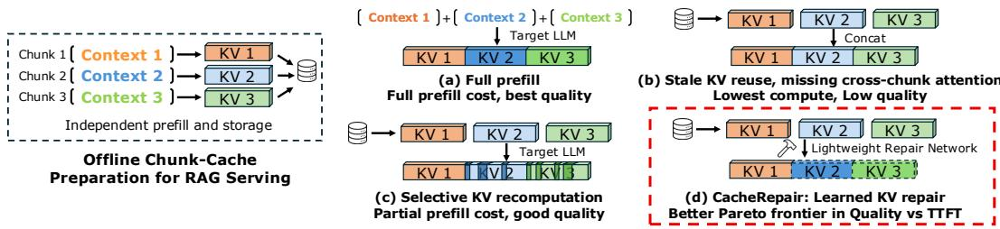  
Figure 1: CacheRepair’s paradigm: a lightweight KV cache repair network.

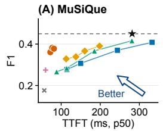

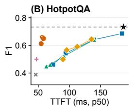

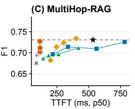

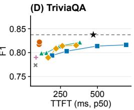  
Figure 2: Answer F1 versus p50 TTFT for Qwen2.5-14B on four downstream datasets.

Existing KV-fusion methods address this missing cross-chunk context in several ways. As we show in Figure 1(c), KV recomputation recomputes selective document tokens with the target LLM, using an online token budget to restore contextual information (Yao et al., 2025; Hu et al., 2025; Teng et al., 2026). Other methods reshape attention, adapt the target LLM, or learn reusable cache components during offline preparation (Yang et al., 2025c; Lu et al., 2024; Ma et al., 2025; Yang et al., 2025b; Chen et al., 2026). We investigate a central question: can a lightweight external network recover cross-chunk context directly in the stale KV, while preserving the frozen LLM and reusable caches?

Our empirical study of Qwen2.5-3B reveals structure in the difference between stale and joint KV. Errors form both boundary-local hotspots near chunk beginnings and layer-persistent bands extending across token positions in particular layers (Section 3). Thus, the discrepancy extends into chunk interiors as well as boundaries. Selective recomputation updates a subset of these positions; the broader error structure motivates repair across all document tokens. At the same time, stale KV already contains the computation performed within each chunk. These observations motivate using the existing cache as the starting point and learning the residual needed to approximate joint KV.

We introduce CacheRepair, the first lightweight network that predicts the residual between joint and stale KV caches for every document token (Figure 1(d)). Our key design replaces selective target-LLM recomputation with direct residual prediction by an external network, reducing online work while keeping the target LLM frozen. The StaleEncoder compresses KV features from all target LLM layers and combines them with projected frozen token embeddings, providing cache content and token identity. Block-causal attention allows bidirectional interaction within each chunk and passes information from earlier to later chunks. Each repair block receives a learned projection of the original cache features, maintaining cache conditioning throughout repair. An output skip connection adds the predicted residual to stale KV. For keys, we remove local rotary positional encoding (RoPE) (Su et al., 2023) before repair and apply global RoPE afterward, separating position alignment from learned context repair; values retain their original coordinates.

For each target LLM, we train repairers on a generic retrieval corpus and evaluate each fixed checkpoint on four downstream datasets: MuSiQue, HotpotQA, MultiHop-RAG, and TriviaQA. The same repairer serves all four downstream workloads. Our evaluation spans Qwen2.5-3B, Llama-3.1-8B, and Qwen2.5-14B. CacheRepair contributes at least one nondominated operating point in eleven of the twelve target–workload pairs (Figures 2, 5, and 6). For example, Figure 2 shows that three repairer sizes (42M, 104M, and 159M) for Qwen2.5-14B extend the quality–latency Pareto frontier of the evaluated baselines across all four downstream datasets. Across all twelve model–dataset combinations, the largest repairers deliver 1.69–4.61× speedups in p50 TTFT over Full Prefill and improve mean F1 by 2.1–26.1 percentage points over direct cache reuse. These latency measurements include online cache transfer, repair, and target-LLM processing through first-token generation. These results demonstrate that a repairer trained on generic retrieval data improves reused-cache quality across downstream tasks.

• Characterizing cross-chunk KV error. We identify structured boundary-local and layerpersistent stale-KV error patterns that motivate repair across document positions.

• Learning all-token KV residual repair. We develop a learned network that combines stale-cache features, token identity, and chunk-structured attention to repair KV for a frozen LLM.

• Improving quality at low latency. Across twelve model–dataset combinations, the largest repairers achieve 1.69–4.61× TTFT speedups over Full Prefill and gain 2.1–26.1 F1 percentage points over direct cache reuse, reusing each checkpoint across downstream tasks.

## 2 RELATED WORK AND PROBLEM SETTING

## 2.1 RELATED WORK

Multi-Document RAG. Retrieval-augmented generation combines retrieved evidence with language generation for knowledge-intensive answering (Lewis et al., 2020; Izacard & Grave, 2021). Retrieving multiple documents supplies broader evidence but also lengthens the input that the model must process before generating its first token. This additional prefill computation can substantially increase TTFT (Lu et al., 2024). Documents that recur across requests therefore offer an opportunity to reduce this cost by reusing precomputed KV caches.

KV Cache Reuse. Reusing previously computed KV states reduces repeated prompt processing. PromptCache organizes reusable prompt modules (Gim et al., 2024), while SGLang shares cached prefixes through a radix-tree structure (Zheng et al., 2024). For multi-document RAG, independently precomputing each chunk’s cache enables reuse across requests that retrieve different chunk combinations and orders (Lu et al., 2024; Yao et al., 2025). This flexibility introduces a context mismatch: independently cached chunks omit attention to preceding chunks in the assembled request. KV cache fusion addresses how to recover answer quality when these caches are used together.

KV Cache Fusion. One approach recovers cross-chunk context through selective target-LLM recomputation. CacheBlend selects tokens using KV deviation (Yao et al., 2025); EPIC focuses computation near chunk boundaries (Hu et al., 2025); and InfoFlow uses an information-flow signal (Teng et al., 2026). These methods control online target-LLM computation through the selected token budget. Related approaches combine partial recomputation with cache management or auxiliary-model token selection (Agarwal et al., 2025; Yang et al., 2025a). Other methods reshape attention (Yang et al., 2025c) or adapt the target LLM for independently encoded chunks and inter-document links (Lu et al., 2024; Ma et al., 2025; Yang et al., 2025b). KV Packet learns reusable soft-token headers and trailers during offline cache construction (Chen et al., 2026); Car tridges learns corpus-specific KV representations through offline self-study (Eyuboglu et al., 2025). CacheRepair uses a target-specific external network to reconstruct the frozen target LLM’s joint KV states by predicting residual corrections for every document token in the stale cache. The repaired KV entries provide cross-chunk context for query processing and answer generation.

## 2.2 PROBLEM SETTING AND OBJECTIVES

Independent Reuse and Stale Cache. A request r contains an ordered document sequence $D _ { r } \stackrel { - } { = } \left[ C _ { \pi _ { r } ( 1 ) } , \ldots , C _ { \pi _ { r } ( m ) } \right]$ followed by a query. Jointly prefilling $D _ { r }$ with a frozen target LLM M produces the request-specific joint-prefill KV cache $K V _ { \mathrm { j o i n t } , r } .$ Independent reuse instead prefills each chunk $C _ { i }$ once and stores its independently prefilled KV cache $\bar { K } V _ { \mathrm { i n d } } ( C _ { i } )$ . At serving time, the selected independently prefilled KV caches are aligned to global request positions by re-rotating K and concatenated into the stale KV cache $K V _ { \mathrm { s t a l e } , r }$ . The stale KV cache preserves each chunk’s independently computed KV cache but lacks the cross-chunk attention information in joint prefill; position alignment alone cannot recover that information, so $K V _ { \mathrm { s t a l e } , r } \neq K V _ { \mathrm { j o i n t } , r } .$

Learned KV-Cache Repair Target. We study a lightweight learned operator $\scriptstyle { \mathcal { R } } _ { \theta }$ that receives the stale KV cache together with the document tokens and chunk layout, and produces

$$
\widehat { K V } _ { r } = \mathcal { R } _ { \theta } ( K V _ { \mathrm { s t a l e } , r } , D _ { r } ) \approx K V _ { \mathrm { j o i n t } , r } .
$$

The joint-prefill KV cache serves as an offline learning and evaluation target; the target LLM remains frozen, and repair depends on the ordered documents, not the query text.

System Objectives and Constraints. Repair should approach joint-prefill quality by correcting cached KV directly, while keeping the target LLM frozen and retaining offline chunk reuse. We next examine the structure of cross-chunk KV error to guide the design of learned repair.

Normalized chunk position

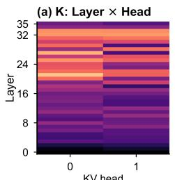  
KV head

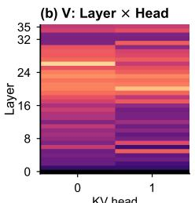  
KV head

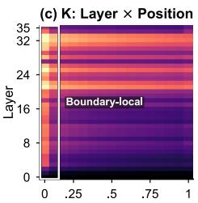

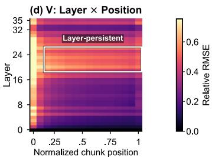  
Figure 3: Structured stale-KV error in Qwen2.5-3B on the first 256 MuSiQue requests. (a–b) Relative RMSE by layer and KV head. (c–d) Relative RMSE by layer and within-chunk position; outlines highlight boundary-local and layer-persistent patterns.

## 3 OBSERVATION

We examine where independently computed caches differ from joint prefill, asking which document positions and target-LLM layers need context repair.

Using frozen Qwen2.5-3B-Instruct (36 layers and two KV heads), we compare stale and joint KV on the first 256 MuSiQue requests (Trivedi et al., 2022). The requests contain 579,867 document tokens; the heatmaps cover the 545,276 tokens in chunks after the first, where preceding-document context becomes available during joint prefill. For each cell, relative RMSE is the square root of the ratio of summed squared KV error to summed squared joint-KV magnitude, pooling the corresponding entries across examples. Figure 3(a–b) groups entries by layer and KV head; panels (c–d) use 16 normalized within-chunk position bins, pooling both KV heads.

Cross-chunk KV error has boundary-local and layer-persistent structure. The layer–head maps show larger relative errors in several middle and upper layers. Resolving these errors by token position reveals two patterns. In both K and V, elevated error near chunk beginnings forms a vertical hotspot, and high-error bands span boundary and interior positions in particular layers. Thus, recovering cross-chunk context involves positions throughout the document, with error magnitude varying across layers and within-chunk locations. Appendix G shows these patterns across all three target LLMs.

This structure motivates learning a correction for every document token, including interior positions in layer-persistent error bands. Making all-token repair practical also requires keeping its online cost low. Selective recomputation limits this cost by rerunning the target LLM on only a subset of document tokens (Yao et al., 2025; Hu et al., 2025). For an N-token document cache and a selected fraction r, attention between the $r N$ selected tokens and the cache costs $O ( r N ^ { 2 } )$ at fixed target-LLM dimensions. Our repair network processes all tokens using fewer layers and smaller hidden dimensions. Its attention is also quadratic in N, so the cost comparison depends on network dimensions, token budgets, kernels, and cache movement. Section 5.3 and Appendix I quantify these costs across lengths. The stale cache already supplies chunk-local representations, allowing the repairer to focus its capacity on predicting the difference to joint KV. We therefore combine compressed stale-cache features, token information, and chunk-structured attention to provide broad repair coverage at low online cost (Section 4).

## 4 METHOD

As shown in Figure 4, CacheRepair takes the assembled stale KV and the corresponding document tokens as inputs. It compresses the cache and combines it with token embeddings from the frozen target LLM. Repair blocks exchange information across chunks, with the original cache features supplied to each block. The output head predicts KV residuals for every document token, which are added to the stale cache. After global positional encoding is applied to keys, the frozen target LLM uses the repaired cache to process the query and generate an answer.

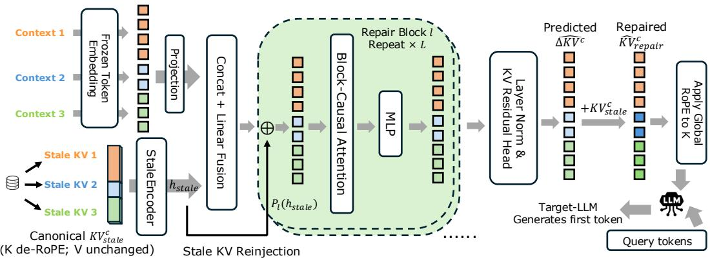  
Figure 4: CacheRepair inference pipeline. Compressed stale-KV features and token embeddings condition the repair blocks. Each block receives stale-feature reinjection; the predicted residual is added to the full stale KV before global RoPE is applied to K.

## 4.1 INFERENCE

Chunk-cache preparation. Each chunk is independently prefilled and cached in advance. To support its placement in different retrieved sequences, we store K in canonical coordinates, obtained by removing local rotary positional encoding (RoPE). Let $R _ { M } ( p )$ denote the target LLM’s native RoPE transformation at position $p .$ For a token t at local position $q _ { t }$ , the stored entries are

$$
K _ { \mathrm { i n d } , t } ^ { c } = R _ { M } ( q _ { t } ) ^ { - 1 } K _ { \mathrm { i n d } , t } , \qquad V _ { \mathrm { i n d } , t } ^ { c } = V _ { \mathrm { i n d } , t } .
$$

Coordinate convention. Throughout the method, $K V ^ { c }$ abbreviates the pair $( K ^ { c } , V )$ : the coordinate transformation applies to K, while V is stored and predicted in its native coordinates. Any $V ^ { c }$ notation denotes this same untransformed V.

At serving time, retrieved caches are concatenated in document order to form $K V _ { \mathrm { s t a l e } } ^ { c }$ . The target LLM’s rotary frequencies and scaling parameters determine $R _ { M }$

StaleEncoder and token fusion. The StaleEncoder compresses all layers of a token’s KV into a feature vector $s _ { t }$ of width $d _ { b }$ . For a target with $L _ { M }$ layers, $H _ { \mathrm { K V } }$ KV heads, and head dimension $d _ { h }$ each token has $S = 2 L _ { M } H _ { \mathrm { K V } }$ segments, one per layer, head, and K/V component. Each segment has its own learned $d _ { h }  d _ { \mathrm { s e g } }$ projection. The encoder concatenates these outputs and maps them to $d _ { b }$ . Its input is scaled by fixed per-coordinate RMS statistics $\sigma _ { \mathrm { s t a l e } } .$ , defined in Section 4.2. In parallel, a trainable projection $P _ { \mathrm { t o k } }$ maps the document token’s frozen target embedding $E _ { M } ( x _ { t } )$ to width $d _ { b } .$ . A linear fusion layer $F$ : R $\mathord { \ ? } 2 d _ { b } \mathord {  } \mathbb { R } ^ { d _ { b } }$ combines cache content and token identity:

$$
s _ { t } = \mathrm { S t a l e E n c o d e r } ( K V _ { \mathrm { s t a l e } , t } ^ { c } / \sigma _ { \mathrm { s t a l e } } ) , \qquad h _ { t } ^ { 0 } = F \bigl ( [ s _ { t } ; P _ { \mathrm { t o k } } E _ { M } ( x _ { t } ) ] \bigr ) .
$$

Here [ ; ] denotes feature concatenation and division is elementwise. The sequence $h ^ { 0 }$ is the input to the repair backbone.

Repair Blocks and stale-feature reinjection. For a sequence of $N$ document tokens, the backbone applies B Repair Blocks of width $d _ { b } ,$ , each combining attention and an MLP. Let $c ( t )$ be the index of token t’s chunk in request order. The block-causal mask permits token i to attend to token $j$ when

$$
A _ { i j } = \mathbf { 1 } [ c ( j ) \leq c ( i ) ] .
$$

Every retrieved chunk is fully available at repair time, enabling bidirectional interaction within it. Across chunks, information flows from earlier to later chunks, matching the direction of the missing context. Each block applies the repair backbone’s own RoPE to attention $\mathrm { Q }$ and K at absolute document positions $\boldsymbol { p } = \left( p _ { 1 } , \ldots , p _ { N } \right)$

To keep the cached representations available throughout this interaction, each block receives a learned projection of the original encoded features:

$$
h ^ { b } = \operatorname { R e p a i r B l o c k } _ { b } \bigl ( h ^ { b - 1 } + P _ { b } ( s ) ; A , p \bigr ) , \qquad b = 1 , \ldots , B .
$$

The encoded sequence $\boldsymbol s = ( s _ { 1 } , \ldots , s _ { N } )$ is computed once; each block has its own projection $P _ { b }$ This reinjection conditions the evolving hidden states on stale-cache content. The full stale KV is also preserved for the output addition described next.

KV residual output and global RoPE. Layer normalization and a linear KV Residual Head map $h _ { t } ^ { B }$ to a normalized residual $z _ { t }$ with $D _ { \mathrm { K V } } = \dot { S } d _ { h }$ coordinates. Appendix D analyzes residual structure, output-space capacity, and parameter allocation. Using the fixed residual scale $\sigma _ { \Delta }$ (Section 4.2), we recover the residual in KV units and add it to the complete stale cache:

$$
z _ { t } = \mathrm { K V R e s i d u a l H e a d } ( \mathrm { L N } ( h _ { t } ^ { B } ) ) , \qquad \widehat { K V } _ { \mathrm { r e p a i r } , t } ^ { c } = K V _ { \mathrm { s t a l e } , t } ^ { c } + \sigma _ { \Delta } \odot z _ { t } .
$$

This output skip connection retains the original KV entries while the network supplies their learned correction. Both terms use the canonical coordinate convention. We then place K at its global request position:

$$
\widehat { K } _ { \mathrm { r e p a i r } , t } = R _ { M } ( p _ { t } ) \widehat { K } _ { \mathrm { r e p a i r } , t } ^ { c } , \qquad \widehat { V } _ { \mathrm { r e p a i r } , t } = \widehat { V } _ { \mathrm { r e p a i r } , t } ^ { c } .
$$

The repairer processes every document token, including the first chunk. For that chunk, the independent and joint contexts coincide, giving a near-zero residual target; Appendix C reports its measured error before and after repair. The frozen target LLM consumes the repaired cache when processing the query and generating the answer; the serving integration is described in Section 5.

## 4.2 TRAINING

Paired cache supervision. For each ordered document sequence in the training corpus, the frozen target LLM produces both independently prefilled chunk caches and a joint-prefill cache for the identical tokens. We remove local RoPE from independently computed K and global RoPE from jointly computed K, placing both in canonical coordinates. Their difference provides the supervision:

$$
\Delta K V _ { t } ^ { c \star } = K V _ { \mathrm { j o i n t } , t } ^ { c } - K V _ { \mathrm { s t a l e } , t } ^ { c } .
$$

This target teaches the repairer to reconstruct the cross-chunk change in cached representations from document inputs.

Normalization and objective. We compute $\sigma _ { \mathrm { s t a l e } }$ and $\sigma _ { \Delta }$ by taking RMS values across trainingcorpus document tokens separately for each target layer, KV head, K/V component, and head coordinate. These scales normalize the input cache and target residual, respectively, and are stored with the checkpoint for serving. For an example with N document tokens, training minimizes mean squared error in normalized coordinates:

$$
\mathcal { L } _ { \mathrm { r e p a i r } } = \frac { 1 } { N D _ { \mathrm { K V } } } \sum _ { t = 1 } ^ { N } \left. z _ { t } - \Delta K V _ { t } ^ { c \star } / \sigma _ { \Delta } \right. _ { 2 } ^ { 2 } .
$$

Every document token and normalized KV coordinate receives equal weight. We optimize the StaleEncoder, token projection and fusion layer, Repair Blocks, reinjection projections, and output head. The resulting checkpoint pairs a target-specific repair network with fixed normalization statistics and is reused across downstream datasets.

## 5 EXPERIMENTS

## 5.1 EXPERIMENTAL SETUP

Models and training. We evaluate Qwen2.5-3B-Instruct and Qwen2.5-14B-Instruct (Qwen et al., 2025), and Llama-3.1-8B-Instruct (Grattafiori et al., 2024), with three repairer capacities per target (Table 4). We evaluate each repairer after six epochs on a generic retrieval corpus drawn from six sources (Appendix J). We use its epoch-six checkpoint and normalization statistics across all four downstream datasets. The target LLM remains frozen throughout training and evaluation.

Datasets and baselines. We evaluate 500 requests from each of four downstream datasets: MuSiQue (Trivedi et al., 2022), HotpotQA (Yang et al., 2018), MultiHop-RAG (Tang & Yang, 2024), and TriviaQA (Joshi et al., 2017). We screen questions and context against the training corpus to ensure a fair evaluation (Appendix A.1). All targets use the same questions; all methods use identical inputs for a given target. Each request contains at most 4,096 document tokens and 20 chunks. We compare CacheRepair with Full Prefill, direct Stale KV reuse, CacheBlend (Yao et al., 2025), EPIC (Hu et al., 2025), InfoFlow (Teng et al., 2026), and KV Packet (Chen et al., 2026). KV Packet uses a shared subset of 512 examples from the repair-training corpus (Appendix H). Appendix A gives the input preparation and configuration grids.

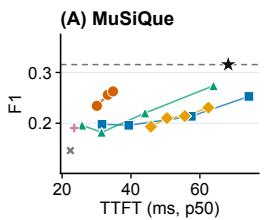

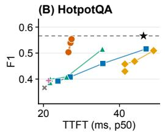

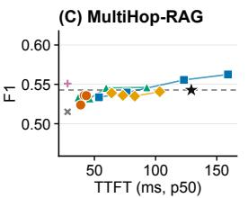  
Full Prefill CacheRepair (9/30/51M) EPIC + KV Packet x Stale KV CacheBlend InfoFlow

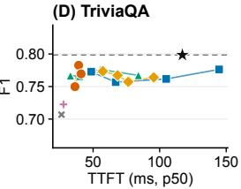  
Figure 5: Answer F1 versus p50 TTFT for Qwen2.5-3B on four downstream datasets.

Execution and metrics. The main evaluation runs one request at a time on one NVIDIA A800- SXM4-80GB, recording F1, EM, and TTFT from the same generation. TTFT includes cache transfer, positional alignment, repair or token selection and recomputation, query processing, and firsttoken generation; independent cache construction and host preparation are completed beforehand. We report mean F1 and p50 TTFT; p90 and p99 latencies are included in the accompanying data. We bootstrap requests to estimate uncertainty and use paired draws for method comparisons. Appendix A specifies the runtime, timing, and statistical procedures.

## 5.2 RESULTS

The Pareto plots show all tested configurations on the hardware and runtime specified above. Frontier membership uses mean F1 and p50 TTFT point estimates. Lines connect settings in the order listed in Appendix A; dashed lines mark Full Prefill F1. Panels use separate axis ranges.

How does CacheRepair compare with the baselines? CacheRepair contributes quality–TTFT frontier points in 11 of the 12 model–dataset settings among the evaluated configurations. These comparisons include CacheBlend, EPIC, InfoFlow, and KV Packet. Figure 5 shows frontier points on three Qwen2.5-3B datasets. On MultiHop-RAG, KV Packet has lower TTFT and higher mean F1 in the main 500-request batch; Appendix A.2 reports an independent batch and paired quality intervals. These results show that CacheRepair advances the measured quality–latency frontier across target LLMs and downstream datasets.

How much quality is retained at half the Full Prefill latency? We set a budget of $0 . 5 T _ { \mathrm { f u l l } }$ and select, for each method, its largest tested capacity or recomputation setting whose p50 TTFT meets the budget. Selection uses latency alone. Table 3 summarizes all twelve settings. CacheRepair’s mean F1 exceeds every eligible baseline in nine; simultaneous paired intervals remain positive in four. The remaining three settings use Qwen2.5-3B: no repairer meets the HotpotQA budget, and the highest eligible means on MultiHop-RAG and TriviaQA belong to KV Packet and EPIC, respec tively. Appendix B provides the per-method scores.

How do results vary across target LLMs? CacheRepair contributes frontier points on all four datasets for both Llama-3.1-8B and Qwen2.5-14B (Figures 6 and 2). On Qwen2.5-14B/MultiHop-RAG, the 159M repairer achieves 72.71% F1 at 115.74 ms, compared with 72.55% for CacheBlend 0.6, giving a 6.76× TTFT speedup. The paired F1 difference is +0.16 points with a 95% interval [−1.95, 2.26], with closely matched mean answer F1.

Across all twelve settings, the largest repairers are 1.30–6.76× faster than the highest tested recomputation presets (CacheBlend 0.6, EPIC64, and InfoFlow 0.25). Their F1 differences range from −3.86 to +4.43 points; Appendix B reports the comparison scope and uncertainty. Relative to the reference methods, these repairers improve Stale KV F1 by 2.1–26.1 points and provide 1.69–4.61× speedups over Full Prefill. Table 11 gives the corresponding Full Prefill quality differences for every setting.

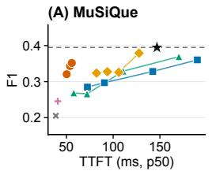

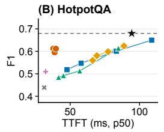

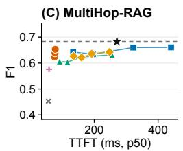

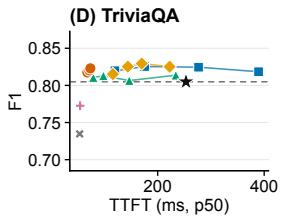  
Figure 6: Answer F1 versus p50 TTFT for Llama-3.1-8B on four downstream datasets.

Table 1: Median online latency components (ms) for the largest repairers on MultiHop-RAG. TTFT also includes query processing, first-token generation, and runtime overhead. Component medians do not sum to median TTFT.
<table><tr><td>Target LLM</td><td>H2D</td><td>Mask</td><td>Repair</td><td>RoPE</td><td>KV write</td><td>TTFT</td></tr><tr><td>Qwen2.5-3B</td><td>6.30</td><td>1.25</td><td>12.55</td><td>2.17</td><td>1.29</td><td>43.41</td></tr><tr><td>Llama-3.1-8B</td><td>20.78</td><td>1.37</td><td>18.14</td><td>6.56</td><td>3.63</td><td>77.85</td></tr><tr><td>Qwen2.5-14B</td><td>33.08</td><td>1.44</td><td>26.52</td><td>10.01</td><td>5.60</td><td>115.74</td></tr></table>

What contributes to CacheRepair’s TTFT? Table 1 reports measurements from the largest repairer for each target on MultiHop-RAG. Median repair execution takes 12.55/18.14/26.52 ms for Qwen2.5-3B/Llama-3.1-8B/Qwen2.5-14B, while host-to-device transfer takes 6.30/20.78/33.08 ms. Cache transfer takes longer than repair on Llama-3.1-8B and Qwen2.5-14B, reflecting the cost of moving larger KV tensors. From 3B to 14B, repair time grows only 2.11×, while Full Prefill TTFT grows 4.13×. This slower growth favors larger target LLMs: the speedup over Full Prefill rises from 2.98× to 4.61× on this workload.

What do the design choices contribute? Table 2 compares six variants after two epochs (25,000 updates) on the same training data and MuSiQue requests. A0, the full design, reaches 0.2462 F1. Block-diagonal attention reaches 0.0133, supporting the importance of cross-chunk information exchange. Removing the residual output path while retaining the same normalization reaches 0.0049. With joint-RMS normalization, direct prediction reaches 0.0118 after the same two epochs, giving A0 a 23.44-point mean F1 advantage (Appendix F). The token-causal, bidirectional, and entranceonly variants differ from A0 by at most 0.62 F1 percentage points in Table 2. Block-causal attention enables cross-chunk information exchange while preserving document order. It achieves the highest mean F1 among the evaluated attention variants. Appendix F reports regional KV errors and training details.

## 5.3 KV ERROR BEFORE AND AFTER REPAIR

We compare the 30M Qwen2.5-3B repairer’s KV output with stale and joint KV on MuSiQue. We pool squared error and joint-KV magnitude as in Section 3. In later chunks, the boundary region contains the first eight tokens; the interior contains the remaining tokens. Repair reduces K relative RMSE from 0.310 to 0.143 at boundaries (53.9%) and from 0.182 to 0.089 in interiors (50.9%). V relative RMSE decreases by 24.4% and 16.2%, respectively. Paired 95% bootstrap intervals for all four reductions lie above zero. Repair reduces error in both boundary and interior regions. Appendix C provides layer–position maps, distance profiles, and regional uncertainty estimates. These improvements also bring the target LLM’s behavior closer to Full Prefill. On 256 MuSiQue requests, repair reduces teacher-forced output KL from 1.731 to 0.555 and query attention-output relative RMSE from 0.598 to 0.328 compared with Stale KV. Both metrics measure deviation from Full Prefill (Appendix E).

Sensitivity to chunk count. With document content fixed, increasing the chunk count from 8 to 16 reduces Stale KV F1 from 0.231 to 0.165. CacheRepair 30M achieves 0.289 and 0.277, respectively, while its p50 TTFT stays near 33 ms. CacheRepair thus maintains higher answer quality than Stale

Table 2: Six repairer variants trained for two epochs and evaluated on the same 500 MuSiQue requests with Qwen2.5-3B. ∆F1 is computed from the reported mean F1 values relative to A0, in percentage points.
<table><tr><td>Variant</td><td>Params (M)</td><td>F1</td><td>EM</td><td>∆F1 (pp)</td><td>TTFT p50 / p90 (ms)</td></tr><tr><td>Full Prefill</td><td></td><td>0.3155</td><td>0.232</td><td>一</td><td>68.24 / 90.81</td></tr><tr><td>Stale KV</td><td></td><td>0.1462</td><td>0.072</td><td>一</td><td>22.41 / 24.33</td></tr><tr><td>A0 CacheRepair</td><td>29.8</td><td>0.2462</td><td>0.172</td><td>0</td><td>28.86 / 33.23</td></tr><tr><td>A1 Token-causal</td><td>29.8</td><td>0.2421</td><td>0.172</td><td>-0.41</td><td>28.84 / 32.93</td></tr><tr><td>A2 Bidirectional</td><td>29.8</td><td>0.2427</td><td>0.164</td><td>-0.35</td><td>29.42 / 33.48</td></tr><tr><td>A3 Block diagonal</td><td>29.8</td><td>0.0133</td><td>0.000</td><td>-23.29</td><td>29.57 / 33.46</td></tr><tr><td>A4 Entrance-only</td><td>28.3</td><td>0.2400</td><td>0.162</td><td>-0.62</td><td>28.68 / 32.98</td></tr><tr><td>A5 Direct joint KV</td><td>29.8</td><td>0.0049</td><td>0.000</td><td>-24.13</td><td>29.12 / 32.95</td></tr></table>

KV as chunk count increases, with nearly constant TTFT. Appendix I reports all methods at 4, 8, 12, and 16 chunks, including paired quality intervals and resource measurements.

Computational advantage of all-token repair. At 16K document tokens, the largest repairers achieve 3.43–6.14× p50 TTFT speedups over Full Prefill while using 2.0–4.0% of its dense matrix MACs. Across the measured 4K, 8K, and 16K lengths, all three repairer capacities have lower p50 TTFT than every CacheBlend and InfoFlow preset. Comparisons with fixed per-chunk EPIC budgets depend on length and repairer capacity. Appendix I reports all 270 configurations, measured crossovers, and memory costs.

Table 3: CacheRepair versus the highest-scoring baseline at half of Full Prefill p50 TTFT. Each method first selects its largest tested setting satisfying the budget, using latency alone. Brackets are simultaneous 95% paired-bootstrap bands across all eligible baseline methods within that panel; complete pairwise comparisons accompany the artifact. A dash indicates no eligible repairer.
<table><tr><td>Target</td><td>Dataset</td><td>Repair</td><td>Baseline</td><td>∆F1 (pp) and interval</td></tr><tr><td>Qwen2.5-3B</td><td>MuSiQue</td><td>30M</td><td>CacheBlend 0.1</td><td>+5.80 [+1.45, +10.15]</td></tr><tr><td>Qwen2.5-3B</td><td>HotpotQA</td><td></td><td></td><td></td></tr><tr><td>Qwen2.5-3B</td><td>MultiHop-RAG</td><td>51M</td><td>KV Packet</td><td>-1.53 [-5.65, +2.60]</td></tr><tr><td>Qwen2.5-3B</td><td>TriviaQÁ</td><td>51M</td><td>EPIC 32</td><td>-0.68 [-4.46, +3.11]</td></tr><tr><td>Llama-3.1-8B</td><td>MuSiQue</td><td>93M</td><td>CacheBlend 0.1</td><td>+6.69 [+2.07, +11.31]</td></tr><tr><td>Llama-3.1-8B</td><td>HotpotQA</td><td>93M</td><td>KV Packet</td><td>+10.21 [+5.49, +14.94]</td></tr><tr><td>Llama-3.1-8B</td><td>MultiHop-RAG</td><td>93M</td><td>CacheBlend 0.1</td><td>+1.07 [-3.18, +5.31]</td></tr><tr><td>Llama-3.1-8B</td><td>TriviaQA</td><td>93M</td><td>CacheBlend 0.1</td><td>+0.33 [-3.16, +3.82]</td></tr><tr><td>Qwen2.5-14B</td><td>MuSiQue</td><td>159M</td><td>InfoFlow 0.1</td><td>+3.93 [-0.65, +8.50]</td></tr><tr><td>Qwen2.5-14B</td><td>HotpotQA</td><td>159M</td><td>EPIC 32</td><td>+12.72 [+7.78, +17.67]</td></tr><tr><td>Qwen2.5-14B</td><td>MultiHop-RAG</td><td>159M</td><td>InfoFlow 0.1</td><td>+1.34 [-2.18, +4.85]</td></tr><tr><td>Qwen2.5-14B</td><td>TriviaQÁ</td><td>159M</td><td>InfoFlow 0.1</td><td>+1.36 [-1.57, +4.29]</td></tr></table>

## 6 DISCUSSION

Per-target-LLM training and deployment. Each frozen target LLM uses its own repairer and normalization statistics (Table 4). This design targets services with stable target LLMs and frequent document reuse. Training and statistics costs equal the saved first-token time of 2.02–5.80 million serial requests (Appendix I); actual service costs depend on load and hardware. Changes to model weights, quantization, or RoPE configuration require checking the resulting KV distribution and repairer.

Document length and serving conditions. The main Pareto curves measure single-request TTFT on one A800 with warm pinned-host caches. All-token repair has $\Theta ( N ^ { 2 } )$ attention cost. Appendix I reports longer-context quality, system-cost crossovers, and concurrent serving. The concurrentserving measurements use per-request repair. Future work will batch repair across requests and pipeline H2D transfer, repair, and KV writes to improve concurrent throughput.

Training and cross-dataset generalization. CacheRepair learns KV residuals through offline training on generic retrieval documents. Each target-specific checkpoint and its statistics are fixed before evaluation and reused across four downstream datasets, selected as described in Appendix A.1. Under the same two-epoch training budget, MSE achieves the highest mean answer F1 among the three evaluated objectives (Appendix E), supporting its use as the default training objective.

## 7 CONCLUSION

CacheRepair learns all-token KV residual repair for a frozen target LLM and reuses each repairer across four downstream datasets. The largest repairers achieve 1.69–4.61× p50 TTFT speedups over Full Prefill and improve Stale KV F1 by 2.1–26.1 percentage points. CacheRepair contributes nondominated quality–TTFT points in eleven of twelve model–dataset settings among the evaluated configurations, extending the frontier alongside selective recomputation and learned cache fusion.

## AI USE DISCLOSURE

We used OpenAI’s GPT-5.6 Sol and GPT-6 Astra to support drafting, editing, and language polishing, as well as research execution. Research assistance included refining experimental plans, implementing and debugging code, analyzing and interpreting results, and preparing figures and tables. The authors directed these activities and take responsibility for the correctness of the experiments, the interpretation of the results, and the final manuscript, including all AI-assisted content.

## REFERENCES

Shubham Agarwal, Sai Sundaresan, Subrata Mitra, Debabrata Mahapatra, Archit Gupta, Rounak Sharma, Nirmal Joshua Kapu, Tong Yu, and Shiv Saini. Cache-Craft: Managing chunk-caches for efficient retrieval-augmented generation, 2025. URL https://arxiv.org/abs/2502. 15734. Accepted at SIGMOD 2025.

Chuangtao Chen, Grace Li Zhang, Xunzhao Yin, Cheng Zhuo, Bing Li, and Ulf Schlichtmann. Kv packet: Recomputation-free context-independent kv caching for llms, 2026. URL https: //arxiv.org/abs/2604.13226.

Sabri Eyuboglu, Ryan Ehrlich, Simran Arora, Neel Guha, Dylan Zinsley, Emily Liu, Will Tennien, Atri Rudra, James Zou, Azalia Mirhoseini, and Christopher Re. Cartridges: Lightweight and´ general-purpose long context representations via self-study, 2025. URL https://arxiv. org/abs/2506.06266.

In Gim, Guojun Chen, Seung seob Lee, Nikhil Sarda, Anurag Khandelwal, and Lin Zhong. Prompt cache: Modular attention reuse for low-latency inference, 2024. URL https://arxiv.org/ abs/2311.04934.

Aaron Grattafiori, Abhimanyu Dubey, Abhinav Jauhri, Abhinav Pandey, Abhishek Kadian, et al. The Llama 3 Herd of Models, 2024. URL https://arxiv.org/abs/2407.21783.

Junhao Hu, Wenrui Huang, Haoyi Wang, Weidong Wang, Tiancheng Hu, Qin Zhang, Hao Feng, Xusheng Chen, Yizhou Shan, and Tao Xie. Epic: Efficient position-independent caching for serving large language models, 2025. URL https://arxiv.org/abs/2410.15332.

Gautier Izacard and Edouard Grave. Leveraging passage retrieval with generative models for open domain question answering. In Proceedings of EACL, pp. 874–880. Association for Computational Linguistics, 2021. doi: 10.18653/v1/2021.eacl-main.74. URL https:// aclanthology.org/2021.eacl-main.74/.

Mandar Joshi, Eunsol Choi, Daniel Weld, and Luke Zettlemoyer. TriviaQA: A large scale distantly supervised challenge dataset for reading comprehension. In Proceedings of the 55th Annual Meeting of the Association for Computational Linguistics (Volume 1: Long Papers), pp. 1601–1611. Association for Computational Linguistics, 2017. doi: 10.18653/v1/P17-1147. URL https://aclanthology.org/P17-1147/.

Patrick Lewis, Ethan Perez, Aleksandra Piktus, Fabio Petroni, Vladimir Karpukhin, Naman Goyal, Heinrich Kuttler, Mike Lewis, Wen-tau Yih, Tim Rockt¨ aschel, Sebastian Riedel,¨ and Douwe Kiela. Retrieval-augmented generation for knowledge-intensive NLP tasks. In H. Larochelle, M. Ranzato, R. Hadsell, M.F. Balcan, and H. Lin (eds.), Advances in Neural Information Processing Systems, volume 33, pp. 9459–9474. Curran Associates, Inc., 2020. URL https://proceedings.neurips.cc/paper\_files/paper/2020/ file/6b493230205f780e1bc26945df7481e5-Paper.pdf.

Nelson F. Liu, Kevin Lin, John Hewitt, Ashwin Paranjape, Michele Bevilacqua, Fabio Petroni, and Percy Liang. Lost in the middle: How language models use long contexts. Transactions of the Associationfor Computational Linguistics, 12:157–173, 2024. doi: 10.1162/tacl a 00638. URL https://aclanthology.org/2024.tacl-1.9/.

Songshuo Lu, Hua Wang, Yutian Rong, Zhi Chen, and Yaohua Tang. Turborag: Accelerating retrieval-augmented generation with precomputed kv caches for chunked text, 2024. URL https://arxiv.org/abs/2410.07590.

Dongyang Ma, Yan Wang, and Tian Lan. Block-attention for efficient prefilling. In Y. Yue, A. Garg, N. Peng, F. Sha, and R. Yu (eds.), International Conference on Learning Representations, volume 2025, pp. 63774–63788, 2025. URL https://proceedings.iclr.cc/paper\_files/paper/2025/file/ a03037317560b8c5f2fb4b6466d4c439-Paper-Conference.pdf.

Fabio Petroni, Aleksandra Piktus, Angela Fan, Patrick Lewis, Majid Yazdani, Nicola De Cao, James Thorne, Yacine Jernite, Vladimir Karpukhin, Jean Maillard, Vassilis Plachouras, Tim Rocktaschel, and Sebastian Riedel. KILT: a benchmark for knowledge intensive language¨ tasks. In Proceedings of NAACL-HLT, pp. 2523–2544. Association for Computational Linguistics, 2021. doi: 10.18653/v1/2021.naacl-main.200. URL https://aclanthology.org/ 2021.naacl-main.200/.

Qwen, An Yang, Baosong Yang, Beichen Zhang, Binyuan Hui, et al. Qwen2.5 Technical Report, 2025. URL https://arxiv.org/abs/2412.15115.

Jianlin Su, Yu Lu, Shengfeng Pan, Ahmed Murtadha, Bo Wen, and Yunfeng Liu. Roformer: Enhanced transformer with rotary position embedding, 2023. URL https://arxiv.org/abs/ 2104.09864.

Yixuan Tang and Yi Yang. Multihop-rag: Benchmarking retrieval-augmented generation for multihop queries. In Conference on Language Modeling, 2024. URL https://openreview. net/forum?id=t4eB3zYWBK.

Xin Teng, Canyu Zhang, Shaoyi Zheng, Danyang Zhuo, Tianyi Zhou, and Shengjie Wang. Infoflow kv: Information-flow-aware kv recomputation for long context, 2026. URL https://arxiv. org/abs/2603.05353.

Harsh Trivedi, Niranjan Balasubramanian, Tushar Khot, and Ashish Sabharwal. MuSiQue: Multihop questions via single-hop question composition. Transactions of the Association for Computational Linguistics, 10:539–554, 2022. doi: 10.1162/tacl a 00475. URL https: //aclanthology.org/2022.tacl-1.31/.

Liang Wang, Haonan Chen, Nan Yang, Xiaolong Huang, Zhicheng Dou, and Furu Wei. Chainof-retrieval augmented generation, 2025. URL https://arxiv.org/abs/2501.14342. Accepted at NeurIPS 2025.

Bin Yang, Qiuyu Leng, Jun Zeng, and Zhenhua Wu. CacheClip: Accelerating RAG with effective KV cache reuse, 2025a. URL https://arxiv.org/abs/2510.10129.

Jingbo Yang, Bairu Hou, Wei Wei, Yujia Bao, and Shiyu Chang. Kvlink: Accelerating large language models via efficient kv cache reuse, 2025b. URL https://arxiv.org/abs/2502. 16002.

Xinyu Yang, Tianqi Chen, and Beidi Chen. Ape: Faster and longer context-augmented generation via adaptive parallel encoding, 2025c. URL https://arxiv.org/abs/2502.05431. ICLR 2025.

Zhilin Yang, Peng Qi, Saizheng Zhang, Yoshua Bengio, William Cohen, Ruslan Salakhutdinov, and Christopher D. Manning. HotpotQA: A dataset for diverse, explainable multi-hop question answering. In Proceedings of the 2018 Conference on Empirical Methods in Natural Language Processing, pp. 2369–2380. Association for Computational Linguistics, 2018. doi: 10.18653/v1/ D18-1259. URL https://aclanthology.org/D18-1259/.

Jiayi Yao, Hanchen Li, Yuhan Liu, Siddhant Ray, Yihua Cheng, Qizheng Zhang, Kuntai Du, Shan Lu, and Junchen Jiang. Cacheblend: Fast large language model serving for rag with cached knowledge fusion, 2025. URL https://arxiv.org/abs/2405.16444.

Lianmin Zheng, Liangsheng Yin, Zhiqiang Xie, Chuyue Sun, Jeff Huang, Cody Hao Yu, Shiyi Cao, Christos Kozyrakis, Ion Stoica, Joseph E. Gonzalez, Clark Barrett, and Ying Sheng. Sglang: Efficient execution of structured language model programs, 2024. URL https://arxiv. org/abs/2312.07104.

## APPENDIX CONTENTS

Section Page   
A Evaluation Details 14   
A.1 Dataset selection 15   
A.2 Answer-F1 variation 16   
B Common-Budget Results Across Target LLMs 17   
C Detailed KV Repair Measurements 19   
D Residual Structure and Repair Capacity 19   
E Training Objectives and Functional Effects 21   
F Attention Topology and Within-Chunk Context 23   
G Cross-Model Validation of KV-Error Structure 25   
H Learned-Fusion Baseline Compatibility 27   
I Scaling and Amortization Details 27   
J Generic Repair Pretraining Corpus Composition 32

## A EVALUATION DETAILS

Comparison scope. We evaluate cache fusion with a fixed target LLM, preserving its deployed weights and behavior on requests that do not use document-cache fusion. Methods that fine-tune the target LLM address a complementary setting with a different joint-prefill reference. Our baselines share the frozen target and downstream inputs, allowing the comparison to isolate how each method constructs the reusable document KV.

Repairer configurations. Table 4 reports the three capacity levels for each target. Width $d _ { b } ,$ block count B, and segment dimension $d _ { \mathrm { s e g } }$ determine capacity together with the target-specific encoder, token projection, and KV head. Each Repair Block has 64-dimensional attention heads and an MLP expansion ratio of three. Pareto points are labeled by rounded trainable parameter counts.

Table 4: Trained CacheRepair configurations for each target LLM. Parameter counts are rounded to the nearest million.
<table><tr><td>Target LLM</td><td>Size</td><td> $d _ { b }$ </td><td>B</td><td> $d _ { \mathrm { s e g } }$ </td><td>Parameters</td></tr><tr><td rowspan="3">Qwen2.5-3B</td><td>Small</td><td>256</td><td>5</td><td>8</td><td>9M</td></tr><tr><td>Medium</td><td>512</td><td>6</td><td>16</td><td>30M</td></tr><tr><td>Large</td><td>704</td><td>6</td><td>24</td><td>51M</td></tr><tr><td rowspan="3">Llama-3.1-8B</td><td>Small</td><td>256</td><td>5</td><td>8</td><td>23M</td></tr><tr><td>Medium</td><td>512</td><td>6</td><td>16</td><td>59M</td></tr><tr><td>Large</td><td>704</td><td>6</td><td>24</td><td>93M</td></tr><tr><td rowspan="3">Qwen2.5-14B</td><td>Small</td><td>320</td><td>5</td><td>8</td><td>42M</td></tr><tr><td>Medium</td><td>640</td><td>6</td><td>16</td><td>104M</td></tr><tr><td>Large</td><td>832</td><td>7</td><td>24</td><td>159M</td></tr></table>

Document preparation. MultiHop-RAG uses query-only BM25 retrieval, with the contexts partitioned into 20 chunks; TriviaQA also uses 20 chunks. MuSiQue and HotpotQA retain their fixed context segmentation. We preserve context order and content tokenization. Each target’s native chat template wraps the context and full question, prepending opening tokens to the first chunk. After the documents, the user message contains two newline characters followed by the exact suffix below; <question> is replaced with the full question. The native chat template then supplies the assistant-generation prefix.

Answer the question based on the passages. Return only the minimal answer phrase, with

no explanation or extra description. Do not restate the question.

Question: <question>

Answer:

The 4,096-token document budget yields prefixes of at most 4,120 tokens and query suffixes of at most 158 tokens.

Online execution and timing. We use vLLM 0.8.5 V1, BF16, tensor parallelism one, and greedy generation capped at 32 tokens. Online TTFT accounts for method-specific H2D transfer, global RoPE, repair or scoring/selection/recomputation, query processing, and first-token generation. Independent chunk compilation and pinned-host preparation precede timing. For InfoFlow, separately timed scoring, selection, and main-preparation costs are added to the main generation’s schedulerto-first-token measurement, including work before scheduler admission. Stale KV and KV Packet share the cached-prefix transfer, global-RoPE, and paged-cache injection implementation. Stale KV and CacheRepair load independently compiled and repaired prefixes, respectively, through the last complete 16-token cache block. Any remaining document tokens are processed with the query and included in TTFT. KV Packet loads its complete physical prefix, including learned header and trailer entries.

Optimization. We use AdamW with $( \beta _ { 1 } , \beta _ { 2 } ) \ : = \ : ( 0 . 9 , 0 . 9 5 )$ , weight decay 0.01, unit gradient clipping, an effective document batch of four, and BF16 target-LLM execution. The main repairers follow a 100,000-update learning-rate schedule: 2,000 warmup updates to $3 \times 1 0 ^ { - 4 }$ , followed by cosine decay toward $3 \times 1 0 ^ { - 5 }$ . We evaluate update 75,000, after six complete passes over the training corpus. The controlled two-epoch comparisons use a 25,000-update schedule with 500 warmup updates and the same peak and final learning rates.

Recomputation grids. CacheBlend uses its released V-deviation selector at ratios 0.10, 0.20, 0.40, and 0.60; EPIC uses boundary widths 8, 16, 32, and 64; InfoFlow uses ratios 0.05, 0.10, 0.15, and 0.25 with attention-mass scores from layers 22–25 (zero-indexed), following the layer range used across models in the original paper (Teng et al., 2026). We retain this common preset across targets; the comparison measures the released layer choice rather than a separately optimized selector for each LLM. A scoring pass supplies a global token ranking; selected tokens are then recomputed in their original positions. The scoring pass ends after layer 25; the main generation executes every target-LLM layer. Both passes reuse the request’s materialized GPU cache.

Serving and statistics. We score the first generated answer line using conversion to lowercase, punctuation and article removal, and whitespace normalization; standalone yes/no answers followed by punctuation are parsed as boolean answers. F1 and EM take the maximum over the supplied gold aliases. Mean-F1 confidence intervals use 10,000 request-bootstrap draws with seed 20260730; differences between methods use paired draws of the same requests.

Full recomputation. On all 500 Qwen2.5-3B/MultiHop-RAG requests and all 500 Llama-3.1- 8B/TriviaQA requests, setting CacheBlend or InfoFlow to recompute every document token reproduces Full Prefill’s generated tokens exactly. Full Prefill also produces identical tokens using the baseline engine’s cache allocation and batching limits, and through its evaluation entry point. All four comparisons preserve inputs and decoding settings; all 4,000 generations match Full Prefill.

## A.1 DATASET SELECTION

We select 500 requests for each downstream dataset from the complete public source pool: MuSiQue development, HotpotQA validation (distractor), MultiHop-RAG’s public questions, and TriviaQA validation (reading comprehension). Selection uses a fixed comparison against the original passage texts referenced by the actual repair-training manifests. The three manifests share the same 50,000 source-query rows and ordered passage texts, yielding 488,823 distinct passage texts. We normalize both sides with Unicode NFKC, case folding, and alphanumeric tokens separated at punctuation and whitespace, retaining numbers and stopwords.

Matching rules. A request is excluded when any of the following conditions holds. A (evidence sentence): a complete evidence sentence of at least eight normalized tokens occurs contiguously in a training passage. Evidence uses HotpotQA’s supporting sentences, sentences of MuSiQue’s supporting paragraphs, MultiHop-RAG’s evidence facts, and TriviaQA’s supplied document evidence. Sentence splitting uses English PySBD 0.3.4. B (input context): a contiguous 50-token span in any supplied context document matches a training passage. Both sides use stride one; context coverage includes distractors and target-specific retained text, with source-document boundaries preserved. Hash lookups are followed by exact token comparisons. C (question provenance): a normalized full or resolved component question equals a training-source question, or a preserved source-ID mapping or confirmed question/fact correspondence identifies the training seed. MuSiQue component references are resolved using their preceding component answers; the mapping records include the official single-hop identifiers.

Deterministic selection and shared inputs. We rank source IDs by SHA256 of the fixed string 20260908|dataset|source id, remove repeated normalized questions, and take the first 500 eligible requests plus 50 reserves. Screening stops after these 550 requests; Table 5 reports the can didates examined. Model predictions are not used for selection. All selected requests are checked again under the same rules. The four downstream datasets contain 2,000 distinct normalized questions. All target LLMs and methods use the same sample identities and order, with fixed retrieved content, target-specific tokenization, and native chat templates. Context selection uses question text and source context order; reference answers are used for scoring. Each measured request supplies both quality and TTFT.

The code release provides the fixed evaluation question IDs, input hashes, source specifications, and scripts for reconstructing the evaluation inputs. The checks cover the stated text and provenance conditions; semantic paraphrases and target-LLM pretraining corpora remain outside their scope.

Table 5: Request selection for the four downstream datasets. Rule counts refer to examined candidates and can overlap; the union column counts requests excluded by at least one rule. Each dataset retains 500 evaluation requests and 50 reserves.
<table><tr><td>Dataset</td><td>Public pool</td><td>Examined</td><td>A</td><td>B</td><td>C</td><td>Union</td><td>Repeated</td></tr><tr><td>MuSiQue</td><td>2,417</td><td>2,375</td><td>705</td><td>1,695</td><td>264</td><td>1,818</td><td>7</td></tr><tr><td>HotpotQA</td><td>7,405</td><td>822</td><td>67</td><td>249</td><td>0</td><td>272</td><td>0</td></tr><tr><td>MultiHop-RAG</td><td>2,556</td><td>550</td><td>0</td><td>0</td><td>0</td><td>0</td><td>0</td></tr><tr><td>TriviaQÁ</td><td>17,944</td><td>1,123</td><td>540</td><td>379</td><td>1</td><td>541</td><td>32</td></tr></table>

MuSiQue composition. All methods are compared on the same 500 questions, selected by fixed content rules before generation. The selection spans two-, three-, and four-hop reasoning. Using the official source IDs to identify hop count, the public pool has 1,252/760/405 two-/three-/four-hop questions (51.8/31.4/16.8%). The selected 500 contain 283/179/38 (56.6/35.8/7.6%); the 2,375 examined candidates have proportions 51.8/31.5/16.7%. These counts specify the evaluation mixture used for every method and make its composition comparable with the public source pool.

## A.2 ANSWER-F1 VARIATION

Full Prefill provides the fully contextualized KV reference. Cache fusion changes the generated answer, including its content and wording; its answer F1 is therefore not constrained to lie between Stale KV and Full Prefill. When the reference scores are close—as on Qwen2.5-3B/MultiHop-RAG, where the original-batch gap is 2.77 percentage points—changes on a small number of requests can alter the ordering of mean scores.

We select 500 additional requests for each of Qwen2.5-3B/MultiHop-RAG and Llama-3.1- 8B/TriviaQA using Appendix A.1’s rules, freezing both lists before generation. All 18 configurations retain their weights and evaluation settings. We compare the original, additional, and combined batches using 10,000 paired bootstrap draws (seed 20260911); combined TTFT pools all per-request measurements.

For Qwen2.5-3B/MultiHop-RAG, CacheRepair 30M minus KV Packet is −1.51 F1 points [−4.98, 2.01] on the original 500 requests and +3.82 [0.22, 7.42] on the additional 500. Across all 1,000 requests, their F1 scores are 55.20% and 54.04%, with a paired difference of +1.16 [−1.32, 3.62]; their p50 TTFTs are 41.29 and 27.78 ms, respectively. Thus the batches give different quality or derings while KV Packet remains faster. On these combined requests, KV Packet and CacheBlend 0.6 differ from Full Prefill by −0.84 and +1.34 points; their pointwise 95% intervals both include zero. On Llama-3.1-8B/TriviaQA, InfoFlow 0.15 scores higher than Full Prefill in both batches, with a combined difference of +2.18 points [0.88, 3.51]. Table 6 gives the original-batch paired results. Answer wording contributes: Full Prefill produces “Ozone (a form of oxygen)” and InfoFlow “Ozone.”, scoring 0.40 and 1.00 token F1, respectively. Other changed predictions identify different entities.

Table 6: Answer-level comparisons on the complete 500-request datasets. F1 is shown as a percentage. Differences are method minus Full Prefill, with pointwise 95% paired request-bootstrap intervals from 10,000 draws. W/L counts requests with higher/lower F1 than Full Prefill; the remaining requests have equal F1.
<table><tr><td>Target / dataset</td><td>Method</td><td>Full F1</td><td>Method F1</td><td>∆F1 (pp)</td><td>W/L</td></tr><tr><td>Qwen2.5-3B</td><td></td><td></td><td></td><td></td><td></td></tr><tr><td>MultiHop-RAG Qwen2.5-3B</td><td>CacheBlend 0.6</td><td>54.28</td><td>56.26</td><td>+1.98 [-0.023, +4.054]</td><td>19/10</td></tr><tr><td>MultiHop-RAG Llama-3.1-8B</td><td>KV Packet 8+8</td><td>54.28</td><td>55.09</td><td>+0.81 [-2.867, +4.447]</td><td>46/43</td></tr><tr><td>TriviaQA Llama-3.1-8B</td><td>CacheRepair 93M</td><td>80.49</td><td>82.30</td><td>+1.81 [-0.001, +3.655]</td><td>34/19</td></tr><tr><td>TriviaQA</td><td>InfoFlow 0.15</td><td>80.49</td><td>82.94</td><td>+2.45 [+0.556, +4.324]</td><td>41/17</td></tr></table>

## B COMMON-BUDGET RESULTS ACROSS TARGET LLMS

Tables 8, 9, and 10 use $B = 0 . 5 T _ { \mathrm { f u l l } }$ , selecting each method’s largest tested capacity or recomputation setting within the latency budget. The rule is fixed across datasets and target LLMs and does not use answer quality.

We also compare the largest repairer for each target with the highest tested recomputation presets: CacheBlend 0.6, EPIC 64, and InfoFlow 0.25. Across all twelve model–dataset settings, CacheRepair has lower p50 TTFT in all 36 comparisons, giving 1.30–6.76× speedups. F1 differences span −3.86 to +4.43 percentage points. Table 7 reports all 36 paired differences and pointwise 95% intervals alongside the speedups. Together with the half-latency results, these comparisons show how offline repair provides lower-latency operating points alongside high-budget recomputation, with the quality difference quantified for every setting.

Table 7: Largest repairer versus each highest tested recomputation preset on the same 500 requests per dataset. Each cell gives repair minus baseline F1 in percentage points, its pointwise 95% paired bootstrap interval, and baseline/repair p50 TTFT (speedup). Intervals are not adjusted jointly across the 36 comparisons.
<table><tr><td>Dataset</td><td>CacheBlend 0.6</td><td>EPIC64</td><td>InfoFlow 0.25</td></tr><tr><td colspan="4">Qwen2.5-3B /51M</td></tr><tr><td>MuSiQue</td><td>+0.98 [-2.38, +4.35] 2.13×</td><td>-1.11 [-4.41, +2.17] 1.84×</td><td>+3.19 [-0.18, +6.56] 1.80×</td></tr><tr><td>HotpotQA</td><td>+3.74 [+0.63, +6.90] 1.72×</td><td>+3.83 [+0.65, +7.09] 1.30×</td><td>+4.43 [+1.19, +7.79] 1.79×</td></tr><tr><td>MultiHop-RAG</td><td>-2.69 [-5.00, -0.47] 3.67×</td><td>-1.05 [-3.66, +1.55] 2.14×</td><td>-0.50 [-3.00, +1.93] 2.38×</td></tr><tr><td>TriviaQA</td><td>-0.69 [-3.22, +1.92] 3.53×</td><td>+0.23 [-2.53, +3.00] 2.05×</td><td>+0.53 [-2.12, +3.20] 2.33×</td></tr><tr><td colspan="4">Llama-3.1-8B / 93M</td></tr><tr><td>MuSiQue</td><td>-0.86 [-3.89, +2.13] 3.41×</td><td>-1.74 [-4.84, +1.44] 3.05×</td><td>-2.73 [-5.84, +0.35] 2.29×</td></tr><tr><td>HotpotQA</td><td>-3.82 [-6.65, -0.87] 2.74×</td><td>-0.23 [-3.34, +2.96] 2.14×</td><td>-1.23 [-4.14, +1.78] 2.24×</td></tr><tr><td>MultiHop-RAG</td><td>-0.73 [-3.44, +1.94] 5.66×</td><td>+2.14 [-0.43, +4.81] 3.28×</td><td>+1.08 [-1.58, +3.86] 3.18×</td></tr><tr><td>TriviaQA</td><td>+0.46 [-1.60, +2.56] 5.29×</td><td>+0.93 [-1.32, +3.17] 3.18×</td><td>-0.22 [-2.32, +1.90] 3.02×</td></tr><tr><td colspan="4">Qwen2.5-14B / 159M</td></tr><tr><td>MuSiQue</td><td>-3.08 [-6.25, +0.23] 4.08×</td><td>-3.86 [-7.25, -0.50] 3.45×</td><td>-1.27 [-4.53, +2.07] 2.43×</td></tr><tr><td>HotpotQA</td><td>-3.66 [-6.71, -0.66] 3.15×</td><td>+0.86 [-2.39, +4.12] 2.39×</td><td>+0.57 [-2.38, +3.59] 2.32×</td></tr><tr><td>MultiHop-RAG</td><td>+0.16 [-1.95, +2.26] 6.76×</td><td>+1.52 [-1.07, +4.16] 3.62×</td><td>-0.67 [-3.02, +1.71] 3.47×</td></tr><tr><td>TriviaQA</td><td>+0.60 [-1.56, +2.69] 6.43×</td><td>+0.05 [-1.87, +1.96] 3.53×</td><td>+0.69 [-1.25, +2.57] 3.30×</td></tr></table>

Quality and budget comparisons. Table 11 pairs the largest repairer’s speedup with its F1 difference from Full Prefill. Table 3 compares the fixed presets selected by the half-latency budget. Within each panel, the intervals cover all eligible baseline comparisons simultaneously using the maximum absolute centered error over 10,000 paired bootstrap draws. CacheRepair’s mean exceeds every eligible baseline in nine panels; the simultaneous intervals remain positive in four: Qwen2.5- 3B/MuSiQue, Llama-3.1-8B/MuSiQue, Llama-3.1-8B/HotpotQA, and Qwen2.5-14B/HotpotQA.

Table 8: Qwen2.5-3B quality at a TTFT budget of $B = 0 . 5 T _ { \mathrm { f u l l } }$ . Each method uses its largest tested setting that meets the budget. Cells report F1/EM and p50 TTFT normalized by Full Prefill. Full Prefill and Stale KV provide reference values; a dash indicates no eligible setting.
<table><tr><td></td><td colspan="2">MuSiQue</td><td colspan="2">HotpotQA</td><td colspan="2">MultiHop-RAG</td><td colspan="2">TriviaQA</td></tr><tr><td>Method</td><td>F1 /EM</td><td>TTFT / Full</td><td>F1 / EM</td><td>TTFT / Full</td><td>F1 / EM</td><td>TTFT / Full</td><td>F1 / EM</td><td>TTFT / Full</td></tr><tr><td>Full Prefill</td><td>0.316 / 0.232</td><td>1.000</td><td>0.566 / 0.430</td><td>1.000</td><td>0.543 / 0.540</td><td>1.000</td><td>0.799 / 0.708</td><td>1.000</td></tr><tr><td>Stale KV</td><td>0.146 / 0.072</td><td>0.328</td><td>0.366 / 0.256</td><td>0.438</td><td>0.515 / 0.506</td><td>0.217</td><td>0.707 / 0.622</td><td>0.224</td></tr><tr><td>CacheBlend</td><td>0.198 / 0.120</td><td>0.463</td><td></td><td></td><td>0.534 / 0.528</td><td>0.416</td><td>0.773 / 0.694</td><td>0.415</td></tr><tr><td>EPIC</td><td>0.182 / 0.112</td><td>0.461</td><td>0.400 / 0.284</td><td>0.471</td><td>0.545 / 0.540</td><td>0.461</td><td>0.776 / 0.700</td><td>0.473</td></tr><tr><td>InfoFlow</td><td></td><td></td><td></td><td></td><td>0.539 / 0.532</td><td>0.496</td><td>0.774 / 0.690</td><td>0.489</td></tr><tr><td>KV Packet</td><td>0.191 / 0.126</td><td>0.345</td><td>0.394 / 0.278</td><td>0.461</td><td>0.551 / 0.544</td><td>0.218</td><td>0.723 / 0.636</td><td>0.237</td></tr><tr><td>CacheRepair</td><td>0.256 / 0.170</td><td>0.488</td><td></td><td></td><td>0.536 / 0.532</td><td>0.336</td><td>0.769 / 0.688</td><td>0.350</td></tr></table>

Table 9: Llama-3.1-8B quality at a TTFT budget of $B = 0 . 5 T _ { \mathrm { f u l l } }$ . Each method uses its largest tested setting that meets the budget. Cells report F1/EM and p50 TTFT normalized by Full Prefill. Full Prefill and Stale KV provide reference values; a dash indicates no eligible setting.
<table><tr><td></td><td colspan="2">MuSiQue</td><td colspan="2">HotpotQA</td><td colspan="2">MultiHop-RAG</td><td colspan="2">TriviaQA</td></tr><tr><td>Method</td><td>F1 /EM</td><td>TTFT / Full</td><td>F1 /EM</td><td>TTFT / Full</td><td>F1 / EM</td><td>TTFT / Full</td><td>F1 / EM</td><td>TTFT / Full</td></tr><tr><td>Full Prefill</td><td>0.395 / 0.284</td><td>1.000</td><td>0.680 / 0.510</td><td>1.000</td><td>0.683 / 0.660</td><td>1.000</td><td>0.805 / 0.692</td><td>1.000</td></tr><tr><td>Stale KV</td><td>0.205 / 0.126</td><td>0.263</td><td>0.439 / 0.312</td><td>0.331</td><td>0.453 / 0.442</td><td>0.208</td><td>0.735 / 0.664</td><td>0.212</td></tr><tr><td>CacheBlend</td><td>0.285 / 0.204</td><td>0.494</td><td></td><td></td><td>0.643 / 0.630</td><td>0.494</td><td>0.820 / 0.734</td><td>0.473</td></tr><tr><td>EPIC</td><td>0.266 / 0.186</td><td>0.491</td><td>0.492 / 0.362</td><td>0.478</td><td>0.603 / 0.592</td><td>0.428</td><td>0.813 / 0.724</td><td>0.388</td></tr><tr><td>InfoFlow</td><td></td><td></td><td></td><td></td><td>0.627 / 0.614</td><td>0.498</td><td>0.815 / 0.730</td><td>0.458</td></tr><tr><td>KV Packet</td><td>0.246 / 0.154</td><td>0.278</td><td>0.509 / 0.380</td><td>0.342</td><td>0.576 / 0.562</td><td>0.215</td><td>0.773 / 0.666</td><td>0.215</td></tr><tr><td>CacheRepair</td><td>0.352 / 0.262</td><td>0.380</td><td>0.612 / 0.460</td><td>0.421</td><td>0.653 / 0.634</td><td>0.287</td><td>0.823 / 0.724</td><td>0.291</td></tr></table>

Table 10: Qwen2.5-14B quality at a TTFT budget of $B = 0 . 5 T _ { \mathrm { f u l l } }$ . Each method uses its largest tested setting that meets the budget. Cells report F1/EM and p50 TTFT normalized by Full Prefill. Full Prefill and Stale KV provide reference values; a dash indicates no eligible setting.
<table><tr><td></td><td colspan="2">MuSiQue</td><td colspan="2">HotpotQA</td><td colspan="2">MultiHop-RAG</td><td colspan="2">TriviaQA</td></tr><tr><td>Method</td><td>F1 /EM</td><td>TTFT / Full</td><td>F1 /EM</td><td>TTFT / Full</td><td>F1 / EM</td><td>TTFT / Full</td><td>F1 /EM</td><td>TTFT / Full</td></tr><tr><td>Full Prefill</td><td>0.450 / 0.348</td><td>1.000</td><td>0.733 / 0.580</td><td>1.000</td><td>0.731 / 0.722</td><td>1.000</td><td>0.837 / 0.740</td><td>1.000</td></tr><tr><td>Stale KV</td><td>0.176 / 0.120</td><td>0.202</td><td>0.388 / 0.288</td><td>0.247</td><td>0.675 / 0.672</td><td>0.165</td><td>0.774 / 0.686</td><td>0.172</td></tr><tr><td>CacheBlend</td><td>0.277 / 0.218</td><td>0.407</td><td>0.461 / 0.348</td><td>0.395</td><td>0.696 / 0.686</td><td>0.408</td><td>0.794 / 0.698</td><td>0.410</td></tr><tr><td>EPIC</td><td>0.284 / 0.214</td><td>0.406</td><td>0.522 / 0.400</td><td>0.488</td><td>0.697 / 0.688</td><td>0.492</td><td>0.800 / 0.704</td><td>0.328</td></tr><tr><td>InfoFlow</td><td>0.338 / 0.254</td><td>0.489</td><td>0.498 / 0.376</td><td>0.480</td><td>0.714 / 0.708</td><td>0.461</td><td>0.808 / 0.716</td><td>0.466</td></tr><tr><td>KV Packet</td><td>0.275 / 0.198</td><td>0.214</td><td>0.499 / 0.384</td><td>0.252</td><td>0.694 / 0.688</td><td>0.172</td><td>0.790 / 0.704</td><td>0.179</td></tr><tr><td>CacheRepair</td><td>0.378 / 0.282</td><td>0.289</td><td>0.649 / 0.510</td><td>0.313</td><td>0.727 / 0.720</td><td>0.217</td><td>0.822 / 0.732</td><td>0.229</td></tr></table>

Table 11: Answer quality and latency of the largest repairer for each target. F1 is in percent; differences use paired 95% request-bootstrap intervals on each complete 500-request dataset. Speedup is Full Prefill p50 TTFT divided by repair p50 TTFT.
<table><tr><td>Target</td><td>Dataset</td><td>Capacity</td><td>Full F1</td><td>Repair F1</td><td>∆F1 (pp)</td><td>Speedup</td></tr><tr><td>Qwen2.5-3B</td><td>MuSiQue</td><td>51M</td><td>31.55</td><td>26.26</td><td> $- 5 . 2 9 \ [ - 8 . 5 1 , - 2 . 0 0 ]$ </td><td>1.96</td></tr><tr><td>Qwen2.5-3B</td><td>HotpotQA</td><td>51M</td><td>56.61</td><td>55.35</td><td> $- 1 . 2 6 \ [ - 3 . 9 1 , + 1 . 3 9 ]$ </td><td>1.69</td></tr><tr><td>Qwen2.5-3B</td><td>MultiHop-RAG</td><td>51M</td><td>54.28</td><td>53.57</td><td> $- 0 . 7 1 \ [ - 2 . 9 5 , + 1 . 4 4 ]$ </td><td>2.98</td></tr><tr><td>Qwen2.5-3B</td><td>TriviaQA</td><td>51M</td><td>79.85</td><td>76.94</td><td>-2.91 [-5.15, -0.73]</td><td>2.86</td></tr><tr><td>Llama-3.1-8B</td><td>MuSiQue</td><td>93M</td><td>39.48</td><td>35.18</td><td>-4.30 [-7.18, -1.39]</td><td>2.63</td></tr><tr><td>Llama-3.1-8B</td><td>HotpotQA</td><td>93M</td><td>67.98</td><td>61.16</td><td>-6.82 [-9.68, -4.08]</td><td>2.38</td></tr><tr><td>Llama-3.1-8B</td><td>MultiHop-RAG</td><td>93M</td><td>68.33</td><td>65.33</td><td>-3.00 [-5.83, -0.23]</td><td>3.48</td></tr><tr><td>Llama-3.1-8B</td><td>TriviaQA</td><td>93M</td><td>80.49</td><td>82.30</td><td>+1.81 [-0.00, +3.65]</td><td>3.44</td></tr><tr><td>Qwen2.5-14B</td><td>MuSiQue</td><td>159M</td><td>44.99</td><td>37.78</td><td>-7.21 [-10.23, -4.24]</td><td>3.46</td></tr><tr><td>Qwen2.5-14B</td><td>HotpotQA</td><td>159M</td><td>73.32</td><td>64.93</td><td>-8.38 [-11.23, -5.62]</td><td>3.19</td></tr><tr><td>Qwen2.5-14B</td><td>MultiHop-RAG</td><td>159M</td><td>73.06</td><td>72.71</td><td>-0.35 [-2.57, +1.82]</td><td>4.61</td></tr><tr><td>Qwen2.5-14B</td><td>TriviaQÁ</td><td>159M</td><td>83.74</td><td>82.21</td><td>-1.53 [-3.42, +0.37]</td><td>4.38</td></tr></table>

## C DETAILED KV REPAIR MEASUREMENTS

Figure 7 shows the epoch-6 30M repairer’s error on 500 MuSiQue requests with Qwen2.5-3B. Heatmaps pool later-chunk tokens into 16 normalized position bins. Distance profiles pool layers and heads at each token offset from a later chunk’s start. Uncertainty uses 10,000 paired request-bootstrap draws with seed 20260730. The 95% intervals for relative error reduction are 53.7–54.1% (K boundary), 50.5–51.2% (K interior), 24.2–24.6% (V boundary), and 15.9–16.5% (V interior). Across all document tokens, relative RMSE decreases by 51.4% for K and 18.0% for V. For the first chunk, K relative RMSE is 0.0068/0.0097 for stale/repaired KV, and V relative RMSE is 0.0268/0.0294. These measurements characterize the epoch-6 repairer; controlled comparisons of individual design choices use separately trained models.

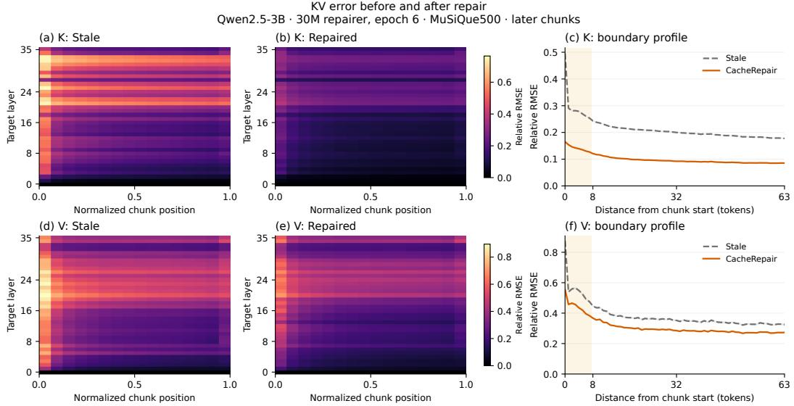  
Figure 7: KV error before and after epoch-6 repair on Qwen2.5-3B (500 MuSiQue requests). K and V occupy separate rows; columns show stale error, repaired error, and error by distance from chunk start. Heatmap scales are shared within each row. Shading on the profiles shows 95% requestbootstrap intervals.

## D RESIDUAL STRUCTURE AND REPAIR CAPACITY

Residual representation. We use the first 256 MuSiQue requests from Section 3, taking 64 evenly spaced document positions per request. We use the first 128 requests to fit the mean and PCA bases, and the remaining 128 to evaluate projections and the fixed epoch-six repairers. Each token’s canonical-K/native-V residual is flattened over layers and heads, giving 18,432 coordinates for Qwen2.5-3B and 98,304 for Qwen2.5-14B. We analyze raw residuals and residuals divided by the fixed training normalization scales. Centering uses the fitting mean in both splits; the fitting matrix has rank at most 8,191. Spectra and projections use FP64 arithmetic on the stored FP32 residuals.

The residual spectra quantify the available projection capacity. Raw residuals require ranks 1,990 and 3,298 to retain 95% of fitting energy for Qwen2.5-3B and Qwen2.5-14B; the normalized ranks are 3,105 and 4,282. At the three evaluated repair widths, retained raw energy is 73.0/81.2/84.8% for Qwen2.5-3B and 67.1/75.3/78.5% for Qwen2.5-14B. The accompanying data report separate K/V and per-layer spectra.

Projection capacity and prediction. For validation residuals $R _ { i } ,$ we report $\sqrt { \textstyle \sum _ { i } \| R _ { i } - \widehat { R } _ { i } \| _ { 2 } ^ { 2 } / \textstyle \sum _ { i } \| R _ { i } \| _ { 2 } ^ { 2 } }$ in the selected coordinates. The PCA reference projects onto the fitted basis around the fitting mean. The learned-head reference projects onto the fixed affine space $b + \cot ( W _ { \mathrm { o u t } } )$ . Both projections access the true validation residual; actual repair predicts it from stale KV and token features. Figure 8 compares these three errors. The learned output heads have rank $d _ { b } .$ . Increasing capacity reduces actual normalized residual MSE from 0.514 to 0.469 to 0.450 for Qwen2.5-3B, and from 0.556 to 0.519 to 0.505 for Qwen2.5-14B. These curves separate output-space capacity from residual prediction error. The gap between the learned-head projection and actual repair shows that prediction contributes error even within the available output space. The projection has access to the true joint residual, whereas the repairer must infer it from stale KV and token features; this gap does not by itself identify which cross-chunk dependencies are hardest to recover.

Parameter allocation. Table 12 breaks down encoder, token-fusion, reinjection, backbone, and output-head parameters. The output head scales with the target LLM’s KV dimension and accounts for 63.01M of the 104M Qwen2.5-14B repairer’s parameters. For repair width $d _ { b } ,$ the dense head uses approximately $d _ { b } D _ { \mathrm { K V } }$ weights, where $D _ { \mathrm { K V } } = 2 L H _ { \mathrm { K V } } d _ { h }$ . Its size therefore follows the target’s layers and KV heads, including the savings from grouped-query attention, rather than total LLM parameters alone. Sharing head parameters across layer groups or factorizing the output projection could reduce this cost; both would change the output space and require validation. The present measurements establish feasibility through the evaluated 14B target.

Table 12: Trainable parameter counts by component (millions). Fusion combines token embeddings with cache features; reinjection supplies cache features to each repair block. Width is $d _ { b }$
<table><tr><td>Target LLM</td><td>Width</td><td>Encoder</td><td>Fusion</td><td>Reinjection</td><td>Backbone</td><td>Head</td><td>Other</td><td>Total</td></tr><tr><td>Qwen2.5-3B</td><td>256</td><td>0.44</td><td>0.66</td><td>0.33</td><td>3.29</td><td>4.74</td><td>0.00</td><td>9.46</td></tr><tr><td>Qwen2.5-3B</td><td>512</td><td>1.48</td><td>1.57</td><td>1.58</td><td>15.76</td><td>9.46</td><td>0.00</td><td>29.84</td></tr><tr><td>Qwen2.5-3B</td><td>704</td><td>2.88</td><td>2.43</td><td>2.98</td><td>29.78</td><td>12.99</td><td>0.00</td><td>51.07</td></tr><tr><td>Qwen2.5-14B</td><td>320</td><td>2.76</td><td>1.84</td><td>0.51</td><td>5.14</td><td>31.56</td><td>0.00</td><td>41.81</td></tr><tr><td>Qwen2.5-14B</td><td>640</td><td>9.45</td><td>4.10</td><td>2.46</td><td>24.62</td><td>63.01</td><td>0.00</td><td>103.64</td></tr><tr><td>Qwen2.5-14B</td><td>832</td><td>17.72</td><td>5.65</td><td>4.85</td><td>48.52</td><td>81.89</td><td>0.00</td><td>158.62</td></tr></table>

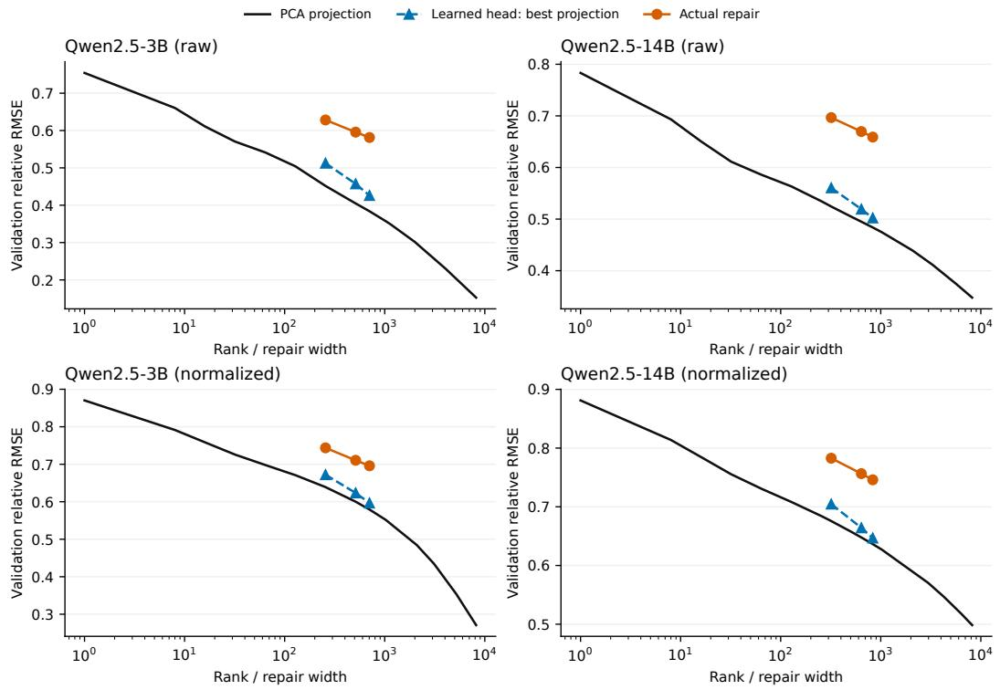  
Figure 8: Residual relative RMSE on the separate set of 128 validation requests. PCA uses a basis and mean from the fitting requests; the learned-head projection uses each checkpoint’s fixed affine output space. Actual repair uses the corresponding checkpoint’s predictions.

## E TRAINING OBJECTIVES AND FUNCTIONAL EFFECTS

Matched loss comparison. Three objectives use the 30M Qwen2.5-3B A0 architecture and the same 50,000 examples, initialization, sample order, normalization statistics, optimizer, and learningrate schedule for two epochs (25,000 updates). Let $e = ( \widehat { K V } ^ { c } - K V _ { \mathrm { j o i n t } } ^ { c } ) / \sigma _ { \Delta }$ be the normalized reconstruction error. The objectives are

$$
\mathcal { L } _ { \mathrm { M S E } } = \mathrm { m e a n } ( e ^ { 2 } ) ,\tag{1}
$$

$$
{ \mathcal { L } } _ { \mathrm { Q K } / \mathrm { V } } = { \scriptstyle { \frac { 1 } { 2 } } } \mathrm { m e a n } \bigg [ \Big ( Q _ { \mathrm { t e a c h e r } } ( \widehat { K } ^ { g } - K _ { \mathrm { j o i n t } } ^ { g } ) ^ { \top } / \sqrt { d _ { h } } \Big ) ^ { 2 } \bigg ] + { \scriptstyle { \frac { 1 } { 2 } } } \mathrm { m e a n } ( e _ { V } ^ { 2 } ) ,\tag{2}
$$

$$
\mathcal { L } _ { \mathrm { H u b e r } } = 2 \operatorname* { m e a n } ( \rho _ { 1 } ( e ) ) ,\tag{3}
$$

where $\rho _ { 1 }$ is the Huber loss with threshold one and superscript g denotes global RoPE coordinates. The teacher queries come from the training source questions and the frozen target LLM, conditioned on joint document KV. The QK term averages errors over all query positions, document positions, attention heads, and target layers. QK/V uses fixed weights of $1 / 2$ for both terms: the K term measures attention-logit error in the target LLM’s native scale, whereas the V term uses residual-RMS normalization. These weights specify the tested objective; they do not equalize the terms’ gradient magnitudes. Each objective uses residual prediction and block-causal repair attention. Final answer quality is measured on the same 500 MuSiQue requests. All three controlled repairers use BF16 and the same exact SDPA implementation at each request’s actual length. The main six-epoch checkpoint is an additional serving reference, using the main evaluation runtime.

MSE has the highest mean F1 in Table 13, exceeding QK/V by 4.78 points and Huber by 1.08 points, based on the reported mean F1 values; p50 TTFT spans 28.05–28.86 ms. This controlled comparison supports MSE as the default among the tested loss formulations and weights. Calibrating the logit and feature terms offers a further direction for functional objectives. Figure 9 compares optimization using a common normalized KV MSE. All runs use one training seed; the functional-metric intervals below quantify request-sampling variation.

Functional measurements. On the first 256 of these requests, we compare Stale KV, the main six-epoch repairer, and the three two-epoch repairers. All use the same Full Prefill continuation, up to 32 tokens, under teacher forcing. We report $D _ { \mathrm { K L } } ( p _ { \mathrm { f u l l } } \Vert p _ { \mathrm { c a n d i d a t e } } )$ at the continuation prediction positions, averaged first within each request. Attention-output error is measured after the output projection at the last query position and pooled over layers and requests using squared magnitudes. Each method receives the same document-token prefix; the trailing document tokens outside the last complete 16-token cache block and the full query are processed together.

On these 256 requests, mean KL decreases from 1.731 for Stale KV to 0.555 for the main sixepoch repairer and 0.698 for two-epoch MSE (A0). Attention-output relative RMSE decreases from 0.598 to 0.328 and 0.353, respectively. Paired 95% request-bootstrap intervals for both repairers’ reductions in KL, attention error, and normalized KV MSE lie above zero. Table 14 extends this comparison to QK/V and Huber. Both also improve all three functional metrics over Stale KV. Compared with two-epoch MSE, QK/V has higher normalized KV MSE by 0.104 (95% interval [0.102, 0.107]) and higher KL by 0.218 ([0.124, 0.313]); Huber’s KL difference is −0.012 ([−0.063, 0.037]). Repair brings the target LLM’s query processing and predictive distributions closer to Full Prefill on these requests.

Table 13: Qwen2.5-3B answer quality on 500 MuSiQue requests with a 30M repairer. The three two-epoch objectives share the same initialization, architecture, examples, sample order, and 25,000 updates. They use exact SDPA at the actual request length. F1 differences are computed from the reported means relative to two-epoch MSE (A0 in Table 2). Full, Stale, and the main six-epoch repairer provide serving references from the main evaluation runtime.
<table><tr><td>Configuration</td><td>F1</td><td>EM</td><td>∆F1 (pp)</td><td>TTFT (ms, p50)</td><td>GPU h</td></tr><tr><td>Full Prefill</td><td>0.3155</td><td>0.2320</td><td>+6.93</td><td>68.24</td><td></td></tr><tr><td>Stale KV</td><td>0.1462</td><td>0.0720</td><td>-10.00</td><td>22.41</td><td></td></tr><tr><td>MSE, 6 epochs</td><td>0.2560</td><td>0.1700</td><td>+0.98</td><td>33.28</td><td></td></tr><tr><td>MSE, 2 epochs</td><td>0.2462</td><td>0.1720</td><td>+0.00</td><td>28.86</td><td>23.10</td></tr><tr><td>QK/V, 2 epochs</td><td>0.1984</td><td>0.1260</td><td>-4.78</td><td>28.47</td><td>26.49</td></tr><tr><td>Huber, 2 epochs</td><td>0.2354</td><td>0.1560</td><td>-1.08</td><td>28.05</td><td>23.29</td></tr></table>

Table 14: Functional effects on the same 256 MuSiQue requests. KL uses teacher forcing along the Full Prefill continuation and is averaged per request. Attention error is measured after the output projection at the last query position and pools squared error across requests and layers. Brackets give 95% request-bootstrap intervals.
<table><tr><td>Configuration</td><td>Normalized KV MSE</td><td>KL(Full ∥ candidate)</td><td>Attention rel. RMSE</td></tr><tr><td>Stale KV</td><td>0.949 [0.930, 0.969]</td><td>1.731 [1.536, 1.936]</td><td>0.598 [0.589, 0.607]</td></tr><tr><td>MSE, 6 epochs</td><td>0.478 [0.470, 0.488]</td><td>0.555 [0.449, 0.674]</td><td>0.328 [0.315, 0.340]</td></tr><tr><td>MSE, 2 epochs</td><td>0.502 [0.493, 0.512]</td><td>0.698 [0.576, 0.832]</td><td>0.353 [0.340, 0.367]</td></tr><tr><td>QK/V, 2 epochs</td><td>0.606 [0.595, 0.618]</td><td>0.916 [0.781, 1.056]</td><td>0.405 [0.390, 0.420]</td></tr><tr><td>Huber, 2 epochs</td><td>0.508 [0.499, 0.518]</td><td>0.685 [0.569, 0.813]</td><td>0.351 [0.338, 0.365]</td></tr></table>

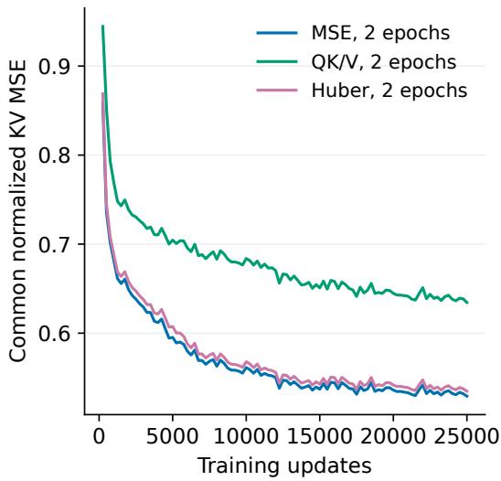

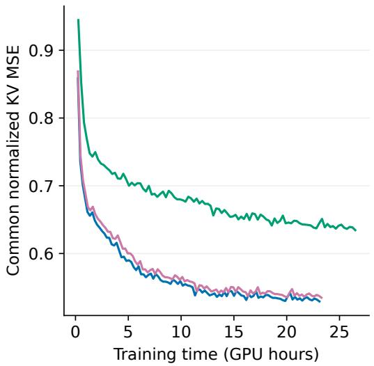  
Figure 9: Optimization with MSE, QK/V, and Huber on the same two-epoch training sequence. Both panels report normalized KV MSE using the shared residual statistics; each point averages 250 updates. The horizontal axes show updates and measured training time.

## F ATTENTION TOPOLOGY AND WITHIN-CHUNK CONTEXT

Controlled training. All six reported variants use the same 50,000 training examples, sample order, shared-parameter initialization, optimizer, and two-epoch budget of 25,000 updates. The effective batch contains four document sequences, with seed 7. A0–A3 vary only the attention mask: blockcausal, strict token-causal, fully bidirectional, and block-diagonal. A4 supplies stale-cache features at the backbone entrance; A5 predicts joint KV with a zero output offset. Token-embedding fusion is shared by all variants. Removing the per-block conditioning projections in A4 reduces trainable parameters from 29.8M to 28.3M.

Each variant minimizes squared canonical-KV error with the same frozen $\sigma _ { \Delta }$ weights. For A5, the normalized target is $K V _ { \mathrm { j o i n t } } ^ { c } / \sigma _ { \Delta }$ . Training uses FP32 repair weights and a frozen BF16 target. Evaluation uses BF16 repair and cache transfer, with exact SDPA attention at the actual request length for all six variants. We evaluate each final checkpoint on the same 500 MuSiQue requests. All variants use one training seed. The large A3 and A5 differences support cross-chunk information exchange and residual prediction under this budget. A0–A2 and A4 are close in F1: block-causal attention supplies preceding-chunk context while respecting document order, and reinjection supplies the original stale features at each block. These are design rationales; the small observed differences do not establish a ranking across training seeds.

A5 removes the residual path while holding objective weights and initialization fixed. Because joint KV and residuals differ in scale, we additionally evaluate direct prediction with joint-RMS normalization.

Target-matched normalization. We train A5-JR to predict $K V _ { \mathrm { i o i n t } } ^ { c } / \sigma _ { \mathrm { j o i n t } }$ with zero output offset. The fixed joint RMS is computed from all 50,000 training examples (99,539,881 document tokens). A5-JR shares A0/A5’s initialization, sample order, optimizer, learning-rate schedule, and two-epoch budget of 25,000 updates. All final checkpoints are evaluated on the same 500 MuSiQue requests. A0, A5, and A5-JR achieve 24.62%, 0.49%, and 1.18% F1, respectively. The reported means give residual prediction a 23.44-point advantage over A5-JR; A5-JR improves over A5 by 0.69 points (95% paired interval [0.13, 1.37], from 10,000 request-bootstrap draws with seed 20260911). The corresponding unweighted canonical-K/native-V MSE values, averaged over requests, are 0.109, 0.668, and 0.308, respectively. Joint-RMS weighting improves this error for direct prediction, while residual-RMS-weighted MSE increases from 541.73 to 721.22, reflecting the changed coordinate weights. A0’s residual-RMS-weighted MSE is 0.510. Residual prediction therefore delivers substantially higher answer F1 than direct prediction under the matched two-epoch training budget.

Attention and regional error. A0–A2 have similar boundary and interior error profiles; blockdiagonal attention has higher error in both regions. Table 16 also separates the first chunk: its K/V relative RMSE is 0.115/0.157 for A3 and 0.011/0.030 for A0. A3 still reduces boundary and interior error relative to Stale KV, but perturbs the first chunk, which includes the chat preamble and has little missing cross-chunk context. This regional imbalance is a plausible contributor to its low answer F1: aggregate reconstruction error does not weight positions by their effect on generation. A0 and A3 use the same within-chunk attention mask for the first chunk, but learn different weights. One possible explanation is that A3’s shared weights learn local corrections for later chunks that also perturb the first chunk. This hypothesis is consistent with the regional errors; the measurements do not isolate it as the cause of the answer degradation.

Training behavior and cost. Under the common normalized KV objective and sample order, the final 250-update mean loss is 0.529 for A0 and 540.9 for A5. The six reported variants require 23.01–23.31 GPU-hours on one A800; A5-JR requires 24.30 GPU-hours.

Applying the predicted K and V. Table 15 uses the fixed six-epoch 30M repairer on the first 256 MuSiQue requests. Applying both predicted components gives 26.56 F1, compared with 18.81 when only K is repaired and 0.00 when only V is repaired. Each choice combines one jointly trained output with the other component’s stale value, testing output compatibility rather than separately trained K-only or V-only models. With V-only repair, attention weights computed from stale K aggregate values produced by the jointly trained repairer. This changes the pairing of attention weights and value representations, providing a possible explanation for the loss of answer quality. Keeping the first chunk’s original KV gives 25.89 F1, a difference of −0.66 points with paired interval [−2.14, 0.75]. Each choice executes the complete repair network. Thus, keeping the first chunk does not provide an observed quality gain for this checkpoint, and we retain uniform application of its trained output. This test uses the standard six-epoch repairer; it does not measure whether preserving the first chunk would improve A3. End-to-end latency includes the generated answer; the V-only outputs reach the 32-token limit on all 256 requests.

Table 15: Output choices for the Qwen2.5-3B 30M repairer on 256 MuSiQue requests. Repair K/V applies the correction to that component; Keep first chunk retains its stale KV. Each variant executes the full repair network. F1 differences are paired against CacheRepair, with 95% request-bootstrap intervals. Latencies are p50; end-to-end time includes generation of up to 32 tokens.
<table><tr><td>Configuration</td><td>F1 (%)</td><td>EM (%)</td><td>∆F1 (pp)</td><td>TTFT (ms)</td><td>End-to-end (ms)</td></tr><tr><td>Full Prefill</td><td>33.13</td><td>25.00</td><td>+6.57 [+2.74, +10.56]</td><td>71.25</td><td>118.08</td></tr><tr><td>Stale KV</td><td>13.52</td><td>6.64</td><td>-13.03 [-18.35, -7.80]</td><td>23.11</td><td>77.75</td></tr><tr><td>CacheRepair</td><td>26.56</td><td>17.97</td><td>+0.00 [+0.00, +0.00]</td><td>32.44</td><td>82.96</td></tr><tr><td>Repair K</td><td>18.81</td><td>14.06</td><td>-7.75 [-12.26, -3.20]</td><td>32.72</td><td>82.33</td></tr><tr><td>Repair V</td><td>0.00</td><td>0.00</td><td>-26.56 [-31.54, -21.83]</td><td>32.70</td><td>453.00</td></tr><tr><td>Keep first chunk</td><td>25.89</td><td>18.36</td><td>-0.66 [-2.14, +0.75]</td><td>32.80</td><td>82.24</td></tr></table>

Table 16: Relative RMSE of K/V for the two-epoch variants on MuSiQue. Boundaries contain the first eight tokens of later chunks; interiors contain the remaining tokens. Errors and reference magnitudes are pooled across requests and layers.
<table><tr><td>Variant</td><td>First chunk (K/V)</td><td>Boundary (K/V)</td><td>Interior (K/V)</td></tr><tr><td>Stale KV</td><td>0.007 / 0.027</td><td>0.310 / 0.604</td><td>0.182 / 0.339</td></tr><tr><td>A0 CacheRepair</td><td>0.011 / 0.030</td><td>0.148 / 0.469</td><td>0.095 / 0.290</td></tr><tr><td>A1 Token-causal</td><td>0.017 / 0.037</td><td>0.150 / 0.470</td><td>0.095 / 0.290</td></tr><tr><td>A2 Bidirectional</td><td>0.021 / 0.038</td><td>0.149 / 0.469</td><td>0.095 / 0.290</td></tr><tr><td>A3 Block diagonal</td><td>0.115 / 0.157</td><td>0.191 / 0.503</td><td>0.126 / 0.310</td></tr><tr><td>A4 Entrance-only</td><td>0.010 / 0.029</td><td>0.149 / 0.468</td><td>0.095 / 0.289</td></tr><tr><td>A5 Direct joint KV</td><td>0.260 / 0.762</td><td>0.247 / 0.740</td><td>0.245 / 0.733</td></tr></table>

## G CROSS-MODEL VALIDATION OF KV-ERROR STRUCTURE

We repeat Section 3’s measurements on Qwen2.5-3B, Llama-3.1-8B, and Qwen2.5-14B using the same first 256 MuSiQue requests and each target’s tokenizer. K is measured in canonical coordinates and V in native coordinates. We pool squared error and reference magnitude over the same regions: the first chunk, the first eight tokens of later chunks, and the remaining later-chunk tokens. Layer– position maps use 16 relative-position bins. Table 17 gives request-bootstrap intervals.

Figure 11 shows boundary hotspots and layer-persistent interior errors in all three target LLMs, supporting repair across document positions. Boundary relative RMSE is 1.71–1.79× the interior value for K and 1.67–1.83× for V (Table 17). Figure 10 shows how error decays with distance from the chunk boundary.

Table 17: Stale-cache relative RMSE on the same 256 MuSiQue requests. Boundary and interior refer to later chunks; the boundary is the first eight tokens. Brackets give 95% request-bootstrap intervals.
<table><tr><td>Target LLM</td><td>KV</td><td>First chunk</td><td>Boundary</td><td>Interior</td></tr><tr><td>Qwen2.5-3B</td><td>K</td><td>0.007 [0.007, 0.007]</td><td>0.309 [0.307, 0.310]</td><td>0.181 [0.179, 0.183]</td></tr><tr><td>Qwen2.5-3B</td><td>V</td><td>0.027 [0.026, 0.027]</td><td>0.603 [0.600, 0.607]</td><td>0.336 [0.332, 0.340]</td></tr><tr><td>Llama-3.1-8B</td><td>K</td><td>0.011 [0.011, 0.011]</td><td>0.572 [0.570, 0.574]</td><td>0.320 [0.317, 0.322]</td></tr><tr><td>Llama-3.1-8B</td><td>V</td><td>0.026 [0.025, 0.026]</td><td>0.728 [0.724, 0.732]</td><td>0.437 [0.432, 0.442]</td></tr><tr><td>Qwen2.5-14B</td><td>K</td><td>0.011 [0.010, 0.011]</td><td>0.552 [0.549, 0.554]</td><td>0.311 [0.306, 0.315]</td></tr><tr><td>Qwen2.5-14B</td><td>V</td><td>0.026 [0.025, 0.027]</td><td>0.713 [0.709, 0.718]</td><td>0.391 [0.385, 0.396]</td></tr></table>

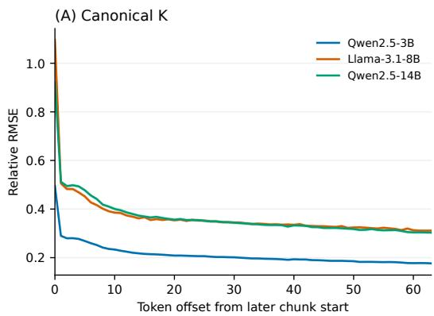

(B) Native V  
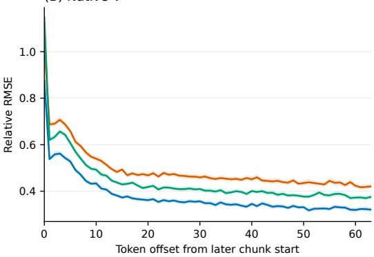  
Figure 10: Stale KV error by distance from a later chunk’s start, on the same 256 MuSiQue requests. Curves pool layers and heads; shading gives 95% request-bootstrap intervals.

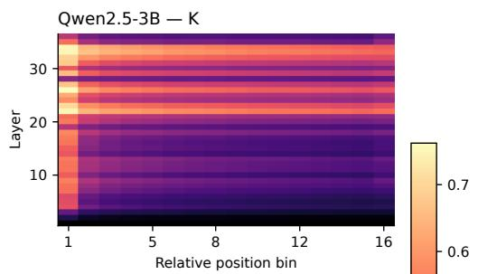

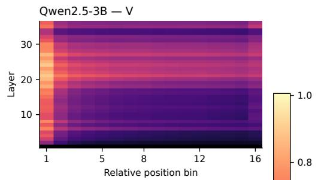

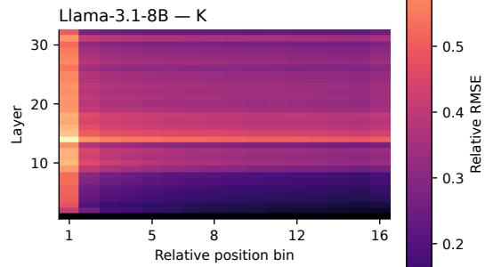

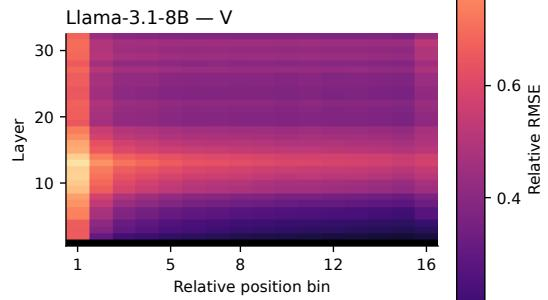

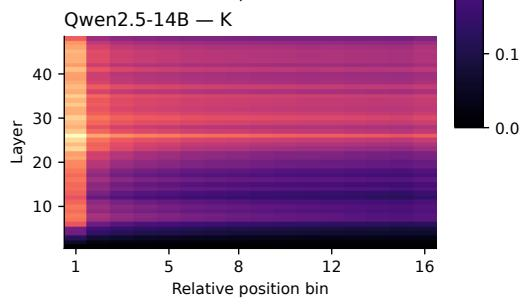

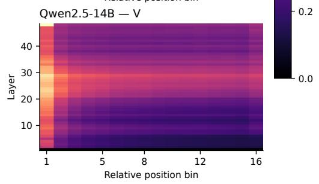  
Figure 11: Stale KV relative RMSE by target-LLM layer and position within later chunks, using the same 256 MuSiQue requests. Columns show canonical K and native V, with shared color scales across models. The 16 position bins reveal both boundary hotspots and error bands extending through chunk interiors.

## H LEARNED-FUSION BASELINE COMPATIBILITY

Target-matched KV Packet checkpoints. Each KV Packet wrapper contains eight header and eight trailer embeddings and is evaluated with its corresponding frozen target LLM. All three target LLMs use the same 512 examples from CacheRepair’s generic corpus, 30 epochs, effective batch size 64, 240 updates, and seed 42. The learning rate decays linearly from $5 \times \mathrm { \dot { 1 } 0 ^ { - 4 } }$ to zero. Each target uses its native chat template and supplies teacher continuations and logits for distillation. The calibration size and schedule follow KV Packet’s 256–512-example, 30-epoch recipe (Chen et al., 2026). We compare downstream quality and TTFT under each method’s training recipe, using a shared source corpus for cross-dataset transfer.

Cached-prefix execution. We prefill the chat preamble once and each wrapped document chunk independently. We place the preamble cache before the wrapped chunks, concatenate the physical KV entries in request order, and apply the target’s global positional encoding when loading the cache for the query. Learned header and trailer entries remain in the physical cache and contribute to online transfer and query-attention costs. Independent chunk compilation and pinned-host preload are offline; online TTFT includes transfer, positional encoding, paged-cache injection, query processing, and first-token generation. All target LLMs remain frozen during downstream evaluation.

Calibration budget. For Qwen2.5-3B, we expand KV Packet’s calibration set from 512 to 2,048 and 8,192 nested examples from the same generic corpus. Each run uses 30 epochs, batch size 64, and seed 42, giving 240, 960, and 3,840 updates. Thus both data and optimization budgets increase. Evaluation uses the same four datasets and implementation (Table 18). The 512-to-8192 changes span −0.04 to +2.84 F1 points; all 95% intervals from 10,000 paired request-bootstrap draws include zero. CacheRepair 30M retains higher mean F1 on MuSiQue, HotpotQA, and TriviaQA; KV Packet retains higher mean F1 on MultiHop-RAG. The main Pareto curves use the 512-example configuration.

Table 18: KV Packet calibration budget on Qwen2.5-3B. F1 (%) uses the same 500 requests per dataset. ∆ is 8192 minus 512, in percentage points, with pointwise 95% paired-bootstrap intervals. CR is the fixed 30M CacheRepair reference.
<table><tr><td>Dataset</td><td>512</td><td>2048</td><td>8192</td><td>∆ [95% CI]</td><td>CR</td></tr><tr><td>MuSiQue</td><td>19.05</td><td>19.79</td><td>21.90</td><td>+2.84 [-0.03, +5.69]</td><td>25.60</td></tr><tr><td>HotpotQA</td><td>39.42</td><td>41.35</td><td>40.89</td><td>+1.47 [-1.61, +4.42]</td><td>53.92</td></tr><tr><td>MultiHop-RAG</td><td>55.09</td><td>54.53</td><td>55.05</td><td>-0.04 [-2.50, +2.45]</td><td>53.58</td></tr><tr><td>TriviaQA</td><td>72.26</td><td>72.83</td><td>73.58</td><td>+1.32 [-1.27, +3.88]</td><td>78.26</td></tr></table>

## I SCALING AND AMORTIZATION DETAILS

Document length and system cost. We evaluate all 18 configurations at 1K, 2K, 4K, 8K, and 16K document tokens for each target LLM, keeping 16 chunks. CacheBlend and InfoFlow use fixed recomputation fractions; EPIC uses fixed per-chunk token budgets. The 16 source-passage streams and queries are fixed, with each length taking a prefix under the target’s tokenizer and including its chat preamble. After warmup, we time three runs per request with identical context capacity and KV pools across methods. Bootstrap resampling preserves each request’s three runs; crossover brackets use adjacent measured lengths. These workloads measure first-token cost.

Figures 12, 13, and 14 show latency, computation, and memory. Dense MACs count executed matrix operations, including selected-token passes, scoring, and repair padding. TTFT additionally includes transfers, elementwise operations, normalization, and cache writes. Peak memory includes target-LLM weights, the KV pool, and temporary tensors, with one repairer loaded per worker. Additional allocation is relative to the same target LLM’s idle Full Prefill worker. For Qwen2.5- 14B at 8K and 16K, caches are prepared before serving and the offline compiler stays on CPU. Memory counters report framework allocations. For Qwen2.5-14B at 16K tokens, CacheRepair 159M peaks at 55.25 GiB, compared with 48.95 GiB for Stale KV, a difference of 6.30 GiB. The reported 24.32 GiB increment is measured against the idle Full Prefill worker and includes cache and runtime allocations as well as the repairer; it is not the repair network’s parameter footprint.

Across 270 configurations and 12,960 timed runs, 88 of 108 repairer–selective-baseline pairs have lower repair p50 TTFT at all five lengths. At 16K, the largest repairers achieve 3.43–6.14× speedups over Full Prefill using 2.0–4.0% of its dense MACs; Table 19 provides the exact resource measurements. Qwen2.5-3B’s 30M and 51M repairers become faster than CacheBlend 0.10 between 2K and 4K, supported by paired intervals at both endpoints. Conversely, EPIC8 becomes faster than Qwen2.5-14B’s 159M repairer between 4K and 8K: its budget remains 120 document tokens, whereas repair processes every token. This comparison separates coverage from cost: a fixed fraction increases the number of recomputed tokens with length, whereas a fixed boundary budget covers a decreasing fraction. The crossover measures their runtime tradeoff; the first-token study does not attach answer quality to those operating points.

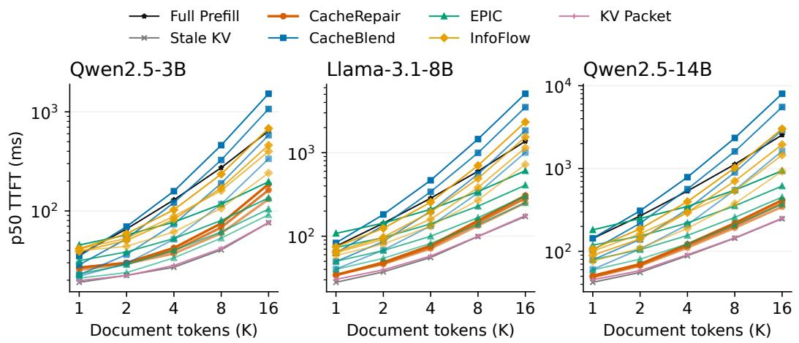  
Figure 12: p50 TTFT across document lengths for the three target LLMs, with 16 chunks and all 18 main-evaluation configurations. Each point contains three measurements of each of 16 fixed requests. Darker curves within a method indicate larger repairers or higher recomputation budgets. Both axes are logarithmic.

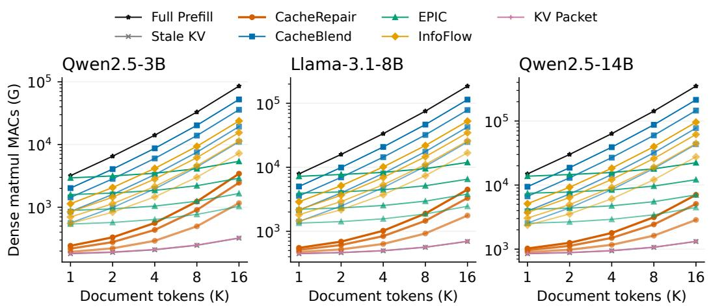  
Figure 13: Dense matrix MACs across document lengths, for the same configurations as Figure 12. Counts include target-LLM passes, repair, scoring, and first-token output heads. G denotes 109 MACs; both axes are logarithmic.

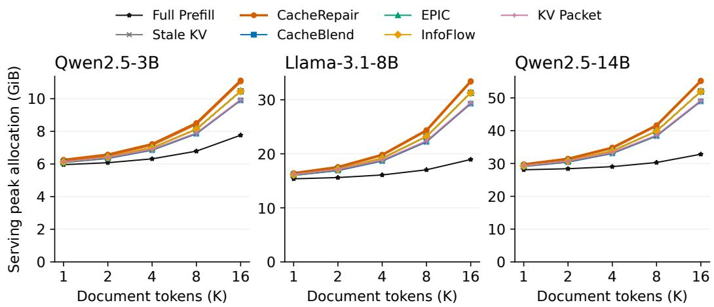  
Figure 14: Peak serving-worker memory across document lengths, including target-LLM weights, KV pools, and online temporary tensors. Each point is the maximum across 48 timed runs; each worker loads one repairer capacity. Styles follow Figure 12.

Table 19: System cost at 16K document tokens and 16 chunks (16 requests, three measurements each). We show the largest repairers and the fixed baseline presets used in the chunk experiment. TMAC denotes $1 0 ^ { 1 2 }$ dense matrix MACs. Peak is the serving-worker allocation, including weights, KV pool, and temporary tensors; Extra is its increment above the paired idle Full Prefill worker. Both memory columns are in GiB.
<table><tr><td>Target LLM</td><td>Configuration</td><td>TTFT p50 (ms)</td><td>TMACs</td><td>Peak</td><td>Extra</td></tr><tr><td>Qwen2.5-3B</td><td>Full Prefill</td><td>640.58</td><td>85.51</td><td>7.76</td><td>1.26</td></tr><tr><td>Qwen2.5-3B</td><td>Stale KV</td><td>76.06</td><td>0.32</td><td>9.90</td><td>3.39</td></tr><tr><td>Qwen2.5-3B</td><td>CacheRepair 51M</td><td>186.82</td><td>3.42</td><td>11.12</td><td>4.62</td></tr><tr><td>Qwen2.5-3B</td><td>CacheBlend 0.1</td><td>335.45</td><td>11.05</td><td>9.90</td><td>3.39</td></tr><tr><td>Qwen2.5-3B</td><td>EPIC 16</td><td>104.46</td><td>1.65</td><td>10.46</td><td>3.96</td></tr><tr><td>Qwen2.5-3B</td><td>InfoFlow 0.1</td><td>399.21</td><td>11.37</td><td>10.46</td><td>3.96</td></tr><tr><td>Qwen2.5-3B</td><td>KV Packet 8+8</td><td>76.35</td><td>0.32</td><td>9.95</td><td>3.45</td></tr><tr><td>Llama-3.1-8B</td><td>Full Prefill</td><td>1373.07</td><td>185.68</td><td>18.95</td><td>1.69</td></tr><tr><td>Llama-3.1-8B</td><td>Stale KV</td><td>172.29</td><td>0.69</td><td>29.27</td><td>12.02</td></tr><tr><td>Llama-3.1-8B</td><td>CacheRepair 93M</td><td>307.22</td><td>4.48</td><td>33.45</td><td>16.20</td></tr><tr><td>Llama-3.1-8B</td><td>CacheBlend 0.1</td><td>1003.97</td><td>24.76</td><td>29.27</td><td>12.02</td></tr><tr><td>Llama-3.1-8B</td><td>EPIC 16</td><td>302.68</td><td>3.81</td><td>31.28</td><td>14.03</td></tr><tr><td>Llama-3.1-8B</td><td>InfoFlow 0.1</td><td>1145.57</td><td>25.75</td><td>31.28</td><td>14.03</td></tr><tr><td>Llama-3.1-8B</td><td>KV Packet 8+8</td><td>176.50</td><td>0.70</td><td>29.46</td><td>12.21</td></tr><tr><td>Qwen2.5-14B</td><td>Full Prefill</td><td>2546.12</td><td>350.22</td><td>32.83</td><td>1.90</td></tr><tr><td>Qwen2.5-14B</td><td>Stale KV</td><td>247.71</td><td>1.32</td><td>48.95</td><td>18.02</td></tr><tr><td>Qwen2.5-14B</td><td>CacheRepair 159M</td><td>414.83</td><td>7.04</td><td>55.25</td><td>24.32</td></tr><tr><td>Qwen2.5-14B</td><td>CacheBlend 0.1</td><td>1627.95</td><td>43.28</td><td>48.95</td><td>18.02</td></tr><tr><td>Qwen2.5-14B</td><td>EPIC 16</td><td>451.86</td><td>7.02</td><td>51.96</td><td>21.03</td></tr><tr><td>Qwen2.5-14B</td><td>InfoFlow 0.1</td><td>1452.79</td><td>44.62</td><td>51.96</td><td>21.03</td></tr><tr><td>Qwen2.5-14B</td><td>KV Packet 8+8</td><td>250.74</td><td>1.32</td><td>49.23</td><td>18.30</td></tr></table>

Answer quality with longer contexts. We test length extrapolation with the fixed sixepoch Qwen2.5-3B 30M repairer, whose training sequences reach 2,269 tokens (Appendix J). On 128 MultiHop-RAG requests, CacheRepair reaches 46.68/49.02/49.80% F1 at 4K/8K/16K, with 3.36/4.08/4.45× speedups over Full Prefill. At 16K, CacheRepair and CacheBlend 0.6 have close mean F1 (49.80% and 49.41%), while CacheRepair reduces p50 TTFT from 1,487.4 to 145.8 ms (10.20×). These results measure the checkpoint’s quality–latency tradeoff at sequence lengths beyond its training range. Table 20 reports all seven configurations, including KV Packet’s faster operating points with higher mean F1 at 4K/8K and lower mean F1 at 16K. Paired intervals relative to Full Prefill use 10,000 request-bootstrap draws with seed 20260911. Appendix A.2 explains how answer content and wording affect F1 ordering, including cases where cache reuse scores above Full Prefill.

We construct nested contexts from query-only BM25 retrieval (top 64 passages, at most two per article). We take the first 128 eligible requests in the fixed 500-request order after applying Appendix A.1’s rules to the expanded inputs. All lengths use the same questions; text segments contain at most 256 tokens, with the chat preamble added to the first segment. The resulting contexts contain 16–19, 32–36, and 64–70 chunks, respectively. Each of the seven configurations uses identical inputs at each length and the original greedy, 32-token decoding protocol, yielding 2,688 generations. These measurements extend both context and chunk count; the separate system-cost sweep above holds chunk count at 16.

Canonicalizing target keys removes their local positional rotation; the repair network’s own positional encoding still operates over the assembled sequence. Extending the training distribution to longer retrieved contexts is a natural next step for learning residual corrections over these larger position ranges.

Table 20: Quality and latency on the same 128 MultiHop-RAG requests with Qwen2.5-3B and nested retrieved contexts. All seven evaluated configurations are shown. TTFT is in ms (p50); F1 is in percent. The final row gives CacheRepair minus Full Prefill F1 with pointwise 95% paired request-bootstrap intervals at each length.
<table><tr><td></td><td colspan="2">4K</td><td colspan="2">8K</td><td colspan="2">16K</td></tr><tr><td>Method</td><td>F1</td><td>TTFT</td><td>F1</td><td>TTFT</td><td>F1</td><td>TTFT</td></tr><tr><td>Full Prefill</td><td>48.63</td><td>129.9</td><td>50.59</td><td>274.8</td><td>52.54</td><td>648.1</td></tr><tr><td>Stale KV</td><td>50.13</td><td>27.6</td><td>42.29</td><td>43.2</td><td>37.19</td><td>74.8</td></tr><tr><td>CacheRepair 30M</td><td>46.68</td><td>38.7</td><td>49.02</td><td>67.4</td><td>49.80</td><td>145.8</td></tr><tr><td>KV Packet 512</td><td>52.15</td><td>26.2</td><td>50.78</td><td>41.4</td><td>48.05</td><td>75.7</td></tr><tr><td>CacheBlend 0.6</td><td>49.41</td><td>161.1</td><td>50.59</td><td>456.3</td><td>49.41</td><td>1487.4</td></tr><tr><td>EPIC 8</td><td>46.35</td><td>35.0</td><td>46.95</td><td>65.0</td><td>44.52</td><td>148.1</td></tr><tr><td>EPIC 64</td><td>49.02</td><td>79.9</td><td>50.31</td><td>204.1</td><td>47.15</td><td>621.3</td></tr><tr><td>∆F1 (95% CI)</td><td>-1.95 [-7.03, +3.12]</td><td></td><td>-1.56 [-5.47, +2.34]</td><td></td><td>-2.73 [-8.98, +3.52]</td><td></td></tr></table>

Cache payload. A BF16 cache with N document tokens contains 2NDKV bytes, where DKV includes both K and V across target layers and KV heads. At 4,096 tokens, the payloads are 144, 512, and 768 MiB for Qwen2.5-3B, Llama-3.1-8B, and Qwen2.5-14B. KV Packet additionally stores its learned boundary-token entries. Online measurements load pinned-host caches onto one GPU; the reported H2D times therefore characterize the host-to-device path on this A800 node. Transfer time depends on effective host-to-device bandwidth and cache residency; Table 1 separates this cost from repair execution. Framework buffers and concurrent offline preparation are accounted for separately in the memory measurements.

Chunk count. On MuSiQue500, we keep every document token, its order, and the query fixed, and partition the document stream into 4, 8, 12, or 16 contiguous chunks of approximately equal length. The complete chat preamble stays in the first chunk. We compare Stale KV, CacheRepair 30M at epoch six, CacheBlend 0.10, EPIC16, InfoFlow 0.10, and KV Packet 8+8. Full Prefill uses the identical token stream and provides a shared reference across counts. All metrics use these same 500 requests.

Figure 15 shows the quality and latency trends. At 8, 12, and 16 chunks, CacheRepair gains 5.81, 10.36, and 11.20 F1 percentage points over Stale KV; paired 95% bootstrap intervals are [2.35,

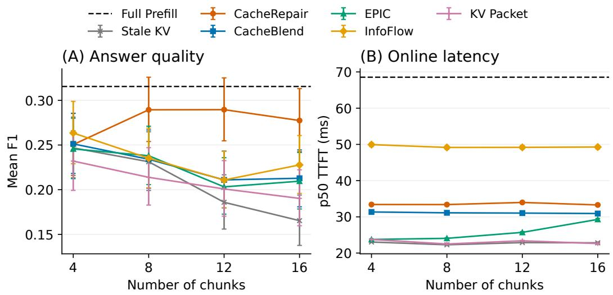  
Figure 15: Chunk-count sensitivity for Qwen2.5-3B on the same 500 MuSiQue requests. Document tokens, order, and queries remain fixed. CacheRepair uses the 30M epoch-six checkpoint; baseline settings are specified above. Error bars are pointwise 95% request-bootstrap intervals. The dashed line is the shared Full Prefill reference.

9.35], [6.74, 13.94], and [7.67, 14.80], respectively. At four chunks, the gain is 0.37 points with an interval of [−2.95, 3.72]. CacheRepair’s p50 TTFT ranges from 33.29 to 33.97 ms across the four counts, compared with 68.54 ms for Full Prefill. Repair benefits increase with chunk count at fixed content.

Chunk order. Context position can affect answer quality (Liu et al., 2024). We reorder the same document chunks on 256 MuSiQue requests, using the fixed 30M checkpoint. Reversing the chunks gives 25.47 F1 and a fixed permutation gives 26.49, compared with 26.56 in retrieval order. Full Prefill also responds to ordering, with F1 ranging from 28.82 to 33.13. Relative to the corresponding Full Prefill output, the change in CacheRepair’s F1 difference is +3.22 points for reversal (95% paired interval [−2.14, 8.54]) and +0.57 for permutation ([−4.99, 6.16]). Both intervals include zero for these two predetermined orderings.

Concurrent requests. With Qwen2.5-3B and the 30M repairer, CacheRepair throughput increases from 11.35 to 30.70 requests/s as concurrency rises from one to eight, compared with 7.45 to 11.35 for Full Prefill. At concurrency eight, CacheRepair serves 2.70× as many requests per second as Full Prefill; KV Packet reaches 46.80 requests/s. Table 21 pairs throughput with p95 first-token latency for all four methods.

We use one vLLM engine on an A800 with the first 64 requests from each downstream dataset, giving a fixed 256-request workload. A closed-loop client keeps 1, 2, 4, or 8 requests outstanding; each completion admits the next request. The target LLM batches active requests, while the 30M six-epoch repairer processes document caches per request within scheduler batches. Cache-based methods use warm pinned-host caches; all methods use the same 32-token generation cap and identical KV-pool and engine limits. Table 21 measures completed requests per second over the workload, including fill and drain, and submit-to-first-token latency. It complements the single-request timing in the main evaluation.

The measured implementation motivates further integration of repair with the serving scheduler. Future system optimizations include batching variable-length repair inputs with independent request masks, and pipelining H2D transfer, repair, and KV writes across requests. Such a pipeline must preserve each request’s transfer-before-repair dependency while overlapping independent work. Jointly scheduling these stages is a direction for improving the throughput and tail latency of concurren cache fusion.

Table 21: Closed-loop serving on 256 requests (64 per downstream dataset), Qwen2.5-3B, one A800. Each cell reports throughput (requests/s) and p95 submit-to-first-token latency (ms). C is the number of outstanding requests. One complete workload run is measured per method and concurrency level.
<table><tr><td>Method</td><td> $C = 1$ </td><td> $C = 2$ </td><td> $C = 4$ </td><td> $C = 8$ </td></tr><tr><td>Full Prefill</td><td>7.45 / 130.6</td><td>8.96 / 219.3</td><td>10.42 / 312.5</td><td>11.35 / 521.9</td></tr><tr><td>Stale KV</td><td>12.43 / 29.5</td><td>19.48 / 50.3</td><td>31.61 / 65.7</td><td>44.61 / 96.7</td></tr><tr><td>CacheRepair 30M</td><td>11.35 / 52.2</td><td>16.90 / 74.2</td><td>24.25 / 105.4</td><td>30.70 / 173.9</td></tr><tr><td>KV Packet 512</td><td>13.16 / 27.5</td><td>19.71 / 47.2</td><td>32.69 / 59.0</td><td>46.80 / 85.0</td></tr></table>

One-time training cost. The nine epoch-six repairers require 65.9–130.5 A800 GPU-hours each, measured from training logs through update 75,000. These totals include repeated work after a checkpoint restart and in-loop checkpointing. Statistics construction takes 8.92/11.56/19.11 GPUhours for Qwen2.5-3B/Llama-3.1-8B/Qwen2.5-14B and is shared across the three capacities of each target. FP32 deployment files occupy 36.2–605.9 MiB, including normalization buffers and metadata.

Table 22: One-time costs of the nine epoch-six repairers. Training time covers recorded launches through the epoch-six checkpoint. Statistics are built once per target LLM and shared across its capacities. Checkpoint sizes are FP32 deployment files. The last column gives a latency-equivalent reuse count, using mean TTFT savings over the equally weighted four downstream datasets.
<table><tr><td>Target LLM</td><td>Repairer (M params.)</td><td>Training (GPU h)</td><td>Statistics (GPU h)</td><td>File (MiB)</td><td>Mean saving (ms/request)</td><td>Reuse (M requests)</td></tr><tr><td>Qwen2.5-3B</td><td>9</td><td>65.9</td><td>8.92</td><td>36.2</td><td>53.3</td><td>5.06</td></tr><tr><td>Qwen2.5-3B</td><td>30</td><td>70.1</td><td>8.92</td><td>114.0</td><td>50.4</td><td>5.65</td></tr><tr><td>Qwen2.5-3B</td><td>51</td><td>69.4</td><td>8.92</td><td>195.0</td><td>48.6</td><td>5.80</td></tr><tr><td>Llama-3.1-8B</td><td>23</td><td>81.9</td><td>11.56</td><td>89.1</td><td>126.9</td><td>2.65</td></tr><tr><td>Llama-3.1-8B</td><td>59</td><td>84.5</td><td>11.56</td><td>225.0</td><td>124.9</td><td>2.77</td></tr><tr><td>Llama-3.1-8B</td><td>93</td><td>86.9</td><td>11.56</td><td>355.6</td><td>123.7</td><td>2.86</td></tr><tr><td>Qwen2.5-14B</td><td>42</td><td>129.3</td><td>19.11</td><td>160.3</td><td>265.0</td><td>2.02</td></tr><tr><td>Qwen2.5-14B</td><td>104</td><td>129.8</td><td>19.11</td><td>396.1</td><td>263.9</td><td>2.03</td></tr><tr><td>Qwen2.5-14B</td><td>159</td><td>130.5</td><td>19.11</td><td>605.9</td><td>260.5</td><td>2.07</td></tr></table>

For one deployed capacity, let $H _ { \mathrm { t r a i n } }$ and $H _ { \mathrm { s t a t s } }$ denote training and shared statistics GPU-hours. Using mean TTFTs in seconds, equally weighted across the four datasets, the latency-equivalent reuse count is

$$
\widehat { R } = \frac { 3 6 0 0 ( H _ { \mathrm { t r a i n } } + H _ { \mathrm { s t a t s } } ) } { \overline { { T } } _ { \mathrm { f u l l } } - \overline { { T } } _ { \mathrm { r e p a i r } } } .\tag{4}
$$

This proxy assumes a serial stream on one A800 and counts first-token latency savings. Cacheddocument preparation, decoding, batching, and GPU utilization determine deployment-specific amortization.

## J GENERIC REPAIR PRETRAINING CORPUS COMPOSITION

We construct the generic repair pretraining corpus from six sources using the fixed query and passage resources released with CoRAG (Wang et al., 2025), built on KILT (Petroni et al., 2021): ELI5, FEVER, Natural Questions (NQ), Wizard of Wikipedia (WoW), T-REx, and Structured Zeroshot. Queries and retrieval IDs come from corag/kilt; passage texts come from corag/kilt-corpus.1 Each example pairs a source query with its published first-k passages $( k \in [ 2 , 2 0 ] )$ , preserving text and retrieval order. The corpus contains 50,000 examples, 874,000 chunks, and 99,539,881 document tokens under the Qwen2.5-3B-Instruct tokenizer. Downstream selection follows Appendix A.1.

Document length is the total number of retrieved-passage tokens, excluding queries, separators, and special tokens. Table 23 reports both the sampling bands and the actual token ranges. Within every band, ELI5, FEVER, NQ, and WoW each contribute 20% of examples; T-REx and Structured Zeroshot each contribute 10%.

Table 23: Training examples by document length. Counts exclude query tokens; shares use 50,000 examples and 99,539,881 document tokens.
<table><tr><td>Category</td><td>Band definition</td><td>Realized range</td><td>Rows</td><td>Row share</td><td>Document tokens (share)</td><td>Mean/row</td></tr><tr><td>Short</td><td>1-1,024</td><td>261-1,013</td><td>5,000</td><td>10.0%</td><td>3,532,712 (3.55%)</td><td>706.5</td></tr><tr><td>Medium</td><td>1,025–2,048</td><td>1,376–1,812</td><td>5,000</td><td>10.0%</td><td>8,080,516 (8.12%)</td><td>1,616.1</td></tr><tr><td>Long</td><td>2,049–4,096</td><td>2,131–2,269</td><td>40,000</td><td>80.0%</td><td>87,926,653 (88.33%)</td><td>2,198.2</td></tr><tr><td>Total</td><td>1-4,096</td><td>261–2,269</td><td>50,000</td><td>100.0%</td><td>99,539,881 (100.00%)</td><td>1,990.8</td></tr></table>