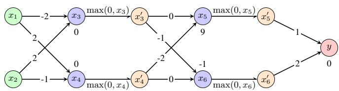
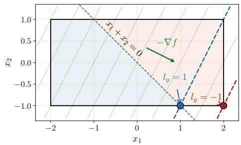
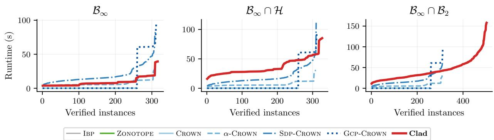
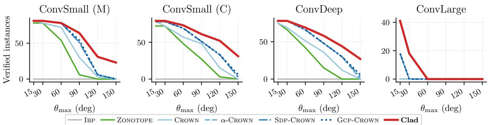

# CLAD: CONSTRAINED ABSTRACT DOMAIN FOR NEURAL NETWORK VERIFICATION

Hai Duong Department of Computer Science George Mason University Fairfax, VA, USA

Thanh Le   
Unaffiliated   
Yokosuka, Japan

ThanhVu Nguyen Department of Computer Science George Mason University Fairfax, VA, USA

## ABSTRACT

Neural network verification (NNV) formally verifies that a network satisfies a specified property for all inputs within a defined region. Modern NNV tools employ abstract domains to compute a sound over-approximation of the network’s behavior from the given input region, thus the tightness of these abstractions essentially determines efficiency. A long line of increasingly precise domains has been developed, but they all describe the valid input region in the same restrictive way, e.g., an $\ell _ { p } .$ -norm ball. A practical input region is rarely a simple $\ell _ { p }$ ball, but rather a combination $\ell _ { p }$ ball with additional constraints. Verifying a network over such a region with existing abstraction produces a loose over-approximation, which results in either failing to verify a property or spurious counterexamples. We introduce Constrained Lagrangian Abstract Domain (CLAD), a new abstract domain that computes a sound over-approximation of neural networks over input regions defined by a combination of convex constraints. CLAD propagates these constraints and tightens bounds over the true feasible region. However, bounding a neuron over the intersection of these constraints has no closed-form solution, so CLAD relaxes each constraint into the objective with a Lagrange multiplier and solves the resulting max-min problem with a projected primal-dual method, alternating a projected gradient step on the input with a multiplier update. CLAD supports any convex constraint with a subgradient, $e . g .$ , from automatic differentiation. We evaluate CLAD on 1,944 instances across four convolutional networks with motion-blur structured perturbations with halfspace or $\ell _ { 2 }$ -ball constraints. On standard unconstrained $\ell _ { \infty }$ property, CLAD verifies as many instances as GCP-CROWN at a similar runtime. On constrained properties, CLAD verifies 60% more instances than GCP-CROWN on ℓ2-ball properties, and 22% more in total.

## 1 Introduction

Deep neural networks (DNNs) have been increasingly adopted in real-world applications and safety-critical domains such as autonomous driving Shao et al. [2023] and medical diagnostics Bizjak et al. [2022]. However, they can fail in unexpected ways, e.g., physical obstructions like stickers on road signs can fool traffic classifiers Eykholt et al. [2018]. Neural network verification (NNV), a new fledgling field [Wang et al., 2018, Singh et al., 2019, Katz et al., 2022, Wang et al., 2021] aims to formally verify that a network behaves correctly under adverse conditions [Huang et al., 2020], e.g., a network satisfies a specified property for all possible inputs within a defined region. In recent years, researchers have developed many NNV algorithms and tools [Chiu et al., 2025, Zhou et al., 2024, Duong et al., 2026a, 2025, Duong and Nguyen, 2025, Duong et al., 2026b,c,d, Wu et al., 2024, PyRAT, 2024]. State-of-the-art (SoTA) NNV tools, which adapt program analysis and constraint solving techniques, have been shown to be effective and scale to large networks with millions of parameters, bringing many excitements and promises to NNV research Kaulen et al. [2025].

Despite recent advances, scalability remains a major challenge in NNV. Modern NNV tools adopt branch-and-bound (BaB) Bunel et al. [2020a], Duong et al. [2026e], which recursively divides a verification problem into subproblems, and at each subproblem, used an abstract domain, inspired by abstract interpretation [Cousot and Cousot, 1977], to compute an over-approximation of the network’s behavior from given input region. The tightness of abstraction is what ultimately determines the verification efficiency, e.g., a more precise domain prunes more subproblems before it explodes combinatorially.

A long line of NNV work has therefore pursued computationally efficient yet precise abstract domains, ranging from fast but coarse intervals (IBP [Wang et al., 2018]) to relational domains such as ZONOTOPE [Singh et al., 2018] and the polytope-based domains, $e . g .$ , CROWN [Zhang et al., 2018] and DEEPPOLY [Singh et al., 2019]. More recent refinements push this precision further, including optimizing relaxations (α-CROWN [Xu et al., 2020a]), tightening ℓ2-ball (SDP-CROWN [Chiu et al., 2025]), or adding cutting planes on hidden neurons (GCP-CROWN [Zhang et al., 2022a]). However, these works are all confined to compute abstraction of one $\ell _ { p } { \ - } \mathrm { n o r m }$ ball properties.

Recent work has moved toward richer, more realistic properties, such as structural robustness against coordinated input transformations, $e . g .$ , filtering [Duong et al., 2026c] or combined perturbations [Duong et al., 2026d]. However, these efforts do not enrich the abstract domain itself but reduce the property to a standard $\ell _ { \infty }$ problem by prepending an auxiliary subnetwork that generates the perturbation from fewer control variables. This thus restricts the property to those that can be reduced by changing the architecture of the network and cannot express arbitrary input constraints.

The need for an abstract domain that can directly handle more expressive input regions is not hypothetical: whenever an input region is described accurately, it is rarely a single $\ell _ { p }$ ball. A growing line of work that reasons directly about the input space of a network such as verifiable input space - the largest region on which a network’s outputs are certified safe - characterize it as a union of balls bounded by additional safety constraints [Chehade et al., 2025]. Likewise, methods that compute the preimage of a target output set represent it as a union and intersection of many halfspaces [Zhang et al., 2024]. In both cases, the region of interest is expressed as a base $\ell _ { p }$ ball combined with additional convex constraints.

In this work, we propose Constrained Lagrangian Abstract Domain (CLAD), a new abstract domain that verifies DNNs over input regions defined by a combination of convex constraints. CLAD propagates these constraints through the network and tightens every neuron’s bounds over the true feasible region, e.g., the combination of all the input constraints. Intuitively, each added constraint rules out inputs the network can never receive, so CLAD no longer has to account for them and can produce a tighter bound. To tackle the challenge of tightening the bounds over combined convex constraints (which has no closed form), CLAD relaxes each constraint into the objective with a Lagrange multiplier and solves the resulting max-min problem with a projected primal-dual method, alternating a projected gradient step on the input with a multiplier update. Each constraint is supplied as a convex constraint function with a subgradient, so CLAD supports any such constraint, $e . g .$ , the intersection of a halfspace and $\ell _ { 2 }$ balls, through auto-gradient. The resulting bound is sound and tight.

We evaluate CLAD on 1,944 instances across four convolutional networks with motion-blur structured perturbations, each augmented with halfspace or $\ell _ { 2 }$ -ball constraints. On the standard unconstrained $\ell _ { \infty }$ property, CLAD verifies as many instances as GCP-CROWN at a similar runtime. On constrained properties the gap widens sharply: CLAD verifies about 60% more instances than GCP-CROWN on $\ell _ { 2 } { \mathrm { - b a l l } }$ properties, at a higher runtime, because every baseline bounds over the enclosing $\ell _ { \infty }$ interval, while CLAD propagates the constraint and tightens each neuron bound over the feasible region. Overall, CLAD verifies 22% more instances than the SoTA GCP-CROWN and 3.3 as many on the largest network, and its advantage grows as input perturbation strength increases.

Our contributions include: (1) A new abstract domain CLAD that handles additional convex constraints by relaxing each one into the objective with a Lagrange multiplier and computing its gradient by automatic differentiation; (2) We prove CLAD returns a sound bound at every iteration, so it can stop early, and mechanize its duality results in Lean; (3) We establish the stopping conditions on the constraints under which CLAD returns a tight bound; and (4) We evaluate CLAD on 1,944 instances with and without halfspace and $\ell _ { 2 } \cdot$ -ball constraints, where it verifies 22% more instances than GCP-CROWN overall and about 60% more on $\ell _ { 2 } \cdot$ -ball properties, while matching GCP-CROWN on unconstrained $\ell _ { \infty }$ properties at a similar runtime.

## 2 Motivating Example

We illustrate CLAD using a simple DNN with ReLU in Fig. 1a. Learned weights are shown on the edges, while learned bias for each neuron is shown above or below it. For illustration, we use x and $x ^ { \prime }$ neurons to represent the pre-and post-activations of the ReLU layers, $e . g . , x _ { 3 } ^ { \prime }$ and $x _ { 4 } ^ { \prime }$ are the post-activation values after applying ReLU to $x _ { 3 }$ and $x _ { 4 }$ , respectively. The computation is then:

$$
\begin{array} { r l r l r l r l r l } & { x _ { 3 } = - 2 x _ { 1 } + 2 x _ { 2 } , \quad } & & { x _ { 3 } ^ { \prime } = \mathrm { R e L U } ( x _ { 3 } ) , \quad } & & { x _ { 4 } = 2 x _ { 1 } - x _ { 2 } , \quad } & & { x _ { 4 } ^ { \prime } = \mathrm { R e L U } ( x _ { 4 } ) , \quad y = x _ { 5 } ^ { \prime } + 2 x _ { 6 } ^ { \prime } } \\ & { x _ { 5 } = - 2 x _ { 4 } ^ { \prime } + 9 , \quad } & & { x _ { 5 } ^ { \prime } = \mathrm { R e L U } ( x _ { 5 } ) , \quad } & & { x _ { 6 } = - x _ { 3 } ^ { \prime } - 1 , \quad } & & { x _ { 6 } ^ { \prime } = \mathrm { R e L U } ( x _ { 6 } ) } \end{array}\tag{1}
$$

Suppose we want to verify that y is always positive for all inputs $( x _ { 1 } , x _ { 2 } )$ in a certain input region:

$$
\forall ( x _ { 1 } , x _ { 2 } ) , \quad \underbrace { x _ { 1 } \in [ - 2 , 2 ] \wedge x _ { 2 } \in [ - 1 , 1 ] } _ { B } \wedge \underbrace { x _ { 1 } + x _ { 2 } \leq 0 } _ { \mathcal { H } } \implies y > 0\tag{2}
$$

  
(a) A simple neural network with ReLU. $x _ { 1 } , x _ { 2 }$ are input and y is output.

  
(b) Concretizing $y \geq - 2 x _ { 1 } + x _ { 2 } + 4 .$ Without H (red): returns $l _ { y } = - 1$ at infeasible $( 2 , - 1 )$ . CLAD (blue): returns $l _ { y } = 1$ at feasible $( 1 , - 1 )$  
Fig. 1: Motivating example: network architecture (a) and constrained concretization (b).

This property involves the interval range  : $x _ { 1 } \in [ - 2 , 2 ]$ and $x _ { 2 } \in [ - 1 , 1 ]$ and the half-space1 constraint $\mathcal { H } : x _ { 1 } + x _ { 2 } \le$ 0.

To handle complex constraints, CLAD associates each variable $v _ { i }$ with symbolic polyhedral bounds (to preserve relational information) and concrete scalar bounds $l _ { i } , u _ { i }$ (to check ReLU stability). The key difference from prior work is how these scalars are computed: while DEEPPOLY Singh et al. [2019] evaluates the symbolic expressions merely over the input box , CLAD yields tighter scalars by optimizing over the full feasible set $B \cap \mathcal { H }$ (where $\mathcal { H } : x _ { 1 } + x _ { 2 } \le 0$ is the halfspace constraint).

Starting with inputs $x _ { 1 } \in [ - 2 , 2 ]$ and $x _ { 2 } \in [ - 1 , 1 ]$ , the first affine transformer computes:

$$
x _ { 3 } = - 2 x _ { 1 } + 2 x _ { 2 } , \qquad x _ { 4 } = 2 x _ { 1 } - x _ { 2 }\tag{3}
$$

Using the input bounds, we get concrete ranges $x _ { 3 } \in [ - 6 , 6 ]$ and $x _ { 4 } \in [ - 5 , 5 ]$ . Since these ranges cross zero, both neurons are unstable. CLAD therefore applies the standard linear relaxation $( \ S \mathrm { A } . 2 )$ . For the lower bound we take $x ^ { \prime } \geq 0 .$ and for the upper bound we follow DEEPPOLY and compute:

$$
0 \leq x _ { 3 } ^ { \prime } \leq 0 . 5 x _ { 3 } + 3 , \qquad 0 \leq x _ { 4 } ^ { \prime } \leq 0 . 5 x _ { 4 } + 2 . 5\tag{4}
$$

Propagating these abstractions through the subsequent layers yields the final output y. By back-substituting the intermediate symbolic bounds layer-by-layer, CLAD expresses the lower bound of y in terms of the original inputs $( x _ { 1 } , x _ { 2 } ) \colon$

$$
y \ge - 2 x _ { 1 } + x _ { 2 } + 4\tag{5}
$$

To verify $y > 0$ , CLAD computes the concrete lower bound of Eq. 5 over the feasible input region:

$$
l _ { y } ~ = ~ \operatorname* { m i n } _ { x \in \mathcal { B } } ~ f ( x ) ~ = ~ \operatorname* { m i n } _ { x \in \mathcal { B } } ~ \left( - 2 x _ { 1 } + x _ { 2 } + 4 \right) ~ \mathrm { s u b j e c t t o } ~ x _ { 1 } + x _ { 2 } \leq 0\tag{6}
$$

To solve Eq. 6, we use a Lagrangian technique [Boyd and Vandenberghe, 2004, Dvijotham et al., 2018], which converts the constrained optimization into an unconstrained one by folding the constraints into the objective as penalty terms that discourage infeasible solutions. Let ${ \mathcal { L } } ( x , \mu )$ denote the Lagrangian, which contains the minimized objective $f$ and the constraint function $h ( x ) = x _ { 1 } + x _ { 2 } \leq 0$ weighted by $\mu \geq 0 \colon$

$$
{ \mathcal { L } } ( x , \mu ) = ( - 2 x _ { 1 } + x _ { 2 } + 4 ) + \mu ( x _ { 1 } + x _ { 2 } ) , \qquad \mu \geq 0\tag{7}
$$

where $\mu \geq 0$ controls how strongly violations are penalized. For every feasible $x ,$ , the term $\mu ( x _ { 1 } + x _ { 2 } )$ is non-positive, so $\mathcal { L } ( \dot { x } , \mu ) \leq f ( x )$ and hence mi $\begin{array} { r } { \mathrm { { n } } _ { x \in B } \mathcal { L } ( x , \mu ) \leq l _ { y } } \end{array}$ for every $\mu \geq 0$ . We now solve the constrained problem Eq. 6 using the Lagrangian Eq. 7.

In particular, if $\mu$ is too small $( e . g . , \mu = 0 )$ , the penalty barely matters and the minimizer runs to infeasible point $( 2 , - 1 )$ (unconstrained solution). If $\mu$ is too large, the term $\mu ( x _ { 1 } + x _ { 2 } )$ becomes a huge reward for points deep inside the halfspace (where $x _ { 1 } + x _ { 2 }$ is very negative). The best $\mu$ sits in between, balancing the two effects. CLAD searches for $\mu$ that gives the largest, and thus tightest, lower bound via an iterative loop that raises $\mu$ proportionally to current violation until the penalty is strong enough to keep $( x _ { 1 } , x _ { 2 } ) \in \mathcal { H } \colon$

$$
\operatorname* { m a x } _ { \mu \geq 0 } \ \operatorname* { m i n } _ { x \in \mathcal { B } } \mathcal { L } ( x , \mu ) \ = \ \operatorname* { m a x } _ { \mu \geq 0 } \ \operatorname* { m i n } _ { x \in \mathcal { B } } \big \{ ( - 2 x _ { 1 } + x _ { 2 } + 4 ) \ + \ \mu \left( x _ { 1 } + x _ { 2 } \right) \big \}\tag{8}
$$

CLAD solves this dual optimization problem by alternating between two steps: (i) adjusting x to decrease the Lagrangian and (ii) adjusting $\mu$ to increase the penalty on violations until convergence. Each iteration performs two steps:

(1) Primal step. CLAD moves $( x _ { 1 } , x _ { 2 } )$ along the negative gradient of $\mathcal { L } ,$ , which decreases the objective $- 2 x _ { 1 } + x _ { 2 } + 4$ The penalty $\mu ( x _ { 1 } + x _ { 2 } )$ adds $- \mu ( 1 , 1 )$ to this direction at every iterate so it lowers $x _ { 1 } + x _ { 2 }$ and pulls a violating point back toward with a strength set by $\mu .$ . After the move, $( x _ { 1 } , x _ { 2 } )$ is clamped back into the interval $\boldsymbol { B }$

(2) Dual step. CLAD increases the penalty weight µ by an amount proportional to how much  is currently violated. This makes subsequent primal steps push more strongly toward the feasible region, so the two steps drive $( x _ { 1 } , x _ { 2 } )$ toward a point that is both low-objective and feasible.

The solver stops once its certified bound stops improving, returning $l _ { y } = 1$ , attained at (1, 1) on the boundary $x _ { 1 } + x _ { 2 } = 0$ instead of $l _ { y } = - 1$ at infeasible $( 2 , - 1 )$ .

Result. Finally, we check the result against the specification, which confirms the computed lower bound $l _ { y } = 1 > 0$ successfully verifies the specification $y > 0$ over the feasible input region $B \cap { \mathcal { H } }$ , where ignoring gives the loose bound $l _ { y } = - 1$

## 3 The CLAD Abstraction Domain

Alg. 1 shows how CLAD computes output bounds for a DNN over an input ball with constraints $\{ h _ { j } \} _ { j = 1 } ^ { M }$ . CLAD first traverses $\mathcal { N }$ in topological order and computes concrete bounds at activation nodes to construct their linear relaxations (line 2), while linear nodes are propagated exactly in symbolic form. For each node $v _ { i } .$ , the abstraction maintains symbolic and concrete bounds:

$$
\underline { { A } } _ { i } x + \underline { { b } } _ { i } \leq v _ { i } \leq \overline { { A } } _ { i } x + \overline { { b } } _ { i } , \qquad l _ { i } \leq v _ { i } \leq u _ { i } .
$$

The symbolic bounds preserve the dependence on the inputs, while the concrete bounds determine the activation relaxation. To bound each activation v , CLAD collects its predecessors (line 3) and initializes the symbolic bounds (line 4). It then traverses the subgraph in reversed topological order, tracing $v _ { i }$ backward until both symbolic bounds are expressed in the inputs (line 5).

During the traversal, CLAD substitutes the exact affine map of each linear node (line 11). For a linear or convolution node with weight $W _ { k }$ and bias $c _ { k } .$ , Substitute composes the exact affine:

$$
{ \tt S u b s t i t u t e } ( A , b , v _ { k } ) = ( A W _ { k } , A c _ { k } + b ) .
$$

At each activation, CLAD constructs lower and upper linear relaxations $( \ S \mathrm { A } . 2 )$ from its concrete bounds $[ l _ { k } , u _ { k } ]$ (line 7). It selects which relaxation to substitute based on the coefficient sign (line 8-line 9). For $r ( x ) = d _ { r } \odot x + e _ { r }$ and $r ^ { \prime } ( x ) = d _ { r ^ { \prime } } \odot x + e _ { r ^ { \prime } }$ , the substitution is

$$
\mathtt { S u b s t i t u t e } ( A , b , r , r ^ { \prime } ) = \left( A ^ { + } \mathrm { d i a g } ( d _ { r } ) + A ^ { - } \mathrm { d i a g } ( d _ { r ^ { \prime } } ) , \ A ^ { + } e _ { r } + A ^ { - } e _ { r ^ { \prime } } + b \right)\tag{9}
$$

where $A ^ { + } = \operatorname* { m a x } ( A , 0 )$ and $A ^ { - } = \operatorname* { m i n } ( A , 0 )$ elementwise. Passing $( \underline { { r } } _ { k } , \overline { { r } } _ { k } )$ gives a sound lower bound (a positive coefficient preserves the bound direction), while passing $( \overline { { r } } _ { k } , \underline { { r } } _ { k } )$ gives a sound upper bound (a negative coefficient reverses the direction).

Finally, CLAD concretizes the symbolic bounds into $[ l _ { i } , u _ { i } ]$ by optimizing them over the feasible input set (line 13 -line 14). This feasible set combines the input ball with the additional constraints $\{ h _ { j } \} _ { j = 1 } ^ { M } ( \ S 3 . 1 )$ . CLAD solves this optimization with the projected primal dual method (§3.2 and Alg. 2). CLAD uses the resulting $[ l _ { i } , u _ { i } ]$ to construct later activation relaxations and returns the output range as the final certificate.

## 3.1 Constraint Formulation

The input property of a NNV instance can contain one or more constraints. Adding a constraint to CLAD requires only a constraintfunction that measures its violation.

Constraint. Each constraint has the standard form $h _ { j } ( x ) \leq 0$ , where $h _ { j } : \mathbb { R } ^ { D }  \mathbb { R }$ . The $h _ { j } ( x )$ is nonpositive iff x satisfies the constraint; otherwise, its positive value measures the violation.

Penalty. The nonnegative penalty associated with $h _ { j }$ is $\phi _ { j } ( x ) = \mathrm { m a x } \big ( 0 , h _ { j } ( x ) \big )$ , which equals zero when the constraint is satisfied and measures the violation otherwise.

Example. For the $\ell _ { 2 }$ ball $\mathcal { B } _ { 2 } = \{ x : \| x - x _ { c } \| _ { 2 } \leq r \}$ , the constraint function is $h ( x ) = \| x - x _ { c } \| _ { 2 } - r$ and the penalty is $\phi ( x ) = \mathrm { R e L U } \big ( \| x - x _ { c } \| _ { 2 } - r \big )$ . CLAD uses $\phi _ { j }$ in place of $h _ { j } { \mathrm { : } }$ it is convex, zero on the feasible $\operatorname { s e t } .$ and has subgradient 0 at its kink, so the non-differentiable center $x _ { c }$ never enters.

Alg. 1: CLAD algorithm.   
input: DNN $\mathcal { N } ;$ input ball $\mathcal { B } = \{ x : \| x - x _ { 0 } \| _ { p } \leq \varepsilon \}$ ; constraint functions $\{ h _ { j } \} _ { j = } ^ { M }$ 1   
output: output bounds $[ l _ { \mathrm { o u t } } , u _ { \mathrm { o u t } } ]$   
1 for v in TopoSort $( \mathcal { N } )$ do   
2 if IsActivation $( v _ { i } ) \vee v _ { i } = v _ { \mathrm { o u t } }$ then   
3 $\mathcal { G } _ { i }  \{ v _ { i } \} \cup$ Predecessors $( v _ { i } )$ ; $/ /$ sub-DAG feeding $v _ { i }$   
4 $( \underline { { A } } _ { i } , \underline { { b } } _ { i } ) , ( \overline { { A } } _ { i } , \overline { { b } } _ { i } ) \gets ( I , 0 ) , ( I , 0 )$ // init to the trivial bound $v _ { i } \leq v _ { i } \leq v _ { i }$   
$/ /$ compute $v _ { i }$ symbolically in the inputs x   
5 for v in ReverseTopoSort $\left( \mathcal { G } _ { i } \right)$ do // back-substitute from $v _ { i }$ to input x   
6 if IsActivation $( v _ { k } )$ then   
7 $( \underline { { r } } _ { k } , \overline { { r } } _ { k } ) \gets \mathtt { R e l a x } ( v _ { k } , l _ { k } , u _ { k } ) ;$ // linear bound relaxation $\underline { { r } } _ { k } \le v _ { k } \le \overline { { r } } _ { k }$   
8 $( \underline { { \bar { A _ { i } } } } , \underline { { b _ { i } } } ) \gets \mathtt { S u b s t i t u t e } ( \underline { { A } } _ { i } , \underline { { b } } _ { i } , \underline { { r } } _ { k } , \overline { { r } } _ { k } )$ // substitute lower bound   
9 $( \overline { { A } } _ { i } , \overline { { b } } _ { i } ) \gets \mathtt { S u b s t i t u t e } ( \overline { { A } } _ { i } , \overline { { b } } _ { i } , \overline { { r } } _ { k } , \underline { { r } } _ { k } )$ // substitute upper bound   
10 else   
11 $( \underline { { A } } _ { i } , \underline { { b } } _ { i } ) \gets \mathtt { S u b s t i t u t e } ( \underline { { A } } _ { i } , \underline { { b } } _ { i } , v _ { k } )$ // substitute lower bound   
12 $( \overline { { A } } _ { i } , \overline { { b } } _ { i } ) \gets \mathtt { S u b s t i t u t e } ( \overline { { A } } _ { i } , \overline { { b } } _ { i } , v _ { k } )$ // substitute upper bound   
$/ /$ concretize each side over $B \cap \bigcap _ { j } \{ h _ { j } \leq 0 \}$ (Alg. 2)   
13 $l _ { i } \gets \mathsf { C o n c r e t i z e } ( \underline { { A } } _ { i } , \underline { { b } } _ { i } , \mathbb { B } , \{ h _ { j } \} , + 1 )$ ; // compute concrete lower bound   
14 ui ← Concretize $( \overline { { A } } _ { i } , \overline { { b } } _ { i } , B , \{ h _ { j } \} , - 1 )$ // compute concrete upper bound   
15 return $[ l _ { \mathrm { o u t } } , u _ { \mathrm { o u t } } ] ;$

## 3.2 Contrained Abstraction

Linear relaxation methods [Zhang et al., 2018, Singh et al., 2019] bound each neuron $v _ { i }$ in the inputs x by $\underline { { { A } } } _ { i } x + \underline { { { b } } } _ { i } \leq$ $v _ { i } \leq \overline { { A } } _ { i } x + \overline { { b } } _ { i }$ . Concretization optimizes these expressions over all valid inputs to obtain $[ l _ { i } , u _ { i } ]$ . These scalars determine the stability of an activation and its relaxation. A piecewise linear activation is stable if $[ l _ { i } , u _ { i } ]$ lies within one linear piece, where the activation is linear and needs no approximation. It is unstable if $[ l _ { i } , u _ { i } ]$ spans the nonlinear region, requiring a linear relaxation. Thus, tighter ranges keep more neurons stable and yield tighter bounds [Xu et al., 2024]. For the $\ell _ { p }$ ball $\mathcal { B } = \left\{ x : \| x - x _ { 0 } \| _ { p } \leq \varepsilon \right\}$ , Hölder’s inequality gives the closed form:

$$
u _ { i } \ = \ \overline { { { A } } } _ { i } x _ { 0 } + \varepsilon \| \overline { { { A } } } _ { i } \| _ { q } + \bar { b } _ { i } \qquad l _ { i } \ = \ \underline { { { A } } } _ { i } x _ { 0 } - \varepsilon \| \underline { { { A } } } _ { i } \| _ { q } + \underline { { { b } } } _ { i }\tag{10}
$$

where $1 / p + 1 / q = 1$ . When $p = \infty$ and $q = 1$ , the worst case independently moves each input coordinate to the interval boundary matching the sign of its coefficient in ${ \overline { { A } } } _ { i }$ . The result is its value at $x _ { 0 }$ plus ε times the sum of absolute coefficients, or the $\ell _ { 1 }$ norm. An additional constraint such as $x _ { 1 } + x _ { 2 } \leq 0$ may remove the interval boundaries from feasible space, thus, closed-form solutions from Hölder is no longer valid. CLAD concretizes each neuron over the feasible space $B \cap \mathcal { H } :$

$$
l _ { i } \ = \ \operatorname* { m i n } _ { x \in B \cap \mathcal { H } } \underline { { A } } _ { i } x + \underline { { b } } _ { i } \qquad - u _ { i } \ = \ \operatorname* { m i n } _ { x \in B \cap \mathcal { H } } - \left( \overline { { A } } _ { i } x + \overline { { b } } _ { i } \right)\tag{11}
$$

where $\mathcal { B } = \{ x : \| x - x _ { 0 } \| _ { p } \leq \varepsilon \}$ be the base $\ell _ { p }$ norm ball input property and $\mathcal { H } = \{ x : h _ { j } ( x ) \leq 0 , j = 1 , \ldots , M \}$ the feasible set formed by the base interval and additional constraints.

There are three common methods to solve the constrained concretization problem [Boyd and Vandenberghe, 2004]: (i) Dual ascent evaluates $\mathrm { d } ( \mu )$ exactly and ascends along its supergradient, but general $h _ { j }$ does not provide the closed form inner minimization; (ii) Primal dual interior point methods are accurate but solve each instance with costly Newton steps, so they do not scale to CLAD concretization; and (iii) Projected primal dual methods [Arrow et al., 1958, Nedic´ and Ozdaglar, 2009] use a first order descent step in x projected onto $\dot { B }$ and an ascent step in µ projected onto $\{ \mu \geq 0 \}$

Therefore, CLAD uses projected primal-dual method to solve Eq. 11. We present the procedure for a sound and tight lower bound $l _ { i }$ and write its back-substituted bound as $A x + b ;$ the upper bound is symmetric and minimizes $- ( \overline { { A } } _ { i } x + \overline { { b } } _ { i } )$ , as in Eq. 11.

Lagrangian. The Lagrangian [Boyd and Vandenberghe, 2004, Dvijotham et al., 2018] handles constrained optimization by replacing constraints $\bar { h } _ { j } ( x ) \overset { \cdot } { \leq } 0$ with a weighted sum of their values in the objective. Each constraint has a nonnegative $\mu _ { j }$ . Concretely, the Lagrangian assigns a dual multiplier $\mu _ { j } \geq 0$ to each inequality constraint $h _ { j } ( x ) \leq 0$ in Eq. 11 and adds them into the objective:

$$
\mathcal { L } ( x , \mu ) = A x + b + \sum _ { j = 1 } ^ { M } \mu _ { j } h _ { j } ( x )\tag{12}
$$

For every feasible $x \in B \cap \mathcal { H } , h _ { j } ( x ) \leq 0$ and $\mu _ { j } \geq 0$ , so each term $\mu _ { j } h _ { j } ( x ) \leq 0$ . Thus, $\mathcal { L } ( x , \mu ) \leq A x + b .$ with equality when all constraints are active.

Dual problem. The dual function minimizes the Lagrangian over : $\mathrm { d } ( \mu ) = \mathrm { m i n } _ { x \in B } { \mathcal { L } } ( x , \mu )$ . Substituting Eq. 12 gives the dual problem

$$
\operatorname* { m a x } _ { \mu \geq 0 } \mathrm { d } ( \mu ) = \operatorname* { m a x } _ { \mu \geq 0 } \operatorname* { m i n } _ { x \in \mathcal { B } } \left( A x + b + \sum _ { j = 1 } ^ { M } \mu _ { j } h _ { j } ( x ) \right)\tag{13}
$$

Every $\mu \geq 0$ gives a sound lower bound on $l _ { i }$ (Thm. C.1). Thus, if the DNN verifier stops solving ma $_ { \cdot } \underline { { { \cdot } } } _ { \mu } \underline { { { > } } } 0 \mathrm { d } ( \mu )$ due to a time constraint, its current nonoptimal $\mu$ still gives a valid bound $\mathrm { d } ( \mu )$ . For $x _ { \mu } \in$ arg min $_ { x \in B } \mathcal { L } ( x , \dot { \mu } )$ , the constraint values form a supergradient of the concave dual function:

$$
\mathrm { d } ( \mu ^ { \prime } ) \le \mathrm { d } ( \mu ) + \sum _ { j = 1 } ^ { M } h _ { j } ( x _ { \mu } ) ( \mu _ { j } ^ { \prime } - \mu _ { j } )\tag{14}
$$

where $\mu ^ { \prime } \geq 0$ is other multiplier vector. Thus, a positive $h _ { j } ( x _ { \mu } )$ raises $\mu _ { j }$ and vice versa.

Primal-dual solver. Alg. 2 handles both bounds with a sign s: it minimizes $s ( A x + b )$ over $B \cap \mathcal { H } .$ , with $s = + 1$ for the lower bound and $s ~ = ~ - 1$ for the upper bound, whose result it negates. Its Lagrangian is $\mathcal { L } _ { s } ( x , \mu ) ~ =$ $\begin{array} { r } { s ( A x + b ) + \sum _ { j } \mu _ { j } h _ { j } ( x ) } \end{array}$ , which equals Eq. 12 when $s = + 1$ . Each iteration of Alg. 2 performs two steps. The primal step computes the gradient $\begin{array} { r } { q = s \cdot A + \sum _ { j } \mu _ { j } \nabla h _ { j } ( x ) } \end{array}$ of $\mathcal { L } _ { s }$ where each gradient $\nabla h _ { j }$ is obtained via automatic differentiation and descends as x $ x - \eta q$ . The dual step updates each multiplier as $\mu _ { j }  \operatorname* { m a x } ( 0 , \mu _ { j } + \tau h _ { j } ( x ) )$ increasing $\mu _ { j }$ when constraint $h _ { j }$ is violated and decreasing it when satisfied, so the weight on each violated constraint grows until x is feasible. Concretely, the two steps update:

$$
\begin{array} { r l } { q _ { t } = s A + \displaystyle \sum _ { j = 1 } ^ { M } \mu _ { j , t } \nabla h _ { j } ( x _ { t } ) } & { { } \widetilde { x } _ { t + 1 } = x _ { t } - \eta _ { t } q _ { t } } \\ { \mu _ { j , t + 1 } = \operatorname* { m a x } \bigl ( 0 , \mu _ { j , t } + \tau h _ { j } ( \widetilde { x } _ { t + 1 } ) \bigr ) } & { { } x _ { t + 1 } = \Pi _ { \mathcal { B } } ( \widetilde { x } _ { t + 1 } ) } \end{array}\tag{15}
$$

The primal variable is initialized at the closed-form Hölder minimizer of s Ax over $\boldsymbol { B }$ and projected back onto by $\Pi _ { B }$ after each step. Hölder’s inequality gives the warm start value

$$
\operatorname* { m i n } _ { x \in \mathcal { B } } s ( A x + b ) = s ( A x _ { 0 } + b ) - \varepsilon \| A \| _ { q } , \qquad \frac { 1 } { p } + \frac { 1 } { q } = 1\tag{16}
$$

For $p = \infty$ , a minimizer is $x ^ { ( 0 ) } = x _ { 0 } - \varepsilon \mathrm { s i g n } ( s A )$ . The primal variable is not projected onto  because the additional constraints control x via the regularization terms in the Lagrangian. The projection used by the primal step is

$$
\Pi _ { B } ( z ) = \underset { x \in B } { \arg \operatorname* { m i n } } \ : \| x - z \| _ { 2 }\tag{17}
$$

For an $\ell _ { \infty }$ ball, it clips z elementwise to the interval $[ x _ { 0 } - \varepsilon \mathbf { 1 } , x _ { 0 } + \varepsilon \mathbf { 1 } ]$

$$
\Pi _ { B } ( z ) = \operatorname* { m i n } \bigl ( x _ { 0 } + \varepsilon { \bf 1 } , \operatorname* { m a x } ( x _ { 0 } - \varepsilon { \bf 1 } , z ) \bigr )\tag{18}
$$

where min and max here are elementwise operations.

CLAD adapts η with the Barzilai–Borwein step [Barzilai and Borwein, 1988], which takes larger steps in flat regions and smaller steps in sharply curved ones, avoiding manual tuning. With $d x _ { t } = x _ { t } - x _ { t - 1 }$ and $y _ { t } = q _ { t } - q _ { t - 1 }$ , the Barzilai and Borwein update is

$$
\eta _ { t } = \operatorname* { m a x } \left( 0 , \operatorname* { m i n } \left( \frac { \left| d x _ { t } ^ { \top } y _ { t } \right| } { \left\| y _ { t } \right\| _ { 2 } ^ { 2 } } , 1 \right) \right)\tag{19}
$$

The Lagrangian at an unconverged iterate is not a sound bound, since $\mathcal { L } _ { s } ( x , \mu ) \geq \mathrm { d } ( \mu )$ . CLAD instead evaluates, after every step, a certified bound from the tangent of $\mathcal { L } _ { s }$ at x, minimized over as in $\operatorname { E q . }$ 16:

$$
\hat { \mathrm { d } } ( x , \mu ) = \mathcal { L } _ { s } ( x , \mu ) + \operatorname* { m i n } _ { x ^ { \prime } \in \mathcal { B } } g ^ { \top } ( x ^ { \prime } - x ) = \mathcal { L } _ { s } ( x , \mu ) + g ^ { \top } ( x _ { 0 } - x ) - \varepsilon \| g \| _ { q }\tag{20}
$$

where $\begin{array} { r } { g = s \cdot A + \sum _ { j } \mu _ { j } \nabla h _ { j } ( x ) } \end{array}$ is a subgradient of $\mathcal { L } _ { s } ( \cdot , \mu )$ . Each $h _ { j }$ is convex, so $\mathcal { L } _ { s } ( \cdot , \mu )$ lies above its tangent and $\hat { \mathrm { d } } ( x , \mu ) \leq \mathrm { d } ( \mu )$ , which is sound by Thm. C.1 for every iterate x and every $\mu \geq 0 . { \mathrm { ~ A l g . ~ } } 2$ keeps the largest certified bound $\beta ,$ stops once $\beta$ has not improved by more than ϵ for $K$ consecutive iterations, and returns $s \cdot \beta$ (line 12). Stopping at any iteration is therefore safe.

Alg. 2: CLAD Concretization Algorithm.   
input: weight A and bias b of a linear bound; $\ell _ { p }$ ball $B = \{ x : \| x - x _ { 0 } \| _ { p } \leq \varepsilon \} \ / \vphantom { \frac { 1 } { \theta } } ,$ ; constraint functions $\{ h _ { j } \} _ { j = 1 } ^ { M } ;$ sign   
$s \in \{ - 1 , + 1 \}$   
hyper-params: primal step size $\eta ,$ dual step size $\tau ,$ initial multiplier µ0, tolerance ϵ, patience K, number of iterations T   
output: lower bound if $s \stackrel { = } { = } + 1 ,$ , upper bound if $s = - 1$   
1 x ← arg minx∈B s · Ax; $\beta \gets \operatorname* { m i n } _ { x \in B } s ( A x + b )$ ; // warm start and $\mu { = } 0$ bound, Eq. 16   
2 $\mu _ { j }  \mu _ { 0 } \quad \forall j \in \{ 1 , \ldots , M \}$ // initialize dual multipliers   
3 for t = 1 to T do // run optimization for T iterations   
4 $q , x ^ { \prime } \gets \mathtt { P r i m a l S t e p } ( x , \mu , A , \{ h _ { j } \} , \eta )$ // primal descent   
5 $\begin{array} { r } { d x  x ^ { \prime } - x ; y  ( s \cdot A + \sum _ { j } \mu _ { j } \nabla h _ { j } ( x ^ { \prime } ) ) - q } \end{array}$ // changes in x and gradient   
6 $x \gets x ^ { \prime } :$ // update primal variable   
7 µ ← DualStep $( x , \mu , \{ h _ { j } \} , \tau )$ // dual ascent   
8 β ← max $\left( { \boldsymbol { \beta } } , { \hat { \mathrm { d } } } ( { \boldsymbol { x } } , { \boldsymbol { \mu } } ) \right)$ // certified bound, Eq. 20   
9 if $\| y \| _ { 2 } ^ { 2 } > \epsilon$ then η ← max 0, min $( | d x ^ { \top } y | / \| y \| _ { 2 } ^ { 2 } , 1 ) )$ // Barzilai-Borwein step size   
10 $x  \Pi _ { B } ( x )$ // project onto B only   
11 if β has not improved by ϵfor K iterations then break ; // stop if converged   
12 return $s \cdot \beta ;$ // certified lower/upper bound

## 3.3 Soundness, Tightness, and Convergence of CLAD

Every certified bound $\hat { \mathrm { d } } ( x , \mu )$ is sound, so Alg. 2 can stop at any iteration and return a valid bound. Under the Slater condition, which requires a strictly feasible interior point, maximizing the dual function over $\mu \geq 0$ recovers the exact constrained optimum and is therefore tight. §C gives formal proofs of Thm. C.1, Thm. C.4, and resulting corollaries for halfspace and $\ell _ { 2 }$ ball constraints. For a simultaneous variant with a constant shared step and bounded multipliers, the averaged iterates converge to the constrained optimum at rate $O ( 1 / \sqrt { T } )$ (Thm. C.10); this concerns tightness only, as soundness holds at every iteration.

## 4 Evaluation

Verification Benchmark We use four convolutional networks from Chiu et al. [2025]: ConvSmall (M) trained on MNIST, and ConvSmall (C), ConvDeep, and ConvLarge trained on CIFAR-10. We do not use VNN-COMP instances, which are generally easy 2 for this comparison: most are already solved by simple abstractions such as IBP or ZONOTOPE, so they cannot differentiate among more precise methods. In contrast, these networks span 4 to 7 layers, 8 to 64 convolutional channels, and 55K to 2.47M parameters, and they are known to separate verifiers sharply [Wang et al., 2021, Chiu et al., 2025], e.g., on the CIFAR-10 ConvLarge, α-CROWN, GCP-CROWN, and SDP-CROWN verify 2.5%, 6%, and 63.5% of the images, respectively [Chiu et al., 2025].

We generate more expressive instances using motion-blur perturbations from VeriDou [Duong et al., 2026d], whose convolutional parameterization covers a continuous range of blur angles, at six strengths for each network. We use structured perturbations noise because real corruptions such as blur change correlated pixels [Duong et al., 2026c,d]. For every network and perturbation strength, we compare three setups: $( \mathrm { i } ) \ell _ { \infty }$ interval (linf), (ii) that same interval intersects with a halfspace (linf+hs), (iii) interval intersects with an $\ell _ { 2 }$ ball (linf+l2). This yields 1,944 instances across the four networks and three property types. §D.2 gives more details on the benchmarks.

Comparison Baselines We compare CLAD with abstraction baselines including: IBP [Wang et al., 2018], ZONOTOPE, CROWN [Xu et al., 2020b]/DEEPPOLY [Singh et al., 2019], α-CROWN [Xu et al., 2020a], SDP-CROWN [Chiu et al., 2025], and GCP-CROWN [Zhang et al., 2022a]. For a fair comparison, we give every baseline the minimum interval that contain the constrained input region of each property. CLAD receives the same tightened interval in addition to the constraint itself.

Comparison Metrics The number ofverified instances is our primary measure of an abstraction’s effectiveness, since more verified instances means robustness holds over a broader range of instances. An instance is verified if its output lower bound ${ l _ { \mathrm { o u t } } } > 0$ . For classification models, ${ l _ { \mathrm { o u t } } } > 0$ when the margin $Y _ { i } - Y _ { j } > 0$ between the true class i and a competing class $j .$

Tab. 1: Verified instances and average runtime per instance per network and method.
<table><tr><td rowspan="2">Network</td><td colspan="2">IBP</td><td colspan="2">ZONOTOPE</td><td colspan="2">CROWN / DEEPPOLY</td><td colspan="2">α-CROWN</td><td colspan="2">SDP-CROWN</td><td colspan="2">GCP-CROWN</td><td colspan="2">CLAD</td></tr><tr><td>Verified</td><td>Time</td><td>Verified</td><td>Time</td><td>Verified</td><td>Time</td><td>Verified</td><td>Time</td><td>Verified</td><td>Time</td><td>Verified</td><td>Time</td><td>Verified</td><td>Time</td></tr><tr><td>ConvSmall (M)</td><td>0</td><td>0.00</td><td>216</td><td>0.00</td><td>264</td><td>0.04</td><td>297</td><td>4.94</td><td>297</td><td>14.24</td><td>300</td><td>18.81</td><td>358</td><td>19.23</td></tr><tr><td>ConvSmall (C)</td><td>0</td><td>0.00</td><td>222</td><td>0.00</td><td>270</td><td>0.04</td><td>312</td><td>5.24</td><td>312</td><td>15.59</td><td>315</td><td>28.77</td><td>375</td><td>22.55</td></tr><tr><td>ConvDeep</td><td>0</td><td>0.00</td><td>198</td><td>0.00</td><td>243</td><td>0.06</td><td>300</td><td>8.35</td><td>303</td><td>22.64</td><td>306</td><td>35.95</td><td>354</td><td>38.77</td></tr><tr><td>ConvLarge</td><td>0</td><td>0.00</td><td>0</td><td>0.10</td><td>0</td><td>0.20</td><td>18</td><td>30.78</td><td>18</td><td>63.70</td><td></td><td>1872.37</td><td>59</td><td>78.05</td></tr></table>

  
Fig. 2: Cactus plots of runtime per verified instances for each property type

## 4.1 RQ1: Performance with Existing Abstraction

Tab. 1 presents the verified instance counts and average per-instance runtimes for each method across the four convolutional networks. CLAD achieves the highest number of verified instances on each network, totaling 1,146, which improves 22% compared to the strongest baseline GCP-CROWN. The performance gap is most pronounced on ConvLarge, where CLAD verifies 59 instances, whereas α-CROWN, SDP-CROWN, and GCP-CROWN each verify fewer than one-third as many instances. IBP does not verify any instances, which indicates that the benchmark instances are non-trivial.

In terms of runtime, IBP, ZONOTOPE and CROWN require at most 0.2 seconds per instance but verify substantially fewer instances. while α-CROWN, SDP-CROWN, and GCP-CROWN take up to 72s per instance on ConvLarge. CLAD’s runtime is close to that of GCP-CROWN while verifying 41 to 60 more instances per network. Consequently, the primal-dual solver increases verification precision while maintaining a runtime similar to that of the baseline abstraction domains.

## 4.2 RQ2: Performance on Constrained and Unconstrained Properties

The leftmost cactus plot in Fig. 2 presents the runtime for verified instances of the unconstrained $\ell _ { \infty }$ property. α- CROWN, SDP-CROWN, GCP-CROWN, and CLAD verify 309, 310, 313, and 316 instances, respectively. GCP-CROWN verifies most instances in approximately 0.1 seconds, but requires around 100 seconds for 50 challenging instances when the general cutting mechanism is activated. CLAD processes each instance in approximately 4 to 40 seconds. CLAD therefore achieves precision comparable to that of α-CROWN variants, with a similar per-instance compute time.

The advantage of CLAD becomes pronounced when the input region includes an additional constraint as demonstrated by the second and third cactus plots in Fig. 2. Each baseline curve remains consistent across all three panels so even with a tightened interval no baseline verifies more instances than under the unconstrained property. On $\bar { B _ { \infty } } \cap \mathcal { H }$ , CLAD verifies approximately 330 instances, compared to approximately 313 for the strongest baselines. On $B _ { \infty } \cap B _ { 2 }$ , CLAD verifies approximately 500 instances, representing a sharp increase of roughly 60% over GCP-CROWN. With additional contrains, CLAD requires additional time for its Lagrangian concretization step, resulting in its cactus curve lying slightly above the baselines. The $\ell _ { 2 }$ ball reduces the feasible region most significantly and therefore demonstrates the clearest benefit - CLAD requires at most approximately 60% time per instance while also verifies 60% more instances than GCP-CROWN.

  
Fig. 3: Verified instances per motion-blur angle $\theta _ { \mathrm { m a x } }$ on the four convolutional networks.

## 4.3 RQ3: Performance on Different Perturbation Radii

Fig. 3 presents the number of verified instances for each method as the maximum motion-blur angle $\theta _ { \mathrm { m a x } }$ increases. At $1 5 ^ { \circ }$ and $3 0 ^ { \circ }$ on ConvSmall and ConvDeep, α-CROWN variants is the same as CLAD because the small input space remains manageable for all these abstractions. $\operatorname { A s } \theta _ { \operatorname* { m a x } }$ increases and the input space expands, the performance gap between CLAD and the baseline methods becomes more pronounced. At 150◦ on ConvSmall (C) and ConvDeep, GCP-CROWN verifies only six instances each, whereas CLAD verifies 31 and 27 instances, respectively. ConvLarge, which contains 2.47M parameters, presents greater difficulty. α-CROWN, SDP-CROWN, and GCP-CROWN each verify 18 instances at 15◦ and none at larger angles, whereas CLAD verifies 41 instances at 15◦ and 18 at 30◦. Therefore, the advantage of CLAD observed in §4.2 increases as the perturbation strength and model size grows.

## 5 Conclusion

We presented CLAD, an abstract domain that retains additional input constraints in a Lagrangian and uses projected primal dual concretization to tighten neuron bounds. CLAD handles convex constraints and their intersections, returns a sound bound at every iteration, and is tight under the Slater condition. Future work includes supporting other activations, integration with branch and bound [Bunel et al., 2020a], and extending to nonconvex perturbations [Duong et al., 2026c].

## References

Hao Shao, Letian Wang, Ruobing Chen, Hongsheng Li, and Yu Liu. Safety-enhanced autonomous driving using interpretable sensor fusion transformer. In Conference on Robot Learning, pages 726–737. PMLR, 2023.

Žiga Bizjak, June Ho Choi, Wonhyoung Park, and Žiga Špiclin. Deep learning based modality-independent intracranial aneurysm detection. In International Conference on Medical Image Computing and Computer-Assisted Intervention, pages 760–769. Springer, 2022. doi:10.1007/978-3-031-16437-8\_73.

Kevin Eykholt, Ivan Evtimov, Earlence Fernandes, Bo Li, Amir Rahmati, Chaowei Xiao, Atul Prakash, Tadayoshi Kohno, and Dawn Song. Robust physical-world attacks on deep learning visual classification. In Proceedings of the IEEE conference on computer vision and pattern recognition, pages 1625–1634, 2018.

Shiqi Wang, Kexin Pei, Justin Whitehouse, Junfeng Yang, and Suman Jana. Formal security analysis of neural networks using symbolic intervals. In 27th USENIX Security Symposium (USENIX Security 18), pages 1599–1614, 2018. URL https://dl.acm.org/doi/10.5555/3277203.3277323.

Gagandeep Singh, Timon Gehr, Markus Püschel, and Martin Vechev. An abstract domain for certifying neural networks. Proceedings ofthe ACM on Programming Languages, 3(POPL):1–30, 2019. doi:10.1145/3291645.

Guy Katz, Clark Barrett, David L Dill, Kyle Julian, and Mykel J Kochenderfer. Reluplex: a calculus for reasoning about deep neural networks. Formal Methods in System Design, 60(1):87–116, 2022. doi:10.1007/s10703-021-00363-7.

Shiqi Wang, Huan Zhang, Kaidi Xu, Xue Lin, Suman Jana, Cho-Jui Hsieh, and J. Zico Kolter. Beta-crown: Efficient bound propagation with per-neuron split constraints for neural network robustness verification. In Advances in Neural Information Processing Systems, volume 34, pages 29909–29921, 2021.

Xiaowei Huang, Daniel Kroening, Wenjie Ruan, James Sharp, Youcheng Sun, Emese Thamo, Min Wu, and Xinping Yi. A survey of safety and trustworthiness of deep neural networks: Verification, testing, adversarial attack and defence, and interpretability. Computer Science Review, 37:100270, 2020. doi:10.1016/j.cosrev.2020.100270.

Hong-Ming Chiu, Hao Chen, Huan Zhang, and Richard Y. Zhang. SDP-CROWN: Efficient bound propagation for neural network verification with tightness of semidefinite programming. In Proceedings ofthe 42nd International Conference on Machine Learning, volume 267, pages 10449–10468. PMLR, 13–19 Jul 2025.

Duo Zhou, Christopher Brix, Grani A Hanasusanto, and Huan Zhang. Scalable neural network verification with branch-and-bound inferred cutting planes. arXiv preprint arXiv:2501.00200, 2024.

Hai Duong, ThanhVu Nguyen, and Matthew Dwyer. Generating and checking dnn verification proofs. Advances in Neural Information Processing Systems, 38:65887–65909, 2026a.

Hai Duong, ThanhVu Nguyen, and Matthew B Dwyer. Neuralsat: A high-performance verification tool for deep neural networks. In International Conference on Computer Aided Verification, pages 409–423. Springer, 2025.

Hai Duong and ThanhVu Nguyen. Neuralsat: Scaling constraint solving for dnn verification (competition contribution). In International Symposium on AI Verification, pages 253–259. Springer, 2025.

Hai Duong, David Shriver, ThanhVu Nguyen, and Matthew Dwyer. Compositional neural network verification via assume-guarantee reasoning. Advances in Neural Information Processing Systems, 38:64158–64182, 2026b.

Hai Duong, Thanh Le, Lam Nguyen, and ThanhVu Nguyen. Verifying structural robustness of deep neural network. Proceedings ofthe ACM on Software Engineering, 3(FSE):1492–1514, 2026c.

Hai Duong, Lam Nguyen, Thanh Le, and ThanhVu Nguyen. Verifying neural network robustness with dual perturbations. In Proceedings ofthe IEEE/CVF Conference on Computer Vision and Pattern Recognition, pages 27916–27925, 2026d.

Haoze Wu, Omri Isac, Aleksandar Zeljic, Teruhiro Tagomori, Matthew Daggitt, Wen Kokke, Idan Refaeli, Guy Amir,´ Kyle Julian, Shahaf Bassan, et al. Marabou 2.0: a versatile formal analyzer of neural networks. In International Conference on Computer Aided Verification, pages 249–264. Springer, 2024. doi:10.1007/978-3-031-65630-9\_13.

PyRAT. A tool to analyze the robustness and safety of neural networks, 2024. URL https://pyrat-analyzer.com/.

Konstantin Kaulen, Tobias Ladner, Stanley Bak, Christopher Brix, Hai Duong, Thomas Flinkow, Taylor T Johnson, Lukas Koller, Edoardo Manino, ThanhVu H Nguyen, et al. The 6th international verification of neural networks competition (vnn-comp 2025): Summary and results. arXiv preprint arXiv:2512.19007, 2025.

Rudy Bunel, P Mudigonda, Ilker Turkaslan, P Torr, Jingyue Lu, and Pushmeet Kohli. Branch and bound for piecewise linear neural network verification. Journal ofMachine Learning Research, 21(2020), 2020a. URL https://dl. acm.org/doi/10.5555/3455716.3455758.

Hai Duong, Le Thanh, and ThanhVu Nguyen. Verifying neural networks with reinforcement learning. accepted at Advances in Neural Information Processing Systems, 2026e.

Patrick Cousot and Radhia Cousot. Abstract interpretation: a unified lattice model for static analysis of programs by construction or approximation of fixpoints. In Proceedings ofthe 4th ACM SIGACT-SIGPLAN symposium on Principles ofprogramming languages, pages 238–252, 1977. doi:10.1145/512950.512973.

Gagandeep Singh, Timon Gehr, Matthew Mirman, Markus Püschel, and Martin Vechev. Fast and effective robustness certification. Advances in Neural Information Processing Systems, 31, 2018.

Huan Zhang, Tsui-Wei Weng, Pin-Yu Chen, Cho-Jui Hsieh, and Luca Daniel. Efficient neural network robustness certification with general activation functions. In Advances in Neural Information Processing Systems, volume 31, pages 4939–4948, Montréal, Canada, 2018. Curran Associates, Inc.

Kaidi Xu, Huan Zhang, Shiqi Wang, Yihan Wang, Suman Jana, Xue Lin, and Cho-Jui Hsieh. Fast and complete: Enabling complete neural network verification with rapid and massively parallel incomplete verifiers. arXiv preprint arXiv:2011.13824, 2020a. doi:10.48550/arXiv.2011.13824.

Huan Zhang, Shiqi Wang, Kaidi Xu, Linyi Li, Bo Li, Suman Jana, Cho-Jui Hsieh, and J Zico Kolter. General cutting planes for bound-propagation-based neural network verification. Proceedings ofthe 36th International Conference on Neural Information Processing Systems, 2022a. URL https://dl.acm.org/doi/10.5555/3600270.3600391.

Mohamad Fares El Hajj Chehade, Wenting Li, Brian Wesley Bell, Russell Bent, Saif R. Kazi, and Hao Zhu. LEVIS: Large exact verifiable input spaces for neural networks. In Proceedings of the 42nd International Conference on Machine Learning, volume 267 of Proceedings of Machine Learning Research, pages 7634–7647. PMLR, 13–19 Jul 2025.

Xiyue Zhang, Benjie Wang, and Marta Kwiatkowska. Provable preimage under-approximation for neural networks. In International Conference on Tools and Algorithms for the Construction and Analysis of Systems, pages 3–23. Springer, 2024. doi:10.1007/978-3-031-57256-2\_1.

Stephen Boyd and Lieven Vandenberghe. Convex optimization. Cambridge university press, 2004.

Krishnamurthy Dvijotham, Robert Stanforth, Sven Gowal, Timothy A Mann, and Pushmeet Kohli. A dual approach to scalable verification of deep networks. In UAI, volume 1, page 3, 2018.

Dong Xu, Nusrat Jahan Mozumder, Hai Duong, and Matthew B Dwyer. Training for verification: Increasing neuron stability to scale dnn verification. In International Conference on Tools and Algorithms for the Construction and Analysis of Systems, pages 24–44. Springer, 2024.

Kenneth Joseph Arrow, Leonid Hurwicz, Hirofumi Uzawa, Hollis Burnley Chenery, Selmer Johnson, and Samuel Karlin. Studies in linear and non-linear programming. Stanford University Press Stanford, 1958.

Angelia Nedic and Asuman Ozdaglar. Subgradient methods for saddle-point problems. ´ Journal of Optimization Theory and Applications, 142(1):205–228, 2009. doi:10.1007/s10957-009-9522-7.

Jonathan Barzilai and Jonathan M. Borwein. Two-point step size gradient methods. IMA Journal of Numerical Analysis, 8(1):141–148, 1988. doi:10.1093/imanum/8.1.141.

Christopher Brix, Stanley Bak, Taylor T Johnson, and Haoze Wu. The Fifth International Verification of Neural Networks Competition (VNN-COMP 2024): Summary and Results. arXiv preprint arXiv:2412.19985, 2024. doi:10.48550/arXiv.2412.19985.

Kaidi Xu, Zhouxing Shi, Huan Zhang, Yihan Wang, Kai-Wei Chang, Minlie Huang, Bhavya Kailkhura, Xue Lin, and Cho-Jui Hsieh. Automatic perturbation analysis for scalable certified robustness and beyond. Advances in Neural Information Processing Systems, 33:1129–1141, 2020b.

Hai Duong, Dong Xu, ThanhVu Nguyen, and Matthew B Dwyer. Harnessing neuron stability to improve dnn verification. Proceedings of the ACM on Software Engineering, 1(FSE):859–881, 2024.

Hai Duong, ThanhVu Nguyen, and Matthew Dwyer. A dpll (t) framework for verifying deep neural networks. arXiv preprint arXiv:2307.10266, 2023.

Stanley Bak. nnenum: Verification of ReLU Neural Networks with Optimized Abstraction Refinement. In NASA Formal Methods Symposium, pages 19–36. Springer, 2021. doi:10.1007/978-3-030-76384-8\_2.

Claudio Ferrari, Mark Niklas Mueller, Nikola Jovanovic, and Martin Vechev. Complete Verification via Multi-´ Neuron Relaxation Guided Branch-and-Bound. In International Conference on Learning Representations, 2022. doi:10.48550/arXiv.2205.00263.

Rudy Bunel, Alessandro De Palma, Alban Desmaison, Krishnamurthy Dvijotham, Pushmeet Kohli, Philip Torr, and M Pawan Kumar. Lagrangian decomposition for neural network verification. In Conference on Uncertainty in Artificial Intelligence, pages 370–379. PMLR, 2020b.

Alessandro De Palma, Rudy Bunel, Alban Desmaison, Krishnamurthy Dvijotham, Pushmeet Kohli, Philip H. S. Torr, and M. Pawan Kumar. Improved branch and bound for neural network verification via lagrangian decomposition. arXiv preprint arXiv:2104.06718, 2021.

Huan Zhang, Shiqi Wang, Kaidi Xu, Linyi Li, Bo Li, Suman Jana, Cho-Jui Hsieh, and J. Zico Kolter. General cutting planes for bound-propagation-based neural network verification. In Advances in Neural Information Processing Systems, volume 35, 2022b.

Suhas Kotha, Christopher Brix, J. Zico Kolter, Krishnamurthy Dvijotham, and Huan Zhang. Provably bounding neural network preimages. In Advances in Neural Information Processing Systems, volume 36, 2023.

Duo Zhou, Jorge Chavez, Hesun Chen, Grani A. Hanasusanto, and Huan Zhang. Clip-and-verify: Linear constraintdriven domain clipping for accelerating neural network verification. In Advances in Neural Information Processing Systems, 2025.

Arkadi Nemirovski, Anatoli Juditsky, Guanghui Lan, and Alexander Shapiro. Robust stochastic approximation approach to stochastic programming. SIAM Journal on Optimization, 19(4):1574–1609, 2009. doi:10.1137/070704277.

Adam Paszke, Sam Gross, Francisco Massa, Adam Lerer, James Bradbury, Gregory Chanan, Trevor Killeen, Zeming Lin, Natalia Gimelshein, Luca Antiga, et al. Pytorch: An imperative style, high-performance deep learning library. Advances in neural information processing systems, 32, 2019.

Junjie Bai, Fang Lu, and Ke Zhang. ONNX Open neural network exchange, 2025. URL https://onnx.ai.

Christopher Brix, Stanley Bak, Changliu Liu, and Taylor T. Johnson. The Fourth International Verification of Neural Networks Competition (VNN-COMP 2023): Summary and Results, 2023.

## A Background

## A.1 Neural Network Verification (NNV)

Definition A.1 (NNV Problem). Given a DNN N and a property (or specification) $\phi ,$ the NNV problem asks whether ϕ is a valid property of N. Typically, ϕ takes the form $\phi _ { i n } \Rightarrow \phi _ { o u t } ,$ where $\phi _ { i n }$ is a property over the inputs of N and $\phi _ { o u t }$ is a property over the outputs of N.

Modern DNN techniques [Wang et al., 2021, Duong et al., 2024, 2023, 2025, Zhang et al., 2022a, Zhou et al., 2024, Bak, 2021, Wu et al., 2024, Ferrari et al., 2022] treat this verification problem as a satisfiability problem by encoding the DNN N and the property ϕ as a logical formula:

$$
N \wedge \phi _ { i n } \wedge { \neg } \phi _ { o u t }\tag{21}
$$

If Eq. 21 is unsatisfiable (UNSAT), the considered property holds. Otherwise, it is satisfiable (SAT) and a counterexample exists that disproves the property.

## A.2 Linear Relaxation

Linear relaxation bounds each intermediate neuron $v _ { i }$ by affine functions of the network inputs x:

$$
\underline { { { A } } } _ { i } x + \underline { { { b } } } _ { i } \ \le \ v _ { i } \ \le \ \overline { { { A } } } _ { i } x + \overline { { { b } } } _ { i }\tag{22}
$$

For linear layers, bounds propagate exactly. For an unstable ReLU with pre-activation $\hat { z } \in [ l , u ] , l < 0 < u$ , and output $z = { \mathrm { R e L U } } ( { \bar { z } } )$ , CROWN [Xu et al., 2020b] and DEEPPOLY [Singh et al., 2019] over-approximate the activation by:

$$
\begin{array} { r } { \alpha \hat { z } \le z \le \bar { d } \hat { z } + \bar { b } \bar { d } = \frac { u } { u - l } \bar { b } = - \frac { l u } { u - l } \alpha \in [ 0 , 1 ] } \end{array}\tag{23}
$$

Stable neurons $( l \ge 0$ or $u \leq 0 )$ need no relaxation. These per-neuron relaxations are back-substituted through preceding linear layers until Eq. 22 is expressed entirely in terms of x, and then concretized by optimizing over input space :

$$
l _ { i } = \operatorname* { m i n } _ { x \in \mathcal { B } } ( \underline { { A } } _ { i } x + \underline { { b } } _ { i } ) , \qquad u _ { i } = \operatorname* { m a x } _ { x \in \mathcal { B } } ( \overline { { A } } _ { i } x + \overline { { b } } _ { i } )\tag{24}
$$

For a standard $\ell _ { \infty }$ ball, these reduce to closed-form expressions via Hölder’s inequality Wang et al. [2021].

## B Related Work

Existing abstractions form a spectrum of speed-accuracy tradeoffs, $e . g .$ ., better speed by IBP [Wang et al., 2018], ZONOTOPE [Singh et al., 2018], CROWN [Zhang et al., 2018] and DEEPPOLY [Singh et al., 2019], or better precision by α-CROWN [Xu et al., 2020b], GCP-CROWN [Zhang et al., 2022a]. All of these methods, however, compute bounds by optimizing over the enclosing $\ell _ { \infty }$ interval and discard any additional input constraints such as halfspace or ℓ2-ball intersections. CLAD addresses this gap by incorporating such constraints directly into each bound propagation step.

Lagrangian duality itself has a long history in NNV. Dvijotham et al. [2018] dualize the layer equations of the entire network and optimize the multipliers by subgradient ascent, Bunel et al. [2020b] instead dualize the standard LP relaxation which De Palma et al. [2021] then integrate into a complete branch-and-bound verifier. Because these dualize the network itself the dual dimension grows with the network size which isn’t as scalable as linear relaxation abstraction domains since linear relaxation abstractions keep closed-form bound propagation and dualize only a small set of side constraints, $e . g . , \beta { \mathrm { - } } \mathrm { C R O W N }$ for branch-and-bound splits [Wang et al., 2021], GCP-CROWN for cutting planes [Zhang et al., 2022b], and INVPROP for output constraints [Kotha et al., 2023]. Closest to CLAD, Clip-and-Verify [Zhou et al., 2025] derives linear constraints in the input space from hidden-neuron branch-and-bound splits and output specifications, and uses them to clip the input box and retighten intermediate bounds. For a single linear constraint over a box, it solves the same one-dimensional piecewise-linear dual that CLAD uses for a halfspace. CLAD differs in the constraints it handles: they are part of the input specification rather than derived during verification, and they may be any convex function, such as an $\ell _ { 2 }$ ball, whereas Clip-and-Verify handles only linear inequalities. CLAD dualizes only the M input constraints during concretization (Alg. 2), thus, yields a dual of dimension M independent of the network size, which also remains scalable.

## C Analysis of CLAD

## C.1 Soundness and Tightness

The results in this appendix are stated for the upper bound $u _ { i }$ in the maximization form, which matches the Lean mechanization. The lower-bound form of §3.2 follows by replacing $A x + b \mathrm { w i t h } - ( A x + b )$

An abstraction is sound if the bounds it returns always over-approximate and never underestimate the true range of a neuron. This means the value the abstraction returned for the upper bound must never fall below the true constrained maximum and the lower bound never reach above the true constrained minimum. For CLAD, soundness holds for every Lagrange multiplier value $\mu ,$ and every certified bound $\hat { \mathrm { d } } ( x , \mu )$ of Eq. 20 is bounded by $\mathrm { d } ( \mu )$ , which means Alg. 2 may stop at any iteration and still return a valid bound.

Theorem C.1 (CLAD soundness). For every $\mu \geq 0 ;$

$$
\mathrm { d } ( \mu ) \ = \ \operatorname* { m a x } _ { x \in { \mathcal { B } } } { \mathcal { L } } ( x , \mu ) \ \geq \ \operatorname* { m a x } _ { x \in { \mathcal { B } } \cap { \mathcal { H } } } A x + b \ = \ u _ { i }\tag{25}
$$

Proof. At every feasible point $x \in B \cap \mathcal { H }$ , each constraint function satisfies $h _ { j } ( x ) \leq 0$ . Thus, every penalty term $- \mu _ { j } h _ { j } ( x )$ is non-negative and the Lagrangian dominates the objective: $\mathcal { L } ( x , \dot { \mu } ) \overset { \cdot } { = } A x + b - \mu _ { j } h _ { j } \overset { \cdot } { ( } x \overset { ) } \geq \dot { A } x + b$ Maximizing over the larger set $B \supseteq B \bar { \cap } \mathcal { \mathcal { H } }$ can only increase this value, giving $\mathrm { d } ( \mu ) \geq u _ { i }$ 口

Remark C.2 (Lean mechanization). Thm. C.1 is fully mechanized in Lean 4 against Mathlib as CLAD.primalVal\_le\_dualFn in lean/CLAD/Soundness.lean of our released code. Lean mechanizes the weakduality step $\operatorname { d } ( \mu ) \geq u _ { i }$ for the exact dual function. The tangent step relating the certified bound of Eq. 20 to $\operatorname { d } ( \mu )$ is the one-line convexity argument of $\ S 3 . 2 ;$ it is not mechanized, and neither is floating-point arithmetic. Every mechanized result in this subsection is sorry-free and depends only on Lean’s three standard axioms, $e . g .$ , propext, Classical.choice and Quot.sound. The mechanization is more general than the statement above: the first proof step, CLAD.le\_lagrangian\_of\_mem\_feasible, establishes $A x + b \leq \mathcal { L } ( x , \mu )$ at every feasible x using only $\mu \geq 0$ and $h _ { j } ( x ) \leq 0$ , with no convexity, no continuity, and no linearity of the objective. The mechanized statement carries two side conditions, $B \cap \mathcal { H } \neq \emptyset$ and $\mathcal { L } ( \cdot , \mu )$ bounded above on $\begin{array} { r } { \dot { B ; } } \end{array}$ these are artifacts of encoding max as a real-valued supremum, not mathematical content, and both hold automatically for the compact $\boldsymbol { B }$ of our setting.

The condition required for CLAD to achieve tightness follows the classical Slater condition [Boyd and Vandenberghe, 2004, §5.2].

Definition C.3 (Slater condition). Assume the M convex constraint functions can be ordered such that $h _ { 1 } , \ldots , h _ { k }$ are non-affine and $h _ { k + 1 } , \hdots , h _ { M }$ are affine. The Slater condition holds for the constrained problem maxx∈B∩H $A x + b$ if there exists a point xˆ in the interior of the input domain int such that $h _ { j } ( { \hat { x } } ) < 0$ for every $j \in \{ 1 , \ldots , k \}$ and $h _ { j } ( { \hat { x } } ) \leq 0$ for every $j \in \{ k + 1 , \ldots , M \}$

Theorem C.4 (Tightness of CLAD for convex constraint intersections). Let the radius $\varepsilon > 0 ,$ let each constraint function $h _ { j }$ be convex and continuous on $\mathbb { R } ^ { D }$ , and suppose there exists a point in the relative interior ofthe base interval ${ \hat { x } } \in$ int  satisfying $h _ { j } ( { \hat { x } } ) < 0$ for every non-affine constraintfunction $\bar { h } _ { j } ( . ) , \forall j \in \{ 1 , \ldots , k \}$ and $\dot { h _ { j } } ( \hat { x } ) \leq 0 f o r$ every affine constraintfunction $h _ { j } , \forall j \in \{ k + 1 , \ldots , M \}$ . Then the dual bound $\mathrm { d } ( \mu )$ attains the minimal upper bound $u _ { i } ^ { \star }$ at its minimum over the multiplier $\mu \geq 0 .$

$$
\operatorname* { m i n } _ { \mu \geq 0 } \mathrm { d } ( \mu ) \ = \ \operatorname* { m a x } _ { x \in B \cap \mathcal { H } } A x + b \ = \ u _ { i } ^ { \star }\tag{26}
$$

and this minimum is attained at some optimal multiplier $\mu ^ { \star } \geq 0 .$

Proof. The assumptions fit Slater’s condition in Thm. C.3. Thus, strong duality holds, the duality gap is zero, and there exists some multiplier $\mu ^ { \star } \geq 0$ attaining this optimum. □

Remark C.5 (Lean mechanization). Thm. C.4 is mechanized as CLAD.dualFn\_eq\_primalVal\_of\_slater in lean/CLAD/Tightness.lean. The mechanized proof routes through Sion’s minimax theorem (Sion.exists\_isSaddlePointOn in Mathlib) applied to $\mathcal { L }$ on $[ 0 , \kappa ] ^ { M } \times B$ , where the Slater margin supplies an a priori bound κ on any multiplier whose dual value is at most $\mathrm { d } ( 0 )$ . The conclusion is the full claim of (26): both the zero duality gap and the attainment of the minimum over all $\mu \geq 0$ , not merely over the truncation used inside the proof. Two differences from the statement above are worth recording. First, the objective is assumed only concave and continuous on $\begin{array} { r } { B ; { } } \end{array}$ the affine $A x + b$ is a special case, so the mechanized result is a generalization, and the unused hypothesis $\varepsilon > 0$ is dropped. Second, the mechanized Slater hypothesis asks for a uniform strict margin $h _ { j } ( { \hat { x } } ) \leq - { \bar { \delta } } < 0$ at every constraint, $e . g .$ , the case $k = M$ of Thm. C.3; over finitely many constraints this is equivalent to requiring $h _ { j } ( { \hat { x } } ) < 0$ for each j. The affine relaxation of Thm. C.3 is therefore not used in the general theorem, but it is recovered exactly where the paper applies it, in Thm. C.6.

Thm. C.4 applies directly to the two constraint families of §3.1:

Corollary C.6 (Halfspace tightness). Let $\mathcal { H } = \{ x : c x \leq d \}$ with $c \neq 0$ . If int $B \cap \mathcal { H } \neq \emptyset$ , then min $\mathrm { \Delta } \mu { \geq } 0 \mathrm { d } ( \mu ) = u _ { i } ^ { \star }$

Proof. The constraint function $h ( x ) = c x - d$ is affine, so feasibility of xˆ satisfies the Slater condition.

Remark C.7 (Lean mechanization). Thm. C.6 is mechanized as CLAD.tight\_halfspace in lean/CLAD/Tightness.lean, under exactly the non-strict hypothesis $\begin{array} { r l } { c \hat { x } } & { { } \leq \ d } \end{array}$ stated above. The strict margin demanded by CLAD.dualFn\_eq\_primalVal\_of\_slater is manufactured rather than assumed: CLAD.exists\_strict\_slater\_of\_mem\_interior perturbs xˆ to $\hat { x } \mathrm { ~ - ~ } t v$ for a direction v with $c v \ > \ 0$ and small $t > 0 ,$ , which remains in $\boldsymbol { B }$ because ${ \hat { x } } \in$ int and strictly decreases $c x - d$ because $c \neq 0$ . This is the step that recovers the affine relaxation of Thm. C.3 discussed in Thm. C.5.

Corollary C.8 (ℓ2-ball tightness). Let $\mathcal { H } = \{ x : \| x - x _ { c } \| _ { 2 } \leq r \}$ with $r > 0 .$ . If there exists ${ \hat { x } } \in$ int  with $\| \hat { x } - x _ { c } \| _ { 2 } < r$ , then $\begin{array} { r } { \operatorname* { m i n } _ { \mu \geq 0 } \mathrm { d } ( \mu ) = u _ { i } ^ { \star } } \end{array}$

Proof. The point xˆ is a strictly feasible Slater point for $h ( x ) = \| x - x _ { c } \| _ { 2 } - r .$

Remark C.9 (Lean mechanization). Thm. C.8 is mechanized as CLAD.tight\_l2Ball in lean/CLAD/Tightness.lean, instantiating the Slater margin as $\delta \ = \ r \ - \ \lVert \hat { x } \ - \ x _ { c } \rVert _ { 2 }$ , which is positive precisely by the hypothesis $\| \hat { x } - x _ { c } \| _ { 2 } < r$ . Convexity of the constraint is discharged from Mathlib’s convexOn\_dist.

## C.2 Convergence

Theorem C.10 (Convergence of the primal-dual concretization). Let each constraint function $h _ { j }$ be convex and continuous, and suppose the Slater condition of Thm. C.4 holds, so that the interval $[ 0 , \kappa ] ^ { M }$ contains the optimal multiplier $\mu ^ { \star }$ . With the constant step size $\alpha = R z / ( G \sqrt { T } )$ shared by the primal and dual updates ofthe simultaneous variant ofAlg. 2, the iterate averages $\begin{array} { r } { \bar { x } = \frac { 1 } { T } \sum _ { t \leq T } ^ { } \dot { x } _ { t } } \end{array}$ and $\begin{array} { r } { \bar { \mu } = \frac { 1 } { T } \dot { \sum } _ { t \leq T } \dot { \mu } _ { t } } \end{array}$ satisfy

$$
\mathrm { d } ( \bar { \mu } ) - u _ { i } ^ { \star } \leq \frac { R z G } { \sqrt T } ,
$$

where $R _ { \mathcal Z } = \sqrt { R ^ { 2 } + \kappa ^ { 2 } M }$ is the diameter of $\begin{array} { r } { \mathcal { Z } = \mathcal { B } \times [ 0 , \kappa ] ^ { M } ; G _ { x } = \operatorname* { s u p } _ { x , \mu } \| A - \sum _ { j } \mu _ { j } \nabla h _ { j } ( x ) \| _ { 2 } , G _ { \mu } = } \end{array}$ $\begin{array} { r } { \operatorname* { s u p } _ { x \in \mathcal { B } } \| ( h _ { 1 } ( x ) , \ldots , h _ { M } ( x ) ) \| _ { 2 } , } \end{array}$ and $G = \sqrt { G _ { x } ^ { 2 } + G _ { \mu } ^ { 2 } } .$

Proof. The bound follows by adding two regret guarantees: the primal step matches the standard rate for supergradient ascent on the concave function $\mathcal { L } ( \cdot , \mu _ { t } )$ , and the dual step matches the analogous rate for subgradient descent on $\mathcal { L } ( x _ { t } , \cdot )$ [Nedic and Ozdaglar, 2009, Nemirovski et al., 2009]; the two regrets add because their common term´ $\mathcal { L } ( x _ { t } , \mu _ { t } )$ cancels. Averaging via Jensen’s inequality and identifying the saddle value with $u _ { i } ^ { \star }$ using Thm. C.1 and Thm. C.4 yields the stated rate. □

This guarantee concerns an idealized simultaneous variant. Alg. 2 uses sequential updates, the Barzilai–Borwein step, unbounded multipliers, and early stopping; its soundness rests on the certified bound of Eq. 20, not on convergence.

## D Implementation Details

CLAD is implemented in Python and uses the PyTorch framework [Paszke et al., 2019]. It accepts neural networks in ONNX format [Bai et al., 2025] and verification properties in VNNLib format.The ONNX network is parsed into a directed acyclic graph, after which the bound-propagation pass from Alg. 1 is executed. Each constraint is implemented in hinge form $\phi _ { j } = \operatorname* { m a x } ( 0 , h _ { j } )$ . Its subgradient is computed in closed form for the interval and halfspace constraints and with PyTorch’s autograd for the $\ell _ { 2 }$ ball.

CLAD supports general convex constraints, and we consider three representative constraint types in our benchmark (§D.2): halfspace $( c _ { j } x \leq d _ { j }$ , constraint function $c _ { j } x - d _ { j } ) , \ell _ { 2 }$ ball $( \| x - x _ { c } \| _ { 2 } \leq r$ , constraint function $\lVert x - x _ { c } \rVert _ { 2 } - r )$ and $\ell _ { \infty }$ interval (represented directly as variable bounds during the primal projection step). The primal-dual solver for constraint-aware concretization (Alg. 2) is executed for a maximum of $T { = } 5 0 0$ iterations, with a primal step size of $\scriptstyle \eta = 0 . 0 1$ and a dual step size of $\tau { = } 0 . 1$ . Multipliers start at $\mu _ { 0 } = \| A \| _ { 2 }$ , the norm of the bound’s coefficient vector. Besides $\hat { \mathrm { d } } ( x , \mu )$ at every iterate, CLAD folds into β the $\mu { = } 0$ bound and, for each constraint, the exact maximizer of the certified bound over that constraint’s multiplier alone; all are certified bounds, so their maximum is returned. Early termination occurs when $\beta$ has not improved by more than $\epsilon { = } 3 \times 1 0 ^ { - 4 }$ for $K { = } 1 0$ consecutive iterations. All computations use floating point without directed rounding, as in the baselines. GCP-CROWN runs α-CROWN followed by CPLEX cut generation with 100 cuts and a 120-second budget per instance.

## D.1 Runtime and Environment

Our experiments were conducted on a Linux system equipped with an AMD 12-core CPU, 128 GB of RAM, and an NVIDIA GeForce RTX 4080 GPU (16 GB VRAM), which is leveraged by all methods (CLAD and baselines). Runtime is the average wall-clock time, in seconds, per instance. Because every method computes bounds in a single propagation pass (§4), all instances run to completion and no timeouts occur. Runtime therefore reflects the full computational cost of each abstraction on an instance.

## D.2 Verification Benchmark

Our evaluation uses the standard $\ell _ { \infty }$ -interval verification setting and network architectures commonly used in NNV evaluation (e.g., VNN-COMPs [Kaulen et al., 2025, Brix et al., 2024, 2023]). We therefore generate instances, with the same networks, at harder perturbation radii where the choice of abstract domain is decisive.

The benchmark uses four convolutional network architectures from existing work [Chiu et al., 2025]: a ConvSmall trained on MNIST, and a ConvSmall, ConvDeep, and ConvLarge trained on CIFAR-10. We use motion-blur structured perturbations from VeriDou [Duong et al., 2026d] instead of per-pixel $\ell _ { \infty }$ perturbations, for three reasons. First, standard local robustness perturbs each pixel independently inside an $\ell _ { \infty }$ box, but real image corruptions such as motion blur, camera shake, and filtering are structured: each output pixel is a weighted combination of its neighbors, so pixels move together [Duong et al., 2026c,d]. Second, an $\ell _ { \infty }$ box cannot express this coupling exactly. Enclosing a structured perturbation in a pixel box admits images the transformation never produces, which leads to spurious counterexamples [Duong et al., 2026c]. Third, structured perturbations expose weaknesses that $\ell _ { \infty }$ noise misses: networks that appear highly robust under independent pixel noise are falsified on up to 99% of instances once convolutional perturbations are added [Duong et al., 2026d].

VeriS [Duong et al., 2026c] and VeriDou [Duong et al., 2026d] make such perturbations verifiable by standard tools. They prepend an affine layer that maps the perturbation parameters to the perturbed image, which turns structural robustness into ordinary local robustness over those parameters. We follow VeriDou’s universal convolutional parameterization. Each entry of a $5 \times 5$ blur kernel is an independent variable, bounded in [0, 1/5] on the positions covered by blur lines in the angle range and fixed to 0 elsewhere. This covers a continuous range of angles and is strictly more expressive than restricted formulations that interpolate between a few fixed kernels. As a result, the linf property is a box over kernel entries rather than over pixels, and the halfspace and $\ell _ { 2 }$ constraints restrict which blur kernels are allowed. We sweep the kernel angle over $[ 0 ^ { \circ } , \theta _ { \mathrm { m a x } } ]$ for six strengths $\theta _ { \mathrm { m a x } } \in \{ 1 5 ^ { \circ } , 3 0 ^ { \circ } , 6 0 ^ { \circ } , 9 0 ^ { \circ } , 1 2 0 ^ { \circ } , 1 5 0 ^ { \circ } \}$

For each (model, perturbation strength) pair, we evaluate three property types: the base $\ell _ { \infty }$ box alone (linf), the box intersected with a halfspace constraint (linf+hs), and the box intersected with an $\ell _ { 2 }$ ball constraint $( \mathtt { l i n f } + \mathtt { l } 2 )$ . For each base perturbation, the halfspace is $\textstyle \sum x _ { i } \leq \sum c _ { i }$ (a hyperplane through the box center) and the $\ell _ { 2 }$ ball is centered at the upper corner c + r with radius $\| r \| _ { 2 } ^ { - } ,$ so all three property types share the same perturbation region and are directly comparable. We sample 3 correctly-classified test images per combination, each yielding 9 output disjunctions (one per non-true class), giving $4 \times 6 \times 3 \times 3 \times 9 = 1 , 9 4 4$ instances in total.