# CLIMB: A CLINICAL MULTIMORBIDITY BENCHMARK FOR DIAGNOSING CO-OCCURRING CONDITIONS THROUGH MULTITURN CONVERSATIONS

Yusuf Kesmen<sup>1∗</sup> Aniruddha Mukherjee<sup>1†</sup> Yena Chang<sup>1†</sup> David Sasu<sup>1</sup> Trevor Brokowski<sup>1</sup> Alexandra V. Kulinkina<sup>1</sup> Kristina Keitel<sup>1</sup> Akhil Arora<sup>2‡</sup> Lars Henning Klein<sup>1‡</sup> Mary-Anne Hartley<sup>1‡</sup>

<sup>1</sup>EPFL <sup>2</sup>Aarhus University

## ABSTRACT

Patients often have several co-occurring clinical conditions, and the findings needed to identify and disambiguate them emerge over the course of a consultation. Evaluating clinical reasoning in this setting requires both multi-turn interaction and multi-label diagnosis. We introduce CLIMB, a benchmark in which a doctor model interviews a simulated patient to recover a ground truth set of cooccurring clinical conditions. Cases are synthesized from clinical decision algorithms and diagnostic datasets, grounding multimorbid presentations in structured clinical knowledge. Across six frontier and open models, none recovers the exact set of conditions in more than 10% of interactive cases. Diagnostic performance declines when conditions co-occur, even when models receive the full clinical record and the true number of conditions. Interaction reduces performance further. In controlled experiments, models behave like single-hypothesis trackers: they anchor on the diagnosis suggested by the opening findings, keep questioning around it, and recover a second condition mainly when a finding in view points to it. Questioning them further does not complete the set but adds mostly wrong diagnoses. We formalise this pattern with a theoretical reference model of singlehypothesis tracking. The benchmark, generator, and evaluation code are available at https://anonymous.4open.science/r/CLIMB-8340.

## 1 INTRODUCTION

Clinical benchmarks for large language models typically assume a one–shot, single–diagnosis scenario in which the evidence is given upfront and the model is evaluated on its diagnostic prediction. In a realistic consultation, diagnosis is a sequential decision problem in which only partial information is initially available, and the clinician must decide what further information to acquire as evidence accumulates. Evaluating this process requires distinguishing diagnostic recognition from the ability to acquire and integrate evidence to identify multiple co-occurring conditions.

Language models are increasingly applied to clinical decision support (Thirunavukarasu et al., 2023; Moor et al., 2023). A growing set of medical models and diagnostic agents targets this domain (Chen et al., 2023; Tu et al., 2025), demonstrating strong performance on one–shot diagnostic predictions by drawing on substantial encoded medical knowledge (Singhal et al., 2023).

Strong benchmark performance does not necessarily translate into reliable clinical judgment. An evaluation of ChatGPT Health, which reached millions of users within months of launch, found that it under-triaged 52% of the cases that physician consensus judged to require emergency care (Ramaswamy et al., 2026). In deployment, these errors could translate into patient harm. This gap between benchmark performance and deployed behaviour highlights the need to assess models under the conditions of actual clinical consultation. This makes it important to not only correctly understand the current capabilities of frontier models, but also to evaluate them under the conditions that distinguish a real consultation from a simple classification. Two key dimensions distinguish real consultations from conventional static question answering benchmarks.

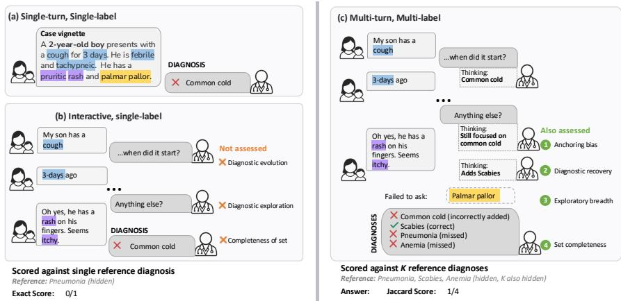  
Figure 1: Static and single-label settings against ours. Panels (a) and (b) provide all evidence upfront or elicit it for a single correct diagnosis, while CLIMB (c) elicits evidence over a multi-turn dialogue for a patient whose ground truth is a set of co-occurring diagnoses, so the model must hold several hypotheses at once.

On the first, unlike static benchmarks where all information is presented at once, clinicians must acquire information sequentially over the course of a consultation, which we refer to as the multiturn setting (Li et al., 2024). On the second, unlike static Q&A benchmarks where there is one correct diagnosis, a patient can have several conditions that hold at once, which we refer to as the multi-label setting, or multimorbidity in clinical language (Valderas et al., 2009; Barnett et al., 2012; D’Acremont et al., 2014). Interactive patient simulators have been built to evaluate models in the multi-turn settings (Li et al., 2024; Schmidgall et al., 2026; Chiu et al., 2026), showing that language models demonstrate significant losses in accuracy as a conversation length increases (Laban et al., 2026).

The multi-label axis has drawn comparatively less attention. A few studies examine the multi-label behavior in isolation (Ma et al., 2025). Our focus is the intersection of these two dimensions. We study diagnosis where (1) evidence must be elicited through an interactive consultation, and (2) the ground truth consists of a set of co-occurring conditions. We investigate whether a language model can hold several simultaneous hypotheses, and acquire relevant evidence to revise them through an interactive consultation.

To our knowledge, no prior benchmark provides a controlled setting and analysis for interactive diagnosis of multimorbid patients. Prompting a frontier model to generate patient cases offers little control over the resulting distribution of presentations, and existing case notes rarely contain controlled variation in multimorbidity. We propose CLIMB, a benchmark built on a principled procedure that generates multi-label synthetic patients grounded in clinical source evidence, with an evaluation protocol tailored to multi-turn, multi-label diagnostic reasoning.

We make three contributions to the study of interactive multimorbidity diagnosis:

1. CLIMB, a controlled benchmark for multi-turn, multi-label diagnosis with synthetic multimorbid patients grounded in established clinical sources.

2. A systematic comparison of diagnostic performance of models for different numbers of co-occurring conditions, and information regime.

3. A failure analysis of this regime, with controlled experiments to understand the models behaviour and failures, and a formal description of single-hypothesis tracking.

## 2 RELATED WORK

We summarize the most relevant work here and give a broader treatment in Appendix A.

Static and interactive benchmarks. Multiple-choice medical exam benchmarks and their variants established that language models carry a large amount of medical knowledge, and instructiontuned systems now reach strong scores on these formats (Jin et al., 2021; Pal et al., 2022; Jin et al., 2019; Singhal et al., 2023). These benchmarks place all of the relevant information in the prompt and admit a single correct answer, and therefore mainly measure the retrieval of stored knowledge instead of how to gather the missed evidence. On the other hand, interactive and multi-turn benchmarks evaluate a model’s ability to gather information before it commits to an answer. These works pair a doctor model with a simulated patient and score the final diagnosis (Johri et al., 2025; Schmidgall et al., 2026; Nori et al., 2025). Patient simulators support the setting by producing person-driven patient behavior (Kyung et al., 2026). This literature reports recurring failure modes, where models under-ask, pose non-specific questions, and close the consultation early (Laban et al., 2026), which motivates interventions built around uncertainty estimation and abstention (Kirichenko et al., 2026; Hu et al., 2024).

Multimorbidity and diagnostic error. Multimorbidity, the presence of two or more conditions in one person, affects more than half of people aged 65 and over (Barnett et al., 2012), is growing in low and middle income countries (Asogwa et al., 2022), and is associated with higher mortality and polypharmacy (Nunes et al., 2016). We use multimorbidity and comorbidity interchangeably (Appendix C). Decision support for diagnosis dates back to early probabilistic systems (Miller et al., 1982; Shwe et al., 1991), and satisfaction of search, calling off the search once one diagnosis is found, is a recognized source of missed coexisting conditions (Croskerry, 2003). Recent work trains a query policy for multi-disease consultations (Guo et al., 2026) or adds a comorbid presentation to an interactive psychiatric benchmark (Xu et al., 2026), but does not study the co-occurrence itself. We combine both dimensions. Evidence is gathered over a consultation, cases have a controlled number of conditions, and the full predicted set is scored, which lets us isolate how a second diag nosis is lost.

## 3 METHOD

Objective. Each case describes one patient. The patient has a set of $k$ co-occurring conditions $\mathcal { D } \subset \mathcal { L }$ , where L is the set of candidate conditions and $k = | \mathcal { D } |$ . The patient record $x \subset { \mathcal { F } }$ is a set of findings; each finding $f \in { \mathcal { F } }$ pairs a clinical variable with its value, such as cough: yes. In an interactive consultation, the doctor model observes $\mathcal { L }$ and an opening presentation $H _ { 0 }$ (age, sex, and partial observation $O \subset x )$ , while the target set $\mathcal { D } ,$ its cardinality $k ,$ and the remaining findings are hidden. The objective is to recover D.

CLIMB builds cases from ePOCT+ (Tan et al., 2024) and DDXPlus (Fansi Tchango et al., 2022) by repeatedly sampling a target set of size k until its realized set of components (the findings that its source dataset links it to) passes consistency checks after merging. Rejected proposals are resampled, and accepted signals $\bar { S } \subset \mathcal { F }$ are mixed with background complaints $B \subset { \mathcal { F } }$ (Figure 2).

Comorbidity sampler. Both sources draw the k targets sequentially without replacement with

$$
p ( d \mid R ) \propto { \widehat { P } } ( d ) \prod _ { d ^ { \prime } \in R } \ell ( d , d ^ { \prime } ) , \qquad d \not \in R ,\tag{1}
$$

where R is the set of targets already drawn, $\widehat { P }$ the empirical prevalence, and $\ell ( d , d ^ { \prime } ) > 1$ when d and $d ^ { \prime }$ co-occur more often than chance. The first draw uses prevalence alone.

## 3.1 CASE GENERATION FROM EPOCT+

ePOCT+ is a pediatric clinical decision algorithm represented by a graph $\tau$ of clinical variables and diagnosis rules. Appendix B.1.1 introduces the source graph and cohort statistics; Appendix B.2 profiles the generated cases.

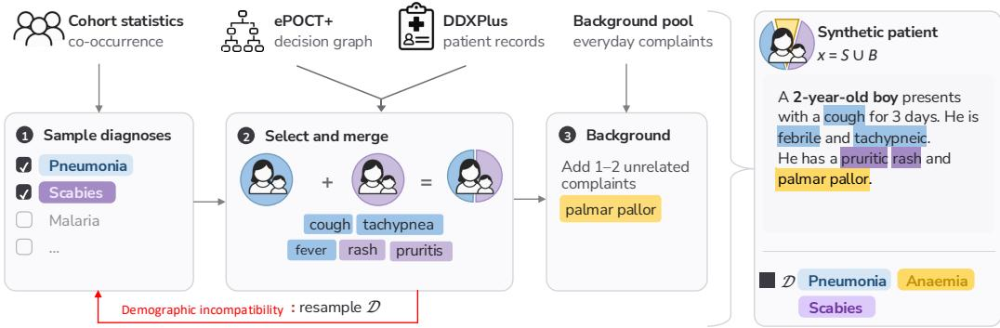  
Figure 2: Case construction. Diagnoses are sampled from cohort co-occurrence, their findings are taken from ePOCT+ paths or DDXPlus records and merged, and one or two unrelated complaints are added. A conflict resamples the diagnosis set.

Statistics and masks. Confirmed cohort diagnoses provide $\widehat { P } ( d ) = c _ { d } / n$ and $\widehat { P } ( d , d ^ { \prime } ) = c _ { d d ^ { \prime } } / n .$ giving pairwise association factors $\ell ( d , d ^ { \prime } ) = \widehat { P } ( d , d ^ { \prime } ) / [ \widehat { P } ( d ) \widehat { P } ( d ^ { \prime } ) ]$ . An offline LLM screen proposes infeasible pairs that are verified by our clinicians. We apply this label mask and retain diagnoses represented in both the cohort and graph.

Components, merging, and rejection. For each sampled $d ,$ we enumerate its root-to-diagnosis paths and discard treatment and referral conditions. Several answers listed for one variable are alternatives, and a path is retained if every variable keeps at least one answer and the path has a visible finding. A uniformly selected retained path σ(d), with one allowed answer per variable, defines c(σ(d)). The merged signal is

$$
S = \bigcup _ { d \in \mathcal { D } } c ( \sigma ( d ) ) .\tag{2}
$$

We reject the proposal if a diagnosis has no retained path, shared variables have conflicting answers, the mask excludes a diagnosis pair, age windows do not overlap, a diagnosis has no visible finding of its own, or fewer than two visible findings remain. We then resample D at the same k. For accepted cases, demographics follow the compatible age window, and the case receives an opening presentation. Cohort processing, path extraction, and rejection are detailed in Appendix B.3; the label-masking prompt is in Appendix B.5.

## 3.2 CASE GENERATION FROM DDXPLUS

DDXPlus provides synthetic patient records with a single target condition, symptoms, medicalhistory evidence, and a differential diagnosis. Appendix B.1.2 describes its scope, record space, and evidence types; we profile our merged cases in Appendix B.2.

Statistics and masks. We estimate prevalence from the training split. Since each record has a single condition, the co-occurrence ratios $\ell ( d , d ^ { \prime } )$ are elicited from an LLM. Separately, a second LLM screen proposes infeasible pairs, which are verified by our clinicians. During sampling, we apply a mask which excludes candidates that form an infeasible pair with a drawn target, or have no overlapping age window. The co-occurrence model, including its conversion to bounded pairwise joint probabilities, is specified in Appendix B.4; the masking prompt and verdict rules are in Appendix B.5.

Components, merging, and rejection. For every sampled diagnosis, we select a source record with a common sex and an age near an anchor in the shared age window. Binary and multi-select findings are merged by union, ordered values by maximum, and conflicting nominal values cause rejection. We retry record selection. If no compatible realization is found, we resample the diagnosis set at the same k. Cases in which a diagnosis keeps no finding of its own, or with fewer than two findings, are also rejected. Accepted findings are rendered as question-answer statements, with the highest-severity component supplying the opening complaint (Appendix B.4).

## 3.3 BACKGROUND COMPLAINTS AND FINAL RECORDS

Real patients also report complaints unrelated to their conditions (Elnegaard et al., 2015), so both generators add background complaints $B$ to the accepted signal,

$$
N \sim \mathcal { U } \{ 1 , 2 \} , \qquad B \sim p _ { \mathrm { b g } } ( \cdot \mid N , s ) , \qquad x = S \cup B ,\tag{3}
$$

drawn without replacement with the sex-specific symptom prevalences of Elnegaard et al. (2015), where s is the recorded sex. ePOCT+ keeps only complaints applicable to children. The count is small and independent of $k ,$ so irrelevant evidence cannot explain differences across k (Appendix B.6).

## 4 EXPERIMENTS

## 4.1 DATA AND MODELS

Our evaluation protocol uses all 800 stored cases per source, balanced with 200 cases at each k ∈ {1, 2, 3, 4}, and holds cases fixed across models and conditions. The cases are the released ePOCT+ and DDXPlus population files (Appendix B.2). The oracle-count and single-diagnosis controls and the probe analyses of Section 6.3 use the first 50 of these cases at each k. Every condition of the main evaluation uses the complete record $x = S \cup B { \mathrm { : } }$ the full-information prompt lists all of its findings, and the patient simulator answers from the same record (Section 3.3).

For the main experiments we use GPT-5.6, Gemini-3.8-Flash, Qwen3.8-Flash, Gemma-4, GLM-5.3-Flash, and DeepSeek-V4.1-Flash as doctor models (Appendix D.1). Free-text consultations use DeepSeek-V4.1-Flash as the patient, chosen by screening candidates for answering from the record without inventing findings or naming the diagnosis (Appendix D.1). The patient is fixed across all doctors and conditions, so it cannot explain differences between them. The patient model receives the opening presentation and the complete finding record x without target labels. GPT-5.6 is used for the failure analyses of Section 6. Model identifiers, reasoning and decoding settings, and the patient screen are detailed in Appendix D.1.

## 4.2 EVALUATION PROTOCOL

Information conditions. Full information supplies the opening and all retained findings upfront. Interactive evaluation uses an doctor/patient dialogue derived from AgentClinic (Schmidgall et al., 2026), with a budget of $T = 2 0$ question turns. The patient uses the standard AgentClinic patient prompt with the case record as its information (Appendix D.8). Each turn, the doctor asks a question or commits to a diagnosis set. Both conditions request all supported diagnoses from the same candidate set and use the same scorer. We score the first committed set, or request a final set when the consultation ends without a commitment. Prompt adaptations and response rules are given in Appendices D.2 and D.9.

Controlled comparisons. We add controlled comparisons in order to better localise the failures. An oracle-count condition discloses the true k, and a single-diagnosis control requests one diagnosis. A matched respiratory cohort, in which each two-diagnosis patient has a single-diagnosis counterpart with the same opening, separates information acquisition from evidence decoding (Section 6.1; Appendix D.6). A designed k = 2 DDXPlus cohort, consulted twice with an opening from either diagnosis, tests anchoring and symptom overlap (Section 6.2; Appendix E.7). A second designed cohort keeps each patient’s record fixed and varies only the two symptoms after the first complaint, which belong to the first diagnosis alone or to both diagnoses (Appendix E.8).

We report mean per-case Jaccard and exact-set recovery:

$$
J = \frac { | \widehat { D } \cap \mathcal { D } | } { | \widehat { D } \cup \mathcal { D } | } , \qquad \mathrm { E x } = \mathbf { 1 } \{ \widehat { \mathcal { D } } = \mathcal { D } \} .\tag{4}
$$

## 5 RESULTS

Clinical benchmarks usually ask for the single most likely diagnosis. A patient, however, potentially have several conditions whose findings show merging. We evaluate the recovery of the complete diagnosis set at every k, including $k = 1$ , without revealing k, and average equally over cohorts with $k = 1 \mathrm { t o } 4$ . We report this score in Table 1. For every model, interaction lowers the Jaccard point estimate, and exact-set recovery is low even with full information, with models rarely recovering the complete set. We note that the record does determine the set as a logistic-regression reader recovers 79 to 99% of DDXPlus sets from it at every k (Appendix B.2). Error bars show 95% bootstrap intervals over independent units (cases, patients or families; Appendix D.3).

(c) Interview length  
Table 1: Pooled exact-set recovery and Jaccard under full information (F) and interaction (I). Rows are sorted by interactive exact-set recovery on DDXPlus; shading of the interactive exactset columns is proportional to the value. Intervals are in Appendix E.1.
<table><tr><td rowspan="3"></td><td colspan="4">DDXPlus</td><td colspan="4">ePOCT+</td></tr><tr><td colspan="2">Exact ↑</td><td colspan="2">Jaccard ↑</td><td colspan="2">Exact ↑</td><td colspan="2">Jaccard ↑</td></tr><tr><td>F</td><td>I</td><td>F</td><td>I</td><td>F</td><td>I</td><td>F</td><td>I</td></tr><tr><td>GPT-5.6</td><td>0.11</td><td>0.08</td><td>0.46</td><td>0.29</td><td>0.21</td><td>0.08</td><td>0.57</td><td>0.30</td></tr><tr><td>Gemini-3.8-Flash</td><td>0.26</td><td>0.08</td><td>0.47</td><td>0.32</td><td>0.21</td><td>0.10</td><td>0.51</td><td>0.39</td></tr><tr><td>Qwen3.8-Flash</td><td>0.17</td><td>0.06</td><td>0.46</td><td>0.27</td><td>0.18</td><td>0.06</td><td>0.49</td><td>0.24</td></tr><tr><td>GLM-5.3-Flash</td><td>0.11</td><td>0.02</td><td>0.46</td><td>0.24</td><td>0.15</td><td>0.05</td><td>0.52</td><td>0.26</td></tr><tr><td>DeepSeek-V4.1-Flash</td><td>0.04</td><td>0.02</td><td>0.37</td><td>0.25</td><td>0.15</td><td>0.06</td><td>0.53</td><td>0.28</td></tr><tr><td>Gemma-4</td><td>0.10</td><td>0.01</td><td>0.43</td><td>0.24</td><td>0.20</td><td>0.07</td><td>0.55</td><td>0.31</td></tr></table>

## 5.1 DOES THE MODEL REGISTER MULTIPLICITY?

If models registered multiplicity, that a patient may have several conditions, they would return more diagnoses, find more correct ones (Appendix F), and ask more questions as k grows. In practice, only the first happens (Figure 3). Indeed, while the diagnosis set grows, correct diagnoses rise far less than k (b), and consultation length hardly follows k (c). Multiplicity changes the size of the answer, but it does not change the search behind it.

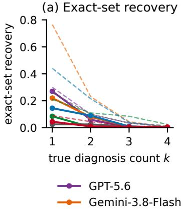

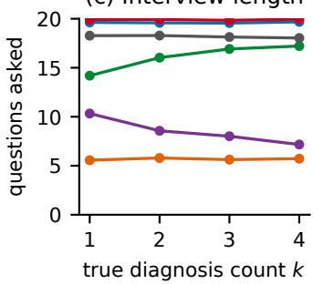  
Figure 3: Multiplicity on DDXPlus (six models, 200 cases per k). (a) Exact-set recovery, interactive (solid) and full information (dashed). (b) Mean returned and correct diagnoses per interactive consultation, models pooled. (c) Questions asked.

## 5.2 THE SINGLE-ANSWER GAP

The single-answer gap is the distance between how benchmarks usually score a model and what the task requires (Figure 4). A single-answer benchmark credits a consultation when the model names at least one true condition, and this happens more often as k grows. The complete set, which is the correct target, is rarely named and falls to almost zero at $k = 4$ . The gap is present already at k = 1, where the model often finds the condition but adds wrong ones (Appendix E.4). The same gap appears when models are asked for a single diagnosis, and supplying the true k does not close

Table 2: Exact-set recovery (%, ↑) by comorbidity count k. F is full information, I is interactive; shading of the interactive columns is proportional to the value. Intervals are in Appendix E.1.
<table><tr><td></td><td></td><td colspan="2">k=1</td><td colspan="2">k=2</td><td colspan="2">k=3</td><td colspan="2">k=4</td></tr><tr><td>Source</td><td>Model</td><td>F</td><td>I</td><td>F</td><td>I</td><td>F</td><td>I</td><td>F</td><td>I</td></tr><tr><td>DDXPlus</td><td>GPT-5.6</td><td>30</td><td>27</td><td>10</td><td>6</td><td>4</td><td>0</td><td>0</td><td>0</td></tr><tr><td></td><td>Gemini-3.8-Flash</td><td>76</td><td>22</td><td>23</td><td>8</td><td>4</td><td>1</td><td>0</td><td>0</td></tr><tr><td></td><td>Qwen3.8-Flash</td><td>44</td><td>14</td><td>22</td><td>9</td><td>4</td><td>1</td><td>0</td><td>0</td></tr><tr><td></td><td>GLM-5.3-Flash</td><td>21</td><td>8</td><td>11</td><td>0</td><td>8</td><td>0</td><td>2</td><td>0</td></tr><tr><td></td><td>DeepSeek-V4.1-Flash</td><td>9</td><td>4</td><td>4</td><td>1</td><td>1</td><td>0</td><td>0</td><td>0</td></tr><tr><td></td><td>Gemma-4</td><td>26</td><td>2</td><td>10</td><td>2</td><td>4</td><td>1</td><td>2</td><td>0</td></tr><tr><td>ePOCT+</td><td>GPT-5.6</td><td>39</td><td>18</td><td>24</td><td>7</td><td>12</td><td>4</td><td>10</td><td>4</td></tr><tr><td></td><td>Gemini-3.8-Flash</td><td>34</td><td>22</td><td>25</td><td>8</td><td>15</td><td>7</td><td>10</td><td>2</td></tr><tr><td></td><td>Qwen3.8-Flash</td><td>34</td><td>18</td><td>26</td><td>5</td><td>10</td><td>2</td><td>4</td><td>0</td></tr><tr><td></td><td>GLM-5.3-Flash</td><td>24</td><td>13</td><td>20</td><td>6</td><td>10</td><td>2</td><td>8</td><td>0</td></tr><tr><td></td><td>DeepSeek-V4.1-Flash</td><td>14</td><td>13</td><td>21</td><td>6</td><td>16</td><td>6</td><td>11</td><td>0</td></tr><tr><td></td><td>Gemma-4</td><td>32</td><td>14</td><td>30</td><td>8</td><td>15</td><td>6</td><td>5</td><td>0</td></tr></table>

it (Appendices E.5 and E.3). Interaction lowers the score at every k rather than steepening its fall (Appendix E.4).  
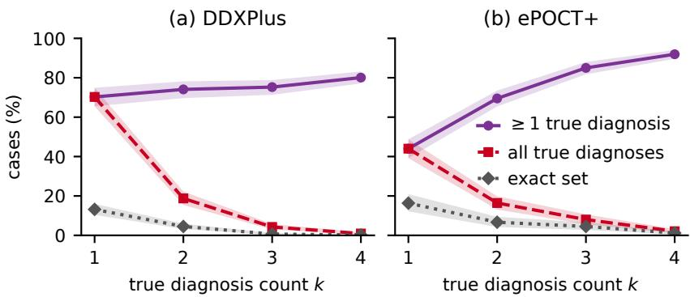  
Figure 4: Single-answer gap in interaction (six models, 200 cases per k). Unlike the exact set, all true diagnoses may come with wrong ones. Bands are 95% bootstrap intervals.

## 6 FAILURE ANALYSIS

We follow the consultation step by step: seeking and integrating evidence (Section 6.1), why the second diagnosis is missed (Section 6.2), and stopping (Section 6.3). The matched experiment uses GPT-5.6, among the best models in interactive exact-set recovery on DDXPlus (Table 1). Unless stated otherwise, we use GPT-5.6 on DDXPlus. For Sections 6.1 and 6.2, we designed controlled experiments that isolate these effects. Their details are given in Appendices D.6 and E.7.

## 6.1 CAN MODELS ACQUIRE AND USE DIAGNOSTIC EVIDENCE?

A second diagnosis may be lost in two places. The model may not collect the evidence that reveals it (a failure in evidence acquisition), or it may have sufficient evidence and still not report it (a failure in decoding). We separate the two cases on a matched cohort in which each two-diagnosis patient has a single-diagnosis counterpart with the same opening. As a fixed query policy we use a decision tree that asks from the same menu, each time selecting the question that most reduces uncertainty about the diagnosis set, and comes close to what the full record allows (cohort, models and tree in Appendix D.6).

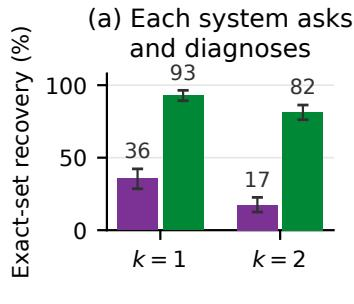

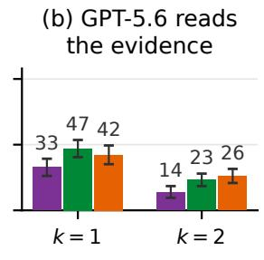

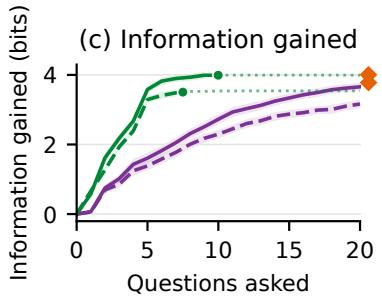

Figure 5: GPT-5.6 and the reference tree on the matched respiratory cohort. (a) Exact-set recovery when each system asks and diagnoses. (b) Exact-set recovery when GPT-5.6 reads evidence of increasing quality. (c) Information gained, the drop in uncertainty about the diagnosis set after each question, scored by one fixed model for both systems (Appendix D.7). The dot marks where the tree stops on average, and the diamonds show the full record.  
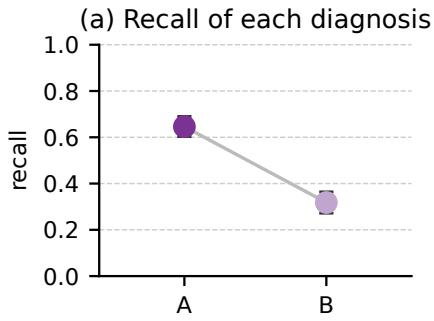

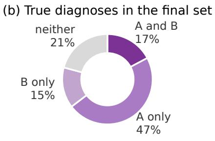  
Figure 6: Anchoring on the designed cohort, GPT-5.6. A is the diagnosis whose findings open the consultation and B the other. (a) Recall of A and B. (b) Which true diagnoses the final set contains.

Despite using more questions than the tree, GPT-5.6 gains less information from each (c), and under the same fixed decoder it returns lower exact-set recovery than the tree. The gap grows at k = 2, and its selected questions also match less with those of the tree (Appendix D.7).

The performance gap persists when GPT-5.6 is given the tree’s evidence or even the full record (b), while the fixed classifier recovers most k = 2 sets exactly from the same full record (Appendix D.7). We investigate this in Section 6.2.

## 6.2 WHY IS THE SECOND DIAGNOSIS LOST?

Clinical reasoning gives grounds on two biases that may induce the loss of a second diagnosis. With anchoring, the clinician holds on to the first hypothesis (Croskerry, 2003). With satisfaction of search, the search stops once one diagnosis is found (Berbaum et al., 1990; Adamo et al., 2021). Both have been documented in language models on clinical diagnosis (Braitsch et al., 2026), and ours lose the second diagnosis although the prompt tells them not to stop at one (Appendix D.9). Both can follow from treating diagnoses as mutually exclusive, so that a second diagnosis must take support from the first (Proposition 3). We study where the second diagnosis is lost on designed cohorts in which the two diagnoses are equally severe (Appendix E.7).

## 6.2.1 ANCHORING ON THE OPENING FINDINGS

Let A denote the diagnosis whose findings open the consultation, and B the other. GPT-5.6 anchors on A, recovering it about twice as often as B (Figure 6a), and the most common final set holds A without B (b). Appendix E.7 repeats this with Gemma-4.

(c) Jaccard

## 6.2.2 SHARED SYMPTOMS

To see how shared symptoms affect the second diagnosis, we consult the same patients, with equally severe A and B, twice: the opening gives A’s first finding and either two symptoms that A and B share or two of A alone (Appendix E.8). Shared symptoms raise B from 37% to 51% while A barely changes (Figure 18). The model finds B when a finding in view points to it, but naming both rises only from 27% to 32%, not reliably.

## 6.3 DO MORE QUESTIONS HELP?

To investigate whether this is due to early stopping, we force the model to continue past its natural stopping point for up to twenty questions. On 50 cases per k, we probe its working diagnosis set after every turn offline (Appendix D.2). After twenty questions a probe holds 1.3, 1.4 and 1.9 correct diagnoses at $k = 2 ,$ , 3 and 4 (Figure 7a). More questions mostly add wrong diagnoses (b), so Jaccard does not rise after the natural stop (c). The other open models behave the same (Appendix E.10).

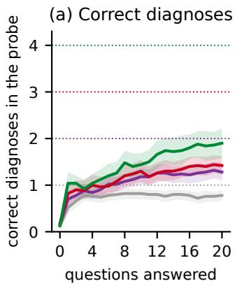

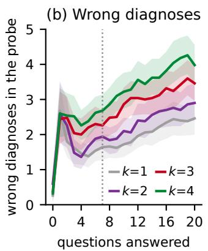

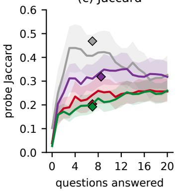  
Figure 7: Single probes by question turn (DDXPlus, GPT-5.6, 50 cases per k). (a) Correct and (b) wrong diagnoses. (c) Jaccard; diamonds mark the committed answer at the median natural stop. Dotted lines mark k in (a) and the median stop in (b).

Together, these failures describe a single-hypothesis tracker, formalised in Appendix F. The model follows the opening, misses a diagnosis unless its current set already point to it, and forcing further questions do not complete the set.

## 7 DISCUSSION AND CONCLUSION

We introduced CLIMB, a benchmark for interactive diagnosis of patients with several co-occurring conditions. Models often name one of a patient’s conditions but rarely recover the complete set, and supplying the number of conditions or even the full record does not close the gap. In the interactive setting, we observe single-hypothesis tracking behaviour. The opening presentation decides which diagnosis they pursue, their questions stay on it, and further questions add mostly wrong diagnoses (Appendix F). This is a concerning profile for clinical use, where multimorbidity is common, and evaluations that score a single most likely diagnosis hide it. Future work should improve evidence gathering and the tracking of several hypotheses at once.

## AI USE STATEMENT

We used generative AI tools to write and refactor code for our pipeline, to generate parts of the synthetic patient data statistics released with this work, and to polish writing. The generated data were inspected by the authors for clinical plausibility. Writing assistance was restricted to phrasing and concision; all claims, citations, and numerical values were written and checked by the authors against their sources.

We did not use generative AI tools for research ideation. Language models additionally appear in this paper as objects of study and as components of our evaluation setup. Those uses are methodological and are described in the corresponding sections.

We have reviewed all AI-assisted work and take responsibility for the final content of this paper, including text, claims, and artifacts produced with the aid of generative AI.

## ETHICS STATEMENT

This work involves no human subjects and no patient-level data. Our synthetic patients are derived from two sources. The first is DDXPlus, which is itself fully synthetic. The second is ePOCT+, a clinical decision support algorithm whose decision tree was authored and validated by clinicians; from it we use the tree structure together with aggregate disease priors and conditional symptom probabilities. These quantities were estimated from cohorts of real patients managed under ePOCT+, but no individual records enter our pipeline and no identifiable or otherwise sensitive information is used or released.

The benchmark is intended for evaluating language models. This is not for clinical use. Also, performance on this benchmark should therefore not be read as evidence of clinical safety or of readiness for deployment.

## REPRODUCIBILITY STATEMENT

Section 3 and Appendix B specify the source resources, association models, exclusion masks, sampling procedures, and merging and rejection rules used to construct cases. The accompanying data-profile supplement provides source-file hashes and the script used to compute the dataset summaries; Appendix B.2 distinguishes the generated populations and evaluated subsets. Section 4 and Appendix D describe case selection, model identifiers, decoding settings, question budgets, and evaluation conditions. The implemented prompt templates and their adaptations appear in Appendix D.9, and scoring, diagnostic trajectories, and uncertainty estimates are detailed in Appendix D.3 and the subsequent analysis definitions. Evaluation logs retain model and task settings, consultation transcripts, and predictions, allowing metrics to be recomputed from stored outputs separately from rerunning model calls. The benchmark, generator, and evaluation code are available at https://anonymous.4open.science/r/CLIMB-8340.

## ACKNOWLEDGMENTS

This work was supported by the EPFL AI Center PhD Fellowship Program 2026. The LiGHT lab is partly supported by the Gates Foundation (INV-076674), the Kristian Gerhard Jebsen Foundation, Swisscom (Schweiz) AG through the Swiss National AI Institute Industry Partnership Program, and the ETH Domain through the Swiss AI Initiative. Support from the Swiss AI Initiative includes computational resources on the Swiss National Supercomputing Centre (CSCS) Alps infrastructure (project IDs 27 and a0238) and a PhD fellowship for the first author. Arora’s lab is partly supported by grants from the Novo Nordisk Foundation (NNF24OC0099109), the Pioneer Centre for AI, EU Horizon 2020 (101168951), and Danish Advanced Research Academy (DARA) and Danish Data Science Academy (DDSA) PhD Fellowships. We also gratefully acknowledge generous gifts from Microsoft and IT-vest networking universities.

## REFERENCES

Stephen H. Adamo, Brian J. Gereke, Sarah Shomstein, and Joseph Schmidt. From “satisfaction of search” to “subsequent search misses”: a review of multiple-target search errors across radiology

and cognitive science. Cognitive Research: Principles and Implications, 6:59, 2021. doi: 10. 1186/s41235-021-00318-w.

Ogechukwu Augustina Asogwa, Daniel Boateng, Anna Marza-Florensa, Sanne Peters, Naomi\` Levitt, Josefien van Olmen, and Kerstin Klipstein-Grobusch. Multimorbidity of noncommunicable diseases in low-income and middle-income countries: a systematic review and meta-analysis. BMJ Open, 12(1):e049133, 2022. doi: 10.1136/bmjopen-2021-049133.

Karen Barnett, Stewart W. Mercer, Michael Norbury, Graham Watt, Sally Wyke, and Bruce Guthrie. Epidemiology of multimorbidity and implications for health care, research, and medical education: a cross-sectional study. The Lancet, 380(9836):37–43, 2012. doi: 10.1016/S0140-6736(12) 60240-2.

Kevin S. Berbaum, Edmund A. Franken, Donald D. Dorfman, Seyed A. Rooholamini, Mary H. Kathol, Thomas J. Barloon, Frank M. Behlke, Yutaka Sato, Charles H. Lu, Georges Y. El-Khoury, Fred W. Flickinger, and William J. Montgomery. Satisfaction of search in diagnostic radiology. Investigative Radiology, 25(2):133–140, 1990. doi: 10.1097/00004424-199002000-00006.

Krischan Braitsch, Laura K. Schmalbrock, Theresa Weltermann, Andrew F. Berdel, Isabella Miller, Kai Tran, Michael Heider, Sabrina Kraus, Florian Bassermann, Jacqueline Lammert, Sebastian Ziegelmayer, Marcus Makowski, Lisa C. Adams, and Keno K. Bressem. Information-seeking failures of large language models in agentic clinical reasoning, 2026. URL https://arxiv. org/abs/2607.10275.

Zeming Chen, Alejandro Hernandez Cano, Angelika Romanou, Antoine Bonnet, Kyle Matoba,´ Francesco Salvi, Matteo Pagliardini, Simin Fan, Andreas Kopf, Amirkeivan Mohtashami, Alexan-¨ dre Sallinen, Alireza Sakhaeirad, Vinitra Swamy, Igor Krawczuk, Deniz Bayazit, Axel Marmet, Syrielle Montariol, Mary-Anne Hartley, Martin Jaggi, and Antoine Bosselut. MEDITRON-70B: Scaling medical pretraining for large language models, 2023. URL https://arxiv.org/ abs/2311.16079.

Christopher Chiu, Silviu Pitis, and Mihaela van der Schaar. Simulating viva voce examinations to evaluate clinical reasoning in large language models. In The Thirty-ninth Annual Conference on Neural Information Processing Systems Datasets and Benchmarks Track, 2026. URL https: //openreview.net/forum?id=FEVfIPMy5b.

Pat Croskerry. The importance of cognitive errors in diagnosis and strategies to minimize them. Academic Medicine, 78(8):775–780, 08 2003. ISSN 1040-2446. doi: 10.1097/00001888-200308000-00003. URL https://doi.org/10.1097/ 00001888-200308000-00003.

Valerie D’Acremont, Mary Kilowoko, Esther Kyungu, Sister Philipina, Willy Sangu, Judith´ Kahama-Maro, Christian Lengeler, Pascal Cherpillod, Laurent Kaiser, and Blaise Genton. Beyond malaria — causes of fever in outpatient Tanzanian children. New England Journal of Medicine, 370(9):809–817, 2014. doi: 10.1056/NEJMoa1214482. URL https://www.nejm.org/ doi/full/10.1056/NEJMoa1214482.

Krzysztof Dembczynski, Willem Waegeman, Weiwei Cheng, and Eyke H´ ullermeier. On label de-¨ pendence and loss minimization in multi-label classification. Mach. Learn., 88(1–2):5–45, July 2012. ISSN 0885-6125. doi: 10.1007/s10994-012-5285-8. URL https://doi.org/10. 1007/s10994-012-5285-8.

Yihan Deng, Fabio Dennstadt, Irina Filchenko, Julia van der Meer, Xiaoli Yang, Markus H. Schmidt,¨ Claudio L. A. Bassetti, Athina Tzovara, and Kerstin Denecke. Comorbidity classification from clinical free-text using large language models: Application to sleep disorder patients. Journal of Medical Systems, 50(1):23, February 2026. doi: 10.1007/s10916-026-02343-y.

Sandra Elnegaard, Rikke Sand Andersen, Anette Fischer Pedersen, Pia Veldt Larsen, Jens Søndergaard, Sanne Rasmussen, Kirubakaran Balasubramaniam, Rikke Pilsgaard Svendsen, Pe ter Vedsted, and Dorte Ejg Jarbøl. Self-reported symptoms and healthcare seeking in the general population – exploring “The Symptom Iceberg”. BMC Public Health, 15:685, 2015. doi: 10.1186/s12889-015-2034-5.

Arsene Fansi Tchango, Rishab Goel, Zhi Wen, Julien Martel, and Joumana Ghosn. DDXPlus: A new dataset for automatic medical diagnosis. In S. Koyejo, S. Mohamed, A. Agarwal, D. Belgrave, K. Cho, and A. Oh (eds.), Advances in Neural Information Processing Systems, volume 35, pp. 31306–31318. Curran Associates, Inc., 2022. doi: 10.52202/068431-2270. URL https://proceedings.neurips.cc/paper\_files/paper/2022/file/ cae73a974390c0edd95ae7aeae09139c-Paper-Datasets\_and\_Benchmarks. pdf.

Mark L. Graber, Nancy Franklin, and Ruthanna Gordon. Diagnostic error in internal medicine. Archives of Internal Medicine, 165(13):1493–1499, July 2005. doi: 10.1001/archinte.165.13. 1493.

Yue Guo, Fanfu Wang, Jianwei Lv, Xincheng Shi, Yuchen Li, Youya Wang, Yunsheng Zeng, Yujing Liu, Yunhao Qiao, Gen Li, Junfeng Wang, and Bo Yuan. Dr. Assistant: Enhancing clinical diagnostic inquiry via structured diagnostic reasoning data and reinforcement learning. In Maria Liakata, Viviane P. Moreira, Jiajun Zhang, and David Jurgens (eds.), Findings of the Association for Computational Linguistics: ACL 2026, pp. 36624–36658, San Diego, California, United States, July 2026. Association for Computational Linguistics. ISBN 979-8-89176-395- 1. doi: 10.18653/v1/2026.findings-acl.1826. URL https://aclanthology.org/2026. findings-acl.1826/.

Zhiyuan Hu, Chumin Liu, Xidong Feng, Yilun Zhao, See-Kiong Ng, Anh Tuan Luu, Junxian He, Pang Wei Koh, and Bryan Hooi. Uncertainty of thoughts: Uncertainty-aware planning enhances information seeking in LLMs. In The Thirty-eighth Annual Conference on Neural Information Processing Systems, 2024. URL https://openreview.net/forum?id=CVpuVe1N22.

Di Jin, Eileen Pan, Nassim Oufattole, Wei-Hung Weng, Hanyi Fang, and Peter Szolovits. What disease does this patient have? a large-scale open domain question answering dataset from medical exams. Applied Sciences, 11(14):6421, 2021. doi: 10.3390/app11146421.

Qiao Jin, Bhuwan Dhingra, Zhengping Liu, William Cohen, and Xinghua Lu. PubMedQA: A dataset for biomedical research question answering. In Kentaro Inui, Jing Jiang, Vincent Ng, and Xiaojun Wan (eds.), Proceedings ofthe 2019 Conference on Empirical Methods in Natural Language Processing and the 9th International Joint Conference on Natural Language Processing (EMNLP-IJCNLP), pp. 2567–2577, Hong Kong, China, November 2019. Association for Computational Linguistics. doi: 10.18653/v1/D19-1259. URL https://aclanthology.org/ D19-1259/.

Shreya Johri, Jaehwan Jeong, Benjamin A. Tran, Daniel I. Schlessinger, Shannon Wongvibulsin, Leandra A. Barnes, Hong-Yu Zhou, Zhuo Ran Cai, Eliezer M. Van Allen, David Kim, Roxana Daneshjou, and Pranav Rajpurkar. An evaluation framework for clinical use of large language models in patient interaction tasks. Nature Medicine, 31(1):77–86, 2025. doi: 10.1038/s41591-024-03328-5.

Yusuf Kesmen, Fay Elhassan, Jiayi Ma, Julien Stalhandske, Yena Chang, David Sasu, Alexandra Kulinkina, Akhil Arora, Lars Klein, and Mary-Anne Hartley. MoBayes: A modular Bayesian framework for separating reasoning from language in conversational clinical decision support, 2026. URL https://arxiv.org/abs/2604.20022.

Polina Kirichenko, Mark Ibrahim, Kamalika Chaudhuri, and Samuel Bell. AbstentionBench: Reasoning LLMs fail on unanswerable questions. In The Thirty-ninth Annual Conference on Neural Information Processing Systems Datasets and Benchmarks Track, 2026. URL https: //openreview.net/forum?id=OkHC30LLpO.

Daeun Kyung, Hyunseung Chung, Seongsu Bae, Jiho Kim, Jae Ho Sohn, Taerim Kim, Soo Kyung Kim, and Edward Choi. PatientSim: A persona-driven simulator for realistic doctor-patient interactions. In The Thirty-ninth Annual Conference on Neural Information Processing Systems Datasets and Benchmarks Track, 2026. URL https://openreview.net/forum?id= 1THAjdP4QJ.

Philippe Laban, Hiroaki Hayashi, Yingbo Zhou, and Jennifer Neville. LLMs get lost in multi-turn conversation. In The Fourteenth International Conference on Learning Representations, 2026. URL https://openreview.net/forum?id=VKGTGGcwl6.

Shuyue Stella Li, Vidhisha Balachandran, Shangbin Feng, Jonathan S. Ilgen, Emma Pierson, Pang Wei Koh, and Yulia Tsvetkov. MediQ: Question-asking LLMs and a benchmark for reliable interactive clinical reasoning. In A. Globerson, L. Mackey, D. Belgrave, A. Fan, U. Paquet, J. Tomczak, and C. Zhang (eds.), Advances in Neural Information Processing Systems, volume 37, pp. 28858–28888. Curran Associates, Inc., 2024. doi: 10.52202/ 079017-0908. URL https://proceedings.neurips.cc/paper\_files/paper/ 2024/file/32b80425554e081204e5988ab1c97e9a-Paper-Conference.pdf.

Marcus Ma, Georgios Chochlakis, Niyantha Maruthu Pandiyan, Jesse Thomason, and Shrikanth Narayanan. Large language models do multi-label classification differently. In Christos Christodoulopoulos, Tanmoy Chakraborty, Carolyn Rose, and Violet Peng (eds.), Proceedings of the 2025 Conference on Empirical Methods in Natural Language Processing, pp. 2472–2495, Suzhou, China, November 2025. Association for Computational Linguistics. ISBN 979-8-89176- 332-6. doi: 10.18653/v1/2025.emnlp-main.126. URL https://aclanthology.org/ 2025.emnlp-main.126/.

Randolph A. Miller, Harry E. Pople, and Jack D. Myers. INTERNIST-I, an experimental computerbased diagnostic consultant for general internal medicine. New England Journal of Medicine, 307(8):468–476, 1982. doi: 10.1056/NEJM198208193070803. URL https://www.nejm. org/doi/full/10.1056/NEJM198208193070803.

Michael Moor, Oishi Banerjee, Zahra Shakeri Hossein Abad, Harlan M. Krumholz, Jure Leskovec, Eric J. Topol, and Pranav Rajpurkar. Foundation models for generalist medical artificial intelligence. Nature, 616:259–265, 2023. doi: 10.1038/s41586-023-05881-4.

Harsha Nori, Mayank Daswani, Christopher Kelly, Scott Lundberg, Marco Tulio Ribeiro, Marc Wilson, et al. Sequential diagnosis with language models. arXiv preprint arXiv:2506.22405, 2025.

Bruno Pereira Nunes, Thayna Ramos Flores, Gr˜ egore Iven Mielke, Elaine Thum´ e, and Luiz Au-´ gusto Facchini. Multimorbidity and mortality in older adults: A systematic review and metaanalysis. Archives of Gerontology and Geriatrics, 67:130–138, 2016. ISSN 0167-4943. doi: https://doi.org/10.1016/j.archger.2016.07.008. URL https://www.sciencedirect. com/science/article/pii/S0167494316301388.

Ankit Pal, Logesh Kumar Umapathi, and Malaikannan Sankarasubbu. MedMCQA: A large-scale multi-subject multi-choice dataset for medical domain question answering. In Gerardo Flores, George H Chen, Tom Pollard, Joyce C Ho, and Tristan Naumann (eds.), Proceedings ofthe Conference on Health, Inference, and Learning, volume 174 of Proceedings of Machine Learning Research, pp. 248–260. PMLR, 07–08 Apr 2022. URL https://proceedings.mlr.press/ v174/pal22a.html.

Nearchos Potamitis, Vansh Ramani, Har Ashish Arora, Dhairya Kuchhal, Lars Klein, and Akhil Arora. ReasonBENCH: Benchmarking the (in)stability of LLM reasoning, 2026. URL https: //arxiv.org/abs/2512.07795.

Ashwin Ramaswamy, Alvira Tyagi, Hannah Hugo, Joy Jiang, Pushkala Jayaraman, Mateen Jangda, Alexis E. Te, Steven A. Kaplan, Joshua Lampert, Robert Freeman, Nicholas Gavin, Ashutosh K. Tewari, Ankit Sakhuja, Bilal Naved, Alexander W. Charney, Mahmud Omar, Michael A. Gorin, Eyal Klang, and Girish N. Nadkarni. ChatGPT Health performance in a structured test of triage recommendations. Nature Medicine, 32(5):1671–1675, 2026. ISSN 1546-170X. doi: 10.1038/ s41591-026-04297-7. URL https://doi.org/10.1038/s41591-026-04297-7.

Samuel Schmidgall, Rojin Ziaei, Carl Harris, Ji Woong Kim, Eduardo Pontes Reis, Jeffrey Jopling, and Michael Moor. AgentClinic: a multimodal benchmark for tool-using clinical AI agents. npj Digital Medicine, 9:499, 2026. doi: 10.1038/s41746-026-02674-7.

{M. A.} Shwe, B. Middleton, {D. E.} Heckerman, M. Henrion, {E. J.} Horvitz, {H. P.} Lehmann, and {G. F.} Cooper. Probabilistic diagnosis using a reformulation of the INTERNIST-1/QMR knowledge base. I. The probabilistic model and inference algorithms. Methods of information in medicine, 30(4):241–255, 1991. ISSN 0026-1270. doi: 10.1055/s-0038-1634846.

Karan Singhal, Shekoofeh Azizi, Tao Tu, S. Sara Mahdavi, Jason Wei, Hyung Won Chung, Nathan Scales, et al. Large language models encode clinical knowledge. Nature, 620:172–180, 2023. doi: 10.1038/s41586-023-06291-2.

Rainer Tan et al. A digital health algorithm to guide antibiotic prescription in pediatric outpatient care: a cluster randomized controlled trial. Nature Medicine, 30(1):76–84, 2024. doi: 10.1038/ s41591-023-02633-9.

Arun James Thirunavukarasu, Darren Shu Jeng Ting, Kabilan Elangovan, Laura Gutierrez, Ting Fang Tan, and Daniel Shu Wei Ting. Large language models in medicine. Nature Medicine, 29(8):1930–1940, 2023. doi: 10.1038/s41591-023-02448-8.

Tao Tu, Mike Schaekermann, Anil Palepu, Khaled Saab, Jan Freyberg, Ryutaro Tanno, Amy Wang, Brenna Li, Mohamed Amin, Yong Cheng, et al. Towards conversational diagnostic artificial intelligence. Nature, 642:442–450, 2025. doi: 10.1038/s41586-025-08866-7.

Jose M. Valderas, Barbara Starfield, Bonnie Sibbald, Chris Salisbury, and Martin Roland. Defining comorbidity: implications for understanding health and health services. Annals of Family Medicine, 7(4):357–363, 2009. doi: 10.1370/afm.983.

Shihao Xu, Tiancheng Zhou, Jiatong Ma, Ming Xiao, Yanli Ding, Yiming Yan, Haiyang Geng, Guoyi Li, Yunyun Han, Jianhua Chen, and Yafeng Deng. LingxiDiagBench: A multi-agent framework for benchmarking LLMs in Chinese psychiatric consultation and diagnosis. In Proceedings of the 32nd ACM SIGKDD Conference on Knowledge Discovery and Data Mining V.2, KDD ’26, pp. 10080–10091, New York, NY, USA, 2026. Association for Computing Machinery. ISBN 9798400722592. doi: 10.1145/3770855.3817539. URL https://doi.org/10. 1145/3770855.3817539.

## A EXTENDED RELATED WORK

From static questions to interactive consultations. Medical language models are often assessed on self-contained exam questions, including MedQA, MedMCQA, and PubMedQA (Jin et al., 2021; Pal et al., 2022; Jin et al., 2019). These establish whether a model can use the full evidence set supplied upfront. They do not assess the model in deciding what information is missing, or in maintaining a diagnostic state across a conversation. Converting a vignette into a dialogue can change the task even if its clinical content is held fixed. CRAFT-MD evaluates such conversational reasoning across medical specialties, and reports substantially different behavior from vignette-based assessment (Johri et al., 2025). AgentClinic broadens this setting to simulated patients, measurements, multimodal tools, and environmental biases (Schmidgall et al., 2026). These studies motivate evalu ating the whole consultation rather than treating static diagnostic accuracy as a proxy for information gathering.

Question asking and patient simulation. MediQ lets a model abstain from answering and ask a follow-up question when it lacks sufficient evidence (Li et al., 2024). Directly prompting a model to ask questions may reduce diagnostic performance, and interactive accuracy generally stays below that of a model given complete information upfront. Other factors may influence LLM-mediated clinical interactions: CRAFT-MD uses language-model agents both to play the patient and to score the diagnosis, and AgentClinic reports that doctor accuracy changes with the model that plays the patient and falls when the patient is biased. Accordingly, CLIMB fixes the generated case, candidate vocabulary, and scorer across its full-information and interactive conditions. The comparison asks how much recovery changes when a doctor must elicit the same retained findings rather than receive them upfront. Our free-text patient interface follows this line of work; the menu condition instead returns deterministic record-based answers for analyses that require an unambiguous evidence trace.

Concurrent diagnoses in interactive benchmarks. The premise that a consultation can involve more than one disease is not new. Dr. Assistant evaluates multi-turn inquiry on cases stratified from one to six diseases and treats the multi-disease strata as a multi-label task (Guo et al., 2026). Its primary evaluation uses ICD-code recall, with precision reported alongside it. LingxiDiagBench evaluates both static and dynamic Chinese psychiatric consultations; its four-way setting includes pure depression, pure anxiety, mixed depression–anxiety, and other psychiatric conditions (Xu et al., 2026). The mixed category tests recognition of a specific comorbidity pattern, rather than recovery of an arbitrary set of simultaneously present diagnoses.

Our benchmark asks a different question. A patient may have several conditions whose findings are merged into one presentation, so the task is neither to name the most likely diagnosis nor to rank a differential for a single cause, but to return the set of conditions that are actually present. We therefore ask for the complete set in every case, including k = 1, without revealing how many diagnoses there are, and score it as a whole: a reliable answer must include every present condition, above all the dangerous ones, and exclude those that are absent. Averaging this score over cohorts with k = 1 to 4 gives the measure we argue a benchmark for multimorbid patients should report, rather than recall of an arbitrary list or recognition of one predefined comorbidity pattern. We systematically observe the effect of k and beyond measuring the decline with k, we use this control to locate where the second diagnosis is lost, separating evidence acquisition from evidence use and testing anchoring and symptom overlap in designed cohorts.

What is evaluated as a “set.” The important distinction is between a differential and a concurrent target set. A differential diagnosis contains candidate explanations, often ordered by plausibility; it need not assert that every candidate is true. In contrast, our target D contains every diagnosis used to construct the case, and all members are simultaneously scored as present. DDXPlus illustrates the difference: each synthetic record includes one ground-truth pathology together with a differential diagnosis, symptoms, and antecedents (Fansi Tchango et al., 2022). We use its individual records as source components, not its differential list as a multimorbidity label. This permits us to form an unordered concurrent set by sampling diagnoses and merging compatible records under age, sex, and finding-consistency constraints.

This design also determines the metrics. Multi-label learning distinguishes per-label objectives from subset-exact evaluation, in which an output is correct only when its complete label set is correct (Dembczynski et al., 2012). Exact match is deliberately stringent, so we report it together with´ Jaccard, precision, recall, and predicted cardinality. These measures separate partial recovery from returning unsupported labels and from correctly registering the number of diagnoses. Recent work on language models in multi-label prediction likewise finds that the output formulation can affect how many labels are emitted (Ma et al., 2025). Our contribution is not a new multi-label objective; it is to evaluate these set-level outcomes when the evidence must first be acquired during a consultation.

Controlling case composition. Clinical coding, phenotyping, and comorbidity extraction also predict multiple labels, but begin from a fixed record whose evidence is already available (Deng et al., 2026). They are therefore useful comparators for set prediction but do not isolate question se lection. Real multimorbid encounter records would offer strong clinical realism, yet their condition labels, evidence provenance, and privacy constraints make matched interventions difficult. CLIMB instead uses two source-grounded constructions. The ePOCT+ branch composes compatible paths from a pediatric clinical decision algorithm (Tan et al., 2024); the DDXPlus branch merges com patible source records. In both, the accepted case retains a target set and component-level support. This permits controlled changes to diagnosis count and information condition while keeping the evaluation target explicit. The construction is a synthetic benchmark, not a claim that its generated distribution is a clinical cohort; Appendix B documents the source resources, constraints, and generated-population profiles.

Diagnostic error and classical decision support. Clinical diagnostic-error research provides useful concepts without identifying the mechanism of an LLM failure. Premature closure is the failure to continue considering reasonable alternatives after an initial diagnosis, and was the most common cognitive factor in a retrospective study of internal-medicine diagnostic errors (Graber et al., 2005). Anchoring and premature closure therefore motivate analyses of whether an early presentation receives more attention, whether diagnoses appear and disappear from successive outputs, and whether additional questioning changes the final set. They do not license an inference from any one of these observables to a model’s internal state.

Earlier clinical decision-support systems already represented multiple diseases and their shared findings. INTERNIST-1 was designed as a general internal medicine diagnostic consultant (Miller et al., 1982), while QMR-DT reformulated its knowledge base as a probabilistic model over diseases and findings (Shwe et al., 1991). Joint disease representation and interactive diagnosis are therefore longstanding ideas. There is also an ongoing research direction to merge these classical system with LLMs (Kesmen et al., 2026).

CLIMB applies them to contemporary language-model consultations with a reproducible, component-preserving synthetic generator; full-set scoring; and matched comparisons of evidence availability, diagnosis trajectories, and stopping.

## B PATIENT GENERATION

## B.1 SOURCE DATA AND RECORD REPRESENTATION

The two sources provide different building blocks: ePOCT+ supplies clinical decision rules and cohort-derived diagnosis frequencies; DDXPlus supplies synthetic patient records with one designated target pathology. The populations constructed from them contain sets of concurrent target diagnoses. Source-resource counts below describe the local files used for construction; generatedpopulation statistics are reported separately in Appendix B.2.

## B.1.1 EPOCT+: PEDIATRIC DECISION RULES AND COHORT STATISTICS

ePOCT+ is a clinical decision-support algorithm for assessing sick children under 15 years in primary care. It combines history, symptoms, examination findings, and selected point-of-care tests to guide diagnosis and management; the associated clinical trial evaluated its use in Tanzania (Tan et al., 2024). In our construction, the algorithm supplies the findings associated with a diagnosis, while recorded cohort diagnoses supply its sampling frequency and pairwise associations.

The local algorithm export contains 617 nodes, 132 diagnosis branches, and 235 final-diagnosis ID representing 216 distinct normalized label strings. These counts refer to different objects: several IDs can share a label, and branches can reuse clinical variables. Nodes include symptoms, signs, examinations, tests, routing conditions, and management questions. The generator removes treatment/referral conditions and withholds routing/calculation nodes from the emitted findings.

The stored cohort aggregate has a denominator of 36,779 records, 166 diagnosis-label strings, and 1,959 observed unordered label pairs. These are the contents of the local aggregate, rather than the clinical trial’s enrollment or a count of unique children. Matching labels to the graph and applying the label mask leaves 142 proposal labels and 1,363 observed pairs between them. The finite accepted population contains fewer labels, as reported below. Figure 9 shows how two selected components produce one record.

## B.1.2 DDXPLUS: SYNTHETIC RECORDS FOR DIFFERENTIAL DIAGNOSIS

DDXPlus is a public synthetic dataset developed for automatic symptom collection and diagnosis (Fansi Tchango et al., 2022). Its original construction combines a medical knowledge base, demographic simulation, and a rule-based diagnostic system. The released condition set covers 49 pathologies associated with presentations involving cough, sore throat, or breathing difficulties. It includes both children and adults. Each record has age, recorded sex, an initial symptom, symptom and antecedent evidence, one target pathology, and a differential diagnosis. The differential lists alternative explanations; it is not a set of confirmed concurrent diseases. Our target sets are built by combining records indexed by their target pathology.

The local copy contains 1,292,579 records: 1,025,602 training, 132,448 validation, and 134,529 test records. All three splits contain all 49 target pathologies and span recorded ages 0–109 years. Construction uses the training split for prevalence estimates and source records; the cached sampling pools contain 71,479 records, capped at 1,500 per pathology. These source splits are distinct from our subsequently generated benchmark population and its evaluation subset.

The evidence schema contains 223 variables: 110 symptoms and 113 antecedents, with the answer types in Table 3. Antecedents describe medical history and risk factors. Binary variables encode presence; categorical variables encode one answer, including ordered scales; multi-select variables can carry several answers. For example, the fever question is a binary variable. Evidence IDs and value tokens are rendered into question–answer statements when records are merged. A multi-selec variable contributes one rendered statement, even if it contains several selected values.

## B.2 GENERATED POPULATIONS AND EVALUATION SUBSETS

Populations and evaluated subsets. Each stored population contains 800 cases, with 200 at each $k \in \{ 1 , 2 , 3 , 4 \}$ (Table 4). The ePOCT+ file contains 96 observed diagnosis labels and 418 distinct target sets; DDXPlus contains 47 of its 49 source labels and 595 target sets. The main evaluation uses every stored record, 200 at each k and 800 per source (Table 5), for every condition and every model. The oracle-count and single-diagnosis controls use the first 50 records at each k.

Table 3: Evidence-variable schema in the local DDXPlus release. Antecedents encode medical history and risk factors. Counts refer to variables, not answer tokens.
<table><tr><td>Answer type</td><td>Symptoms</td><td>Antecedents</td><td>Total</td></tr><tr><td>Binary</td><td>96</td><td>112</td><td>208</td></tr><tr><td>Categorical</td><td>9</td><td>1</td><td>10</td></tr><tr><td>Multi-select</td><td>5</td><td>0</td><td>5</td></tr><tr><td>Total</td><td>110</td><td>113</td><td>223</td></tr></table>

Table 4: Stored populations. Finding counts exclude added background and show median [first, third quartile]. Diagnosis-set counts ignore ordering. Each stratum has 200 cases.
<table><tr><td>Population</td><td>k</td><td>Cases</td><td>Unique labels</td><td>Distinct sets</td><td>Signal findings</td></tr><tr><td>ePOCT+</td><td>1</td><td>200</td><td>33</td><td>33</td><td>3 [3, 4]</td></tr><tr><td></td><td>2</td><td>200</td><td>47</td><td>92</td><td>6 [5, 10]</td></tr><tr><td></td><td>3</td><td>200</td><td>68</td><td>134</td><td>10 [8, 14]</td></tr><tr><td></td><td>4</td><td>200</td><td>72</td><td>159</td><td>14 [11, 16]</td></tr><tr><td>DDXPlus merged</td><td>1</td><td>200</td><td>44</td><td>44</td><td>15 [11, 18]</td></tr><tr><td></td><td>2</td><td>200</td><td>46</td><td>163</td><td>24 [21, 29]</td></tr><tr><td></td><td>3</td><td>200</td><td>46</td><td>191</td><td>32 [26, 36]</td></tr><tr><td></td><td>4</td><td>200</td><td>47</td><td>197</td><td>38 [33, 42.2]</td></tr></table>

Table 5: Evaluated cases: all 200 stored cases at each k of each population. Label counts describe this subset, not the candidate vocabulary. Ages are generated ages in years; F is the recorded female category.
<table><tr><td>Population</td><td>Cases</td><td>Unique labels</td><td>Age, median [Q1, Q3]</td><td>F (%)</td></tr><tr><td>ePOCT+</td><td>800</td><td>96</td><td>7.8 [3.8, 11.5]</td><td>49.5</td></tr><tr><td>DDXPlus merged</td><td>800</td><td>47</td><td>44 [28, 61]</td><td>51.2</td></tr></table>

Findings and demographics. A signal finding is one retained rendered statement after excluding the separately tagged background additions; it can be a symptom, antecedent, test, or other retained rule variable. Figure 8 shows its distribution by k. The ePOCT+ medians are 3, 6, 10, and 14 findings; the DDXPlus medians are 15, 24, 32, and 38. These counts describe record length, not the number of positive symptoms or the number of questions needed to identify the targets.

Across all 800 cases, ePOCT+ ages have median 7.8 years (interquartile range 3.8–11.5), with 49.5% recorded female; DDXPlus has median 44 years (28–61), with 51.2% recorded female. These are generated demographics: ePOCT+ ages are sampled from compatible windows, while DDXPlus uses a compatible anchor age. They are not age distributions measured in the ePOCT+ clinical cohort.

Evidence support. Every sampled ePOCT+ label has a retained path under the rule of Appendix B.3, and a proposal is accepted only if each of its diagnoses keeps a visible finding that no other component contributes. Each case stores these components. In all 800 cases their visible findings reproduce the stored signal, so every target is supported by evidence in the record. Figure 9 shows one case. The DDXPlus generator applies the same rule: a case is rejected if any diagnosis keeps no finding of its own after merging (Algorithm 2).

The record determines the set. To check that a target set can be recovered from its record, we train a reference reader on the same input the models receive under full information, the opening and the retained findings. It is a one-vs-rest logistic regression over binary indicators of the findings and the opening (chief complaint, sex, age band), trained on cases drawn from the same generators with a different seed after removing exact duplicates of evaluated records. It returns every label with probability at least 0.5, or the most probable label if none passes; this rule was chosen on a further 7,201 generated cases, and the evaluated records are only scored. Given the true $k ,$ it returns the k most probable labels. On DDXPlus, trained on 79,877 cases, it recovers most sets at every k, far above every model (Table 6). Accuracy has saturated with training size: at k = 4 it is 69%, 78% and 79% with 5,000, 20,000 and 80,000 training cases. ePOCT+ records almost identify their sets, since 43% of freshly generated cases duplicate an evaluated record, and the reader recovers 99 to 100% at every k. The reader is a learned reference on generator output rather than an optimal questioning policy; it shows that the full record determines most target sets, so low exact-set recovery is not a property of the task.

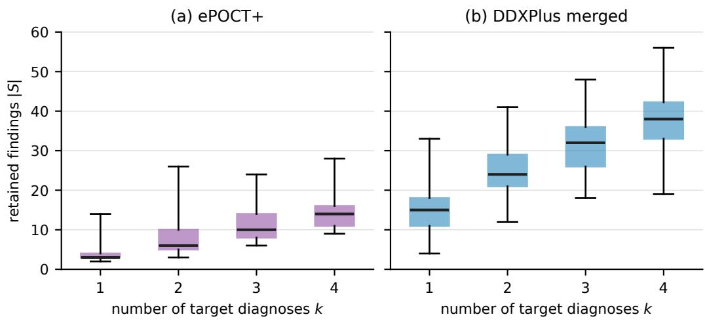  
Figure 8: Finding counts in the ePOCT+ and merged DDXPlus populations, with 200 cases per box. Boxes show the interquartile range, central lines the median, and whiskers the full observed range. Separately injected background complaints are excluded.

Table 6: Exact-set recovery (%) from the full DDXPlus record, 200 cases per k: reference reader without and with the true $k ,$ the best of the six models, and GPT-5.6. Brackets are 95% casebootstrap intervals.
<table><tr><td>k</td><td>Reader</td><td>Reader, k given</td><td>Best model</td><td>GPT-5.6</td></tr><tr><td>1</td><td>99.5 [98.5, 100]</td><td>100</td><td>76.5</td><td>30.0</td></tr><tr><td>2</td><td>91.0 [87.0, 94.5]</td><td>96.5</td><td>23.0</td><td>10.0</td></tr><tr><td>3</td><td>79.5 [74.5, 85.5]</td><td>91.0</td><td>8.5</td><td>3.5</td></tr><tr><td>4</td><td>79.0 [73.0, 84.5]</td><td>89.5</td><td>2.5</td><td>0.5</td></tr></table>

Reproducibility. The accompanying script tools/describe benchmark data.py computes these summaries from the local files and exports per-diagnosis frequencies, population summaries, the figure, and source-file hashes. Source split sizes are checked against the actual Arrow records. Quartiles use linear interpolation. tools/epoct v2 support.py checks the stored components of every ePOCT+ case against its signal and draws the worked example.

## B.3 EPOCT+ STATISTICS, PATHS, AND REJECTION

The cohort table records accepted final diagnoses for each consultation. We count consultations $n ,$ diagnoses $c _ { d } ,$ and unordered pairs $c _ { d d ^ { \prime } }$ to estimate $\widehat { P } ( d ) = c _ { d } / n$ and $\widehat { P } ( d , d ^ { \prime } ) = c _ { d d ^ { \prime } } / n$ . Label matching maps cohort entries to final-diagnosis IDs in the source graph; the label mask in Appendix B.5 removes screened entries. For observed pairs, the sampling score is log ${ \widehat { P } } ( d ) +$ $\textstyle \sum _ { d ^ { \prime } \in R } \log \ell ( d , d ^ { \prime } )$ . An unobserved pair contributes $- 1 0 ^ { 9 }$ . This is a score penalty, not an explicit pair-exclusion test: if every remaining candidate receives a penalty, the routine still normalizes the available scores.

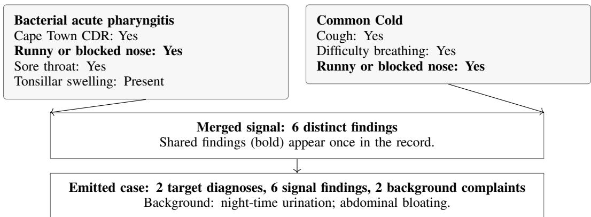  
Figure 9: A stored ePOCT+ case (epoct k2 81). Each diagnosis keeps at least one finding of its own; shared findings are retained once. Hidden routing and age conditions are omitted.

Algorithm 1 summarizes the sampling loop that produced the evaluated population. For a proposed set of k diagnoses, construction proceeds as follows.

1. Enumerate root-to-diagnosis paths in each diagnosis branch and collect their conditions in path order, including conditions on the final diagnosis. Drop treatment and referral conditions.

2. Treat several answers listed for one variable as alternatives and intersect them along the path. Retain a path if every variable keeps at least one answer and the path has a visible finding.

3. Choose a retained path uniformly and one allowed answer per variable. A diagnosis with no retained path rejects the proposal.

4. Merge assignments. Reject conflicting answers for a shared variable, a pair listed in either diagnosis’s exclusion rules, or an empty intersection of branch age windows. Require every diagnosis to keep a visible finding that no other component contributes, and at least two visible findings after merging; complaint-category and background-calculation nodes do not count as visible findings.

5. On rejection, draw a new target set of the same cardinality; a diagnosis is never dropped to reduce k.

For an accepted signal, age is sampled uniformly from the intersected window, bounded by birth and 15 years, and sex is sampled uniformly from the two recorded categories, and the case receives an opening presentation. The rejection checks establish consistency of the extracted components; they do not establish clinical label completeness.

Evidence support. Each stored case keeps the component of every diagnosis. In all 800 cases, the visible findings of the components reproduce the stored signal, and every diagnosis has at least one finding of its own (Appendix B.2).

## B.4 DDXPLUS ASSOCIATIONS, MASKS, AND RECORD MERGING

Prevalence and co-occurrence ratios. The current generator estimates pathology prevalence from the DDXPlus training split and caches up to 1,500 source records per pathology using reservoir sampling. An offline elicitation asks an LLM for each pair’s co-occurrence multiplier relative to independence, separately from how common the diseases are. The stored ratios aggregate two elicitation rollouts by their geometric mean, equivalently the arithmetic mean of log ratios. They are not direct observations of concurrent diagnoses in DDXPlus. Appendix B.8 gives the association and complaint-phrase templates used to prepare these stored resources.

The associated probability-construction script converts a multiplier into a pairwise joint probability and clips it to its Frechet bounds:´

$$
\begin{array} { r l } & { \widetilde { P } ( d , d ^ { \prime } ) = \mathrm { c l i p } \Big ( \ell ( d , d ^ { \prime } ) \widehat { P } ( d ) \widehat { P } ( d ^ { \prime } ) , L _ { d d ^ { \prime } } , U _ { d d ^ { \prime } } \Big ) , } \\ & { \qquad L _ { d d ^ { \prime } } = \operatorname* { m a x } \{ 0 , \widehat { P } ( d ) + \widehat { P } ( d ^ { \prime } ) - 1 \} , \qquad U _ { d d ^ { \prime } } = \operatorname* { m i n } \{ \widehat { P } ( d ) , \widehat { P } ( d ^ { \prime } ) \} . } \end{array}\tag{5}
$$

Clipping bounds each pairwise probability; it does not validate a higher-order joint distribution. The current sequential generator uses the stored multipliers directly in Equation 1, rather than sampling from this clipped joint matrix. The matrix belongs to the earlier copula-based construction, which used marginals from all source splits; it is not an additional stage of the present sampler.

Compatibility mask. A separate elicitation assigns each pair an infeasible, unlikely, or plausible verdict (Appendix B.5). Only infeasible pairs are hard exclusions. At each sampling step, a candidate is available only if it forms no excluded pair with the selected set and preserves a nonempty common age window. If no candidate is available, sampling restarts. This check is distinct from association weighting: a low multiplier reduces probability, whereas an exclusion forbids the pair.

Realization and rejection. Algorithm 2 gives the diagnosis and record sampling loops. Each pathology’s age window is the empirical 5th–95th percentile interval in its cached record pool. For a sampled set, choose a sex represented in every pool and an integer anchor age in the common window. Draw one record per diagnosis of that sex within ten years of the anchor. Merge binary evidence by union; merge multi-select values by union, integer-valued ordered categorical answers by maximum, and reject a nominal categorical variable with multiple distinct values. The implementation identifies ordered variables from integer-valued answer schemas.

Record selection is retried up to 60 times. Failure to find a compatible realization causes the caller to resample the diagnosis set. Accepted signals must contain at least two rendered findings. The final opening uses the anchor age and the initial evidence of the target pathology with the highest recorded severity. Stored phrase mappings turn that evidence into a complaint. Neither association elicitation nor masking is called during patient generation.

## B.5 OFFLINE MASKING PROMPTS

Both masking scripts send batches of up to 40 numbered entries with the system message: “You are a careful clinician. Output ONLY JSON.” The default model in the scripts is openai/gpt-5.6, overridable through the elicitation-model setting. The following are the user templates, with batchspecific lists and final indices represented by placeholders.

ePOCT+ label mask. Every returned verdict other than ok is written to the label mask and excluded from diagnosis sampling.

These labels come from the final-diagnosis list of a pediatric clinical decision tree. For each numbered label, judge whether it is a real disease / clinical diagnosis, or a nonsense entry for a disease list.

Answer ‘ok’ for a real disease, syndrome or clinical classification (e.g. ‘Severe pneumonia’ is ok). Otherwise answer with one word for why it is NOT a disease:

status = patient state (HIV status, exposure, weight-for-age, mother’s status)

test result = outcome of a test (negative HIV test, negative pregnancy test)

follow up = follow-up visit outcome (improved / not improved / resolved X)

symptom = a symptom or sign, not a diagnosis (tooth pain, loss of appetite)

admin = visit type or care gap (follow-up consultation, screening, vaccination)

bucket = vague severity/danger bucket (critical illness, danger signs)

[Numbered labels]

Return ONLY a JSON object mapping each number to its verdict, e.g.

$\left\{ { \mathfrak {" } } 0 ^ { \mathfrak { m } } : { \mathfrak {" } } \circ \mathrm { k } ^ { \mathfrak { m } } , { \mathfrak { n } } _ { 1 } { \mathfrak { n } } : { \mathfrak { n } } _ { \mathtt { S } } \colon { \mathrm { a t u s } } ^ { \mathfrak { m } } \right\}$ . Include every number 0..[last].

DDXPlus pairwise mask. Verdicts 0 and 1 are recorded in the mask table; only verdict 0 is enforced as a hard exclusion by the generator.

For each numbered pair of diseases, judge whether one patient can have BOTH at the same time.

0 = infeasible: cannot coexist (mutually exclusive by definition, contradictory states of the same disease, or one rules out the other).

1 = possible but VERY unlikely to co-occur in practice (e.g. typical-age mismatch,

near-disjoint patient populations).

2 = plausible co-occurrence (even if uncommon).

[Numbered disease pairs]

Return ONLY a JSON object mapping each number to 0, 1 or $2 , \mathrm { e . g . } \left\{ " 0 " : 2 , " 1 " : 0 \right\}$

Include every number 0..[last].

These screens propose the masks, and our clinicians verified both, the ePOCT+ label mask and the DDXPlus exclusions. The masks restrict which labels and pairs are sampled; they do not replace a clinical review of every generated case.

## B.6 BACKGROUND SAMPLING

Let $B _ { s }$ be the retained symptom vocabulary for recorded sex s, with survey weights $w _ { s } ( b )$ . For ePOCT+, retain only entries marked as applicable to children. Write the count as the shifted binomial variable

$$
N = 1 + Z , \qquad Z \sim \mathrm { B i n o m i a l } ( 1 , { \frac { 1 } { 2 } } ) .\tag{6}
$$

Thus $\operatorname* { P r } ( N = 1 ) = \operatorname* { P r } ( N = 2 ) = 1 / 2 , \mathbb { E } [ N ] = 3 / 2$ , and $\mathrm { V a r } ( N ) = 1 / 4$ . This is distributionally identical to the implemented integer draw from one through two; no generator change is needed for this parameterization. Conditional on N, sample sequentially without replacement. If $B _ { j - 1 }$ contains previously selected complaints,

$$
\operatorname* { P r } ( b _ { j } = b \mid s , B _ { j - 1 } ) = \frac { w _ { s } ( b ) } { \sum _ { u \in { \mathcal { B } } _ { s } \setminus B _ { j - 1 } } w _ { s } ( u ) } , \qquad b \in { \mathcal { B } } _ { s } \setminus B _ { j - 1 } .\tag{7}
$$

If the vocabulary is smaller than the requested count, the routine uses its available entries. The current vocabulary has sufficient entries for the requested counts. Each sampled complaint is rendered as an atomic reported finding and recorded in a separate background list. The survey concerns adults; pediatric filtering is a construction choice rather than an estimate of pediatric prevalence. Added complaints are not subjected to a further diagnosis-preservation check in the current code.

The evaluation loader presents the complete record $x = S \cup B$ in every condition; the same record feeds the full-information prompt and the patient simulator.

## B.7 CONSTRUCTION ALGORITHMS

The masks, source statistics, and record pools are prepared once. The algorithms below describe case generation after this preparation; they make no LLM calls. ⊥ denotes a rejected proposal. DRAWBACKGROUND uses Equation 6 and the weighted sampling rule in Appendix B.6.

Algorithm 1 ePOCT+ generation of $n _ { k }$ cases at cardinality k   
Require: Graph T , screened labels, prevalence and association tables   
1: $C \gets [ ]$   
2: while $\left. \mathsf { \bar { C } } \right. < n _ { k }$ do   
3: Draw D of size k with Equation 1   
4: $U \gets \emptyset ; W \gets [ 0 , 1 5$ years); valid ← true   
5: for $d \in \mathcal { D }$ do   
6: Enumerate root-to-diagnosis paths; remove treatment/referral conditions   
7: Retain paths on which every variable keeps an allowed answer and a finding is visible   
8: If none exists, valid ← false; break   
9: Draw a retained path uniformly and one allowed answer per variable   
10: Merge its assignments into U; intersect W with the diagnosis age window   
11: if answers conflict or W is empty then   
12: valid ← false; break   
13: end if   
14: end for   
15: S ← visible findings in U   
16: if not valid, an exclusion holds, a diagnosis has no own visible finding, or $| S | < 2$ then   
17: continue ▷ Resample all k diagnoses   
18: end if   
19: Sample age in W and recorded sex s; form the opening presentation   
20: B ← DRAWBACKGROUND(s, pediatric = true)   
21: Append $( { \mathcal { D } } , x = S \cup B , B ,$ opening) to C   
22: end while   
23: return C

Algorithm 2 DDXPlus generation of n cases at cardinality k   
Require: Pathology pools, prevalence and multiplier tables, infeasible-pair mask, age windows   
1: $\dot { C } \gets [ ]$   
2: while $| \bar { C } | < n _ { k }$ do   
3: R ← ∅; W ← [0, 200]   
4: for $j = 1 , \dots , k$ do   
5: A ← unselected diagnoses with no masked pair against R and nonempty age intersection   
6: if A = ∅ then   
7: $R \gets \bot ;$ break   
8: end if   
9: Draw d with Equation 1 normalized over A   
10: $R \gets R \cup \{ d \}$ ; intersect W with the age window for d   
11: end for   
12: if $R = \perp$ then   
13: continue   
14: end if   
15: if no sex is represented in every selected pool then   
16: continue   
17: end if   
18: S ← ⊥   
19: for up to 60 realization attempts do   
20: Choose a sex s present in every selected pool and an anchor age in W   
21: Choose one record per diagnosis of that sex within ten years of the anchor   
22: if a required record is unavailable then   
23: continue   
24: end if   
25: Merge binary/multi-select values by union and ordered values by maximum   
26: if nominal values conflict then   
27: continue   
28: end if   
29: if some diagnosis keeps no finding of its own then   
30: continue   
31: end if   
32: S ← rendered merged findings; break   
33: end for   
34: if S = ⊥ or $| S | < 2$ then   
35: continue   
36: end if   
37: Form the opening using the anchor and highest-severity component’s initial complaint   
38: B ← DRAWBACKGROUND(s, pediatric = false)   
39: Append (D = R, x = S ∪ B, B, opening) to C   
40: end while   
41: return C

Neither outer loop has a global attempt limit. Neither algorithm adds a background labelpreservation check after acceptance. The ePOCT+ path checks and DDXPlus schema merge should therefore be read as the implemented consistency rules, not a proof of clinical validity or unique identifiability of every target set.

## B.8 ASSOCIATION AND COMPLAINT-PHRASE ELICITATION

The stored co-occurrence ratios and opening-phrase dictionary were prepared by the resourceconstruction script build joint.py. The templates below document this offline preparation. Its default model is gpt-5.6; coefficient elicitation uses two rollouts and batches of 20 pairs by default. Positive numerical responses are aggregated in log space, with invalid responses omitted and the number of valid responses recorded. The phrase dictionary is elicited in batches of 50 evi dence questions. The current generator reads the saved tables; it does not repeat these calls for each patient.

Association multiplier. The first paragraph is the system message and the remainder is the user template. The numbered pair list expands to the current batch.

You are a careful clinical epidemiologist with deep knowledge of disease   
comorbidity and shared etiology. Output ONLY the requested JSON ---   
no prose.   
For each numbered pair of conditions, estimate the CO-OCCURRENCE FACTOR:   
how many times more (or less) likely the two occur TOGETHER in the   
same patient vs if they were statistically independent.   
1.0 = independent; >1 comorbid (e.g. 20 HIV & tuberculosis, 6 COPD   
exacerbation & pulmonary embolism); <1 rarely together.   
Judge ONLY association strength from real comorbidity/shared etiology;   
it is INDEPENDENT of how common each disease is.   
0. "<disease A>" + "<disease B>"   
Return ONLY a JSON object mapping each pair number to its factor, e.g.   
{"0":1.0,"1":8.5}. Include every number 0..<last index>.

Chief-complaint phrase dictionary. The first line is the system message and the remainder is the user template. This operation converts questionnaire text into a stored opening phrase; merged clinical findings retain their source questions and answers.

Clinical terminology normalizer. Output ONLY JSON.   
Convert each clinical questionnaire question into a SHORT   
chief-complaint phrase: a 1-4 word lowercase patient-symptom noun   
phrase, no question mark. Examples: ’Do you have a cough?’ -> cough   
; ’Do you feel your heart is beating fast?’ -> palpitations ; ’Is   
your skin much paler than usual?’ -> pallor.   
Return ONLY a JSON object mapping each evidence code to its phrase.   
<evidence code> <question text>

## C COMORBIDITY VERSUS MULTIMORBIDITY

Comorbidity and multimorbidity describe coexisting health conditions from different perspectives. Comorbidity takes a specified index disease as its reference and considers additional conditions in relation to it. Multimorbidity describes the presence of two or more conditions without assigning one this privileged role (Valderas et al., 2009). For a patient with diabetes and asthma, a study focused on diabetes would treat asthma as a comorbidity, whereas considering both conditions without an index disease would describe multimorbidity. The same patient can thus be described from either perspective.

Neither term specifies the relationship between the conditions. Coexisting diseases may be causally related, share risk factors, or occur together by chance; comorbidity does not require a causal link, and multimorbidity does not imply statistical independence (Valderas et al., 2009). Similarly, symp tom overlap is a separate property: sharing a finding does not turn multimorbidity into comorbidity, and having distinct findings does not establish independence. These properties should be described directly as disease association or finding overlap, rather than used to define the two terms.

In our benchmark, the target D is an unordered set of concurrent diagnoses, and the task is to recover all its members. Cases with $k = | \mathcal { D } | \geq 2$ therefore concern multiple conditions without a designated index disease. Because the sources include acute conditions, we use concurrent diagnoses to describe this task without restricting it to chronic disease. The comorbidity sampler models associations between diagnoses during case construction; its sequential ordering does not make the first sampled diagnosis clinically primary. The presenting complaint likewise opens the consultation without giving one diagnosis priority in the target set or scoring.

## D EXPERIMENTAL PROTOCOLS, PROMPTS, AND ANALYSIS

## D.1 DATA, MODELS, AND DECODING

The main evaluation takes all 200 generated records in each cardinality stratum, and the oracle-count and single-diagnosis controls take the first 50, keeping case identities fixed for comparisons. The intended doctor roster uses the following provider identifiers:

openai/gpt-5.6-sol   
google/gemini-3.8-flash   
qwen/qwen3.8-flash   
google/gemma-4-26b-a4b-it   
z-ai/glm-5.3-flash   
deepseek/deepseek-v4.1-flash

Model selection. GPT-5.6 and Gemini-3.8-Flash represent frontier closed models. On the Arena text leaderboard (open-model ranking, 13 September 2026; https://arena.ai), GLM and DeepSeek are among the strongest open models, and the Gemma-4 and Qwen3.8 families are among the strongest below 100B parameters, so the roster spans the best open models and strong smaller ones.

We run these models with reasoning off or at minimal effort, since extra test-time reasoning does not prevent the loss of accuracy in multi-turn conversations. Reasoning models deteriorate as much as non-reasoning ones, and their longer responses introduce more unwarranted assumptions (Laban et al., 2026). Running without reasoning also keeps the six-model evaluation affordable, since reasoning multiplies the generated tokens.

Reasoning and decoding. Reasoning is switched off where the provider allows it and otherwise set to the lowest available effort (Table 7). Every completion is limited to 16,000 output tokens and uses the provider’s default temperature. The patient always runs with reasoning disabled. Evaluation logs retain model identifiers, task arguments and generation events. The main scorer matches candidate names and does not use an LLM judge.

Table 7: Reasoning settings of the doctor models in the main evaluation.
<table><tr><td>Model</td><td>DDXPlus</td><td>ePOCT+</td></tr><tr><td>GPT-5.6 Gemini-3.8-Flash</td><td>none minimal</td><td>none minimal</td></tr><tr><td>Qwen3.8-Flash</td><td>disabled</td><td>disabled</td></tr><tr><td>Gemma-4</td><td>disabled</td><td>disabled</td></tr><tr><td>GLM-5.3-Flash DeepSeek-V4.1-Flash</td><td>minimal disabled</td><td>minimal</td></tr></table>

Patient selection. The patient model is chosen before any doctor is evaluated. Each candidate plays the patient for ten records stratified over k = 1 to 4 and answers six probes per record: three about findings present in the record, which should be answered yes, and three about findings absent by construction, which should be answered no. The score is the mean of the two accuracies; we also count answers that name the patient’s own diagnosis without support in the record. The rule selects the cheapest candidate within 0.05 of the best score. DeepSeek-V4.1-Flash is the cheapest candidate in that band (Table 8). It is also one of the doctor models, and in interaction it is in the lower half of exact-set recovery on both sources (Table 1), so sharing the patient gives it no visible advantage. The screen checks factual answering on a stratified sample rather than every consultation; because the same patient serves every doctor, any residual error is shared across models.

## D.2 CONSULTATION PROTOCOL AND TASK MAPPING

The static prompt adapts MediQ’s non-interactive setting (Li et al., 2024); the free-text doctor and patient prompts adapt AgentClinic (Schmidgall et al., 2026). Both request a diagnosis set from the supplied vocabulary. The interactive doctor is explicitly told that several diseases can coexist and to continue investigating after identifying one likely condition. The oracle-count prompt replaces this instruction with the true cardinality and an exact-count requirement; the single-diagnosis control requests the single most likely diagnosis. All use the same final-answer marker; set predictions are separated by semicolons. Appendix D.9 reproduces the implemented templates and Appendix D.8 identifies the adaptations.

Table 8: Patient-selection screen: accuracy on present and absent findings, their mean, and cost per probe. No candidate named an unsupported diagnosis.
<table><tr><td>Candidate</td><td>Present</td><td>Absent</td><td>Score</td><td>USD / probe</td></tr><tr><td>Gemini-3.8-Flash</td><td>1.00</td><td>0.93</td><td>0.97</td><td> $1 . 4 \times 1 0 ^ { - 3 }$ </td></tr><tr><td>Qwen3.8-Flash</td><td>1.00</td><td>0.87</td><td>0.93</td><td> $2 . 2 \times 1 0 ^ { - 4 }$ </td></tr><tr><td>DeepSeek-V4.1-Flash</td><td>1.00</td><td>0.83</td><td>0.92</td><td> $1 . 5 \times 1 0 ^ { - 4 }$ </td></tr><tr><td>Qwen3.8-27B</td><td>1.00</td><td>0.83</td><td>0.92</td><td> $1 . 6 \times 1 0 ^ { - 3 }$ </td></tr><tr><td>Ling-3.0-Flash</td><td>1.00</td><td>0.73</td><td>0.87</td><td> $1 . 8 \times 1 0 ^ { - 5 }$ </td></tr><tr><td>GPT-5.6-Luna</td><td>0.97</td><td>0.77</td><td>0.87</td><td> $1 . 3 \times 1 0 ^ { - 4 }$ </td></tr><tr><td>Qwen3.7-Flash</td><td>1.00</td><td>0.67</td><td>0.83</td><td> $1 . 4 \times 1 0 ^ { - 4 }$ </td></tr><tr><td>DeepSeek-V4-Flash</td><td>0.97</td><td>0.67</td><td>0.82</td><td> $2 . 6 \times 1 0 ^ { - 5 }$ </td></tr></table>

Stopping and intermediate outputs. For trajectory analyses, we record the natural stopping time τ and final prediction, remove the commitment from the dialogue, and instruct the doctor to continue toward the cap. Refusals are logged. A separate call to the same model at each observed prefix elicits a supported diagnosis set $\widetilde { \mathcal { D } } _ { t }$ ; these probe outputs are never fed back. We distinguish them from the committed prediction $\widehat { \mathcal { D } }$ when comparing recovery before and after continuation (Appendix D.3).

Table 9: Task entry points in experiments/tasks.py. All diagnosis outputs use the shared candidate-name scorer.
<table><tr><td>Task</td><td>Doctor prompt</td><td>Evidence supplied</td></tr><tr><td>full</td><td>DX_SYSTEM, dx_user</td><td>Opening and all retained findings.</td></tr><tr><td>tree</td><td>Same as ful1</td><td>Opening and answers along the stored tree path.</td></tr><tr><td>replay</td><td>Same as ful1</td><td>Opening and recorded question-answer pairs.</td></tr><tr><td>interactive</td><td>free_doctor_sys</td><td>Dialogue with patient_sys.</td></tr><tr><td>interactive_single</td><td>single_doctor_sys</td><td>Same patient; single-diagnosis instruction.</td></tr><tr><td>interactive_count</td><td>count_doctor_sys</td><td>Same patient; true count disclosed.</td></tr><tr><td>interactive_menu</td><td>DOCTOR_SYS</td><td>Deterministic answers to evidence-ID queries.</td></tr></table>

Population tasks take the number of cases per cardinality as an argument (per k); the main evaluation uses 200 and the controls use 50. The single-diagnosis task defaults to k = 1 with probes disabled; comparisons at other cardinalities must explicitly override this filter. Other consultation tasks default to one probe per prefix, with the run argument controlling whether probes are collected. Replay omits forced turns by default, deduplicates identical question–answer strings, and skips source samples without recorded turns. The same doctor model must be selected for the paired replay run.

At each free-text turn, the patient model receives its fixed record and the current doctor questionp. It is instructed to answer in dialogue using one to three sentences and not name diseases. The doctor retains the accumulating conversation. The question budget counts doctor messages, which may contain more than one interrogative sentence. In the menu condition, one evidence-ID query is one question, and the deterministic answer function returns a negative answer when that evidence is absent.

At the first parsed commitment, the system records the natural set and its question count τ. Trajectory runs remove that commitment from the doctor’s context and request further questions. Three consecutive refusals or invalid actions terminate the loop. A consultation with no commitment receives an explicit final-answer request. Natural predictions remain the scored outputs regardless of subsequent continuation. Algorithm 3 specifies this loop, including termination before the nominal question cap.

Independent probes receive the opening and the question–answer prefix and request currently supported diagnoses, permitting an empty set. The usual trajectory configuration has one probe per observed prefix, including the opening-only prefix; controls can disable probes. No probe is fed back. These are outputs under a separate readout prompt, not observations of a latent clinical posterior.

Demographic tree splits use opening information, and repeated evidence IDs count as one question. Natural-stage comparisons exclude forced turns; plotted trajectories require the reported support threshold. The reference-tree configuration and information-gain estimator are specified in $\mathsf { A p - }$ pendix D.4.

Algorithm 3 Consultation, natural commitment, and independent probes   
Require: Opening $^ { O , }$ retained record S, doctor, answer channel, cap $T = 2 0 ,$ probe count m   
1: Initialize doctor context with its system prompt and o   
2: $Q  [ ] ;$ natural $ \bot ; f  0$   
3: while $| \dot { Q } | < T$ and $f < 3$ do   
4: Update the free-text question counter, if applicable; generate a doctor reply   
5: Parse a nonempty diagnosis commitment, a question, or an invalid action   
6: if the reply is a question then   
7: Answer using the record and current question (LLM patient) or evidence ID (menu)   
8: Append the question–answer pair to $Q ,$ tagged forced iff natural $\neq \bot$   
9: Add the answer to the doctor’s context; $f \gets 0$   
10: else if the reply is a commitment and natural = ⊥ then   
11: Store natural $ ( \tau = | Q | , \widehat { \mathcal { D } } =$ parsed labels)   
12: Remove this assistant reply; append the channel’s continuation instruction   
13: else   
14: Log a refusal or invalid action; $f \gets f + 1$   
15: Remove this assistant reply; append the channel’s correction instruction   
16: end if   
17: end while   
18: if natural = ⊥ then   
19: Request a final answer, parse it, and store $( \tau = | Q | , \widehat { \mathcal { D } } )$   
20: Mark the final answer as forced; flag a parsing failure if applicable   
21: end if   
22: for $t = 0 , \ldots , | Q |$ do   
23: for $j = 1 , \ldots , m$ do   
24: Call the same doctor model afresh with the probe prompt, o, and $Q _ { 1 : t }$   
25: Store $\widetilde { \mathcal { D } } _ { t , j }$ without updating the consultation   
26: end for   
27: end for   
28: return $\widehat { \mathcal { D } }$ for scoring, $\tau , Q ,$ probes, and protocol events

Parsing and termination details. The voluntary-commit branch requires a nonempty parsed label list. Consequently, Diagnosis Ready: none is a valid empty probe response but does not trigger voluntary stopping: free-text parsing treats it as dialogue, while menu parsing treats it as invalid. The fallback final-answer request is issued both at the cap and after three consecutive invalid actions without a commitment. The log field budget exhausted marks this fallback in both cases; the turn count and events distinguish them. Static and menu fallback outputs also accept a bare JSON list; free-text fallback outputs require the diagnosis marker. Unparseable final outputs are scored as empty sets and recorded as parsing failures.

## D.3 SCORING AND DIAGNOSTIC TRAJECTORIES

Set scores. Let $u = | \widehat { \mathcal { D } } \cap \mathcal { D } |$ and $\widehat { k } = | \widehat { \mathcal { D } } | .$ Besides the Jaccard and exact-set metrics in Equation 4, we compute

$$
P = { \frac { u } { \operatorname* { m a x } ( 1 , \widehat { k } ) } } , \qquad R = { \frac { u } { k } } , \qquad F _ { 1 } = { \frac { 2 u } { \widehat { k } + k } } .\tag{8}
$$

All are computed per case before averaging. The four outcome categories are exhaustive and disjoint: exact if ${ \widehat { \mathcal { D } } } = { \mathcal { D } } ;$ partially correct if $\varnothing \neq { \widehat { \mathcal { D } } } \subsetneq { \mathcal { D } } ;$ partially incorrect if $u > 0$ and $\widehat { k } > u ;$ and wrong if $u = 0$ . Candidate names are matched case-insensitively and duplicates removed; unmatched strings remain predicted labels and count as false positives. Jaccard is computed from these stored predictions during analysis.

Recovery and retention. For the one-probe-per-prefix setting, $\widetilde { \mathcal { D } } _ { t }$ denotes the probe output after t question–answer pairs. Let H be the number of observed pairs, including continuation, and let $\tau \leq H$ be the recorded stopping point. The true labels appearing in any probe through the stopping point are

$$
E _ { \tau } = \mathscr { D } \cap \bigcup _ { t = 0 } ^ { \tau } \tilde { \mathscr { D } } _ { t } .\tag{9}
$$

Probe recall at t is $| \mathcal { D } \cap \widetilde { \mathcal { D } } _ { t } | / k ;$ ; ever-recovered recall is $| E _ { \tau } | / k$ . We distinguish omissions at the stopping-point probe from omissions in the committed prediction:

$$
L _ { \mathrm { p r o b e } } = \frac { | E _ { \tau } \setminus \widetilde { \mathcal { D } } _ { \tau } | } { k } , \qquad L _ { \mathrm { c o m m i t } } = \frac { | E _ { \tau } \setminus \widehat { \mathcal { D } } | } { k } .\tag{10}
$$

The conditional omission fraction divides the first numerator by $| E _ { \tau } |$ and is undefined when $E _ { \tau } = \emptyset$ The first comparison uses the same readout prompt at both times; the second also changes the readout prompt. Continuation analyses use the observed $H ,$ which can be less than 20. Taking a union over several stochastic readouts gives more opportunities to name a label; these measures describe output retention rather than a model’s unobserved internal state.

## D.4 QUESTION SELECTION AND EMPIRICAL INFORMATION GAIN

For a menu prefix $( q _ { 1 } , a _ { 1 } ) , \ldots , ( q _ { t } , a _ { t } )$ , let $I _ { t }$ contain the training-population records whose deterministic answers match every observed answer. The opening does not enter this filter. For any nonempty record set I, define

$$
p _ { d } ( I ) = \frac { 1 } { | I | } \sum _ { i \in I } \mathbf { 1 } \{ d \in \mathcal { D } _ { i } \} , \qquad H ( I ) = \sum _ { d \in \mathcal { L } } h _ { 2 } ( p _ { d } ( I ) ) ,\tag{11}
$$

where $h _ { 2 } ( p ) = - p \log _ { 2 } p - ( 1 - p ) \log _ { 2 } ( 1 - p )$ with $0 \log _ { 2 } 0 = 0$ . This is a sum of marginal binary entropies. With $I _ { t , q , a } = \{ i \in I _ { t }$ : answer $( i , q ) = a \}$ , the empirical gain is

$$
G _ { t } ( \boldsymbol { q } ) = H ( I _ { t } ) - \sum _ { a : | I _ { t , q , a } | > 0 } \frac { | I _ { t , q , a } | } { | I _ { t } | } H ( I _ { t , q , a } ) , \qquad G _ { t } ^ { * } = \operatorname* { m a x } _ { \boldsymbol { q } \not \in \{ \boldsymbol { q } _ { 1 } , \dots , \boldsymbol { q } _ { t } \} } G _ { t } ( \boldsymbol { q } ) .\tag{12}
$$

The selected question is compared with $G _ { t } ^ { * }$ at the same prefix. Prefixes with $| I _ { t } | < 3 0 $ have unavailable gains, not zero gains. Respiratory summaries exclude forced turns and compare mean selected gain with mean best-available gain over supported prefixes; their ratio is a ratio of means. The reference tree uses multilabel entropy, a maximum depth of 14, and a minimum leaf size of 20 on 8,000 generated training cases. Its direct leaf prediction and its question path are distinct from the tree task’s subsequent LLM readout.

## D.5 REALIZED FINDING OVERLAP AND PRESENTING-DIAGNOSIS RECOVERY

Finding overlap. For a DDXPlus case, let $F _ { d }$ contain the variable–answer pairs from the selected source record for diagnosis d that survive in the merged signal, excluding antecedents. Define contributor sets and distinct clinical variables as

$$
A ( v , a ) = \{ d : ( v , a ) \in F _ { d } \} , \qquad V = \{ v : \exists a , A ( v , a ) \neq \emptyset \} .\tag{13}
$$

The realized overlap is

$$
O = \frac { | \{ v \in V : \exists a , | A ( v , a ) | \geq 2 \} | } { | V | } .\tag{14}
$$

A variable counts once even when it has several answers; sharing requires the same retained answer in at least two components. Cases without clinical variables have undefined overlap. Components are recovered by replaying generation with the recorded seed and checking the regenerated cases against the stored population. Associations with recovery or omission use Spearman correlation separately within each k. Generic disease-profile membership does not replace this case-specific attribution.

Presenting-diagnosis advantage. For a case with $k > 1$ , let $d _ { c } \in \mathcal { D }$ be the component selected to supply the opening complaint. For information condition m, define

$$
g _ { m } = \mathbf { 1 } \{ d _ { c } \in \widehat { \mathcal { D } } _ { m } \} - \frac { | ( \mathcal { D } \setminus \{ d _ { c } \} ) \cap \widehat { \mathcal { D } } _ { m } | } { k - 1 } , \qquad \Delta g = g _ { \mathrm { i n t e r a c t i v e } } - g _ { \mathrm { f u l l } } .\tag{15}
$$

These case-level contrasts give each case equal weight. The paired contrast keeps the same case in both conditions. Since the generator selects the presenting diagnosis using recorded severity, this is an observational comparison; it does not identify a causal effect of the opening. Integration analyses use 4,000 case-bootstrap draws with seed 2026, preserving condition pairs and stratifying pooled contrasts by k. Respiratory analyses use 5,000 draws with seed 0. Reported 95% intervals are pointwise. We report intervals rather than single scores, since a single run can misrank LLM systems (Potamitis et al., 2026).

## D.6 MATCHED RESPIRATORY COHORT AND THE EVIDENCE CROSS-OVER

This appendix documents the experiment behind Section 6.1 and Figure 5. All numbers come from one run of GPT-5.6 on DDXPlus with a budget of 20 questions.

Why this design. In the main consultations, a missed second diagnosis can come from the questions, from the reasoning, or from the case itself, because cases with more diagnoses also differ in other ways. The design removes these confounders one at a time. Each two-diagnosis patient is paired with a single-diagnosis patient built from the same source component and given the same opening, so the only change from $k = 1 \mathrm { t o } k = 2$ is the added disease. Which component opens is balanced within each pair, so the effect is not tied to one disease always being the second. Questions come from a fixed menu and are answered deterministically from the record, so each question maps to a known finding and no patient simulator adds noise. The tree, fitted on separate patients, shows what the same menu and budget can achieve. The fixed reader scores any set of answers without the model’s reasoning, which isolates the value of the questions. Letting the model read its own answers, the tree’s, or the full record holds the evidence fixed and isolates its reasoning.

Cohort. The cohort uses seven DDXPlus respiratory diagnoses (acute laryngitis, acute otitis media, acute rhinosinusitis, bronchitis, chronic rhinosinusitis, influenza, and viral pharyngitis). URTI is excluded as an umbrella label; allergic sinusitis and bronchospasm are excluded for having too few source profiles. All 21 pairs are feasible under the generator. For each pair we build eight families from the same source components. A family holds the combined patient $( k = 2 )$ , opened with the chief complaint of one component, and that component alone $( k = 1 )$ , with the same opening. Four families of each pair open on each component, so every diagnosis opens 24 families. This gives $2 1 \times 8 \times 2 = 3 3 6$ consultations, 168 at each k. Combining the components can change some shared answers, so the paired patient is matched on source and opening, not on every finding. The menu, the tree and the reader use the DDXPlus evidence vocabulary only, so these cases carry no background complaints. Source clinical profiles are split into training, validation, and test partitions; test profiles do not appear in the training data of the tree or the classifier.

Consultation protocol. The doctor prompt is the AgentClinic-derived menu prompt of Appendix D.9 with four adaptations. It states that more than one diagnosis may be present, gives the closed candidate list, selects questions by ASK <id> from a 49-item menu, and states the budget of 20 questions. The full menu is listed in the prompt, so the model and the tree choose from the same questions under the same budget. There is no patient simulator, and answers are deterministic functions of the record, with absent evidence answered negatively. A commitment before the budget ends the consultation; at the budget a final set is requested. GPT-5.6 commits on its own in 2 of 336 consultations, both after 19 questions, and asks all 20 questions in the other 334. It returned no invalid action and no unparseable set.

Reference tree. The tree is a multilabel decision tree fitted on 10,752 training records (entropy criterion, at least two records per leaf). It was selected on the validation partition among eleven fits, and the selected tree has maximum depth 23. It runs under the same 20-question budget and stops at a leaf, which it reaches before the budget on every test path. It asks 10.0 questions at $k = 1$ and 7.5 at k = 2 on average. One tree serves both k; the true count is never supplied. It is a learned reference, not an optimal policy. At each node it asks the menu question that most reduces the uncertainty about the diagnosis set among the training patients. The candidate sets are fixed and test patients come from the same generator, so it is a reasonable reference for what the menu can reveal within the budget. On validation and test patients the tree comes within 4 to 7 points of a random forest that reads the full record.

Tree depth. A deep tree could in principle ask for the whole record. We refit the same recipe with a maximum depth between 3 and 18 (Table 10). Validation accuracy rises until depth 8 to 10 and then stays flat. The unrestricted tree asks about ten questions and is no more accurate than a depth-10 tree. The reference is therefore not strong because it reads most of the record, and the comparison in Section 6.1 does not depend on the depth chosen.
<table><tr><td rowspan="2">Max depth</td><td rowspan="2">Leaves</td><td colspan="2">Tree leaf</td><td colspan="2">Fixed reader</td><td colspan="2">Questions</td></tr><tr><td>k = 1</td><td>k = 2</td><td>k = 1</td><td>k = 2</td><td>k = 1</td><td>k = 2</td></tr><tr><td>3</td><td>8</td><td>58.0</td><td>11.3</td><td>49.7</td><td>11.6</td><td>3.0</td><td>3.0</td></tr><tr><td>5</td><td>28</td><td>83.3</td><td>40.5</td><td>87.5</td><td>45.5</td><td>4.9</td><td>4.9</td></tr><tr><td>6</td><td>47</td><td>87.8</td><td>54.8</td><td>88.4</td><td>55.4</td><td>5.4</td><td>5.5</td></tr><tr><td>8</td><td>109</td><td>92.9</td><td>68.5</td><td>90.2</td><td>64.9</td><td>6.6</td><td>6.3</td></tr><tr><td>10</td><td>203</td><td>95.5</td><td>77.4</td><td>90.5</td><td>66.7</td><td>8.0</td><td>7.0</td></tr><tr><td>12</td><td>305</td><td>94.6</td><td>74.4</td><td>89.6</td><td>64.6</td><td>8.7</td><td>7.5</td></tr><tr><td>15</td><td>436</td><td>93.8</td><td>77.4</td><td>90.2</td><td>64.9</td><td>9.8</td><td>7.7</td></tr><tr><td>18</td><td>542</td><td>93.5</td><td>78.0</td><td>90.5</td><td>64.6</td><td>10.0</td><td>7.8</td></tr><tr><td>23 (reference)</td><td>593</td><td>92.3</td><td>76.8</td><td>90.8</td><td>66.1</td><td>10.0</td><td>7.8</td></tr></table>

Table 10: Tree depth on the validation partition with a 20-question budget. Exact-set recovery (%) of the tree’s leaf and of the fixed reader on the tree’s answers, and mean questions asked. The reference tree is the unrestricted fit.

Fixed reader. The fixed reader is a set of seven one-versus-rest logistic regressions fitted on the same training records. Each training record is presented under three masks, the opening alone, the full record, and the opening plus one to nine random menu answers, so that an unasked question and a negative answer are distinct inputs. Given a set of collected answers, the reader returns every diag nosis with probability of at least one half. On validation records with random answers its accuracy keeps rising beyond nine answers (at k = 2, 27% with nine, 50% with twenty, and 71% with the full record), so we use it unchanged for 20-question evidence. It is trained on the source population and its absolute accuracy is a source-relative ceiling, not a clinical one; the analysis uses only the contrast between two evidence sets read by the same reader.

Readouts. The self, tree, and full readouts are separate GPT-5.6 calls with the MediQ-derived static prompt of Appendix D.9. Each receives the opening and, as question–answer pairs in one format, the answers GPT-5.6 collected in its own consultation, the answers along the tree’s path for the same patient, or every menu answer. The self-readout therefore tests whether converting the dialogue into a clean list changes the prediction. It lowers exact-set recovery by three to four points (Table 12), which is why the GPT-5.6 bars in Figure 5a and the first bars in Figure 5c differ slightly.

Design. Table 11 lists the cells of the cross-over. Feeding GPT-5.6’s evidence to the tree itself is not possible, because the tree requires the answers along its own path and GPT-5.6 asks only 43% $( k = 1 )$ and 38% (k = 2) of the patient’s path questions; the fixed reader stands in for the tree in that cell.
<table><tr><td>Evidence from</td><td>Diagnosed by</td><td>Reported as</td></tr><tr><td>GPT-5.6&#x27;s questions</td><td>GPT-5.6 in the consultation</td><td>Figure 5a</td></tr><tr><td>Tree&#x27;s questions</td><td>Tree leaf</td><td>Figure 5a</td></tr><tr><td>GPT-5.6’s questions</td><td>Fixed reader</td><td>Figure 5b</td></tr><tr><td>Tree&#x27;s questions</td><td>Fixed reader</td><td>Figure 5b</td></tr><tr><td>GPT-5.6’s questions, as a list</td><td>Fresh GPT-5.6 readout</td><td>Figure 5c</td></tr><tr><td>Tree&#x27;s questions, as a list</td><td>Fresh GPT-5.6 readout</td><td>Figure 5c</td></tr><tr><td>Full record</td><td>Fresh GPT-5.6 readout</td><td>Figure 5c</td></tr></table>

Table 11: Cells of the evidence cross-over. Rows one and two are the direct comparison; rows three and four vary the evidence with the reader fixed; rows five to seven vary the evidence with GPT-5.6 as the reader.

Per-label scores. Table 12 reports exact-set recovery, label recall, and false positives per consultation for every cell. Two facts do not show in the exact-set figure. First, GPT-5.6 over-calls. At k = 1 it returns two or more diagnoses in 42% of consultations and 45% of full-record readouts. Second, at k = 2 its consultations return one diagnosis in 24% of cases, two in 60%, and three or more in 16%; among the two-diagnosis answers the pair is correct in 29 of 100. With the full record the single-diagnosis share falls to 10%, but 38% of readouts then return three or more diagnoses, and the pair is correct in 44 of 87 two-diagnosis readouts.

<table><tr><td rowspan="2">Evidence from</td><td rowspan="2">Reader</td><td colspan="3"> $k = 1$ </td><td colspan="3"> $k = 2$ </td></tr><tr><td>Exact</td><td>Recall</td><td>FP</td><td>Exact</td><td>Recall</td><td>FP</td></tr><tr><td>GPT-5.6’s questions</td><td>GPT-5.6, in consultation</td><td>35.7</td><td>69.6</td><td>0.75</td><td>17.3</td><td>58.3</td><td>0.77</td></tr><tr><td>Tree&#x27;s questions</td><td>Tree leaf</td><td>92.9</td><td></td><td></td><td>81.5</td><td></td><td></td></tr><tr><td>GPT-5.6’s questions</td><td>Fixed reader</td><td>73.8</td><td>91.7</td><td>0.21</td><td>45.8</td><td>77.1</td><td>0.15</td></tr><tr><td>Tree&#x27;s questions</td><td>Fixed reader</td><td>89.3</td><td>92.9</td><td>0.04</td><td>73.2</td><td>90.5</td><td>0.14</td></tr><tr><td>Full record</td><td>Fixed reader</td><td>85.7</td><td>96.4</td><td>0.11</td><td>78.6</td><td>94.0</td><td>0.11</td></tr><tr><td>GPT-5.6’s questions, as a list</td><td>GPT-5.6 readout</td><td>32.7</td><td>70.2</td><td>0.71</td><td>13.7</td><td>61.0</td><td>0.79</td></tr><tr><td>Tree&#x27;s questions, as a list</td><td>GPT-5.6 readout</td><td>47.0</td><td>81.0</td><td>0.54</td><td>23.2</td><td>65.2</td><td>0.60</td></tr><tr><td>Full record</td><td>GPT-5.6 readout</td><td>42.3</td><td>85.7</td><td>0.61</td><td>26.2</td><td>78.0</td><td>0.77</td></tr></table>

Table 12: Exact-set recovery (%), label recall (%), and false positives per consultation for every cell of the cross-over; 168 consultations per k. The tree’s leaf prediction is scored on exact-set recovery only.

Question counts and coverage. GPT-5.6 asks two to three times as many questions as the tree, so the comparison in Figure 5b favours GPT-5.6 in the amount of evidence. Its coverage of the tree’s path for the same patient falls from 42.6% at k = 1 to 38.3% at k = 2 (change −4.3 points, 95% interval −6.4 to −2.1). Figure 10 removes the difference in length. The fixed reader reads GPT-5.6’s first n answers and the tree’s path capped at n questions. The tree reaches its plateau after five questions at k = 1 and eight at k = 2. GPT-5.6’s evidence improves slowly over the consultation and stays below the tree’s from the third question on, and the gap is larger at $k = 2 .$ After eight questions, the reader’s exact-set recovery from GPT-5.6’s evidence is 50% (k = 1) and 17% (k = 2), against 92% and 72% from the tree’s. All intervals are 95% bootstraps over whole families within diagnosis pair, conditional on the 21 pairs and the fitted reader.

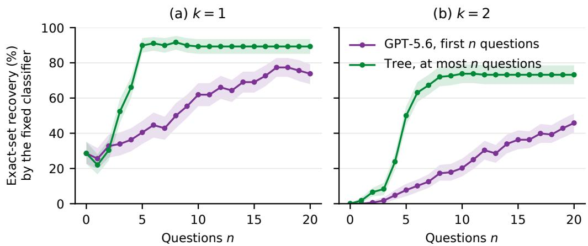  
Figure 10: Exact-set recovery by the fixed reader from GPT-5.6’s first n answers and from the tree capped at n questions. Bands are 95% intervals.

## D.7 INFORMATION GAINED OVER THE CONSULTATION

This analysis follows the consultations of Appendix D.6 question by question and asks how much each system has learned about the diagnosis set at every point. It uses the same 336 GPT-5.6 consultations and the tree’s paths on the same patients, and it makes no model calls.

Belief model. We need an observer that turns a history of answers into a distribution over diagnosis sets. The hypothesis space S holds the 28 possible sets (7 single diagnoses and 21 pairs); the true k is not given. We fit a naive Bayes model on the training split (4,032 records after removing the duplicate opening of each pair), with one class per set. Its features are sex, age decade, and the 49 menu questions. Binary questions are yes or no, categorical and ordinal questions take their value or absent, and each multi-select question becomes one yes or no feature per value. Conditional tables use add-one smoothing, and the prior gives $k = 1$ and $k = 2$ equal mass. After a history $h _ { t }$ of t answered questions, the belief is $\begin{array} { r } { \dot { p } ( S \mid \bar { h } _ { t } ) \propto p ( S ) \prod _ { f \in h _ { t } } p ( a _ { f } \mid \bar { S } ) } \end{array}$ , where $h _ { t }$ always contains sex, age, and the opening complaint. From the full record the observer recovers the exact set in 97.6% of validation patients at $k = 1$ and 79.8% at $k = 2$ . Its average belief on the true set stays close to how often its most likely set is correct, for example 0.57 against 0.61 for GPT-5.6’s evidence at $k = 2$

Measures. The information gained after t questions is $H ( S \mid h _ { 0 } ) - H ( S \mid h _ { t } )$ in bits, where $h _ { 0 }$ is the opening, and the belief on the true set is $p ( S ^ { * } \mid h _ { t } )$ . A repeated question adds nothing. After the tree reaches a leaf it asks nothing more, so its last value is carried forward to twenty questions. GPT-5.6 could end the consultation at any turn but asked all twenty questions in 334 of 336 consultations (Appendix D.6), so its curves run to twenty. We therefore compare the two systems both after twenty questions and over the tree’s own number of questions. Bands are 95% bootstrap intervals over families.

Results. Over the number of questions the tree asks, a tree question gains 0.42 (k = 1) and 0.53 (k = 2) bits and a GPT-5.6 question 0.27 and 0.26 (Figure 5c). After twenty questions GPT-5.6 puts 0.86 and 0.57 on the true set, against 0.97 and 0.76 for the tree and 0.97 and 0.81 for the full record (Figure 11b). A fixed classifier reading the same evidence gives the same order (a). The observer and the tree are fitted on the same training patients, but GPT-5.6’s own reading of the evidence (Figure 5b) and the record-matching gain of Appendix D.4 agree with it.

Shared questions. Within the tree’s own number of questions, GPT-5.6 asks 21% of the tree’s questions at k = 1 and 12% at $k = 2$ , a difference of −9 [−11, −7] points within family. The tree changes its path when the second disease changes the answers, and GPT-5.6 mostly does not. Over the first five questions, the questions asked for the two patients of a family overlap by 0.73 (Jaccard) for GPT-5.6 and 0.66 for the tree, against 0.06 by chance, and the gap widens at seven questions.

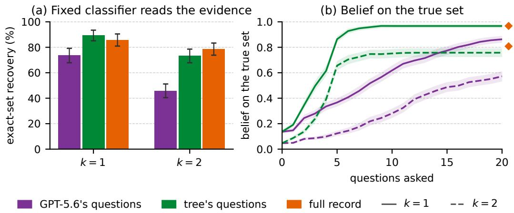  
Figure 11: GPT-5.6 and the tree on the matched respiratory cohort. (a) Exact-set recovery when a fixed classifier reads each system’s evidence or the full record. (b) The observer’s belief on the true set after each question. After the tree stops, its last value is carried forward, and the diamonds show the full record.

Limitations. The values are properties of the observer, not of GPT-5.6’s internal belief. Naive Bayes treats the values of a multi-select question as independent given the set, which overstates how much such an answer is expected to reveal before it is given. We therefore report the information actually gained after each answer rather than the expected gain of each question.

## D.8 PROMPT PROVENANCE AND ADAPTATIONS

The templates below are extracted from our repository’s experiments/lib/prompts.py; their task wiring is in experiments/tasks.py. The source comments identify the free-text doctor and patient as adaptations of AgentClinic (Schmidgall et al., 2026). They retain the doctor/patient roles, short dialogue responses, a question budget, and the instruction not to reveal the patient’s disease name. Our doctor adds an explicit comorbidity instruction, the candidate diagnosis list, and a semicolon-separated set commitment. Our patient uses the standard AgentClinic patient prompt, without the mention of physical exams, and receives the rendered case findings as its information. Like the original, this wording does not specify a deterministic policy for every absent or unknown finding; the menu channel supplies that control separately.

The local adaptation omits the Request Test: route and the research, chain-of-thought, and target-language slots. The menu action format, forced continuation, oracle-count instruction, and independent probes are local protocol components. The single-diagnosis control removes the comorbidity paragraph but retains our candidate list and response format. AgentClinic defines only dialogue prompts, so the static template used for full information adapts the non-interactive setting of MediQ (Li et al., 2024) to a diagnosis set and the shared commitment marker. The static and dialogue prompts share the candidate list, the statement that the patient may have several diseases, the answer format and the scorer. The dialogue prompt adds the question budget and an instruction to keep questioning after a first likely diagnosis. Reading a consultation’s own findings with the static prompt changes exact recovery by at most four points (Table 12). A moderator/judge template is present in the source file but is not called by the main evaluation tasks.

## D.9 IMPLEMENTED PROMPT TEMPLATES

Angle-bracketed fields below stand for runtime values. Candidate lists, finding lists, and menu entries expand to their complete case- or source-specific contents. All other wording is taken from the local prompt definitions. The single-diagnosis and oracle-count controls are shown as exact substitutions to avoid repeating their shared text.

Static diagnosis. The first line is the system message; the remainder is the user message. The full-information, tree-guided, and replay tasks share this template, with different finding lists.

You are an experienced doctor trying to make a medical decision about a   
patient.   
A patient comes into the clinic presenting with a symptom as described   
in the statements below:   
Patient: <opening presentation>   
- <retained finding>   
- <additional retained findings>   
Given the information from above, your task is to identify every   
diagnosis the patient has from the candidate list below. The patient   
may have more than one disease at the same time.   
Candidate diagnoses:   
<candidate diagnosis list>   
To the best of your ability, answer with ONLY "Diagnosis Ready:   
[diagnosis 1]; [diagnosis 2]; ..." and nothing else.

Free-text doctor. System message. In the main evaluation and in Section 6, the question counter follows each patient answer as a new line, “(You have asked n of 20 questions so far.)”, so the system message stays fixed. The earlier runs behind the oracle-count and single-diagnosis controls (Appendices E.3 and E.5) and the open-model probe analyses (Appendices E.9 and E.10) placed it in the system message instead, as “You have asked n questions so far.” after the first sentence below. Each such comparison uses runs of one version.

You are a doctor named Dr. Agent who only responds in the form of   
dialogue. You are inspecting a patient who you will ask questions in   
order to understand their disease. You are only allowed to ask 20   
questions total before you must make a decision. Your questions must   
be 1-3 sentences in length.   
The patient may have more than one disease at the same time. Do not stop   
investigating after finding one likely diagnosis; actively probe   
whether the findings are fully explained by a single condition or   
point to co-occurring conditions.   
Once you have decided to make a diagnosis please say "Diagnosis Ready:   
[diagnosis 1]; [diagnosis 2]; ..." listing every disease the patient   
has, using ONLY names from this list:   
<candidate diagnosis list>   
Remember, you must discover their diseases by asking them questions.

Patient simulator. System message. The current doctor question is the user message. Each patient call receives these two messages.

You are a patient in a clinic who only responds in the form of dialogue.   
You are being inspected by a doctor who will ask you questions in   
order to understand your disease. Your answer will only be 1-3   
sentences in length.   
Below is all of your information.   
Who you are: <opening presentation>   
- <retained finding>   
- <additional retained findings>   
Remember, you must not reveal your disease explicitly but may only   
convey the symptoms you have in the form of dialogue if you are   
asked.

Menu doctor. System message. The question-list slot expands to all available evidence IDs and their questions.

You are a doctor named Dr. Agent. You are inspecting a patient who you   
will ask questions in order to understand their disease. You are   
only allowed to ask 20 questions total before you must make a   
decision.   
The patient may have more than one disease at the same time. Do not stop   
investigating after finding one likely diagnosis; actively probe   
whether the findings are fully explained by a single condition or   
point to co-occurring conditions.   
Questions you may ask (id: question):   
<evidence id>: <question text>   
Each turn reply with EXACTLY ONE line: ASK <id>   
Once you have decided to make a diagnosis please say "Diagnosis Ready:   
[diagnosis 1]; [diagnosis 2]; ..." listing every disease the patient   
has, using ONLY names from this list:   
<candidate diagnosis list>

Single-diagnosis control: changed suffix. The opening paragraph is identical to the free-text doctor template. Delete its comorbidity paragraph and replace the remaining suffix with the following text. The closed candidate list and local response format are retained.

Once you have decided to make a diagnosis please say "Diagnosis Ready:   
[diagnosis here]" giving the single most likely diagnosis, using   
ONLY a name from this list:   
<candidate diagnosis list>   
Remember, you must discover their disease by asking them questions.

Oracle-count control: replacement paragraph. Replace only the free-text doctor’s comorbidity paragraph with the following. For k = 1, the code uses the singular “condition”; the other wording is unchanged.

The patient has exactly <k> distinct conditions at the same time. You   
must identify all of them --- no fewer and no more than <k>.

Independent diagnosis probe. The first paragraph and candidate list form the system message; the remainder is the user message. At t = 0, the question–answer lines are replaced by (no questions asked yet).

You are a physician reviewing a partial consultation. Several diagnoses   
may be present at once.   
Candidate diagnoses:   
<candidate diagnosis list>   
Patient: <opening presentation>   
Consultation so far:   
Q: <question 1>   
A: <answer 1>   
Q: <remaining questions>   
A: <remaining answers>   
Based ONLY on the information above, reply with "Diagnosis Ready:   
[diagnosis 1]; [diagnosis 2]; ..." listing the diagnoses currently   
supported by the evidence, chosen from the candidate list. If none   
are supported yet, reply "Diagnosis Ready: none".

Opening, answers, and protocol messages. These are user messages added by the task. The labels above each block are explanatory and are not sent to the model.

Opening user message

Patient: <opening presentation>   
Begin the consultation.

Menu answer user message

```twig
<question text>: <answer>
```

## Free-text continuation

Do NOT give a final diagnosis yet. Continue the consultation and keep   
asking the patient questions.

## Menu continuation

Do NOT give a final diagnosis. Continue the consultation: keep asking   
questions from the list, one per turn, as ASK <id>.

## Fallback final-answer request

Question budget exhausted. Reply now with "Diagnosis Ready: [diagnosis 1]; [diagnosis 2]; ...".

## Invalid free-text reply, before commitment

Invalid reply. Ask the patient one question in plain dialogue or commit   
with "Diagnosis Ready: [diagnosis 1]; ...".

## Invalid free-text reply, after commitment

Invalid reply. Ask the patient one question in plain dialogue.

## Invalid menu action, before commitment

Invalid action. Reply with exactly one line: ASK <id> or "Diagnosis   
Ready: [diagnosis 1]; ...".

## Invalid menu action, after commitment

Invalid action. Reply with exactly one line: ASK <id>.

## E ADDITIONAL RESULTS

## E.1 CONFIDENCE INTERVALS FOR THE MAIN TABLES

Tables 13 and 14 give 95% intervals for every value of Tables 1 and 2. They are case bootstraps with 4,000 draws and seed 2026, stratified by k, and the same resampled cases are used for every model and condition of a source. Pooled exact-set recovery is resolved to within ±0.01 to ±0.03, so models that are close in Table 1 are not separated. In interaction at $k \geq 3 ,$ , every model stays at or below 7%, with upper bounds of at most 10%.

Table 13: Table 1 with 95% bootstrap intervals, 800 cases per source.
<table><tr><td></td><td></td><td colspan="2">Exact ↑</td><td colspan="2">Jaccard ↑</td></tr><tr><td>Source</td><td>Model</td><td>F</td><td>I</td><td>F</td><td>I</td></tr><tr><td>DDXPlus</td><td>GPT-5.6</td><td>0.11 [0.09, 0.13] 0.08 [0.07, 0.10]</td><td></td><td>0.46 [0.44, 0.48]</td><td>0.29 [0.27, 0.31]</td></tr><tr><td></td><td>Gemini-3.8-Flash</td><td>0.26 [0.24, 0.28] 0.08 [0.06, 0.10]</td><td></td><td></td><td>0.47 [0.45, 0.50] 0.32 [0.30, 0.34]</td></tr><tr><td></td><td>Qwen3.8-Flash</td><td>0.17 [0.15, 0.20] 0.06 [0.05, 0.08]</td><td></td><td></td><td>0.46 [0.44, 0.48] 0.27 [0.25, 0.29]</td></tr><tr><td></td><td>GLM-5.3-Flash</td><td>0.11 [0.09, 0.13] 0.02 [0.01, 0.03]</td><td></td><td></td><td>0.46 [0.44, 0.48] 0.24 [0.23, 0.26]</td></tr><tr><td></td><td>DeepSeek-V4.1-Flash</td><td>0.04 [0.03, 0.05] 0.02 [0.01, 0.03]</td><td></td><td></td><td>0.37 [0.35, 0.38]0.25 [0.23, 0.26]</td></tr><tr><td></td><td>Gemma-4</td><td>0.10 [0.08, 0.12]</td><td>0.01 [0.01, 0.02]</td><td>0.43 [0.41, 0.45]</td><td>0.24 [0.22, 0.25]</td></tr><tr><td>ePOCT+</td><td>GPT-5.6</td><td>0.21 [0.19, 0.24] 0.08 [0.06, 0.10]</td><td></td><td></td><td>0.57 [0.55, 0.59]0.30 [0.28, 0.32]</td></tr><tr><td></td><td>Gemini-3.8-Flash</td><td>0.21 [0.18, 0.24]0.10 [0.08, 0.12]</td><td></td><td></td><td>0.51 [0.49, 0.53] 0.39 [0.37, 0.41]</td></tr><tr><td></td><td>Qwen3.8-Flash</td><td>0.18 [0.16, 0.21] 0.06 [0.05, 0.08]</td><td></td><td></td><td>0.49 [0.47, 0.51] 0.24 [0.22, 0.26]</td></tr><tr><td></td><td>GLM-5.3-Flash</td><td>0.15 [0.13, 0.18] 0.05 [0.04, 0.07]</td><td></td><td>0.52 [0.50, 0.54] 0.26 [0.25, 0.28]</td><td></td></tr><tr><td></td><td>DeepSeek-V4.1-Flash</td><td>0.15 [0.13, 0.18]0.06 [0.05, 0.08]</td><td></td><td></td><td>0.53 [0.52, 0.55] 0.28 [0.26, 0.30]</td></tr><tr><td></td><td>Gemma-4</td><td>0.20 [0.18, 0.23] 0.07 [0.05, 0.09] 0.55 [0.53, 0.57] 0.31 [0.29, 0.33]</td><td></td><td></td><td></td></tr></table>

Table 14: Table 2 with 95% bootstrap intervals: exact-set recovery (%) under full information (F) and interaction (I), 200 cases per k.
<table><tr><td>Source</td><td>Model</td><td>k=1</td><td>k=2</td><td>k=3</td><td>k=4</td></tr><tr><td>DDXPlus</td><td>GPT-5.6</td><td>F 30 [24, 36]</td><td>10 [6, 14]</td><td>4 [2, 6]</td><td>0 [0, 2]</td></tr><tr><td></td><td></td><td>I 27 [21, 33]</td><td>6 [3, 10]</td><td>0 [0, 2]</td><td>0 [0, 0]</td></tr><tr><td></td><td>Gemini-3.8-Flash</td><td>F76 [70, 82]</td><td>23 [18, 29]</td><td>4 [2, 8]</td><td>0 [0, 2]</td></tr><tr><td></td><td></td><td>I 22 [16, 28]</td><td>8 [4, 12]</td><td>1 [0, 2]</td><td>0 [0, 2]</td></tr><tr><td></td><td>Qwen3.8-Flash</td><td>F44 [37, 51]</td><td>22 [16, 28]</td><td>4 [2, 7]</td><td>0 [0, 2]</td></tr><tr><td>GLM-5.3-Flash</td><td></td><td>I 14 [10, 20]</td><td>9 [6, 13]</td><td>1 [0, 2]</td><td>0 [0, 0]</td></tr><tr><td></td><td></td><td>F 21 [16, 27]</td><td>11 [7, 16]</td><td>8 [5, 12]</td><td>2 [0, 5]</td></tr><tr><td>DeepSeek-V4.1-Flash</td><td>I</td><td>8 [5, 12]</td><td>0 [0, 2]</td><td>0 [0, 0]</td><td>0 [0, 0]</td></tr><tr><td></td><td>F</td><td>9 [5, 13]</td><td>4 [2, 8]</td><td>1 [0, 2]</td><td>0 [0, 2]</td></tr><tr><td>Gemma-4</td><td>I</td><td>4 [2, 8]</td><td>1 [0, 2]</td><td>0 [0, 2]</td><td>0 [0, 2]</td></tr><tr><td></td><td>F</td><td>26 [20, 32] 2[0,5]</td><td>10 [6, 14]</td><td>4 [2, 6]</td><td>2 [0, 4]</td></tr><tr><td>ePOCT+ GPT-5.6</td><td></td><td>I F 39 [32, 46]</td><td>2 [0, 5]</td><td>1 [0, 2]</td><td>0 [0, 0]</td></tr><tr><td></td><td></td><td>I 18 [13, 24]</td><td>24 [18, 30]</td><td>12 [8, 17]</td><td>10 [6, 14]</td></tr><tr><td>Gemini-3.8-Flash</td><td></td><td></td><td>7 [4, 10]</td><td>4 [2, 6]</td><td>4 [1, 6]</td></tr><tr><td></td><td></td><td>F34 [28, 40]</td><td>25 [19, 32]</td><td>15 [10, 20]</td><td>10 [6, 14]</td></tr><tr><td></td><td></td><td>I22 [16, 27]</td><td>8 [5, 12]</td><td>7 [4, 10]</td><td>2 [0,5]</td></tr><tr><td>Qwen3.8-Flash</td><td></td><td>F34 [27, 40]</td><td>26 [20, 32]</td><td>10 [6, 14]</td><td>4 [2, 7]</td></tr><tr><td></td><td></td><td>I 18 [13, 24]</td><td>5 [2, 8]</td><td>2 [0, 4]</td><td>0 [0, 0]</td></tr><tr><td>GLM-5.3-Flash</td><td></td><td>F 24 [18, 30]</td><td>20 [14, 26]</td><td>10 [6, 14]</td><td>8 [4, 12]</td></tr><tr><td></td><td>I</td><td>13 [8, 18]</td><td>6 [2, 9]</td><td>2 [0, 5]</td><td>0 [0, 2]</td></tr><tr><td>DeepSeek-V4.1-Flash</td><td>F</td><td>14 [10, 19]</td><td>21 [16, 27]</td><td>16 [11, 21]</td><td>11 [7, 16]</td></tr><tr><td></td><td>I</td><td>13 [8, 18]</td><td>6 [2, 9]</td><td>6 [3, 10]</td><td>0 [0, 2]</td></tr><tr><td>Gemma-4</td><td></td><td>F32 [26, 38]</td><td>30 [23, 36]</td><td>15 [10, 20]</td><td>5 [2, 8]</td></tr><tr><td></td><td></td><td>I 14 [10, 20]</td><td>8 [5, 12]</td><td>6 [3, 10]</td><td>0 [0, 0]</td></tr></table>

## E.2 PER-COUNT SCORES AND OUTCOMES

Table 15 breaks Table 1 down by k, and Figure 12 splits interactive cases by outcome. Most failures are partially incorrect at every count. Models add wrong diagnoses rather than return a correct subset. The predicted set grows with k and exceeds the true count up to $k = 3 .$ , and a correct count rarely comes with the correct set (Figure 13).

Table 15: Per-count scores on DDXPlus for the six models. Each cell reads F1 / Jaccard / exact over 200 cases.
<table><tr><td>Condition</td><td>Model</td><td>k=1</td><td>k=2</td><td>k=3</td><td>k=4</td></tr><tr><td>full</td><td>GPT-5.6</td><td>0.65/0.55/0.30</td><td>0.58/0.45/0.10</td><td>0.57/0.43/0.04</td><td>0.56/0.41/0.01</td></tr><tr><td>full</td><td>Gemini-3.8-Flash</td><td>0.79/0.79/0.77</td><td>0.58/0.48/0.23</td><td>0.47/0.35/0.04</td><td>0.40/0.28/0.01</td></tr><tr><td>full</td><td>Qwen3.8-Flash</td><td>0.70/0.64/0.44</td><td>0.57/0.47/0.21</td><td>0.53/0.41/0.04</td><td>0.48/0.34/0.01</td></tr><tr><td>full</td><td>GLM-5.3-Flash</td><td>0.61/0.50/0.21</td><td>0.57/0.45/0.11</td><td>0.59/0.46/0.09</td><td>0.57/0.43/0.03</td></tr><tr><td>full</td><td>DeepSeek-V4.1-Flash</td><td>0.50/0.37/0.09</td><td>0.51/0.37/0.04</td><td>0.50/0.36/0.01</td><td>0.50/0.36/0.01</td></tr><tr><td>full</td><td>Gemma-4</td><td>0.63/0.53/0.26</td><td>0.56/0.43/0.10</td><td>0.52/0.38/0.04</td><td>0.53/0.39/0.01</td></tr><tr><td>interactive</td><td>GPT-5.6</td><td>0.54/0.46/0.27</td><td>0.38/0.29/0.06</td><td>0.33/0.23/0.01</td><td>0.30/0.20/0.00</td></tr><tr><td>interactive</td><td>Gemini-3.8-Flash</td><td>0.53/0.45/0.22</td><td>0.44/0.33/0.08</td><td>0.38/0.27/0.01</td><td>0.34/0.23/0.01</td></tr><tr><td>interactive</td><td>Qwen3.8-Flash</td><td>0.47/0.38/0.14</td><td>0.36/0.27/0.09</td><td>0.32/0.22/0.01</td><td>0.29/0.19/0.00</td></tr><tr><td>interactive</td><td>GLM-5.3-Flash</td><td>0.41/0.31/0.09</td><td>0.34/0.23/0.01</td><td>0.34/0.22/0.00</td><td>0.33/0.21/0.00</td></tr><tr><td>interactive</td><td>DeepSeek-V4.1-Flash</td><td>0.41/0.30/0.04</td><td>0.36/0.25/0.01</td><td>0.32/0.22/0.01</td><td>0.34/0.23/0.01</td></tr><tr><td>interactive</td><td>Gemma-4</td><td>0.41/0.30/0.03</td><td>0.36/0.25/0.03</td><td>0.30/0.21/0.01</td><td>0.29/0.19/0.00</td></tr></table>

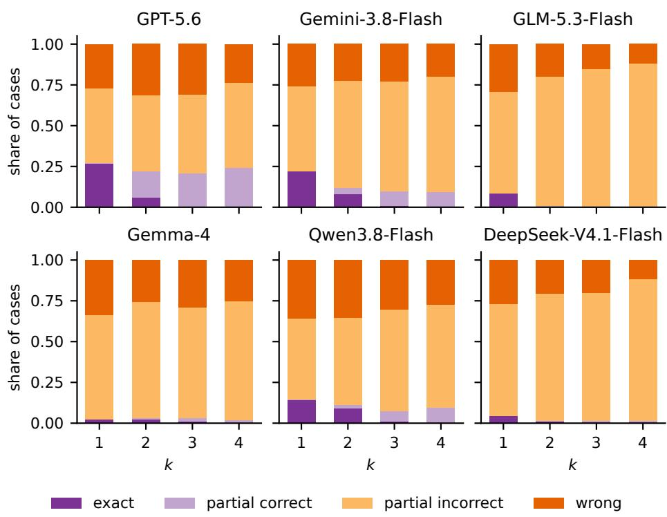  
Figure 12: Interactive outcomes by k (DDXPlus, 200 cases per k). A partially correct set is a subset of the truth; a partially incorrect one adds wrong labels.

## E.3 ORACLE COUNT

With the true k supplied (Section 5.2), exact-set recovery still collapses with k (Figure 14, left). The oracle-count runs use the first 50 cases per k of the main evaluation. Relative to standard interaction, the count helps at $k = 1$ but has mixed effects at $k \geq 2 \mathrm { ( r i g h t ) }$

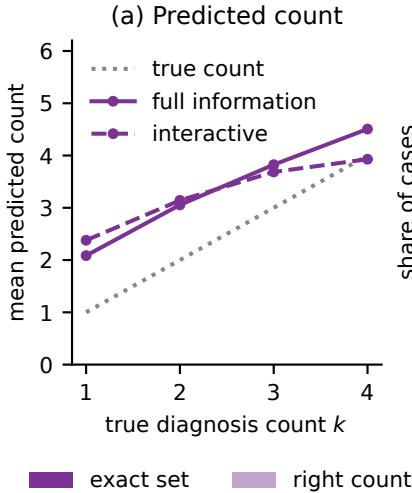

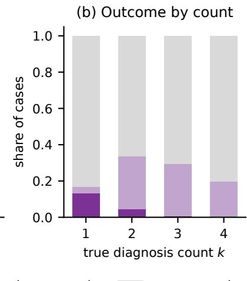  
Figure 13: Set size (DDXPlus, six models, 200 cases per k). (a) Predicted count against k. (b) Exact set, right count with a wrong set, or wrong count.

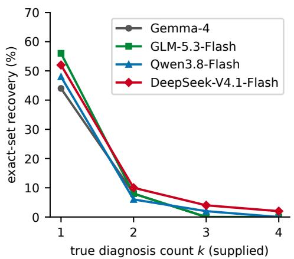

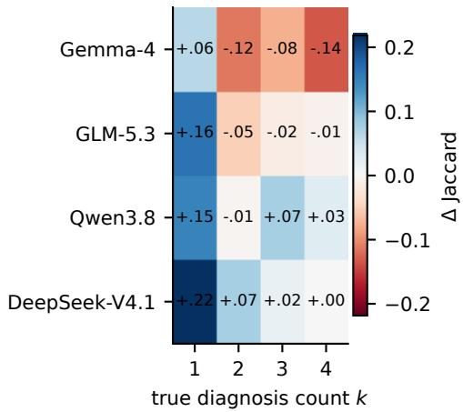  
Figure 14: Oracle count (50 cases per k). Left, exact-set recovery with the true k supplied. Right, change in Jaccard against standard interaction.

## E.4 OVER-CALLING AND THE INTERACTION BETWEEN COUNT AND CONDITION

Precision and recall. Averaged over the six models, precision is flat across k in both conditions, near 55% with full information and 35% in interaction, while recall falls from 89% to 55% and from 70% to 32% (Figure 15). The loss at $k = 1$ therefore comes from extra labels, since models return about two diagnoses per single-diagnosis case. As diagnoses co-occur, the loss moves to missed diagnoses.

Interaction test. For each model we compute the fall in mean Jaccard from $k = 1$ to the mean over $k \geq 2 .$ , in interaction minus with full information. A positive value means interaction steepens the fall with k. Intervals are 95% case bootstraps stratified by k (4,000 draws), resampling the same cases for every model and condition. Exact-set recovery is not used, because it sits near zero at $k \geq 2$ in both conditions and would force the contrast towards zero. Averaged over the six models, Jaccard falls with k by a similar amount in both conditions (Figure 16). The per-model estimates have mixed signs and the pooled value is close to zero (Table 16).

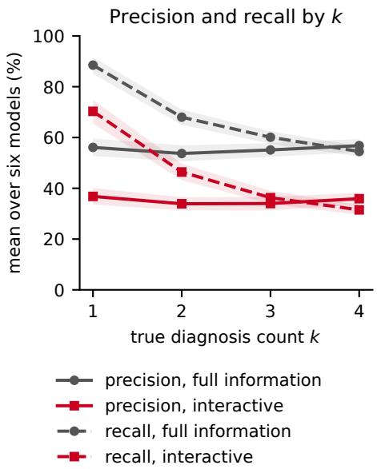

Figure 15: Precision and recall by k on DDXPlus, mean of six models (200 cases per k).  
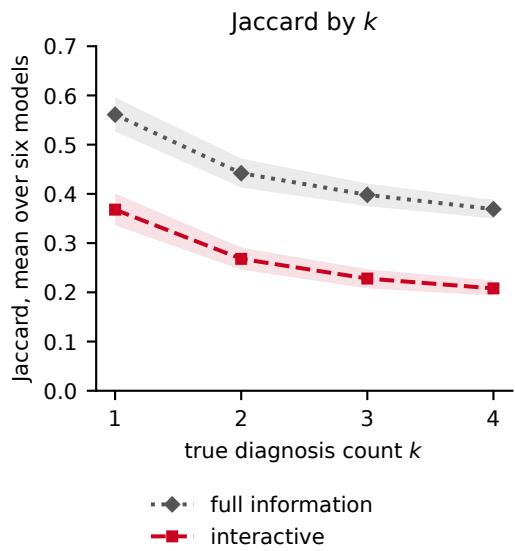  
Figure 16: Jaccard by k on DDXPlus, mean of six models (200 cases per k).

## E.5 SINGLE-DIAGNOSIS CONTROL

Asked for one diagnosis, Gemma names a true one in roughly half of the cases at every k (Table 17), while it recovers the exact set in few cases with or without the true k (Figure 17). Among these hits, the guess is the presenting-complaint disease in 68% of cases at $k = 2 , 8 2 \%$ at $k = 3$ and 43% at $k = 4 ,$ against 50%, 33% and 25% if every true diagnosis were equally likely to be named.

## E.6 EVIDENCE ACQUISITION AND USE: SUPPORTING ANALYSES

These analyses extend Section 6.1 on the matched respiratory cohort (Appendix D.6). Table 18 scores one fixed label: a diagnosis alone versus the same diagnosis with a second disease added. With the full record or the tree’s findings, the fixed reader loses it in 3.6 and 2.4 points more cases, GPT-5.6 in 8.3 and 11.3. GPT-5.6’s excess loss over the reader is resolved with the tree’s findings (−8.9 points, [−16.1, −1.8]) but not with the full record (−4.8, [−11.3, 1.2]). Table 19 shows that the growing cost of GPT-5.6’s questions holds for other metrics and without the two rhinosinusitis labels, whose symptom schemas nearly coincide. The direct tree-versus-GPT-5.6 gap does not clearly widen with k, because it mixes questioning and diagnosis.

Table 16: Count × condition interaction on Jaccard, DDXPlus, 200 cases per k.
<table><tr><td>Model</td><td colspan="2">Interaction [95% CI]</td></tr><tr><td>GPT-5.6 Gemini-3.8-Flash GLM-5.3-Flash Gemma-4 Qwen3.8-Flash</td><td></td><td>+0.108 [+0.049, +0.166] -0.242 [−0.303, -0.185] +0.033 [-0.015, +0.081 -0.038 -0.087, +0.010] -0.076 [−0.134, -0.021]</td></tr><tr><td>DeepSeek-V4.1-Flash Pooled</td><td></td><td>+0.065 [+0.027, +0.104] -0.025 [−0.053, +0.002]</td></tr></table>

Table 17: Single-diagnosis instruction for Gemma across $k ,$ 50 cases per k. hit@1 is the fraction of cases where the one guess names any true diagnosis. chief is the fraction where the guess is the presenting-complaint disease.
<table><tr><td></td><td> $k { = } 1$ </td><td> $k { = } 2$ </td><td> $k { = } 3$ </td><td> $k { = } 4$ </td></tr><tr><td>hit@1</td><td>0.54</td><td>0.56</td><td>0.34</td><td>0.42</td></tr><tr><td>mean count</td><td>1.00</td><td>1.00</td><td>1.00</td><td>1.00</td></tr><tr><td>chief selected</td><td></td><td>0.38</td><td>0.28</td><td>0.18</td></tr><tr><td>T</td><td>11.4</td><td>11.5</td><td>10.9</td><td>11.3</td></tr></table>

Table 18: Recovery (%) of the same focal diagnosis alone $( k = 1 )$ and with a second disease $( k = 2 ,$ opening on the focal diagnosis), with the paired change in points.
<table><tr><td>Evidence</td><td>Reader</td><td>Alone</td><td>With second</td><td>Change</td></tr><tr><td>Full record</td><td>GPT-5.6</td><td>85.7</td><td>77.4</td><td>-8.3 [−13.7, -3.0]</td></tr><tr><td>Full record</td><td>Fixed reader</td><td>96.4</td><td>92.9</td><td>−3.6 [−6.5, −0.6]</td></tr><tr><td>Tree&#x27;s findings</td><td>GPT-5.6</td><td>81.0</td><td>69.6</td><td>-11.3 [−17.9, −4.8]</td></tr><tr><td>Tree&#x27;s findings</td><td>Fixed reader</td><td>92.9</td><td>90.5</td><td>−2.4 [−6.0, 1.2]</td></tr><tr><td>GPT-5.6&#x27;s findings</td><td>GPT-5.6</td><td>70.2</td><td>61.3</td><td>-8.9 [−15.5, −2.4]</td></tr><tr><td>GPT-5.6&#x27;s findings</td><td>Fixed reader</td><td>91.7</td><td>75.6</td><td>−16.1 [−21.4, −10.7]</td></tr></table>

## E.7 DESIGNED $k = 2$ COHORT

Design. The generator opens every evaluated $k = 2$ case with the more severe diagnosis, so in the main cohort opening and severity are confounded. The designed cohort holds severity equal. We sample pairs of equally severe DDXPlus diagnoses whose symptom profiles, without antecedents, overlap little (Jaccard at most 0.10) or much (at least 0.30), leaving out pairs screened as infeasible or unlikely. We realise one patient per pair with the generator’s record-merging rules, 195 patients covering 47 of the 49 diagnoses. Each patient is consulted twice. The opening lists the initial evidence of one diagnosis and two findings exclusive to it within the pair, and nothing else changes. Consultations use the 20-question budget and end at the natural stop, without probes or forced continuation, and background complaints are withheld. GPT-5.6 completed all 390 consultations and Gemma-4 389. When a model follows a diagnosis with advice or corrects itself, we keep the last diagnosis it names. Intervals are 95% bootstrap intervals over patients, which are also diagnosis pairs.

Reading. Both models recover the opening diagnosis more often, and the effect is twice as large for GPT-5.6. In both, the final set holds A alone more often than both diagnoses.

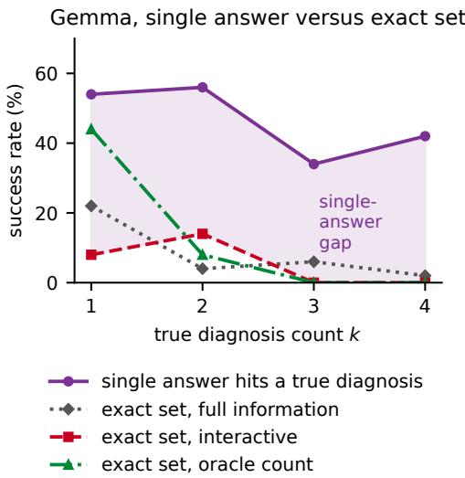  
Figure 17: Gemma on DDXPlus (50 cases per k). Single-answer hits versus exact sets with full information, in interaction and with the oracle count.

Table 19: Change from $k = 1$ to $k = 2$ in the tree’s advantage over GPT-5.6.
<table><tr><td>Contrast</td><td>k = 2 minus k = 1</td></tr><tr><td>Fixed reader, exact set (Figure 5b) Fixed reader, label recall</td><td>+11.9 pp [3.6, 20.2]</td></tr><tr><td>Fixed reader, label log loss</td><td>+12.2 pp [7.1, 17.6] 0.62 bits [0.31, 0.94]</td></tr><tr><td>Fixed reader, exact set, without rhinosinusitis</td><td>+13.8 pp [2.5, 23.8]</td></tr><tr><td>Direct tree versus GPT-5.6, exact set</td><td>+7.1 pp [−3.0, 16.7]</td></tr></table>

## E.8 SYMPTOM-SHARING COHORT

Why. The designed cohort of Appendix E.7 cannot show what a shared symptom does when it is in view. The two findings after the first complaint are exclusive to A by construction, and a specific symptom of both diagnoses opened only 6 of its 200 high-overlap consultations. Its high overlap also comes mostly from the multi-part pain question, with 2.3 shared questions per pair of which 0.4 are specific, as defined below.

Design. We take pairs of equally severe DDXPlus diagnoses whose symptom lists share at least one specific symptom, one listed by at most 10 of the 49 profiles when a question and its subquestions count once. We leave out pairs screened as infeasible or unlikely, pairs whose age windows do not overlap, and nested pairs such as URTI with influenza, where naming one of the two can be right. For each pair we realise six patients with the generator’s record-merging rules, drawing A at random, and keep a record only if it holds, besides A’s first finding, a specific and a general yes-or-no symptom that both diagnoses list, the same for A alone, and a specific symptom of B alone. This gives 121 patients from 21 pairs. Each patient is consulted twice with the same record, the opening giving A’s first finding followed by the two shared symptoms or by the two symptoms of A alone. As a control, the 88 patients whose record allows it are also consulted with A’s first finding followed by a specific and a second symptom of B alone (general in 28), which shows how much a symptom of B raises B. Nothing is removed from the record, so the patient simulator answers alike under every opening. Prompts, budget and scorer are those of the designed cohort, and consultations end at the natural stop. We analyse the 97 patients whose diagnoses have severity 3 to 5, of whom 65 have all three openings.

Development and analysis. Two earlier versions failed in small runs. Removing a shared finding from the record leaked, since the patient simulator still reported it, and opening with the more severe diagnosis ended most consultations within a few questions, with B named in none of 16. We fixed each analysis before its full run, with B named as the primary outcome, first for shared minus A’s symptoms and then for shared minus B’s symptoms. Intervals are 95% bootstrap intervals over disease pairs.

Table 20: Designed k = 2 cohort, both openings pooled, with 95% intervals.
<table><tr><td></td><td>GPT-5.6</td><td>Gemma-4</td></tr><tr><td>Recall of A</td><td>0.65 [0.60, 0.69]</td><td>0.58 [0.52, 0.62]</td></tr><tr><td>Recall of B</td><td>0.32 [0.27, 0.36]</td><td>0.41 [0.37, 0.46]</td></tr><tr><td>A minus B, paired, points</td><td>+33 [27, 38]</td><td>+16 [12, 21]</td></tr><tr><td>Final set holds A and B</td><td>0.17 [0.13, 0.22]</td><td>0.24 [0.19, 0.29]</td></tr><tr><td>Final set holds A only</td><td>0.47 [0.43, 0.52]</td><td>0.33 [0.29,0.37]</td></tr><tr><td>Final set holds B only</td><td>0.15 [0.12, 0.18]</td><td>0.17 [0.14, 0.20]</td></tr><tr><td>Final set holds neither</td><td>0.21 [0.16, 0.25]</td><td>0.26 [0.21, 0.31]</td></tr></table>

Table 21: Symptom-sharing cohort, GPT-5.6, diagnoses of severity 3 to 5. Differences between openings in points, with 95% intervals.
<table><tr><td>Opening contrast</td><td>Patients</td><td>B named</td><td>A named</td><td>Both named</td><td></td></tr><tr><td>Shared minus A&#x27;s symptoms</td><td>97</td><td>+13 [4, 24]</td><td> $- 4 \left[ - 1 2 , 4 \right]$ </td><td></td><td> $+ 5 \left[ - 4 , 1 4 \right]$ </td></tr><tr><td>Shared minus B&#x27;s symptoms</td><td>65</td><td>−5 [−17, 8]</td><td>+9 [2, 17]</td><td></td><td> $+ 2 \ [ - 7 , 1 1 ]$ </td></tr><tr><td>B&#x27;s minus A&#x27;s symptoms</td><td>65</td><td>+17 [8, 27]</td><td> $- 1 2 [ - 2 2 , - 3 ]$ </td><td></td><td>+2[-3,7]</td></tr></table>

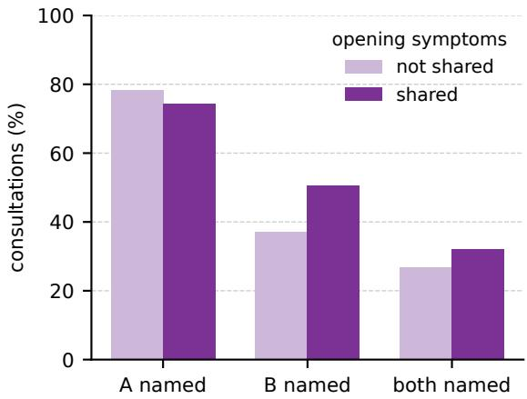  
Figure 18: Symptom-sharing cohort, GPT-5.6, diagnoses of severity 3 to 5. The same patients open with A’s first finding and two symptoms of A alone (not shared) or two that both diagnoses share. Share of consultations naming A, B and both.

Reading. On B, shared symptoms behave much closer to symptoms of B than to symptoms of A. In the 24 patients whose B opening matches the shared one in kind, the difference is +8 points [−14, 25]. Of the net gain in B, about 5 points name both diagnoses and 8 name B without A. The share naming both rises only from 27% to 32%, not reliably.

Exact-set recovery changes little, 5% and 8%.

Main consultations. In the main DDXPlus consultations with $k \geq 2 ,$ the chief complaint is in B’s profile for 31% of the second diagnoses. Within the same diagnosis B, B is then named more often, by 5 to 13 points, for all six models under both conditions, but without that adjustment the difference is reliable in only 2 of the 12. The pattern also appears with the full record, so it may reflect related diagnoses rather than the opening.

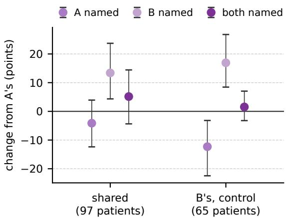  
Figure 19: Symptom-sharing cohort, GPT-5.6. Change from the opening with A’s symptoms within the same patients, for shared symptoms (the patients of Figure 18) and for B’s symptoms as a control (the patients who also had that opening), with 95% intervals over disease pairs.

Exclusive diagnoses. If the model treated the two diagnoses as mutually exclusive, symptoms of A alone would lower the odds of B against A and shared symptoms would leave them unchanged, so this belief also predicts more B with shared symptoms. The cohort therefore does not separate an exclusive from a separate reading. Symptoms of B alone lower A (−12 points [−22, −3]), but they also leave the opening with one finding of A instead of three.

Limits. The cohort covers 21 disease pairs and one doctor model, and its openings are built for the test. The rise in the share naming both diagnoses is not reliable at this size. With 21 pairs, one doctor model and openings built for the test, this is a controlled probe and not a population estimate.

## E.9 ANCHORING IN THE MAIN CONSULTATIONS

The designed cohort amplifies anchoring with a three-finding opening. We also look for it in the main DDXPlus consultations, whose opening is the single presenting complaint. There the generator opens with the most severe diagnosis, so we keep only consultations in which another target has the same severity as the opening diagnosis: 54 cases at $k \geq 2 ,$ , 216 consultations over the four open models. The probe at each turn is a fresh call that reads the transcript so far and never sees the doctor’s hypotheses, so it measures what the collected evidence supports.

The opening diagnosis pulls ahead within the first questions and stays ahead (Figure 20). The gap between the opening diagnosis and an equally severe second diagnosis is 8 points at the opening ([3, 13]) and 16 points when the doctor stops ([2, 29]). The opening diagnosis first appears at a median of four questions, the other diagnosis at eleven, and the other diagnosis never appears before the stop in 46% ([37, 55]) of consultations, against 31% ([23, 38]) for the opening diagnosis. In these runs the doctor stops at a median of twelve of its twenty questions, so the budget does not bind. The gap still remains at the cap, after forced continuation. Since the probe is neutral, the widening comes from the questions the doctor chose: the evidence it collects follows the opening diagnosis.

## E.10 POST-STOP BEHAVIOUR ACROSS MODELS

The four open models show the pattern GPT-5.6 shows in Section 6.3 (Table 22). Their probe runs, like those of Appendix E.9, predate the main evaluation and place the question counter in the system message (Appendix D.9). There the open models stop at a median of 8 to 14 questions; in the main evaluation, with the counter after each answer, they stop at 17 to 20 and often use the whole budget. GPT-5.6 stops at a median of seven in both, and its probe run follows the main protocol. GPT-5.6 was probed after its run on the stored transcripts with the same probe prompt; a probe sees only the dialogue prefix, so this is the same measurement. Under the same probe prompt, F1 at the cap is no higher than at the natural stop, and models differ mainly in how often they refuse to keep asking.

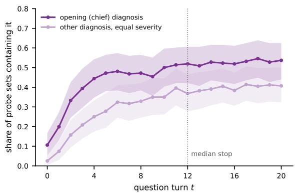  
Figure 20: Share of probe sets holding the opening diagnosis and an equally severe second one (DDXPlus, four open models, 50 cases per k). Bands are 95% bootstrap intervals.

The probe set grows after the stop, but mostly with wrong diagnoses (Figure 21). At k = 1 further questions lower exact-set recovery, from 25% after three questions to 15% at the cap; at $k \geq 3$ a probe almost never holds the complete set (Figure 22). Aligned at the natural stop, neither probe Jaccard nor exact-set recovery changes over six forced questions (Figure 22); Figure 23 shows each model.

Sampling nulls. A probe is a single stochastic readout, so statistics taken over many probes grow with the number of draws. Two such statistics do not survive a null. The share of true diagnoses that appear in any probe rises after the stop by 0.066 per label, and by 0.061 for the k wrong labels whose DDXPlus profiles best match the case (difference 0.005, [−0.013, 0.024]). The best prefix F1 (0.62 pooled) is close to the maximum over the same number of draws from a readout that learns nothing, fitted to the probes after the stop (0.54); the excess is 0.08 ([0.07, 0.09]). Of the true diagnoses found before the stop, 18% are absent from the probe at the stop under the same prompt, and 7% from every later probe. We therefore report single probes in the main text.

Table 22: Post-stop readouts. natural is the F1 of the voluntary committed answer; stop and cap are the F1 of the single probe at the natural stop and at the last forced question. Refusals count post-stop turns where the model committed instead of asking. Four open models, 50 cases per k.
<table><tr><td>Model</td><td>natural</td><td>probe at stop</td><td>probe at cap</td><td>refusals</td><td>forced turns</td></tr><tr><td>Gemma-4</td><td>0.426</td><td>0.457</td><td>0.424</td><td>404</td><td>7.6</td></tr><tr><td>GLM</td><td>0.401</td><td>0.387</td><td>0.363</td><td>1126</td><td>7.1</td></tr><tr><td>Qwen</td><td>0.309</td><td>0.357</td><td>0.373</td><td>64</td><td>5.5</td></tr><tr><td>DeepSeek</td><td>0.354</td><td>0.381</td><td>0.359</td><td>682</td><td>8.9</td></tr></table>

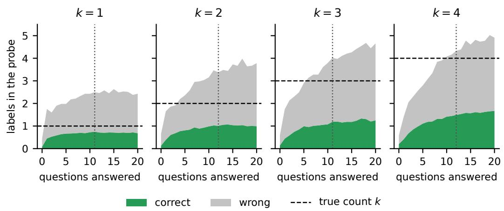  
Figure 21: Composition of a single probe by question turn (four open models, 50 cases per k). Dashed lines mark k, dotted lines the median stop.

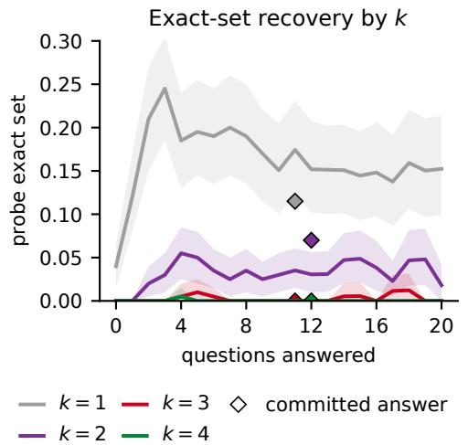

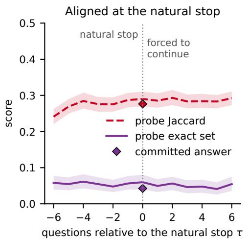  
Figure 22: Left, single-probe exact-set recovery by k. Right, probes aligned at the natural stop τ (586 consultations). Four open models, 50 cases per k.

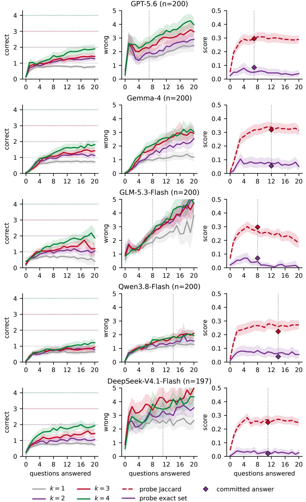  
Figure 23: Figure 7 per model (50 cases per $k _ {  { \mathit { 4 9 } } }$ Probes listing 40 or more labels are excluded.

## F FORMAL FRAMEWORK

This appendix states the task formally and contrasts two idealised reference doctors, a set tracker, which treats every diagnosis as its own hypothesis, and a single-hypothesis tracker, which carries one working diagnosis at a time. It does not model how a language model computes its answer. It states what each reference implies and which of these implications our data can test.

## F.1 SETUP

Definition 1 (Cases and consultations). A case has a target $\mathcal { D } \subseteq \mathcal { L }$ with $k = | \mathcal { D } | \geq 1$ and a record $x \subseteq \mathcal { F }$ of findings. Each $d \in \mathcal { D }$ contributes the findings $v _ { d } \subseteq x$ of its path or source record (Section 3). The informative set $Q _ { d }$ of a label contains the findings the source lists for it, namely the variables on its ePOCT+ paths or the evidences DDXPlus lists for the pathology. The doctor sees L and the opening, whose findings form $O \subseteq x$ . At each turn it asks for findings and receives $\mathbf { 1 } \{ q \in x \}$ for each finding q asked, or stops at $\tau \leq T = 2 0 ;$ it then names a set $\widehat { \mathcal { D } }$ . Under full information the whole record is disclosed and $\tau = 0$

Definition 2 (Scores). Per case, $u = | \mathcal { D } \cap \widehat { \mathcal { D } } |$ is the number of correct diagnoses and $\widehat { k } = | \widehat { \mathcal { D } } |$ the predicted count. Over cases with target D, the per-label recall is $a _ { d } ^ { \mathcal { D } } = P ( d \in \widehat { \mathcal { D } } )$ , and $\alpha _ { d } = a _ { d } ^ { \{ d \} }$ is the recall of d when it occurs alone. $P ( u \geq 1 )$ is the rate a single-answer evaluation credits and $P ( \widehat { \mathcal { D } } = \mathcal { D } )$ the exact-set rate.

Definition 3 (Grounding). A true label d is grounded at t if $Q _ { d }$ meets the findings disclosed so far, which are the opening and the findings asked in interaction, or the whole record under full information. $G _ { t } \subseteq \bar { \mathcal { D } }$ is the set of grounded true labels and $m _ { 0 } = | G _ { 0 } |$

Assumption 1 (Grounded recovery). A true label that is not grounded when the doctor stops is named with probability at most $\beta _ { d } ,$ its rate of being named without evidence, $P ( d \in \widehat { \mathcal { D } } \mid d \in$ $\mathcal { D } , d \notin G _ { \tau } ) \le \beta _ { d }$

The opening counts as evidence, so the diagnosis that supplies it can be named without any question.   
Under full information every true label is grounded and the assumption is void.

## F.2 TWO REFERENCE DOCTORS

Definition 4 (Set tracker). A set tracker satisfies (N), no interference, which means $a _ { d } ^ { \mathcal { D } } = \alpha _ { d }$ for every target $\mathcal { D } \ni d . \mathrm { ~ A ~ }$ label is named as often in company as alone.

Definition 5 (Single-hypothesis tracker). A single-hypothesis tracker carries a working hypothesis $W _ { t }$ , set by the opening at $t = 0$ , and satisfies

(X) exclusive belief. Its support is a distribution $s _ { t }$ on $\mathcal { L }$ with $W _ { t } = \arg \operatorname* { m a x } _ { d } s _ { t } ( d )$ , and it names the labels with $s _ { t } ( d ) \geq \theta ;$

(C) concentration. It asks only findings in $Q _ { W _ { t } }$

## F.3 RESULTS

Lemma 1 (Single-answer gap). For any doctor and target, $\begin{array} { r } { P ( \widehat { \mathcal { D } } \ = \ \mathcal { D } ) \ \leq \ \operatorname* { m i n } _ { d \in \mathcal { D } } a _ { d } ^ { \mathcal { D } } \ \leq \ } \end{array}$ $\begin{array} { r } { \operatorname* { m a x } _ { d \in \mathcal { D } } a _ { d } ^ { \mathcal { D } } \leq P ( u \geq 1 ) . A t k = 1 } \end{array}$ the two ends differ by $P ( d \in \widehat { \mathcal { D } } , \widehat { k } > 1 )$

Proof. Per case, $\mathbf { 1 } \{ \widehat { \mathcal { D } } = \mathcal { D } \} \leq \mathbf { 1 } \{ d \in \widehat { \mathcal { D } } \} \leq \mathbf { 1 } \{ u \geq 1 \}$ for every $d \in { \mathcal { D } } ;$ ; take expectations. At $k = 1 , u \geq 1$ without an exact match means d is named with extra labels. □

A single-answer score thus hides extra labels at $k = 1$ and, at $k \geq 2$ , at least the spread of recall across the true labels.

Lemma 2 (Count and identity). For any doctor, $u \ \leq \ \operatorname* { m i n } ( k , \widehat { k } )$ and $P ( \widehat { \mathcal { D } } \ = \ \mathcal { D } ) \ = \ P ( \widehat { k } \ =$ k) $P ( \widehat { \mathcal { D } } = \mathcal { D } \mid \widehat { k } = k )$ .

Proof. u counts elements of both sets, and an exact match has the right count.

On DDXPlus with full information, the six models return the right count in 41, 28, 19 and 14% of cases at $k = 1 , \ldots , 4$ , and among these the set is right in 84, 47, 22 and $7 \%$ . Both factors fall with k. A disclosed count can fix only the first, unless it also changes which labels are named (Appendix E.3).

Proposition 1 (Set tracker). Under $\begin{array} { r } { ( N ) , \mathbb { E } [ u \mid \mathcal { D } ] = \sum _ { d \in \mathcal { D } } \alpha _ { d } , } \end{array}$ , and the recall of a label does not change when another label is added to its target.

Proof. $\begin{array} { r } { u = \sum _ { d \in { \mathcal { D } } } { \bf 1 } \{ d \in { \widehat { \mathcal { D } } } \} } \end{array}$ ; take expectations and apply $( \Nu )$

Exact-set recovery can fall with k even under (N), since every label must be named and no wrong one added; recall should not. On DDXPlus, (N) predicts about $4 \times 0 . 8 8 5 = 3 . 5$ correct diagnoses at $k = 4$ with full information and $4 \times 0 . 7 0 3 = 2 . 8$ in interaction; the models find 2.2 and 1.3 (Appendix E.4). This pooled check assumes that labels at $k = 4$ are as easy alone as those at $k = 1$ Proposition 2 gives a paired test that does not.

Proposition 2 (Separate hypotheses imply no interference). Let a doctor hold the diagnoses as separate hypotheses, meaning that under full information, whether it names d depends only on the findings of the record in $Q _ { d } .$ . Let no other component meet $Q _ { d } .$ . If d is scored alone and with other diagnoses, on records built from the same component $v _ { d }$ and without background, the doctor names d equally often in both cases.

Proof. Both records meet $Q _ { d }$ in the same findings, $v _ { d } \cap Q _ { d }$ , and the decision on d depends only on these. □

Read the other way, if adding a second disease lowers the recall of the first, the decision on the first depends on findings of the second. The matched respiratory cohort meets the conditions except for shared findings. Each family scores the same components alone and combined, without background, with the opening on the scored diagnosis (Appendix D.6). There a fixed per-label reader loses 3.6 points with the full record, so shared findings matter little, while GPT-5.6 loses 8.3 with the full record and 11.3 with the tree’s findings (Table 18). Its excess loss over the reader is resolved with the tree’s findings but not with the full record. The model does not hold co-occurring diagnoses as separate hypotheses; with the complete record the evidence for this is weaker.

Proposition 3 (Exclusive belief). Let (X) hold.

(i) At most $\lfloor 1 / \theta \rfloor$ labels are named. If a label A has support at least $1 - \varepsilon$ and new evidence gives another label support $s ^ { \prime } ,$ , then A loses at least $s ^ { \prime } - \varepsilon$

(ii) If $s _ { t } ( W _ { t } ) \geq 1 - \varepsilon$ with $\begin{array} { r } { \varepsilon \le \frac { 1 } { 2 } } \end{array}$ , every finding q has expected information gain, under the doctor’s own belief over a single label Y , $I ( \bar { Y } ; \mathbf { 1 } \{ q \in \bar { x } \} \mid h _ { t } ) \leq h _ { 2 } ( \varepsilon ) + \varepsilon \log _ { 2 } ( | \mathcal { L } | - 1 )$ where $h _ { 2 }$ is binary entropy and $h _ { t }$ the transcript at t.

Proof. (i) Support sums to one, so at most 1/θ labels hold θ each, and A keeps at most $1 - s ^ { \prime }$ . (ii) By the grouping property of entropy, $H ( Y \mid h _ { t } ) \le h _ { 2 } ( 1 - s _ { t } ( W _ { t } ) ) + ( 1 - s _ { t } ( \dot { W _ { t } } ) ) \log _ { 2 } ( | \mathcal { L } | - 1 )$ , which is at most the bound since $h _ { 2 }$ increases on $[ 0 , { \frac { 1 } { 2 } } ] ;$ ; the gain of any finding is at most $\hat { H } ( \dot { Y } \mid h _ { t } )$ ).

Under (X) a second diagnosis gains support only at the expense of the first. By (ii), once the working diagnosis is settled no finding is worth much to the doctor, so it has no reason to look for a second one.

Proposition 4 (Grounding in interaction). Under Assumption 1, $\begin{array} { r } { \mathbb { E } [ u ] \leq \mathbb { E } | G _ { \tau } | + \sum _ { d \in \mathcal { D } } \beta _ { d } } \end{array}$ . If no finding asked lies in $\mathrm { \it { Q } } _ { d } f o r c$ a true label $l \notin G _ { 0 } ,$ , then $G _ { \tau } = G _ { 0 }$ and $\begin{array} { r } { \mathbb { E } [ u ] \le m _ { 0 } + \sum _ { d \in \mathcal { D } \backslash G _ { 0 } } \beta _ { d } f o r } \end{array}$ every $\tau \leq T$

Proof. $\begin{array} { r } { u \leq | G _ { \tau } | + \sum _ { d \in \mathcal { D } } \mathbf { 1 } \{ d \in \widehat { \mathcal { D } } , \ d \notin G _ { \tau } \} } \end{array}$ , and each term of the sum has expectation at most $\beta _ { d } .$ . If no finding asked meets $Q _ { d } .$ , d is grounded at τ only if it was at 0. □

More questions thus raise the correct count only if they reach the informative set of a missing diagnosis, which under (C) requires the working hypothesis to move. In the main consultations an equally severe second diagnosis never enters a probe set before the stop in 46% of consultations (Appendix E.9).