# COHUB: A SIMULATION BENCHMARK FOR MULTI-HUMANOID COLLABORATION

Hyunjin Park1∗† Jebeom Chae1∗ Minwoo Park1∗ Sunghyun Park1 Hanjun Yoo2 Seoyeon Choi3 Soochul Yoo1 Joohwan Seo3 Sarmad Idrees1 Jae-Sang Hyun1 Jongmin Lee1 Roberto Horowitz3 Youngwoon Lee4 Jongeun Choi1‡

1Yonsei University 2Gwangju Institute of Science and Technology 3University of California, Berkeley 4Seoul National University

∗Co-first authors †Project lead ‡Corresponding author

## ABSTRACT

Many physical tasks in human environments require collaboration, from assisting a partner to jointly manipulating an object. Yet, existing humanoid benchmarks largely focus on single-humanoid skills and lack evaluation of multihumanoid collaboration under egocentric visual observations. We introduce COHUB (Collaborative Multi-Humanoid Benchmark), a simulation benchmark for multi-humanoid collaboration under egocentric visual observations. COHUB provides 10 tasks—eight with two humanoids and two with three humanoids— spanning diverse collaboration patterns. We also provide synchronized demonstrations collected through a multi-operator VR teleoperation pipeline, in which each operator controls one humanoid from its egocentric view. Experiments with representative visuomotor policies reveal substantial challenges across different forms of coordinated perception and control. COHUB provides a foundation for developing and evaluating multi-humanoid collaboration policies.

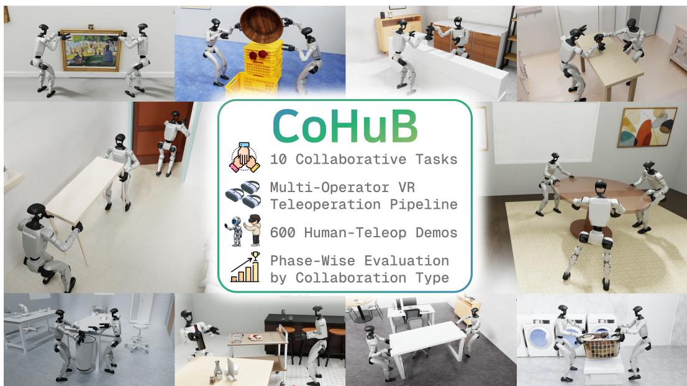  
Figure 1: Overview of COHUB. COHUB is a simulation benchmark for multi-humanoid collaboration, featuring 10 collaborative tasks with two or three humanoids, a multi-operator VR teleoperation pipeline for synchronized data collection, and phase-wise evaluation of policy performance.

## 1 INTRODUCTION

Humanoid robots provide a suitable platform for operating in human environments, where spaces, tools, and tasks are designed around human morphology and capabilities. Motivated by this potential, humanoid robot learning has advanced rapidly, with progress in whole-body control (Luo et al., 2026; Xue et al., 2025; Ze et al., 2026; Ben et al., 2025), foundation models (Bjorck et al., 2025; Wei et al., 2026a; Zheng et al., 2026), and simulation benchmarks (Sferrazza et al., 2024; Wei et al., 2026b; Wang et al., 2026). These advances have made humanoids increasingly capable, yet the field remains largely centered on single-robot settings, even though many physical tasks in human environments inherently require collaboration. For example, a long or heavy object may need to be held from multiple sides for stability, and someone with their hands full may need another person to open a door. Such collaboration is harder than single-robot manipulation: shared objects can transmit forces between robots, potentially disturbing their balance. Successful execution may also depend on roles and coordinated timing between agents.

Developing policies in such collaborative settings requires demonstrations to learn from and a shared environment for training and evaluation, both of which are especially costly and difficult to reproduce in the real world with multiple humanoids. Simulation offers a scalable and reproducible alternative. However, existing simulation benchmarks for humanoids focus on single-robot settings and do not evaluate collaboration among multiple humanoids (Sferrazza et al., 2024; Lin et al., 2026; Wei et al., 2026b; Wang et al., 2026), while existing multi-agent benchmarks with visual observations have primarily focused on non-humanoid, table-top manipulation (Qin et al., 2025).

To this end, we present COHUB (Collaborative Multi-Humanoid Benchmark), a simulation bench mark for multi-humanoid collaboration. Built on Isaac Lab (Mittal et al., 2025), COHUB features Unitree G1 humanoids equipped with Dex3-1 three-finger hands. COHUB includes 10 collaborative tasks: 8 tasks with two humanoids and 2 tasks with three humanoids, spanning diverse patterns of multi-humanoid collaboration. Each task is decomposed into sequential phases to identify collaboration-critical phases and evaluate policy performance at each phase. COHUB also provides human demonstrations collected through synchronized multi-operator VR teleoperation, where each operator controls one humanoid in a shared simulation from its egocentric view. We evaluate rep resentative standard and multi-agent imitation learning (IL) policies, alongside Vision-Language-Action (VLA) models and a World Action Model (WAM). We further examine how their performance changes across task phases and how multi-agent design choices affect the performance. We also test GPT-6 Astra (OpenAI, 2026) as an agentic robot policy in an exploratory evaluation.

The contributions of our work are summarized as follows:

• We introduce COHUB, a simulation benchmark for multi-humanoid collaboration under egocentric visual observations, featuring a diverse task suite and a phase-wise evaluation protocol for analyzing collaboration requirements across task phases.

• We develop a synchronized multi-operator VR teleoperation pipeline that connects multiple operators to a shared simulation and release the collaborative demonstrations collected through it.

• We evaluate representative visuomotor policies, analyze their performance across task phases, and investigate the effects of different multi-agent policy configurations.

## 2 RELATED WORK

Simulation Benchmarks for Robot Policy Learning. Simulation-based manipulation benchmarks have accelerated robot learning by providing scalable and reproducible environments for policy training and evaluation (Zhu et al., 2020; Yu et al., 2020; James et al., 2020; Lee et al., 2021; Mees et al., 2022; Liu et al., 2023). Subsequent benchmarks have expanded the range of embodiments and task settings they cover. PerAct2 (Grotz et al., 2024) and RoboTwin 2.0 (Chen et al., 2026b) target bimanual manipulation, while BiGym (Chernyadev et al., 2024) extends benchmarking to mobile manipulation. BEHAVIOR-1K (Li et al., 2022) and RoboCasa (Nasiriany et al., 2024) broaden it to diverse everyday activities in large-scale household environments. A growing line of benchmarks further considers humanoid embodiments and whole-body interaction, while remaining primarily single-agent (Sferrazza et al., 2024; Lin et al., 2026; Wei et al., 2026b; Wang et al., 2026). RoboFactory (Qin et al., 2025) extends simulation-based benchmarking to collaborative multi-agent settings with visual observations, but focuses on multi-arm embodiments and a narrow range of collaborative interactions. Table 1 summarizes these differences across representative benchmarks. Thus, humanoid and multi-agent benchmarking have largely evolved separately, with limited support for evaluating diverse forms of collaborative humanoid interaction.

Table 1: Comparison of representative simulation-based robot policy learning benchmarks. Whole-body indicates whether tasks require coordinated locomotion and manipulation using the whole body. Collaboration indicates whether multiple embodied agents must collaborate to accomplish a shared task. Human teleop demos indicates whether demonstrations collected through human teleoperation are provided. ✓yes, ✗no.
<table><tr><td>Benchmark</td><td>Embodiment # Agents</td><td></td><td>Whole- body</td><td>Collaboration</td><td>Human Teleop Demos</td></tr><tr><td>RLBench (James et al., 2020)</td><td>Manipulator</td><td>1</td><td>X</td><td>X</td><td>X</td></tr><tr><td>LIBERO (Liu et al., 2023)</td><td>Manipulator</td><td>1</td><td>X</td><td>X</td><td></td></tr><tr><td>RoboTwin 2.0 (Chen et al., 2026b)</td><td>Manipulator</td><td>1</td><td>X</td><td>X</td><td>X</td></tr><tr><td>BEHAVIOR-1K (Li et al., 2022)</td><td>Mobile manip.</td><td>1</td><td>x</td><td>X</td><td></td></tr><tr><td>HumanoidBench (Sferrazza et al., 2024) Humanoid</td><td></td><td>1</td><td>√</td><td>X</td><td>X</td></tr><tr><td>SIMPLE (Wei et al., 2026b)</td><td>Humanoid</td><td>1</td><td>√</td><td>X</td><td></td></tr><tr><td>HumanoidArena (Wang et al., 2026)</td><td>Humanoid</td><td>1</td><td></td><td>X</td><td></td></tr><tr><td>RoboFactory (Qin et al., 2025)</td><td>Manipulator</td><td>1-4</td><td>X</td><td></td><td>X</td></tr><tr><td>CoHuB (ours)</td><td>Humanoid</td><td>2-3</td><td></td><td></td><td></td></tr></table>

Multi-Robot Learning and Collaboration. Learning-based approaches have increasingly enabled multiple robots to collaborate toward shared goals. GauDP (Wang et al., 2025) studies centralized diffusion policies for multi-agent collaboration, while LatentToM (He et al., 2025) and MIMIC-D (Dong et al., 2026) focus on decentralized execution. CHORUS (Doshi et al., 2026) further extends this direction to pretrained Vision-Language-Action policies. These methods, however, are primarily demonstrated with manipulators rather than humanoid robots. Prior work has also explored collaboration among multiple humanoids. CooHOI (Gao et al., 2024) and TeamHOI (Lionar & Lee, 2026) use Multi-Agent Reinforcement Learning (MARL) for collaborative object transportation, but focus on physics-based humanoid characters with state-based observations. Meanwhile, Harmanoid (Liu et al., 2025) and Rhythm (Chen et al., 2026a) consider systems with two humanoid robots, but focus on tracking interactive whole-body paired motions, such as dancing or hugging, rather than learning task-oriented collaborative loco-manipulation. Together, these works suggest that task-oriented physical collaboration among multiple humanoid robots remains underexplored.

Robot Foundation Models and World Action Models. Recent robot foundation models have shown strong generalization across diverse manipulation tasks, objects, and environments (Kim et al., 2024; Black et al., 2025b;a). Humanoid-oriented foundation models have further extended this direction to humanoid loco-manipulation (Bjorck et al., 2025; Wei et al., 2026a). More recently, World Action Models (WAMs) have emerged as robot policies that leverage learned world dynamic for action generation (Ye et al., 2026; Kim et al., 2026; Yuan et al., 2026; Zheng et al., 2026). De spite these advances, both robot foundation models and WAMs have been developed and evaluated primarily in single-agent settings. It remains unclear whether humanoids controlled by these models can effectively collaborate with other humanoids and account for their partners’ behavior.

## 3 COHUB: A SIMULATION BENCHMARK FOR MULTI-HUMANOIDCOLLABORATION

In this section, we present COHUB, which aims to support demonstration collection, policy learning, and evaluation for multi-humanoid collaboration. We describe its simulated environment (§3.1), task design principles and taxonomy (§3.2), task suite (§3.3), multi-operator VR teleoperation system and dataset (§3.4), and evaluation protocol (§3.5).

## 3.1 BENCHMARK ENVIRONMENT

COHUB is built on Isaac Lab (Mittal et al., 2025), which runs on NVIDIA Isaac Sim. COHUB provides a unified environment across tasks, sharing the same humanoid embodiment, action and observation spaces, and data-recording pipeline. Tasks differ only in their scene assets and success criteria. Physics is simulated with PhysX at 200 Hz, agents are controlled at 50 Hz, and camera observations are rendered using Isaac Sim’s RTX ray-tracing renderer.

Scene assets and extensibility. Rather than authoring each environment from scratch, we instantiate task environments from publicly available simulation-ready scenes. These include scenes from SceneSmith (Pfaff et al., 2026), which generates simulation-ready indoor scenes from natural-language prompts. We keep scene assets decoupled from the robots and task logic, enabling new environments with lightweight adaptation, such as repositioning furniture or task-relevant objects.

Embodiment and action space. COHUB uses Unitree G1 humanoids equipped with Unitree Dex3- 1 three-finger hands. We select G1 as a widely adopted research platform with established wholebody control models, and Dex3-1 as a balance between grasp versatility and control complexity. Following the decoupled whole-body control interface used for G1 in GR00T (Bjorck et al., 2025; NVIDIA, 2026b), the upper body is commanded by joint targets, while a pretrained locomotion policy (Zhao et al., 2026) executes lower-body motion from a base command. Demonstrations and all baselines use the same per-agent interface across tasks.

Observation space. Each robot observes only its own egocentric RGB image and proprioception by default, together with a language instruction for VLA/WAM baselines. We choose this observation space to reflect onboard sensing available in real-world deployment and to evaluate collaboration from each humanoid’s egocentric view. The demonstrations also retain synchronized auxiliary observations and simulator signals, including third-person views, depth, object poses, object grasp status, and wrist force–torque measurements, which are excluded from default baseline training. Appendix A provides the full robot, controller, camera, and action specifications.

## 3.2 TASK DESIGN PRINCIPLES AND TAXONOMY

A benchmark for multi-humanoid collaboration should capture diverse forms of interaction. We therefore design our task suite along two dimensions: base movement and physical coupling, motivated by prior taxonomies of interactive and collaborative behaviors (Jarrassé et al., 2012; Krebs & Asfour, 2022). These axes describe the movement and physical interaction required by a task.

Base movement. Base movement describes how much the humanoids need to move from their initial positions during task execution. We classify a task as low base movement when it can be completed near the humanoids’ starting positions, with only small steps or local position adjustments. In contrast, high base movement tasks require one or more humanoids to walk to another part of the scene or move between spatially separated work areas as part of completing the task. For example, an interaction that can be completed while two humanoids stand near the same table is considered low base movement, whereas a task that requires carrying an object to another area of the room is considered high base movement.

Physical coupling. Physical coupling describes how much the humanoids must physically interact with the same object during a collaborative task. We classify a task as low coupling when simultaneous interaction is absent or only brief, and the humanoids perform most of their actions independently or in sequence. For example, in an object handover, both humanoids may briefly hold the object at the same time, but only during the transfer. In contrast, high coupling tasks require multiple humanoids to maintain simultaneous physical interaction with the same object for a sustained portion of the task. Since the humanoids manipulate the shared object at the same time, their motions remain physically linked through the object. Examples include jointly lifting, carrying, or aligning a large object, where sustained co-manipulation is required for task completion.

Together, these two dimensions define four task categories, with two tasks designed for each category, as illustrated in Figure 2. These categories do not imply that one is more difficult than another.

Physical Coupling  
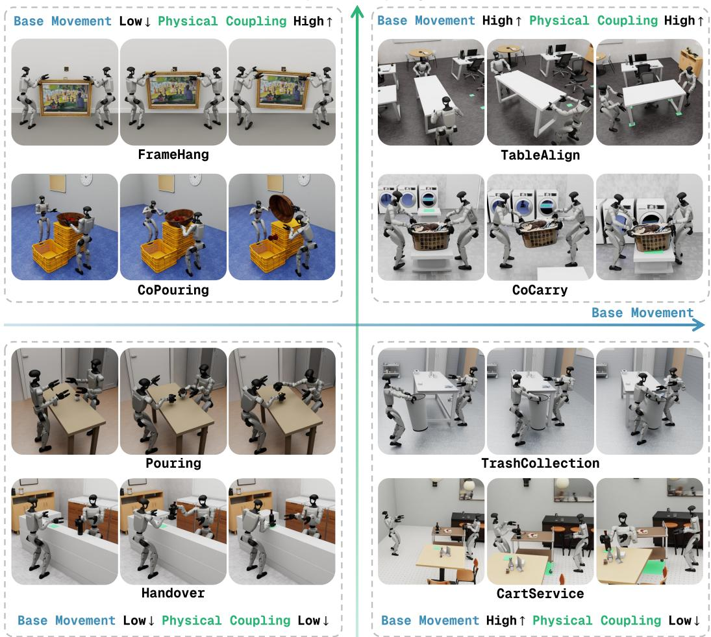  
Figure 2: The COHUB task taxonomy. The 8 tasks with two humanoids are organized by base movement (horizontal axis) and physical coupling (vertical axis), with two tasks in each quadrant. Each task is illustrated by three key frames ordered from left to right.

## 3.3 TASK SUITE

COHUB includes 8 tasks with two humanoids across the four categories and 2 additional tasks with three humanoids. Figures 5–7 in Appendix B show key frames of all 10 tasks.

Low base movement & Low physical coupling. In Handover, one humanoid transfers a bottle to its partner, which then places it at the target location. In Pouring, one humanoid pours a marble from a small cup into a glass held by its partner.

Low base movement & High physical coupling. In FrameHang, two humanoids jointly lift and align a large picture frame and hang it on a wall-mounted peg. In CoPouring, they lift a tub of apples together and tilt it to pour the apples into an empty crate.

High base movement & Low physical coupling. In TrashCollection, one humanoid carries a bin to the end of a table, where its partner sweeps a bottle into it. In CartService, one humanoid pushes a trolley to a table, while its partner retrieves a wine bottle from the trolley and places it on the table.

High base movement & High physical coupling. In CoCarry, two humanoids jointly carry a laundry basket to a target location while keeping it balanced. In TableAlign, they carry a table across the office, rotate it during transport, and place it aligned with a chair.

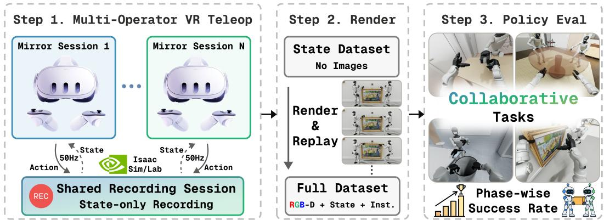  
Figure 3: COHUB pipeline. The multi-operator teleoperation system records synchronized state trajectories, which are replayed offline to render RGB-D observations and construct the full demon stration dataset for policy training and evaluation.

Tasks with three humanoids. In MoveHouse, one humanoid opens a door while the other two carry a table through the doorway and place it at the target location. In BigTable, all three humanoids jointly lift a large round table, carry it to the target location, and set it down together.

## 3.4 MULTI-OPERATOR VR TELEOPERATION AND DATASET

Collecting collaborative demonstrations with multiple operators requires synchronized control and low-latency feedback so that operators can react to one another in real time. However, recording multiple camera streams online can increase runtime overhead. To address these challenges, we develop a multi-operator VR teleoperation system that supports synchronized control while reducing online recording overhead.

Egocentric VR teleoperation. We extend Isaac Teleop (NVIDIA, 2026a) from its single-operator setting to support multiple operators, each controlling one humanoid from its egocentric view within a shared, synchronized simulation. The operators’ commands are applied together at each control step, enabling coordinated interaction with real-time visual feedback. During data collection, the VR interface displays the boundary of the humanoid’s onboard camera field of view to the operator, encouraging coordination based on visual information available to the policy during execution.

Multi-operator architecture and dataset construction. Our multi-operator teleoperation pipeline consists of two stages. During Step 1 in Figure 3, only states and actions are recorded online, avoiding the overhead of recording multiple camera streams. Each operator uses a separate local mirror session, since each headset requires its own Isaac Sim instance. The operator controls one humanoid through this session and receives its egocentric VR view. However, running physics independently in each mirror session could lead to inconsistent states across humanoids. We therefore run a single shared recording session to maintain synchronized physics and states across all humanoids. Each mirror synchronizes with the latest states from the shared session, while operator commands are sent back and applied together. During Step 2, the trajectories are replayed to render image observations, producing synchronized visual observations, states, and actions across humanoids. Across the 10 tasks, the resulting dataset contains 600 synchronized demonstrations, with 50 training and 10 validation demonstrations per task. In total, the dataset comprises 1,320 per-humanoid trajectories. Details on the train–validation split and validation usage are provided in Appendix B.4.

## 3.5 EVALUATION PROTOCOL

To support standardized comparison and failure analysis, we use two evaluation protocols: full-task rollouts for the main benchmark results and a phase-level evaluation for analyzing collaboration. Both protocols share the same success criteria.

Success criteria. Each task is divided into three sequential phases $( p _ { 1 }  p _ { 2 }  p _ { 3 } )$ , each with task-specific completion criteria based on robot and object states. For example, a phase may require an object to be lifted above a certain height, held by specific humanoids, or placed within a target region. A phase is considered successful only after all earlier phases have been completed, and task success is defined by completion of p . Detailed criteria for each task are listed in Table 6.

Table 2: Main benchmark results. Final task success rate (%) on the COHUB task suite, evaluated from the beginning of each task. Blue and green rows denote per-task and multi-task training, respectively. Best result per task and best average are in bold. The shaded Avg. columns average across tasks and Task avg. across policies. Phase-wise results are provided in Appendix D.
<table><tr><td></td><td colspan="8">2 Humanoids</td><td colspan="3">3 Humanoids</td></tr><tr><td>Method</td><td>Handover FrameHang</td><td>Pouring</td><td></td><td>CoPouring</td><td></td><td>TrashCollection CartService</td><td>CoCarry</td><td>TableAlign</td><td>Avg.</td><td>MoveHouse</td><td>BigTable Avg.</td></tr><tr><td colspan="10">Standard IL policies</td></tr><tr><td>ACT</td><td>65</td><td>1</td><td>44</td><td>9</td><td>1</td><td>3</td><td>61</td><td>39</td><td>27.9</td><td>9</td><td>44.5</td></tr><tr><td>DP</td><td>30</td><td>0</td><td>26</td><td>7</td><td>1</td><td>3</td><td>12</td><td>4</td><td>10.4</td><td>80 14</td><td>9.0</td></tr><tr><td colspan="10">Multi-agent IL policies</td></tr><tr><td>LatentToM†</td><td></td><td></td><td>2</td><td>1</td><td>0</td><td>0</td><td>31</td><td></td><td></td><td></td><td></td></tr><tr><td>GauDP</td><td>5 52</td><td>0 0</td><td>29</td><td>0</td><td>1</td><td>0</td><td>3 16</td><td>5.3 13.4</td><td>2</td><td>54</td><td>28.0</td></tr><tr><td colspan="10">Vision-Language-Action (VLA) models</td></tr><tr><td></td><td>2</td><td>0</td><td>27</td><td>0</td><td>0</td><td>4</td><td>1</td><td>2</td><td></td><td></td><td>20.0</td></tr><tr><td>π0.5 GR00T N1.7</td><td>27</td><td>0</td><td>44</td><td>0</td><td>1</td><td></td><td></td><td>4.5 9.4</td><td>3 0</td><td>37 5</td><td>2.5</td></tr><tr><td>Ψ₀</td><td></td><td>0</td><td>5</td><td>0</td><td>3</td><td>0 0</td><td></td><td>1.0</td><td>0</td><td>19</td><td>9.5</td></tr><tr><td colspan="10">0 World Action Models (WAMs)</td></tr><tr><td>Fast-WAM</td><td></td><td>7</td><td>28</td><td>11</td><td>1</td><td>0</td><td>31</td><td>17 12.1</td><td>20</td><td>69</td><td>44.5</td></tr><tr><td>Task avg.</td><td>2 22.9</td><td>1.0</td><td>25.6</td><td>3.5</td><td>1.0</td><td>1.3</td><td>18.4 10.3</td><td></td><td>5.4</td><td>39.7</td></tr></table>

† We evaluate LatentToM only on tasks with two robots, following the original paper’s experimental setup.

Main benchmark evaluation. For the main results in Table 2, each policy is trained with a single random seed, and the resulting checkpoint is evaluated over 100 rollouts per task. Each rollout starts from the beginning of the task in a fixed scene, with the humanoids initialized at fixed poses, while task object and target poses are sampled uniformly from task-specific ranges (Table 5). We record both task success and the completion of each phase.

Phase-level evaluation. We categorize each phase as either non-collaborative or collaborative, depending on whether its completion requires interaction between humanoids. For example, in FrameHang, grasping each side of the frame is non-collaborative, whereas jointly lifting the frame and aligning its loop with the wall-mounted peg is collaborative. To compare these phases while reducing the influence of failures accumulated earlier in the task, we conduct a separate phase-level evaluation. Unlike the main benchmark evaluation, this evaluation does not start from the beginning of the tasks. Each rollout starts from one of the 50 training demonstrations where the evaluated phase begins, yielding 50 rollouts per phase. The resulting average success rates of non-collaborative and collaborative phases are reported in Figure 4.

## 4 EXPERIMENTS

We now evaluate representative visuomotor policies on the COHUB task suite to assess their performance and identify challenges in multi-humanoid collaboration, along with an exploratory evaluation of an agentic robot policy. We first describe the baselines and experimental settings (§4.1), then present benchmark results with qualitative analysis (§4.2). Next, we compare the baselines performance across phases with different collaboration requirements (§4.3). Finally, we analyze how multi-agent design choices affect performance (§4.4).

## 4.1 EXPERIMENTAL SETUP AND BASELINES

Main baselines. We benchmark 8 visuomotor policies grouped into 4 representative categories. Standard IL includes Action Chunking with Transformer (ACT) (Zhao et al., 2023) and Diffusion Policy (DP) (Chi et al., 2025), and Multi-agent IL includes LatentToM (He et al., 2025) and GauDP (Wang et al., 2025). We use $\pi _ { 0 . 5 }$ (Black et al., 2025a), GR00T N1.7 (Bjorck et al., 2025), and $\Psi _ { 0 }$ (Wei et al., 2026a) for the VLAs, and Fast-WAM (Yuan et al., 2026) as the WAM baseline.

Training and evaluation settings. We use different training and execution configurations across policy families:

• Standard IL. ACT and DP are trained separately for each task and humanoid. At execution, each humanoid’s policy predicts its action from egocentric RGB and proprioception.

• Multi-agent IL. LatentToM uses centralized training and decentralized execution, with each policy observing its own egocentric observation and a shared third-person view. GauDP uses centralized training and execution, taking all agents’ egocentric observations as input and jointly predicting their actions.

• VLA and WAM. Each model is fine-tuned from a pretrained checkpoint in a multi-task setting, separately over the two- and three-humanoid task suites. All humanoids share the same policy parameters, and the policy is queried separately for each humanoid using its egocentric RGB image, proprioception, and agent-specific instruction.

Agentic robot policy. GPT-6 Astra (OpenAI, 2026) controls both humanoids using egocentric RGB images and proprioception, with access to depth queries at selected pixels. It outputs base, hand, and wrist commands. We allow a larger episode time budget to support reasoning and replanning.

Further details for all methods are provided in Appendix C.

## 4.2 OVERALL BENCHMARK RESULTS

Quantitative results. Table 2 summarizes overall success rates across tasks with two and three humanoids. Among the IL-based baselines, ACT achieves the strongest performance, substantially outperforming $\mathrm { D P }$ across most tasks. Despite explicitly modeling multi-agent interactions, Latent-ToM and GauDP achieve lower task success than ACT. Among the pretrained models, Fast-WAM achieves the highest average success rates. In contrast, the VLAs achieve relatively low success rates, suggesting that adapting pretrained VLAs to multi-humanoid collaboration remains challenging under our evaluated settings. Phase-wise success rates are provided in Appendix D.

Qualitative analysis. We further analyze policy rollouts to characterize recurring behaviors and failure modes beyond the predefined success metrics, revealing distinct failure patterns across tasks (Appendix E). For example, Handover yields the same 2% success rate for $\pi _ { 0 . 5 }$ and Fast-WAM despite different failure patterns. $\pi _ { 0 . 5 }$ often collides with its partner’s arm during the transfer $\left( p _ { 2 } \right)$ whereas Fast-WAM more often completes the transfer but fails to release the bottle $\left( p _ { 3 } \right)$ . CoCarry and TableAlign also exhibit a different pattern. VLAs often complete the joint lift $( p _ { 1 } )$ but drop the object during transport $\left( p _ { 2 } \right)$ , whereas Fast-WAM more often maintains its grasp but the two humanoids move inconsistently while carrying the object $\left( p _ { 2 } \right)$ . These cases show that COHUB requires both capable single-agent behavior and reliable multi-agent collaboration.

Agentic model evaluation. GPT-6 Astra’s performance varies substantially across two-humanoid tasks, with 70% on CoPouring and 10% on Pouring, while achieving no successes on the remaining tasks. Although its separate observation, control, and time-budget settings limit direct comparison with the trained baselines, this contrasting profile suggests different strengths and limitations from learned visuomotor policies. Details are provided in Appendix C.4.

## 4.3 HOW DOES PERFORMANCE DIFFER BETWEEN NON-COLLABORATIVE AND COLLABORATIVE PHASES?

To better understand the benchmark results, we compare policy performance across phases with different collaboration requirements using the phase-level evaluation described in Section 3.5. Figure 4 shows consistently lower success rates in collaborative phases than in non-collaborative phases across all policy families, suggesting that collaboration is associated with lower performance within our task suite. Specifically, LatentToM and GauDP achieve lower collaborative phase success rates (56.1% and 60.6%) than ACT (72.1%). Among the VLA and WAM baselines, Fast-WAM achieves the highest collaborative phase success rate (62.7%). Fast-WAM and $\pi _ { 0 . 5 }$ perform comparably on non-collaborative phases (76.8% vs. 76.6%), yet Fast-WAM outperforms $\pi _ { 0 . 5 }$ by 10.3 percentage points (62.7% vs. 52.4%) on collaborative phases. One possible explanation is that Fast-WAM’s video co-training may help capture temporal interaction dynamics (Yuan et al., 2026). We note that the observed differences may also reflect variations in phase difficulty.

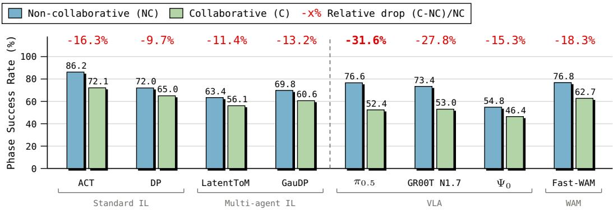  
Figure 4: Phase-level evaluation results. Average success rate on non-collaborative and collaborative phases over the 8 tasks with two humanoids. Each phase is evaluated from its beginning state in each of the same 50 demonstrations. The red numbers indicate the relative drops.

## 4.4 HOW DO MULTI-AGENT DESIGN CHOICES AFFECT PERFORMANCE?

Given that explicit multi-agent methods do not necessarily outperform standard IL baselines, we compare different configurations of ACT, DP, and GR00T N1.7, the best-performing VLA on the two-humanoid task suite. Following RoboFactory (Qin et al., 2025), we vary observation scope and whether policy parameters are shared across humanoids.

Observation scope. Local Observation uses the controlled humanoid’s egocentric RGB image and proprioception. Global Observation uses the egocentric RGB images and proprio-

Table 3: Effect of observation scope and policy sharing. Average task success rate (%) over the 8 tasks with two humanoids across different observation scopes and policy-sharing strategies.
<table><tr><td colspan="2"></td><td colspan="2">Standard IL</td><td>VLA</td></tr><tr><td>Obs. Scope Policy</td><td></td><td>ACT</td><td>DP</td><td>GR00T N1.7</td></tr><tr><td>Local</td><td>Separate</td><td>27.9</td><td>10.4</td><td>14.5</td></tr><tr><td>Local</td><td>Shared</td><td>23.9</td><td>9.5</td><td>9.4</td></tr><tr><td>Global</td><td>Separate</td><td>25.6</td><td>19.1</td><td>12.3</td></tr><tr><td>Global</td><td>Shared</td><td>26.4</td><td>16.0</td><td>9.0</td></tr></table>

ception of all humanoids, rather than an external-camera view as in RoboFactory’s Global View.

Policy. Separate Policies use distinct policy parameters for each humanoid, whereas a Shared Policy uses the same parameters for all humanoids.

Combining the two factors yields 4 configurations for each model (Table 3). For ACT and DP, no agent identifier is provided in the Local Observation + Shared Policy configuration. For GR00T N1.7, agent-specific instructions are provided in all configurations except Global Observation + Shared Policy, where a joint instruction is used. We compare these configurations within each model under matched data, training budgets, and evaluation conditions.

Results. For both ACT and DP, Local Observation + Shared Policy yields the lowest average success (23.9% and 9.5%) among the four configurations. This may reflect the difficulty of distinguishing between humanoids using only local observations without an explicit identifier, as discussed in RoboFactory (Qin et al., 2025). For DP, Global Observation improves performance under both policy settings (19.1% vs. 10.4% with Separate Policies, 16.0% vs. 9.5% with a Shared Policy). For GR00T N1.7, Separate Policies achieve higher average success than a Shared Policy under both Local Observation (14.5% vs. 9.4%) and Global Observation (12.3% vs. 9.0%). Local Observation also achieves higher success than Global Observation under both Separate Policies (14.5% vs. 12.3%) and a Shared Policy (9.4% vs. 9.0%). We hypothesize that these results may reflect distribution shift relative to GR00T N1.7’s pretraining setting. Specifically, a Shared Policy must handle different humanoid roles, while Global Observation provides multiple egocentric views, both of which differ from those seen during pretraining.

In summary, our findings show that the effects of observation scope and policy sharing vary across models, providing useful insights for future research in multi-humanoid collaboration.

## 5 CONCLUSION

In this work, we introduced COHUB, a simulation benchmark for multi-humanoid collaboration that covers diverse collaboration patterns, supports synchronized data collection through multi-operator VR teleoperation, and enables phase-wise analysis of collaborative performance. Our experiments show that current policies remain limited in multi-humanoid settings, with lower performance observed during collaborative phases. These results suggest that successful multi-humanoid collaboration requires policies that can better respond to other humanoids during interaction. We believe COHUB provides a reproducible platform for developing and evaluating policies across diverse patterns of multi-humanoid collaboration. Future work could expand the task suite to capture aspects of collaboration beyond our current taxonomy, such as explicit inter-agent communication and longhorizon tasks requiring high-level planning.

## AI USE STATEMENT

In this work, we used generative AI tools for proposing or refining hypotheses, designing or providing feedback on research methodology and experiments, and implementing methods. Additionally, we used generative AI tools for creating or editing software code, suggesting experimental parameters, creating or modifying scientific figures or images, drafting parts of a research paper, editing a research paper to improve readability, summarizing or analysing existing literature, identifying relevant literature, sourcing/searching for information, and proposing a title or keywords for a research paper. We have reviewed all AI-assisted work. We reviewed and tested AI-assisted code for correctness, and reviewed AI-assisted text for accuracy and consistency. We take responsibility for the final content of this work, including text, claims or artifacts produced with the aid of generative AI.

## REFERENCES

Qingwei Ben, Feiyu Jia, Jia Zeng, Junting Dong, Dahua Lin, and Jiangmiao Pang. HOMIE: Humanoid loco-manipulation with isomorphic exoskeleton cockpit. In Robotics: Science and Systems, 2025.

Johan Bjorck, Fernando Castañeda, Nikita Cherniadev, Xingye Da, Runyu Ding, Linxi Fan, Yu Fang, Dieter Fox, Fengyuan Hu, Spencer Huang, et al. GR00T N1: An open foundation model for generalist humanoid robots. arXiv preprint arXiv:2503.14734, 2025.

Kevin Black, Noah Brown, James Darpinian, Karan Dhabalia, Danny Driess, Adnan Esmail, Michael Robert Equi, Chelsea Finn, Niccolo Fusai, Manuel Y. Galliker, et al. π0.5: a visionlanguage-action model with open-world generalization. In Conference on Robot Learning, pp. 17–40. PMLR, 2025a.

Kevin Black, Noah Brown, Danny Driess, Adnan Esmail, Michael Equi, Chelsea Finn, Niccolo Fusai, Lachy Groom, Karol Hausman, Brian Ichter, et al. π : A vision-language-action flow model for general robot control. In Robotics: Science and Systems, 2025b.

Stéphane Caron, Yann De Mont-Marin, Rohan Budhiraja, Seung Hyeon Bang, Ivan Domrachev, Simeon Nedelchev, Peter Du, Adrien Escande, Joris Vaillant, Bruce Wingo, Santosh Patapati, Daniel San José Pro, and Nicolas Guillermo Marticorena Vidal. Pink: Python inverse kinematics based on Pinocchio, 2026. URL https://github.com/pink-kinematics/pink. Version 3.3.0.

Hongjin Chen, Wei Zhang, Pengfei Li, Shihao Ma, Ke Ma, Yujie Jin, Zijun Xu, Xiaohui Wang, Yupeng Zheng, Zining Wang, et al. Rhythm: Learning interactive whole-body control for dual humanoids. In Robotics: Science and Systems, 2026a.

Tianxing Chen, Zanxin Chen, Baijun Chen, Zijian Cai, Yibin Liu, Zixuan Li, Qiwei Liang, Xianliang Lin, Yiheng Ge, Zhenyu Gu, Weiliang Deng, Yubin Guo, Tian Nian, Xuanbing Xie, Qiangyu Chen, Kailun Su, Tianling Xu, Guodong Liu, Mengkang Hu, Huan-ang Gao, Kaixuan Wang,

Zhixuan Liang, Yusen Qin, Xiaokang Yang, Ping Luo, and Yao Mu. RoboTwin 2.0: A scalable data generator and benchmark with strong domain randomization for robust bimanual robotic manipulation. In Forty-third International Conference on Machine Learning, 2026b.

Nikita Chernyadev, Nicholas Backshall, Xiao Ma, Yunfan Lu, Younggyo Seo, and Stephen James. BiGym: A demo-driven mobile bi-manual manipulation benchmark. In Conference on Robot Learning, pp. 4201–4217. PMLR, 2024.

Cheng Chi, Zhenjia Xu, Siyuan Feng, Eric Cousineau, Yilun Du, Benjamin Burchfiel, Russ Tedrake, and Shuran Song. Diffusion policy: Visuomotor policy learning via action diffusion. The International Journal ofRobotics Research, 44(10-11):1684–1704, 2025.

Dayi Dong, Maulik Bhatt, Seoyeon Choi, and Negar Mehr. MIMIC-D: Multi-modal imitation for multi-agent coordination with decentralized diffusion policies. In IEEE International Conference on Robotics and Automation, 2026.

Ria Doshi, Tian Gao, Annie Chen, Chelsea Finn, and Jeannette Bohg. CHORUS: Decentralized multi-embodiment collaboration with one vla policy. arXiv preprint arXiv:2606.12352, 2026.

Jiawei Gao, Ziqin Wang, Zeqi Xiao, Jingbo Wang, Tai Wang, Jinkun Cao, Xiaolin Hu, Si Liu, Jifeng Dai, and Jiangmiao Pang. Coohoi: Learning cooperative human-object interaction with manipulated object dynamics. In Advances in Neural Information Processing Systems, pp. 79741– 79763, 2024.

Markus Grotz, Mohit Shridhar, Yu-Wei Chao, Tamim Asfour, and Dieter Fox. PerAct2: Benchmarking and learning for robotic bimanual manipulation tasks. In CoRL 2024 Workshop on Whole-body Control and Bimanual Manipulation: Applications in Humanoids and Beyond, 2024.

Chengyang He, Gadiel Sznaier Camps, Xu Liu, Mac Schwager, and Guillaume Sartoretti. Latent theory of mind: A decentralized diffusion architecture for cooperative manipulation. In Conference on Robot Learning, pp. 392–405. PMLR, 2025.

Kaiming He, Xiangyu Zhang, Shaoqing Ren, and Jian Sun. Deep residual learning for image recognition. In Proceedings of the IEEE conference on computer vision and pattern recognition, pp. 770–778, 2016.

Jonathan Ho, Ajay Jain, and Pieter Abbeel. Denoising diffusion probabilistic models. In Advances in neural information processing systems, volume 33, pp. 6840–6851, 2020.

Stephen James, Zicong Ma, David Rovick Arrojo, and Andrew J Davison. RLBench: The robot learning benchmark & learning environment. IEEE Robotics and Automation Letters, 5(2):3019– 3026, 2020.

Nathanaël Jarrassé, Themistoklis Charalambous, and Etienne Burdet. A framework to describe, analyze and generate interactive motor behaviors. PloS one, 7(11):e49945, 2012.

Moo Jin Kim, Karl Pertsch, Siddharth Karamcheti, Ted Xiao, Ashwin Balakrishna, Suraj Nair, Rafael Rafailov, Ethan P. Foster, Pannag R. Sanketi, Quan Vuong, Thomas Kollar, Benjamin Burchfiel, Russ Tedrake, Dorsa Sadigh, Sergey Levine, Percy Liang, and Chelsea Finn. Open-VLA: An open-source vision-language-action model. In Conference on Robot Learning, pp. 2679–2713. PMLR, 2024.

Moo Jin Kim, Yihuai Gao, Tsung-Yi Lin, Yen-Chen Lin, Yunhao Ge, Grace Lam, Percy Liang, Shuran Song, Ming-Yu Liu, Chelsea Finn, and Jinwei Gu. Cosmos Policy: Fine-tuning video models for visuomotor control and planning. In International Conference on Learning Representations, 2026.

Franziska Krebs and Tamim Asfour. A bimanual manipulation taxonomy. IEEE Robotics and Automation Letters, 7(4):11031–11038, 2022.

Youngwoon Lee, Edward S Hu, and Joseph J Lim. IKEA furniture assembly environment for longhorizon complex manipulation tasks. In IEEE International Conference on Robotics and Automation, 2021. URL https://clvrai.com/furniture.

Chengshu Li, Ruohan Zhang, Josiah Wong, Cem Gokmen, Sanjana Srivastava, Roberto Martín-Martín, Chen Wang, Gabrael Levine, Michael Lingelbach, Jiankai Sun, et al. BEHAVIOR-1K: A benchmark for embodied AI with 1,000 everyday activities and realistic simulation. In Conference on Robot Learning, pp. 80–93. PMLR, 2022.

Kevin Lin, Ajay Mandlekar, Caelan Reed Garrett, Nikita Chernyadev, Yu Fang, Runyu Ding, Yuqi Xie, Linxi Fan, and Yuke Zhu. HumanoidMimicGen: Data generation for loco-manipulation via whole-body planning and adaptation. In ICRA 2026 Workshop on Synthetic Data for Robot Learning, 2026.

Stefan Lionar and Gim Hee Lee. TeamHOI: Learning a unified policy for cooperative human-object interactions with any team size. In Proceedings ofthe IEEE/CVF Conference on Computer Vision and Pattern Recognition, pp. 37121–37132, 2026.

Bo Liu, Yifeng Zhu, Chongkai Gao, Yihao Feng, Qiang Liu, Yuke Zhu, and Peter Stone. LIBERO: Benchmarking knowledge transfer for lifelong robot learning. In Advances in Neural Information Processing Systems, volume 36, pp. 44776–44791, 2023.

Zuhong Liu, Junhao Ge, Minhao Xiong, Jiahao Gu, Bowei Tang, Wei Jing, and Siheng Chen. It takes two: Learning interactive whole-body control between humanoid robots. arXiv preprint arXiv:2510.10206, 2025.

Ilya Loshchilov and Frank Hutter. Decoupled weight decay regularization. In International Conference on Learning Representations, 2019.

Zhengyi Luo, Ye Yuan, Tingwu Wang, Chenran Li, Fernando Castañeda, Sirui Chen, Zi-Ang Cao, Jiefeng Li, David Minor, Qingwei Ben, et al. SONIC: Supersizing motion tracking for natural humanoid whole-body control. Science Robotics, 11(117):eaed4592, 2026.

Oier Mees, Lukas Hermann, Erick Rosete-Beas, and Wolfram Burgard. CALVIN: A benchmark for language-conditioned policy learning for long-horizon robot manipulation tasks. IEEE Robotics and Automation Letters, 7(3):7327–7334, 2022.

Mayank Mittal, Pascal Roth, James Tigue, Antoine Richard, Octi Zhang, Peter Du, Antonio Serrano-Muñoz, Xinjie Yao, René Zurbrügg, Nikita Rudin, et al. Isaac Lab: A GPU-accelerated simulation framework for multi-modal robot learning. arXiv preprint arXiv:2511.04831, 2025.

Soroush Nasiriany, Abhiram Maddukuri, Lance Zhang, Adeet Parikh, Aaron Lo, Abhishek Joshi, Ajay Mandlekar, and Yuke Zhu. RoboCasa: Large-scale simulation of household tasks for generalist robots. In Robotics: Science and Systems, 2024.

NVIDIA. Isaac Teleop: The unified framework for sim & real robot teleoperation. https:// github.com/NVIDIA/IsaacTeleop, 2026a.

NVIDIA. GR00T whole-body control: Decoupled whole-body controllers for humanoid locomanipulation. https://github.com/NVlabs/GR00T-WholeBodyControl, 2026b. Decoupled WBC models used in GR00T N1.5 and N1.6. Documentation: https://nvlabs.github.io/ GR00T-WholeBodyControl.

OpenAI. GPT-6 Astra system card. https://deploymentsafety.openai.com/gpt-6-astra, September 2026.

Nicholas Pfaff, Thomas Cohn, Sergey Zakharov, Rick Cory, and Russ Tedrake. SceneSmith: Agentic generation of simulation-ready indoor scenes. In Forty-third International Conference on Machine Learning, 2026.

Yiran Qin, Li Kang, Xiufeng Song, Zhenfei Yin, Xiaohong Liu, Xihui Liu, Ruimao Zhang, and Lei Bai. RoboFactory: Exploring embodied agent collaboration with compositional constraints. In 2025 IEEE/CVF International Conference on Computer Vision (ICCV), pp. 10075–10085. IEEE, 2025.

Carmelo Sferrazza, Dun-Ming Huang, Xingyu Lin, Youngwoon Lee, and Pieter Abbeel. HumanoidBench: Simulated humanoid benchmark for whole-body locomotion and manipulation. In Robotics: Science and Systems, 2024.

Jiaming Song, Chenlin Meng, and Stefano Ermon. Denoising diffusion implicit models. In International Conference on Learning Representations, 2021.

Team Wan, Ang Wang, Baole Ai, Bin Wen, Chaojie Mao, Chen-Wei Xie, Di Chen, Feiwu Yu, Haiming Zhao, Jianxiao Yang, Jianyuan Zeng, Jiayu Wang, Jingfeng Zhang, Jingren Zhou, Jinkai Wang, Jixuan Chen, Kai Zhu, Kang Zhao, Keyu Yan, Lianghua Huang, Mengyang Feng, Ningyi Zhang, Pandeng Li, Pingyu Wu, Ruihang Chu, Ruili Feng, Shiwei Zhang, Siyang Sun, Tao Fang, Tianxing Wang, Tianyi Gui, Tingyu Weng, Tong Shen, Wei Lin, Wei Wang, Wei Wang, Wenmeng Zhou, Wente Wang, Wenting Shen, Wenyuan Yu, Xianzhong Shi, Xiaoming Huang, Xin Xu, Yan Kou, Yangyu Lv, Yifei Li, Yijing Liu, Yiming Wang, Yingya Zhang, Yitong Huang, Yong Li, You Wu, Yu Liu, Yulin Pan, Yun Zheng, Yuntao Hong, Yupeng Shi, Yutong Feng, Zeyinzi Jiang, Zhen Han, Zhi-Fan Wu, and Ziyu Liu. Wan: Open and advanced large-scale video generative models. arXiv preprint arXiv:2503.20314, 2025.

Taowen Wang, Zikang Xie, Bin Yang, Yunheng Wang, Zizhao Yuan, Yuetong Fang, Yixiao Feng, Yichi Wang, Xingyu Chen, Haodong Chen, et al. HumanoidArena: Benchmarking egocentric hierarchical whole-body learning. arXiv preprint arXiv:2606.17833, 2026.

Ziye Wang, Li Kang, Yiran Qin, Jiahua Ma, Zhanglin Peng, Lei Bai, and Ruimao Zhang. GauDP: Reinventing multi-agent collaboration through gaussian-image synergy in diffusion policies. In Advances in Neural Information Processing Systems, volume 38, 2025. URL https://papers.neurips.cc/paper\_files/paper/2025/hash/ 0895de150660b6c2aef9b0f098cb1dcd-Abstract-Conference.html.

Songlin Wei, Hongyi Jing, Boqian Li, Zhenyu Zhao, Jiageng Mao, Zhenhao Ni, Sicheng He, Sheng Zang, Xiawei Liu, Kaidi Kang, Jie Liu, Weiduo Yuan, Marco Pavone, Di Huang, and Yue Wang. Ψ : An open foundation model towards universal humanoid loco-manipulation. In Robotics: Science and Systems, 2026a.

Songlin Wei, Zhenhao Ni, Jie Liu, Zhenyu Zhao, Junjie Ye, Hongyi Jing, Junkai Xia, Xiawei Liu, Michael Leong, Liang Heng, et al. SIMPLE: Simulation-based policy learning and evaluation for humanoid loco-manipulation. arXiv preprint arXiv:2606.08278, 2026b.

Haoru Xue, Xiaoyu Huang, Dantong Niu, Qiayuan Liao, Thomas Kragerud, Jan Tommy Gravdahl, Xue Bin Peng, Guanya Shi, Trevor Darrell, Koushil Sreenath, et al. LeVERB: Humanoid wholebody control with latent vision-language instruction. arXiv preprint arXiv:2506.13751, 2025.

Botao Ye, Sifei Liu, Haofei Xu, Xueting Li, Marc Pollefeys, Ming-Hsuan Yang, and Songyou Peng. No pose, no problem: Surprisingly simple 3D Gaussian splats from sparse unposed images. In International Conference on Learning Representations, 2025.

Seonghyeon Ye, Yunhao Ge, Kaiyuan Zheng, Shenyuan Gao, Sihyun Yu, George Kurian, Suneel Indupuru, You Liang Tan, Chuning Zhu, Jiannan Xiang, et al. World action models are zero-shot policies. arXiv preprint arXiv:2602.15922, 2026.

Tianhe Yu, Deirdre Quillen, Zhanpeng He, Ryan Julian, Karol Hausman, Chelsea Finn, and Sergey Levine. Meta-World: A benchmark and evaluation for multi-task and meta reinforcement learn ing. In Conference on Robot Learning, pp. 1094–1100. PMLR, 2020.

Tianyuan Yuan, Zibin Dong, Yicheng Liu, and Hang Zhao. Fast-WAM: Do world action models need test-time future imagination? arXiv preprint arXiv:2603.16666, 2026.

Yanjie Ze, Siheng Zhao, Weizhuo Wang, Angjoo Kanazawa, Rocky Duan, Pieter Abbeel, Guanya Shi, Jiajun Wu, and C. Karen Liu. TWIST2: Scalable, portable, and holistic humanoid data collection system. In IEEE International Conference on Robotics and Automation, 2026.

Huihua Zhao, Rafael Cathomen, Lionel Gulich, Wei Liu, Efe Arda Ongan, Michael Lin, Shalin Jain, Soha Pouya, and Yan Chang. AGILE: A comprehensive workflow for humanoid locomanipulation learning. arXiv preprint arXiv:2603.20147, 2026.

Tony Z. Zhao, Vikash Kumar, Sergey Levine, and Chelsea Finn. Learning fine-grained bimanual manipulation with low-cost hardware. In Robotics: Science and Systems, 2023.

Jia Zheng, Teli Ma, Yudong Fan, Zifan Wang, Shuo Yang, and Junwei Liang. MotionWAM: Towards foundation world action models for real-time humanoid loco-manipulation. arXiv preprint arXiv:2606.09215, 2026.

Yuke Zhu, Josiah Wong, Ajay Mandlekar, Roberto Martín-Martín, Abhishek Joshi, Kevin Lin, Abhiram Maddukuri, Soroush Nasiriany, and Yifeng Zhu. robosuite: A modular simulation framework and benchmark for robot learning. arXiv preprint arXiv:2009.12293, 2020.

## Appendix Table of Contents

A. Simulation Environment and Robot Setup . . 16   
A.1 Action Space and Control . 16   
A.2 Observations and Cameras . . 16   
B. Task and Dataset Specifications . . . 16   
B.1 Task Scenes and Randomization . . . 16   
B.2 Phase Definitions and Success Criteria . . . 20   
B.3 Language Instructions . . . 21   
B.4 Demonstration Split and Usage . . . 23   
C. Experimental Setup Details . . . . . 23   
C.1 Policy Inputs . . . 23   
C.2 Training Configurations . . . 24   
C.3 Rollout Evaluation . . . . 25   
C.4 Agentic Robot Policy Evaluation . . 25   
D. Phase-Wise Results . . . 26   
E. Collaboration Failure Cases . . . 28

## A SIMULATION ENVIRONMENT AND ROBOT SETUP

Table 4 summarizes the simulation settings and per-robot action and observation spaces.

Table 4: Shared simulation and robot settings. Robot count depends on the task; action and state dimensions are per robot.
<table><tr><td>Simulator</td><td>Isaac Sim 6.0.1 with Isaac Lab</td></tr><tr><td>Physics / env. control 200 Hz / 50 Hz</td><td></td></tr><tr><td>Robots</td><td>Two or three Unitree G1 humanoids, each with two Dex3-1 three-finger hands</td></tr><tr><td>Joint DoF</td><td>43: legs 12, waist 3, arms 14, and hands  $2 \times 7$ </td></tr><tr><td>Action space</td><td>35: upper-body joint targets 31 and base command 4</td></tr><tr><td>Proprioceptive state</td><td>43 joint positions (rad)</td></tr><tr><td>Egocentric camera</td><td>RGB-D, 320 × 240 (4:3), 102° horizontal field of view, 25°downward tilt</td></tr></table>

## A.1 ACTION SPACE AND CONTROL

The benchmark action space consists of 31 absolute joint targets (rad) for the arms, hands, and waist, and a base command $[ v _ { x } , v _ { y } , \omega _ { z } , h ]$ specifying robot-frame planar velocity (m/s), yaw rate (rad/s), and pelvis height (m). The 12 leg joints remain part of the state but are generated by a pretrained AGILE locomotion controller (Zhao et al., 2026) given the base command, rather than predicted directly by the task policy. Environment actions are applied at 50 Hz, with four physics steps per control step. Policy inference can produce multiple actions as a chunk.

During teleoperation, each robot instead receives a 32-D input: two wrist poses (14-D), hand joint targets (14-D), and the base command (4-D). Pink (Caron et al., 2026) converts the wrist poses into upper-body joint targets. These recorded targets and base commands provide the 35-D action labels for learning. During policy execution, the policy directly predicts joint targets, so inverse kinematics is not required. Model-specific input and output differences are described in Appendix C.

## A.2 OBSERVATIONS AND CAMERAS

The default policy observation consists of the controlled robot’s own egocentric RGB image and 43 joint positions, with a role-specific language instruction for language-conditioned models. The egocentric camera is positioned at the robot’s head-camera location, with the tilt chosen to include the hands and nearby partners. The dataset additionally records synchronized depth and third-person RGB images, robot and object poses, grasp states, and wrist wrenches. These additional signals are excluded from the default policy inputs.

## B TASK AND DATASET SPECIFICATIONS

COHUB includes 8 tasks with two humanoids and 2 tasks with three humanoids. This section specifies their scenes, randomization, phase criteria, language instructions, and the training–validation split of the collected demonstrations. Figures 5 and 6 show key frames of the tasks with two humanoids, split by base movement, and Figure 7 those of the tasks with three humanoids.

## B.1 TASK SCENES AND RANDOMIZATION

Each task uses a fixed scene adapted from SceneSmith (Pfaff et al., 2026).1 We retain each scene’s semantic setting while adjusting furniture placement and adding or adapting task objects. Table 5 summarizes the scene types, source IDs, task objects, and randomization of initial object poses and task targets during evaluation. In the source IDs, Room and House denote single-room and multi room scenes, respectively. At evaluation reset, offsets are sampled uniformly from the listed ranges relative to default poses in task coordinates.

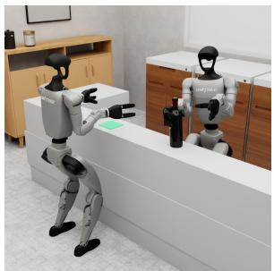

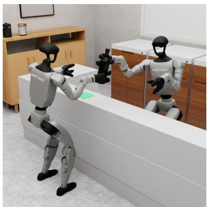  
(a) Handover

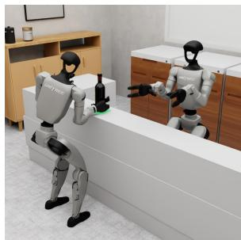

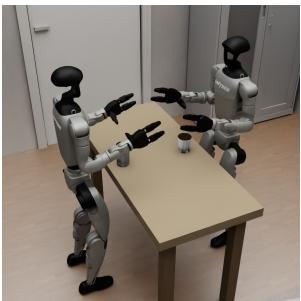

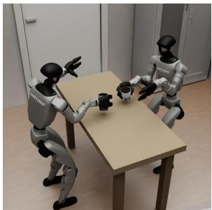  
(b) Pouring

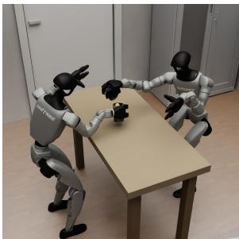

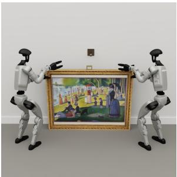

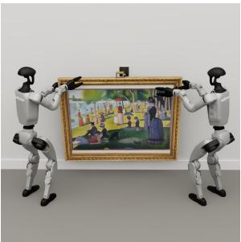  
(c) FrameHang

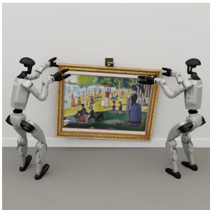

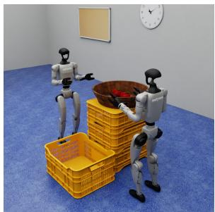

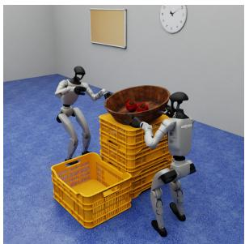  
(d) CoPouring

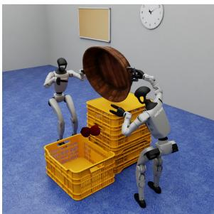  
Figure 5: Key frames of the COHUB tasks with two humanoids and low base movement. Each row shows three key frames of one demonstration, ordered from left to right. (a)–(b) show tasks with low physical coupling, and (c)–(d) show tasks with high physical coupling. (a) Handover: one humanoid hands a bottle to its partner, which places it on the target. (b) Pouring: one humanoid pours a marble from a small cup into a glass held by its partner. (c) FrameHang: two humanoids jointly lift a large picture frame and hang it on a wall-mounted peg. (d) CoPouring: two humanoids lift a tub of apples together and tilt it to pour the apples into an empty crate.

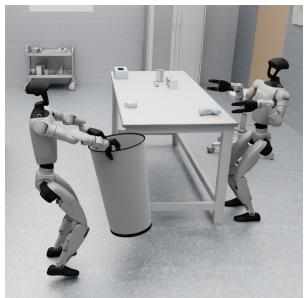

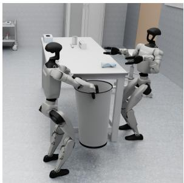  
(a) TrashCollection

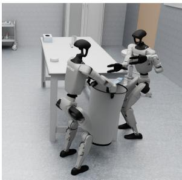

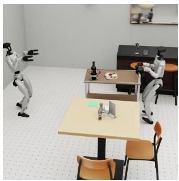

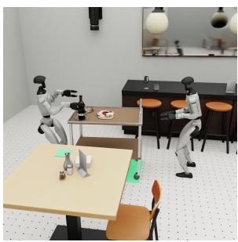  
(b) CartService

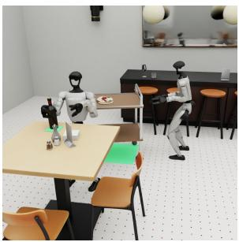

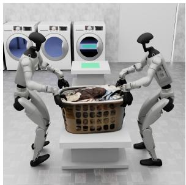

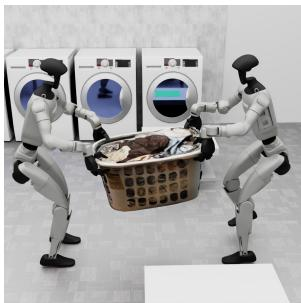  
(c) CoCarry

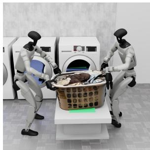

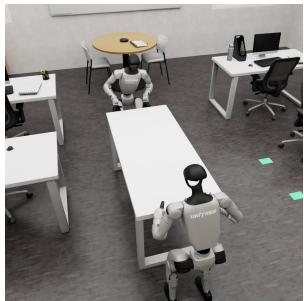

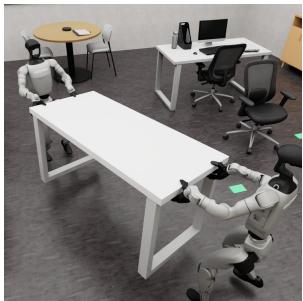  
(d) TableAlign

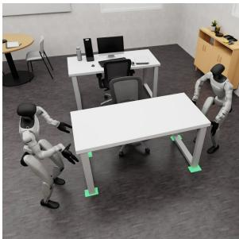  
Figure 6: Key frames of the COHUB tasks with two humanoids and high base movement. Each row shows three key frames of one demonstration, ordered from left to right. (a)–(b) show tasks with low physical coupling, and (c)–(d) show tasks with high physical coupling. (a) TrashCollection: one humanoid carries a bin to the end of a table, where its partner sweeps a bottle into it. (b) CartService: one humanoid pushes a trolley to a table, and its partner takes a wine bottle from the trolley and places it on the table. (c) CoCarry: two humanoids jointly carry a laundry basket to a shelf while keeping it balanced. (d) TableAlign: two humanoids carry a table across an office, rotate it during transport, and place it aligned with a chair.

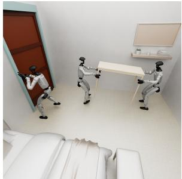

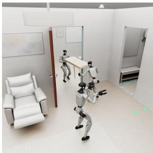  
(a) MoveHouse

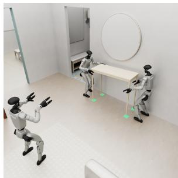

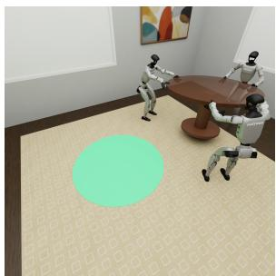

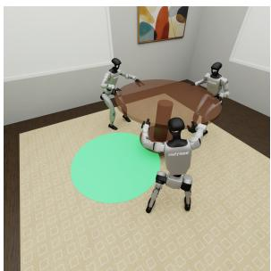  
(b) BigTable

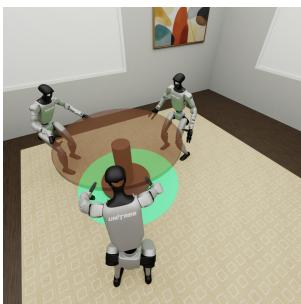  
Figure 7: Key frames of the COHUB tasks with three humanoids. Each row shows three key frames of one demonstration, ordered from left to right. (a) MoveHouse: one humanoid opens a door while the other two carry a table through the doorway and place it at the target location. (b) BigTable: all three humanoids jointly lift a large round table, carry it to the target location, and set it down together.

Table 5: Task scenes, objects, and randomization. Source IDs refer to the source dataset before task-specific adaptation. Translation offsets are in meters.
<table><tr><td>Task</td><td>Scene (source ID)</td><td>Task objects</td><td>Eval randomization</td></tr><tr><td>Handover</td><td>Kitchen Room/scene_084</td><td>Wine bottle; target pad</td><td>Bottle and target pad independently:  $x , y \in [ - 0 . 0 2 5 , \bar { 0 . 0 2 5 } ] .$ </td></tr><tr><td>Pouring</td><td>Kitchen Room/scene_085</td><td>marble</td><td>Cup, glass, and Cup and receiving glass independently:  $x \in [ - 0 . 0 3 , 0 . 0 3 ] , y \in [ - 0 . 0 6 , 0 . 0 6 ] ,$   $\mathrm { y a w \pm 3 0 ^ { \circ } } ;$  marble position within the cup:  $x , y \in \left[ - 0 . 0 0 6 , 0 . 0 0 6 \right]$ </td></tr><tr><td>FrameHang</td><td>Art gallery Room/scene_136</td><td>Framed painting; wall peg</td><td>Target peg and frame share  $x \in [ - 0 . 0 5 , 0 . 0 5 ]$  and wall depth  $y \in \left[ - 0 . 0 2 5 , 0 . 0 2 5 \right]$  ; target peg  $z \in [ - 0 . 0 4 , 0 ]$  ; extra frame offsets  $x \in [ - 0 . 0 3 , 0 . 0 3 ] , y \in [ - 0 . 0 1 , 0 . 0 1 ]$ </td></tr><tr><td>CoPouring</td><td>Grocery store Room/scene_102</td><td>Tub of apples; receiving crate</td><td>Tub:  $x \in [ - 0 . 0 2 , 0 . 0 2 ] .$   $y \in [ - 0 . 0 \dot { 1 } , 0 . 0 1 ]$  ; receiving crate (target), independently:  $x \in [ - 0 . 0 6 , \dot { 0 } . 0 6 ] , y \in [ - 0 . 0 0 5 , 0 . 0 0 5 ] ;$  apples relative to tub:  $x , y \in \left[ - 0 . 0 0 8 , 0 . 0 0 8 \right]$  . Supporting</td></tr><tr><td></td><td>TrashCollection Science laboratory Bin; plastic Room/scene_147</td><td>bottle on bench</td><td>stacks follow their containers. +y toward Robot A. Bin:  $x \in [ - 0 . 1 5 , 0 . 1 5 ] , y \in [ - 0 . 1 5 , - 0 . 0 4 ] .$   $\mathbf { B o t t l e } \colon x \in [ - 0 . 1 0 , 0 . 1 0 ]$   $y \in [ - 0 . 0 4 , \mathrm { { 0 . 1 2 } } ] .$ </td></tr><tr><td>CartService</td><td>Restaurant Room/scene_110</td><td>Service trolley; wine bottle</td><td> $+ y$  toward Robot A. Trolley and its  $\mathrm { c o n t e n t s : } \ x \in [ - 0 . 1 0 , 0 . 1 0 ] .$   $y \in [ - 0 . 3 0 , 0 . { \overset { \cdot } { 0 } } 8 ] . \operatorname { G o a l } \colon$   $y \in { \bigl [ } { - 0 . 1 6 , - 0 . { \dot { 1 } } 2 } { \bigr ] } .$ </td></tr><tr><td>CoCarry</td><td>Laundromat Room/scene_143</td><td>Laundry basket; Basket: goal shelf</td><td> $x , y \in [ - 0 . 0 5 , 0 . 0 5 ] .$ </td></tr><tr><td>TableAlign</td><td>Open-plan office Room/scene_115</td><td>Table; fixed goal Table: chair</td><td> $x , y \in [ - 0 . 0 5 , 0 . 0 5 ] .$ </td></tr><tr><td>MoveHouse</td><td>Home: bedroom and living room House/scene_098</td><td>Console table; lever-handle door</td><td>Table:  $x , y \in [ - 0 . 0 5 , 0 . 0 5 ] ;$  door initially closed and latched.</td></tr><tr><td>BigTable</td><td>Dining room Room/scene_046</td><td>Round pedestal table</td><td>Table:  $x , y \in [ - 0 . 0 4 , 0 . 0 4 ] , \mathrm { { y a w } \pm 4 ^ { \circ } }$ </td></tr></table>

## B.2 PHASE DEFINITIONS AND SUCCESS CRITERIA

Table 6 defines the three scored phases of each task. Each phase requires its predecessors, so a correct final object pose alone is insufficient for task success $\left( p _ { 3 } \right)$ . A robot is considered to hold an object when at least one of its hands satisfies the contact-based grasp detector, unless a particular hand is specified. Joint holding requires all designated robots to hold the object simultaneously.

For final placements in Handover, CartService, CoCarry, TableAlign, MoveHouse, and BigTable, the object must be within the task’s position tolerances, tilted at most 15◦ from upright, and not moving faster than 0.05 m/s linearly and 0.15 rad/s angularly. Release must last at least 0.2 s. FrameHang instead permits $3 5 ^ { \circ }$ tilt, 0.20 m/s, and 0.80 rad/s, with the same release duration.

Every task with two humanoids except CartService has at least one collaborative phase. In Cart-Service, all phases are non-collaborative, but the task as a whole is collaborative because Robot B retrieves the bottle from the trolley that Robot A delivers.

Table 6: Success criteria of each phase. Phases follow $p _ { 1 } \to p _ { 2 } \to p _ { 3 } ; p _ { 3 }$ denotes task success. Distances refer to the manipulated object unless otherwise stated. For the tasks with two humanoids, the non-collaborative and collaborative phases used in Figure 4 are shown in blue and green, respectively.
<table><tr><td>Task</td><td>Scored phases and conditions</td></tr><tr><td>Handover</td><td> ${ \bf { p _ { 1 } } }$  Grasp and lift:  $\mathrm { A } \ ' \mathrm { s }$  right hand holds the bottle at least 3 cm above its counter resting height.  $p _ { 2 }$  Transfer: A's and B's right hands hold it together, followed by  $\mathbf { B } ^ { \prime } \mathbf { s }$  right hand holding with both of A's hands off, without an intervening all-hands release.  $\mathbf { \mathit { p } _ { 3 } }$  Place: Released, stable, upright placement within ±6 cm of the target on each axis.</td></tr><tr><td>Pouring</td><td> ${ \bf { p _ { 1 } } }$  Lift both vessels: Cup and glass are simultaneously at least 3 cm above the worktop.  $\mathbf { \nabla } p _ { 2 }$  Tip: A holds the cup aloft and tilts it at least  $6 0 ^ { \circ }$   $p _ { 3 }$  Pour: The marble remains inside the glass continuously for 0.5 s, with the glass at least 3 cm above the worktop at completion. Returning the cup to the table is not required for success.</td></tr><tr><td>FrameHang</td><td> ${ \bf { p _ { 1 } } }$  Grasp: Both robots hold the frame.  $p _ { 2 }$  Lift: They hold it together at least 10 cm above its spawn height.  $p _ { 3 }$  Hang: The peg passes through the frame's loop while both robots hold the frame, which then remains threaded, stable, and released.</td></tr><tr><td>CoPouring</td><td> $p _ { 1 }$  Joint grasp and lift: Both robots hold the tub at least 3 cm above its stack.  $p _ { 2 }$  Tip: They hold it together at a tilt of at least  $2 5 ^ { \circ }$   $p _ { 3 }$  Pour: All apples are inside the receiving crate, with both robots still holding the tub.</td></tr><tr><td>TrashCollection</td><td> ${ \bf { p _ { 1 } } }$  Lift bin: A holds the bin at least 2 cm off the floor.  $\mathbf { \nabla } p _ { 2 }$  Deliver bin: A holds it aloft within 25 cm of the bench-side carry point, with its rim no more than 1 cm above the bench top.  $p _ { 3 }$  Sweep: The bottle is inside the bin, with A still holding the bin.</td></tr><tr><td>CartService</td><td> ${ \bf { p _ { 1 } } }$  Park: The trolley center reaches within 35 cm of the parking mark.  $\mathbf { \nabla } p _ { 2 }$  Lift bottle: B lifts the bottle from the trolley positioned by A to at least 10 cm above its spawn height.  $p _ { 3 }$  Serve: B carries it within 15 cm of the goal in the -- horizontal plane, then releases it in a stable, upright placement within ±6 cm of the goal on each axis.</td></tr><tr><td>CoCarry</td><td> $p _ { 1 }$  Joint grasp and lift: Both robots hold the basket with its base at least 3 cm above the shelf.  $p _ { 2 }$  Carry: Both hold it within the goal's ±15 cm horizontal bounds, with at least 1 cm base clearance above the shelf.  $p _ { 3 }$  Release: Stable placement within those bounds and ±6 cm of the target height, with all hands off.</td></tr><tr><td>TableAlign</td><td> $p _ { 1 }$  Joint grasp and lift: Both robots hold the table at least 3 cm above its standing height.  $p _ { 2 }$  Carry: Both hold it inside the goal region with every foot bar at least 1 cm off the floor.  $p _ { 3 }$  Align: Released, stable placement with the 1 table center 33.5–46.5 cm in front of the chair, within ±13 cm laterally and ±4 cm of standing height, and square to the chair within  $4 ^ { \circ }$ </td></tr><tr><td>MoveHouse</td><td> $p _ { 1 }$  Lift and open: B and C jointly lift every table foot at least 3 cm off the floor, and A opens the door to at least 1.45 rad  $( \approx 8 3 ^ { \circ } )$  for 0.5 s. These two milestones may occur in either order.  $p _ { 2 }$  Pass doorway: Table and both carriers pass the doorway clearance plane together, with B and C holding and the feet off the floor.  $p _ { 3 }$  Place: B and C carry the table within 15 cm of the goal while holding it aloft, then release it stably with each foot within its 10 cm-square mark and</td></tr><tr><td>BigTable</td><td>height within  $\pm 4$  cm of standing height.  $p _ { 1 }$  Three-robot grasp and lift: All three robots hold the table with the pedestal foot at least 3 cm off the floor.  $p _ { 2 }$  Carry: All three hold it with the entire pedestal foot over the goal disc and at least 1 cm floor clearance.  $p _ { 3 }$  Release: The pedestal foot remains within the disc, with stable, upright, released placement within ±5 cm of standing height.</td></tr></table>

## B.3 LANGUAGE INSTRUCTIONS

Each task provides a joint instruction and one role-specific instruction per robot: three strings for a two-robot task and four strings for a three-robot task. Language-conditioned baselines generally use the corresponding role-specific instruction. In the multi-agent design study, GR00T N1.7 instead uses the joint instruction in the Global Observation + Shared Policy configuration. Table 7 lists all instruction strings without abbreviation.

Table 7: Language instructions provided by the benchmark. Joint denotes the shared instruction. Robot A, B, and C denote the corresponding robot’s instruction.
<table><tr><td>Role</td><td>Instruction</td></tr><tr><td colspan="2">Handover</td></tr><tr><td>Joint</td><td>Pass the bottle directly from Robot A's right hand to Robot B's right hand, then place it on the target.</td></tr><tr><td>RobotA</td><td>Pick up the bottle directly in front of you with your right hand and hand it to your partner's right hand.</td></tr><tr><td>Robot B</td><td>Receive the bottle with your right hand, place it on the target directly in front of you, and release it.</td></tr><tr><td colspan="2">Pouring</td></tr><tr><td>Joint</td><td>Pour the marble from the small cup into the glass the other robot is holding in the air.</td></tr><tr><td>RobotA</td><td>Take the squat drinking cup in front of you round its body, hold it over the mouth of your partner's glass and tip it until the marble drops into the glass, then set the cup back on the table.</td></tr><tr><td>Robot B</td><td>Take the tall glass in front of you round its body, lift it off the table, and hold it out upright and still under your partner's cup until the marble is in it.</td></tr><tr><td colspan="2">FrameHang</td></tr><tr><td>Joint</td><td>Lift the framed painting off the floor together, hang the loop on its top rail on the wall peg, and let go once it is hanging square.</td></tr><tr><td>RobotA</td><td>Take the left edge of the frame's moulding with one hand, lift level with your partner, guide the loop onto the peg, and release once it is seated.</td></tr><tr><td>Robot B</td><td>Take the right edge of the frame's moulding with one hand, lift level with your partner, guide the loop onto the peg, and release once it is seated.</td></tr><tr><td colspan="2">CoPouring</td></tr><tr><td>Joint Robot A</td><td>Lift the tub of apples together and pour all of them into the empty crate beside you. Take the bar at your end of the tub with one hand, lift it level with your partner, and</td></tr><tr><td>Robot B</td><td>tip it together into the empty crate on your left until all the apples are in it. Take the bar at your end of the tub with one hand, lift it level with your partner, and</td></tr><tr><td></td><td>tip it together into the empty crate on your right until all the apples are in it.</td></tr><tr><td colspan="2">TrashCollection</td></tr><tr><td>Joint</td><td>Bring the bin to the bench and sweep the bottle off the bench into it.</td></tr><tr><td>Robot A Robot B</td><td>Bend and take the tall bin in both hands, carry it upright straight ahead to the end of your partner's bench, and hold it there with its rim just below the bench top. Wait at the bench. When the bin is at the end of it, sweep the plastic bottle lying</td></tr><tr><td></td><td>between your hands along the surface and over that end into the bin; it rolls, so push straight and keep it off the near edge.</td></tr><tr><td colspan="2">CartService</td></tr><tr><td>Joint</td><td>Push the loaded service trolley down the aisle to the green mark on the floor, then take the wine off it and stand the bottle on the green patch on the table.</td></tr><tr><td>Robot A</td><td>Take the push bar of the trolley in front of you with both hands and push it straight down the aisle until it stands on the green rectangle painted on the floor.</td></tr><tr><td>Robot B</td><td>Walk up the aisle to meet the trolley and stand square in front of its near edge; take the wine bottle around the glass just above the steel ring it stands in, lift it straight up out of the ring, then step round to your right to the near edge of the table and stand it</td></tr><tr><td colspan="2">CoCarry</td></tr><tr><td>Joint</td><td>Carry the laundry basket together and set it down level on the green patch on the far shelf.</td></tr><tr><td>Robot A</td><td>Hold your side of the basket with both hands and side-step to your right, keeping it level, until it rests on the green patch. Hold your side of the basket with both hands and side-step to your left, keeping it</td></tr><tr><td>Robot B</td><td>level, until it rests on the green patch.</td></tr><tr><td colspan="2">TableAlign</td></tr><tr><td>Joint</td><td>Carry the table to the chair together and set it down square to it. Take your end of the table with both hands, lift level with your partner, and side-step</td></tr><tr><td>RobotA</td><td>to your right down the room, turning the table a quarter circle together as you go, until it stands on the green patch with the chair tucked into its long edge.</td></tr><tr><td>Robot B</td><td>Take your end of the table with both hands, lift level with your partner, and side-step to your left down the room, turning the table a quarter circle together as you go, until it stands on the green patch with the chair tucked into its long edge.</td></tr><tr><td colspan="2">MoveHouse</td></tr><tr><td>Joint</td><td>One robot opens the door and stands clear while the other two carry the table out of the bedroom, through the doorway, and into the living room.</td></tr><tr><td>Robot A</td><td>Walk to the door, take the lever, push the door wide open, and stand out of the lane so your partners and their table can pass.</td></tr><tr><td>Robot B</td><td>Take the two legs at your end of the table, one in each hand, lift level with your partner, and lead it backwards through the open doorway until its four legs stand on the green squares.</td></tr><tr><td>Robot C</td><td>Take the two legs at your end of the table, one in each hand, lift level with your partner, and follow them forwards through the open doorway until its four legs stand on the green squares.</td></tr><tr><td colspan="2">BigTable</td></tr><tr><td>Joint</td><td>All three robots lift the round table together and carry it to the marked spot.</td></tr><tr><td>Robot A</td><td>Take the edge of the table in front of you with both hands, lift on the count, and walk it straight forward to the green disc, keeping it level.</td></tr><tr><td>Robot B</td><td>Take the edge of the table in front of you with both hands, lift on the count, and walk it backwards and to your right to the green disc, keeping it level.</td></tr><tr><td>Robot C</td><td>Take the edge of the table in front of you with both hands, lift on the count, and walk it backwards and to your left to the green disc, keeping it level.</td></tr></table>

## B.4 DEMONSTRATION SPLIT AND USAGE

Each task contains 60 demonstrations, of which the first 50 in collection order are used for training and the remaining 10 for validation. The same split is used across all baselines. Validation demonstrations are used only to monitor validation loss during training and are excluded from gradient updates.

## C EXPERIMENTAL SETUP DETAILS

## C.1 POLICY INPUTS

ACT and DP are trained separately for each task and robot. The VLA and WAM policies instead share parameters across robot roles and tasks, with separate training on the two- and three-humanoid task suites. ACT, DP, $\pi _ { 0 . 5 } ,$ , GR00T N1.7, and Fast-WAM condition on the controlled robot’s egocentric RGB image and 43 joint positions. $\Psi _ { 0 }$ instead uses its native 32-D state, which consists of the 31 arm, hand, and waist joint positions and the most recent base-height command, without the leg joints. LatentToM jointly trains two policies, each using its own egocentric image and proprioception together with a shared third-person RGB view, while the policies execute independently. GauDP jointly processes the agents’ egocentric views and concatenated proprioception to predict their joint actions. Its Gaussian encoder additionally uses recorded depth and camera geometry during training, but these signals are not required at policy inference. Thus, LatentToM and GauDP have additional observation or training information that must be accounted for when comparing them with the egocentric-only baselines.

## C.2 TRAINING CONFIGURATIONS

Table 8 summarizes the training recipes. Batch sizes are global batch sizes, including gradient accumulation where used. Epoch-based budgets are reported as epochs because their optimizer-step counts depend on the task’s trajectory lengths. For evaluation, we use the last training checkpoint.

Table 8: Baseline training configurations. Budgets refer to policy training; GauDP’s Gaussian encoder is trained separately as described below. Peak LR denotes the maximum learning rate. Band shading follows Table 2: blue for the families trained separately per task, green for the VLA and WAM families trained jointly across tasks.
<table><tr><td>Policy</td><td>Network initialization and training</td><td>Batch</td><td>Budget</td><td>Peak LR</td></tr><tr><td colspan="5">Standard IL policies</td></tr><tr><td>ACT</td><td>Pretrained vision encoder; encoder finetuning and transformer training</td><td>256</td><td>600 epochs</td><td> $1 0 ^ { - 4 }$ </td></tr><tr><td>DP</td><td>From scratch; full policy training</td><td>256</td><td>600 epochs</td><td> $1 0 ^ { - 4 }$ </td></tr><tr><td colspan="5">Multi-agent IL policies</td></tr><tr><td>LatentToM</td><td>From scratch; joint training of two policies</td><td>32</td><td>1,000 epochs</td><td> $1 0 ^ { - 4 }$ </td></tr><tr><td>GauDP</td><td>Pretrained Gaussian encoder; encoder finetuning, then diffusion policy training</td><td>128</td><td>150 epochs</td><td> $1 0 ^ { - 4 }$ </td></tr><tr><td colspan="5">Vision-Language-Action (VLA) models</td></tr><tr><td>π0.5</td><td>Pretrained VLA; LoRA finetuning</td><td>32</td><td>40,000 steps</td><td> $2 . 5 \times 1 0 ^ { - 5 }$ </td></tr><tr><td>GR00T N1.7</td><td>Pretrained VLA; LoRA finetuning</td><td>32</td><td>40,000 steps</td><td> $2 . 5 \times 1 0 ^ { - 5 }$ </td></tr><tr><td> $\Psi _ { 0 }$ </td><td>Pretrained VLA; LoRA finetuning</td><td>32</td><td>40,000 steps</td><td> $2 . 5 \times 1 0 ^ { - 5 }$ </td></tr><tr><td colspan="5">World Action Models (WAMs)</td></tr><tr><td>Fast-WAM</td><td>Pretrained video backbone; LoRA finetuning</td><td>32</td><td>40,000 steps</td><td> $1 0 ^ { - 4 }$ </td></tr></table>

Standard IL policies. ACT uses an ImageNet-pretrained ResNet-18 (He et al., 2016) as its vision encoder and predicts actions in chunks of 50 steps. Training uses a constant learning rate, and temporal aggregation is disabled at inference. DP uses a ResNet-18 vision encoder trained from scratch and a DDPM (Ho et al., 2020) with 100 diffusion steps during both training and inference. It predicts 40 actions and executes the first 20 before replanning. Images are resized to $3 2 0 \times 2 4 0$ with 288 × 216 random crops during training and center crops at inference. Its learning rate follows a cosine schedule after 500 warmup steps.

Multi-agent IL policies. LatentToM uses a sheaf-consistency loss with weight 0.5 to couple its two policies during training. Its diffusion scheduler is DDIM (Song et al., 2021), with 100 training and inference steps. GauDP first finetunes a shared NoPoSplat (Ye et al., 2025) pretrained encoder on the two- and three-humanoid task suites for up to 10 and 8 epochs, respectively, using batch size 8. The encoder is then frozen, Gaussian features are cached, and a separate DDPM policy is trained for each task. Both methods use EMA and a single observation step, predicting 40 actions and executing 20 at each inference step. During training, both add Gaussian proprioceptive noise with standard deviation 0.02 times half of each dimension’s demonstration range.

Vision-Language-Action (VLA) models. All three VLAs are fine-tuned with the same recipe. We apply LoRA to the LLM backbone (rank 16, α=16) and to the action head (rank 32, $\alpha { = } 3 2 )$ of all three models, while the vision encoder is fully fine-tuned and the remaining backbone weights are frozen. We use the AdamW optimizer (Loshchilov & Hutter, 2019) with momentum coefficients $( \beta _ { 1 } , \beta _ { 2 } ) = ( 0 . 9 , 0 . 9 5 )$ and weight decay $1 0 ^ { - 1 0 }$ . Gradients are clipped to a maximum norm of 1.0. After 1,000 warmup steps, the learning rate follows a cosine decay from $2 . 5 \times 1 0 ^ { - 5 } \mathrm { t o } 2 . 5 \times 1 0 ^ { - 6 }$ Each policy conditions on a single-frame observation and predicts an action chunk that is executed in full before replanning: 50 steps for $\pi _ { 0 . 5 }$ , 40 for GR00T N1.7, and 30 for $\Psi _ { 0 }$

World Action Model (WAM). Fast-WAM initializes its video expert from Wan2.2 (Wan et al., 2025) and fine-tunes it using LoRA (rank 128, $\alpha = 6 4 )$ , while fully training the action expert. It uses a 32-action prediction horizon and a cosine learning-rate schedule.

## C.3 ROLLOUT EVALUATION

The benchmark evaluation uses 100 rollouts per policy and task, with matched environment seeds 1–100. Initial object and target poses are sampled according to the ranges specified in Appendix B.1. At 50 Hz, the episode limits are 1,000 control steps (20 s) for most tasks, 1,100 (22 s) for TableAlign, 1,500 (30 s) for MoveHouse, and 2,000 (40 s) for CartService. Each rollout records overall success and the cumulative phase outcomes defined in Appendix B.2.

## C.4 AGENTIC ROBOT POLICY EVALUATION

Policy and observations. We evaluate GPT-6 Astra (OpenAI, 2026) zero-shot, without training on COHUB data or replaying demonstrations. A fresh Codex session is created for each episode, with high reasoning effort and a task-specific instruction describing the robots’ roles and the control interface.

One centralized policy controls both humanoids, receiving their egocentric RGB images and proprioception, including 43 joint positions per robot and measured wrist poses. Depth is accessed only through pixel-wise queries at selected image locations. Wrist poses and camera calibration are expressed in each robot’s own pelvis frame. No simulator-provided object poses are exposed.

Control and feedback. Within each episode, Astra repeatedly inspects both robots’ egocentric images and state, outputs commands for the two robots, and examines the resulting observations and execution feedback before deciding its next action.

It interacts with the simulator by calling Python helper functions that provide robots’ egocentric observations, accept commands for robots, and return execution feedback through local JSON files. A single Codex session maintains the conversation history across these interactions, allowing Astra to revise its plan based on earlier actions and feedback.

Astra directly outputs seven finger joint-angle targets per hand, body-frame planar base velocities, yaw rate, and a pelvis-height target. For wrist position and orientation, Astra outputs wrist pose targets rather than joint-angle targets. Pink (Caron et al., 2026) solves the coordinated arm and waist motion from the target pose. A Python helper is provided to aid conversion from target pose into joints, using Pink.

Wrist targets are transformed from the observed pelvis frame and held fixed during execution, so walking does not automatically carry the hands along; Astra needs to move the wrist targets accordingly. Measured wrist errors and joint-limit violations are given as feedback to support replanning and within-episode recovery.

Evaluation protocol. Actions execute in chunks of at most 25 control steps at 50 Hz, excluding policy reasoning time. Each episode allows 6,000 steps (120 s) including a 300-step initialization hold, and a 30-minute policy wall-clock budget. Environment steps are not computed during policy reasoning. Each task is evaluated over 10 episodes with environment seeds 0–9.

Results. Tables 9 and 10 report phase-wise success rates for the 8 two-humanoid tasks. Astra succeeds in 70% of CoPouring and 10% of Pouring, but records no successful episodes on the remaining tasks.

Table 9: Astra phase-wise success rates (%) on tasks with two humanoids and low base movement. Phases are defined in Appendix $\mathrm { { B } } ; p _ { 3 }$ is full-task success.
<table><tr><td>Method</td><td colspan="3">Handover</td><td colspan="3">Pouring</td><td colspan="3">FrameHang</td><td colspan="3">CoPouring</td></tr><tr><td></td><td>p1</td><td>p2</td><td>p3</td><td>p1</td><td>p2</td><td>p3</td><td>p1</td><td>p2</td><td>p3</td><td>p1</td><td>p2</td><td>p3</td></tr><tr><td>GPT-6 Astra</td><td>10</td><td>0</td><td>0</td><td>90</td><td>80</td><td>10</td><td>100</td><td>60</td><td>0</td><td>100</td><td>70</td><td>70</td></tr></table>

Table 10: Astra phase-wise success rates (%) on tasks with two humanoids and high base movement. Phases are defined in Appendix B; p3 is full-task success.
<table><tr><td rowspan="2">Method</td><td colspan="3">TrashCollection</td><td colspan="3">CartService</td><td colspan="3">CoCarry</td><td colspan="3">TableAlign</td></tr><tr><td>p1</td><td>p2</td><td>p3</td><td>p1</td><td>p2</td><td>p3</td><td>p1</td><td>p2</td><td>p3</td><td>p1</td><td>p2</td><td>p3</td></tr><tr><td>GPT-6 Astra</td><td>90</td><td>0</td><td>0</td><td>70</td><td>0</td><td>0</td><td>40</td><td>0</td><td>0</td><td>80</td><td>10</td><td>0</td></tr></table>

## D PHASE-WISE RESULTS

We report cumulative success rates for the three phases $p _ { 1 }  p _ { 2 }  p _ { 3 } .$ , defined per task in Appendix B.2. Tables 11 and 12 cover tasks with two humanoids, split by base movement, and Table 13 covers tasks with three humanoids. Blue and green family bands denote per-task and multitask training, respectively. For the tasks with two humanoids, the phase headings are colored as in Table 6: green for collaborative and blue for non-collaborative phases.

Table 11: Phase-wise success rates (%) on tasks with two humanoids and low base movement. Phases are defined in Appendix B; p is full-task success.
<table><tr><td>Method</td><td colspan="3">Handover</td><td colspan="3">Pouring</td><td colspan="3">FrameHang</td><td colspan="3">CoPouring</td></tr><tr><td></td><td> $_ { p _ { 1 } }$ </td><td>p2</td><td>p3</td><td> $_ { p _ { 1 } }$ </td><td>p2</td><td>p3</td><td> $_ { p _ { 1 } }$ </td><td>p2</td><td>p3</td><td>p1</td><td>p2</td><td>p3</td></tr><tr><td colspan="9">Standard IL policies</td><td></td><td></td><td></td><td></td></tr><tr><td>ACT</td><td>100</td><td>98</td><td>65</td><td>95</td><td>93</td><td>1</td><td>100</td><td>100</td><td>44</td><td>33</td><td>32</td><td>9</td></tr><tr><td colspan="9">DP</td><td>26</td><td>21</td><td>18</td><td>7</td></tr><tr><td>Multi-agent IL policies</td><td></td><td></td><td></td><td></td><td></td><td></td><td></td><td>73</td><td></td><td></td><td></td><td></td></tr><tr><td colspan="9">LatentToM 77 23</td><td>13</td><td></td><td>10</td><td>1</td></tr><tr><td>GauDP</td><td>92</td><td>85</td><td>5 52</td><td>48 29</td><td>41 28</td><td>0 0</td><td>58 81</td><td>24 76</td><td>2 29</td><td>0</td><td>0</td><td>0</td></tr><tr><td colspan="9">Vision-Language-Action (VLA) models</td><td></td><td></td><td></td><td></td></tr><tr><td>π0.5</td><td>92</td><td>12</td><td>2</td><td>58</td><td>54</td><td>0</td><td>91</td><td>86</td><td>27</td><td>1</td><td>1</td><td>0</td></tr><tr><td>GR00T N1.7</td><td>95</td><td>77</td><td>27</td><td>63</td><td>59</td><td>0</td><td>94</td><td>90</td><td>44</td><td>2</td><td>2</td><td>0</td></tr><tr><td>Ψ₀</td><td>65</td><td>8</td><td>0</td><td>24</td><td>18</td><td>0</td><td>62</td><td>53</td><td>5</td><td>1</td><td>0</td><td>0</td></tr><tr><td colspan="9">World Action Models (WAMs)</td><td></td><td></td><td></td><td></td></tr><tr><td>Fast-WAM</td><td>98</td><td>62</td><td>2</td><td>86</td><td>84</td><td>7</td><td>97</td><td>94</td><td>28</td><td>28</td><td>25</td><td>11</td></tr></table>

Table 12: Phase-wise success rates (%) on tasks with two humanoids and high base movement. Phases are defined in Appendix $\mathrm { { B } ; \it { p _ { 3 } } }$ is full-task success.
<table><tr><td>Method</td><td colspan="3">TrashCollection</td><td colspan="3">CartService</td><td colspan="3">CoCarry</td><td colspan="3">TableAlign</td></tr><tr><td></td><td> $_ { p _ { 1 } }$ </td><td> $_ { p _ { 2 } }$ </td><td>p3</td><td> $_ { p _ { 1 } }$ </td><td>p2</td><td>p3</td><td>p1</td><td>p2</td><td>p3</td><td>p1</td><td>p2</td><td>p3</td></tr><tr><td colspan="9">Standard IL policies</td><td></td><td></td><td></td><td></td></tr><tr><td>ACT</td><td>52</td><td>16</td><td>1</td><td>69</td><td>33</td><td>3</td><td>99</td><td>72</td><td>61</td><td>100</td><td>79</td><td>39</td></tr><tr><td colspan="9">DP</td><td>12</td><td>93</td><td>34</td><td>4</td></tr><tr><td>Multi-agent IL policies</td><td></td><td></td><td></td><td></td><td></td><td></td><td></td><td></td><td></td><td></td><td></td><td></td></tr><tr><td colspan="9">LatentToM 30 5</td><td>96</td><td></td><td>23</td><td>3</td></tr><tr><td>GauDP</td><td>52</td><td>6</td><td>0 1</td><td>52 64</td><td>2</td><td>0 0</td><td>98 92</td><td>44 22</td><td>31 9</td><td>95</td><td>62</td><td>16</td></tr><tr><td colspan="9">Vision-Language-Action (VLA) models</td><td></td><td></td><td></td><td></td></tr><tr><td>π0.5</td><td>56</td><td>10</td><td>0</td><td>60</td><td>34</td><td>4</td><td>73</td><td>4</td><td>1</td><td>75</td><td>6</td><td>2</td></tr><tr><td>GR00T N1.7</td><td>49</td><td>13</td><td>1</td><td>77</td><td>36</td><td>0</td><td>49</td><td>7</td><td>2</td><td>62</td><td>6</td><td>1</td></tr><tr><td> $\Psi _ { 0 }$ </td><td>55</td><td>18</td><td>3</td><td>77</td><td>2</td><td>0</td><td>82</td><td>0</td><td>0</td><td>77</td><td>0</td><td>0</td></tr><tr><td colspan="9">World Action Models (WAMs)</td><td></td><td></td><td></td><td></td></tr><tr><td>Fast-WAM</td><td>55</td><td>11</td><td>1</td><td>73</td><td>45</td><td>0</td><td>99</td><td>53</td><td>31</td><td>96</td><td>40</td><td>17</td></tr></table>

Table 13: Phase-wise success rates (%) on tasks with three humanoids. Phases are defined in Appendix $\mathrm { { B } ; \it { p _ { 3 } } }$ is full-task success.
<table><tr><td>Method</td><td colspan="3">MoveHouse</td><td colspan="3">BigTable</td></tr><tr><td></td><td> $p _ { 1 }$ </td><td>p2</td><td>p3</td><td> $p _ { 1 }$ </td><td>p2</td><td> $p 3$ </td></tr><tr><td colspan="7">Standard IL policies</td></tr><tr><td>ACT</td><td>89</td><td>80</td><td>9</td><td>100</td><td>98</td><td>80</td></tr><tr><td>DP</td><td>73</td><td>57</td><td>4</td><td>98</td><td>50</td><td>14</td></tr><tr><td colspan="7">Multi-agent IL policies</td></tr><tr><td>LatentToM†</td><td>一</td><td></td><td>一</td><td></td><td>一</td><td>一</td></tr><tr><td>GauDP</td><td>38</td><td>30</td><td>2</td><td>100</td><td>83</td><td>54</td></tr><tr><td colspan="7">Vision-Language-Action (VLA) models</td></tr><tr><td> $\pi _ { 0 . 5 }$ </td><td>33</td><td>17</td><td>3</td><td>77</td><td>44</td><td>37</td></tr><tr><td>GR00T N1.7</td><td>40</td><td>22</td><td>0</td><td>36</td><td>9</td><td>5</td></tr><tr><td> $\Psi _ { 0 }$ </td><td>61</td><td>45</td><td>0</td><td>87</td><td>23</td><td>19</td></tr><tr><td colspan="7">World Action Models (WAMs)</td></tr><tr><td>Fast-WAM</td><td>95</td><td>80</td><td>20</td><td>97</td><td>94</td><td>69</td></tr></table>

† We evaluate LatentToM only on tasks with two robots, following the original paper’s experimental setup.

## E COLLABORATION FAILURE CASES

Figure 8 presents representative failure cases across all ten tasks, providing a qualitative view of how multi-humanoid collaboration can break down in COHUB.

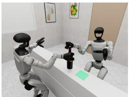

(a) Handover  
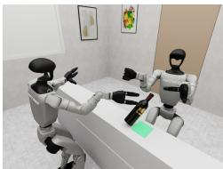

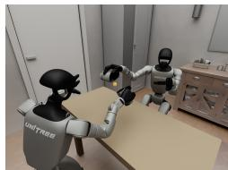

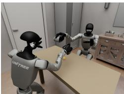  
(b) Pouring

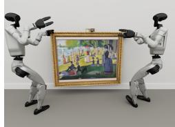

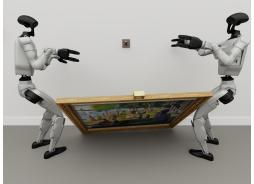  
(c) FrameHang

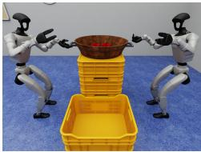

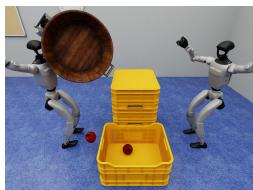

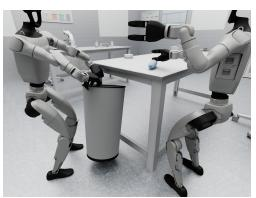

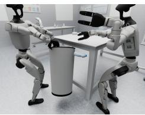  
(e) TrashCollection

(d) CoPouring  
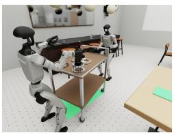

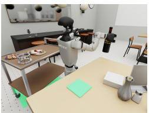  
(f) CartService

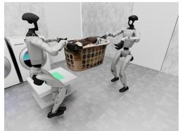

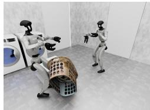

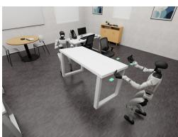  
(g) CoCarry

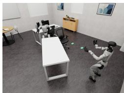  
(h) TableAlign

(i) MoveHouse  

  
(j) BigTable

Figure 8: Representative collaboration failures across the COHUB task suite. Each pair shows two moments of one GR00T N1.7 rollout, earlier on the left. (a) Handover: the giver lets go before the receiver’s hand closes on the bottle, which drops between the two hands. (b) Pouring: the cup is tipped while the partner’s glass is not beneath it, so the marble misses the glass. (c) FrameHang: the robots lift the frame at mismatched heights and angles, so its loop misses the peg and the frame slips. (d) CoPouring: the robots fail to synchronize their grasps, leaving one handle ungrasped and causing the apples to spill outside the receiving crate. (e) TrashCollection: the bottle is swept off the laboratory table but misses the bin and falls to the floor. (f) CartService: the receiving robot carries the bottle to the goal table but walks past it instead of placing it. (g) CoCarry: one robot loses its grip on the basket, unbalancing the load and causing it to fall. (h) TableAlign: one robot loses its grip during transport, and the table falls outside the target region. (i) MoveHouse: the two robot carriers fail to coordinate their motion, causing the table to deviate from the doorway path and get stuck against the door frame. (j) BigTable: during transport, one robot loses its grip on the table, which tilts and never reaches the goal.