# CONTINUOUS VARIATIONAL SYNTHESIS

Alan N. Amin⋆, Mattia G. Gollub⋆, Andrei Slabodkin, Elizabeth B. Wood†, Eli N. Weinstein† JURA Bio, Inc.

Boston, MA 02125, USA

## ABSTRACT

Biological machine learning was long bottlenecked by the ability to synthesize designed DNA. Variational synthesis models control chemical reactions to physically manufacture quadrillions of designed sequences in DNA. However, training these generative models is challenging: constraints on chemical synthesis can force many parameters into a discrete space, limiting the ability to pre-train and fine-tune. In this article we train “free” variational synthesis models using stochastic gradient descent in continuous space, and then discretize with post-training quantization to impose hardware and wetware constraints. This enables variational synthesis models to satisfy stringent reward criteria, while still synthesizing diverse designs, achieving a strictly dominating quality-diversity Pareto frontier. We demonstrate by training variational synthesis models of enzymes, peptides, antibody CDRH3s, and regulatory DNA elements. In silico performance is maintained in vitro.

Advances in biological machine learning have provided a rich set of tools for designing DNA, RNA and proteins (Koh et al., 2025; Gosai et al., 2024). Our ability to learn about these designs experimentally depends on our ability to make them in the lab. Traditionally, designs are synthesized individually and deterministically. But this approach is limited in its scalability, bottlenecking our ability to learn about the activity of biological sequences.

Recent work constructs petascale DNA libraries of ∼1016 designs using stochastic chemical synthesis controlled by generative models (Weinstein et al., 2022; 2026b). This variational synthesis approach requires training generative models that satisfy underlying synthetic constraints. However, these constraints are often discrete and high-dimensional, and therefore difficult to search over: many parameters may only take values from a finite catalog. As a result, training runs often get stuck in local minima, and many fine-tuning and reinforcement learning methods are unavailable.

Motivated by advances in training language models, we set out to develop improved methods for training variational synthesis models for DNA, RNA and proteins. Our key idea is to train variational synthesis models in a “free” continuous space, and then discretize them through a post-training quantization procedure. In the continuous space, we can optimize using stochastic gradient descent methods. We derive custom variance reduction methods that exploit the model structure to further accelerate training. Post-training quantization allows us to generate samples from the model on diverse hardware and wetware platforms. We adjust the model’s parameters to meet the synthesizer’s constraints, then run stochastic synthesis to manufacture designs at petascale.

Overall, the approach substantially improves forward KL pre-training of variational synthesis models, and enables reverse KL fine-tuning. We demonstrate in silico by designing libraries of enzymes that fold into a specific structure; peptides predicted to bind an HLA; scFvs predicted to target intracellular antigens based on experimental feedback; and promoters predicted to drive T cell-specific expression. On each, we substantially advance the quality-diversity Pareto frontier. We then verify by sequencing that the quality and diversity is maintained in vitro.

## 0.1 BACKGROUND: VARIATIONAL SYNTHESIS

The standard protocol for synthesizing designs from a generative model is to first sample designs computationally, then synthesize those designs individually. In variational synthesis, sampling happens during synthesis, using generative model-controlled stochastic chemical reactions.

Synthesis model. DNA is commonly synthesized by solid-phase oligonucleotide synthesis, which builds DNA strands by sequentially adding nucleotides (Gait & Sheppard, 1978). If we add a mixture of nucleotides at the same time, each growing DNA molecule will randomly encounter a different nucleotide, according to its concentration in the mixture. If we add a mixture $\mathsf { \bar { \theta } } _ { \ell } \in \Delta ^ { 4 }$ at step ℓ, then we can describe the output of the synthesis procedure with a parameterized probability distribution $\begin{array} { r } { q _ { \theta } ( X ) = \prod _ { \ell = 1 } ^ { L } \theta _ { \ell , X _ { \ell } } } \end{array}$ where $X _ { \ell }$ is the ℓ-th position of sequence X, which has total length L. If we run the synthesis M times in different wells with different parameters, and mix the results in equal concentrations, we get:

$$
q _ { \theta } ( X ) = \frac { 1 } { M } \sum _ { m = 1 } ^ { M } \prod _ { \ell = 1 } ^ { L } \theta _ { \ell , X _ { \ell } } ^ { m } .\tag{1}
$$

This model can describe DNA or RNA sequences or, after translation, the distribution of proteins the synthesized DNA encodes (Weinstein et al., 2022). In this paper we fix the weights to $\bar { 1 / M }$ and length per well to L for simplicity, but in general these parameters can also be controlled by adjusting the relative concentration of the products and the number of reaction steps.

Constraints. There are often constraints on θ imposed by chemistry and chemical engineering. Synthesizers can restrict $\theta _ { \ell } ^ { m }$ to take on values from a finite catalog, since mixtures must be pulled from a finite set of flasks. One common restriction is the $2 ^ { 4 } - 1 = 1 5$ equal-weight nucleotide mixtures $\mathcal { U } =$ $\{ ( 1 , 0 , 0 , 0 ) , ( 0 , 1 , 0 , 0 ) , \dots , ( \textstyle { \frac { 1 } { 2 } } , \textstyle { \frac { 1 } { 2 } } , 0 , 0 ) , ( \textstyle { \frac { 1 } { 2 } } , 0 , \textstyle { \frac { 1 } { 2 } } , 0 ) , \dots , ( \textstyle { \frac { 1 } { 3 } } , \textstyle { \frac { 1 } { 3 } } , \frac { 1 } { 3 } , 0 ) , \dots \}$ . These can sometimes be supplemented by K pre-set nucleotide mixes, $\mathcal { U } _ { \psi } = \{ ( 1 , 0 , 0 , 0 ) , \hdots , ( \frac { 1 } { 2 } , \frac { 1 } { 2 } , 0 , 0 ) , \hdots , \psi _ { 1 } , \hdots , \psi _ { K } \}$ where $\psi _ { k } \in \Delta ^ { 4 }$ is shared across all $\ell , m$ . In either case, $\theta _ { \ell } ^ { m }$ cannot be an arbitrary vector in $\Delta ^ { 4 }$ , but instead must satisfy the constraint: $\theta _ { \ell } ^ { m } \in \mathcal { U } \subset \Delta ^ { 4 }$ for all $\ell , m$

Training. Variational synthesis models have been trained via a forward KL objective, maximizing data log likelihood:

$$
\theta _ { \star } = \arg \operatorname* { m a x } _ { \theta } \frac { 1 } { n } \sum _ { i = 1 } ^ { n } \log q _ { \theta } ( X ^ { ( i ) } ) .\tag{2}
$$

Optimizing this objective corresponds to approximately minimizing $\operatorname { K L } ( p \Vert q _ { \boldsymbol { \theta } } )$ , where $p$ is the distribution of the data. Previous work used online expectation maximization (EM) algorithms: every M-step optimized each $\theta _ { \ell } ^ { m }$ to the best choice in U (Weinstein et al., 2022; Cappé & Moulines, 2008). But EM is prone to local maxima. Concurrent work proposes policy gradient library design (PGLD) which optimizes an expected reward under the distribution $q _ { \theta } ( x )$ (Sussex et al., 2026). PGLD handles constraints by parameterizing a “meta-distribution” $q _ { \phi } ( \theta )$ and optimizing $\phi$ in $\mathbb { E } _ { q _ { \phi } ( \theta ) } \mathrm { l o s s } ( \theta )$ . We evaluate both methods in depth in Section 2.

Synthesis. In the lab, we run stochastic synthesis with the learned parameters $\theta _ { \star }$ . Then each synthesized molecule is an independent sample from the trained model, $X \sim q _ { \theta _ { \star } } ( x )$ . The total number of samples is the yield of the synthesis. For standard oligosynthesis, this yield can be trillions or quadrillions of molecules, meaning variational synthesis can produce DNA designs at petascale (Weinstein et al., 2026a).

## 0.2 RELATED WORK

We build on variational synthesis (Weinstein et al., 2022; 2026a). Previous work has also developed computational methods for controlling stochastic DNA synthesis, though without optimizing a probabilistic model of the library (Jacobs et al., 2015; Mena & Daugherty, 2005; Shimko et al., 2020; Parker et al., 2011). Zhu et al. (2024) consider an objective related to the reverse KL, but only study synthesis with $M = 1$ reaction well. Most closely related is concurrent work by Sussex et al. (2026), who study objectives related to the reverse KL and use complex synthesis models $( M > 1 )$

Our approach can be seen as variational inference with a mixture model, a successful technique for approximate Bayesian computation at scale (Lin et al., 2019; 2020; Wilson et al., 2022; Arenz et al., 2022; Lambert et al., 2022; Petit-Talamon et al., 2025). We use the model to control experiments rather than just to approximate a posterior, so face distinct constraints. This perspective aligns with other efforts to control generative models using probabilistic inference (Levine, 2018; Korbak et al., 2022; Wu et al., 2023; Zhao et al., 2024).

## 1 METHOD

We set out to develop improved methods for training variational synthesis models, motivated by advances in training language models.

1. In addition to pre-training with a forward KL objective, we fine-tune with a reverse KL objective, to optimize explicit reward models such as sequence-activity predictors.

2. We optimize both objectives with a unified gradient-based training approach, and introduce model-specific strategies for reducing gradient variance.

3. We develop a quantization technique to impose chemical and synthesis constraints, which preserves the quality and diversity of the underlying model in practice.

We refer to the combined improvements as continuous variational synthesis (cVS).

## 1.1 FINE-TUNING

In addition to the forward KL pre-training objective (Equation (2)), we consider a reverse KL fine-tuning objective,

$$
\theta _ { \star } = \underset { \theta } { \operatorname { a r g m a x } } \mathbb { E } _ { q _ { \theta } } [ r ( X ) ] - \mathrm { { K L } } ( q _ { \theta } \| \pi )\tag{3}
$$

where $r : \mathcal { X }  \mathbb { R }$ is a reward model that assigns a scalar score to a sequence $x ,$ and $\pi ( x )$ is a prior distribution, such as a generative sequence model pre-trained on human or evolutionary data. Optimizing this objective corresponds to minimizing the reverse KL divergence KL $. \left( q _ { \theta } \| \tilde { p } \right)$ to the prior tilted by the reward, $\tilde { p } ( x ) \propto \pi ( x ) \exp ( r ( x ) )$ ). This objective is widely used in language model fine-tuning, where it is also referred to as regularized reinforcement learning (Korbak et al., 2022).

The forward KL (Equation (2)) prioritizes coverage: the library distribution should assign a high likelihood to every sequence in the training data, so no areas of sequence space are missing (it is mode-covering). The reverse KL (Equation (3)) prioritizes quality: every sequence from the library distribution should have a high reward, even if this means not making sequences from some areas of sequence space (it is zero-avoiding). This tradeoff can be especially preferable in later exploitation phases of an engineering campaign.

## 1.2 GRADIENT-BASED TRAINING OF FREE VS

To train variational synthesis models, we first relax the synthesis constraints to train $\mathrm { a \ ^ { 6 6 } f r e c ^ { , 5 } }$ model. We let each $\theta _ { \ell } ^ { m } = \mathrm { s o f t m a x } ( \phi _ { \ell } ^ { m } )$ where $\phi _ { \ell } ^ { m } \in \mathbb { R } ^ { 4 }$ if X is DNA or RNA and $\phi _ { \ell } ^ { m } \in \mathbb { R } ^ { 2 1 }$ if X is a protein sequence. Now $\theta _ { \ell } ^ { m }$ can take any value on the simplex. The gradient becomes,

$$
{ \frac { 1 } { n } } \sum _ { i = 1 } ^ { n } \nabla _ { \phi } \log q _ { \theta } ( X ) \qquad { \mathrm { ~ f o r w a r d ~ } } K L\tag{4}
$$

$$
\begin{array} { r } { \nabla _ { \phi } \mathbb { E } _ { q _ { \theta } } [ r ( X ) ] - \nabla _ { \phi } \mathrm { K L } \big ( q _ { \theta } \| \pi \big ) \qquad r e \nu e r s e \ K L . } \end{array}\tag{5}
$$

We then optimize using Adam (Kingma & Ba, 2015). For the reverse KL, computing the gradient with respect to an expectation over the model is nontrivial. Naive REINFORCE estimators have very high variance (Williams, 1992). To reduce variance we start by decomposing the objective into

$$
\mathbb { E } _ { q _ { \theta } } [ r ( X ) ] + \mathbb { E } _ { q _ { \theta } } [ \log \pi ( X ) ] + \mathcal { H } ( q _ { \theta } )\tag{6}
$$

where $\mathcal { H } ( q _ { \theta } ) \triangleq - \mathbb { E } _ { q _ { \theta } } [ \log q _ { \theta } ( X ) ]$ denotes the entropy. We develop partially analytic approximations to the last two terms, which exploit the model structure. Additional training details are in Section A.

## 1.2.1 ANALYTIC ENTROPY

To reduce variance, we rewrite the entropy $\mathcal { H } ( q _ { \theta } )$ using the mixture model structure of the variational synthesis model. We introduce z, a latent variable indicating the mixture model component, i.e. which reaction well m synthesizes x. Let $\begin{array} { r } { q ( X \mid z = m ) = \prod _ { \ell = 1 } ^ { L } \theta _ { \ell , X _ { \ell } } ^ { m } } \end{array}$ denote the probability of a

sequence in well m, and let $r ( z = m \mid X ) = q _ { \theta } ( X | m ) / ( M q _ { \theta } ( X ) )$ ) denote the responsibility of well $m .$ , i.e. the posterior likelihood that x comes from well m. With some algebra, we have

$$
\mathcal { H } ( q _ { \theta } ) = \frac { 1 } { M } \sum _ { m = 1 } ^ { M } \mathcal { H } ( q ( X \mid m ) ) + \log ( M ) - \mathbb { E } _ { q _ { \theta } } [ \mathcal { H } ( r ( z \mid X ) ) ]\tag{7}
$$

The first term favors high diversity at each position in each well, while the last prefers to minimize sequence overlap between the wells. The gradient of the first two terms can be calculated analytically, eliminating any variance; only the last requires a REINFORCE estimate.

## 1.2.2 PRIOR RAO-BLACKWELLIZATION

To further reduce gradient variance, we next examine the contribution of the prior to the reverse KL objective, $\mathbb { E } _ { q _ { \theta } } [ \log \pi ( x ) ]$ ]. We are specifically interested in priors $\tau ( x )$ specified by autoregressive models, which include most protein and genomic language models. Then,

$$
\mathbb { E } _ { q _ { \theta } } [ \log \pi ( X ) ] = \sum _ { \ell = 1 } ^ { L } \mathbb { E } _ { q _ { \theta } ( X _ { 1 : \ell - 1 } ) } \mathbb { E } _ { q _ { \theta } ( X _ { \ell } | X _ { 1 : \ell - 1 } ) } [ \log \pi ( X _ { \ell } \mid X _ { 1 : \ell - 1 } ) ]\tag{8}
$$

Our key observation is that a forward pass through an autoregressive model does not just return the probability of one letter, $\pi ( X _ { \ell } \mid X _ { 1 : \ell - 1 } )$ , it also returns the probability of all the other letters occurring at that position, $\pi ( \boldsymbol { b } \ | \ X _ { 1 : \ell } )$ for all $b \ne X _ { \ell } .$ , at no extra computational cost. It is also tractable to compute $q _ { \theta } ( X _ { \ell } \ | \ \dot { X } _ { 1 : \ell - 1 } ) = q _ { \theta } ( X _ { 1 : \ell } ) / q _ { \theta } ( X _ { 1 : \ell - 1 } )$ . Thus, we can compute the inner expectation in Equation (8) analytically rather than by Monte Carlo, Rao-Blackwellizing the estimate.

## 1.3 QUANTIZATION

After training, we impose synthesis constraints with a discretization method. This is analogous to post-training quantization of neural networks: we are converting the model parameters to lower precision so that sampling can be run on different hardware (Nagel et al., 2021; Xiao et al., 2023).

We discretize each $\theta _ { \ell } ^ { m }$ to come from a finite catalog U by minimizing a distance $d \colon \ \tilde { \theta } _ { \ell } ^ { m } \ = \quad$ arg ${ \mathrm { m i n } } _ { \theta \in \mathcal { U } } d ( \theta , \theta _ { \ell } ^ { m } )$ . In practice, we found $d ( \theta , \theta ^ { \prime } ) \stackrel { - } { = } \mathrm { K L } ( \stackrel { . } { \theta } | | \theta ^ { \prime } )$ to work best. This effectively "rounds" the parameters to the closest physically achievable value. On some synthesizers we can expand the catalog by adding K pre-set mixtures, $\psi _ { k } \in \Delta ^ { 4 }$ . To discretize variational synthesis models to run on this hardware, we first design the mixtures to minimize the total distance,

$$
\psi _ { \star } = \arg \operatorname* { m i n } _ { \psi } \sum _ { \ell , m } \operatorname* { m i n } _ { \theta \in \mathcal { U } _ { \psi } } d ( \theta , \theta _ { \ell } ^ { m } )\tag{9}
$$

This objective is piecewise linear, so we apply Adam to optimize. Then, we discretize using $\mathcal { U } _ { \psi , }$

To design DNA that encodes proteins, we train and discretize in amino acid space. Chemically, most synthesizers use mixtures of nucleotides rather than trinucleotides, so we must translate nucleotide mixture constraints into amino acid mixture constraints. Define $\dot { T } ( \mathcal { U } ) \subset \Delta ^ { 2 1 }$ to be the set of $| \boldsymbol { U } | ^ { 3 }$ distributions over amino acids that can be encoded by nucleotide mixtures in U (Weinstein et al., 2022). We discretize by setting $\begin{array} { r } { \tilde { \theta } _ { \ell } ^ { m } = \arg \operatorname* { m i n } _ { \theta \in \mathcal { T } ( \mathcal { U } ) } d \big ( \theta , \theta _ { \ell } ^ { m } \big ) } \end{array}$ . When pre-set mixtures are available, we optimize $\mathcal { U } _ { \psi }$ by $\psi _ { \star } = \arg$ min $\begin{array} { r } { \iota _ { \psi } \sum _ { \ell , m } \operatorname* { m i n } _ { \theta \in \mathcal { T } ( \mathcal { U } _ { \psi } ) } d \bigl ( \theta , \theta _ { \ell } ^ { m } \bigr ) } \end{array}$

## 2 EMPIRICAL RESULTS

We study cVS in silico and in vitro. We consider four design challenges, creating enzymes, peptides, antibodies and regulatory elements. These problems involve both short and long sequences, both proteins and DNA, and both forward and reverse KL objectives. We measure the performance of the cVS training algorithm, relative to the previous EM ("EM VS" Weinstein et al., 2022) and reinforcement learning (PGLD Sussex et al., 2026) algorithms, while holding the synthesis constraints fixed. We focus mainly on settings where the user only has access to low capacity synthesis hardware, with no pre-set mixes and tens of wells M (Sussex et al., 2026), rather the high capacity models with pre-set mixes and thousands of wells demonstrated in Weinstein et al. (2026a). In this low capacity regime, differences in training algorithm can have especially large effects. With the reverse KL objective, >99% of runtime came from the prior and reward models, rather than the variational synthesis model. For the forward KL, models trained in less then 5 minutes on an A100 or H100 GPU. Across all design challenges, we find cVS substantially advances the Pareto frontier of quality and diversity. Finally, we confirm that cVS’s strong in silico performance is maintained in vitro.

(a)  
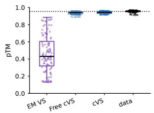

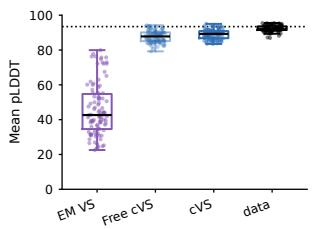

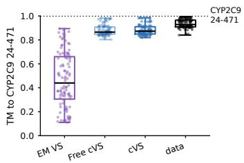

(b)  
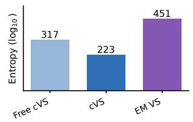

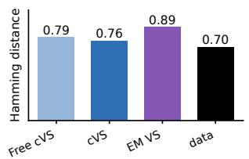

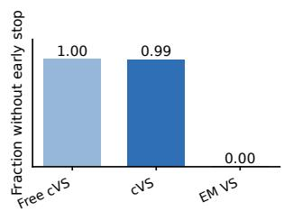

(c)  
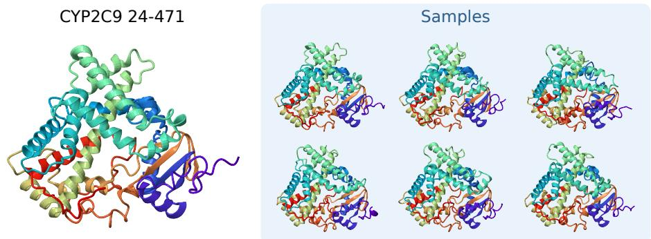  
Figure 1: Enzyme design (Cytochrome P450). (a) Quality: ESMFold’s pTM and pLDDT, and TM-score to the predicted CYP2C9 structure. We compare cVS pre- and post-quantization (free cVS, cVS) to EM VS and data. (b) Diversity: entropy of the library (left), and mean Hamming distance (center); higher is more diverse on both. The EM library had many internal stop codons (right); the other evaluations are on samples with no stops. (c) Predicted structure of independent samples from the cVS library, compared to that of the human cytochrome P450 2C9.

## 2.1 DESIGNING FULL LENGTH ENZYMES

We study cytochrome P450 (CYP), an enzyme involved in drug metabolism that has been reengineered to catalyze diverse reactions (Coelho et al., 2013). We sought to design a library covering CYP’s evolutionary diversity while maintaining its structure. We use the forward KL objective, to cover the evolutionary family. We design the enzyme’s full length, a long-range design problem.

Setup. We started from an alignment of the human cytochrome P450 2C9 (CYP2C9) to evolutionarily related sequences (Notin et al., 2023). We use this alignment as training data, treating gaps as missing data, and ignoring insertions relative to the human sequence. The alignment has length 434 amino acids. We consider low capacity synthesis with M = 16 wells and U the equal nucleotide mixtures. We optimize the forward KL (Equation (2)). Details in Section B.1.

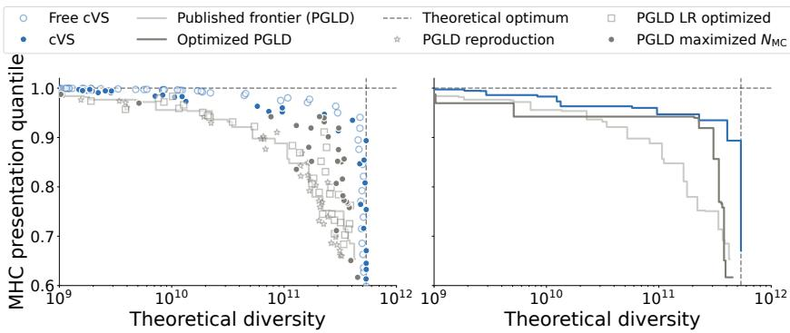  
Figure 2: Quality-diversity Pareto frontier on benchmark peptide design. Y-axis: mean binding quantile of peptides in the designed library, compared to a reference distribution. X-axis: "theoretical diversity". We compare cVS (blue) to PGLD (gray). We show the raw data from (Sussex et al., 2026) (published frontier) and our reproduction (stars), with learning rate (LR) optimized and maximized $N _ { M C }$ . We compare to cVS designs before (free cVS) and after quantization (cVS). Left: Reproduction and hyperparameter improvement of PGLD compared to cVS. Right: Pareto frontiers for PGLD (published, optimized), and for cVS (post-quantization).

Results. We compare cVS to EM VS, which uses the same forward KL objective (Weinstein et al., 2022). The EM designs are poor: because of the long sequence length and strong synthesis constraints, there are internal stop codons in almost every sample, and only $2 \times 1 0 ^ { - 6 }$ do not have one. We examined the structure of the cVS designs, predicted by ESMFold (Lin et al., 2023). Samples from the cVS library produce high confidence structures: the pTM and pLDDT are nearly as high as evolutionary sequences (Figure 1a). They are structurally similar to the human enzyme, quantitatively (TM above 0.8) and qualitatively (Figure 1c). The designs are diverse, with similar mean Hamming distance to the natural sequences (Figure 1b). Overall, cVS enables long range stochastic synthesis design, even in the presence of strong constraints.

## 2.2 DESIGNING HLA-A\*02:01-PRESENTED PEPTIDES

Human leukocyte antigen (HLA) molecules present short peptides on the cell surface, where they can be recognized by the adaptive immune system. We study a benchmark from Sussex et al. (2026) where the goal is to design peptides presented by HLA-A\*02:01. They consider a reverse KL objective, with the reward specified by a binding predictor, and access only to low capacity synthesis hardware.

Setup. Public code for PGLD is unavailable, so we reproduce the method and evaluation. The reward is a neural network trained to predict peptide binding from amino acid sequence, MHCflurry 2.0 (O’Donnell et al., 2020). The prior is uniform over length 9 amino acid sequences, with no stop codons except possibly in the last position. PGLD assumes equal nucleotide mixtures U and uses M = 32 wells for this benchmark, i.e. low capacity synthesis; we use cVS with the same constraints. The evaluation is the Pareto frontier between expected reward and "theoretical diversity", defined as the number of unique sequences in the library when amino acids with probabilities less than 3% at each position are removed. To evaluate cVS’s Pareto frontier, we sweep a hyperparameter α specifying the balance of the reward and the prior, α $\mathbb { E } _ { q _ { \theta } } [ r ( X ) ] - \mathrm { K L } ( q _ { \theta } \| \pi )$ . Details in Section B.2. Note we do not use "theoretical diversity" in later evaluations: its choice in Sussex et al. (2026) is motivated by limitations on downstream assays and analysis that require testing multiple copies of the same sequence, but these limitations are unnecessary given recent advances in learning from variational synthesis (LeaVS, LIFT Weinstein et al., 2026b; 2025).

Reproduction. Our reproduction of PGLD closely matched the published Pareto frontier (Figure 2). Then, we applied the same hyperparameter optimization method as for cVS, sweeping the learning rate. PGLD has an additional hyperparameter, $N _ { M C }$ , which we observed should be set to larger values than originally proposed. These changes improved PGLD (Figure 2).

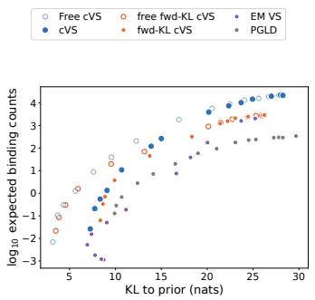  
(a)

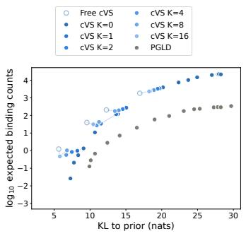  
(b)

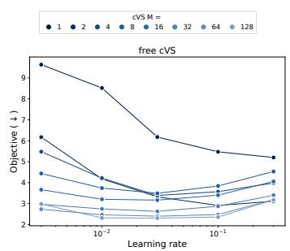  
(c)  
Figure 3: scFv CDRH3 library design (TCR mimics). (a) Pareto frontier of quality (mean predicted binding counts against a pHLA target) versus diversity (KL to human repertoire prior). (b) Performance with changing synthesis hardware and wetware, increasing the number of pre-set mixes available in $\mathcal { U } _ { \psi _ { 1 : K } }$ . (c) Performance of free cVS with increasing wells M.

Results. We trained the same synthesis model with cVS, which substantially advanced the Pareto frontier, especially in the high diversity regime (Figure 2). Post-training discretization imposed a relatively modest cost on performance: there is not a large gap between free cVS and the quantized cVS. Performance is robust to hyperparameters of the training algorithm, with cVS showing smaller sensitivity than PGLD (Figures 6 and 7). Overall, cVS achieves state-of-the-art performance training variational synthesis models with a reverse KL objective.

## 2.3 DESIGNING TCR MIMICKING ANTIBODIES

We evaluated cVS on lab-in-the-loop antibody design (Frey et al., 2025). We aim to design TCR mimicking (TCRm) antibodies that specifically bind peptides presented on an HLA molecule (pHLAs) (Klebanoff et al., 2023). pHLAs are exceptionally challenging targets, since the peptides are in a dynamic complex with the HLA, but they are highly sought for therapeutics, since they allow immunotherapies to be directed against intracellular antigens (Hsiue et al., 2021; Salzler et al., 2025; Yarmarkovich et al., 2021; Liu et al., 2025; Householder et al., 2025).

Setup. We start with a transformer protein-protein interaction model, trained on data collected by screening an initial variational synthesis scFv library against a panel of 100 pHLA targets in a large scale human display system (Weinstein et al., 2026a;b; Bio, 2026). We use cVS to design the next round library for testing. The reward r(x) is specified by the scFv-pHLA interaction model; it is the maximum expected binding counts across target pHLAs. The prior π(x) is an autoregressive transformer trained on the initial library. We start by assuming low capacity synthesis, using M = 32 wells and equal nucleotide mixtures. We design the CDRH3 region, with a fixed length of L = 15 amino acids.

We first pre-train with a forward KL objective, using samples from the prior reweighted by the reward to approximate the target distribution, $\tilde { p } ( x ) \propto \pi ( x ) \exp ( r ( x ) )$ ). Then, we fine-tune with the reverse KL. To fairly evaluate PGLD we use the same pre-training and fine-tuning; note forward KL pre-training was not originally proposed for PGLD but substantially improved its performance (Figure 11). EM VS only allows forward KL pre-training. We evaluate designs’ quality, measured by the mean reward across the library $\mathbb { E } _ { q _ { \theta } } [ r ( X ) ]$ ], and diversity, measured by the KL divergence to the prior, KL(q ∥π). We sweep the reward weight α to explore the Pareto frontier.

Results. cVS Pareto dominates both EM VS and PGLD, achieving higher reward and higher diversity (Figure 3a). cVS’s performance is robust to hyperparameters of the training algorithm including the Adam hyperparameters, and is less sensitive than PGLD (Figures 8 and 9).

We evaluated the pre-training. Optimizing the forward KL, cVS outperformed EM VS (Figure 3a). Removing the pre-training, and only using reverse KL, harmed performance (Figure 11). Removing the fine-tuning also harmed performance (cVS vs fwd-KL cVS, Figure 3a). This held even when the total reward evaluations was held fixed (Figure 12). In sum, pre-training followed by fine-tuning produces the best performance.

(b)  
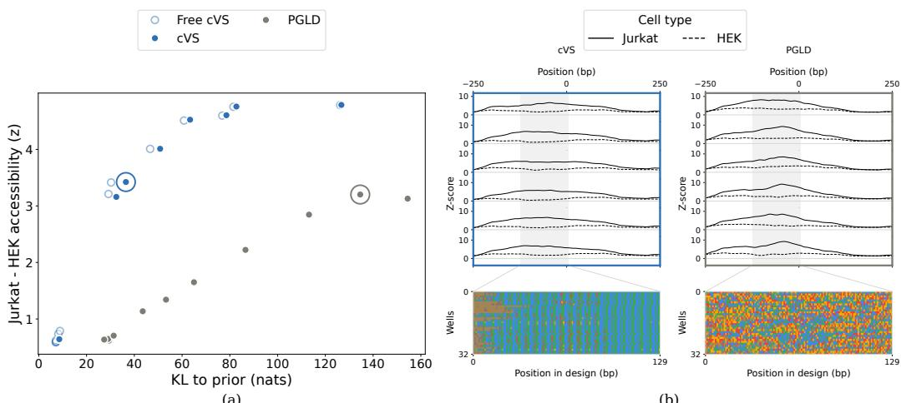  
Figure 4: Regulatory DNA design (EF1α). (a) Quality-diversity Pareto frontier, evaluating the average difference in cell-type accessibility versus the KL to the human genome prior. (b) Predicted accessibility of sampled sequences (above) from the learned synthesis models (below). Positions in each well are colored by the nucleotide mixture.

We ablated our gradient variance reduction (Figure 15). We see only minor performance drop, suggesting cVS’s main advantage comes from the continuous relaxation plus quantization.

We investigated alternative diversity metrics. We retrained using a uniform prior, and evaluated the Shannon entropy. cVS Pareto dominates the reward vs. entropy frontier (Figure 13). We then estimated designs’ kernelized 2-Renyi entropy, which measures diversity at different scales, corresponding to different kernel bandwidths (Sanchez Giraldo et al., 2012). Both cVS and PGLD find modes that are spread out in sequence space, but cVS’s modes are wider (Figure 13).

We next explored higher capacity synthesis, using additional nucleotide mixtures. We expanded the catalog U with pre-set mixes ψ1:K, optimized the mixture choice (Equation (9)), and re-quantized the free cVS model. Performance improves systematically, more closely approximating the free cVS value (Figure 3b). (Note the infinite K limit does not necessarily approach free cVS asymptotically, since not all amino acid distributions can be made by drawing each nucleotide in the codon independently.)

Next, we expand synthesis capacity by increasing the number of reaction wells M, i.e. the number of components in the mixture model. Performance of free cVS improves smoothly (Figure 3c), and translates into better performance post-discretization (Figure 10). Heuristically, we expect a stable McKean-Vlasov-style interacting particle limit for free cVS, since it performs gradient based optimization of the reverse KL with a mixture model, albeit one that is non-Gaussian (Lambert et al., 2022; Wild et al., 2023). Indeed, as M increases, the optimal learning rate decreases and performance approaches a limiting value (Figure 10).

Overall, cVS offers state-of-the-art performance on a lab-in-the-loop biologics design problem.

## 2.4 ENGINEERING REGULATORY ELEMENTS

We next apply cVS to regulatory DNA. We aim to reengineer EF1α, a human promoter that drives strong expression across diverse cell types. EF1α is widely used in CAR-T cell therapy, but it risks expression in off-target cell types (Nyberg et al., 2026). We sought to decrease EF1α’s activity outside of T cells while maintaining high expression within T cells.

Setup. We first established a reward model. We train a BPNet-style convolutional neural network, with context size 2048, to predict ATAC-seq data (Avsec et al., 2021). We use data collected from Jurkat, a T cell line, and HEK cells, as an off-target cell line (Zou et al., 2024). The reward r(x) is the predicted difference in mean chromatin accessibility across a 300 base pair window. For the prior $\pi ( x )$ we use a generative model of genome sequences. We fine-tune MarinDNA, an autoregressive evolutionary genomic language model, on the same human genome regions used to train the reward model (Benegas & Czech, 2026). The variational synthesis model uses $M = 3 2$ wells and the equal nucleotide constraint. We design a 150 bp region near the start of EF1α. We pre-train via the forward KL and fine-tune via the reverse KL, for both cVS and PGLD. Details in Section B.4.

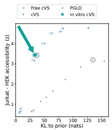  
(a) Pareto frontier.

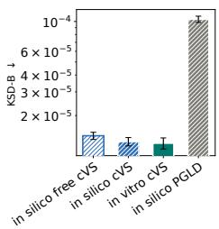  
(b) KSD-B

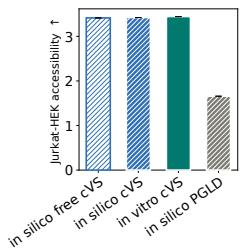  
(c) Average reward

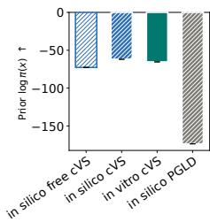  
(d) Average (log) prior

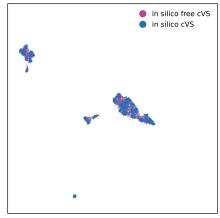  
(e)

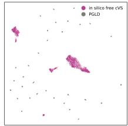  
(f)

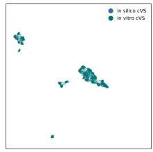  
(g)  
Figure 5: In vitro validation of the EF1α promoter library: (a) Estimated position of the in vitro library on the Pareto frontier. (b) KSD-B goodness-of-fit to the reverse-KL target $\pi ( x ) \exp ( \alpha r ( x ) )$ ). Mean and standard error (SEM) from five independent redraws of 1000 samples from the in silico model or the in vitro sequencing data. (c) Average reward and SEM. (d) Average prior log likelihood and SEM. (e-g) Low-dimensional representation of the samples from the prior model (pink) overlaid with the samples from each of the evaluated models.

In silico results. cVS provides a substantial advance in the Pareto frontier, designing libraries with high cell-type specific accessibility that stay close to the human genome prior (Figure 4a). In comparison to the protein design problems, the penalty from quantization is small, with only a small gap between free cVS and quantization to equal nucleotide mixtures.

We visualized the synthesis model $q _ { \theta _ { \star } } ( x )$ , observing that cVS learns structured sequence designs with tiled motifs, in contrast to PGLD (Figure 4b). Reengineering EF1α activity is particularly challenging: when we retrained in a random genomic context, we again observed a substantial improvement from cVS, but also greater variety in cVS’s designs (Figure 17).

In vitro results. We synthesized samples from a trained variational synthesis model $q _ { \theta _ { \star } } ( x )$ , by running the learned stochastic synthesis protocol in the lab. We achieved a yield of 1.6 nM, or $9 . 6 \times \mathrm { \bar { 1 0 } ^ { 1 4 } }$ molecules. To evaluate library quality, we sequenced a random subset, obtaining 28 million assembled paired-end reads. We then checked how well these samples matched the target distribution, the prior tilted by the weighted reward, $\tilde { p } ( x ) \propto \pi ( x ) \exp ( \alpha r ( x ) )$ ). Evaluating synthesis is nontrivial: we only have samples from the in vitro distribution $q _ { i \nu } ( x )$ , not likelihoods, and we only know the target distribution $\tilde { p }$ up to a normalizing constant, without access to samples. We can estimate the position of the in vitro library on the Pareto frontier, but only by an upper bound on the entropy, $- \mathbb { E } _ { q _ { i \nu } ( x ) } [ \log q _ { \theta _ { \star } } ( x ) ] \geq - \mathbb { E } _ { q _ { i \nu } ( x ) } [ \log q _ { i \nu } ( x ) ]$ , which provides an optimistic estimate of diversity (Figure 5a). We therefore use the KSD-B, an extension of the kernelized Stein discrepancy to discrete sequences, which allows comparison of samples to an unnormalized distribution (Amin et al., 2023; Liu et al., 20 $\cdot 6 ;$ Gorham & Mackey, 2017). We use a Hamming IMQ kernel, which ensures the divergence can detect arbitrary nonparametric mismatch (Amin et al., 2023; 2025).

We find the in vitro cVS designs maintain the same quality as the in silico cVS designs, achieving a small KSD-B (Figure 5b). Its advantage is robust to hyperparameters of the KSD-B kernel (Figure 18). In vitro cVS also maintains high reward (Figure 5c) and prior likelihood (Figure 5d). Qualitatively, we can see the effects of quantization, but still observe a close match between in vitro cVS and in silico cVS and free cVS (Figure 5d-g). Across all metrics, the in vitro cVS library substantially outperforms even in silico PGLD. In sum, we synthesize nearly a quadrillion samples from a generative model with high reward and diversity.

## 3 DISCUSSION

We introduced continuous variational synthesis (cVS), a new approach to training variational synthesis models. It relies on a continuous relaxation of chemical synthesis constraints, which enables gradientbased training, followed by post-training quantization, which enables synthesis on diverse hardware and wetware. cVS shows state-of-the-art performance in silico on both forward KL and reverse KL objectives, enabling pre-training and fine-tuning variational synthesis models with diverse reward models. It designs both DNA and proteins. Its in silico performance is maintained in vitro.

Limitations. Synthesizing designs beyond single oligos, such as full length CYP, requires assembly or enzymatic synthesis, which can introduce additional constraints and errors. The impact of errors depends on the reward model: although we saw minimal impact on chromatin accessibility, other reward models may be more sensitive.

Outlook. cVS allows variational synthesis models to be trained, fine-tuned and deployed like language models. It thus allows ideas and methods originally developed for language modeling to be redeployed to explore biological sequence space, not just in silico, but through massive, programmable wet lab experimentation.

## AUTHOR CONTRIBUTIONS

ANA developed the method and performed all in silico experiments. MGG contributed code for EM VS and synthesis model constraints. MGG planned and implemented the in vitro experiments. AS and MGG analyzed the in vitro experiments. EBW and ENW oversaw the project and advised at all stages. ENW, ANA and AS wrote the paper with input from all authors.

## REFERENCES

Arash Ahmadian, Chris Cremer, Matthias Gallé, Marzieh Fadaee, Julia Kreutzer, Ahmet Üstün, and Sara Hooker. Back to basics: Revisiting REINFORCE style optimization for learning from human feedback in LLMs. arXiv [cs.LG], February 2024.

Alan N Amin, Debora S Marks, and Eli N Weinstein. Biological sequence kernels with guaranteed flexibility. J. Mach. Learn. Res., 26(216):1–63, 2025.

Alan Nawzad Amin, Eli N Weinstein, and Debora Susan Marks. A kernelized Stein discrepancy for biological sequences. In International Conference on Machine Learning, volume 202 of Proceedings ofMachine Learning Research. PMLR, 2023.

Oleg Arenz, Philipp Dahlinger, Zihan Ye, Michael Volpp, and Gerhard Neumann. A unified perspective on natural gradient variational inference with gaussian mixture models. arXiv [cs.LG], September 2022.

Ziga Avsec, Melanie Weilert, Avanti Shrikumar, Sabrina Krueger, Amr Alexandari, Khyati Dalal, Robin Fropf, Charles McAnany, Julien Gagneur, Anshul Kundaje, and Julia Zeitlinger. Baseresolution models of transcription-factor binding reveal soft motif syntax. Nat. Genet., 53(3): 354–366, March 2021.

Gonzalo Benegas and Eric Czech. A 1B standard transformer rivals evo 2 40B on variant effect prediction. https://www.openathena.ai/blog/marin-dna/, August 2026. Accessed: 2026-8-27.

JURA Bio. How to build a scaling law for biological AI. https://www.jurabio.com/blog/ scalinglaw, August 2026. Accessed: 2026-8-27.

Olivier Cappé and Eric Moulines. On-line expectation–maximization algorithm for latent data models. Journal ofthe Royal Statistical Society B, 71:593–613, 2008.

Pedro S Coelho, Eric M Brustad, Arvind Kannan, and Frances H Arnold. Olefin cyclopropanation via carbene transfer catalyzed by engineered cytochrome P450 enzymes. Science, 339(6117):307–310, January 2013.

Nathan C Frey, Isidro Hotzel, Samuel D Stanton, Ryan L Kelly, Robert G Alberstein, Emily K Makowski, Karolis Martinkus, Dan Berenberg, Jack Bevers, III, Tyler Bryson, Pamela Chan, Alicja Czubaty, Tamica A D’Souza, Henri Dwyer, Anna Dziewulska, James W Fairman, Allen Goodman, Jennifer L Hofmann, Henry H Isaacson, Aya Abdelsalam Ismail, Samantha James, Taylor Joren, Simon P Kelow, James R Kiefer, Matthieu Kirchmeyer, Joseph Kleinhenz, James T Koerber, Julien Lafrance-Vanasse, Andrew Leaver-Fay, Jae Hyeon Lee, Edith Lee, Donald W Lee, Wei-Ching Liang, Joshua Yao-Yu Lin, Sidney Lisanza, Andreas Loukas, Jan Ludwiczak, Sai Pooja Mahajan, Omar Mahmood, Homa MohammadiPeyhani, Santrupti Nerli, Ji Won Park, Jaewoo Park, Stephen Ra, Sarah A Robinson, Saeed Saremi, Franziska Seeger, Imee Sinha, Anna M Sokol, Christoph Spiess, Natasa Tagasovska, Hao V To, Edward Wagstaff, Amy Wang, Andrew M Watkins, Blair Wilson, Shuang Wu, Karina Zadorozhny, John C Marioni, Aviv Regev, Yan Wu, Kyunghyun Cho, Richard Bonneau, and Vladimir Gligorijevic. Lab-in-the-loop therapeutic antibody design with deep learning. bioRxiv, pp. 2025.02.19.639050, February 2025.

M J Gait and R C Sheppard. Solid-phase oligonucleotide synthesis: a renaissance. Nucleic Acids Res., 5(suppl\_1):s79–s84, January 1978.

Jackson Gorham and Lester Mackey. Measuring sample quality with kernels. In Proceedings of the 34th International Conference on Machine Learning - Volume 70, ICML’17, pp. 1292–1301, Sydney, NSW, Australia, 2017. JMLR.org.

Sager J Gosai, Rodrigo I Castro, Natalia Fuentes, John C Butts, Kousuke Mouri, Michael Alasoadura, Susan Kales, Thanh Thanh L Nguyen, Ramil R Noche, Arya S Rao, Mary T Joy, Pardis C Sabeti, Steven K Reilly, and Ryan Tewhey. Machine-guided design of cell-type-targeting cis-regulatory elements. Nature, 634(8036):1211–1220, October 2024.

Karsten D Householder, Xinyu Xiang, Kevin M Jude, Arthur Deng, Matthias Obenaus, Yang Zhao, Steven C Wilson, Xiaojing Chen, Nan Wang, and K Christopher Garcia. De novo design and structure of a peptide-centric TCR mimic binding module. Science, 389(6758):375–379, July 2025.

Emily Han-Chung Hsiue, Katharine M Wright, Jacqueline Douglass, Michael S Hwang, Brian J Mog, Alexander H Pearlman, Suman Paul, Sarah R DiNapoli, Maximilian F Konig, Qing Wang, Annika Schaefer, Michelle S Miller, Andrew D Skora, P Aitana Azurmendi, Michael B Murphy, Qiang Liu, Evangeline Watson, Yana Li, Drew M Pardoll, Chetan Bettegowda, Nickolas Papadopoulos, Kenneth W Kinzler, Bert Vogelstein, Sandra B Gabelli, and Shibin Zhou. Targeting a neoantigen derived from a common TP53 mutation. Science, 371(6533):eabc8697, March 2021.

Timothy M. Jacobs, Hayretin Yumerefendi, Brian Kuhlman, and Andrew Leaver-Fay. SwiftLib: rapid degenerate-codon-library optimization through dynamic programming. Nucleic Acids Research, 43 (5):e34, March 2015. ISSN 0305-1048. doi: 10.1093/nar/gku1323. URL https://doi.org/ 10.1093/nar/gku1323.

Richard M Karp, Michael Luby, and Neal Madras. Monte-carlo approximation algorithms for enumeration problems. J. Algorithm., 10(3):429–448, September 1989.

Diederik P Kingma and Jimmy Ba. Adam: A method for stochastic optimization. In ICLR, 2015.

Christopher A Klebanoff, Smita S Chandran, Brian M Baker, Sergio A Quezada, and Antoni Ribas. T cell receptor therapeutics: immunological targeting of the intracellular cancer proteome. Nat. Rev. Drug Discov., pp. 1–22, October 2023.

Huan Yee Koh, Yizhen Zheng, Madeleine Yang, Rohit Arora, Geoffrey I Webb, Shirui Pan, Li Li, and George M Church. AI-driven protein design. Nat. Rev. Bioeng., September 2025.

Wouter Kool, Herke van Hoof, and Max Welling. Buy 4 REINFORCE samples, get a baseline for free. In ICLR Workshop: Deep Reinforcement Learning Meets Structured Prediction, 2019.

Tomasz Korbak, Ethan Perez, and Christopher Buckley. RL with KL penalties is better viewed as bayesian inference. In Findings of the Association for Computational Linguistics: EMNLP 2022, pp. 1083–1091, Stroudsburg, PA, USA, December 2022. Association for Computational Linguistics.

Marc Lambert, Sinho Chewi, Francis Bach, Silvère Bonnabel, and Philippe Rigollet. Variational inference via wasserstein gradient flows. arXiv [stat.ML], May 2022.

Sergey Levine. Reinforcement learning and control as probabilistic inference: Tutorial and review. arXiv [cs.LG], May 2018.

Wu Lin, Mohammad Emtiyaz Khan, and Mark Schmidt. Fast and simple natural-gradient variational inference with mixture of exponential-family approximations. In International Conference on Machine Learning, pp. 3992–4002. PMLR, May 2019.

Wu Lin, Mark Schmidt, and Mohammad Emtiyaz Khan. Handling the positive-definite constraint in the bayesian learning rule. In International Conference on Machine Learning, pp. 6116–6126. PMLR, November 2020.

Zeming Lin, Halil Akin, Roshan Rao, Brian Hie, Zhongkai Zhu, Wenting Lu, Nikita Smetanin, Robert Verkuil, Ori Kabeli, Yaniv Shmueli, et al. Evolutionary-scale prediction of atomic-level protein structure with a language model. Science, 379(6637):1123–1130, 2023.

Bingxu Liu, Nathan F Greenwood, Julia E Bonzanini, Amir Motmaen, Jeremy Meyerberg, Tao Dao, Xinyu Xiang, Russell Ault, Jazmin Sharp, Chunyu Wang, Gian Marco Visani, Dionne K Vafeados, Nicole Roullier, Armita Nourmohammad, David A Scheinberg, K Christopher Garcia, and David Baker. Design of high-specificity binders for peptide-MHC-I complexes. Science, 389(6758): 386–391, July 2025.

Qiang Liu, Jason D Lee, and Michael Jordan. A kernelized stein discrepancy for goodness-of-fit tests. In International conference on machine learning, volume 33, pp. 276–284, 2016.

Leland McInnes, John Healy, and James Melville. UMAP: Uniform Manifold Approximation and Projection for Dimension Reduction, 2020.

Marco A. Mena and Patrick S. Daugherty. Automated design of degenerate codon libraries. Protein Engineering, Design and Selection, 18(12):559–561, December 2005. ISSN 1741-0126. doi: 10.1093/protein/gzi061. URL https://doi.org/10.1093/protein/gzi061.

Markus Nagel, Marios Fournarakis, Rana Ali Amjad, Yelysei Bondarenko, Mart van Baalen, and Tijmen Blankevoort. A white paper on neural network quantization. arXiv [cs.LG], June 2021.

Pascal Notin, Aaron Kollasch, Daniel Ritter, Lood van Niekerk, Steffanie Paul, Han Spinner, Nathan Rollins, Ada Shaw, Rose Orenbuch, Ruben Weitzman, Jonathan Frazer, Mafalda Dias, Dinko Franceschi, Yarin Gal, and Debora Marks. ProteinGym: Large-scale benchmarks for protein fitness prediction and design. Advances in Neural Information Processing Systems, 36:64331–64379, December 2023.

William A Nyberg, Pierre-Louis Bernard, Wayne Ngo, Charlotte H Wang, Jonathan Ark, Allison Rothrock, Gina M Borgo, Gabriella R Kimmerly, Jae Hyung Jung, Vincent Allain, Jennifer R Hamilton, Alisha Baldwin, Robert Stickels, Sarah Wyman, Safwaan H Khan, Shanshan Lang, Donna Marsh, Niran Almudhfar, Catherine Novick, Yasaman Mortazavi, Shimin Zhang, Mahmoud M AbdElwakil, Luis R Sandoval, Sidney Hwang, Simon N Chu, Hyuncheol Jung, Chang Liu, Devesh Sharma, Travis McCreary, Zhongmei Li, Ansuman T Satpathy, Julia Carnevale, Rachel L Rutishauser, M Kyle Cromer, Kole T Roybal, Stacie E Dodgson, Jennifer A Doudna, Aravind Asokan, and Justin Eyquem. In vivo site-specific engineering to reprogram T cells. Nature, 652 (8110):712–721, April 2026.

Timothy J O’Donnell, Alex Rubinsteyn, and Uri Laserson. MHCflurry 2.0: Improved pan-allele prediction of MHC class I-presented peptides by incorporating antigen processing. Cell Syst., 11 (1):42–48.e7, July 2020.

Andrew S. Parker, Karl E. Griswold, and Chris Bailey-Kellogg. Optimization of Combinatorial Mutagenesis. Journal of Computational Biology, 18(11):1743–1756, November 2011. ISSN 1066-5277. doi: 10.1089/cmb.2011.0152. URL https://pmc.ncbi.nlm.nih.gov/ articles/PMC5220575/.

Marguerite Petit-Talamon, Marc Lambert, and Anna Korba. Variational inference with mixtures of isotropic gaussians. In The Thirty-ninth Annual Conference on Neural Information Processing Systems, October 2025.

Robert Salzler, David J DiLillo, Kei Saotome, Kevin Bray, Katja Mohrs, Haun Hwang, Kamil J Cygan, Darshit Shah, Anna Rye-Weller, Kunal Kundu, et al. Car t cells based on fully human t cell receptor–mimetic antibodies exhibit potent antitumor activity in vivo. Science Translational Medicine, 17(791):eado9371, 2025.

Luis G Sanchez Giraldo, Murali Rao, and Jose C Principe. Measures of entropy from data using infinitely divisible kernels. arXiv [cs.LG], November 2012.

Tyler C Shimko, Polly M Fordyce, and Yaron Orenstein. DeCoDe: degenerate codon design for complete protein-coding DNA libraries. Bioinformatics, 36(11):3357–3364, June 2020. ISSN 1367-4803. doi: 10.1093/bioinformatics/btaa162. URL https://doi.org/10.1093/ bioinformatics/btaa162.

Scott Sussex, Ema Borevkovic, Frederieke Lohmann, Ningning Chen, Elena Lüthi, Sai T Reddy,´ and Andreas Krause. Breaking the synthesis barrier for AI-designed DNA libraries. bioRxiv, July 2026.

Eli N Weinstein, Alan N Amin, Will Grathwohl, Daniel Kassler, Jean Disset, and Debora S Marks. Optimal design of stochastic DNA synthesis protocols based on generative sequence models. In Proceedings of the 25th International Conference on Artificial Intelligence and Statistics (AISTATS). PMLR, 2022.

Eli N Weinstein, Andrei Slabodkin, Mattia G Gollub, Kerry Dobbs, Xiao-Bing Cui, Fang Zhang, Kristina Gurung, and Elizabeth B Wood. Lifting biomolecular data acquisition. arXiv [q-bio.BM], December 2025.

Eli N Weinstein, Mattia G Gollub, Andrei Slabodkin, Kerry Dobbs, Xiao-Bing Cui, Cameron L Gardner, Ryan J Grant, Kristina Gurung, Amira Bailey, Alan N Amin, George M Church, and Elizabeth B Wood. Manufacturing-aware generative models enable petascale synthesis of designed DNA. Nat. Biotechnol., pp. 1–9, March 2026a.

Eli N Weinstein, Andrei Slabodkin, Mattia G Gollub, and Elizabeth B Wood. Accelerated learning on large scale screens using generative library models. In International Conference on Artificial Intelligence and Statistics (AISTATS), 2026b.

Veit David Wild, Sahra Ghalebikesabi, Dino Sejdinovic, and Jeremias Knoblauch. A rigorous link between deep ensembles and (variational) bayesian methods. In Advances in Neural Information Processing Systems 36, pp. 39782–39811, San Diego, California, USA, 2023. Neural Information Processing Systems Foundation, Inc. (NeurIPS).

Ronald J Williams. Simple statistical gradient-following algorithms for connectionist reinforcement learning. In Richard S Sutton (ed.), Reinforcement Learning, pp. 5–32. Springer US, Boston, MA, 1992.

Andrew Gordon Wilson, Pavel Izmailov, Matthew D Hoffman, Yarin Gal, Yingzhen Li, Melanie F Pradier, Sharad Vikram, Andrew Foong, Sanae Lotfi, and Sebastian Farquhar. Evaluating approximate inference in bayesian deep learning. In NeurIPS 2021 Competitions and Demonstrations Track, pp. 113–124. PMLR, July 2022.

Luhuan Wu, Brian Trippe, Christian Naesseth, David Blei, and John Cunningham. Practical and asymptotically exact conditional sampling in diffusion models. In Advances in Neural Information Processing Systems 36, pp. 31372–31403, San Diego, California, USA, 2023. Neural Information Processing Systems Foundation, Inc. (NeurIPS).

Guangxuan Xiao, Ji Lin, Mickael Seznec, Hao Wu, Julien Demouth, and Song Han. SmoothQuant: Accurate and efficient post-training quantization for large language models. In International Conference on Machine Learning, pp. 38087–38099. PMLR, July 2023.

Mark Yarmarkovich, Quinlen F Marshall, John M Warrington, Rasika Premaratne, Alvin Farrel, David Groff, Wei Li, Moreno di Marco, Erin Runbeck, Hau Truong, Jugmohit S Toor, Sarvind Tripathi, Son Nguyen, Helena Shen, Tiffany Noel, Nicole L Church, Amber Weiner, Nathan Kendsersky, Dan Martinez, Rebecca Weisberg, Molly Christie, Laurence Eisenlohr, Kristopher R Bosse, Dimiter S Dimitrov, Stefan Stevanovic, Nikolaos G Sgourakis, Ben R Kiefel, and John M Maris. Cross-HLA targeting of intracellular oncoproteins with peptide-centric CARs. Nature, 2021.

Stephen Zhao, Rob Brekelmans, Alireza Makhzani, and Roger Grosse. Probabilistic inference in language models via twisted sequential monte carlo. arXiv [cs.LG], April 2024.

Danqing Zhu, David H Brookes, Akosua Busia, Ana Carneiro, Clara Fannjiang, Galina Popova, David Shin, Kevin C Donohue, Li F Lin, Zachary M Miller, Evan R Williams, Edward F Chang, Tomasz J Nowakowski, Jennifer Listgarten, and David V Schaffer. Optimal trade-off control in machine learning-based library design, with application to adeno-associated virus (AAV) for gene therapy. Sci Adv, 10(4):eadj3786, January 2024.

Zhaonan Zou, Tazro Ohta, and Shinya Oki. ChIP-atlas 3.0: a data-mining suite to explore chromosome architecture together with large-scale regulome data. Nucleic Acids Res., 52(W1):W45–W53, July 2024.

## A ADDITIONAL TRAINING DETAILS

We implement several other strategies improve training.

Control variates. Applying tools for learning from human feedback, we use REINFORCE with a customized leave-one-out control variate to reduce the gradient variance (Kool et al., 2019; Ahmadian et al., 2024). We ablate the control variate in Figure 15, finding a minor drop in performance.

Split-merge. We observe that individual wells can get stuck in local maxima. We add an auxiliary well weight parameter $w _ { m }$ that describes the fraction of sequences that should be drawn from well m, even when the relative concentration is fixed at $1 / M$ in practice. We monitor the weights $w _ { m }$ during training, and if they become very low, we resample $\theta _ { m }$ by adding jitter to the parameters $\theta _ { m ^ { \prime } }$ of the well $m ^ { \prime }$ with the highest weight $w _ { m ^ { \prime } }$ . We ablate this split-merge method in Figure 16, finding a drop in performance.

## B RESULTS DETAILS

## B.1 DETAILS ON ENZYME DESIGN

We downloaded the alignment from Notin et al. (2023). We ignore insertions relative to the human sequence, and treat gaps as missing data. Positions 23:470 (0 indexed) were included in the alignment. The 13 residues 46, 136, 137, 212, 213, 214, 216, 273, 274, 275, 276, 364, 463 were labelled as insertions in the wild type and not included in the alignment. We build a generative model of all aligned residues and then put in those 13 insertions (constant positions) back into our designs, i.e. we’re designing the core positions 23:470. We held out 10% of alignment sequences for early stopping. We trained five forward KL cVS models with different learning rates and chose the one with the best held-out loss.

## B.2 DETAILS ON HLA-A\*02:01 EPITOPE REPERTOIRE RESULTS

In the original PGLD paper they used a fixed learning rate; however the optimal leanring rate can differ across methods and α. To ensure a fair comparison, we swept 5 learning rates for each α and picked the one that achieved the best objective, for both cVS and PGLD. PGLD also had a hyper-parameter $N _ { M C }$ which was set to different values throughout their paper; however, from a variance-reduction perspective, $N _ { M C }$ should be set as high as possible. Figure 2 shows that sweeping learning rate and maximizing $N _ { M C }$ improves the frontier for PGLD. All experiments are performed with learning rate sweeps and maxima $N _ { M C }$

We optimize the reward r(x) = log (presentation\_percent $\mathrm { i } 1 \mathrm { e } ( x ) / 1 0 0 )$ where presentation\_percent $\mathsf { i } 1 \mathsf { e } ( x )$ is MHCflurry 2.0’s prediction of binding strength relative to a reference distribution. This parameterization sharply penalizes low scores. The final performance is measured as $1 - \mathbb { E } _ { q _ { \theta } }$ [presentation\_percentile(x)]/100. The theoretical diversity is approximated with the Karp-Luby algorithm (Karp et al., 1989), as in Sussex et al. (2026).

To pre-train cVS models, we first optimized θ under a forward KL objective. To construct its training dataset, we drew 20 million samples from the prior and reweighted them by the reward, $\exp ( \alpha r ( x ) )$ picking a weight α such that the essential sample size was 1 million. PGLD was pre-trained by sampling starting templates according to this tilted distribution, as described in Sussex et al. (2026).

## B.3 DETAILS ON TCRM DESIGN

We used a transformer model trained on a dataset of scFv-pHLA interactions. Briefly, the data was generated by assembling a CDRH3 variational synthesis library (designed with EM VS) into second generation scFv-CAR constructs, delivering them into human cells, staining them with a panel of 100 fluorescently labeled and DNA-barcoded pHLA targets (dextramers), sorting for fluorescence, and single cell sequencing to read out the scFv sequence and counts of the number of dextramers bound to each cell (Weinstein et al., 2026a; Bio, 2026). Then, we trained an encoder-only transformer model with 7M parameters to predict binding counts from scFv CDRH3 sequence and pHLA, using LIFT and LeaVS (Weinstein et al., 2025; 2026b).

To pre-train cVS with the forward KL objective, we drew 20 million samples from the prior (the initial variational synthesis model) and reweighted them by the reward, picking α such that the effective sample size was 5% of the corpus, after dropping samples with an internal stop codon. We pre-train to convergence, which took 8000 steps. We then fine-tuned with the reverse KL objective for 5 million reward evaluations, with a batch size of 1024. We sweep 5 learning rates (0.003, 0.01, 0.03, 0.1, 0.3) and pick the one with the best final objective. We use cosine annealing with a 1000 step warmup, and anneal α from 2α to α over the first half of training to encourage exploration (we found these annealing methods harmed PGLD, so only included them in cVS).

## B.4 DETAILS ON PROMOTER ENGINEERING

We downloaded ATAC seq data from ChIP-Atlas: SRX25532286, SRX7785407 and SRX16046833 for Jurkat, and SRX10665050, SRX7030829 and SRX3511089 for HEK (Zou et al., 2024). We evaluated accessibility in a custom plasmid context, where EF1α is used to drive expression of an scFv CAR. We designed the VS library into the first 129bp of EF1α. The genomic context we used for Figure 17 was chr10:63519858-63521858, which was near a peak in all 6 experiments above. We design the centre 150 bp of the region.

BPnet was trained over all peaks in the 6 experiments above as well as an equal amount of GCmatched inter-genic regions as negatives. Peaks from chromosomes 9, 10, 11 were held-out during training and used to early stop. We trained 5 models at learning rates 0.001, 0.003, 0.01, 0.03, 0.1 and picked the one with the best held-out loss.

MarinDNA was fine-tuned on the same peaks as BPnet. Peaks from chromosomes 9, 10, 11 were held-out during training and used to early stop. We trained 5 models at learning rates 0.001, 0.003, 0.01, 0.03, 0.1 and picked the one with the best held-out loss.

We trained variational synthesis models with cVS and PGLD in the same way as in Section B.2, except tilting to an effective sample size of 0.5% for pre-training.

## C In vitro EVALUATION

We sampled 250ng of DNA from the synthesized library. The sequencing library was prepared using xGen™ssDNA & Low-Input DNA Library Preparation Kit (IDT) following manufacturer’s instructions with the exception that post-extension cleanup was performed using MinElute PCR Purification Kit (Qiagen). Dual indexed library samples were quantified using Kapa Library Quantification Kit (Roche). Pooled library samples were sequenced in a 2x150bp configuration on a NextSeq 2000 using P1 Reagents, 300 cycle Kit (Illumina). The resulting paired reads were basecalled with bcl2fastq v2.20 and assembled with PEAR. We obtained 24,471,996 full-length reads.

We used KSD-B (Kernelized Stein Discrepancy for Biological Sequences) to test how close the synthesis models are to the target π(x) ∝ $p ( x ) \exp ( \alpha r ( x ) )$ , where $p$ is the fine-tuned MarinDNA prior and r the ATAC reward model. We used the implementation of Amin et al. (2023), with energy function log $p ( x ) + \alpha r ( x )$ . Hyperparameters: an IMQ Hamming kernel $( c = 1 , \beta = 0 . 5 )$ single-substitution neighbourhoods only; $m = 5$ neighbour samples per point for the discrete Stein operator; and $n = 1 { , } 0 0 0$ samples per model or from the sequencing data, redrawn 5 times with independent draws to report mean ± SEM.

To compute the low-dimensional representations of the synthesis samples, we used the same procedure as in Weinstein et al. (2026a): we first computed a matrix of pairwise Hamming distances between the samples from all evaluated models and the sequencing data, then transformed this distance matrix into Gram matrix using an IMQ Hamming kernel, and finally reduced the dimension of this matrix using UMAP (McInnes et al., 2020).

## D SUPPLEMENTAL RESULTS

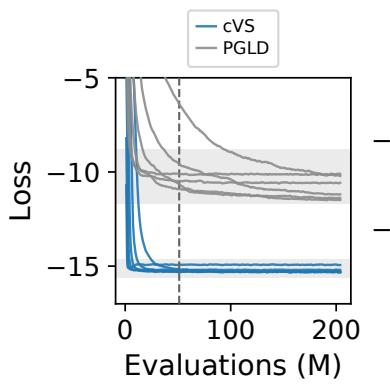

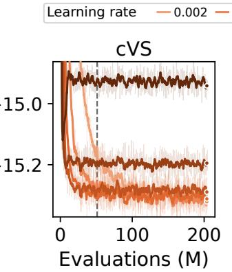

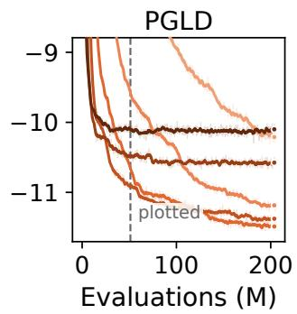  
Figure 6: Training loss as a function of the number of reward evaluations (in millions), for PGLD versus free cVS on the peptide benchmark. Left: overview, with dashed line showing the results plotted in Figure 2. Middle, Right: zoom in, with different learning rates marked.

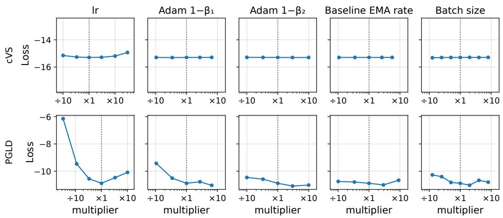  
Figure 7: Hyperparameter sensitivity analysis on the peptide benchmark, for PGLD versus free cVS. x-axis scans each hyperparameter relative to the setting used in Figure 2. First column: learning rate. Second and third columns: Adam hyperparameters. Fourth column: rate of the exponential moving average used to construct the baseline control variate. Fifth column: training batch size.

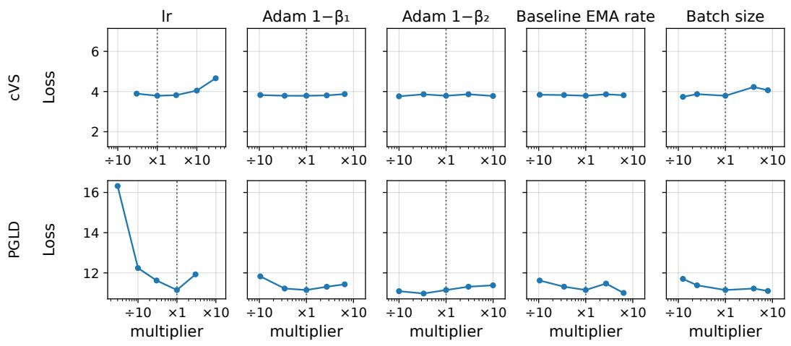  
Figure 8: Hyperparameter sensitivity analysis on scFv CDRH3 designs, for PGLD versus free cVS. x-axis scans each hyperparameter relative to the setting used in Figure 3a. First column: learning rate. Second and third columns: Adam hyperparameters. Fourth column: rate of the exponential moving average used to construct the baseline control variate. Fifth column: training batch size.

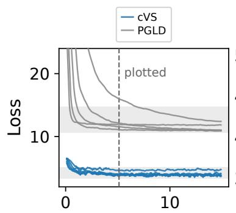  
Evaluations (M)

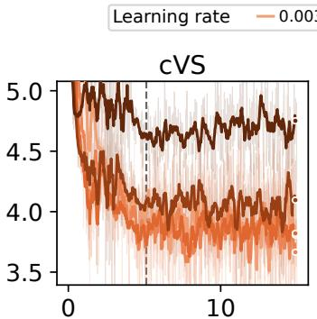  
Evaluations (M)

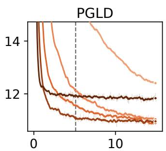  
Evaluations (M)  
Figure 9: Training loss as a function of the number of reward evaluations (in millions), for PGLD versus free cVS, on the scFv CDRH3 designs. Left: overview, with dashed line showing the results plotted in Figure 3a. Middle, Right: zoom in, with different learning rates marked.

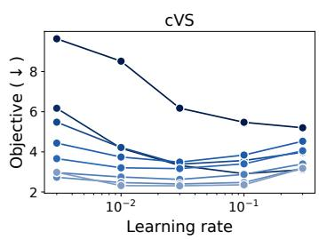

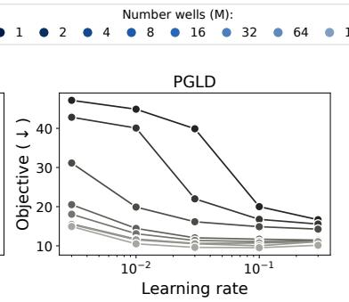

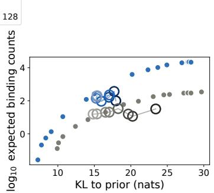  
Figure 10: Performance of cVS and PGLD as the number of wells M increases, on the scFv CDRH3 designs. Left: free cVS. Middle: PGLD. Right: post-quantization cVS for increasing M, compared to PGLD with increasing M.

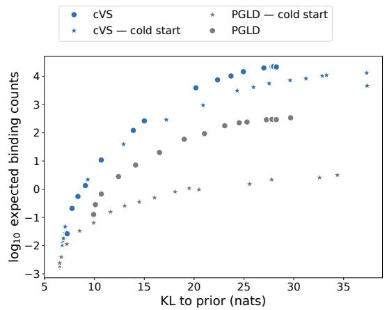  
Figure 11: Performance of cVS and PGLD with and without pretraining on the forward KL objective, on the scFv CDRH3 designs.

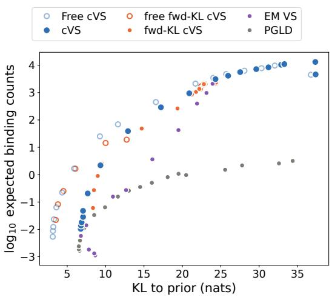

Figure 12: Performance on the scFv CDRH3 designs with total reward evaluations held fixed. Here each method is trained from scratch, using 5 million evaluations of the reward and prior, rather than including an added pre-training phase for cVS and PGLD as in Figure 3a.  
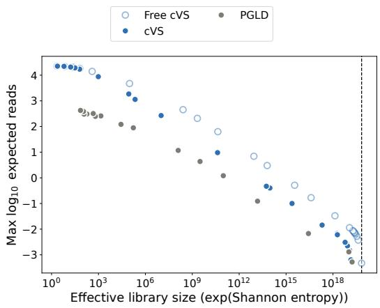  
Figure 13: Pareto frontier for cVS versus PGLD, measuring diversity by the Shannon entropy, on the scFv CDRH3 designs. X-axis is the exponential of the Shannon entropy of qθ(x), a measure of the effective library size. These designs are trained on a uniform prior rather than a human prior, to optimize for this diversity measure.

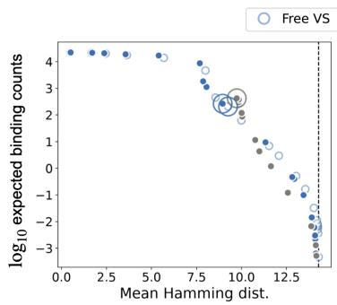

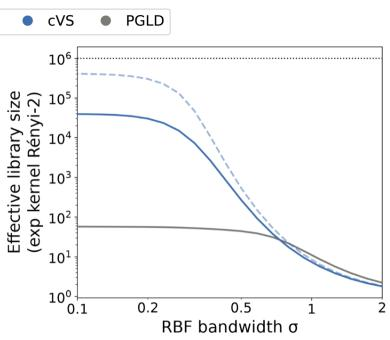  
Figure 14: Diversity measured by the exponential of the kernel 2-Renyi entropy, on the scFv CDRH3 designs. We compare a cVS design to a PGLD design with the same constraints and same average reward, which achieves similar mean Hamming distance among sequences (left). We find similar diversity at high RBF kernel bandwidths, but cVS reaches much higher diversity at low bandwidths, indicating PGLD finds spread out but narrow modes compared to cVS (right).

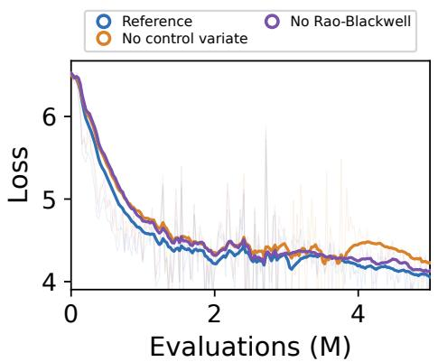

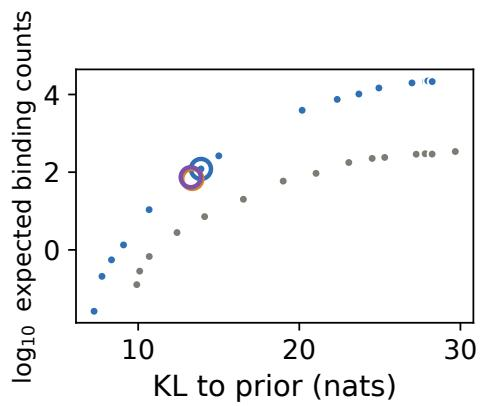  
Figure 15: Ablating gradient variance reduction strategies, on the scFv CDRH3 designs. Removing the prior Rao-Blackwellization or the REINFORCE control variate reduces variance (left) but leads to only a minor change in final performance (right).

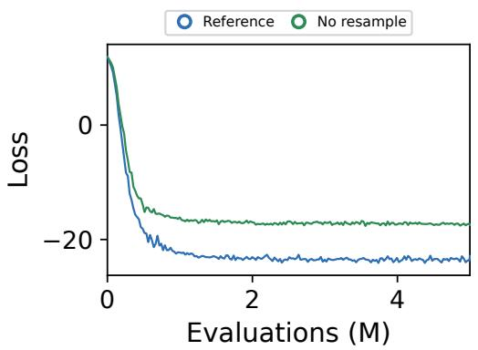

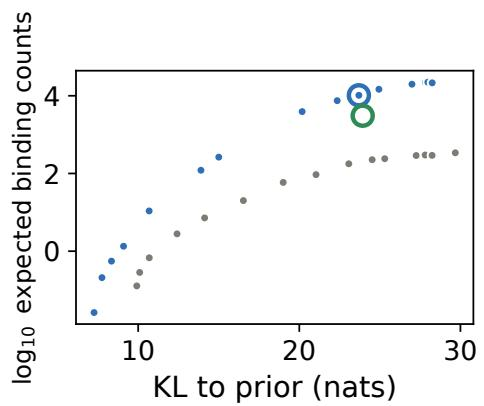  
Figure 16: Ablating split-merge resampling of wells, on the scFv CDRH3 designs. Removing the split-merge step (Section A) decreases performance.

(a)  
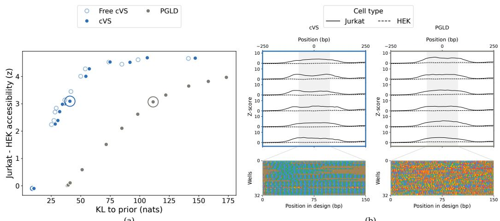  
(b)  
Figure 17: Designed regulatory DNA sequences in a genomic context. Same as Figure 4 but the designs are done in a random genomic context, rather than EF1α. (a) Quality-diversity Pareto frontier, evaluating the average difference in cell-type accessibility versus the KL to the human genome prior. (b) Predicted accessibility of sampled sequences (above) from the learned synthesis models (below). Positions in each well are colored by the nucleotide mixture.

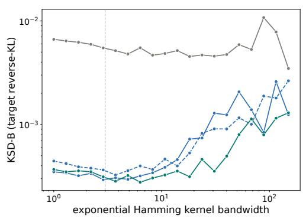  
(a)

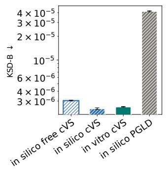  
(b)  
Figure 18: KSD-B of EF1α libraries computed with with exponential Hamming kernels (a) KSD-B as in Figure 5b but computed with an exponential Hamming kernel with a scanned bandwidth $\sigma ,$ rather than an IMQ Hamming. (b) Same as in (a) but with a fixed $\sigma = 3$ and five independent redraws for each model (error bars: SEM across redraws)