# CONTROL-GEOMETRY STRAIGHTENING FORSAMPLING-BASED LATENT PLANNING

Ziang Fu1 Ning Ning1∗

1Texas A&M University

## ABSTRACT

Joint-embedding predictive architectures enable planning with latent world models, but accurate transition prediction alone does not ensure that the planning objective is easy to optimize. We introduce Control-Geometry Straightening (CGS), a single auxiliary loss that learns planner-friendly representations by directly straightening control geometry for sampling-efficient planning. CGS matches pairwise cosine similarities among actions to those among corresponding latent differences only using local transitions from pixel–action pairs. The loss can be applied across world-model architectures using end-to-end learned or pretrained representations. Under linear-dynamics, our theoretical analysis connects this objective to temporal straightening and more balanced terminal-cost curvature across the full planning horizon, yielding finite-budget guarantees for MPPI, local contraction results for CEM, and convergence bounds for gradient descent. Across four control environments and multiple planners, CGS improves planning with fewer sampled candidates and refinement steps, achieving success-rate gains up to 20 and 12.6 percentage points over LeWorldModel (LeWM) and its temporal-straightening variant (LeWM+TS), respectively, with sampling-based planners using 128 candidates per update. Probes, comparisons with DINO-WM architecture, and planner-side ablations clarify how latent motion organization, state dependence, and dynamical context shape planning behavior. Straightening control geometry thus makes good action sequences easier to find under limited planning budgets.

## 1 INTRODUCTION

Latent world models enable agents to plan by predicting the consequences of actions in a learned representation space (Hafner et al., 2019; LeCun, 2022). Joint-embedding predictive architectures (JEPAs) predict future embeddings (Assran et al., 2023; Bardes et al., 2024). DINO-WM demonstrates the effectiveness of prediction on pretrained visual features (Zhou et al., 2025), while LeWorldModel (LeWM) enables stable end-to-end learning of the encoder and predictor directly from pixels (Maes et al., 2026). Across these approaches, planning relies on anti-collapsing predictive representations, while the geometry exposed to action optimization remains underspecified.

Sampling-based planners address nonconvex action-sequence optimization by evaluating predicted rollouts in parallel. CEM and MPPI optimize action sequences through elite selection or costweighted updates iteratively (de Boer et al., 2005; Williams et al., 2017; Yi et al., 2024). A central bottleneck is planning time, especially under tight sampling budgets, since each refinement requires many multi-step model rollouts. We therefore ask: what representation geometry makes good action sequences easier tofind with limited sampled candidates and refinement steps?

Moving from predictive to planner-friendly representations requires more than accurate transition prediction: the representation geometry must also make the planning objective easier to optimize. Temporal Straightening (TS) regularizes latent-trajectory curvature, making latent distances reflect feasible progress and improving conditioning for gradient-based (GD) planning (Wang et al., 2026b). LeWM already exhibits implicit temporal straightening without a curvature loss (Maes et al., 2026); adding explicit TS shows environment-dependent effects in straightness and planning (Figure 12; Table 1). Yet TS aligns consecutive latent differences without explicitly structuring how actions shape latent transitions. This motivates directly shaping control geometry: how action effects are represented and accumulate through learned dynamics to determine the terminal-cost landscape.

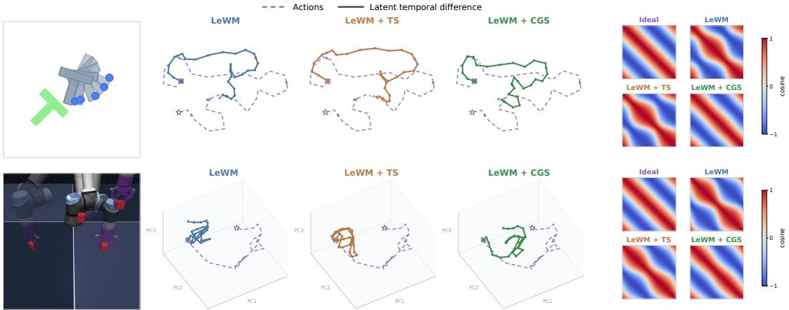  
Figure 1: CGS preserves action-related turns and control-response geometry. PushT (top) and Cube (bottom), with LeWM (blue), LeWM+TS (brown), and LeWM+CGS (green). Middle: transition shaping. CGS makes latent transitions follow action-related turns more closely than LeWM and TS. Right: control-response geometry. The heatmaps show pairwise cosines of predicted endpoint changes induced by action-sequence perturbations; Ideal gives the angular relations among the perturbations themselves. CGS more closely preserves these relations in the tested control plane.

We introduce Control-Geometry Straightening (CGS), which learns this geometry from local transitions by matching pairwise cosine similarities among actions to those among their corresponding latent differences. This single auxiliary loss applies directly to latent transitions and transfers across both end-to-end and pretrained world-model representations. Our linear-dynamics theoretical analysis shows how CGS straightens this geometry, promoting more balanced terminal-cost curvature across the full planning horizon for more effective action search. Experiments show substantial success-rate gains over LeWM and LeWM+TS across multiple planners, together with improved performance using fewer sampled candidates and refinement steps.

Our contributions are threefold:

• Planner-friendly representation learning. We introduce CGS, a single auxiliary loss that matches action and latent-difference cosine similarities to learn planner-friendly representations only using local transitions from pixel–action pairs, directly straightening control geometry for more effective multi-step planning under limited planning budgets.

• Geometry-to-planning theory. Under linear-dynamics, we develop a theoretical analysis linking world-model representation geometry to the optimization behavior of planners through finite-horizon planning curvature. This yields finite-budget guarantees for MPPI, local contraction results for CEM, and convergence bounds for gradient descent.

• Empirical validation and characterization. Across multiple planners, CGS improves planning performance and sample efficiency, reaching success-rate gains up to 20 and 12.6 percentage points over LeWM and LeWM+TS, respectively. Probes, cross-architecture comparisons with DINO-WM, and targeted planner-side ablations further clarify how latent motion organization, state dependence, and dynamical context shape planning behavior.

## 2 RELATED WORK

Latent world models and JEPA. Latent world models learn compact dynamics for planning (Ha & Schmidhuber, 2018; Hafner et al., 2019; Hansen et al., 2024). JEPAs predict embeddings without reconstructing pixels (LeCun, 2022; Assran et al., 2023; Bardes et al., 2024). DINO-WM and V-JEPA 2-AC build on pretrained visual features, while PLDM and LeWM learn representations and dynamics jointly (Zhou et al., 2025; Assran et al., 2025; Sobal et al., 2025; Maes et al., 2026). Much of this development addresses representation collapse through stable targets, variance regularization, or distribution matching (Assran et al., 2023; Bardes et al., 2022; Balestriero & LeCun, 2025). These mechanisms stabilize predictive learning, while leaving underdetermined how representation geometry should support planning by making good action sequences easier to find (Li et al., 2026).

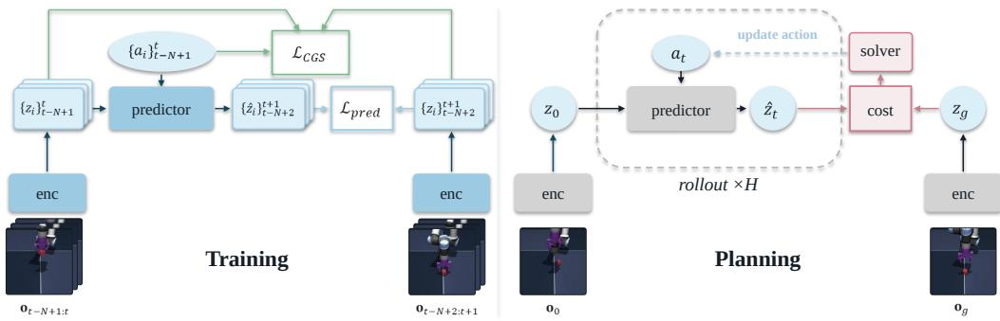  
Figure 2: CGS training and planning. During training, we minimize the prediction loss between predicted and encoded target embeddings, together with a CGS loss that matches pairwise cosine similarities of standardized actions and consecutive latent differences; SIGReg is omitted from the diagram. During planning, we roll out candidate action sequences for H steps using the frozen predictor and refine them with a sampling-based planner to minimize the distance between the predicted terminal embedding and the goal embedding.

Planner-friendly representations. Earlier work learns locally linear latent dynamics for trajectory optimization or representations through differentiable planners (Watter et al., 2015; Zhang et al., 2019; Srinivas et al., 2018). Recent JEPA methods add goal-conditioned values, budget-conditioned reachability, or future-goal inverse control (Destrade et al., 2025; Li et al., 2026; Sun et al., 2026). Inverse-dynamics objectives retain action information in latent transitions (Ivashkov et al., 2026; Zhang et al., 2026b). Temporal Straightening aligns consecutive latent displacements to reduce trajectory curvature (Wang et al., 2026b), without structuring how actions shape latent transitions. Relational and similarity-preserving objectives in vision knowledge distillation transfer structure between teacher and student representations (Park et al., 2019; Tung & Mori, 2019).

Sampling-based MPC. CEM fits proposals to low-cost elites; MPPI weights candidates by rollout cost (de Boer et al., 2005; Williams et al., 2017). iCEM reuses samples, CoVO-MPC adapts covariance, and Biased-MPPI and PRISM use controller or learned-prior proposals (Pinneri et al., 2021; Yi et al., 2024; Trevisan & Alonso-Mora, 2024; Wang et al., 2026c). Theory studies MPPI updates and finite-sample stability (Fazlyab et al., 2026; Yoon & Kim, 2026). Sampling efficiency also depends on the horizon, effective action dimension, cost landscape, and proposal design (Yoon et al., 2022). See Appendix A for more discussions about extended related work.

## 3 CONTROL-GEOMETRY STRAIGHTENING

For our main analysis, we formulate CGS using the end-to-end LeWM architecture (Maes et al., 2026) and offline pixel–action trajectories $\left( o _ { t } , a _ { t } \right)$ . CGS learns control geometry by matching pairwise cosine similarities among actions to those among their corresponding latent differences. As developed below, this local geometric constraint straightens the finite-horizon planning geometry. Figure 2 shows the training and planning pipeline; the SIGReg term is omitted from the diagram.

## 3.1 LATENT WORLD MODEL AND PLANNING SETUP

Following LeWM (Maes et al., 2026), our latent world model has two components:

Encoder:

Predictor:

$$
\begin{array} { r l } & { z _ { t } = f _ { \theta } ( o _ { t } ) , } \\ & { \widehat { z } _ { t - N + 2 : t + 1 } = g _ { \phi } ( z _ { t - N + 1 : t } , a _ { t - N + 1 : t } ) . } \end{array}\tag{1}
$$

The encoder $f _ { \theta }$ is a tiny ViT (Dosovitskiy et al., 2021). It constructs embedding $z _ { t } \in \mathbb { R } ^ { d }$ with observation $o _ { t }$ from the output [CLS] token through an MLP projection step. The transformer predictor $g _ { \phi }$ followed by an MLP projector, takes a history of N frame representations and corresponding actions $a _ { t } \in \mathbb { R } ^ { d _ { a } }$ as input. Equation (1) expresses prediction in sequence-to-sequence form, with N input frames and N next-step predictions. Specifically, temporal causal masking is used in the predictor to restrict each next-step prediction to inputs at or before the current time, as shown in Eq. (2):

$$
\widehat { z } _ { t - N + 2 } = g _ { \phi } ( z _ { t - N + 1 } , a _ { t - N + 1 } ) , \ \dots \ , \ \widehat { z } _ { t + 1 } = g _ { \phi } ( z _ { t - N + 1 : t } , a _ { t - N + 1 : t } ) .\tag{2}
$$

At planning time, we optimize an action sequence $\pmb { a } = ( a _ { 0 } , \ldots , a _ { H - 1 } ) \in \mathbb { R } ^ { H \times d _ { a } }$ with frozen world model as the dynamical model. We encode the initial and goal observation pixels to $z _ { \mathrm { 0 } }$ and $z _ { g }$ , and search for an action sequence whose predicted latent rollout minimizes the goal-matching cost

$$
\begin{array} { r } { C ( \pmb { a } ) = \frac 1 2 \| \widehat { F } _ { H } ( \pmb { a } ) - z _ { g } \| _ { 2 } ^ { 2 } , } \end{array}\tag{3}
$$

where the terminal latent prediction over a horizon H is denoted as ${ \widehat { F } } _ { H } ( { \pmb { a } } )$

## 3.2 LEARNING CONTROL GEOMETRY BY PAIRWISE SIMILARITY MATCHING

We seek to straighten control geometry in the latent space by matching the pairwise cosine similarities of latent differences to those of actions. For each transition t, let $\Delta z _ { t } \bar { = } f _ { \theta } ( o _ { t + 1 } ) - f _ { \theta } ( o _ { t } )$ . Consider a history window with $N \geq 2$ transitions, and define $\begin{array} { r } { u _ { t } = \frac { a _ { t } } { \| a _ { t } \| _ { 2 } } , v _ { t } = \frac { \Delta z _ { t } } { \| \Delta z _ { t } \| _ { 2 } } } \end{array}$ . Stack them as the rows of $U \in \mathbb { R } ^ { N \times d _ { a } }$ and $V \in \mathbb { R } ^ { N \times d }$ . Their cosine Gram matrices are

$$
K _ { A } = U U ^ { \top } , \qquad K _ { Z } = V V ^ { \top } ,\tag{4}
$$

Thus, $K _ { A }$ and $K _ { Z }$ contain pairwise action and latent-difference cosines, respectively. CGS minimizes

$$
\mathcal { L } _ { \mathrm { C G S } } = \frac { \Vert K _ { Z } - K _ { A } \Vert _ { F } ^ { 2 } } { N ( N - 1 ) } = \frac { 1 } { N ( N - 1 ) } \sum _ { t \neq s } \left[ \cos ( \Delta z _ { t } , \Delta z _ { s } ) - \cos ( a _ { t } , a _ { s } ) \right] ^ { 2 } ,\tag{5}
$$

where $\| \cdot \| _ { F }$ denotes the Frobenius norm. Both matrices have unit diagonal, so the loss averages squared discrepancies over $N ( N - 1 )$ off-diagonal entries. CGS uses action directions as a geometric reference for latent transitions: aligned, orthogonal, and opposing actions encourage corresponding angular relationships between latent differences. The pairwise matching form resembles similaritypreserving knowledge distillation (Tung & Mori, 2019). Here, actions instead provide the reference geometry for latent transitions, and the matched relations encode control geometry for planning. As developed in Section 4, this local geometric constraint promotes more balanced finite-horizon planning curvature and more effective action search under limited sampling budgets.

Relation to temporal straightening. When consecutive actions point in the same direction, $u _ { t } ^ { \top } u _ { t + 1 } = 1$ , TS and CGS both encourage consecutive latent differences to align. The adjacent CGS term is then $( 1 - v _ { t } ^ { \top } v _ { t + 1 } ) ^ { 2 }$ , the squared angular TS loss in Wang et al. (2026b).

## 3.3 TRAINING OBJECTIVE

We jointly train the encoder and predictor with CGS and the LeWM objectives. Using the N-frame history window, the prediction loss is

$$
\mathcal { L } _ { \mathrm { p r e d } } = ( N d ) ^ { - 1 } \left. \widehat { z } _ { t - N + 2 : t + 1 } - z _ { t - N + 2 : t + 1 } \right. _ { F } ^ { 2 } .\tag{6}
$$

The factor $( N d ) ^ { - 1 }$ averages squared errors over the $N$ next-step predictions and d latent coordinates. The base objective of LeWM (Maes et al., 2026) is

$$
\mathcal { L } _ { \mathrm { L e W M } } = \mathcal { L } _ { \mathrm { p r e d } } + \lambda _ { \mathrm { S I G R e g } } \mathcal { L } _ { \mathrm { S I G R e g } } ,\tag{7}
$$

where $\mathcal { L } _ { \mathrm { S I G R e g } }$ is LeWM’s SIGReg anti-collapse term, which promotes feature diversity by encouraging an isotropic Gaussian distribution of latent embeddings (Maes et al., 2026). The full training objective is

$$
\begin{array} { r } { \mathcal { L } = \mathcal { L } _ { \mathrm { L e W M } } + \lambda _ { \mathrm { C G S } } \mathcal { L } _ { \mathrm { C G S } } , } \end{array}\tag{8}
$$

where $\lambda _ { \mathrm { C G S } } \geq 0$ controls the strength of the control geometry straightening. To help preserve the predictive geometry while gradually introducing control-geometry regularization, we linearly ramp the CGS weight from zero to the final value $\lambda _ { \mathrm { C G S } }$ over the first 5% of training updates. We use the default history length $N = 3$ throughout training, following LeWM (Maes et al., 2026). Additional ablations and discussion of the ramp schedule and history length appear in Appendix C.6.

## 4 THEORY: FROM CGS TO SAMPLING-EFFICIENT PLANNING

In this section, we analyze how CGS supports sampling-efficient planning under linear latent dynamics. We connect CGS to temporal straightening and balanced action effects, then derive consequences for finite-budget planning over a finite horizon. Full proofs, theoretical results of CEM and gradientbased planners, and finite-budget detailed discussions are provided in Appendix D.

Setup. For analysis, we study linear latent dynamics,

$$
z _ { t + 1 } = A z _ { t } + B a _ { t } ,\tag{9}
$$

with $A \in \mathbb { R } ^ { d \times d }$ and $B \in \mathbb { R } ^ { d \times d _ { a } }$ . We first consider $d _ { a } = d$ with B invertible; see Remark $4 . 5$ for $d _ { a } < d .$ . For goal-reaching planning, we optimize the action sequence $\pmb { a } = ( a _ { 0 } , \ldots , a _ { H - 1 } ) \in \mathbb { R } ^ { H \times d _ { a } }$ $n _ { H } = H \times d _ { a }$ , to minimize the terminal latent goal-matching objective

$$
\begin{array} { r } { C ( \mathbf { a } ) = \frac 1 2 \| z _ { H } - z _ { g } \| _ { 2 } ^ { 2 } , \quad z _ { H } = \widehat { F } _ { H } ( \pmb { a } ) , } \end{array}
$$

with latent goal $z _ { g }$ and terminal prediction ${ \widehat { F } } _ { H } ( { \pmb { a } } )$ as in Eq. (3), where planning horizon $H \geq 2$

## 4.1 LATENT CONTROL GEOMETRY LEARNED BY CGS

Letting $D : = A - I _ { d }$ , with $I _ { d }$ denoting the $d \times d \cdot$ -dimensional identity matrix, the latent difference is $\Delta z _ { t } = D z _ { t } + B a _ { t }$ . Under the fixed-radius assumption in Eq. (35), the population CGS loss is a positive multiple of $\dot { \mathcal { L } } _ { G } ( c ) : = \mathbb { E } [ ( \Delta z ^ { \top } \Delta z ^ { \prime } - c a ^ { \top } a ^ { \prime } ) ^ { \dot { 2 } } ]$ , where $( \bar { \Delta } z , a )$ and $\hat { ( \Delta z ^ { \prime } , a ^ { \prime } ) }$ are independent transition samples and $c > 0$ is a scale factor set by fixed radii of actions and latent differences.

Assumption 4.1 (Bounded features and joint coverage). Following Yin et al. (2022), we assume there exists a feature map ψ satisfying (i) boundedness, $\| \psi ( z _ { t } , a _ { t } ) \| _ { 2 } ^ { 2 } \leq \bar { \rho } < \infty \mathrm { a . s . }$ , and (ii) coverage, $\lambda _ { \operatorname* { m i n } } ( \Sigma _ { x } ) \geq \rho > 0$ , where $\Sigma _ { x } : = \mathbb { E } [ \psi ( z _ { t } , a _ { t } ) \psi ( z _ { t } , a _ { t } ) ^ { \dagger } ]$ . Here we use $\psi ( z _ { t } , a _ { t } ) = x _ { t } = [ z _ { t } ^ { \top } , a _ { t } ^ { \top } ] ^ { \top }$ Proposition 4.2 (Temporal straightening and control isotropy under CGS). Under Assumption 4.1, $\rho I _ { 2 d } \preceq \Sigma _ { x } \preceq \bar { \rho } I _ { 2 d }$ . With $\mathscr { R } ( A , \tilde { B } ) : = \| \tilde { D } ^ { \top } D \| _ { F } ^ { 2 } + 2 \| D ^ { \top } \hat { B } \| _ { F } ^ { 2 } + \| B ^ { \top } B - c I _ { d _ { a } } \| _ { F } ^ { 2 }$ , we have

$$
\rho ^ { 2 } \mathcal { R } ( A , B ) \leq \mathcal { L } _ { G } ( c ) \leq \bar { \rho } ^ { 2 } \mathcal { R } ( A , B ) .\tag{10}
$$

In this model class, $\mathcal { L } _ { G } ( c ) = 0 i f f A = I _ { d }$ and $B ^ { \top } B = c I _ { d _ { a } }$ ; Proofis in Appendix D.1.1.

Under Assumption 4.1, CGS encourages temporal straightening $( A \approx I _ { d } )$ , reduces drift–control coupling $( D ^ { \top } \bar { B } \approx 0 )$ and promotes balanced action effects $( B ^ { \bar { \top } } B \approx c I _ { d _ { a } } )$ . During joint training, prediction and other losses may favor different representation geometry, so the CGS loss may remain nonzero. CGS can still improve control geometry under these constraints; see Appendix D.7.

## 4.2 FROM FINITE-HORIZON PLANNING GEOMETRY TO FINITE-BUDGET MPPI

Unrolling (9) gives $z _ { H } = A ^ { H } z _ { 0 } + \Gamma _ { H } \mathbf { a }$ , where $\Gamma _ { H } = [ A ^ { H - 1 } B , \dots , B ]$ , and the planning Hessian is $G _ { H } : = \bar { \nabla } _ { \mathbf { a } } ^ { 2 } C \overset { \cdot } { = } \Gamma _ { H } ^ { \top } \Gamma _ { H }$ . Since $B$ is invertible, $G _ { H }$ has rank $d ,$ and its positive eigenvalues coincide with those of the controllability Gramian $W _ { H } : = \Gamma _ { H } \Gamma _ { H } ^ { \top }$ . We measure conditioning by the ratio of the largest to smallest positive eigenvalues. Let $P _ { H } : = H ^ { - 1 } ( \mathbf { 1 } _ { H } \mathbf { 1 } _ { H } ^ { \top } ) \otimes I _ { d _ { a } }$ , where $\mathbf { 1 } _ { H } \in \mathbb { R } ^ { H }$ is the all-ones vector. This rank- $\cdot d _ { a }$ orthogonal projector maps onto the subspace of action-sequence perturbations constant across time. When $A = I _ { d }$ and $\begin{array} { r } { B ^ { \top } B = c I _ { d _ { a } } , z _ { H } = z _ { 0 } + B \sum _ { t } a _ { t } } \end{array}$ and $\mathbf { \bar { { G } } } _ { H } = c H P _ { H } $ , yielding equal curvature along all directions in this active subspace, termed planning isotropy. With isotropic Gaussian proposals, population MPPI updates then contract all active directions equally, balancing refinement across action directions. The rightmost heatmaps of Figure 1 illustrate CGS’s strong performance in planning isotropy (Appendix C.2.2).

Corollary 4.3 (From CGS loss to drift and control bounds). Under Assumption 4.1, Proposition 4.2 implies the following. $I f { \cal L } _ { G } ( c ) \leq \ell ,$ define $\varepsilon = ( \sqrt { \ell } / \rho ) \operatorname* { m a x } \{ 1 , ( 2 c ) ^ { - 1 / 2 } , c ^ { - 1 } \}$ . Then $\| D \| _ { \mathrm { o p } } ^ { 2 } \leq \varepsilon ,$ $\| D ^ { \top } B \| _ { \mathrm { o p } } \leq { \sqrt { c } } \varepsilon ,$ , and $\| B ^ { \top } B - c I _ { d _ { a } } \| _ { \mathrm { o p } } \leq c \varepsilon$ . Here $\| \cdot \| _ { \mathrm { o p } }$ is the spectral norm. These quantify worst-direction geometric deviations. We call these the $\varepsilon { - } C G S$ bounds. Proofis in Appendix $D . I . { \dot { 2 } } .$

Theorem 4.4 (CGS controls the planning Hessian). Suppose the three bounds in Corollary 4.3 hold $f o r 0 \le \varepsilon < 1$ , there exists $\xi _ { H }$ (defined in Eq. (50)) such that

$$
\bigg \vert \bigg \vert \frac { G _ { H } } { c H } - P _ { H } \bigg \vert \bigg \vert _ { \mathrm { o p } } \le \xi _ { H } ( \varepsilon ) , \quad \xi _ { H } ( \varepsilon ) = ( 2 H ^ { 2 } - 3 H + 2 ) \varepsilon + O _ { H } ( \varepsilon ^ { 3 / 2 } ) ,\tag{11}
$$

where $O _ { H }$ hides constants depending only on the fixed horizon H. $I f \xi _ { H } : = \xi _ { H } ( \varepsilon ) < 1$ , then, writing $\begin{array} { l } { r \ = \ d _ { a } \ = \ d } \end{array}$ and $\sigma _ { 1 } ( G _ { H } ) \ \geq \ \cdots \ \geq \ \sigma _ { n _ { H } } ( G _ { H } )$ , the first r singular values (equivalently, eigenvalues) lie in $[ c H ( 1 - \xi _ { H } ) , c H ( 1 + \xi _ { H } ) ] ,$ , all remaining singular values are zero, and $\kappa _ { \mathrm { e f f } } ( G _ { H } ) : = \sigma _ { 1 } ( G _ { H } ) / \sigma _ { r } ( G _ { H } ) \leq ( 1 + \xi _ { H } ) / ( 1 - \xi _ { H } )$ . Proofis in Appendix D.2.1.

For fixed $H \geq 2$ and the same control-isotropy tolerance, CGS directly controls $\| D ^ { \top } B \| _ { \mathrm { o p } } = O ( \varepsilon )$ via its explicit mixed drift–control defect bound, while temporal straightening gives the indirect $O ( { \sqrt { \varepsilon } } )$ bound. This sharpens the Hessian perturbation from $\bar { O } _ { H } ( \sqrt { \varepsilon } )$ to $O _ { H } ( \varepsilon ) ;$ ; see Appendix D.2. Remark 4.5 (Low-dimensional actions). When $d _ { a } < d ,$ the bound on $\| G _ { H } / ( c H ) - P _ { H } \| _ { \mathrm { o p } }$ in Theorem 4.4 remains valid on the full action-sequence space $\mathbb { R } ^ { n _ { H } }$ . For $\xi _ { H } < 1$ , its condition-number bound holds on the subspace spanned by the leading $d _ { a }$ eigenvectors of $G _ { H }$ , and the subsequent planner analyses are carried out on these directions. See Appendix D.2.2.

Theorem 4.6 (MPPI population mean update). Assume $\xi _ { H } < 1 .$ . Let $\tau > 0$ be the MPPI temperature and $\sigma _ { \mathrm { p } } ~ > ~ 0$ the sampling standard deviation. Let a⋆ minimize $C ,$ , condition on the proposal $\mathcal { N } ( \mu , \bar { \sigma } _ { \mathrm { p } } ^ { 2 } I _ { n _ { H } } )$ , and set $\nu = \sigma _ { \mathrm { p } } ^ { - 1 } ( \mu - { \bf a } ^ { \star } )$ , $M _ { H } = G _ { H } / ( c H )$ , and $s = \sigma _ { \mathrm { p } } ^ { 2 } c H / \tau$ . Let ${ \cal S } _ { H } : = \ $ range $\left( G _ { H } \right)$ , which has dimension $r = d ,$ , and contraction qM $\begin{array} { r } { \mathrm { : = \| \boldsymbol J _ { M } | _ { \boldsymbol S _ { H } } \| _ { \mathrm { o p } } , } } \end{array}$ defined as the spectral norm ofthe Jacobian restricted to the active subspace $\boldsymbol { S _ { H } }$ . The population map, Jacobian, and active contraction are

$$
\begin{array} { r l r } & { } & { T _ { \mathrm { M } } ( \nu ) = J _ { \mathrm { M } } \nu , \qquad J _ { \mathrm { M } } = ( I _ { n _ { H } } + s M _ { H } ) ^ { - 1 } , \qquad } \\ & { } & { q _ { \mathrm { M } } = \cfrac { 1 } { 1 + ( \sigma _ { \mathrm { p } } ^ { 2 } / \tau ) \sigma _ { r } ( G _ { H } ) } \leq \cfrac { 1 } { 1 + s ( 1 - \xi _ { H } ) } . } \end{array}\tag{12}
$$

Moreover, $\kappa ( { J _ { \mathrm { M } } } | _ { \mathcal { S } _ { H } } ) \leq [ 1 + s ( 1 + \xi _ { H } ) ] / [ 1 + s ( 1 - \xi _ { H } ) ] ,$ ; at $M _ { H } = P _ { H }$ , all active directions contract uniformly by $( 1 + s ) ^ { - 1 }$ . Proofis in Appendix D.4.1.

Finite-budget planning cost. Let $\mu _ { i }$ be the mean after i MPPI updates and $\Delta _ { i } : = C ( \mu _ { i } ) - C ( \mathbf { a } ^ { \star } )$ its planning cost gap. Fix $\sigma _ { \mathrm { { p } } }$ and $\tau ,$ use $K$ independent samples per update, and impose the minimum-K condition in Eq. (91). With probability at least $1 - \zeta$ , the cost gap after I updates satisfies $\sqrt { \Delta _ { I } } \leq q _ { \mathrm { M } } ^ { I } \sqrt { \Delta _ { 0 } } \dot { + } ( 1 - q _ { \mathrm { M } } ^ { I } ) b _ { K } \dot { / } ( 1 - q _ { \mathrm { M } } )$ whenever $\| \mu _ { i } - \mathbf { a } ^ { \star } \| _ { 2 } \leq \sigma _ { \mathrm { { p } } } \bar { \cal R } _ { \iota }$ for all $0 \overset { \cdot } { \leq } i < I .$ , where $R _ { \nu }$ is defined in Eq. (76). Here $b _ { K } : = \sigma _ { \mathrm { p } } \mathcal { A } _ { \mathrm { M } } ( R _ { \nu } ) \sqrt { c H ( 1 + \xi _ { H } ) } r \log ( 4 r I / \zeta ) / ( 2 K )$ bounds the per-update sampling contribution to the square-root cost gap, and $A _ { \mathrm { M } } ( R _ { \nu } )$ is a dimension-dependent importance-weight factor. With $q _ { \mathrm { M } } < 1$ , more updates suppress the initial error, while more samples reduce the sampling term. Appendix D.4.3 gives the factor’s definition, the proof, and sufficient

budgets for a prescribed target error.

Theorem 4.6 shows how CGS balances population MPPI updates by promoting comparable curvature across active action directions. With the cost scale calibrated, this spectral balance can support faster population contraction and a higher probability of progress under a limited sampling budget. In trace-normalized quadratic probes of Cube’s XYZ translation subspace, CGS yields a lower population contraction factor $q _ { \infty }$ and a higher one-step progress probability $\mathrm { P r } ( q _ { K } < 1 )$ at the same sample budget per update across models (Figure 3).

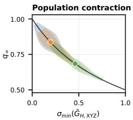

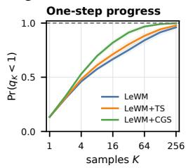  
Figure 3: MPPI contraction and finite-sample improvement. (a) CGS lowers population contraction $q _ { \infty } ; \sigma _ { \mathrm { m i n } }$ measures the weakest curvature. (b) CGS increases $\mathrm { P r } ( q _ { K } < 1 )$ , where $q _ { K }$ is the K-sample contraction factor. Definitions and protocol: Appendix C.4.

Remark 4.7 (CEM and gradient-based planner). Appendix D.5 shows that the same projector

geometry of the planning Hessian makes the local CEM mean update approximately scalar on its active subspace, reducing directional imbalance in elite selection. For gradient descent planner, Appendix D.6 also gives planning-cost convergence bounds on the leading controllable directions across iterative updates, linking CGS Hessian geometry to first-order action optimization.

## 5 MAIN RESULTS: PLANNING PERFORMANCE AND SAMPLE EFFICIENCY

## 5.1 EXPERIMENTAL SETUP

Environments and models. We evaluate PushT (Chi et al., 2023), Cube (Park et al., 2025), TwoRooms (Sobal et al., 2025), and Reacher (Tunyasuvunakool et al., 2020) using offline pixel– action data. All LeWM-based models follow the training setup of Maes et al. (2026). We keep the base LeWM hyperparameters fixed across methods, including a shared SIGReg weight of 0.09, and vary only the coefficient introduced by each additional regularizer. For LeWM+TS (Wang et al.,

Candidates K (d) Reacher  
Candidates K (b) Cube  
Table 1: Goal-reaching success rate (SR) at $K = 1 2 8 .$ . Values are reported as means ± sample standard deviation (SD), in %. Bold marks the best per planner and environment, including ties. Parentheses report gains over LeWM in percentage points; the top two per environment are underlined. Prior-guided (PG) variants (†) use action-prior initialization. Sampling planners use $I = 3 0$ optimization steps; gradient descent (GD) uses 100 Adam optimization steps, independent of K.
<table><tr><td>World model</td><td>Planner</td><td>PushT</td><td>Cube</td><td>TwoRooms</td><td>Reacher</td></tr><tr><td>LeWM</td><td>MPPI</td><td> $\overline { { 6 4 . 0 \pm 5 . 3 } }$ </td><td> $\overline { { 5 9 . 3 \pm 4 . 6 } }$ </td><td> $\overline { { 9 2 . 0 \pm 3 . 5 } }$ </td><td> $\overline { { 6 5 . 3 \pm 4 . 2 } }$ </td></tr><tr><td></td><td>PG-MPPI†</td><td> $7 2 . 0 \pm 6 . 0$ </td><td> $8 9 . 3 \pm 4 . 2$ </td><td> $9 8 . 0 \pm 2 . 0 $ </td><td> $6 2 . 7 \pm 1 1 . 0$ </td></tr><tr><td></td><td>CEM</td><td> $8 9 . 3 \pm 6 . 1$ </td><td> $6 3 . 3 \pm 2 . 3$ </td><td> $7 6 . 7 \pm 1 0 . 1$ </td><td> ${ \bf 8 3 . 3 \pm 8 . 3 }$ </td></tr><tr><td></td><td>PG-CEM†</td><td> $9 2 . 0 \pm 5 . 3$ </td><td> $9 0 . 0 \pm 2 . 0$ </td><td> $9 3 . 3 \pm 3 . 1$ </td><td> ${ \bf 8 6 . 7 \pm 6 . 1 }$ </td></tr><tr><td></td><td>GD</td><td> $8 5 . 3 \pm 5 . 0$ </td><td> $5 9 . 3 \pm { \bf 8 . 1 }$ </td><td> $4 1 . 3 \pm 7 . 0$ </td><td> $7 6 . 7 \pm 4 . 2$ </td></tr><tr><td> $\overline { { \mathrm { L e W M + T S } } }$ </td><td>MPPI</td><td> $\overline { { { 6 4 . 7 \pm 8 . 3 \ ( + 0 . 7 ) } } }$ </td><td> $7 5 . 3 \pm 5 . 0 ( \pm 1 6 . 0 )$ </td><td> $\overline { { 9 7 . 3 \pm 3 . 1 \left( + 5 . 3 \right) } }$ </td><td> $\overline { { 6 4 . 0 \pm 2 . 0 \ ( - 1 . 3 ) } }$ </td></tr><tr><td></td><td>PG-MPPI†</td><td> $6 9 . 3 \pm 9 . 0 \ ( - 2 . 7 )$ </td><td> $9 2 . 7 \pm 3 . 1 \ ( + 3 . 3 )$ </td><td> $9 8 . 0 \pm 2 . 0 \ ( + 0 . 0 ) $ </td><td> $6 6 . 7 \pm 2 . 3 ( + 4 . 0 )$ </td></tr><tr><td></td><td>CEM</td><td> $8 6 . 7 \pm 5 . 0 \ ( - 2 . 7 )$ </td><td> $7 3 . 3 \pm 1 0 . 3 \ ( + 1 0 . 0 )$ </td><td> $\mathbf { 9 7 . 3 \pm 1 . 2 \ ( + 2 0 . 7 ) }$ </td><td> $8 1 . 3 \pm 8 . 1 ( - 2 . 0 )$ </td></tr><tr><td></td><td>PG-CEM†</td><td> $9 0 . 0 \pm 5 . 3 ( - 2 . 0 )$ </td><td> $9 0 . 0 \pm 2 . 0 \ ( + 0 . 0 ) $ </td><td> $\mathbf { 1 0 0 . 0 \pm 0 . 0 \ ( + 6 . 7 ) }$ </td><td> $7 8 . 0 \pm 2 . 0 \ ( - 8 . 7 )$ </td></tr><tr><td></td><td>GD</td><td> $8 2 . 7 \pm 5 . 8 ( - 2 . 7 )$ </td><td> $6 5 . 3 \pm 4 . 6 \ ( + 6 . 0 )$ </td><td> $6 5 . 3 \pm 9 . 9 ( \pm 2 4 . 0 )$ </td><td> $8 1 . 3 \pm 5 . 0 \ ( + 4 . 7 )$ </td></tr><tr><td>LeWM + CGS</td><td>MPPI</td><td> $\overline { { 7 7 . 3 \pm 6 . 4 ( \pm 1 3 . 3 ) } }$ </td><td> $\overline { { 7 9 . 3 \pm 4 . 6 \ ( \pm 2 0 . 0 ) } }$ </td><td> $\overline { { 9 7 . 3 \pm 1 . 2 \left( + 5 . 3 \right) } }$ </td><td> $\overline { { { \bf 6 6 . 7 \pm 2 . 3 \ : ( + 1 . 3 ) } } }$ </td></tr><tr><td></td><td>PG-MPPI†</td><td> $\mathbf { 8 0 . 0 \pm 2 . 0 \ ( \underline { { + 8 . 0 } } ) }$ </td><td> $\mathbf { 9 6 . 7 \pm 3 . 1 \ ( + 7 . 3 ) }$ </td><td> $\mathbf { 1 0 0 . 0 \ L \pm 0 . 0 \ L \left( + 2 . 0 \right) }$ </td><td> ${ \bf 6 9 . 3 \pm 3 . 1 \ ( \pm 6 . 7 ) }$ </td></tr><tr><td></td><td>CEM</td><td> $\mathbf { 9 2 . 0 \pm 3 . 5 \ ( + 2 . 7 ) }$ </td><td> $7 6 . 7 \pm 9 . 5 ( + 1 3 . 3 )$ </td><td> $9 5 . 3 \pm 1 . 2 ( + 1 8 . 7 )$ </td><td> $8 0 . 7 \pm 3 . 1 \ ( - 2 . 7 )$ </td></tr><tr><td></td><td> $\mathbf { P G - C E M ^ { \dagger } }$ </td><td> $\mathbf { 9 6 . 0 \pm 0 . 0 \ ( + 4 . 0 ) }$ </td><td> $\mathbf { 9 6 . 0 \ } \pm 4 . 0 \ ( + 6 . 0 )$ </td><td> $\mathbf { 1 0 0 . 0 \pm 0 . 0 \ ( + 6 . 7 ) }$ </td><td> $8 1 . 3 \pm 3 . 1 \ ( - 5 . 3 )$ </td></tr><tr><td></td><td>GD</td><td> $\mathbf { 8 9 . 3 \pm 6 . 4 \ ( + 4 . 0 ) }$ </td><td> ${ \bf 7 1 . 3 \pm 4 . 6 \ ( + 1 2 . 0 ) }$ </td><td> ${ \bf 7 0 . 7 \pm 3 . 1 \ ( \pm 2 9 . 3 ) }$ </td><td> $\mathbf { 8 2 . 0 \pm 5 . 3 \ ( \pm 5 . 3 ) }$ </td></tr></table>

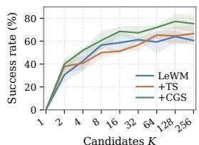  
(a) PushT

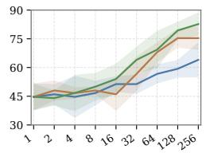

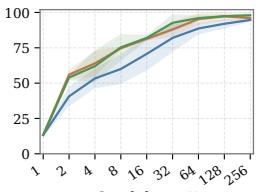  
(c) TwoRooms

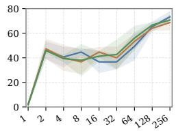  
Figure 4: MPPI success rate versus sampling budget. Means and ± one sample SD, with I = 30 optimization steps and no action prior. CGS leads on PushT and at larger budgets on Cube; TwoRooms approaches saturation. Reacher shows smaller, budget-dependent differences. Environment-specific temperatures are fixed across budgets; See Appendix C.1.2 for results of other planners.

2026b), we sweep $\lambda _ { \mathrm { T S } } \in \{ 0 . 0 1 , 0 . 0 5 , 0 . 1 , 0 . 5 \}$ , yielding selected weights of 0.01 on PushT, 0.1 on Cube and Reacher, and 0.5 on TwoRooms. CGS uses $\lambda _ { \mathrm { C G S } } = 0 . 5$ by default and 0.01 on PushT. Each checkpoint remains fixed across planners and planning budgets. See Appendix C.1.1 for details.

Evaluation and planners. We report goal-reaching success rate (SR, %) as mean ± sample standard deviation (SD). MPPI and CEM use I = 30 optimization steps (iterations), with $K = 1 \mathrm { - } 2 5 6$ candidates and $K = 1 2 8$ in Table 1. Gradient descent (GD) uses 100 Adam optimization steps, independent of K. Prior-guided (PG) variants, PG-MPPI and PG-CEM, initialize the proposal mean with a representation-matched behavior-cloning prior. Evaluation details appear in Appendix C.1.1.

## 5.2 TOWARD EFFICIENT PLANNING WITH ACTION-STRUCTURED LATENT DYNAMICS

Under a shared evaluation protocol, CGS consistently improves over LeWM for all five planners on PushT, Cube, and TwoRooms at $K = 1 2 8 ( \mathrm { T a b l e } 1 )$ , across distinct planning mechanisms. On PushT and Cube, its MPPI gains are 13.3 and 20.0 percentage points over LeWM, respectively. Combining CGS with a learned action prior further improves planning, achieving near-perfect success in several settings. TS also provides a strong baseline, with substantial gains on Cube and TwoRooms and improvements in several other settings. Figure 12 shows that explicit TS further straightens latent trajectories across all four environments, beyond the implicit straightening reported by Maes et al. (2026, Appendix H). On PushT, where this implicit effect is already strong, TS yields only a subtle additional straightening and correspondingly modest planning changes.

The budget sweep in Figure 4 demonstrates sampling-efficient planning under a limited planning budget. On PushT, CGS improves MPPI even with few samples and retains its advantage over both baselines as K increases. On Cube, the gap widens with more samples, reaching around 80% success with CGS versus 60% with LeWM at $\bar { K } = 1 2 8 – 2 5 6$ , suggesting better action search at a fixed candidate budget. TwoRooms is easy for MPPI, plausibly because its limited data diversity and low intrinsic dimensionality simplify action search, yet CGS and TS outperform LeWM at limited budgets, with CGS outperforming both at $K = 3 2$ . Across these environments, CGS improves both attainable success and the rate at which planning budgets translate into successful trajectories.

Table 2: Physical-motion probing on PushT and Reacher. $P _ { A }$ and $P _ { A S }$ measure how well physical motion is identified from action alone or from action and state; these environment-level scores are shared across representations. $D _ { \mathrm { l i n } }$ and $D _ { \mathrm { M L P } }$ decode true motion from $\Delta z _ { t }$ , while $C _ { A }$ and $B _ { A S }$ measure agreement with action-only and state-conditioned control effects. Scores are held-out $R ^ { 2 }$ except the normalized agreement score $B _ { A S }$ (Appendix C.3). Higher is better; bold marks the best representation per metric using unrounded scores.
<table><tr><td colspan="2"></td><td colspan="2">Physical identification</td><td colspan="2">Motion decoding</td><td colspan="2">Control effects</td></tr><tr><td>Environment / effect</td><td>Representation</td><td> $\overline { { P _ { A } } }$ </td><td> $\overline { { P _ { A S } } }$ </td><td> $\overline { { D _ { \mathrm { l i n } } } }$ </td><td> $\overline { { D _ { \mathrm { M L P } } } }$ </td><td> $\overline { { C _ { A } } }$ </td><td> $\overline { { B _ { A S } } }$ </td></tr><tr><td rowspan="3">PushT / agent</td><td>LeWM</td><td rowspan="3">0.999</td><td rowspan="3">0.999</td><td>0.809</td><td>0.888</td><td>0.807</td><td>0.808</td></tr><tr><td>LeWM+TS</td><td>0.831</td><td>0.891</td><td>0.829</td><td>0.830</td></tr><tr><td>LeWM+CGS</td><td>0.903</td><td>0.959</td><td>0.901</td><td>0.902</td></tr><tr><td rowspan="3">Reacher / fingertip</td><td>LeWM</td><td rowspan="3">-0.006</td><td rowspan="3">0.983</td><td>0.951</td><td>0.994</td><td>0.155</td><td>0.932</td></tr><tr><td>LeWM+TS</td><td>0.974</td><td>0.994</td><td>0.157</td><td>0.959</td></tr><tr><td>LeWM+CGS</td><td>0.899</td><td>0.993</td><td>0.041</td><td>0.884</td></tr></table>

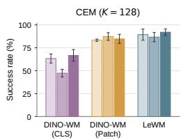

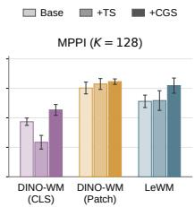

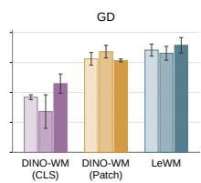

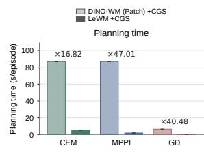  
Figure 5: Planning across representation architectures on PushT. Left: planning success with DINO-WM (with proprioceptive information) global CLS features, spatial Patch features, and the end-to-end LeWM latent under CEM, MPPI, and GD, with Base (w/o TS or CGS), TS, and CGS representation shaping. Right: planner-solve time for DINO-WM (Patch)+CGS versus LeWM+CGS; annotated ratios are DINO-WM/LeWM. Full experimental details are provided in Appendix C.5.

Reacher exhibits a planner-dependent pattern. $\mathrm { A t } \ K = 1 2 8$ , CGS improves GD from 76.7% to 82.0% and MPPI from 65.3% to 66.7%, while CEM remains close to LeWM but slightly lower (80.7% versus 83.3%). TS shows a similar pattern, with a clear GD gain and smaller changes under the sampling-based planners. Across the sample-budget sweep, CGS gives a modest MPPI improvement. Section 6 shows that Reacher fingertip motion depends strongly on the current state beyond the executed action. Appendix C.1.4 compares action-only CGS with state-informed transition references that implicitly capture state and action information. Appendix D.7 then analyzes how irreducible state-dependent drift can limit straightening and reshape the control map favored by CGS.

## 6 CHARACTERIZING CGS: LATENT REPRESENTATIONS AND PLANNING

Probing the physical effects of control. With frozen encoders, we probe how latent differences $\Delta z _ { t }$ represent physical motion on PushT and Reacher. We first ask whether the evaluated displacement is determined by action alone or requires the current state, and then measure how explicitly that motion is represented in $\Delta z _ { t } .$ . Let $a _ { t }$ denote the action, $s _ { t }$ the physical state, and $\Delta { } s _ { t }$ the evaluated displacement. Table 2 reports six held-out scores, with disjoint training, validation, and test episodes.

Physical identification $( P _ { A } , P _ { A S } )$ . We predict $\Delta { } s _ { t }$ from $a _ { t }$ and $\left( { { a } _ { t } } , { { s } _ { t } } \right)$ using MLPs. On PushT, action alone nearly determines agent displacement $( P _ { A } = P _ { A S } = 0 . 9 9 9 )$ . On Reacher, adding state raises $R ^ { 2 }$ from −0.006 to 0.983, showing that fingertip motion depends strongly on the current configuration and is only weakly specified by action alone for the observed one-step motion.

Motion decoding $( D _ { \mathrm { l i n } } , D _ { \mathrm { M L P } } ) .$ We decode the true displacement $\Delta { } s _ { t }$ from $\Delta z _ { t }$ with a ridge regressor or MLP. On PushT, CGS raises linear $R ^ { 2 }$ from 0.809 to 0.903 and nonlinear $R ^ { 2 }$ from 0.888 to 0.959. On Reacher, all three representations retain nearly all motion information nonlinearly, while linear decoding varies more across the three representations: TS reaches 0.974 and CGS 0.899.

Control effects $( C _ { A } , \ B _ { A S } )$ . We ask whether $\Delta z _ { t }$ reflects what the action does physically. $C _ { A }$   
tests whether a linear readout from $\Delta z _ { t }$ recovers the displacement predicted from action alone; $B _ { A S }$

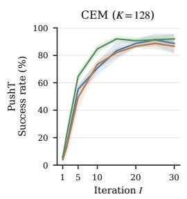

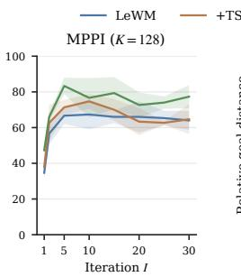

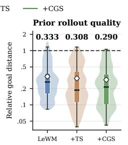

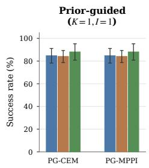  
Figure 6: CGS improves early refinement and BC-prior quality on PushT. Left: CEM/MPPI success over optimization steps I (iterations) at $K = 1 2 8$ without an action prior. Middle: BCprior/no-op latent goal-distance ratios for the first plan (lower is better). Right: prior-only success using the prior mean as the sole candidate without additional candidate sampling $( K = 1 , I = 1 )$ ).

compares its decoded displacement with that predicted from action and current state. CGS is strongest on PushT $( C _ { A } = 0 . 9 0 1 , B _ { A S } = 0 . 9 0 2 )$ . TS leads both on Reacher, where the same action can produce different fingertip motion across configurations. See Appendix C.3 for details.

CGS across representation architectures. Figure 5 follows the global-versus-spatial representation settings studied by DINO-WM and TS (Zhou et al., 2025; Wang et al., 2026b) to examine how CGS interacts with different latent architectures. Models with DINO-WM architecture are trained following Wang et al. (2026b), with proprioceptive information. CGS improves planning with both DINO CLS and spatial Patch features, with notably larger gains for the compact CLS representation on PushT. This comparison also motivates our use of LeWM in the main experiments: frozen DINO CLS features are compact but weaker for dynamics-based planning, whereas spatial Patch features improve planning at substantially higher rollout cost. LeWM instead learns a compact global latent jointly with predictive dynamics, retaining strong planning performance while making repeated planner rollouts much cheaper. Importantly, applying TS to the same LeWM backbone remains stronger than the global DINO-WM+TS configuration and competitive with Patch+TS under CEM and GD, establishing LeWM+TS as a strong baseline. CGS then benefits from this efficient learned latent while enjoying significantly faster planning.

Refinement efficiency and BC priors. Each CEM/MPPI optimization step refines the sampling proposal to favor lower-cost action sequences. At a fixed candidate budget, CGS reaches high PushT success in fewer optimization steps (Figure 6), showing gains early in this refinement process. CGS also improves the matched BC prior: its rollouts achieve lower latent goal-distance ratios and higher prior-only success before search begins. Thus, CGS benefits both iterative refinement and prior-guided initialization. Results for other environments appear in Appendix C.8.

## 7 CONCLUSION

We introduced CGS, a simple auxiliary loss that learns planner-friendly representations by straightening control geometry. Our linear-dynamics analysis connects this geometry to more balanced terminal-cost curvature along controllable directions and more efficient finite-budget optimization. Experiments across multiple tasks and planners demonstrate gains in planning success and refinement efficiency using limited planning budget. Together, these results show that local geometric regularization can shape the full-horizon optimization landscape without modifying the planner at test time. More broadly, our findings highlight the importance of how predictive representations organize action effects for planning. Extending CGS to state-dependent control effects and richer dynamical context using only pixel–action data is a natural next step. Its focus on the geometry used by planners also motivates studying how to maintain planner-friendly representations under distribution shift, potentially in combination with test-time adaptation (Wang et al., 2026a).

## REFERENCES

S. Agapiou, O. Papaspiliopoulos, D. Sanz-Alonso, and A. M. Stuart. Importance sampling: Intrinsic dimension and computational cost. Statistical Science, 32(3):405–431, 2017. ISSN 08834237, 21688745. URL http://www.jstor.org/stable/26408299.

Mahmoud Assran, Quentin Duval, Ishan Misra, Piotr Bojanowski, Pascal Vincent, Michael Rabbat, Yann LeCun, and Nicolas Ballas. Self-supervised learning from images with a joint-embedding predictive architecture. In 2023 IEEE/CVF Conference on Computer Vision and Pattern Recognition (CVPR), pp. 15619–15629, 2023. doi: 10.1109/CVPR52729.2023.01499.

Mahmoud Assran, Adrien Bardes, David Fan, Quentin Garrido, Russell Howes, Mojtaba Komeili, Matthew Muckley, Ammar Rizvi, Claire Roberts, Koustuv Sinha, Artem Zholus, Sergio Arnaud, Abha Gejji, Ada Martin, Francois Robert Hogan, Daniel Dugas, Piotr Bojanowski, Vasil Khalidov, Patrick Labatut, Francisco Massa, Marc Szafraniec, Kapil Krishnakumar, Yong Li, Xiaodong Ma, Sarath Chandar, Franziska Meier, Yann LeCun, Michael Rabbat, and Nicolas Ballas. V-JEPA 2: Self-supervised video models enable understanding, prediction and planning, 2025. URL https://arxiv.org/abs/2506.09985.

Jiaxin Bai and Jiaxuan Xiong. Temporal-distance JEPA: Plan-aware representation learning for latent world model predictive control, 2026. URL https://arxiv.org/abs/2607.25337.

Randall Balestriero and Yann LeCun. LeJEPA: Provable and scalable self-supervised learning without the heuristics, 2025. URL https://arxiv.org/abs/2511.08544.

Ershad Banijamali, Rui Shu, Mohammad Ghavamzadeh, Hung Bui, and Ali Ghodsi. Robust locallylinear controllable embedding. In Proceedings ofthe Twenty-First International Conference on Artificial Intelligence and Statistics, volume 84 of Proceedings of Machine Learning Research, pp. 1751–1759. PMLR, 09–11 Apr 2018. URL https://proceedings.mlr.press/v84/ banijamali18a.html.

Adrien Bardes, Jean Ponce, and Yann LeCun. VICReg: Variance-invariance-covariance regularization for self-supervised learning. In International Conference on Learning Representations, 2022. URL https://openreview.net/forum?id=xm6YD62D1Ub.

Adrien Bardes, Quentin Garrido, Jean Ponce, Xinlei Chen, Michael Rabbat, Yann LeCun, Mido Assran, and Nicolas Ballas. Revisiting feature prediction for learning visual representations from video. Transactions on Machine Learning Research, 2024. ISSN 2835-8856. URL https: //openreview.net/forum?id=QaCCuDfBk2. Featured Certification.

Homanga Bharadhwaj, Kevin Xie, and Florian Shkurti. Model-predictive control via cross-entropy and gradient-based optimization. In Proceedings ofthe 2nd Conference on Learningfor Dynamics and Control, volume 120 of Proceedings ofMachine Learning Research, pp. 277–286. PMLR, 10–11 Jun 2020. URL https://proceedings.mlr.press/v120/bharadhwaj20a. html.

Sourav Chatterjee and Persi Diaconis. The sample size required in importance sampling. The Annals ofApplied Probability, 28(2):1099–1135, 2018. doi: 10.1214/17-AAP1326. URL https: //projecteuclid.org/euclid.aoap/1520564481.

Cheng Chi, Siyuan Feng, Yilun Du, Zhenjia Xu, Eric Cousineau, Benjamin C. M. Burchfiel, and Shuran Song. Diffusion Policy: Visuomotor policy learning via action diffusion. In Proceedings of Robotics: Science and Systems, 2023. doi: 10.15607/RSS.2023.XIX.026.

Kurtland Chua, Roberto Calandra, Rowan McAllister, and Sergey Levine. Deep reinforcement learning in a handful of trials using probabilistic dynamics models. In Advances in Neural Information Processing Systems, volume 31. Curran Associates, Inc., 2018. URL https://proceedings.neurips.cc/paper\_files/paper/2018/ file/3de568f8597b94bda53149c7d7f5958c-Paper.pdf.

Andre Costa, Owen Dafydd Jones, and Dirk Kroese. Convergence properties of the cross-entropy method for discrete optimization. Operations Research Letters, 35(5):573–580, 2007. ISSN 0167- 6377. doi: https://doi.org/10.1016/j.orl.2006.11.005. URL https://www.sciencedirect. com/science/article/pii/S0167637706001313.

Brandon Cui, Yinlam Chow, and Mohammad Ghavamzadeh. Control-aware representations for model-based reinforcement learning. In International Conference on Learning Representations, 2021. URL https://openreview.net/forum?id=dgd4EJqsbW5.

Pieter-Tjerk de Boer, Dirk P Kroese, Shie Mannor, and Reuven Y Rubinstein. A tutorial on the cross-entropy method. Annals of operations research, 134(1):19–67, 2005.

Matthieu Destrade, Oumayma Bounou, Quentin Le Lidec, Jean Ponce, and Yann LeCun. Valueguided action planning with jepa world models, 2025. URL https://arxiv.org/abs/ 2601.00844.

Alexey Dosovitskiy, Lucas Beyer, Alexander Kolesnikov, Dirk Weissenborn, Xiaohua Zhai, Thomas Unterthiner, Mostafa Dehghani, Matthias Minderer, Georg Heigold, Sylvain Gelly, Jakob Uszkoreit, and Neil Houlsby. An image is worth 16x16 words: Transformers for image recognition at scale. In International Conference on Learning Representations, 2021. URL https://openreview. net/forum?id=YicbFdNTTy.

Benjamin Eysenbach, Vivek Myers, Ruslan Salakhutdinov, and Sergey Levine. Inference via interpolation: Contrastive representations provably enable planning and inference. In Advances in Neural Information Processing Systems, volume 37, pp. 58901–58928. Curran Associates, Inc., 2024. doi: 10.52202/079017-1878. URL https://proceedings.neurips.cc/paper\_files/paper/2024/file/ 6c49d2ad55e50c5ebc1002fdc50e48e5-Paper-Conference.pdf.

Mahyar Fazlyab, Sina Sharifi, and Jiarui Wang. Model predictive path integral control as preconditioned gradient descent. IEEE Control Systems Letters, 10:2089–2094, 2026. doi: 10.1109/LCSYS.2026.3708745.

Carles Gelada, Saurabh Kumar, Jacob Buckman, Ofir Nachum, and Marc G. Bellemare. DeepMDP: Learning continuous latent space models for representation learning. In Proceedings ofthe 36th International Conference on Machine Learning, volume 97 of Proceedings ofMachine Learning Research, pp. 2170–2179. PMLR, 09–15 Jun 2019. URL https://proceedings.mlr. press/v97/gelada19a.html.

David Ha and Jürgen Schmidhuber. Recurrent world models facilitate policy evolution. In Advances in Neural Information Processing Systems, volume 31. Curran Associates, Inc., 2018. URL https://proceedings.neurips.cc/paper\_files/paper/2018/ file/2de5d16682c3c35007e4e92982f1a2ba-Paper.pdf.

Danijar Hafner, Timothy Lillicrap, Ian Fischer, Ruben Villegas, David Ha, Honglak Lee, and James Davidson. Learning latent dynamics for planning from pixels. In International conference on machine learning, pp. 2555–2565. PMLR, 2019.

Danijar Hafner, Timothy Lillicrap, Jimmy Ba, and Mohammad Norouzi. Dream to control: Learning behaviors by latent imagination. In International Conference on Learning Representations, 2020. URL https://openreview.net/forum?id=S1lOTC4tDS.

Danijar Hafner, Jurgis Pasukonis, Jimmy Ba, and Timothy Lillicrap. Mastering diverse control tasks through world models. Nature, 640:647–653, 2025. doi: 10.1038/s41586-025-08744-2. URL https://www.nature.com/articles/s41586-025-08744-2.

Nicklas Hansen, Hao Su, and Xiaolong Wang. Temporal difference learning for model predictive control. In Proceedings ofthe 39th International Conference on Machine Learning, volume 162 of Proceedings ofMachine Learning Research, pp. 8387–8406. PMLR, 17–23 Jul 2022. URL https://proceedings.mlr.press/v162/hansen22a.html.

Nicklas Hansen, Hao Su, and Xiaolong Wang. TD-MPC2: Scalable, robust world models for continuous control. In International Conference on Learning Representations, 2024. URL https://openreview.net/forum?id=Oxh5CstDJU.

Wassily Hoeffding. Probability inequalities for sums of bounded random variables. Journal ofthe American Statistical Association, 58(301):13–30, 1963. doi: 10.1080/01621459.1963.10500830.

Jiaming Hu, Yan Zheng, and Tian Wang. SCALE: State-calibrated latent embeddings for JEPA planning in the right geometry, 2026. URL https://arxiv.org/abs/2608.16287.

Petr Ivashkov, Randall Balestriero, and Bernhard Schölkopf. Sensorimotor world models: Perception for action via inverse dynamics, 2026. URL https://arxiv.org/abs/2606.20104.

Hilbert J. Kappen. Path integrals and symmetry breaking for optimal control theory. Journal of Statistical Mechanics: Theory and Experiment, 2005(11):P11011, 2005. doi: 10.1088/1742-5468/ 2005/11/P11011.

Dirk P. Kroese, Sergey Porotsky, and Reuven Y. Rubinstein. The cross-entropy method for continuous multi-extremal optimization. Method. Comput. Appl. Prob., 8(3):383–407, September 2006. ISSN 1387-5841. doi: 10.1007/s11009-006-9753-0. URL https://doi.org/10.1007/ s11009-006-9753-0.

Yilun Kuang, Yash Dagade, Quentin Le Lidec, Lucas Maes, Randall Balestriero, and Yann LeCun. LpWM: A case for sparse representations in world models, 2026. URL https://arxiv.org/ abs/2608.22764.

Thanard Kurutach, Aviv Tamar, Ge Yang, Stuart J Russell, and Pieter Abbeel. Learning plannable representations with causal InfoGAN. In Advances in Neural Information Processing Systems, volume 31. Curran Associates, Inc., 2018. URL https://proceedings.neurips.cc/paper\_files/paper/2018/file/ 08aac6ac98e59e523995c161e57875f5-Paper.pdf.

Yann LeCun. A path towards autonomous machine intelligence. OpenReview, 2022. URL https: //openreview.net/forum?id=BZ5a1r-kVsf.

Nir Levine, Yinlam Chow, Rui Shu, Ang Li, Mohammad Ghavamzadeh, and Hung Bui. Prediction, consistency, curvature: Representation learning for locally-linear control. In International Conference on Learning Representations, 2020. URL https://openreview.net/forum?id= BJxG\_0EtDS.

Wenyuan Li, Guang Li, Keisuke Maeda, Takahiro Ogawa, and Miki Haseyama. Predictive but not plannable: RC-aux for latent world models, 2026. URL https://arxiv.org/abs/2605. 07278.

Lucas Maes, Quentin Le Lidec, Damien Scieur, Yann LeCun, and Randall Balestriero. LeWorldModel: Stable end-to-end joint-embedding predictive architecture from pixels, 2026. URL https: //arxiv.org/abs/2603.19312.

Lev Margolin. On the convergence of the cross-entropy method. Annals of Operations Research, 134 (1):201–214, 2005. doi: 10.1007/s10479-005-5731-0.

Nikolai Matni and Stephen Tu. A tutorial on concentration bounds for system identification. In 2019 IEEE 58th Conference on Decision and Control (CDC), pp. 3741–3749. IEEE Press, 2019. doi: 10.1109/CDC40024.2019.9029621. URL https://doi.org/10.1109/CDC40024. 2019.9029621.

Heejeong Nam, Quentin Le Lidec, Lucas Maes, Yann LeCun, and Randall Balestriero. Causal-JEPA: Learning world models through object-level latent masking. In Proceedings of the 43rd International Conference on Machine Learning, volume 306 of Proceedings of Machine Learning Research, 2026. URL https://arxiv.org/abs/2602.11389.

Maxime Oquab, Timothée Darcet, Théo Moutakanni, Huy V. Vo, Marc Szafraniec, Vasil Khalidov, Pierre Fernandez, Daniel HAZIZA, Francisco Massa, Alaaeldin El-Nouby, Mido Assran, Nicolas Ballas, Wojciech Galuba, Russell Howes, Po-Yao Huang, Shang-Wen Li, Ishan Misra, Michael Rabbat, Vasu Sharma, Gabriel Synnaeve, Hu Xu, Herve Jegou, Julien Mairal, Patrick Labatut, Armand Joulin, and Piotr Bojanowski. DINOv2: Learning robust visual features without supervision. Transactions on Machine Learning Research, 2024. ISSN 2835-8856. URL https://openreview.net/forum?id=a68SUt6zFt. Featured Certification.

Seohong Park, Kevin Frans, Benjamin Eysenbach, and Sergey Levine. OGBench: Benchmarking offline goal-conditioned RL. In International Conference on Learning Representations, 2025. URL https://openreview.net/forum?id=M992mjgKzI.

Wonpyo Park, Dongju Kim, Yan Lu, and Minsu Cho. Relational knowledge distillation. In 2019 IEEE/CVF Conference on Computer Vision and Pattern Recognition (CVPR), pp. 3962–3971, 2019. doi: 10.1109/CVPR.2019.00409.

Cristina Pinneri, Shambhuraj Sawant, Sebastian Blaes, Jan Achterhold, Joerg Stueckler, Michal Rolinek, and Georg Martius. Sample-efficient cross-entropy method for real-time planning. In Proceedings ofthe 2020 Conference on Robot Learning, volume 155 of Proceedings ofMachine Learning Research, pp. 1049–1065. PMLR, 16–18 Nov 2021. URL https://proceedings. mlr.press/v155/pinneri21a.html.

Reuven Rubinstein. The cross-entropy method for combinatorial and continuous optimization. Methodology and Computing in Applied Probability, 1(2):127–190, 1999. doi: 10.1023/A: 1010091220143.

Tankred Saanum, Peter Dayan, and Eric Schulz. Simplifying latent dynamics with softly state-invariant world models. In Advances in Neural Information Processing Systems, volume 37, pp. 38355–38382. Curran Associates, Inc., 2024. doi: 10.52202/ 079017-1212. URL https://proceedings.neurips.cc/paper\_files/paper/ 2024/file/43ba0466af2b1ac76aa85d8fbec714e3-Paper-Conference.pdf.

Rui Shu, Tung Nguyen, Yinlam Chow, Tuan Pham, Khoat Than, Mohammad Ghavamzadeh, Stefano Ermon, and Hung Bui. Predictive coding for locally-linear control. In Proceedings of the 37th International Conference on Machine Learning, volume 119 of Proceedings ofMachine Learning Research, pp. 8862–8871. PMLR, 13–18 Jul 2020. URL https://proceedings.mlr. press/v119/shu20a.html.

Uladzislau Sobal, Wancong Zhang, Kyunghyun Cho, Randall Balestriero, Tim G. J. Rudner, and Yann LeCun. Learning from reward-free offline data: A case for planning with latent dynamics models. In Advances in Neural Information Processing Systems, volume 38, Main Conference, pp. 43905–43941. Curran Associates, Inc., 2025. doi: 10.52202/ 085713-1465. URL https://proceedings.neurips.cc/paper\_files/paper/ 2025/file/3e7cf447f21cd11c846463affefce665-Paper-Conference.pdf.

Aravind Srinivas, Allan Jabri, Pieter Abbeel, Sergey Levine, and Chelsea Finn. Universal planning networks: Learning generalizable representations for visuomotor control. In Proceedings of the 35th International Conference on Machine Learning, volume 80 of Proceedings ofMachine Learning Research, pp. 4732–4741. PMLR, 10–15 Jul 2018. URL https://proceedings. mlr.press/v80/srinivas18b.html.

Junhan Sun, Hao Zhao, and Guofeng Zhang. INTACT: Isomorphic intent-to-action learning for search-free world models, 2026. URL https://arxiv.org/abs/2607.26056.

Basile Terver, Tsung-Yen Yang, Jean Ponce, Adrien Bardes, and Yann LeCun. What drives success in physical planning with joint-embedding predictive world models? Transactions on Machine Learning Research, 2026. ISSN 2835-8856. URL https://openreview.net/forum? id=cHZn5Gdh8e. Reproducibility Certification.

Evangelos Theodorou, Jonas Buchli, and Stefan Schaal. Learning policy improvements with path integrals. In Proceedings of the Thirteenth International Conference on Artificial Intelligence and Statistics, volume 9 of Proceedings of Machine Learning Research, pp. 828–835, Chia Laguna Resort, Sardinia, Italy, 13–15 May 2010. PMLR. URL https://proceedings.mlr. press/v9/theodorou10a.html.

Leonardo F. Toso, Davit Shadunts, Yunyang Lu, Nihal Sharma, Donglin Zhan, Nam H. Nguyen, and James Anderson. Learning invariant visual representations for planning with joint-embedding predictive world models, 2026. URL https://arxiv.org/abs/2602.18639.

Elia Trevisan and Javier Alonso-Mora. Biased-MPPI: Informing sampling-based model predictive control by fusing ancillary controllers. IEEE Robotics and Automation Letters, 9(6):5871–5878, 2024. doi: 10.1109/LRA.2024.3397083.

Frederick Tung and Greg Mori. Similarity-preserving knowledge distillation. In 2019 IEEE/CVF International Conference on Computer Vision (ICCV), pp. 1365–1374, 2019. doi: 10.1109/ICCV. 2019.00145.

Saran Tunyasuvunakool, Alistair Muldal, Yotam Doron, Siqi Liu, Steven Bohez, Josh Merel, Tom Erez, Timothy P. Lillicrap, Nicolas Heess, and Yuval Tassa. dm\_control: Software and tasks for continuous control. Software Impacts, 6:100022, 2020. doi: 10.1016/j.simpa.2020.100022.

Tongzhou Wang, Antonio Torralba, Phillip Isola, and Amy Zhang. Optimal goal-reaching reinforcement learning via quasimetric learning. In Proceedings ofthe 40th International Conference on Machine Learning, volume 202 of Proceedings ofMachine Learning Research, pp. 36411–36430. PMLR, 23–29 Jul 2023. URL https://proceedings.mlr.press/v202/wang23al. html.

Ying Wang, Oumayma Bounou, Yann LeCun, and Mengye Ren. AdaJEPA: An adaptive latent world model, 2026a. URL https://arxiv.org/abs/2606.32026.

Ying Wang, Oumayma Bounou, Gaoyue Zhou, Randall Balestriero, Tim G. J. Rudner, Yann Le-Cun, and Mengye Ren. Temporal straightening for latent planning. In Proceedings ofthe 43rd International Conference on Machine Learning, volume 306 of Proceedings of Machine Learning Research, 2026b.

Yuhai Wang, Jiawei Xia, Rongxuan Zhou, Xiao Hu, Yongliang Shi, Jing Du, and Yang Ye. PRISM: PRior-guided Imagination Sampling in world Models, 2026c. URL https://arxiv.org/ abs/2606.07974.

Manuel Watter, Jost Tobias Springenberg, Joschka Boedecker, and Martin Riedmiller. Embed to control: A locally linear latent dynamics model for control from raw images. In Advances in Neural Information Processing Systems, volume 28, 2015. URL https://proceedings.neurips.cc/paper\_files/paper/2015/hash/ a1afc58c6ca9540d057299ec3016d726-Abstract.html.

Grady Williams, Nolan Wagener, Brian Goldfain, Paul Drews, James M. Rehg, Byron Boots, and Evangelos A. Theodorou. Information theoretic MPC for model-based reinforcement learning. In 2017 IEEE International Conference on Robotics and Automation (ICRA), pp. 1714–1721, 2017. doi: 10.1109/ICRA.2017.7989202.

Ge Yang, Amy Zhang, Ari Morcos, Joelle Pineau, Pieter Abbeel, and Roberto Calandra. Plan2Vec: Unsupervised representation learning by latent plans. In Proceedings ofthe 2nd Conference on Learningfor Dynamics and Control, volume 120 of Proceedings ofMachine Learning Research, pp. 935–946. PMLR, 10–11 Jun 2020. URL https://proceedings.mlr.press/v120/ yang20b.html.

Zeji Yi, Chaoyi Pan, Guanqi He, Guannan Qu, and Guanya Shi. CoVO-MPC: Theoretical analysis of sampling-based MPC and optimal covariance design. In Proceedings ofthe 6th Annual Learningfor Dynamics & Control Conference, volume 242 of Proceedings ofMachine Learning Research, pp. 1122–1135. PMLR, 15–17 Jul 2024. URL https://proceedings.mlr.press/v242/ yi24b.html.

Ming Yin, Yaqi Duan, Mengdi Wang, and Yu-Xiang Wang. Near-optimal offline reinforcement learning with linear representation: Leveraging variance information with pessimism. In International Conference on Learning Representations, 2022. URL https://openreview.net/forum? id=KLaDXLAzzFT.

Hyung-Jin Yoon and Hunmin Kim. Finite-sample closed-loop stability of model predictive path integral control for linear time-invariant systems, 2026. URL https://arxiv.org/abs/ 2607.04006.

Hyung-Jin Yoon, Chuyuan Tao, Hunmin Kim, Naira Hovakimyan, and Petros Voulgaris. Sampling complexity of path integral methods for trajectory optimization. In 2022 American Control Conference (ACC), pp. 3482–3487, 2022. doi: 10.23919/ACC53348.2022.9867607.

Amy Zhang, Rowan McAllister, Roberto Calandra, Yarin Gal, and Sergey Levine. Learning invariant representations for reinforcement learning without reconstruction. In International Conference on Learning Representations, 2021. URL https://openreview.net/forum?id= -2FCwDKRREu.

Marvin Zhang, Sharad Vikram, Laura Smith, Pieter Abbeel, Matthew Johnson, and Sergey Levine. SOLAR: Deep structured representations for model-based reinforcement learning. In Proceedings ofthe 36th International Conference on Machine Learning, volume 97 of Proceedings ofMachine Learning Research, pp. 7444–7453. PMLR, 09–15 Jun 2019. URL https://proceedings. mlr.press/v97/zhang19m.html.

Xiangteng Zhang, Yang Guan, Bo Zhang, Hongyang Li, Ya-Qin Zhang, and Shengbo Eben Li. On the identifiability of controlled world models, 2026a. URL https://arxiv.org/abs/2607. 22430.

Zhenghao Zhang, Yuanxiang Wang, Zhenyu Guan, Yujia Yang, Bingkang Shi, Tianyu Zong, Hongzhu Yi, Guoqing Chao, Xingchen Chen, Tiankun Yang, Chenxi Bao, Tao Yu, Jingjing Zhou, and Jungang Xu. Delta-JEPA: Learning action-sensitive world models via latent difference decoding, 2026b. URL https://arxiv.org/abs/2606.31232.

Gaoyue Zhou, Hengkai Pan, Yann LeCun, and Lerrel Pinto. DINO-WM: World models on pre-trained visual features enable zero-shot planning. In Proceedings ofthe 42nd International Conference on Machine Learning, volume 267 of Proceedings ofMachine Learning Research, pp. 79115–79135. PMLR, 13–19 Jul 2025. URL https://proceedings.mlr.press/v267/zhou25t. html.

## APPENDIX CONTENTS

A Extended Related Work 17   
A.1 Latent world models and JEPA 17   
A.2 Planner-friendly representations 17   
A.3 Sampling-based MPC 18   
A.4 Relational and Similarity-Preserving Knowledge Distillation 18   
B Referenced Methods and Planning Algorithms 19   
B.1 Planning algorithms . 19   
B.2 Temporal Straightening 20   
C Experiment Details and Additional Experimental Results 21   
C.1 Main-experiment implementation and evaluation 21   
C.2 Visualizing Action–Effect Geometry and Planning . 26   
C.3 Full Action–Representation Probing 29   
C.4 Mechanism-Figure Protocol and Additional Results 32   
C.5 DINO-WM Implementation and Additional Results 33   
C.6 Training Ablations 35   
C.7 Shared MPPI Temperature Selection 35   
C.8 Refinement Efficiency and Matched BC Priors on Other Environments 36   
D Proofs and Extended Theory 39   
D.1 From CGS Loss to Transition Geometry 39   
D.2 Planning Hessian and Dimension Cases 41   
D.3 Quadratic Planning and Gaussian Proposals 44   
D.4 MPPI: Mean Update and Planning Cost 46   
D.5 CEM: Local Mean Update 49   
D.6 Gradient Descent: Planning Cost Convergence 51   
D.7 Geometry under Other Training Objectives 53

## A EXTENDED RELATED WORK

## A.1 LATENT WORLD MODELS AND JEPA

Latent world models compress visual observations into representations that support prediction, planning, and imagination. Reconstruction-based models combine learned dynamics with pixel decoders, while task-oriented models also learn rewards, values, or policies (Ha & Schmidhuber, 2018; Hafner et al., 2019; 2020; Hansen et al., 2022; 2024; Hafner et al., 2025). JEPAs learn through prediction in embedding space, removing the need to reconstruct every visual detail (LeCun, 2022; Assran et al., 2023; Bardes et al., 2024). DINO-WM uses frozen pretrained image features, and V-JEPA 2-AC adapts video representations for action-conditioned prediction (Oquab et al., 2024; Zhou et al., 2025; Assran et al., 2025). PLDM and LeWM instead learn visual representations and dynamics jointly from offline control trajectories (Sobal et al., 2025; Maes et al., 2026).

Stable prediction and representation collapse. A constant encoder can trivially satisfy an embedding prediction loss, making collapse prevention a central design concern. Target encoders and stop-gradient operations stabilize predictive targets; variance–covariance regularization maintains feature diversity; and Gaussian distribution matching provides an explicit distributional constraint (Assran et al., 2023; Bardes et al., 2024; 2022; Balestriero & LeCun, 2025; Maes et al., 2026). Further architectures investigate object-level latent masking and sparse codes, while AdaJEPA adapts a trained world model at test time (Nam et al., 2026; Kuang et al., 2026; Wang et al., 2026a). These choices address representation content, training stability, and adaptation. The geometry exposed to downstream action optimization remains an additional concern: accurate transition prediction and diverse features alone do not ensure that the planning objective is easy to optimize. Empirical studies of JEPA planning and reachability-aware training examine this gap directly (Terver et al., 2026; Li et al., 2026). CGS addresses this concern through an auxiliary geometry objective applicable to end-to-end learned and pretrained representations.

## A.2 PLANNER-FRIENDLY REPRESENTATIONS

Latent dynamics and optimization. Embed-to-Control, Robust Controllable Embedding, SOLAR, and predictive-coding approaches learn representations suited to locally linear control (Watter et al., 2015; Banijamali et al., 2018; Zhang et al., 2019; Levine et al., 2020; Shu et al., 2020). Here, locally linear latent dynamics means that transitions in a neighborhood or around a nominal trajectory admit a linear model whose coefficients may vary across states or time. This structure supports local trajectory optimization, including iLQR. Universal Planning Networks backpropagate through an unrolled planner; CARL couples representations to actor–critic updates and value-weighted model fitting (Srinivas et al., 2018; Cui et al., 2021). DeepMDP and bisimulation-based representations preserve reward and transition structure, while softly state-invariant models simplify action effects across states (Gelada et al., 2019; Zhang et al., 2021; Saanum et al., 2024). Other approaches learn feasible latent paths or distances reflecting directed reachability (Kurutach et al., 2018; Yang et al., 2020; Eysenbach et al., 2024; Wang et al., 2023).

Goal-derived and inverse-control supervision. Value-Guided JEPA learns goal-conditioned values; RC-aux adds multi-horizon prediction and budget-conditioned reachability labels; and Temporal-Distance-JEPA encodes directed temporal progress (Destrade et al., 2025; Li et al., 2026; Bai & Xiong, 2026). INTACT uses physical transition intent and future-goal intent to learn an action distribution that can be deployed directly (Sun et al., 2026). Future observations and temporal offsets in offline trajectories supply pseudo-goals or reachability targets for these objectives; these are constructed training signals rather than externally annotated goals. SCALE uses task-relevant state differences to calibrate latent distance (Hu et al., 2026). Sensorimotor World Models and Delta-JEPA use inverse dynamics to retain action information in endpoint embeddings or latent displacements (Ivashkov et al., 2026; Zhang et al., 2026b). Related work studies control-irrelevant visual invariance and the action excitation needed to identify controlled dynamics (Toso et al., 2026; Zhang et al., 2026a). The CGS world-model objective uses local transitions from pixel–action pairs to match action and latent-difference cosines, without future-goal targets or an inverse action decoder.

Temporal Straightening. Temporal Straightening aligns consecutive latent displacements by penalizing their angular deviation, reducing local trajectory curvature (Wang et al., 2026b). Straighter latent paths can improve planning-objective conditioning while preserving a nonlinear predictor. The regularizer operates directly on consecutive observations, without pseudo-goal selection, value targets, reachability labels, or contrastive negative mining. TS constrains successive displacements along observed paths. CGS uses the corresponding actions as references for pairwise angular relations among latent differences. When consecutive actions align, the adjacent CGS term reduces to the squared angular TS penalty; changing action directions provides references for latent turns. Under the assumptions of our linear-dynamics analysis, CGS promotes temporal straightening, balanced action effects, and reduced drift–control coupling. These properties connect local transition geometry to more balanced terminal-cost curvature across the full planning horizon. Appendix B defines the TS objective, and Appendix C.5 describes its encoder instantiations and our DINO-WM comparisons.

## A.3 SAMPLING-BASED MPC

Sampling-based MPC evaluates candidate action sequences through model rollouts and repeatedly updates a proposal distribution. CEM fits a distribution to low-cost elites, while MPPI uses costdependent weights over sampled sequences (Rubinstein, 1999; de Boer et al., 2005; Kroese et al., 2006; Kappen, 2005; Theodorou et al., 2010; Williams et al., 2017). These planners have been combined with probabilistic ensembles, stochastic latent dynamics, and predictive feature-space models (Chua et al., 2018; Hafner et al., 2019; Zhou et al., 2025; Sobal et al., 2025; Maes et al., 2026).

Proposals and sample reuse. iCEM combines temporally correlated sampling with elite memory and sample reuse; hybrid methods interleave CEM and gradient updates (Pinneri et al., 2021; Bharadhwaj et al., 2020). Biased-MPPI incorporates ancillary controllers, CoVO-MPC adapts covariance to local cost curvature, and PRISM learns a state–goal-conditioned proposal prior (Trevisan & Alonso-Mora, 2024; Yi et al., 2024; Wang et al., 2026c). These approaches use temporal structure, local cost information, or learned behavior to concentrate evaluations on promising action sequences. CGS complements proposal design by shaping the control geometry of the world model during training.

Finite-budget optimization. Classical CEM analyses study distribution updates and convergence (Margolin, 2005; Costa et al., 2007); recent MPPI analyses connect updates to preconditioned gradient descent and examine closed-loop stability (Fazlyab et al., 2026; Yoon & Kim, 2026). Importancesampling results clarify how mismatch between proposals and high-weight regions affects the sample budget needed for reliable estimates (Agapiou et al., 2017; Chatterjee & Diaconis, 2018). In MPC, the horizon, effective action dimension, cost landscape, and proposal design jointly determine how informative a finite candidate set will be (Yoon et al., 2022). Our linear-dynamics analysis connects local representation learning to finite-horizon terminal-cost curvature, yielding finite-budget guarantees for MPPI, local contraction results for CEM, and convergence bounds for gradient descent.

## A.4 RELATIONAL AND SIMILARITY-PRESERVING KNOWLEDGE DISTILLATION

Relational Knowledge Distillation transfers inter-example distances and angles, while similaritypreserving knowledge distillation preserves pairwise similarities across teacher and student representations (Park et al., 2019; Tung & Mori, 2019). They are relevant to CGS through the general idea of matching structure across different representation spaces. CGS uses a related pairwise matching form, but observed actions provide the reference geometry rather than a teacher representation. Specifically, it matches pairwise action cosines to those among corresponding latent differences. CGS therefore uses structural matching to organize control geometry for multi-step planning; our analysis connects that geometry to more balanced terminal-cost curvature and sampling-efficient optimization.

## B REFERENCED METHODS AND PLANNING ALGORITHMS

This section defines the planning algorithms and the TS objective using the notation of Section 3.   
Experimental settings and the DINO-WM representation comparison are collected in Appendix C.

## B.1 PLANNING ALGORITHMS

We write the planner updates using $C ( { \pmb a } )$ from Eq. (3). In implementation, the cost and MPPI temperature use the matched normalizations specified in Appendix C.1.1; DINO-WM-specific reductions and proprioceptive terms are specified in Appendix C.5. Below, K is the number of evaluated candidates per optimization step, I the number of optimization steps (iterations), and $n _ { H } = H \times d _ { a }$ the flattened action-sequence dimension. The Gaussian proposal has mean $\mu _ { i }$ and coordinatewise standard deviation $\sigma _ { \mathrm { p } , i }$ . Sequences are flattened for Gaussian updates and reshaped for model rollout. Following the released LeWM planners, the candidate set contains the current mean and $K - 1$ Gaussian draws (Maes et al., 2026).

Cross-Entropy Method (CEM). CEM refits a diagonal Gaussian to the lowest-cost elite set $\mathcal { E } _ { i }$ (Rubinstein, 1999; de Boer et al., 2005). For $M = \left| \mathcal { E } _ { i } \right| \geq 2 ,$ , the implementation uses the elite mean and sample variance,

$$
\mu _ { i + 1 } = \frac { 1 } { M } \sum _ { k \in \mathcal { E } _ { i } } \pmb { a } ^ { ( k ) } , \qquad \sigma _ { \mathrm { p } , i + 1 } ^ { 2 } = \frac { 1 } { M - 1 } \sum _ { k \in \mathcal { E } _ { i } } ( \pmb { a } ^ { ( k ) } - \mu _ { i + 1 } ) ^ { 2 } .\tag{13}
$$

The square is coordinatewise. CEM starts from zero mean and unit standard deviation and returns the final mean. For $M = 1$ , CEM updates the mean and retains the previous standard deviation, $\sigma _ { \mathrm { p } , i + 1 } = \sigma _ { \mathrm { p } , i } ;$ this keeps the proposal finite and allows continued sampling. Algorithm 1 includes this case.

Algorithm 1 CEM and prior-guided CEM   
Require: Goal cost C, candidates K, optimization steps I, elites $1 \le M \le K$ , optional prior mean   
$\mu _ { p }$   
1: $\mu  \mu _ { p }$ for PG-CEM or 0 for CEM; $\sigma _ { \mathrm { p } } \gets { \bf 1 }$   
2: for $i = 1 , \dots , I$ do   
3: $\pmb { a } ^ { ( 1 ) }  \mu$   
4: for $k = 2 , \ldots , K$ do   
5: $\epsilon ^ { ( k ) } \sim \mathcal { N } ( 0 , \mathrm { I } _ { n _ { H } } ) ; \pmb { a } ^ { ( k ) }  \mu + \sigma _ { \mathrm { p } } \odot \epsilon ^ { ( k ) }$   
6: $c _ { k } \gets C ( \pmb { a } ^ { ( k ) } ) \mathrm { f o r } k = 1 , \dots , K$   
7: $\varepsilon \gets$ indices of the M smallest costs   
8: $\textstyle \mu  M ^ { - 1 } \sum _ { k \in { \mathcal { E } } } { \mathbf { a } } ^ { ( k ) }$   
9: if $M > 1$ then   
10: $\begin{array} { r } { \sigma _ { \mathrm { p } } ^ { 2 }  ( M - 1 ) ^ { - 1 } \sum _ { k \in \mathcal { E } } ( \pmb { a } ^ { ( k ) } - \mu ) ^ { 2 } } \end{array}$   
11: return µ

Model Predictive Path Integral (MPPI) control. We use the MPPI cost-weighted update (Kappen, 2005; Theodorou et al., 2010; Williams et al., 2017),

$$
w _ { k } = \frac { \exp [ - C ( { \pmb a } ^ { ( k ) } ) / \tau ] } { \sum _ { j = 1 } ^ { K } \exp [ - C ( { \pmb a } ^ { ( j ) } ) / \tau ] } , \qquad \mu _ { i + 1 } = \sum _ { k = 1 } ^ { K } w _ { k } { \pmb a } ^ { ( k ) } .\tag{14}
$$

All candidates contribute to the mean update, and the sampling standard deviation stays fixed at one. Smaller $\tau$ concentrates weight on lower-cost candidates. We share τ across training objectives and budgets within each task and backbone family; Appendix C.7 reports the temperature analysis.

Prior-guided CEM and MPPI (PG-CEM and PG-MPPI). A goal-conditioned behavior-cloning head $\pi _ { \psi }$ , trained for each frozen representation, predicts an action-sequence mean,

$$
\mu _ { p } = \pi _ { \psi } ( z _ { t } , z _ { g } ) \in \mathbb { R } ^ { H \times d _ { a } } .\tag{15}
$$

The PG variants initialize $\mu _ { 0 } ~ = ~ \mu _ { p }$ and retain the corresponding planner’s unit initial standard deviation and refinement rule. This tests how a representation supports both a learned proposal mean and subsequent model-based optimization. An accurate prior mean alone does not ensure a well-suited action-sequence distribution; CEM and MPPI continue to refine this distribution through model-based sampling, with CEM updating its mean and variance and MPPI updating its mean at fixed variance. Prior training is specified in Appendix C.1.1.

Algorithm 2 MPPI and prior-guided MPPI   
Require: $C , K , I , \tau ;$ optional prior mean $\mu _ { p }$   
1: $\mu  \mu _ { p }$ for PG-MPPI or 0 for MPPI; $\dot { \sigma _ { \mathrm { p } } }  { \bf 1 }$   
2: for $i = 1 , \dots , I$ do   
3: $\pmb { a } ^ { ( 1 ) }  \mu$   
4: for $k = \mathrm { 2 } , \ldots , K$ do   
5: $\epsilon ^ { ( k ) } \sim \mathcal { N } ( 0 , \mathrm { I } _ { n _ { H } } ) ; \pmb { a } ^ { ( k ) }  \mu + \sigma _ { \mathrm { p } } \odot \epsilon ^ { ( k ) }$   
6: $c _ { k } \gets C ( { \bf a } ^ { ( k ) } )$ for $k = 1 , \ldots , K$   
7: $c _ { \mathrm { m i n } } \gets \operatorname* { m i n } _ { { k } } { c _ { k } } ; \widetilde { w } _ { k } \gets \mathrm { e x p } [ - ( c _ { k } - c _ { \mathrm { m i n } } ) / \tau ]$   
8: $w _ { k } \gets \widetilde { w } _ { k } / \sum _ { j } \widetilde { w } _ { j }$   
9: $\begin{array} { r } { \mu  \sum _ { k = 1 } ^ { K } w _ { k } \pmb { a } ^ { ( k ) } } \end{array}$   
10: return $\mu$

Gradient-based planner (GD). Following the TS planning implementation (Wang et al., 2026b), GD directly optimizes the action sequence through the frozen differentiable world model. Starting from an initial action sequence $\mathbf { \delta } _ { \mathbf { a } _ { 0 } }$ , the rollout cost is minimized by iterative gradient-based updates,

$$
\mathbf { { a } } _ { i + 1 } = \mathbf { { a } } _ { i } - \eta _ { i } \nabla _ { \mathbf { { a } } } C ( \mathbf { { a } } _ { i } ) ,\tag{16}
$$

where $\eta _ { i }$ denotes the optimization step size. In practice, we use Adam with cosine learning-rate decay, initialize from the standardized zero-control sequence, and inject no action noise. GD optimizes a single action trajectory and is independent with sampling budget K. Experimental settings and the per-solve cost construction are given in Appendix C.1.1.

## B.2 TEMPORAL STRAIGHTENING

Temporal Straightening (TS) regularizes the curvature of latent trajectories by maximizing the cosine similarity between consecutive latent displacements (Wang et al., 2026b). Using the main context notation for global visual latents, define

$$
\Delta z _ { t } = z _ { t + 1 } - z _ { t } , \qquad v _ { t } = \frac { \Delta z _ { t } } { \| \Delta z _ { t } \| _ { 2 } } .\tag{17}
$$

In implementation, we exclude adjacent pairs for which either latent displacement has norm below $1 0 ^ { - 6 }$ . Let $\tau$ denote the remaining valid pairs. TS uses the average cosine-based curvature penalty,

$$
\mathcal { L } _ { \mathrm { T S } } = \frac { 1 } { | \mathcal { T } | } \sum _ { t \in \mathcal { T } } ( 1 - v _ { t } ^ { \top } v _ { t + 1 } ) , \qquad \mathcal { L } _ { \mathrm { L e W M + T S } } = \mathcal { L } _ { \mathrm { L e W M } } + \lambda _ { \mathrm { T S } } \mathcal { L } _ { \mathrm { T S } } ,\tag{18}
$$

with $\lambda _ { \mathrm { T S } } ~ \geq ~ 0$ . Our LeWM adaptation retains the prediction and SIGReg terms in Eq. (7), with gradients through both branches of the prediction loss (Maes et al., 2026). The original TS implemen tation uses stop-gradient prediction targets (Wang et al., 2026b); its DINO-based instantiations and our CLS/Patch implementations are described in Appendix C.5. Although LeWM exhibits implicit temporal straightening on PushT (Maes et al., 2026, Appendix H), explicit TS can further reduce latent trajectory curvature and improve planning, with clearer planning gains on Cube and TwoRooms; see Appendix C.6.1.

## C EXPERIMENT DETAILS AND ADDITIONAL EXPERIMENTAL RESULTS

## C.1 MAIN-EXPERIMENT IMPLEMENTATION AND EVALUATION

## C.1.1 EXPERIMENT DETAILS

Environments and training. We evaluate LeWM on PushT, Cube, TwoRooms, and Reacher using offline pixel–action trajectories, 224 × 224 images, with 5 frame skips, and the original benchmark success predicates. The LeWM models and the TS and CGS variants follow the same LeWM (Maes et al., 2026) training setup and retain its backbones and architecture of ViT-Tiny/14 encoder, 192-dimensional projected CLS latent, and action-conditioned transformer predictor. Training uses observation encodings as predictor inputs and computes all N next-step predictions in one temporally masked forward pass using Eq. (2). One model per environment and method is fixed across all planners and planning budgets. For CGS, action-reference or latent-difference vectors with $\ell _ { 2 }$ norm below $1 0 ^ { - 6 }$ are excluded from cosine normalization, and off-diagonal pairs involving such vectors are omitted from the loss average. On Cube, the CGS term uses the XYZ displacement components of the action as its geometry reference when the grasp command is active, while the full action is retained in the LeWM prediction objective; see Appendix C.1.3 for more discussions.

Regularization coefficients. We keep the base LeWM hyperparameters fixed across all $\mathrm { L e W M } \mathrm $ based methods, including $\lambda _ { \mathrm { S I G R e g } } = 0 . 0 9$ , and vary only the coefficient introduced by each additional regularizer. For LeWM+TS, we sweep $\lambda _ { \mathrm { T S } } \in \{ 0 . 0 1 , 0 . 0 5 , 0 . 1 , 0 . 5 \}$ and use 0.01 on PushT, 0.1 on Cube and Reacher, and 0.5 on TwoRooms. CGS uses $\lambda _ { \mathrm { C G S } } = 0 . 5$ by default and 0.01 on PushT. All selected coefficients are fixed across planners and planning budgets. Ablations of the CGS ramp, history length, $\lambda _ { \mathrm { S I G R e g } }$ and $\lambda _ { \mathrm { C G S } }$ are reported in Appendix C.6.

Planning and evaluation. During planning, the world model is frozen and predicted latents are fed back into the history for autoregressive rollout (Maes et al., 2026). Actions are optimized in the standardized coordinates used during training and converted to environment coordinates for execution. Each model step spans five environment steps. Each solve uses $H = 5$ model steps, corresponding to 25 environment steps, executes the resulting 25-step action sequence, and then replans from the new observation. Episodes contain at most 50 executed environment actions, giving two closed-loop solves. Initial observations are sampled from trajectories in the offline dataset, and goals are the observations 25 environment steps later in the same trajectory, $o _ { g } ~ = ~ o _ { t + 2 5 }$ This horizon, goal construction, and execution cadence are shared by all planners.

MPPI and CEM use $I = 3 0$ optimization steps and $K \in \{ 1 , 2 , 4 , 8 , 1 6 , 3 2 , 6 4 , 1 2 8 , 2 5 6 \}$ candidates. MPPI weights all candidates, while CEM retains max(1, ⌊K/4⌋) elites. Each candidate set includes the current proposal mean; thus $K = 1$ evaluates only the zero or prior initialization. The single-elite CEM case follows Algorithm 1, updating the mean while retaining the previous sampling standard deviation. LeWM sampling costs use the squared terminal latent error. The MPPI temperatures are 4, 64, 128, and 64 on PushT, Cube, TwoRooms, and Reacher, respectively, and are fixed across training objectives and planning budgets. Appendix C.7 reports these sweeps; for each environment, we select a shared value that balances performance across the three methods. GD follows the gradient-based planning setup of Wang et al. (2026b), using 100 Adam steps, an initial learning rate of 0.1, cosine decay, zero-control initialization, and no injected action noise, to minimize terminal latent MSE.

Matched behavior-cloning priors. We train a separate lightweight three-layer MLP (Wang et al., 2026c) for each frozen representation to map $( z _ { t } , z _ { g } )$ to the mean of a 25-step action sequence. Trajectory future observations provide the goals, which are the same as planning goals in evaluation, and checkpoints are selected by validation loss. The prior is trained only after freezing the representation and does not affect world-model training. PG-MPPI and PG-CEM initialize their proposal mean with this prediction and otherwise retain the corresponding planner’s unit initial variance, cost, and refinement rule. Thus each representation is evaluated with its own matched prior.

## C.1.2 ADDITIONAL RESULTS

Statistics and sample-budget sweep results. All results report mean success rate and sample standard deviation over seeds {0, 1, 42}, with 50 episodes per seed and shared start indices across methods. Planner-only timing includes both solves and excludes model loading, environment stepping, and rendering; the timing protocol is given in Appendix C.5. Tables 3–6 report the candidate samplebudget K results underlying Table 1 and Figure 4.

Table 3: PushT sample-budget sweep. Success rate (%, mean ± sample SD over three evaluation seeds, 50 episodes each). Bold marks the best representation for each planner and budget, including ties. GD is independent of K.
<table><tr><td>World model</td><td>Planner</td><td> $\overline { { K = 1 } }$ </td><td> $\overline { { K = 2 } }$ </td><td> $\overline { { K = 4 } }$ </td><td> $\overline { { K = 8 } }$ </td><td> $\overline { { K = 1 6 } }$ </td><td> $\overline { { K = 3 2 } }$ </td><td>一  $\overline { { K = 6 4 } }$ </td><td> $\overline { { K = 1 2 8 } }$ </td><td> $\overline { { K = 2 5 6 } }$ </td></tr><tr><td rowspan="4">LeWM</td><td>MPPI</td><td> ${ \bf 0 . 0 \pm 0 . 0 }$ </td><td>30.7 ±6.1</td><td> $\overline { { 4 2 . 7 \pm 9 . 0 } }$ </td><td> $5 6 . 7 \pm 1 . 1$ </td><td> $\overline { { 5 8 . 7 \pm 1 0 . 1 } }$ </td><td> $6 1 . 3 \pm 1 . 1$ </td><td>59.3 ±10.1</td><td>64.0 ±5.3</td><td>60.7 ±4.2</td></tr><tr><td>PG-MPPI</td><td> $8 4 . 7 \pm 6 . 4 $ </td><td>82.0±4.0</td><td> $8 2 . 7 \pm 6 . 1$ </td><td> $7 7 . 3 { \pm } 5 . 0 $ </td><td> $7 6 . 0 { \pm } 6 . 0$ </td><td> $7 8 . 7 \pm 6 . 4$ </td><td> $7 2 . 7 \pm 8 . 3 $ </td><td>72.0 ±6.0</td><td> $6 2 . 0 { \pm } 3 . 5 $ </td></tr><tr><td>CEM</td><td> ${ \bf 0 . 0 \pm 0 . 0 }$ </td><td>35.3 ±3.1</td><td>37.3 ±6.4</td><td> $5 6 . 0 { \pm } 5 . 3 $ </td><td> $7 4 . 0 { \pm } 7 . 2 $ </td><td> $8 3 . 3 { \pm } 4 . 2$ </td><td> $8 3 . 3 { \pm } 5 . 0 $ </td><td> $8 9 . 3 { \pm } 6 . 1$ </td><td> $8 7 . 3 { \pm } 4 . 2 $ </td></tr><tr><td>PG-CEM</td><td> $8 5 . 3 { \pm } 6 . 1$ </td><td>84.0 ±3.5</td><td>80.7 ±5.8</td><td> $9 1 . 3 { \pm } 1 . 1$ </td><td> $8 9 . 3 { \pm } 1 . 1 $ </td><td> $9 3 . 3 { \pm } 1 . 1$ </td><td> $9 4 . 0 { \pm } 4 . 0 $ </td><td> $9 2 . 0 { \pm } 5 . 3 $ </td><td> $9 2 . 0 \pm 2 . 0 $ </td></tr><tr><td rowspan="6"> $\mathrm { L e W M + T S }$ </td><td>GD</td><td></td><td></td><td></td><td></td><td>85.3 ±5.0</td><td></td><td></td><td></td><td></td></tr><tr><td>MPPI</td><td> ${ \bf 0 . 0 \pm 0 . 0 }$ </td><td> $3 8 . 0 { \pm } 5 . 3 $ </td><td>40.7 ±6.4</td><td> $5 0 . 0 { \pm } 5 . 3 $ </td><td> $5 1 . 3 { \pm } 1 . 1$ </td><td> $5 6 . 7 \pm 5 . 0$ </td><td> $6 5 . 3 { \pm } 3 . 1 $ </td><td> $6 4 . 7 \pm 8 . 3$ </td><td> $6 6 . 7 \pm 7 . 0$ </td></tr><tr><td>PG-MPPI</td><td> $8 4 . 0 { \pm } 5 . 3 $ </td><td></td><td>84.0 ±6.0 82.7 ±5.8</td><td>78.0±2.0</td><td> $7 6 . 7 \pm 3 . 1 $ </td><td> $7 8 . 7 \pm 3 . 1 $ </td><td> $7 2 . 7 \pm 7 . 6$ </td><td> $6 9 . 3 { \pm } 9 . 0 $ </td><td>70.7 ±3.1</td></tr><tr><td>CEM</td><td> ${ \bf 0 . 0 \pm 0 . 0 }$ </td><td></td><td>28.0 ±2.0 34.7 ±10.1 55.3 ±6.4</td><td></td><td> $7 3 . 3 { \pm } 6 . 1$ </td><td> $8 5 . 3 { \pm } 3 . 1 $ </td><td> ${ \bf 8 9 . 3 \pm 5 . 0 }$ </td><td></td><td>86.7 ±5.0 89.3 ±3.1</td></tr><tr><td>PG-CEM GD</td><td> $8 4 . 0 { \pm } 5 . 3 $ </td><td></td><td>89.3 ±1.1 86.0 ±3.5 89.3 ±7.6</td><td></td><td> $\mathbf { 9 4 . 0 \pm } 4 . 0$ </td><td> $\mathbf { 9 4 . 7 \pm 3 . 1 }$ </td><td> $9 2 . 0 { \pm } 2 . 0 $ </td><td>90.0 ±5.3</td><td> $9 1 . 3 { \pm } 4 . 2 $ </td></tr><tr><td></td><td></td><td></td><td></td><td></td><td> $8 2 . 7 \pm 5 . 8$ </td><td></td><td></td><td></td><td></td></tr><tr><td rowspan="5">LeWM + CGS CEM</td><td>MPPI</td><td> ${ \bf 0 . 0 \pm 0 . 0 }$ </td><td> $\mathbf { 4 0 . 0 \pm 5 . 3 }$ </td><td> ${ \bf 5 2 . 0 \pm 2 . 0 }$ </td><td>60.7 ±8.1</td><td> ${ \bf 6 8 . 7 \pm 4 . 2 }$ </td><td> ${ \bf 6 7 . 3 \pm 6 . 1 }$ </td><td> ${ \bf 7 2 . 0 \pm 2 . 0 }$ </td><td> $7 7 . 3 \pm 6 . 4$ </td><td> ${ \bf 7 5 . 3 \pm 7 . 6 }$ </td></tr><tr><td>PG-MPPI</td><td> ${ \bf 8 8 . 0 \pm 7 . 2 }$ </td><td> ${ \bf 8 9 . 3 \pm 4 . 6 }$ </td><td></td><td>88.0 ±5.3 87.3 ±6.1</td><td> ${ \bf 8 6 . 7 \pm 1 . 1 }$ </td><td> ${ \bf 8 4 . 7 \pm 5 . 8 }$ </td><td> ${ \bf 8 5 . 3 \pm 1 . 1 }$ </td><td>80.0±2.0</td><td> ${ \bf 8 4 . 0 \pm 9 . 2 }$ </td></tr><tr><td></td><td> ${ \bf 0 . 0 \pm 0 . 0 }$ </td><td> ${ \bf 3 5 . 3 \pm 1 . 1 }$ </td><td> ${ \bf 4 2 . 7 \pm 1 . 1 }$ </td><td> ${ \bf 6 8 . 7 \pm 5 . 0 }$ </td><td> ${ \bf 8 3 . 3 \pm } 4 . 2$ </td><td> ${ \bf 8 6 . 0 \pm _ { 4 . 0 } }$ </td><td> $8 8 . 7 \pm 4 . 6 $ </td><td>92.0±3.5</td><td> $\mathbf { 9 0 . 7 \pm 5 . 8 }$ </td></tr><tr><td>PG-CEM 88.0 ±7.2 90.7 ±6.1 86.7 ±5.0 96.0 ±4.0 GD</td><td></td><td></td><td></td><td></td><td> $\mathbf { 9 4 . 0 \pm 2 . 0 }$ </td><td></td><td></td><td>94.0 ±5.3 96.0 ±2.0 96.0 ±0.0</td><td> ${ \bf 9 6 . 0 \pm _ { 4 . 0 } }$ </td></tr><tr><td></td><td></td><td></td><td></td><td></td><td> ${ \bf 8 9 . 3 \pm 6 . 4 }$ </td><td></td><td></td><td></td><td></td></tr></table>

Table 4: Cube sample-budget sweep. Success rate (%, mean ± sample SD over three evaluation seeds, 50 episodes each). Bold marks the best representation for each planner and budget, including ties. GD is independent of K.

<table><tr><td>World model</td><td>Planner</td><td> $\overline { { K = 1 } }$ </td><td> $\overline { { K = 2 } }$ </td><td> $\overline { { K = 4 } }$ </td><td> $\overline { { K = 8 } }$  一</td><td> $\overline { { K = 1 6 } }$  一</td><td> $\overline { { K = 3 2 } }$ </td><td> $\overline { { K = 6 4 } }$ </td><td> $\overline { { K = 1 2 8 } }$ </td><td></td><td> $\overline { { K = 2 5 6 } }$ </td></tr><tr><td rowspan="4">LeWM</td><td>MPPI</td><td> $\overline { { 4 4 . 7 \pm 7 . 0 } }$ </td><td>46.0 ±5.3</td><td> $\overline { { 4 4 . 7 \pm 1 1 . 0 } }$ </td><td> $4 6 . 7 \pm 6 . 4$ </td><td> $\overline { { 5 1 . 3 \pm 4 . 2 } }$ </td><td> $\overline { { 5 1 . 3 \pm 5 . 0 } }$ </td><td></td><td> $\overline { { 5 6 . 7 \pm 5 . 0 } }$ </td><td> $\overline { { 5 9 . 3 \pm 4 . 6 } }$ </td><td> $\overline { { 6 4 . 0 \pm 9 . 2 } }$ </td></tr><tr><td>PG-MPPI</td><td> $\mathbf { 1 0 0 . 0 \pm 0 . 0 }$ </td><td>75.3 ±8.3</td><td> ${ \bf 7 0 . 0 \pm 5 . 3 }$ </td><td> $6 0 . 7 \pm 4 . 2 $ </td><td> $6 1 . 3 { \pm } 6 . 1 $ </td><td> $7 6 . 7 \pm 2 . 3 $ </td><td> $8 2 . 7 \pm 6 . 4 $ </td><td></td><td> $8 9 . 3 { \pm } 4 . 2 $ </td><td> $9 0 . 0 { \pm } 2 . 0 $ </td></tr><tr><td>CEM</td><td> $4 4 . 7 \pm 7 . 0$ </td><td>50.0 ±3.545.3 ±10.1</td><td></td><td> ${ \bf 5 5 . 3 \pm 9 . 0 }$ </td><td> $5 7 . 3 { \pm } 7 . 0 $ </td><td> $6 2 . 7 \pm 1 0 . 1$ </td><td></td><td> $6 4 . 0 { \pm } 6 . 0 $ </td><td> $6 3 . 3 { \pm } 2 . 3 $ </td><td> $6 4 . 0 { \pm } 1 1 . 1$ </td></tr><tr><td>GD</td><td>PG-CEM 100.0 ±0.0 94.0 ±0.0</td><td></td><td> $8 8 . 0 \pm 5 . 3$ </td><td></td><td>91.3 ±3.1 94.7 ±1.1  $5 9 . 3 \pm 8 . 1$ </td><td> $8 9 . 3 \pm { } 4 . 2 $ </td><td> $8 8 . 0 \pm 4 . 0$ </td><td></td><td> $9 0 . 0 { \pm } 2 . 0 $ </td><td> $8 9 . 3 \pm 1 . 1$ </td></tr><tr><td rowspan="5"> $\mathrm { L e W M + T S }$ </td><td>MPPI</td><td> $4 4 . 7 \pm 7 . 0$ </td><td> ${ \bf 4 8 . 0 \pm 5 . 3 }$ </td><td> ${ \bf 4 6 . 7 \pm 3 . 1 }$ </td><td> $4 8 . 0 \pm 2 . 0 $ </td><td> $4 6 . 0 { \pm } 8 . 7 $ </td><td> $5 6 . 7 \pm 9 . 0 $ </td><td> $6 8 . 0 { \pm } 5 . 3 $ </td><td></td><td> $7 5 . 3 { \pm } 5 . 0 $ </td><td> $7 5 . 3 { \pm } 6 . 1 $ </td></tr><tr><td>PG-MPPI</td><td> $9 8 . 0 { \pm } 2 . 0 $ </td><td></td><td>65.3 ±10.3</td><td></td><td></td><td></td><td></td><td></td><td></td><td></td></tr><tr><td>CEM</td><td> $4 4 . 7 \pm 7 . 0$ </td><td> $6 5 . 3 { \pm } 5 . 0 $ </td><td> $4 7 . 3 { \pm } 1 . 1$ </td><td> $6 2 . 7 \pm 1 4 . 5$  54.0 ±5.3</td><td> ${ \bf 7 4 . 7 \pm 5 . 0 }$  61.3 ±4.6</td><td> $8 4 . 7 \pm 7 . 6 $ </td><td></td><td> $\stackrel { \mathrm { 8 } } { \underset { \mathrm { 7 } \div \mathrm { ~ 1 } } { \mathrm { 8 } } } . 3 \pm 2 . 3$ </td><td> $9 2 . 7 \pm 3 . 1 $ </td><td> $9 3 . 3 { \pm } 1 . 1$  73.3 ±9.9</td></tr><tr><td>PG-CEM</td><td> $9 8 . 0 { \pm } 2 . 0 $ </td><td> $4 8 . 7 \pm 4 . 2 $   $9 2 . 7 \pm 4 . 6 $ </td><td> $8 6 . 7 \pm 5 . 0 $ </td><td> $8 8 . 7 \pm 4 . 2 $ </td><td> $8 9 . 3 \pm 3 . 1 $ </td><td> $6 4 . 7 \pm 7 . 6 $   $8 8 . 7 \pm 3 . 1 \hphantom { 0 }$ </td><td></td><td> $7 1 . 3 { \pm 6 . 4 }$   $8 8 . 7 \pm 1 . 1$ </td><td> $7 3 . 3 \pm 1 0 . 3$   $9 0 . 0 { \pm } 2 . 0 $ </td><td></td></tr><tr><td>GD</td><td></td><td></td><td></td><td></td><td> $6 5 . 3 { \pm } 4 . 6 $ </td><td></td><td></td><td></td><td></td><td> $9 0 . 7 \pm 3 . 1 $ </td></tr><tr><td rowspan="4"> $\mathrm { L e W M + C G S }$ </td><td>MPPI</td><td> $4 4 . 7 \pm 7 . 0$ </td><td> $4 4 . 0 \pm 4 . 0$ </td><td> ${ \bf 4 6 . 7 \pm 9 . 4 }$ </td><td> ${ \bf 5 0 . 0 \pm } 7 . 2$ </td><td> ${ \bf 5 4 . 0 \pm } 8 . 0$ </td><td></td><td> ${ \bf 6 4 . 0 \pm 6 . 9 }$ </td><td> ${ \bf 6 9 . 3 \pm 9 . 9 }$ </td><td> ${ \bf 7 9 . 3 \pm 4 . 6 }$ </td><td> ${ \bf 8 2 . 7 \pm 6 . 1 }$ </td></tr><tr><td>PG-MPPI</td><td> $\mathbf { 1 0 0 . 0 \pm 0 . 0 }$ </td><td> $6 0 . 0 \pm 4 . 0$ </td><td> $6 2 . 7 \pm 7 . 6$ </td><td> ${ \bf 6 4 . 7 \pm 9 . 9 }$ </td><td> $7 2 . 7 \pm 3 . 1 $ </td><td> ${ \bf 8 6 . 7 \pm 3 . 1 }$ </td><td></td><td> ${ \bf 9 2 . 7 \pm 2 . 3 }$ </td><td> ${ \bf 9 6 . 7 \pm 3 . 1 }$ </td><td> ${ \bf 9 8 . 7 \pm 1 . 1 }$ </td></tr><tr><td>CEM</td><td> $4 4 . 7 \pm 7 . 0$ </td><td>48.7 ±4.2</td><td> ${ \bf 4 8 . 7 \pm 2 . 3 }$ </td><td> ${ \bf 5 5 . 3 \pm 4 . 2 }$ </td><td> ${ \bf 6 4 . 0 \pm } 1 0 . 4 $ </td><td> ${ \bf 6 8 . 7 \pm 5 . 8 }$ </td><td> ${ \bf 7 5 . 3 \pm 1 1 . 6 }$ </td><td></td><td> ${ \bf 7 6 . 7 \pm 9 . 5 }$ </td><td> ${ \bf 8 2 . 0 \pm 6 . 0 }$ </td></tr><tr><td></td><td>PG-CEM 100.0 ±0.0 96.0 ±2.0</td><td></td><td> ${ \bf 9 5 . 3 \pm 3 . 1 }$ </td><td> ${ \bf 9 2 . 0 \pm _ { 4 . 0 } }$ </td><td> $9 0 . 7 \pm 5 . 0 $ </td><td>94.7 ±2.3</td><td> ${ \bf 9 3 . 3 \pm 1 . 1 }$ </td><td></td><td> ${ \bf 9 6 . 0 \pm _ { 4 . 0 } }$ </td><td> ${ \bf 9 5 . 3 \pm 4 . 2 }$ </td></tr></table>

Table 5: TwoRooms sample-budget sweep. Success rate (%, mean ± sample SD over three evaluation seeds, 50 episodes each). Bold marks the best representation for each planner and budget, including ties. GD is independent of K.

<table><tr><td>World model</td><td>Planner</td><td> $\overline { { K = 1 } }$ </td><td> $\overline { { K = 2 } }$ </td><td> $\overline { { K = 4 } }$ </td><td> $\overline { { K = 8 } }$ </td><td> $\overline { { K = 1 6 } }$ </td><td> $\overline { { K = 3 2 } }$ </td><td> $\overline { { K = 6 4 } }$ </td><td> $\overline { { K = 1 2 8 } }$ </td><td> $\overline { { K = 2 5 6 } }$ </td></tr><tr><td rowspan="4">LeWM</td><td>MPPI</td><td> $\overline { { 1 3 . 3 \pm 1 . 1 } }$ </td><td> $\overline { { 4 0 . 7 \pm 7 . 0 } }$ </td><td>53.3 ±7.0</td><td> $\overline { { 6 0 . 0 \pm 1 0 . 6 } }$ </td><td> $\overline { { 7 0 . 7 \pm 1 1 . 7 } }$ </td><td> $\overline { { 8 2 . 0 \pm 1 0 . 0 } }$ </td><td>88.7 ±4.2</td><td>92.0 ±3.5</td><td> $\overline { { 9 4 . 7 \pm 1 . 1 } }$ </td></tr><tr><td></td><td>PG-MPPI100.0 ±0.077.3 ±9.9</td><td></td><td> $6 8 . 7 \pm 4 . 2 $ </td><td> $7 9 . 3 \pm 1 . 1$ </td><td> $8 7 . 3 { \pm } 4 . 6 $ </td><td> $9 1 . 3 { \pm 6 . 4 }$ </td><td> ${ \bf 9 8 . 7 \pm 1 . 1 }$ </td><td>98.0 ±2.0</td><td> $\mathbf { 1 0 0 . 0 \pm 0 . 0 }$ </td></tr><tr><td>CEM</td><td> ${ \bf 1 3 . 3 \pm 1 . 1 }$ </td><td> $5 5 . 3 { \pm } 9 . 0 $ </td><td> $5 7 . 3 { \pm } 6 . 4 $ </td><td> $5 6 . 7 \pm 3 . 1 $ </td><td> $6 8 . 0 { \pm } 5 . 3 $ </td><td> $7 9 . 3 { \pm } 4 . 2 $ </td><td> $7 9 . 3 { \pm } 9 . 0 $ </td><td> $7 6 . 7 \pm 1 0 . 1$ </td><td> $7 8 . 0 { \pm } 5 . 3 $ </td></tr><tr><td>PG-CEM</td><td> $\mathbf { 1 0 0 . 0 \pm 0 . 0 }$ </td><td>98.0 ±3.5</td><td> $9 7 . 3 { \pm } 2 . 3 $ </td><td> $9 9 . 3 \pm 1 . 1$ </td><td>96.0 ±4.0</td><td> $9 6 . 7 \pm 2 . 3 $ </td><td> $9 6 . 0 { \scriptstyle \pm 3 . 5 }$ </td><td> $9 3 . 3 \pm 3 . 1 $ </td><td> $9 4 . 7 \pm 2 . 3 $ </td></tr><tr><td rowspan="6"> $\mathrm { L e W M + T S }$ </td><td>GD MPPI</td><td> ${ \bf 1 3 . 3 \pm 1 . 1 }$ </td><td>56.0 ±3.5</td><td></td><td></td><td> $4 1 . 3 { \pm } 7 . 0$  81.3 ±1.1</td><td></td><td></td><td></td><td></td></tr><tr><td></td><td></td><td></td><td>64.0 ±9.2</td><td> $7 4 . 7 \pm 1 . 1$ </td><td></td><td> $8 8 . 0 \pm 5 . 3$ </td><td> $9 5 . 3 { \pm } 4 . 2 $ </td><td> ${ \bf 9 7 . 3 \pm 3 . 1 }$ </td><td> $9 6 . 0 { \pm } 2 . 0 $ </td></tr><tr><td></td><td>PG-MPPI100.0 ±0.0</td><td>78.7 ±4.2</td><td>69.3 ±6.4</td><td> $7 8 . 0 \pm 4 . 0$ </td><td>84.7 ±7.0</td><td> $9 2 . 0 { \pm } 2 . 0 $ </td><td> $9 5 . 3 { \pm } 5 . 0 $ </td><td> $9 8 . 0 \pm 2 . 0 $ </td><td> $9 8 . 0 \pm 2 . 0 $ </td></tr><tr><td>CEM</td><td> ${ \bf 1 3 . 3 \pm 1 . 1 }$ </td><td>68.7 ±8.1</td><td> $6 8 . 7 \pm 7 . 6 $ </td><td> ${ \bf 7 8 . 0 \pm 2 . 0 }$ </td><td> ${ \bf 8 8 . 7 \pm 5 . 0 }$ </td><td> ${ \bf 9 5 . 3 \pm 3 . 1 }$ </td><td> ${ \bf 9 6 . 0 \pm 2 . 0 }$ </td><td> ${ \bf 9 7 . 3 \pm 1 . 2 }$ </td><td> ${ \bf 9 6 . 7 \pm 2 . 3 }$ </td></tr><tr><td>PG-CEM</td><td> $\mathbf { 1 0 0 . 0 \pm 0 . 0 }$ </td><td></td><td>98.7 ±1.1 100.0 ±0.0</td><td> $\mathbf { 1 0 0 . 0 \pm 0 . 0 }$ </td><td></td><td></td><td>100.0 ±0.0100.0 ±0.0100.0 ±0.0</td><td> $\mathbf { 1 0 0 . 0 \pm 0 . 0 }$ </td><td>100.0±0.0</td></tr><tr><td>GD</td><td></td><td></td><td></td><td></td><td>65.3 ±9.9</td><td></td><td></td><td></td><td></td></tr><tr><td rowspan="4"> $\mathrm { L e W M + C G S }$ </td><td>MPPI</td><td> ${ \bf 1 3 . 3 \pm 1 . 1 }$ </td><td>54.0 ±2.0</td><td> $6 2 . 0 { \pm } 1 1 . 1$ </td><td>75.3 ±9.4</td><td> ${ \bf 8 2 . 0 \pm 2 . 0 }$ </td><td> ${ \bf 9 2 . 7 \pm 6 . 1 }$ </td><td> ${ \bf 9 6 . 0 \pm 2 . 0 }$ </td><td> ${ \bf 9 7 . 3 \pm 1 . 1 }$ </td><td> $\mathbf { 9 8 . 0 \pm 2 . 0 }$ </td></tr><tr><td></td><td></td><td>PG-MPPI 100.0 ±0.086.7 ±6.1</td><td> ${ \bf 7 8 . 7 \pm 7 . 6 }$ </td><td>80.0 ±4.0</td><td>90.7 ±2.3</td><td> $\mathbf { 9 4 . 0 \pm 3 . 5 }$ </td><td> $9 8 . 0 { \pm } 3 . 5 $ </td><td></td><td>100.0 ±0.0100.0 ±0.0</td></tr><tr><td>CEM</td><td>13.3 ±1.1</td><td>64.0 ±6.0</td><td>71.3 ±8.1</td><td>76.0 ±5.3</td><td> $8 8 . 0 \pm 2 . 0 $ </td><td></td><td>93.3 ±2.3 94.0 ±2.0</td><td>95.3 ±1.1</td><td> $9 6 . 0 { \pm } 2 . 0 $ </td></tr><tr><td>GD</td><td>PG-CEM 100.0 ±0.0 98.0 ±2.0</td><td></td><td>98.7 ±1.1</td><td></td><td>100.0 ±0.0 100.0 ±0.0 100.0 ±0.0 100.0 ±0.0 100.0 ±0.0  ${ \bf 7 0 . 7 \pm 3 . 1 }$ </td><td></td><td></td><td></td><td> $\mathbf { 1 0 0 . 0 \pm 0 . 0 }$ </td></tr></table>

Table 6: Reacher sample-budget sweep. Success rate (%, mean $\pm$ sample SD over three evaluation seeds, 50 episodes each). Bold marks the best representation for each planner and budget, including ties. GD is independent of K.
<table><tr><td>World model</td><td>Planner</td><td> $\overline { { K = 1 } }$ </td><td> $\overline { { K = 2 } }$ </td><td> $\overline { { K = 4 } }$ </td><td> $\overline { { K = 8 } }$ </td><td> $\overline { { K = 1 6 } }$ </td><td> $\overline { { K = 3 2 } }$ </td><td> $\overline { { K = 6 4 } }$ </td><td> $\overline { { K = 1 2 8 } }$ </td><td></td><td> $\overline { { K = 2 5 6 } }$ </td></tr><tr><td rowspan="5">LeWM</td><td>MPPI</td><td> $\overline { { \bf { 2 . 0 } \pm 2 . 0 } }$ </td><td> $\overline { { 4 6 . 0 \pm 7 . 2 } }$ </td><td> $\overline { { 4 0 . 7 \pm 8 . 3 } }$ </td><td> $\overline { { 4 4 . 7 \pm 3 . 1 } }$ </td><td> $\overline { { 3 6 . 7 \pm 9 . 0 } }$ </td><td> $3 6 . 7 \pm 6 . 1 $ </td><td></td><td> $\overline { { 4 9 . 3 \pm 1 1 . 4 } }$ </td><td> $\overline { { 6 5 . 3 \pm 4 . 2 } }$ </td><td> $\overline { { 7 3 . 3 \pm 4 . 6 } }$ </td></tr><tr><td>PG-MPPI</td><td> ${ \bf 7 8 . 7 \pm 2 . 3 }$ </td><td> ${ \bf 6 7 . 3 \pm 5 . 0 }$ </td><td> ${ \bf 4 9 . 3 \pm 1 . 1 }$ </td><td> $4 6 . 0 { \pm } 7 . 2 $ </td><td> $4 2 . 7 \pm 5 . 0$ </td><td> $4 6 . 0 { \pm } 5 . 3 $ </td><td> $4 6 . 7 \pm 1 0 . 1$ </td><td></td><td> $6 2 . 7 \pm 1 1 . 0$ </td><td> ${ \bf 7 2 . 0 \pm 7 . 2 }$ </td></tr><tr><td>CEM</td><td> ${ \bf 2 . 0 \pm 2 . 0 }$ </td><td> ${ \bf 4 4 . 0 \pm } 1 0 . 0 $ </td><td> ${ \bf 4 1 . 3 \pm 4 . 2 }$ </td><td> $6 5 . 3 { \pm } 5 . 8 $ </td><td> ${ \bf 7 2 . 0 \pm 5 . 3 }$ </td><td> $7 4 . 7 \pm 9 . 2 $ </td><td> ${ \bf 8 3 . 3 \pm 7 . 0 }$ </td><td></td><td> ${ \bf 8 3 . 3 \pm } 8 . 3$ </td><td> $8 5 . 3 \pm 3 . 1$ </td></tr><tr><td>PG-CEM</td><td> ${ \bf 7 8 . 7 \pm 2 . 3 }$ </td><td> ${ \bf 8 2 . 0 \pm 2 . 0 }$ </td><td> ${ \bf 7 3 . 3 \pm 6 . 1 }$ </td><td> ${ \bf 7 9 . 3 \pm 4 . 2 }$ </td><td> ${ \bf 8 5 . 3 \pm 3 . 1 }$ </td><td> $8 0 . 0 { \scriptstyle \pm 3 . 5 }$ </td><td> $8 1 . 3 { \pm } 9 . 4 $ </td><td></td><td> ${ \bf 8 6 . 7 \pm 6 . 1 }$ </td><td> $8 6 . 7 \pm 1 0 . 1$ </td></tr><tr><td>GD</td><td></td><td></td><td></td><td></td><td> $7 6 . 7 \pm 4 . 2$ </td><td></td><td></td><td></td><td></td><td></td></tr><tr><td rowspan="5"> $\mathrm { L e W M + T S }$ </td><td>MPPI</td><td> ${ \bf 2 . 0 \pm 2 . 0 }$ </td><td> ${ \bf 4 7 . 3 \pm 8 . 1 }$ </td><td> $4 0 . 0 { \pm } 1 0 . 6 $ </td><td> $3 6 . 7 \pm 9 . 9$ </td><td> ${ \bf 4 4 . 7 \pm 4 . 2 }$ </td><td> $4 0 . 0 { \pm } 9 . 2 $ </td><td></td><td> $5 3 . 3 { \pm } 6 . 1$ </td><td> $6 4 . 0 { \pm } 2 . 0 $ </td><td> $6 8 . 7 \pm 6 . 4$ </td></tr><tr><td>PG-MPPI</td><td> $6 6 . 7 \pm 1 1 . 0$ </td><td> $5 8 . 0 { \pm } 6 . 0 $ </td><td> $4 6 . 7 \pm 9 . 9$ </td><td> $4 1 . 3 { \pm } 7 . 6 $ </td><td> $3 8 . 7 \pm 9 . 0 $ </td><td> $4 4 . 7 \pm 3 . 1 \hphantom { 0 0 0 }$ </td><td></td><td> $5 2 . 7 \pm 5 . 0$ </td><td> $6 6 . 7 \pm 2 . 3 $ </td><td> $6 7 . 3 { \pm } 7 . 6 $ </td></tr><tr><td>CEM</td><td> ${ \bf 2 . 0 \pm 2 . 0 }$ </td><td> $4 2 . 7 \pm 5 . 0$ </td><td> $3 7 . 3 { \pm } 1 . 1 $ </td><td> $6 2 . 7 \pm 3 . 1 $ </td><td> $7 0 . 7 \pm 3 . 1 $ </td><td> $8 0 . 0 \pm 8 . 7$ </td><td></td><td> $7 7 . 3 { \pm } 5 . 0 $ </td><td> $8 1 . 3 { \pm } 8 . 1$ </td><td> $8 1 . 3 { \pm } 7 . 0 $ </td></tr><tr><td>PG-CEM</td><td> $6 6 . 7 \pm 1 1 . 0$ </td><td> $7 4 . 7 \pm 9 . 9$ </td><td> $6 6 . 7 \pm 5 . 0 $ </td><td> $7 8 . 7 \pm 1 3 . 0$ </td><td> $8 0 . 0 { \pm } 7 . 2 $ </td><td> $7 9 . 3 { \pm } 3 . 1 $ </td><td></td><td> ${ \bf 8 2 . 0 \pm 8 . 7 }$ </td><td> $7 8 . 0 { \pm } 2 . 0 $ </td><td> $8 4 . 7 \pm 5 . 0$ </td></tr><tr><td>GD</td><td></td><td></td><td></td><td></td><td> $8 1 . 3 { \pm } 5 . 0 $ </td><td></td><td></td><td></td><td></td><td></td></tr><tr><td rowspan="5"> $\mathrm { L e W M + C G S }$ </td><td>MPPI</td><td> ${ \bf 2 . 0 \pm 2 . 0 }$ </td><td> $4 6 . 0 { \pm } 2 . 0 $ </td><td> $3 9 . 3 { \pm } 3 . 1 $ </td><td> $3 8 . 0 \pm 1 3 . 1$ </td><td> $4 1 . 3 { \pm } 4 . 2 $ </td><td></td><td> ${ \bf 4 2 . 7 \pm 1 2 . 2 }$ </td><td> ${ \bf 5 6 . 0 \pm 1 0 . 0 }$ </td><td> ${ \bf 6 6 . 7 \pm 2 . 3 }$ </td><td> $7 0 . 7 \pm 2 . 3 $ </td></tr><tr><td>PG-MPPI</td><td> $5 8 . 7 \pm 6 . 1$ </td><td> $6 4 . 7 \pm 1 . 1$ </td><td> $4 7 . 3 { \pm } 7 . 0$ </td><td> ${ \bf 4 6 . 7 \pm 7 . 0 }$ </td><td> ${ \bf 4 6 . 0 \pm 2 . 0 }$ </td><td></td><td> ${ \bf 4 6 . 7 \pm 4 . 2 }$ </td><td> ${ \bf 5 3 . 3 \pm } 1 2 . 9$ </td><td>69.3 ±3.1</td><td> $6 7 . 3 { \pm } 7 . 0 $ </td></tr><tr><td>CEM</td><td> ${ \bf 2 . 0 \pm 2 . 0 }$ </td><td> $3 9 . 3 \pm 1 . 1$ </td><td> $3 8 . 7 \pm 9 . 4 $ </td><td> ${ \bf 6 6 . 7 \pm 3 . 1 }$ </td><td> $7 1 . 3 { \pm } 1 5 . 0$ </td><td> ${ \bf 8 1 . 3 \pm 4 . 6 }$ </td><td></td><td> $8 2 . 0 \pm 2 . 0$ </td><td> $8 0 . 7 \pm 3 . 1 $ </td><td> ${ \bf 8 6 . 7 \pm 4 . 2 }$ </td></tr><tr><td>PG-CEM</td><td> $5 8 . 7 \pm 6 . 1$ </td><td> $6 6 . 7 \pm 7 . 0$ </td><td> $6 0 . 0 { \pm } 5 . 3 $ </td><td> $7 4 . 0 { \pm } 6 . 0$ </td><td> $8 0 . 7 \pm 6 . 4$ </td><td> ${ \bf 8 0 . 7 \pm 2 . 3 }$ </td><td></td><td> $7 9 . 3 { \pm } 1 0 . 1 $ </td><td> $8 1 . 3 { \pm } 3 . 1 $ </td><td></td></tr><tr><td>GD</td><td></td><td></td><td></td><td></td><td> ${ \bf 8 2 . 0 \pm 5 . 3 }$ </td><td></td><td></td><td></td><td></td><td> ${ \bf 8 8 . 0 \pm 6 . 9 }$ </td></tr></table>

Aggregate performance across sample budgets. In order to comprehensively compare planning performance across sample-budget sweep result, we use an integration metric to summarize success rate all across sample-budget $K \mathbf { \dot { s } } .$ Normalized AUC (nAUC) uses trapezoidal integration divided by the horizontal span:

$$
\mathrm { n A U C } _ { x } = \frac { \sum _ { j = 1 } ^ { m - 1 } ( x _ { j + 1 } - x _ { j } ) ( s _ { j } + s _ { j + 1 } ) / 2 } { x _ { m } - x _ { 1 } } .
$$

Here $s _ { j }$ is SR in percent. We use $x = \log _ { 2 } K$ for sample budgets, nAUC ranges from 0 to 100. In Appendix C.8 and C.7, we also show $\mathrm { n A U C }$ results for refinement SR curve and temperature selection results, with $x = I$ being planning optimization steps, and $x = \log _ { 2 } \tau$ being temperature. Integration is linear, so integrating the mean curve equals averaging per-seed integrals. Updated Reacher entries use the reported rounded mean curves.

Table 7: Complete sample-budget sweep nAUC. $K \in \{ 1 , 2 , 4 , 8 , 1 6 , 3 2 , 6 4 , 1 2 8 , 2 5 6 \}$ ; sampling planners use $I = 3 0$ . nAUC uses $\log _ { 2 } K$ . Parentheses give percentage-point differences from $\mathrm { L e W M }$ for the same environment and planner. Bold marks the best representation for each planner and environment. Results average three evaluation seeds (50 episodes each); GD repeats its $K \cdot$ independent SR.
<table><tr><td>Planner</td><td>Model</td><td>PushT</td><td>Cube</td><td>TwoRooms</td><td>Reacher</td></tr><tr><td>CEM</td><td>LeWM</td><td>62.79</td><td>56.54</td><td>64.79</td><td>63.46</td></tr><tr><td></td><td> $\mathrm { L e W M + T S }$ </td><td> $6 2 . 1 7 \left( - 0 . 6 2 \right)$ </td><td> $5 9 . 9 6 \ : ( + 3 . 4 2 )$ </td><td>80.96 (+16.17)</td><td>61.71 (−1.75)</td></tr><tr><td></td><td> $\mathrm { L e W M + C G S }$ </td><td>67.75 (+4.96)</td><td> ${ \bf 6 2 . 5 8 } \left( + 6 . 0 4 \right)$ </td><td>79.58 (+14.79)</td><td>63.04 (−0.42)</td></tr><tr><td>PG-CEM</td><td>LeWM</td><td>89.17</td><td>91.25</td><td>96.75</td><td>81.33</td></tr><tr><td></td><td> $\mathrm { L e W M + T S }$ </td><td>90.38 (+1.21)</td><td> $8 9 . 8 8 \left( - 1 . 3 8 \right)$ </td><td>99.83 (+3.08)</td><td>76.88 (−4.46)</td></tr><tr><td></td><td> $\mathrm { L e W M + C G S }$ </td><td>93.17(+4.00)</td><td> $\mathbf { 9 4 . 4 6 } \left( + 3 . 2 1 \right)$ </td><td>99.58 (+2.83)</td><td>74.50 (−6.83)</td></tr><tr><td>MPPI</td><td>LeWM</td><td>50.46</td><td>51.29</td><td>67.67</td><td>44.63</td></tr><tr><td></td><td> $\mathrm { L e W M + T S }$ </td><td> $5 0 . 0 0 ( - 0 . 4 6 )$ </td><td> $5 6 . 0 8 \ : ( + 4 . 7 9 )$ </td><td>76.42 (+8.75)</td><td>45.17(+0.54)</td></tr><tr><td></td><td> $\mathrm { L e W M + C G S }$ </td><td>59.46 (+9.00)</td><td> ${ \bf 5 8 . 8 8 } \left( + 7 . 5 8 \right)$ </td><td> $7 6 . 8 8 ( + 9 . 2 1 )$ </td><td> ${ \bf 4 5 . 7 9 } \left( + 1 . 1 7 \right)$ </td></tr><tr><td>PG-MPPI</td><td>LeWM</td><td>76.83</td><td>76.38</td><td>87.58</td><td>54.50</td></tr><tr><td></td><td> $\mathrm { L e W M + T S }$ </td><td>77.42 (+0.58)</td><td> $7 8 . 5 4 \ : ( + 2 . 1 7 )$ </td><td>86.88 (−0.71)</td><td>51.96 (−2.54)</td></tr><tr><td></td><td> $\mathrm { L e W M + C G S }$ </td><td>85.92 (+9.08)</td><td> $\pmb { 7 9 . 4 2 } \ ( + 3 . 0 4 )$ </td><td>91.00 (+3.42)</td><td>54.62 (+0.12)</td></tr><tr><td>GD</td><td>LeWM</td><td>85.33</td><td>59.33</td><td>41.33</td><td>76.67</td></tr><tr><td></td><td> $\mathrm { L e W M + T S }$ </td><td> $8 2 . 6 7 \ : ( - 2 . 6 7 )$ </td><td> $6 5 . 3 3 \left( + 6 . 0 0 \right)$ </td><td> $6 5 . 3 3 \left( + 2 4 . 0 0 \right)$ </td><td> $8 1 . 3 3 \ : ( + 4 . 6 7 )$ </td></tr><tr><td></td><td> $\mathrm { L e W M + C G S }$ </td><td> $\mathbf { 8 9 . 3 3 } \left( + 4 . 0 0 \right)$ </td><td> $\mathbf { 7 1 . 3 3 } \left( + 1 2 . 0 0 \right)$ </td><td> ${ \bf 7 0 . 6 7 } \left( + 2 9 . 3 3 \right)$ </td><td> $\mathbf { 8 2 . 0 0 } \left( + 5 . 3 3 \right)$ </td></tr></table>

## C.1.3 CUBE ABLATION OF REFERENCE GEOMETRY IN CGS.

Each Cube environment action is five-dimensional, consisting of XYZ end-effector displacement, a grasp command, and an arm-angle command. Because one model step concatenates five environment actions, the predictor receives a 25D action block, while the corresponding XYZ translation channels form a 15D reference. We compare three CGS reference geometries: grasp-active XYZ (15D), which uses only transitions in which the grasp command is active; all-transition XYZ (15D), which uses the same translation channels on all transitions; and all-transition full-action (25D), which uses all five action coordinates. In the main context (Section 5.1), we use grasp-active XYZ because XYZ commands most directly specify cube motion while the cube is grasped, whereas ungrasped transitions and the grasp/arm-angle channels need not induce comparable object displacement. The full 25D action block is nevertheless retained as predictor input in all variants. The sample-budget sweep uses $I = 3 0 ;$ the refinement sweep uses $K = 1 2 8$ . MPPI uses $\tau = 6 4$ throughout.

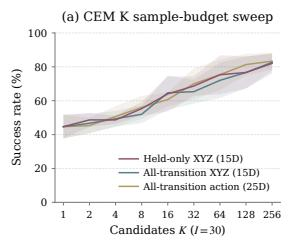

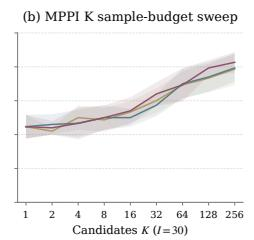

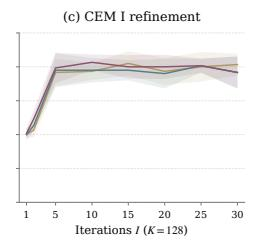

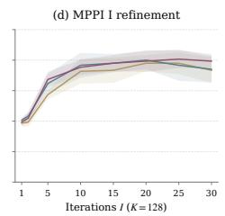  
Reference CEM (K) MPPI (K) CEM (I) MPPI (I) grasp-active XYZ15D (main) 62.58 58.88 77.40 73.72 All-transition XYZ15D 61.29 (−1.29) $5 7 . 0 0 ( - 1 . 8 8 )$ $7 5 . 0 9 ( - 2 . 3 1 )$ 72.67 (−1.06) All-transition full25D 62.92 (+0.33) $5 7 . 2 9 \left( - 1 . 5 8 \right)$ $7 5 . 8 2 ( - 1 . 5 9 )$ 69.68 (−4.05)  
Figure 7: Cube reference geometry: sample-budget and refinement curves with nAUC summaries. Lines show mean success and bands show sample SD over three evaluation seeds (50 episodes each). The table reports mean normalized AUC (nAUC) over the complete sample-budget and refinement sweeps: $K = 1 \mathrm { - } 2 5 6$ on a $\log _ { 2 }$ K axis and $I = 1 { - } 3 0$ on a linear I axis. Higher is better; bold marks the best reference for each planner and sweep, including ties. Parentheses give percentage-point differences from grasp-active XYZ15D for the same sweep and planner; negative values indicate decreases. Both planners use no action prior.

grasp-active XYZ has the highest nAUC for MPPI in sweeps and for CEM in the refinement sweep. The all-transition full-action reference has the highest nAUC for CEM in the sample-budget sweep. On Cube, the grasp-active mask and XYZ reference are derived entirely from the observed action vector and require no additional state or task labels. Our full-action ablation shows that CGS remains effective without this reference selection.

## C.1.4 STATE-INFORMED REFERENCE GEOMETRY AND OBSERVATION HISTORY ON REACHER

We separate two factors that can limit an action-only reference on Reacher: raw torque geometry does not fully describe the state-dependent physical effect of an action, and a single image does not fully specify the dynamical state. We compare LeWM, the main CGS model using the action reference (action-CGS), and a transition-reference CGS variant (transition-CGS). Transition-CGS uses a state-informed reference constructed from observed joint-configuration displacements, capturing the realized transition under the executed action and current state. Each checkpoint is frozen and evaluated under the same three observation-history protocols.

Transition-reference training. Action-CGS uses the executed action block $a _ { t }$ to define reference geometry. Transition-CGS instead uses the observed joint-configuration displacement, which reflects the transition produced by that action in its starting state:

$$
\psi ( q _ { t } ) = [ \sin q _ { t , 1 } , \sin q _ { t , 2 } , \cos q _ { t , 1 } , \cos q _ { t , 2 } ] ^ { \top } , \qquad r _ { t } = W [ \psi ( q _ { t + 1 } ) - \psi ( q _ { t } ) ] ,\tag{19}
$$

where $q _ { t }$ denotes the two joint angles, i.e., the configuration component of the Reacher probe state $s _ { t } .$ . The index t follows model steps, so consecutive model-step observations are separated by five environment steps. W is a fixed diagonal normalization computed from training displacements; the sine and cosine coordinates of each joint share an inverse RMS scale. The reference $r _ { t }$ therefore reflects the realized state-dependent transition rather than the executed torque vector alone, with no learned aggregation head or encoder teacher. Only the reference construction changes: the architecture, prediction and SIGReg losses, the default $N = 3$ history setting, the cosine-Gram CGS objective, and all other training settings are unchanged. Joint-angle labels are used only to construct the training reference; planning uses images and actions without access to these labels.

Observation-history protocols. Single-frame context (native) supplies only the current image at every replanning call, with no previous observations or executed actions. Predicted latents and candidate actions still accumulate causally within each imagined rollout; we use this historical strategy in most of our experiments unless explained.

Dataset-initialized history (privileged) supplies $\left[ o _ { t - 2 } , o _ { t - 1 } , o _ { t } \right]$ and the two connecting executedaction blocks, $[ a _ { t - 2 } , a _ { t - 1 } ]$ . At the first solve, the preceding observations and actions come from the same dataset episode used to initialize the environment. Missing episode-start observations are padded with the first frame and missing actions with raw zero actions before normalization; history never crosses episode boundaries. All later history comes from the actual online trajectory. These initial observations and actions are unavailable to a planner starting from an arbitrary reset with only one image, so we treat dataset-initialized history as a privileged-context diagnostic rather than a deployable cold-start protocol.

Online history reads no dataset prehistory and starts through the native single-frame path. It records observations and executed actions, enabling the same three-frame context after at least two model steps have been collected. In our evaluation, each solve executes five action blocks, so the second solve uses $\left[ o _ { 3 } , o _ { 4 } , o _ { 5 } \right]$ and $[ a _ { 3 } , a _ { 4 } ]$ , with time measured from the reset. Both the native and onlinehistory protocols are feasible under the single-image cold-start setting. In either history-based protocol, past actions are aligned with the observed transitions and candidate actions begin at the current time; the predictor retains its causal mask and at most three context tokens during rollout. No model parameters are updated online.

Evaluation and results. We follow the shared sampling-based and GD evaluation protocols in Appendices C.1.1, using matched evaluation starts for seeds {0, 1, 42} and 50 episodes per seed. Sampling-based evaluations use no action prior. Across this ablation, only the CGS reference and observation-history protocol vary.

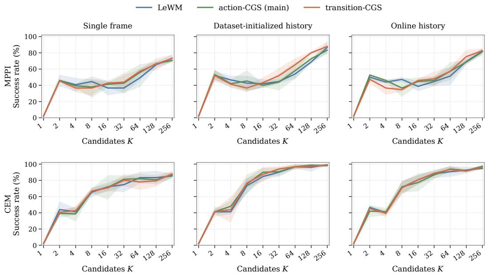  
Figure 8: Reacher sample-budget sweeps under three observation-history protocols. Top: MPPI; bottom: CEM. Columns show single-frame input, dataset-initialized history, and online history, respectively. All curves use $I = 3 0 ^ { \circ }$ without an action prior; bands show ± one sample SD across three evaluation seeds, 50 episodes each. MPPI uses $\tau = 6 4$ . State labels are used only to train transition-CGS.

Figure 8 and Table 8 separate the effects of reference geometry from those of observation history. For MPPI, the three models are similar under the native single-frame protocol: at $K = 1 2 8 , \mathrm { L e W M }$ action-CGS, and transition-CGS reach 65.3%, 66.7%, and 66.0%, respectively. The state-informed reference becomes more useful when recent observation–action history provides dynamical context.

With dataset-initialized history, transition-CGS reaches 80.0% at K = 128, compared with 68.7% for LeWM and 72.7% for action-CGS, and also gives the highest sample-budget nAUC (51.96 versus 49.38 and 49.75). With online history, its advantage becomes clearer at larger candidate budgets, reaching 75.3% at K = 128, compared with 69.3% for LeWM and 68.7% for action-CGS. Thus, for MPPI, the benefit of a state-dependent transition reference becomes clearer when short transition history makes the current dynamics more observable, particularly at larger sampling budgets.

CEM shows a different pattern. Adding history substantially improves the LeWM baseline itself: its K = 128 success rises from 83.3% with a single frame to 96.0% with dataset-initialized history and 92.7% with online history. With history available, CEM approaches saturation at larger candidate budgets (Figure 8), leaving limited headroom for either reference variant to provide further gains. Accordingly, the additional differences among LeWM, action-CGS, and transition-CGS are small and mixed in both K = 128 success and sample-budget nAUC. GD exhibits a more consistent reference effect. Action-CGS improves over LeWM in all three history settings, and transition-CGS further increases mean success to 85.3%, 94.0%, and 92.7% under single-frame, dataset-initialized, and online history, respectively, compared with 76.7%, 84.0%, and 81.3% for LeWM.

Together, these results suggest that observation history and reference geometry address distinct limitations on Reacher. History provides information about recent dynamics that is absent from a single image, whereas transition-CGS supervises latent geometry using the realized, state-dependent effect of an action. Their combination is especially useful for MPPI and GD, while CEM already benefits strongly from history alone. Transition-CGS, however, requires joint-state information to construct its training reference. Such labels are privileged and may be unavailable in the pixel–action datasets targeted by our main setting. We therefore retain action-CGS as the main method and use transition-CGS as a diagnostic of the potential benefit of richer state-dependent reference geometries.

Table 8: Reacher reference and history ablation: success rate and sample-budget nAUC. SR is mean ± sample SD (%) over three evaluation seeds, 50 episodes each. MPPI/CEM SR uses K = 128, I = 30; GD uses 100 Adam steps and is independent of K. nAUC summarizes the complete sample-budget sweep. Parentheses give percentage-point differences from LeWM for both CGS models, within the same history, planner, and metric. Bold marks the highest value within each history/metric group. MPPI uses τ = 64.
<table><tr><td rowspan="2">History</td><td rowspan="2">Model</td><td colspan="2">MPPI</td><td colspan="2">CEM</td><td>GD</td></tr><tr><td>SR</td><td>nAUC</td><td>SR</td><td>nAUC</td><td>SR</td></tr><tr><td rowspan="3">Single frame</td><td>LeWM</td><td>65.3 ±4.2</td><td>44.63</td><td>83.3 ±8.3</td><td>63.46</td><td>76.7 ±4.2</td></tr><tr><td>action-CGS</td><td>66.7 ±2.3 (+1.3)</td><td>45.79 (+1.17)</td><td>80.7 ±3.1 (−2.7)</td><td>63.04 (−0.42)</td><td>82.0 ±5.3 (+5.3)</td></tr><tr><td>transition-CGS</td><td>66.0 ±7.2 (+0.7)</td><td>45.79 (+1.17)</td><td>79.3 ±7.0 (−4.0)</td><td>62.88 (−0.58)</td><td>85.3 ±7.0 (+8.7)</td></tr><tr><td rowspan="3">Dataset-initialized history</td><td>LeWM</td><td>68.7 ±2.3</td><td>49.38</td><td>96.0 ±5.3</td><td>71.75</td><td>84.0 ±3.5</td></tr><tr><td>action-CGS</td><td>72.7 ±3.1 (+4.0)</td><td>49.75 (+0.37)</td><td>98.7 ±1.1 (+2.7)</td><td>73.83 (+2.08)</td><td>90.7 ±4.2 (+6.7)</td></tr><tr><td>transition-CGS</td><td>80.0 ±2.0 (+11.3)</td><td>51.96 (+2.58)</td><td>97.3 ±3.1 (+1.3)</td><td>73.46 (+1.71)</td><td>94.0 ±3.5 (+10.0)</td></tr><tr><td rowspan="3">Online history</td><td>LeWM</td><td>69.3 ±4.2</td><td>48.42</td><td>92.7 ±4.2</td><td>69.79</td><td>81.3 ±2.3</td></tr><tr><td>action-CGS</td><td>68.7 ±2.3 (−0.7)</td><td>49.21(+0.79)</td><td>92.0 ±2.0 (−0.7)</td><td>69.37 (−0.42)</td><td>89.3 ±4.2 (+8.0)</td></tr><tr><td>transition-CGS 75.3 ±8.3 (+6.0)</td><td></td><td>48.46(+0.04)</td><td>91.3 ±1.1 (−1.3)</td><td>69.79 (+0.00)</td><td>92.7 ±5.0 (+11.3)</td></tr></table>

## C.2 VISUALIZING ACTION–EFFECT GEOMETRY AND PLANNING

Figure 9 shows two selected examples per environment, complementing the planning results with two views of control geometry: encoded transition trajectories and predicted endpoint responses to action perturbations.

## C.2.1 ACTION AND LATENT TRANSITION TRAJECTORIES

Construction. For PushT, Cube, and Reacher, we sample candidate starts from recorded trajectories and select two illustrative 30-observation windows per benchmark at a five-step stride, retaining all 29 transitions. Because recorded TwoRooms episodes are shorter than this 145-step span, we use seeded native rollouts. Its two examples share a zigzag control family; a local encoder-geometry probe selects initial regions, and seeds determine control orientation and size. All are selected qualitative examples, not unfiltered random samples.

For each window, we form standardized five-step action blocks $a _ { t }$ and latent differences $\Delta z _ { t } =$ $f _ { \theta } ( o _ { t + 1 } ) - f _ { \theta } ( o _ { t } )$ , then normalize each vector in its original space as in Eq. (4), and cumulatively sum the unit directions into action and latent paths. We align latent to action directions (using a rigid cumulative-path fit for Cube) and project both paths onto action-path principal components: two for PushT, TwoRooms, and Reacher and three for Cube. Cube uses the XYZ action channels. The basi is shared across models; alignment has no scale, and projected steps are not renormalized.

Interpretation and results. The purple dashed curve is the action reference; colored curves are encoded transition paths. The key criterion is preservation of turns and relative directions: under CGS, $K _ { Z } \approx K _ { A }$ means that similarly directed actions induce similarly directed latent changes. Because the objective matches pairwise angles rather than coordinates or step lengths, exact projected overlap is a stronger criterion than the training loss imposes.

On PushT and Cube, CGS follows the action-reference shape more faithfully than LeWM or TS, particularly around changes of direction. TS is partially improved or comparable to LeWM but does not consistently recover these turns. On simpler TwoRooms, TS and CGS are similar and both align much better than LeWM, consistent with their near-ceiling MPPI SR (96.0% and 98.0% at $K = 2 { \bar { 5 } } 6 ;$ Table 5). On Reacher, CGS preserves several turns more clearly than LeWM or TS, though less consistently than on PushT or Cube, suggesting partial improvement in the action-related organization of this more state-dependent setting.

## C.2.2 ACTION-PERTURBATION HEATMAPS AND PLANNING ISOTROPY

Construction and connection to $G _ { H }$ . At a shared observation and base action sequence a, let ${ \widehat { F } } _ { H } ( \mathbf { a } )$ be the model’s predicted terminal latent for $H = 5$ action blocks. Let $Q \in \mathbb { R } ^ { ( H d _ { a } ) \times 2 }$ have orthonormal columns spanning the fixed horizon-constant plane of the first two primitive control coordinates. We sample 32 equally spaced unit-circle directions $q _ { j } = ( \cos \theta _ { j } , \sin \theta _ { j } ^ { - } ) ^ { \top }$ , with $\theta _ { j } = 2 \pi j / 3 2$ , and apply equal-norm perturbations $\epsilon Q q _ { j }$ in standardized action coordinates, using $\epsilon = 0 . 0 5$ . The heatmap records pairwise cosines of the full-dimensional terminal responses

$$
r _ { j } = \widehat { F } _ { H } ( \mathbf { a } + \epsilon Q q _ { j } ) - \widehat { F } _ { H } ( \mathbf { a } ) , \qquad K _ { j k } ^ { \mathrm { r e s p } } = \frac { r _ { j } ^ { \top } r _ { k } } { \| r _ { j } \| _ { 2 } \| r _ { k } \| _ { 2 } } .\tag{20}
$$

The first PushT example uses frame 13 as its response anchor; every other example uses frame 1.   
Each comparison uses the same anchor, base actions, and perturbations for all three models.

Writing $J _ { H } = \partial \widehat { F } _ { H } / \partial \mathbf { a }$ , local linearization gives $r _ { j } \approx \epsilon J _ { H } Q q _ { j }$ . Consequently,

$$
K _ { j k } ^ { \mathrm { r e s p } } \approx \frac { q _ { j } ^ { \top } M _ { Q } q _ { k } } { \sqrt { q _ { j } ^ { \top } M _ { Q } q _ { j } } \sqrt { q _ { k } ^ { \top } M _ { Q } q _ { k } } } , \qquad M _ { Q } = Q ^ { \top } J _ { H } ^ { \top } J _ { H } Q .\tag{21}
$$

For the linear dynamics in Section $4 . 2 , J _ { H } = \Gamma _ { H }$ and hence $M _ { Q } = Q ^ { \top } G _ { H } Q ;$ for a nonlinear predictor, $J _ { H } ^ { \top } J _ { H }$ is the Gauss–Newton component of the planning Hessian (Eq. (69)). Under ideal CGS geometry, $G _ { H } = c H P _ { H }$ and $P _ { H } Q = { \overline { { Q } } }$ , giving $\bar { M _ { Q } } = c \bar { H I _ { 2 } }$ . Equal curvature in the tested plane then preserves the circle’s angular relations: $K _ { j k } ^ { \mathrm { r e s p } } \approx q _ { j } ^ { \top } q _ { k } = \cos ( \theta _ { j } - \theta _ { k } )$ . Thus similarity to the ideal heatmap is a local diagnostic of planning isotropy in this plane, rather than a measurement of full-space isotropy or of the nonlinear residual Hessian.

Interpretation and results. The Ideal tile is the cosine Gram matrix of a standard unit circle: nearby directions have cosine close to 1, orthogonal directions have cosine 0, and opposite directions have cosine −1. Its regular diagonal bands provide the reference for every model, with a common color range [−1, 1]. On PushT and Cube, CGS retains these bands more faithfully than LeWM and TS, whose distorted bands reveal uneven angular sensitivity. On TwoRooms, TS and CGS are close to one another and closer to the circle reference than LeWM, consistent with their similar trajectory geometry and near-ceiling SR. On Reacher, the response patterns remain less regular than on PushT or Cube, but the displayed CGS heatmaps recover the ideal band structure more closely than LeWM or TS. This indicates partial improvement in local planning sensitivity despite the stronger state dependence of the task, consistent with the smaller and more planner-dependent gains observed in the planning results.

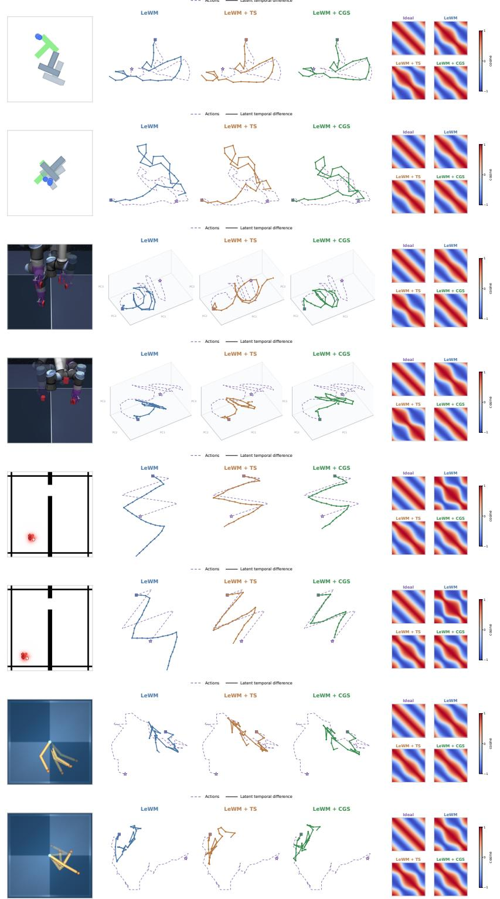  
Figure 9: Action–effect geometry across four environments. From top to bottom: two examples each of PushT, Cube, TwoRooms, and Reacher. Left: environment illustrations. Middle: complete 30-frame action references (purple dashed) and encoded transition paths for LeWM (blue), TS (brown), and CGS (green), with shared action PCA in 2D or 3D; squares and stars mark starts and ends. Shape agreement indicates preservation of action-related directions. Right: cosine Grams of predicted endpoint responses to circular action perturbations; Ideal is the unit-circle reference. Protocol and interpretation are given in Appendix C.2.

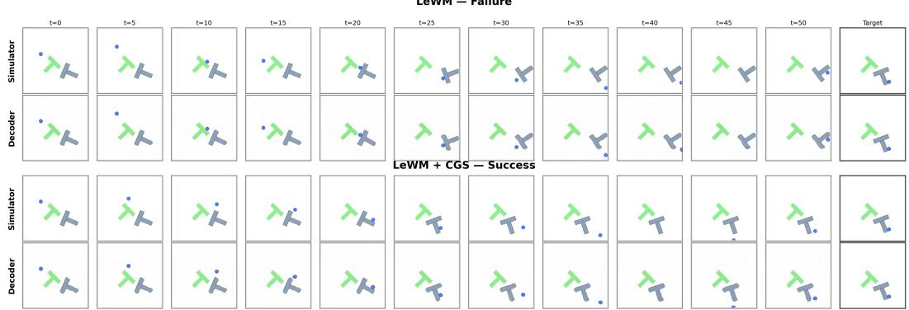  
Figure 10: Selected qualitative PushT planning rollout. Simulator and decoded trajectories for a LeWM failure (top) and a LeWM+CGS success (bottom). Columns show the rollout over environment steps with the target configuration. The CGS example reaches the target while its decoded trajectory remains qualitatively aligned with the simulator rollout, illustrating that the learned representation retains sufficient task-relevant information for successful planning in this example.

## C.2.3 QUALITATIVE PUSHT PLANNING ROLLOUT

Figure 10 shows a PushT planning example under LeWM and LeWM+CGS. With LeWM, the planned trajectory fails to reach the target configuration, whereas CGS produces a successful rollout. The corresponding decoded trajectories (decoder trained a posteriori) remain qualitatively consistent with the simulator evolution, indicating that the CGS representation retains sufficient task-relevant information to support successful planning in this example.

## C.3 FULL ACTION–REPRESENTATION PROBING

Protocol and probe definitions. We use 200 episodes per environment, split by episode into 140 fit, 20 validation, and 40 test episodes with split seed 20260814. The probe time index follows the frame-skipped sequences used by the world model, with frame skip 5. Thus, consecutive indexed observations $o _ { t }$ and $o _ { t + 1 }$ are separated by five raw data frames, and $a _ { t } \in \mathbb { R } ^ { d _ { a } }$ denotes the concatenated action vector associated with that interval; $d _ { a }$ is the resulting action dimension after frame-skip concatenation. We define

$$
\Delta z _ { t } = z _ { t + 1 } - z _ { t } , \qquad \Delta s _ { t } = s _ { t + 1 } - s _ { t } ,\tag{22}
$$

with wrapped differences for angular targets.

Here $s _ { t }$ denotes the physical-state features supplied to the probe, rather than necessarily the complete simulator state. State-conditioned probes use agent and object pose on PushT, joint positions and velocities on Cube and Reacher, and agent position on TwoRooms. Encoders are frozen, and $z _ { t }$ is the global encoder token after the learned projector, evaluated on real dataset images. Linear probes are ridge regressions with coefficient $1 0 ^ { - 4 } .$ Nonlinear probes are two-layer width-128 GELU MLPs selected by validation loss; reported MLP values use the ensemble prediction from seeds 7, 17, and 27. Input and target normalizers are fit on the fit episodes only. Unless otherwise stated, scores are pooled held-out $\breve { R } ^ { 2 } = 1 - \mathrm { S S E } / \mathrm { S S T }$ , where $\begin{array} { r } { \mathrm { S S E } = \sum _ { i } \| y _ { i } - \hat { y } _ { i } \| _ { 2 } ^ { 2 } } \end{array}$ is the sum of squared prediction errors and $\begin{array} { r } { \mathrm { S S T } = \sum _ { i } \| y _ { i } - \bar { y } \| _ { 2 } ^ { 2 } } \end{array}$ is the total sum of squares around the held-out target mean y¯.

Physical identification. We first ask how predictable the physical displacement is from action alone, state alone, or their combination. Let

$$
\begin{array} { r l } & { \widehat { \Delta s } _ { A , t } ^ { g } = p _ { A } ^ { g } ( { a } _ { t } ) , } \\ & { \widehat { \Delta s } _ { S , t } ^ { g } = p _ { S } ^ { g } ( { s } _ { t } ) , } \\ & { \widehat { \Delta s } _ { A S , t } ^ { g } = p _ { A S } ^ { g } ( { a } _ { t } , { s } _ { t } ) , } \end{array}\tag{23}
$$

where $g \in \{ \mathrm { l i n , M L P } \}$ denotes the probe class. We denote their held-out $R ^ { 2 }$ scores by $P _ { A } ^ { g } , P _ { S } ^ { g }$ and $P _ { A S } ^ { g } ,$ respectively. These are environment-level diagnostics and are therefore shared across representations.

The partial action score

$$
R _ { A | S } ^ { 2 } = 1 - { \frac { \mathrm { S S E } \bigl ( P _ { A S } ^ { \mathrm { M L P } } \bigr ) } { \mathrm { S S E } \bigl ( P _ { S } ^ { \mathrm { M L P } } \bigr ) } }\tag{24}
$$

measures the additional predictable effect supplied by action after conditioning on the state features. These quantities are empirical held-out predictability diagnostics under the specified probe classes, rather than Bayes-optimal physical ceilings.

Motion decoding. For each frozen representation, we next fit decoders

$$
d _ { \mathrm { l i n } } \big ( \Delta z _ { t } \big ) , \qquad d _ { \mathrm { M L P } } \big ( \Delta z _ { t } \big )\tag{25}
$$

to predict the true physical displacement $\Delta { } s _ { t }$ . Their held-out $R ^ { 2 }$ scores are denoted $D _ { \mathrm { l i n } }$ and $D _ { \mathrm { M L P } }$ Thus $D _ { \mathrm { M L P } }$ tests whether the evaluated motion information is accessible to the nonlinear probe, whereas $D _ { \mathrm { l i n } }$ measures its linear accessibility from the latent difference.

Control-effect accessibility and agreement. We finally test whether $\Delta z _ { t }$ makes physically predicted control effects linearly accessible. Two ridge readouts are fit from $\Delta z _ { t }$

$$
\begin{array} { r } { c _ { A } ( \Delta z _ { t } ) \approx \widehat { \Delta s } _ { A , t } ^ { \mathrm { l i n } } , } \\ { c _ { A S } ( \Delta z _ { t } ) \approx \widehat { \Delta s } _ { A S , t } ^ { \mathrm { M L P } } . } \end{array}\tag{26}
$$

Their held-out $R ^ { 2 }$ scores are denoted $C _ { A }$ and $C _ { A S } .$ respectively. Hence $C _ { A }$ measures accessibility of the linear action-only physical effect, whereas $C _ { A S }$ uses the nonlinear state-conditioned physical estimate as its target.

The bridge scores measure agreement in physical displacement coordinates without fitting an additional bridge probe. We reuse the ordinary linear motion decoder $d _ { \mathrm { l i n } }$ and define

$$
B _ { P } = 1 - \frac { \sum _ { t } \left\| d _ { \operatorname* { l i n } } ( \Delta z _ { t } ) - \widehat { \Delta s } _ { P , t } \right\| _ { 2 } ^ { 2 } } { \sum _ { t } \left\| \Delta s _ { t } - \widehat { \Delta s } \right\| _ { 2 } ^ { 2 } } , \qquad P \in \{ A , A S \} ,\tag{27}
$$

where

$$
\widehat { \Delta s } _ { A , t } : = \widehat { \Delta s } _ { A , t } ^ { \mathrm { l i n } } , \qquad \widehat { \Delta s } _ { A S , t } : = \widehat { \Delta s } _ { A S , t } ^ { \mathrm { M L P } } .\tag{28}
$$

We denote the resulting scores by $B _ { A }$ and $B _ { A S }$ . Unlike $C _ { A }$ and $C _ { A S }$ , these are normalized agreement scores rather than $R ^ { 2 }$ values of newly fitted probes.

To match the notation from the main context, the six quantities reported there correspond to

$$
P _ { A } = P _ { A } ^ { \mathrm { M L P } } , \qquad P _ { A S } = P _ { A S } ^ { \mathrm { M L P } } , \qquad D _ { \mathrm { l i n } } , \qquad D _ { \mathrm { M L P } } , \qquad C _ { A } , \qquad B _ { A S } .\tag{29}
$$

The additional quantities reported here provide complementary diagnostics. In particular, a high $D _ { \mathrm { M L P } }$ together with a substantially lower $D _ { \mathrm { l i n } }$ indicates that motion information is retained but is less linearly accessible under these probe classes; this pattern is consistent with a more nonlinear organization of the latent representation.

Physical action-identifiability diagnostics. The physical-prediction results distinguish action dependence from state dependence under the specified probe classes. PushT agent displacement and TwoRooms agent displacement are almost completely predictable from action alone. Reacher fingertip displacement is qualitatively different: both the linear and nonlinear action-only probes obtain $\dot { R } ^ { 2 } = - 0 . 0 0 6$ , whereas the state-conditioned MLP reaches $P _ { A S } ^ { \mathrm { M L P } } = 0 . 9 8 3$ . Cube joint, end-effector, and yaw changes are also highly predictable from action, while gripper and block effects show larger linear-to-nonlinear gaps. These physical diagnostics provide the reference needed to interpret the representation probes below.

Table 9: Physical-motion identification. A, S, and $A S$ use the action, current state, and both. $R _ { A | S } ^ { 2 }$ uses the MLP probes and the state-only residual as its denominator. Negative values denote performance below the held-out mean predictor.
<table><tr><td>Environment</td><td>Physical change</td><td> $P _ { A } ^ { \mathrm { l i n } }$ </td><td> $\overline { { P _ { A } ^ { \mathrm { M L P } } } }$ </td><td> $P _ { S } ^ { \mathrm { l i n } }$ </td><td> $\overline { { P _ { S } ^ { \mathrm { M L P } } } }$ </td><td> $P _ { A S } ^ { \mathrm { l i n } }$ </td><td> $P _ { A S } ^ { \mathrm { M L P } }$ </td><td> $R _ { A | S } ^ { 2 }$ </td></tr><tr><td rowspan="3">PushT</td><td>Agent position</td><td>0.999</td><td>0.999</td><td>0.122</td><td>0.266</td><td>0.999</td><td>0.999</td><td>0.999</td></tr><tr><td>Block position</td><td>0.121</td><td>0.317</td><td>0.092</td><td>0.372</td><td>0.175</td><td>0.613</td><td>0.384</td></tr><tr><td>Block angle</td><td>-0.012</td><td>0.074</td><td>0.045</td><td>0.271</td><td>0.044</td><td>0.543</td><td>0.372</td></tr><tr><td rowspan="6">Cube</td><td>Joint position</td><td>0.946</td><td>0.966</td><td>0.718</td><td>0.834</td><td>0.960</td><td>0.997</td><td>0.981</td></tr><tr><td>End-effector position</td><td>0.992</td><td>0.994</td><td>0.753</td><td>0.870</td><td>0.993</td><td>0.999</td><td>0.990</td></tr><tr><td>End-effector yaw</td><td>0.991</td><td>0.992</td><td>0.528</td><td>0.628</td><td>0.992</td><td>0.998</td><td>0.995</td></tr><tr><td>Gripper opening</td><td>0.250</td><td>0.961</td><td>0.541</td><td>0.886</td><td>0.853</td><td>0.992</td><td>0.934</td></tr><tr><td>Block position</td><td>0.492</td><td>0.991</td><td>0.797</td><td>0.863</td><td>0.876</td><td>0.997</td><td>0.976</td></tr><tr><td>Block yaw</td><td>0.294</td><td>0.916</td><td>0.523</td><td>0.595</td><td>0.569</td><td>0.913</td><td>0.785</td></tr><tr><td rowspan="2">Reacher</td><td>Joint position</td><td>0.847</td><td>0.847</td><td>0.093</td><td>0.110</td><td>0.948</td><td>0.993</td><td>0.992</td></tr><tr><td>Fingertip position</td><td>-0.006</td><td>-0.006</td><td>-0.001</td><td>0.251</td><td>-0.005</td><td>0.983</td><td>0.977</td></tr><tr><td>TwoRoom</td><td>Agent position</td><td>0.952</td><td>0.953</td><td>0.047</td><td>0.057</td><td>0.952</td><td>0.965</td><td>0.963</td></tr></table>

Table 10: Complete PushT representation probes. D denotes dynamic decoding, C control-effect accessibility, and B bridge agreement. Subscripts A and AS denote action-only and state-conditioned physical targets.
<table><tr><td>Model</td><td>Target</td><td> $\overline { { D _ { \mathrm { l i n } } } }$ </td><td> $\overline { { D _ { \mathrm { M L P } } } }$ </td><td> $\overline { { C _ { A } } }$ </td><td> $\overline { { C _ { A S } } }$ </td><td> $\overline { { B _ { A } } }$ </td><td> $\overline { { B _ { A S } } }$ </td></tr><tr><td>LeWM</td><td>Agent position</td><td>0.809</td><td>0.888</td><td>0.807</td><td>0.808</td><td>0.807</td><td>0.808</td></tr><tr><td>TS</td><td>Agent position</td><td>0.831</td><td>0.891</td><td>0.829</td><td>0.830</td><td>0.829</td><td>0.830</td></tr><tr><td>CGS</td><td>Agent position</td><td>0.903</td><td>0.959</td><td>0.901</td><td>0.902</td><td>0.901</td><td>0.902</td></tr><tr><td>LeWM</td><td>Block position</td><td>0.813</td><td>0.864</td><td>0.791</td><td>0.602</td><td>0.256</td><td>0.603</td></tr><tr><td>TS</td><td>Block position</td><td>0.816</td><td>0.830</td><td>0.817</td><td>0.670</td><td>0.314</td><td>0.678</td></tr><tr><td>CGS</td><td>Block position</td><td>0.847</td><td>0.873</td><td>0.871</td><td>0.655</td><td>0.276</td><td>0.664</td></tr><tr><td>LeWM</td><td>Block angle</td><td>0.151</td><td>0.604</td><td>0.773</td><td>0.158</td><td>0.423</td><td>0.308</td></tr><tr><td>TS</td><td>Block angle</td><td>0.357</td><td>0.574</td><td>0.808</td><td>0.287</td><td>0.386</td><td>0.404</td></tr><tr><td>CGS</td><td>Block anğle</td><td>0.227</td><td>0.601</td><td>0.843</td><td>0.143</td><td>0.450</td><td>0.296</td></tr></table>

Table 11: Complete Cube representation probes. CGS uses grasp-active transitions and XYZ controls for its geometry objective. All three models share the dataset, episode split, horizon, latent dimension, and probe protocol.
<table><tr><td>Model</td><td>Target</td><td> $\overline { { D _ { \mathrm { l i n } } } }$ </td><td> $\overline { { D _ { \mathrm { M L P } } } }$ </td><td> $\overline { { C _ { A } } }$ </td><td> $\overline { { C _ { A S } } }$ </td><td> $\overline { { B _ { A } } }$ </td><td> $\overline { { B _ { A S } } }$ </td></tr><tr><td>LeWM</td><td>Joint position</td><td>0.742</td><td>0.747</td><td>0.741</td><td>0.743</td><td>0.723</td><td>0.743</td></tr><tr><td>TS</td><td>Joint position</td><td>0.622</td><td>0.643</td><td>0.629</td><td>0.622</td><td>0.631</td><td>0.621</td></tr><tr><td>CGS</td><td>Joint position</td><td>0.743</td><td>0.895</td><td>0.748</td><td>0.741</td><td>0.729</td><td>0.741</td></tr><tr><td>LeWM</td><td>End-effector position</td><td>0.895</td><td>0.969</td><td>0.893</td><td>0.893</td><td>0.891</td><td>0.893</td></tr><tr><td>TS</td><td>End-effector position</td><td>0.710</td><td>0.776</td><td>0.706</td><td>0.708</td><td>0.700</td><td>0.709</td></tr><tr><td>CGS</td><td>End-effector position</td><td>0.931</td><td>0.982</td><td>0.930</td><td>0.930</td><td>0.927</td><td>0.930</td></tr><tr><td>LeWM</td><td>End-effector yaw</td><td>-0.039</td><td>-0.023</td><td>-0.036</td><td>-0.040</td><td>-0.026</td><td>-0.042</td></tr><tr><td>TS</td><td>End-effector yaw</td><td>-0.025</td><td>-0.020</td><td>-0.024</td><td>-0.026</td><td>-0.010</td><td>-0.026</td></tr><tr><td>CGS</td><td>End-effector yaw</td><td>-0.078</td><td>0.830</td><td>-0.080</td><td>-0.078</td><td>-0.063</td><td>-0.078</td></tr><tr><td>LeWM</td><td>Gripper opening</td><td>0.490</td><td>0.905</td><td>0.205</td><td>0.494</td><td>0.502</td><td>0.498</td></tr><tr><td>TS</td><td>Gripper opening</td><td>0.528</td><td>0.905</td><td>0.296</td><td>0.533</td><td>0.543</td><td>0.537</td></tr><tr><td>CGS</td><td>Gripper opening</td><td>0.898</td><td>0.945</td><td>0.381</td><td>0.900</td><td>0.307</td><td>0.901</td></tr><tr><td>LeWM</td><td>Block position</td><td>0.941</td><td>0.970</td><td>0.926</td><td>0.939</td><td>0.517</td><td>0.939</td></tr><tr><td>TS</td><td>Block position</td><td>0.946</td><td>0.976</td><td>0.813</td><td>0.943</td><td>0.513</td><td>0.944</td></tr><tr><td>CGS</td><td>Block position</td><td>0.918</td><td>0.985</td><td>0.948</td><td>0.916</td><td>0.526</td><td>0.916</td></tr><tr><td>LeWM</td><td>Block yaw</td><td>-0.013</td><td>-0.009</td><td>-0.054</td><td>-0.041</td><td>0.757</td><td>0.101</td></tr><tr><td>TS</td><td>Block yaw</td><td>-0.018</td><td>-0.020</td><td>-0.029</td><td>-0.050</td><td>0.750</td><td>0.081</td></tr><tr><td>CGS</td><td>Block yaw</td><td>-0.009</td><td>0.426</td><td>-0.102</td><td>-0.032</td><td>0.751</td><td>0.096</td></tr></table>

Table 12: Complete Reacher and TwoRoom representation probes, using the same notation and protocol as Tables 10 and 11.
<table><tr><td>Environment</td><td>Model</td><td>Target</td><td> $D _ { \mathrm { l i n } }$ </td><td> $D _ { \mathrm { M L P } }$ </td><td> $\overline { { C _ { A } } }$ </td><td> $\overline { { C _ { A S } } }$ </td><td> $B _ { A }$ </td><td> $\overline { { B _ { A S } } }$ </td></tr><tr><td>Reacher</td><td>LeWM TS CGS LeWM TS CGS</td><td>Joint position Joint position Joint position Fingertip position Fingertip position Fingertip position</td><td>0.355 0.347 0.123 0.951 0.974</td><td>0.988 0.988 0.988 0.994 0.994</td><td>0.368 0.371 0.135 0.155 0.157</td><td>0.357 0.348 0.127 0.932 0.960</td><td>0.447 0.447 0.248 0.028 0.011</td><td>0.364 0.353 0.134 0.932 0.959</td></tr><tr><td>TwoRoom</td><td>LeWM TS CGS</td><td>Agent position Agent position Ağent position</td><td>0.862 0.970 0.903</td><td>0.956 0.984 0.976</td><td>0.815 0.933 0.866</td><td>0.829 0.946 0.878</td><td>0.819 0.928 0.867</td><td>0.827 0.939 0.873</td></tr></table>

## C.3.1 REPRESENTATION PROBES AMONG ENVIRONMENTS.

PushT: a targeted positive result. For agent displacement, action-only and state-conditioned physical prediction both reach $R ^ { 2 } = 0 . 9 9 9$ . Relative to LeWM, CGS raises $D _ { \mathrm { l i n } }$ from 0.809 to $0 . 9 0 3 , D _ { \mathrm { M L P } }$ from 0.888 to 0.959, and $C _ { A }$ from 0.807 to 0.901, while also giving the strongest $B _ { A S } = 0 . 9 0 2 \mathrm { : }$ ; TS is intermediate on these agent-motion metrics. CGS is therefore strongest for the directly action-predictable agent effect and also improves linear motion decoding and action-effect accessibility for block translation. The state-conditioned object results are less uniform: TS gives the strongest block-position bridge score (0.678 versus 0.664 for CGS) and block-angle bridge score (0.404 versus 0.296). These results should be read together with the lower action-only physicalprediction scores for the object targets: accessibility of a predictable component does not imply that action alone determines the full object displacement.

Cube. All scores below are evaluated on the full held-out test split, although the CGS geometry objective was applied only to grasp-active transitions during representation training. CGS gives the strongest nonlinear motion decoding on all six evaluated targets. For end-effector position, $D _ { \mathrm { l i n } }$ rises from 0.895 with LeWM to 0.931 with CGS; for gripper opening, it rises from 0.490 to 0.898, while $B _ { A S }$ rises from 0.498 to 0.901. TS retains the strongest block-position agreement $( B _ { A S } = 0 . 9 4 4 )$ Both yaw targets remain difficult to decode linearly, despite substantially stronger nonlinear readout for CGS.

Reacher: motion is retained but strongly state dependent. For fingertip displacement, both action-only physical probes remain at $P _ { A } = - 0 . 0 0 6$ , whereas conditioning on joint positions and velocities raises the nonlinear score to $P _ { A S } = 0 . 9 8 3$ . Thus the evaluated fingertip displacement is strongly configuration dependent under these probe classes. Increasing from the linear action-only predictor to our nonlinear action-only MLP does not repair this mismatch, while the state-conditioned predictor does.

At the representation level, direct action-effect accessibility remains low for fingertip motion $( C _ { A } =$ 0.041–0.157), and CGS obtains $B _ { A S } = 0 . 8 8 4$ , below LeWM (0.932) and TS (0.959). At the same time, all three representations retain nearly all evaluated motion information under nonlinear decoding: $D _ { \mathrm { M L P } } \approx 0 . 9 9$ for both joint and fingertip targets. The main difference is therefore how linearly accessible that information is from $\Delta z _ { t } ,$ rather than whether it is present at all. TS gives the strongest state-conditioned accessibility and agreement on the fingertip target, while CGS retains the motion information with weaker linear accessibility.

TwoRooms: TS is strongest despite highly identifiable action effects. TwoRooms has high action-only and state-conditioned physical-prediction scores, yet TS is strongest across the reported representation probes, including $\bar { D } _ { \mathrm { l i n } } = \bar { 0 . 9 7 0 } , C _ { A S } = 0 . 9 4 \bar { 6 }$ , and $B _ { A S } = 0 . 9 3 9$ . CGS improves over LeWM but remains below TS on these diagnostics. High action identifiability alone is therefore not sufficient for CGS to outperform temporal straightening.

## C.4 MECHANISM-FIGURE PROTOCOL AND ADDITIONAL RESULTS

The illustration in Figure 3 links measured Cube planning geometry to one-step MPPI progress. We use 32 shared grasp-active anchors from distinct episodes and perturb the XYZ commands uniformly across the 25-action horizon. The orthonormal basis $U = \mathbf { 1 } _ { 2 5 } \otimes [ I _ { 3 } , 0 _ { 3 \times 2 } ] ^ { \top } / \sqrt { 2 5 }$ maps three-dimensional perturbations into the full action sequence. At each recorded action sequence, we

differentiate the terminal predictor and form

$$
\begin{array} { r l } & { G _ { H , \mathrm { X Y Z } } : = ( J _ { \widehat { F } _ { H } } U ) ^ { \top } ( J _ { \widehat { F } _ { H } } U ) , } \\ & { ~ \bar { G } _ { H , \mathrm { X Y Z } } : = \frac { G _ { H , \mathrm { X Y Z } } } { \mathrm { t r } ( G _ { H , \mathrm { X Y Z } } ) / 3 } . } \end{array}\tag{30}
$$

The response Gram matrix $G _ { H , \mathrm { X Y Z } }$ measures local sensitivity to XYZ actions. Trace normalization fixes the average eigenvalue at one, allowing spectral-shape comparisons at a common scale. Below, write $\bar { G } : = \bar { G } _ { H , \mathrm { X Y Z } } ^ { - }$ . Since $\bar { G }$ is positive semidefinite, $\bar { \sigma } _ { \mathrm { m i n } } ( \bar { G } ) = \lambda _ { \mathrm { m i n } } ( \bar { G } )$ measures its weakest normalized XYZ curvature.

Let $V$ contain the eigenvectors of $\bar { G }$ in descending eigenvalue order. We place the target along its weakest direction, $\boldsymbol { u } ^ { \bar { \star } } = ( 0 , 0 , 1 ) ^ { \top }$ , and evaluate the quadratic cost

$$
\widehat { C } ( \boldsymbol { u } ) = ( \boldsymbol { u } - \boldsymbol { u } ^ { \star } ) ^ { \top } V ^ { \top } \bar { G } V ( \boldsymbol { u } - \boldsymbol { u } ^ { \star } ) , \qquad q _ { K } = \frac { \| \widehat { \mu } _ { K } - \boldsymbol { u } ^ { \star } \| _ { 2 } } { \| \boldsymbol { u } ^ { \star } \| _ { 2 } } .\tag{31}
$$

MPPI starts from $\mathcal { N } ( 0 , I _ { 3 } )$ with temperature $\tau = 2 ; \widehat { \mu } _ { K }$ is its weighted sample mean. We call $q _ { K }$ the K-sample contraction factor: the ratio of post-update to initial mean-error norms, with initial mean zero. It is a random error ratio, not an empirical Jacobian norm, and can exceed one. Each anchor uses 512 Gaussian batches, with shared sample coordinates across models and prefix budgets $K \in \{ 1 , 2 , 4 , 8 , 1 6 , 3 2 , 6 4 , 1 2 8 , 2 5 6 \}$ . Thus $\mathrm { P r } ( q _ { K } < 1 )$ is the probability that one update reduces target error in this quadratic problem. Curves average over anchors, with 95% bootstrap intervals.

The quadratic Hessian is $2 V ^ { \top } \bar { G } V .$ , so unit proposal covariance and $\tau = 2$ give the population error map $\bar { ( } I _ { 3 } + V ^ { \top } \bar { G } V ) ^ { - 1 }$ . Because the initial error lies along the weakest-curvature direction, the population counterpart of $q _ { K }$ is

$$
q _ { \infty } = \frac { 1 } { 1 + \sigma _ { \mathrm { m i n } } ( \bar { G } _ { H , \mathrm { X Y Z } } ) } .\tag{32}
$$

For full-rank ${ \bar { G } } ,$ this equals the contraction factor $q _ { \mathrm { M } }$ in Theorem 4.6 applied to this calibrated three-dimensional quadratic probe, rather than the full nonlinear planning problem. Thus, larger curvature along the weakest direction produces greater population progress. Median $q _ { \infty }$ is 0.841, 0.835, and 0.685 for LeWM, TS, and CGS. At $K = 3 2 .$ , their one-update progress probabilities are 75.1%, 80.3%, and 91.3%. This illustration shows how more balanced action sensitivity can improve MPPI updates at a fixed sample budget.

## C.5 DINO-WM IMPLEMENTATION AND ADDITIONAL RESULTS

This section provides the implementation details for the DINO-WM comparisons in Figure 5 and reports additional results on the DINO-WM benchmark settings used by Temporal Straightening (Wang et al., 2026b). Following that setup, we evaluate Base (w/o TS or CGS), TS, and CGS on PushT, Wall, PointMaze–UMaze, and PointMaze–Medium, using both global CLS and spatial Patch representations. Within each representation type, all three objectives share the same frozen DINOv2 backbone, data, predictor architecture, and planning protocol.

Representations and geometry objectives. Temporal Straightening was evaluated with frozen DI-NOv2 features and trainable projectors, as well as with ResNet encoders learned from scratch (Wang et al., 2026b). Our DINO-based experiments follow the spatial DINO-WM setting of DINO-WM and TS (Zhou et al., 2025; Wang et al., 2026b): a frozen DINOv2-S/14 backbone (Oquab et al., 2024) produces a $1 4 \times 1 4$ grid of 384-dimensional patch tokens, which are projected to eight dimensions per token. The predictor rolls out this projected spatial grid. TS and CGS regularize a learned 128-dimensional aggregation of patch-token differences, while prediction and planning retain the full spatial representation.

Our CLS variant instead uses the backbone’s 384-dimensional CLS token, followed by an identityinitialized trainable adapter, and applies the geometry objective directly to the resulting global latent differences. The global DINO variant in the original TS study obtains a single vector by projecting patch features (Wang et al., 2026b); our CLS variant therefore differs in the backbone output to which the geometry objective is applied. In comparison, LeWM learns its visual encoder end to end and predicts a compact 192-dimensional projected CLS latent (Maes et al., 2026).

Training protocol. Prediction targets use stop-gradient in the DINO-WM variants. The projector or CLS adapter, predictor, action encoder, and geometry head are trainable, while the DINOv2 backbone remains frozen. On PushT, we use a 90/10 trajectory split, two training epochs, and unit gradient clipping. Representation learning rates are $1 0 ^ { - 6 }$ for Base and $1 0 ^ { - 5 }$ for TS and CGS; the predictor and action encoder use a learning rate of $5 \times 1 0 ^ { - 4 }$ with weight decay $1 0 ^ { - 2 }$ . Models condition on three observations and predict five-step transitions. The PushT CGS weights are 0.1 for Patch and CLS.

Planning protocol. DINO-WM sampling costs average squared visual prediction errors over tokens and channels. On PushT, we additionally predict proprioception and add its MSE to the visual cost with unit weight; proprioception is not included in either TS or CGS regularization. The GD comparison uses the optimization schedule in Appendix C.1.1, with per-step error given by visual MSE plus proprioceptive MSE.

Sampling-based planners use I = 30 optimization steps, and CEM retains an elite fraction of 0.25. GD uses 100 Adam steps. Within each environment, a single MPPI temperature is shared across CLS/Patch and Base/TS/CGS: 0.015 on PushT, $5 \times 1 0 ^ { - 6 }$ on Wall, $1 0 ^ { - 3 }$ on PointMaze–UMaze, and $3 \times 1 0 ^ { - 3 }$ on PointMaze–Medium. These temperatures are fixed across sampling budgets and representation objectives. Evaluation uses three evaluation seeds and 50 episodes per seed.

Table 13: Additional DINO-WM benchmark results. Goal-reaching success rate (%) for Base, TS, and CGS using frozen DINOv2 CLS or Patch representations on the DINO-WM benchmark settings used by Temporal Straightening. CEM and MPPI use I = 30 optimization steps, and GD uses 100 Adam steps. A single environment-level MPPI temperature is shared across representation types and training objectives. Values are means ± sample SD over three evaluation seeds with 50 evaluation episodes per seed; PushT additionally uses proprioception. Bold marks the best objective for a fixed representation type, planner, environment, and sampling budget.
<table><tr><td rowspan="2">World model / objective Planning method</td><td rowspan="2"></td><td colspan="3">Wall</td><td colspan="3">PointMaze-UMaze</td><td colspan="3">PointMaze-Medium</td><td colspan="3">PushT</td></tr><tr><td></td><td>Sampling budget</td><td></td><td></td><td>Sampling budget</td><td></td><td></td><td>Sampling budget</td><td></td><td></td><td>Sampling budget</td><td></td></tr><tr><td rowspan="4">DINO-WM (CLS)</td><td></td><td>K=32</td><td>K=64</td><td>K=128</td><td>K=32</td><td>K=64</td><td>K=128</td><td>K=32</td><td>K=64</td><td>K=128</td><td>K=32</td><td>K=64</td><td>K=128</td></tr><tr><td>CEM</td><td>74.7±3.1</td><td>76.0±5.3</td><td>74.7±6.1</td><td>88.0±3.5</td><td>92.7±3.1</td><td>90.7±5.0</td><td>85.3±4.2</td><td>86.0±2.0</td><td>84.7±7.0</td><td>47.3±6.4</td><td>56.0±8.7</td><td>63.3±5.0</td></tr><tr><td>MPPI</td><td>84.0±5.3</td><td>86.7±6.4</td><td>89.3±5.0</td><td>92.0±2.0</td><td>93.3±2.3</td><td>96.7±4.2</td><td>90.7±5.0</td><td>90.7±2.3</td><td>92.7±3.1</td><td>31.3±6.1</td><td>35.3±4.6</td><td>46.7±3.1</td></tr><tr><td>GD</td><td></td><td>55.3±2.3</td><td></td><td></td><td>62.0±5.3</td><td></td><td></td><td>56.0±4.0</td><td></td><td></td><td>46.0±2.0</td><td></td></tr><tr><td rowspan="4">+TS (CLS)</td><td>CEM</td><td>79.3±6.1</td><td>78.7±4.2</td><td>77.3±8.3</td><td>86.0±2.0</td><td>89.3±5.0</td><td>90.0±2.0</td><td>87.3±1.2</td><td>84.7±3.1</td><td>89.3±4.6</td><td>41.3±5.0</td><td>38.0±2.0</td><td>47.3±4.2</td></tr><tr><td>MPPI</td><td>88.7±5.8</td><td>83.3±7.6</td><td>84.0±4.0</td><td>91.3±4.2</td><td>94.7±1.2</td><td>95.3±3.1</td><td>88.7±4.2</td><td>88.7±6.1</td><td>94.0±2.0</td><td>29.3±4.2</td><td>29.3±10.3</td><td>29.3±5.8</td></tr><tr><td>GD</td><td></td><td>68.0±4.0</td><td></td><td></td><td>66.7±3.1</td><td></td><td></td><td>65.3±8.1</td><td></td><td></td><td>34.0±14.0</td><td></td></tr><tr><td>CEM</td><td>83.3±8.1</td><td>81.3±7.0</td><td>83.3±3.1</td><td>93.3±3.1</td><td>96.0±4.0</td><td>96.0±3.5</td><td>92.0±2.0</td><td>92.7±3.1</td><td>93.3±2.3</td><td>55.3±4.6</td><td>65.3±6.1</td><td>66.7±6.4</td></tr><tr><td>+CGS (CLS)</td><td>MPPI</td><td>86.0±6.9</td><td>84.7±5.8</td><td>81.3±6.1</td><td>96.7±3.1</td><td>96.0±2.0</td><td>97.3±3.1</td><td>94.7±1.2</td><td>95.3±2.3</td><td>95.3±3.1</td><td>40.7±4.2</td><td>46.7±2.3</td><td>56.7±4.6</td></tr><tr><td rowspan="4">DINO-WM (Patch)</td><td>GD</td><td></td><td>81.3±7.6</td><td></td><td></td><td>81.3±4.2</td><td></td><td></td><td>79.3±6.1</td><td></td><td></td><td>57.3±8.1</td><td></td></tr><tr><td>CEM</td><td>90.7±2.3</td><td>81.3±8.1</td><td>84.7±6.4</td><td>98.0±2.0</td><td>98.7±1.2</td><td>99.3±1.2</td><td>94.7±1.2</td><td>92.7±2.3</td><td>98.7±1.2</td><td>75.3±2.3</td><td>81.3±4.2</td><td></td></tr><tr><td>MPPI</td><td>90.0±2.0</td><td>89.3±2.3</td><td>86.0±5.3</td><td>99.3±1.2</td><td>96.7±1.2</td><td>98.7±1.2</td><td>94.0±4.0</td><td>97.3±3.1</td><td>97.3±2.3</td><td>68.0±4.0</td><td></td><td>83.3±1.2</td></tr><tr><td>GD</td><td></td><td>83.3±3.1</td><td></td><td></td><td>94.0±4.0</td><td></td><td></td><td></td><td></td><td></td><td>62.0±4.0</td><td>75.3±5.0</td></tr><tr><td rowspan="4">+TS (Patch)</td><td></td><td>91.3±1.2</td><td>87.3±2.3</td><td>86.0±2.0</td><td>94.7±3.1</td><td>97.3±3.1</td><td>95.3±1.2</td><td>88.7±3.1</td><td>88.7±4.2</td><td></td><td></td><td>78.0±5.3</td><td></td></tr><tr><td>CEM</td><td>89.3±1.2</td><td>91.3±2.3</td><td>90.7±3.1</td><td>97.3±3.1</td><td>96.7±1.2</td><td>98.0±2.0</td><td>94.0±2.0</td><td>90.7±1.2 93.3±3.1</td><td>92.0±3.5</td><td>76.7±5.0</td><td>84.7±4.6</td><td>87.3±4.2</td></tr><tr><td>MPPI</td><td></td><td>86.7±2.3</td><td></td><td></td><td>96.0±2.0</td><td></td><td></td><td>87.3±4.6</td><td>95.3±2.3</td><td>75.3±4.2</td><td>80.0±8.7</td><td>78.7±4.6</td></tr><tr><td>GD</td><td>88.0±4.0</td><td>88.7±5.0</td><td>85.3±6.4</td><td>96.0±2.0</td><td></td><td></td><td></td><td></td><td></td><td></td><td>84.0±5.3</td><td></td></tr><tr><td rowspan="3">+CGS (Patch)</td><td>CEM</td><td>88.0±7.2</td><td>88.7±1.2</td><td>92.7±3.1</td><td>98.7±1.2</td><td>96.0±2.0 99.3±1.2</td><td>98.0±0.0</td><td>94.0±2.0</td><td>86.0±2.0</td><td>92.0±3.5 96.0±2.0</td><td>80.0±3.5 64.7±4.2</td><td>81.3±2.3</td><td>84.7±5.0</td></tr><tr><td>MPPI</td><td></td><td>88.7±4.2</td><td></td><td></td><td>96.0±3.5</td><td>100.0±0.0</td><td>94.7±1.2</td><td>95.3±1.2 88.0±2.0</td><td></td><td></td><td>72.7±6.4 76.7±1.2</td><td>80.7±2.3</td></tr><tr><td>GD</td><td></td><td></td><td></td><td></td><td></td><td></td><td></td><td></td><td></td><td></td><td></td><td></td></tr></table>

Additional DINO-WM benchmark results. Table 13 shows that the effect of geometry shaping depends on both the underlying representation and the planner. CGS gives particularly consistent improvements with the compact CLS representation. $~ \mathrm { A t } ~ K = 1 2 8 .$ , relative to Base CLS, CGS improves CEM on all four environments, improves GD on all four, and improves MPPI on PointMaze– UMaze, PointMaze–Medium, and PushT. Wall MPPI is the exception, where the Base representation performs better. The Patch representation begins from substantially stronger planning performance and leaves less headroom for geometry regularization. Its results are correspondingly more mixed: CGS improves several planner–task combinations, including PushT CEM and MPPI, Wall MPPI, and PointMaze–UMaze MPPI, while Base or TS remains stronger in other settings. These additional experiments therefore show that CGS can be applied to both compact global and spatial DINO-WM representations, while its benefit is not uniform across every representation–planner combination.

Cross-architecture planning time. We measure DINO-WM (Patch)+CGS and LeWM+CGS on the same GPU, using episode batch size 50 for GD. Times sum the two planner solves and are averaged per episode; model loading, environment execution, and rendering are excluded. Sampling uses $K = 1 2 8$ and $I = 3 0$ , while GD uses 100 optimization steps. The DINO-WM PushT planner uses proprioception and MPPI temperature 0.015; LeWM uses image latents and temperature 4. Figure 5 combines these timing measurements with the success rates from the main evaluations.

Table 14: PushT planner-solve time at $K = 1 2 8 .$ Seconds per episode measured in a timing experiment. Times include both planner solves and exclude loading, environment execution, and rendering. Ratios characterize the stated implementations and batching settings.
<table><tr><td>Model</td><td>CEM</td><td>MPPI</td><td>GD</td></tr><tr><td>DINO-WM (Patch)+CGS</td><td>86.852</td><td>86.959</td><td>6.516</td></tr><tr><td>LeWM+CGS</td><td>5.163</td><td>1.850</td><td>0.161</td></tr><tr><td>DINO/LeWM</td><td>16.8×</td><td>47.0×</td><td>40.5×</td></tr></table>

## C.6 TRAINING ABLATIONS

We vary the ramp fraction, history length, SIGReg weight and CGS weight on PushT, evaluating each checkpoint with MPPI, CEM, and GD (Figure 11). Sampling uses $K = 1 2 8 , I = 3 0$ , MPPI temperature 4, and 32 CEM elites; GD uses 100 steps. The reference uses $\lambda _ { \mathrm { C G S } } = 0 . 0 1$ , a 5% linear ramp, $N = 3 .$ , and $\lambda _ { \mathrm { S I G R e g } } = 0 . 0 9$

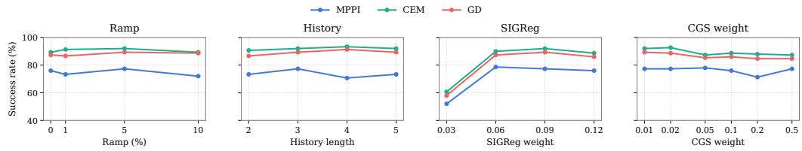  
Figure 11: PushT training ablations. Ramp fraction, history length, SIGReg weight, and CGS weight, evaluated with MPPI, CEM, and GD. Means use three evaluation seeds with 50 episodes each; GD is independent of K. Reference points reuse the main PushT checkpoint with $\lambda _ { \mathrm { C G S } } = 0 . 0 1$ a 5% ramp, $N = 3$ , and $\lambda _ { \mathrm { S I G R e g } } = 0 . 0 9$

The 5% ramp gives the strongest overall performance across the three planners, with modest differences across ramp choices. Following LeWM, $N = 3$ provides an economical history setting: CEM and GD gain slightly at $N = 4$ , while MPPI is strongest at $N = 3 .$ . For SIGReg, weight 0.03 substantially reduces success, indicating potential representation collapse with small SIGReg strength, while 0.06–0.12 forms a comparatively stable range around the default 0.09. The CGS-weight sweep is broadly stable for all three planners over the tested range, and goes down when CGS-weight becomes larger, suggesting conflicts with representation geometry induced by other loss terms, so we choose a conservative weight $\lambda _ { \mathrm { C G S } } = 0 . 0 1$ on PushT.

## C.6.1 CAN EXPLICIT TEMPORAL STRAIGHTENING FURTHER BENEFIT LEWM?

Maes et al. (2026, Appendix H) report that LeWM develops temporal straightening on PushT without an explicit TS loss. Our diagnostic shows that adding TS further raises the final cosine of consecutive latent displacements from 0.548 to 0.613 on PushT slightly, with a small change in planning success rate in Table 3. Cube and TwoRooms show clearer geometric changes (0.262 → 0.666 and $- 0 . 3 4 1  - 0 . 1 6 8 )$ and planning gains (MPPI: $5 9 . 3 \% \to 7 5 . 3 \%$ and $9 2 . 0 \% \to 9 7 . 3 \% )$ Reacher remains near zero cosine $( - 0 . 0 4 9  - 0 . 0 0 3 )$ , indicating that explicit TS produces only a small additional straightening effect in this environment. These results support explicit TS as a useful addition to $\mathrm { L e W M } .$ , with the clearest gains on Cube and TwoRooms. Figure 12 tracks the cosine similarity of consecutive latent displacements during training on fixed validation windows for the LeWM and LeWM+TS variants in Section 5.

## C.7 SHARED MPPI TEMPERATURE SELECTION

Figure 13 sweeps the MPPI temperature from 0.25 to 512 at $K = 1 2 8$ and $I = 3 0$ on all four environments, and summarizes planning stability across wide temperature range in the bottom table. Temperature controls the concentration of the MPPI importance weights. At very small values, the weights collapse onto one or a few candidates, producing an effectively single-mode update that is high-variance and brittle. At very large values, the weights approach uniformity, so low-quality candidates contribute substantially and dilute the improvement signal. For fair selection, we examine the LeWM, LeWM+TS, and LeWM+CGS curves jointly within each environment and choose one shared temperature from a broad stable region where all three methods achieve competitive success: 4 on PushT, 64 on Cube, 128 on TwoRooms, and 64 on Reacher. Each selected value is fixed across representations and all sampling budgets in the main results and Tables 3–6. nAUC results summarized in the bottom table also shows the stable improvement of CGS on pushT and Cube, comparable stable improvement of CGS with TS on TwoRooms, also similar planning performance across temperature of all three methods on Reacher.

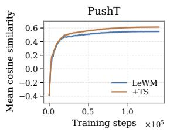

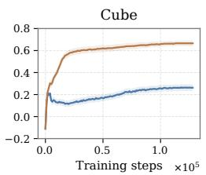

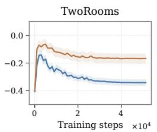

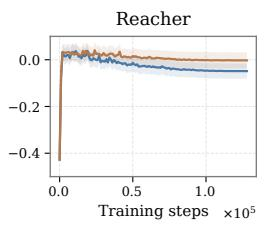  
Figure 12: Temporal straightening in LeWM. Mean cosine similarity of consecutive latent displacements on fixed validation windows. Lines follow one training run per method and environment; bands show ±1.96 standard errors across probe episodes. TS produces higher final mean cosine similarity on all four environments.

## C.8 REFINEMENT EFFICIENCY AND MATCHED BC PRIORS ON OTHER ENVIRONMENTS

Refinement efficiency. We evaluate refinement speed at fixed candidate budget $K = 1 2 8 ,$ , using 32 CEM elites and the environment-specific MPPI temperatures from Appendix C.1.1. We vary the number of optimization steps over $I \in \{ 1 , 2 , 5 , 1 0 , 1 5 , 2 0 , 2 5 , 3 0 \}$ , with each replanning solve initialized independently. Each run evaluates the final proposal, so success need not increase monotonically with I. We also summarize the complete no-prior CEM and MPPI refinement curves using nAUC in Table 15.

On Cube, CGS improves both CEM and MPPI within the first few optimization steps, consistent with its stronger finite-budget planning performance. On TwoRooms, TS and CGS both reach high success rapidly, with little room for further separation as the task approaches saturation. On Reacher, refinement differences are smaller than on Cube and TwoRooms, but CGS attains the highest aggregate refinement nAUC for both CEM and MPPI. The gains are modest and not monotonic across iterations, consistent with a more planner- and budget-dependent effect.

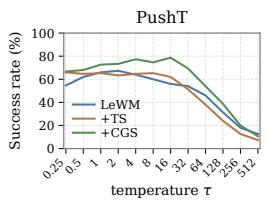

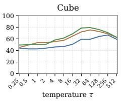

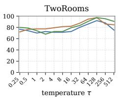

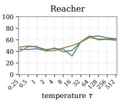  
Model PushT Cube TwoRooms Reacher LeWM 50.76 52.15 77.64 51.00 $\mathrm { L e W M + T S }$ $4 9 . 8 2 ( - 0 . 9 4 )$ $6 1 . 4 5 \ : ( + 9 . 3 0 )$ $\mathbf { 8 3 . 4 2 } \ ( + 5 . 7 9 )$ 51.64 (+0.64) $\mathrm { L e W M + C G S }$ ${ \bf 6 0 . 4 8 } \left( + 9 . 7 3 \right)$ 63.64 (+11.48) $8 1 . 5 8 \ : ( + 3 . 9 4 ) $ 50.73 (−0.27)  
Figure 13: MPPI temperature sensitivity and temperature-selection nAUC at $K = 1 2 8 .$ . Top: Mean success over three evaluation seeds (50 episodes each, $I = 3 0 )$ , using one shared temperature per environment and a 0–100% axis. Bottom: nAUC over the displayed τ values on a $\log _ { 2 }$ scale; parentheses give percentage-point differences from LeWM and bold marks the best representation.

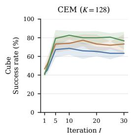

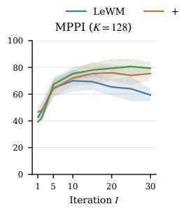

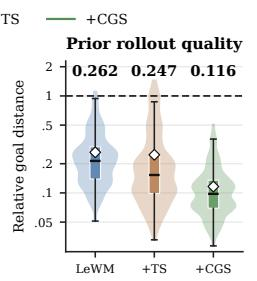

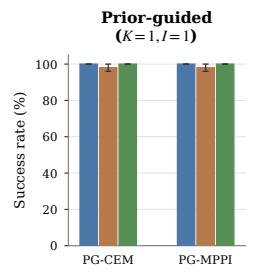

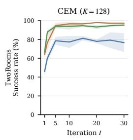

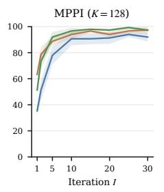

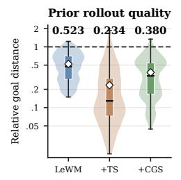

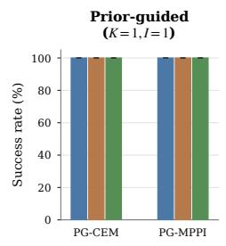

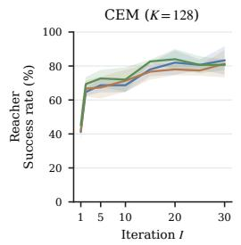

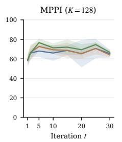

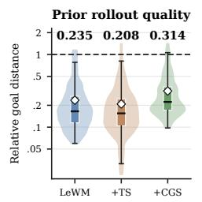

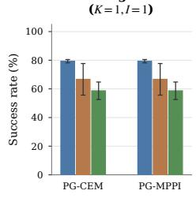  
Figure 14: Refinement efficiency and matched BC prior quality on Cube, TwoRooms, and Reacher. Left: CEM and MPPI success over I (iterations) at $\bar { K = 1 2 8 } :$ ; bands show sample SD over three evaluation seeds. Middle: first-solve prior endpoint distance divided by zero-action endpoint distance, on the same 150 starts; diamonds and labels show means. Right: prior-only success at $K = 1 , I = 1$ , with the prior mean as the sole candidate; error bars show sample SD.

Table 15: Refinement-iteration nAUC at $\begin{array} { r } { K = 1 2 8 . \ I \in \{ 1 , 2 , 5 , 1 0 , 1 5 , 2 0 , 2 5 , 3 0 \} } \end{array}$ . nAUC integrates over linear I. Parentheses give percentage-point differences from the matching LeWM baseline. Bold marks the best representation for each planner and environment. All entries summarize three evaluation seeds.
<table><tr><td>Planner</td><td>Model</td><td>PushT</td><td>Cube</td><td>TwoRooms</td><td>Reacher</td></tr><tr><td>CEM</td><td>LeWM</td><td>73.93</td><td>64.00</td><td>76.87</td><td>75.16</td></tr><tr><td></td><td> $\mathrm { L e W M + T S }$ </td><td>72.23 (−1.70)</td><td>71.98 (+7.98)</td><td> $\mathbf { 9 4 . 8 5 } \left( + 1 7 . 9 8 \right)$ </td><td> $7 3 . 9 2 ( - 1 . 2 4 )$ </td></tr><tr><td></td><td> $\mathrm { L e W M + C G S }$ </td><td>80.25 (+6.32)</td><td>77.40 (+13.40)</td><td>93.34 (+16.47)</td><td>77.60 (+2.44)</td></tr><tr><td>MPPI</td><td>LeWM</td><td>64.85</td><td>64.36</td><td>86.06</td><td>67.23</td></tr><tr><td></td><td> $\mathrm { L e W M + T S }$ </td><td> $6 7 . 0 6 ( + 2 . 2 1 )$ </td><td>70.70 (+6.34)</td><td>92.89 (+6.83)</td><td> $6 8 . 3 9 \left( + 1 . 1 6 \right)$ </td></tr><tr><td></td><td> $\mathrm { L e W M + C G S }$ </td><td> ${ \pmb 7 5 . 7 1 ( + 1 0 . 8 6 ) }$ </td><td> $\mathbf { 7 3 . 7 2 \ ( + 9 . 3 7 ) }$ </td><td> $\mathbf { 9 4 . 4 9 } \left( + 8 . 4 4 \right)$ </td><td> $\mathbf { 7 1 . 4 4 } \ ( + 4 . 2 1 )$ </td></tr></table>

Matched BC-prior quality. We separately evaluate the quality of the matched BC prior before sampling-based refinement. At the first solve on 150 shared starts, we measure

$$
\rho = \frac { \| \widehat { F } _ { H } ( \mu _ { p } ) - z _ { g } \| _ { 2 } } { \| \widehat { F } _ { H } ( 0 ) - z _ { g } \| _ { 2 } } ,\tag{33}
$$

where $\mu _ { p }$ is the prior-predicted action sequence. Lower values indicate greater predicted goal progress relative to that representation’s own zero-action baseline. Prior-only runs execute $\mu _ { p }$ as the sole candidate at $K = 1 , I = 1$ , so PG-CEM and PG-MPPI are identical in this setting. Each prior is trained separately on its frozen representation, as described in Appendix C.1.1.

On Cube, CGS yields the strongest prior rollout quality, reducing the mean normalized goal-distance ratio from 0.262 for LeWM to 0.116, while prior-only success is already near saturation. On TwoRooms, all three matched priors reach 100% prior-only success, so initialization quality has little room to affect the final result. On Reacher, the TS- and CGS-matched priors are weaker than the LeWM prior at initialization. However, across the sample-budget sweep, these differences narrow as sampling-based refinement incorporates more model-evaluated candidates. Thus, weaker prior initialization can be partially corrected by subsequent refinement, separating prior quality from the representation’s performance after model-based search.

## D PROOFS AND EXTENDED THEORY

Sections D.1–D.2 derive transition geometry and the planning Hessian from CGS, including the square and rectangular action cases. Section D.3 fixes the quadratic planning problem and Gaussian proposal coordinates. Sections D.4–D.6 then analyze MPPI, CEM, and gradient descent, respectively. Section D.7 discusses other training objectives. The protocol for Figure 3 is reported with the additional experimental results in Appendix C.4.

Throughout this appendix, we use the main context convention $\begin{array} { r } { C ( { \bf a } ) = \frac { 1 } { 2 } \| z _ { H } - z _ { g } \| _ { 2 } ^ { 2 } } \end{array}$ , so $G _ { H } =$ $\nabla _ { \mathbf a } ^ { 2 } C = \Gamma _ { H } ^ { \top } \Gamma _ { H }$ for linear rollouts. The corresponding MPPI scale is $s = \sigma _ { \mathrm { p } } ^ { 2 } c H / \tau$ . Multiplying the cost and temperature by the same positive constant preserves MPPI weights; positive cost rescaling leaves CEM elite selection unchanged.

## D.1 FROM CGS LOSS TO TRANSITION GEOMETRY

The population statements below use two independent copies of a transition; they do not assume that successive transitions within a training window are independent. Applying the identities to temporally dependent pairs requires a separate dependence argument. We also use the same local matrices A, B for encoded transitions and predictor rollouts. Transferring an encoder-side CGS bound to a separately parameterized predictor requires agreement of their local transition maps; it does not follow from the CGS loss alone.

Let $( z , a )$ and $( z ^ { \prime } , a ^ { \prime } )$ be independent draws from the same transition distribution, with $x = [ z ^ { \top } , a ^ { \top } ] ^ { \top }$ $x ^ { \prime } = [ z ^ { \prime \dagger } , a ^ { \prime \top } ] ^ { \top }$ , and the corresponding differences $\Delta z = D z + B a$ and $\Delta z ^ { \prime } = D z ^ { \prime } + \dot { B } a ^ { \prime }$ . The population version of the practical cosine CGS objective is

$$
\mathcal { L } _ { \mathrm { C G S } } ^ { \mathrm { p o p } } = \mathbb { E } \left[ \left( \frac { \Delta z ^ { \top } \Delta z ^ { \prime } } { \| \Delta z \| _ { 2 } \| \Delta z ^ { \prime } \| _ { 2 } } - \frac { a ^ { \top } a ^ { \prime } } { \| a \| _ { 2 } \| a ^ { \prime } \| _ { 2 } } \right) ^ { 2 } \right] .\tag{34}
$$

Assume the fixed-radius idealization

$$
\| \Delta z _ { t } \| _ { 2 } = r _ { \Delta } , \qquad \| a _ { t } \| _ { 2 } = r _ { a } , \qquad r _ { \Delta } , r _ { a } > 0 .\tag{35}
$$

With $c = r _ { \Delta } ^ { 2 } / r _ { a } ^ { 2 }$ , recall the Gram loss from the main context

$$
\mathcal { L } _ { G } ( c ) = \mathbb { E } \left[ ( \Delta z ^ { \top } \Delta z ^ { \prime } - c a ^ { \top } a ^ { \prime } ) ^ { 2 } \right] .\tag{36}
$$

Then

$$
\mathcal { L } _ { \mathrm { C G S } } ^ { \mathrm { p o p } } = r _ { \Delta } ^ { - 4 } \mathcal { L } _ { G } ( c ) .\tag{37}
$$

Thus the population cosine objective is exactly a scaled Gram-matching objective under Eq. (35). Away from this idealization, an approximate relation can be justified under quantitatively small relative fluctuations of the transition and action norms around $r _ { \Delta }$ and $r _ { a } ,$ respectively; mere boundedness of the norms does not ensure a small approximation error. The analysis below uses the fixed-radius model.

## D.1.1 PROOF OF PROPOSITION 4.2

We give the calculation for general $d , d _ { a }$ under Assumption 4.1. The feature coverage condition gives $\rho I _ { d + d _ { a } } \preceq \Sigma _ { x }$ . For any $v \in \overline { { \mathbb { R } ^ { d + d _ { a } } } }$ , bounded features and Cauchy–Schwarz give

$$
\begin{array} { r } { v ^ { \top } \Sigma _ { x } v = \mathbb { E } [ ( v ^ { \top } x _ { t } ) ^ { 2 } ] \leq \| v \| _ { 2 } ^ { 2 } \mathbb { E } \| x _ { t } \| _ { 2 } ^ { 2 } \leq \bar { \rho } \| v \| _ { 2 } ^ { 2 } . } \end{array}
$$

Thus $\rho I _ { d + d _ { a } } \preceq \Sigma _ { x } \preceq \bar { \rho } I _ { d + d _ { a } }$ . The analysis in the main context specializes to $d = d _ { a }$ with B invertible; the Gram identity and spectral equivalence below do not require a square B.

Let

$$
M _ { \Delta } : = [ D \quad B ] \in \mathbb { R } ^ { d \times ( d + d _ { a } ) } , \qquad P _ { c } : = \left[ { 0 _ { d \times d } \quad 0 _ { d \times d _ { a } } } \right] .\tag{38}
$$

Because $\Delta \boldsymbol { z } _ { t } = M _ { \Delta } \boldsymbol { x } _ { t }$

$$
\Delta z ^ { \top } \Delta z ^ { \prime } - c a ^ { \top } a ^ { \prime } = x ^ { \top } Q x ^ { \prime } , \qquad Q : = M _ { \Delta } ^ { \top } M _ { \Delta } - P _ { c } .\tag{39}
$$

For independent samples $x , x ^ { \prime }$

$$
\mathcal { L } _ { G } ( c ) = \mathbb { E } [ ( x ^ { \top } Q x ^ { \prime } ) ^ { 2 } ] = \mathrm { t r } ( Q \Sigma _ { x } Q \Sigma _ { x } ) = \left. \Sigma _ { x } ^ { 1 / 2 } Q \Sigma _ { x } ^ { 1 / 2 } \right. _ { F } ^ { 2 } .\tag{40}
$$

Moreover,

$$
Q = \left[ { \begin{array} { l l l } { D ^ { \top } D } & { D ^ { \top } B } \\ { B ^ { \top } D } & { B ^ { \top } B - c I _ { d _ { a } } } \end{array} } \right] .\tag{41}
$$

Since the singular values of the linear map $Q \mapsto \Sigma _ { x } ^ { 1 / 2 } Q \Sigma _ { x } ^ { 1 / 2 }$ lie between ρ and ${ \bar { \rho } } ,$

$$
\rho ^ { 2 } \| Q \| _ { F } ^ { 2 } \leq \left\| \Sigma _ { x } ^ { 1 / 2 } Q \Sigma _ { x } ^ { 1 / 2 } \right\| _ { F } ^ { 2 } \leq \bar { \rho } ^ { 2 } \| Q \| _ { F } ^ { 2 } .\tag{42}
$$

Finally,

$$
\lVert Q \rVert _ { F } ^ { 2 } = \lVert D ^ { \top } D \rVert _ { F } ^ { 2 } + 2 \lVert D ^ { \top } B \rVert _ { F } ^ { 2 } + \lVert B ^ { \top } B - c I _ { d _ { a } } \rVert _ { F } ^ { 2 } = \mathcal { R } ( A , B ) .\tag{43}
$$

Together with Eq. (40), this proves the spectral equivalence in Proposition 4.2. Under positive definite joint coverage, $\mathcal { L } _ { G } ( c ) = 0$ if and only if $Q = 0$ . The upper-left block gives $D ^ { \top } D = { \bar { 0 } }$ , hence $D = 0$ and $A = I _ { d } ;$ the lower-right block gives $B ^ { \top } B = c I _ { d _ { a } }$ . Conversely, these two conditions make every block of $Q$ zero. When $d \geq d _ { a }$ , such a full-column-rank $B$ exists, so zero loss is attainable.

## D.1.2 PROOF OF COROLLARY 4.3

Proposition 4.2 gives $\mathcal { R } ( A , B ) \leq \ell / \rho ^ { 2 }$ . It first yields the Frobenius-norm defect bounds

$$
\| D ^ { \top } D \| _ { F } \leq \frac { \sqrt { \ell } } { \rho } , \quad \| D ^ { \top } B \| _ { F } \leq \frac { \sqrt { \ell } } { \sqrt { 2 } \rho } , \quad \| B ^ { \top } B - c I _ { d _ { a } } \| _ { F } \leq \frac { \sqrt { \ell } } { \rho } .\tag{44}
$$

Using $\| D \| _ { \mathrm { o p } } ^ { 2 } = \| D ^ { \top } D \| _ { \mathrm { o p } } \leq \| D ^ { \top } D \| _ { F }$ and $\| \cdot \| _ { \mathrm { o p } } \leq \| \cdot \| _ { F }$ gives the spectral-norm bounds

$$
\| D \| _ { \mathrm { o p } } ^ { 2 } \leq { \frac { \sqrt { \ell } } { \rho } } ,
$$

$$
\| D ^ { \top } B \| _ { \mathrm { o p } } \leq \frac { \sqrt \ell } { \sqrt 2 \rho } ,
$$

$$
\| \boldsymbol { B } ^ { \top } \boldsymbol { B } - c I _ { d _ { a } } \| _ { \mathrm { o p } } \leq \frac { \sqrt { \ell } } { \rho } .\tag{45}
$$

Setting

$$
\varepsilon : = \frac { \sqrt { \ell } } { \rho } \operatorname* { m a x } \{ 1 , ( 2 c ) ^ { - 1 / 2 } , c ^ { - 1 } \} .\tag{46}
$$

gives the three scaled conditions in Corollary 4.3. Finally, when $\varepsilon < 1$

$$
c ( 1 - \varepsilon ) I _ { d _ { a } } \preceq B ^ { \top } B \preceq c ( 1 + \varepsilon ) I _ { d _ { a } } ,\tag{47}
$$

so $B$ has full column rank and

$$
\kappa ( B ^ { \top } B ) \leq \frac { 1 + \varepsilon } { 1 - \varepsilon } .\tag{48}
$$

The mixed defect is stronger than a bound obtained only from $\| D \| _ { \mathrm { o p } } ^ { 2 } \le \varepsilon$ . It directly controls $\| D ^ { \top } B \| _ { \mathrm { o p } } = O ( { \sqrt { c } } \varepsilon )$ , suppressing the first-order term $B ^ { \top } D B$ in $G _ { H }$ . This is what produces the $O _ { H } ( \varepsilon )$ leading term in Theorem 4.4.

## D.1.3 COVERAGE AND DIMENSION ASSUMPTIONS

Joint coverage and state–action correlation. Assumption 4.1 adapts the bounded-feature and feature coverage conditions of Yin et al. (2022, Definition 2.1 and Assumption 2.2) to the concatenated state–action feature $x _ { t } = [ z _ { t } ^ { \top } , a _ { t } ^ { \top } ] ^ { \top }$ . Our boundedness condition is $\| x _ { t } \| _ { 2 } ^ { 2 } \leq \bar { \rho }$ almost surely, which directly implies the second-moment upper bound $\Sigma _ { x } \preceq \bar { \rho } I _ { d + d _ { a } }$ . The bound $\rho I _ { d + d _ { a } } \preceq \Sigma _ { x } \preceq \bar { \rho } I _ { d + d _ { a } }$ means that $\rho \| v \| _ { 2 } ^ { 2 } \leq \mathbb { E } [ ( v ^ { \top } x _ { t } ) ^ { 2 } ] \leq \bar { \rho } \| v \| _ { 2 } ^ { 2 }$ for every joint state–action direction $v .$ Its lower bound requires variation in every such direction; its upper bound controls the second moment. This is a population excitation condition of the kind used in linear regression and system identification, where lower bounds on covariate Gram matrices control estimation error (Matni & Tu, 2019). It is not a claim of empirical excitation for a dependent trajectory.

The proof requires neither independence of $z _ { t }$ and $a _ { t }$ nor zero cross-covariance. Define $\begin{array} { r } { \Sigma _ { z } = \mathbb { E } [ z _ { t } z _ { t } ^ { \top } ] } \end{array}$ ， $\begin{array} { r } { \Sigma _ { a } \dot { = } \mathbb E [ a _ { t } a _ { t } ^ { \dagger } ] } \end{array}$ , and $\Sigma _ { z a } = \mathbb { E } [ \dot { z } _ { t } a _ { t } ^ { \top } ] = \Sigma _ { a z } ^ { \top }$ . When $\Sigma _ { z } \succ 0$ , the Schur complement gives $\Sigma _ { x } \succ 0$ if and only if the linear action innovation has positive definite second-moment matrix,

$$
\Sigma _ { a | z } ^ { \mathrm { l i n } } : = \Sigma _ { a } - \Sigma _ { a z } \Sigma _ { z } ^ { - 1 } \Sigma _ { z a } \succ 0 .\tag{49}
$$

Here the innovation $a _ { t } - \Sigma _ { a z } \Sigma _ { z } ^ { - 1 } z _ { t }$ is the residual after the best linear prediction of the action from the state. This uncentered second moment need not equal a conditional covariance. Thus state-dependent actions are allowed. For standardized scalar $z _ { t } , a _ { t }$ with correlation $\gamma ,$ the eigenvalues of $\Sigma _ { x }$ are $1 - | \gamma |$ and $1 + | \gamma |$ . Strong correlation is compatible with coverage, but makes $\rho$ small and weakens the loss-to-geometry bounds. A fixed positive lower bound is therefore a quantitative assumption, not merely the exclusion of exact linear dependence. Neither $d = d _ { a }$ nor invertibility of B implies it.

Singular joint second moment and the data subspace. For a transition distribution with $\mathbb { E } \Vert x _ { t } \Vert _ { 2 } ^ { 2 } <$ $\infty ,$ define $S _ { x } : = \mathrm { r a n g e } ( \Sigma _ { x } ) = ( \mathrm { k e r } \Sigma _ { x } ) ^ { \perp } .$ . This is the smallest linear subspace containing $x _ { t }$ almost surely: $v \in$ ker $\Sigma _ { x }$ if and only if $\mathbb { E } [ ( v ^ { \top } x _ { t } ) ^ { 2 } ] = 0 .$ , or $v ^ { \top } x _ { t } = 0$ almost surely. It is a population subspace, distinct from a finite sample span. Let $U _ { x } \in \mathbb { R } ^ { ( d + d _ { a } ) \times r _ { a } }$ have orthonormal columns spanning $S _ { x }$ , where $r _ { x } = \mathrm { r a n k } ( \Sigma _ { x } ) > 0$ , and set $\widetilde { x } _ { t } = U _ { x } ^ { \top } x _ { t } , \widetilde { \Sigma } _ { x } = U _ { x } ^ { \top } \Sigma _ { x } U _ { x }$ , and $\Pi _ { x } = U _ { x } U _ { x } ^ { \top }$ Coverage on this subspace means $\rho I _ { r _ { x } } \preceq \widetilde { \Sigma } _ { x } \preceq \bar { \rho } I _ { r _ { x } }$ , equivalently $\rho \Pi _ { x } \preceq \Sigma _ { x } \preceq \bar { \rho } \Pi _ { x }$ . For a fixed finite-dimensional distribution, some such constants always exist on its nonzero support; a useful uniform lower bound is additional.

Writing $\widetilde { Q } = U _ { x } ^ { \top } Q U _ { x }$ , the trace identity gives $\mathcal { L } _ { G } ( c ) = \| \widetilde { \Sigma } _ { x } ^ { 1 / 2 } \widetilde { Q } \widetilde { \Sigma } _ { x } ^ { 1 / 2 } \| _ { F } ^ { 2 }$ , hence $\rho ^ { 2 } \| \widetilde { Q } \| _ { F } ^ { 2 } \le { \mathcal { L } } _ { G } ( c ) \le$ $\bar { \rho } ^ { 2 } \lVert \widetilde { Q } \rVert _ { F } ^ { 2 }$ . In particular, zero loss identifies $U _ { x } ^ { \top } Q U _ { x } = 0$ , not necessarily the separate blocks of $Q .$ because $U _ { x }$ can mix states and actions. For example, take $d = d _ { a } = 1 , c = 1$ , and $z _ { t } = a _ { t }$ uniformly in $\{ - 1 , 1 \}$ . With $A = - 1 / 2$ and $B = 1 / 2$ , we have $\Delta z _ { t } = - a _ { t }$ and $\mathcal { L } _ { G } ( 1 ) = 0$ , although $A \neq I _ { 1 }$ and $B ^ { \intercal } B \neq I _ { 1 } ;$ ; even $B$ is invertible in this example. Thus arbitrary projection onto $S _ { x }$ does not preserve the full straightening or rollout conclusions. Assumption 4.1 retains positive definite joint coverage in the original state–action coordinates.

Dimension requirement. Under joint coverage, the zero-loss geometry $B ^ { \top } B = c I _ { d _ { a } }$ is feasible whenever $d \ge d _ { a }$ . For $d = d _ { a } , \bar { B } / \sqrt { c }$ is orthogonal; for $d > d _ { a }$ , its columns are orthonormal and its image has dimension $d _ { a } . \mathrm { ~ H ~ } d < d _ { a }$ , rank deficiency gives $\Vert B ^ { \top } B - c I _ { d _ { a } } \Vert _ { F } ^ { 2 } \geq c ^ { 2 } ( d _ { a } - d )$ so ${ \mathcal { L } } _ { G } ( c ) \breve { \geq } \rho ^ { 2 } c ^ { 2 } ( d _ { a } - d ) > 0$ . Likewise, the $\varepsilon { - } C \mathbf { G } S$ regime with $\varepsilon < 1$ requires $d \geq d _ { a }$ , since $B ^ { \top } B \succeq c ( 1 - \varepsilon ) I _ { d _ { a } }$ This dimensional restriction concerns the action map $B ,$ independently of whether $\Sigma _ { x }$ is singular.

## D.2 PLANNING HESSIAN AND DIMENSION CASES

Recall $\Gamma _ { H } = [ A ^ { H - 1 } B , \dots , B ] , G _ { H } = \Gamma _ { H } ^ { \top } \Gamma _ { H }$ , and $P _ { H } = H ^ { - 1 } ( \mathbf { 1 } _ { H } \mathbf { 1 } _ { H } ^ { \top } ) \otimes I _ { d _ { a } }$ , with $n _ { H } = H \times d _ { a }$ For an integer $H \geq 1$ and $0 \leq \varepsilon < 1$ , define

$$
\begin{array} { l } { s _ { H } ( \varepsilon ) : = ( 1 + \sqrt { \varepsilon } ) ^ { H - 1 } - 1 , } \\ { r _ { H } ( \varepsilon ) : = s _ { H } ( \varepsilon ) - ( H - 1 ) \sqrt { \varepsilon } , } \\ { \xi _ { H } ( \varepsilon ) : = \varepsilon + 2 ( H - 1 ) \sqrt { 1 + \varepsilon } \varepsilon \ } \\ { \qquad + ( 1 + \varepsilon ) \left( 2 r _ { H } ( \varepsilon ) + s _ { H } ( \varepsilon ) ^ { 2 } \right) . } \end{array}\tag{50}
$$

## D.2.1 PROOF OF THEOREM 4.4

The ideal projector. The averaging matrix $H ^ { - 1 } \mathbf { 1 } _ { H } \mathbf { 1 } _ { H } ^ { \top }$ is symmetric, idempotent, and rank one. Hence $P _ { H }$ is an orthogonal projector of rank $d _ { a }$ , with range $\left\{ \mathbf { 1 } _ { H } \otimes u : u \in \mathbb { R } ^ { d _ { a } } \right\}$ and kernel $\begin{array} { r } { \{ \mathbf { a } : \sum _ { t = 0 } ^ { H - 1 } a _ { t } = 0 \} } \end{array}$ . When $A = I _ { d }$ and $B ^ { \top } B = c I _ { d _ { a } }$ , every block of $G _ { H }$ is $c I _ { d _ { a } }$ , so $G _ { H } = c H P _ { H }$ This gives the reference geometry with the correct rank: equal curvature on cumulative-action directions and zero curvature on cancelling directions. When CGS is approximate, the positive eigenspace of $G _ { H }$ need not equal range $( P _ { H } )$ ; the norm bound below compares the matrices without assuming their eigenspaces coincide.

The CGS perturbation bound. Write $A = I _ { d } + D$ . For every integer $k \geq 0$

$$
A ^ { k } = I _ { d } + k D + R _ { k } , \qquad R _ { k } : = \sum _ { j = 2 } ^ { k } { \binom { k } { j } } D ^ { j } .\tag{51}
$$

Since $\| D \| _ { \mathrm { o p } } \leq { \sqrt { \varepsilon } } .$ , for $0 \leq k \leq H - 1$

$$
\| A ^ { k } - I _ { d } \| _ { \mathrm { o p } } \leq ( 1 + \sqrt { \varepsilon } ) ^ { k } - 1 \leq s _ { H } ( \varepsilon ) ,
$$

$$
\| R _ { k } \| _ { \mathrm { o p } } \leq ( 1 + \sqrt { \varepsilon } ) ^ { k } - 1 - k \sqrt { \varepsilon } \leq r _ { H } ( \varepsilon ) .\tag{52}
$$

The third ε-CGS condition gives

$$
\begin{array} { r } { \| B \| _ { \mathrm { o p } } ^ { 2 } = \lambda _ { \operatorname* { m a x } } ( B ^ { \top } B ) \leq c ( 1 + \varepsilon ) . } \end{array}\tag{53}
$$

Index the block rows and columns of $G _ { H }$ by action times $t , s \in \{ 0 , \ldots , H - 1 \}$ , and set $p = H - 1 - t$ and $q = H - 1 - s$ . This preserves the ordering used in the main context $\Gamma _ { H } \stackrel { \textstyle , } { = } [ A ^ { H - 1 } B , \ldots , B ] .$ , so

$$
[ G _ { H } ] _ { t s } = B ^ { \top } ( A ^ { p } ) ^ { \top } A ^ { q } B .\tag{54}
$$

Let $F _ { k } : = A ^ { k } - I _ { d } = k D + R _ { k }$ . Since every block of $c H P _ { H }$ is $c I _ { d _ { a } }$

$$
[ G _ { H } ] _ { t s } - c I _ { d _ { a } } = ( B ^ { \top } B - c I _ { d _ { a } } ) + B ^ { \top } F _ { p } ^ { \top } B + B ^ { \top } F _ { q } B + B ^ { \top } F _ { p } ^ { \top } F _ { q } B .\tag{55}
$$

Using Corollary 4.3 and Eq. (53),

$$
\begin{array} { r } { \| B ^ { \top } F _ { p } ^ { \top } B \| _ { \mathrm { o p } } \leq p \| B \| _ { \mathrm { o p } } \| D ^ { \top } B \| _ { \mathrm { o p } } + \| B \| _ { \mathrm { o p } } ^ { 2 } \| R _ { p } \| _ { \mathrm { o p } } , } \end{array}
$$

$$
\begin{array} { r } { \| B ^ { \top } F _ { q } B \| _ { \mathrm { o p } } \leq q \| B \| _ { \mathrm { o p } } \| D ^ { \top } B \| _ { \mathrm { o p } } + \| B \| _ { \mathrm { o p } } ^ { 2 } \| R _ { q } \| _ { \mathrm { o p } } , } \end{array}\tag{56}
$$

$$
\begin{array} { r } { \| B ^ { \top } F _ { p } ^ { \top } F _ { q } B \| _ { \mathrm { o p } } \leq \| B \| _ { \mathrm { o p } } ^ { 2 } \| F _ { p } \| _ { \mathrm { o p } } \| F _ { q } \| _ { \mathrm { o p } } . } \end{array}
$$

Therefore, uniformly in $t , \varepsilon$ ,

$$
\begin{array} { r } { \| [ G _ { H } ] _ { t s } - c I _ { d _ { a } } \| _ { \mathrm { o p } } \leq c \varepsilon + 2 ( H - 1 ) c \sqrt { 1 + \varepsilon } \varepsilon + c ( 1 + \varepsilon ) \left( 2 r _ { H } ( \varepsilon ) + s _ { H } ( \varepsilon ) ^ { 2 } \right) = c \xi _ { H } ( \varepsilon ) . } \end{array}\tag{57}
$$

Let $E _ { H } : = G _ { H } - c H P _ { H }$ . For a block vector $v = [ v _ { 0 } ^ { \top } , \ldots , v _ { H - 1 } ^ { \top } ] ^ { \top } \in \mathbb { R } ^ { n _ { H } }$

$$
\| E _ { H } v \| _ { 2 } ^ { 2 } \leq \sum _ { t = 0 } ^ { H - 1 } \left( c \xi _ { H } ( \varepsilon ) \sum _ { s = 0 } ^ { H - 1 } \| v _ { s } \| _ { 2 } \right) ^ { 2 } \leq c ^ { 2 } H ^ { 2 } \xi _ { H } ( \varepsilon ) ^ { 2 } \| v \| _ { 2 } ^ { 2 } .\tag{58}
$$

Hence $\| G _ { H } - c H P _ { H } \| _ { \mathrm { o p } } \leq c H \xi _ { H } ( \varepsilon )$ . To verify the leading coefficient, put $h = H - 1$ . For fixed $\begin{array} { r } { H , s _ { H } = h \sqrt { \varepsilon } + \frac { 1 } { 2 } h ( h - 1 ) \varepsilon + O _ { H } ( \varepsilon ^ { 3 / 2 } ) } \end{array}$ and $\begin{array} { r } { r _ { H } = \frac { 1 } { 2 } h ( h - 1 ) \varepsilon + O _ { H } ( \varepsilon ^ { 3 / 2 } ) } \end{array}$ . The coefficient of $\varepsilon$ in $\xi _ { H }$ is therefore $1 + 2 h + h ( h - 1 ) + h ^ { 2 } = 2 H ^ { 2 } - 3 H + 2$ , proving the stated expansion. This establishes the bound on $\| G _ { H } / ( c H ) ^ { ' } - P _ { H } \| _ { \mathrm { o p } }$ for any $d \geq d _ { a }$

Comparison with temporal straightening and control isotropy. Retain $\| D \| _ { \mathrm { o p } } ^ { 2 } \leq \varepsilon \mathrm { a n d } \| B ^ { \top } B -$ $c I _ { d _ { a } } \| _ { \mathrm { o p } } \leq c \varepsilon$ . These conditions already control the mixed drift–control defect indirectly:

$$
\| D ^ { \top } B \| _ { \mathrm { o p } } \leq \| D \| _ { \mathrm { o p } } \| B \| _ { \mathrm { o p } } \leq \sqrt { c ( 1 + \varepsilon ) \varepsilon } = O ( \sqrt { \varepsilon } ) .\tag{59}
$$

Using this bound in Eq. (55) gives

$$
\begin{array} { r } { \left\| \frac { G _ { H } } { c H } - P _ { H } \right\| _ { \mathrm { o p } } \leq \varepsilon + ( 1 + \varepsilon ) ( 2 s _ { H } + s _ { H } ^ { 2 } ) } \\ { = 2 ( H - 1 ) \sqrt { \varepsilon } + O _ { H } ( \varepsilon ) . } \end{array}\tag{60}
$$

For $H \geq 2 ,$ this square-root order is generally unavoidable under these two conditions alone.

CGS directly controls the same mixed defect at the geometric error scale,

$$
\| D ^ { \top } B \| _ { \mathrm { o p } } \leq { \sqrt { c } } \varepsilon ,\tag{61}
$$

and hence

$$
\begin{array} { r } { \| B ^ { \top } D B \| _ { \mathrm { o p } } \leq \| D ^ { \top } B \| _ { \mathrm { o p } } \| B \| _ { \mathrm { o p } } \leq c \sqrt { 1 + \varepsilon } \varepsilon . } \end{array}
$$

The linear drift–control terms are therefore $O ( \varepsilon )$ , yielding the $O _ { H } ( \varepsilon )$ Hessian perturbation bound in Theorem 4.4. This compares the geometric consequences of the two bounds under matched drift and control-isotropy tolerances; it does not identify the CGS and temporal-straightening training objectives. At $H = 1$ , both bounds reduce to the control-isotropy error ε.

Controllability Gramian and effective conditioning. Recall the finite-horizon controllability Gramian and extend the effective condition number from the main context to any nonzero matrix:

$$
\begin{array} { c } { { W _ { H } = \Gamma _ { H } \Gamma _ { H } ^ { \top } = \displaystyle \sum _ { k = 0 } ^ { H - 1 } A ^ { k } B B ^ { \top } ( A ^ { \top } ) ^ { k } , } } \\ { { \kappa _ { \mathrm { e f f } } ( M ) : = \sigma _ { \operatorname* { m a x } } ( M ) / \sigma _ { \operatorname* { m i n } } ^ { + } ( M ) . } } \end{array}\tag{62}
$$

Here $M \neq 0 , \sigma _ { \operatorname* { m i n } } ^ { + } ( M )$ is its smallest positive singular value, and κ denotes the Euclidean condition number on a nonsingular restriction. For symmetric positive semidefinite $M ,$ , this ratio also equals $\lambda _ { \operatorname* { m a x } } ( M ) / \lambda _ { \operatorname* { m i n } } ^ { + } ( M )$ . The matrices $G _ { H } \doteq \Gamma _ { H } ^ { \top } \Gamma _ { H }$ and $W _ { H } = \Gamma _ { H } \Gamma _ { H } ^ { \top }$ have the same positive eigenvalues and singular values, namely the squared positive singular values of $\Gamma _ { H }$ . Hence $\kappa _ { \mathrm { e f f } } ( G _ { H } ) = \kappa _ { \mathrm { e f f } } ( W _ { H } )$ . In particular, $\kappa _ { \mathrm { e f f } } ( \boldsymbol { G } _ { H } ) = \dot { \kappa _ { \mathrm { e f f } } } ( \boldsymbol { \Gamma } _ { H } \dot { ) } ^ { 2 } ;$ ; conditioning the horizon map itself therefore takes the square root of the Gram-matrix condition-number bound.

## D.2.2 SQUARE AND RECTANGULAR ACTION MAPS

We distinguish the dimension cases used by all three planners below, extending Remark 4.5. Throughout this discussion, assume $d \geq d _ { a } ,$ the three $\varepsilon { - } C \mathbf { G } S$ bounds with $0 \leq \varepsilon < 1$ , and $\xi _ { H } ~ < ~ 1$ . In particular, $B ^ { \top } B \succeq c ( 1 - \varepsilon ) I _ { d _ { a } }$ , so B has full column rank.

State and action subspaces. Define the finite-horizon controllable state subspace and the action subspace that affects the terminal state by

$$
\begin{array} { r l } & { { \mathcal { C } _ { H } } : = \mathrm { r a n g e } ( W _ { H } ) = \mathrm { s p a n } \{ \mathrm { r a n g e } ( A ^ { k } B ) : 0 \le k < H \} , } \\ & { { \mathcal { T } _ { H } } : = \mathrm { r a n g e } ( G _ { H } ) = \mathrm { r a n g e } ( \Gamma _ { H } ^ { \top } ) . } \end{array}\tag{63}
$$

Their common dimension is $r _ { \mathrm { c t r l } } : = \mathrm { r a n k } ( \Gamma _ { H } )$ , with $d _ { a } \leq r _ { \mathrm { c t r l } } \leq \operatorname* { m i n } \{ d , n _ { H } \}$ . These subspaces are determined by the dynamics and horizon, and differ from the data subspace $S _ { x } . \mathrm { A }$ thin singular value decomposition ${ \Gamma _ { H } } ^ { \bullet } = U _ { \Gamma } \Sigma _ { \Gamma } V _ { \Gamma } ^ { \top }$ , where $\Sigma _ { \Gamma } = \mathrm { d i a g } ( \sigma _ { 1 } ( \Gamma _ { H } ) , \dots , \bar { \sigma _ { r _ { \mathrm { c t r l } } } } ( \Gamma _ { H } ) )$ retains its positive singular values, gives $W _ { H } = \bar { U } _ { \Gamma } \Sigma _ { \Gamma } ^ { 2 } U _ { \Gamma } ^ { \top }$ and $G _ { H } = V _ { \Gamma } \Sigma _ { \Gamma } ^ { 2 } V _ { \Gamma } ^ { \top }$ . Thus both restrictions are positive definite and $\kappa _ { \mathrm { e f f } } ( G _ { H } ) = \kappa ( G _ { H } | _ { \mathcal { T } _ { H } } ) \dot { = } \dot { \kappa } ( W _ { H } | _ { \mathcal { C } _ { H } } )$ . Restricting to these subspaces removes the exact null directions.

If $d = d _ { a }$ , full column rank makes B invertible, and the last block of $\Gamma _ { H }$ gives $r _ { \mathrm { c t r l } } = d _ { a } . \mathrm { I f } d > d _ { a }$ $r _ { \mathrm { c t r l } }$ can exceed $d _ { a }$ because propagation through A can reach state directions outside range(B).

Bounds inherited from CGS. The proof of Theorem 4.4 applies to rectangular B, giving $\| G _ { H } / ( c H ) - P _ { H } \| _ { \mathrm { o p } } \leq \xi _ { H }$ To extend the notation from the main context to rectangular action maps, let $ { \boldsymbol { S } } _ { H }$ be a subspace spanned by orthonormal eigenvectors associated with the largest $r = d _ { a }$ eigenvalues of $G _ { H }$ . In the square case this is exactly the subspace used in the main context $S _ { H } = \mathrm { r a n g e } ( G _ { H } ) = \mathcal { T } _ { H } ;$ in the rectangular case $\boldsymbol { S _ { H } }$ can be a strict subspace of $\mathcal { T } _ { H }$ . In orthonormal coordinates on $\boldsymbol { S _ { H } }$ , Theorem 4.4 and Weyl’s inequality give

$$
c H ( 1 - \xi _ { H } ) I _ { r } \preceq G _ { H } | _ { \cal S _ { H } } \preceq c H ( 1 + \xi _ { H } ) I _ { r } , \qquad \kappa ( G _ { H } | _ { \cal S _ { H } } ) \leq \frac { 1 + \xi _ { H } } { 1 - \xi _ { H } } .\tag{64}
$$

Let $\Pi _ { H }$ denote the orthogonal projector onto $ { \boldsymbol { S } } _ { H }$ . Unlike the fixed ideal projector $P _ { H } , \Pi _ { H }$ depends on the learned dynamics; the two agree at ideal CGS geometry. These symbols are used throughout the planner analysis. When $r _ { \mathrm { c t r l } } = r , S _ { H } = \mathcal { T } _ { H }$ and every direction that contributes to the planning cost is included. When $r _ { \mathrm { c t r l } } > r$ , the spectral bound above covers only the leading r directions. The corresponding leading eigenspace of $W _ { H }$ has the same spectral bounds, by the singular value decomposition above. This proves the geometric assertions of Remark 4.5.

Bounds on all controllable directions. The following conditions extend the bound from $ { \boldsymbol { S } } _ { H }$ to $\mathcal { T } _ { H }$ Let $\Pi _ { C _ { H } }$ denote the orthogonal projector onto $\mathcal { C } _ { H }$

Corollary D.1 (Conditioning on the full controllable subspace). Under the conditions of this discussion, $i f r _ { \mathrm { c t r l } } = d _ { a }$ , then

$$
\kappa _ { \mathrm { e f f } } ( G _ { H } ) = \kappa ( W _ { H } | \boldsymbol { c } _ { H } ) \leq \frac { 1 + \xi _ { H } } { 1 - \xi _ { H } } .\tag{65}
$$

A sufficient condition is $A { \mathrm { ~ r a n g e } } ( B ) \subseteq { \mathrm { r a n g e } } ( B )$ . More generally, ifa quantitative controllability bound $W _ { H } \succeq \gamma _ { H } c H \Pi _ { \mathcal { C } _ { H } }$ holds with a specified $\gamma _ { H } > 0 ,$ , then $\begin{array} { r } { \kappa _ { \mathrm { e f f } } ( G _ { H } ) \stackrel {  } { \le } ( 1 + \xi _ { H } ) / \gamma _ { H } . } \end{array}$

Proof. If $r _ { \mathrm { c t r l } } = d _ { a }$ , the leading $d _ { a }$ eigenvalues are all of the positive eigenvalues, so Eq. (64) proves Eq. (65). Under the stated invariance condition, induction gives range $\left( A ^ { k } B \right) \subseteq$ range(B) for all k. Since $\Gamma _ { H }$ contains B as its last block and B has full column rank, $r _ { \mathrm { c t r l } } = d _ { a }$ . For the general bound, quantitative controllability gives $\lambda _ { \operatorname* { m i n } } ^ { + } ( W _ { H } ) \geq \gamma _ { H } c H$ , while Theorem 4.4 and Weyl’s inequality give $\bar { \lambda } _ { \operatorname* { m a x } } ( W _ { H } ) = \lambda _ { 1 } ( G _ { H } ) \overset { \cdot } { \leq } \overset { \cdot } { c } H ( 1 + \xi _ { H } )$ . Taking the ratio proves the claim. □

Remark D.2 (Additional controllable directions). When $r _ { \mathrm { c t r l } } > d _ { a }$ , the remaining positive eigenvalues satisfy $0 < \lambda _ { j } ( G _ { H } ) \leq c H \xi _ { H }$ for $d _ { a } < j \le r _ { \mathrm { c t r l } }$ Controllability makes these eigenvalues positive, but a uniform lower bound requires further information, even after restriction to $\mathcal { C } _ { H }$ . For example, let $d = 2 , d _ { a } = 1 , H = 2 , c { \overset { . } { = } } 1$ , and $0 < \delta < 1 / 4$ . With $e _ { 1 } , e _ { 2 }$ the standard basis, take $B = e _ { 1 }$ and $A = I _ { 2 } + \delta e _ { 2 } e _ { 1 } ^ { \top }$ . Then $\| D \| _ { \mathrm { o p } } ^ { 2 } = \delta ^ { 2 } , D ^ { \top } B \stackrel { \cdot } { = } 0 .$ , and $B ^ { \top } B = 1$ , so all three CGS bounds hold with $\varepsilon = \delta ^ { 2 }$ and $\xi _ { 2 } ( \varepsilon ) = \delta ^ { 2 } ( 1 + \sqrt { 1 + \delta ^ { 2 } } ) ^ { 2 } < 1$ . Direct calculation gives

$$
\Gamma _ { 2 } = \left[ \frac { 1 } { \delta } \quad { \textstyle 1 } \right] , \qquad G _ { 2 } = \left[ 1 + \delta ^ { 2 } \quad { \textstyle 1 } \right] , \qquad W _ { 2 } = \left[ \begin{array} { l l } { { \displaystyle 2 } } & { { \displaystyle \delta } } \\ { { \displaystyle \delta } } & { { \displaystyle \delta ^ { 2 } } } \end{array} \right] .\tag{66}
$$

For every $\delta \ > \ 0$ , both $G _ { 2 }$ and $W _ { 2 }$ are positive definite, so $\mathcal { C } _ { 2 } ~ = ~ \mathbb { R } ^ { 2 }$ . Their eigenvalues are $\lambda _ { \pm } = ( 2 + \delta ^ { 2 } \pm \sqrt { 4 + \delta ^ { 4 } } ) / 2$ . As $\delta \downarrow 0 , \lambda _ { + }  2$ and $\lambda _ { - } \sim \delta ^ { 2 } / 2 .$ , hence $\kappa _ { \mathrm { e f f } } ( G _ { 2 } ) \sim 4 / \delta ^ { 2 }$ , while $\| \bar { G } _ { 2 } / 2 - P _ { 2 } \| _ { \mathrm { o p } } = \delta ^ { 2 } / 2$ . The additional reachable direction becomes weak as the dynamics approach ideal CGS geometry, consistently with the dominant-spectrum bound.

Relation to temporal straightening. The controllable-subspace formulation follows Wang et al. (2026b, Remark 4.5 and Appendix C.2). Their Remark C.6 also notes that a lower bound on the smallest positive Gramian eigenvalue requires additional controllability assumptions. In the square case, their lower-bound argument uses $\begin{array} { r } { \mathbf { \dot { \phi } } \| B ^ { \top } u \| _ { 2 } \geq \sigma _ { \operatorname* { m i n } } ( B ) \| u \| _ { 2 } } \end{array}$ for every state vector u. For rectangular $B ,$ this inequality holds on range $( B )$ , which may be smaller than $\mathcal { C } _ { H }$ . Thus the shared nonzero-spectrum identity extends to all dimensions, while quantitative conditioning on the full controllable subspace uses conditions such as those in Corollary D.1.

Implications for the planner guarantees. For either dimension case, the MPPI, CEM, and gradientdescent statements below use $r = d _ { a }$ and the leading eigenspace $\boldsymbol { S _ { H } }$ defined above. Their respective hypotheses are unchanged; Eq. (64) supplies the spectral bounds on these directions. CEM additionally requires the perturbation and mean neighborhood conditions in Proposition D.7. When $r _ { \mathrm { c t r l } } = d _ { a } .$ ${ \cal { S } } _ { H } = { \cal { T } } _ { H }$ , so these guarantees cover all action directions that affect the terminal state. Under the more general quantitative controllability condition, the exact MPPI map in Proposition D.4 also gives $\| J _ { \mathrm { M } } | _ { \mathcal { T } _ { H } } ^ { - } \| _ { \mathrm { o p } } \overset {  } { \leq } ( 1 + s \gamma _ { H } ) ^ { - 1 }$ , where $s \doteq \sigma _ { \mathrm { p } } ^ { 2 } c H / \tau \mathrm { : }$ its eigenvalues on $\mathcal { T } _ { H }$ are $( \dot { 1 } + s \lambda _ { j } ( G _ { H } ) / ( c \bar { H ) } ) ^ { - 1 }$

## D.3 QUADRATIC PLANNING AND GAUSSIAN PROPOSALS

## D.3.1 PLANNING COST AND NONLINEAR ROLLOUTS

Exact quadratic expansion. Let $\mathbf { a } ^ { \star }$ be any unconstrained minimizer of $\begin{array} { r } { C ( \mathbf { a } ) = \frac { 1 } { 2 } \Vert A ^ { H } z _ { 0 } + \Gamma _ { H } \mathbf { a } - } \end{array}$ $z _ { g } \| _ { 2 } ^ { 2 }$ . The normal equation gives

$$
\Gamma _ { H } ^ { \top } ( A ^ { H } z _ { 0 } + \Gamma _ { H } \mathbf { a } ^ { \star } - z _ { g } ) = 0 .\tag{67}
$$

Therefore

$$
\begin{array} { r } { C ( \mathbf { a } ) = C ( \mathbf { a } ^ { \star } ) + \frac { 1 } { 2 } ( \mathbf { a } - \mathbf { a } ^ { \star } ) ^ { \top } G _ { H } ( \mathbf { a } - \mathbf { a } ^ { \star } ) . } \end{array}\tag{68}
$$

This identity is exact even when the goal is not reachable.

Planning cost gap. For a candidate sequence ${ \mathbf { a } } ,$ define $\Delta ( \mathbf { a } ) : = C ( \mathbf { a } ) - C ( \mathbf { a } ^ { \star } )$ . Equation (68) gives $\begin{array} { r } { \Delta ( \mathbf { a } ) = \frac { 1 } { 2 } \| G _ { H } ^ { 1 / 2 } ( \mathbf { a } - \mathbf { a } ^ { \star } ) \| _ { 2 } ^ { 2 } } \end{array}$ . For a proposal mean $\mu _ { i }$ , write $\Delta _ { i } : = \Delta ( \mu _ { i } )$ . The minimum $C ( \mathbf { a } ^ { \star } )$ need not be zero.

Nonlinear rollout. In practice, for a nonlinear terminal predictor $z _ { H } = \widehat { F } _ { H } ( \mathbf { a } )$

$$
\nabla _ { \mathbf { a } } ^ { 2 } C = J _ { \widehat { F } _ { H } } ^ { \top } J _ { \widehat { F } _ { H } } + \sum _ { j = 1 } ^ { d } ( \widehat { F } _ { H } ( \mathbf { a } ) - z _ { g } ) { } _ { j } \nabla _ { \mathbf { a } } ^ { 2 } ( \widehat { F } _ { H } ) _ { j } .\tag{69}
$$

Nonlinear rollouts introduce an additional residual-weighted second-order term beyond $J _ { \widehat { F } _ { H } } ^ { \top } J _ { \widehat { F } _ { H } }$ This term need not be positive semidefinite and can alter the Hessian spectrum or introduce negative curvature, complicating the relationship between control geometry and sampling-based planner updates. Our analysis focuses on linear dynamical models; extending it to nonlinear rollouts is an exciting direction for future work.

Spectral assumptions for the planner bounds. The CGS-dependent results below assume the three ε-CGS bounds with $0 \leq \varepsilon < 1$ from Corollary 4.3. We use $M _ { H } = G _ { H } / ( c H ) , r = d _ { a }$ , and the subspaces of Section D.2.2; each result states its additional requirement on $\xi _ { H }$

## D.3.2 GAUSSIAN PROPOSALS AND UPDATE RULES

Let $\mathsf { P } _ { i } : = \mathcal { N } ( \mu _ { i } , \Sigma _ { i } )$ be the proposal distribution at iteration i. Draw K independent action sequences $\mathbf { a } ^ { ( 1 ) } , \ldots , \mathbf { a } ^ { ( K ) } \sim \mathsf { P } _ { i }$

Proposal whitening. For a general positive-definite covariance $\Sigma .$ , set

$$
X : = \Sigma ^ { - 1 / 2 } ( { \bf a } - { \bf a } ^ { \star } ) , \qquad \nu : = \Sigma ^ { - 1 / 2 } ( \mu - { \bf a } ^ { \star } ) .\tag{70}
$$

In these proposal-whitened coordinates, the planning Hessian becomes

$$
\Sigma ^ { 1 / 2 } G _ { H } \Sigma ^ { 1 / 2 } .\tag{71}
$$

For a general proposal, isotropy relevant to the sampling update is therefore measured by this proposalwhitened Hessian, not by $G _ { H }$ alone. Even an isotropic planning cost can become anisotropic in these coordinates if the proposal scales directions unequally. The MPPI and CEM bounds in Sections D.4 and D.5 use $\Sigma = \bar { \sigma } _ { \mathrm { p } } ^ { 2 } \bar { I } _ { n _ { H } }$ , where $\sigma _ { \mathrm { p } } > 0$ is the sampling standard deviation, as in the main text, so that Theorem 4.4 applies directly.

MPPI. Following path-integral control and MPPI (Kappen, 2005; Theodorou et al., 2010; Williams et al., 2017), for temperature $\tau > 0$ , MPPI assigns soft weights

$$
w _ { k } : = \exp \left( - \frac { C ( \mathbf { a } ^ { ( k ) } ) } { \tau } \right)\tag{72}
$$

and updates the proposal mean by the self-normalized estimator

$$
\widehat { \mu } _ { i + 1 } ^ { \mathrm { M } } : = \frac { \sum _ { k = 1 } ^ { K } w _ { k } \mathbf { a } ^ { ( k ) } } { \sum _ { k = 1 } ^ { K } w _ { k } } .\tag{73}
$$

Adding a constant to $C$ does not change the normalized weights. The population map is

$$
\mu _ { i + 1 } ^ { \mathrm { M } } : = \frac { \mathbb { E } _ { \mathsf { P } _ { i } } [ w ( \mathbf { a } ) \mathbf { a } ] } { \mathbb { E } _ { \mathsf { P } _ { i } } [ w ( \mathbf { a } ) ] } .\tag{74}
$$

The analysis below conditions on the proposal covariance.

CEM. Following the cross-entropy method (Rubinstein, 1999; de Boer et al., 2005), for an elite fraction $\alpha \in ( 0 , 1 )$ , let $K _ { \mathrm { e l i t e } } = \alpha K \in \mathbb { N }$ be the number of samples with lowest cost. The empirical mean and covariance updates are

$$
\begin{array} { r l } & { \widehat { \mu } _ { i + 1 } ^ { \mathrm { { C } } } : = \displaystyle \frac { 1 } { K _ { \mathrm { e l i t e } } } \sum _ { j \in \mathcal { E } _ { i } } \mathbf { a } ^ { ( j ) } , } \\ & { \widehat { \Sigma } _ { i + 1 } ^ { \mathrm { { C } } } : = \displaystyle \frac { 1 } { K _ { \mathrm { e l i t e } } } \sum _ { j \in \mathcal { E } _ { i } } ( \mathbf { a } ^ { ( j ) } - \widehat { \mu } _ { i + 1 } ^ { \mathrm { { C } } } ) ( \mathbf { a } ^ { ( j ) } - \widehat { \mu } _ { i + 1 } ^ { \mathrm { { C } } } ) ^ { \top } . } \end{array}\tag{75}
$$

where $\mathcal { E } _ { i }$ is the elite index set. The theory conditions on the current covariance and analyzes the population mean map. A full coupled mean–covariance convergence result is not claimed.

## D.3.3 A SHARED BOUND FOR REPEATED MEAN UPDATES

Corollary D.3 (Mean error with finite samples and updates). Fix $A , B , z _ { 0 } , z _ { g } ,$ the proposal covariance ${ \mathrm { \bar { \Sigma } } } ,$ and the projector $\Pi _ { H }$ . Let $\mu _ { i }$ be the proposal mean after i updates and define $\nu _ { i } : = \Sigma ^ { - 1 / 2 } ( \mu _ { i } - \mathbf { a } ^ { \star } )$ and $\begin{array} { r } { e _ { i } : = \Pi _ { H } \nu _ { i } . } \end{array}$ . For fixed $I \geq \bar { 1 }$ and $\zeta \in ( 0 , 1 )$ , define

$$
\mathcal D : = \{ \nu : \| \nu \| _ { 2 } \leq R _ { \nu } , \ \| \Pi _ { H } \nu \| _ { 2 } \leq R _ { e } \} , \qquad T _ { \mathrm { e x i t } } : = \operatorname* { i n f } \{ i \geq 0 : \nu _ { i } \notin \mathcal D \} ,\tag{76}
$$

with inf $\mathcal { D } = \infty .$ . Let ${ \mathcal { F } } _ { i }$ be the history before batch i is drawn, so $\nu _ { i }$ is ${ \mathcal { F } } _ { i }$ -measurable. Let the population map T satisfy $\| \Pi _ { H } T ( \nu ) \| _ { 2 } \leq q \| \Pi _ { H } \nu \| _ { 2 }$ , with $0 < q < 1 , f o r \nu \in \mathcal { D }$ . Suppose eachfresh $K \cdot$ sample update obeys $\| \Pi _ { H } ( \widehat { T } _ { K , i } ( \nu ) - T ( \nu ) ) \| _ { 2 } \leq \epsilon _ { K } ( \zeta / I )$ with conditional probability at least $1 - \zeta / I$ given $\mathcal { F } _ { i } ,$ , uniformly for the current mean in D. The one-step sampling estimates used below take ${ \dot { R } } = R _ { \nu } .$ Assume $\| e _ { 0 } \| _ { 2 } \leq R _ { \epsilon }$ and $\epsilon _ { K } ( \zeta / I ) \leq ( 1 - q ) R _ { e }$ . There is an event ofprobability at least $1 - \zeta$ on which every update with $0 \leq i < \operatorname* { m i n } ( I , T _ { \mathrm { e x i t } } )$ satisfies $\| e _ { i + 1 } \| _ { 2 } \le q \| e _ { i } \| _ { 2 } + \epsilon _ { K } ( \zeta / I )$ and, whenever $I \leq T _ { \mathrm { e x i t } }$ ,

$$
\| e _ { I } \| _ { 2 } \leq q ^ { I } \| e _ { 0 } \| _ { 2 } + \frac { 1 - q ^ { I } } { 1 - q } \epsilon _ { K } ( \zeta / I ) .\tag{77}
$$

For the budget statement, let $0 < \epsilon _ { \mathrm { m e a n } } < \lVert e _ { 0 } \rVert$ be a mean-error tolerance, distinct from the planning-cost tolerance in the main context $\epsilon _ { \mathrm { t a r } }$ $J \epsilon _ { K } ( \eta ) \le C _ { \mathrm { s a m p } } \sqrt { [ r + \log ( 1 / \eta ) ] / K }$ , then $\bar { \| } e _ { I } \| _ { 2 } \le \epsilon _ { \mathrm { m e a n } }$ is ensured on the same event whenever $I \leq T _ { \mathrm { e x i t } }$ , up to logarithmicfactors, by

$$
I \gtrsim \frac { \log ( 2 \| e _ { 0 } \| _ { 2 } / \epsilon _ { \mathrm { m e a n } } ) } { - \log q } , \qquad K \gtrsim \frac { C _ { \mathrm { s a m p } } ^ { 2 } } { ( 1 - q ) ^ { 2 } \epsilon _ { \mathrm { m e a n } } ^ { 2 } } \left( r + \log \frac { I } { \zeta } \right) .\tag{78}
$$

Proof. Let $B _ { i }$ be the event that the batch-i sampling bound fails. On $\{ i < T _ { \mathrm { e x i t } } \}$ , the conditional failure probability given ${ \mathcal { F } } _ { i }$ is at most $\zeta / I$ . Since this event is ${ \mathcal { F } } _ { i }$ -measurable, the tower property and a union bound give

$$
\mathbb { P } \left( \bigcup _ { i = 0 } ^ { I - 1 } ( \{ i < T _ { \mathrm { e x i t } } \} \cap B _ { i } ) \right) \le \sum _ { i = 0 } ^ { I - 1 } \mathbb { E } \big [ \mathbf { 1 } _ { \{ i < T _ { \mathrm { e x i t } } \} } \mathbb { P } ( B _ { i } \mid \mathcal { F } _ { i } ) \big ] \le \zeta .\tag{79}
$$

On the complementary event, $\| e _ { i + 1 } \| _ { 2 } \le q \| e _ { i } \| _ { 2 } + \epsilon _ { K } ( \zeta / I )$ for every $0 \leq i < \operatorname* { m i n } ( I , T _ { \mathrm { e x i t } } )$ The invariance condition keeps the active iterates inside the radius- $R _ { e }$ ball through these updates, including the output of the last such update. Thus, on this event, exit cannot be caused by the activeradius condition alone; full-mean boundedness is not implied. Unrolling the recursion gives Eq. (77) whenever $I \leq T _ { \mathrm { e x i t } }$ . It suffices to require $q ^ { I } \lVert e _ { 0 } \rVert _ { 2 } \leq \epsilon _ { \mathrm { m e a n } } / 2$ and $\bar { \epsilon } _ { K } ( \zeta / I ) \leq ( 1 - q ) \epsilon _ { \mathrm { m e a n } } / 2 ;$ solving these inequalities gives Eq. (78). □

Probability interpretation. Let $E _ { I } : = \{ I \le T _ { \mathrm { e x i t } } \}$ and let $G _ { I }$ denote the event that $\operatorname { E q . } \left( 7 7 \right)$ holds. The guarantee is $\mathbb { P } ( E _ { I } \cap G _ { I } ^ { c } ) \leq \zeta$ , not a conditional success probability $\mathbb { P } ( G _ { I } \mid E _ { I } ) \stackrel { \cdot } { \geq } 1 - \zeta$ . If $\bar { \mathbb { P } } ( E _ { I } ) > 0$ , it only implies $\smash { \mathbb { P } ( G _ { I } ^ { c } \mid E _ { I } ) \le \zeta / \mathbb { P } ( E _ { I } ) }$ . When full-mean boundedness holds almost surely throughout the input iterations, active-radius invariance yields the unconditional $1 - \zeta$ error guarantee. No exit-probability bound is asserted: bounding only $e _ { i }$ does not control drift in the other coordinates. The condition $I \leq T _ { \mathrm { e x i t } }$ concerns $\nu _ { 0 } , \ldots , \nu _ { I - 1 }$ and does not require $\nu _ { I } \in \mathcal { D }$ Updating the proposal covariance, changing the dynamics, or replanning from a new initial state requires corresponding uniform bounds.

## D.4 MPPI: MEAN UPDATE AND PLANNING COST

We use $r , S _ { H }$ , and $\Pi _ { H }$ as defined in Section D.2.2; the formulas below apply to both square and rectangular action maps.

## D.4.1 POPULATION MEAN UPDATE

Proposition D.4 (Exact MPPI population map). Let $X \sim \mathcal { N } ( \nu , I _ { n _ { H } } ) , M _ { H } = G _ { H } / ( c H )$ , and $s = \bar { \sigma } _ { \mathrm { p } } ^ { 2 } c H / \tau$ . Define the tilted law

$$
\pi _ { \nu } ^ { \mathrm { M } } ( x ) \propto \exp \left( { - \frac { s } { 2 } x ^ { \top } M _ { H } x } \right) \mathcal { N } ( x ; \nu , I _ { n _ { H } } ) .\tag{80}
$$

Then

$$
\begin{array} { r } { T _ { \mathrm { M } } ( \nu ) : = \mathbb { E } _ { \pi _ { \nu } ^ { \mathrm { M } } } [ X ] = ( I _ { n _ { H } } + s M _ { H } ) ^ { - 1 } \nu , } \\ { J _ { \mathrm { M } } = ( I _ { n _ { H } } + s M _ { H } ) ^ { - 1 } . \qquad } \end{array}\tag{81}
$$

$I f \xi _ { H } < 1$ , then on the top-r eigenspace $\boldsymbol { S } _ { H }$

$$
q _ { \mathrm { M } } : = \| J _ { \mathrm { M } } | _ { { \cal S } _ { H } } \| _ { \mathrm { o p } } = \frac { 1 } { 1 + ( \sigma _ { \mathrm { p } } ^ { 2 } / \tau ) \lambda _ { r } ( G _ { H } ) } \le \frac { 1 } { 1 + s ( 1 - \xi _ { H } ) } ,\tag{82}
$$

and

$$
\kappa ( J _ { \mathrm { M } } | _ { { \cal S } _ { H } } ) \leq \frac { 1 + s ( 1 + \xi _ { H } ) } { 1 + s ( 1 - \xi _ { H } ) } .\tag{83}
$$

At ideal geometry,

$$
J _ { \mathrm { M } } ^ { 0 } = \frac { 1 } { 1 + s } P _ { H } + ( I _ { n _ { H } } - P _ { H } ) ,\tag{84}
$$

and

$$
\| J _ { \mathrm { M } } - J _ { \mathrm { M } } ^ { 0 } \| _ { \mathrm { o p } } \leq s \xi _ { H } .\tag{85}
$$

Proof. The log unnormalized density in Eq. (80) is

$$
- \frac { 1 } { 2 } \| x - \nu \| _ { 2 } ^ { 2 } - \frac { s } { 2 } x ^ { \top } M _ { H } x .\tag{86}
$$

Completing the square gives a Gaussian with precision ${ { I _ { n } } _ { H } } + s { { M } _ { H } }$ and mean $( I _ { n _ { H } } + s M _ { H } ) ^ { - 1 } \nu ,$ proving Eq. (81). Since $J _ { \mathrm { M } }$ is a matrix function of $M _ { H }$ , they share eigenvectors. On $ { \boldsymbol { S } } _ { H }$ , Theorem 4.4 gives

$$
1 - \xi _ { H } \le \lambda _ { j } ( M _ { H } ) \le 1 + \xi _ { H } .\tag{87}
$$

Applying $u \mapsto ( 1 + s u ) ^ { - 1 }$ proves Eqs. (82) and (83); the smallest dominant eigenvalue also gives $q _ { \mathrm { M } } = [ 1 { \bar { + } } ( \sigma _ { \mathrm { p } } ^ { 2 } / \bar { \tau } ) \lambda _ { r } ( \bar { G _ { H } } ) ] ^ { \bar { - } 1 }$ . Substituting $M _ { H } = P _ { H }$ and using $P _ { H } ^ { 2 } = P _ { H }$ proves Eq. (84). Finally, the resolvent identity gives

$$
J _ { \mathrm { M } } - J _ { \mathrm { M } } ^ { 0 } = ( I _ { n _ { H } } + s M _ { H } ) ^ { - 1 } s ( P _ { H } - M _ { H } ) ( I _ { n _ { H } } + s P _ { H } ) ^ { - 1 } .\tag{88}
$$

Both inverse factors have operator norm at most one because $M _ { H } , P _ { H } \succeq 0$ , which proves Eq. (85). □

For $d = d _ { a } , r = d$ and $S _ { H } = \mathrm { r a n g e } ( G _ { H } )$ , so this proves Theorem 4.6 with the same s and $q _ { \mathrm { M } }$ as in the main context.

The contraction depends on both shape and scale. CGS controls spectral spread through $\xi _ { H }$ , but cosine matching does not identify c. Therefore τ and $\sigma _ { \mathrm { { p } } } ^ { 2 }$ must still be calibrated so that $s = \sigma _ { \mathrm { p } } ^ { 2 } c H / \tau$ is non-negligible.

## D.4.2 SAMPLING ERROR IN ONE UPDATE

Assume $\xi _ { H } < 1$ and $\| \nu \| _ { 2 } \leq R .$ All samples in a batch are independent.

Proposition D.5 (Sampling error in one MPPI update). For MPPI, draw $X _ { 1 } , \dots , X _ { K } \sim { \mathcal { N } } ( \nu , I _ { n _ { H } } )$ and define

$$
\begin{array} { r } { \widetilde { w } _ { k } : = \exp \left( - \frac { s } { 2 } X _ { k } ^ { \top } M _ { H } X _ { k } \right) , } \\ { \widehat { T } _ { \mathrm { M } , K } : = \frac { \sum _ { k = 1 } ^ { K } \widetilde { w } _ { k } X _ { k } } { \sum _ { k = 1 } ^ { K } \widetilde { w } _ { k } } . \qquad } \end{array}\tag{89}
$$

These weights use the cost gap $\Delta$ in place of C, which leaves normalized weights unchanged. Let

$$
e ^ { - R ^ { 2 } / 2 }
$$

$$
\underline { { Z } } _ { \mathrm { M } } ( R ) : = \frac { e ^ { - \mathrm { \Large ~ \cdots ~ } / - } } { ( 1 + s ( 1 + \xi _ { H } ) ) ^ { r / 2 } ( 1 + s \xi _ { H } ) ^ { ( n _ { H } - r ) / 2 } } .\tag{90}
$$

There is a universal constant $C _ { \mathrm { c o n c } } > 0$ such that, for every $\zeta \in ( 0 , 1 )$ , if

$$
K \ge \frac { 8 } { \underline { { { Z _ { \mathrm { M } } } } } ( R ) ^ { 2 } } \log \frac { 4 } { \zeta } ,\tag{91}
$$

then, with probability at least $1 - \zeta ,$

$$
\left. \Pi _ { H } ( \widehat { T } _ { \mathrm { M } , K } - T _ { \mathrm { M } } ( \nu ) ) \right. _ { 2 } \leq \frac { C _ { \mathrm { c o n c } } ( 1 + R ) } { \underline { { Z } } _ { \mathrm { M } } ( R ) } \sqrt { \frac { r \log ( 4 r / \zeta ) } { K } } .\tag{92}
$$

Proof. Let $Z : = \mathbb { E } [ \widetilde { w } _ { 1 } ]$ . A Gaussian integral gives

$$
Z = \operatorname * { d e t } ( I _ { n _ { H } } + s M _ { H } ) ^ { - 1 / 2 } \exp \bigl ( - \textstyle { \frac { 1 } { 2 } } \nu ^ { \top } s M _ { H } ( I _ { n _ { H } } + s M _ { H } ) ^ { - 1 } \nu \bigr ) .\tag{93}
$$

The top r eigenvalues of $M _ { H }$ are at most $1 + \xi _ { H } ,$ , the remaining eigenvalues are at most $\xi _ { H }$ , and $0 \preceq \bar { s M } _ { H } ( \bar { I } _ { n _ { H } } + s M _ { H } ) ^ { - 1 } \preceq I _ { n _ { H } } .$ . Therefore $Z \geq \underline { { Z } } _ { \mathrm { M } } ( R )$ . Since $0 < \widetilde { w } _ { k } \le 1$ , Hoeffding’s inequality (Hoeffding, 1963) and Eq. (91) imply, with probability at least $1 - \zeta / 2$

$$
\left| K ^ { - 1 } \sum _ { k = 1 } ^ { K } \widetilde { w } _ { k } - Z \right| \le \sqrt { \frac { \log ( 4 / \zeta ) } { 2 K } } \le \frac { Z _ { \mathrm { M } } ( R ) } { 2 } .\tag{94}
$$

In an orthonormal basis of $ { \boldsymbol { S } } _ { H }$ , each coordinate of $\smash { \widetilde { w } _ { k } \Pi _ { H } X _ { k } }$ has centered sub-Gaussian norm at most $C _ { 0 } ( 1 + R )$ . Coordinate-wise concentration and a union bound give, with probability at least $1 - \zeta / 2 ,$

$$
\begin{array} { r l } & { \left\| K ^ { - 1 } \displaystyle \sum _ { k = 1 } ^ { K } \widetilde w _ { k } \Pi _ { H } X _ { k } - \mathbb { E } [ \widetilde w _ { 1 } \Pi _ { H } X _ { 1 } ] \right\| _ { 2 } } \\ & { \quad \quad \leq C _ { 1 } ( 1 + R ) \sqrt { \frac { r \log ( 4 r / \zeta ) } { K } } . } \end{array}\tag{95}
$$

On the intersection of these events, the empirical denominator is at least $Z / 2$ . Since $\mathbb { E } [ \widetilde { w } _ { 1 } \Pi _ { H } X _ { 1 } ] =$ $Z \Pi _ { H } T _ { \mathrm { M } } ( \nu )$ and $\Vert T _ { \mathrm { M } } ( \nu ) \Vert _ { 2 } \leq \Vert \nu \Vert _ { 2 } \leq R$ , the standard ratio decomposition and $Z \geq \dot { \underline { { Z } } } _ { \mathrm { M } } ( R )$ prove Eq. (92) after absorbing numerical constants into $C _ { \mathrm { c o n c } }$ □

The bound controls the sampling error in $ { \boldsymbol { S } } _ { H }$ . The remaining coordinates can still affect the importance weights, which is why $n _ { H } - r$ appears in the normalizer bound. Combining it with Corollary D.3 gives a projected mean-error bound for repeated updates. The next result states the corresponding planning cost bound when all nonzero eigenvalues are covered.

## D.4.3 PLANNING COST GAP FOR MPPI

The result in the main context reports the planning cost at the proposal mean. Assume $\xi _ { H } < 1$ and $r _ { \mathrm { c t r l } } = r , \mathrm { s o } S _ { H } = \mathrm { r a n g e } ( G _ { H } )$ . Keep $A , B , z _ { 0 } , z _ { g } , \sigma _ { \mathrm { p } }$ , and τ fixed, and define

$$
\begin{array} { r } { \nu _ { i } : = \sigma _ { \mathrm { p } } ^ { - 1 } ( \mu _ { i } - \mathbf { a } ^ { \star } ) , \quad \quad \Delta _ { i } : = C ( \mu _ { i } ) - C ( \mathbf { a } ^ { \star } ) = \frac { 1 } { 2 } \sigma _ { \mathrm { p } } ^ { 2 } \nu _ { i } ^ { \top } G _ { H } \nu _ { i } . } \end{array}\tag{96}
$$

The identity follows from Eq. (68). The rank condition includes $d = d _ { a }$ and the rectangular case with $r _ { \mathrm { c t r l } } = d _ { a }$ , as characterized in Section D.2.2. Use a fresh batch of K samples at each update and define $T _ { \mathrm { e x i t } }$ as in Eq. (76), here with $\mathcal { D } = \{ \nu : \| \nu \| _ { 2 } \leq R \}$ . Let $\epsilon _ { K } ( \zeta / I )$ be the right-hand side of Eq. (92) with failure probability $\zeta / I$ . Define the importance-weight factor $\angle A _ { \mathrm { M } } ( R ) : = C _ { \mathrm { c o n c } } ( 1 + R ) / \underline { { \boldsymbol Z } } _ { \mathrm { M } } ( R )$ with $\underline { { Z } } _ { \mathrm { M } } ( R )$ from Eq. (90), and set

$$
b _ { K } : = \sigma _ { \mathrm { p } } \sqrt { c H ( 1 + \xi _ { H } ) / 2 } \epsilon _ { K } ( \zeta / I ) .\tag{97}
$$

The minimum sample count in Eq. (91) is also required with failure probability $\zeta / I$

Corollary D.6 (Planning cost with finite samples and updates). Under these conditions, there is an event of probability at least $1 - \zeta$ on which the following bounds hold in the indicated ranges:

$$
\begin{array} { r l } & { \sqrt { \Delta _ { i + 1 } } \leq q _ { \mathrm { M } } \sqrt { \Delta _ { i } } + b _ { K } , \qquad 0 \leq i < \mathrm { m i n } ( I , T _ { \mathrm { e x i t } } ) , } \\ & { \qquad \Delta _ { I } \leq \left[ q _ { \mathrm { M } } ^ { I } \sqrt { \Delta _ { 0 } } + \cfrac { 1 - q _ { \mathrm { M } } ^ { I } } { 1 - q _ { \mathrm { M } } } b _ { K } \right] ^ { 2 } , ~ I \leq T _ { \mathrm { e x i t } } . } \end{array}\tag{98}
$$

For $0 < \epsilon _ { \mathrm { t a r } } < \Delta _ { 0 } ,$ , it suffices to choose

$$
I \geq \left\lceil \frac { \log ( 4 \Delta _ { 0 } / \epsilon _ { \mathrm { t a r } } ) } { - 2 \log q _ { \mathrm { M } } } \right\rceil , \qquad b _ { K } \leq \frac { 1 - q _ { \mathrm { M } } } { 2 } \sqrt { \epsilon _ { \mathrm { t a r } } }\tag{99}
$$

to obtain $\Delta _ { I } \ \leq \ \epsilon _ { \mathrm { t a r } }$ on the same event whenever $I \ \leq \ T _ { \mathrm { e x i t } }$ . These guarantees use the same stopped-process interpretation as Corollary D.3, not success probabilities conditional on non-exit. Substituting the sampling bound gives sufficient sample and update budgetsfor the cost bound in the main context.

Proof. Apply the stopped union-bound argument of Eq. (79) to the full-mean radius-R region. The fresh-batch estimate holds conditionally on the past whenever the input mean is in this region. Thus, on an event of probability at least $1 - \zeta , \| \dot { \Pi } _ { H } ( \nu _ { i + 1 } - J _ { \mathrm { M } } \nu _ { i } ) \| _ { 2 } \leq \epsilon _ { K } ( \dot { \zeta } / I )$ for all $0 \leq i < \mathrm { { \bar { m i n } } } ( I , T _ { \mathrm { { e x i t } } } )$ Since $S _ { H } = \mathrm { r a n g e } ( G _ { H } ) , G _ { H } ^ { 1 / 2 } ( I _ { n _ { H } } - \Pi _ { H } ) = 0$ . Theorem 4.4 gives $\lambda _ { \operatorname* { m a x } } ( G _ { H } ) \leq c H ( 1 + \xi _ { H } )$ hence

$$
\frac { \sigma _ { \mathrm { p } } } { \sqrt { 2 } } \| G _ { H } ^ { 1 / 2 } ( \nu _ { i + 1 } - J _ { \mathrm { M } } \nu _ { i } ) \| _ { 2 } \leq b _ { K } .\tag{100}
$$

Moreover, $J _ { \mathrm { M } }$ commutes with $G _ { H } ^ { 1 / 2 }$ and has operator norm $q _ { \mathrm { M } }$ on ${ \mathrm { r a n g e } } ( G _ { H } )$ , so

$$
\frac { \sigma _ { \mathrm { p } } } { \sqrt { 2 } } \| G _ { H } ^ { 1 / 2 } J _ { \mathrm { M } } \nu _ { i } \| _ { 2 } \leq q _ { \mathrm { M } } \frac { \sigma _ { \mathrm { p } } } { \sqrt { 2 } } \| G _ { H } ^ { 1 / 2 } \nu _ { i } \| _ { 2 } = q _ { \mathrm { M } } \sqrt { \Delta _ { i } } .\tag{101}
$$

The triangle inequality proves the one-update bound before exit. Summing the geometric series proves the bound after I updates whenever $I \leq T _ { \mathrm { e x i t } }$ . The choices in Eq. (99) bound each term in the square brackets by $\sqrt { \epsilon _ { \mathrm { t a r } } } / 2$ □

In the rectangular case, if $ { \boldsymbol { S } } _ { H }$ contains only the leading $d _ { a }$ eigenvectors and additional positive eigenvalues remain outside it, the same argument bounds the cost contribution $\textstyle { \frac { 1 } { 2 } } \sigma _ { \mathrm { p } } ^ { 2 } \nu _ { i } ^ { \top } \Pi _ { H } G _ { H } ^ { \cdot } \Pi _ { H } \nu _ { i }$ A bound for the full planning cost gap requires control of all positive eigenvalues, as in Corollary D.1.

## D.5 CEM: LOCAL MEAN UPDATE

Fix an elite fraction $\alpha \in ( 0 , 1 )$ and use $r = \mathrm { r a n k } ( P _ { H } ) = d _ { a } , S _ { H }$ , and $\Pi _ { H }$ from Section D.2.2.

## D.5.1 POPULATION MEAN UPDATE NEAR THE OPTIMUM

For $X \sim \mathcal { N } ( \nu , I _ { n _ { H } } )$ , let $t _ { \alpha } ( M , \nu )$ be the α-quantile of $X ^ { \top } M X$ , and define

$$
T _ { \mathrm { C } } ( \nu ; M ) : = \mathbb { E } [ X \vert X ^ { \top } M X \le t _ { \alpha } ( M , \nu ) ] .\tag{102}
$$

Proposition D.7 (Exact local CEM Jacobian and projector limit). For every nonzero $M \succeq 0$ $T _ { \mathrm { C } } ( 0 ; M ) = 0 ,$ , and, for $X \sim \mathcal { N } ( 0 , I _ { n _ { H } } )$

$$
\begin{array} { l } { { \displaystyle { \cal J } _ { \mathrm { C } } ( { \cal M } ) : = { \cal D } _ { \nu } { \cal T } _ { \mathrm { C } } ( 0 ; { \cal M } ) } \ ~ } \\ { { \displaystyle ~ = \frac { 1 } { \alpha } \mathbb { E } [ X X ^ { \top } { \bf 1 } \{ X ^ { \top } { \cal M } X \leq t _ { \alpha } ( { \cal M } , 0 ) \} ] . } \ ~ } \end{array}\tag{103}
$$

Let $q _ { \alpha , r }$ be the α-quantile of $\cdot _ { \chi _ { r } ^ { 2 } }$ , and define

$$
\beta _ { { \alpha } , r } : = \frac { 1 } { r } \mathbb { E } \big [ \chi _ { r } ^ { 2 } \mid \chi _ { r } ^ { 2 } \leq q _ { \alpha , r } \big ] \in ( 0 , 1 ) .\tag{104}
$$

$$
A t M = P _ { H } ,
$$

$$
J _ { \mathrm { C } } ( P _ { H } ) = \beta _ { \alpha , r } P _ { H } + ( I _ { n _ { H } } - P _ { H } ) .\tag{105}
$$

For $0 \leq \delta < 1 / 2$ , let Πr(M) project onto the top r eigenvectors of M, and define

$$
\omega _ { \alpha , n _ { H } , r } ( \delta ) : = \operatorname* { s u p } _ { \stackrel { M \succeq 0 } { \| M - P _ { H } \| _ { \mathrm { o p } } \leq \delta } } \left\| \Pi _ { r } ( M ) J _ { \mathrm { C } } ( M ) \Pi _ { r } ( M ) - \beta _ { \alpha , r } \Pi _ { r } ( M ) \right\| _ { \mathrm { o p } } .\tag{106}
$$

Then

$$
\omega _ { \alpha , n _ { H } , r } ( \delta ) \longrightarrow 0 \qquad a s \delta \downarrow 0 .\tag{107}
$$

Consequently, $i f \xi _ { H } < 1 / 2$ , the top-r subspace $\boldsymbol { S _ { H } }$ of $M _ { H }$ is invariant under $J _ { \mathrm { C } } ( M _ { H } )$ and, in orthonormal coordinates on this subspace,

$$
\| J _ { \mathrm { C } } ( M _ { H } ) | _ { \mathcal { S } _ { H } } - \beta _ { \alpha , r } I _ { r } \| _ { \mathrm { o p } } \leq \omega _ { \alpha , n _ { H } , r } ( \xi _ { H } ) .\tag{108}
$$

$I f \beta _ { \alpha , r } + \omega _ { \alpha , n _ { H } , r } ( \xi _ { H } ) < 1$ , then every

$$
q _ { \mathrm { C } } \in ( \beta _ { \alpha , r } + \omega _ { \alpha , n _ { H } , r } ( \xi _ { H } ) , 1 )\tag{109}
$$

satisfies $\Vert \Pi _ { H } T _ { \mathrm { C } } ( \nu ; M _ { H } ) \Vert _ { 2 } \ \leq \ q _ { \mathrm { C } } \Vert \Pi _ { H } \nu \Vert _ { 2 }$ for all sufficiently small full mean vectors $\nu ,$ where $\Pi _ { H } = \Pi _ { r } ( M _ { H } )$ . In particular, it is a local contractionfactorfor means in $ { \boldsymbol { S } } _ { H }$

Proof. For fixed nonzero $M \succeq 0$ , define

$$
F ( \nu , t ) : = \mathbb { P } _ { X \sim \mathcal { N } ( \nu , I _ { n _ { H } } ) } ( X ^ { \top } M X \le t ) .\tag{110}
$$

For nonzero $M \succeq 0$ , the quadratic form has a positive continuous density for $t > 0$ , and its α-quantile is strictly positive. The Gaussian density is smooth in $\nu ,$ so the implicit function theorem applies to $F ( \nu , t _ { \alpha } ( M , \nu ) ) = \alpha$ near $\nu = 0$ and gives a differentiable quantile. By central symmetry,

$$
\nabla _ { \nu } F ( 0 , t ) = \mathbb { E } [ X \mathbf { 1 } \{ X ^ { \top } M X \leq t \} ] = 0 ,\tag{111}
$$

so $D _ { \nu } t _ { \alpha } ( M , 0 ) = 0$ . Differentiating the unnormalized elite first moment under the integral sign gives Eq. (103).

For $M = P _ { H }$ , decompose $X = P _ { H } X + ( I _ { n _ { H } } - P _ { H } ) X$ . The components are independent, and the elite event is $\| P _ { H } \bar { X } \| _ { 2 } ^ { 2 } \leq q _ { \alpha , r }$ . Rotational symmetry on range $\left( P _ { H } \right)$ gives conditional second moment $\beta _ { \alpha , r } P _ { H } ;$ the orthogonal component remains standard Gaussian and the cross moments vanish. This proves Eq. (105). Conditioning a non-degenerate $\chi _ { r } ^ { 2 }$ variable on a strict lower-tail event reduces its mean, so $0 < \beta _ { \alpha , r } < 1$

To prove continuity, let $M _ { n }  P _ { H }$ . For $X \sim { \mathcal { N } } ( 0 , I _ { n _ { H } } ) , X ^ { \top } M _ { n } X  X ^ { \top } P _ { H } X$ almost surely. The limit has the continuous $\chi _ { r } ^ { 2 }$ law, so the corresponding α-quantiles converge to $q _ { \alpha , r }$ . The elite indicators then converge almost surely outside a null boundary event. Since $\| X X ^ { \top } \| _ { \mathrm { o p } } = \| X \| _ { 2 } ^ { 2 }$ is integrable, dominated convergence in Eq. (103) gives $J _ { \mathrm { C } } ( M _ { n } ) \overset { \cdot } {  } J _ { \mathrm { C } } ( P _ { H } )$ . The spectral gap of $P _ { H }$ also gives $\Pi _ { r } ( M _ { n } )  P _ { H }$ whenever $\| M _ { n } - P _ { H } \| _ { \mathrm { o p } } < 1 / 2$ . These two facts imply Eq. (107) by contradiction.

In an eigenbasis of $M _ { H }$ , the elite event depends only on squared coordinates. All off-diagonal conditional second moments vanish, so $J _ { \mathrm { C } } ( M _ { H } )$ commutes with $M _ { H }$ and leaves $ { \boldsymbol { S } } _ { H }$ invariant. The balance bound follows from the definition of $\omega _ { \alpha , n _ { H } , r }$ . To obtain the projected contraction, write $\nu = e + \eta ,$ , with $e = \Pi _ { H } \nu$ and $\eta = ( I _ { n _ { H } } - \Pi _ { H } ) \nu$ . Reflection symmetry of the active coordinates gives Π $\bar { \cal H } \bar { \cal T } _ { \mathrm { C } } ( \eta ; M _ { H } ) = 0$ . Continuity of the derivative near zero bounds $\| \dot { \Pi _ { H } } D _ { \nu } T _ { \mathrm { C } } ( \nu ; M _ { H } ) \Pi _ { H } \| _ { \mathrm { o p } } \tilde { \mathrm { b y } }$ qC on a sufficiently small ball. Integrating along $\eta + t e , 0 \leq t \leq 1$ , proves the claimed contraction.

Multiplying the cost by a positive scalar does not change the CEM elite set. Thus its ideal contraction depends on α and $r ,$ while CGS controls the deviation from a balanced active update through $\xi _ { H }$ . When CEM also updates covariance, repeated application requires a uniform bound on the proposal-whitened matrices $\Sigma _ { i } ^ { 1 / 2 } G _ { H } \Sigma _ { i } ^ { 1 / 2 }$ ; no full coupled mean–covariance contraction is asserted.

Conditions and dimension cases. The modulus $\omega _ { \alpha , n _ { H } , r }$ gives continuity at the ideal projector; no linear rate in $\xi _ { H }$ is asserted. Contraction requires both $\xi _ { H } < 1 / 2$ and $\beta _ { \alpha , r } + \omega _ { \alpha , n _ { H } , r } ( \xi _ { H } ) < 1$ with the full mean inside the neighborhood specified in the proposition. When $r _ { \mathrm { c t r l } } = r .$ , the result covers every direction that affects the cost. When $r _ { \mathrm { c t r l } } > r$ , it controls the leading r directions; the additional positive eigenvalues still enter the elite event and need not have a comparable contraction factor.

## D.5.2 FINITE-SAMPLE AND REPEATED MEAN UPDATES

For the one-step sampling bound, assume $\xi _ { H } ~ < ~ 1$ and $\| \nu \| _ { 2 } \leq R$ . All samples in a batch are independent.

Proposition D.8 (Sampling error in one CEM update). For CEM, draw afresh batch $X _ { 1 } , \ldots , X _ { K }$ ∼ $\mathcal { N } ( \nu , I _ { n _ { H } } )$ , assume $K _ { \mathrm { e l i t e } } : = \alpha K \in \mathbb { N } ,$ , let $\widehat { t } _ { \alpha }$ be the $K _ { \mathrm { e l i t e } }$ -th order statistic of $Y _ { j } : = X _ { j } ^ { \top } M _ { H } X _ { j }$ and define

$$
{ \widehat { T } } _ { \mathrm { C } , K } : = { \frac { 1 } { K _ { \mathrm { e l i t e } } } } \sum _ { j = 1 } ^ { K } X _ { j } \mathbf { 1 } \{ Y _ { j } \leq { \widehat { t } } _ { \alpha } \} .\tag{112}
$$

There is a universal constant $C _ { \mathrm { c o n c } } > 0$ such that, for every $\zeta \in ( 0 , 1 )$ , with probability at least $1 - \zeta ,$

$$
\begin{array} { r l } & { \left\| \Pi _ { H } ( \widehat { T } _ { \mathrm { C } , K } - T _ { \mathrm { C } } ( \nu ; M _ { H } ) ) \right\| _ { 2 } } \\ & { \quad \leq \frac { C _ { \mathrm { c o n c } } ( 1 + R ) } { \alpha } \sqrt { \frac { r \log ( 6 r / \zeta ) } { K } } + \frac { R _ { \mathrm { C } , K } ( R , \zeta ) } { \alpha } \sqrt { \frac { \log ( 6 / \zeta ) } { 2 K } } , } \end{array}\tag{113}
$$

where

$$
R _ { \mathrm { C } , K } ( R , \zeta ) : = R + \sqrt { r } + \sqrt { 2 \log ( 3 K / \zeta ) } .\tag{114}
$$

Thus the projected CEM mean update converges to its population map at the canonical $K ^ { - 1 / 2 }$ rate, up to logarithmic factors.

Proof. Let $F _ { Y }$ and $F _ { Y , K }$ be the population and empirical CDFs of $Y = X ^ { \top } M _ { H } X$ , and let $t _ { \alpha }$ be its population α-quantile. The law of Y is continuous because $M _ { H }$ has at least r positive eigenvalues. The Dvoretzky–Kiefer–Wolfowitz inequality gives, with probability at least $1 - \zeta / 3$

$$
\operatorname* { s u p } _ { t } | F _ { Y , K } ( t ) - F _ { Y } ( t ) | \leq u _ { K } : = \sqrt { \frac { \log ( 6 / \zeta ) } { 2 K } } .\tag{115}
$$

With probability one there are no ties, so $F _ { Y , K } ( \widehat { t } _ { \alpha } ) = \alpha$ . On the event above, $| F _ { Y , K } ( t _ { \alpha } ) - \alpha | \le u _ { K } ;$ because threshold sets are nested, the two selected index sets differ in at most $K u _ { K }$ samples.

A Gaussian norm tail bound and a union bound give, with probability at least $1 - \zeta / 3$

$$
\operatorname* { m a x } _ { 1 \leq j \leq K } \| \Pi _ { H } X _ { j } \| _ { 2 } \leq R _ { \mathrm { C } , K } ( R , \zeta ) .\tag{116}
$$

Thus replacing $t _ { \alpha }$ by $\widehat { t } _ { \alpha }$ changes the projected empirical first moment by at most $R _ { \mathrm { C } , K } ( R , \zeta ) u _ { K }$ At the fixed threshold $t _ { \alpha } ,$ every coordinate of $\Pi _ { H } X _ { j } { \mathbf 1 } \{ Y _ { j } \leq t _ { \alpha } \}$ is sub-Gaussian with centered norm at most $C _ { 0 } ( 1 + R )$ . Therefore, with probability at least $1 - \zeta / 3$

$$
\begin{array} { r l r } {  { \| K ^ { - 1 } \sum _ { j = 1 } ^ { K } \Pi _ { H } X _ { j } { \bf 1 } \{ Y _ { j } \leq t _ { \alpha } \} - \mathbb { E } [ \Pi _ { H } X { \bf 1 } \{ Y \leq t _ { \alpha } \} ] \| _ { 2 } } } \\ & { } & { \leq C _ { 1 } ( 1 + R ) \sqrt { \frac { r \log ( 6 r / \zeta ) } { K } } . } \end{array}\tag{117}
$$

Both empirical and population CEM means divide their first moments by α. Combining the three events proves Eq. (113). □

Repeated updates. Assume the contraction conditions of Proposition D.7, and choose $q _ { \mathrm { C } }$ and a full-mean neighborhood radius $R _ { \nu }$ as in that proposition. Keep the proposal covariance fixed and draw a fresh independent batch at each update. Let $e _ { i } = \Pi _ { H } \nu _ { i }$ and let $\epsilon _ { K } ^ { \mathrm { { { \dot { C } } } } } ( { \dot { \eta } } )$ denote the right-hand side of Eq. (113) with $R = R _ { \nu }$ and failure probability η. Assume $\| e _ { 0 } \| _ { 2 } \le R _ { e }$ and $\epsilon _ { K } ^ { \mathrm { C } } ( \zeta / I ) \leq ( 1 - q _ { \mathrm { C } } ) R _ { e } ,$ and define $T _ { \mathrm { e x i t } }$ by Eq. (76) with these radii. Corollary D.3 gives an event of probability at least $1 - \zeta$ on which, whenever $I \leq T _ { \mathrm { e x i t } }$

$$
\| e _ { I } \| _ { 2 } \leq q _ { \mathrm { C } } ^ { I } \| e _ { 0 } \| _ { 2 } + \frac { 1 - q _ { \mathrm { C } } ^ { I } } { 1 - q _ { \mathrm { C } } } \epsilon _ { K } ^ { \mathrm { C } } ( \zeta / I ) .\tag{118}
$$

This controls the projected mean error, with the additional logarithms from the empirical elite threshold retained in $\bar { \epsilon } _ { K } ^ { \mathrm { C } }$ . As in Corollary D.3, this statement bounds failure before exit; it does not condition on the trajectory remaining in the full-mean neighborhood. The covariance remains fixed throughout the analyzed updates.

## D.6 GRADIENT DESCENT: PLANNING COST CONVERGENCE

We consider unconstrained gradient descent on the quadratic cost C of Section D.3. Let ${ \bf a } _ { i }$ be its iterates, $\Delta _ { i } : = C ( \mathbf { a } _ { i } ) - C ( \mathbf { \bar { a } } ^ { \star } )$ , and $h > 0$ the step size.

## D.6.1 CONVERGENCE FROM THE CGS SPECTRAL BOUNDS

Proposition D.9 (Gradient descent under CGS geometry). Assume the three ε-CGS bounds with $0 \leq \varepsilon < 1$ and $\xi _ { H } < 1$ . Gradient descent with $h = 1 / ( c H )$ satisfies

$$
\begin{array} { c } { \displaystyle { \mathbf { a } _ { i + 1 } = \mathbf { a } _ { i } - h \nabla C ( \mathbf { a } _ { i } ) , } } \\ { \displaystyle { \mathbf { a } _ { i + 1 } - \mathbf { a } ^ { \star } = \left( I _ { n _ { H } } - \frac { G _ { H } } { c H } \right) ( \mathbf { a } _ { i } - \mathbf { a } ^ { \star } ) . } } \end{array}\tag{119}
$$

On the leading $r = d _ { a }$ eigenspace $ { \boldsymbol { S } } _ { H }$

$$
\left. \left( I _ { n _ { H } } - \frac { G _ { H } } { c H } \right) \Big | _ { S _ { H } } \right. _ { \mathrm { o p } } \leq \xi _ { H } .\tag{120}
$$

Define the cost contribution of these directions by

$$
\begin{array} { r } { \Delta _ { i } ^ { \mathrm { d o m } } : = \frac { 1 } { 2 } ( \mathbf { a } _ { i } - \mathbf { a } ^ { \star } ) ^ { \top } \Pi _ { H } G _ { H } \Pi _ { H } ( \mathbf { a } _ { i } - \mathbf { a } ^ { \star } ) . } \end{array}\tag{121}
$$

For every integer $I \geq 1$

$$
\begin{array} { r } { \Delta _ { I } ^ { \mathrm { d o m } } \leq \xi _ { H } ^ { 2 I } \Delta _ { 0 } ^ { \mathrm { d o m } } . } \end{array}\tag{122}
$$

$I f r _ { \mathrm { c t r l } } = r ,$ , then $\Delta _ { i } ^ { \mathrm { q o m } } = \Delta _ { i }$ , and the same bound holds for the full planning cost gap.

Proof. Equation (68) gives $\nabla C ( \mathbf { a } ) = G _ { H } ( \mathbf { a } - \mathbf { a } ^ { \star } )$ , proving the update formula. The projector $\Pi _ { H }$ commutes with $G _ { H }$ . In an eigenbasis, each of the leading r error coordinates is multiplied by $1 - \lambda _ { j } ( G _ { H } ) / ( c H )$ , whose absolute value is at most $\xi _ { H }$ by Theorem 4.4. Squaring each coordinate and weighting it by $\lambda _ { j } ( G _ { H } ) / 2$ proves the one-step cost bound; iteration gives Eq. (122). When $S _ { H } = \mathrm { r a n g e } ( G _ { H } )$ , all other directions have zero cost contribution, so $\Delta _ { i } ^ { \mathrm { q o m } } = \Delta _ { i }$ □

Step size and full-spectrum conditioning. More generally, let $L ~ = ~ \lambda _ { \operatorname* { m a x } } ( G _ { H } )$ and $m =$ $\lambda _ { \operatorname* { m i n } } ^ { + } ( G _ { H } ) > 0$ . The update on a positive-eigenvalue direction has multiplier $1 - h \lambda _ { j } ( G _ { H } )$ . Every such direction contracts when $0 < h < 2 / L$ . Minimizing max $\{ | 1 - h m | , | 1 - \ ' { h L } | \}$ gives $h _ { \star } = 2 / ( L + m )$ and contraction factor $q _ { \mathrm { G D } } = ( \kappa _ { \mathrm { e f f } } ( G _ { H } ) - 1 ) / ( \kappa _ { \mathrm { e f f } } ( G _ { H } ) + \mathrm { 1 } )$ . Consequently, $\Delta _ { I } \leq q _ { \mathrm { G D } } ^ { 2 I } \Delta _ { 0 }$ . When $r _ { \mathrm { c t r l } } = r ,$ , the CGS spectral bound gives qGD $\le { \xi _ { H } }$ . At ideal geometry, one step with $\bar { h } = 1 / ( c H )$ reaches the minimum cost.

Dimension cases. I $\dot { d } = d _ { a } , r _ { \mathrm { c t r l } } = r$ and the full cost bound applies. It also applies when $d > d _ { a }$ but $r _ { \mathrm { c t r l } } = d _ { a }$ , for example under the invariance condition in Corollary D.1. If $r _ { \mathrm { c t r l } } > d _ { a }$ , the bound with factor $\xi _ { H }$ covers the dominant cost contribution. The remaining positive eigenvalues may be arbitrarily small, so their gradient updates may contract arbitrarily slowly. A quantitative bound on all positive eigenvalues, such as the one in Corollary D.1, instead controls $q _ { \mathrm { G D } }$ for the full cost. These statements concern ordinary gradient descent on $C ;$ the Adam optimizer used in our experiments requires a separate optimizer analysis.

## D.6.2 COMPARISON USING TEMPORAL STRAIGHTENING AND CONTROL ISOTROPY

The bound below uses only $\| A - I _ { d } \| _ { \mathrm { o p } }$ and $\| B ^ { \top } B - c I _ { d _ { a } } \| _ { \mathrm { o p } }$ . It recovers the temporal-straighteningstyle conditioning argument in the square-action case. Proposition D.9 above uses the full CGS spectral bound, including drift–control decoupling.

Corollary D.10 (Bound in the square-action case). Suppose $d _ { a } = d ,$ and define $\delta _ { A } : = \| A - I _ { d } \| _ { \mathrm { o p } } < 1$ and $\delta _ { B } : = c ^ { - 1 } \| B ^ { \top } B - c I _ { d _ { a } } \| _ { \mathrm { o p } } < 1$ . Then B is invertible and

$$
\begin{array} { l } { \displaystyle \kappa _ { \mathrm { e f f } } ( G _ { H } ) = \kappa ( W _ { H } ) } \\ { \displaystyle \leq \frac { 1 + \delta _ { B } } { 1 - \delta _ { B } } \frac { \sum _ { k = 0 } ^ { H - 1 } ( 1 + \delta _ { A } ) ^ { 2 k } } { \sum _ { k = 0 } ^ { H - 1 } ( 1 - \delta _ { A } ) ^ { 2 k } } } \\ { \displaystyle \leq \frac { 1 + \delta _ { B } } { 1 - \delta _ { B } } \left( \frac { 1 + \delta _ { A } } { 1 - \delta _ { A } } \right) ^ { 2 ( H - 1 ) } . } \end{array}\tag{123}
$$

Under the ε-CGS bounds,

$$
\kappa _ { \mathrm { e f f } } ( G _ { H } ) \leq \frac { 1 + \varepsilon } { 1 - \varepsilon } \left( \frac { 1 + \sqrt { \varepsilon } } { 1 - \sqrt { \varepsilon } } \right) ^ { 2 ( H - 1 ) } .\tag{124}
$$

Proof. For every unit vector $x ,$

$$
x ^ { \top } W _ { H } x = \sum _ { k = 0 } ^ { H - 1 } \| B ^ { \top } ( A ^ { \top } ) ^ { k } x \| _ { 2 } ^ { 2 } .\tag{125}
$$

Thus

$$
\begin{array} { r l } & { \lambda _ { \operatorname* { m a x } } ( W _ { H } ) \leq \sigma _ { \operatorname* { m a x } } ( B ) ^ { 2 } \displaystyle \sum _ { k = 0 } ^ { H - 1 } \sigma _ { \operatorname* { m a x } } ( A ) ^ { 2 k } , } \\ & { ~ \lambda _ { \operatorname* { m i n } } ( W _ { H } ) \geq \sigma _ { \operatorname* { m i n } } ( B ) ^ { 2 } \displaystyle \sum _ { k = 0 } ^ { H - 1 } \sigma _ { \operatorname* { m i n } } ( A ) ^ { 2 k } . } \end{array}\tag{126}
$$

The assumptions give $\sigma _ { \operatorname* { m a x } } ( A ) \leq 1 + \delta _ { A } , \sigma _ { \operatorname* { m i n } } ( A ) \geq 1 - \delta _ { A }$ , and $\kappa ( B ) ^ { 2 } = \kappa ( B ^ { \top } B ) \leq ( 1 +$ $\delta _ { B } ) / ( 1 - \bar { \delta _ { B } } )$ . Dividing the two bounds proves the first inequality in Eq. (123). The ratio of the two positive sums is at most the largest termwise ratio, proving the second. Under the ε-CGS bounds, $\overset { \cdot } { \delta } _ { A } \leq \sqrt { \varepsilon }$ and $\delta _ { B } \leq \varepsilon$ , which gives Eq. (124). □

## D.7 GEOMETRY UNDER OTHER TRAINING OBJECTIVES

In the trained world model, A and B are jointly induced by encoder and predictor parameters $\vartheta = ( \theta , \phi )$ . Prediction and other training objectives also shape these parameters, and their preferred representations may differ from those that minimize CGS alone. CGS can still improve control geometry while preserving the structure required by the other training objectives, even when its loss remains nonzero. The presence of another loss does not itself imply a positive loss floor: the objectives may share a zero-CGS solution.

Let $\mathcal { L } _ { \mathrm { o t h e r } } : = \mathcal { L } _ { \mathrm { p r e d } } + \mathcal { L } _ { \mathrm { a u x } }$ collect prediction and all weighted non-CGS auxiliary objectives, with $\mathcal { L } _ { \mathrm { a u x } } = 0$ when none are present. For LeWM, $\mathcal { L } _ { \mathrm { a u x } } = \lambda _ { \mathrm { s i g } } \mathcal { L } _ { \mathrm { s i g } } , \mathrm { s o } \mathcal { L } _ { \mathrm { o t h e r } } = \mathcal { L } _ { \mathrm { L e W M } }$ . Using the same total-loss notation as in Eq. (8), consider

$$
\begin{array} { r } { \mathcal { L } ( \vartheta ) = \mathcal { L } _ { \mathrm { o t h e r } } ( \vartheta ) + \lambda _ { \mathrm { C G S } } \mathcal { L } _ { \mathrm { C G S } } ( \vartheta ) , } \end{array}\tag{127}
$$

and the nonempty set of models meeting a prescribed tolerance $\ell _ { \mathrm { o t h e r } } \geq 0$ for these other objectives,

$$
\begin{array} { r } { \Theta _ { \ell _ { \mathrm { o t h e r } } } : = \{ \vartheta : \mathcal { L } _ { \mathrm { o t h e r } } ( \vartheta ) \leq \ell _ { \mathrm { o t h e r } } \} . } \end{array}\tag{128}
$$

A positive loss floor arises if these requirements keep the Gram defect uniformly away from zero. One sufficient condition is that every $\bar { \vartheta } \in \Theta _ { \ell _ { \mathrm { o t h e 1 } } }$ must retain temporal drift

$$
\| A _ { \vartheta } - I _ { d } \| _ { \mathrm { o p } } \geq \delta _ { \mathrm { d r i f t } } > 0 ,\tag{129}
$$

and Assumption 4.1 holds uniformly on this set with coverage constant at least $\rho .$ Write $D _ { \vartheta } : = \quad$ $A _ { \vartheta } - I _ { d }$ and keep $c > 0$ fixed. Then Proposition 4.2 implies

$$
\operatorname* { i n f } _ { \vartheta \in \Theta _ { \ell _ { \mathrm { o t h e r } } } } \mathcal { L } _ { G } ^ { \vartheta } ( c ) \geq \rho ^ { 2 } \delta _ { \mathrm { d r i f t } } ^ { 4 } .\tag{130}
$$

Indeed, $\| D _ { \vartheta } ^ { \top } D _ { \vartheta } \| _ { F } ^ { 2 } \geq \| D _ { \vartheta } \| _ { \mathrm { o p } } ^ { 4 } \geq \delta _ { \mathrm { d r i f t } } ^ { 4 }$ . This gives a positive CGS Gram-loss floor whenever fitting the other objectives requires irreducible temporal drift. More generally, the same argument applies whenever those objectives keep ${ \mathcal { R } } ( A , B )$ uniformly bounded away from zero over $\Theta _ { \ell _ { \mathrm { o t h e r } } \cdot \mathbf { A } }$ large value of $\| ( A - I _ { d } ) \bar { z } _ { t } \| _ { 2 }$ alone does not establish such a floor: $A - I _ { d }$ may still be reducible without compromising the other objectives.

A positive loss floor limits how closely the model can approach ideal CGS geometry. Feasible adjustments to A and B can still improve control geometry. CGS can favor feasible reductions in drift–control coupling and adjustments to the control map $B ,$ even when temporal drift must be retained. The fixed-drift calculation below illustrates this remaining freedom through the Gram-defect surrogate; its optimizer describes the jointly trained model only when compatible with the other objectives.

## D.7.1 EFFECT OF IRREDUCIBLE DRIFT ON THE CONTROL MAP

For fixed $D = A - I _ { d } ,$ , the B-dependent part of $\mathcal { R } ( A , B )$ is

$$
\mathcal { R } _ { B } ( D , B ) : = 2 \| D ^ { \top } B \| _ { F } ^ { 2 } + \| B ^ { \top } B - c I _ { d _ { a } } \| _ { F } ^ { 2 } .\tag{131}
$$

Let $\lambda _ { k } ^ { D } : = \lambda _ { d - k + 1 } ( D D ^ { \top } ) , 1 \le k \le d .$ Thus $0 \leq \lambda _ { 1 } ^ { D } \leq \cdot \cdot \cdot \leq \lambda _ { d } ^ { D }$ lists the drift eigenvalues in nondecreasing order, while $\lambda _ { j } ( M )$ retains the nonincreasing convention from the main context.

Proposition D.11 (Optimal control map under fixed temporal drift). For fixed $D$ and $d \geq d _ { a } ,$ a minimizer of Eq. (131) selects the $l e f t$ singular directions of B from eigenspaces associated with the $d _ { a }$ smallest eigenvalues of $D D ^ { \top }$ , with squared singular values

$$
\sigma _ { k } ^ { 2 } ( B _ { \star } ) = ( c - \lambda _ { k } ^ { D } ) _ { + } , \qquad k = 1 , \ldots , d _ { a } ,\tag{132}
$$

where $( u ) _ { + } : = \operatorname* { m a x } \{ u , 0 \}$ . The right singular vectors are arbitrary.

Proof. Let $v _ { k } : = \sigma _ { k } ^ { 2 } ( B )$ , ordered as $v _ { 1 } \geq \cdot \cdot \cdot \geq v _ { d _ { a } } \geq 0$ . Since

$$
\begin{array} { c } { \displaystyle \| D ^ { \top } B \| _ { F } ^ { 2 } = \mathrm { t r } ( D D ^ { \top } B B ^ { \top } ) , } \\ { \displaystyle \| B ^ { \top } B - c I _ { d _ { a } } \| _ { F } ^ { 2 } = \sum _ { k = 1 } ^ { d _ { a } } ( v _ { k } - c ) ^ { 2 } . } \end{array}\tag{133}
$$

the second term is independent of the singular vectors. For fixed $( v _ { k } )$ , von Neumann’s trace inequality pairs the largest $v _ { k }$ with the smallest eigenvalues of $D D ^ { \top }$ . Writing $U _ { B }$ for the left singular vectors,

$$
\operatorname* { m i n } _ { U _ { B } } \mathcal { R } _ { B } ( D , B ) = \sum _ { k = 1 } ^ { d _ { a } } \bigl [ 2 \lambda _ { k } ^ { D } v _ { k } + ( v _ { k } - c ) ^ { 2 } \bigr ] .\tag{134}
$$

Each term is strictly convex on $\upsilon _ { k } \geq 0$ and is minimized at $\upsilon _ { k } = ( c - \lambda _ { k } ^ { D } ) _ { + }$ . Since $\lambda _ { k } ^ { D }$ is nondecreasing, these minimizers are nonincreasing and respect the ordering of $( v _ { k } )$ □

If dim ker $( D ^ { \top } ) \geq d _ { a }$ , the defect objective can place the action map inside ker $( D ^ { \top } )$ while retaining $B ^ { \top } B = { \dot { c } } I _ { d _ { a } }$ Thus, in this surrogate, nonzero temporal drift can coexist with decoupled and balanced action effects. When action-controlled directions overlap with non-removable temporal dynamics, CGS favors weaker drift directions. Unequal $\lambda _ { k } ^ { D } < c$ yield unequal positive singular values in $B _ { \star }$ , whereas all $\lambda _ { k } ^ { D } \geq c$ yield zero singular values, even when the drift eigenvalues differ. A common reduction of all singular values is only a scale change; unequal reductions directly worsen control conditioning. This calculation minimizes the unweighted defect $\mathcal { R }$ . For a general correlated $\Sigma _ { x } ,$ , spectral equivalence bounds $\mathcal { L } _ { G }$ but does not make its minimizer identical to that of $\mathcal { R } ;$ the calculation illustrates the tradeoff in this surrogate.

Reacher as an illustrative case. Reacher illustrates a regime in which one-step action geometry is only an indirect reference for visual latent change. Joint torques affect $\Delta z _ { t }$ through acceleration, velocity, configuration, and momentum, so accurate prediction may require a non-negligible drift term in

$$
\Delta z _ { t } = D z _ { t } + B a _ { t } , \qquad D = A - I _ { d } .
$$

For fixed D, Proposition D.11 gives

$$
\sigma _ { k } ^ { 2 } ( B ^ { \star } ) = ( c - \lambda _ { k } ^ { D } ) _ { + } .
$$

Thus stronger drift lowers the preferred action sensitivity along the corresponding latent direction. For fixed $\bar { \lambda _ { k } ^ { D } }$ , overly large sensitivities receive stronger downward pressure, although differences in $\lambda _ { k } ^ { D }$ prevent any general ordering of how much the largest and smallest singular values change. The spectral spread can therefore shrink mainly through suppression of strong action sensitivities, while the weakest sensitivity changes little.

This distinction can affect planners differently. For quadratic planning, optimal fixed-step gradient descent depends on $\kappa _ { \mathrm { e f f } } ( G _ { H } ) = L / m$ , whereas the slowest active-direction population MPPI contraction is

$$
q _ { M } = \frac { 1 } { 1 + ( \sigma _ { p } ^ { 2 } / \tau ) m } .
$$

Hence a change dominated by reducing $L$ with little increase in m can improve gradient-based conditioning more clearly than MPPI contraction. CEM may show a similarly limited gain because its elite update depends on the overall active spectral shape and the evolving proposal covariance, so reducing excessive curvature alone need not make elite selection substantially more balanced. This is consistent with the Reacher results, where straightening methods improve more significant under GD but modest on sampling-based planners.