# CYCLOSTATIONARY PHASE CONDITIONING FOR MEDICAL TIME SERIES DIFFUSION

Samuel Ruiperez-Campillo ´ ∗ Dept. of Computer Science ETH Zurich

Sonia Laguna   
Dept. of Computer Science   
ETH Zurich

Michele Copetti∗ Dept. of Computer Science ETH Zurich

Jorge da Silva Gonc¸alves∗ Dept. of Computer Science ETH Zurich

Julia E. Vogt   
Dept. of Computer Science   
ETH Zurich

## ABSTRACT

Many physiological time series, such as cardiac and brain recordings, exhibit cyclostationarity: their statistics vary periodically with an underlying cycle phase. Corruption from motion, poor contact, and physiological interference obscures morphology needed for diagnosis, making signal restoration essential. Existing diffusion approaches condition on corrupted observations alone and must learn cyclic structure implicitly. We instead propose two inductive biases which encode cyclostationarity: a shift-covariant wavelet representation and dense per-sample phase conditioning inferred from the corrupted input. We further introduce a training-free cyclostationarity index that quantifies phase structure and predicts when phase conditioning will help. Finally, we propose antithetic coupling of reverse trajectories to reduce sampling variance while achieving comparable performance with fivefold fewer network evaluations. Across modalities, our results show that explicitly encoding measurable cyclic structure improves physiological time-series restoration.

## 1 INTRODUCTION

Recurrent structure is a common property of signals arising from natural processes. Physiological time series are a prominent example, reflecting the cyclic biological processes that generate them. A heartbeat appears in the electrocardiogram (ECG) and, moments later, as a pulse of blood volume at the wrist in photoplethysmography (PPG) (Xie et al., 2020; Nitzan & Ovadia-Blechman, 2022); a muscle contraction appears as a burst of electrical activity in electromyography (EMG) (Khorrami Chokami et al., 2021); and the brain’s electrical activity rises and falls at characteristic frequencies in the electroencephalogram (EEG) (Brenner & Schaul, 1990). These signals support cardiac diagnosis, wearable monitoring, prosthetic control and brain–computer interfaces, yet are routinely corrupted by movement, poor electrode contact, and interference from other physiological sources (Chatterjee et al., 2020; Ismail et al., 2021; Boyer et al., 2023; Jiang et al., 2019). Restoration methods aim to remove these corruptions and recover the underlying clean signal.

These time series are not stationary: their mean and covariance change over time, and do so approximately periodically as a function of a latent cycle phase. This property is known as wide-sense cyclostationarity (Gardner, 2018; Napolitano & Gardner, 2025). Despite their recurring structure, existing restoration methods do not model this explicitly. This limitation is especially important for diffusion-based approaches, which have become the state of the art for recovering signals from corrupted observations. Diffusion models have been adapted across physiological modalities (Li et al., 2024; Liu et al., 2024; Huang et al., 2025; Ruiperez-Campillo et al., 2025; 2026a) and to´ spectral representations (Crabbe et al., 2024; Li et al., 2026; Qin et al., 2026), yet all condition the ´ reverse process solely on the corrupted observation. Therefore, the denoiser must learn from data that samples separated by one cycle correspond to the same position within the underlying cycle.

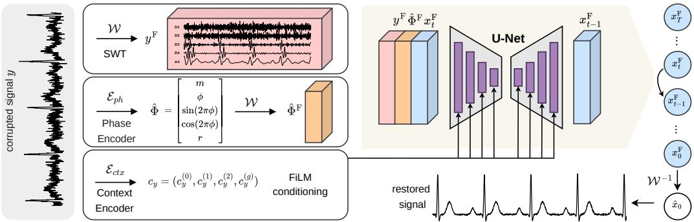  
Figure 1: Overview of PTSDIFF. The corrupted observation y feeds the context encoder and the phase encoder; it is frame-transformed (top) and concatenated with the frame-transformed phase channels (middle) and the latent $x _ { t } ^ { \mathrm { F } }$ as U-Net input. The context encoder (bottom) modulates the backbone through FiLM embeddings, and the U-Net drives the update to $x _ { t - 1 } ^ { \mathrm { F } }$ . Block-level detail is in Figure 5.

A natural question arises: can modeling cycle structure improve restoration? To answer this, we introduce PTSDIFF, to include direct cycle-phase information into the diffusion process, and investigate whether this benefit can be predicted before training. We encode this structure through two complementary inductive biases. First, instead of operating directly in the time domain, we perform diffusion in a shift-covariant wavelet representation, making the model insensitive to the arbitrary starting position of the input window, which we hypothesize should provide a consistent benefit across modal ities. Second, we condition the denoiser on a phase field estimated from the corrupted input, a dense per-sample representation of position within the current cycle, which should be most useful when the signal is strongly structured by its cycle. Together, the two components remove sensitivity to absolute window position while providing explicit information about position within the underlying cycle.

To understand the effect of phase conditioning we analyze it along two axes: how phase information is estimated and how strongly the underlying signal is structured by its cycle. We find that estimation quality is critical: a classical detector applied to the corrupted input performs no better than omitting phase conditioning, whereas a learned estimator substantially improves restoration. Moreover, we study whether the usefulness of phase conditioning can be anticipated prior to training. To this end, we introduce a cyclostationarity index that measures the fraction of signal variance explained by cycle phase. This provides a training-free estimate of which signals benefit from phase conditioning, avoiding unnecessary model complexity and training when cycle structure is weak.

Beyond improving the conditional model with both inductive biases, diffusion restoration remains stochastic at inference: different reverse trajectories can yield different estimates, while averaging several trajectories improves the estimate but is computationally expensive. We therefore study antithetic coupling (Hammersley & Morton, 1956; Ruiperez-Campillo et al., 2026a) as an inference-time´ variance-reduction strategy and show that one antithetic pair can match or outperform ten independent trajectories, with fivefold fewer network evaluations. Overall, our contributions are summarized as:

• We propose PTSDIFF, a novel formulation of physiological signal restoration under a cyclostationary prior. We address a limitation of existing diffusion-based methods that overlook this structure, through two inductive biases: shift-covariant wavelet diffusion and cycle-phase conditioning.

• We introduce a cyclostationarity index that quantifies cycle structure from clean data and gives a training-free indication of when phase conditioning is likely to help.

• We achieve state-of-the-art restoration and improve downstream task performance across studied benchmarks in four modalities, with a sampling-efficient solution incorporating antithetic coupling.

## 2 RELATED WORK

Restoration for physiological signals. Medical recordings are noisy. Artifacts obscure the details that clinical interpretation relies on, and corrupted segments are otherwise discarded, from intensive care to ambulatory and consumer recordings (Chatterjee et al., 2020; Ismail et al., 2021). Classical restoration pipelines built on Kalman filtering, empirical mode decomposition, adaptive filtering and wavelet shrinkage remain standard (Sayadi & Shamsollahi, 2008; Blanco-Velasco et al., 2008; Gao et al., 2010; Lee & Zhang, 2003; Ismail et al., 2021; Jiang et al., 2019; Boyer et al., 2023). However, these methods assume fixed signal and noise spectra (Ruiperez-Campillo et al., 2024; 2026b), and´ they degrade under non-stationary artifacts and suppress the low-amplitude morphology that carries diagnostic content (Chatterjee et al., 2020; Watanabe et al., 2025). Learned deterministic restorers, primarily convolutional, recurrent and attention-based autoencoders, outperform them (Chiang et al., 2019; Antczak, 2018; Chen et al., 2024; Lai et al., 2025; Cui et al., 2024; Wang et al., 2023), but learn a single deterministic map and model the conditional mean implicitly, with no control over estimator variance. Generative restoration (Ho et al., 2020; Song et al., 2021b; Saharia et al., 2022) addresses this for different time-series modalities, i.e. DeScoD-ECG (Li et al., 2024), SDEMG (Liu et al., 2024) and EEGDfus (Huang et al., 2025). Moreover, general-purpose restoration samplers (Kawar et al., 2022; Chung et al., 2023) focus on the inverse problem, while accelerated solvers (Song et al., 2021a; Lu et al., 2022) reduce the number of sampling steps; neither directly targets estimator variance at fixed Number of Function Evaluations (NFE). Further per-modality details are provided in Appendix A.

Transformed-domain diffusion. Diffusion-based time-series models typically operate in the native time domain, but recent work has explored whether alternative representations provide more suitable inductive biases. Crabbe et al. (2024) argue that diffusing in a spectral basis suits signals with´ localized spectral structure, and FIDE (Galib et al., 2024) prevents high-frequency components from vanishing in the reverse process. Global bases sacrifice temporal localization, motivating time–frequency representations (Li, 2022): MECG-E uses the STFT (Hung et al., 2024) and TFCDiff the DCT (Li et al., 2026). Common to these, and made explicit here, is that the choice of frame, i.e., the signal representation in which diffusion operates, determines which symmetries are built into the denoiser. In this work, we adopt the Stationary Wavelet Transform (SWT) for its shift-covariance rather than its spectral properties (Nason & Silverman, 1995; Coifman & Donoho, 1995).

Periodicity and variance reduction. Periodic structure is routinely exploited in forecasting architectures (Wu et al., 2023; 2021). In physiological modeling, PulseImpute (Xu et al., 2022) and PulseDiff (Jenkins et al., 2023) exploit cardiac repetition for imputation, while latent-trajectory models represent cycles geometrically (Ryser et al., 2022). Furthermore, oscillatory and burst structure is documented for EEG and EMG (Brenner & Schaul, 1990; Khorrami Chokami et al., 2021). These works establish that periodicity can be useful, but not how much a given signal should benefit from it, which is the gap addressed in Section 3.4. Antithetic variates are a variance-reduction technique (Hammersley & Morton, 1956; Owen, 2013; Choi & Park, 2026) and were introduced into conditional diffusion sampling in physiological time series by Ruiperez-Campillo et al. (2026a).´ We adopt this coupling, and derive its effect at matched NFE in the restoration setting.

## 3 METHOD: PTSDIFF

We propose PTSDIFF, a method to incorporate the cyclostationary structure (Section 3.1) into diffusion through a shift-covariant representation and explicit cycle-phase conditioning. We then define the training objective, a training-free predictor of phase utility, and an antithetic inference estimator.

## 3.1 PRELIMINARIES

Cyclostationary restoration. Let $x _ { 0 } , y \in \mathbb { R } ^ { L }$ denote a clean signal and its corrupted observation, respectively, each of length L and with sample indices n, $, n ^ { \prime } \in \{ 1 , \ldots , L \}$ ; restoration seeks to recover x0 given $y .$ We assume $x _ { 0 }$ is drawn from a process that is cyclostationary in the wide sense: there exists a latent phase $\varphi _ { n } \in [ 0 , 1 )$ ), advancing at a locally varying rate, with

$$
\mathbb { E } [ x _ { 0 } [ n ] | \varphi _ { n } = \varphi ] = \mu ( \varphi ) , \qquad \operatorname { C o v } ( x _ { 0 } [ n ] , x _ { 0 } [ n ^ { \prime } ] | \varphi _ { n } , \varphi _ { n ^ { \prime } } ) = C ( \varphi _ { n } , \varphi _ { n ^ { \prime } } ) ,\tag{1}
$$

so first- and second-order statistics depend on phase, not on absolute time. This is weaker than periodicity, since successive cycles differ in length and morphology, and stronger than stationarity. Different physiological systems may satisfy this to different degrees.

Conditional diffusion. We use an ϵ-parameterized DDPM (Ho et al., 2020). For a generic representation $u _ { 0 }$ with variance schedule $\{ \beta _ { t } \} _ { t = 1 } ^ { T } , \alpha _ { t } = 1 - \beta _ { t }$ , and $\begin{array} { r } { \bar { \alpha } _ { t } = \prod _ { i = 1 } ^ { t } \alpha _ { i } } \end{array}$ . The forward process is

$$
\begin{array} { r } { u _ { t } = \sqrt { \bar { \alpha } _ { t } } u _ { 0 } + \sqrt { 1 - \bar { \alpha } _ { t } } \epsilon , \epsilon \sim \mathcal { N } ( 0 , I ) . } \end{array}\tag{2}
$$

A denoising network $\epsilon _ { \theta }$ is trained to predict the injected noise ϵ at each diffusion step. At inference, the reverse process generates samples starting from noise $u _ { T } \sim \mathcal { N } ( 0 , I )$ . Sections 3.2–3.3 specify the representation $u _ { 0 }$ and the conditioning supplied to the denoiser.

## 3.2 DIFFUSION IN A SHIFT-COVARIANT FRAME

The first inductive bias removes sensitivity to the arbitrary position at which a signal window begins. Under the cyclostationary model, absolute position is not informative; what matters is position relative to the underlying cycle. We therefore perform diffusion in a shift-covariant representation that preserves temporal alignment.

Shift-covariant frame. We instantiate the shift-covariant representation with the stationary wavelet transform $( \mathrm { S W T } )$ (Nason & Silverman, 1995). Let W denote its analysis operator and $\mathcal { W } ^ { - 1 }$ its inverse, with $x _ { 0 } ^ { \mathrm { { F } } } = \mathcal { W } ( x _ { 0 } )$ and $y ^ { \mathrm { F } } = \mathcal { W } ( y )$ denoting the corresponding frame coefficients of the clean signal $x _ { 0 }$ and its corrupted observation $y ,$ , respectively. For an input $a _ { 0 } .$ , the level-j decomposition is

$$
a _ { j } [ n ] = \sum _ { k } h _ { j } [ k ] a _ { j - 1 } [ n - k ] , \qquad d _ { j } [ n ] = \sum _ { k } g _ { j } [ k ] a _ { j - 1 } [ n - k ] ,\tag{3}
$$

with $h _ { j }$ and $g _ { j }$ the upsampled low- and high-pass filters at level $j .$ Unlike the standard discrete wavelet transform (DWT), the SWT omits decimation, i.e. the downsampling applied after each level. As a result, $\mathcal { W } : \mathbb { R } ^ { L }  \mathbb { R } ^ { ( J + 1 ) \times L }$ preserves temporal resolution and is exactly shift-covariant, or equivalently translation-equivariant. Writing $( S _ { \tau } \dot { x } ) [ n ] = x [ n - \tau ]$ for the cyclic shift by τ samples,

$$
\begin{array} { r } { \mathcal { W } ( S _ { \tau } x ) = S _ { \tau } \mathcal { W } ( x ) \qquad \forall \tau \in \mathbb { Z } , } \end{array}\tag{4}
$$

where $S _ { \tau }$ acts identically on every channel. The decimated DWT does not satisfy this property for arbitrary shifts: downsampling by $2 ^ { j }$ at level j restricts equivariance at that level to shifts that are multiples of $2 ^ { j }$ , and therefore to multiples of ${ \bf \bar { \boldsymbol { \mathbf { \rho } } } } _ { 2 } J$ for the full J-level transform. This loss of shift covariance motivates the undecimated construction used in translation-invariant wavelet denoising (Nason & Silverman, 1995; Coifman & Donoho, 1995). Because W maps $L$ samples to $( J { + } 1 ) \bar { L }$ coefficients, it is redundant rather than a basis. More precisely, it forms an overcompleteframe: a redundant representation that nevertheless admits stable reconstruction. By definition (Daubechies, 1992), there exist constants $0 < A \leq B <$ ∞ such that

$$
A \| x \| _ { 2 } ^ { 2 } \leq \| \mathcal { W } x \| _ { 2 } ^ { 2 } \leq B \| x \| _ { 2 } ^ { 2 } .\tag{5}
$$

For the orthogonal wavelet families used here, the undecimated transform is a tight frame with $A = B = J + 1$ , so $\mathcal { W } ^ { - 1 } = A ^ { - 1 } \mathcal { W } ^ { \top }$ and reconstruction is non-expansive up to the factor $A ^ { - 1 / 2 }$ Two consequences are useful for our model. First, the subbands remain aligned on the original sample grid, allowing them to be stacked as channels of a length-preserving backbone. Second, the time-domain phase field introduced in Section 3.3 can be transformed by W and concatenated channel-wise without resampling. We use $J = 4$ levels, yielding detail channels $( d _ { 1 } , \ldots , d _ { 4 } )$ and one approximation channel $a _ { 4 }$ . For sampling rate $f _ { s } ,$ , the channel $d _ { j }$ corresponds approximately to $[ f _ { s } 2 ^ { - ( j + 1 ) } , f _ { s } 2 ^ { - j } ]$ , while $a _ { J }$ contains the residual frequencies below $f _ { s } 2 ^ { - ( J + 1 ) }$ . The resulting per-modality band mappings and the choice of wavelet family are reported in Appendix C.2; the choice of J is evaluated in Appendix D.9.

Diffusion in the frame domain. We apply the process of Section 3.1 to $x _ { 0 } ^ { \mathrm { F } } = \mathcal { W } ( x _ { 0 } )$ rather than $x _ { 0 } ,$ , so the latent is $x _ { t } ^ { \mathrm { F } } \in \mathbb { R } ^ { ( J + 1 ) \times L }$ and the time-domain output is $\hat { x } _ { 0 } = \mathcal { W } ^ { - 1 } ( \hat { x } _ { 0 } ^ { \mathrm { F } } )$ . We use $T = 5 0$ and the quadratic noise schedule of Li et al. (2026).

## 3.3 PHASE CONDITIONING

The second inductive bias makes position relative to the underlying physiological cycle explicit to the denoiser. Let $\mathcal { T } ( x ) = \{ e _ { 1 } < \cdots < e _ { M } \}$ denote the detected cycle-event indices of a signal (e.g., R-peaks1 in an ECG). For a sample n satisfying $e _ { k } \leq n < e _ { k + 1 }$ , we define its cycle phase, local cycle rate, and soft event mask as

$$
\phi _ { n } = \frac { n - e _ { k } } { e _ { k + 1 } - e _ { k } } \in [ 0 , 1 ) , \qquad r _ { n } = \frac { f _ { s } } { e _ { k + 1 } - e _ { k } } , \qquad m _ { n } = \operatorname* { m a x } _ { j } \exp \left( - \frac { ( n - e _ { j } ) ^ { 2 } } { 2 s ^ { 2 } } \right) ,\tag{6}
$$

where $f _ { s }$ denotes the sampling rate and s the event width. These quantities form the dense phase field

$$
\Phi = \left( m , \ \phi , \ \sin 2 \pi \phi , \ \cos 2 \pi \phi , \ r \right) \in \mathbb { R } ^ { 5 \times L } .\tag{7}
$$

Here, m localizes cycle events, $\phi$ gives the relative position within each cycle, and r captures local variation in cycle rate. The sine and cosine channels embed phase on the circle, avoiding the discontinuity between $\phi = 1 ^ { - }$ and $\phi = 0$ , which would otherwise force the network to learn that $\phi = 0 . 9 9$ and $\phi = 0 . 0 1$ are adjacent.

Phase encoder. At inference, the clean signal $x _ { 0 }$ is unavailable, so its phase field must be estimated from the corrupted observation y. We use a learned, shift-equivariant convolutional phase encoder $\mathcal { E } _ { p h }$ and set $\hat { \Phi } = \mathcal { E } _ { p h } ( y )$ . As illustrated in Figure 1, the predicted field is transformed into the frame domain, applying W independently to each channel, as $\hat { \Phi } ^ { \mathrm { F } } = \mathcal { W } ( \hat { \Phi } )$ and concatenated channel-wise with $x _ { t } ^ { \dot { \mathrm { F } } }$ and $y ^ { \mathrm { F } }$ , providing the denoiser with dense per-sample phase information. Since both $\mathcal { E } _ { p h }$ and W are shift-equivariant, it holds that $\mathcal { W E } _ { p h } ( \dot { S } _ { \tau } y ) = \dot { S } _ { \tau } \mathcal { \dot { W } E } _ { p h } ( y )$ . Thus, the dense phase conditioning shifts consistently with the input. The phase encoder $\mathcal { E } _ { p h }$ can be trained through the restoration objective alone. For ECG, where a reliable cycle-event detector is available, we additionally warm-start it using a target phase field $\Phi ^ { \star } = { \cal D } ( \dot { x } _ { 0 } )$ computed from the clean signal. Here, D denotes the analytical construction of Equations $^ { 6 - 7 }$ . The analytical detector is used only for initialization and not at inference. For the remaining modalities, $\mathcal { E } _ { p h }$ is trained without warm-starting. Full warm-start details are given in Appendix C.2.

Context encoder. In parallel, a context encoder ${ \mathcal E } _ { \mathrm { c t x } }$ maps y to pooled, shift-invariant context embeddings $c _ { y } = ( c _ { y } ^ { ( 0 ) } , c _ { y } ^ { ( 1 ) } , c _ { y } ^ { ( 2 ) } , c _ { y } ^ { ( g ) } )$ , with one embedding for each U-Net resolution and one global embedding. The resolution-specific embeddings modulate the corresponding U-Net features through FiLM (Perez et al., 2018), while $c _ { y } ^ { ( g ) }$ is combined with the diffusion-step embedding. Unlike the phase field, this pathway provides global information about the corrupted observation rather than sample-wise conditioning. Because the phase conditioning is shift-equivariant and the pooled context conditioning is shift-invariant, neither introduces dependence on absolute window position. Architectural details are given in Appendix C.2.

## 3.4 MEASURING CYCLE STRUCTURE

The shift-covariant representation and phase conditioning both exploit the cyclostationary structure of Equation 1. Their usefulness should therefore depend on how strongly cycle phase structures the signal. We want to quantify this dependence from clean data before committing to model training.

Definition 1 (Cyclostationarity index). For a process with latent phase $\varphi ,$

$$
\Pi \ = \ { \frac { \operatorname { V a r } _ { \varphi } { \big ( } \mathbb { E } [ x \mid \varphi ] { \big ) } } { \operatorname { V a r } ( x ) } } \ \in \ [ 0 , 1 ]\tag{8}
$$

is the fraction of signal variance explained by cycle phase.

Π is estimated from clean data by phase-aligned averaging: detect cycle events, resample each cycle to a common phase grid, average to obtain $\hat { \mu } ( \varphi )$ , and take the ratio of its variance to the total. The estimator, its finite-sample bias and a cheaper autocorrelation proxy are given in Appendix B.3. Where no reliable cycle event detector exists, we use the autocorrelation proxy instead.

Proposition 1 (Phase-explained variance). Let x be cyclostationary in the sense of Equation 1. Then

$$
\operatorname { V a r } ( x ) - \mathbb { E } _ { \varphi } { \big [ } \operatorname { V a r } ( x \mid \varphi ) { \big ] } \ = \ \operatorname { V a r } _ { \varphi } { \big ( } \mathbb { E } [ x \mid \varphi ] { \big ) } \ = \ \Pi \cdot \operatorname { V a r } ( x ) ,\tag{9}
$$

so in the absence of an observation, conditioning on phase reduces the minimum mean-squared error exactly by Π Var(x).

Proof in Appendix B.1. The identity establishes that the variance phase explains is computable from clean data before any model exists. It does not extend to the case where y is observed (Appendix B.1), so we treat Π as a measure of how strongly phase structures a signal rather than as a certificate.

## 3.5 LEARNING OBJECTIVE

The denoiser predicts the injected noise as $\hat { \epsilon } _ { t } = \epsilon _ { \theta } ( x _ { t } ^ { \mathrm { F } } , y ^ { \mathrm { F } } , \hat { \Phi } ^ { \mathrm { F } } , c _ { y } , t )$ and is trained with the standard noise-prediction loss (Ho et al., 2020) on frame coefficients:

$$
\mathcal { L } _ { \mathrm { d i f f } } = \mathbb { E } _ { ( x _ { 0 } , y ) , t , \epsilon } \left[ \left\| \epsilon - \hat { \epsilon } _ { t } \right\| _ { 2 } ^ { 2 } \right] , \qquad t \sim \mathcal { U } \{ 1 , \dots , T \} .\tag{10}
$$

However, low noise-prediction error does not by itself control time-domain reconstruction error, and the relation between the two depends on t. Substituting Equation 2 into the clean estimate $\hat { x } _ { 0 } ^ { \mathrm { F } } = ( x _ { t } ^ { \mathrm { F } } - \sqrt { 1 - \bar { \alpha } _ { t } } \hat { \epsilon } _ { t } ) / \sqrt { \bar { \alpha } _ { t } }$ yields

$$
\begin{array} { r l r } & { } & { \hat { x } _ { 0 } ^ { \mathrm { F } } - x _ { 0 } ^ { \mathrm { F } } = \sqrt { \frac { 1 - \bar { \alpha } _ { t } } { \bar { \alpha } _ { t } } } \left( \epsilon - \hat { \epsilon } _ { t } \right) , \qquad \left\| \hat { x } _ { 0 } - x _ { 0 } \right\| _ { 2 } \ \leq \ A ^ { - 1 / 2 } \sqrt { \frac { 1 - \bar { \alpha } _ { t } } { \bar { \alpha } _ { t } } } \ \big \| \epsilon - \hat { \epsilon } _ { t } \big \| _ { 2 } , } \end{array}\tag{11}
$$

where the bound uses $\hat { x } _ { 0 } - x _ { 0 } = \mathcal { W } ^ { - 1 } ( \hat { x } _ { 0 } ^ { \mathrm { F } } - x _ { 0 } ^ { \mathrm { F } } )$ together with $\lVert \mathcal { W } ^ { - 1 } \rVert _ { 2 } = A ^ { - 1 / 2 }$ , which holds because W is tight with $A = B = J + 1$ (Equation 5). The first identity in Equation 11 states that ${ \mathcal { L } } _ { \mathrm { d i f f } }$ is a signal-space error weighted by the signal-to-noise ratio $\bar { \alpha } _ { t } / ( 1 - \bar { \alpha } _ { t } )$ : uniform weight in noise space is sharply decaying weight in signal space. Under the fixed quadratic schedule of Li et al. (2026), the amplification factor $\sqrt { ( 1 - { \bar { \alpha } } _ { t } ) / { \bar { \alpha } } _ { t } }$ spans four orders of magnitude. Thus, sampling t uniformly does not weight reconstruction error uniformly: ${ \mathcal { L } } _ { \mathrm { d i f f } }$ is least sensitive to coefficient error at exactly the steps with large t, where that error is amplified most. We counteract this with two terms applied to $\hat { x } _ { 0 } = \mathrm { \bar { \mathcal { W } } ^ { - 1 } } ( \hat { x } _ { 0 } ^ { \mathrm { F } } )$ at the same sampled t:

$$
\mathcal { L } _ { \mathrm { r e c } } = \mathbb { E } \Vert \hat { x } _ { 0 } - x _ { 0 } \Vert _ { 1 } , \ \mathcal { L } _ { \mathrm { m o r p h } } = \mathbb { E } \bar { \alpha } _ { t } \Vert \nabla \hat { x } _ { 0 } - \nabla x _ { 0 } \Vert _ { 1 } , \ \mathcal { L } = \mathcal { L } _ { \mathrm { d i f f } } + \lambda _ { \mathrm { { r e c } } } \mathcal { L } _ { \mathrm { r e c } } + \lambda _ { \mathrm { { m o r p h } } } \mathcal { L } _ { \mathrm { m o r p h } } ,\tag{12}
$$

with ∇ the first-order temporal difference, which penalizes slope error and encourages sharp transients; $\bar { \alpha } _ { t }$ restricts it to low noise, where slopes are informative. We use $\ell _ { 1 }$ rather than $\ell _ { 2 }$ for robustness to the large residuals that $\scriptstyle { \hat { x } } _ { 0 }$ exhibits at high t. We set $\lambda _ { \mathrm { r e c } } = 0 . 3$ and $\lambda _ { \mathrm { { m o r p h } } } = 0 . 1 $ Appendix D.9 reports a sweep over both weights.

## 3.6 ANTITHETIC REVERSE ESTIMATION

The preceding components shape $p _ { \theta } ( x _ { 0 } \mid y )$ ; we now fix it and change only how it is sampled. We target the model’s conditional mean $\dot { \bar { \mu } } _ { \theta } ( \dot { y } ) = \mathbb { E } _ { p _ { \theta } } [ x _ { 0 } \mid y ]$ , the squared-error-optimal estimate under $p _ { \theta } .$ , and compare two estimators with the same budget of $K T$ network-function evaluations (NFEs). MC-K averages K independent trajectories, whereas AV-K averages $K / 2$ antithetic pairs (K even):

$$
\hat { x } _ { 0 , \mathrm { M C - } K } = \frac { 1 } { K } \sum _ { k = 1 } ^ { K } \hat { x } _ { 0 } ^ { ( k ) } , \qquad \hat { x } _ { 0 , \mathrm { A V - } K } = \frac { 1 } { K } \sum _ { j = 1 } ^ { K / 2 } \big ( \hat { x } _ { 0 , + } ^ { ( j ) } + \hat { x } _ { 0 , - } ^ { ( j ) } \big ) .\tag{13}
$$

Both estimators are unbiased for $\bar { \mu } _ { \boldsymbol { \theta } } ( y )$ and differ only in variance. Each antithetic pair starts from $x _ { T , + } ^ { \mathrm { F } } \sim \mathcal { N } ( 0 , I )$ and $x _ { T , - } ^ { \mathrm { F } } = - \dot { x } _ { T , + } ^ { \mathrm { F } }$ . Since $\mathcal { N } ( 0 , I )$ is symmetric, its two members can receive opposite noise at every reverse step without changing their marginal $p _ { \theta } ( x _ { 0 } \mid y )$

$$
\begin{array} { r } { x _ { t - 1 , \pm } ^ { \mathrm { F } } = \mu _ { \theta } \Bigl ( x _ { t , \pm } ^ { \mathrm { F } } , y ^ { \mathrm { F } } , \hat { \Phi } ^ { \mathrm { F } } , c _ { y } , t \Bigr ) \pm \sigma _ { t } z _ { t } , \qquad z _ { t } \sim \mathcal { N } ( 0 , I ) , \quad \sigma _ { t } = \sqrt { \tilde { \beta } _ { t } } . } \end{array}\tag{14}
$$

Proposition 2 (Error decomposition at matched NFE). Fix y and write $\bar { \mu } _ { \theta } ( y ) = \mathbb { E } _ { p _ { \theta } } [ x _ { 0 } \mid y ]$ . Let $\sigma ^ { 2 } ( \tau )$ be the per-trajectory variance ofthe reconstruction at sample index τ and $\rho ( \tau )$ the correlation between the two members of an antithetic pair. Then the K-trajectory estimator satisfies

$$
\operatorname { V a r } [ \hat { x } _ { 0 , \mathrm { A V } \cdot K } ( \tau ) ] = \frac { \sigma ^ { 2 } ( \tau ) } { K } \big ( 1 + \rho ( \tau ) \big ) ,\tag{15}
$$

and its expected squared error decomposes as

$$
\mathbb { E } \big \lVert \hat { x } _ { 0 , K } - x _ { 0 } \big \rVert _ { 2 } ^ { 2 } = \underbrace { \big \lVert \bar { \mu } _ { \theta } ( y ) - x _ { 0 } \big \rVert _ { 2 } ^ { 2 } } _ { m o d e l b i a s } + \frac { 1 + \bar { \rho } } { K } \underbrace { \sum _ { \tau } \sigma ^ { 2 } ( \tau ) } _ { t r a j e c t o r y \nu a r i a n c e } , \qquad \bar { \rho } = \frac { \sum _ { \tau } \rho ( \tau ) \sigma ^ { 2 } ( \tau ) } { \sum _ { \tau } \sigma ^ { 2 } ( \tau ) } ,\tag{16}
$$

with $\bar { \rho } = 0 f o r$ independent trajectories. Coupling reduces the compute-controllable term by thefactor $1 + \bar { \rho }$ at equal NFE whenever $\bar { \rho } < 0$ , and is no worse than independent sampling to $O ( \bar { \rho } )$ when $\bar { \rho } \approx 0$

Proof in Appendix B.2. At matched NFE, antithetic coupling reduces sampling variance when $\bar { \rho } < 0 ;$ Appendix D.11 evaluates this condition and the quality–compute trade-off.

## 4 EXPERIMENTAL SETUP

Physiological signals and datasets. We evaluate datasets of four physiological modalities with different structures. First, for PPG we use PPG-DaLiA (Reiss et al., 2019), wrist blood-volume pulse (BVP) at 64 Hz corrupted with Noise Stress Test Database (NSTDB)(Moody et al., 1992; Goldberger et al., 2000) motion and baseline artifacts. Second, ECG uses PTB-XL (Wagner et al., 2022; 2020) for training and in-domain test, with MIT-BIH Arrhythmia (Moody & Mark, 2001) and QTDB (Laguna et al., 1997) held out to evaluate distribution shift, corrupted from the MIT-BIH NSTDB. Next, EMG uses NinaPro DB2 (Atzori et al., 2014) contaminated with ECG interference from Normal Sinus Rhythm Database (NSRDB) following the SDEMG protocol (Liu et al., 2024). Finally, EEG uses EEGdenoiseNet (Zhang et al., 2021) in the EEG–EOG setting following the EEGDfus protocol (Huang et al., 2025). To test distribution shift, the PPG, EMG and EEG models are also evaluated on one held-out dataset each: pulse-oximeter PPG from critically ill patients in BIDMC (Pimentel et al., 2017), sEMG from trans-radial amputees in NinaPro DB3 (Atzori et al., 2014), and EEG from the PhysioNet Motor Movement/Imagery Database (EEGMMIDB) (Schalk et al., 2004), each corrupted with the test protocol of its training dataset. Preprocessing follows each benchmark’s established protocol; details in Appendix C.1.

<table><tr><td></td><td>Model</td><td>∆SNR ↑</td><td> $\mathrm { P R D } \left[ \% \right] \downarrow$ </td><td>CC↑</td></tr><tr><td rowspan="4">PPG</td><td>DDAE</td><td> $8 . 9 7 \pm 0 . 1 4$ </td><td> $3 6 . 2 5 \pm 0 . 3 8$ </td><td> $0 . 9 1 \pm 0 . 0 0$ </td></tr><tr><td>PTSDIFF-MC-10</td><td> $1 2 . 9 9 \pm 0 . 1 1$ </td><td> $2 4 . 6 4 \pm 0 . 3 0$ </td><td> $0 . 9 6 \pm 0 . 0 0$ </td></tr><tr><td>PTSDIFF-AV-10</td><td> $\mathbf { 1 3 . 2 3 \pm 0 . 1 0 }$ </td><td> $\mathbf { 2 4 . 0 3 \pm 0 . 2 7 }$ </td><td> $\mathbf { 0 . 9 6 \pm 0 . 0 0 }$ </td></tr><tr><td>TCDAE</td><td> $1 2 . 4 9 \pm 0 . 6 5$ </td><td> $3 3 . 2 4 \pm 2 . 0 8$ </td><td> $0 . 9 5 \pm 0 . 0 0$ </td></tr><tr><td rowspan="5">ECG</td><td>TFCDiff-10</td><td> $1 3 . 3 5 \pm 0 . 1 3$ </td><td> $3 0 . 2 7 \pm 0 . 4 5$ </td><td> $0 . 9 4 \pm 0 . 0 0$ </td></tr><tr><td>DeScoD-10</td><td> $1 3 . 8 5 \pm 0 . 0 4$ </td><td> $2 8 . 7 6 \pm 0 . 1 5$ </td><td> $0 . 9 5 \pm 0 . 0 0$ </td></tr><tr><td>PTSDIFF-MC-10</td><td> $\underline { { 1 5 . 5 8 \pm 0 . 1 2 } }$ </td><td> $2 3 . 8 1 \pm 0 . 2 7$ </td><td> $0 . 9 6 \pm 0 . 0 0$ </td></tr><tr><td>PTSDIFF-AV-10</td><td> $\mathbf { 1 5 . 8 7 \pm 0 . 1 2 }$ </td><td> $\mathbf { 2 3 . 0 8 \pm 0 . 2 5 }$ </td><td> $\pm \overline { { { \bf 0 . 9 7 \pm 0 . 0 0 } } }$ </td></tr><tr><td></td><td></td><td></td><td></td></tr><tr><td rowspan="4">EMG</td><td>FCN</td><td> $1 9 . 2 8 \pm 0 . 2 0$ </td><td> $2 6 . 5 1 \pm 0 . 5 3$ </td><td> $0 . 9 6 \pm 0 . 0 0$ </td></tr><tr><td>SDEMG</td><td> $2 1 . 0 4 \pm 0 . 3 0$ </td><td> $2 1 . 9 1 \pm 0 . 7 5$ </td><td> $0 . 9 7 \pm 0 . 0 0$ </td></tr><tr><td>PTSDIFF-MC-10</td><td> $2 2 . 4 1 \pm 0 . 2 0$ </td><td> $1 8 . 8 0 \pm 0 . 5 7$ </td><td> $0 . 9 8 \pm 0 . 0 0$ </td></tr><tr><td>PTSDIFF-AV-10</td><td> $\mathbf { 2 2 . 7 0 \pm 0 . 1 9 }$ </td><td> $\mathbf { 1 8 . 2 3 \pm 0 . 5 5 }$ </td><td> $\mathbf { 0 . 9 8 \pm 0 . 0 0 }$ </td></tr><tr><td rowspan="4">EEG</td><td>EEGIFNet</td><td> $1 5 . 0 5 \pm 0 . 0 4$ </td><td> ${ \bf 1 9 . 9 6 \pm 0 . 1 0 }$ </td><td> $\mathbf { 0 . 9 7 \pm 0 . 0 0 }$ </td></tr><tr><td>EEGDfus</td><td> $1 5 . 0 3 \pm 0 . 2 1$ </td><td> $2 2 . 1 8 \pm 0 . 7 9$ </td><td> $0 . 9 6 \pm 0 . 0 0$ </td></tr><tr><td>PTSDIFF-MC-10</td><td> $\underline { { 1 5 . 3 1 \pm 0 . 0 7 } }$ </td><td> $2 0 . 8 4 \pm 0 . 1 9$ </td><td> $0 . 9 7 \pm 0 . 0 0$ </td></tr><tr><td>PTSDIFF-AV-10</td><td> $\mathbf { 1 5 . 3 9 \pm 0 . 0 7 }$ </td><td> $2 0 . 7 2 \pm 0 . 1 9$ </td><td> $\underline { { 0 . 9 7 \pm 0 . 0 0 } }$ </td></tr></table>

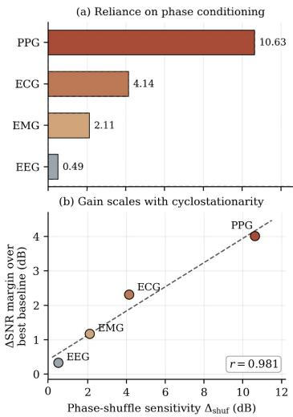  
Table 1: Restoration across four modalities against each modal- Figure 2: (a) ∆SNR drop under ity’s own baselines (3 training seeds). Values are mean ± standard phase shuffling. (b) Phase-shuffle deviation. Bold marks best, underline second best, within each sensitivity versus the margin over modality. Modalities are ordered by phase-shuffle margin. the best baseline.

Baselines. Each modality is compared against its strongest published restoration methods, retrained on identical splits and preprocessing: DDAE (Lai et al., 2025) for PPG; TCDAE (Chen et al., 2024), DeScoD-ECG (Li et al., 2024) and TFCDiff (Li et al., 2026) for ECG; SDEMG (Liu et al., 2024) and FCN (Wang et al., 2023) for EMG; EEGDfus (Huang et al., 2025) and EEGIFNet (Cui et al., 2024) for EEG. Other common baselines (FIR, SWT shrinkage) are reported in Appendix D.1. Stochastic baselines use the sampling procedure specified in their own publications. Every baseline figure was produced under our protocol. Appendix C.3 provides implementation and adaptation details.

Metrics and protocol. We report ∆SNR (dB), percentage root-mean-square difference (PRD, %) and Pearson correlation (CC) to evaluate restoration performance, computed per signal and averaged, with 95% bootstrap confidence intervals (CI) over 1,000 resamples. All results use a single training seed, except Table 1, which is trained and evaluated across three seeds and reported as mean ± standard deviation (exact seeds in Appendix C.2). Benchmark-specific metrics are given in Appendix C.4. Paired comparisons against each baseline use one-sided Wilcoxon signed-rank tests with Holm–Bonferroni correction (Appendix C.5). Finally, sampling variants are labeled MC-K for Monte Carlo averaging over K independent trajectories and AV-K for $K / 2$ antithetic pairs; both use K reverse trajectories and hence KT NFEs. Additional experimental details are included in Appendix C.

## 5 RESULTS

We evaluate PTSDIFF across four physiological modalities and answer: (i) Restoration, does it improve the quality and preserve downstream utility? (ii) Phase conditioning, when does phase help, and can we predict its benefit? (iii) Components, which parts drive the gains? (iv) Efficiency, can antithetic sampling improve the inference quality–compute trade-off? Further results in Appendix D.

Restoration performance. Table 1 reports successful restoration performance for all four modalities against modality-specific baselines, and Figures 14–16 (Appendix D.14) show representative reconstructions. PTSDIFF-AV-10 achieves the best ∆SNR on all four modalities and the best PRD and CC on three. On EEG, EEGIFNet retains the best PRD and CC: these metrics are averaged on a linear rather than a decibel scale, so poorly restored segments weigh more heavily, and EEGIFNet’s quality is more uniform across segments. On ECG, PTSDIFF matches or exceeds every baseline, classical filters included, on the metrics of prior work (Table 7); all paired comparisons are significant after Holm–Bonferroni correction (Table 12), and the improvement shifts the whole per-sample distribution (Figure 12). Its advantage there widens at higher noise levels (Tables 8–10) and holds on held-out datasets without retraining (Figure 8), highlighting strong generalization capabilities. On MIT-BIH, which is rich in arrhythmias, the other diffusion models lose their edge over the deterministic TCDAE while PTSDIFF keeps a clear lead, consistent with a phase field defined beat by beat rather than by a fixed rhythm. Figures 6 and 7 stratify the other modalities by noise level, with the main metrics and with each benchmark’s own (Table 6), respectively. Under dataset shift without retraining, PTSDIFF keeps its lead over the strongest baseline on PPG, ECG and EMG but falls behind EEGIFNet on EEG, the modality where its in-domain margin is also smallest (Table 11, Appendix D.3).

Table 2: Downstream utility across modalities. Extended results in Table 16.
<table><tr><td>Task</td><td></td><td>Baseline</td><td>PTSDIFF</td></tr><tr><td>PPG</td><td>HR MAE↓</td><td>5.947</td><td>5.155</td></tr><tr><td>ECG</td><td>PTB-XL AUROC ↑</td><td>0.840</td><td>0.848</td></tr><tr><td>ECG</td><td>MIT-BIH F1 ↑</td><td>0.543</td><td>0.630</td></tr><tr><td>EMG</td><td>Activation bal. acc. ↑</td><td>0.749</td><td>0.750</td></tr><tr><td>EEG</td><td>Band-power error ↓</td><td>4.56</td><td>3.31</td></tr></table>

The improvements also carry over downstream: PTSDIFF matches or exceeds the strongest restoration baseline on every task across the four modalities (Table 2), and on ECG it recovers most of the macro-AUROC and all of the abnormal-beat sensitivity lost to noise, with the best F1 among restoration methods (Tables 13–15). Across modalities, the restoration margin over the strongest baseline is largest on PPG and smallest on EEG, an ordering we relate to cycle structure next.

Phase conditioning and cyclostationarity are connected. Phase conditioning improves restoration more when cycle structure is stronger. To measure how much the denoiser relies on phase, we permute the phase fields across the samples of each test batch while keeping the inputs unchanged. This lowers ∆SNR in every modality, most on PPG and least on EEG (Figures 2a and 9), and the drop tracks the margin of PTSDIFF over the strongest baseline, with r = 0.981 across the four modalities (Figure 2b). A controlled synthetic study, which varies the cyclic share of variance and the cycle-length jitter with all else fixed, supports this: the ∆SNR improvement from phase conditioning increases with the cyclostationarity index Π of Definition 1 with the cyclostationarity index I of Definition

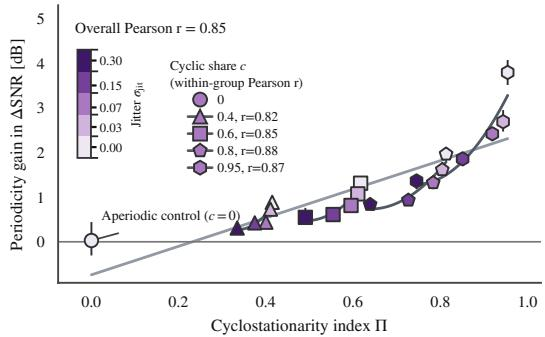  
Figure 3: Synthetic sweep: ∆SNR gain over the no-periodicity ablation versus the cyclostationarity index Π. Further details in Appendix D.8.

$( r = 0 . 8 5 ;$ Figure 3, Appendix D.8). Table 18 reports the proxy $\Pi _ { A C }$ for all nine datasets (Appendix D.7), ordering them as the ablations (Table 17) suggest, in which removing phase conditioning altogether costs most on the two cardiac modalities, PPG and ECG, and little or nothing on EMG and EEG. Unlike the shuffle (Appendix D.10), which probes how much a trained model relies on phase, this ablation retrains the model without it (Appendix D.6). Learning the phase is key. On ECG, the learned encoder improves every metric over the phase-free model, whereas the analytical QRS detector of Table 4 is not enough: applied to the noisy input, it performs on par with omitting phase (Table 3). The detector’s errors propagate into the phase field, while the encoder learns to infer the clean signal’s phase from the same input.

Further Analyses. In Table 17, we remove one component at a time in each modality; Table 3 details the ECG case, where the full model is best on every metric. Each component improves ∆SNR in three of the four modalities. Phase and context conditioning are complementary: on ECG, each improves the model more when the other is present. The time-domain auxiliary losses (Equation 12)

<table><tr><td>Frame (SWT)</td><td>Phase</td><td>Context</td><td>phase</td><td>Analytical Auxiliary loss</td><td>∆SNR ↑</td><td> $\mathrm { P R D } \left[ \% \right] \downarrow$ </td><td>CC↑</td></tr><tr><td>√</td><td></td><td></td><td></td><td></td><td> $\overline { { 1 5 . 0 5 \pm 0 . 2 1 } }$ </td><td> $\overline { { 2 5 . 5 1 \pm 0 . 6 0 } }$ </td><td> $0 . 9 6 \pm 0 . 0 0$ </td></tr><tr><td>√</td><td></td><td>I√</td><td></td><td>&gt;&gt;</td><td> $1 5 . 3 6 \pm 0 . 2 1$ </td><td> $2 4 . 5 4 \pm 0 . 5 5$ </td><td> $0 . 9 6 \pm 0 . 0 0$ </td></tr><tr><td>√</td><td></td><td></td><td></td><td>V</td><td> $1 5 . 2 8 \pm 0 . 2 0$ </td><td> $2 5 . 3 5 \pm 0 . 6 5$ </td><td> $0 . 9 6 \pm 0 . 0 0$ </td></tr><tr><td>√</td><td>√</td><td>-√</td><td>√</td><td>V</td><td> $1 5 . 3 \dot { 4 } \pm \dot { 0 } . 2 \dot { 1 }$ </td><td> $2 4 . 5 0 \pm 0 . 5 4$ </td><td> $0 . 9 6 \pm 0 . 0 0$ </td></tr><tr><td>√</td><td>√</td><td>√</td><td></td><td></td><td> $1 5 . 5 2 \pm 0 . 2 1$ </td><td> $2 4 . 0 1 \pm 0 . 5 3$ </td><td> $0 . 9 6 \pm 0 . 0 0$ </td></tr><tr><td></td><td>√</td><td>√</td><td></td><td>- √</td><td> $\overline { { 1 5 . 4 8 \pm 0 . 2 1 } }$ </td><td> $2 3 . 9 7 \pm 0 . 5 3$ </td><td> $0 . 9 6 \pm 0 . 0 0$ </td></tr><tr><td>√</td><td>√</td><td>√</td><td></td><td>√</td><td> $\mathbf { \overline { { { 1 6 . 0 0 \pm 0 . 2 1 } } } }$ </td><td> $\mathbf { 2 2 . 6 8 \pm 0 . 5 0 }$ </td><td> $\mathbf { \overline { { 0 . 9 7 \pm 0 . 0 0 } } }$ </td></tr></table>

Table 3: Component ablation on ECG (PTB-XL, SNR −2.0 dB, one antithetic pair, single seed; mean ± 95% CI). Phase from a classical detector performs similarly to no phase; the learned encoder improves on both.

help, as the weighting argument of Section 3.5 predicts, and most of all on EEG, which uses its own wavelet and loss weight (Table 5). The shift-covariant frame contributes comparably on ECG, EMG and EEG, whereas on PPG, whose restoration relies most on phase, removing the frame or the context slightly improves ∆SNR. On ECG, the choice of wavelet and decomposition level matters more than the loss weights, and four levels (Figure 13) are best for every wavelet tested (Tables 19 and 20).

Sampling efficiency. Antithetic coupling helps at no extra cost: at equal NFE, PTSDIFF-AV-10 improves ∆SNR and PRD over PTSDIFF-MC-10 in every modality (Table 1), consistent with Proposition 2 for negatively correlated pairs (measured directly in Figure 10). On ECG, a single antithetic pair already outperforms ten independent trajectories with five times fewer NFEs (Figure 4), and further pairs add little because the remaining error is then dominated by the model-bias term of Equation 16, which does not shrink with K (Figure 11). The benefit transfers to other diffusion restorers: applied to DeScoD-ECG and TFCDiff without retraining, one antithetic pair again matches or exceeds ten independent trajectories at a fifth of the wall-clock time, and PTSDIFF is the fastest of the three at equal NFE (Table 21). Because averaging approximates the conditional mean, these improvements concern distortion rather than the realism of individual samples (Appendix B.2).

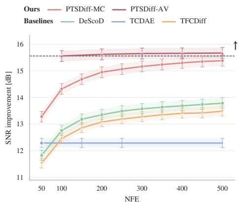  
Figure 4: Sampling efficiency on ECG. A single antithetic pair (AV-2) outperforms ten independent trajectories (MC-10) with 5× fewer NFEs. Wall-clock time decreases similarly. Extended results in Figure 11.

## 6 CONCLUSION

We introduced PTSDIFF, a diffusion-based framework for restoring cyclostationary physiological signals, leveraging the additional structure present in the data that prior work disregards. The framework combines a shift-covariant frame representation with a learned dense phase field, a trainingfree cyclostationarity index for estimating when phase conditioning is likely to be useful, and antithetic reverse sampling for improved efficient point estimation. Our experiments show that the benefit of phase conditioning increases with the cyclostationary structure of the signal: the cyclostationarity index separates the cardiac modalities from others of less cyclic nature, and its autocorrelation proxy, averaged over datasets, orders the modalities as the ablation gains do. Ablations further demonstrate that this benefit depends on learning a noise-robust phase representation as analytical phase estimated from the corrupted input provides no measurable improvement, whereas a learned encoder captures the required information to act as a directed bias. Finally, antithetic sampling improves distortion-based restoration metrics by better approximating the posterior mean, without modifying the architecture or diffusion schedule in an efficient manner. We show how the results of this cyclostationary-informed approach outperforms prior restoration baselines across four real world modalities and datasets.

Limitations and future work. The relationship between cyclostationarity and restoration benefit should be further tested across broader datasets and naturally occurring artifacts. Similarly, the insights focus on single-channel settings and extending the current framework to multi-lead ECG and multi-channel EEG could exploit correlations between channels. Like prior diffusion-based methods, our approach remains more expensive than single-pass restoration despite antithetic sampling. More broadly, this work opens a direction for designing time-series models around measurable cyclostationary structure. The proposed index provides a way to identify when explicit phase information is likely to be useful, while learned phase representations offer a mechanism for exploiting this structure when it is not directly observable from corrupted data. Extending these ideas to multichannel, irregular, and more weakly cyclic signals could enable adaptive inductive biases beyond physiological restoration, including further time-series reconstruction and generative modeling settings.

## REPRODUCIBILITY STATEMENT

The method is specified in Section 3, with architectural details, training hyperparameters, random seeds and the compute environment documented in Appendix C.2 and Table 5. All clean-signal datasets (Wagner et al., 2022; Moody & Mark, 2001; Laguna et al., 1997; Reiss et al., 2019; Atzori et al., 2014; Zhang et al., 2021; Pimentel et al., 2017; Schalk et al., 2004) and noise sources (Moody et al., 1992; Goldberger et al., 2000) are public; the corruption protocols, splits and preprocessing needed to regenerate every evaluation set are given in Appendix C.1, including the subject- and record level disjointness constraints. Baselines were retrained under identical data protocols rather than quoted from their publications (Section 4); porting, reimplementation and adaptation details are in Appendix C.3. Metric definitions are in Appendix C.4, the statistical procedure in Appendix C.5, and the downstream task setups in Appendix D.5. Proofs of Propositions 1 and 2 are in Appendices B.1 and B.2; the estimator for Π is in Appendix B.3 and the synthetic sweep protocol in Appendix D.8.

## ETHICS STATEMENT

This work uses only publicly available, de-identified physiological recordings released for research under their respective licenses. No new human-subject data was collected and no re-identification was attempted; as a secondary analysis of public, de-identified data, the work did not require additional ethical review. The principal risk is clinical: a restoration model can produce a plausible waveform that is diagnostically wrong, and a clean-looking output may command more confidence than a visibly noisy one. Two aspects of our results bear on this. First, distortion metrics do not establish diagnostic fidelity, which is why we evaluate downstream tasks (Table 2, Appendix D.5). Second, averaging reverse trajectories approximates the conditional mean, which improves distortion but not the realism of individual samples (Appendix B.2), and can therefore suppress rare morphology that may carry diagnostic weight. Restoration of this kind should not be deployed in a diagnostic pathway without task-level validation on the population of interest, and outputs should not be presented to clinicians as recordings. Benchmark corruption is also synthetic and drawn from a small set of artifact sources, so robustness to real ambulatory artifacts across diverse populations and devices remains unverified.

## AI USE STATEMENT

In this work, we used generative AI tools to help implement our methods and experiments in code. We did not use them to generate synthetic datasets, clean or reformat datasets, help develop theoretical models or conceptual frameworks, formulate mathematical claims, provide critical ingredients for proving mathematical claims, assist in the writing of proofs, propose or refine hypotheses, design or provide feedback on research methodology or experiments, or interpret results. Translation and qualitative or thematic data analysis do not apply to this work. Additionally, we used generative AI tools to draft and edit parts of the paper text, including condensing captions and laying out tables and figures in LAT X, but not to search for, identify, or summarize related literature. We reviewed all AI-assisted output: code was checked and tested before any experiment used it, and text was verified against our methods and results. We take full responsibility for everything in this paper, including any text, claims, and artifacts created with generative AI assistance.

## ACKNOWLEDGMENTS

SRC is supported by the Department of Computer Science at ETH Zurich and reports equity, intellectual property and consulting with Physcade Inc.—no disclosures are conflicting with or related to this work. JSG is supported by the grant #2021-911 of the Strategic Focal Area Personalized Health and Related Technologies (PHRT) of the ETH Domain (Swiss Federal Institutes of Technology). SL is supported by the Swiss State Secretariat for Education, Research, and Innovation (SERI) under contract number MB22.00047. Computational data analysis was performed at Leonhard Med,2 a secure trusted research environment at ETH Zurich.

## REFERENCES

Norbert Ad´ am, D´ avid Val’ko, Zolt´ an Balogh, Branislav Mado´ s, and Jˇ an Hurtuk. Comparative´ evaluation of filtration techniques for ECG signal denoising with emphasis on stationary wavelet transform. Scientific Reports, 15(1):42514, 2025. doi: 10.1038/s41598-025-26476-1.

Paul S Addison. Wavelet transforms and the ECG: a review. Physiological Measurement, 26(5): R155–R199, 2005. doi: 10.1088/0967-3334/26/5/R01.

Karol Antczak. Deep recurrent neural networks for ECG signal denoising. arXiv preprint arXiv:1807.11551, 2018.

Manfredo Atzori, Arjan Gijsberts, Claudio Castellini, Barbara Caputo, Anne-Gabrielle Mittaz Hager, Simone Elsig, Giorgio Giatsidis, Franco Bassetto, and Henning Muller. Electromyography data for¨ non-invasive naturally-controlled robotic hand prostheses. Scientific Data, 1(1):140053, 2014. doi: 10.1038/sdata.2014.53.

Shaojie Bai, J. Zico Kolter, and Vladlen Koltun. An empirical evaluation of generic convolutional and recurrent networks for sequence modeling. arXiv preprint arXiv:1803.01271, 2018.

Giulio Basso, Xi Long, Reinder Haakma, and Rik Vullings. Reduction of motion artifacts from photoplethysmography signals using learned convolutional sparse coding. Physiological Measurement, 47(2):025001, 2026. doi: 10.1088/1361-6579/ae35cb.

Lisa Bedin, Gabriel Cardoso, Josselin Duchateau, Remi Dubois, and Eric Moulines. Leveraging an ECG beat diffusion model for morphological reconstruction from indirect signals. In Advances in Neural Information Processing Systems, volume 37, pp. 84409–84446, 2024. doi: 10.52202/07901 7-2682.

Manuel Blanco-Velasco, Binwei Weng, and Kenneth E. Barner. ECG signal denoising and baseline wander correction based on the empirical mode decomposition. Computers in Biology and Medicine, 38(1):1–13, 2008. doi: 10.1016/j.compbiomed.2007.06.003.

Marianne Boyer, Laurent Bouyer, Jean-Sebastien Roy, and Alexandre Campeau-Lecours. Reducing´ noise, artifacts and interference in single-channel EMG signals: A review. Sensors, 23(6):2927, 2023. doi: 10.3390/s23062927.

Richard P. Brenner and Neil Schaul. Periodic EEG patterns: Classification, clinical correlation, and pathophysiology. Journal of Clinical Neurophysiology, 7(2):249–268, 1990. doi: 10.1097/000046 91-199004000-00007.

Shubhojeet Chatterjee, Rini Smita Thakur, Ram Narayan Yadav, Lalita Gupta, and Deepak Kumar Raghuvanshi. Review of noise removal techniques in ECG signals. IET Signal Processing, 14(9): 569–590, 2020. doi: 10.1049/iet-spr.2020.0104.

Meng Chen, Yongjian Li, Liting Zhang, Lei Liu, Baokun Han, Wenzhuo Shi, and Shoushui Wei. Elimination of random mixed noise in ECG using convolutional denoising autoencoder with transformer encoder. IEEE Journal ofBiomedical and Health Informatics, 28(4):1993–2004, 2024. doi: 10.1109/JBHI.2024.3355960.

Hsin-Tien Chiang, Yi-Yen Hsieh, Szu-Wei Fu, Kuo-Hsuan Hung, Yu Tsao, and Shao-Yi Chien. Noise reduction in ECG signals using fully convolutional denoising autoencoders. IEEE Access, 7: 60806–60813, 2019. doi: 10.1109/ACCESS.2019.2912036.

Kangjoon Choi and In-Cheol Park. Enhanced-throughput antithetic sample generation architecture for Monte Carlo simulation. IEEE Transactions on Very Large Scale Integration (VLSI) Systems, 34(5):1682–1686, 2026. doi: 10.1109/TVLSI.2026.3671706.

Hyungjin Chung, Jeongsol Kim, Michael T Mccann, Marc L Klasky, and Jong Chul Ye. Diffusion posterior sampling for general noisy inverse problems. In The Eleventh International Conference on Learning Representations, 2023.

Ronald R Coifman and David L Donoho. Translation-invariant de-noising. In Wavelets and statistics, pp. 125–150. Springer, 1995. doi: 10.1007/978-1-4612-2544-7 9.

Jonathan Crabbe, Nicolas Huynh, Jan Pawel Stanczuk, and Mihaela Van Der Schaar. Time series´ diffusion in the frequency domain. In Ruslan Salakhutdinov, Zico Kolter, Katherine Heller, Adrian Weller, Nuria Oliver, Jonathan Scarlett, and Felix Berkenkamp (eds.), Proceedings of the 41st International Conference on Machine Learning, volume 235 of Proceedings of Machine Learning Research, pp. 9407–9438. PMLR, 2024. URL https://proceedings.mlr.press/v235 /crabbe24a.html.

Heng Cui, Chang Li, Aiping Liu, Ruobing Qian, and Xun Chen. A dual-branch interactive fusion network to remove artifacts from single-channel EEG. IEEE Transactions on Instrumentation and Measurement, 73:1–12, 2024. doi: 10.1109/TIM.2023.3342863.

Ingrid Daubechies. Ten Lectures on Wavelets. Society for Industrial and Applied Mathematics, 1992. doi: 10.1137/1.9781611970104.

Philip de Chazal, M. O’Dwyer, and R.B. Reilly. Automatic classification of heartbeats using ECG morphology and heartbeat interval features. IEEE Transactions on Biomedical Engineering, 51(7): 1196–1206, 2004. doi: 10.1109/TBME.2004.827359.

Ergun Erc¸elebi. Electrocardiogram signals de-noising using lifting-based discrete wavelet transform. Computers in Biology and Medicine, 34(6):479–493, 2004. doi: 10.1016/S0010-4825(03)00090-8.

Asadullah Hill Galib, Pang-Ning Tan, and Lifeng Luo. FIDE: Frequency-inflated conditional diffusion model for extreme-aware time series generation. In Advances in Neural Information Processing Systems, volume 37, pp. 114434–114457, 2024. doi: 10.52202/079017-3634.

Jianbo Gao, Hussain Sultan, Jing Hu, and Wen-Wen Tung. Denoising nonlinear time series by adaptive filtering and wavelet shrinkage: A comparison. IEEE Signal Processing Letters, 17(3): 237–240, 2010. doi: 10.1109/LSP.2009.2037773.

William A Gardner. Statistically inferred time warping: Extending the cyclostationarity paradigm from regular to irregular statistical cyclicity in scientific data. EURASIP Journal on Advances in Signal Processing, 2018(1):59, 2018. doi: 10.1186/s13634-018-0564-6.

Ary L. Goldberger, Luis A. N. Amaral, Leon Glass, Jeffrey M. Hausdorff, Plamen Ch. Ivanov, Roger G. Mark, Joseph E. Mietus, George B. Moody, Chung-Kang Peng, and H. Eugene Stanley. PhysioBank, PhysioToolkit, and PhysioNet. Circulation, 101(23):e215–e220, 2000. doi: 10.1161/ 01.CIR.101.23.e215.

J. M. Hammersley and K. W. Morton. A new Monte Carlo technique: Antithetic variates. Mathematical Proceedings of the Cambridge Philosophical Society, 52(3):449–475, 1956. doi: 10.1017/S0305004100031455.

Jonathan Ho, Ajay Jain, and Pieter Abbeel. Denoising diffusion probabilistic models. In H. Larochelle, M. Ranzato, R. Hadsell, M.F. Balcan, and H. Lin (eds.), Advances in Neural Information Processing Systems, volume 33, pp. 6840–6851. Curran Associates, Inc., 2020.

Xiaoyang Huang, Chang Li, Aiping Liu, Ruobing Qian, and Xun Chen. EEGDfus: A conditional dif fusion model for fine-grained EEG denoising. IEEE Journal ofBiomedical and Health Informatics, 29(4):2557–2569, 2025. doi: 10.1109/JBHI.2024.3504716.

Kuo-Hsuan Hung, Kuan-Chen Wang, Kai-Chun Liu, Wei-Lun Chen, Xugang Lu, Yu Tsao, and Chii-Wann Lin. MECG-E: Mamba-based ECG enhancer for baseline wander removal. In Wei Ding, Chang-Tien Lu, Fusheng Wang, Liping Di, Kesheng Wu, Jun Huan, Raghu Nambiar, Jundong Li, Filip Ilievski, Ricardo Baeza-Yates, and Xiaohua Hu (eds.), IEEE International Conference on Big Data, BigData 2024, Washington, DC, USA, December 15-18, 2024, pp. 6469–6475. IEEE, 2024. doi: 10.1109/BIGDATA62323.2024.10825253.

Shahid Ismail, Usman Akram, and Imran Siddiqi. Heart rate tracking in photoplethysmography signals affected by motion artifacts: a review. EURASIP Journal on Advances in Signal Processing, 2021(1):5, 2021. doi: 10.1186/s13634-020-00714-2.

Alexander Jenkins, Zehua Chen, Fu Siong Ng, and Danilo Mandic. Improving diffusion models for ECG imputation with an augmented template prior. arXiv preprint arXiv:2310.15742, 2023.

Xiao Jiang, Gui-Bin Bian, and Zean Tian. Removal of artifacts from EEG signals: A review. Sensors, 19(5):987, 2019. doi: 10.3390/s19050987.

Bahjat Kawar, Michael Elad, Stefano Ermon, and Jiaming Song. Denoising diffusion restoration models. In Advances in Neural Information Processing Systems, volume 35, pp. 23593–23606, 2022.

Amir Khorrami Chokami, Mauro Gasparini, and Roberto Merletti. Identification of periodic bursts in surface EMG: Applications to the erector spinae muscles of sitting violin players. Biomedical Signal Processing and Control, 65:102369, 2021. doi: 10.1016/j.bspc.2020.102369.

Ashish Kumar, Harshit Tomar, Virender Kumar Mehla, Rama Komaragiri, and Manjeet Kumar. Stationary wavelet transform based ECG signal denoising method. ISA Transactions, 114:251–262, 2021. doi: 10.1016/j.isatra.2020.12.029.

Pablo Laguna, Roger G Mark, Ary L Goldberger, and George B Moody. The QT Database, 1997. URL https://physionet.org/content/qtdb/.

Salim Lahmiri. Comparative study of ECG signal denoising by wavelet thresholding in empirical and variational mode decomposition domains. Healthcare Technology Letters, 1(3):104–109, 2014. doi: 10.1049/htl.2014.0073.

Shin-Chi Lai, Yao-Feng Liang, Yi-Chang Zhu, Li-Chuan Hsu, Shang-Sian Wu, and Szu-Ting Wang. Enhanced noise reduction in photoplethysmography signals using a denoising autoencoder. Sensors and Materials, 37(11):5123, 2025. doi: 10.18494/sam5927.

C.M. Lee and Y.T. Zhang. Reduction of motion artifacts from photoplethysmographic recordings using a wavelet denoising approach. In IEEE EMBS Asian-Pacific Conference on Biomedical Engineering, 2003., pp. 194–195, 2003. doi: 10.1109/APBME.2003.1302650.

Han-Wook Lee, Ju-Won Lee, Won-Geun Jung, and Gun-Ki Lee. The periodic moving average filter for removing motion artifacts from PPG signals. International Journal ofControl, Automation, and Systems, 5(6):701–706, 2007. URL https://koreascience.kr/article/JAKO20 0704503664957.page.

Chunyan Li. Short-time Fourier transform and introduction to wavelet analysis. In Time Series Data Analysis in Oceanography: Applications using MATLAB, pp. 415–426. Cambridge University Press, Cambridge, 2022. doi: 10.1017/9781108697101.024.

Huayu Li, Gregory Ditzler, Janet Roveda, and Ao Li. DeScoD-ECG: Deep score-based diffusion model for ECG baseline wander and noise removal. IEEE Journal of Biomedical and Health Informatics, 28(9):5081–5091, 2024. doi: 10.1109/JBHI.2023.3237712. arXiv:2208.00542 [eess.SP].

Pengxin Li, Yimin Zhou, Jie Min, Yirong Wang, Wei Liang, Qingling Xia, and Wang Li. TFCDiff: Robust ECG denoising via time-frequency complementary diffusion. IEEE Journal ofBiomedical and Health Informatics, pp. 1–13, 2026. doi: 10.1109/JBHI.2026.3732677.

Yu-Tung Liu, Kuan-Chen Wang, Kai-Chun Liu, Sheng-Yu Peng, and Yu Tsao. SDEMG: Score-based diffusion model for surface electromyographic signal denoising. In ICASSP 2024 - 2024 IEEE International Conference on Acoustics, Speech and Signal Processing (ICASSP), pp. 1736–1740, 2024. doi: 10.1109/ICASSP48485.2024.10446154. arXiv:2402.03808 [eess.SP].

Juan Miguel Lopez Alcaraz and Nils Strodthoff. Diffusion-based time series imputation and forecasting with structured state space models. Transactions on Machine Learning Research, 2023. URL https://openreview.net/forum?id=hHiIbk7ApW.

Cheng Lu, Yuhao Zhou, Fan Bao, Jianfei Chen, Chongxuan Li, and Jun Zhu. DPM-Solver: A fast ODE solver for diffusion probabilistic model sampling in around 10 steps. In Advances in Neural Information Processing Systems, volume 35, pp. 5775–5787, 2022.

G.B. Moody and R.G. Mark. The impact of the MIT-BIH Arrhythmia Database. IEEE Engineering in Medicine and Biology Magazine, 20(3):45–50, 2001. doi: 10.1109/51.932724.

George B Moody, WE Muldrow, and Roger G Mark. The MIT-BIH Noise Stress Test Database, 1992. URL https://physionet.org/content/nstdb/.

Antonio Napolitano and William A Gardner. Discovering and modeling hidden periodicities in science data. EURASIP Journal on Advances in Signal Processing, 2025(1):13, 2025. doi: 10.1186/s13634-025-01207-w.

G. P. Nason and B. W. Silverman. The stationary wavelet transform and some statistical applications. In Anestis Antoniadis and Georges Oppenheim (eds.), Wavelets and Statistics, pp. 281–299. Springer, New York, NY, 1995. ISBN 978-1-4612-2544-7. doi: 10.1007/978-1-4612-2544-7 17.

Mang Ning, Mingxiao Li, Jianlin Su, Jia Haozhe, Lanmiao Liu, Martin Benes, Wenshuo Chen, Albert Ali Salah, and Itir Onal Ertugrul. DCTdiff: Intriguing properties of image generative modeling in the DCT space. In Aarti Singh, Maryam Fazel, Daniel Hsu, Simon Lacoste-Julien, Felix Berkenkamp, Tegan Maharaj, Kiri Wagstaff, and Jerry Zhu (eds.), Proceedings of the 42nd International Conference on Machine Learning, volume 267 of Proceedings of Machine Learning Research, pp. 46498–46524. PMLR, 2025. URL https://proceedings.mlr.press/v2 67/ning25c.html.

Meir Nitzan and Zehava Ovadia-Blechman. Physical and physiological interpretations of the PPG signal. In John Allen and Panicos Kyriacou (eds.), Photoplethysmography, pp. 319–340. Academic Press, 2022. ISBN 978-0-12-823374-0. doi: 10.1016/B978-0-12-823374-0.00009-8.

Art B. Owen. Monte Carlo Theory, Methods and Examples. Self-published, 2013. URL https: //artowen.su.domains/mc/.

Jiapu Pan and Willis J. Tompkins. A real-time QRS detection algorithm. IEEE Transactions on Biomedical Engineering, BME-32(3):230–236, 1985. doi: 10.1109/TBME.1985.325532.

Ethan Perez, Florian Strub, Harm de Vries, Vincent Dumoulin, and Aaron Courville. FiLM: Visual reasoning with a general conditioning layer. In Proceedings ofthe AAAI Conference on Artificial Intelligence, volume 32, 2018. doi: 10.1609/aaai.v32i1.11671.

Marco A. F. Pimentel, Alistair E. W. Johnson, Peter H. Charlton, Drew Birrenkott, Peter J. Watkinson, Lionel Tarassenko, and David A. Clifton. Toward a robust estimation of respiratory rate from pulse oximeters. IEEE Transactions on Biomedical Engineering, 64(8):1914–1923, 2017. doi: 10.1109/TBME.2016.2613124.

Huiling Qin, Yuanxun Li, and Weijia Jia. WaveDiST: A wavelet diffusion transformer for spatiotemporal estimation on unobserved locations. In Proceedings of the AAAI Conference on Artificial Intelligence, volume 40, pp. 15635–15643, 2026. doi: 10.1609/aaai.v40i18.38593.

Attila Reiss, Ina Indlekofer, and Philip Schmidt. PPG-DaLiA, 2019. URL https://archive. ics.uci.edu/dataset/495.

Francisco Perdigon Romero, Liset Vazquez Romaguera, Carlos Roman V´ azquez-Seisdedos, C´ ´ıcero Ferreira Fernandes Costa Filho, Marly Guimaraes Fernandes Costa, and Jo˜ ao Evangelista Neto.˜ Baseline wander removal methods for ECG signals: A comparative study. arXiv preprint arXiv:1807.11359, 2018.

Olaf Ronneberger, Philipp Fischer, and Thomas Brox. U-net: Convolutional networks for biomedical image segmentation. In Nassir Navab, Joachim Hornegger, William M. Wells, and Alejandro F. Frangi (eds.), Medical Image Computing and Computer-Assisted Intervention – MICCAI 2015, pp. 234–241, Cham, 2015. Springer International Publishing. ISBN 978-3-319-24574-4.

Samuel Ruiperez-Campillo, Alain Ryser, Thomas M Sutter, Ruibin Feng, Prasanth Ganesan, Brototo´ Deb, Kelly A Brennan, Maarten ZH Kolk, Fleur VY Tjong, Albert J Rogers, et al. Can generative ai learn physiological waveform morphologies? a study on denoising intracardiac signals in ischemic cardiomyopathy. In 2024 46th Annual International Conference of the IEEE Engineering in Medicine and Biology Society (EMBC), pp. 1–4. IEEE, 2024.

Samuel Ruiperez-Campillo, Moritz Rau, Prasanth Ganesan, Kelly A Brennan, Ruibin Feng,´ Sabyasachi Bandyopadhyay, Albert J Rogers, Sanjiv M Narayan, and Julia E Vogt. Physicsinspired diffusion probabilistic models for improved denoising in intracardiac time series. In 2025 47th Annual International Conference ofthe IEEE Engineering in Medicine and Biology Society (EMBC), pp. 1–5. IEEE, 2025.

Samuel Ruiperez-Campillo, Pablo Blasco-Fern´ andez, Moritz Rau, Prasanth Ganesan, Sabyasachi´ Bandyopadhyay, Charles Sillett, Lukas P. Arts, Esteban Peralta, Albert J. Rogers, Fleur V. Y. Tjong, Sanjiv M. Narayan, and Julia E. Vogt. Antithetic sampling enhanced probabilistic diffusion for denoising cardiac time series. IEEE Journal of Biomedical and Health Informatics, pp. 1–14, 2026a. doi: 10.1109/JBHI.2026.3705976.

Samuel Ruiperez-Campillo, Alain Ryser, Thomas M. Sutter, Brototo Deb, Ruibin Feng, Prasanth´ Ganesan, Kelly A. Brennan, Albert J. Rogers, Maarten Z. H. Kolk, Fleur V. Y. Tjong, Sanjiv M. Narayan, and Julia E. Vogt. Reducing diverse sources of noise in ventricular electrical signals using variational autoencoders. Expert Systems with Applications, 300:130185, 2026b. doi: 10.1016/j.eswa.2025.130185.

Alain Ryser, Laura Manduchi, Fabian Laumer, Holger Michel, Sven Wellmann, and Julia E. Vogt. Anomaly detection in echocardiograms with dynamic variational trajectory models. In Proceedings ofthe 7th Machine Learningfor Healthcare Conference, volume 182, pp. 425–458. PMLR, 2022. URL https://proceedings.mlr.press/v182/ryser22a.html.

Chitwan Saharia, William Chan, Huiwen Chang, Chris Lee, Jonathan Ho, Tim Salimans, David Fleet, and Mohammad Norouzi. Palette: Image-to-image diffusion models. In ACM SIGGRAPH 2022 Conference Proceedings, SIGGRAPH ’22, pp. 1–10, New York, NY, USA, 2022. Association for Computing Machinery. ISBN 9781450393379. doi: 10.1145/3528233.3530757.

Omid Sayadi and Mohammad Bagher Shamsollahi. ECG denoising and compression using a modified extended Kalman filter structure. IEEE Transactions on Biomedical Engineering, 55(9):2240–2248, 2008. doi: 10.1109/TBME.2008.921150.

Gerwin Schalk, Dennis J. McFarland, Thilo Hinterberger, Niels Birbaumer, and Jonathan R. Wolpaw. BCI2000: A general-purpose brain-computer interface (BCI) system. IEEE Transactions on Biomedical Engineering, 51(6):1034–1043, 2004. doi: 10.1109/TBME.2004.827072.

Alex Sherstinsky. Fundamentals of recurrent neural network (RNN) and long short-term memory (LSTM) network. Physica D: Nonlinear Phenomena, 404:132306, 2020. doi: 10.1016/j.physd.20 19.132306.

Brij N. Singh and Arvind K. Tiwari. Optimal selection of wavelet basis function applied to ECG signal denoising. Digital Signal Processing, 16(3):275–287, 2006. doi: 10.1016/j.dsp.2005.12.003.

Pratik Singh and Gayadhar Pradhan. A new ECG denoising framework using generative adversarial network. IEEE/ACM Transactions on Computational Biology and Bioinformatics, 18(2):759–764, 2021. doi: 10.1109/TCBB.2020.2976981.

Jiaming Song, Chenlin Meng, and Stefano Ermon. Denoising diffusion implicit models. In 9th International Conference on Learning Representations, 2021a.

Yang Song, Jascha Sohl-Dickstein, Diederik P. Kingma, Abhishek Kumar, Stefano Ermon, and Ben Poole. Score-based generative modeling through stochastic differential equations. In 9th International Conference on Learning Representations, ICLR 2021, Virtual Event, Austria, May 3-7, 2021. OpenReview.net, 2021b. URL https://openreview.net/forum?id=PxTI G12RRHS.

Nils Strodthoff, Patrick Wagner, Tobias Schaeffter, and Wojciech Samek. Deep learning for ECG analysis: Benchmarks and insights from PTB-XL. IEEE Journal of Biomedical and Health Informatics, 25(5):1519–1528, 2021. doi: 10.1109/JBHI.2020.3022989.

Mohammad Sadman Tahsin, Haitham Y. Adarbah, and Afzel Noore. A lightweight channel-attention CNN for robust beat-level arrhythmia detection. IEEE Access, 14:62803–62817, 2026. doi: 10.1109/ACCESS.2026.3686810.

Ashish Vaswani, Noam Shazeer, Niki Parmar, Jakob Uszkoreit, Llion Jones, Aidan N Gomez, Lukasz Kaiser, and Illia Polosukhin. Attention is all you need. In Advances in Neural Information Processing Systems, volume 30. Curran Associates, Inc., 2017. URL https://proceedings. neurips.cc/paper/2017/hash/3f5ee243547dee91fbd053c1c4a845aa-Abs tract.html.

Patrick Wagner, Nils Strodthoff, Ralf-Dieter Bousseljot, Dieter Kreiseler, Fatima I. Lunze, Wojciech Samek, and Tobias Schaeffter. PTB-XL, a large publicly available electrocardiography dataset. Scientific Data, 7(1):154, 2020. doi: 10.1038/s41597-020-0495-6.

Patrick Wagner, Nils Strodthoff, Ralf-Dieter Bousseljot, Wojciech Samek, and Tobias Schaeffter. PTB-XL, a large publicly available electrocardiography dataset. PhysioNet, 2022. doi: 10.13026/k fzx-aw45. Version 1.0.3.

Kuan-Chen Wang, Kai-Chun Liu, Sheng-Yu Peng, and Yu Tsao. ECG artifact removal from singlechannel surface EMG using fully convolutional networks. In ICASSP 2023 - 2023 IEEE International Conference on Acoustics, Speech and Signal Processing (ICASSP), pp. 1–5, 2023. doi: 10.1109/ICASSP49357.2023.10096409. ISSN: 2379-190X.

Yuna Watanabe, Natasha Yamane, Aarti Sathyanarayana, Varun Mishra, and Matthew S. Goodwin. Beyond motion artifacts: Optimizing PPG preprocessing for accurate pulse rate variability estimation. In Companion of the 2025 ACM International Joint Conference on Pervasive and Ubiquitous Computing, UbiComp Companion ’25, pp. 1176–1182, New York, NY, USA, 2025. Association for Computing Machinery. ISBN 9798400714771. doi: 10.1145/3714394.3756241.

Peter D. Welch. The use of fast Fourier transform for the estimation of power spectra: A method based on time averaging over short, modified periodograms. IEEE Transactions on Audio and Electroacoustics, 15(2):70–73, 1967. doi: 10.1109/TAU.1967.1161901.

R. F. Woolson. Wilcoxon signed-rank test. In Wiley Encyclopedia ofClinical Trials, pp. 1–3. John Wiley & Sons, Ltd, 2008. ISBN 978-0-471-46242-2. doi: 10.1002/9780471462422.eoct979.

Haixu Wu, Jiehui Xu, Jianmin Wang, and Mingsheng Long. Autoformer: Decomposition transformers with auto-correlation for long-term series forecasting. In Advances in Neural Information Processing Systems, volume 34, pp. 22419–22430, 2021.

Haixu Wu, Tengge Hu, Yong Liu, Hang Zhou, Jianmin Wang, and Mingsheng Long. TimesNet: Temporal 2D-variation modeling for general time series analysis. In The Eleventh International Conference on Learning Representations, 2023.

Liping Xie, Zilong Li, Yihan Zhou, Yiliu He, and Jiaxin Zhu. Computational diagnostic techniques for electrocardiogram signal analysis. Sensors, 20(21):6318, 2020. doi: 10.3390/s20216318.

Maxwell Xu, Alexander Moreno, Supriya Nagesh, Varol Aydemir, David Wetter, Santosh Kumar, and James Rehg. PulseImpute: A novel benchmark task for pulsative physiological signal imputation. In S. Koyejo, S. Mohamed, A. Agarwal, D. Belgrave, K. Cho, and A. Oh (eds.), Advances in Neural Information Processing Systems, volume 35, pp. 26874–26888. Curran Associates, Inc., 2022. URL https://proceedings.neurips.cc/paper\_files/paper/2022/file/ac01e 21bb14609416760f790dd8966ae-Paper-Datasets\_and\_Benchmarks.pdf.

Haoming Zhang, Mingqi Zhao, Chen Wei, Dante Mantini, Zherui Li, and Quanying Liu. EEGdenoiseNet: a benchmark dataset for deep learning solutions of EEG denoising. Journal ofNeural Engineering, 18(5):056057, 2021. doi: 10.1088/1741-2552/ac2bf8.

Qiang Zhu, Xin Tian, Chau-Wai Wong, and Min Wu. Learning your heart actions from pulse: ECG waveform reconstruction from PPG. IEEE Internet ofThings Journal, 8(23):16734–16748, 2021. doi: 10.1109/JIOT.2021.3097946.

## APPENDIX CONTENTS

A Extended Related Work 19   
B Extended Methods 20   
B.1 Proof of Proposition 1 (phase-explained variance) 20   
B.2 Proof of Proposition 2 (matched-NFE variance). 20   
B.3 Estimating the Cyclostationarity Index. 21   
C Extended Experimental Setup 22   
C.1 Per-Modality Preprocessing . 22   
C.2 Architecture and Training Details 23   
C.3 Baseline Implementation Details. 24   
C.4 Evaluation Metrics . 25   
C.5 Statistical Evaluation Procedure 26   
D Extended Results 26   
D.1 Full ECG results across datasets . 26   
D.2 Results stratified by corruption level . 26   
D.3 Cross-dataset generalization 32   
D.4 Paired statistical comparison 32   
D.5 Extended downstream evaluation 32   
D.6 Component ablation across modalities . 35   
D.7 Cyclostationarity index across datasets 35   
D.8 Synthetic Cyclostationarity Sweep 36   
D.9 Frame and objective selection 36   
D.10 Phase-shuffle experiment. 36   
D.11 Antithetic sampling 38   
D.12 Per-sample distribution 40   
D.13 The frame decomposition 40   
D.14 Qualitative results 40

## A EXTENDED RELATED WORK

Section 2 organizes prior work by idea. This appendix gives the per-modality detail compressed out of the main text.

ECG. Classical restoration spans Kalman filtering (Sayadi & Shamsollahi, 2008), empirical mode decomposition (Blanco-Velasco et al., 2008), adaptive filtering and wavelet shrinkage (Gao et al., 2010), with dedicated treatments of baseline wander (Romero et al., 2018) and powerline interference (Chatterjee et al., 2020). Learned approaches progress from convolutional autoencoders (Chiang et al., 2019) through recurrent models (Antczak, 2018; Sherstinsky, 2020) to transformer autoencoders (Chen et al., 2024; Vaswani et al., 2017) and adversarial formulations (Singh & Pradhan, 2021). Generative restoration begins with DeScoD-ECG (Li et al., 2024); time–frequency variants include MECG-E (Hung et al., 2024) and TFCDiff (Li et al., 2026). Wavelet choice for ECG has its own literature (Addison, 2005; Singh & Tiwari, 2006; Kumar et al., 2021; Erc¸elebi, 2004; Lahmiri, 2014), and the frequency content justifying our band assignment is documented by Xie et al. (2020).

PPG. Motion artifacts and baseline drift dominate (Ismail et al., 2021), addressed classically by wavelet thresholding (Lee & Zhang, 2003), periodic moving-average filtering (Lee et al., 2007) and EMD, and more recently by dilated denoising autoencoders (Lai et al., 2025). The cardiac origin of PPG pulse structure (Nitzan & Ovadia-Blechman, 2022) places it at the high-Π end of the spectrum, and distortion of the pulse contour is the principal failure mode of aggressive filtering (Watanabe et al., 2025).

EEG. Preprocessing conventionally removes ocular, muscular, cardiac and instrumental artifacts by regression, ICA, PCA or EMD (Jiang et al., 2019). Learned approaches include dual-branch convolutional–recurrent fusion (Cui et al., 2024) and conditional diffusion (Huang et al., 2025). EEG carries oscillatory rather than event-locked structure (Brenner & Schaul, 1990), giving it low Π.

EMG. Classical work targets motion artifacts, cross-talk and high-frequency noise via filtering, regression and wavelet-ICA/EMD (Boyer et al., 2023). Fully convolutional models remove ECG in terference effectively (Wang et al., 2023), and SDEMG (Liu et al., 2024) applies score-based diffusion with explicit burst modeling. Motor-unit firing gives EMG burst-locked rather than waveform-locked structure (Khorrami Chokami et al., 2021), placing it between ECG and EEG.

Related restoration and representation work. Broader context includes DCT-domain diffusion (Ning et al., 2025), learning-based reconstruction under structured corruption (Zhu et al., 2021), imputation for physiological streams (Lopez Alcaraz & Strodthoff, 2023; Xu et al., 2022; Jenkins et al., 2023), and comparative evaluations of restoration pipelines (Ad´ am et al., 2025; Basso et al.,´ 2026; Bedin et al., 2024).

## B EXTENDED METHODS

## B.1 PROOF OF PROPOSITION 1 (PHASE-EXPLAINED VARIANCE)

By the law of total variance applied to the conditioning on $\varphi ,$

$$
\operatorname { V a r } ( x ) = \underbrace { \operatorname { V a r } _ { \varphi } { \big ( } \mathbb { E } [ x \mid \varphi ] { \big ) } } _ { = \Pi \operatorname { V a r } ( x ) } + \mathbb { E } _ { \varphi } { \big [ } \operatorname { V a r } ( x \mid \varphi ) { \big ] } ,\tag{17}
$$

which rearranges to Equation 9. Since $\mathrm { M M S E } ( x ) = \mathrm { V a r } ( x )$ and $\operatorname { M M S E } ( x \mid \varphi ) = \mathbb { E } _ { \varphi } [ \operatorname { V a r } ( x \mid \varphi ) ]$ the identity states that knowing $\varphi$ reduces the minimum mean-squared error by exactly Π Var(x): Π is the share of total variance that phase explains, and $( 1 - \Pi ) \bar { \mathrm { V a r } } ( x )$ is the share it cannot. □

Scope. Equation 9 concerns the unconditional problem and does not extend to the case where $y$ is observed. Applying the law of total variance conditionally on $y$ gives

$$
\mathrm { M M S E } ( x \mid y ) - \mathrm { M M S E } ( x \mid y , \varphi ) = \mathbb { E } _ { y } \big [ \mathrm { V a r } _ { \varphi \mid y } \big ( \mathbb { E } [ x \mid y , \varphi ] \big ) \big ] ,\tag{18}
$$

which $\Pi \operatorname { V a r } ( x )$ does not bound. Equation 1 permits $C ( \varphi _ { n } , \varphi _ { m } )$ to depend on phase, whereas Π captures only the first-moment dependence, so a process whose phase modulates conditional variance but not conditional mean has $\Pi = 0$ while Equation 18 is strictly positive: knowing φ tells the estimator which conditional variance to assume. A phase prior can therefore help more than Π suggests. We use Π as a measure of how strongly phase structures a signal, and the phase-conditioning analysis in Section 5 tests empirically whether realized gains track it.

## B.2 PROOF OF PROPOSITION 2 (MATCHED-NFE VARIANCE)

Fix the observation y and a sample index $\tau ;$ all expectations are over the reverse-process noise with $y$ held fixed. Let $\hat { x } _ { 0 , + }$ and $\hat { x } _ { 0 , - }$ be the two reconstructions of an antithetic pair generated by Equation 14. Because $z _ { t }$ and $- z _ { t }$ are identically distributed, and the two chains apply the same deterministic map $\mu _ { \theta }$ with the same conditioning, the two members are exchangeable:

$$
\begin{array} { r } { \mathbb { E } [ \hat { x } _ { 0 , + } ( \tau ) ] = \mathbb { E } [ \hat { x } _ { 0 , - } ( \tau ) ] = \mu ( \tau ) , \qquad \mathrm { V a r } [ \hat { x } _ { 0 , + } ( \tau ) ] = \mathrm { V a r } [ \hat { x } _ { 0 , - } ( \tau ) ] = \sigma ^ { 2 } ( \tau ) . } \end{array}\tag{19}
$$

The pair estimator $\hat { x } _ { 0 , \mathrm { A V } } = \textstyle \frac { 1 } { 2 } ( \hat { x } _ { 0 , + } + \hat { x } _ { 0 , - } )$ is therefore unbiased for $\mu ( \tau )$ , the same quantity estimated by independent averaging. Writing $\rho ( \tau )$ for the correlation between the pair members,

$$
\begin{array} { r } { \mathrm { V a r } [ \hat { x } _ { 0 , \mathrm { A V } } ( \tau ) ] = \frac { 1 } { 4 } \big ( \sigma ^ { 2 } ( \tau ) + \sigma ^ { 2 } ( \tau ) + 2 \rho ( \tau ) \sigma ^ { 2 } ( \tau ) \big ) = \frac { 1 } { 2 } \sigma ^ { 2 } ( \tau ) \big ( 1 + \rho ( \tau ) \big ) . } \end{array}\tag{20}
$$

The K-trajectory estimator averages $K / 2$ pairs drawn independently, so

$$
\mathrm { V a r } \big [ \hat { x } _ { 0 , \mathrm { A V } \cdot K } ( \tau ) \big ] = \frac { 2 } { K } \cdot \frac { \sigma ^ { 2 } ( \tau ) \big ( 1 + \rho ( \tau ) \big ) } { 2 } = \frac { \sigma ^ { 2 } ( \tau ) } { K } \big ( 1 + \rho ( \tau ) \big ) ,\tag{21}
$$

establishing Equation 15. Each pair costs two reverse chains, so $K$ antithetic trajectories and $K$ independent trajectories both require $K T$ network evaluations; the independent estimator has variance $\sigma ^ { 2 } ( \dot { \tau } ) / K$ . The ratio is exactly $1 + \rho ( \tau )$ , which is $< 1$ iff $\rho ( \tau ) < 0$

For Equation 16, the estimator is unbiased for $\bar { \mu } _ { \boldsymbol { \theta } } ( y )$ at every index, so the standard bias–variance split applies coordinatewise,

$$
\mathbb { E } \big \lVert \hat { x } _ { 0 , K } - x _ { 0 } \big \rVert _ { 2 } ^ { 2 } = \sum _ { \tau } \Big ( \big ( \bar { \mu } _ { \theta } ( y ) ( \tau ) - x _ { 0 } ( \tau ) \big ) ^ { 2 } + \mathrm { V a r } \big [ \hat { x } _ { 0 , K } ( \tau ) \big ] \Big ) .\tag{22}
$$

Substituting Equation 15 into the second term and factoring out $K ^ { - 1 }$ gives $\begin{array} { r } { K ^ { - 1 } \sum _ { \tau } \sigma ^ { 2 } ( \tau ) ( 1 + } \end{array}$ $\begin{array} { r } { \rho ( \tau ) ) = K ^ { - 1 } ( 1 + \bar { \rho } ) \sum _ { \tau } \sigma ^ { 2 } ( \tau ) } \end{array}$ by the definition of the variance-weighted mean correlation ${ \bar { \rho } } ,$ which is Equation 16. Setting $\rho \equiv 0$ recovers the independent case. □

Equation 16 separates the error of the learned posterior mean from the sampling variance that additional trajectories can reduce. At matched NFE, antithetic coupling improves over independent averaging whenever $\bar { \rho } < 0 .$ , with gains decaying as $1 / K$ and eventually saturating at the model-bias term. These gains improve the estimate of the conditional mean, and therefore distortion, but do not imply a better learned distribution or better individual samples.

When $\rho < 0$ holds. For a function $f$ monotone in a single uniform variable, antithetic negative correlation is classical (Owen, 2013, Ch. 8.2). No such argument applies here, since the map from $\left\{ { z } _ { t } \right\}$ to ${ \hat { x } } _ { 0 }$ passes through a learned nonlinear network and $\rho$ could in principle be positive, in which case Equation 15 predicts a variance increase. In the conditional-diffusion setting Ruiperez-Campillo´ et al. (2026a) report pair correlations between −0.98 and −0.88 through most of the reverse trajectory, relaxing near $t = 0$ . Appendix D.11 measures the variance-weighted correlation of PTSDIFF directly and finds it negative in every modality: it never rises above −0.89 along the reverse trajectory and relaxes only near $t = 0$ , in close agreement with Ruiperez-Campillo et al. (2026a).´

## B.3 ESTIMATING THE CYCLOSTATIONARITY INDEX

Definition 1 is estimated from clean data by phase-aligned averaging. Given clean signals $\{ x ^ { ( i ) } \}$

1. Detect cycle events. Apply the analytical ECG detector D (Table 4) to the clean signal, giving event times $\{ t _ { k } \}$ . This is the same detector used for phase-encoder warm-start, so no additional machinery is introduced.

2. Resample to a phase grid. For each cycle $[ t _ { k } , t _ { k + 1 } )$ , linearly resample the segment onto a fixed grid of $\bar { G }$ phase bins $( \bar { G } = 1 0 0 $ throughout), giving $\mathbf { \boldsymbol { s } } _ { k } \in \mathbb { R } ^ { G }$ . Cycles whose length falls outside the physiological range $[ 1 / f _ { \mathrm { m a x } } , 1 / \bar { f _ { \mathrm { m i n } } } ]$ are discarded.

3. Average and normalize. Set $\begin{array} { r } { \hat { \mu } ( \varphi ) = N ^ { - 1 } \sum _ { k } s _ { k } [ \varphi ] } \end{array}$ over the N retained cycles and

$$
\hat { \Pi } = \frac { \operatorname { V a r } _ { \varphi } \big ( \hat { \mu } ( \varphi ) \big ) } { G ^ { - 1 } \sum _ { \varphi } \big ( N ^ { - 1 } \sum _ { k } \operatorname { V a r } ( s _ { k } [ \varphi ] ) \big ) + \operatorname { V a r } _ { \varphi } \big ( \hat { \mu } ( \varphi ) \big ) } ,\tag{23}
$$

amplitude-normalizing each cycle beforehand so that Πˆ measures shape consistency rather than amplitude stability.

Finite-sample bias. $\mathrm { V a r } _ { \varphi } ( \hat { \mu } )$ is upward-biased at small $N ,$ since averaging few cycles leaves residual noise in $\hat { \mu }$ that inflates its variance. The bias is $O ( 1 / N )$ and we correct it by subtracting the within-bin variance divided by $N ;$ with $N \geq 2 0 0$ cycles per dataset the correction changes Πˆ by less than 0.01 in all cases we checked.

A cheaper proxy. Where no reliable detector exists, the peak normalized autocorrelation within a plausible cycle-lag window,

$$
\Pi _ { \mathrm { A C } } = \frac { 1 } { K } \sum _ { k = 1 } ^ { K } \operatorname* { m a x } _ { \substack { \ell \in [ L _ { \operatorname* { m i n } } , L _ { \operatorname* { m a x } } ] } } \frac { \hat { R } _ { k } ( \ell ) } { \hat { R } _ { k } ( 0 ) } , \qquad \hat { R } _ { k } ( \ell ) = \frac { 1 } { W - \ell } \sum _ { t = 1 } ^ { W - \ell } x _ { k , t } x _ { k , t + \ell } ,\tag{24}
$$

requires no event detection and is computable in one pass. It is computed on $K$ mean-removed windows $x _ { k }$ of $W = 4 f _ { s }$ samples (or the whole segment if shorter) with 50% overlap, with $L _ { \mathrm { m i n } } =$ $f _ { s } / f _ { \operatorname* { m a x } }$ and $L _ { \mathrm { m a x } } = \mathrm { m i n } ( f _ { s } / f _ { \mathrm { m i n } } , W / 2 ) \mathrm { ; }$ ; the factor $1 / ( W - { \ell } )$ removes the downward bias at long lags, and the short windows track slow drift in cycle length. This is a weaker quantity, measuring self-similarity at a single lag instead of the variance decomposition of Definition 1, and is not the quantity Proposition 1 bounds, but it works as a screen. We report both for ECG and the proxy for the other modalities in Table 18 (Appendix D.7).

## C EXTENDED EXPERIMENTAL SETUP

## C.1 PER-MODALITY PREPROCESSING

This section details the datasets, splits, held-out test sets and corruption protocols summarized in Section 4. All datasets follow their established benchmark protocols. For ECG, EMG and EEG, corruption noise is always drawn from held-out records or record halves, disjoint from training noise in both channel and segment, whereas for PPG training and testing noise are sampled from the same segments.

ECG (PTB-XL, MIT-BIH, QTDB). PTB-XL (Wagner et al., 2022; 2020) contains 21,799 tensecond 12-lead records from 18,869 patients; we use the 500 Hz records, lead II, and the official stratified folds (1–8 train, 9 validation, 10 test). Following Li et al. (2026), signals are converted to fixed 10 s single-lead windows at 360 Hz, band-passed with a zero-phase fifth-order Butterworth filter (0.5–40 Hz), smoothed with a short moving average, and polyphase-resampled. QTDB (Laguna et al., 1997; Goldberger et al., 2000) uses the same pipeline, excluding records sourced from MIT-BIH to avoid overlap. MIT-BIH (Moody & Mark, 2001) is natively 360 Hz and is filtered, baseline-corrected and split into non-overlapping 10 s windows without resampling; lead MLII, split DS1/DS2 following de Chazal et al. (2004). Corruption mixes baseline-wander, electrode-motion and muscle-artifact records from NSTDB (Moody et al., 1992) as $\begin{array} { r } { y = x _ { 0 } + \lambda \frac { \mathrm { p t p } ( x _ { 0 } ) } { \mathrm { p t p } ( n ) } } \end{array}$ n with $\lambda \in \{ 0 . 2 0 , \ldots , 2 . 0 0 \}$ ; training noise comes from the first half of channel 1, evaluation noise from the second half of channel 2.

PPG (PPG-DaLiA, BIDMC). Wrist BVP recorded with an Empatica E4 at 64 Hz (Reiss et al., 2019). No reference implementation of the DDAE baseline or its preprocessing was available, so both were reimplemented following Lai et al. (2025); the resulting dataset is frozen and shared identically between PTSDIFF and the baseline, so differences are attributable to the model, not to data handling. Signals are split into non-overlapping 512- sample (≈8 s) windows and screened by signal-quality index: segments are discarded if nearly flat, if they lack two pulse peaks separated by at least 20 samples, or if skewness falls below 0.3; the smoothness test requires $\begin{array} { r } { \frac { 1 } { L - 1 } \sum _ { n } \mathbf { \bar { | } } s [ n + 1 ] - s [ n ] \vert \ \geq \ 0 . 0 0 2 \mathrm { p t p } ( s ) } \end{array}$ . Accepted segments are min–max normalized. NSTDB noise is resampled to 64 Hz and mixed with weights $( \beta _ { \mathrm { M A } } , \beta _ { \mathrm { B W } } , \beta _ { \mathrm { E M } } ) \ \in \ \{ ( 0 . 3 3 , 0 . 3 3 , 0 . 3 4 ) , ( 0 . 6 0 , 0 . 2 0 , 0 . 2 0 \hat { ) } , ( 0 . 2 0 , 0 . 6 0 , 0 . 2 0 ) , ( 0 . 2 0 , 0 . 2 0 , 0 . 6 0 ) \}$ covering balanced, muscle-dominant, baseline-dominant and motion-dominant mixtures. Subjectlevel 80/10/10 split; all $4 \times 6$ noise-configuration/SNR combinations are materialized for test. The held-out BIDMC set (Pimentel et al., 2017) contains 53 eight-minute pulse-oximeter recordings at 125 Hz; the PLETH channel is polyphase-resampled to 64 Hz and then windowed, screened, normalized and corrupted exactly as the PPG-DaLiA test split, which keeps 2,317 of 3,180 windows from 52 records (55,608 test segments).

EMG (NinaPro DB2, DB3). Following the SDEMG protocol (Liu et al., 2024), clean sEMG comes from NinaPro DB2 (Atzori et al., 2014) at 2000 Hz and ECG interference from NSRDB (Goldberger et al., 2000). EMG channels are band-passed (fourth-order zero-phase Butterworth, 20–500 Hz), downsampled to 1000 Hz, normalized per recording by maximum absolute amplitude, and split into non-overlapping 10 s windows $( L = 1 0 , 0 0 0 )$ . Training uses channel 2, exercise 1, subjects S11–S40; validation channel 2, exercise 3, subjects S1–S10; test channel 9, exercise 2, subjects S1–S10. ECG interference is resampled from 128 Hz to 1000 Hz and band-limited (third-order zero-phase, 10–200 Hz), with records split disjointly across partitions (test records include 16420, 16539, 16786). Mixing uses $y = x _ { 0 } + \alpha w$ with $\alpha = \sqrt { { \textstyle \sum _ { n } } x _ { 0 } [ n ] ^ { 2 } / ( 1 0 ^ { \lambda / 1 0 } \sum _ { n } w [ n ] ^ { 2 } ) }$ ; training and validation SNR grid $\left\{ - 5 , - 7 , - 9 , - 1 1 , - 1 3 , - 1 5 \right\}$ dB, test grid $\{ 0 , - 2 , \ldots , - 1 4 \}$ dB, with 10 contaminated copies per training segment and 3 for validation and test. The held-out NinaPro DB3 (Atzori et al., 2014) records 11 trans-radial amputees with the same 12-electrode, 2 kHz setup as DB2. We apply the DB2 test configuration unchanged (exercise 2, channel 9, same filtering, normalization, windowing, SNR grid and NSRDB test records, which are disjoint from the training and validation interference), excluding subjects 6 and 7, whose channel 9 is flat. Each of the 1,065 windows is mixed once with each test record at every SNR (25,560 test segments).

Table 4: Analytical ECG cycle-event detector used to construct the warm-start target $\Phi ^ { \star } = \mathcal { D } ( x _ { 0 } )$ Its parameters are fixed and the detector is not used at inference.
<table><tr><td>Modality</td><td>Detector mode</td><td>Refractory [ms]</td><td>Smoothing [ms]</td><td>Event width [ms]</td><td>Threshold scale</td><td> $f _ { \mathrm { m i n } } \ [ \mathrm { H z } ]$ </td><td> $f _ { \mathrm { m a x } } \ [ \mathrm { H z } ]$ </td></tr><tr><td>ECG</td><td>QRS peaks</td><td>220</td><td>80</td><td>35</td><td>0.5</td><td>0.5</td><td>3.0</td></tr></table>

EEG (EEGdenoiseNet, EEGMMIDB). EEG–EOG setting, following the EEGDfus protocol (Huang et al., 2025) on EEGdenoiseNet (Zhang et al., 2021). Epochs have $L = 5 1 2 ;$ ; clean EEG and EOG artifact epochs are randomly paired after truncating the EEG array to the number of available EOG epochs, and each signal is standardized before mixing. An 80/10/10 split is used, with 11 random recombinations of clean and artifact sources to enlarge the training set. Training SNR is drawn uniformly from [−5, 5] dB; all integer levels in $\{ - 5 , \ldots , 5 \}$ dB are materialized for test. Mixing follows the same α formula as EMG. The held-out EEGMMIDB (Schalk et al., 2004; Goldberger et al., 2000) contains 64-channel recordings of 109 subjects. Channel Oz is band-passed (1 Hz to 80HZ), notch-filtered at 60 Hz, resampled to 256 Hz and split into non-overlapping 512- sample windows. As these recordings are not curated to be artifact-free, windows with blinks, excess high-frequency (30–80 Hz) power, or outlying kurtosis or amplitude are rejected; the kurtosis and high-frequency thresholds are the 99th percentiles of the EEGdenoiseNet clean epochs. Up to ten windows per subject (1,066 from 108 subjects) are standardized and mixed with held-out EEGdenoiseNet EOG epochs at every SNR in $\{ - \bar { 5 } , \ldots , 5 \}$ dB (11,726 test segments).

## C.2 ARCHITECTURE AND TRAINING DETAILS

Architecture. The denoising network $\epsilon _ { \theta }$ is a one-dimensional U-Net (Ronneberger et al., 2015; Ho et al., 2020) with three resolution levels, two residual blocks per level, stride-2 downsampling, nearest-neighbor upsampling with skip connections, and self-attention at the bottleneck and deepest encoder and decoder blocks. Its dense input is the channel-wise concatenation of $x _ { t } ^ { \mathrm { F } } , y ^ { \mathrm { F } }$ , and $\hat { \Phi } ^ { \mathrm { F } }$ Since $\boldsymbol { x } _ { t } ^ { \mathrm { F } }$ and $y ^ { \mathrm { F } }$ each contain $J + 1$ channels and Φˆ contains five channels, the SWT-transformed phase field contributes $5 ( J + 1 )$ ) channels, giving $7 ( J + 1 ) = 3 5$ input channels for $J = 4$ . The phase encoder ${ \mathcal E _ { p h } }$ consists of a convolutional stem followed by six dilated residual blocks with dilations 1, 2, 4, 8, 16, 32 (Bai et al., 2018). Its receptive field spans multiple local cycles, allowing it to estimate both cycle position and the local cycle rate $r _ { n }$ of Equation 6. The context encoder $\mathcal { E } _ { c t x }$ produces the pooled conditioning $c _ { y } = \{ c _ { y } ^ { ( \ell ) } \}$ used in the main text: one embedding for each U-Net resolution and one global embedding. The resolution-specific embeddings modulate the corresponding U-Net features through FiLM (Perez et al., 2018), while the global embedding is combined with the diffusion-step embedding. Figure 5 shows the block-level architecture.

Band mapping across modalities. For a signal sampled at $f _ { s }$ with J decomposition levels, detail channel $d _ { j }$ covers approximately $[ f _ { s } 2 ^ { - ( j + 1 ) } , f _ { s } 2 ^ { - j } ]$ and the approximation channel $a _ { J }$ the residual below $f _ { s } \dot { 2 } ^ { - ( J + 1 ) }$ . With J = 4: at 360 Hz (ECG) the channels are 90–180, 45–90, 22.5–45, 11.25– 22.5 and $0 { \mathrm { - } } 1 1 . 2 5 \mathrm { H z }$ , so the physiological band (Xie et al., 2020) concentrates in $a _ { 4 } , d _ { 4 } , d _ { 3 }$ while $d _ { 1 } , d _ { 2 }$ carry predominantly artifact energy. At 64 Hz (PPG) the same structure lands at 16–32, 8–16, 4–8, 2–4 and 0–2 Hz; at 1000 Hz (EMG) at 250–500, 125–250, 62.5–125, 31.25–62.5 and 0–31.25 Hz. Finally, at 256 Hz, the bands are 64–128, 32–64, 16–32, 8–16 and 0–8 Hz. The assignment is derived from $f _ { s }$ , not tuned per modality.

Training hyperparameters and compute environment. Table 5 summarizes the modality-specific training settings; all unlisted architectural and optimization settings are shared across modalities. Unless otherwise noted, all results use a single training seed (67); the main restoration table (Table 1) is the exception, trained and evaluated with three seeds (42, 67, 123) and reported as mean ± standard deviation. Experiments were run as single-GPU jobs on a Slurm cluster equipped primarily with NVIDIA RTX 4090 GPUs, with some runs performed on RTX 3090 GPUs. For PTSDIFF, training used four CPU data-loading workers, while validation used synchronous loading.

Phase-encoder warm-start. For ECG, we warm-start $\mathcal { E } _ { p h }$ against the target phase field $\Phi ^ { \star } = \mathcal { D } ( x _ { 0 } )$ computed from the clean signal, where D applies a Pan–Tompkins-style QRS detector (Pan & Tompkins, 1985) with the fixed parameters of Table 4, followed by the phase-field construction of Equations 6–7. The warm-start objective combines a dense field loss ${ \mathcal { L } } _ { \mathrm { f e a t } } = \| \hat { \Phi } - \Phi ^ { \star } \| _ { 2 } ^ { 2 }$ a Huber loss on the local rate estimate $\mathcal { L } _ { f } \ = \ H ( \hat { f } - f ^ { \star } )$ , and a circular phase-alignment loss $\begin{array} { r } { \mathcal { L } _ { \phi } = ( \sin 2 \pi \hat { \phi } _ { 0 } - \sin 2 \pi \phi _ { 0 } ^ { \star } ) ^ { 2 } + ( \cos 2 \pi \hat { \phi } _ { 0 } - \cos 2 \pi \phi _ { 0 } ^ { \star } ) ^ { 2 } } \end{array}$ , summed with unit weights. We pretrain the phase encoder for 60 epochs, freeze it for the first 200 epochs of joint restoration training, and subsequently optimize it through the restoration objective. The analytical construction D is used only for this ECG initialization and is never used at inference; the phase encoders for PPG, EEG, and EMG are trained directly through the restoration objective.

Table 5: Training hyperparameters across modalities. Frame, backbone, diffusion schedule, objective form and sampler are shared; only the specified entries differ. EEG uses a different wavelet and morphology weight inherited from an earlier configuration that continues to perform better for that modality; a full ablation matching Tables 19 and 20 has not been run for EEG.
<table><tr><td>Hyperparameter</td><td>ECG</td><td>PPG</td><td>EEG</td><td>EMG</td></tr><tr><td>Learning rate</td><td> $1 \times 1 0 ^ { - 4 }$ </td><td> $\overline { { 1 \times 1 0 ^ { - 3 } } }$ </td><td> $5 \times 1 0 ^ { - 4 }$ </td><td> $1 \times 1 0 ^ { - 4 }$ </td></tr><tr><td>Scheduler</td><td>MultiStepLR</td><td>ReduceLROnPlateau</td><td>MultiStepLR</td><td>ReduceLROnPlateau</td></tr><tr><td>Scheduler settings</td><td>milestones (0.4, 0.7, 0.9), γ = 0.1</td><td>factor 0.5, patience 10</td><td> $\mathrm { m i l e s t o n e s } ( 0 . 9 \dot { 5 } ) , \gamma = 0 . 1$ </td><td>factor 0.5, patience 5</td></tr><tr><td>Phase warm-start</td><td>Yes</td><td>No</td><td>No</td><td>No</td></tr><tr><td>Wavelet</td><td>Sym4</td><td>Sym4</td><td>Db4</td><td>Sym4</td></tr><tr><td>Decomposition levels J</td><td>4</td><td>4</td><td>4</td><td>4</td></tr><tr><td>Objective</td><td> $\mathcal { L } _ { \mathrm { d i f f } } + 0 . 1 \mathcal { L } _ { \mathrm { m o r p h } } + 0 . 3 \mathcal { L } _ { \mathrm { r e c } }$ </td><td>same as ECG</td><td> $\mathcal { L } _ { \mathrm { d i f f } } + 0 . 0 5 \mathcal { L } _ { \mathrm { m o r p h } } + 0 . 3 \mathcal { L } _ { \mathrm { r e c } }$ </td><td>same as ECG</td></tr><tr><td>Batch size</td><td>32</td><td>32</td><td>32</td><td>16</td></tr><tr><td>Gradient accumulation</td><td>1</td><td>1</td><td>1</td><td>2</td></tr><tr><td>Effective batch size</td><td>32</td><td>32</td><td>32</td><td>32</td></tr><tr><td>Epochs</td><td>500</td><td>300</td><td>420</td><td>60 64</td></tr><tr><td>Base channels</td><td>64</td><td>64</td><td>128</td><td></td></tr><tr><td>EMA</td><td>disabled</td><td>disabled</td><td>disabled</td><td>enabled, decay 0.995</td></tr></table>

Shared: AdamW (weight decay $1 0 ^ { - 4 } ) ,$ gradient clipping at norm 1.0; T = 50 diffusion steps with a quadratic schedule, β from $1 0 ^ { - 4 } { \mathrm { ~ t o ~ } } 0 . 5 ;$ conditioning dropout 0.3; per-sample input normalization by the standard deviation of the corrupted input; checkpoint selected by validation ∆SNR.

## C.3 BASELINE IMPLEMENTATION DETAILS

This section details the baselines listed in Section 4, whose results appear in Table 1 and Appendix D. All learned baselines are retrained on the same prepared tensors, splits, and normalization as PTSDIFF, using seed 67 and checkpoint selection by validation loss. We preserve the published architectures and objectives unless noted below. Deterministic methods produce one reconstruction; diffusion baselines use the original publications’ sampling procedure.

ECG. The classical ECG baselines are a zero-phase, 721-tap Hamming-window FIR filter with a 0.5–40 Hz passband and an eight-level sym6 SWT denoiser using band pruning and soft BayesShrink thresholding. TCDAE (Chen et al., 2024) is a deterministic convolutional–Transformer autoencoder that combines local feature extraction with global temporal attention. We port its architecture and frequency-weighted reconstruction loss from Keras to PyTorch and cap training at 400 epochs with early stopping. DeScoD-ECG (Li et al., 2024) is a conditional time-domain DDPM with a hierarchical multi-kernel denoiser, while TFCDiff (Li et al., 2026) performs conditional diffusion on the first 1,000 DCT coefficients. Both use their published 50-step quadratic schedules and are trained for at most 400 epochs. The PTB-XL checkpoints are evaluated on MIT-BIH and QTDB without retraining.

PPG. DDAE (Lai et al., 2025) is a deterministic dilated residual autoencoder designed for PPG motion-artifact removal. Because no reference implementation was available, we reimplemented the published architecture and its equally weighted $\mathrm { { \bf \dot { M } S E { - } } } \ell _ { 1 }$ objective. We use the reported 250 epochs, AdamW optimizer, and batch size 32, but disable additional noise augmentation because the shared training tensors are already corrupted.

EEG. EEGIFNet (Cui et al., 2024) separately estimates clean EEG and artifact components before combining them through a learned mask; we use its ocular-artifact variant. EEGDfus (Huang et al., 2025) is a dual-branch conditional diffusion model using a 500-step linear schedule. For both methods, we retain the published model and training settings but replace the runtime data split with the fixed split shared by all methods.

EMG. FCN (Wang et al., 2023) is a deterministic fully convolutional encoder–decoder. We transfer it to EMG by adapting only the input length and retraining it on NinaPro with its $\ell _ { 1 }$ reconstruction objective. SDEMG (Liu et al., 2024) is a conditional diffusion model specialized for removing ECG contamination from surface EMG; we retain its 50-step cosine schedule and $\ell _ { 2 }$ noise-prediction objective, but we adapt its batch size from 64 to 16 and increase gradient accumulation from 1 to 4 batches due to memory constraints. We also adapt its data interface to the shared tensors.

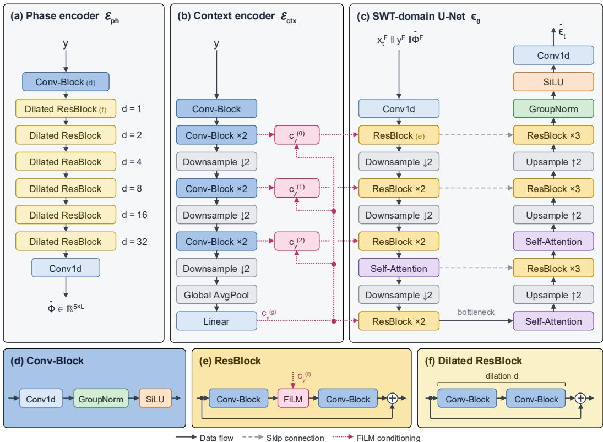  
Figure 5: Block-level architecture of PTSDIFF, complementing the overview in Figure 1. (a) Phase encoder $\mathcal { E } _ { p h } \colon$ a convolutional stem, six dilated residual blocks $( d = 1 , 2 , 4 , 8 , 1 6 , 3 2 )$ whose receptive field spans several cycles, and a projection to the five channels of the predicted phase field $\hat { \Phi }$ which is then frame-transformed as $\hat { \Phi } ^ { \mathrm { F } } = \mathcal { W } ( \hat { \Phi } )$ . (b) Context encoder $\mathcal { E } _ { c t x } { : }$ three strided stages followed by global average pooling, emitting one pooled embedding $c _ { y } ^ { ( \ell ) }$ per U-Net resolution and a global embedding $c _ { y } ^ { ( g ) }$ . (c) SWT-domain denoising U-Net $\epsilon _ { \theta } .$ , taking the channel-wise concatenation $x _ { t } ^ { \mathrm { F } } \parallel y ^ { \mathrm { F } } \parallel \hat { \Phi } ^ { \mathrm { F } } ( 7 ( J + 1 ) = 3 5 $ channels at $J = 4 )$ and predicting $\hat { \epsilon } _ { t } ;$ dashed arrows are skip connections. (d–f) Internal structure of the Conv-Block, the FiLM-modulated ResBlock and the dilated residual block. Each detail panel carries the colour of the block it expands, and the letter shown at a block type’s first occurrence points to its panel. $\times k$ denotes k stacked blocks. Decoder FiLM connections and the diffusion-step embedding are omitted for clarity.

## C.4 EVALUATION METRICS

Table 6 defines the three metrics reported in the main text (Section 4) and the benchmarkspecific metrics used in Table 7 and Figure 7. All metrics are computed per test sample and averaged. Let $x _ { 0 }$ be the clean signal, y the corrupted input, ${ \hat { x } } _ { 0 }$ the estimate, $e ~ = ~ { \hat { x } } _ { 0 } - x _ { 0 }$ and $\begin{array} { r l r } { \tilde { \mathrm { S N R } } ( x _ { 0 } , u ) } & { { } = } & { { 1 0 } \log _ { 1 0 } ( { \sum _ { n } } \breve { x } _ { 0 } [ n ] ^ { 2 } / \sum _ { n } ( u [ n ] ^ { \cdot } - x _ { 0 } [ \stackrel { \cdot } { n } ] ) ^ { 2 } ) } \end{array}$ . For the EEG spectral metric, $\mathrm { P S D } ( x ) ~ = ~ | \mathrm { F F T _ { 4 0 0 } } ( x ) | ^ { 2 } / 4 0 0$ . For EMG, $\begin{array} { r } { \boldsymbol { a } _ { k } ( \boldsymbol { x } ) = \vert I _ { k } \vert ^ { - 1 } \sum _ { n \in I _ { k } } \quad } \end{array}$ |x[n]| is the mean rectified value on the k-th 1000-sample window and $\begin{array} { r } { \mathrm { M F } _ { m } ( x ) = \sum _ { i } f _ { i } S _ { x } [ i , \stackrel {  } { m } ] / \sum _ { i } S _ { x } [ i , m ] } \end{array}$ the mean frequency of frame m, with $S _ { x }$ the STFT magnitude over 10–500 Hz and A the active-stimulus frames (Wang et al., 2023).

Table 6: Evaluation metrics. The first block is reported for every modality; the remainder are the benchmark-specific metrics conventionally used in each literature.
<table><tr><td>Setting</td><td>Metric</td><td>Direction</td><td>Definition</td></tr><tr><td>All modalities</td><td>∆SNR</td><td>↑</td><td> $\mathrm { S N R } ( x _ { 0 } , \hat { x } _ { 0 } ) - \mathrm { S N R } ( x _ { 0 } , y )$ </td></tr><tr><td>All modalities</td><td>PRD</td><td>↓</td><td> $1 0 0 \sqrt { \textstyle \sum _ { n } e [ n ] ^ { 2 } / \textstyle \sum _ { n } ( x _ { 0 } [ n ] - \bar { x } _ { 0 } ) ^ { 2 } }$ </td></tr><tr><td>All modalities</td><td>CC</td><td>↑</td><td>∑n(x0[n]−x0)(x0[n]−x0)  $\begin{array} { r } { \sqrt { \sum _ { n } ( x _ { 0 } [ n ] - \bar { x } _ { 0 } ) ^ { 2 } \sum _ { n } ( \hat { x } _ { 0 } [ n ] - \bar { \hat { x } } _ { 0 } ) ^ { 2 } } } \end{array}$ </td></tr><tr><td>ECG</td><td>SSD</td><td>↓</td><td> $\textstyle \sum _ { n } e [ n ] ^ { 2 }$ </td></tr><tr><td>ECG</td><td>MAD</td><td>↓</td><td> $\operatorname* { m a x } _ { n } \left| e [ n ] \right|$ </td></tr><tr><td>ECG</td><td>CosSim</td><td>↑</td><td> $\langle x _ { 0 } , { \hat { x } } _ { 0 } \rangle { \big / } ( { \| } x _ { 0 } { \| } _ { 2 } { \| } { \hat { x } } _ { 0 } { \| } _ { 2 } )$ </td></tr><tr><td>PPG</td><td>RMSE</td><td>↓</td><td> $\textstyle { \sqrt { L ^ { - 1 } \sum _ { n } e [ n ] ^ { 2 } } }$ </td></tr><tr><td>PPG</td><td> $\mathrm { P R D } _ { \mathrm { P P G } }$ </td><td>↓</td><td> $\dot { 1 } 0 0 \sqrt { \sum _ { n } e [ n ] ^ { 2 } / \sum _ { n } x _ { 0 } [ n ] ^ { 2 } }$ </td></tr><tr><td>EEG</td><td>RRMSEt</td><td>↓</td><td> $\sqrt { \mathrm { m e a n } ( e ^ { 2 } ) } / \sqrt { \mathrm { m e a n } ( x _ { 0 } ^ { 2 } ) }$ </td></tr><tr><td>EEG</td><td>RRMSEs</td><td>↓</td><td>Relative RMSE between PSD(0) and  $\mathrm { P S D } ( x _ { 0 } )$ </td></tr><tr><td>EMG</td><td>RMSE</td><td>↓</td><td> $\textstyle { \sqrt { L ^ { - 1 } \sum _ { n } e [ n ] ^ { 2 } } }$ </td></tr><tr><td>EMG</td><td>ARV</td><td>↓</td><td> $\begin{array} { r } { \dot { \sqrt { K ^ { - 1 } \sum _ { k } ( a _ { k } ( x _ { 0 } ) - a _ { k } ( \hat { x } _ { 0 } ) ) ^ { 2 } } } } \end{array}$ </td></tr><tr><td>EMG</td><td>MF</td><td>↓</td><td> $\begin{array} { r } { \sqrt { | A | ^ { - 1 } \sum _ { m \in { \cal A } } ( \mathrm { M F } _ { m } ( x _ { 0 } ) - \mathrm { M F } _ { m } ( \hat { x } _ { 0 } ) ) ^ { 2 } } } \end{array}$ </td></tr><tr><td>Classification</td><td>AUROC</td><td>↑</td><td>One-vs-rest AUC; macro:  $C ^ { - 1 } \textstyle \sum _ { c } \mathrm { A U R O C } _ { c }$ </td></tr></table>

## C.5 STATISTICAL EVALUATION PROCEDURE

Unless stated otherwise, reported values carry 95% bootstrap confidence intervals over 1,000 resamples (Strodthoff et al., 2021); Table 1 instead reports mean ± standard deviation over three training seeds (Section 4). Paired comparisons pair samples by test-set index, so each comparison uses the difference between PTSDIFF and a baseline on the same signal. For metric m the paired advantage is $\Delta _ { i } = m _ { i } ^ { \mathrm { P T S D I F F } } - m$ baseline where higher is better and the negation otherwise, so $\Delta _ { i } > 0$ always favours PTSDIFF. We test $\Delta _ { i } > 0$ with a one-sided Wilcoxon signed-rank test (Woolson, 2008), chosen because it does not assume normally distributed differences, excluding zero differences by the standard procedure. Multiple PTSDIFF–baseline comparisons are corrected by Holm–Bonferroni at $\alpha = 0 . 0 5$ . Table 12 reports mean paired advantage and adjusted p-values; all comparisons favor PTSDIFF and all remain significant after correction.

## D EXTENDED RESULTS

## D.1 FULL ECG RESULTS ACROSS DATASETS

Table 7 gives all reported metrics on PTB-XL, QTDB and MIT-BIH, including the classical baselines omitted from the main text and the SSD/MAD/CosSim metrics used by prior ECG work (Li et al., 2024; 2026). PTSDIFF is best on every metric and dataset except MAD on QTDB, where it ties TFCDiff.

## D.2 RESULTS STRATIFIED BY CORRUPTION LEVEL

Section 5 summarizes the finding that PTSDIFF’s advantage increases under heavier corruption. Tables 8–10 stratify ECG performance by the corruption scaling factor λ and report both our main metrics and the metrics used by prior work. PTSDIFF is best on every metric in every bin on every dataset, except MAD in the 0.2–0.6 and 0.6–1.0 bins. Figure 6 gives the corresponding stratification for the other three modalities. Figure 7 repeats this stratification with each benchmark’s own metrics (Table 6): the ordering follows the main metrics on PPG and EEG, while ARV and mean-frequency error on EMG are mixed under heavy corruption.

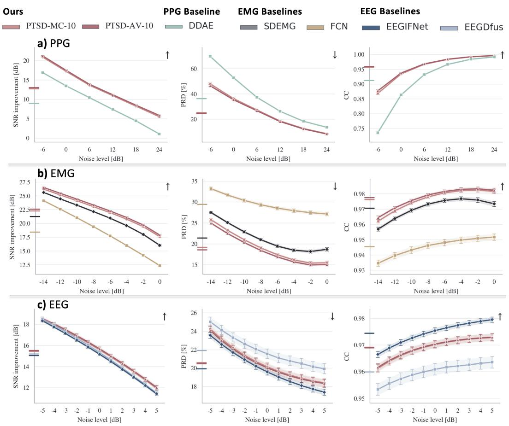  
Figure 6: Restoration across corruption levels for PPG-DaLiA (a), NinaPro (b) and EEGdenoiseNet (c), grouped by each modality’s corruption grid. The y-intercept marks the average per model and metric; arrows indicate the better direction.

Table 7: Denoising comparison across ECG datasets (PTB-XL, QTDB, MIT-BIH). Values are mean ± 95% CI. ↑ higher is better, ↓ lower is better. Bold and underlined values mark the best and second-best denoising method within each dataset and metric.
<table><tr><td>Dataset</td><td>Model</td><td>∆SNR ↑</td><td>PRD [%] ↓</td><td>CC↑</td><td> $\mathrm { S S D \downarrow }$ </td><td> $\mathbf { M A D \downarrow }$ </td><td>CosSim ↑</td></tr><tr><td rowspan="15">PTB-XL</td><td>Noisy  $( \mathrm { S N R _ { i n } = - 2 . 0 d B ) }$ </td><td>0.00</td><td> $1 5 2 . 8 6 \pm 3 . 6 7$ </td><td> $0 . 6 1 \pm 0 . 0 1$ </td><td>一  $2 1 0 . 6 6 \pm 1 7 . 4 4$ </td><td> $0 . 6 0 \pm 0 . 0 2$ </td><td> $0 . 6 0 \pm 0 . 0 1$ </td></tr><tr><td>FIR filter</td><td> $7 . 4 4 \pm 0 . 1 4$ </td><td> $6 4 . 1 3 \pm 1 . 4 4$ </td><td> $0 . 8 3 \pm 0 . 0 1$ </td><td> $3 5 . 5 2 \pm 2 . 6 1$ </td><td> $0 . 3 6 \pm 0 . 0 1$ </td><td> $0 . 8 3 \pm 0 . 0 1$ </td></tr><tr><td>SWT denoising</td><td> $6 . 2 2 \pm 0 . 1 6$ </td><td> $6 8 . 1 6 \pm 1 . 1 9$ </td><td> $0 . 7 6 \pm 0 . 0 1$ </td><td> $3 5 . 0 2 \pm 2 . 1 6$ </td><td> $0 . 3 5 \pm 0 . 0 1$ </td><td> $0 . 7 6 \pm 0 . 0 1$ </td></tr><tr><td>TCDAE</td><td> $1 2 . 2 9 \pm 0 . 1 7$ </td><td> $3 4 . 0 3 \pm 0 . 6 5$ </td><td> $0 . 9 5 \pm 0 . 0 0$ </td><td> $8 . 7 1 \pm 0 . 7 6$ </td><td> $0 . 2 5 \pm 0 . 0 1$ </td><td> $0 . 9 5 \pm 0 . 0 0$ </td></tr><tr><td>DeScoD-1</td><td> $1 1 . 8 2 \pm 0 . 1 9$ </td><td> $3 6 . 1 1 \pm 0 . 7 0$ </td><td> $0 . 9 2 \pm 0 . 0 0$ </td><td> $1 0 . 1 4 \pm 0 . 9 7$ </td><td> $0 . 2 6 \pm 0 . 0 1$ </td><td> $0 . 9 2 \pm 0 . 0 0$ </td></tr><tr><td>DeScoD-3</td><td> $1 3 . 1 8 \pm 0 . 1 9$ </td><td> $3 1 . 0 4 \pm 0 . 6 1$ </td><td> $0 . 9 4 \pm 0 . 0 0$ </td><td> $7 . 7 3 \pm 0 . 8 9$ </td><td> $0 . 2 2 \pm 0 . 0 1$ </td><td> $0 . 9 4 \pm 0 . 0 0$ </td></tr><tr><td> $\mathrm { D e S c o D } { - } 5$ </td><td> $1 3 . 4 9 \pm 0 . 2 0$ </td><td> $2 9 . 9 9 \pm 0 . 5 9$ </td><td> $0 . 9 4 \pm 0 . 0 0$ </td><td> $7 . 3 4 \pm 1 . 0 1$ </td><td> $0 . 2 1 \pm 0 . 0 1$ </td><td> $0 . 9 4 \pm 0 . 0 0$ </td></tr><tr><td> $\mathrm { D e S c o D - 1 0 }$ </td><td> $1 3 . 7 8 \pm 0 . 2 0$ </td><td>29.05 ± 0.57</td><td> $0 . 9 5 \pm 0 . 0 0$ </td><td> $6 . 9 1 \pm 0 . 9 3$ </td><td> $0 . 2 0 \pm 0 . 0 1$ </td><td> $0 . 9 5 \pm 0 . 0 0$ </td></tr><tr><td>TFCDiff-1</td><td> $1 1 . 5 3 \pm 0 . 1 8$ </td><td> $3 6 . 9 5 \pm 0 . 7 1$ </td><td> $0 . 9 1 \pm 0 . 0 0$ </td><td> $1 1 . 3 8 \pm 1 . 5 7$ </td><td> $0 . 2 4 \pm 0 . 0 1$ </td><td> $0 . 9 1 \pm 0 . 0 0$ </td></tr><tr><td>TFCDiff-3</td><td> $1 2 . 8 6 \pm 0 . 1 8$ </td><td> $3 1 . 9 8 \pm 0 . 6 5$ </td><td>0.93 ± 0.00</td><td> $9 . 1 6 \pm 1 . 3 8$ </td><td> $0 . 2 2 \pm 0 . 0 1$ </td><td> $0 . 9 3 \pm 0 . 0 0$ </td></tr><tr><td>TFCDiff-5</td><td>13.19 ± 0.19</td><td>30.86 ± 0.64</td><td> $0 . 9 4 \pm 0 . 0 0$ </td><td>8.61 ± 1.31</td><td>0.21 ± 0.01</td><td> $0 . 9 4 \pm 0 . 0 0$ </td></tr><tr><td>TFCDiff-10</td><td> $1 3 . 4 7 \pm 0 . 1 9$ </td><td> $2 9 . 9 1 \pm 0 . 6 1$ </td><td> $0 . 9 4 \pm 0 . 0 0$ </td><td> $8 . 3 0 \pm 1 . 3 8$ </td><td> $0 . 2 1 \pm 0 . 0 1$ </td><td> $0 . 9 4 \pm 0 . 0 0$ </td></tr><tr><td>PTSDIFF-MC-10</td><td> $\underline { { 1 5 . 7 9 \pm 0 . 2 1 } }$ </td><td> $2 3 . 1 7 \pm 0 . 5 1$ </td><td> $\underline { { 0 . 9 7 \pm 0 . 0 0 } }$ </td><td> $4 . 2 6 \pm 0 . 5 1$ </td><td> $\underline { { 0 . 1 5 \pm 0 . 0 1 } }$ </td><td> $\underline { { 0 . 9 7 \pm 0 . 0 0 } }$ </td></tr><tr><td>PTSDIFF-AV-10</td><td> $\mathbf { 1 6 . 0 9 \pm 0 . 2 1 }$ </td><td> $\mathbf { 2 2 . 4 3 \pm 0 . 5 0 }$ </td><td> $\mathbf { 0 . 9 7 \pm 0 . 0 0 }$ </td><td> $\mathbf { 4 . 0 0 \pm 0 . 5 0 }$ </td><td> ${ \bf 0 . 1 5 \pm 0 . 0 1 }$ </td><td> $\mathbf { 0 . 9 7 \pm 0 . 0 0 }$ </td></tr><tr><td rowspan="11">QTDB</td><td> $\mathrm { N o i s y \ ( S N R _ { i n } = - 0 . 8 d B ) }$ </td><td>0.00</td><td> $1 3 3 . 5 8 \pm 0 . 8 9$ </td><td> $0 . 6 5 \pm 0 . 0 0$ </td><td> $4 1 3 . 5 4 \pm 1 0 . 8 4$ </td><td> $0 . 8 0 \pm 0 . 0 1$ </td><td> $0 . 6 4 \pm 0 . 0 0$ </td></tr><tr><td>FIR filter</td><td> $6 . 4 8 \pm 0 . 0 4$ </td><td> $6 0 . 0 4 \pm 0 . 3 6$ </td><td> $0 . 8 5 \pm 0 . 0 0$ </td><td> $7 9 . 4 2 \pm 2 . 0 6$ </td><td> $0 . 5 2 \pm 0 . 0 1$ </td><td> $0 . 8 5 \pm 0 . 0 0$ </td></tr><tr><td>SWT denoising</td><td> $6 . 2 5 \pm 0 . 0 4$ </td><td> $5 9 . 4 3 \pm 0 . 3 1$ </td><td> $0 . 8 2 \pm 0 . 0 0$ </td><td> $7 6 . 1 5 \pm 1 . 9 0$ </td><td> $0 . 4 7 \pm 0 . 0 0$ </td><td> $0 . 8 1 \pm 0 . 0 0$ </td></tr><tr><td>TCDAE</td><td> $1 0 . 3 3 \pm 0 . 0 5$ </td><td> $3 6 . 2 2 \pm 0 . 1 6$ </td><td> $0 . 9 5 \pm 0 . 0 0$ </td><td> $2 9 . 4 5 \pm 1 . 0 9$ </td><td> $0 . 4 0 \pm 0 . 0 0$ </td><td> $0 . 9 4 \pm 0 . 0 0$ </td></tr><tr><td> $\mathrm { D e S c o D - 1 0 }$ </td><td> $1 1 . 0 7 \pm 0 . 0 6$ </td><td> $3 3 . 9 1 \pm 0 . 1 7$ </td><td> $0 . 9 4 \pm 0 . 0 0$ </td><td> $4 2 . 2 1 \pm 2 . 7 3$ </td><td> $0 . 3 8 \pm 0 . 0 0$ </td><td> $0 . 9 3 \pm 0 . 0 0$ </td></tr><tr><td>TFCDiff-10</td><td> $1 1 . 7 1 \pm 0 . 0 6$ </td><td> $3 1 . 8 5 \pm 0 . 1 7$ </td><td> $0 . 9 4 \pm 0 . 0 0$ </td><td> $4 6 . 4 8 \pm 3 . 2 5$ </td><td> ${ \bf 0 . 3 3 \pm 0 . 0 0 }$ </td><td> $0 . 9 4 \pm 0 . 0 0$ </td></tr><tr><td> $\mathrm { P T S D I F F - M C - 1 0 }$ </td><td> $\underline { { 1 3 . 0 5 \pm 0 . 0 6 } }$ </td><td> $2 7 . 0 1 \pm 0 . 1 4$ </td><td> $0 . 9 6 \pm 0 . 0 0$ </td><td> $\underline { { 1 5 . 3 8 \pm 0 . 5 0 } }$ </td><td> $0 . 3 3 \pm 0 . 0 0$ </td><td> $0 . 9 6 \pm 0 . 0 0$ </td></tr><tr><td> $\mathrm { P T S D I F F - A V - 1 0 }$ </td><td> $\mathbf { 1 3 . 2 3 \pm 0 . 0 6 }$ </td><td> $\mathbf { 2 6 . 5 1 \pm 0 . 1 4 }$ </td><td> $\mathbf { 0 . 9 6 \pm 0 . 0 0 }$ </td><td> $\mathbf { i } \overline { { 4 . 8 4 \pm 0 . 4 9 } }$ </td><td> $\underline { { 0 . 3 3 \pm 0 . 0 0 } }$ </td><td> $\mathbf { 0 . 9 6 \pm 0 . 0 0 }$ </td></tr><tr><td rowspan="8">MIT-BIH</td><td> $\mathrm { N o i s y \ ( S N R _ { i n } = - 1 . 7 d B ) }$ </td><td>0.00</td><td> $1 4 8 . 0 7 \pm 2 . 6 7$ </td><td> $0 . 6 2 \pm 0 . 0 1$ </td><td>1  $9 2 1 . 7 1 \pm 4 8 . 6 8$ </td><td> $1 . 2 7 \pm 0 . 0 3$ </td><td> $0 . 6 1 \pm 0 . 0 1$ </td></tr><tr><td>FIR filter</td><td> $6 . 8 2 \pm 0 . 1 1$ </td><td> $6 4 . 7 2 \pm 1 . 0 5$ </td><td> $0 . 8 3 \pm 0 . 0 0$ </td><td> $1 7 2 . 4 3 \pm 9 . 0 5$ </td><td> $0 . 8 1 \pm 0 . 0 2$ </td><td> $0 . 8 3 \pm 0 . 0 0$ </td></tr><tr><td>SWT denoising</td><td> $6 . 4 8 \pm 0 . 1 2$ </td><td> $6 4 . 4 2 \pm 0 . 9 2$ </td><td> $0 . 7 8 \pm 0 . 0 0$ </td><td> $1 7 0 . 1 7 \pm 8 . 7 8$ </td><td> $0 . 7 5 \pm 0 . 0 2$ </td><td> $0 . 7 8 \pm 0 . 0 0$ </td></tr><tr><td>TCDAE</td><td> $1 1 . 2 1 \pm 0 . 1 3$ </td><td> $3 7 . 1 0 \pm 0 . 5 2$ </td><td> $0 . 9 3 \pm 0 . 0 0$ </td><td> $5 8 . 0 7 \pm 3 . 4 2$ </td><td> $0 . 6 5 \pm 0 . 0 2$ </td><td> $0 . 9 3 \pm 0 . 0 0$ </td></tr><tr><td>DeScoD-10</td><td> $1 1 . 2 5 \pm 0 . 1 5$ </td><td> $3 7 . 7 5 \pm 0 . 5 5$ </td><td> $0 . 9 1 \pm 0 . 0 0$ </td><td> $7 3 . 2 2 \pm 4 . 5 5$ </td><td> $0 . 6 4 \pm 0 . 0 2$ </td><td> $0 . 9 1 \pm 0 . 0 0$ </td></tr><tr><td>TFCDiff-10</td><td> $1 1 . 2 1 \pm 0 . 1 5$ </td><td> $3 7 . 8 5 \pm 0 . 5 8$ </td><td> $0 . 9 1 \pm 0 . 0 0$ </td><td> $7 9 . 9 7 \pm 5 . 1 9$ </td><td> $0 . 6 0 \pm 0 . 0 2$ </td><td> $0 . 9 1 \pm 0 . 0 0$ </td></tr><tr><td> $\mathrm { P T S D I F F - M C - 1 0 }$ </td><td> $\underline { { 1 3 . 6 8 \pm 0 . 1 6 } }$ </td><td> $2 8 . 5 3 \pm 0 . 4 7$ </td><td> $\underline { { 0 . 9 5 \pm 0 . 0 0 } }$ </td><td> $\underline { { 3 7 . 2 2 \pm 3 . 0 8 } }$ </td><td> $\underline { { 0 . 5 5 \pm 0 . 0 2 } }$ </td><td> $\underline { { 0 . 9 5 \pm 0 . 0 0 } }$ </td></tr><tr><td> $\mathrm { P T S D I F F - A V - 1 0 }$ </td><td> $\mathbf { 1 3 . 8 8 \pm 0 . 1 6 }$ </td><td> $\mathbf { 2 7 . 9 3 \pm 0 . 4 7 }$ </td><td> $\mathbf { 0 . 9 5 \pm 0 . 0 0 }$ </td><td> $\mathbf { 3 5 . 8 6 \pm 3 . 0 0 }$ </td><td> ${ \bf 0 . 5 5 \pm 0 . 0 2 }$ </td><td> $\mathbf { 0 . 9 5 \pm 0 . 0 0 }$ </td></tr></table>

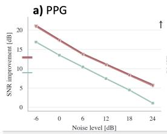

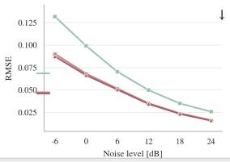

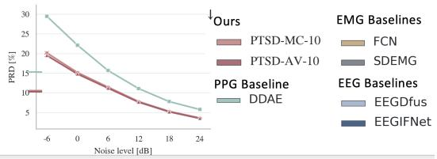

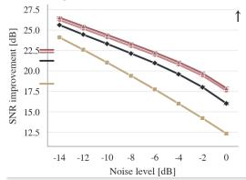  
c) EEG

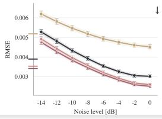

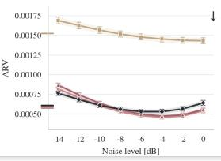

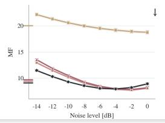

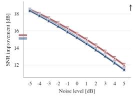

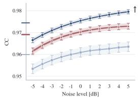

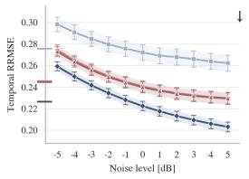

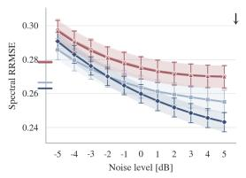  
Figure 7: Restoration across corruption levels using each benchmark’s own metrics. (a) PPG-DaLiA (∆SNR, RMSE, PRD), following Lai et al. (2025). (b) NinaPro (∆SNR, RMSE, ARV, MF), following Liu et al. (2024). (c) EEGdenoiseNet (∆SNR, CC, temporal and spectral RRMSE), following Huang et al. (2025). On PPG and EEG the ordering follows the main metrics; on EMG, ARV and meanfrequency error are more mixed under heavy corruption, consistent with trajectory averaging mildly smoothing amplitude and spectral summaries (Appendix B.2).

Table 8: Denoising comparison by noise level on PTB-XL. Values are mean ± 95% CI. ↑ higher is better, ↓ lower is better. Bold marks the best and underline the second best within each bin and metric.
<table><tr><td>Noise level</td><td>Model</td><td>∆SNR ↑</td><td>PRD [%] ↓</td><td>CC ↑</td><td>SSD ↓</td><td>MAD ↓</td><td>CosSim ↑</td></tr><tr><td>0.2-0.6</td><td>Noisy</td><td>0.00</td><td>55.45 ± 2.05</td><td>0.87 ± 0.01</td><td>22.48 ± 2.70</td><td>0.21 ± 0.01</td><td>0.87 ± 0.01</td></tr><tr><td></td><td>FIR filter</td><td>6.79 ± 0.28</td><td>25.28 ± 0.92</td><td>0.96 ± 0.00</td><td>4.68 ± 0.63</td><td>0.13 ± 0.01</td><td>0.96 ± 0.00</td></tr><tr><td rowspan="12"></td><td>SWT denoising</td><td>3.04 ± 0.38</td><td>38.20 ± 1.12</td><td>0.92 ± 0.01</td><td>9.88 ± 1.57</td><td>0.17 ± 0.01</td><td>0.92 ± 0.01</td></tr><tr><td>TCDAE</td><td>8.14 ± 0.34</td><td>21.25 ± 0.67</td><td>0.98 ± 0.00</td><td>2.66 ± 0.32</td><td>0.13 ± 0.01</td><td>0.98 ± 0.00</td></tr><tr><td>DeScoD-1</td><td>7.49 ± 0.35</td><td>23.23 ± 0.88</td><td>0.97 ± 0.00</td><td>3.73 ± 0.60</td><td>0.12 ± 0.01</td><td>0.97 ± 0.00</td></tr><tr><td>DeScoD-3</td><td>8.83 ± 0.37</td><td>20.08 ± 0.80</td><td>0.98 ± 0.00</td><td>3.00 ± 0.59</td><td>0.11 ± 0.01</td><td>0.98 ± 0.00</td></tr><tr><td>DeScoD-5</td><td>9.13 ± 0.38</td><td>19.45 ± 0.80</td><td>0.98 ± 0.00</td><td>2.75 ± 0.53</td><td>0.10 ± 0.01</td><td>0.98 ± 0.00</td></tr><tr><td>DeScoD-10</td><td>9.39 ± 0.38</td><td>18.94 ± 0.79</td><td>0.98 ± 0.00</td><td>2.63 ± 0.51</td><td>0.10 ± 0.01</td><td>0.98 ± 0.00</td></tr><tr><td>TFCDiff-1</td><td>7.25 ± 0.32</td><td>23.76 ± 0.89</td><td>0.97 ± 0.00</td><td>4.20 ± 0.74</td><td>0.13 ± 0.01</td><td>0.97 ± 0.00</td></tr><tr><td>TFCDiff-3</td><td>8.62 ± 0.34</td><td>20.55 ± 0.88</td><td>0.97 ± 0.00</td><td>3.56 ± 0.79</td><td>0.12 ± 0.01</td><td>0.97 ± 0.00</td></tr><tr><td>TFCDiff-5</td><td>8.99 ± 0.34</td><td>19.75 ± 0.85</td><td>0.98 ± 0.00</td><td>3.33 ± 0.71</td><td>0.12 ± 0.01</td><td>0.98 ± 0.00</td></tr><tr><td>TFCDiff-10</td><td>9.30 ± 0.34</td><td>19.09 ± 0.83</td><td>0.98 ± 0.00</td><td>3.03 ± 0.64</td><td>0.11 ± 0.01</td><td>0.98 ± 0.00</td></tr><tr><td>PTSDIFF-MC-10</td><td>10.99 ± 0.37</td><td>15.67 ± 0.63</td><td>0.99 ± 0.00</td><td>1.55 ± 0.19</td><td>0.08 ± 0.00</td><td>0.99 ± 0.00</td></tr><tr><td>0.6-1.0</td><td>PTSDIFF-AV-10</td><td>11.29 ± 0.37</td><td>15.17 ± 0.60</td><td>0.99 ± 0.00</td><td>1.44 ± 0.18</td><td>0.07 ± 0.00</td><td>0.99 ± 0.00</td></tr><tr><td></td><td>FIR filter</td><td>0.00</td><td>113.84 ± 3.56</td><td>0.68 ± 0.01</td><td>100.30 ± 14.05</td><td>0.44 ± 0.02</td><td>0.67 ± 0.01</td></tr><tr><td rowspan="12"></td><td>Noisy</td><td>7.64 ± 0.30</td><td>47.50 ± 1.48</td><td>0.90 ± 0.01</td><td>17.41 ± 2.44</td><td>0.26 ± 0.02</td><td></td></tr><tr><td>SWT denoising</td><td>6.14 ± 0.30</td><td>55.08 ± 1.31</td><td>0.83 ± 0.01</td><td>20.16 ± 2.15</td><td>0.27 ± 0.01</td><td>0.90 ± 0.01 0.83 ± 0.01</td></tr><tr><td>TCDAE</td><td>12.07 ± 0.31</td><td>28.29 ± 0.90</td><td>0.97 ± 0.00</td><td>5.23 ± 0.91</td><td>0.19 ± 0.01</td><td></td></tr><tr><td>DeScoD-1</td><td>11.50 ± 0.31</td><td>30.46 ± 1.01</td><td>0.95 ± 0.00</td><td>6.56 ± 1.08</td><td>0.19 ± 0.02</td><td>0.97 ± 0.00</td></tr><tr><td>DeScoD-3</td><td>12.89 ± 0.33</td><td>26.11 ± 0.90</td><td>0.96 ± 0.00</td><td>5.00 ± 0.90</td><td>0.17 ± 0.01</td><td>0.95 ± 0.00</td></tr><tr><td>DeScoD-5</td><td>13.15 ± 0.33</td><td>25.36 ± 0.90</td><td>0.96 ± 0.00</td><td>4.63 ± 0.79</td><td>0.16 ± 0.01</td><td>0.96 ± 0.00</td></tr><tr><td>DeScoD-10</td><td>13.47 ± 0.34</td><td>24.48 ± 0.86</td><td>0.97 ± 0.00</td><td>4.37 ± 0.77</td><td></td><td>0.96 ± 0.00</td></tr><tr><td>TFCDiff-1</td><td>10.86 ± 0.29</td><td>32.63 ± 1.06</td><td>0.94 ± 0.00</td><td>7.70 ± 1.24</td><td>0.16 ± 0.01 0.20 ± 0.01</td><td>0.97 ± 0.00</td></tr><tr><td>TFCDiff-3</td><td>12.17 ± 0.29</td><td>28.22 ± 0.97</td><td>0.95 ± 0.00</td><td>6.11 ± 1.12</td><td>0.19 ± 0.01</td><td>0.94 ± 0.00</td></tr><tr><td>TFCDiff-5</td><td>12.51 ± 0.31</td><td>27.18 ± 0.96</td><td>0.96 ± 0.00</td><td>5.81 ± 1.14</td><td>0.18 ± 0.01</td><td>0.95 ± 0.00</td></tr><tr><td>TFCDiff-10</td><td>12.78 ± 0.31</td><td>26.38 ± 0.94</td><td>0.96 ± 0.00</td><td>5.39 ± 0.99</td><td>0.18 ± 0.01</td><td>0.96 ± 0.00 0.96 ± 0.00</td></tr><tr><td>PTSDIFF-MC-10</td><td>15.15 ± 0.37</td><td>20.30 ± 0.76</td><td>0.98 ± 0.00</td><td>2.86 ± 0.53</td><td></td><td></td></tr><tr><td></td><td>PTSDIFF-AV-10</td><td>15.40 ± 0.37</td><td>19.79 ± 0.75</td><td>0.98 ± 0.00</td><td>2.75 ± 0.52</td><td>0.12 ± 0.01 0.11 ± 0.01</td><td>0.98 ± 0.00 0.98 ± 0.00</td></tr><tr><td>1.0-1.5</td><td>Noisy</td><td>0.00</td><td>172.88 ± 4.28</td><td>0.53 ± 0.01</td><td>224.67 ± 25.78</td><td>0.68 ± 0.03</td><td>0.52 ± 0.01</td></tr><tr><td rowspan="12"></td><td>FIR filter</td><td>7.63 ± 0.25</td><td>71.84 ± 1.76</td><td>0.81 ± 0.01</td><td>39.18 ± 4.34</td><td>0.40 ± 0.02</td><td></td></tr><tr><td>SWT denoising</td><td>7.21 ± 0.23</td><td>74.04 ± 1.46</td><td>0.73 ± 0.01</td><td>38.98 ± 3.84</td><td>0.38 ± 0.01</td><td>0.81 ± 0.01 0.73 ± 0.01</td></tr><tr><td>TCDAE</td><td>13.78 ± 0.25</td><td>35.68 ± 0.94</td><td>0.95 ± 0.00</td><td>8.65 ± 1.03</td><td>0.26 ± 0.01</td><td>0.95 ± 0.00</td></tr><tr><td>DeScoD-1</td><td>13.27 ± 0.28</td><td>38.29 ± 1.12</td><td>0.91 ± 0.01</td><td>10.77 ± 1.39</td><td>0.28 ± 0.02</td><td>0.91 ± 0.01</td></tr><tr><td>DeScoD-3</td><td>14.64 ± 0.29</td><td>32.82 ± 0.98</td><td>0.94 ± 0.00</td><td>7.99 ± 1.00</td><td>0.24 ± 0.01</td><td>0.94 ± 0.00</td></tr><tr><td>DeScoD-5</td><td>14.94 ± 0.29</td><td>31.73 ± 0.96</td><td>0.94 ± 0.00</td><td>7.54 ± 0.98</td><td>0.23 ± 0.01</td><td>0.94 ± 0.00</td></tr><tr><td>DeScoD-10</td><td>15.27 ± 0.29</td><td>30.63 ± 0.95</td><td>0.94 ± 0.00</td><td>7.11 ± 0.97</td><td>0.22 ± 0.01</td><td>0.94 ± 0.00</td></tr><tr><td>TFCDiff-1</td><td>12.94 ± 0.26</td><td>39.12 ± 1.07</td><td>0.91 ± 0.01</td><td>10.84 ± 1.31</td><td>0.25 ± 0.01</td><td>0.91 ± 0.01</td></tr><tr><td>TFCDiff-3</td><td>14.27 ± 0.27</td><td>33.80 ± 0.97</td><td>0.93 ± 0.01</td><td>8.83 ± 1.29</td><td>0.23 ± 0.01</td><td>0.93 ± 0.01</td></tr><tr><td>TFCDiff-5</td><td>14.62 ± 0.26</td><td>32.48 ± 0.93</td><td>0.94 ± 0.00</td><td>8.03 ± 1.15</td><td>0.22 ± 0.01</td><td>0.94 ± 0.00</td></tr><tr><td>TFCDiff-10</td><td>14.86 ± 0.27</td><td>31.64 ± 0.93</td><td>0.94 ± 0.00</td><td>7.78 ± 1.12</td><td>0.22 ± 0.01</td><td>0.94 ± 0.00</td></tr><tr><td>PTSDIFF-MC-10</td><td>17.46 ± 0.30</td><td>24.12 ± 0.86</td><td>0.96 ± 0.00</td><td>4.51 ± 0.73</td><td>0.16 ± 0.01</td><td>0.96 ± 0.00</td></tr><tr><td>1.5-2.0</td><td>PTSDIFF-AV-10</td><td>17.79 ± 0.31</td><td>23.29 ± 0.83</td><td>0.97 ± 0.00</td><td>4.16 ± 0.63</td><td>0.16 ± 0.01</td><td>0.97 ± 0.00</td></tr><tr><td></td><td>Noisy</td><td>0.00</td><td>240.37 ± 6.07</td><td>0.42 ± 0.01</td><td>434.06 ± 50.37</td><td>0.96 ± 0.04</td><td>0.41 ± 0.01</td></tr><tr><td rowspan="12"></td><td>FIR filter</td><td>7.56 ± 0.28</td><td>100.72 ± 2.61</td><td></td><td></td><td></td><td></td></tr><tr><td>SWT denoising</td><td>7.80 ± 0.26</td><td>96.59 ± 2.13</td><td>0.70 ± 0.01 0.60 ± 0.01</td><td>71.79 ± 6.82 63.55 ± 5.65</td><td>0.57 ± 0.02 0.52 ± 0.02</td><td>0.70 ± 0.01</td></tr><tr><td>TCDAE</td><td>14.20 ± 0.23</td><td>47.22 ± 1.32</td><td>0.92 ± 0.00</td><td>16.61 ± 2.44</td><td>0.38 ± 0.02</td><td>0.60 ± 0.01 0.92 ± 0.00</td></tr><tr><td>DeScoD-1</td><td>13.99 ± 0.29</td><td>48.96 ± 1.40</td><td>0.86 ± 0.01</td><td>17.82 ± 2.83</td><td>0.40 ± 0.02</td><td>0.86 ± 0.01</td></tr><tr><td>DeScoD-3</td><td>15.30 ± 0.30</td><td>42.24 ± 1.25</td><td>0.89 ± 0.01</td><td>13.73 ± 2.79</td><td>0.34 ± 0.02</td><td>0.89 ± 0.01</td></tr><tr><td>DeScoD-5</td><td>15.65 ± 0.32</td><td>40.63 ± 1.26</td><td>0.90 ± 0.01</td><td>13.21 ± 3.18</td><td>0.33 ± 0.02</td><td>0.90 ± 0.01</td></tr><tr><td>DeScoD-10</td><td>15.93 ± 0.32</td><td>39.43 ± 1.23</td><td>0.91 ± 0.01</td><td>12.42 ± 2.95</td><td>0.32 ± 0.02</td><td>0.91 ± 0.01</td></tr><tr><td>TFCDiff-1</td><td>13.98 ± 0.28</td><td>48.91 ± 1.54</td><td>0.85 ± 0.01</td><td>20.84 ± 5.08</td><td>0.36 ± 0.02</td><td>0.85 ± 0.01</td></tr><tr><td>TFCDiff-3 TFCDiff-5</td><td>15.28 ± 0.29 15.55 ± 0.29</td><td>42.49 ± 1.38 41.18 ± 1.34</td><td>0.89 ± 0.01 0.90 ± 0.01</td><td>16.69 ± 4.57 15.88 ± 4.38</td><td>0.32 ± 0.02 0.31 ± 0.02</td><td>0.89 ± 0.01 0.90 ± 0.01</td></table>

Table 9: Denoising comparison by noise level on QTDB. Values are mean ± 95% CI. ↑ higher is better, ↓ lower is better. Bold marks the best and underline the second best within each bin and metric.
<table><tr><td>Noise level</td><td>Model</td><td>∆SNR ↑</td><td>PRD [%] ↓</td><td>CC↑</td><td>SSD↓</td><td>MAD↓</td><td>CosSim ↑</td></tr><tr><td>0.2-0.6</td><td>Noisy</td><td>0.00</td><td>48.26 ± 0.49</td><td>0.90 ± 0.00</td><td> $4 8 . 5 4 \pm 2 . 2 9$ </td><td> $0 . 2 9 \pm 0 . 0 0$ </td><td> $0 . 9 0 \pm 0 . 0 0$ </td></tr><tr><td></td><td>FIR filter</td><td>4.52 ± 0.09</td><td> $2 7 . 9 7 \pm 0 . 2 6$ </td><td> $0 . 9 6 \pm 0 . 0 0$ </td><td> $1 5 . 9 2 \pm 0 . 7 9$ </td><td> $0 . 2 7 \pm 0 . 0 1$ </td><td> $0 . 9 6 \pm 0 . 0 0$ </td></tr><tr><td></td><td>SWT denoising</td><td> $3 . 0 5 \pm 0 . 1 0$ </td><td>32.84 ± 0.27</td><td>0.95 ± 0.00</td><td> $2 3 . 1 9 \pm 1 . 5 2$ </td><td> $\underline { { 0 . 2 4 } } \pm 0 . 0 0$ </td><td>0.94 ± 0.00</td></tr><tr><td></td><td>TCDAE</td><td>5.02 ± 0.10</td><td>26.09 ± 0.21</td><td>0.98 ± 0.00</td><td> $1 6 . 5 7 \pm 1 . 5 1$ </td><td> $\overline { { 0 . 2 8 \pm 0 . 0 1 } }$ </td><td>0.97 ± 0.00</td></tr><tr><td></td><td>DeScoD-10</td><td>6.08 ± 0.11</td><td>23.66 ± 0.24</td><td>0.97 ± 0.00</td><td> $2 4 . 9 1 \pm 4 . 5 2$ </td><td> $0 . 2 4 \pm 0 . 0 1$ </td><td>0.97 ± 0.00</td></tr><tr><td></td><td>TFCDiff-10</td><td>6.81 ± 0.11</td><td>22.32 ± 0.27</td><td>0.98 ± 0.00</td><td> $3 2 . 8 1 \pm 6 . 1 6$ </td><td> ${ \bf 0 . 2 1 \pm 0 . 0 1 }$ </td><td>0.97 ± 0.00</td></tr><tr><td></td><td>PTSDIFF-MC-10</td><td>7.47 ± 0.11</td><td> $2 0 . 0 5 \pm 0 . 1 9$ </td><td> $0 . 9 8 \pm 0 . 0 0$ </td><td> $8 . 0 4 \pm 0 . 4 1$ </td><td> $0 . 2 7 \pm 0 . 0 1$ </td><td> $0 . 9 8 \pm 0 . 0 0$ </td></tr><tr><td></td><td>PTSDIFF-AV-10</td><td>7.62 ± 0.11</td><td>19.76 ± 0.19</td><td>0.98 ± 0.00</td><td> $\overline { { 7 . 8 4 \pm 0 . 4 0 } }$ </td><td> $0 . 2 7 \pm 0 . 0 1$ </td><td> $\mathbf { 0 . 9 8 \pm 0 . 0 0 }$ </td></tr><tr><td>0.6-1.0</td><td>Noisy</td><td>0.00</td><td>97.02 ± 0.77</td><td>0.73 ± 0.00</td><td>189.20 ± 8.74</td><td>0.59 ± 0.01</td><td> $0 . 7 3 \pm 0 . 0 0$ </td></tr><tr><td></td><td>FIR filter</td><td>6.51 ± 0.08</td><td>45.43 ± 0.32</td><td>0.91 ± 0.00</td><td> $4 1 . 1 2 \pm 1 . 8 8$ </td><td> $0 . 4 0 \pm 0 . 0 1$ </td><td>0.90 ± 0.00</td></tr><tr><td></td><td>SWT denoising</td><td>6.14 ± 0.08</td><td>47.07 ± 0.31</td><td>0.89 ± 0.00</td><td>45.60 ± 2.35</td><td>0.37 ± 0.01</td><td>0.88 ± 0.00</td></tr><tr><td></td><td>TCDAE</td><td>9.90 ± 0.08</td><td>30.94 ± 0.24</td><td>0.96 ± 0.00</td><td>22.39 ± 1.95</td><td>0.33 ± 0.01</td><td>0.96 ± 0.00</td></tr><tr><td></td><td>DeScoD-10</td><td>10.54 ± 0.09</td><td>29.28 ± 0.27</td><td>0.96 ± 0.00</td><td> $3 7 . 9 9 \pm 6 . 1 1$ </td><td> $0 . 3 1 \pm 0 . 0 1$ </td><td>0.95 ± 0.00</td></tr><tr><td></td><td>TFCDiff-10</td><td>11.05 ± 0.10</td><td>28.02 ± 0.31</td><td>0.96 ± 0.00</td><td>46.69 ± 8.23</td><td>0.29 ± 0.01</td><td>0.95 ± 0.00</td></tr><tr><td></td><td>PTSDIFF-MC-10</td><td>12.26 ± 0.09</td><td>24.06 ± 0.23</td><td>0.97 ± 0.00</td><td>11.82 ± 0.63</td><td>0.30 ± 0.01</td><td>0.97 ± 0.00</td></tr><tr><td></td><td>PTSDIFF-AV-10</td><td>12.43 ± 0.10</td><td>23.63 ± 0.23</td><td>0.97 ± 0.00</td><td>11.45 ± 0.61</td><td>0.30 ± 0.01</td><td>0.97 ± 0.00</td></tr><tr><td>1.0-1.5</td><td>Noisy</td><td>0.00</td><td>152.18 ± 1.06</td><td>0.58 ± 0.00</td><td>449.84 ± 17.38</td><td>0.91 ± 0.01</td><td>0.57 ± 0.00</td></tr><tr><td></td><td>FIR filter</td><td>7.14 ± 0.07</td><td> $6 6 . 4 9 \pm 0 . 4 1$ </td><td> $0 . 8 3 \pm 0 . 0 0$ </td><td>84.66 ± 3.11</td><td>0.57 ± 0.01</td><td>0.82 ± 0.00</td></tr><tr><td></td><td>SWT denoising</td><td>7.30 ± 0.06</td><td>64.76 ± 0.38</td><td>0.79 ± 0.00</td><td>81.28 ± 3.05</td><td>0.52 ± 0.01</td><td>0.79 ± 0.00</td></tr><tr><td></td><td>TCDAE</td><td> $1 2 . 1 4 \pm 0 . 0 6$ </td><td>37.57 ± 0.25</td><td>0.94 ± 0.00</td><td>29.46 ± 1.94</td><td> $0 . 4 1 \pm 0 . 0 1$ </td><td>0.94 ± 0.00</td></tr><tr><td></td><td>DeScoD-10</td><td>12.79 ± 0.08</td><td> $3 5 . 5 1 \pm 0 . 2 8$ </td><td> $0 . 9 3 \pm 0 . 0 0$ </td><td> $4 3 . 7 1 \pm 5 . 2 6$ </td><td> $0 . 3 9 \pm 0 . 0 1$ </td><td>0.93 ± 0.00</td></tr><tr><td></td><td>TFCDiff-10</td><td> $1 3 . 3 2 \pm 0 . 0 8$ </td><td> $3 3 . 6 4 \pm 0 . 2 9$ </td><td> $0 . 9 4 \pm 0 . 0 0$ </td><td> $4 6 . 7 1 \pm 6 . 0 6$ </td><td> $0 . 3 5 \pm 0 . 0 1$ </td><td> $0 . 9 4 \pm 0 . 0 0$ </td></tr><tr><td></td><td>PTSDIFF-MC-10</td><td>14.88 ± 0.08</td><td> $2 8 . 1 3 \pm 0 . 2 4$ </td><td> $0 . 9 6 \pm 0 . 0 0$ </td><td> $\underline { { 1 5 . 4 5 \pm 0 . 7 1 } }$ </td><td> $\underline { { 0 . 3 4 \pm 0 . 0 1 } }$ </td><td> $\underline { { 0 . 9 5 \pm 0 . 0 0 } }$ </td></tr><tr><td></td><td>PTSDIFF-AV-10</td><td>15.05 ± 0.08</td><td> $\mathbf { 2 7 . 6 2 \pm 0 . 2 4 }$ </td><td> $\mathbf { 0 . 9 6 \pm 0 . 0 0 }$ </td><td> $\mathbf { 1 4 . 9 3 \pm 0 . 7 0 }$ </td><td> $\mathbf { 0 . 3 4 \pm 0 . 0 1 }$ </td><td> $\mathbf { 0 . 9 6 \pm 0 . 0 0 }$ </td></tr><tr><td>1.5-2.0</td><td>Noisy</td><td>0.00</td><td>213.44 ± 1.36</td><td> $0 . 4 5 \pm 0 . 0 0$ </td><td>856.33 ± 31.74</td><td> $1 . 2 7 \pm 0 . 0 2$ </td><td> $0 . 4 5 \pm 0 . 0 0$ </td></tr><tr><td></td><td>FIR filter</td><td>7.37 ± 0.06</td><td>91.35 ± 0.58</td><td>0.74 ± 0.00</td><td>157.12 ± 6.07</td><td>0.77 ± 0.01</td><td>0.73 ± 0.00</td></tr><tr><td></td><td>SWT denoising</td><td>7.87 ± 0.06</td><td>85.62 ± 0.51</td><td>0.69 ± 0.00</td><td>138.88 ± 5.34</td><td>0.69 ± 0.01</td><td>0.68 ± 0.00</td></tr><tr><td></td><td>TCDAE</td><td>13.15 ± 0.06</td><td>47.31 ± 0.33</td><td>0.91 ± 0.00</td><td>45.53 ± 2.73</td><td>0.55 ± 0.01</td><td>0.90 ± 0.00</td></tr><tr><td></td><td>DeScoD-10</td><td>13.82 ± 0.08</td><td>44.33 ± 0.34</td><td> $0 . 8 9 \pm 0 . 0 0$ </td><td> $5 7 . 8 7 \pm 5 . 6 2$ </td><td> $0 . 5 3 \pm 0 . 0 1$ </td><td>0.88 ± 0.00</td></tr><tr><td></td><td>TFCDiff-10</td><td>14.61 ± 0.08</td><td>40.85 ± 0.36</td><td>0.91 ± 0.00</td><td>56.65 ± 5.84</td><td>0.44 ± 0.01</td><td>0.90 ± 0.00</td></tr><tr><td></td><td>PTSDIFF-MC-10</td><td>16.38 ± 0.08</td><td>33.89 ± 0.33</td><td>0.94 ± 0.00</td><td>24.19 ± 1.55</td><td>0.40 ± 0.01</td><td>0.93 ± 0.00</td></tr><tr><td></td><td>PTSDIFF-AV-10</td><td>16.58 ± 0.08</td><td>33.16 ± 0.32</td><td>0.94 ± 0.00</td><td>23.22 ± 1.51</td><td>0.40 ± 0.01</td><td>0.93 ± 0.00</td></tr></table>

Table 10: Denoising comparison by noise level on MIT-BIH. Values are mean ± 95% CI. ↑ higher is better, ↓ lower is better. Bold marks the best and underline the second best within each bin and metric.
<table><tr><td>Noise level</td><td>Model</td><td>∆SNR ↑</td><td>PRD [%] ↓</td><td>CC↑</td><td>SSD↓</td><td>MAD↓</td><td>CosSim ↑</td></tr><tr><td>0.2-0.6</td><td>Noisy</td><td>0.00</td><td> $5 2 . 7 2 \pm 1 . 5 1$ </td><td> $0 . 8 8 \pm 0 . 0 0$  一</td><td> $9 8 . 3 1 \pm 9 . 2 8 $ </td><td> $0 . 4 4 \pm 0 . 0 2$ </td><td> $0 . 8 8 \pm 0 . 0 1$ </td></tr><tr><td rowspan="5"></td><td>FIR filter</td><td> $5 . 1 5 \pm 0 . 2 6$ </td><td> $2 8 . 5 6 \pm 0 . 7 9$ </td><td> $0 . 9 6 \pm 0 . 0 0$ </td><td> $2 7 . 9 6 \pm 2 . 8 2$ </td><td> $\underline { { 0 . 3 7 \pm 0 . 0 2 } }$ </td><td> $0 . 9 6 \pm 0 . 0 0$ </td></tr><tr><td>SWT denoising</td><td> $3 . 2 8 \pm 0 . 2 9$ </td><td> $3 4 . 9 5 \pm 0 . 8 6$ </td><td> $0 . 9 3 \pm 0 . 0 0$ </td><td> $4 9 . 6 5 \pm 6 . 1 4$ </td><td> $\mathbf { 0 . 3 6 \pm 0 . 0 2 }$ </td><td> $0 . 9 3 \pm 0 . 0 0$ </td></tr><tr><td>TCDAE</td><td> $6 . 6 3 \pm 0 . 2 9$ </td><td> $2 3 . 8 7 \pm 0 . 6 0$ </td><td> $0 . 9 7 \pm 0 . 0 0$ </td><td> $2 2 . 2 8 \pm 3 . 9 7$ </td><td> $0 . 4 1 \pm 0 . 0 2$ </td><td> $0 . 9 7 \pm 0 . 0 0$ </td></tr><tr><td>DeScoD-10</td><td> $6 . 5 8 \pm 0 . 3 1$ </td><td> $2 4 . 9 6 \pm 0 . 7 7$ </td><td> $0 . 9 6 \pm 0 . 0 0$ </td><td> $2 6 . 4 6 \pm 3 . 7 3$ </td><td> $0 . 3 8 \pm 0 . 0 2$ </td><td> $0 . 9 6 \pm 0 . 0 0$ </td></tr><tr><td>TFCDiff-10</td><td> $6 . 2 7 \pm 0 . 3 3$ </td><td> $2 6 . 5 9 \pm 0 . 9 1$ </td><td> $0 . 9 6 \pm 0 . 0 0$ </td><td> $4 0 . 8 2 \pm 6 . 6 8$ </td><td> $0 . 3 9 \pm 0 . 0 3$ </td><td> $0 . 9 6 \pm 0 . 0 0$ </td></tr><tr><td></td><td>PTSDIFF-MC-10</td><td>8.30 ± 0.30</td><td> $2 0 . 2 2 \pm 0 . 6 1$ </td><td> $0 . 9 8 \pm 0 . 0 0$ </td><td> $\underline { { 1 4 . 2 0 \pm 1 . 9 7 } }$ </td><td> $0 . 4 2 \pm 0 . 0 3$ </td><td> $\underline { { 0 . 9 8 \pm 0 . 0 0 } }$ </td></tr><tr><td></td><td>PTSDIFF-AV-10</td><td>8.50 ± 0.30</td><td>19.82 ± 0.61</td><td>0.98 ± 0.00</td><td> $\mathbf { 1 3 . 7 1 \pm 1 . 9 2 }$ </td><td>0.42 ± 0.03</td><td> $\mathbf { 0 . 9 8 \pm 0 . 0 0 }$ </td></tr><tr><td>0.6-1.0</td><td>Noisy</td><td>0.00</td><td> $1 0 8 . 0 2 \pm 2 . 3 3$ </td><td> $0 . 7 0 \pm 0 . 0 1$ </td><td> $4 0 0 . 4 5 \pm 3 3 . 6 9$ </td><td>0.93 ± 0.03</td><td> $0 . 6 9 \pm 0 . 0 1$ </td></tr><tr><td rowspan="5"></td><td>FIR filter</td><td>6.90 ± 0.21</td><td> $4 8 . 6 2 \pm 0 . 9 5$ </td><td> $0 . 8 9 \pm 0 . 0 0$ </td><td> $8 3 . 2 9 \pm 7 . 0 7$ </td><td> $0 . 6 3 \pm 0 . 0 3$ </td><td> $0 . 8 9 \pm 0 . 0 0$ </td></tr><tr><td>SWT denoising</td><td> $6 . 4 4 \pm 0 . 2 1$ </td><td>50.63 ± 0.93</td><td> $0 . 8 6 \pm 0 . 0 0$ </td><td> $9 2 . 6 0 \pm 7 . 8 7$ </td><td> $0 . 5 8 \pm 0 . 0 2$ </td><td> $0 . 8 6 \pm 0 . 0 0$ </td></tr><tr><td>TCDAE</td><td> $1 1 . 2 6 \pm 0 . 2 2$ </td><td> $2 9 . 9 6 \pm 0 . 8 0$ </td><td> $0 . 9 5 \pm 0 . 0 0$ </td><td> $3 7 . 9 8 \pm 6 . 8 1$ </td><td>0.52 ± 0.03</td><td> $0 . 9 5 \pm 0 . 0 0$ </td></tr><tr><td>DeScoD-10</td><td> $1 0 . 8 1 \pm 0 . 2 7$ </td><td> $3 2 . 6 2 \pm 1 . 0 2$ </td><td> $0 . 9 4 \pm 0 . 0 0$ </td><td> $5 3 . 4 5 \pm 8 . 8 2$ </td><td> $0 . 5 3 \pm 0 . 0 3$ </td><td> $0 . 9 4 \pm 0 . 0 0$ </td></tr><tr><td>TFCDiff-10</td><td> $1 0 . 6 1 \pm 0 . 2 8$ </td><td> $3 3 . 3 4 \pm 1 . 0 6$ </td><td> $0 . 9 4 \pm 0 . 0 0$ </td><td> $6 0 . 4 9 \pm 1 0 . 1 6$ </td><td> $0 . 5 1 \pm 0 . 0 3$ </td><td> $0 . 9 4 \pm 0 . 0 0$ </td></tr><tr><td></td><td>PTSDIFF-MC-10</td><td> $\underline { { 1 3 . 1 7 \pm 0 . 2 6 } }$ </td><td> $2 4 . 7 8 \pm 0 . 7 9$ </td><td> $0 . 9 6 \pm 0 . 0 0$ </td><td>26.31 ± 5.83</td><td>0.47 ± 0.03</td><td> $\underline { { 0 . 9 6 \pm 0 . 0 0 } }$ </td></tr><tr><td></td><td>PTSDIFF-AV-10</td><td>13.38 ± 0.27</td><td>24.25 ± 0.78</td><td>0.96 ± 0.00</td><td>25.45 ± 5.80</td><td>0.47 ± 0.03</td><td>0.96 ± 0.00</td></tr><tr><td>1.0-1.5</td><td>Noisy</td><td>0.00</td><td> $1 7 0 . 7 7 \pm 3 . 1 9$ </td><td>0.54 ± 0.01</td><td>1029.43 ± 68.65</td><td>1.48 ± 0.04</td><td>0.53 ± 0.01</td></tr><tr><td rowspan="5"></td><td>FIR filter</td><td> $7 . 3 8 \pm 0 . 1 9$ </td><td> $7 2 . 6 0 \pm 1 . 4 2$ </td><td> $0 . 8 0 \pm 0 . 0 1$ </td><td> $1 8 9 . 4 5 \pm 1 3 . 1 9$ </td><td> $0 . 9 1 \pm 0 . 0 3$ </td><td> $0 . 8 0 \pm 0 . 0 1$ </td></tr><tr><td>SWT denoising</td><td> $7 . 5 4 \pm 0 . 1 8$ </td><td> $7 0 . 7 1 \pm 1 . 2 2$ </td><td> $0 . 7 5 \pm 0 . 0 1$ </td><td> $1 8 7 . 3 6 \pm 1 3 . 5 5$ </td><td> $0 . 8 4 \pm 0 . 0 3$ </td><td> $0 . 7 5 \pm 0 . 0 1$ </td></tr><tr><td>TCDAE</td><td> $1 2 . 6 5 \pm 0 . 1 7$ </td><td> $4 0 . 0 4 \pm 0 . 8 5$ </td><td> $0 . 9 2 \pm 0 . 0 0$ </td><td> $6 2 . 9 9 \pm 5 . 2 6$ </td><td> $0 . 7 0 \pm 0 . 0 3$ </td><td> $0 . 9 2 \pm 0 . 0 0$ </td></tr><tr><td>DeScoD-10 TFCDiff-10</td><td> $1 2 . 7 1 \pm 0 . 2 2$ </td><td> $4 0 . 8 3 \pm 0 . 9 5$ </td><td> $0 . 9 0 \pm 0 . 0 1$ </td><td> $8 3 . 8 4 \pm 8 . 0 8$ </td><td> $0 . 7 1 \pm 0 . 0 3$ </td><td> $0 . 9 0 \pm 0 . 0 1$ </td></tr><tr><td></td><td> $1 2 . 7 3 \pm 0 . 2 2$ </td><td> $4 0 . 6 3 \pm 0 . 9 7$ </td><td> $0 . 9 1 \pm 0 . 0 1$ </td><td> $8 6 . 3 6 \pm 9 . 1 5$ </td><td> $0 . 6 6 \pm 0 . 0 3$ </td><td> $0 . 9 1 \pm 0 . 0 1$ </td></tr><tr><td></td><td>PTSDIFF-MC-10</td><td> $1 5 . 3 8 \pm 0 . 2 2$ </td><td> $3 0 . 2 9 \pm 0 . 8 2$ </td><td> $\underline { { 0 . 9 4 \pm 0 . 0 0 } }$ </td><td> $3 8 . 3 3 \pm 3 . 9 8 $ </td><td> $0 . 5 8 \pm 0 . 0 3$ </td><td> $0 . 9 4 \pm 0 . 0 0$ </td></tr><tr><td></td><td>PTSDIFF-AV-10</td><td> $\mathbf { 1 5 . 5 8 \pm 0 . 2 2 }$ </td><td> $\mathbf { 2 9 . 6 7 \pm 0 . 8 1 }$ </td><td> $\mathbf { 0 . 9 5 \pm 0 . 0 0 }$ </td><td> $\mathbf { 3 6 . 9 2 \pm 3 . 9 4 }$ </td><td> $\mathbf { 0 . 5 7 \pm 0 . 0 3 }$ </td><td> $\mathbf { 0 . 9 4 \pm 0 . 0 0 }$ </td></tr><tr><td>1.5-2.0</td><td>Noisy</td><td>0.00</td><td> $2 3 5 . 0 6 \pm 4 . 3 2$ </td><td> $0 . 4 2 \pm 0 . 0 1$ </td><td> $1 8 9 8 . 2 8 \pm 1 3 7 . 3 2$ </td><td> $1 . 9 9 \pm 0 . 0 6$ </td><td> $0 . 4 1 \pm 0 . 0 1$ </td></tr><tr><td rowspan="5"></td><td>FIR filter</td><td> $7 . 5 1 \pm 0 . 2 1$ </td><td> $9 9 . 4 1 \pm 1 . 8 8 $ </td><td> $0 . 7 1 \pm 0 . 0 1$ </td><td> $3 4 5 . 4 7 \pm 2 4 . 2 4$ </td><td> $1 . 2 0 \pm 0 . 0 4$ </td><td> $0 . 7 1 \pm 0 . 0 1$ </td></tr><tr><td>SWT denoising</td><td> $8 . 0 0 \pm 0 . 1 9$ </td><td> $9 3 . 3 4 \pm 1 . 6 6$ </td><td> $0 . 6 4 \pm 0 . 0 1$ </td><td> $3 1 2 . 9 2 \pm 2 3 . 3 6$ </td><td> $1 . 1 0 \pm 0 . 0 4$ </td><td> $0 . 6 4 \pm 0 . 0 1$ </td></tr><tr><td>TCDAE</td><td> $1 3 . 3 8 \pm 0 . 1 6$ </td><td> $5 0 . 7 3 \pm 1 . 0 5$ </td><td> $0 . 8 9 \pm 0 . 0 1$ </td><td> $9 8 . 0 9 \pm 9 . 4 7$ </td><td> $\smash { 0 . 8 9 \pm 0 . 0 3 }$ </td><td> $0 . 8 8 \pm 0 . 0 1$ </td></tr><tr><td>DeScoD-10</td><td> $1 3 . 8 8 \pm 0 . 2 5$ </td><td> $4 9 . 1 6 \pm 1 . 1 2$ </td><td> $0 . 8 5 \pm 0 . 0 1$ </td><td> $1 1 5 . 1 6 \pm 1 1 . 9 1$ </td><td> $0 . 8 7 \pm 0 . 0 4$ </td><td> $0 . 8 5 \pm 0 . 0 1$ </td></tr><tr><td>TFCDiff-10</td><td> $1 4 . 1 1 \pm 0 . 2 3$ </td><td> $4 7 . 8 4 \pm 1 . 1 6$ </td><td> $0 . 8 6 \pm 0 . 0 1$ </td><td> $1 1 9 . 9 2 \pm 1 3 . 9 9$ </td><td> $0 . 7 8 \pm 0 . 0 4$ </td><td> $0 . 8 6 \pm 0 . 0 1$ </td></tr><tr><td></td><td>PTSDIFF-MC-10 PTSDIFF-AV-10</td><td>16.67 ± 0.24 16.87 ± 0.24</td><td> $3 6 . 6 7 \pm 1 . 1 1$  35.88 ± 1.10</td><td> $0 . 9 2 \pm 0 . 0 1$   $\mathbf { 0 . 9 2 \pm 0 . 0 1 }$ </td><td> $6 3 . 6 8 \pm 9 . 1 4$ </td><td>0.70 ± 0.03</td><td> $\underline { { 0 . 9 2 \pm 0 . 0 1 } }$   $\mathbf { 0 . 9 2 \pm 0 . 0 1 }$ </td></tr></table>

## D.3 CROSS-DATASET GENERALIZATION

Figure 8 evaluates ECG models on MIT-BIH and QTDB with no dataset-specific retraining. PTSDIFF-AV-10 achieves the highest ∆SNR and lowest PRD on both. On MIT-BIH, the diffusion baselines lose their advantage over the deterministic TCDAE while PTSDIFF does not; we read this as evidence for beat-local rather than global rhythm conditioning, since arrhythmic beats violate a global period but leave a local phase field well-defined. Table 11 extends the comparison to the other modalities. On PPG (PPG-DaLiA to BIDMC) and EMG (NinaPro DB2 to DB3), PTSDIFF-AV-10 improves on the strongest baseline in all three metrics, by 2.08 and 1.49 dB ∆SNR over DDAE and SDEMG, respectively. On EEG (EEGdenoiseNet to EEGMMIDB), EEGIFNet stays ahead on all three metrics, by 0.37 dB ∆SNR, consistent with EEG being the modality with the smallest in-domain margin (Table 1). PTSDIFF does however outperform the EEGDfus baseline on all three metrics, by 2.02 dB ∆SNR, 13.54 PRD points and 0.105 CC. On this dataset, all restorers nonetheless perform markedly worse than in-domain, because they remove much of the clean EEG below 4 Hz, the band occupied by the EOG artefacts seen in training.

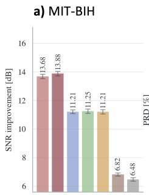

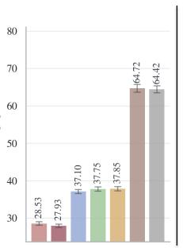

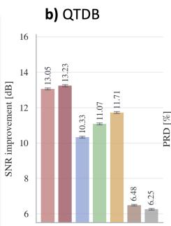

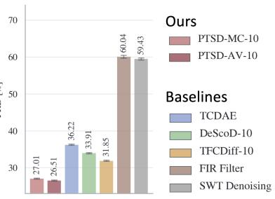  
Figure 8: ECG Cross-dataset generalization to MIT-BIH (a) and QTDB (b) without retraining. Error bars are 95% CI.

Table 11: Dataset shift for all modalities: train on one dataset, evaluate on a held-out dataset with no retraining, against the strongest restoration baseline on the held-out set (named per row). ∆ columns give the margin of PTSDIFF-AV-10 over that baseline (positive = PTSDIFF better) on each of the three main metrics.
<table><tr><td>Modality</td><td>Train</td><td>Held-out</td><td>Best baseline</td><td>∆SNR↑</td><td>∆</td><td>PRD [%] ↓</td><td>∆</td><td>CC↑</td><td>∆</td></tr><tr><td>PPG</td><td>PPG-DaLiA</td><td>BIDMC</td><td>DDAE</td><td>16.41</td><td>+2.08</td><td>32.06</td><td>+8.09</td><td>0.945</td><td>+0.048</td></tr><tr><td>ECG</td><td>PTB-XL</td><td>MIT-BIH</td><td>DeScoD-10</td><td>13.88</td><td>+2.63</td><td>27.93</td><td>+9.83</td><td>0.949</td><td>+0.039</td></tr><tr><td>ECG</td><td>PTB-XL</td><td>QTDB</td><td>TFCDiff-10</td><td>13.23</td><td>+1.52</td><td>26.51</td><td>+5.35</td><td>0.963</td><td>+0.019</td></tr><tr><td>EMG</td><td>NinaPro DB2</td><td>NinaPro DB3</td><td>SDEMG</td><td>23.45</td><td>+1.49</td><td>16.16</td><td>+3.20</td><td>0.985</td><td>+0.007</td></tr><tr><td>EEG</td><td>EEGdenoiseNet</td><td>EEGMMIDB</td><td>EEGIFNet</td><td>5.35</td><td>-0.37</td><td>56.18</td><td>-2.75</td><td>0.808</td><td>-0.029</td></tr></table>

## D.4 PAIRED STATISTICAL COMPARISON

Table 12 reports the paired tests of Appendix C.5 behind the ECG significance claims of Section 5. PTSDIFF-AV-10 is significantly better than every learned and classical baseline on all three main metrics and all three ECG datasets after Holm–Bonferroni correction.

## D.5 EXTENDED DOWNSTREAM EVALUATION

Tables 13 and 14 give the per-class AUROC and the binary beat-classification results summarized in Section 5; Table 15 adds sensitivity, specificity and F1. The threshold-dependent metrics show that the AUROC gains are not a pure ranking effect, but also that PTSDIFF is not uniformly best on sensitivity and specificity, so the downstream benefit depends on the operating point. The PTB-XL classifier is an Inception1d model (Strodthoff et al., 2021) trained on folds 1–8; MIT-BIH uses a CNN adapted from Tahsin et al. (2026) on ±144-sample windows around annotated R-peaks, collapsed to normal versus abnormal. Because the classifier is single-lead, its absolute performance is below 12-lead references (Strodthoff et al., 2021); the comparison across restoration methods is unaffected.

Table 12: Paired statistical comparison of PTSDIFF-AV-10 against denoising baselines across the main metrics. Each cell reports the mean paired difference (PTSDIFF-AV-10 − baseline) in the metric’s native units, with the Holm–Bonferroni-adjusted p-value below. ∆SNR (dB) and CC are higher-is-better, PRD (percentage points) is lower-is-better; stars mark where PTSDIFF-AV-10 is significantly better.
<table><tr><td>Baseline</td><td>Metric</td><td>MIT-BIH</td><td>PTB-XL</td><td>QTDB</td></tr><tr><td rowspan="4">TFCDiff-10</td><td>∆SNR</td><td> $+ 2 . 6 8 ^ { * * * }$ </td><td> $+ 2 . 6 2 ^ { * * * }$   $p _ { a d j } = < 1 e - 3 0 0$ </td><td> $+ 1 . 5 2 ^ { * * * }$   $p _ { a d j } = < 1 e - 3 0 0$ </td></tr><tr><td>PRD [%]</td><td> $\begin{array} { c } { { p _ { a d j } = < 1 e \mathrm { ~ - ~ } 3 0 0 } } \\ { { \mathrm { - 9 . 9 2 } ^ { \ast \ast \ast } } } \end{array}$ </td><td>-7.48***</td><td>-5.35***</td></tr><tr><td rowspan="2">CC</td><td> $\begin{array} { c } { p _ { a d j } = < 1 e - 3 0 0 } \\ { + 0 . 0 3 5 ^ { * * * } } \end{array}$ </td><td> $p _ { a d j } = < 1 e - 3 0 0$ </td><td> $\begin{array} { c } { { p _ { a d j } = < 1 e - 3 0 0 } } \\ { { + 0 . 0 1 9 ^ { * * * } } } \end{array}$ </td></tr><tr><td></td><td>+0.024***</td><td></td></tr><tr><td rowspan="5">TCDAE</td><td>∆SNR</td><td> $p _ { a d j } = < 1 e - 3 0 0$   $+ 2 . 6 7 ^ { * * * }$ </td><td> $p _ { a d j } = 3 . 4 e \mathrm { ~ - ~ } 2 9 0$   $+ 3 . 8 0 ^ { * * * }$ </td><td> $p _ { a d j } = < 1 e - 3 0 0$   $+ 2 . 9 0 ^ { * * * }$ </td></tr><tr><td>PRD [%]</td><td> $\begin{array} { c } { { p _ { a d j } = < 1 e \mathrm { ~ - ~ } 3 0 0 } } \\ { { \mathrm { - 9 . 1 7 ^ { * * * } } } } \end{array}$ </td><td> $\begin{array} { c } { { p _ { a d j } = < 1 e \mathrm { ~ - ~ } 3 0 0 } } \\ { { \mathrm { - 1 1 . 6 0 } ^ { \ast \ast \ast } } } \end{array}$ </td><td> $\begin{array} { c } { { p _ { a d j } = < 1 e \mathrm { ~ - ~ } 3 0 0 } } \\ { { \mathrm { - 9 . 7 1 } ^ { \ast \ast \ast } } } \end{array}$ </td></tr><tr><td rowspan="3">CC</td><td> $\begin{array} { c } { p _ { a d j } = < 1 e - 3 0 0 } \\ { + 0 . 0 1 9 ^ { * * * } } \end{array}$ </td><td> $\begin{array} { c } { p _ { a d j } = < 1 e - 3 0 0 } \\ { + 0 . 0 1 3 ^ { * * * } } \end{array}$ </td><td> $\begin{array} { c } { p _ { { } ^ { a d j } } = < 1 e - 3 0 0 } \\ { + 0 . 0 1 8 ^ { * * * } } \end{array}$ </td></tr><tr><td></td><td></td><td></td></tr><tr><td> $p _ { a d j } = < 1 e - 3 0 0$ </td><td> $p _ { a d j } = 1 . 3 e - 2 6 3$ </td><td> $p _ { a d j } = < 1 e - 3 0 0$ </td></tr><tr><td rowspan="5">DeScoD-10</td><td>∆SNR</td><td> $+ 2 . 6 3 ^ { * * * }$ </td><td> $+ 2 . 3 0 ^ { \ast \ast \ast }$ </td><td> $+ 2 . 1 6 ^ { * * * }$ </td></tr><tr><td rowspan="3">PRD [%]</td><td> $\begin{array} { c } { { p _ { a d j } = < 1 e \mathrm { ~ - ~ } 3 0 0 } } \\ { { \mathrm { - 9 . 8 3 } ^ { * * * } } } \end{array}$ </td><td> $\begin{array} { c } { { p _ { a d j } = < 1 e \mathrm { ~ - ~ } 3 0 0 } } \\ { { - 6 . 6 2 ^ { * * * } } } \end{array}$ </td><td> $\begin{array} { c } { { p _ { a d j } = < 1 e \mathrm { ~ - ~ } 3 0 0 } } \\ { { \mathrm { - 7 . 4 0 ^ { * * * } } } } \end{array}$ </td></tr><tr><td></td><td></td><td></td></tr><tr><td> $\begin{array} { c } { { p _ { a d j } = < 1 e \mathrm { ~ - ~ } 3 0 0 } } \\ { { \mathrm { ~ + 0 . 0 3 9 ^ { * * * } ~ } } } \end{array}$ </td><td> $\begin{array} { c } { { p _ { a d j } = < 1 e - 3 0 0 } } \\ { { + 0 . 0 2 1 ^ { * * * } } } \end{array}$ </td><td> $\begin{array} { c } { { p _ { a d j } = < 1 e - 3 0 0 } } \\ { { + 0 . 0 2 8 ^ { * * * } } } \end{array}$ </td></tr><tr><td rowspan="3">CC</td><td></td><td></td><td></td></tr><tr><td></td><td> $p _ { a d j } = < 1 e - 3 0 0$   $+ 7 . 0 6 ^ { * * * }$ </td><td> $p _ { a d j } = < 1 e - 3 0 0$ </td><td> $p _ { a d j } = < 1 e - 3 0 0$ </td></tr><tr><td>∆SNR</td><td> $p _ { a d j } = < 1 e - 3 0 0$ </td><td> $+ 8 . 6 5 ^ { * * * }$ </td><td> $+ 6 . 7 5 ^ { * * * }$ </td></tr><tr><td rowspan="5"></td><td>PRD [%]</td><td>-36.80***</td><td> $\begin{array} { c } { { p _ { a d j } = < 1 e - 3 0 0 } } \\ { { - 4 1 . 7 0 ^ { * * * } } } \end{array}$ </td><td> $\begin{array} { c } { { p _ { a d j } = < 1 e \mathrm { ~ - ~ } 3 0 0 } } \\ { { \mathrm { - } 3 3 . 5 3 ^ { * * * } } } \end{array}$ </td></tr><tr><td rowspan="3">CC</td><td> $\begin{array} { c } { { p _ { a d j } = < 1 e \mathrm { ~ - ~ } 3 0 0 } } \\ { { + 0 . 1 2 ^ { * * * } } } \end{array}$ </td><td> $\begin{array} { c } { { p _ { a d j } = < 1 e \mathrm { ~ - ~ } 3 0 0 } } \\ { { + 0 . 1 3 ^ { * * * } } } \end{array}$ </td><td> $\begin{array} { c } { { p _ { a d j } = < 1 e \mathrm { ~ - ~ } 3 0 0 } } \\ { { + 0 . 1 1 ^ { * * * } } } \end{array}$ </td></tr><tr><td></td><td></td><td></td></tr><tr><td> $p _ { a d j } = < 1 e - 3 0 0$ </td><td> $p _ { a d j } = < 1 e - 3 0 0$ </td><td> $p _ { a d j } = < 1 e - 3 0 0$ </td></tr><tr><td></td><td> $+ 7 . 4 0 ^ { * * * }$ </td><td> $+ 9 . 8 7 ^ { * * * }$ </td><td></td></tr><tr><td rowspan="5">SWT Denoising</td><td>∆SNR</td><td></td><td></td><td> $+ 6 . 9 8 ^ { * * * }$ </td></tr><tr><td rowspan="3">PRD [%]</td><td> $p _ { a d j } = < 1 e - 3 0 0$ </td><td></td><td> $\begin{array} { c } { { \dot { } } } \\ { { p _ { a d j } = < 1 e - 3 0 0 } } \\ { { - 3 2 . 9 2 ^ { * * * } } } \end{array}$ </td></tr><tr><td></td><td> $\begin{array} { c } { { p _ { a d j } = < 1 e \mathrm { ~ - ~ } 3 0 0 } } \\ { { \mathrm { - 4 5 . 7 3 ^ { * * * } ~ } } } \end{array}$ </td><td></td></tr><tr><td>-36.50***</td><td></td><td></td></tr><tr><td rowspan="2">CC</td><td> $\begin{array} { c } { { p _ { a d j } = < 1 e \mathrm { ~ - ~ } 3 0 0 } } \\ { { + 0 . 1 6 ^ { * * * } } } \end{array}$ </td><td> $p _ { a d j } = < 1 e - 3 0 0$ </td><td> $p _ { a d j } = < 1 e - 3 0 0$ </td></tr><tr><td> $p _ { a d j } = < 1 e - 3 0 0$ </td><td>+0.21***  $p _ { a d j } = < 1 e - 3 0 0$ </td><td>+0.14***  $p _ { a d j } = < 1 e - 3 0 0$ </td></tr></table>

∗∗∗padj < 0.001, $^ { \mathrm { * * } } p _ { \mathrm { a d j } } < 0 . 0 1$ $^ { * } p _ { \mathrm { a d j } } < 0 . 0 5$ after Holm–Bonferroni correction.

Table 13: Per-superdiagnostic-class and macro-averaged AUROC on PTB-XL. Values are point estimates with 95% bootstrap confidence intervals. Bold/underlined: best/second-best (excluding clean/noisy).
<table><tr><td rowspan="2">Model</td><td colspan="5">Per-class AUROC</td><td rowspan="2">Macro</td></tr><tr><td>CD</td><td>HYP</td><td>MI</td><td>NORM</td><td>STTC</td></tr><tr><td>clean</td><td> $. 8 7 1 \pm . 0 1 9$ </td><td> $. 7 8 2 \pm . 0 3 1$ </td><td> $. 8 4 5 \pm . 0 2 0$ </td><td> $. 9 1 6 \pm . 0 1 2$ </td><td> $. 8 7 8 \pm . 0 1 7$ </td><td> $. 8 5 9 \pm . 0 1 1$ </td></tr><tr><td>noisy</td><td> $. 8 3 0 \pm . 0 2 2$ </td><td> $. 7 2 2 \pm . 0 3 4$ </td><td> $. 7 5 3 \pm . 0 2 4$ </td><td> $. 8 6 6 \pm . 0 1 5$ </td><td> $. 8 2 2 \pm . 0 2 0$ </td><td> $. 7 9 9 \pm . 0 1 2$ </td></tr><tr><td>FIR Filter</td><td> $. 8 2 8 \pm . 0 2 3$ </td><td> $. 7 2 9 \pm . 0 3 4$ </td><td> $. 7 5 8 \pm . 0 2 5$ </td><td> $. 8 5 5 \pm . 0 1 5$ </td><td> $. 8 1 8 \pm . 0 2 0$ </td><td> $. 7 9 8 \pm . 0 1 2$ </td></tr><tr><td>SWT Denoising</td><td> $. 7 8 8 \pm . 0 2 4$ </td><td> $. 7 1 6 \pm . 0 3 2$ </td><td> $. 6 5 8 \pm . 0 2 8$ </td><td> $. 7 9 8 \pm . 0 1 9$ </td><td> $. 7 7 2 \pm . 0 2 4$ </td><td> $. 7 4 6 \pm . 0 1 3$ </td></tr><tr><td>TCDAE</td><td> $. 8 5 5 \pm . 0 2 0$ </td><td> $. 7 6 0 \pm . 0 3 3$ </td><td> $. 8 2 9 \pm . 0 2 2$ </td><td> $. 9 0 2 \pm . 0 1 3$ </td><td> $. 8 5 3 \pm . 0 1 8$ </td><td> $. 8 4 0 \pm . 0 1 2$ </td></tr><tr><td>DeScoD</td><td> $. 8 5 4 \pm . 0 2 0$ </td><td> $. 7 6 9 \pm . 0 3 4$ </td><td> $. 8 2 6 \pm . 0 2 1$ </td><td> $. 9 0 1 \pm . 0 1 3$ </td><td> $. 8 5 3 \pm . 0 1 8$ </td><td> $. 8 4 0 \pm . 0 1 2$ </td></tr><tr><td>TFCDiff</td><td> $. 8 5 1 \pm . 0 2 1$ </td><td> $. 7 6 0 \pm . 0 3 4$ </td><td> $. 8 2 5 \pm . 0 2 2$ </td><td> $. 8 9 5 \pm . 0 1 3$ </td><td> $. 8 5 0 \pm . 0 1 9$ </td><td> $. 8 3 6 \pm . 0 1 2$ </td></tr><tr><td>PTSDIFF-MC-10</td><td> ${ \bf . 8 6 4 \pm . 0 2 0 }$ </td><td> $. 7 7 4 \pm . 0 3 2$ </td><td> $. 8 3 6 \pm . 0 2 1$ </td><td> $\mathbf { \mathbf { 9 0 6 } } \pm \mathbf { \mathbf { . 0 1 3 } }$ </td><td> $\mathbf { . 8 6 0 \pm . 0 1 8 }$ </td><td> ${ \bf . 8 4 8 \pm . 0 1 1 }$ </td></tr><tr><td> $\mathrm { P T S D I F F  – A V  – 1 0 }$ </td><td> $. 8 6 3 \pm . 0 2 0$ </td><td> $\overline { { . 7 7 5 \pm . 0 3 2 } }$ </td><td> $\overline { { . 8 3 6 \pm . 0 2 0 } }$ </td><td> $. 9 0 5 \pm . 0 1 2 $ </td><td> $. 8 5 8 \pm . 0 1 8$ </td><td> $. 8 4 8 \pm . 0 1 1$ </td></tr></table>

Table 14: Downstream classification on MIT-BIH binary beat classification. Values are point estimates with 95% bootstrap confidence intervals. Bold/underlined: best/second-best (excluding clean/noisy).
<table><tr><td>Model</td><td>AUROC</td><td>Specificity</td><td>Sensitivity</td><td>F1</td></tr><tr><td>clean</td><td> $. 9 2 6 \pm . 0 0 4$ </td><td> $. 9 9 1 \pm . 0 0 1$ </td><td> $. 5 8 0 \pm . 0 1 4$ </td><td> $. 7 0 3 \pm . 0 1 2$ </td></tr><tr><td>noisy</td><td> $. 7 1 8 \pm . 0 0 8$ </td><td> $. 9 8 9 \pm . 0 0 1$ </td><td> $. 1 5 1 \pm . 0 1 0$ </td><td> $. 2 4 3 \pm . 0 1 4$ </td></tr><tr><td>FIR Filter</td><td> $. 7 3 4 \pm . 0 0 8$ </td><td> ${ \bf 9 9 0 \pm . 0 0 1 }$ </td><td> $. 1 5 7 \pm . 0 1 0$ </td><td> $. 2 5 4 \pm . 0 1 4$ </td></tr><tr><td>SWT Denoising</td><td> $. 7 2 2 \pm . 0 0 8$ </td><td> $. 9 7 1 \pm . 0 0 2$ </td><td> $. 2 0 6 \pm . 0 1 1$ </td><td> $. 2 8 6 \pm . 0 1 4$ </td></tr><tr><td>TCDAE</td><td> $. 8 3 9 \pm . 0 0 7$ </td><td> $. 9 7 9 \pm . 0 0 1$ </td><td> $. 4 3 6 \pm . 0 1 3$ </td><td> $. 5 4 3 \pm . 0 1 3$ </td></tr><tr><td>DeScoD</td><td> $. 8 2 2 \pm . 0 0 7$ </td><td> $^ { 9 1 9 \pm . 0 0 3 }$ </td><td> $. 5 4 1 \pm . 0 1 4$ </td><td> $. 4 9 0 \pm . 0 1 1$ </td></tr><tr><td>TFCDiff</td><td> $. 8 0 3 \pm . 0 0 7$ </td><td> $. 9 3 5 \pm . 0 0 2$ </td><td> $. 4 6 0 \pm . 0 1 3$ </td><td> $. 4 6 3 \pm . 0 1 2$ </td></tr><tr><td>PTSDIFF-MC-10</td><td> $. 8 8 0 \pm . 0 0 6$ </td><td> $. 9 6 5 \pm . 0 0 2$ </td><td> $. 5 7 9 \pm . 0 1 4$ </td><td> $. 6 2 2 \pm . 0 1 2$ </td></tr><tr><td> $\mathrm { P T S D I F F - A V - 1 0 }$ </td><td> $\mathbf { \delta } \overline { { . 8 8 3 \pm . 0 0 6 } }$ </td><td> $. 9 6 2 \pm . 0 0 2$ </td><td> $\mathbf { \delta } \mathbf { \delta } \mathbf { \delta } \mathbf { \delta } \mathbf { \delta } \mathbf { \delta } \mathbf { \delta } \mathbf { \delta } \mathbf { \delta } \mathbf { \delta } \mathbf { \delta } \mathbf { \delta } \mathbf { \delta } \mathbf { \delta } \mathbf { \delta } \mathbf { \delta } \mathbf { \delta } \mathbf { \delta } \mathbf { \delta } \mathbf { \delta } \mathbf { \delta } \mathbf { \delta } \mathbf { \delta } \mathbf { \delta } \mathbf { \delta } \mathbf { \delta } \mathbf { \delta } \mathbf { \delta } \mathbf { \delta } \mathbf { \delta } \mathbf { \delta } \mathbf { \delta } \mathbf { \delta } \mathbf { \delta } \mathbf { \delta } \mathbf { \delta } \mathbf { \delta } \mathbf { \delta } \mathbf { \delta } \mathbf { \delta } \mathbf { \delta } \mathbf { \delta } \mathbf { \delta } \mathbf { \delta } \mathbf { \delta } \mathbf { \delta } \mathbf { \delta } \mathbf { \delta } \mathbf { \delta } \mathbf { \delta } \delta \mathbf { \delta } \mathbf { \delta } \delta \mathbf { \delta } \delta \mathbf { \delta } \delta \mathbf { \delta } \delta \mathbf { \delta } \delta \mathbf { \delta \delta } \delta \mathbf \delta \mathbf { \delta } \delta \delta \delta \mathbf \delta \mathbf { } \delta \delta \delta \delta \mathbf \delta \delta \delta \delta \mathbf \delta \delta \delta \delta \delta \mathbf \delta \delta \delta \delta \delta \delta \delta \delta \delta \delta \delta \delta \delta \delta \delta \delta \delta \delta \delta \delta \delta \delta \delta \delta \delta \delta \delta \delta \delta \delta \delta \delta \delta \delta \delta \delta \delta \delta \delta \delta \delta \delta \delta \delta \delta \delta \delta \delta \delta \delta \delta \delta \delta \delta \delta \delta \delta \delta \delta \delta \delta \delta \delta \delta \delta \delta \delta \delta \delta \delta \delta \delta \delta \delta \delta \delta \delta \delta \delta \delta \delta \delta \delta \delta \delta \delta \delta \delta \delta \delta \delta \delta \delta \delta \delta \delta \delta \delta \delta \delta \delta \delta \delta \delta \delta \delta \delta \delta \delta \delta \delta \delta \delta \delta \delta \delta \delta \delta \delta \delta \delta \delta \delta \delta \delta \delta \delta \delta \delta \delta \delta \delta \delta \delta \delta \delta \delta \delta \delta \delta \delta \delta \delta \delta \delta \delta \delta \delta \delta \delta \delta \delta \delta \delta \delta \delta \delta $ </td><td> $\mathbf { - 6 3 0 \pm . 0 1 1 }$ </td></tr></table>

The extended Table 16, introduced in Table 2 in Section 5, widens the comparison to PPG, EMG and EEG, with clean and corrupted references. As for ECG, the task models are trained on clean signals and applied frozen to clean, corrupted and restored test signals, with bootstrap intervals clustered by clean segment since each appears once per corruption. For PPG, an Inception1d regressor (Strodthoff et al., 2021) predicts the PPG-DaLiA reference heart rate (from the chest ECG, aligned to each 8 s segment) on the restoration subject split; we report MAE with Pearson r and R2. For EMG, a small MLP on fixed amplitude features detects muscle activation, labelled from NinaPro’s movement cue, in 1,024-sample windows of the DB2 test recordings (trained on subjects 1–8, tested on subject 10). Every input is divided by the root-mean-square of the clean training windows, and we report balanced accuracy since 71% of windows are active. For EEG, we compute α (8–13 Hz) and β (13–30 Hz) band power per epoch with Welch’s method (Welch, 1967) and report the relative error to the clean epoch, averaged over both bands.

Table 15: Per-superdiagnostic-class and macro-averaged sensitivity, specificity, and F1 on PTB-XL. Values are point estimates with 95% bootstrap confidence intervals. Bold/underlined: best/secondbest per row (excluding clean/noisy).
<table><tr><td>Class</td><td>clean</td><td>noisy</td><td>FIR Filter</td><td>SWT Denoising</td><td>TCDAE</td><td>DeScoD</td><td>TFCDiff</td><td> $\mathrm { P T S D I F F  – M C  – 1 0 }$ </td><td> $\mathrm { P T S D I F F  – A V  – l 0 }$ </td></tr><tr><td colspan="10">Sensitivity</td></tr><tr><td>CD</td><td> $. 6 9 5 \pm . 0 4 1$ </td><td> $. 5 9 2 \pm . 0 4 3$ </td><td> $. 7 2 7 \pm . 0 4 0$ </td><td> $. 7 7 5 \pm . 0 3 5$ </td><td> $. 6 4 1 \pm . 0 4 3$ </td><td> $. 6 4 7 \pm . 0 4 1$ </td><td> $. 6 8 3 \pm . 0 4 1$ </td><td> $. 6 9 1 \pm . 0 3 9$ </td><td> $. 6 7 9 \pm . 0 4 1$ </td></tr><tr><td>HYP</td><td> $. 5 2 0 \pm . 0 6 6$ </td><td> $. 1 4 3 \pm . 0 4 6$ </td><td> $. 1 6 1 \pm . 0 5 0$ </td><td> $. 1 8 4 \pm . 0 5 3$ </td><td> $. 5 3 4 \pm . 0 6 6$ </td><td> ${ \bf 5 9 2 \pm . 0 6 7 }$ </td><td> $. 5 8 3 \pm . 0 6 4$ </td><td> $. 5 3 8 \pm . 0 6 5$ </td><td> $. 5 4 3 \pm . 0 6 5$ </td></tr><tr><td>MI</td><td> $. 6 6 2 \pm . 0 4 4$ </td><td> $. 8 2 7 \pm . 0 3 6$ </td><td> $. 8 8 0 \pm . 0 3 1$ </td><td> $\mathbf { 9 5 4 } \pm . \mathbf { 0 2 1 }$ </td><td>.600 ± .048</td><td> $. 5 8 5 \pm . 0 4 5$ </td><td> $6 2 4 \pm . 0 4 2$ </td><td> $. 6 2 1 \pm . 0 4 5$ </td><td> $. 6 2 4 \pm . 0 4 5$ </td></tr><tr><td>NORM</td><td>.892 ± .019</td><td> $. 4 4 6 \pm . 0 3 3$ </td><td> $. 4 2 5 \pm . 0 3 1$ </td><td>.166 ± .024</td><td> $. 8 9 3 \pm . 0 1 9$ </td><td>.880 ± .020</td><td> $. 8 6 0 \pm . 0 2 2$ </td><td> $\mathbf { \delta } \mathbf { \cdot } \mathbf { 9 0 5 } \pm . \mathbf { 0 1 9 }$ </td><td> $\mathbf { 9 0 5 \pm . 0 1 8 }$ </td></tr><tr><td>STTC</td><td>.669 ± .044</td><td> $. 8 6 2 \pm . 0 3 1$ </td><td> ${ \bf 6 7 5 \pm . 0 4 3 }$ </td><td> $. 6 6 9 \pm . 0 4 1$ </td><td> $6 1 4 \pm . 0 4 7$ </td><td> $. 6 5 0 \pm . 0 4 5$ </td><td> $. 6 3 8 \pm . 0 4 4$ </td><td> $. 6 1 0 \pm . 0 4 6$ </td><td> $. 6 0 6 \pm . 0 4 5$ </td></tr><tr><td>Macro</td><td>.688 ± .022</td><td> $. 5 7 4 \pm . 0 1 8$ </td><td> $. 5 7 4 \pm . 0 1 8$ </td><td> $\overline { { . 5 5 0 \pm . 0 1 6 } }$ </td><td> $. 6 5 6 \pm . 0 2 4$ </td><td> $. 6 7 1 \pm . 0 2 3$ </td><td> ${ \bf \delta } \mathbf { 6 7 7 } \pm . \mathbf { 0 } 2 3$ </td><td> $\underline { { 6 7 3 \pm . 0 2 2 } }$ </td><td> $. 6 7 1 \pm . 0 2 2$ </td></tr><tr><td colspan="10">Specificity</td></tr><tr><td>CD</td><td>.886 ± .015</td><td> $. 9 0 5 \pm . 0 1 4$ </td><td> $. 7 8 6 \pm . 0 1 9$ </td><td> $. 6 1 8 \pm . 0 2 4$ </td><td> ${ \bf . 8 9 9 \pm . 0 1 5 }$ </td><td> $. 8 8 7 \pm . 0 1 5$ </td><td> $. 8 6 3 \pm . 0 1 7$ </td><td> $. 8 8 2 \pm . 0 1 5$ </td><td> $. 8 8 1 \pm . 0 1 5$ </td></tr><tr><td>HYP</td><td>.838 ± .017</td><td> $. 9 5 9 \pm . 0 0 9$ </td><td> ${ \bf 9 6 2 \pm . 0 0 9 }$ </td><td> $. 9 4 5 \pm . 0 1 1$ </td><td> $. 8 2 4 \pm . 0 1 8$ </td><td> $\overline { { . 7 9 1 \pm . 0 1 9 } }$ </td><td> $. 7 9 0 \pm . 0 1 9$ </td><td> $. 8 1 0 \pm . 0 1 8$ </td><td> $. 8 0 0 \pm . 0 1 9$ </td></tr><tr><td>MI</td><td>.827 ± .018</td><td> $. 4 9 9 \pm . 0 2 3$ </td><td> $. 4 3 8 \pm . 0 2 2$ </td><td>.189 ± .020</td><td> ${ \bf . 8 5 8 \pm . 0 1 7 }$ </td><td> $. 8 5 5 \pm . 0 1 7$ </td><td> $. 8 3 8 \pm . 0 1 8$ </td><td> $. 8 5 2 \pm . 0 1 7$ </td><td> $. 8 5 2 \pm . 0 1 7$ </td></tr><tr><td>NORM</td><td>.789 ± .024</td><td> $. 9 3 9 \pm . 0 1 4$ </td><td> $. 9 3 5 \pm . 0 1 4$ </td><td> ${ \bf 9 9 0 \pm . 0 0 6 }$ </td><td> $. 7 5 5 \pm . 0 2 6$ </td><td> $\overline { { . 7 8 3 \pm . 0 2 5 } }$ </td><td> $. 7 8 1 \pm . 0 2 5$ </td><td> $. 7 6 5 \pm . 0 2 5$ </td><td> $. 7 6 0 \pm . 0 2 5$ </td></tr><tr><td>STTC</td><td> $. 8 9 4 \pm . 0 1 5$ </td><td> $. 5 7 1 \pm . 0 2 4$ </td><td> $\overline { { . 7 8 7 \pm . 0 2 0 } }$ </td><td> $. 7 3 1 \pm . 0 2 2$ </td><td> $. 8 8 0 \pm . 0 1 6$ </td><td> $. 8 6 7 \pm . 0 1 6$ </td><td> $. 8 6 2 \pm . 0 1 7$ </td><td> $. 8 9 5 \pm . 0 1 5$ </td><td> $\mathbf { \delta } \mathbf { \cdot } \mathbf { 9 0 0 } \pm . \mathbf { 0 1 5 }$ </td></tr><tr><td>Macro</td><td> $. 8 4 7 \pm . 0 0 7$ </td><td> $. 7 7 5 \pm . 0 0 8$ </td><td> $. 7 8 1 \pm . 0 0 8$ </td><td> $. 6 9 5 \pm . 0 0 8$ </td><td> ${ \bf . 8 4 3 \pm . 0 0 7 }$ </td><td> $. 8 3 7 \pm . 0 0 8$ </td><td> $. 8 2 7 \pm . 0 0 8$ </td><td> $. 8 4 1 \pm . 0 0 8$ </td><td> $. 8 3 8 \pm . 0 0 8$ </td></tr><tr><td colspan="10">Fl</td></tr><tr><td>CD</td><td> $. 6 7 7 \pm . 0 3 5$ </td><td> $. 6 2 7 \pm . 0 3 6$ </td><td> $. 6 0 7 \pm . 0 3 5$ </td><td>.522 ± .031</td><td> $. 6 5 4 \pm . 0 3 4$ </td><td> $. 6 4 7 \pm . 0 3 5$ </td><td> $. 6 4 7 \pm . 0 3 4$ </td><td> ${ \bf 6 7 1 \pm . 0 3 4 }$ </td><td>.661 ± .033</td></tr><tr><td>HYP</td><td>.365 ± .048</td><td> $. 1 9 3 \pm . 0 5 8$ </td><td> $2 2 0 \pm . 0 6 1$ </td><td> $. 2 2 5 \pm . 0 5 8$ </td><td> $. 3 5 8 \pm . 0 4 8$ </td><td> $. 3 5 8 \pm . 0 4 6$ </td><td> $. 3 5 2 \pm . 0 4 4$ </td><td> $. 3 4 7 \pm . 0 4 7$ </td><td> $3 4 0 \pm . 0 4 5$ </td></tr><tr><td>MI</td><td>.566 ± .037</td><td> $. 4 3 6 \pm . 0 3 0$ </td><td> $. 4 3 0 \pm . 0 3 0$ </td><td> $. 3 7 1 \pm . 0 2 6$ </td><td> $\overline { { 5 5 6 \pm . 0 3 8 } }$ </td><td> $. 5 4 3 \pm . 0 3 7$ </td><td> $. 5 5 1 \pm . 0 3 7$ </td><td> $. 5 6 4 \pm . 0 3 8$ </td><td> $\mathbf { \delta } . 5 6 5 \pm . 0 3 9$ </td></tr><tr><td>NORM</td><td>.836 ± .018</td><td> $. 5 8 8 \pm . 0 3 1$ </td><td> $. 5 6 7 \pm . 0 3 0$ </td><td> $. 2 8 3 \pm . 0 3 5$ </td><td> $. 8 2 1 \pm . 0 1 8$ </td><td> $. 8 2 6 \pm . 0 1 8$ </td><td> $. 8 1 4 \pm . 0 1 9$ </td><td> $\overline { { . 8 3 2 \pm . 0 1 8 } }$ </td><td> $. 8 3 0 \pm . 0 1 7$ </td></tr><tr><td>STTC</td><td> $. 6 7 2 \pm . 0 3 4$ </td><td> $. 5 4 4 \pm . 0 2 9$ </td><td> $. 5 8 1 \pm . 0 3 3$ </td><td> $. 5 3 8 \pm . 0 3 4$ </td><td> $. 6 2 1 \pm . 0 3 8$ </td><td> $\underline { { . 6 3 3 \pm . 0 3 5 } }$ </td><td> $. 6 2 0 \pm . 0 3 7$ </td><td> $. 6 3 3 \pm . 0 3 6$ </td><td> $\overline { { . 6 3 5 \pm . 0 3 6 } }$ </td></tr><tr><td>Macro</td><td> $. 6 2 3 \pm . 0 1 6$ </td><td> $. 4 7 8 \pm . 0 1 8$ </td><td> $. 4 8 1 \pm . 0 1 9$ </td><td> $. 3 8 8 \pm . 0 1 8$ </td><td> $. 6 0 2 \pm . 0 1 8$ </td><td> $\overline { { 6 0 1 \pm . 0 1 8 } }$ </td><td> $. 5 9 7 \pm . 0 1 6$ </td><td> ${ \bf 6 0 9 \pm . 0 1 8 }$ </td><td> $\underline { { 6 0 6 \pm . 0 1 7 } }$ </td></tr></table>

Table 16: Downstream utility across all four modalities.
<table><tr><td>Modality</td><td>Task (metric)</td><td>Clean</td><td>Corrupted</td><td>Best baseline</td><td>PTSDIFF-AV-10</td></tr><tr><td>PPG</td><td>HR estimation (MAE, bpm) ↓</td><td>4.772</td><td>8.483</td><td>5.947</td><td>5.155</td></tr><tr><td>ECG</td><td>PTB-XL superdiagnostic (macro AUROC) ↑</td><td>.859</td><td>.799</td><td>.840</td><td>.848</td></tr><tr><td>ECG</td><td>MIT-BIH beat classification (F1) ↑</td><td>.703</td><td>.243</td><td>.543</td><td>.630</td></tr><tr><td>EMG</td><td>NinaPro DB2 muscle activation (balanced acc.) ↑</td><td>.755</td><td>.501</td><td>.749</td><td>.750</td></tr><tr><td>EEG</td><td>Band-power preservation (α, β rel. error, %) ↓</td><td>0.00</td><td>4.75</td><td>4.56</td><td>3.31</td></tr></table>

## D.6 COMPONENT ABLATION ACROSS MODALITIES

Table 17 replicates the ECG ablation of Table 3 in every modality, retraining without one component at a time (Section 5). Removing phase costs most on PPG (−1.82 dB) and ECG (−0.64 dB) and little on EEG and EMG, whereas removing the frame costs 0.5–0.7 dB on ECG, EMG and EEG but slightly helps PPG.

Table 17: Component ablation replicated across modalities. Cells report the change in ∆SNR relative to the full model on the same dataset as $\mathrm { m e a n } \pm 9 5 \%$ bootstrap CI. The analytical phase row is reported only for ECG, where the detector comparison is part of the main mechanism analysis. Values use one antithetic-variates pair.
<table><tr><td>Ablation (∆ from full model, dB)</td><td>PPG</td><td>ECG</td><td>EMG</td><td>EEG</td></tr><tr><td>— Phase conditioning</td><td> $- 1 . 8 2 \pm 0 . 0 3$ </td><td> $- 0 . 6 4 \pm 0 . 0 5$ </td><td> $+ 0 . 0 5 \pm 0 . 0 1$ </td><td> $- 0 . 2 4 \pm 0 . 0 1$ </td></tr><tr><td>— Temporal context</td><td> $+ 0 . 2 8 \pm 0 . 0 2$ </td><td> $- 0 . 7 2 \pm 0 . 0 7$ </td><td> $- 0 . 3 5 \pm 0 . 0 1$ </td><td> $- 0 . 2 7 \pm 0 . 0 1$ </td></tr><tr><td>— Shift-covariant frame</td><td> $+ 0 . 3 7 \pm 0 . 0 3$ </td><td> $- 0 . 5 1 \pm 0 . 0 5$ </td><td> $- 0 . 5 1 \pm 0 . 0 1$ </td><td> $- 0 . 7 4 \pm 0 . 0 2$ </td></tr><tr><td>— Auxiliary losses</td><td> $- 0 . 5 9 \pm 0 . 0 2$ </td><td> $- 0 . 4 8 \pm 0 . 0 5$ </td><td> $+ 0 . 0 2 \pm 0 . 0 1$ </td><td> $- 2 . 8 0 \pm 0 . 0 4$ </td></tr><tr><td>Analytical phase (vs. learned)</td><td></td><td> $- 0 . 6 6 \pm 0 . 0 5$ </td><td></td><td></td></tr></table>

## D.7 CYCLOSTATIONARITY INDEX ACROSS DATASETS

Section 5 relates the gain from phase conditioning to how strongly each signal is organized by its cycle. Table 18 measures this on the clean test sets, using the autocorrelation proxy $\Pi _ { \mathrm { A C } }$ for all nine datasets and the detector-based Πˆ for ECG (Appendix B.3). Averaged per modality, $\Pi _ { \mathrm { A C } }$ orders the modalities PPG $( 0 . 7 4 ) > \mathrm { E C G } ( 0 . 7 1 ) > \mathrm { E E G } ( 0 . 3 7 ) > \mathrm { E M G } ( 0 . 1 0 )$ , the same order as the cost of removing phase conditioning in Table 17.

<table><tr><td>Modality</td><td>Dataset</td><td>AC window [Hz]</td><td> $\Pi _ { \mathrm { A C } }$  [95% CI]</td><td>Î [95% CI]</td></tr><tr><td rowspan="4">PPG</td><td>PPG-DaLiA</td><td>0.5-3</td><td>0.62 [0.60, 0.63]</td><td>一</td></tr><tr><td>BIDMC†</td><td>0.5-3</td><td>0.85 [0.81, 0.89]</td><td>一</td></tr><tr><td>Mean</td><td></td><td>0.74</td><td>一</td></tr><tr><td>PTB-XL</td><td>0.5-3</td><td>0.71 [0.70, 0.72]</td><td>0.87 [0.86, 0.87]</td></tr><tr><td rowspan="4">ECG</td><td>QTDB†</td><td>0.5-3</td><td>0.81 [0.78, 0.83]</td><td>0.94 [0.92, 0.95]</td></tr><tr><td>MIT-BIH†</td><td>0.5-3</td><td>0.61 [0.56, 0.66]</td><td>0.80 [0.70, 0.87]</td></tr><tr><td>Mean</td><td></td><td>0.71</td><td>0.87</td></tr><tr><td></td><td></td><td></td><td></td></tr><tr><td rowspan="3">EEG</td><td>EEGdenoiseNet</td><td>1-30</td><td>0.34 [0.33, 0.35]</td><td>一</td></tr><tr><td>EEGMMIDB† Mean</td><td>1-30</td><td>0.40 [0.38, 0.42] 0.37</td><td>一</td></tr><tr><td></td><td></td><td></td><td>一</td></tr><tr><td rowspan="3">EMG</td><td>NinaPro DB2</td><td>5-50</td><td>0.11 [0.10, 0.12]</td><td>一</td></tr><tr><td>NinaPro DB3†</td><td>5-50</td><td>0.09 [0.09, 0.10]</td><td>一</td></tr><tr><td>Mean</td><td></td><td>0.10</td><td>一</td></tr></table>

Table 18: Cyclostationarity of the clean test sets, ordered by the mean $\Pi _ { \mathrm { A C } }$ , which is the autocorrelation proxy of Appendix $\mathbf { B } . 3 ,$ computed identically for every dataset in a per-modality lag window fixed before analysis. Πˆ (Definition 1) requires a reliable cycle detector and is reported for ECG only (Table 4). †Held-out datasets, evaluated without retraining (Table 11); Mean rows average the datasets of each modality. Because the proxy takes its peak at a single lag within each window, beat-to-beat rate variability lowers it, and it reads below Πˆ on ECG. Brackets are 95% cluster-bootstrap CIs.

## D.8 SYNTHETIC CYCLOSTATIONARITY SWEEP

We isolate cyclostationarity from modality-specific confounders using synthetic signals composed of a fixed cyclic template and band-limited aperiodic background:

$$
x _ { 0 } = \mathcal { N } \big ( \sqrt { c } x _ { \mathrm { c y c } } + \sqrt { 1 - c } x _ { \mathrm { a p } } \big ) ,\tag{25}
$$

where $c \in \{ 0 , 0 . 4 , 0 . 6 , 0 . 8 , 0 . 9 5 \}$ is the nominal cyclic variance share. Cycle intervals have mean P and coefficient of variation $\bar { \sigma } _ { \mathrm { j i t } } \in \{ 0 , 0 . 0 3 , 0 . \dot { 0 } 7 , 0 . 1 5 , 0 . 3 0 \}$ . We train the full model and noperiodicity ablation at each of the 21 distinct conditions using three seeds. The measured gain is $\mathrm { \bar { \Delta S N R } _ { f u l l } } - \mathrm { \Delta S N R _ { n o - p e r i o d } }$ . Figure 3 shows that stronger measured cyclostationarity predicts a larger benefit from periodicity conditioning $( r = 0 . 8 5 \mathrm { o v e r a l l } )$ . The relationship also holds within fixed-share groups $( r = 0 . 8 2 – 0 . 8 8 )$ , indicating that it is not driven solely by changing c. These results support the central prediction that periodicity conditioning becomes more useful as phase explains a larger fraction of signal structure. Curves are descriptive guides only and do not imply a particular functional relationship.

## D.9 FRAME AND OBJECTIVE SELECTION

Table 19 sweeps wavelet family and decomposition level; Table 20 sweeps the auxiliary loss weights. The frame choice matters more than the loss weighting: ∆SNR ranges from 14.58 (coif3, $J = 8 )$ to 15.98 (sym4, $J \ = \ 4 )$ across the frame sweep, against a narrower band across loss weights. Performance degrades consistently for $J > 4$ at every wavelet family, as deeper decompositions push the approximation band below the signal’s fundamental and the coarsest channel stops carrying cycle-scale morphology. These sweeps support the frame of Section $3 . 2 \ : ( J = 4 , \mathrm { { s y m } 4 ) }$ and the loss weights of Equation 12.

## D.10 PHASE-SHUFFLE EXPERIMENT

Figure 9 gives the raw phase-shuffle measurements underlying Figure 2a. At evaluation time the phase-encoder outputs are permuted across samples within a batch while corrupted inputs are left intact, so the model receives a structurally valid but mismatched phase field. All four modalities show a positive drop, confirming that the conditioning channel is used rather than ignored.

The shuffled condition is not equivalent to removing phase conditioning. A mismatched field is actively misleading whereas an absent one is merely uninformative, so $\Delta _ { \mathrm { s h u f } }$ upper-bounds the ablation gap: +4.14 dB shuffled against 0.64 dB ablated on ECG (Table 3). It therefore measures reliance on the phase channel, the quantity plotted in Figure 2, and is available for all four modalities; Appendix D.6 instead shows the retrained ablation.

Table 19: PTSDIFF SWT ablation on PTB-XL: ∆SNR (dB, higher better) and PRD (%, lower better) per (wavelet, decomposition level J), single antithetic-variate (AV) pair. Cells are mean ± 95% CI; best per metric in bold.
<table><tr><td rowspan="2"></td><td rowspan="2">Metric</td><td colspan="3">Daubechies</td><td colspan="3">Symlets</td><td colspan="3">Coiflets</td></tr><tr><td>db4</td><td>db6</td><td>db8</td><td>sym4</td><td>sym6</td><td>sym8</td><td>coif3</td><td>coif4</td><td>coif5</td></tr><tr><td rowspan="2">2</td><td>∆SNR↑</td><td> $1 5 . 5 7 \pm 0 . 2 1$ </td><td> $1 5 . 4 6 \pm 0 . 2 0$ </td><td> $1 5 . 1 6 \pm 0 . 2 1$ </td><td> $1 5 . 1 3 \pm 0 . 2 1$ </td><td> $1 5 . 5 7 \pm 0 . 2 1$ </td><td> $1 5 . 4 7 \pm 0 . 2 0$ </td><td> $1 5 . 2 1 \pm 0 . 2 0$ </td><td> $1 5 . 3 9 \pm 0 . 2 1$ </td><td> $1 5 . 3 8 \pm 0 . 2 1$ </td></tr><tr><td>PRD↓</td><td> $2 4 . 2 1 \pm 0 . 6 2$ </td><td> $2 4 . 4 9 \pm 0 . 5 8$ </td><td> $2 5 . 8 0 \pm 0 . 6 9$ </td><td> $2 5 . 1 3 \pm 0 . 5 7$ </td><td> $2 4 . 0 1 \pm 0 . 5 8$ </td><td> $2 4 . 4 3 \pm 0 . 6 0$ </td><td> $2 4 . 7 9 \pm 0 . 5 6$ </td><td> $2 4 . 9 1 \pm 0 . 6 4$ </td><td> $2 4 . 5 4 \pm 0 . 5 8$ </td></tr><tr><td rowspan="3">J 4</td><td>∆SNR↑</td><td> $1 5 . 6 7 \pm 0 . 2 1$ </td><td> $1 5 . 5 0 \pm 0 . 2 1$ </td><td> $1 5 . 3 5 \pm 0 . 2 1$ </td><td> ${ \bf 1 5 . 9 8 \pm 0 . 2 1 }$ </td><td> $1 5 . 7 6 \pm 0 . 2 1$ </td><td> $1 5 . 6 0 \pm 0 . 2 1$ </td><td> $1 5 . 4 9 \pm 0 . 2 1$ </td><td> $1 5 . 4 3 \pm 0 . 2 1$ </td><td> $1 5 . 4 1 \pm 0 . 2 1$ </td></tr><tr><td>PRD↓</td><td> $2 3 . 6 2 \pm 0 . 5 6$ </td><td>24.09 ± 0.54</td><td> $2 4 . 5 4 \pm 0 . 5 6$ </td><td>22.73 ± 0.50</td><td> $2 3 . 3 3 \pm 0 . 5 2$ </td><td>24.14 ± 0.62</td><td>24.28 ± 0.58</td><td> $2 4 . 3 3 \pm 0 . 5 7$ </td><td>24.43 ± 0.56</td></tr><tr><td>∆SNR↑</td><td> $1 5 . 0 7 \pm 0 . 2 0$ </td><td> $1 4 . 8 6 \pm 0 . 2 1$ </td><td> $1 4 . 9 1 \pm 0 . 2 1$ </td><td> $1 5 . 2 4 \pm 0 . 2 1$ </td><td> $1 4 . 9 3 \pm 0 . 2 1$ </td><td> $1 5 . 0 7 \pm 0 . 2 0$ </td><td> $1 4 . 8 6 \pm 0 . 2 0$ </td><td> $1 4 . 8 9 \pm 0 . 2 0 $ </td><td> $1 4 . 9 5 \pm 0 . 2 0$ </td></tr><tr><td rowspan="2">6</td><td>PRD↓</td><td> $2 5 . 2 0 \pm 0 . 5 5$ </td><td> $2 5 . 7 2 \pm 0 . 5 5$ </td><td> $2 5 . 5 2 \pm 0 . 5 4$ </td><td> $2 4 . 6 6 \pm 0 . 5 4$ </td><td> $2 5 . 7 0 \pm 0 . 5 7$ </td><td> $2 5 . 1 4 \pm 0 . 5 4$ </td><td> $2 5 . 7 7 \pm 0 . 5 5$ </td><td> $2 5 . 6 0 \pm 0 . 5 5$ </td><td> $2 5 . 3 6 \pm 0 . 5 4$ </td></tr><tr><td>∆SNR↑</td><td> $1 4 . 8 8 \pm 0 . 2 0 $ </td><td> $1 4 . 7 1 \pm 0 . 2 1$ </td><td> $1 4 . 6 5 \pm 0 . 2 1$ </td><td> $1 4 . 8 5 \pm 0 . 2 0$ </td><td> $1 4 . 8 7 \pm 0 . 2 0$ </td><td> $1 4 . 8 0 \pm 0 . 2 0 $ </td><td> $1 4 . 5 8 \pm 0 . 2 1$ </td><td> $1 4 . 6 7 \pm 0 . 2 0$ </td><td> $1 4 . 7 8 \pm 0 . 2 0$ </td></tr><tr><td>8</td><td>PRD↓</td><td> $2 5 . 5 9 \pm 0 . 5 2$ </td><td>26.10 ± 0.54</td><td> $2 6 . 3 2 \pm 0 . 5 6$ </td><td>25.65 ± 0.52</td><td> $2 5 . 5 6 \pm 0 . 5 3$ </td><td> $2 5 . 7 8 \pm 0 . 5 3$ </td><td> $2 6 . 4 9 \pm 0 . 5 4$ </td><td> $2 6 . 1 9 \pm 0 . 5 5$ </td><td> $2 5 . 7 3 \pm 0 . 5 2$ </td></tr></table>

Table 20: PTSDIFF auxiliary-loss weighting ablation on PTB-XL: ∆SNR (dB, higher better) and PRD (%, lower better) per (morphology, reconstruction) loss weight, single antithetic-variate (AV) pair. Cells are mean ± 95% CI; best per metric in bold. Ablations use the full model with a db4 wavelet and 4 decomposition levels.
<table><tr><td rowspan="2"></td><td rowspan="2">Metric</td><td colspan="6">λreconstruction</td></tr><tr><td>0.05</td><td>0.1</td><td>0.2</td><td>0.3</td><td>0.5</td><td>1</td></tr><tr><td rowspan="2">0.05</td><td>∆SNR↑</td><td> $1 5 . 6 1 \pm 0 . 2 0$ </td><td> $1 5 . 6 5 \pm 0 . 2 1$ </td><td> $1 5 . 5 7 \pm 0 . 2 1$ </td><td> $1 5 . 6 6 \pm 0 . 2 0$ </td><td> $1 5 . 7 4 \pm 0 . 2 1$ </td><td> $1 5 . 5 7 \pm 0 . 2 1$ </td></tr><tr><td>PRD↓</td><td> $2 3 . 7 4 \pm 0 . 5 3$ </td><td> $2 3 . 7 0 \pm 0 . 5 6$ </td><td> $2 4 . 1 6 \pm 0 . 6 2$ </td><td> $2 3 . 7 8 \pm 0 . 5 7$ </td><td> $2 3 . 4 8 \pm 0 . 5 4$ </td><td> $2 4 . 0 3 \pm 0 . 5 8$ </td></tr><tr><td rowspan="4">0.1 morodogy 0.2</td><td>∆SNR↑</td><td> $1 5 . 5 4 \pm 0 . 2 1$ </td><td> $1 5 . 5 7 \pm 0 . 2 1$ </td><td> $1 5 . 3 0 \pm 0 . 2 1$ </td><td> ${ \bf 1 5 . 7 9 \pm 0 . 1 9 }$ </td><td> $1 5 . 5 9 \pm 0 . 2 1$ </td><td> $1 5 . 0 0 \pm 0 . 2 1$ </td></tr><tr><td>PRD↓</td><td> $2 3 . 9 8 \pm 0 . 5 5$ </td><td> $2 3 . 8 6 \pm 0 . 5 4$ </td><td> $2 4 . 5 4 \pm 0 . 5 4$ </td><td> ${ \bf 2 3 . 2 9 \pm 0 . 5 4 }$ </td><td> $2 3 . 8 4 \pm 0 . 5 4$ </td><td> $2 5 . 2 5 \pm 0 . 5 4$ </td></tr><tr><td>∆SNR↑</td><td> $1 5 . 4 7 \pm 0 . 2 1$ </td><td> $1 5 . 6 1 \pm 0 . 2 2$ </td><td> $1 5 . 6 0 \pm 0 . 2 1$ </td><td> $1 5 . 6 5 \pm 0 . 2 1$ </td><td> $1 5 . 6 6 \pm 0 . 2 1$ </td><td> $1 5 . 6 5 \pm 0 . 2 1$ </td></tr><tr><td>PRD↓</td><td> $2 4 . 1 4 \pm 0 . 5 2$ </td><td> $2 3 . 7 9 \pm 0 . 5 4$ </td><td> $2 3 . 8 9 \pm 0 . 5 6$ </td><td> $2 3 . 8 7 \pm 0 . 5 9$ </td><td> $2 3 . 9 2 \pm 0 . 6 0$ </td><td> $2 3 . 6 8 \pm 0 . 5 5$ </td></tr><tr><td rowspan="2">0.3</td><td>∆SNR↑</td><td> $1 5 . 5 5 \pm 0 . 2 1$ </td><td> $1 5 . 6 6 \pm 0 . 2 0$ </td><td> $1 5 . 6 1 \pm 0 . 2 1$ </td><td> $1 5 . 1 3 \pm 0 . 2 1$ </td><td> $1 5 . 5 2 \pm 0 . 2 0$ </td><td> $1 5 . 7 0 \pm 0 . 2 0$ </td></tr><tr><td>PRD↓</td><td> $2 3 . 9 6 \pm 0 . 5 3$ </td><td> $2 3 . 6 6 \pm 0 . 5 5$ </td><td> $2 3 . 8 7 \pm 0 . 5 6$ </td><td> $2 4 . 9 2 \pm 0 . 5 4$ </td><td> $2 4 . 1 1 \pm 0 . 5 7$ </td><td> $2 3 . 6 8 \pm 0 . 5 7$ </td></tr><tr><td rowspan="2">0.5</td><td>∆SNR↑</td><td> $1 5 . 5 5 \pm 0 . 2 1$ </td><td> $1 5 . 7 9 \pm 0 . 2 0$ </td><td> $1 5 . 6 4 \pm 0 . 2 1$ </td><td> $1 5 . 5 5 \pm 0 . 2 0$ </td><td> $1 5 . 6 5 \pm 0 . 2 1$ </td><td> $1 5 . 5 3 \pm 0 . 2 0$ </td></tr><tr><td>PRD↓</td><td> $2 3 . 9 5 \pm 0 . 5 5$ </td><td> $2 3 . 3 0 \pm 0 . 5 5$ </td><td> $2 3 . 8 0 \pm 0 . 5 6$ </td><td> $2 4 . 0 5 \pm 0 . 5 7$ </td><td> $2 3 . 9 5 \pm 0 . 6 0$ </td><td> $2 4 . 1 8 \pm 0 . 5 8$ </td></tr><tr><td rowspan="2">1</td><td>∆SNR↑</td><td> $1 5 . 5 7 \pm 0 . 2 1$ </td><td> $1 5 . 7 2 \pm 0 . 2 1$ </td><td> $1 5 . 6 7 \pm 0 . 2 1$ </td><td> $1 5 . 6 1 \pm 0 . 2 1$ </td><td> $1 5 . 6 5 \pm 0 . 2 1$ </td><td> $1 5 . 6 2 \pm 0 . 2 1$ </td></tr><tr><td>PRD↓</td><td> $2 3 . 9 1 \pm 0 . 5 4$ </td><td> $2 3 . 3 5 \pm 0 . 5 2$ </td><td> $2 3 . 6 5 \pm 0 . 5 4$ </td><td> $2 3 . 8 2 \pm 0 . 5 6$ </td><td> $2 3 . 7 7 \pm 0 . 5 7$ </td><td> $2 3 . 9 4 \pm 0 . 5 8$ </td></tr></table>

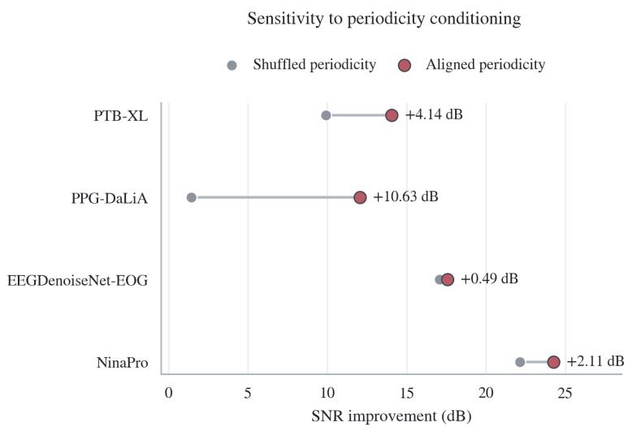  
Figure 9: Change in restoration performance when phase-encoder features are shuffled across samples within a batch. Values are the ∆SNR difference between correctly matched and shuffled phase fields.

## D.11 ANTITHETIC SAMPLING

Proposition 2 (proof in Appendix B.2) guarantees a variance reduction at matched NFE only when the pair correlation ρ¯ is negative, which a learned nonlinear reverse process does not ensure, so we measure it directly. For each modality, we hold 32 corrupted observations fixed and draw 128 antithetic pairs per observation. At every reverse state, the covariance and marginal variance of the pair members are estimated across pairs separately for each observation, then aggregated over signal coordinates and observations with the variance weighting of Equation 16, giving $\widehat { \bar { \rho } } _ { t } .$ Confidence intervals come from a hierarchical bootstrap over observations and, within each, independent blocks of 16 pairs. The correlation remains negative throughout the reverse process and at $t = 0$ for every modality and fixed observation evaluated (Figure 10), so the condition of Proposition 2 holds. Figure 11 shows the resulting quality–compute frontier on ECG: a single antithetic pair already exceeds ten independent trajectories, and further pairs add little once the model-bias term of Equation 16 dominates. Table 21 applies the same sampler swap to DeScoD-ECG and TFCDiff without retraining: one antithetic pair exceeds ten independent trajectories for both at a fifth of the wall-clock time, so the gain comes from the sampler rather than from PTSDIFF.

Table 21: Antithetic coupling applied to competing diffusion restorers without retraining (sampler swap only), with matched-NFE compute accounting. Establishes whether Proposition 2 is a property of the sampler or of PTSDIFF.
<table><tr><td>Model / sampler</td><td>NFE</td><td>Params [M]</td><td>Wall-clock [ms]</td><td>∆SNR ↑</td><td> $\Delta$  vs. MC</td></tr><tr><td>DeScoD-ECG, MC-10</td><td>500</td><td>1.93</td><td>361</td><td>13.78</td><td></td></tr><tr><td>DeScoD-ECG, AV-2</td><td>100</td><td>1.93</td><td>72</td><td>13.86</td><td>+0.08</td></tr><tr><td>TFCDiff, MC-10</td><td>500</td><td>4.12</td><td>803</td><td>13.47</td><td></td></tr><tr><td>TFCDiff, AV-2</td><td>100</td><td>4.12</td><td>161</td><td>13.67</td><td>+0.20</td></tr><tr><td>PTSDIFF, MC-10</td><td>500</td><td>3.44</td><td>267</td><td>15.79</td><td></td></tr><tr><td>PTSDIFF, AV-2</td><td>100</td><td>3.44</td><td>53</td><td>16.00</td><td>+0.21</td></tr></table>

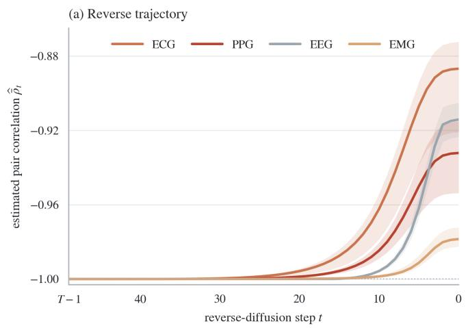

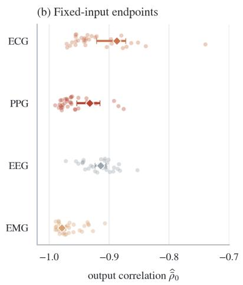  
Figure 10: Empirical antithetic-pair correlation. (a) Variance-weighted correlation $\widehat { \bar { \rho } } _ { t }$ over the 50 postupdate states $t = T - 1 , \dots , 0 .$ , with 95% confidence intervals. (b) Output correlation $\widehat { \bar { \rho } } _ { 0 } \colon$ transparent points are single fixed observations, diamonds are modality aggregates with 95% confidence intervals.

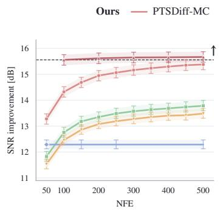

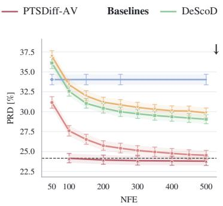

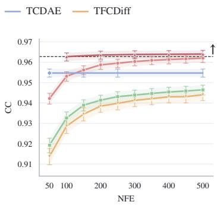  
Figure 11: Quality–compute frontier on ECG. PRD, CC and ∆SNR against NFE, for independent (MC) and antithetically coupled (AV) sampling. The dotted line marks a single antithetic pair, which already exceeds ten independent trajectories. TCDAE is deterministic and therefore flat. Arrows indicate the better direction.

## D.12 PER-SAMPLE DISTRIBUTION

Figure 12 complements the PTB-XL means of Table 7 with the full per-sample ∆SNR distribution, overall and stratified by corruption level, confirming that the mean improvements reflect a shifted distribution rather than a heavy tail.

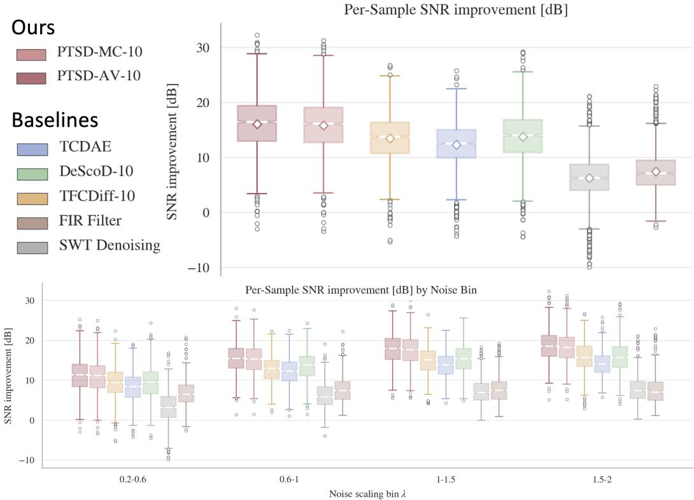  
Figure 12: Per-sample ∆SNR on the PTB-XL test set. Notched box plots: box is the IQR, white line the median, notch its 95% CI, whiskers span 1.5×IQR, open circles are outliers. Top: overall (white diamond = mean). Bottom: stratified by corruption scaling factor λ.

## D.13 THE FRAME DECOMPOSITION

Figure 13 illustrates the frame W of Section 3.2 on a clean and a corrupted ECG at 360 Hz. Baseline wander concentrates in the approximation channel $a _ { 4 } .$ , while electrode motion and muscle artifacts spread across the detail channels (Chatterjee et al., 2020), which is why $d _ { 1 }$ and $d _ { 2 }$ carry predominantly artifact energy.

## D.14 QUALITATIVE RESULTS

Figures 14–16 show representative reconstructions. These are single samples and should be read as illustration rather than evidence.

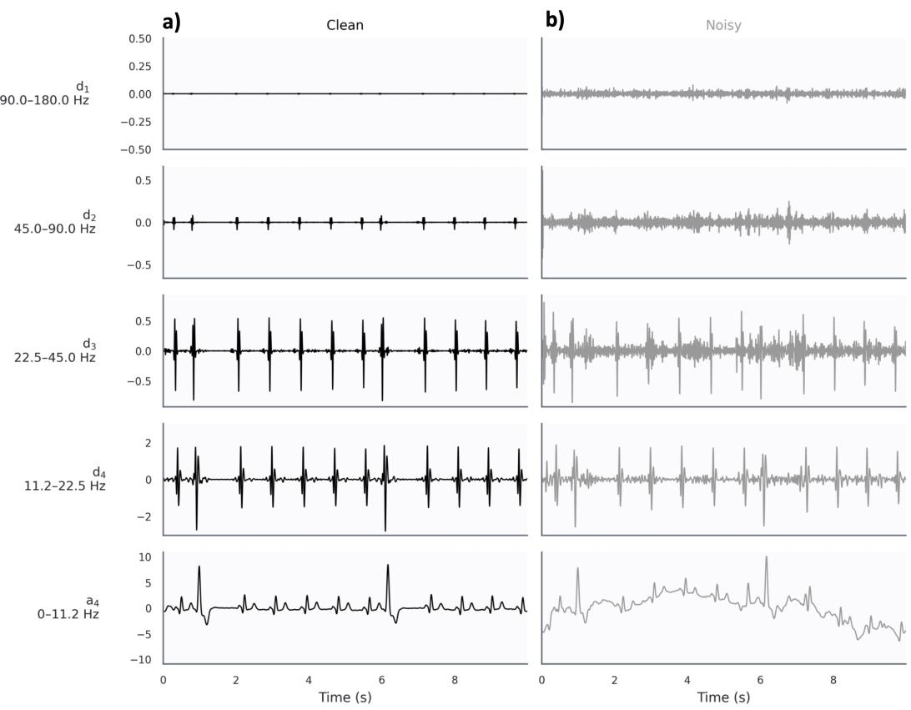  
Figure 13: Four-level stationary wavelet decomposition with the sym4 wavelet: one approximation and four detail channels, all at the input length. (a) Clean signal. (b) Corrupted signal.

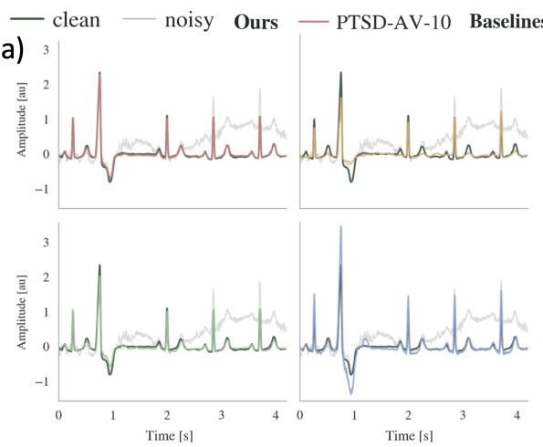

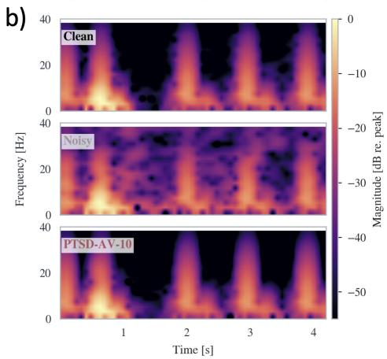  
Figure 14: ECG under heavy corruption. Left: clean, corrupted, and reconstructions from PTSDIFF-AV-10 and the strongest baselines on a representative PTB-XL test sample. Right: time–frequency representations of the clean (top), corrupted (middle) and PTSDIFF-AV-10 reconstructed (bottom) signal.

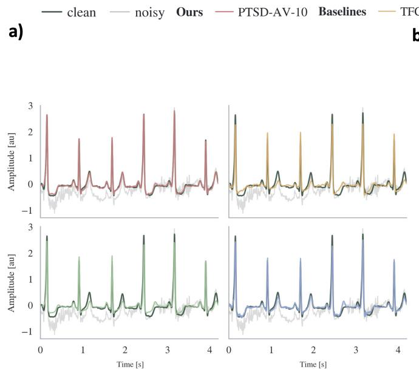

b)  
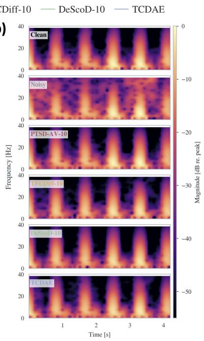  
Figure 15: ECG under light corruption $( \lambda \in [ 0 . 2 , 0 . 6 ] )$ . (a) Clean, corrupted, and reconstructions. (b) Corresponding spectrograms.

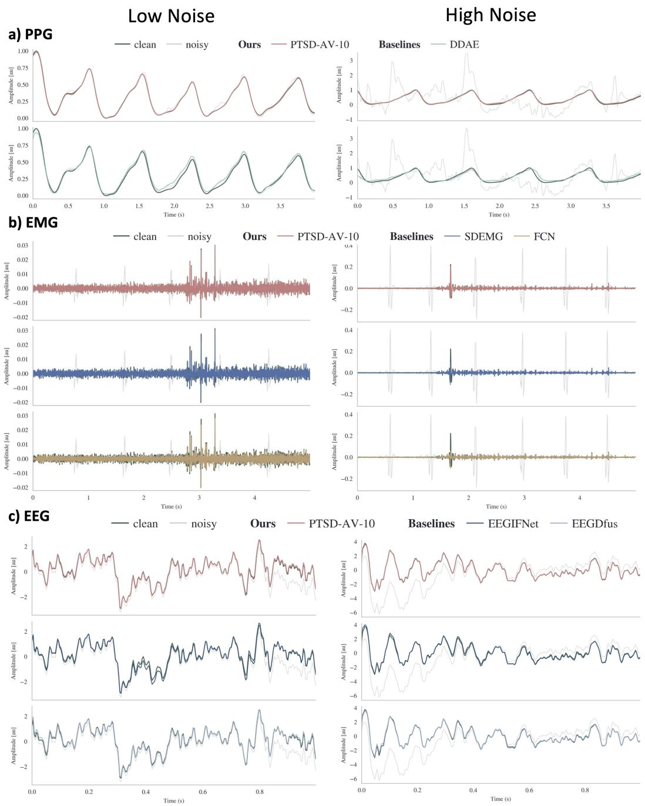  
Figure 16: Reconstructions for the non-ECG modalities at a light and a heavy corruption level: (a) PPG (24 and −6 dB), (b) EMG (0 and −14 dB), (c) EEG (5 and −5 dB).