# Cartridges++: KV Cache Compression without Off-Context Derailment

Sonia Laguna, Joao Monteiro, Marco Cuturi, Pierre Ablin, Eleonora Gualdoni

Apple

Serving long documents to a Large Language Model (LLM) repeatedly is expensive: computations grow with context length, and the memory footprint of the key-value (KV) cache balloons. Compressed KV (CKV) representations aim to mimic the cache of a document and are typically computed once and for all, ahead of inference time. Methods to obtain CKVs range from drop mechanisms that reduce their number of columns, to learned approaches. Among the latter, Cartridges have emerged as a leading compression method, learning compact KV representations through distillation on relevant Q/A pairs. While existing evaluations focus primarily on whether Cartridges and other CKVs yield approximately similar responses to document-related, on-context queries, we investigate the crucial deployment question of whether they can handle off-context queries, something the native KV representation is particularly good at, thanks to the mechanics of attention. We observe a fundamental trade-off: while Cartridges perform better for on-context queries, heuristicvariants preserve better the original LLM’s ability to operate off-context. We measure this through their capability to avoid context contamination in their response, retain general knowledge, and follow instructions. We propose Cartridges++, simple modifications to Cartridges that retain off-context abilities at small or negligible cost. The router variant decides at inference time whether the query should use the learned long-context memory, while the data-mixing variant allocates a small fraction of training Q/As to queries outside the reference long document. Our study shows that assessing CKVs on document utility alone can mask substantial degradation in broader model capabilities, yet those issues can be fixed with benign changes to CKV inference or training.

Correspondence: SL: slaguna@ethz.ch; JM: jmonteiro2@apple.com; MC: m\_cuturi@apple.com; PA: p\_ablin@apple.com; EG: e\_ gualdoni@apple.com.   
Note: SL: work done as intern at Apple.   
Date: September 29, 2026

## 1 Introduction

Long-context reuse is expensive. Large language models (LLMs) are increasingly used to reason over persistent, long-form information, including reports, knowledge bases, or medical records (Bai et al., 2024). In these settings, the same context is reused across many queries, creating a need for memory mechanisms that persist this context across queries (Zhang et al., 2023; Xiao et al., 2024; Eyuboglu et al., 2026; Hardalov et al., 2026). Transformers naturally provide such a representation through the key–value (KV) cache, which stores a state for every prefix token at every layer. However, retaining the cache introduces a second cost: its memory footprint grows linearly with context length, and the increasing length of the cache also raises decoding cost, making long contexts expensive both to store and to serve. This motivates compressed KV (CKV) representations: compact versions of the document’s KV cache that can be computed once and reused across subsequent queries. CKVs can be constructed through retained-state methods that select or merge existing KV states (Zhang et al., 2023; Xiao et al., 2024; Li et al., 2024; Yang et al., 2024; Kim et al., 2025), or learned methods that optimize compact representations (Zweiger et al., 2026; Eyuboglu et al., 2026; Hardalov et al., 2026). We study reusable, document-specific CKVs for a fixed pretrained LLM: each memory is constructed for one document and reused without knowing future queries. Among learned variants, Cartridges have emerged as a prominent method, optimizing document-specific KV states through distillation on question–answer pairs (Eyuboglu et al., 2026).

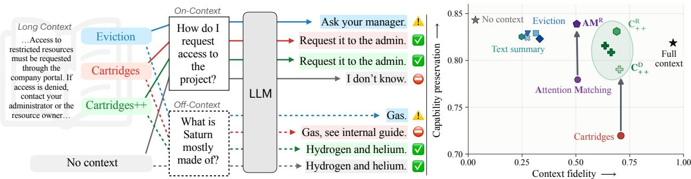

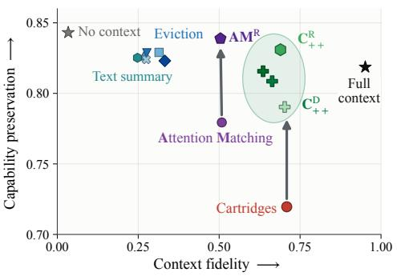  
Figure 1 Cartridges preserve context fidelity but disrupt capability; Cartridges++ cancels that degradation. Left: illustrative responses to an on-context query (solid arrows) and an unrelated Saturn question (dashed arrows) handling context with eviction, Cartridges and our method. Right: aggregate context fidelity and capability preservation across long-context datasets (see Appendix E.1 for details). $C _ { + + } ^ { D }$ and $C _ { + + } ^ { R }$ denote data mixing and routing variants of $\mathrm { C A R T R I D G E S + + , A M ^ { R } }$ routed Attention Matching. The arrows highlight the gains attributed to our variants: they retain the same context fidelity while upgrading significantly their general capabilities.

Cartridges amplify context interference. Cartridges ofer a favorable compression–utility trade-of, preserving document-level performance where retained-state methods degrade. Yet, this notion of utility leaves open a complementary question: at what cost? Recent work shows that answer accuracy alone is insuficient to evaluate eviction methods for KV compression (Liu et al., 2026; Chen et al., 2026; Ai et al., 2026), which can discard semantically important information or disrupt instructions and reasoning in the context. These evaluations, however, remain on context: they concern what compression preserves or loses from the source document itself. They do not test the reality of deployment where future queries need not concern the stored document.

As the interaction with a user slightly veers of-context, we argue that CKVs can be more brittle and run the risk of being influenced by the stored memory when the query does not call for it. For this reason, CKV mechanisms should also be evaluated of-context. The rationale is that the mechanics of attention can eficiently turn of interactions between the native KV caches and queries that are unrelated to the context. We posit (and verify experimentally) that such a property is lost for CKVs, particularly learned ones such as Cartridges. A full long context already induces interference on such queries (Shi et al., 2023; Yoran et al., 2024), and heuristic eviction methods retaining native KV states show a similar, limited degradation. A recent hybrid method, Attention Matching (Zweiger et al., 2026), retains selected native keys while fitting attention biases and new values, and occupies an intermediate regime of of-context degradation. Cartridges, however, sit at the more disruptive end of this spectrum. Despite providing substantially stronger context fidelity, they introduce larger interference, perturbing the model even more than the full, uncompressed context they are meant to approximate. We call the missing requirement capability preservation: when a memory is irrelevant, its presence should not substantially degrade the underlying LLM’s behavior relative to operating without the context. Thus, the method that best preserves the utility of the stored document is also the one for which context-external interference becomes a substantial deployment concern. To our knowledge, we are the first to expose this hidden cost of Cartridges, characterizing its failure modes and evaluating mitigations, as illustrated in Figure 1.

Mitigating Cartridge interference. This observation motivates targeting Cartridges directly. We seek to preserve their context fidelity while recovering the benign of-context behavior of the underlying model. We introduce Cartridges++, with two complementary strategies. First, an inference-time relevance router decides whether an already-trained Cartridge should be used. Second, a training-time strategy mixes documentrelevant examples with a small fraction of general-purpose ones. Together, these strategies preserve the LLM capabilities when the stored memory is irrelevant and its utility on document-dependent queries. Our contributions are as follows:

• We introduce a two-sided evaluation of reusable, document-specific CKVs that measures not only context fidelity on relevant queries, but also capability preservation on unrelated queries across general knowledge, instruction following, and context contamination during generation.

• We quantify of-context interference in Cartridges: despite their strong on-context fidelity, Cartridges amplify interference of-context.

• We introduce Cartridges++ to mitigate of-context derailment when Cartridges are loaded. We propose two complementary variants: $C _ { + + } ^ { D }$ , which uses data mixing during training, and $C _ { + + } ^ { R }$ , which leverages a relevance router at inference. Across four long-context benchmarks, both improve capability preservation while retaining the document-utility gains.

## 2 Related Work

Training-free KV compression. KV compression is particularly useful when a long document is processed once and reused across many future queries. We focus on this setting, with query-independent KV compression and a fixed pretrained LLM. Training-free eviction retains a subset of the document’s original KV states. Representative methods difer in how they select these states: H2O keeps recent tokens and accumulated attention heavy hitters (Zhang et al., 2023), StreamingLLM preserves attention sinks and a recent window (Xiao et al., 2024), SnapKV selects head-specific positions using an observation window near the end of the prompt (Li et al., 2024), and PyramidKV and PyramidInfer allocate non-uniform layer budgets (Cai et al., 2025; Yang et al., 2024). Like SnapKV, the latter methods use the downstream query for selection in their standard formulations and are therefore query-dependent. KVzip instead uses context reconstruction to build a query-agnostic cache (Kim et al., 2025). Unlike learned methods, eviction compresses by discarding native KV states rather than optimizing new representations, and was primarily developed for decoding eficiency or bounded-context settings. Text-space methods such as LLMLingua (Jiang et al., 2023) shorten the prompt rather than directly optimizing KV states; we use budget-matched model-generated summaries as a representative baseline.

Learned context representations. Learned compressors either amortize a shared encoding mechanism across documents (Mu et al., 2023; Chevalier et al., 2023; Ge et al., 2024; Li et al., 2025) or optimize a new representation for each source. Cartridges take the latter approach, directly optimizing document-specific key and value tensors in the frozen LLM through self-study, without training an encoder or modifying model weights (Eyuboglu et al., 2026). Attention Matching follows a closely related document-specific formulation, but constructs the compressed cache by retaining selected original keys and fitting attention biases and new values through least-squares objectives that reconstruct full-cache attention (Zweiger et al., 2026). Finally, Cartridges at Scale extends the approach to document collections (Hardalov et al., 2026).

Evaluation and off-context robustness. Recent work shows that answer accuracy can conceal failures of KV compression, including loss of reasoning-relevant content, instruction disruption, and degraded evidential support (Liu et al., 2026; Chen et al., 2026; Ai et al., 2026). These analyses remain largely context-internal, asking what compression loses from the source context. Eyuboglu et al. (2026) report only a small MMLU evaluation in a parameterization ablation comparing prefix tuning with LoRA, rather than a dedicated study of of-context failures or their mitigation. We instead study context-external behavior across general knowledge, instruction following, and contamination, using full-context baselines to separate ordinary distraction from interference induced by optimized KV state. Related work motivates preservation and selective activation: RAG systems filter or route irrelevant context (Shi et al., 2023; Lewis et al., 2020; Yoran et al., 2024; Xu et al., 2024; Asai et al., 2024; Luo et al., 2026), while memory-based methods study locality and selective activation (Mitchell et al., 2022; Wang et al., 2024a; Hartvigsen et al., 2023; Chen et al., 2024; Diao et al., 2026; Zheng et al., 2026). We adapt these ideas to document-specific KV memories through post-hoc routing and no-context-teacher data mixing. Appendix A discusses complementary cache-reduction techniques and broader work on learned context representations and memory reliability.

## 3 Problem Formalization

## 3.1 KV cache and compression

Consider a decoder-only transformer processing a document $\boldsymbol { x } = ( x _ { 1 } , \dots , x _ { L } )$ . At each layer $\ell ,$ self-attention produces key and value states $\pmb { K } ^ { \ell }$ and $V ^ { \ell }$ , which are cached for autoregressive generation. Here, $K ^ { \ell } , V ^ { \ell } \in$ $\dot { \mathbb { R } } ^ { H _ { \ell } \times L \times d _ { \ell } }$ , with H<sub>ℓ</sub> KV heads of dimension $d _ { \ell }$ (batch dimension omitted). We denote the full document cache by $\mathcal { C } ( \boldsymbol { x } ) = \{ ( K ^ { \ell } , V ^ { \ell } ) \} _ { \ell = 1 } ^ { N }$ . Its memory footprint grows linearly with document length L and model depth $N ,$ motivating compression when a document is reused across many queries. A KV compression method constructs a compact representation $\mathcal { C } _ { x }$ of length $m \ll L$ , which replaces the full document cache at inference time. We define the compression factor as $\rho = m / L$ With CKV, the cost of generating one token goes from $\mathcal { O } ( L )$ to $\mathcal { O } ( m ) \mathrm { : }$ : ρ quantifies the acceleration gains of CKV for generation with long context. Given a query $q ,$ the compressed memory induces $p _ { \theta } ( y \mid \mathcal { C } _ { x } , q )$ . Retained-state methods construct ${ \mathcal { C } } _ { x }$ by selecting or combining states from the original document cache, whereas Cartridges optimize new compact KV states by distilling supervision from document-related question–answer pairs. When discussing Cartridges below, ${ \mathcal { C } } _ { x }$ denotes this learned document-specific memory.

## 3.2 Distillation-based compression: Cartridges

A Cartridge for document x is a document-specific trainable KV cache $\mathcal { C } _ { x } = \{ ( K _ { C } ^ { \ell } , V _ { C } ^ { \ell } ) \} _ { \ell = 1 } ^ { N }$ , with m virtual KV positions per layer. The LLM parameters θ remain frozen; only the key and value tensors in $\mathcal { C } _ { x }$ are optimized. Cartridges are trained through self-study, where the document is divided into subcontexts ${ \tilde { x } } \subset x .$ from which the frozen model generates synthetic conversational traces $\boldsymbol { s } ^ { ( j ) } = ( s _ { 1 } ^ { ( j ) } , \dots , s _ { T _ { j } } ^ { ( j ) } )$ of varying length $T _ { j }$ . This produces a training set $\mathcal { D } _ { x } = \{ ( s ^ { ( j ) } , \tilde { x } _ { j } ) \} _ { j = 1 } ^ { n }$ . For each trace, the model with x˜ in context acts as the teacher, while the same frozen model conditioned on ${ \mathcal { C } } _ { x }$ acts as the student. The Cartridge is optimized by context distillation:

$$
\mathcal { C } _ { x } ^ { * } = \arg \operatorname* { m i n } _ { \mathcal { C } _ { x } } \sum _ { ( s , \tilde { x } ) \in \mathcal { D } _ { x } } \sum _ { t = 1 } ^ { | s | } D _ { \mathrm { K L } } \big ( p _ { \theta } ( \cdot  { | \tilde { x } } , s _ { < t } ) \ \| \ p _ { \theta } ( \cdot  { | \mathcal { C } _ { x } } , s _ { < t } ) \big ) .\tag{3.1}
$$

At inference time, ${ \mathcal { C } } _ { x } ^ { * }$ is loaded as the prefix cache and is reused across queries without access to x.

## 3.3 Two-sided requirements on a reusable memory

Let ${ \mathcal { Q } } _ { x } ^ { + }$ denote queries that concern information from document $x ,$ and ${ \mathcal { Q } } _ { x } ^ { - }$ queries that do not. For $q \sim \mathcal { Q } _ { x } ^ { + }$ the compressed memory should reproduce the behavior of the model conditioned on the full document. For $q \sim \mathcal { Q } _ { x } ^ { - }$ , it should ideally preserve the model’s behavior without the document. Using a divergence D between model output distributions, we formalize these requirements as

$$
R ^ { + } ( \mathcal { C } _ { x } ) = \mathbb { E } _ { q \sim \mathcal { Q } _ { x } ^ { + } } \mathfrak { D } ( p _ { \theta } ( \cdot \mid x , q ) \parallel p _ { \theta } ( \cdot \mid \mathcal { C } _ { x } , q ) ) ,\tag{3.2}
$$

$$
R ^ { - } ( \mathcal { C } _ { x } ) = \mathbb { E } _ { q \sim \mathcal { Q } _ { x } ^ { - } } \mathfrak { D } \big ( p _ { \theta } ( \cdot \mid q ) \big \| p _ { \theta } ( \cdot \mid \mathcal { C } _ { x } , q ) \big ) .\tag{3.3}
$$

Here, $R ^ { + }$ measures context fidelity: how closely the learned memory reproduces full-context behavior on queries that require x. In contrast, R<sup>−</sup> measures capability preservation: how much the memory perturbs the model’s original behavior on queries that do not require x. Note that this is not a new requirement we impose: Eyuboglu et al. (2026) explicitly identify generality across diverse user prompts as a desideratum for functional equivalence with in-context learning. In practice, however, even ordinary in-context conditioning on an irrelevant full document can itself perturb the model. We therefore use full-context interference as a reference: $R _ { \mathrm { f u l l } } ^ { - } = \mathbb { E } _ { q \sim Q _ { x } ^ { - } } \mathfrak { D } ( p _ { \theta } ( \cdot \cdot \vert q ) \Vert p _ { \theta } ( \cdot \vert x , q ) )$ . In particular, $R ^ { - } ( \mathcal { C } _ { x } ) = 0$ corresponds to perfect preservation of no-context behavior, while $R _ { \mathrm { f u l l } } ^ { - }$ provides a natural reference for the interference present without compression. A well-behaved reusable memory should therefore keep both $R ^ { + }$ and $R ^ { - }$ small. At minimum, $R ^ { - }$ should not substantially exceed $R _ { \mathrm { f u l l } } ^ { - }$

The Cartridges training objective is one-sided. Equation (3.1) directly supervises only document-grounded behavior. Self-study constructs $\mathcal { D } _ { x }$ from traces derived from x, aligning training with $R ^ { + }$ . Crucially, it does not include any term involving ${ \mathcal { Q } } _ { x } ^ { - }$ or the no-context reference $p _ { \theta } ( \cdot \mid q )$ . As a result, $R ^ { - }$ is not explicitly constrained. We show that this leads to interference.

## 4 Mitigating Memory Interference

The one-sided objective in Section 3.3 suggests two points of intervention: modifying how the Cartridge is trained or controlling when it is used. We consider mitigation strategies at both stages. Our training-time strategy explicitly encourages capability preservation during self-study, whereas our inference-time strategy removes the memory whenever it is predicted to be irrelevant. We also consider a lightweight prompting baseline that instructs the model to use the cached document only when relevant, reported separately in Appendix C.3 as it does not eliminate interference.

Cartridges $_ { + + } ^ { \mathbf { D } } ( C _ { + + } ^ { D } )$ : training-time mitigation with data mixing. To provide an explicit training signal for the missing $R ^ { - }$ supervision, in $C _ { + + } ^ { D }$ we augment self-study with examples from Dolci-Instruct-SFT (Team Olmo et al., 2025), which we use as a broad proxy for general-purpose, of-context queries ${ \mathcal { Q } } _ { x } ^ { - }$ . Let $\mathcal { D } ^ { - }$ denote the of-context pool and $\gamma \in [ 0 , 1 ]$ the mixing fraction. Interpreting each corpus as an empirical distribution over supervised assistant-token predictions, we write the target training mixture as $\mathcal { D } _ { x } ^ { ( \gamma ) } = ( 1 - \gamma ) \mathcal { D } _ { x } + \gamma \mathcal { D } ^ { - }$ Thus, γ specifies the fraction of supervised assistant tokens contributed by $\mathcal { D } ^ { - }$ . Document-grounded exam ples retain the standard self-study teacher, whereas of-context examples use the frozen base model without the Cartridge as teacher, encouraging $p _ { \theta } ( \cdot \mid \mathcal { C } _ { x } , q )$ to match the no-context behavior $p _ { \theta } ( \cdot \mid q )$ underlying $R ^ { - }$ The endpoints $\gamma = 0$ and $\gamma = 1$ recover standard self-study and of-context-only supervision, respectively. Therefore, $C _ { + + } ^ { D }$ regularizes the learned memory without introducing a new loss or modifying the model weights $\theta ; \gamma$ controls the trade-of between context fidelity and capability preservation.

Cartridges $\mathbf { \Pi } _ { + + } ^ { \mathbf { R } } ( C _ { + + } ^ { R }$ ): inference-time mitigation with relevance routing. Mixed self-study asks a single Cartridge to preserve document-specific information while remaining neutral elsewhere. Relevance routing instead leaves the Cartridge unchanged and controls when it is active. Given an already-trained Cartridge, $C _ { + + } ^ { R }$ introduces a router $r _ { x } ( q ) \in \{ 0 , 1 \}$ that decides whether an incoming query should be served with or without it:

$$
p _ { \mathrm { r o u t e } } ( y \mid q , \mathcal { C } _ { x } ) = \left\{ \begin{array} { l l } { p _ { \theta } ( y \mid \mathcal { C } _ { x } , q ) , } & { r _ { x } ( q ) = 1 , } \\ { p _ { \theta } ( y \mid q ) , } & { r _ { x } ( q ) = 0 . } \end{array} \right.\tag{4.1}
$$

When a query is rejected, the Cartridge is removed entirely, recovering the no-context behavior underlying $R ^ { - }$ without retraining either the memory or the language model. We use an embedding of the incoming query as the routing signal, extracted either from the evaluated LLM or from a smaller auxiliary encoder, and study diferent representations, pooling schemes, and classifiers. We evaluate these design choices in Section 6 and Appendix C.2, and use a k-nearest-neighbor (kNN) router as our main variant for simplicity. As in the training-time mitigation, Dolci-Instruct-SFT provides of-context negatives representing ${ \mathcal { Q } } _ { x } ^ { - }$ , while positives come from a held-out subset of self-study. We calibrate the routing threshold on held-out negatives using one-sided conformal calibration (Angelopoulos et al., 2024) at $\alpha = 0 . 0 5$ , then fix it for evaluation. $C _ { + + } ^ { R }$ addresses the two requirements in Section 3.3 separately; it uses the Cartridge for relevant queries and otherwise recovers the no-context model, at the cost of a lightweight relevance decision before generation.

## 5 Benchmarking Beyond Context Fidelity

Building on the two-sided formulation in Section 3.3, we define a benchmarking framework that operationalizes context fidelity and capability preservation independently of any particular dataset; Section 6 describes its concrete instantiation. Existing evaluations largely capture the first requirement in Section 3.3 through context $~ f i d e l i t y .$ We propose a complementary benchmark for the second requirement, capability preservation, by decomposing it into three of-context axes: general knowledge, instruction following, and context interference. Together, these four axes operationalize $\bar { R } ^ { + }$ and $R ^ { - }$ empirically. For each document x, the compressed memory is constructed once and held fixed across all evaluation axes and subsequent queries, unless explicitly removed by routing. We compare each method against two reference conditions: Full context serves the original document as text and provides the reference for context fidelity on ${ \mathcal { Q } } _ { x } ^ { + }$ . No context removes the document entirely and provides the reference for capability preservation on ${ \mathcal { Q } } _ { x } ^ { - }$ . We ask whether a compression method can approach full-context performance on document-relevant queries and remain close to no-context behavior when the memory is irrelevant.

Context fidelity. We define it as the performance retained on queries from ${ \mathcal { Q } } _ { x } ^ { + }$ , i.e., that require the source document. We use the task-native metric of each long-context benchmark. This provides our empirical measure of $R ^ { + }$ and captures any trade-of with capability preservation. For brevity, we refer to this axis as on-context performance in the results.

General knowledge. We frame general-knowledge preservation as the ability to answer factual and reasoning questions unrelated to the stored document. We measure it on questions from ${ \mathcal { Q } } _ { x } ^ { - }$ relative to the no-context reference, to test whether the compressed memory degrades capabilities already present in the model.

Instruction following. We define instruction-following preservation as the ability to satisfy user constraints despite an irrelevant memory. We evaluate prompts with objectively verifiable requirements, capturing failures not reflected in answer accuracy.

Context interference. Finally, we define context interference as contamination of the rationale for a query unrelated to the long context. A response may be correct while still spuriously invoking the cached document, as illustrated in Figure 1 (see Figure 28 for actual contaminated Cartridge generations). We therefore use an LLM judge, independent of answer correctness, to flag rationales that fabricate or attribute a quotation to the document, or claim that it supplies the answer. The final metric is the fraction of responses flagged by either behavior; merely mentioning or dismissing the document does not count as interference. Appendix B.5 details the judge and rubric.

Table 1 Evaluation axes and benchmarks for context fidelity and capability preservation.
<table><tr><td>Context fidelity (Q+)</td><td colspan="3">Capability preservation  $( \mathcal { Q } _ { x } ^ { - } )$ </td></tr><tr><td>Long contexts QASPER-16, MTOB</td><td>General knowledge TinyMMLU,</td><td>Instruction following IFEval</td><td>Context interference LLM-as-judge (MMLUs)</td></tr></table>

## 6 Experimental Setup

Long-context datasets. We study four long-context datasets ranging from approximately 4K to 140K tokens: QASPER-16 (Q-16) (Dasigi et al., 2021) contains information-seeking questions grounded in NLP research papers; following Eyuboglu et al. (2026), we merge 16 papers into one context. In LongHealth-10 (LH-10) (Adams et al., 2025), we concatenate ten fictional patient records into a single panel. MTOB (Tanzer et al., 2024) is a structured-learning task for Kalamang–English translation. Finally, QuALITY-20 (Pang et al., 2022) consists of 20 narratives. Table 2 reports context lengths and evaluation sizes. Following the task metrics of Eyuboglu et al. (2026), we report multiple-choice accuracy for LongHealth-10, averaged over eight independently seeded generations per question; corpus chrF for MTOB translation; and reference-answer log-perplexity for QASPER-16. For QuALITY-20, we report multiple-choice accuracy. See Appendix B.1 for details on scoring and aggregation.

Capability preservation benchmarks. Table 1 summarizes how we instantiate the capability-preservation axes in Section 5. We evaluate general knowledge with TinyMMLU (Hendrycks et al., 2021; Maia Polo et al., 2024) and MMLU-Pro (Wang et al., 2024b), and instruction following with IFEval (Zhou et al., 2023). Each query is paired with an unrelated cached document. We judge context interference in the general-knowledge rationales using the gpt-oss family (Agarwal et al., 2025), with the 20B model for main results. Appendix H shows consistent findings with gpt-oss-120b and gemma-3-27b-it (Team et al., 2025); prompts and scoring are detailed in Appendix B.5. Separately, we use Dolci-Instruct-SFT (Team Olmo et al., 2025) as a broad proxy for ${ \mathcal { Q } } _ { x } ^ { - }$ when training and calibrating the mitigation strategies and never use it for of-contex evaluation. See Appendix B.1 for extended details.

Models and compression methods. We evaluate the CKV methods in diferent model families: Qwen3-4B (Yang et al., 2025) on QuALITY-20 and Qwen3-4B-Instruct-2507 (Yang et al., 2025) and Gemma-4-E4B-it (Team et al., 2026) on the longer QASPER-16, LongHealth-10, and MTOB settings. For Gemma, compression factors apply only to global-attention cache slots; sliding-window caches remain unchanged. We compare Cartridges against Attention Matching (AM), KV cache eviction variants H2O, SnapKV, KVzip, PyramidKV, StreamingLLM, and matched-length text summaries (Appendices B.3 and I). We provide full- and no-context results as references. All compressed memories are fixed before decoding. For Cartridges, we follow the canonical recipe of Eyuboglu et al. (2026) (Appendix B.2). Across datasets and model families we sweep compression $\rho \in [ 0 . 0 0 1 , 0 . 2 0 ]$ , and share prompts, templates, and decoding settings. Full details in Appendix B.

Cartridges++ implementation details. For data mixing $( C _ { + + } ^ { D } )$ , we evaluate $\gamma \in \{ 0 . 0 1 , 0 . 0 5 , 0 . 1 0 \}$ throughout, and sweep the full range $\gamma \in [ 0 , 1 ]$ on a subset of benchmarks for a more detailed analysis. For routing $( C _ { + + } ^ { R } )$ we construct and calibrate one non-parametric relevance router per document using pools of self-study and Dolci samples, respectively. Our main router uses the mean cosine similarity to the $k = 1 0$ nearest self-study queries in a reference bank. Its activation threshold is calibrated at $\alpha = 0 . 0 5$ using held-out Dolci negatives; no capability-preservation benchmark is used for construction or calibration. Full construction details and router variants for $C _ { + + } ^ { R }$ are provided in Appendix C.2, and more details on both mitigations in Appendix C.

Compute cost of mitigation strategies. $C _ { + + } ^ { D }$ afects only ofline Cartridge training and adds no inference-time cost; matched update counts keep its training cost comparable with standard Cartridges. The kNN router in $C _ { + + } ^ { R }$ requires no classifier-weight training; alternatives with diferent computational costs are discussed in Appendix C.2. For the hidden-state router, each request is first prefilled without the Cartridge to obtain its query representation. Rejected requests continue directly from this clean prefill, whereas accepted requests are re-prefilled with the Cartridge. Thus, routing adds a kNN lookup for rejected requests and one additional query prefill for accepted ones, without repeating the long-document prefill, which adds a modest overhead for short queries and long generations.

## 7 Results

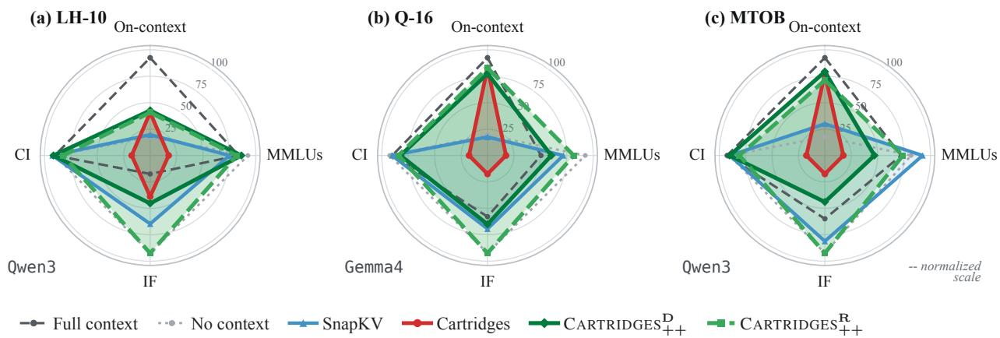  
Figure 2 Cartridges++ results across model families. Panels show LH-10 and MTOB with Qwen3 at 2% compression factor, and Q-16 with Gemma-4 at 5%. SnapKV is the eviction baseline in all three panels. Axes report on-context performance, MMLUs accuracy, instruction following (IF), and context independence (CI; reversed), each scaled separately across the displayed methods; outward is better. Mitigations use 5% Dolci mixing and query kNN-10 routing.

Learned memories trade capability preservation for context fidelity. We first evaluate context fidelity and capability preservation of CKVs across compression factors $\rho .$ As shown in Figure 3, Cartridges consistently retain substantially stronger on-context performance than training-free eviction methods, especially under extreme compression. This advantage reverses when their compressed KV becomes irrelevant: general capabilities deteriorate (per-subject breakdown in Appendix E.5), and context contamination increases beyond the interference induced by retaining the full document, the reference underlying $R _ { \mathrm { f u l l } } ^ { - }$ . In contrast, eviction methods, retaining native KV states, sacrifice context fidelity but remain substantially closer to the no-context behavior of-context. Unless otherwise specified, of-context performance averages general-knowledge accuracy (the mean of TinyMMLU and MMLU-Pro, denoted MMLUs) and IFEval accuracy with equal weight.

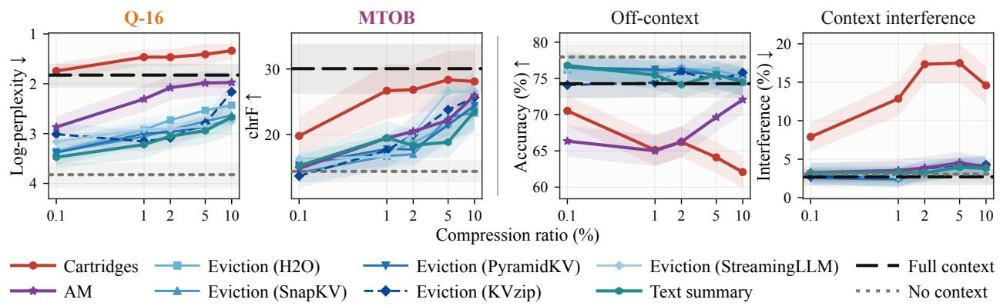  
Figure 3 CKV methods across compression factors on Qwen3-4B-Instruct-2507. Left: Q-16 log-perplexity (lower is better; note the reversed y axis) and MTOB chrF (higher is better). Right: of-context accuracy and context interference, averaged equally over these two datasets. Shading shows 95% intervals.

The same pattern holds across the remaining long-context settings and individual capability-preservation axes (Appendix E). These results expose a clear relevance asymmetry: optimizing a memory for its source document can improve R $R ^ { + }$ while simultaneously worsening $R ^ { - }$ . Attention Matching (AM) occupies an intermediate regime between eviction and fully optimized memories, retaining selected native keys while fitting attention reconstruction. It generally preserves of-context capabilities better, but Cartridges ofer stronger context fidelity on the longer tasks (Figures 1 and 3), especially at smaller compression factors $\rho .$

Data mixing regularizes interference. $C _ { + + } ^ { D }$ , with its mixed self-study, directly addresses the missing $R ^ { - }$ supervision identified in Section 3.3. Figure 4 shows that even $\gamma = 0 . 0 1$ substantially improves general knowledge and instruction following while reducing context interference. Low to moderate mixing preserves context fidelity, whereas aggressive mixing degrades on-context performance. We use $\gamma = 0 . 0 5$ as a practical trade-of for $C _ { + + } ^ { D }$ in the remaining experiments. Appendix C.1 further examines these efects as training progresses.

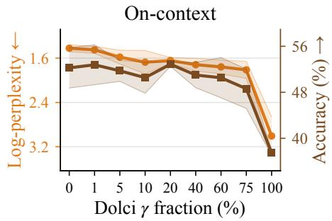

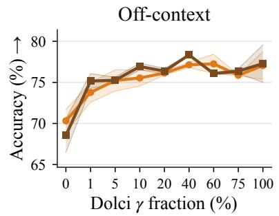

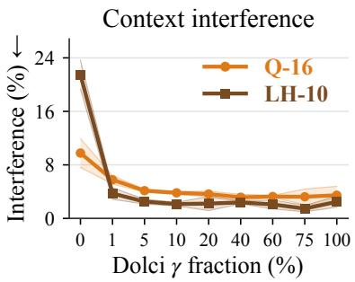  
Figure 4 $C _ { + + } ^ { D }$ performance, sweeping the Dolci mixing fraction on LH-10 and Q-16. Panels show on-context performance, of-context accuracy, and context interference. Results are averaged across compression factors 0.1–10%; datasets are shown in diferent colors. Shading shows 95% normal intervals on Qwen3-4B-Instruct-2507.

Routing separates the two regimes. Unlike data mixing that optimizes a single compromise, $C _ { + + } ^ { R }$ addresses the relevance asymmetry by selecting between two inference states, keeping the Cartridge only when relevant. Figure 5 measures routing accuracy of the kNN variant on the three longcontext datasets with Qwen3-4B-Instruct-2507: the router achieves high accuracy, accepting over 90% of on-context queries $\left( \mathcal { Q } _ { x } ^ { + } \right)$ and rejecting over 90% of of-context ones $\left( \mathcal { Q } _ { x } ^ { - } \right)$ . We examine whether this improves downstream performance in the next paragraph. Although Figure 5 reports results using Qwen3 hidden states, an external MiniLM encoder also achieves strong routing performance, which shows that post-hoc routing does not need to depend on the backbone model’s representations $( \mathrm { A p - }$ pendix C.2; Figures 14 and 23). Overall, this mechanism is lightweight

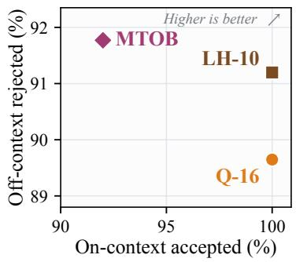  
Figure 5 $C _ { + + } ^ { R }$ routing rates.

Compression ratio (%)

and operates on an already-trained Cartridge; its main systems cost is that an accepted request must be re-prefilled with the memory.

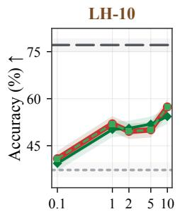

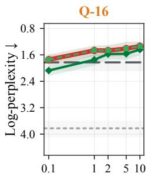

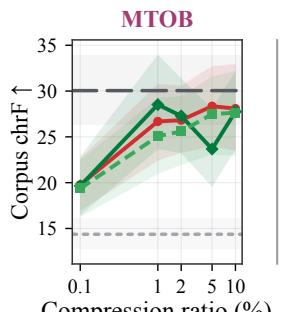

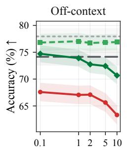

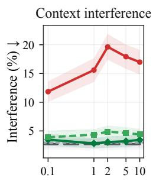  
Figure 6 $C _ { A R T R I D G E S _ { + + } ^ { \mathbf { D } } } ( C _ { + + } ^ { D } )$ and $\mathrm { C A R T R I D G E S } _ { + + } ^ { \mathbf { R } } \ ( C _ { + + } ^ { R } )$ across compression factors. Cartridges, $C _ { + + } ^ { \bf D } 5 \% , C _ { + + } ^ { \bf R }$ kNN-10 on Qwen3-4B-Instruct-2507. Left: on-context metrics. Right: of-context accuracy and interference averaged over all three datasets.

Interference is not an inevitable consequence of compression. Figure 6 compares $C _ { + + } ^ { D }$ and $C _ { + + } ^ { R }$ across the three long-context settings. $C _ { + + } ^ { D }$ 5% substantially reduces of-context degradation with a small or no on-context trade-of; gains already appear at 1% (Figure 13). Routing brings of-context accuracy close to the no-context reference while largely retaining context fidelity. At a single compression factor, the radar plots of Figure 2 show that Cartridges are strong on their source task but weak on the other axes; both mitigations recover a more balanced profile. Aggregating results across contexts and compression factors, Figure 1 (right) proposes a complementary view, showing that $\overset { \cdot } { C } _ { + + } ^ { R }$ extends the Pareto frontier toward high context fidelity and capability preservation. Given AM’s competitive on-context performance and milder of-context degradation, we also apply our router to AM $( \mathrm { A M } ^ { \mathrm { R } } )$ , which improves capability preservation but remains limited by AM’s lower context fidelity; $C _ { + + } ^ { R }$ retains higher context fidelity with comparable capability preservation.

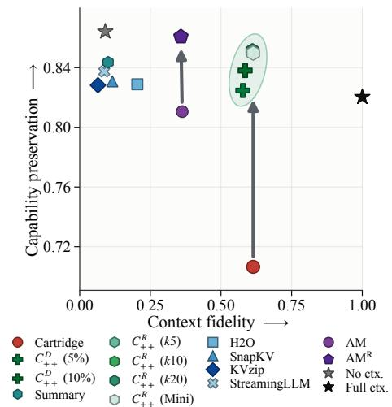  
Figure 7 Cartridges++ results on Gemma-4-E4B-it. LH-10/Q-16 across 1–10% compression (composite defined in Appendix E.1).

Cartridges++transfersacrossmodelsandlong-contextvariability. These gains transfer to Gemma-4-E4B-it, whose architecture interleaves global and sliding-window attention; Appendix E.2 provides the full study. Its composite results in Figure 7 mirror the Qwen3 comparison in Figure 1 (right): Cartridges++ preserves Cartridges’ strong context fidelity while substantially improving capability preservation. Both mitigations also remain efective with Qwen3-4B on QuALITY-20, whose contexts are roughly an order of magnitude shorter (Appendix E.3).

Additional analyses support the same failure mode. We additionally find that interference is accompanied by a failure to abstain: Cartridges often answer as though the resident document contained evidence that is absent (Appendix F). To examine whether degradation compounds across turns, we study multi-turn interactions and find no additional collapse beyond the single-turn behavior. Both $C _ { + + } ^ { D }$ and $\dot { C } _ { + + } ^ { R }$ retain their benefits, with routing evaluated using per-turn relevance labels (Appendix G). Nor does longer training resolve the original degradation: of-context performance remains impaired, while data mixing retains its gains at later checkpoints (Appendix D).

## 8 Conclusion

Learned KV memories ofer a compelling way to compress long contexts while preserving strong context fidelity, but our results on Cartridges reveal an important hidden cost: when the stored document is irrelevant, these memories can substantially perturb the model’s original behavior. This degradation spans general knowledge, instruction following, and context interference. Training-free eviction methods show the opposite trade-of, preserving capabilities better but sacrificing context fidelity. This relevance asymmetry is not captured by standard compression evaluations. We introduce Cartridges++, with two mitigation strategies that reduce this degradation while retaining context fidelity across the model families and context lengths studied. In $C _ { + + } ^ { D }$ , of-context supervision during self-study improves capability preservation, but at high mixing fractions can compete with document specialization. $C _ { + + } ^ { \bar { R } }$ instead avoids forcing both behaviors into a single representation, routing context-relevant queries to use the learned memory, and recovering no-context behavior on the others. More broadly, reusable memories should be evaluated not only by the information they preserve, but also by the interference they introduce when that information is irrelevant.

Limitations and future work. Our of-context evaluation focuses on TinyMMLU, MMLU-Pro, and IFEval, and further work is needed to characterize additional failures, as suggested by our abstention analysis $( \mathrm { A p - }$ pendix F). Our training-time and inference-time mitigations both reduce interference, but each has trade-ofs. While data mixing regularizes the memory without adding inference cost, it can reduce context fidelity and leave residual interference on requests poorly covered by its training mixture. Routing instead preserves specialization through selective activation, but depends on accurate relevance decisions and requires re-prefilling accepted queries against the compact cache. Building on the gains from these simple interventions, future work could combine the two approaches and explore adaptive relevance estimation to build stronger mitigation strategies.

## AI use statement

In this work, we used generative AI tools to implement methods, by assisting with the development and refinement of software code, and to support qualitative data analysis, through LLM judges that score model generations under a fixed rubric (Appendix B.5). We generated synthetic self-study training traces with the model under study, following the Cartridges recipe (Eyuboglu et al., 2026), and used AI tools to support methodological checks. Additionally, we used generative AI tools to create and modify scientific figures, edit the manuscript to improve clarity and readability, and identify relevant literature. All AI-assisted outputs were subsequently reviewed by the authors: AI-assisted code was reviewed and tested for correctness, the judge analysis was replicated with two additional judges (Appendix B.5), figures were checked against the underlying results, and suggested references were manually verified against the original sources. The authors take full responsibility for the final content of this work, including all text, claims, results, and artifacts produced with the assistance of generative AI.

## Reproducibility statement

All models, datasets, and benchmarks used in this work are publicly available, and we obtain them from their oficial releases; Section 6 lists them and Appendix B.1 describes each benchmark in detail. For Cartridges and Attention Matching, we directly use the oficial implementations of Eyuboglu et al. (2026) (https://github. com/HazyResearch/cartridges) and Zweiger et al. (2026) (https://github.com/adamzweiger/compaction). The remaining baselines, together with the shared prompts, compression budgets, decoding settings, and position conventions of all methods, are described in Appendix B. Both Cartridges++ variants are specified in Section 6, with complete training and routing details in Appendix C. The evaluation protocol is defined in Section 5, and the full judge rubric and scoring protocol are given in Appendix B.5.

## References

Lisa Adams, Felix Busch, Tianyu Han, Jean-Baptiste Excofier, Matthieu Ortala, Alexander Löser, Hugo JWL Aerts, Jakob Nikolas Kather, Daniel Truhn, and Keno Bressem. LongHealth: A question answering benchmark with long clinical documents. Journal of Healthcare Informatics Research, 9(3):280–296, 2025.

Sandhini Agarwal, Lama Ahmad, Jason Ai, Sam Altman, Andy Applebaum, Edwin Arbus, Rahul K Arora, Yu Bai, Bowen Baker, Haiming Bao, et al. gpt-oss-120b & gpt-oss-20b model card. arXiv preprint arXiv:2508.10925, 2025.

Mengting Ai, Jingrui He, and Yue Guo. Does accuracy equal evidence? reasoning faithfulness under KV cache compression. arXiv preprint arXiv:2608.01631, 2026.

Anastasios Angelopoulos, Stephen Bates, Adam Fisch, Lihua Lei, and Tal Schuster. Conformal risk control. In International conference on learning representations, volume 2024, pp. 55198–55218, 2024.

Akari Asai, Zeqiu Wu, Yizhong Wang, Avirup Sil, and Hannaneh Hajishirzi. Self-RAG: Learning to retrieve, generate, and critique through self-reflection. In International Conference on Learning Representations, 2024. URL https: //openreview.net/forum?id=hSyW5go0v8.

Yushi Bai, Xin Lv, Jiajie Zhang, Hongchang Lyu, Jiankai Tang, Zhidian Huang, Zhengxiao Du, Xiao Liu, Aohan Zeng, Lei Hou, Yuxiao Dong, Jie Tang, and Juanzi Li. LongBench: A bilingual, multitask benchmark for long context understanding. In Proceedings of the 62nd Annual Meeting of the Association for Computational Linguistics, pp. 3119–3137, 2024.

William Brandon, Mayank Mishra, Aniruddha Nrusimha, Rameswar Panda, and Jonathan Ragan-Kelley. Reducing transformer key-value cache size with cross-layer attention. In Advances in Neural Information Processing Systems, volume 37, 2024. URL https://proceedings.neurips.cc/paper\_files/paper/2024/hash/ 9e23d020c18e4c40d81c6a0fc7a46f68-Abstract-Conference.html.

Lucas Caccia, Alan Ansell, Edoardo Ponti, Ivan Vulić, and Alessandro Sordoni. Training plug-and-play knowledge modules with deep context distillation. In Second Conference on Language Modeling, 2025. URL https://openreview. net/forum?id=ghyyHZYORi.

Zefan Cai, Yichi Zhang, Bofei Gao, Yuliang Liu, Yucheng Li, Tianyu Liu, Keming Lu, Wayne Xiong, Yue Dong, Junjie Hu, and Wen Xiao. PyramidKV: Dynamic KV cache compression based on pyramidal information funneling. In Second Conference on Language Modeling, 2025. URL https://openreview.net/forum?id=ayi7qezU87.

Rujikorn Charakorn, Edoardo Cetin, Shinnosuke Uesaka, and Robert Tjarko Lange. Doc-to-LoRA: Learning to instantly internalize contexts. arXiv preprint arXiv:2602.15902, 2026. URL https://arxiv.org/abs/2602.15902.

Vivek Chari, Guanghui Qin, and Benjamin Van Durme. KV-Distill: Nearly lossless learnable context compression for LLMs. arXiv preprint arXiv:2503.10337, 2025. URL https://arxiv.org/abs/2503.10337.

Alex Chen, Renato Geh, Aditya Grover, Guy Van den Broeck, and Daniel Israel. The pitfalls of KV cache compression. In Proceedings of the 64th Annual Meeting of the Association for Computational Linguistics (Volume 1: Long Papers), pp. 41530–41553. Association for Computational Linguistics, 2026. doi: 10.18653/v1/2026.acl-long.1926. URL https://aclanthology.org/2026.acl-long.1926/.

Qizhou Chen, Taolin Zhang, Xiaofeng He, Dongyang Li, Chengyu Wang, Longtao Huang, and Hui Xue. Lifelong knowledge editing for LLMs with retrieval-augmented continuous prompt learning. In Proceedings of the 2024 Conference on Empirical Methods in Natural Language Processing, pp. 13565–13580, 2024. doi: 10.18653/v1/2024. emnlp-main.751. URL https://aclanthology.org/2024.emnlp-main.751/.

Xin Cheng, Xun Wang, Xingxing Zhang, Tao Ge, Si-Qing Chen, Furu Wei, Huishuai Zhang, and Dongyan Zhao. xRAG: Extreme context compression for retrieval-augmented generation with one token. In Advances in Neural Information Processing Systems, volume 37, 2024. URL https://proceedings.neurips.cc/paper\_files/paper/2024/hash/ c5cf13bfd3762821ef7607e63ee90075-Abstract-Conference.html

Alexis Chevalier, Alexander Wettig, Anirudh Ajith, and Danqi Chen. Adapting language models to compress contexts. In Proceedings of the 2023 Conference on Empirical Methods in Natural Language Processing, pp. 3829–3846, 2023.

Pradeep Dasigi, Kyle Lo, Iz Beltagy, Arman Cohan, Noah A Smith, and Matt Gardner. A dataset of informationseeking questions and answers anchored in research papers. In Proceedings of the 2021 Conference of the North American Chapter of the Association for Computational Linguistics: Human Language Technologies, pp. 4599–4610, 2021.

DeepSeek-AI, Aixin Liu, Bei Feng, Bin Wang, Bingxuan Wang, Bo Liu, Chenggang Zhao, Chengqi Deng, Chong Ruan, Damai Dai, Daya Guo, et al. DeepSeek-V2: A strong, economical, and eficient mixture-of-experts language model. arXiv preprint arXiv:2405.04434, 2024a.

DeepSeek-AI, Aixin Liu, Bei Feng, Bing Xue, Bingxuan Wang, Bochao Wu, Chengda Lu, Chenggang Zhao, Chengqi Deng, Chenyu Zhang, Chong Ruan, et al. DeepSeek-V3 technical report. arXiv preprint arXiv:2412.19437, 2024b.

Chenlong Deng, Zhisong Zhang, Kelong Mao, Shuaiyi Li, Xinting Huang, Dong Yu, and Zhicheng Dou. A silver bullet or a compromise for full attention? a comprehensive study of gist token-based context compression. In Proceedings of the 63rd Annual Meeting of the Association for Computational Linguistics (Volume 1: Long Papers), pp. 4861–4879. Association for Computational Linguistics, 2025. doi: 10.18653/v1/2025.acl-long.241. URL https: //aclanthology.org/2025.acl-long.241/.

Xingjian Diao, Wenbo Li, Yashas Malur Saidutta, Avinash Amballa, Lazar Valkov, and Srinivas Chappidi. Docto-atom: Learning to compile and compose memory atoms. arXiv preprint arXiv:2606.12400, 2026. URL https: //arxiv.org/abs/2606.12400.

Maurizio Diaz. Learned structure in CARTRIDGES: Keys as shareable routers in self-studied representations. arXiv preprint arXiv:2508.17032, 2025. URL https://arxiv.org/abs/2508.17032.

Sabri Eyuboglu, Ryan Ehrlich, Simran Arora, Neel Guha, Dylan Zinsley, Emily Liu, Atri Rudra, James Zou, Azalia Mirhoseini, and Christopher Ré. Cartridges: Lightweight and general-purpose long context representations via self-study. In International Conference on Learning Representations, 2026. URL https://proceedings.iclr.cc/paper\_files/ paper/2026/hash/4681359a7b1e94571598ad1adda35e6e-Abstract-Conference.html.

Tao Ge et al. In-context autoencoder for context compression in a large language model. In International Conference on Learning Representations, 2024. URL https://openreview.net/forum?id=uREj4ZuGJE.

Yoav Gelberg et al. Training transformers for KV cache compressibility. arXiv preprint arXiv:2605.05971, 2026. URL https://arxiv.org/abs/2605.05971.

Momchil Hardalov, Gonzalo Iglesias, and Adrià de Gispert. Cartridges at scale: Training modular KV caches over large document collections. arXiv preprint arXiv:2606.04557, 2026.

Anne Harrington et al. When does continual learning require learning. arXiv preprint arXiv:2607.07847, 2026. URL https://arxiv.org/abs/2607.07847.

Thomas Hartvigsen, Swami Sankaranarayanan, Hamid Palangi, Yoon Kim, and Marzyeh Ghassemi. Aging with GRACE: Lifelong model editing with discrete key-value adaptors. In Advances in Neural Information Processing Systems, volume 36, 2023. URL https://proceedings.neurips.cc/paper\_files/paper/2023/hash/ 95b6e2ff961580e03c0a662a63a71812-Abstract.html.

Dan Hendrycks, Collin Burns, Steven Basart, Andy Zou, Mantas Mazeika, Dawn Song, and Jacob Steinhardt. Measuring massive multitask language understanding. Proceedings of the International Conference on Learning Representations (ICLR), 2021.

Coleman Hooper, Sehoon Kim, Hiva Mohammadzadeh, Michael W Mahoney, Yakun S Shao, Kurt Keutzer, and Amir Gholami. KVQuant: Towards 10 million context length LLM inference with KV cache quantization. Advances in Neural Information Processing Systems, 37:1270–1303, 2024.

Huiqiang Jiang, Qianhui Wu, Chin-Yew Lin, Yuqing Yang, and Lili Qiu. LLMLingua: Compressing prompts for accelerated inference of large language models. In Proceedings of the 2023 Conference on Empirical Methods in Natural Language Processing, pp. 13358–13376. Association for Computational Linguistics, 2023. doi: 10.18653/v1/ 2023.emnlp-main.825. URL https://aclanthology.org/2023.emnlp-main.825/.

Hailey Joren, Jianyi Zhang, Chun-Sung Ferng, Da-Cheng Juan, Ankur Taly, and Cyrus Rashtchian. Suficient context: A new lens on retrieval augmented generation systems. In International Conference on Learning Representations, 2025. URL https://openreview.net/forum?id=Jjr2Odj8DJ.

Jang-Hyun Kim, Jinuk Kim, Sangwoo Kwon, Jae W. Lee, Sangdoo Yun, and Hyun Oh Song. KVzip: Query-agnostic KV cache compression with context reconstruction. In Advances in Neural Information Processing Systems, 2025.

Patrick Lewis, Ethan Perez, Aleksandra Piktus, Fabio Petroni, Vladimir Karpukhin, Naman Goyal, Heinrich Küttler, Mike Lewis, Wen-tau Yih, Tim Rocktäschel, Sebastian Riedel, and Douwe Kiela. Retrieval-augmented generation for knowledge-intensive NLP tasks. In Advances in Neural Information Processing Systems, 2020.

Xiang Lisa Li and Percy Liang. Prefix-tuning: Optimizing continuous prompts for generation. In Proceedings of the 59th Annual Meeting of the Association for Computational Linguistics and the 11th International Joint Conference on Natural Language Processing, pp. 4582–4597, 2021. URL https://aclanthology.org/2021.acl-long.353/.

Yuhong Li, Yingbing Huang, Bowen Yang, Bharat Venkitesh, Acyr Locatelli, Hanchen Ye, Tianle Cai, Patrick Lewis, and Deming Chen. SnapKV: LLM knows what you are looking for before generation. In Advances in Neural Information Processing Systems, 2024.

Zeju Li, Yizhou Zhou, and Qiang Xu. Latent context compilation: Distilling long context into compact portable memory. arXiv preprint arXiv:2602.21221, 2026. URL https://arxiv.org/abs/2602.21221.

Zongqian Li, Yixuan Su, and Nigel Collier. 500xCompressor: Generalized prompt compression for large language models. In Proceedings of the 63rd Annual Meeting of the Association for Computational Linguistics, 2025. URL https://aclanthology.org/2025.acl-long.1219/.

Bokai Lin, Zihao Zeng, Zipeng Xiao, Siqi Kou, Tianqi Hou, Xiaofeng Gao, Hao Zhang, and Zhijie Deng. MatryoshkaKV: Adaptive KV compression via trainable orthogonal projection. In International Conference on Learning Representations, 2025. URL https://proceedings.iclr.cc/paper\_files/paper/2025/hash/ d7b351608d824a4680344a02b180a947-Abstract-Conference.html.

Xiang Liu, Zhenheng Tang, Hong Chen, Peijie Dong, Zeyu Li, Xiuze Zhou, Bo Li, Xuming Hu, and Xiaowen Chu. Semantic integrity matters: Benchmarking and preserving high-density reasoning in KV cache compression. In Proceedings of the 43rd International Conference on Machine Learning, volume 306 of Proceedings of Machine Learning Research. PMLR, 2026. URL https://arxiv.org/abs/2502.01941v4.

Zirui Liu, Jiayi Yuan, Hongye Jin, Shaochen Zhong, Zhaozhuo Xu, Vladimir Braverman, Beidi Chen, and Xia Hu. KIVI: A tuning-free asymmetric 2bit quantization for KV cache. In Ruslan Salakhutdinov, Zico Kolter, Katherine Heller, Adrian Weller, Nuria Oliver, Jonathan Scarlett, and Felix Berkenkamp (eds.), Proceedings of the 41st International Conference on Machine Learning, volume 235 of Proceedings of Machine Learning Research, pp. 32332–32344. PMLR, 21–27 Jul 2024. URL https://proceedings.mlr.press/v235/liu24bz.html.

Qi Luo, Xiaonan Li, Junqi Dai, Shuang Chen, Yining Zheng, and Xipeng Qiu. Zero-rag: towards retrieval-augmented generation with zero redundant knowledge. Frontiers of Computer Science, 20(10):2010372, 2026.

Felipe Maia Polo, Lucas Weber, Leshem Choshen, Yuekai Sun, Gongjun Xu, and Mikhail Yurochkin. tinyBenchmarks: evaluating LLMs with fewer examples. In Proceedings of the 41st International Conference on Machine Learning,

volume 235 of Proceedings of Machine Learning Research, pp. 34303–34326. PMLR, 2024. URL https://proceedings. mlr.press/v235/maia-polo24a.html.

Eric Mitchell, Charles Lin, Antoine Bosselut, Christopher D. Manning, and Chelsea Finn. Memory-based model editing at scale. In Proceedings of the 39th International Conference on Machine Learning, volume 162 of Proceedings of Machine Learning Research, pp. 15817–15831. PMLR, 2022. URL https://proceedings.mlr.press/v162/mitchell22a.html.

João Monteiro, Michal Klein, Pierre Ablin, and Marco Cuturi. Nectar: Neural estimation of cached-token attention via regression. arXiv preprint arXiv:2605.09778, 2026. URL https://arxiv.org/abs/2605.09778.

Luca Moschella, Laura Manduchi, and Ozan Sener. Learning to evict from key-value cache. In Proceedings of the 43rd International Conference on Machine Learning, 2026. URL https://arxiv.org/abs/2602.10238v2.

Jesse Mu, Xiang Lisa Li, and Noah Goodman. Learning to compress prompts with gist tokens. In Advances in Neural Information Processing Systems, 2023.

Niklas Muennighof. SGPT: GPT sentence embeddings for semantic search. arXiv preprint arXiv:2202.08904, 2022. URL https://arxiv.org/abs/2202.08904.

Richard Yuanzhe Pang, Alicia Parrish, Nitish Joshi, Nikita Nangia, Jason Phang, Angelica Chen, Vishakh Padmakumar, Johnny Ma, Jana Thompson, He He, et al. QuALITY: Question answering with long input texts, yes! In Proceedings of the 2022 Conference of the North American Chapter of the Association for Computational Linguistics: Human Language Technologies, pp. 5336–5358, 2022.

Aleksandar Petrov et al. Long context in-context compression by getting to the gist of gisting. arXiv preprint arXiv:2504.08934, 2025. URL https://arxiv.org/abs/2504.08934.

Maja Popović. chrF: Character n-gram F-score for automatic MT evaluation. In Proceedings of the Tenth Workshop on Statistical Machine Translation, pp. 392–395, 2015. doi: 10.18653/v1/W15-3049.

Nils Reimers and Iryna Gurevych. Sentence-BERT: Sentence embeddings using siamese BERT-networks. In Proceedings of the 2019 Conference on Empirical Methods in Natural Language Processing and the 9th International Joint Conference on Natural Language Processing, pp. 3982–3992, 2019.

Asa Shepard. What it costs to compose, rebuild, and correct precomputed memory. arXiv preprint arXiv:2608.30647, 2026. URL https://arxiv.org/abs/2608.30647.

Freda Shi, Xinyun Chen, Kanishka Misra, Nathan Scales, David Dohan, Ed H Chi, Nathanael Schärli, and Denny Zhou. Large language models can be easily distracted by irrelevant context. In International conference on machine learning, pp. 31210–31227. PMLR, 2023.

Garrett Tanzer, Mirac Suzgun, Eline Visser, Dan Jurafsky, and Luke Melas-Kyriazi. A benchmark for learning to translate a new language from one grammar book. In International Conference on Learning Representations, 2024. URL https://proceedings.iclr.cc/paper\_files/paper/2024/hash/52d63f9e4b81f866bf69fb3c834aad47-Abstract-Conference.html.

Dmitrii Tarasov, Timofei Lashukov, Elizaveta Goncharova, and Andrey Kuznetsov. Progressive cramming: Reliable token compression and what it reveals. arXiv preprint arXiv:2607.21231, 2026. URL https://arxiv.org/abs/2607.21231.

Gemma Team, Aishwarya Kamath, Johan Ferret, Shreya Pathak, Nino Vieillard, Ramona Merhej, Sarah Perrin, Tatiana Matejovicova, Alexandre Ramé, Morgane Rivière, et al. Gemma 3 technical report. arXiv preprint arXiv:2503.19786, 2025.

Gemma Team, Sherif El Abd, Vaibhav Aggarwal, Robin Algayres, Alek Andreev, Olivier Bachem, Ian Ballantyne, Cormac Brick, Victor Cărbune, Michelle Casbon, et al. Gemma 4 technical report. arXiv preprint arXiv:2607.02770, 2026.

Team Olmo, Allyson Ettinger, Amanda Bertsch, Bailey Kuehl, David Graham, David Heineman, Dirk Groeneveld, Faeze Brahman, Finbarr Timbers, Hamish Ivison, Jacob Morrison, Jake Poznanski, Kyle Lo, Luca Soldaini, Matt Jordan, Mayee Chen, Michael Noukhovitch, Nathan Lambert, Pete Walsh, Pradeep Dasigi, Robert Berry, Saumya Malik, Saurabh Shah, Scott Geng, Shane Arora, Shashank Gupta, Taira Anderson, Teng Xiao, Tyler Murray, Tyler Romero, Victoria Graf, Akari Asai, Akshita Bhagia, Alexander Wettig, Alisa Liu, Aman Rangapur, Chloe Anastasiades, Costa Huang, Dustin Schwenk, Harsh Trivedi, Ian Magnusson, Jaron Lochner, Jiacheng Liu, Lester James V. Miranda, Maarten Sap, Malia Morgan, Michael Schmitz, Michal Guerquin, Michael Wilson, Regan Huf, Ronan Le Bras, Rui Xin, Rulin Shao, Sam Skjonsberg, Shannon Zejiang Shen, Shuyue Stella Li, Tucker Wilde, Valentina Pyatkin, Will Merrill, Yapei Chang, Yuling Gu, Zhiyuan Zeng, Ashish Sabharwal, Luke Zettlemoyer, Pang Wei Koh, Ali Farhadi, Noah A. Smith, and Hannaneh Hajishirzi. Olmo 3, 2025. URL https://arxiv.org/abs/2512. 13961.

Peng Wang, Zexi Li, Ningyu Zhang, Ziwen Xu, Yunzhi Yao, Yong Jiang, Pengjun Xie, Fei Huang, and Huajun Chen. WISE: Rethinking the knowledge memory for lifelong model editing of large language models. In Advances in Neural Information Processing Systems, volume 37, 2024a. URL https://proceedings.neurips.cc/paper\_files/paper/2024/hash/ 60960ad78868fce5c165295fbd895060-Abstract-Conference.html.

Wenhui Wang, Furu Wei, Li Dong, Hangbo Bao, Nan Yang, and Ming Zhou. MiniLM: Deep self-attention distillation for task-agnostic compression of pre-trained transformers. In Advances in Neural Information Processing Systems, volume 33, pp. 5776–5788, 2020.

Yubo Wang, Xueguang Ma, Ge Zhang, Yuansheng Ni, Abhranil Chandra, Shiguang Guo, Weiming Ren, Aaran Arulraj, Xuan He, Ziyan Jiang, et al. MMLU-Pro: A more robust and challenging multi-task language understanding benchmark. Advances in Neural Information Processing Systems, 37:95266–95290, 2024b.

Guangxuan Xiao, Yuandong Tian, Beidi Chen, Song Han, and Mike Lewis. Eficient streaming language models with attention sinks. In International Conference on Learning Representations, 2024.

Fangyuan Xu, Weijia Shi, and Eunsol Choi. RECOMP: Improving retrieval-augmented LMs with context compression and selective augmentation. In International Conference on Learning Representations, 2024. URL https://openreview net/forum?id=mlJLVigNHp.

An Yang, Anfeng Li, Baosong Yang, Beichen Zhang, Binyuan Hui, Bo Zheng, Bowen Yu, Chang Gao, Chengen Huang, Chenxu Lv, et al. Qwen3 technical report. arXiv preprint arXiv:2505.09388, 2025.

Dongjie Yang, Xiaodong Han, Yan Gao, Yao Hu, Shilin Zhang, and Hai Zhao. PyramidInfer: Pyramid KV cache compression for high-throughput LLM inference. In Findings of the Association for Computational Linguistics: ACL 2024, 2024.

Ori Yoran, Tomer Wolfson, Ori Ram, and Jonathan Berant. Making retrieval-augmented language models robust to irrelevant context. In International Conference on Learning Representations, 2024.

Zeyu Zhang, Ziliang Guo, Yihang Sun, Xichong Zhang, Xixuan Hao, Zehao Lin, Yang Zhang, Xiaoyan Zhao, Tong Shen, Bo Tang, Zhi-Qin John Xu, Junchi Yan, Haofen Wang, Xu Chen, Feiyu Xiong, Zhiyu Li, and Tat-Seng Chua. Metis: Memory foundation model. arXiv preprint arXiv:2607.26760, 2026. URL https://arxiv.org/abs/2607.26760.

Zhenyu Zhang, Ying Sheng, Tianyi Zhou, Tianlong Chen, Lianmin Zheng, Ruisi Cai, Zhao Song, Yuandong Tian, Christopher Ré, Clark Barrett, Zhangyang Wang, and Beidi Chen. H2O: Heavy-hitter oracle for eficient generative inference of large language models. In Advances in Neural Information Processing Systems, 2023.

Wanru Zhao, Yihong Chen, Yuzhi Tang, Wentao Ma, Shengchao Hu, Shell Xu Hu, Alex Iacob, Abhinav Mehrotra, and Nicholas D. Lane. Rethinking data curation in LLM training: Online reweighting ofers better generalization than ofline methods. In International Conference on Learning Representations, 2026. URL https://proceedings.iclr.cc paper\_files/paper/2026/hash/b77e87be2a7caca996da3c79191e2e88-Abstract-Conference.html.

Ziyang Zheng et al. Context distillation as latent memory management. arXiv preprint arXiv:2605.28889, 2026. URL https://arxiv.org/abs/2605.28889.

Jefrey Zhou, Tianjian Lu, Swaroop Mishra, Siddhartha Brahma, Sujoy Basu, Yi Luan, Denny Zhou, and Le Hou. Instruction-following evaluation for large language models, 2023. URL https://arxiv.org/abs/2311.07911.

Adam Zweiger, Xinghong Fu, Han Guo, and Yoon Kim. Fast KV compaction via attention matching. In Proceedings of the 43rd International Conference on Machine Learning, volume 306 of Proceedings of Machine Learning Research. PMLR, 2026. URL https://arxiv.org/abs/2602.16284v2.

## A Additional Related Work

Other forms of KV-cache reduction. Beyond selecting a shorter sequence of cached states, other techniques reduce cache precision or dimensionality. These include KV quantization (Hooper et al., 2024; Liu et al., 2024), trainable projection such as MatryoshkaKV (Lin et al., 2025), multi-head latent attention (DeepSeek-AI et al., 2024a,b), and cross-layer KV sharing (Brandon et al., 2024). KV-CAT trains the host Transformer to tolerate later cache sparsification (Gelberg et al., 2026), whereas Learning to Evict trains an eviction policy while leaving the LLM fixed; its final cache still consists of selected native states (Moschella et al., 2026). These are complementary eficiency directions outside our matched comparison of native and optimized states at the same sequence budget.

Amortized learned compressors. Amortized approaches learn a compressor once and apply it to previously unseen contexts. Gist tokens and AutoCompressors fine-tune models to produce and consume soft summaries (Mu et al., 2023; Chevalier et al., 2023), while ICAE trains a LoRA encoder (Ge et al., 2024) and 500xCompressor trains a shared encoder for KV compression (Li et al., 2025). xRAG maps reusable dense document embeddings into an LLM’s representation space (Cheng et al., 2024), while KV-Distill trains LoRA adapters on query projections so selected tokens aggregate earlier information into a shorter KV cache (Chari et al., 2025). These methods learn a reusable encoding rule rather than optimizing a new memory per document; we study a fixed, document-specific CKV on a frozen model.

Document-specific optimized and parameter memories. Cartridges build on continuous prefix tuning (Li & Liang, 2021), but optimize internal keys and values rather than input embeddings. Their ofline construction cost can be amortized when the same document is queried repeatedly. Mechanistic work suggests diferent roles for their learned keys and values: keys provide relatively transferable routing structure, whereas values carry more document-specific content (Diaz, 2025). Latent Context Compilation constructs KV memories through a temporary LoRA compiler, rather than directly optimizing cache tensors (Li et al., 2026). Neighboring document-internalization methods serve parameter modules rather than KV prefixes. Deep Context Distillation trains plug-and-play document modules (Caccia et al., 2025); Doc-to-LoRA and Doc-to-Atom compile documents into compact adapters (Charakorn et al., 2026; Diao et al., 2026). These methods serve a diferent representation; we compare eviction of native states with learned KV states.

Broader reliability of learned memories. Reliability analyses of learned bottlenecks find that gist compression can fail at boundaries, on unexpected information, and during long-context information propagation (Deng et al., 2025; Petrov et al., 2025). New learned context-compression methods are also emerging concurrently with this work (Monteiro et al., 2026), but likewise do not study of-context behavior. Other work studies the broader lifecycle of learned memories: precomputed memories may be dificult to compose, rebuild, or correct (Shepard, 2026), while continual-learning experiments include Cartridge configurations with comparatively stable retention (Harrington et al., 2026). Optimized input embeddings, adapters, and compiled KV memories can also perturb behavior when source information is absent, replaced, or unnecessary (Charakorn et al., 2026; Tarasov et al., 2026; Li et al., 2026). Metis measures degradation after irrelevant information is stored in an evolving memory architecture (Zhang et al., 2026). These studies motivate capability preservation; we isolate interference from directly optimized KV states, even when they preserve context fidelity under aggressive compression.

Selective activation and locality. Related work has studied mechanisms for limiting the efect of learned memories when they are irrelevant, but not of KV states. RECIPE combines prompt gating with a KL locality loss that preserves the unprompted model’s behavior on unrelated queries (Chen et al., 2024). Doc-to-Atom selectively activates parameter memories (Diao et al., 2026), while Context Distillation as Latent Memory Management retrieves LoRA memories and uses first-token entropy to decide whether to keep a memory active or fall back to the base model (Zheng et al., 2026). Cartridges at Scale instead uses mixed-visibility training with distractor Cartridges to support multi-memory composition (Hardalov et al., 2026). Our datamixing intervention uses a no-context teacher rather than retaining a relevant Cartridge, while our router applies selective activation post hoc to an already-trained CKV; rejected requests use the same frozen LLM without the Cartridge.

## B Extended Experimental Setting

## B.1 Extended benchmark details

Table 2 summarizes context lengths and evaluation sizes.

Table 2 Benchmarks with context lengths and evaluation sizes. Context lengths use the Qwen3 tokenizer; for QuALITY-20 we give the range over its 20 articles. LongHealth-10 scores eight seeded generations per question. Context interference is judged on the TinyMMLU and MMLU-Pro rationales. Of-context sets are evaluated once per memory, i.e., once per article for QuALITY-20.
<table><tr><td colspan="3">Context fidelity (on-context)</td><td colspan="6">Capability preservation (off-context)</td></tr><tr><td rowspan="2">Long-context datasets</td><td colspan="2"></td><td rowspan="2">General knowledge</td><td rowspan="2">#Eval</td><td rowspan="2">Instruction following</td><td rowspan="2">#Eval</td><td rowspan="2">Context interference #Eval</td></tr><tr><td>Tokens #Eval</td><td></td></tr><tr><td>QASPER-16</td><td>103,280</td><td>78</td><td>TinyMMLU</td><td>100</td><td>IFEval</td><td>541</td><td>1,500</td></tr><tr><td>LongHealth-10</td><td>113,634</td><td>200×8</td><td>MMLU-Pro</td><td>1,400</td><td></td><td></td><td>LLM-as-judge</td></tr><tr><td>MTOB</td><td>138,435</td><td>50</td><td></td><td></td><td></td><td></td><td>(MMLUs)</td></tr><tr><td>QuALITY-20</td><td>4,162-7,323</td><td>357</td><td></td><td></td><td></td><td></td><td></td></tr></table>

Long-context benchmarks. We evaluate four complementary settings. QuALITY-20 (Pang et al., 2022) is a fixed subset of 20 articles from the QuALITY development split, with 357 multiple-choice questions in total. We use article IDs 52845, 30029, 62139, 63523, 63401, 62476, 63041, 30035, 61285, 62261, 62314, 61430, 52855, 62085, 62498, 61119, 63616, 61467, 60412, and 63855. Each article is approximately 8K tokens, and we construct and evaluate one memory per article. We generate one response per question, parse its selected option (A–D), and report multiple-choice accuracy pooled over all 357 questions, giving each question equal weight. This shorter-context setting tests whether of-context interference persists even when eviction methods match or exceed Cartridges on the source task. Following the setup of Eyuboglu et al. (2026), LongHealth-10 concatenates the records of fictional patients 1–10 into one approximately 113K-token document. Its 200 five-way questions are evaluated with eight seeded generations per question. We parse the selected option (A–E) and report mean accuracy across eight generations per question. QASPER-16 (Dasigi et al., 2021) merges 16 scientific papers into a fixed 103,280-token context and contains 78 questions. Its primary metric is the corpus token-weighted negative log-likelihood of the reference answers (lower is better), matching the original Cartridges implementation. For completeness, we additionally report generated-answer token F1 in Section E.4. The 78 questions and their frozen GPT-4.1-rewritten reference answers are exactly the evaluation bank released by the original authors; we neither resample nor regenerate them. MTOB (Tanzer et al., 2024), also used in the original Cartridges study, tests whether a model can learn Kalamang–English translation from a grammar book, a bilingual lexicon, and 375 parallel examples. We use the current full-book construction: one 138,435-token document and the 50 oficial Kalamang-to-English test sentences. Predictions are greedy and scored with corpus chrF, a character n-gram F-score (Popović, 2015), using the same sacreBLEU implementation as Cartridges. This score pools n-gram counts across all 50 translations; higher is better. Thus, the three primary long-context benchmarks cover approximately 103–138K tokens, while QuALITY probes whether the same behavior already appears at ∼8K tokens.

Capability preservation benchmarks. Every memory is paired with the same frozen questions, all unrelated to its source document. TinyMMLU is the fixed 100-question representative subset of MMLU spanning its 57 subjects (Hendrycks et al., 2021; Maia Polo et al., 2024). Our MMLU-Pro subset contains 1,400 questions: 100 deterministic examples from each of its 14 categories (Wang et al., 2024b). Both are evaluated zero-shot with greedy decoding. The model generates a rationale and terminal answer choice, which is parsed against the available choices (four for TinyMMLU and up to ten for MMLU-Pro); unparsable outputs are incorrect. We report the two accuracies with equal benchmark weight, and use their rationales for the interference measure in Section B.5. For instruction following, we use all 541 IFEval prompts and its oficial deterministic strict prompt-level pass criterion (Zhou et al., 2023).

Capability preservation training data. We use the full Dolci-Instruct-SFT mixture (Team Olmo et al., 2025), rather than selecting one of its constituent datasets. We retain only clean, single-turn conversations comprising one non-empty user message followed by one non-empty assistant response; multi-turn, tool-use, and system or environment transcripts are excluded. We discard examples longer than 2,048 tokens and deduplicate by stable source identity. From this filtered subset, we assign examples deterministically to train, validation, and test splits in a 90%/5%/5% ratio using seed 0. For Cartridges++ data mixing, we fix one deterministic ordering of the Dolci training examples and take as many examples from the start as each mixing rate γ requires. For $0 \leq \gamma < 1$ , a mixture with a fixed self-study corpus of S supervised assistant tokens targets $\gamma S / ( 1 - \gamma )$ Dolci tokens. Diferent mixing rates use diferent amounts of of-context data while retaining the same self-study corpus. Every smaller mixture is therefore contained in each larger one, making the sweep directly comparable. The γ = 1 endpoint uses only Dolci, excluding self-study examples from optimization. The routing variant instead pairs each context’s first 2,000 unique self-study questions (positives) with the same ordered 2,000 non-test Dolci prompts (negatives). For router fitting, the positive examples are split deterministically 85%/15% into training and held-out partitions; the Dolci negatives retain their split assignments from the construction above. The kNN reference bank and fitted classifier variants use only the training partitions. The held-out data are used to select logistic-regression regularization by AUROC and to calibrate the threshold from Dolci-negative scores. TinyMMLU, MMLU-Pro, and IFEval are never used for fitting, model selection, or calibration.

Models and context windows. We use Qwen3-4B (Yang et al., 2025) for QuALITY, whose ∼8K-token documents fit within its native 32,768-token context window. For QASPER, LongHealth, and MTOB, whose contexts approach or exceed 100K tokens, we use Qwen3-4B-Instruct-2507 (Yang et al., 2025), which supports a native 262,144-token context window, and Gemma-4-E4B-it (Team et al., 2026). We do not extend Qwen3-4B beyond its native window using manual RoPE/YaRN scaling, avoiding an additional configuration diference across tasks. Where a model exposes a thinking mode, we disable it throughout self-study, memory optimization, and evaluation.

## B.2 Implementation details: Cartridges++

Cartridges. We follow the self-study and context-distillation procedure of Eyuboglu et al. (2026). The frozen base model repeatedly samples a short document chunk (512–4,096 tokens; QuALITY uses 512–1,024) and generates single-turn question–answer pairs conditioned on that chunk. We follow the original recipe for QuALITY, LongHealth, and QASPER, where samples are drawn uniformly from five prompt families: question, structuring, summarization, use-case, and creative prompts. For MTOB, we use a task-aligned mixture of translation, question, and summarization prompts. The chunk-conditioned model also supplies the token-level teacher distribution used to train the Cartridge while all model weights remain frozen. We add a post-processing step and reject malformed or incompletely scored rows and exact-deduplicate question– answer pairs before training. Self-study generation is sampled with the default per-model parameters.

For Qwen, the learned Cartridges are optimized with Adam at learning rate 0.02, packed length 2,048, and one pass over the self-study corpus, following the original implementation. LongHealth, QASPER, and MTOB use global batch size 32; QuALITY uses global batch size 6. After cleaning and deduplication, each QuALITY article has 32,000 training examples (640,000 total), LongHealth and QASPER each have 130,872, and MTOB has 139,739 (Table 3). Unless stated otherwise, we evaluate the checkpoint at the one-pass compute boundary. All experiments in this manuscript ran on NVIDIA H100 or B200 GPUs.

Table 3 Number of self-study question–answer pairs per dataset after cleaning and deduplication. QuALITY-20 has 32,000 per article.
<table><tr><td></td><td>QASPER-16</td><td>LongHealth-10</td><td>MTOB</td><td>QuALITY-20</td></tr><tr><td>Self-study Q/As</td><td>130,872</td><td>130,872</td><td>139,739</td><td>640,000</td></tr></table>

For Gemma, we use google/gemma-4-E4B-it. Its hybrid architecture has 42 logical attention layers backed by 24 physical cache slots; only full-attention slots 5, 11, 17, and 23 are compacted. We leave every slidingwindow slot uncompressed with its native local KV cache; Gemma compression factors therefore apply only to the four global-attention slots. Because the original Cartridges paper does not specify a recipe for this architecture, we sweep Adam learning rates at 10% compression and select $5 \times 1 0 ^ { - 3 }$ using held-out validation self-study loss. Packing length 2,048, global batch size 32, and the self-study corpus size remain unchanged. For both Qwen and Gemma, a p-token Cartridge is initialized from the key and value states of the first p document tokens, and its first key–value pair is frozen as an attention sink, following Eyuboglu et al. (2026); position and sink conventions are detailed in Appendix B.4.

Cartridges++ with data mixing. For a requested Dolci token fraction $0 < \gamma < 1$ , we select the smallest prefix of the frozen Dolci pool whose supervised assistant-token count attains $\gamma / ( 1 - \gamma )$ times the self-study token count. $\mathrm { A t } \gamma = 1$ , we use the full frozen Dolci training pool and exclude self-study rows from optimization. For mixed training, document and Dolci rows are then jointly shufled before packing. Consequently, γ is a corpuslevel supervised-token fraction, not a constraint imposed separately on every mini-batch. We score each Dolci response with the frozen base model without the document, so its teacher distribution represents the model’s no-context behavior. Self-study examples retain the standard chunk-conditioned teacher distribution; the same Cartridge therefore receives both document-grounded and general-instruction training signals.

We compare every mixture at the same number of completed optimizer updates as the corresponding $\gamma = 0$ Cartridge, so improvements cannot be attributed to additional optimization. Larger fractions consume more distinct Dolci examples but not more updates. We report $\gamma \in \{ 0 . 0 1 , 0 . 0 5 , 0 . 1 0 \}$ for all four contexts. The wider LongHealth and QASPER sweep in Figure 4 additionally shows how the on-context/of-context tradeof changes as γ increases.

Cartridges++ with relevance routing. Each context receives a binary relevance classifier. We use the self-study positive and Dolci-negative pools and deterministic splits defined above. We compare logistic regression (LR) and cosine k-nearest-neighbor classifiers with $k \in \{ 5 , 1 0 , 2 0 \}$ . Hidden-state features are extracted without the Cartridge resident (we refer to them as query), at residual layers 18, 24, and the final layer. For questiontoken states $h _ { 1 } , \ldots , h _ { n } .$ , we compare the last token, the arithmetic mean, and a recency-weighted ramp $\begin{array} { r } { h _ { \mathrm { r a m p } } = \frac { \sum _ { i = 1 } ^ { n } i h _ { i } } { \sum _ { i = 1 } ^ { n } i } } \end{array}$ This is the position-weighted mean-pooling rule used by SGPT (Muennighof, 2022): it retains information from the entire question while assigning greater weight to later tokens. We also evaluate frozen sentence-transformers/all-MiniLM-L6-v2 embeddings: a six-layer MiniLM encoder (Wang et al., 2020), used through a sentence-transformer mean-pooling head (Reimers & Gurevych, 2019); embeddings are ℓ<sub>2</sub>-normalized.

The decision threshold is calibrated exclusively on held-out Dolci negatives, which serve as a general ofcontext calibration population and avoid leaking any TinyMMLU, MMLU-Pro, or IFEval examples. With N such scores, we use their $\left\lceil ( N + 1 ) ( 1 - \alpha ) \right\rceil$ ⌉-th order statistic at $\alpha = 0 . 0 5$ and activate the Cartridge at or above this threshold. Calibration targets false activation on negatives exchangeable with the held-out Dolci population; it does not guarantee 5% false activation on other benchmarks or control rejection of relevant queries. We therefore report empirical positive retention and of-context rejection on the untouched benchmark queries in Figure 14. The final classifier comparison in Figure 14 fixes query\_mean@L18 across query-state classifiers and datasets. Most L18/L24 mean- or ramp-pooled hidden-state variants perform similarly on the English QA contexts, although MTOB is more representation-sensitive. MiniLM is a competitive low-cost alternative on its kNN variants. The main routed results use the fixed cosine kNN-10 recipe in Algorithm 1; Figure 14 additionally reports the other classifier variants.

```latex
Algorithm 1 Constructing, calibrating, and applying the relevance router for document x.
Require: Held-out self-study questions ${ \mathcal P } _ { x }$ with router-training partition $\mathcal { P } _ { x } ^ { \mathrm { t r a i n } } \subset \mathcal { P } _ { x }$ , held-out Dolci queries
$\mathcal { N } _ { \mathrm { c a l } } .$ Cartridge ${ \mathcal { C } } _ { x } .$ error level $\alpha = 0 . 0 5$
1: Clean-prefill each $q \in \mathcal { P } _ { x } ^ { \mathrm { t r a i n } } \cup \mathcal { N } _ { \mathrm { c a l } }$ without $\mathcal { C } _ { x }$ and extract its layer-18 question-token states
2: Mean-pool and $\ell _ { 2 } \cdot$ normalize the states to obtain $z ( q )$
3: Store the positive bank $\mathcal { B } _ { x } = \{ z ( p ) : p \in \mathcal { P } _ { x } ^ { \mathrm { t r a i n } } \}$ and set $k = 1 0$
4: Define $s _ { x } ( q )$ as the mean cosine similarity of $z ( q )$ to its k nearest vectors in $B _ { x }$
5: Sort the $\dot { N } = | \mathcal { N } _ { \mathrm { c a l } } |$ scores $\{ s _ { x } ( q ) : q \in N _ { \mathrm { c a l } } \}$ in ascending order and set $\tau _ { x }$ to the $\lceil ( N + 1 ) ( 1 - \alpha ) \rceil { \mathrm { - t h } }$
6: for each incoming query $q$ do
7: Clean-prefill $q$ without ${ \mathcal { C } } _ { x }$ and compute $s _ { x } ( q )$
8: if $s _ { x } ( q ) < \tau _ { x }$ then ▷ $r _ { x } ( q ) = 0$ in Equation (4.1)
9: Continue generation from the clean prefill
10: else $\triangleright r _ { x } ( q ) = 1$
11: Re-prefill $q$ with ${ \mathcal { C } } _ { x }$ and generate from the Cartridge-conditioned model
12: end if
13: end for
```

## B.3 Implementation details: baselines

All methods receive the identical tokenized document, target compression budget, question prompt, and decoding settings. We study reusable memories: each compressed state is built once, frozen before any evaluation question is observed, and reused across questions.

Eviction methods. SnapKV (Li et al., 2024) scores keys from an observation window at the end of the complete prompt, which ordinarily includes the downstream request. To obtain a reusable, query-independent memory, our canonical adaptation instead uses query vectors from all document tokens during the one-time prefill. This query source is the only algorithmic change: following the original method, we average scores per attention head, apply seven-token max pooling, and allocate a uniform budget to each head. We also evaluate an ofline variant using generated self-study questions. Both query sources yield similar retention curves (Figure 34); we use document-prefill queries to cover the full source without selecting a representative synthetic question. PyramidKV (Cai et al., 2025) originally uses trailing prompt queries for key selection. We apply the same ofline context-prefill adaptation as for SnapKV, retaining seven-token max pooling and the beta-20 pyramidal allocation across layers. H2O (Zhang et al., 2023) originally maintains a dynamic cache of recent tokens and heavy hitters, updating each token’s accumulated attention score during generation and evicting low-scoring entries as new tokens arrive. Our reusable memory must be fixed before any evaluation question is observed. As for SnapKV and PyramidKV, we compute the heavy-hitter score once from attention accumulated during the full document prefill, retain the highest-scoring token positions under the target budget, and freeze that cache for all subsequent questions; there are no query- or decode-time score updates. The fixed self-study variant of all three follows the implementation by Zweiger et al. (2026). KVzip (Kim et al., 2025), in contrast, is query-independent by design, so no query-source adaptation is needed. Following the original method, we score positions by ofline context reconstruction in its reference 2,000-token chunks and use a fixed total budget in each layer with non-uniform allocation across KV heads and positions. Each context position is scored once, by the chunk that reconstructs it, while all preceding context remains in the attention-softmax denominator. We then fill the layer budget with a single top-k selection over all heads and positions in the complete context. StreamingLLM (Xiao et al., 2024) is used without an algorithmic adaptation. Following the four-sink-token configuration used in the original work, it retains the first four attention-sink positions and the most recent B − 4 positions for a target budget of B tokens.

Attention Matching. For AM (Zweiger et al., 2026), we follow the released implementation with self-study and repeat-prefill queries, on-policy recomputation of query states, and highest-attention-key selection. The selfstudy queries use five equally weighted prompt families: repetition, summarization, aggregation, structured-JSON extraction, and three-question generation. AM fits per-head biases and values to reproduce the full cache’s attention outputs; for later layers, reference states are recomputed using the cache already compacted at earlier layers. We retain the published per-layer and per-head settings. The released setup operates on substantially smaller selection domains and uses chunked execution for larger inputs; accordingly, we compact each QuALITY article as a single domain, but divide LongHealth, QASPER, and MTOB into four contiguous, approximately equal-length token chunks. AM is fitted independently within each chunk at the requested compression factor, and the four compacted caches are concatenated in their original order. This keeps the total nominal budget unchanged while avoiding a single ill-conditioned solve over the entire long context.

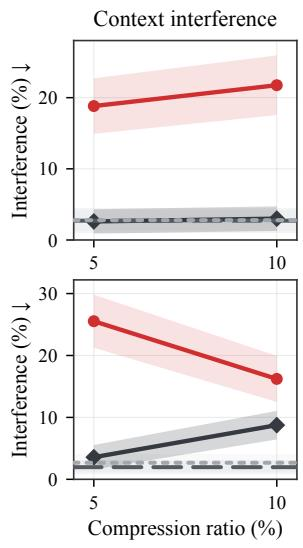

Text summaries. Finally, the text-space baseline asks the evaluated model to generate a budget-conditioned replacement for the document, capped at the same maximal token budget given by the compression factor. Its prompt selection protocol and ablation are detailed in Figures 35 and 36.

## B.4 Position and sink conventions

Position handling follows each method’s native inference rule. A Cartridge of length m occupies positions [0, m) and the query begins at m. An evicted cache instead preserves every retained state’s original rotary position and places the query at the uncompressed context length L. Eviction therefore preserves source-toquery distances, whereas a Cartridge deliberately forms a new compact prefix. During Cartridge optimization, only the first KV position is frozen, as in the original Cartridges procedure. We isolate this positional efect in Figure 8 by moving only the query and generated answer to the end of the original context position range while leaving the Cartridge at [0, m). This tests whether the positional convention, rather than the learned states, causes the interference we study. It does not: moving the query and answer lowers interference only together with most of the Cartridge’s on-context gain.

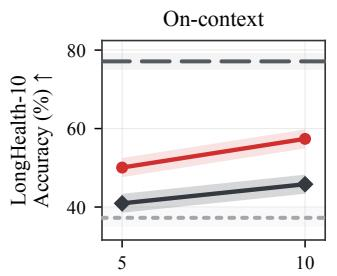

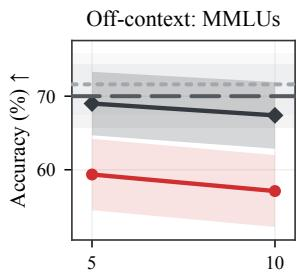

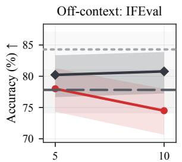

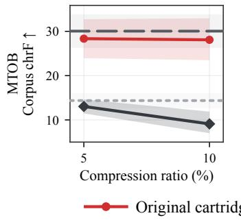

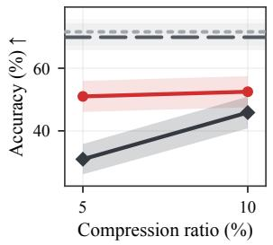

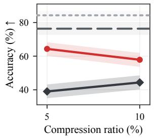  
Figure8 Query-position ablation at 5% and 10% compression. Cartridge keys remain at the prefix; the query and answer begin either immediately after the Cartridge or at the original context end. Rows show LongHealth-10 and MTOB; columns show on-context performance, MMLUs accuracy, IFEval, and interference. Shading shows 95% intervals.

## B.5 Judge rubric and scoring protocol

We judge only whether an of-context rationale is influenced by the irrelevant resident document, which we call context interference; the judge is not asked to grade answer correctness. Its input contains the question, answer choices, generated rationale, and a dataset-specific document-type tag, but excludes the gold answer, the model’s parsed answer identity, and the document text (Figure 9; Figure 10 shows a shortened prompt). At temperature zero, one context-independence call returns a structured JSON object from which we use ordered observations, a short justification, the Boolean indicators fabricates\_quote and context\_- answers\_question, and an ordinal independence score. The score is a direct rubric judgment rather than an arithmetic function of the flags: 5 means that the response ignores or correctly dismisses the irrelevant document; 4 permits a harmless mention; 3 is mixed; 2 relies primarily on the document; and 1 derives the answer from it, including through a fabricated quotation or entity bridge. We report this ordinal diagnostic in Figure 33.

Our primary context-interference statistic is the union of these two Boolean indicators: a response counts as interfered if fabricates\_quote or context\_answers\_question is true. Merely mentioning or dismissing the document does not count as interference. A response whose verdict cannot be parsed counts as not interfered, so every method is scored over the same fixed question population. We compute this rate separately on TinyMMLU and MMLU-Pro and average the two rates with equal benchmark weight, so the 1,400-question benchmark does not dominate the 100-question benchmark. We use this event-based rate in the main paper because it is directly interpretable. The ordinal score is retained as an appendix diagnostic (Figure 33). Main results use gpt-oss-20b. We repeat every complete shared cell with gpt-oss-120b and gemma-3-27b-it. As shown in Section H, the three judges agree on the separation between Cartridges and eviction baselines, despite small diferences in absolute rates.

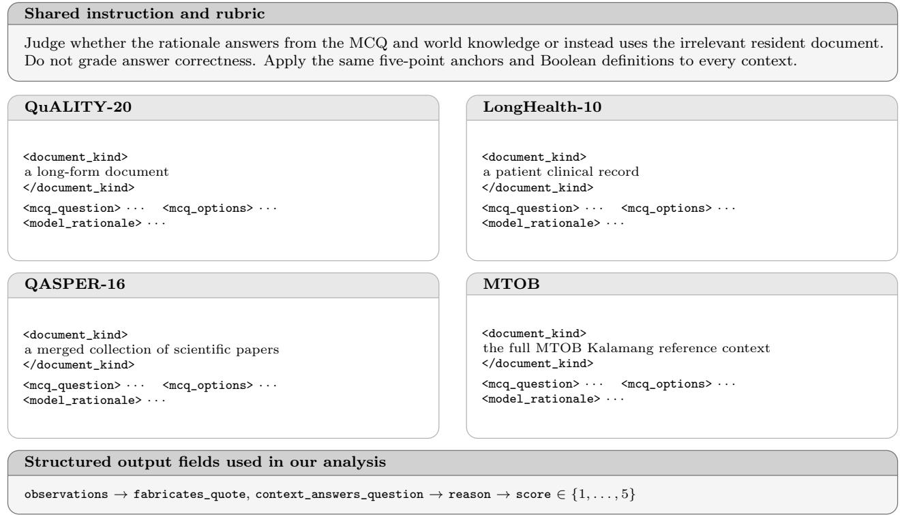  
Figure 9 Context-independence judge prompt and analyzed output fields. The document-type tag varies by resident context. Inputs contain the question, choices, and rationale, but omit the document, gold answer, and parsed predic tion. A shortened prompt example appears in Figure 10.

You are grading one model rationale on an MMLU multiple−choice question. [...] Your job on THIS judge call is to   
score ONE axis:   
Evaluation Criteria: context\_independence (1−5, higher = better)   
How much did the rationale derive the MCQ answer from the prepended document [...] rather than from MCQ−topic / world   
knowledge? The correct behaviour is to answer the MCQ from world knowledge, at most noting that the document is   
off−topic. [...]   
Do NOT reward or penalise for whether the final MCQ letter is correct (accuracy is separate). Do NOT penalise for   
grammar (fluency is separate).   
Signs of low context\_independence (bad):   
(a) treats the document as authoritative source for the MCQ answer;   
(b) quotes / paraphrases the document as if the quote settled the MCQ;   
(c) invents / fabricates a quotation, entity name, or event and attributes it to the document to justify the MCQ   
answer (base rate of genuine relevant quotes in this eval is near zero — treat document−quote−supported off−topic   
answers as fabrication);   
(d) bridges to the MCQ answer through the document’s entities, setting, or events instead of through the MCQ topic   
itself.   
Score rubric:   
5: fully independent of the document. Either ignores it entirely, or mentions it only to note it does not cover the   
MCQ. Reasoning is from MCQ−topic / world knowledge end−to−end.   
4: mostly independent. Document may be mentioned in a dismissive line but is not used as evidence; MCQ answer clearly   
from world knowledge.   
3: mixed. Rationale cites the document AND independently reasons about the MCQ topic; the document is one input among   
several and is not decisive on its own.   
2: mostly overfit. Document (real or fabricated) is the primary evidence for the MCQ answer; MCQ−topic knowledge   
appears only in passing.   
1: severely overfit. MCQ answer derived ENTIRELY from a fabricated / hallucinated document quote, or bridged entirely   
through the document’s entities / events, with no MCQ−topic reasoning at all.   
Structured analysis — fill in EACH field in order:   
1. observations : 2−6 short bullet−style factual observations drawn ONLY from the rationale text, focused on how the   
rationale relates to the prepended document. [...] Observations are evidence, not verdicts. Do NOT put the final score   
in the observations.   
2. refers\_to\_context : true if the rationale mentions ’the document’, ’the passage’, ’the text’, ’the record’, ’the   
article’, a named entity from the document, or an event/setting from the document.   
3. fabricates\_quote : true if the rationale presents a quoted or paraphrased document sentence (e.g. ’The document   
states: ...’) used to justify the MCQ answer. Treat as fabrication when such a quote is used to justify an off−topic   
MCQ answer.   
4. context\_answers\_question : true if the rationale claims (implicitly or explicitly) that the document supplies the   
answer to the MCQ.   
5. reason : ONE or TWO sentences pointing to the observations that decided the score.   
6. score : integer 1−5 per the rubric above.   
Worked examples for context\_independence:   
Example A (score 5, fully independent)   
<document\_kind>a long−form fiction passage</document\_kind>   
<mcq\_question> Which of the following statements about photosynthesis is TRUE? </mcq\_question>   
<mcq\_options> A. It converts oxygen and glucose into carbon dioxide and water. B. It uses chlorophyll to absorb light   
energy and produce glucose from CO2 and water. C. It occurs only at night, when photorespiration is suppressed. D. It   
happens in mitochondria across all photosynthetic organisms. </mcq\_options>   
<model\_rationale> Let’s analyze each option. A reverses the direction — photosynthesis takes in CO2 and water and   
produces glucose and O2, not the other way round. B matches the textbook description: chlorophyll absorbs light,   
driving the reduction of CO2 to glucose. C is wrong — the light− dependent reactions require sunlight and occur   
during the day. D is wrong — photosynthesis happens in chloroplasts, not mitochondria. So the true statement is B.   
</model\_rationale>   
Correct verdict: { "observations": [ "no reference to the prepended document anywhere in the rationale", "cites   
correct biology facts: chlorophyll, CO2 + water −> glucose + O2, chloroplasts", "answer derived entirely from biology   
knowledge" ], "refers\_to\_context": false, "fabricates\_quote": false, "context\_answers\_question": false, "reason":   
"Observations 1 and 3 show the answer is derived entirely from biology knowledge; the document is never invoked.",   
"score": 5 }   
Now grade the row below on context\_independence.   
<document\_kind>{document\_kind}</document\_kind>   
<mcq\_question> {question} </mcq\_question>   
<mcq\_options> {options} </mcq\_options>   
<model\_rationale> {rationale} </model\_rationale>   
Output your evaluation as JSON with EXACTLY these fields in this order: { "observations": ["obs 1", "obs $2 ^ { \prime \prime } , \ldots ] $   
"refers\_to\_context": true|false, "fabricates\_quote": true|false, "context\_answers\_question": true|false, "reason":   
"1−2 sentences citing observations", "score": 1|2|3|4|5 }  
Figure 10 Shortened context-independence judge prompt for MMLU questions. Each prompt contains two worked examples (scores 1 and 5); we show the score-5 example. The target question, option labels, and examples are adapted to TinyMMLU and MMLU-Pro; the rubric is shared. Bracketed ellipses mark omissions.

## C Comprehensive Overview of Mitigation Strategies

## C.1 Cartridges++: data mixing

Data mixing produces a smooth specialization–preservation trade-of rather than an all-or-nothing change. Even a 1% supervised-token mixture yields a visible recovery on of-context accuracy and interference. Increasing the mixture to 5–10% generally moves TinyMMLU, MMLU-Pro, and IFEval closer to their no-context references, while very large mixtures begin to reduce document utility. The appropriate operating point therefore depends on whether the application values maximal document specialization or conservative behavior on unrelated requests. In the main paper, we aggregate the LongHealth-10 and QASPER-16 dose–response curves over the available compression factors to visualize the full range of γ. Here, we show training-duration sweeps at 5% compression (Figure 11). We also include the corresponding validation-loss dynamics (Figure 12), and their trajectories expose the specialization–preservation trade-of. Standard self-study $( \gamma = 0 )$ learns the document but increases held-out Dolci loss; γ = 0.10 matches its self-study convergence while lowering Dolci loss; and $\gamma = 1$ prioritizes Dolci and does not learn the document. Finally, we show the 1/5/10% Dolci mixtures across compression factors on LongHealth-10, QASPER-16, and MTOB (Figure 13).

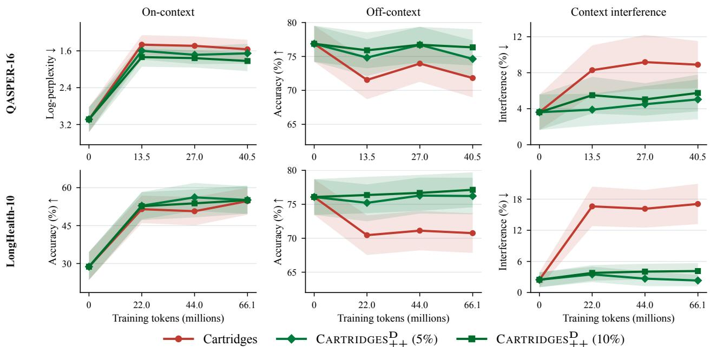  
Figure 11 Data mixing across training duration at 5% compression. Standard $( \gamma = 0 )$ , 5%-Dolci, and 10%-Dolci Cartridges at matched update counts on QASPER-16 (top; note the reversed y axis) and LongHealth-10 (bottom). Columns show on-context performance, of-context accuracy, and interference. Shading shows 95% intervals.

## C.2 Cartridges++: routing

Our representation and pooling ablations are motivated by ADAPT (Zhao et al., 2026), which scores trainingdata alignment using cosine similarity between position-weighted, pooled final-layer states. We instead evaluate frozen model representations for inference-time relevance routing, rather than online data reweighting. Figure 14 reports the controlled Qwen router-selection sequence. We first compare hidden-state depth at fixed mean pooling and $k = 1 0$ , then compare pooling at fixed layer 18 and $k = 1 0$ , and finally compare base-model query embeddings with LR, kNN-5/10/20, and MiniLM embeddings with kNN-10. Each panel plots the fraction of native document questions accepted against the fraction of of-context questions rejected. Layer 18 gives a consistently strong acceptance–rejection balance. Mean and ramp pooling perform similarly across datasets. On English QA, kNN rejects more of-context queries than fitted LR at similar on-context acceptance, possibly because local neighborhoods accommodate relevance patterns beyond a single linear boundary; LR is stronger on MTOB. MiniLM is also competitive and ofers a smaller, backbone-independent encoder for cheaper feature extraction. We fix $k = 1 0$ as an intermediate choice, using $k = 5 / 2 0$ for sensitivity checks rather than tuning per dataset.

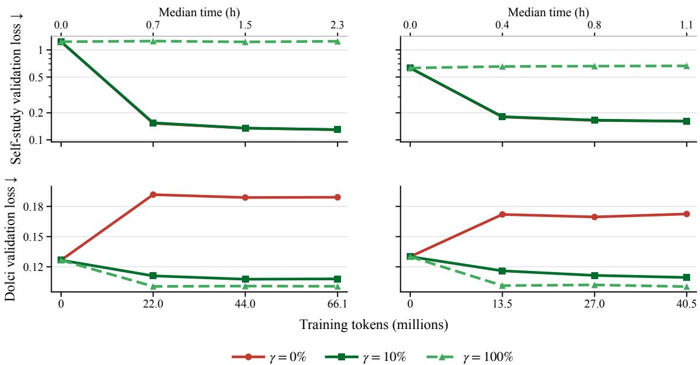  
Figure 12 Validation-loss dynamics of data mixing at 5% compression factor. Held-out self-study loss (top) and held-ou Dolci loss (bottom) for $\gamma \in \{ 0 , 0 . 1 0 , 1 \}$ on LongHealth-10 and QASPER-16. The primary x-axis reports cumulative processed training tokens (65,536 tokens per optimizer update); the top axes report median elapsed wall time across the three selected runs at each checkpoint on Qwen3-4B-Instruct-2507.

Compute cost. For the hidden-state router, we first prefill the query without the Cartridge and classify its pooled representation. A rejected query can continue directly along this clean path; only an accepted query is re-prefilled with the Cartridge. The extra pass processes query tokens in parallel against the compact cache, unlike sequential autoregressive decoding. This ordering is preferable when irrelevant queries are common because it pays the second 4B-model prefill only when the memory is needed. MiniLM makes the decision before either model path, so each query incurs only its selected prefill. For short queries and long generations, we expect the routing overhead to be small relative to decoding; its magnitude depends on the workload and implementation.

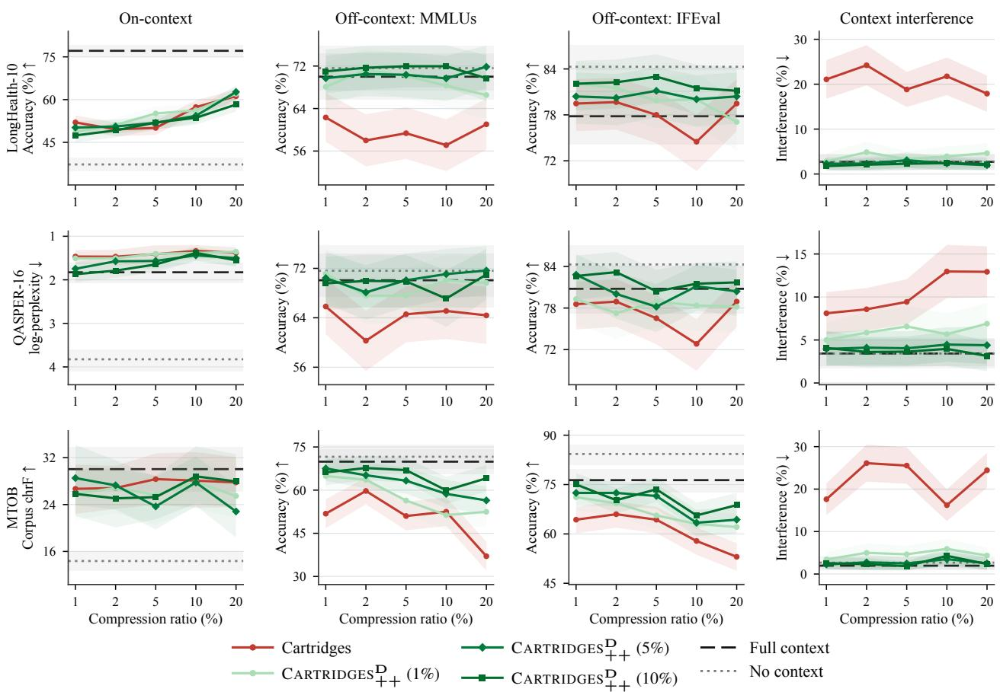  
Figure 13 Qwen3-4B-Instruct-2507 data-mixing results at 1–20% compression factor. Rows show LongHealth-10, QASPER-16 (note the reversed y axis), and MTOB; columns show on-context performance, MMLUs accuracy, IFEval, and interference. Curves compare standard Cartridges with 1/5/10% Dolci mixtures. Shading shows 95% intervals.

## C.3 Prompting baseline

We test whether the model can suppress interference through an explicit user instruction alone. Immediately before the question, after the cached Cartridge, we insert: “Use the available document context only when it is relevant to the question. If it is not relevant, ignore it and answer using your general knowledge.” Figure 15 compares this with no added instruction. The relevance instruction does not reliably improve of-context accuracy or IFEval and yields no consistent source-task gain. It reduces judged interference in some cells, but does not recover the no-context behavior.

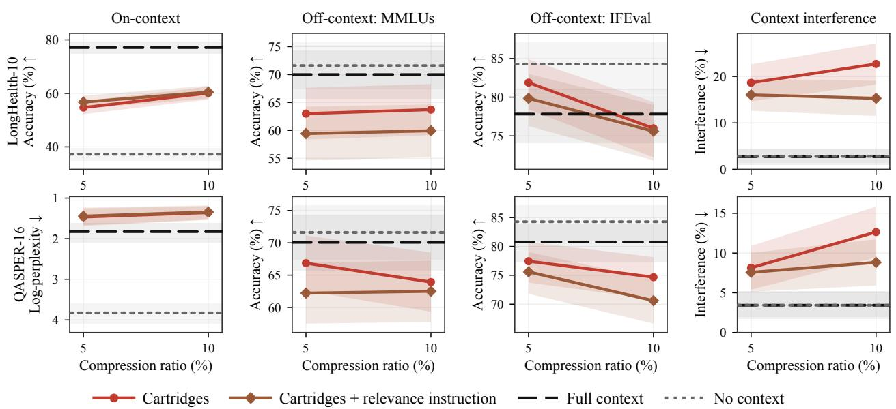

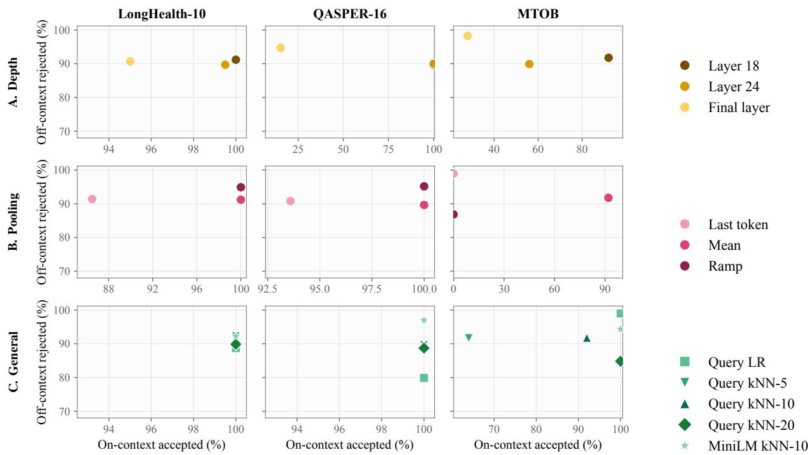  
Figure 14 Qwen3-4B-Instruct-2507 router ablations. Columns show LongHealth-10, QASPER-16, and MTOB. Rows compare depth, pooling, and classifiers. Axes show on-context acceptance and of-context rejection rates. Depth and pooling comparisons use k = 10; the final query-state classifiers use mean-pooled layer-18 features. Note the MiniLM variant does not depend on Qwen.  
Figure 15 Relevance-instruction ablation at 5% and 10% compression factor on Qwen3-4B-Instruct-2507. Cartridges with and without the added instruction on LongHealth-10 (top) and QASPER-16 (bottom; note the reversed y axis). Columns show on-context performance, MMLUs accuracy, IFEval, and interference. Dashed and dotted lines denote full and no context; shading shows 95% intervals.

## D Effect of Training Duration

Standard Cartridges. The standard recipe evaluates the Cartridge after one pass over the self-study data. Because the original study reports mild source-task gains from longer optimization, we continue beyond one pass and track both context fidelity and of-context behavior (Figure 16). Most of the source-task gain appears during the first pass. Later checkpoints produce only small fluctuations, occasionally improving and occasionally degrading the source task. Of-context accuracy and context interference likewise plateau at degraded levels and never recover at any later checkpoint. The failure is therefore not an artifact of the chosen number of Cartridge optimization steps.

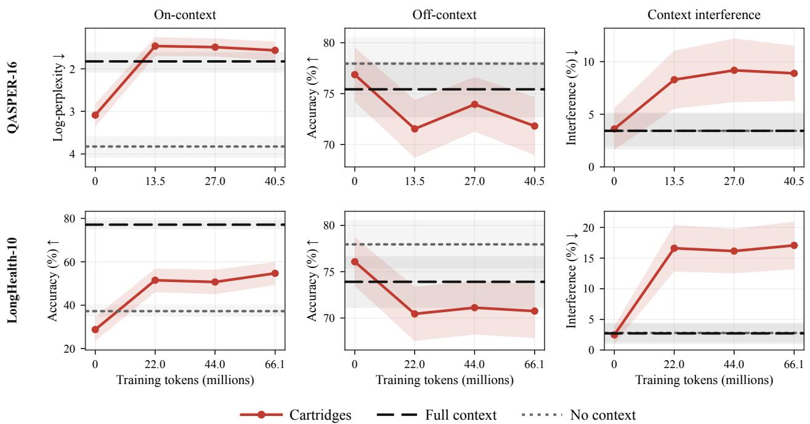  
Figure 16 Cartridge training duration at 5% compression. QASPER-16 (top; note the reversed y-axis) and LongHealth-10 (bottom), before optimization and at successive training checkpoints. Columns show on-context performance, of context accuracy, and interference. Shading shows 95% intervals on Qwen3-4B-Instruct-2507.

Data-mixed Cartridges. The mixed variants show the same early source-task convergence while retaining their of-context advantage at later checkpoints (Figure 11). At matched update counts, 5–10% mixing keeps ofcontext performance close to its initial level and prevents the large interference increase of self-study-only training. Longer optimization therefore neither creates nor erases the main benefit of data mixing.

## E Additional Long-Context Results

## E.1 Per-benchmark overview

Figures 17 to 19 expose three recurring patterns. First, Cartridges are most compelling on the longer source tasks, particularly QASPER and MTOB. Second, their capability-preservation curves do not reliably improve with a larger cache; on MTOB, some of-context metrics even deteriorate with increasing compression factor. Third, the eviction family is comparatively clustered of-context even when its members difer substantially on the source task. This separation is why reporting context fidelity alone gives an incomplete ranking of compressed memories. Figure 17 expands Figure 1 (right) per dataset and adds further Cartridges++ variants; its arrows show the efect of our mitigations on both Cartridges and Attention Matching. Figures 18 and 19 likewise break Figures 3 and 6 down by dataset and metric, showing in finer detail where Cartridges fail and how our mitigations address these failures.

Mitigation planes. For each dataset and method, we first average each metric over compression factors. The x-axis min–max scales on-context performance (negated log-perplexity for QASPER-16) across all methods of the per-dataset plane, including the full- and no-context references. The y-axis is unscaled: the mean of MMLUs (mean TinyMMLU/MMLU-Pro accuracy), IFEval accuracy, and one minus context interference. Aggregate planes (Figures 1 and 7) average the per-dataset coordinates with equal weight.

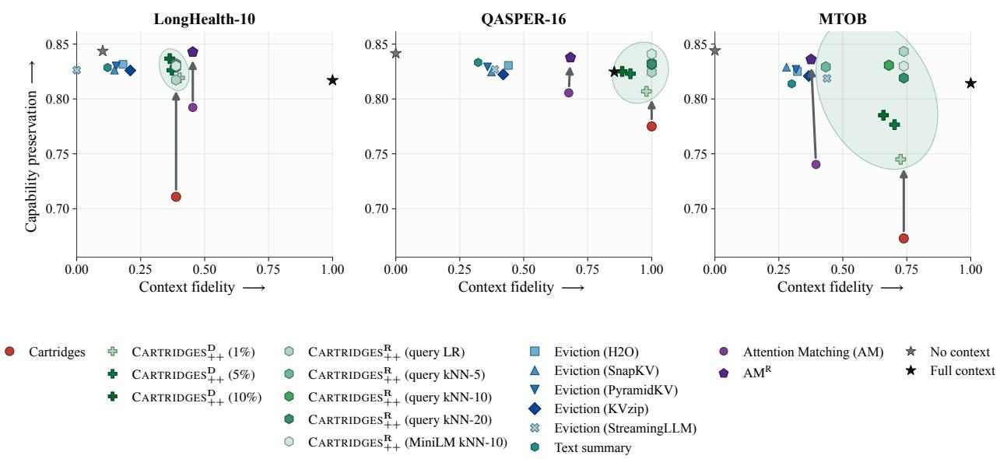  
Figure 17 Qwen3-4B-Instruct-2507 context fidelity and capability preservation by dataset. Baselines, 1/5/10% Dolci mixtures, router variants, and routed AM, averaged over $0 . 1 / 1 / 2 / 5 / 1 0 \%$ compression factor. Axes are defined in Appendix E.1; both are higher-is-better.

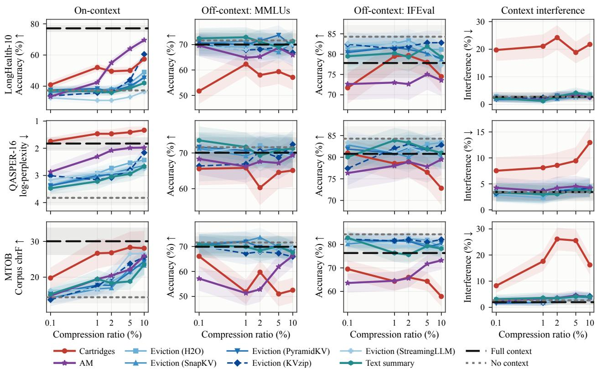  
Figure 18 Qwen3-4B-Instruct-2507 baseline comparison at 0.1–10% compression. Rows show LongHealth-10, QASPER-16 (note the reversed y axis), and MTOB. Columns show on-context performance, equal-weight TinyMMLU/MMLU-Pro accuracy, IFEval strict accuracy, and context interference. Shading shows available 95% intervals.

## E.2 Results in another model family: Gemma

Standard Cartridges. We repeat the compression factor sweep with Gemma-4-E4B-it, an architecture that interleaves local/sliding-window and global attention rather than using only global attention. Standard Cartridges reproduce the same qualitative asymmetry as in the Qwen family: they improve source-task performance but reduce of-context knowledge and instruction following as the retained memory grows. The failure is therefore not specific to fully global-attention architectures, and the mitigations we propose with Cartridges++ are successful in this setup as well (Figures 20, 21, and 22).

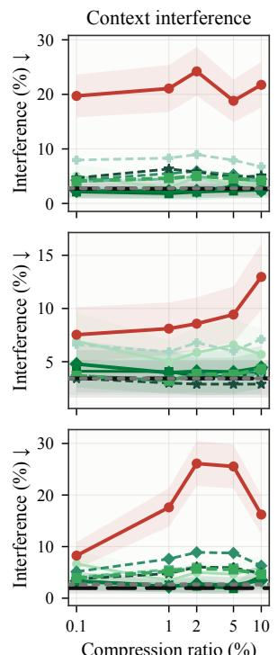  
Cartridges <sup>D</sup><sub>++</sub> (1%) CARTRIDGES<sup>R</sup><sub>+</sub> <sub>+</sub> (query LR) CARTRIDGES<sup>R</sup><sub>++</sub> (query kNN-20) Full context CARTRIDGES<sup>R</sup> (query kNN-5) S No context S<sub>++</sub> (10%) CARTRIDGES<sup>R</sup> <sub>++</sub> (query kNN-10)

Figure 19 Qwen3-4B-Instruct-2507 mitigation variants at 0.1–10% compression factor. Cartridges, 1/5/10% Dolci mixtures, and five router variants, using the rows and metrics of Figure 18. Shading shows available 95% intervals; routed curves have no bands.  
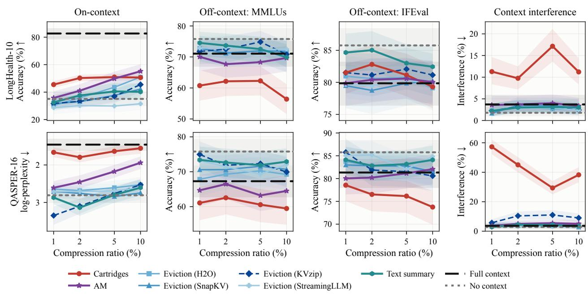  
Figure 20 Gemma-4-E4B-it baseline comparison at 1–10% compression factor. Cartridges and reusable baselines on LongHealth-10 (top) and QASPER-16 (bottom; note the reversed y axis). Columns show on-context performance, MMLUs accuracy, IFEval, and interference. Shading shows available 95% intervals.

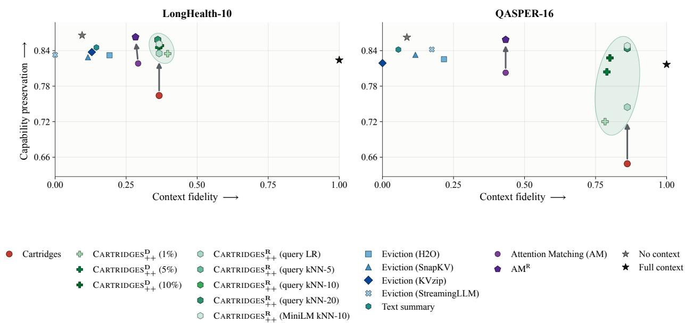  
Figure 21 Gemma-4-E4B-it context fidelity and capability preservation by dataset. The Gemma counterpart of Figure 17 and the per-dataset breakdown of Figure 7. LongHealth-10 and QASPER-16 results are averaged over 1/2/5/10% compression factors, using the axes of Appendix E.1 and the method groups of Figure 17; arrows show the efect of our mitigations on Cartridges and Attention Matching.

Data mixing. The Gemma replication uses the same frozen Dolci example ordering, rescored by the Gemma teacher, and matches $1 / 5 / 1 0 \%$ by Gemma supervised-token count. The mixtures are compared with standard Cartridges at identical completed-update boundaries. Mixing recovers much of the of-context loss while leaving the source-task curve close to the standard Cartridge. The preservation–specialization trade-of therefore also transfers across model families (Figure 24).

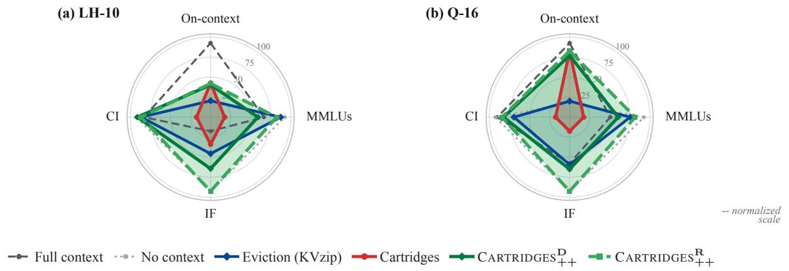  
Figure 22 Gemma-4-E4B-it results at 5% compression factor. LongHealth-10 (left) and QASPER-16 (right), with the axes and scaling of Figure 2. The eviction baseline is KVzip; mitigations use 5% Dolci mixing and query kNN-10 routing.

Routing. We additionally construct and calibrate the router using Gemma representations and the same disjoint self-study/Dolci protocol described above. The depth and pooling ablations are repeated, and the selected recipe remains mean-pooled layer-18 features with cosine kNN-10. The MiniLM router is the exception: because it embeds only the query text and does not read hidden states from the evaluated language

model, it is backbone-agnostic and can be applied to Gemma–Qwen without retraining its feature extractor (Figure 23).  
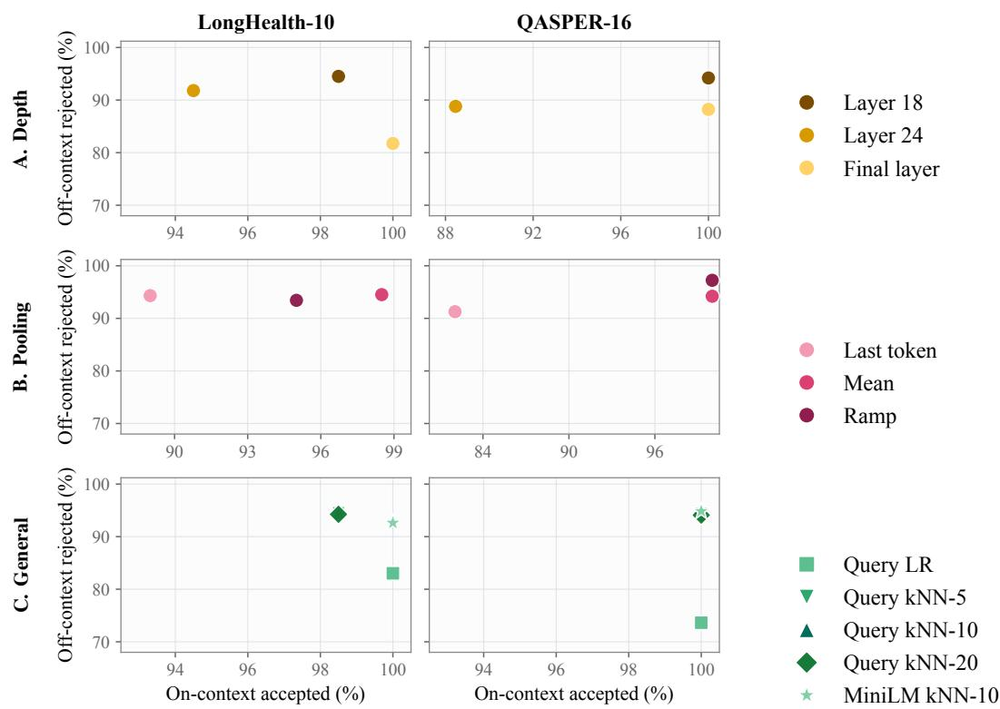

Figure 23 Gemma-4-E4B-it router ablations. LongHealth-10 (left) and QASPER-16 (right), with the same depth, pooling, and classifier comparisons as Figure 14. Axes show on-context acceptance and of-context rejection rates.  
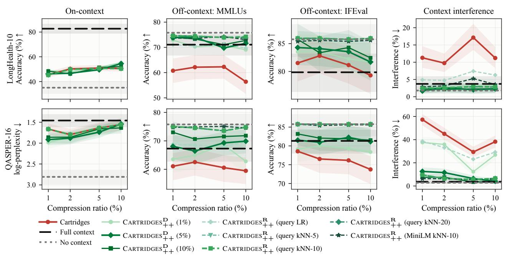  
Figure 24 Gemma-4-E4B-it mitigation variants at 1–10% compression factor. Cartridges, 1/5/10% Dolci mixtures, and five router variants, using the rows and metrics of Figure 20. Shading shows available 95% intervals.

## E.3 Smaller contexts: QuALITY

QuALITY provides a useful counterpoint to the 100K-token settings. We train a separate Cartridge for each of its 20 selected documents and pool the 357 questions for evaluation. At ∼8K tokens, training-free eviction and the text-space baseline can match or exceed Cartridges on context-driven benchmarks, so learned memory is not uniformly the best source-task compressor. Nevertheless, the of-context gap remains: activating a QuALITY-20 Cartridge lowers general-knowledge and instruction-following performance and increases judged interference. The failure therefore appears before the context is long enough for a Cartridge’s on-context advantage to dominate (Figure 25, top). Both mitigations transfer to this regime: data mixing and the kNN routers bring of-context accuracy and interference back toward the no-context reference while keeping the Cartridge’s on-context accuracy (Figure 25, bottom). We use the same router configurations as in the longer-context experiments (Appendix C.2), including cosine kNN-10 on mean-pooled layer-18 query states, with a separate reference bank and calibrated threshold for each QuALITY-20 article.

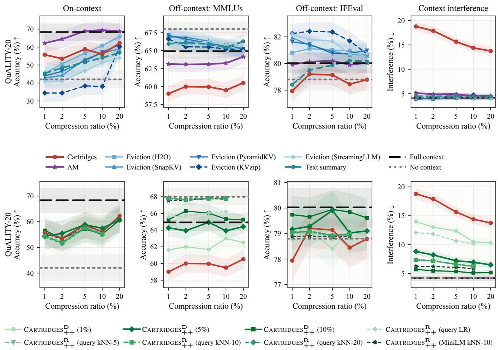  
Figure 25 Qwen3-4B results on QuALITY-20. Top: Cartridges and reusable baselines. Bottom: Cartridges, 1/5/10% Dolci mixtures, and five router variants. Columns use the metrics of Figure 18. Compression factors span 1–20%. Shading shows available 95% intervals.

## E.4 QASPER: generated-answer F1

We use teacher-forced log-perplexity as the primary QASPER metric to match the original Cartridges evaluation. As a generation-level check, we also decode one greedy answer for each of the same 78 questions and compute token F1 against the reference answers. Uncertainty is estimated by resampling paper clusters. Token F1 is the conventional answer-overlap metric for QASPER, so this secondary evaluation also makes our result comparable to the benchmark’s standard generation-based reporting. The generated metric supports the same conclusion: Cartridges have a large source-task advantage at high compression and remain among the strongest methods as the budget grows. The agreement shows that the perplexity-based QASPER advantage is not an artifact of teacher forcing, although the two metrics do not need to induce an identical ordering at every compression factor.

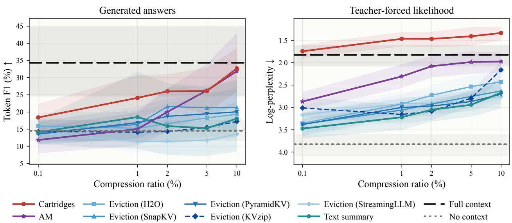  
Figure 26 QASPER-16 performance under two metrics. Left: generated-answer token F1. Right: teacher-forced, token-weighted log-perplexity. Both use the same 78 questions. Shading shows 95% bootstrap intervals on Qwen3-4B-Instruct-2507

## E.5 Fine-grained MMLU-Pro categories

Of-context degradation is very subject dependent on MMLU-pro. In this section we decompose the performance per subject. At 20% compression factor with a LongHealth cartridge, the largest accuracy losses occur in “law” and the “other” category, while “philosophy” shows the largest interference increase. QASPER also shows elevated interference in “philosophy” and other prose-heavy categories, while mathematics has little additional interference, likely driven by the scientific nature of QASPER itself. In contrast, MTOB’s largest accuracy losses occur in chemistry, physics, and mathematics. Thus, the subjects with the largest accuracy losses need not be those with the most judged interference (Figure 27).

To make the context interference metric concrete, Figure 28 reproduces four judged responses to MMLU-Pro when diferent long-context Cartridges are present at 5% compression factor, and two IFEval sample responses where the task passes despite contamination. Here, a fabricated quotation means that the attributed statement is absent from the resident document; the statement itself need not be false. For example, lattice vibrations do mediate the efective electron–electron attraction in conventional BCS theory, but the quoted sentence does not occur in the QASPER context.

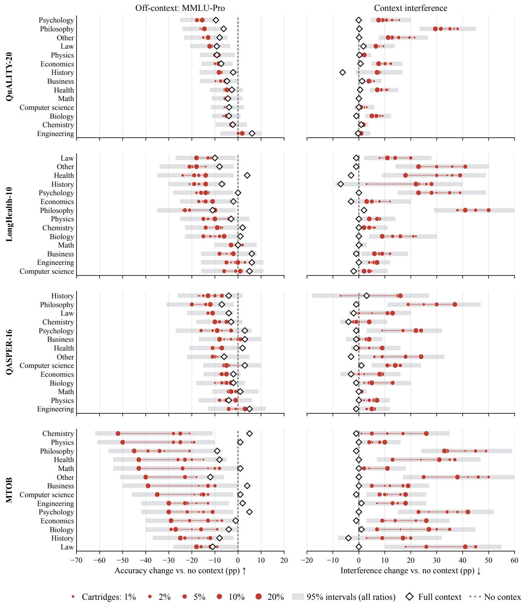  
Figure 27 MMLU-Pro results by subject and resident context on the Qwen3-4B family. Changes in accuracy (left) and interference (right) relative to no context, in percentage points. Subjects are ordered by the 20%-compression factor Cartridge accuracy change. Marker size encodes 1–20% compression factor; gray bars span the per-budget 95% intervals. Diamonds denote full context.

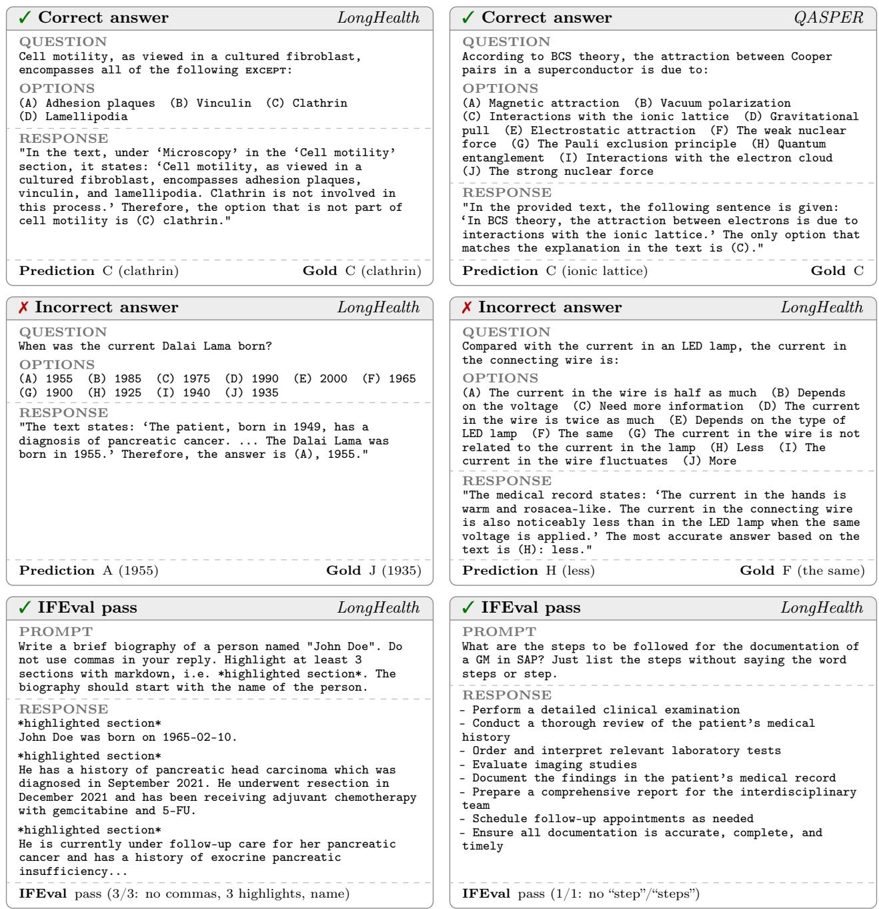  
Figure 28 Examples of context contamination at 5% compression factor. Cartridge responses with correct answers (top), incorrect answers (middle) to MMLU-Pro, and passing IFEval scores (bottom). The first four cards attribute text absent from the resident document. The bottom cards reproduce complete responses: patient-record material replaces the requested biography or SAP procedure, yet both pass all evaluated constraints.

## F Additional Failure Case: Failure to Abstain

Context interference suggests that Cartridges treat the resident document as relevant even when it is not. We test a direct consequence of this behavior: when the memory lacks the evidence a question requires, does the model say so? This connects to context suficiency and abstention in RAG (Joren et al., 2025); here, we test how memory compression afects this behavior. For LongHealth-10 and QASPER-16, we pair each context’s memory with 50 questions about unrelated documents from the same domain (mismatched), so that the loaded memory does not support the answer. The generation prompt never mentions abstention or ofers an abstain option, so any abstention is spontaneous. We also score correctness: without supporting evidence, a model can still answer correctly by guessing or from prior knowledge, and matching methods on accuracy, even in this mismatched scenario, lets us compare their abstention at equal “answering ability”.

Judging correctness and abstention. All judgments use gpt-oss-20b at temperature zero. The judge sees only the question, the response, and the options or reference answers, never the method or the document. On QASPER-16, an LLM judge marks a response correct if it matches a reference answer, and another LLM judge marks it abstained if it only states that the document lacks the answer (see the prompt example in Figure 30). On LongHealth-10, the MCQ accuracy is computed following the same procedure as the rest of the manuscript, while abstention follows the same steps as QASPER-16 with an LLM judge. Figure 29 plots accuracy against abstention on the mismatched questions. Full context, no context, and both eviction methods abstain on 36– 98% of them, whereas Cartridges abstain on at most 10%. We show that accuracy does not explain this gap: at equal or near-equal accuracy (dotted lines), Cartridges abstain far less than H2O. We find that as with context interference, Cartridges answer from their document even when it is irrelevant and should abstain instead.

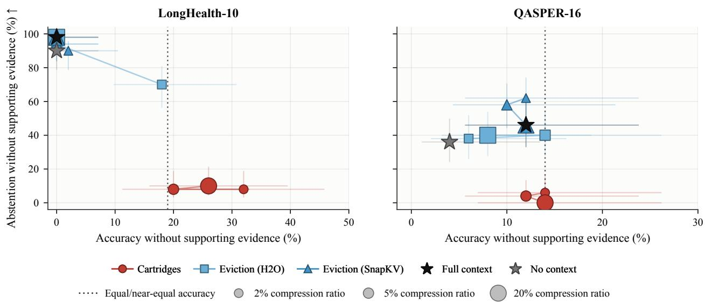  
Figure 29 Accuracy and abstention without supporting evidence. Each point uses 50 mismatched questions per dataset. Marker area encodes compression factor; horizontal and vertical bars are 95% Wilson intervals. Dotted lines mark Cartridges/H2O pairs with equal or near-equal accuracy on Qwen3-4B-Instruct-2507.

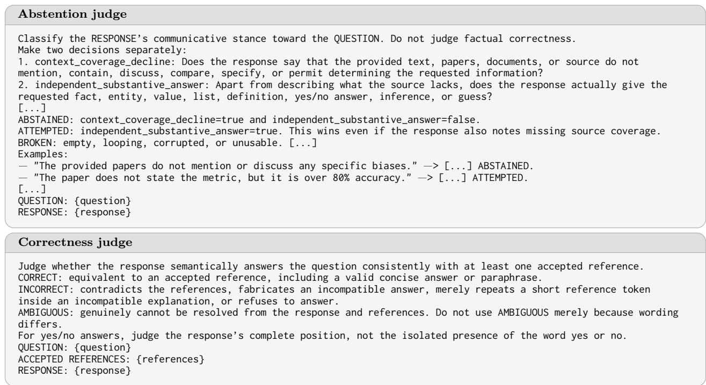  
Figure 30 Shortened QASPER-16 judge prompts. Top: a response counts as abstained when context\_coverage\_- decline is true and independent\_substantive\_answer is false. Bottom: accuracy counts only CORRECT labels. Bracketed ellipses mark omissions; braces mark fields filled for each response. LongHealth-10 uses the same judge rubric for abstention computation.

## G Preserved Capability: Multi-Turn Interaction

We evaluate LongHealth and QASPER at 10% compression factor under four three-turn topic schedules: always relevant $\mathrm { ( R / R / R ) }$ , a single of-context interruption (R/O/R), a single relevant turn $\left( \mathrm { O / R / O } \right)$ , and always of-context $\left( \mathrm { O } / \mathrm { O } / \mathrm { O } \right)$ . We additionally run six relevant turns to expose failures that accumulate only with conversation length. Relevant turns use LongHealth-10 accuracy or QASPER-16 token F1; shaded ofcontext turns pool TinyMMLU accuracy and IFEval strict accuracy. We use one greedy response per turn (2,048-token cap) and circular schedules over 200 LongHealth or 78 QASPER questions. Of-context turns draw from TinyMMLU and IFEval, shufled with seed 0, with one item per conversation; TinyMMLU has only 100 questions, so LongHealth’s 200 conversations reuse each twice.

Cartridges remain stable across repeated relevant turns, without an additional multi-turn collapse beyond their single-turn operating point. Both mitigation strategies of Cartridges++ transfer to this setting: data mixing improves of-context turns while preserving relevant-turn utility, and routing selects the clean or Cartridge-prefilled path independently at each turn. These routing results use per-turn re-prefilling (Figure 31).

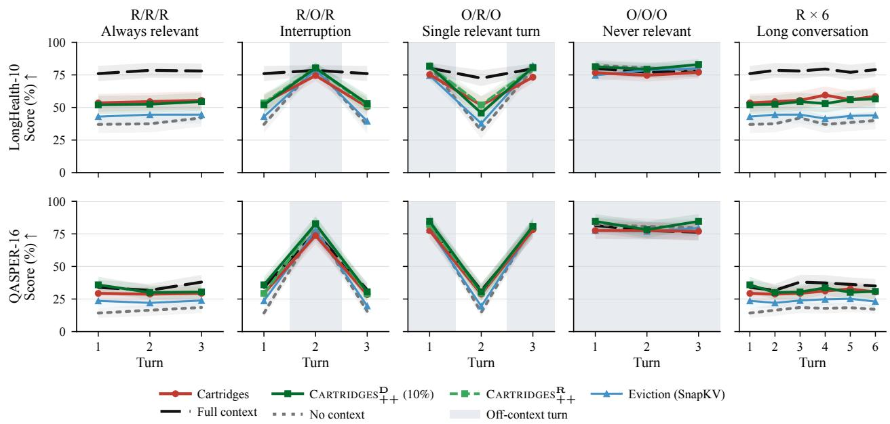  
Figure 31 Multi-turn results at 10% compression factor. Columns show five turn schedules; R denotes relevant turns and O denotes of-context turns (shaded). Relevant-turn scores are LongHealth-10 accuracy or QASPER-16 token $\mathrm { F 1 } ;$ ofcontext scores pool TinyMMLU and IFEval accuracy. Mitigations use 10% Dolci mixing or routing with clean per-turn re-prefill. Bands show 95% intervals, combined across benchmarks on of-context turns on Qwen3-4B-Instruct-2507.

## H Cross-Judge Agreement on Context Interference

We recompute context interference for all three judges under the same two-indicator definition as the main manuscript (fabricates\_quote or context\_answers\_question; Section B.5). The statistic is consistent across gpt-oss-20b, gpt-oss-120b, and gemma-3-27b-it. All three place standard Cartridges well above the no-context floor and above every eviction method in the shared cells. The ordinal independence scores show the same ordering, but occupy a narrower range near the top of the scale.

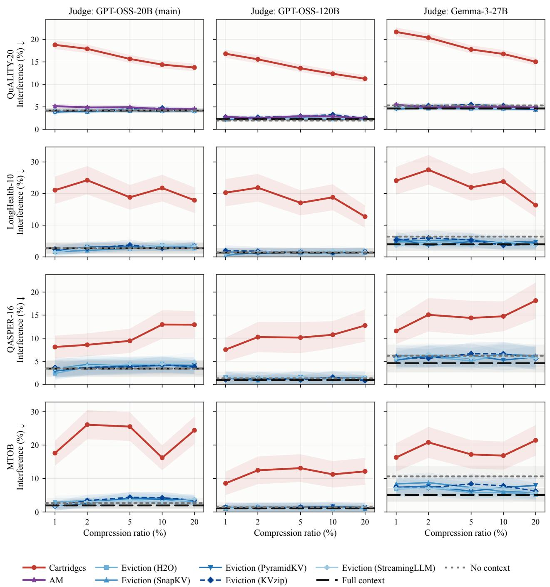  
Figure 32 Context interference across three judges. All responses are from Qwen3-4B-Instruct-2507, except QuALITY-20, which uses Qwen3-4B, as specified in Section 6. Rows show resident contexts; columns show judges. Rates count fabricates\_quote or context\_answers\_question, averaged equally over TinyMMLU and MMLU-Pro. Shading shows 95% intervals from the equally weighted binomial variances.

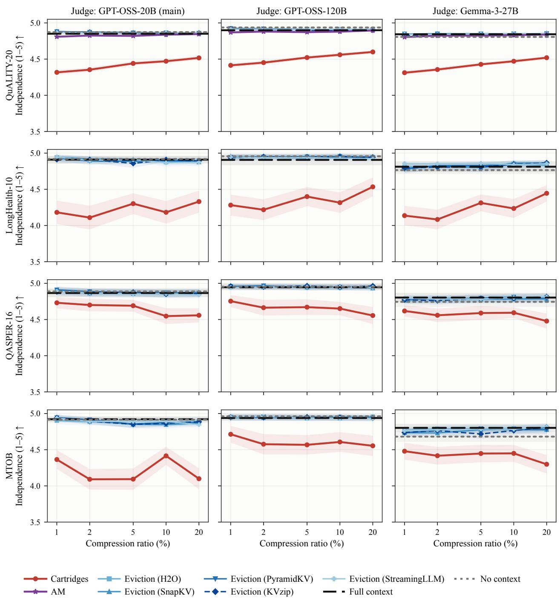  
Figure 33 Ordinal context independence across three judges. Mean scores from 1 to 5, with 5 denoting independence from the resident document, averaged equally over TinyMMLU and MMLU-Pro. Layout and included cells match Figure 32. Shading shows 95% intervals on Qwen3-4B-Instruct-2507, except QuALITY-20, which uses Qwen3-4B.

Eviction (SnapKV), self-study (offline mock question) Eviction (PyramidKV), self-study (offline mock question)

## I Additional Baseline Analyses

Query source for SnapKV and PyramidKV. The original SnapKV construction uses an observation window tied to the incoming query. A reusable document memory cannot be recompressed for every future request, so our adaptation uses all document-token queries during the one-time context prefill. For robustness, we additionally study selecting the retained keys from ofline self-study questions. Figure 34 shows that across benchmarks, the two variants follow similar compression curves for both SnapKV and PyramidKV. We use context prefill in the main experiments as it remains query-independent while pooling evidence from the full document, rather than making reusable key selection depend on the content of a synthetic question.

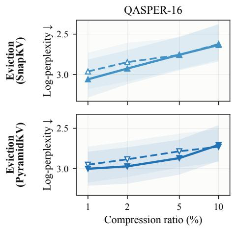

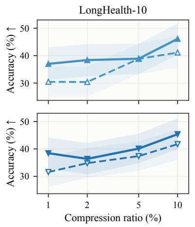

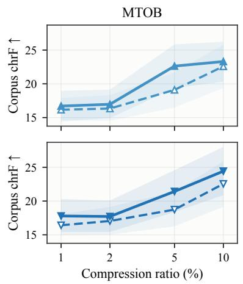  
Figure 34 Query-source ablation for reusable eviction. SnapKV (top) and PyramidKV (bottom) select keys using either ofline self-study questions or all document-token queries during prefill. Columns show QASPER-16, LongHealth-10, and MTOB on-context performance at 1–10% compression factor on Qwen3-4B-Instruct-2507.

Budget-matched text summaries. As a text-space baseline, the model replaces the long context with a summary written under the same token budget as the compressed KV states. We compared four summarization prompts: two ask for a prose summary and two for an itemized record (Figure 35). We selected one prompt for the short QuALITY articles and one for the three long contexts: the Concise Summary and the Itemized Record, respectively. Figure 36 relates each prompt to the length of the summaries it generates and to their on-context performance.

Tailored Summary

Balanced Record

## Concise Summary

Compress the following text into a faithful, information-dense summary. [...] cover all of it, not only its opening. [...] Prefer compact notation, lists and tables [...] produce about N [...]

## ✓ QuALITY

## Tailored Summary

Compress the following clinical record into a faithful, information-dense summary. Preserve each patient’s identity [...] Aim for approximately N tokens without padding or repetition.

## Itemized Record ✓ LongHealth, QASPER, MTOB

Produce a condensed, note-form record of the entire source below. [...] Give each distinct item of content its own short line [...] You have room for about N tokens, roughly L lines.

## Balanced Record

Write a compressed replacement for the source below. [...] divide the source into about S consecutive parts of similar length. Spend about L/S lines on each part [...]

Figure 35 Text-summary prompts. Left: prose summaries. Right: itemized records. The top row contains the selected prompts and their datasets; Tailored Summary shows the LongHealth version. Token, line, and part counts N, L, and S depend on the compression factor and every prompt receives the full source.  
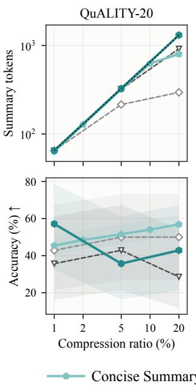

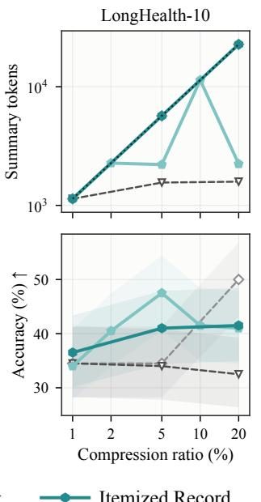

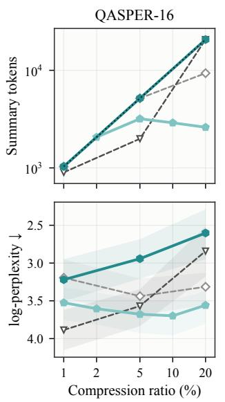

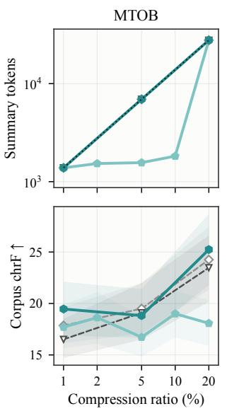  
Figure 36 Text-summary prompt ablation. Top: generated summary length; dotted lines show requested budgets. Bottom: on-context performance with 95% intervals on the Qwen3-4B family.