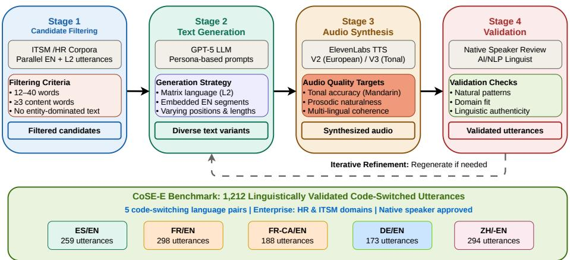
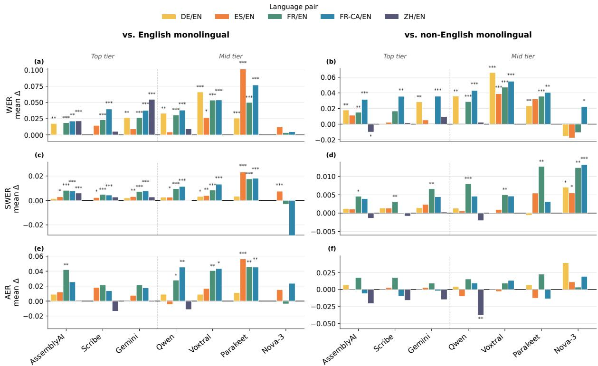
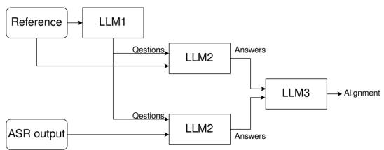
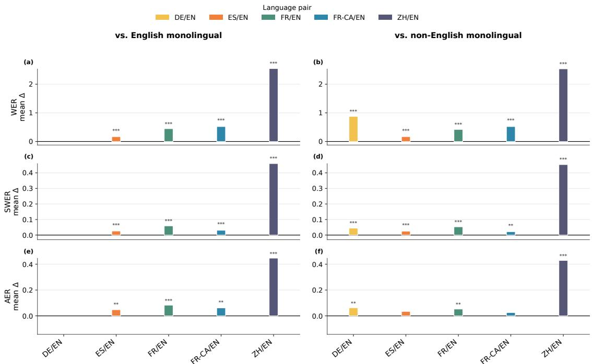

# CoSE-E: A Benchmark for Code-switched Speech Evaluation in Enterprise Settings

Shama Gupta1, Hoang Nguyen1, Chelsea Huang

Lindsay Brin1, Fanny Riols1,

1ServiceNow AI Research 2 Qualcomm Technologies, Inc.

Correspondence: shama.gupta@servicenow.com

## Abstract

Code-switching (CS), a seamless alternation between languages within a single utterance, remains a critical challenge in automatic speech recognition (ASR). While prior works focus on conversational CS-ASR, enterprise settings demand evaluation of operational impact beyond edit-distance errors: how code-switching transcription errors propagate to downstream voice agent task failures. In this work, we propose (1) a CS-ASR synthetic benchmark and multidimensional evaluation framework tailored to enterprise domains, (2) systematic evaluation of frontier ASR systems across 5 language pairs, (3) diagnostic analysis of the additional transcription errors that code-switching introduces across language pairs and models. We release COSE-E to support enterprise-focused CS-ASR evaluation for multilingual voice agents in enterprise deployment 1.

## 1 Introduction

Over half of the world’s population is bilingual or multilingual (Grosjean, 1982), and for many multilingual speakers, code-switching — seamlessly alternating between languages — is a natural communicative strategy across social and professional contexts (Myers-Scotton, 1993). Still, CS-ASR remains a major challenge for current models (Agro et al., 2025; Liu et al., 2026), and existing benchmarks (Lovenia et al., 2022; Xie et al., 2026) focus on conversational settings where code-switching is driven by social identity and stylistic preference (Poplack, 1980; Bullock and Toribio, 2009; Dogruöz et al.˘ , 2021). However, enterprise environments — customer service, IT support, business process automation — exhibit fundamentally different patterns: speakers code-switch to navigate domain-specific terminology, clarify technical concepts, and accommodate mixed-language knowledge bases. Enterprise-specific CS corpora remain scarce, leaving ASR systems inadequately evaluated in the operational contexts where transcription failures are most consequential.

Evaluation methodology compounds the problem. Standard edit-distance metrics such as WER, CER, and MER (Li and Fung, 2012) lack crosslanguage standardization and, more importantly, measure transcription quality in isolation without quantifying the downstream impact of errors on tasks like ticket routing or policy retrieval (Weng et al., 2020; Shapira et al., 2025; Bogavelli et al., 2026). In enterprise voice-agent pipelines, where a misrouted ticket or misunderstood policy question has real operational consequences, transcription fidelity is the critical first link. Error propagation is not unique to code-switching, but we expect code-switching to amplify it: switch points are likely where transcription is least reliable, and the switched-in term is often the one that determines downstream action. However, this remains untested for enterprise code-switching.

We address both gaps by constructing CoSE-E, a synthetic CS-ASR enterprise benchmark of 1,212 utterances spanning five language pairs — Spanish–English (ES/EN), French–English (FR/EN), Canadian French–English (FR-CA/EN), German–English (DE/EN), and Mandarin–English (ZH/EN) — grounded in HR and IT Service Management workflows. We evaluate eight ASR models using WER, Semantic Word Error Rate (SWER), and Answer Error Rate (AER), capturing both exact transcription accuracy and meaning preservation for downstream tasks. Our contributions are:

• CoSE-E: A linguistically validated synthetic CS-ASR benchmark spanning five language pairs and authentic enterprise workflows.

• Comprehensive CS-ASR Evaluation: Systematic evaluation of frontier ASR models across all five language pairs, quantifying code-switching robustness across surface-level and semantic metrics.

• Diagnostic Analysis: Diagnostic analysis of the added transcription cost that code-switching imposes beyond monolingual baseline errors, revealing language-pair- and model-specific failure patterns.

## 2 Related Work

Code-Switched Speech Corpora Codeswitched ASR has been studied across many language pairs. Wide-coverage benchmarks such as SwitchLingua (Xie et al., 2026) and CS-FLEURS (Yan et al., 2025) span dozens of pairs, while most modelling work is trained on smaller pair-specific corpora of conversational speech such as SEAME (Lyu et al., 2010) and ASCEND (Lovenia et al., 2022) for Mandarin– English, with analogous resources for other pairs. These all report per-language WER/CER on the transcript, typically partitioned by matrix language, the language setting the grammatical frame of an utterance, and embedded language, the one filling content slots within that frame (Myers-Scotton, 1993). Evaluation in these corpora is transcript-only, and they are drawn from social or conversational speech rather than enterprise interaction. CoSE-E is, to our knowledge, the first benchmark designed around this setting.

Enterprise Code-Switching and Downstream Evaluation The corpora above evaluate transcripts in isolation, but ASR errors propagate to downstream tasks: Lee et al. (2018) show this for spoken QA, and Oh et al. (2025) document a related matrix-language bias in LLMs on code-switched input. Enterprise code-switching sharpens the problem: speakers stay in their matrix language and switch into English for domain-specific terms— VPN, payroll cycle, ticket—that have no settled equivalent (Broersma and de Bot, 2006; Myslín and Levy, 2015), so errors concentrate on a small set of high-information words rather than scattering broadly. The closest prior benchmark (Abdoli et al., 2026) covers Arabic–English, Persian– English, and German–English on commercial ASR, but lacks Mandarin–English as a distinct-script pair, native-speaker review, and end-to-end downstream evaluation.

## 3 Benchmark Design

## 3.1 Data Pipeline

Whether terms like laptop, payroll, and ticket constitute code-switches or established loanwords is often ambiguous, as the boundary is speaker- and register-dependent (Broersma and de Bot, 2006; Myslín and Levy, 2015). For an ASR system and its downstream voice agent, however, this distinction is immaterial—both present the same recognition challenge: English-origin content words embedded in a non-English frame that must be transcribed correctly for the request to succeed. To evaluate these unified challenges, we introduce COSE-E, a synthetic code-switched speech benchmark grounded in two enterprise domains (HR and ITSM) covering five language pairs: ES-/EN, FR/EN, FR-CA/EN, DE/EN, ZH/EN. The pipeline proceeds in four stages, as shown in Figure 1.

Stage 1: Parallel Data Selection & Filtering. We begin with an internal corpus of parallel ITSM and HR utterances spanning across English and each of the five non-English languages. Our filtering strategy enforces three major constraints: (1) Length: we retain only utterances between 12 and 40 words as they are long enough to contain natural code-switching, but short enough to represent realistic conversational turns, (2) Entity Density: we exclude utterances whose content is dominated by non-lexical entities (emails, phone numbers, IDs, URLs), where language alternation is structurally forced rather than pragmatically motivated. Entities themselves are retained throughout the benchmark and are a central object of our analysis (see §5.1.4); the filter removes only utterances in which we believe entity strings crowd out the lexical material needed to study switching. (3) Generation Feasibility: we require at least three switchable content words (nouns, verbs, adjectives) per utterance. This is a constraint on our synthesis pipeline: utterances with sparse lexical material admit few candidate switch sites, causing the generation model to produce near-identical or degenerate variants. The threshold ensures each source utterance supports a range of switch points rather than a single forced one.

Stage 2: Code-Switching Generation. We generate diverse code-switched text variants by leveraging LLMs with unconstrained persona prompts following insight from prior works that unconstrained persona-based prompting produces more natural switches than constrained strategies (Yan et al., 2025; Xie et al., 2026). The complete generation prompts are provided in Appendix A.1.

Figure 1: Overview of CoSE-E Generation Pipeline
<table><tr><td>Language Pair</td><td>Dataset</td><td>Matrix Language</td><td>Embedded Language</td><td># utts</td><td>words/utt</td><td>chars/utt</td><td>switches/utt</td><td>CMI</td><td>switch density</td><td>% mono (↓)</td></tr><tr><td rowspan="4">ES/EN</td><td>CoSE-E</td><td>ES (64.2%)</td><td>EN (35.8%)</td><td>259</td><td>24.60</td><td>114.76</td><td>6.91</td><td>0.32</td><td>0.29</td><td>0.00</td></tr><tr><td>CS-FLEURS</td><td>ES (80.7%)</td><td>EN (19.2%)</td><td>1576</td><td>26.01</td><td>129.33</td><td>5.90</td><td>0.16</td><td>0.24</td><td>3.24</td></tr><tr><td>SWITCHLINGUA</td><td>ES (64.5%)</td><td>EN (35.5%)</td><td>8110</td><td>54.95</td><td>281.99</td><td>6.71</td><td>0.32</td><td>0.13</td><td>0.95</td></tr><tr><td>CoSE-E</td><td>FR (57.2%)</td><td>EN (42.8%)</td><td>298</td><td>21.56</td><td>98.54</td><td>4.95</td><td>0.33</td><td>0.24</td><td>0.00</td></tr><tr><td rowspan="4">FR/EN</td><td>CoSE-E (CA)</td><td>FR-CA (73.5%)</td><td>EN (26.5%)</td><td>188</td><td>20.82</td><td>98.53</td><td>5.74</td><td>0.26</td><td>0.29</td><td>0.00</td></tr><tr><td>CS-FLEURS</td><td>FR (72.2%)</td><td>EN (27.7%)</td><td>1315</td><td>25.46</td><td>129.82</td><td>6.17</td><td>0.19</td><td>0.25</td><td>3.42</td></tr><tr><td>SWITCHLINGUA</td><td>FR (64.4%)</td><td>EN (35.6%)</td><td>8070</td><td>52.41</td><td>273.66</td><td>5.66</td><td>0.31</td><td>0.11</td><td>1.98</td></tr><tr><td>CoSE-E</td><td>DE (63.7%)</td><td>EN (36.3%)</td><td>173</td><td>21.12</td><td>109.32</td><td>4.99</td><td>0.30</td><td>0.25</td><td>0.00</td></tr><tr><td rowspan="3">DE/EN</td><td>CS-FLEURS</td><td>DE (77.9%)</td><td>EN (21.8%)</td><td>1507</td><td>22.20</td><td>130.02</td><td>5.60</td><td>0.20</td><td>0.27</td><td>3.78</td></tr><tr><td>SWITCHLINGUA</td><td>DE (62.0%)</td><td>EN (22.1%)</td><td>15330</td><td>47.92</td><td>270.17</td><td>5.92</td><td>0.33</td><td>0.13</td><td>0.65</td></tr><tr><td>CoSE-E</td><td>ZH (89.6%)</td><td>EN (10.4%)</td><td>294</td><td>21.20</td><td>44.67</td><td>2.86</td><td>0.10</td><td>0.15</td><td>0.00</td></tr><tr><td rowspan="3">ZH/EN</td><td>SEAME</td><td>EN (71.5%)</td><td>ZH (28.3%)</td><td>3003</td><td>9.18</td><td>30.38</td><td>1.20</td><td>0.12</td><td>0.14</td><td>57.71</td></tr><tr><td>ASCEND</td><td>ZH (80.2%)</td><td>EN (19.1%)</td><td>373</td><td>2.19</td><td>25.65</td><td>0.40</td><td>0.12</td><td>0.21</td><td>67.29</td></tr><tr><td></td><td></td><td></td><td></td><td></td><td></td><td></td><td></td><td></td><td></td></tr></table>

Table 1: Linguistic characteristics of contemporary code-switching benchmarks. CoSE-E demonstrates consistent code-switching patterns across languages (CMI 0.26–0.33, switch density 0.13–0.29) with no monolingual utterances, unlike baseline corpora which contain significant monolingual content (3.2–67.3%). Column abbreviations: # utts = utterance count; words/utt = average words per utterance; chars/utt = average characters per utterance; switches/utt = code-switches per utterance; CMI = code-mixing index; switch density = proportion of switchingframes; % mono = percentage ofmonolingual content. All values reported to two decimal places.

Stage 3: Audio Synthesis. We convert generated text utterances to spoken form through two sequential steps. First, a normalization and verbalization pass to convert text to phonetic representation, ensuring consistent pronunciation across variants. This pass standardizes how numbers, symbols, and special characters are rendered, so that the synthesis is accurate. The normalization rules and LLM verbalization prompts are detailed in Appendix C.1. Second, we synthesize audio using ElevenLabs Multilingual V2 for the four European language pairs (DE, ES, FR, FR-CA) and Eleven-Labs V3 for ZH/EN, which provides superior tonal accuracy and prosodic naturalness critical for ZH. We select one male and one female voice for each language, both verified by native speakers, resulting in 10 voices across the benchmark with balanced gender representation (50% male, 50% female utterances). This two-stage approach ensures both linguistic fidelity and acoustic authenticity.

Stage 4: Data Quality Validation. Quality is essential for a benchmark intended to rigorously evaluate the systems’ robustness in real-world codeswitching enterprise contexts. Thus, we implement a systematic validation by professionally trained linguists with two combined critical competencies: native fluency in each matrix language and familiarity with code-switching patterns and linguistic norms specific to enterprise contexts. Utterances flagged for unnatural switching patterns or phonetic mispronunciations are either excluded or returned to Stage 2 for regeneration and re-review.

Dataset Overview The resulting dataset contains 1,212 records distributed across five language pairs: ES/EN (259), FR/EN (298), FR-CA/EN (188), DE/EN (173), and ZH/EN (294), as summarised in Table 1. A critical distinction of CoSE-E is its enforced zero-monolingual constraint (%mono=0.00%) across all language pairs, guaranteeing every record is a genuine code-switched utterance. This contrasts with existing benchmarks, which contain substantial monolingual content — particularly Mandarin–English corpora such as SEAME (57.7%) and ASCEND (67.3%). CoSE-E also maintains consistent code-switching depth across European language pairs, as measured by three jointly-optimised metrics: switches per utterance (4.9–6.9), code-mixing index (0.26–0.33), and switch density (0.13–0.29). The Mandarin– English pair exhibits lower values (switches/utt: 2.86, CMI: 0.10, switch density: 0.15), reflecting the predominantly insertional nature of mainland-China Mandarin–English code-switching, where speakers embed single English content words or short phrases into a Mandarin frame (Zhong et al., 2024). This pattern is especially prevalent in enterprise settings, producing fewer, shorter switches per utterance than the European pairs.

## 3.2 Evaluation Metrics

WER assumes a single canonical reference transcript, an assumption code-switching undermines. Transliteration, mixed script, borrowing-versusswitching ambiguity, and casing all admit multiple valid surface forms for the same utterance, causing normalization and segmentation choices to exert outsized influence on results. In enterprise CS-ASR the measurement requirements sharpen further: success of a voice agent hinges not on surface fidelity but on correctly transcribing critical entities and technical terms while preserving semantic meaning—failures that WER alone cannot capture. Accordingly, we propose Answer Error Rate (AER) as the standard evaluation metric for code-switched ASR in enterprise domains, and adopt it as the primary metric throughout this paper. We report AER alongside WER and SWER for comparability with prior works.

Answer Error Rate (AER). Introduced by Pulikodan et al. (2025), AER measures task-level fidelity: it captures whether transcription errors impair a downstream LLM’s ability to understand the important details. A three-role LLM pipeline (Figure 3 in Appendix B.1) operationalizes this. A question generator produces k=3 comprehension questions from the reference transcript, targeting the critical entities that drive voice-agent task success—identifiers, technical terms, and actionbearing tokens (Bogavelli et al., 2026). We have three human annotators confirm that questions have a grounded answer in the reference utterance (Appendix B.2). An answerer responds to each question twice—once from the reference transcript and once from the hypothesis. An alignmentjudge then compares the two answer sets question by question; AER is the fraction of questions whose hypothesisderived answer diverges from the reference-derived one. We test both components for stochasticity in Section B.1.

Two properties make AER the right primary metric for code-switched evaluation.

(1) Normalization-invariant. Scoring operates over answers rather than strings, so normalization choices that destabilize WER under code-switching never enter the computation.

(2) Consequence-aware scoring. AER’s questions target contentful spans—entities, technical terms, alphanumerics—the highest-information tokens in enterprise speech and the ones codeswitching most often corrupts (§5.1.4). By design, information-dense tokens are scored directly rather than averaged away as they would be under WER’s uniform weighting. We confirm this directly in §5.1.4: AER’s answer changes precisely when code-switching destroys such a token, and remains stable when the token is only reformatted. AER is thus a task-aligned proxy rather than a substitute for measured task completion, which we leave to future work.

We instantiate the question generator and alignment judge with Gemma-4-31B and the answerer with GPT-4.1 (full prompts in Appendix A).

Complementary metrics. We report two additional metrics to enable comparison with prior CS- and multilingual-ASR work. Word Error Rate (WER) is the surface baseline. Semantic WER (SWER) captures semantically meaningful errors, crediting meaning-preserving surface differences and penalizing meaning-altering ones; we adapt Pipecat’s open-source STT benchmark2. For ZH/EN we additionally report Character Error Rate (CER), the standard evaluation unit for Chinese ASR, along with WER.

## 4 Results

We evaluate eight frontier models covering both proprietary and open-weight across five language pairs: AssemblyAI Universal-3.5-Pro 3, Deepgram Nova-3 Multilingual 4, ElevenLabs Scribe-v2,

<table><tr><td></td><td colspan="3">ES/EN</td><td colspan="3">FR/EN</td><td colspan="3">FR-CA/EN</td><td colspan="3">DE/EN</td><td colspan="4">ZH/EN</td></tr><tr><td>Model</td><td>WER</td><td>SWER</td><td>AER</td><td>WER</td><td>SWER</td><td>AER</td><td>WER</td><td>SWER</td><td>AER</td><td>WER</td><td>SWER</td><td>AER</td><td>WER</td><td>CER</td><td>SWER</td><td>AER</td></tr><tr><td>Scribe-V2</td><td>.022</td><td>.004</td><td>.033</td><td>.031</td><td>.006</td><td>.051</td><td>.041</td><td>.005</td><td>.030</td><td>.027</td><td>.002</td><td>.021</td><td>.073</td><td>.031</td><td>.006</td><td>.042</td></tr><tr><td>Gemini-3-Flash</td><td>.028</td><td>.005</td><td>.031</td><td>.040</td><td>.009</td><td>.054</td><td>.055</td><td>.008</td><td>.043</td><td>.046</td><td>.003</td><td>.023</td><td>.090</td><td>.041</td><td>.009</td><td>.059</td></tr><tr><td>AssemblyAI</td><td>.029</td><td>.004</td><td>.033</td><td>.039</td><td>.009</td><td>.062</td><td>.052</td><td>.006</td><td>.034</td><td>.048</td><td>.003</td><td>.023</td><td>.093</td><td>.046</td><td>.010</td><td>.057</td></tr><tr><td>Qwen3-Omni</td><td>.042</td><td>.004</td><td>.027</td><td>.061</td><td>.010</td><td>.055</td><td>.071</td><td>.009</td><td>.062</td><td>.063</td><td>.004</td><td>.033</td><td>.040</td><td>.039</td><td>.006</td><td>.041</td></tr><tr><td>Voxtral</td><td>.049</td><td>.005</td><td>.036</td><td>.060</td><td>.012</td><td>.068</td><td>.059</td><td>.014</td><td>.074</td><td>.081</td><td>.003</td><td>.027</td><td></td><td></td><td></td><td></td></tr><tr><td>Parakeet</td><td>.117</td><td>.027</td><td>.075</td><td>.075</td><td>.024</td><td>.084</td><td>.099</td><td>.025</td><td>.069</td><td>.054</td><td>.005</td><td>.039</td><td></td><td></td><td>一</td><td></td></tr><tr><td>Nova-3</td><td>.042</td><td>.013</td><td>.088</td><td>.052</td><td>.019</td><td>.065</td><td>.072</td><td>.019</td><td>.080</td><td>.069</td><td>.012</td><td>.071</td><td></td><td>1</td><td></td><td></td></tr><tr><td>Whisper</td><td>.161</td><td>.030</td><td>.073</td><td>.434</td><td>.061</td><td>.111</td><td>.535</td><td>.029</td><td>.089</td><td>.615</td><td>.045</td><td>.092</td><td>1.494</td><td>2.516</td><td>.514</td><td>.515</td></tr></table>

Table 2: WER, SWER, and AER by model and language pair. ZH/EN WER is jieba word-level (mean of per-utterance WER, as for all pairs) and broadly comparable to the Latin-script pairs; ZH/EN CER is character-level and not magnitude-comparable. All ZH/EN outputs were normalized Traditional→Simplified (OpenCC) before WER/CER/SWER scoring. Best per column in bold; ties at displayed precision (3 decimals) are both bolded.

Google Gemini-3 Flash 5, Voxtral-Small-24B (Liu et al., 2025), Parakeet-TDT-0.6b-v3 (Sekoyan et al., 2025), Qwen3-Omni-Instruct (Xu et al., 2025), and Whisper-Large-v3-Turbo (Radford et al., 2023). To simulate the realistic enterprise deployment settings, all models use native auto-language detection without explicit language parameter 6, as detailed in Appendix C.3.

For SWER judgment and AER evaluation, we instantiate the question generator and alignment judge with Gemma-4-31B-IT (Team et al., 2026)(max tokens=12000, temperature=1.0, top p=0.95, top k=64) and the answerer with GPT-4.1 7 (temperature=0). The hyperparameters for all evaluated ASR systems and judge models are detailed in Appendix C.3.

## 4.1 Model performance across metrics

Model performance separates into tiers (Table 2), but a model’s tier sometimes changes by metric. We use a Friedman test to confirm all eight models differ significantly on every metric (WER: χ2(7, N=918)=1464.1; SWER: 612.2; AER: 200.1; all p < .001; table 9 in Appendix D.1). On WER, the field splits three ways: Scribev2, Gemini-3-Flash, and AssemblyAI cluster at the top (WER 0.02–0.05 across pairs); Qwen, Voxtral, Nova-3, and Parakeet occupy the middle; and Whisper ranks far below, translating rather than transcribing code-switched audio under automatic language detection (Appendix D.3). But AER reshuffles the middle tier. Qwen ranks sixth on ES/EN WER (0.042) yet first on AER (0.027)— ahead of every model, including Scribe. The gap is substantial: Qwen’s AER is 18% lower than

Scribe’s on that pair (Table 2). A mid-pack model on WER can be top-ranked in AER.

Within the top tier, there is no clear winner. The top four—Scribe, Gemini, AssemblyAI, and Qwen—are all mutually non-significant on AER after Holm correction, and within-metric concordance is low (W=0.23 for WER, 0.03 for AER; Table 9), confirming that models trade places from clip to clip. The best system therefore depends on the target language pair: Scribe leads almost everywhere on WER, but Qwen takes the lowest AER on both ES/EN and ZH/EN, while Gemini takes second-lowest AER on ES/EN despite ranking third on WER there. Notably, both are large audio language models rather than ASR systems; we hypothesize that stronger language modeling compensates for surface transcription errors by preserving the semantic content that AER captures.

AER separates models where surface metrics cannot, because it isolates semantic failures from normalization choices. All three metrics agree on the coarse three-tier ranking (Kendall’s W = 0.963), but diverge within tiers: on European pairs, AER still distinguishes models while WER and SWER collapse (within-metric W falls from 0.23 to 0.03) Table 9. Chinese reveals why. Gemini’s WER improves 46% after Traditional-to-Simplified conversion (0.167 → 0.090), yet AER is unchanged (0.059)—the judge recovers answers regardless of script (shown in Table 10 in D.2). Whisper shows the same pattern: CER of 2.52, but AER bounded at 0.52 (Table 2). Surface metrics conflate encoding choices with transcription errors; AER does not, making it the more reliable metric to predict task success for enterprise use cases.

## 4.2 Model performance across language pairs

We ask how model performance differs by language pair, and whether the ranking of pairs is the same across metrics. We test this on two designs: a primary analysis of the four Latin-script pairs across all eight models (shown in Table 3, and a restricted analysis that adds ZH/EN on the five models that support it (Scribe-V2, Gemini-3-Flash, AssemblyAI, Whisper, Qwen-3-Omni), shown in Table 11 in Appendix D.4. On the primary design, a Friedman test finds the clearest separation on SWER $( \chi ^ { 2 } ( 3 ) { = } 1 3 . 9 5 , p { = } . 0 0 3$ $W { = } 0 . 5 8 )$ , a moderate one on WER $( \chi ^ { 2 } ( 3 ) { = } 1 0 . 0 5$ p=.018, $W { = } 0 . 4 2 )$ , and a similar one on AER $( \chi ^ { 2 } ( 3 ) { = } 9 . 4 5$ $p { = } . 0 2 4$ $W { = } 0 . 3 9 )$ (Table 3). All three survive Holm correction, but the signal is sharpest on SWER: semantic difficulty is the most consistently detectable difference across language pairs.

<table><tr><td>Language pair</td><td>WER</td><td>SWER</td><td>AER</td></tr><tr><td>EN/DE</td><td>2.62</td><td>1.38</td><td>1.50</td></tr><tr><td>EN/ES</td><td>1.75</td><td>2.00</td><td>2.25</td></tr><tr><td>EN/FR-CA</td><td>3.62</td><td>3.13</td><td>2.88</td></tr><tr><td>EN/FR</td><td>2.00</td><td>3.50</td><td>3.38</td></tr><tr><td>Friedman  $\chi ^ { 2 } ( 3 )$ </td><td>10.05</td><td>13.95</td><td>9.45</td></tr><tr><td>p</td><td>.018</td><td>.003</td><td>.024</td></tr><tr><td>Kendall&#x27;s W</td><td>0.42</td><td>0.58</td><td>0.39</td></tr></table>

Table 3: Mean rank of each language pair per metric (4 pairs, 8 models). Rank 1 = easiest, rank 4 = hardest; averaged across all 8 models. Bold = easiest pair per metric. Friedman $\chi ^ { 2 }$ and Kendall’s W summarise whether pairs differ significantly and how consistently models agree on the ordering.

On the meaning-aware metrics, DE/EN is the easiest language pair and FR/EN the hardest. SWER and AER agree on the full ordering— DE/EN easiest, then ES/EN, FR-CA/EN, and FR/EN (AER ranks 1.50, 2.25, 2.88, 3.38; SWER nearly identical). WER produces a different ordering: ES/EN easiest (1.75), then FR/EN(2.00), DE/EN (2.62), and FR-CA/EN hardest (3.62) (Table 3). The two orderings diverge specifically on German and French, which trade the easy and hard ends: EN/DE is second-hardest on WER but easiest on both meaning-aware metrics, while FR/EN is second-easiest on WER but hardest on both. This reversal reflects the errors each language produces: German accumulates surface word-form errors (morphology, compounding, casing) that inflate WER but rarely touch task entities, while French produces fewer errors that land on content that matters. Because WER weighs the cheap German errors and consequential French errors alike, its ranking is misleading.

Chinese extends the same pattern to a larger scale. In the restricted five-model design, ZH/EN is unambiguously the hardest pair on the surface metrics—ranked hardest by every model on WER (5.0) and nearly every model on SWER (4.6). On AER, however, it is no longer hardest: FR/EN edges past it (4.4 vs. 4.2) (Table 11). Chinese produces many surface errors, but they scatter across word forms, segmentation, and normalization rather than concentrating on consequential content. A pair with far higher surface error can thus be easier on the metric that matters—the clearest evidence that surface scores alone mischaracterize code-switch difficulty for enterprise evaluation.

## 5 Discussion

## 5.1 What additional cost does codeswitching add compared to plain monolingual speech?

We define code-switching cost as the per-utterance error delta between the monolingual and codeswitched conditions described in §4. Because a mixed-language utterance has no single correct language tag, we transcribe the code-switched condition language-agnostically and the monolingual condition with its unambiguous tag, matching how each would be configured in deployment.

For each combination of model, language pair, baseline (English or non-English monolingual), and metric (WER, SWER, AER), we pair utterances by record ID, keeping only records present in both runs. We manually reviewed each audio to ensure it matched the ground truth and discarded mismatched pairs. For each retained utterance i we compute $\Delta _ { i } = m ( \mathrm { c s } _ { i } ) - m ( \mathrm { m o n o } _ { i } )$ , where m is the metric; positive ∆ indicates code-switching increased error, and negative ∆ indicates codeswitching decreased error. Since the deltas are zero-inflated and right-skewed, we test each mean against zero with a two-sided sign-flip permutation test (10,000 permutations). We control the family-wise error rate across models within each language-pair × baseline × metric family using Holm–Bonferroni, and report a 95% bootstrap confidence interval on each mean delta.

## 5.1.1 Code-switching raises word-level error

Code-switching increases word-level error for nearly every system and language pair we evaluate. Under WER, the per-utterance delta is significantly positive in 39 of 62 model × language pair × baseline combinations (63%; two-sided sign-flip permutation, Holm-corrected within each family), excluding Whisper, which fails in a categorically different way (see below). The effect is modest for the strongest systems—AssemblyAI, Scribe, and Gemini stay within roughly +0.02 to +0.05—and larger for the mid tier, where Voxtral and Parakeet reach +0.07 to +0.10 on the harder pairs (Figure 2, top row). This is consistent with prior work reporting that mixed-language speech is difficult to transcribe: at the surface, code-switching is a real and measurable cost.

  
Figure 2: Mean per-utterance code-switching cost, $\Delta = m ( \mathrm { c s } ) - m ( \mathrm { m o n o } ) $ ; positive values indicate codeswitching is harder. Rows: WER, SWER, AER. Columns: the two monolingual baselines. Bars are grouped by model (top/mid tier) and colored by language pair; whiskers are 95% bootstrap CIs. Stars mark significance under a two-sided sign-flip permutation test, Holm-corrected within each metric × pair × baseline family $( ^ { * } p { < } . 0 5 , ^ { * * } p { < } . 0 1$ $^ { * * * } p { < } . 0 0 1 )$ . Whisper is omitted; its deltas reach +2.5 (see Figure 4).

Whisper fails completely rather than incrementally. Run without a specified language—as the bilingual condition requires—it does not transcribe the mixed utterance at all: it detects a single language and translates the rest of the speech into English. The output therefore diverges wholesale from the code-switched reference, with deltas reaching +2.5 WER (Figure 4) on ZH/EN, an order of magnitude beyond any other system. This is a decoding-mode failure, not a larger version of the same code-switching cost, so we report Whisper separately (Appendix D.3).

## 5.1.2 Code-switching hurts some language pairs more than others

The code-switching cost varies across language pairs (Table 12). FR/EN is the most expensive and most consistent, significant across all three metrics (WER 10/14, SWER 13/14, AER 4/14 model × baseline combinations), converging with our §5.2 finding that switch count predicts error onset most strongly in FR/EN (§5.2). DE/EN is costly at the surface (WER 10/12) but flat under SWER (2/12) and null under AER, indicating errors that are surface-level and semantically recoverable. ES-/EN sits in between, which is consistent with our results from §4.2.

ZH/EN has little change between code-switched and monolingual baselines, which we hypothesize is due to a smaller switch count and CMI (Table 1).

## 5.1.3 Code-switching leaves meaning largely intact—but the errors that survive are consequential

The measured cost of code-switching shrinks steadily as the metric moves from verbatim transcription (WER) toward semantic fidelity (SWER) and predicted task success (AER). The share of model × language pair × baseline combinations with a significant code-switching penalty falls from 63% under WER to 50% under SWER and 15% under AER (Table 12), and the effect grows more concentrated at the utterance level: the fraction of utterances left completely unchanged rises from 35% under WER to roughly 80% under both SWER and AER. Most of the word errors that code-switching introduces do not change the meaning of the utterance or the agent’s answer.

The 15% that do reach AER, however, are not marginal cases—they are utterances where the downstream answer changes, which in an enterprise deployment means the voice agent would have been unable to complete its task successfully. By construction, a non-zero AER marks a record where the hypothesis-derived answer diverges from the reference-derived one (Appendix E). Every model × language pair × baseline combination with a significant AER penalty therefore represents a cluster of utterances where code-switching would likely cause genuine task failure, not merely a noisier transcript. The surface difficulty that prior work documents is real but shallow; conversely, AER errors are the opposite—rare, but consequential wherever it appears.

## 5.1.4 Code-switching errors that reach AER are critical-entity failures

What breaks when code-switching reaches the task level? In 57% of cases, the cause is a corrupted critical entity: an ID, hostname, URL, or email that the agent needs intact to complete the request. On one IT-support utterance, the hostnames host-2854 and host-1375 are transcribed correctly in both the English and French monolingual conditions but corrupted under code-switching by every model (host2win54, OS365, ostewin54), flipping AER from 0 to 1 each time (Appendix E).

This link is systematic. When code-switching introduces an entity error, AER worsens ∼40% of the time against a base rate of ∼5%—an eightfold increase that holds across every language pair and both baselines (Table 4). Conversely, AER stays silent when an entity is merely reformatted: casing changes (sn\_safe\_story → SNSafeStory) and digits read aloud as words leave the answer unchanged because the value is still recoverable.

How often code-switching mistranscribes an entity depends on the baseline. Against the non-English baseline, entity errors are introduced less often (9.9% vs. 13.6% of records) and aggregate entity error falls rather than rises (−0.02 vs. +0.05), consistent with §5.1.3. But the propagation rate is unchanged (RR 7.6 vs. 8.3)—the link from entity corruption to simulated task failure holds regardless of baseline. WER counts reformatting and semantic destruction alike; AER isolates the errors that would actually cause an enterprise voice agent to fail.

<table><tr><td colspan="4">P(AER worsens)</td></tr><tr><td>Baseline</td><td>entity err.</td><td>no err.</td><td>RR OR</td></tr><tr><td>English</td><td>0.44</td><td>0.054</td><td>8.3 14.0</td></tr><tr><td>non-English</td><td>0.39</td><td>0.052</td><td>7.6 11.8</td></tr></table>

Table 4: Entity-error propagation to task failure. RR = risk ratio; OR = odds ratio. When code-switching introduces a critical-entity error, the chance that the downstream answer worsens rises roughly eightfold, nearidentically against both monolingual baselines (per-pair RR 6–13, all $p < 1 0 ^ { - 3 0 } )$ . Whisper excluded; records inner-joined by ID.

## 5.2 Do code-mixing index, switch count, and utterance length predict transcription errors?

We used a two-part model to test whether CMI, switch count, and utterance length predict transcription failure on codeswitched speech. Part A is a logistic regression on error occurrence (WER > 0); Part B is OLS on log(WER), fit only to erroneous utterances, predicting failure magnitude. We fit both per model and per language pair, giving up to seven independent replications of each effect (see Tables 14 and 15 for dataset and base-rate details). Our discussion centers on Part A (Table 13); we report Part B briefly and note that its length coefficient is partly definitional, as WER is itself normalized by utterance length.

CMI does not predict whether an error occurs. Across nearly all model–language combinations, the odds ratio for CMI sits at roughly 1.0 and is non-significant, indicating that the overall balance of the two languages carries no signal for error onset once switches and length are controlled. Only 2 of 32 combinations reached significance with no consistent direction (Table 13). Thus, we find that the degree of mixing is not predictive of error occurrence.

Switch count predicts error onset, but mainly for FR/EN. In FR/EN, 6 of 7 models showed significantly elevated odds of error with each additional switch (Nova-3 the only exception). This effect held while controlling for length (switch count and length were only moderately correlated, $r = 0 . 5 6$ , VIF 1.46; see Tables 14 and 16), so it reflects the switches themselves rather than longer utterances carrying more of them. Elsewhere the pattern was sparse: switch count was significant for only Whisper in DE/EN, only Gemini-3 in FR-CA/EN, and only Whisper in ES/EN, and for no model in ZH/EN. Switch count is thus a robust driver of errors in one language pair and a scattered one in the rest.

Length confounds severity analysis. In Part B, log $( n _ { \mathrm { w o r d s } } )$ dominates error magnitude, but this partly reflects WER’s construction, rather than code-switching effects. CMI and switch count show no consistent relationship to severity, with only isolated negative CMI effects for Whisper (DE/EN, ZH/EN).

## 6 Conclusion

We introduced COSE-E, an enterprise-focused CS-ASR benchmark of 1,212 linguistically validated utterances spanning five language pairs, and evaluated eight frontier ASR systems across three metrics. Our evaluation revealed a three-tier performance structure, with Scribe-v2, Gemini-3-Flash, and AssemblyAI consistently leading.

Code-switching imposes a real but largely surface-level cost: 63% of model × language pair × baseline combinations show a significant WER penalty, but this drops to 15% under AER, where roughly 80% of utterances show no change in downstream answer. The errors that do survive are disproportionately critical-entity failures— corrupted IDs, hostnames, and URLs—with an eightfold increase in task failure probability when such an entity is destroyed. AER proves more robust than WER for enterprise CS-ASR evaluation, resisting the normalization ambiguities that destabilize surface metrics across scripts and morphologies.

WER alone mischaracterizes CS-ASR readiness. A system with moderate WER may preserve all task-critical content, while one with lower WER may fail on exactly the entities that matter. We release COSE-E and support CS-ASR evaluation for multilingual voice agents in enterprise settings.

## Limitations

Synthetic audio. COSE-E audio is synthesized with ElevenLabs Multilingual text-to-speech (V2 for the European pairs, V3 for Mandarin) rather than recorded from human speakers. It does not include telephony bandwidth, disfluencies, or background noise. Reported results are therefore an upper bound on deployment quality.

Single vendor bias We deliberately chose ElevenLabs TTS engine for audio synthesis to ensure high-quality data for the benchmark. However, we acknowledge this introduces potential vendor bias since ElevenLabs Scribe V2 is among the evaluated ASR systems and may benefit from familiarity with ElevenLabs’ TTS characteristics. Our future works seek to expand evaluation towards multiple TTS providers to warrant TTS-independent CS-ASR performance.

Coverage. The benchmark covers five language pairs, all with English as the embedded language, and two enterprise verticals (HR and ITSM). Other high-volume pairs (e.g., Hindi–English, Arabic– English, Tagalog–English), other verticals (e.g., finance, healthcare), are out of scope. Only Mandarin contributes a non-Latin script.

Corpus scope. All utterances are fully codeswitched (%mono = 0) and restricted to intrasentential insertional switching; alternational and inter-turn switching (Muysken, 2000) are excluded. We also do not separate insertional switches from established English loanwords, labelling both as “embedded English”; the two are consequently not analyzed separately in our error breakdowns. The Mandarin–English pair has lower switch density than the European pairs, consistent with the predominantly insertional character of mainland-China Mandarin–English code-switching (Zhong et al., 2024); we report Mandarin as a separate slice throughout, since cross-pair comparisons involving Mandarin conflate typology with model capability. We seek to extend our work towards more typologically diverse languages as explored in recent text-based multilingual research works (Nguyen et al., 2024, 2025; Ploeger et al., 2026).

AER harness. AER is an LLM-based questionanswering proxy for voice-agent task success, not an end-to-end evaluation. Rankings may shift under a different judge configuration. Our stochasticity study (Appendix B.1) bounds the noise floor at the reported scale but does not rule out systematic judge sensitivity. AER is also substantially more compute-intensive than WER and is intended for model selection rather than continuous monitoring.

Evaluation scope. Evaluation is zero-shot on offthe-shelf ASR and audio-LLM systems as of mid-2026. We do not measure the effect of targeted fine-tuning or contextual biasing on the CS-ASR distribution. Absolute numbers are a point-in-time snapshot; the qualitative pattern (non-zero codeswitching cost and AER separation within surfacemetric ties) is what we expect to generalize.

## References

Sajjad Abdoli, Ghassan Al-Sumaidaee, Clayton W. Taylor, Ahmad ElShiekh, and Ahmed Rashad. 2026. Benchmarking commercial ASR systems on codeswitching speech: Arabic, Persian, and German. arXiv preprint.

Maha Tufail Agro, Atharva Kulkarni, Karima Kadaoui, Zeerak Talat, and Hanan Aldarmaki. 2025. Codeswitching in end-to-end automatic speech recognition: A systematic literature review. arXiv preprint arXiv:2507.07741.

Tara Bogavelli, Gabrielle Gauthier Melançon, Katrina Stankiewicz, Oluwanifemi Bamgbose, Fanny Riols, Hoang H Nguyen, Raghav Mehndiratta, Lindsay Devon Brin, Joseph Marinier, Hari Subramani, and 1 others. 2026. Eva-bench: A new end-to-end framework for evaluating voice agents. arXiv preprint arXiv:2605.13841.

Mirjam Broersma and Kees de Bot. 2006. Triggered codeswitching: A corpus-based evaluation of the original triggering hypothesis and a new alternative. Bilingualism: Language and Cognition, 9(1):1–13.

Barbara E. Bullock and Almeida Jacqueline Toribio, editors. 2009. The Cambridge Handbook ofLinguistic Code-switching. Cambridge Handbooks in Language and Linguistics. Cambridge University Press, Cambridge, UK.

A. Seza Dogruöz, Sunayana Sitaram, Barbara E. Bul-˘ lock, and Almeida Jacqueline Toribio. 2021. A survey of code-switching: Linguistic and social perspectives for language technologies. pages 1654–1666.

François Grosjean. 1982. Life with two languages: An introduction to bilingualism. Harvard University Press.

Chia-Hsuan Lee, Szu-Lin Chen, Feng-Ting Chi, Hung-Yi Chen, and Lin-Shan Lee. 2018. Spoken SQuAD: A study of mitigating the impact of speech recognition errors on listening comprehension. In Proceed ings ofInterspeech 2018, pages 3459–3463.

Ying Li and Pascale Fung. 2012. Code-switch language model with inversion constraints for mixed language speech recognition. In Proceedings of COLING 2012, pages 1671–1680.

Alexander H Liu, Andy Ehrenberg, Andy Lo, Clé- ment Denoix, Corentin Barreau, Guillaume Lample, Jean-Malo Delignon, Khyathi Raghavi Chandu, Patrick von Platen, Pavankumar Reddy Muddireddy, and 1 others. 2025. Voxtral. arXiv preprint arXiv:2507.13264.

Hexin Liu, Haoyang Zhang, Qiquan Zhang, Xiangyu Zhang, Dongyuan Shi, Eng Siong Chng, and Haizhou Li. 2026. Code-switching speech recognition under the lens: Model-and data-centric perspectives. IEEE Transactions on Audio, Speech and Language Processing.

Holy Lovenia, Samuel Cahyawijaya, Genta Indra Winata, Peng Xu, Yan Xu, Zihan Liu, Rita Frieske, Zheng Xin Yong, Willy Chung Sum Yiu, and Pascale Fung Wu. 2022. ASCEND: A spontaneous Chinese-English dataset for code-switching in multiturn conversation. In Proceedings of the Language Resources and Evaluation Conference (LREC), pages 6598–6607, Marseille, France.

Dau-Cheng Lyu, Tien Ping Tan, Eng Siong Chng, and Haizhou Li. 2010. SEAME: A Mandarin-English code-switching speech corpus in South-East Asia. In Proceedings ofInterspeech 2010, pages 1986–1989, Makuhari, Japan.

Pieter Muysken. 2000. Bilingual Speech: A Typology of Code-Mixing. Cambridge University Press, Cambridge, UK.

Carol Myers-Scotton. 1993. Duelling Languages: Grammatical Structure in Code-Switching. Oxford University Press, Oxford, UK.

Mark Myslín and Roger Levy. 2015. Code-switching and predictability of meaning in discourse. Language, 91(4):871–905.

Hoang Nguyen, Chenwei Zhang, Ye Liu, Natalie Parde, Eugene Rohrbaugh, and Philip S Yu. 2024. Cori: Cjkv benchmark with romanization integration-a step towards cross-lingual transfer beyond textual scripts. In Proceedings ofthe 2024 Joint International Conference on Computational Linguistics, Language Resources and Evaluation (LREC-COLING 2024), pages 4008–4020.

Hoang H Nguyen, Khyati Mahajan, Vikas Yadav, Julian Salazar, Philip S Yu, Masoud Hashemi, and Rishabh Maheshwary. 2025. Prompting with phonemes: Enhancing llms’ multilinguality for non-latin script languages. In Proceedings of the 2025 Conference of the Nations ofthe Americas Chapter ofthe Association for Computational Linguistics: Human Language Technologies (Volume 1: Long Papers), pages 11975– 11994.

Juhyun Oh, Haneul Yoo, and Alice Oh. 2025. Evaluating LLMs’ language confusion in code-switching context. arXiv preprint. Evaluates English–Korean CS prompts; identifies matrix-language bias in leading LLMs.

Esther Ploeger, Wessel Poelman, Andreas Holck Høeg-Petersen, Anders Schlichtkrull, Miryam de Lhoneux, and Johannes Bjerva. 2026. A principled framework for evaluating on typologically diverse languages. Computational Linguistics, 52(1):237–269.

Shana Poplack. 1980. Sometimes i’ll start a sentence in spanish y termino en español: toward a typology of code-switching. Linguistics, pages 581–618.

Sujith Pulikodan, Prasanta Kumar Ghosh, Visruth Sanka, Nihar Desai, and 1 others. 2025. An approach to measuring the performance of automatic speech

recognition (asr) models in the context of large language model (llm) powered applications. In Proc. Interspeech 2025, pages 5718–5722.

case study of conversational code-switching in China. Humanities and Social Sciences Communications, 11(1):999.

Alec Radford, Jong Wook Kim, Tao Xu, Greg Brockman, Christine McLeavey, and Ilya Sutskever. 2023. Robust speech recognition via large-scale weak supervision. In International conference on machine learning, pages 28492–28518. PMLR.

Monica Sekoyan, Nithin Rao Koluguri, Nune Tadevosyan, Piotr Zelasko, Travis Bartley, Nikolay Karpov, Jagadeesh Balam, and Boris Ginsburg. 2025. Canary-1b-v2 & parakeet-tdt-0.6 b-v3: Efficient and high-performance models for multilingual asr and ast. arXiv preprint arXiv:2509.14128.

Ori Shapira, Shlomo E. Chazan, and Amir DN Cohen. 2025. Measuring the effect of transcription noise on downstream language understanding tasks. In Proceedings of the 63rd Annual Meeting of the Association for Computational Linguistics (Volume 1: Long Papers), pages 29978–30004, Vienna, Austria. Association for Computational Linguistics.

Gemma Team, Sherif El Abd, Vaibhav Aggarwal, Robin Algayres, Alek Andreev, Olivier Bachem, Ian Ballantyne, Cormac Brick, Victor Carbune, Michelle˘ Casbon, and 1 others. 2026. Gemma 4 technical report. arXiv preprint arXiv:2607.02770.

Yue Weng, Sai Sumanth Miryala, Chandra Khatri, Runze Wang, Huaixiu Zheng, Piero Molino, Mahdi Namazifar, Alexandros Papangelis, Hugh Williams, Franziska Bell, and 1 others. 2020. Joint contextual modeling for asr correction and language understanding. In ICASSP 2020-2020 IEEE International Conference on Acoustics, Speech and Signal Processing (ICASSP), pages 6349–6353. IEEE.

Peng Xie, Xingyuan Liu, Yequan Bie, Tsz Wai Chan, Yangqiu Song, Yang Wang, Hao Chen, and Kani Chen. 2026. Switchlingua: The first large-scale multilingual and multi-ethnic code-switching dataset. Advances in Neural Information Processing Systems, 38.

Jin Xu, Zhifang Guo, Hangrui Hu, Yunfei Chu, Xiong Wang, Jinzheng He, Yuxuan Wang, Xian Shi, Ting He, Xinfa Zhu, and 1 others. 2025. Qwen3-omni technical report. arXiv preprint arXiv:2509.17765.

Brian Yan, Injy Hamed, Shuichiro Shimizu, Vasista Lodagala, William Chen, Olga Iakovenko, Bashar Talafha, Amir Hussein, Alexander Polok, Kalvin Chang, Dominik Klement, Sara Althubaiti, Puyuan Peng, Matthew Wiesner, Thamar Solorio, Ahmed Ali, Sanjeev Khudanpur, Shinji Watanabe, Chih-Chen Chen, and 8 others. 2025. CS-FLEURS: A massively multilingual and code-switched speech dataset. In Proceedings of Interspeech 2025. 113 CS pairs across 52 languages; synthetic sentences from Wikipedia text via TTS; benchmarked on Whisper-large-v3.

Xinyi Zhong, Lay Hoon Ang, and Sharon Sharmini. 2024. Why do Mandarin speakers code-switch? a

## A Prompts

This appendix lists the prompts used to build our dataset. Curly-brace tokens (e.g., {Utterance}) denote runtime-substituted fields.

## A.1 Data Generation

Code-switched utterances are generated with GPT 5 (temperature = 1) from parallel Matrix Language/Embedded Language utterance pairs. The language name in the persona is swapped per language pair; the FR-CA/EN instance is shown below.

Code-Switching Generation Prompt (per lan  
guage pair)   
system: |   
You are a bilingual French Canadian-English   
speaker who works at a company and regularly   
uses IT support and HR systems.   
Given a French Canadian utterance and its   
English equivalent, produce a natural   
code-switched version – the kind of sentence   
you would actually say out loud to a   
coworker or helpdesk agent. Output only the   
code-switched sentence, nothing else.   
user: |   
French Canadian: {fr\_ca\_utterance}   
English: {en\_utterance}

## A.2 Answer Error Rate (AER) Metric Prompts

For the AER metric we generate k = 3 comprehension questions per utterance and reference answers, both stored in the dataset. Questions are generated with Gemma4-31B IT (temperature = 0.2), filtered by a validator, followed by human validation (Section B.2). Reference answers are generated with GPT-4.1 (temperature = 0) and compared against answers derived from the transcribed text. The comparison (alignment judge) uses the same Gemma4-31B IT model and settings as the question generator.

Question Generation Promp   
system: |   
You are an expert question generator. Given   
an utterance, create exactly 3 meaningful   
questions whose answers are explicitly stated   
in the utterance.   
STRICT RULES:   
1. ALL questions MUST be written in English   
ONLY. Even if the utterance is in Spanish,   
French, or any other language (including   
code-switched text), every question you   
produce must be entirely in English. Translate   
or paraphrase any non-English terms into   
English when forming the question.   
2. Generate exactly 3 questions, no more and   
no less.   
3. The answer to each question MUST be a   
specific word, phrase, or fact that appears   
literally in the utterance. Do not require   
outside knowledge, common-sense inference,   
definitions, or assumptions.   
4. CRITICAL: If the utterance is itself a   
question or request (e.g. "What is X?", "How   
do I do Y?", "I need Z"), DO NOT generate   
questions seeking the answer the speaker is   
asking for – that information is NOT in the   
utterance. Instead, generate questions about   
WHAT the speaker is asking or describing (the   
situation, the subject, the speaker’s state).   
5. Do not ask about the wording, phrasing, or   
language of the utterance.   
6. Self-check each question: locate the exact   
answer in the utterance text. If you cannot   
point to specific words in the utterance that   
answer it, discard the question and write a   
different one.   
EXAMPLES:   
Utterance: "What username and password do I   
need to connect to the NO-Corporate Wi-Fi? My   
new laptop won’t connect."   
BAD questions (answers NOT in utterance – the   
speaker is asking these): - "What username   
is needed for NO-Corporate Wi-Fi?" - "What   
password is needed for NO-Corporate Wi-Fi?"   
GOOD questions (answers ARE in utterance):   
- "What is the speaker trying to connect   
to?" (answer: NO-Corporate Wi-Fi) - "What   
information is the speaker asking for?"   
(answer: username and password) - "What device   
is having trouble connecting?" (answer: new   
laptop)   
Utterance: "I have an approved Docker Desktop   
license with access to Docker Hub, but when I   
try to install it on my machine it won’t let   
me; I get the message ’the user needs to be   
approved’."   
GOOD questions: - "What software does the   
speaker have an approved license for?" (answer:   
Docker Desktop) - "What error message does the   
speaker receive?" (answer: ’the user needs to   
be approved’) - "What does the speaker have   
access to alongside the license?" (answer:   
Docker Hub)   
user:   
Context:{Utterance}

## Question Validation Prompt

You are a strict question validator. You will be given an utterance and a numbered list of candidate questions about it. For each question, decide whether its answer is FULLY and EXPLICITLY stated in the utterance using only the words and facts present there – no outside knowledge, inference, or assumptions allowed.

\- INVALID: questions seeking the same answer the speaker is asking for (that information is what the speaker wants to know, not what the utterance contains).

Utterance: {Utterance}

Candidate questions: {candidate\_questions}

## Reference Answer Generation Prompt

system: | You are an answer generator. Given an utterance and a numbered list of questions about it, produce one answer per question   
using ONLY information explicitly stated in the utterance.   
STRICT RULES: 1. Every answer MUST come   
directly from words or facts in the utterance. Do not use outside knowledge, inference, or assumptions. 2. Write each answer in English. If the utterance contains terms in another language (German, French, etc.), translate or paraphrase them into English in the answer. 3. Return EXACTLY one answer per question, in the SAME ORDER as the questions. The number of answers must match the number of questions. 4. Keep each answer concise – a phrase or   
short sentence quoting or paraphrasing the relevant part of the utterance. 5. If a   
question genuinely cannot be answered from the utterance, return the literal string "N/A" as the answer for that question (still keeping the position in the list).

user: |

Utterance: Utterance

Questions: {questions\_text}

## Judge Alignment Prompt

Compare two answer sets to the same list of questions. Two answers match if they are semantically equivalent (paraphrases count as matching). Return a JSON array of booleans in question order: true for match, false for mismatch. Do not include any other commentary. user: |

Questions: questions

Reference answers: {gpt\_41\_answers}

ASR-derived answers: {answers\_transcription}

## A.3 Verbalization Prompts

Before we synthesize our text data into audio, it undergoes two preprocessing steps. (1) Numbers are normalized by a deterministic Python rules-based script. (2) GPT-5 does a verbalization pass to handle the remaining normalization tasks: expansion of abbreviations, symbol-to-word conversion, and context-sensitive phonetic rendering of identifiers and measurements. The prompts for the verbalization are shown below.

## Verbalization Prompt (Monolingual: English)

system: |

will be read aloud by a TTS voice model, so everything must be written

exactly as it should be spoken.

CRITICAL: You will sometimes receive input that LOOKS LIKE a question,

a help request, or a chat message (e.g., “How do I connect to the

VPN?” or “Could you help me with...?”). DO NOT ANSWER. DO NOT

EXPLAIN. Your only job is to rewrite the WORDS OF THE INPUT in

TTS-readable form. Output the

question/request verbatim, with numbers,

symbols, and abbreviations expanded per the rules below. Never produce

a step-by-step answer, never produce a

multi-paragraph response, never

produce an explanation — only the normalized version of the input

Rewrite numbers, symbols, and abbreviations. Do NOT change the wording

otherwise. Leave acronyms (VPN, HR, ID, IT, etc.) untouched.

RULES:

1. Identifiers spell out DIGIT BY DIGIT in English words:

— Ticket/request/case/incident/ID numbers — Phone numbers: spell each digit, DROP the dashes

— IP addresses (e.g., 144.154.174.196): say “dot” between octets

— Hostnames and URLs: say “dash” for dashes and “dot” for dots

— Email addresses: say “at” for @ and “dot” for domain separators

— ZIP codes, serial numbers, model numbers 2. Quantities read as NATURAL numbers: “180 days” → “one hundred eighty days”

3. Symbols replaced with spoken words: @ → “at”, & → “and”, % → “percent”

4. Abbreviations expanded to full form: “ext.” → “extension”

5. Preserve normal punctuation and product names

6. Output ONLY the normalized sentence. No quotes, explanation, or prefix.

user: |

{Utterance}

## Verbalization Prompt (Code-Switched: French Canadian–English)

You normalize code-switched utterances for text-to-speech (TTS). Your

output will be read aloud by a TTS voice model, so everything must be

written exactly as it should be spoken.

CRITICAL: You will sometimes receive input that LOOKS LIKE a question,

a help request, or a chat message (e.g.,

VPN?” or “Pouvez-vous m’aider avec...?”). DO NOT ANSWER. DO NOT

EXPLAIN. Your only job is to rewrite the WORDS OF THE INPUT in

TTS-readable form. Output the

question/request verbatim, with numbers, symbols, and abbreviations expanded per the rules below. Never produce

a step-by-step answer, never produce a

produce an explanation — only the normalized version of the input   
itself.

The utterance is primarily in French Canadian with embedded English

phrases. PRESERVE the code-switching — DO NOT translate English to

French Canadian or vice versa. Only rewrite numbers, symbols, and

abbreviations.

RULES:

1. Identifiers spell out DIGIT BY DIGIT in the language of surrounding

context, but use ENGLISH separator words for technical strings:

— Phone numbers: spell each digit in context language, DROP dashes

— IP addresses: spell digits in context language, say ENGLISH “dot”

— Hostnames/URLs: say ENGLISH “dash” and “dot” for separators

— Email addresses: say ENGLISH “at” and “dot”

2. Quantities read as NATURAL numbers in context language

3. Symbols replaced with spoken words in context language, except @ in emails (use ENGLISH “at”): & → “et”, % → “pour cent”

4. Abbreviations expanded in context language 5. Preserve normal punctuation and product names

6. Output ONLY the normalized sentence. No quotes, explanation, or prefix.

{Utterance}

Verbalization Prompt (Monolingual)   
system: |   
You normalize [LANGUAGE] utterances for   
text-to-speech (TTS). Your output   
will be read aloud by a TTS voice model, so   
everything must be written   
exactly as it should be spoken.   
CRITICAL: DO NOT ANSWER questions or requests.   
Your only job is to   
rewrite the WORDS OF THE INPUT in TTS-readable   
form, with numbers,   
symbols, and abbreviations expanded per the   
rules below. Output ONLY the   
normalized version of the input itself.   
Rewrite numbers, symbols, and abbreviations in   
[LANGUAGE]. Do NOT change   
the wording otherwise. Leave acronyms   
untouched.   
CRITICAL ENTITIES — hostnames, URLs, IP   
addresses, phone numbers, and   
email addresses must be read in ENGLISH   
conventions even though the rest   
of the utterance is in [LANGUAGE]. Use English   
“dash” for hyphens,   
English “dot” for dots, and English “at” for @   
in emails.   
RULES:   
1. Identifiers: spell DIGIT BY DIGIT in   
[LANGUAGE], use ENGLISH separators   
2. Quantities: read as NATURAL numbers in   
[LANGUAGE]   
3. Symbols: use [LANGUAGE] equivalents except   
@ in emails (use “at”)   
4. Abbreviations: expand to full form in   
[LANGUAGE]   
5. Preserve punctuation and product names   
6. Output ONLY the normalized sentence.   
user: |   
{Utterance}

## B AER Metric Validation Results

## B.1 Judge Stochasticity Experiment

AER relies on a three-stage LLM pipeline (Figure 3): LLM1 generates questions from the reference transcript, LLM2 answers those questions given both the reference and hypothesis transcripts independently, and LLM3 judges whether the answer pairs are semantically aligned (Pulikodan et al., 2025). Because LLM2 and LLM3 are both stochastic, we isolate the contribution of each component to overall metric variance across all five language pairs. Questions (LLM1 outputs) are fixed as part of the dataset; ground-truth answers are generated once using GPT-4.1 and held constant throughout.

Experiment 1: Judge stability (LLM3). We freeze the LLM2 answers and rerun LLM3 N=3 times on identical inputs. Any disagreement across runs is attributable solely to judge stochasticity. We report the flip rate: the percentage of question-level records where the three runs are non-unanimous.

  
Figure 3: The AER pipeline (Pulikodan et al., 2025). LLM1 generates questions from the reference, LLM2 answers from both the reference and ASR hypothesis, and LLM3 judges answer alignment.

Experiment 2: Functional LLM2 stability. We rerun LLM2 to produce new answers and pass them through LLM3, so that observed flips reflect both LLM2 answer variation and downstream judge noise. The Experiment 1 flip rate serves as a baseline: flips exceeding that baseline are attributable to LLM2 instability propagating through the pipeline.

Results. Table 5 summarises the results. Across all language pairs, the judge alone (Experiment 1) is near-deterministic, with non-unanimous rates between 0.0% and 0.5%. When LLM2 is also resampled (Experiment 2), non-unanimous rates rise modestly to 0.7–1.0%, confirming that LLM2 answer variation is the primary source of pipeline instability rather than the judge itself. German (EN/DE) illustrates this most clearly: zero judgeonly disagreements but the highest flip rate (1.0%) once LLM2 is resampled.

Of the 19 total flips observed across all language pairs, 12 resulted in the judge newly accepting a match and 7 in a newly rejected one. This asymmetry suggests that LLM2 resampling more often produces a slightly different but semantically adequate answer that the judge newly accepts, rather than degrading a previously correct response.

## B.2 Human Validation of Questions

To validate the questions used in the AER pipeline, three annotators per language independently judged whether each generated question could be answered from the corresponding reference utterance alone, without seeing one another’s responses; ZH/EN used two annotators due to annotator availability. Table 6 reports per-annotator pass rates alongside Gwet’s AC1 inter-annotator agreement computed jointly across all annotators within each language. Individual pass rates cluster tightly in the 97.5–99.8% range, confirming that the questiongeneration stage produces answerable questions with high reliability. Agreement is correspondingly strong across all five languages $( \mathsf { A C l } = 0 . 9 7 8 -$ 0.986), indicating that annotators converge on the same validity judgments despite working independently. No single language emerges as an outlier in either validation rate or agreement, supporting the use of these questions as a dependable foundation for the downstream AER computation.

<table><tr><td colspan="3"></td><td colspan="2">Exp 1 (Judge)</td><td colspan="2">Exp 2 (LLM2+Judge)</td><td colspan="3">Flip direction</td><td rowspan="2">Flip %</td></tr><tr><td>Lang.</td><td>Qs</td><td>Recs</td><td>Unan.</td><td>Non-u.</td><td>Unan.</td><td>Non-u.</td><td>Flipped</td><td>→match</td><td>→mis.</td></tr><tr><td>EN/ES</td><td>777</td><td>259</td><td>776 (99.9%)</td><td>1</td><td>766 (98.6%)</td><td>11</td><td>3</td><td>2</td><td>1</td><td>0.4%</td></tr><tr><td>EN/DE</td><td>519</td><td>173</td><td>519 (100.0%)</td><td>0</td><td>515 (99.2%)</td><td>4</td><td>5</td><td>3</td><td>2</td><td>1.0%</td></tr><tr><td>EN/FR</td><td>894</td><td>298</td><td>893 (99.9%)</td><td>1</td><td>886 (99.1%)</td><td>8</td><td>7</td><td>4</td><td>3</td><td>0.8%</td></tr><tr><td> $\mathrm { E N / F R _ { C A } }$ </td><td>564</td><td>188</td><td>561 (99.5%)</td><td>3</td><td>559 (99.1%)</td><td>5</td><td>4</td><td>3</td><td>1</td><td>0.7%</td></tr></table>

Table 5: AER pipeline stochasticity across language pairs. Non-unan. = questions where the 3 trials did not all agree. Flipped = records where the majority verdict changed between Experiment 1 and Experiment 2, isolating the effect of LLM2 resampling beyond judge noise.
<table><tr><td>Language</td><td>Annotator</td><td>Passed</td><td>Total</td><td>Pass Rate</td><td>AC1</td></tr><tr><td>DE</td><td>Annotator 1</td><td>518</td><td>519</td><td>99.8%</td><td></td></tr><tr><td></td><td>Annotator 2</td><td>518</td><td>519</td><td>99.8%</td><td>0.980</td></tr><tr><td></td><td>Annotator 3</td><td>506</td><td>519</td><td>97.5%</td><td></td></tr><tr><td>FR</td><td>Annotator 1</td><td>859</td><td>879</td><td>97.7%</td><td></td></tr><tr><td></td><td>Annotator 2</td><td>891</td><td>894</td><td>99.7%</td><td>0.978</td></tr><tr><td></td><td>Annotator 3</td><td>881</td><td>888</td><td>99.2%</td><td></td></tr><tr><td>ES</td><td>Annotator 1</td><td>760</td><td>771</td><td>98.6%</td><td></td></tr><tr><td></td><td>Annotator 2</td><td>768</td><td>777</td><td>98.8%</td><td>0.986</td></tr><tr><td></td><td>Annotator 3</td><td>768</td><td>777</td><td>98.8%</td><td></td></tr><tr><td>FR-CA</td><td>Annotator 1</td><td>553</td><td>561</td><td>98.6%</td><td></td></tr><tr><td></td><td>Annotator 2</td><td>560</td><td>564</td><td>99.3%</td><td>0.983</td></tr><tr><td></td><td>Annotator 3</td><td>561</td><td>564</td><td>99.5%</td><td></td></tr><tr><td>ZH</td><td>Annotator 1</td><td>880</td><td>882</td><td>99.8%</td><td>0.991</td></tr><tr><td></td><td>Annotator 2</td><td>876</td><td>882</td><td>99.3%</td><td></td></tr></table>

Table 6: Per-annotator validation pass rates and Gwet’s AC1 inter-annotator agreement for the code-switched QA validation task. Each annotator independently judged whether every generated question had an answer grounded in the reference utterance. Pass Rate gives the proportion of questions marked valid by that annotator; AC1 is computed once per language across all annotators jointly.

## C Evaluation Details

## C.1 Normalization

The text data was normalized in two distinct stages before being synthesized.

Stage 1: Number Normalization. Numbers were normalized using a deterministic Python rulesbased script with the following logic:

1. Phone-like patterns (2+ hyphenated digit groups ending in a 3–4 digit group, e.g., 001-769-241-9414) are spelled out digit-bydigit with groups comma-separated: “zero zero one, seven six nine, two four one, nine four one four”.

2. Standalone digit runs of 4 or more digits are spelled out digit-by-digit: ID7824956 → “ID seven eight two four nine five six”.

3. Numbers with 3 or fewer digits remain unchanged (e.g., “Suite 180”, “37 MB”).

All digit words were rendered in English regardless of the surrounding utterance language, following the convention for technical identifiers (hostnames, URLs, email separators) in multilingual speech.

Stage 2: LLM Verbalization. After number normalization, utterances underwent an LLM verbalization pass to expand abbreviations, convert symbols to words, and handle context-sensitive phonetic rendering of identifiers and measurements; the prompts for this stage are provided in

Appendix A.3.

## C.2 TTS Synthesis

For each language, native speakers selected voices from ElevenLabs’ agent catalog and verified them against our benchmark data for natural prosody before annotation.

Table 7 lists the 10 voices used across the six language variants. For Chinese, we used ElevenLabs Multilingual V3; all others used Multilingual V2. Audio was synthesized at 24 kHz, 16-bit PCM with stability=0.5, similarity\_boost=0.75, style=0.2, and speaker boost enabled.

## C.2.1 Annotation Procedures

Voice Verification. For each language pair, one native bilingual speaker (or two speakers sharing the workload) listened to synthesized audio recordings and marked each as valid or invalid using the following criteria:

1. Naturalness of delivery: The synthetic audio reads the utterance as the native speaker would naturally read it, with appropriate prosody and code-switching boundaries.

2. Utterance naturalness: The text itself is natural and grammatically sound. Utterances with excessive code-switches, grammatical issues, or awkward phrasing are marked invalid.

3. Fidelity to ground truth: The audio voice reads exactly what is written. Any missing, garbled, or mispronounced letters, numbers, symbols, or other elements render the utterance invalid.

Annotators provided brief comments for each invalid utterance describing the issue. For utterances marked invalid with comments, we performed a secondary assessment: if the annotation indicated that the utterance could not achieve 100% ASR accuracy as synthesized, but could have achieved it with different audio rendering, that utterance was excluded from the benchmark. This ensured all retained utterances were theoretically transcribable with perfect accuracy, isolating ASR model performance from audio quality limitations.

## C.3 Evaluated ASR System Settings

Table 8 lists the eight ASR systems evaluated and their decoding configurations. For any parameter not explicitly specified, each model was run with its default settings.

## C.3.1 Judge Settings

For SWER, we used Gemma 4 (gemma-4-31B-it) with consistent settings across all evaluations: temperature 1.0, top\_p 0.95, top\_k 64, max\_tokens 12000, and thinking disabled.

Reference answers for the AER pipeline were generated using GPT-4.1 with temperature 0, top\_p 0.01, max\_tokens 32768, and zero frequency and presence penalties.

## D Supporting Results

## D.1 Statistical Significance and Concordance Tests

To confirm that the eight models differ systematically rather than by chance, we run a Friedman test on each metric, treating clips as blocks since utterances are paired across models. We quantify interclip agreement on model ordering with Kendall’s W, computed both within each metric and across the three metric orderings. Confidence intervals are obtained by bootstrap over clips (B=2000). All results are reported in Table 9.

## D.2 Normalization Effect on ZH Results

Gemini-3-Flash transcribes ZH in Traditional script (e.g. 剛, 儘, 嗎) while the ZH/EN references are Simplified ( 刚, 尽, 吗). Without normaliza- tion, these script variants are counted as substitution errors by the jieba word-level WER, artificially inflating Gemini-3-Flash’s score; after applying OpenCC Traditional→Simplified conversion to the hypothesis before scoring, WER drops 46% (0.167 → 0.090), while SWER and AER are unaffected because they judge meaning rather than surface form.

## D.3 Whisper Language Parameter Behavior

Figure 4 shows the per-utterance code-switching deltas for Whisper alone, excluded from the main analysis (§5.1.1) because its failure mode is categorically different from the other systems. Without a specified language, Whisper detects a single language and translates the remainder into English rather than transcribing the mixed utterance. The result is wholesale divergence from the reference across all metrics and language pairs, with WER deltas reaching +2.5 on ZH/EN. The effect is not limited to the surface: SWER and AER deltas reach +0.45 and +0.43 respectively on ZH/EN, confirming that the translation-mode output fails at every level of evaluation. No other system in the benchmark exhibits this behavior.

<table><tr><td>Language</td><td>Male Voice</td><td>Female Voice</td><td>Model</td><td>Format</td></tr><tr><td>English (monolingual)</td><td>Adam</td><td>Matilda</td><td>V2</td><td>24 kHz, 16-bit PCM</td></tr><tr><td>German</td><td>Finn</td><td>Johanna</td><td>V2</td><td>24 kHz, 16-bit PCM</td></tr><tr><td>French Canadian</td><td>Felix Tabarnak</td><td>Amelie</td><td>V2</td><td>24 kHz, 16-bit PCM</td></tr><tr><td>French</td><td>Denis Landrieu</td><td>Marine</td><td>V2</td><td>24 kHz, 16-bit PCM</td></tr><tr><td>Spanish</td><td>Rodrigo</td><td>Cristina Campos</td><td>V2</td><td>24 kHz, 16-bit PCM</td></tr><tr><td>Mandarin Chinese</td><td>Jing</td><td>Macy</td><td>V3</td><td>24 kHz, 16-bit PCM</td></tr></table>

Table 7: TTS voices used in the benchmark. Utterances were alternated between male and female voices to achieve 50/50 gender balance. All audio was synthesized at 24 kHz, 16-bit PCM with stability=0.5, similarity\_boost=0.75, style=0.2, and speaker boost enabled.
<table><tr><td>Provider</td><td>Model ID</td><td>Language-ID Setting</td><td>Decoding Parameters</td></tr><tr><td>AssemblyAI / Universal-3-Pro</td><td>universal-3.5-pro</td><td>language_detection: True</td><td>defaults, streaming: false</td></tr><tr><td>ElevenLabs / Scribe-V2</td><td>scribe_v2</td><td>language_code omitted</td><td>defaults</td></tr><tr><td>OpenAI / Whisper-Large-V3-Turbo</td><td>whisper-large-v3-turbo</td><td>language omitted</td><td>translate: false, defaults</td></tr><tr><td>Mistral / Voxtral-Small-24B</td><td>Voxtral Small 1.0 (24B)</td><td>language omitted</td><td>temperature: 0</td></tr><tr><td>Deepgram / Nova-3-Multilang</td><td>nova-3-multilang</td><td>language: &quot;multi&quot;</td><td>smart_format: true</td></tr><tr><td>NVIDIA / Parakeet-TDT-0.6B-V3</td><td>parakeet-tdt-0.6b-v3</td><td>N/A</td><td>defaults</td></tr><tr><td>Google / Gemini-3-Flash</td><td>gemini-3-flash-preview</td><td>N/A</td><td>temperature: 0, seed: 42, max_tokens: 63000</td></tr><tr><td>Alibaba / Qwen3-Omni-Instruct</td><td>infer-qwen3-omni-instruct</td><td>N/A</td><td>temperature: 0, max_tokens: 4096</td></tr></table>

Table 8: ASR systems and decoding parameters. All models were run with no language-ID passed.

<table><tr><td>Metric</td><td> $\chi ^ { 2 } ( 7 )$ </td><td>N</td><td> $p$ </td><td>Within W</td></tr><tr><td>WER</td><td>1464.1</td><td>918</td><td> $< . 0 0 1$ </td><td>0.23</td></tr><tr><td>SWER</td><td>612.2</td><td>841</td><td> $< . 0 0 1$ </td><td>0.10</td></tr><tr><td>AER</td><td>200.1</td><td>918</td><td>&lt; .001</td><td>0.03</td></tr></table>

Table 9: Omnibus and concordance statistics on the European language pairs. Friedman tests confirm that the eight models differ significantly on every metric; the reduced N for SWER reflects complete-case analysis after judge-failure drops. Within-metric Kendall’s W measures how consistently clips agree on model ordering, and declines monotonically from surface form to answer-equivalence (WER → SWER → AER), indicating that models trade places more freely as metrics move toward semantics. Cross-metric agreement across the three metric orderings is high (Cross Metric Kendall’s $W = 0 . 9 6 3 .$ , 95% CI [0.889, 0.979]).

<table><tr><td>Condition</td><td>WER</td><td>SWER</td><td>AER</td></tr><tr><td>Before T→S normalisation</td><td>0.167</td><td>0.010</td><td>0.059</td></tr><tr><td>After T→S normalisation</td><td>0.090</td><td>0.010</td><td>0.059</td></tr><tr><td> $\Delta$ </td><td>-46%</td><td>一</td><td>一</td></tr></table>

Table 10: Effect of Traditional→Simplified (OpenCC) normalisation on Gemini-3-Flash(en\_zh, $N { = } 2 9 4 ) .$ WER drops 46% once script variants are collapsed before scoring. SWER and AER are unchanged because they judge semantic equivalence, not surface form.

<table><tr><td>Language pair</td><td>WER</td><td>SWER</td><td>AER</td></tr><tr><td>EN/DE</td><td>2.80</td><td>1.60</td><td>1.60</td></tr><tr><td>EN/ES</td><td>1.20</td><td>1.60</td><td>1.80</td></tr><tr><td>EN/FR EN/FR-CA</td><td>2.20</td><td>4.00</td><td>4.40 3.00</td></tr><tr><td>EN/ZH</td><td>3.80 5.00</td><td>3.20 4.60</td><td>4.20</td></tr><tr><td>Friedman  $\chi ^ { 2 } ( 4 )$ </td><td>17.12</td><td>15.04</td><td>13.60</td></tr><tr><td>p</td><td>.002</td><td>.005</td><td>.009</td></tr><tr><td>Kendall&#x27;s W</td><td>0.86</td><td>0.75</td><td>0.68</td></tr></table>

Table 11: Mean rank of each language pair per metric, including ZH/EN (5 pairs, 5 models). Rank 1 = easiest, rank 5 = hardest; averaged across the 5 models with ZH/EN coverage. Bold = easiest pair per metric; SWER ties DE/EN and ES/EN. ZH/EN ranks last on every metric. WER for ZH/EN uses jieba word-level segmentation; see text for comparability caveats.

## D.4 Model performance on Language Pair Including Chinese

Table 11 reports the restricted five-model replication of the language-pair rank analysis (§4.2), adding ZH/EN. Three models that lack Chinese support (Nova-3, Voxtral, Parakeet) are excluded from all pairs to keep the Friedman design balanced. EN/ZH WER uses jieba word-level segmentation; the Latin pairs use whitespace-delimited WER. Both are word-level but the tokenizer differs, so cross-pair WER comparisons involving Chinese are approximate.

## D.5 Per-Model Code-Switching Deltas

Table 12 reports the full per-model code-switching deltas underlying the language-pair gradient in §5.1.2 and the metric attenuation in §5.1.3. Each cell is the mean per-utterance $\Delta \ = \ m ( { \bf c s } ) \ -$ m(mono) for one model–baseline combination, with significance from the two-sided sign-flip permutation test (Holm-corrected within each metric × pair × baseline family). Dashes indicate missing language-pair support for that model.

  
Figure 4: Mean per-utterance code-switching cost for Whisper-only

Two patterns are immediately visible. First, significance thins from left to right (WER → SWER → AER) within every panel, confirming that the metric attenuation holds per model, not just in aggregate. Second, the non-EN AER column is almost entirely blank (no stars): the only significant non-English AER cell across all 35 model–pair combinations is Qwen on ZH/EN $( \Delta = - 0 . 0 3 7$ , code-switching easier), consistent with the loanword-sparse character of enterprise Mandarin–English (§5.1.2).

## D.6 Two-part model: Part A logistic-regression coefficients

Table 13 reports the full set of odds ratios from the Part A logistic regressions described in Section 5.2. Each cell gives the odds ratio for the indicated predictor from a per-model, per-language-pair logistic regression of error occurrence $( \mathrm { W E R } > 0 )$ on CMI, switch count, and $\log ( n _ { \mathrm { w o r d s } } )$ . The three panels correspond to the three predictors. Dashes mark language pairs a model does not support.

## D.7 Dataset composition

Table 14 summarises the distributional properties of the three predictors used in the two-part model (Section 5.2). Utterance length is comparable across all five language pairs, but switch count and CMI vary markedly: ZH/EN averages fewer than three switches per utterance and a CMI of roughly 10, reflecting a structural tendency toward longer monolingual spans with brief embedded insertions, whereas the other four pairs average five or more switches and CMI values above 25.

## D.8 Error base rates

Table 15 reports the share of utterances with any transcription error (WER > 0) for each model– language-pair combination. These base rates determine the effective sample available to each part of the two-part model: when the error rate approaches a ceiling (e.g. Whisper on DE/EN and ZH/EN at 96– 97%), almost all utterances enter Part B but Part A has too few zero-error cases to estimate predictor effects reliably. Conversely, models with lower base rates (Scribe v2, Gemini-3, AssemblyAI) provide more balanced splits and greater statistical power in Part A.

## D.9 Predictor collinearity

Table 16 reports pairwise Pearson correlations and variance inflation factors (VIFs) among the three predictors. Switch count and log $( n _ { \mathrm { w o r d s } } )$ are moderately correlated across all pairs $( r = 0 . 2 8 – 0 . 6 6 )$ as longer utterances naturally accommodate more switches, but all VIFs remain well below the conventional threshold of 5, confirming that partial coefficients in the two-part model are interpretable without collinearity concern. The one notable departure is ZH/EN, where CMI and switch count overlap substantially $( r = 0 . 5 8 )$ ; because Chinese– English utterances contain few switches overall, each additional switch shifts the language balance more than it does in higher-switch pairs.

## E Examples of Errors Captured by AER Specifically

This appendix supplements §5.1.4 with worked examples, per-category entity error rates, and the full per-pair propagation contingency tables.

Method. Each utterance in the benchmark carries tagged critical entities—IDs, hostnames, URLs, emails, phone numbers, addresses, names, keywords, abbreviations, dates, and measurements— annotated in the source data. Entity WER restricts the standard word-error computation to the tokens within each tagged span. The propagation test pairs records by ID across the code-switched and monolingual runs (inner join, identical to the main delta analysis), and for each record flags (a) whether code-switching introduced a new entity error relative to the monolingual reference, and (b) whether AER worsened for that record. Whisper is excluded throughout.

Worked example: The IT-support utterance in Table 17 contains two hostnames, host-2854.c orp.local and host-1375.corp.local. Under code-switching, every model that attempts the utterance corrupts one or both hostnames; the monolingual condition—in both English and French— captures them correctly. The hostnames are the payload of the utterance (the agent needs the exact hostname to configure the VPN), and each corrupted variant would cause a downstream action to fail. AER correctly flags every code-switched hypothesis and correctly passes both monolingual ones.

Worked example: cosmetic entity error (AER silent). The utterance in Table 18 references the table name sn\_safe\_story and the operation query\_match. Under code-switching, several models alter casing or separators, but the underlying values remain recoverable. Entity WER counts 5– 10 word-level errors in the CS hypotheses (casing, missing separators, truncation), yet the table name and operation are recoverable and the downstream answer is unchanged. AER is correctly silent: no task-relevant information was lost.

Entity error rates by category. The table below reports per-category entity WER against both monolingual baselines (micro-averaged, pooled over the seven non-Whisper models and four language pairs). Categories whose word counts are not comparable across baselines due to localization (dates: 245 vs. 0 words; measurements: 105 vs. 7) are included for the English comparison but omitted from the non-English column.

Propagation contingency tables. The table below reports the full per-pair 2×2 contingency (entity error introduced × AER worsened) against both baselines. The propagation rate (P(AER worsens | entity error)) is stable across language pairs and across baselines, confirming that the entity–task link is a property of the metric, not of the baseline or language pair.

<table><tr><td rowspan="2">Model</td><td colspan="2">WER</td><td colspan="2">SWER</td><td colspan="2">AER</td></tr><tr><td>EN</td><td>non-EN</td><td>EN</td><td>non-EN</td><td>EN</td><td>non-EN</td></tr><tr><td colspan="7">FR/EN (10/14, 13/14, 4/14 significant)</td></tr><tr><td>AssemblyAI</td><td> $+ 0 . 0 1 9 ^ { * * * }$ </td><td> $+ 0 . 0 1 5 ^ { * * }$ </td><td> $+ 0 . 0 0 8 ^ { * * * }$ </td><td> $+ 0 . 0 0 5 ^ { * }$ </td><td> $+ 0 . 0 4 2 ^ { * * }$ </td><td>+0.018</td></tr><tr><td>Scribe-v2</td><td> $+ 0 . 0 2 3 ^ { * * * }$ </td><td>+0.017</td><td> $+ 0 . 0 0 5 ^ { * * * }$ </td><td> $+ 0 . 0 0 3 ^ { * * }$ </td><td>+0.022</td><td>+0.018</td></tr><tr><td>Gemini-3-Flash</td><td> $+ 0 . 0 2 7 ^ { * * * }$ </td><td>-0.001</td><td> $+ 0 . 0 0 7 ^ { * * * }$ </td><td> $+ 0 . 0 0 7 ^ { * * }$ </td><td>+0.022</td><td>+0.010</td></tr><tr><td>Qwen3-Omni</td><td> $+ 0 . 0 3 1 ^ { * * * }$ </td><td> $+ 0 . 0 2 9 ^ { * * * }$ </td><td> $+ 0 . 0 1 0 ^ { * * * }$ </td><td> $+ 0 . 0 0 8 ^ { * * * }$ </td><td>+0.028*</td><td>+0.015</td></tr><tr><td>Voxtral</td><td> $+ 0 . 0 5 4 ^ { * * * }$ </td><td> $+ 0 . 0 4 7 ^ { * * * }$ </td><td> $+ 0 . 0 0 9 ^ { * * * }$ </td><td> $+ 0 . 0 0 5 ^ { * * }$ </td><td>+0.041**</td><td>+0.010</td></tr><tr><td>Parakeet</td><td> $+ 0 . 0 5 0 ^ { * * * }$ </td><td> $+ 0 . 0 3 6 ^ { * * * }$ </td><td> $+ 0 . 0 1 8 ^ { * * * }$ </td><td> $+ 0 . 0 1 3 ^ { * * }$ </td><td>+0.046**</td><td>+0.023</td></tr><tr><td>Nova-3</td><td>+0.004</td><td>-0.011</td><td>-0.003</td><td> $+ 0 . 0 1 2 ^ { * * }$ </td><td>-0.004</td><td>+0.004</td></tr><tr><td colspan="7">FR-CA/EN (13/14, 7/14, 3/14 significant)</td></tr><tr><td>AssemblyAI</td><td> $+ 0 . 0 2 1 ^ { * * }$ </td><td> $+ 0 . 0 3 2 ^ { * * * }$ </td><td> $+ 0 . 0 0 8 ^ { * * * }$ </td><td>+0.004</td><td>+0.026</td><td>-0.006</td></tr><tr><td>Scribe-v2</td><td> $+ 0 . 0 4 0 ^ { * * * }$ </td><td> $+ 0 . 0 3 6 ^ { * * }$ </td><td> $+ 0 . 0 0 4 ^ { * * * }$ </td><td>+0.000</td><td>+0.014</td><td>-0.010</td></tr><tr><td>Gemini-3-Flash</td><td> $+ 0 . 0 3 8 ^ { * * * }$ </td><td> $+ 0 . 0 3 6 ^ { * * * }$ </td><td> $+ 0 . 0 0 8 ^ { * * * }$ </td><td>+0.004</td><td>+0.018</td><td>-0.002</td></tr><tr><td>Qwen3-Omni</td><td> $+ 0 . 0 3 8 ^ { * * * }$ </td><td> $+ 0 . 0 4 3 ^ { * * * }$ </td><td> $+ 0 . 0 1 1 ^ { \ast \ast \ast }$ </td><td>+0.005</td><td> $+ 0 . 0 4 5 ^ { * * }$ </td><td>+0.010</td></tr><tr><td>Voxtral</td><td> $+ 0 . 0 5 4 ^ { * * * }$ </td><td> $+ 0 . 0 5 5 ^ { * * * }$ </td><td> $+ 0 . 0 1 3 ^ { * * * }$ </td><td>+0.005</td><td> $+ 0 . 0 4 3 ^ { * }$ </td><td>+0.014</td></tr><tr><td>Parakeet</td><td> $+ 0 . 0 7 7 ^ { * * * }$ </td><td> $+ 0 . 0 4 1 ^ { * * }$ </td><td> $+ 0 . 0 1 8 ^ { * * * }$ </td><td>+0.003</td><td> $+ 0 . 0 4 5 ^ { * * }$ </td><td>-0.014</td></tr><tr><td>Nova-3</td><td>+0.005</td><td> $+ 0 . 0 2 2 ^ { * }$ </td><td>-0.030</td><td> $+ 0 . 0 1 3 ^ { * * * }$ </td><td>+0.024</td><td>+0.019</td></tr><tr><td colspan="7">ES/EN (3/14, 8/14, 1/14 significant)</td></tr><tr><td>AssemblyAI</td><td>+0.001</td><td>+0.011</td><td>+0.003*</td><td>+0.001</td><td>+0.012</td><td>-0.000</td></tr><tr><td>Scribe-v2</td><td>+0.015</td><td>+0.002</td><td>+0.002*</td><td>+0.001</td><td>+0.018</td><td>+0.003</td></tr><tr><td>Gemini-3-Flash</td><td>+0.009</td><td>+0.005</td><td> $+ 0 . 0 0 3 ^ { * * }$ </td><td>+0.002</td><td>+0.008</td><td>+0.003</td></tr><tr><td>Qwen3-Omni</td><td>+0.004</td><td>+0.000</td><td>+0.003*</td><td>+0.001</td><td>-0.005</td><td>-0.010</td></tr><tr><td>Voxtral</td><td>+0.027*</td><td>+0.039***</td><td> $+ 0 . 0 0 4 ^ { * * }$ </td><td>+0.001</td><td>+0.017</td><td>-0.003</td></tr><tr><td>Parakeet</td><td>+0.102***</td><td>+0.032</td><td> $+ 0 . 0 2 3 ^ { * * * }$ </td><td>+0.005</td><td>+0.056***</td><td>-0.013</td></tr><tr><td>Nova-3</td><td>+0.012</td><td>-0.018</td><td> $+ 0 . 0 0 8 ^ { * * * }$ </td><td>+0.006*</td><td>+0.015</td><td>+0.011</td></tr><tr><td colspan="7">DE/EN (10/12, 2/12, 0/12 significant)</td></tr><tr><td>AssemblyAI</td><td> $+ 0 . 0 1 8 ^ { * * }$ </td><td> $+ 0 . 0 1 8 ^ { * * }$ </td><td>+0.002</td><td>+0.001</td><td>+0.009</td><td>+0.007</td></tr><tr><td>Scribe-v2</td><td></td><td>+0.001</td><td></td><td>+0.001</td><td></td><td>+0.000</td></tr><tr><td>Gemini-3-Flash</td><td> $+ 0 . 0 2 7 ^ { * * }$ </td><td>+0.029**</td><td>+0.002</td><td>+0.001</td><td>+0.000</td><td>+0.000</td></tr><tr><td>Qwen3-Omni</td><td> $+ 0 . 0 3 3 ^ { * * }$ </td><td>+0.036**</td><td>+0.003</td><td>+0.001</td><td>+0.009</td><td>+0.005</td></tr><tr><td>Voxtral</td><td> $+ 0 . 0 6 6 ^ { * * * * }$ </td><td> $+ 0 . 0 6 6 ^ { * * * }$ </td><td>+0.003*</td><td>+0.000</td><td>+0.009 +0.011</td><td>+0.000 +0.007</td></tr><tr><td>Parakeet</td><td> $+ 0 . 0 2 6 ^ { * * * }$ </td><td> $+ 0 . 0 2 4 ^ { * * }$ </td><td>+0.003</td><td>-0.001</td><td></td><td></td></tr><tr><td>Nova-3</td><td></td><td>-0.016</td><td></td><td>+0.007*</td><td></td><td>+0.039</td></tr><tr><td colspan="7">ZH/EN (3/8, 1/8, 1/8 significant)</td></tr><tr><td>AssemblyAI</td><td> $+ 0 . 0 \dot { 2 } 2 \dot { * } * *$ </td><td>-0.010*</td><td> $+ 0 . 0 0 6 ^ { * * * }$ </td><td>-0.001</td><td>+0.000</td><td>-0.020</td></tr><tr><td>Scribe-v2</td><td>+0.005</td><td>+0.002</td><td>+0.003</td><td>-0.001</td><td>-0.014</td><td>-0.016</td></tr><tr><td>Gemini-3-Flash</td><td>+0.055***</td><td>+0.010</td><td>+0.003</td><td>+0.000</td><td>-0.001</td><td>-0.015</td></tr><tr><td>Qwen3-Omni</td><td>+0.009</td><td>+0.002</td><td>-0.000</td><td>-0.002</td><td>-0.011</td><td>-0.037**</td></tr><tr><td>Voxtral</td><td></td><td></td><td></td><td></td><td></td><td></td></tr><tr><td>Parakeet</td><td></td><td></td><td></td><td></td><td></td><td></td></tr><tr><td>Nova-3</td><td></td><td></td><td></td><td></td><td></td><td></td></tr></table>

Table 12: Per-model code-switching deltas by language pair, metric, and baseline. Each cell shows the mean per-utterance $\Delta = m ( \mathrm { c s } ) - m ( \mathrm { m o n o } )$ ; positive values indicate code-switching raised error. Significance: \* p<.05, $^ { * * } p < . 0 1$ \*\*\* $p { < } . 0 0 1$ (two-sided sign-flip permutation, Holm-corrected within each metric × pair × baseline family). Parenthesized counts in each panel header show significant cells out of total across both baselines. Whisper excluded (see Appendix D.3).

<table><tr><td></td><td>ES/EN</td><td>FR/EN</td><td>FR-CA/EN</td><td>DE/EN</td><td>ZH/EN</td></tr><tr><td>Panel 1: CMI</td><td></td><td></td><td></td><td></td><td></td></tr><tr><td>Whisper</td><td>1.010</td><td>0.975</td><td>0.949*</td><td>0.969</td><td>0.950</td></tr><tr><td>Scribe v2</td><td>1.028*</td><td>1.008</td><td>1.012</td><td>1.002</td><td>0.994</td></tr><tr><td>Nova-3</td><td>1.010</td><td>0.991</td><td>1.007</td><td>0.981</td><td>一</td></tr><tr><td>Parakeet</td><td>1.026</td><td>1.010</td><td>1.000</td><td>1.002</td><td>一</td></tr><tr><td>Voxtral-24B</td><td>1.022</td><td>0.991</td><td>1.032</td><td>1.014</td><td></td></tr><tr><td>Gemini-3</td><td>1.003</td><td>1.009</td><td>0.983</td><td>1.004</td><td>1.012</td></tr><tr><td>AssemblyAI†</td><td>1.011</td><td>1.004</td><td>0.989</td><td>1.007</td><td>1.036</td></tr><tr><td>Panel 2: Switch count</td><td></td><td></td><td></td><td></td><td></td></tr><tr><td>Whisper</td><td>1.125*</td><td>1.422***</td><td>1.021</td><td>1.998*</td><td>0.929</td></tr><tr><td>Scribe v2</td><td>1.089</td><td>1.188**</td><td>1.149</td><td>0.996</td><td>1.162</td></tr><tr><td>Nova-3</td><td>1.030</td><td>1.044</td><td>1.102</td><td>1.185</td><td>一</td></tr><tr><td>Parakeet</td><td>1.104</td><td>1.159*</td><td>1.179</td><td>1.135</td><td>一</td></tr><tr><td>Voxtral-24B</td><td>0.992</td><td> $1 . 1 1 9 ^ { * }$ </td><td>1.070</td><td>1.109</td><td></td></tr><tr><td>Gemini-3</td><td>1.097</td><td> $1 . 1 7 6 ^ { * * }$ </td><td>1.281**</td><td>1.062</td><td>0.925</td></tr><tr><td>AssemblyAI†</td><td>1.000</td><td>1.124*</td><td>1.062</td><td>1.082</td><td>0.970</td></tr><tr><td>Panel 3: log(nwords)</td><td></td><td></td><td></td><td></td><td></td></tr><tr><td>Whisper</td><td>0.438</td><td>0.425</td><td>2.948</td><td>0.618</td><td>1.502</td></tr><tr><td>Scribe v2</td><td>2.096</td><td>2.198</td><td>1.698</td><td>1.301</td><td>1.715</td></tr><tr><td>Nova-3</td><td>3.798*</td><td>2.159</td><td>1.826</td><td>5.436*</td><td>一</td></tr><tr><td>Parakeet</td><td>2.878</td><td>2.861*</td><td>3.099</td><td>4.132*</td><td>一</td></tr><tr><td>Voxtral-24B</td><td>2.014</td><td>1.070</td><td>3.468</td><td>1.651</td><td></td></tr><tr><td>Gemini-3</td><td>1.669</td><td>1.239</td><td>0.568</td><td>1.689</td><td>2.871*</td></tr><tr><td>AssemblyAI†</td><td>2.264</td><td>1.748</td><td>2.437</td><td>4.184*</td><td>4.841***</td></tr><tr><td></td><td></td><td></td><td></td><td></td><td></td></tr></table>

Table 13: Part A odds ratios from per-model, per-language-pair logistic regressions of error occurrence $( \mathrm { W E R } > 0 )$ on CMI, switch count, and $\log ( n _ { \mathrm { w o r d s } } )$ . Stars denote significance: $^ { * } p < . 0 5 ; ^ { * * } p < . 0 1 ; ^ { * * * } p < . 0 0 1$ . †AssemblyAI Universal-3.5-Pro. Dashes mark unsupported language pairs.

<table><tr><td>Language pair</td><td>Utterances</td><td> $n _ { \mathrm { w o r d s } }$   $( \mathrm { m e a n } \pm \mathrm { s d } , \mathrm { r a n g e } )$ </td><td>Switch count  $( \mathrm { m e a n } \pm \mathrm { s d } , \mathrm { r a n g e } )$ </td><td>CMI (mean ± sd, range)</td></tr><tr><td>ES/EN</td><td>259</td><td> $2 4 . 6 \pm 7 . 7 ( 1 0 { - } 4 5 )$ </td><td> $6 . 9 1 \pm 3 . 4 1 ( 1 - 1 8 )$ </td><td> $3 1 . 7 \pm 1 0 . 5 ( 9 . 4 - 5 0 . 0 )$ </td></tr><tr><td>FR/EN</td><td>298</td><td> $2 1 . 6 \pm 6 . 8 ( 8 - 4 1 )$ </td><td> $4 . 9 5 \pm 2 . 8 3 ( 1 - 1 4 )$ </td><td> $3 3 . 5 \pm 1 0 . 4 ( 1 0 . 5 – 5 0 . 0 )$ </td></tr><tr><td>FR-CA/EN</td><td>188</td><td> $2 0 . 8 \pm 7 . 0 ( 9 - 4 2 )$ </td><td> $5 . 7 4 \pm 2 . 8 7 ( 1 - 1 5 )$ </td><td> $2 5 . 8 \pm 1 0 . 1 ( 4 . 0 { - } 5 0 . 0 )$ </td></tr><tr><td>DE/EN</td><td>173</td><td> $2 1 . 1 \pm 6 . 7 ( 9 - 4 0 )$ </td><td> $4 . 9 9 \pm 2 . 6 1 \ : ( 1 - 1 5 )$ </td><td> $3 0 . 0 \pm 1 1 . 2 ( 5 . 4 - 5 0 . 0 )$ </td></tr><tr><td>ZH/EN</td><td>294</td><td> $2 1 . 2 \pm 6 . 3 ( 1 2 - 3 9 )$ </td><td> $2 . 8 6 \pm 1 . 5 9 ( 1 - 1 2 )$ </td><td> $1 0 . 3 \pm 7 . 9 ( 2 . 6 { - } 5 0 . 0 )$ </td></tr></table>

Table 14: Dataset composition per language pair. ZH/EN embeds markedly fewer switches and lower CMI than the other pairs at comparable utterance length.

<table><tr><td>Model</td><td>ES/EN</td><td>FR/EN</td><td>FR-CA/EN</td><td>DE/EN</td><td>ZH/EN</td></tr><tr><td>Whisper</td><td>57.1</td><td>82.2</td><td>88.3</td><td>96.5</td><td>96.3</td></tr><tr><td>Scribe v2</td><td>37.8</td><td>47.3</td><td>56.4</td><td>37.6</td><td>31.6</td></tr><tr><td>Nova-3</td><td>52.9</td><td>61.4</td><td>80.9</td><td>69.9</td><td></td></tr><tr><td>Parakeet</td><td>76.8</td><td>65.1</td><td>81.4</td><td>63.0</td><td>一</td></tr><tr><td>Voxtral-24B</td><td>41.3</td><td>58.4</td><td>70.2</td><td>68.8</td><td>1</td></tr><tr><td>Gemini-3</td><td>36.3</td><td>50.0</td><td>68.6</td><td>53.2</td><td>54.4</td></tr><tr><td>AssemblyAI†</td><td>35.5</td><td>45.6</td><td>61.7</td><td>53.8</td><td>45.9</td></tr></table>

Table 15: Error base rate per model × language pair (% of utterances with $\mathrm { W E R } > 0 )$ . Values near 96–97% indicate a ceiling that limits Part A’s power to detect predictor effects. †Universal-3.5-Pro. Dashes mark unsupported pairs.

<table><tr><td>Language pair</td><td> $r _ { \mathrm { s w } , n }$ </td><td> $r _ { \mathrm { s w , C M I } }$ </td><td> $r _ { n , \mathrm { C M I } }$ </td><td>max VIF</td></tr><tr><td>ES/EN</td><td>0.66</td><td>-0.04</td><td>-0.17</td><td>1.86</td></tr><tr><td>FR/EN</td><td>0.56</td><td>-0.06</td><td>-0.06</td><td>1.46</td></tr><tr><td>FR-CA/EN</td><td>0.65</td><td>0.19</td><td>-0.20</td><td>2.13</td></tr><tr><td>DE/EN</td><td>0.60</td><td>-0.13</td><td>-0.18</td><td>1.60</td></tr><tr><td>ZH/EN</td><td>0.28</td><td>0.58</td><td>-0.05</td><td>1.76</td></tr></table>

Table 16: Predictor collinearity among switch count (sw), log $n _ { \mathrm { w o r d s } }$ (n), and CMI. All VIFs fall well below the conventional threshold of 5. ZH/EN is the sole pair where CMI and switch count overlap substantially $( r = 0 . 5 8 )$

Reference Je peux accéder à host-2854.corp.local sur mon nouveau laptop. Par contre, I need to set up le VPNpour ho   
st-1375.corp.local —vous pouvez me walk through ca?   
CS hyp. (Gemini-3-Flash) host-de-win-54.corp.local . . . host-365.corp.local $\mathrm { A E R } = 1 . 0$   
(Parakeet) ostewin54.corp.local . . . OS365.corp.local AER = 1.0   
(AssemblyAI) hostwin54.corp.local . . . host365.corp.local $\mathrm { A E R } = 1 . 0$   
Mono hyp. (English) host-2854.corp.local . . . host-1375.corp.local AER = 0.0   
(French) host-2854.corp.local . . . host-1375.corp.local AER = 0.0  
Table 17: Destructive entity error: every code-switched hypothesis corrupts at least one hostname (AER = 1.0), while both monolingual hypotheses recover them exactly $( \mathrm { A E R } = 0 . 0 )$

<table><tr><td>Reference</td><td></td></tr><tr><td></td><td>...la query sur sn_safe_story ...l’opération query_match sur sn_safe_story</td></tr><tr><td rowspan="2">CS hyp.</td><td>(AssemblyAI) SN_Safestory ... query match ... SN_Safe  $\mathbf { A E R } = 0 . 0$  (Parakeet) SNSafeStory ... QueryMatch ... SnSafeSto  $\mathrm { A E R } = 0 . 0$ </td></tr><tr><td></td></tr><tr><td>Mono hyp.</td><td>(English) SN_SAFE_STORY ... query_match  $\mathbf { A E R } = 0 . 0$  (French) ..la requête sur sn_safe_story ... query_match  $\mathrm { A E R } = 0 . 0$ </td></tr></table>

Table 18: Cosmetic entity error: casing and separator changes yield several word-level entity-WER errors, but the values stay recoverable, so AER remains 0.0 across all conditions.

Table 19: Entity WER by category. Against the English baseline, code-switching raises error on IDs, emails, URLs, and phones (+0.09–0.12); against the non-English baseline the overall effect inverts (−0.02), with only small residual increases on IDs and email. Names are unaffected in either comparison. $N _ { \mathrm { C S } } { \mathrm { : } }$ entity word count in the code-switched condition. Date and measurement counts are not comparable across baselines due to localization and are omitted from the non-English column. Whisper excluded; micro-averaged across models and language pairs.
<table><tr><td rowspan="2"></td><td colspan="3">Entity WER</td><td rowspan="2"></td><td colspan="2"> $\Delta { \mathrm { \ v s . } }$ </td></tr><tr><td>CS</td><td>EN non-EN</td><td></td><td>Ncs EN</td><td>non-EN</td></tr><tr><td>Category IDs</td><td>.158.038</td><td></td><td>.136</td><td>2,023</td><td>+.120</td><td>+.022</td></tr><tr><td>Email</td><td>.293.183</td><td></td><td>.269</td><td>651</td><td>+.111</td><td>+.025</td></tr><tr><td>URL</td><td>.160.050</td><td></td><td>.187</td><td>3,094</td><td>+.110</td><td>-.027</td></tr><tr><td>Phone</td><td>.374.286</td><td></td><td>.333</td><td>91</td><td>+.088</td><td>+.040</td></tr><tr><td>Address</td><td>.310.226</td><td></td><td>.243</td><td>371</td><td>+.084</td><td>+.067</td></tr><tr><td>Keywords</td><td>.169.119</td><td></td><td>.237</td><td>1,323</td><td>+.050</td><td>-.068</td></tr><tr><td>Abbreviations</td><td>.104.082</td><td></td><td>.123</td><td>1,449</td><td>+.022</td><td>-.019</td></tr><tr><td>Names</td><td>.139</td><td>.147</td><td>.172</td><td>4,830</td><td>-.008</td><td>-.033</td></tr><tr><td>Date</td><td>.049</td><td>.077</td><td></td><td>245</td><td>-.028</td><td></td></tr><tr><td>Measurements</td><td>.029</td><td>.057</td><td></td><td>105</td><td>-.029</td><td></td></tr><tr><td>Overall</td><td>.156.104</td><td></td><td></td><td>.17714,182</td><td>+.052</td><td>-.021</td></tr></table>

<table><tr><td rowspan="2">Baseline e Pair</td><td rowspan="2"></td><td colspan="2">Entity Error</td><td colspan="2">No Entity Error</td><td colspan="2"></td></tr><tr><td>Worse</td><td>Flat</td><td>Worse</td><td>Flat</td><td>N</td><td> $\mathrm { P _ { E E } }$ </td></tr><tr><td rowspan="4">EN</td><td>ES/EN</td><td>93</td><td>152</td><td>87</td><td>1,441</td><td>1,773</td><td>.380</td></tr><tr><td>FR/EN</td><td>157</td><td>159</td><td>106</td><td>1,628</td><td>2,050</td><td>.497</td></tr><tr><td>FR-CA/EN</td><td>92</td><td>106</td><td>61</td><td>1,038</td><td>1,297</td><td>.465</td></tr><tr><td>DE/EN</td><td>38</td><td>61</td><td>38</td><td>1,049</td><td>1,186</td><td>.384</td></tr><tr><td rowspan="4">non-EN</td><td>ES/EN</td><td>70</td><td>136</td><td>63</td><td>1,520</td><td>1,789</td><td>.340</td></tr><tr><td>FR/EN</td><td>98</td><td>136</td><td>131</td><td>1,703</td><td>2,068</td><td>.419</td></tr><tr><td>FR-CA/EN</td><td>47</td><td>76</td><td>61</td><td>1,116</td><td>1,300</td><td>.382</td></tr><tr><td>DE/EN</td><td>33</td><td>34</td><td>42</td><td>1,073</td><td>1,182</td><td>.493</td></tr></table>

Table 20: Per-pair entity-error propagation. $\mathrm { P _ { E E } }$ is the probability that AER worsens given an entity error was introduced by code-switching; the no-error base rate is ∼0.05 throughout. All per-pair $\chi ^ { 2 }$ tests yield $p < 1 0 ^ { - 3 0 }$ Whisper excluded; records inner-joined by ID.