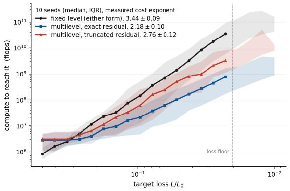
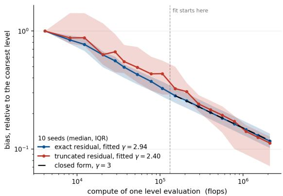
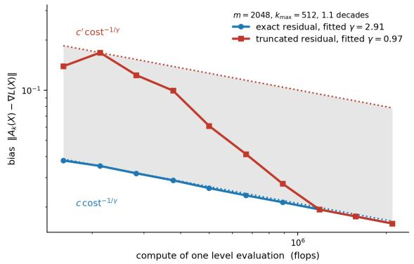
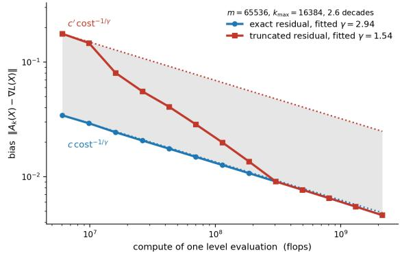

# Convex Optimization Is Free When Accuracy Is Expensive

Arthur Paing Ecole polytechnique ´ Palaiseau, France arthur.paing@polytechnique.edu

Arthur Jacot   
Courant Institute, NYU   
New York, USA   
arthur.jacot@nyu.edu

September 29, 2026

## Abstract

This paper studies convex optimization when the gradient cannot be evaluated exactly, but only approximated by a hierarchy of algorithms whose compute grows like $\delta ^ { - \gamma }$ in the accuracy δ. When $\gamma > 2 ,$ falling into the Harder-Than-Monte-Carlo (HTMC) regime, the price of accuracy outruns the variance reduction that Monte Carlo would buy and we show that minimizing a loss function costs no more, up to a factor depending only on γ, than a single evaluation of its gradient at the accuracy the problem demands. A randomized multilevel oracle replaces the deterministic approximation of accuracy δ by an unbiased estimator of it, whose variance σ2 becomes a second, independently priced dial: the cost of one call drops from $\delta ^ { - \gamma } \mathrm { t o } \delta ^ { 2 - \gamma } \sigma ^ { - 2 }$ . Plain inexact gradient descent driven by that oracle reaches loss ε at expected compute $\Theta ( \varepsilon ^ { - \gamma } )$ in the convex case, against $\Theta \big ( \varepsilon ^ { - ( \gamma + \bar { 1 } ) } \big )$ for the same method run at a fixed accuracy: randomization buys a full power of ε. Under µ-strong convexity the exponent halves, $\tan \varepsilon ^ { - \gamma / 2 }$ , because the iterates settle at a noise floor and the bias budget relaxes accordingly. Both bounds are independent of the step size, and hence of the smoothness constant, and we show that the cost is a functional of the underlying gradient flow rather than of any discretization of it.

## 1 Introduction

Many optimization problems have a gradient that cannot be evaluated exactly, only approximated at a cost that grows with the accuracy required: discretized PDEs, nested simulations, and neural networks trained to approximate a score or a drift all behave this way. We study convex optimization under such an oracle, in the regime where the cost grows fast enough so that minimizing the function costs no more than evaluating its gradient once, with the appropriate oracle. While convex optimization and exact gradient descent have been thoroughly studied, inexact gradient descent in the HTMC regime calls for an adaptation of the existing theory. Randomized multilevel estimators for biased oracles have been studied by Hu et al. (2024), who obtain the same cost exponents in the regime that corresponds to $\gamma > 2$ , under assumptions bearing on a hierarchy of approximating functions. Accelerated methods under a jointly biased and noisy oracle are analyzed by Dvurechensky & Gasnikov (2016), and the choice of an inexactness schedule when accuracy has a price by Van Dessel & Glineur (2024). In both, the oracle exposes a single accuracy knob. What is new here is an oracle with two, a bias and a variance bought at unrelated exponents, and the consequence that the iteration count leaves the bill altogether. Appendix A compares the settings in detail.

## 2 Setup

Throughout the rest of this paper, $\mathcal { L } : \mathbb { R } ^ { d } $ R is our convex and β-smooth loss function with a minimizer $y ^ { * }$ , and we write $\bar { \mathcal { L } } ^ { * } = \mathcal { L } ( y ^ { * } ) , f = \nabla \mathcal { L }$ and $d _ { 0 } = \lVert y _ { 0 } - y ^ { * } \rVert$ . In the strongly convex statements $\mathcal { L }$ is moreover $\mu -$ -strongly convex with $0 < \mu \le \beta$ , and $\kappa = \beta / \mu$

The gradient f is not available exactly. What is available is a sequence of algorithms of increasing accuracy and increasing compute.

## 2.1 The approximate gradient oracle

Assumption 1 (Dyadic hierarchy). There is a family of algorithms $A _ { k }$ approximating $f$ within $2 ^ { - k }$ , at a compute growing exponentially in $k \colon$

$$
\| A _ { k } - f \| _ { \infty } \leq 2 ^ { - k } , \qquad \operatorname { C o s t } ( A _ { k } ) \leq c ^ { \gamma } 2 ^ { \gamma k } .
$$

Nothing that follows uses more than Assumption 1, so every bound applies verbatim to any hierarchy of that shape, with c the prefactor of the hierarchy at hand.

$\mathrm { A s }$ it stands the assumption ofers a single dial: running $A _ { k }$ buys accuracy $\delta \ : = \ : 2 ^ { - k }$ at cost $( c / \delta ) ^ { \gamma }$ . Randomizing which $A _ { k }$ is run turns that one dial into two, a bias and a variance, priced at unrelated exponents.

What it buys is shown in Table 1:

<table><tr><td colspan="2">γ</td><td>CONVEX</td><td>STRONGLY CONVEX</td></tr><tr><td>Deterministic</td><td> Any γ</td><td> $\overline { { d _ { 0 } ^ { \gamma + 2 } \beta \varepsilon ^ { - ( \gamma + 1 ) } } }$ </td><td> $( \mu \varepsilon ) ^ { - \frac { \gamma } { 2 } } \kappa$ </td></tr><tr><td rowspan="3">GD</td><td> $\overline { { \mathrm { E T M C } \gamma < 2 } }$ </td><td> $\stackrel { \smile } { d _ { 0 } ^ { 2 } } \beta ^ { 1 - \frac \gamma 2 } \varepsilon ^ { - ( 1 + \frac \gamma 2 ) }$ </td><td> $\overrightarrow { ( \mu \varepsilon ) ^ { - \frac { \gamma } { 2 } } \kappa ^ { 1 - \frac { \gamma } { 2 } } }$ </td></tr><tr><td> $\mathrm { M C } \ \gamma = 2$ </td><td> $d _ { 0 } ^ { 2 } \varepsilon ^ { - 2 } \log ^ { 2 } \frac { \beta d _ { 0 } ^ { 2 } } { \varepsilon }$ </td><td> $( \mu \varepsilon ) ^ { - 1 } \log ^ { 2 } \kappa$ </td></tr><tr><td>HTMC  $\gamma > 2$ </td><td> $d _ { \mathbf { 0 } } ^ { \gamma } \varepsilon ^ { - \gamma }$ </td><td> $( \mu \varepsilon ) ^ { - \frac { \gamma } { 2 } }$ </td></tr><tr><td rowspan="3">Accelerated</td><td>ETMC  $\gamma < 2$ </td><td> $d _ { 0 } ^ { 1 + \frac { \gamma } { 2 } } \beta ^ { \frac { 2 - \gamma } { 4 } } \varepsilon ^ { - \frac { 2 + 3 \gamma } { 4 } }$ </td><td> $( \mu \varepsilon ) ^ { - \frac { \gamma } { 2 } } \kappa ^ { \frac { 2 - \gamma } { 4 } }$ </td></tr><tr><td> $\mathrm { M C } \ \gamma = 2$ </td><td> $d _ { 0 } ^ { 2 } \varepsilon ^ { - 2 } \log ^ { 2 } \frac { \beta d _ { 0 } ^ { 2 } } { \varepsilon }$ </td><td> $( \mu \varepsilon ) ^ { - 1 } \log ^ { 2 } \kappa$ </td></tr><tr><td> $\mathrm { H T M C } \gamma > 2$ </td><td> $d _ { 0 } ^ { 2 \gamma - 2 } \beta ^ { \frac { \gamma - 2 } 2 } \varepsilon ^ { - \frac { 3 \gamma - 2 } 2 }$ </td><td> $( \mu \varepsilon ) ^ { - \frac { \gamma } { 2 } } \kappa ^ { \frac { \gamma - 2 } { 4 } }$ </td></tr></table>

Table 1: Expected compute to reach loss ε, up to constants depending only on γ and with a factor $c ^ { \gamma }$ omitted from every entry. The strongly convex entries carry a further factor $1 + \log ( \mu d _ { 0 } ^ { 2 } / \varepsilon )$ . The first two rows run the same iteration and difer only in the oracle driving it, a single $A _ { k }$ held at a fixed level or the randomized telescope of Proposition 3 and the third runs the accelerated scheme on that telescope. Bold marks the smallest bound of each regime, which is acceleration below the threshold and plain gradient descent above it.

Remark 2 (Where the hierarchy comes from). Assumption 1 is a statement about the HTMC norm of Jacot (2025). Writing $C ( f , \varepsilon )$ for the least number of nodes of a binary circuit approximating f to within ε in $L ^ { \infty }$ over a bounded hyper-rectangle,

$$
\| f \| _ { M ^ { \gamma } } ^ { \gamma } = \operatorname* { m a x } _ { \varepsilon > 0 } \varepsilon ^ { \gamma } C ( f , \varepsilon )\tag{1}
$$

is the smallest constant for which $C ( f , \varepsilon ) \leq \| f \| _ { M ^ { \gamma } } ^ { \gamma } \varepsilon ^ { - \gamma }$ holds at every accuracy, and reading it at $\varepsilon = 2 ^ { - k }$ returns the $A _ { k }$ . Assumption 1 is therefore equivalent to $\| \nabla \mathcal { L } \| _ { M ^ { \gamma } } \leq c$ (up to a factor 2 on c from the dyadic rounding) which is Assumption 1 of Jacot (2026). Since the bounds carry $c ^ { \gamma }$ they are tightest at the smallest admissible c, which is the norm itself.

The threshold has a meaning there as well: $\gamma > 2$ , Harder than Monte Carlo, is where $\| \cdot \| _ { M ^ { \gamma } }$ becomes convex up to a constant (Jacot, 2025, Thm. 4), and measured rates sit far inside it, γ ≈ 18 for language models (Kaplan et al., 2020) and 8 to 15 for natural image denoising (Henighan et al., 2020).

## 2.2 Upgrading to a weakly biased oracle through randomization

Proposition 3 (Upgrading the oracle). Let Assumption 1 hold for some $\gamma > 0 ,$ , fix $\delta = 2 ^ { - k _ { \mathrm { m a x } } }$ and $\sigma > 0$ , and let

$$
\tilde { f } _ { \delta , \sigma } = \sum _ { k = k _ { \mathrm { m i n } } } ^ { k _ { \mathrm { m a x } } } \frac { B _ { k } } { p _ { k } } \big ( A _ { k } - A _ { k - 1 } \big ) , \qquad p _ { k } = \operatorname* { m i n } \Big \{ C 2 ^ { - ( 1 + \frac { \gamma } { 2 } ) k } , 1 \Big \} ,\tag{2}
$$

with $B _ { k }$ ∼ Bernoulli $\left( { p _ { k } } \right)$ independent, drawn at each call. Its bias is at most $\delta$ whatever the $p _ { k }$ , and $C$ may be chosen so that the variance is at most $\sigma ^ { 2 }$ , at expected compute

$$
\begin{array} { r l r } { \mathbb { E } \big [ \mathrm { C o s t } ( \tilde { f } _ { \delta , \sigma } ) \big ] } & { \asymp } & { \left\{ \begin{array} { l l } { c ^ { \gamma } \delta ^ { 2 - \gamma } \sigma ^ { - 2 } , \quad \gamma > 2 } & { ( H a r d e r \cdot T h a n \cdot M o n t e - C a r l o ) , } \\ { c ^ { 2 } \sigma ^ { - 2 } \log ^ { 2 } \frac \sigma \delta , } & { \gamma = 2 } & { ( M o n t e - C a r l o ) , } \\ { ( c / \sigma ) ^ { \gamma } , } & { \gamma < 2 } & { ( E a s i e r \cdot T h a n \cdot M o n t e - C a r l o ) , } \end{array} \right. } \end{array}
$$

up to a factor depending only on $\gamma ,$ and no other choice of $p _ { k } \in ( 0 , 1 ]$ does better.

Sketch of proof. The expectation of equation 2 telescopes to $A _ { k _ { \mathrm { m a x } } } .$ , since $A _ { k _ { \operatorname* { m i n } } - 1 } = 0$ and each increment is reweighted by $p _ { k } ^ { - 1 }$ , so the bias is $\| A _ { k _ { \operatorname* { m a x } } } - f \| \leq \delta$ whatever the $p _ { k }$ . Everything else follows from the constraint $p _ { k } \leq 1$ . The optimal $p _ { k } \propto 2 ^ { - ( \mathrm { i } + \gamma / 2 ) k }$ decreases in k, so it binds on an initial segment, up to some accuracy $\delta _ { * }$ . There the Bernoulli weights are all 1 and the telescope collapses, $\begin{array} { r } { \sum _ { k < k _ { * } } ( A _ { k } - A _ { k - 1 } ) = A _ { k _ { * } } . } \end{array}$ : a single deterministic evaluation at accuracy $\delta _ { * } .$ of compute $( c / \delta _ { * } ) ^ { \gamma }$ and no variance. Optimizing over where to place the cut,

$$
\begin{array} { r l } { \mathrm { C o s t } ( \delta , \sigma ) \ \asymp \ \underset { \delta \leq \delta \neq \leq c } { \operatorname* { m i n } } \Big \{ \underbrace { \Big ( \frac { c } { \delta _ { * } } \Big ) ^ { \gamma } } _ { \mathrm { d e t e r m i n i s t i c ~ p r e f i x } } + \underbrace { \frac { c ^ { \gamma } } { \sigma ^ { 2 } } \Sigma ^ { 2 } } _ { \mathrm { r a n d o m i z e d ~ t a i l } } \Big \} , \ } & { \ \Sigma = \ \sum _ { \delta \leq 2 ^ { - k } \leq \delta _ { * } } 2 ^ { ( \frac { \gamma } { 2 } - 1 ) k } , } \end{array}\tag{3}
$$

and whether the ratio $2 ^ { \gamma / 2 - 1 }$ exceeds one is the entire story. For $\gamma > 2$ the sum is dominated by its finest term, $\Sigma \asymp \delta ^ { 1 - \gamma / 2 }$ : the tail does not depend on $\delta _ { * }$ at all while the prefix decreases in $\operatorname { i t } .$ so the minimum is attained with no prefix. For $\gamma < 2$ it is dominated by its coarsest term instead, $\Sigma \asymp \delta _ { * } ^ { 1 - \gamma / 2 }$ and both terms then move with $\delta _ { * }$ in opposite directions and balance at $\delta _ { * } = \sigma$ . At $\gamma = 2$ the ratio is one and Σ merely counts its terms. Details in Appendix B.1. □

Optimality of the multilevel oracle We now show that this method allows us to upgrade from a biased oracle to an oracle that is the least biased possible in the ETMC and HTMC regimes and almost so in the MC regime. The cost of a random estimator with rate γ should be of the form

$$
C ( \delta , \sigma ) \leq c ^ { \gamma } \delta ^ { - \gamma } h \left( \frac { \delta } { \sigma } \right)
$$

for some increasing function $h ( r )$ , which represents the discount on the cost we get from increasing the variance at a fixed bias, and the faster $h ( r )$ goes to 0 as $r \searrow 0$ , the stronger this discount. We know that it cannot decay faster than $r ^ { \gamma }$ (otherwise if we fixed σ and decreased δ the cost would decay to 0), and it also cannot decay faster than $r ^ { 2 }$ (otherwise we could choose a growing variance $n \sigma _ { 0 } ^ { 2 }$ and average it n times to obtain a variance of $\sigma _ { 0 } ^ { 2 }$ at a cost $\scriptstyle n \delta ^ { - \gamma } h ( { \frac { \delta } { \sqrt { n } \sigma } } )$ which vanishes as $n \to \infty )$ . This implies that the “least biased oracle” would have $h ( r ) = r ^ { \dot { \operatorname* { m i n } } \{ \gamma , 2 \} }$ which would be unbiased in the ETMC and MC regimes, and weakly biased in the HTMC regime. Our multilevel oracle matches this optimality in the ETMC and HTMC regimes, but not quite in the MC regime where we obtain $h ( r ) \dot { = } r ^ { 2 } \log ^ { 2 } \frac { 1 } { r }$ instead of $h ( r ) = r ^ { 2 }$

What the three branches say. The exponents $2 - \gamma$ and −2 of the HTMC branch are unrelated, so bias and variance are bought separately. Since $2 - \gamma < 0$ a cruder estimator is a cheaper one, and the whole art of what follows consists in running as biased an oracle as the geometry permits. Below the threshold that separation collapses: the tail of equation 3 no longer involves $\delta ,$ so bias becomes free and the estimator may be taken unbiased, at the price of a single deterministic evaluation at the tolerated noise level. Multilevel unbiases the oracle there but no longer at the rate $\sigma ^ { - 2 }$ that cancels the iteration count, and the advantage over the baseline of Table 1 comes from computing at that noise level rather than at the accuracy the target demands while above the threshold it is the telescope that produces it. At the threshold itself the bias is free only up to a $\log ^ { 2 } ( \sigma / \delta )$ . This is the one feature the surrounding literature does not have: oracles whose accuracy can be bought at a price appear in Van Dessel & Glineur (2024), and biased oracles with noise in Dvurechensky & Gasnikov (2016), but in both the accuracy is a single scalar, and Van Dessel & Glineur (2024) name random inexactness of this kind as an open direction.

## 3 Multilevel stochastic gradient descent

We can now run plain inexact gradient descent with this oracle,

$$
y _ { t + 1 } = y _ { t } - \eta \tilde { f } _ { \delta , \sigma } ( y _ { t } ) , \qquad t = 0 , \dotsc , T - 1 ,\tag{4}
$$

with independent draws across steps, and measure the total cost as $T$ times the expected compute of one call.

## 3.1 Optimization costs one gradient evaluation

Theorem 4 (Cost of optimization). Let $\mathcal { L }$ be convex and β-smooth under Assumption 1 with rate $\gamma > 0$ . For every $\varepsilon > 0$ , and with a step size

$$
\eta ~ \leq ~ \operatorname* { m i n } \left\{ \frac { 1 } { 4 \beta } , ~ \frac { d _ { 0 } ^ { 2 } } { \varepsilon } \right\} ~ w h e n \gamma > 2 , ~ \eta ~ = ~ \frac { 1 } { 4 \beta } ~ w h e n \gamma \leq 2 ,\tag{5}
$$

there are hyperparameters $T , \delta , \sigma$ , none of which depends on $\gamma _ { ; }$ , such that the iteration equation $\it 4$ satisfies the following.

(a) Convex. With $\begin{array} { r } { T = \lceil \frac { 4 d _ { 0 } ^ { 2 } } { \eta \varepsilon } \rceil , \delta = \frac { \varepsilon } { 1 6 d _ { 0 } } } \end{array}$ and $\textstyle \sigma ^ { 2 } = { \frac { \varepsilon } { 4 \eta } }$ , the averaged iterate $\begin{array} { r } { { \bar { y } } _ { T } = \frac { 1 } { T } \sum _ { t < T } } \end{array}$ yt satisfies $\mathbb { E } [ \mathcal { L } ( \bar { y } _ { T } ) - \mathcal { L } ^ { * } ] \stackrel { \cdot } { \leq } \varepsilon$ at expected cost

$$
\begin{array} { r l r } { \mathbb { E } [ \mathrm { C o s t } ] } & { \leq } & { \Lambda _ { \gamma } \cdot \left\{ \begin{array} { l l } { \left( c d _ { 0 } / \varepsilon \right) ^ { \gamma } , } & { \gamma > 2 , } \\ { c ^ { 2 } d _ { 0 } ^ { 2 } \varepsilon ^ { - 2 } \log ^ { 2 } \frac { \beta d _ { 0 } ^ { 2 } } { \varepsilon } , } & { \gamma = 2 , } \\ { c ^ { \gamma } d _ { 0 } ^ { 2 } \beta ^ { 1 - \frac { \gamma } { 2 } } \varepsilon ^ { - ( 1 + \frac { \gamma } { 2 } ) } , } & { \gamma < 2 . } \end{array} \right. } \end{array}
$$

(b) Strongly convex. $I f \ \mathcal { L }$ is moreover µ-strongly convex and $\varepsilon \quad \leq \quad \mu d _ { 0 } ^ { 2 1 }$ , then with $\begin{array} { r c l r c l } { T } & { = } & { \lceil \frac { 4 } { \eta \mu } \log \frac { 2 5 6 \mu d _ { 0 } ^ { 2 } } { \varepsilon } \rceil , } & { \delta } & { = } & { \frac { \sqrt { \mu \varepsilon } } { 8 } } \end{array}$ and $\begin{array} { r l r } { \sigma ^ { 2 } } & { { } = } & { \frac { \varepsilon } { 8 \eta } . } \end{array}$ , the geometrically weighted average $\begin{array} { r } { \hat { y } _ { T } \propto \sum _ { t < T } ( 1 - \eta \mu ) ^ { - t } y _ { t } } \end{array}$ satisfies $\mathbb { E } [ \mathcal { L } ( \hat { y } _ { T } ) - \mathcal { L } ^ { * } ] \leq \varepsilon$ at expected cost

$$
\mathbb { E } [ \mathrm { C o s t } ] \ \le \ \Lambda _ { \gamma } ^ { \prime } \Big ( 1 + \log \frac { \mu d _ { 0 } ^ { 2 } } { \varepsilon } \Big ) \cdot \left\{ \begin{array} { l l } { \big ( c / \sqrt { \mu \varepsilon } \big ) ^ { \gamma } , } & { \gamma > 2 , } \\ { c ^ { 2 } ( \mu \varepsilon ) ^ { - 1 } \log ^ { 2 } \kappa , } & { \gamma = 2 , } \\ { c ^ { \gamma } ( \mu \varepsilon ) ^ { - \frac { \gamma } { 2 } } \kappa ^ { 1 - \frac { \gamma } { 2 } } , } & { \gamma < 2 . } \end{array} \right.
$$

Here $\Lambda _ { \gamma }$ and $\Lambda _ { \gamma } ^ { \prime }$ depend only on $\gamma _ { , }$ , and the three branches do not meet at the threshold $( A p -$ pendix $B . 1 . \mathcal { Q } )$

$B y$ contrast, running equation $\it 4$ with the deterministic algorithm $A _ { k _ { \mathrm { m a x } } }$ costs $\Theta \big ( \beta d _ { 0 } ^ { 2 } \varepsilon ^ { - 1 } \cdot ( c d _ { 0 } / \varepsilon ) ^ { \gamma } \big ) =$ $\Theta \big ( \varepsilon ^ { - ( \gamma + 1 ) } \big )$ in the convex case.

Sketch of proof. We follow the classical route. Write $a _ { t } ^ { 2 } = \mathbb { E } \| y _ { t } - y ^ { * } \| ^ { 2 }$ and expand $\| y _ { t + 1 } - y ^ { * } \| ^ { 2 } =$ $\lVert y _ { t } - y ^ { * } - \eta \tilde { f } _ { \delta , \sigma } ( y _ { t } ) \rVert ^ { 2 }$ , conditioning on $y _ { t }$ so that the centered part of the oracle drops out. The three remaining terms are handled by µ-strong convexity, with $\mu = 0$ in the merely convex case, by Cauchy–Schwarz for the bias, and by $\lVert \nabla \mathcal { L } \rVert ^ { 2 } \leq 2 \beta ( \mathcal { L } - \mathcal { L } ^ { * } )$ for the smoothness. With $\begin{array} { r } { \eta \le \frac { 1 } { 4 \beta } } \end{array}$ this yields the master recursion

$$
a _ { t + 1 } ^ { 2 } \ \leq \ \left( 1 - \eta \mu \right) a _ { t } ^ { 2 } - \eta \mathbb { E } \big [ \mathcal { L } ( y _ { t } ) - \mathcal { L } ^ { * } \big ] + 2 \eta \delta a _ { t } + \eta ^ { 2 } \tilde { \sigma } ^ { 2 } , \qquad \tilde { \sigma } ^ { 2 } = \sigma ^ { 2 } + 2 \delta ^ { 2 } .\tag{6}
$$

Both cases start from equation 6 and difer only in how it is summed.

Convex case. Set $\mu = 0$ and sum over $t < T :$ the squared distances telescope to at most $d _ { 0 } ^ { 2 } ,$ while a separate induction (Appendix B.2) shows that the iterates never leave the ball $a _ { t } \leq 2 d _ { 0 }$ , which is what controls the bias term. Dividing by $\eta T$ and applying Jensen to $\hat { y } _ { T }$ leaves three terms,

$$
\mathbb { E } \big [ \mathcal { L } ( \bar { y } _ { T } ) - \mathcal { L } ^ { * } \big ] \ \leq \ \underbrace { \frac { d _ { 0 } ^ { 2 } } { \eta T } } _ { \mathrm { h o r i z o n } } + \underbrace { 4 \delta d _ { 0 } } _ { \mathrm { b i a s } } + \underbrace { \eta \tilde { \sigma } ^ { 2 } } _ { \mathrm { n o i s e } } ,
$$

and the announced $T , \delta , \sigma$ are the split of $\varepsilon$ between them. The cost is $T$ times the per-call compute of Proposition 3, and above the threshold the two powers of η cancel: $T \propto \eta ^ { - 1 }$ against $\sigma ^ { - 2 } \propto \eta$

Strongly convex case. Weighting equation 6 by $( 1 - \eta \mu ) ^ { - ( t + 1 ) }$ concentrates the weights on the phase where the iterates have settled within a noise $\mathit { f l o o r } \ V \asymp \delta / \mu + \sqrt { \eta \tilde { \sigma } ^ { 2 } / \mu }$ of the optimum. The bias is then measured against V and not $d _ { 0 }$ , which relaxes its budget to $\sqrt { \mu \varepsilon }$ and halves the exponent. Appendix B.2 gives the details.

The same proof gives the other two rows of Table 1: only the per-call compute of Proposition 3 changes, and below the threshold it no longer cancels against the horizon.

Corollary 5 (The step size). Since $T \propto \eta ^ { - 1 }$ and the tolerable variance $\sigma ^ { 2 } \propto \eta ^ { - 1 }$ , the total compute carries $\bar { T \sigma ^ { - s } } \stackrel { \cdot } { \propto } \eta ^ { s / 2 - 1 }$ : the step size cancels if and only if $s = 2 ,$ that $i s , \ i f$ and only $i f \gamma > 2$ Below the threshold the exponent is negative, so one takes η maximal and the smoothness constant returns.

<table><tr><td>REGIME</td><td>S</td><td>FACTOR IN η</td><td>η USED</td></tr><tr><td> $\overline { { \mathrm { E T M C } , \gamma < 2 } }$ </td><td>γ</td><td> $\overline { { \eta ^ { \gamma / 2 - 1 } } }$ </td><td> $\textstyle { \frac { 1 } { 4 \beta } } , { \mathrm { ~ m a x i m a l ~ } }$ </td></tr><tr><td> $\mathrm { M C } , \gamma = 2$ </td><td>2</td><td> $\log ^ { 2 } ( 1 / \eta )$ </td><td>1 4β</td></tr><tr><td> $\mathrm { H T M C } , \gamma > 2$ </td><td>2</td><td>none</td><td>free</td></tr></table>

The limits in Table 1 are also consistent at both ends:

$a s \gamma  0$ , the prefix swallows the hierarchy and the bounds reduce to $\beta d _ { 0 } ^ { 2 } / \varepsilon$ and $\kappa \log ( 1 / \varepsilon )$ , the complexities of exact gradient descent

• as $\gamma  2$ , the convex exponent $1 + \textstyle { \frac { \gamma } { 2 } }$ meets $\gamma$ from the other side. The bounds themselves do not meet: the $\log ^ { 2 }$ at the threshold is what the constant $C _ { \gamma } \asymp ( \gamma - 2 ) ^ { - 2 }$ of Proposition 3 becomes at finite accuracy.

The two regimes call for qualitatively diferent methods. Below the threshold the compute grows as η shrinks, so one wants the largest stable step: a classical stochastic gradient descent. Above it the cancellation is exact rather than an artifact of the constants (halving the step doubles the number of iterations and halves the price of each) so $\beta ,$ which enters only through $\begin{array} { r } { \eta \le \frac { 1 } { 4 \beta } } \end{array}$ , is absent from those bounds: the cost is a functional of the underlying gradient flow rather than of any discretization of it.

There is then no reason to take η maximal, as one would with an exact gradient: a smaller step is free. The same phenomenon occurs for the multilevel Euler–Maruyama method, whose $\eta \searrow 0$ limit is a Poisson jump process (Jacot, 2026). Nothing prevents taking that limit here either: the iteration becomes a flow, δ and $\sigma$ become functions of time, and scheduling them removes the logarithm.

A consequence of the above, is that in the HTMC regime our complexity bounds are independent of the smoothness parameter $\beta .$ . Actually, the smoothness assumption might be unnecessary in this $\mathrm { r e g i m e ^ { 2 } }$ . This means that in the HTMC regime, our method can be applied without changes to LASSO problems Tibshirani (1996) or other non-smooth losses, in contrast to the setting of exact oracles where special optimization algorithms Efron et al. (2004) are needed to solve such problems.

Proposition 6 (Time-varying accuracy). Let $\mathcal { L }$ be µ-strongly convex and $\beta .$ -smooth under Assumption 1, and $l e t \varepsilon > 0$ . Consider the small-step limit of equation $^ { 4 , }$ run over a flow time $\begin{array} { r } { T _ { c } \geq \frac { 2 } { \mu } \log \frac { \mu d _ { 0 } ^ { 2 } } { \varepsilon } } \end{array}$ with the time-varying accuracies

$$
\delta ( t ) = \sqrt { \frac { \mu \varepsilon } { 8 } } \ e ^ { \mu ( T _ { c } - t ) / 8 } , \qquad \eta \sigma ^ { 2 } ( t ) = \frac { \varepsilon } { 4 } \ e ^ { \mu ( T _ { c } - t ) / 4 } .
$$

Then the weighted average $\begin{array} { r } { \hat { y } \propto \int _ { 0 } ^ { T _ { c } } e ^ { \mu t / 2 } y _ { t } } \end{array}$ dt satisfies $\mathbb { E } [ F ( \hat { y } ) - F ^ { * } ] \leq \varepsilon$ at expected compute

$$
\mathbb { E } [ \mathrm { C o s t } ] ~ \leq ~ \Lambda _ { \gamma } ^ { \prime \prime } \Big ( \frac { c } { \sqrt { \mu \varepsilon } } \Big ) ^ { \gamma } ,
$$

with no logarithmic factor and independently of the horizon $T _ { c }$

Schedules of this kind are studied by Van Dessel $\&$ Glineur (2024) for a deterministic oracle whose cost grows as $\delta ^ { - r }$ , ours included, with the optimal sequence of accuracies in closed form. What is scheduled here is the pair $( \delta ( t ) , \sigma ( t ) )$ of a randomized oracle, and the gain is of another nature: not a better constant, but the disappearance of the logarithm.

An error committed early is contracted away before the trajectory ends and need not be bought at full price, so the compute rate decays geometrically backwards in time and only the last stretch is paid for. The horizon is still log-long, but the cost is not: the compute integral converges whatever the value of $T _ { c }$ . The proof (Appendix B.3) is carried out in continuous time only, which is why Theorem $4 ( \mathrm { b } )$ still carries the logarithm.

## 3.2 The cost exponent is optimal

The bounds above are attained and they are also unimprovable. We read this in the oracle model attached to Assumption 1: an algorithm queries a point and a level, receives $A _ { k } ( y )$ , pays $c ^ { \gamma } 2 ^ { \gamma k }$ for it, and computation between queries is free.

Theorem $\mathbf { 7 }$ (Optimality). Let $\gamma , c , d _ { 0 } > 0$ . Any algorithm that returns $\hat { y }$ with $\mathbb { E } [ \mathcal { L } ( \hat { y } ) - \mathcal { L } ^ { * } ] \leq \varepsilon$ on every instance of that model with $\| y _ { 0 } - y ^ { * } \| \le d _ { 0 }$ has, on some such instance, $\begin{array} { r } { \mathbb { E } [ \mathrm { C o s t } ] \ge \frac { 3 } { 4 } 8 ^ { - \gamma } ( c d _ { 0 } / \varepsilon ) ^ { \gamma } } \end{array}$ when $\varepsilon \leq \beta d _ { 0 } ^ { 2 } / 8$ and, if it is required to succeed on µ-strongly convex instances with $\varepsilon \leq \mu d _ { 0 } ^ { 2 } / 8$ , then $\mathbb { E } [ \mathrm { C o s t } ] \ge \frac { 3 } { 4 } ( c / \sqrt { 8 \mu \varepsilon } ) ^ { \gamma }$

Writing $\mathcal { T } _ { \gamma } ( d _ { 0 } )$ for the instances of rate $\gamma$ started within $d _ { 0 }$ of a minimizer, Theorems 4 and 7 together read

$$
\operatorname* { m i n } _ { \mathrm { a l g o r i t h m s } } \operatorname* { m a x } _ { \mathcal { L } _ { \gamma } ( d _ { 0 } ) } \mathbb { E } [ \mathrm { C o s t } ] \asymp \Big ( \frac { c d _ { 0 } } { \varepsilon } \Big ) ^ { \gamma } ,
$$

up to a factor depending only on $\gamma .$ , and $( c / \sqrt { \mu \varepsilon } ) ^ { \gamma }$ under strong convexity, up to the logarithm. The statement is about the worst instance of the class and not about every instance: many are easier, and the design of Section 4 is one of them. In the convex case randomization moves the exponent: from the $\varepsilon ^ { - ( \gamma + 1 ) }$ of the deterministic baseline to $\varepsilon ^ { - \gamma }$ , and Theorem 7 says that this full power of ε is all there was to take. In the strongly convex case it moves nothing: the baseline already runs at $\gamma / 2$ , and $\gamma / 2$ is optimal. What randomization buys there is the conditioning, the baseline paying a factor κ that we do not. The proof restricts the iteration in no way, so accelerated methods are covered as well.

Sketch of proof. Take any $\mathcal { L } _ { 0 }$ in the class and flatten one direction: $\begin{array} { r } { \mathcal { L } ( s , z ) = \mathcal { L } _ { 0 } ( z ) + \frac { \lambda } { 2 } s ^ { 2 } } \end{array}$ , then tilt, $\mathcal { L } _ { \pm } = \mathcal { L } \pm \delta s$ . The two copies share a hierarchy at every level coarser than δ, so no algorithm separates them there and since $\mathcal { L }$ is λ-flat along $s ,$ their optimality gaps sum to at least $\delta ^ { 2 } / \lambda$ at every point, so they admit no common ε-minimizer. The algorithm must therefore query below that resolution, at a cost of $( c / \delta ) ^ { \gamma }$ . Taking $\lambda = 8 \varepsilon / d _ { 0 } ^ { 2 }$ gives the convex bound, $\lambda = \mu$ the strongly convex one.

Remark 8 (The exponent is also forced structurally). Theorem 7 fixes an adversarial hierarchy. Under strong convexity the exponent is forced by the framework alone, with no construction at all. Consider the Legendre transform $\nabla \mathcal { L } ^ { * } ( z ) = \arg \operatorname* { m i n } _ { y } \{ \mathcal { L } ( y ) - \langle z , y \rangle \}$ , a solver for $\mathcal { L }$ is an approximation scheme for $\nabla \mathcal { L } ^ { \ast }$ , whose scaling law is the solver’s own cost profile. A method beating the exponent would hand $\nabla \mathcal { L } ^ { \ast }$ a cheaper hierarchy, and conjugating back (the class is stable and ${ \mathcal { L } } ^ { * * } = { \mathcal { L } } )$ would hand $\nabla \mathcal { L }$ one cheaper than its own circuit complexity permits. At the intrinsic rate $\gamma _ { \operatorname* { m i n } } ( f ) = \operatorname* { i n f } \{ \gamma : \| f \| _ { M ^ { \gamma } } < \infty \}$ , optimizing therefore costs exactly what evaluating the gradient once costs. Proofs are in Appendix C.

## 3.3 A word on acceleration

In smooth convex optimization, acceleration trades iterations for precision: it reaches accuracy ε in $\varepsilon ^ { - 1 / 2 }$ steps instead of $\varepsilon ^ { - 1 }$ , and since each step still costs one gradient evaluation, the trade is free. Under Assumption 1 it is not, because accuracy has a price: a sharper gradient is a more expensive one, and whether the trade still pays depends on $\gamma .$ Driving the standard accelerated scheme with the same oracle and balancing its three error channels against the cost model prices the trade exactly (Appendix D).

Proposition 9 (Convex). Accelerating multiplies the bound of Theorem $\mathinner { 4 \mathopen { \left( a \right) } }$ by $T ^ { \gamma - 2 }$ above the threshold and $b y \overset { \cdot } { T } ^ { ( \gamma - 2 ) / 2 }$ below it, where $T \asymp d _ { 0 } \sqrt { \beta / \varepsilon }$ is the accelerated horizon.

Proposition 10 (Strongly convex). Accelerating multiplies the bound of Theorem $\mathit { 4 } ( b )$ $\kappa ^ { \frac { \gamma - 2 } { 4 } }$ , in all three regimes.

Every exponent carries the sign of $\gamma - 2$ , and Theorem 7 says why. That bound restricts the iteration in no way, so it binds accelerated methods too: nothing in the model goes below γ. Above the threshold Theorem 4 already sits there, so acceleration has nothing to win and strictly loses; at the threshold the multipliers are 1 and it is exactly neutral. Only strictly below, where the plain exponent $1 + \textstyle { \frac { \gamma } { 2 } }$ exceeds the optimal $\gamma ,$ is there room and acceleration takes part of it without closing the gap. Acceleration pays if and only $\mathbf { i f } \ \gamma < \ 2 \colon$ its threshold is the HTMC threshold itself. It buys fewer but sharper, hence more expensive, steps, which is the wrong currency wherever Assumption 1 charges for accuracy rather than for steps.

## 4 Least squares with truncated features

Assumption 1 posits a family of approximations whose bias and cost trade of at a fixed rate. We instantiate it on least squares with truncated features, where that rate is available in closed form from the geometry of the design. The assumption can then be measured rather than posited, and the separation Theorem 4 predicts between the two exponents can be checked. The instance is chosen for what it lets us measure and not for being a regime where the method competes with dedicated least-squares solvers.

## 4.1 The design and its rate

Let $A \in \mathbb { R } ^ { m \times n }$ with $n \gg m$ , let $b \in \mathbb { R } ^ { m }$ , and let

$$
\begin{array} { r } { L ( \boldsymbol { X } ) = \frac 1 2 \| \boldsymbol { A } \boldsymbol { X } - \boldsymbol { b } \| ^ { 2 } , \qquad \nabla L ( \boldsymbol { X } ) = \boldsymbol { A } ^ { \top } \boldsymbol { r } ( \boldsymbol { X } ) , \qquad \boldsymbol { r } ( \boldsymbol { X } ) = \boldsymbol { A } \boldsymbol { X } - \boldsymbol { b } . } \end{array}
$$

Order the columns by decreasing norm and assume the power law $\lVert A _ { i } \rVert \asymp i ^ { - 1 / \varphi }$ with $0 < \varphi < 2$ The level-k algorithm solves the problem restricted to the first k columns and reports its gradient,

$$
A _ { k } ( X ) = A _ { \leq k } ^ { \top } \big ( A _ { \leq k } X - b \big ) ,
$$

where $A _ { \leq k }$ is A with its last $n - k$ columns zeroed. It reads k columns and nothing else, carries no state between calls, and costs $\Theta ( m k )$ .

Proposition 11. Fix $R > 0$ . On the ball $\| X - X ^ { * } \| \leq R$ the family $( A _ { k } ) _ { k }$ satisfies Assumption 1 with

$$
\gamma = \frac { 2 \varphi } { 2 - \varphi } , \qquad c ^ { \gamma } \asymp m M ^ { \gamma } , \qquad M = \| A \| \big ( 2 R + \| X ^ { * } \| \big ) + \| A X ^ { * } - b \| .
$$

The same holds for $A _ { < k } ^ { \top } r ( X )$ , the first k coordinates of the true gradient, with the smaller constant $M = \| A \| R + \| A X ^ { * } - { \overset { } { b } } { \| }$ . In particular the problem is HTMC precisely when $\varphi > 1$

The proof is in Appendix E. In our experiments we use both the truncated residual approximation $A _ { K } ( x )$ and the exact residual approximation $A _ { \leq k } ^ { T } r ( X )$

The threshold now reads of the design: $\varphi = 1$ is $\| A _ { i } \| \asymp 1 / i$ , so the HTMC regime is the one in which feature importance decays more slowly than harmonically, and no finite prefix of the design carries most of the signal.

Remark 12 (The rate is read of the other truncation.). The algorithm above is the natural reading of Assumption 1 here and, carrying nothing from one call to the next, the only one available on an arbitrary design. It is the one the experiments run but measuring γ, however, requires using $A _ { \leq k } ^ { \top } r ( X )$ (Figure 1, right)3.

## 4.2 Experiment

## 4.2.1 Protocol

Columns are drawn Gaussian, normalized, then rescaled so that $\lVert A _ { i } \rVert = i ^ { - 1 / \varphi }$ exactly. The target $X ^ { * }$ is drawn flat, so the discarded features carry real energy, and $b = A X ^ { * }$ , so the full problem interpolates. Every run starts at the origin, whose loss $\begin{array} { r } { L _ { 0 } = L ( 0 ) = \frac { 1 } { 2 } \| b \| ^ { 2 } } \end{array}$ is the unit in which target losses are reported below.

We consider

$$
\varphi = 1 . 2 , \mathrm { h e n c e } \ \gamma = 3 ; \quad m = 2 0 4 8 , \quad \mathrm { l e v e l s } \ \{ 1 , 8 , 6 4 , 5 1 2 \} , \quad n = 1 3 1 0 7 2 .
$$

The level ladder is geometric with ratio $2 ^ { \gamma } = 8 \mathrm { : }$ : each level keeps eight times as many features as the one below it, costs eight times as much, and halves its bias. That is the normalization of Assumption 1, and it is what lets the probabilities $p _ { k } \propto 2 ^ { - ( 1 + \gamma / 2 ) k }$ apply as written. Two requirements fix the rest: $k _ { \operatorname* { m a x } } \ll m$ to protect the loss floor of a level and $k _ { \operatorname* { m a x } } \ll n$ to protect the bias of a level, which is the size of the tail it discards. The complete sizing and design of the experiment is detailed in Appendix E

## 4.2.2 Results

The baseline is inexact gradient descent at a fixed level: the same oracle and the same optimizer, which is the comparison Theorem 4 makes. It picks its truncation level from a ladder finer than the oracle’s, which is confined to the levels its probabilities presuppose, so the comparison does not favour the multilevel method by confining its rival. Both methods are tuned over the parameters they have left, the compute reported for a target loss is the smallest at which that method reached it, and every figure is a median over ten seeds, with the median in bold, and a band showing the interquartile range.

Figure 1 is the comparison the assumption delivers: the multilevel exponent is the smaller on every seed, $2 . 7 6 \pm 0 . 1 2$ against $3 . 4 4 \pm 0 . 0 9$ , and the advantage reaches 10.9× at the tightest target both methods reach. It also shows what happens if we consider the implementation with the exact residual from Remark 12 on which $\gamma$ can be measured exactly, and with which the same run is cheaper: $2 . 1 8 \pm 0 . 1 0$ , and $4 6 \times \mathrm { a t }$ that same target.

On every seed the bias follows a power law with $R ^ { 2 } \ge 0 . 9 9 9$ (Figure 1, right), and

$$
\gamma _ { \mathrm { m e a s } } = 2 . 9 6 3 \pm 0 . 0 0 7  { \mathrm { ~ \textrm ~ { ~ ~ } ~ } }  { \mathrm { a g a i n s t } }  { \mathrm { ~ \textrm ~ { ~ ~ } ~ } } \frac { 2 \varphi } { 2 - \varphi } = 3 ,
$$

  
Figure 1: Left: Compute to reach a target loss, as a fraction of $L _ { 0 } ,$ , both methods driven by the algorithm of Proposition 11. The dashed line is the loss floor of the truncated problem, which here coincides with $\varepsilon = \mu d _ { 0 } ^ { 2 }$ and past it the strongly convex column of Theorem 4 becomes the binding one. Right: bias of each level against the compute of evaluating it, for both truncations, with each seed normalised by its own coarsest bias, against the closed-form slope.

the remaining 1.2% closing as the tail of the design is lengthened (Appendix E). Assumption 1 is measured here rather than posited, and its exponent is the one the geometry predicts. The same fit on the truncated residual returns $2 . 0 4 \pm 0 . 2 6$ , its per-seed values ranging from 1.01 to 2.99 where the exact one stays between 2.92 and 2.99.

All three exponents run under the $\gamma + 1$ and γ the theorem allows them (Appendix E). Neither advantage is there from the start: at loose targets the fixed level is in fact cheaper, as the telescope from the multilevel pays its overhead for nothing, and the gap opens only as the target tightens.

Least squares was chosen for what it lets us check, not for competing. Truncation there restricts to a subspace, so the loss gap of a level is the square of its gradient bias: a solver minimizing the level-k problem needs only $\varepsilon ^ { - \gamma / 2 }$ , and on a quadratic a Krylov method beats both curves above. What it buys instead is a γ in closed form, measurable rather than assumed.

## 5 Conclusion

In this work we showed that when the gradient of a convex objective is reachable only through a hierarchy of approximations whose compute grows like $\delta ^ { - \gamma }$ in the accuracy δ and when $\gamma > 2$ reaching loss ε costs no more than a single gradient evaluation at the accuracy the problem demands, that is $\varepsilon ^ { - \gamma }$ rather than a cost of $\varepsilon ^ { - ( \gamma + 1 ) }$ for fixed-accuracy gradient descent. We accomplish this using a randomized multilevel oracle turning the deterministic biased hierarchy into a weakly biased estimator whose bias and variance are priced independently and running plain inexact gradient descent. The resulting bound does not depend on the step size, and hence not on the smoothness constant, which makes it a functional of the underlying gradient flow rather than of any discretization of it. A lower bound in the same oracle model shows that the rate of $\varepsilon ^ { - \gamma }$ is optimal, and since the argument constrains the iteration in no way, it also binds accelerated methods. We used a simple least-squares instance whose rate is available in closed form to measure the cost assumption rather than posit it and implement the described algorithm.

A remaining question is whether the advantages of this method survive in the non-convex setting. There is a great potential in using this method to speed up the training of DNNs, whose gradient evaluations are very costly. Given the existing evidence (Jacot, 2025) that DNNs themselves lie in the HTMC regime $( \gamma > 2 )$ , it seems likely that their gradient does as well.

## References

Ahmad Ajalloeian and Sebastian U. Stich. On the convergence of SGD with biased gradients. arXiv preprint arXiv:2008.00051, 2020.

Ahmet Alacaoglu, Donghwan Kim, and Stephen J. Wright. Revisiting inexact fixed-point iterations for min-max problems: Stochasticity and structured nonconvexity. In Proceedings of the 41st International Conference on Machine Learning, 2024. arXiv:2402.05071.

Jose H. Blanchet and Peter W. Glynn. Unbiased Monte Carlo for optimization and functions of expectations via multi-level randomization. In Proceedings of the Winter Simulation Conference, pp. 3656–3667, 2015.

Alexandre d’Aspremont. Smooth optimization with approximate gradient. SIAM Journal on Optimization, 19(3):1171–1183, 2008.

Yury Demidovich, Grigory Malinovsky, Igor Sokolov, and Peter Richt´arik. A guide through the zoo of biased SGD. In Advances in Neural Information Processing Systems, 2023.

Olivier Devolder, Fran¸cois Glineur, and Yurii Nesterov. First-order methods of smooth convex optimization with inexact oracle. Mathematical Programming, 146:37–75, 2014.

Pavel Dvurechensky and Alexander Gasnikov. Stochastic intermediate gradient method for convex problems with stochastic inexact oracle. Journal of Optimization Theory and Applications, 171 (1):121–145, 2016.

Bradley Efron, Trevor Hastie, Iain Johnstone, and Robert Tibshirani. Least angle regression. The Annals of Statistics, 32(2):407–499, 2004.

Saeed Ghadimi and Guanghui Lan. Optimal stochastic approximation algorithms for strongly convex stochastic composite optimization I: A generic algorithmic framework. SIAM Journal on Optimization, 22(4):1469–1492, 2012.

Michael B. Giles. Multilevel Monte Carlo path simulation. Operations Research, 56(3):607–617, 2008.

Michael B. Giles. Multilevel Monte Carlo methods. Acta Numerica, 24:259–328, 2015.

Stefan Heinrich. Multilevel Monte Carlo methods. In Large-Scale Scientific Computing, volume 2179 of Lecture Notes in Computer Science, pp. 58–67. Springer, 2001.

Tom Henighan, Jared Kaplan, Mor Katz, Mark Chen, Christopher Hesse, Jacob Jackson, Heewoo Jun, Tom B. Brown, Prafulla Dhariwal, Scott Gray, et al. Scaling laws for autoregressive generative modeling. arXiv preprint arXiv:2010.14701, 2020.

Yifan Hu, Siqi Zhang, Xin Chen, and Niao He. Biased stochastic first-order methods for conditional stochastic optimization and applications in meta learning. In Advances in Neural Information Processing Systems, volume 33, 2020. arXiv:2002.10790.

Yifan Hu, Jie Wang, Xin Chen, and Niao He. Multi-level monte-carlo gradient methods for stochastic optimization with biased oracles. 2024. arXiv:2408.11084.

Arthur Jacot. Deep learning as a convex paradigm of computation: Minimizing circuit size with ResNets. arXiv preprint arXiv:2511.20888, 2025.

Arthur Jacot. Polynomial speedup in difusion models with the multilevel Euler–Maruyama method. arXiv preprint arXiv:2603.24594, 2026.

Jared Kaplan, Sam McCandlish, Tom Henighan, Tom B. Brown, Benjamin Chess, Rewon Child, Scott Gray, Alec Radford, Jefrey Wu, and Dario Amodei. Scaling laws for neural language models. arXiv preprint arXiv:2001.08361, 2020.

Guanghui Lan. An optimal method for stochastic composite optimization. Mathematical Programming, 133:365–397, 2012.

Don McLeish. A general method for debiasing a Monte Carlo estimator. Monte Carlo Methods and Applications, 17(4):301–315, 2011.

Arkadi Nemirovski, Anatoli Juditsky, Guanghui Lan, and Alexander Shapiro. Robust stochastic approximation approach to stochastic programming. SIAM Journal on Optimization, 19(4):1574– 1609, 2009.

Chang-han Rhee and Peter W. Glynn. Unbiased estimation with square root convergence for SDE models. Operations Research, 63(5):1026–1043, 2015.

Mark Schmidt, Nicolas Le Roux, and Francis Bach. Convergence rates of inexact proximal-gradient methods for convex optimization. In Advances in Neural Information Processing Systems, 2011.

Robert Tibshirani. Regression shrinkage and selection via the lasso. Journal of the Royal Statistical Society Series B: Statistical Methodology, 58(1):267–288, 1996.

Guillaume Van Dessel and Fran¸cois Glineur. Optimal inexactness schedules for tunable oracle based methods. Optimization Methods and Software, 39(3):664–698, 2024. arXiv:2309.07787.

## AI use statement

We used generative AI tools for writing assistance and for the implementation of the numerical experiment. Prose was drafted by the authors and revised with AI assistance for concision and clarity, and the LATEX preparation of tables and figures was likewise AI-assisted. The code producing the experiment of Section 4 was written with AI assistance, function by function, and reviewed by the authors as it was written. We also used AI tools to help locate related work, and checked every reference against its source.

We did not use generative AI for the research questions, the statements, or the proofs of this paper. All AI-assisted work has been reviewed, and the correctness of the code does not rest on that review alone: the unbiasedness of the estimator, the flop accounting, and the scaling law the instance is meant to exhibit are each checked numerically against an independent prediction, and those checks are reported in Appendix E. We take responsibility for the final content of this work, including text, claims and artifacts produced with the aid of generative AI.

## Ethics statement

This work is theoretical, and its experiment uses synthetic data generated by the procedure described in Section 4. It involves no human subjects, no personal or sensitive data, and releases no dataset. We are aware of no ethical concern specific to it beyond those attaching to optimization methods in general.

## A Related work

Multilevel estimators. Proposition 3 is the randomized telescope of the multilevel Monte Carlo literature (Heinrich, 2001; Giles, 2008, 2015), in the randomized forms of McLeish (2011), Rhee & Glynn (2015) and Blanchet & Glynn (2015). What that literature asks is when an unbiased estimator with finite variance and finite expected cost exists, and the answer is that it does when the increments decay faster than the cost of a level grows. The split equation 3 is that comparison, and the condition is $\gamma < 2$ . The HTMC regime is its complement, and there no such estimator exists: whichever level probabilities one chooses, either the variance or the expected cost diverges. We therefore truncate the telescope deliberately. The bias this leaves is not a defect to be removed but the quantity the optimization has to budget for, and Theorem 4 says that the budget is afordable. The same estimator drives the multilevel Euler–Maruyama scheme of Jacot (2026), where simulating a difusion to accuracy ε costs what one evaluation of the drift at that accuracy costs. Our result is the optimization counterpart of that one.

Inexact and biased first-order methods. Optimization under an oracle that returns an approximate gradient is classical (d’Aspremont, 2008; Devolder et al., 2014; Schmidt et al., 2011), and so is stochastic optimization under a biased oracle (Ajalloeian & Stich, 2020; Hu et al., 2020; Demidovich et al., 2023). In all of it the inexactness is given and the question is how it propagates through the method. Here it is bought, and the question is what it costs. The two questions meet only through a cost model, which is what Assumption 1 supplies. One consequence of the older line is used directly in Section 3.3: under an inexact oracle the bias of an accelerated method accumulates over the horizon instead of staying bounded (Devolder et al., 2014), which is the middle term of equation 25. What Proposition 9 adds is its price.

Biased oracles with a cost model. The framework of Hu et al. (2024) is the closest to ours. The main diference is that this paper assumes random oracles in the first place, whereas we assume deterministic oracles and show how to upgrade them into random oracles. More precisely, Hu et al. (2024) assume a very specific structure of random oracles at diferent levels (or approximating the diference between two levels) inspired by practical examples. They then propose four multilevel estimators that combine these oracles, and compare these diferent methods. We do not make the same complex assumptions on how the diferent levels correlate (our levels are deterministic), but we do end up with relatively similar multilevel structures.

A second important diference is that the resulting estimators in Hu et al. (2024) always have a variance that can be halved by doubling the computational cost (or a finite variance, in which case this same variance/compute tradeof arises implicitly when choosing the learning rate: halving the learning rate is equivalent to halving the variance at the cost of doubling the compute). In other terms, their estimators are either weakly biased (and therefore $\gamma > 2 )$ or unbiased with $\gamma = 2$ The ETMC regime $( \gamma < 2 )$ , where the compute for an unbiased estimator with variance $\sigma ^ { 2 }$ has cost $c ^ { \gamma } \sigma ^ { - \gamma }$ , is not visible in their setting. This diference is reflected in the fact that in the strictly convex case, they never guarantee a convergence rate that is faster than $\epsilon ^ { - 1 }$ , whereas we can guarantee faster rates in the ETMC regime. Similarly no rate faster than 2 appears in the convex case, whereas we observe rates between $\mathbf { \bar { \rho } } _ { 2 }$ and 2. This also explains why they did not use any accelerated method as it would be useless in their setting.

A final, but less fundamental diference, is that they start from a bound on how much the loss values difer from their approximation, whereas we start from a bound on how much their gradient difer. There is no clean equivalence between these two assumptions, instead we have the two implications

1. If $\| C _ { \epsilon } - C \| _ { \infty } \leq \epsilon$ and $C , C _ { k }$ are β-smooth, then $\| \nabla C _ { \epsilon } - \nabla C \| _ { \infty } \leq \sqrt { 8 \beta \epsilon }$

2. If $\| \nabla C _ { \epsilon } - \nabla C \| _ { \infty } \leq \delta$ over a domain of diameter $D ,$ then $\| ( C _ { \epsilon } + K ) - C \| _ { \infty } \lesssim D \delta$

This suggest that if ϵ and δ are the errors for the cost and gradient respectively, then the two match up to a power of two: $\epsilon \lesssim \delta \lesssim \sqrt { \epsilon } .$ . This further limits the comparability of their paper to ours.

Buying accuracy, and accelerating. Van Dessel & Glineur (2024) study first-order methods whose oracle can be queried at any accuracy δ for a cost growing as $\delta ^ { - r }$ , and give the optimal sequence of accuracies in closed form. Their oracle is deterministic and exposes one knob. Proposition 6 schedules a pair, and the gain is of another nature: not a better constant but the disappearance of the logarithm. Random inexactness of this kind is named there as an open direction. Dvurechensky & Gasnikov (2016) analyse acceleration under an oracle that is both biased and noisy, and the split equation 25 we take as given is their Theorem 3.4. What Section 3.3 adds is again the cost model: once each channel carries a price, balancing them against ε makes the horizon appear in the bill, and it appears with a positive exponent. Multilevel estimators have also been used inside min-max and variational-inequality methods (Alacaoglu et al., 2024), there to control noise rather than to price accuracy.

## B Proofs

## B.1 Proof of Proposition 3

## B.1.1 A suficient choice of probabilities $p _ { k }$

Let $B _ { k } \sim \mathrm { B e r n o u l l i } ( p _ { k } )$ be independent and set

$$
\tilde { f } _ { \delta , \sigma } = \sum _ { k = k _ { \mathrm { m i n } } } ^ { k _ { \mathrm { m a x } } } \frac { B _ { k } } { p _ { k } } \big ( A _ { k } - A _ { k - 1 } \big ) , \qquad p _ { k } = \operatorname* { m i n } \Big \{ C 2 ^ { - ( 1 + \frac { \gamma } { 2 } ) k } , 1 \Big \} ,\tag{7}
$$

for a constant $C$ to be chosen. Since $k _ { \operatorname* { m i n } { } } - 1 \leq - \log _ { 2 } c ,$ the algorithm $A _ { k _ { \operatorname* { m i n } } - 1 }$ has compute at most $c ^ { \gamma } 2 ^ { \gamma ( k _ { \operatorname* { m i n } } - 1 ) } \leq 1$ and we take it to be the constant 0 function.

Bias. The sum telescopes in expectation,

$$
\mathbb { E } \big [ \tilde { f } _ { \delta , \sigma } \big ] = \sum _ { k = k _ { \mathrm { m i n } } } ^ { k _ { \mathrm { m a x } } } \big ( A _ { k } - A _ { k - 1 } \big ) = A _ { k _ { \mathrm { m a x } } } - A _ { k _ { \mathrm { m i n } } - 1 } = A _ { k _ { \mathrm { m a x } } } ,
$$

so that $\| \mathbb { E } [ \tilde { f } _ { \delta , \sigma } ] - f \| \leq 2 ^ { - k _ { \operatorname* { m a x } } } = \delta$ , whatever the $p _ { k }$

Variance. Since $\| A _ { k } - A _ { k - 1 } \| \leq \| A _ { k } - f \| + \| f - A _ { k - 1 } \| \leq 2 ^ { - k } + 2 ^ { - k + 1 } = 3 \cdot 2 ^ { - k }$ and the summands of equation 2 are independent,

$$
\mathbb { E } \Vert \tilde { f } _ { \delta , \sigma } - \mathbb { E } \tilde { f } _ { \delta , \sigma } \Vert ^ { 2 } = \sum _ { k = k _ { \mathrm { m i n } } } ^ { k _ { \mathrm { m a x } } } \frac { 1 - p _ { k } } { p _ { k } } \Vert A _ { k } - A _ { k - 1 } \Vert ^ { 2 } \ \leq \ 9 \sum _ { k = k _ { \mathrm { m i n } } } ^ { k _ { \mathrm { m a x } } } \frac { 2 ^ { - 2 k } } { p _ { k } } \ \leq \ \frac { 9 } { C } \sum _ { k = k _ { \mathrm { m i n } } } ^ { k _ { \mathrm { m a x } } } 2 ^ { ( \frac { \gamma } { 2 } - 1 ) k } ,
$$

where we used $p _ { k } ^ { - 1 } \leq C ^ { - 1 } 2 ^ { ( 1 + \frac { \gamma } { 2 } ) k }$ , which holds in both branches of the minimum in equation 2.

Compute. Using instead $p _ { k } \leq C 2 ^ { - ( 1 + \frac { \gamma } { 2 } ) k }$

$$
\mathbb { E } \left[ \mathrm { C o s t } ( \tilde { f } _ { \delta , \sigma } ) \right] = \sum _ { k = k _ { \mathrm { m i n } } } ^ { k _ { \mathrm { m a x } } } p _ { k } \mathrm { C o s t } ( A _ { k } ) \ \le \ c ^ { \gamma } \sum _ { k = k _ { \mathrm { m i n } } } ^ { k _ { \mathrm { m a x } } } p _ { k } 2 ^ { \gamma k } \ \le \ C c ^ { \gamma } \sum _ { k = k _ { \mathrm { m i n } } } ^ { k _ { \mathrm { m a x } } } 2 ^ { ( \frac { \gamma } { 2 } - 1 ) k } .
$$

The geometric sum. Since $\gamma > 2$ the ratio $2 ^ { \frac { \gamma } { 2 } - 1 }$ exceeds 1 and the sum is dominated by its top term,

$$
\sum _ { k = k _ { \mathrm { m i n } } } ^ { k _ { \mathrm { m a x } } } 2 ^ { ( \frac { \gamma } { 2 } - 1 ) k } \ \leq \ \frac { 2 ^ { ( \frac { \gamma } { 2 } - 1 ) k _ { \mathrm { m a x } } } } { 1 - 2 ^ { 1 - \frac { \gamma } { 2 } } } \ = \ \frac { \delta ^ { 1 - \frac { \gamma } { 2 } } } { 1 - 2 ^ { 1 - \frac { \gamma } { 2 } } } .
$$

Conclusion. Choosing $C = \frac { 9 \delta ^ { 1 - \gamma / 2 } } { \left( 1 - 2 ^ { 1 - \gamma / 2 } \right) \sigma ^ { 2 } }$ makes the variance at most $\sigma ^ { 2 }$ , and then

$$
\mathbb { E } \big [ \mathrm { C o s t } ( \tilde { f } _ { \delta , \sigma } ) \big ] \ \le \ \frac { 9 } { \big ( 1 - 2 ^ { 1 - \gamma / 2 } \big ) ^ { 2 } } c ^ { \gamma } \delta ^ { 2 - \gamma } \sigma ^ { - 2 } ,
$$

which is the claim with $C _ { \gamma } = 9 \big ( 1 - 2 ^ { 1 - \gamma / 2 } \big ) ^ { - 2 }$

Remark 13. The clamping $p _ { k } \leq 1$ in equation 2 costs nothing: both bounds above use only $p _ { k } \le$ $C 2 ^ { - ( 1 + \gamma / 2 ) k }$ and $p _ { k } ^ { - 1 } \overset { \cdot } { \leq } C ^ { - 1 } 2 ^ { ( 1 + \gamma / 2 ) k }$ , and each holds whichever branch of the minimum is active. The clamp does become binding for $\gamma \le 2$ , where the sum is dominated by $k _ { \mathrm { m i n } }$ rather than $k _ { \operatorname* { m a x } } ,$ and it is then the other two branches of Proposition 3 that it produces.

## B.1.2 The optimal probabilities, and the other two branches

The computation above fixed the shape $p _ { k } \propto 2 ^ { - ( 1 + \gamma / 2 ) k }$ in advance. It is in fact the optimal one, and seeing why is what produces the remaining two branches. Write $V _ { k } = \| A _ { k } - A _ { k - 1 } \| _ { \infty } ^ { 2 } \leq 9 \cdot 4 ^ { - k }$ for the squared increment, bounded as above, and $C _ { k } \leq 2 c ^ { \gamma } 2 ^ { \gamma k }$ for the compute of drawing it, two evaluations. The bias is δ whatever the $p _ { k }$ , so only

$$
{ \mathrm { V a r } } { \tilde { f } } = \sum _ { k } \Big ( { \frac { 1 } { p _ { k } } } - 1 \Big ) V _ { k } \leq \sum _ { k } { \frac { V _ { k } } { p _ { k } } } , \qquad { \mathbb { E } } [ { \mathrm { C o s t } } ] = \sum _ { k } p _ { k } C _ { k }
$$

are at stake.

The unconstrained optimum. Minimizing $\sum _ { k } p _ { k } C _ { k }$ subject to $\textstyle \sum _ { k } V _ { k } / p _ { k } \leq \sigma ^ { 2 }$ over $p _ { k } > 0$ is solved by a Lagrange multiplier: $p _ { k } \propto \sqrt { V _ { k } / C _ { k } }$ , and saturating the constraint gives

$$
p _ { k } = \frac { 1 } { \sigma ^ { 2 } } \sqrt { \frac { V _ { k } } { C _ { k } } } \sum _ { j } \sqrt { V _ { j } C _ { j } } , \qquad \sum _ { k } p _ { k } C _ { k } = \frac { 1 } { \sigma ^ { 2 } } \Big ( \sum _ { k } \sqrt { V _ { k } C _ { k } } \Big ) ^ { 2 } .\tag{8}
$$

With the bounds above $\sqrt { V _ { k } C _ { k } } \asymp c ^ { \gamma / 2 } 2 ^ { ( \frac { \gamma } { 2 } - 1 ) k }$ and $p _ { k } \propto 2 ^ { - ( 1 + \frac { \gamma } { 2 } ) k }$ , which is the shape used above.   
Note that $p _ { k }$ decreases in k.

Where the clamp binds. A probability cannot exceed one, and since $p _ { k }$ decreases, $p _ { k } \leq 1$ binds on an initial segment $k \leq k _ { * }$ . There every $B _ { k }$ equals one and the increments telescope,

$$
\sum _ { k \le k _ { * } } \left( A _ { k } - A _ { k - 1 } \right) = A _ { k _ { * } } ,
$$

a single deterministic evaluation at accuracy $\delta _ { * } = 2 ^ { - k _ { * } }$ , of compute $( c / \delta _ { * } ) ^ { \gamma }$ and of zero variance. Above $k _ { * }$ the probabilities are interior and equation 8 applies to the remaining levels alone. Optimizing over the position of the cut gives equation $s ,$ with $\begin{array} { r } { \mathbf { \hat { \Sigma } } = \sum _ { \delta \leq 2 ^ { - k } \leq \delta _ { * } } 2 ^ { ( \frac { \gamma } { 2 } - \mathbf { \tilde { 1 } } ) k } } \end{array}$ , a geometric sum of ratio $2 ^ { \frac { \gamma } { 2 } - 1 }$ . Everything now turns on that ratio.

$\gamma > 2$ . The ratio exceeds one and the sum is dominated by its finest term, $\Sigma \asymp \delta ^ { 1 - \gamma / 2 }$ , which does not depend on $\delta _ { * }$ . The randomized term of equation 3 is therefore fixed while the prefix $( c / \delta _ { * } ) ^ { \gamma }$ decreases in $\delta _ { * } ,$ so the optimum takes no prefix at all and returns the branch proved above. The clamped prefix that the explicit $C$ of that proof produces is not this optimal cut, but above the threshold its cost is dominated by the randomized term, which is why the two agree.

$\gamma < 2$ . The ratio is below one and the sum is dominated by its coarsest term, $\Sigma \asymp \delta _ { * } ^ { 1 - \gamma / 2 }$ . Both terms of equation 3 now move with $\delta _ { * }$ and in opposite directions, the prefix decreasing and the randomized term increasing since $2 - \gamma > 0$ . They balance at

$$
\left( \frac { c } { \delta _ { * } } \right) ^ { \gamma } = \frac { c ^ { \gamma } } { \sigma ^ { 2 } } \delta _ { * } ^ { 2 - \gamma } \iff \delta _ { * } = \sigma ,
$$

and either term then equals $( c / \sigma ) ^ { \gamma }$ . The bias δ has left the bound: below the threshold, accuracy is bought by computing deterministically down to σ and treating the remainder as noise, and the multilevel construction buys nothing.

$\gamma = 2 .$ . The ratio is one and Σ merely counts its terms, $\Sigma = \log _ { 2 } ( \delta _ { * } / \delta )$ . Balancing as above still gives $\delta _ { * } \asymp \sigma$ and Cost $\asymp c ^ { 2 } \sigma ^ { - 2 } \log ^ { 2 } ( \bar { \sigma } / \delta )$ . The logarithm is squared because Σ enters equation 3 through its square.

Uniformity in γ. The estimate $\Sigma \asymp \delta ^ { 1 - \gamma / 2 }$ of the branch $\gamma > 2$ hides a constant $( 1 - 2 ^ { 1 - \gamma / 2 } ) ^ { - 1 }$ , of order $( \gamma - 2 ) ^ { - 1 }$ , and is therefore not uniform as γ approaches the threshold. Two bounds compete: that one, and the crude $\Sigma \le ( K + 1 ) \delta ^ { 1 - \gamma / 2 }$ taking every term at the value of the largest, with $K = \log _ { 2 } ( \delta _ { * } / \delta )$ . Neither dominates, and

$$
\Sigma \asymp \delta ^ { 1 - \gamma / 2 } \operatorname* { m i n } \big \{ K , \big ( 1 - 2 ^ { 1 - \gamma / 2 } \big ) ^ { - 1 } \big \} ,
$$

the geometric entry binding when $( \gamma - 2 ) K \gtrsim 1$ and the counting one otherwise. Setting $\gamma = 2$ in the branch $\gamma > 2$ therefore does not return the branch $\gamma = 2 \colon$ : the former presumes the geometric entry, which asks $( \gamma - 2 ) \log _ { 2 } ( \sigma / \delta ) \gg 1$ , and at the threshold the constant $\bar { C _ { \gamma } } \asymp ( \gamma - 2 ) ^ { - 2 }$ is replaced by $\log ^ { 2 } ( \sigma / \delta )$ , finite where it is not.

The exponent in $\sigma .$ . At fixed δ the three branches read $\sigma ^ { - 2 } , \sigma ^ { - 2 } \log ^ { 2 }$ and $\sigma ^ { - \gamma }$ , so $s = \operatorname* { m i n } ( 2 , \gamma )$ variance is bought either by randomizing, at $\sigma ^ { - 2 }$ , or by computing deterministically to accuracy σ, at $( c / \sigma ) ^ { \gamma }$ , and the estimator takes whichever is cheaper. $\gamma = 2$ is where the two mechanisms cost the same. □

## B.2 Proof of Theorem 4

Conditionally on the current iterate $y _ { t }$ , decompose the oracle into its exact, biased and noisy parts,

$$
\tilde { f } _ { \delta , \sigma } ( y _ { t } ) = f ( y _ { t } ) + b + \xi , \qquad b : = \mathbb { E } \big [ \tilde { f } _ { \delta , \sigma } ( y _ { t } ) \bigm | y _ { t } \bigm ] - f ( y _ { t } ) , \qquad \xi : = \tilde { f } _ { \delta , \sigma } ( y _ { t } ) - \mathbb { E } \big [ \tilde { f } _ { \delta , \sigma } ( y _ { t } ) \bigm | y _ { t } \bigm ] ,
$$

so that b is deterministic given $y _ { t }$ with $\| b \| \leq \delta$ , while ξ is centred with $\mathbb { E } [ \| \xi \| ^ { 2 } \mid y _ { t } ] \le \sigma ^ { 2 }$ . We write $a _ { t } = \left( \mathbb { E } \| y _ { t } - y ^ { * } \| ^ { 2 } \right) ^ { 1 / 2 }$ and $\tilde { \sigma } ^ { 2 } = \sigma ^ { 2 } + 2 \delta ^ { 2 }$

Lemma 14 (One step). Let $y _ { t + 1 } = y _ { t } - \eta g$ with $g = f ( y _ { t } ) + b + \xi$ as above and $\begin{array} { r } { \eta \le \frac { 1 } { 4 \beta } } \end{array}$ . Then

$$
\begin{array} { r } { \mathbb { E } \big [ \| y _ { t + 1 } - y ^ { * } \| ^ { 2 } \big | y _ { t } \big ] \le ( 1 - \eta \mu ) \| y _ { t } - y ^ { * } \| ^ { 2 } - \eta \big ( \mathcal { L } ( y _ { t } ) - \mathcal { L } ^ { * } \big ) + 2 \eta \delta \| y _ { t } - y ^ { * } \| + \eta ^ { 2 } \tilde { \sigma } ^ { 2 } , } \end{array}
$$

with $\mu = 0$ in the merely convex case.

Proof. Expanding and conditioning on $y _ { t } .$ , so that $\mathbb { E } [ \langle f ( y _ { t } ) + b , \xi \rangle \mid y _ { t } ] = 0 .$

$$
\begin{array} { r } { \mathbb { E } \big [ \| y _ { t + 1 } - y ^ { * } \| ^ { 2 } \ | \ y _ { t } \big ] = \| y _ { t } - y ^ { * } \| ^ { 2 } - 2 \eta \langle f ( y _ { t } ) + b , y _ { t } - y ^ { * } \rangle + \eta ^ { 2 } \Big ( \| f ( y _ { t } ) + b \| ^ { 2 } + \mathbb { E } \big [ \| \xi \| ^ { 2 } \ | \ y _ { t } \big ] \Big ) . } \end{array}
$$

We bound the three remaining terms:

$$
\begin{array} { r l } & { - 2 \eta \langle f ( y _ { t } ) , y _ { t } - y ^ { * } \rangle \leq - 2 \eta \big ( \mathcal { L } ( y _ { t } ) - \mathcal { L } ^ { * } \big ) - \eta \mu \| y _ { t } - y ^ { * } \| ^ { 2 } , } \\ & { \quad \quad - 2 \eta \langle b , y _ { t } - y ^ { * } \rangle \leq 2 \eta \delta \| y _ { t } - y ^ { * } \| , } \end{array}
$$

$$
\begin{array} { r } { \| \ b { f } ( y _ { t } ) + \ b { b } \| ^ { 2 } \ \leq \ 2 \| \ b { f } ( y _ { t } ) \| ^ { 2 } + 2 \| \ b { b } \| ^ { 2 } \leq 4 \beta \big ( \ b { \mathcal { L } } ( y _ { t } ) - \ b { \mathcal { L } } ^ { * } \big ) + 2 \delta ^ { 2 } , } \end{array}
$$

where the first line is µ-strong convexity, the second is Cauchy–Schwarz, and the third uses $\| f ( y _ { t } ) \| ^ { 2 } \leq$ $2 \beta ( \mathcal { L } ( y _ { t } ) - \mathcal { L } ^ { * } ) )$ , itself obtained by evaluating β-smoothness at $z = y - \beta ^ { - 1 } \nabla \mathcal { L } ( y _ { t } )$ . Together with $\mathbb { E } [ \| \xi \| ^ { 2 } \mid y _ { t } ] \le \sigma ^ { 2 }$ , the coeficient of $\mathcal { L } ( y _ { t } ) - \mathcal { L } ^ { * }$ is

$$
- 2 \eta + 4 \beta \eta ^ { 2 } = - 2 \eta \bigl ( 1 - 2 \beta \eta \bigr ) \ \leq \ - \eta \qquad \mathrm { w h e n e v e r } \qquad \eta \leq \frac { 1 } { 4 \beta } .
$$

Taking total expectations gives the master recursion

$$
a _ { t + 1 } ^ { 2 } \ \leq \ \left( 1 - \eta \mu \right) a _ { t } ^ { 2 } - \eta \mathbb { E } \big [ \mathcal { L } ( y _ { t } ) - \mathcal { L } ^ { * } \big ] + 2 \eta \delta a _ { t } + \eta ^ { 2 } \tilde { \sigma } ^ { 2 } .\tag{9}
$$

## B.2.1 Convex case

Set $\mu = 0$ in equation 9, rearrange and sum over $t < T ;$ the diferences $a _ { t } ^ { 2 } - a _ { t + 1 } ^ { 2 }$ telescope to at most $d _ { 0 } ^ { 2 }$ , so after dividing by $\eta T .$

$$
\frac { 1 } { T } \sum _ { t < T } \mathbb { E } \big [ \mathcal { L } ( y _ { t } ) - \mathcal { L } ^ { * } \big ] \ \leq \ \frac { d _ { 0 } ^ { 2 } } { \eta T } + 2 \delta \bar { a } + \eta \tilde { \sigma } ^ { 2 } , \qquad \bar { a } : = \frac { 1 } { T } \sum _ { t < T } a _ { t } ,\tag{10}
$$

and Jensen’s inequality transfers the bound to $\mathcal { L } ( \bar { y } _ { T } )$ . Choose

$$
T = \Bigl \lceil \frac { 4 d _ { 0 } ^ { 2 } } { \eta \varepsilon } \Bigr \rceil , \qquad \delta = \frac { \varepsilon } { 1 6 d _ { 0 } } , \qquad \sigma ^ { 2 } = \frac { \varepsilon } { 4 \eta } ,\tag{11}
$$

which give the substitution identities

$$
\eta T = \frac { 4 d _ { 0 } ^ { 2 } } { \varepsilon } , \qquad \frac { d _ { 0 } ^ { 2 } } { \eta T } = \frac { \varepsilon } { 4 } , \qquad \eta \sigma ^ { 2 } = \frac { \varepsilon } { 4 } , \qquad \eta \delta T = \frac { d _ { 0 } } { 4 } .\tag{12}
$$

Lemma 15 (The iterates stay in a ball). Under equation 11, $a _ { t } \leq 2 d _ { 0 }$ for every $t \leq T$

Proof. Strong induction. The case $t = 0$ is clear. Assume $a _ { s } \leq 2 d _ { 0 }$ for all $s \leq t$ . Dropping the negative loss term from equation 9 and summing from $s = 0$ to $t \leq T - 1$

$$
a _ { t + 1 } ^ { 2 } \ \leq \ d _ { 0 } ^ { 2 } + 2 \eta \delta T \left( 2 d _ { 0 } \right) + T \eta ^ { 2 } \sigma ^ { 2 } + 2 T \eta ^ { 2 } \delta ^ { 2 } .
$$

By equation 12 the second term is $4 ( \eta \delta T ) d _ { 0 } = d _ { 0 } ^ { 2 }$ and the third is $( \eta T ) ( \eta \sigma ^ { 2 } ) = d _ { 0 } ^ { 2 }$ . For the last, the second branch of equation 5 gives $\eta \varepsilon \leq d _ { 0 } ^ { 2 }$ and hence

$$
2 T \eta ^ { 2 } \delta ^ { 2 } = 2 ( \eta \delta T ) ( \eta \delta ) = 2 \cdot \frac { d _ { 0 } } { 4 } \cdot \frac { \eta \varepsilon } { 1 6 d _ { 0 } } = \frac { \eta \varepsilon } { 3 2 } \ \leq \ \frac { d _ { 0 } ^ { 2 } } { 3 2 } .
$$

Altogether $\begin{array} { r } { a _ { t + 1 } ^ { 2 } \leq 3 d _ { 0 } ^ { 2 } + \frac { d _ { 0 } ^ { 2 } } { 3 2 } < 4 d _ { 0 } ^ { 2 } } \end{array}$ , closing the induction.

Loss. Inserting $\bar { a } \leq 2 d _ { 0 }$ and equation 12 into equation 10,

$$
\mathbb { E } \big [ \mathcal { L } ( \bar { y } _ { T } ) - \mathcal { L } ^ { * } \big ] \ \leq \ \underbrace { \frac { d _ { 0 } ^ { 2 } } { \eta T } } _ { = \varepsilon / 4 } + \underbrace { 4 \delta d _ { 0 } } _ { = \varepsilon / 4 } + \underbrace { \eta \sigma ^ { 2 } } _ { = \varepsilon / 4 } + \underbrace { 2 \eta \delta ^ { 2 } } _ { \leq \varepsilon / 1 2 8 } \ < \ \varepsilon ,
$$

the last term being controlled, again by $\eta \varepsilon \leq d _ { 0 } ^ { 2 }$ , through $\begin{array} { r } { 2 \eta \delta ^ { 2 } = \frac { \eta \varepsilon ^ { 2 } } { 1 2 8 d _ { 0 } ^ { 2 } } \le \frac { \varepsilon } { 1 2 8 } } \end{array}$

Cost. By Proposition 3 and $\sigma ^ { - 2 } = 4 \eta / \varepsilon$

$$
\mathbb { E } [ \mathrm { C o s t } ] = T \cdot C _ { \gamma } c ^ { \gamma } \delta ^ { 2 - \gamma } \sigma ^ { - 2 } = \frac { 4 d _ { 0 } ^ { 2 } } { \eta \varepsilon } \cdot C _ { \gamma } c ^ { \gamma } \Big ( \frac { \varepsilon } { 1 6 d _ { 0 } } \Big ) ^ { 2 - \gamma } \cdot \frac { 4 \eta } { \varepsilon } = C _ { \gamma } c ^ { \gamma } \frac { 1 6 d _ { 0 } ^ { 2 } } { \varepsilon ^ { 2 } } \Big ( \frac { \varepsilon } { 1 6 d _ { 0 } } \Big ) ^ { 2 - \gamma } ,
$$

where the step size has cancelled between $T \propto \eta ^ { - 1 }$ and $\sigma ^ { - 2 } \propto \eta .$ . Simplifying the numerical factor,

$$
\frac { 1 6 d _ { 0 } ^ { 2 } } { \varepsilon ^ { 2 } } \Bigl ( \frac { \varepsilon } { 1 6 d _ { 0 } } \Bigr ) ^ { 2 - \gamma } = 1 6 d _ { 0 } ^ { 2 } \varepsilon ^ { - 2 } \cdot \varepsilon ^ { 2 - \gamma } ( 1 6 d _ { 0 } ) ^ { \gamma - 2 } = 1 6 ^ { \gamma - 1 } d _ { 0 } ^ { \gamma } \varepsilon ^ { - \gamma } ,
$$

so that $\mathbb { E } [ \mathrm { C o s t } ] \le \Lambda _ { \gamma } ( c d _ { 0 } / \varepsilon ) ^ { \gamma }$ with $\Lambda _ { \gamma } = 1 6 ^ { \gamma - 1 } C _ { \gamma }$

The other two branches of Proposition 3 give the remaining cases with no other change, $T , \delta$ and σ being independent of γ and only the per-call price difering. With $( c / \sigma ) ^ { \gamma }$ one gets $T c ^ { \gamma } \bar { ( } 4 \eta / \varepsilon ) ^ { \gamma / 2 } \asymp$ $c ^ { \gamma } d _ { 0 } ^ { 2 } \eta ^ { \frac { \gamma } { 2 } - 1 } \varepsilon ^ { - \left( 1 + \frac { \gamma } { 2 } \right) }$ , whose exponent in $\eta$ is now negative, so one takes the largest admissible step $\begin{array} { r } { \eta \stackrel { } { = } \frac { 1 } { 4 \beta } } \end{array}$ , available once $\varepsilon \leq 4 \beta d _ { 0 } ^ { 2 }$ as in the deterministic case below, and $\beta ^ { 1 - \gamma / 2 }$ appears. With $c ^ { 2 } \sigma ^ { - 2 } \log ^ { 2 } { \frac { \sigma } { \delta } }$ one gets $1 6 c ^ { 2 } d _ { 0 } ^ { 2 } \varepsilon ^ { - 2 } \log ^ { 2 } { \frac { \sigma } { \delta } }$ and $\begin{array} { r } { \frac { \sigma } { \delta } = 8 d _ { 0 } / \sqrt { \eta \varepsilon } } \end{array}$ , so the step size survives only inside the logarithm.

The deterministic oracle. Running equation 4 with $A _ { k _ { \mathrm { m a x } } }$ instead amounts to $\sigma \ : = \ : 0 \ :$ the variance terms in equation 9 vanish, so Lemma 15 and the loss bound hold a fortiori, but η is no longer free and one takes the largest admissible step, $\begin{array} { r } { \eta = \frac { 1 } { 4 \beta } } \end{array}$ once $\varepsilon \le 4 \beta d _ { 0 } ^ { 2 }$ , whence $T = \lceil 1 6 \beta d _ { 0 } ^ { 2 } / \varepsilon \rceil$ Each step costs the constant $( c / \delta ) ^ { \gamma } = ( 1 6 c d _ { 0 } / \varepsilon ) ^ { \gamma }$ , so

$$
\mathrm { C o s t } = T \Bigl ( \frac { 1 6 c d _ { 0 } } { \varepsilon } \Bigr ) ^ { \gamma } \leq 1 6 ^ { \gamma + 1 } \beta c ^ { \gamma } d _ { 0 } ^ { \gamma + 2 } \varepsilon ^ { - ( \gamma + 1 ) } .
$$

Here no η cancels, $\beta$ survives, and the exponent is $\gamma + 1$

## B.2.2 Strongly convex case

Weight equation 9 by $w _ { t } : = q ^ { - ( t + 1 ) }$ with $q : = 1 - \eta \mu :$

$$
q ^ { - ( t + 1 ) } a _ { t + 1 } ^ { 2 } \leq \ q ^ { - t } a _ { t } ^ { 2 } - \eta w _ { t } \mathbb { E } \big [ \mathcal { L } ( y _ { t } ) - \mathcal { L } ^ { * } \big ] + w _ { t } \big ( 2 \eta \delta a _ { t } + \eta ^ { 2 } \tilde { \sigma } ^ { 2 } \big ) .
$$

The telescoping is therefore exact, and summing over $t < T$ leaves $q ^ { - T } a _ { T } ^ { 2 } \ge 0$ on the left, which we discard, against $q ^ { 0 } a _ { 0 } ^ { 2 } = d _ { 0 } ^ { 2 }$ on the right:

$$
\eta \sum _ { t < T } w _ { t } \mathbb { E } \big [ \mathcal { L } ( y _ { t } ) - \mathcal { L } ^ { * } \big ] \ \leq \ d _ { 0 } ^ { 2 } + \sum _ { t < T } w _ { t } \big ( 2 \eta \delta a _ { t } + \eta ^ { 2 } \tilde { \sigma } ^ { 2 } \big ) .
$$

Dividing by $\eta W _ { T }$ with $\begin{array} { r } { W _ { T } = \sum _ { t < T } w _ { t } = \frac { q ^ { - T } - 1 } { \eta \mu } } \end{array}$ , so that the weights $w _ { t } / W _ { T }$ sum to one, and applying Jensen to $\begin{array} { r } { \hat { y } _ { T } = W _ { T } ^ { - 1 } \sum _ { t < T } w _ { t } y _ { t } } \end{array}$

$$
\mathbb { E } \big [ \mathcal { L } ( \hat { y } _ { T } ) - \mathcal { L } ^ { * } \big ] \ \leq \ \underbrace { 2 \mu d _ { 0 } ^ { 2 } q ^ { T } } _ { \mathrm { c o n t r a c t i o n } } + \underbrace { 2 \delta \bar { a } _ { w } } _ { \mathrm { b i a s } } + \underbrace { \eta \tilde { \sigma } ^ { 2 } } _ { \mathrm { n o i s e } } , \qquad \bar { a } _ { w } : = \frac { 1 } { W _ { T } } \sum _ { t < T } w _ { t } a _ { t } ,\tag{13}
$$

where we used $\begin{array} { r } { \frac { d _ { 0 } ^ { 2 } } { \eta W _ { T } } \ = \ \mu d _ { 0 } ^ { 2 } \frac { q ^ { T } } { 1 - q ^ { T } } \ \leq \ 2 \mu d _ { 0 } ^ { 2 } q ^ { T } } \end{array}$ , valid once $q ^ { T } \leq \mathsf { \Omega } _ { 2 } ^ { 1 }$ . The three terms are the initial distance forgotten at the contraction rate, the bias times the typical distance to the optimum, and the noise injected per unit of flow time. Everything hinges on the fact that $\bar { a } _ { w }$ is not of order $d _ { 0 }$

Lemma 16 (Noise floor). Set $\textstyle \rho : = 1 - { \frac { \eta \mu } { 2 } }$ . For any V satisfying

$$
V ^ { 2 } \ge \frac { 4 \delta ^ { 2 } } { \mu ^ { 2 } } + \frac { 2 \eta \tilde { \sigma } ^ { 2 } } { \mu } ,\tag{14}
$$

one has $a _ { t } ^ { 2 } \leq \rho ^ { t } d _ { 0 } ^ { 2 } + V ^ { 2 }$ , and in particular $a _ { t } \leq \rho ^ { t / 2 } d _ { 0 } + V ,$ , for every $t \leq T$

Proof. Drop the negative loss term from equation 9 and absorb the bias into the contraction by Young’s inequality $\begin{array} { r } { 2 \delta a \leq \frac { \mu } { 2 } a ^ { 2 } + \frac { 2 \delta ^ { 2 } } { \mu } } \end{array}$ :

$$
a _ { t + 1 } ^ { 2 } \ \leq \ \Big ( 1 - \frac { \eta \mu } { 2 } \Big ) a _ { t } ^ { 2 } + \frac { 2 \eta \delta ^ { 2 } } { \mu } + \eta ^ { 2 } \tilde { \sigma } ^ { 2 } \ = \ \rho a _ { t } ^ { 2 } + ( 1 - \rho ) \Big ( \frac { 4 \delta ^ { 2 } } { \mu ^ { 2 } } + \frac { 2 \eta \tilde { \sigma } ^ { 2 } } { \mu } \Big ) \ \leq \ \rho a _ { t } ^ { 2 } + ( 1 - \rho ) V ^ { 2 } ,
$$

since $\textstyle 1 - \rho = { \frac { \eta \mu } { 2 } }$ . The right-hand side is a convex combination of $a _ { t } ^ { 2 }$ and $V ^ { 2 }$ , so $a _ { t } ^ { 2 } \leq \rho ^ { t } d _ { 0 } ^ { 2 } + ( 1 -$ $\rho ^ { t } ) V ^ { 2 }$ □

Any admissible V is a radius within which the iterates settle once the contraction has run its course, a noise floor. Its role is to replace $d _ { 0 }$ in the bias term of equation 13: in the convex case $\bar { a } \asymp d _ { 0 }$ forces $\delta \asymp \varepsilon / d _ { 0 }$ , whereas here $\bar { a } _ { w } \asymp V$ allows $\delta \asymp \varepsilon / V$ . The whole gain of part (b) is this substitution, so one wants the smallest admissible $V .$

Remark 17. Young’s inequality is what makes V explicit. Bounding $2 \delta \boldsymbol { a } _ { t }$ by 2δ max $a _ { s }$ instead would define V implicitly through max $a _ { s } ,$ and the resulting fixed point does not close while $d _ { 0 } \gg V$ Absorbing the bias into the contraction costs only a factor two in the rate.

Hyperparameters. Set

$$
V : = \sqrt { \frac { \varepsilon } { \mu } } , \qquad \delta : = \frac { \sqrt { \mu \varepsilon } } { 8 } , \qquad \sigma ^ { 2 } : = \frac { \varepsilon } { 8 \eta } , \qquad T : = \Bigl \lceil \frac { 8 } { \eta \mu } \log \frac { 1 6 d _ { 0 } } { V } \Bigr \rceil ,\tag{15}
$$

and note that $V \leq d _ { 0 }$ is exactly the hypothesis $\varepsilon \leq \mu d _ { 0 } ^ { 2 }$ of Theorem $4 ( \mathrm { b } )$ . Three verifications remain.

(i) V is admissible in equation $1 \not \angle .$ . Using $\begin{array} { r } { \eta \le \frac { 1 } { 4 \beta } \le \frac { 1 } { 4 \mu } } \end{array}$ and $\tilde { \sigma } ^ { 2 } = \sigma ^ { 2 } + 2 \delta ^ { 2 }$

$$
{ \frac { 4 \delta ^ { 2 } } { \mu ^ { 2 } } } = { \frac { V ^ { 2 } } { 1 6 } } , \qquad { \frac { 2 \eta \sigma ^ { 2 } } { \mu } } = { \frac { V ^ { 2 } } { 4 } } , \qquad { \frac { 4 \eta \delta ^ { 2 } } { \mu } } \leq { \frac { \delta ^ { 2 } } { \mu ^ { 2 } } } = { \frac { V ^ { 2 } } { 6 4 } } ,
$$

and $\begin{array} { r } { \frac { 1 } { 1 6 } + \frac { 1 } { 4 } + \frac { 1 } { 6 4 } < 1 } \end{array}$

(ii) The weighted average sits at the floor, $\bar { a } _ { w } < 2 V$ . Split the sum at $T _ { 0 } = \lceil T / 2 \rceil$ . The early iterates carry almost no weight,

$$
\frac { 1 } { W _ { T } } \sum _ { t < T _ { 0 } } w _ { t } = \frac { q ^ { - T _ { 0 } } - 1 } { q ^ { - T } - 1 } \ \leq \ 2 q ^ { T - T _ { 0 } } \ \leq \ 4 q ^ { T / 2 } ,
$$

while $a _ { t } \leq d _ { 0 } + V \leq 2 d _ { 0 }$ throughout; the late ones are already at the floor, $a _ { t } \leq \rho ^ { T _ { 0 } / 2 } d _ { 0 } + V \leq$ $\rho ^ { T / 4 } d _ { 0 } + V$ for $t \geq T _ { 0 }$ . Hence

$$
\hat { a } _ { w } \ \le \ 8 q ^ { T / 2 } d _ { 0 } + \rho ^ { T / 4 } d _ { 0 } + V .
$$

Both $q ^ { T / 2 } \leq e ^ { - \eta \mu T / 2 }$ and $\rho ^ { T / 4 } \leq e ^ { - \eta \mu T / 8 }$ are at most $\begin{array} { r } { e ^ { - \eta \mu T / 8 } \le \frac { V } { 1 6 d _ { 0 } } } \end{array}$ by the choice of $T ,$ , so $\begin{array} { r } { \bar { a } _ { w } \le \frac { V } { 2 } + \frac { V } { 1 6 } + V < 2 V } \end{array}$ . The same estimate gives $\begin{array} { r } { q ^ { T } \leq ( \frac { V } { 1 6 d _ { 0 } } ) ^ { 8 } \leq \frac { 1 } { 2 } } \end{array}$ , as equation 13 requires. (iii) The three terms of equation 13 sum to less than ε.

$$
\underbrace { 2 \mu d _ { 0 } ^ { 2 } q ^ { T } \le \frac { \mu V ^ { 2 } } { 8 } = \frac { \varepsilon } { 8 } } _ { \mathrm { c o n t r a c t i o n } } , \qquad \underbrace { 2 \delta \bar { a } _ { w } \le 4 \delta V = \frac { \varepsilon } { 2 } } _ { \mathrm { b i a s } } , \qquad \underbrace { \eta \sigma ^ { 2 } + 2 \eta \delta ^ { 2 } \le \frac { \varepsilon } { 8 } + \frac { \delta ^ { 2 } } { 2 \mu } = \frac { \varepsilon } { 8 } + \frac { \varepsilon } { 1 2 8 } } _ { \mathrm { n o i s e } } .
$$

Cost. From equation 15, $\sigma ^ { - 2 } = 8 \eta / \varepsilon$ and log $\begin{array} { r } { \frac { 1 6 d _ { 0 } } { V } = \frac { 1 } { 2 } \log \frac { 2 5 6 \mu d _ { 0 } ^ { 2 } } { \varepsilon } } \end{array}$ , so that

$$
T \sigma ^ { - 2 } ~ \le ~ \Bigl ( \frac { 4 } { \eta \mu } \log \frac { 2 5 6 \mu d _ { 0 } ^ { 2 } } { \varepsilon } + 1 \Bigr ) \frac { 8 \eta } { \varepsilon } ~ \lesssim ~ \frac { 1 } { \mu \varepsilon } \Bigl ( 1 + \log \frac { \mu d _ { 0 } ^ { 2 } } { \varepsilon } \Bigr ) ,
$$

the step size cancelling once more, while $\delta ^ { 2 - \gamma } = 8 ^ { \gamma - 2 } ( \mu \varepsilon ) ^ { - \frac { \gamma - 2 } { 2 } }$ Multiplying the two,

$$
\mathbb { E } [ \mathrm { C o s t } ] = T \cdot C _ { \gamma } c ^ { \gamma } \delta ^ { 2 - \gamma } \sigma ^ { - 2 } \ \lesssim \ 8 ^ { \gamma - 2 } C _ { \gamma } c ^ { \gamma } ( \mu \varepsilon ) ^ { - \gamma / 2 } \Big ( 1 + \log \frac { \mu d _ { 0 } ^ { 2 } } { \varepsilon } \Big ) ,
$$

which is the claim with $\Lambda _ { \gamma } ^ { \prime } = 2 5 6 \log 2 \cdot 8 ^ { \gamma - 2 } C _ { \gamma } .$ . Below the threshold the same substitution applies: $T \sigma ^ { - 2 }$ becomes $T \sigma ^ { - \gamma }$ , which carries $\eta ^ { \frac { \gamma } { 2 } - 1 }$ since $\begin{array} { r } { \sigma ^ { 2 } = \varepsilon / ( 8 \eta ) , \mathrm { s o } \eta = \frac { 1 } { 4 \beta } } \end{array}$ is taken and the conditioning returns as $\kappa ^ { 1 - \gamma / 2 }$ . At $\gamma = 2$ it returns instead as $\log ^ { 2 } \kappa ,$ the ratio $\sigma / \delta$ being $\sqrt { 8 / ( \eta \mu ) }$ there. □ Remark 18. The logarithm produced here is exactly the factor removed by Proposition 6: it enters as the number of steps multiplying a constant per-step cost, through $T \sigma ^ { - 2 }$ , and disappears as soon as δ and $\sigma$ are allowed to vary along the trajectory.

Remark 19. For the strongly convex case, everything hinges on $\bar { a } _ { w } .$ . A bias δ perturbs the loss by δ times the typical distance to the optimum, and in the convex case that distance is $d _ { 0 }$ , which forces $\delta \asymp \varepsilon / d _ { 0 }$ . Here it is not: equation 9 shows that the iterates contract geometrically until they settle within a radius $V \asymp \delta / \mu + \sqrt { \eta \tilde { \sigma } ^ { 2 } / \mu }$ of the optimum, a noise floor at which the restoring force $\mu V$ ceases to dominate the bias $\delta ,$ and the geometric weights place their mass on precisely that phase. Hence $\bar { a } _ { w } \asymp V$ rather than $d _ { 0 } .$ and taking $V = \sqrt { \varepsilon / \mu }$ relaxes the bias budget to $\delta \asymp \sqrt { \mu \varepsilon }$ . Since the per-call compute varies as $\delta ^ { 2 - \gamma }$ with a negative exponent, a coarser oracle is a cheaper one, and this substitution is the whole of the exponent $\gamma / 2$ . The hypothesis $\varepsilon \leq \mu d _ { 0 } ^ { 2 }$ says exactly $V \leq d _ { 0 }$ □

Remark 20 (Every accuracy is admissible). The second branch of equation 5 has no efect on the bounds, which are η-free . It only keeps $\eta \dot { T } = 4 d _ { 0 } ^ { 2 } / \varepsilon$ exact when $\varepsilon$ is large, so that the theorem holds for every $\cdot \varepsilon > 0$ rather than for ε small enough. That range is of no practical interest, since $\varepsilon \geq \beta d _ { 0 } ^ { 2 } / 2$ already makes $y _ { 0 }$ itself an ε-minimizer, but it costs nothing to cover. Part (b) is restricted to $\varepsilon \le \mu d _ { 0 } ^ { 2 }$ for a diferent reason: that inequality reads $V \leq d _ { 0 }$ for the noise floor $V = \sqrt { \varepsilon / \mu }$ of the proof, and it is also exactly the range in which the bound of (b) beats that of (a). The floor lies below the starting point precisely when it is worth exploiting.

Remark 21 (What randomization buys, and what it does not.). Two efects should not be confused. The noise floor relaxes the bias budget from $\varepsilon / d _ { 0 }$ to $\sqrt { \mu \varepsilon }$ and, since bias costs $\delta ^ { 2 - \gamma }$ with a negative exponent, halves the exponent from $\gamma \ \mathrm { t o } \ \gamma / 2$ . This is a property of the trajectory and benefits the deterministic method just as much. Randomization buys something else. In the convex case it buys a full power of $\varepsilon ,$ from $\gamma + 1$ down to $\gamma .$ . In the strongly convex case it buys the conditioning: the same method driven by $A _ { k _ { \mathrm { m a x } } }$ costs κ log $\frac { \mu d _ { 0 } ^ { 2 } } { \varepsilon } \left( c / \sqrt { \mu \varepsilon } \right) ^ { \gamma }$ , a factor κ more, so that the bound of part (b) carries no condition number at all.

## B.3 Proof of Proposition 6

The small-step limit. Per unit of flow time the iteration equation 4 makes $1 / \eta$ calls, each contributing ηb to the drift and $\eta ^ { 2 } \sigma ^ { 2 }$ to the variance. These accumulate to a drift b and a variance

$\eta \sigma ^ { 2 }$ per unit time. Writing $\nu ^ { 2 } ( t ) : = \eta \sigma ^ { 2 } ( t )$ for this difusion rate, which stays finite as $\eta  0$ while $\sigma ^ { 2 } \to \infty$ , the limit of equation 4 is

$$
d y _ { t } = - \big ( f ( y _ { t } ) + b _ { t } \big ) d t + d M _ { t } , \qquad \| b _ { t } \| \leq \delta ( t ) , \qquad d \langle M \rangle _ { t } = \nu ^ { 2 } ( t ) d t ,\tag{16}
$$

for a continuous martingale M. The compute rate is likewise

$$
\frac { 1 } { \eta } \cdot C _ { \gamma } c ^ { \gamma } \delta ( t ) ^ { 2 - \gamma } \sigma ( t ) ^ { - 2 } = C _ { \gamma } c ^ { \gamma } \delta ( t ) ^ { 2 - \gamma } \nu ( t ) ^ { - 2 } ,
$$

again free of $\eta$ and with the schedule of Proposition 6, $\begin{array} { r } { \nu ^ { 2 } ( t ) = \frac { \varepsilon } { 4 } e ^ { \mu ( T _ { c } - t ) / 4 } } \end{array}$

Step 1: the master inequality. Write $a _ { t } ^ { 2 } = \mathbb { E } \| y _ { t } - y ^ { * } \| ^ { 2 }$ . Itˆo’s formula applied to equation 16 kills the martingale term and contributes the quadratic variation, so that

$$
\frac { d } { d t } a _ { t } ^ { 2 } = - 2 \mathbb { E } \langle y _ { t } - y ^ { * } , f ( y _ { t } ) \rangle - 2 \mathbb { E } \langle y _ { t } - y ^ { * } , b _ { t } \rangle + \nu ^ { 2 } ( t ) \ \leq \ - 2 \mathbb { E } \big [ \mathcal { L } ( y _ { t } ) - \mathcal { L } ^ { * } \big ] - \mu a _ { t } ^ { 2 } + 2 \delta ( t ) a _ { t } + \nu ^ { 2 } ( t ) ,
$$

using µ-strong convexity for the first term and Cauchy–Schwarz together with $\mathbb { E } \| y _ { t } - y ^ { * } \| \leq a _ { t }$ for the second. This is the continuous-time form of equation 9. Absorbing the bias into the contraction by the same Young inequality $\begin{array} { r } { 2 \delta a \le \frac { \mu } { 2 } a ^ { 2 } + \frac { 2 \delta ^ { 2 } } { \mu } } \end{array}$ used in Lemma 16,

$$
\frac { d } { d t } a _ { t } ^ { 2 } \ \leq \ - 2 \mathbb { E } \big [ \mathcal { L } ( y _ { t } ) - \mathcal { L } ^ { * } \big ] - \frac { \mu } { 2 } a _ { t } ^ { 2 } + g ( t ) , \qquad g ( t ) : = \frac { 2 \delta ( t ) ^ { 2 } } { \mu } + \nu ^ { 2 } ( t ) .\tag{17}
$$

Only two quantities remain: the horizon and the injection rate $g .$

Step 2: weighting and integrating. The contraction rate left by equation 17 is $\frac { \mu } { 2 }$ , so weight by $e ^ { \mu t / 2 }$ , which makes $\begin{array} { r } { \frac { d } { d t } \left( e ^ { \mu t / 2 } a _ { t } ^ { 2 } \right) \leq e ^ { \mu t / 2 } \left( - 2 \mathbb { E } [ \mathcal { L } ( y _ { t } ) - \mathcal { L } ^ { * } ] + g ( t ) \right) } \end{array}$ . Integrating over $[ 0 , T _ { c } ]$ , discarding $e ^ { \mu T _ { c } / 2 } a _ { T _ { c } } ^ { 2 } \geq 0$ and dividing by $\begin{array} { r } { W : = \int _ { 0 } ^ { T _ { c } } e ^ { \mu t / 2 } d t = \frac { 2 } { \mu } \big ( e ^ { \mu T _ { c } / 2 } - 1 \big ) } \end{array}$ , Jensen’s inequality applied to $\begin{array} { r } { \hat { y } = W ^ { - 1 } \int _ { 0 } ^ { T _ { c } } e ^ { \mu t / 2 } y _ { t } } \end{array}$ dt gives

$$
2 \mathbb { E } \big [ \mathcal { L } ( \hat { y } ) - \mathcal { L } ^ { * } \big ] \ \leq \ \underbrace { \frac { d _ { 0 } ^ { 2 } } { W } } _ { \mathrm { h o r i z o n } } + \underbrace { \frac { 1 } { W } \int _ { 0 } ^ { T _ { c } } e ^ { \mu t / 2 } g ( t ) d t } _ { \mathrm { i n j e c t i o n } } .\tag{18}
$$

Step 3: the two terms. With the schedule of Proposition $\begin{array} { r } { 6 , g ( t ) = \frac { \varepsilon } { 2 } e ^ { \mu \left( T _ { c } - t \right) / 4 } } \end{array}$ , so that $e ^ { \mu t / 2 } g ( t )$ still grows, at the reduced rate $\frac { \mu } { 4 }$ . Using $W \geq { \frac { 1 } { \mu } } e ^ { \mu T _ { c } / 2 }$ once $e ^ { \mu T _ { c } / 2 } \geq 2$

$$
\frac { d _ { 0 } ^ { 2 } } { W } \le \mu d _ { 0 } ^ { 2 } e ^ { - \mu T _ { c } / 2 } \le \varepsilon , \qquad \frac { 1 } { W } \int _ { 0 } ^ { T _ { c } } e ^ { \mu t / 2 } g ( t ) d t \le \frac { \varepsilon } { 2 } \cdot \frac { \mu e ^ { - \mu T _ { c } / 2 } \cdot \frac { 4 } { \mu } e ^ { \mu T _ { c } / 2 } } { 1 } = 2 \cdot \frac { \varepsilon } { 2 } = \varepsilon ,
$$

the first by the assumption on $T _ { c }$ and the second because $\begin{array} { r } { \int _ { 0 } ^ { T _ { c } } e ^ { \mu t / 2 } e ^ { \mu ( T _ { c } - t ) / 4 } d t = e ^ { \mu T _ { c } / 4 } \int _ { 0 } ^ { T _ { c } } e ^ { \mu t / 4 } d t \leq } \end{array}$ $\frac { 4 } { \mu } e ^ { \mu T _ { c } / 2 }$ . By equation 18, $\mathbb { E } [ \mathcal { L } ( \hat { y } ) - \mathcal { L } ^ { * } ] \leq \varepsilon$

Step 4: the compute. Substituting the schedule,

$$
\delta ( t ) ^ { 2 - \gamma } \nu ( t ) ^ { - 2 } = \Big ( \frac { \mu \varepsilon } { 8 } \Big ) ^ { \frac { 2 - \gamma } { 2 } } e ^ { \frac { \mu ( T _ { c } - t ) ( 2 - \gamma ) } { 8 } } \cdot \frac { 4 } { \varepsilon } e ^ { - \frac { \mu ( T _ { c } - t ) } { 4 } } = \Big ( \frac { \mu \varepsilon } { 8 } \Big ) ^ { \frac { 2 - \gamma } { 2 } } \frac { 4 } { \varepsilon } e ^ { - \frac { \mu \gamma ( T _ { c } - t ) } { 8 } } ,
$$

the exponent being negative precisely because $\textstyle { \frac { 2 - \gamma } { 8 } } - { \frac { 2 } { 8 } } = - { \frac { \gamma } { 8 } }$ . Since $\begin{array} { r } { \int _ { 0 } ^ { T _ { c } } e ^ { - \mu \gamma ( T _ { c } - t ) / 8 } d t \leq \frac { 8 } { \mu \gamma } } \end{array}$

$$
\mathbb E [ \mathrm { C o s t } ] = \int _ { 0 } ^ { T _ { c } } C _ { \gamma } c ^ { \gamma } \delta ( t ) ^ { 2 - \gamma } \nu ( t ) ^ { - 2 } d t \ \leq \ \frac { 3 2 } \gamma 8 ^ { \frac { \gamma - 2 } { 2 } } C _ { \gamma } c ^ { \gamma } ( \mu \varepsilon ) ^ { \frac { 2 - \gamma } { 2 } - 1 } \ = \ \Lambda _ { \gamma } ^ { \prime \prime } \Big ( \frac { c } { \sqrt { \mu \varepsilon } } \Big ) ^ { \gamma } ,
$$

independently of $T _ { c }$ , with $\Lambda _ { \gamma } ^ { \prime \prime } = { \textstyle { \frac { 3 2 } { \gamma } } } 8 ^ { \frac { \gamma - 2 } { 2 } } C _ { \gamma }$

Remark 22 (The schedule is not unique). Write $g ( t ) = g _ { \infty } e ^ { \theta \mu ( T _ { c } - t ) / 2 }$ for a decay parameter $\theta \geq 0 ;$ the proposition takes $\begin{array} { r } { \theta = \frac { 1 } { 2 } } \end{array}$ . Step 3 then yields $\textstyle { \frac { 1 } { W } } { \int e ^ { \mu t / 2 } g \leq { \frac { g _ { \infty } } { 1 - \theta } } }$ , which is finite exactly for $\theta < 1$ while the exponent of Step 4 is $\begin{array} { r } { \frac { \theta ( 2 - \gamma ) } { 2 } - \theta = - \frac { \theta \gamma } { 2 } } \end{array}$ , negative for every $\theta > 0$ . Any $\theta \in ( 0 , 1 )$ therefore works, and the two endpoints are the two ways of reintroducing a logarithm: at $\theta = 0$ the accuracy is constant and the compute integral becomes $T _ { c }$ , which is the logarithm of Theorem $4 ( \mathrm { b } )$ ; at $\theta = 1$ the injection integral becomes $T _ { c }$ and the error bound degrades instead.

## C The exponent is optimal

Appendix C.1 and C.2 prove Theorem 7 by exhibiting a pair of instances on which every algorithm pays. Appendix C.3 proves the statement of Remark 8, which exhibits nothing: under strong convexity the exponent is forced by the upper bound itself, through the stability of the class under Legendre conjugation.

## C.1 The model

Definition 23 (Cost-weighted hierarchy oracle). An instance is a pair $( { \mathcal { L } } , A )$ with $\mathcal { L }$ convex and β-smooth and $\mathcal { A } = ( A _ { k } ) _ { k }$ a family satisfying Assumption 1 for ${ \mathcal { L } }$ , with the rate of the instance being the γ of that assumption. An algorithm interacts with an instance in rounds. At round t it selects, as a measurable function of the answers received so far and of its own internal randomness, a point $y _ { t }$ and a level $k _ { t }$ . It receives $A _ { k _ { t } } ( y _ { t } )$ and pays $c ^ { \gamma } 2 ^ { \gamma k _ { t } }$ . After a possibly random number of rounds it outputs ${ \hat { y } } ,$ and its cost is $\textstyle \sum _ { t } c ^ { \gamma } 2 ^ { \gamma k _ { t } }$

Computation between queries is free, since only the compute spent inside the oracle is counted on either side. The estimator of Proposition 3 is an algorithm in this model: drawing the increment $A _ { k } - A _ { k - 1 }$ is two queries, at levels k and $k - 1$

## C.2 Two instances that no coarse query separates

Let $( \mathcal { L } _ { 0 } , \mathcal { A } ^ { 0 } )$ be any instance of rate γ and prefactor c on $\mathbb { R } ^ { d }$ , with minimiser $z ^ { * }$ , and fix $\lambda > 0$ and $\delta > 0$ . Work on $\mathbb { R } \times \mathbb { R } ^ { d }$ , one dimension more than the base, writing $y = ( v , z )$ , and set

$$
\begin{array} { r } { \mathcal { L } _ { \pm } ( v , z ) = \mathcal { L } _ { 0 } ( z ) + \frac { \lambda } { 2 } v ^ { 2 } \pm \delta v , \qquad \nabla \mathcal { L } _ { \pm } ( v , z ) = \big ( \lambda v \pm \delta , ~ \nabla \mathcal { L } _ { 0 } ( z ) \big ) , } \end{array}\tag{19}
$$

both started at $y _ { 0 } = ( 0 , z ^ { * } )$ . Each is convex and max $( \beta , \lambda )$ -smoot $\mathrm { h } ^ { 4 }$ , and µ-strongly convex whenever $\mathcal { L } _ { 0 }$ is and $\lambda \geq \mu$ . Their minimisers are $\begin{array} { r } { y _ { \pm } ^ { * } = ( \mp \frac { \delta } { \lambda } , z ^ { * } ) } \end{array}$ , so $\lVert y _ { 0 } - y _ { \pm } ^ { * } \rVert = \delta / \lambda$ for both, and their

gradients difer by $( 2 \delta , 0 )$ at every point. Flattening one direction is what converts a gradient perturbation into a loss: the same $\delta$ on a direction already curved at $\beta$ would buy $\delta ^ { 2 } / \beta$ instead of $\delta ^ { 2 } / \lambda$

Lemma 24 (No common approximate minimizer). For every $( v , z )$

$$
\left( \mathcal { L } _ { + } - \mathcal { L } _ { + } ^ { * } \right) + \left( \mathcal { L } _ { - } - \mathcal { L } _ { - } ^ { * } \right) = 2 \big ( \mathcal { L } _ { 0 } ( z ) - \mathcal { L } _ { 0 } ^ { * } \big ) + \lambda v ^ { 2 } + \frac { \delta ^ { 2 } } { \lambda } \ \geq \ \frac { \delta ^ { 2 } } { \lambda } .
$$

Proof. $\begin{array} { r } { \mathcal { L } _ { \pm } ( v , z ) - \mathcal { L } _ { \pm } ^ { * } = ( \mathcal { L } _ { 0 } ( z ) - \mathcal { L } _ { 0 } ^ { * } ) + \frac { \lambda } { 2 } ( v \pm \frac { \delta } { \lambda } ) ^ { 2 } } \end{array}$ , and $\begin{array} { r } { ( v + \frac { \delta } { \lambda } ) ^ { 2 } + ( v - \frac { \delta } { \lambda } ) ^ { 2 } = 2 v ^ { 2 } + 2 \frac { \delta ^ { 2 } } { \lambda ^ { 2 } } } \end{array}$ . The base contributes a nonnegative term and is discarded. □

Lemma 25 (Every level coarser than δ is blind). Let $k _ { * }$ be the least integer with $2 ^ { - k _ { * } } < 2 \delta$ . There are hierarchies $\mathcal { A } ^ { \pm }$ for $\mathcal { L } _ { \pm }$ , both satisfying Assumption 1 with rate $\gamma$ and prefactor 2c, such that $A _ { k } ^ { + } = A _ { k } ^ { - }$ for every $k < k _ { * }$ ∗

Proof. Put $A _ { k } ^ { \pm } ( v , z ) = ( \lambda v , A _ { k + 1 } ^ { 0 } ( z ) )$ for $k < k _ { * }$ and $A _ { k } ^ { \pm } ( v , z ) = ( \lambda v \pm \delta , A _ { k } ^ { 0 } ( z ) )$ for $k \geq k _ { * }$ . The first is the same map for both instances. For $k < k _ { * }$ we have $2 ^ { - k } \geq 2 \delta$ , hence $\delta \leq 2 ^ { - k - 1 }$ and

$$
\begin{array} { r } { \| A _ { k } ^ { \pm } - \nabla \mathcal { L } _ { \pm } \| ^ { 2 } = \delta ^ { 2 } + \| A _ { k + 1 } ^ { 0 } - \nabla \mathcal { L } _ { 0 } \| ^ { 2 } \leq 2 ^ { - 2 k - 2 } + 2 ^ { - 2 k - 2 } \leq 2 ^ { - 2 k } , } \end{array}
$$

at cost $\operatorname { C o s t } ( A _ { k + 1 } ^ { 0 } ) \leq c ^ { \gamma } 2 ^ { \gamma ( k + 1 ) } = ( 2 c ) ^ { \gamma } 2 ^ { \gamma k }$ , the extra scalar operation being absorbed into the prefactor. For $k \geq k _ { * }$ the error is that of $A _ { k } ^ { 0 }$ , at most $2 ^ { - k }$ , at cost at most $( 2 c ) ^ { \gamma } 2 ^ { \gamma k }$ □

The two instances are therefore not merely close below level $k _ { * } \mathrm { . }$ they return the identical vector at every point and every such level, so no algorithm separates them there, whatever it does with the answers. Only the adjoined coordinate is left to optimise: the base is started at its own minimiser and plays no part in the separation. Its role is not to be hard but to make the price legitimate. On a bare quadratic the gradient is computable exactly at bounded cost, so no hierarchy of rate $\gamma$ exists for it and Definition 23 would be charging for something free. The model sells levels rather than components, here as in Theorem 4, whose oracle also buys each $A _ { k }$ whole. In particular $\gamma _ { \mathrm { m i n } } ( \nabla \mathcal { L } _ { \pm } ) = \gamma _ { \mathrm { m i n } } ( \nabla \mathcal { L } _ { 0 } )$ , since the two gradients determine one another at equal accuracy, so whenever the base is intrinsically of rate $\gamma$ the hard pair is too, and Remark 34 does not apply to it.

Proof of Theorem 7. Take equation 19 with $\lambda = 8 \varepsilon / d _ { 0 } ^ { 2 }$ and $\delta = \lambda d _ { 0 }$ in the convex case, and with $\lambda = \mu$ and $\delta = { \sqrt { 8 \mu \varepsilon } }$ in the strongly convex case. Either way $\lVert y _ { 0 } - y ^ { * } \rVert = \delta / \lambda \leq d _ { 0 }$ , the smoothness constant is max $\mathbf { \partial } _ { \cdot } ( \beta , \lambda ) = \beta$ under the stated bound on $\varepsilon ,$ and

$$
\delta ^ { 2 } / \lambda = 8 \varepsilon .\tag{20}
$$

Run the algorithm on both instances with the same internal randomness and the hierarchies of Lemma 25. Let $\tau = \operatorname* { i n f } \{ t : k _ { t } \geq k _ { * } \}$ and $E = \{ \tau = \infty \}$

The two runs agree up to and including round τ. By induction the round-0 choice depends only on the internal randomness and if the runs agree through round $t - 1$ with every level queried there below $k _ { * } .$ , then by Lemma 25 every answer received was the same in both, so the round-t choice, a function of those answers and of the shared randomness, is the same as well. On $E$ the two runs therefore coincide for all time and return the same $\hat { y } ,$ , while on $E ^ { c }$ they select the same round τ and the same level $k _ { \tau } \geq k _ { * }$ , so both pay for the fine query.

Bounding $\operatorname* { P r } ( E )$ . The algorithm succeeds on both instances, so $\mathbb { E } [ \mathcal { L } _ { \pm } ( \hat { y } _ { \pm } ) - \mathcal { L } _ { \pm } ^ { * } ] \leq \varepsilon$ . The two gaps are nonnegative, so restricting the expectation to $E$ only lowers it, and the two outputs are equal on $E ,$ so Lemma 24 with equation 20 bounds their sum below by $8 \varepsilon$ there. Hence

$$
2 \varepsilon \geq \mathbb { E } \big [ \mathcal { L } _ { + } ( \hat { y } _ { + } ) - \mathcal { L } _ { + } ^ { * } \big ] + \mathbb { E } \big [ \mathcal { L } _ { - } ( \hat { y } _ { - } ) - \mathcal { L } _ { - } ^ { * } \big ] \geq 8 \varepsilon \operatorname* { P r } ( E ) ,
$$

so $\textstyle \operatorname* { P r } ( E ) \leq { \frac { 1 } { 4 } }$ and $\textstyle \operatorname* { P r } ( E ^ { c } ) \geq { \frac { 3 } { 4 } }$ . The algorithm is not required to succeed on every realization, only on average, so a positive $\mathrm { P r } ( { \bar { E } } )$ is no contradiction; what the display forbids is that E be likely.

Charging for the fine query. On $E ^ { c }$ both runs pay at least $( 2 c ) ^ { \gamma } 2 ^ { \gamma k . }$ ∗ , and $2 ^ { k _ { * } } > 1 / ( 2 \delta )$ by minimality, so on either instance

$$
\begin{array} { r } { \mathbb { E } [ \mathrm { C o s t } ] \ \ge \ \frac { 3 } { 4 } ( 2 c ) ^ { \gamma } ( 2 \delta ) ^ { - \gamma } \ = \ \frac { 3 } { 4 } ( c / \delta ) ^ { \gamma } : } \end{array}
$$

the coarser threshold and the doubled prefactor cancel. Substituting the two calibrations of $\delta$ gives the two displays of Theorem 7. □

## C.3 Duality forces the exponent, without any construction

Let $\begin{array} { r } { \mathcal { L } ^ { * } ( z ) = \operatorname* { s u p } _ { y } \{ \langle z , y \rangle - \mathcal { L } ( y ) \} } \end{array}$ . If $\mathcal { L }$ is µ-strongly convex and β-smooth then $\mathcal { L } ^ { \ast }$ is 1/β-strongly convex and $1 / \mu$ -smooth, and ${ \mathcal { L } } ^ { * * } = { \mathcal { L } }$ : the class is stable and conjugation is an involution of it. Everything rests on one identity,

$$
\nabla { \mathcal L } ^ { * } ( z ) = \arg \operatorname* { m i n } _ { y } \big \{ { \mathcal L } ( y ) - \langle z , y \rangle \big \} ,\tag{21}
$$

which says that evaluating the gradient of the conjugate is solving a tilted copy of the original problem. A solver for $\mathcal { L }$ is therefore an approximation scheme for $\nabla \mathcal { L } ^ { * }$ , and its accuracy–cost profile becomes that scheme’s scaling law.

Lemma 26 (Tilts are free). ${ \cal I } f \left( \mathcal { L } , A \right)$ is an instance of rate $\gamma$ and prefactor $c ,$ then for every z the tilted objective $\mathcal { L } _ { z } : = \mathcal { L } - \left. z , \cdot \right.$ is an instance with the same $\mu , \beta ,$ γ and $^ { c , }$ through $A _ { k } - z$

Proof. $\begin{array} { r } { \nabla \mathcal { L } _ { z } = \nabla \mathcal { L } - z , \mathrm { s o } \| ( A _ { k } - z ) - \nabla \mathcal { L } _ { z } \| = \| A _ { k } - \nabla \mathcal { L } \| \leq 2 ^ { - k } } \end{array}$ , and subtracting a fixed vector costs nothing. A linear term changes neither $\mu$ nor $\beta$ □

Lemma 27 (Transfer). Let $\mathcal { L }$ be µ-strongly convex with a hierarchy of rate $\gamma$ and prefactor $^ { c , }$ and suppose an algorithm solves every µ-strongly convex instance to loss ε at cost $O ( \varepsilon ^ { - t } )$ , the implied constant depending only on $\gamma , c , \mu$ and $\beta .$ . Then $\nabla \mathcal { L } ^ { \ast }$ admits a hierarchy of rate 2t.

Proof. For each $z ,$ the tilt $\mathcal { L } _ { z }$ is by Lemma 26 an instance with the same $\gamma , ~ c , ~ \mu$ and $\beta ,$ so the algorithm applies to it at a cost independent of z. Strong convexity gives $\begin{array} { r } { \mathcal { L } _ { z } ( y ) - \mathcal { L } _ { z } ^ { * } \geq \frac { \mu } { 2 } \Vert y - y _ { z } ^ { * } \Vert ^ { 2 } } \end{array}$ so a loss ε certifies a distance $\Delta = \sqrt { 2 \varepsilon / \mu }$ and the cost $O ( \varepsilon ^ { - t } )$ reads $O ( \Delta ^ { - 2 t } )$ : this is where the factor two comes from. Let $A _ { k } ^ { \prime } ( z )$ be the algorithm’s output on $\mathcal { L } _ { z }$ run to distance $2 ^ { - k }$ . By equation 21 the minimizer $y _ { z } ^ { * }$ is $\nabla \mathcal { L } ^ { * } ( z )$ , so $\| A _ { k } ^ { \prime } ( \bar { z } ) - \nabla \mathcal { L } ^ { * } ( z ) \bar { \| } \le 2 ^ { - k }$ for every $z ,$ at cost $O ( 2 ^ { 2 t k } )$ which is the announced hierarchy of rate 2t. □

Let

$$
\gamma _ { \operatorname* { m i n } } ( f ) ~ = ~ \operatorname* { i n f } \left\{ \gamma > 0 : ~ \| f \| _ { M ^ { \gamma } } < \infty \right\}
$$

be the critical exponent of the HTMC norm equation 1, the best rate any hierarchy for $f$ can have. It is a property of the function, where the $\gamma$ of Assumption 1 is a property of a supplied family and exhibiting a hierarchy bounds $\gamma _ { \mathrm { m i n } }$ from above and never from below.

Proposition 28 (No speedup at the intrinsic rate). Let $\mathcal { L }$ be µ-strongly convex and $\beta .$ -smooth, and let $g = \gamma _ { \mathrm { m i n } } ( \nabla \mathcal { L } )$ . Suppose an algorithm solves every µ-strongly convex instance to loss ε at cost ${ \cal O } ( \varepsilon ^ { - t } )$ , the implied constant depending only on the parameters of the instance. Then $t \geq g / 2$

Proof. Lemma $2 7$ turns that algorithm into a hierarchy for $\nabla \mathcal { L } ^ { \ast }$ of rate 2t. Now $\mathcal { L } ^ { \ast }$ is 1/β-strongly convex and $1 / \mu { \mathrm { - s m o o t h } }$ , so Theorem 4(b) runs on that hierarchy at loss exponent $\begin{array} { r } { \frac { 1 } { 2 } ( 2 t ) = t { } } \end{array}$ , and by Lemma 26 it does so on every tilt of $\mathcal { L } ^ { \ast }$ at a uniform cost. A second application of Lemma $2 7$ , to $\mathcal { L } ^ { \ast }$ , produces a hierarchy for $\nabla { \mathcal { L } } ^ { * * } = \nabla { \mathcal { L } }$ of rate 2t. Hence $g = \gamma _ { \operatorname* { m i n } } ( \nabla \mathcal { L } ) \leq 2 t$ □

Theorem 4(b) attains the exponent $( g + \eta ) / 2$ for every $\eta > 0$ , so $g / 2$ is optimal: at the intrinsic rate, optimizing costs exactly what evaluating the gradient once costs.

Proposition 28 is proved under a mild relaxation of Assumption 1: Lemma 27 builds its levels out of an algorithm whose guarantee holds in expectation, so they are accurate with high probability rather than surely. Restoring a sure guarantee costs a logarithmic number of repetitions and a union bound over the horizon, which changes no exponent. Theorem 7, by contrast, needs no such relaxation.

Remark 29 (The intrinsic rate is conjugation-invariant). Applying Lemma 27 with Theorem 4(b) itself turns a hierarchy of rate $\gamma$ for $\nabla \mathcal { L }$ into one of rate $2 \cdot { \frac { \gamma } { 2 } } = \gamma$ for $\nabla \mathcal { L } ^ { \ast }$ . Hence $\gamma _ { \mathrm { m i n } } ( \nabla \mathcal { L } ^ { * } ) \leq$ $\gamma _ { \mathrm { m i n } } ( \nabla \mathcal { L } )$ , and symmetrically: the critical exponent of equation 1 is the same for a function and its conjugate.

Remark 30 (Two bookkeeping points in the transfer). Neither moves an exponent. Theorem 4(b) carries a factor $1 + \log ( \mu d _ { 0 } ^ { 2 } / \varepsilon )$ with $d _ { 0 }$ the distance from the start to the minimizer, so the constant of Lemma 27 would depend on z through $\nabla \mathcal { L } ^ { * } ( z )$ . Computing $A _ { k } ^ { \prime } ( z )$ from $A _ { k - 1 } ^ { \prime } ( z )$ rather than from scratch fixes $d _ { 0 }$ at $2 ^ { - ( k - 1 ) }$ against a target $2 ^ { - k }$ , which makes that factor a constant, and the cost of $A _ { k } ^ { \prime } ( z )$ is then a geometric sum over the refinements, dominated by the last. Only the coarsest level is computed cold, from a fixed start, at a cost carrying log∥z∥ and reading the sup-norm of Assumption 1 over a bounded region absorbs it into the prefactor.

Remark 31 (Scope, and what is open). Proposition 28 needs strong convexity twice over, to convert a loss into a distance and to keep the conjugate inside the class, so only Theorem 7 covers the merely convex case. It also lives at the intrinsic rate, and exhibiting a hierarchy bounds $\gamma _ { \mathrm { m i n } }$ from above only: discharging its hypothesis on a concrete family is open, and Remark 34 shows that on the instance of Section 4 the proposition is true and empty. Metric entropy settles the matter at the level of a function class rather than of a single function, the ε-entropy of a $C ^ { \alpha }$ ball being $\asymp \varepsilon ^ { - d / \alpha }$ at the cost of machinery we do not develop here. Theorem 7 needs none of this, which is why it is the statement in the body.

## C.4 Tightness, and where it stops

Nothing in the proof of Theorem 7 uses $\gamma > 2 ,$ , so it holds at every rate; but it is tight only for $\gamma \geq 2$ . Below the threshold the upper bound of Corollary 5 is $c ^ { \gamma } d _ { 0 } ^ { 2 } \beta ^ { 1 - \gamma / 2 } \varepsilon ^ { - ( 1 + \gamma / 2 ) }$ , and the ratio to Theorem 7 is $( \beta d _ { 0 } ^ { 2 } / \varepsilon ) ^ { ( 2 - \gamma ) / 2 }$ , equal to 1 at $\gamma = 2$ and diverging as $\gamma$ decreases. This is a statement about where the cost sits rather than a defect of the construction. Above the threshold the compute is dominated by the price of a single query at the accuracy the problem demands, which is what the argument charges for. Below it the compute is dominated by the number of iterations, which a single-query argument cannot see. A matching lower bound there would have to show that a constant fraction of the iterations must be run at a fine level.

## D Acceleration

We drive the standard accelerated scheme with the same oracle,

$$
y _ { t + 1 } = z _ { t } - \eta \tilde { f } _ { \delta , \sigma } ( z _ { t } ) , \qquad z _ { t + 1 } = y _ { t + 1 } + \theta _ { t } ( y _ { t + 1 } - y _ { t } ) ,\tag{22}
$$

where the momentum coeficient $\theta _ { t }$ equals $\frac { t - 1 } { t + 2 }$ in the convex case and the constant $\frac { \sqrt { \kappa } - 1 } { \sqrt { \kappa } + 1 }$ under strong convexity.

The error of such a scheme under a jointly biased and noisy oracle splits into three channels, and we take that split from Dvurechensky & Gasnikov (2016), whose Theorem 3.4 gives $\Theta \big ( L R ^ { 2 } / T ^ { p } +$ $\sigma R / \sqrt { T } + T ^ { p - 1 } \delta )$ for a family indexed by $p \in [ 1 , 2 ]$ , accelerated at $p = 2$ . What has not been done is to balance those three channels against a cost model, which is what Assumption 1 supplies.

Both propositions rest on one inequality, which we take from the literature, and one lemma, which we prove because it is the bridge to Assumption 1. Everything else is substitution.

The inequality. Following Devolder et al. (2014), a pair $\left( f _ { \delta _ { 0 } } , g _ { \delta _ { 0 } } \right)$ is a $( \delta _ { 0 } , L )$ -oracle for $\mathcal { L }$ on a convex set Q when

$$
0 \ \leq \ { \mathcal { L } } ( y ) - f _ { \delta _ { 0 } } ( x ) - \langle g _ { \delta _ { 0 } } ( x ) , y - x \rangle \ \leq \ { \frac { L } { 2 } } \| y - x \| ^ { 2 } + \delta _ { 0 } \qquad { \mathrm { f o r ~ a l l ~ } } x , y \in Q ,\tag{23}
$$

convexity with a slack on the left, smoothness with a slack on the right, the slack $\delta _ { 0 }$ being measured in function values. Driven by such an oracle whose calls carry an independent zero-mean noise of variance $\sigma ^ { 2 }$ , the accelerated method run for $T$ steps from a point at distance R from the minimizer satisfies

$$
\mathbb { E } \big [ \mathcal { L } ( y _ { T } ) - \mathcal { L } ^ { * } \big ] \ \lesssim \ \frac { L R ^ { 2 } } { T ^ { 2 } } \ + \ \frac { \sigma R } { \sqrt { T } } \ + \ T \delta _ { 0 }\tag{24}
$$

in the Euclidean setup. This is Theorem 3.4 of Dvurechensky & Gasnikov (2016) at $p = 2$ , where the constants are explicit. The three terms are the three channels of Section 3.3, the last growing with the horizon as Devolder et al. (2014) showed it must. Nothing below uses anything else about the method.

The bridge. Assumption 1 bounds a gradient, not a function value, so equation 24 does not apply to it as it stands.

Lemma 32 (Conversion). Let $\mathcal { L }$ be convex and β-smooth and let $\bar { g } = \mathbb { E } [ \tilde { f } _ { \delta , \sigma } ]$ be the mean of the oracle of Proposition 3, so that $\| { \bar { g } } ( x ) - \nabla { \mathcal { L } } ( x ) \| \leq \delta$ for every x. Then

$( a )$ on a convex set of diameter $D _ { . }$ , the pair $\left( \mathcal { L } - \delta D , \bar { g } \right)$ satisfies equation 23 with $\delta _ { 0 } = 2 \delta D$ and $L = \beta ;$

(b) if $\mathcal { L }$ is moreover µ-strongly convex, the pair $\left( { \mathcal { L } } - \delta ^ { 2 } / \mu , { \bar { g } } \right)$ satisfies equation 23 on all $o f \mathbb { R } ^ { d }$ with $\delta _ { 0 } \leq 2 \delta ^ { 2 } / \mu$ and $L = 2 \beta$

Proof. Write $\Delta = \nabla \mathcal { L } ( x ) - \bar { g } ( x )$ , so $\| \Delta \| \leq \delta$ , put $a = \| y - x \|$ , and let c be the constant subtracted from $\mathcal { L }$ . The quantity to bracket in equation 23 is

$$
\underbrace { \mathcal { L } ( y ) - \mathcal { L } ( x ) - \langle \nabla \mathcal { L } ( x ) , y - x \rangle } _ { = : B } + \langle \Delta , y - x \rangle + c , \qquad | \langle \Delta , y - x \rangle | \leq \delta a .
$$

In case $( \mathrm { a } ) , c = \delta D$ and $a \leq D ;$ : convexity gives $B \geq 0 .$ so the quantity is at least $\delta D - \delta a \geq 0$ and smoothness gives $\begin{array} { r } { B \le \frac { \beta } { 2 } a ^ { 2 } } \end{array}$ , so it is at most ${ \textstyle \frac { \beta } { 2 } } a ^ { 2 } + 2 \delta D$ . In case $( \mathrm { b } ) , c = \delta ^ { 2 } / \mu$ and a is free: strong convexity gives $\begin{array} { r } { B \ge \frac { \mu } { 2 } a ^ { 2 } } \end{array}$ , so the quantity is at least $\textstyle { \frac { \mu } { 2 } } a ^ { 2 } - \delta a + { \frac { \delta ^ { 2 } } { \mu } } .$ , a quadratic of discriminant $\delta ^ { 2 } - 2 \delta ^ { 2 } < 0$ and hence non-negative. Smoothness and $\begin{array} { r } { \delta a \le \frac { \beta } { 2 } a ^ { 2 } + \frac { \delta ^ { 2 } } { 2 \beta } } \end{array}$ bound it by $\textstyle \beta a ^ { 2 } + { \frac { \delta ^ { 2 } } { \mu } } + { \frac { \delta ^ { 2 } } { 2 \beta } }$ . □

Conversion (a) is linear in $\delta$ and charges a diameter, (b) is quadratic in δ and charges nothing. Since the per-call compute carries $\delta ^ { 2 - \gamma }$ with a negative exponent, the one admitting the larger δ is the cheaper, and that is what separates the two propositions.

## D.1 The convex case

Run the method on the ball of radius $d _ { 0 }$ about $y ^ { * }$ , of diameter $2 d _ { 0 }$ . By Lemma $3 2 ( \mathrm { a } )$ the oracle is a $( 4 \delta d _ { 0 } , \beta )$ -oracle there, and equation 24 with $L = \beta$ and $R = d _ { 0 }$ reads

$$
\mathbb { E } \big [ \mathcal { L } ( y _ { T } ) - \mathcal { L } ^ { * } \big ] \ \lesssim \ \underbrace { \frac { \beta d _ { 0 } ^ { 2 } } { T ^ { 2 } } } _ { \mathrm { a c c e l e r a t e d } } + \underbrace { \frac { T \delta d _ { 0 } } { T } } _ { \mathrm { a c c u m u l a t e d ~ b i a s } } + \underbrace { \frac { \sigma d _ { 0 } } { \sqrt { T } } } _ { \mathrm { n o t ~ a c c e l e r a b l e } } ,\tag{25}
$$

where the middle term is the $O ( T \delta )$ accumulation of Devolder et al. (2014) and the last is the statistical term of the optimal stochastic rate, attained by AC-SA (Lan, 2012) and unimprovable by any first-order method (Nemirovski et al., 2009).

Proof of Proposition 9, above the threshold. Setting each term of equation 25 to ε in turn,

$$
\frac { \beta d _ { 0 } ^ { 2 } } { T ^ { 2 } } = \varepsilon \Rightarrow T \times d _ { 0 } \sqrt { \frac { \beta } { \varepsilon } } , \qquad T \delta d _ { 0 } = \varepsilon \Rightarrow \delta \times \frac { \varepsilon ^ { 3 / 2 } } { d _ { 0 } ^ { 2 } \sqrt { \beta } } , \qquad \frac { \sigma d _ { 0 } } { \sqrt { T } } = \varepsilon \Rightarrow \sigma ^ { 2 } \times \frac { \varepsilon ^ { 3 / 2 } \sqrt { \beta } } { d _ { 0 } } .
$$

In the HTMC regime, the compute will be $T$ times the cost per call $C _ { \gamma } c ^ { \gamma } \delta ^ { 2 - \gamma } \sigma ^ { - 2 }$ of Proposition 3. Collecting the exponent of each variable,

$$
\begin{array} { r l r l r l r l } { \varepsilon : - \frac { 1 } { 2 } + \frac { 3 } { 2 } ( 2 - \gamma ) - \frac { 3 } { 2 } = 1 - \frac { 3 \gamma } { 2 } , } & { } & { d _ { 0 } : 1 - 2 ( 2 - \gamma ) + 1 = 2 \gamma - 2 , } & { } & { \beta : \frac { 1 } { 2 } - \frac { 2 - \gamma } { 2 } - \frac { 1 } { 2 } = \frac { \gamma - 2 } { 2 } , } \end{array}
$$

so the compute is of order $c ^ { \gamma } d _ { 0 } ^ { 2 \gamma - 2 } \beta ^ { ( \gamma - 2 ) / 2 } \varepsilon ^ { - ( 3 \gamma - 2 ) / 2 }$ . Dividing by the bound $\Lambda _ { \gamma } ( c d _ { 0 } / \varepsilon ) ^ { \gamma }$ of Theorem $4 ( \mathrm { a } )$ leaves $d _ { 0 } ^ { \gamma - 2 } \beta ^ { ( \gamma - 2 ) / 2 } \varepsilon ^ { 1 - \gamma / 2 }$ , which is $T ^ { \gamma - 2 }$ . The other two regimes are treated in $\mathrm { A p - }$ pendix D.3. □

With momentum the bias accumulates over the T steps instead of being paid once. Any possible improvement through acceleration therefore vanishes as $\gamma \nearrow 2 \colon$ the exponent of ε rises by ${ \frac { \gamma - { \bar { 2 } } } { 2 } } .$ , that of $d _ { 0 }$ by $\gamma - 2$ , and the smoothness constant, absent from Theorem $4 ( \mathrm { a } )$ , returns as $\beta ^ { ( \gamma - 2 ) / 2 }$ . In the convex case, acceleration degrades the bound exactly on the HTMC regime.

## D.2 The strongly convex case

What meets the cost model is the number of oracle draws and not the horizon. Under strong convexity we restart, rerunning the method from its own output whenever the expected squared distance to the optimum has halved, as Ghadimi & Lan (2012) and Dvurechensky & Gasnikov (2016) do. Conversion (b) needs no domain, so equation 24 may be applied again and again, each time from where the previous application stopped. Strong convexity is what makes that pay: it turns a small loss into a small distance, so each application starts closer than the last.

Let a stage be N steps started from a point at expected squared distance $R _ { j } ^ { 2 }$ . With $L = 2 \beta$ and ${ \delta _ { 0 } \leq 2 \delta ^ { 2 } / \mu }$ , and taking expectations over the start, equation 24 reads

$$
\mathbb { E } \big [ \mathcal { L } ( y _ { j + 1 } ) - \mathcal { L } ^ { * } \big ] \ \lesssim \ \underbrace { \frac { \beta R _ { j } ^ { 2 } } { N ^ { 2 } } } _ { \mathrm { a c c e l e r a t e d } } + \underbrace { \frac { N \delta ^ { 2 } } { \mu } } _ { \mathrm { a c c u m u l a t e d ~ b i a s } } + \underbrace { \frac { \sigma R _ { j } } { \sqrt { N } } } _ { \mathrm { n o t ~ a c c e l e r a b l e } } ,\tag{26}
$$

the middle term carrying $\delta ^ { 2 }$ and not $\delta ,$ strong convexity turning a gradient bias into a loss quadratically. Its three terms are at most $\mu R _ { j } ^ { 2 } / 1 2$ each as soon as

$$
N ^ { 2 } ~ \stackrel { } { \sim } ~ \kappa , \qquad \delta ^ { 2 } ~ \stackrel { } { \sim } ~ \frac { \mu ^ { 2 } R _ { j } ^ { 2 } } { N } , \qquad \sigma ^ { 2 } ~ \stackrel { } { \sim } ~ \mu ^ { 2 } R _ { j } ^ { 2 } N .\tag{27}
$$

Their sum is then at most $\mu R _ { j } ^ { 2 } / 4$ , and since strong convexity gives $\begin{array} { r } { \| y - y ^ { * } \| ^ { 2 } \leq \frac { 2 } { \mu } ( \mathcal { L } ( y ) - \mathcal { L } ^ { * } ) } \end{array}$ , the stage ends at expected squared distance at most $R _ { j } ^ { 2 } / 2$ . Chaining from $R _ { 0 } = d _ { 0 }$ , the loss after the k-th stage is at most $\mu R _ { k - 1 } ^ { 2 } / 4 = \mu d _ { 0 } ^ { 2 } 2 ^ { - ( k + 1 ) }$ ), which is ε after

$$
k \ \asymp \ \log { \frac { \mu d _ { 0 } ^ { 2 } } { \varepsilon } } \quad { \mathrm { s t a g e s , ~ h e n c e } } \quad T = k N \ \asymp \ { \sqrt { \kappa } } \log { \frac { \mu d _ { 0 } ^ { 2 } } { \varepsilon } } \quad { \mathrm { s t e p s . } }\tag{28}
$$

Two features of equation 27 fix the cost. The stage length $N \asymp \sqrt { \kappa }$ does not depend on j. And δ and $\sigma$ are bought once for the whole run while $R _ { j }$ shrinks, so both budgets bind at the last stage, where $R _ { j } ^ { 2 } \asymp \varepsilon / \mu \colon$

$$
\delta ^ { 2 } \ \asymp \ \frac { \mu \varepsilon } { \sqrt { \kappa } } , \qquad \sigma ^ { 2 } \ \asymp \ \mu \varepsilon \sqrt { \kappa } .\tag{29}
$$

Proof of Proposition $\mathit { 1 0 . }$ The compute is the number of calls, T from equation 28, times $C _ { \gamma } c ^ { \gamma } \delta ^ { 2 - \gamma } \sigma ^ { - 2 }$ With equation 29,

$$
\mathbb { E } [ \mathrm { C o s t } ] \asymp \sqrt { \kappa } \log \frac { \mu d _ { 0 } ^ { 2 } } { \varepsilon } \cdot C _ { \gamma } c ^ { \gamma } \Big ( \frac { \mu \varepsilon } { \sqrt { \kappa } } \Big ) ^ { \frac { 2 - \gamma } { 2 } } \frac { 1 } { \mu \varepsilon \sqrt { \kappa } } \ = \ C _ { \gamma } \Big ( \frac { c } { \sqrt { \mu \varepsilon } } \Big ) ^ { \gamma } \kappa ^ { \frac { \gamma - 2 } { 4 } } \log \frac { \mu d _ { 0 } ^ { 2 } } { \varepsilon } ,
$$

the exponent of $\kappa$ being $\textstyle { \frac { 1 } { 2 } } \ - \ { \frac { 2 - \gamma } { 4 } } \ - \ { \frac { 1 } { 2 } }$ and that of $\mu \varepsilon$ being $\textstyle { \frac { 2 - \gamma } { 2 } } - 1$ . Dividing by the bound of Theorem 4(b) leaves the announced multiplier, whose three factors are the three budgets,

$$
\underbrace { \underset { \mathrm { f e w e r ~ s t e p s } } { \underbrace { \kappa ^ { - 1 / 2 } } } } _ { \mathrm { f e w e r ~ s t e p s } } \cdot \underbrace { \kappa ^ { ( \gamma - 2 ) / 4 } } _ { \mathrm { s h a r p e r ~ b i a s } } \cdot \underbrace { \kappa ^ { 1 / 2 } } _ { \mathrm { t i g h t e r ~ v a r i a n c e } } = \kappa ^ { \frac { \gamma - 2 } { 4 } } :
$$

the horizon shrinks by $\kappa ^ { - 1 / 2 }$ , the bias budget tightens by $\kappa ^ { 1 / 4 }$ and so multiplies $\delta ^ { 2 - \gamma } \ \mathrm { b y } \ \kappa ^ { ( \gamma - 2 ) / 4 }$ and the variance budget tightens by $\kappa ^ { - 1 / 2 }$ and so multiplies $\sigma ^ { - 2 }$ by $\kappa ^ { 1 / 2 }$ . That the same multiplier holds in all three regimes is checked in Appendix D.3. □

The exponent in $\varepsilon$ is $\gamma / 2$ either way: acceleration does not change what accuracy costs, and above $\gamma = 2$ it costs a power of the conditioning. Unlike the convex case the amplification is bounded here, a power of the conditioning rather than of the horizon, so acceleration is not lost outright; what it could still win is the logarithm, which Proposition 6 already wins by scheduling the accuracies instead.

## D.3 Below and at the threshold

The two proofs above balanced the channels against the HTMC branch of Proposition 3. The other two branches are balanced identically, only the per-call compute changes, and this completes Proposition 9.

Convex. With $T \asymp d _ { 0 } \sqrt { \beta / \varepsilon } , \delta \asymp \varepsilon ^ { 3 / 2 } / ( d _ { 0 } ^ { 2 } \sqrt { \beta } )$ and $\sigma ^ { 2 } \asymp \varepsilon ^ { 3 / 2 } \sqrt { \beta } / d _ { 0 }$ as before, the per-call compute $( c / \sigma ) ^ { \gamma }$ of the branch $\gamma < 2$ gives

$$
\mathbb { E } [ \mathrm { C o s t } ] \asymp { c } ^ { \gamma } d _ { 0 } ^ { 1 + \gamma / 2 } \beta ^ { ( 2 - \gamma ) / 4 } \varepsilon ^ { - ( 2 + 3 \gamma ) / 4 } ,
$$

which is $T ^ { ( \gamma - 2 ) / 2 }$ times the unaccelerated bound of the same regime, the ETMC row of the table following Corollary $5 ;$ that multiplier is smaller than one below the threshold, so acceleration helps exactly where the compute is not η-invariant. $\mathrm { A t } \ \gamma = 0$ it reduces to $d _ { 0 } \sqrt { \beta / \varepsilon }$ , the iteration count of the exact accelerated method, each of whose steps is free. At $\gamma = 2$ the branch $c ^ { 2 } \sigma ^ { - 2 } \log ^ { 2 } ( \sigma / \delta )$ gives $c ^ { 2 } d _ { 0 } ^ { 2 } \varepsilon ^ { - 2 } \log ^ { 2 } ( \beta d _ { 0 } ^ { 2 } / \varepsilon )$ , again the unaccelerated bound up to a constant, the multiplier being 1. The three multipliers $T ^ { \gamma - 2 } , \bar { T } ^ { ( \gamma - 2 ) / 2 }$ and 1 do cross at $\gamma = 2 ;$ the bounds they multiply do not, the $\log ^ { 2 }$ standing in, as in Appendix B.1.2, for a constant that diverges on either side of the threshold.

Strongly convex. With $T \asymp \sqrt { \kappa }$ log and $\sigma ^ { 2 } \asymp \mu \varepsilon \sqrt { \kappa } .$ , the branch $\gamma < 2$ gives

$$
\begin{array} { r } { \mathbb { E } [ \mathrm { C o s t } ] \asymp c ^ { \gamma } ( \mu \varepsilon ) ^ { - \gamma / 2 } \kappa ^ { ( 2 - \gamma ) / 4 } \log , } \end{array}
$$

against $c ^ { \gamma } ( \mu \varepsilon ) ^ { - \gamma / 2 } \kappa ^ { 1 - \gamma / 2 }$ log unaccelerated, a multiplier $\kappa ^ { ( \gamma - 2 ) / 4 }$ : the same as above the threshold. The reason is that $\sigma / \delta = \sqrt { \kappa }$ in both methods and in every regime, so the factor of Proposition 3 that depends on that ratio cancels in the comparison and only the homogeneity of degree −γ survives.

## E The numerical experiment in detail

Every choice below was made for a reason, and where the reason is a measurement the measurement is reported. We split the explanations as follows, in three parts: what the instance is and how its rate is read, how the two methods are run and compared, and how far the measurement reaches.

Throughout, $A \in \mathbb { R } ^ { m \times n }$ has columns ordered by decreasing norm, $\| A _ { i } \| = i ^ { - 1 / \varphi } , A _ { \leq k }$ is A with every column past the k-th zeroed and $R _ { k } = A - A _ { < k }$ holds the discarded tail. The residual is $r ( X ) = A X - b .$ the objective $\begin{array} { r } { L ( X ) = \frac { 1 } { 2 } \| r ( X ) \| ^ { 2 } } \end{array}$ and $\bar { L _ { 0 } } = L ( 0 )$ . Level k has the two truncations of Remark 12: $A _ { k } ( X ) = A _ { < k } ^ { \top } ( A _ { \leq k } X - b )$ , which the runs use, at 4mk flops, and $A _ { < k } ^ { \top } r ( X )$ , on which the rate is read, at 2mk. Bias means $\| \cdot - \nabla L \|$ in both cases, and $\delta _ { k }$ is that of $A _ { \leq k } ^ { \top } r$ . The rate the design predicts is $\gamma = 2 \varphi / ( 2 - \varphi )$ , and γenv denotes the one measured on a given seed.

Proof of Proposition 11. Write $R _ { k } = A - A _ { \leq k }$ . Adding and subtracting $A _ { < k } ^ { \top } r ( X )$ splits the error in two,

$$
\nabla L ( X ) - A _ { k } ( X ) = R _ { k } ^ { \top } r ( X ) + A _ { \leq k } ^ { \top } R _ { k } X ,
$$

the discarded tail of the true gradient, and the cross term the restriction creates. Hence

$$
\| \nabla L - A _ { k } \| \ \leq \ \| R _ { k } \| \big ( \| r \| + \| A _ { \leq k } \| \| X \| \big ) \ \leq \ \| R _ { k } \| \ M
$$

on the ball, and dropping the second term gives the statement for $A _ { \leq k } ^ { \top } r$ . Since the columns are ordered, $\begin{array} { r } { \| R _ { k } \| \le ( \sum _ { i > k } \| A _ { i } \| ^ { 2 } ) ^ { 1 / 2 } \asymp k ^ { 1 / 2 - 1 / \varphi } } \end{array}$ , the sum converging exactly for $\varphi < 2$ , and it is the only factor depending on k. An accuracy δ therefore needs $k \asymp ( M / \delta ) ^ { 2 \varphi / ( 2 - \varphi ) }$ features at cost Θ(mk), and $\textstyle { \frac { 2 { \bar { \varphi } } } { 2 - \varphi } } > 2 { \bar { \mathrm { ~ i f f ~ } } } \varphi > 1$ □

## E.1 The instance, and the rate it is designed to have

The rate is a property of the design and not of the optimizer, so everything in this part is measured at fixed points, before any descent is run.

## E.1.1 Configuration, and the constraints that fix it

Section 4 fixes $\varphi , m$ , the ladder and n. The full configuration is

$$
\begin{array} { l l l l } { \varphi = 1 . 2 , \textnormal { s o } \gamma = 3 } & { m = 2 0 4 8 } & { k _ { \operatorname* { m a x } } = 5 1 2 = m / 4 } & { \mathrm { l a d d e r ~ } \{ 1 , 8 , 6 4 , 5 1 2 \} } \\ { \rho = 0 . 6 } & { n = 1 3 1 0 7 2 = 2 5 6 k _ { \operatorname* { m a x } } } & { \mathrm { s e e d s ~ 0 , \ldots , 9 ~ } } & { C \in \{ 1 , 2 , 4 , 8 , 1 6 , 3 2 \} } \end{array}
$$

The experiment is run over 10 seeds, with $\gamma = 3$ . We now get more into detail as for why the other parameters are what they are.

Level ratio of 8. The ratio on columns is $2 ^ { \gamma }$ , which is exactly the ratio for which the bias halves from one level to the next, that is, the $2 ^ { - k }$ normalization of Assumption 1. A finer ladder is legal but pays for it: the variance of the telescope carries a factor $( 1 - r ^ { \gamma / 2 - 1 } ) ^ { - 2 }$ in the bias ratio $r ,$ worth 12 at a column ratio of 8, 24 at 4 and 84 at 2 when $\gamma = 3$ . The number of levels of the multilevel oracle is then fixed by what a feasible m allows, and what makes an m infeasible is compute: at $k _ { \mathrm { m a x } } = m / 4$ , a single call to the finest level already costs $m ^ { 2 } / 2$ flops, before any sweep and before any seed.

$k _ { \mathrm { m a x } }$ well below $m .$ . This protects the loss floor of a level, the squared distance from b to the span of the first k columns, which behaves as $k ^ { - 2 / \gamma } ( m - k ) / m$ . The first k columns span a k-dimensional subspace of $\mathbb { R } ^ { m }$ , so at $k = m$ they span everything: level k then fits b exactly, its floor is zero, and there is nothing left for a finer level to improve on. The floor leaves the power law well before that, so $k _ { \mathrm { m a x } } = m / 4$ keeps the distortion under a quarter at the finest level. The same formula returns in Appendix E.4.1, where it sets the tightest target the experiment may ask for.

$k _ { \mathrm { m a x } }$ well below n. This protects the bias of a level, which is the size of the tail it discards, $\begin{array} { r } { ( \sum _ { i > k } \| A _ { i } \| ^ { 2 } ) ^ { 1 / 2 } } \end{array}$ . That sum runs over every feature past $k ,$ so a design stopping at a finite n is missing its far end: the finest level sufers most, its bias comes out understated, and $\gamma$ with it. Here $n = 2 5 6 k _ { \mathrm { m a x } }$ , and Appendix E.4.1 measures what the truncation still costs at that ratio.

The sweep over $C .$ . The theory fixes C in closed form once $\delta$ and $\sigma$ are chosen (Appendix B.1), but that value carries the conservative constants of the proof: the triangle bound it rests on is measured at 0.88 against the 2 it assumes. C is therefore swept rather than computed, over a range that carries the method from one always-evaluated level to three (Appendix E.3.1).

That leaves $\rho ,$ the weight of a direction shared by every column. It is the one entry of the table that is not a size, and without it the instance would not be in the HTMC regime at all: Appendix E.1.2 is why.

## E.1.2 Correlated columns, and why they are necessary

Assumption 1 constrains the envelope of the bias, the largest value each level reaches over the domain. For $A _ { \leq k } ^ { \top } r$ , the truncation the rate is read of, that envelope is worth measuring only if it is a single power law over the whole ladder. With independent columns it is not: the gradient at a point has two parts, and only one of them carries $\gamma \colon$

$$
\underbrace { X _ { j } \| A _ { j } \| ^ { 2 } } _ { \mathrm { s i g n a l , } ~ \sim ~ j ^ { - 2 / \varphi } } \qquad \mathrm { a n d } \qquad \underbrace { \| A _ { j } \| \| b \| / \sqrt { m } } _ { \mathrm { l e a k a g e , } ~ \sim j ^ { - 1 / \varphi } } .
$$

The slow term is the one that carries $\gamma ,$ and with independent Gaussian columns it is damped by $\sqrt { m }$ , because near-orthogonal columns barely see one another. The signal term then dominates up to $j _ { * } = ( \sqrt { m } / \lVert b \rVert ) ^ { \varphi }$ , and below that crossing the measured exponent is $2 \varphi / ( 4 - \varphi )$ , which never exceeds 2 for any admissible $\varphi \colon 2 \varphi / ( 4 - \varphi ) < 2$ is exactly $\varphi < 2$ , and $\varphi < 2$ is already forced by $\textstyle \sum _ { i } \| A _ { i } \| ^ { 2 } < \infty$ . The coarse end of the ladder would not be HTMC at all. The usable range above j∗ grows only as $m ^ { 0 . 4 } , { } ^ { 5 }$ so no feasible m repairs it.

A direction shared by every column removes the damping and drops the crossing to $O ( 1 )$ . Measured at $m = 2 0 4 8$ , fitting over the whole ladder:

<table><tr><td> $\rho$ </td><td>0.0</td><td>0.2</td><td>0.4</td><td>0.6</td></tr><tr><td>γ measured</td><td>1.45</td><td>1.93</td><td>2.77</td><td>3.00</td></tr></table>

The transition is smooth rather than a knife edge, and correlated features are more realistic than an isotropic design. We take $\rho = 0 . 6$ , where the fit has $R ^ { 2 } = 0 . 9 9 5$ over the whole ladder. To be precise, $\rho$ does not change $\gamma _ { \cdot }$ , which is fixed by $\varphi$ alone: the columns are rescaled so that $\lVert A _ { i } \rVert = i ^ { - 1 / \varphi }$ exactly whatever $\rho$ is. What $\rho$ moves is the crossing $j _ { * }$ ∗ below which the signal term dominates and the profile follows $2 \varphi / ( 4 - \varphi )$ instead. A fit over the whole ladder then averages two regimes, which is what the low entries report. $\rho = 0 . 6$ is not the value that returns $^ { 3 , }$ it is the value at which $j _ { : }$ ∗ falls below the ladder and a single regime is left to measure.

## E.2 The two truncations, and which one measures the rate

## E.2.1 What happens with an exact residual

One choice remains before the rate read in Appendix E.2.2 is pinned down: which of two truncations the levels are. Both are available at level $k ,$ and the choice is not cosmetic:

$$
{ \mathrm { ( a ) } } \quad A _ { \leq k } ^ { \top } \big ( A _ { \leq k } X _ { \cdot k } - b \big ) = A _ { \leq k } ^ { \top } \big ( A _ { \leq k } X - b \big ) , \qquad \mathrm { ( b ) } \quad \big [ A ^ { \top } ( A X - b ) \big ] _ { \cdot k } = A _ { \leq k } ^ { \top } \big ( A X - b \big ) .
$$

Written this way the two difer in one symbol, $A _ { \leq k }$ against A inside the residual, and they agree while the iterate lives in the first k coordinates. Once it carries mass beyond $k ,$ coming from a finer draw at an earlier step, (a) rebuilds a residual that pretends the columns between $k$ and $k _ { \mathrm { m a x } }$ were never used. The two then difer by the cross term $\bar { A } _ { < k } ^ { \top } R _ { k } X$ , where $R _ { k } = A - A _ { \leq k }$ holds the discarded columns (and this term indeed cancels out at $k \stackrel { - } { = } k _ { \mathrm { m a x } } )$

Both forms are covered by Proposition 11. Form (b) has for error the discarded tail $R _ { k } ^ { \top } r$ of the exact gradient and nothing else while form (a) carries that tail plus the cross term, and the resulting bound $\| R _ { k } \| \big ( \| A \leq _ { k } \| \| X \| + \| r \| \big )$ leaves $\| R _ { k } \|$ as the only factor depending on k. The rate is therefore the same for both, and only the prefactor M changes.

What difers is whether the bound is attained. The cross term is not a power law but a window $\left( k , k _ { \mathrm { m a x } } \right]$ that closes: it dominates at the coarse end of the ladder and vanishes at the finest level, where the iterate carries no mass beyond k and the two forms agree identically. The slack of (a) therefore drifts along the ladder, from 1.0 to 4.9, against 1.00 to 1.03 for (b), and a drift of that size is enough to move the fitted exponent: 0.97 for (a) against 2.91 for (b) and a closed form of 3 (Figure 2). Form (a) satisfies Assumption 1 and does not measure it. It is also the most computationally expensive of the two, by up to 23 at equal accuracy and never less.

  
Figure 2: The two truncations, bias against the compute of one level, at $m \ : = \ : 2 0 4 8$ (left) and m = 65536 (right). The bias of a level is read as the largest it reaches along a descent, which is the quantity Assumption 1 bounds. Each dotted line is the envelope $c \cos \mathrm { t } ^ { - 1 / \gamma }$ the assumption grants its form and the rate is the same for both, so the two are parallel and the shaded band between them is the factor by which M difers, 4.8 on the left and 5.1 on the right.

Form (b) lies on the lower envelope throughout, to within 3% and 5%, and a fit through it returns 2.91 and 2.94 against a design value of 3. Form (a) starts on the upper envelope and falls across the band to meet (b) at the finest level, the cross term being a window that closes rather than a power law. A line through that shape reports 0.97 on the left and 1.54 on the right. Neither estimates $\gamma ,$ badly or otherwise: form (a) has the same rate as form (b) by Proposition 11, and a line fitted to a shape that is not a power law returns nothing in particular and evidence can be found in the fact that the two readings disagree, since a rate does not move with the scale. What fails is the reading, not the rate. Form (b) is thus a choice of measuring instrument rather than a correction, and it costs one thing: it needs the residual $r = A X - b $ which is maintained rather than recomputed.

Lemma 33 (The residual is amortized). Write $O _ { t }$ for the compute of the oracle call at step t and $M _ { t }$ for that of the residual update it forces. Then $M _ { t } \le O _ { t }$ at every step of either method, so that

$$
\sum _ { t } \left( O _ { t } + M _ { t } \right) \ \leq \ 2 \sum _ { t } O _ { t } ,
$$

and Assumption 1 holds along the run with c replaced by $2 ^ { 1 / \gamma } c$

Proof. Throughout this part $A _ { k }$ denotes the exact truncation $A _ { \leq k } ^ { \top } r .$ the only one that carries a residual and therefore the only one the lemma concerns. Write $\tilde { f } _ { t }$ for the vector the oracle returns at step t and $k _ { t }$ for its support, $k _ { t }$ thus being the finest level on which the oracle calls upon at step t. The step $X _ { t + 1 } = X _ { t } - \eta \tilde { f } _ { t }$ moves the residual by

$$
r ( X _ { t + 1 } ) ~ = ~ A \big ( X _ { t } - \eta \tilde { f } _ { t } \big ) - b ~ = ~ r ( X _ { t } ) - \eta A \tilde { f } _ { t } = ~ r ( X _ { t } ) - \eta A _ { \le k _ { t } } \big [ \tilde { f } _ { t } \big ] _ { : k _ { t } } ,
$$

the columns past $k _ { t }$ multiplying zeros. This is a product of shape $( m , k _ { t } )$ , so $M _ { t } = 2 m k _ { t }$ and we now bound $k _ { t }$ by $O _ { t } / 2 m$

Fixed level k. Here $\tilde { f } _ { t } = A _ { < k } ^ { \top } r ( X _ { t } )$ , supported on the first k coordinates and computed at cost $O _ { t } = 2 m k .$ . Hence $k _ { t } = k$ and $\bar { M } _ { t } = O _ { t }$

Telescope. Let $k ^ { - }$ be the predecessor of $k$ in the ladder, $k ^ { - } = 0$ at the coarsest level where $A _ { 0 } = 0$ , and let $B _ { k } \in \{ 0 , 1 \}$ record whether the increment reaching $k$ was drawn.

Then equation 2 reads

$$
\tilde { f } _ { t } = \sum _ { k } \frac { B _ { k } } { p _ { k } } \Big ( A _ { k } - A _ { k ^ { - } } \Big ) ( X _ { t } ) , \qquad O _ { t } = 2 m \sum _ { k } B _ { k } ( k + k ^ { - } ) ,
$$

each drawn increment paying for the two levels it spans. Since $A _ { k } - A _ { k ^ { - } }$ is supported on the first k coordinates, $k _ { t } = \operatorname* { m a x } \{ k : B _ { k } = 1 \}$ , and the widths being nonnegative,

$$
k _ { t } \ = \ \operatorname* { m a x } _ { k : B _ { k } = 1 } k \ \leq \ \sum _ { k } B _ { k } k \ \leq \ \sum _ { k } B _ { k } ( k + k ^ { - } ) \ = \ \frac { O _ { t } } { 2 m } ,
$$

for every realization of the $B _ { k }$ , and not merely in expectation.

Summing over t gives the display. Each call obeys Cost $( A _ { k } ) \leq c ^ { \gamma } 2 ^ { \gamma k }$ , so the run obeys the same bound with $c ^ { \gamma }$ doubled, since $2 \bar { c ^ { \gamma } } \overset { \cdot } { = } \left( 2 ^ { 1 / \gamma } c \right) ^ { \gamma }$ , and only $\textstyle \sum _ { t }$ Cost enters Theorem 4 so the theorem applies verbatim to the run. □

Measured over both sweeps, the ratio ${ M } _ { t } / O _ { t }$ never exceeds one: it is exactly one at every fixed level, so $2 ^ { 1 / \gamma }$ is attained and not merely admissible, and below one under the telescope.

The lemma rests on both operations reading the same m rows: a level-k call costs 2mk and the update 2ms, so the comparison reduces to $s \leq k$ . It fails as soon as the oracle becomes cheaper than a full pass over the design. Suppose it estimated the gradient from $m ^ { \prime } \ll m$ of the rows instead of all of them: its call would then cost $2 m ^ { \prime } k$ , but the residual it moves still has m entries and all of them change, so the update still costs 2ms. The ratio ${ M } _ { t } / O _ { t }$ grows like $m / m ^ { \prime }$ , and the maintenance takes over. Form (a) is then the only one available: it rebuilds its residual from the columns it looks at, and is stateless where (b) presupposes a current one.

## E.2.2 Reading γ: the envelope, and where the fit starts

This discussion refers back to the right panel of Figure 1, and what follows is the protocol behind it.

The bias of a level is not a single number: $\| A _ { < k } ^ { \top } r ( X ) - \nabla L ( X ) \|$ depends on the point X at which the level is called, and Assumption 1 bounds it over the whole domain. We therefore read γ of the largest bias each level reaches over six probes: the origin, where every run starts, and five iterates of a diagnostic descent of 400 steps driven throughout by the finest level oracle, at steps 1, 4, 20, 89 and 400. They are iterates rather than random points so that a probe resembles what the oracle meets.

Six probes sufice, which we checked rather than assumed: 16 probes move $\gamma _ { \mathrm { e n v } }$ by at most 0.0026, against a standard error of 0.007 across seeds, while 2 move one seed by 0.13. No single probe would do: the last one alone returns between 1.38 and 1.94 across the ten seeds, where the envelope returns between 2.92 and 2.99.

A level that keeps only k of the n columns discards almost the whole gradient when k is small, so its bias is just $\Vert \nabla L \Vert$ and barely moves as k grows. The coarse end of the ladder is therefore a plateau rather than a power law. Fitting through it mixes the two regimes, and the damage difers from seed to seed: over the ten seeds of the run,

<table><tr><td></td><td>mean</td><td>spread</td><td>range</td><td>lowest  $\overline { { R ^ { 2 } } }$ </td></tr><tr><td>fit from k = 1</td><td>2.809</td><td>±0.256</td><td>[2.28, 3.10]</td><td>0.954</td></tr><tr><td>fit from k = 32</td><td>2.963</td><td>±0.023</td><td>[2.92, 2.99]</td><td>0.999</td></tr></table>

Excluding the plateau divides the spread by eleven and brings every seed within one percent of the closed form, where including it sends one seed as low as 2.28. What had looked like variation between instances was the plateau.

The fit therefore starts at $k = 3 2$ , which drops nine of the eighteen levels probed. Two things keep that from being a tuned choice. The plateau ends at an absolute k and not at a fraction of $k _ { \operatorname* { m a x } } ,$ since what ends it is the number of columns kept and not the size of the design, so a larger design widens the usable range instead of moving the cut. And the cut is drawn: it is the vertical dashed line marked $f i t$ starts here on the right panel of Figure 1, with the excluded levels still plotted to its left.

## E.3 What is measured, and how

Only now does an optimizer appear. The two methods we compare share everything but the oracle, and the frontier is the single object the comparison is read from.

## E.3.1 The two methods

Both run plain gradient descent with the same accounting, the same guards and the same reporting.   
The only diference is the oracle, which is the comparison Theorem 4 is about.

Flops. Both methods are charged the same way, 2mk for a product of shape $( m , k )$ , whether it evaluates a level or moves the residual (Lemma 33), so the convention cancels in any comparison between them. No diagnostic flop is charged to either, and the loss is read of the maintained residual, so it costs nothing at all.

Sampling probabilities, and the clamp. We take $p _ { k } = \operatorname* { m i n } \{ C ( \delta _ { k } / \delta _ { 0 } ) ^ { 1 + \gamma / 2 } , 1 \}$ , written against the measured biases rather than against the level index. On a dyadic ladder this is exactly min $\{ \bar { C } 2 ^ { - ( 1 + \gamma / 2 ) k } , 1 \}$ and written this way it stays correct on any geometric one. The clamp creates a deterministic prefix of always-evaluated levels, and sweeping $C$ sweeps its depth: one level at $C = 1$ and $C = 2$ and two from $C = 4$ on. The finer levels never join it: the finest is drawn with probability 0.005 at $C = 1$ and 0.15 at $C = 3 2$ , so the method stays genuinely randomised across the whole sweep.

Step size. Both methods take $\eta = 1 / ( 4 \beta )$ , the constraint of Theorem 4, but not with the same $\beta .$ The baseline at level k never leaves the first k coordinates, so its smoothness is $\beta _ { k } .$ the top eigenvalue of $A _ { \leq k } ^ { \top } A _ { \leq k }$ , found by power iteration and recomputed for every level it is run at. The multilevel iterate can move anywhere in the first $k _ { \mathrm { m a x } }$ coordinates, the telescope drawing a diferent level at every step, so it takes $\beta _ { k _ { \mathrm { m a x } } }$ throughout.

The asymmetry runs against us: $\beta _ { k }$ grows with k, so the baseline takes the larger step at every level and the multilevel method the smallest on the ladder, though only from 1.09 at $k = 4$ to 1.19 at $k = 5 1 2$ . Neither step is fixed at that value: each method is run at both η and $\eta / 2$ , and its frontier keeps whichever reached a target for less.

Safeguards, and checks. Both the averaged and the last iterate are recorded and the frontier takes the better of the two, for both methods alike: the theorem bounds the average, but averaging helps a noisy method and hurts a deterministic one, and the comparison should not turn on that. Three guards run throughout, a flop budget, a cap on the number of iterations, and a divergence check, since the telescope can draw a fine level with a weight $1 / p _ { k }$ of order a thousand (a diverged

trajectory is truncated and the frontier keeps its best pass). Three properties the accounting takes for granted are then measured rather than assumed.
<table><tr><td>quantity</td><td>measured</td><td>against</td></tr><tr><td>bias of the oracle, relative</td><td> $\overline { { 1 . 6 \cdot 1 0 ^ { - 3 } } }$ </td><td> $\overline { { 7 \cdot 1 0 ^ { - 3 } } }$ </td></tr><tr><td>increment over predecessor bias,  $V _ { k } / \delta _ { k - 1 }$ </td><td> $0 . 8 8 \pm 0 . 0 2$ </td><td>2</td></tr><tr><td>drift of the maintained residual, relative</td><td> $6 . 9 \cdot 1 0 ^ { - 6 }$ </td><td></td></tr></table>

The first is the distance from the mean of 20 000 draws at a fixed point to the exact gradient. Its reference is the Monte Carlo error those draws carry on their own: an unbiased estimator would still miss by that much, so landing a factor four inside it leaves no bias to detect. The second is the increment against the triangle bound $\| g _ { k } - g _ { k - 1 } \| \le \delta _ { k - 1 } + \delta _ { k } \le 2 \delta _ { k - 1 }$ that the proof uses, and what matters is that the ratio does not drift with k: the shape of $p _ { k }$ then follows the biases as assumed, and only its scale is of, which the sweep over C absorbs. The third compares the residual carried through 5000 steps in single precision with one recomputed from scratch and it has no reference because nothing should accumulate at all.

## E.3.2 The frontier, and the baseline it is compared to

For each target loss, the cost reported is the smallest cost, over every trajectory of the sweep, at which that loss was ever reached: a running minimum along each trajectory, then a minimum across trajectories. This is the only honest way to compare two families without favouring the one that happened to be better tuned. Across seeds we report the median over the seeds that reached the target, when at least half of them did.

The baseline is swept over a finer ladder than the oracle, of ratio 2 rather than $2 ^ { \gamma }$ and of 10 levels rather than 4. The oracle is confined to its levels because its probabilities presuppose them, but nothing confines a practitioner choosing a truncation level, which is why the comparison does not favour the multilevel method by confining its rival: the oracle’s four levels are among the baseline’s ten, so the six extra ones can only lower what the baseline costs at any target, never raise it.

<table><tr><td colspan="3"></td><td colspan="2">exact residual</td><td colspan="2">truncated residual</td></tr><tr><td>seed</td><td> $\underline { { \gamma _ { \mathrm { e n v } } } }$ </td><td>fixed</td><td>multilevel</td><td>separation</td><td>multilevel</td><td>separation</td></tr><tr><td>0</td><td>2.923</td><td>3.357</td><td>2.400</td><td>0.956</td><td>3.172</td><td>0.185</td></tr><tr><td>1</td><td>2.977</td><td>3.275</td><td>2.133</td><td>1.141</td><td>2.484</td><td>0.791</td></tr><tr><td>2</td><td>2.969</td><td>3.972</td><td>2.462</td><td>1.511</td><td>3.077</td><td>0.896</td></tr><tr><td>3</td><td>2.969</td><td>3.522</td><td>2.349</td><td>1.173</td><td>2.965</td><td>0.557</td></tr><tr><td>4</td><td>2.994</td><td>3.663</td><td>2.298</td><td>1.365</td><td>2.796</td><td>0.866</td></tr><tr><td>5</td><td>2.977</td><td>3.441</td><td>2.185</td><td>1.256</td><td>2.858</td><td>0.583</td></tr><tr><td>6</td><td>2.927</td><td>3.366</td><td>2.084</td><td>1.282</td><td>2.807</td><td>0.559</td></tr><tr><td>7</td><td>2.950</td><td>2.886</td><td>1.614</td><td>1.272</td><td>2.258</td><td>0.628</td></tr><tr><td>8</td><td>2.979</td><td>3.232</td><td>1.746</td><td>1.486</td><td>2.074</td><td>1.158</td></tr><tr><td>9</td><td>2.961</td><td>3.663</td><td>2.566</td><td>1.097</td><td>3.065</td><td>0.598</td></tr><tr><td>mean</td><td>2.963</td><td>3.438</td><td>2.184</td><td>1.254</td><td>2.756</td><td>0.682</td></tr><tr><td>standard error</td><td>0.007</td><td>0.093</td><td>0.097</td><td>0.054</td><td>0.116</td><td>0.083</td></tr></table>

Table 2: Per-seed exponents at m = 2048 with the ten-level baseline ladder, fitted over the same grid of relative targets on every seed. The fixed level is one column and not two: it is the same object in both forms. Every fit has $R ^ { 2 }$ between 0.82 and 1.00. The multilevel exponent is the smaller on all ten seeds in both forms and the gap exceeds 1 on nine seeds with the exact residual and on one with the truncated.

<table><tr><td rowspan="2"> $L / L _ { 0 }$ </td><td rowspan="2">fixed</td><td colspan="2">exact residual</td><td colspan="2">truncated residual</td></tr><tr><td>multilevel</td><td>ratio</td><td>multilevel</td><td>ratio</td></tr><tr><td> $5 . 0 1 \cdot 1 0 ^ { - 1 }$ </td><td> $8 . 1 9 \cdot 1 0 ^ { 5 }$ </td><td> $\overline { { 2 . 8 3 \cdot 1 0 ^ { 6 } } }$ </td><td>0.3×</td><td> $3 . 0 6 \cdot 1 0 ^ { 6 }$ </td><td>0.3×</td></tr><tr><td> $2 . 7 0 \cdot 1 0 ^ { - 1 }$ </td><td> $4 . 9 2 \cdot 1 0 ^ { 6 }$ </td><td> $3 . 0 2 \cdot 1 0 ^ { 6 }$ </td><td>1.6×</td><td> $4 . 4 3 \cdot 1 0 ^ { 6 }$ </td><td>1.1×</td></tr><tr><td> $1 . 4 6 \cdot 1 0 ^ { - 1 }$ </td><td> $3 . 2 8 \cdot 1 0 ^ { 7 }$ </td><td> $9 . 4 7 \cdot 1 0 ^ { 6 }$ </td><td>3.5×</td><td> $2 . 1 4 \cdot 1 0 ^ { 7 }$ </td><td>1.5×</td></tr><tr><td> $7 . 8 5 \cdot 1 0 ^ { - 2 }$ </td><td> $3 . 6 0 \cdot 1 0 ^ { 8 }$ </td><td> $3 . 7 5 \cdot 1 0 ^ { 7 }$ </td><td>9.6×</td><td> $1 . 6 1 \cdot 1 0 ^ { 8 }$ </td><td>2.2×</td></tr><tr><td> $4 . 2 3 \cdot 1 0 ^ { - 2 }$ </td><td> $3 . 2 8 \cdot 1 0 ^ { 9 }$ </td><td> $1 . 6 7 \cdot 1 0 ^ { 8 }$ </td><td>19.6×</td><td> $8 . 0 7 \cdot 1 0 ^ { 8 }$ </td><td>4.1×</td></tr><tr><td> $2 . 2 8 \cdot 1 0 ^ { - 2 }$ </td><td> $3 . 5 3 \cdot 1 0 ^ { 1 0 }$ </td><td> $7 . 6 9 \cdot 1 0 ^ { 8 }$ </td><td> $4 6 . 0 \times$ </td><td> $3 . 2 5 \cdot 1 0 ^ { 9 }$ </td><td>10.9×</td></tr></table>

Table 3: Compute in flops to reach a target loss, median over ten seeds: the numbers behind Figure 1. At the loosest target the telescope pays its overhead for nothing in both forms, and both cross near $L / L _ { 0 } = 0 . 3$

Remark 34 (The measured rate is not the intrinsic one). The truncation hierarchy obeys a scaling law of rate $\gamma = 2 \varphi / ( 2 - \varphi )$ over the range $k \leq n .$ and that is what Section 4 measures. It is not the intrinsic rate: $\nabla L ( X ) = \dot { A } ^ { \top } ( A X - b )$ is afine and computable exactly at a cost independent of the accuracy, so $C ( \nabla L , \varepsilon )$ is bounded and $\| \nabla L \| _ { M ^ { \gamma } } < \infty$ for every $\gamma > 0$ , whence $\gamma _ { \mathrm { m i n } } ( \nabla L ) = 0$ . The instance is a measuring device for the scaling law of a given family, not an example of an intrinsically expensive gradient.

## E.4 The reach of the measurement

## E.4.1 Where the measurement stops

Four things bound the range over which the exponents above may be read, and each is quantified rather than asserted.

The loss floor. The iterates never leave the first $k _ { \mathrm { m a x } }$ coordinates, where the problem is overdetermined, so its minimum $L ^ { * }$ is not zero even though the full problem interpolates. The formula of Appendix E.1.1 gives $k _ { \mathrm { m a x } } ^ { - 2 / \gamma } ( m - k _ { \mathrm { m a x } } ) / m = 1 . 2 \%$ of $L _ { 0 }$ , and solving the restricted problem exactly returns 0.9% on average over the ten seeds, ranging from 0.3% to 2.0%. Since the loss reported is L and not $L - L ^ { * }$ , the targets must stay above that floor: the dashed line on the left panel of Figure 1 is the largest of the ten, and the sixteen targets above it are within reach of every seed where the four below are not.

The column crossing. Part (b) of Theorem 4 improves on part (a) only for $\varepsilon \leq \mu d _ { 0 } ^ { 2 }$ , and below that the predicted slope is bounded by $\gamma / 2$ for both methods rather than $\gamma + 1$ and $\gamma ,$ so a single line fitted across it would mix two regimes. This is why the targets stop above $\mu d _ { 0 } ^ { 2 }$ (the dashed line on Figure 1, left), which the loss floor coincides with on this design: what is read of there is governed by part (a) of Theorem 4 alone.

The finite design. Truncating the design at a finite n understates the bias of the finest level by a relative $( n / k _ { \mathrm { m a x } } ) ^ { 1 - 2 / \varphi }$ , which steepens the fitted line and lowers γ. The prediction is testable, and it holds (three seeds):
<table><tr><td> $n / k _ { \mathrm { m a x } }$ </td><td>64</td><td>256</td><td>1024</td></tr><tr><td>γ measured</td><td>2.888</td><td>2.945</td><td>2.968</td></tr><tr><td>gap to 3.00</td><td>-3.7%</td><td>-1.8%</td><td>-1.1%</td></tr></table>

The measured exponent is therefore not merely close to the closed form: the residual deviation follows the predicted law and shrinks as its cause is removed. The run uses $n = 2 5 6 k _ { \mathrm { m a x } }$ , with this table as the check.

The budget. A fixed-level exponent measured far below $\gamma + 1$ can also mean the frontier ran out of budget. At the tightest target the analysis asks for some $4 \cdot 1 0 ^ { 5 }$ steps where the run takes $2 . 5 \cdot 1 0 ^ { 5 }$ That count is an upper bound and every seed still reaches at least sixteen of the twenty targets, so it is loose here, but the margin is thin and the check at one fifth of the budget, which returns 3.31, shows the exponent still moving with it. Both causes lower the exponent, so a run must be budgeted before its baseline ladder can be trusted.

## E.4.2 What is established, and what is not

What is established. The exponent of the hierarchy is measured at $\gamma _ { \mathrm { e n v } } = 2 . 9 6 3 \pm 0 . 0 0 7$ against a closed-form 3, with $R ^ { 2 } \ge 0 . 9 9 9 \mathrm { ~ o n }$ every seed. Moreover, the multilevel method has a strictly smaller cost exponent than the fixed level on all ten seeds and in both truncations, by $0 . 6 8 2 \pm 0 . 0 8 3$ with the one the runs use and $1 . 2 5 4 \pm 0 . 0 5 4$ with the one the rate is read of. That ordering, and not either exponent on its own, is what the comparison is for.

What is not. The absolute value of either exponent cannot be measured exactly. We measure $3 . 4 3 8 \pm 0 . 0 9 3$ where the theorem allows 3.963, and $2 . 1 8 4 \pm 0 . 0 9 7$ where it allows 2.963: deficits of $0 . 5 2 \mathrm { ~ a n d ~ } 0 . 7 8$ , or 5.6 and 8.1 standard errors.

Remark 35 accounts for them. The bias of a level factorises as $\psi ( X ) k ^ { - 1 / \gamma }$ , the power belonging to the design and the prefactor $\psi ( X ) = \| r ( X ) \| = \sqrt { 2 L ( X ) }$ to the point at which the level is called. Assumption 1 needs that prefactor constant, so it takes the largest value on the ball. A descent does not stay where it is largest, and what a run pays is an average of ψ along its trajectory.

Being a square root of the loss, ψ turns that saving into a power of the target. A power moves a slope without bending the line, which is why the frontiers stay straight and only their exponents fall, and the exponent $1 / 2$ caps how far they can fall, at $\gamma / 2 = 1 . 4 8$ . Both methods call the same oracle, so both collect the saving. What separates them is the iteration count, which belongs to the optimizer and not to the oracle.

Remark 35 (The prefactor is local). The residual is afine, $r ( X ) = A ( X - X ^ { * } ) + r ^ { * }$ with $r ^ { * } = A X ^ { * } { - } b$ so the bound $\| \nabla L - A _ { < k } ^ { \top } r \| \leq \| R _ { k } \| \| r ( X ) \|$ holds at every X, with a prefactor $\| A \| \| X - X ^ { * } \| + \| r ^ { * } \|$ afine in the distance to the optimum. The ball of Proposition 11 is only where that prefactor is frozen into a constant, and freezing it costs nothing: Theorem 4 keeps the iterates within $O ( d _ { 0 } )$ of $X ^ { * }$ , so $R$ may be taken there and $M \asymp \| A \| d _ { 0 } + \| r ^ { * } \|$ . Carried through the proof, the local form replaces $c ^ { \gamma }$ by its average along the trajectory rather than its supremum.

And what the bound itself would look like. No curve in Figure 1 is a theoretical one, because none can be drawn on those axes: with $\Lambda _ { \gamma } = 2 . 6 \cdot 1 0 ^ { 4 }$ and M frozen at the radius of the ball, Theorem 4 sits orders of magnitude above the compute actually spent. While the experiment tests an exponent and a separation, it does not test a constant and it is not ofered as doing so.