# Correction-space Cross-variate Interaction for Test-time Adaptation in Time Series Forecasting

Yuanyuan Deng Mykola Pechenizkiy Songgaojun Deng

Eindhoven University of Technology Eindhoven, The Netherlands

## Abstract

Test-time adaptation (TTA) is a promising paradigm for handling distribution shift in time-series forecasting (TSF), where models adapt at inference time, often leveraging delayed observed data to refine predictions. In the multivariate setting, distribution shifts often exhibit cross-variate dependencies, yet existing TSF-TTA methods adapt each variate independently and ignore this cross-variate structure. Exploiting such structure motivates cross-variate interaction, but coupling variates through backbone predictions introduces direct pathways for mixing uncorrected errors across variates, a concern under the delayed supervision of TSF-TTA. We identify the interaction space as a key design choice, and show that acting on adapter corrections that refine backbone outputs, the correction space, rather than on the predictions themselves, avoids directly propagating backbone errors across variates. We build on this to propose CoRe (Correction-space Interaction Refinement), realizing correction-space interaction through (i) Shared-anchor Correction Refinement (SCR), which combines each variate’s correction with a shared anchor through a parameter-eficient bottleneck, and (ii) input-conditioned spectral gating, which adaptively modulates the refinement from the current input window. Across seven backbones, six datasets, and four prediction horizons, CoRe reduces MSE by 25.82% on average over backbones and 10.57% over the state-of-the-art TSF-TTA method, with stronger gains at medium-to-long horizons and modest computational overhead. Data and code are available at: https://github.com/yyddou/CoReTTA.

## 1 Introduction

Time-series forecasting (TSF) supports decision-making across domains including energy, trafic, finance, and weather [Bu and Cho, 2020, Bai et al., 2020, Cheng et al., 2022, Karevan and Suykens, 2020]. Although modern forecasting models achieve strong in-distribution performance [Zeng et al., 2023, Nie et al., 2023, Liu et al., 2024], their accuracy degrades after deployment as real-world time series are non-stationary and the data-generating process drifts over time [Liu et al., 2022, Fan et al., 2023, Ye et al., 2024]. Existing strategies such as online learning and domain adaptation either require labeled data, assume stable domain boundaries, or incur high computational costs, limiting their applicability to continuously evolving distributions [Losing et al., 2018, Wang and Deng, 2018]. Complementary approaches based on normalization aim to address distribution shift through input transformation, but operate in a static manner and do not support feedback-driven adaptation over time [Kim et al., 2021, Liu et al., 2023, 2022, Fan et al., 2023, Ye et al., 2024].

Test-time adaptation (TTA) ofers a practical alternative by updating lightweight components of a frozen model using streaming test data [Liang et al., 2025]. Vision TTA methods [Wang et al., 2021, Sun et al., 2020] rely on classification-specific assumptions and do not readily transfer to TSF. A key property shapes TTA design in TSF: ground-truth observations become available after the forecast horizon, enabling supervised adaptation by minimizing the forecasting loss. Recent TSF-TTA methods leverage this property to improve forecasting accuracy under distribution shift via lightweight online adaptation [Im and Kwon, 2026, Grover and Etemad, 2025, Kim et al., 2025, Wang et al., 2026].

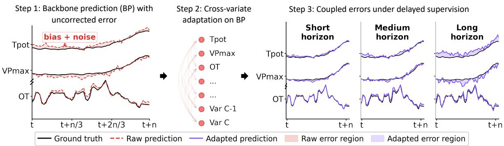  
Figure 1: Direct error mixing in prediction-space cross-variate interaction. A conceptual illustration using variables from Weather (Tpot, VPmax, OT, and other variables). Cross-variate interaction applied to backbone predictions can directly mix their uncorrected errors across variates (Step 2). In TSF-TTA, ground-truth observations become available only after the prediction horizon, delaying corrective feedback (Step 3). Proposition 1 formalizes the direct error-mixing pathway, while Figure 5 empirically compares prediction-space and correction-space interaction across prediction horizons.

Existing TSF-TTA methods predominantly adapt each variate independently, yet distribution shifts in multivariate time series often afect variates jointly [Lin et al., 2025] (Figure 2). Such shifts may induce shared structure in the adaptation corrections required across variates, making cross-variate correction sharing potentially beneficial. Our analysis shows that the leading singular mode captures approximately 73% of correction energy on average (Appendix E.1), further supporting this hypothesis. Such shared structure motivates cross-variate interaction. Prior work has explored how to model this interaction. For example, Im and Kwon [2026] investigated cross-variable attention and shared specific components on backbone predictions, yet found inconsistent benefits across datasets. We identify a more fundamental design choice that has been overlooked: where should cross-variate interaction take place?

This choice of interaction space is particularly important in TSF-TTA under delayed supervision. Backbone predictions made under distribution shift may contain substantial uncorrected errors. Applying cross-variate interaction directly to these predictions introduces pathways through which errors from one variate can influence the refinement of others (Figure 1). Since ground-truth observations become available only after the prediction horizon, such error propagation cannot be immediately corrected through supervised feedback. We therefore investigate an alternative: performing cross-variate interaction on adapter-produced corrections (the correction space) rather than on backbone predictions. This design avoids directly mixing uncorrected backbone errors during cross-variate interaction.

In this work, we formalize the distinction between prediction- and correction-space interaction and characterize their diferent direct dependencies on frozen-backbone errors (Proposition 1). Building on this analysis, we propose CoRe (Correction-space Interaction Refinement), a framework that performs structured crossvariate interaction in the correction space. CoRe introduces Shared-anchor Correction Refinement (SCR), which combines each variate’s correction with a shared anchor through a parameter-eficient bottleneck. Input-conditioned spectral gating further modulates the refinement using information from the current input window. Controlled experiments demonstrate the importance of interaction space, particularly at medium-to-long prediction horizons. We summarize our contributions as follows:

1. We identify the interaction space as a key design choice for cross-variate TSF-TTA, showing that correction-space interaction enables information sharing across variates without directly mixing uncorrected backbone errors.

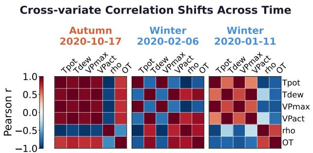  
Figure 2: Cross-variate dependencies in the Weather dataset.

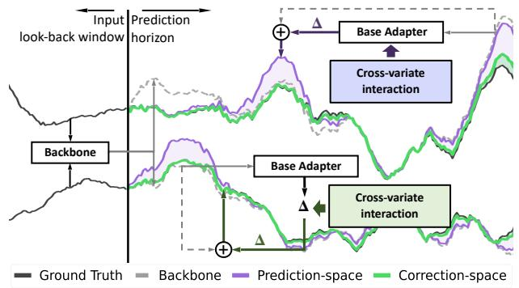  
Figure 3: Prediction-space vs. correction-space crossvariate interaction.

2. We propose CoRe, a framework to perform structured cross-variate adaptation in the correction space, through Shared-anchor Correction Refinement (SCR), complemented by a lightweight spectral gate that modulates the refinement using the current input window.

3. Extensive experiments across seven backbones, six datasets, and four horizons demonstrate consistent improvements over existing TSF-TTA methods. Controlled comparisons show an advantage of correction space over prediction-space interaction, and the gains are not explained by additional capacity alone.

## 2 Related Work

Multivariate Time-Series Forecasting from a Channel Perspective. Multivariate time-series forecasting models temporal patterns in sequential data with multiple observed variables, whose interactions may vary across time and environments [Qiu et al., 2025a]. There have been several approaches to modeling cross-variate relationships. From a channel perspective, multivariate forecasters are often contrasted as channel-independent (CI) [Nie et al., 2023, Zeng et al., 2023, Toner and Darlow, 2024] versus channel-dependent (CD) [Zhou et al., 2021, Wang et al., 2023, Liu et al., 2024], depending on whether they couple variables. However, prior findings show that cross-variate modeling can be harmful when correlations are weak, noisy, or non-stationary, and may degrade robustness under distribution shift [Chen et al., 2024, He et al., 2025]. These findings suggest that the question is not whether to model cross-variate dependencies, but how to introduce them without amplifying noise under distribution shift.

Test-Time Adaptation for Time-Series Forecasting. Test-time adaptation is an emerging paradigm for addressing non-stationarity and distribution shifts in time-series forecasting. In TSF-TTA, representative baselines include TAFAS [Kim et al., 2025], PETSA [Medeiros et al., 2025], DynaTTA [Grover and Etemad, 2025], and COSA [Im and Kwon, 2026]. Recent work further introduces a matured-ground-truth protocol for TSF-TTA [Wang et al., 2026]. Despite recent progress, existing methods typically adapt each variate independently, overlooking cross-variate structure. Although cross-variate interaction on backbone predictions has been explored through attention and shared structures [Im and Kwon, 2026], its benefits are inconsistent across datasets, and operating on backbone predictions introduces a direct pathway for mixing their uncorrected errors across variates. CoRe instead performs cross-variate interaction in the correction space, removing this direct backbone-error mixing pathway. See Appendix A for further related work.

## 3 Methodology

## 3.1 Problem Formulation

We study test-time adaptation for multivariate time-series forecasting under delayed supervision. At each time step $t ,$ a frozen backbone $f _ { \theta }$ maps a past input window $\mathbf { X } _ { t } \in \bar { \mathbb { R } } ^ { L \times C }$ , with lookback length L and $C$ variates, to an H-horizon forecast $\hat { \mathbf { Y } } _ { t } ^ { \mathrm { b a s e } } \in \bar { \mathbb { R } } ^ { H \times C }$ . A lightweight adapter $\mathcal { A } _ { \phi }$ produces per-variate corrections $\pmb { \Delta } _ { t } = \mathcal { A } _ { \phi } ( \hat { \mathbf Y } _ { t } ^ { \mathrm { b a s e } } , \mathbf I _ { t } ) \in \mathbb { R } ^ { H \times C }$ , where $\pmb { \Delta } _ { t } ^ { ( c ) } \in \mathbb { R } ^ { H }$ denotes the correction for variate $^ { c , }$ and $\mathbf { I } _ { t }$ denotes optional auxiliary information available to the base adapter. The adapted forecast is

$$
\hat { \mathbf Y } _ { t } = \hat { \mathbf Y } _ { t } ^ { \mathrm { b a s e } } + \Delta _ { t } .\tag{1}
$$

During deployment, ground-truth observations become available with a delay of H steps, and the adapter is updated only when the corresponding supervision becomes available. Thus, each prediction depends only on past observations, ensuring a leakage-free setting. Adapter-specific instantiations and update protocols are detailed in Appendix B.3 and C.2.

## 3.2 Cross-Variate Interaction in TSF-TTA

Current TSF-TTA methods adapt each variate independently. Yet distribution shifts may induce shared structure in the corrections required across variates. The decomposition in Equation 1 ofers two distinct places to model this cross-variate structure: the frozen-backbone prediction $\hat { \mathbf { Y } } _ { t } ^ { \mathrm { b a s e } }$ and the adapter-produced correction $\Delta _ { t }$ . Applying cross-variate interaction to each defines the prediction space and the correction space (Figure 3). We analyze how backbone error propagates in each, and show that prediction-space interaction directly spreads this error across variates while correction-space interaction avoids such direct propagation.

Let $\mathcal { M } _ { \mathrm { p r e d } }$ and $\mathcal { M } _ { \mathrm { c o r r } }$ denote cross-variate refinement operators applied in the prediction and correction spaces, respectively. The two interaction forms are

$$
\begin{array} { r l } & { \hat { \mathbf { Y } } _ { t } ^ { \mathrm { p r e d } } = \hat { \mathbf { Y } } _ { t } ^ { \mathrm { b a s e } } + \boldsymbol { \Delta } _ { t } + \mathcal { M } _ { \mathrm { p r e d } } ( \hat { \mathbf { Y } } _ { t } ^ { \mathrm { b a s e } } ) , } \\ & { \hat { \mathbf { Y } } _ { t } ^ { \mathrm { c o r r } } = \hat { \mathbf { Y } } _ { t } ^ { \mathrm { b a s e } } + \boldsymbol { \Delta } _ { t } + \mathcal { M } _ { \mathrm { c o r r } } ( \boldsymbol { \Delta } _ { t } ) . } \end{array}\tag{2}
$$

Let $\mathbf { e } _ { t } ^ { \mathrm { { b a s e } } } = \hat { \mathbf { Y } } _ { t } ^ { \mathrm { { b a s e } } } - \mathbf { Y } _ { t }$ denote the frozen-backbone error. Prediction-space interaction therefore operates on $\mathbf { Y } _ { t } + \mathbf { e } _ { t } ^ { \mathrm { b a s e } }$ , whereas correction-space interaction operates on $\Delta _ { t }$

Proposition 1 (Structural Separation). Define the backbone-error-induced prediction-space refinement as

$$
\begin{array} { r } { \mathbf { { \Gamma } } \mathbf { { \Gamma } } ^ { \mathrm { p r e d } } : = \mathcal { M } _ { \mathrm { p r e d } } ( \mathbf { Y } _ { t } + \mathbf { e } _ { t } ^ { \mathrm { b a s e } } ) - \mathcal { M } _ { \mathrm { p r e d } } ( \mathbf { Y } _ { t } ) . } \end{array}
$$

For linear cross-variate mixing $\mathcal { M } _ { \mathrm { p r e d } } ( \cdot ) = ( \cdot ) \mathbf { W } _ { \mathrm { p r e d } } ^ { \top } ,$

$$
\mathbf { \Gamma } \mathbf { \Gamma } \mathbf { \Gamma } ^ { \mathrm { p r e d } } _ { i , : , c } = \sum _ { j = 1 } ^ { C } W _ { \mathrm { p r e d } , c j } \mathbf { e } _ { t , : , j } ^ { \mathrm { b a s e } } .
$$

Thus, each nonzero of-diagonal $W _ { \mathrm { p r e d } , c j }$ provides a direct path from the backbone error of variate $j$ to the refinement of variate c. The same structural distinction extends locally to nonlinear operators via their Jacobians (Appendix H.2). In correction space, the backbone error remains outside the cross-variate operator.

This proposition establishes a structural distinction in how the two interaction spaces directly depend on backbone errors. It does not imply that adapter corrections are independent of backbone errors, since the base adapter may itself depend on backbone predictions. Nor does it establish an accuracy ordering between the two interaction spaces. We investigate their empirical consequences in Section 4.3.

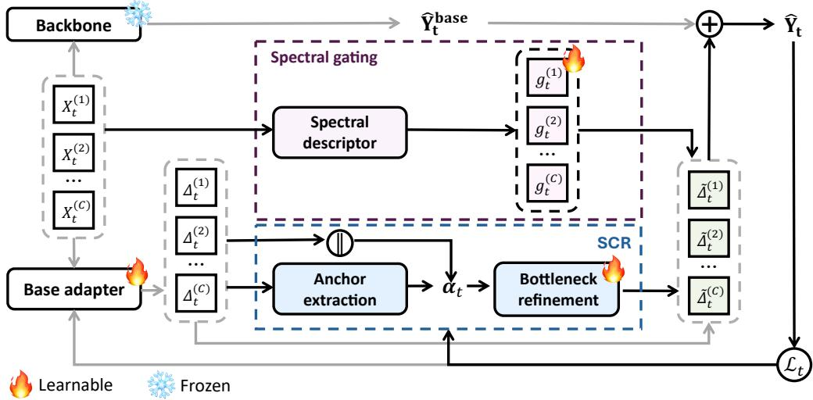  
Figure 4: Framework of CoRe for multivariate test-time adaptation. A frozen backbone produces a base forecast, while a base adapter produces per-variate corrections. SCR performs cross-variate interaction in the correction space. Spectral descriptor of the current input window provides per-variate gates that modulate the SCR refinement. The refined corrections are added to the unchanged backbone prediction to form the final forecast.

## 3.3 The CoRe Framework

Building on the above design principle, we propose CoRe as an instantiation of cross-variate adaptation in the correction space. The framework is illustrated in Figure 4. Given the per-variate corrections produced by the base adapter, CoRe consists of two components: (i) Shared-anchor Correction Refinement (SCR) combines each variate’s correction with a shared correction anchor through a parameter-eficient bottleneck; and (ii) Input-Conditioned Spectral Gating uses spectral descriptors of the current input window to modulate the contribution of the SCR refinement. The resulting refined corrections are added to the backbone prediction to form the final forecast. The complete leakage-free streaming procedure is given in Appendix B.

## 3.4 Shared-anchor Correction Refinement (SCR)

SCR refines each variate’s base-adapter correction by combining variate-specific and shared correction information. It consists of a shared correction anchor and a parameter-eficient bottleneck.

Shared correction anchor. Related distribution shifts may induce common patterns in the corrections required across variates. We approximate this shared information by averaging the corrections across variates:

$$
\pmb { \alpha } _ { t } = \frac { 1 } { C } \sum _ { j = 1 } ^ { C } \pmb { \Delta } _ { t } ^ { ( j ) } \in \mathbb { R } ^ { H } .\tag{3}
$$

For each variate $c ,$ its own correction is concatenated with the shared anchor:

$$
\mathbf { z } _ { t } ^ { ( c ) } = [ \Delta _ { t } ^ { ( c ) } \lVert \alpha _ { t } ] \in \mathbb { R } ^ { 2 H } ,\tag{4}
$$

where ∥ denotes concatenation. The concatenation preserves each variate’s own correction while adding shared information.

Bottleneck refinement. The joint representation is mapped to a cross-variate refinement through a shared two-layer bottleneck:

$$
\begin{array} { r } { \pmb { \delta } _ { t } ^ { ( c ) } = \mathbf { W } _ { \uparrow } \operatorname { t a n h } \left( \mathbf { W } _ { \downarrow } \mathbf { z } _ { t } ^ { ( c ) } \right) , \quad \mathbf { W } _ { \downarrow } \in \mathbb { R } ^ { r \times 2 H } , \quad \mathbf { W } _ { \uparrow } \in \mathbb { R } ^ { H \times r } . } \end{array}\tag{5}
$$

where $\pmb { \delta } _ { t } ^ { ( c ) } \in \mathbb { R } ^ { H }$ is the refinement for variate $c ,$ and r is the bottleneck dimension. Both projections $\mathbf { W } _ { \downarrow } , \mathbf { W } _ { \uparrow }$ are shared across variates. We simply set $r = C$ by default, giving $O ( H C )$ SCR parameters against ${ \dot { O } } ( H ^ { 2 } )$ for unconstrained dense mixing over the horizon. Sharing the anchor and constraining the bottleneck keep the interaction parameter-eficient, which mitigates overfitting under limited test-time supervision.

## 3.5 Input-Conditioned Spectral Gating

SCR defines how corrections interact across variates. Because temporal dynamics shift over time, the usefulness of shared correction information may also vary. Spectral energy distribution provides useful cues for such changes [Yi et al., 2023, Fan et al., 2024, Piao et al., 2024] and can be computed directly from the current input window. We therefore use a lightweight spectral descriptor to modulate the SCR refinement:

$$
\widetilde { \pmb { \Delta } } _ { t } ^ { ( c ) } = { \pmb { \Delta } } _ { t } ^ { ( c ) } + g _ { t } ^ { ( c ) } \delta _ { t } ^ { ( c ) } ,\tag{6}
$$

where $\Delta _ { t } ^ { ( c ) }$ is the base-adapter correction, $\delta _ { t } ^ { ( c ) }$ is the SCR refinement from Equation $5 ,$ and $g _ { t } ^ { ( c ) } \in ( - 1 , 1 )$ provides signed modulation of the refinement for variate c.

Spectral descriptor. For each variate in the input window $\mathbf { X } _ { t } \in \mathbb { R } ^ { L \times C }$ , we subtract its mean and compute a one-sided power spectrum via Fast Fourier Transform (FFT). We then

average these across variates to obtain a shared spectral distribution $\overline { { \mathbf { P } } } _ { t }$ over $K _ { f } = \lfloor L / 2 \rfloor + 1$ frequency bins.

$\overline { { \mathbf { P } } } _ { t }$ thus summarizes the window-level temporal dynamics across variates. From $\overline { { \mathbf { P } } } _ { t }$ we extract four spectral statistics. One is the spectral entropy $\mathrm { S E } _ { t } .$ , measuring how concentrated the spectral energy is [Powell and Percival, 1979, Inouye et al., 1991]. The other three are relative band powers over low-, mid-, and high-frequency bands $( \mathrm { L B R } _ { t } , \mathrm { M B R } _ { t } , \mathrm { H B R } _ { t } )$ , measuring how energy is distributed across frequency ranges [Keil et al., 2022]. Stacking these gives the spectral descriptor:

$$
\begin{array} { r } { { \bf s } _ { t } = [ { \mathrm { S E } } _ { t } , { \mathrm { L B R } } _ { t } , { \mathrm { M B R } } _ { t } , { \mathrm { H B R } } _ { t } ] \in \mathbb { R } ^ { 4 } . } \end{array}\tag{7}
$$

Normalization and frequency-band definitions are provided in Appendix B.1.

Per-variate gating. We map the spectral descriptor to a C-dimensional gate:

$$
\mathbf { g } _ { t } = \operatorname { t a n h } ( \mathbf { W } _ { g } \mathbf { s } _ { t } + \mathbf { b } _ { g } ) \in ( - 1 , 1 ) ^ { C } .\tag{8}
$$

Here $\mathbf { W } _ { g } \in \mathbb { R } ^ { C \times 4 }$ and $\mathbf { b } _ { g } \in \mathbb { R } ^ { C }$ are learnable. The descriptor $\mathbf { s } _ { t }$ is shared across variates, so the gates difer only through the rows of $\mathbf { W } _ { g }$ and entries of ${ \bf b } _ { g }$ . The tanh bounds each coeficient to $( - 1 , 1 )$ , allowing $g _ { t } ^ { ( c ) }$ to provide signed modulation of the SCR refinement for variate c.

## 3.6 Adaptation Objective

The final adapted forecast is thus $\hat { \mathbf Y } _ { t } = \hat { \mathbf Y } _ { t } ^ { \mathrm { b a s e } } + \tilde { \Delta } _ { t }$ . The base-adapter parameters $\phi$ and CoRe parameters $\boldsymbol { \Theta } = \{ \mathbf { W } _ { \downarrow } , \mathbf { W } _ { \uparrow } , \mathbf { W } _ { g } , \mathbf { b } _ { g } \}$ are updated jointly online. At time $t ,$ let $B _ { t }$ denote the adaptation batch whose corresponding targets are available. The parameters are updated by minimizing

$$
\mathcal { L } _ { t } = \frac { 1 } { \vert \mathcal { B } _ { t } \vert } \sum _ { i \in \mathcal { B } _ { t } } \Vert \hat { \mathbf { Y } } _ { i } - \mathbf { Y } _ { i } \Vert _ { F } ^ { 2 } + \lambda _ { \mathrm { r e g } } \left( \Vert \phi \Vert _ { 2 } ^ { 2 } + \Vert \Theta \Vert _ { 2 } ^ { 2 } \right) ,\tag{9}
$$

where $\lambda _ { \mathrm { r e g } }$ controls weight decay to mitigate overfitting under limited supervision.

## 4 Experiments

We evaluate CoRe from four perspectives: overall accuracy and eficiency, the choice of the interaction space, the design of correction-space refinement, and the reliability of online adaptation.

## 4.1 Experimental Setup

Datasets and evaluation. We evaluate on six multivariate forecasting benchmarks: ETTh1, ETTh2, ETTm1, ETTm2 [Zhou et al., 2021], Weather,1 and Exchange Rate [Lai et al., 2018], with lookback L=96 and horizons H ∈ {96, 192, 336, 720}. We additionally evaluate on high-dimensional datasets Electricity and Trafic [Lai et al., 2018] to assess scalability. We report MSE over the full test stream.

Backbones and baselines. We use seven forecasting backbones: DLinear [Zeng et al., 2023], FreTS [Yi et al., 2023], OLS [Toner and Darlow, 2024], PatchTST [Nie et al., 2023], iTransformer [Liu et al., 2024], Informer [Zhou et al., 2021], and MICN [Wang et al., 2023]. We compare with the frozen backbone and TSF-TTA methods TAFAS [Kim et al., 2025], and COSA [Im and Kwon, 2026]; PETSA [Medeiros et al., 2025] results are in Appendix D.1. All backbones use the same frozen checkpoints, and all TTA modules adapt under delayed supervision. Unless stated otherwise, CoRe uses COSA as the base adapter, r=C, and the same hyperparameters across datasets and backbones. Experiments run on one NVIDIA A100; Appendix B gives implementation details.

## 4.2 Overall Efectiveness

Table 1 reports MSE across all 168 settings (7 backbones × 6 datasets × 4 horizons). Averaged across all settings, CoRe reduces MSE by 25.82% relative to the frozen backbone and by 10.57% relative to COSA. The largest dataset-level reductions over COSA occur on Weather, ETTm2, and Exchange Rate. Gains are more pronounced at medium-to-long horizons: 5.27% at H=96, 13.34% at H=336, and 11.53% at H=720. The few underperforming cases occur mainly at H=96, where the benefit of correction-space interaction may be smaller. CoRe applies larger corrections where the frozen backbone is less accurate (167/168 settings) and yields larger relative improvements there (166/168); see Appendix C.3.

Runtime overhead. Averaged over six datasets and four horizons with DLinear, CoRe increases the per-adaptation-step runtime from 6.28 ms to 6.76 ms over COSA (+0.48 ms; +7.7%). Thus, the accuracy gains come with modest additional computation; Appendix G.3 provides the full timing breakdown.

## 4.3 Why Correction-Space Interaction?

Correction vs. prediction space. Correction-space interaction shows a clear advantage over predictionspace interaction at medium-to-long horizons. Figure 5 controls for the interaction architecture, changing only the space in which cross-variate interaction is performed. While the two variants are close at H=96, at H=336 correction-space interaction improves DLinear by 33.3%, compared with 19.8% for prediction-space interaction. The same overall horizon-dependent pattern holds across all seven backbones (Appendix C.1). Together with Proposition 1, this controlled comparison supports the empirical advantage of correction-space over prediction-space interaction, particularly at medium-to-long horizons.

Parameter-matched comparison. The advantage of CoRe is not explained by additional trainable capacity alone. Table 2 compares CoRe with a parameter-matched independent COSA+MLP, which adds per-variate capacity without cross-variate interaction. COSA+MLP improves over COSA by only 0.97% on average (single seed; Table 2), compared with 10.55% for CoRe. The contrast is particularly clear on

Table 1: Prediction MSE comparison (lower is better). TAFAS, COSA and CoRe results are averaged over 10 random seeds. For CoRe, standard deviations across seeds are small (maximum: 0.0130), with full standard deviations reported in Table 6 (Appendix B.4). Best/second-best highlighting applies to TAFAS vs. COSA vs. CoRe.
<table><tr><td rowspan="2"></td><td></td><td>iTransformer</td><td>DLinear</td><td>FreTS</td><td></td><td>Informer</td></tr><tr><td>H Base TAFAS</td><td>COSA CoRE Base</td><td>TAFAS COSA CoRE</td><td>Base TAFAS</td><td>COSA CoRE Base</td><td>TAFAS COSA CoRE</td></tr><tr><td>ETT1</td><td>96 0.4580 0.4381 192 0.5070 0.4911 336 0.5788 0.5696 720 0.7067 0.6687</td><td>0.4638 0.4545 0.5024 0.4589 0.4956 0.4661</td><td>0.4695 0.4604 0.4922 0. 0.5213 0.5099 0. .5371 0.5659 0.5622 0.5208</td><td>0.4916 0.4462 0.4395 0.4961 0.5021 0.4944 0.4722 0.5544 0.5560</td><td>0.4623 0.4625 0.7466 0.5084 0.4692 0.9127 0.4970 0.4596 1.1265</td><td>0.6879 0.6589 0.6501 0.7905 0.6790 0.6415 0.9582 0.6727 0.6302</td></tr><tr><td>ETTT2</td><td>96 0.2731 0.2701 192 0.3088 0.3042 336 0.3567 0.3397 720 0.4297 0.4128</td><td>0.5381 0.5055 0. 0.3050 0.2803 0. 0.3116 0.2722 0 .2552 0.2245 0</td><td>0.6992 0.6685 0.5433 0.4891 0.2323 0.2302 0.2552 0.2426 0.2862 0.2836 0.2739 0.2275 0.3252 0.3193 0.2521 0.2171</td><td>0.7145 0.6838 0.5616 7 0.2386 0.2362 0.2560 0.2867 0.2829 0.2676 0.3317 0.3221 0.2548</td><td>0.5052 1.3596 0.9986 0.2462 0.3510 0.3419 0.2371 0.4390 0.4311 0.2196 0.4884 0.4900</td><td>0.7123 0.6400 0.3747 0.3760 0.4197 0.3567 0.4127 0.3463</td></tr><tr><td>ETTTm1</td><td>0. 96 0.3740 0.3538 192 0.4421 0.4175 336 0.5096 0.4727 0 720 0.6083 0.5539</td><td>0.2695 0.2545 0.4149 0.3799 0.3776 0.4346 0.4184 0.4438 0.4585 0.5183</td><td>0.3939 0.2589 0.23240.4198 .3715 0.3488 0. .3800 0.3881 0.4159 0.4755 0.4282</td><td>0.3976 0.2516 0.3676 0.3575 0.3836 0.4325 0.4206 0.4615</td><td>0.2336 0.5206 0.5172 0.3862 0.6475 0.4987 0.4200 0.6950 0.5472 0.6517</td><td>0.3297 0.3113 0.4956 0.4929 0.5571 0.5385 0.6031 0.5771 0.6713 0.6454</td></tr><tr><td>ET2</td><td>.4825 0.5615 96 0.1791 0.1722 0. .2226</td><td>0.5171 0.5920 0.1831 0 0.1930</td><td>0.4787 0. 0.5358 0.4665 0.5495 0.5920 .1598 0.1588 0.1915 0.1644</td><td>0.5006 0.4816 0.5195 0.5424 0.5590 0.5413 0.5773 0.1582 0.1573 0.1900</td><td>0.4616 0.7708 0.5200 0.8308 0.1707 0.2839 0.1628 0.4291</td><td>0.7888 0.2176 0.2253 0.2027 0.2408 0.1964 0.2660 0.2114</td></tr><tr><td></td><td>192 0.2171 0.2153 0.2393 336 0.2722 0.2644 720 0.3321 0.3216</td><td>0.1905 0.2473 0.2058 0. 0.2329 0.1955 0.3062</td><td>0.1927 0.1961 0.1652 0.2324 0.2337 0.1969 0.1725 0.3053 0.2066 0.1778</td><td>0.1922 0.1911 0.2319 0.2308 0.3010 0.2984</td><td>0.1885 0.1944 0.1686 0.4123 0.2110 0.1799 0.5985</td><td>0.2732 0.3676 0.4416 0.2804 0.2307</td></tr><tr><td>xnge ate</td><td>96 0.0918 0.0918 192 0.2086 0.1997 336 0.3414 0.3119</td><td>0.0913 0.0832 0.0 0.0913 0.1093 0.0988 0.1827 0.1054 0.3277</td><td>0.0878 0.0816 0.0706 0.1736 0.0844</td><td>0.0828 0.0790 0.0733 0.1733 0.1637</td><td>0.0835 0.0738 0.1720 0.0959 0.0806 0.3080 0.0978 0.0933 0.6753</td><td>0.1605 0.1187 0.0985 0.2783 0.1265 0.1183</td></tr><tr><td>Weher</td><td></td><td>0.1192</td><td>0.3067 0.0867</td><td>0.08040.3241 0.3005</td><td></td><td>0.1901</td></tr><tr><td></td><td></td><td></td><td></td><td></td><td></td><td></td></tr><tr><td></td><td></td><td>.2228 0.1957</td><td>0.8383 0.1954</td><td></td><td></td><td></td></tr><tr><td></td><td>720 0.9137 0.9062 96</td><td></td><td>0.8281 0.1469 0.1239</td><td>0.8267 0.8142</td><td>0.1537 0.1289 ..5502</td><td>0.5693 0.1902</td></tr><tr><td></td><td>0.1708 0.1625</td><td>0.1753 .1635</td><td>0.1828 0.1814 0.1719</td><td>0.1857 0.1743</td><td></td><td>.5732 0.3524 0.3403 0.1762 0.2567</td></tr><tr><td></td><td>192 0.2208 0.2086</td><td>0 0.2000 0.1697 0. 0.2403 0.2439 0.1736 0.2918</td><td>0.2219 0.1970 0.1711</td><td>0.2311 0.2143 0.1782 0.2844</td><td>0.1739 0.1617 0.2168 0.1944 0.1690 00.3344</td><td>0.1940 0.1807 0.2627 0.2261 0.3076 0.4057</td></tr><tr><td></td><td>336 0.2807 0.2619 720 0.3572 0.3510</td><td>0.21930.1876 0.3643</td><td>0.2695 0.2465 0.3550 0.2231 0.1777</td><td>0.2639 0.3555 0.3509</td><td>0.2341 0.1785 0.3793 0.2084 0.1763 0.5370</td><td>0.2773 0.2202 0.2674 0.2371</td></tr><tr><td></td><td></td><td>PatchTST Base TAFAS COSA</td><td>OLS</td><td>COSA CoRE Base</td><td>MICN TAFAS COSA CoRE</td><td></td></tr><tr><td></td><td>H ET1 96</td><td>0.4329 0.4264 0.4392 192 0.4910 0.4820 0.4738 0.5554 0.5463 0.4971</td><td>CoRE Base TAFAS 0.4371 0.4511 0.4394</td><td>0.4729 0.4723 0.6244 0.5173 0.4763 0.6543</td><td>0.5836 0.5837 0.5863 0.5902 0.5802 0.5203</td><td></td></tr><tr><td></td><td>336 720 96 192</td><td>0.7009 0.6826 0.5449 0.2355 0.2349 0.2506 0.2855 0.2765 0.2767</td><td>0.4540 0.5046 0.4918 0.4458 0.5510 0.5453 0.4983 0.6996 0.6619</td><td>0.5041 0.4568 0.7352 0.5443 0.4886 0.9336 0.2443 0.2389 0.2537</td><td>0.6767 0.5889 0.5386 0.7926 0.6177 0.5591 0.2498 0.2538 0.2476</td><td></td></tr><tr><td></td><td>ETT2 336</td><td>0.3174 0.3108 0.2451 720 0.4063 0.4039 0.2514 0.4032 0.3908 0.4057</td><td>0.2490 0.2305 0.2290 0.2405 0.2838 0.2824 0.2167 0.3257 0.3202 0.2331 0.4165 0.3978</td><td>0.2740 0.2290 0.3082 0.2448 0.2122 0.3738 0.2499 0.2301 0.4611</td><td>0.3077 0.2923 0.2430 0.3653 0.2828 0.2486 0.4591 0.3058 0.2746</td><td></td></tr><tr><td></td><td>ETT1 96 192 336 720</td><td>0.4508 0.4363 0.4417 60.5040 0.4855</td><td>0.4026 0.3706 0.3495 0.4183 0.4438 0.4148</td><td>0.3780 0.3874 0.4352 0.4730 0.4235 0.4940</td><td>0.3975 0.4240 0.4232 0.4587 0.4822 0.4551</td><td></td></tr><tr><td></td><td>ETm2 96 720</td><td></td><td></td><td></td><td></td><td></td></tr><tr><td></td><td></td><td></td><td></td><td></td><td></td><td></td></tr><tr><td></td><td>192 0.2197</td><td></td><td></td><td></td><td></td><td></td></tr><tr><td></td><td>3360.2763</td><td></td><td></td><td></td><td></td><td></td></tr><tr><td></td><td></td><td></td><td></td><td></td><td></td><td></td></tr><tr><td></td><td></td><td></td><td></td><td></td><td></td><td></td></tr><tr><td></td><td></td><td></td><td>0.2023</td><td></td><td></td><td></td></tr><tr><td></td><td></td><td>0.5607 0.5441</td><td>0.4989 0.4509 0.5177 0.4769 0.5696 0.1953</td><td>0.5360 0.4658 0.5605</td><td>0.5136 0.5480 0.5018</td><td></td></tr><tr><td></td><td></td><td></td><td>0.5225 0.5927 0.5481 0.1721 0.1602 0.1694 0.1935 0.1940</td><td>0.5938 0.5367 0.6169</td><td>0.5726 0.6061 0.5602</td><td></td></tr><tr><td></td><td></td><td>0.1593 0.1598 1920.2066 0.2052 0.2530</td><td>0.1596 0.2100 0.1765 0.2332 0.2348</td><td>0.1923 0.1655 0.1697 0.1978 0.1671 0.2198</td><td>0.1724 0.1909 0.1845 0.2125 0.2307 0.1832</td><td></td></tr><tr><td></td><td></td><td>336 0.2480 0.3057 0.3045 0.2058</td><td>0.1728 0.3066 0.3069</td><td>0.1985 0.1726 0.2603 0.2067 0.1787 0.3352</td><td>0.2590 0.2238 0.1871 0.3305 0.2381 0.1991</td><td></td></tr><tr><td></td><td></td><td></td><td></td><td></td><td></td><td></td></tr><tr><td></td><td></td><td></td><td></td><td></td><td></td><td></td></tr><tr><td></td><td>Weaaher</td><td></td><td></td><td></td><td></td><td></td></tr><tr><td></td><td></td><td></td><td></td><td></td><td></td><td></td></tr><tr><td></td><td></td><td></td><td></td><td></td><td></td><td></td></tr><tr><td></td><td>xcange</td><td></td><td></td><td></td><td></td><td></td></tr><tr><td></td><td></td><td>96 0.0858 0.0817</td><td>0.0798 0.0739 0.0814 0.0789</td><td>0.0795 0.0741 0.1114</td><td>0.1100 0.0920 0.0779</td><td></td></tr><tr><td></td><td></td><td></td><td></td><td></td><td></td><td></td></tr><tr><td></td><td>Rate</td><td>192 20.1880 0.1760</td><td>0.1029 0.0897 0.1727 0.1643</td><td>0.0953 0.0812 0.2081</td><td>0.1864 0.08550.0739</td><td></td></tr><tr><td></td><td></td><td></td><td></td><td></td><td></td><td></td></tr><tr><td></td><td></td><td></td><td></td><td></td><td></td><td></td></tr><tr><td></td><td></td><td>336 0.3383 0.3088</td><td>0.1094 0.1000 0.3225 0.3014</td><td>0.1003 0.0947 0.3941</td><td>0.3644 0.1299 0.1091</td><td></td></tr><tr><td></td><td></td><td></td><td></td><td></td><td></td><td></td></tr><tr><td></td><td></td><td></td><td></td><td></td><td></td><td></td></tr><tr><td></td><td></td><td></td><td></td><td></td><td></td><td></td></tr><tr><td></td><td></td><td></td><td></td><td></td><td></td><td></td></tr><tr><td></td><td></td><td></td><td></td><td></td><td></td><td></td></tr><tr><td></td><td></td><td></td><td></td><td></td><td></td><td></td></tr><tr><td></td><td></td><td></td><td></td><td></td><td></td><td></td></tr><tr><td></td><td></td><td>7200.8327</td><td></td><td>0.1490 0.12591.4477</td><td>0.8503 0.2320 0.2211</td><td></td></tr><tr><td></td><td></td><td>0.8330</td><td>0.17430.13480.8356 0.8202</td><td></td><td></td><td></td></tr><tr><td></td><td></td><td></td><td></td><td></td><td></td><td></td></tr><tr><td></td><td></td><td></td><td></td><td></td><td></td><td></td></tr><tr><td></td><td></td><td>96 0.1727 0.1702 0.1664</td><td>0.1622 0.1958 0.1831 0.1939 0.17240.2405</td><td>0.1812 0.1704 0.1724 0.2220 0.19600.1719 0.2235</td><td>0.1723 0.1701 0.1646 0.2215 0.2078 0.1608</td><td></td></tr><tr><td></td><td></td></table>

Exchange Rate, where cross-variate relationships vary substantially over time (Appendix G.1). These results support the benefit of structured cross-variate refinement under a comparable parameter budget.

Table 2: Parameter-matched comparison (DLinear, 6 datasets × 4 horizons; seed = 42). Exchange Rate reported separately due to its high non-stationarity.
<table><tr><td>Method</td><td>Params</td><td> $\mathbf { A v } \mathbf { g } .$  MSE</td><td>Exch. MSE</td></tr><tr><td>COSA</td><td>1,627,930</td><td>0.2974</td><td>0.0983</td></tr><tr><td>COSA+MLP</td><td>1,637,575</td><td>0.2945</td><td>0.0986</td></tr><tr><td>CoRE</td><td>1,637,898</td><td>0.2660</td><td>0.0849</td></tr></table>

Table 3: Results on large-scale datasets Electricity and Trafic, averaged over 4 horizons and 10 seeds. All methods use a fixed bottleneck rank r=16.
<table><tr><td>Model</td><td>Dataset</td><td>Backbone</td><td>COSA CoRE</td></tr><tr><td rowspan="2">DLinear</td><td>Electricity</td><td>0.2258</td><td>0.2008 0.1860</td></tr><tr><td>Traffic</td><td>0.6502</td><td>0.6352 0.6325</td></tr><tr><td rowspan="2">MICN</td><td>Electricity</td><td>0.1962</td><td>0.1619 0.1458</td></tr><tr><td>Traffic</td><td>0.5275</td><td>0.4875 0.4694</td></tr></table>

## 4.4 Structured and Selective Refinement

Table 4: Ablation study of CoRe components. Average MSE over three backbones (DLinear, PatchTST, MICN), six datasets, four horizons, and 10 seeds. vs. COSA: relative MSE reduction over COSA. Loss-trend gate: COSA’s adaptive learning-rate signal repurposed as the SCR gate. Fixed gate $\scriptstyle ( g = 1 )$ : uniform crossvariate refinement without input-dependent modulation. $\mathbf { s } _ { t } \mathbf { : }$ Spectral descriptors for gating (Section 3.5).
<table><tr><td>Method</td><td>DLinear PatchTST MICN Avg. MSE vs. COSA</td><td></td><td></td><td></td><td></td></tr><tr><td>COSA</td><td>0.2981</td><td>0.2927</td><td>0.3241</td><td>0.3050</td><td></td></tr><tr><td>+SCR (no anchor; per-variate bottleneck) +SCR (no anchor/bottleneck; full C×C mixing)</td><td>0.2760 0.2745</td><td>0.2721 0.2706</td><td>0.3018 0.3044</td><td>0.2833 0.2832</td><td>-7.1% -7.2%</td></tr><tr><td>+SCR (loss-trend gate)</td><td>0.2712</td><td>0.2657</td><td>0.2963</td><td>0.2777</td><td>-9.0%</td></tr><tr><td>+SCR (fixed gate, g=1)</td><td>0.2703</td><td>0.2651</td><td>0.2954</td><td>0.2769</td><td>-9.2%</td></tr><tr><td>CoRE</td><td>0.2675</td><td>0.2646</td><td>0.2942</td><td>0.2754</td><td>-9.7%</td></tr></table>

Shared and low-dimensional correction structure. As shown in Table 4, the full SCR design improves over COSA by 9.7%, compared with 7.1% without the shared anchor and 7.2% with unconstrained $C \times C$ mixing. These results support the benefit of the shared-anchor structure over the evaluated alternatives.

Moreover, the leading singular mode captures 73% of the correction energy on average, revealing pronounced low-dimensional structure. With $r { = } 1 6 \ll C$ , SCR retains improvements over COSA on both Electricity (C=321) and Trafic (C=862), showing that its efectiveness does not require the bottleneck rank to scale with the number of variates (Table 3). Together, these results support the shared-anchor and parameter-eficient bottleneck designs in SCR. See Appendix E.1 for the rank and scalability analysis.

Spectral gating. The spectral signal is computed directly from the current input window and is therefore available from the first test batch, without requiring the historical loss or model-state statistics used by loss-trend or embedding-drift signals. Table 4 shows that with spectral gating, CoRe improves over COSA by 9.7%, compared with 9.2% for a fixed gate and 9.0% for loss-trend gating. Spectral gating thus provides a modest additional gain, while most of the improvement comes from SCR. Appendix E.2 contains the full ablations.

## 4.5 Adaptation Reliability

Online updates aim to improve performance but can also degrade it [Niu et al., 2023]. Reliable adaptation therefore matters alongside average accuracy, particularly under delayed supervision where corrective feedback is not immediately available. CoRe’s accuracy gains are accompanied by more reliable online adaptation. We assess reliability on three representative backbones (DLinear, PatchTST, and MICN) using four complementary measures: average correction regret $\displaystyle \left( \overline { { \mathcal { R } } } _ { T } \right)$ , the frequency of harmful adaptation $\left( p _ { \mathrm { n e g } } \right)$ , the severity of harmful adaptation $( \overline { { \mathcal { R } } } _ { T } ^ { + } )$ , and the number of settings in which adaptation underperforms the frozen backbone $\left( n _ { \mathrm { w o r s e } } \right)$ Table 5 shows that CoRe improves over COSA across all four reliability measures. Together, these results

Correction space (ours) vs. prediction space  
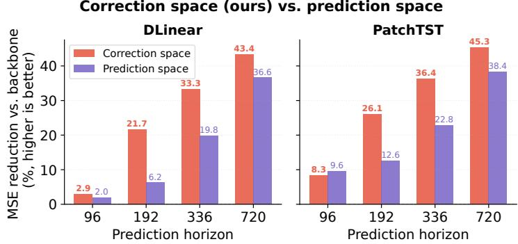  
Table 5: Online adaptation reliability over 18 backbone-dataset combinations (3 backbones × 6 datasets), each averaged over $H \in \{ 9 6 , 1 9 2 , 3 3 6 , 7 2 0 \}$ }. Lower is better; darker blue indicates better performance within each column.

<table><tr><td>Method</td><td> $\overline { { \mathcal { R } } } _ { T } \downarrow$ </td><td> $p _ { \mathrm { n e g } } \downarrow$ </td><td> $\overline { { \mathcal { R } } } _ { T } ^ { + } \downarrow$ </td><td> $n _ { \mathrm { w o r s e } } \downarrow$ </td></tr><tr><td>TAFAS</td><td>-0.010</td><td>0.446</td><td>0.0138</td><td>8</td></tr><tr><td>COSA</td><td>-0.087</td><td>0.277</td><td>0.0127</td><td>5</td></tr><tr><td>CoRE</td><td>-0.117</td><td>0.232</td><td>0.0108</td><td>2</td></tr></table>

Figure 5: Relative MSE reduction over the frozen backbone for correction-space and prediction-space interaction under the same bottleneck architecture.

show that CoRe makes online adaptation more consistently beneficial relative to the frozen backbone.   
Appendix F provides the metric definitions and detailed breakdowns.

## 5 Conclusion

We presented CoRe, a multivariate TSF-TTA framework centered on cross-variate interaction in the correction space. By performing interaction on adapter-produced corrections rather than backbone predictions, CoRe avoids directly mixing uncorrected backbone errors during cross-variate interaction. The principle is instantiated through structured Shared-anchor Correction Refinement, complemented by lightweight inputconditioned spectral gating that modulates the SCR refinement. Our analysis establishes the structura distinction between prediction-space and correction-space interaction. Controlled comparisons demonstrate the empirical benefits of this design choice, while parameter-matched controls and experiments across alternative adapters further support the efectiveness of CoRe. Across seven backbones, six datasets, and four horizons, CoRe improves forecasting accuracy in most evaluated settings with modest computational overhead.

## References

A. F. Ansari, L. Stella, C. Turkmen, X. Zhang, P. Mercado, H. Shen, O. Shchur, S. S. Rangapuram, S. P. Arango, S. Kapoor, et al. Chronos: Learning the language of time series. arXiv preprint arXiv:2403.07815, 2024.

L. Bai, L. Yao, C. Li, X. Wang, and C. Wang. Adaptive graph convolutional recurrent network for trafic forecasting. Advances in neural information processing systems, 33:17804–17815, 2020.

S.-J. Bu and S.-B. Cho. Time series forecasting with multi-headed attention-based deep learning for residentia energy consumption. Energies, 13(18):4722, 2020.

M. Chen, L. Shen, H. Fu, Z. Li, J. Sun, and C. Liu. Calibration of time-series forecasting: Detecting and adapting context-driven distribution shift. In Proceedings of the 30th ACM SIGKDD Conference on Knowledge Discovery and Data Mining, pages 341–352, 2024.

D. Cheng, F. Yang, S. Xiang, and J. Liu. Financial time series forecasting with multi-modality graph neural network. Pattern Recognition, 121:108218, 2022.

P. Christou, S. Chen, X. Chen, and P. Dube. Test time learning for time series forecasting. arXiv preprint arXiv:2409.14012, 2024.

S. Deng, Z. Xiao, and M. de Rijke. Adaptive latent decomposition for domain generalization in time series forecasting. ACM Transactions on Knowledge Discovery from Data, 2026.

V. Ekambaram, A. Jati, N. Nguyen, P. Sinthong, and J. Kalagnanam. Tsmixer: Lightweight mlp-mixer model for multivariate time series forecasting. In Proceedings of the 29th ACM SIGKDD conference on knowledge discovery and data mining, pages 459–469, 2023.

W. Fan, P. Wang, D. Wang, D. Wang, Y. Zhou, and Y. Fu. Dish-ts: a general paradigm for alleviating distribution shift in time series forecasting. In Proceedings of the AAAI conference on artificial intelligence, volume 37, pages 7522–7529, 2023.

W. Fan, K. Yi, H. Ye, Z. Ning, Q. Zhang, and N. An. Deep frequency derivative learning for non-stationary time series forecasting. arXiv preprint arXiv:2407.00502, 2024.

S. Grover and A. Etemad. Shift-aware test time adaptation and benchmarking for time-series forecasting. In Second Workshop on Test-Time Adaptation: Putting Updates to the Test! at ICML 2025, 2025.

L. Han, H.-J. Ye, and D.-C. Zhan. The capacity and robustness trade-of: Revisiting the channel independent strategy for multivariate time series forecasting. IEEE Transactions on Knowledge and Data Engineering, 36(11):7129–7142, 2024.

H. He, Q. Zhang, K. Yi, X. Xue, S. Wang, L. Hu, and L. Cao. Robust multivariate time series forecasting against intraseries and interseries transitional shift. IEEE Transactions on Neural Networks and Learning Systems, 2025.

J. Im and H.-Y. Kwon. COSA: Context-aware output-space adapter for test-time adaptation in time series forecasting. In The Fourteenth International Conference on Learning Representations, 2026. URL https://openreview.net/forum?id=L7Z5wBMPrW.

T. Inouye, K. Shinosaki, H. Sakamoto, S. Toi, S. Ukai, A. Iyama, Y. Katsuda, and M. Hirano. Quantification of eeg irregularity by use of the entropy of the power spectrum. Electroencephalography and clinical neurophysiology, 79(3):204–210, 1991.

X. Jin, Y. Park, D. Maddix, H. Wang, and Y. Wang. Domain adaptation for time series forecasting via attention sharing. In International Conference on Machine Learning, pages 10280–10297. PMLR, 2022.

Z. Karevan and J. A. Suykens. Transductive lstm for time-series prediction: An application to weather forecasting. Neural Networks, 125:1–9, 2020.

A. Keil, E. M. Bernat, M. X. Cohen, M. Ding, M. Fabiani, G. Gratton, E. S. Kappenman, E. Maris, K. E. Mathewson, R. T. Ward, et al. Recommendations and publication guidelines for studies using frequency domain and time-frequency domain analyses of neural time series. Psychophysiology, 59(5):e14052, 2022.

A. Khintchine. Korrelationstheorie der stationären stochastischen prozesse. Mathematische Annalen, 109(1): 604–615, 1934.

H. Kim, S. Kim, J. Mok, and S. Yoon. Battling the non-stationarity in time series forecasting via test-time adaptation. In Proceedings of the AAAI Conference on Artificial Intelligence, volume 39, pages 17868–17876, 2025.

T. Kim, J. Kim, Y. Tae, C. Park, J.-H. Choi, and J. Choo. Reversible instance normalization for accurate time-series forecasting against distribution shift. In International conference on learning representations, 2021.

G. Lai, W.-C. Chang, Y. Yang, and H. Liu. Modeling long-and short-term temporal patterns with deep neural networks. In The 41st international ACM SIGIR conference on research & development in information retrieval, pages 95–104, 2018.

J. Langford, A. Smola, and M. Zinkevich. Slow learners are fast. arXiv preprint arXiv:0911.0491, 2009.

J. Liang, R. He, and T. Tan. A comprehensive survey on test-time adaptation under distribution shifts. International Journal of Computer Vision, 133(1):31–64, 2025.

X. Lin, Z. Zeng, T. Wei, Z. Liu, H. Tong, et al. Cats: Mitigating correlation shift for multivariate time series classification. arXiv preprint arXiv:2504.04283, 2025.

Y. Liu, H. Wu, J. Wang, and M. Long. Non-stationary transformers: Exploring the stationarity in time series forecasting. Advances in neural information processing systems, 35:9881–9893, 2022.

Y. Liu, T. Hu, H. Zhang, H. Wu, S. Wang, L. Ma, and M. Long. itransformer: Inverted transformers are efective for time series forecasting. In The Twelfth International Conference on Learning Representations, 2024. URL https://openreview.net/forum?id=JePfAI8fah.

Z. Liu, M. Cheng, Z. Li, Z. Huang, Q. Liu, Y. Xie, and E. Chen. Adaptive normalization for non-stationary time series forecasting: A temporal slice perspective. Advances in Neural Information Processing Systems, 36:14273–14292, 2023.

V. Losing, B. Hammer, and H. Wersing. Incremental on-line learning: A review and comparison of state of the art algorithms. Neurocomputing, 275:1261–1274, 2018.

H. R. Medeiros, H. Sharifi-Noghabi, G. L. Oliveira, and S. Irandoust. Accurate parameter-eficient test-time adaptation for time series forecasting. arXiv preprint arXiv:2506.23424, 2025.

Y. Nie, N. H. Nguyen, P. Sinthong, and J. Kalagnanam. A time series is worth 64 words: Long-term forecasting with transformers. In The Eleventh International Conference on Learning Representations, 2023. URL https://openreview.net/forum?id=Jbdc0vTOcol.

S. Niu, J. Wu, Y. Zhang, Z. Wen, Y. Chen, P. Zhao, and M. Tan. Towards stable test-time adaptation in dynamic wild world. arXiv preprint arXiv:2302.12400, 2023.

X. Piao, Z. Chen, Y. Dong, Y. Matsubara, and Y. Sakurai. Frednormer: Frequency domain normalization for non-stationary time series forecasting. arXiv preprint arXiv:2410.01860, 2024.

G. Powell and I. Percival. A spectral entropy method for distinguishing regular and irregular motion of hamiltonian systems. Journal of Physics A: Mathematical and General, 12(11):2053–2071, 1979.

X. Qiu, H. Cheng, X. Wu, J. Lu, J. Hu, C. Guo, C. S. Jensen, and B. Yang. A comprehensive survey of deep learning for multivariate time series forecasting: A channel strategy perspective. arXiv preprint arXiv:2502.10721, 2025a.

X. Qiu, X. Wu, Y. Lin, C. Guo, J. Hu, and B. Yang. Duet: Dual clustering enhanced multivariate time series forecasting. In Proceedings of the 31st ACM SIGKDD Conference on Knowledge Discovery and Data Mining V. 1, pages 1185–1196, 2025b.

Y. Sun, X. Wang, Z. Liu, J. Miller, A. Efros, and M. Hardt. Test-time training with self-supervision for generalization under distribution shifts. In International conference on machine learning, pages 9229–9248. PMLR, 2020.

W. Toner and L. Darlow. An analysis of linear time series forecasting models. arXiv preprint arXiv:2403.14587, 2024.

D. Wang, E. Shelhamer, S. Liu, B. Olshausen, and T. Darrell. Tent: Fully test-time adaptation by entropy minimization. In International Conference on Learning Representations, 2021. URL https: //openreview.net/forum?id=uXl3bZLkr3c.

H. Wang, J. Peng, F. Huang, J. Wang, J. Chen, and Y. Xiao. Micn: Multi-scale local and global context modeling for long-term series forecasting. In The eleventh international conference on learning representations, 2023.

H. Wang, R. Xu, G. Kementzidis, K. Cho, S. R. Villarreal, and Y. Deng. Towards principled test-time adaptation for time series forecasting. arXiv preprint arXiv:2605.17250, 2026.

M. Wang and W. Deng. Deep visual domain adaptation: A survey. Neurocomputing, 312:135–153, 2018.

Y. Wang, H. Wu, J. Dong, G. Qin, H. Zhang, Y. Liu, Y. Qiu, J. Wang, and M. Long. Timexer: Empowering transformers for time series forecasting with exogenous variables. Advances in neural information processing systems, 37:469–498, 2024.

Q. Wen, W. Chen, L. Sun, Z. Zhang, L. Wang, R. Jin, T. Tan, et al. Onenet: Enhancing time series forecasting models under concept drift by online ensembling. Advances in Neural Information Processing Systems, 36: 69949–69980, 2023.

N. Wiener. Generalized harmonic analysis. Acta mathematica, 55(1):117–258, 1930.

G. Woo, C. Liu, A. Kumar, C. Xiong, S. Savarese, and D. Sahoo. Unified training of universal time series forecasting transformers. In Forty-first International Conference on Machine Learning, 2024.

F. Xiong, Z. Xie, Y. Sun, H. Wang, and J. Lin. Seed: Spectral entropy-guided evaluation of spatial-temporal dependencies for multivariate time series forecasting. In Proceedings of the AAAI Conference on Artificial Intelligence, volume 40, pages 27153–27161, 2026.

W. Ye, S. Deng, Q. Zou, and N. Gui. Frequency adaptive normalization for non-stationary time series forecasting. Advances in Neural Information Processing Systems, 37:31350–31379, 2024.

K. Yi, Q. Zhang, W. Fan, S. Wang, P. Wang, H. He, N. An, D. Lian, L. Cao, and Z. Niu. Frequency-domain mlps are more efective learners in time series forecasting. Advances in Neural Information Processing Systems, 36:76656–76679, 2023.

A. Zeng, M. Chen, L. Zhang, and Q. Xu. Are transformers efective for time series forecasting? In Proceedings of the AAAI conference on artificial intelligence, volume 37, pages 11121–11128, 2023.

Y. Zhang, W. Chen, Z. Zhu, D. Qin, L. Sun, X. Wang, Q. Wen, Z. Zhang, L. Wang, and R. Jin. Addressing concept shift in online time series forecasting: Detect-then-adapt. arXiv preprint arXiv:2403.14949, 2024.

H. Zhou, S. Zhang, J. Peng, S. Zhang, J. Li, H. Xiong, and W. Zhang. Informer: Beyond eficient transformer for long sequence time-series forecasting. In Proceedings of the AAAI conference on artificial intelligence, volume 35, pages 11106–11115, 2021.

## A Extended Related Work

Cross-variate modeling. Multivariate forecasting approaches are commonly described as channel-independent, channel-dependent, or partially coupled architectures [Qiu et al., 2025a]. Channel-independent models avoid explicit cross-variate interaction, whereas channel-dependent models couple variables through mechanisms such as attention or frequency-domain mixing [Nie et al., 2023, Zeng et al., 2023, Zhou et al., 2021, Liu et al., 2024, Yi et al., 2023]. Recent work also explores structured or selective interaction [Ekambaram et al., 2023, Han et al., 2024, Qiu et al., 2025b]. Empirical studies show that the efectiveness of cross-variate modeling varies across data characteristics [Toner and Darlow, 2024, Chen et al., 2024, He et al., 2025, Lin et al., 2025].

Distribution shift and adaptation. Normalization-based methods such as RevIN, Non-Stationary Transformer, Dish-TS, SAN, and FAN modify inputs or representations to improve robustness to nonstationarity [Kim et al., 2021, Liu et al., 2022, Fan et al., 2023, Liu et al., 2023, Ye et al., 2024]. Other work studies online learning [Wen et al., 2023, Zhang et al., 2024], domain adaptation [Jin et al., 2022], domain generalization [Deng et al., 2026], and test-time learning [Christou et al., 2024, Medeiros et al., 2025] under diferent supervision and optimization settings. CoRe focuses specifically on the interaction space for cross-variate adaptation under delayed-supervision TSF-TTA.

## B Implementation Details

## B.1 Spectral Descriptor Computation

For an input window $\mathbf { X } _ { t } \in \mathbb { R } ^ { L \times C }$ , we first remove the temporal mean of each variate and compute its one-sided power spectrum using the real-valued Fast Fourier Transform:

$$
P _ { t } ^ { ( c ) } ( f ) = \left| \mathrm { r F F T } \left( X _ { t } ^ { ( c ) } - \bar { X } _ { t } ^ { ( c ) } \right) [ f ] \right| ^ { 2 } , \qquad f = 0 , \ldots , K _ { f } - 1 ,\tag{10}
$$

where $K _ { f } = \lfloor L / 2 \rfloor + 1$ . Mean subtraction removes the DC component so that the descriptors characterize temporal variation rather than the absolute level of the series.

We average the spectra across variates and normalize them into a distribution over frequency bins:

$$
P _ { t } ( f ) = \frac { 1 } { C } \sum _ { c = 1 } ^ { C } P _ { t } ^ { ( c ) } ( f ) , \bar { P } _ { t } ( f ) = \frac { P _ { t } ( f ) + \varepsilon } { \sum _ { f ^ { \prime } } P _ { t } ( f ^ { \prime } ) + K _ { f } \varepsilon } .\tag{11}
$$

The smoothing constant $\varepsilon > 0$ avoids undefined logarithms, and $\textstyle \sum _ { f } { \bar { P } } _ { t } ( f ) = 1$

Spectral entropy. We compute normalized spectral entropy as

$$
\mathrm { S E } _ { t } = - \frac { \sum _ { f = 0 } ^ { K _ { f } - 1 } \bar { P } _ { t } ( f ) \log \bar { P } _ { t } ( f ) } { \log K _ { f } } \in [ 0 , 1 ] .\tag{12}
$$

Spectral entropy summarizes how concentrated or dispersed spectral energy is across frequencies [Powell and Percival, 1979, Inouye et al., 1991].

Band-energy ratios. To complement spectral concentration with coarse information about where the energy is located, we partition the frequency range into low, middle, and high thirds:

$$
\mathrm { L B R } _ { t } = \sum _ { f = 0 } ^ { \lfloor K _ { f } / 3 \rfloor } \bar { P } _ { t } ( f ) ,\tag{13}
$$

$$
\mathrm { M B R } _ { t } = \sum _ { f = \lfloor K _ { f } / 3 \rfloor + 1 } \bar { P } _ { t } ( f ) ,\tag{14}
$$

$$
\mathrm { H B R } _ { t } = \sum _ { f = \lfloor 2 K _ { f } / 3 \rfloor + 1 } ^ { K _ { f } - 1 } \bar { P } _ { t } ( f ) .\tag{15}
$$

By construction,

$$
\mathrm { L B R } _ { t } + \mathrm { M B R } _ { t } + \mathrm { H B R } _ { t } = 1 .\tag{16}
$$

The complete descriptor is

$$
\begin{array} { r } { { \bf s } _ { t } = [ { \mathrm { S E } } _ { t } , { \mathrm { L B R } } _ { t } , { \mathrm { M B R } } _ { t } , { \mathrm { H B R } } _ { t } ] \in \mathbb { R } ^ { 4 } . } \end{array}\tag{17}
$$

The entropy term describes spectral concentration, while the three band ratios provide complementary information about coarse frequency allocation.

## B.2 Full Online Adaptation Procedure

Algorithm 1 summarizes the complete streaming procedure. The forecasting backbone remains frozen throughout deployment. Bias terms in the SCR projections are omitted for notational simplicity. The base-adapter parameters $\phi$ and the parameters introduced by CoRe,

$$
\begin{array} { r } { \boldsymbol { \Theta } = \{ \mathbf { W } _ { \downarrow } , \mathbf { W } _ { \uparrow } , \mathbf { W } _ { g } , \mathbf { b } _ { g } \} , } \end{array}\tag{18}
$$

are updated only using forecast–target pairs whose targets have already been revealed.

At adaptation time t, let $B _ { t }$ denote the adaptation batch whose corresponding targets are available. This definition is identical to the leakage-free objective in Section 3.6.

Initialization. The SCR projection matrices $\mathbf { W } _ { \downarrow }$ and $\mathbf { W } _ { \uparrow }$ use Xavier-uniform initialization with gain 0.01 and zero biases. The spectral projection $\mathbf { W } _ { g }$ is initialized to zero and ${ \bf b } _ { g } = - { \bf 1 }$ , giving

$$
g _ { t } ^ { ( c ) } = \operatorname { t a n h } ( - 1 ) \approx - 0 . 7 6\tag{19}
$$

at initialization. Thus, the initial SCR contribution is negatively modulated rather than initialized at a large unconstrained value.

Hyperparameters. Unless otherwise specified, we follow the optimization protocol and hyperparameters of the corresponding base adapter. The main CoRe-specific architectural choice is the SCR bottleneck rank r. We set $r = C$ on the six standard datasets. For the high-dimensional datasets (Electricity, Trafic) we use $r = 1 6 \ll C$ , with discussion in Appendix E.1. The spectral-gate bias is initialized as ${ \bf b } _ { g } = - { \bf 1 }$

## B.3 Baseline Configuration Details

For reproducibility, we summarize the baseline configurations used in our experiments. Unless noted otherwise, we follow the default settings in the oficial repositories.

Algorithm 1: CoRe Full Procedure   
Input : test stream $\{ { \mathbf { X } } _ { t } \} ;$ ; frozen backbone $f _ { \boldsymbol { \theta } } ;$ base adapter $\mathcal { A } _ { \phi } ;$ CoRe parameters Θ; bufer size $B ;$   
adaptation steps S   
Output : adapted forecasts $\{ \hat { \mathbf Y } _ { t } \}$   
1 Initialize $\phi$ and Θ   
2 Initialize optional auxiliary state used by the base adapter   
3 for each forecast time t do   
4 $\hat { \mathbf Y } _ { t } ^ { \mathrm { b a s e } } \gets f _ { \theta } ( \mathbf X _ { t } )$   
5 Compute spectral descriptor $\mathbf { s } _ { t }$ from $\mathbf { X } _ { t }$   
6 $\mathbf { g } _ { t }  \operatorname { t a n h } ( \mathbf { W } _ { g } \mathbf { s } _ { t } + \mathbf { b } _ { g } )$   
7 $\mathbf { \Delta } \Delta _ { t } \gets \mathcal { A } _ { \phi } \left( \hat { \mathbf { Y } } _ { t } ^ { \mathrm { b a s e } } , \mathbf { I } _ { t } \right)$   
8 $\begin{array} { r } { \pmb { \alpha } _ { t }  \frac { 1 } { C } \sum _ { c = 1 } ^ { C } \pmb { \Delta } _ { t } ^ { ( c ) } } \end{array}$   
9 for $c = 1$ to C do   
10 $\mathbf { z } _ { t } ^ { ( c ) } \gets [ \Delta _ { t } ^ { ( c ) } | | \alpha _ { t } ]$   
11 $\delta _ { t } ^ { ( c ) } \gets \mathbf { W } _ { \uparrow }$ tanh $\left( \mathbf { W } _ { \downarrow } \mathbf { z } _ { t } ^ { ( c ) } \right)$   
12 $\widetilde { \pmb { \Delta } } _ { t } ^ { ( c ) }  \pmb { \Delta } _ { t } ^ { ( c ) } + g _ { t } ^ { ( c ) } \pmb { \delta } _ { t } ^ { ( c ) }$ ∀c   
13 $\hat { \mathbf Y } _ { t } \gets \hat { \mathbf Y } _ { t } ^ { \mathrm { b a s e } } + \widetilde { \Delta } _ { t }$   
14 Form the adaptation batch $B _ { t }$ from samples whose corresponding targets are available   
15 Update the optional base-adapter state $\mathbf { I } _ { t }$ using only revealed observations   
16 if $| B _ { t } | > 0$ then   
17 for $s = 1$ to S do   
18 $\mathcal { L } _ { t }  \frac { 1 } { \vert \mathcal { B } _ { t } \vert } \sum _ { \tau \in \mathcal { B } _ { t } }  \hat { \mathbf { Y } } _ { \tau } - \mathbf { Y } _ { \tau }  _ { F } ^ { 2 } + \lambda _ { \mathrm { r e g } } ( \Vert \phi \Vert _ { 2 } ^ { 2 } + \Vert \Theta \Vert _ { 2 } ^ { 2 } )$   
19 Clip gradients to norm 1.0   
20 Update $\phi$ and Θ according to the base-adapter optimization protocol

TAFAS [Kim et al., 2025] Following the oficial configuration,2 we employ OPTIMIZING\_METHOD = adam with BASE\_LR = 0.005, WEIGHT\_DECAY = 0.0001, MOMENTUM = 0.9, NESTEROV = True, and DAMPENING = 0.0. Method settings are PAAS = True, PERIOD\_N = 1, BATCH\_SIZE = 64, STEPS = 1, ADJUST\_PRED = True, CALI\_MODULE = True, GATING\_INIT = 0.01, HID-DEN\_DIM = 128, and GCM\_VAR\_WISE = True. The adapted module is the calibration module only (TTA.MODULE\_NAMES\_TO\_ADAPT = ‘cali’).

COSA [Im and Kwon, 2026] Following the oficial configuration,3 we use OPTIMIZING\_METHOD = adam with BASE\_LR = 0.005, WEIGHT\_DECAY = 0.0001, MOMENTUM = 0.9, NESTEROV = True, and DAMPENING = 0.0. Method settings are BATCH\_SIZE = 25, STEPS = 20, BUFFER\_SIZE = 10, BUFFER\_CONTEXT\_SIZE = 5, ADAPT\_FREQUENCY = 50, FAST\_ADAPTATION = True, ADAPTIVE\_LR = True, MAX\_LR = 0.005, MIN\_LR = 0.0001, MOMENTUM\_FACTOR = 0.9, CONVER-GENCE\_THRESHOLD = 1e-4, VAR\_WISE\_GATING = True, ADAPTER\_LAYERS = 1, HIDDEN\_DIM = 64, PER\_BATCH\_LR\_RESET = True, PAAS = False, and PERIOD\_N = 1. The adapted module is the calibration module only (TTA.MODULE\_NAMES\_TO\_ADAPT = ‘cali’).

We configure the adaptation steps in CoRe following the established settings of the base adapter, which we also empirically found to be optimal.

## B.4 Variance Across Random Seeds

Table 6 reports the standard deviation of CoRe across 10 random seeds for the 168 main experimental settings. The observed variance is small relative to the average performance diferences reported in the main results.

Table 6: Standard deviation (±1σ, over 10 random seeds) of CoRe MSE.
<table><tr><td rowspan="2">H</td><td rowspan="2"></td><td colspan="4">iTransformer</td><td colspan="4">DLinear</td><td colspan="4">FreTS</td><td colspan="4">Informer</td></tr><tr><td>96</td><td>192</td><td>336</td><td>720</td><td>96</td><td>192</td><td>336</td><td>720</td><td>96</td><td>192</td><td>336</td><td>720</td><td>96</td><td>192</td><td>336</td><td>720</td></tr><tr><td>Dataaset</td><td>ETTh1 ETTh2</td><td>.0034</td><td>.0036</td><td>.0032</td><td>.0024</td><td>.0032 .0036</td><td>.0066</td><td>.0024</td><td>.0015</td><td>.0036</td><td>.0050</td><td>.0042</td><td>.0041</td><td>.0032</td><td>.0048</td><td>.0029 .0023</td></tr><tr><td></td><td></td><td>.0054</td><td>.0088</td><td>.0042</td><td>.0033</td><td>.0036</td><td>.0027</td><td>.0019</td><td>.0053</td><td>.0074</td><td>.0033</td><td>.0024</td><td>.0122</td><td>.0115</td><td>.0081</td><td>.0039</td></tr><tr><td></td><td>ETTm1</td><td>.0034</td><td>.0041</td><td>.0036</td><td>.0040</td><td>.0042 .0093</td><td>.0070</td><td>.0093</td><td>.0028</td><td>.0032</td><td>.0038</td><td>.0053</td><td>.0128</td><td>.0055</td><td>.0046</td><td>.0047</td></tr><tr><td>ETTm2</td><td></td><td>.0046</td><td>.0043</td><td>.0029</td><td>.0011</td><td>.0016 .0020</td><td>.0026</td><td>.0031</td><td>.0033</td><td>.0025</td><td>.0025</td><td>.0027</td><td>.0061</td><td>.0034</td><td>.0044</td><td>.0030</td></tr><tr><td>Exchange</td><td></td><td>.0047</td><td>.0018</td><td>.0023</td><td>.0036</td><td>.0041 .0012</td><td>.0028</td><td>.0041</td><td>.0033</td><td>.0021</td><td>.0024</td><td>.0048</td><td>.0021</td><td>.0029</td><td>.0096</td><td>.0058</td></tr><tr><td></td><td>Weather</td><td>.0020</td><td>.0027</td><td>.0024</td><td>.0020</td><td>.0040 .0039</td><td>.0024</td><td>.0014</td><td>.0025</td><td>.0012</td><td>.0025</td><td>.0025</td><td>.0012</td><td>.0047</td><td>.0028</td><td>.0022</td></tr><tr><td></td><td></td><td colspan="4"></td><td colspan="4"></td><td colspan="4"></td><td colspan="4"></td></tr><tr><td></td><td></td><td colspan="2"></td><td colspan="4">PatchTST</td><td colspan="4">OLS</td><td colspan="4">MICN</td></tr><tr><td></td><td>H</td><td colspan="2"></td><td>192</td><td>336</td><td>720</td><td>96</td><td>192</td><td>336</td><td>720</td><td>96</td><td>192</td><td>336</td><td>720</td><td></td><td></td></tr><tr><td></td><td></td><td colspan="2">ETTh1</td><td>.0021</td><td>.0040 .0019</td><td>.0038</td><td>.0021</td><td>.0040</td><td>.0031</td><td>.0026</td><td>.0055</td><td>.0037</td><td>.0036</td><td>.0028</td><td></td><td></td></tr><tr><td></td><td></td><td colspan="2">ETTh2</td><td>.0033</td><td>.0053</td><td>.0017</td><td></td><td></td><td></td><td>.0024</td><td>.0054</td><td></td><td></td><td></td><td></td><td></td></tr><tr><td></td><td></td><td></td><td></td><td></td><td>.0031 .0041</td><td>.0052</td><td>.0044 .0047</td><td>.0048 .0130</td><td>.0028 .0050</td><td>.0054</td><td>.0041</td><td>.0024 .0043</td><td>.0027 .0055</td><td>.0031 .0116</td><td></td><td></td></tr><tr><td></td><td>Daaset</td><td>ETTm1</td><td></td><td>.0033</td><td>.0046</td><td>.0015</td><td>.0029</td><td></td><td>.0032</td><td>.0036</td><td></td><td></td><td></td><td></td><td></td><td></td></tr><tr><td></td><td></td><td>ETTm2</td><td></td><td>.0023</td><td>.0014 .0017</td><td></td><td></td><td>.0019</td><td></td><td></td><td>.0033</td><td></td><td>.0020</td><td>.0023</td><td>.0026</td><td></td></tr><tr><td></td><td></td><td>Exchange</td><td></td><td>.0032</td><td>.0025</td><td>.0023</td><td>.0019</td><td>.0023</td><td>.0020</td><td>.0024</td><td>.0039</td><td>.0037</td><td>.0008</td><td>.0030</td><td>.0046</td><td></td></tr><tr><td></td><td></td><td>Weather</td><td></td><td>.0021</td><td>.0030</td><td>.0019</td><td>.0016</td><td>.0043</td><td>.0030</td><td>.0027</td><td>.0022</td><td>.0031</td><td>.0020</td><td>.0031</td><td>.0012</td><td></td></tr></table>

## C Additional Analysis of Correction-Space Interaction

## C.1 Full Correction-Space vs. Prediction-Space Comparison

We provide the full comparison between correction-space and prediction-space interaction across all seven backbones. This controlled experiment isolates the interaction space while keeping the refinement architecture and base-adapter correction unchanged. Figure 6 reports the resulting MSE reductions.

At H = 96, the two interaction schemes are generally comparable. The separation becomes clearer at mediumto-long horizons, where correction-space interaction obtains larger MSE reductions across the evaluated backbones. At H = 192, H = 336, and H = 720, the largest observed margins between the two variants are 16.2%, 15.0%, and 9.5%, respectively. Together with Proposition 1, these results show that the choice of interaction space has a substantial empirical consequence across backbone architectures.

## C.2 Generality across Base Adapters

We examine whether correction-space interaction remains efective beyond the COSA base adapter used in the main experiments. We evaluate CoRe with two structurally diferent correction interfaces: TAFAS and a standalone MLP adapter. Together with COSA, these experiments cover a context-conditioned adapter, a gated calibration module, and a minimal additive correction adapter.

## C.2.1 CoRe on TAFAS

TAFAS applies an output Gated Calibration Module (GCM):

$$
\mathrm { G C M } ( \hat { \mathbf { Y } } _ { t } ) = \hat { \mathbf { Y } } _ { t } + \operatorname { t a n h } ( \alpha ) \circ \underbrace { \Big ( \{ \mathbf { W } ^ { c } \hat { \mathbf { Y } } _ { t } ^ { c } \} _ { c = 1 } ^ { C } + \mathbf { b } \Big ) } _ { \mathrm { c o r r e c t i o n } } ,\tag{20}
$$

where $\mathbf { W } ^ { c } \in \mathbb { R } ^ { H \times H } , \mathbf { b } \in \mathbb { R } ^ { H \times C }$ , and ${ \pmb { \alpha } } \in \mathbb { R } ^ { C }$

Table 7: MSE of TAFAS and TAFAS+CoRe (ours). Bold = better result. Avg. Gain = relative MSE reduction averaged over H ∈ {96, 192, 336, 720}.
<table><tr><td rowspan="2">Backbone</td><td rowspan="2">Dataset</td><td colspan="2">H = 96</td><td colspan="2">H = 192</td><td colspan="2">H = 336</td><td colspan="2">H = 720</td><td rowspan="2">Avg. Gain</td></tr><tr><td>TAFAS</td><td>+CoRe</td><td>TAFAS</td><td>+CoRE</td><td>TAFAS</td><td>+CoRE</td><td>TAFAS</td><td>+CoRE</td></tr><tr><td rowspan="7">DLinear</td><td>ETTh1</td><td>0.4604</td><td>0.4604</td><td>0.5099</td><td>0.5020</td><td>0.5622</td><td>0.5515</td><td>0.6685</td><td>0.6548</td><td>+1.83%</td></tr><tr><td>ETTh2</td><td>0.2302</td><td>0.2039</td><td>0.2836</td><td>0.2710</td><td>0.3193</td><td>0.3229</td><td>0.3939</td><td>0.4140</td><td>+2.41%</td></tr><tr><td>ETTm1</td><td>0.3488</td><td>0.3342</td><td>0.4159</td><td>0.3924</td><td>0.4787</td><td>0.4681</td><td>0.5495</td><td>0.5539</td><td>+2.81%</td></tr><tr><td>ETTm2</td><td>0.1588</td><td>0.1505</td><td>0.1927</td><td>0.1841</td><td>0.2337</td><td>0.2298</td><td>0.3053</td><td>0.3008</td><td>+3.21%</td></tr><tr><td>Weather</td><td>0.1828</td><td>0.1531</td><td>0.2219</td><td>0.2136</td><td>0.2695</td><td>0.2454</td><td>0.3550</td><td>0.3164</td><td>+9.95%</td></tr><tr><td>Exchange</td><td>0.0878</td><td>0.0789</td><td>0.1736</td><td>0.1599</td><td>0.3067</td><td>0.2820</td><td>0.8281</td><td>0.8217</td><td>+6.71%</td></tr><tr><td>Avg.</td><td></td><td></td><td></td><td></td><td></td><td></td><td></td><td></td><td>+4.49%</td></tr></table>

We apply SCR to the additive correction inside the GCM before its original multiplicative gate is applied. Across six datasets and four horizons using DLinear, this yields a 4.49% average MSE reduction over TAFAS (Table 7).

## C.2.2 CoRe on a Standalone MLP Adapter

We also construct a minimal standalone correction adapter:

$$
\begin{array} { r } { \pmb { \Delta } _ { t } = \mathrm { M L P } _ { \mathrm { b a s e } } \left( \hat { \mathbf Y } _ { t } ^ { \mathrm { b a s e } } \right) \in \mathbb { R } ^ { H \times C } . } \end{array}\tag{21}
$$

The base adapter is a two-layer MLP with GELU activation and a zero-initialized output layer. It contains no context bufer, adaptive learning-rate mechanism, or periodicity-aware scheduling.

SCR then operates on $\Delta _ { t }$ exactly as in Section 3.4. Across seven backbones, six datasets, and four horizons, the resulting method improves 156/168 settings over the standalone adapter, with a 3.70% average MSE reduction (Table 8). The remaining negative diferences are small in absolute magnitude $( | \Delta \mathrm { M S E } | < 0 . 0 0 5 )$

Table 8: MSE of CoRe-MLP without and with SCR, averaged over 4 horizons and 10 seeds. ${ \bf w } / { \bf o }$ SCR: standalone MLP correction only. CoRe-MLP: MLP correction + SCR. Gain: relative MSE reduction from SCR.
<table><tr><td></td><td colspan="2">ETTh1</td><td colspan="2">ETTh2</td><td colspan="2">ETTm1</td><td colspan="2">ETTm2</td></tr><tr><td>Backbone</td><td> $\mathrm { w } / \mathrm { o }$  SCR</td><td>CoRE-MLP</td><td> $\mathrm { w / o }$  SCR</td><td>CoRE-MLP</td><td> $\mathrm { w / o }$  SCR</td><td>CoRE-MLP</td><td> $\mathrm { w / o }$  SCR</td><td>CoRE-MLP</td></tr><tr><td>DLinear</td><td>0.4842</td><td>0.4767</td><td>0.2519</td><td>0.2378</td><td>0.5285</td><td>0.5101</td><td>0.2096</td><td>0.1949</td></tr><tr><td>FreTS</td><td>0.4722</td><td>0.4681</td><td>0.2556</td><td>0.2439</td><td>0.5243</td><td>0.4957</td><td>0.2056</td><td>0.1923</td></tr><tr><td>iTransformer</td><td>0.4685</td><td>0.4673</td><td>0.2710</td><td>0.2605</td><td>0.5337</td><td>0.5145</td><td>0.2296</td><td>0.2131</td></tr><tr><td>PatchTST</td><td>0.4595</td><td>0.4526</td><td>0.2534</td><td>0.2494</td><td>0.5265</td><td>0.5038</td><td>0.2121</td><td>0.1980</td></tr><tr><td>OLS</td><td>0.4706</td><td>0.4661</td><td>0.2503</td><td>0.2383</td><td>0.5270</td><td>0.5087</td><td>0.2086</td><td>0.1966</td></tr><tr><td>MICN</td><td>0.5486</td><td>0.5420</td><td>0.2697</td><td>0.2601</td><td>0.5561</td><td>0.5443</td><td>0.2124</td><td>0.2017</td></tr><tr><td>Informer</td><td>0.6207</td><td>0.6180</td><td>0.3841</td><td>0.3768</td><td>0.6913</td><td>0.6642</td><td>0.2618</td><td>0.2533</td></tr><tr><td></td><td colspan="2">Exchange</td><td colspan="2">Weather</td><td colspan="2">Avg. MSE</td><td colspan="2">Gain  $/ \ n$ </td></tr><tr><td>Backbone</td><td> $\mathrm { w } / \mathrm { o }$  SCR</td><td>CoRE-MLP</td><td> $\mathrm { w / o }$  SCR</td><td>CoRE-MLP</td><td> $\mathrm { w / o }$  SCR</td><td>CoRE-MLP</td><td></td><td></td></tr><tr><td>DLinear</td><td>0.1087</td><td>0.0978</td><td>0.2124</td><td>0.2009</td><td>0.2992</td><td>0.2864</td><td>+4.28%</td><td>23/24</td></tr><tr><td>FreTS</td><td>0.1161</td><td>0.1050</td><td>0.2077</td><td>0.1972</td><td>0.2969</td><td>0.2838</td><td>+4.41%</td><td>22/24</td></tr><tr><td>iTransformer</td><td>0.1549</td><td>0.1354</td><td>0.2037</td><td>0.1929</td><td>0.3102</td><td>0.2973</td><td>+4.16%</td><td>23/24</td></tr><tr><td>PatchTST</td><td>0.1178</td><td>0.1122</td><td>0.2022</td><td>0.1896</td><td>0.2953</td><td>0.2843</td><td>+3.73%</td><td>22/24</td></tr><tr><td>OLS</td><td>0.1071</td><td>0.1026</td><td>0.2136</td><td>0.1993</td><td>0.2962</td><td>0.2853</td><td>+3.68%</td><td>23/24</td></tr><tr><td>MICN</td><td>0.1498</td><td>0.1362</td><td>0.1955</td><td>0.1870</td><td>0.3053</td><td>0.2952</td><td>+3.31%</td><td>22/24</td></tr><tr><td>Informer</td><td>0.2405</td><td>0.2427</td><td>0.2629</td><td>0.2491</td><td>0.4102</td><td>0.4007</td><td>+2.32%</td><td>21/24</td></tr></table>

Adding SCR to TAFAS and to a standalone two-layer MLP adapter reduces MSE by 4.49% and 3.70% on average, respectively. The gains across two distinct base-adapter designs support correction-space interaction beyond the particular COSA instantiation used in the main experiments.

## C.3 Backbone-Error Diagnostics

We examine whether the correction signal underlying correction-space interaction varies systematically with frozen-backbone error. Across all 168 main settings, we relate the frozen-backbone error $e _ { t }$ for each test window to (i) the correction magnitude $\| \Delta _ { t } \|$ and (ii) the relative improvement

$$
\mathrm { R I } _ { t } = \frac { e _ { t } - e _ { t } ^ { \mathrm { C o R E } } } { e _ { t } } .\tag{22}
$$

Across settings, backbone error is positively associated with correction magnitude, with mean Pearson correlation $r = 0 . 5 9$ and positive correlation in $1 6 7 / 1 6 8$ settings. After normalization by local signal scale, the error–correction association remains similar $( r = 0 . 6 0 )$

Backbone error is also positively associated with relative improvement, with mean $r = 0 . 3 4$ and positive correlation in 166/168 settings. Restricting the analysis to non-overlapping windows gives mean $r = 0 . 3 6$ positive in 138/161 measurable settings; seven Exchange-Rate settings at H = 720 contain too few nonoverlapping windows for reliable estimation.

Overall, larger frozen-backbone errors are associated with stronger learned corrections across nearly all settings, showing that the correction signal varies systematically with the amount of frozen-backbone error observed in the stream.

## D Additional Comparisons and Generalization Results

## D.1 Comparison with Other TSF-TTA Methods

PETSA. PETSA [Medeiros et al., 2025] is a parameter-eficient TSF-TTA method that uses low-rank, dynamically gated calibration modules at its input and output.

We compare CoRe with PETSA using the same frozen backbone checkpoints and delayed-supervision forecasting protocol, providing a controlled comparison with a recent TSF-TTA method.

Table 9 reports the full comparison across all 168 settings (seven backbones × six datasets × four horizons). CoRe reduces MSE relative to PETSA by 23.39% on average and outperforms it in 145/168 settings. The average gain is positive for all seven backbones, ranging from 20.86% on iTransformer to 27.74% on Informer.

Table 9: Comparison with PETSA [Medeiros et al., 2025]. We report the MSE reduction of CoRe relative to PETSA for each backbone, averaged over six datasets and four prediction horizons. Both methods use the same frozen backbone checkpoints. Higher is better.
<table><tr><td>Backbone</td><td>CoRE vs. PETSA</td></tr><tr><td>DLinear</td><td>22.64%</td></tr><tr><td>FreTS</td><td>21.90%</td></tr><tr><td>iTransformer</td><td>20.86%</td></tr><tr><td>MICN</td><td>24.83%</td></tr><tr><td>OLS</td><td>21.71%</td></tr><tr><td>PatchTST</td><td>24.03%</td></tr><tr><td>Informer</td><td>27.74%</td></tr><tr><td>Average</td><td>23.39%</td></tr></table>

DynaTTA. We additionally compare with DynaTTA [Grover and Etemad, 2025]. Following the evaluation protocol of Im and Kwon [2026], we re-implement DynaTTA within the common forecasting codebase for a consistent comparison.

The selected configuration uses ALPHA\_MIN = 10−4, ALPHA\_MAX = 10−3, KAPPA = 1.0, ETA $= 0 . 1 , ~ \mathrm { E P S } = 1 0 ^ { - 6 }$ , WARMUP\_FACTOR = 1, MSE\_BUFFER\_SIZE = 256, RTAB\_SIZE = 360, RDB\_SIZE = 100, METRIC\_HISTORY\_SIZE = 256, UPDATE\_BUFFERS\_INTERVAL = 1, and UPDATE\_METRICS\_INTERVAL = 1.

Table 10 reports the comparison across the evaluated settings. CoRe outperforms DynaTTA and COSA in the majority of cases, with particularly large diferences in several Exchange-Rate and Weather settings.

## D.2 Comparison with Normalization-Based Methods

Table 11 compares CoRe with RevIN [Kim et al., 2021], which applies reversible instance normalization, and FAN [Ye et al., 2024], which uses frequency-aware normalization, using DLinear. RevIN and FAN improve several forecasting settings, while CoRe achieves stronger aggregate performance under the evaluated test-time adaptation protocol.

## D.3 Generalization to an Additional Backbone: TimeXer

We further evaluate CoRe on another forecasting backbone, TimeXer [Wang et al., 2024] to test whether correction-space interaction remains efective with a modern backbone that already models cross-variate dependencies. We integrate the oficial TimeXer implementation and evaluate the same six datasets and four prediction horizons as in the main experiments. Architecture hyperparameters follow the oficial configuration for each dataset and horizon. Because no oficial Exchange-Rate configuration is provided, we use the ETTm2 configuration, which is closest in dimensionality.

Table 10: Prediction MSE comparison with DynaTTA across five backbones (lower is better). Bold: best among TTA methods. Underline: second-best among TTA methods. DynaTTA results use the COSA re-implementation with prediction-drift signal.
<table><tr><td rowspan="2">H</td><td colspan="2">DLinear</td><td colspan="2">FreTS</td><td colspan="2">OLS</td><td colspan="2">iTransformer</td><td colspan="2">MICN</td></tr><tr><td>DynaTTA</td><td>COSA CoRE</td><td>DynaTTA COSA</td><td>CoRE</td><td>DynaTTA</td><td>COSA CoRE</td><td>DynaTTA</td><td>COSA CoRE</td><td>DynaTTA COSA</td><td>CoRE</td></tr><tr><td>96</td><td>0.4708</td><td>0.4922 0.4916</td><td>0.4511</td><td>0.4623 0.4625</td><td>0.4486</td><td>0.4729 0.4723</td><td>0.4509</td><td>0.4638 0.4545</td><td>0.5804</td><td>0.5837 0.5863</td></tr><tr><td>192</td><td>0.5321</td><td>0.5371 0.4961</td><td>0.5138</td><td>0.50840.4692</td><td>0.5082</td><td>0.5173 0.4763</td><td>0.5156</td><td>0.5024 0.4589</td><td>0.6032</td><td>0.5802 0.5203</td></tr><tr><td>ET1 336</td><td>0.5792</td><td>0.5208 0.4722</td><td>0.5838</td><td>0.4970 0.4596</td><td>0.5626</td><td>0.5041 0.4568</td><td>0.6052</td><td>0.49560.4661</td><td>0.7037</td><td>0.5889 0.5386</td></tr><tr><td>720</td><td>0.7047</td><td>0.5433 0.4891</td><td>0.7086</td><td>0.5616 0.5052</td><td>0.6933</td><td>0.5443 0.4886</td><td>0.7118</td><td>0.5381 0.5055</td><td>0.8282</td><td>0.6177 0.5591</td></tr><tr><td>96</td><td>0.2338</td><td>0.2552 0.2426</td><td>0.2397</td><td>0.2560 0.2462</td><td>0.2325</td><td>0.2443 0.2389</td><td>0.2767</td><td>0.3050 0.2803</td><td>0.2612</td><td>0.25380.2476</td></tr><tr><td>3TT2 192</td><td>0.2888</td><td>0.2739 0.2275</td><td>0.2915</td><td>0.2676 0.2371</td><td>0.2909</td><td>0.2740 0.2290</td><td>0.3077</td><td>0.3116 0.2722</td><td>0.3454</td><td>0.29230.2430</td></tr><tr><td>336</td><td>0.3380</td><td>0.2521 0.2171</td><td>0.3476</td><td>0.25480.2196</td><td>0.3428</td><td>0.2448 0.2122</td><td>0.3703</td><td>0.2552 0.2245</td><td>0.4000</td><td>0.28280.2486</td></tr><tr><td>E 720</td><td>0.4360</td><td>0.2589 0.2324</td><td>0.4310</td><td>0.2516 0.2336</td><td>0.4273</td><td>0.2499 0.2301</td><td>0.4574</td><td>0.26950.2545</td><td>0.5259</td><td>0.30580.2746</td></tr><tr><td>1 96</td><td>0.3814</td><td>0.3800 0.3881</td><td>0.3731</td><td>0.3836 0.3862</td><td>0.3865</td><td>0.3780 0.3874</td><td>0.3694</td><td>0.3799 0.3776</td><td>0.4186</td><td>0.4240 0.4232</td></tr><tr><td>TTm 192</td><td>0.4809</td><td>0.4755 0.4282</td><td>0.4826</td><td>0.46150.4200</td><td>0.4786</td><td>0.4730 0.4235</td><td>0.4790</td><td>0.4346 0.4184</td><td>0.5433</td><td>0.4822 0.4551</td></tr><tr><td>336</td><td>0.5711</td><td>0.5358 0.4665</td><td>0.5818</td><td>0.51950.4616</td><td>0.5677</td><td>0.5360 0.4658</td><td>0.5760</td><td>0.48250.4585</td><td>0.6056</td><td>0.5480 0.5018</td></tr><tr><td>吕 720</td><td>0.6271</td><td>0.5920 0.5424</td><td>0.6903</td><td>0.5773 0.5200</td><td>0.6557</td><td>0.5938 0.5367</td><td>0.7122</td><td>0.5615 0.5171</td><td>0.6977</td><td>0.6061 0.5602</td></tr><tr><td>96</td><td>0.1640</td><td>0.1915 0.1644</td><td>0.1667</td><td>0.1900 0.1707</td><td>0.1683</td><td>0.1923 0.1655</td><td>0.2149</td><td>0.2226 0.1831</td><td>0.2027</td><td>0.1909 0.1845</td></tr><tr><td>192</td><td>0.2040</td><td>0.1961 0.1652</td><td>0.2069</td><td>0.1885 0.1628</td><td>0.2113</td><td>0.1978 0.1671</td><td>0.3044</td><td>0.2393 0.1905</td><td>0.2471</td><td>0.2307 0.1832</td></tr><tr><td>7m2 336</td><td>0.2908</td><td>0.1969 0.1725</td><td>0.2743</td><td>0.19440.1686</td><td>0.2914</td><td>0.1985 0.1726</td><td>0.4027</td><td>0.24730.2058</td><td>0.3212</td><td>0.2238 0.1871</td></tr><tr><td>吕 720</td><td>0.3771</td><td>0.2066 0.1778</td><td>0.4174</td><td>0.2110 0.1799</td><td>0.4574</td><td>0.2067 0.1787</td><td>0.4922</td><td>0.2329 0.1955</td><td>0.4980</td><td>0.23810.1991</td></tr><tr><td>96</td><td>0.0948</td><td>0.0816 0.0706</td><td>0.0907</td><td>0.08350.0738</td><td>0.0918</td><td>0.0795 0.0741</td><td>0.1015</td><td>0.09130.0832</td><td>0.1207</td><td>0.0920 0.0779</td></tr><tr><td>xcnnge 192</td><td>0.1975</td><td>0.0844 0.0733</td><td>0.1868</td><td>0.0959 0.0806</td><td>0.1748</td><td>0.0953 0.0812</td><td>0.2375</td><td>0.1093 0.0988</td><td>0.2070</td><td>0.0855 0.0739</td></tr><tr><td>336</td><td>0.3001</td><td>0.0867 0.0804</td><td>0.3108</td><td>0.09780.0933</td><td>0.3024</td><td>0.1003 0.0947</td><td>0.3328</td><td>0.1192 0.1054</td><td>0.3579</td><td>0.1299 0.1091</td></tr><tr><td>720</td><td>0.8364</td><td>0.1469 0.1239</td><td>0.8253</td><td>0.1537 0.1289</td><td>0.8287</td><td>0.1490 0.1259</td><td>0.9572</td><td>0.22280.1957</td><td>0.8618</td><td>0.2320 0.2211</td></tr><tr><td>96</td><td>0.1950</td><td>0.1814 0.1719</td><td>0.1865</td><td>0.17390.1617</td><td>0.1993</td><td>0.1812 0.1704</td><td>0.1738</td><td>0.1753 0.1635</td><td>0.2105</td><td>0.1701 0.1646</td></tr><tr><td>192</td><td>0.3311</td><td>0.1970 0.1711</td><td>0.2785</td><td>0.1944 0.1690</td><td>0.3054</td><td>0.1960 0.1719</td><td>0.2683</td><td>0.2000 0.1697</td><td>0.3536</td><td>0.20780.1608</td></tr><tr><td>336</td><td>0.4103</td><td>0.2465 0.1782</td><td>0.3846</td><td>0.2341 0.1785</td><td>0.5927</td><td>0.24400.1777</td><td>0.4036</td><td>0.2439 0.1736</td><td>0.5471</td><td>0.21070.1698</td></tr><tr><td>Wert 720</td><td>0.5105</td><td>0.2231 0.1777</td><td>0.5684</td><td>0.2084 0.1763</td><td>0.4995</td><td>0.2252 0.1785</td><td>0.4934</td><td>0.21930.1876</td><td>0.6519</td><td>0.2013 0.1711</td></tr></table>

Table 11: Prediction MSE comparison with RevIN and FAN on DLinear (lower is better).
<table><tr><td>Dataset</td><td>H</td><td>RevIN</td><td>FAN</td><td>CoRE</td></tr><tr><td rowspan="4">ETTh1</td><td>96</td><td>0.4591</td><td>0.4620</td><td>0.4916</td></tr><tr><td>192</td><td>0.5121</td><td>0.5159</td><td>0.4961</td></tr><tr><td>336</td><td>0.5587</td><td>0.5427</td><td>0.4722</td></tr><tr><td>720</td><td>0.7063</td><td>0.6593</td><td>0.4891</td></tr><tr><td rowspan="4">ETTh2</td><td>96</td><td>0.2302</td><td>0.2512</td><td>0.2426</td></tr><tr><td>192</td><td>0.2834</td><td>0.2973</td><td>0.2275</td></tr><tr><td>336</td><td>0.3228</td><td>0.3249</td><td>0.2171</td></tr><tr><td>720</td><td>0.4111</td><td>0.4188</td><td>0.2324</td></tr><tr><td rowspan="4">ETTm1</td><td>96</td><td>0.3704</td><td>0.3695</td><td>0.3881</td></tr><tr><td>192</td><td>0.4431</td><td>0.8090</td><td>0.4282</td></tr><tr><td>336</td><td>0.5167</td><td>0.6710</td><td>0.4665</td></tr><tr><td>720</td><td>0.5904</td><td>0.5628</td><td>0.5424</td></tr><tr><td rowspan="4">ETTm2</td><td>96</td><td>0.1599</td><td>0.1835</td><td>0.1644</td></tr><tr><td>192</td><td>0.1934</td><td>0.2436</td><td>0.1652</td></tr><tr><td>336</td><td>0.2326</td><td>0.2869</td><td>0.1725</td></tr><tr><td>720</td><td>0.3061</td><td>0.3395</td><td>0.1778</td></tr><tr><td rowspan="4">Exchange</td><td>96</td><td>0.0864</td><td>0.0968</td><td>0.0706</td></tr><tr><td>192</td><td>0.1779</td><td>0.2079</td><td>0.0733</td></tr><tr><td>336</td><td>0.3257</td><td>0.3718</td><td>0.0804</td></tr><tr><td>720</td><td>0.8461</td><td>0.8001</td><td>0.1239</td></tr><tr><td rowspan="4">Weather</td><td>96</td><td>0.1933</td><td>0.1827</td><td>0.1719</td></tr><tr><td>192</td><td>0.2371</td><td>0.2235</td><td>0.1711</td></tr><tr><td>336</td><td>0.2881</td><td>0.2705</td><td>0.1782</td></tr><tr><td>720</td><td>0.3598</td><td>0.3402</td><td>0.1777</td></tr></table>

Table 12: Evaluation on TimeXer [Wang et al., 2024]. MSE is reported for the frozen TimeXer backbone and four TTA methods over six datasets and four horizons. TTA results are mean ± standard deviation over 10 seeds. Lower is better. Bold denotes the best TTA result in each setting.
<table><tr><td>Dataset</td><td>H</td><td>Base (TimeXer)</td><td>TAFAS</td><td>COSA</td><td>CoRE</td><td>PETSA</td></tr><tr><td rowspan="4">ETTh1</td><td>96</td><td>0.4301</td><td>0.4304±0.0004</td><td>0.4407±0.0001</td><td>0.4367±0.0019</td><td>0.4349±0.0002</td></tr><tr><td>192</td><td>0.4895</td><td>0.4996±0.0001</td><td>0.4867±0.0004</td><td>0.4513±0.0049</td><td>0.4922±0.0003</td></tr><tr><td>336</td><td>0.5605</td><td>0.5795±0.0113</td><td>0.4776±0.0003</td><td>0.4329±0.0025</td><td>0.5544±0.0005</td></tr><tr><td>720</td><td>0.6931</td><td>0.6810±0.0010</td><td>0.5195±0.0001</td><td>0.4813±0.0046</td><td>0.6698±0.0014</td></tr><tr><td rowspan="4">ETTh2</td><td>96</td><td>0.2367</td><td>0.2317±0.0001</td><td>0.2492±0.0008</td><td>0.2469±0.0034</td><td>0.2367±0.0003</td></tr><tr><td>192</td><td>0.3000</td><td>0.3021±0.0001</td><td>0.2907±0.0035</td><td>0.2420±0.0039</td><td>0.2986±0.0002</td></tr><tr><td>336</td><td>0.3223</td><td>0.3254±0.0007</td><td>0.2494±0.0022</td><td>0.2261±0.0026</td><td>0.3166±0.0003</td></tr><tr><td>720</td><td>0.4432</td><td>0.4460±0.0030</td><td>0.2701±0.0007</td><td>0.2446±0.0035</td><td>0.4135±0.0003</td></tr><tr><td rowspan="4">ETTm1</td><td>96</td><td>0.3979</td><td>0.3546±0.0008</td><td>0.3728±0.0010</td><td>0.3783±0.0039</td><td>0.3991±0.0015</td></tr><tr><td>192</td><td>0.4345</td><td>0.4080±0.0001</td><td>0.4314±0.0002</td><td>0.4061±0.0045</td><td>0.4307±0.0004</td></tr><tr><td>336</td><td>0.4890</td><td>0.4704±0.0003</td><td>0.4701±0.0030</td><td>0.4378±0.0043</td><td>0.4715±0.0005</td></tr><tr><td>720</td><td>0.5525</td><td>0.5547±0.0013</td><td>0.5433±0.0009</td><td>0.4966±0.0143</td><td>0.5321±0.0007</td></tr><tr><td rowspan="4">ETTm2</td><td>96</td><td>0.1479</td><td>0.1476±0.0003</td><td>0.1750±0.0007</td><td>0.1580±0.0021</td><td>0.1506±0.0001</td></tr><tr><td>192</td><td>0.1818</td><td>0.1853±0.0006</td><td>0.1794±0.0012</td><td>0.1513±0.0019</td><td>0.1828±0.0002</td></tr><tr><td>336</td><td>0.2342</td><td>0.2365±0.0008</td><td>0.1880±0.0014</td><td>0.1664±0.0025</td><td>0.2339±0.0005</td></tr><tr><td>720</td><td>0.3088</td><td>0.3165±0.0022</td><td>0.2141±0.0011</td><td>0.1855±0.0047</td><td>0.3011±0.0007</td></tr><tr><td rowspan="4">Exchange</td><td>96</td><td>0.0954</td><td>0.0922±0.0008</td><td>0.0892±0.0009</td><td>0.0783±0.0024</td><td>0.0948±0.0002</td></tr><tr><td>192</td><td>0.1982</td><td>0.1904±0.0008</td><td>0.1095±0.0007</td><td>0.0949±0.0031</td><td>0.1934±0.0002</td></tr><tr><td>336</td><td>0.3680</td><td>0.3218±0.0002</td><td>0.1132±0.0019</td><td>0.1102±0.0023</td><td>0.3601±0.0004</td></tr><tr><td>720</td><td>0.9037</td><td>0.9291±0.0000</td><td>0.1935±0.0046</td><td>0.1859±0.0060</td><td>0.8866±0.0011</td></tr><tr><td rowspan="4">Weather</td><td>96</td><td>0.1506</td><td>0.1504±0.0009</td><td>0.1544±0.0001</td><td>0.1483±0.0019</td><td>0.1525±0.0001</td></tr><tr><td>192</td><td>0.2011</td><td>0.2005±0.0007</td><td>0.1829±0.0003</td><td>0.1571±0.0017</td><td>0.1969±0.0002</td></tr><tr><td>336</td><td>0.2566</td><td>0.2550±0.0006</td><td>0.2219±0.0009</td><td>0.1673±0.0036</td><td>0.2482±0.0004</td></tr><tr><td>720</td><td>0.3384</td><td>0.3428±0.0017</td><td>0.2008±0.0001</td><td>0.1750±0.0028</td><td>0.3385±0.0021</td></tr></table>

Table 12 compares frozen TimeXer with TAFAS, PETSA, COSA, and CoRe. All TTA results are averaged over 10 seeds. Across six datasets and four horizons, CoRe improves over COSA in 23 of 24 settings, reducing MSE by 9.13% on average. It also reduces average MSE by 24.42% relative to frozen TimeXer and 23.62% relative to PETSA. The only regression relative to COSA occurs on ETTm1 at H = 96.

Implementation note. The oficial TimeXer implementation performs an in-place division during input normalization. This operation conflicts with repeated backpropagation through cached inputs during TTA. For TAFAS and PETSA, we replace it with the mathematically equivalent non-in-place operation. The numerical forward computation is unchanged. COSA and CoRe are unafected by this implementation issue.

## D.4 Channel-Independent and Channel-Dependent Backbones

We group the seven main backbones according to whether they explicitly model cross-variate dependencies in their forecasting architecture. DLinear, FreTS, OLS, and PatchTST are treated as channel-independent (CI), while iTransformer, Informer, and MICN are treated as channel-dependent (CD) under our experimental configurations.

CoRe improves both groups by comparable margins, showing that correction-space adaptation remains useful for both channel-independent and channel-dependent forecasting backbones. A summary is shown in Table 13.

Table 13: Average MSE reduction of CoRe over COSA by backbone family, averaged over six datasets and four horizons.
<table><tr><td>Family</td><td>Backbones</td><td>MSE reduction vs. COSA</td></tr><tr><td>CI</td><td>DLinear, FreTS, OLS, PatchTST</td><td>10.87%</td></tr><tr><td>CD</td><td>iTransformer, Informer, MICN</td><td>10.18%</td></tr></table>

## D.5 Robustness under Diverse Distribution Shifts

TTFBench [Grover and Etemad, 2025] contains multiple types and intensities of distribution shift for TSF-TTA evaluation. Using ETTh1 with DLinear, we evaluate ten representative shift variants with the same hyperparameter configuration as in the main experiments.

Figure 7 reports the MSE reduction of CoRe relative to the corresponding variant without SCR. The improvement remains positive across the evaluated shift types and is generally larger at medium-to-long prediction horizons.

## E Additional Ablation and Scalability Analysis

## E.1 SCR Rank, Structure, and Scalability

Motivated by the low-dimensional correction structure observed in Appendix G.1, we examine whether efective cross-variate refinement requires dense interaction across all C variates.

Correction-space structure. We first examine the singular-value spectrum of the learned correction matrix $\Delta _ { t } \in \bar { \mathbb { R } ^ { H \times C } }$ . Figure 8 reports the energy captured by its dominant singular mode. Across settings, the leading mode captures approximately 73% of the correction energy on average, revealing pronounced lowdimensional structure in the correction space. This observation motivates the reduced-rank parameterizations evaluated below.

Structured versus dense interaction. We compare dense mixing, fixed-rank SCR (r = 16), and the variate-matched configuration (r = C) over the 168 main settings. Dense mixing uses approximately 34× more parameters on average than SCR with $r = C$ , yet obtains a lower win rate (128/168 versus 162/168) and a smaller average MSE reduction over the frozen backbone (23.09% versus 25.82%). Table 14 summarizes the parameter cost and aggregate performance, with full results reported in Table 15.

Correction space vs. prediction space cross-variate interaction MSE reduction over frozen backbone (%, higher is better) DLinear FreTS

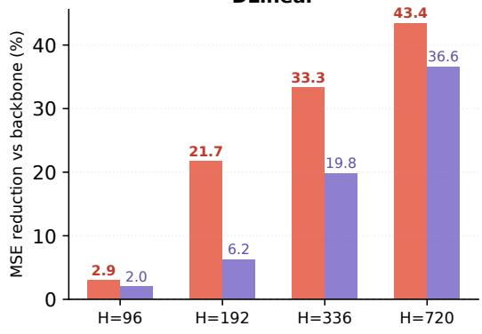

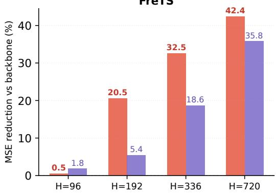

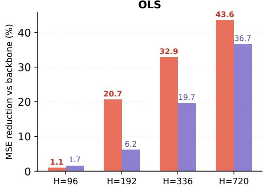

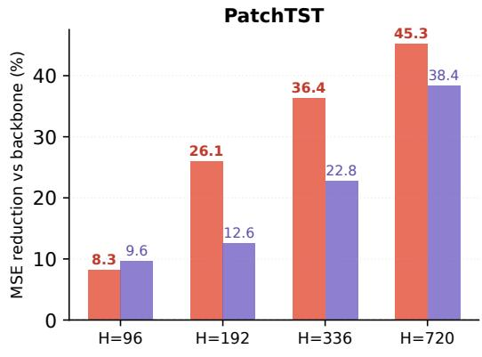

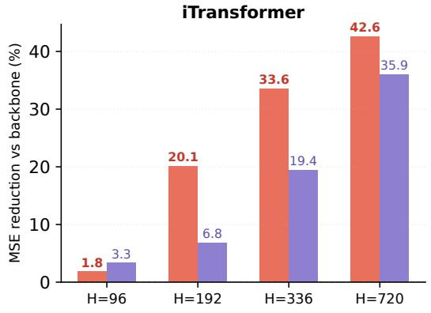

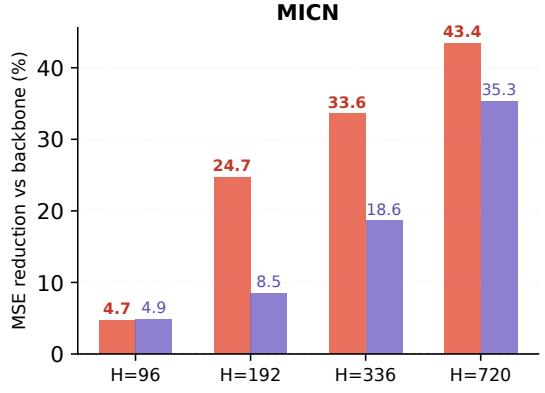

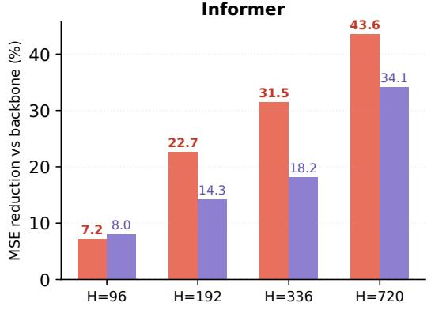

<table><tr><td>Correction space (ours)</td></tr><tr><td>Prediction space</td></tr><tr><td></td></tr></table>

Figure 6: Controlled comparison of correction-space and prediction-space interaction across all seven backbones.

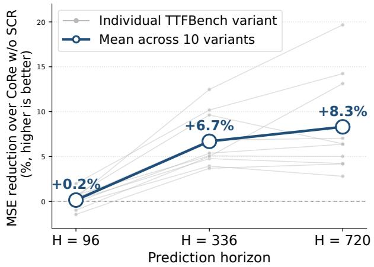  
Figure 7: Robustness on TTFBench (ETTh1) across ten distribution-shift variants. Grey curves denote individual variants and the solid curve denotes their mean.

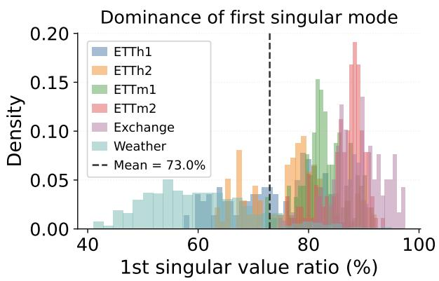  
Figure 8: Distribution of the leading singular-mode energy ratio of $\Delta _ { t }$ . The first mode captures 73% of correction energy on average.

Table 14: Adapter-only parameter counts and accuracy for three cross-variate interaction designs, averaged over 168 settings.
<table><tr><td></td><td>Dense</td><td>SCR r=C</td><td>SCR r=16</td></tr><tr><td>Avg params</td><td>339,024</td><td>9,922</td><td>16,480</td></tr><tr><td>Avg imp. vs. baseline</td><td>+23.09%</td><td>+25.82%</td><td>+20.37%</td></tr><tr><td>Win rate vs. baseline</td><td>128/168</td><td>162/168</td><td>147/168</td></tr></table>

<table><tr><td colspan="12">Table 15: Full rank/capacity ablation results of CoRE. We compare the default variate-matched rank setting (r=C), a fixed-rank variant (r=16), and a dense horizon-space interaction without bottleneck. The dense horizon-space interaction used in this comparison contains 2H2 + H parameters, whereas SCR with rank r contains 3Hr + r + H parameters. Lower MSE is better; bold and underlining indicate the best and second-best results among the three variants, respectively.</td><td></td></tr><tr><td></td><td colspan="3">iTransformer</td><td colspan="3">DLinear</td><td colspan="2">FreTS</td><td colspan="2">OLS</td><td colspan="2"></td><td colspan="3"></td><td colspan="2">MICN</td><td colspan="3">Informer</td></tr><tr><td rowspan="2">H 96</td><td rowspan="2">r=C</td><td rowspan="2">r=16</td><td rowspan="2">Dense (horizon)</td><td rowspan="2">r=C r=16</td><td rowspan="2">(horizon)</td><td rowspan="2">Dense</td><td rowspan="2">r=C r=16</td><td rowspan="2">Dense (horizon)</td><td colspan="2">r=C</td><td colspan="2">Dense</td><td rowspan="2"></td><td colspan="2">PatchTST</td><td colspan="2"></td><td colspan="2"></td><td rowspan="2"></td><td rowspan="2">Dense</td></tr><tr><td>r=16</td><td></td><td>(horizon)</td><td>r=C r=16</td><td>Dense (horizon)</td><td>r=C</td><td>Dense r=16 (horizon)</td><td></td><td>r=C r=16</td><td>(horizon)</td></tr><tr><td rowspan="10">ETT1</td><td>0.4545 0.4390</td><td></td><td>0.5133</td><td>0.4916</td><td>0.4722</td><td>0.5133</td><td>0.4625 0.4500</td><td>0.4638</td><td>0.4723</td><td>0.4517</td><td>0.4707</td><td>0.4371</td><td>0.4353</td><td></td><td>0.4396</td><td>0.5863</td><td>0.5461</td><td>0.5839</td><td>0.6501</td><td>0.6203 0.6543</td></tr><tr><td>192 0.4589</td><td>0.4767</td><td>0.4987</td><td>0.4961</td><td>0.4963</td><td>0.4987</td><td>0.4692</td><td>0.4806</td><td>0.4902</td><td>0.4763 0.4786</td><td>0.4758</td><td>0.4540</td><td>0.4685</td><td>0.4520</td><td>0.5203</td><td>0.5290</td><td>0.5189</td><td>0.6415</td><td>0.6341</td><td>0.6355</td></tr><tr><td>336 0.4661</td><td>0.4918</td><td>0.4686</td><td>0.4722</td><td>0.5113</td><td>0.4686</td><td>0.4596</td><td>0.4979</td><td>0.4686</td><td>0.4568</td><td>0.4915</td><td>0.4558</td><td>0.4458 0.4817</td><td>0.4413</td><td></td><td>0.5386</td><td>0.5394 0.5380</td><td>0.6302</td><td>0.6456</td><td>0.6290</td></tr><tr><td>720 0.5055</td><td>0.5387</td><td>0.4771</td><td>0.4891</td><td>0.5330</td><td>0.4771</td><td>0.5052</td><td>0.5482</td><td>0.4889 0.4886</td><td>0.5305</td><td>0.4908</td><td>0.4983</td><td>0.5388</td><td>0.5009</td><td>0.5591</td><td>0.5837</td><td>0.5614</td><td>0.6400</td><td>0.6524</td><td>0.6399</td></tr><tr><td>96 0.2803</td><td>0.2736</td><td>0.2460</td><td>0.2426</td><td>0.2405</td><td>0.2383</td><td>0.2462</td><td>0.2455</td><td>0.2422</td><td>0.2389 0.2385</td><td>0.2434</td><td>0.2490</td><td>0.2437</td><td>0.2447</td><td>0.2476</td><td>0.2551</td><td>0.2497</td><td>0.3760</td><td>0.3476</td><td>0.3571</td></tr><tr><td>192</td><td>0.2722 0.3154</td><td>0.2145</td><td>0.2275</td><td>0.2989</td><td>0.2321</td><td>0.2371</td><td>0.2926</td><td>0.2388</td><td>0.2290 0.3004</td><td></td><td>0.2213 0.2405</td><td></td><td>0.2590 0.2341</td><td></td><td>0.2430 0.3096</td><td>0.2364</td><td>0.3567</td><td>0.3917</td><td>0.3839</td></tr><tr><td>ETT2 336</td><td>0.2245 0.2683</td><td>0.2031</td><td>0.2171</td><td>0.2660</td><td>0.2158</td><td>0.2196</td><td>0.2601</td><td>0.2189</td><td>0.2122</td><td>0.2641</td><td>0.2130</td><td>0.2167</td><td>0.2572 0.2164</td><td></td><td>0.2486 0.2798</td><td>0.2478</td><td>0.3463</td><td>0.4037</td><td>0.3498</td></tr><tr><td>720</td><td>0.2545 0.2744</td><td>0.2166</td><td>0.2324</td><td>0.2449</td><td>0.2279</td><td>0.2336</td><td>0.2485</td><td>0.2338</td><td>0.2301</td><td>0.2396</td><td>0.2317</td><td>0.2331</td><td>0.2465</td><td>0.2345</td><td>0.2746</td><td>0.2829 0.2861</td><td></td><td>0.3113 0.3405</td><td>0.3105</td></tr><tr><td>96</td><td>0.3776</td><td>0.3430 0.4121</td><td>0.3881</td><td>0.3560</td><td>0.4121</td><td>0.3862</td><td>0.3584</td><td>0.3776</td><td>0.3874</td><td>0.3556</td><td>0.3831</td><td>0.4026</td><td>0.3656</td><td>0.3979</td><td>0.4232</td><td>0.3724 0.4219</td><td></td><td>0.4929 0.4130</td><td>0.4876</td></tr><tr><td>192</td><td>0.4184</td><td>0.4052 0.4843 0.4367 0.5230</td><td>0.4282 0.4665</td><td>0.4247 0.4564</td><td>0.4260 0.5230</td><td>0.4200 0.4616</td><td>0.4243 0.4628</td><td>0.4218 0.4575</td><td>0.4235 0.4658</td><td>0.4230 0.4626</td><td>0.4280 0.4640</td><td>0.4183 0.4509</td><td>0.4215 0.4561</td><td>0.4543 0.5043</td><td>0.4551 0.5018</td><td>0.4422 0.4770</td><td>0.4505 0.5026</td><td>0.5385 0.4782 0.5771 0.5270</td><td>0.5301 0.5766</td></tr><tr><td>ETTTm1 336 720</td><td>0.4585 0.5171</td><td>0.4708 0.5416</td><td></td><td>0.5424 0.4864</td><td>0.5290</td><td>0.5200</td><td>0.4683</td><td>0.5253</td><td>0.5367</td><td>0.4783</td><td>0.5417</td><td>0.5225</td><td>0.4692</td><td>0.5339</td><td>0.5602</td><td>0.4832</td><td>0.5520</td><td>0.6454 0.5631</td><td>0.6360</td></tr><tr><td></td><td>0.1831</td><td>0.1856</td><td>0.1623</td><td>0.1644 0.1684</td><td></td><td>0.1623 0.1707</td><td>0.1645</td><td>0.1710</td><td>0.1655</td><td>0.1687</td><td>0.1650</td><td>0.1721</td><td>0.1615</td><td>0.1732</td><td>0.1845</td><td>0.1687</td><td>0.1723</td><td>0.2027 0.2011</td><td>0.2001</td></tr><tr><td>ETm32 96 192</td><td></td><td>0.2074 0.1658</td><td></td><td>0.1652 0.1904</td><td></td><td>0.1634 0.1628</td><td>0.1898</td><td>0.1638</td><td>0.1671</td><td>0.1930</td><td>0.1644</td><td>0.1694</td><td>0.2065</td><td>0.1678</td><td>0.1832</td><td>0.2035 0.1791</td><td></td><td>0.1964 0.2128</td><td>0.1986</td></tr><tr><td>336</td><td>0.1905 0.2058</td><td>0.2048 0.1720</td><td></td><td>0.1725 0.1773</td><td>0.1720</td><td>0.1686</td><td>0.1761</td><td>0.1690</td><td>0.1726</td><td>0.1758</td><td>0.1742</td><td>0.1765</td><td>0.1827</td><td>0.1752</td><td>0.1871</td><td>0.1988 0.1836</td><td></td><td>0.2114 0.2202</td><td>0.2105</td></tr><tr><td>720</td><td>0.1955</td><td>0.1964</td><td>0.1747</td><td>0.1778 0.1776</td><td></td><td>0.1769 0.1799</td><td>0.1803</td><td>0.1758</td><td>0.1787</td><td>0.1773</td><td>0.1791</td><td>0.1728</td><td>0.1772</td><td>0.1738</td><td>0.1991</td><td>0.1973</td><td>0.2013</td><td>0.2307 0.2345</td><td>0.2299</td></tr><tr><td></td><td>0.0832</td><td>0.0916</td><td>0.0586</td><td>0.0706</td><td>0.0886</td><td>0.0631</td><td>0.0738 0.0815</td><td>0.0716</td><td>0.0741</td><td>0.0808</td><td>0.0734</td><td>0.0739</td><td>0.0800</td><td>0.0709</td><td>0.0779</td><td>0.0963</td><td>0.0756</td><td>0.0985 0.1482</td><td>0.1003</td></tr><tr><td>xchange 96 192</td><td>0.0988</td><td>0.1453 0.1419</td><td>0.0728 0.0721</td><td>0.0733 0.0804</td><td>0.1033 0.1124</td><td>0.0728 0.0825</td><td>0.0806 0.1116 0.0933 0.1254</td><td></td><td>0.0848 0.0962</td><td>0.0812 0.1106 0.0947 0.1247</td><td>0.0819 0.0915</td><td>0.0897 0.1000</td><td>0.1153 0.1323</td><td>0.0869 0.0987</td><td>0.0739 0.1091</td><td>0.1078 0.1528</td><td>0.0757 0.1083</td><td>0.1183 0.1568 0.1901 0.2537</td></table>

Parameter scaling. The SCR bottleneck uses

$$
\mathbf { W _ { \downarrow } } \in \mathbb { R } ^ { r \times 2 H } , \qquad \mathbf { W _ { \uparrow } } \in \mathbb { R } ^ { H \times r } .
$$

Ignoring bias terms, SCR therefore contains

$$
2 H r + H r = 3 H r
$$

weights. With the default $r = C ,$ , its parameter count scales as $O ( H C )$ ; with a fixed $r \ll C ,$ , it scales as $O ( H r )$

For comparison, the dense interaction used in the rank/capacity ablation is implemented as a single Linear $( 2 H  H )$ layer (Table 14), containing $2 H ^ { 2 }$ weights (and H bias parameters).

Rank sensitivity and default choice. We additionally compare smaller fixed ranks $r \in \{ 4 , 8 , 1 6 , 3 2 \}$ with the default $r = C$ . Among the evaluated configurations on the six standard datasets (Table 16), $r = C$ provides the strongest aggregate performance. Smaller ranks remain efective in many settings and are useful when reducing the parameter cost is important. We therefore use $r = C$ as the default for the main experiments and $r = 1 6 \ll C$ for the high-dimensional experiments.

Table 16: Ablation on SCR pooling strategy and bottleneck rank (DLinear backbone, 24 settings). avg\_imp: average MSE improvement over backbone.
<table><tr><td>Configuration</td><td>avg_imp</td></tr><tr><td>Mean pooling, r = 4</td><td>+18.09%</td></tr><tr><td>Mean pooling, r = 8</td><td>+18.84%</td></tr><tr><td>Mean pooling, r = 16</td><td>+19.66%</td></tr><tr><td>Mean pooling, r = 32</td><td>+20.24%</td></tr><tr><td>Mean pooling,  $r = C$ </td><td>+25.45%</td></tr><tr><td>Max pooling,  $r = 1 6$ </td><td> $+ 1 9 . 3 6 \%$ </td></tr></table>

High-Dimensional Datasets. The default SCR configuration uses $r = C .$ , so its parameter cost increases with the number of variates. We therefore examine whether correction-space interaction remains useful with a substantially smaller bottleneck rank in high-dimensional settings.

Table 17 reports results on Electricity $( C = 3 2 1 )$ and Trafic $( C = 8 6 2 )$ using $r = 1 6 \ll C$ . Despite the substantial rank reduction, CoRe retains positive aggregate improvements over COSA. The gains are particularly clear on Electricity. On Trafic, the improvements are smaller and several individual settings show negative diferences, including DLinear at $H = 7 2 0$

Together with the singular-value analysis in Appendix E.1, these results show that useful cross-variate correction structure can be retained with a bottleneck substantially smaller than C in high-dimensional settings. These results show that aggregate improvements can be retained with a bottleneck rank substantially smaller than C, while also highlighting the limits of a single fixed rank at very large C.

## E.2 Spectral Descriptor and Gate Ablations

Table 18 evaluates alternative spectral descriptors and gating variants. Diferences among the spectraldescriptor variants are small when averaged across settings. We use the full four-dimensional descriptor

$$
\mathrm { [ S E , L B R , M B R , H B R ] }
$$

as the default because it jointly summarizes spectral concentration and coarse frequency allocation at negligible additional cost.

Table 17: Results on large-scale datasets Electricity (C=321) and Trafic (C=862), averaged over 10 seeds. COSA→CoRe: MSE improvement of CoRe over COSA. All methods use a fixed bottleneck rank r=16 for these datasets to keep the parameter cost independent of C.
<table><tr><td>Model</td><td>Dataset</td><td>H</td><td>Backbone</td><td>COSA</td><td>CoRE</td><td>COSA→CoRE</td></tr><tr><td rowspan="7">DLinear</td><td rowspan="4">Electricity</td><td>96</td><td>0.2078</td><td>0.2024</td><td>0.1992</td><td>+1.58%</td></tr><tr><td>192</td><td>0.2081</td><td>0.1922</td><td>0.1771</td><td>+7.86%</td></tr><tr><td>336</td><td>0.2228</td><td>0.1947</td><td>0.1751</td><td>+10.07%</td></tr><tr><td>720</td><td>0.2644</td><td>0.2139</td><td>0.1926</td><td>+9.96%</td></tr><tr><td rowspan="4">Traffic</td><td>96</td><td>0.6710</td><td>0.6685</td><td>0.6648</td><td>+0.55%</td></tr><tr><td>192</td><td>0.6251</td><td>0.6127</td><td>0.6031</td><td>+1.57%</td></tr><tr><td>336</td><td>0.6328</td><td>0.6133</td><td>0.6074</td><td>+0.96%</td></tr><tr><td>720</td><td>0.6717</td><td>0.6464</td><td>0.6545</td><td>-1.25%</td></tr><tr><td rowspan="6">MICN</td><td rowspan="4">Electricity</td><td>96</td><td>0.1766</td><td>0.1634</td><td>0.1526</td><td>+6.61%</td></tr><tr><td>192</td><td>0.1915</td><td>0.1592</td><td>0.1409</td><td>+11.49%</td></tr><tr><td>336</td><td>0.1973</td><td>0.1575</td><td>0.1396</td><td>+11.37%</td></tr><tr><td>720</td><td>0.2193</td><td>0.1674</td><td>0.1501</td><td>+10.33%</td></tr><tr><td>96</td><td>0.4955</td><td>0.4602</td><td>0.4603</td><td>-0.02%</td></tr><tr><td rowspan="3">Traffic</td><td>192</td><td>0.5080</td><td>0.4737</td><td>0.4449</td><td>+6.08%</td></tr><tr><td>336</td><td>0.5306</td><td>0.4929</td><td>0.4642</td><td>+5.82%</td></tr><tr><td>720</td><td>0.5757</td><td>0.5232</td><td>0.5083</td><td>+2.85%</td></tr></table>

The fixed-gate and input-conditioned variants further isolate the contribution of adaptive modulation. The full spectral gate provides a smaller additional average gain beyond the structured SCR interaction.

Table 18: Ablation study of CoRe components. Average MSE over three backbones (DLinear, PatchTST, MICN), six datasets, four horizons, and 10 seeds. vs. COSA: relative MSE reduction over COSA. Losstrend gate: COSA’s adaptive learning-rate signal repurposed as the SCR gate. Fixed gate (g=1): uniform cross-variate refinement without input-dependent modulation. $\operatorname { S E } _ { t } \colon$ spectral entropy; $\mathrm { L B R / M B R / H B R } _ { t } .$ low/mid/high band energy ratios (Section 3.5).
<table><tr><td colspan="2">Method</td><td colspan="2">DLinear PatchTST MICN Avg. MSE vs. COSA</td><td colspan="3"></td></tr><tr><td colspan="2">COSA</td><td>0.2981</td><td>0.2927</td><td>0.3241</td><td>0.3050</td><td></td></tr><tr><td colspan="2">+SCR (no anchor; per-variate bottleneck) +SCR (no anchor/bottleneck; full C×C mixing)</td><td>0.2760 0.2745</td><td>0.2721 0.2706</td><td>0.3018 0.3044</td><td>0.2833 0.2832</td><td>-7.1% -7.2%</td></tr><tr><td colspan="2">+SCR (loss-trend gate)</td><td>0.2712</td><td>0.2657</td><td>0.2963</td><td>0.2777</td><td>-9.0%</td></tr><tr><td colspan="2">+SCR (fixed gate, g=1) +SCR  $\left( \mathbf { s } _ { t } \mathrm { = } [ \mathrm { S E } _ { t } ] \right)$  +SCR  $\scriptstyle ( \mathbf { s } _ { t } = \left[ \operatorname { S E } _ { t } , \operatorname { L B R } _ { t } \right] )$ </td><td>0.2703 0.2676 0.2677</td><td>0.2651 0.2638 0.2638</td><td>0.2954 0.2946 0.2938</td><td>0.2769 0.2753</td><td>-9.2% -9.7% -9.8%</td></tr></table>

## E.3 Spectral Gate Analysis

Shared versus per-variate descriptors. The main implementation computes a shared spectral descriptor by averaging the power spectra across variates before constructing $\mathbf { s } _ { t }$ . We additionally evaluate per-variate spectral descriptors. The two variants perform comparably (average MSE 0.2752 versus 0.2754), so we retain the shared descriptor as the simpler default.

Gate behavior. Table 19 summarizes statistics of the learned gates, and Figure 9 shows representative gate trajectories on Weather and Exchange Rate. The gate varies substantially across datasets and test batches, with approximately 10.5% of activations near zero. This shows that the spectral controller produces input-dependent modulation rather than applying SCR with a fixed contribution. Together with the fixed-gate ablation in Appendix E.2, these statistics show that the gate is input-dependent and provides an empirical benefit over fixed modulation.

Table 19: SCR spectral gate statistics across datasets (DLinear backbone, averaged over 4 horizons and 10 seeds). Mean: time-averaged gate value across all variates and test batches; Std: standard deviation across variates and batches; Near zero $( | g | < 0 . 1 )$ : fraction of gate activations close to zero, indicating suppressed cross-variate refinement; Near init $( g < - 0 . 8 )$ : fraction of gate activations close to the initialisation bias $\mathbf { b } _ { g } = - 1$ , indicating gates that have not moved significantly from initialisation. The gate is bounded in (−1, 1) by tanh.
<table><tr><td>Dataset</td><td>Mean</td><td>Std</td><td>Near zero  $( | g | < 0 . 1 )$ </td><td>Near init  $( g < - 0 . 8 )$ </td></tr><tr><td>ETTh1</td><td>-0.583</td><td>0.325</td><td>5.9%</td><td>34.5%</td></tr><tr><td>ETTh2</td><td>-0.631</td><td>0.285</td><td>9.3%</td><td>37.5%</td></tr><tr><td>ETTm1</td><td>-0.357</td><td>0.421</td><td>9.9%</td><td>15.1%</td></tr><tr><td>ETTm2</td><td>-0.498</td><td>0.354</td><td>15.5%</td><td>28.4%</td></tr><tr><td>Exchange</td><td>-0.676</td><td>0.194</td><td>2.4%</td><td>23.9%</td></tr><tr><td>Weather</td><td>-0.352</td><td>0.371</td><td>20.3%</td><td>9.0%</td></tr><tr><td>Average</td><td>-0.516</td><td>0.325</td><td>10.5%</td><td>24.7%</td></tr></table>

Gate-bias sensitivity. Table 20 evaluates diferent spectral-gate bias initializations over the reported DLinear settings. The default ${ \bf b } _ { g } = - { \bf 1 }$ achieves the strongest aggregate performance. Relative to this choice, initialization at $\mathbf { b } _ { g } = \mathbf { 0 }$ increases MSE by 1.56%.

Table 20: Gate bias sensitivity.
<table><tr><td> ${ \bf b } _ { g }$ </td><td>-2.0</td><td>-1.0</td><td>0.0</td></tr><tr><td>vs. default↓</td><td>+0.46%</td><td>+0.00%</td><td>+1.56%</td></tr></table>

## F Online Adaptation Reliability

We evaluate adaptation reliability relative to the frozen backbone using the mean per-batch regret

$$
\overline { { \mathcal { R } } } _ { T } ( m ) = \frac { 1 } { T } \sum _ { t = 1 } ^ { T } \left( \ell _ { t } ^ { m } - \ell _ { t } ^ { \mathrm { f r o z e n } } \right) ,\tag{23}
$$

where m denotes the adapted method and negative values indicate an average improvement over the frozen backbone.

We additionally report three complementary quantities. The positive-part regret $\overline { { \mathcal { R } } } _ { T } ^ { + }$ measures the magnitude of harmful adaptation when it occurs; $p _ { \mathrm { n e g } }$ denotes the frequency with which the adapted model underperforms the frozen backbone; and $n _ { \mathrm { w o r s e } }$ counts the 18 horizon-averaged backbone–dataset combinations with positive mean regret. Together, these metrics characterize two complementary aspects of reliability: how often online adaptation is harmful and how severe the harm is when it occurs.

Table 21 reports the full reliability results across the 18 backbone–dataset combinations.

Table 21: Online adaptation consistency over 18 backbone–dataset combinations (3 backbones $\times \ 6$ datasets), each averaged over $H \in \{ 9 6 , 1 9 2 , 3 3 6 , 7 2 0 \}$ $\mathrm { \overline { { \mathcal { R } } } } _ { T } \mathrm { : }$ mean per-batch regret relative to the frozen backbone (negative = better than backbone on average); $p _ { \mathrm { n e g } } { \cdot }$ fraction of batches where the adapted model underperforms the backbone. Best per row in bold. Overall row also reports $\overline { { \mathcal { R } } } _ { T } ^ { + }$ (average regret on settings where the method is worse than the backbone) and $n _ { \mathrm { w o r s e } }$ : number of backbone–dataset combinations (out of 18) with positive mean regret.
<table><tr><td colspan="2"></td><td colspan="2">TAFAS</td><td colspan="2">COSA</td><td colspan="2">CoRE</td></tr><tr><td>Model</td><td>Dataset</td><td> $\overline { { \mathcal { R } } } _ { T }$ </td><td> $p _ { \mathrm { n e g } }$ </td><td> $\overline { { \mathcal { R } } } _ { T }$ </td><td> $p _ { \mathrm { n e g } }$ </td><td> $\overline { { \mathcal { R } } } _ { T }$ </td><td> $p _ { \mathrm { n e g } }$ </td></tr><tr><td rowspan="6">DLinear</td><td>ETTh1</td><td>-0.0030.519</td><td></td><td>-0.041 0.402 -0.080 0.300</td><td></td><td></td><td></td></tr><tr><td>ETTh2</td><td></td><td></td><td>+0.003 0.570-0.0560.279-0.089 0.223</td><td></td><td></td><td></td></tr><tr><td>ETTm1</td><td></td><td></td><td>-0.024 0.330+0.013 0.383 -0.035 0.382</td><td></td><td></td><td></td></tr><tr><td>ETTm2</td><td></td><td></td><td></td><td></td><td>+0.001 0.546 -0.026 0.391-0.055 0.330</td><td></td></tr><tr><td>Exchange</td><td>-0.013</td><td></td><td></td><td></td><td>0.213 -0.262 0.142 -0.274 0.088</td><td></td></tr><tr><td>Weather</td><td>-0.011</td><td>0.395</td><td>-0.061 0.183</td><td></td><td>3-0.094 0.139</td><td></td></tr><tr><td rowspan="6">MICN</td><td>ETTh1</td><td>-0.030</td><td>0.419</td><td>-0.145 0.190-0.187 0.146</td><td></td><td></td><td></td></tr><tr><td>ETTh2</td><td>+0.011</td><td>0.531</td><td></td><td></td><td>-0.066 0.244 -0.098 0.189</td><td></td></tr><tr><td>ETTm1</td><td>-0.0200.413</td><td></td><td></td><td></td><td>-0.013 0.335-0.043 0.331</td><td></td></tr><tr><td>ETTm2</td><td>+0.004 0.549</td><td></td><td></td><td></td><td>-0.025 0.387 -0.060 0.308</td><td></td></tr><tr><td>Exchange</td><td>-0.127</td><td>0.364</td><td></td><td></td><td>-0.403 0.128-0.419 0.095</td><td></td></tr><tr><td>Weather</td><td>+0.037</td><td>0.629</td><td>-0.059</td><td></td><td>0.194-0.089 0.159</td><td></td></tr><tr><td rowspan="6">PatchTST</td><td>ETTh1</td><td>-0.007</td><td>0.434</td><td>-0.057 0.349-0.089 0.268</td><td></td><td></td><td></td></tr><tr><td>ETTh2</td><td></td><td>+0.0000.444</td><td></td><td></td><td>-0.057 0.280-0.076 0.245</td><td></td></tr><tr><td>ETTm1</td><td>-0.010</td><td>0.348</td><td></td><td></td><td>-0.001 0.350-0.026 0.352</td><td></td></tr><tr><td>ETTm2</td><td>+0.004</td><td>0.522</td><td></td><td></td><td>-0.025 0.376-0.059 0.307</td><td></td></tr><tr><td>Exchange</td><td>-0.003</td><td>0.389</td><td></td><td></td><td>-0.243 0.161 -0.261 0.131</td><td></td></tr><tr><td>Weather</td><td>+0.005</td><td>0.417</td><td>-0.041</td><td></td><td>0.207-0.082 0.173</td><td></td></tr><tr><td>Overall avg</td><td></td><td>-0.010</td><td>0.446</td><td></td><td></td><td>-0.087 0.277-0.117 0.232</td><td></td></tr><tr><td> $\overline { { \mathcal { R } } } _ { T } ^ { + }$ </td><td></td><td>0.0138</td><td></td><td>0.0127</td><td></td><td>0.0108</td><td></td></tr><tr><td colspan="2">nworse / 18</td><td>8</td><td></td><td>5</td><td></td><td>2</td><td></td></tr></table>

## G Additional Diagnostics

## G.1 Dataset and Correction Statistics

Cross-variate correlations. Table 22 reports descriptive statistics of cross-variate correlations across the evaluated datasets. Before computing static correlations, we apply the Augmented Dickey–Fuller test to each variate. Diferencing is applied when the unit-root null cannot be rejected at the chosen threshold: order 1 for Exchange Rate and order 2 for Electricity. Temporal correlation statistics are computed on the raw series.

The six main datasets have broadly comparable mean static absolute correlations, while their temporal variation difers substantially. Exchange Rate has the largest shifting standard deviation among the reported datasets $\left( \mathrm { s t d } = 0 . 4 7 9 \right)$ , whereas Trafic and Electricity exhibit more stable correlation statistics. These measurements provide descriptive context for the diversity of cross-variate structure represented by the benchmark suite.

Correction heterogeneity. Table 23 additionally reports variation among per-variate correction signals. The coeficient of variation and cosine-similarity statistics show that the learned corrections can difer across variates in both magnitude and direction. We use these measurements as descriptive properties of the correction space rather than as causal explanations of the gating results.

Low-dimensional correction structure. Across settings, the leading singular mode captures approximately 73% of the correction energy on average, revealing pronounced low-dimensional structure in the correction space. This observation motivates the reduced-rank parameterization examined in Appendix E.1.

Table 22: Pairwise Pearson correlation statistics across variates. N: number of variates; Window: rolling window size (approx. 1 week in physical time). Mean |r|: time-averaged absolute pairwise correlation computed on stationary series after ADF test. Shifting (std): standard deviation of windowed correlations over time, measuring temporal instability of cross-variate dependencies (computed on raw series to preserve trend-switching signals). CV: coeficient of variation (std/mean). Range: peak-to-trough variation of windowed correlations. Strong $( | r | > 0 . 7 )$ and Weak $( | r | \leq 0 . 3 )$ : fraction of variate pairs by static |r| strength. Datasets above the divider are used in main experiments.
<table><tr><td>Dataset</td><td>N</td><td>Window</td><td>Mean |r|</td><td>Shifting (std)</td><td>CV</td><td>Range</td><td>Strong</td><td>Weak</td></tr><tr><td>ETTh1</td><td>7</td><td>168</td><td>0.222</td><td>0.266</td><td>0.919</td><td>0.771</td><td>9.5%</td><td>81.0%</td></tr><tr><td>ETTh2</td><td>7</td><td>168</td><td>0.325</td><td>0.237</td><td>0.846</td><td>0.865</td><td>4.8%</td><td>57.1%</td></tr><tr><td>ETTm1</td><td>7</td><td>672</td><td>0.224</td><td>0.264</td><td>0.913</td><td>0.771</td><td>9.5%</td><td>81.0%</td></tr><tr><td>ETTm2</td><td>7</td><td>672</td><td>0.325</td><td>0.234</td><td>0.845</td><td>0.872</td><td>4.8%</td><td>57.1%</td></tr><tr><td>Weather</td><td>21</td><td>1008</td><td>0.296</td><td>0.180</td><td>0.736</td><td>0.637</td><td>21.0%</td><td>64.3%</td></tr><tr><td>Exchange Rate†</td><td>8</td><td>30</td><td>0.305</td><td>0.479</td><td>0.957</td><td>0.992</td><td>3.6%</td><td>42.9%</td></tr><tr><td>Traffic</td><td>862</td><td>168</td><td>0.631</td><td>0.111</td><td>0.207</td><td>0.651</td><td>25.7%</td><td>10.1%</td></tr><tr><td>Electricity††</td><td>321</td><td>168</td><td>0.119</td><td>0.114</td><td>0.340</td><td>0.524</td><td>0.0%</td><td>91.0%</td></tr></table>

† Static Mean |r| computed after first-order diferencing (ADF p < 0.05);  
Shifting metrics computed on raw series to preserve trend-switching signals.  
†† Second-order diferencing applied (ADF p < 0.05).

Table 23: Per-variate correction heterogeneity and the benefit of spectral gating over fixed gating (DLinear backbone). CV: coeficient of variation of per-variate correction norms across variates; Cos-sim std: standard deviation of cosine similarity between each variate’s correction and the cross-variate mean anchor; Fixed gate and Spectral gate: average MSE under each gating strategy (10 seeds); Gain: relative improvement from spectral over fixed gating. Datasets ordered by CV.
<table><tr><td>Dataset</td><td>CV</td><td>Cos-sim std</td><td>Fixed gate</td><td>Spectral gate</td><td>Gain</td></tr><tr><td>ETTh1</td><td>0.217</td><td>0.097</td><td>0.4889</td><td>0.4873</td><td>+0.34%</td></tr><tr><td>Exchange</td><td>0.322</td><td>0.223</td><td>0.0890</td><td>0.0871</td><td>+2.19%</td></tr><tr><td>ETTm1</td><td>0.428</td><td>0.117</td><td>0.4598</td><td>0.4563</td><td>+0.76%</td></tr><tr><td>ETTm2</td><td>0.514</td><td>0.137</td><td>0.1716</td><td>0.1700</td><td>+0.95%</td></tr><tr><td>ETTh2</td><td>0.554</td><td>0.119</td><td>0.2329</td><td>0.2299</td><td>+1.29%</td></tr><tr><td>Weather</td><td>0.696</td><td>0.151</td><td>0.1797</td><td>0.1747</td><td>+2.77%</td></tr><tr><td>Average</td><td>0.455</td><td>0.141</td><td>0.2703</td><td>0.2675</td><td>+1.03%</td></tr></table>

## G.2 Qualitative Forecast Visualization

Figures 10 and 11 compare COSA and CoRe on Exchange Rate and Weather. The diferences are visually more pronounced in several medium-to-long-horizon examples, where CoRe more closely follows the selected ground-truth trajectories.

On Exchange Rate, the illustrated windows include reductions in per-window MSE of up to 36% relative to COSA (e.g., H = 192, Var. 6: 0.0160 → 0.0102). These examples are consistent with the aggregate quantitative results in Table 1.

## G.3 Runtime Breakdown

Table 24 reports the runtime decomposition with a DLinear backbone, averaged over six datasets and four horizons. Relative to COSA, the measured per-adaptation-step runtime increases from 6.28 ms to 6.76 ms (+0.48 ms; +7.7%). Spectral descriptor computation and SCR account for 1.14 ms and 1.45 ms, respectively, while diferences in the remaining components partially ofset this additional cost. The full-stream runtime increases from 11.42 s to 12.17 s (+6.5%).

Table 24: Detailed per-step timing breakdown averaged over six datasets and four horizons (DLinear). Overhead = CoRe − COSA; "-" indicates a component absent in that method.
<table><tr><td>Component</td><td>COSA(ms)</td><td>CoRE(ms)</td><td>Overhead(ms)</td></tr><tr><td>Backbone prediction</td><td>1.27</td><td>1.04</td><td>-0.22</td></tr><tr><td>Spectral FFT</td><td></td><td>1.14</td><td>+1.14</td></tr><tr><td>SCR forward</td><td></td><td>1.45</td><td>+1.45</td></tr><tr><td>Loss computation</td><td>0.84</td><td>1.00</td><td>+0.16</td></tr><tr><td>Backward + update</td><td>4.42</td><td>4.11</td><td>-0.31</td></tr><tr><td>Per adaptation step</td><td>6.28</td><td>6.76</td><td>+0.48 (+7.7%)</td></tr></table>

## H Theoretical Analysis

## H.1 Theoretical Connections

The spectral descriptor summarizes local temporal structure in the frequency domain. The Wiener–Khinchin relation connects the power spectrum of a stationary process to its second-order temporal structure [Wiener, 1930, Khintchine, 1934]. We use FFT-derived spectra as empirical descriptors of the finite current window rather than as estimates of a globally stationary process.

Normalized spectral entropy provides a classical measure of spectral energy spread [Powell and Percival, 1979, Inouye et al., 1991]. Recent multivariate forecasting work has also used spectral entropy to guide dependency-aware modeling [Xiong et al., 2026]. Together with the band-energy ratios, it provides the compact four-dimensional descriptor used by the spectral gate.

The structured SCR bottleneck is also consistent with the observed geometry of the correction matrices. As shown in Figure 8, the leading singular mode captures 73% of correction energy on average. This observation motivates examining reduced-rank correction interaction in the high-dimensional experiments.

## H.2 Theoretical Analysis of Interaction Space

The main text distinguishes prediction-space and correction-space interaction using generic cross-variate operators. Here we give a nonlinear characterization of the structural distinction.

Let

$$
\hat { \mathbf { Y } } _ { t } ^ { \mathrm { b a s e } } = \mathbf { Y } _ { t } + \mathbf { e } _ { t } ^ { \mathrm { b a s e } } ,\tag{24}
$$

where $\mathbf { e } _ { t } ^ { \mathrm { { b a s e } } }$ is the frozen-backbone prediction error.

Prediction-space interaction takes the form

$$
\hat { \mathbf { Y } } _ { t } ^ { \mathrm { p r e d } } = \hat { \mathbf { Y } } _ { t } ^ { \mathrm { b a s e } } + \mathbf { \Delta } \mathbf { \Delta } \mathbf { a } + \mathcal { M } _ { \mathrm { p r e d } } \left( \hat { \mathbf { Y } } _ { t } ^ { \mathrm { b a s e } } \right) ,\tag{25}
$$

while correction-space interaction takes the form

$$
\hat { \mathbf { Y } } _ { t } ^ { \mathrm { c o r r } } = \hat { \mathbf { Y } } _ { t } ^ { \mathrm { b a s e } } + \boldsymbol { \Delta } _ { t } + \boldsymbol { M } _ { \mathrm { c o r r } } \left( \boldsymbol { \Delta } _ { t } \right) .\tag{26}
$$

The operators may be nonlinear. For CoRe, the SCR bottleneck and its spectral modulation are included in ${ \mathcal { M } } _ { \mathrm { c o r r } } ;$ conditioning on the current input window is fixed when analyzing the interaction at time t.

## H.2.1 Proof of Proposition 1

The prediction-space interaction output evaluated on the actual backbone forecast is

$$
\mathcal { M } _ { \mathrm { p r e d } } \left( \mathbf { Y } _ { t } + \mathbf { e } _ { t } ^ { \mathrm { b a s e } } \right) .\tag{27}
$$

To isolate its direct sensitivity to the backbone error, define

$$
\mathbf { \Gamma } \mathbf { \Gamma } \mathbf { \Gamma } ^ { \mathrm { p r e d } } : = \mathcal { M } _ { \mathrm { p r e d } } \left( \mathbf { Y } _ { t } + \mathbf { e } _ { t } ^ { \mathrm { b a s e } } \right) - \mathcal { M } _ { \mathrm { p r e d } } \left( \mathbf { Y } _ { t } \right) .\tag{28}
$$

If $\mathcal { M } _ { \mathrm { p r e d } }$ is continuously diferentiable, let

$$
h ( s ) = \mathcal { M } _ { \mathrm { p r e d } } \left( \mathbf { Y } _ { t } + s \mathbf { e } _ { t } ^ { \mathrm { b a s e } } \right) , \qquad s \in [ 0 , 1 ] .\tag{29}
$$

By the chain rule,

$$
h ^ { \prime } ( s ) = J _ { \mathcal { M } _ { \mathrm { p r e d } } } \left( \mathbf { Y } _ { t } + s \mathbf { e } _ { t } ^ { \mathrm { b a s e } } \right) \left[ \mathbf { e } _ { t } ^ { \mathrm { b a s e } } \right] ,\tag{30}
$$

where $J _ { \mathcal { M } _ { \mathrm { p r e d } } } ( \mathbf { A } ) [ \mathbf { E } ]$ denotes the action of the Jacobian of $\mathcal { M } _ { \mathrm { p r e d } }$ at A on perturbation E. Applying the fundamental theorem of calculus gives

$$
\mathbf { \Gamma } _ { t } ^ { \mathrm { p r e d } } = \int _ { 0 } ^ { 1 } J _ { \mathcal { M } _ { \mathrm { p r e d } } } \left( \mathbf { Y } _ { t } + s \mathbf { e } _ { t } ^ { \mathrm { b a s e } } \right) \left[ \mathbf { e } _ { t } ^ { \mathrm { b a s e } } \right] d s .\tag{31}
$$

Equation 31 makes explicit that prediction-space cross-variate interaction is directly sensitive to the error contained in the frozen-backbone prediction.

In correction space, the interaction operator instead receives $\Delta _ { t } \mathrm { : }$

$$
\begin{array} { r } { \mathcal { M } _ { \mathrm { c o r r } } \left( \Delta _ { t } \right) . } \end{array}\tag{32}
$$

Thus, $\mathbf { e } _ { t } ^ { \mathrm { { b a s e } } }$ does not enter the cross-variate interaction operator directly. The correction $\Delta _ { t }$ may itself depend on the backbone prediction through the base adapter; the structural distinction concerns the quantity on which cross-variate interaction is explicitly performed. This proves Proposition 1.

Linear special case. For a linear prediction-space interaction applied along the variate dimension,

$$
\mathcal { M } _ { \mathrm { p r e d } } ( \mathbf { A } ) = \mathbf { A } \mathbf { W } _ { \mathrm { p r e d } } ^ { \top } ,\tag{33}
$$

Equation 28 reduces to

$$
\Gamma _ { t } ^ { \mathrm { p r e d } } = \mathbf { e } _ { t } ^ { \mathrm { b a s e } } \mathbf { W } _ { \mathrm { p r e d } } ^ { \top } .\tag{34}
$$

Hence the explicit coupled-error term used in the linear illustration is a special case of the nonlinear characterization above.

## H.3 Implication under Delayed Supervision

The structural distinction above occurs in a delayed-supervision setting. For a forecast issued at time t, the complete target corresponding to that forecast becomes available only after the prediction horizon. Consequently, the loss associated with this forecast cannot be used for a supervised adaptation update before the corresponding target has been observed.

Prediction-space interaction therefore acts on a backbone prediction containing $\mathbf { e } _ { t } ^ { \mathrm { { b a s e } } }$ before supervision associated with that forecast becomes available. During this feedback window, prediction-space interaction continues to operate on error-containing backbone outputs before the corresponding supervised feedback becomes available. As H increases, the associated supervision arrives later, motivating us to examine whether the empirical consequence of this structural diference varies with the prediction horizon. We evaluate this empirically in Appendix C.1. Correction-space interaction instead performs its cross-variate operation on the adapter-produced correction while preserving the backbone prediction path.

This argument is a mechanistic motivation, not a guarantee that the performance gap must increase monotonically with H. Standard analyses of online learning with delayed feedback likewise contain delaydependent optimization terms [Langford et al., 2009], but we do not use them to claim a performance ordering between the two interaction spaces. The analysis isolates a structural diference between the two interaction spaces; the controlled comparison in Appendix C.1 tests its empirical consequence while holding the refinement architecture fixed.

## I Limitations and Future Work

Short prediction horizons. The benefit of correction-space interaction is smaller at $H = 9 6$ , with slight degradation in a small number of settings. Adapting the interaction capacity to the available correction signal may improve short-horizon performance

Interaction capacity and base-adapter dependence. The default choice $r = C$ scales with the number of variates. Although reduced-rank SCR remains efective overall on Electricity and Trafic, its gains are smaller in some high-dimensional settings. Moreover, CoRe operates on corrections produced by an underlying adapter and therefore depends on the information available in this correction interface. Results with TAFAS and a standalone MLP show that the interaction principle transfers beyond COSA, while adaptive rank selection and stronger correction interfaces remain directions for future work.

Scope of the analysis and deployment setting. Our analysis establishes the structural distinction between prediction- and correction-space interaction rather than an accuracy guarantee. Experiments follow the standard delayed-supervision protocol and assume backbones that support an additive correction interface. Extending correction-space interaction to irregular feedback delays and alternative interfaces, including time-series foundation models such as MOIRAI [Woo et al., 2024] and Chronos [Ansari et al., 2024], is an interesting direction.

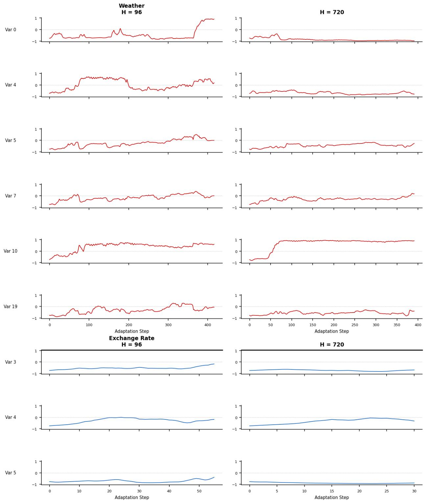  
Figure 9: Example spectral-gate trajectories over adaptation steps on Weather and Exchange Rate.

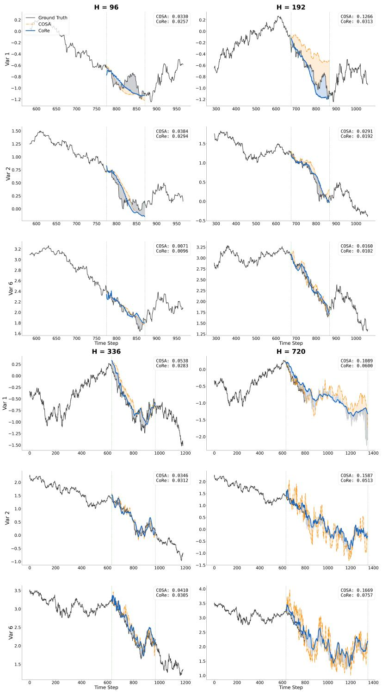  
Figure 10: Qualitative comparison between COSA and CoRe on Exchange Rate across four prediction horizons and three selected variates.

Weather — Prediction Visualization  
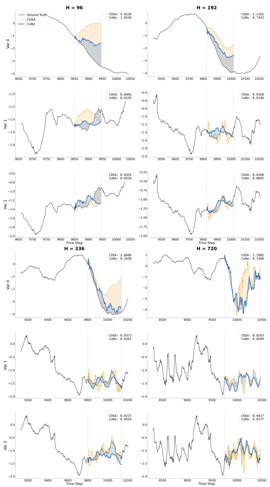  
Figure 11: Qualitative comparison between COSA and CoRe on Weather across four prediction horizons and three selected variates.