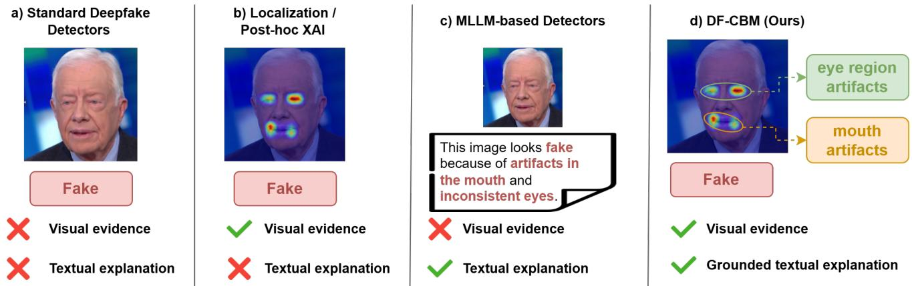
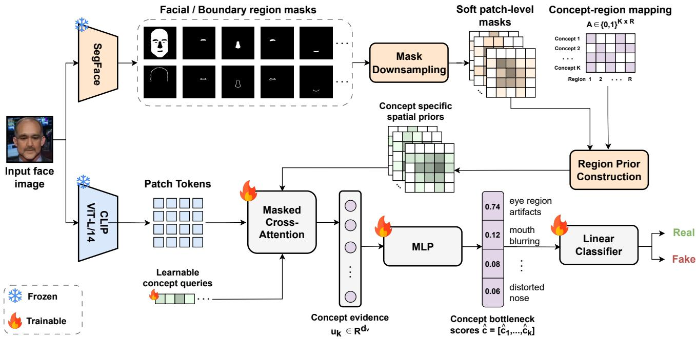
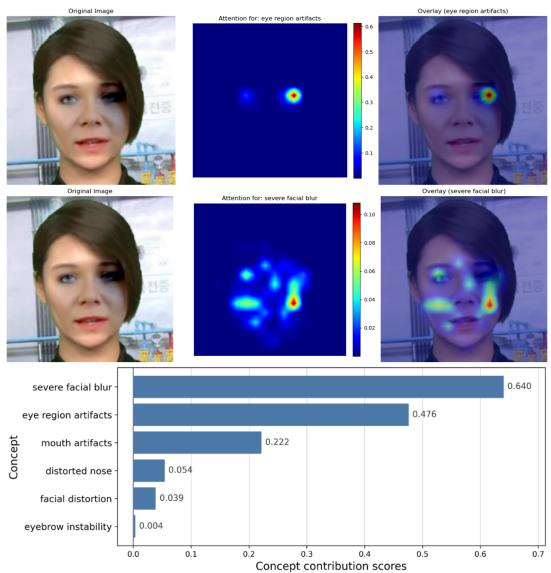
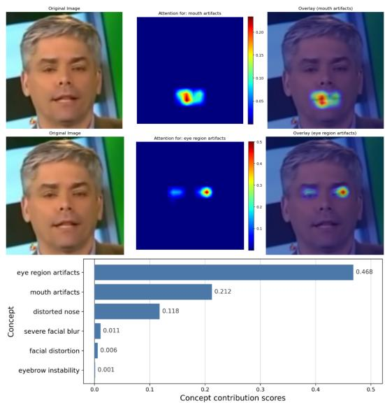
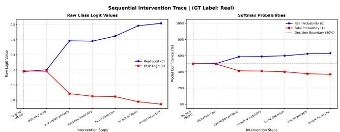
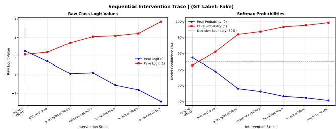

# DF-CBM: Region-Aware Concept Bottleneck Models for Deepfake Detection

Georgios Tsoumplekas1,∗, Vazgken Vanian2, Alexandros Doumanoglou2, Panos K. Papadopoulos2, Yannis Spyridis3, Dimitrios Zarpalas2, Vasileios Argyriou1

1 Department of Networks and Digital Media, Kingston University London, UK

2 Centre for Research and Technology Hellas (CERTH), Thessaloniki, Greece

3 Department of Computer Science, Kingston University London, UK

Corresponding author: Giorgos.Tsoumplekas@kingston.ac.uk

## Abstract

Deepfake detection methods have become increasingly effective yet most provide limited insight into the evidence behind their predictions. However, in forensic settings users also need to know which manipulation cues support the decision and where they appear. Existing explainability methods only partially address this need since localization-based approaches lack semantic descriptions while language-based explanation methods are only weakly grounded in visual evidence. In this work, we propose DF-CBM, a region-aware concept bottleneck modelfor explainable deepfake detection. DF-CBM builds a compact vocabulary of manipulation-related concepts from textual artifact annotations and links each concept to plausible facial and boundary regions. It then predicts these concepts from visual features using a concept-specific masked attention mechanism guided by parsedfacial masks and thefinal real/fake decision is made from the predicted concept bottleneck. Our experiments show that DF-CBM outperforms concept-based baselines in conceptprediction and deepfake classification while remaining competitive with state-of-theart black-box detectors. Finally, qualitative results and intervention analyses demonstrate that DF-CBM provides spatially grounded concept evidence and enables counterfactual explanations of how individual manipulation concepts influence the final prediction. Our code is available at: https://github.com/GeorgeTsoumplekas/DF-CBM.

## 1. Introduction

Recent advances in generative modeling [12, 22, 40, 51, 67] have enabled the synthesis and manipulation of highly realistic visual media commonly referred to as deepfakes [36]. While these technologies have beneficial applications in entertainment [6, 32], media production [70] and digital art [14], they also create substantial opportunities for misuse including political disinformation, identity fraud, coordinated misinformation campaigns and non-consensual content generation [24, 53].

To address these risks, a wide range of deepfake detection methods have been developed to distinguish authentic from manipulated content [7, 29, 41, 44, 46]. Yet, despite substantial progress, many detectors remain limited by their black-box nature providing little insight into the visual evidence that drives their predictions. This lack of transparency is particularly problematic in forensic and highstakes settings where reliable decision-making requires not only accurate predictions but also explanations that are transparent, verifiable and suitable for human oversight.

Existing explainable deepfake detection methods mainly follow two directions, as illustrated in Fig. 1. Localizationbased approaches, such as saliency maps, attention visualizations and other post-hoc explanations, highlight image regions that influence a detector’s prediction [4, 45, 54]. However, these methods typically indicate where the model focuses without providing a semantic description of the forensic evidence. In contrast, recent MLLM-based approaches generate textual explanations that describe possible manipulation artifacts in natural language [17, 48, 58, 69]. While more interpretable to humans, such explanations are often only weakly grounded in the image and may describe artifacts without establishing a precise correspondence to the supporting visual evidence. As a result, current methods either provide visual evidence without semantic concepts, or textual explanations without sufficiently reliable spatial grounding.

To address this gap, we introduce DF-CBM, a visually grounded concept bottleneck framework for explainable deepfake detection. DF-CBM first constructs a compact vocabulary of manipulation-related concepts and associates each concept with plausible facial or boundary regions. It then learns a region-aware concept bottleneck model that predicts these concepts from visual features while encouraging each concept to rely on the facial regions where that artifact is expected to appear. This way, each predicted manipulation concept is associated not only with a semantic label but also with localized visual evidence, improving the interpretability of the final deepfake prediction.

  
Figure 1. Explanation capabilities of existing deepfake detection approaches and DF-CBM that provides both localized visual evidence and grounded manipulation concepts.

Notably, unlike conventional black-box detectors and post-hoc explanation methods, DF-CBM makes the intermediate forensic evidence explicit since the final prediction is obtained from predicted manipulation concepts rather than directly from unconstrained visual features. This enables counterfactual analyses and allows users to inspect which concepts contributed to the decision and where their supporting evidence appears in the image. We evaluate DF-CBM under intra-dataset and cross-dataset settings, comparing it against both state-of-the-art black-box detectors and concept-based baselines. Our results show that DF-CBM outperforms concept-based baselines in both concept prediction and real/fake classification while achieving competitive detection performance against state-of-the-art detectors. We further provide qualitative attention maps and contribution scores to visualize the spatial evidence and decision-relevant concepts and conduct a concept intervention analysis to examine how modifying individual concept activations affects the final prediction. Our contributions can be summarized as follows:

• We introduce DF-CBM, a region-aware concept bottleneck framework for explainable deepfake detection that predicts semantically meaningful manipulation concepts and grounds them in anatomically relevant facial regions.

• We develop an automated pipeline for constructing and grounding forensic concepts, combining text-based concept extraction with facial parsing masks and conceptspecific attention to support each concept prediction with localized visual evidence.

• We demonstrate that DF-CBM outperforms conceptbased baselines in both concept prediction and deepfake detection while achieving competitive detection performance against state-of-the-art black-box detectors and enhanced interpretability through attention maps, contribution scores and concept intervention analysis.

## 2. Related Work

## 2.1. Deepfake Detection Methods

Early deepfake detection methods focused on identifying visual inconsistencies introduced by face manipulation pipelines including physiological, geometric and boundaryrelated artifacts [29, 65]. With the release of large-scale benchmarks [10, 19, 31, 41, 71] CNN-based detectors became the dominant paradigm. Several influential methods observed that face manipulation often introduces blending artifacts near facial boundaries leading to approaches such as Face X-Ray [29] and Self-Blended Images [44] which improve generalization by learning manipulationindependent cues.

More recent work has shifted toward generalizable detection under unseen manipulation methods and datasets. UCF [59] disentangles common forgery cues from contentand method-specific artifacts, while LSDA [61] expands the latent forgery space to reduce overfitting to known manipulation patterns. Other approaches improve robustness through forgery augmentation [33], discrepancy learning [66], frequency debiasing [23], frequency-guided adaptation [2] or adaptation of pretrained vision-language representations [7, 28, 46].

## 2.2. Explainability in Deepfake Detection

Explainability in deepfake detection has been explored through visual evidence, prototype-based reasoning and localized explanation methods. Dynamic Prototype Networks [52] use temporal prototypes to explain video-leve deepfake dynamics, while ProtoExplorer [4] provides a visual analytics interface for prototype-based forensic models. Other works localize decision-relevant facial evidence using local explanations or post-hoc analysis [45, 54]. While such methods improve transparency over standard black-box detectors, they often explain predictions through saliency, prototypes or discovered concepts that are not explicitly constrained to correspond to predefined, human-interpretable manipulation concepts grounded in facial anatomy.

A complementary line of work uses language supervision or multimodal large models to generate richer explanations of manipulated content. Specifically, Visual-linguistic face forgery detection [48], DD-VQA [69] and ExDDV [15] introduce textual artifact descriptions, question-answering formulations and localized language annotations for explainable deepfake detection. Meanwhile, more recent methods and benchmarks [17, 20, 21, 49, 58] evaluate or exploit multimodal reasoning for detection, localization and explanation. However, free-form textual explanations may be weakly grounded in the image and can be difficult to verify spatially. In contrast, DF-CBM avoids unconstrained explanation generation by predicting a fixed set of manipulation concepts, each explicitly linked to anatomically meaningful facial regions.

## 2.3. Concept Bottleneck Models

Concept Bottleneck Models (CBMs) provide ante-hoc interpretability by constraining predictions to pass through an intermediate layer of human-understandable concepts [25, 26]. This enables concept-level explanations and test-time interventions but early CBMs required dense concept annotations, limiting their scalability. Subsequent work has relaxed this requirement through richer concept representations [11] and weaker supervision [56].

Recent CBM variants have further improved scalability and spatial grounding. Label-Free CBMs [38] and Post-hoc CBMs [68] leverage vision-language models and concept activation vectors to construct interpretable bottlenecks without dense manual annotations. Spatially-aware approaches, such as SALF-CBM [3] and locality-aware CBMs [18] extend CBMs from global concept activations to localized concept maps while CLIP-free extensions broaden their applicability beyond vision-language supervision [42]. Yet despite this progress, CBMs have not been systematically explored for explainable deepfake detection, where concepts must capture subtle manipulation artifacts and be grounded in anatomically meaningful facial regions.

## 3. Methodology

Given an input face image, DF-CBM predicts a set of semantically meaningful manipulation concepts and uses them as an intermediate representation for final real/fake classification. The framework follows a two-stage pipeline.

In the first stage, we construct a compact vocabulary of manipulation-related concepts from text-enhanced deepfake datasets and associate each concept with plausible facial or boundary regions using large language models (LLMs). In the second stage, we train a region-aware concept bottleneck model to predict these concepts from frozen visual features while explicitly grounding each concept prediction in the corresponding facial regions.

## 3.1. Concept Vocabulary Extraction and Region Mapping

The first stage of DF-CBM aims to construct a compact set of manipulation-related concepts and associate each concept with the facial regions in which is expected to appear. This produces a region-grounded concept vocabulary that is later used to guide the region-aware concept bottleneck.

We start from textual annotations in deepfake explanation datasets, including ExDDV [15], DD-VQA [69] and FakeClue [57]. These annotations describe visual evidence of manipulation types in natural language. Given each text description annotation, we prompt Qwen3.5-9B [64] to extract atomic manipulation concepts that are concise visual cues that correspond to individual artifacts rather than full sentence-level explanations. The goal is to decompose complex descriptions into simpler concept candidates, such as eye artifacts, mouth distortions, boundary inconsistencies and global facial abnormalities.

The initial concept set is then filtered and consolidated to remove noisy and redundant entries. We first deduplicate the extracted concepts and encode them using EmbeddingGemma-300M [55]. The resulting embeddings are clustered using HDBSCAN to group semantically equivalent concepts. For each cluster, we select the topk entries closest to the cluster centroid and provide them to the same LLM which synthesizes a standardized concept label. The same top-k entries and concept label are then used by the LLM to assign each concept to a predefined set of facial and boundary regions, corresponding to the regions extracted by the facial parsing model in Sec. 3.2. This process yields a binary concept–region mapping $A \in \{ 0 , 1 \} ^ { K \times R } .$ where K is the number of concepts and R is the number of facial and boundary regions. Each entry $A _ { k , r } = 1$ indicates that region r is anatomically relevant for concept k and may be used as visual evidence by the bottleneck model.

Finally, we remove rare concepts that occur in fewer than $N _ { \mathrm { m i n } }$ training samples, with $N _ { \mathrm { m i n } } = 7 5 0$ in our experiments. This filtering avoids training concept predictors for poorly supported concepts and improves the reliability of the final vocabulary. The vocabulary size is therefore governed by a trade-off between semantic granularity and supervisory density. Here, we favor a compact set of recurring manipulation cues that are sufficiently represented in the data, improving concept prediction robustness while preserving interpretability. After applying this criterion, the resulting vocabulary contains $K = 6$ concepts and serves as the semantic basis for the second stage of DF-CBM. Importantly, the architecture does not impose a fixed vocabulary size, allowing larger concept sets when sufficiently dense and reliable supervision is available.

  
Figure 2. Overview of the region-aware concept bottleneck model in DF-CBM.

## 3.2. Region-Aware Concept Bottleneck Model

Fig. 2 illustrates the second stage of DF-CBM, which predicts manipulation-related concepts while grounding each prediction in anatomically relevant facial regions. Specifically, given a face image $x \in \mathbb { R } ^ { 3 \times H \times W }$ with height H and width W, the model outputs a concept bottleneck score $\hat { \mathbf { c } } = [ \hat { c } _ { 1 } , \hdots , \hat { c } _ { K } ]$ , where each $\hat { c } _ { k } \in [ 0 , 1 ]$ denotes the predicted presence probability of concept k.

We first extract patch-level visual features using a frozen CLIP [39] image encoder. This produces a sequence of patch tokens $F = \{ f _ { i } \} _ { i = 1 } ^ { N } $ , with $f _ { i } \in \mathbb { R } ^ { D }$ , where $N = 2 5 6$ corresponds to the $1 6 \times 1 6$ patch grid and D denotes the CLIP feature dimensionality. In parallel, we use a frozen SegFace [37] facial parsing model to obtain semantic facial region masks at the same image resolution. For each facial region r, we denote the corresponding binary mask as $M _ { r } ^ { \mathrm { i m g } } \in \{ 0 , 1 \} ^ { H \times W }$

In addition to the semantic facial regions, we derive boundary masks between predefined adjacent regions, such as skin–nose, skin–hair, mouth–upper lip and lower lip– upper lip. The goal of these masks is to capture transition areas between facial parts motivated by the fact that deepfake artifacts often appear near region transitions, blending seams or facial part boundaries [29]. Boundary masks are computed directly from the facial parsing output by selecting pixels lying on the boundary of two neighboring regions.

To align the facial masks with the CLIP patch tokens, each image-level mask $M _ { r } ^ { \mathrm { i m g } }$ is downsampled to the 16×16 patch grid using average pooling with kernel size and stride equal to the CLIP patch size. This gives a soft patch-level mask $M _ { r } = [ m _ { r , 1 } , \ldots , m _ { r , N } ]$ , where $m _ { r , i } \in [ 0 , 1 ]$ denotes the fraction of patch i covered by region r. The use of soft masks avoids assigning each patch to a single region and preserves partial region coverage within each patch.

Next, for each concept k, we construct a concept-specific spatial prior $P _ { k } = [ p _ { k , 1 } , . . . , p _ { k , N } ]$ over the CLIP patch grid by combining the patch-level masks of the regions associated with that concept:

$$
p _ { k , i } = \operatorname* { m a x } _ { r : A _ { k , r } = 1 } m _ { r , i } .\tag{1}
$$

Here, $A _ { k , r } = 1$ is the concept-region mapping entry indicating that region r is relevant for concept $k .$ We use the maximum so that a patch receives high prior weight if it overlaps with any region associated with the concept. This is done because many manipulation concepts may correspond to multiple plausible facial regions and averaging would unnecessarily weaken the prior when only one of these regions is present in a patch. Overall, the resulting concept-specific spatial prior specifies which patches are anatomically plausible evidence for predicting concept k.

However, the actual evidence for each concept must still be inferred from the visual features. We therefore use a concept-specific masked cross-attention mechanism to extract visual evidence from the CLIP patch tokens. Each concept k is represented by a learnable query vector $q _ { k } \in \mathbb { R } ^ { d }$ initialized from the CLIP text embedding of the corresponding concept name. The query attends over the patch tokens while the spatial prior is added to the attention logits as a soft mask:

$$
\alpha _ { k , i } = \mathrm { s o f t m a x } _ { i } \left( \frac { q _ { k } ^ { \top } W _ { K } f _ { i } } { \sqrt { d } } + \log ( p _ { k , i } + \epsilon ) \right) ,\tag{2}
$$

where $W _ { K } ~ \in ~ \mathbb { R } ^ { d \times D }$ projects CLIP features into the query space, $p _ { k , i } \in [ 0 , 1 ]$ is the spatial prior value for concept k at patch i, d is the attention dimension and $\epsilon > 0$ is a small constant for numerical stability. The logarithmic prior acts as a soft masking mechanism that suppresses patches outside the relevant facial regions while still allowing soft attention within the valid support.

Using the resulting attention weights, we aggregate the value-projected patch features to obtain a concept-specific visual evidence vector:

$$
u _ { k } = \sum _ { i = 1 } ^ { N } \alpha _ { k , i } W _ { V } f _ { i } ,\tag{3}
$$

where $W _ { V } \in \mathbb R ^ { d _ { v } \times D }$ is a learned value projection and $u _ { k } \in \mathbb { R } ^ { d _ { v } }$ . The vector $u _ { k }$ summarizes the visual evidence relevant to concept k by pooling information from the CLIP patches according to the concept-specific attention mechanism. Thus, different concepts can extract different evidence from the same image even though they share the same underlying patch tokens.

The evidence vector is then mapped to a shared concept feature space using:

$$
\boldsymbol { h } _ { k } = \operatorname { R e L U } ( W _ { s } \boldsymbol { u } _ { k } + \boldsymbol { b } _ { s } ) ,\tag{4}
$$

where $W _ { s } \in \mathbb R ^ { d _ { h } \times d _ { v } }$ and $b _ { s } \in \mathbb { R } ^ { d _ { h } }$ are shared across all concepts and $h _ { k } \in \mathbb { R } ^ { d _ { h } }$ . A concept-specific prediction head then maps $h _ { k }$ to a scalar concept probability:

$$
\hat { c } _ { k } = \sigma ( w _ { k } ^ { \top } h _ { k } + b _ { k } ) ,\tag{5}
$$

where $w _ { k } \in \mathbb { R } ^ { d _ { h } }$ and $b _ { k } \in \mathbb { R }$ are concept-specific parameters and $\hat { c } _ { k } \in [ 0 , 1 ]$ denotes the predicted probability that concept k is present. Overall, this formulation also yields three interpretable outputs: the concept–region mapping A specifies where each concept can look, the attention weights $\alpha _ { k , i }$ localize the supporting patches and the bottleneck scores $\hat { c } _ { k }$ indicate which manipulation concepts are present.

Finally, the concept bottleneck scores are used for real/fake prediction through a linear classifier:

$$
\boldsymbol { z } = \boldsymbol { w } _ { \mathrm { c l s } } ^ { \top } \hat { \mathbf { c } } + b _ { \mathrm { c l s } } ,\tag{6}
$$

where $w _ { \mathrm { c l s } } \in \mathbb { R } ^ { K }$ and $b _ { \mathrm { c l s } } \in \mathbb { R }$ are the classifier parameters and $z \in$ R is the binary classification logit. Since the classifier operates directly on the concept bottleneck, each classifier weight links a concept activation to the final detection decision.

## 3.3. Model Training

Given an input image x, DF-CBM outputs a concept bottleneck score $\hat { \mathbf { c } } ( x ) = [ \hat { c } _ { 1 } ( x ) , \hdots , \hat { c } _ { K } ( x ) ]$ , where ${ \hat { c } } _ { k } ( x ) \in$ [0, 1] denotes the predicted probability of concept k and classification logits $z ( x )$ for real/fake prediction. During training, each image is associated with a binary label $y \in \{ 0 , 1 \}$ where $y = 1$ denotes a fake image and a concept target encoded in a binary vector $\mathbf { c } \in \{ 0 , 1 \} ^ { K }$ . We train the concept bottleneck using a weighted binary cross-entropy loss:

$$
\mathcal { L } _ { \mathrm { c o n } } ( x ) = \frac { 1 } { K } \sum _ { k = 1 } ^ { K } \omega _ { k } ( x ) \mathrm { B C E } ( \hat { c } _ { k } ( x ) , c _ { k } ) ,\tag{7}
$$

where $c _ { k }$ is the target label for concept k and $w _ { k } ( x )$ is defined as:

$$
\omega _ { k } ( x ) = \left\{ \begin{array} { l l } { \rho _ { k } , } & { c _ { k } = 1 , } \\ { 1 , } & { c _ { k } = 0 , y = 0 , } \\ { \beta , } & { c _ { k } = 0 , y = 1 . } \end{array} \right.\tag{8}
$$

Here, $\rho _ { k } ~ = ~ N _ { k } ^ { - } / N _ { k } ^ { + }$ is a concept-specific positive weight computed from the training set, where $N _ { k } ^ { + }$ and $N _ { k } ^ { - }$ denote the number of positive and negative labels for concept k, respectively, used to account for the strong imbalance in concept annotations. The parameter $\beta ~ \in ~ [ 0 , 1 ]$ down-weights negative concept labels on fake images to reflect asymmetric label reliability. Positive labels and negatives from real images are treated as reliable, whereas negative concept labels in fake images may correspond to unannotated artifacts. We therefore treat these entries as weak negatives, reducing their influence while preserving useful supervision.

The real/fake classifier is trained with a standard crossentropy loss $\mathcal { L } _ { \mathrm { c l s } } ( x ) = \mathrm { C E } ( z ( x ) , y )$ over the classification logits z(x) and the full training objective is:

$$
\begin{array} { r } { \mathcal { L } = \mathbb { E } _ { ( x , y , \mathbf { c } ) } \left[ \mathcal { L } _ { \mathrm { c l s } } ( x ) + \lambda \mathcal { L } _ { \mathrm { c o n } } ( x ) \right] , } \end{array}\tag{9}
$$

where $\lambda > 0$ controls the strength of concept supervision. The region-aware concept bottleneck and the final classifier are optimized jointly under this objective.

Table 1. Macro-averaged concept prediction performance on the FaceForensics++ test set.
<table><tr><td>Model</td><td>B-Acc.</td><td> $F _ { 1 }$ </td><td>F-AUC</td><td>V-AUC</td></tr><tr><td>Joint-CBM [26]</td><td>0.687</td><td>0.310</td><td>0.739</td><td>0.753</td></tr><tr><td>BotCL [56]</td><td>0.651</td><td>0.300</td><td>0.689</td><td>0.693</td></tr><tr><td>DF-CBM</td><td>0.675</td><td>0.563</td><td>0.743</td><td>0.772</td></tr></table>

## 4. Experimental Results

## 4.1. Experimental Setup

We train DF-CBM on the concept-annotated subset of Face-Forensics++ [41] constructed using the concept extraction procedure in Section 3.1. Following DeepfakeBench [60], we use the c23 version for all experiments. All images are cropped and resized to $2 2 4 \times 2 2 4$ DF-CBM uses CLIP ViT-L/14 [39] as the image encoder and SegFace [37] with a Swin-Base backbone for facial region parsing. The attention and value dimensions, as well as the shared conceptevidence projection, are all set to 768. The model is trained jointly for 15 epochs using AdamW [34] with a learning rate of 0.0002, batch size 128, concept loss weight λ = 1.0 and noise discount factor $\beta = 0 . 1 5$ on 2 RTX A6000 GPUs.

Following prior work [7, 46, 63], we report frame- and video-level AUC for real/fake detection. For concept prediction, we report balanced accuracy (B-Acc.), $F _ { 1 }$ , framelevel AUC (F-AUC) and video-level AUC (V-AUC). We evaluate DF-CBM in a cross-method intra-dataset setting, training on FaceForensics++ and testing on eight unseen manipulation methods from DF40 [62] and in a crossdataset setting using CDF-v2 [31], DFD [8], DFDC [9], DFDCP [10] and UADFV [30]. We compare against the concept-based baselines Joint-CBM [26] and BotCL [56], trained on the same concept-annotated subset as DF-CBM, as well as state-of-the-art black-box detectors using the reported results from [7, 46].

## 4.2. Concept Prediction Results

We first evaluate whether the learned bottleneck provides meaningful concept predictions. We compare DF-CBM with Joint-CBM [26] and BotCL [56], on the FaceForensics++ test set. Evaluation is performed on all real test samples and on fake samples annotated with at least one concept from our vocabulary resulting in approximately 4.5K real samples and 6.5K fake samples.

Table 1 reports the macro-averaged results across all concepts in terms of balanced accuracy, $F _ { 1 }$ , F-AUC and V-AUC. DF-CBM outperforms both Joint-CBM and BotCL on $F _ { 1 }$ , F-AUC and V-AUC, achieving the largest gain in macro- $F _ { 1 }$ , with a 25.3% improvement over Joint-CBM, while maintaining comparable balanced accuracy. Overall, these results show that grounding concept prediction in anatomically relevant facial and boundary regions leads to a more reliable and interpretable concept bottleneck.

## 4.3. Deepfake Detection Results

Intra-dataset evaluation. We first evaluate video-level deepfake detection performance across different manipulation methods based on images from FaceForensics++. Table 2 compares DF-CBM with both state-of-the-art blackbox detectors and concept-based baselines. For the blackbox detectors, we report the results from [46] under the same evaluation protocol. For the concept-based baselines, Joint-CBM [26] and BotCL [56] are trained on the same concept-annotated subset of FaceForensics++ used to train DF-CBM.

Among concept-based methods, DF-CBM achieves the best average video-level AUC, improving over both Joint-CBM and BotCL. Compared with black-box detectors, DF-CBM remains competitive, achieving the third-best average performance overall. Although the strongest fully blackbox detectors still obtain higher AUC, this is expected because DF-CBM constrains the prediction to pass through a compact concept bottleneck. In return, DF-CBM provides explicit concept-level evidence and spatial grounding which are not available in standard black-box detectors.

Cross-dataset evaluation. Tables 3 and 4 report videolevel and frame-level AUC, respectively, when testing the examined methods on unseen datasets. We report blackbox detector results from prior work [7, 46]. Notably, DF-CBM substantially outperforms the concept-based baselines across all target datasets. This improved performance is particularly important in the cross-dataset setting, where models must generalize beyond the manipulation methods and data distribution seen during training indicating that region-aware concept prediction provides a more transferable bottleneck than standard concept-based alternatives. Compared with SOTA black-box detectors, DF-CBM remains competitive, although the strongest unconstrained detectors still achieve higher AUC on several datasets due to the inclusion of the interpretable concept bottleneck layer in DF-CBM.

## 4.4. Qualitative Analysis

To analyze the visual evidence produced by DF-CBM, we visualize concept attention maps. The attention weights $\alpha _ { k , \ast }$ i indicate where the model attends when predicting concept k for image x. Since attention alone does not quantify the influence of each concept on the final prediction, we also compute a concept contribution score using the linear classifier $s _ { k } ( x ) = w _ { \mathrm { c l s } , k } \hat { c } _ { k } ( x )$ where $w _ { \mathrm { c l s } , k }$ is the classifier weight associated with concept k. This score measures how strongly each activated concept supports the fake prediction.

Table 2. Intra-dataset deepfake detection performance on FaceForensics++ using video-level AUC. DF-CBM is compared with black-box detectors (top-part) and concept-based baselines (bottom part) across eight manipulation methods. Best results among the concept-based methods are shown in bold.
<table><tr><td>Methods</td><td>UniFace</td><td>BlendFace MobSwap</td><td></td><td>e4s</td><td>FaceDan</td><td>FSGAN</td><td>InSwap</td><td>SimSwap</td><td>Avg.</td></tr><tr><td>SBI [44]</td><td>0.724</td><td>0.891</td><td>0.952</td><td>0.750</td><td>0.594</td><td>0.803</td><td>0.712</td><td>0.701</td><td>0.766</td></tr><tr><td>UCF [59]</td><td>0.831</td><td>0.827</td><td>0.950</td><td>0.731</td><td>0.862</td><td>0.937</td><td>0.809</td><td>0.647</td><td>0.824</td></tr><tr><td>IID [16]</td><td>0.839</td><td>0.789</td><td>0.888</td><td>0.766</td><td>0.844</td><td>0.927</td><td>0.789</td><td>0.644</td><td>0.811</td></tr><tr><td>LSDA [61]</td><td>0.872</td><td>0.875</td><td>0.930</td><td>0.694</td><td>0.721</td><td>0.939</td><td>0.855</td><td>0.793</td><td>0.835</td></tr><tr><td>ProDet [5]</td><td>0.908</td><td>0.929</td><td>0.975</td><td>0.771</td><td>0.747</td><td>0.928</td><td>0.837</td><td>0.844</td><td>0.867</td></tr><tr><td>CDFA [33]</td><td>0.762</td><td>0.756</td><td>0.823</td><td>0.631</td><td>0.803</td><td>0.942</td><td>0.772</td><td>0.757</td><td>0.781</td></tr><tr><td>Effort [63]</td><td>0.962</td><td>0.873</td><td>0.953</td><td>0.983</td><td>0.926</td><td>0.957</td><td>0.936</td><td>0.926</td><td>0.940</td></tr><tr><td>DFD-HR [46]</td><td>0.988</td><td>0.956</td><td>0.986</td><td>0.993</td><td>0.970</td><td>0.984</td><td>0.981</td><td>0.970</td><td>0.978</td></tr><tr><td>Joint-CBM [26]</td><td>0.932</td><td>0.897</td><td>0.912</td><td>0.865</td><td>0.687</td><td>0.920</td><td>0.894</td><td>0.827</td><td>0.867</td></tr><tr><td>BotCL [56]</td><td>0.954</td><td>0.881</td><td>0.942</td><td>0.759</td><td>0.755</td><td>0.936</td><td>0.937</td><td>0.878</td><td>0.880</td></tr><tr><td>DF-CBM</td><td>0.912</td><td>0.878</td><td>0.919</td><td>0.968</td><td>0.845</td><td>0.928</td><td>0.835</td><td>0.891</td><td>0.897</td></tr></table>

Table 3. Cross-dataset deepfake detection performance using video-level AUC. Models are trained on FaceForensics++ and evaluated on unseen datasets. Best results among the conceptbased methods (bottom part) are shown in bold.
<table><tr><td>Methods</td><td>CDF-v2</td><td>DFD</td><td>DFDC</td><td>DFDCP</td><td>UADFV</td><td>Avg.</td></tr><tr><td>SBI [44]</td><td>0.886</td><td>0.827</td><td>0.717</td><td>0.848</td><td>=</td><td></td></tr><tr><td>UCF [59]</td><td>0.837</td><td>0.867</td><td>0.742</td><td>0.770</td><td></td><td></td></tr><tr><td>IID [16]</td><td>0.838</td><td>0.939</td><td>0.700</td><td>0.689</td><td>一</td><td></td></tr><tr><td>LSDA [61]</td><td>0.875</td><td>0.881</td><td>0.701</td><td>0.812</td><td></td><td></td></tr><tr><td>ProDet [5]</td><td>0.926</td><td>0.901</td><td>0.707</td><td>0.828</td><td></td><td></td></tr><tr><td>CDFA [33]</td><td>0.938</td><td>0.954</td><td>0.830</td><td>0.881</td><td>一</td><td></td></tr><tr><td>Effort [63]</td><td>0.956</td><td>0.965</td><td>0.843</td><td>0.909</td><td></td><td></td></tr><tr><td>ForAda [7]</td><td>0.957</td><td>0.972</td><td>0.872</td><td>0.929</td><td></td><td></td></tr><tr><td>DFD-HR [46]</td><td>0.960</td><td>0.980</td><td>0.865</td><td>0.901</td><td>-</td><td></td></tr><tr><td>Joint-CBM [26]</td><td>0.646</td><td>0.674</td><td>0.625</td><td>0.633</td><td>0.974</td><td>0.710</td></tr><tr><td>BotCL [56]</td><td>0.746</td><td>0.789</td><td>0.699</td><td>0.676</td><td>0.953</td><td>0.773</td></tr><tr><td>DF-CBM</td><td>0.891</td><td>0.927</td><td>0.758</td><td>0.816</td><td>0.995</td><td>0.877</td></tr></table>

Fig. 3 shows two manipulated images containing two annotated manipulation concepts each. In both examples, DF-CBM correctly predicts the annotated concepts which also receive the highest contribution scores. This indicates that the final decision is driven by the relevant manipulation concepts rather than unrelated activations. In Fig. 3a, the model localizes the predicted concepts around the manipulated eye and cheek regions. Similarly, Fig. 3b shows fine-grained localization with higher attention on specific subregions such as the left side of the mouth and the right eye.

## 4.5. Ablation Study

Architectural component ablation. Table 5 ablates the main architectural components of DF-CBM on the intradataset evaluation set. Removing the region prior reduces the average AUC showing that the concept–region mapping provides useful spatial guidance for detecting manipulation concepts. Replacing concept-specific attention further lowers the average AUC to 0.845 indicating that allowing each concept to extract its own visual evidence is important for both concept prediction and final detection. Removing the concept bottleneck also degrades performance reducing the average AUC to 0.884 which suggests that explicit manipulation concepts provide useful semantic structure for detection.

Table 4. Cross-dataset deepfake detection performance using frame-level AUC. Models are trained on FaceForensics++ and evaluated on unseen datasets. Best results among the conceptbased methods (bottom part) are shown in bold.
<table><tr><td>Methods</td><td>CDF-v2</td><td>DFD</td><td>DFDC</td><td>DFDCP</td><td>UADFV</td><td>Avg.</td></tr><tr><td>SBI [44]</td><td>0.813</td><td>0.774</td><td></td><td>0.799</td><td>1</td><td></td></tr><tr><td>UCF [59]</td><td>0.753</td><td>0.807</td><td>0.719</td><td>0.759</td><td></td><td></td></tr><tr><td>ED [1]</td><td>0.864</td><td></td><td>0.721</td><td>0.851</td><td></td><td></td></tr><tr><td>CFM [35]</td><td>0.828</td><td>0.915</td><td></td><td>0.758</td><td></td><td></td></tr><tr><td>FoCus [50]</td><td>0.720</td><td></td><td>0.669</td><td>0.778</td><td></td><td></td></tr><tr><td>LSDA [61]</td><td>0.830</td><td>0.880</td><td>0.736</td><td>0.815</td><td></td><td></td></tr><tr><td>DiffusionFake [47]</td><td>0.805</td><td>0.904</td><td></td><td>0.810</td><td></td><td></td></tr><tr><td>MoE-FFD [27]</td><td>0.867</td><td>0.904</td><td></td><td></td><td></td><td></td></tr><tr><td>Dual-Adapter [43]</td><td>0.717</td><td></td><td>0.727</td><td></td><td></td><td></td></tr><tr><td>UDD [13]</td><td>0.869</td><td>0.910</td><td>0.758</td><td>0.856</td><td></td><td></td></tr><tr><td>Effort [63]</td><td>0.901</td><td>0.923</td><td>0.798</td><td></td><td></td><td></td></tr><tr><td>FFTG [48]</td><td>0.832</td><td>0.948</td><td></td><td></td><td></td><td></td></tr><tr><td>ForAda [7]</td><td>0.900</td><td>0.933</td><td>0.843</td><td>0.890</td><td>1</td><td></td></tr><tr><td>DFD-HR [46]</td><td>0.910</td><td>0.953</td><td>0.843</td><td></td><td>=</td><td></td></tr><tr><td>Joint-CBM [26]</td><td>0.604</td><td>0.644</td><td>0.609</td><td>0.614</td><td>0.943</td><td>0.683</td></tr><tr><td>BotCL [56]</td><td>0.683</td><td>0.738</td><td>0.676</td><td>0.649</td><td>0.919</td><td>0.733</td></tr><tr><td>DF-CBM</td><td>0.830</td><td>0.874</td><td>0.732</td><td>0.774</td><td>0.983</td><td>0.839</td></tr></table>

Query design ablation. We further study the query design used in the masked cross-attention mechanism. Table 6 compares randomly initialized learnable queries, frozen queries initialized from CLIP text embeddings and the full DF-CBM with learnable CLIP-initialized queries. The largest gain comes from text-based initialization suggesting that concept semantics help the model associate manipulation concepts with relevant visual evidence while allowing the initialized queries to be further refined during training provides a small additional gain.

  
(a) Eye artifacts and facial blur.

  
(b) Mouth and eye artifacts.  
Figure 3. Qualitative examples of DF-CBM explanations. For each manipulated image, we show concept-specific attention maps, their overlays on the input image and the corresponding concept contribution scores.

Table 5. Architectural component ablation on FaceForensics++ using video-level AUC.
<table><tr><td>Methods</td><td>UniFace</td><td>BlendFace</td><td>MobSwap</td><td>e4s</td><td>FaceDan</td><td>FSGAN</td><td>InSwap</td><td>SimSwap</td><td>Avg.</td></tr><tr><td>DF-CBM</td><td>0.912</td><td>0.878</td><td>0.919</td><td>0.968</td><td>0.845</td><td>0.928</td><td>0.835</td><td>0.891</td><td>0.897</td></tr><tr><td>w/o region prior</td><td>0.884</td><td>0.789</td><td>0.884</td><td>0.926</td><td>0.812</td><td>0.879</td><td>0.807</td><td>0.809</td><td>0.849</td></tr><tr><td>w/o concept-specific attention</td><td>0.830</td><td>0.810</td><td>0.866</td><td>0.936</td><td>0.811</td><td>0.896</td><td>0.768</td><td>0.843</td><td>0.845</td></tr><tr><td>w/o concept bottleneck</td><td>0.868</td><td>0.837</td><td>0.927</td><td>0.933</td><td>0.877</td><td>0.912</td><td>0.844</td><td>0.877</td><td>0.884</td></tr></table>

## 4.6. Interpretability via Intervention Analysis

Intervention mechanism. To evaluate the influence and interpretability of the concept bottleneck layer, we implement a sequential intervention mechanism. For each facial concept, we estimate the empirical distribution of its predicted logits over the training set. To simulate concept activation and suppression while remaining within the range observed during training, intervention values are anchored to extreme quantiles of the corresponding logit distribution. Specifically, concept absence and presence are represented by the $1 ^ { s t }$ and $9 9 ^ { t h }$ percentiles, respectively. We target misclassified samples and intervene on one concept at a time, retaining each intervention before applying the next. For false real predictions concepts are sequentially set to their

99th percentile intervention values, increasing evidence for deepfake artifacts and steering the prediction towards the Fake class. Conversely, for false fake predictions concepts are sequentially set to their $1 ^ { s t }$ percentile intervention values, suppressing artifact evidence and shifting the prediction towards the Real class.

Intervention traces. Fig. 4 illustrates the evolution of the raw class logits and corresponding softmax probabilities during sequential concept interventions for two randomly selected samples. As shown in Fig. 4a, a ground-truth rea sample initially misclassified as fake exhibits little separation between the class logits after the first intervention. Subsequent concept interventions progressively decouple the logits, widening the decision margin and stabilizing the correct prediction. Conversely, Fig. 4b shows a ground-truth fake sample initially misclassified as real, where the first intervention immediately shifts the prediction across the decision boundary. Subsequent interventions further increase the target-class logit while suppressing the incorrect-class logit, resulting in steadily increasing prediction confidence.

Table 6. Query design ablation for the masked cross-attention mechanism on FaceForensics++ using video-level AUC.
<table><tr><td>Methods</td><td></td><td>UniFace BlendFace MobSwap</td><td></td><td>e4s</td><td>FaceDan</td><td>FSGAN</td><td>InSwap</td><td>SimSwap</td><td>Avg.</td></tr><tr><td>DF-CBM</td><td>0.912</td><td>0.878</td><td>0.919</td><td>0.968</td><td>0.845</td><td>0.928</td><td>0.835</td><td>0.891</td><td>0.897</td></tr><tr><td>frozen text queries</td><td>0.911</td><td>0.867</td><td>0.919</td><td>0.967</td><td>0.851</td><td>0.932</td><td>0.829</td><td>0.887</td><td>0.895</td></tr><tr><td>random query initialization</td><td>0.827</td><td>0.811</td><td>0.875</td><td>0.955</td><td>0.805</td><td>0.907</td><td>0.784</td><td>0.825</td><td>0.849</td></tr></table>

  
(a) Ground Truth: Real (Predicted: Fake)

  
(b) Ground Truth: Fake (Predicted: Real)  
Figure 4. Sequential concept intervention traces for two misclassified samples: (a) ground-truth real, (b) ground-truth fake. At each step, a single concept is intervened on while retaining all previous interventions. The left panels show the evolution of the raw class logits, whereas the right panels show the corresponding softmax probabilities.

## 5. Conclusion

In this work, we introduce DF-CBM, a region-aware concept bottleneck model for explainable deepfake detection. To address the gap between visually grounded evidence and language-based explanations, DF-CBM constructs a compact vocabulary of manipulation-related concepts, associates each concept with anatomically meaningful facial and boundary regions and learns a concept-specific masked attention mechanism that grounds concept predictions in localized visual evidence. Through intra-dataset and cross-dataset evaluations, we show that DF-CBM outperforms concept-based baselines in both concept prediction and deepfake classification while remaining competitive with state-of-the-art black-box detectors. Additionally, our qualitative and intervention analyses further provide interpretable evidence linking detected manipulation concepts to the final decision.

## Acknowledgement

This research has been supported by the European Commission funded program DETECTOR, under Horizon Europe Grant Agreement 101225942.

## References

[1] Zhongjie Ba, Qingyu Liu, Zhenguang Liu, Shuang Wu, Feng Lin, Li Lu, and Kui Ren. Exposing the deception: Uncovering more forgery clues for deepfake detection. In Proceedings of the AAAI Conference on Artificial Intelligence, pages 719–728, 2024. 7

[2] Nour Eldin Alaa Badr, Xing Liang, Jean-Christophe Nebel, and Darrel Greenhil. Frld-df: Frequency ring-guided lora

adaptation of dinov2 vision transformer for generalizable deepfake detection. In 2026 IEEE 20th International Conference on Automatic Face and Gesture Recognition (FG), pages 1–11. IEEE, 2026. 2

[3] Itay Benou and Tammy Riklin Raviv. Show and tell: Visually explainable deep neural nets via spatially-aware concept bottleneck models. In Proceedings of the Computer Vision and Pattern Recognition Conference, pages 30063–30072, 2025. 3

[4] Merel de Leeuw den Bouter, Javier Lloret Pardo, Zeno Geradts, and Marcel Worring. Protoexplorer: Interpretable forensic analysis of deepfake videos using prototype exploration and refinement. Information Visualization, 23(3):239– 257, 2024. 1, 2

[5] Jikang Cheng, Zhiyuan Yan, Ying Zhang, Yuhao Luo, Zhongyuan Wang, and Chen Li. Can we leave deepfake data behind in training deepfake detector? Advances in Neural Information Processing Systems, 37:21979–21998, 2024. 7

[6] Jiahao Cui, Hui Li, Yun Zhan, Hanlin Shang, Kaihui Cheng, Yuqi Ma, Shan Mu, Hang Zhou, Jingdong Wang, and Siyu Zhu. Hallo3: Highly dynamic and realistic portrait image animation with video diffusion transformer. In Proceedings of the Computer Vision and Pattern Recognition Conference, pages 21086–21095, 2025. 1

[7] Xinjie Cui, Yuezun Li, Ao Luo, Jiaran Zhou, and Junyu Dong. Forensics adapter: Adapting clip for generalizable face forgery detection. In Proceedings of the Computer Vision and Pattern Recognition Conference, pages 19207– 19217, 2025. 1, 2, 6, 7

[8] DFD. Contributing Data to Deepfake Detection Re search. https://ai.googleblog.com/2019/09/ contributing-data-to-deepfakedetection. html, 2020. Accessed: 2026-06-30. 6

[9] DFDC. Deepfake Detection Challenge. https :

//www.kaggle.com/c/deepfake-detectionchallenge, 2020. Accessed: 2026-06-30. 6

[10] Brian Dolhansky, Joanna Bitton, Ben Pflaum, Jikuo Lu, Russ Howes, Menglin Wang, and Cristian Canton Ferrer. The deepfake detection challenge (dfdc) dataset. arXiv preprint arXiv:2006.07397, 2020. 2, 6

[11] Mateo Espinosa Zarlenga, Pietro Barbiero, Gabriele Ciravegna, Giuseppe Marra, Francesco Giannini, Michelangelo Diligenti, Zohreh Shams, Frederic Precioso, Stefano Melacci, Adrian Weller, et al. Concept embedding models: Beyond the accuracy-explainability trade-off. Advances in neural information processing systems, 35:21400–21413, 2022. 3

[12] Patrick Esser, Sumith Kulal, Andreas Blattmann, Rahim Entezari, Jonas Muller, Harry Saini, Yam Levi, Dominik¨ Lorenz, Axel Sauer, Frederic Boesel, et al. Scaling rectified flow transformers for high-resolution image synthesis. In Forty-first international conference on machine learning, 2024. 1

[13] Xinghe Fu, Zhiyuan Yan, Taiping Yao, Shen Chen, and Xi Li. Exploring unbiased deepfake detection via token-level shuffling and mixing. In Proceedings of the AAAI Conference on Artificial Intelligence, pages 3040–3048, 2025. 7

[14] Yuwei Guo, Ceyuan Yang, Anyi Rao, Zhengyang Liang, Yaohui Wang, Yu Qiao, Maneesh Agrawala, Dahua Lin, and Bo Dai. Animatediff: Animate your personalized textto-image diffusion models without specific tuning. In The Twelfth International Conference on Learning Representations, 2024. 1

[15] Vlad Hondru, Eduard Hogea, Darian Onchis, and Radu Tudor Ionescu. Exddv: A new dataset for explainable deepfake detection in video. In Proceedings of the IEEE/CVF Winter Conference on Applications of Computer Vision, pages 4273–4284, 2026. 3

[16] Baojin Huang, Zhongyuan Wang, Jifan Yang, Jiaxin Ai, Qin Zou, Qian Wang, and Dengpan Ye. Implicit identity driven deepfake face swapping detection. In Proceedings of the IEEE/CVF conference on computer vision and pattern recognition, pages 4490–4499, 2023. 7

[17] Zhenglin Huang, Jinwei Hu, Xiangtai Li, Yiwei He, Xingyu Zhao, Bei Peng, Baoyuan Wu, Xiaowei Huang, and Guangliang Cheng. Sida: Social media image deepfake detection, localization and explanation with large multimodal model. In Proceedings of the Computer Vision and Pattern Recognition Conference, pages 28831–28841, 2025. 1, 3

[18] Sujin Jeon, Inwoo Hwang, Sanghack Lee, and Byoung-Tak Zhang. Locality-aware concept bottleneck model. In UniReps: 2nd Edition of the Workshop on Unifying Representations in Neural Models, 2024. 3

[19] Liming Jiang, Ren Li, Wayne Wu, Chen Qian, and Chen Change Loy. Deeperforensics-1.0: A large-scale dataset for real-world face forgery detection. In Proceedings ofthe IEEE/CVF conference on computer vision and pattern recognition, pages 2889–2898, 2020. 2

[20] Jian-Yu Jiang-Lin, Kang-Yang Huang, Ling Zou, Ling Lo, Sheng-Ping Yang, Yu-Wen Tseng, Kun-Hsiang Lin, Chia-Ling Chen, Yu-Ting Ta, Yan-Tsung Wang, et al. Tridf:

Evaluating perception, detection, and hallucination for interpretable deepfake detection. In Proceedings of the IEEE/CVF Conference on Computer Vision and Pattern Recognition, pages 17087–17098, 2026. 3

[21] Inho Jung, Hyeongjun Choi, Binh M Le, Hohyun Na, and Simon S Woo. A rich knowledge space for scalable deepfake detection. In The Fourteenth International Conference on Learning Representations, 2026. 3

[22] Tero Karras, Timo Aila, Samuli Laine, and Jaakko Lehtinen. Progressive growing of GANs for improved quality, stability, and variation. In International Conference on Learning Representations, 2018. 1

[23] Hossein Kashiani, Niloufar Alipour Talemi, and Fatemeh Afghah. Freqdebias: Towards generalizable deepfake detection via consistency-driven frequency debiasing. In Proceed ings of the Computer Vision and Pattern Recognition Confer ence, pages 8775–8785, 2025. 2

[24] Tyrone Kirchengast. Deepfakes and image manipulation: criminalisation and control. Information & Communications Technology Law, 29(3):308–323, 2020. 1

[25] Patrick Knab, David Steinmann, Christian Bartelt, Kristian Kersting, Bernt Schiele, Thomas Seidl, Udo Schlegel, and Wolfgang Stammer. What’s in the bottle? a survey and roadmap of concept bottleneck models. Transactions on Machine Learning Research, 2026. 3

[26] Pang Wei Koh, Thao Nguyen, Yew Siang Tang, Stephen Mussmann, Emma Pierson, Been Kim, and Percy Liang. Concept bottleneck models. In International conference on machine learning, pages 5338–5348. PMLR, 2020. 3, 6, 7

[27] Chenqi Kong, Anwei Luo, Peijun Bao, Yi Yu, Haoliang Li, Zengwei Zheng, Shiqi Wang, and Alex C Kot. Moe-ffd: Mixture of experts for generalized and parameter-efficient face forgery detection. IEEE Transactions on Dependable and Secure Computing, 2025. 7

[28] Christos Koutlis and Symeon Papadopoulos. Leveraging representations from intermediate encoder-blocks for synthetic image detection. In European Conference on computer vi sion, pages 394–411. Springer, 2024. 2

[29] Lingzhi Li, Jianmin Bao, Ting Zhang, Hao Yang, Dong Chen, Fang Wen, and Baining Guo. Face x-ray for more gen eral face forgery detection. In Proceedings ofthe IEEE/CVF conference on computer vision and pattern recognition, pages 5001–5010, 2020. 1, 2, 4

[30] Yuezun Li, Ming-Ching Chang, and Siwei Lyu. In ictu oculi: Exposing ai created fake videos by detecting eye blinking. In 2018 IEEE International workshop on informationforensics and security (WIFS), pages 1–7. Ieee, 2018. 6

[31] Yuezun Li, Xin Yang, Pu Sun, Honggang Qi, and Siwei Lyu. Celeb-df: A large-scale challenging dataset for deepfake forensics. In Proceedings of the IEEE/CVF conference on computer vision and pattern recognition, pages 3207– 3216, 2020. 2, 6

[32] Zhiyuan Li, Chi-Man Pun, Chen Fang, Jue Wang, and Xi aodong Cun. Personalive! expressive portrait image animation for live streaming. In Proceedings of the IEEE/CVF Conference on Computer Vision and Pattern Recognition, pages 18118–18128, 2026. 1

[33] Yuzhen Lin, Wentang Song, Bin Li, Yuezun Li, Jiangqun Ni, Han Chen, and Qiushi Li. Fake it till you make it: Curricular dynamic forgery augmentations towards general deepfake detection. In European conference on computer vision, pages 104–122. Springer, 2024. 2, 7

[34] Ilya Loshchilov and Frank Hutter. Decoupled weight decay regularization. In International Conference on Learning Representations, 2019. 6

[35] Anwei Luo, Chenqi Kong, Jiwu Huang, Yongjian Hu, Xiangui Kang, and Alex C Kot. Beyond the prior forgery knowledge: Mining critical clues for general face forgery detection. IEEE Transactions on Information Forensics and Security, 19:1168–1182, 2023. 7

[36] Yisroel Mirsky and Wenke Lee. The creation and detection of deepfakes: A survey. ACM computing surveys (CSUR), 54(1):1–41, 2021. 1

[37] Kartik Narayan, Vibashan Vs, and Vishal M Patel. Segface: Face segmentation of long-tail classes. In Proceedings of the AAAI Conference on Artificial Intelligence, pages 6182– 6190, 2025. 4, 6

[38] Tuomas Oikarinen, Subhro Das, Lam M. Nguyen, and Tsui-Wei Weng. Label-free concept bottleneck models. In The Eleventh International Conference on Learning Representations, 2023. 3

[39] Alec Radford, Jong Wook Kim, Chris Hallacy, Aditya Ramesh, Gabriel Goh, Sandhini Agarwal, Girish Sastry, Amanda Askell, Pamela Mishkin, Jack Clark, et al. Learning transferable visual models from natural language supervision. In International conference on machine learning, pages 8748–8763. PmLR, 2021. 4, 6

[40] Robin Rombach, Andreas Blattmann, Dominik Lorenz, Patrick Esser, and Bjorn Ommer. High-resolution image¨ synthesis with latent diffusion models. In Proceedings of the IEEE/CVF conference on computer vision and pattern recognition, pages 10684–10695, 2022. 1

[41] Andreas Rossler, Davide Cozzolino, Luisa Verdoliva, Christian Riess, Justus Thies, and Matthias Nießner. Faceforensics++: Learning to detect manipulated facial images. In Proceedings of the IEEE/CVF international conference on computer vision, pages 1–11, 2019. 1, 2, 6

[42] Fawaz Sammani, Jonas Fischer, and Nikos Deligiannis. Clipfree, label free, unsupervised concept bottleneck models. In Proceedings of the IEEE/CVF Conference on Computer Vision and Pattern Recognition, pages 3262–3272, 2026. 3

[43] Rui Shao, Tianxing Wu, Liqiang Nie, and Ziwei Liu. Deepfake-adapter: Dual-level adapter for deepfake detection. International Journal of Computer Vision, 133(6): 3613–3628, 2025. 7

[44] Kaede Shiohara and Toshihiko Yamasaki. Detecting deepfakes with self-blended images. In Proceedings of the IEEE/CVF conference on computer vision and pattern recognition, pages 18720–18729, 2022. 1, 2, 7

[45] Elahe Soltandoost, Richard Plesh, Stephanie Schuckers, Peter Peer, and Vitomir Struc. Extracting local information ˇ from global representations for interpretable deepfake detection. In Proceedings of the Winter Conference on Applications ofComputer Vision, pages 1629–1639, 2025. 1, 3

[46] Jiamu Sun, Zhiyuan Yan, Ke-Yue Zhang, Taiping Yao, and Shouhong Ding. Dfd-hr: Generalizable deepfake detection via hierarchical routing learning. In Proceedings of the IEEE/CVF Conference on Computer Vision and Pattern Recognition, pages 13984–13995, 2026. 1, 2, 6, 7

[47] Ke Sun, Shen Chen, Taiping Yao, Hong Liu, Xiaoshuai Sun, Shouhong Ding, and Rongrong Ji. Diffusionfake: Enhancing generalization in deepfake detection via guided stable diffusion. Advances in Neural Information Processing Systems, 37:101474–101497, 2024. 7

[48] Ke Sun, Shen Chen, Taiping Yao, Ziyin Zhou, Jiayi Ji, Xiaoshuai Sun, Chia-Wen Lin, and Rongrong Ji. Towards gen eral visual-linguistic face forgery detection. In Proceedings of the IEEE/CVF Conference on Computer Vision and Pat tern Recognition, pages 19576–19586, 2025. 1, 3, 7

[49] Hao Tan, jun lan, Zichang Tan, Senyuan Shi, Ajian Liu, Chuanbiao Song, Huijia Zhu, Weiqiang Wang, Jun Wan, and Zhen Lei. Veritas: Generalizable deepfake detection via pattern-aware reasoning. In The Fourteenth International Conference on Learning Representations, 2026. 3

[50] Jiahe Tian, Peng Chen, Cai Yu, Xiaomeng Fu, Xi Wang, Jiao Dai, and Jizhong Han. Learning to discover forgery cues for face forgery detection. IEEE Transactions on Information Forensics and Security, 19:3814–3828, 2024. 7

[51] Keyu Tian, Yi Jiang, Zehuan Yuan, Bingyue Peng, and Liwei Wang. Visual autoregressive modeling: Scalable image generation via next-scale prediction. Advances in neural in formation processing systems, 37:84839–84865, 2024. 1

[52] Loc Trinh, Michael Tsang, Sirisha Rambhatla, and Yan Liu. Interpretable and trustworthy deepfake detection via dynamic prototypes. In Proceedings of the IEEE/CVF winter conference on applications ofcomputer vision, pages 1973– 1983, 2021. 2

[53] Cristian Vaccari and Andrew Chadwick. Deepfakes and disinformation: Exploring the impact of synthetic political video on deception, uncertainty, and trust in news. Social media+ society, 6(1):2056305120903408, 2020. 1

[54] Vazgken Vanian, Alexandros Doumanoglou, and Dimitris Zarpalas. Why fake? unveiling the semantic vocabulary of deepfake detectors. In Proceedings of the IEEE/CVF Conference on Computer Vision and Pattern Recognition, pages 4101–4110, 2026. 1, 3

[55] Henrique Schechter Vera, Sahil Dua, Biao Zhang, Daniel Salz, Ryan Mullins, Sindhu Raghuram Panyam, Sara Smoot, Iftekhar Naim, Joe Zou, Feiyang Chen, et al. Embeddinggemma: Powerful and lightweight text representations. arXiv preprint arXiv:2509.20354, 2025. 3

[56] Bowen Wang, Liangzhi Li, Yuta Nakashima, and Hajime Na gahara. Learning bottleneck concepts in image classification. In Proceedings ofthe ieee/cvfconference on computer vision and pattern recognition, pages 10962–10971, 2023. 3, 6, 7

[57] Siwei Wen, Peilin Feng, Hengrui Kang, Zichen Wen, Yize Chen, Jiang Wu, Conghui He, Weijia Li, et al. Spot the fake: Large multimodal model-based synthetic image detection with artifact explanation. Advances in Neural Informa tion Processing Systems, 38:58972–59005, 2026. 3

[58] Zhipei Xu, Xuanyu Zhang, Runyi Li, Zecheng Tang, Qing Huang, and Jian Zhang. Fakeshield: Explainable image

forgery detection and localization via multi-modal large language models. In International Conference on Learning Representations, pages 31186–31216, 2025. 1, 3

[59] Zhiyuan Yan, Yong Zhang, Yanbo Fan, and Baoyuan Wu. Ucf: Uncovering common features for generalizable deepfake detection. In Proceedings of the IEEE/CVF international conference on computer vision, pages 22412–22423, 2023. 2, 7

[60] Zhiyuan Yan, Yong Zhang, Xinhang Yuan, Siwei Lyu, and Baoyuan Wu. Deepfakebench: A comprehensive benchmark of deepfake detection. In Thirty-seventh Conference on Neural Information Processing Systems Datasets and Bench marks Track, 2023. 6

[61] Zhiyuan Yan, Yuhao Luo, Siwei Lyu, Qingshan Liu, and Baoyuan Wu. Transcending forgery specificity with latent space augmentation for generalizable deepfake detection. In Proceedings of the IEEE/CVF Conference on Computer Vision and Pattern Recognition, pages 8984–8994, 2024. 2, 7

[62] Zhiyuan Yan, Taiping Yao, Shen Chen, Yandan Zhao, Xinghe Fu, Junwei Zhu, Donghao Luo, Chengjie Wang, Shouhong Ding, Yunsheng Wu, et al. Df40: Toward nextgeneration deepfake detection. Advances in Neural Informa tion Processing Systems, 37:29387–29434, 2024. 6

[63] Zhiyuan Yan, Jiangming Wang, Peng Jin, Ke-Yue Zhang, Chengchun Liu, Shen Chen, Taiping Yao, Shouhong Ding, Baoyuan Wu, and Li Yuan. Orthogonal subspace decomposition for generalizable ai-generated image detection. In International Conference on Machine Learning, pages 70268– 70288. PMLR, 2025. 6, 7

[64] An Yang, Anfeng Li, Baosong Yang, Beichen Zhang, Binyuan Hui, Bo Zheng, Bowen Yu, Chang Gao, Chengen Huang, Chenxu Lv, et al. Qwen3 technical report. arXiv preprint arXiv:2505.09388, 2025. 3

[65] Xin Yang, Yuezun Li, and Siwei Lyu. Exposing deep fakes using inconsistent head poses. In ICASSP 2019-2019 IEEE international conference on acoustics, speech and signal processing (ICASSP), pages 8261–8265. IEEE, 2019. 2

[66] Yongqi Yang, Zhihao Qian, Ye Zhu, Olga Russakovsky, and Yu Wu. Dˆ 3: scaling up deepfake detection by learning from discrepancy. In Proceedings of the Computer Vision and Pattern Recognition Conference, pages 23850–23859, 2025. 2

[67] Zhuoyi Yang, Jiayan Teng, Wendi Zheng, Ming Ding, Shiyu Huang, Jiazheng Xu, Yuanming Yang, Wenyi Hong, Xiaohan Zhang, Guanyu Feng, et al. Cogvideox: Text-tovideo diffusion models with an expert transformer. In International Conference on Learning Representations, pages 83048–83077, 2025. 1

[68] Mert Yuksekgonul, Maggie Wang, and James Zou. Post-hoc concept bottleneck models. In The Eleventh International Conference on Learning Representations, 2023. 3

[69] Yue Zhang, Ben Colman, Xiao Guo, Ali Shahriyari, and Gaurav Bharaj. Common sense reasoning for deepfake detection. In European conference on computer vision, pages 399–415. Springer, 2024. 1, 3

[70] Milton Zhou, Sizhong Qin, Yongzhi Li, Quan Chen, and Peng Jiang. Autocut: End-to-end advertisement video edit-

ing based on multimodal discretization and controllable gen eration. In Proceedings of the IEEE/CVF Conference on Computer Vision and Pattern Recognition, pages 37777– 37787, 2026. 1

[71] Tianfei Zhou, Wenguan Wang, Zhiyuan Liang, and Jianbing Shen. Face forensics in the wild. In Proceedings of the IEEE/CVF conference on computer vision and pattern recognition, pages 5778–5788, 2021. 2