# DISKO: DEEP KOOPMAN LEARNING IN DISTRIBUTION SPACE FROM UNPAIRED SNAPSHOTS

He Ma1,2 Xiaochen Liu2,5 Wanfeng Lu1,2 Ying Wang2 Wei Lin1,2,3,4,5 Qunxi Zhu2,∗

1School of Mathematical Sciences, Fudan University, China.

2Research Institute of Intelligent Complex Systems, Fudan University, China.

3Shanghai Artificial Intelligence Laboratory, China.

4State Key Laboratory of Medical Neurobiology and MOE Frontiers Center for Brain Science, Institutes of Brain Science, Fudan University, China.

5Shanghai Center for Mathematical Sciences, Fudan University, China.

## ABSTRACT

Many complex systems are observed only through temporally unpaired distribution snapshots, making trajectory-based dynamical learning difficult without additional assumptions. We therefore formulate the problem directly in distribution space, treating the distribution itself as the dynamical state. The challenge is that distribution space is infinite-dimensional, making compact and approximately closed representations difficult to learn from finite snapshots. We introduce DisKO, which extends deep Koopman learning to distribution dynamics by jointly learning predictive distributional observables, a finite-dimensional Koopman representation, and a generative map back to the full distribution. Across seven diverse benchmarks, DisKO achieves state-of-the-art extrapolation performance, with substantially slower error accumulation on long-horizon prediction tasks. DisKO further recovers leading Koopman eigenvalues and eigenfunctions on systems with analytic spectra, revealing meaningful dynamical structure in the learned representation.

## 1 INTRODUCTION

Reconstructing the dynamics of complex systems from observations is a central problem in science (Chen et al., 2022). Many established methods rely on temporally paired state observations to estimate state transitions or temporal derivatives (Brunton et al., 2016b; Lusch et al., 2018). In many settings, however, destructive measurements, acquisition costs, or the spatial and temporal scales of the process make it infeasible to track the same entities across time (Weinreb et al., 2020; Bunne et al., 2023). Instead, observations consist of finite samples from the system’s state distribution at a limited number of time points, without information linking individual observations across time. We refer to such observations as unpaired distribution snapshots, or simply distribution snapshots. Such data arise in diverse settings, including single-cell sequencing, particle ensembles in collective motion and transport systems, and halo populations in cosmological simulations (Schiebinger et al., 2019; Klein et al., 2025; Weiler et al., 2024; Reynolds, 1987; Villaescusa-Navarro et al., 2021). The problem is therefore to learn dynamics directly from the temporal evolution of distributions.

When individual correspondences across time are unavailable, many methods infer latent trajectories between snapshots using optimal transport, stochastic dynamics, or path regularization (Schiebinger et al., 2019; Tong et al., 2020; Zhang et al., 2025b; Sha et al., 2024; Zhang et al., 2025a). Yet marginal distributions do not uniquely determine individual trajectories: different couplings or stochastic processes can produce the same snapshots (Gu et al., 2025; Petrovic et al.,´ 2025). Trajectory reconstruction therefore requires additional assumptions to recover information that is not observed. If the goal is to predict population distributions, a more direct approach is to model dynamics in distribution space itself (Atanackovic et al., 2025; Haviv et al., 2025).

This better matches the form of snapshot data, but distribution space is infinite-dimensional, and directly learning nonlinear dynamics there does not naturally yield a compact, approximately closed representation for long-horizon prediction. Koopman methods offer a different perspective by lifting nonlinear state dynamics to linear evolution of observables, enabling structured propagation and spectral analysis (Brunton et al., 2022; Froyland et al., 2021). Deep Koopman learning further learns these observables from data rather than prescribing them (Li et al., 2017; Lusch et al., 2018; Mardt et al., 2018).

For distributional dynamics, however, observables become functionals of entire distributions. The Distributional Koopman Operator extends Koopman theory to this setting, but existing data-driven methods estimate finite-dimensional operators over prescribed observable dictionaries (Oprea et al., 2025). They neither learn predictive distributional observables nor provide a generative map from those observables back to the full distribution.

To close this gap, we introduce DisKO, a deep Distributional KOopman learning framework that extends deep Koopman learning to distribution-valued dynamics. Rather than prescribing distributional observables, DisKO jointly learns predictive observables, a finite-dimensional representation of the corresponding Koopman operator, and a generative map back to the full probability distribution. Concretely, a permutation-invariant encoder maps empirical distribution snapshots to finite-dimensional latent coordinates, a shared affine generator advances these coordinates in continuous time, and a conditional generative decoder maps encoded or propagated coordinates back to full distributions (Figure 1). Table 1 compares method capabilities.

Our contributions are threefold: (1) We extend deep Koopman learning to distribution dynamics and introduce DisKO, an end-to-end framework that learns directly from unpaired distribution snapshots. (2) Across seven benchmarks spanning stochastic dynamics, collective motion, transport, cosmology, and single-cell dynamics, DisKO achieves state-of-the-art extrapolation while exhibiting substantially slower error accumulation over long prediction horizons. (3) On systems with analytic Koopman spectra, DisKO recovers leading eigenvalues and eigenfunctions, showing that its learned representation is not only predictive but also captures interpretable decay and oscillatory modes.

<table><tr><td colspan="6">Method Distribution snapshots Learned observables Distribution space Full-distribution prediction Spectral access</td></tr><tr><td>Deep Koopman (Lusch et al., 2018)</td><td>×</td><td></td><td>×</td><td>×</td><td></td></tr><tr><td>DeepRUOT (Zhang et al., 2025b)</td><td></td><td>×</td><td>×</td><td></td><td>×</td></tr><tr><td>WLM (Guan et al., 2026)</td><td></td><td>×</td><td></td><td></td><td>×</td></tr><tr><td>Distributional DMD (Oprea et al., 2025)</td><td></td><td>×</td><td></td><td>×</td><td>V</td></tr><tr><td>DisKO</td><td></td><td></td><td></td><td></td><td>V</td></tr></table>

Table 1: Comparison of methods for learning distribution dynamics.

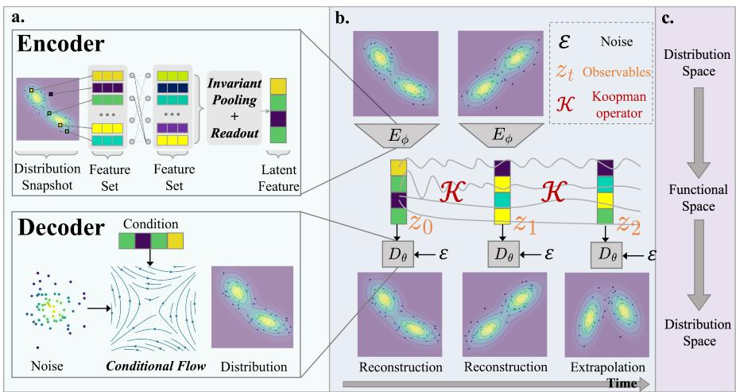  
Figure 1: Overview of DisKO. Distribution snapshots are encoded into learned observables, evolved under Koopman dynamics, and decoded back to distributions for reconstruction and extrapolation.

## 2 RELATED WORK

Learning distribution dynamics from snapshots. Learning population dynamics from unpaired snapshots requires assumptions about the evolution between observations (La Manno et al., 2018; Bergen et al., 2020; Gayoso et al., 2024; Rohbeck et al., 2025; Kviman et al., 2026). TrajectoryNet constrains the paths between snapshots through transport regularization (Tong et al., 2020), while DeepRUOT and VGFM couple transport with population growth (Zhang et al., 2025b; Wang et al., 2025). This evolution can also be modeled in learned latent coordinates, as in MIOFlow and scNODE (Huguet et al., 2022; Zhang et al., 2024), or constrained by energy and mechanical principles (Persiianov et al., 2026), as in PRESCIENT, JKOnet\*, and WLM (Yeo et al., 2021; Terpin et al., 2024; Guan et al., 2026). By contrast, DisKO brings a Koopman perspective to this problem, learning distribution observables whose evolution supports both prediction and spectral analysis.

Koopman theory and learning. Koopman methods obtain such spectral descriptions by approximating the linear evolution of observables (Ryu et al., 2024; Jeong et al., 2025; Colbrook et al., 2026). Dynamic mode decomposition and its extended form estimate this evolution from paired state observations using a prescribed representation (Schmid, 2010; Williams et al., 2015). Dictionary learning and neural embeddings make that representation trainable (Li et al., 2017; Lusch et al., 2018; Naiman et al., 2024; Xu et al., 2025; Selim et al., 2025). For population prediction, spectral expansions have been used to forecast probability densities (Wang & Araki, 2026), and distributional Koopman theory extends the observables themselves to functionals of distributions (Oprea et al., 2025). The latter formulation provides the basis for DisKO, which learns these functionals jointly with a continuous generator and a generative decoder.

Set representations and conditional generation. Learning distribution observables from finite snapshots requires representations that respect sample permutations (Fishman et al., 2025). Deep Sets and Set Transformer provide such encoders (Zaheer et al., 2017; Lee et al., 2019). To recover a distribution from its evolved representation, we pair these encoders with conditional generative flows trained by flow matching (Lipman et al., 2023; Tong et al., 2024).

## 3 THEORETICAL FRAMEWORK

We introduce the snapshot prediction problem and Koopman representations of distribution dynamics, with details in Appendix G.

## 3.1 PROBLEM FORMULATION

We learn from distribution snapshots, each consisting of an unordered set of state samples collected at a given time. Such data may be generated by deterministic or stochastic dynamics (Qiu et al., 2022; Vinyard et al., 2025). A representative model is

$$
d X _ { t } = b ( X _ { t } ) d t + \sigma ( X _ { t } ) d W _ { t } , \qquad X _ { 0 } \sim \nu _ { 0 } ,\tag{1}
$$

where $X _ { t } \in \mathcal { X } \subseteq \mathbb { R } ^ { p }$ and $W _ { t }$ is a standard Brownian motion independent of $X _ { 0 }$ . We assume a unique nonexplosive solution and write $\nu _ { t } = \operatorname { L a w } ( X _ { t } )$ for its distribution. Setting $\sigma = 0$ recovers an ODE.

Sequences of distribution snapshots, indexed by r, share the dynamics and may have different initial distributions $\nu _ { 0 } ^ { ( r ) }$ . At time $t _ { k }$ , sequence r provides an unordered sample $\{ y _ { k , i } ^ { ( r ) } \} _ { i = 1 } ^ { N _ { r , k } }$ from $\nu _ { t _ { k } } ^ { ( r ) }$ , represented by

$$
\widehat { \nu } _ { t _ { k } } ^ { ( r ) } = \frac { 1 } { N _ { r , k } } \sum _ { i = 1 } ^ { N _ { r , k } } \delta _ { y _ { k , i } ^ { ( r ) } } .\tag{2}
$$

Observation times and sequence membership are known, while individual samples are unpaired across time.

Our goal is to extrapolate distribution evolution beyond the training interval $[ 0 , \tau ]$ . After training on snapshots within this interval, the model receives a source snapshot $\widehat { \nu } _ { s } ^ { ( r ) }$ at $s \leq \tau$ and predicts $\nu _ { t } ^ { ( r ) }$ for $t > \tau$ without further observations. Our experiments use the first snapshot as input, with future snapshots providing ground truth distributions for evaluation (Appendix A.2).

## 3.2 THE DISTRIBUTIONAL KOOPMAN OPERATOR

Let ${ \mathfrak { M } } \subseteq { \mathcal { P } } ( { \mathcal { X } } )$ be a family of distributions equipped with a deterministic evolution $T _ { t } : \mathfrak { M } \to$ M satisfying $T _ { 0 } = \mathrm { I d } , T _ { t + s } = T _ { t } \circ T _ { s } , t , s \geq 0$ . This formulation describes evolution on the space of distributions independently of a particular state equation. Well-posed autonomous ODEs and time-homogeneous Markov SDEs induce such evolutions through deterministic pushforward and Markov transition probabilities, respectively.

Let H be a linear space of real-valued distribution observables $h : { \mathfrak { M } } \to \mathbb { R }$ that is preserved under composition with $T _ { t }$ . Following Oprea et al. (2025), the distributional Koopman operator is

$$
( { \cal K } _ { t } h ) ( \mu ) = h ( T _ { t } \mu ) .\tag{3}
$$

We use $\textstyle { \mathcal { K } } _ { t }$ for this operator and reserve $D$ for the decoder. The input to h is a distribution, and its output is a scalar statistic of that distribution. This extends the usual composition of a state observable with a state evolution map to the space of distributions. Composition is linear in the observable, so $\mathcal { K } _ { t } ( \alpha h + \beta g ) = \alpha \dot { K _ { t } } \dot { h } + \beta \dot { K _ { t } } \dot { g } , \ \mathcal { K } _ { t + s } = \mathcal { K } _ { t } \mathcal { K } _ { s }$ . On a function space where this semigroup is strongly continuous, its generator $\mathcal { L }$ is defined for observables in its domain by

$$
\mathscr { L } h = \operatorname* { l i m } _ { \Delta t \downarrow 0 } \frac { \mathscr { K } _ { \Delta t } h - h } { \Delta t } .\tag{4}
$$

The generator describes the instantaneous evolution of distribution observables and provides the continuous-time object approximated below.

## 3.3 LEARNING FINITE-DIMENSIONAL DISTRIBUTIONAL REPRESENTATIONS

To model distribution evolution in finite dimensions, we jointly learn observables, their dynamics, and a decoder. The components of an encoder $E : \mathcal { P } ( \mathcal { X } ) \overset { \cdot } {  } \mathbb { R } ^ { \acute { m } }$ define the distribution observables, $h _ { j } ( \mu ) = E _ { j } ( \mu ) , z = { \dot { E } } ( \nu ) = \mathbf { h } ( \nu ) \in \mathbb { R } ^ { m } , \ \mathbf { h } = ( h _ { 1 } , \dots , h _ { m } ) ^ { \top }$ . The $h _ { j }$ are potentially nonlinear functionals on M, and z collects their values at $\nu .$ In practice, the encoder is evaluated on empirical snapshots. To propagate these coordinates, we learn an affine system

$$
\dot { z } = A z + c , \qquad A \in \mathbb { R } ^ { m \times m } , \quad c \in \mathbb { R } ^ { m } ,\tag{5}
$$

with flow $F _ { t }$ . For observables in the domain of ${ \mathcal { L } } ,$ we seek the generator and flow approximations

$$
\begin{array} { r } { \mathcal { L } \mathbf { h } \approx A \mathbf { h } + c , \qquad \mathbf { h } ( T _ { t } \boldsymbol { \mu } ) \approx F _ { t } ( \mathbf { h } ( \boldsymbol { \mu } ) ) . } \end{array}\tag{6}
$$

Adding the constant observable makes the model linear in $( z , 1 )$ , approximating the action of $\mathcal { L }$ on the span of $1 , h _ { 1 } , \ldots , h _ { m }$ Exact propagation requires this space to be invariant under Koopman evolution (Brunton et al., 2016a; Cenedese et al., 2022; Fathi et al., 2024; Lu et al., 2026). In practice, we seek approximate closure and assess it through future predictions and spectral diagnostics. Appendix G.2 provides further analysis of observable expressiveness, dynamical closure, and spectral interpretation.

To recover distributions from these coordinates, we learn a decoder $D : \mathbb { R } ^ { m }  { \mathcal { P } } ( \chi )$ satisfying $D ( E ( \nu ) )$ ≈ ν. Reconstruction encourages the encoder to retain distributional information. Exact recovery on a modeled family requires E to distinguish its members and D to invert E on its image. For $t > s ,$ , we predict $\mathcal { \widetilde { V } } _ { t \vert s } ^ { ( r ) } = D ( F _ { t - s } ( E ( \mathcal { \widehat { V } } _ { s } ^ { ( r ) } ) ) ) ,$ by encoding, propagating, and decoding the source snapshot. In practice, $\dot { D }$ generates samples conditioned on the propagated coordinates. Section 4 specifies the parameterizations and joint training objectives. The following OU example illustrates exact finite-dimensional propagation and distribution reconstruction.

Example 3.1 (Distribution observables for an OU system). Consider $d X _ { t } = - a X _ { t } d t +$ $\sigma d W _ { t }$ with $a > 0 , \sigma \geq 0$ , and $X _ { 0 } \sim \mathcal { N } ( m _ { 0 } , v _ { 0 } )$ independent of the Brownian motion $W _ { t }$ Its distribution remains Gaussian and is determined by the values of the mean and variance observables $\begin{array} { r } { h _ { 1 } ( \nu ) = \int x d \nu ( x ) , h _ { 2 } ( \nu ) = \int x ^ { 2 } d \nu ( x ) - h _ { 1 } ( \nu ) ^ { 2 } } \end{array}$ . Their Koopman evolution is explicit, with $v _ { \infty } \ = \ \sigma ^ { 2 } / ( 2 a ) , ( \mathcal { K } _ { t } h _ { 1 } ) ( \nu _ { 0 } ) \ = \ h _ { 1 } ( \nu _ { t } ) \ = \ m _ { t } \ = \ e ^ { - a t } m _ { 0 } , ( \mathcal { K } _ { t } h _ { 2 } ) ( \nu _ { 0 } ) \ =$ $h _ { 2 } ( \bar { \nu _ { t } } ) = v _ { t } = e ^ { - 2 a t } v _ { 0 } + \bar { \upsilon _ { \infty } ( 1 - e ^ { - 2 a t } ) }$ . The encoder $E ( \nu ) = ( h _ { 1 } ( \nu ) , h _ { 2 } ( \nu ) ) ^ { \top }$ therefore gives coordinates $z _ { t } = ( m _ { t } , v _ { t } ) ^ { \top }$ with exact affine dynamics $\dot { z } _ { t } = ( - a m _ { t } , - 2 a v _ { t } + \sigma ^ { 2 } ) ^ { \top }$ . The span of $1 , h _ { 1 } , h _ { 2 }$ is invariant under $\boldsymbol { \kappa } _ { t }$ . Within the Gaussian family, $D ( m , v ) = \mathcal { N } ( m , v )$ for $v \geq 0$ then gives exact reconstruction, $D ( F _ { t } ( E ( \nu _ { 0 } ) ) ) = \mathcal { N } ( e ^ { - a t } m _ { 0 } , e ^ { - 2 a t } v _ { 0 } + v _ { \infty } ( 1 - \ ' e ^ { - 2 a t } ) ) = \nu _ { t } .$

## 4 DISKO MODEL AND LEARNING ALGORITHM

DisKO instantiates the distribution encoder E, latent flow $F _ { t } ,$ , and distribution decoder D from Section 3 with a set network, affine dynamics, and conditional flow matching. We describe these components and their joint training, followed by a discrete closed-form alternative to continuous generator learning.

## 4.1 DISTRIBUTION ENCODING WITH SET NETWORKS

For a snapshot $S ~ = ~ \{ y _ { i } \} _ { i = 1 } ^ { N } , ~ E _ { \theta } ( S )$ denotes the encoding of its empirical distribution. We use permutation-invariant networks based on Deep Sets (Zaheer et al., 2017) and Set Transformer (Lee et al., 2019), combining a learned aggregate $g _ { \boldsymbol { \theta } } ( S )$ with snapshot statistics, $E _ { \theta } ( S ) = \rho _ { \theta } ( [ g _ { \theta } ( S ) , \bar { y } _ { S } , s _ { S } ] ) \in \mathbb { R } ^ { m }$ , where ${ \bar { y } } _ { S }$ and $s _ { S }$ are the coordinatewise mean and standard deviation with normalization $1 / N$ , brackets denote concatenation, and $\rho _ { \theta }$ is a multilayer perceptron. These statistics give the encoder direct access to the distribution’s location and marginal spread. The pooling variant concatenates the mean and coordinatewise maximum of point features from a shared network $\phi _ { \theta }$ . The attention variant processes these features with self-attention blocks and pools them through multihead attention with a learned query (Lee et al., 2019). Its blocks use residual connections, feedforward layers, and layer normalization. Both variants produce a fixed-dimensional vector invariant to sample order; the choice is specified for each dataset. The interface also supports other pooling networks or Galerkin attention (Cao, 2021) with permutation-invariant pooling.

## 4.2 CONTINUOUS-TIME LATENT DYNAMICS

We propagate the encoded coordinates with the affine generator in Equation 5, learning $A , c$ through an augmented matrix exponential,

$$
B = \left( \begin{array} { c c } { { A } } & { { c } } \\ { { 0 } } & { { 0 } } \end{array} \right) , \qquad \left( \begin{array} { c c } { { F _ { \Delta t } ( z ) \nonumber } } \\ { { 1 } } \end{array} \right) = \exp ( \Delta t B ) \left( \begin{array} { c } { { z } } \\ { { 1 } } \end{array} \right) .\tag{7}
$$

A single parameter set governs all intervals and gives $F _ { t + s } ~ = ~ F _ { t } \circ F _ { s }$ , supporting irregular observation times and prediction at arbitrary future times. The affine term accommodates nonzero offsets in observable evolution, as in Example 3.1. Gradients pass through the matrix exponential to the generator and encoder. The eigenvalues of A describe latent decay, growth, and oscillation rates; their agreement with the underlying system is assessed experimentally.

## 4.3 DISTRIBUTION DECODING VIA CONDITIONAL FLOW MATCHING

To recover a distribution from the propagated coordinates, we implement $D _ { \psi }$ using conditional flow matching (Lipman et al., 2023; Tong et al., 2024). Given a condition z and target snapshot $S _ { \ i }$ draw $y$ uniformly from $S ,$ independent noise $\epsilon \sim \mathcal { N } ( 0 , I _ { p } )$ , and $\alpha \sim \mathcal { U } ( 0 , 1 )$ , where $p$ is the data dimension. The linear path and its velocity are $\xi _ { \alpha } = ( 1 - \alpha ) \epsilon + \alpha y , \ u = y - \epsilon . \mathrm { \bf A }$ multilayer perceptron $v _ { \psi }$ receives the concatenation of $\xi _ { \alpha } , z ,$ and α and minimizes

$$
\ell _ { \mathrm { C F M } } ( z , S ) = \mathbb { E } _ { \alpha , \epsilon , y } \left[ \frac { 1 } { p } \left. v _ { \psi } ( \xi _ { \alpha } , \alpha , z ) - ( y - \epsilon ) \right. _ { 2 } ^ { 2 } \right] .\tag{8}
$$

To sample from $D _ { \psi } ( z )$ , we independently draw $U _ { 0 } \sim \mathcal { N } ( 0 , I _ { p } )$ for each sample and numerically integrate $\begin{array} { r } { \frac { d U _ { \alpha } } { d \alpha } = v _ { \psi } ( U _ { \alpha } , \alpha , z ) } \end{array}$ $\alpha \in [ 0 , 1 ]$ $D _ { \psi } ( z ) = \operatorname { L a w } ( U _ { 1 } )$ . Here, α parametrizes generation at a fixed physical time. Physical evolution enters through the shared condition $z = \bar { F _ { t - s } } \bar { ( E _ { \theta } ( S _ { s } ) ) }$ when predicting from time s to t. This decoder accommodates high-dimensional distributions, including the 30-dimensional Pancreas and 50-dimensional WOT iPSC representations in our experiments. For low-dimensional data with suitable structure, conditional Gaussian mixtures or other parametric families provide alternative decoders with interpretable parameters, trained with an appropriate likelihood or distribution loss.

## 4.4 TRAINING OBJECTIVES AND ALGORITHM

To couple representation learning with temporal prediction, we draw pairs $( S _ { s } , S _ { t } )$ from the same snapshot sequence, with $s < t$ in the training window. Points are sampled independently from each

snapshot. Define $z _ { s } = E _ { \theta } ( S _ { s } ) , z _ { t } = E _ { \theta } ( S _ { t } )$ , and $\widehat { z } _ { t } = F _ { t - s } ( z _ { s } )$ . The prediction, reconstruction, and latent consistency objectives are

$$
\mathcal { I } _ { \mathrm { p r e d } } = \mathbb { E } \ell _ { \mathrm { C F M } } ( \widehat { z } _ { t } , S _ { t } ) , \ \mathcal { I } _ { \mathrm { r e c } } = \mathbb { E } \ell _ { \mathrm { C F M } } ( z _ { t } , S _ { t } ) , \ \mathcal { I } _ { \mathrm { l a t } } = \mathbb { E } \bigg [ \frac { 1 } { m } \| \widehat { z } _ { t } - \mathrm { s g } ( z _ { t } ) \| _ { 2 } ^ { 2 } \bigg ] ,\tag{9}
$$

where expectations are over training pairs, m is the latent dimension, and $\mathrm { s g }$ stops the gradient. Reconstruction encourages the encoding to retain distributional information, while prediction trains the decoder with the propagated condition used at inference. Latent consistency aligns the propagated coordinates with the target encoding, passing its encoder gradient through the source branch. We further compare a generated set $\widetilde { S } _ { t }$ from $D _ { \psi } ( \widehat { z } _ { t } )$ with an equally sized target subset $S _ { t } ^ { * }$

$$
\mathcal { I } _ { \mathrm { d i s t } } = \mathbb { E } \Big [ \mathrm { S W } _ { 1 } ( \widetilde { S } _ { t } , S _ { t } ^ { * } ) + \beta \mathrm { M M D } ^ { 2 } ( \widetilde { S } _ { t } , S _ { t } ^ { * } ) + \gamma d _ { \mathrm { m o m } } ( \widetilde { S } _ { t } , S _ { t } ^ { * } ) \Big ] .\tag{10}
$$

Here, $\mathrm { S W _ { 1 } }$ averages one-dimensional Wasserstein distances over random projections (Bonneel et al., 2015), $\mathrm { M M D ^ { 2 } }$ uses a mixture of Gaussian kernels (Gretton et al., 2012), and $d _ { \mathrm { m o m } }$ sums mean squared differences between sample means and raw second-moment matrices. Gradients pass through the numerical sampler to supervise the generated distribution. We combine the four terms with nonnegative weights,

$$
\mathcal { I } = \lambda _ { \mathrm { p r e d } } \mathcal { J } _ { \mathrm { p r e d } } + \lambda _ { \mathrm { r e c } } \mathcal { I } _ { \mathrm { r e c } } + \lambda _ { \mathrm { l a t } } \mathcal { I } _ { \mathrm { l a t } } + \lambda _ { \mathrm { d i s t } } \mathcal { I } _ { \mathrm { d i s t } } .\tag{11}
$$

Continuous generator learning proceeds in three stages. We first pretrain $E _ { \theta } , D _ { \psi }$ on individual snapshots with $\bar { \ell _ { \mathrm { C F M } } } ( E _ { \theta } ( S ) , S )$ , then fix them and fit $A , c$ using latent prediction error on training pairs. Finally, we jointly optimize all components with Equation 11. This initializes reconstruction and propagation before coupling them through the full objective. We use AdamW with gradient clipping; the full training procedure is detailed in Appendix B, with hyperparameter settings in Table B.2.

Discrete closed-form updates. For uniformly spaced snapshots, an alternative is to learn the action of ${ \boldsymbol { \kappa } } _ { \Delta t }$ directly through $F _ { \Delta t } ( z ) = K z \dot { + } \dot { b }$ . Let X contain augmented source encodings $[ z _ { s } ^ { \top } , 1 ] ^ { \top }$ as columns and $Y$ the corresponding target encodings at $s + \Delta t$ , using all adjacent pairs from training sequences within the training window. With $\Theta \doteq [ K \ b ]$ , the ridge update is

$$
\widehat { \Theta } = \underset { \Theta } { \operatorname { a r g m i n } } \ : \Vert Y - \Theta X \Vert _ { F } ^ { 2 } + \eta \Vert \Theta \Vert _ { F } ^ { 2 } = Y X ^ { \top } ( X X ^ { \top } + \eta I ) ^ { - 1 } , \qquad \eta > 0 .\tag{12}
$$

The fit uses unstandardized latent coordinates and a sum of squared residuals over pairs, with a penalty on both K and b. We evaluate the solution by singular value decomposition. After the same pretraining, this fit initializes the discrete dynamics. Joint training alternates encoder and decoder updates under Equation 11 with re-encoding the training pairs and refitting $K , b .$ . The ridge solve is detached from the gradient computation; K, b are fixed during each gradient step, while propagation retains gradients to the source encoder. The spectral experiments refit after every step with $\bar { \eta } = 1 0 ^ { - 3 }$ (Appendix C.2). Repeated application of $\bar { F } _ { \Delta t }$ yields $F _ { q \Delta t }$ for nonnegative integers $q ,$ supporting the same prediction losses over multiple horizons. For either variant, inference encodes the source snapshot once, propagates its coordinates to each requested time, and decodes the corresponding distribution.

## 5 RESULTS

## 5.1 EXPERIMENTAL SETUP

Datasets. We evaluate DisKO’s ability to extrapolate distribution dynamics on the following seven datasets. OU and Duffing test long-horizon extrapolation across multiple initial distributions (50 and 80future steps, respectively), while Boids tests extrapolation from a single sequence (50future steps). Ocean tests prediction from a short sequence (one future step). CAMELS tests generalization across initial distributions in 10 dimensions. Pancreas and WOT iPSC assess prediction on real single-cell data (30 and 50 dimensions, respectively), with WOT iPSC spanning 39 snapshots. Circle and Torus provide analytic spectra for spectral validation. Dataset details appear in Appendix A.1.

Experimental protocol. We divide the observation times into training and extrapolation windows. For datasets with multiple initial distributions (OU, Duffing, and CAMELS), we also split the initial distributions into training and test sets. Detailed splits are provided in Table A.1 of Appendix A.1.

Evaluation. We quantify prediction accuracy using $W _ { 1 }$ and $\mathrm { S W _ { 1 } }$ between predicted and ground truth distributions; $W _ { 2 }$ and $\mathrm { M M D ^ { 2 } }$ are additionally reported in the appendix.

Baselines. We compare DisKO with eight population dynamics models to assess its predictive advantage. TrajectoryNet learns regularized transport flows (Tong et al., 2020). DeepRUOT models stochasticity and growth through unbalanced transport (Zhang et al., 2025b). VGFM jointly estimates velocity and growth by flow matching (Wang et al., 2025). MIOFlow learns latent differential dynamics with a geodesic autoencoder (Huguet et al., 2022). scNODE couples a variational autoencoder to a latent Neural ODE (Zhang et al., 2024). PRESCIENT models stochastic evolution through a potential landscape (Yeo et al., 2021). JKOnet\* identifies energy terms using Wasserstein gradient-flow optimality (Terpin et al., 2024). WLM represents inertial population dynamics with a Wasserstein Lagrangian (Guan et al., 2026).

## 5.2 DISTRIBUTION EXTRAPOLATION

Table 2 reports distribution extrapolation results for DisKO and eight baselines across seven datasets. DisKO achieves the lowest $W _ { 1 }$ on all seven datasets and the lowest $\mathrm { S W _ { 1 } }$ on six. Relative to the strongest baseline on each dataset, DisKO reduces $W _ { 1 }$ by 58.6% on OU, 53.9% on Duffing, and 36.2% on Ocean. The corresponding reductions on the real single-cell datasets Pancreas and WOT iPSC are 18.0% and 18.7%, respectively. Complete numerical results across time windows and initial distribution splits are provided in Tables B.3–B.6 of Appendix B.

Table 2: Results over the extrapolation window for test initial distributions in datasets with multiple initial distributions, and for single sequences. Red and blue indicate the best and second best results, respectively.
<table><tr><td>Method</td><td>Metric</td><td>OU</td><td>Duffing</td><td>Boids</td><td>Ocean</td><td>CAMELS</td><td>Pancreas</td><td>WOT iPSC</td></tr><tr><td rowspan="2">TrajectoryNet</td><td> $W _ { 1 }$ </td><td> $1 . 3 6 9 _ { \pm 0 . 0 7 1 }$ </td><td> $9 . 2 2 2 _ { \pm 0 . 7 8 3 }$ </td><td> $1 1 . 8 4 3 _ { \pm 0 . 5 6 0 }$ </td><td> $2 . 1 9 8 _ { \pm 0 . 9 0 0 }$ </td><td> $1 4 3 . 7 6 7 _ { \pm 2 . 1 7 0 }$ </td><td> $4 7 . 3 7 6 { \scriptstyle \pm 2 . 9 5 0 }$ </td><td> $1 1 8 . 5 2 4 { \scriptstyle \pm 2 . 5 0 9 }$ </td></tr><tr><td> $\operatorname { s w } 1$ </td><td> $0 . 8 5 7 _ { \pm 0 . 0 4 7 }$ </td><td> $5 . 8 1 5 _ { \pm 0 . 7 1 2 }$ </td><td> $7 . 2 6 7 _ { \pm 0 . 3 6 5 }$ </td><td> $1 . 4 2 6 _ { \pm 0 . 5 5 6 }$ </td><td> $3 5 . 3 6 4 { \scriptstyle \pm 1 . 1 2 8 }$ </td><td> $6 . 7 6 5 _ { \pm 0 . 8 2 6 }$ </td><td> $1 4 . 5 0 2 _ { \pm 0 . 6 4 7 }$ </td></tr><tr><td rowspan="2">DeepRUOT</td><td> $\overline { { W _ { 1 } } }$ </td><td> $0 . 8 4 6 _ { \pm 0 . 0 4 4 }$ </td><td> $1 . 0 3 2 _ { \pm 0 . 2 8 7 }$ </td><td> $5 . 9 6 2 _ { \pm 0 . 2 8 3 }$ </td><td> $0 . 2 1 4 _ { \pm 0 . 0 2 0 }$ </td><td> $7 9 . 9 8 9 { \scriptstyle \pm 1 . 2 5 2 }$ </td><td> $1 7 . 2 8 6 _ { \pm 1 . 5 7 2 }$ </td><td> $2 3 . 6 3 5 { \scriptstyle \pm 1 . 6 2 3 }$ </td></tr><tr><td>SW1</td><td> $0 . 5 5 4 _ { \pm 0 . 0 3 0 }$ </td><td> $0 . 6 5 0 { \scriptstyle \pm 0 . 1 8 6 }$ </td><td> $3 . 7 9 6 _ { \pm 0 . 1 7 2 }$ </td><td> $0 . 1 4 9 _ { \pm 0 . 0 1 4 }$ </td><td> $1 4 . 3 6 2 _ { \pm 0 . 4 6 6 }$ </td><td> $2 . 1 1 3 _ { \pm 0 . 2 2 1 }$ </td><td> $2 . 1 0 8 _ { \pm 0 . 2 2 0 }$ </td></tr><tr><td rowspan="2">VGFM</td><td>W1</td><td> $\overline { { 1 . 2 9 0 _ { \pm 0 . 4 8 6 } } }$ </td><td> $\overline { { 1 2 . 8 3 4 _ { \pm 0 . 9 7 6 } } }$ </td><td> $3 1 . 0 0 8 { \scriptstyle \pm 1 . 7 0 9 }$ </td><td> $\overline { { 0 . 1 9 5 _ { \pm 0 . 0 4 7 } } }$ </td><td> $1 2 3 . 0 7 1 { \scriptstyle \pm 2 . 0 7 5 }$ </td><td> $2 7 . 4 9 7 _ { \pm 1 . 3 3 7 }$ </td><td> $\overline { { 1 8 7 . 1 5 4 _ { \pm 2 . 8 9 4 } } }$ </td></tr><tr><td>SW1</td><td> $0 . 8 0 7 { \scriptstyle \pm 0 . 3 1 5 }$ </td><td> $9 . 3 5 8 { \scriptstyle \pm 0 . 3 5 2 }$ </td><td> $1 9 . 6 0 4 { \scriptstyle \pm 1 . 4 2 8 }$ </td><td> $0 . 1 2 8 { \scriptstyle \pm 0 . 0 3 4 }$ </td><td> $2 4 . 9 9 5 _ { \pm 1 7 . 6 0 2 }$ </td><td> $2 . 9 7 8 { \scriptstyle \pm 2 . 1 2 6 }$ </td><td> $2 7 . 3 8 9 { \scriptstyle \pm 1 . 7 6 2 }$ </td></tr><tr><td rowspan="2">MIOFlow</td><td> $\overline { { W _ { 1 } } }$ </td><td> $1 . 5 1 4 _ { \pm 0 . 1 3 5 }$ </td><td> $0 . 6 9 2 _ { \pm 0 . 1 0 9 }$ </td><td> $9 . 6 4 2 _ { \pm 0 . 3 9 0 }$ </td><td> $0 . 1 8 7 _ { \pm 0 . 0 4 4 }$ </td><td> $9 8 . 1 7 3 _ { \pm 1 . 4 2 1 }$ </td><td> $1 1 . 1 1 1 { \scriptstyle \pm 0 . 9 0 2 }$ </td><td> $3 4 . 8 5 4 _ { \pm 0 . 6 2 7 }$ </td></tr><tr><td>SW1</td><td> $0 . 9 5 0 { \scriptstyle \pm 0 . 0 8 7 }$ </td><td> $0 . 4 3 2 _ { \pm 0 . 0 7 0 }$ </td><td> $5 . 8 7 9 _ { \pm 1 . 2 1 6 }$ </td><td> $0 . 1 3 0 { \scriptstyle \pm 0 . 0 3 3 }$ </td><td> $2 0 . 3 8 1 _ { \pm 1 . 1 0 4 }$ </td><td> $0 . 8 9 5 _ { \pm 0 . 1 7 1 }$ </td><td> $3 . 9 3 1 { \scriptstyle \pm 0 . 0 5 3 }$ </td></tr><tr><td rowspan="2">scNODE</td><td>W1</td><td> $0 . 7 5 9 { \scriptstyle \pm 0 . 0 1 0 }$ </td><td> $0 . 8 8 7 { \scriptstyle \pm 0 . 0 7 5 }$ </td><td> $7 . 8 2 2 { \scriptstyle \pm 0 . 3 5 9 }$ </td><td> $0 . 7 8 3 { \scriptstyle \pm 0 . 2 4 6 }$ </td><td> $1 4 3 . 7 5 1 { \scriptstyle \pm 1 . 6 9 2 }$ </td><td> $4 3 . 0 4 7 _ { \pm 1 . 0 3 0 }$ </td><td> $9 4 . 2 6 8 { \scriptstyle \pm 1 . 5 3 6 }$ </td></tr><tr><td>SW1</td><td> $0 . 4 8 1 _ { \pm 0 . 0 0 8 }$ </td><td> $0 . 5 4 1 { \scriptstyle \pm 0 . 0 7 0 }$ </td><td> $4 . 3 8 1 _ { \pm 0 . 2 3 3 }$ </td><td> $0 . 5 1 5 _ { \pm 0 . 1 5 4 }$ </td><td> $3 4 . 8 9 6 _ { \pm 1 . 1 3 7 }$ </td><td> $6 . 1 6 8 _ { \pm 0 . 8 3 1 }$ </td><td> $1 0 . 5 4 4 { \scriptstyle \pm 1 . 1 5 0 }$ </td></tr><tr><td rowspan="2">PRESCIENT</td><td> $\overline { { W _ { 1 } } }$ </td><td> $0 . 8 4 9 _ { \pm 0 . 0 3 4 }$ </td><td> $0 . 5 3 2 _ { \pm 0 . 0 4 0 }$ </td><td> $3 . 4 9 8 _ { \pm 0 . 1 3 6 }$ </td><td> $0 . 1 5 3 { \scriptstyle \pm 0 . 0 0 9 }$ </td><td> $1 4 3 . 7 9 7 _ { \pm 0 . 2 3 2 }$ </td><td> $1 2 . 1 6 9 _ { \pm 0 . 3 2 5 }$ </td><td> $2 3 . 3 2 8 { \scriptstyle \pm 0 . 0 8 6 }$ </td></tr><tr><td>SW1</td><td> $0 . 5 2 5 { \scriptstyle \pm 0 . 0 2 0 }$ </td><td> $0 . 2 8 0 { \scriptstyle \pm 0 . 0 2 5 }$ </td><td> $1 . 9 5 1 { \scriptstyle \pm 0 . 0 8 7 }$ </td><td> $0 . 0 9 7 { \scriptstyle \pm 0 . 0 0 6 }$ </td><td> $3 6 . 2 4 4 { \scriptstyle \pm 0 . 0 6 2 }$ </td><td> $0 . 9 6 5 { \scriptstyle \pm 0 . 0 6 8 }$ </td><td> $1 . 8 8 3 { \scriptstyle \pm 0 . 0 1 3 }$ </td></tr><tr><td rowspan="2"> $\mathrm { J K O n e t ^ { * } }$ </td><td> $\overline { { W _ { 1 } } }$ </td><td> $\overline { { 1 . 2 8 8 _ { \pm 0 . 0 6 7 } } }$ </td><td> $\overline { { 5 . 2 4 6 _ { \pm 0 . 4 4 7 } } }$ </td><td> $\overline { { 3 . 2 8 2 _ { \pm 0 . 1 8 7 } } }$ </td><td> $2 . 3 3 2 _ { \pm 0 . 8 7 6 }$ </td><td> $\overline { { 1 3 4 . 1 0 5 _ { \pm 2 . 0 7 3 } } }$ </td><td> $\overline { { 5 2 . 3 9 5 _ { \pm 1 . 1 1 9 } } }$ </td><td> $\overline { { 6 3 . 0 5 1 _ { \pm 1 . 3 6 7 } } }$ </td></tr><tr><td>SW1</td><td> $0 . 7 9 7 _ { \pm 0 . 0 4 4 }$ </td><td> $3 . 2 9 0 _ { \pm 0 . 4 1 3 }$ </td><td> $1 . 7 7 0 _ { \pm 0 . 0 8 6 }$ </td><td> $1 . 5 6 1 _ { \pm 0 . 5 8 7 }$ </td><td> $3 0 . 0 5 8 { \scriptstyle \pm 0 . 9 7 6 }$ </td><td> $8 . 2 2 1 { \scriptstyle \pm 0 . 7 1 3 }$ </td><td> $7 . 0 7 6 _ { \pm 0 . 3 2 5 }$ </td></tr><tr><td rowspan="2">WLM</td><td> $\overline { { W _ { 1 } } }$ </td><td> $0 . 6 0 2 { \scriptstyle \pm 0 . 0 3 2 }$ </td><td> $0 . 3 1 8 { \scriptstyle \pm 0 . 0 2 8 }$ </td><td> $1 . 5 9 5 { \scriptstyle \pm 0 . 0 4 7 }$ </td><td> $0 . 9 4 1 { \scriptstyle \pm 0 . 2 6 4 }$ </td><td> $5 5 . 0 1 9 { \scriptstyle \pm 0 . 3 7 0 }$ </td><td> $1 3 . 3 4 5 { \scriptstyle \pm 0 . 5 1 7 }$ </td><td> $2 5 . 8 0 5 { \scriptstyle \pm 0 . 6 3 8 }$ </td></tr><tr><td> $\operatorname { s w } 1$ </td><td> $0 . 3 6 2 _ { \pm 0 . 0 2 0 }$ </td><td> $0 . 1 6 0 { \scriptstyle \pm 0 . 0 1 9 }$ </td><td> $0 . 6 5 6 { \scriptstyle \pm 0 . 0 5 0 }$ </td><td> $0 . 5 2 0 { \scriptstyle \pm 0 . 2 4 6 }$ </td><td> $6 . 6 9 9 _ { \pm 0 . 2 0 6 }$ </td><td> $0 . 9 8 8 _ { \pm 0 . 1 4 0 }$ </td><td> $1 . 9 2 9 _ { \pm 0 . 0 9 3 }$ </td></tr><tr><td rowspan="2">DisKO</td><td> $W _ { 1 }$ </td><td> $0 . 2 4 9 _ { \pm 0 . 0 1 3 }$ </td><td> $0 . 1 4 6 _ { \pm 0 . 0 0 5 }$ </td><td> $1 . 4 5 4 _ { \pm 0 . 1 1 0 }$ </td><td> $0 . 0 9 7 { \scriptstyle \pm 0 . 0 2 4 }$ </td><td> $5 4 . 2 4 1 _ { \pm 0 . 8 3 0 }$ </td><td> $9 . 1 1 4 _ { \pm 0 . 1 4 3 }$ </td><td> $1 8 . 9 7 3 { \scriptstyle \pm 0 . 3 3 0 }$ </td></tr><tr><td>SW1</td><td> $0 . 1 3 5 { \scriptstyle \pm 0 . 0 1 0 }$ </td><td> $0 . 0 5 6 _ { \pm 0 . 0 0 4 }$ </td><td> $0 . 6 5 6 { \scriptstyle \pm 0 . 0 8 7 }$ </td><td> $0 . 0 6 2 _ { \pm 0 . 0 1 9 }$ </td><td> $7 . 0 3 9 { \scriptstyle \pm 0 . 5 0 0 }$ </td><td> $0 . 5 5 9 { \scriptstyle \pm 0 . 0 0 7 }$ </td><td> $0 . 9 4 0 { \scriptstyle \pm 0 . 0 3 9 }$ </td></tr></table>

The prediction error curves in Figure 2 further characterize DisKO’s long-horizon extrapolation performance. On OU, prediction error remains approximately constant over 50 extrapolation steps. On Duffing, error grows slowly over 80 extrapolation steps and remains below that of the baselines shown in the figure. These results indicate that the learned Koopman representation supports sustained distribution prediction beyond the training window. We further examine the contribution of the shared linear evolution structure to extrapolation stability through an ablation against a nonlinear latent Neural ODE in Section 5.4. The complete error curves for all seven datasets are shown in Figure B.1 in Appendix B.

We obtain the reported performance with limited hyperparameter search, evaluating only one to three configurations per dataset. The main table reports the results of this initial search. For some datasets, further hyperparameter tuning can yield better results. These results demonstrate that DisKO achieves competitive performance across datasets with a modest tuning budget.

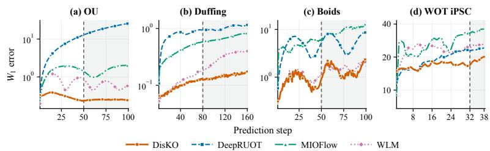  
Figure 2: $W _ { 1 }$ prediction errors on four benchmarks. Vertical dashed lines mark the end of training, with the extrapolation window shaded. All error axes use a logarithmic scale.

## 5.3 KOOPMAN SPECTRAL APPROXIMATION

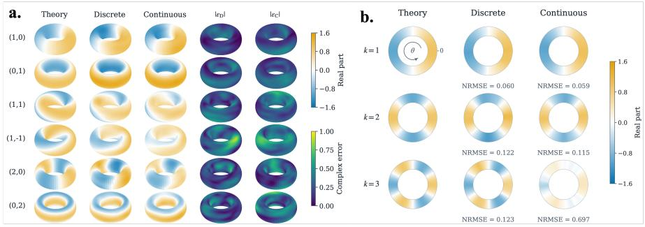  
Figure 3: Distributional eigenfunctions on wrapped Gaussian probes $( \sigma = 0 . 1 5 )$ , indexed by center. (a) Torus. (b) Circle. Plots show real components and complex errors after amplitude and phase calibration on training snapshots.

Recovering distributional Koopman spectra from finite, unpaired snapshots is challenging because the eigenfunctions are defined on an infinite-dimensional space of probability measures. We assess distributional Koopman recovery on Circle $( q = 1 )$ and Torus $( q = 2 )$ , governed by angular drift and diffusion, $d \vartheta _ { j , t } = \omega _ { j } d t + \widetilde { \sqrt { 2 \kappa _ { j } } } d W _ { j , t }$ (mod 2π), $j = 1 , \dots , q ;$ with independent Brownian motions. Circle uses $\left( \omega _ { 1 } , \kappa _ { 1 } \right) = \left( 1 , 0 . 0 1 \right)$ ; Torus uses $\omega = ( 1 , 1 . 7 )$ and $\kappa = ( 0 . 0 1 , 0 . 0 1 4 )$ . The analytical eigenpairs for $k \in \mathbb { Z } ^ { q }$ satisfy

$$
\begin{array} { l l } { { { h } _ { k } ( \mu ) = \displaystyle \int e ^ { \mathrm { i } k \cdot \vartheta } d \mu ( \vartheta ) , } } & { { \lambda _ { k } = - \displaystyle \sum _ { j = 1 } ^ { q } \kappa _ { j } k _ { j } ^ { 2 } + \mathrm { i } \omega \cdot k , } } \\ { { } } & { { { \mathcal K } _ { t } h _ { k } = e ^ { t \lambda _ { k } } h _ { k } , } } & { { \rho _ { k } = e ^ { \Delta t \lambda _ { k } } . } } \end{array}\tag{13}
$$

Here $h _ { k }$ is a distributional Koopman eigenfunction with continuous-time generator eigenvalue $\lambda _ { k } .$ finite-time eigenvalue $\rho _ { k }$ , decay rate $- \operatorname { R e } ( \lambda _ { k } )$ , and angular frequency Im $\left( \lambda _ { k } \right)$

Uniformly spaced snapshots permit direct, closed-form fitting of the finite-time Koopman representation, providing a complementary route to spectral recovery. We therefore evaluate discrete DisKO (Section 4.4) alongside the continuous generator model (Section 4.2). Table 3 shows close agreement between analytical and recovered finite-time eigenvalues at $\Delta t = 0 . 1$ for both parameterizations. Absolute errors are below 0.006 for Circle’s first three harmonics and 0.003 for the Torus fundamental modes.

<table><tr><td></td><td colspan="3">Circle</td><td colspan="2">Torus</td><td rowspan="2">Table 3: Absolute eigenvalue errors  $\left| \widehat { \rho } _ { k } - \rho _ { k } \right| ( \times 1 0 ^ { - 3 } )$  for  $\mathcal { K } _ { 0 . 1 }$  . Full</td></tr><tr><td>DisKO</td><td> $k ^ { \overline { { = 1 } } }$ </td><td> $\overline { { k = 2 } }$ </td><td> $\overline { { k = 3 } }$ </td><td> $\bar { k = ( 1 , 0 ) }$ </td><td> $\overline { { k = \left( 0 , 1 \right) } }$ </td></tr><tr><td>Discrete</td><td>1.315</td><td>3.191</td><td>5.928</td><td>2.404</td><td>2.892</td><td>eigenvalues and higher Circle</td></tr><tr><td>Continuous</td><td>1.314</td><td>2.410</td><td>5.868</td><td>1.781</td><td>1.377</td><td>harmonics appear in Appendix C.3.</td></tr></table>

The nonlinear set encoder coordinates and the constant observable span a finite-dimensional observable space. Left eigenvectors of the augmented operator or generator define candidate eigenfunctions through linear combinations $u _ { k } \breve { ( \nu ) } ~ = ~ w _ { k } ^ { \top } [ E ( \nu ) ^ { \top } , \breve { 1 } ] ^ { \top }$ (Appendix C.2). We evaluate their shapes on wrapped Gaussian probes with center a and covariance $\sigma ^ { 2 } I .$ , where $h _ { k } ( \mu _ { a , \sigma } ) = e ^ { - \sigma ^ { 2 } \| k \| ^ { 2 } / 2 } e ^ { \mathrm { i } k \cdot a }$ (Figure 3). On future test snapshots, complex correlations reach 0.999, 0.994, and 0.976 for the first three Circle harmonics with discrete DisKO and exceed 0.995 for both Torus fundamental modes with either parameterization (Appendix C.4).

DisKO thus learns an observable space containing accurate approximations of analytical Fourier distribution functionals directly from snapshots, without a prescribed Fourier dictionary. Discrete DisKO better resolves higher Circle harmonics, while continuous DisKO gives more accurate Torus eigenvalues. Eigenvalue accuracy and eigenfunction fidelity are therefore distinct tests.

## 5.4 DYNAMICAL CLOSURE AND EXTRAPOLATION STABILITY

On OU, we test approximate closure of the learned observables under Koopman evolution and the contribution of this structure to extrapolation stability.

Latent dynamical consistency. For a nearly closed observable subspace, propagating the initial encoding should agree with directly encoding later distributions. With the trained encoder fixed, Figure 4 compares these trajectories, $F _ { t } ( E ( \widehat { \nu } _ { 0 } ) )$ ) and $E ( \widehat { \nu } _ { t } )$ Their agreement in rotation and contraction beyond the training interval supports approximate closure along this OU trajectory in the PCA projection (Appendix D).

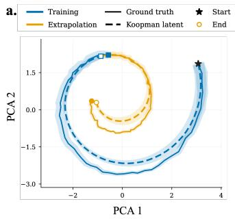

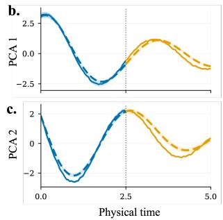  
Figure 4: Reference encodings and forecasts for one OU test sequence, with one standard deviation across five seeds. PCA and rigid alignment use all times after forecasting.

Ablation of Koopman latent dynamics. To isolate Koopman latent dynamics, we replace only the affine generator with a Neural ODE, keeping encoder and decoder architectures, losses, and training budgets fixed. Within each of five seeds, both models start from identical pretrained encoder and decoder weights, with comparable dynamics parameter counts (4,160 and 4,192). Figure 5 shows lower future errors and smaller seed variation for Koopman dynamics in all four metrics. Future $W _ { 1 }$ decreases from $0 . 2 0 1 \pm 0 . 0 2 6$ to $0 . 1 4 9 \pm 0 . 0 0 7$ , and $\mathrm { S W _ { 1 } }$ from $0 . 1 0 7 \pm 0 . 0 1 8$ to $0 . 0 6 5 \pm 0 . 0 0 5$ . The OU system has a stable stationary distribution, so long-horizon errors do not necessarily increase monotonically: as both models approach the attracting distribution, distribution discrepancies can decrease at later times. The Koopman parameterization achieves lower future errors and reduced variability across seeds, supporting its role as an effective inductive bias $f o r$ extrapolation. (Appendix E).  
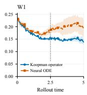

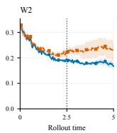

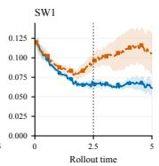

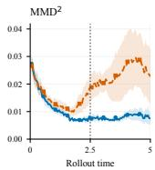  
Figure 5: OU errors averaged over 64 test initial distributions and five seeds. Shading shows one seed standard deviation; the dotted line marks the training boundary. Forecasts start at $t = 0 .$

## 6 CONCLUSION AND LIMITATIONS

DisKO extends deep Koopman learning to population evolution, showing that a shared representation learned from unpaired snapshots can support both accurate distribution extrapolation and the recovery of interpretable decay and oscillation.

Two important theoretical questions remain open. First, under what conditions are the Koopman dynamics identifiable from unpaired distribution snapshots? Second, when identifiability holds, what guarantees can be established for convergence and stability of the proposed learning procedure toward that operator?

## AI USE STATEMENT

We used generative AI tools to assist with code implementation and debugging, including support for baseline implementations, experimental visualization, and language polishing. AI tools were not used to generate research ideas, design the core methodology, formulate the theoretical framework, or produce experimental results. All AI-assisted content was reviewed and verified by the authors, who take full responsibility for the final content.

## ETHICS STATEMENT

This work does not involve new human-subject data collection. Our experiments use synthetic simulations and previously released benchmark datasets, including publicly available single-cell datasets. We do not use participant identifiers or personally identifiable information. Data sources, preprocessing, experimental splits, and evaluation protocols are documented in the paper and appendices. The proposed method is intended for scientific modeling of distribution dynamics; applications in sensitive or high-stakes settings should require appropriate domain-specific validation and safeguards.

## REPRODUCIBILITY STATEMENT

Dataset sources, preprocessing procedures, model architectures, training settings, evaluation protocols, and hyperparameters are documented in the paper and appendix. Additional ablations and supporting results are provided in the appendix.

## REFERENCES

Lazar Atanackovic, Xi (Nicole) Zhang, Brandon Amos, Mathieu Blanchette, Leo J Lee, Yoshua Bengio, Alexander Tong, and Kirill Neklyudov. Meta flow matching: Integrating vector fields on the Wasserstein manifold. In International Conference on Learning Representations, 2025. URL https://proceedings.iclr.cc/paper\_files/paper/2025/hash/ ebdb990471f653dffb425eff03c7c980-Abstract-Conference.html.

Volker Bergen, Marius Lange, Stefan Peidli, F. Alexander Wolf, and Fabian J. Theis. Generalizing RNA velocity to transient cell states through dynamical modeling. Nature Biotechnology, 38(12): 1408–1414, 2020. doi: 10.1038/s41587-020-0591-3.

Nicolas Bonneel, Julien Rabin, Gabriel Peyre, and Hanspeter Pfister. Sliced and Radon Wasserstein´ barycenters of measures. Journal of Mathematical Imaging and Vision, 51:22–45, 2015. doi: 10.1007/s10851-014-0506-3.

Steven L. Brunton, Bingni W. Brunton, Joshua L. Proctor, and J. Nathan Kutz. Koopman invariant subspaces and finite linear representations of nonlinear dynamical systems for control. PLOS ONE, 11(2):e0150171, 2016a. doi: 10.1371/journal.pone.0150171.

Steven L. Brunton, Joshua L. Proctor, and J. Nathan Kutz. Discovering governing equations from data by sparse identification of nonlinear dynamical systems. Proceedings of the National Academy ofSciences, 113(15):3932–3937, 2016b. doi: 10.1073/pnas.1517384113.

Steven L. Brunton, Marko Budisiˇ c, Eurika Kaiser, and J. Nathan Kutz. Modern Koopman theory for´ dynamical systems. SIAM Review, 64(2):229–340, 2022. doi: 10.1137/21M1401243.

Charlotte Bunne, Stefan G. Stark, Gabriele Gut, Jacobo Sarabia del Castillo, Mitch Levesque, Kjong-Van Lehmann, Lucas Pelkmans, Andreas Krause, and Gunnar Ratsch. Learning single-¨ cell perturbation responses using neural optimal transport. Nature Methods, 20(11):1759–1768, 2023. doi: 10.1038/s41592-023-01969-x.

Shuhao Cao. Choose a transformer: Fourier or Galerkin. In Advances in Neural Information Processing Systems, volume 34, 2021. URL https://proceedings.neurips.cc/paper/ 2021/hash/d0921d442ee91b896ad95059d13df618-Abstract.html.

Mattia Cenedese, Joar Axas, Bastian B˚ auerlein, Kerstin Avila, and George Haller. Data-driven¨ modeling and prediction of non-linearizable dynamics via spectral submanifolds. Nature Communications, 13(1):872, 2022. doi: 10.1038/s41467-022-28518-y.

Boyuan Chen, Kuang Huang, Sunand Raghupathi, Ishaan Chandratreya, Qiang Du, and Hod Lipson. Automated discovery of fundamental variables hidden in experimental data. Nature Computational Science, 2(7):433–442, 2022. doi: 10.1038/s43588-022-00281-6.

Matthew J. Colbrook, Igor Mezic, and Alexei Stepanenko. Adversarial dynamical systems charac-´ terize when data-driven learning succeeds or fails. Nature Communications, 17(1):5397, 2026. doi: 10.1038/s41467-026-74220-8.

Klaus-Jochen Engel and Rainer Nagel. One-Parameter Semigroups for Linear Evolution Equations, volume 194 of Graduate Texts in Mathematics. Springer, 2000. doi: 10.1007/b97696.

Mahan Fathi, Clement Gehring, Jonathan Pilault, David Kanaa, Pierre-Luc Bacon, and Ross Goroshin. Course correcting Koopman representations. In International Conference on Learning Representations, 2024. URL https://proceedings.iclr.cc/paper\_files/paper/2024/hash/ 0429ececfb199efc93182990169e73bb-Abstract-Conference.html.

Nic Fishman, Gokul Gowri, Peng Yin, Jonathan Gootenberg, and Omar Abudayyeh. Generative distribution embeddings: Lifting autoencoders to the space of distributions for multiscale representation learning. In Advances in Neural Information Processing Systems, volume 38, pp. 24644–24685, 2025. doi: 10.52202/085713-0830. URL https://proceedings.neurips.cc/paper\_files/paper/2025/hash/ 233b892889d0a18f9da39226ee5c9dc5-Abstract-Conference.html.

Gary Froyland, Dimitrios Giannakis, Benjamin R. Lintner, Maxwell Pike, and Joanna Slawinska. Spectral analysis of climate dynamics with operator-theoretic approaches. Nature Communications, 12(1):6570, 2021. doi: 10.1038/s41467-021-26357-x.

Adam Gayoso, Philipp Weiler, Mohammad Lotfollahi, Dominik Klein, Justin Hong, Aaron Streets, Fabian J. Theis, and Nir Yosef. Deep generative modeling of transcriptional dynamics for RNA velocity analysis in single cells. Nature Methods, 21(1):50–59, 2024. doi: 10.1038/ s41592-023-01994-w.

Arthur Gretton, Karsten M. Borgwardt, Malte J. Rasch, Bernhard Scholkopf, and Alexander Smola.¨ A kernel two-sample test. Journal ofMachine Learning Research, 13(25):723–773, 2012. URL https://jmlr.org/papers/v13/gretton12a.html.

Anming Gu, Edward Chien, and Kristjan Greenewald. Partially observed trajectory inference using optimal transport and a dynamics prior. In International Conference on Learning Representations, 2025. URL https://proceedings.iclr.cc/paper\_files/paper/2025/hash/ 69a076724e7228aba0272305bb98727e-Abstract-Conference.html.

Vincent Guan, Lazar Atanackovic, and Kirill Neklyudov. A call to Lagrangian action: Learning population mechanics from temporal snapshots. In International Conference on Machine Learning, 2026. URL https://arxiv.org/abs/2605.08550.

Doron Haviv, Aram-Alexandre Pooladian, Dana Pe’er, and Brandon Amos. Wasserstein flow matching: Generative modeling over families of distributions. In Proceedings ofthe 42nd International Conference on Machine Learning, volume 267 of Proceedings of Machine Learning Research, pp. 22238–22258, 2025. URL https://proceedings.mlr.press/v267/haviv25a. html.

Guillaume Huguet, Daniel Sumner Magruder, Alexander Tong, Oluwadamilola Fasina, Manik Kuchroo, Guy Wolf, and Smita Krishnaswamy. Manifold interpolating optimal-transport flows for trajectory inference. In Advances in Neural Information Processing Systems, volume 35, 2022. doi: 10.52202/068431-2154.

Minchan Jeong, Jongha (Jon) Ryu, Se-Young Yun, and Gregory Wornell. Efficient parametric SVD of Koopman operator for stochastic dynamical systems. In Advances in Neural Information Processing Systems, volume 38, pp. 25564–25600, 2025. doi: 10.52202/085713-0860. URL https://proceedings.neurips.cc/paper\_files/paper/2025/hash/ 24826a1c623fe41706850748f3dc7370-Abstract-Conference.html.

Dominik Klein, Giovanni Palla, Marius Lange, Michal Klein, Zoe Piran, Manuel Gander, Laetitia Meng-Papaxanthos, Michael Sterr, Lama Saber, Changying Jing, Aimee Bastidas-Ponce, Perla´ Cota, Marta Tarquis-Medina, Shrey Parikh, Ilan Gold, Heiko Lickert, Mostafa Bakhti, Mor Nitzan, Marco Cuturi, and Fabian J. Theis. Mapping cells through time and space with moscot. Nature, 638(8052):1065–1075, 2025. doi: 10.1038/s41586-024-08453-2.

Stefan Klus, Feliks Nuske, Sebastian Peitz, Jan-Hendrik Niemann, Cecilia Clementi, and Christof¨ Schutte. Data-driven approximation of the Koopman generator: Model reduction, system identifi-¨ cation, and control. Physica D: Nonlinear Phenomena, 406:132416, 2020. doi: 10.1016/j.physd. 2020.132416.

Oskar Kviman, Kirill Tamogashev, Nicola Branchini, V´ıctor Elvira, Jens Lagergren, and Nikolay Malkin. Multi-marginal flow matching with adversarially learnt interpolants. In International Conference on Learning Representations, 2026. URL https://proceedings.iclr.cc/paper\_files/paper/2026/hash/ cb0ce861adaf6f8a93069c064733f402-Abstract-Conference.html.

Gioele La Manno, Ruslan Soldatov, Amit Zeisel, Emelie Braun, Hannah Hochgerner, Viktor Petukhov, Katja Lidschreiber, Maria E. Kastriti, Peter Lonnerberg, Alessandro Furlan, Jean Fan,¨ Lars E. Borm, Zehua Liu, David van Bruggen, Jimin Guo, Xiaoling He, Roger Barker, Erik Sundstrom, Gonc¸alo Castelo-Branco, Patrick Cramer, Igor Adameyko, Sten Linnarsson, and¨ Peter V. Kharchenko. RNA velocity of single cells. Nature, 560(7719):494–498, 2018. doi: 10.1038/s41586-018-0414-6.

Juho Lee, Yoonho Lee, Jungtaek Kim, Adam Kosiorek, Seungjin Choi, and Yee Whye Teh. Set transformer: A framework for attention-based permutation-invariant neural networks. In Proceedings of the 36th International Conference on Machine Learning, volume 97 of Proceedings ofMachine Learning Research, pp. 3744–3753, 2019. URL https://proceedings.mlr. press/v97/lee19d.html.

Qianxiao Li, Felix Dietrich, Erik M. Bollt, and Ioannis G. Kevrekidis. Extended dynamic mode decomposition with dictionary learning: A data-driven adaptive spectral decomposition of the Koopman operator. Chaos: An Interdisciplinary Journal of Nonlinear Science, 27(10):103111, 2017. doi: 10.1063/1.4993854.

Yaron Lipman, Ricky T. Q. Chen, Heli Ben-Hamu, Maximilian Nickel, and Matt Le. Flow matching for generative modeling. In International Conference on Learning Representations, 2023. URL https://openreview.net/forum?id=PqvMRDCJT9t.

Wanfeng Lu, He Ma, Wei Lin, and Qunxi Zhu. Interpretable functional Koopman learning with Non-Markovian closure for spatiotemporal systems. In Proceedings of the 43rd International Conference on Machine Learning, 2026. URL https://openreview.net/forum?id= lquDiBCgNJ.

Bethany Lusch, J. Nathan Kutz, and Steven L. Brunton. Deep learning for universal linear embeddings of nonlinear dynamics. Nature Communications, 9:4950, 2018. doi: 10.1038/ s41467-018-07210-0.

Andreas Mardt, Luca Pasquali, Hao Wu, and Frank Noe. VAMPnets for deep learning of molecular´ kinetics. Nature Communications, 9(1):5, 2018. doi: 10.1038/s41467-017-02388-1.

Ilan Naiman, N. Benjamin Erichson, Pu Ren, Michael W Mahoney, and Omri Azencot. Generative modeling of regular and irregular time series data via Koopman VAEs. In International Conference on Learning Representations, 2024. URL https://proceedings.iclr.cc/paper\_files/paper/2024/hash/ dbeb7e621d4a554069a6a775da0f7273-Abstract-Conference.html.

Maria Oprea, Alex Townsend, and Yunan Yang. The distributional Koopman operator for random dynamical systems. Mathematics of Control, Signals, and Systems, 37:769–798, 2025. doi: 10.1007/s00498-025-00423-x.

Mikhail Persiianov, Jiawei Chen, Petr Mokrov, Alexander Tyurin, Evgeny Burnaev, and Alexander Korotin. Learning of population dynamics: Inverse optimization meets JKO scheme. In International Conference on Learning Representations, 2026. URL https://openreview.net/ forum?id=tVJIKd6CLF.

Katarina Petrovic, Lazar Atanackovic, Viggo Moro, Kacper Kapusniak, Ismail Ilkan Cey-´ lan, Michael Bronstein, Joey Bose, and Alexander Tong. Curly flow matching for learning non-gradient field dynamics. In Advances in Neural Information Processing Systems, volume 38, pp. 121544–121573, 2025. doi: 10.52202/085713-4053. URL https://proceedings.neurips.cc/paper\_files/paper/2025/hash/ b00692865928625ace212e89ded2decd-Abstract-Conference.html.

Toma´s Pevn ˇ y and Vojt ´ ech Kova ˇ ˇr´ık. Approximation capability of neural networks on spaces of probability measures and tree-structured domains. arXiv preprint arXiv:1906.00764, 2019. URL https://arxiv.org/abs/1906.00764.

Xiaojie Qiu, Yan Zhang, Jorge D. Martin-Rufino, Chen Weng, Shayan Hosseinzadeh, Dian Yang, Angela N. Pogson, Marco Y. Hein, Kyung Hoi (Joseph) Min, Li Wang, Emanuelle I. Grody, Matthew J. Shurtleff, Ruoshi Yuan, Song Xu, Yian Ma, Joseph M. Replogle, Eric S. Lander, Spyros Darmanis, Ivet Bahar, Vijay G. Sankaran, Jianhua Xing, and Jonathan S. Weissman. Mapping transcriptomic vector fields of single cells. Cell, 185(4):690–711.e45, 2022. doi: 10.1016/j.cell.2021.12.045.

Craig W. Reynolds. Flocks, herds and schools: A distributed behavioral model. In Proceedings of SIGGRAPH ’87, pp. 25–34, 1987. URL https://www.red3d.com/cwr/papers/1987/ boids.html.

Martin Rohbeck, Edward De Brouwer, Charlotte Bunne, Jan-Christian Huetter, Anne Biton, Kelvin Chen, Aviv Regev, and Romain Lopez. Modeling complex system dynamics with flow matching across time and conditions. In International Conference on Learning Representations, 2025. URL https://proceedings.iclr.cc/paper\_files/paper/2025/hash/ 206b764b00195b8c896c5af8bde80726-Abstract-Conference.html.

Jongha Jon Ryu, Xiangxiang Xu, Hasan Sabri Melihcan Erol, Yuheng Bu, Lizhong Zheng, and Gregory W. Wornell. Operator SVD with neural networks via nested low-rank approximation. In Proceedings ofthe 41st International Conference on Machine Learning, volume 235 of Proceedings of Machine Learning Research, pp. 42870–42905, 2024. URL https://proceedings. mlr.press/v235/ryu24b.html.

Geoffrey Schiebinger, Jian Shu, Marcin Tabaka, Brian Cleary, Vidya Subramanian, Aryeh Solomon, Joshua Gould, Siyan Liu, Stacie Lin, Peter Berube, Lia Lee, Jenny Chen, Justin Brumbaugh, Philippe Rigollet, Konrad Hochedlinger, Rudolf Jaenisch, Aviv Regev, and Eric S. Lander. Optimal-transport analysis of single-cell gene expression identifies developmental trajectories in reprogramming. Cell, 176(4):928–943.e22, 2019. doi: 10.1016/j.cell.2019.01.006.

Peter J. Schmid. Dynamic mode decomposition of numerical and experimental data. Journal of Fluid Mechanics, 656:5–28, 2010. doi: 10.1017/S0022112010001217.

Mahmoud Selim, Sriharsha Bhat, and Karl H. Johansson. MetaKoopman: Bayesian meta-learning of Koopman operators for modeling structured dynamics under distribution shifts. In Advances in Neural Information Processing Systems, volume 38, pp. 29551–29584, 2025. doi: 10.52202/ 085713-0989. URL https://proceedings.neurips.cc/paper\_files/paper/ 2025/hash/2a5dd6bad2d10966a8bfa254dfb7dc76-Abstract-Conference. html.

Yutong Sha, Yuchi Qiu, Peijie Zhou, and Qing Nie. Reconstructing growth and dynamic trajectories from single-cell transcriptomics data. Nature Machine Intelligence, 6(1):25–39, 2024. doi: 10. 1038/s42256-023-00763-w.

Antonio Terpin, Nicolas Lanzetti, Mart´ın Gadea, and Florian Dorfler. Learning diffusion at¨ lightspeed. In Advances in Neural Information Processing Systems, volume 37, 2024. doi: 10.52202/079017-0218.

Alexander Tong, Jessie Huang, Guy Wolf, David Van Dijk, and Smita Krishnaswamy. TrajectoryNet: A dynamic optimal transport network for modeling cellular dynamics. In Proceedings of the 37th International Conference on Machine Learning, volume 119 of Proceedings of Machine Learning Research, pp. 9526–9536, 2020. URL https://proceedings.mlr.press/ v119/tong20a.html.

Alexander Tong, Kilian Fatras, Nikolay Malkin, Guillaume Huguet, Yanlei Zhang, Jarrid Rector-Brooks, Guy Wolf, and Yoshua Bengio. Improving and generalizing flow-based generative models with minibatch optimal transport. Transactions on Machine Learning Research, 2024. URL https://openreview.net/forum?id=CD9Snc73AW.

Adrian Veres, Aubrey L. Faust, Henry L. Bushnell, Elise N. Engquist, Jennifer Hyoje-Ryu Kenty, George Harb, Yeh-Chuin Poh, Elad Sintov, Mads Gurtler, Felicia W. Pagliuca, Quinn P. Peterson,¨ and Douglas A. Melton. Charting cellular identity during human in vitro β-cell differentiation. Nature, 569:368–373, 2019. doi: 10.1038/s41586-019-1168-5.

Francisco Villaescusa-Navarro, Daniel Angles-Alc´ azar, Shy Genel, David N. Spergel, Rachel S.´ Somerville, Romeel Dave, Annalisa Pillepich, Lars Hernquist, Dylan Nelson, Paul Torrey, De-´ sika Narayanan, Yin Li, Oliver Philcox, Valentina La Torre, Ana Maria Delgado, Shirley Ho, Sultan Hassan, Blakesley Burkhart, Digvijay Wadekar, Nicholas Battaglia, Gabriella Contardo, and Greg L. Bryan. The CAMELS project: Cosmology and astrophysics with machine-learning simulations. The Astrophysical Journal, 915(1):71, 2021. doi: 10.3847/1538-4357/abf7ba.

Michael E. Vinyard, Anders W. Rasmussen, Ruitong Li, Allon M. Klein, Gad Getz, and Luca Pinello. Learning cell dynamics with neural differential equations. Nature Machine Intelligence, 7(12):1969–1984, 2025. doi: 10.1038/s42256-025-01150-3.

Dongyi Wang, Yuanwei Jiang, Zhenyi Zhang, Xiang Gu, Peijie Zhou, and Jian Sun. Joint velocitygrowth flow matching for single-cell dynamics modeling. In Advances in Neural Information Processing Systems, volume 38, 2025. doi: 10.52202/085713-5363.

Ziyue Wang and Yuko Araki. Functional time series forecasting of distributions: A Koopman-Wasserstein approach. Behaviormetrika, 53:571–597, 2026. doi: 10.1007/s41237-025-00278-1.

Philipp Weiler, Marius Lange, Michal Klein, Dana Pe’er, and Fabian Theis. CellRank 2: unified fate mapping in multiview single-cell data. Nature Methods, 21(7):1196–1205, 2024. doi: 10.1038/ s41592-024-02303-9.

Caleb Weinreb, Alejo Rodriguez-Fraticelli, Fernando D. Camargo, and Allon M. Klein. Lineage tracing on transcriptional landscapes links state to fate during differentiation. Science, 367(6479): eaaw3381, 2020. doi: 10.1126/science.aaw3381.

Matthew O. Williams, Ioannis G. Kevrekidis, and Clarence W. Rowley. A data-driven approximation of the Koopman operator: Extending dynamic mode decomposition. Journal of Nonlinear Science, 25:1307–1346, 2015. doi: 10.1007/s00332-015-9258-5.

Yuanchao Xu, Kaidi Shao, Nikos K. Logothetis, and Zhongwei Shen. ResKoopNet: Learning Koopman representations for complex dynamics with spectral residuals. In Proceedings of the 42nd International Conference on Machine Learning, volume 267 of Proceedings of Machine Learning Research, pp. 69647–69674, 2025. URL https://proceedings.mlr.press/v267/ xu25y.html.

Grace Hui Ting Yeo, Sachit D. Saksena, and David K. Gifford. Generative modeling of single-cell time series with PRESCIENT enables prediction of cell trajectories with interventions. Nature Communications, 12:3222, 2021. doi: 10.1038/s41467-021-23518-w.

Manzil Zaheer, Satwik Kottur, Siamak Ravanbakhsh, Barnabas P´ oczos, Ruslan Salakhutdinov, and´ Alexander J. Smola. Deep sets. In Advances in Neural Information Processing Systems, volume 30, 2017. URL https://arxiv.org/abs/1703.06114.

Jiaqi Zhang, Erica Larschan, Jeremy Bigness, and Ritambhara Singh. scNODE: Generative model for temporal single cell transcriptomic data prediction. Bioinformatics, 40(Supplement 2):ii146– ii154, 2024. doi: 10.1093/bioinformatics/btae393.

Stephen Zhang, Suryanarayana Maddu, Xiaojie Qiu, and Victor Chardes. Inferring stochas-\` tic dynamics with growth from cross-sectional data. In Advances in Neural Information Processing Systems, volume 38, pp. 126512–126545, 2025a. doi: 10.52202/085713-4219. URL https://proceedings.neurips.cc/paper\_files/paper/2025/hash/ b8013bbc033390cce2537ea50e2504e8-Abstract-Conference.html.

Zhenyi Zhang, Tiejun Li, and Peijie Zhou. Learning stochastic dynamics from snapshots through regularized unbalanced optimal transport. In International Conference on Learning Representa tions, 2025b. URL https://arxiv.org/abs/2410.00844.

This appendix provides theoretical foundations, experimental details, and supplementary analyses for DisKO. Appendix A describes the datasets, preprocessing, prediction protocols, and evaluation metrics. Appendix B presents model configurations, training settings, and complete distribution extrapolation results, including error curves and distribution visualizations. Appendix C details the analytical spectral references, the discrete and continuous DisKO implementations, and the evalua tion of recovered eigenvalues and eigenfunctions. Appendices D, E, and F examine latent dynamical consistency, the contribution of Koopman latent dynamics through a Neural ODE comparison, and data efficiency on the OU benchmark, respectively. Appendix G develops the distributional Koopman representation, learned observable spaces and closure, and observation sufficiency and identifiability.

## A EXPERIMENTAL SETUP

## A.1 DATASETS AND PREPROCESSING

Table A.1 summarizes the seven distribution prediction benchmarks. Each sequence comprises temporally ordered empirical distribution snapshots, which DisKO receives as sample sets without individual correspondences between times.

Table A.1: Distribution prediction datasets and temporal partitions. The observation dimension is $p .$ Sequence counts are training/test counts for OU, Duffing, and CAMELS; the other datasets contain one sequence. Snapshot indices start at zero. Sample counts refer to the available data before evaluation subsampling.
<table><tr><td>Dataset</td><td>p</td><td>Sequences</td><td>Snapshots</td><td>Samples/snapshot</td><td>Training</td><td>Future</td></tr><tr><td>OU</td><td>2</td><td>192/64</td><td>101</td><td>1,024</td><td>0-50</td><td>51-100</td></tr><tr><td>Duffing</td><td>2</td><td>192/64</td><td>161</td><td>1,024</td><td>0-80</td><td>81-160</td></tr><tr><td>Boids</td><td>2</td><td>1</td><td>101</td><td>1,000</td><td>0-50</td><td>51-100</td></tr><tr><td>Ocean</td><td>2</td><td>1</td><td>11</td><td>400</td><td>0-9</td><td>10</td></tr><tr><td>CAMELS</td><td>10</td><td>21/6</td><td>9</td><td>4,096</td><td>0-5</td><td>6-8</td></tr><tr><td>Pancreas</td><td>30</td><td>1</td><td>8</td><td>3,562–12,477</td><td>0-5</td><td>6-7</td></tr><tr><td>WOT iPSC</td><td>50</td><td>1</td><td>39</td><td>1,956–12,416</td><td>0-32</td><td>33-38</td></tr></table>

Ornstein–Uhlenbeck (OU). The two-dimensional process satisfies

$$
d X _ { t } = F X _ { t } d t + G d W _ { t } , \qquad F = \left( \begin{array} { c c } { { - 0 . 2 5 } } & { { - 2 } } \\ { { 2 } } & { { - 0 . 2 5 } } \end{array} \right) , \qquad G = \left( \begin{array} { c c } { { 0 . 3 5 } } & { { 0 } } \\ { { 0 } } & { { 0 . 1 5 } } \end{array} \right) .\tag{14}
$$

Initial distributions are Gaussian mixtures with one, two, or three components. Component means are sampled uniformly from $[ - 2 , 2 ] ^ { 2 }$ , principal standard deviations from [0.10, 0.35], and covariance orientations uniformly over a full rotation; mixture weights follow a symmetric Dirichlet distribution with concentration one. Each Gaussian component is propagated using its exact mean and covariance evolution, and 1,024 samples are drawn independently at each observation time. Snapshots are spaced by 0.05, with training through 2.5 and extrapolation over [2.55, 5].

Duffing. The stochastic double-well oscillator is

$$
d x _ { t } = v _ { t } d t , d v _ { t } = ( x _ { t } - x _ { t } ^ { 3 } - 0 . 4 v _ { t } ) d t + 0 . 3 5 d W _ { t } ,\tag{15}
$$

with observed state $( x _ { t } , v _ { t } )$ . We set mutilple initial laws, each corresponding to a different Gaussian distribution. For each law, 64 independent population simulations are generated with 5,000 particles using Euler–Maruyama integration at step size 0.005. Each saved snapshot contains 1,024 randomly selected particles, with sample order shuffled across times. Observations are spaced by 0.05 over $[ 0 , 8 ]$ ; training ends at 4 and extrapolation covers 4.05 to 8. The training and test sequence split assesses predictions for independently sampled populations from these initial laws.

Boids and Ocean. Boids contains the planar positions of 1,000 interacting agents governed by cohesion, separation, and alignment rules with a confining boundary, following the flocking model of Reynolds (1987). Snapshots are spaced by 0.5, with training over [0, 25] and extrapolation over [25.5, 50]. Ocean uses the large-vortex Gulf of Mexico benchmark distributed with WLM (Guan et al., 2026), based on a HYCOM ocean velocity field. Its time coordinate is the snapshot index, with observations 0 through 9 used for training and observation 10 for extrapolation. Both benchmarks are evaluated in planar position space.

CAMELS. We use 27 IllustrisTNG simulations from the cosmic variance set of CAMELS (Villaescusa-Navarro et al., 2021), with fixed cosmological parameters and different random initial conditions. Each sequence contains nine halo population snapshots, parameterized by the cosmological scale factor a. The observed ten-dimensional state comprises six periodic position coordinates $\{ \sin ( 2 \pi x _ { j } / L ) , \cos ( 2 \pi x _ { j } / L ) \} _ { j = 1 } ^ { 3 }$ , three velocity components, and $\log _ { 1 0 } M _ { 2 0 0 c }$ , with box size $L = 2 5 \mathrm { M p c } / h$ and halo mass in $\dot { M _ { \odot } } / h$ . Halos with positive mass and finite position and velocity are retained, and 4,096 are sampled without replacement per snapshot. The first six scale factors, approximately 0.143, 0.200, 0.263, 0.333, 0.423, and 0.537, form the training interval; predictions are evaluated at approximately 0.682, 0.866, and 1. The sequence split contains 21 training simulations and six test simulations, with no validation partition.

Pancreas. This benchmark describes human pancreatic β-cell differentiation (Veres et al., 2019). We use the preprocessed 30-dimensional representation released with DeepRUOTv2.1 The resulting dataset contains 51,274 cells across eight ordered observations, with 6,190, 6,177, 3,562, 12,477, $6 , 4 8 0 , 6 , 4 0 4 , 6 , 0 1 3$ , and 3,971 cells, respectively. The supplied representation is used directly, and the observation index provides the time coordinate. The first six observations are used for training, and the final two for extrapolation.

WOT iPSC. The WOT reprogramming dataset tracks population changes during the induction of pluripotent stem cells (Schiebinger et al., 2019). Our processed dataset contains 236,285 cells at 39 observation times between day 0 and day 18. The 50-dimensional representation is obtained by PCA or truncated singular value decomposition fitted to cells pooled across observation times in training set. Training uses the 33 observations through day 15, and extrapolation uses the remaining six observations from day 15.5 through day 18. The recorded observation times are used in propagation, including the irregular sampling times within the training interval.

Circle and Torus. These synthetic systems provide analytical reference spectra for dynamical validation. On the circle, the angular process follows $d \theta _ { t } = \omega d t + { \sqrt { 2 \kappa } } d W _ { t }$ modulo 2π, with $\omega = 1$ and $\kappa = 0 . 0 1$ , and observations are (cos $\theta _ { t }$ , sin $\theta _ { t } )$ . On the torus, two independent angular processes have $( \omega _ { 1 } , \omega _ { 2 } ) = ( 1 , 1 . 7 )$ and $( \kappa _ { 1 } , \kappa _ { 2 } ) = ( 0 . 0 1 , 0 . 0 1 4 )$ , with observations given by the sine and cosine of each angle. Initial laws are mixtures of wrapped Gaussians. Both systems are observed every 0.1 time units over [0, 12], with training through time 8. For $\begin{array} { r } { h _ { k } ( \mu ) = \int \hat { e ^ { \mathrm { i } k \cdot \theta } } d \mu ( \theta ) } \end{array}$ the distributional generator eigenvalue is

$$
\lambda _ { k } = - \sum _ { j } \kappa _ { j } k _ { j } ^ { 2 } + \mathrm { i } \sum _ { j } \omega _ { j } k _ { j } ,\tag{16}
$$

where $k$ is an integer on the circle and an integer pair on the torus. These reference modes permit direct assessment of learned oscillation frequencies and decay rates.

## A.2 PREDICTION PROTOCOL

The initial distribution and time partitions follow Section 3.1. OU, Duffing, and CAMELS have distinct training and test sequences, allowing evaluation of all four combinations of initial distribution split and time window. Boids, Ocean, Pancreas, and WOT iPSC contain a single sequence and use a temporal partition. For these datasets, Table B.3 reports predictions within the training window, and Table B.6 reports temporal extrapolation.

Every prediction is conditioned on the earliest snapshot of the sequence being evaluated. For a target time $t _ { k } ,$ , DisKO encodes $\widehat { \nu } _ { t _ { 0 } } ^ { ( r ) }$ and generates samples from $D ( F _ { t _ { k } - t _ { 0 } } ( E ( \widehat { \nu } _ { t _ { 0 } } ^ { ( r ) } ) ) )$ . Training-window scores also measure prediction from this initial snapshot. For a test sequence, its first snapshot is available as input; subsequent observations are used only for evaluation, with no updates from intervening targets. Time increments use the dataset’s stated coordinate, including the source scale factor a ≈ 0.143 in CAMELS.

For DisKO, coordinatewise means and standard deviations are estimated using only training sequences within the training time window and then fixed for prediction. Both single-cell datasets follow this standardization procedure. Evaluation uses predictions transformed back to the input coordinates, which are the reduced representations for Pancreas and WOT iPSC. Errors are computed separately for each sequence and target time and then averaged over the relevant sequence and temporal partition.

## A.3 EVALUATION METRICS

W1, SW1, W2, and squared maximum mean discrepancy quantify prediction errors, with smaller values indicating closer agreement. Table A.2 gives the standard sampling budgets. Sampling uses replacement when a snapshot contains fewer points than required. Evaluation sampling and random projections use seed zero, with separate random streams for each dataset, initial distribution split, population, prediction horizon, and sampling operation, independently of training randomness.

Table A.2: Standard evaluation sample counts per distribution. SW1 uses the full evaluation sample and 128 projection directions; $\mathrm { { \bf M M D } ^ { 2 } }$ uses at most 512 samples per distribution. The DeepRUOT evaluations on Pancreas and CAMELS use the weighted configuration described below.
<table><tr><td>Dataset</td><td>Evaluation samples</td><td>W1/W2 sample limit</td></tr><tr><td>OU, Duffing, Ocean</td><td>512</td><td>256</td></tr><tr><td>Boids</td><td>1,000</td><td>256</td></tr><tr><td>CAMELS, Pancreas, WOT iPSC</td><td>1,024</td><td>512</td></tr></table>

Wasserstein distances. Let $\{ \widetilde { y } _ { i } \} _ { i = 1 } ^ { n }$ and $\{ y _ { i } \} _ { i = 1 } ^ { n }$ denote equally sized samples from the predicted and target distributions. For $q \in \{ 1 , 2 \}$ , we compute

$$
\widehat { W } _ { q } = \left( \frac { 1 } { n } \operatorname* { m i n } _ { \pi \in \mathfrak { S } _ { n } } \sum _ { i = 1 } ^ { n } \| \widetilde { y } _ { i } - y _ { \pi ( i ) } \| _ { 2 } ^ { q } \right) ^ { 1 / q } ,\tag{17}
$$

where ${ \mathfrak { S } } _ { n }$ is the set of permutations of n elements. The sample count is the minimum of the prescribed transport limit and the available counts on both sides. The two matching problems use Euclidean and squared Euclidean costs, respectively, and are solved without entropic regularization.

Sliced Wasserstein distance. Following Bonneel et al. (2015), we approximate the first-order sliced distance using $L = 1 2 8$ independent directions $u _ { \ell }$ obtained by normalizing standard Gaussian vectors in $\mathbb { R } ^ { p } . \mathrm { ~ H ~ } \widetilde { s } _ { \ell , ( i ) }$ and $s _ { \ell , ( i ) }$ are the sorted projections of the predicted and target samples onto $u _ { \ell }$ , then

$$
\widehat { \mathrm { S W } } _ { 1 } = \frac { 1 } { L n } \sum _ { \ell = 1 } ^ { L } \sum _ { i = 1 } ^ { n } | \widetilde { s } _ { \ell , ( i ) } - s _ { \ell , ( i ) } | .\tag{18}
$$

Here n is the smaller of the two evaluation sample counts, using the full balanced sample before the optimal transport limit is applied.

Maximum mean discrepancy. We use the Gaussian kernel $k _ { \sigma } ( y , y ^ { \prime } ) = \exp ( - \| y - y ^ { \prime } \| _ { 2 } ^ { 2 } / ( 2 \sigma ^ { 2 } ) )$ and the biased squared estimator (Gretton et al., 2012)

$$
\widehat { \mathrm { M M D } } ^ { 2 } = \frac { 1 } { n ^ { 2 } } \sum _ { i , j = 1 } ^ { n } k _ { \sigma } ( \widetilde { y } _ { i } , \widetilde { y } _ { j } ) + \frac { 1 } { n ^ { 2 } } \sum _ { i , j = 1 } ^ { n } k _ { \sigma } ( y _ { i } , y _ { j } ) - \frac { 2 } { n ^ { 2 } } \sum _ { i , j = 1 } ^ { n } k _ { \sigma } ( \widetilde { y } _ { i } , y _ { j } ) .\tag{19}
$$

This estimator includes diagonal terms and uses the first $n = \mathrm { m i n } ( N _ { \mathrm { p r e d } } , N _ { \mathrm { t a r g e t } } , 5 1 2 )$ points of each evaluation sample, where $N _ { \mathrm { p r e d } }$ and $N _ { \mathrm { t a r g e t } }$ are the two available sample counts. The bandwidth σ is the median pairwise Euclidean distance exceeding $1 0 ^ { - 1 2 }$ in the pooled predicted and target sample, with $\sigma = 1$ when no such distance exists. Entries labeled MMD in the result tables report this squared quantity.

Weighted evaluation for DeepRUOT. On Pancreas and CAMELS, DeepRUOT retains particle masses estimated by its growth model, normalized to total mass one. Evaluation uses 1,024 samples per distribution, weighted optimal transport with all samples for W1/W2, and 128 directions for SW1. MMD2 also uses all 1,024 samples, with bandwidth determined by the target sample alone. These entries therefore use a larger transport budget and a different kernel bandwidth convention than the standard configuration.

## B DISTRIBUTION EXTRAPOLATION EXPERIMENTS

Model architecture and implementation settings. All datasets use a DeepSets encoder, continuous affine latent dynamics, and a conditional flow matching decoder. Table B.1 summarizes the state dimension, encoder depth, network width, latent dimension, and decoder depth for each dataset.

Table B.1: DisKO model configurations for the distribution extrapolation benchmarks. Enc. and Dec. denote encoder and decoder, respectively.
<table><tr><td>Dataset</td><td>State dim.</td><td>Enc. depth</td><td>Width</td><td>Latent dim.</td><td>Dec. depth</td></tr><tr><td>OU</td><td>2</td><td>3</td><td>128</td><td>32</td><td>4</td></tr><tr><td>Duffing</td><td>2</td><td>3</td><td>256</td><td>64</td><td>8</td></tr><tr><td>Boids</td><td>2</td><td>4</td><td>512</td><td>32</td><td>4</td></tr><tr><td>Ocean</td><td>2</td><td>3</td><td>128</td><td>32</td><td>4</td></tr><tr><td>CAMELS</td><td>10</td><td>3</td><td>256</td><td>64</td><td>8</td></tr><tr><td>Pancreas</td><td>30</td><td>3</td><td>256</td><td>96</td><td>8</td></tr><tr><td>WOT iPSC</td><td>50</td><td>3</td><td>128</td><td>64</td><td>4</td></tr></table>

Training procedure. Each training pair comprises two snapshots $( S _ { s } , S _ { t } )$ from the same sequence. We sample a valid source index uniformly, then a positive snapshot lag uniformly among those whose target remains in the training window. Particle subsets are sampled independently, and propagation uses the actual time difference $t - s .$ . Training uses varying source times; evaluation starts from the initial snapshot (Appendix A.2). We first pretrain $E _ { \theta } , D _ { \psi }$ on individual training snapshots using the conditional flow matching reconstruction loss in Equation 8, with dynamics fixed. We then freeze both networks and update only $A , c ,$ minimizing the mean squared difference between $F _ { t - s } ( E _ { \theta } ( S _ { s } ) )$ ) and $E _ { \theta } ( S _ { t } )$ . Finally, we jointly update all three modules using the prediction, reconstruction, latent consistency, and distribution losses in Equation 11. The prediction branch conditions the decoder on the propagated encoding; the reconstruction branch uses the directly encoded target. Target encodings are detached only in the latent consistency term, so reconstruction continues to train the encoder. Each stage uses a fresh AdamW optimizer with gradient norm clipping. Table B.2 specifies stage budgets, learning rates, batch sizes, snapshot sample counts, and loss weights. The discrete variant initializes its operator by ridge regression and alternates encoder and decoder updates with operator refitting, as detailed in Appendix C.2.

Table B.2 reports the training and inference settings. The stage order pre/dyn/joint denotes encoder and decoder pretraining, latent dynamics fitting with the encoder and decoder fixed, and joint optimization, following Section 4.4. Batch denotes the training batch size, and samples/snapshot is the number of samples used from each snapshot during training. The endpoint/inference entries give the numbers of decoder integration steps used for endpoint supervision during training and for sample generation at inference, respectively.

Loss weights are listed in the order prediction FM, oracle FM, latent consistency, and endpoint distribution loss, followed after the semicolon by the MMD and moment weights,

$$
\lambda _ { \mathrm { p r e d } } / \lambda _ { \mathrm { r e c } } / \lambda _ { \mathrm { l a t } } / \lambda _ { \mathrm { d i s t } } ; \beta / \gamma .
$$

Here oracle FM is the reconstruction objective $\mathcal { I } _ { \mathrm { r e c } }$ in Equation 9, which conditions the decoder on the encoded target snapshot. The endpoint loss $\mathcal { I } _ { \mathrm { d i s t } }$ uses $\mathrm { S W } _ { 1 } + \beta \mathrm { M M D } ^ { 2 } + \gamma d _ { \mathrm { m o m } }$ , as defined in

Equation 10; its contribution to the joint objective is weighted by $\lambda _ { \mathrm { d i s t } }$ . Duffing and Pancreas use $W _ { 1 }$ for the endpoint discrepancy, with the same outer weight $\lambda _ { \mathrm { d i s t } }$ . The dashes in their MMD and moment entries indicate that these two terms are not used.

Table B.2: DisKO training and inference settings. Stage updates and learning rates follow the order pre/dyn/joint. The two panels report complementary settings for the same seven datasets. Loss weights follow the order specified in the text.  
(a) Optimization and training samples
<table><tr><td>Dataset</td><td>Stage updates  $( \times 1 0 ^ { 3 } )$ </td><td>Stage learning rates  $( \times 1 0 ^ { - 4 } )$ </td><td>Batch</td><td>Samples/ snapshot</td></tr><tr><td>OU</td><td> $1 0 / 1 / 2 . 5$ </td><td> $3 / 3 / 3$ </td><td>4</td><td>512</td></tr><tr><td>Duffing</td><td> $3 0 / 3 / 1 5$ </td><td> $3 / 3 { \dot { / } } 3$ </td><td>4</td><td>512</td></tr><tr><td>Boids</td><td> $3 0 / 3 0 / 7 5$ </td><td> $3 / 1 \dot { / } 1$ </td><td>4</td><td>512</td></tr><tr><td>Ocean</td><td> $1 0 ^ { ' } / 1 0 ^ { ' } / 2 0$ </td><td> $3 / 1 \dot { / } 1$ </td><td>4</td><td>400</td></tr><tr><td>CAMELS</td><td> $4 0 / 3 / 1 5$ </td><td> $3 / 3 { \dot { / } } 3$ </td><td>4</td><td>1024</td></tr><tr><td>Pancreas</td><td> $6 0 ^ { ' } / 3 ^ { ' } / 2 4$ </td><td> $3 / 3 / 3$ </td><td>8</td><td>512</td></tr><tr><td>WOT iPSC</td><td> $1 5 / 1 . 5 / 4$ </td><td> $3 / 3 { \dot { / } } 3$ </td><td>8</td><td>512</td></tr></table>

(b) Loss weights and decoder integration
<table><tr><td>Dataset</td><td>Loss weights</td><td>Endpoint loss</td><td>Endpoint/ inference steps</td></tr><tr><td>OU</td><td> $1 / . 5 / . 0 5 / . 2 ; . 2 5 / . 5$ </td><td> $\mathcal { I } _ { \mathrm { d i s t } }$ </td><td> $8 / 3 2$ </td></tr><tr><td>Duffing</td><td> $1 / . 5 / . 0 5 / . 2 ; - / -$ </td><td> $W _ { 1 }$ </td><td> $8 / 3 2$ </td></tr><tr><td>Boids</td><td> $1 / \dot { . } 2 5 / . 0 5 / . 5 ; . 1 / 1$ </td><td> $\mathcal { I } _ { \mathrm { d i s t } }$ </td><td>16/32</td></tr><tr><td>Ocean</td><td> $1 \dot { / } . 5 / . 2 / . 2 ; . 2 5 / . 5$ </td><td> $\mathcal { I } _ { \mathrm { d i s t } }$ </td><td>8/32</td></tr><tr><td>CAMELS</td><td> $1 \dot { / } . 5 \dot { / } . 0 \dot { 5 } / . 2 ; . 2 \dot { 5 } / . 5$ </td><td> $\mathcal { I } _ { \mathrm { d i s t } }$ </td><td>8/32</td></tr><tr><td>Pancreas</td><td> $1 / . 5 / . 0 5 / . 2 ; - / -$ </td><td> $W _ { 1 }$ </td><td>8/32</td></tr><tr><td>WOT iPSC</td><td> $1 / . 5 / . 0 5 / . 2 ; . 2 5 / . 5$ </td><td> $\mathcal { I } _ { \mathrm { d i s t } }$ </td><td>8/32</td></tr></table>

Prediction error across the training and extrapolation intervals. Figure B.1 compares the $W _ { 1 }$ prediction errors of DisKO, DeepRUOT, MIOFlow, and WLM across the training and extrapolation intervals for all seven datasets. Each panel uses prediction step on the horizontal axis and a logarithmic error scale on the vertical axis. Vertical dashed lines mark the final training step, and the shaded regions identify extrapolation. DisKO has the lowest displayed extrapolation errors among these four methods on OU, Duffing, Ocean, Pancreas, and WOT iPSC. Its OU error remains approximately level throughout the future interval, while its Duffing error increases gradually with the prediction horizon. For Ocean, the error increases from the final training step at step 9 to the single future target at step 10, while remaining below the three comparison methods. The Pancreas and WOT iPSC panels likewise show lower future errors for DisKO despite some increase beyond the training boundary.

CAMELS and Boids exhibit closer comparisons between DisKO and WLM. On CAMELS, errors increase with the prediction horizon for all four methods; DisKO and WLM remain close near the end of the interval and finish below DeepRUOT and MIOFlow.

W1 prediction error across training and extrapolation intervals  
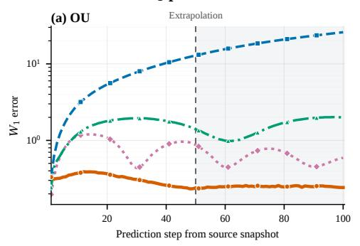

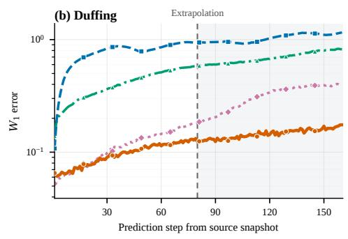

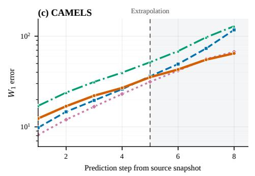

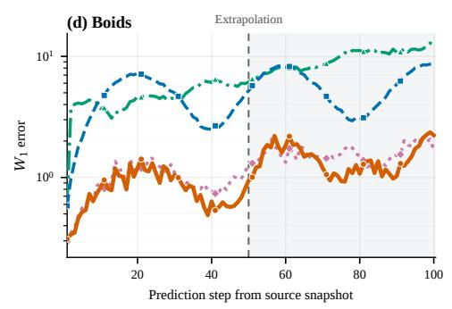

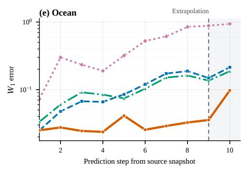

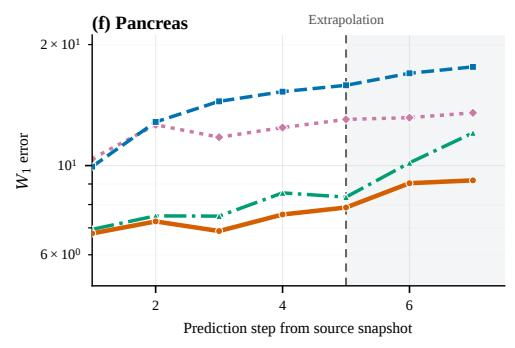

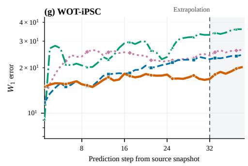  
Figure B.1: $W _ { 1 }$ prediction error across the training and extrapolation intervals for (a) OU, (b) Duffing, (c) CAMELS, (d) Boids, (e) Ocean, (f) Pancreas, and (g) WOT iPSC. Curves compare DisKO, DeepRUOT, MIOFlow, and WLM. Vertical dashed lines mark the training boundary, and shaded regions indicate extrapolation.

Tables B.3 through B.6 provide the complete aggregate numerical results for W1, SW1, W2, and MMD across the four combinations of time window and initial distribution split. These supporting tables retain all eight baselines and DisKO.

Table B.3: Prediction within the training time window for training initial distributions and single sequences. Boids, Ocean, Pancreas, and WOT iPSC each contain a single population sequence and use only a temporal partition. Means and standard deviations are rounded to three decimal places. Red and blue mark the lowest and second lowest means before rounding.
<table><tr><td>Method</td><td>Metric</td><td>OU</td><td>Duffing</td><td>Boids</td><td>Ocean</td><td>CAMELS</td><td>Pancreas</td><td>WOT iPSC</td></tr><tr><td rowspan="4">TrajectoryNet</td><td> $W _ { 1 }$ </td><td> $1 . 5 3 6 { \scriptstyle \pm 0 . 0 2 6 }$ </td><td> $0 . 7 8 8 { \scriptstyle \pm 0 . 0 6 7 }$ </td><td> $4 . 7 1 5 { \scriptstyle \pm 0 . 1 3 1 }$ </td><td> $1 . 5 0 8 { \scriptstyle \pm 0 . 0 9 8 }$ </td><td> $4 6 . 2 7 6 { \scriptstyle \pm 0 . 1 8 6 }$ </td><td> $2 0 . 4 2 3 { \scriptstyle \pm 0 . 4 9 7 }$ </td><td> $3 5 . 1 6 6 { \scriptstyle \pm 1 . 3 5 7 }$ </td></tr><tr><td>SW1</td><td> $0 . 9 5 6 _ { \pm 0 . 0 2 9 }$ </td><td> $0 . 4 9 3 _ { \pm 0 . 0 5 3 }$ </td><td> $2 . 7 5 8 _ { \pm 0 . 3 0 8 }$ </td><td> $0 . 9 7 9 _ { \pm 0 . 0 7 6 }$ </td><td> $1 1 . 7 5 8 { \scriptstyle \pm 0 . 3 3 3 }$ </td><td> $2 . 4 8 8 _ { \pm 0 . 2 0 1 }$ </td><td> $2 . 8 4 7 _ { \pm 0 . 2 9 1 }$ </td></tr><tr><td> $W _ { 2 }$ </td><td> $1 . 5 9 2 _ { \pm 0 . 0 2 7 }$ </td><td> $0 . 8 4 3 _ { \pm 0 . 0 5 7 }$ </td><td> $5 . 5 9 5 _ { \pm 0 . 1 3 5 }$ </td><td> $1 . 5 1 3 _ { \pm 0 . 0 9 7 }$ </td><td> $5 2 . 4 7 3 _ { \pm 0 . 2 6 8 }$ </td><td> $2 0 . 9 8 4 _ { \pm 0 . 5 3 9 }$ </td><td> $5 4 . 7 2 1 { \scriptstyle \pm 2 . 0 5 0 }$ </td></tr><tr><td>MMD</td><td> $0 . 8 1 3 { \scriptstyle \pm 0 . 0 1 5 }$ </td><td> $0 . 6 2 1 { \scriptstyle \pm 0 . 1 0 2 }$ </td><td> $0 . 2 6 4 { \scriptstyle \pm 0 . 0 4 4 }$ </td><td> $1 . 0 0 2 { \scriptstyle \pm 0 . 0 3 8 }$ </td><td> $0 . 1 7 5 { \scriptstyle \pm 0 . 0 0 8 }$ </td><td> $0 . 3 2 9 { \scriptstyle \pm 0 . 0 5 4 }$ </td><td> $0 . 6 6 6 { \scriptstyle \pm 0 . 0 9 9 }$ </td></tr><tr><td rowspan="4">DeepRUOT</td><td> $W _ { 1 }$ </td><td> $1 . 2 2 1 _ { \pm 0 . 0 2 0 }$ </td><td> $0 . 7 7 3 _ { \pm 0 . 1 4 5 }$ </td><td>4.342±0.546</td><td> $0 . 1 0 2 _ { \pm 0 . 0 3 1 }$ </td><td> $2 0 . 7 8 4 _ { \pm 0 . 0 8 4 }$ </td><td> $1 3 . 6 6 9 _ { \pm 1 . 0 9 6 }$ </td><td> $1 8 . 6 4 8 { \scriptstyle \pm 1 . 0 5 3 }$ </td></tr><tr><td>SW1</td><td> $0 . 7 6 8 _ { \pm 0 . 0 2 4 }$ </td><td> $0 . 4 8 4 _ { \pm 0 . 0 9 1 }$ </td><td> $2 . 7 1 5 { \scriptstyle \pm 0 . 3 5 8 }$ </td><td> $0 . 0 6 4 _ { \pm 0 . 0 2 0 }$ </td><td> $3 . 6 8 3 _ { \pm 0 . 1 0 3 }$ </td><td> $1 . 3 4 0 _ { \pm 0 . 3 1 9 }$ </td><td> $1 . 4 4 1 _ { \pm 0 . 1 7 8 }$ </td></tr><tr><td> $W _ { 2 }$ </td><td> $1 . 2 8 2 _ { \pm 0 . 0 2 1 }$ </td><td> $0 . 8 2 7 { \scriptstyle \pm 0 . 1 4 7 }$ </td><td> $4 . 8 1 6 _ { \pm 0 . 4 8 8 }$ </td><td> $0 . 1 1 7 _ { \pm 0 . 0 2 8 }$ </td><td> $2 5 . 4 7 9 _ { \pm 0 . 1 3 5 }$ </td><td> $1 4 . 7 1 4 { \scriptstyle \pm 2 . 0 3 0 }$ </td><td>18.847±1.069</td></tr><tr><td>MMD</td><td> $0 . 6 3 8 { \scriptstyle \pm 0 . 0 1 3 }$ </td><td> $0 . 5 1 0 { \scriptstyle \pm 0 . 1 3 7 }$ </td><td> $0 . 2 4 5 { \scriptstyle \pm 0 . 0 4 7 }$ </td><td> $0 . 3 0 5 { \scriptstyle \pm 0 . 1 1 8 }$ </td><td> $0 . 0 1 6 { \scriptstyle \pm 0 . 0 0 1 }$ </td><td> $0 . 0 7 9 { \scriptstyle \pm 0 . 0 4 3 }$ </td><td> $0 . 1 5 7 { \scriptstyle \pm 0 . 0 4 1 }$ </td></tr><tr><td rowspan="4">VGFM</td><td> $W _ { 1 }$ </td><td> $1 . 1 8 4 _ { \pm 0 . 0 9 9 }$ </td><td> $0 . 4 3 1 { \scriptstyle \pm 0 . 1 8 4 }$ </td><td> $2 . 7 3 6 { \scriptstyle \pm 0 . 6 6 7 }$ </td><td> $0 . 0 5 5 { \scriptstyle \pm 0 . 0 0 6 }$ </td><td> $2 9 . 7 5 1 _ { \pm 1 . 3 5 3 }$ </td><td> $1 2 . 1 8 3 _ { \pm 0 . 8 4 5 }$ </td><td> $3 3 . 8 3 6 _ { \pm 1 . 5 7 8 }$ </td></tr><tr><td>SW1</td><td> $0 . 7 3 3 { \scriptstyle \pm 0 . 0 6 4 }$ </td><td> $0 . 2 5 8 { \scriptstyle \pm 0 . 1 1 4 }$ </td><td> $1 . 6 0 1 { \scriptstyle \pm 0 . 5 1 0 }$ </td><td> $0 . 0 3 2 { \scriptstyle \pm 0 . 0 0 3 }$ </td><td> $5 . 8 6 4 _ { \pm 0 . 7 1 9 }$ </td><td> $0 . 7 9 6 { \scriptstyle \pm 0 . 0 7 2 }$ </td><td> $2 . 5 9 1 { \scriptstyle \pm 0 . 9 5 8 }$ </td></tr><tr><td> $W _ { 2 }$ </td><td> $1 . 2 3 7 _ { \pm 0 . 0 9 9 }$ </td><td> $0 . 5 4 2 _ { \pm 0 . 2 0 1 }$ </td><td> $3 . 2 7 0 { \scriptstyle \pm 0 . 7 4 6 }$ </td><td> $0 . 0 6 6 _ { \pm 0 . 0 0 6 }$ </td><td> $3 5 . 3 3 7 { \scriptstyle \pm 1 . 4 3 3 }$ </td><td> $1 4 . 0 9 9 _ { \pm 1 . 2 9 4 }$ </td><td> $1 9 0 . 2 1 3 { \scriptstyle \pm 1 . 0 6 3 }$ </td></tr><tr><td>MMD</td><td> $0 . 5 8 2 { \scriptstyle \pm 0 . 0 4 2 }$ </td><td> $0 . 1 0 8 { \scriptstyle \pm 0 . 0 4 4 }$ </td><td></td><td></td><td>0.084±0.047 0.072±0.012 0.028±0.020</td><td> $0 . 0 3 3 { \scriptstyle \pm 0 . 0 1 4 }$ </td><td> $0 . 0 7 7 { \scriptstyle \pm 0 . 0 2 9 }$ </td></tr><tr><td rowspan="4">MIOFlow</td><td> $W _ { 1 }$ </td><td> $1 . 4 6 2 _ { \pm 0 . 0 4 7 }$ </td><td> $0 . 4 1 2 _ { \pm 0 . 0 7 8 }$ </td><td> $4 . 7 0 3 _ { \pm 0 . 9 8 8 }$ </td><td> $0 . 0 9 9 _ { \pm 0 . 0 2 1 }$ </td><td> $3 2 . 1 4 7 _ { \pm 0 . 7 3 3 }$ </td><td> $7 . 7 6 5 _ { \pm 0 . 1 6 6 }$ </td><td> $2 5 . 9 9 4 _ { \pm 0 . 6 7 3 }$ </td></tr><tr><td>SW1</td><td> $0 . 9 1 1 { \scriptstyle \pm 0 . 0 3 0 }$ </td><td> $0 . 2 5 2 _ { \pm 0 . 0 5 1 }$ </td><td> $2 . 8 1 1 { \scriptstyle \pm 0 . 4 0 4 }$ </td><td> $0 . 0 6 3 { \scriptstyle \pm 0 . 0 1 4 }$ </td><td> $7 . 5 2 7 { \scriptstyle \pm 0 . 2 1 5 }$ </td><td> $0 . 4 6 2 { \scriptstyle \pm 0 . 0 3 8 }$ </td><td> $2 . 5 3 3 { \scriptstyle \pm 0 . 1 0 8 }$ </td></tr><tr><td> $W _ { 2 }$ </td><td> $1 . 5 2 2 _ { \pm 0 . 0 5 0 }$ </td><td> $0 . 4 6 7 _ { \pm 0 . 0 8 5 }$ </td><td> $5 . 7 2 3 _ { \pm 0 . 5 7 9 }$ </td><td> $0 . 1 1 6 _ { \pm 0 . 0 2 4 }$ </td><td> $3 7 . 4 7 1 { \scriptstyle \pm 0 . 5 9 9 }$ </td><td> $8 . 3 2 1 { \scriptstyle \pm 0 . 1 8 7 }$ </td><td>26.271±0.691</td></tr><tr><td>MMD</td><td> $0 . 6 9 2 _ { \pm 0 . 0 0 7 }$ </td><td> $0 . 1 8 8 { \scriptstyle \pm 0 . 0 6 6 }$ </td><td> $0 . 1 5 6 { \scriptstyle \pm 0 . 0 6 3 }$ </td><td> $0 . 2 7 8 { \scriptstyle \pm 0 . 0 8 5 }$ </td><td> $0 . 0 7 7 { \scriptstyle \pm 0 . 0 0 2 }$ </td><td> $0 . 0 0 9 { \scriptstyle \pm 0 . 0 0 2 }$ </td><td> $0 . 3 5 8 { \scriptstyle \pm 0 . 0 3 5 }$ </td></tr><tr><td rowspan="4">scNODE</td><td> $W _ { 1 }$ </td><td> $1 . 1 9 1 _ { \pm 0 . 0 4 3 }$ </td><td> $0 . 8 3 4 _ { \pm 0 . 0 9 7 }$ </td><td> $4 . 7 9 6 _ { \pm 0 . 0 5 7 }$ </td><td> $0 . 7 8 2 _ { \pm 0 . 1 0 5 }$ </td><td> $5 3 . 8 6 9 _ { \pm 2 . 6 3 5 }$ </td><td> $2 0 . 5 1 1 { \scriptstyle \pm 1 . 8 6 2 }$ </td><td> $4 3 . 2 4 6 _ { \pm 1 . 1 2 9 }$ </td></tr><tr><td>SW1</td><td> $0 . 7 5 0 { \scriptstyle \pm 0 . 0 2 8 }$ </td><td>0.520±0.072 2.750±0.033 0.508±0.063</td><td></td><td></td><td> $1 3 . 1 0 3 _ { \pm 0 . 8 9 1 }$ </td><td> $2 . 5 0 5 { \scriptstyle \pm 0 . 5 0 9 }$ </td><td> $4 . 7 1 5 { \scriptstyle \pm 0 . 7 5 9 }$ </td></tr><tr><td> $W _ { 2 }$ </td><td> $1 . 2 5 3 _ { \pm 0 . 0 4 2 }$ </td><td> $0 . 8 8 8 _ { \pm 0 . 0 7 8 }$ </td><td> $5 . 5 7 7 { \scriptstyle \pm 0 . 1 0 7 }$ </td><td> $0 . 7 8 7 _ { \pm 0 . 1 0 4 }$ </td><td> $6 0 . 3 3 0 { \scriptstyle \pm 2 . 8 2 3 }$ </td><td> $2 1 . 0 6 4 _ { \pm 2 . 1 6 2 }$ </td><td> $4 3 . 3 7 7 _ { \pm 1 . 0 5 7 }$ </td></tr><tr><td>MMD</td><td> $0 . 5 8 2 _ { \pm 0 . 0 1 4 }$ </td><td> $0 . 4 4 9 _ { \pm 0 . 0 8 9 }$ </td><td>0.091±0.006</td><td> $0 . 9 7 1 { \scriptstyle \pm 0 . 0 6 2 }$ </td><td>0.175±0.026</td><td> $0 . 3 3 6 { \scriptstyle \pm 0 . 0 6 4 }$ </td><td> $0 . 7 0 7 _ { \pm 0 . 2 1 4 }$ </td></tr><tr><td rowspan="4">PRESCIENT</td><td> $W _ { 1 }$ </td><td> $1 . 4 5 2 _ { \pm 0 . 0 2 4 }$ </td><td> $0 . 2 5 9 _ { \pm 0 . 0 0 4 }$ </td><td> $3 . 1 0 0 { \scriptstyle \pm 0 . 0 1 7 }$ </td><td> $0 . 9 6 2 _ { \pm 0 . 0 1 2 }$ </td><td> $4 5 . 1 1 1 { \scriptstyle \pm 0 . 0 9 5 }$ </td><td> $1 1 . 5 2 3 { \scriptstyle \pm 0 . 2 1 7 }$ </td><td> $2 5 . 9 9 2 _ { \pm 0 . 0 4 6 }$ </td></tr><tr><td>SW1</td><td> $0 . 9 0 2 { \scriptstyle \pm 0 . 0 1 5 }$ </td><td> $0 . 1 4 1 { \scriptstyle \pm 0 . 0 0 3 }$ </td><td> $1 . 8 7 1 { \scriptstyle \pm 0 . 0 1 8 }$ </td><td> $0 . 5 9 9 { \scriptstyle \pm 0 . 0 0 7 }$ </td><td> $1 1 . 5 4 6 { \scriptstyle \pm 0 . 0 2 4 }$ </td><td> $0 . 9 8 9 { \scriptstyle \pm 0 . 0 3 9 }$ </td><td> $2 . 3 7 9 { \scriptstyle \pm 0 . 0 0 8 }$ </td></tr><tr><td> $W _ { 2 }$ </td><td> $1 . 5 0 2 _ { \pm 0 . 0 2 5 }$ </td><td> $0 . 3 3 2 _ { \pm 0 . 0 0 3 }$ </td><td>3.318±0.022</td><td> $0 . 9 7 6 _ { \pm 0 . 0 1 2 }$ </td><td> $5 1 . 2 5 8 { \scriptstyle \pm 0 . 0 9 0 }$ </td><td> $1 2 . 2 3 4 _ { \pm 0 . 1 3 7 }$ </td><td> $2 6 . 0 8 4 _ { \pm 0 . 0 4 6 }$ </td></tr><tr><td>MMD</td><td> $0 . 6 8 3 _ { \pm 0 . 0 0 2 }$ </td><td> $0 . 0 7 4 _ { \pm 0 . 0 0 2 }$ </td><td> $0 . 1 2 3 _ { \pm 0 . 0 0 3 }$ </td><td> $0 . 8 9 4 _ { \pm 0 . 0 0 4 }$ </td><td> $0 . 1 6 9 _ { \pm 0 . 0 0 1 }$ </td><td> $0 . 0 7 9 _ { \pm 0 . 0 0 8 }$ </td><td> $0 . 3 7 3 _ { \pm 0 . 0 0 2 }$ </td></tr><tr><td rowspan="4">JKOnet*</td><td> $W _ { 1 }$ </td><td> $1 . 6 5 5 _ { \pm 0 . 0 2 7 }$ </td><td> $0 . 4 0 5 _ { \pm 0 . 0 3 5 }$ </td><td> $3 . 0 8 0 _ { \pm 0 . 0 8 6 }$ </td><td> $1 . 8 3 8 _ { \pm 0 . 3 0 5 }$ </td><td> $3 7 . 9 5 1 _ { \pm 0 . 1 5 1 }$ </td><td> $4 7 . 0 8 6 _ { \pm 1 . 0 0 3 }$ </td><td> $2 9 . 5 8 2 _ { \pm 1 . 1 5 4 }$ </td></tr><tr><td>SW1</td><td> $1 . 0 2 8 _ { \pm 0 . 0 3 1 }$ </td><td>0.221±0.024</td><td> $1 . 8 4 4 _ { \pm 0 . 0 4 7 }$ </td><td> $1 . 1 6 6 _ { \pm 0 . 1 9 6 }$ </td><td> $9 . 2 8 2 _ { \pm 0 . 2 6 5 }$ </td><td> $7 . 2 4 8 _ { \pm 0 . 5 9 9 }$ </td><td> $2 . 5 6 1 _ { \pm 0 . 2 5 8 }$ </td></tr><tr><td> $W _ { 2 }$ </td><td> $1 . 7 0 7 _ { \pm 0 . 0 2 8 }$ </td><td> $0 . 7 2 3 _ { \pm 0 . 0 4 8 }$ </td><td>3.363±0.096</td><td> $1 . 9 4 6 _ { \pm 0 . 3 7 4 }$ </td><td> $5 1 . 2 9 2 _ { \pm 0 . 2 7 4 }$ </td><td> $5 9 . 2 3 2 _ { \pm 1 . 1 8 5 }$ </td><td> $4 3 . 6 8 0 _ { \pm 1 . 3 5 3 }$ </td></tr><tr><td>MMD</td><td> $0 . 7 0 3 _ { \pm 0 . 0 1 4 }$ </td><td> $0 . 0 4 7 _ { \pm 0 . 0 0 9 }$ </td><td> $0 . 0 9 3 _ { \pm 0 . 0 0 1 }$ </td><td> $0 . 9 1 3 _ { \pm 0 . 0 5 0 }$ </td><td> $0 . 0 7 8 _ { \pm 0 . 0 0 4 }$ </td><td> $0 . 2 9 0 { \scriptstyle \pm 0 . 0 4 8 }$ </td><td> $0 . 3 3 9 _ { \pm 0 . 0 5 1 }$ </td></tr><tr><td rowspan="4">WLM</td><td>W1</td><td> $0 . 7 0 9 _ { \pm 0 . 0 0 6 }$ </td><td> $0 . 1 1 6 { \scriptstyle \pm 0 . 0 0 4 }$ </td><td> $0 . 9 3 4 { \scriptstyle \pm 0 . 0 5 9 }$ </td><td> $0 . 4 4 3 _ { \pm 0 . 1 1 8 }$ </td><td>16.601±0.066</td><td> $1 2 . 0 5 3 _ { \pm 0 . 3 3 0 }$ </td><td> $2 3 . 0 5 6 _ { \pm 1 . 1 0 9 }$ </td></tr><tr><td>SW1</td><td> $0 . 4 2 8 { \scriptstyle \pm 0 . 0 0 3 }$ </td><td> $0 . 0 4 2 _ { \pm 0 . 0 0 2 }$ </td><td> $0 . 2 1 9 _ { \pm 0 . 0 6 4 }$ </td><td> $0 . 2 8 4 _ { \pm 0 . 2 6 2 }$ </td><td> $1 . 2 5 1 { \scriptstyle \pm 0 . 0 2 3 }$ </td><td> $0 . 8 4 0 _ { \pm 0 . 0 5 7 }$ </td><td> $1 . 6 8 0 _ { \pm 0 . 1 2 9 }$ </td></tr><tr><td> $W _ { 2 }$ </td><td> $0 . 7 6 2 _ { \pm 0 . 0 0 6 }$ </td><td> $0 . 1 6 5 _ { \pm 0 . 0 0 6 }$ </td><td> $1 . 3 0 0 { \scriptstyle \pm 0 . 0 7 2 }$ </td><td> $0 . 8 2 4 _ { \pm 0 . 4 3 5 }$ </td><td> $2 0 . 2 4 6 _ { \pm 0 . 1 0 6 }$ </td><td> $1 2 . 8 5 2 _ { \pm 0 . 3 3 2 }$ </td><td> $2 3 . 4 0 1 _ { \pm 1 . 0 9 4 }$ </td></tr><tr><td>MMD</td><td> $0 . 3 5 0 { \scriptstyle \pm 0 . 0 0 6 }$ </td><td> $0 . 0 0 2 _ { \pm 0 . 0 0 0 }$ </td><td> $0 . 0 0 2 _ { \pm 0 . 0 0 1 }$ </td><td> $0 . 4 8 0 _ { \pm 0 . 2 4 1 }$ </td><td> $0 . 0 0 2 _ { \pm 0 . 0 0 0 }$ </td><td> $0 . 0 4 8 _ { \pm 0 . 0 0 6 }$ </td><td> $0 . 1 8 6 _ { \pm 0 . 0 2 3 }$ </td></tr><tr><td rowspan="4">DisKO</td><td> $W _ { 1 }$ </td><td> $0 . 2 7 9 _ { \pm 0 . 0 0 5 }$ </td><td> $0 . 0 9 7 { \scriptstyle \pm 0 . 0 0 1 }$ </td><td> $0 . 8 1 6 _ { \pm 0 . 0 1 1 }$ </td><td>0.029±0.004</td><td> $1 6 . 6 3 4 { \scriptstyle \pm 0 . 0 3 5 }$ </td><td> $7 . 2 6 8 _ { \pm 0 . 0 4 6 }$ </td><td> $1 6 . 7 0 0 { \scriptstyle \pm 0 . 2 1 7 }$ </td></tr><tr><td>SW1</td><td> $0 . 1 3 5 { \scriptstyle \pm 0 . 0 0 4 }$ </td><td> $0 . 0 3 3 _ { \pm 0 . 0 0 1 }$ </td><td>0.176±0.016</td><td> $0 . 0 1 5 { \scriptstyle \pm 0 . 0 0 3 }$ </td><td> $1 . 3 1 2 _ { \pm 0 . 0 7 2 }$ </td><td> $0 . 3 4 5 _ { \pm 0 . 0 1 1 }$ </td><td> $0 . 6 1 4 { \scriptstyle \pm 0 . 0 7 3 }$ </td></tr><tr><td>W2</td><td>0.337±0.004</td><td> $0 . 1 3 9 { \scriptstyle \pm 0 . 0 0 1 }$ </td><td> $1 . 2 6 1 { \scriptstyle \pm 0 . 0 1 4 }$ </td><td> $0 . 0 3 4 { \scriptstyle \pm 0 . 0 0 6 }$ </td><td> $2 0 . 6 2 2 { \scriptstyle \pm 0 . 0 6 5 }$ </td><td> $7 . 7 3 7 { \scriptstyle \pm 0 . 0 3 7 }$ </td><td> $1 6 . 8 7 4 { \scriptstyle \pm 0 . 2 0 3 }$ </td></tr><tr><td>MMD</td><td> $0 . 0 2 5 { \scriptstyle \pm 0 . 0 0 2 }$ </td><td> $0 . 0 0 2 _ { \pm 0 . 0 0 0 }$ </td><td>0.001±0.000</td><td> $0 . 0 1 7 { \scriptstyle \pm 0 . 0 1 1 }$ </td><td> $0 . 0 0 2 _ { \pm 0 . 0 0 0 }$ </td><td> $0 . 0 0 6 _ { \pm 0 . 0 0 0 }$ </td><td> $0 . 0 3 2 _ { \pm 0 . 0 0 5 }$ </td></tr></table>

Table B.4: Prediction within the training time window for test initial distributions. A hyphen (-) denotes the absence of a separate set of test initial distributions for a single sequence. Means and standard deviations are rounded to three decimal places. Red and blue mark the lowest and second lowest means before rounding.
<table><tr><td>Method</td><td>Metric</td><td>OU</td><td>Duffing</td><td>Boids</td><td>Ocean</td><td>CAMELS</td><td>Pancreas</td><td>WOT iPSC</td></tr><tr><td rowspan="4">TrajectoryNet</td><td> $W _ { 1 }$ </td><td> $1 . 5 8 5 { \scriptstyle \pm 0 . 0 4 4 }$ </td><td> $0 . 7 5 1 { \scriptstyle \pm 0 . 0 6 4 }$ </td><td></td><td></td><td> $4 5 . 8 3 5 { \scriptstyle \pm 0 . 5 0 6 }$ </td><td></td><td></td></tr><tr><td>SW1</td><td> $0 . 9 8 5 _ { \pm 0 . 0 3 4 }$ </td><td> $0 . 4 6 9 _ { \pm 0 . 0 5 0 }$ </td><td></td><td></td><td> $1 1 . 5 6 7 _ { \pm 0 . 3 4 2 }$ </td><td></td><td></td></tr><tr><td> $W _ { 2 }$ </td><td> $1 . 6 4 8 _ { \pm 0 . 0 3 1 }$ </td><td> $0 . 8 2 0 { \scriptstyle \pm 0 . 0 5 5 }$ </td><td></td><td></td><td> $5 3 . 0 9 0 _ { \pm 0 . 3 1 1 }$ </td><td></td><td></td></tr><tr><td>MMD</td><td> $0 . 7 0 6 { \scriptstyle \pm 0 . 0 2 2 }$ </td><td> $0 . 4 9 9 { \scriptstyle \pm 0 . 0 9 8 }$ </td><td></td><td></td><td> $0 . 1 8 6 { \scriptstyle \pm 0 . 0 1 5 }$ </td><td></td><td></td></tr><tr><td rowspan="4">DeepRUOT</td><td> $W _ { 1 }$ </td><td> $1 . 2 6 3 _ { \pm 0 . 0 3 4 }$ </td><td> $0 . 7 7 2 _ { \pm 0 . 1 4 6 }$ </td><td></td><td></td><td> $2 1 . 2 6 1 { \scriptstyle \pm 0 . 7 2 5 }$ </td><td></td><td></td></tr><tr><td> $\operatorname { s w } 1$ </td><td> $0 . 7 9 7 _ { \pm 0 . 0 2 7 }$ </td><td> $0 . 4 8 4 _ { \pm 0 . 0 9 2 }$ </td><td></td><td></td><td> $3 . 6 2 2 _ { \pm 0 . 1 0 6 }$ </td><td></td><td></td></tr><tr><td> $W _ { 2 }$ </td><td> $1 . 3 2 2 _ { \pm 0 . 0 2 5 }$ </td><td> $0 . 8 2 7 { \scriptstyle \pm 0 . 1 4 9 }$ </td><td></td><td></td><td> $2 7 . 0 2 5 { \scriptstyle \pm 0 . 1 6 5 }$ </td><td></td><td></td></tr><tr><td>MMD</td><td> $0 . 6 2 5 { \scriptstyle \pm 0 . 0 2 0 }$ </td><td> $0 . 5 1 0 { \scriptstyle \pm 0 . 1 3 7 }$ </td><td></td><td></td><td> $0 . 0 1 4 { \scriptstyle \pm 0 . 0 0 1 }$ </td><td></td><td></td></tr><tr><td rowspan="4">VGFM</td><td> $W _ { 1 }$ </td><td> $1 . 2 2 6 _ { \pm 0 . 1 2 7 }$ </td><td> $0 . 4 2 9 _ { \pm 0 . 1 8 3 }$ </td><td></td><td></td><td> $3 1 . 0 4 6 _ { \pm 1 . 9 5 7 }$ </td><td></td><td></td></tr><tr><td>SW1</td><td> $0 . 7 5 8 { \scriptstyle \pm 0 . 0 8 2 }$ </td><td> $0 . 2 5 6 { \scriptstyle \pm 0 . 1 1 3 }$ </td><td></td><td></td><td> $6 . 0 5 0 { \scriptstyle \pm 1 . 0 6 4 }$ </td><td></td><td></td></tr><tr><td> $W _ { 2 }$ </td><td> $1 . 2 8 1 _ { \pm 0 . 1 2 7 }$ </td><td> $0 . 5 3 6 _ { \pm 0 . 2 0 0 }$ </td><td></td><td></td><td> $3 7 . 2 3 9 _ { \pm 2 . 1 1 4 }$ </td><td></td><td></td></tr><tr><td>MMD</td><td> $0 . 5 8 1 { \scriptstyle \pm 0 . 0 6 0 }$ </td><td> $0 . 1 0 8 { \scriptstyle \pm 0 . 0 4 4 }$ </td><td></td><td></td><td> $0 . 0 3 1 { \scriptstyle \pm 0 . 0 2 6 }$ </td><td></td><td></td></tr><tr><td rowspan="4">MIOFlow</td><td> $W _ { 1 }$ </td><td> $1 . 5 4 7 _ { \pm 0 . 0 8 8 }$ </td><td> $0 . 4 1 1 { \scriptstyle \pm 0 . 0 7 8 }$ </td><td></td><td></td><td> $3 2 . 7 3 5 { \scriptstyle \pm 0 . 3 5 6 }$ </td><td></td><td></td></tr><tr><td> $\operatorname { s w } 1$ </td><td> $0 . 9 6 3 _ { \pm 0 . 0 5 7 }$ </td><td> $0 . 2 5 1 { \scriptstyle \pm 0 . 0 5 1 }$ </td><td></td><td></td><td> $7 . 6 6 2 { \scriptstyle \pm 0 . 2 2 7 }$ </td><td></td><td></td></tr><tr><td> $W _ { 2 }$ </td><td> $1 . 6 1 3 _ { \pm 0 . 0 9 9 }$ </td><td> $0 . 4 6 6 _ { \pm 0 . 0 8 4 }$ </td><td></td><td></td><td> $3 9 . 5 2 0 { \scriptstyle \pm 0 . 2 3 1 }$ </td><td></td><td></td></tr><tr><td>MMD</td><td> $0 . 7 0 7 { \scriptstyle \pm 0 . 0 2 1 }$ </td><td> $0 . 1 8 8 { \scriptstyle \pm 0 . 0 6 7 }$ </td><td></td><td></td><td> $0 . 0 8 1 { \scriptstyle \pm 0 . 0 0 3 }$ </td><td></td><td></td></tr><tr><td rowspan="4">scNODE</td><td> $W _ { 1 }$ </td><td> $1 . 2 6 6 _ { \pm 0 . 0 4 6 }$ </td><td> $0 . 8 3 4 _ { \pm 0 . 0 9 6 }$ </td><td></td><td></td><td> $5 4 . 4 3 2 { \scriptstyle \pm 2 . 1 3 9 }$ </td><td></td><td></td></tr><tr><td>SW1</td><td> $0 . 8 0 0 { \scriptstyle \pm 0 . 0 2 7 }$ </td><td> $0 . 5 2 1 { \scriptstyle \pm 0 . 0 7 1 }$ </td><td></td><td></td><td> $1 3 . 2 9 4 { \scriptstyle \pm 0 . 5 7 0 }$ </td><td></td><td></td></tr><tr><td> $W _ { 2 }$ </td><td> $1 . 3 2 5 _ { \pm 0 . 0 4 6 }$ </td><td> $0 . 8 8 8 _ { \pm 0 . 0 7 7 }$ </td><td></td><td></td><td> $6 1 . 7 6 3 { \scriptstyle \pm 2 . 4 8 1 }$ </td><td></td><td></td></tr><tr><td>MMD</td><td> $0 . 5 8 9 { \scriptstyle \pm 0 . 0 1 9 }$ </td><td> $0 . 4 5 0 _ { \pm 0 . 0 8 7 }$ </td><td></td><td></td><td> $0 . 1 9 0 { \scriptstyle \pm 0 . 0 1 9 }$ </td><td></td><td></td></tr><tr><td rowspan="4">PRESCIENT</td><td> $W _ { 1 }$ </td><td> $1 . 5 4 2 _ { \pm 0 . 0 2 7 }$ </td><td> $0 . 2 5 8 _ { \pm 0 . 0 0 4 }$ </td><td></td><td></td><td> $4 4 . 6 3 1 _ { \pm 0 . 1 1 5 }$ </td><td></td><td></td></tr><tr><td> $\operatorname { s w } 1$ </td><td> $0 . 9 5 6 { \scriptstyle \pm 0 . 0 1 6 }$ </td><td> $0 . 1 4 1 { \scriptstyle \pm 0 . 0 0 4 }$ </td><td></td><td></td><td> $1 1 . 3 2 1 { \scriptstyle \pm 0 . 0 2 7 }$ </td><td></td><td></td></tr><tr><td> $W _ { 2 }$ </td><td> $1 . 5 9 5 _ { \pm 0 . 0 2 7 }$ </td><td> $0 . 3 3 1 { \scriptstyle \pm 0 . 0 0 3 }$ </td><td></td><td></td><td> $5 1 . 8 6 0 { \scriptstyle \pm 0 . 1 2 8 }$ </td><td></td><td></td></tr><tr><td>MMD</td><td> $0 . 6 9 0 { \scriptstyle \pm 0 . 0 0 3 }$ </td><td> $0 . 0 7 4 _ { \pm 0 . 0 0 3 }$ </td><td></td><td></td><td> $0 . 1 6 3 _ { \pm 0 . 0 0 1 }$ </td><td></td><td></td></tr><tr><td rowspan="4"> $\mathrm { J K O n e t ^ { * } }$ </td><td> $W _ { 1 }$ </td><td> $1 . 7 2 8 _ { \pm 0 . 0 4 6 }$ </td><td> $0 . 4 0 1 _ { \pm 0 . 0 3 5 }$ </td><td></td><td></td><td> $3 9 . 0 2 0 { \scriptstyle \pm 0 . 4 3 4 }$ </td><td></td><td></td></tr><tr><td>SW1</td><td> $1 . 0 7 1 _ { \pm 0 . 0 3 7 }$ </td><td> $0 . 2 1 8 { \scriptstyle \pm 0 . 0 2 3 }$ </td><td></td><td></td><td> $9 . 5 5 9 _ { \pm 0 . 2 8 2 }$ </td><td></td><td></td></tr><tr><td> $W _ { 2 }$ </td><td> $1 . 7 8 3 _ { \pm 0 . 0 3 4 }$ </td><td> $0 . 7 0 3 _ { \pm 0 . 0 4 7 }$ </td><td></td><td></td><td> $5 2 . 5 9 8 { \scriptstyle \pm 0 . 3 2 2 }$ </td><td></td><td></td></tr><tr><td>MMD</td><td> $0 . 6 9 6 _ { \pm 0 . 0 2 2 }$ </td><td> $0 . 0 4 7 _ { \pm 0 . 0 0 9 }$ </td><td></td><td></td><td> $0 . 0 7 4 _ { \pm 0 . 0 0 6 }$ </td><td></td><td></td></tr><tr><td rowspan="4">WLM</td><td> $W _ { 1 }$ </td><td> $0 . 8 4 3 _ { \pm 0 . 0 0 6 }$ </td><td> $0 . 1 1 6 { \scriptstyle \pm 0 . 0 0 4 }$ </td><td></td><td></td><td> $1 8 . 2 7 4 _ { \pm 0 . 1 0 2 }$ </td><td></td><td></td></tr><tr><td>SW1</td><td> $0 . 5 1 0 { \scriptstyle \pm 0 . 0 0 3 }$ </td><td> $0 . 0 4 1 { \scriptstyle \pm 0 . 0 0 2 }$ </td><td></td><td></td><td> $1 . 8 9 5 _ { \pm 0 . 0 5 5 }$ </td><td></td><td></td></tr><tr><td> $W _ { 2 }$ </td><td> $0 . 9 0 0 { \scriptstyle \pm 0 . 0 0 6 }$ </td><td> $0 . 1 6 5 _ { \pm 0 . 0 0 6 }$ </td><td></td><td></td><td> $2 3 . 3 3 4 _ { \pm 0 . 1 4 0 }$ </td><td></td><td></td></tr><tr><td>MMD</td><td> $0 . 3 9 7 _ { \pm 0 . 0 0 4 }$ </td><td> $0 . 0 0 2 _ { \pm 0 . 0 0 0 }$ </td><td></td><td></td><td> $0 . 0 0 4 { \scriptstyle \pm 0 . 0 0 0 }$ </td><td></td><td></td></tr><tr><td rowspan="4">DisKO</td><td> $W _ { 1 }$ </td><td> $0 . 3 1 5 { \scriptstyle \pm 0 . 0 0 9 }$ </td><td> $0 . 0 9 8 _ { \pm 0 . 0 0 1 }$ </td><td></td><td></td><td> $2 2 . 7 1 0 { \scriptstyle \pm 0 . 4 6 6 }$ </td><td></td><td></td></tr><tr><td> $\operatorname { s w } 1$ </td><td> $0 . 1 5 4 _ { \pm 0 . 0 0 6 }$ </td><td> $0 . 0 3 3 _ { \pm 0 . 0 0 1 }$ </td><td></td><td></td><td> $4 . 1 0 0 { \scriptstyle \pm 0 . 2 3 9 }$ </td><td></td><td></td></tr><tr><td> $W _ { 2 }$ </td><td> $0 . 3 7 2 { \scriptstyle \pm 0 . 0 0 7 }$ </td><td> $0 . 1 3 9 { \scriptstyle \pm 0 . 0 0 1 }$ </td><td></td><td></td><td> $2 8 . 1 5 7 { \scriptstyle \pm 0 . 4 6 3 }$ </td><td></td><td></td></tr><tr><td>MMD</td><td> $0 . 0 3 1 { \scriptstyle \pm 0 . 0 0 3 }$ </td><td> $0 . 0 0 2 _ { \pm 0 . 0 0 0 }$ </td><td></td><td></td><td> $0 . 0 2 4 _ { \pm 0 . 0 0 3 }$ </td><td></td><td></td></tr></table>

Table B.5: Temporal extrapolation from training initial distributions in datasets with multiple sequences. Hyphens (-) mark single sequences, whose temporal extrapolation results are reported in Table B.6. Means and standard deviations are rounded to three decimal places. Red and blue mark the lowest and second lowest means before rounding.
<table><tr><td>Method</td><td>Metric</td><td>OU</td><td>Duffing</td><td>Boids</td><td>Ocean</td><td>CAMELS</td><td>Pancreas</td><td>WOT iPSC</td></tr><tr><td rowspan="4">TrajectoryNet</td><td> $W _ { 1 }$ </td><td> $1 . 2 7 9 { \scriptstyle \pm 0 . 0 5 5 }$ </td><td> $1 2 . 5 4 4 { \scriptstyle \pm 1 . 0 6 9 }$ </td><td></td><td></td><td> $1 4 5 . 9 9 5 { \scriptstyle \pm 1 . 2 0 9 }$ </td><td></td><td></td></tr><tr><td>SW1</td><td> $0 . 8 0 0 { \scriptstyle \pm 0 . 0 3 3 }$ </td><td> $7 . 8 7 6 _ { \pm 0 . 9 7 5 }$ </td><td></td><td></td><td> $3 6 . 4 8 8 { \scriptstyle \pm 1 . 7 6 8 }$ </td><td></td><td></td></tr><tr><td> $W _ { 2 }$ </td><td> $1 . 3 3 9 _ { \pm 0 . 0 5 2 }$ </td><td> $2 6 . 2 7 9 _ { \pm 1 . 5 0 1 }$ </td><td></td><td></td><td> $1 6 7 . 0 7 9 { \scriptstyle \pm 1 . 9 2 6 }$ </td><td></td><td></td></tr><tr><td>MMD</td><td> $0 . 6 5 6 { \scriptstyle \pm 0 . 0 1 9 }$ </td><td> $0 . 5 2 3 { \scriptstyle \pm 0 . 1 3 8 }$ </td><td></td><td></td><td> $0 . 2 1 2 { \scriptstyle \pm 0 . 0 2 0 }$ </td><td></td><td></td></tr><tr><td rowspan="4">DeepRUOT</td><td> $W _ { 1 }$ </td><td> $0 . 7 6 5 _ { \pm 0 . 0 3 3 }$ </td><td> $1 . 0 3 3 _ { \pm 0 . 2 9 0 }$ </td><td></td><td></td><td> $7 8 . 5 6 1 _ { \pm 0 . 6 7 6 }$ </td><td></td><td></td></tr><tr><td> $\operatorname { s w } 1$ </td><td> $0 . 4 9 2 _ { \pm 0 . 0 2 0 }$ </td><td> $0 . 6 5 1 { \scriptstyle \pm 0 . 1 8 7 }$ </td><td></td><td></td><td> $1 4 . 1 1 9 _ { \pm 0 . 6 8 7 }$ </td><td></td><td></td></tr><tr><td> $W _ { 2 }$ </td><td> $0 . 8 1 4 _ { \pm 0 . 0 3 2 }$ </td><td> $1 . 1 0 0 { \scriptstyle \pm 0 . 2 8 1 }$ </td><td></td><td></td><td> $9 3 . 8 6 8 _ { \pm 1 . 0 4 3 }$ </td><td></td><td></td></tr><tr><td>MMD</td><td> $0 . 5 7 5 { \scriptstyle \pm 0 . 0 1 7 }$ </td><td> $0 . 5 2 2 { \scriptstyle \pm 0 . 1 4 0 }$ </td><td></td><td></td><td> $0 . 0 1 9 { \scriptstyle \pm 0 . 0 0 2 }$ </td><td></td><td></td></tr><tr><td rowspan="4">VGFM</td><td> $W _ { 1 }$ </td><td> $1 . 2 4 7 _ { \pm 0 . 4 7 7 }$ </td><td> $1 1 . 5 4 2 _ { \pm 0 . 5 2 8 }$ </td><td></td><td></td><td> $1 1 7 . 9 8 3 _ { \pm 2 . 0 4 0 }$ </td><td></td><td></td></tr><tr><td>SW1</td><td> $0 . 7 8 0 { \scriptstyle \pm 0 . 3 0 9 }$ </td><td> $8 . 3 9 5 { \scriptstyle \pm 1 . 1 0 9 }$ </td><td></td><td></td><td> $2 4 . 1 0 4 { \scriptstyle \pm 1 . 2 9 6 }$ </td><td></td><td></td></tr><tr><td> $W _ { 2 }$ </td><td> $1 . 3 0 3 _ { \pm 0 . 4 6 9 }$ </td><td> $5 0 . 0 3 3 { \scriptstyle \pm 1 . 1 3 6 }$ </td><td></td><td></td><td> $1 3 8 . 1 8 6 { \scriptstyle \pm 2 . 0 5 3 }$ </td><td></td><td></td></tr><tr><td>MMD</td><td> $0 . 6 5 3 { \scriptstyle \pm 0 . 2 3 4 }$ </td><td> $0 . 5 2 5 { \scriptstyle \pm 0 . 1 0 7 }$ </td><td></td><td></td><td> $0 . 0 6 0 { \scriptstyle \pm 0 . 0 5 7 }$ </td><td></td><td></td></tr><tr><td rowspan="4">MIOFlow</td><td> $W _ { 1 }$ </td><td> $1 . 4 2 4 _ { \pm 0 . 0 5 7 }$ </td><td> $0 . 6 9 2 _ { \pm 0 . 1 0 9 }$ </td><td></td><td></td><td> $9 8 . 1 9 9 _ { \pm 1 . 1 4 4 }$ </td><td></td><td></td></tr><tr><td> $\operatorname { s w } 1$ </td><td> $0 . 8 9 5 _ { \pm 0 . 0 3 4 }$ </td><td> $0 . 4 3 2 { \scriptstyle \pm 0 . 0 7 1 }$ </td><td></td><td></td><td> $2 0 . 9 1 7 { \scriptstyle \pm 1 . 3 5 3 }$ </td><td></td><td></td></tr><tr><td> $W _ { 2 }$ </td><td> $1 . 5 0 7 _ { \pm 0 . 0 4 4 }$ </td><td> $0 . 7 9 0 { \scriptstyle \pm 0 . 1 4 2 }$ </td><td></td><td></td><td> $1 1 5 . 1 3 6 _ { \pm 1 . 2 7 7 }$ </td><td></td><td></td></tr><tr><td>MMD</td><td> $0 . 6 6 9 { \scriptstyle \pm 0 . 0 1 4 }$ </td><td> $0 . 3 1 8 { \scriptstyle \pm 0 . 0 8 5 }$ </td><td></td><td></td><td> $0 . 0 5 8 { \scriptstyle \pm 0 . 0 2 3 }$ </td><td></td><td></td></tr><tr><td rowspan="4">scNODE</td><td> $W _ { 1 }$ </td><td> $0 . 7 3 8 { \scriptstyle \pm 0 . 0 0 8 }$ </td><td> $0 . 8 8 6 _ { \pm 0 . 0 7 5 }$ </td><td></td><td></td><td> $1 4 5 . 7 1 5 _ { \pm 1 . 7 7 0 }$ </td><td></td><td></td></tr><tr><td>SW1</td><td> $0 . 4 6 8 _ { \pm 0 . 0 0 6 }$ </td><td> $0 . 5 4 1 { \scriptstyle \pm 0 . 0 7 1 }$ </td><td></td><td></td><td> $3 6 . 2 0 0 { \scriptstyle \pm 1 . 7 5 2 }$ </td><td></td><td></td></tr><tr><td> $W _ { 2 }$ </td><td> $0 . 8 0 6 _ { \pm 0 . 0 0 8 }$ </td><td> $0 . 9 5 2 _ { \pm 0 . 0 5 6 }$ </td><td></td><td></td><td> $1 6 6 . 5 9 8 { \scriptstyle \pm 1 . 8 9 8 }$ </td><td></td><td></td></tr><tr><td>MMD</td><td> $0 . 3 9 9 _ { \pm 0 . 0 1 2 }$ </td><td> $0 . 3 2 1 { \scriptstyle \pm 0 . 0 9 3 }$ </td><td></td><td></td><td> $0 . 2 0 2 _ { \pm 0 . 0 1 9 }$ </td><td></td><td></td></tr><tr><td rowspan="4">PRESCIENT</td><td> $W _ { 1 }$ </td><td> $0 . 7 6 8 _ { \pm 0 . 0 3 2 }$ </td><td> $0 . 5 3 4 _ { \pm 0 . 0 4 1 }$ </td><td></td><td></td><td> $1 4 7 . 6 0 6 { \scriptstyle \pm 0 . 1 9 9 }$ </td><td></td><td></td></tr><tr><td> $\operatorname { s w } 1$ </td><td> $0 . 4 7 4 { \scriptstyle \pm 0 . 0 1 9 }$ </td><td> $0 . 2 8 2 _ { \pm 0 . 0 2 5 }$ </td><td></td><td></td><td> $3 8 . 1 8 8 { \scriptstyle \pm 0 . 0 5 3 }$ </td><td></td><td></td></tr><tr><td> $W _ { 2 }$ </td><td> $0 . 8 1 4 _ { \pm 0 . 0 3 1 }$ </td><td> $0 . 6 6 3 _ { \pm 0 . 0 5 3 }$ </td><td></td><td></td><td> $1 6 9 . 8 6 7 _ { \pm 0 . 2 0 0 }$ </td><td></td><td></td></tr><tr><td>MMD</td><td> $0 . 4 4 6 _ { \pm 0 . 0 0 9 }$ </td><td> $0 . 0 9 3 _ { \pm 0 . 0 0 7 }$ </td><td></td><td></td><td> $0 . 2 8 2 _ { \pm 0 . 0 0 1 }$ </td><td></td><td></td></tr><tr><td rowspan="4"> $\mathrm { J K O n e t ^ { * } }$ </td><td> $W _ { 1 }$ </td><td> $1 . 2 2 3 _ { \pm 0 . 0 5 1 }$ </td><td> $5 . 2 6 7 _ { \pm 0 . 4 5 2 }$ </td><td></td><td></td><td> $1 3 0 . 7 5 8 { \scriptstyle \pm 1 . 1 0 1 }$ </td><td></td><td></td></tr><tr><td>SW1</td><td> $0 . 7 6 1 _ { \pm 0 . 0 3 2 }$ </td><td> $3 . 3 0 0 { \scriptstyle \pm 0 . 4 0 3 }$ </td><td></td><td></td><td> $2 9 . 3 8 3 { \scriptstyle \pm 1 . 4 3 4 }$ </td><td></td><td></td></tr><tr><td> $W _ { 2 }$ </td><td> $1 . 2 6 3 _ { \pm 0 . 0 4 8 }$ </td><td> $8 . 7 9 6 _ { \pm 0 . 7 0 7 }$ </td><td></td><td></td><td> $1 5 6 . 2 8 9 _ { \pm 1 . 7 6 1 }$ </td><td></td><td></td></tr><tr><td>MMD</td><td> $0 . 5 8 4 _ { \pm 0 . 0 1 7 }$ </td><td> $0 . 1 7 9 _ { \pm 0 . 0 4 8 }$ </td><td></td><td></td><td> $0 . 0 5 9 _ { \pm 0 . 0 0 5 }$ </td><td></td><td></td></tr><tr><td rowspan="4">WLM</td><td> $W _ { 1 }$ </td><td> $0 . 5 3 4 { \scriptstyle \pm 0 . 0 3 3 }$ </td><td> $0 . 3 1 6 { \scriptstyle \pm 0 . 0 2 7 }$ </td><td></td><td></td><td> $5 2 . 0 0 0 { \scriptstyle \pm 0 . 3 2 3 }$ </td><td></td><td></td></tr><tr><td> $\operatorname { s w } 1$ </td><td> $0 . 3 1 8 { \scriptstyle \pm 0 . 0 2 1 }$ </td><td> $0 . 1 5 9 { \scriptstyle \pm 0 . 0 1 9 }$ </td><td></td><td></td><td> $6 . 0 1 3 _ { \pm 0 . 2 1 2 }$ </td><td></td><td></td></tr><tr><td> $W _ { 2 }$ </td><td> $0 . 5 9 9 _ { \pm 0 . 0 3 3 }$ </td><td> $0 . 4 1 1 { \scriptstyle \pm 0 . 0 3 3 }$ </td><td></td><td></td><td> $6 5 . 2 0 3 _ { \pm 0 . 3 2 6 }$ </td><td></td><td></td></tr><tr><td>MMD</td><td> $0 . 2 2 3 { \scriptstyle \pm 0 . 0 2 0 }$ </td><td> $0 . 0 2 8 { \scriptstyle \pm 0 . 0 1 0 }$ </td><td></td><td></td><td> $0 . 0 0 4 { \scriptstyle \pm 0 . 0 0 0 }$ </td><td></td><td></td></tr><tr><td rowspan="4">DisKO</td><td> $W _ { 1 }$ </td><td> $0 . 2 3 8 { \scriptstyle \pm 0 . 0 1 4 }$ </td><td> $0 . 1 4 5 _ { \pm 0 . 0 0 5 }$ </td><td></td><td></td><td> $4 7 . 9 9 5 _ { \pm 0 . 4 0 4 }$ </td><td></td><td></td></tr><tr><td> $\operatorname { s w } 1$ </td><td> $0 . 1 2 9 _ { \pm 0 . 0 1 1 }$ </td><td> $0 . 0 5 6 _ { \pm 0 . 0 0 4 }$ </td><td></td><td></td><td> $6 . 1 4 2 _ { \pm 0 . 4 0 1 }$ </td><td></td><td></td></tr><tr><td> $W _ { 2 }$ </td><td> $0 . 2 7 9 { \scriptstyle \pm 0 . 0 1 4 }$ </td><td> $0 . 1 9 5 { \scriptstyle \pm 0 . 0 0 8 }$ </td><td></td><td></td><td> $6 2 . 7 7 3 { \scriptstyle \pm 0 . 7 1 1 }$ </td><td></td><td></td></tr><tr><td>MMD</td><td> $0 . 0 2 9 _ { \pm 0 . 0 0 6 }$ </td><td> $0 . 0 0 3 _ { \pm 0 . 0 0 1 }$ </td><td></td><td></td><td> $0 . 0 0 5 _ { \pm 0 . 0 0 1 }$ </td><td></td><td></td></tr></table>

Table B.6: Temporal extrapolation from test initial distributions and single sequences. Boids, Ocean, Pancreas, and WOT iPSC each contain a single population sequence and use only a temporal partition. Means and standard deviations are rounded to three decimal places. Red and blue mark the lowest and second lowest means before rounding.
<table><tr><td>Method</td><td>Metric</td><td>OU</td><td>Duffing</td><td>Boids</td><td>Ocean</td><td>CAMELS</td><td>Pancreas</td><td>WOT iPSC</td></tr><tr><td rowspan="4">TrajectoryNet</td><td> $W _ { 1 }$ </td><td> $1 . 3 6 9 _ { \pm 0 . 0 7 1 }$ </td><td> $9 . 2 2 2 _ { \pm 0 . 7 8 3 }$ </td><td>11.843±0.560</td><td> $2 . 1 9 8 _ { \pm 0 . 9 0 0 }$ </td><td> $1 4 3 . 7 6 7 { \scriptstyle \pm 2 . 1 7 0 }$ </td><td> $4 7 . 3 7 6 { \scriptstyle \pm 2 . 9 5 0 }$ </td><td> $1 1 8 . 5 2 4 { \scriptstyle \pm 2 . 5 0 9 }$ </td></tr><tr><td>SW1</td><td> $0 . 8 5 7 _ { \pm 0 . 0 4 7 }$ </td><td> $5 . 8 1 5 _ { \pm 0 . 7 1 2 }$ </td><td> $7 . 2 6 7 _ { \pm 0 . 3 6 5 }$ </td><td> $1 . 4 2 6 _ { \pm 0 . 5 5 6 }$ </td><td> $3 5 . 3 6 4 { \scriptstyle \pm 1 . 1 2 8 }$ </td><td> $6 . 7 6 5 _ { \pm 0 . 8 2 6 }$ </td><td> $1 4 . 5 0 2 _ { \pm 0 . 6 4 7 }$ </td></tr><tr><td> $W _ { 2 }$ </td><td> $1 . 4 4 3 _ { \pm 0 . 0 6 7 }$ </td><td> $1 7 . 9 5 3 { \scriptstyle \pm 1 . 4 3 3 }$ </td><td> $1 5 . 6 1 2 _ { \pm 0 . 9 7 3 }$ </td><td> $2 . 2 0 4 _ { \pm 0 . 8 9 3 }$ </td><td> $1 6 6 . 7 8 9 { \scriptstyle \pm 2 . 8 7 1 }$ </td><td> $5 3 . 4 8 7 _ { \pm 1 . 3 7 2 }$ </td><td> $3 2 1 . 9 3 6 { \scriptstyle \pm 2 . 5 8 8 }$ </td></tr><tr><td>MMD</td><td> $0 . 6 6 6 { \scriptstyle \pm 0 . 0 5 2 }$ </td><td> $0 . 5 2 3 { \scriptstyle \pm 0 . 1 4 0 }$ </td><td> $0 . 3 4 8 { \scriptstyle \pm 0 . 0 7 8 }$ </td><td> $0 . 9 5 7 { \scriptstyle \pm 0 . 0 7 4 }$ </td><td> $0 . 2 3 3 { \scriptstyle \pm 0 . 0 2 4 }$ </td><td> $0 . 3 7 2 { \scriptstyle \pm 0 . 1 0 1 }$ </td><td> $0 . 6 2 8 { \scriptstyle \pm 0 . 0 8 6 }$ </td></tr><tr><td rowspan="4">DeepRUOT</td><td> $W _ { 1 }$ </td><td> $0 . 8 4 6 _ { \pm 0 . 0 4 4 }$ </td><td> $1 . 0 3 2 _ { \pm 0 . 2 8 7 }$ </td><td> $5 . 9 6 2 _ { \pm 0 . 2 8 3 }$ </td><td> $0 . 2 1 4 _ { \pm 0 . 0 2 0 }$ </td><td> $7 9 . 9 8 9 { \scriptstyle \pm 1 . 2 5 2 }$ </td><td> $1 7 . 2 8 6 _ { \pm 1 . 5 7 2 }$ </td><td> $2 3 . 6 3 5 { \scriptstyle \pm 1 . 6 2 3 }$ </td></tr><tr><td>SW1</td><td> $0 . 5 5 4 _ { \pm 0 . 0 3 0 }$ </td><td> $0 . 6 5 0 { \scriptstyle \pm 0 . 1 8 6 }$ </td><td> $3 . 7 9 6 _ { \pm 0 . 1 7 2 }$ </td><td> $0 . 1 4 9 _ { \pm 0 . 0 1 4 }$ </td><td> $1 4 . 3 6 2 _ { \pm 0 . 4 6 6 }$ </td><td> $2 . 1 1 3 _ { \pm 0 . 2 2 1 }$ </td><td> $2 . 1 0 8 _ { \pm 0 . 2 2 0 }$ </td></tr><tr><td> $W _ { 2 }$ </td><td> $0 . 8 9 2 _ { \pm 0 . 0 4 2 }$ </td><td> $1 . 0 9 9 _ { \pm 0 . 2 7 8 }$ </td><td> $6 . 3 5 6 _ { \pm 0 . 3 4 9 }$ </td><td> $0 . 2 7 4 _ { \pm 0 . 0 2 0 }$ </td><td> $9 6 . 0 2 8 { \scriptstyle \pm 1 . 6 4 7 }$ </td><td>18.801±2.136</td><td> $2 3 . 8 2 2 _ { \pm 1 . 5 7 5 }$ </td></tr><tr><td>MMD</td><td> $0 . 5 9 3 _ { \pm 0 . 0 4 6 }$ </td><td> $0 . 5 2 3 { \scriptstyle \pm 0 . 1 4 1 }$ </td><td> $0 . 3 3 1 { \scriptstyle \pm 0 . 0 9 0 }$ </td><td> $0 . 5 9 8 { \scriptstyle \pm 0 . 0 6 2 }$ </td><td> $0 . 0 2 2 { \scriptstyle \pm 0 . 0 0 2 }$ </td><td> $0 . 1 2 2 _ { \pm 0 . 0 5 0 }$ </td><td>0.227±0.046</td></tr><tr><td rowspan="4">VGFM</td><td> $W _ { 1 }$ </td><td>1.290±0.486</td><td> $1 2 . 8 3 4 _ { \pm 0 . 9 7 6 }$ </td><td> $3 1 . 0 0 8 { \scriptstyle \pm 1 . 7 0 9 }$ </td><td> $0 . 1 9 5 _ { \pm 0 . 0 4 7 }$ </td><td> $1 2 3 . 0 7 1 { \scriptstyle \pm 2 . 0 7 5 }$ </td><td> $2 7 . 4 9 7 _ { \pm 1 . 3 3 7 }$ </td><td> $1 8 7 . 1 5 4 { \scriptstyle \pm 2 . 8 9 4 }$ </td></tr><tr><td>SW1</td><td> $0 . 8 0 7 { \scriptstyle \pm 0 . 3 1 5 }$ </td><td> $9 . 3 5 8 { \scriptstyle \pm 0 . 3 5 2 }$ </td><td> $1 9 . 6 0 4 { \scriptstyle \pm 1 . 4 2 8 }$ </td><td> $0 . 1 2 8 { \scriptstyle \pm 0 . 0 3 4 }$ </td><td> $2 4 . 9 9 5 _ { \pm 1 7 . 6 0 2 }$ </td><td> $2 . 9 7 8 { \scriptstyle \pm 2 . 1 2 6 }$ </td><td> $2 7 . 3 8 9 { \scriptstyle \pm 1 . 7 6 2 }$ </td></tr><tr><td> $W _ { 2 }$ </td><td> $1 . 3 5 2 _ { \pm 0 . 4 7 8 }$ </td><td> $6 2 . 1 7 6 _ { \pm 1 . 9 4 6 }$ </td><td> $3 2 . 7 9 8 _ { \pm 1 . 5 4 6 }$ </td><td> $0 . 2 1 0 { \scriptstyle \pm 0 . 0 4 7 }$ </td><td> $1 4 5 . 1 8 9 _ { \pm 2 . 5 6 5 }$ </td><td> $4 9 . 0 0 9 { \scriptstyle \pm 1 . 4 0 8 }$ </td><td> $3 7 0 . 9 2 1 { \scriptstyle \pm 2 . 0 2 5 }$ </td></tr><tr><td>MMD</td><td> $0 . 6 5 1 { \scriptstyle \pm 0 . 2 4 2 }$ </td><td> $0 . 5 2 6 { \scriptstyle \pm 0 . 1 0 9 }$ </td><td> $0 . 4 4 0 { \scriptstyle \pm 0 . 2 5 1 }$ </td><td></td><td>0.248±0.100 0.065±0.066</td><td> $0 . 0 9 1 { \scriptstyle \pm 0 . 0 4 8 }$ </td><td> $0 . 1 6 6 { \scriptstyle \pm 0 . 0 3 2 }$ </td></tr><tr><td rowspan="4">MIOFlow</td><td> $W _ { 1 }$ </td><td> $1 . 5 1 4 _ { \pm 0 . 1 3 5 }$ </td><td> $0 . 6 9 2 _ { \pm 0 . 1 0 9 }$ </td><td> $9 . 6 4 2 _ { \pm 0 . 3 9 0 }$ </td><td> $0 . 1 8 7 _ { \pm 0 . 0 4 4 }$ </td><td> $9 8 . 1 7 3 _ { \pm 1 . 4 2 1 }$ </td><td> $1 1 . 1 1 1 { \scriptstyle \pm 0 . 9 0 2 }$ </td><td> $3 4 . 8 5 4 _ { \pm 0 . 6 2 7 }$ </td></tr><tr><td>SW1</td><td>0.950±0.087</td><td> $0 . 4 3 2 { \scriptstyle \pm 0 . 0 7 0 }$ </td><td> $5 . 8 7 9 { \scriptstyle \pm 1 . 2 1 6 }$ </td><td> $0 . 1 3 0 { \scriptstyle \pm 0 . 0 3 3 }$ </td><td> $2 0 . 3 8 1 { \scriptstyle \pm 1 . 1 0 4 }$ </td><td> $0 . 8 9 5 { \scriptstyle \pm 0 . 1 7 1 }$ </td><td> $3 . 9 3 1 { \scriptstyle \pm 0 . 0 5 3 }$ </td></tr><tr><td> $W _ { 2 }$ </td><td> $1 . 6 1 2 _ { \pm 0 . 1 6 1 }$ </td><td> $0 . 8 0 4 { \scriptstyle \pm 0 . 1 6 6 }$ </td><td> $1 3 . 3 2 2 _ { \pm 1 . 0 6 6 }$ </td><td> $0 . 2 3 3 _ { \pm 0 . 0 4 8 }$ </td><td> $1 1 5 . 7 5 0 { \scriptstyle \pm 2 . 8 8 1 }$ </td><td> $1 2 . 3 0 5 { \scriptstyle \pm 1 . 1 9 8 }$ </td><td>34.916±0.620</td></tr><tr><td>MMD</td><td> $0 . 6 9 3 { \scriptstyle \pm 0 . 0 6 2 }$ </td><td> $0 . 3 2 0 { \scriptstyle \pm 0 . 0 8 4 }$ </td><td> $0 . 2 2 1 { \scriptstyle \pm 0 . 1 0 9 }$ </td><td> $0 . 4 9 2 _ { \pm 0 . 1 6 3 }$ </td><td> $0 . 0 5 7 { \scriptstyle \pm 0 . 0 2 3 }$ </td><td> $0 . 0 2 7 { \scriptstyle \pm 0 . 0 1 3 }$ </td><td> $0 . 4 7 9 { \scriptstyle \pm 0 . 0 1 2 }$ </td></tr><tr><td rowspan="4">scNODE</td><td> $W _ { 1 }$ </td><td> $0 . 7 5 9 { \scriptstyle \pm 0 . 0 1 0 }$ </td><td> $0 . 8 8 7 { \scriptstyle \pm 0 . 0 7 5 }$ </td><td> $7 . 8 2 2 _ { \pm 0 . 3 5 9 }$ </td><td> $0 . 7 8 3 _ { \pm 0 . 2 4 6 }$ </td><td> $1 4 3 . 7 5 1 _ { \pm 1 . 6 9 2 }$ </td><td> $4 3 . 0 4 7 _ { \pm 1 . 0 3 0 }$ </td><td> $9 4 . 2 6 8 _ { \pm 1 . 5 3 6 }$ </td></tr><tr><td>SW1</td><td> $0 . 4 8 1 { \scriptstyle \pm 0 . 0 0 8 }$ </td><td> $0 . 5 4 1 { \scriptstyle \pm 0 . 0 7 0 }$ </td><td> $4 . 3 8 1 { \scriptstyle \pm 0 . 2 3 3 }$ </td><td>0.515±0.154</td><td> $3 4 . 8 9 6 { \scriptstyle \pm 1 . 1 3 7 }$ </td><td> $6 . 1 6 8 _ { \pm 0 . 8 3 1 }$ </td><td> $1 0 . 5 4 4 { \scriptstyle \pm 1 . 1 5 0 }$ </td></tr><tr><td> $W _ { 2 }$ </td><td> $0 . 8 2 7 _ { \pm 0 . 0 1 0 }$ </td><td> $0 . 9 5 2 _ { \pm 0 . 0 5 6 }$ </td><td> $9 . 6 3 3 _ { \pm 0 . 6 4 9 }$ </td><td> $0 . 7 8 9 _ { \pm 0 . 2 3 9 }$ </td><td> $1 6 6 . 3 0 7 { \scriptstyle \pm 1 . 7 0 9 }$ </td><td> $4 4 . 6 1 0 { \scriptstyle \pm 2 . 5 5 2 }$ </td><td> $9 4 . 6 2 3 { \scriptstyle \pm 1 . 3 8 8 }$ </td></tr><tr><td>MMD</td><td> $0 . 4 0 3 _ { \pm 0 . 0 1 5 }$ </td><td> $0 . 3 2 4 _ { \pm 0 . 0 9 1 }$ </td><td> $0 . 0 6 0 _ { \pm 0 . 0 0 4 }$ </td><td> $1 . 3 0 2 _ { \pm 0 . 1 0 4 }$ </td><td> $0 . 2 1 1 { \scriptstyle \pm 0 . 0 1 8 }$ </td><td> $0 . 6 5 9 { \scriptstyle \pm 0 . 1 3 9 }$ </td><td> $1 . 0 7 7 _ { \pm 0 . 2 5 0 }$ </td></tr><tr><td rowspan="4">PRESCIENT</td><td> $W _ { 1 }$ </td><td> $0 . 8 4 9 _ { \pm 0 . 0 3 4 }$ </td><td> $0 . 5 3 2 _ { \pm 0 . 0 4 0 }$ </td><td>3.498±0.136</td><td> $0 . 1 5 3 { \scriptstyle \pm 0 . 0 0 9 }$ </td><td> $1 4 3 . 7 9 7 _ { \pm 0 . 2 3 2 }$ </td><td> $1 2 . 1 6 9 _ { \pm 0 . 3 2 5 }$ </td><td> $2 3 . 3 2 8 { \scriptstyle \pm 0 . 0 8 6 }$ </td></tr><tr><td>SW1</td><td> $0 . 5 2 5 { \scriptstyle \pm 0 . 0 2 0 }$ </td><td> $0 . 2 8 0 { \scriptstyle \pm 0 . 0 2 5 }$ </td><td> $1 . 9 5 1 { \scriptstyle \pm 0 . 0 8 7 }$ </td><td> $0 . 0 9 7 { \scriptstyle \pm 0 . 0 0 6 }$ </td><td>36.244±0.062</td><td> $0 . 9 6 5 { \scriptstyle \pm 0 . 0 6 8 }$ </td><td> $1 . 8 8 3 { \scriptstyle \pm 0 . 0 1 3 }$ </td></tr><tr><td>W2</td><td> $0 . 8 9 4 _ { \pm 0 . 0 3 2 }$ </td><td> $0 . 6 6 0 { \scriptstyle \pm 0 . 0 5 2 }$ </td><td> $3 . 8 4 5 _ { \pm 0 . 1 4 8 }$ </td><td> $0 . 1 8 6 _ { \pm 0 . 0 0 7 }$ </td><td> $1 6 7 . 6 8 1 _ { \pm 0 . 2 7 3 }$ </td><td> $1 2 . 8 7 3 { \scriptstyle \pm 0 . 3 9 3 }$ </td><td> $2 3 . 3 9 7 _ { \pm 0 . 0 8 6 }$ </td></tr><tr><td>MMD</td><td> $0 . 4 8 3 _ { \pm 0 . 0 0 7 }$ </td><td> $0 . 0 9 3 _ { \pm 0 . 0 0 7 }$ </td><td> $0 . 0 7 7 _ { \pm 0 . 0 0 5 }$ </td><td> $0 . 4 0 0 { \scriptstyle \pm 0 . 0 5 5 }$ </td><td> $0 . 2 8 1 _ { \pm 0 . 0 0 1 }$ </td><td> $0 . 0 5 4 _ { \pm 0 . 0 0 8 }$ </td><td> $0 . 1 7 7 _ { \pm 0 . 0 0 2 }$ </td></tr><tr><td rowspan="4">JKOnet*</td><td>W1</td><td> $1 . 2 8 8 _ { \pm 0 . 0 6 7 }$ </td><td> $5 . 2 4 6 _ { \pm 0 . 4 4 7 }$ </td><td> $3 . 2 8 2 _ { \pm 0 . 1 8 7 }$ </td><td> $2 . 3 3 2 _ { \pm 0 . 8 7 6 }$ </td><td> $1 3 4 . 1 0 5 _ { \pm 2 . 0 7 3 }$ </td><td> $5 2 . 3 9 5 _ { \pm 1 . 1 1 9 }$ </td><td> $6 3 . 0 5 1 _ { \pm 1 . 3 6 7 }$ </td></tr><tr><td>SW1</td><td> $0 . 7 9 7 _ { \pm 0 . 0 4 4 }$ </td><td> $3 . 2 9 0 _ { \pm 0 . 4 1 3 }$ </td><td> $1 . 7 7 0 _ { \pm 0 . 0 8 6 }$ </td><td> $1 . 5 6 1 _ { \pm 0 . 5 8 7 }$ </td><td> $3 0 . 0 5 8 { \scriptstyle \pm 0 . 9 7 6 }$ </td><td> $8 . 2 2 1 { \scriptstyle \pm 0 . 7 1 3 }$ </td><td> $7 . 0 7 6 _ { \pm 0 . 3 2 5 }$ </td></tr><tr><td> $W _ { 2 }$ </td><td> $1 . 3 2 8 _ { \pm 0 . 0 6 0 }$ </td><td> $8 . 7 2 6 _ { \pm 0 . 7 0 4 }$ </td><td> $3 . 8 5 7 _ { \pm 0 . 2 8 6 }$ </td><td> $2 . 7 4 3 _ { \pm 0 . 8 9 1 }$ </td><td> $1 6 0 . 1 9 5 { \scriptstyle \pm 2 . 7 2 7 }$ </td><td> $7 6 . 6 2 0 { \scriptstyle \pm 1 . 4 9 6 }$ </td><td> $7 5 . 0 2 4 { \scriptstyle \pm 2 . 4 2 8 }$ </td></tr><tr><td>MMD</td><td> $0 . 5 9 4 _ { \pm 0 . 0 4 6 }$ </td><td> $0 . 1 8 0 _ { \pm 0 . 0 4 8 }$ </td><td> $0 . 0 5 3 _ { \pm 0 . 0 0 7 }$ </td><td> $0 . 8 6 8 _ { \pm 0 . 0 8 9 }$ </td><td> $0 . 0 6 2 _ { \pm 0 . 0 0 6 }$ </td><td> $0 . 3 0 3 _ { \pm 0 . 0 9 5 }$ </td><td> $0 . 2 0 6 _ { \pm 0 . 0 2 8 }$ </td></tr><tr><td rowspan="4">WLM</td><td>W1</td><td> $0 . 6 0 2 _ { \pm 0 . 0 3 2 }$ </td><td> $0 . 3 1 8 { \scriptstyle \pm 0 . 0 2 8 }$ </td><td>1.595±0.047</td><td> $0 . 9 4 1 _ { \pm 0 . 2 6 4 }$ </td><td> $5 5 . 0 1 9 _ { \pm 0 . 3 7 0 }$ </td><td> $1 3 . 3 4 5 _ { \pm 0 . 5 1 7 }$ </td><td> $2 5 . 8 0 5 _ { \pm 0 . 6 3 8 }$ </td></tr><tr><td>SW1</td><td> $0 . 3 6 2 _ { \pm 0 . 0 2 0 }$ </td><td> $0 . 1 6 0 { \scriptstyle \pm 0 . 0 1 9 }$ </td><td> $0 . 6 5 6 { \scriptstyle \pm 0 . 0 5 0 }$ </td><td> $0 . 5 2 0 { \scriptstyle \pm 0 . 2 4 6 }$ </td><td> $6 . 6 9 9 _ { \pm 0 . 2 0 6 }$ </td><td> $0 . 9 8 8 _ { \pm 0 . 1 4 0 }$ </td><td> $1 . 9 2 9 _ { \pm 0 . 0 9 3 }$ </td></tr><tr><td> $W _ { 2 }$ </td><td> $0 . 6 8 8 _ { \pm 0 . 0 3 7 }$ </td><td> $0 . 4 1 3 _ { \pm 0 . 0 3 4 }$ </td><td> $2 . 1 5 2 _ { \pm 0 . 1 6 5 }$ </td><td> $1 . 8 4 5 _ { \pm 0 . 8 4 8 }$ </td><td> $7 1 . 1 7 7 { \scriptstyle \pm 0 . 3 2 7 }$ </td><td> $1 3 . 9 6 9 _ { \pm 0 . 6 1 1 }$ </td><td> $2 6 . 9 2 1 { \scriptstyle \pm 1 . 1 5 9 }$ </td></tr><tr><td>MMD</td><td> $0 . 2 5 5 { \scriptstyle \pm 0 . 0 1 9 }$ </td><td> $0 . 0 2 8 { \scriptstyle \pm 0 . 0 1 0 }$ </td><td> $0 . 0 1 1 { \scriptstyle \pm 0 . 0 0 2 }$ </td><td> $0 . 3 6 6 _ { \pm 0 . 1 2 7 }$ </td><td> $0 . 0 0 5 _ { \pm 0 . 0 0 0 }$ </td><td> $0 . 0 5 5 _ { \pm 0 . 0 1 5 }$ </td><td> $0 . 1 6 9 _ { \pm 0 . 0 2 3 }$ </td></tr><tr><td rowspan="4">DisKO</td><td> $W _ { 1 }$ </td><td> $0 . 2 4 9 _ { \pm 0 . 0 1 3 }$ </td><td> $0 . 1 4 6 _ { \pm 0 . 0 0 5 }$ </td><td> $1 . 4 5 4 _ { \pm 0 . 1 1 0 }$ </td><td> $0 . 0 9 7 { \scriptstyle \pm 0 . 0 2 4 }$ </td><td> $5 4 . 2 4 1 _ { \pm 0 . 8 3 0 }$ </td><td> $9 . 1 1 4 _ { \pm 0 . 1 4 3 }$ </td><td> $1 8 . 9 7 3 { \scriptstyle \pm 0 . 3 3 0 }$ </td></tr><tr><td>SW1</td><td> $0 . 1 3 5 { \scriptstyle \pm 0 . 0 1 0 }$ </td><td>0.056±0.004</td><td> $0 . 6 5 6 { \scriptstyle \pm 0 . 0 8 7 }$ </td><td> $0 . 0 6 2 _ { \pm 0 . 0 1 9 }$ </td><td> $7 . 0 3 9 { \scriptstyle \pm 0 . 5 0 0 }$ </td><td> $0 . 5 5 9 { \scriptstyle \pm 0 . 0 0 7 }$ </td><td> $0 . 9 4 0 { \scriptstyle \pm 0 . 0 3 9 }$ </td></tr><tr><td>W2</td><td> $0 . 2 9 4 { \scriptstyle \pm 0 . 0 1 4 }$ </td><td> $0 . 1 9 5 { \scriptstyle \pm 0 . 0 0 8 }$ </td><td> $1 . 8 2 7 { \scriptstyle \pm 0 . 1 0 4 }$ </td><td> $0 . 1 1 5 { \scriptstyle \pm 0 . 0 2 3 }$ </td><td> $7 1 . 2 6 0 { \scriptstyle \pm 1 . 2 3 9 }$ </td><td> $9 . 3 7 2 { \scriptstyle \pm 0 . 1 0 9 }$ </td><td> $1 9 . 3 5 6 { \scriptstyle \pm 0 . 3 2 4 }$ </td></tr><tr><td>MMD</td><td> $0 . 0 3 0 { \scriptstyle \pm 0 . 0 0 5 }$ </td><td> $0 . 0 0 3 _ { \pm 0 . 0 0 1 }$ </td><td> $0 . 0 1 1 { \scriptstyle \pm 0 . 0 0 4 }$ </td><td> $0 . 0 8 5 _ { \pm 0 . 0 4 6 }$ </td><td> $0 . 0 0 7 { \scriptstyle \pm 0 . 0 0 1 }$ </td><td> $0 . 0 1 3 { \scriptstyle \pm 0 . 0 0 0 }$ </td><td> $0 . 0 3 6 { \scriptstyle \pm 0 . 0 0 4 }$ </td></tr></table>

Prediction distribution visualizations. Figures B.2 through B.8 compare the reference and predicted distributions for OU, Duffing, Boids, Ocean, CAMELS, Pancreas, and WOT iPSC, respectively. The grid figures show the reference, DisKO, DeepRUOT, MIOFlow, and WLM in successive rows, with columns covering selected training and extrapolation times and the source snapshot repeated in each row. Reference contours provide a common spatial comparison at each target time. Ocean uses one panel per method, with time encoded by color. OU, Duffing, Boids, and Ocean are shown in their two-dimensional observation coordinates; CAMELS is shown through halo mass and speed, and the two single-cell datasets through their first two principal component coordinates.

For OU (Figure B.2), DisKO follows the location and spread of the compact reference cloud over the displayed future times. DeepRUOT predictions move outside the plotting range, while MIOFlow and WLM produce displaced or deformed distributions. For Duffing (Figure B.3), DisKO retains the two prominent lobes of the future reference distribution. DeepRUOT concentrates near the center, MIOFlow produces a narrow band, and WLM increasingly concentrates along thin curved structures.

For Boids (Figure B.4), DisKO broadly reproduces the changes between ring, multiple-lobe, and compact configurations, with visible blurring and displacement at later times. DisKO also recovers substantial spatial structure. DeepRUOT and MIOFlow miss much of the spatial extent or arrangement of the future reference populations. For Ocean (Figure B.5), DisKO follows the sequence of reference locations and places the future population near the reference endpoint, with a residual offset and differences in spread. For CAMELS (Figure B.6), both DisKO and WLM reproduce much of the increasing spread in the mass and speed coordinates, while differences in the tails and local density remain visible.

For Pancreas (Figure B.7), DisKO captures the dominant compact population at the two future observations, with remaining differences in orientation and diffuse tails. For WOT iPSC (Figure B.8), DisKO follows much of the changing population shape, while the predictions at the latest times remain displaced toward lower values of the second principal component relative to the reference.

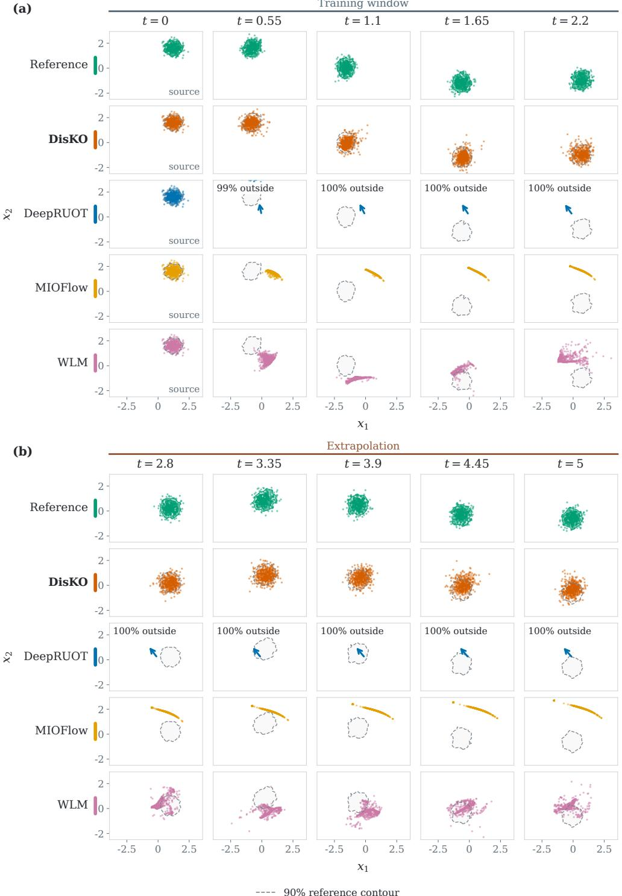  
Figure B.2: OU prediction distributions in the observation coordinates $x _ { 1 }$ and $x _ { 2 }$ . Rows show the reference distribution, DisKO, DeepRUOT, MIOFlow, and WLM; columns show the times printed above each panel. Panel (a) covers the training window and panel (b) covers extrapolation. Dashed contours indicate the 90% reference contour.

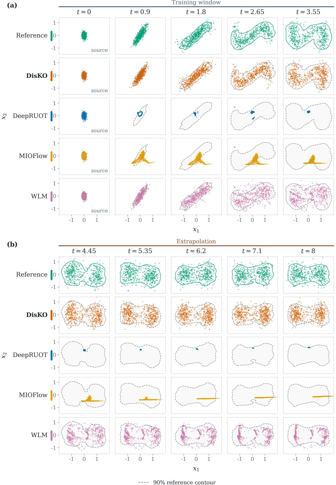  
Figure B.3: Duffing prediction distributions in the observation coordinates $x _ { 1 }$ and $x _ { 2 } .$ . Rows show the reference distribution, DisKO, DeepRUOT, MIOFlow, and WLM. Panel (a) covers the training window and panel (b) covers extrapolation, at the times shown above the columns. Dashed contours indicate the 90% reference contour.

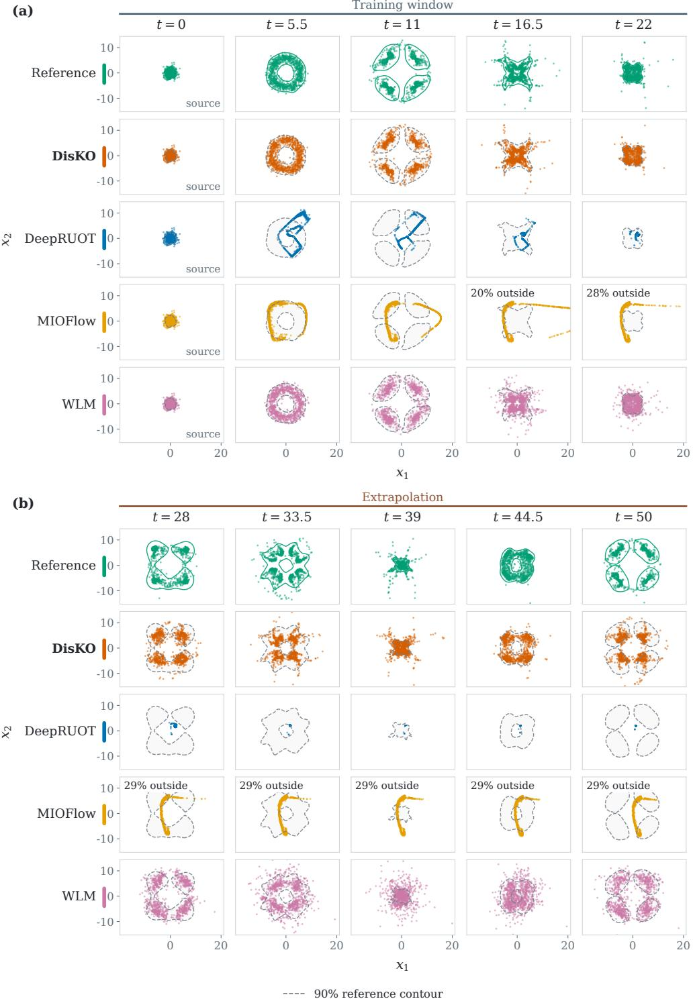  
Figure B.4: Boids prediction distributions in the observation coordinates $x _ { 1 }$ and $x _ { 2 } .$ Rows show the reference distribution, DisKO, DeepRUOT, MIOFlow, and WLM. Panel (a) covers the training window and panel (b) covers extrapolation, at the times shown above the columns. Dashed contours indicate the 90% reference contour.

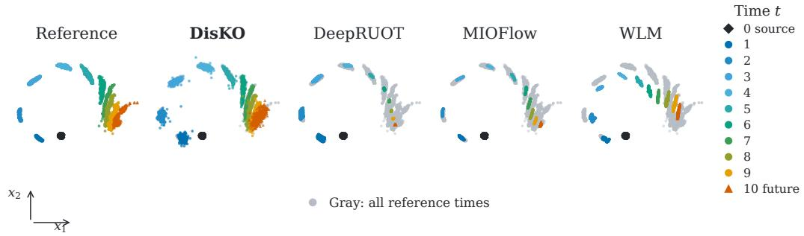  
Figure B.5: Ocean prediction distributions in the observation coordinates $x _ { 1 }$ and $x _ { 2 }$ . Panels show the reference distribution, DisKO, DeepRUOT, MIOFlow, and WLM from left to right. Colors indicate time, with the source at $t = 0$ and the future observation at $t = 1 0$ . Gray points show reference samples from all times.

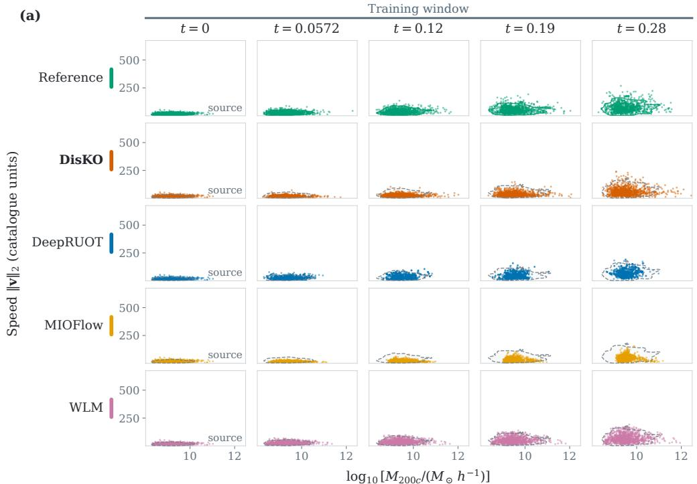

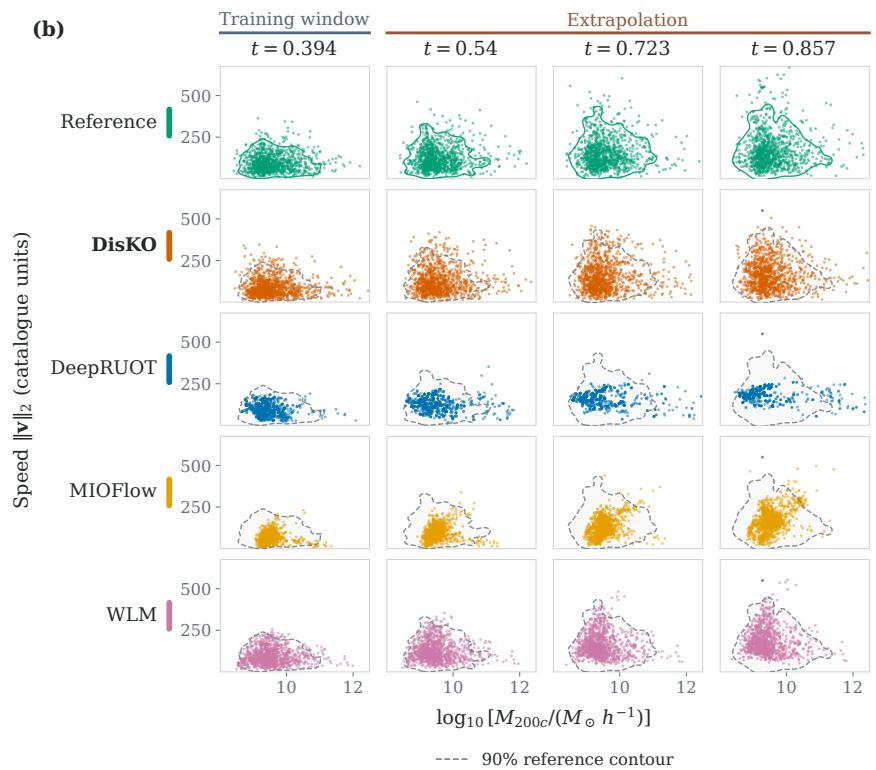  
Figure B.6: CAMELS prediction distributions over halo mass and speed, with coordinates $\log _ { 1 0 } [ M _ { 2 0 0 c } / ( M _ { \odot } h ^ { - 1 } ) ]$ and $\lVert \boldsymbol { v } \rVert _ { 2 }$ in catalogue units. Rows show the reference distribution and the four methods in the same order as Figure B.2. The bars above the columns identify training and extrapolation times. Dashed contours indicate the 90% reference contour.

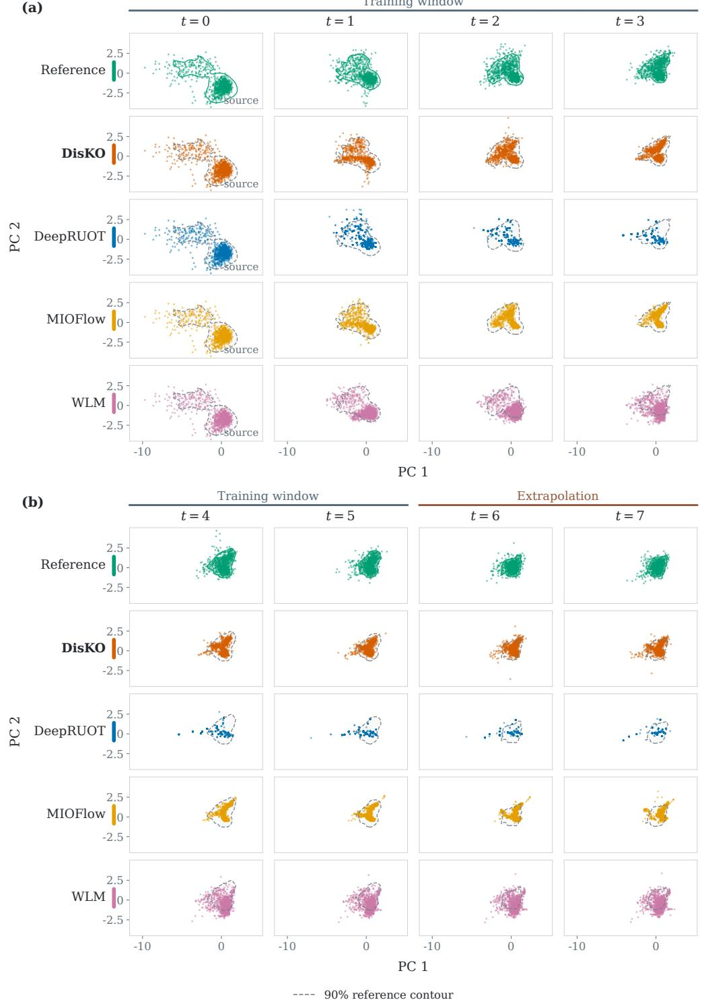  
(a)  
Figure B.7: Pancreas prediction distributions in the first two principal component coordinates. Rows show the reference distribution, DisKO, DeepRUOT, MIOFlow, and WLM. Columns show the indicated times; the bars identify the training window and extrapolation at t = 6 and t = 7. Dashed contours indicate the 90% reference contour.

Training window

Training window

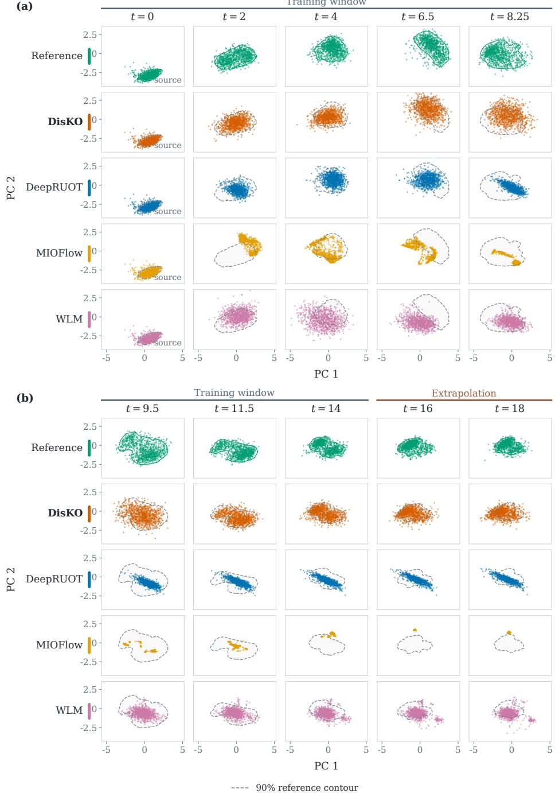  
Figure B.8: WOT iPSC prediction distributions in the first two principal component coordinates. Rows show the reference distribution, DisKO, DeepRUOT, MIOFlow, and WLM. Columns show the indicated times, with training and extrapolation intervals identified by the bars above them. Dashed contours indicate the 90% reference contour.

## C KOOPMAN SPECTRAL APPROXIMATION

We examine the approximation of Koopman eigenvalues and eigenfunctions on Circle and Torus using discrete and continuous parameterizations of DisKO. Following the terminology of Brunton et al. (2022); Klus et al. (2020), an eigenfunction is a scalar observable satisfying an eigenvalue relation with the operator or its generator. Here its argument is a probability measure, so it is a distribution observable as defined in Section 3.2. We reserve the term Koopman mode for a coefficient vector in the eigenfunction expansion of a vector-valued observable. The figures below display eigenvalue estimates and evaluations of learned eigenfunctions on distributions.

## C.1 ANALYTICAL EIGENVALUES AND EIGENFUNCTIONS

Write $\vartheta _ { t } \in \mathbb { T } ^ { q }$ for the angular state, where $q = 1$ for Circle and $q = 2$ for Torus. The dynamics and the generator acting on smooth periodic state observables are

$$
d \vartheta _ { j , t } = \omega _ { j } d t + \sqrt { 2 \kappa _ { j } } d W _ { j , t } \quad ( \mathrm { m o d \ 2 } \pi ) , \qquad \mathcal { G } f = \sum _ { j = 1 } ^ { q } ( \omega _ { j } \partial _ { j } f + \kappa _ { j } \partial _ { j j } f ) ,\tag{20}
$$

with independent Brownian motions. Circle uses $( \omega _ { 1 } , \kappa _ { 1 } ) = ( 1 , 0 . 0 1 )$ ; Torus uses $\omega = ( 1 , 1 . 7 )$ and $\kappa = ( 0 . 0 \bar { 1 } , 0 . 0 1 4 )$ . For $k \in \mathbb { Z } ^ { q }$ , the Fourier function $\phi _ { k } ( \boldsymbol { \vartheta } ) = \mathrm { \dot { e } } ^ { \mathrm { i } k \cdot \boldsymbol { \vartheta } }$ satisfies

$$
\mathcal { G } \phi _ { k } = \lambda _ { k } \phi _ { k } , \qquad \lambda _ { k } = - \sum _ { j = 1 } ^ { q } \kappa _ { j } k _ { j } ^ { 2 } + \mathrm { i } \sum _ { j = 1 } ^ { q } \omega _ { j } k _ { j } .\tag{21}
$$

This follows directly from $\partial _ { j } \phi _ { k } = \mathrm { i } k _ { j } \phi _ { k }$ and $\partial _ { j j } \phi _ { k } = - k _ { i } ^ { 2 } \phi _ { k }$ . The real and imaginary parts of $\lambda _ { k }$ determine the decay rate and angular frequency, respectively.

Let $\mu _ { t } = T _ { t } \mu _ { 0 }$ be the angular state distribution and define $\textstyle h _ { k } ( \mu ) = \int \phi _ { k } d \mu$ . Taking expectations in Ito’s formula yieldsˆ

$$
\frac { d } { d t } h _ { k } ( \mu _ { t } ) = \int \mathcal { G } \phi _ { k } d \mu _ { t } = \lambda _ { k } h _ { k } ( \mu _ { t } ) , \qquad ( K _ { t } h _ { k } ) ( \mu ) = e ^ { t \lambda _ { k } } h _ { k } ( \mu ) .\tag{22}
$$

Thus $h _ { k }$ is an eigenfunction of the distributional Koopman generator L with eigenvalue $\lambda _ { k }$ , and of ${ \boldsymbol { \kappa } } _ { \Delta t }$ with eigenvalue $\rho _ { k } = e ^ { \Delta t \lambda _ { k } }$ . The observation maps are $P ( \vartheta ) = ( \cos \vartheta$ , sin ϑ) on Circle and the concatenated sine and cosine pairs on Torus. They are injective on the respective periodic state spaces, so the observed distribution $\nu = P _ { \# } \mu$ determines $h _ { k } ( \mu )$

All spectral comparisons use $\Delta t = 0 . 1$ . Circle has $\lambda _ { k } = - 0 . 0 1 k ^ { 2 } + \mathrm { i } k$ , with target indices $k =$ $1 , \ldots , 6$ . Torus has $\lambda _ { ( m , n ) } = - ( 0 . 0 1 m ^ { 2 } + 0 . 0 1 4 n ^ { 2 } ) + \mathrm { i } ( m + 1 . 7 n )$ , with target indices $( 1 , 0 ) , ( 0 , 1 )$ $( 1 , 1 ) , ( 1 , - 1 ) , ( 2 , 0 )$ , and (0, 2). These prescribe a finite set of reference eigenpairs. The constant eigenfunction has generator eigenvalue zero and operator eigenvalue one; the index −k gives the complex conjugate of the eigenpair for k.

For an initial mixture of wrapped Gaussians with weights $\pi _ { \ell } ,$ centers $a \ell \cdot$ , and angular covariance matrices $\Sigma _ { \ell }$ , the reference values at every time are available analytically,

$$
h _ { k } ( \mu _ { t } ) = e ^ { t \lambda _ { k } } \sum _ { \ell } \pi _ { \ell } \exp \bigl ( \mathrm { i } k \cdot a _ { \ell } - \textstyle { \frac { 1 } { 2 } } k ^ { \intercal } \Sigma _ { \ell } k \bigr ) .\tag{23}
$$

Reference values use the initial mixture parameters and Equation 23; learned values are computed from finite empirical snapshots.

## C.2 DISCRETE AND CONTINUOUS DISKO

The two models share the encoder and conditional flow decoder architecture, training distributions, particle subsets, and pretrained weights within each dataset. The encoder has a Deep Sets construction of depth three and width 256, with latent dimension 64; the decoder velocity network has depth five and width 256. Both systems use 128 training population sequences with 1,024 particles per snapshot. Circle has 16 validation and 32 test sequences, and Torus has 24 validation and 48 test sequences. Training uses 81 snapshots over $0 \leq t \leq 8 ;$ the subsequent 40 snapshots cover

$8 . 1 \leq t \leq 1 2$ . We report the final models after 10,000 joint optimization steps, with seed zero for both parameterizations.

For the discrete model, $z _ { n + 1 } = K z _ { n } + b$ at interval $\Delta t .$ For the continuous model, $\dot { z } = A z + c$ and propagation uses an exact matrix exponential. With $\bar { z } = [ z ^ { \top } , 1 ] ^ { \top }$ , these become

$$
\bar { z } _ { n + 1 } = M \bar { z } _ { n } , \quad M = \left( \begin{array} { l l } { { K } } & { { b } } \\ { { 0 } } & { { 1 } } \end{array} \right) , \qquad \bar { z } ( t + \Delta t ) = e ^ { \Delta t B } \bar { z } ( t ) , \quad B = \left( \begin{array} { l l } { { A } } & { { c } } \\ { { 0 } } & { { 0 } } \end{array} \right) .\tag{24}
$$

If $M ^ { \top } w = { \widehat { \rho } } w$ , the scalar function $u ( \nu ) = w ^ { \top } [ E ( \nu ) ^ { \top } , 1 ] ^ { \top }$ evolves by $\widehat { \rho }$ under the discrete latent model. If $B ^ { \top } w = \widehat { \lambda } w$ , the analogous continuous latent observable evolves by $e ^ { t { \widehat { \lambda } } }$ . Under exact encoder closure these are Koopman eigenfunctions on the represented distribution family; in the learned models they are candidate approximations, evaluated below against $h _ { k }$ . The transpose is the ordinary transpose, consistent with the complex bilinear expression $\overset { \mathbf { \bar { \mathbf { \rho } } } } { w } ^ { \top } \bar { z }$ . Only the known constant eigenfunction introduced by augmentation is removed from the computed eigenpairs.

The discrete operator is refitted by ridge regression after re-encoding all 10,240 adjacent training snapshot pairs. Let X contain augmented source encodings as columns, Y the corresponding target encodings, and $\Theta = [ K b ]$ . The update is

$$
\widehat { \Theta } = \mathop { \mathrm { a r g m i n } } _ { \Theta } \Vert Y - \Theta X \Vert _ { F } ^ { 2 } + \eta \Vert \Theta \Vert _ { F } ^ { 2 } = Y X ^ { \top } ( X X ^ { \top } + \eta I ) ^ { - 1 } , \qquad \eta = 1 0 ^ { - 3 } .\tag{25}
$$

The residual term is a sum over snapshot pairs, and the penalty includes the affine offset. The imple mentation evaluates this solution by a singular value decomposition in double precision. The refitted dynamics are held fixed during each subsequent gradient update of the encoder and decoder. The continuous model optimizes $A ,$ c by differentiating through the matrix exponential. Each ridge refit minimizes the regularized one-step latent residual for the current encoder. This may help preserve harmonic structure as the learned observable space changes, although the different initialization procedures and dynamics update budgets prevent isolating its contribution from this comparison. Table C.1 summarizes the optimization differences.

Table C.1: Training configurations for the spectral experiments. Pretraining weights are shared within each dataset. The initialization procedures and dynamics update budgets differ between the two parameterizations.
<table><tr><td>Setting</td><td>DisKO (discrete)</td><td>DisKO (continuous)</td></tr><tr><td>Encoder/decoder pretraining</td><td>40,000 shared steps</td><td>40,000 shared steps</td></tr><tr><td>Dynamics initialization</td><td>Full ridge fit</td><td>6,000 gradient steps</td></tr><tr><td>Joint optimization</td><td>10,000 steps</td><td>10,000 steps</td></tr><tr><td>Dynamics update</td><td>Full ridge refit at each step</td><td>AdamW, learning rate  $3 \times 1 0 ^ { - 4 }$ </td></tr><tr><td>Dynamics regularization</td><td>Ridge  $\bar { 1 0 } ^ { - 3 }$  on  $K , b$ </td><td>Zero weight decay on A, c</td></tr><tr><td>Encoder/decoder optimizer</td><td>AdamW, learning rate  $3 \times 1 0 ^ { - 4 } .$  weight decay  $1 0 ^ { = 5 }$ </td><td>Same</td></tr><tr><td>Joint training horizons</td><td>1, 2, 4, 8, 16, 32 steps</td><td>Same</td></tr><tr><td>Training batch</td><td>8 snapshot pairs, 1,024 particles per snapshot</td><td>Same</td></tr></table>

Continuous dynamics initialization uses horizons 1, 2, 4 for its first 3,000 updates and 1, 2, 4, 8, 16, 32 for its remaining 3,000 updates. The discrete run performs 10,002 closed-form fits including initialization; the continuous run performs 16,000 gradient updates to the dynamics. The joint loss in Equation 11 uses $( \lambda _ { \mathrm { p r e d } } , \lambda _ { \mathrm { r e c } } , \bar { \lambda } _ { \mathrm { l a t } } , \lambda _ { \mathrm { d i s t } } ) = ( 1 , \bar { 0 } . 5 , 0 . 0 5 , \bar { 0 } . 2 )$ , with $\beta = 0 . 2 5$ and $\gamma = 0 . 5$ in Equation 10. The distribution loss uses 128 generated samples, eight sampling steps, and 32 sliced projections; gradients are clipped at norm five. These results compare the two complete training configurations and provide evidence from a single seed.

## C.3 EIGENVALUE APPROXIMATION

We compare the eigenvalues of K with those of $e ^ { \Delta t A }$ in the common operator domain,

$$
\widehat { \rho } _ { j } ^ { \mathrm { d i s c } } \in \mathrm { s p e c } ( K ) , \qquad \widehat { \rho } _ { j } ^ { \mathrm { c o n t } } = e ^ { \Delta t \widehat { \lambda } _ { j } } , \quad \widehat { \lambda } _ { j } \in \mathrm { s p e c } ( A ) .\tag{26}
$$

This comparison avoids the frequency ambiguity associated with taking a logarithm of a discrete eigenvalue. For each system and model, a one-to-one assignment minimizes the total complexplane distance between the six reference eigenvalues and the learned candidates. Assignment uses eigenvalue distances alone. The absolute error for a matched pair is $e _ { k } = \left| \widehat { \rho } _ { k } - \rho _ { k } \right|$ ; its mean gives equal weight to each of the six target indices.

Table C.2 reports all reference and estimated values. Figures C.1 and C.2 show the full learned spectra together with the six reference pairs and detailed views of the selected representatives. On Circle, both models approximate the first three eigenvalues with absolute errors below 0.006. At $k = 4$ , the errors are 0.0179 for the discrete model and 0.2145 for the continuous model; both models have larger errors at $k \ : = \ : 5 , 6$ The mean errors over all six indices are 0.050311 and 0.175543, respectively. On Torus, the continuous model has smaller errors at every selected index, with mean error 0.002256 compared with 0.008816 for the discrete model.

Table C.2: Eigenvalues of $\mathcal { K } _ { 0 . 1 }$ and their approximations. Each column corresponds to one prescribed Fourier index; conjugate partners are omitted. For the continuous model, $\widehat { \rho } _ { k } = \exp ( 0 . 1 \widehat { \lambda } _ { k } )$ Complex values are rounded to four decimals, with real and imaginary parts on separate lines. Absolute errors are computed before rounding. All estimates use the final model from seed zero.
<table><tr><td colspan="8">Circle</td></tr><tr><td></td><td>k = 1</td><td>k = 2</td><td>k = 3</td><td>k = 4</td><td>k = 5</td><td>k = 6</td></tr><tr><td rowspan="2">Ground truth</td><td>0.9940 +0.0997i</td><td>0.9762 +0.1979i</td><td>0.9468 +0.2929i</td><td>0.9064 +0.3832i</td><td>0.8559 +0.4676i</td><td>0.7962 +0.5447i</td></tr><tr><td>0.9927</td><td>0.9731</td><td>0.9419</td><td>0.8974</td><td>0.8301</td><td>0.7937</td></tr><tr><td>DisKO (discrete)</td><td>+0.0996i 0.9927</td><td>+0.1969i 0.9738</td><td>+0.2895i 0.9410</td><td>+0.3678i 0.9125</td><td>+0.3715i 0.8901</td><td>+0.3706i 0.8627</td></tr><tr><td>DisKO (continuous)</td><td>+0.0997i</td><td>+0.1981i</td><td>+0.2919i</td><td>+0.1688i</td><td>+0.0941i</td><td>+0.0956i</td></tr><tr><td>Abs. error (discrete) Abs. error (continuous)</td><td>0.001315 0.001314</td><td>0.003191 0.002410</td><td>0.005928 0.005868</td><td>0.017900</td><td>0.099453</td><td>0.174081</td></tr><tr><td>Torus</td><td></td><td></td><td></td><td>0.214545</td><td>0.375084</td><td>0.454035</td></tr><tr><td></td><td>k = (1, 0) 0.9940</td><td>k = (0, 1) 0.9842</td><td>k = (1, 1) 0.9615</td><td>k = (1, −1)</td><td>k = (2, 0)</td><td>k = (0, 2)</td></tr><tr><td>Ground truth</td><td>+0.0997i 0.9916</td><td>+0.1689i 0.9814</td><td>+0.2661i 0.9550</td><td>0.9952 -0.0698i 0.9886</td><td>0.9762 +0.1979i 0.9636</td><td>0.9375 +0.3316i 0.9196</td></tr><tr><td>DisKO (discrete)</td><td>+0.0995i 0.9923</td><td>+0.1682i 0.9830</td><td>+0.2634i 0.9581</td><td>-0.0689i</td><td>+0.1933i 0.9750</td><td>+0.3212i</td></tr><tr><td>DisKO (continuous)</td><td>+0.1001i</td><td>+0.1683i</td><td>+0.2653i</td><td>0.9925 -0.0694i</td><td>+0.1974i</td><td>0.9345 +0.3311i</td></tr><tr><td>Abs. error (discrete)</td><td>0.002404</td><td>0.002892</td><td>0.006962</td><td>0.006614</td><td>0.013348</td><td></td></tr><tr><td>Abs. error (continuous)</td><td>0.001781</td><td>0.001377</td><td>0.003430</td><td>0.002690</td><td>0.001239</td><td>0.020678 0.003020</td></tr></table>

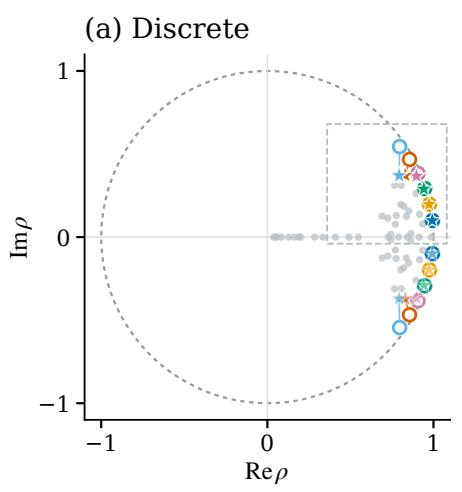

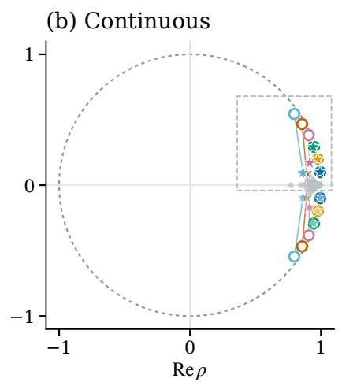  
(d) Target eigenvalues

(c) Target eigenvalues  
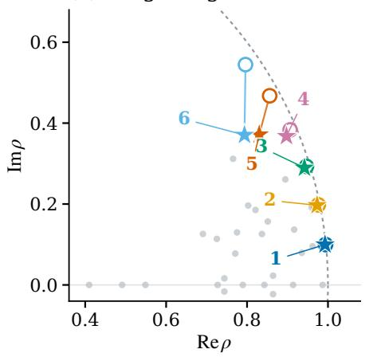

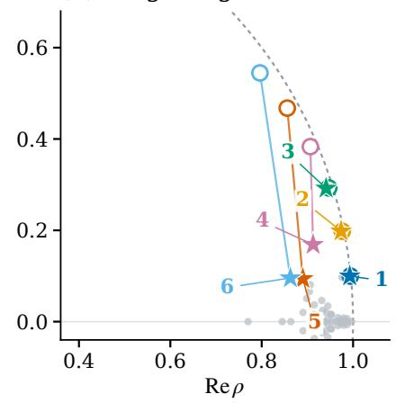  
Circle | Δt= 0.1 | equal real/imaginary scale

Figure C.1: Circle eigenvalue approximation at $\Delta t = 0 . 1$ . Discrete and Continuous denote the two DisKO parameterizations. Circles show the analytical eigenvalues, stars the matched learned values, and gray points the remaining learned eigenvalues. Upper panels include conjugate partners; lower panels enlarge the selected representatives. Colors index $k = 1 , \ldots , 6 .$ . Both axes have equal scale. A matched star denotes the assigned estimate for a reference value.

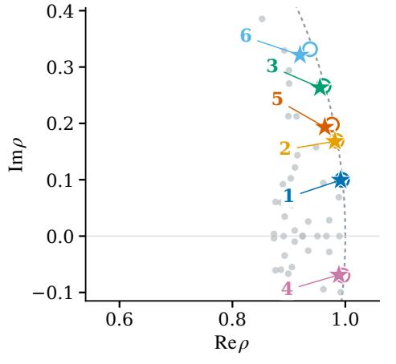

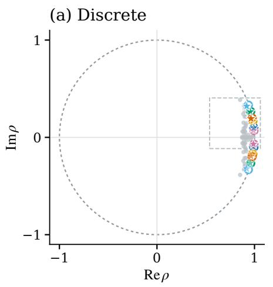  
(c) Target eigenvalues

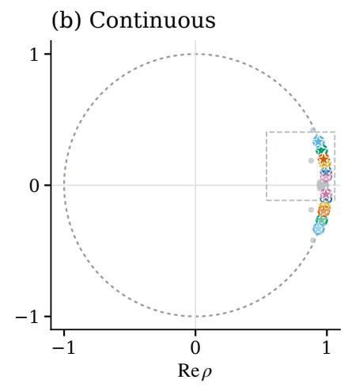

(d) Target eigenvalues  
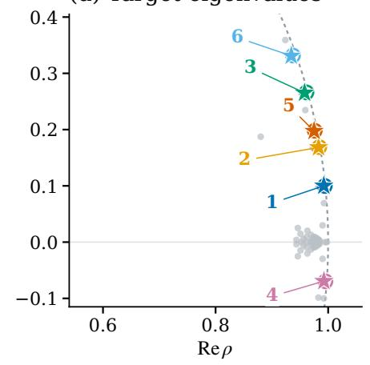  
Torus | Δt= 0.1 | equal real/imaginary scale  
Figure C.2: Torus eigenvalue approximation at $\Delta t = 0 . 1$ , with the same conventions as Figure C.1. The six Fourier indices identify the reference eigenpairs selected for evaluation. The gray points show the additional eigenvalues of the learned finite-dimensional operators.

## C.4 EIGENFUNCTION EVALUATION ON DISTRIBUTIONS

The learned function associated with a matched eigenvalue is evaluated as $u _ { k } ( \widehat \nu ) = w _ { k } ^ { \top } [ E ( \widehat \nu ) ^ { \top } , 1 ] ^ { \top }$ Its eigenvector has an arbitrary nonzero complex scale. For visual comparison, we fit one complex scalar per eigenfunction using 640 training snapshots, comprising all 128 training sequences at times $0 , 2 , 4 , 6 , 8$

$$
\alpha _ { k } = \frac { \sum _ { s \in \mathcal { C } } \overline { { u _ { k } ( \widehat { \nu } _ { s } ) } } h _ { k } ( \mu _ { s } ) } { \sum _ { s \in \mathcal { C } } | u _ { k } ( \widehat { \nu } _ { s } ) | ^ { 2 } } , \qquad \widehat { h } _ { k } = \alpha _ { k } u _ { k } .\tag{27}
$$

Here C is the calibration set; the fit has no intercept and is fixed for all subsequent plots. This posttraining alignment resolves eigenvector amplitude and phase for evaluation. Analytical values are used only for this alignment and the spectral diagnostics.

Figure C.3 compares the real parts of $\widehat { h } _ { k } ( \widehat \nu _ { t } )$ and $h _ { k } ( \mu _ { t } )$ on test sequences at $8 < t \le 1 2$ . Each Circle panel contains $3 2 \times 4 0 = 1$ , 280 snapshots and each Torus panel contains $4 8 \times 4 0 = 1$ , 920 snapshots per method. The displayed correlation is computed from the full complex values,

$$
C _ { k } = \frac { \left| \sum _ { s } \overline { { \left( u _ { k , s } - \bar { u } _ { k } \right) } } ( h _ { k , s } - \bar { h } _ { k } ) \right| } { \left( \sum _ { s } | u _ { k , s } - \bar { u } _ { k } | ^ { 2 } \right) ^ { 1 / 2 } \left( \sum _ { s } | h _ { k , s } - \bar { h } _ { k } | ^ { 2 } \right) ^ { 1 / 2 } } .\tag{28}
$$

The plotted points use independently encoded observed snapshots at each time and assess eigenfunction approximation on these distributions. For Circle, future correlations for the discrete model are 0.999, 0.994, and 0.976 at $k = 1 , 2 , 3$ , compared with 0.998, 0.834, and 0.569 for the continuous model. For Torus, both models have correlations above 0.995 for the two fundamental indices, while higher and mixed indices have lower correlations. Across all six Torus indices, the mean future correlations are 0.881 and 0.849, respectively. Together with the eigenvalue errors, these results show that the quality of the scalar eigenfunctions and the accuracy of their eigenvalues can differ between parameterizations.

The remaining figures evaluate the same learned functions on a controlled family of distributions. For a wrapped Gaussian $\mu _ { \vartheta , \sigma }$ with center ϑ and angular covariance $\sigma ^ { 2 } I$ , its Fourier moment is

$$
\begin{array} { r } { h _ { \boldsymbol k } ( \mu _ { \boldsymbol \vartheta , \boldsymbol \sigma } ) = \exp \left( - { \frac { 1 } { 2 } } \sigma ^ { 2 } \| \boldsymbol k \| _ { 2 } ^ { 2 } \right) e ^ { \mathrm { i } \boldsymbol k \cdot \boldsymbol \vartheta } , \qquad \boldsymbol \sigma = 0 . 1 5 . } \end{array}\tag{29}
$$

Each center in the plot therefore indexes a probability distribution supplied to the encoder. Probes use 1,024 common Gaussian offsets obtained from Sobol normal nodes and their negatives, with 256 Circle centers and a $6 4 \times 6 4$ uniform angular grid on Torus. The training calibration in Equation 27 is reused without fitting to the probes. The normalized root mean square error on the probe grid P is

$$
\mathrm { N R M S E } _ { k } = \left( \frac { \sum _ { \vartheta \in \mathcal { P } } | \widehat { h } _ { k } ( \widehat { \nu } _ { \vartheta , \sigma } ) - h _ { k } ( \mu _ { \vartheta , \sigma } ) | ^ { 2 } } { \sum _ { \vartheta \in \mathcal { P } } | h _ { k } ( \mu _ { \vartheta , \sigma } ) | ^ { 2 } } \right) ^ { 1 / 2 } .\tag{30}
$$

Figure C.4 displays both components for Circle indices $k = 1 , 2 , 3 . \mathrm { \ A t \ } k = 3 .$ , the probe NRMSE is 0.123 for the discrete model and 0.697 for the continuous model, despite their similar eigenvalue errors. Figure C.5 displays all six Torus indices, including the pointwise complex absolute errors. The real and imaginary components use a common color range across both systems and methods. Torus geometry is used only to display the two angular center coordinates; the encoder receives four-dimensional point clouds. Errors are evaluated uniformly over the angular grid. These probes characterize the restrictions of learned distribution observables to the chosen Gaussian family. Diffusion increases the Gaussian width over time, so a static comparison on the fixed-width family supports conclusions about function approximation on that family. The nonlinear set encoder permits more general distribution observables than linear Fourier moments, and accurate approximation across all probability measures is outside the scope of these finite evaluations.

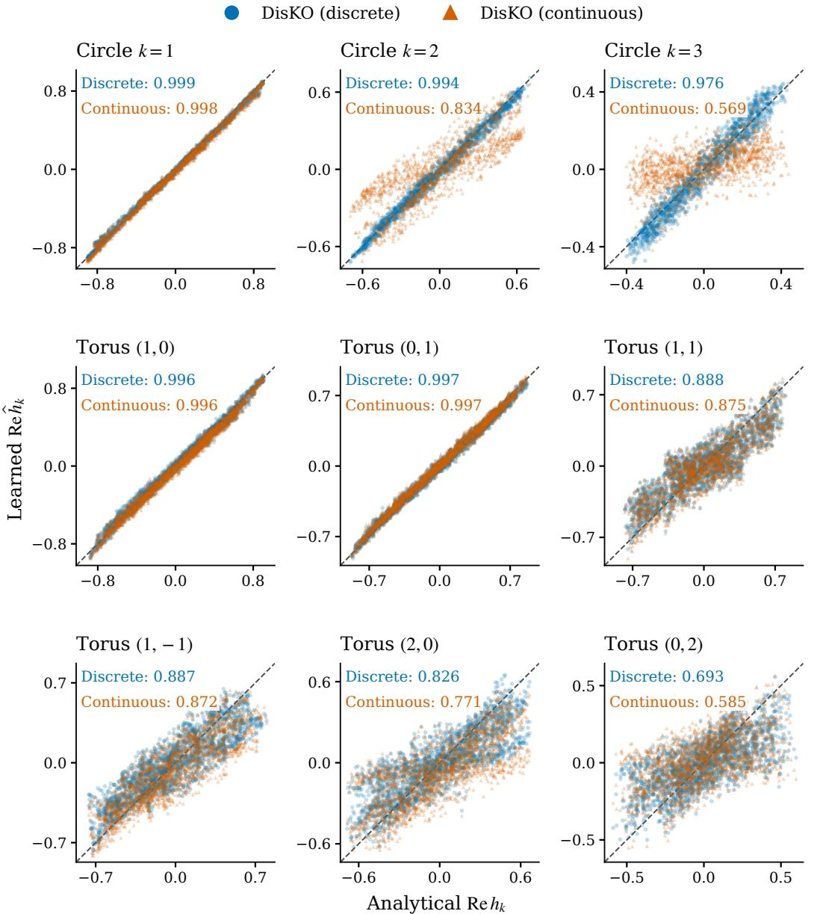  
Figure C.3: Eigenfunction values on observed future snapshots from test sequences. The top row shows Circle indices $k = 1 , 2 , 3 ;$ the remaining rows show all six Torus indices. Each panel overlays DisKO (discrete) and DisKO (continuous), with the equality line dashed. Coordinates display real parts after the training calibration; annotations give centered complex correlations. Each point is obtained by encoding the observed snapshot at that time, so the figure assesses the learned functions on future distributions.

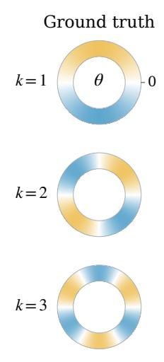

(a) Real part  
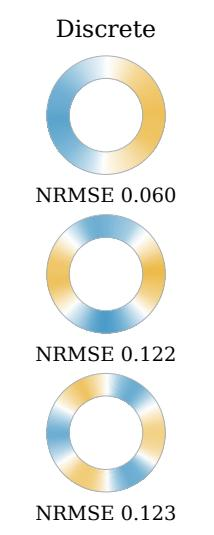  
(b) Imaginary part

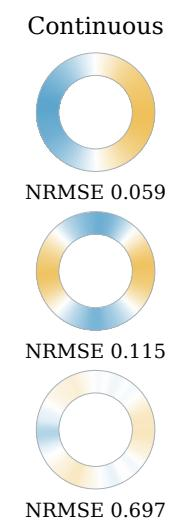

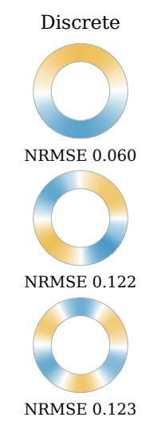

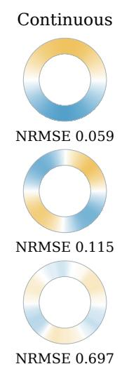  
Circle probe centers; σ= 0.15

Figure C.4: Circle eigenfunctions evaluated on translated wrapped Gaussian probes. Panels (a) and (b) display real and imaginary components using the same color scale. Each angle is the center of a distribution of width σ = 0.15; ring radius and thickness are fixed. Columns compare the analytical reference with the discrete and continuous DisKO functions. NRMSE uses the full complex error and is consequently the same in both component panels.

(a) Real part  
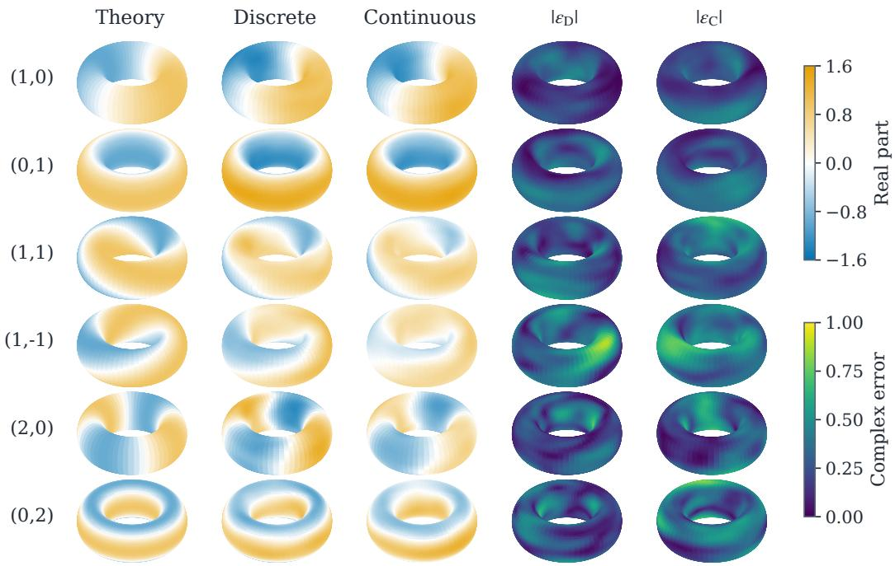  
Torus: wrapped-Gaussian probe centers, σ=0.15

(b) Imaginary part  
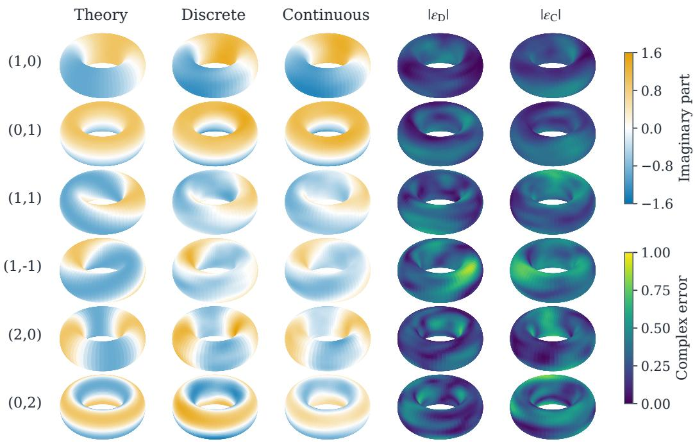  
Torus: wrapped-Gaussian probe centers, σ=0.15

Figure C.5: Torus eigenfunctions on wrapped Gaussian probes. Rows are the six Fourier indices; the first three columns show the reference and the two DisKO approximations. The final two columns show $| \widehat { h } _ { k } - h _ { k } |$ for the discrete and continuous models. These complex error fields are identical in panels (a) and (b). All color ranges are shared, and surface coordinates index probe centers.

## D LATENT DYNAMICAL CONSISTENCY

We assess approximate closure in Equation 6 by comparing latent forecasts with encodings of observed snapshots. Exact closure with the corresponding affine generator implies agreement at the population level.

We display the first test population sequence of the OU benchmark (Appendix A), starting from a Gaussian distribution. Observations are spaced by 0.05, training covers $0 \leq t \leq 2 . 5$ , and extrapolation covers $2 . 5 < t \leq 5$ . At each time, 512 particles are sampled without replacement from the available 1,024 particles and standardized using statistics fitted to training populations within the training interval. The same sampled snapshots are supplied to five models with seeds $s = 0 , \ldots , 4$ Each Deep Sets encoder produces a 32-dimensional representation. After training, the encoder and continuous affine dynamics are fixed, and we compute

$$
z _ { s } ^ { \mathrm { e n c } } ( t ) = E _ { s } ( \widehat { \nu } _ { t } ) , \qquad \widetilde { z } _ { s } ( t ) = F _ { t } ^ { ( s ) } ( E _ { s } ( \widehat { \nu } _ { 0 } ) ) .\tag{31}
$$

Here $F _ { t } ^ { ( s ) }$ is evaluated through the matrix exponential in Equation 7. Every forecast originates at $t = 0$ and continues through the training boundary; subsequent snapshot encodings serve solely as references.

For each model, we jointly fit PCA to the centered reference and forecast trajectories, retaining two components without whitening. Reference trajectories are aligned to seed zero by an orthogonal transformation and translation, with the same transformation applied to forecasts and no rescaling. Both visualization steps use the full interval after prediction. The retained components explain 77.66% to 83.51% of joint variance, depending on the model. Figure D.1 shows means and sample standard deviations in these aligned coordinates.

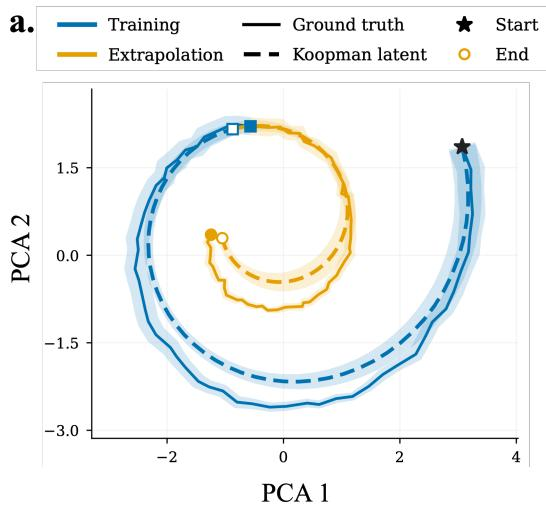

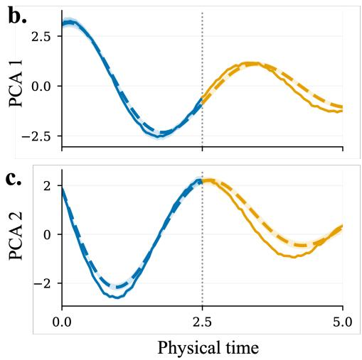  
Figure D.1: OU latent evolution. Solid curves (Ground truth) show reference encodings; dashed curves (Koopman latent) show forecasts. Blue and gold indicate training and future time ranges; all snapshots belong to the test population. Curves are means over five models after PCA and rigid alignment. Shading is one sample standard deviation, normal to each mean curve in (a) and coordinatewise in $^ { ( \mathrm { b , c } ) }$ . Stars, squares, and circles mark $t = 0 , 2 . 5$ , and $5 ;$ filled and open markers denote reference and forecast.

The forecast follows the reference’s rotation and inward progression, reproducing the main oscillation within the training interval and continuing the contracting trajectory beyond $t = 2 . 5$ . Amplitude differences are visible near the troughs of the second coordinate. The clearest future discrepancy occurs near $t = 4 ,$ , where the predicted minimum is shallower and slightly later. These observations support approximate dynamical consistency in the dominant projected coordinates for this test sequence, with residual amplitude and timing errors. Projection and averaging restrict this evidence to the displayed dynamics.

## E ABLATION STUDY

We examine how the form of latent dynamics affects distribution extrapolation on the OU benchmark. The continuous DisKO model uses the affine generator $\dot { z } = A z + c ,$ evaluated through the matrix exponential in Equation 7. For comparison, we replace this generator with an autonomous Neural ODE,

$$
\dot { z } = W _ { 2 } \operatorname { t a n h } ( W _ { 1 } z + b _ { 1 } ) + b _ { 2 } ,\tag{32}
$$

with latent dimension 64 and hidden width 32. The two dynamics modules have similar parameter counts, 4,160 for the affine generator and 4,192 for the Neural ODE. Both models use the same Deep Sets encoder and conditional flow matching decoder architectures, with width 256 and depths three and five, respectively.

We use 128 training initial distributions and all 64 test initial distributions from the OU dataset in Appendix $\mathsf { A } . 1 ;$ 16 further initial distributions are reserved for validation. Training covers $0 \leq$ $t \leq 2 . 5$ , with snapshots spaced by 0.05 and 1,024 particles per snapshot. Standardization is fitted to the training distributions within this interval. For each of five training seeds, the models share encoder and decoder weights obtained from 10,000 pretraining updates. Each then receives 1,000 updates of the dynamics alone, followed by 10,000 joint updates of all components. Both dynamics modules are optimized by gradient descent with the same losses, minibatch sampling, and learning rate $3 \times 1 0 ^ { - 4 }$ . We evaluate the final checkpoints.

Each test rollout encodes only the initial snapshot and propagates recursively to $t = 5 ,$ , without incorporating subsequent observations. The Neural ODE uses fourth-order Runge–Kutta integration with maximum step 0.05. Halving this step changes latent trajectories by at most $3 . 1 \times 1 0 ^ { - 6 }$ in relative Euclidean norm across the five models. Both decoders generate 512 samples with 32 sampling steps, and errors are computed against 512 reference samples in the original observation coordinates. We use 256 samples per distribution for $W _ { 1 }$ and $W _ { 2 }$ , 128 projection directions for $\mathrm { S W _ { 1 } }$ , and the biased RBF estimate of $\mathrm { \dot { M } M D ^ { 2 } }$ defined in Appendix A.3. Reference samples and evaluation random seeds are matched between methods.

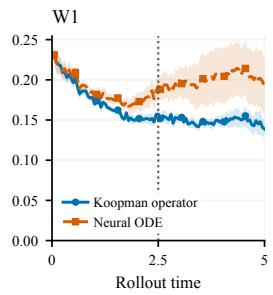

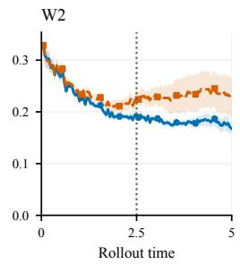

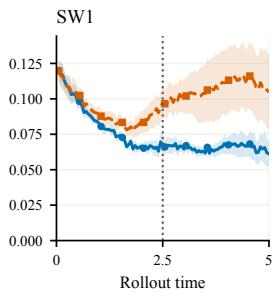

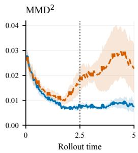  
Figure E.1: OU distribution prediction errors for the continuous Koopman model and the Neural ODE. At each time, errors are averaged over 64 test initial distributions within each run, then over five training seeds. Shading denotes one sample standard deviation across seeds. The dotted vertical line marks the end of training at $t = 2 . 5$ . All predictions originate at $t = 0$

Figure E.1 shows lower future prediction errors and smaller variation across training seeds for the Koopman model in all four metrics. Averaged over $2 . 5 < t \leq 5$ , its $W _ { 1 }$ error is $\bar { 0 } . 1 4 9 \pm 0 . 0 0 7$ compared with $0 . 2 0 1 \pm 0 . 0 2 6$ for the Neural ODE; the corresponding $\mathrm { S W _ { 1 } }$ errors are $0 . 0 6 5 \pm 0 . 0 0 5$ and $0 . 1 0 7 \pm 0 . 0 1 8$ . The Neural ODE exhibits a more pronounced increase in $\mathrm { S W _ { 1 } }$ and $\mathrm { M M D ^ { 2 } }$ near the training boundary and into the future interval. These results support the affine Koopman parameterization as an effective inductive bias for accurate and reproducible extrapolation under this training protocol.

## F DATA EFFICIENCY

We examine the data requirements of continuous DisKO on the OU benchmark by varying two aspects of the training data. Let $R = | \mathcal { I } _ { \mathrm { t r a i n } } |$ denote the number of training initial distributions, each providing a population sequence of snapshots, and let N denote the number of available particle samples per training snapshot. Thus, R controls the number of distribution evolutions represented in training, while N controls the sampling budget within each snapshot.

We vary $R \in \{ 1 6 , 3 2 , 6 4 , 1 2 8 \}$ using 1,024 particles per snapshot input during training and evaluation. Separately, we vary $N \in \{ 1 \bar { 2 } 8 , 2 5 6 , \bar { 5 } 1 2 , 1 0 2 \bar { 4 } \}$ with $\mathrm { \bar { \it { R } } = 1 \mathrm { \bar { 2 } 8 } }$ , keeping each training and evaluation input at 128 particles. In the latter experiment, N specifies the available training sample pool from which inputs are drawn. The two experiments are interpreted within their respective input budgets. Each setting uses three training seeds, and the reported scores average prediction errors over the future time window.

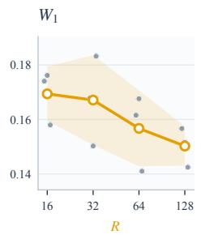

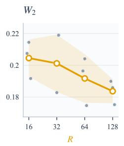

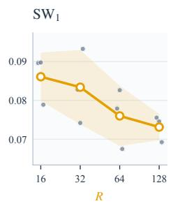

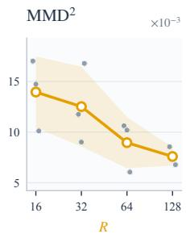  
Figure F.1: Effect of the number of training initial distributions R on future OU prediction errors. Colored circles and lines show means over three training seeds; shading denotes one sample standard deviation. Gray points show individual seeds, slightly displaced horizontally for visibility. Inputs contain 1,024 particles. The horizontal axis is logarithmic with base two.

Figure F.1 shows decreasing mean errors in all four metrics as R increases. From $R ~ = ~ 1 6$ to $R = 1 2 8 , W _ { 1 }$ decreases from $0 . 1 6 9 { \pm } 0 . 0 1 0$ to $0 . 1 5 0 { \scriptstyle \pm 0 . 0 0 7 }$ , and $\mathrm { S W _ { 1 } }$ decreases from 0.086±0.006 to $0 . 0 7 3 \pm 0 . 0 0 3$ . This trend supports the benefit of exposing the model to more initial distributions.

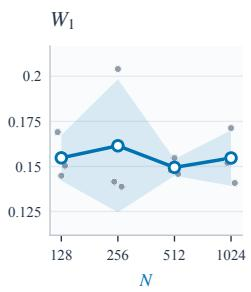

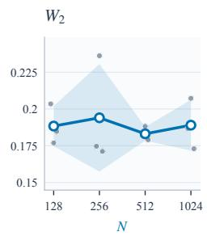

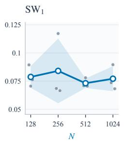

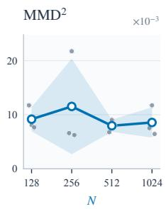  
Figure F.2: Effect of the available samples per training snapshot $N _ { \ast }$ , with $R = 1 2 8$ training initial distributions and 128 particles per input. Means, sample standard deviations, and individual seeds follow Figure F.1. Errors summarize the future time window. The horizontal axis is logarithmic with base two; the $\mathrm { M M D ^ { 2 } }$ axis in both figures uses units of $1 0 ^ { - 3 }$

Figure F.2 shows modest, nonmonotonic changes with N under the fixed input budget. Mean $W _ { 1 }$ ranges from 0.149 to 0.161, with the lowest mean error in all four metrics at $N = { \overline { { 5 } } } 1 2$ . Variation across seeds is largest at $N = 2 5 6$ . Over the tested range, increasing the available sample pool yields limited additional accuracy with 128 particles per input.

## G DISTRIBUTIONAL KOOPMAN REPRESENTATION

We describe the distributional Koopman representation underlying DisKO, the role of learned distribution observables, and the information required for predictive closure. The results separate the expressiveness of an observable family from the dynamical consistency of its learned finitedimensional representation.

## G.1 DISTRIBUTION OBSERVABLES AND KOOPMAN OPERATORS

Let X be a state space and M $\subseteq { \mathcal { P } } ( { \mathcal { X } } )$ an invariant family of probability distributions. Distribution evolution is described by maps $T _ { t } : \mathfrak { M } \to \mathfrak { M }$ satisfying

$$
T _ { 0 } = \mathrm { I d } , \qquad T _ { t + s } = T _ { t } \circ T _ { s } , \qquad t , s \geq 0 .\tag{G.1}
$$

Autonomous ODEs induce such evolution by transporting an initial distribution through their solution maps. Time-homogeneous Markov SDEs induce it through their transition probabilities. In both cases, the initial law determines the subsequent law, even when individual state trajectories are stochastic.

A distribution observable is a scalar functional $h : { \mathfrak { M } } \to \mathbb { C }$ . Complex values accommodate oscillatory eigenfunctions; encoder coordinates are real valued. The distributional Koopman operator acts by composition (Oprea et al., 2025),

$$
( { \cal K } _ { t } h ) ( \mu ) = h ( T _ { t } \mu ) .\tag{G.2}
$$

It is linear in h and satisfies ${ \mathcal { K } } _ { t + s } = { \mathcal { K } } _ { t } { \mathcal { K } } _ { s }$ . Thus, nonlinear distribution evolution admits a linear description on a space of distribution observables. On an invariant Banach space H where $( K _ { t } ) _ { t \geq 0 }$ is strongly continuous, its generator is

$$
\mathcal { L } h = \operatorname* { l i m } _ { t \downarrow 0 } \frac { \mathcal { K } _ { t } h - h } { t } , \qquad h \in \operatorname { D o m } ( \mathcal { L } ) ,\tag{G.3}
$$

with the limit taken in the norm of $\mathcal { H } .$ . For example, when M is compact and $( t , \mu ) \mapsto T _ { t } \mu$ is continuous, $\mathcal { H } = C ( \mathfrak { M } ; \mathbb { C } )$ with the uniform norm gives a strongly continuous contraction semigroup.

The connection to state observables is explicit. Let $( S _ { t } \phi ) ( x ) = \mathbb { E } [ \phi ( X _ { t } ) \mid X _ { 0 } = x ]$ be a Markov semigroup on state functions. For $\begin{array} { r } { h _ { \phi } ( \mu ) \stackrel { - } { = } \int \phi d \mu } \end{array}$ , its induced law evolution obeys

$$
( { \cal K } _ { t } h _ { \phi } ) ( \mu ) = \int { S } _ { t } \phi d \mu = h _ { S _ { t } \phi } ( \mu ) .\tag{G.4}
$$

This identity relates state observables to linear functionals of a distribution (Oprea et al., 2025). Distribution observables also include nonlinear statistics, such as $\operatorname { V a r } _ { \mu } [ \phi ] \ : = \ : \dot { h } _ { \phi ^ { 2 } } ( \mu ) \ : - \ : h _ { \phi } ( \mu ) ^ { 2 }$ whenever these moments exist.

## G.2 LEARNED OBSERVABLE SPACES AND APPROXIMATE CLOSURE

Nonlinear moment representations. Consider functionals formed from finitely many moments,

$$
h ( \mu ) = g \big ( a _ { 1 } ( \mu ) , \dots , a _ { q } ( \mu ) \big ) , \qquad a _ { \ell } ( \mu ) = \int \phi _ { \ell } d \mu .\tag{G.5}
$$

The readout $g$ permits nonlinear interactions between statistics of the entire distribution. Their expressive power has a precise interpretation in a compact setting. Assume that $\mathcal { X }$ is a compact metric space, ${ \mathfrak { M } } = { \mathcal { P } } ( { \mathcal { X } } )$ carries the weak topology, and $S _ { t }$ is a strongly continuous Markov semigroup on $C ( \mathcal { X } )$ with generator ${ \mathcal { A } } .$ Its dual law evolution induces a strongly continuous $\textstyle { \mathcal { K } } _ { t }$ on $\breve { C } ( { \mathfrak { M } } )$ Let P contain all functionals in Equation G.5 with arbitrary finite $q ,$ polynomial $^ { g , }$ and real-valued $\phi _ { \ell } \in \operatorname { D o m } ( \mathcal { A } )$ , together with their complex linear combinations.

Proposition G.1 (Richness of polynomial moment observables) Under these assumptions, $\mathfrak { P }$ is dense in $C ( \mathfrak { M } ; \mathbb { C } )$ and is a core for L. In particular, every $h \in \operatorname { D o m } ( \mathcal { L } )$ admits $p _ { n } \in \mathfrak { P }$ with $\| p _ { n } - h \| _ { \infty } { \dot { \to } } 0$ and $\| { \mathcal { L } } p _ { n } - { \mathcal { L } } h { \bar { \| } } _ { \infty } \to 0$

Proof sketch. (Adapted from the core criterion in Engel & Nagel, 2000, Proposition II.1.7.) The moment algebra contains constants and separates probability measures because Dom(A) is dense in $C ( \mathcal { X } )$ ; the Stone–Weierstrass theorem gives density. For a polynomial $g ,$ , the uniform generator limit and the chain rule give

$$
( { \mathcal { L } } h ) ( \mu ) = \sum _ { \ell = 1 } ^ { q } \partial _ { \ell } g { \big ( } a _ { 1 } ( \mu ) , \ldots , a _ { q } ( \mu ) { \big ) } \int A \phi _ { \ell } d \mu .\tag{G.6}
$$

Thus $\mathfrak { P } \subseteq \mathrm { D o m } ( \mathcal { L } )$ . Equation G.4 and $S _ { t } \operatorname { D o m } ( \mathcal { A } ) \subseteq \operatorname { D o m } ( \mathcal { A } )$ imply ${ \mathcal { K } } _ { t } { \mathfrak { P } } \subseteq { \mathfrak { P } }$ . The cited criterion then establishes the core property. □

This result makes nonlinear moment functionals a rich starting point for distribution representations. Its scope is the complete moment family under the compact Markov assumptions above. A fixed finite dictionary, or a trained neural encoder, requires a separate assessment of approximation and closure.

Learned distribution observables. An encoder E defines each observable by $h _ { j } ( \mu ) = E _ { j } ( \mu )$ and collects them in $\mathbf { h } = ( h _ { 1 } , \ldots , h _ { m } ) ^ { \top }$ . For an empirical snapshot $\begin{array} { r } { \widehat { \nu } = N ^ { - 1 } \sum _ { i = 1 } ^ { N } \delta _ { y _ { i } } } \end{array}$ , a moment encoder evaluates Equation G.5 by replacing each integral with $N ^ { - 1 } \sum _ { i } \phi _ { \ell } ( y _ { i } )$ . Neural mean aggregation admits approximation results for continuous functionals on compact families of probability measures (Pevny & Kova ´ ˇr´ık, 2019). DisKO parameterizes its coordinates with permutation-invariant set networks (Zaheer et al., 2017; Lee et al., 2019) and learns them jointly with latent propagation and distribution reconstruction. This gives a data-driven finite-dimensional observable space

$$
V _ { E } = \operatorname { s p a n } \{ 1 , h _ { 1 } , \dots , h _ { m } \} .\tag{G.7}
$$

The approximation results motivate expressive parameterizations. The dynamical interpretation of the learned space depends additionally on its behavior under $\textstyle { \mathcal { K } } _ { t }$

Affine propagation and closure. The continuous DisKO model uses $\dot { z } = A z + c$ with flow $F _ { t } .$ Including the constant observable yields

$$
\begin{array} { r } { \mathbf { \overline { { h } } } ( \mu ) = \binom { \mathbf { h } ( \mu ) } { 1 } , \qquad B = \binom { A } { 0 } , \qquad \binom { F _ { t } ( z ) } { 1 } = e ^ { t B } \binom { z } { 1 } . } \end{array}\tag{G.8}
$$

If $h _ { j } \in \operatorname { D o m } ( \mathcal { L } )$ and ${ \mathcal { L } } \mathbf { h } = A \mathbf { h } + c$ on M, uniqueness of the resulting linear ODE gives $\begin{array} { r } { \overline { { \bf h } } ( T _ { t } \mu ) = } \end{array}$ $e ^ { t B } \bar { \mathbf { h } } ( \mu )$ . The space $V _ { E }$ is then Koopman invariant, realizing exact closure in the chosen coordinates (Brunton et al., 2016a).

For learned coordinates, define the finite-time closure residual

$$
R _ { t } ( \mu ) = \overline { { { \bf h } } } ( T _ { t } \mu ) - e ^ { t B } \overline { { { \bf h } } } ( \mu ) .\tag{G.9}
$$

This definition only requires observable values and can be evaluated from distribution snapshots. Small residuals across relevant distributions and prediction times express approximate closure under the learned propagation. Latent consistency training estimates this discrepancy at observed time pairs using empirical encodings. Its behavior on future snapshots provides a separate test of dynamical consistency.

Eigenfunctions within the learned space. Let $\boldsymbol { w } ^ { \top } \boldsymbol { B } = \lambda \boldsymbol { w } ^ { \top }$ be a left eigenvector relation over $\mathbb { C } ,$ and define $h _ { w } ( \mu ) = w ^ { \top } \overline { { \mathbf { h } } } ( \mu )$ , assuming $h _ { w } \ne 0$ . Multiplying Equation G.9 by $w ^ { \top }$ gives

$$
( \mathcal { K } _ { t } h _ { w } ) ( \mu ) - e ^ { t \lambda } h _ { w } ( \mu ) = w ^ { \top } R _ { t } ( \mu ) .\tag{G.10}
$$

Here $\top$ denotes ordinary transpose, so w specifies the coefficients of a complex linear combination of real observables. Exact closure therefore produces distributional Koopman eigenfunctions. Under approximate closure, these combinations are candidate eigenfunctions whose evolution can be checked through Equation G.10. For $\lambda = - \alpha + i \omega , \alpha > 0$ gives exponential decay and ω gives angular oscillation frequency.

The discrete model has the same interpretation with $\overline { { K } } = \big ( \begin{array} { c c } { K } \\ { 0 } \end{array} _ { 1 } ^ { \ b } \big ) , \overline { { K } } ^ { n }$ replacing $e ^ { t B } \mathrm { a t } t = n \Delta t$ , and an eigenvalue $\rho$ replacing $e ^ { \Delta t \lambda }$ . Eigenvectors select combinations within $V _ { E } ;$ individual encoder coordinates generally combine several dynamical components. Empirical agreement with analytic eigenfunctions consequently tests the dynamical content of the learned observable space. The residual identity alone supplies no bound on the distance to an exact eigenvalue.

Connection to distribution prediction. The decoder D is trained to reconstruct the modeled distribution from $E ( \mu )$ and to generate its future law from $F _ { t } ( E ( \mu ) ) ,$ . Exact reconstruction on a family requires E to be injective there. A continuous injective encoder on a compact family has a continuous inverse on its image. This explains the complementary roles of reconstruction and closure in retaining distributional information and propagating it consistently; practical decoder accuracy remains an empirical property.

## G.3 OBSERVATION SUFFICIENCY AND IDENTIFIABILITY

Suppose that a measurable observation map $P : \mathcal { X }  \mathcal { Y }$ provides the law $\nu = P _ { \# } \mu$ , where $P _ { \# }$ denotes pushforward. The observed family is $\mathfrak { N } = P _ { \# } \mathfrak { M }$ . Full observation corresponds to $P = { \mathrm { I d } } ;$ partial observation can merge distinct full distributions into the same observed law.

Proposition G.2 (Sufficiency for autonomous observed evolution) There is a semigroup $\overline { { T } } _ { t }$ $\Re  \Re$ satisfying $\overline { { T } } _ { t } ( P _ { \# } \mu ) \dot { = } P _ { \# } T _ { t } \mu _ { \cdot }$ for all $\mu \in { \mathfrak { M } }$ and $t \geq 0$ if and only $i f$

$$
{ \cal P } _ { \# } \mu = { \cal P } _ { \# } \mu ^ { \prime } \quad \Longrightarrow \quad { \cal P } _ { \# } { \cal T } _ { t } \mu = { \cal P } _ { \# } { \cal T } _ { t } \mu ^ { \prime } \quad f o r e \nu e r y t \geq 0 .\tag{G.11}
$$

Proof. An observed evolution must assign identical futures to identical inputs, which proves necessity. Under Equation G.11, define $\overline { { T } } _ { t } \check { ( } \nu ) = P _ { \# } T _ { t } \mu$ using any $\mu$ with $P _ { \# } \mu = \nu$ . The condition makes this definition independent of the chosen preimage. The identity and composition laws follow from those of $T _ { t }$ □

This condition concerns autonomous evolution on observed laws. Generator statements additionally require the strong continuity conditions in Section $\mathrm { G } . 1$ . If Equation G.11 fails at time t, any predictor $Q _ { t }$ using only the current observed law has an unavoidable ambiguity. For a metric d on the predicted distributions and the common input $\nu = P _ { \# } \mu = P _ { \# } \mu ^ { \prime }$ , the triangle inequality gives

$$
\operatorname* { m a x } \{ d \big ( Q _ { t } ( \nu ) , P _ { \# } T _ { t } \mu \big ) , d \big ( Q _ { t } ( \nu ) , P _ { \# } T _ { t } \mu ^ { \prime } \big ) \} \geq \frac { 1 } { 2 } d \big ( P _ { \# } T _ { t } \mu , P _ { \# } T _ { t } \mu ^ { \prime } \big ) .\tag{G.12}
$$

This obstruction persists with exact population distributions and therefore precedes finite sampling or optimization error.

For example, consider ${ \dot { x } } = v , { \dot { v } } = 0$ on $\mathbb { R } ^ { 2 } .$ , with $P ( x , v ) = x .$ . The full initial laws $\delta _ { ( 0 , 1 ) }$ and $\delta _ { ( 0 , - 1 ) }$ both give the observed law $\delta _ { 0 } .$ . At time $t > 0 .$ , their observed laws are $\delta _ { t }$ and $\delta _ { - t } ,$ whose $W _ { 1 }$ distance is $2 t .$ . At least one prediction from the common current snapshot thus has $W _ { 1 }$ error at least t. Additional measurements or temporal context can provide information about the missing velocity.

In DisKO, $h _ { j } ( \mu ) = E _ { j } ( P _ { \# } \mu )$ factors through the observation map. Consequently, every learned observable assigns the same value to full laws with identical observed distributions. Predicting the entire future observed law requires the sufficiency condition above. Predicting a selected set of observables requires only that those future values be determined by the current representation. These requirements distinguish closure of selected statistics from information sufficient for distribution reconstruction.

Identification from finitely sampled times. Even with sufficient observations, the sampling times and initial laws constrain which dynamics can be identified. For instance, the circle rotation $\theta _ { t } =$ $\theta _ { 0 } + \omega t$ (mod 2π) induces $T _ { t } ^ { ( \omega ) } \mu = ( \theta \mapsto \theta + \omega t ) _ { \# } \mu$ . For observations on a uniform grid with spacing $\Delta t$

$$
T _ { n \Delta t } ^ { ( \omega ) } = T _ { n \Delta t } ^ { ( \omega + 2 \pi k / \Delta t ) } , \qquad n \in \mathbb { N } _ { 0 } , \quad k \in \mathbb { Z } .\tag{G.13}
$$

Distinct continuous-time frequencies produce identical sampled evolution for every initial distribution. Recovering a generator therefore requires additional information, such as a frequency restriction or informative sampling times. Initial distributions must also excite the observables whose evolution is to be learned. Together, observation sufficiency and informative sampling delimit the identification problem. Convergence and stability of jointly learning the encoder, operator, and decoder require further analysis within an identifiable model class.