# DIVOPD: SPREAD WIDE, LOOK CLOSE FOR ASYNCHRONOUS ON-POLICY DISTILLATION OF MULTI-TURN AGENTS

Hanyang Wang<sup>1,2∗</sup>, Zeyuan Liu<sup>2</sup>, Zhengyu Chen<sup>2</sup>, Jingqing Ruan<sup>2</sup>, Chaoxu Pang<sup>2</sup>, Zhongda Su<sup>2</sup>, Wulin Xie<sup>3</sup>, Zhizhao Zeng<sup>2</sup>, Ke Zeng<sup>2</sup>, Tianxiang Zhao<sup>4</sup>

<sup>1</sup>University of Chicago <sup>2</sup>Meituan LongCat Interaction Team

<sup>3</sup>University of the Chinese Academy of Sciences

<sup>4</sup>The Hong Kong University of Science and Technology (Guangzhou)

## ABSTRACT

On-policy distillation (OPD) trains student agents through teacher supervision on their own interactions with an environment. However, in asynchronous multi-turn training, arrival-order batching can allow a few early or long rollouts to dominate learner updates while other valid rollouts become stale before being used, wasting already-generated experience. To address this problem, we introduce DivOPD, a simple learner-side batch-selection method that spreads a fixed turn budget across more rollouts and, within each rollout, prioritizes turns with larger cumulative teacher–student disagreement. Turns without usable teacher feedback are excluded. The per-turn loss and optimizer remain fixed; selection only changes which student-visited turns receive training weight. For noprogress rollouts, an optional extension briefly hands control to the teacher before returning it to the student. Across six teacher–student settings on the simulated ALFWorld, ScienceWorld, and WebShop benchmarks, with 1.5B–7B students, DivOPD raises cross-setting mean peak success rate from 77.4 to 84.4 and mean success over the last five evaluations from 71.5 to 78.6. It reaches all reported setting-specific targets with geometric-mean speedups of 1.84× in training tokens and 1.87× in learner GPU time relative to vanilla OPD. Teacher intervention further raises this last-five mean to 82.4 while retaining about 1.7× learner-GPU speedup over vanilla OPD. Code will be released at https://github.com/HanyangWang0418-oss/DivOPD.

## 1 INTRODUCTION

OPD trains student agents through teacher supervision on their own interactions with an environment. It is a natural fit for agents because the student acts while a frozen teacher scores the states the student actually visits (Lin et al., 2020; Agarwal et al., 2023). In contrast, distillation on fixed teacher-generated sequences (Hinton et al., 2015; Kim & Rush, 2016) does not directly train on deviations that emerge during interaction. OPD follows the online imitation-learning principle of supervising learner-visited states (Ross et al., 2011) and reduces the exposure mismatch between training and inference (Bengio et al., 2015).

However, asynchronous multi-turn OPD creates a learner-side allocation problem: generating valid experience does not ensure that the learner will use it. Explorers produce variable-length rollouts while the learner trains on queued turns; model weights synchronize periodically, and turns expire after a bounded policy age. If learner batches are filled in arrival order, a few early or long rollouts can occupy many slots while other valid rollouts become stale before contributing a gradient. The system then wastes interactions and teacher scores that it has already paid to generate.

This asynchronous execution is increasingly common as foundation-model post-training targets agents that reason, call tools, and interact with environments over long, variable-duration trajectories (Xiao et al., 2026; Ma et al., 2026; Kimi Team, 2026; Gao et al., 2025). Strict rollout–update barriers are inefficient because an entire update can wait for slow generation, tool execution, or teacher scoring. Recent large-scale systems therefore span fully asynchronous rollout and learning (Fu et al., 2025; Hu et al., 2026), asynchronous teacher prefill overlapped with rollout generation (Ma et al., 2026), and partial rollouts that continue across training iterations (Xiao et al., 2026; Kimi Team, 2026; Zhou et al., 2025). These designs differ in synchronization, but they make experience freshness a key constraint. AsyncOPD exposes the same trade-off directly for distillation: separating rollout generation from learning improves throughput but creates experience from older policies (Kang et al., 2026).

Unlike single-turn OPD, where each prompt produces one self-contained completion, agentic OPD produces a multiturn rollout: every action changes the environment state and therefore the observations and decisions available at late turns. Rollouts also vary in the number and latency of model calls, tool executions, and environment steps. As a result, their turns arrive as correlated, variable-length groups tied to the same policy version, rather than as unrelated single-turn examples.

Vanilla OPD does not account for this grouped structure: it flattens each multi-turn rollout into individual rows and fills learner batches in arrival order, discarding the rollout as the natural allocation unit. Under a bounded staleness window, batch construction therefore becomes an online allocation decision that determines which rollouts receive any gradient before their turns expire. It can also spend scarce slots on rows without a usable teacher score.

Recent agentic OPD methods primarily improve experience before it reaches the learner. They control rollout depth with staged schedules, early stopping, or probes; rebalance supervision across turns; or alter visited states through scheduled teacher intervention (Wang et al., 2026c; Ziheng et al., 2026; Zhou et al., 2026; Li et al., 2026; Chen et al., 2026a). These mechanisms address what experience is generated or how each turn is supervised, often through rolloutor task-dependent schedules. They do not directly address the separate learner-side question: how should a fixed batch budget be allocated across already-generated, correlated rollouts before they become stale? Better supervision cannot help a rollout that never reaches an optimizer update.

Other asynchronous OPD methods correct, filter, or assign less weight to stale samples (Kang et al., 2026; Rang et al., 2026; Chen et al., 2026b). Open-MOPD identifies a related token-budget imbalance across domains and refreshes stale rewards across repeated inner updates (Gao et al., 2026). These methods control domain balance, sample freshness, or policy drift; they do not model how correlated turns from multiple agent rollouts within one learner queue compete for a fixed batch. Rollout-level allocation therefore has not been addressed even when staleness is bounded.

Our training logs show that this allocation failure is large. Vanilla OPD batches draw only 3.9–8.3 effective rollouts, their largest rollout supplies 24–40% of batch tokens, and shared-buffer replays find that 49–59% of valid rollout never enter an optimizer batch (Figure 2, Appendix Table 11). We therefore introduce DivOPD, which treats learner batch construction as online allocation over correlated, expiring rollouts rather than flat sampling over turns (Figure 1). It removes turns without usable supervision, limits each rollout’s first-pass contribution, and selects high-disagreement turns within each rollout. The last two steps serve different roles. Coverage determines how many slots each rollout receives, while focus chooses which turns fill those slots. The selector reuses cached scores without an extra model pass and leaves vanilla OPD’s rollout generation, per-turn loss, and optimizer unchanged.

When a rollout repeatedly makes no progress, selecting among its turns does not expose the student to new states. We therefore extend DivOPD with bounded teacher recovery (+R): the teacher briefly intervenes, then the student’s subsequent turns return to the same batch composer.

Contributions. (1) We measure how arrival-order batching uses student experience in asynchronous multi-turn OPD: it concentrates batches on a few rollouts, spends slots on unscored rows, and lets many rollouts expire untrained (Section 2.2, Appendix Table 11). (2) We introduce DivOPD, a rollout-aware batch composer that retains the per-turn distillation loss and optimizer while changing which scored turns receive training weight (Section 3). Bounded teacher recovery extends the same composer to help students resume after repeated no-progress turns. (3) Across six teacher–student settings, we show success-rate gains and geometric-mean trained-token and trainer-GPU speedups of 1.84× and 1.87× over vanilla OPD. Controlled training runs and shared-buffer replays separate the effects of coverage and focus (Section 4).

## 2 ASYNCHRONOUS MULTI-TURN OPD AND BATCH ALLOCATION

## 2.1 LEARNING FROM QUEUED STUDENT TURNS

Asynchronous multi-turn OPD. Rollout workers generate student interactions and frozen-teacher scores independently of learner updates, adding turns to a queue with rollout IDs and policy versions. The learner forms fixed-size batches, discarding turns whose generating policy is too old. A rollout is $\rho = ( o _ { 1 } , a _ { 1 } , \ldots , o _ { T _ { \rho } } , a _ { T _ { \rho } } )$ , whose horizon $T _ { \rho }$ depends on the outcome. We write $\pi _ { \theta }$ for the student and $\pi _ { \phi }$ for the frozen teacher, reserving $\tau$ for the target success rate. A batch contains $N = B$ rows, one per student response turn; B is the learner’s per-update budget. For row t, let $y _ { t , i }$ be the i-th response token and $h _ { t , < i }$ the prompt and tokens preceding it. The effective mask is $m _ { t , i } = m _ { t , i } ^ { \mathrm { r e s p } } \wedge m _ { t , i } ^ { \mathrm { v a l i d } }$ with valid-token set $V _ { t } = \{ i : m _ { t , i } = 1 \}$ : tokens that belong to the response and have valid teacher scores. Rows with $| V _ { t } | = 0$ are dead. With distillation coefficient $\beta ,$ the stopped per-token advantage is

$$
A _ { t , i } = \beta ~ \mathrm { s g } [ \log \pi _ { \phi } ( y _ { t , i } \mid h _ { t , < i } ) - \log \pi _ { \theta _ { \mathrm { o l d } } } ( y _ { t , i } \mid h _ { t , < i } ) ] , \qquad i \in V _ { t } .\tag{1}
$$

Here $\theta _ { \mathrm { o l d } }$ is the learner snapshot immediately before the update; its log probabilities are recomputed on queued tokens, rather than taken from their generating policy. sg stops gradients through the score difference. The loss averages valid tokens within each row, then averages all $N$ rows (seq-mean-token-mean). A dead row contributes zero but stays in the denominator. Each batch receives one optimizer update, so the learner-snapshot ratio is one at gradient evaluation and PPO clipping is inactive; there is no entropy term, KL penalty, critic, or reference model (Appendix E).

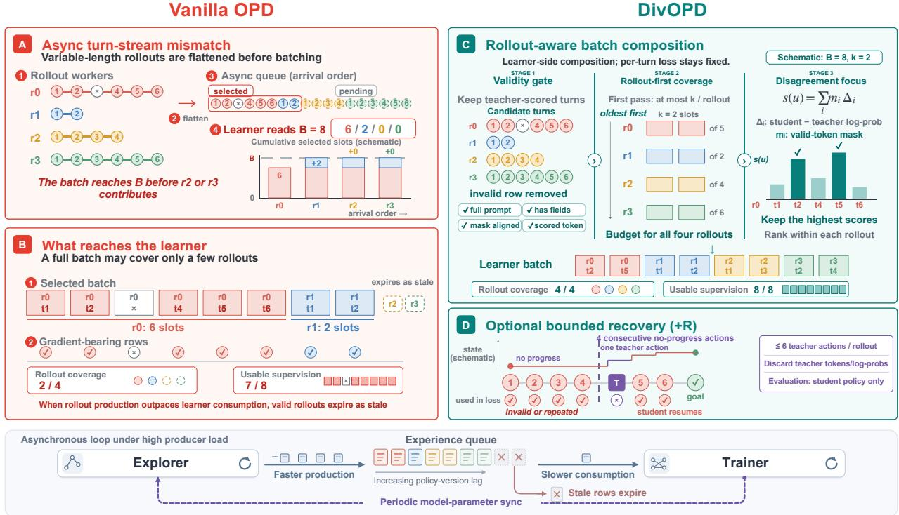  
Figure 1: Batch composition in asynchronous multi-turn OPD. (A) Rollout workers enqueue variable-length interactions in arrival order. (B) When production outpaces learner consumption, early or long rollouts can fill the batch, include unscored rows, and leave others to expire as stale. (C) DivOPD composes batches on the learner side through the three stages in Section 3: validity gate, rollout-first coverage, and within-rollout disagreement focus using s(u) (Equation 2). (D) When rollouts repeatedly make no progress, bounded teacher recovery helps the student continue; teacher actions are excluded from the loss, and recovery is disabled at evaluation. Bottom: independent exploration and training, with periodic model synchronization and stale-row expiry.

Vanilla OPD TCOD-F2B DivOPD  
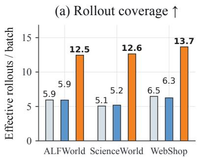

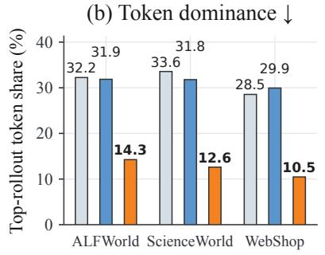

(c) Turn concentration ↓  
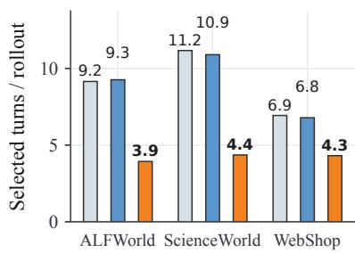  
Figure 2: DivOPD changes batch composition across environments. Each bar averages the final-40% diagnostic over the two student sizes in that environment. DivOPD covers more rollouts and reduces both concentration measures in all three environments; TCOD-F2B remains close to vanilla OPD. The six setting-level results appear in Appendix Table 9.

## 2.2 WHERE THE BATCH BUDGET GOES

Each queued turn is identified by rollout ID and turn index (rid, t). We ask two questions: how many rollouts are represented in each batch, and how many are ever used before they expire? For a batch, let $p _ { r }$ be the fraction of tokens from rollout r. The effective rollout count $( \sum _ { r } p _ { r } ^ { 2 } ) ^ { - 1 }$ measures token-weighted coverage, and max $p _ { r }$ measures the largest rollout’s share.

Concentration within an update. At the setting level, vanilla OPD batches contain only 3.9–8.3 effective rollouts, and the largest rollout supplies 24–40% of batch tokens. In addition, 5.0–27.8% of selected rows on ALFWorld and WebShop have no teacher-scored token in the final training window. All ScienceWorld rows pass the validity checks, allowing us to examine allocation without dead-slot removal.

Rollouts that expire unused. Turns from one rollout arrive together. With a finite staleness window, repeatedly selecting from early rollouts leaves less time to use later arrivals. Shared-buffer replays show that roughly half of valid rollouts are never selected by the arrival-order reader (Appendix Table 11). This motivates spreading batch slots across rollouts before ranking their turns. Section 4 tests whether changing this allocation improves learning.

## 3 DIVOPD

Motivated by the batch composition in Figure 2, DivOPD composes learner batches from this asynchronous queue of already scored turns. It first combines turns retained from earlier updates (pending turns) with new arrivals in a pool of at most cB turns. From this pool, the three stages shown from left to right in Figure 1C remove invalid turns, allocate slots across rollouts, and rank turns within each rollout. The batch contains B valid turns whenever the pool has enough.

## 3.1 STAGE 1: VALIDITY GATE

A turn is valid only if its prompt was not truncated and it contains the tokens, teacher log probabilities, and action mask needed by the loss. If a teacher-valid mask is supplied, it must align with the action mask and share at least one valid position. Turns that fail these checks are discarded before batch selection.

In four ALFWorld replay buffers, every rejected row is a response turn with a truncated prompt from a failed rollout and zero scored tokens. Removing these rows frees slots for valid turns. Longer context windows or truncating the history before generation could also prevent such rows (Appendix E.4).

## 3.2 STAGE 2: ROLLOUT-FIRST COVERAGE

To prevent one long rollout from filling the batch, the composer groups valid turns by rollout ID and visits the longestwaiting groups first. On the first pass through these groups, each rollout contributes at most k turns, which guarantees $\lceil B / k \rceil$ distinct rollouts whenever that many groups are available. If the batch is not full, each additional pass raises the cap by one. Thus k limits the first pass, not the final number of turns per rollout. Unlike shuffling, this changes which turns enter the batch, not just their order.

Unselected valid turns are kept for later updates until they expire. This allows more rollouts to enter each batch and gives waiting rollouts another chance to be used. The cap counts turns, not tokens, so it does not bound a rollout’s token share when response lengths vary.

## 3.3 STAGE 3: WITHIN-ROLLOUT DISAGREEMENT FOCUS

Once a rollout receives slots, focus chooses the turns that fill them. Let $v ( u )$ be the student policy version that generated turn u. DivOPD ranks its valid turns by the cached score over its valid tokens $V _ { u }$

$$
s ( u ) = \sum _ { i \in V _ { u } } \left[ \log \pi _ { \theta _ { v ( u ) } } ( y _ { i } \mid h _ { u , < i } ) - \log \pi _ { \phi } ( y _ { i } \mid h _ { u , < i } ) \right] ,\tag{2}
$$

in descending order, breaking ties by (rid, t), on every pass. The score measures cumulative, not per-token, disagreement: it equals the valid-token count times the mean token score. With a complete response mask, its expectation is the sequence-level reverse KL at the generating policy (Gu et al., 2024; Agarwal et al., 2023); a partial mask restricts it to scored tokens. A small signed sum may occur because positive and negative token scores cancel.

Focus uses this score only to rank turns within allocated rollout slots; it neither takes slots from other rollouts nor adds a length-based loss weight. The score reuses cached log probabilities without another model pass. It is a selection heuristic, not the current learner’s row loss or gradient norm: the learner can be up to two versions ahead. Appendix E.2 audits ranking stability under this lag; Section 4.4 tests its added benefit at fixed allocation.

## 3.4 OPTIONAL BOUNDED TEACHER RECOVERY

Batch selection cannot help a rollout that repeatedly makes no progress. DivOPD+R therefore lets the teacher act for at most m turns after p no-progress turns, then returns control to the student. Teacher actions receive no distillation weight, subsequent student turns use the same composer, and recovery is disabled during evaluation. Unlike core DivOPD, +R changes the visited trajectory. Appendix G defines the trigger and gives the per-setting patience, takeover cap, and warmup values.

## 3.5 TRAINING DISTRIBUTION AND INVARIANTS

The per-turn loss is fixed, but selection still changes what the update averages over. Coverage limits the influence of rollout length on allocation, and focus shifts weight toward high-disagreement turns inside each rollout. We do not add importance weights to undo either change; Appendix E.1 states this shift precisely.

DivOPD-base uses the same gate and rollout allocations with uniform within-rollout sampling; DivOPD replaces that sampling with focus. Both use Equation 1 with unit per-turn weights, and the same reduction, optimizer, and rollout procedure as vanilla OPD. Appendix Table 3 collects the batch, pool, staleness, pending, cap, and loss settings. Algorithm 1 gives the full procedure; core DivOPD changes only queue consumption.

## 4 EXPERIMENTS

## 4.1 SETUP AND METRICS

We use the same asynchronous explorer–learner pipeline for all methods and evaluate two student scales per environment: ALFWorld (Shridhar et al., 2020) (Qwen3-1.7B/4B), WebShop (Yao et al., 2022) (Qwen2.5-3B/7B-Instruct), and ScienceWorld (Wang et al., 2022) (Qwen2.5-1.5B/3B-Instruct). Teachers are environment-specific GiGPO-Qwen2.5-7B models (Feng et al., 2026) on ALFWorld and WebShop, and the ScienceWorld checkpoint released with Embodied-Planner-R1 (Fei et al., 2025) on ScienceWorld. Baselines are vanilla OPD (Lin et al., 2020; Agarwal et al., 2023), TCOD-F2B (Wang et al., 2026c), and TurnOPD (Zhou et al., 2026), all with the same learner batch size. DivOPD-focus is an earlier focus-first composer reported for reference; it does not share the sampler of the other DivOPD variants, so it is not a controlled ablation of focus. DivOPD+R follows Section 3.4; exact settings appear in Appendix G, and evaluation remains student-only.

Vanilla reads B candidates per update; DivOPD can inspect cB pending and fresh turns. A no-cap control with uniform within-rollout sampling matches DivOPD-base’s candidate access (Section 4.4). Appendix A gives all numerical training and evaluation settings.

We report peak success rate (SR) and final-five SR, the mean over the last five evaluation checkpoints; ± denotes the standard deviation across those checkpoints. For efficiency, the target success rate τ is a multiple of 5 at or below vanilla OPD’s peak SR. For either cumulative learner-side resource C (training tokens or trainer GPU-hours), we report $C _ { \mathrm { v a n i l l a } } ( \dot { \tau } ) / C _ { \mathrm { m e t h o d } } ( \tau )$ , where each cost is accumulated through the first evaluation reaching τ. Values above one favor the method; a dash means that the method did not reach τ. We also report normalized area under the successrate curve over a common learner-update budget (nAUC), equivalently the mean SR over that budget, as a target-free comparison (Section 4.3). The trainer-loop wall-time estimate, which includes experience reads, improves by 1.14× on geometric average, although WebShop 3B and 7B show no wall-time gain (0.99× and 0.83×); Appendix F gives the full breakdown.

## 4.2 SUCCESS RATES ACROSS SIX SETTINGS

Table 1 compares accuracy and learner-side efficiency to target.

Across the six settings, DivOPD raises mean peak SR from 77.4 to 84.4 and final-five SR from 71.5 to 78.6. Peak SR improves in all six settings and final-five SR in five. On ALFWorld 1.7B, where late checkpoints fluctuate, DivOPD+R reaches the highest final-five SR (78.29 ± 1.20).

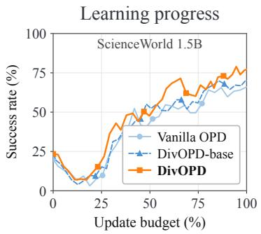

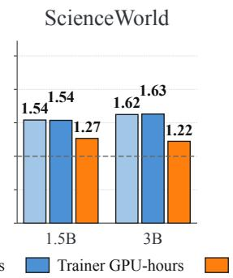

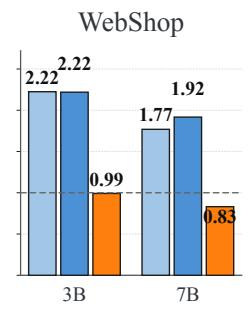  
Geometric mean: 1.84× / 1.87× / 1.14×  
Figure 3: Efficiency depends on which cost is measured. Left: unsmoothed ScienceWorld 1.5B learning curves over a common 243-update budget. Right: vanilla-to-DivOPD cost ratios to the first evaluation at τ; values above one favor DivOPD. Wall time includes experience reads (Appendix Table 15).

Table 1: Main results. Peak/Final-5 are best-checkpoint/final-five mean SR $( \% ) ; \pm \mathrm { i } $ s the standard deviation over the last five checkpoints. Headers give teacher/student-initial SR. Tok./GPU are $C _ { \mathrm { v a n i l l a } } ( \tau ) / C _ { \mathrm { m e t h o d } } ( \tau )$ for cumulative learner training tokens and trainer GPU-hours, respectively. Larger is better; a dash means that the method did not reach τ. Red/purple mark best/second-best; DivOPD-focus is an uncontrolled reference.
<table><tr><td>ALFWorld</td><td colspan="4">Qwen3-1.7B (T/Init: 87.86/7.86; τ=70)</td><td colspan="4">Qwen3-4B (T/Init: 87.86/26.43; τ=80)</td></tr><tr><td>Method</td><td>Peak↑</td><td>Final-5↑</td><td>Tok.↑</td><td> $\mathbf { G P U \uparrow }$ </td><td>Peak↑</td><td>Final-5↑</td><td>Tok.↑</td><td>GPU↑</td></tr><tr><td>Vanilla OPD</td><td>77.86</td><td> $7 4 . 0 0 \pm 3 . 1 8$ </td><td>1.00×</td><td>1.00×</td><td>86.43</td><td> $8 4 . 5 7 \pm 1 . 4 8$ </td><td>1.00×</td><td>1.00×</td></tr><tr><td>TCOD-F2B</td><td>72.86</td><td> $6 8 . 4 3 \pm 3 . 0 9$ </td><td>1.62×</td><td>1.63×</td><td>87.14</td><td> $8 3 . 0 0 \pm 1 . 2 8$ </td><td>1.49×</td><td>1.51×</td></tr><tr><td>TurnOPD</td><td>78.57</td><td> $7 5 . 7 1 \pm 2 . 7 2$ </td><td>1.77×</td><td>1.76×</td><td>87.14</td><td> $8 6 . 4 3 \pm 0 . 5 1$ </td><td>1.57×</td><td>1.59×</td></tr><tr><td>DivOPD-focus</td><td>80.00</td><td> $7 1 . 0 0 \pm 6 . 6 2$ </td><td>1.50×</td><td>1.46×</td><td>89.29</td><td> $8 5 . 2 9 \pm 3 . 1 0$ </td><td>1.69×</td><td>1.70×</td></tr><tr><td>DivOPD-base</td><td>74.29</td><td> $7 2 . 8 6 \pm 1 . 4 3$ </td><td>1.35×</td><td>1.35×</td><td>92.14</td><td> $8 8 . 8 6 \pm 2 . 2 9$ </td><td>1.27×</td><td>1.27×</td></tr><tr><td>DivOPD</td><td>79.29</td><td> $7 1 . 8 6 \pm 7 . 2 9$ </td><td>2.05×</td><td>2.07×</td><td>91.43</td><td> $8 8 . 0 0 \pm 2 . 7 4$ </td><td>1.92×</td><td>1.94×</td></tr><tr><td>DivOPD+R</td><td>82.86</td><td> ${ \bf 7 8 . 2 9 \pm 1 . 2 0 }$ </td><td>2.17&gt; ×</td><td>2.19×</td><td>92.14</td><td> $\mathbf { 8 9 . 0 0 \pm 2 . 5 1 }$ </td><td>1.90×</td><td>1.91X</td></tr><tr><td>WebShop</td><td colspan="4">Qwen2.5-3B (T/Init: 85.94/1.56; τ=60)</td><td colspan="4">Qwen2.5-7B (T/Init: 85.94/14.06; τ=85)</td></tr><tr><td>Method</td><td>Peak↑</td><td>Final-5↑</td><td>Tok.↑</td><td>GPU↑</td><td>Peak↑</td><td>Final-5↑</td><td>Tok.↑</td><td>GPU↑</td></tr><tr><td>Vanilla OPD</td><td>60.94</td><td> $4 3 . 4 4 \pm 1 3 . 0 2$ </td><td>1.00×</td><td>1.00×</td><td>87.50</td><td> $8 2 . 5 0 \pm 3 . 1 1$ </td><td>1.00×</td><td>1.00×</td></tr><tr><td>TCOD-F2B TurnOPD</td><td>67.19</td><td> $6 1 . 7 2 \pm 4 . 4 2$ </td><td>1.64×</td><td>1.64×</td><td>89.06</td><td> $8 3 . 5 9 \pm 3 . 7 9$ </td><td>1.27×</td><td>1.40×</td></tr><tr><td></td><td>68.75</td><td> $5 8 . 5 9 \pm 8 . 8 0$ </td><td>1.86×</td><td>1.84×</td><td>89.84</td><td> $8 5 . 9 4 \pm 2 . 4 7$ </td><td>1.30×</td><td>1.41×</td></tr><tr><td>DivOPD-focus</td><td>70.31</td><td> $6 6 . 4 1 \pm 3 . 4 5$ </td><td>2.37×</td><td>2.40×</td><td>89.84</td><td> $8 6 . 8 8 \pm 2 . 1 7$ </td><td>1.91×</td><td>1.99×</td></tr><tr><td>DivOPD-base</td><td>78.12</td><td> $7 3 . 1 2 \pm 4 . 6 4$ </td><td>1.88×</td><td>1.88×</td><td>88.28</td><td> $7 8 . 4 4 \pm 4 . 3 7$ </td><td>1.11×</td><td>1.22×</td></tr><tr><td>DivOPD</td><td>78.12</td><td> $6 7 . 8 1 \pm 3 . 9 6$ </td><td>2.22×</td><td>2.22×</td><td>90.62</td><td> $8 2 . 6 6 \pm 5 . 2 5$ </td><td>1.77×</td><td>1.92×</td></tr><tr><td>DivOPD+R</td><td>79.69</td><td> $\mathbf { 7 6 . 4 1 \pm 4 . 0 4 }$ </td><td>2.60×</td><td>2.61×</td><td>89.84</td><td> $\mathbf { 8 8 . 2 8 \pm 2 . 7 1 }$ </td><td>1.52×</td><td>1.67×</td></tr><tr><td>ScienceWorld</td><td colspan="4">Qwen2.5-1.5B (T/Init: 93.75/21.48; τ=65)</td><td colspan="4">Qwen2.5-3B (T/Init: 93.75/45.31; τ=85)</td></tr><tr><td>Method</td><td>Peak↑</td><td>Final-5↑</td><td>Tok.↑</td><td>GPU↑</td><td>Peak↑</td><td>Final-5↑</td><td>Tok.↑</td><td>GPU↑</td></tr><tr><td>Vanilla OPD</td><td>66.02</td><td> $6 3 . 7 5 \pm 2 . 4 9$ </td><td>1.00×</td><td>1.00×</td><td>85.55</td><td> $8 0 . 7 8 \pm 4 . 0 9$ </td><td>1.00×</td><td>1.00×</td></tr><tr><td>TCOD-F2B</td><td>71.88</td><td> $6 6 . 3 3 \pm 3 . 7 7$ </td><td>1.21×</td><td>1.27×</td><td>87.89</td><td> $8 3 . 9 8 \pm 2 . 5 8$ </td><td>1.21 ×</td><td>1.20 ×</td></tr><tr><td>TurnOPD</td><td>71.48</td><td> $6 8 . 7 5 \pm 3 . 6 5$ </td><td>1.49×</td><td>1.54×</td><td>83.20</td><td> $8 0 . 8 6 \pm 2 . 7 2$ </td><td></td><td></td></tr><tr><td>DivOPD-focus</td><td>66.80</td><td> $6 1 . 8 8 \pm 4 . 7 1$ </td><td>0.94×</td><td>0.95×</td><td>77.34</td><td> $7 4 . 6 9 \pm 2 . 2 0$ </td><td></td><td></td></tr><tr><td>DivOPD-base</td><td>70.31</td><td> $6 7 . 5 0 \pm 2 . 2 0$ </td><td>1.00×</td><td>0.99×</td><td>86.72</td><td> $8 2 . 6 6 \pm 1 . 5 0$ </td><td>1.00×</td><td>0.99×</td></tr><tr><td>DivOPD</td><td>78.91</td><td> $7 6 . 0 9 \pm 2 . 2 3$ </td><td>1.54×</td><td>1.54×</td><td>88.28</td><td> ${ \bf 8 5 . 4 7 \pm 2 . 4 9 }$ </td><td>1.62×</td><td>1.63×</td></tr><tr><td>DivOPD+R</td><td>78.12</td><td> ${ \bf 7 7 . 4 2 \pm 0 . 7 5 }$ </td><td>1.29×</td><td>1.30×</td><td>90.23</td><td> $8 5 . 0 8 \pm 2 . 9 2$ </td><td>1.03×</td><td>1.07×</td></tr></table>

Protocol. All runs use two trainer GPUs. Full updates and GPU hours appear in Appendix Table 7.

## 4.3 LEARNER EFFICIENCY AND ELAPSED TIME

Our primary efficiency claim concerns learner-side resources. We report learner training tokens, trainer GPU-hours, and elapsed trainer-loop time separately (Figure 3, right) because reducing learner work need not accelerate the whole pipeline equally.

DivOPD reaches every target with fewer learner training tokens and trainer GPU-hours than vanilla OPD: the geometric-mean speedups are 1.84× and 1.87×, respectively. On ALFWorld and WebShop, the gain combines fewer updates with fewer tokens per update; on ScienceWorld, where all rows are valid, it comes primarily from fewer updates. Appendix F gives the cost breakdown.

The trainer-loop wall-time estimate improves by 1.14× on geometric average, but the ratio is 0.99× on WebShop 3B and 0.83× on WebShop 7B. Once learner updates become cheaper, rollout generation and data reads account for a larger share of elapsed time (Appendix F).

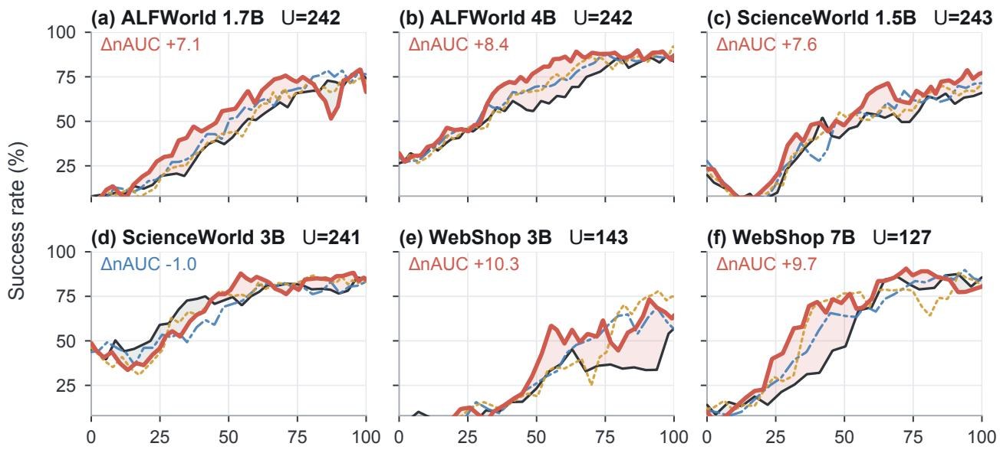  
Share of the common learner-update budget U (%)  
Figure 4: Learning curves at a common update budget. Each panel aligns the archived runs on the largest learnerupdate budget U they share. Curves are unsmoothed evaluation success rates. The normalized area under each curve (nAUC) is its mean SR over this budget; shading shows the area between DivOPD and vanilla OPD. Appendix B gives the protocol.

A target-free comparison. We also align the archived runs on a common learner-update budget U (Figure 4). DivOPD has the higher nAUC in five of six settings, providing evidence of improvement without selecting a target τ . Figure 3 (left) enlarges the ScienceWorld 1.5B comparison.

Sensitivity to asynchronous producer load. Table 2 varies the explorer rollout batch on ALFWorld 1.7B over 150 learner updates, with sampler settings fixed. The two readers share the producer configuration. To show the pressure that actually accumulates, we report the measured queue arrival rate divided by the learner drain rate. A value above one means experience enters the queue faster than the learner removes it; this ratio is an outcome of the reader, not a matched control. Vanilla OPD and DivOPD-base are nearly tied in final SR at light load, where both measured ratios are below one. At medium and high load, DivOPD-base raises final SR by 2.9 and 10.0 points and greatly reduces the raw stale-row count. Relative to vanilla, its nAUC is higher by 0.4, 0.7, and 0.9 points from light to high load, so the advantage is visible over the fixed training budget rather than only at the final checkpoint. This pattern is consistent with the intended use case: allocating limited learner slots when production exceeds consumption.

Table 2: Stress test under increasing asynchronous producer load. ALFWorld Qwen3-1.7B over 150 learner updates. Arrival/drain is the measured queue arrival rate divided by the learner drain rate; values above one indicate a growing backlog. SR and nAUC are percentages; stale rows are raw counts. Bold marks the better value within each load level.
<table><tr><td>Load</td><td>Reader</td><td>Rollout bs</td><td>Arrival/drain</td><td>Final SR↑</td><td>nAUC@150↑</td><td>Stale rows↓</td></tr><tr><td rowspan="2">Low</td><td>Vanilla OPD</td><td>2</td><td>0.77</td><td>52.1</td><td>25.0</td><td>240</td></tr><tr><td>DivOPD-base</td><td></td><td>0.55</td><td>52.0</td><td>25.4</td><td>53</td></tr><tr><td rowspan="2">Medium</td><td>Vanilla OPD</td><td>6</td><td>1.35</td><td>53.6</td><td>25.3</td><td>8,035</td></tr><tr><td>DivOPD-base</td><td>6</td><td>0.88</td><td>56.5</td><td>26.0</td><td>4,237</td></tr><tr><td rowspan="2">High</td><td>Vanilla OPD</td><td></td><td>2.27</td><td>49.3</td><td>26.9</td><td>30,175</td></tr><tr><td>DivOPD-base</td><td>16</td><td>0.89</td><td>59.3</td><td>27.8</td><td>9,766</td></tr></table>

## 4.4 SEPARATING COVERAGE FROM FOCUS

DivOPD differs from vanilla OPD in three ways: it filters invalid turns, reads more candidates, and changes turn selection. We therefore use separate controls to test the cap and focus (Figure 5).

(c) Focus efficiency

Cap with the same candidate access. We compare DivOPD-base with an uncapped $( k = \infty )$ control. Both use the same cB candidate-pool size, validity gate, oldest-first order, pending mechanism, and uniform within-rollout sampling. Across the six settings, finite k has higher peak SR throughout (mean +2.1 points) and higher final-five SR in five (mean +3.4), with all other selection rules fixed (Table 18).

Selection with the same candidate access. We give vanilla OPD the same 256-turn candidate stream on one setting per environment and compare it with rollout-first selection (Table 17). Rollout-first selection yields peak SR 1.4–4.3 points higher and Best-5 SR 1.7–5.6 points higher in all three runs. At the common cutoff, final SR is higher on ScienceWorld, tied on ALFWorld, and lower on WebShop. Because these are separate runs truncated at a common learner-version cutoff, their absolute SR is not comparable to Table 1.

Focus with the same rollout allocation. DivOPD and DivOPD-base assign slots in the same way but choose different turns within each rollout. Focus raises mean peak SR by 2.8 points and reduces trainer-GPU time-to-target in all six settings, giving a further 1.38–1.60× dataset-mean speedup over DivOPD-base. Final-five SR rises in only three settings (mean +1.4 points).

Cap sensitivity. Peak SR varies by up to 7.9 points within a setting over $k \in \{ 3 , \ldots , 6 \}$ (Appendix Table 19). The best cap varies by setting, so choosing k matters.

## 4.5 WHICH ROLLOUTS AND TURNS ARE SELECTED?

Coverage brings more rollouts into training. We replay the selection rules on shared buffers so that every method sees the same experience. Appendix Table 11 tracks whether each valid rollout contributes any turn over 100 updates. Rollout-first selection lowers the unused fraction from 49–59% to 7–14% and reduces the concentration of selected turns. DivOPD-base and DivOPD allocate rollouts identically here; focus changes which turns are taken, not how many rollouts are reached.

Focus selects different gradients. Holding the candidate pool and the rollout allocation fixed, we compare selected gradients with the mean gradient of all valid candidate turns. Focus increases the measured projection onto this pool gradient in all 24 audited updates (Appendix E.3). This is a diagnostic before the optimizer update, not a guarantee of better learning.

In the ALFWorld 1.7B replay, focus selects earlier turns from failed rollouts without changing the success/failure mix (Appendix Table 14). Pairwise gradient cosines stay near zero for every composer: this diagnostic does not show a clear change in within-batch gradient similarity.

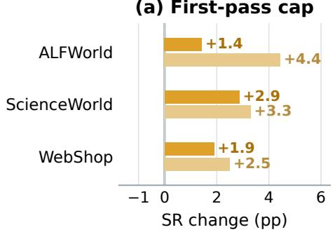  
Peak SR Final-five SR

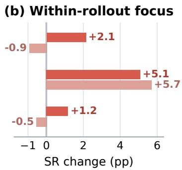

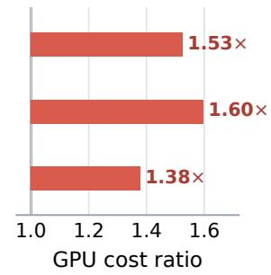  
Figure 5: The cap improves both metrics; focus improves peak SR and learner efficiency. Each bar averages the two model sizes within one dataset. (a) DivOPD-base minus the matched-access $k = \infty$ control isolates the cap. (b) DivOPD minus DivOPD-base isolates focus at fixed rollout allocation; positive values favor focus. (c) $C _ { \mathrm { b a s e } } ^ { \mathrm { - } } ( \tau ) / C _ { \mathrm { D i v O P D } } ( \tau )$ for trainer GPU-hours; values above one mean that focus reaches τ with less trainer compute. Setting-level results are in Tables 18 and 1.

Disagreement is more evenly spread across selected rollouts. Figure 6 tracks the standard deviation of the total disagreement from each rollout in a learner batch. It is lower under DivOPD than vanilla OPD through most of training on ALFWorld and ScienceWorld.

Extending selection to no-progress rollouts. Adding recovery to DivOPD raises final-five mean SR in five of six settings (cross-setting mean $7 8 . 6  8 2 . 4 )$ and peak SR in four, while retaining a geometric-mean trainer-GPU speedup of about 1.7× over vanilla OPD. These learner-side ratios exclude teacher-generation cost (Appendix Figure 9).

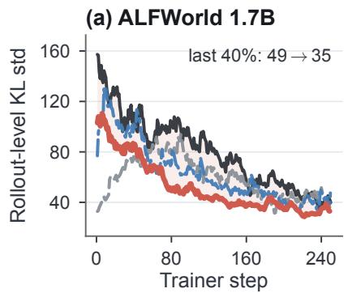

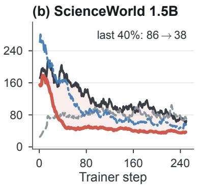

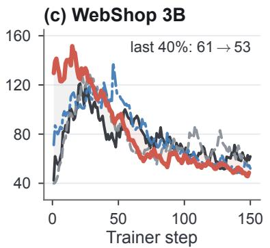  
Figure 6: Cross-rollout disagreement, one setting per environment. Curves show the EMA (α = 0.12) of the within-batch standard deviation of rollout-summed disagreement; labels give the final-40% mean (vanilla → DivOPD). Red/gray shading marks where DivOPD is lower/higher. All settings appear in Figure 7.

## 5 RELATED WORK

Agentic OPD. Generative distillation changes the sequence source or objective (Gu et al., 2024; Ko et al., 2024); TurnOPD balances turns (Zhou et al., 2026); TCOD and early stopping control rollout length (Wang et al., 2026c; Ziheng et al., 2026); and Guided-OPD and FutureBridge-OPD change visited states through teacher intervention (Li et al., 2026; Chen et al., 2026a). DivOPD instead selects which scored turns enter each asynchronous learner batch (Appendix Table 8).

Multi-teacher and asynchronous OPD. Multi-teacher OPD and Open-MOPD route supervision or balance token budgets across domains (Ma et al., 2026; Gao et al., 2026). AsyncOPD, Near-Policy, and f-OPD control policy lag through correction, filtering, or freshness (Kang et al., 2026; Rang et al., 2026; Chen et al., 2026b). These operate at the domain or sample level; DivOPD allocates a turn budget across correlated rollouts in one asynchronous learner queue.

Data selection and asynchronous learning. Prioritized selection favors informative examples (Loshchilov & Hutter, 2015; Schaul et al., 2015; Katharopoulos & Fleuret, 2018; Mindermann et al., 2022), DAPO drops zero-gradient groups (Yu et al., 2026), and asynchronous actor–learner systems control policy lag (Espeholt et al., 2018; Fu et al., 2025; Hu et al., 2026). DivOPD instead separates rollout allocation from turn selection when queued, variable-length rollouts compete for a fixed learner budget.

## 6 CONCLUSION AND FUTURE WORK

Arrival-order batching in asynchronous multi-turn OPD can let early or long rollouts dominate a fixed learner budget, leaving valid experience unused. DivOPD treats this as a batch-composition problem: it filters unusable turns, caps each rollout’s first-pass contribution, and focuses allocated slots on high-disagreement turns. The per-turn loss and optimizer stay unchanged; selection changes the data-weighted training objective.

Across six Qwen-family settings on three benchmarks, DivOPD raises mean peak SR from 77.4 to 84.4 and final-five SR from 71.5 to 78.6, while achieving geometric-mean speedups of 1.84× in learner training tokens and 1.87× in trainer GPU-hours. Controls support the cap and broader coverage; focus improves peak SR and time-to-target, while the stress test shows that gains grow with producer load. Recovery further raises mean final-five SR to 82.4 while retaining about 1.7× trainer-GPU speedup. These gains require neither a learned selector nor a new per-turn loss.

Batch construction is therefore part of the learning algorithm in asynchronous multi-turn OPD, not neutral systems plumbing. Evidence remains limited to simulated benchmarks and Qwen-family models; total pipeline gains also depend on rollout and teacher costs. Future work should broaden these settings, measure end-to-end resources, and adapt allocation to queue pressure.

## AI USE STATEMENT

Generative AI tools were used to draft portions of the manuscript and to assist with language polishing and organization. The authors supplied the scientific content and evidence, reviewed and revised all AI-assisted text, and verified quantitative statements against experiment logs and source artifacts. The authors take full responsibility for the final manuscript.

## ETHICS STATEMENT

This work uses public simulated benchmarks and involves no human participants or personal data. It studies training efficiency rather than deployment in open-world systems. Teacher intervention can make an agent more capable, so deployment in settings with real users or high-impact actions would require task-specific safety evaluation and human review beyond the experiments reported here.

## REPRODUCIBILITY STATEMENT

Section 3 specifies the composer and all of its default hyperparameters; Section 4 specifies the environments, student– teacher pairs, and the budget-to-target protocol. DivOPD-base, DivOPD, and DivOPD+R share one sampler implementation; DivOPD-focus is documented separately. Every method row of Appendix Table 7 corresponds to a single configuration file. The code and these configuration files will be released at https://github.com/ HanyangWang0418-oss/DivOPD.

## REFERENCES

Rishabh Agarwal, Nino Vieillard, Piotr Stanczyk, Sabela Ramos, Matthieu Geist, and Olivier Bachem. Gkd: Generalized knowledge distillation for auto-regressive sequence models. arXiv preprint arXiv:2306.13649, 12, 2023.

Samy Bengio, Oriol Vinyals, Navdeep Jaitly, and Noam Shazeer. Scheduled sampling for sequence prediction with recurrent neural networks. Advances in neural information processing systems, 28, 2015.

Chishui Chen, Yaoyou Fan, Te Sun, Yi Yang, Chenghao Sun, Delin Mao, Hongbo Qiao, Zuowei Zhang, Junxi Wang, Chenxing Sun, et al. Look ahead before you distill: Future trajectory validation of teacher guidance for agentic on-policy distillation. arXiv preprint arXiv:2608.01953, 2026a.

Xianwei Chen, Shimin Zhang, and Jibin Wu. f-opd: Stabilizing long-horizon on-policy distillation with freshness-aware control. arXiv preprint arXiv:2605.17862, 2026b.

Lasse Espeholt, Hubert Soyer, Remi Munos, Karen Simonyan, Vlad Mnih, Tom Ward, Yotam Doron, Vlad Firoiu, Tim Harley, Iain Dunning, et al. Impala: Scalable distributed deep-rl with importance weighted actor-learner architectures. In International conference on machine learning, pp. 1407–1416. PMLR, 2018.

Zhaoye Fei, Li Ji, Siyin Wang, Junhao Shi, Jingjing Gong, and Xipeng Qiu. Unleashing embodied task planning ability in llms vi reinforcement learning. arXiv preprint arXiv:2506.23127, 2025.

Lang Feng, Zhenghai Xue, Tingcong Liu, and Bo An. Group-in-group policy optimization for llm agent training. Advances in Neural Information Processing Systems, 38:46375–46408, 2026.

Wei Fu, Jiaxuan Gao, Xujie Shen, Chen Zhu, Zhiyu Mei, Chuyi He, Shusheng Xu, Guo Wei, Jun Mei, Jiashu Wang, Tongkai Yang, Binhang Yuan, and Yi Wu. AReaL: A large-scale asynchronous reinforcement learning system for language reasoning. arXiv preprint arXiv:2505.24298, 2025.

Huan-ang Gao, Haohan Chi, Yong Yan, Shiyuan Feng, Hanlin Wu, Zheng Jiang, Bingxiang He, Wei-Ying Ma, Ya-Qin Zhang, and Hao Zhou. Open-MOPD: Diagnosing and fixing capability imbalance in multi-teacher on-policy distillation. arXiv preprint arXiv:2608.19098, 2026.

Jiaxuan Gao, Wei Fu, Minyang Xie, Shusheng Xu, Chuyi He, Zhiyu Mei, Banghua Zhu, and Yi Wu. Beyond ten turns: Unlocking long-horizon agentic search with large-scale asynchronous RL. arXiv preprint arXiv:2508.07976, 2025.

Yuxian Gu, Li Dong, Furu Wei, and Minlie Huang. Minillm: Knowledge distillation of large language models. In International Conference on Learning Representations, volume 2024, pp. 32694–32717, 2024.

Geoffrey Hinton, Oriol Vinyals, and Jeff Dean. Distilling the knowledge in a neural network. arXiv preprint arXiv:1503.02531, 2015.

Tianhao Hu, Xiangcheng Liu, Yuchun Miao, Youshao Xiao, Hongyu Zang, Yang Zheng, Xuan Huang, Jinrui Ding, Yufei Zhang, Yu Yang, et al. DORA: A scalable asynchronous reinforcement learning system for language model training. arXiv preprint arXiv:2604.26256, 2026.

Wonjun Kang, Kevin Galim, Seunghyuk Oh, Minjun Kang, Sanghyun Park, Donghoon Kim, Minjae Lee, Minseo Kim, Rishabh Tiwari, Yuchen Zeng, Hyung Il Koo, and Kangwook Lee. AsyncOPD: How stale can on-policy distillation be? arXiv preprint arXiv:2606.24143, 2026.

Angelos Katharopoulos and François Fleuret. Not all samples are created equal: Deep learning with importance sampling. In International conference on machine learning, pp. 2525–2534. PMLR, 2018.

Yoon Kim and Alexander M Rush. Sequence-level knowledge distillation. In Proceedings of the 2016 conference on empirical methods in natural language processing, pp. 1317–1327, 2016.

Kimi Team. Kimi K3: Open frontier intelligence. arXiv preprint arXiv:2607.24653, 2026.

Jongwoo Ko, Sungnyun Kim, Tianyi Chen, and Se-Young Yun. Distillm: Towards streamlined distillation for large language models. arXiv preprint arXiv:2402.03898, 2024.

Gengsheng Li, Mao Zheng, Mingyang Song, Ruiqi Liu, Tianyu Yang, Jie Sun, Qiyong Zhong, Haiyun Guo, Junfeng Fang, Dan Zhang, et al. On-policy distillation with curriculum turn-level guidance for multi-turn agents. arXiv preprint arXiv:2606.15912, 2026.

Alexander Lin, Jeremy Wohlwend, Howard Chen, and Tao Lei. Autoregressive knowledge distillation through imitation learning. In Proceedings ofthe 2020 Conference on Empirical Methods in Natural Language Processing (EMNLP), pp. 6121–6133, 2020.

Ilya Loshchilov and Frank Hutter. Online batch selection for faster training of neural networks. arXiv preprint arXiv:1511.06343, 2015.

Wenhan Ma, Jianyu Wei, Liang Zhao, Hailin Zhang, Bangjun Xiao, Lei Li, Qibin Yang, Bofei Gao, Yudong Wang, Rang Li, Jinhao Dong, Zhifang Sui, and Fuli Luo. MOPD: Multi-teacher on-policy distillation for capability integration in LLM post-training. arXiv preprint arXiv:2606.30406, 2026.

Sören Mindermann, Jan M Brauner, Muhammed T Razzak, Mrinank Sharma, Andreas Kirsch, Winnie Xu, Benedikt Höltgen, Aidan N Gomez, Adrien Morisot, Sebastian Farquhar, et al. Prioritized training on points that are learnable, worth learning, and not yet learnt. In International Conference on Machine Learning, pp. 15630–15649. PMLR, 2022.

Miao Rang, Zhenni Bi, Hang Zhou, Kai Han, Xuechun Wang, An Xiao, Xinghao Chen, Yunhe Wang, and Hanting Chen. Nearpolicy: Accelerating on-policy distillation via asynchronous generation and selective packing. arXiv preprint arXiv:2605.05940, 2026.

Stéphane Ross, Geoffrey Gordon, and Drew Bagnell. A reduction of imitation learning and structured prediction to no-regret online learning. In Proceedings of the fourteenth international conference on artificial intelligence and statistics, pp. 627–635. JMLR Workshop and Conference Proceedings, 2011.

Tom Schaul, John Quan, Ioannis Antonoglou, and David Silver. Prioritized experience replay. arXiv preprint arXiv:1511.05952, 2015.

Mohit Shridhar, Xingdi Yuan, Marc-Alexandre Côté, Yonatan Bisk, Adam Trischler, and Matthew Hausknecht. Alfworld: Aligning text and embodied environments for interactive learning. arXiv preprint arXiv:2010.03768, 2020.

Hanyang Wang, Weijieying Ren, Yuxiang Zhang, Ding Cao, Zhizhao Zeng, Ke Zeng, and Tianxiang Zhao. Bipace: Bisimulationguided policy optimization with action counterfactual estimation for llm agents. arXiv preprint arXiv:2606.25556, 2026a.

Hanyang Wang, Lu Wang, Chaoyun Zhang, Tianjun Mao, Si Qin, Qingwei Lin, Saravan Rajmohan, and Dongmei Zhang. Text2grad: Reinforcement learning from natural language feedback. In International Conference on Learning Representations, volume 2026, pp. 50627–50664, 2026b.

Jiaqi Wang, Wenhao Zhang, Weijie Shi, Yaliang Li, and James Cheng. Tcod: Exploring temporal curriculum in on-policy distillation for multi-turn autonomous agents. arXiv preprint arXiv:2604.24005, 2026c.

Ruoyao Wang, Peter Jansen, Marc-Alexandre Côté, and Prithviraj Ammanabrolu. Scienceworld: Is your agent smarter than a 5th grader?, 2022. URL https://arxiv. org/abs/2203.07540, 2022.

Peng Xia, Jianwen Chen, Hanyang Wang, Jiaqi Liu, Kaide Zeng, Yu Wang, Siwei Han, Yiyang Zhou, Xujiang Zhao, Haifeng Chen, et al. Skillrl: Evolving agents via recursive skill-augmented reinforcement learning. arXiv preprint arXiv:2602.08234, 2026.

Bangjun Xiao, Bingquan Xia, Bo Yang, Bofei Gao, Bowen Shen, Chen Zhang, Chenhong He, Chiheng Lou, Fuli Luo, Gang Wang, et al. MiMo-V2-Flash technical report. arXiv preprint arXiv:2601.02780, 2026.

Shunyu Yao, Howard Chen, John Yang, and Karthik Narasimhan. Webshop: Towards scalable real-world web interaction with grounded language agents. Advances in Neural Information Processing Systems, 35:20744–20757, 2022.

Qiying Yu, Zheng Zhang, Ruofei Zhu, Yufeng Yuan, Xiaochen Zuo, Yu Yue, Weinan Dai, Tiantian Fan, Gaohong Liu, Lingjun Liu, et al. Dapo: An open-source llm reinforcement learning system at scale. Advances in Neural Information Processing Systems, 38:113222–113244, 2026.

Yuhang Zhou, Kai Zheng, Haoling Li, Dengyun Peng, Can Xu, and Jingjing Chen. Turnopd: Making on-policy distillation turnaware for efficient long-horizon agent training. arXiv preprint arXiv:2607.05804, 2026.

Yuzhen Zhou, Jiajun Li, Yusheng Su, Gowtham Ramesh, Zilin Zhu, Xiang Long, Chenyang Zhao, Jin Pan, Xiaodong Yu, Ze Wang, et al. APRIL: Active partial rollouts in reinforcement learning to tame long-tail generation. arXiv preprint arXiv:2509.18521, 2025.

Zhou Ziheng, Jiaqi Li, Huacong Tang, Ying Nian Wu, and Demetri Terzopoulos. Less is more: Early stopping rollout for on-policy distillation. arXiv preprint arXiv:2605.27028, 2026.

Algorithm 1: DivOPD sampler (trajectory\_first with turn\_signal=raw\_kl\_sum). Table 3 lists the   
reported numerical settings.

<table><tr><td colspan="3"></td></tr><tr><td>A Sampler-side batch composition .</td><td>..12</td><td>B Fixed-budget results.. .14</td></tr><tr><td>C</td><td>Full main results . .14</td><td>D Batch-composition diagnostics .14</td></tr><tr><td>E</td><td>OPD objective and analysis . . .17 F</td><td>Time and compute analysis . .21</td></tr><tr><td></td><td>G Ablation studies . .22</td><td></td></tr></table>

## A SAMPLER-SIDE BATCH COMPOSITION PROCEDURE

Algorithm 1 gives the reported procedure. After each student turn, the frozen teacher scores the same response and the workflow stores $s ( u )$ from Equation 2; the learner still receives an ordinary OPD batch with unit per-turn weights. VALID(u) requires a complete prompt, tokens, teacher log probabilities, and a nonempty action mask. When present, the teacher-valid mask must align with and overlap the action mask; a missing mask is treated as all-valid. Turns with inference or mask-alignment failures are discarded because waiting cannot make their supervision usable.

```latex
Input: update index q; pending turns $P ;$ rollout buffer E; batch size B; pool multiplier $c ;$ initial per-rollout cap k; maximum
staleness ${ \bar { \boldsymbol { \delta } } } ;$ maximum pending age W.
1 Set $v _ { \mathrm { m i n } } \gets \operatorname* { m a x } ( q - \delta , 0 )$ and remove every u $\in { \cal P }$ with version $. ( u ) < v _ { \operatorname* { m i n } } .$
2 Read F from E with version at least $v _ { \mathrm { m i n } }$ until $| P | + | F | = c B$ (or the read returns no more turns); set $C  P \cup F .$
3 Set $V \gets \{ u \in C : \mathrm { V A L I D } ( u ) \}$ and permanently discard $C \backslash V .$ . Stamp a fresh turn’s first-seen update as $q .$
4 Group V by rollout identifier r. Order rollout groups by oldest first-seen update, breaking ties by r.
5 Within every group, sort turns by descending $s ( u )$ , breaking ties by $( r , t )$ . Initialize the selected set $S \gets \emptyset$ and cap $h  k .$
6 Sweep the ordered rollout groups once. From each group append its highest ranked unselected turns until that group contributes
k turns or $| S | = B .$
7 while $| S | < B$ and an unselected turn remains in V: set $h \gets h + 1$ and sweep the groups again, adding the next-ranked turns
up to cap h.
8 Set $P ^ { \prime }  \{ u \in V \setminus S : q - { \mathrm { f i r s t s e e n } } ( u ) \leq W \}$ ; discard older unselected turns.
9 return S to the unchanged OPD learner and retain $P ^ { \prime }$ for update $q + 1 .$
```

$$
B = 6 4
$$

$$
k = 4 ,
$$

$$
\lceil B / k \rceil = 1 6
$$

$$
\delta = 2
$$

$$
W = 8
$$

Table 3: Shared sampler configuration. All methods use the same learner batch size. DivOPD-base and DivOPD share these sampler values; only their within-rollout selection differs.  
Setting Value   
Learner batch size B 64 turn rows   
Candidate-pool multiplier c 4 (at most 256 pending and fresh turns)   
Maximum policy staleness δ 2 model versions   
Maximum pending age W 8 learner updates   
Initial per-rollout cap k ALFWorld 1.7B/4B: 4/4; WebShop 3B/7B: 5/4; ScienceWorld 1.5B/3B: 4/5   
Per-turn loss settings $\beta = 1 ;$ unit row weights   
Task balancing Disabled

Table 4: Shared optimizer configuration. These settings are fixed across all methods.
<table><tr><td>Setting</td><td>Value</td></tr><tr><td>Optimizer</td><td>AdamW</td></tr><tr><td>Learning rate</td><td> $1 0 ^ { - 6 } ;$  constant schedule; no warmup</td></tr><tr><td>Adam moments</td><td> $\beta _ { 1 } = 0 . 9 , \ \beta _ { 2 } = 0 . 9 9 9$ </td></tr><tr><td>Weight decay</td><td>0.01</td></tr><tr><td>Gradient-norm clipping</td><td>1.0</td></tr><tr><td>Optimizer batch</td><td>N = 64 turn rows; seq-mean-token-mean (Equation 3)</td></tr></table>

Table 5: Student initialization, frozen teachers, and evaluation protocol. Initial SR is measured before the first learner update under the reported evaluation protocol; teacher SR uses the same fixed test episodes. Training responses are sampled at temperature 1.0, and evaluation uses temperature 0.4.
<table><tr><td>Environment</td><td>Student Initial SR (%)</td></tr><tr><td>ALFWorld</td><td>Qwen3-1.7B</td></tr><tr><td>ALFWorld</td><td>Qwen3-4B</td></tr><tr><td>WebShop</td><td>Qwen2.5-3B-Instruct</td></tr><tr><td>WebShop</td><td>Qwen2.5-7B-Instruct</td></tr><tr><td>ScienceWorld</td><td>Qwen2.5-1.5B-Instruct</td></tr><tr><td>ScienceWorld</td><td>Qwen2.5-3B-Instruct</td></tr><tr><td>Environment Frozen teacher</td><td>Teacher SR (%) Episodes</td></tr><tr><td>ALFWorld</td><td>GiGPO-Qwen2.5-7B-Instruct-ALFWorld</td></tr><tr><td>WebShop</td><td>GiGPO-Qwen2.5-7B-Instruct-WebShop</td></tr><tr><td>ScienceWorld Embodied-Planner-R1 (Fei et al., 2025)</td><td>85.94 93.75</td></tr></table>

Table 6: ScienceWorld task-type split. Training and evaluation use disjoint task types. Within each type, we retain the first half of the official variation IDs before applying a fixed shuffle.
<table><tr><td>Training task types (17)</td><td>Held-out evaluation task types (13)</td></tr><tr><td>boil; melt; change-the-state-of-matter-of; use-thermometer;</td><td>freeze; measure-melting-point-unknown-substance;</td></tr><tr><td>measure-melting-point-known-substance; power-component; test-conductivity; find-living-thing; find-plant; grow-plant;</td><td>power-component-renewable-vs-nonrenewable-energy; test-conductivity-of-unknown-substances;</td></tr><tr><td>chemistry-mix; chemistry-mix-paint-secondary-color;</td><td>find-non-living-thing; find-animal; grow-fruit;</td></tr><tr><td>lifespan-shortest-lived; identify-life-stages-2;</td><td>chemistry-mix-paint-tertiary-color; lifespan-longest-lived;</td></tr><tr><td>inclined-plane-determine-angle; inclined-plane-friction-named-surfaces;</td><td>lifespan-longest-lived-then-shortest-lived; identify-life-stages-1;</td></tr></table>

ScienceWorld subset construction. For a task type with N official variations, we retain variation IDs $0 , \ldots , \lfloor N / 2 \rfloor -$ 1 and shuffle each split once with seed 42. This produces 2,294 training instances and 1,308 instances from held-out task types. Training cycles sequentially through the fixed shuffled training file. Every evaluation uses the same first 256 instances of the fixed shuffled held-out file; the frozen-teacher and initial-student SRs use these episodes as well. Thus, no ScienceWorld task type is shared between training and evaluation.

Evaluation processes each test set in order every five explorer steps (every 20 for the ALFWorld focus-only runs), giving 24–49 evaluations per run. The maximum interaction horizon is 30 turns on ALFWorld and ScienceWorld and 15 on WebShop. Runs are configured for 250 trainer updates on ALFWorld and ScienceWorld and 150 on WebShop; exceptions are focus-only on ScienceWorld 3B (150), WebShop 3B (130), and WebShop 7B (111), and DivOPD-base (138), DivOPD (134), and TurnOPD (132) on WebShop 7B. The matched-access cap comparison in Table 18 uses seed 42 for both arms in each setting.

## A.1 REFERENCE VARIANT AND COMPARISON SCOPE

DivOPD-base applies the validity gate and rollout-first coverage with uniform within-rollout sampling. DivOPD uses the same allocation rules and adds focus; DivOPD+R additionally changes rollout generation through recovery. These variants share the numerical sampler settings in Table 3, unit per-turn weights, and no task balancing.

DivOPD-focus is an earlier implementation. It has no validity gate, visits task groups in seeded random order, ranks turns by disagreement, caps a group at three turns and a task’s token share at 25% on the first pass, removes the turn cap when relaxing, and enables per-rollout task-balance loss weights. Some runs are shorter and the ALFWorld evaluation frequency differs, as noted above. Its comparison with DivOPD is therefore descriptive.

Focus-only has the highest per-batch effective rollout count in five settings, while DivOPD has higher peak SR in five (Table 9). DivOPD with k = 3 also exceeds focus-only in peak SR in all six settings (mean +4.9 points), but gating, ordering, relaxation, and weighting differ. These comparisons do not isolate the cap or focus; the matched controls in Section 4.4 do.

## B FIXED-BUDGET EFFICIENCY

We reconstruct evaluation curves from the archived explorer logs, map each evaluation to its learner policy version through rollout/model\_version, and linearly interpolate the unsmoothed success rates. Explorer log steps are not learner updates and are not used as the budget axis. For each setting, U is the smallest final evaluated learner version among vanilla OPD, TCOD-F2B, TurnOPD, DivOPD-base, DivOPD, and DivOPD+R. The normalized area is $\begin{array} { r } { \mathrm { n A U C } = U ^ { - 1 } \int _ { 0 } ^ { U } \mathrm { S R } ( q ) } \end{array}$ dq over these interpolated curves; Figure 4 (Section 4.3) plots four of the methods over the shared budget.

The aligned audit is reproduced by plot\_final\_narrative.py from the supplied logs.

## C FULL PER-SETTING MAIN RESULTS

Appendix Table 7 expands Table 1 with update counts and absolute trainer GPU-hours for every method and setting.

## D FULL BATCH-COMPOSITION DIAGNOSTICS

Table 8 distinguishes batch selection from changes to the learning signal or rollout policy. Agent-RL methods such as Text2Grad, GiGPO, BiPACE, and SkillRL change the feedback extracted from interaction (Wang et al., 2026b; Feng et al., 2026; Wang et al., 2026a; Xia et al., 2026). Table 9 reports the complete six-setting audit behind the diagnostics summarized in Figure 2; the online cross-rollout disagreement diagnostic appears in Figure 6.

Table 7: Full results across six teacher–student settings. Peak SR is the best checkpoint; Final-5 is the mean ± standard deviation over the last five evaluation checkpoints. Best values are highlighted in bold; second-best are underlined.
<table><tr><td rowspan="2">Setting</td><td rowspan="2">Method</td><td colspan="2">Accuracy</td><td colspan="3">Efficiency to τ</td></tr><tr><td>Peak↑</td><td>Final-5↑</td><td>Updates↓</td><td>Trainer GPU h↓</td><td>GPU speedup↑</td></tr><tr><td rowspan="7">ALFWorld Qwen3-4B τ=80</td><td>Vanilla OPD</td><td>86.43</td><td> $8 4 . 5 7 \pm 1 . 4 8$ </td><td>184</td><td>13.51</td><td>1.00×</td></tr><tr><td>TCOD-F2B</td><td>87.14</td><td> $8 3 . 0 0 \pm 1 . 2 8$ </td><td>182</td><td>8.95</td><td>1.51×</td></tr><tr><td>TurnOPD</td><td>87.14</td><td> $8 6 . 4 3 \pm 0 . 5 1$ </td><td>161</td><td>8.50</td><td>1.59×</td></tr><tr><td>DivOPD-focus</td><td>89.29</td><td> $8 5 . 2 9 \pm 3 . 1 0$ </td><td>148</td><td>7.97</td><td>1.70×</td></tr><tr><td>DivOPD-base</td><td>92.14</td><td> $8 8 . 8 6 \pm 2 . 2 9 $ </td><td>154</td><td>10.61</td><td>1.27×</td></tr><tr><td>DivOPD</td><td>91.43</td><td> $8 8 . 0 0 \pm 2 . 7 4$ </td><td>127</td><td>6.98</td><td>1.94×</td></tr><tr><td>DivOPD+R</td><td>92.14</td><td> $\mathbf { 8 9 . 0 0 \pm 2 . 5 1 }$ </td><td>126</td><td>7.06</td><td>1.91×</td></tr><tr><td rowspan="7">ALFWorld Qwen3-1.7B τ=70</td><td>Vanilla OPD</td><td>77.86</td><td> $7 4 . 0 0 \pm 3 . 1 8$ </td><td>208</td><td>8.21</td><td>1.00×</td></tr><tr><td>TCOD-F2B</td><td>72.86</td><td> $6 8 . 4 3 \pm 3 . 0 9$ </td><td>211</td><td>5.04</td><td>1.63×</td></tr><tr><td>TurnOPD</td><td>78.57</td><td> $\underline { { 7 5 . 7 1 } } \pm 2 . 7 2$ </td><td>195</td><td>4.66</td><td>1.76×</td></tr><tr><td>DivOPD-focus</td><td>80.00</td><td> $7 1 . 0 0 \pm 6 . 6 2$ </td><td>214</td><td>5.62</td><td>1.46×</td></tr><tr><td>DivOPD-base</td><td>74.29</td><td> $7 2 . 8 6 \pm 1 . 4 3$ </td><td>189</td><td>6.08</td><td>1.35×</td></tr><tr><td>DivOPD DivOPD+R</td><td>79.29 82.86</td><td> $7 1 . 8 6 \pm 7 . 2 9$ </td><td>155</td><td>3.97</td><td>2.07×</td></tr><tr><td></td><td></td><td> ${ \bf 7 8 . 2 9 \pm 1 . 2 0 }$ </td><td>150</td><td>3.75</td><td>2.19×</td></tr><tr><td rowspan="7">WebShop Qwen2.5-3B τ=60</td><td>Vanilla OPD</td><td>60.94</td><td> $\overline { { 4 3 . 4 4 \pm 1 3 . 0 2 } }$ </td><td>147</td><td>10.02</td><td>1.00×</td></tr><tr><td>TCOD-F2B TurnOPD</td><td>67.19</td><td> $6 1 . 7 2 \pm 4 . 4 2$ </td><td>104</td><td>6.11</td><td>1.64×</td></tr><tr><td></td><td>68.75</td><td> $5 8 . 5 9 \pm 8 . 8 0$ </td><td>114</td><td>5.44</td><td>1.84×</td></tr><tr><td>DivOPD-focus</td><td>70.31</td><td> $6 6 . 4 1 \pm 3 . 4 5$ </td><td>99</td><td>4.17</td><td>2.40×</td></tr><tr><td>DivOPD-base</td><td>78.12</td><td> $7 3 . 1 2 \pm 4 . 6 4$ </td><td>113</td><td>5.33</td><td>1.88×</td></tr><tr><td>DivOPD DivOPD+R</td><td>78.12</td><td> $6 7 . 8 1 \pm 3 . 9 6$ </td><td>106</td><td>4.52</td><td>2.22×</td></tr><tr><td></td><td>79.69</td><td> $\mathbf { 7 6 . 4 1 \pm 4 . 0 4 }$ </td><td>87</td><td>3.84</td><td>2.61×</td></tr><tr><td rowspan="7">WebShop Qwen2.5-7B τ=85</td><td>Vanilla OPD</td><td>87.50</td><td> $8 2 . 5 0 \pm 3 . 1 1$ </td><td>88</td><td>8.69</td><td>1.00×</td></tr><tr><td>TCOD-F2B</td><td>89.06</td><td> $8 3 . 5 9 \pm 3 . 7 9$ </td><td>97</td><td>6.23</td><td>1.40×</td></tr><tr><td>TurnOPD</td><td>89.84</td><td> $8 5 . 9 4 \pm 2 . 4 7$ </td><td>106</td><td>6.19</td><td>1.41×</td></tr><tr><td>DivOPD-focus</td><td>89.84</td><td> $8 6 . 8 8 \pm 2 . 1 7$ </td><td>82</td><td>4.36</td><td>1.99×</td></tr><tr><td>DivOPD-base</td><td>88.28</td><td> $7 8 . 4 4 \pm 4 . 3 7$ </td><td>116</td><td>7.14</td><td>1.22×</td></tr><tr><td>DivOPD</td><td>90.62</td><td> $8 2 . 6 6 \pm 5 . 2 5$ </td><td>86</td><td>4.53</td><td>1.92×</td></tr><tr><td>DivOPD+R</td><td>89.84</td><td>_  ${ \bf 8 8 . 2 8 \pm 2 . 7 1 }$ </td><td>101</td><td>5.20</td><td>1.67×</td></tr><tr><td rowspan="8">ScienceWorld Qwen2.5-3B τ=85</td><td>Vanilla OPD</td><td>85.55</td><td> $8 0 . 7 8 \pm 4 . 0 9$ </td><td>233</td><td>2.71</td><td>1.00×</td></tr><tr><td>TCOD-F2B</td><td>87.89</td><td> $8 3 . 9 8 \pm 2 . 5 8$ </td><td>228</td><td>2.26</td><td>1.20×</td></tr><tr><td>TurnOPD</td><td>83.20</td><td> $8 0 . 8 6 \pm 2 . 7 2$ </td><td></td><td></td><td></td></tr><tr><td>DivOPD-focus</td><td>77.34</td><td> $7 4 . 6 9 \pm 2 . 2 0$ </td><td></td><td></td><td></td></tr><tr><td>DivOPD-base</td><td>86.72</td><td> $8 2 . 6 6 \pm 1 . 5 0$ </td><td>190</td><td>2.73</td><td>0.99×</td></tr><tr><td>DivOPD DivOPD+R</td><td>88.28</td><td>_  ${ \bf 8 5 . 4 7 \pm 2 . 4 9 }$ </td><td>131</td><td>1.66</td><td>1.63×</td></tr><tr><td></td><td>90.23</td><td> $\underline { { 8 5 . 0 8 \pm 2 . 9 2 } }$ </td><td>214</td><td>2.52</td><td>1.07×</td></tr><tr><td>Vanilla OPD</td><td>66.02</td><td> $6 3 . 7 5 \pm 2 . 4 9$ </td><td>211</td><td>1.97</td><td>1.00×</td></tr><tr><td rowspan="7">ScienceWorld Qwen2.5-1.5B τ=65</td><td>TCOD-F2B</td><td>71.88</td><td> $6 6 . 3 3 \pm 3 . 7 7$ </td><td>221</td><td>1.55</td><td>1.27×</td></tr><tr><td>TurnOPD</td><td>71.48</td><td> $6 8 . 7 5 \pm 3 . 6 5$ </td><td>174</td><td>1.28</td><td>1.54×</td></tr><tr><td>DivOPD-focus</td><td>66.80</td><td> $6 1 . 8 8 \pm 4 . 7 1$ </td><td>242</td><td>2.07</td><td>0.95×</td></tr><tr><td>DivOPD-base</td><td>70.31</td><td></td><td></td><td></td><td></td></tr><tr><td></td><td></td><td> $6 7 . 5 0 \pm 2 . 2 0$ </td><td>195</td><td>1.98</td><td>0.99×</td></tr><tr><td>DivOPD</td><td>78.91</td><td> $7 6 . 0 9 \pm 2 . 2 3 $ </td><td>149</td><td>1.28</td><td>1.54×</td></tr><tr><td>DivOPD+R</td><td>78.12</td><td> ${ \bf 7 7 . 4 2 \pm 0 . 7 5 }$ </td><td>179</td><td>1.52</td><td>1.30×</td></tr></table>

Protocol. Every run assigns two GPUs to the trainer. GPU hours accumulate trainer-step time through the first evaluation reaching τ; speedups are relative to vanilla OPD. Cap settings appear in Section 4.1.

Vanilla OPD TCOD-F2B TurnOPD DivOPD

(a) ALFWorld 1.7B  
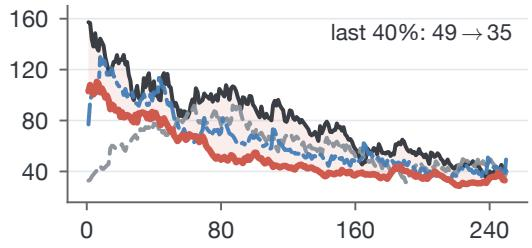

(b) ALFWorld 4B  
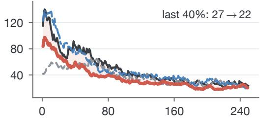

(c) ScienceWorld 1.5B  
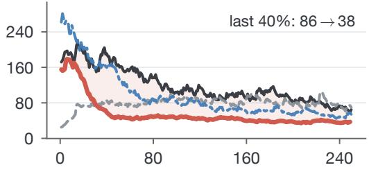

(d) ScienceWorld 3B  
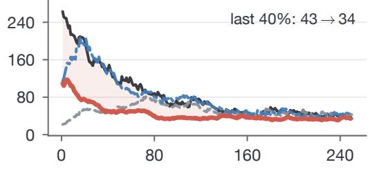

(e) WebShop 3B  
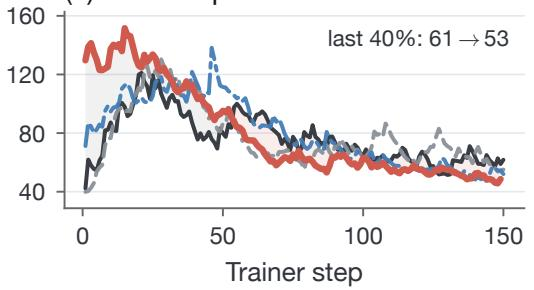

(f) WebShop 7B  
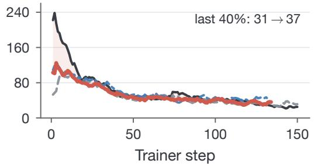  
Figure 7: Cross-rollout disagreement in all six settings (main-text Figure 6 shows panels a, c, and e). Curves are the standard deviation of rollout-summed student-minus-teacher log probabilities $( \mathrm { E M A } , \alpha = 0 . 1 2 ) ;$ each panel gives the mean over the last 40% of training (vanilla → DivOPD). Red shading marks where DivOPD is lower and gray where it is higher. Variation falls on ALFWorld and ScienceWorld.

Table 8: What DivOPD changes. The core method changes batch selection; only the optional recovery extension changes rollout generation.
<table><tr><td>Design question</td><td>Component</td><td>DivOPD</td></tr><tr><td>How is each turn scored?</td><td>Learning signal</td><td>Unchanged (Eq. 1)</td></tr><tr><td>How long can a rollout continue?</td><td>Rollout horizon</td><td>Unchanged</td></tr><tr><td>Who acts during the rollout?</td><td>Rollout policy</td><td>Changed only by DivOPD+R (§3.4)</td></tr><tr><td>Which turns enter a learner batch?</td><td>Batch selection</td><td>Changed by DivOPD (§3)</td></tr></table>

Table 9: Full batch-composition diagnostics. Values are averaged over the final 40% of training; peak SR is repeated from Appendix Table 7. Focus-only maximizes coverage in five settings, while DivOPD has the higher peak SR in five. Bold marks the best peak SR among the five methods shown, which exclude DivOPD+R. Figure 2 averages the first three diagnostics over the two student sizes per environment.
<table><tr><td>Setting</td><td>Method</td><td>Eff. rollouts / batch↑</td><td>Top-1 tok. share ↓</td><td>Turns per rollout</td><td>KL / token ↓</td><td>Step time (s)↓</td><td>Peak SR (%)↑</td></tr><tr><td>ALFWorld 4B</td><td>Vanilla OPD</td><td>6.7</td><td>0.281</td><td>8.1</td><td>0.121</td><td>94.9</td><td>86.43</td></tr><tr><td></td><td>TCOD-F2B</td><td>6.5</td><td>0.291</td><td>8.6</td><td>0.114</td><td>99.6</td><td>87.14</td></tr><tr><td></td><td>DivOPD-focus</td><td>18.6</td><td>0.110</td><td>2.4</td><td>0.174</td><td>85.2</td><td>89.29</td></tr><tr><td></td><td>DivOPD-base</td><td>12.5</td><td>0.136</td><td>3.9</td><td>0.111</td><td>97.8</td><td>92.14</td></tr><tr><td></td><td>DivOPD</td><td>12.5</td><td>0.145</td><td>3.9</td><td>0.176</td><td>82.1</td><td>91.43</td></tr><tr><td>ALFWorld 1.7B</td><td>Vanilla OPD</td><td>5.2</td><td>0.364</td><td>10.2</td><td>0.222</td><td>51.2</td><td>77.86</td></tr><tr><td></td><td>TCOD-F2B</td><td>5.4</td><td>0.346</td><td>10.0</td><td>0.200</td><td>49.0</td><td>72.86</td></tr><tr><td></td><td>DivOPD-focus</td><td>16.1</td><td>0.120</td><td>3.0</td><td>0.280</td><td>40.3</td><td>80.00</td></tr><tr><td></td><td>DivOPD-base</td><td>12.4</td><td>0.132</td><td>3.9</td><td>0.201</td><td>44.4</td><td>74.29</td></tr><tr><td></td><td>DivOPD</td><td>12.4</td><td>0.140</td><td>3.9</td><td>0.289</td><td>39.5</td><td>79.29</td></tr><tr><td>WebShop 3B</td><td>Vanilla OPD</td><td>4.7</td><td>0.334</td><td>7.8</td><td>0.179</td><td>106.3</td><td>60.94</td></tr><tr><td></td><td>TCOD-F2B</td><td>5.0</td><td>0.328</td><td>7.4</td><td>0.167</td><td>101.9</td><td>67.19</td></tr><tr><td></td><td>DivOPD-focus</td><td>25.7</td><td>0.069</td><td>2.0</td><td>0.181</td><td>64.6</td><td>70.31</td></tr><tr><td></td><td>DivOPD-base</td><td>12.4</td><td>0.114</td><td>4.7</td><td>0.151</td><td>76.7</td><td>78.12</td></tr><tr><td></td><td>DivOPD</td><td>12.3</td><td>0.114</td><td>4.7</td><td>0.156</td><td>70.9</td><td>78.12</td></tr><tr><td>WebShop 7B</td><td>Vanilla OPD</td><td>8.3</td><td>0.237</td><td>6.1</td><td>0.035</td><td>126.7</td><td>87.50</td></tr><tr><td></td><td>TCOD-F2B</td><td>7.5</td><td>0.271</td><td>6.2</td><td>0.029</td><td>120.1</td><td>89.06</td></tr><tr><td></td><td>DivOPD-focus</td><td>29.2</td><td>0.067</td><td>1.5</td><td>0.052</td><td>90.2</td><td>89.84</td></tr><tr><td></td><td>DivOPD-base</td><td>14.8</td><td>0.101</td><td>3.9</td><td>0.027</td><td>104.5</td><td>88.28</td></tr><tr><td></td><td>DivOPD</td><td>15.0</td><td>0.096</td><td>3.9</td><td>0.036</td><td>96.3</td><td>90.62</td></tr><tr><td>ScienceWorld 3B</td><td>Vanilla OPD</td><td>6.2</td><td>0.272</td><td>9.5</td><td>0.241</td><td>18.9</td><td>85.55</td></tr><tr><td></td><td>TCOD-F2B</td><td>6.2</td><td>0.253</td><td>9.3</td><td>0.242</td><td>19.3</td><td>87.89</td></tr><tr><td></td><td>DivOPD-focus</td><td>14.6</td><td>0.115</td><td>3.9</td><td>0.487</td><td>22.7</td><td>77.34</td></tr><tr><td></td><td>DivOPD-base</td><td>11.3</td><td>0.146</td><td>4.7</td><td>0.257</td><td>21.1</td><td>86.72</td></tr><tr><td></td><td>DivOPD</td><td>11.8</td><td>0.137</td><td>4.7</td><td>0.336</td><td>19.1</td><td>88.28</td></tr><tr><td>ScienceWorld 1.5B</td><td>Vanilla OPD</td><td>3.9</td><td>0.400</td><td>12.9</td><td>0.349</td><td>15.2</td><td>66.02</td></tr><tr><td></td><td>TCOD-F2B</td><td>4.1</td><td>0.383</td><td>12.5</td><td>0.341</td><td>14.2</td><td>71.88</td></tr><tr><td></td><td>DivOPD-focus</td><td>12.8</td><td>0.121</td><td>4.3</td><td>0.513</td><td>14.1</td><td>66.80</td></tr><tr><td></td><td>DivOPD-base</td><td>12.1</td><td>0.130</td><td>4.4</td><td>0.341</td><td>16.3</td><td>70.31</td></tr><tr><td></td><td>DivOPD</td><td>13.5</td><td>0.115</td><td>4.0</td><td>0.483</td><td>13.8</td><td>78.91</td></tr></table>

## E EXECUTED OPD OBJECTIVE

Vanilla OPD, DivOPD-base, DivOPD, and the matched-cap controls use unit row weights with the same seq-meantoken-mean reduction. Its scalar value is

$$
\mathcal { L } _ { \mathrm { O P D } } ^ { \mathrm { v a l u e } } = \frac { 1 } { N } \sum _ { t = 1 } ^ { N } \ell _ { t } , \qquad \ell _ { t } = \left\{ \begin{array} { l l } { - \frac { 1 } { | V _ { t } | } \sum _ { i \in V _ { t } } A _ { t , i } , } & { | V _ { t } | > 0 , } \\ { 0 , } & { | V _ { t } | = 0 . } \end{array} \right.\tag{3}
$$

Stored scores and recomputed learner probabilities. The workflow stores student log probabilities at the generating policy $\theta _ { v ( u ) }$ and frozen-teacher log probabilities on the same response. Equation 2 uses these cached values for selection. Before update q, the learner recomputes student log probabilities at its current snapshot ${ \bar { \theta } } _ { q } .$ , which is $\theta _ { \mathrm { o l d } }$ in Equation 1; teacher scores remain fixed. The PPO surrogate uses

$$
r _ { t , i } ( \theta ) = \exp \Bigl [ \log \pi _ { \theta } \bigl ( y _ { t , i } \mid h _ { t , < i } \bigr ) - \mathrm { s g } \Bigl [ \log \pi _ { \bar { \theta } _ { q } } \bigl ( y _ { t , i } \mid h _ { t , < i } \bigr ) \Bigr ] \Bigr ] .
$$

At gradient evaluation, $\theta \ : = \ : \bar { \theta } _ { q } ,$ so $r _ { t , i } ~ = ~ 1$ and clipping is inactive, but $\nabla _ { \theta } r _ { t , i }$ is not zero. Each batch receives one optimizer update. There is no additional behavior-to-learner importance correction: bounded staleness limits the sampling mismatch but does not remove it. Vanilla OPD and the controlled composer variants share this update rule. The outer average includes dead rows, and the gradient is

$$
\nabla _ { \theta } \mathcal { L } _ { \mathrm { O P D } } = \frac { 1 } { N } \sum _ { t : | V _ { t } | > 0 } \frac { 1 } { | V _ { t } | } \sum _ { i \in V _ { t } } - A _ { t , i } \nabla _ { \theta } \log \pi _ { \theta } ( y _ { t , i } \mid h _ { t , < i } ) .\tag{4}
$$

Thus valid tokens are averaged within each turn row, rows are equally weighted, and a dead row contributes zero while remaining in the N-row denominator. The formula describes the executed update on selected, potentially lagged samples; it is not an unbiased current-policy reverse-KL gradient.

## E.1 GRADIENT EFFECT OF BATCH COMPOSITION

Because Equation 4 is a plain average of per-row terms, its selection-induced change can be written exactly for a fixed pool. These equations describe reweighting, not a guarantee of better policy performance. Let the candidate pool hold $N _ { c }$ turns and write the contribution of turn t as $\begin{array} { r } { g _ { t } = \frac { 1 } { | V _ { t } | } \sum _ { i \in V _ { t } } - A _ { t , i } \nabla _ { \theta } \log \pi _ { \theta } \big ( y _ { t , i } ^ { - } \mid h _ { t , < i } \big ) } \end{array}$ , with $g _ { t } = 0$ for a dead row. The pool gradient is $\begin{array} { r } { G = \frac { 1 } { N _ { c } } \sum _ { t } g _ { t } } \end{array}$ . A composer selects $B$ rows through indicator $m _ { t } \in \{ 0 , 1 \}$ with $\begin{array} { r } { \sum _ { t } m _ { t } = B ; } \end{array}$ let $\pi _ { t } = \mathbb { E } [ m _ { t } ]$ be the inclusion probability, so $\textstyle \sum _ { t } \pi _ { t } = B$ . The optimizer sees $\begin{array} { r } { \hat { G } = \frac { 1 } { B } \sum _ { t } m _ { t } g _ { t } } \end{array}$

Lemma 1 (Selection-induced shift identity). For any full composer batch, $\begin{array} { r } { \mathbb { E } [ \hat { G } ] - G = \frac { N _ { c } } { B } \operatorname { C o v } _ { t } \left( \pi _ { t } , g _ { t } \right) } \end{array}$ , where this is the scalar– vector covariance over a uniformly drawn pool row.

Proof. $\begin{array} { r } { \mathbb E [ \hat { G } ] = \frac { 1 } { B } \sum _ { t } \pi _ { t } g _ { t } = \frac { N _ { c } } { B } \mathbb E _ { t } [ \pi _ { t } g _ { t } ] } \end{array}$ . Since $\mathbb { E } _ { t } [ \pi _ { t } ] = B / N _ { c }$ , also $\begin{array} { r } { G = \mathbb { E } _ { t } [ g _ { t } ] = \frac { N _ { c } } { B } \mathbb { E } _ { t } [ \pi _ { t } ] \mathbb { E } _ { t } [ g _ { t } ] } \end{array}$ . Subtracting gives $\begin{array} { r } { \frac { N _ { c } } { B } \left( \mathbb { E } _ { t } [ \pi _ { t } g _ { t } ] - \mathbb { E } _ { t } [ \pi _ { t } ] \mathbb { E } _ { t } [ g _ { t } ] \right) } \end{array}$ □

Score–loss relation at a common policy version. At the same student policy version v, the common valid mask gives

$$
s _ { v } ( u ) = - \frac { 1 } { \beta } \sum _ { i \in V _ { u } } A _ { u , i } ^ { ( v ) } = \frac { \vert V _ { u } \vert } { \beta } \ell _ { u } ^ { \mathrm { v a l u e } , ( v ) } .\tag{5}
$$

With a complete response mask, its conditional expectation is the sequence-level reverse $\mathrm { K L } , D _ { \mathrm { K L } } ( P _ { \theta _ { v } } ( \cdot \mid h ) \| P _ { \phi } ( \cdot \mid h ) )$ ). Thus raw $s _ { v }$ ranks token count times row-mean OPD loss, while $s _ { v } / | V _ { u } |$ ranks the row loss. Neither is the gradient norm because scoregradient vectors can vary and cancel. Cached scores use rollout version v; learner-side recomputation can be up to δ versions later. The equality therefore does not identify the cached score with the row loss evaluated at the later learner snapshot.

The identity shows how each stage changes the expected gradient. The gate removes rows with $g _ { t } = 0$ in the audited buffers. If the remaining rows are sampled uniformly, this increases the expected gradient magnitude without changing its direction, as shown below. Coverage limits how much rollout length affects $\pi _ { t } ,$ , moving from turn-uniform toward rollout-uniform averaging. Focus then favors turns with larger $s ( u )$ within each selected rollout. Section E.3 measures the resulting gradient changes.

The following sampling calculation isolates dead-slot dilution under uniform sampling. Its variance result uses simplifying assumptions: rollout-correlated gradients and deterministic selection need not satisfy its independence assumptions.

Proposition 1 (Dead-slot dilution under uniform sampling). Ifa pool contains D dead rows and the gate samples uniformlyfrom its $N _ { c } - D$ live rows, then $\begin{array} { r } { \mathbb { E } [ \hat { G } _ { \mathrm { g a t e } } ] = \frac { N _ { c } } { N _ { c } - D } G \colon } \end{array}$ the gate preserves direction while undoing dead-slot shrinkage. Further, suppose live-row gradients are i.i.d. with mean $\mu$ and covariance $\Sigma ,$ and independent slot validity is $Z \sim$ Bernoulli $( 1 - d )$ , where $d = D / \bar { N _ { c } }$ is the dead-rowfraction. For the same valid-row target,

$$
\operatorname { C o v } ( { \hat { \mu } } _ { \operatorname { g a t e } } ) = { \frac { \Sigma } { B } } , \qquad \operatorname { C o v } \left( { \frac { { \hat { G } } _ { \operatorname { u n g a t e d } } } { 1 - d } } \right) = { \frac { \Sigma + d \mu \mu ^ { \top } } { B ( 1 - d ) } } .\tag{6}
$$

Hence gating is a positive-semidefinite variance reduction; at $\mu = 0 ,$ its variance is exactly $( 1 - d )$ times the validity-corrected ungated variance.

Proof. Dead rows have $g _ { t } = 0 $ , so uniform live-row sampling gives $\begin{array} { r } { \mathbb { E } [ \hat { G } _ { \mathrm { g a t e } } ] = ( N _ { c } - D ) ^ { - 1 } \sum _ { \mathrm { l i v e } } g _ { t } = N _ { c } G / ( N _ { c } - D ) } \end{array}$ . For the stochastic statement, let X denote a live-row gradient. Then $\mathbb { E } [ Z X ] = ( 1 - d ) \mu \operatorname { a n d } \operatorname { C o v } ( Z X ) = ( 1 - d ) \Sigma + d ( 1 - d ) \mu \mu ^ { \intercal }$ Independence across the B slots yields Equation $\begin{array} { r } { 6 ; } \end{array}$ subtracting $\Sigma / B$ leaves $d ( \Sigma + \mu \mu ^ { \top } ) / [ B ( 1 - d ) ] \succeq 0 .$ □

At $\mu = 0$ , validity-corrected ungated reading is variance-equivalent to a live-only batch of effective size $B _ { \mathrm { e f f } } ~ = ~ ( 1 - d ) B ;$ for $B = 6 4$ and $d = 0 . 0 5  – 0 . 2 8$ , this is 46–61 rows, whereas the gate restores all 64. The scale factor $1 / ( 1 - d )$ is largely suppressed before optimization in our runs: gradient norms are clipped at 1.0 and logged pre-clip norms are $2 { - } 1 5$ . Under the simplifying assumption of clipped SGD, the first-order comparison then reduces to the direction of $\hat { G } ;$ AdamW’s history-dependent preconditioning prevents this from being an exact equivalence. We therefore interpret $B _ { \mathrm { e f f } }$ as a sampling-efficiency statement rather than an exact claim about optimizer step length. Empirically, gate-only preserves mean s(u) per valid ungated turn in all four replays; on the ALFWorld 1.7B DivOPD buffer, $1 4 . 5 \hat { 9 } / ( 1 - \mathrm { \ ' 0 . 1 4 7 1 } ) \ \stackrel { . } { = } \ 1 7 . 1 1$ . Focus is evaluated separately through the gradient-geometry audit and downstream results.

Corollary 1 (Coverage as first-sweep capped rollout averaging). Condition on the oldest-first selected rollout set $\mathcal { R } _ { S }$ and allocations $\{ n _ { r } \}$ , where $\begin{array} { r } { \sum _ { r } n _ { r } = B . } \end{array}$ . Uniform within-rollout sampling gives

$$
\mathbb { E } [ \hat { G } _ { \mathrm { b a s e } } \mid \mathcal { R } _ { S } , \{ n _ { r } \} ] = \sum _ { r \in \mathcal { R } _ { S } } \frac { n _ { r } } { B } \bar { g } _ { r } .\tag{7}
$$

When the batch fills in the first sweep, $n _ { r } = \operatorname* { m i n } ( k , T _ { r } )$ for each fully allocated group; the final group may receive only the remaining slots. Ifall selected $T _ { r } \geq k$ and B is divisible by k, the result is the rollout-uniform mean over selected groups. Ifevery rollout is selected in full, it is the original turn-uniform mean.

The first sweep therefore moves between turn-uniform and rollout-uniform averaging by capping length weights. Holding the selected set fixed separates that reweighting from oldest-first rollout selection and gives an exact description of the coverage stage.

Corollary 2 (Focus reweighting identity). For the same $\mathcal { R } _ { S }$ and $\{ n _ { r } \}$ , let $K _ { r }$ be the deterministic $t o p \textmd { - } n _ { r }$ set by $s ( u )$ and $D _ { r }$ its complement. Then

$$
\hat { G } _ { \mathrm { f o c u s } } - \mathbb { E } [ \hat { G } _ { \mathrm { b a s e } } \mid \mathcal { R } _ { S } , \{ n _ { r } \} ] = \frac { 1 } { B } \sum _ { r : n _ { r } < T _ { r } } \frac { n _ { r } ( T _ { r } - n _ { r } ) } { T _ { r } } \left( \bar { g } _ { r } ^ { K } - \bar { g } _ { r } ^ { D } \right) .\tag{8}
$$

Thisfollowsfrom $\bar { g } _ { r } = ( n _ { r } / T _ { r } ) \bar { g } _ { r } ^ { K } + ( ( T _ { r } - n _ { r } ) / T _ { r } ) \bar { g } _ { r } ^ { D } .$

Thus the change caused by focus depends on the difference between the mean gradients of kept and dropped turns. Table 10 also compares their gradient norms: kept turns account for a larger share of total gradient norm than of turn count, and tend to be earlier, higher-disagreement decisions.

Table 10: Focus retention audit $( k = 5 ,$ the initial cap used in Table 1 for these settings). Dropped gradient norm is the share of summed per-turn norms, $\textstyle \sum _ { t } \| g _ { t } \|$ , estimated by the sketch audit. The last four columns are means for kept and dropped turns.

<table><tr><td></td><td colspan="2">Dropped share</td><td colspan="2">Turn depth</td><td colspan="2">Score/token</td></tr><tr><td>Setting</td><td>Turns</td><td>Grad. norm</td><td>Kept</td><td>Dropped</td><td>Kept</td><td>Dropped</td></tr><tr><td>ScienceWorld 3B</td><td>55%</td><td>10%</td><td>4.7</td><td>9.5</td><td>0.30</td><td>0.16</td></tr><tr><td>WebShop 3B</td><td>18%</td><td></td><td>2.3</td><td></td><td>0.16</td><td>0.08</td></tr></table>

## E.2 ROLLOUT UTILIZATION UNDER A STALENESS BUDGET

Table 11: Cumulative rollout utilization. Never selected is the share of valid rollouts contributing no trained turn; Gini measures concentration of selected-turn counts. ALF/SciW/WS denote ALFWorld/ScienceWorld/WebShop. The separate-buffer result is grouped below the shared-buffer comparisons and is not a matched control.
<table><tr><td colspan="4">Never selected (%)</td><td colspan="3">Gini</td></tr><tr><td>Composer</td><td>ALF</td><td>SciW</td><td>WS</td><td>ALF</td><td>SciW</td><td>WS</td></tr><tr><td>Shared buffers: first 100 updates</td><td></td><td></td><td></td><td></td><td></td><td></td></tr><tr><td>Vanilla OPD (arrival-order)</td><td>53.9</td><td>49.2</td><td>58.7</td><td>0.66</td><td>0.68</td><td>0.64</td></tr><tr><td>Top-B (no rollout limit)</td><td></td><td></td><td>1</td><td>0.44</td><td>0.45</td><td>0.27</td></tr><tr><td>DivOPD-focus</td><td>15.0</td><td>10.2</td><td>3.4</td><td>0.33</td><td>0.32</td><td>0.20</td></tr><tr><td>DivOPD-base / DivOPD</td><td>14.2</td><td>11.0</td><td>7.1</td><td>0.30</td><td>0.32</td><td>0.12</td></tr><tr><td>Separate buffers: full 250 updates</td><td></td><td></td><td></td><td></td><td></td><td></td></tr><tr><td>DivOPD, k = ∞</td><td>56.6</td><td>67.0</td><td>39.9</td><td>0.70</td><td>0.79</td><td>0.51</td></tr></table>

Top-B ranks all valid turns by s(u) without a per-rollout limit. DivOPD-base and DivOPD coincide because focus does not change rollout allocation. The separate 250-update buffers were generated by $k = \infty$ runs; this replay is a qualitative access diagnostic, not the uniform-within-rollout, matched-access training control in Table 18.

Consider a group of R rollouts that remains eligible for L updates. If each update touches at most M distinct rollouts, at most min(R, LM) members of that group can be selected. This is a group-level upper bound, not a steady-state utilization estimate: other arrival cohorts compete for the same slots, and a rollout can be selected repeatedly. An arrival-order reader consuming consecutive rollout blocks touches roughly $B / \bar { T }$ rollouts per update, where T<sup>¯</sup> is mean rollout length. The first-pass cap instead covers at least $\lceil B / k \rceil$ groups when enough valid groups are available. It therefore increases opportunities for rollout participation, while actual lifetime coverage must be measured across up dates. Table 11 provides that measurement. Every full composer batch still contains B = 64 rows; the cap redistribute them across rollouts rather than increasing the row budget.

Effect of a wider staleness window. Relative to the main vanilla references with max\_staleness = 2, two auxiliary runs with a limit of 4 leave row-level consumption unchanged and consume rows 1.3–1.5 versions older (Table 12). Peak SR is lower by 6.4 points on ALFWorld and 0.4 points on ScienceWorld, while the mean current-versus-rollout probability gap is 10–15% larger.

Sensitivity to bounded policy lag. The usual reverse-KL gradient identity is exact when samples are drawn from the current learner policy. In our asynchronous implementation, trajectories may instead be generated by a behavior policy up to two versions behind the learner, so the executed update is a bounded-lag approximation. Across the six main settings, rollout and learner action probabilities remain highly correlated (0.956–0.989), with mean absolute differences of only 0.011–0.015. As an additional offline stress test, recomputing DivOPD scores at later checkpoint gives cached–current Spearman correlations of 0.984 on ScienceWorld and 0.997 on WebShop; the corresponding within-trajectory top-k selection overlaps are 93.5% $( k = 4 )$ and 99.6% (k = 5). In these tests, recomputing the scores within the two-version lag window rarely changes which turns are selected. This supports cached ranking in the tested setting, not an unbiased-gradient claim.

Table 12: Vanilla OPD with a wider staleness window. Mean age of consumed rows in policy versions (arrival-order replay, dead rows included), peak and final-checkpoint SR (%). The max\_staleness = 2 rows reuse the main vanilla runs in Table 1; the wider-window rows are separate auxiliary runs rather than paired reruns.
<table><tr><td>Setting</td><td>max_staleness</td><td>Mean age</td><td>Peak</td><td>Final ckpt.</td></tr><tr><td>ALFWorld 1.7B</td><td>2</td><td>1.69</td><td>77.86</td><td>73.57</td></tr><tr><td></td><td>4</td><td>3.19</td><td>71.43</td><td>71.43</td></tr><tr><td>ScienceWorld 1.5B</td><td>2</td><td>1.68</td><td>66.02</td><td>66.02</td></tr><tr><td></td><td>4</td><td>2.96</td><td>65.62</td><td>60.16</td></tr></table>

## E.3 GRADIENT DIAGNOSTICS

We replay every composer on the same candidate pools over the last eight updates of each buffer. To compare per-turn gradients without storing them in full, we use a Kronecker projection with unbiased inner products. Table 13 reports $\langle G , { \hat { G } } \rangle / \| G \| ^ { 2 }$ and $\cos ( G , { \hat { G } } )$ , where G is the pool gradient and G<sup>ˆ</sup> is the selected batch gradient. Focus raises the first metric over uniform within-rollout sampling in all 24 audited updates; its mean cosine is also higher in all three environments.

The proxy measures alignment with the specified candidate pool, not an optimal policy-improvement direction. It is a pre-optimizer diagnostic; training outcomes are tested separately in Table 1. Mean pairwise gradient cosine is 0.003–0.02 for every composer; reduced gradient correlation is therefore not the main change observed here.

Selecting turns by alignment in the same sketch space gives an optimistic reference, with a proxy 1.3–2.1× that of the best s(u) rule in each environment. Using a rollout-mean pool gradient leaves the rankings unchanged. All these comparisons use raw gradients, before optimizer preconditioning.

Table 13: Selected gradients versus the candidate-pool gradient. Means over 8 audited updates per environment. Projection is $\langle G , { \hat { G } } \rangle / \| G \| ^ { 2 } ;$ ; cosine similarity is $\cos ( G , { \hat { G } } )$ ALF/SciW/WS denote ALF-World/ScienceWorld/WebShop. <sup>†</sup>Arrival order here draws from the finite-k composer’s pool and is not vanilla OPD. Sketch oracle selects and evaluates the B turns with the largest sketched $\langle G , g _ { t } \rangle$ , so it is an optimistic reference rather than a full-gradient oracle.
<table><tr><td rowspan="2">Composer</td><td colspan="3">Gradient projection</td><td colspan="3">Cosine similarity</td></tr><tr><td>ALF</td><td>SciW</td><td>WS</td><td>ALF</td><td>SciW</td><td>WS</td></tr><tr><td>Arrival order†</td><td>1.74</td><td>0.75</td><td>1.32</td><td>0.97</td><td>0.49</td><td>0.61</td></tr><tr><td>Gate only</td><td>1.11</td><td>1.02</td><td>1.29</td><td>0.93</td><td>0.53</td><td>0.62</td></tr><tr><td>DivOPD-base</td><td>1.36</td><td>0.97</td><td>1.31</td><td>0.96</td><td>0.54</td><td>0.62</td></tr><tr><td>DivOPD</td><td>2.04</td><td>2.01</td><td>1.47</td><td>0.98</td><td>0.75</td><td>0.64</td></tr><tr><td>DivOPD-focus</td><td>3.12</td><td>1.66</td><td>1.50</td><td>0.99</td><td>0.67</td><td>0.65</td></tr><tr><td>Top  $B \left( k = \infty \right)$ </td><td>2.97</td><td>2.30</td><td>1.61</td><td>0.99</td><td>0.79</td><td>0.68</td></tr><tr><td>Sketch oracle</td><td>4.19</td><td>3.70</td><td>3.30</td><td>1.00</td><td>0.91</td><td>0.84</td></tr></table>

## E.4 WHICH TURNS EACH STAGE SELECTS

Table 14 follows the ALFWorld 1.7B DivOPD (k = 4) buffer through the selection chain. “Vanilla” reconstructs the arrival-order reader (one batch per update in queue order with the staleness filter), including invalid slots; “Gate” keeps that order but takes the first B valid rows; “Cover” and “Focus” add the remaining stages. Queue row ID provides a consistent arrival-order proxy for this controlled replay.

The gate removes unscored turns late in failed rollouts. Coverage retains other valid turns from those rollouts for later updates, while focus favors earlier, higher-disagreement turns within them. Coverage and focus select the same fraction of turns from successful rollouts (49.3%), so their difference is not explained by selecting more successes. The arrival-order reader, meanwhile, consumes 62.1% successful turns against 22.8% in the pool. This is consistent with shorter successful rollouts finishing and entering the queue earlier. On vanilla OPD’s own ALFWorld 1.7B buffer, the same reader selects 48.1% successful turns, and its 19.5% dead-slot fraction matches the online trainer log.

Table 14: Where selected turns come from in the ALFWorld 1.7B DivOPD replay. Share of selected turns (%), grouped by turn depth and rollout outcome. Each method column sums to approximately 100% after rounding; stages are added one at a time from left to right.
<table><tr><td>Depth</td><td>Outcome</td><td>Vanilla</td><td>+Gate</td><td>+Coverage</td><td>+Focus</td></tr><tr><td rowspan="2">&lt; 2</td><td>Failure</td><td>3.2</td><td>3.8</td><td>6.1</td><td>10.6</td></tr><tr><td>Success</td><td>17.6</td><td>20.7</td><td>14.3</td><td>15.8</td></tr><tr><td rowspan="2">[2,4)</td><td>Failure</td><td>3.1</td><td>3.6</td><td>6.1</td><td>8.5</td></tr><tr><td>Success</td><td>17.4</td><td>20.4</td><td>14.1</td><td>14.5</td></tr><tr><td rowspan="2">[4, 6)</td><td>Failure</td><td>2.9</td><td>3.4</td><td>5.9</td><td>7.4</td></tr><tr><td>Success</td><td>13.1</td><td>15.3</td><td>9.7</td><td>9.7</td></tr><tr><td rowspan="2">[6, 10)</td><td>Failure</td><td>5.6</td><td>6.6</td><td>11.9</td><td>11.9</td></tr><tr><td>Success</td><td>11.4</td><td>13.4</td><td>8.5</td><td>7.2</td></tr><tr><td rowspan="2">≥ 10</td><td>Failure</td><td>23.1</td><td>9.9</td><td>20.7</td><td>12.4</td></tr><tr><td>Success</td><td>2.6</td><td>3.0</td><td>2.7</td><td>2.1</td></tr></table>

## F WHERE THE TIME GOES

We measure trained tokens, learner GPU time, and elapsed trainer-loop time separately. The first two quantify learnerside efficiency; the third captures elapsed time including experience reads, not total system GPU consumption. Teacher scoring is performed for generated turns whether or not they are selected. Recovery adds teacher generation, which is excluded from the reported +R learner-GPU speedup. These measurements do not provide a full accounting of explorer and teacher GPU time or queue memory.

Table 15: Resource efficiency to τ. Vanilla-to-DivOPD ratios; larger is better. Trainer GPU time uses the two GPUs assigned to the learner. The wall estimate sums trainer-step and experience-read time. Its speedup differs from timestamp-based end-to-end measurement by at most 1.2% on the three settings whose timestamps were retained.
<table><tr><td>Setting</td><td>Trained tokens</td><td>Trainer GPU</td><td>Wall time (est.)</td></tr><tr><td>ALFWorld 4B</td><td>1.92×</td><td>1.94×</td><td>1.36×</td></tr><tr><td>ALFWorld 1.7B</td><td>2.05×</td><td>2.07×</td><td>1.28×</td></tr><tr><td>WebShop 3B</td><td>2.22×</td><td>2.22×</td><td>0.99×</td></tr><tr><td>WebShop 7B</td><td>1.77×</td><td>1.92×</td><td>0.83×</td></tr><tr><td>ScienceWorld 3B</td><td>1.62×</td><td>1.63×</td><td>1.22×</td></tr><tr><td>ScienceWorld 1.5B</td><td>1.54×</td><td>1.54×</td><td>1.27×</td></tr><tr><td>Geometric mean</td><td>1.84×</td><td>1.87×</td><td>1.14×</td></tr></table>

All six settings improve in trained-token and trainer-GPU efficiency.

Fewer tokens make updates cheaper. Trainer time closely tracks batch tokens on ALFWorld and WebShop (Pearson r = 0.96), while model FLOP utilization is nearly unchanged. The gate removes long rows with truncated prompts, and the first-pass cap limits repeated turns from long rollouts, reducing time across trainer stages (Figure 8).

ScienceWorld gains come from fewer updates. Because its turns are valid and focus favors longer responses, its trainer-GPU improvement arises primarily from reaching the target in fewer updates rather than from shorter individual steps.

Teacher-side cost. The explorer scores every rollout turn, but many scored tokens never enter a learner batch (Table 16). The explorer produces turns faster than the learner consumes them, and the staleness rule limits how long excess turns can wait in the buffer.

Selection overhead. The composer sorts at most cB = 256 rows and adds no GPU work. As learner updates become faster, rollout generation can limit further wall-time gains.

(a) Update time tracks tokens  
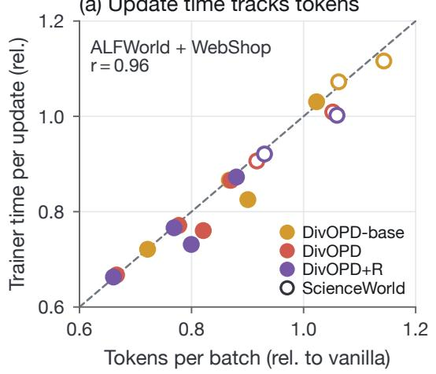

(b) Each stage shrinks together  
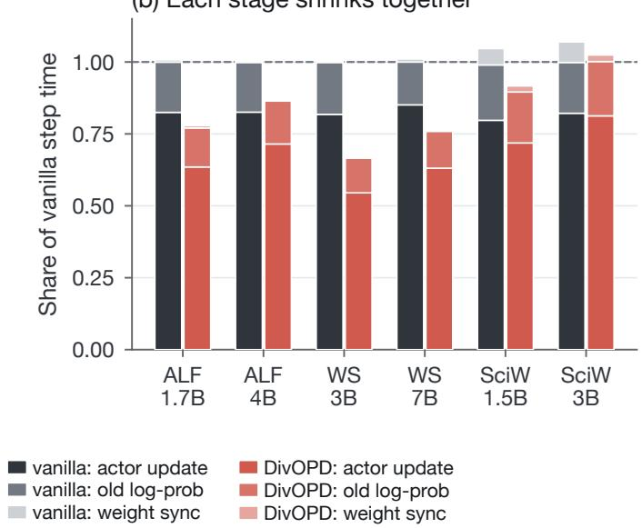  
Figure 8: Cheaper updates come from fewer tokens. (a) Relative trainer time versus relative tokens per batch; hollow ScienceWorld points use the trainer clock only here. (b) The stage-wise time breakdown.

Table 16: Teacher tokens scored per token trained. Effective tokens; “not selected” is the share never entering an optimizer batch. This audit uses the k = 3 runs from Table 19, not the per-setting caps of Table 1. <sup>∗</sup>Two parallel 150-update trainer histories sharing one buffer, merged.
<table><tr><td rowspan="2">Setting</td><td colspan="2">DivOPD (k=3)</td><td colspan="2">DivOPD-focus</td></tr><tr><td>scored/trained</td><td>not selected</td><td>scored/trained</td><td>not selected</td></tr><tr><td>ALFWorld 1.7B</td><td>2.77×</td><td>63.9%</td><td>2.89×</td><td>65.4%</td></tr><tr><td>ALFWorld 4B</td><td>2.73×</td><td>63.4%</td><td>2.93×</td><td>65.9%</td></tr><tr><td>ScienceWorld 1.5B</td><td>3.66×</td><td>72.6%</td><td>3.79×</td><td>73.6%</td></tr><tr><td>ScienceWorld 3B</td><td>3.41×</td><td>70.6%</td><td>3.60×*</td><td>72.2%</td></tr><tr><td>WebShop 3B</td><td>1.89×</td><td>47.1%</td><td>1.86×</td><td>46.3%</td></tr><tr><td>WebShop 7B</td><td>1.95×</td><td>48.7%</td><td>1.97×</td><td>49.3%</td></tr><tr><td>Token-weighted</td><td>2.44×</td><td>59.1%</td><td>2.60×</td><td>61.6%</td></tr></table>

## G ADDITIONAL ABLATIONS AND TEACHER RECOVERY

This appendix compares the method variants, tests the initial cap, and details how teacher recovery extends DivOPD to no-progress rollouts.

Table 17: Matched candidate access. Both arms draw from the same 256-turn stream; vanilla otherwise reads in arrival order. Best-5 averages the five best checkpoints; Final is SR at the common learner-version cutoff. These separate runs are not numerically comparable to Table 1.
<table><tr><td colspan="4">Vanilla reader</td><td colspan="4">Rollout-first selection</td></tr><tr><td>Environment</td><td>Model</td><td>Peak↑</td><td>Best-5↑</td><td>Final↑</td><td>Peak↑</td><td>Best-5↑</td><td>Final↑</td></tr><tr><td>ALFWorld</td><td>1.7B</td><td>78.57</td><td>73.86</td><td>78.57</td><td>80.00</td><td>77.71</td><td>78.57</td></tr><tr><td>WebShop</td><td>3B</td><td>75.00</td><td>68.44</td><td>71.09</td><td>78.12</td><td>74.06</td><td>68.75</td></tr><tr><td>ScienceWorld</td><td>1.5B</td><td>73.44</td><td>72.66</td><td>73.05</td><td>77.73</td><td>74.38</td><td>74.61</td></tr></table>

Recovery protocol. Following the use of teacher intervention in online imitation learning (Ross et al., 2011), DivOPD+R invokes the teacher after p consecutive no-progress turns: an invalid action, or a repeated action with an unchanged set of allowed actions. The teacher acts for at most four to six turns per rollout. The patience/cap/warmup triplets (warmup in learner updates) are ALFWorld 1.7B: 4/6/0, 4B: 6/6/0; WebShop 3B: 4/5/45, 7B: 4/4/45; and ScienceWorld 1.5B: 2/6/120, 3B: 2/6/50. Teacher actions are excluded from the distillation loss, and the student resumes interaction from the resulting state. Recovery is disabled at evaluation.

Table 18: Matched-access cap comparison. Both arms use the same candidate-pool size, gate, ordering, pending rule, and within-rollout sampling; only the initial cap differs. SR is in percent.
<table><tr><td colspan="2"></td><td colspan="2">Finite k (DivOPD-base)</td><td colspan="2">k = ∞ (no cap)</td></tr><tr><td>Environment</td><td>Model</td><td>Peak SR↑</td><td>Final-5 SR↑</td><td>Peak SR↑</td><td>Final-5 SR↑</td></tr><tr><td>ALFWorld</td><td>1.7B</td><td>74.29</td><td>72.86</td><td>73.57</td><td>65.14</td></tr><tr><td>ALFWorld</td><td>4B</td><td>92.14</td><td>88.86</td><td>90.00</td><td>87.71</td></tr><tr><td>WebShop</td><td>3B</td><td>78.12</td><td>73.12</td><td>75.00</td><td>65.47</td></tr><tr><td>WebShop</td><td>7B</td><td>88.28</td><td>78.44</td><td>87.62</td><td>81.09</td></tr><tr><td>ScienceWorld</td><td>1.5B</td><td>70.31</td><td>67.50</td><td>67.97</td><td>62.89</td></tr><tr><td>ScienceWorld</td><td>3B</td><td>86.72</td><td>82.66</td><td>83.33</td><td>80.67</td></tr></table>

(a) Mean success rate  
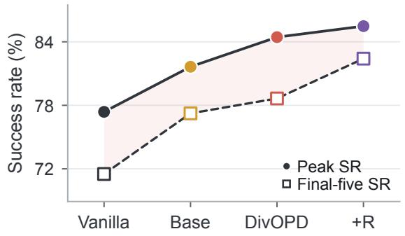  
(c) ALFWorld 1.7B

(b) Peak by setting  
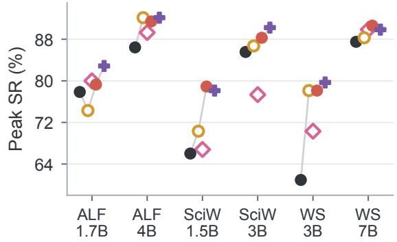

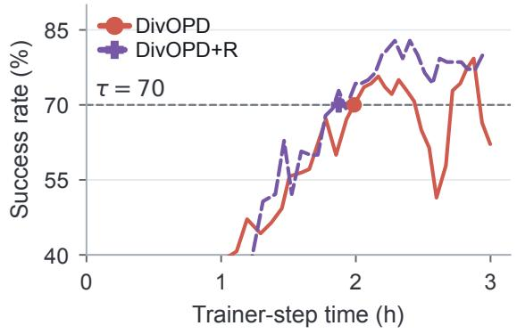  
Peak-SR change:

(d) Recovery trade-off  
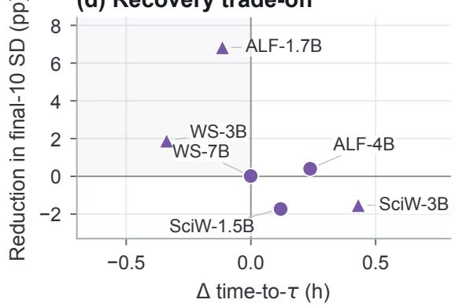  
> +1 pp within ±1 pp < −1 pp  
Figure 9: Variant chain and optional recovery. (a–b) Base combines gating, expanded access, and coverage; hollow diamonds show the separate focus-only reference. (c) Recovery on ALFWorld 1.7B. (d) Per-setting recovery effects, with marker shape encoding peak-SR change. Only the controls in Figure 5 isolate individual selection components.

Table 18 isolates the first-pass cap under matched candidate access. Table 19 complements that comparison by varying the finite cap in DivOPD, with focus enabled.

Table 19: Sensitivity to the initial per-rollout cap k. Peak SR (%); TCOD-F2B is a reference. Best DivOPD values are highlighted, and second-best values are underlined.
<table><tr><td>Method</td><td colspan="2">ALFWorld</td><td colspan="2">WebShop</td><td colspan="2">ScienceWorld</td></tr><tr><td></td><td>1.7B</td><td>4B</td><td>3B</td><td>7B</td><td>1.5B</td><td>3B</td></tr><tr><td>TCOD-F2B</td><td>72.86</td><td>87.14</td><td>67.19</td><td>89.06</td><td>71.88</td><td>87.89</td></tr><tr><td>DivOPD (k = 3)</td><td>87.14</td><td>90.00</td><td>71.09</td><td>91.41</td><td>77.73</td><td>85.55</td></tr><tr><td>DivOPD (k = 4)</td><td>79.29</td><td>91.43</td><td>73.44</td><td>90.62</td><td>78.91</td><td>86.33</td></tr><tr><td>DivOPD (k = 5)</td><td>79.29</td><td>91.43</td><td>78.12</td><td>88.28</td><td>75.78</td><td>88.28</td></tr><tr><td>DivOPD (k = 6)</td><td>80.71</td><td>88.57</td><td>73.44</td><td>86.72</td><td>75.78</td><td>85.55</td></tr></table>