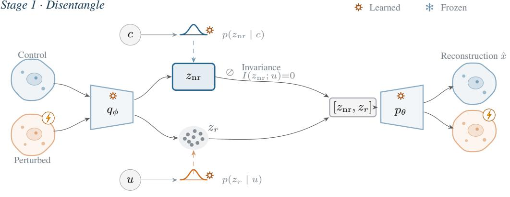
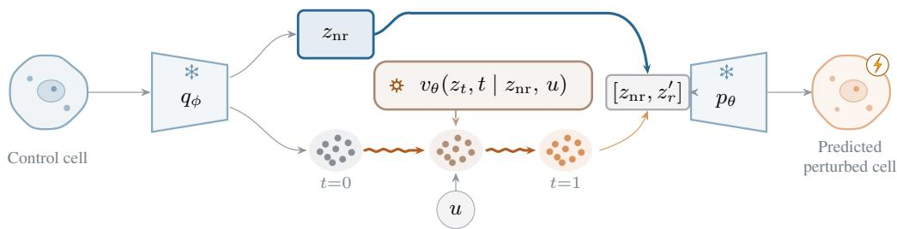
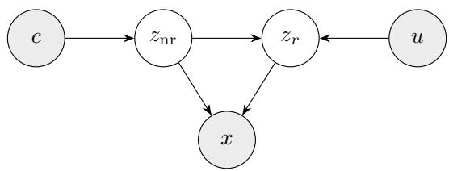
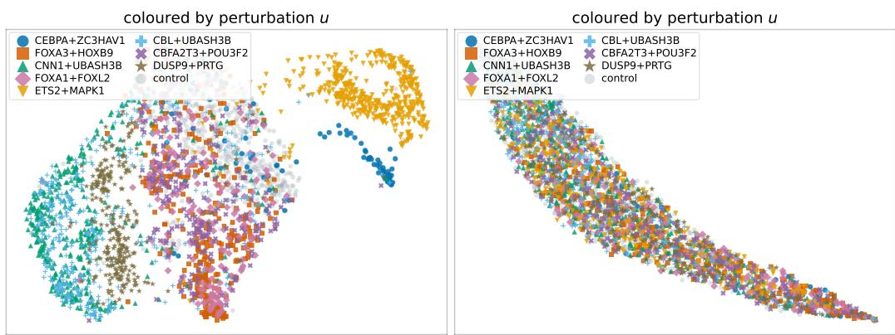
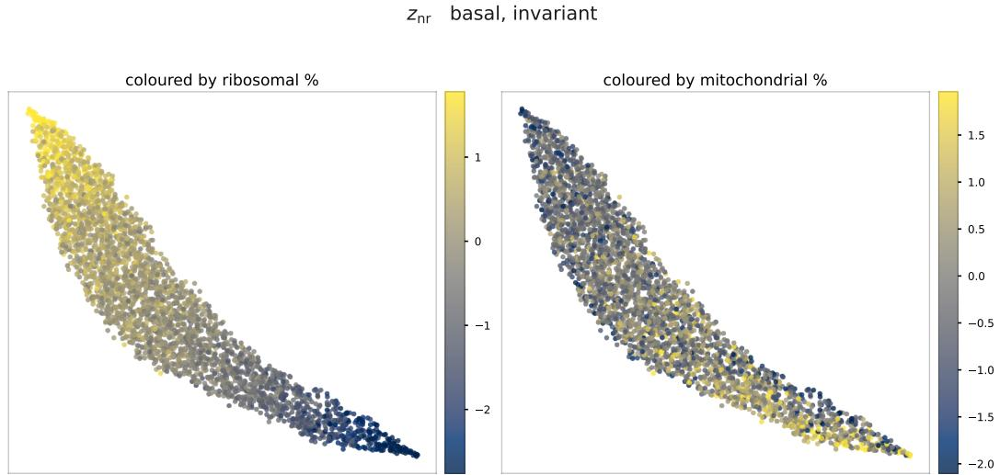
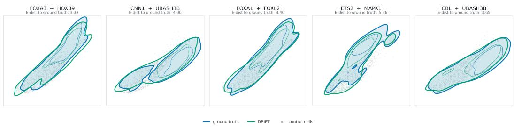

# DRIFT: DISENTANGLED RESPONSIVE-INVARIANTFLOW TRANSPORT FOR SINGLE-CELL PERTURBATIONPREDICTION

Mustapha Bounoua<sup>∗</sup>, Giulio Franzese & Pietro Michiardi   
Department of Data Science   
EURECOM, France

## ABSTRACT

Predicting cellular responses to perturbations is a central problem in cellular biology, with broad applications in systems biology and drug discovery. This task is challenging because cellular responses can be complex and cell-state dependent, intrinsic cell-to-cell variability can be confounded with perturbation effects, and destructive single-cell RNA sequencing precludes paired measurements of the same cell before and after treatment. Flow matching transports control cells to perturbed states flexibly, but acting on the full cell state can confound perturbation effects with pre-existing cell-to-cell variability. Disentangled approaches separate responsive from invariant components, but model perturbations through prescribed mechanisms, such as latent shifts or graph edits, limiting their flexibility. We address both limitations in a unified framework. A variational encoder disentangles each cell into an invariant block, capturing state unaffected by the perturbation, and a responsive block, capturing state it changes, through conditional priors and an information-theoretic invariance constraint. Conditional flow matching transports only the responsive block, conditioned on the perturbation and invariant state, yielding a flexible, data-driven model of perturbation effects without confounding pre-existing variability. Across several benchmarks, our method outperforms the strongest published method in settings involving combinatorial and unseen perturbation prediction.

## 1 INTRODUCTION

A perturbation experiment measures what a cell does when a gene is activated or silenced, or when a drug is applied. In a pooled screen (Dixit et al., 2016; Replogle et al., 2020; 2022; Srivatsan et al., 2020), a large population of cells is treated at once, each cell receives a single perturbation identified by a sequencing barcode, and the transcriptome of every cell is measured afterwards. The result is two kinds of data: untreated control cells, and perturbed cells grouped by which perturbation treatment they received. The prediction task is to predict the distribution of transcriptomes that control cells would exhibit under unseen or combinatorial perturbations.

Such a model would let researchers predict, in silico, how cells respond to perturbations they have never been exposed to (Bunne et al., 2023; Lotfollahi et al., 2023). This would allow researchers to screen perturbations computationally before applying them in vitro, prioritize combinations in spaces too large to explore experimentally, and estimate the effect of treatments for which no experiment exists. These capabilities are important for drug discovery, precision medicine, and cell engineering (Bunne et al., 2023; Lotfollahi et al., 2023).

These screens have made training data abundant, but the measurement itself withholds the very quantity a per-cell model requires. Sequencing destroys the cell it measures (Kester & Van Oudenaarden, 2018; Chen et al., 2019; Schiebinger et al., 2019; Demetci et al., 2022) which results in unpaired control and treatment populations which prohibit the measurement of a per-cell causal effect and the outcome of cell under treatment is never measured. Therefore, every approach in the field relies on assumptions to bridge the gap between the observed data and the quantity of interest.

Existing approaches close this gap with different modeling choices. Statistical methods predict the response with simple estimators, such as the control mean or a linear map, and carefully tuned linear baselines are competitive with respect to far more elaborate models (Ahlmann-Eltze et al., 2025). Foundation models pretrained on large unperturbed corpora (Cui et al., 2024; Theodoris et al., 2023; Rosen et al., 2026; Yang et al., 2022; Hao et al., 2024; Yang et al., 2024; Zeng et al., 2025; Khan et al., 2023) supply broad representations but are repeatedly found to miss perturbationspecific effects (Ahlmann-Eltze et al., 2025; Csendes et al., 2025; Kedzierska et al., 2023), which has prompted more discriminating evaluation protocols (Vinas Torn˜ e et al.´ , 2025; Roohani et al., 2025) that we adopt. Graph-based models reach unseen perturbations by placing genes in a structure taken from external biology: a gene co-expression or Gene Ontology graph (Roohani et al., 2023; Kamimoto et al., 2023; Wu et al., 2023), or gene modules shared across perturbations (Ruan et al., 2026). Generative models learn the distribution of the whole perturbed cell state, in expression space or in a latent space (Adduri et al., 2025; Yu et al., 2026). Transport methods (Schiebinger et al., 2019; Bunne et al., 2023; Klein et al., 2023; 2025; Ruan et al., 2026) model the shift of an entire distribution from control to perturbed. Disentangled and causal latent-variable models (Lotfollahi et al., 2023; 2019; Weinberger et al., 2023; Yu et al., 2025; Xing & Yau, 2025; Bereket & Karaletsos, 2023; Lopez et al., 2022; Jiang et al., 2026) instead isolate a latent axis along which a perturbation acts. This factorization is intended to enable extrapolation to unobserved perturbation combinations (Lotfollahi et al., 2023; Bereket & Karaletsos, 2023), generalization to held-out cell states (Aliee et al., 2024; Zhang et al., 2024), and a causal interpretation of the perturbation factor (Lopez et al., 2022; Gao et al., 2025). Taken together, these methods either model the full cell state or impose a disentanglement scheme with a preselected, potentially inflexible perturbation mechanism.

We focus on two complementary approaches. Transport methods assume minimal displacement between control and perturbed cells and learn the transport map from data, but move the whole cell representation, either in a latent space or in the original expression space (Bunne et al., 2023; Klein et al., 2025; Yu et al., 2026). The invariant part of the cell then moves together with the responsive part, and the perturbation is confounded with the cell characteristics that are invariant to treatment. Disentanglement based models separate these invariant characteristics from the responsive state, but they generally assume a causal mechanism for how the perturbation acts: an additive vector (Lotfollahi et al., 2023), a sparse mechanism shift (Lachapelle et al., 2022; Bereket & Karaletsos, 2023), or an edit to a latent causal graph (An et al., 2025). These approaches commit to an inductive prior about perturbation dynamics and thus do not generalize to incompatible biological programs.

Our proposed method, which we call DRIFT (Disentangled Responsive-Invariant Flow Transport), separates the part of a cell that is responsive to the perturbation from the part that is invariant (Higgins et al., 2018; Winter et al., 2022; Garrido et al., 2023), and then models the perturbation mech anism as a per-cell transport that moves only the responsive part, leaving fixed the part carrying cell identity and the other perturbation-invariant factors. The disentanglement is learned following the auxiliary-variable method (Khemakhem et al., 2020a) and related lines of work (Khemakhem et al., 2020b; Sorrenson et al., 2020; Hyvarinen & Morioka, 2016; Lu et al., 2022; Aliee et al., 2024; Von Kugelgen et al.¨ , 2021), augmented with an information-theoretic constraint of invariance. The dynamics of the perturbation is modeled through a conditional flow (Lipman et al., 2022; Tong et al., 2023; Klein et al., 2025) that moves the variant block while keeping the invariant part fixed.

We summarize our contributions as follows. 1) We propose an information-theoretic disentanglement scheme that uses auxiliary-variable conditional priors together with a mutual-informationbased invariance constraint to split the latent space of a cell into an invariant block, insensitive to the perturbation, and a variant block, that captures the perturbation-responsive part. 2) We use a conditional flow matching model, conditioned jointly on the perturbation and on the invariant latent of the cell, that transports the responsive (variant) part of the latent representation, leaving the invariant part fixed. 3) We obtain state-of-the-art results across multiple benchmarks: our method outperforms the strongest published method on every dataset we experimented with.

## 2 METHOD

DRIFT models the perturbation effect as a mechanism that changes part of a cell’s state and leaves the remaining part unchanged. A cell is organized into an invariant block, holding the state a perturbation leaves untouched, and a variant (responsive) block, holding the state it changes, and the perturbation acts as a transport of the variant block alone. Our method unfolds in two stages (Figure 1). Stage 1 (§2.1 and §2.2) learns a disentangled representation: an encoder maps a cell to the two blocks, each block is tied to a prior that depends on a different observed variable, and an information-theoretic constraint prevents perturbation information to leak into the invariant block. Stage 2 (§2.3) learns how a perturbation moves the responsive block, as a conditional flow. Inference (§2.4) combines the invariant state of an observed control cell with a response generated by the flow.

Stage 1 · Disentangle  


Stage 2 · Transport  
  
Figure 1: Overview of DRIFT. The two stages share one architecture. Stage 1 trains a variational autoencoder on control and perturbed cells, encoding each into an invariant code $z _ { \mathrm { n r } }$ (driven by the covariates c: cell line, batch, sequencing depth) and a responsive latent $z _ { r }$ (driven by the perturbation u). Each block is associated to a learned conditional prior, $p ( z _ { \mathrm { n r } } \mid c )$ and $p ( z _ { r } \mid u )$ , and $z _ { \mathrm { n r } }$ is optimized to carry no perturbation information, $I ( z _ { \mathrm { n r } } ; u ) { = } 0 ;$ the concatenation $[ z _ { \mathrm { n r } } , z _ { r } ]$ is decoded to reconstruct the input, control or perturbed. Stage 2 freezes the encoder and decoder and learns the mechanism $p ( z _ { r } \mid z _ { \mathrm { n r } } , u )$ as a transport: a conditional flow $v _ { \theta } ( z _ { t } , t \mid z _ { \mathrm { n r } } , u )$ generates only the responsive latent $z _ { r } ^ { \prime }$ from its control to its perturbed state along the interpolant $z _ { t } \ ( t { : } 0  1 )$ , while $z _ { \mathrm { n r } }$ is copied from the input cell. Decoding $[ z _ { \mathrm { n r } } , z _ { r } ^ { \prime } ]$ yields the predicted perturbed cell.

## 2.1 PROBLEM STATEMENT AND GENERATIVE MODEL

We observe single-cell RNA sequencing counts and write $x \in \mathbb { R } ^ { G }$ for the expression profile of one cell over G genes. A perturbation is the experimental intervention applied to that cell: which gene is activated or silenced by CRISPR (Jinek et al., 2012; Gilbert et al., 2014), or which chemical compound is added. We label a perturbation by u, with $u \ = \ \varnothing$ for an untreated control. The perturbation acts on the cell by changing its transcriptome, so it changes the distribution of x.

We also observe $c \in \mathbb { R } ^ { K }$ , the factors that vary across cells and are not caused by the perturbation, such as the cell line, and technical properties of the measurement.

We are given unpaired populations of control cells and of cells under various u; c is observed per cell and the two populations are not assumed to share it. The task is to predict, for a target perturbation $u ^ { \star }$ that may be absent from training, the distribution of profiles that observed control cells from the same dataset would take under $u ^ { \star }$

  
Figure 2: The generative model of DRIFT; shaded nodes are observed. The non-responsive block $z _ { \mathrm { n r } }$ is generated from the assay covariates c; the responsive block $z _ { r }$ from the perturbation u and $z _ { \mathrm { n r } }$ (the mechanism); the profile x from both. The non-responsive block is invariant to the perturbation, $z _ { \mathrm { n r } } \perp u ( \mathrm { E q . } 3 )$ , the property that defines it, while the mechanism $z _ { \mathrm { n r } }  z _ { r }$ lets the response depend on the basal state.

We consider a latent state that splits into two blocks,

$$
\boldsymbol { z } = ( z _ { \mathrm { n r } } , z _ { r } ) \in \mathbb { R } ^ { d _ { \mathrm { n r } } } \times \mathbb { R } ^ { d _ { r } } ,\tag{1}
$$

where $z _ { \mathrm { n r } }$ is the invariant (non-responsive) block, holding the state a perturbation leaves untouched, and $z _ { r }$ is the variant (responsive) block, holding the state a perturbation moves.

A decoder $p _ { \theta } ( x \mid z _ { \mathrm { n r } } , z _ { r } )$ maps the two blocks back to an expression profile. The generative model is the chain of Fig. 2,

$$
\begin{array} { r } { p ( x , z _ { \mathrm { n r } } , z _ { r } \mid u , c ) = \underbrace { p _ { \theta } ( x \mid z _ { \mathrm { n r } } , z _ { r } ) } _ { \mathrm { d e c o d e r } } \underbrace { p ( z _ { r } \mid z _ { \mathrm { n r } } , u ) } _ { \mathrm { m e c h a n i s m } } \underbrace { p ( z _ { \mathrm { n r } } \mid c ) } _ { \mathrm { i n v a r i a n t s t a t e } } , } \end{array}\tag{2}
$$

with edges $\{ c  z _ { \mathrm { n r } } , \ z _ { \mathrm { n r } }  z _ { r } , \ u  z _ { r } , \ z _ { \mathrm { n r } }  x , \ z _ { r }  x \}$ and $u \perp c .$ . The invariant block is generated from the perturbation-independent factors $c ;$ the responsive block from the perturbation and from the invariant block of the same cell; and the expression profile from both blocks. In our model, we encourage the invariant block to be independent of the perturbation,

$$
z _ { \mathrm { n r } } \perp u ,\tag{3}
$$

through a mutual-information penalty (§2.2). The mechanism $p ( z _ { r } \mid z _ { \mathrm { n r } } , u )$ keeps $z _ { r }$ dependent on $z _ { \mathrm { n r } } .$ which lets the response vary with the basal state. Stage 1 (§2.2) learns the two blocks and enforces (3); stage 2 (§2.3) learns the mechanism as a transport.

## 2.2 STAGE 1: DISENTANGLING THE VARIANT AND INVARIANT BLOCKS

Disentanglement learned without supervision or inductive bias does not reliably recover meaningful factors (Locatello et al., 2019; Hyvarinen & Pajunen¨ , 1999), which motivates tying each block to an observed variable. In the causal representation learning view (Scholkopf et al.¨ , 2021), a perturbation is a soft intervention: it changes the mechanism that generates a latent variable without fixing its value (Zhang et al., 2023). Following the auxiliary-variable construction (Khemakhem et al., 2020a; Aliee et al., 2024), each block is given a prior that depends on one observed variable only, which we assume to be Gaussian whose mean and (diagonal) covariance are functions of that variable,

$$
p ( z _ { \mathrm { n r } } \mid c ) = { \mathcal { N } } \big ( \mu _ { \mathrm { n r } } ( c ) , { \mathrm { d i a g } } \sigma _ { \mathrm { n r } } ^ { 2 } ( c ) \big ) , \qquad p ( z _ { r } \mid u ) = { \mathcal { N } } \big ( \mu _ { r } ( u ) , { \mathrm { d i a g } } \sigma _ { r } ^ { 2 } ( u ) \big ) ,\tag{4}
$$

that is, they are members of the conditional exponential family of Khemakhem et al. (2020a) with Gaussian sufficient statistics. The priors are learned jointly with the encoder and decoder. The encoder is also fed with the auxiliary variables u and c.

The encoder maps a cell to Gaussian posteriors over the two blocks conditioned on the cell and its auxiliaries, $q _ { \phi } ( z _ { \mathrm { n r } } \mid x , u , c )$ and $q _ { \phi } ( z _ { r } \mid x , u , c )$ , following Aliee et al. (2024), and the decoder reconstructs x from both blocks. Writing $q _ { \phi }$ for the joint posterior, we maximize the ELBO

$$
\begin{array} { r } { \mathcal { L } ( \phi , \theta ) = \mathbb { E } _ { q _ { \phi } } \big [ \log p _ { \theta } ( x \mid z _ { \mathrm { n r } } , z _ { r } ) \big ] - \beta _ { t } \Big ( \mathrm { K L } \big [ q _ { \phi } ( z _ { \mathrm { n r } } \mid x , u , c ) \big \| p ( z _ { \mathrm { n r } } \mid c ) \big ] } \\ { + \mathrm { K L } \big [ q _ { \phi } ( z _ { r } \mid x , u , c ) \big \| p ( z _ { r } \mid u ) \big ] \Big ) , } \end{array}\tag{5}
$$

subject to the invariance constraint below. Stage 1 regularizes $z _ { r }$ toward the marginal prior $p ( z _ { r } \mid u )$ instead of the mechanism $p ( z _ { r } \mid z _ { \mathrm { n r } } , u )$ of (2). The dependence of the response on the basal state is deferred to the stage-2 flow.

Enforcing invariance. The conditional prior anchors each block to its auxiliary, but reconstruction does not prevent the invariant block from also carrying the perturbation. We therefore encourage (3) by penalizing mutual information between $z _ { \mathrm { n r } }$ and u (Moyer et al., 2018),

$$
\operatorname* { m i n } _ { \phi } I ( z _ { \operatorname { n r } } ; u ) ,\tag{6}
$$

using the contrastive log-ratio upper bound (CLUB) of Cheng et al. (2020),

$$
\mathcal { L }  \mathcal { L }  \lambda I _ { \mathrm { C L U B } } ( z _ { \mathrm { n r } } ; u ) .\tag{7}
$$

This penalty encourages perturbation-dependent factors to concentrate in the responsive block, helping make $z _ { r }$ the coordinate transported in stage 2.

## Regularizing the perturbation encoder.

The perturbation identity u is fed to the model through an embedded representation $e _ { u } ,$ produced by a network that maps pretrained features of the targeted gene to a vector. Observed perturbations, available at training time, are paired with their corresponding perturbed cell population, whereas unseen perturbations have no example of the resulting outcome. Since the model must generalize to unseen genes, $e _ { u }$ alone determines its behavior in the out-of-distribution regime, which requires the representation to be well structured so that unseen perturbations are meaningfully embedded and predictive of their effects. To this end, we regularize $e _ { u }$ with three complementary terms. A linear head predicts the mean measured response of each training condition from its code, tying the embedding to the response it must explain. A second term constrains pairwise distances between codes to follow distances between the corresponding mean measured responses, so that perturbations with similar effects receive similar codes. Finally, Gaussian noise injected into the embedding during training prevents the network from collapsing into a lookup table of training conditions. These terms are auxiliary to the main objective in (5) and are formally defined in Appendix C.

Training. The CLUB bound is evaluated with an auxiliary predictor $q _ { \psi } ( u \mid z _ { \mathrm { n r } } )$ , trained to keep the bound tight while the encoder minimizes the bound $I _ { \mathrm { C L U B } } ( z _ { \mathrm { n r } } ; u )$ . Two collapse modes must be guarded against. First, the invariant block’s KL term can collapse the posterior onto the prior; we prevent this with a KL-annealing schedule, $\beta _ { t } = \operatorname* { m i n } ( 1 , t / T _ { \mathrm { w } } ) \bar { \beta }$ (Higgins et al., 2017), which lets reconstruction dominate early so the block learns a useful representation before its KL cost is applied. Second, CLUB (Cheng et al., 2020) is a valid upper bound only once $q _ { \psi }$ has fit the current encoder; applying it from initialization drives $z _ { \mathrm { n r } }$ to a trivial solution instead of an invariant one. We therefore ramp the weight of (7) up from zero over the same warm-up, while $q _ { \psi }$ takes several gradient steps per encoder step. Encoder, decoder, both priors, and $q _ { \psi }$ are then trained jointly by stochastic gradient descent. Stage 1 returns a disentangled variational autoencoder with an invariant latent kept fixed and a responsive block, which the stage 2 velocity field is trained to transport.

## 2.3 STAGE 2: TRANSPORTING THE RESPONSIVE BLOCK

With the encoder frozen, stage 2 learns the conditional mechanism $p ( z _ { r } \mid z _ { \mathrm { n r } } , u )$ in (2). Given the invariant block $z _ { \mathrm { n r } }$ of a control cell and a perturbation $u ,$ it generates the responsive block the cell would exhibit under u. For each u, the responsive blocks of control cells and cells perturbed by u define two distributions, and we learn a conditional flow that transports the former to the latter while keeping $z _ { \mathrm { n r } }$ fixed. This mirrors inference: the invariant block of an observed control cell is retained, and only its responsive block is generated. The invariance penalty (6) supports this construction by encouraging $z _ { \mathrm { n r } }$ to have the same distribution in control and perturbed cells.

Conditional flow. Let $e _ { u }$ be the perturbation code. A velocity field $v _ { \theta } ( z , t \mid z _ { \mathrm { n r } } , e _ { u } )$ defines a transport through the ordinary differential equation $\dot { z } = v _ { \theta } ( z , t \mid z _ { \mathrm { n r } } , e _ { u } )$ , integrated from t=0 to t=1. We fit the field with conditional flow matching (Lipman et al., 2022; Tong et al., 2023), a regression on the straight-line velocity between a source sample and a target sample that requires no simulation of the ordinary differential equation during training:

$$
{ \mathcal { L } } _ { \mathrm { F M } } ( \theta ) = \mathbb { E } _ { t \sim \mathcal { U } [ 0 , 1 ] , ( z _ { 0 } , z _ { 1 } ) \sim \pi } \Big \| \ v _ { \theta } ( z _ { t } , t \mid z _ { \mathrm { n r } } , e _ { u } ) - ( z _ { 1 } - z _ { 0 } ) \ \Big \| ^ { 2 } , \qquad z _ { t } = ( 1 - t ) z _ { 0 } + t z _ { 1 } .\tag{8}
$$

The source $z _ { 0 } = z _ { r } ^ { \mathrm { c t r l } }$ is the responsive block of a control cell, the target $z _ { 1 } = z _ { r } ^ { \mathrm { p e r t } }$ is the responsive block of a cell under $u ,$ and $z _ { \mathrm { n r } }$ is the invariant block of the control cell. The field therefore displaces the responsive block of an observed cell. The expectation in (8) is taken over pairs drawn from a coupling π of the two populations. Any such coupling yields a flow that carries the control distribution onto the perturbed distribution (Tong et al., 2023); the coupling determines which control cell is carried onto which perturbed cell.

Pairing by minibatch entropic optimal transport. A perturbation experiment cannot record which perturbed cell originates from which control cell, so the pairs in (8) are unobserved. We approximate such pairing from a minibatch entropic optimal transport plan, as in OT-CFM (Tong et al., 2023). For each sampled perturbation u, we draw n control and n perturbed cells and solve

$$
\pi ^ { \varepsilon } = \arg \operatorname* { m i n } _ { \pi \in \Pi _ { n } } \sum _ { i , j } \pi _ { i j } C _ { i j } - \varepsilon H ( \pi ) , \quad \quad C _ { i j } = \alpha _ { \mathrm { n r } } \left\| z _ { \mathrm { n r } } ^ { ( i ) } - z _ { \mathrm { n r } } ^ { ( j ) } \right\| ^ { 2 } + \alpha _ { r } \left\| z _ { r } ^ { ( i ) } - z _ { r } ^ { ( j ) } \right\| ^ { 2 } ,\tag{9}
$$

where i indexes control cells, $j$ indexes perturbed cells, $\Pi _ { n }$ is the set of couplings with uniform marginals, H is the entropy, and $\varepsilon > 0$ is the regularization strength. We solve (9) with Sinkhorn iterations (Cuturi, 2013) and pair each perturbed cell with a control cell sampled from its column of $\pi ^ { \varepsilon }$ . The $\alpha _ { \mathrm { n r } }$ term favors control cells with a similar invariant block, following the conditional optimal transport construction of Kerrigan et al. (2024), so the difference within a pair is ascribed to the perturbation. The $\alpha _ { r }$ term favors pairs with a small displacement of the responsive block. The plan is solved again on fresh cells at every minibatch round, and its only role is to supply the pairs that (8) regresses on. The finite minibatch and the entropic regularization make $\pi ^ { \varepsilon }$ an approximation of the optimal transport plan between the two populations. We stress that two distinct plans are at play: $\pi ^ { \varepsilon }$ , approximated via minibatch entropic OT, only selects pairs for training the velocity field, whereas the velocity field itself learns the transport of the responsive block of control cells onto the responsive block of perturbed cells. At inference, this learned velocity field is used to transport the responsive block alone, via the scheme we detail next.

## 2.4 INFERENCE

Predicting the response to a target perturbation $u ^ { \star }$ proceeds by drawing an observed control cell, encoding its invariant block $z _ { \mathrm { n r } }$ , integrating the flow conditioned on $( z _ { \mathrm { n r } } , e _ { u ^ { \star } } )$ to generate a responsive block $z _ { r } .$ , and decoding the pair. The invariant state is copied from an observed control cell and only the response is generated. The prediction is well posed provided the control invariant state lies in the support the field has seen under $u ^ { \star }$ , which the invariance (6) encourages. Each stage-1 term shapes the responsive block for the stage-2 transport. The conditional prior organizes $z _ { r }$ by perturbation, which lets the flow interpolate to unseen u. The invariance term (6) concentrates the response in $z _ { r }$ and makes the $\alpha _ { \mathrm { n r } }$ term of the coupling a closer measure of cell identity.

## 3 EXPERIMENTS

We evaluate DRIFT on perturbation benchmarks that test combinatorial and zero-shot generalization to unseen perturbations. Norman (Norman et al., 2019) is a combinatorial benchmark with both single-gene and two-gene perturbations, and Replogle (Replogle et al., 2022) is a zero-shot benchmark with single-gene perturbations. We compare DRIFT with multiple published methods from four paradigms. 1) Foundation models: scGPT (Cui et al., 2024), scFoundation (Hao et al., 2024), GeneCompass (Yang et al., 2024), and CellFM (Zeng et al., 2025). 2) Graph-based models: GEARS (Roohani et al., 2023), CellOracle (Kamimoto et al., 2023), and GraphVCI (Wu et al., 2023). 3) Generative models: CPA (Lotfollahi et al., 2023), samsVAE (Bereket & Karaletsos, 2023), STATE (Adduri et al., 2025), CellFlow (Klein et al., 2025), scDFM (Yu et al., 2026), and scBIG (Ruan et al., 2026). 4) Statistical methods: Control, Linear, and Linear-scGPT (Ahlmann-Eltze et al., 2025).

We measure the shift induced by a perturbation relative to control (Ahlmann-Eltze et al., 2025). Following Ruan et al. (2026), we report nine metrics in three groups: correlation between predicted and true shifts over all genes $( \rho \Delta )$ and the 20 most differentially expressed genes $( \rho \Delta ^ { \mathrm { D } } )$ ; directional agreement, the fraction of genes with correctly signed shifts (ACC∆, $\mathrm { \bar { A } C C } \Delta \mathrm { \bar { ^ { D } } } )$ , together with DES, the rank correlation between predicted and true log fold changes over the genes a perturbation significantly moves; and discriminability, measured by PDS (Roohani et al., 2025). PDS ranks the true condition among candidates by their distance to the prediction, thereby penalizing responses that do not distinguish conditions despite high per-gene correlation. We also report pointwise errors $( L _ { 2 }$ , MSE, and MAE). All results are averaged over five seeds; standard deviations are reported in Appendix G. Definitions appear in Appendix A, implementation details in Appendix B.

Table 1: Norman additive split. Bold: best; underline: second best.
<table><tr><td>Type</td><td>Method</td><td> $\rho \Delta$  ↑</td><td> $\overline { { \rho \Delta ^ { \textnormal { D } } \mathrm { \uparrow } } }$ </td><td>ACCΔ↑</td><td> $\overline { { \mathrm { A C C } \Delta ^ { \mathrm { D } } \uparrow } }$ </td><td>DES↑</td><td>PDS↑</td><td> $_ { \mathrm { L 2 \downarrow } }$ </td><td>MSE↓</td><td>MAE↓</td></tr><tr><td rowspan="5">Sta.</td><td>Control</td><td></td><td></td><td></td><td></td><td></td><td>0.5000</td><td>9.25</td><td>0.0487</td><td>0.1720</td></tr><tr><td>Linear</td><td>0.6211</td><td>0.7075</td><td>0.8007</td><td>0.8906</td><td>0.3192</td><td>0.5363</td><td>6.76</td><td>0.0265</td><td>0.1233</td></tr><tr><td>Linear-scGPT</td><td>0.6925</td><td>0.7514</td><td>0.8424</td><td>0.9688</td><td>0.5023</td><td>0.7913</td><td>5.31</td><td>0.0155</td><td>0.0942</td></tr><tr><td>scGPT</td><td>0.4408</td><td>0.4416</td><td>0.8125</td><td>0.4839</td><td>0.2504</td><td>0.5022</td><td>7.35</td><td>0.0296</td><td>0.1285</td></tr><tr><td>scFoundation</td><td>0.6813</td><td>0.4778</td><td>0.8768</td><td>0.7453</td><td>0.5409</td><td>0.7994</td><td>4.91</td><td>0.0138</td><td>0.0852</td></tr><tr><td rowspan="5">ound. GTra.</td><td>GeneCompass</td><td>0.6897</td><td>0.4810</td><td>0.8916</td><td>0.7484</td><td>0.5948</td><td>0.8024</td><td>4.77</td><td>0.0124</td><td>0.0808</td></tr><tr><td>CellFM</td><td>0.5947</td><td>0.5209</td><td>0.8819</td><td>0.8459</td><td>0.7550</td><td>0.7419</td><td>5.41</td><td>0.0161</td><td>0.0889</td></tr><tr><td>GEARS</td><td>0.7134</td><td>0.5065</td><td>0.8916</td><td>0.7641</td><td>0.6220</td><td>0.8155</td><td>4.59</td><td>0.0117</td><td>0.0788</td></tr><tr><td>CellOracle</td><td>0.0437</td><td>0.2567</td><td>0.4942</td><td>0.4536</td><td>0.0319</td><td>0.5277</td><td>11.10</td><td>0.0691</td><td>0.2001</td></tr><tr><td>GraphVCI</td><td>0.5468</td><td>0.5722</td><td>0.8034</td><td>0.7905</td><td>0.6495</td><td>0.5151</td><td>6.68</td><td>0.0258</td><td>0.1177</td></tr><tr><td rowspan="4">Gen.</td><td>samsVAE</td><td>0.6497</td><td>0.7750</td><td>0.8470</td><td>0.9658</td><td>0.6138</td><td>0.6689</td><td>6.87</td><td>0.0329</td><td>0.1067</td></tr><tr><td>STATE</td><td>0.2439</td><td>0.2628</td><td>0.8023</td><td>0.4141</td><td>0.4891</td><td>0.5171</td><td>9.02</td><td>0.0421</td><td>0.1343</td></tr><tr><td>CellFlow</td><td>0.7892</td><td>0.7275</td><td>0.9151</td><td>0.9391</td><td>0.8113</td><td>0.7581</td><td>4.54</td><td>0.0114</td><td>0.0775</td></tr><tr><td>scBIG</td><td>0.8496</td><td>0.8230</td><td>0.9197</td><td>0.9906</td><td>0.8593</td><td>0.8548</td><td>3.92</td><td>0.0091</td><td>0.0689</td></tr><tr><td></td><td>DRIFT (ours)</td><td>0.8871</td><td>0.8914</td><td>0.9222</td><td>0.9977</td><td>0.9017</td><td>0.9167</td><td>3.12</td><td>0.0057</td><td>0.0549</td></tr></table>

## 3.1 RESULTS: NORMAN

Norman (Norman et al., 2019) is a CRISPRa (Gilbert et al., 2014) screen in K562 cells, where one or two genes are targeted and the transcriptome is measured in each cell. Norman is a standard benchmark focusing on combinatorial perturbation prediction: it includes both single-gene activations and gene pairs, allowing evaluation of whether a model can predict a joint effect after observing its constituent genes separately. The additive split holds out 32 two-gene combinations whose constituent genes are each observed individually during training, isolating combinatorial generalization without novel genes. The holdout split holds out 21 single-gene and 5 two-gene conditions.

Additive. Table 1 compares DRIFT with the baselines on the additive split. DRIFT achieves the best performance on all nine metrics and improves on the strongest baseline, scBIG, globally on all metrics. The largest gains appear where combinatorial generalization is more challenging. $\rho _ { \Delta } ^ { D } .$ which considers the twenty genes most affected by each perturbation, improves by 8.3%; thus, the gain is not driven by the many genes with negligible responses. PDS improves by 7.2% over scBIG, indicating that the predicted shifts more clearly identify the condition that produced them. Pointwise errors also improve substantially: MSE by 37.2% and $L _ { 2 }$ by 20.4%. Together, these results show that DRIFT captures both the magnitude and the condition-specific structure of combinatorial perturbation responses.

Holdout split. The holdout split is even more challenging: nine of its 26 test conditions involve a gene absent from training, requiring zero-shot generalization; the double perturbations additionally test combinatorial generalization. Table 2 reports results separately for single and double perturbations. On singles, DRIFT outperforms scBIG on all nine metrics: $\rho _ { \Delta } ^ { \mathrm { D } }$ rises by 7.8%, while MSE improves by 4.6%. These gains hold despite the need to extrapolate to gene perturbations unseen during training. On doubles, the additive-split pattern reappears more strongly: DRIFT outperforms scBIG on every metric by a wider margin than on singles. $\rho _ { \Delta } ^ { \mathrm { D } }$ improves 6.9% and $\mathrm { \ A C C } \Delta ^ { \mathrm { \prime } }$ nearly saturates at 0.9873. PDS improves 8.5%, and the pointwise errors improve furthest of all, MSE by 28.9% and $L _ { 2 }$ by 15.8%. These results show that DRIFT superiority carries over when the constituent genes are observed, even within the more challenging holdout regime.

## 3.2 RESULTS: REPLOGLE RPE1

Replogle2022-RPE1 (Replogle et al., 2022) is a CRISPRi knockdown screen in RPE1 cells. Compared with Norman, it differs in cell type, perturbation modality (knockdown rather than activation), and scale (1,037 training conditions versus 190). All 384 test conditions are single-gene perturbations targeting genes absent from training, making this a fully zero-shot setting. We use the split of Ruan et al. (2026). DRIFT leads on all nine metrics (Table 3). It surpasses scBIG on both correlation metrics $\rho _ { \Delta }$ and $\rho _ { \Delta } ^ { \mathrm { D } }$ and PDS. Its largest gain is in DES (+36.5%), the rank agreement between predicted and true log fold changes over the genes a perturbation significantly moves. These results provide strong evidence that the disentangled formulation captures generalizable structure in perturbation responses across several datasets.

Table 2: Norman holdout split. Bold: best; underline: second best.
<table><tr><td>Type</td><td>Method</td><td> $\rho \Delta$  ↑</td><td> $\overline { { \rho \Delta ^ { \textnormal { D } } \mathrm { \uparrow } } }$ </td><td>ACC∆↑</td><td> $\overline { { { \mathrm { A C C } } { \Delta } ^ { \mathrm { D } } \mathrm { \Delta \uparrow } } }$ </td><td>DES↑</td><td>PDS↑</td><td>L2↓</td><td>MSE↓</td><td>MAE↓</td></tr><tr><td colspan="9">Single gene perturbation</td></tr><tr><td>Control S Linear Linear-scGPT</td><td>scGPT scFoundation</td><td>0.5924 0.6072 0.5172 0.4453</td><td>0.6021 0.6352 0.5358</td><td>一 0.7695 0.7620</td><td>0.8476 0.8095</td><td>0.4548 0.4584</td><td>0.5000 0.5119 0.6571</td><td>4.33 3.46</td><td>0.0108 0.0067</td><td>0.0685 0.0516</td></tr><tr><td>ound.</td><td></td><td></td><td>0.3144</td><td>0.7509 0.6882</td><td>0.8286 0.7429 0.7429</td><td>0.5987 0.3897 0.4543</td><td>0.5048 0.6619 0.5857</td><td>3.60 3.58 3.65 3.44</td><td>0.0072 0.0071 0.0079 0.0066</td><td>0.0575 0.0530 0.0568 0.0546</td></tr><tr><td>GTra.</td><td>GeneCompass CellFM GEARS</td><td>0.5307 0.4331 0.4539</td><td>0.3423 0.5226 0.5345</td><td>0.7006 0.6708 0.7059</td><td>0.7119 0.8024</td><td>0.5318 0.3968</td><td>0.5524 0.4905</td><td>3.83 3.77</td><td>0.0086 0.0078</td><td>0.0600 0.0574</td></tr><tr><td>Gen.</td><td>GraphVCI samsVAE</td><td>0.3902 0.4778</td><td>0.1865 0.4982</td><td>0.7054 0.7050</td><td>0.5583 0.8310</td><td>0.1395 0.3366</td><td>0.5000 0.3452</td><td>3.28 3.88</td><td>0.0066 0.0081</td><td>0.0500 0.0614</td></tr><tr><td></td><td></td><td></td><td></td><td></td><td></td><td></td><td></td><td></td><td></td><td></td></tr><tr><td></td><td>STATE</td><td>0.3085</td><td>0.5207</td><td>0.7600</td><td>0.5763</td><td>0.5712</td><td>0.5048</td><td>5.94</td><td>0.0177</td><td>0.0737</td></tr><tr><td></td><td>CellFlow</td><td>0.5930</td><td>0.4736</td><td>0.7778</td><td>0.8119</td><td>0.6280</td><td>0.6643</td><td>3.40</td><td></td><td></td></tr><tr><td></td><td>scBIG</td><td>0.6507</td><td></td><td></td><td></td><td></td><td></td><td></td><td>0.0076</td><td>0.0535</td></tr><tr><td></td><td></td><td></td><td>0.6537</td><td>0.7876</td><td>0.8548</td><td>0.6333</td><td>0.7467</td><td>3.26</td><td>0.0065</td><td>0.0491</td></tr><tr><td></td><td>DRIFT (ours)</td><td>0.6690</td><td>0.7046</td><td>0.7890</td><td>0.8783</td><td>0.6904</td><td>0.7596</td><td>3.09</td><td>0.0062</td><td>0.0480</td></tr><tr><td colspan="9">Double gene perturbations</td><td></td><td></td><td></td></tr><tr><td>Sih</td><td>Control Linear scGPT</td><td>0.7179</td><td>0.8277</td><td>0.8240</td><td></td><td></td><td>0.5000</td><td>6.02</td><td>0.0200</td><td>0.0984</td></tr><tr><td rowspan="7">ound. Gra.</td><td>CellFM GEARS</td><td></td><td></td><td></td><td>0.9200</td><td>0.5637</td><td>0.5000</td><td>4.31</td><td>0.0105</td><td>0.0656</td></tr><tr><td>Linear-scGPT scFoundation</td><td>0.7351 0.7230</td><td></td><td>0.8282</td><td>0.9100</td><td>0.6118</td><td>0.7000</td><td>3.91</td><td>0.0080</td><td>0.0626</td></tr><tr><td>0.6350</td><td>0.4719</td><td>0.8068</td><td></td><td>0.8333</td><td>0.4456</td><td>0.5000</td><td>4.70</td><td>0.0124</td><td>0.0726</td></tr><tr><td>0.6605 GeneCompass</td><td>0.4445</td><td>0.7964</td><td></td><td>0.9200</td><td>0.6538</td><td>0.6500</td><td>3.91</td><td>0.0083</td><td>0.0589</td></tr><tr><td>0.6437</td><td>0.6866</td><td>0.7471</td><td></td><td>0.7400</td><td>0.5905</td><td>0.6000</td><td>4.37</td><td>0.0108</td><td></td></tr><tr><td>0.5615</td><td>0.8151</td><td>0.7072</td><td></td><td>0.7600</td><td>0.6746</td><td>0.5000</td><td>4.89</td><td>0.0132</td><td>0.0723</td></tr><tr><td>0.5087</td><td>0.6578</td><td>0.7130</td><td>0.8300</td><td></td><td>0.4156</td><td>0.5000</td><td>5.00</td><td>0.0138</td><td>0.0804</td></tr><tr><td>GraphVCI</td><td>0.4290 0.5429</td><td></td><td>0.6889</td><td>0.6533</td><td>0.4003</td><td>0.5048</td><td>4.61</td><td></td><td>0.0788</td></tr><tr><td>samsVAE Gen.</td><td>0.6267</td><td>0.6402</td><td>0.7539</td><td></td><td></td><td></td><td></td><td></td><td>0.0114</td><td>0.0725</td></tr><tr><td>STATE</td><td></td><td></td><td></td><td></td><td>0.8800</td><td>0.5183</td><td>0.6500</td><td>4.66</td><td>0.0118</td><td>0.0742</td></tr><tr><td>CellFlow</td><td>0.3786</td><td>0.6379</td><td>0.8126</td><td>0.5800</td><td></td><td>0.7097</td><td>0.5000</td><td>5.94</td><td>0.0177</td><td>0.0737</td></tr><tr><td></td><td>0.7404</td><td>0.6774</td><td>0.8388</td><td>0.8400</td><td></td><td>0.7636</td><td>0.4500</td><td>4.12</td><td>0.0097</td><td>0.0621</td></tr><tr><td>scBIG DRIFT (ours)</td><td>0.8026 0.8562</td><td>0.8719 0.9319</td><td>0.8552</td><td></td><td>0.9700</td><td>0.8313</td><td>0.7440</td><td>3.68</td><td>0.0083</td><td>0.0554</td></tr><tr><td></td><td></td><td></td><td>0.8724</td><td></td><td>0.9873</td><td>0.8734</td><td>0.8075</td><td>3.10</td><td>0.0059</td><td>0.0469</td></tr></table>

Table 3: Replogle RPE1. Bold: best; underline: second best.
<table><tr><td>Type</td><td>Method</td><td> $\rho \Delta$  ↑</td><td> $\overline { { \rho \Delta ^ { \textnormal { D } } \uparrow } }$ </td><td>ACC∆↑</td><td> $\overline { { \mathrm { A C C } \Delta ^ { \mathrm { D } } \uparrow } }$ </td><td>DES↑</td><td>PDS↑</td><td>L2↓</td><td>MSE↓</td><td>MAE↓</td></tr><tr><td rowspan="4">Sta.</td><td>Control</td><td></td><td></td><td></td><td></td><td></td><td>0.5000</td><td>7.03</td><td>0.0171</td><td>0.0768</td></tr><tr><td>Linear</td><td>0.2720</td><td>0.3630</td><td>0.5816</td><td>0.6919</td><td>0.2149</td><td>0.5318</td><td>14.13</td><td>0.0916</td><td>0.1491</td></tr><tr><td>Linear-scGPT</td><td>0.3404</td><td>0.5438</td><td>0.5852</td><td>0.7681</td><td>0.2497</td><td>0.5338</td><td>7.60</td><td>0.0172</td><td>0.0890</td></tr><tr><td>scGPT</td><td>0.2840</td><td>0.5691</td><td>0.5882</td><td>0.7759</td><td>0.2980</td><td>0.5001</td><td>9.49</td><td>0.0246</td><td>0.1037</td></tr><tr><td rowspan="4">ound.</td><td>scFoundation</td><td>0.2037</td><td>0.3632</td><td>0.5489</td><td>0.6908</td><td>0.2331</td><td>0.5098</td><td>7.07</td><td>0.0155</td><td>0.0812</td></tr><tr><td>GeneCompass</td><td>0.3113</td><td>0.4299</td><td>0.5758</td><td>0.7148</td><td>0.2873</td><td>0.5038</td><td>7.18</td><td>0.0162</td><td>0.0822</td></tr><tr><td>CellFM</td><td>0.3060</td><td>0.4299</td><td>0.5733</td><td>0.7086</td><td>0.2819</td><td>0.5039</td><td>7.20</td><td>0.0163</td><td>0.0825</td></tr><tr><td>GEARS</td><td>0.3083</td><td>0.4289</td><td>0.5752</td><td>0.7096</td><td>0.2820</td><td>0.5004</td><td>7.18</td><td>0.0162</td><td>0.0822</td></tr><tr><td rowspan="4">GTra.</td><td>GraphVCI</td><td>0.4294</td><td>0.5302</td><td>0.5589</td><td>0.6436</td><td>0.1863</td><td>0.5000</td><td>7.41</td><td>0.0157</td><td>0.0913</td></tr><tr><td>samsVAE</td><td>0.4083</td><td>0.5204</td><td>0.5998</td><td>0.7565</td><td>0.3280</td><td>0.4984</td><td>6.86</td><td>0.0140</td><td>0.0780</td></tr><tr><td>STATE</td><td>0.3638</td><td>0.5298</td><td>0.6463</td><td>0.7891</td><td>0.3711</td><td>0.5011</td><td>8.38</td><td>0.0194</td><td>0.0759</td></tr><tr><td>CellFlow</td><td>0.3878</td><td>0.4391</td><td>0.6226</td><td>0.7194</td><td>0.3114</td><td>0.5441</td><td>6.48</td><td>0.0135</td><td>0.0711</td></tr><tr><td>Gen.</td><td>scBIG</td><td>0.4875</td><td>0.5925</td><td>0.6471</td><td>0.8089</td><td>0.5145</td><td>0.5520</td><td>6.12</td><td>0.0118</td><td>0.0676</td></tr><tr><td></td><td>DRIFT (ours)</td><td>0.5085</td><td>0.6160</td><td>0.6537</td><td>0.8149</td><td>0.7021</td><td>0.6044</td><td>5.68</td><td>0.0101</td><td>0.0633</td></tr></table>

Table 4: ComboSciPlex. Bold: best; underline: second best.
<table><tr><td>Method</td><td> $\rho \Delta$  ←</td><td>DE-Spearman  $\rho \uparrow$ </td><td>DS↑</td><td>L2↓</td><td>MSE↓</td><td>MAE↓</td></tr><tr><td>Control</td><td>N.A.</td><td>N.A.</td><td>0.5714</td><td>5.3716</td><td>0.0324</td><td>0.0698</td></tr><tr><td>scGPT</td><td>0.8322</td><td>-0.1261</td><td>0.8571</td><td>1.6934</td><td>0.0031</td><td>0.0251</td></tr><tr><td>CPA</td><td>0.8150</td><td>0.7906</td><td>0.8980</td><td>1.6592</td><td>0.0029</td><td>0.0240</td></tr><tr><td>scDFM</td><td>0.8933</td><td>0.8289</td><td>0.8776</td><td>1.6567</td><td>0.0028</td><td>0.0220</td></tr><tr><td>DRIFT (ours)</td><td>0.9467</td><td>0.8901</td><td>0.8816</td><td>1.2804</td><td>0.0019</td><td>0.0150</td></tr></table>

## 3.3 RESULTS: COMBOSCIPLEX

ComboSciPlex (Srivatsan et al., 2020) is a drug molecule perturbation benchmark with 63,378 cells exposed to 17 compounds. Of its 31 perturbed conditions, 25 are compound pairs; 24 conditions are used for training and 7 are held out. We follow the protocol of Yu et al. (2026) and report the two metrics it uses in place of DES and PDS: DE-Spearman $\rho ,$ the rank correlation between predicted and measured log fold changes on the statistically significant differentially expressed genes, and the discrimination score (DS) of Roohani et al. (2025), which measures whether the predicted populations of different perturbations remain separated from one another. DRIFT leads on five of the six metrics. Against scDFM, the strongest baseline, it reduces pointwise errors by 23 to 33% and raises DE-Spearman $\rho$ from 0.829 to 0.890 and $\rho \Delta$ from 0.893 to 0.947. In DS, DRIFT ranks ahead of scDFM and slightly below CPA, which performs worse on all remaining metrics. These results suggest that our formulation extends beyond genetic perturbations to combinations of drugs.

## 3.4 ABLATIONS

We assess the contribution of each DRIFT component through ablation studies (Appendix F). Disentanglement drives most of the performance gains, improving every metric across datasets and making the largest contribution overall. The invariance penalty provides consistent complementary gains. Conditioning regularization is especially valuable in zero-shot settings, where test pertur bations are entirely unseen, but is less consequential for combinatorial generalization, where test perturbations combine genes observed during training (details in Table 8).

## 4 CONCLUSION

We presented DRIFT, a two-stage model that disentangles a cell’s invariant state from its perturbation-responsive component, then transports the latter while preserving the former. In the first stage, a variational autoencoder learns this disentangled representation through conditional priors informed by distinct auxiliary variables and an information-theoretic invariance constraint, thereby partitioning the latent state into invariant and responsive blocks. In the second stage, a conditional flow transports only the responsive component by learning from data a velocity field that captures perturbation-induced dynamics in the responsive latent block.

Across the Norman additive and holdout splits, the Replogle RPE1 screen, and the ComboSciPlex drug perturbation dataset, DRIFT outperforms the strongest published baseline. These improvements are consistent across tasks, on both genetic and chemical perturbation, from learning combinatorial effects from single gene perturbations to generalizing to unseen perturbations, and across correla tion, directional agreement, and discriminability metrics. Together, these results suggest that the disentangled formulation captures a central feature of perturbation response: separating invariant and responsive components reduces confounding from cell-level variation and yields a more faithful representation of perturbation-induced dynamics.

Limitations. Although DRIFT is designed to accommodate substantial cell-to-cell variation, current benchmarks widely adopted in the literature are limited to single cell lines. Extending the model to multiple cell lines would test whether the invariant–responsive decomposition generalizes across diverse cellular backgrounds. Temporal measurements could also provide a biological interpretation for the flow’s time coordinate, capture response dynamics, and connect endpoint mappings into trajectory models.

## AI USE STATEMENT

In this work, we used generative AI tools to assist with LAT X table formatting, TikZ figure refinement, and grammar and style editing; to generate figures and tables from stored results; to support code design, refinement, and unit testing; to facilitate low-level interaction with the GPU cluster scheduler; and to manage artifacts, checkpoints, and datasets. We take full responsibility for the final content of this work, including all text, claims, and artifacts produced with the assistance of generative AI.

## REPRODUCIBILITY STATEMENT

All datasets required to reproduce the results in this paper are publicly available through the official repositories of the referenced works Ruan et al. (2026); Yu et al. (2026). Code and scripts for reproducing all reported results, including the training and evaluation of DRIFT, are available at https://github.com/MustaphaBounoua/drift.

## REFERENCES

Abhinav Adduri, Dhruv Gautam, Beatrice Bevilacqua, Alishba Imran, Rohan Shah, Mohsen Naghipourfar, N. Teyssier, R. Ilango, S. Nagaraj, M. Dong, et al. Predicting cellular responses to perturbation across diverse contexts with state. BioRxiv, pp. 2025–06, 2025. doi: 10.1101/2025.06.26.661135.

Constantin Ahlmann-Eltze, Wolfgang Huber, and Simon Anders. Deep-learning-based gene perturbation effect prediction does not yet outperform simple linear baselines. Nature Methods, 22(8):1657–1661, 2025. ISSN 1548-7105. doi: 10.1038/s41592-025-02772-6. URL http://dx.doi.org/10.1038/s41592-025-02772-6.

Hananeh Aliee, Ferdinand Kapl, Duy Pham, Batuhan Cakir, Takahiro Jimba, James Cranley, Sarah A. Teichmann, Kerstin B. Meyer, Roser Vento-Tormo, and Fabian J. Theis. invae: Conditionally invariant representation learning for generating multivariate single-cell reference maps. bioRxiv, 2024. doi: 10.1101/2024.12.06.627196. URL http://dx.doi.org/10.1101/ 2024.12.06.627196.

Shaokun An, Jae-Won Cho, Kai Cao, Jiankang Xiong, Martin Hemberg, and Lin Wan. sccausalvi disentangles single-cell perturbation responses with causality-aware generative model. bioRxiv, 16(11):101443, 2025. doi: 10.1101/2025.02.02.636136. URL http://dx.doi.org/10. 1101/2025.02.02.636136.

Mohamed Ishmael Belghazi, Aristide Baratin, Sai Rajeshwar, Sherjil Ozair, Yoshua Bengio, Aaron Courville, and Devon Hjelm. Mutual information neural estimation. In International conference on machine learning, pp. 531–540. PMLR, 2018.

Michael Bereket and Theofanis Karaletsos. Modelling cellular perturbations with the sparse additive mechanism shift variational autoencoder. In Advances in Neural Information Processing Systems 36, pp. 1–12. Neural Information Processing Systems Foundation, Inc. (NeurIPS), 2023. doi: 10.52202/075280-0001.

Charlotte Bunne, Stefan G Stark, Gabriele Gut, Jacobo Sarabia Del Castillo, Mitch Levesque, Kjong-Van Lehmann, Lucas Pelkmans, Andreas Krause, and Gunnar Ratsch. Learning single-¨ cell perturbation responses using neural optimal transport. Nature methods, 20(11):1759–1768, 2023.

Shan Chen, Brook B. Lake, and Kun Zhang. High-throughput sequencing of the transcriptome and chromatin accessibility in the same cell. Nature Biotechnology, 37(12):1452–1457, 2019.

Pengyu Cheng, Weituo Hao, Shuyang Dai, Jiachang Liu, Zhe Gan, and Lawrence Carin. CLUB: A contrastive log-ratio upper bound of mutual information. In International Conference on Machine Learning, 2020.

Gerold Csendes, Gema Sanz, Kristof Z. Szalay, and Bence Szalai. Benchmarking foundation´ cell models for post-perturbation rna-seq prediction. BMC Genomics, 26(1), 2025. ISSN 1471-2164. doi: 10.1186/s12864-025-11600-2. URL http://dx.doi.org/10.1186/ s12864-025-11600-2.

Haotian Cui, Chloe Wang, Hassaan Maan, Kuan Pang, Fengning Luo, Nan Duan, and Bo Wang. scgpt: toward building a foundation model for single-cell multi-omics using generative ai. Nature Methods, 21(8):1470–1480, 2024. doi: 10.1038/s41592-024-02201-0.

Marco Cuturi. Sinkhorn distances: Lightspeed computation of optimal transport. In Neural Information Processing Systems, volume 26, pp. 2292–2300, 2013.

Pinar Demetci, Ryan Santorella, Bjorn Sandstede, William Stafford Noble, and Ritambhara Singh.¨ Scot: Single-cell multi-omics alignment with optimal transport. Journal of Computational Biology, 29(1):3–18, 2022. doi: 10.1089/cmb.2021.0446.

Atray Dixit, Oren Parnas, Biyu Li, Jenny Chen, Charles P Fulco, Livnat Jerby-Arnon, Nemanja D Marjanovic, Danielle Dionne, Tyler Burks, Raktima Raychowdhury, et al. Perturb-seq: dissecting molecular circuits with scalable single-cell rna profiling of pooled genetic screens. cell, 167(7): 1853–1866, 2016.

Yicheng Gao, Kejing Dong, Caihua Shan, Dongsheng Li, and Qi Liu. Causal disentanglement for single-cell representations and controllable counterfactual generation. Nature communications, 16(1):6775, 2025.

Quentin Garrido, Laurent Najman, and Yann Lecun. Self-supervised learning of split invariant equivariant representations. arXiv preprint arXiv:2302.10283, 2023.

Luke A Gilbert, Max A Horlbeck, Britt Adamson, Jacqueline E Villalta, Yuwen Chen, Evan H Whitehead, Carla Guimaraes, Barbara Panning, Hidde L Ploegh, Michael C Bassik, et al. Genome-scale crispr-mediated control of gene repression and activation. Cell, 159(3):647–661, 2014.

Minsheng Hao, Jing Gong, Xin Zeng, Chiming Liu, Yucheng Guo, Xingyi Cheng, Taifeng Wang, Jianzhu Ma, Xuegong Zhang, and Le Song. Large-scale foundation model on single-cell transcriptomics. Nature methods, 21(8):1481–1491, 2024.

Irina Higgins, Loic Matthey, Arka Pal, Christopher Burgess, Xavier Glorot, Matthew Botvinick, Shakir Mohamed, and Alexander Lerchner. beta-vae: Learning basic visual concepts with a constrained variational framework. In International conference on learning representations, 2017.

Irina Higgins, David Amos, David Pfau, Sebastien Racaniere, Loic Matthey, Danilo Rezende, and Alexander Lerchner. Towards a definition of disentangled representations. arXiv preprint arXiv:1812.02230, 2018.

Aapo Hyvarinen and Hiroshi Morioka. Unsupervised feature extraction by time-contrastive learning and nonlinear ica. Advances in neural information processing systems, 29, 2016.

Aapo Hyvarinen and Petteri Pajunen. Nonlinear independent component analysis: Existence and¨ uniqueness results. Neural Networks, 12(3):429–439, 1999. doi: 10.1016/s0893-6080(98) 00140-3.

Wenkang Jiang, Yuhang Liu, Yichao Cai, Erdun Gao, Jiayi Dong, Ehsan Abbasnejad, Lina Yao, and Javen Qinfeng Shi. What makes a representation good for single-cell perturbation prediction? Neural Information Processing Systems, 2026. doi: 10.48550/arXiv.2605.19343.

Martin Jinek, Krzysztof Chylinski, Ines Fonfara, Michael Hauer, Jennifer A Doudna, and Emmanuelle Charpentier. A programmable dual-rna–guided dna endonuclease in adaptive bacterial immunity. science, 337(6096):816–821, 2012.

Kenji Kamimoto, Blerta Stringa, Christy M Hoffmann, Kunal Jindal, Lilianna Solnica-Krezel, and Samantha A Morris. Dissecting cell identity via network inference and in silico gene perturbation. Nature, 614(7949):742–751, 2023. doi: 10.1038/s41586-022-05688-9.

Kasia Z. Kedzierska, Lorin Crawford, Ava P. Amini, and Alex X. Lu. Assessing the limits of zeroshot foundation models in single-cell biology. bioRxiv, 2023. doi: 10.1101/2023.10.16.561085. URL http://dx.doi.org/10.1101/2023.10.16.561085.

Gavin Kerrigan, Giosue Migliorini, and Padhraic Smyth. Dynamic conditional optimal transport through simulation-free flows. In Advances in Neural Information Processing Systems 37, NeurIPS 2024, pp. 93602–93642. Neural Information Processing Systems Foundation, Inc. (NeurIPS), 2024. doi: 10.52202/079017-2968. URL http://dx.doi.org/10.52202/ 079017-2968.

Lennart Kester and Alexander Van Oudenaarden. Single-cell transcriptomics meets lineage tracing. Cell stem cell, 23(2):166–179, 2018.

Sumeer Ahmad Khan, Alberto Maillo, Vincenzo Lagani, Robert Lehmann, Narsis A. Kiani, David Gomez-Cabrero, and Jesper Tegner. Reusability report: Learning the transcriptional grammar in single-cell rna-sequencing data using transformers. Nature Machine Intelligence, 5(12):1437– 1446, 2023. ISSN 2522-5839. doi: 10.1038/s42256-023-00757-8. URL http://dx.doi. org/10.1038/s42256-023-00757-8.

Ilyes Khemakhem, Diederik Kingma, Ricardo Monti, and Aapo Hyvarinen. Variational autoencoders and nonlinear ica: A unifying framework. In International conference on artificial intelligence and statistics, pp. 2207–2217. PMLR, 2020a.

Ilyes Khemakhem, Ricardo Monti, Diederik Kingma, and Aapo Hyvarinen. Ice-beem: Identifiable conditional energy-based deep models based on nonlinear ica. Advances in Neural Information Processing Systems, 33:12768–12778, 2020b.

Dominik Klein, Theo Uscidda, Fabian Theis, and Marco Cuturi. Genot: Entropic (gromov) wasser-´ stein flow matching with applications to single-cell genomics. In Neural Information Processing Systems, NeurIPS 2024, pp. 103897–103944. Neural Information Processing Systems Foundation, Inc. (NeurIPS), 2023. doi: 10.52202/079017-3301. URL http://dx.doi.org/10. 52202/079017-3301.

Dominik Klein, Jonas Simon Fleck, Daniil Bobrovskiy, Lea Zimmermann, Soren Becker, Alessan-¨ dro Palma, Leander Dony, Alejandro Tejada-Lapuerta, Guillaume Huguet, Hsiu-Chuan Lin, et al. Cellflow enables generative single-cell phenotype modeling with flow matching. biorxiv. 2025.

Sebastien Lachapelle, Pau Rodriguez, Yash Sharma, Katie E Everett, Remi LE PRIOL, Alexandre´ Lacoste, and Simon Lacoste-Julien. Disentanglement via mechanism sparsity regularization: A new principle for nonlinear ICA. In First Conference on Causal Learning and Reasoning, 2022. URL https://openreview.net/forum?id=dHsFFekd\_-o.

Zeming Lin, Halil Akin, Roshan Rao, Brian Hie, Zhongkai Zhu, Wenting Lu, Nikita Smetanin, Robert Verkuil, Ori Kabeli, Yaniv Shmueli, et al. Evolutionary-scale prediction of atomic-level protein structure with a language model. Science, 379(6637):1123–1130, 2023.

Yaron Lipman, Ricky TQ Chen, Heli Ben-Hamu, Maximilian Nickel, and Matt Le. Flow matching for generative modeling. arXiv preprint arXiv:2210.02747, 2022.

Francesco Locatello, Stefan Bauer, Mario Lucic, Gunnar Raetsch, Sylvain Gelly, Bernhard Scholkopf, and Olivier Bachem. Challenging common assumptions in the unsupervised learning¨ of disentangled representations. In international conference on machine learning, pp. 4114–4124. PMLR, 2019.

Romain Lopez, Natasa Tagasovska, Stephen Ra, Kyunghyn Cho, Jonathan K. Pritchard, and Avivˇ Regev. Learning causal representations of single cells via sparse mechanism shift modeling, 2022. URL https://arxiv.org/abs/2211.03553.

M. Lotfollahi, Anna Klimovskaia Susmelj, C. De Donno, Leon Hetzel, Yuge Ji, Ignacio L Ibarra, Sanjay R Srivatsan, Mohsen Naghipourfar, R. Daza, B. Martin, et al. Predicting cellular responses to complex perturbations in high-throughput screens. Molecular Systems Biology, 19(6):e11517, 2023. doi: 10.15252/msb.202211517.

Mohammad Lotfollahi, F. Alexander Wolf, and Fabian J. Theis. scgen predicts single-cell perturbation responses. Nature Methods, 16(8):715–721, 2019. doi: 10.1038/s41592-019-0494-8.

Chaochao Lu, Yuhuai Wu, Jose Miguel Hern´ andez-Lobato, and Bernhard Sch´ olkopf. Invariant¨ causal representation learning for out-of-distribution generalization. In International Conference on Learning Representations, 2022. URL https://openreview.net/forum?id= -e4EXDWXnSn.

Marija Milacic, Deidre Beavers, Patrick Conley, Chuqiao Gong, Marc Gillespie, Johannes Griss, Robin Haw, Bijay Jassal, Lisa Matthews, Bruce May, et al. The reactome pathway knowledgebase 2024. Nucleic acids research, 52(D1):D672–D678, 2024.

Daniel Moyer, Shuyang Gao, Rob Brekelmans, Aram Galstyan, and Greg Ver Steeg. Invariant representations without adversarial training. Advances in neural information processing systems, 31, 2018.

Thomas M. Norman, Max A. Horlbeck, Joseph M. Replogle, Alex Y. Ge, Albert Xu, Marco Jost, Luke A. Gilbert, and Jonathan S. Weissman. Exploring genetic interaction manifolds constructed from rich single-cell phenotypes. Science, 365(6455):786–793, 2019. doi: 10.1126/science. aax4438.

Joseph M Replogle, Thomas M Norman, Albert Xu, Jeffrey A Hussmann, Jin Chen, J Zachery Cogan, Elliott J Meer, Jessica M Terry, Daniel P Riordan, Niranjan Srinivas, et al. Combinatorial single-cell crispr screens by direct guide rna capture and targeted sequencing. Nature biotechnology, 38(8):954–961, 2020.

Joseph M Replogle, Reuben A Saunders, Angela N Pogson, Jeffrey A Hussmann, Alexander Lenail, Alina Guna, Lauren Mascibroda, Eric J Wagner, Karen Adelman, Gila Lithwick-Yanai, et al. Mapping information-rich genotype-phenotype landscapes with genome-scale perturb-seq. Cell, 185(14):2559–2575, 2022.

David Rogers and Mathew Hahn. Extended-connectivity fingerprints. Journal of Chemical Information and Modeling, 50(5):742–754, 2010.

Yusuf Roohani, Kexin Huang, and Jure Leskovec. Predicting transcriptional outcomes of novel multigene perturbations with gears. Nature Biotechnology, 42(6):927–935, 2023. doi: 10.1038/ s41587-023-01905-6.

Yusuf H Roohani, Tony J Hua, Po-Yuan Tung, Lexi R Bounds, Feiqiao B Yu, Alexander Dobin, Noam Teyssier, Abhinav Adduri, Alden Woodrow, Brian S Plosky, et al. Virtual cell challenge: Toward a turing test for the virtual cell. Cell, 188(13):3370–3374, 2025.

Yanay Rosen, Yusuf Roohani, Ayush Agrawal, Leon Samotorcan, Stephen R. Quake, and Jure Leskovec. Universal cell embeddings: A foundation model for cell biology. bioRxiv, 2026. doi: 10.1101/2023.11.28.568918. URL http://dx.doi.org/10.1101/2023.11.28. 568918.

Jiafa Ruan, Ruijie Quan, Xu Liyang, Zongxin Yang, and Yi Yang. Beyond independent genes: Learning module-inductive representations for single-cell gene perturbation prediction. In Forty third International Conference on Machine Learning, 2026. URL https://openreview. net/forum?id=onuLk72nRw.

Geoffrey Schiebinger, Jun Shu, Maciej Tabaka, Brian Cleary, V. Subramanian, A. Solomon, S. Liu, S. Lin, P. Berube, L. Lee, J. Chen, J. Brumbaugh, P. Rigollet, K. Hochedlinger, R. Jaenisch, A. Regev, and E. S. Lander. Optimal-transport analysis of single-cell gene expression identifies developmental trajectories in reprogramming. Cell, 176(4):928–943.e22, 2019.

Bernhard Scholkopf, Francesco Locatello, Stefan Bauer, Nan Rosemary Ke, Nal Kalchbrenner,¨ Anirudh Goyal, and Yoshua Bengio. Toward causal representation learning. Proceedings of the IEEE, 109(5):612–634, 2021.

Peter Sorrenson, C. Rother, and U. Kothe. Disentanglement by nonlinear ICA with general ¨ incompressible-flow networks (GIN). In International Conference on Learning Representations. Cornell University, 2020. doi: 10.48550/arxiv.2001.04872.

Sanjay R Srivatsan, Jose L McFaline-Figueroa, Vijay Ramani, Lauren Saunders, Junyue Cao,´ Jonathan Packer, Hannah A Pliner, Dana L Jackson, Riza M Daza, Lena Christiansen, et al. Massively multiplex chemical transcriptomics at single-cell resolution. Science, 367(6473):45–51, 2020.

Damian Szklarczyk, Rebecca Kirsch, Mikaela Koutrouli, Katerina Nastou, Farrokh Mehryary, Radja Hachilif, Annika L Gable, Tao Fang, Nadezhda T Doncheva, Sampo Pyysalo, et al. The string database in 2023: protein–protein association networks and functional enrichment analyses for any sequenced genome of interest. Nucleic acids research, 51(D1):D638–D646, 2023.

Christina V Theodoris, Ling Xiao, Anant Chopra, Mark D Chaffin, Zeina R Al Sayed, Matthew C Hill, Helene Mantineo, Elizabeth M Brydon, Zexian Zeng, X Shirley Liu, et al. Transfer learning enables predictions in network biology. Nature, 618(7965):616–624, 2023.

Alexander Tong, Kilian Fatras, Nikolay Malkin, Guillaume Huguet, Yanlei Zhang, Jarrid Rector-Brooks, Guy Wolf, and Yoshua Bengio. Improving and generalizing flow-based generative models with minibatch optimal transport. arXiv preprint arXiv:2302.00482, 2023.

Ramon Vinas Torn ˜ e, Maciej Wiatrak, Zoe Piran, Shuyang Fan, Liangze Jiang, Sarah A Teichmann, ´ Mor Nitzan, and Maria Brbic. Systema: a framework for evaluating genetic perturbation response´ prediction beyond systematic variation. Nature Biotechnology, pp. 1–10, 2025.

Julius Von Kugelgen, Yash Sharma, Luigi Gresele, Wieland Brendel, Bernhard Sch¨ olkopf, Michel¨ Besserve, and Francesco Locatello. Self-supervised learning with data augmentations provably isolates content from style. Advances in neural information processing systems, 34:16451–16467, 2021.

Ethan Weinberger, Chris Lin, and Su-In Lee. Isolating salient variations of interest in single-cell data with contrastivevi. Nature methods, 20(9):1336–1345, 2023.

Robin Winter, Marco Bertolini, Tuan Le, Frank Noe, and Djork-Arne Clevert. Unsupervised learn- ´ ing of group invariant and equivariant representations. Advances in Neural Information Processing Systems, 35:31942–31956, 2022.

Yulun Wu, Robert A. Barton, Zichen Wang, V. Ioannidis, Carlo De Donno, Layne Price, L. Voloch, and G. Karypis. Predicting cellular responses with variational causal inference and refined relational information. In International Conference on Learning Representations, 2023. doi: 10.48550/arXiv.2210.00116.

Hanwen Xing and Christopher Yau. Gperturb: Gaussian process modelling of single-cell perturbation data. bioRxiv, 16(1), 2025. ISSN 2041-1723. doi: 10.1038/s41467-025-61165-7. URL http://dx.doi.org/10.1038/s41467-025-61165-7.

Fan Yang, Wenchuan Wang, Fang Wang, Yuan Fang, Duyu Tang, Junzhou Huang, Hui Lu, and Jianhua Yao. scbert as a large-scale pretrained deep language model for cell type annotation of single-cell rna-seq data. Nature machine intelligence, 4(10):852–866, 2022.

Xiaodong Yang, Guole Liu, Guihai Feng, Dechao Bu, Pengfei Wang, Jie Jiang, Shubai Chen, Qinmeng Yang, Hefan Miao, Yiyang Zhang, et al. Genecompass: deciphering universal gene regulatory mechanisms with a knowledge-informed cross-species foundation model. Cell Research, 34 (12):830–845, 2024.

Chenglei Yu, Chuanrui Wang, Bangyan Liao, and Tailin Wu. scDFM: Distributional flow matching model for robust single-cell perturbation prediction. In The Fourteenth International Conference on Learning Representations, 2026. URL https://openreview.net/forum?id= QSGanMEcUV.

Hengshi Yu, Weizhou Qian, Yuxuan Song, and Joshua D Welch. Perturbnet predicts single-cell responses to unseen chemical and genetic perturbations. Molecular Systems Biology, 21(8), 2025. ISSN 1744-4292. doi: 10.1038/s44320-025-00131-3. URL http://dx.doi.org/ 10.1038/s44320-025-00131-3.

Yuansong Zeng, Jiancong Xie, Ningyuan Shangguan, Zhuoyi Wei, Wenbing Li, Yun Su, Shuangyu Yang, Chengyang Zhang, Jinbo Zhang, Nan Fang, et al. Cellfm: a large-scale foundation model pre-trained on transcriptomics of 100 million human cells. Nature Communications, 16(1):4679, 2025.

Jiaqi Zhang, Kristjan Greenewald, Chandler Squires, Akash Srivastava, Karthikeyan Shanmugam, and Caroline Uhler. Identifiability guarantees for causal disentanglement from soft interventions. Advances in Neural Information Processing Systems, 36:50254–50292, 2023.

Ziqi Zhang, Xinye Zhao, Mehak Bindra, Peng Qiu, and Xiuwei Zhang. scdisinfact: disentangled learning for integration and prediction of multi-batch multi-condition single-cell rna-sequencing data. Nature Communications, 15(1):912, 2024.

## A METRIC DEFINITIONS

We follow the definitions and released implementation of Ruan et al. (2026). For a perturbation $p \in \mathcal { P } , \mathbf { x } _ { p } , \hat { \mathbf { x } } _ { p } \in \mathbb { R } ^ { G }$ are the observed and predicted mean expression profiles, $\bar { \mathbf { x } } _ { \mathrm { c t r l } }$ is the mean of the training control cells, and $\mathcal { D } _ { p }$ is the set of the 20 genes with the largest $| x _ { p g } - \bar { x } _ { \mathrm { c t r l } , g } |$

Point-prediction accuracy.

$$
\mathrm { M S E } = \frac { 1 } { | \mathcal { P } | G } \sum _ { p } \| \mathbf { x } _ { p } - \hat { \mathbf { x } } _ { p } \| _ { 2 } ^ { 2 } , \qquad \mathrm { M A E } = \frac { 1 } { | \mathcal { P } | G } \sum _ { p } \| \mathbf { x } _ { p } - \hat { \mathbf { x } } _ { p } \| _ { 1 } , \qquad L _ { 2 } = \frac { 1 } { | \mathcal { P } | } \sum _ { p } \| \mathbf { x } _ { p } - \hat { \mathbf { x } } _ { p } \| _ { 2 } .\tag{10}
$$

Biological response fidelity.

$$
\rho \Delta = \frac { 1 } { | \mathcal { P } | } \sum _ { p } \mathrm { C o r r } \left( \hat { \mathbf { x } } _ { p } - \bar { \mathbf { x } } _ { \mathrm { c t r l } } , \mathbf { x } _ { p } - \bar { \mathbf { x } } _ { \mathrm { c t r l } } \right) ,\tag{11}
$$

$$
\mathrm { A C C } \Delta = \frac { 1 } { | \mathcal { P } | G } \sum _ { p } \sum _ { g = 1 } ^ { G } \mathbb { I } \big [ \mathrm { s i g n } ( \hat { x } _ { p g } - \bar { x } _ { \mathrm { c t r l } , g } ) = \mathrm { s i g n } ( x _ { p g } - \bar { x } _ { \mathrm { c t r l } , g } ) \big ] ,\tag{12}
$$

where Corr is the Pearson correlation; $\rho \Delta ^ { \mathrm { D } }$ and $\mathrm { A C C } \Delta ^ { \mathrm { D } }$ restrict both to $\mathcal { D } _ { p }$ . DES is the Spearman correlation of log fold changes over the genes identified as significant by a Wilcoxon rank-sum test between perturbed and control cells $( p < 0 . 0 5 )$ :

$$
\mathrm { D E S } = \frac { 1 } { \left| \mathcal { P } \right| } \sum _ { p } \mathrm { S p e a r m a n } \left( \log _ { 2 } \frac { \hat { \mathbf { x } } _ { p , \mathrm { s i g } } } { \bar { \mathbf { x } } _ { \mathrm { c t r l } , \mathrm { s i g } } } , \log _ { 2 } \frac { \mathbf { x } _ { p , \mathrm { s i g } } } { \bar { \mathbf { x } } _ { \mathrm { c t r l } , \mathrm { s i g } } } \right) .\tag{13}
$$

Discriminative power. PDS ranks the observed profiles of all perturbations in $\mathcal { P }$ by their $L _ { 1 }$ distance to $\hat { \mathbf { x } } _ { p } ,$ , excluding the genes targeted by $p ;$ with ran $\mathrm { k } _ { p }$ the position of $\mathbf { x } _ { p }$

$$
\mathrm { P D S } = \frac { 1 } { \vert \mathcal { P } \vert } \sum _ { p } \Big ( 1 - \frac { \mathrm { r a n k } _ { p } - 1 } { \vert \mathcal { P } \vert - 1 } \Big ) .\tag{14}
$$

Distributional metrics. Following Ruan et al. (2026), we assess distributional fidelity using three metrics that compare the predicted and observed cell populations for each perturbation, rather than their means, on cells projected onto 50 principal components. E-Dist is the energy distance between the two populations: zero exactly when they coincide, and sensitive to their spread as well as their location. Wasserstein is the entropic optimal transport cost (ε = 1, uniform weights) between them, the average distance cells must travel to turn one population into the other. Discr. Cos is the cosine between the true and predicted mean shift from control, and so measures only the direction of the response, not its magnitude. All three are averaged over $\mathcal { P }$

ComboSciPlex. We evaluate ComboSciPlex using cell-eval, following Yu et al. (2026).

## B IMPLEMENTATION

Datasets. Norman (Norman et al., 2019) uses CRISPRa to activate 105 genes and 131 gene pairs in K562 cells; Replogle RPE1 (Replogle et al., 2022) uses CRISPRi to silence essential genes. We use the preprocessing and splits of Ruan et al. (2026): ln(CPM+1) on highly variable genes (2051 for Norman; 3754 for Replogle), and follow the same train/validation/test splits as Ruan et al. (2026), ensuring directly comparable evaluation. Baseline results on Norman and Replogle are reported from Ruan et al. (2026), on ComboSciPlex they are reported from Yu et al. (2026). Norman’s additive split trains on 167 conditions and holds out 32 pairs whose constituent genes are observed singly, testing combinatorial generalization. Its holdout split trains on 190 conditions and holds out 26 that include genes absent from training, alone and in pairs, testing zero-shot generalization. Replogle holds out 384 unseen-gene single-perturbation conditions. ComboSciPlex (Srivatsan et al., 2020) profiles A549 cells under 17 compounds across 31 conditions (24 train, 7 test); following Yu et al. (2026), we use the same train/validation/test splits, train on 5000 highly variable genes, evaluate on 1000 test-selected genes, and generate 128 cells per condition.

```latex
Algorithm 1: Inference: predicting the response to a perturbation $u ^ { \star }$
1: Input: target perturbation $u ^ { \star } ;$ observed control cells; number of cells N.
2: Output: predicted perturbed cells $\{ \hat { x } _ { i } \} _ { i = 1 } ^ { N }$
3: $e _ { u } { \star } \gets$ perturbation encoder applied $\boldsymbol { \mathrm { t o } } \boldsymbol { u } ^ { \star }$
4: for $i = 1$ to N
5: draw a control cell x and encode it, $( z _ { \mathrm { n r } } , z _ { r } ) \gets q _ { \phi } ( x , u _ { \mathrm { c t r l } } , c )$
6: integrate $\dot { z } = v _ { \theta } ( z , t \mid z _ { \mathrm { n r } } , e _ { u ^ { \star } } )$ from $z _ { 0 } = z _ { r }$ to t = 1 (50 Euler steps), giving $z _ { r } ^ { \prime } = z _ { 1 }$
7: $\hat { x } _ { i } \gets p _ { \theta } \big ( [ z _ { \mathrm { n r } } , z _ { r } ^ { \prime } ] \big )$ , with $z _ { \mathrm { n r } }$ copied from the control cell
8: end for
```

Stage 1: the disentangling VAE. The encoder and decoder are MLPs on ln(CPM+1) expression. The encoder receives the perturbation u and the covariates c and emits the invariant block $z _ { \mathrm { n r } }$ and the responsive block $z _ { r } ;$ u also conditions the responsive prior and c the invariant prior. The decoder has a single mean-squared-error head, used for training and for every evaluation. c comprises the sequencing run together with per-cell sequencing depth, genes detected, and mitochondrial and ribosomal content; we verify that these are close to perturbation-independent. On ComboSciPlex c is empty: the screen is arrayed, so every well receives a single drug condition and the well label is not independent of u. Table 5 gives all settings.

The perturbation encoder is additive with an interaction term: $s _ { 0 } = \varphi ( g _ { 1 } ) + \varphi ( g _ { 2 } ) , s = s _ { 0 } +$ $\psi ( [ s _ { 0 } , \varphi ( g _ { 1 } ) \odot \varphi ( g _ { 2 } ) ] )$ and $e _ { u } = \rho ( s )$ , with $\varphi$ an MLP. Both the sum and the elementwise product are symmetric in $( g _ { 1 } , g _ { 2 } )$ , so the code does not depend on gene order. The interaction branch ψ is applied only when both genes are present, and is zero-initialized, so composition begins exactly additive and becomes interactive only if the data pay for it; a control cell returns a learned NULL code and a gene with no feature row is routed to a learned UNKNOWN.

Perturbation features. For a genetic perturbation, each gene is represented by the concatenation of three blocks: ESM2 protein embeddings (Lin et al., 2023) reduced by PCA fitted over the full gene dictionary; a neighborhood in the STRING network of protein–protein associations (Szklarczyk et al., 2023), taken over the whole interactome; and co-membership in Reactome biological pathways (Milacic et al., 2024). We use these features following the official implementation of Ruan et al. (2026). The two network blocks describe a gene by what it interacts with and what processes it belongs to, which the protein sequence alone does not carry. Genes absent from a source receive an exactly zero block in that source. Table 9 measures what the two network blocks contribute over the protein sequence alone. For the chemical perturbation, each compound is represented by a Morgan fingerprint (Rogers & Hahn, 2010) of radius 4 and 1024 bits, the representation and settings used for molecule perturbations by Klein et al. (2025), reduced by PCA to 16 dimensions.

Objective. Both KL terms are warmed up linearly, and the CLUB penalty on $I ( z _ { \mathrm { n r } } ; u )$ follows the same schedule, so it does not constrain an untrained latent. The CLUB critic predicts a projection of the condition code $e _ { u }$ from $z _ { \mathrm { n r } }$ and is trained with its own optimizer at a learning rate of $1 \mathrm { { 0 } ^ { - 3 } }$

Stage 2: the conditional flow. The velocity field is a DiT in which the two perturbed genes enter as separate tokens, and the stage-1 perturbation encoder is inherited. Training pairs come from an entropic optimal transport plan (Sinkhorn) over blocks of cells drawn from several conditions, with the cost of (9). Generation integrates the probability-flow ODE with Euler steps, using the EMA weights.

## C CONDITIONING REGULARIZATION

Response supervision. A linear head $h : \mathbb { R } ^ { d _ { \mathrm { p e r t } } }  \mathbb { R } ^ { G }$ predicts the condition’s mean training response $\bar { \Delta } _ { c } = \bar { x } _ { c } - \bar { x } _ { \mathrm { c t r l } }$

$$
\mathcal { L } _ { \mathrm { a u x } } = \frac { 1 } { \vert \mathcal { C } _ { \mathrm { t r } } \vert } \sum _ { c \in \mathcal { C } _ { \mathrm { t r } } } \big \Vert h ( e _ { u } ^ { ( c ) } ) - \bar { \Delta } _ { c } \big \Vert _ { 2 } ^ { 2 } ,\tag{15}
$$

Table 5: Configuration of DRIFT, read from the resolved configuration of the checkpoints that produced the tables. A single centered entry means the setting is shared by the three datasets.
<table><tr><td>Category</td><td>Hyperparameter</td><td>Norman</td><td>Replogle</td><td>ComboSciPlex</td></tr><tr><td>Mooddel</td><td>Invariant block  $d _ { \mathrm { n r } }$  Responsive block  $d _ { r }$  Encoder and decoder width Condition code  $d _ { \mathrm { p e r t } }$  Perturbation encoder width Perturbation features Velocity field (DiT) blocks / tokens</td><td> $3 \times 1 2 8$ </td><td>64 192 1024 (2 layers) 128 256  $3 \times 1 2 8$  6/16</td><td>16</td></tr><tr><td> $\sum \limits _ { i = 1 } ^ { \infty }$ </td><td>Epochs Batch size Optimizer / learning rate  $\beta _ { r } , \beta _ { \mathrm { n r } }$  KL and MI warm-up λcLUB / critic dimension / inner steps</td><td></td><td>120 256 Adam /  $\cdot 1 0 ^ { - 4 }$  0.5,4 20 epochs</td><td></td></tr><tr><td>2  $\underset { \overline { { \mathcal { M } } } } { \underbrace { \mathcal { D } } }$  S</td><td>Steps Batch size Optimizer / learning rate EMA decay OT block: cells × conditions Sinkhorn  $\varepsilon ; \alpha _ { \mathrm { n r } } , \alpha _ { r }$ </td><td></td><td>60,000 512 Adam  $\cdot 1 0 ^ { - 4 }$  0.999 512 × 16 0.5; 1, 1</td><td></td></tr></table>

which ties $e _ { u }$ to the cell responses it must eventually explain. Without it $\varphi$ is shaped only by what reaches it through the KL term of the responsive prior, a weak and indirect signal. The head is kept linear so that it cannot itself absorb the structure we are inducing in $e _ { u } .$ , and is not used after training.

Relative isometry. Let $D _ { i j } ^ { e } = \| e _ { u } ^ { ( i ) } - e _ { u } ^ { ( j ) } \|$ and $D _ { i j } ^ { \Delta } = { \| \bar { \Delta } _ { i } - \bar { \Delta } _ { j } \| }$ be the pairwise distances between codes and between mean training responses. We penalize the departure of their correlation from one,

$$
\mathcal { L } _ { \mathrm { i s o } } = 1 - \mathrm { c o r r } \big ( \mathrm { v e c } D ^ { e } , \mathrm { v e c } D ^ { \Delta } \big ) .\tag{16}
$$

This gives perturbations with similar responses similar codes. Matching relative distances instead of absolute ones constrains only the ordering and spacing of conditions, leaving the scale of $e _ { u }$ free to adapt to the prior.

Noise augmentation. During training, Gaussian noise is added to the condition embedding. This prevents the representation from collapsing into a lookup table over training conditions and ensures that neighborhoods around learned codes remain valid, so unseen genes near seen ones can still be decoded sensibly.

## D WHAT EACH LATENT BLOCK ENCODES

Figure 3 shows that the responsive block groups cells by perturbation, whereas the invariant block interleaves them and captures covariates in c (Figure 4). Table 6 confirms this separation across vocabularies, from the 20 strongest perturbations to all conditions: $z _ { r }$ predicts perturbation identity accurately, while $z _ { \mathrm { n r } }$ remains far below $z _ { r }$ . The same pattern holds for mutual information: $z _ { r }$ captures most of $u ,$ whereas $I ( z _ { \mathrm { n r } } , u )$ is very low. This ordering is consistent across linear and MLP probes, as well as variational and MINE estimators.

## E GENERATED POPULATIONS

Figure 5 compares generated and observed cells for the five held-out conditions of the Norman additive split with the largest shift from control. The generated densities match the observed ones in location and shape, including the second mode of CNN1+UBASH3B and ETS2+MAPK1. Table 7 extends the comparison to all held-out conditions: DRIFT improves on every baseline on the three distributional metrics, raising Discr. Cos from 0.726 to 0.912 and reducing E-Dist by 22% relative to scBIG.

Table 6: Decoding which perturbation a cell received from each latent block. Classes are balanced, so chance is 1/K. MINE Belghazi et al. (2018) is a mutual-information lower bound in nats.
<table><tr><td rowspan="2">Dataset</td><td rowspan="2">Conditions</td><td rowspan="2">chance</td><td colspan="3">probe accuracy</td><td rowspan="2">MINE (nats)</td></tr><tr><td>linear</td><td> $z _ { r }$ </td><td>MLP </td></tr><tr><td rowspan="2"></td><td>top 20</td><td>0.0500</td><td> $z _ { \mathrm { n r } }$  0.157 0.981</td><td> $z _ { \mathrm { n r } }$  0.171</td><td> $z _ { r }$  0.991</td><td> $z _ { \mathrm { n r } }$   $z _ { r }$  0.14 3.35</td></tr><tr><td>top 50</td><td>0.0200</td><td>0.100 0.994</td><td>0.093</td><td>0.998</td><td>0.15 4.00</td></tr><tr><td rowspan="3">Norman additive</td><td>top 100</td><td>0.0100</td><td>0.053 0.980</td><td>0.056</td><td>0.981</td><td>0.17 3.96</td></tr><tr><td>all</td><td>0.0060</td><td>0.042 0.938</td><td>0.037</td><td>0.962</td><td>0.11 3.68</td></tr><tr><td>top 20</td><td>0.0500</td><td>0.106 0.991</td><td>0.102</td><td>0.991</td><td>0.12 3.38</td></tr><tr><td rowspan="4">Norman holdout</td><td>top 50</td><td>0.0200</td><td>0.061 0.981</td><td>0.048</td><td>0.991</td><td>0.14</td></tr><tr><td>top 100</td><td>0.0100</td><td>0.035 0.963</td><td>0.028</td><td>0.981</td><td>3.72 0.17 3.95</td></tr><tr><td>all</td><td>0.0053</td><td>0.025 0.947</td><td>0.022</td><td>0.964</td><td></td></tr><tr><td></td><td>0.0500</td><td>0.667</td><td>0.131</td><td></td><td>0.10 3.79 1.55</td></tr><tr><td rowspan="4">Replogle RPE1</td><td>top 20 top 50</td><td>0.0200</td><td>0.155 0.160 0.625</td><td>0.150</td><td>0.667 0.600</td><td>0.08 0.29</td></tr><tr><td>top 100</td><td>0.0100</td><td>0.070 0.605</td><td>0.070</td><td>0.620</td><td>1.60</td></tr><tr><td>all</td><td></td><td>0.017</td><td>0.015</td><td></td><td>0.15 1.82</td></tr><tr><td></td><td>0.0010</td><td>0.340</td><td></td><td>0.296</td><td>0.02 0.64</td></tr></table>

$Z _ { \mathsf { n r } }$ basal, invariant  
  
Figure 3: Norman additive: UMAPs of the responsive block $z _ { r }$ and invariant block $z _ { \mathrm { n r } } ,$ colored by perturbation.

## F ABLATIONS

Table 8 removes one component at a time, holding all others and the training budget fixed. Without disentanglement replaces the split latent representation with a single block trained as a standard variational autoencoder, without a conditional prior or invariance penalty. The conditional flow consequently transports the full latent representation, whereas DRIFT transports only its responsive components, isolating the value of latent disentanglement. Without invariance penalty retains the split latent representation but sets $\lambda _ { \mathrm { C L U B } } = 0$ . Without conditioning regularization removes the mechanism described in Appendix C that structures the condition code $e _ { u }$ . Because the metrics have different scales, Table 10 reports each component’s contribution as a fraction of DRIFT’s margin over the Linear baseline.



Figure 4: The invariant block of Figure 3, colored by the numeric covariates in c.  
  
Figure 5: UMAP density visualizations on representative Norman additive perturbations.

Disentanglement. The disentanglement is the dominant component: it improves all 20 entries and yields the largest mean contribution on every dataset, ranging from 11% on the additive split to 35% on holdout double perturbations (21% overall).

Invariance. The invariance penalty provides an additional benefit beyond the split latent. It contributes positively on the majority of metrics. Its mean contribution is positive on every dataset (6% overall), with its largest effect on direction of change (ACC∆, 17% overall).

Conditioning regularization. Conditioning regularization improves generalization to unseen perturbations by structuring the condition representation. Its effect is largest on Replogle (6.3%), where every test gene is unseen during training: it raises PDS from 0.573 to 0.604, accounting for 43% of DRIFT’s margin over Linear. This gain comes with a small 5% decrease in ρ∆, but DRIFT still substantially outperforms scBIG. The effect is smallest on the additive split, where test pairs combine genes observed individually during training.

Perturbation features. Table 9 removes the STRING and Reactome features from the perturbation context, retaining ESM2 alone. These additional features are most valuable when the model must generalize to unseen perturbed genes. On Replogle, they improve all nine metrics. By contrast, their effect is limited on the Norman splits, where test conditions recombine genes observed individually during training and most metrics are indistinguishable. Notably, DRIFT with ESM2 alone outperforms Ruan et al. (2026) on every split. Thus, STRING and Reactome features strengthen generalization to unseen genes but do not account for DRIFT’s advantage over scBIG, which also uses these features. Together, these ablations identify disentanglement as the primary contributor, with invariance and conditioning regularization providing additional gains.

Table 7: Distributional metrics on Norman additive (Appendix A). Baselines are reported by Ruan et al. (2026); DRIFT is the mean and standard deviation over five seeds. Bold: best; underline: second best.
<table><tr><td>Type</td><td>Method</td><td>Discr. Cos↑</td><td>E-Dist↓</td><td>Wasserstein↓</td></tr><tr><td rowspan="4">Sta. Found.</td><td>Control</td><td>-0.3009</td><td>13.5125</td><td>16.5615</td></tr><tr><td>Linear</td><td>0.3967</td><td>11.1376</td><td>15.3741</td></tr><tr><td>scFoundation GeneCompass</td><td>0.6218</td><td>1.3710</td><td>11.2452</td></tr><tr><td></td><td>0.5623</td><td>1.3059</td><td>11.1429</td></tr><tr><td rowspan="3">Gra. Gen.</td><td>GEARS CellFlow</td><td>0.5871</td><td>1.2377</td><td>11.0829</td></tr><tr><td>scBIG</td><td>0.6397</td><td>1.1979</td><td>10.7579</td></tr><tr><td></td><td>0.7264</td><td>0.8383</td><td>9.7842</td></tr><tr><td></td><td>DRIFT (ours)</td><td>0.9123±0.0039</td><td>0.6516±0.0298</td><td>9.4115±0.0548</td></tr></table>

Table 8: Component ablations. Each variant removes only the named component. Rank is the mean rank across five metrics (1 = best), averaged over 5 seeds.
<table><tr><td>Configuration</td><td>ρ∆↑</td><td> $\overline { { \rho \Delta ^ { \textnormal { D } } \uparrow } }$ </td><td>ACCΔ↑</td><td>DES↑</td><td>PDS↑</td><td>rank</td></tr><tr><td colspan="7">Norman additive</td></tr><tr><td>DRIFT</td><td rowspan="5">0.8871</td><td>0.8914</td><td>0.9222</td><td>0.9017</td><td>0.9167</td><td>1.40</td></tr><tr><td>w/o disentanglement</td><td>0.8588</td><td>0.8236</td><td>0.9220 0.8753</td><td>0.9042</td><td>3.40</td></tr><tr><td>w/o conditioning regularization</td><td>0.8974 0.8926</td><td>0.9183</td><td>0.8965</td><td>0.9051</td><td>1.80</td></tr><tr><td>w/o invariance penalty</td><td>0.8706 0.8778</td><td>0.9146</td><td>0.8964</td><td>0.8992</td><td>3.40</td></tr><tr><td colspan="6">Norman holdout (single)</td></tr><tr><td>DRIFT w/o disentanglement</td><td>0.6690 0.6378</td><td>0.7046 0.6600</td><td>0.7890 0.7853</td><td>0.6904</td><td>0.7596</td><td>1.40 3.40</td></tr><tr><td>w/o conditioning regularization</td><td>0.6662</td><td>0.7093</td><td>0.7852</td><td>0.6598 0.6811</td><td>0.7538 0.7522</td><td>2.40</td></tr><tr><td>w/o invariance penalty</td><td>0.6585</td><td>0.6970</td><td>0.7801</td><td>0.6751</td><td>0.7606</td><td>2.80</td></tr><tr><td colspan="7">Norman holdout (double)</td></tr><tr><td>DRIFT w/o disentanglement</td><td>0.8562 0.7943</td><td>0.9319 0.8540</td><td>0.8724 0.8571</td><td>0.8734</td><td>0.8075</td><td>1.60</td></tr><tr><td>w/o conditioning regularization</td><td>0.8600</td><td>0.9280</td><td>0.8709</td><td>0.8141 0.8779</td><td>0.7915 0.7973</td><td>4.00 2.00</td></tr><tr><td>w/o invariance penalty</td><td>0.8534</td><td>0.9426</td><td>0.8654</td><td>0.8657</td><td>0.8062</td><td>2.40</td></tr><tr><td>Replogle RPE1</td><td></td><td></td><td></td><td></td><td></td><td></td></tr><tr><td colspan="7">DRIFT</td></tr><tr><td>w/o disentanglement</td><td>0.5085 0.4804</td><td>0.6160</td><td>0.6537</td><td>0.7021</td><td>0.6044</td><td>1.60</td></tr><tr><td></td><td></td><td>0.5942</td><td>0.6452</td><td>0.6723</td><td>0.5739</td><td>3.80</td></tr><tr><td>w/o conditioning regularization</td><td>0.5194</td><td>0.6254</td><td>0.6569</td><td>0.6976</td><td>0.5729</td><td>1.80</td></tr><tr><td>w/o invariance penalty</td><td>0.5055</td><td>0.6159</td><td>0.6528</td><td>0.6931</td><td>0.5978</td><td>2.80</td></tr></table>

## G FULL RESULTS WITH STANDARD DEVIATIONS

Table 9: Contribution of genetic perturbation features. DRIFT represents each perturbed gene using ESM2 ⊕ STRING ⊕ Reactome; ESM2 only removes STRING and Reactome while leaving all other components unchanged. Ruan et al. (2026) already integrates all three sources. Bold: best; underline: second best.
<table><tr><td>Split</td><td>Method</td><td> $\rho \Delta \uparrow$ </td><td> $\overline { { \rho \Delta ^ { \textnormal { D } } \uparrow } }$ </td><td>ACC∆↑</td><td>ACC∆D ↑</td><td>DES↑</td><td>PDS↑</td><td>L2↓</td><td>MSE↓</td><td>MAE↓</td></tr><tr><td rowspan="3">Norman additive</td><td>scBIG</td><td>0.8496</td><td>0.8230</td><td>0.9197</td><td>0.9906</td><td>0.8593</td><td>0.8548</td><td>3.92</td><td>0.0091</td><td>0.0689</td></tr><tr><td>DRIFT, ESM2 only</td><td>0.8878</td><td>0.8938</td><td>0.9203</td><td>0.9989</td><td>0.9020</td><td>0.9045</td><td>3.22</td><td>0.0062</td><td>0.0569</td></tr><tr><td>DRIFT</td><td>0.8871</td><td>0.8914</td><td>0.9222</td><td>0.9977</td><td>0.9017</td><td>0.9167</td><td>3.12</td><td>0.0057</td><td>0.0549</td></tr><tr><td rowspan="3">Replogle RPE1</td><td>scBIG</td><td>0.4875</td><td>0.5925</td><td>0.6471</td><td>0.8089</td><td>0.5145</td><td>0.5520</td><td>6.12</td><td>0.0118</td><td>0.0676</td></tr><tr><td>DRIFT, ESM2 only</td><td>0.4919</td><td>0.6032</td><td>0.6465</td><td>0.8124</td><td>0.6865</td><td>0.5696</td><td>6.04</td><td>0.0115</td><td>0.0670</td></tr><tr><td>DRIFT</td><td>0.5085</td><td>0.6160</td><td>0.6537</td><td>0.8149</td><td>0.7021</td><td>0.6044</td><td>5.68</td><td>0.0101</td><td>0.0633</td></tr></table>

Table 10: Component contributions, expressed as a percentage of DRIFT’s margin over the Linear baseline: (DRIFT − without component)/(DRIFT − Linear) for each dataset and metric. Green values indicate improvement; grey values lie within standard error across seeds; red values are negative.
<table><tr><td>Component</td><td> $\rho \Delta$ </td><td> $\overline { { \rho \Delta ^ { \textnormal { D } } } }$ </td><td>ACC∆</td><td>DES</td><td>PDS</td><td>mean</td></tr><tr><td colspan="7">Norman additive</td></tr><tr><td>Disentanglement Conditioning regularization Invariance penalty</td><td>+10.6 -3.9 +6.2</td><td>+36.9 -0.7 +7.4</td><td>+0.2 +3.2 +6.3</td><td>+4.5 +0.9 +0.9</td><td>+3.3 +3.0</td><td>+11.1 +0.5 +5.1</td></tr><tr><td>Norman holdout (single) Disentanglement Conditioning regularization Invariance penalty</td><td>+40.7 +3.7 +13.7</td><td>+43.5 -4.6 +7.4</td><td>+19.0 +19.5</td><td>+13.0 +3.9</td><td>+4.6 +2.3 +3.0</td><td>+23.7 +5.1</td></tr><tr><td>Norman holdout (double) Disentanglement Conditioning regularization</td><td>+44.8 -2.7</td><td>+74.8 +3.7</td><td>+31.6 +3.1</td><td>+19.1 -1.5</td><td>-0.4 +5.2 +3.3</td><td>+14.6 +35.1 +1.2</td></tr><tr><td colspan="7">Invariance penalty +2.0 -10.3 +14.5 +2.5 +0.4 Replogle RPE1</td></tr><tr><td>Disentanglement Conditioning regularization Invariance penalty</td><td>+11.9 -4.6 +1.3</td><td>+8.6 -3.7</td><td>+11.8 -4.4</td><td>+6.1 +0.9</td><td>+42.0 +43.4</td><td>+16.1 +6.3</td></tr><tr><td>All datasets Disentanglement</td><td>+27.0</td><td>0.0 +40.9</td><td>+1.2 +15.6</td><td>+1.8 +10.7</td><td>+9.1 +13.2</td><td>+2.7 +21.5</td></tr><tr><td>Conditioning regularization Invariance penalty</td><td>-1.9 +5.8</td><td>-1.3 +1.1</td><td>+5.3 +16.9</td><td>+1.1 +2.9</td><td>+13.2 +3.4</td><td>+3.3 +6.0</td></tr></table>

Table 11: Standard deviation over five seeds, Norman additive split.
<table><tr><td>Method</td><td> $\rho \Delta$ </td><td> $\overline { { \rho \Delta ^ { \textnormal { D } } } }$ </td><td>ACC∆</td><td> $\overline { { \mathrm { A C C } \Delta ^ { \mathrm { D } } } }$ </td><td>DES</td><td>PDS</td><td>L2</td><td>MSE</td><td>MAE</td></tr><tr><td>GEARS</td><td>0.0055</td><td>0.0151</td><td>0.0031</td><td>0.0080</td><td>0.0081</td><td>0.0048</td><td>0.0649</td><td>0.0006</td><td>0.0014</td></tr><tr><td>scGPT</td><td>0.0006</td><td>0.0045</td><td>0.0010</td><td>0.0010</td><td>0.0084</td><td>0.0026</td><td>0.0197</td><td>0.0002</td><td>0.0004</td></tr><tr><td>scFoundation</td><td>0.0009</td><td>0.0031</td><td>0.0004</td><td>0.0036</td><td>0.0067</td><td>0.0029</td><td>0.0044</td><td>0.0001</td><td>0.0002</td></tr><tr><td>CellFlow</td><td>0.0035</td><td>0.0146</td><td>0.0013</td><td>0.0213</td><td>0.0033</td><td>0.0074</td><td>0.0636</td><td>0.0004</td><td>0.0014</td></tr><tr><td>scBIG</td><td>0.0026</td><td>0.0038</td><td>0.0023</td><td>0.0029</td><td>0.0015</td><td>0.0096</td><td>0.0411</td><td>0.0002</td><td>0.0009</td></tr><tr><td>DRIFT (ours)</td><td>0.0034</td><td>0.0045</td><td>0.0031</td><td>0.0019</td><td>0.0028</td><td>0.0101</td><td>0.0558</td><td>0.0002</td><td>0.0010</td></tr></table>

Table 12: Standard deviation over five seeds, Norman holdout split.
<table><tr><td>Method</td><td> $\rho \Delta$ </td><td> $\overline { { \rho \Delta ^ { \textnormal { D } } } }$ </td><td>ACC∆</td><td>ACC∆D</td><td>DES</td><td>PDS</td><td>L2</td><td>MSE</td><td>MAE</td></tr><tr><td>scGPT</td><td>0.0008</td><td>0.0027</td><td>0.0003</td><td>0.0031</td><td>0.0155</td><td>0.0006</td><td>0.0039</td><td>0.0001</td><td>0.0001</td></tr><tr><td>scFoundation</td><td>0.0072</td><td>0.0122</td><td>0.0042</td><td>0.0091</td><td>0.0158</td><td>0.0023</td><td>0.0227</td><td>0.0000</td><td>0.0005</td></tr><tr><td>CellFlow</td><td>0.0026</td><td>0.0098</td><td>0.0013</td><td>0.0038</td><td>0.0042</td><td>0.0092</td><td>0.0053</td><td>0.0000</td><td>0.0001</td></tr><tr><td>scBIG</td><td>0.0016</td><td>0.0036</td><td>0.0021</td><td>0.0014</td><td>0.0042</td><td>0.0026</td><td>0.0105</td><td>0.0000</td><td>0.0002</td></tr><tr><td>DRIFT (ours)</td><td>0.0048</td><td>0.0041</td><td>0.0023</td><td>0.0046</td><td>0.0061</td><td>0.0040</td><td>0.0238</td><td>0.0001</td><td>0.0004</td></tr></table>

Table 13: Replogle RPE1, mean and standard deviation over $^ { 5 }$ seeds of DRIFT.
<table><tr><td>Type Method</td><td></td><td> $\overline { { \rho \Delta \uparrow } }$ </td><td> $\overline { { \rho \Delta ^ { \mathrm { D } } \uparrow } }$ </td><td>ACC∆↑</td><td>ACC∆D ↑</td><td>DES↑</td><td>PDS↑</td><td>L2.↓</td><td>MSE↓</td><td>MAE↓</td></tr><tr><td>Gen.</td><td>DRIFT (ours)</td><td>0.5085±0.0074 0.6160±0.0058 0.6537±0.0013 0.8149±0.0015 0.7021±0.0072 0.6044±0.0067 5.68±0.03 0.0101±0.0001 0.0633±0.0002</td><td></td><td></td><td></td><td></td><td></td><td></td><td></td><td></td></tr></table>

Table 14: ComboSciPlex, mean and standard deviation over five end-to-end seeds of DRIFT.
<table><tr><td>Method</td><td> $\rho \Delta \uparrow$ </td><td>DE-Spearman ρ ↑</td><td>DS↑</td><td> $\overline { { \mathrm { L 2 } \downarrow } }$ </td><td>MSE↓</td><td>MAE↓</td></tr><tr><td>DRIFT (ours)</td><td>0.9467±0.0057</td><td>0.8901±0.0057</td><td>0.8816±0.0171</td><td>1.2804±0.0536</td><td>0.0019±0.0002</td><td>0.0150±0.0006</td></tr></table>