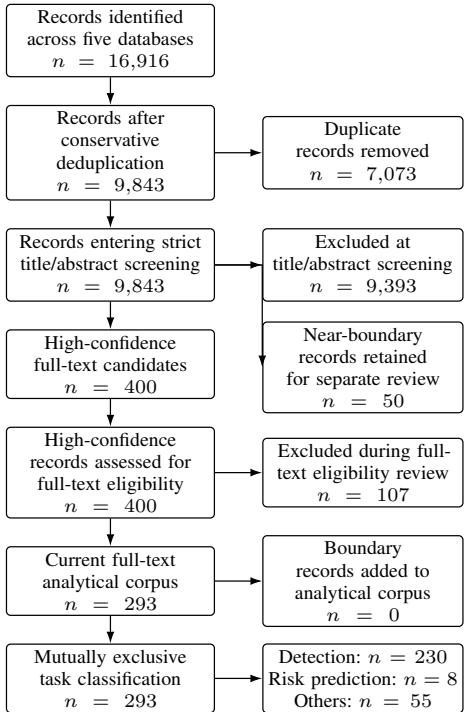
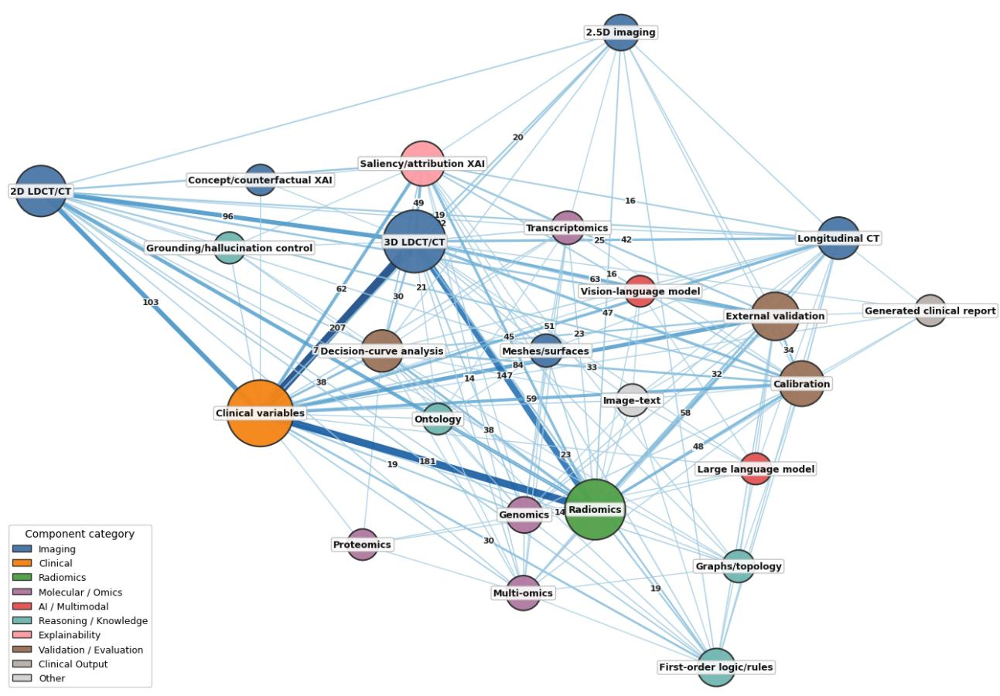
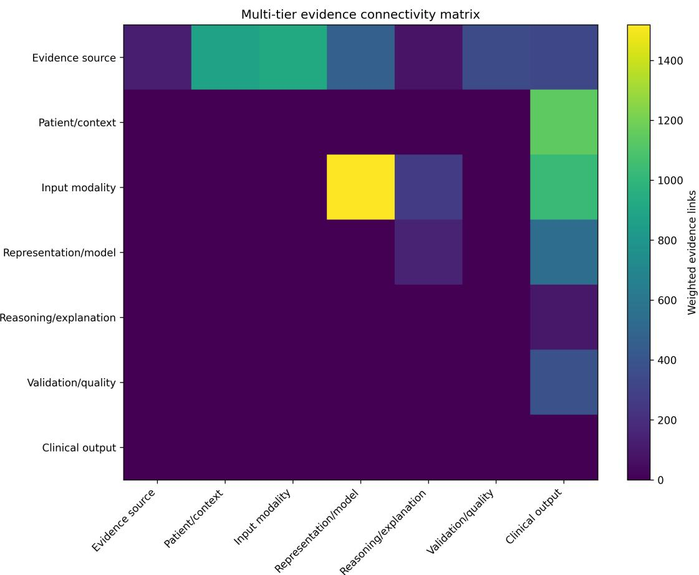
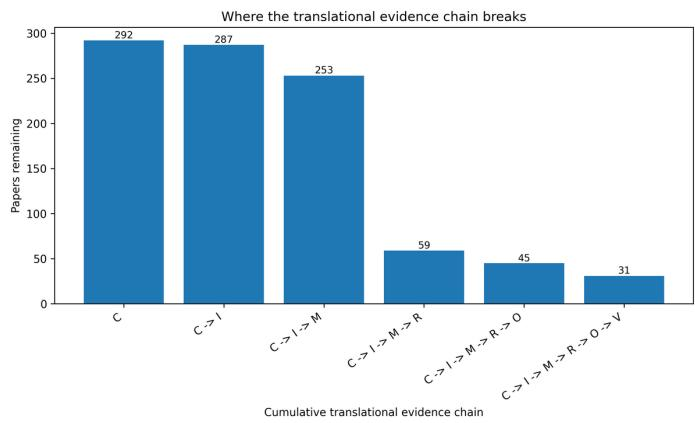

# Disentangling Lung-Cancer CT/LDCT AI: A Systematic Evidence Map of Clinical Tasks, Evidence Chains, and Translational Gaps

Surajit Das

Abstract—Artificial-intelligence studies using computed tomography (CT) for lung cancer are often broadly labelled “prediction” despite addressing clinically distinct tasks. We systematically mapped CT/low-dose CT (LDCT)-centered lung-cancer AI using five-database retrieval, full-text eligibility assessment, role-aware modality/omics extraction, clinical-task classification, and a Multi-Tier Evidence Graph (MTEG). The final corpus comprised 293 studies (2016–2026): 230 Detection, 8 future Risk-prediction, and 55 Other studies. Clinical variables (96.2%), 3-D CT/LDCT (73.0%), and radiomics (63.5%) predominated, whereas external validation (29.0%), calibration (20.5%), decision-curve analysis (13.0%), longitudinal CT (17.7%), and saliency/attribution XAI (21.5%) were less frequent. The MTEG comprised 377 nodes and 3,444 edges; only 31 studies (10.6%) completed the six-tier substantive evidence chain, with greatest attrition at reasoning/explanation. Overall, the literature is detection-dominated, genuine future risk prediction remains uncommon, and complete translational evidence chains are rare.

Index Terms—lung cancer, computed tomography, low-dose CT, artificial intelligence, radiomics, risk prediction, pulmonary nodule, systematic evidence mapping, complex networks, semantic networks, evidence graph, genomics, multi-omics, clinical validation.

## I. INTRODUCTION

L UNG cancer screening, pulmonary-nodule assessment, and thoracic imaging have become major targets for machine learning because CT and low-dose CT (LDCT) provide rich image phenotypes that can be combined with clinical risk factors, radiomic descriptors, longitudinal change, and molecular information. However, growth in the number of published models does not necessarily indicate progress in translational maturity. A literature can be algorithmically rich while remaining clinically fragmented if model development is disconnected from external validation, calibration, decision analysis, explicit reasoning, uncertainty, or clinically actionable output.

These observations motivated three interrelated challenges that emerged from the review scope and preliminary mapping of the CT/LDCT lung-cancer AI literature: ambiguity in the clinical tasks grouped under “prediction,” inconsistency in what is described as multimodal evidence, and limited visibility of whether reported methodological components connect into a coherent translational pathway. Together, these challenges affect how reliably the literature can be synthesized, compared, and interpreted in terms of clinical translation.

A first challenge is clinical-task heterogeneity. [1]–[10] Estimating future cancer incidence in an asymptomatic screening population differs fundamentally from classifying whether an already detected pulmonary nodule is malignant, and both differ from predicting treatment response, survival, molecular mutation status, pulmonary function, or other disease-related outcomes. These tasks may use overlapping language such as “prediction,” “risk,” or “classification,” but they operate at different clinical decision points and imply different validation requirements. Accordingly, a review that pools these tasks without explicit classification may produce misleading estimates of modality use, model performance, validation practice, and clinical readiness. This distinction is increasingly important as reporting and risk-of-bias guidance for prediction models places greater emphasis on transparent development, evaluation, calibration, and applicability [11], [12], while medical-AI guidance emphasizes clinical evaluation and human-centered deployment [13], [14].

A second challenge concerns the meaning of multimodal (interpretation of multimodal evidence). [15]–[24] In many imaging studies, multimodality denotes fusion of CT with clinical variables or handcrafted radiomics. Cross-scale integration of imaging with genomics, transcriptomics, or proteomics is much less common and is easily overestimated when molecular markers are merely mentioned. For example, a study predicting EGFR mutation from CT should not automatically be classified as a genomics-input study if genomics is the outcome rather than an input to cancer-risk estimation or existing-lesion malignancy assessment.

A third challenge is that conventional reviews often count models [25]–[34], modalities, or performance metrics without determining whether these elements form a coherent translational evidence pathway within individual studies. We implement a systematic evidence-mapping strategy that combines conservative bibliographic processing, high-specificity screening, component co-occurrence analysis and a role-aware Multi-Tier Evidence Graph (MTEG). The MTEG separates seven functional tiers: evidence source, patient/context, input modality, representation/model, reasoning/explanation, validation/quality, and clinical output. This role structure prevents conceptually different entities such as radiomics, calibration, and cancer-risk score from being collapsed into one undifferentiated graph. Unlike a PRISMA flow diagram or a conventional evidence table, which primarily records study selection and study-level characteristics, and unlike an ordinary co-occurrence network, which records whether concepts occur together without preserving their translational roles, the MTEG assigns evidence components to predefined functional tiers and evaluates whether those roles are connected within individual studies. Its added value in this review is therefore role-aware reconstruction of the within-study translational pathway and explicit localization of evidence-chain attrition.

The methodology was therefore structured to address these three challenges directly. Full-text task classification separates clinically distinct endpoints that may otherwise share prediction terminology; role-aware modality and omics extraction distinguishes true analytical inputs from outcomes or incidental mentions; and the MTEG organizes extracted evidence into functional tiers so that the continuity of the translational pathway, rather than the presence of isolated components alone, can be evaluated within each study.

The present study uses a staged corpus architecture. Fivedatabase retrieval and conservative deduplication produced the bibliographic source pool; high-specificity screening then identified 400 high-confidence full-text candidates and 50 nearboundary records. Full-text eligibility review excluded 107 of the high-confidence candidates, leaving the current 293- record analytical corpus. None of the 50 boundary records was promoted into this core corpus, so all downstream landscape, MTEG, and task-space analyses use the same 293 records.

The principal contributions are an auditable five-database review workflow, mutually exclusive clinical-task classification, role-aware modality/omics extraction, a seven-tier MTEG for evidence-chain analysis, task-specific MTEGs, independent human eligibility/task adjudication, and structured extraction validation.

## II. REVIEW QUESTIONS

The systematic review and evidence map addressed five questions:

1) Which clinical, imaging, radiomic, molecular, reasoning, output, and validation components characterize CT/LDCT-based lung-cancer AI?

2) How frequently are these components represented and co-integrated within individual studies?

3) To what extent do studies form complete translational evidence chains spanning patient/context, input modality, model, reasoning/explanation, clinical output, and validation, and where does attrition occur?

4) How is the literature distributed among mutually exclusive Detection, future Risk-prediction, and Other clinical task spaces?

5) How do task-specific MTEGs differ in concept composition, connectivity, and translational evidence architecture?

## III. METHODS

## A. Search Strategy and Corpus Assembly

The search was designed around four mandatory concept blocks: lung cancer/pulmonary nodules, CT/LDCT imaging, AI/ML methodology, and a clinically relevant prediction/detection endpoint. The publication window was 2016– 2026. The complete Scopus search strategy was:

The corresponding database-specific search strategies for PubMed, Embase (Ovid), IEEE Xplore, and ACM Digital Library are provided in Supplementary Table S2. Supplementary Tables S2–S3 additionally report the search date, database-specific retrieval totals, publication and language rules, deduplication procedure, screening rules, and full-text eligibility procedures.

Records were retrieved from Scopus (6,963), PubMed (3,184), Embase (4,707), IEEE Xplore (1,774), and ACM (288), yielding 16,916 raw records. The final searches of all five databases were conducted on 21 August 2026. The interfaces used were Elsevier Scopus, NCBI PubMed, Ovid for Embase, IEEE Xplore Digital Library, and ACM Digital Library.

## B. Protocol Registration

This systematic evidence map was retrospectively registered in OSF Registries using the Generalized Systematic Review Registration Form on 11 September 2026 (OSF registration: https://osf.io/2nyme/). The review commenced on 1 July 2026, before registration; accordingly, this registration should not be interpreted as prospective preregistration. The registration records the review framework, eligibility criteria, search strategy, extraction strategy, clinical-task classification, evidencemapping approach, and planned synthesis. The final analytical corpus reported in this manuscript comprises 293 studies.

## C. Deduplication and Record Consolidation

Cross-source deduplication was deliberately conservative, followed by systematic review of the fuzzy-duplicate candidate log. The deduplication procedure was designed to reduce false duplicate removal; however, residual duplicate-cohort publications may remain because bibliographic deduplication does not establish whether two studies used independent patient populations. Records were linked hierarchically by (i) exact normalized DOI and then (ii) exact normalized title. Title matches were accepted only when the normalized title contained at least 20 characters and there was no conflict in non-empty DOI or publication-year fields. Duplicate relations were consolidated using a Union–Find/disjoint-set structure so that transitive duplicate groups were handled as one component. Within each component, the retained record was the bibliographically richest candidate according to metadata completeness across DOI, title, abstract, authors, journal, year, keywords, and related fields. Ambiguous title matches with DOI/year conflicts were not automatically deleted and were retained for audit. This process reduced the 16,916 retrieved records to 9,843 consolidated bibliographic records.

a) Dataset and study-family accounting.: Bibliographic deduplication identifies duplicate publications but does not by itself establish independence of the underlying patient cohorts or datasets. The final analytical denominator therefore represents publications rather than necessarily independent cohorts. Dataset descriptions and study-family information were retained at record level using stable Record\_ID keys; however, a defensible numerical count of unique underlying

## Scopus search strategy

TITLE-ABS-KEY( ("lung cancer" OR "lung carcinoma" OR "pulmonary cancer" OR "lung neoplasm\*" OR "pulmonary nodule\*" OR "lung nodule\*") AND ("computed tomography" OR "low-dose computed tomography" OR "low-dose CT" OR LDCT OR "chest CT" OR radiomics OR "CT imaging") AND ("artificial intelligence" OR "machine learning" OR "deep learning" OR "neural network\*" OR "computer vision" OR "large language model\*" OR "vision-language model\*" OR multimodal OR "multi-modal") AND (predict\* OR prognos\* OR "risk prediction" OR "risk stratification" OR "malignancy prediction" OR "malignancy classification" OR diagnos\* OR screening) ) AND PUBYEAR > 2015 AND PUBYEAR < 2027

datasets or independent study families requires publication-tocohort identity adjudication. Automated or normalized datasetstring counts were therefore not interpreted as counts of independent datasets, institutions, or study families.

## D. Reporting Framework, PICOS-Based Eligibility, and Predefined Criteria

The review was structured and is reported with reference to PRISMA 2020 [35] and the eligibility criteria were organized using an adapted PICOS framework. Because the corpus spans diagnostic, screening, prediction-model, segmentation, prognostic, and related AI studies rather than a single intervention design, eligibility was operationalized using a PICOS-based framework adapted to CT/LDCT-centered medical-AI evidence mapping. PICOS was used to make the review question and eligibility boundaries explicit; it was not used to imply that every included study contained an intervention-control comparison. Because the review is an evidence map rather than a pooled intervention-effect review, no quantitative clinical meta-analysis pertaining to it was attempted.

Eligibility criteria operationalize the scope used during corpus assembly and were formalized for transparent reporting of the final analytical mapping. The operational definitions of the three mutually exclusive clinical task spaces are summarized in Table III.

Full peer-reviewed conference papers were eligible when they satisfied the same empirical, CT/LDCT, computational, and clinical-endpoint requirements as journal articles. Preprints were excluded as non-peer-reviewed reports, and abstractonly conference records were excluded because they did not provide sufficient full-text methodological evidence for reliable eligibility and extraction. This publication-type rule was applied independently of venue prestige or citation impact. Table II separates disease scope, imaging scope, computational methodology, publication type, full-text assessability, language, and evidentiary sufficiency so that exclusions are auditable rather than inferred retrospectively from the final corpus.

## E. Independent Human Eligibility/Task Adjudication and Design-Specific Risk-of-Bias Assessment

The final human-review layer was conducted independently from the automated MTEG extraction audit. Two reviewers independently assessed the full-text candidate records for eligibility and, for included studies, clinical-task classification and study-design category. Initial decisions were recorded before consensus. Disagreements were discussed by the two primary reviewers, and unresolved cases were adjudicated by the third author. Percentage agreement and Cohen’s κ were calculated from the pre-consensus decisions where the coding structure permitted. Design-specific risk-of-bias assessment was completed separately for all 293 studies using the dedicated risk-of-bias workbook. The workbook records a full-text assessment and a rule-based methodological cross-check by two independent human RoB reviewers.

Risk-of-bias assessment was design-specific. The 230 Detection studies were assessed using QUADAS-3 v1.2 [36]; the 63 studies in the Risk and Others task spaces were assessed using PROBAST+AI (2025) [12]. For QUADAS-3, the workbook used Low, High, and II (insufficient information) domain judgments; for PROBAST+AI, it used Low, High, and Unclear. Domain-level judgments were retained rather than collapsed into an unvalidated numerical quality score. To examine the relationship between methodological quality and evidence architecture without conflating the two constructs, the locked overall risk-of-bias judgments were descriptively cross-tabulated against primary six-tier chain completeness and the explanation-optional five-tier sensitivity definition. Because QUADAS-3 and PROBAST+AI use partly different judgment labels, these comparisons were descriptive; no pooled numerical quality score or confirmatory cross-tool hypothesis test was applied.

The completed independent review yielded 93.5% preconsensus agreement for eligibility decisions (Cohen’s κ = 0.84) and 87.1% agreement for clinical-task classification (κ = 0.76). Disagreements involving 43 studies were resolved through discussion and, where required, third-author adjudication. Final task labels and risk-of-bias judgments were locked only after this consensus/adjudication stage.

## F. High-Specificity Automated Screening and Full-Text Eligibility

Screening was designed to prioritize specificity rather than force a prespecified final study count. [37]–[46] Mandatory title/abstract gates required lung-cancer or pulmonary-nodule context, CT/LDCT evidence, AI/ML/deep-learning/radiomics evidence, an eligible clinical or modeling target, and primary empirical-study evidence, with dominant off-target outcomes or modalities excluded. This stage produced 400 high-confidence candidates for full-text assessment and 50 near-boundary records retained separately as an audit branch. The 50 near boundary records were not included in the analytical corpus because they did not satisfy the core eligibility/relevance criteria; they were retained only for screening audit and sensitivity documentation. No sample-size contingency rule was used to promote boundary records into the analytical corpus. Consequently, the boundary set was not used to construct the downstream Risk, Detection, or Others task spaces (0 added).

The 400 high-confidence candidates then underwent full-text eligibility review. One hundred seven records were excluded, leaving the current 293-record core analytical corpus. Primary exclusion reasons included conference-abstract-only records, residual duplicates, anonymous or inadequately attributable documents, documents shorter than four pages, non-peerreviewed reports, unavailable full text, non-English/Chineselanguage records that could not be assessed under the review protocol, records outside lung cancer, reviews/surveys, retracted papers, dataset-only publications, pilot/non-eligible document types, unsafe or invalid links, and records inaccessible through the available institutional holdings. Residual duplicates were treated as full-text exclusions when confirmed. The exclusion decision was based on eligibility rather than on achieving a target sample size. Supplementary Table S4 reports the aggregate exclusion categories for the 107 full-text exclusions.

TABLE I  
PICOS-BASED ELIGIBILITY FRAMEWORK FOR THE CT/LDCT-CENTERED LUNG-CANCER AI EVIDENCE MAP
<table><tr><td>Element</td><td>Operational definition</td></tr><tr><td>Population</td><td>Individuals or cohorts evaluated in lung-cancer screening, pulmonary-nodule assessment, lung-cancer diagnosis, future cancer-risk estimation, prognosis, treatment-response assessment, or another prespecified clinically relevant thoracic-oncology setting.</td></tr><tr><td>Index / interven- tion</td><td>AI-, machine-learning-, deep-learning-, computer-vision-, or radiomics-based analysis in which CT or LDCT is an analytical input</td></tr><tr><td></td><td>or central imaging component; eligible multimodal extensions could additionally incorporate clinical, longitudinal, molecular, image-text, or other complementary information.</td></tr><tr><td>Comparator Outcomes</td><td>Radiologist assessment, pathological or clinical reference standards, conventional risk models, alternative AI/ML models, baseline algorithms, or no explicit comparator when the eligible report was primarily a model-development or validation study. Future lung-cancer incidence/risk; current lesion or disease detection, segmentation, diagnosis, screening classification, or</td></tr><tr><td></td><td>pulmonary-nodule malignancy; and prespecified related endpoints including prognosis, survival, recurrence, treatment response, staging/progression, lung function, or molecular status.</td></tr><tr><td>Study design</td><td>Peer-reviewed primary empirical studies reporting development, evaluation, validation, or clinically relevant application of an eligible CT/LDCT-centered computational approach. Reviews, surveys, editorials, dataset-only publications, abstract-only reports, retracted publications, and other non-eligible document types were excluded.</td></tr></table>

TABLE II  
PREDEFINED FULL-TEXT INCLUSION AND EXCLUSION CRITERIA
<table><tr><td>Domain</td><td>Inclusion criterion</td><td>Exclusion criterion</td></tr><tr><td>Clinical scope</td><td>Lung cancer, pulmonary nodules, lung-cancer screening, or another directly relevant thoracic-oncology endpoint.</td><td>Primary focus outside lung cancer/pulmonary nodules or an off- target clinical problem without an eligible lung-cancer endpoint.</td></tr><tr><td>Imaging scope</td><td>CT/LDCT used as a primary analytical input or central imaging component, including eligible multimodal extensions.</td><td>No qualifying CT/LDCT contribution to the analytical model or evidence pathway.</td></tr><tr><td>Methodological scope</td><td>AI, machine learning, deep learning, computer vision, ra- diomics, or an eligible multimodal computational model.</td><td>No eligible computational modeling component or purely non- computational analysis.</td></tr><tr><td>Publication type</td><td>Peer-reviewed primary empirical research with sufficient methodological and outcome information.</td><td>Review/survey, editorial/commentary, dataset-only publication, abstract-only record, retracted article, non-peer-reviewed report, or another non-eligible document type.</td></tr><tr><td>Full-text availability</td><td>Full text sufficiently accessible to determine eligibility and extract the required evidence.</td><td>Unavailable/inaccessible full text or a document too incomplete for reliable eligibility assessment.</td></tr><tr><td>Language</td><td>Full text assessable under the review protocol which considers English or in a language that could be reliably assessed by the review team.</td><td>Full text not assessable under the review language protocol.</td></tr><tr><td>Evidence sufficiency</td><td>Sufficient description of population/data, computational method, and clinically relevant endpoint for evidence mapping.</td><td>Insufficient or inadequately attributable report, invalid/unsafe source, or information insufficient for reliable classification.</td></tr></table>

The analytical denominator for all downstream component, semantic-network, MTEG, and task-space analyses is therefore 293. All final component frequencies, evidence-chain measures, MTEG topology, task-space analyses, and historical benchmark ing reported in this manuscript were generated from this frozen 293-record analytical corpus; screening-stage candidate counts are used only for review-flow accounting.

## G. Full-Text Task Classification and Study Spaces

Each of the 293 included records was assigned to exactly one task space according to the primary clinical/modeling endpoint actually predicted or analyzed, rather than incidental terminology in the introduction or discussion. The notebook includes explicit assertions that the three primary spaces are mutually exclusive and exhaustive:

$$
\begin{array} { r } { \mathcal { V } = \mathcal { V } _ { D } \cup \mathcal { V } _ { R } \cup \mathcal { V } _ { O } , \qquad \mathcal { V } _ { D } \cap \mathcal { V } _ { R } = \mathcal { V } _ { D } \cap \mathcal { V } _ { O } = \mathcal { V } _ { R } \cap \mathcal { V } _ { O } = \mathcal { V } . } \end{array}\tag{1}
$$

The resulting task counts were 230 Detection, 8 Riskprediction, and 55 Other studies. The derived Non-Risk comparator is Detection plus Others and is used only for matched binary comparison; it is not a fourth primary task class.

## H. Role-Aware Omics Detection

Omics classification was explicitly role-aware. [47]–[56] Genomic, transcriptomic, and proteomic terms were counted only when title/abstract evidence linked the molecular information to an eligible lung-cancer outcome as an input, feature, predictor, or covariate. Mere presence of terms such as EGFR, ALK, KRAS, TP53, PD-L1, gene expression, or protein markers was insufficient. In particular, CT-to-mutation prediction studies were not labeled as genomics-input studies when mutation status was the prediction target.

Let $O _ { i p }$ denote the presence of omics layer p in paper i, $R _ { i p }$ denote evidence that the molecular layer plays an input/predictor role, and $Y _ { i }$ denote an eligible lung-cancer outcome. The role-aware label was therefore defined conceptually as

OPERATIONAL CRITERIA FOR THE THREE MUTUALLY EXCLUSIVE TASK SPACES  
TABLE III
<table><tr><td>Task</td><td>Classification criterion</td></tr><tr><td>Risk prediction</td><td>Estimates an individual&#x27;s susceptibility to, or probability of, developing lung cancer in the future, before an established malignant lesion is being evaluated. This category includes future lung-cancer incidence, susceptibility, individualized risk estimation, and risk stratification. The defining feature is the future occurrence of lung cancer as the predicted endpoint, rather than characterization of a lesion already present at the time of assessment.</td></tr><tr><td>Detection</td><td>Identifies, localizes, segments, diagnoses, or characterizes lung cancer or pulmonary lesions that are already present at the time of assessment. This category includes lesion/nodule detection and segmentation, screening detection, diagnostic classification, benign-versus-malignant classification, and malignancy assessment of an existing pulmonary nodule. Accordingly, models estimating “malignancy probability,&quot;“risk of malignancy,&quot; or the likelihood that an existing nodule is malignant are classified</td></tr><tr><td>Others</td><td>as Detection rather than Risk prediction, despite the use of the term “risk.&quot; Includes clinically relevant endpoints that concern neither future occurrence of lung cancer nor detection/characterization of currently present cancer or pulmonary lesions. These include prognosis, overall/progression-free/disease-free survival, recurrence, mortality, treatment response, treatment toxicity or adverse events, cancer staging or progression, pulmonary/lung function, and molecular or mutation-status prediction (e.g., EGFR, ALK, KRAS, or PD-L1), as well as other eligible endpoints outside the preceding two categories.</td></tr></table>

$$
\widetilde { O } _ { i p } = O _ { i p } \mathbb { I } ( R _ { i p } = \mathrm { i n p u t } ) \mathbb { I } ( Y _ { i } \in \mathcal { V } _ { \mathrm { e l i g i b l e } } ) .\tag{2}
$$

This conservative rule was propagated through the component frequency analysis and MTEG. The component-level molecular search was performed specifically within the 293- paper CT/LDCT-centered AI/radiomics corpus using expanded dictionaries for genetic variants and mutations, gene-expression and RNA/miRNA signatures, protein biomarkers, and related terms. It was not designed to identify all omics-based AI studies in lung cancer; its purpose was to characterize how molecular evidence is integrated into the predefined CT/LDCT-centered corpus.

## I. Component Co-Occurrence and Fragmentation

A paper-component bipartite graph was projected onto the component layer. The projection included clinical, imaging, radiomic, omic, reasoning, validation, and output-related concepts. Taxonomy coverage was defined as the number of observed modality/component categories divided by the number specified in the frozen taxonomy. Integration density D was the standard undirected density of the projected component co-occurrence graph. Weighted cross-community mixing M was the fraction of total edge weight joining nodes assigned to different detected communities, and the isolated-component fraction I was the proportion of observed component nodes with degree zero. We report these quantities separately together with modularity and an exploratory bounded fragmentation score

$$
F = \frac { ( 1 - D ) + ( 1 - M ) + I } { 3 } ,\tag{3}
$$

where D is integration density, M is weighted cross-community mixing, and I is the isolated-component fraction. This index is descriptive rather than a validated clinical metric.

a) Interpretation of component-network fragmentation measures.: The component-network measures were interpreted separately before considering the composite fragmentation score. Integration density summarizes the breadth of observed connectivity among component concepts in the projected network: larger values indicate that a greater share of potentially connectable component relations is represented, but do not imply that those relations are evenly distributed across conceptual groups. Weighted cross-community mixing quantifies the extent to which observed connection weight spans different detected communities rather than remaining concentrated within recurring within-community combinations. The isolatedcomponent fraction records the proportion of component concepts with no projected co-occurrence connection and therefore captures complete structural separation at the node level. Modularity provides a complementary partition-based description of how strongly the component network separates into internally connected communities. The bounded score F combines lack of integration, lack of cross-community mixing, and isolation into a single exploratory summary; it is interpreted only alongside its constituent measures and is not used as a stand-alone indicator of clinical or methodological quality.

## J. Multi-Tier Evidence Graph

The MTEG contains typed concept nodes v with role

$$
r ( v ) \in \{ E , C , I , M , R , V , O \} ,\tag{4}
$$

representing evidence source, patient/context, input modality, representation/model, reasoning/explanation, validation/quality, and clinical output, respectively. Paper-to-concept evidence edges and paper-mediated cross-tier co-occurrence edges were retained with provenance.

The patient/context tier explicitly separates screening populations, diagnostic nodule populations, future cancer-incidence risk, nodule malignancy, and prediction horizon. This distinction is essential: predicting future cancer incidence in a screening population is not equivalent to estimating whether an already detected pulmonary nodule is malignant.

The input tier includes clinical variables, radiomics, 2- D/2.5-D/3-D CT, longitudinal CT, genomics, transcriptomics, proteomics, multi-omics, image-text information, and geometric/topological representations. Input-tier concept detection was restricted to its predefined role-specific input vocabulary; model, reasoning, validation, and clinical-output concepts were assigned to their respective tiers rather than being duplicated as inputs. [57]–[66] The model tier includes classical machine learning, CNNs, vision transformers, multimodal transformers, graph neural networks, foundation-model pretraining, and LLMs. The reasoning tier includes saliency, SHAP, conceptbased explanations, ontology, knowledge graphs, first-order logic, rule constraints, and retrieval grounding. Validation in cludes internal, external, and prospective validation, calibration, decision-curve analysis, clinician evaluation, and factuality or hallucination assessment. Within the MTEG, clinical output denotes the form of model output (for example, diagnosis, malignancy probability, future-risk score, uncertainty estimate, or generated report) and should not be interpreted as clinical actionability. Actionability additionally requires an explicit decision context and supporting evidence such as calibration, decision-curve or utility analysis, external or prospective validation, or clinician evaluation. Consequently, presence of the output tier, or even completion of the evidence chain, is not itself evidence of deployment readiness.

A complete evidence chain was defined over six substantive tiers beyond source provenance:

$$
C  I  M  R  O  V .\tag{5}
$$

For paper $p ,$ six-tier coverage was

$$
A _ { 6 } ( p ) = { \frac { 1 } { 6 } } \sum _ { t \in \{ C , I , M , R , O , V \} } \mathbb { I } ( p { \mathrm { ~ c o v e r s ~ } } t ) .\tag{6}
$$

A complete chain therefore requires $A _ { 6 } ( p ) = 1$ ; the corresponding binary completeness indicator is defined in Table IV. The broader seven-tier architecture additionally includes evidencesource provenance. As a sensitivity analysis of the dependence of chain completeness on the reasoning/explanation tier, we additionally evaluated an explanation-optional five-tier chain,

$$
C  I  M  O  V ,
$$

with $C _ { 5 } ( p ) = 1$ only when all five of these tiers were present. This sensitivity definition does not replace the primary sixtier MTEG chain; it evaluates whether incomplete integration persists when explicit reasoning/explanation is not mandatory.

## K. Paper-Semantic Network Construction and Reproducibility

The publication-level semantic network was constructed from the frozen 293-study corpus using normalized sentence-transformer embeddings (sentence-transformers/all-MiniLM-L6-v2) and pairwise cosine similarity. The primary undirected weighted paper graph used a deterministic threshold equal to the 92nd percentile of positive pairwise similarities, with a minimum safeguard of 0.25; in the final corpus this yielded a threshold of 0.739488, 293 nodes, and 3,404 edges. An edge therefore denotes semantic similarity at or above the fixed threshold, its weight equals cosine similarity, and its distance attribute is max(1 − similarity, 10−9). The Detection, Risk, and Others paper networks are induced subnetworks of this same parent graph and therefore use the identical representation and global threshold.

Threshold robustness was examined at similarity quantiles 0.85, 0.88, 0.90, 0.92, 0.94, and 0.96.

The MTEG is distinct from the undirected paper-semantic graph. It is a directed, typed evidence graph. Paper-to-concept edges are directed from the study source toward the extracted concept. Paper-mediated concept-to-concept edges are added only for the predefined cross-tier relations (for example, Input modality → Representation/model, Representation/model → Reasoning/explanation, and Representation/model → Clinical output); no within-tier concept-to-concept co-occurrence edges are introduced by this rule. Repeated support for the same normalized directed concept pair is aggregated as edge weight. Identical normalized concept labels within the same tier collapse to the same concept node. Thus, edge direction in the MTEG represents the predefined functional tier relation, whereas edges in the paper-semantic network are undirected similarities.

## L. MTEG Graph Measures and Evidence-Architecture Interpretation

MTEG structure was characterized using complementary measures of component prevalence, connectivity, integration, fragmentation, and evidence-chain completeness, as defined in Table IV. These measures were interpreted descriptively as properties of the evidence architecture rather than indicators of clinical performance or study quality.

The explanation-optional five-tier chain $C  I  M $ $O  V$ is evaluated separately as a sensitivity analysis and does not replace the primary six-tier complete-chain definition in Table IV.

## M. Structured MTEG Extraction Validation

The automated MTEG extraction was evaluated separately from the independent human eligibility/task review and the design-specific risk-of-bias assessment using a prespecified, three-component audit. Full-cohort validation was completed for all 293 current Record IDs across MTEG tier/concept coding, model/dataset coding, omics-role coding, and current ID/full-text alignment. The validation-tracking workbook marks all four full-cohort validation items as Completed. The MTEG tier/concept, model/dataset, and omics-role components constitute AI-assisted full-text validation, while the current-ID/full-text component verifies Record ID, title, and full-text alignment. This full-cohort validation does not represent an independent double-human extraction round. A deterministic 100-paper validation sample was additionally frozen on first creation (random state 42), with exact Record\_IDs and audit keys retained in a fixed manifest to prevent validation-set drift and to support the quantitative extraction-reliability analysis reported below.

The audit examined three complementary extraction domains: (i) tier assignment and fine-grained concept normalization; (ii) model- and dataset-related information; and (iii) omics feature extraction with analytical-role verification. The roleaware omics audit distinguished molecular information used as an input or predictor from molecular outcomes, adjustment variables, stratification factors, and contextual mentions. Extraction performance was summarized using precision, recall, F1 score, and Cohen’s κ where appropriate. Aggregate-tier and fine-grained concept-level results were evaluated separately because they represent different levels of semantic difficulty.

TABLE IV  
CORE GRAPH-THEORETIC AND EVIDENCE-CHAIN MEASURES USED TO CHARACTERIZE THE MTEG EVIDENCE ARCHITECTURE.
<table><tr><td>Measure</td><td>Definition</td><td>Interpretation in evidence synthesis</td></tr><tr><td>Component prevalence</td><td> $P ( v ) = n _ { v } / N$ </td><td>Frequency of each evidence component across studies.</td></tr><tr><td>Edge frequency</td><td> $\begin{array} { r } { w _ { i j } = \sum _ { s } I _ { s i } I _ { s j } ; \hat { w } _ { i j } = w _ { i j } / N } \end{array}$ </td><td>Frequency/proportion with which two components are integrated.</td></tr><tr><td>Degree</td><td> $\begin{array} { r } { k _ { i } = \sum _ { j \neq i } A _ { i j } \ [ 6 7 ] } \end{array}$ </td><td>Breadth of distinct direct component connections.</td></tr><tr><td>Strength</td><td> $\begin{array} { r } { s _ { i } = \sum _ { j \neq i } w _ { i j } \ [ 6 8 ] } \end{array}$ </td><td>Cumulative recurrence of a component&#x27;s connections.</td></tr><tr><td>Betweenness</td><td> $\begin{array} { r } { B C ( v ) \stackrel {  } { = } \sum _ { s \neq v \neq t } \sigma _ { s t } ( v ) / \sigma _ { s t } \ [ 6 9 ] } \end{array}$ </td><td>Bridging position between evidence regions.</td></tr><tr><td>Density</td><td> $D = 2 | E | / [ | V | ( | V | - 1 ) ] [ 6 7 ]$ </td><td>Proportion of possible pairwise connections observed</td></tr><tr><td>Connected components</td><td>Number of maximal connected subgraphs</td><td>Structural fragmentation.</td></tr><tr><td>Global efficiency</td><td> $E _ { \mathrm { g l o b } } = [ | V | ( | V | - 1 ) ] ^ { - 1 } \sum _ { i \neq j } 1 / d _ { i j } \ [ 7 0 ]$ </td><td>Network-level accessibility; disconnected pairs contribute zero.</td></tr><tr><td>Clustering coefficient</td><td> $C _ { i } = 2 e _ { i } / [ k _ { i } ( k _ { i } - 1 ) ] , k _ { i } \geq \overset { \prime } { 2 } \overset { \circ } [ 7 1 ]$ </td><td>Local bundling among neighboring evidence components.</td></tr><tr><td>Complete chain</td><td> $\begin{array} { r } { C _ { 6 } ( s ) = \prod _ { t \in \{ C , I , M , R , O , V \} } I _ { s t } } \end{array}$ </td><td>Equals 1 only when all six substantive tiers are present.</td></tr><tr><td>Retention/attrition</td><td> $R _ { k } = N _ { k } / N _ { k - 1 } ; A _ { k } = 1 - \stackrel { \textstyle } { R } _ { k }$ </td><td>Localizes where successive chains become incomplete.</td></tr></table>

The completed audit served as both a reliability assessment and a quality-control layer. The completed all-293 MTEG validation workbook is the authoritative record of full-cohort validation. The frozen 100-paper audit remains a separate quantitative reliability audit and is not the sole validation layer for the final MTEG.

## N. Task-Specific MTEG Comparison

The MTEG taxonomy was projected separately for Detection, Risk prediction, and Others to compare task-specific concept composition and evidence architecture. These graph quantities were interpreted descriptively.

## IV. RESULTS

## A. PRISMA, Independent Review, and Risk-of-Bias Assessment

The search, deduplication, screening, full-text eligibility, and analytical-corpus counts are reported stage-wise in accordance with PRISMA 2020 [35]. The PICOS-based framework and predefined eligibility criteria are reported in Tables I and II.

Two reviewers independently assessed eligible studies for eligibility, clinical-task classification, and study-design category. Before consensus, agreement was 93.5% for eligibility decisions (Cohen’s $\kappa = 0 . 8 4 )$ and 87.1% for task classifications $( \kappa = 0 . 7 6 )$ . Disagreements involving 43 studies were resolved through reviewer discussion and third-author adjudication where required.

Risk-of-bias assessment was completed for all 293 included studies. QUADAS-3 v1.2 was applied to 230 Detection studies: 90 were judged Low overall, 68 High, and 72 II (insufficient information); applicability concern was Low in 112, High in 23, and II in 95. At domain level, High judgments occurred in Participants (23), Index Test/Predictors (26), and Analysis (26), while the Target Condition/Outcome domain had no High judgments and 30 II judgments. PROBAST+AI (2025) was applied to the remaining 63 Risk/Other studies: 25 were Low overall, 20 High, and 18 Unclear; applicability concern was Low in 36 and Unclear in 27. PROBAST+AI domain-level High judgments occurred in Participants (6), Predictors (8), and Analysis (9), with no High Outcomedomain judgments. Domain-level judgments are reported in the risk-of-bias workbook and supplementary materials; no aggregate numerical quality score was calculated. Descriptive linkage of the locked risk-of-bias judgments to the paper-level MTEG showed complete six-tier chains in 22/115 Low-risk studies (19.1%), 4/88 High-risk studies (4.5%), 4/72 QUADAS-3 II studies (5.6%), and 1/18 PROBAST+AI Unclear studies (5.6%). Under the explanation-optional five-tier definition, the corresponding values were 62/115 (53.9%), 25/88 (28.4%), 23/72 (31.9%), and 6/18 (33.3%). These descriptive patterns indicate that MTEG completeness and risk of bias are related but non-equivalent dimensions and do not support a causal or pooled cross-tool quality interpretation.

## B. Review Accounting, Full-Text Eligibility, Task Classification, and Publication Growth

Figure 1 summarizes retrieval, deduplication, high-specificity screening, full-text eligibility, and task classification in a PRISMA 2020-aligned workflow [35]. The five-database search yielded 16,916 raw records and conservative deduplication produced 9,843 records. Strict screening produced 400 highconfidence full-text candidates plus 50 near-boundary records. Full-text review excluded 107 of the high-confidence candidates, leaving the 293-record analytical corpus; no boundary record was added. The same 293-paper denominator therefore supports the broad evidence map and comparative task-space analyses. The near-boundary set is displayed as a separate audit branch rather than being added to the analytical denominator: none of the 50 boundary records met the core-corpus eligibility/relevance threshold for inclusion, so the final analytical corpus remained 293 studies. The diagram is a workflowaccounting visualization and should not be interpreted as replacing the formal PRISMA checklist or study-level exclusion log. A formal PRISMA 2020 reporting crosswalk is provided in Supplementary Table S7; it identifies where each reporting domain is addressed and does not convert this heterogeneous evidence map into a pooled intervention-effect meta-analysis.

To provide a conventional overview of the included evidence base, Table V summarizes the principal clinical-task distribution and selected methodological and translational characteristics of the 293 included studies. This overview complements the subsequent detailed component, semantic-network, and MTEG analyses.

The findings are discussed below according to the principal themes of the review. First, we examine the distribution of clinical tasks and methodological components across the included studies. Second, we assess how imaging, clinical, radiomic, and molecular evidence are combined, with particular attention to the interpretation of multimodal inputs. Third, we evaluate whether these components form coherent translational evidence pathways through the MTEG, including reasoning, clinical output, and validation. The accompanying semantic and network analyses provide complementary structural views of these themes.

  
Fig. 1. PRISMA-style accounting of the computational evidence-mapping and full-text eligibility workflow. Five-database retrieval yielded 16,916 records, reduced to 9,843 by conservative DOI/title-based deduplication. Strict title/abstract screening identified 400 high-confidence full-text candidates, 50 near-boundary records retained in a separate audit branch, and 9,393 title/abstract exclusions. Full-text eligibility review of the 400 high-confidence candidates excluded 107 records, yielding the 293-study analytical corpus. None of the 50 near-boundary records was added to this corpus. The 293 included analytical studies were subsequently assigned to mutually exclusive Detection $( n = 2 3 0 )$ , Risk-prediction $( n = 8 )$ , and Other $( n = 5 5 )$ task spaces.

TABLE V  
OVERVIEW OF THE INCLUDED ANALYTICAL CORPUS
<table><tr><td>Characteristic</td><td>Included studies</td></tr><tr><td>Total analytical corpus</td><td>293</td></tr><tr><td>Detection</td><td>230 (78.5%)</td></tr><tr><td>Future Risk prediction</td><td>8 (2.7%)</td></tr><tr><td>Other clinical tasks</td><td>55 (18.8%)</td></tr><tr><td>Clinical variables</td><td>282 (96.2%)</td></tr><tr><td>3-D CT/LDCT</td><td>214 (73.0%)</td></tr><tr><td>Radiomics</td><td>186 (63.5%)</td></tr><tr><td>External validation</td><td>85 (29.0%)</td></tr><tr><td>Calibration</td><td>60 (20.5%)</td></tr><tr><td>Decision-curve analysis</td><td>38 (13.0%)</td></tr><tr><td>Saliency/attribution XAI</td><td>63 (21.5%)</td></tr></table>

Publication volume rose sharply after 2019, with the largest annual volume in 2025. The apparent decline in 2026 should be interpreted in light of the incomplete calendar year represented in the search export.

## C. Data Modalities and Translational Components

Table VII shows the role-aware frequencies. [72]–[81] Clinical variables (282/293; 96.2%), 3-D CT/LDCT (214/293; 73.0%), and radiomics (186/293; 63.5%) dominated the current full-text corpus. External validation was identified in 85 papers (29.0%), calibration in 60 (20.5%), decision-curve analysis in 38 (13.0%), longitudinal CT in 52 (17.7%), and saliency/attribution XAI in 63 (21.5%). Role-aware molecular inputs remained less common: genomics 19 (6.5%), transcriptomics 7 (2.4%), multi-omics 11 (3.8%), and proteomics 1 (0.3%). The single proteomics-positive paper underscores how rare qualifying proteomic input was under the operational definition, rather than reflecting omission of proteomics from the taxonomy.

For descriptive context, we report two-sided 95% Wilson binomial reference intervals for selected corpus proportions using the 293 included papers as the denominator (Table VI). These are descriptive reference intervals for observed paperlevel proportions, not inferential confidence intervals for a sampled super-population; they do not account for study-family dependence, heterogeneous designs, or database-selection processes.

## D. Cross-Scale Integration Was Sparse

As visualized in Fig. 2, the strongest component cooccurrences were 3-D CT/LDCT with clinical variables (207 papers), radiomics with clinical variables (181), and 3-D CT/LDCT with radiomics (147), followed by 2-D CT/LDCT with clinical variables (103) and 3-D with 2-D CT/LDCT (96) [83]–[89]. Molecular integration was much smaller in absolute terms: genomics co-occurred with clinical variables in 19 papers, radiomics in 14, and 3-D CT/LDCT in 14; transcriptomics co-occurred with clinical variables in seven and with radiomics in five; multi-omics co-occurred with clinical variables in 11 and radiomics in nine [21], [82], [90], [91]. The single proteomics-positive paper, REC\_02528, cooccurred with clinical variables, radiomics, genomics, and multi-omics [21]. These patterns show that most integration remains concentrated within the clinical–imaging–radiomics axis, with molecular layers forming a much smaller cross-scale extension.

The observed taxonomy coverage was 85.7%, component integration density 0.565, cross-community mixing 0.100, and exploratory fragmentation score 0.445. No observed component node was isolated, but low cross-community mixing indicates that connection was concentrated within a small number of recurring combinations.

## E. The MTEG Exposed an Evidence-Chain Bottleneck

The updated role-aware MTEG contained 377 nodes and 3,444 edges. Cross-tier weighted connectivity was strongly asymmetric. Input-to-model links had total weight 1,519 and input-to-clinical-output links 1,022, while model-to-reasoning weight was 154 and reasoning-to-clinical-output weight 96. Validation-to-output weight was 377. This pattern indicates a much stronger literature on prediction and output generation than on explicit reasoning and validation integrated into the same evidence path.

TABLE VI  
PRINCIPAL COMPONENT PREVALENCE WITH DESCRIPTIVE 95% WILSON BINOMIAL REFERENCE INTERVAL
<table><tr><td>Component</td><td>N</td><td>%</td><td>95%CI</td><td>Component</td><td>N</td><td>%</td><td>95% CI</td></tr><tr><td>Clinical variables</td><td>282</td><td>96.2</td><td> $9 3 . 4 \mathrm { - } 9 7 . 9$ </td><td>External validation</td><td>85</td><td>29.0</td><td> $2 4 . 1 \mathrm { - } 3 4 . 5$ </td></tr><tr><td>3-D CT/LDCT</td><td>214</td><td>73.0</td><td> $6 7 . 7 \mathrm { - } 7 7 . 8 $ </td><td>Calibration</td><td>60</td><td>20.5</td><td> $1 6 . 3 – 2 5 . 5$ </td></tr><tr><td>Radiomics</td><td>186</td><td>63.5</td><td> $5 7 . 8 – 6 8 . 8$ </td><td>Decision-curve analysis</td><td>38</td><td>13.0</td><td> $9 . 6 { - } 1 7 . 3$ </td></tr><tr><td>Saliency/attribution XAI</td><td>63</td><td>21.5</td><td> $1 7 . 2 – 2 6 . 6$ </td><td>Longitudinal CT</td><td>52</td><td>17.7</td><td> $1 3 . 8 \mathrm { - } 2 2 . 5 $ </td></tr><tr><td>Genomics</td><td>19</td><td>6.5</td><td> $4 . 2 { - } 9 . 9$ </td><td>Transcriptomics</td><td>7</td><td>2.4</td><td> $1 . 2 { - } 4 . 8$ </td></tr><tr><td>Multi-omics</td><td>11</td><td>3.8</td><td> $2 . 1 { - } 6 . 6$ </td><td>Proteomics</td><td>1</td><td>0.3</td><td> $0 . 1 { - } 1 . 9$ </td></tr></table>

TABLE VII

SELECTED MODALITIES, METHODS, AND TRANSLATIONAL COMPONENTS IN THE 293-RECORD CORPUS. CITATIONS ILLUSTRATE ONE REPRESENTATIVE STUDY PER COMPONENT; N AND PERCENTAGES ARE CORPUS-WIDE FREQUENCIES.
<table><tr><td>Tier/role</td><td>Component</td><td>N</td><td>%</td><td>Tier/role</td><td>Component</td><td>N</td><td>%</td></tr><tr><td>Input</td><td>Clinical variables [1]</td><td>282</td><td>96.2</td><td>Validation</td><td>External validation [8]</td><td>85</td><td>29.0</td></tr><tr><td>Input</td><td>3-D CT/LDCT [16]</td><td>214</td><td>73.0</td><td>Validation</td><td>Calibration [6]</td><td>60</td><td>20.5</td></tr><tr><td>Input</td><td>Radiomics [6]</td><td>186</td><td>63.5</td><td>Validation</td><td>Decision-curve analysis [6]</td><td>38</td><td>13.0</td></tr><tr><td>Input</td><td>2-D CT/LDCT [2]</td><td>108</td><td>36.9</td><td>Reasoning</td><td>Saliency/attribution XAI [9]</td><td>63</td><td>21.5</td></tr><tr><td>Input</td><td>Longitudinal CT [24]</td><td>52</td><td>17.7</td><td>Reasoning</td><td>First-order logic/rules† [48]</td><td>32</td><td>10.9</td></tr><tr><td>Input</td><td>Genomics [77]</td><td>19</td><td>6.5</td><td>Input</td><td>Multi-omics [21]</td><td>11</td><td>3.8</td></tr><tr><td>Input</td><td>Transcriptomics [82]</td><td>7</td><td>2.4</td><td>Input</td><td>Proteomics [21]</td><td>1</td><td>0.3</td></tr><tr><td>Input</td><td>2.5-D imaging [52]</td><td>23</td><td>7.8</td><td>Model</td><td>Large language model [45]</td><td>2</td><td>0.7</td></tr><tr><td>Input</td><td>Graphs/topology [78]</td><td>7</td><td>2.4</td><td>Output</td><td>Generated clinical report [46]</td><td>2</td><td>0.7</td></tr></table>

N is the number of papers mapped to each component by the frozen role-aware extraction pipeline; percentages use 293 as the denominator. Citations identify one representative positive mapping per component, not the sole evidence for its prevalence. Papers may map to multiple components when multiple roles or modalities are present. †“First-order logic/rules” denotes the taxonomy’s combined symbolic/rule-based detector category and does not imply that every mapped study implemented formal first-order logic.

TABLE VIII  
MTEG EVIDENCE-CHAIN SUMMARY
<table><tr><td>Measure</td><td>Value</td></tr><tr><td>Mapped papers</td><td>293</td></tr><tr><td>MTEG nodes</td><td>377</td></tr><tr><td>MTEG edges</td><td>3,444</td></tr><tr><td>Complete six-tier chains</td><td>31</td></tr><tr><td>Complete-chain prevalence</td><td>10.6%</td></tr><tr><td>Median substantive tiers covered</td><td>5</td></tr></table>

The overall role-aware MTEG is shown in Fig. 3, while the weighted connectivity among its tiers is summarized in Fig. 4. Thirty-one of 293 papers (10.6%) contained all six substantive chain tiers beyond evidence-source provenance, and the median paper covered five of six (Table VIII). The six-tier chain deliberately excludes source provenance from the completeness criterion; source provenance remains represented in the broader seven-tier graph. Thus the central result is not that components are absent individually, but that end-to-end integration is rare.

## F. Central Concepts and Translational Bottlenecks

Frequency alone does not identify which concepts are structurally prominent in the evidence architecture. Representative high-centrality concepts are summarized in Table IX. CNN and classical machine learning were supported by 210 and 165 papers, with degree centralities of 0.253 and 0.253 and betweenness centralities of 0.009 and 0.004, respectively. These measures describe direct connectivity and bridging within the concept graph and should not be interpreted as clinical superiority.

TABLE IX  
SELECTED CENTRAL CONCEPTS IN THE UPDATED ROLE-AWARE MTEG. SUPPORTING-PAPER COUNTS AND RETAINED CENTRALITY MEASURES ARE TAKEN FROM THE FROZEN 293-PAPER MTEG EXPORT.
<table><tr><td>Concept</td><td>Papers</td><td>Degree</td><td>Between.</td></tr><tr><td>Classical ML</td><td>165</td><td>0.253</td><td>0.004</td></tr><tr><td>CNN</td><td>210</td><td>0.253</td><td>0.009</td></tr><tr><td>Binary diagnosis</td><td>113</td><td>0.398</td><td>0.000</td></tr><tr><td>Cancer-risk score</td><td>61</td><td>0.434</td><td>0.000</td></tr><tr><td>Uncertainty estimate</td><td>86</td><td>0.398</td><td>0.000</td></tr><tr><td>Nodule malignancy prob.</td><td>70</td><td>0.422</td><td>0.000</td></tr><tr><td>Saliency/Grad-CAM</td><td>28</td><td>0.277</td><td>0.002</td></tr></table>

These centralities are descriptive properties of the concept graph, not measures of clinical superiority or causal importance. They are most useful when interpreted jointly with prevalence, cross-tier connectivity, and evidence-chain completeness.

## G. Role Awareness Prevented Systematic Omics Inflation

A keyword-only molecular audit substantially overestimated molecular-input prevalence relative to the role-aware definition. Genomics increased from 19 role-aware positives to 30 keyword-only positives (1.58-fold), transcriptomics from 7 to 9 (1.29-fold), multi-omics from 11 to 13 (1.18-fold), and proteomics from 1 qualifying input study to four keyword hits (4-fold). Thus, molecular terminology alone is not a reliable proxy for molecular evidence used as a predictor;

  
Node size = modality strength • Edge thickness/darkness = number of papers co-using the modalities

Fig. 2. Projected component co-occurrence network. Node size reflects prevalence; edge weight reflects paper-level co-use. Omics concepts are visible as a small, weakly connected molecular subnetwork.

role assignment materially changes the inferred evidence architecture.

## H. Structured Extraction Audit Characterized MTEG Reliabil ity

Full-cohort validation was completed for all 293 records for MTEG tier/concept coding, model/dataset coding, omicsrole coding, and current-ID/full-text alignment, with all four validation items marked Completed in the validation-tracking workbook. The output package also retains the frozen 100- paper validation subset used to compare automated MTEG tier assignments with reference full-text coding and to calculate the quantitative extraction-reliability metrics reported in Table XI. This extraction validation is reported separately from the completed independent human eligibility/task-classification review and the design-specific risk-of-bias assessment. Tierlevel performance was heterogeneous (Table XI). Reasoning/explanation and validation/quality showed strong agreement (F1 0.958 and 0.906; Cohen’s κ 0.935 and 0.555), whereas patient/context and clinical-output labels had lower κ despite relatively high recall. These results support use of the MTEG for evidence mapping while defining the semantic granularity at which automated-extraction findings are most reliable.

For transparency, the corresponding frozen 100-paper aggregate-tier confusion counts (TP/FP/FN/TN) were: patient/context 90/7/2/1; input modality 99/1/0/0; representation/model 91/0/5/4; reasoning/explanation 34/0/3/63; clinical output 67/8/14/11; and validation/quality 72/0/15/13. These counts underlie the precision, recall, F1, and Cohen’s κ values reported above.

## I. Stage-Wise Evidence-Chain Attrition Localized the Main Bottleneck

Cumulative traversal of the predefined chain revealed where translational integration was lost (Fig. 5). Of the 293 records, 283 contained patient/context evidence and 281 also contained an input modality. Adding a representation/model tier reduced the count to 249. The largest collapse occurred when reasoning/explanation was required: 61 papers remained, corresponding to 24.5% conditional retention from the preceding stage. Forty-six papers additionally reached a clinical output and 31 completed the chain through validation. In the explanationoptional sensitivity analysis, cumulative retention across C → $I  M  O  V$ was 283, 281, 249, 186, and 116 studies, respectively; thus 116/293 (39.6%) completed the five-tier chain. Removing the reasoning/explanation requirement therefore increased completeness from 10.6% to 39.6%, confirming that explicit reasoning/explanation is a major structural bottleneck while also showing that fewer than half of studies completed the remaining five-tier translational chain.

<table><tr><td colspan="5">MTEG tiers</td></tr><tr><td>Evidence source</td><td></td><td>Representation/model</td><td></td><td>Validation/quality</td></tr><tr><td>Patient/context Input modality</td><td></td><td>Reasoning/explanation</td><td></td><td>Clinical output</td></tr></table>

Mut -l l r ure
<table><tr><td>Dataset: NLST; LIDC-IDRI; TCIA Dataset: LUNA16Screening population</td><td>2.5D imaging Large language model</td><td></td><td>Saliency/Grad-CAMInternal validation</td><td>Nodule malignancy probability</td></tr><tr><td>Dataset: NLST; NELSON; TCIA</td><td>Concept/counterfactual XAI</td><td></td><td></td><td></td></tr><tr><td>Dataset: NLST; LIDC-IDRI; ELIC; ELCAP/I-ELCAP Dataset: NLST; LIDC-IDRI; ELCAP/I-ELCAP</td><td>Multi-omics</td><td></td><td rowspan="4"></td><td rowspan="4"></td></tr><tr><td>Dataset: ELCAP/I-ELCAP</td><td>Proteomics</td><td>Intermediate fusion</td></tr><tr><td>Dataset: PLCO</td><td></td><td></td></tr><tr><td>Dataset: LIDC-IDRI; TCIA</td><td>Transcripfoundation-model pretraining</td><td></td></tr><tr><td>Dataset: NLST; LUINodule malignancy</td><td></td><td></td><td rowspan="2">Rule/constraint Prospective validation</td><td rowspan="2"></td></tr><tr><td>Dataset: NLST; LIDC-IDRI; LUNA16; Kaggle Data Science Bowl 2017</td><td>Image-text</td><td></td></tr><tr><td>Dataset: NLST; DLCST Dataset: LIDC-IDRI; LUNA16</td><td>Calibration</td><td>Vision transformer</td><td></td><td rowspan="2"></td></tr><tr><td>Dataset: PanCan</td><td>External validation</td><td></td><td></td></tr><tr><td>Dataset: LUNA16; NSCLC-Radiomics</td><td>Generated clinical report</td><td></td><td></td><td rowspan="2">Binary diagnosis</td></tr><tr><td>Dataset: NLST</td><td>Late fusion</td><td></td><td></td></tr><tr><td>Dataset: NLST; FCancer incidence risk</td><td>Clinical variables</td><td></td><td>Clinician evaluation First-order logic</td><td rowspan="2"></td></tr><tr><td>Dataset: NLST; NELSON; MILD; DLCST; PanCan Dataset: NLST; LIDC-IDRI; LUNA16; TCIA</td><td>Large language Graph neural network</td><td></td><td></td></tr><tr><td>Dataset: NELSON</td><td>Genomics</td><td></td><td></td><td rowspan="2"></td></tr><tr><td>Dataset: LIDC-IDRI</td><td>First-order logic/rules</td><td></td><td></td></tr><tr><td>Dataset: TCIA</td><td>Ontology</td><td>Cross-attention fusion</td><td></td><td rowspan="2"></td></tr><tr><td>Dataset: TCIA; NSClLong-term horizon</td><td></td><td></td><td>Counterfactual explanation</td></tr><tr><td>Dataset: NLST; NELSON Dataset: DLCST</td><td>Radiomics</td><td>Vision-language model</td><td></td><td rowspan="2">Decision-curve analysis</td></tr><tr><td>Dataset: LIDC-IDRI; LUNA16; ELCAP/I-ELCAP</td><td>Grounding/hallucination control</td><td></td><td></td></tr><tr><td>Dataset: NSCLC-Radiomics</td><td></td><td>Saliency/attribution XAI CNN</td><td></td><td rowspan="2">Uncertainty estimate</td></tr><tr><td>Dataset: NLST; LUNA16; DLCST; PanCan</td><td>Vision-language model</td><td></td><td></td></tr><tr><td>Dataset: LIDC-IDRI; ELCAP/I-ELCAP</td><td></td><td></td><td></td><td rowspan="2">External validation</td></tr><tr><td>Dataset:Diagnostic nodule population17 Dataset: LIDC-IDRI; NSCLC-Radiomics</td><td>Longitudinal CT</td><td></td><td>Ontology</td></tr><tr><td>Dataset: LIDC-IDRI; TCIA; NSCLC-Radiomics</td><td></td><td>Meshes/surfaces</td><td></td><td rowspan="2"></td></tr><tr><td>Dataset: NLST; TCIA</td><td></td><td></td><td></td></tr><tr><td>Dataset: LIDC-IDRI; NELSON</td><td></td><td></td><td></td><td rowspan="2"></td></tr><tr><td>Dataset: NLST; LIDC-IDRI; LUNA16</td><td></td><td></td><td></td></tr><tr><td>Dataset: NLST; LUNA16; NELSON; MILD</td><td>3D LDCT/CT</td><td></td><td></td><td rowspan="2"></td></tr><tr><td>Dataset: NLST; PanCan</td><td>Decision-curve analysis</td><td>Early fusion</td><td>SHAP/feature attribution</td></tr><tr><td></td><td></td><td></td><td></td><td></td></tr><tr><td>Dataset: NLST; LIDShort-term horizon X</td><td></td><td></td><td>Calibration</td><td>Cancer-risk score</td></tr></table>

dence Graph MTEG) of the lung-cancer CT/LDCT AI evidence architecture. Concepts are arranged from left to right by functional rol ( he clinical population, setting, prediction target, and horizon; Input modality represents clinical, imaging, radiomic, longitudinal, molecular, a ptures machine-learning and representation-learning approaches; Reasoning/explanation includes attribution, explainability, rule-based, ontolog nts decision-relevant predictions such as diagnosis, malignancy probability, cancer-risk score, and uncertainty; and Validation/quality captures int ation, and related reliability evidence. Node size reflects PageRank-based structural prominence. Directed edges denote paper-supported rela ion map. Edge opacity is reduced in highly congested regions and increased in sparsely connected regions solely to improve visual readability strength. The graph therefore visualizes how methodological components connect across the translational pathway and where evi

  
Fig. 4. Weighted MTEG tier-connectivity matrix. Strong input-to-model and input-to-output links contrast with sparse reasoning-related pathways.

  
Fig. 5. Stage-wise attrition across the substantive translational evidence chain. The dominant loss occurs at the transition from representation/model to reasoning/explanation.

J. Full-Text Classification Revealed Three Clinically Distinct Study Spaces

Full-text task classification of 293 records produced 230 Detection papers, 8 Risk-prediction papers, and 55 Other applications. Classification followed the prespecified clinical endpoint boundaries defined in Table III, with future lungcancer occurrence distinguished from detection or characterization of disease already present at the time of assessment. This empirically confirms that broad CT/LDCT “prediction” searches retrieve clinically heterogeneous task families rather than a single homogeneous prediction literature. The individual Risk-prediction studies are listed in Supplementary Tables S5– S6.

Using descriptive two-sided Wilson binomial reference intervals, Risk-prediction studies represented 8/293 studies (2.7%; 95% CI: 1.4–5.3%), Detection studies 230/293 (78.5%; 95% CI: 73.4–82.8%), and Other studies 55/293 (18.8%; 95% CI: 14.7–23.6%). The derived Non-Risk group therefore comprised 285/293 studies (97.3%; 95% CI: 94.7–98.6%).

As summarized in Table XII, tier-level coverage showed that all 8 Risk papers contained patient/context, input-modality, and clinical-output evidence, while 5 (62.5%) contained a representation/model tier, 2 (25.0%) reasoning/explanation, and 5 (62.5%) validation/quality. Detection showed 97.8% patient/context, 98.7% input, 90.0% model, 21.7% reasoning, 77.8% output, and 60.0% validation coverage. Others showed

TABLE X  
SUMMARY OF PRINCIPAL FINDINGS IN THE FINAL 293-STUDY CORPUS AND THEIR INTERPRETATION FOR BIOMEDICAL-AI EVIDENCE SYNTHESIS.
<table><tr><td>Network aspect</td><td>Observed result</td><td>Biomedical/AI interpretation</td></tr><tr><td>Paper-level semantic network</td><td>293 papers; 3,404 edges; density 0.080</td><td>The literature is selectively interconnected rather than uniformly similar; most possible paper-paper relationships are absent.</td></tr><tr><td>Connected components</td><td>56 connected components</td><td>The evidence architecture contains multiple structurally separated regions.</td></tr><tr><td>Local organization</td><td>Mean clustering coefficient 0.346</td><td>Similar papers tend to form local methodological neighborhoods, consistent with recurring combinations of related approaches.</td></tr><tr><td>MTEG evidence architecture</td><td>377 nodes; 3,444 edges</td><td>The extracted evidence forms a large relational architecture linking clinical context, inputs, models, reasoning/explanation, outputs, and validation components.</td></tr><tr><td>Evidence-chain completeness</td><td>31/293 complete chains (10.6%); median 5 tiers</td><td>Most studies cover several translational elements, but only about one in ten connects all six substantive tiers end-to-end.</td></tr><tr><td>Largest chain bottleneck</td><td>conditional retention 24.5%</td><td>Model → reasoning/explanation: 249 → 61 studies; Explicit reasoning/explanation is the sharpest break in the cumulative translational chain, despite broad representation/model coverage.</td></tr><tr><td>Central representation concepts</td><td>CNN: degree 0.253, betweenness 0.009; classical ML: degree 0.253, betweenness 0.004</td><td>CNN and classical ML have equal reported degree centrality; CNN has higher reported betweenness.</td></tr><tr><td>Task-space structure</td><td></td><td>Detection N = 230; Risk N = 8; Others N = 55 The literature is dominated by Detection, while genuine future Risk prediction constitutes a small evidence subspace</td></tr><tr><td>Fragmentation/integration</td><td>Taxonomy coverage 85.7%; integration density 0.565; cross-community mixing 0.100; bounded fragmentation 0.445</td><td>Broad conceptual coverage coexists with limited cross-community integration, indicating that evidence breadth does not necessarily translate into end-to-end integration.</td></tr></table>

## TABLE XI

FROZEN 100-PAPER TIER-LEVEL MTEG EXTRACTION AUDIT. AUTOMATED TIER ASSIGNMENTS ARE COMPARED WITH THE FROZEN REFERENCE FULL-TEXT CODING USED FOR THE STRUCTURED EXTRACTION AUDIT; THIS AUDIT IS DISTINCT FROM THE COMPLETED INDEPENDENT HUMAN ELIGIBILITY/TASK/RISK-OF-BIAS REVIEW.

<table><tr><td>Tier</td><td>Precision</td><td>Recall</td><td>F1</td><td>κ</td></tr><tr><td>Patient/context</td><td>0.928</td><td>0.978</td><td>0.952</td><td>0.144</td></tr><tr><td>Input modality</td><td>0.990</td><td>1.000</td><td>0.995</td><td>0.000</td></tr><tr><td>Representation/model</td><td>1.000</td><td>0.948</td><td>0.973</td><td>0.593</td></tr><tr><td>Reasoning/explanation</td><td>1.000</td><td>0.919</td><td>0.958</td><td>0.935</td></tr><tr><td>Clinical output</td><td>0.893</td><td>0.827</td><td>0.859</td><td>0.362</td></tr><tr><td>Validation/quality</td><td>1.000</td><td>0.828</td><td>0.906</td><td>0.555</td></tr></table>

TABLE XII

MTEG TIER COVERAGE ACROSS THE THREE FULL-TEXT TASK SPACES. THESE ARE MARGINAL PER-TIER COVERAGE COUNTS; THEY SHOULD NOT BE CONFUSED WITH CUMULATIVE EVIDENCE-CHAIN TRAVERSAL, WHICH REQUIRES ALL PRECEDING TIERS.
<table><tr><td></td><td colspan="2">Detection</td><td colspan="2">Risk</td><td colspan="2">Others</td></tr><tr><td>Tier</td><td>N</td><td>%</td><td>N</td><td>%</td><td>N</td><td>%</td></tr><tr><td>Patient/context</td><td>225</td><td>97.8</td><td>8</td><td>100.0</td><td>50</td><td>90.9</td></tr><tr><td>Input modality</td><td>227</td><td>98.7</td><td>8</td><td>100.0</td><td>55</td><td>100.0</td></tr><tr><td>Representation/model</td><td>207</td><td>90.0</td><td>5</td><td>62.5</td><td>46</td><td>83.6</td></tr><tr><td>Reasoning/explanation</td><td>50</td><td>21.7</td><td>2</td><td>25.0</td><td>18</td><td>32.7</td></tr><tr><td>Clinical output</td><td>179</td><td>77.8</td><td>8</td><td>100.0</td><td>26</td><td>47.3</td></tr><tr><td>Validation/quality</td><td>138</td><td>60.0</td><td>5</td><td>62.5</td><td>42</td><td>76.4</td></tr></table>

Detection $\overline { { N = 2 3 0 ; } }$ Risk N = 8; Others ${ \overline { { N = 5 5 } } } .$

90.9% patient/context, 100.0% input, 83.6% model, 32.7% reasoning, 47.3% output, and 76.4% validation coverage.

## K. Task-Specific MTEGs Revealed Different Translational Concept Architectures

The task-specific MTEG concept networks are shown in Fig. 6. Detection contained 44 concept nodes and 671 edges; Risk contained 21 nodes and 165 edges; Others contained 39 nodes and 474 edges. All three concept networks were connected. Risk had the highest density (0.786), compared with Detection (0.709) and Others (0.640). Because these concept networks differ markedly in size and edge construction, density is interpreted as architectural compactness rather than clinical maturity.

TABLE XIII  
TASK-SPECIFIC MTEG CONCEPT-NETWORK METRICS. DENSITY AND CLUSTERING REFER TO THE TASK-SPECIFIC CONCEPT GRAPHS AND ARE THEREFORE DISTINCT FROM THE PAPER-LEVEL SEMANTIC-SUBNETWORK METRICS IN THE NETWORK COMPARISON.
<table><tr><td>Metric</td><td>Detection</td><td>Risk</td><td>Others</td></tr><tr><td>Papers</td><td>230</td><td>8</td><td>55</td></tr><tr><td>Concept nodes</td><td>44</td><td>21</td><td>39</td></tr><tr><td>Concept edges</td><td>671</td><td>165</td><td>474</td></tr><tr><td>Density</td><td>0.709</td><td>0.786</td><td>0.640</td></tr><tr><td>Connected components</td><td>1</td><td>1</td><td>1</td></tr><tr><td>Average clustering</td><td>0.053</td><td>0.259</td><td>0.077</td></tr><tr><td>Edges per paper</td><td>2.92</td><td>20.63</td><td>8.62</td></tr></table>

The Risk MTEG should therefore be interpreted as a smaller but densely interlinked translational concept space rather than a miniature copy of the broader literature. Its higher density and average clustering than the Detection and Others concept networks illustrate why no single topology statistic should be equated with clinical maturity. Component frequency and graph architecture answer different questions: task spaces may use overlapping concepts while arranging them differently within the evidence pathway.

## V. RESEARCH GAPS AND EVIDENCE PRIORITIES

The evidence map identifies four principal translational gaps. First, external validation (29.0%), calibration (20.5%), and decision-curve analysis (13.0%) remain substantially less common than model development. Second, longitudinal CT (17.7%) is underused despite the temporal nature of future cancer risk. Third, molecular and multi-omic information is rarely integrated as an analytical input after role-aware verification (genomics 6.5%, transcriptomics 2.4%, multi-omics 3.8%, proteomics 0.3%). Fourth, explicit reasoning/explanation and clinically grounded output form the largest break in the six-tier evidence chain. Future work should therefore prioritize longitudinal risk modeling, external and prospective validation, calibrated clinical utility, role-aware multimodal integration, and reasoning methods that connect model outputs to clinically interpretable evidence [14].

Tasl  rl rks
<table><tr><td>Detection MTEG concept network nodes=44, edges=671, density=0.709</td><td>Risk MTEG concept network nodes=21, edges=165, density=0.786</td><td>Others MTEG concept network nodes=39, edges=474, density=0.640</td></tr><tr><td>10</td><td></td><td>35 13</td></tr><tr><td></td><td>17</td><td></td></tr><tr><td></td><td>2</td><td></td></tr><tr><td>30</td><td></td><td></td></tr><tr><td></td><td></td><td></td></tr><tr><td></td><td>25 4</td><td></td></tr><tr><td>36</td><td></td><td></td></tr><tr><td>16</td><td>34</td><td>21 30</td></tr><tr><td></td><td></td><td></td></tr><tr><td></td><td>33</td><td></td></tr><tr><td></td><td>45</td><td>44</td></tr><tr><td></td><td></td><td></td></tr><tr><td></td><td>⑤</td><td></td></tr><tr><td>3 4</td><td>29</td><td></td></tr><tr><td></td><td></td><td>18 31</td></tr><tr><td></td><td></td><td></td></tr><tr><td>37</td><td></td><td>20</td></tr><tr><td></td><td></td><td>43</td></tr><tr><td>17 = External validation</td><td></td><td></td></tr><tr><td></td><td></td><td></td></tr><tr><td>1 = 2.5D imaging 18 = First-order logic</td><td>33 = Nodule malignancy</td><td></td></tr><tr><td>19 = Foundation-model pretraining</td><td>2 = 2D LDCT/CT</td><td></td></tr><tr><td>2 = 2D LDCT/CT</td><td>34 = Nodule malignancy probability O</td><td>25 = Internal validation</td></tr><tr><td>3 = 3D LDCT/CT</td><td>36 = Prospective validation</td><td>28 = Long-term horizon</td></tr><tr><td>4 = Binary diagnosis</td><td>37 = Proteomics</td><td>4 = Binary diagnosis</td></tr><tr><td> 5 = Calibration</td><td>38 = Radiomics</td><td>29 = Longitudinal CT 33 = Nodule malignancy</td></tr><tr><td>6 = Cancer incidence risk</td><td>39 = Rule/constraint reasoning</td><td>6 = Cancer incidence risk 34 = Nodule malignancy probability</td></tr><tr><td>7 = Cancer-risk score</td><td>40 = Saliency/Grad-CAM</td><td> 38 = Radiomics</td></tr><tr><td>8 = Classical machine learning</td><td>41 = Screening population</td><td>40 = Saliency/Grad-CAM</td></tr><tr><td>9 = Clinical variables</td><td>42 = SHAP/feature attribution</td><td>7 = Cancer-risk score 41 = Screening population</td></tr><tr><td>10 = Clinician evaluation</td><td>43 = Short-term horizon</td><td>8 = Classical machine learning 43 = Short-term horizon 9 = Clinical variables</td></tr><tr><td> 11 = CNN</td><td>44 = Transcriptomics 45 = Uncertainty estimate</td><td>11 = CNN</td></tr><tr><td>12 = Counterfactual explanation</td><td>46 = Vision transformer</td><td>13 = Cross-attention fusion</td></tr><tr><td>14 = Decision-curve analysis</td><td>18 = First-order logic</td><td>38 = Radiomics 14 = Decision-curve analysis</td></tr><tr><td></td><td></td><td>39 = Rule/constraint reasoning 40 = Saliency/Grad-CAM</td></tr><tr><td></td><td></td><td>15 = Diagnostic nodule population</td></tr><tr><td></td><td>17 = External validation</td><td></td></tr><tr><td></td><td></td><td></td></tr><tr><td>28 = Long-term horizon</td><td>11 = CNN 15 = Diagnostic nodule population</td><td></td></tr><tr><td>26 = Large language model</td><td></td><td></td></tr><tr><td></td><td></td><td> 35 = Ontology</td></tr><tr><td></td><td></td><td></td></tr><tr><td> 15 = Diagnostic nodule population</td><td>45 = Uncertainty estimate</td><td>36 = Prospective validation</td></tr><tr><td></td><td></td><td></td></tr><tr><td></td><td></td><td></td></tr><tr><td></td><td></td><td></td></tr><tr><td>29 = Longitudinal CT 30 = Meshes/surfaces</td><td></td><td></td></tr><tr><td></td><td></td><td></td></tr><tr><td>16 = Early fusion 31 = Multi-omics</td><td></td><td></td></tr><tr><td></td><td></td><td>16 = Early fusion</td></tr><tr><td></td><td></td><td></td></tr><tr><td></td><td></td><td>41 = Screening population</td></tr><tr><td></td><td></td><td></td></tr><tr><td></td><td></td><td>17 = External validation 42 = SHAP/feature attribution</td></tr><tr><td></td><td></td><td></td></tr><tr><td></td><td></td><td></td></tr><tr><td></td><td></td><td> 43 = Short-term horizon</td></tr><tr><td></td><td></td><td></td></tr><tr><td></td><td></td><td></td></tr><tr><td></td><td></td><td></td></tr><tr><td></td><td></td><td>44 = Transcriptomics</td></tr><tr><td></td><td></td><td></td></tr><tr><td></td><td></td><td></td></tr><tr><td></td><td></td><td></td></tr><tr><td></td><td></td><td></td></tr><tr><td></td><td></td><td>18 = First-order logic</td></tr><tr><td></td><td></td><td></td></tr><tr><td></td><td></td><td></td></tr><tr><td></td><td></td><td>19 = Foundation-model pretraining</td></tr><tr><td></td><td></td><td></td></tr><tr><td></td><td></td><td></td></tr><tr><td></td><td></td><td></td></tr><tr><td></td><td></td><td></td></tr><tr><td></td><td></td><td></td></tr><tr><td></td><td></td><td></td></tr><tr><td></td><td></td><td></td></tr><tr><td></td><td></td><td></td></tr><tr><td></td><td></td><td></td></tr><tr><td></td><td></td><td></td></tr><tr><td></td><td></td><td></td></tr><tr><td></td><td></td><td></td></tr><tr><td></td><td></td><td></td></tr><tr><td></td><td></td><td></td></tr><tr><td></td><td></td><td></td></tr><tr><td></td><td></td><td></td></tr><tr><td></td><td></td><td></td></tr><tr><td></td><td></td><td></td></tr><tr><td></td><td></td><td></td></tr><tr><td></td><td></td><td></td></tr><tr><td></td><td></td><td></td></tr><tr><td></td><td></td><td></td></tr><tr><td></td><td></td><td></td></tr><tr><td></td><td></td><td></td></tr><tr><td></td><td></td><td></td></tr><tr><td></td><td></td><td></td></tr><tr><td></td><td></td><td></td></tr><tr><td></td><td></td><td></td></tr><tr><td></td><td></td><td></td></tr><tr><td></td><td></td></table>

pt networks for Detection, Risk prediction, and Other applications. Numbered nodes represent methodological and translational concepts, wit e size reflects weighted concept strength, while edge width reflects the strength of concept co-occurrence. Detection uses a three-column le e networks describe the organization of methodological and translational concepts rather than the organiz

## VI. DISCUSSION

This systematic evidence map separates two issues that are often conflated in lung-cancer CT AI: clinical-task heterogeneity and translational-chain incompleteness. Of 293 eligible studies, only 8 addressed genuine future risk prediction, whereas 230 focused on Detection and 55 on other endpoints. Thus, genuine future Risk prediction represented only 8/293 (2.7%) of the analytical corpus, compared with 230/293 (78.5%) Detection studies and 55/293 (18.8%) Other studies, making this scarcity a central clinical finding rather than a minor task-space difference.

The MTEG provides a complementary view by asking whether evidence components are connected within individual studies. The dominant pattern is not lack of imaging or modeling capacity: CT/LDCT, clinical variables, and radiomics are common. Instead, the substantive chain narrows sharply at reasoning/explanation and remains limited through clinical output and validation. Only 31 studies completed all six substantive tiers. MTEG measures evidence architecture, not clinical quality. Accordingly, the observed chain attrition is interpreted as evidence of incomplete integration across translational components, not as a direct measure of clinical maturity or deployment readiness. The explanation-optional sensitivity analysis supports this interpretation: 116/293 studies (39.6%) completed $C \  \ I \  \ M \  \ O \  \ V$ , compared with 31/293 (10.6%) for the primary six-tier chain. The increase demonstrates the structural importance of the reasoning/explanation tier, while the remaining five-tier incompleteness shows that the principal integration gap is not solely an artifact of making explanation mandatory. Descriptive linkage with risk-of-bias judgments further showed that chain completeness and methodological quality are related but nonequivalent constructs; MTEG was therefore not used as a substitute for design-specific risk-of-bias assessment.

Role-aware molecular extraction also changes the interpretation of multimodality. Molecular terms may be present in lung-cancer research without representing molecular input integration. Restricting counts to analytical input/predictor roles produced low frequencies for genomics, transcriptomics, pro teomics, and multi-omics, indicating that cross-scale integration remains limited in the CT/LDCT-centered corpus.

Task-specific MTEGs suggest that future Risk-prediction studies occupy a smaller but relatively dense concept architecture. Given the small Risk sample, these structural differences are descriptive and should not be interpreted as task superiority, clinical quality, or causal importance. The contribution of MTEG is instead to formalize evidence components, their co-integration, and the completeness of translational chains.

The findings support several priorities: clearer separation of clinical endpoints, longitudinal modeling for future risk, stronger external/prospective validation, explicit calibration and decision analysis, role-aware multimodal integration, and reasoning approaches that connect outputs to clinically interpretable evidence. These priorities reflect observed gaps in the reviewed architecture rather than proof that any particular model family or modality will improve outcomes.

VII. VALIDATION AND GENERALIZABILITY OF THE MTEG FRAMEWORK

Validation was treated as a layered process rather than a single claim of “validity.” The study distinguished (i) independent human eligibility, task, study-design, and riskof-bias adjudication; (ii) structured validation of automated MTEG extraction; and (iii) robustness analyses of the resulting semantic and evidence graphs.

The independent human-review layer was completed using two primary reviewers and third-author adjudication, as described in the Methods. This layer established the final eligible corpus, mutually exclusive clinical-task labels, and study-design categories. Design-specific risk-of-bias assessment was completed separately in the dedicated workbook and should not be interpreted as a second independent human-review round. It was kept analytically separate from validation of automated MTEG extraction.

The completed structured MTEG validation comprised two complementary layers. First, the frozen 100-paper audit evaluated automated extraction performance quantitatively across tier/concept assignments, model-dataset information, and omics extraction with analytical-role verification. Aggregate-tier extraction achieved a macro-F1 of 0.940, whereas fine-grained concept normalization achieved a macro-F1 of 0.713. Second, full-cohort validation covered all 293 current Record\_IDs for MTEG tier/concept coding, model/dataset coding, omics-role coding, and Record\_ID/full-text alignment. This full-cohort layer was AI-assisted full-text validation and should not be interpreted as an independent double-human extraction round. The performance gradient observed in the frozen 100-paper quantitative audit defines an explicit interpretation boundary: the MTEG is more strongly supported for broad evidence families and higher-order cross-tier structure than for every individual normalized concept.

Downstream robustness analyses addressed different sources of analytical sensitivity. Similarity-threshold analysis evaluated dependence of semantic network structure on the primary threshold; bootstrap procedures quantified stability of selected graph quantities; score ablation tested dependence of missing link rankings on individual score components; role-awareness analysis quantified the consequences of collapsing analytical feature roles. Temporal benchmarking was leakage-free, using only information available before each historical cutoff.

The completed validation layers strengthen confidence that the principal publication-level task distinctions and broad MTEG evidence architecture are not solely artifacts of automated extraction or graph size. They do not imply that graph edges are causal, that central concepts are clinically superior, or that the taxonomy will transfer unchanged to another clinical domain.

Dataset and study-family identity constitutes a separate evidentiary issue. Bibliographic deduplication and extraction validation do not establish that publications correspond to independent patient cohorts. A defensible numerical count of unique underlying datasets or study families requires publication-tocohort identity adjudication; publication counts are therefore not interpreted as counts of statistically independent clinical cohorts.

External portability also remains unestablished. Replication with a frozen taxonomy and prespecified analysis protocol in an independent lung-cancer corpus or another clinical imaging domain would be required to quantify taxonomy coverage, extraction reproducibility, and stability of the observed evidence architecture.

## VIII. LIMITATIONS

Several limitations constrain interpretation. First, the analytical denominator represents publications rather than necessarily independent patient cohorts. Bibliographic deduplication removes duplicate records but cannot establish cohort independence across repeated public datasets, overlapping institutional cohorts, or related publications. Because a defensible numerical count of unique underlying datasets and study families requires publication-to-cohort identity adjudication, paper-level frequencies should not be interpreted as counts of independent clinical evidence units.

Second, structured extraction reliability depends on semantic granularity. Aggregate-tier extraction achieved macro-F1 = 0.940, whereas fine-grained concept normalization achieved macro-F1 = 0.713. Broad tier-level and higher-order network patterns are therefore more strongly supported than claims depending on individual normalized concepts. Implicit terminol ogy, synonyms, compound descriptions, and context-dependent roles remain potential sources of mapping error.

Third, role-aware omics classification was intentionally conservative. Molecular evidence was counted as an input only when its analytical role was supported by the source evidence. This reduces keyword-driven inflation but may underestimate molecular integration when predictor roles are incompletely reported.

Fourth, semantic-network edges depend on the embedding representation and similarity threshold. Threshold sensitivity reduces concern that the principal fragmentation finding is specific to one cutoff, but network structure remains representation-dependent. Fifth, the Risk-prediction space is small (N = eviewblue8), which limits the precision of taskspecific structural interpretation.

Seventh, graph centrality, density, clustering, compactness, and bridge position are structural properties of the evidence literature; they are not measures of study quality, causal importance, clinical effectiveness, or readiness for deployment. MTEG edges encode semantic similarity or evidence cooccurrence rather than causal biological mechanisms. Eighth, the evidence map does not establish that adding molecular data, longitudinal imaging, explainability, or explicit reasoning will improve patient-level prediction; these are evidence gaps and testable research opportunities.

Ninth, citation fields in the bibliographic export are incomplete and citation accumulation is strongly affected by publication age. Tenth, no pooled clinical meta-analysis was undertaken because the review spans heterogeneous tasks, endpoints, designs, and performance definitions; the Wilson intervals reported here are descriptive binomial reference intervals rather than meta-analytic confidence intervals.

Eleventh, the temporal link-prediction experiment evaluates later appearance of research combinations rather than patient benefit. The current hand-weighted MTEG ranking did not outperform the frequency baseline on average across informative historical cutoffs; forecasting superiority is therefore not claimed. Twelfth, external portability of the taxonomy and task-specific network findings has not been established in an independent imaging-risk domain.

Review-level selection limitations also remain. Full texts that were unavailable or insufficiently accessible for reliable assessment were excluded, so availability bias is possible. The language protocol permitted English and other languages that could be reliably assessed by the review team, while records that could not be reliably assessed were excluded. Full peer reviewed conference papers were eligible, but abstract-only reports, preprints, and other non-peer-reviewed reports were excluded, potentially reducing representation of the newest work.

The next validation priorities are therefore publication-tocohort study-family adjudication where independent evidenceunit counts are required, external replication of the frozen MTEG taxonomy and extraction protocol, endpoint-specific synthesis where clinically homogeneous evidence becomes available, and prospective evaluation of graph-derived research priorities.

## IX. CONCLUSION

This systematic evidence map shows that CT/LDCT lungcancer AI is both extensive and structurally heterogeneous. At the broad level, clinical variables and radiomics dominate, whereas external validation, calibration, decision analysis, longitudinal imaging, explicit reasoning, generated clinical outputs, and role-aware molecular inputs remain comparatively sparse. The broad MTEG contained 377 nodes and 3,444 edges, yet only 31 papers formed complete six-tier substantive evidence chains. Stage-wise attrition localized the largest translational collapse at reasoning/explanation, while role-aware omics coding prevented substantial keyword-driven inflation of molecular integration.

Full-text classification separated the analytical corpus into Detection (N = 230), Risk prediction (N = 8), and Others (N = 55). Genuine future Risk prediction therefore represented only 2.7% of the analytical corpus, making the scarcity of longitudinal risk-prediction evidence a central clinical finding. Task-specific MTEGs were retained only to describe differences in concept architecture, not to claim topological superiority between unequally sized task spaces.

The principal contribution is therefore a role-aware evidence architecture rather than a claim of forecasting superiority. The broad MTEG maps the field-wide translational structure, while full-text task classification distinguishes Detection, genuine future Risk prediction, and Other applications. Leakage-free benchmarking separately constrains claims about future-link prediction. The next scientific opportunity is to connect patient context, longitudinal imaging and molecular evidence, model representation, grounded reasoning, calibrated output, and external validation within clinically coherent task-specific studies.

## DATA AND CODE AVAILABILITY

The supplementary data and reproducibility materials supporting this review are summarized in Supplementary Table S1. These materials document the complete review workflow from database retrieval and deduplication through screening and fulltext eligibility, and include the frozen 293-study analytical corpus, near-boundary audit records, full-cohort MTEG validation, and study-level risk-of-bias assessments. The completed risk of-bias workbook contains study-level judgments for all 293 records (230 QUADAS-3 v1.2; 63 PROBAST+AI [2025]), and the completed full-cohort validation workbook covers all 293 current Record\_IDs for MTEG tier/concept, model/dataset, omics-role, and Record\_ID/title/full-text alignment, with all four validation items marked Completed. Additional analysis outputs include clinical-task labels, component mappings, role-aware modality/omics outputs, MTEG node/edge tables, evidence-chain summaries, task-specific network outputs, and computational provenance.

Database-derived records remain subject to source-platform licensing; restricted source content should not be redistributed.

## ACKNOWLEDGMENT

The authors acknowledge the institutional and research support that facilitated this work. The authors also acknowledge the developers and maintainers of the scientific software and publicly accessible resources used in the systematic review and computational analyses..

## REFERENCES

[1] Hawkins, S.; Wang, H.; Liu, Y.; Garcia, A.; Stringfield, O.; Krewer, H.; Li, Q.; Cherezov, D.; Gatenby, R.A.; Balagurunathan, Y.; Goldgof, D.; Schabath, M.B.; Hall, L.; Gillies, R.J., “Predicting Malignant Nodules from Screening CT Scans,” Journal of Thoracic Oncology, 2016. doi: 10.1016/j.jtho.2016.07.002.

[2] Sun, W.; Zheng, B.; Qian, W., “Automatic feature learning using multichannel ROI based on deep structured algorithms for computerized lung cancer diagnosis,” Computers in Biology and Medicine, 2017. doi: 10.1016/j.compbiomed.2017.04.006.

[3] Xie, Y.; Zhang, J.; Liu, S.; Cai, W.; Xia, Y., “Lung nodule classification by jointly using visual descriptors and deep features,” Lecture Notes in Computer Science (including subseries Lecture Notes in Artificial Intelligence and Lecture Notes in Bioinformatics), 2017. doi: 10.1007/978- 3-319-61188-4 11.

[4] da Silva, G.L.F.; da Silva Neto, O.P.; Silva, A.C.; de Paiva, A.C.; Gattass, M., “Lung nodules diagnosis based on evolutionary convolutional neural network,” Multimedia Tools and Applications, 2017. doi: 10.1007/s11042- 017-4480-9.

[5] A. Gupta; S. Das; T. Khurana; K. Suri, “Prediction of Lung Cancer from Low-Resolution Nodules in CT-Scan Images by using Deep Features,” 2018 International Conference on Advances in Computing, Communications and Informatics (ICACCI), 2018. doi: 10.1109/ICACCI.2018.8554951.

[6] Feng, B.; Chen, X.; Chen, Y.; Liu, K.; Li, K.; Liu, X.; Yao, N.; Li, Z.; Li, R.; Zhang, C.; Ji, J.; Long, W., “Radiomics nomogram for preoperative differentiation of lung tuberculoma from adenocarcinoma in solitary pulmonary solid nodule,” European Journal of Radiology, 2020. doi: 10.1016/j.ejrad.2020.109022.

[7] Massion, P.P.; Antic, S.; Ather, S.; Arteta, C.; Brabec, J.; Chen, H.; Declerck, J.; Dufek, D.; Hickes, W.; Kadir, T.; Kunst, J.; Landman, B.A.; Munden, R.F.; Novotny, P.; Peschl, H.; Pickup, L.C.; Santos, C.; Smith, G.T.; Talwar, A.; Gleeson, F., “Assessing the accuracy of a deep learning method to risk stratify indeterminate pulmonary nodules,” American Journal of Respiratory and Critical Care Medicine, 2020. doi: 10.1164/rccm.201903-0505OC.

[8] Garau, N.; Paganelli, C.; Summers, P.; Choi, W.; Alam, S.; Lu, W.; Fanciullo, C.; Bellomi, M.; Baroni, G.; Rampinelli, C., “External validation of radiomics-based predictive models in low-dose CT screening for early lung cancer diagnosis,” Medical Physics, 2020. doi: 10.1002/mp.14308.

[9] Paul, R.; Schabath, M.; Gillies, R.; Hall, L.; Goldgof, D., “Convolutional Neural Network ensembles for accurate lung nodule malignancy prediction 2 years in the future,” Computers in Biology and Medicine, 2020. doi: 10.1016/j.compbiomed.2020.103882.

[10] Yang, J.; Gao, M.; Kuang, K.; Ni, B.; She, Y.; Xie, D.; Chen, C., “Hierarchical Classification of Pulmonary Lesions: A Large-Scale Radio-Pathomics Study,” Lecture Notes in Computer Science (including subseries Lecture Notes in Artificial Intelligence and Lecture Notes in Bioinformatics), 2020. doi: 10.1007/978-3-030-59725-2 48.

[11] G. S. Collins et al., “TRIPOD+AI statement: updated guidance for reporting clinical prediction models that use regression or machine learning methods,” BMJ, vol. 385, p. e078378, 2024, doi: 10.1136/bmj 2023-078378.

[12] K. G. M. Moons et al., “PROBAST+AI: an updated quality, risk of bias, and applicability assessment tool for prediction models using regression or artificial intelligence methods,” BMJ, vol. 388, p. e082505, 2025, doi: 10.1136/bmj-2024-082505.

[13] J. Mongan, L. Moy, and C. E. Kahn Jr., “Checklist for Artificial Intelligence in Medical Imaging (CLAIM): A guide for authors and reviewers,” Radiology: Artificial Intelligence, vol. 2, no. 2, p. e200029, 2020.

[14] B. Vasey et al., “Reporting guideline for the early-stage clinical evaluation of decision support systems driven by artificial intelligence: DECIDE-AI,” Nature Medicine, vol. 28, pp. 924–933, 2022, doi: 10.1038/s41591-022- 01772-9.

[15] Aresta, G.; Araujo, T.; Jacobs, C.; van Ginneken, B.; Cunha, A.; Ramos,´ I.; Campilho, A., “Towards an automatic lung cancer screening system in low dose computed tomography,” Lecture Notes in Computer Science (including subseries Lecture Notes in Artificial Intelligence and Lecture Notes in Bioinformatics), 2018. doi: 10.1007/978-3-030-00946-5 31.

[16] Wang, S.; Wang, R.; Zhang, S.; Li, R.; Fu, Y.; Sun, X.; Li, Y.; Sun, X.; Jiang, X.; Guo, X.; Zhou, X.; Chang, J.; Peng, W., “3D convolutional neural network for differentiating pre-invasive lesions from invasive adenocarcinomas appearing as ground-glass nodules with diameters ≤3 cm using HRCT,” Quantitative Imaging in Medicine and Surgery, 2018. doi: 10.21037/qims.2018.06.03.

[17] Causey, J.L.; Zhang, J.; Ma, S.; Jiang, B.; Qualls, J.A.; Politte, D.G.; Prior, F.; Zhang, S.; Huang, X., “Highly accurate model for prediction of lung nodule malignancy with CT scans,” Scientific Reports, 2018. doi: 10.1038/s41598-018-27569-w.

[18] Ali, I.; Hart, G.R.; Gunabushanam, G.; Liang, Y.; Muhammad, W.; Nartowt, B.; Kane, M.; Ma, X.; Deng, J., “Lung nodule detection via deep reinforcement learning,” Frontiers in Oncology, 2018. doi: 10.3389/fonc.2018.00108.

[19] Cui, S.; Ming, S.; Lin, Y.; Chen, F.; Shen, Q.; Li, H.; Chen, G.; Gong, X.; Wang, H., “Development and clinical application of deep learning model for lung nodules screening on CT images,” Scientific Reports, 2020. doi: 10.1038/s41598-020-70629-3.

[20] Murchison, J.T.; Ritchie, G.; Senyszak, D.; Nijwening, J.H.; van Veenendaal, G.; Wakkie, J.; van Beek, E.J.R., “Validation of a deep learning computer aided system for CT based lung nodule detection, classification, and growth rate estimation in a routine clinical population,” PLoS ONE, 2022. doi: 10.1371/journal.pone.0266799.

[21] Yang, M.; Yu, H.; Feng, H.; Duan, J.; Wang, K.; Tong, B.; Zhang, Y.; Li, W.; Wang, Y.; Liang, C.; Sun, H.; Zhong, D.; Wang, B.; Chen, H.; Gong, C.; He, Q.; Su, Z.; Liu, R.; Zhang, P., “Enhancing the differential diagnosis of small pulmonary nodules: a comprehensive model integrating plasma methylation, protein biomarkers, and LDCT imaging features,” Journal ofTranslational Medicine, 2024. doi: 10.1186/s12967-024-05723- 5.

[22] Amaro, M.; Oliveira, H.P.; Pereira, T., “CNN-based Methods for Survival Prediction using CT images for Lung Cancer Patients,” Proceedings - IEEE Symposium on Computer-Based Medical Systems, 2024. doi: 10.1109/CBMS61543.2024.00055.

[23] M. Jaeyalakshmi; P. K. Janani; P. J. Priya; M. Bhavani; K. E. Narayanan, “Detection of Lung Cancer Using Deep Learning Model and Radiomics Method,” 2024 International Conference on Communication, Computing and Internet of Things (IC3IoT), 2024. doi: 10.1109/C3IoT60841.2024.10550376

[24] Mao, Y.; Xu, N.; Wu, Y.; Wang, L.; Wang, H.; He, Q.; Zhao, T.; Ma, S.; Zhou, M.; Jin, H.; Pei, D.; Zhang, L.; Song, J., “Assessments of lung nodules by an artificial intelligence chatbot using longitudinal CT images,” Cell Reports Medicine, 2025. doi: 10.1016/j.xcrm.2025.101988.

[25] Han, F.; Yan, L.; Li, C.; Qi, S.; Moore, W.; Liang, Z.; Qian, W., “Predicting unnecessary nodule biopsy for a small lung cancer screening dataset by less-abstractive deep features,” Progress in Biomedical Optics and Imaging - Proceedings of SPIE, 2019. doi: 10.1117/12.2512449.

[26] Feng, B.; Chen, X.M.; Chen, Y.H.; Lu, S.L.; Liu, K.F.; Li, K.W.; Liu, Z.S.; Hao, Y.X.; Li, Z.; Zhu, Z.B.; Yao, N.; Liang, G.Y.; Zhang, J.Y.; Long, W.S.; Liu, X.G., “Solitary solid pulmonary nodules: a CT-based deep learning nomogram helps differentiate tuberculosis granulomas from lung adenocarcinomas,” European Radiology, 2020. doi: 10.1007/s00330- 020-07024-z.

[27] Chae, K.J.; Jin, G.Y.; Ko, S.B.; Wang, Y.; Zhang, H.; Choi, E.J.; Choi, H., “Deep Learning for the Classification of Small (≤2 cm) Pulmonary Nodules on CT Imaging: A Preliminary Study,” Academic Radiology, 2020. doi: 10.1016/j.acra.2019.05.018.

[28] Ather, S.; Kadir, T.; Gleeson, F., “Artificial intelligence and radiomics in pulmonary nodule management: current status and future applications,” Clinical Radiology, 2020. doi: 10.1016/j.crad.2019.04.017.

[29] Tang, L.Y.W.; Coxson, H.O.; Lam, S.; Leipsic, J.; Tam, R.C.; Sin, D.D., “Towards large-scale case-finding: training and validation of residual networks for detection of chronic obstructive pulmonary disease using low-dose CT,” The Lancet Digital Health, 2020. doi: 10.1016/S2589- 7500(20)30064-9.

[30] Holbrook, M.D.; Clark, D.P.; Patel, R.; Qi, Y.; Bassil, A.M.; Mowery, Y.M.; Badea, C.T., “Detection of lung nodules in micro-ct imaging using deep learning,” Tomography, 2021. doi: 10.3390/tomography7030032.

[31] Gogula, S.V.; Komiri, S.G.; Arivilli, V.V.; Gulapally, P.; Kodumuri, K., “Applying CNN on Lung Images for Screening Initial Cancer Stages,” Proceedings - International Conference on Applied Artificial Intelligence and Computing, ICAAIC 2022, 2022. doi: 10.1109/ICAAIC53929.2022.9793298.

[32] Wang, Yue; Chen, Hebing; Chen, Yuyang; Zhong, Zhenguang; Huang, Haoyu; Sun, Peng; Zhang, Xiaohui; Wan, Yiliang; Li, Lingli; Ye, Tianhe; Pan, Feng; Yang, Lian, “A semiautomated radiomics model based on multimodal dual-layer spectral CT for preoperative discrimination of the invasiveness of pulmonary ground-glass nodules.,” Journal of thoracic disease, 2023. doi: 10.21037/jtd-22-1605.

[33] Su, W.; Cheng, D.; Ni, W.; Ai, Y.; Yu, X.; Tan, N.; Wu, J.; Fu, W.; Li, C.; Xie, C.; Shen, M.; Jin, X., “Multi-omics deep learning for radiation pneumonitis prediction in lung cancer patients underwent volumetric modulated arc therapy,” Computer Methods and Programs in Biomedicine, 2024. doi: 10.1016/j.cmpb.2024.108295.

[34] Lu, T.; Ma, J.; Zou, J.; Jiang, C.; Li, Y.; Han, J., “CT-based intratumoral and peritumoral deep transfer learning features prediction of lymph node metastasis in non-small cell lung cancer,” Journal of X-Ray Science and Technology, 2024. doi: 10.3233/XST-230326.

[35] M. J. Page et al., “The PRISMA 2020 statement: an updated guideline for reporting systematic reviews,” BMJ, vol. 372, p. n71, 2021.

[36] P. F. Whiting, E. Tomlinson, A. W. S. Rutjes, et al., “QUADAS-3: A revised tool for the quality assessment of diagnostic test accuracy studies,” Annals of Internal Medicine, published online Feb. 17, 2026, doi: 10.7326/ANNALS-25-02104.

[37] Li, X.; Guo, F.; Zhou, Z.; Zhang, F.; Wang, Q.; Peng, Z.; Su, D.; Fan, Y.; Wang, Y., “Performance of deep-learning-based artificial intelligence on detection of pulmonary nodules in chest CT,” Chinese Journal of Lung Cancer, 2019. doi: 10.3779/j.issn.1009-3419.2019.06.02.

[38] Zhang, C.; Sun, X.; Dang, K.; Li, K.; Guo, X.-W.; Chang, J.; Yu, Z.-Q.; Huang, F.-Y.; Wu, Y.-S.; Liang, Z.; Liu, Z.-Y.; Zhang, X.-G.; Gao, X.-L.; Huang, S.-H.; Qin, J.; Feng, W.-N.; Zhou, T.; Zhang, Y.-B.; Fang, W.-J.; Zhao, M.-F.; Yang, X.-N.; Zhou, Q.; et al., “Toward an Expert Level of Lung Cancer Detection and Classification Using a Deep Convolutional Neural Network,” Oncologist, 2019. doi: 10.1634/theoncologist.2018- 0908.

[39] Paul, R.; Cherezov, D.; Schabath, M.B.; Gillies, R.J.; Hall, L.O.; Goldgof, D.B., “Towards deep radiomics: Nodule malignancy prediction using CNNs on feature images,” Progress in Biomedical Optics and Imaging - Proceedings of SPIE, 2019. doi: 10.1117/12.2512513.

[40] Hsu, Y.-C.; Tsai, Y.-H.; Weng, H.-H.; Hsu, L.-S.; Tsai, Y.-H.; Lin, Y.- C.; Hung, M.-S.; Fang, Y.-H.; Chen, C.-W., “Artificial neural networks improve LDCT lung cancer screening: a comparative validation study,” BMC Cancer, 2020. doi: 10.1186/s12885-020-07465-1.

[41] Wang, Y.; Zhou, L.; Wang, M.; Shao, C.; Shi, L.; Yang, S.; Zhang, Z.; Feng, M.; Shan, F.; Liu, L., “Combination of generative adversarial network and convolutional neural network for automatic subcentimeter pulmonary adenocarcinoma classification,” Quantitative Imaging in Medicine and Surgery, 2020. doi: 10.21037/QIMS-19-982.

[42] Chen, L.; Gu, D.; Chen, Y.; Shao, Y.; Cao, X.; Liu, G.; Gao, Y.; Wang, Q.; Shen, D., “An artificial-intelligence lung imaging analy-

sis system (ALIAS) for population-based nodule computing in CT scans,” Computerized Medical Imaging and Graphics, 2021. doi: 10.1016/j.compmedimag.2021.101899.

[43] Yuan, H.; Gao, Z.; He, X.; Li, D.; Duan, S.; Effah, C.Y.; Wang, W.; Wang, J.; Qu, L.; Wu, Y., “Application of logistic regression and convolutional neural network in prediction and diagnosis of high-risk populations of lung cancer,” European Journal of Cancer Prevention, 2022. doi: 10.1097/CEJ.0000000000000684.

[44] Adams, S.J.; Madtes, D.K.; Burbridge, B.; Johnston, J.; Goldberg, I.G.; Siegel, E.L.; Babyn, P.; Nair, V.S.; Calhoun, M.E., “Clinical Impact and Generalizability of a Computer-Assisted Diagnostic Tool to Risk-Stratify Lung Nodules With CT,” Journal of the American College of Radiology, 2023. doi: 10.1016/j.jacr.2022.08.006.

[45] Huang, L.; Lin, A.; Li, H.; Wang, Q.; Shen, J.; Jiang, A.; Qi, C.; Gan, W.; Zhu, L.; Mou, W.; Zeng, D.; Tang, B.; Xiao, M.; Chu, G.; Zhang, J.; Cheng, Q.; Luo, P.; Wei, T., “Unveiling large multimodal models in pulmonary CT: A comparative assessment of generative AI performance in lung cancer diagnostics,” VIEW, 2025. doi: 10.1002/VIW.20250077.

[46] Taha, A.; Muneer, M.S.; Kalra, A.; Muelly, M.; Reicher, J., “Performance validation of a closed loop fully automated AI model for lung nodule stratification in screening cases,” Respiratory Investigation, 2026. doi: 10.1016/j.resinv.2026.101373.

[47] Liu, Z.; Li, L.; Li, T.; Luo, D.; Wang, X.; Luo, D., “Does a Deep Learning–Based Computer-Assisted Diagnosis System Outperform Con ventional Double Reading by Radiologists in Distinguishing Benign and Malignant Lung Nodules?,” Frontiers in Oncology, 2020. doi: 10.3389/fonc.2020.545862.

[48] Teramoto, A.; Yamada, A.; Tsukamoto, T.; Imaizumi, K.; Toyama, H.; Saito, K.; Fujita, H., “Decision Support System for Lung Cancer Using PET/CT and Microscopic Images,” Advances in Experimental Medicine and Biology, 2020. doi: 10.1007/978-3-030-33128-3 5.

[49] Pedrosa, J.; Aresta, G.; Ferreira, C.; Atwal, G.; Phoulady, H.A.; Chen, X.; Chen, R.; Li, J.; Wang, L.; Galdran, A.; Bouchachia, H.; Kaluva, K.C.; Vaidhya, K.; Chunduru, A.; Tarai, S.; Nadimpalli, S.P.P.; Vaidya, S.; Kim, I.; Rassadin, A.; Tian, Z.; Sun, et al., “LNDb challenge on automatic lung cancer patient management,” Medical Image Analysis, 2021. doi: 10.1016/j.media.2021.102027.

[50] Chaunzwa, T.L.; Hosny, A.; Xu, Y.; Shafer, A.; Diao, N.; Lanuti, M.; Christiani, D.C.; Mak, R.H.; Aerts, H.J.W.L., “Deep learning classification of lung cancer histology using CT images,” Scientific Reports, 2021. doi: 10.1038/s41598-021-84630-x.

[51] Lin, X.; Jiao, H.; Pang, Z.; Chen, H.; Wu, W.; Wang, X.; Xiong, L.; Chen, B.; Huang, Y.; Li, S.; Li, L., “Lung Cancer and Granuloma Identification Using a Deep Learning Model to Extract 3-Dimensional Radiomics Features in CT Imaging,” Clinical Lung Cancer, 2021. doi: 10.1016/j.cllc.2021.02.004.

[52] Astaraki, M.; Zakko, Y.; Toma Dasu, I.; Smedby, O.; Wang, C., “Benign-¨ malignant pulmonary nodule classification in low-dose CT with convolutional features,” Physica Medica, 2021. doi: 10.1016/j.ejmp.2021.03.013.

[53] Qi, J.; Deng, Z.; Sun, G.; Qian, S.; Liu, L.; Xu, B., “One-step algorithm for fast-track localization and multi-category classification of histological subtypes in lung cancer,” European Journal of Radiology, 2022. doi: 10.1016/j.ejrad.2022.110443.

[54] Cheng, M.; Lin, R.; Bai, N.; Zhang, Y.; Wang, H.; Guo, M.; Duan, X.; Zheng, J.; Qiu, Z.; Zhao, Y., “Deep learning for predicting the risk of immune checkpoint inhibitor-related pneumonitis in lung cancer,” Clinical Radiology, 2023. doi: 10.1016/j.crad.2022.12.013.

[55] P. G; A. L, “Novel AI Multimodal Approach for Combating Against Pulmonary Carcinoma,” 2024 5th International Conference for Emerging Technology (INCET), 2024. doi: 10.1109/INCET61516.2024.10593234.

[56] A. Lakkshmanan; D. R. Sai Geethesh; N. S. Reddy, “Temporal Analysis and Prediction of Lung Tumor Growth Using LSTM Networks: A Deep Learning Approach,” 2024 4th International Conference on Soft Computing for Security Applications (ICSCSA), 2024. doi: 10.1109/IC SCSA64454.2024.00056.

[57] Pham, T.D., “Classification of Benign and Metastatic Lymph Nodes in Lung Cancer with Deep Learning,” Proceedings - IEEE 20th International Conference on Bioinformatics and Bioengineering, BIBE 2020, 2020. doi: 10.1109/BIBE50027.2020.00124.

[58] Cho, J.; Kim, J.; Lee, K.J.; Nam, C.M.; Yoon, S.H.; Song, H.; Kim, J.; Choi, Y.R.; Lee, K.H.; Lee, K.W., “Incidence lung cancer after a negative ct screening in the national lung screening trial: Deep learning-based detection of missed lung cancers,” Journal of Clinical Medicine, 2020. doi: 10.3390/jcm9123908.

[59] Liang, C.-H.; Liu, Y.-C.; Wu, M.-T.; Garcia-Castro, F.; Alberich-Bayarri, A.; Wu, F.-Z., “Identifying pulmonary nodules or masses on chest radiography using deep learning: external validation and

strategies to improve clinical practice,” Clinical Radiology, 2020. doi: 10.1016/j.crad.2019.08.005.

[60] Cherezov, D.; Paul, R.; Fetisov, N.; Gillies, R.J.; Schabath, M.B.; Goldgof, D.B.; Hall, L.O., “Lung nodule sizes are encoded when scaling ct image for cnn’s,” Tomography, 2020. doi: 10.18383/j.tom.2019.00024.

[61] Liu, D.; Sun, X.; Liu, A.; Li, L.; Li, S.; Li, J.; Liu, X.; Yang, Y.; Wu, Z.; Leng, X.; Wo, Y.; Huang, Z.; Su, W.; Du, W.; Yuan, T.; Jiao, W., “Predictive value of a novel Asian lung cancer screening nomogram based on artificial intelligence and epidemiological characteristics,” Thoracic Cancer, 2021. doi: 10.1111/1759-7714.14140.

[62] Astaraki, M.; Yang, G.; Zakko, Y.; Toma-Dasu, I.; Smedby, O.; Wang, C.,¨ “A Comparative Study of Radiomics and Deep-Learning Based Methods for Pulmonary Nodule Malignancy Prediction in Low Dose CT Images,” Frontiers in Oncology, 2021. doi: 10.3389/fonc.2021.737368.

[63] Hunter, B.; Chen, M.; Ratnakumar, P.; Alemu, E.; Logan, A.; Linton-Reid, K.; Tong, D.; Senthivel, N.; Bhamani, A.; Bloch, S.; Kemp, S.V.; Boddy, L.; Jain, S.; Gareeboo, S.; Rawal, B.; Doran, S.; Navani, N.; Nair, A.; Bunce, C.; Kaye, S.; Blackledge, M.; A et al., “A radiomics-based decision support tool improves lung cancer diagnosis in combination with the Herder score in large lung nodules,” eBioMedicine, 2022. doi: 10.1016/j.ebiom.2022.104344.

[64] Michelin, Bastien; Labani, A¨ıssam; Bilbault, Pascal; Roy, Catherine; Ohana, Mickael, “Potential added value of an AI software with¨ prediction of malignancy for the management of incidental lung nodules.,” Research in diagnostic and interventional imaging, 2023. doi: 10.1016/j.redii.2023.100031.

[65] Xie, H.; Song, C.; Jian, L.; Guo, Y.; Li, M.; Luo, J.; Li, Q.; Tan, T., “A deep learning-based radiomics model for predicting lymph node status from lung adenocarcinoma,” BMC Medical Imaging, 2024. doi: 10.1186/s12880-024-01300-w.

[66] Thangavel, C.; Palanichamy, J., “Effective deep learning approach for segmentation of pulmonary cancer in thoracic CT image,” Biomedical Signal Processing and Control, 2024. doi: 10.1016/j.bspc.2023.105804.

[67] Newman, M.E.J., “Networks: An Introduction,” Oxford University Press, 2010. doi: 10.1093/acprof:oso/9780199206650.001.0001.

[68] Barrat, A.; Barthelemy, M.; Pastor-Satorras, R.; Vespignani, A., “The´ architecture of complex weighted networks,” Proceedings of the National Academy of Sciences, 2004. doi: 10.1073/pnas.0400087101.

[69] Freeman, L.C., “A set of measures of centrality based on betweenness,” Sociometry, 1977. doi: 10.2307/3033543.

[70] Latora, V.; Marchiori, M., “Efficient behavior of small-world networks,” Physical Review Letters, 2001. doi: 10.1103/PhysRevLett.87.198701.

[71] Watts, D.J.; Strogatz, S.H., “Collective dynamics of ‘small-world’ networks,” Nature, 1998. doi: 10.1038/30918.

[72] Kozuka, T.; Matsukubo, Y.; Kadoba, T.; Oda, T.; Suzuki, A.; Hyodo, T.; Im, S.W.; Kaida, H.; Yagyu, Y.; Tsurusaki, M.; Matsuki, M.; Ishii, K., “Efficiency of a computer-aided diagnosis (CAD) system with deep learning in detection of pulmonary nodules on 1-mm-thick images of computed tomography,” Japanese Journal of Radiology, 2020. doi: 10.1007/s11604-020-01009-0.

[73] Mulshine J.L.; Avila R.S.; Sullivan D.C.; Yankelevitz D.F.; San Jose Estepar R.; Ambrose L.F.; Pyenson B.; Aldige C.R., “Prevent Cancer Foundation quantitative CT imaging workshop XVI: lung cancer, COPD and cardiovascular disease - on the cusp of transformation, Arlington, VA.,” Translational Medicine Communications, 2020. doi: 10.1186/s41231-020-00069-8.

[74] Ueda, D.; Yamamoto, A.; Shimazaki, A.; Walston, S.L.; Matsumoto, T.; Izumi, N.; Tsukioka, T.; Komatsu, H.; Inoue, H.; Kabata, D.; Nishiyama, N.; Miki, Y., “Artificial intelligence-supported lung cancer detection by multi-institutional readers with multi-vendor chest radiographs: a retrospective clinical validation study,” BMC Cancer, 2021. doi: 10.1186/s12885-021-08847-9.

[75] Liang, C.-H.; Liu, Y.-C.; Wan, Y.-L.; Yun, C.-H.; Wu, W.-J.; Lopez-´ Gonzalez, R.; Huang, W.-M., “Quantification of cancer-developing ´ idiopathic pulmonary fibrosis using whole-lung texture analysis of hrct images,” Cancers, 2021. doi: 10.3390/cancers13225600.

[76] Marentakis, P.; Karaiskos, P.; Kouloulias, V.; Kelekis, N.; Argentos, S.; Oikonomopoulos, N.; Loukas, C., “Lung cancer histology classification from CT images based on radiomics and deep learning models,” Medical and Biological Engineering and Computing, 2021. doi: 10.1007/s11517- 020-02302-w.

[77] Liang W.; Wang B.; Tao J.; Peng M.; Tu X.; Qiu X.; Yang Y.; Ye Z.; Chen Z.; Fan J.; He J., “A machine learning-based multidimensional model integrating clinical, radiomics, and cell-free DNA methylation biomarkers for the classification of pulmonary nodules.,” Journal of Clinical Oncology, 2023. doi: 10.1200/jco.2023.41.16 suppl.3070.

[78] Wang, M.; Wei, Y.; Zhu, M.; Yu, H.; Guo, C.; Chen, Z.; Shi, W.; Ren, J.; Zhao, W.; Yang, Z.; Chen, L.-A., “The Value of Topological Radiomics Analysis in Predicting Malignant Risk of Pulmonary Ground Glass Nodules: A Multi-Center Study,” Technology in Cancer Research and Treatment, 2024. doi: 10.1177/15330338241287089.

[79] Ni, R.; Huang, Y.; Wang, L.; Chen, H.; Zhang, G.; Yu, Y.; Kuang, Y.; Tang, Y.; Lu, X.; Liu, H., “An early lung cancer diagnosis model for non-smokers incorporating ct imaging analysis and circulating genetically abnormal cells (CACs),” BMC Cancer, 2025. doi: 10.1186/s12885-024- 13268-5.

[80] Watanabe, S.; Kamiya, T.; Terasawa, T.; Aoki, T., “Classification of Driver Gene Mutations from Thoracic CT Images Using Two-step Learning,” International Conference on Control, Automation and Information Sciences, ICCAIS, 2025. doi: 10.1109/ICCAIS67508.2025.11262174.

[81] Long, K.J.; Balassone, M.; Sathyamurthy, S.; Challa, V.; Adarsh, D.; Silvestri, G.A., “Evaluation of an artificial intelligence generated Brock score to determine malignancy risk of screen-detected pul monary nodules,” European Journal of Radiology Open, 2026. doi: 10.1016/j.ejro.2026.100765.

[82] Zhu, M.; Du, L.; Shi, L.; Ji, C.; Zhu, C.; Song, C.; Wu, L.; Zhu, L.; Lu, J.; Zhang, Q.; Wu, F.; Jin, C.; Mou, Y.; Li, Q.; Zhang, J.; Zhu, M.; Cai, J.; Zhang, C.; Fu, Y.; Gong, L.; Hang, D.; Dai, J.; Jiang, Y.; Jin, G.; Hu, Z.; Ma, H.; Cheng, X.; Shen, H., “Common genetic variation influencing the human lung imaging phenotypes,” Nature Communications, 2025. doi: 10.1038/s41467-025-64571-z.

[83] Fischer, A.M.; Yacoub, B.; Savage, R.H.; Martinez, J.D.; Wichmann, J.L.; Sahbaee, P.; Grbic, S.; Varga-Szemes, A.; Schoepf, U.J., “Machine Learning/Deep Neuronal Network: Routine Application in Chest Com puted Tomography and Workflow Considerations,” Journal of Thoracic Imaging, 2020. doi: 10.1097/RTI.0000000000000498.

[84] Woo, M.J.; Devane, A.M.; Lowe, S.C.; Lowther, E.L.; Gimbel, R.W., “Deep learning for semi-automated unidirectional measurement of lung tumor size in CT,” Cancer Imaging, 2021. doi: 10.1186/s40644-021- 00413-7.

[85] Bianconi, F.; Fravolini, M.L.; Pizzoli, S.; Palumbo, I.; Minestrini, M.; Rondini, M.; Nuvoli, S.; Spanu, A.; Palumbo, B., “Comparative evaluation of conventional and deep learning methods for semi-automated segmentation of pulmonary nodules on CT,” Quantitative Imaging in Medicine and Surgery, 2021. doi: 10.21037/qims-20-1356.

[86] Lin, Q.; Wu, H.J.; Song, Q.S.; Tang, Y.K., “CT-based radiomics in predicting pathological response in non-small cell lung cancer patients receiving neoadjuvant immunotherapy,” Frontiers in Oncology, 2022. doi: 10.3389/fonc.2022.937277.

[87] Xie, Z.; Zhang, H., “Analysis of the Diagnosis Model of Peripheral Non-Small-Cell Lung Cancer under Computed Tomography Images,” Journal of Healthcare Engineering, 2022. doi: 10.1155/2022/3107965.

[88] Tomassini, S.; Falcionelli, N.; Sernani, P.; Sbrollini, A.; Morettini, M.; Burattini, L.; Dragoni, A.F., “Cloud-YLung for Non-Small Cell Lung Cancer Histology Classification from 3D Computed Tomography Whole-Lung Scans,” Proceedings of the Annual International Conference of the IEEE Engineering in Medicine and Biology Society, EMBS, 2022. doi: 10.1109/EMBC48229.2022.9871378.

[89] Kim, R.Y.; Yee, C.; Zeb, S.; Steltz, J.; Vickers, A.J.; Rendle, K.A.; Mitra, N.; Pickup, L.C.; DiBardino, D.M.; Vachani, A., “Clinical utility of an artificial intelligence radiomics-based tool for risk stratification of pulmonary nodules,” JNCI Cancer Spectrum, 2024. doi: 10.1093/jncics/pkae086.

[90] Li, J.; Li, Z.; Wei, L.; Zhang, X., “Machine Learning in Lung Cancer Radiomics,” Machine Intelligence Research, 2023. doi: 10.1007/s11633- 022-1364-x.

[91] Xu, R.; Liang, Z.; Wang, D.; Zhang, R.; Li, J.; Bi, L.; Zhang, K.; Li, W., “Classification of Pulmonary Nodules Using Multimodal Feature-Driven Graph Convolutional Networks with Specificity Proficiency,” Advanced Intelligent Systems, 2025. doi: 10.1002/aisy.202400874.

TABLE S1  
MASTER INDEX OF SUPPLEMENTARY DATA, REVIEW RECORDS, VALIDATION MATERIALS, AND REPRODUCIBILITY ARTIFACTS. ALL DOCUMENTS AREAVAILABLE AT HTTPS://GITHUB.COM/SURAJITDAZ/MTEG REVIEW.
<table><tr><td>D1 (All 16916 records) Database-specific search strategies used for literature retrieval.</td><td>D2 (Deduplicated records 9843) Obtained after the deduplication process.</td><td>D3 (Auto excluded record 9393) Exclusion following low-confidence text assessment.</td><td>D4 (Eligible Candidates 293) Frozen analytical corpus containing the final included studies and stable Record_ID information used for downstream analyses..</td></tr><tr><td>D5 (Inelligible Candidates 107) Individual exempted according to specified exclusion principles).</td><td>D6 (Backup records 50) PRISMA 2020 reporting crosswalk for the systematic evidence map.</td><td>D7 (MTEG validation 293) Consolidated MTEG manual validation Consolidated Risk of Bias (RoB) report</td><td>D8 (Risk of Bias 293)</td></tr></table>

TABLE S2

DATABASE-SPECIFIC SEARCH STRATEGIES USED FOR LITERATURE RETRIEVAL.

## Database-specific search strategy

## PubMed

( "Lung Neoplasms"[Mesh] OR "lung cancer"[Title/Abstract] OR "lung carcinoma"[Title/Abstract] OR "pulmonary cancer"[Title/Abstract] OR "lung neoplasm\*"[Title/Abstract] OR "pulmonary nodule\*"[Title/Abstract] OR "lung nodule\*"[Title/Abstract] OR "non-small cell lung cancer"[Title/Abstract] OR NSCLC[Title/Abstract] OR "small cell lung cancer"[Title/Abstract] OR SCLC[Title/Abstract] OR "lung adenocarcinoma"[Title/Abstract] OR "lung squamous cell carcinoma"[Title/Abstract] ) AND ( "Tomography, X-Ray Computed"[Mesh] OR "computed tomography"[Title/Abstract] OR "low-dose computed tomography"[Title/Abstract] OR "low-dose CT"[Title/Abstract] OR LDCT[Title/Abstract] OR "chest CT"[Title/Abstract] OR radiomics[Title/Abstract] OR "CT imaging"[Title/Abstract] ) AND ( "Artificial Intelligence"[Mesh] OR "artificial intelligence"[Title/Abstract] OR "machine learning"[Title/Abstract] OR "deep learning"[Title/Abstract] OR "neural network\*"[Title/Abstract] OR "computer vision"[Title/Abstract] OR "computer-aided diagnosis"[Title/Abstract] OR "large language model\*"[Title/Abstract] OR "vision-language model\*"[Title/Abstract] OR multimodal[Title/Abstract] OR "multi-modal"[Title/Abstract] ) AND ( predict\*[Title/Abstract] OR prognos\*[Title/Abstract] OR "risk prediction"[Title/Abstract] OR "risk stratification"[Title/Abstract] OR "malignancy prediction"[Title/Abstract] OR "malignancy classification"[Title/Abstract] OR diagnos\*[Title/Abstract] OR screening[Title/Abstract] ) AND ("2016/01/01"[Date - Publication] : "2026/12/31"[Date - Publication])

## IEEE Xplore

("All Metadata":"lung cancer" OR "All Metadata":"lung carcinoma" OR "All Metadata":"pulmonary cancer" OR "All Metadata":"lung neoplasm" OR "All Metadata":"pulmonary nodule" OR "All Metadata":"lung nodule") AND ("All Metadata":"computed tomography" OR "All Metadata":"low-dose computed tomography" OR "All Metadata":"low-dose CT" OR "All Metadata":LDCT OR "All Metadata":"chest CT" OR "All Metadata":radiomics OR "All Metadata":"CT imaging") AND ("All Metadata":"artificial intelligence" OR "All Metadata":"machine learning" OR "All Metadata":"deep learning" OR "All Metadata":"neural network" OR "All Metadata":"computer vision" OR "All Metadata":"large language model" OR "All Metadata":"vision-language model" OR "All Metadata":multimodal) AND ("All Metadata":prediction OR "All Metadata":prognosis OR "All Metadata":"risk prediction" OR "All Metadata":"risk stratification" OR "All Metadata":"malignancy prediction" OR "All Metadata":"malignancy classification" OR "All Metadata":diagnosis OR "All Metadata":screening)

## ACM Digital Library

[[All: "lung cancer"] OR [All: "lung carcinoma"] OR [All: "pulmonary cancer"] OR [All: "lung neoplasm"] OR [All: "pulmonary nodule"] OR [All: "lung nodule"]] AND [[All: "computed tomography"] OR [All: "low-dose computed tomography"] OR [All: "low-dose ct"] OR [All: ldct] OR [All: "chest ct"] OR [All: radiomics] OR [All: "ct imaging"]] AND [[All: "artificial intelligence"] OR [All: "machine learning"] OR [All: "deep learning"] OR [All: "neural network"] OR [All: "computer vision"] OR [All: "large language model"] OR [All: "vision-language model"] OR [All: multimodal]] AND [[All: prediction] OR [All: prognosis] OR [All: "risk prediction"] OR [All: "risk stratification"] OR [All: "malignancy prediction"] OR [All: "malignancy classification"] OR [All: diagnosis] OR [All: screening]] AND [E-Publication Date: (01/01/2016 TO 12/31/2026)]

## Embase/Ovid

( exp lung cancer/ OR exp lung tumor/ OR exp non small cell lung cancer/ OR exp small cell lung cancer/ OR exp pulmonary nodule/ OR ((lung OR pulmonary) adj3 (cancer\$ OR carcinoma\$ OR neoplasm\$ OR tumor\$ OR tumour\$ OR malignan\$)).ti,ab,kw. OR (lung adj3 nodule\$).ti,ab,kw. OR NSCLC.ti,ab,kw. OR SCLC.ti,ab,kw. ) AND ( exp computed tomography/ OR exp low dose computed tomography/ OR ("computed tomography" OR "low-dose computed tomography" OR "low dose computed tomography" OR "low-dose CT" OR "low dose CT" OR LDCT OR "chest CT" OR radiomics OR "CT imaging").ti,ab,kw. ) AND ( exp artificial intelligence/ OR exp machine learning/ OR exp deep learning/ OR ("artificial intelligence" OR "machine learning" OR "deep learning" OR "neural network\$" OR "computer vision" OR "large language model\$" OR "vision-language model\$" OR multimodal OR "multi-modal").ti,ab,kw. ) AND ( (predict\$ OR prognos\$ OR "risk prediction" OR "risk stratification" OR "malignancy prediction" OR "malignancy classification" OR diagnos\$ OR screening).ti,ab,kw. ) AND ( 2016:2026 ).yr.

TABLE S3  
SEARCH, SCREENING, DEDUPLICATION, AND FULL-TEXT ELIGIBILITY PROCEDURES USED TO CONSTRUCT THE ANALYTICAL CORPUS.
<table><tr><td>Item</td><td>Reported information</td><td>Status / qualification</td></tr><tr><td>Final search date</td><td>21-Aug-2026</td><td>Same date reported in the full manuscript.</td></tr><tr><td>Publication window</td><td>2016-2026</td><td>Represented in the query as PUBYEAR &gt; 2015 and PUBYEAR &lt; 2027.</td></tr><tr><td>Database-specific retrieved records</td><td>Scopus: 6,963; PubMed: 3,184; Embase: 4,707; IEEE Xplore: 1,774; ACM: 288; total: 16,916</td><td>Database-specific search strategies are reported in Supplementary Table S2.</td></tr><tr><td>Language rule</td><td>Full text assessable under the review protocol: English or another language that could be reliably assessed by the review team.</td><td>Not described as an English-only database search filter.</td></tr><tr><td>Publication-type rule</td><td>Peer-reviewed primary empirical studies; eligible full conference papers allowed; reviews/surveys, editorials/commentaries, dataset-only publications, abstract-only records, retracted articles, preprints/non-peer-reviewed reports excluded.</td><td>From the predefined full-text criteria in the prior manuscript.</td></tr><tr><td>Deduplication</td><td>Hierarchical exact normalized DOI followed by exact normalized title; title match required ≥ 20 normalized characters and no non-empty DOI/year conflict; transitive groups consolidated by Union-Find; bibliographically richest record retained; ambiguous conflicts retained for audit.</td><td>Conservative deduplication; 16,916 raw records reduced to 9,843.</td></tr><tr><td>Title/abstract screening</td><td>Mandatory lung-cancer/pulmonary-nodule, CT/LDCT, AI/ML/deep-learning/radiomics, eligible clinical/modeling target, and primary empirical-study gates; dominant off-target outcomes/modalities excluded.</td><td>Produced 400 high-confidence full-text candidates plus 50 near-boundary records.</td></tr><tr><td>Full-text eligibility</td><td>Applied the predefined clinical scope, imaging scope, methodological scope, publication type, full-text assessability, language, and evidence-sufficiency rules.</td><td>107 of 400 high-confidence candidates were excluded; final analytical corpus = 293.</td></tr><tr><td>Full-text exclusion categories</td><td>Conference-abstract-only; residual duplicate; anonymous/inadequately attributable; &lt; 3 pages; non-peer-reviewed; unavailable full text; language not assessable; outside lung-cancer scope; review/survey; retracted; dataset-only; pilot/non-eligible document type; unsafe/invalid link; inaccessible through available holdings.</td><td>The final full-text screening resulted in 107 exclusions.</td></tr></table>

TABLE S4

AGGREGATE REASONS FOR EXCLUSION FOLLOWING FULL-TEXT ASSESSMENT, RECONSTRUCTED FROM THE FINAL ELIGIBILITY AND SELECTION-COMMENT FIELDS.
<table><tr><td>Exclusion category</td><td>Count</td></tr><tr><td>Conference-abstract-only</td><td>20</td></tr><tr><td>Residual duplicate</td><td>3</td></tr><tr><td>Anonymous/inadequately attributable document</td><td>0</td></tr><tr><td>Document shorter than four pages</td><td>10</td></tr><tr><td>Non-peer-reviewed report</td><td>5</td></tr><tr><td>Unavailable full text</td><td>12</td></tr><tr><td>Language not assessable under protocol</td><td>7</td></tr><tr><td>Outside lung-cancer scope</td><td>1</td></tr><tr><td>Review/survey</td><td>28</td></tr><tr><td>Retracted paper</td><td>4</td></tr><tr><td>Dataset-only publication</td><td>220</td></tr><tr><td>Pilot/non-eligible document type</td><td></td></tr><tr><td>Unsafe/invalid link</td><td></td></tr><tr><td>Inaccessible through available institutional holdings</td><td>10 3</td></tr><tr><td>Not Research Article/ Not Found</td><td></td></tr><tr><td>Total full-text exclusions</td><td>107</td></tr></table>

TABLE S5  
INDIVIDUAL RISK-PREDICTION STUDIES IN THE FINAL ANALYTICAL CORPUS (PART I)
<table><tr><td>Record ID</td><td>Year</td><td>Study</td><td>Model/approach</td><td>Venue</td></tr><tr><td>REC_05652</td><td>2020</td><td>Convolutional Neural Network ensembles for accurate lung nodule malignancy prediction 2 years in the future</td><td>CNN; ResNet; VGG; ensemble</td><td>Computers in Biology and Medicine</td></tr><tr><td>REC_04313</td><td>2022</td><td>Deep Learning to Optimize Candidate Selection for Lung Cancer CT Screening: Advancing the 2021 USPSTF Recommendations</td><td>CNN</td><td>Radiology</td></tr><tr><td>REC_04101</td><td>2023</td><td>Sybil: A Validated Deep Learning Model to Predict Future Lung Cancer Risk from a Single Low-Dose Chest Computed Tomography</td><td>CNN</td><td>Journal of Clinical Oncol- ogy</td></tr><tr><td>REC_01400</td><td>2025</td><td>Radiomics for Dynamic Lung Cancer Risk Prediction in USPSTF-Ineligible Patients</td><td>LASSO/radiomics-based modelling</td><td>Cancers</td></tr></table>

TABLE S6  
INDIVIDUAL RISK-PREDICTION STUDIES IN THE FINAL ANALYTICAL CORPUS (PART II)
<table><tr><td>Record ID</td><td>Year</td><td>Study</td><td>Model/approach</td><td>Venue</td></tr><tr><td>REC_01476</td><td>2025</td><td>Significance of Image Reconstruction Parameters for Future Lung Cancer Risk Prediction Using Low-Dose Chest Computed Tomography and the Open-Access Sybil Algorithm</td><td>AI-based future-risk prediction</td><td>Investigative Radiology</td></tr><tr><td>REC 01674</td><td>2025</td><td>External Testing of a Deep Learning Model for Lung Cancer Risk from Low-Dose Chest CT</td><td>Deep-learning risk model; external testing</td><td>Radiology</td></tr><tr><td>REC_01865</td><td>2025</td><td>Deep learning-based lung cancer risk assessment using chest computed tomography images without pulmonary nodules ≥ 8 mm</td><td>CNN; DenseNet; EfficientNet; U- Net/nnU-Net</td><td>Translational Lung Cancer Research</td></tr><tr><td>REC_02099</td><td>2025</td><td>Predicting Future Lung Cancer Risk in Low-Dose CT Screening Patients with AI Tools</td><td>CNN; VGG</td><td>Proceedings of SPIE</td></tr></table>

TABLE S7  
PRISMA 2020 REPORTING CROSSWALK FOR THIS SYSTEMATIC EVIDENCE MAP
<table><tr><td>Item</td><td>Reporting topic</td><td>Location/status</td></tr><tr><td>1-4</td><td>Title, abstract, rationale, objectives</td><td>Title/Abstract, Introduction, and five Review Questions</td></tr><tr><td>5-7</td><td>Eligibility, information sources, search</td><td>Tables I–II; five databases; final search 21 August 2026; Fig. ??.</td></tr><tr><td>8-10</td><td>Selection, collection, data items</td><td>Deduplication/screening/full-text Methods; role-aware extraction; Table III.</td></tr><tr><td>11</td><td>Study risk of bias</td><td>Completed for all 293 studies: QUADAS-3 v1.2 for 230 Detection studies and PROBAST+AI (2025) for 63 Risk/Other studies.</td></tr><tr><td>12-13</td><td>Effect/synthesis methods</td><td>No pooled clinical effect measure; descriptive prevalence, semantic/network analyses, permutation and matched resampling specified.</td></tr><tr><td>14-15</td><td>Reporting bias/certainty</td><td>No pooled publication-bias or GRADE claim; selection and evidence limitations are explicitly reported.</td></tr><tr><td>16-17</td><td>Study selection/characteristics</td><td>Fig. 1, corpus/task/component results, and individual Risk-labeled audit tables.</td></tr><tr><td>18</td><td>Risk-of-bias results</td><td>Completed for all 293 included studies; summary and domain-level results are reported in the Results, with study-level judgments retained in the</td></tr><tr><td>19-22</td><td>Individual/synthesis results, bias, certainty</td><td>completed risk-of-bias workbook.</td></tr><tr><td>23</td><td>Discussion</td><td>Results tables/figures, descriptive Wilson reference intervals, sensitivity analyses, and explicit limits on certainty. Synthesis, limitations, implications, and &quot;What This Study Does Not Establish.&quot;</td></tr><tr><td>24</td><td>Registration/protocol</td><td>Retrospectively registered in OSF Registries on 11 September 2026; OSF registration https://osf.io/2nyme/</td></tr><tr><td>25-26</td><td>Support/conflicts</td><td>Funding and competing-interest declarations are reported in the manuscript submission declarations</td></tr><tr><td>27</td><td>Availability</td><td>https://github.com/SurajitDaz/MTEG_review, subject to source-database licensing.</td></tr></table>