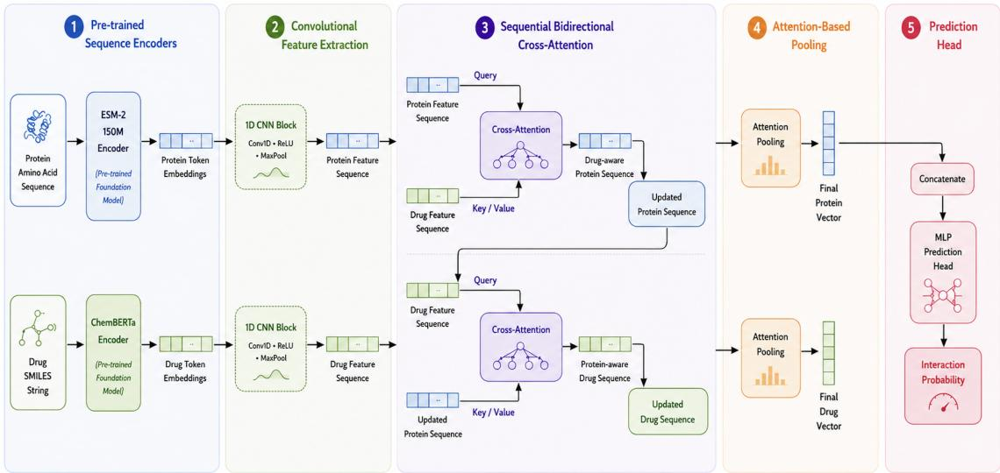

# Drug-Target Interaction Prediction via Hierarchical Sequential Cross-Attention over Chemical and Protein Language Models

Khadidja Henni∗, Hamza Abdelali‡, Abdelkrim Aries‡,

Neila Mezghani∗†, Brigitte Vannier§, Sara Magdouli¶, and Lina Abou-Abbas∥

∗I2A institute, TELUQ University, Montreal, QC, Canada; ´ †LIO, CRCHUM, Montreal, QC, Canada

‡LCSI, ESI, Algiers, Algeria; §CoMeT UR 24344, Universite de Poitiers, Poitiers, France

¶Dept. of Civil Engineering, University of Ottawa, Ottawa, ON, Canada; ∥Dept. of Electrical and Computer Engineering, Lebanese American University, Byblos, Lebanon

Abstract—Predicting Drug-Target Interactions (DTIs) is a central task in computational drug discovery, with direct applications in virtual screening, drug repurposing, and therapeutic candidate prioritization. Although recent deep learning methods have improved DTI prediction, many sequence-based models still process drugs and proteins independently and only combine their representations at a late prediction stage. This limits their ability to explicitly model cross-molecular dependencies between chemical substructures and protein sequence regions. In this paper, we propose a sequence-only DTI prediction architecture that combines two pre-trained language models — ChemBERTa for drug SMILES strings and ESM-2 for protein amino acid sequences — with a hierarchical interaction module. The proposed model first extracts contextual representations using pre-trained encoders, then applies 1D convolutional layers to condense local sequence patterns, followed by a sequential bidirectional crossattention mechanism inspired by the induced-fit view of molecular recognition. Finally, attention-based pooling constructs fixedsize interaction-aware vectors for binary prediction. Experiments on BIOSNAP, Davis, and BindingDB show that the proposed model achieves the best performance on BIOSNAP, matches the best AUROC on Davis, and remains competitive on BindingDB while using only 25.2 million trainable parameters. Ablation results confirm the contribution of both the CNN and crossattention modules, and cold-start experiments indicate promising generalization to unseen proteins and drugs.

Index Terms—Drug-Target Interaction, Deep Learning, Pre-trained Language Models, ChemBERTa, ESM-2, Cross-Attention, SMILES, Protein Sequences.

## I. INTRODUCTION

The development of new therapeutic compounds is a long, costly, and high-risk process. From target identification to clinical approval, drug discovery can require more than a decade of research and substantial financial investment [1]. A key step in this pipeline is the identification of Drug-Target Interactions (DTIs), which describe whether a chemical compound interacts with a biological target, usually a protein. Accurate DTI prediction supports virtual screening, drug repurposing, mechanism-of-action analysis, and early safety assessment.

Traditionally, DTIs are identified through experimental screening. Although in vitro assays provide reliable evidence, they are difficult to scale to the enormous number of possible drug-protein pairs. The chemical space contains millions of possible drug-like molecules, while the human proteome contains thousands of potential protein targets. As a result, exhaustive experimental screening is impractical. Computational approaches therefore play an important role by prioritizing the most promising candidates for laboratory validation [1], [10].

From a machine learning perspective, DTI prediction is often formulated as a binary classification problem. Given a drug represented by a SMILES string and a target represented by an amino acid sequence, the model predicts whether an interaction exists. Early machine learning methods relied heavily on handcrafted descriptors, molecular fingerprints, and similarity-based features [10]. Deep learning models later reduced this dependence on manual feature engineering by learning representations directly from raw molecular and biological sequences [2].

Several neural architectures have been explored for DTI prediction, including convolutional neural networks (CNNs) [2], recurrent neural networks [3], graph neural networks [4], and Transformer-based models [5]. More recently, pre-trained language models (PLMs) have become increasingly important. ChemBERTa [6] learns chemical representations from large SMILES corpora, while ESM-2 [7] learns protein representations from large-scale protein sequence databases. These models provide rich contextual embeddings that can improve downstream DTI prediction.

Despite this progress, two limitations remain common in many sequence-based models. First, drug and protein representations are often computed independently and fused only at the final prediction stage. This late-fusion strategy may fail to capture fine-grained dependencies between drug substructures and protein sequence regions. Second, global pooling or simple aggregation can discard position-specific information that may be important for identifying relevant residues or molecular fragments.

To address these limitations, we propose a hierarchical sequence-based architecture for DTI prediction. The model combines ChemBERTa and ESM-2 encoders with CNNbased local feature extraction, sequential bidirectional crossattention, and attention-based pooling. The sequential crossattention module models interaction-aware refinement in two steps: the protein representation is first updated using drug context, and the drug representation is then updated using the refined protein context. This design is inspired by the inducedfit view of molecular recognition [9], without explicitly simulating 3D conformational changes.

The main contributions of this paper are as follows:

• We propose a sequence-only DTI prediction architecture combining ChemBERTa and ESM-2 with CNN-based local feature extraction, achieving competitive performance without molecular graphs or structural data.

• We introduce a sequential bidirectional cross-attention mechanism that explicitly models asymmetric drugprotein dependencies and improves over its parallel counterpart on AUROC, AUPRC, and sensitivity, while achieving comparable specificity.

• We use attention-based pooling to construct interactionaware drug and protein vectors while preserving positionlevel importance, enabling more focused aggregation than standard global pooling.

• Through systematic ablation, cold-start, and cross-dataset experiments, we demonstrate that each architectural component provides measurable improvements, and that the proposed partial fine-tuning strategy achieves competitive results with only 25.2M trainable parameters.

The rest of the paper is organized as follows. Section II presents related work. Section III describes the proposed architecture. Section IV details the experimental setup. Section V presents and discusses the results. Section VI concludes the paper and outlines future work.

## II. BACKGROUND AND RELATED WORK

## A. Drug and Protein Representations

Drugs can be represented in several ways, including molecular descriptors, fingerprints, molecular graphs, and sequencebased notations. SMILES is one of the most widely used sequence representations because it provides a compact textual encoding of molecular structure [10]. Although SMILES strings do not explicitly describe 3D conformations, they are well suited for sequence models and chemical language models.

Proteins are commonly represented by their amino acid sequences, structural graphs, contact maps, or learned embeddings. Protein sequences are widely available and can be processed by protein language models trained on large biological databases. Such models can capture contextual and evolutionary signals that are useful for downstream prediction tasks.

## B. Deep Learning for DTI Prediction

DeepDTA [2] introduced a CNN-based approach that processes SMILES and protein sequences directly. WideDTA [11] extended this idea by using multiple sequence channels and motif-based information. DeepAffinity [3] used recurrent architectures to model sequence dependencies, while GraphDTA [4] represented drugs as molecular graphs and applied graph neural networks. More broadly, graph-based formulations have also been used for high-dimensional representation, feature selection, and clustering, illustrating the usefulness of graph structure for organizing complex data beyond the DTI setting [24], [25].

Transformer-based methods have also been applied to DTI prediction. MolTrans [5] uses self-attention to model substructure interactions between drugs and proteins. Fine-tuning BERT-based models has further shown that pre-trained sequence encoders can improve DTI prediction performance [8]. More recent hybrid methods combine language models, graph encoders, and attention mechanisms, often improving accuracy at the cost of higher architectural complexity and larger trainable parameter counts [12], [13], [21].

## C. Attention-Based Interaction Modeling

Fusion strategies in DTI prediction can be broadly divided into late fusion, self-attention over combined representations, and cross-attention. Late fusion combines drug and protein vectors after independent encoding, usually by concatenation. This strategy is simple but may not fully capture cross-modal dependencies. Cross-attention is more suitable for interaction modeling because one modality can query the other, allowing the model to learn which drug regions are relevant to which protein regions.

Most existing cross-attention approaches compute the interaction in a single step or apply both attention directions simultaneously from the original representations, without exploiting any sequential dependency between the two refinement steps. This design gap motivates the sequential hierarchical interaction module proposed in this work.

## III. PROPOSED ARCHITECTURE

## A. Problem Formulation

Let D be the set of drugs and $\mathcal { P }$ the set of protein targets. Each drug $d \in \mathcal { D }$ is represented by a SMILES string, and each protein $p \in \mathcal P$ by an amino acid sequence. Given a drugprotein pair $( d , p )$ , the objective is to predict a binary label $y \in \{ 0 , 1 \}$ , where $y = 1$ indicates an interaction and $y = 0$ indicates no known interaction. The model learns a prediction function:

$$
\begin{array} { r } { \hat { y } = f ( \mathrm { r e p r } ( d ) , \mathrm { r e p r } ( p ) ) \in [ 0 , 1 ] , } \end{array}\tag{1}
$$

where $\mathrm { r e p r } ( \cdot )$ denotes the learned representation produced by the corresponding encoder.

## B. Overall Architecture

Figure 1 presents the proposed architecture, which consists of five main stages: pre-trained sequence encoding, CNNbased feature condensation, sequential bidirectional crossattention, and attention-based pooling followed by an MLP prediction head.

  
Fig. 1. Overview of the proposed architecture. Drug SMILES and protein sequences are encoded using ChemBERTa and ESM-2, condensed through 1D CNN layers, fused using sequential bidirectional cross-attention, and aggregated through attention-based pooling before final prediction.

## C. Pre-trained Sequence Encoders

a) Protein Encoder (ESM-2):: For the protein branch, we use facebook/esm2\_t30\_150M\_UR50D [7], a 150Mparameter protein language model pre-trained on the UniRef50 database via masked language modeling (MLM) over tens of millions of evolutionarily diverse sequences. The encoder produces contextual amino acid embeddings of dimension $d _ { p } = 4 8 0$ . The maximum protein sequence length is set to 1,024 tokens.

b) Drug Encoder (ChemBERTa):: For the drug branch, we use seyonec/ChemBERTa-zinc-base-v1 [6], [14], a RoBERTa-based chemical language model pre-trained on SMILES strings from the ZINC database. It produces contextual drug token embeddings of dimension $d _ { d } = 7 6 8$ . The maximum drug sequence length is set to 128 tokens.

Both encoders are initialized with pre-trained weights. To reduce computational cost and limit overfitting, only the top two Transformer layers of each encoder are unfrozen during fine-tuning; all remaining layers are kept frozen. This partial fine-tuning strategy reduces the number of trainable parameters from approximately 193 million to 25.2 million while preserving the knowledge acquired during pre-training.

## D. CNN-Based Local Feature Extraction

The contextual embeddings produced by the two encoders are passed through independent 1D CNN blocks. Each block contains: (i) a Conv1d layer with kernel size 3 and 128 output channels; (ii) a ReLU activation; and (iii) a MaxPool1d layer with kernel size 2, reducing sequence length by half. The role of this stage is twofold: it captures local sequence patterns such as chemical fragments or protein motifs, and it reduces sequence length to make subsequent cross-attention computation more efficient.

## E. Sequential Bidirectional Cross-Attention

Let $\mathbf { H } _ { p } ~ \in ~ \mathbb { R } ^ { L _ { p } \times d }$ and $\mathbf { H } _ { d } ~ \in ~ \mathbb { R } ^ { L _ { d } \times d }$ denote the CNNcondensed protein and drug representations, where $L _ { p } , L _ { d }$ are the reduced sequence lengths and $d = 1 2 8$ the shared hidden dimension after CNN projection.

Multi-Head Attention (MHA) with h heads is defined as:

$$
\mathrm { M H A } ( Q , K , V ) = \mathrm { C o n c a t } ( \mathrm { h e a d } _ { 1 } , \dots , \mathrm { h e a d } _ { h } ) W ^ { O } ,\tag{2}
$$

where each head applies scaled dot-product attention:

$$
{ \mathrm { A t t e n t i o n } } ( Q , K , V ) = { \mathrm { s o f t m a x } } \left( { \frac { Q K ^ { \top } } { \sqrt { d _ { k } } } } \right) V ,\tag{3}
$$

with $h = 8$ heads and $d _ { k } = d / h$

The proposed interaction module proceeds in two sequential steps:

a) Drug-Guided Protein Refinement: The protein representation queries the drug representation, forcing its embeddings to focus on the sub-regions most relevant to the drug’s chemical structure:

$$
\mathbf { H } _ { p } ^ { \prime } = \mathrm { M H A } ( Q = \mathbf { H } _ { p } , \ K = \mathbf { H } _ { d } , \ V = \mathbf { H } _ { d } ) .\tag{4}
$$

b) Adapted-Protein-Guided Drug Refinement: The already drug-adapted protein representation then refines the drug features:

$$
\mathbf { H } _ { d } ^ { \prime } = \mathrm { M H A } ( Q = \mathbf { H } _ { d } , \ K = \mathbf { H } _ { p } ^ { \prime } , \ V = \mathbf { H } _ { p } ^ { \prime } ) .\tag{5}
$$

In a parallel design, both steps would use the original representations, making them independent. Here, Step 2 uses the refined $\mathbf { H } _ { p } ^ { \prime } ,$ creating a hierarchical dependency that provides a richer joint representation. This sequential design is inspired by the induced-fit principle [9], without claiming to simulate molecular dynamics or 3D conformational changes.

## F. Attention-Based Pooling and Prediction

a) Attention Pooling: Standard global pooling discards position-level information. We replace it with a learnable scoring mechanism. For each position i, a scalar importance score is computed as:

$$
\alpha _ { i } = \mathbf { w } _ { 2 } ^ { \top } \operatorname { t a n h } ( \mathbf { W } _ { 1 } \mathbf { h } _ { i } + \mathbf { b } _ { 1 } ) + b _ { 2 } ,\tag{6}
$$

where $\mathbf { W } _ { 1 } \in \mathbb { R } ^ { d _ { a } \times d } , \mathbf { w } _ { 2 } \in \mathbb { R } ^ { d _ { a } }$ , and $d _ { a } = 6 4$ . The scores are normalized and used to compute a weighted sum:

$$
\bar { \alpha } _ { i } = \frac { \exp ( \alpha _ { i } ) } { \sum _ { j } \exp ( \alpha _ { j } ) } , \qquad { \bf z } = \sum _ { i = 1 } ^ { L } \bar { \alpha } _ { i } { \bf h } _ { i } .\tag{7}
$$

This concentrates the fixed-size representation on pharmacologically relevant positions while suppressing uninformative regions.

b) Prediction Head: The pooled vectors $\mathbf { z } _ { p }$ and $\mathbf { z } _ { d }$ are concatenated to form a vector of dimension 2d and passed to an MLP with three linear layers $( 2 d  2 5 6  1 2 8  1 )$ ReLU activations, and Dropout $( p = 0 . 2 )$ after each hidden layer. The final logit is mapped to a probability via sigmoid. Training minimizes the binary cross-entropy with logits loss:

$$
\mathcal { L } = - \frac { 1 } { N } \sum _ { i = 1 } ^ { N } [ y _ { i } \log \sigma ( \hat { y } _ { i } ) + ( 1 - y _ { i } ) \log ( 1 - \sigma ( \hat { y } _ { i } ) ) ] ,\tag{8}
$$

where $\sigma$ denotes the sigmoid function.

## IV. EXPERIMENTAL SETUP

## A. Datasets

The proposed model is evaluated on three benchmark datasets: Davis, BIOSNAP, and BindingDB. Their statistics are summarized in Table I.

a) Davis: [15] contains binding affinity measurements between kinase inhibitors and kinase proteins. Following common binary DTI practice, affinities are binarized using a threshold of $K _ { d } < 3 0$ nM, yielding a severely imbalanced dataset (≈1:6 ratio).

b) BIOSNAP: [16] is a balanced drug-target interaction benchmark derived from the BioSNAP biomedical network collection. It contains validated positive interactions and sampled negative pairs in equal proportion, making it suitable for evaluating discriminative performance without imbalance bias.

c) BindingDB: [17] is a large public database of experimentally measured protein-ligand binding affinities. Binary labels are derived using a standard threshold of $K _ { d } < 1 \mu \mathrm { M } .$

For Davis and BindingDB, the training sets are resampled to class balance to mitigate the effect of imbalance during optimization. Generative augmentation of latent drug–target representations has also been investigated as an alternative strategy for DTI class imbalance [23]. Validation and test sets retain their original distributions to reflect realistic evaluation conditions. No additional negative sampling is introduced during testing.

TABLE I  
DATASET STATISTICS. INTERACTION PAIRS ARE REPORTED AS TRAIN / VALIDATION / TEST.
<table><tr><td>Dataset</td><td></td><td>Drugs Proteins</td><td>Positive Pairs</td><td>Negative Pairs</td></tr><tr><td>Davis</td><td>68</td><td>379</td><td>1,043/160/303</td><td>1,043/2,846/5,708</td></tr><tr><td>BIOSNAP</td><td>4,510</td><td>2,181</td><td>9,619/1,374/2,748</td><td>9,619/1,374/2,748</td></tr><tr><td>BindingDB</td><td>10,665</td><td>1,413</td><td>6,334/927/1,905</td><td>6,334/5,717/11,384</td></tr></table>

## B. Evaluation Protocol

We use two evaluation settings. In the standard pair-level setting, drug-protein pairs are divided into training, validation, and test sets. A drug or protein may appear across multiple splits with different partners, measuring the model’s ability to predict new interaction pairs for known entities.

In the cold-start setting, 20% of drugs (resp. proteins) are entirely held out, and all their interactions form the test set. This evaluates generalization to molecular entities not observed during training. Recent novelty-aware DTI work further emphasizes separate evaluation of ligand and protein novelty, since the two settings can induce different generalization challenges [22].

During development, all proposed-model experiments were repeated over five independent runs. The reported values correspond to the test performance of the checkpoint selected according to validation AUROC. Since not all baseline publications report standard deviations under identical splits, the comparison table reports point estimates, and small differences should be interpreted cautiously. A fully controlled benchmark with mean and standard deviation over all seeds is left for future work.

## C. Training Configuration

The model is implemented using PyTorch and PyTorch Lightning. Key hyperparameters are reported in Table II. Early stopping monitors validation AUROC with a patience of three epochs.

TABLE II  
MAIN HYPERPARAMETERS OF THE PROPOSED MODEL.
<table><tr><td>Hyperparameter</td><td>Value</td></tr><tr><td>Optimizer</td><td>AdamW</td></tr><tr><td>Base learning rate</td><td> $5 \times 1 0 ^ { - 5 }$ </td></tr><tr><td>Learning-rate schedule Effective batch size</td><td>Linear warmup + cosine decay</td></tr><tr><td>Maximum epochs</td><td>32</td></tr><tr><td>Unfrozen encoder layers</td><td>30</td></tr><tr><td>CNN output channels</td><td>Top 2 layers</td></tr><tr><td>Attention pooling dim  $d _ { a }$ </td><td>128</td></tr><tr><td></td><td>64</td></tr><tr><td>MLP hidden layers</td><td>2d → 256 → 128 → 1</td></tr><tr><td>MLP dropout</td><td>0.2</td></tr><tr><td>Protein max length</td><td>1,024 tokens</td></tr><tr><td>Drug max length</td><td>128 tokens</td></tr></table>

## D. Metrics

The model is evaluated using four complementary metrics: AUROC measures the global ability to separate positive and negative pairs across all classification thresholds; AUPRC is especially relevant for imbalanced datasets as it focuses on positive class performance; Sensitivity measures the proportion of true interactions correctly detected; and Specificity measures the proportion of non-interactions correctly rejected.

## V. RESULTS AND DISCUSSION

## A. Comparison with State-of-the-Art Methods

We compare the proposed model against representative DTI prediction methods spanning multiple architectural paradigms: CNN-based (DeepDTA [2]), Transformer-based (MolTrans [5]), PLM fine-tuning (Fine-tuning BERT [8]), dual PLM (DLM-DTI [13]), interpretable cross-attention (ICAN [19]), HyperAttentionDTI [18], and a recent multiscale fusion approach (Yang et al. [20]). Baseline values are taken from the corresponding publications or comparable reported benchmark results when available. The comparison should therefore be interpreted as a literature-level evaluation rather than a fully controlled reimplementation of all baselines.

Table III presents results on all three datasets.

a) BIOSNAP.: The proposed model obtains the best AUROC (0.920) and AUPRC (0.924) among all compared methods, demonstrating that the combination of pre-trained encoders, CNN feature extraction, and sequential cross-attention is effective on balanced DTI data. The model achieves a sensitivity of 0.854 and specificity of 0.830, slightly below Fine-tuning BERT on these two metrics, but leading overall.

b) Davis.: The proposed model reaches an AUROC of 0.920, matching the best reported result. It also obtains the highest sensitivity (0.901), which is important in virtual screening because false negatives represent missed candidate interactions. However, its AUPRC (0.356) is the lowest in the comparison on this dataset, indicating that precision under severe class imbalance remains a clear limitation of the current approach.

c) BindingDB.: On this large-scale, chemically diverse dataset, the proposed model achieves a competitive AUROC of 0.920 and AUPRC of 0.642. It does not lead on every metric — HyperAttentionDTI achieves the best AUPRC (0.876) and DLM-DTI achieves the best specificity (0.916) — but it remains competitive while relying exclusively on sequence inputs without molecular graphs or 3D structural data.

## B. Integrated Dataset Evaluation

To evaluate whether the model benefits from a larger and more diverse biochemical training corpus, we train it on the combined training and validation sets of Davis, BIOSNAP, and BindingDB, then evaluate separately on each original test set.

As shown in Table IV, integrated training yields substantial AUPRC improvements on Davis (+0.092: 0.356 → 0.448) and BindingDB (+0.122: 0.642 → 0.764), confirming that the architecture scales well with data diversity. On BIOSNAP, AUPRC decreases from 0.924 to 0.840, which may reflect domain shift caused by mixing datasets with different distributions and label-generation protocols.

## C. Cold-Start Generalization

To assess generalization to unseen entities, we conduct a cold-start evaluation using a 20% hold-out protocol applied independently to drugs and proteins. Results are reported in Table V.

In the unseen-protein setting, the proposed model achieves a ROC-AUC of 0.87, outperforming MolTrans (0.77) and DeepDTA (0.85). This suggests that ESM-2 transfers useful evolutionary and structural priors that help the model reason about novel protein targets beyond its training distribution. In the unseen-drug setting, all three models reach 0.85, indicating that sequence-based approaches generalize comparably to new chemical entities in this evaluation.

## D. Ablation Study

We conduct an ablation study on BIOSNAP to evaluate the contribution of each architectural component. Results are shown in Table VI.

a) Component importance: Removing the CNN block reduces AUROC from 0.920 to 0.916, confirming that local feature extraction provides complementary information beyond the Transformer embeddings alone. Removing the cross-attention block causes a larger degradation (AUROC: 0.920 → 0.911), confirming that cross-modal interaction modeling is the single most important post-encoder component. Removing both modules yields the weakest performance (AU-ROC: 0.905), validating their complementary and cumulative contributions.

b) Sequential vs. parallel attention:: The sequential variant outperforms the parallel variant on AUROC (0.920 vs. 0.914), AUPRC (0.924 vs. 0.920), and Sensitivity (0.854 vs. 0.833), while the parallel variant slightly improves Specificity (0.834 vs. 0.830). The gain is moderate but consistent across the main discriminative metrics, supporting the hypothesis that hierarchical refinement — where Step 2 queries an already drug-adapted protein context — provides a richer joint representation than computing both directions simultaneously.

## E. Model Complexity

By restricting fine-tuning to the top two layers of each encoder and the newly added modules, the proposed architecture achieves only 25.2 million trainable parameters, despite a total model size of approximately 193 million. As shown in Table VII, this represents a 2.5× reduction relative to MolTrans, a 3.4× reduction relative to DLM-DTI, and a 14× reduction relative to full BERT fine-tuning, while maintaining competitive or superior predictive performance.

## F. Discussion and Limitations

The proposed architecture performs best on BIOSNAP, where the balanced class distribution allows both AUROC and AUPRC to reflect genuine discriminative quality. On Davis, high AUROC and sensitivity are achieved, but the low AUPRC (0.356) reveals a precision limitation under severe class imbalance: the model prioritizes recall at the expense of precision, which may be acceptable in early-stage virtual screening but would require recalibration for applications demanding higher specificity. On BindingDB, competitive AUROC is obtained despite the chemical diversity of the dataset, suggesting that ChemBERTa provides sufficiently general representations. However, the gap in AUPRC relative to HyperAttentionDTI, which uses structural information, points to a ceiling for purely sequence-based approaches on chemically complex data.

TABLE III  
PERFORMANCE COMPARISON ON BIOSNAP, DAVIS, AND BINDINGDB. BEST RESULT PER METRIC PER DATASET IS IN BOLD.
<table><tr><td></td><td colspan="4">BIOSNAP</td><td colspan="4">Davis</td><td colspan="4">BindingDB</td></tr><tr><td>Model</td><td>AUROC</td><td>AUPRC</td><td>Sens.</td><td>Spec.</td><td>AUROC</td><td>AUPRC</td><td>Sens.</td><td>Spec.</td><td>AUROC</td><td>AUPRC</td><td>Sens.</td><td>Spec.</td></tr><tr><td>MolTrans [5]</td><td>0.895</td><td>0.901</td><td>0.775</td><td>0.851</td><td>0.907</td><td>0.404</td><td>0.800</td><td>0.876</td><td>0.914</td><td>0.622</td><td>0.797</td><td>0.896</td></tr><tr><td>DeepDTA [2]</td><td>0.834</td><td>0.849</td><td>0.726</td><td>0.813</td><td>0.792</td><td>0.272</td><td>0.688</td><td>0.778</td><td>0.902</td><td>0.604</td><td>0.757</td><td>0.904</td></tr><tr><td>HyperAttentionDTI [18]</td><td>0.825</td><td>0.830</td><td>0.800</td><td>0.812</td><td>0.841</td><td>0.483</td><td>0.708</td><td>0.722</td><td>0.900</td><td>0.876</td><td>0.801</td><td>0.791</td></tr><tr><td>Fine-tuning BERT [8]</td><td>0.914</td><td>0.900</td><td>0.862</td><td>0.847</td><td>0.920</td><td>0.395</td><td>0.824</td><td>0.802</td><td>0.922</td><td>0.623</td><td>0.814</td><td>0.793</td></tr><tr><td>DLM-DTI [13]</td><td>0.914</td><td>0.914</td><td>0.848</td><td>0.844</td><td>0.895</td><td>0.373</td><td>0.833</td><td>0.766</td><td>0.912</td><td>0.643</td><td>0.846</td><td>0.916</td></tr><tr><td>ICAN [19]</td><td>0.871</td><td>0.886</td><td>0.799</td><td>0.786</td><td>0.903</td><td>0.372</td><td>0.884</td><td>0.765</td><td>0.900</td><td>0.604</td><td>0.857</td><td>0.815</td></tr><tr><td>Yang et al. [20]</td><td>0.885</td><td>0.856</td><td>0.828</td><td>0.787</td><td>0.799</td><td>0.515</td><td>0.896</td><td>0.850</td><td>0.910</td><td>0.659</td><td>0.815</td><td>0.818</td></tr><tr><td>Proposed</td><td>0.920</td><td>0.924</td><td>0.854</td><td>0.830</td><td>0.920</td><td>0.356</td><td>0.901</td><td>0.801</td><td>0.920</td><td>0.642</td><td>0.816</td><td>0.874</td></tr></table>

TABLE IV  
INDIVIDUAL TRAINING VS. INTEGRATED TRAINING.
<table><tr><td>Test set</td><td>Training</td><td>AUROC</td><td>AUPRC</td><td>Sens.</td><td>Spec.</td></tr><tr><td rowspan="2">Davis</td><td>Individual</td><td>0.920</td><td>0.356</td><td>0.901</td><td>0.801</td></tr><tr><td>Integrated</td><td>0.939</td><td>0.448</td><td>0.911</td><td>0.848</td></tr><tr><td rowspan="2">BIOSNAP</td><td>Individual</td><td>0.920</td><td>0.924</td><td>0.854</td><td>0.830</td></tr><tr><td>Integrated</td><td>0.920</td><td>0.840</td><td>0.886</td><td>0.835</td></tr><tr><td rowspan="2">BindingDB</td><td>Individual</td><td>0.920</td><td>0.642</td><td>0.816</td><td>0.874</td></tr><tr><td>Integrated</td><td>0.918</td><td>0.764</td><td>0.852</td><td>0.850</td></tr></table>

TABLE V  
COLD-START EVALUATION (ROC-AUC).
<table><tr><td>Model</td><td>Unseen Drugs</td><td>Unseen Proteins</td></tr><tr><td>MolTrans [5]</td><td>0.85</td><td>0.77</td></tr><tr><td>DeepDTA [2]</td><td>0.85</td><td>0.85</td></tr><tr><td>Proposed</td><td>0.85</td><td>0.87</td></tr></table>

TABLE VI  
ABLATION STUDY ON BIOSNAP.
<table><tr><td>Variant</td><td>AUROC</td><td>AUPRC</td><td>Sens.</td><td>Spec.</td></tr><tr><td>Full model</td><td>0.920</td><td>0.924</td><td>0.854</td><td>0.830</td></tr><tr><td>Without CNN</td><td>0.916</td><td>0.920</td><td>0.849</td><td>0.828</td></tr><tr><td>Without attention</td><td>0.911</td><td>0.914</td><td>0.835</td><td>0.819</td></tr><tr><td>Without CNN + attention</td><td>0.905</td><td>0.907</td><td>0.828</td><td>0.812</td></tr><tr><td>Sequential attention</td><td>0.920</td><td>0.924</td><td>0.854</td><td>0.830</td></tr><tr><td>Parallel attention</td><td>0.914</td><td>0.920</td><td>0.833</td><td>0.834</td></tr></table>

TABLE VII  
TRAINABLE PARAMETER COMPARISON.
<table><tr><td>Model</td><td>Trainable Parameters</td></tr><tr><td>MolTrans [5]</td><td>62.8M</td></tr><tr><td>DLM-DTI [13]</td><td>86.7M</td></tr><tr><td>Fine-tuning BERT [8]</td><td>353.0M</td></tr><tr><td>Proposed</td><td>25.2M</td></tr></table>

Several limitations should be noted. First, the method is sequence-only and does not use molecular graphs, 3D protein structures, docking poses, or binding-site geometry, which may limit performance on datasets where structural information is decisive. Second, although attention weights provide a more transparent interaction mechanism than simple concatenation, they should not be interpreted as biological explanations without validation against known binding sites or crystal structures. Third, the baseline comparison relies partly on reported literature values obtained under potentially different preprocessing and split protocols; a fully controlled reimplementation would be required for strict comparison.

## VI. CONCLUSION

This paper presented a hierarchical sequence-based architecture for Drug-Target Interaction prediction combining Chem-BERTa and ESM-2 pre-trained language models with CNNbased local feature extraction, sequential bidirectional crossattention, and attention-based pooling. Experiments on BIOS-NAP, Davis, and BindingDB demonstrate that the proposed method achieves strong and competitive results while using only 25.2 million trainable parameters. Ablation experiments confirm that both the CNN condensation and the sequential cross-attention module provide measurable improvements over their respective ablated variants. Cold-start evaluation indicates encouraging generalization, particularly to unseen protein targets. The Discussion section explicitly identifies precision under class imbalance and the absence of structural information as current limitations.

Future work will focus on four directions. First, richer chemical encoders or graph-based drug representations could be integrated to capture molecular topology more explicitly, which may reduce the AUPRC gap on imbalanced and structurally diverse datasets. Second, protein structural information or predicted binding-site features could be added to provide better biological grounding. Third, attention maps should be systematically validated against known binding residues or protein-ligand crystal structures before making strong interpretability claims. Finally, a fully controlled benchmark with reimplemented baselines, identical splits, and reported mean and standard deviation across multiple seeds would provide a more rigorous empirical foundation for future work in this line of research.

## GENERATIVE AI USAGE STATEMENT

Generative AI tools were used only for language polishing and formatting assistance. All AI-assisted revisions were reviewed and verified by the authors. All scientific contributions, experiments, results, and conclusions are entirely produced by the authors.

## REFERENCES

[1] J. P. Hughes, S. Rees, S. B. Kalindjian, and K. L. Philpott, “Principles of early drug discovery,” British Journal of Pharmacology, vol. 162, no. 6, pp. 1239–1249, 2011.

[2] H. Ozt¨ urk, A.¨ Ozg¨ ur, and E. Ozkirimli, “DeepDTA: deep drug–target¨ binding affinity prediction,” Bioinformatics, vol. 34, no. 17, pp. i821– i829, 2018.

[3] M. Karimi, D. Wu, Z. Wang, and Y. Shen, “DeepAffinity: interpretable deep learning of compound–protein affinity through unified recurrent and convolutional neural networks,” Bioinformatics, vol. 35, no. 18, pp. 3329–3338, 2019.

[4] T. Nguyen, H. Le, T. P. Quinn, T. Nguyen, T. D. Le, and S. Venkatesh, “GraphDTA: predicting drug–target binding affinity with graph neural networks,” Bioinformatics, vol. 37, no. 8, pp. 1140–1147, 2021.

[5] K. Huang, C. Xiao, L. M. Glass, and J. Sun, “MolTrans: Molecular Interaction Transformer for drug–target interaction prediction,” Bioinformatics, vol. 37, no. 6, pp. 830–836, 2021.

[6] S. Chithrananda, G. Grand, and B. Ramsundar, “ChemBERTa: Largescale self-supervised pretraining for molecular property prediction,” arXiv preprint arXiv:2010.09885, 2020.

[7] Z. Lin et al., “Evolutionary-scale prediction of atomic-level protein structure with a language model,” Science, vol. 379, no. 6637, pp. 1123– 1130, 2023.

[8] H. Kang, S. Goo, H. Lee, J.-W. Chae, H.-Y. Yun, and S. Jung, “Finetuning of BERT model to accurately predict drug–target interactions,” Pharmaceutics, vol. 14, no. 8, p. 1710, 2022.

[9] D. E. Koshland, Jr., “Application of a theory of enzyme specificity to protein synthesis,” Proceedings of the National Academy of Sciences of the United States of America, vol. 44, no. 2, pp. 98–104, 1958.

[10] S. Lim, Y. Lu, C. Y. Cho, I. Sung, J. Kim, Y. Kim, S. Park, and S. Kim, “A review on compound–protein interaction prediction methods: Data, format, representation and model,” Computational and Structural Biotechnology Journal, vol. 19, pp. 1541–1556, 2021.

[11] H. Ozt¨ urk, E. Ozkirimli, and A.¨ Ozg¨ ur, “WideDTA: prediction of drug–¨ target binding affinity,” arXiv preprint arXiv:1902.04166, 2019.

[12] Z. Luo, W. Wu, Q. Sun, and J. Wang, “Accurate and transferable drug– target interaction prediction with DrugLAMP,” Bioinformatics, vol. 40, no. 12, p. btae693, 2024.

[13] J. Lee, D. W. Jun, I. Song, and Y. Kim, “DLM-DTI: a dual language model for the prediction of drug–target interaction with hint-based learning,” Journal of Cheminformatics, vol. 16, no. 1, p. 14, 2024.

[14] Y. Liu, M. Ott, N. Goyal, J. Du, M. Joshi, D. Chen, O. Levy, M. Lewis, L. Zettlemoyer, and V. Stoyanov, “RoBERTa: A robustly optimized BERT pretraining approach,” arXiv preprint arXiv:1907.11692, 2019.

[15] M. I. Davis et al., “Comprehensive analysis of kinase inhibitor selectivity,” Nature Biotechnology, vol. 29, no. 11, pp. 1046–1051, 2011.

[16] M. Zitnik, R. Sosic, S. Maheshwari, and J. Leskovec, “BioSNAPˇ Datasets: Stanford Biomedical Network Dataset Collection,” Stanford University, Aug. 2018.

[17] T. Liu, Y. Lin, X. Wen, R. N. Jorissen, and M. K. Gilson, “BindingDB: a web-accessible database of experimentally determined protein– ligand binding affinities,” Nucleic Acids Research, vol. 35, no. suppl 1, pp. D198–D201, 2007.

[18] Q. Zhao, H. Zhao, K. Zheng, and J. Wang, “HyperAttentionDTI: improving drug–protein interaction prediction by sequence-based deep learning with attention mechanism,” Bioinformatics, vol. 38, no. 3, pp. 655–662, 2022.

[19] H. Kurata and S. Tsukiyama, “ICAN: Interpretable cross-attention network for identifying drug and target protein interactions,” PLOS ONE, vol. 17, no. 10, p. e0276609, 2022.

[20] Z. Yang, B. Bai, J. Long, P. Wei, and J. Li, “Multi-scale Feature Fusion Neural Network for Accurate Prediction of Drug–Target Interactions,” Communications in Computer and Information Science, vol. 1964, pp. 176–188, Springer, 2024.

[21] K. Henni, L. Hamdad, N. Mezghani, N. E. Benazzoug, and L. Abou-Abbas, “Integrating structural graphs and cross-attention for drug–target interaction prediction,” in Proc. IEEE/ACS 22nd Int. Conf. Computer Systems and Applications (AICCSA), 2025.

[22] L. Abou-Abbas and K. Henni, “Protein and ligand novelty in drug– target interaction prediction: A dual-encoder fusion strategy for more interpretable and generalizable modeling,” BMC Bioinformatics, 2026.

[23] V. M. Silva, K. Henni, N. Mezghani, and Y. Abdelliche, “A matrix factorization and generative modeling framework for drug–target interaction prediction,” in Proc. BIOSTEC, vol. 2, pp. 688–695, 2026.

[24] K. Henni, N. Mezghani, and A. Mitiche, “Cluster density properties define a graph for effective pattern feature selection,” IEEE Access, vol. 8, pp. 62841–62854, 2020, doi: 10.1109/ACCESS.2020.2981265.

[25] K. Henni, P.-Y. Louis, B. Vannier, and A. Moussa, “Is-ClusterMPP: clustering algorithm through point processes and influence space towards high-dimensional data,” Advances in Data Analysis and Classification, vol. 14, no. 3, pp. 543–570, 2020, doi: 10.1007/s11634-019-00379-2.