# EDGE-LEVEL AUTOMORPHISM IN GNNS: A QUANTI-TATIVE FRAMEWORK AND EFFECTIVE DESIGNS FOR LINK PREDICTION

Chen Shao   
Karlsruhe Institute of Technology   
Karlsruhe, Germany   
chen.shao2@kit.edu   
Tobias Käfer   
Karlsruhe Institute of Technology   
Karlsruhe, Germany   
tobias.kaefer@kit.edu   
Donald Loveland   
Department of Computer Science   
University of Michigan   
Ann Arbor, MI, USA   
loveland@umich.edu   
Danai Koutra∗   
Computer Science & Engineering   
University of Michigan   
Ann Arbor, MI, USA   
dkoutra@umich.edu

## ABSTRACT

Graph Neural Networks (GNNs) are effective for learning node and link embeddings through permutation-equivariant aggregation. However, standard GNNs collapse automorphic nodes, i.e., those with identical structural roles (or orbits), into indistinguishable representations, leading to the node automorphism problem. This collapse limits their expressive power and degrades link prediction performance. Existing approaches to characterize GNN expressiveness rely primarily on Weisfeiler-Lehman (WL) analyses, but these methods are typically qualitative and often misaligned with empirical results. To address this gap, we begin by introducing a novel quantitative framework to assess GNN expressiveness for link prediction. We first formalize edge-level automorphism through edge orbits, which capture the set of structural role pairs for nodes that share a link. Then, we introduce the edge automorphism ratio (EAR), a scalar metric that quantifies a GNN’s ability to distinguish links in a given graph. We empirically demonstrate that EAR correlates strongly with performance, validating its practical benefit. Building on this insight, we design EDGE-ORBIT EQUIVARIANT GRAPH NEURAL NETWORK (EO-GNN), a GNN architecture that addresses automorphism collapse while preserving equivariance and incurring minimal computational overhead. EO-GNN accomplishes this through two core designs combined with WL-based node hashes: (i) automorphism-aware dropouts and (ii) subgraph orbit-biased aggregation. Empirical evaluations on synthetic and real graphs show improvements of up to 42.36% and 28.44%, respectively, in predicting links in scenarios with high automorphism.

## 1 INTRODUCTION

Link prediction (LP) estimates the likelihood of connections between node pairs in a graph and is fundamental to applications such as recommendation systems, protein interaction analysis, and knowledge graph completion [17, 35]. Most GNN-based LP methods follow an encoder-decoder paradigm, where a permutation-equivariant GNN produces node embeddings that are subsequently decoded into link probabilities [48, 49]. While permutation equivariance ensures invariance to node ordering, it also causes structurally equivalent (automorphic) nodes to receive identical representations, even when they play distinct semantic and positional roles in the graph [4, 26, 30].

Informally, two nodes are structurally equivalent (automorphic) if some symmetry of the graph, i.e., a relabeling of vertices that preserves every edge, maps one node onto the other; because a GNN’s output cannot depend on how nodes are labeled, such nodes are architecturally indistinguishable, regardless of

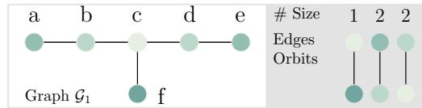  
Figure 1: A standard GNN assigns identical scores to the automorphic candidate links (a, b) and $( a , d )$ illustrating the Node Automorphism Problem (NAP).

their intended semantic role, as illustrated in Fig. 1. We refer to this as the Node Automorphism Problem (NAP), which leads to degraded link discriminability [6].

Existing expressiveness analyses for GNNs primarily rely on the vertex-level Weisfeiler–Lehman (WL) hierarchy, which characterizes how well GNNs distinguish nodes using graph isomorphism tests [47]. However, existing expressiveness frameworks suffer from several fundamental limitations. (L1) Level mismatch: WL-based analyses primarily operate at the node or subgraph level, while link prediction inherently requires fine-grained edge-centric reasoning over complex multi-node interactions, resulting in a substantial gap between theoretical expressivity characterization and practical link discrimination. (L2) Lack of quantitative characterization: Current frameworks remain largely qualitative, providing little insight into the extent of structural automorphism or its direct impact on link prediction performance, thereby limiting systematic analysis of model behavior under symmetry. (L3) Missing empirical foundations: Existing studies lack synthetic benchmarks with controllable automorphism levels, leaving theoretical claims insufficiently validated and preventing rigorous, reproducible investigation of symmetry-induced ambiguity in link prediction.

To bridge these gaps, we establish a principled edge-level framework for analyzing link prediction under structural automorphism. First, we introduce the notion of Weisfeiler Lehman-induced Edge Orbit to explicitly characterize edge ambiguity induced by automorphisms. Building upon this formulation, we propose the Edge Automorphism Ratio (EAR), a rigorous quantitative metric that measures the proportion of theoretically indistinguishable edges in a graph. We address L3 by constructing synthetic benchmarks in which EAR is an explicit, tunable generation parameter rather than an incidental property of a fixed graph. Sweeping this parameter lets us test whether performance degradation is attributable to automorphism itself (Sec. 5.2).Guided by these empirical findings, we develop EDGE-ORBIT EQUIVARIANT GRAPH NEURAL NETWORK (EO-GNN), an automorphismaware GNN architecture designed to preserve equivariance while substantially improving edge discriminability in highly symmetric graphs. Together, our contributions are summarized as follows:

• Quantitative Theoretical Framework: We introduce a structural concept, the WL-induced Edge Orbit, that refines discrimination from the vertex to the edge level. Building on it, we characterize a GNN’s expressive power through its distinguishable edge set $\varepsilon ^ { \mathcal { M } }$ , letting different models be compared directly by set inclusion and set difference. We summarize this set as a single scalar, the Edge Automorphism Ratio, the proportion of theoretically indistinguishable edges i.e., the complement of $\varepsilon ^ { \mathcal { M } }$ , giving a principled, model-agnostic measure of expressivity. (Sec. 3)

• Automorphism-Aware GNN with Theoretical Guarantees: We propose EDGE-ORBIT EQUIV-ARIANT GRAPH NEURAL NETWORK (EO-GNN), which augments standard GNN layers with two key designs: (D1) an automorphism-aware dropout and (D2) subgraph orbit-based aggregation. We prove that EO-GNN exceeds the expressivity of the standard GNN. We make our code and data available at [Anon Repo Link].(Sec. 4)

• Extensive Empirical Validation: We evaluate EO-GNN against state-of-the-art GNNs on synthetic graphs spanning low to high automorphism levels and on diverse real-world networks. Our ablation studies show up to a 42.36% improvement over the second-best model in high-symmetry settings and consistent gains of up to 28.44% across real-world benchmarks. (Sec. 5).

## 2 RELATED WORK

Graph Expressivity Theory. Our work relates to recent efforts on characterizing GNN expressivity [47]. Standard MPNNs are theoretically bounded by the 1-WL test in distinguishing non-isomorphic graphs [41, 43], motivating extensions based on the higherorder k-WL hierarchy [3, 9, 27–29]. 2D-WL further incorporates pairwise structural features for link prediction [15], while unrolling distance analyzes MPNN generalization through aligned computation trees. More recently, $k _ { \phi } { - } k _ { \rho } { - } m { - } \mathbf { W } \mathbf { L }$ unifies message-passing link predictors by characterizing encoder expressivity and structural neighborhood radius.

As summarized in Tab. 1, our framework simultaneously ensures model-agnosticism, permutation-invariance, quantitative characterization and direct alignment with the prediction task, as illustrated in Fig. 3. We provide a more comprehensive discussion of related work, MPNNs for link

Table 1: Graph Expressivity Frameworks for GNNs.
<table><tr><td>Method</td><td>Level</td><td>M-Agnostic Invariance. Quantification. Alignment.</td><td></td><td></td><td></td></tr><tr><td>1-WL [43]</td><td>node</td><td>√</td><td>√</td><td>x</td><td>x</td></tr><tr><td>k-WL [5]</td><td>node</td><td>√</td><td>√</td><td>x</td><td>x</td></tr><tr><td>2D-WL [15]</td><td>edge</td><td>x</td><td>√</td><td>x</td><td>√</td></tr><tr><td> $k _ { \phi } { - } k _ { \rho } { - } m { - } \mathbf { W } \mathbf { L } \left[ 2 0 \right]$ </td><td>edge</td><td>x</td><td>x</td><td>√</td><td>x</td></tr><tr><td>Homomorphism. [47]</td><td>subgraph</td><td>√</td><td>√</td><td>√</td><td>x</td></tr><tr><td>Unrolling Distance. [37]</td><td>node</td><td>√</td><td>√</td><td>x</td><td>x</td></tr><tr><td>Ours</td><td>edge</td><td>V</td><td>V</td><td>√</td><td>√</td></tr></table>

related work, MPNNs for link prediction, and comparisons with other similar designs in Sec. C.

## 3 QUANTIFYING EDGE DISCRIMINABILITY: A THEORETICAL FRAMEWORK

In this section, we provide key notation and present our theoretical framework before introducing EAR as a quantitative measure. We first review the fundamental concepts of graph automorphisms and node orbits. We then define the GCN-induced notion of structural equivalence, referred to as the subgraph orbit. Building on these concepts, we introduce the proposed WL-induced edge orbit and its associated edge-level equivalence relation. Finally, we define a measure for comparing the expressive power of different models based on their ability to distinguish structurally equivalent edges.

Our framework stems from a fundamental observation that the representational power of a GNN model is effectively bounded by the set of links it can structurally distinguish. We denote this set of distinguishable links as $\varepsilon ^ { \mathcal { M } }$ . Consequently, we can treat $\varepsilon ^ { \mathcal { M } }$ as a direct proxy for the model’s expressivity given it fully characterizes which edges will receive unique representations. $\mathrm { U s i n g } \ : \mathcal { E } ^ { \mathcal { M } }$ is also beneficial for model comparison as it enables the expressive power of different models to be easily compared via set relations.

## 3.1 NOTATION AND PRELIMINARIES

We summarize key notation in Tab. 3 (Sec. A). Let $\mathcal { G } = ( \nu , \mathcal { E } )$ be an undirected, unweighted graph with adjacency matrix $\mathbf { A } \in \{ 0 , 1 \} ^ { | \mathcal { V } | \times | \mathcal { V } | }$ and node feature matrix $\mathbf { X } \in \mathbb { R } ^ { | \mathcal { V } | \times F }$ . We then consider a permutation-equivariant GNN as a mapping $\phi _ { w } : ( \mathbf { X } , \mathbf { A } ) \to \mathbf { H } \in \mathbb { R } ^ { | \mathcal { V } | \times F }$ , where $w \in \mathcal { W }$ denotes the weight set of the full link-prediction model, drawn from the weight space W.

Definition 3.1 (Isomorphism and Automorphism). Two graphs G and H are said to be isomorphic $( \mathcal { G } \cong \mathcal { H } )$ ifthere exists a bijective mapping $\pi : V _ { \mathcal { G } } \to V _ { \mathcal { H } }$ such that $( v , u ) \in \mathcal { E } _ { \mathcal { G } } \iff ( \pi ( v ) , \pi ( u ) ) \in$ $\mathcal { E _ { H } }$ . An automorphism of G is the special case ${ \mathcal { H } } = { \mathcal { G } } \colon i . e .$ , a relabeling of ${ \bf \dot { \boldsymbol { \mathcal { G } } } } { \boldsymbol { \mathit { s } } }$ own vertices that leaves the edge set unchanged.

Definition 3.2 (Orbits). The automorphisms of G form a group Aut(G) under composition. The orbit $\begin{array} { r } { o f v \ i s \mathcal { O } ( v ) = \{ \pi ( v ) : \pi \in \mathrm { A u t } ( \mathcal { G } ) \} } \end{array}$ , i.e., the set ofnodes automorphic to v. Orbits partition V.

All automorphisms induce a partition of the vertex set $\nu _ { g }$ into disjoint subsets called orbits, where each orbit represents a unique structural role. As illustrated in Fig. $1 , { \mathcal { G } } _ { 1 }$ has four distinct node orbits $a , b , c ,$ and f shown by color. Nodes in the same orbit play identical structural roles and are therefore automorphic.

## 3.2 FORMALIZING EDGE DISCRIMINATION

Classical orbits are node equivalence classes of the global automorphism group; in contrast, a k-layer message-passing GNN observes the k-hop neighborhood of a node and is bounded in expressivity by the 1-WL test [29, 43]. This creates a mismatch between the global notion of automorphism and the local receptive field of GNNs [42, 46]. Thus, global automorphisms is unsuitable for NAP and fails to capture the blind spots of GNNs regarding automorphic nodes (Fig. 1).

We formalize a structural equivalence which captures the structural role of a node as perceived by a GNN encoder.

Definition 3.3 (Subgraph Orbit). With subgraph $\boldsymbol { \mathcal { S } ^ { ( k ) } } ( \boldsymbol { u } )$ induced by all nodes within distance k and rooted at u, and representation $\phi _ { w } ( S ^ { ( k ) } ( u ) )$ of the root produced by a k-layer message-passing

GNN. Two nodes $u , v \in \mathcal { V }$ are k-equivalent, written $u \sim _ { k } v , i f$

$$
\phi _ { w } \big ( S ^ { ( k ) } ( u ) \big ) = \phi _ { w } \big ( S ^ { ( k ) } ( v ) \big ) \quad f o r a l l w .\tag{1}
$$

A k-layer message-passing GNN computes the root representation from $\mathcal { S } ^ { ( k ) } ( u )$ . Throughout the paper, we use the equivalence obtained after 1-WL stabilizes and omit the subscript k. We write $\mathcal { O } _ { S } ( u )$ , or simply $\mathcal { O } _ { u }$ when the context is clear, for the resulting subgraph orbit of u: its equivalence class $\{ v \in \mathcal { V } : v \sim u \}$ under this relation.

Based on subgraph orbits, we introduce an edge equivalence designed to characterize the limitations ofGCN-based link prediction systems.

Definition 3.4 (WL-Induced Edge Orbit). For a node pair $e = \{ u , v \} , u , v \in \mathcal { V } ,$ , not necessarily in $\mathcal { E } ,$ we define its WL-induced edge orbit as the multiset ofthe subgraph orbits $( D e f . 3 . 3 )$ of its endpoints:

$$
\mathcal { O } _ { \mathcal { E } } ( e ) : = \{ \{ \mathcal { O } _ { \mathcal { S } } ( u ) , \mathcal { O } _ { \mathcal { S } } ( v ) \} \}\tag{2}
$$

Two pairs $\boldsymbol { e } , \boldsymbol { e } ^ { \prime }$ are WL-edge-equivalent, written $e \sim \mathcal { } ^ { \mathcal { E } } e ^ { \prime } , i f f { \mathcal { O } } _ { \mathcal { E } } ( e ) = { \mathcal { O } } _ { \mathcal { E } } ( e ^ { \prime } )$ . The multiset makes the definition invariant to endpoint order while distinguishing pairs whose endpoints share a subgraph

WL-induced EO

Algebraic EO

Clarification We remark that the WL-induced edge orbit differs from classical edge orbits in algebraic group theory. Consider the triangular prism in Fig. 2. Because the graph is 3-regular, 1-WL assigns every vertex the same color, placing all edges in a single WL-induced edge orbit. The graph automorphism group, however, has two edge orbits: triangle edges and matching edges. Automorphisms preserve triangle membership, so no automorphism maps a triangle edge $e _ { 1 }$ to a matching edge $e _ { 2 }$ . WL-induced equivalence edge relation proposed in our paper is a model-induced equivalence determined by GCN.

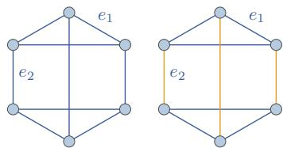  
Figure 2: Graph with one WLinduced edge orbit but two algebraic edge orbits.

We next formalize when a parameterized model $\mathcal { M } _ { w }$ discriminates a pair of such edges, and then compare models by the sets of edge pairs they can distinguish.

Definition 3.5 (Edge Discrimination). Let $e _ { 1 }$ and $e _ { 2 }$ belong to the same WL-induced edge orbit, $i . e . , \mathcal { O } _ { \varepsilon } ( e _ { 1 } ) = \mathcal { O } _ { \varepsilon } ( e _ { 2 } )$ . A model $\mathcal { M } _ { w }$ discriminates $e _ { 1 }$ and e if there exists $w \in \mathcal { W }$ such that $\mathcal { M } _ { w } ( e _ { 1 } ) \ne \mathcal { M } _ { w } ( e _ { 2 } )$ , written $e _ { 1 } \not \equiv _ { \mathcal { M } } e _ { 2 }$ . We collect all such pairs into the distinguishable edge set $\mathcal { E } ^ { \mathcal { M } } = \left\{ \left\{ e _ { 1 } , e _ { 2 } \right\} : e _ { 1 } \neq _ { \mathcal { M } } e _ { 2 } \right\}$

Definition 3.6 (Higher Expressiveness). We order models by inclusion oftheir distinguishable edge sets. Given two models $\mathcal { M } _ { 1 }$ and $\mathcal { M } _ { 2 } ,$ , we say $\mathcal { M } _ { 1 }$ is at least as expressive as $\mathcal { M } _ { 2 }$ , denoted $\mathcal { M } _ { 1 } \succeq \mathcal { M } _ { 2 }$ if for every pair of edges $e _ { 1 } , e _ { 2 } \in \mathcal { E } ( \mathcal { G } ) , e _ { 1 } \not \equiv _ { M _ { 2 } } e _ { 2 } \Rightarrow e _ { 1 } \not \equiv _ { M _ { 2 } }$ e2; equival $? n t l y , \mathcal { E } ^ { \mathcal { M } _ { 2 } } \subseteq \overline { { \mathcal { E } ^ { \mathcal { M } _ { 1 } } } }$ The distinguishable edge set $\varepsilon ^ { \mathcal { M } }$ thus fully characterizes a model’s expressivity, capturing exactly the links it can distinguish. We illustrate the framework in Fig. 3.

## 3.3 QUANTIFYING LINK AMBIGUITY: A QUANTITATIVE MEASURE

Building upon distinguishable edge set $\varepsilon ^ { \mathcal { M } }$ , we introduce the EAR, a quantitative measure of theoretically indistinguishable edges under a GNN encoder $\phi _ { w }$ . EAR will be used to empirically analyze the effect of structure automorphism and motivate our principled design choices.

Measure 3.1 (Edge Automorphism Ratio). Let E denote the set ofall edges in the graph G, andfor an edge $e = \{ u , v \}$ let $\mathcal { O } _ { \varepsilon } ( e )$ be its WL-induced edge-orbit signature (Def. 3.4). Denote by

$$
[ e ] _ { \varepsilon } = \big \{ e ^ { \prime } \in \mathcal { E } \mid \mathcal { O } _ { \varepsilon } ( e ^ { \prime } ) = \mathcal { O } _ { \varepsilon } ( e ) \big \}
$$

the edge orbit $o f e ,$ i.e., the set of edges sharing its signature (equivalently, the equivalence class of e unde $\cdot \sim ^ { \varepsilon _ { ) } }$ . EAR is defined as the proportion ofindistinguishable edges $\mathcal { E } _ { i n d i s t } ,$ written as:

$$
\mathrm { E A R } = \left( \frac { | { \mathcal E } _ { i n d i s t } | } { | { \mathcal E } | } \right) ^ { \gamma } , { \mathcal E } _ { i n d i s t } = \left\{ e \in { \mathcal E } \mid | [ e ] _ { \mathcal E } | > 1 \right\} .
$$

where $\frac { | { \mathcal { E } } _ { \mathrm { i n d i s t } } | } { | { \mathcal { E } } | }$ is the proportion ofindistinguishable edges in the graph, and $\gamma \in ( 0 , 1 ]$ is a power-law scalingfactor. For $\gamma < 1$ , the exponent increases EAR values between zero and one while preserving the endpoints. Indistinguishable edges are those belonging to non-singleton edge orbits, i.e., those whose orbit size $| [ e ] _ { \mathcal { E } } | > 1$ , because their WL-induced structural roles are not unique in the graph.

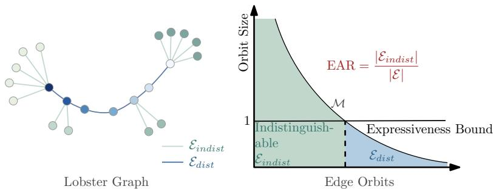  
Figure 3: Illustration of EAR based on WL-induced edge equivalence. Green denotes indistinguishable edges $\mathcal { E } _ { \mathrm { i n d i s t } }$ and blue denotes distinguishable edges ${ \mathcal { E } } _ { \mathrm { d i s t } }$ . Expressiveness bound illustrates the theoretical discriminativity limit of a GNN model. $\bar { \varepsilon } ^ { \mathcal { M } }$ provides a formal characterization of the expressivity of model M by capturing the set of edge pairs it can distinguish. A graph with more indistinguishable edges (high EAR) is inherently more challenging for link prediction.

EAR Computation. We utilize 1-orbit-WL (Algo. 1) adapted from [29] to efficiently estimate edge orbits $\mathcal { O } _ { \mathcal { E } }$ . For example, in graph $\mathcal { G } _ { 1 }$ of Fig. 1, four out of five edges belong to non-singleton edge orbits, yielding $\begin{array} { r } { \operatorname { E A } \bar { \operatorname { R } } ( \mathcal { G } _ { 1 } ) = \frac { 4 } { 5 } = 0 . 8 . } \end{array}$ . In contrast, all edges in $\mathcal { G } _ { 2 }$ are indistinguishable, resulting in $\mathrm { E A } \dot { \mathrm { R } } ( \mathcal G _ { 2 } ) = 1$ . The EAR measure ranges from [0, 1] and applying a power-law transformation improves its spread across this range, in contrast to the raw ratio, which typically falls within [0, 0.4] for many real-world graphs.

## 3.4 CONNECTING EAR TO GNN PERFORMANCE

As a motivating example, we demonstrate in Fig. 4a that on a Lobster graph (Fig. 3) with automorphic edges detected by Algo. 1. By design, the Lobster graph features a central path of vertices with distinct orbits, while its leaves reside in identical orbits, creating structural ambiguity. We show in Fig. 4a that the automorphic edges exhibit significantly higher variance in link likelihood scores for standard GNN [19], with mean values falling below the detection threshold of 0.5. This indicates that automorphic edges are likely to be incorrectly predicted as negative links.

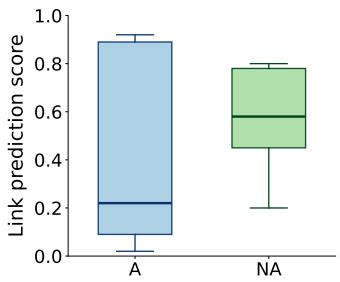

To systematically investigate the impact of structural automorphism on link prediction, we construct synthetic graphs with controllable automorphism levels (Sec. F) and report the mean AUC of representative models, including GNNs (SAGE [11], MixHop [1]), the non-convolutional model LINKX [24], and the spectral method GCN-Cheby [12], across increasing EAR values in Fig. 4b. We observe that standard GNNs perform well under low automorphism but degrade substantially as structural automorphism increases. At $E \bar { A } R \ : = \ : 0 . 8 8$ , all GNN variants underperform LINKX by up to 15%, indicating severe loss of discriminability under high automorphism. Although MixHop partially alleviates this issue through higher-order neighborhoods, it still remains 15.3% below LINKX under strong symmetry. In contrast, GCN-Cheby, a spectral method without equivariance constraints, maintains better robustness across all levels, highlighting that GNN-based variants that work well under low automorphism (EAR= 0.25) are not appropriate for networks with medium/high automorphism.

(a) Automorphic (A) and nonautomorphic (NA) edges.  
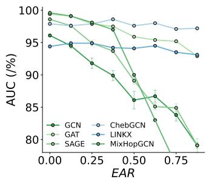  
(b) Performance decay on syntriangle as EAR increases.

## 4 LEARNING OVER INCREASING AUTOMORPHISM

Motivated by this limitation, we discuss and theoretically justify a set of key design choices that, when appropriately incorporated in a GNN framework, can maintain robust performance across the spectrum of automorphism values.

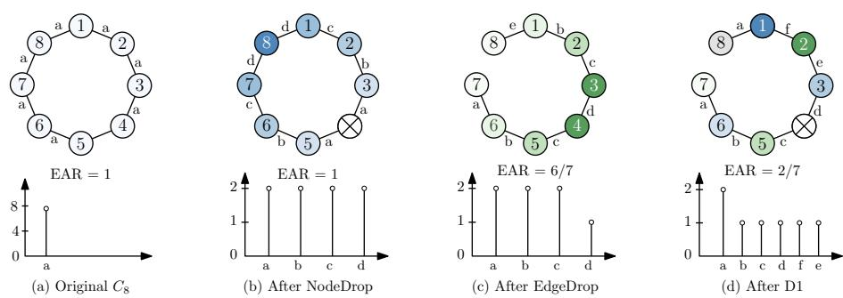  
Figure 5: Illustration of D1 Automorphism-aware Dropout on the cycle graph C8, where node colors denote subgraph orbits under a 2-layer GNN. (a) All edges are automorphic $( E A R = 1 )$ . (b) Dropping one edge breaks symmetry and reduces EAR to $\begin{array} { l } { { 6 } } \\ { { 7 } } \end{array}$ (c) Node dropout preserves $E A R$ but makes half of the vertices distinguishable. (d) Combining node and edge dropout effectively improves GNN expressiveness (Thm. 4.1).

## 4.1 D1: AUTOMORPHISM-AWARE DROPOUT

Intuition. This design strategically perturbs the graph to disrupt otherwise indistinguishable subgraph orbits, allowing GNNs to learn more discriminative representations.

Given precomputed WL-hashes $\mathbf { O } \in \mathbb { Z } ^ { | \nu | }$ from Algo. 1, we assign adaptive dropout probabilities according to normalized orbit sizes. For each node $u ,$ we define

$$
p _ { u } = \operatorname* { m i n } \left( p _ { \mathrm { m a x } } , \ : \alpha _ { p } \cdot \log \left( 1 + \frac { | \mathcal { O } _ { u } | } { | \mathcal { V } | } \right) \right) ,
$$

where $| \mathcal { O } _ { u } |$ denotes the cardinality of the subgraph orbit associated with node u, $\alpha _ { p } \ > \ 0$ is a scaling factor, and $p _ { \operatorname* { m a x } } < 1$ bounds the dropout probability. The resulting edge and node dropout mechanisms are defined as

$$
\widetilde { A } _ { u v } = \left\{ \begin{array} { l l } { \displaystyle \frac { A _ { u v } } { 1 - p _ { u v } } , } & { \mathrm { w i t h ~ p r o b a b i l i t y ~ } 1 - p _ { u v } , } \\ { 0 , } & { \mathrm { w i t h ~ p r o b a b i l i t y ~ } p _ { u v } , } \end{array} \right. \quad \forall ( u , v ) \in \mathcal { E } ,\tag{3}
$$

and $\begin{array} { r } { \widetilde { \mathbf { x } } _ { u } = z _ { u } \cdot \mathbf { x } _ { u } , \quad z _ { u } \sim } \end{array}$ $\mathrm { B e r n o u l l i } ( 1 - p _ { u } )$ $\forall u \in \nu$ . This design encourages the model to break structural automorphism and improve node distinguishability. Similarly, the edge dropout probability $p _ { u v }$ is computed analogously from edge orbit sizes.

Theoretical Justification. We now formalize the role of D1 in mitigating high edge automorphism.   
We show that GNN can better distinguish subgraph orbits than a GNN without this design.

Theorem 4.1. Let $\phi _ { w } : \mathcal { G } \to \mathbb { R } ^ { | \mathcal { V } | \times F }$ be a permutation-invariant GNN. $I f \mathbb { E } _ { w \sim \mathcal { W } } [ \phi _ { w } ( S ) ]$ exists for all $\mathcal { S } \subseteq \mathcal { V } _ { \mathrm { { a } } }$ , then ${ \cal G N N - D I } \phi ( p _ { a } , p _ { n } )$ with $p _ { a } , p _ { n } > 0 $ , for any $\epsilon , \sigma > 0 \quad$ , it suffices to sample

$$
\mathbb { L } _ { \alpha } = \Bigg \lceil \frac { \log ( \sigma ) } { | \mathcal { E } _ { \mathrm { a } } | \log ( 1 - p _ { \mathrm { a } } ) + | \mathcal { E } _ { \mathrm { n } } | \log ( 1 - p _ { \mathrm { n } } ) } \Bigg \rceil < \Bigg \lceil \frac { \log ( \sigma ) } { - | \mathcal { E } | \log ( 1 - p ) } \Bigg \rceil
$$

times such that $\begin{array} { r } { \mathbb { P } _ { w \sim \mathcal { W } } [ D ( \mathcal { S } , \mathcal { S } ^ { \prime } ) \geq \epsilon ] \geq 1 - \sigma , } \end{array}$ , where $S ^ { \prime }$ denotes the perturbed subgraph obtained by applying D1’s node/edge dropout to $s ,$ , and $D ( \cdot , \cdot )$ is a distance metric between their GNN embeddings (formally, Defs. D.1 and D.2). Here ${ \mathcal E } _ { \mathrm { a } }$ and ${ \mathcal E } _ { \mathrm { n } }$ denote the automorphic and non-automorphic edge sets, and $p _ { \mathrm { a } } , p _ { \mathrm { n } }$ the dropout probabilities applied to them. $\mathbb { L } _ { \alpha }$ is smaller than the sample complexity required by random dropout with a single rate p.

The theorem shows that ${ \bf G N N - D } 1 \phi ( p _ { a } , p _ { n } )$ can distinguish structurally equivalent nodes for any $p > 0$ , while requiring fewer repetitions than random dropout to break graph symmetries. Additional comparisons and analyses are provided in Sec. C(Fig. 8b).

## 4.2 D2: SUBGRAPH ORBIT-BIASED AGGREGATION

Intuition. D2 injects stochastic orbit-aware structural priors by perturbing identical structural roles with Gaussian noise, it introduces local asymmetry while preserving orbit-level information.

Let $\mathbf { O } \in \mathbb { Z } ^ { | \nu | }$ denote the structural role identifiers obtained from K-iteration WL subtree labels,

where $\mathbf { x } _ { v } , \mathbf { o } _ { v }$ represents raw embedding and orbit-aware identifier of node v. We construct a stochastic role embedding: (4)

$$
\begin{array} { r } { { \bf h } _ { v } ^ { ( 0 ) } = \mathrm { E m b } ( { \bf o } _ { v } ) + \epsilon _ { v } , \quad \epsilon _ { v } \sim \mathcal { N } ( 0 , \tau ^ { 2 } { \bf I } ) , } \end{array}\tag{4}
$$

where Emb(·) is a learnable embedding table and $\tau$ controls the perturbation strength. The noisy role embedding is concatenated with the initial node feature: $\mathbf { x } _ { v } ^ { ( 0 ) } = [ \mathbf { h } _ { v } ^ { ( 0 ) } \| \mathbf { x } _ { v } ]$ , and injected into each message-passing layer:

$$
\begin{array} { r } { \mathbf { x } _ { v } ^ { ( k ) } = \zeta ^ { ( k ) } \Big ( \mathbf { x } _ { v } ^ { ( k - 1 ) } , \prod _ { u \in \mathcal { N } ( v ) } \phi ^ { ( k ) } \Big ( \mathbf { x } _ { u } ^ { ( k - 1 ) } , \mathbf { x } _ { v } ^ { ( k - 1 ) } \Big ) \Big ) + \mathbf { W } ^ { ( k ) } \mathbf { h } _ { v } ^ { ( 0 ) } , } \end{array}\tag{5}
$$

where □ denotes a permutation-invariant aggregation operator, ϕ, ζ are learnable functions, and $\mathbf { W } ^ { ( k ) }$ projects orbit-aware role embeddings into the hidden feature space.

Theoretical Justification. To demonstrate D2’s impact on automorphism, we first define an automorphism-dominant vertex $v _ { a } ~ \in ~ \mathcal { V }$ as a node whose neighbors are more likely to belong to the same orbit: $\mathbb { P } _ { u \sim { \mathcal N } ( v _ { a } ) } ( { \mathcal O } _ { u } = { \mathcal O } _ { v _ { a } } ) > \mathbb { P } _ { u \sim { \mathcal N } ( v _ { a } ) } ( { \mathcal O } _ { u } \neq { \mathcal O } _ { v _ { a } } )$ , where ${ \mathcal { O } } _ { v }$ denotes the subgraph orbit label of node v (Def. 3.3).

Theorem 4.2. With a standard deterministic GNN with D2, the stochastic orbit-aware embedding increases their expected pairwise distance (Eq. (4)):

$$
 { \mathbb { E } } \big [ \| \phi _ { \mathrm { D 2 } } ( u ) - \phi _ { \mathrm { D 2 } } ( v _ { a } ) \| ^ { 2 } \mid \mathcal { O } _ { u } = \mathcal { O } _ { v _ { a } } \big ] >  { \mathbb { E } } \big [ \| \phi ( u ) - \phi ( v _ { a } ) \| ^ { 2 } \mid \mathcal { O } _ { u } = \mathcal { O } _ { v _ { a } } \big ]
$$

Meanwhile, this distance remains bounded by the separation from non-automorphic neighbors when appropriately combined with GNN. Thus, D2 introduces local asymmetry within automorphic neighborhoods while preserving the structural separation from non-automorphic neighbors.

## 4.3 EO-GNN: A FRAMEWORK FOR RELAXING EQUIVARIANCE IN LINK PREDICTION

We now present Edge Orbit Equivariant Graph Neural Network (EO-GNN), which integrates a standard GCN with our proposed designs D1 and D2 to address the automorphic node problem across the full spectrum of low to high automorphism. At a high level, EO-GNN consists of three stages: (S1) precomputes the subgraph node orbit; (S2) performs automorphism-aware message passing enhanced by D1–D2; and (S3) performs link prediction.

The pre-compute stage (S1) uses WL (Algo. 1) to generate $\mathbf { O } \in \mathbb { Z } ^ { | \nu | }$ subgraph orbit hash labels. In the aggregation stage (S2), the generated automorphic embeddings are concatenated with original node features and repeatedly updated for K rounds of message passing steps based on the aggregation in $\left( \operatorname { E q . } \left( 5 \right) \right)$ ). We collect the final embeddings in $\mathbf { X } ^ { ( K ) }$ , whose row $\mathbf { \bar { x } } _ { u } ^ { ( K ) }$ is the final embedding of node u.

In the prediction stage (S3), for a target edge $( u , v )$ , we combine pairwise and structure features(common neighbors):

$$
\begin{array} { r l } & { \mathbf { z } _ { u v } = \mathrm { R e L U } \Big ( \mathbf { W } _ { c n } \mathrm { A G G } ( \mathcal { N } ( u ) \cap \mathcal { N } ( v ) ) } \\ & { \qquad + \mathbf { W } _ { h } ( \mathbf { x } _ { u } ^ { ( K ) } \odot \mathbf { x } _ { v } ^ { ( K ) } ) + \mathbf { W } _ { o } \big ( \mathbf { o } _ { u } ^ { ( 0 ) } \odot \mathbf { o } _ { v } ^ { ( 0 ) } \big ) \Big ) . } \end{array}\tag{6}
$$

Time complexity. The 1-WL algorithm with K iterations requires $\mathcal { O } ( K \vert \mathcal { E } \vert )$ time, since each iteration aggregates neighborhood information along graph edges [36]. D1 introduces no complexity. The feature propagation complexity is $\mathcal { O } ( L \cdot ( | \mathcal { V } | \cdot \bar { p } ^ { 2 } + | \mathcal { E } | \cdot p ) )$ , where $p$ is the hidden feature dimension and L is the number of GNN layers. Therefore, the overall complexity of EO-GNN is $\mathcal { O } \big ( K | \mathcal { E } | + L \cdot ( | \mathcal { V } | \cdot p ^ { 2 } + | \mathcal { E } | \cdot p ) \big )$  . A detailed analysis is provided in Sec. J.

## 5 EMPIRICAL EVALUATION

In our empirical analysis, we first show the significance of the proposed designs in EO-GNN on both synthetic and real-world graphs with low-to-high EAR. Specifically, we consider the following research questions: (RQ1) In a synthetic setting where the data generation process and automorphism level are controllable, do EO-GNN distinguish the automorphic structure? (RQ2) As the automorphism level increases, to what extent do the EO-GNN improve the performance? (RQ3) On complex real-world medium- and large-scale graphs with varying levels of automorphism, to what extent do EO-GNN and other baselines improve GNN performance?

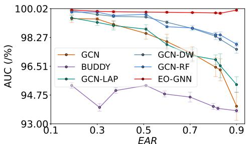  
(a) syn-cora (AUC)

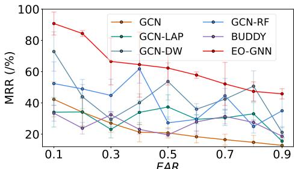  
(b) syn-cora (MRR)  
Figure 6: Performance on the semi-synthetic benchmarks. EO-GNN remains robust under high automorphism while maintaining competitive MRR and AUC in low-automorphism regimes.

## 5.1 EXPERIMENTAL SETUP

Datasets. We evaluate EO-GNN on seven real-world link prediction benchmarks from the Planetoid and OGB collections: Cora, Citeseer, Pubmed, ogbl-collab, ogbl-ddi, ogbl-ppa, and ogblcitation2 [14]. To study the effect of structural automorphism, we further construct semi-synthetic datasets with controllable EAR values from 0.1 to 0.9, following [25]. For the Planetoid and synthetic datasets, all methods use identical random splits (80%/15%/5%), while official OGB splits are adopted for fair comparison with prior work.

Training Protocol and Metrics. We report Mean Reciprocal Rank (MRR), Area Under the ROC Curve (AUC) and Hits@K depending on the benchmark setting, following the standard evaluation protocol established for each benchmark [21]. We primarily emphasize MRR due to its sensitivity to structural discrimination quality in link prediction. Although the reported metric varies by dataset, within each dataset all methods are evaluated under identical splits and the same metric, so comparisons are always apples-to-apples. All reported results are averaged over five random runs using identical training, validation and testing protocols across all methods. Detailed hyperparameter configurations and training settings are provided in Sec. H.2.

Baseline models. We compare EO-GNN with representative baselines spanning five categories: (1) heuristic link predictors, including Common Neighbor (CN), Adamic–Adar (AA), and Resource Allocation (RA) [2, 23, 50]; (2) classical GNNs, including GCN, GAT, GIN, GraphSAGE, and MixHop [1, 11, 19, 38, 43]; (3) pairwise and structure-aware GNNs, including SEAL, NBFNet, Neo-GNN, BUDDY, and NCN(C) [6, 40, 45, 48, 51]; (4) graph-agnostic models, such as LINKX and MLP [24]; and (5) GNNs with positional encodings, including GCN-DW, GCN-Lap, and GCN-RF [18, 31, 32]. The real-world evaluation (Tab. 2) covers the heuristic, classical-GNN (GCN, GAT, GIN, GraphSAGE), and pairwise/structure-aware baselines, whereas the synthetic benchmark (Tab. 5) additionally includes MixHop, the graph-agnostic models, and the positional-encoding variants. Additional dataset generation details and results are provided in Secs. F and K.

## 5.2 (RQ1) EFFECTIVENESS OF EO-GNN

Figure 6a reports the mean test AUC (with standard deviation) over five runs of the top-6 performing models on the synthetic benchmark, selected for visual clarity; the complete comparison against all baselines is reported in Tab. 5. All baselines exhibit clear performance degradation as EAR increases, especially classical GNNs under highly symmetric settings $( \mathrm { E A R } \geq 0 . 7 )$ Positional encoding methods, including GCN-DW, GCN-RF, and GCN-Lap, improve robustness over vanilla GNNs by up to 3.71% in AUC, indicating that auxiliary structural signals partially mitigate symmetry ambiguity. Pairwise-feature methods remain relatively stable across all automorphism regimes, but often sacrifice performance under low-EAR settings. In contrast, EO-GNN (Red) consistently achieves the best AUC and MRR, reaching up to 99.7% with the lowest variance across all automorphism levels, demonstrating strong robustness under increasing structural automorphism.

## 5.3 (RQ2) ABLATION STUDY: SIGNIFICANCE OF DESIGN PRINCIPLES

We evaluate the effectiveness of the proposed designs on syn-cora and syn-citeseer through the ablation studies shown in Fig. 7. Specifically, we consider two variants of EO-GNN: (1) removing the Automorphism-aware Dropout(D1, Eq. (3)), and (2) removing the Subgraph Orbit-Biased Aggregation(D2, Eq. (5)). These variants are compared against the full model.

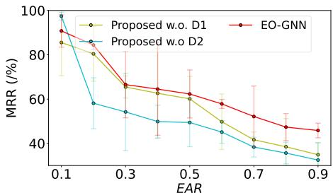  
(a) syn-cora (MRR)

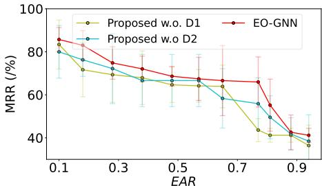  
(b) syn-citeseer (MRR)  
Figure 7: Impact of D1 and D2 Modules in EO-GNN. When EAR ≥0.5, both D1 and D2 contribute substantially to the performance gains, with D2 provides slightly stronger improvements on Cora.  
D1: Automorphism-aware Dropout. As illustrated in Fig. 7-a and Fig. 7-b, D1 (Green) substantially improves both the expressiveness and robustness of link prediction across different automorphism levels, with particularly strong gains in highly automorphic regimes. On Syn-Cora, D1 achieves up to a 22.30% improvement at $E { \bar { A } } { \bar { R } } = 0 . 8 .$ . Similarly, on Syn-Citeseer, a clear inflection point emerges around $E A R = 0 . 8 1$ , where the performance gap reaches 42.36% in MRR.

D2: Subgraph Orbit-Biased Aggregation. The results further demonstrate that D2 (Blue) plays an important role in maintaining robustness under highly automorphic settings, and its impact is more correlated with the underlying dataset characteristics. Removing D2 leads to a gradual degradation in both performance and stability as EAR increases, specifically, removing D2 reduces the average MRR by 26.28% on Syn-Cora and by 10.09% on Syn-Citeseer. Moreover, Syn-Citeseer appears more sensitive to high automorphism levels. Additional results and analyses are provided in Sec. G.  
Table 2: Real data: mean accuracy ± stdev over different data splits. Best model per benchmark highlighted in YellowGreen. OOM indicates that the algorithm requires over 40Gb of GPU memory or more than 24 hours. We highlight the two best-performing GNN models.
<table><tr><td>Dataset EAR Metric</td><td>PPA 0.001 HR@100</td><td>Pubmed 0.216 MRR</td><td>Collab 0.505 HR@50</td><td>DDI 0.002 HR@20</td><td>Cora 0.139 MRR</td><td>Citeseer 0.326 MRR</td><td>Citation2 0.311 MRR</td></tr><tr><td>CN</td><td>27.65±0.00 14.66±0.06 61.37±0.00</td><td></td><td></td><td></td><td></td><td></td><td>17.73±0.00 32.88±0.09 21.13±0.02 74.30±0.00</td></tr><tr><td>AA</td><td></td><td>32.45±0.00 19.87±0.3064.17±0.00</td><td></td><td>18.61±0.00</td><td></td><td></td><td>47.33±0.09 24.61±0.11 75.96±0.00</td></tr><tr><td>RA</td><td>49.33±0.00</td><td>19.16±0.27 63.81±0.00</td><td></td><td>6.23±0.00</td><td></td><td></td><td>47.17±0.1123.94±0.16 76.04±0.00</td></tr><tr><td>GCN</td><td>29.57±2.90 14.55±2.41 46.25±1.60</td><td></td><td></td><td></td><td></td><td></td><td>65.04±0.7634.19±6.2344.37±6.0684.74±0.07</td></tr><tr><td>GIN</td><td>OOM</td><td>15.96±2.21</td><td></td><td></td><td>48.84±0.54 67.05±0.61 42.47±7.02 29.48±6.21</td><td></td><td>OOM</td></tr><tr><td>SAGE</td><td>25.80±1.94</td><td>11.34±2.41</td><td></td><td></td><td>48.10±0.81 63.69±1.45 30.81±8.07 44.48±8.40 82.60±0.36</td><td></td><td></td></tr><tr><td>GAT</td><td>00M</td><td>4.85±0.91</td><td></td><td></td><td>48.33±0.6134.51±22.49 36.96±4.27 45.69±7.19</td><td></td><td>OOM</td></tr><tr><td>SEAL</td><td>48.80±3.16</td><td>49.02±13.91</td><td></td><td></td><td>64.74±0.43 30.56±3.86 37.81±9.93 39.36±4.99 87.67±0.32</td><td></td><td></td></tr><tr><td>NBFNet</td><td>OOM</td><td>19.46±2.42</td><td>OOM</td><td></td><td>44.00±0.58 41.48±5.11 38.17±3.06</td><td></td><td>OOM</td></tr><tr><td></td><td>Neo-GNN 49.13±0.60</td><td>31.44±3.85</td><td>57.52±0.37</td><td></td><td>63.57±3.52 41.48±5.11 53.97±5.88 87.26±0.84</td><td></td><td></td></tr><tr><td>BUDDY</td><td>49.85±0.20</td><td>19.46±2.42</td><td>65.94±0.58</td><td></td><td>78.51±1.3630.78±5.55 22.84±0.36 87.56±0.11</td><td></td><td></td></tr><tr><td>NCN</td><td>61.19±0.85</td><td>25.92±4.33</td><td>64.76±0.87</td><td></td><td>82.32±6.10 45.76±6.39 54.97±6.0388.09±0.06</td><td></td><td></td></tr><tr><td>NCNC</td><td>61.42±0.73</td><td>20.31±6.51</td><td>66.61±0.71</td><td>84.11±3.67</td><td>48.68±8.60 64.03±3.67 89.12±0.40</td><td></td><td></td></tr><tr><td colspan="8">EO-GNN 61.58±0.45 68.51±0.74 70.95±0.81 86.95±1.63 50.02±5.83 72.88±1.45 90.15±0.06</td></tr><tr><td>Improve.</td><td>+0.16 ↑</td><td>+19.49 ↑</td><td>+4.34↑</td><td>+2.84↑</td><td>+1.34↑</td><td>+8.85 ↑</td><td>+1.03 ↑</td></tr></table>

## 5.4 (RQ3) EVALUATION ON REAL-WORLD GRAPHS

Significance of EO-GNN. Tab. 2 shows that EO-GNN consistently achieves the strongest overall performance across both Planetoid and OGB link prediction benchmarks under multiple evaluation metrics. More importantly, the gains become increasingly pronounced on datasets with larger EAR values, such as Pubmed, Citeseer, and Collab, indicating that EO-GNN is particularly effective under strong structural automorphism and automorphism-induced ambiguity. In particular, on Pubmed, SEAL which also incorporates symmetry-aware structural modeling already outperforms conventional baselines by a large margin, while EO-GNN further improves upon SEAL by 19.49 MRR points(28.44%). In contrast, datasets with near-zero EAR values, such as PPA and DDI, exhibit comparatively smaller gains. We additionally observe that pairwise and subgraph-based methods generally achieve stronger robustness than classical message-passing GNNs, highlighting the importance of richer structural representations for link prediction. Nevertheless, as graph size increases, the estimation quality of subtree orbits in Algo. 1 gradually decreases, causing D2 to classify more nodes as structurally equivalent and partially reducing its discriminative capability. Despite this limitation, EO-GNN consistently maintains strong performance with low variance across all benchmarks.

## 6 CONCLUSION

We highlighted the limitations of node-level symmetry frameworks for link prediction and introduced an edge-centric view via the concept of edge orbit. We presented EO-GNN, an automorphism-aware GNN with theoretically grounded components. Together, our framework and design better align GNN inductive biases with graph symmetries, improving both the quantitative theoretical framework and empirical performance in link prediction.

Limitations. Our theoretical framework is principled and offers theoretically grounded design insights. However, it assumes identical vertex representations, following prior work. Although this assumption does not strictly hold in real-world graphs, our experiments indicate that the theoretical findings remain valid even when node features differ. Extending this analysis to incorporate semantic embeddings (and understanding their interaction with structural signals) remains an important direction for future theoretical development.

## ACKNOWLEDGMENTS

This work was supported in part by the National Science Foundation under Grants No. IIS-2212143 and IIS-2504090, and in part by the Federal Ministry of Research, Technology and Space (BMFTR), Germany, under award number 01IS23066.

## AI USE STATEMENT

In accordance with the venue’s AI policy, we disclose that generative AI tools were used solely to aid and polish writing, specifically grammar correction, improving clarity of exposition, and minor LaTeX formatting. No research content or code was produced with the aid of AI tools, and we take full responsibility for the final content of this work.

## ETHICS STATEMENT

This work is methodological, studying the expressive power of graph neural networks for link prediction. All experiments use publicly available benchmark datasets (the Planetoid citation networks and the Open Graph Benchmark), which contain no personally identifiable or sensitive information and are standard in the community under their respective licenses. The research involves no human subjects, and we foresee no direct risks relating to discrimination, fairness, privacy, or security beyond the general dual-use considerations common to machine-learning research. The authors declare no conflicts of interest.

## REPRODUCIBILITY STATEMENT

We have taken several steps to ensure reproducibility. Our model and experimental code are available as an anonymous repository, linked in the contributions of Sec. 4. All theoretical claims state their assumptions explicitly and are accompanied by complete proofs in Sec. D. The construction of our synthetic benchmarks with controllable automorphism (EAR) is described in detail in Sec. F, and the real-world datasets, their statistics, and the splits used are described in Sec. K. Full hyperparameter settings and training protocols for all methods are reported in Sec. H.2.

## REFERENCES

[1] Sami Abu-El-Haija, Bryan Perozzi, Amol Kapoor, Hrayr Harutyunyan, Nazanin Alipourfard, Kristina Lerman, Greg Ver Steeg, and Aram Galstyan. Mixhop: Higher-order graph

convolutional architectures via sparsified neighborhood mixing. In The Thirty-sixth International Conference on Machine Learning (ICML), 2019. URL http://proceedings.mlr. press/v97/abu-el-haija19a/abu-el-haija19a.pdf.

[2] Lada Adamic and Eytan Adar. Friends and neighbors on the web. Social Networks, 25:211–230, 07 2003. doi: 10.1016/S0378-8733(03)00009-1.

[3] Pablo Barceló, Egor V. Kostylev, Mikaël Monet, Jorge Pérez, Juan L. Reutter, and Juan Pablo Silva. The logical expressiveness of graph neural networks. In 8th International Conference on Learning Representations, ICLR 2020, Addis Ababa, Ethiopia, April 26-30, 2020. OpenReview.net, 2020. URL https://openreview.net/forum?id=r1lZ7AEKvB.

[4] Benjamin Bloem-Reddy and Yee Whye Teh. Probabilistic symmetries and invariant neural networks. J. Mach. Learn. Res., 21:90:1–90:61, 2020. URL https://jmlr.org/papers/ v21/19-322.html.

[5] Jan Böker, Ron Levie, Ningyuan Huang, Soledad Villar, and Christopher Morris. Finegrained expressivity of graph neural networks. In Alice Oh, Tristan Naumann, Amir Globerson, Kate Saenko, Moritz Hardt, and Sergey Levine (eds.), Advances in Neural Information Processing Systems 36: Annual Conference on Neural Information Processing Systems 2023, NeurIPS 2023, New Orleans, LA, USA, December 10 - 16, 2023, 2023. URL http://papers.nips.cc/paper\_files/paper/2023/hash/ 9200d97ca2bf3a26db7b591844014f00-Abstract-Conference.html.

[6] Benjamin Paul Chamberlain, Sergey Shirobokov, Emanuele Rossi, Fabrizio Frasca, Thomas Markovich, Nils Yannick Hammerla, Michael M. Bronstein, and Max Hansmire. Graph neural networks for link prediction with subgraph sketching. In The Eleventh International Conference on Learning Representations, ICLR 2023, Kigali, Rwanda, May 1-5, 2023. OpenReview.net, 2023. URL https://openreview.net/forum?id=m1oqEOAozQU.

[7] Ming Chen, Zhewei Wei, Zengfeng Huang, Bolin Ding, and Yaliang Li. Simple and deep graph convolutional networks. In Proceedings of the 37th International Conference on Machine Learning, ICML’20. JMLR.org, 2020.

[8] Zhaoliang Chen, Zhihao Wu, Ylli Sadikaj, Claudia Plant, Hong-Ning Dai, Shiping Wang, Yiu-Ming Cheung, and Wenzhong Guo. Adedgedrop: Adversarial edge dropping for robust graph neural networks. IEEE Trans. Knowl. Data Eng., 37(9):4948–4961, 2025. doi: 10.1109/ TKDE.2025.3586369. URL https://doi.org/10.1109/TKDE.2025.3586369.

[9] Zhengdao Chen, Soledad Villar, Lei Chen, and Joan Bruna. On the equivalence between graph isomorphism testing and function approximation with gnns. In H. Wallach, H. Larochelle, A. Beygelzimer, F. d'Alché-Buc, E. Fox, and R. Garnett (eds.), Advances in Neural Information Processing Systems, volume 32. Curran Associates, Inc., 2019. URL https://proceedings.neurips.cc/paper\_files/paper/2019/file/ 71ee911dd06428a96c143a0b135041a4-Paper.pdf.

[10] Matthias Fey and Jan Eric Lenssen. Fast graph representation learning with pytorch geometric, 2019. URL https://arxiv.org/abs/1903.02428.

[11] William L. Hamilton, Rex Ying, and Jure Leskovec. Inductive representation learning on large graphs. In Proceedings of the 31st International Conference on Neural Information Processing Systems, NIPS’17, pp. 1025–1035, Red Hook, NY, USA, 2017. Curran Associates Inc. ISBN 9781510860964.

[12] Mingguo He, Zhewei Wei, and Ji-Rong Wen. Convolutional neural networks on graphs with chebyshev approximation, revisited. In S. Koyejo, S. Mohamed, A. Agarwal, D. Belgrave, K. Cho, and A. Oh (eds.), Advances in Neural Information Processing Systems, volume 35, pp. 7264–7276. Curran Associates, Inc., 2022. doi: 10.52202/068431-0527. URL https://proceedings.neurips.cc/paper\_files/paper/2022/file/ 2f9b3ee2bcea04b327c09d7e3145bd1e-Paper-Conference.pdf.

[13] Geoffrey E. Hinton, Nitish Srivastava, Alex Krizhevsky, Ilya Sutskever, and Ruslan Salakhutdinov. Improving neural networks by preventing co-adaptation of feature detectors. CoRR, abs/1207.0580, 2012. URL http://arxiv.org/abs/1207.0580.

[14] Weihua Hu, Matthias Fey, Hongyu Ren, Maho Nakata, Yuxiao Dong, and Jure Leskovec. OGB-LSC: A large-scale challenge for machine learning on graphs. In Joaquin Vanschoren and Sai-Kit Yeung (eds.), Proceedings of the Neural Information Processing Systems Track on Datasets and Benchmarks 1, NeurIPS Datasets and Benchmarks 2021, December 2021, virtual, 2021. URL https://datasets-benchmarks-proceedings.neurips.cc/paper/2021/ hash/db8e1af0cb3aca1ae2d0018624204529-Abstract-round2.html.

[15] Yang Hu, Xiyuan Wang, Zhouchen Lin, Pan Li, and Muhan Zhang. Two-dimensional weisfeilerlehman graph neural networks for link prediction. CoRR, abs/2206.09567, 2022. doi: 10.48550/ ARXIV.2206.09567. URL https://doi.org/10.48550/arXiv.2206.09567.

[16] Gao Huang, Yu Sun, Zhuang Liu, Daniel Sedra, and Kilian Weinberger. Deep Networks with Stochastic Depth, volume 9908, pp. 646–661. 09 2016. ISBN 978-3-319-46492-3. doi: 10.1007/978-3-319-46493-0\_39.

[17] Zan Huang, Xin Li, and Hsinchun Chen. Link prediction approach to collaborative filtering. In Proceedings of the 5th ACM/IEEE-CS Joint Conference on Digital Libraries, JCDL ’05, pp. 141–142, New York, NY, USA, 2005. Association for Computing Machinery. ISBN 1581138768. doi: 10.1145/1065385.1065415. URL https://doi.org/10. 1145/1065385.1065415.

[18] Michael Ito, Jiong Zhu, Dexiong Chen, Danai Koutra, and Jenna Wiens. Learning laplacian positional encodings for heterophilous graphs. In International Conference on Artificial Intelligence and Statistics. PMLR, 2025.

[19] Thomas N. Kipf and Max Welling. Semi-supervised classification with graph convolutional networks. In International Conference on Learning Representations, 2017. URL https: //openreview.net/forum?id=SJU4ayYgl.

[20] Veronica Lachi, Francesco Ferrini, Antonio Longa, Bruno Lepri, Andrea Passerini, and Manfred Jaeger. Bridging theory and practice in link representation with graph neural networks. In Danielle Belgrave, Cheng Zhang, Laura N. Montoya, Hsuan-Tien Lin, Razvan Pascanu, Piotr Koniusz, Marzyeh Ghassemi, Nancy Chen, Iván Vladimir Meza Ruíz, and Arturo Loaiza-Bonilla (eds.), Advances in Neural Information Processing Systems 38: Annual Conference on Neural Information Processing Systems 2025, NeurIPS 2025, San Diego, CA, USA, December 2-7, 2025 / Mexico City, Mexico, November 30 - December 5, 2025, 2025. URL http://papers.nips.cc/paper\_files/paper/2025/hash/ b1cd72276feff8173462e3f733ac66f8-Abstract-Conference.html.

[21] Juanhui Li, Harry Shomer, Haitao Mao, Shenglai Zeng, Yao Ma, Neil Shah, Jiliang Tang, and Dawei Yin. Evaluating graph neural networks for link prediction: current pitfalls and new benchmarking. In Proceedings of the 37th International Conference on Neural Information Processing Systems, NIPS ’23, Red Hook, NY, USA, 2023. Curran Associates Inc.

[22] Qimai Li, Zhichao Han, and Xiao-Ming Wu. Deeper insights into graph convolutional networks for semi-supervised learning. AAAI’18/IAAI’18/EAAI’18. AAAI Press, 2018. ISBN 978-1- 57735-800-8.

[23] David Liben-Nowell and Jon Kleinberg. The link-prediction problem for social networks. Journal ofthe American Societyfor Information Science and Technology, 58(7):1019–1031, 2007. doi: https://doi.org/10.1002/asi.20591. URL https://onlinelibrary.wiley. com/doi/abs/10.1002/asi.20591.

[24] Derek Lim, Felix Hohne, Xiuyu Li, Sijia Linda Huang, Vaishnavi Gupta, Omkar Bhalerao, and Ser-Nam Lim. Large scale learning on non-homophilous graphs: new benchmarks and strong simple methods. In Proceedings ofthe 35th International Conference on Neural Information Processing Systems, NIPS ’21, Red Hook, NY, USA, 2021. Curran Associates Inc. ISBN 9781713845393.

[25] Derek Lim, Joshua Robinson, Stefanie Jegelka, and Haggai Maron. Expressive sign equivariant networks for spectral geometric learning. In Alice Oh, Tristan Naumann, Amir Globerson, Kate Saenko, Moritz Hardt, and Sergey Levine (eds.), Advances in Neural Information Processing Systems 36: Annual Conference on Neural Information Processing Systems 2023, NeurIPS 2023, New Orleans, LA, USA, December 10 - 16, 2023, 2023. URL http://papers.nips.cc/paper\_files/paper/2023/hash/ 3516aa3393f0279e04c099f724664f99-Abstract-Conference.html.

[26] George Ma, Yifei Wang, Derek Lim, Stefanie Jegelka, and Yisen Wang. A canonicalization perspective on invariant and equivariant learning. In Amir Globersons, Lester Mackey, Danielle Belgrave, Angela Fan, Ulrich Paquet, Jakub M. Tomczak, and Cheng Zhang (eds.), Advances in Neural Information Processing Systems 37: Annual Conference on Neural Information Processing Systems 2024, NeurIPS 2024, Vancouver, BC, Canada, December 10 - 15, 2024, 2024. URL http://papers.nips.cc/paper\_files/paper/2024/hash/ 702b67152ec4435795f681865b67999c-Abstract-Conference.html.

[27] Haggai Maron, Heli Ben-Hamu, Nadav Shamir, and Yaron Lipman. Invariant and equivariant graph networks. In 7th International Conference on Learning Representations, ICLR 2019, New Orleans, LA, USA, May 6-9, 2019. OpenReview.net, 2019. URL https://openreview. net/forum?id=Syx72jC9tm.

[28] Haggai Maron, Ethan Fetaya, Nimrod Segol, and Yaron Lipman. On the universality of invariant networks. In Kamalika Chaudhuri and Ruslan Salakhutdinov (eds.), Proceedings ofthe 36th International Conference on Machine Learning, ICML 2019, 9-15 June 2019, Long Beach, California, USA, volume 97 of Proceedings ofMachine Learning Research, pp. 4363–4371. PMLR, 2019. URL http://proceedings.mlr.press/v97/maron19a.html.

[29] Christopher Morris, Martin Ritzert, Matthias Fey, William L. Hamilton, Jan Eric Lenssen, Gaurav Rattan, and Martin Grohe. Weisfeiler and leman go neural: Higher-order graph neural networks. In The Thirty-Third AAAI Conference on Artificial Intelligence, AAAI 2019, The Thirty-First Innovative Applications ofArtificial Intelligence Conference, IAAI 2019, The Ninth AAAI Symposium on Educational Advances in Artificial Intelligence, EAAI 2019, Honolulu, Hawaii, USA, January 27 - February 1, 2019, pp. 4602–4609. AAAI Press, 2019. doi: 10.1609/AAAI.V33I01.33014602. URL https://doi.org/10.1609/aaai.v33i01. 33014602.

[30] Matthew Morris, Bernardo Cuenca Grau, and Ian Horrocks. Orbit-equivariant graph neural networks. In The Twelfth International Conference on Learning Representations, ICLR 2024, Vienna, Austria, May 7-11, 2024. OpenReview.net, 2024. URL https://openreview. net/forum?id=GkJOCga62u.

[31] Bryan Perozzi, Rami Al-Rfou, and Steven Skiena. Deepwalk: online learning of social representations. In Sofus A. Macskassy, Claudia Perlich, Jure Leskovec, Wei Wang, and Rayid Ghani (eds.), The 20th ACM SIGKDD International Conference on Knowledge Discovery and Data Mining, KDD ’14, New York, NY, USA - August 24 - 27, 2014, pp. 701–710. ACM, 2014. doi: 10.1145/2623330.2623732. URL https://doi.org/10.1145/2623330.2623732.

[32] Ladislav Rampásek, Michael Galkin, Vijay Prakash Dwivedi, Anh Tuan Luu, Guy Wolf, and Dominique Beaini. Recipe for a general, powerful, scalable graph transformer. In Sanmi Koyejo, S. Mohamed, A. Agarwal, Danielle Belgrave, K. Cho, and A. Oh (eds.), Advances in Neural Information Processing Systems 35: Annual Conference on Neural Information Processing Systems 2022, NeurIPS 2022, New Orleans, LA, USA, November 28 - December 9, 2022, 2022. URL http://papers.nips.cc/paper\_files/paper/2022/hash/ 5d4834a159f1547b267a05a4e2b7cf5e-Abstract-Conference.html.

[33] Yu Rong, Wenbing Huang, Tingyang Xu, and Junzhou Huang. Dropedge: Towards deep graph convolutional networks on node classification. In 8th International Conference on Learning Representations, ICLR 2020, Addis Ababa, Ethiopia, April 26-30, 2020. OpenReview.net, 2020. URL https://openreview.net/forum?id=Hkx1qkrKPr.

[34] Harry Shomer, Yao Ma, Haitao Mao, Juanhui Li, Bo Wu, and Jiliang Tang. Lpformer: An adaptive graph transformer for link prediction. In Ricardo Baeza-Yates and Francesco Bonchi

(eds.), Proceedings of the 30th ACM SIGKDD Conference on Knowledge Discovery and Data Mining, KDD 2024, Barcelona, Spain, August 25-29, 2024, pp. 2686–2698. ACM, 2024. doi: 10.1145/3637528.3672025. URL https://doi.org/10.1145/3637528.3672025.

[35] Damian Szklarczyk, Annika L. Gable, David Lyon, Alexander Junge, Stefan Wyder, Jaime Huerta-Cepas, Milan Simonovic, Nadezhda T. Doncheva, John H. Morris, Peer Bork, Lars Juhl Jensen, and Christian von Mering. STRING v11: protein-protein association networks with increased coverage, supporting functional discovery in genome-wide experimental datasets. Nucleic Acids Res., 47(Database-Issue):D607–D613, 2019. doi: 10.1093/NAR/GKY1131. URL https://doi.org/10.1093/nar/gky1131.

[36] Matteo Togninalli, M. Elisabetta Ghisu, Felipe Llinares-López, Bastian Rieck, and Karsten M. Borgwardt. Wasserstein weisfeiler-lehman graph kernels. In Hanna M. Wallach, Hugo Larochelle, Alina Beygelzimer, Florence d’Alché-Buc, Emily B. Fox, and Roman Garnett (eds.), Advances in Neural Information Processing Systems 32: Annual Conference on Neural Information Processing Systems 2019, NeurIPS 2019, December 8-14, 2019, Vancouver, BC, Canada, pp. 6436–6446, 2019. URL https://proceedings.neurips.cc/paper/ 2019/hash/73fed7fd472e502d8908794430511f4d-Abstract.html.

[37] Antonis Vasileiou, Timo Stoll, and Christopher Morris. Understanding generalization in node and link prediction. CoRR, abs/2507.00927, 2025. doi: 10.48550/ARXIV.2507.00927. URL https://doi.org/10.48550/arXiv.2507.00927.

[38] Petar Velickovic, Guillem Cucurull, Arantxa Casanova, Adriana Romero, Pietro Liò, and Yoshua Bengio. Graph attention networks. In 6th International Conference on Learning Representations, ICLR 2018, Vancouver, BC, Canada, April 30 - May 3, 2018, Conference Track Proceedings. OpenReview.net, 2018. URL https://openreview.net/forum?id=rJXMpikCZ.

[39] Stefan Wager, Sida Wang, and Percy Liang. Dropout training as adaptive regularization. In Christopher J. C. Burges, Léon Bottou, Zoubin Ghahramani, and Kilian Q. Weinberger (eds.), Advances in Neural Information Processing Systems 26: 27th Annual Conference on Neural Information Processing Systems 2013. Proceedings of a meeting held December 5-8, 2013, Lake Tahoe, Nevada, United States, pp. 351–359, 2013. URL https://proceedings.neurips.cc/paper/2013/hash/ 38db3aed920cf82ab059bfccbd02be6a-Abstract.html.

[40] Xiyuan Wang, Haotong Yang, and Muhan Zhang. Neural common neighbor with completion for link prediction. In The Twelfth International Conference on Learning Representations, ICLR 2024, Vienna, Austria, May 7-11, 2024. OpenReview.net, 2024. URL https:// openreview.net/forum?id=sNFLN3itAd.

[41] Boris Weisfeiler and A. A. Lehman. A Reduction of a Graph to a Canonical Form and an Algebra Arising During This Reduction. Nauchno-Technicheskaya Informatsia, Ser. 2(N9): 12–16, 1968.

[42] Fengli Xu, Quanming Yao, Pan Hui, and Yong Li. Automorphic equivalence-aware graph neural network. In Marc’Aurelio Ranzato, Alina Beygelzimer, Yann N. Dauphin, Percy Liang, and Jennifer Wortman Vaughan (eds.), Advances in Neural Information Processing Systems 34: Annual Conference on Neural Information Processing Systems 2021, NeurIPS 2021, December 6-14, 2021, virtual, pp. 15138–15150, 2021. URL https://proceedings.neurips.cc/ paper/2021/hash/7ffb4e0ece07869880d51662a2234143-Abstract.html.

[43] Keyulu Xu, Weihua Hu, Jure Leskovec, and Stefanie Jegelka. How powerful are graph neural networks? In 7th International Conference on Learning Representations, ICLR 2019, New Orleans, LA, USA, May 6-9, 2019. OpenReview.net, 2019. URL https://openreview. net/forum?id=ryGs6iA5Km.

[44] Yuning You, Tianlong Chen, Yongduo Sui, Ting Chen, Zhangyang Wang, and Yang Shen. Graph contrastive learning with augmentations. In Hugo Larochelle, Marc’Aurelio Ranzato, Raia Hadsell, Maria-Florina Balcan, and Hsuan-Tien Lin (eds.), Advances in Neural Information Processing Systems 33: Annual Conference on Neural Information Processing Systems 2020, NeurIPS 2020, December 6-12, 2020, virtual, 2020. URL https://proceedings.neurips.cc/ paper/2020/hash/3fe230348e9a12c13120749e3f9fa4cd-Abstract.html.

[45] Seongjun Yun, Seoyoon Kim, Junhyun Lee, Jaewoo Kang, and Hyunwoo J. Kim. Neo-gnns: Neighborhood overlap-aware graph neural networks for link prediction. In Marc’Aurelio Ranzato, Alina Beygelzimer, Yann N. Dauphin, Percy Liang, and Jennifer Wortman Vaughan (eds.), Advances in Neural Information Processing Systems 34: Annual Conference on Neural Information Processing Systems 2021, NeurIPS 2021, December 6-14, 2021, virtual, pp. 13683–13694, 2021. URL https://proceedings.neurips.cc/paper/2021/ hash/71ddb91e8fa0541e426a54e538075a5a-Abstract.html.

[46] Bohang Zhang, Guhao Feng, Yiheng Du, Di He, and Liwei Wang. A complete expressiveness hierarchy for subgraph gnns via subgraph weisfeiler-lehman tests. In Andreas Krause, Emma Brunskill, Kyunghyun Cho, Barbara Engelhardt, Sivan Sabato, and Jonathan Scarlett (eds.), International Conference on Machine Learning, ICML 2023, 23-29 July 2023, Honolulu, Hawaii, USA, volume 202 of Proceedings ofMachine Learning Research, pp. 41019–41077. PMLR, 2023. URL https://proceedings.mlr.press/v202/zhang23k.html.

[47] Bohang Zhang, Jingchu Gai, Yiheng Du, Qiwei Ye, Di He, and Liwei Wang. Beyond weisfeilerlehman: A quantitative framework for GNN expressiveness. In The Twelfth International Conference on Learning Representations, ICLR 2024, Vienna, Austria, May 7-11, 2024. Open-Review.net, 2024. URL https://openreview.net/forum?id=HSKaGOi7Ar.

[48] Muhan Zhang and Yixin Chen. Link prediction based on graph neural networks. In Samy Bengio, Hanna M. Wallach, Hugo Larochelle, Kristen Grauman, Nicolò Cesa-Bianchi, and Roman Garnett (eds.), Advances in Neural Information Processing Systems 31: Annual Conference on Neural Information Processing Systems 2018, NeurIPS 2018, December 3-8, 2018, Montréal, Canada, pp. 5171–5181, 2018. URL https://proceedings.neurips.cc/paper/ 2018/hash/53f0d7c537d99b3824f0f99d62ea2428-Abstract.html.

[49] Muhan Zhang, Pan Li, Yinglong Xia, Kai Wang, and Long Jin. Labeling trick: A theory of using graph neural networks for multi-node representation learning. In Marc’Aurelio Ranzato, Alina Beygelzimer, Yann N. Dauphin, Percy Liang, and Jennifer Wortman Vaughan (eds.), Advances in Neural Information Processing Systems 34: Annual Conference on Neural Information Processing Systems 2021, NeurIPS 2021, December 6-14, 2021, virtual, pp. 9061–9073, 2021. URL https://proceedings.neurips.cc/paper/2021/hash/ 4be49c79f233b4f4070794825c323733-Abstract.html.

[50] Tao Zhou, Linyuan Lü, and Yi-Cheng Zhang. Predicting missing links via local information. The European Physical Journal B, 71:623–630, 10 2009. doi: 10.1140/epjb/e2009-00335-8.

[51] Zhaocheng Zhu, Zuobai Zhang, Louis-Pascal Xhonneux, and Jian Tang. Neural bellman-ford networks: a general graph neural network framework for link prediction. In Proceedings of the 35th International Conference on Neural Information Processing Systems, NIPS ’21, Red Hook, NY, USA, 2021. Curran Associates Inc. ISBN 9781713845393.

## A NOMENCLATURE

We summarize the main symbols used in this work and their definitions below:

Table 3: Major symbols and definitions.
<table><tr><td>Symbols</td><td>Definitions</td></tr><tr><td> $\mathcal { H } = ( \nu , \mathcal { E } )$ </td><td>graph H with nodeset V, edgeset E</td></tr><tr><td> $\mathbf { A }$ </td><td>n × n adjacency matrix of H</td></tr><tr><td>X</td><td> $n \times F$  node feature matrix of H</td></tr><tr><td> $\mathbf { x } _ { v }$ </td><td>F-dimensional feature vector for node v</td></tr><tr><td>L</td><td>unnormalized graph Laplacian matrix</td></tr><tr><td> ${ \mathcal { G } } / { \mathrm { A u t } } ( { \mathcal { G } } )$ </td><td>the quotient of the automorphism when it acts on the graph G</td></tr><tr><td> $\operatorname { A u t } ( { \mathcal { G } } )$ </td><td>automorphism on graph G</td></tr><tr><td>π</td><td>vertex permutation; π ∈  ${ \mathrm { A u t } } ^ { k } ( { \mathcal { G } } )$  denotes a k-hop graph automorphism</td></tr><tr><td> $N ( v )$ </td><td>general type of neighbors of node v in graph H</td></tr><tr><td> $\bar { N } ( v )$ </td><td>general type of neighbors of node v in H without self-loops (i.e., excluding v)</td></tr><tr><td> $N _ { i } ( v ) , \bar { N } _ { i } ( v )$ </td><td>i-hop/step neighbors of node v in H (at exactly distance i) maybe-with/without self-loops, resp.</td></tr><tr><td> $\mathcal { E } _ { 2 }$ </td><td>set of pairs of nodes  $( u , v )$  with shortest distance between them being 2</td></tr><tr><td> $d , d _ { \mathrm { m a x } }$ </td><td>node degree and maximum node degree across all nodes  $v \in \nu ,$ </td></tr><tr><td> $K$ </td><td>the number of rounds in the neighborhood aggregation stage</td></tr><tr><td> $\mathbf { W }$ </td><td>learnable weight matrix for GNN model</td></tr><tr><td> $\rho$ </td><td>non-linear activation function</td></tr><tr><td>[]</td><td>vector concatenation operator</td></tr><tr><td>AGGR</td><td>function that aggregates node feature representations within a neighborhood</td></tr><tr><td>COMBINE</td><td>function that combines feature representations from different neighborhoods</td></tr><tr><td> $\mathcal { P } ( \nu )$ </td><td>Power set of vertex set V  $\mathbf { \Omega } _ { 1 } \in \mathcal { W }$ </td></tr><tr><td> $\mathcal { W }$ </td><td>Weight space of the parameterized neural network; u</td></tr><tr><td> $\phi$ </td><td>Graph encoder</td></tr><tr><td> $\mathcal { O } ( v )$ </td><td>orbit of vertex v under Aut(G)  $O \in \mathbb { Z } ^ { | \nu | } \mathbb { W } \mathrm { L }$ </td></tr><tr><td> $O$ </td><td>-Hash value from  $\mathbf { A l g o . 1 }$   $\mathbf { O } \in \mathbb { Z } ^ { | \nu | \times d _ { o } }$  embedded node feature based on the hash label from Algo. 1 as node</td></tr><tr><td>0</td><td>feature</td></tr><tr><td> $| \mathcal { O } _ { u } |$ </td><td>orbit size of vertex u: number of the vertices sharing the same role as u</td></tr><tr><td> $\dot { \mathcal { O } } _ { S } ( u ) \left( = \mathcal { O } _ { u } \right)$ </td><td>subgraph orbit of u: its k-equivalence class under a GNN (Def. 3.3) WL-induced edge-orbit signature of : the multiset</td></tr><tr><td> $\mathcal { O } _ { \varepsilon } ( e )$ </td><td> $e ~ = ~ \{ u , v \}$   $\{ \{ \mathcal { O } s ( u ) , \mathcal { O } s ( v ) \} \}$  (Def. 3.4)</td></tr><tr><td> $[ e ] _ { \varepsilon }$ </td><td>edge orbit of e: the edges sharing its signature, i.e. its  $\sim ^ { \varepsilon }$  equivalence class (Measure 3.1)</td></tr><tr><td> $\mathcal { O } ( \cdot )$ </td><td>Complexity</td></tr><tr><td> $D$ </td><td>Decoder; typically implemented as a dot product The full link-prediction model for weight set w, i.e., the GNN encoder</td></tr><tr><td> $\mathcal { M } _ { w }$ </td><td>with a decoder  $D ; D ^ { \prime } s$  functional form is left unspecified</td></tr><tr><td></td><td></td></tr><tr><td> $\boldsymbol { \mathcal { S } } ^ { ( k ) } ( \boldsymbol { u } )$ </td><td>k-hop enclosing subgraph centered at node u</td></tr><tr><td> ${ \mathcal S } ^ { ( k ) } ( u ) ,$ </td><td>k-hop enclosing subgraph of u with €-level structural perturbation</td></tr><tr><td> $\epsilon$ </td><td>Degree of structural alteration; an embedded distance in the representation space, i.e. the</td></tr><tr><td></td><td>desired closeness to the unperturbed graph Proposed vertex-level automorphism measure (see Appendix Sec. E)</td></tr><tr><td> $\alpha \nu$   $\alpha \varepsilon$ </td><td>Proposed edge-level automorphism measure (see Appendix Sec. E)</td></tr><tr><td></td><td></td></tr><tr><td> $\widetilde { A }$ </td><td>Adjacency matrix after random dropout</td></tr><tr><td> $\delta$   $\sigma$ </td><td>Permissible distance from a for input bound on failure probability; a guarantee is stated to hold with probability at least</td></tr><tr><td></td><td>(Thm. 4.1)</td></tr><tr><td></td><td>standard deviation of the Gaussian perturbation noise used in D2 (Sec. 4.2)</td></tr><tr><td> $\mathbf { \Delta } _ { \mathbf { r } ^ { ( 0 ) } } ^ { \tau }$ </td><td>Embedding vector from WL-Hash o for input in iteration 0</td></tr><tr><td> $\mathbf { E } _ { \epsilon }$ </td><td>weight of graph adjacency matrix</td></tr><tr><td> $\mathbf { X } ^ { ( K ) }$ </td><td>final embedding of GNN</td></tr><tr><td> $\mathbf { H } _ { e }$ </td><td>common neighbor as feature vector,  $\mathbf { H } _ { c } ( i , j ) = 1 \mathrm { i f } ( i , j ) \in \mathcal { E }$ </td></tr><tr><td> $\mathbf { R } _ { n } ^ { ( 0 ) }$ </td><td></td></tr><tr><td></td><td>embedding from embedded WL-hash Label</td></tr><tr><td> $\mathbf { H } _ { e }$ </td><td>embedding from</td></tr><tr><td> $\mathbf { W } _ { f }$ </td><td>weight  $\mathbf { W } _ { f } \in \mathbb { R } ^ { p \times 1 }$  in the decoder</td></tr><tr><td></td><td></td></tr><tr><td> $p$ </td><td>feature dimension in the final embedding</td></tr></table>

## B EXTENDED PRELIMINARY

Definition B.1 (Graph Quotient). The quotient of a graph $\mathcal { G }$ is the partition of its vertex set into automorphic orbits under the action of $\hat { \mathrm { A u t } } ( \mathcal { G } ) : \bar { \mathcal { G } } / \bar { \mathrm { A u t } } \bar { ( \mathcal { G } ) } = \{ \mathcal { O } ( \hat { v } ) \mid v \in \mathcal { V } _ { \mathcal { G } } \}$

Subgraph Orbit ̸= Orbit. The difference between Subgraph Orbit and standard Orbit lies in the group action they are based on: an orbit is induced by is a global automorphism (i.e., an adjacency-preserving permutation of the entire node set), whereas subgraph orbit in link prediction is a local generalization of automorphism based on the fact that the GNN operates on a small k-hop neighborhood. In Fig. 1, nodes b and d belong to the same subgraph orbit under a 1-layer GNN, as their 1-hop enclosing subgraphs are structurally identical. Motivation: It ensures that structural equivalence is rigorously characterized through the isomorphism of GNN-induced local enclosing subgraphs.

## C EXTENDED RELATED WORK

MPNNs for Link Prediction. Link prediction is commonly performed using embeddings generated by GCN-based encoders followed by simple decoders such as the dot product [11, 38, 43]. However, Zhang & Chen [48] showed that these vanilla GCNs cannot distinguish automorphic nodes due to their inherent permutation invariance. To address this limitation, Zhang et al. [49] introduced node labeling features that encode relative distances between target nodes and their neighborhoods, enhancing structural discrimination. Subsequent work incorporated manually designed structural priors, such as the Jaccard index [6, 45], while Wang et al. [40] proposed soft completion of common-neighbor features to mitigate distribution shifts and structural holes. Recent work, including the introduction of higher-order shortest path methods and PageRank attention-based frameworks, has attempted to facilitate link prediction by utilizing manually extracted local structures [34]. Our work, in contrast, aims to provide a principled solution within a permutation invariance framework.

Expressivity Comparison. The closest method to ours is $k _ { \phi } { - } k _ { \rho } { - } m { - } \mathbf { W } \mathbf { I }$ . However, our approach differs in three key aspects: (i) Motivation. The $k _ { \phi } { - } k _ { \rho } { - } m { - } \mathbf { W } \mathbf { L }$ framework provides a unified view for hierarchically comparing the aggregation and update designs of existing methods relative to 1-WL. In contrast, our work defines model expressiveness by explicitly identifying, quantifying and measuring indistinguishable edges in standard GNNs in a model-agnostic manner. (ii) Objective. While $k _ { \phi } { - } \bar { k } _ { \rho } { - } m { - } \mathbf { W } \bar { \mathbf { I } }$ aims to compare the expressiveness of existing approaches for link prediction, our framework studies graph automorphisms in real-world graphs and analyzes their impact on link prediction across different categories of GNNs. (iii) Measure and synthetic benchmark. The $k _ { \phi } { - } k _ { \rho } { - } m { - } \mathbf { W } \mathbf { I }$ framework proposes a vertex-level measure to compare graph automorphisms, which leads to a mismatch with the edge-level nature of the problem we study. In contrast, our proposed measure is an empirical estimator derived directly from our theoretical framework. This estimator is consistently aligned with our method design, our synthetic benchmark and our theoretical analysis.

Dropout Comparison. Dropout [13] was originally introduced to mitigate overfitting by randomly deactivating hidden units during training. Subsequent analysis showed that dropout implicitly induces a regularization term that is first-order equivalent to an $L _ { 2 }$ penalty after feature scaling [39]. In graph learning, dropout primarily has three variants. DropEdge [33] extends dropout by randomly removing edges during message passing, effectively alleviating the over-smoothing problem in GNNs [7, 22]. DropNode [44] further generalizes this idea by randomly discarding vertices and their incident edges, serving as a powerful augmentation method that enhances model generalizability, transferability and robustness. DropPath [16] stochastically masks random-walk–based paths within the graph, reducing redundancy in local substructures. More recently, AdaEdge [8] optimizes the graph topology in a learnable fashion by adaptively applying dropout according to local homophily ratios during training. We empirically compare Automorphism-aware Dropout with other dropout variants on the synthetic benchmark in Sec. 5.3.

Summary While prior works utilized dropout to address various issues in GNN. We are the first to leverage the automorphism prior derived from the WL test to optimize the dropout process. This design choice uniquely enables us to mitigate degradations in GNN model expressiveness, which we both theoretically justify and empirically demonstrate on diverse datasets. We note that our design philosophy is similar to the adaptive nature of AdaEdge, but our method specifically mitigates automorphism as opposed to optimizing for homophily labels.

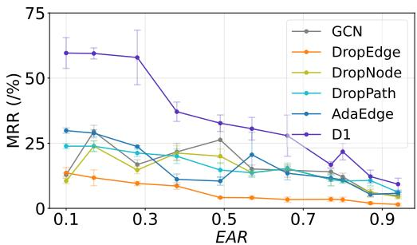  
(a) syn-citeseer (MRR)

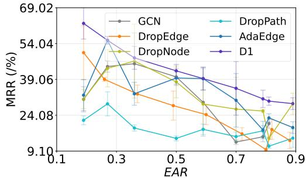  
(b) syn-cora (MRR)  
Figure 9: Empirical Comparison of Dropout Variants on Synthetic Benchmarks. Ablation study comparing our proposed method, Automorphism-aware Dropout (D1), against three popular dropout approaches (DropEdge, DropNode, DropPath, AdaEdge and DropPath) on synthetic datasets syn-citeseer and syn-cora. We show that Automorphism-aware Dropout consistently achieves higher MRR than the other variants. This demonstrates that leveraging the WL test’s automorphism prior allows Automorphism-aware Dropout to identify and prune automorphic (structurally identical) edges more effectively. It enhances the model’s expressiveness to distinguish non-isomorphic local structures. (See Sec. 4 for method details and Sec. 5.3 for other empirical evaluation)

## D PROOFS AND DISCUSSIONS OF THEOREMS

## D.1 PROOF FOR EDGE ORBIT EQUIVARIANCE

Proposition D.1 (Edge-Orbit Equivariance). Let G be an undirected graph with automorphism group Aut(G) (Def. 3.1), and let $\mathcal { O } _ { \mathcal { E } } ( \bar { e } ) = \{ \{ \mathcal { O } _ { \mathcal { S } } ( u ) , \mathcal { O } _ { \mathcal { S } } ( v ) \} \}$ be the WL-induced edge orbit of $e = \{ u , v \}$ (Def. 3.4). Then the edge-orbit assignment is invariant under automorphisms: for every ϕ $\in \operatorname { A u t } ( { \mathcal { G } } )$ and every $e = \{ u , v \}$

$$
\mathcal { O } _ { \mathcal { E } } ( \phi ( u ) , \phi ( v ) ) = \mathcal { O } _ { \mathcal { E } } ( u , v ) .
$$

For a permutation ϕ /∈ Aut(G) the equality need not hold, since ϕ may neither preserve subgraph orbits nor map edges to edges.

Proof. The argument rests on the fact that automorphisms preserve subgraph orbits. Fix $\phi \in \operatorname { A u t } ( { \mathcal { G } } )$ and a node $x \in \nu$ . Because ϕ is adjacency-preserving, it maps the k-hop rooted subgraph $\mathcal { S } ^ { ( k ) } ( x )$ isomorphically onto $S ^ { ( k ) } ( \phi ( x ) )$ ; a message-passing GNN is invariant to such rooted-subgraph isomorphisms, so $\phi _ { w } \bigl ( S ^ { ( k ) } ( x ) \bigr ) = \phi _ { w } \bigl ( S ^ { ( k ) } ( \phi ( x ) ) \bigr )$  for all w. By Def. 3.3 this gives $x \sim \phi ( x )$ , i.e.

$$
{ \mathcal { O } } _ { S } ( \phi ( x ) ) = { \mathcal { O } } _ { S } ( x ) \qquad { \mathrm { f o r ~ a l l ~ } } x \in { \mathcal { V } } .\tag{7}
$$

Since $\mathcal { O } _ { \mathcal { E } }$ is the multiset of the endpoints’ subgraph orbits, applying Eq. (7) to both endpoints of $e = \{ u , v \}$ yields

$$
\mathcal { O } _ { \mathcal { E } } ( \phi ( u ) , \phi ( v ) ) = \{ \{ \mathcal { O } _ { \mathcal { S } } ( \phi ( u ) ) , \mathcal { O } _ { \mathcal { S } } ( \phi ( v ) ) \} \} = \{ \{ \mathcal { O } _ { \mathcal { S } } ( u ) , \mathcal { O } _ { \mathcal { S } } ( v ) \} \} = \mathcal { O } _ { \mathcal { E } } ( u , v ) ,
$$

which proves the claim. Conversely, $\operatorname { i f } \phi \not \in \operatorname { A u t } ( { \mathcal { G } } )$ then ϕ need not preserve the enclosing subgraphs, so Eq. (7) can fail and the two multisets may differ; indeed $\phi ( u ) , \phi ( v )$ may not even form an edge. Hence the assignment is equivariant exactly on $\operatorname { A u t } ( { \mathcal { G } } )$ . □

## D.2 DETAILED ANALYSIS OF THEOREM 4.1

We begin by introducing key concepts to formalize subgraph orbit-distinguishability. We then define the Node Automorphism Problem and show that the proposed D1 provides a solution.

Definition D.1 (ϵ-sufficient). We define an alteration as ϵ-sufficient if, for all subgraph $S ^ { ( k ) } \in \mathcal { G }$ there exists an altered version ${ \mathcal S } _ { \epsilon } ^ { ( k ) }$ , such that $\langle \phi _ { w } ( S _ { \epsilon } ^ { ( k ) } ( u ) ) , \phi _ { w } ( S ^ { ( k ) } ( u ) ) \rangle ) > 0$ under GNN encoder $\phi _ { w }$ and decoder D. ϵ denotes the magnitude of change in the embedding space resulting from a structural perturbation in the graph.

Definition D.2 (Node Automorphism Problem). A GNN is said to be ϵ-complete ifthere exists an ϵ-sufficient alteration such thatfor all $u \in \mathcal V ,$ , thefollowing holds:

$$
D \left( \phi _ { w } ( { \cal S } _ { \epsilon } ^ { ( k ) } ( u ) ) , \phi _ { w } ( { \cal S } ^ { ( k ) } ( u ) ) \right) \geq \epsilon\tag{8}
$$

Automorphic nodes are defined as nodes that are ϵ-incomplete under the action of $( \phi , D ) _ { w }$

We reformulate the Theorem as follows:

Proof. For any $\epsilon > 0$ with probability $p _ { \epsilon }$ , we expect one bounded L exists, such that for all $l \geq \mathbb { L }$ $S ^ { \prime } = B ( S )$

$$
( \phi _ { w _ { 1 } } ( S ) , \ldots , \phi _ { w _ { \ell } } ( S ) ) \neq ( \phi _ { w _ { 1 } } ( S ^ { \prime } ) , \ldots , \phi _ { w _ { \ell } } ( S ^ { \prime } ) )\tag{9}
$$

holds with probability $1 - \sigma$ , where random variables $w \sim \mathcal { W }$ . It particularly implies that one closure exists $B ( S )$ with $\operatorname* { P r } ( \mathcal S \in \mathcal B ( \mathcal S ) _ { \epsilon } ) = \operatorname* { P r } _ { \mathcal S , \mathcal S ^ { \prime } } = 1 - ( 1 - p ) ^ { | \mathcal E | } > 0$ , such that for all subgraph orbits $\phi _ { B } ( S ) \neq \phi _ { B } \hat { (} S ^ { \prime } )$

We need Pr $( \exists i \in \{ 1 , \dots , \ell \} : S \in S ^ { \prime } ) \geq 1 - \sigma$ , hence

$$
1 - ( 1 - \operatorname* { P r } _ { s , s ^ { \prime } } ) ^ { \ell } \geq 1 - \sigma\tag{10}
$$

must hold. Solving for $\ell ,$ we find that

$$
\mathbb { L } = \left\lceil \frac { \log ( 1 / \sigma ) } { \log \left( \frac { 1 } { 1 - \mathrm { P r } _ { { \mathscr { S } } , { \mathscr { S } } ^ { \prime } } } \right) } \right\rceil\tag{11}
$$

is sufficient to guarantee that there will be at least one $s$ in $S ^ { \prime }$ with probability at least $1 - \sigma$ , implying $\phi _ { w } ( S ) \neq \phi _ { w } ( \bar { S } ^ { \prime } )$ , which closes the proof. □

We further simplify the Eq. (11) to provide a qualitative analysis for L w.r.t $p$ and $| \mathcal { E } |$

$$
\mathbb { L } = \left\lceil \frac { \log ( 1 / \sigma ) } { \log \left( \frac { 1 } { 1 - \operatorname* { P r } _ { \boldsymbol { s } , \boldsymbol { s } ^ { \prime } } } \right) } \right\rceil\tag{12}
$$

Given that

$$
\operatorname* { P r } _ { { \mathcal { S } } , { \mathcal { S } } ^ { \prime } } = 1 - ( 1 - p ) ^ { | { \mathcal { E } } | } ,\tag{13}
$$

we substitute into the definition of L:

$$
\begin{array} { r l } & { \mathbb { L } = \left\lceil \frac { \log \left( 1 / \sigma \right) } { \log { \left( \frac { 1 } { 1 - ( 1 - p ) ^ { \vert \varepsilon \vert } ) } \right) } } \right\rceil } \\ & { = \left\lceil \frac { \log \left( 1 / \sigma \right) } { \log { \left( \frac { 1 } { ( 1 - p ) ^ { \vert \varepsilon \vert } } \right) } } \right\rceil . } \end{array}\tag{14}
$$

setting in $\log ( 1 / x ) = - \log ( x )$ , we have

$$
\log \left( \frac { 1 } { ( 1 - p ) ^ { | \mathcal { E } | } } \right) = - \log \left( ( 1 - p ) ^ { | \mathcal { E } | } \right) .\tag{15}
$$

Applying the power rule for logarithms log $( x ^ { n } ) = n \log ( x )$ , we obtain

$$
- \log \left( ( 1 - p ) ^ { | \mathcal { E } | } \right) = - | \mathcal { E } | \log ( 1 - p ) .\tag{16}
$$

Thus,

$$
\mathbb { L } = \left\lceil \frac { \log ( 1 / \sigma ) } { - | \mathcal { E } | \log ( 1 - p ) } \right\rceil .\tag{17}
$$

Since $\log ( 1 / \sigma ) = - \log ( \sigma )$ , it further simplifies to

$$
\mathbb { L } = \left\lceil \frac { - \log ( \sigma ) } { - | \mathcal { E } | \log ( 1 - p ) } \right\rceil = \left\lceil \frac { \log ( \sigma ) } { | \mathcal { E } | \log ( 1 - p ) } \right\rceil .\tag{18}
$$

Final simplified form:

$$
\boxed { \mathbb { L } = \left\lceil \frac { \log ( \sigma ) } { | \mathcal { E } | \log ( 1 - p ) } \right\rceil }\tag{19}
$$

Qualitative Analysis: Since log(1 − p) < 0 for $p \in ( 0 , 1 )$ and $\log ( \sigma ) < 0$ for $\sigma \in ( 0 , 1 )$ , the ratio $\frac { \log ( \sigma ) } { | \mathcal { E } | \log ( 1 - p ) }$ is positive.

Furthermore, as p increases L decreases; but when |E| is fixed and the graph becomes larger, Suppose |E| is fixed, but the graph becomes larger (i.e., the number of nodes increases). Since

$$
( 1 - p ) ^ { | \mathcal { E } | } \approx 1 - p | \mathcal { E } | ,\tag{20}
$$

for small p, we apply first-order Taylor approximation, then have

$$
\operatorname* { P r } _ { s , s ^ { \prime } } \approx p | { \mathcal E } | .\tag{21}
$$

Thus, to keep $\operatorname* { P r } _ { { \cal { S } } , { \cal { S } } ^ { \prime } }$ approximately constant as the graph grows, p should satisfy

$$
p \propto \frac { 1 } { | \mathcal { E } | } .\tag{22}
$$

the per-edge probability p should be increased proportionally to maintain a stable success probability and avoid increasing L excessively.

## D.3 DETAILED ANALYSIS OF THEOREM 4.2

Theorem D.1. Let G be a lobster graph containing an automorphism-dominant node $v _ { a }$ and let ϕ(·) denote the embeddingfunction ofa K-layer GNN. In standard GNNs, the average embedding distance between $v _ { a }$ and its automorphic neighbors is greater than that between $v _ { a }$ and its non-automorphic neighbors:

$$
\begin{array} { r l } & { \mathbb { E } _ { u \in { \mathcal { N } } ( v ) } \left[ \| \phi ( u ) - \phi ( v ) \| ^ { 2 } \mid \mathcal { O } _ { u } \neq \mathcal { O } _ { v } \right] } \\ & { \quad - \mathbb { E } _ { u \in { \mathcal { N } } ( v _ { a } ) } \left[ \| \phi ( u ) - \phi ( v _ { a } ) \| ^ { 2 } \mid \mathcal { O } _ { u } = \mathcal { O } _ { v _ { a } } \right] > \delta } \end{array}\tag{23}
$$

for some $\delta > 0 .$ . A GNN equipped with D2 reduces this gap caomparing to standard GNN without.

We start with a concrete example: lobster graph illustrated in Fig. 4a

Lemma D.1. Let $\mathcal { G } = ( \nu , \mathcal { E } )$ be an undirected graph with $| \nu | = 1 0$ nodes and let $\mathbf { X } \in \mathbb { R } ^ { 1 0 \times 1 }$ be the nodefeature matrix where all nodefeatures are identical, i.e.,

$$
\mathbf { X } = \mathbf { 1 } _ { N } \cdot \mathbf { x } _ { 0 } ^ { \top }
$$

for some fixed vector $\mathbf { x } _ { 0 } \in \mathbb { R } ^ { d }$ . Let $\hat { \mathbf { A } } \in \mathbb { R } ^ { N \times N }$ be the normalized adjacency matrix used in a one-layer GCN. Then the output embedding $\mathbf { H } \in \mathbb { R } ^ { N \times d ^ { \prime } }$ satisfies:

$$
\mathbf { H } = \hat { \mathbf { A } } \mathbf { X } \mathbf { W } = \mathbf { c } \cdot ( \mathbf { x } _ { 0 } ^ { \top } \mathbf { W } ) ,
$$

where $\mathbf { c } \in \mathbb { R } ^ { N }$ is a vector with entries $\begin{array} { r } { c _ { i } = \sum _ { j = 1 } ^ { N } \hat { A } _ { i j } } \end{array}$ and $\mathbf { W } \in \mathbb { R } ^ { d \times d ^ { \prime } }$ is the trainable weight matrix.

Proof. By the standard GCN layer definition, we have:

$$
\mathbf { H } = \hat { \mathbf { A } } \mathbf { X } \mathbf { W } .
$$

We replace $\mathbf { X } = \mathbf { 1 } _ { N } \cdot \mathbf { x } _ { 0 } ^ { \top }$ , then:

$$
\begin{array} { r } { \hat { \bf A } { \bf X } = \hat { \bf A } ( { \bf 1 } _ { N } \cdot { \bf x } _ { 0 } ^ { \top } ) = ( \hat { \bf A } { \bf 1 } _ { N } ) \cdot { \bf x } _ { 0 } ^ { \top } . } \end{array}
$$

We represent c in matrix form $\mathbf { c } = \hat { \mathbf { A } } \mathbf { 1 } _ { N }$ . Then:

$$
\begin{array} { r } { \hat { \bf A } \mathbf { X } = \mathbf { c } \cdot \mathbf { x } _ { 0 } ^ { \top } . } \end{array}
$$

Therefore:

$$
\mathbf { H } = ( \hat { \mathbf { A } } \mathbf { X } ) \mathbf { W } = ( \mathbf { c } \cdot \mathbf { x } _ { 0 } ^ { \top } ) \mathbf { W } = \mathbf { c } \cdot ( \mathbf { x } _ { 0 } ^ { \top } \mathbf { W } ) .
$$

We see that three vertices are automorphic; a special case is when two nodes $u , v \in \mathcal { V }$ have identical rows in $\hat { \bf A }$ in the lobster graph. We characterize such intuition as $\hat { A } _ { u , : } = \hat { A } _ { v , : }$ . Assuming we have no dropout, injected noise and all weights W are shared, we have the following deviation, substituting $\mathbf { X } = \mathbf { 1 } _ { N } \cdot \mathbf { \bar { x } } _ { 0 } ^ { \top }$

$$
\begin{array} { r } { \mathbf { H } = \hat { \mathbf { A } } ( \mathbf { 1 } _ { N } \cdot \mathbf { x } _ { 0 } ^ { \top } ) \mathbf { W } . ~ } \\ { \mathbf { H } = ( \hat { \mathbf { A } } \mathbf { 1 } _ { N } ) \cdot ( \mathbf { x } _ { 0 } ^ { \top } \mathbf { W } ) . } \end{array}
$$

Define $\mathbf { z } = \hat { \mathbf { A } } \mathbf { 1 } _ { N } \in \mathbb { R } ^ { N \times 1 }$ and $\mathbf { v } = \mathbf { x } _ { 0 } ^ { \top } \mathbf { W } \in \mathbb { R } ^ { 1 \times d ^ { \prime } } , \mathbf { H } = \mathbf { z } \cdot \mathbf { v }$ which implies that each row of h is given by:

$$
\mathbf { h } _ { i } = z _ { i } \cdot \mathbf { v } = \sum _ { j = 1 } ^ { N } \hat { A } _ { i j } \mathbf { v } = k \mathbf { D } _ { i } \mathbf { v } .
$$

We now compute the two terms in Eq. (23) to illustrate the embedding difference between automorphic and non-automorphic neighbors of an automorphism-dominant node.

$$
\begin{array} { l } { \mathbb { E } _ { u \in \mathcal { N } ( v ) } \left[ \| \phi ( u ) - \phi ( v ) \| ^ { 2 } \mid \mathcal { O } _ { u } \neq \mathcal { O } _ { v } \right] } \\ { \quad = \frac { k ( \mathbf { D } _ { u } - \mathbf { D } _ { v } ) \mathbf { v } } { N _ { n a u t o } } } \\ { \quad = 2 / 7 = 0 . 2 8 5 7 } \end{array}\tag{24}
$$

where $\mathbf { D } _ { u }$ and $\mathbf { D } _ { v }$ represent the degrees of the neighboring and center nodes respectively, v is the learned weight vector and $N _ { \mathrm { n o n - a u t o } } = 7$ is the number of non-automorphic neighbors. This reflects the average squared embedding distance due to degree gaps, most automorphic vertices have identical degrees except two tail nodes.

Next, we calculate the expected distance among automorphic neighbors:

$$
\begin{array} { r l } {  { \mathbb { E } _ { u \in \mathcal { N } ( v _ { a } ) } [ \| \phi ( u ) - \phi ( v _ { a } ) \| ^ { 2 } \mid \mathcal { O } _ { u } = \mathcal { O } _ { v } ] } } \\ & { = \frac { k ( \mathbf { D } _ { u } - \mathbf { D } _ { v } ) \mathbf { v } } { N _ { n a u t o } } } \\ & { = 1 + 3 + 3 + 3 / 4 } \\ & { = 2 . 5 } \end{array}\tag{25}
$$

where the degree difference is 3 for automorphic neighbors (e.g., between vertex 1 and other symmetric vertices) and 1 for the tail node. These results indicate that standard GNNs assign larger embedding differences to automorphic edges compared to non-automorphic ones—contradicting structural automorphism. This directly supports Thm. 4.2.

We have now

$$
\begin{array} { l } { \mathbb { E } _ { u \in \mathcal { N } ( v _ { a } ) } \left[ \| \phi ( u ) - \phi ( v _ { a } ) \| ^ { 2 } \mid \mathcal { O } _ { u } = \mathcal { O } _ { v } \right] < 0 . 2 8 5 7 } \\ { \quad = \displaystyle \frac { k ( \mathbf { D } _ { u } - \mathbf { D } _ { v } ) \mathbf { v } } { N _ { n a u t o } } } \\ { \quad = 1 w _ { 1 } + 3 w _ { 2 } + 3 w _ { 3 } + 0 . 7 5 w _ { 4 } < 0 . 2 8 5 7 } \end{array}\tag{26}
$$

We provide one valid solution to the inequality using negative weights:

$$
w _ { 1 } = 0 . 1 , \quad w _ { 2 } = 0 . 0 5 , \quad w _ { 3 } = - 0 . 1 , \quad w _ { 4 } = 0 . 4
$$

Substituting into the left-hand side of the inequality:

$$
1 w _ { 1 } + 3 w _ { 2 } + 3 w _ { 3 } + 0 . 7 5 w _ { 4 }
$$

$$
= 1 ( 0 . 1 ) + 3 ( 0 . 0 5 ) + 3 ( - 0 . 1 ) + 0 . 7 5 ( 0 . 4 )
$$

$$
= 0 . 1 + 0 . 1 5 - 0 . 3 + 0 . 3 = 0 . 2 5 < 0 . 2 8 5 7
$$

Thus, this set of weights satisfies the inequality.

## E PRELIMINARIES IN DETAIL

## F SYNTHETIC DATASETS: DETAILS

In this section, we present our data generation process, dataset details, the sources of our baselines and the corresponding hyperparameters.

## F.1 DETAILED RESULTS ON SEMI-SYNTHETIC BENCHMARKS

Automorphic Real Synthetic Graph Construction We utilize a real world graph H (Cora and Citeseer). Then we form a larger graph $\mathcal { H } ^ { 2 }$ that contains two disjoint copies of H, along with 1000 uniformly-randomly added edges (both between (inter) and within (intra) copies of H). Without the random edges, each node in one copy of H is automorphic to the corresponding node in the other copy, as increasing inter, intra probability and number of edges, EAR increases. We use three parameters inter $p _ { i }$ , intra $p _ { s }$ , introduced automorphic nodes a and number of perturbed edges |E| to control the EAR. The utilized parameters for Syn-Cora & Syn-Citeseer are provided in Tab. 4.

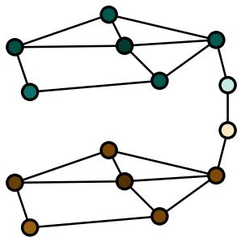  
Figure 10: Syn-Cora & Syn-Citeseer

Figure 11: Symmetric automorphic graph construction to change the automorphism in real world graph.

Table 4: Statistics for Synthetic Datasets
<table><tr><td>Benchmark Name syn-cora</td><td></td><td>syn-citeseer</td></tr><tr><td>#Nodes</td><td>5416</td><td>6654</td></tr><tr><td># Edges</td><td>10556 to 17549</td><td>9104 to 23098</td></tr><tr><td>automorphism EAR</td><td> $[ 0 , 0 . 1 , . . . , 0 . 9 ]$ </td><td> $[ 0 , 0 . 1 , . . . , 0 . 9 ]$ </td></tr><tr><td>Degree Range</td><td>1 to 168</td><td>1 to 107</td></tr><tr><td>Average Degree</td><td>3.89 to 6.48</td><td>2.73 to 6.94</td></tr><tr><td>Inter Prob.</td><td>0.1</td><td>0.1</td></tr><tr><td>Intra Prob. Number of Edges</td><td>0.5</td><td>0.5 [0.2, 1, 4, 7, 12, 18, [0.2, 1, 2, 3, 4, 5, 7,</td></tr><tr><td></td><td>20,28]×250</td><td>8, 10, 14]×1000</td></tr><tr><td rowspan="4">EAR</td><td>[0.19, 0.30, 0.37,</td><td>[0.10, 0.18, 0.28,</td></tr><tr><td>0.51, 0.60, 0.71,</td><td>0.38, 0.48, 0.57,</td></tr><tr><td>0.81, 0.83, 0.90]</td><td>0.65, 0.77, 0.81,</td></tr><tr><td></td><td>0.88, 0.94]</td></tr></table>

Table 5: SYN-CORA: Mean metrics (MRR) and standard deviation for each method on synthetic datasets with varying automorphism ratios EAR.
<table><tr><td rowspan=1 colspan=9>Method           0.19      0.30      0.37      0.51      0.60      0.71      0.81      0.83      0.90</td></tr><tr><td rowspan=1 colspan=2>GCN          99.41±.2399.39±.09</td><td rowspan=1 colspan=1> $9 9 . 0 6 \pm . 2 2 $ </td><td rowspan=1 colspan=1> $9 8 . 5 1 \pm . 3 5$ </td><td rowspan=1 colspan=1>98.01±.45</td><td rowspan=1 colspan=3> $9 7 . 2 7 \pm . 4 2$  $9 6 . 4 5 \pm . 5 7$ 96.29±.67</td><td rowspan=1 colspan=1> $9 4 . 0 7 { \pm } . 8 6 $ </td></tr><tr><td rowspan=1 colspan=1>GAT          99.28±.16</td><td rowspan=1 colspan=1>98.97±.23</td><td rowspan=1 colspan=1> $9 8 . 9 9 \pm . 1 3 $ </td><td rowspan=1 colspan=1> $9 8 . 7 5 { \pm } . 2 0 $ </td><td rowspan=1 colspan=1>98.48±.25</td><td rowspan=1 colspan=1>97.98±.22</td><td rowspan=1 colspan=1> $9 7 . 7 2 { \pm } . 5 0 $ </td><td rowspan=1 colspan=1> $9 7 . 5 1 \pm . 5 0$ </td><td rowspan=1 colspan=1> $9 6 . 4 2 \pm . 3 9$ </td></tr><tr><td rowspan=1 colspan=1>GIN           91.83±.70 9</td><td rowspan=1 colspan=1>5.76±.78</td><td rowspan=1 colspan=1> $9 5 . 5 3 \pm . 5 9$ </td><td rowspan=1 colspan=1> $9 4 . 9 1 \pm . 9 0 $ </td><td rowspan=1 colspan=1>84.81±.14</td><td rowspan=1 colspan=1> $8 2 . 4 9 \pm . 1 4$ </td><td rowspan=1 colspan=1>70.24±.78</td><td rowspan=1 colspan=1> $7 2 . 0 1 \pm . 9 6$ </td><td rowspan=1 colspan=1>65.24±.38</td></tr><tr><td rowspan=1 colspan=1>GraphSAGE    97.91±.62</td><td rowspan=1 colspan=1>97.96±.57</td><td rowspan=1 colspan=1> $9 7 . 9 6 \pm . 6 0 $ </td><td rowspan=1 colspan=1>97.05±.85</td><td rowspan=1 colspan=1>95.93±.93 9</td><td rowspan=1 colspan=1>3.38±.99 9</td><td rowspan=1 colspan=1>0.27±1.93</td><td rowspan=1 colspan=1> $9 0 . 3 7 { \scriptstyle \pm 2 . 2 4 }$ </td><td rowspan=1 colspan=1>85.82±2.03</td></tr><tr><td rowspan=1 colspan=1>MixHopGCN   99.55±.17</td><td rowspan=1 colspan=1>99.28±.09</td><td rowspan=1 colspan=1> $9 8 . 9 9 \pm . 1 3 $ </td><td rowspan=1 colspan=1>98.75±.20</td><td rowspan=1 colspan=1>98.48±.25 9</td><td rowspan=1 colspan=1>7.98±.22 9</td><td rowspan=1 colspan=3>7.72±.50 97.51±.50 96.42±.39</td></tr><tr><td rowspan=1 colspan=1>ChebGCN      98.41±.13 9</td><td rowspan=1 colspan=1>8.19±.22</td><td rowspan=1 colspan=1>97.82±.21 9</td><td rowspan=1 colspan=1>6.56±.79 9</td><td rowspan=1 colspan=1>6.76±.32 94</td><td rowspan=1 colspan=1>.09±.56 91</td><td rowspan=1 colspan=2>.18±1.02 86.24±1.77 8</td><td rowspan=1 colspan=1>4.88±1.42</td></tr><tr><td rowspan=1 colspan=1>GCN-DW      99.89±.04 9</td><td rowspan=1 colspan=1>9.66±.06 9</td><td rowspan=1 colspan=1>9.55±.07 9</td><td rowspan=1 colspan=1>9.51±.05 9</td><td rowspan=1 colspan=1>9.19±.10</td><td rowspan=1 colspan=1> $9 8 . 8 1 \pm . 0 6 $ </td><td rowspan=1 colspan=2> $9 8 . 3 4 \pm . 2 1 $ 98.15±.10 9</td><td rowspan=1 colspan=1>7.54±.24</td></tr><tr><td rowspan=1 colspan=1>GCN-RF       99.81±.07 9</td><td rowspan=1 colspan=1>9.81±.03</td><td rowspan=1 colspan=1> $9 9 . 6 0 { \pm } . 0 5 $ </td><td rowspan=1 colspan=1>99.67±.08</td><td rowspan=1 colspan=1> $9 8 . 9 2 \pm . 0 7 $ </td><td rowspan=1 colspan=1> $9 8 . 8 4 \pm . 1 5 $ </td><td rowspan=1 colspan=1> $9 8 . 4 3 \pm . 1 5$ </td><td rowspan=1 colspan=1>98.42±.18</td><td rowspan=1 colspan=1>97.85±.12</td></tr><tr><td rowspan=1 colspan=1>GCN-LAP     99.46±.16</td><td rowspan=1 colspan=1>99.18±.18</td><td rowspan=1 colspan=1>98.99±.27 9</td><td rowspan=1 colspan=1>8.77±.27</td><td rowspan=1 colspan=1> $9 7 . 8 3 \pm . 4 1 $ </td><td rowspan=1 colspan=1> $9 7 . 1 6 \pm . 3 8 $ </td><td rowspan=1 colspan=1> $9 6 . 9 1 \pm . 2 9$ </td><td rowspan=1 colspan=1>96.54±.73</td><td rowspan=1 colspan=1> $9 5 . 3 9 \pm . 4 8$ </td></tr><tr><td rowspan=1 colspan=1>BUDDY       95.34±.17 9</td><td rowspan=1 colspan=1>4.00±.23</td><td rowspan=1 colspan=1> $9 5 . 0 3 \pm . 1 7$ </td><td rowspan=1 colspan=1>95.34±.04</td><td rowspan=1 colspan=1> $9 4 . 8 2 \pm . 1 8$ </td><td rowspan=1 colspan=1> $9 4 . 6 3 \pm . 3 0 $ </td><td rowspan=1 colspan=1> $9 4 . 0 6 \pm . 1 8$ </td><td rowspan=1 colspan=1>93.94±.10 9</td><td rowspan=1 colspan=1>3.80±.10</td></tr><tr><td rowspan=1 colspan=1>LINKX        97.30±.32 9</td><td rowspan=1 colspan=1>6.99±.15 9</td><td rowspan=1 colspan=1>6.81±.18 9</td><td rowspan=1 colspan=1>4.28±.15</td><td rowspan=1 colspan=1> $9 2 . 8 2 { \pm } . 1 3$ </td><td rowspan=1 colspan=1> $8 9 . 6 3 \pm . 2 9 $ </td><td rowspan=1 colspan=3> $8 6 . 6 9 \pm . 1 5$  $8 5 . 4 7 \pm . 1 2$   $8 3 . 4 8 \pm . 1 8$ </td></tr><tr><td rowspan=1 colspan=1>Proposed w.0. D1 99.89±.08</td><td rowspan=1 colspan=1>99.83±.10</td><td rowspan=1 colspan=1>99.77±.11</td><td rowspan=1 colspan=1>99.76±.07</td><td rowspan=1 colspan=1>99.76±.05</td><td rowspan=1 colspan=1> $9 9 . 7 4 \pm . 0 7$ </td><td rowspan=1 colspan=2> $9 9 . 6 7 \pm . 1 2 $  $9 9 . 6 3 \pm . 0 7 $ </td><td rowspan=1 colspan=1> $9 9 . 6 2 \pm . 2 2 $ </td></tr><tr><td rowspan=1 colspan=1>Proposed w.o D22 99.90±.05</td><td rowspan=1 colspan=1>99.80±.05</td><td rowspan=1 colspan=1>99.79±.07</td><td rowspan=1 colspan=1>99.78±.12</td><td rowspan=1 colspan=1>99.75±.03</td><td rowspan=1 colspan=1>99 $. 7 4 \pm . 0 7$ </td><td rowspan=1 colspan=2>99.73±.04 $9 9 . 7 1 \pm . 0 3 $ </td><td rowspan=1 colspan=1> $9 9 . 9 0 \pm . 0 5 $ </td></tr><tr><td rowspan=1 colspan=1>Proposed      99.94±.039</td><td rowspan=1 colspan=1>9.86±.039</td><td rowspan=1 colspan=1>9.83±.07</td><td rowspan=1 colspan=1>99.81±.00</td><td rowspan=1 colspan=1>99.80±.05</td><td rowspan=1 colspan=1>99.78±.04</td><td rowspan=1 colspan=2>99.76±.0399.74±.079</td><td rowspan=1 colspan=1>9.93±.08</td></tr></table>

Table 6: SYN-CORA: Mean Metrics (MRR) and standard deviation for each method on synthetic datasets with varying automorphism ratios EAR.
<table><tr><td>Method</td><td>0.19</td><td>0.30</td><td>0.37</td><td>0.51</td><td>0.60</td><td>0.71</td><td>0.81</td><td>0.83</td><td>0.90</td></tr><tr><td>GCN</td><td> $4 2 . 2 8 { \scriptstyle \pm 1 1 . 1 5 }$ </td><td>34.09±8.75</td><td> $2 7 . 0 6 { \pm } 5 . 8 3$ </td><td> $2 1 . 2 9 { \scriptstyle \pm 6 . 1 7 }$ </td><td> $2 0 . 8 3 { \scriptstyle \pm 3 . 2 9 }$ </td><td> $1 8 . 3 7 { \scriptstyle \pm 3 . 9 0 }$ </td><td> $1 6 . 5 0 { \scriptstyle \pm 3 . 5 0 }$ </td><td> $1 4 . 7 8 { \scriptstyle \pm 4 . 4 8 }$ </td><td> $1 2 . 8 2 { \scriptstyle \pm 3 . 9 1 }$ </td></tr><tr><td>GAT</td><td>30.45±6.74</td><td>25.24±7.63</td><td> $2 1 . 7 7 { \scriptstyle \pm 7 . 0 0 }$ </td><td> $2 0 . 2 8 { \scriptstyle \pm 5 . 6 0 }$ </td><td>19.74±9.83</td><td> $1 7 . 0 6 { \pm } 6 . 5 4$ </td><td> $1 5 . 6 0 { \scriptstyle \pm 3 . 4 1 }$ </td><td> $1 4 . 8 0 { \scriptstyle \pm 4 . 8 5 }$ </td><td> $1 3 . 2 8 { \scriptstyle \pm 3 . 1 0 }$ </td></tr><tr><td>GIN</td><td>15.80±2.59</td><td>15.57±5.25</td><td>14.43±3.99</td><td>10.88±4.81</td><td> $9 . 1 9 { \pm } 3 . 9 3 $ </td><td> $6 . 8 7 { \scriptstyle \pm 4 . 0 0 }$ </td><td> $4 . 4 2 { \scriptstyle \pm 3 . 8 9 }$ </td><td> $4 . 0 6 { \scriptstyle \pm 3 . 7 2 }$ </td><td>3.07±3.30</td></tr><tr><td>GraphSAGE</td><td>24.79±8.27</td><td>24.20±4.74</td><td>17.53±5.70</td><td> $1 6 . 3 0 { \scriptstyle \pm 5 . 2 4 }$ </td><td>15.45±3.57</td><td>13.66±4.13</td><td> $1 2 . 2 6 { \scriptstyle \pm 5 . 2 5 }$ </td><td> $1 1 . 0 1 { \scriptstyle \pm 3 . 7 7 }$ </td><td>8.94±2.54</td></tr><tr><td>MixHopGCN</td><td></td><td>65.87±14.64 58.62±11.24</td><td>17.65±29.31</td><td>0.12±0.00</td><td>0.12±0.00</td><td> $0 . 1 2 { \scriptstyle \pm 0 . 0 0 }$ </td><td> $0 . 1 2 { \scriptstyle \pm 0 . 0 0 }$ </td><td>0.12±0.00</td><td> $0 . 1 2 { \scriptstyle \pm 0 . 0 0 }$ </td></tr><tr><td>ChebGCN</td><td>28.71±4.29</td><td>24.71±5.39</td><td>21.38±5.21</td><td>21.01±4.68</td><td>19.82±5.16</td><td>16.75±4.98</td><td> $1 5 . 3 5 { \scriptstyle \pm 3 . 7 1 }$ </td><td>10.26±2.32</td><td> $9 . 7 7 { \scriptstyle \pm 2 . 4 8 }$ </td></tr><tr><td>GCN-DW</td><td></td><td>72.87±12.57 43.98±7.79</td><td>29.52±4.48</td><td>40.14±5.64</td><td>53.73±11.90</td><td>35.98±3.61</td><td> $4 2 . 4 1 { \pm } 6 . 8 6$ </td><td></td><td>50.71±9.77 21.16±3.57</td></tr><tr><td>GCN-RF</td><td></td><td>52.38±13.90 48.97±6.06</td><td>44.79±10.38</td><td>61.81±9.20</td><td>27.26±3.79</td><td>29.51±7.91</td><td> $4 4 . 5 7 { \scriptstyle \pm 1 1 . 1 2 }$ </td><td></td><td>24.89±4.14 34.98±10.87</td></tr><tr><td>GCN-LAP</td><td></td><td>34.06±9.46 34.24±9.45</td><td>23.08±5.45</td><td>33.95±7.70</td><td>37.39±7.80</td><td>29.56±2.86</td><td> $3 0 . 4 9 { \scriptstyle \pm 4 . 9 4 }$ </td><td></td><td>33.04±7.21 15.52±2.65</td></tr><tr><td>BUDDY</td><td></td><td>33.41±5.10 23.80±3.71</td><td>32.42±1.96</td><td>23.09±3.11</td><td>19.55±1.05</td><td>27.87±7.83</td><td> $3 1 . 3 6 { \pm } 4 . 7 0$ </td><td>27.51±1.46</td><td>18.71±1.04</td></tr><tr><td>LINKX</td><td></td><td>32.99±9.10 23.91±0.00</td><td>19.90±0.00</td><td>18.60±0.00</td><td>17.44±0.00</td><td>15.08±0.00</td><td>14.99±0.00</td><td>11.67±3.83</td><td>10.86±0.00</td></tr><tr><td>Proposed w.0. D185.53±14.99 80.43±12.34</td><td></td><td></td><td>65.46±4.98</td><td>62.64±20.27</td><td></td><td>60.10±10.21 49.77±12.52</td><td>41.64±3.52</td><td></td><td>38.49±12.70 34.89±5.32</td></tr><tr><td>Proposed w.o D2</td><td></td><td>97.42±1.74 58.13±11.50 54.20±17.44</td><td></td><td>49.86±7.44</td><td></td><td>49.43±10.93 45.12±5.11</td><td>38.35±4.47</td><td></td><td>35.64±4.88 32.47±7.89</td></tr><tr><td>Proposed</td><td></td><td>90.78±7.3484.41±1.87 66.53±14.99 64.51±20.85 62.30±10.83 57.83±2.04 52.14±13.7747.36±6.13 45.83±3.30</td><td></td><td></td><td></td><td></td><td></td><td></td><td></td></tr></table>

Table 7: SYN-CITESEER: Mean metrics $( \mathrm { A U C } )$ and standard deviation for each method on synthetic datasets with varying automorphism ratios EAR (1/2, $E A R \in [ 0 . 1 0 , 0 . 5 7 ] )$ . The best method per column is bolded.
<table><tr><td> $E A R$ </td><td>0.10</td><td>0.18</td><td>0.28</td><td>0.38</td><td>0.48</td><td>0.57</td></tr><tr><td>GCN</td><td> $9 9 . 6 5 { \pm } 0 . 0 8 $ </td><td> $9 9 . 5 0 { \scriptstyle \pm 0 . 1 4 }$ </td><td> $9 9 . 4 2 { \scriptstyle \pm 0 . 1 6 }$ </td><td> $9 8 . 9 2 { \scriptstyle \pm 0 . 2 4 }$ </td><td> $9 8 . 6 1 { \scriptstyle \pm 0 . 3 3 }$ </td><td> $9 8 . 0 3 { \scriptstyle \pm 0 . 2 2 }$ </td></tr><tr><td>GAT</td><td> $9 9 . 4 2 { \scriptstyle \pm 0 . 1 4 }$ </td><td> $9 8 . 9 4 { \scriptstyle \pm 0 . 3 2 } $ </td><td> $9 9 . 1 7 { \scriptstyle \pm 0 . 1 4 }$ </td><td> $9 8 . 2 8 { \scriptstyle \pm 0 . 7 1 }$ </td><td> $9 8 . 3 1 { \scriptstyle \pm 0 . 7 4 }$ </td><td> $9 7 . 8 9 \pm 1 . 0 7$ </td></tr><tr><td>GIN</td><td> $9 5 . 4 3 { \pm } 1 . 1 0 $ </td><td> $9 5 . 4 0 { \scriptstyle \pm 0 . 7 1 }$ </td><td> $9 4 . 6 9 { \pm } 1 . 1 4 $ </td><td> $9 2 . 7 3 { \scriptstyle \pm 0 . 7 9 }$ </td><td> $9 0 . 5 3 { \scriptstyle \pm 1 . 3 4 }$ </td><td> $8 9 . 7 8 { \scriptstyle \pm 1 . 1 6 }$ </td></tr><tr><td>GraphSAGE</td><td> $9 6 . 1 9 { \scriptstyle \pm 2 . 0 0 }$ </td><td> $9 5 . 9 9 \pm 1 . 7 7 $ </td><td> $9 4 . 1 8 { \pm } 1 . 7 3 $ </td><td> $9 3 . 2 6 { \pm } 3 . 4 9$ </td><td> $9 1 . 6 9 { \pm } 2 . 6 3 $ </td><td> $9 1 . 8 1 { \pm } 2 . 9 1 $ </td></tr><tr><td>MixHopGCN</td><td> $9 9 . 6 9 { \scriptstyle \pm 0 . 0 6 }$ </td><td> $9 4 . 4 1 \pm 1 . 6 0 $ </td><td> $9 9 . 0 3 { \scriptstyle \pm 0 . 2 5 }$ </td><td> $9 8 . 7 7 { \scriptstyle \pm 0 . 0 7 }$ </td><td> $9 8 . 2 2 { \scriptstyle \pm 0 . 2 7 }$ </td><td> $9 7 . 9 9 { \scriptstyle \pm 0 . 2 3 }$ </td></tr><tr><td>ChebGCN</td><td> $9 7 . 5 9 { \pm } 0 . 4 6$ </td><td> $9 7 . 7 6 { \scriptstyle \pm 0 . 4 1 }$ </td><td> $9 7 . 2 0 { \scriptstyle \pm 0 . 4 4 }$ </td><td> $9 4 . 9 0 { \scriptstyle \pm 0 . 5 8 } $ </td><td> $9 2 . 5 0 { \pm } 1 . 3 1 $ </td><td> $8 8 . 7 5 { \scriptstyle \pm 1 . 8 6 }$ </td></tr><tr><td>GCN-DW</td><td> $9 9 . 8 6 { \scriptstyle \pm 0 . 0 6 }$ </td><td> $9 9 . 8 0 { \scriptstyle \pm 0 . 0 8 }$ </td><td></td><td></td><td>99.60±0.10 99.37±0.12 99.09±0.16</td><td> $9 8 . 5 8 { \scriptstyle \pm 0 . 2 3 }$ </td></tr><tr><td>GCN-RF</td><td> $9 9 . 8 7 { \scriptstyle \pm 0 . 0 4 }$ </td><td> $9 9 . 6 9 { \scriptstyle \pm 0 . 0 6 }$ </td><td> $9 9 . 7 5 { \scriptstyle \pm 0 . 0 6 }$ </td><td> $9 9 . 6 0 { \scriptstyle \pm 0 . 0 8 }$ </td><td> $9 9 . 3 9 { \pm } 0 . 0 9$ </td><td> $9 9 . 2 7 { \scriptstyle \pm 0 . 1 1 }$ </td></tr><tr><td> ${ \bf G } { \bf C } { \bf N } { \bf - } { \bf L } { \bf A } { \bf P }$ </td><td> $9 9 . 7 9 { \scriptstyle \pm 0 . 0 7 }$ </td><td> $9 9 . 6 5 { \pm } 0 . 0 9$ </td><td> $9 9 . 3 5 { \pm } 0 . 1 9$ </td><td> $9 9 . 0 4 { \scriptstyle \pm 0 . 1 3 }$ </td><td> $9 8 . 7 8 { \scriptstyle \pm 0 . 1 4 }$ </td><td> $9 8 . 2 3 { \scriptstyle \pm 0 . 2 3 }$ </td></tr><tr><td>BUDDY</td><td> $9 5 . 2 0 { \scriptstyle \pm 0 . 3 9 } $ </td><td> $9 5 . 8 3 { \pm } 0 . 1 8$ </td><td> $9 5 . 8 4 { \scriptstyle \pm 0 . 2 6 }$ </td><td> $9 4 . 3 7 { \pm } 0 . 5 3 $ </td><td> $9 5 . 1 0 { \scriptstyle \pm 0 . 5 1 }$ </td><td> $9 5 . 7 9 { \scriptstyle \pm 0 . 4 8 }$ </td></tr><tr><td>LINKX</td><td> $9 7 . 3 0 { \scriptstyle \pm 0 . 0 8 }$ </td><td> $9 6 . 9 9 { \scriptstyle \pm 0 . 1 4 }$ </td><td> $9 6 . 8 1 { \pm } 0 . 1 6$ </td><td> $9 4 . 2 8 { \scriptstyle \pm 0 . 2 4 } $ </td><td> $9 2 . 8 2 { \scriptstyle \pm 0 . 3 3 }$ </td><td> $8 9 . 6 3 { \scriptstyle \pm 0 . 2 2 }$ </td></tr><tr><td>Proposed</td><td> $\mathbf { 9 9 . 9 4 } { \scriptstyle \pm 0 . 0 3 }$ </td><td> $\mathbf { 9 9 . 8 6 } { \scriptstyle \pm 0 . 0 3 }$ </td><td> $\mathbf { 9 9 . 8 3 } { \scriptstyle \pm 0 . 0 7 }$ </td><td> $\mathbf { 9 9 . 8 1 } { \scriptstyle \pm 0 . 0 0 }$ </td><td> $\mathbf { 9 9 . 8 0 } { \scriptstyle \pm 0 . 0 5 }$ </td><td> $\mathbf { 9 9 . 7 8 { \scriptstyle \pm 0 . 0 4 } }$ </td></tr></table>

Table 8: SYN-CITESEER: Mean metrics (AUC) and standard deviation for each method on synthetic datasets with varying automorphism ratios EAR (2/2, $E A R \in [ 0 . 6 5 , 0 . 9 4 ] )$ . The best method per column is bolded.
<table><tr><td>EAR</td><td>0.65</td><td>0.77</td><td>0.81</td><td>0.88</td><td>0.94</td></tr><tr><td>GCN</td><td> $9 7 . 6 5 { \pm } 0 . 4 7$ </td><td> $9 6 . 3 2 { \scriptstyle \pm 0 . 5 6 }$ </td><td> $9 6 . 4 9 { \scriptstyle \pm 0 . 7 4 }$ </td><td> $9 5 . 0 3 { \scriptstyle \pm 1 . 6 0 }$ </td><td> $9 1 . 8 1 { \pm 2 . 0 5 }$ </td></tr><tr><td>GAT</td><td> $9 7 . 8 1 { \pm } 0 . 4 1 $ </td><td> $9 6 . 5 6 { \pm } 1 . 2 6$ </td><td> $9 5 . 8 7 { \scriptstyle \pm 1 . 4 1 }$ </td><td> $9 3 . 1 1 \pm 4 . 5 4$ </td><td> $9 1 . 9 3 { \pm } 2 . 0 9$ </td></tr><tr><td>GIN</td><td> $8 6 . 4 6 { \scriptstyle \pm 2 . 0 0 }$ </td><td> $7 8 . 4 2 { \scriptstyle \pm 1 . 1 0 }$ </td><td> $8 2 . 2 9 { \pm } 1 . 1 9$ </td><td> $7 5 . 3 4 \pm 1 . 5 4$ </td><td> $6 1 . 2 5 { \pm } 1 . 0 4$ </td></tr><tr><td>GraphSAGE</td><td> $8 6 . 7 2 { \scriptstyle \pm 4 . 4 9 }$ </td><td> $8 5 . 6 2 { \scriptstyle \pm 5 . 2 0 }$ </td><td> $8 2 . 4 1 { \pm } 6 . 0 2$ </td><td> $7 7 . 5 9 { \pm } 3 . 9 7$ </td><td> $7 4 . 6 8 { \scriptstyle \pm 5 . 9 6 }$ </td></tr><tr><td>MixHopGCN</td><td> $9 6 . 2 8 { \scriptstyle \pm 0 . 4 4 }$ </td><td> $9 3 . 7 2 { \scriptstyle \pm 0 . 7 6 }$ </td><td> $9 4 . 5 5 { \pm } 0 . 5 2 $ </td><td> $9 1 . 2 1 \pm 1 . 9 5$ </td><td> $8 8 . 3 5 { \pm } 3 . 1 8 $ </td></tr><tr><td>ChebGCN</td><td> $8 4 . 7 2 { \scriptstyle \pm 1 . 8 9 }$ </td><td> $7 9 . 2 1 \pm 1 . 4 2$ </td><td> $7 6 . 9 2 { \scriptstyle \pm 1 . 4 9 }$ </td><td> $7 2 . 1 6 { \pm } 2 . 0 7$ </td><td> $6 8 . 8 1 \pm 2 . 7 6$ </td></tr><tr><td>GCN-DW</td><td> $9 8 . 4 5 { \pm } 0 . 1 7$ </td><td> $9 7 . 9 2 { \scriptstyle \pm 0 . 2 0 }$ </td><td> $9 7 . 8 3 { \pm } 0 . 2 3 $ </td><td> $9 7 . 3 6 { \pm } 0 . 2 4$ </td><td> $9 6 . 2 3 { \scriptstyle \pm 0 . 2 4 }$ </td></tr><tr><td>GCN-RF</td><td> $9 9 . 2 7 { \scriptstyle \pm 0 . 1 3 }$ </td><td> $9 8 . 4 6 { \pm } 0 . 1 5 $ </td><td> $9 8 . 4 8 { \pm } 0 . 1 9$ </td><td> $9 8 . 1 6 { \pm } 0 . 2 0 $ </td><td> $9 7 . 0 1 { \scriptstyle \pm 0 . 3 7 }$ </td></tr><tr><td>GCN-LAP</td><td> $9 8 . 2 9 { \scriptstyle \pm 0 . 2 9 }$ </td><td> $9 7 . 8 1 \pm 0 . 2 5$ </td><td> $9 7 . 5 1 { \pm } 0 . 2 4 $ </td><td> $9 7 . 1 6 { \pm } 0 . 2 5 $ </td><td> $9 5 . 8 0 { \scriptstyle \pm 0 . 4 5 }$ </td></tr><tr><td>BUDDY</td><td></td><td> $9 6 . 0 3 { \scriptstyle \pm 0 . 3 2 } 9 4 . 8 6 { \scriptstyle \pm 0 . 4 2 }$ </td><td> $9 4 . 7 0 { \scriptstyle \pm 0 . 3 1 }$ </td><td> $9 5 . 5 0 { \scriptstyle \pm 0 . 3 9 }$ </td><td> $9 5 . 5 7 { \scriptstyle \pm 0 . 4 1 }$ </td></tr><tr><td>LINKX</td><td> $8 6 . 6 9 { \scriptstyle \pm 0 . 4 7 }$ </td><td>85.47±0.56</td><td> $8 3 . 4 8 { \scriptstyle \pm 0 . 7 4 }$ </td><td> $8 1 . 2 8 { \pm } 1 . 4 2 $ </td><td> $7 9 . 6 8 { \pm } 1 . 4 9 $ </td></tr><tr><td>Proposed</td><td> $\mathbf { 9 9 . 7 6 { \scriptstyle \pm 0 . 0 3 } }$ </td><td></td><td>99.74±0.07 99.74±0.075 99.74±0.0775</td><td></td><td> $\mathbf { 9 9 . 9 0 } { \scriptstyle \pm 0 . 0 8 }$ </td></tr></table>

## G ABLATION STUDY IN DETAILS

Table 9: SYN-CITESEER: Mean MRR and standard deviation for each method on synthetic datasets with varying automorphism ratios EAR (1/2, $E A R \in [ 0 . 1 0 , 0 . 5 7 ] )$ . The best method per column is bolded.
<table><tr><td> $E A R$ </td><td>0.10</td><td>0.18</td><td>0.28</td><td>0.38</td><td>0.48</td><td>0.57</td></tr><tr><td>GCN</td><td> $4 9 . 8 4 \pm 4 . 7 8$ </td><td> $4 8 . 6 1 \pm 1 3 . 2 9$ </td><td> $4 8 . 3 4 \pm 1 0 . 7 7$ </td><td> $4 3 . 7 0 { \scriptstyle \pm 1 0 . 6 6 }$ </td><td> $3 9 . 7 4 { \scriptstyle \pm 9 . 6 6 }$ </td><td> $2 7 . 9 9 \pm 7 . 7 0$ </td></tr><tr><td>GAT</td><td> $3 1 . 9 3 { \pm } 8 . 2 3 $ </td><td> $2 7 . 7 2 { \scriptstyle \pm 7 . 6 1 }$ </td><td> $2 5 . 8 2 { \scriptstyle \pm 4 . 7 7 }$ </td><td> $2 4 . 6 1 { \scriptstyle \pm 6 . 2 2 }$ </td><td> $2 3 . 0 6 { \scriptstyle \pm 3 . 3 0 }$ </td><td> $2 1 . 8 2 { \scriptstyle \pm 8 . 2 1 }$ </td></tr><tr><td>GIN</td><td> $2 0 . 3 7 { \scriptstyle \pm 3 . 9 9 }$ </td><td> $1 8 . 0 9 \pm 4 . 4 8 $ </td><td> $1 5 . 7 7 { \scriptstyle \pm 2 . 2 3 }$ </td><td> $1 4 . 1 7 { \scriptstyle \pm 3 . 5 6 }$ </td><td> $1 1 . 3 7 { \scriptstyle \pm 2 . 2 9 }$ </td><td> $1 0 . 7 9 { \scriptstyle \pm 2 . 3 6 }$ </td></tr><tr><td>GraphSAGE</td><td> $2 4 . 0 1 { \scriptstyle \pm 1 5 . 4 7 }$ </td><td> $2 0 . 2 8 { \scriptstyle \pm 1 2 . 2 2 }$ </td><td> $2 0 . 1 3 { \scriptstyle \pm 1 0 . 9 6 }$ </td><td> $1 6 . 4 5 { \pm } 4 . 9 1$ </td><td> $1 5 . 8 2 { \pm } 5 . 1 8$ </td><td> $1 2 . 5 7 { \pm } 5 . 1 3$ </td></tr><tr><td>MixHopGCN</td><td> $7 0 . 9 9 { \scriptstyle \pm 2 7 . 7 1 }$ </td><td> $5 2 . 1 7 { \scriptstyle \pm 4 . 7 9 }$ </td><td> $5 1 . 8 4 { \scriptstyle \pm 9 . 3 0 }$ </td><td> $4 3 . 6 1 \pm 6 . 4 9$ </td><td> $3 9 . 0 2 { \scriptstyle \pm 2 . 5 2 }$ </td><td> $3 6 . 8 7 \pm 1 0 . 1 4$ </td></tr><tr><td>ChebGCN</td><td> $2 8 . 4 0 { \scriptstyle \pm 6 . 4 9 }$ </td><td> $2 7 . 4 5 { \pm } 5 . 1 4$ </td><td> $2 7 . 0 7 { \scriptstyle \pm 1 0 . 1 9 }$ </td><td> $2 3 . 0 5 { \scriptstyle \pm 3 . 2 7 }$ </td><td> $2 2 . 7 6 { \pm } 4 . 1 3$ </td><td> $1 5 . 2 3 { \scriptstyle \pm 4 . 2 3 }$ </td></tr><tr><td>GCN-DW</td><td> $6 5 . 9 2 { \scriptstyle \pm 9 . 5 9 }$ </td><td> $5 3 . 5 0 { \scriptstyle \pm 9 . 2 9 }$ </td><td> $\mathbf { 7 5 . 9 6 } \pm 1 0 . 7 6$ </td><td> $6 1 . 9 9 \pm 8 . 4 8$ </td><td> $5 0 . 6 4 { \scriptstyle \pm 1 0 . 3 1 }$ </td><td> $3 2 . 2 6 { \scriptstyle \pm 3 . 7 9 }$ </td></tr><tr><td>GCN-RF</td><td> $6 0 . 4 9 { \scriptstyle \pm 9 . 5 7 }$ </td><td> $4 9 . 0 2 \pm 1 2 . 1 4$ </td><td> $5 9 . 7 9 { \scriptstyle \pm 1 2 . 0 7 }$ </td><td></td><td> $5 8 . 8 3 \pm 1 1 . 4 6 5 9 . 6 8 \pm 1 1 . 2 0$ </td><td> $6 5 . 6 3 { \scriptstyle \pm 1 3 . 4 2 }$ </td></tr><tr><td> ${ \bf G } { \bf C } { \bf N } { \bf - } { \bf L } { \bf A } { \bf P }$ </td><td> $6 3 . 7 5 { \scriptstyle \pm 8 . 7 6 }$ </td><td> $6 4 . 0 1 { \scriptstyle \pm 8 . 8 5 }$ </td><td> $7 4 . 9 9 \pm 8 . 5 5$ </td><td> $6 0 . 4 1 \pm 9 . 6 9$ </td><td> $4 9 . 1 2 { \scriptstyle \pm 7 . 9 1 }$ </td><td> $3 0 . 9 0 { \scriptstyle \pm 4 . 6 4 }$ </td></tr><tr><td>BUDDY</td><td> $2 9 . 0 6 \pm 7 . 0 8$ </td><td> $3 1 . 4 0 { \scriptstyle \pm 4 . 3 3 }$ </td><td> $2 6 . 0 7 { \scriptstyle \pm 8 . 5 0 }$ </td><td> $3 7 . 0 7 { \scriptstyle \pm 5 . 5 9 }$ </td><td> $4 0 . 9 7 { \scriptstyle \pm 4 . 0 9 }$ </td><td> $3 8 . 8 0 { \scriptstyle \pm 1 . 9 8 } $ </td></tr><tr><td> $\mathrm { L I N K X }$ </td><td> $6 1 . 8 2 { \scriptstyle \pm 5 . 5 3 }$ </td><td> $5 6 . 8 0 { \scriptstyle \pm 7 . 9 4 }$ </td><td> $5 1 . 2 1 { \pm 6 . 1 5 }$ </td><td></td><td> $5 0 . 4 4 \pm 1 5 . 0 6 4 4 . 5 9 \pm 1 5 . 0 2$ </td><td> $3 9 . 7 2 { \scriptstyle \pm 9 . 7 4 }$ </td></tr><tr><td>Proposed</td><td> $\mathbf { 8 5 . 7 2 } { \scriptstyle \pm 5 . 5 7 }$ </td><td> ${ \bf 8 3 . 0 2 } \pm 6 . 8 7$ </td><td> $7 4 . 8 5 { \pm } 7 . 6 0 $ </td><td> $\mathbf { 7 2 . 0 6 } \pm 5 . 9 5$ </td><td> $\mathbf { 6 8 . 6 4 } { \scriptstyle \pm 4 . 5 9 }$ </td><td> ${ \bf 6 7 . 4 2 } \pm 1 0 . 0 2$ </td></tr></table>

Table 10: SYN-CITESEER: Mean MRR and standard deviation for each method on synthetic datasets with varying automorphism ratios EAR (2/2, $E A R \in [ 0 . 6 5 , 0 . 9 4 ] )$ . The best method per column is bolded.
<table><tr><td>EAR</td><td>0.65</td><td>0.77</td><td>0.81</td><td>0.88</td><td>0.94</td></tr><tr><td>GCN</td><td> $2 1 . 3 2 { \pm } 4 . 6 5$ </td><td> $2 0 . 7 8 { \scriptstyle \pm 3 . 0 8 }$ </td><td> $1 8 . 0 8 { \scriptstyle \pm 3 . 8 7 }$ </td><td> $1 3 . 1 8 { \scriptstyle \pm 2 . 0 0 }$ </td><td> $1 0 . 5 6 { \scriptstyle \pm 2 . 9 3 }$ </td></tr><tr><td>GAT</td><td> $2 1 . 1 6 { \pm } 4 . 8 9$ </td><td> $1 9 . 1 0 { \scriptstyle \pm 4 . 4 8 }$ </td><td> $1 4 . 7 5 { \scriptstyle \pm 2 . 7 4 }$ </td><td> $1 3 . 6 1 { \pm } 5 . 1 5$ </td><td> $1 0 . 2 2 { \scriptstyle \pm 1 . 7 5 }$ </td></tr><tr><td>GIN</td><td> $1 0 . 4 5 { \pm } 1 . 8 2$ </td><td> $9 . 6 1 \pm 3 . 0 8$ </td><td> $7 . 5 1 { \pm } 3 . 3 6 $ </td><td> $5 . 9 1 { \pm } 2 . 7 2 $ </td><td> $2 . 8 2 { \scriptstyle \pm 2 . 8 9 }$ </td></tr><tr><td>GraphSAGE</td><td> $1 0 . 6 1 \pm 5 . 2 0$ </td><td> $1 0 . 5 6 { \scriptstyle \pm 5 . 0 6 }$ </td><td> $1 0 . 3 4 { \pm } 3 . 0 2$ </td><td> $6 . 8 9 { \pm } 2 . 1 2 $ </td><td> $5 . 1 6 { \pm } 2 . 1 8$ </td></tr><tr><td>MixHopGCN</td><td> $3 6 . 1 2 { \scriptstyle \pm 4 . 8 0 }$ </td><td> $3 5 . 6 9 \pm 9 . 4 7$ </td><td> $3 4 . 8 4 { \pm } 6 . 1 2 $ </td><td> $2 5 . 0 8 { \scriptstyle \pm 1 1 . 0 8 }$ </td><td> $1 4 . 3 2 { \scriptstyle \pm 2 . 4 2 }$ </td></tr><tr><td>ChebGCN</td><td> $1 2 . 3 3 { \scriptstyle \pm 3 . 0 0 }$ </td><td> $8 . 8 3 { \pm } 2 . 2 3 $ </td><td> $7 . 5 7 { \pm } 2 . 4 9$ </td><td> $7 . 0 9 { \pm } 0 . 9 4 $ </td><td> $4 . 8 1 \pm 0 . 6 2$ </td></tr><tr><td>GCN-DW</td><td> $3 7 . 0 6 \pm 4 . 3 0$ </td><td> $3 5 . 1 4 { \pm } 4 . 2 8 $ </td><td> $2 6 . 2 2 { \scriptstyle \pm 2 . 4 6 }$ </td><td> $2 9 . 0 3 { \scriptstyle \pm 3 . 6 5 }$ </td><td> $2 5 . 1 1 \pm 5 . 4 4$ </td></tr><tr><td>GCN-RF</td><td> $5 4 . 6 2 { \scriptstyle \pm 9 . 9 7 }$ </td><td> $3 0 . 1 4 { \scriptstyle \pm 6 . 6 3 }$ </td><td> $3 4 . 6 7 \pm 4 . 9 8 $ </td><td> $4 1 . 8 4 { \pm } 5 . 3 8 $ </td><td> $1 8 . 5 6 { \scriptstyle \pm 3 . 5 6 }$ </td></tr><tr><td>GCN-LAP</td><td> $3 7 . 1 5 { \scriptstyle \pm 6 . 3 1 }$ </td><td> $3 8 . 1 9 2 6 . 8 0$ </td><td> $2 4 . 4 2 { \scriptstyle \pm 2 . 5 0 }$ </td><td> $2 6 . 0 8 { \scriptstyle \pm 4 . 4 6 }$ </td><td> $2 3 . 3 6 \pm 4 . 9 7$ </td></tr><tr><td>BUDDY</td><td> $2 2 . 8 0 { \scriptstyle \pm 4 . 0 0 }$ </td><td> $3 7 . 2 0 { \scriptstyle \pm 3 . 3 4 }$ </td><td> $3 2 . 2 2 { \scriptstyle \pm 3 . 1 4 }$ </td><td> $3 5 . 6 2 { \scriptstyle \pm 5 . 8 9 }$ </td><td> $3 4 . 8 6 { \pm } 5 . 2 8 $ </td></tr><tr><td>LINKX</td><td> $3 6 . 2 1 \pm 4 . 3 0$ </td><td> $3 2 . 6 8 { \scriptstyle \pm 8 . 6 0 }$ </td><td> $3 2 . 0 9 { \pm } 1 2 . 3 9$ </td><td> $1 8 . 6 0 { \scriptstyle \pm 2 . 4 1 }$ </td><td> $1 2 . 3 4 { \pm } 4 . 5 6 $ </td></tr><tr><td>Proposed</td><td> ${ \bf 6 6 . 6 1 } \pm 1 6 . 2 7$ </td><td> ${ \bf 6 5 . 9 7 \pm 1 1 . 6 5 }$ </td><td> $\mathbf { 5 5 . 1 9 } { \scriptstyle \pm 1 2 . 1 0 }$ </td><td> $\mathbf { 4 2 . 5 9 } { \scriptstyle \pm 8 . 0 4 }$ </td><td> $\mathbf { 4 1 . 1 9 } 2 3 . 2 3$ </td></tr></table>

## H EMPIRICAL SETUP & HYPERPARAMETER TUNING

## H.1 SETUP

EO-GNN Implementation For loss function, we calculate the contrastive learning loss between the predicted and the ground-truth edge connections.

$$
L ( v ) = - \sum _ { v \in N ( v ) } \log \delta ( \mathbf { r } _ { v } , \mathbf { r } _ { u } ) - \sum _ { w \notin N ( v ) } \log ( 1 - \delta ( \mathbf { r } _ { v } , \mathbf { r } _ { w } ) ) .\tag{27}
$$

Baseline Implementations For all baselines besides MLP, we used the implementation from the public library pytorch geometric [10].

• GCN [19]: https://github.com/tkipf/gcn

• GraphSAGE [44]: https://github.com/williamleif/graphsage-simple (PyTorch implementation)

• GIN [43]: https://pytorch-geometric.readthedocs.io/en/latest/ \_modules/torch\_geometric/nn/conv/gin\_conv.html#GINConv

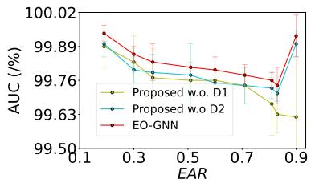  
(a) syn-cora ( Tab. 5).

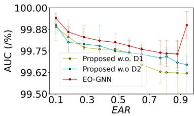

(b) syn-citeseer ( Tab. 7).  
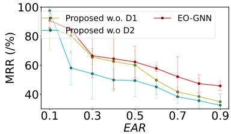  
(c) syn-cora ( Tab. 6).  
Figure 12: Significance of Design Choices D1-D2 via ablation studies. Under high automorphism, D1 exhibits a larger performance gain compared to low automorphism, whereas D2 demonstrates greater robustness across varying levels of automorphism.

Table 11: Ablation study showing the effect of different components. Mean metrics (MRR) and standard deviation for each method on synthetic Cora with varying automorphism ratios EAR.
<table><tr><td>Method</td><td>0.19</td><td>0.30</td><td>0.37</td><td>0.51</td><td>0.60</td><td>0.71</td><td>0.81</td><td>0.83</td><td>0.90</td></tr><tr><td>Proposed w.0. D1 99.89±0.08 99.83±0.10 99.77±0.11 99.76±0.07 99.76±0.05 99.74±0.07 99.67±0.12 99.63±0.07 99.62±0.22</td><td></td><td></td><td></td><td></td><td></td><td></td><td></td><td></td><td></td></tr><tr><td>Proposed w.0 D2 99.90±0.05 99.80±0.05 99.79±0.07 99.78±0.12 99.75±0.03 99.74±0.0799.73±0.04 99.71±0.03 99.90±0.05</td><td></td><td></td><td></td><td></td><td></td><td></td><td></td><td></td><td></td></tr><tr><td>Proposed</td><td></td><td>99.94±0.0399.86±0.0399.83±0.0799.81±0.0099.80±0.0599.78±0.0499.76±0.0399.74±0.0799.93±0.08</td><td></td><td></td><td></td><td></td><td></td><td></td><td></td></tr></table>

$$
\bullet \ \mathbf { G } \mathbf { A } \mathbf { T } \ [ 3 8 ] \colon \mathrm { h } \mathsf { t } \mathsf { t } \mathsf { p s } : / / \mathsf { q i t } \mathrm { h } \mathsf { u } \boldsymbol { \mathrm { b } } . \mathsf { c o m } / \mathsf { P e t a r V } - / \mathsf { G } \mathbb { A } \mathbb { T } .
$$

For DECODER, we used our own implementation of MLP with 1 to 3-hidden layers. We use the same loss function as EO-GNN for training MLP.

Hardware Specifications We run experiments on synthetic benchmarks using the HoreKa Green cluster, which consists of nodes equipped with dual-socket Intel Xeon Platinum 8368 CPUs, each with 76 cores (152 threads per node) and 512 GB of main memory. Each node features four NVIDIA A100 GPUs, each with 40 GB of GPU memory.

Dataset Statistic Random splits allocate 80%/15%/5% of the edges for the training, validation and test sets, respectively. The Collab dataset permits the use of validation edges as input during testing. For all reported results in the tables, we perform target link removal during training and do not utilize validation edges in the training stage.

## H.2 HYPERPARAMETER TUNING

To avoid bias, we tuned the hyperparameters of each method (EO-GNN and baseline models) on each benchmark. Below we list the hyperparameters tested on each benchmark per model. As the hyperparameters defined by each baseline model differ significantly, we list the combinations of non-default command line arguments we tested, without explaining them in detail. For the adam optimizer, we perform a grid search over the parameters reported in the original source code and tune the Adam optimizer through the following ranges: learning rate $( 1 0 ^ { - 2 , - 5 , - 4 } )$ , dropout rate (0, 0.1, 0.2, 0.3) and batch size $( 2 ^ { 5 , 7 , \dots , 1 5 } )$ ).

Table 12: Ablation study showing the effect of different components. Mean metrics (MRR) and standard deviation for each method on synthetic Cora with varying automorphism ratios EAR.
<table><tr><td>Method</td><td>0.19</td><td>0.30</td><td>0.37</td><td>0.51</td><td>0.60</td><td>0.71</td><td>0.81</td><td>0.83</td><td>0.90</td></tr><tr><td>Proposed w.0. D1 85.53±14.99 80.43±12.34 65.46±4.98 62.64±20.27 60.10±10.21</td><td></td><td></td><td></td><td></td><td></td><td> $4 9 . 7 7 { \scriptstyle \pm 1 2 . 5 2 }$ </td><td> $4 1 . 6 4 { \pm } 3 . 5 2 $ </td><td>38.49±12.70 34.89±5.32</td><td></td></tr><tr><td>Proposed w.o D2</td><td> $9 7 . 4 2 { \scriptstyle \pm 1 . 7 4 }$ </td><td></td><td></td><td>58.13±11.50 54.20±17.4449.86±7.44 49.43±10.93</td><td></td><td> $4 5 . 1 2 { \scriptstyle \pm 5 . 1 1 }$ </td><td> $3 8 . 3 5 { \scriptstyle \pm 4 . 4 7 }$ </td><td> $3 5 . 6 4 \pm 4 . 8 8 $ </td><td>32.47±7.89</td></tr><tr><td>Proposed</td><td> $9 0 . 7 8 { \scriptstyle \pm 7 . 3 4 }$ </td><td></td><td></td><td>84.41±1.87 66.53±14.99 64.51±20.8562.30±10.83</td><td></td><td> $5 7 . 8 3 { \scriptstyle \pm 2 . 0 4 }$ </td><td> $5 2 . 1 4 { \scriptstyle \pm 1 3 . 7 7 }$ </td><td> $4 7 . 3 6 { \pm } 6 . 1 3$ </td><td>45.83±3.30</td></tr></table>

Table 13: Ablation study showing the effect of different components. Mean metrics (MRR) and standard deviation for each method on synthetic Citeseer with varying automorphism ratios EAR.
<table><tr><td>EAR</td><td>0.10</td><td>0.18</td><td>0.28</td><td>0.48</td><td>0.57</td></tr><tr><td>Proposed w.o D2</td><td></td><td>Proposed w.0. D1 99.89±0.08 99.83±0.10 99.77±0.11 99.76±0.07 99.76±0.05</td><td></td><td></td><td> $9 9 . 7 4 { \scriptstyle \pm 0 . 0 7 }$ </td></tr><tr><td>Proposed</td><td></td><td> $9 9 . 9 0 \pm \mathrm { { o . o . 0 5 ~ } 9 9 . 8 0 \pm \mathrm { { o . 0 5 ~ } 9 9 . 7 9 \pm \mathrm { { o . 0 7 ~ } 9 9 . 7 8 \pm \mathrm { { 0 . 1 2 ~ } 9 9 . 7 5 \pm \mathrm { { 0 . 0 3 ~ } 9 9 . 7 4 \pm \mathrm { { 0 . 0 7 ~ } } } } } } }$ </td><td>99.94±0.03 99.86±0.03 99.83±0.07 99.81±0.00 99.80±0.05</td><td></td><td> $9 9 . 7 8 { \scriptstyle \pm 0 . 0 4 }$ </td></tr><tr><td>EAR</td><td>0.65</td><td>0.77</td><td>0.81</td><td>0.88</td><td>0.94</td></tr><tr><td></td><td></td><td></td><td></td><td></td><td></td></tr><tr><td>Proposed w.o. D1</td><td></td><td></td><td></td><td> $9 9 . 6 7 \pm 0 . 1 2 ~ 9 9 . 6 3 \pm 0 . 0 7 ~ 9 9 . 6 3 \pm 0 . 1 5 ~ 9 9 . 6 3 \pm 0 . 1 8 ~ 9 9 . 6 2 \pm 0 . 2 2$ </td><td></td></tr><tr><td>Proposed w.o D2</td><td></td><td></td><td> $9 9 . 7 3 \pm 0 . 0 4 ~ 9 9 . 7 1 \pm 0 . 0 3 ~ 9 9 . 7 5 \pm 0 . 0 4 ~ 9 9 . 8 4 \pm 0 . 0 5 ~ 9 9 . 7 3 \pm 0 . 0 5 ~ 9 9 . 7 1 \pm 0 . 0 5 ~ 9 9 . 7 3$ </td><td></td><td></td></tr><tr><td>Proposed</td><td></td><td>99.76±0.03 99.74±0.07 99.74±0.08 99.73±0.08</td><td></td><td></td><td> $9 9 . 9 0 { \scriptstyle \pm 0 . 0 8 }$ </td></tr></table>

Synthetic Benchmark Tuning For syn-cora, we test the following command-line arguments for each baseline method:

• EO-GNN-1 & EO-GNN-2:   
– Dimension of Feature Embedding p: 64   
– Non-linearity Function ρ: ReLU   
– Dropout Rate: a ∈ {0, 0.5}   
We report the best performance, for a = 0.   
• GCN [19]:   
– hidden1: a ∈ {16, 32, 64}   
– early\_stopping: b ∈ {40, 100, 200}   
– epochs: 2000   
We report the best performance, for a = 32, b = 40.   
• GraphSAGE [11]:   
– hid\_units: a ∈ {64, 128}   
– lr: b ∈ {0.1, 0.7}   
– layers: l ∈ {1, 3}   
– dropout: l ∈ {1, 3}   
– epochs: 500   
We report the performance with layers = 3, dropout = 0.5, epochs = 800.   
• GAT [38]:   
– hid\_units: a ∈ {8, 16, 32, 64}   
– n\_heads: b ∈ {1, 4, 8}   
– n\_layers: b ∈ {1, 2, 3}   
– dropout: l ∈ {1, 3}   
– epochs: 500   
We report the performance with a = 8, b = 8.

Table 14: Ablation study showing the effect of different components. Mean MRR and standard deviation for each method on synthetic Citeseer with varying automorphism ratios EAR.
<table><tr><td>EAR</td><td>0.10</td><td>0.18</td><td>0.28</td><td>0.38</td><td>0.48</td><td>0.57</td></tr><tr><td>Proposed w.o. D1</td><td> $8 3 . 4 0 { \scriptstyle \pm 1 1 . 4 0 }$ </td><td></td><td></td><td>71.65±12.54 69.35±12.8567.94±12.46</td><td> $6 4 . 6 7 { \scriptstyle \pm 8 . 2 3 }$ </td><td> $6 4 . 1 8 { \pm } 7 . 5 8 $ </td></tr><tr><td>Proposed w.o D2 Proposed</td><td> $7 9 . 9 9 \pm 1 2 . 2 3 $   $8 5 . 7 2 { \scriptstyle \pm 5 . 5 7 }$ </td><td> $7 6 . 2 8 { \scriptstyle \pm 7 . 7 6 }$   $8 3 . 0 2 { \scriptstyle \pm 6 . 8 7 }$ </td><td></td><td>72.20±16.27 66.62±12.1366.62±12.13 74.85±7.60 72.06±5.95</td><td> $6 8 . 6 4 { \pm } 4 . 5 9$ </td><td> $6 6 . 6 2 { \scriptstyle \pm 1 2 . 1 3 }$   $6 7 . 4 2 { \scriptstyle \pm 1 0 . 0 2 }$ </td></tr><tr><td></td><td></td><td></td><td></td><td></td><td></td><td></td></tr><tr><td>EAR</td><td>0.65</td><td></td><td>0.77</td><td>0.81</td><td>0.88</td><td>0.94</td></tr><tr><td>Proposed w.o. D1</td><td> $6 3 . 9 0 { \scriptstyle \pm 9 . 9 1 }$ </td><td></td><td></td><td>43.61±5.35 42.21±3.54 41.19±3.23</td><td></td><td> $3 6 . 4 2 { \scriptstyle \pm 9 . 4 5 }$ </td></tr><tr><td>Proposed w.0 D2 58.34±13.80 55.88±12.07 49.56±10.00 41.81±7.54</td><td></td><td></td><td></td><td></td><td></td><td> $3 8 . 4 2 { \scriptstyle \pm 1 2 . 3 2 }$ </td></tr><tr><td></td><td></td><td></td><td></td><td></td><td></td><td></td></tr><tr><td>Proposed</td><td></td><td></td><td></td><td>66.61±16.27 65.97±11.65 55.19±12.10 42.59±8.04</td><td></td><td> $4 1 . 1 9 { \pm } 3 . 2 3 $ </td></tr></table>

## • DECODER

– Dimension of Feature Embedding p: 64

– Non-linearity Function $\rho \colon$ ReLU

– Dropout Rate: 0.5

## I WL LABELING SCHEME WITH PERFECT HASH

Consider a graph $\mathcal { H } = ( \nu , \mathcal { E } )$ . Let $\ell ^ { ( 0 ) } ( v ) = \ell ( v )$ be the initial label assigned to each node $v \in \nu$ (e.g., based on node features or degree). Let H denote the number of WL iterations. Then, for each iteration $h = 1 , \ldots , H$ , the WL labeling scheme updates node labels recursively by considering the multiset of neighboring labels from the previous iteration.

Formally, define the multiset of neighbors’ labels for node v at iteration h as:

$$
\mathcal { N } ^ { ( h ) } ( v ) = \left\{ \ell ^ { ( h ) } ( u ) \vert u \in \bar { N } ( v ) \right\}
$$

The updated label at iteration $h + 1$ is computed as:

$$
\ell ^ { ( h + 1 ) } ( v ) = \mathtt { h a s h } \left( \ell ^ { ( h ) } ( v ) , \mathcal { N } ^ { ( h ) } ( v ) \right)\tag{28}
$$

Following the original formulation [41], we use a perfect hashing function, ensuring that two nodes receive the same label at iteration $h + 1$ if and only if their own label and the multiset of their neighbors’ labels were identical at iteration h.

Algorithm 1: Weisfeiler-Lehman Forward Pass   
Input: Node feature matrix $\mathbf { X } = \mathbf { I } \in \mathbb { Z } ^ { | \mathcal { V } | \times 1 }$   
Adjacency matrix A   
Hash function H   
Train Parameters: Empty   
Output: Updated node hash labels $h \in \mathbb { Z } ^ { | \nu | }$   
begin   
/\* Stage S1: Preprocessing $\star /$   
if A is sparse then   
Convert to (s, d) format;   
else   
Sort A by destination node;   
Initialize N ← EmptyList ;   
/ Stage S2: Neighbor Aggregation /   
foreach $( s , d ) \in \mathbf { A }$ do   
Append X[s] to ${ \mathcal { N } } [ d ] ;$   
/ Stage S3: Weisfeiler-Lehman Hash Computation /   
Initialize O ← EmptyList V|;   
foreach $i \in [ 0 , | \nu | )$ do   
Compute unique hash i using:;   
- Node feature $\mathbf { X } [ i ] ;$   
- Sorted features of ${ \mathcal { N } } [ i ] ;$   
if i /∈ H then   
Assign a new unique ID to i;   
Store hashed value in $O [ i ] ;$   
/\* Stage S4: Edge Orbit Hash Computation \*/   
foreach $( u , v ) \in \mathcal { E }$ do   
Compute edge hash using the multiset $\{ O [ u ] , O [ v ] \}$   
Store hashed edge orbit ID in $\mathcal { O } _ { \mathcal { E } } [ ( u , v ) ] ;$   
Output: Updated node hash labels $O \in \mathbb { Z } ^ { | \nu | }$   
Edge orbit labels $\mathcal { O } _ { \mathcal { E } }$

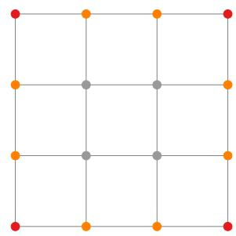  
(a) Square Grid Graph with EAR=1

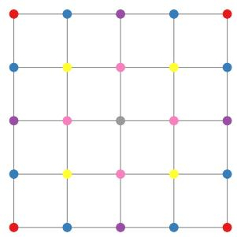  
(b) Square Grid Graph with EAR = 1

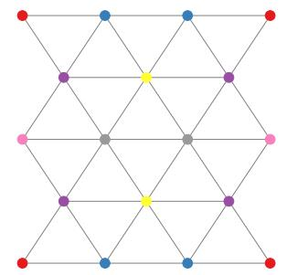  
(c) Triangular Graph with EAR=1

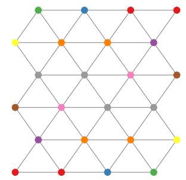  
(d) Triangular Graph with EAR = 1

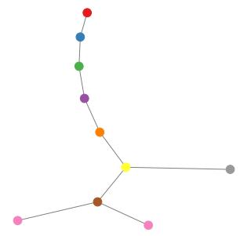  
(e) Tree Graph with EAR=2/9

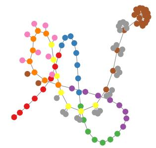  
(f) Tree Graph with EAR=0.53  
Figure 13: Illustration of the automorphism test approximated by Algo. 1.

## J EO-GNN: TIME COMPLEXITY IN DETAIL

The 1-dimensional Weisfeiler-Lehman (1-WL) algorithm with h iterations for precomputing subtreebased WL labels incurs a complexity of $\mathcal { O } ( | \mathcal { E } | \cdot K )$ [36]. The D1 augmentation, which involves randomly dropping edges and selecting subgraph orbits, introduces no computational overhead and is therefore considered to have O(1) complexity.

For feature encoding, we apply a GNN with L layers, each involving a dense transformation and neighborhood aggregation. This results in a total embedding complexity of $\mathcal { O } \left( L \cdot ( | \mathcal { V } | \cdot p ^ { 2 } + | \mathcal { E } | \cdot p \bar { ) } \right)$ , where p denotes the feature dimensionality. For each node with a performed linear transformation $\mathbf { H } ^ { l } \mathbf { W } ^ { l }$ , where $\mathbf { H } ^ { l } \in \mathbb { R } ^ { | \mathcal { V } | \times p } , \mathbf { W } ^ { l } \in \mathbb { R } ^ { p \times p }$ refer to node and weight matrix in l layer. The complexity is $O \left( | \boldsymbol { \nu } | \cdot p ^ { 2 } \right)$ . The edge wise aggregation is $\mathcal { O } \left( | \boldsymbol { \mathcal { E } } | \cdot \boldsymbol { p } \right)$ . Combining both components, the total computational complexity of EO-GNN is:

$$
\mathcal { O } \left( | \mathcal { E } | \cdot K + L \cdot \left( | \mathcal { V } | \cdot p ^ { 2 } + | \mathcal { E } | \cdot p \right) \right) .
$$

Table 15: Statistics of standard benchmark graphs
<table><tr><td></td><td>Cora</td><td>Citeseer Pubmed</td><td></td><td>Collab</td><td>PPA</td><td>Citation2</td><td>DDI</td></tr><tr><td>Split Ratio Split Scheme</td><td>80/15/5 R</td><td>80/15/5 R</td><td>80/15/5 R</td><td>92/4/4 Time</td><td>70/20/10 Throughput</td><td>98/1/1 Time</td><td>80/10/10 Protein target</td></tr><tr><td>#Nodes |ν|</td><td>2708</td><td>3327</td><td>19716</td><td>235868</td><td>576289</td><td>2927963</td><td>4267</td></tr><tr><td>#Edges |ε|</td><td>7392</td><td>6374</td><td>62056</td><td>1935264</td><td>42463862</td><td>60703760</td><td>2135822</td></tr><tr><td></td><td>7.85</td><td>3.62</td><td>11.55</td><td>24.86</td><td>149.17</td><td>89.75</td><td>804.51</td></tr><tr><td>Avg Deg (G) Avg Deg (G2)</td><td>5.63</td><td>3.28</td><td>7.85</td><td>20.70</td><td>133.13</td><td>68.21</td><td>796</td></tr><tr><td></td><td>0.12</td><td>0.07</td><td>0.03</td><td>0.73</td><td>0.22</td><td>0.18</td><td>0.51</td></tr><tr><td>Clustering Transitivity</td><td>0.06</td><td>0.09</td><td>0.04</td><td>0.36</td><td>0.22</td><td>0.06</td><td>0.47</td></tr><tr><td>Deg Gini</td><td>0.45</td><td>0.50</td><td>0.63</td><td>0.55</td><td>0.55</td><td>0.57</td><td>0.47</td></tr><tr><td>Coreness Gini</td><td>0.27</td><td>0.36</td><td>0.45</td><td>0.43</td><td>0.45</td><td>0.42</td><td>0.35</td></tr><tr><td>Heterogeneity</td><td>0.14</td><td>0.11</td><td>0.23</td><td>0.21</td><td>0.13</td><td>0.31</td><td>-0.08</td></tr><tr><td></td><td>1.89</td><td>2.13</td><td>1.97</td><td>1.89</td><td>1.33</td><td>1.39</td><td></td></tr><tr><td>Power Law α</td><td></td><td></td><td></td><td></td><td></td><td></td><td>1.21</td></tr></table>

## K REAL DATASETS: DETAILS

Considerable work has demonstrated that local and global structural characterization’s are more effective for LP. To translate the homophily assumption, local and global graph heuristics, small-world phenomenon and scale-free network properties into task-specific statistics, we provide the following graph metrics.

1. Graph Density: Number of Nodes, Edges, Arithmetic Deg are used to measure the graph’s size, density and sparsity. Average degree of each central node $\bar { v } \in \nu$ and its of 2-order neighborhood $\mathcal { N } _ { v } ^ { \mathrm { ~ , ~ } }$ average degree measures the graph’s local connectivity.

2. Graph Locality: We utilize two metrics to quantify the locality of one graph. Transitivity: Transitivity measures the fraction of all possible triangles in the graph. It quantifies the likelihood that if two nodes are connected to a common node, they will also be connected to each other. The formula for transitivity is given by:

$$
T = { \frac { 3 \times \# \mathrm { t r i a n g l e s } } { \# \mathrm { t r i a d s } } }\tag{29}
$$

where, the numerator represents the number of triangles in the graph; the denominator represents the number of possible triads (sets of three nodes that are connected by at least two edges). Transitivity gives an overall measure of how many triangles (closed 3-node subgraphs) exist relative to the total number of possible connections between three nodes in the graph. Average Clustering Coefficient: It measures the fraction of possible triangles through that node that actually exist. It can be computed for a node i as:

$$
C _ { i } = \frac { 2 \times T ( i ) } { \deg ( i ) ( \deg ( i ) - 1 ) }\tag{30}
$$

$T ( i )$ is the number of triangles through node i and deg(i) is the degree of node i. The average clustering coefficient is simply the average value of $C _ { i }$ for all nodes in the graph. It gives a measure of how close the graph is to a complete clique, i.e., how often neighbors of a node are connected to each other.

3. Hierarchical level: We leverage k-Core graph’s fraction and degree distribution to calculate Gini and Coreness Gini.

4. Scale-free: If its node degree distribution $P ( d )$ follows a power law $P ( d ) \sim d ^ { - \gamma }$ , where $\gamma$ typically lies within the range $2 < \gamma < 3$ . We approximate power law α based on the following estimator. Citeseer is scale-free networks.

$$
\hat { \alpha } = 1 + N \left( \sum _ { i = 1 } ^ { n } \log \left( \frac { d _ { i } + 1 } { d _ { \operatorname* { m i n } } + 1 } \right) \right) ^ { - 1 }\tag{31}
$$