# EMPIRIC: EXPERIMENT-DRIVEN LEARNING OF RESIDUAL WORLD MODELS FOR ROBOT PLANNING

Yichao Liang<sup>1,2</sup>, Amber Li<sup>1,5</sup>, Dat Nguyen<sup>1,6∗</sup>, Emily Bunnapradist<sup>1∗</sup>, Michelangelo Naim<sup>1∗</sup>, Sreela Kodali<sup>1∗</sup>, Matteo Merler<sup>7</sup>, Bowen Li<sup>5</sup>, Kiran Gopinathan<sup>1</sup>, Yiyun Liu<sup>1</sup>, Nikhil Pimpalkhare<sup>1</sup>, Joshua B. Tenenbaum<sup>8</sup>, Adrian Weller<sup>2,9</sup>, Zenna Tavares<sup>1</sup>, Tom Silver<sup>3†</sup>, Kevin Ellis<sup>4†</sup>

<sup>1</sup>Basis Research Institute <sup>2</sup>University of Cambridge <sup>3</sup>Princeton University

<sup>4</sup>Cornell University <sup>5</sup>Carnegie Mellon University <sup>6</sup>Harvard University

<sup>7</sup>Fondazione Bruno Kessler <sup>8</sup>Massachusetts Institute of Technology

<sup>9</sup>The Alan Turing Institute

<sup>∗,†</sup>Equal contribution

## ABSTRACT

A robot should be able to learn through experiments how unfamiliar objects behave and interact, then plan with that knowledge. It need not start from scratch: physics engines supply knowledge of motion and contact, but can omit entire mechanisms, such as glue curing, water heating, or wind. We present EMPIRIC<sup>1</sup>, an agent that learns a residual world model: a physics engine extended with code for the missing mechanisms. The learned programs can introduce new forces, constraints, and hidden state, and Bayesian inference estimates their parameters and states from noisy observations. The resulting model lets the agent predict the outcomes of actions, choose informative experiments, and revise its hypotheses when predictions fail. Across five simulated domains, EMPIRIC learns interpretable, reusable models, and solves more tasks with fewer environment interactions than all three baselines. On a physical robot, it learns wind forces and domino masses to solve a manipulation task.

## 1 INTRODUCTION

Consider a robot using an electric fan or gluing blocks together for the very first time. We can equip the robot with a physics engine to predict how rigid objects move when it acts on them, but we cannot endow it with knowledge of every device and material it will meet in a new household: glue, fans, safes, furnaces, silly putty, hoverboards, gumball machines, circuit breaker boards, and many others. How can the robot use a few experiments to learn the physics it is missing, and then plan with what it has learned? Real-to-sim methods can reconstruct object geometry and articulation (Chen et al., 2024; Mandi et al., 2025; Torne Villasevil et al., 2024), but recovering this structure does not by itself identify that turning on a fan produces airflow that pushes objects, or that glued blocks bond over time. To use such objects, a robot must add the mechanisms its physical model lacks.

Even with the right mechanism in hand, the robot still does not know the wind force of a particular fan or the curing time of a particular glue. It must infer these parameters from noisy sensor readings, and it must know how uncertain they are, because that uncertainty determines whether a plan is safe to execute and which experiment would be most informative. Often the decisive quantity is not visible at all: whether a joint will hold depends on how long the blocks have been in contact, which the current scene does not show. The robot therefore needs a model whose hidden state evolves over time, with parameters and hidden state inferred jointly from few, noisy, partial observations. Here we take on this challenge: quickly learning a world model for planning in a novel environment, given generic prior knowledge of rigid-body physics.

Several lines of work address parts of this challenge. Learning for task and motion planning acquires operators, continuous transition models, and samplers (Garrett et al., 2021; Chitnis et al., 2022), including perceptually grounded predicates (Liang et al., 2025) and abstract causal processes with uncertain delays (Liang et al., 2026). Program-synthesis approaches learn executable world models for planning, including modular and partially observable models (Tang et al., 2024; Ahmed et al., 2025; Piriyakulkij et al., 2025; Curtis et al., 2025; Six et al., 2026). Hybrid physical models already combine engine dynamics with learned corrections or missing forces (Ajay et al., 2019; Heiden et al., 2021), and active identification uses simulation to design informative robot interactions (Memmel et al., 2024). Coding agents compose robot interfaces, revise policies from feedback, and retain reusable skills (Liang et al., 2023; Fu et al., 2026; Lu et al., 2026; Xiao et al., 2026). None of these lets a robot add a missing mechanism, with the hidden state it needs, to a physics engine from a few noisy experiments and then plan under uncertainty about it. Building on these ideas, we study how a robot can continually write missing mechanisms on top of a reusable physics engine, infer their parameters, and use the extended simulator for sequential decision making, under uncertainty about the simulator’s parameters and state.

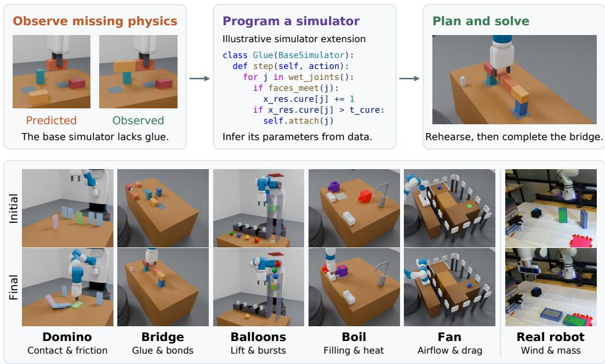  
Figure 1: Learning missing physics as code. Top: in Bridge, lifting one block of a glued pair also lifts its partner, which a base simulator without glue does not predict; the agent writes the glue into a simulator program, infers its parameters, and plans with it. The lift images and code are illustrative. Bottom: initial and final scenes from successful EMPIRIC test episodes in five simulated domains and on a real robot; each domain has mechanisms or parameters that the agent must learn.

We propose EMPIRIC (Experiment-driven Modeling of Physics: Inferring Residuals In Code), which learns residual world models as Python programs. A coding agent starts from a base simulator of generic rigid-body physics and extends it with code for novel physical mechanisms: programs that apply forces, impose constraints, and update quantities such as water volume and temperature. The engine provides reusable knowledge of motion and contact, so learning can focus on the physics it lacks. For example, a glue program can accumulate contact time as recurrent state and create a constraint once the joint has cured (Figure 1); the program and the engine together then predict how the whole assembly moves when one block is lifted. This learned recurrent state lets the model predict different outcomes for scenes that look alike but have different histories.

Learning alternates between writing the residual program, inferring its parameters, and testing it through interaction. Given a program, the agent infers a belief over its parameters and the current state, including the hidden quantities the program tracks, from noisy observations. It simulates candidate plans under draws from this belief and executes the plan most likely to succeed; if the outcome hinges on an uncertain quantity, it changes the plan or runs an experiment to resolve the uncertainty. When execution contradicts the model’s predictions, the agent revises the program.

Our contributions are: (1) residual world models, a representation that extends a physics engine with executable mechanisms and hidden recurrent state; (2) a learning and planning method that maintains a belief over parameters and hidden state from noisy observations and uses it to choose plans and experiments; and (3) an evaluation across five simulated manipulation domains under a continual protocol of training tasks followed by test tasks. EMPIRIC solves all evaluated runs and uses fewer environment steps than the baselines. Beyond simulation, we also demonstrate EMPIRIC’s applicability in one physical domain.

## 2 PARTIALLY OBSERVABLE CONTINUAL MANIPULATION

We consider an agent solving a sequence of manipulation tasks in an environment $\varepsilon \quad =$ $( S , { \mathcal { A } } , { \mathcal { O } } , F , p ( o \mid s ) )$ with a state space, primitive action space, observation space, transition function $s _ { t + 1 } = F ( s _ { t } , a _ { t } )$ , and observation channel $p ( o _ { t } \mid s _ { t } )$ The transition function is unknown to the agent. Observations consist of noisy object features and images but omit hidden quantities such as glue cure progress. Our domains also provide a set of parameterized skills such as Place(object)[pose]: closed-loop controllers with object arguments and continuous parameters. A task ${ \boldsymbol { \mathcal { T } } } = ( s _ { 0 } , g , R )$ specifies an initial state $s _ { 0 } .$ , which the agent sees only through its observation o<sub>0</sub> $\sim \ p ( o | s _ { 0 } )$ , a goal $g$ in natural language, and a binary trajectory reward $R : ( \mathcal { O } \times \mathcal { A } ) ^ { * } \times \mathcal { O } \stackrel { \cdot } { \to } \{ 0 , 1 \}$ over observation-action trajectories.<sup>2</sup> The environment evaluates R on the noise-free observations of the true trajectory: R returns 1 only if the final observation satisfies the goal and the trajectory respects the task’s constraints. A run consists of M training tasks, on which the agent may call step to interact and reset to restart the current task, followed by N test tasks, on which only step is allowed. An episode begins when a task starts or the agent resets, and ends when the goal first holds, when the agent resets, or after an irreversible failure, such as a balloon bursting on the ceiling. The next task begins as soon as the current one is solved; the agent may retain experience and continue learning throughout. All tasks in a run share one budget of environment steps, and the run ends early when a test episode ends unsolved, the agent gives up, or the budget runs out. Runs are scored on solving every task and on environment steps; computation in the agent’s sandbox, including simulation, costs no steps. Like ARC-AGI-3 (ARC Prize Foundation, 2026), this protocol measures how efficiently an agent learns an unfamiliar environment across tasks. We detail observations, skills, and budgets in Appendix A.

## 3 METHOD

EMPIRIC learns a world model by extending a supplied physics simulator with code for missing mechanisms, then uses the resulting model to plan its actions (Figure 2). EMPIRIC builds on an agent harness with code execution and file editing (Anthropic, 2025; OpenAI, 2025). It records every executed action and resulting observation in a replay buffer D. In its sandbox, it can edit its simulator code, infer the parameters from the data in $\bar { D , }$ and simulate plans before executing them. It chooses which tool to call from the task goal and the experience collected so far. For example, it may revise a model after a failed simulation, or gather another observation before choosing a plan. Its sandbox persists across tasks.

## 3.1 RESIDUAL WORLD MODELS

We assume a base simulator that holds the scene’s objects and their geometry and simulates their rigid-body dynamics. It may nevertheless fail to predict the effects of a novel physical interaction. For example, it can predict how a jug moves when grasped, but not how the jug fills under a faucet or heats on a burner. The agent writes code to add these missing dynamics (Figure 2, step 2).

The base simulator $\widehat { F } _ { \theta _ { \mathrm { b a s e } } } : { \mathcal { X } } _ { \mathrm { b a s e } } \times { \mathcal { A } }  { \mathcal { X } } _ { \mathrm { b a s e } }$ maps a simulator state $x _ { \mathrm { b a s e } }$ and primitive action a to the next simulator state. Its parameters $\theta _ { \mathrm { b a s e } }$ include physical properties such as mass and friction. The agent writes a program $P$ that subclasses the base simulator, keeping its physics and adding parameters $\theta _ { \mathrm { r e s } }$ and a recurrent state $x _ { \mathrm { r e s } } \in \mathcal { X } _ { \mathrm { r e s } } \colon$ quantities that the engine does not track, such as each glued joint’s cure progress. P updates $x _ { \mathrm { r e s } }$ from the action and the observable features of the base simulator’s predicted next state, such as whether two blocks touch, so the same update also runs on real observations (Section 3.2). The complete model state is $x = ( x _ { \mathrm { b a s e } } , x _ { \mathrm { r e s } } ) \in \mathcal { X } =$ ${ \mathcal { X } } _ { \mathrm { b a s e } } \times { \mathcal { X } } _ { \mathrm { r e s } } ;$ it holds the variables P represents and need not match the environment’s state ${ \mathfrak { s } } \in S$ Running the base simulator together with P at parameter values θ gives the learned simulator $\widehat { F } _ { P , \theta }$ a model of the environment’s transition $F , { \acute { \cdot } }$

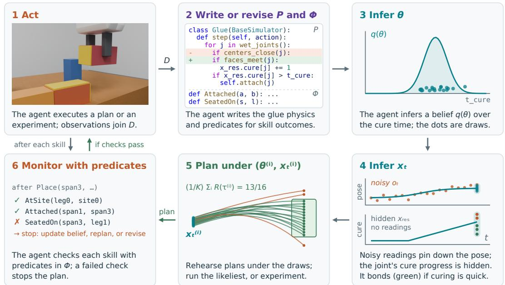  
Figure 2: Learning and planning during a continual run. In this Bridge example, the agent learns how glue bonds touching blocks after an unknown cure time. The loop is schematic: steps may repeat or occur in a different order.

$$
\widehat { F } _ { P , \theta } : \mathcal { X } \times \mathcal { A } \longrightarrow \mathcal { X } , \qquad \theta = ( \theta _ { \mathrm { b a s e } } , \theta _ { \mathrm { r e s } } ) .\tag{1}
$$

At each step, the learned simulator runs one step of the base simulator, updates $x _ { \mathrm { r e s } } ,$ and then applies $P ^ { * } { \bf s }$ mechanisms, which can add forces, impose constraints, or update quantities such as water volume and temperature. We use “residual” to mean this executable extension; it need not take the form of an additive correction. This representation splits learning into two problems: writing P adds mechanisms, and inferring θ sets their values

The agent revises P by replaying the actions recorded in D through the learned simulator and checking where the predicted observations differ from the recorded ones. When no parameter setting explains an observed effect, the agent adds or changes a mechanism, which may need recurrent state. For example, two glued blocks may separate in one lift and hold together in another, although they look the same in both. The current observation cannot explain this difference, so the agent can add a mechanism that accumulates the blocks’ contact time in $x _ { \mathrm { r e s } }$ and creates a bond once it exceeds a threshold in $\theta _ { \mathrm { r e s } }$ . Whether the glue has cured is not observed, so the threshold must be inferred from noisy outcomes like these (Section 3.2). Appendix B specifies the subclass interface, recurrent-state updates, and physical effects.

The agent also writes predicates $\Phi \ = \ \{ \phi _ { j } \}$ , classifiers over observed object features, such as Attached(a, b) (Figure 2, step 2). Predicates are written in Python, drawing on the task description and the replay buffer. They play three roles: checking expected outcomes of skills (Section 3.4); allowing plans to wait until a predicate holds; and serving as subgoals of candidate experiments, whose predicted readings indicate how informative an experiment is (Section 3.3).

## 3.2 PARAMETER AND STATE INFERENCE

Once a program $P$ is fixed, the agent infers its parameters and the current model state from the replay buffer D and the observation–action history $H _ { t }$ of the current episode (Figure 2, steps 3 and $4 )$ Whether a domino cascade reaches its target, for example, depends both on contact parameters such as lateral friction and on the dominoes’ true poses, which are observed with noise. We approximate the belief over the parameters θ and the current model state $x _ { t } = ( x _ { \mathrm { b a s e } , t } , x _ { \mathrm { r e s } , t } )$ as

$$
p ( \theta , x _ { t } \mid D , H _ { t } ) \approx q ( \theta ) q ( x _ { \mathrm { b a s e } , t } \mid H _ { t } ) \delta _ { G _ { \theta } ( H _ { t } ) } ( x _ { \mathrm { r e s } , t } ) ,\tag{2}
$$

where $q ( \theta )$ approximates the posterior $p ( \theta \mid D )$ , which weighs each parameter setting by how well replays of the recorded actions through the learned simulator match the observations. It treats the parameters as independent, a mean-field approximation. The factor $q ( x _ { \mathrm { b a s e } , t } \mid H _ { t } )$ is the posterior over the base simulator’s state, such as object poses, given recent observations under the declared sensor noise. It conditions only on observations, a modular approximation that keeps errors in the learned dynamics from biasing where objects are believed to be (Liu et al., 2009; Plummer, 2015). The last factor is a point mass at $G _ { \theta } ( { \bar { H } } _ { t } )$ , the recurrent state that $P$ computes from the real episode history: starting from an initial value specified by $P ,$ such as zero contact time, $P ^ { * } { \bf s }$ update advances it under θ with each action and observation in $H _ { t }$ . This factor ties the recurrent state to the parameters: each draw gets the recurrent state its own parameters imply, so the glue model can count two blocks as bonded under a draw with a short curing threshold but not under a longer one. Planning, monitoring, and experiment selection average over K joint draws $( \theta ^ { ( i ) } , x _ { t } ^ { ( i ) } )$ from Equation 2. Each draw consists of $\theta ^ { ( i ) } \sim q ( \theta ) , x _ { \mathrm { b a s e } , t } ^ { ( i ) } \sim q ( x _ { \mathrm { b a s e } , t } \mid H _ { t } )$ , and $x _ { \mathrm { r e s } , t } ^ { ( i ) } = G _ { \theta ^ { ( i ) } } ( H _ { t } )$ (Appendix B.3).

## 3.3 PLANNING AND INFORMATION SEEKING

The agent plans with the learned simulator, predicting the outcomes of skill sequences before trying them in the real world (Figure 2, step 5). It proposes candidate skill sequences and can tune their parameters, such as a placement position or push duration, in simulation. The agent can use these predictions to find either a plan likely to achieve the task or an experiment expected to reduce uncertainty about the parameters.

Planning for task success. For a skill sequence $\omega ,$ let $\tau _ { \theta } ( x , \omega )$ denote its simulated trajectory from model state x, and write $R ( \tau )$ for the task reward applied to the noise-free observations and actions of a simulated trajectory τ. Rehearsing ω from each joint draw estimates its probability of success under the belief, and the agent chooses the plan candidate that maximizes it:

$$
\widehat { \mathrm { P r } } ( \omega ) = \frac { 1 } { K } \sum _ { i = 1 } ^ { K } R \Big ( \tau _ { \theta ^ { ( i ) } } \big ( x _ { t } ^ { ( i ) } , \omega \big ) \Big ) , \qquad \omega ^ { * } \in \arg \operatorname* { m a x } _ { \omega } \widehat { \mathrm { P r } } ( \omega ) .\tag{3}
$$

Each rollout starts from its draw’s model state and uses that draw’s parameters. All candidates are scored on the same draws, which removes draw-to-draw noise from their comparison, and each estimate averages over uncertainty in both parameters and state. The agent executes $\omega ^ { * }$ once it judges this estimate high enough; otherwise it revises the plan or first gathers information (Appendix B.4).

Planning for information gain. The agent can also prioritize experiments by their expected information about the parameters θ. We use predicates to make this tractable: we measure the mutual information between θ and the predicates’ true-or-false readings of the observation, which are far simpler than the raw high-dimensional observation. Given a candidate experiment $\omega ,$ let $O _ { \omega }$ be the noisy observation of its simulated final state, and let $\phi _ { j } ~ \in ~ \Phi$ be a predicate corresponding to an expected subgoal. Let $r _ { i j } = \mathrm { P r } ( \phi _ { j } ( O _ { \omega } ) = 1 \mid \theta ^ { ( i ) } )$ be the probability, under sensor noise, that the reading satisfies $\phi _ { j }$ when the parameters are $\theta ^ { ( i ) }$ . The quantity

$$
\mathcal { T } _ { j } ( \omega ) = \mathbb { H } \bigg ( \frac { 1 } { K } \sum _ { i } r _ { i j } \bigg ) - \frac { 1 } { K } \sum _ { i } \mathbb { H } ( r _ { i j } ) \approx I ( \theta ; \phi _ { j } ( O _ { \omega } ) ) \leq I ( \theta ; O _ { \omega } )\tag{4}
$$

estimates the mutual information between the parameters and the noisy predicate reading, where H is the binary entropy (Houlsby et al., 2011); because $\phi _ { j }$ is a fixed function of the observation,

this information lower-bounds the information in the full observation. The agent ranks experiments by the average of $\mathcal { T } _ { j }$ over the subgoal predicates and decides whether the information is worth the environment cost.

## 3.4 EXECUTION MONITORING AND MODEL REVISION

The agent annotates each skill in a plan with predicates for its expected outcomes and checks them after the skill runs (Figure 2, step 6). An expected predicate subgoal counts as unmet when it holds on fewer than half of the K joint draws of Equation 2, that is, when it is more likely false than true under the belief. A failed skill or unmet predicate stops the sequence by default, and control returns to the agent. For example, if the agent expects two glued blocks to rise together and they come apart, Attached(a, b) fails on their observed poses, which contradicts its glue model.

After a mismatch, the agent may revise the plan, gather more information, update its parameter belief, or edit the simulator program (Section 3.1). Every environment step counts toward the budget, whether it served the task or an experiment. Parameter draws change only when the agent updates its parameter belief or edits the program; between these, only the state part of the belief changes with each step (Appendix B.4).

## 4 EXPERIMENTS

We evaluate seven agents in five PyBullet tabletop domains (Coumans & Bai, 2016–2021) (Figure 1), and EMPIRIC alone on a real robot, to answer four questions: (Q1) How does EMPIRIC compare with alternative approaches in task success and interaction efficiency? (Q2) How effectively do learned residual world models support planning compared with supplied ground-truth dynamics? (Q3) How do parameter inference and explicit uncertainty handling affect task success and interaction efficiency? (Q4) Can EMPIRIC learn missing physical mechanisms through real-robot interaction and use them to solve a manipulation task?

## 4.1 SIMULATED EXPERIMENTS

Domains. Each simulated domain provides scene geometry and a base physics simulator.

1. Domino. Arrange the blue dominoes so that pushing the green one topples the red targets; poses are noisy, and friction is unknown.

2. Bridge. Glue blocks into a bridge spanning two supports; poses are noisy, and bonds and cure progress are hidden.

3. Balloons. Release balloons tied to a box so that it settles within a target height band; poses are noisy, and lift and ceiling bursts must be learned.

4. Boil. Fill jugs with water and heat them to a target temperature without spilling; the base simulator does not fill or heat the jugs, and volume and temperature readings are noisy.

5. Fan. Switch fans to bring a ball to rest at a target; the ball’s position is noisy, and airflow and drag must be learned.

Evaluation protocol. Each run has one training and one test task (two training tasks in Balloons) and succeeds only if every task is solved. Agents receive noisy object features, images, and the declared sensor-noise scales. The step budget is 10,000 in Domino, Boil, and Fan, 15,000 in Balloons, and 20,000 in Bridge. We run five seeds per agent and domain.

Approaches. We compare EMPIRIC with three baselines (1–3), an oracle-dynamics reference (4), and two ablations (5–6). All seven agents use Claude Opus 5 at high effort and share the control skill library, task interfaces, and step budgets (Appendix A).

1. Direct agent, inspired by CaP-X’s multimodal M2 setting (Fu et al., 2026), acts from observations and execution feedback with no supplied simulator.

2. Direct + scene, inspired by SimFoundry (Ranawaka et al., 2026), also receives the scene assets and engine code and may simulate with them.

3. Standalone sim., inspired by WorldCoder (Tang et al., 2024), writes and revises its own executable model of skill transitions, with no base simulator but access to the PyBullet package.

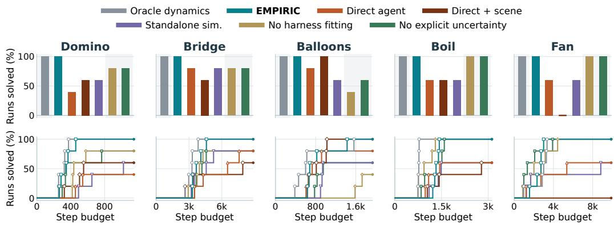  
Figure 3: Results with noisy observations across five domains. Top: percentage of the five runs with every training and test task solved. Bottom: percentage of runs solved within each environmentstep budget; each curve steps up at a solved run’s total steps and ends at the agent’s rate above.

4. Oracle dynamics receives the ground-truth dynamics program and parameters but still sees only noisy observations, without the hidden state.

5. No harness fitting drops the fitted parameter belief, so it rehearses with parameters drawn from its declared priors unless it estimates them itself.

6. No explicit uncertainty plans from raw noisy observations and point parameter estimates.

Results and discussion. Figure 3 reports success and step budgets, and Figures 4 and 5 show a recorded EMPIRIC run in each domain. (Q1). EMPIRIC solves all 25 runs, compared with 16 for Direct agent, 14 for Direct + scene, and 16 for Standalone sim. (Figure 3). Pooled over domains, each difference is significant (two-sided Fisher’s exact test, $p \leq 0 . 0 0 2 )$ . Averaged over all seeds, it uses fewer environment steps than Direct agent and Direct + scene in four of five domains, and fewer than Standalone sim. in all five. Failed runs can end early, so the success-versus-budget curves give the more informative comparison. In every domain, EMPIRIC reaches a 60% solve rate with fewer steps than any baseline that reaches it at all. Direct + scene also solves all five Balloons runs, with a slightly lower mean cost (829 versus 847 steps).

The baselines also sometimes write their own models or predictive programs. In one Fan run, Direct agent fits wind, resistance, and ramp acceleration by least squares and simulates braking schedules. In a Balloons run, it sweeps linear and exponential lift models and picks a release that is safe across them, and Direct + scene fits the box’s vertical motion, including whether it overshoots into the ceiling. Coding agents can thus build parts of a modeling and planning pipeline without being given one, which helps explain the baselines’ successes.

Many of their failures come from extrapolating beyond what they observed. In Domino, several agents extend straight cascades to turning ones without modeling how an angled hit can rotate the next domino instead of toppling it forward. In Fan, some agents brake the ball with an opposing fan but underestimate how long the robot takes to switch it on, so the ball rolls off the platform first; in one run, EMPIRIC measures this delay and checks whether the fans are on. These contrasts suggest that EMPIRIC’s advantage comes in part from simulating robot skills together with the underlying physics.

Residual modeling also supplies a physical inductive bias: in Fan, the agent adds only a directional force and relies on the base engine for contact, gravity, and robot skills, so its model extrapolates to new arrangements without a separate rule for each. The learned programs stay useful when the test task has a new configuration, such as a turning cascade or a longer glued beam.

(Q2). EMPIRIC matches Oracle dynamics at 25/25 successes. It uses 12–18% more environment steps than Oracle in Domino, Bridge, and Balloons and 74% more in Boil, which may partly reflect the cost of learning the mechanisms that Oracle receives, but 8% fewer in Fan. Correct dynamics alone do not guarantee interaction efficiency, because Oracle must still estimate the state from noisy observations and choose its actions. A learned model can be useful without being accurate everywhere: in Bridge, the model mispredicts the lifted beam’s pose, yet the agent uses it to screen individual placements and then measures the assembled beam’s tilt to choose its final release height.

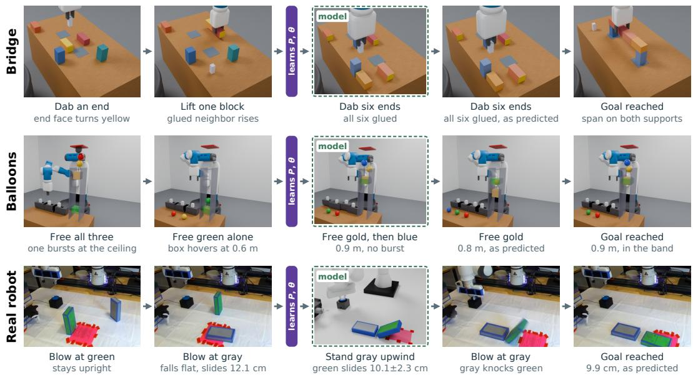  
Figure 4: Recorded EMPIRIC runs from exploring to solving. Each row shows one run in time order, from the agent’s first experiments to solving the test task. The purple bar marks where the agent writes its simulator program P and infers θ; dashed frames show what the agent’s world model predicts for a plan. Top: in Bridge, the goal is to glue blocks into a bridge across two supports; the agent’s experiments show how glue bonds. Middle: in Balloons, the goal is to release balloons so that the box settles in a target height band; the agent’s experiments show that lift fades with height. Bottom: on the real robot, the test goal is to land the green domino in the pink patch; the fan cannot move the green domino, so the agent stands the gray one upwind to knock it in.

(Q3). Removing harness fitting reduces success to 20/25 runs, and removing explicit uncertainty support to 21/25. Ablated agents sometimes rebuild the removed capabilities on their own: No harness fitting estimates Boil’s flow rate by least squares, and No explicit uncertainty searches for robust actions, such as Fan braking that tolerates a range of launch impulses. Both ablations solve all five runs in Boil and Fan, sometimes more efficiently than EMPIRIC (988 versus 1,331 steps in Boil without harness fitting, 1,851 versus 2,475 in Fan without explicit uncertainty): near-constant filling rates, conservative fill targets, and opposing-fan braking reduce sensitivity to uncertain quantities, so additional inference need not save interactions.

These workarounds fall short in Balloons, where EMPIRIC solves 5/5 runs, versus 2/5 without harness fitting and 3/5 without explicit uncertainty; all five ablation failures are ceiling bursts. Releases cannot be undone, and an overshoot can burst a balloon before the box settles. In one run, No explicit uncertainty trusts a forward simulation predicting only 15 mm of ceiling clearance despite larger earlier overshoots, whereas EMPIRIC uses its previous peak-prediction errors to reject a small-margin release. These cases suggest that parameter inference and explicit uncertainty matter most when actions cannot be undone.

## 4.2 REAL-WORLD APPLICABILITY

In a physical Fan–Domino domain, the robot knows neither the fan’s wind nor the masses of its two dominoes. The training goal is to land the lighter domino flat in a target patch with one gust; at test, the patch moves farther downwind, and the robot must reach it with the heavier domino. In the recorded run of Figure 4 (bottom), the agent first blows at the green domino, where draws from its belief disagree most about the outcome, and then at the gray one; only the gray domino moves, and it lands in the patch. From these two gusts, EMPIRIC learns a wind force that decays after the fan stops and infers both masses. At test, its model predicts that no placement of the green domino alone reaches the patch, so the agent stands the gray domino upwind, where its fall knocks the green one in. Although the gusts leave the green domino’s mass uncertain, the predicted slide of 10.1 ± 2.3 cm matches the measured 9.9 cm. See Appendix C for details.

## 5 RELATED WORK

Code world models. Programs make dynamics explicit and editable. WorldCoder and TheoryCoder learn transition programs for planning (Tang et al., 2024; Ahmed et al., 2025), GIF-MCTS searches over code using offline trajectories (Dainese et al., 2024), and PoE-World composes probabilistic program experts (Piriyakulkij et al., 2025); Code World Models, POMDP Coder, and Pinductor address partial observability through learned inference functions or probabilistic models (Lehrach et al., 2025; Curtis et al., 2025; Six et al., 2026). Code-as-World integrates MuJoCo into scene and dynamics reconstruction from text or video (Wang et al., 2026). EMPIRIC learns missing mechanisms from its own noisy robot interactions and adds them to a physics engine, keeping the engine’s contacts, gravity, and robot skills.

Learning physical dynamics. Hybrid simulators combine analytical mechanics with learned corrections or missing effects (Golemo et al., 2018; Ajay et al., 2019; Heiden et al., 2021), and Tossing-Bot learns corrections to a physics-based throwing controller (Zeng et al., 2019). Simulation-based inference estimates physical properties or parameter posteriors (Wu et al., 2015; Ramos et al., 2019; Zhu et al., 2025), active identification selects informative interactions (Pfaff et al., 2025; Memmel et al., 2024), and uncertainty informs control and exploration (Chua et al., 2018; Sekar et al., 2020; Curtis et al., 2023). EMPIRIC combines physical priors and self-directed experiments with agent-written revisions to the mechanism program during task execution, rather than only fitting parameters within a fixed model family.

Abstractions and processes for planning. Learned abstractions support task and motion planning (Garrett et al., 2021). NSRTs learn operators, local continuous models, and action samplers (Chitnis et al., 2022), VisualPredicator and pix2pred learn predicates and skill operators (Liang et al., 2025; Athalye et al., 2026), and ExoPredicator learns causal processes with stochastic delays (Liang et al., 2026). EMPIRIC complements these abstractions with low-level mechanisms whose interactions with engine physics determine skill outcomes.

Scene reconstruction and policy transfer. Prior work reconstructs articulated scenes (Chen et al., 2024; Mandi et al., 2025), uses digital twins for policy transfer (Torne Villasevil et al., 2024; Han et al., 2026; Qureshi et al., 2025), or aligns recorded interactions into executable episodes (Chen et al., 2026). EMPIRIC takes such a scene as input and learns the mechanisms it omits, such as wind forces or heating, from new interactions.

Coding agents for control. Language models can control robots by writing programs that call perception and action tools (Liang et al., 2023; Fu et al., 2026); ASPIRE learns reusable skill guidance from execution feedback (Lu et al., 2026), ENPIRE improves policies through real-robot experiments (Xiao et al., 2026), and AgenticGenPlan uses simulator probes, including kinematic calibra tion, to synthesize policies frozen for evaluation (Merler et al., 2026). EMPIRIC continually revises a forward simulator and infers its parameters alongside its action programs, coupling mechanism revision, parameter inference, and skill rehearsal.

## 6 CONCLUSION AND LIMITATIONS

We presented EMPIRIC, a robot agent that learns unfamiliar physical mechanisms through experiments: it writes them as code into a base physics simulator, infers their parameters, plans with its skills in the extended simulator, and revises the model when execution contradicts it. Across five simulated manipulation domains, EMPIRIC solves every evaluated run, outperforming the baselines in overall success and sample efficiency. On a physical robot it learns enough from two gusts to plan a two-domino cascade. The results suggest that extending a physics engine lets the agent learn from few interactions, that the resulting world model generalizes to new configurations and supports planning, and that explicit uncertainty matters most for irreversible actions.

Our agent has several limitations. (1) In our experiments, the agent is given the scene geometry, although object poses are noisy and mechanism state is hidden; a natural next step is to let it reconstruct and revise the scene from perception, under uncertainty in geometry, articulation, and object identity. (2) The agent receives predefined object features: it can introduce hidden variables into its models but does not learn to extract features from images, which it could do by proposing and testing feature extractors. (3) Interaction savings come at a computational cost: the median EMPIRIC run uses 424 simulator rollouts and 162 language-model turns, compared with 115 turns for Direct agent, and its median recorded runtime is 107 minutes, against 64 for Direct agent.

## ACKNOWLEDGMENTS

Tom Silver acknowledges support from a Princeton SEAS Innovation grant. Kevin Ellis acknowledges support from an NSF CAREER award.

## AI USE STATEMENT

Generative AI was used as the experimental coding agent and to assist software development, experiment analysis, literature checking, and manuscript revision. Sections 3 and 4 describe the coding agent’s role in the experiments. The authors are responsible for verifying the final text, code, citations, and reported results.

## ETHICS STATEMENT

The study includes simulated tabletop domains and one physical robot case study. Physical deployment requires independent validation of perception, dynamics, and operational constraints; the reported case study does not establish general operational safety.

## REPRODUCIBILITY STATEMENT

Appendix A specifies the protocol and aggregation, and Appendix B describes the implementation.   
Appendix D gives every task’s goal and the agent’s prompt.

## REFERENCES

Ryan Prescott Adams and David J. C. MacKay. Bayesian online changepoint detection. arXiv preprint arXiv:0710.3742, 2007.

Zergham Ahmed, Joshua B. Tenenbaum, Christopher J. Bates, and Samuel J. Gershman. Synthesizing world models for bilevel planning. Transactions on Machine Learning Research (TMLR), 2025.

Anurag Ajay, Maria Bauza, Jiajun Wu, Nima Fazeli, Joshua B. Tenenbaum, Alberto Rodriguez, and Leslie Pack Kaelbling. Combining physical simulators and object-based networks for control. In IEEE International Conference on Robotics and Automation (ICRA), 2019. URL https: //arxiv.org/abs/1904.06580.

Anthropic. Building agents with the Claude Agent SDK, 2025. URL https://claude.com/b log/building-agents-with-the-claude-agent-sdk.

ARC Prize Foundation. ARC-AGI-3: A new challenge for frontier agentic intelligence. arXiv preprint arXiv:2603.24621, 2026. URL https://arxiv.org/abs/2603.24621.

Ashay Athalye, Nishanth Kumar, Tom Silver, Yichao Liang, Jiuguang Wang, Tomas Lozano-P ´ erez,´ and Leslie Pack Kaelbling. From pixels to predicates: Learning symbolic world models via pretrained VLMs. IEEE Robotics and Automation Letters, 11(4):4002–4009, 2026. doi: 10.110 9/LRA.2026.3662533. URL https://arxiv.org/abs/2501.00296.

Dimitri P. Bertsekas. Dynamic Programming and Optimal Control, volume 1. Athena Scientific, 4 edition, 2017.

Christopher M. Bishop. Pattern Recognition and Machine Learning. Springer, 2006.

Pier Giovanni Bissiri, Chris C. Holmes, and Stephen G. Walker. A general framework for updating belief distributions. Journal of the Royal Statistical Society: Series B (Statistical Methodology), 78(5):1103–1130, 2016.

Guanxiong Chen, Qianjun Xia, Jiawei Peng, Heng Zhang, Pengyu Jing, Bole Ma, Justin Qian, Yixian Cheng, Ziyi Jiao, Bingyang Zhou, Yiduo Qu, Luoxin Ye, Kaifeng Zhang, Kunyi Wang, Weijia Zeng, Yunuo Chen, Pengzhi Yang, Ziqiu Zeng, Siyuan Luo, Huamin Wang, Chao Liu, Alan Yuille, Fan Shi, Changxi Zheng, Yunzhu Li, Chenfanfu Jiang, and Peter Yichen Chen. Agentic Real2Sim: Physics-based world modeling with vision-language agents. arXiv preprint arXiv:2607.19190, 2026. URL https://arxiv.org/abs/2607.19190.

Zoey Chen, Aaron Walsman, Marius Memmel, Kaichun Mo, Alex Fang, Karthikeya Vemuri, Alan Wu, Dieter Fox, and Abhishek Gupta. URDFormer: A pipeline for constructing articulated simulation environments from real-world images. In Robotics: Science and Systems, 2024. URL https://urdformer.github.io/.

Rohan Chitnis, Tom Silver, Joshua B. Tenenbaum, Tomas Lozano-P´ erez, and Leslie Pack Kael-´ bling. Learning neuro-symbolic relational transition models for bilevel planning. In IEEE/RSJ International Conference on Intelligent Robots and Systems (IROS), 2022.

Nicolas Chopin. A sequential particle filter method for static models. Biometrika, 89(3):539–551, 2002.

Kurtland Chua, Roberto Calandra, Rowan McAllister, and Sergey Levine. Deep reinforcement learning in a handful of trials using probabilistic dynamics models. In Advances in Neural Information Processing Systems (NeurIPS), 2018.

Erwin Coumans and Yunfei Bai. PyBullet, a Python module for physics simulation for games, robotics and machine learning. http://pybullet.org, 2016–2021.

Aidan Curtis, Leslie Kaelbling, and Siddarth Jain. Task-directed exploration in continuous POMDPs for robotic manipulation of articulated objects. In IEEE International Conference on Robotics and Automation (ICRA), pp. 3721–3728, 2023. doi: 10.1109/ICRA48891.2023.10160306. URL https://www.merl.com/publications/TR2023-046.

Aidan Curtis, Hao Tang, Thiago Veloso, Kevin Ellis, Joshua B. Tenenbaum, Tomas Lozano-P´ erez,´ and Leslie Pack Kaelbling. LLM-guided probabilistic program induction for POMDP model estimation. In Conference on Robot Learning (CoRL), 2025.

Nicola Dainese, Matteo Merler, Minttu Alakuijala, and Pekka Marttinen. Generating code world models with large language models guided by monte carlo tree search. In Advances in Neural Information Processing Systems, 2024. URL https://arxiv.org/abs/2405.15383.

Franka Emika GmbH. Franka Emika Robot’s Instruction Handbook, October 2021. URL https: //download.franka.de/documents/100010\_Product%20Manual%20Franka% 20Emika%20Robot\_10.21\_EN.pdf. Accessed: 2026.

Letian Fu, Justin Yu, Karim El-Refai, Ethan Kou, Haoru Xue, Huang Huang, Wenli Xiao, Guanzhi Wang, Dantong Niu, Fei-Fei Li, Guanya Shi, Jiajun Wu, Shankar Sastry, Yuke Zhu, Ken Goldberg, and Linxi Fan. CaP-X: A framework for benchmarking and improving coding agents for robot manipulation. arXiv preprint arXiv:2603.22435, 2026.

Caelan Reed Garrett, Rohan Chitnis, Rachel Holladay, Beomjoon Kim, Tom Silver, Leslie Pack Kaelbling, and Tomas Lozano-P´ erez. Integrated task and motion planning.´ Annual Review of Control, Robotics, and Autonomous Systems, 4:265–293, 2021.

Florian Golemo, Adrien Ali Taiga, Aaron Courville, and Pierre-Yves Oudeyer. Sim-to-real transfer with neural-augmented robot simulation. In Proceedings of the 2nd Conference on Robot Learning, volume 87 of Proceedings of Machine Learning Research, pp. 817–828, 2018. URL https://proceedings.mlr.press/v87/golemo18a.html.

Sami Haddadin. The franka emika robot: A standard platform in robotics research [survey]. IEEE Robotics & Automation Magazine, 31(4):136–148, December 2024. ISSN 1558-223X. doi: 10.1 109/mra.2024.3451788. URL http://dx.doi.org/10.1109/MRA.2024.3451788.

Xiaoshen Han, Junqiu Yu, Minghuan Liu, Yilun Chen, Xiaoyang Lyu, Yang Tian, Bolun Wang, Weinan Zhang, and Jiangmiao Pang. Re<sup>3</sup>Sim: Generating high-fidelity simulation data via 3dphotorealistic real-to-sim for robotic manipulation. In IEEE International Conference on Robotics and Automation, 2026. URL https://re3sim.github.io/.

Eric Heiden, David Millard, Erwin Coumans, Yizhou Sheng, and Gaurav S. Sukhatme. NeuralSim: Augmenting differentiable simulators with neural networks. In IEEE International Conference on Robotics and Automation (ICRA), 2021. doi: 10.1109/ICRA48506.2021.9560935. URL https://arxiv.org/abs/2011.04217.

Neil Houlsby, Ferenc Huszar, Zoubin Ghahramani, and M´ at´ e Lengyel. Bayesian active learning for´ classification and preference learning. arXiv preprint arXiv:1112.5745, 2011.

Alexander Khazatsky, Karl Pertsch, Suraj Nair, et al. DROID: A large-scale in-the-wild robot manipulation dataset. In Robotics: Science and Systems (RSS), 2024.

James J. Kuffner and Steven M. LaValle. RRT-connect: An efficient approach to single-query path planning. In IEEE International Conference on Robotics and Automation (ICRA), pp. 995–1001, 2000.

Wolfgang Lehrach, Daniel Hennes, Miguel Lazaro-Gredilla, Xinghua Lou, Carter Wendelken, Zun´ Li, Antoine Dedieu, Jordi Grau-Moya, Marc Lanctot, Atil Iscen, John Schultz, Marcus Chiam, Ian Gemp, Piotr Zielinski, Satinder Singh, and Kevin P. Murphy. Code world models for general game playing. arXiv preprint arXiv:2510.04542, 2025.

Jacky Liang, Wenlong Huang, Fei Xia, Peng Xu, Karol Hausman, Brian Ichter, Peter Florence, and Andy Zeng. Code as policies: Language model programs for embodied control. In IEEE International Conference on Robotics and Automation (ICRA), 2023.

Yichao Liang, Nishanth Kumar, Hao Tang, Adrian Weller, Joshua B. Tenenbaum, Tom Silver, Joao F. Henriques, and Kevin Ellis. VisualPredicator: Learning abstract world models with neuro-˜ symbolic predicates for robot planning. In International Conference on Learning Representations (ICLR), 2025.

Yichao Liang, Dat Nguyen, Cambridge Yang, Tianyang Li, Joshua B. Tenenbaum, Carl Edward Rasmussen, Adrian Weller, Zenna Tavares, Tom Silver, and Kevin Ellis. ExoPredicator: Learning abstract models of dynamic worlds for robot planning. In International Conference on Learning Representations (ICLR), 2026.

Yixin Lin, Austin S. Wang, Giovanni Sutanto, Akshara Rai, and Franziska Meier. Polymetis. http s://facebookresearch.github.io/fairo/polymetis/, 2021.

Fei Liu, M. J. Bayarri, and J. O. Berger. Modularization in Bayesian analysis, with emphasis on analysis of computer models. Bayesian Analysis, 4(1):119–150, 2009. doi: 10.1214/09-BA404.

Runyu Lu, Yubo Wu, Ethan Kou, Letian Fu, Wenli Xiao, Ajay Mandlekar, Yinzhen Xu, Guanya Shi, Ken Goldberg, Ang Chen, Mosharaf Chowdhury, Yuke Zhu, Linxi Fan, and Guanzhi Wang. ASPIRE: Agentic /skills discovery for robotics. arXiv preprint arXiv:2607.00272, 2026.

Zhao Mandi, Yijia Weng, Dominik Bauer, and Shuran Song. Real2Code: Reconstruct articulated objects via code generation. In International Conference on Learning Representations, 2025. URL https://openreview.net/forum?id=CAssIgPN4I.

Marius Memmel, Andrew Wagenmaker, Chuning Zhu, Patrick Yin, Dieter Fox, and Abhishek Gupta. ASID: Active exploration for system identification in robotic manipulation. In International Conference on Learning Representations (ICLR), 2024. URL https://arxiv.or g/abs/2404.12308.

Matteo Merler, Bowen Li, Josh Roy, Yichao Liang, Qianwei Wang, Yixuan Huang, and Tom Silver. Coding agents for generalized task and motion planning problems. Manuscript, 2026. URL https://agenticgentamp.github.io/assets/paper.pdf.

OpenAI. Introducing Codex, 2025. URL https://openai.com/index/introducing-c odex/.

Nicholas Pfaff, Evelyn Fu, Jeremy Binagia, Phillip Isola, and Russ Tedrake. Scalable Real2Sim: Physics-aware asset generation via robotic pick-and-place setups. In IEEE/RSJ International Conference on Intelligent Robots and Systems, 2025. URL https://scalable-real2si m.github.io/.

Wasu Top Piriyakulkij, Yichao Liang, Hao Tang, Adrian Weller, Marta Kryven, and Kevin Ellis. PoE-World: Compositional world modeling with products of programmatic experts. In Advances in Neural Information Processing Systems, volume 38, 2025. URL https://arxiv.org/ abs/2505.10819.

Martyn Plummer. Cuts in Bayesian graphical models. Statistics and Computing, 25(1):37–43, 2015. doi: 10.1007/s11222-014-9503-z.

Mohammad Nomaan Qureshi, Sparsh Garg, Francisco Yandun, David Held, George Kantor, and Abhisesh Silwal. SplatSim: Zero-shot sim2real transfer of rgb manipulation policies using gaussian splatting. In IEEE International Conference on Robotics and Automation, 2025. URL https://splatsim.github.io/.

Fabio Ramos, Rafael Possas, and Dieter Fox. BayesSim: Adaptive domain randomization via probabilistic inference for robotics simulators. In Robotics: Science and Systems (RSS), 2019. doi: 10.15607/RSS.2019.XV.029. URL https://www.roboticsproceedings.org/rss1 5/p29.html.

Nadun Ranawaka, Josiah Wong, Wei-Lin Pai, Wei-Teng Chu, Tianyuan Dai, Masoud Moghani, Hang Yin, Yunfan Jiang, Wesley Durbano, Brandon Huynh, Yu Fang, Danfei Xu, Ruohan Zhang, Li Fei-Fei, Linxi Fan, Bowen Wen, Ajay Mandlekar, and Yuke Zhu. SimFoundry: Modular and automated scene generation for policy learning and evaluation. arXiv preprint arXiv:2606.28276, 2026. URL https://research.nvidia.com/labs/gear/simfoundry/.

Nikhila Ravi, Valentin Gabeur, Yuan-Ting Hu, Ronghang Hu, Chaitanya Ryali, Tengyu Ma, Haitham Khedr, Roman Radle, Chloe Rolland, Laura Gustafson, Eric Mintun, Junting Pan, Kalyan Va-¨ sudev Alwala, Nicolas Carion, Chao-Yuan Wu, Ross Girshick, Piotr Dollar, and Christoph Fe-´ ichtenhofer. Sam 2: Segment anything in images and videos. arXiv preprint arXiv:2408.00714, 2024. URL https://arxiv.org/abs/2408.00714.

Ramanan Sekar, Oleh Rybkin, Kostas Daniilidis, Pieter Abbeel, Danijar Hafner, and Deepak Pathak. Planning to explore via self-supervised world models. In International Conference on Machine Learning (ICML), 2020.

Valentin Six, Frederik Panse, Mathis Fajeau, Lancelot Da Costa, Mridul Sharma, Alfonso Amayuelas, Tim Z. Xiao, David Hyland, Philipp Hennig, and Bernhard Scholkopf. Learning POMDP¨ world models from observations with language-model priors. arXiv preprint arXiv:2605.13740, 2026.

Balakumar Sundaralingam, Siva Kumar Sastry Hari, Adam Fishman, Caelan Garrett, Karl Van Wyk, Valts Blukis, Alexander Millane, Helen Oleynikova, Ankur Handa, Fabio Ramos, Nathan Ratliff, and Dieter Fox. cuRobo: Parallelized collision-free robot motion generation. In IEEE International Conference on Robotics and Automation (ICRA), 2023.

Hao Tang, Darren Key, and Kevin Ellis. Worldcoder, a model-based LLM agent: Building world models by writing code and interacting with the environment. In Advances in Neural Information Processing Systems (NeurIPS), 2024.

Marcel Torne Villasevil, Anthony Simeonov, Zechu Li, April Chan, Tao Chen, Abhishek Gupta, and Pulkit Agrawal. Reconciling reality through simulation: A real-to-sim-to-real approach for robust manipulation. In Robotics: Science and Systems, 2024. doi: 10.15607/RSS.2024.XX.015. URL https://www.roboticsproceedings.org/rss20/p015.html.

Hanyang Wang, Yimo Cai, Weiliang Chen, Jiawei Chi, Haowen Sun, Qiyu Dai, Yi-Hsin Hung, Xingzhuo Guo, Jinshan Ren, Runmao Yao, Ziwei Liu, Mingsheng Long, Yueqi Duan, Jun Gao, Jiangran Lyu, Fangfu Liu, and Jialong Wu. Code as Worlds: Agentic discovery of executable world representations for physical reasoning. arXiv preprint arXiv:2608.27549, 2026. URL https://arxiv.org/abs/2608.27549.

Jiajun Wu, Ilker Yildirim, Joseph J. Lim, William T. Freeman, and Joshua B. Tenenbaum. Galileo: Perceiving physical object properties by integrating a physics engine with deep learning. In Advances in Neural Information Processing Systems, volume 28, 2015. URL https://procee dings.neurips.cc/paper/2015/hash/d09bf41544a3365a46c9077ebb5e35c 3-Abstract.html.

Wenli Xiao, Jia Xie, Tonghe Zhang, Haotian Lin, Letian Fu, Haoru Xue, Jalen Lu, Yi Yang, Cunxi Dai, Zi Wang, Jimmy Wu, Guanzhi Wang, S. Shankar Sastry, Ken Goldberg, Linxi Fan, Yuke Zhu, and Guanya Shi. ENPIRE: Agentic robot policy self-improvement in the real world. arXiv preprint arXiv:2606.19980, 2026.

Andy Zeng, Shuran Song, Johnny Lee, Alberto Rodriguez, and Thomas Funkhouser. TossingBot: Learning to throw arbitrary objects with residual physics. In Robotics: Science and Systems (RSS), 2019. URL https://tossingbot.cs.princeton.edu/.

Yifan Zhu, Tianyi Xiang, Aaron M. Dollar, and Zherong Pan. One-shot real-to-sim via end-to-end differentiable simulation and rendering. IEEE Robotics and Automation Letters, 2025. URL https://arxiv.org/abs/2412.00259.

## A DOMAIN AND EVALUATION DETAILS

## A.1 OBSERVATIONS, FEEDBACK, AND INTERACTION

Section 2 defines the continual task protocol. The dynamics are deterministic conditional on complete state and action; task initialization and observation noise supply randomness. The agent receives named, typed object features and rendered images; it never sees the evaluator’s complete state or the source code of the hidden mechanisms. Hidden variables, such as glue cure progress, are never observed, while visible quantities are observed with noise. For a visible numerical feature f, observations follow $o _ { t , f } = O _ { f } ( s _ { t } ) + \epsilon _ { t , f }$ with $\epsilon _ { t , f } \sim \mathcal { N } ( 0 , \sigma _ { f } ^ { 2 } )$ . Discrete features and robot proprioception remain exact. Noise is drawn once per environment step, so repeated observations without stepping provide no independent measurements. The evaluator uses noise-free observations and the action history.

Supplied skills are closed-loop controllers with typed object arguments and continuous parameters; agents may also issue primitive actions. We supply the five skills below across the simulated domains and describe the physical robot’s skills in Appendix C.3. We write each skill as in Section 2, with its object argument in parentheses and its continuous parameters in brackets, and omit the robot, which every skill also takes.

• Pick(object)[height] grasps a domino, block, glue bottle, or jug, closing the gripper at the given height above its grasp point (Domino, Bridge, Boil).

• Place(object)[x, y, z, yaw] carries the held object to $( x , y , z )$ , turned to the given yaw, and releases it there (Domino, Bridge, Boil).

• Push(object)[distance, height] starts the given distance behind its target and pushes at the given height, to tip a domino, free a balloon from its clip, or turn a faucet, burner, or fan on or off at its switch (Domino, Balloons, Boil, Fan).

• MoveTo[x, y, z, yaw] moves the held object, or the empty gripper, to $( x , y , z )$ with the given wrist yaw and holds it there briefly, as when dabbing glue from the bottle (Bridge).

• Wait[steps] holds the robot still for the given number of steps or, given zero, until an expected predicate holds or another predicate changes, up to a step cap (all domains).

Every primitive step advances the environment and counts toward the interaction budget, including waiting. Sandbox computation and simulated rollouts do not advance the physical environment or count as environment steps. Training permits resets of the current task; testing does not. The agent may retain recordings, programs, and its journal across all tasks and continue learning during testing. The journal is a notes file in which the agent records what it tried and measured, and which it can reread in later tasks. A terminal goal state is not sufficient when the task imposes trajectory constraints, such as Domino’s fingertip-triggered cascade requirement.

## A.2 DOMAINS AND OBSERVATION SCALES

All domains have one training and one test task except Balloons, which has two training tasks. Appendix D.1 gives the goal of every task. The domains are:

• Domino: arrange and trigger a cascade that turns under high friction, subject to the task’s contact constraints.

• Bridge: learn to join and manipulate blocks; the test requires a four-block span seated on two supports.

• Balloons: release balloons to control a payload’s lift and settling height within a target band; every solution of the test frees two or more balloons whose colors never shared a training rack, and freeing them weakest first bursts one on the ceiling. Releases are irreversible, and ceiling contact can burst balloons.

• Boil: train with one jug and test with two, coordinating filling, transfer, and heating under a spill constraint.

• Fan: control airflow to move a ball across exposed platforms and a downhill ramp, then bring it to rest at its target.

Table 1: Observation-noise scales in the simulated domains. Position is in millimeters, orientation in radians, and scalar readings in their feature units.
<table><tr><td>Domain</td><td>Position</td><td>Orientation</td><td>Scalar</td></tr><tr><td>Domino</td><td>10</td><td>0.04</td><td>0</td></tr><tr><td>Bridge</td><td>5</td><td>0.02</td><td>0</td></tr><tr><td>Balloons</td><td>10</td><td>0.02</td><td>0</td></tr><tr><td>Boil</td><td>12.5</td><td>0.05</td><td>0.07</td></tr><tr><td>Fan</td><td>5</td><td>0.02</td><td>0</td></tr></table>

Noise perturbs the feature observations; rendered images are noise-free. The images are rendered at 900 × 900 pixels, and agents are free to measure poses from them. The No explicit uncertainty agent receives the same noisy observations without the noise-scale declaration or the associated uncertainty-aware support. Scalar noise is additive and unclipped.

## A.3 BUDGETS, SUCCESS, AND METRICS

The pooled step cap is 10,000 for Domino, Boil, and Fan, 20,000 for Bridge, and 15,000 for Balloons. The wall-clock guard is 48 hours; there is no separate episode step horizon in these runs. A reset costs one environment step. Successful task progression and observations without stepping are free. A failed skill can return control to the agent without ending the episode. When a run ends early (Section 2), its remaining tasks count as unsolved.

For domain d, agent a, and seed k, let $w _ { d a k \ell }$ indicate whether task ℓ was solved. Define whole-run success $\begin{array} { r } { u _ { d a k } = \prod _ { \ell = 1 } ^ { M _ { d } + N _ { d } } w _ { d a k \ell } } \end{array}$ , where domain d has $M _ { d }$ training and $N _ { d }$ test tasks, and let $C _ { d a k }$ be the run’s total environment steps, resets included. With $n = 5$ seeds in every domain-agent cell, the columns and curves of Figure 3 report

$$
S _ { d a } = \frac { 1 0 0 } { n } \sum _ { k = 0 } ^ { n - 1 } u _ { d a k } , \qquad S _ { d a } ( b ) = \frac { 1 0 0 } { n } \sum _ { k = 0 } ^ { n - 1 } u _ { d a k } { \bf 1 } [ C _ { d a k } \leq b ] .\tag{5}
$$

A partially solved run therefore never raises a curve, and each curve ends at the height of its column. The tasks and steps within a run are not independent replicates. The mean steps in Section 4.1 are $\begin{array} { r } { \bar { C } _ { d a } = n ^ { - 1 } \sum _ { k } \dot { C } _ { d a k } } \end{array}$ over all seeds, failures included; because a failed run can end early, a low mean alone does not show efficiency.

## A.4 COMPARISON SCOPE AND PROVENANCE

The seven agents use Claude Opus 5 at high effort and the same task interfaces, shared skill library, and interaction budgets; their supplied modeling support differs as described in the main text. Direct + scene receives scene assets but is not required to build a simulator. No harness fitting removes the supplied fitting API; the agent can still estimate parameters in code it writes. No explicit uncertainty removes the noise scales, state smoothing, and parameter-uncertainty support together, so it does not isolate any one of them. Oracle dynamics receives the mechanisms and parameters but no perfect state estimate or controller.

For every reported run, the archive records the seed, source run, code revision, configuration, termination reason, and task outcomes; all reported runs finished. Agents choose their own tools, so different seeds of one agent can use different tools and learn different programs.

Figure 1 combines illustrative Bridge panels with initial/final domain views. Figure 2 is schematic, with illustrative code and plots. Figures 4 and 5 show recorded simulator states rendered in Blender and real-robot camera frames, with unequal time intervals and omitted intermediate actions. Their dashed frames show the agent’s learned model: because in most runs the agent checked plans without saving images, we simulate each checked plan again with the simulator program and parameter values the agent had at the time, from the observations it had then, on the code version the run used. For the robot’s dashed frame, we simulate the agent’s test arrangement again in its own simulator under the 24 posterior draws it planned with, which reproduces its recorded prediction of a 10.1 ± 2.3 cm slide, and show the successful draw whose slide is closest to that mean. That simulator holds only the table, the two dominoes and the wind, so we also draw the fan, button, patch and arm as they stand on the bench. Fan and Balloons scenes are drawn in the scene layouts of Figure 1, with positions relative to the platforms and the chute as recorded. We draw the Balloons ceiling, the height at which balloons burst, as a red cap over the chute, where the environment shows a translucent plate over the table, and we draw Boil water no higher than the jug rim. Otherwise, the renders keep the recorded geometry, states, and outcomes.

Fan on, then off ball rolls 0.9 m  
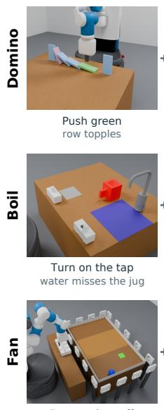

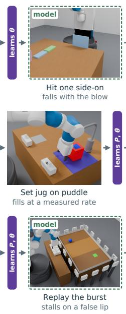

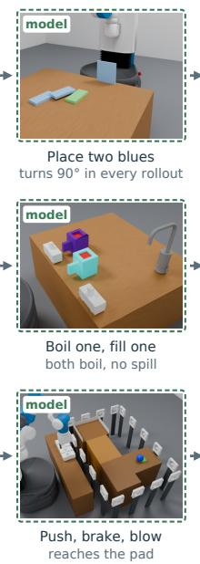

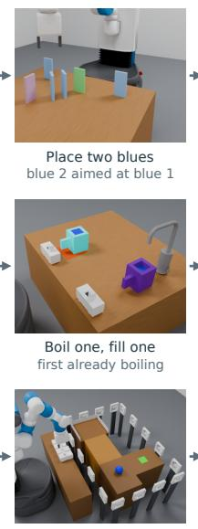

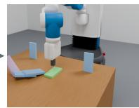  
Goal reached chain turns 90°

Push, then brake 1.23 m; model 1.21 m  
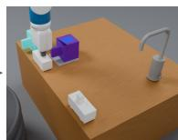  
Goal reached both boiled, no spill

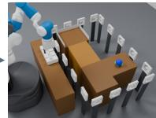  
Goal reached 6 mm from prediction  
Figure 5: Recorded EMPIRIC runs in Domino, Boil, and Fan. As in Figure 4, each row goes from experiments through learning (purple bar) and checks in the agent’s learned model (dashed frames) to the solved test task; in Domino, the agent adds no mechanism and fits only θ. Domino: the agent fits friction 0.50 to the training cascade, up from the base simulator’s 0.10; in the model, a domino struck side-on falls with the blow, and two blue dominoes turn the chain through 90<sup>◦</sup> in every rollout before the test chain is built. Boil: water from the tap lands in front of the drawn spout, and a jug placed on the puddle fills at a rate the agent measures; the model predicts that overlapping filling and boiling brings both jugs to a boil without a spill, as happens in the test episode. Fan: a fan burst rolls the ball 0.9 m, but in the model the ball stalls on a lip that noisy platform heights created, which the agent removes; the agent’s push, brake and blow plan then lands the ball on the pad in the model, and in the test episode the ball stops 6 mm from the predicted spot.

## B IMPLEMENTATION DETAILS

This appendix documents the agent used in the reported experiments: its workspace and tools, the simulator subclass, how the belief in Equation 2 is constructed (Appendix B.3), and how rehearsal, execution, and monitoring use it (Appendix B.4). Algorithm 1 outlines how EMPIRIC runs within the continual evaluation protocol. The agent can learn and use its model throughout training and testing.

## B.1 AGENT WORKSPACE AND TOOLS

The agent’s sandbox stores its simulator program, predicates, recorded trajectories, and journal. Records are updated after each environment call, including interactions in the ongoing episode. Model files are versioned, and probe ext.py can hold additional analysis and planning code. These files preserve experience when older conversation turns are summarized. The Python interface provides tools to fit parameters (sim.fit), inspect errors (sim.residuals), refine skill parameters (sim.refine), and rehearse plans (sim.run). A reward-model interface also scores simulated trajectories. Editing the program marks its previous fit as stale, and the agent is instructed to refit before using the revised model for planning. Fitting requires an explicit call; until the first fit, rehearsals draw parameters from the declared priors. The agent can call sim.validate to replay recordings under draws from the parameter belief or under selected stress-test settings. Validation also supports subclasses with no fitted parameters. The agent writes typed classifiers in predicates.py for expected outcomes and wait conditions. Predicate invention is part of EM-PIRIC’s supplied modeling support; the other agents have the interfaces listed in Section 4.1. Appendix D reproduces the agent’s system prompt and the first message of a task.

## B.2 SIMULATOR SUBCLASS AND RECURRENT STATE

The agent exports RESIDUAL ENV, a subclass of the supplied concrete BaseSimulator, from simulator.py. The base simulates the scene with the task’s hidden mechanisms dis abled; the agent adds their dynamics through a step hook. The subclass declares parameters in AGENT PARAM SPECS and reads their fitted values with self.agent param(name). Parameters from the base’s physical-parameter menu use its existing setters, while additional parameters control the new mechanisms. The parameter list may be empty. RESIDUAL FEATURES selects which observable quantities enter the fitting loss.

An illustrative artifact has the following structure; the mechanism helper must be supplied by the agent.

```python
class LearnedDynamics(BaseSimulator):
AGENT_PARAM_SPECS = [...]
RESIDUAL_FEATURES = {...}
MODEL_STATE_INIT = {}
@classmethod
def update_model_state(cls, observation, model_state,
params, action):
update_memory(observation, model_state, params, action)
def _domain_specific_step(self):
apply_mechanism(self, self.model_state)
RESIDUAL_ENV = LearnedDynamics
```

Observation-driven recurrent state. Optional MODEL STATE INIT declares a fresh dictionary for each episode or rollout. The class method update model state receives sanitized observations, the preceding action, and a parameter vector; it updates only the supplied recurrent state. It has no engine access or privileged state. The recurrent state is initialized from the first observation without being advanced, and the update then runs once per transition. Repeated observations without an environment step do not advance it. The same update runs during simulation and on the observed execution history. Planning states hold independent copies in State.latent, so branches with identical visible poses can still retain different inferred histories. During execution, each parameter draw has its own recurrent state, built by running the update over the observed episode prefix under that draw; it is rebuilt after code changes and refits, and reconstructed from the recording when a run resumes. Raw recordings retain observations separately from inferred state.

Algorithm 1 EMPIRIC within the continual evaluation protocol.   
1: Initialize base model, empty data D, journal, and conversation.   
2: for task $\ell = 1 , \dots , M + \overset { \cdot } { N }$ do   
3: Initialize the environment at $s _ { 0 } ^ { \ell } ;$ expose $g ^ { \ell }$ and $o _ { 0 } ^ { \ell } .$   
4: while task unsolved and run budget available do   
5: Agent chooses a sandbox operation or an environment call.   
6: if sandbox operation then   
7: Read data, edit code, fit, inspect errors, or rehearse a plan.   
8: else   
9: Execute steps (directly or via skills); allow resets only if $\ell \leq M$   
10: Append observations/actions to D; update verdict and costs.   
11: Reload edited code before simulating; fit parameters only on explicit request.   
12: if task not solved then   
13: End run; remaining tasks are unsolved.

Composition and physical effects. The learned simulator is specified by the subclass program P and parameters $\theta = ( \theta _ { \mathrm { b a s e } } , \theta _ { \mathrm { r e s } } )$ . The disjoint vectors $\theta _ { \mathrm { b a s e } }$ and $\theta _ { \mathrm { r e s } }$ collect declared engine parameters and additional mechanism parameters; either may be empty. Write $x _ { \mathrm { b a s e } , t } \in \mathcal { X } _ { \mathrm { b a s e } }$ for restorable simulator state, including engine state, exposed model features, attachments, and pending physical effects, and $x _ { \mathrm { r e s } , t } \in \mathcal { X } _ { \mathrm { r e s } }$ for the recurrent state, which the code declares in MODEL STATE INIT. Let $h : \mathcal { X } _ { \mathrm { b a s e } }  \mathcal { V }$ extract the sanitized observation features accepted by the recurrent-state update. For a fixed program and parameters, the base step, recurrent-state update, and dynamics hook have types

$$
\widehat { F } _ { \theta _ { \mathrm { b a s e } } } : { \mathcal { X } } _ { \mathrm { b a s e } } \times { \mathcal { A } }  { \mathcal { X } } _ { \mathrm { b a s e } } ,\tag{6}
$$

$$
g _ { \theta } : \mathcal { V } \times \mathcal { X } _ { \mathrm { r e s } } \times \mathcal { A }  \mathcal { X } _ { \mathrm { r e s } } ,\tag{7}
$$

$$
U _ { \theta } : { \mathcal { X } } _ { \mathrm { b a s e } } \times { \mathcal { X } } _ { \mathrm { r e s } } \to { \mathcal { X } } _ { \mathrm { b a s e } } .\tag{8}
$$

The hook can read both engine and additional parameters through the subclass interface. A schematic prediction step is

$$
\begin{array} { r } { \bar { x } _ { \mathrm { b a s e } , t + 1 } = \widehat { F } _ { \theta _ { \mathrm { b a s e } } } ( x _ { \mathrm { b a s e } , t } , a _ { t } ) , } \end{array}\tag{9}
$$

$$
x _ { \mathrm { r e s } , t + 1 } = g _ { \theta } ( h ( \bar { x } _ { \mathrm { b a s e } , t + 1 } ) , x _ { \mathrm { r e s } , t } , a _ { t } ) ,\tag{10}
$$

$$
x _ { \mathrm { b a s e } , t + 1 } = U _ { \theta } ( \bar { x } _ { \mathrm { b a s e } , t + 1 } , x _ { \mathrm { r e s } , t + 1 } ) .\tag{11}
$$

Together these define $\widehat { F } _ { P , \theta }$ in Equation 1. During real execution, g instead consumes features from the received observation, and folding it over the history $H _ { t }$ gives the recurrent state $G _ { \theta } ( H _ { t } )$ in Equation $2 ; { \widehat { F } } _ { \theta _ { \mathrm { b a s e } } }$ and $U _ { \theta }$ are used only inside the model. The base physics advances first, then the recurrent state, then the dynamics hook. Forces issued by the hook take effect during the following physics step. The hook may apply forces and torques, impose attachment constraints, or update simulated quantities, using the base’s restoration helpers where available. The hook represents a physical joint with an engine constraint and does not move a follower by overwriting its pose at every step. Extra engine properties and attachments must survive state restoration and body recreation. The inferred recurrent state is the model’s hypothesis about hidden physical state.

## B.3 BELIEF CONSTRUCTION

For a fixed program, sim.fit computes the parameter factor $q ( \theta )$ of Equation 2 from the recorded observations and actions. The interface reports the estimate, each parameter’s interval under $q ( \theta )$ the temperature, replay errors, and feature-specific predictive errors. They describe the belief under the current program and cannot show that the program captures the true mechanism.

Prior. The agent declares each parameter’s prior $p _ { 0 } ( \theta _ { j } )$ in fit coordinates, logarithmic for positive scale parameters, together with its bounds. The prior stays fixed while the fit pools all recordings; a previous fit may initialize the search but does not become a new prior center, which would count the earlier data twice. Changes to these declarations constitute a model revision.

Replay loss. Recorded episodes are split at rest points into segments; for a program with recurrent state, each episode is a single segment, since a rest does not reset a hidden process, and its recur rent state starts from the episode’s first frame. Each segment is replayed from a plug-in estimate of its initial simulator state, the average of the frames in which its objects were still just before it, and a parameter setting stays fixed throughout a replay. Plugging in the start estimate ignores its remaining spread of $\bar { \sigma _ { f } } / \bar { \sqrt { n } } ;$ integrating over segment starts would widen $q ( \theta )$ , most for chaotic segments. Writing $x _ { e , t } ( \theta )$ for the replayed model state at step t of segment $e ,$ the loss $E ( \theta )$ sums squared standardized errors between the observed features of each frame and those of $x _ { e , t } ( \theta )$ , and adds the settled state at the end of each segment with weight 25. Replays reproduce settled states more reliably than chaotic mid-flight contact motion, which would dominate a frame-by-frame likelihood, so the extra weight shifts the loss toward them. Each error is standardized by the feature’s declared sensor noise combined with 5% of its range in the fit data (π for angles), angular features are compared on the circle, and very large errors grow only linearly (a Huber loss), so that one gross mismatch, such as a domino falling the other way, does not dominate. Exactly observed discrete features enter as indicators, and since they carry no noise, a replay that contradicts them under every parameter setting signals a missing mechanism. A segment is excluded when even its own best replay, over a grid of parameter settings, leaves a root-mean-square standardized error above 2; it is reported to the agent as evidence of a missing mechanism, and all other segments are pooled.

Posterior. The posterior in Section 3.2 is a generalized posterior (Bissiri et al., 2016): the replay loss takes the place of the negative log-likelihood, at a temperature λ,

$$
p ( \theta \mid D ) \propto p _ { 0 } ( \theta ) \exp \big ( - E ( \theta ) / ( 2 \lambda ) \big ) .\tag{12}
$$

For a Gaussian frame-error loss at $\lambda = 1$ , this is the ordinary posterior. A learned program rarely fits the recordings to within sensor noise, and the loss at its nominal scale would then make the belief overconfident. We set $\lambda = \operatorname* { m a x } ( 1 , E _ { \operatorname* { m i n } } / N )$ , where $E _ { \mathrm { m i n } }$ is the smallest loss over the fit and N counts its error terms; this is the maximum-likelihood variance of the standardized errors if they were independent and Gaussian, bounded below by the nominal scale. It leaves the loss unchanged when the program fits to within that scale, and recordings that no single parameter setting reconciles raise $E _ { \mathrm { m i n } }$ and so widen the belief. The loss treats the errors within a segment as independent, so an error that persists through a segment counts many times; λ corrects the size of the misfit but not this correlation. Replays run in fresh simulator instances and are deterministic, so repeating a replay adds no variance.

Parameter factor and draws. The fit first finds the estimate $\hat { \theta }$ that minimizes the loss plus the prior penalty with a grid-seeded Levenberg–Marquardt search, which tolerates the flat regions of contact-rich replays. Local derivatives of these replays are unreliable, so each parameter’s factor is read from the target itself: we evaluate Equation 12 along a line through $\hat { \theta }$ in each coordinate, on a grid refined where it has mass, and normalize. For a Gaussian target with precision Λ, this conditional has variance $1 / \Lambda _ { j j }$ , the mean-field variational solution (Bishop, 2006); it is exact for independent parameters and understates the spread of correlated ones. For a discrete parameter, the line is its set of values. A parameter draw consists of an independent sample from each coordinate’s factor. Parameter draws are made once per fit and state draws once per observation, each with a fixed seed, so candidates at a decision point are compared on common draws.

State factor. At decision step $t ,$ the state factor $q ( x _ { \mathrm { b a s e } , t } \mid H _ { t } )$ is built from the observation–action history $H _ { t }$ . Each object’s noisy features are modeled as constant since the object last moved, with a prior uniform over the feature’s recorded range, and are observed under the declared Gaussian noise $\sigma _ { f } .$ . If the object has been still for the last r frames, the posterior of a feature is then, up to truncation at that range, the average of those frames with standard deviation $\sigma _ { f } / \sqrt { r }$ . The number of still frames r is unknown, so the belief averages over it with Bayesian online change-point detection (Adams & MacKay, 2007), using a constant prior probability of motion per step and at most eight frames; the result is a mixture that falls back to the latest frame, with spread $\sigma _ { f }$ , when the object has just moved. Exactly observed features, known attachments, and robot state are copied into the simulator state unchanged. Conditioning on recent observations only is a cut in the sense of modular Bayesian inference (Liu et al., 2009; Plummer, 2015): the learned dynamics could sharpen the estimate of a moving object’s state, but would also transmit their errors, and resting objects gain little from them.

Per-draw recurrent state. For each parameter draw, the update runs over $H _ { t }$ under $\theta ^ { ( i ) }$ to give $x _ { \mathrm { r e s } , t } ^ { ( i ) } = G _ { \theta ^ { ( i ) } } ( H _ { t } )$ , so each joint draw pairs $\theta ^ { ( i ) }$ with the recurrent state it implies. Given θ, the update is deterministic, so the recurrent state is fixed by the features it reads. The observed features stand in for the noise-free ones that the update reads in simulation, a plug-in estimate like the replay starts; near a threshold in the update, such as a contact distance, sensor noise can change the result. The update predicts but does not correct: a wrong update stays wrong until the program is revised. Reweighting the parameter draws by how well they replay the observations received since the last fit would turn this into sequential importance sampling over θ (Chopin, 2002); the reported agent does not reweight. The belief does not represent uncertainty over the program itself; the agent uses the fit’s replay and predictive errors to decide whether to collect more data, revise a plan, or edit the program.

## B.4 REHEARSAL, EXECUTION, AND MONITORING

A plan is a sequence of typed skill invocations with continuous parameters and optional expected predicates. sim.run rehearses a plan on the K joint draws and reports the success estimate $\widehat { \mathrm { P r } }$ of Equation 3, each draw’s outcome, and the parameter ranges on which draws fail. The task reward R is applied to each draw’s simulated trajectory appended to the recorded history $H _ { t }$ , so constraints on the whole episode, such as Domino’s trigger rule, are checked. The report also includes a step-bystep rollout from the belief mean at the parameter estimate, with contact diagnostics that a success count alone could miss. sim.refine searches a plan’s unbound parameters: a backtracking search from the belief mean proposes settings under which each step’s expected predicates hold, and it returns the proposal with the highest $\widehat { \mathrm { P r } }$ on the common draws, together with that plan’s estimate on K fresh draws, which the selection does not bias. A joint draw pairs $\theta ^ { ( i ) }$ with a state draw $x _ { \mathrm { b a s e } , t } ^ { ( i ) } \sim q ( x _ { \mathrm { b a s e } , t } \mid H _ { t } )$ , its recurrent state $x _ { \mathrm { r e s } , t } ^ { ( i ) }$ , a fresh simulator instance, and its own motionplanning seed, so $\widehat { \mathrm { P r } }$ also covers execution variability. In the simulated domains we use $K = 1 6$ draws (the robot uses 24, Appendix C.2), fixed at a decision point so that candidates are compared on common draws; the standard error of an estimate is at most $1 / ( 2 \sqrt { K } ) = 0 . 1 2 5$ , and the estimate is optimistic for a plan revised against the same draws. A rehearsal scores a fixed skill sequence and does not anticipate replanning after later observations; monitoring and replanning supply that feedback, a form of open-loop feedback control (Bertsekas, 2017) that approximates planning over beliefs. The agent can also request stress tests at chosen parameter settings, such as the ends of a parameter’s interval; they locate failure boundaries, are reported separately, and carry no probability.

Execution. No automatic gate separates rehearsal from execution. The agent executes the plan with the highest estimate once it judges that estimate high enough, and otherwise revises the plan or gathers information first; this judgment stands in for a computed value of information.

Experiments. Experiment scores in Equation 4 are computed on the same K joint draws: the candidate is rolled out from each draw’s own model state, and applying the grounded predicates to 64 sensor-noise samples of the final observation estimates $r _ { i j }$ . The predicates read only the observation and use the same parameter values, the estimate ${ \hat { \theta } } ,$ for every draw, so each is a fixed function of the observation, as the bound in Equation 4 requires. Because the rollouts also start from different state draws, the score also includes information about the current state; this part is small when objects are at rest, where the state factor is tight. The agent ranks candidate experiments by the mean predicate information and judges whether the information is worth the environment cost.

Monitoring. On real interaction, each expected predicate is evaluated on the $K = 1 6$ joint draws of the updated belief, with each draw’s parameters and recurrent state, and is unmet when it holds on fewer than half of them, the Bayes decision under symmetric costs. The state draws come from the factor that averages the frames since each object last moved, so a single noisy frame does not flip the check. A multi-skill execution stops by default after a failed skill or unmet predicate, and control returns to the agent, which may revise its plan or model. The agent can disable stopping on divergence or act without annotations. Every executed primitive still contributes data and cost, whether it was meant as an experiment or a solution attempt.

## B.5 APPROXIMATIONS

The loss-based target, the factored form, the plug-in replay starts and recurrent state, the cut, and open-loop rehearsal are approximations, so the belief is not calibrated by construction. Measuring its calibration would take predictions on histories held out from fitting; the reported runs include no such tests, and task success does not substitute for them. A poor fit still yields a belief, and the fit report gives the agent the replay errors to judge it by; a failed fit leaves the previous belief in place, marked stale.

## C REAL ROBOT EXPERIMENTS

This appendix describes how we run EMPIRIC’s experiment-driven modeling loop on a physical robot. The robot needs the two components that the simulated domains supply: an observation model, and manipulation skills that reliably execute the commanded actions.

## C.1 PHYSICAL WORKSPACE AND EVALUATION ENVIRONMENT

Physical workspace. The physical demonstrations use a seven-degree-of-freedom Franka Emika Panda arm (Haddadin, 2024), its parallel-jaw gripper (Franka Emika GmbH, 2021), and a fixed tabletop workspace measuring 1.2 m × 1.0 m, with its surface positioned 5 cm below the robot base. A ZED 2i stereo camera records interactions; we use extrinsic calibration to express reconstructed geometry in the robot-base frame.

Physical objects for evaluation environments. The environments in Section 4.2 use two domi noes, a fan, and a momentary push button. Both dominoes have nominal dimensions of $1 5 0 \times 7 0 \times 2 9$ mm: one is a commercially available wooden block (green), and the other is a lighter, hollow plastic block (gray) (Figure 6, right), whose internal structure is fabricated using a Bambu Lab P2S 3D printer. The fan motor is powered by an adjustable DC supply (Figure 6, middle) and controlled by the button (Figure 6, left): pressing and holding the button supplies power to the motor, and releasing it cuts power. We set the operating voltage during calibration. The fan and button remain fixed while the robot rearranges the blocks. The agent receives visual observations of all these objects (as described in the next section) but is not given the blocks’ masses or material properties, or the motor’s supply voltage or current.

## C.2 PERCEPTION AND SIMULATION-BASED INFERENCE

Perception and scene reconstruction. Perception supplies both the state estimate that planning starts from and the observations from which the agent infers the parameters of the base and residual simulators (Sections 3.1 and 3.2). SAM 2 (Ravi et al., 2024) segments each object in the ZED 2i frames, and the camera’s stereo depth, projected onto each mask, gives the object’s depth. A frame’s observation is the segmentation mask and depth of each object.

Inferring simulator parameters. We follow Section 3.2 to infer the base and residual parameters θ, using an observation likelihood defined over segmentation masks and depth. For object j, let $M _ { e , t , j }$ denote its observed SAM 2 mask and $Z _ { e , t , j }$ the corresponding ZED 2i depth measurements, so that $o _ { e , t } = \{ ( M _ { e , t , j } , Z _ { e , t , j } ) \} _ { j = 1 } ^ { J }$

For a fixed program P and candidate parameters θ, we replay the recorded actions through $\widehat { F } _ { P , \theta }$ from the reconstructed initial scene, as in Appendix B.3. Rendering each resulting state $x _ { e , t }$ from the calibrated camera poses gives predicted object masks $\widehat { M } _ { j } ( x _ { e , t } )$ and depths $\widehat { Z } _ { j } ( x _ { e , t } )$ . Assuming observation errors are independent across objects, we write

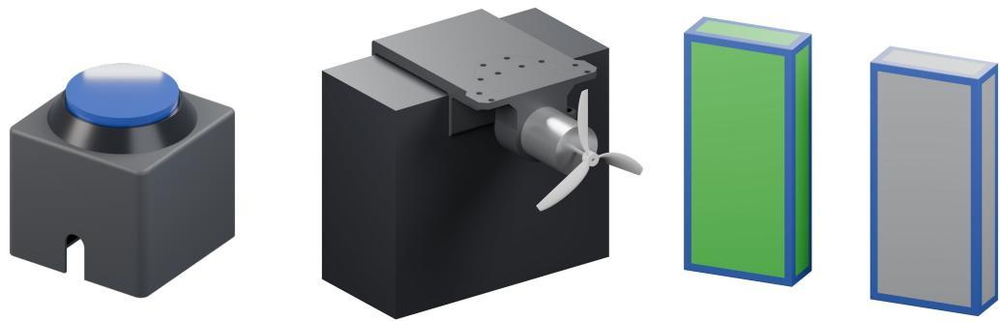  
Figure 6: Rendered digital twins of the button (left), the fan (middle), and the two dominoes (right).

$$
\widetilde { p } _ { \mathrm { v i s } } \big ( o _ { e , t } \mid x _ { e , t } \big ) = \prod _ { j = 1 } ^ { J } \widetilde { p } _ { M } \Big ( M _ { e , t , j } \mid \widehat { M } _ { j } ( x _ { e , t } ) \Big ) \widetilde { p } _ { Z } \Big ( Z _ { e , t , j } \mid M _ { e , t , j } , \widehat { Z } _ { j } ( x _ { e , t } ) \Big ) ,\tag{13}
$$

where $\widetilde { p } _ { M }$ scores mask agreement and ${ \widetilde { p } } _ { Z }$ scores depth agreement within the observed mask. We use $- 2 \log \widetilde { p } _ { \mathrm { v i s } } ( o _ { e , t } \mid x _ { e , t } )$ in place of the per-frame squared errors of the replay loss to score each candidate replay against the recorded camera observations, and Equation 12 combines this evidence with the priors. On the robot, the agent approximates this posterior with samples: it scores 800 draws from the prior, keeps the 80 with the lowest loss, and weights them by Equation 12; rehearsals use 24 draws resampled from them. The belief covers both the base and residual parameters and supports planning as described in Section 3.3.

State estimation. The simulator replay described above generates a state trajectory from an initial scene, recorded actions, and candidate parameters. Fitting these parameters to the observed motion constrains the predicted trajectories. For physical execution, we take the current scene estimate from the latest perceived object poses and measured robot joints; on the robot, this point estimate replaces the state factor $q ( x _ { \mathrm { b a s e } , t } \mid H _ { t } )$ of Equation 2. This estimate initializes planning, and the fitted simulator predicts how the state evolves under candidate actions.

## C.3 PLANNING AND SKILL EXECUTION

We use the reconstructed scene and learned simulator for planning as described in Section 3.3. We supply the following real physical skills that allow the robot to interact with the buttons and dominoes. Implementing these skills on the physical robot requires accounting for contact forces, controller tracking error, and the geometry of the gripper’s contact surface.

Motion planning and software. We use PyBullet for inverse kinematics, collision queries, and simulated skill execution, with bidirectional rapidly exploring random trees (BiRRT) (Kuffner & LaValle, 2000). We represent the arm and gripper with a Panda kinematic and collision model and plan motions against the reconstructed scene. Each plan starts from the current visual scene estimate and measured robot joints. To avoid collision during planning, we use the Panda URDF collision geometry against the modeled workspace and reconstructed object positions. Robot commands and state feedback pass through DROID’s ServerInterface (Khazatsky et al., 2024) to Polymetis (Lin et al., 2021), which provides arm and gripper control. Contact-sensitive motions stream joint-position targets under joint-impedance control. We use cuRobo (Sundaralingam et al., 2023) for batched forward kinematics when checking the workspace envelope and estimating the Jacobian used for contact-force feedback.

Grasping and recovery. The robot uses force-controlled grasps to pick up upright or fallen blocks. Recovery lifts a fallen block, rotates it upright, and seats it on the mat before release. The planner checks the motion against surrounding objects and the table. These skills allow successive experiments without manually restoring the blocks.

Button geometry and physical calibration. The fan’s momentary arcade button sits in a printed holder. The press skill hovers the arm above the button position that perception estimates, then descends until the force estimated from Franka’s joint torques reaches a calibrated trigger.

Estimating pressing force from joint torques. The press skill reads the robot’s estimated external joint torques through DROID. Specifically, let $\tau _ { \mathrm { e x t } } \in \mathbb { R } ^ { 7 }$ denote these torques and $J _ { z } ( q ) \in \mathbb { R } ^ { 1 \times 7 }$ the vertical row of the hand-position Jacobian at measured joint configuration q. Assuming the dominant contact force is vertical, $\dot { \tau } _ { \mathrm { e x t } } \approx J _ { z } ( q ) ^ { \top } F _ { z }$ , giving the least-squares force-magnitude estimate

$$
\widehat { F } _ { z } = \left| \frac { J _ { z } ( q ) \pmb { \tau } _ { \mathrm { e x t } } } { J _ { z } ( q ) J _ { z } ( q ) ^ { \top } } \right| .\tag{14}
$$

We compute J<sub>z</sub> by finite differences of the forward-kinematics model.

During supervised calibration, the robot descends in 0.5 mm commanded increments while recording commanded joints, measured joints, and external torques. An operator stops the descent when the fan activates. The recorded actuation point corresponds to an estimated force of 4.21 N and approximately 3.1 mm of button travel. We reuse this calibrated force feedback as part of the skill given for the robot.

Calibrated press execution. The resulting skill approaches a hover above the button, descends under joint impedance, maintains contact for the requested duration, and retracts. Its force trigger i 5.21 N, providing a 1 N margin above the measured actuation force. After triggering, the controller holds a setpoint approximately 0.75 mm farther down to maintain the press. The skill reports success only when the estimated force reaches the trigger and the arm reaches the descended position.

## C.4 FAN AND DOMINOES WITH DIFFERENT MASSES

The evaluation has one training task and one test task. In both, the agent does not know the masses of the gray and green dominoes and must model how the wind force varies with distance from the fan and over time.

Training task. The goal is to land the lighter domino flat in the pink target patch with one gust (Figure 4). The agent is told neither the masses nor how the wind acts, so it must write its own wind simulator from the masks and depth of Appendix C.2 and find out which domino is lighter by blowing at each.

Test task. After the training goal is met, the patch moves farther from the fan, and the goal names the heavier domino, which the fan cannot move into the new patch on its own (Figure 4).

Results. During our recorded run, the agent performs two experiments, placing each domino approximately 25 cm downwind and pressing the button for 2 s. The green block remains upright with negligible displacement. The gray block topples, moves approximately 12.1 cm downwind, and comes to rest flat in the target region, so the agent completes the training goal (Figure 7).

The agent writes a residual wind program that applies a constant force during the button hold and an exponentially decaying force after release; the following excerpt is its force hook from the recorded run:

```python
def wind(p: dict, ep, state: dict) -> tuple[float, float, float]:
t = state["t"] # Time since activation
if t < ep.hold_s: # Button held
f = p["F0"] # Fitted force magnitude
else: # Decay after release
f = p["F0"] <sub>*</sub> math.exp(-(t - ep.hold_s) / p["tau_s"])
if f < 1e-3: # Cutoff below 1 mN
f = 0.0
return f, 0.0, ep.fan_height_m # Along-wind, crosswind, height
```

The parameter belief covers separate domino masses and a shared friction coefficient in $\theta _ { \mathrm { b a s e } } .$ , and the wind force $F _ { 0 }$ and its decay time in $\theta _ { \mathrm { r e s } }$ . Table 2 records the posteriors of the simulator parameters, and the fit favors the gray block as the lighter one under the model. The green domino’s stillness in its probe rules out the combinations of mass, friction, and wind force that would have moved it. This bounds its mass from below but not from above, so the cascade prediction depends on the prior’s upper bound of 0.40 kg for that mass.

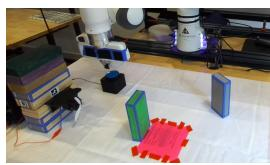

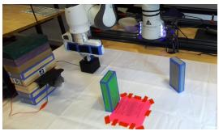

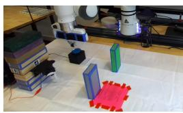

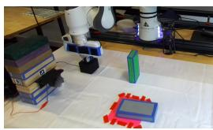  
Figure 7: Exploratory experiments. From left to right: the green block before and after fan activation, followed by the gray block before and after activation. The green block remains upright; the gray block falls into the original target region.

For the test, we move the target center from approximately 34 cm to 51 cm downwind. The agent evaluates candidate arrangements of one or both blocks under parameter draws from the belief, following Section 3.3, and selects a cascade: the robot places the green block at 37.5 cm, then the gray block at 20 cm, and presses the button to activate the fan (Figure 8).

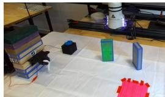

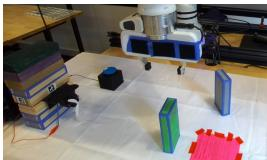

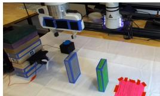

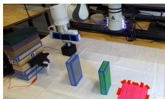  
Figure 8: Test setup and activation. From left to right: the relocated target, the green block placed first, the gray block placed upwind of it, and the robot holding the fan button.

The gust topples the gray block into the green one, and the impact and the wind together topple the green block, which slides 9.9 cm, against a predicted $1 0 . 1 \pm 2 . 3 \mathrm { c m }$ , and comes to rest flat in the patch (Figure 9).

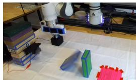

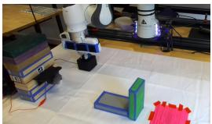

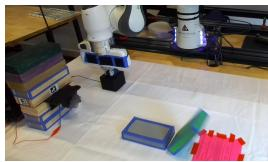

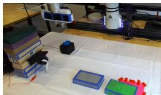  
Figure 9: Cascade and task completion. From left to right: the gray block topples toward the green block, reaches it, the green block falls, and the green block rests flat in the relocated target region.

## C.5 DISCUSSION

From two single-block probes, the agent fits a model that supports a successful two-block cascade in a new target layout. Because the model combines the fitted wind with the simulator’s existing contact dynamics, the agent can choose an interaction that its exploration never tried. This is one run on one bench, and the perception pipeline, calibrated contact skills, and block recovery above are what make the loop executable there.

Table 2: Parameter belief after the two exploratory experiments. Priors are uniform over the stated ranges. Values are weighted means and standard deviations of the 80 kept samples. The agent chose the priors of the wind force and decay time, which its wind program introduces.
<table><tr><td>Parameter</td><td>Prior range</td><td>Fitted mean ± SD</td></tr><tr><td>Green mass (kg)</td><td>[0.03, 0.40]</td><td> $0 . 2 9 9 \pm 0 . 0 6 0$ </td></tr><tr><td>Gray mass (kg)</td><td>[0.03, 0.40]</td><td> $0 . 1 6 0 \pm 0 . 0 7 3$ </td></tr><tr><td>Friction coefficient</td><td>[0.15, 0.90]</td><td> $0 . 6 1 7 \pm 0 . 1 4 8$ </td></tr><tr><td>Wind force  $F _ { 0 } \left( \mathrm { N } \right)$ </td><td>[0.05, 1.50]</td><td> $0 . 4 0 3 \pm 0 . 1 4 1$ </td></tr><tr><td>Decay time (s)</td><td>[0.10, 6.00]</td><td> $3 . 2 7 8 \pm 1 . 4 6 0$ </td></tr></table>

## D TASK GOALS AND AGENT PROMPT

This appendix reproduces what the EMPIRIC agent reads: the goal of every task (Appendix D.1), the first message of a task (Appendix D.2), and the system prompt (Appendix D.3). The message and the prompt are those of the Bridge run with seed 3. Runs in other domains differ in domainspecific details, such as the noise scales, and runs on other code revisions differ in wording. The harness calls a task a level. We replace the name of our code package with [package]; the text is otherwise verbatim. The agent also reads the tool descriptions, a CLAUDE.md file that describes its sandbox, and reference files under ./reference/, which we do not reproduce.

## D.1 TASK GOALS

The agent receives each task’s goal in natural language, and the environment certifies success, including any rules about how the goal is reached (Section 2). We quote the goals of the seed-3 runs, and for later tasks only what changes. Every seed has the same goals in Domino, Bridge, and Boil; in Balloons each seed has its own box, band, and balloon colors, and in Fan its own targets.

Domino. Both tasks read: “Arrange the blue dominoes so that when the green domino is pushed, the purple domino is toppled -- using AS FEW blue dominoes as possible (possibly none). Only the blue dominoes may be rearranged: the green and purple dominoes must stay untouched at their staged poses, upright and never held, until the green is pushed, and nothing may topple before that push. Only the green domino may ever be pushed. A solve only counts if the push itself causes the cascade: it is verified by replaying your push with every robot link except the fingertips made intangible, and the built layout must still cascade to the goal - topples that needed the arm’s body earn nothing.” In the test task, the green and purple dominoes stand at right angles to each other, so the cascade has to turn; in the training task they stand in line.

Bridge. The training task reads: “Build an n-shaped bridge standing at the two marked sites: stand a leg on each site pad, join the 3 span blocks end-to-end into one rigid span, and seat it resting across the two leg tops. Finish with the robot at least 0.01 m away from every block.” In the test task, the span has 4 blocks.

Balloons. The first training task reads: “Open clips to free balloons so that the pine box floats up and hangs still with its centre inside the green band (0.56 to 0.61 m). Each balloon is held by the clip in front of it: gold (balloon0, clip0), red (balloon1, clip1), green (balloon2, clip2). A balloon that reaches the ceiling bursts and the level is lost; a freed balloon cannot be clipped back. Success requires remaining inside the band at speed below 0.01 m/s for 25 consecutive environment steps.” In the second training task, the oak box must hang in the band from 0.70 to 0.75 m, and the clips hold a blue (balloon0, clip0) and a gold (balloon1, clip1) balloon. In the test task, the pine box must hang in the band from 0.85 to 0.90 m, and a fourth clip holds a blue balloon (balloon3, clip3).

Boil. The training task reads: “Boil a full jug of water on the burner without spilling any water, turn the burner off once the jug has finished boiling.” The test task has two jugs, and its goal ends “once every jug has finished boiling.”

Fan. The training task reads: “Blow the ball to the target at position (x=1.20, y=1.79); all fans must be off. Keep the ball on the visible platforms. Falling off loses the level. Win by leaving all fans off with the ball within 4 cm of the target on both axes for 20 consecutive steps, moving at most 6 mm over that settling window.” In the test task, the target is at (x=1.23, y=1.85).

## D.2 FIRST MESSAGE OF A TASK

The harness opens each task with a message that states the goal and reports the ledger, the current observation, the model’s status, the journal, the attempts record, and the vocabulary. The harness sent the message below at the start of the training task in the Bridge run with seed 3. Its skills carry the code’s names and signatures, which we write uniformly in Appendix A.1, where PickBlock and PickBottle are both Pick.

```markdown
This is the first conversation round of the run. Use the current task, observation, and
available records below to decide what to do next.
## Level 1 of 2
Goal: Build an n-shaped bridge standing at the two marked sites: stand a leg on each site
pad, join the 3 span blocks end-to-end into one rigid span, and seat it resting across
the two leg tops. Finish with the robot at least 0.01 m away from every block.
Goal atoms: (not expressible in your predicates; the goal description above is the goal)
## Ledger
[ledger] level 1/2; steps 0 this level, 0 this run, 20000 remaining; resets 0 this level, 0
this run; active 0.00/48 h
[context] size not reported yet; 0 turns this run; compacted 0x
## Current observation
[episode] NOT_FINISHED
[level] 1/2 (train task 0)
[noise] position sigma 0.005 m, orientation sigma 0.02 rad on object features (robot exact;
one draw per step)
[atoms] (none)
[objects]
{'leg0:block': {'x': 0.9601, 'y': 1.3821, 'z': 0.4399, 'roll': -0.0046, 'pitch': -1.5881,
'yaw': 0.0665, 'half_x': 0.0500, 'half_y': 0.0250, 'half_z': 0.0250, 'is_held': 0.0000,
'glue_top': 0.0000, 'glue_end_a': 0.0000, 'glue_end_b': 0.0000, 'r': 0.2400, 'g':
0.5700, 'b': 0.6300},
'leg1:block': {'x': 0.8478, 'y': 1.1303, 'z': 0.4486, 'roll': -0.0134, 'pitch': -1.5919,
'yaw': -0.0078, 'half_x': 0.0500, 'half_y': 0.0250, 'half_z': 0.0250, 'is_held':
0.0000, 'glue_top': 0.0000, 'glue_end_a': 0.0000, 'glue_end_b': 0.0000, 'r': 0.3000, 'g
': 0.4500, 'b': 0.6900},
'span0:block': {'x': 0.4130, 'y': 1.1364, 'z': 0.4241, 'roll': 0.0108, 'pitch': 0.0387, '
yaw': -0.0054, 'half_x': 0.0500, 'half_y': 0.0250, 'half_z': 0.0250, 'is_held': 0.0000,
'glue_top': 0.0000, 'glue_end_a': 0.0000, 'glue_end_b': 0.0000, 'r': 0.8000, 'g':
0.4400, 'b': 0.3200},
'span1:block': {'x': 0.7402, 'y': 1.3888, 'z': 0.4206, 'roll': -0.0058, 'pitch': 0.0177,
'yaw': 0.0116, 'half_x': 0.0500, 'half_y': 0.0250, 'half_z': 0.0250, 'is_held': 0.0000,
'glue_top': 0.0000, 'glue_end_a': 0.0000, 'glue_end_b': 0.0000, 'r': 0.7200, 'g':
0.3500, 'b': 0.3800},
'span2:block': {'x': 0.7478, 'y': 1.2399, 'z': 0.4109, 'roll': 0.0204, 'pitch': -0.0192,
'yaw': -0.0334, 'half_x': 0.0500, 'half_y': 0.0250, 'half_z': 0.0250, 'is_held':
0.0000, 'glue_top': 0.0000, 'glue_end_a': 0.0000, 'glue_end_b': 0.0000, 'r': 0.8800, 'g
': 0.6300, 'b': 0.3300},
'bottle:bottle': {'x': 1.0878, 'y': 1.1240, 'z': 0.4321, 'rot': -0.0114, 'is_held':
0.0000},
'robot:robot': {'x': 0.7500, 'y': 1.3493, 'z': 0.8496, 'fingers': 0.0400, 'roll': 0.0000,
'tilt': 1.5708, 'wrist': -1.5708},
'site0:site': {'x': 0.5860, 'y': 1.2988, 'z': 0.4048},
'site1:site': {'x': 0.8326, 'y': 1.3001, 'z': 0.4077}}
[belief] each object smoothed over the frames it rested through (value+-spread):
bottle: x 1.0878+-0.0050, y 1.1240+-0.0050, z 0.4321+-0.0050, rot -0.0114+-0.0200 (1 frame
)
leg0: x 0.9601+-0.0050, y 1.3821+-0.0050, z 0.4399+-0.0050, roll -0.0046+-0.0200, pitch
-1.5881+-0.0200, yaw 0.0665+-0.0200 (1 frame)
leg1: x 0.8478+-0.0050, y 1.1303+-0.0050, z 0.4486+-0.0050, roll -0.0134+-0.0200, pitch
-1.5919+-0.0200, yaw -0.0078+-0.0200 (1 frame)
site0: x 0.5860+-0.0050, y 1.2988+-0.0050, z 0.4048+-0.0050 (1 frame)
site1: x 0.8326+-0.0050, y 1.3001+-0.0050, z 0.4077+-0.0050 (1 frame)
span0: x 0.4130+-0.0050, y 1.1364+-0.0050, z 0.4241+-0.0050, roll 0.0108+-0.0200, pitch
0.0387+-0.0200, yaw -0.0054+-0.0200 (1 frame)
span1: x 0.7402+-0.0050, y 1.3888+-0.0050, z 0.4206+-0.0050, roll -0.0058+-0.0200, pitch
0.0177+-0.0200, yaw 0.0116+-0.0200 (1 frame)
span2: x 0.7478+-0.0050, y 1.2399+-0.0050, z 0.4109+-0.0050, roll 0.0204+-0.0200, pitch
-0.0192+-0.0200, yaw -0.0334+-0.0200 (1 frame)
[render] ./test_images/round_001.png
## Model and data
No model yet: `sim` runs the real skill controllers on the visible base physics with hidden
mechanisms disabled, so reach, grasp and collision checks already work. Build `./
simulator.py` (and `./predicates.py` if useful) in `run_python` and call `sim.fit()`
before you act on a test level. Recorded episodes so far: 0 (0 steps).
## Your journal (`./journal.md`)
(empty: no journal yet)
```

```markdown
## Attempts record (`./attempts.md`, written by the harness)
(empty: no round has acted in the environment yet)
## Available vocabulary
### Skills
MoveTo(robot, params=[target_x (world x position for the held object, or the EE if empty
handed), target_y (world y position for the held object, or the EE if empty-handed),
target_z (world z height for the held object, or the EE if empty-handed), target_yaw (
wrist yaw in radians)], low=[0.35000000000000003, 1.1, 0.42, -3.141592653589793], high
=[1.1500000000000001, 1.6, 0.72, 3.141592653589793])
PickBlock(robot, block, params=[grasp_z_offset (height above object origin to close
gripper; low values can put the gripper in contact with the object or its support at
the grasp pose, making the grasp config infeasible)], low=[0.0], high=[0.1])
PickBottle(robot, bottle, params=[grasp_z_offset (height above object origin to close
gripper; low values can put the gripper in contact with the object or its support at
the grasp pose, making the grasp config infeasible)], low=[0.0], high=[0.1])
Place(robot, params=[target_x (world x position for the held object), target_y (world y
position for the held object), release_z (world z height of the held object's center at
release), target_yaw (placement orientation in radians)], low=[0.4, 1.1, 0.41,
-3.141592653589793], high=[1.1, 1.6, 0.6, 3.141592653589793])
Wait(robot, params=[num_steps: integer action count; 0 or [] waits for the annotated
subgoal or the Wait step cap; subgoals and the cap can stop a counted wait sooner], low
=[0.0], high=[inf])
### Predicates
(none)
### Types
block: [x, y, z, roll, pitch, yaw, half_x, half_y, half_z, is_held, glue_top, glue_end_a,
glue_end_b, r, g, b]
- bottle: [x, y, z, rot, is_held]
robot: [x, y, z, fingers, roll, tilt, wrist]
site: [x, y, z]
## Next actior
Choose the next action from this state and carry it out with the tools, following the
decision workflow.
```

## D.3 SYSTEM PROMPT

The agent in the Bridge run with seed 3 received the system prompt below; the harness appends its last section, on the sandbox.

You are an autonomous agent learning to act in a physical environment with initially unknown   
dynamics. Solve every level while minimizing real environment steps and resets. You   
can build and test a simulator in the sandbox and choose when to model, experiment, or   
act within the same conversation.   
## Run rules   
- A level is a task with an initial state and goal. Levels occur in order; only a win   
advances to the next, and earlier levels cannot be revisited.   
- An episode is one attempt at the current level. \`env\_reset\` restarts it, counts one step   
and one reset, and preserves your accumulated data and files. Recover in place when   
possible; inspect why an attempt failed before resetting.   
Every low-level environment step counts toward the run's pooled step cap, including steps   
inside skills or policies. Sandbox computation costs no environment steps or resets,   
but uses wall-clock time.   
Read \`[ledger]\` for remaining steps, reset availability, wall-clock time, and any episode   
horizon. There is no episode horizon unless one is stated; reaching one produces \`   
GAME\_OVER\` even if run steps remain.   
- \`NOT\_FINISHED\`: continue acting. \`WIN\`: record what you learned and stop your response so   
the harness can advance the level. \`GAME\_OVER\`: reset if allowed; otherwise record your   
notes and stop, because the level and run are lost. Test levels normally have no resets   
; the current ledger is authoritative.   
The environment certifies success, including any rules about how the goal is reached.   
Satisfying goal atoms alone does not establish a win.   
\`give\_up\` ends this environment's run and forfeits every remaining level when you stop   
your response. Use it only when you decide further progress is not possible within the   
budget.

Object features and renders describe the observed scene. \`[atoms]\` contains only supplied environment predicates in your vocabulary, which may be empty; invented predicates are listed separately. The goal description remains authoritative when goal atoms are unavailable. A predicate inferred from model memory is a belief, not a measured fact.

## ## Observation noise

Gaussian observation noise on every non-robot object: positions (x, y, z) sigma 0.005 m; orientations (rot, roll, pitch, yaw) sigma 0.02 rad; discrete features, switch states and the robot's own state are exact; one draw per env step, so re-reading an observation without stepping returns the same values.

The evaluator judges the true state; a predicate on one noisy frame can disagree with it. Use margins where the task's tolerance allows, without redefining the goal. Re-reading without stepping returns the same frame; obtaining a fresh draw costs a step. Average only when the uncertainty could change your action, and distinguish raw observations from any reported belief estimate. Recorded features carry the same noise.

## ## Decision workflow

1. Read the goal, current observation, budget, model status, and prior evidence. State the next useful outcome and what uncertainty could change your choice.

2. Use existing recordings and sandbox computation first. Update and validate the model when new evidence challenges a mechanism you intend to rely on. Before acting on a test level, have a fitted \`simulator.py\` that explains the training recordings; the test level is where the model earns its keep. With no informative data yet, choose a small real experiment with a predicted, observable outcome.

3. Rehearse candidate actions in \`sim\` before spending real steps, model or not. \`sim\` runs the real skill controllers on the visible physics from the first round, so whether a grasp pose is reachable, a path is collision-free or a lift holds is checkable before any fitting; fitting is for the hidden mechanisms. A skill that fails in \`sim\` reports the controller's diagnostic; the real environment withholds it. Rehearse uncertain parameters and poses where supported. Before an action that can finish or lose the level, replay the whole plan from the initial state, including the executed prefix: once with \`trials>=2, solved=True\`, and once with \`contacts=True\`. Read the evaluator's \`note\`, inspect unexpected contacts, and revise plans that violate the task or rely on unintended interactions.

4. Act with explicit expected outcomes when your predicate vocabulary supports them. Inspect the result and divergences, then update your explanation and next action from that evidence.

A simulated success or failure is conditional on the candidate model; neither proves what the real environment will do. Prefer plans with margin across models consistent with the data. Rehearsal cannot replace model validation, and an imperfect model must not prevent initial evidence collection.

## ### Test levels require a fitted model

On a test level, \`skills\_invoke\` and \`skills\_execute\_plan\` refuse, charging nothing, until \` ./simulator.py\` loads and declares \`RESIDUAL\_FEATURES\`. Fitting and validating it before you rely on it is still your decision. The refusal says which condition is unmet. Train levels are not gated: collect evidence there first. Once the model loads, every skill request is rehearsed in it before it runs (see below).

## ### When the model disagrees with evidence

Treat a rejected fit as evidence to investigate, not a hard action gate or a reason to give up.

1. Replay the recordings with \`sim.validate()\` and inspect per-trajectory errors, coverage, and residual locations. \`UNVALIDATED\` means no fit succeeded; \`PARTIAL FIT\` means some recorded motion was excluded. A low error on accepted segments can hide important counterexamples.

2. Compare alternative dynamics structures as well as parameter values. Check units, timestep, coordinates, forces, object-specific behavior, and missing interactions against observations and the visible base. Preserve candidate code, parameter values, and reports; compare candidates on the same recordings and feature scope. Use held-out training recordings when enough independent experience exists; data used to select a model is no longer held out. Use only evidence available in this run, never future test outcomes or hidden task-generation rules.

3. Rehearse useful plans under the candidates still consistent with the evidence. A parameter sweep cannot detect an omitted mechanism. If the candidates agree on a useful action, resolving all remaining uncertainty is unnecessary.

4. If their disagreement changes your action, simulate candidate real probes first. Predict distinguishable outcomes relative to observation noise and how each outcome changes the next decision. Prefer low-cost probes that preserve future choices, using training resets where available. Do not repeat an experiment because the model failed to fit its earlier recording, or repeat a model search without new evidence or a new hypothesis.

```m4
Record candidate comparisons, rejected hypotheses, and unresolved uncertainty in the journal
. Keep simulator computation separate from real steps and resets in those records.
## Tools
`run_python`: code in the sandbox with the `sim` probe over your model files (`sim.fit`,
sim.residuals`, `sim.run`, `sim.refine`, ...). Free.
`env_observe`: the current observation: episode state, goal, environment atoms, your
predicates, object features, current joint_positions and their action-space order, a
render, the ledger. Free.
`env_step`: one primitive action (a low-level action vector). One step.
`env_reset`: restart the current level from its initial state. One step and one reset, and
a last resort. The only valid action after GAME_OVER on a level with resets.
`give_up`: give up: end the run for this environment and forfeit every remaining level (
takes effect when ou sto ). A last resort.
`skills_list`: the skill library: signatures, parameter meanings and ranges. Free.
`skills_invoke`: one skill invocation from one plan line, run to termination; counts the
steps it took and reports the outcome and any divergence from the expected outcome you
annotated.
`skills_execute_plan`: a plan, one line per skill, executed in order; stops at a failed
skill, a divergence (unless told not to), a WIN or a GAME_OVER.
### Skill grammar
```text
Skill(obj1:type1, obj2:type2)[p1, p2] -> {Atom(obj:type), NOT Other(obj:type)}
Use typed object references and exact continuous parameters; write `[]` for a skill with no
parameters. A plan has one skill per line. `skills_list` gives signatures, parameter
meanings, and ranges. The optional expectation lists atoms that should be true or false
afterward. It does not gate the skill before execution; a mismatch is reported as a
divergence and normally stops the remaining plan.
`Wait(robot:robot)[1]` advances one environment step while holding the arm. The optional
integer parameter is a step count, not seconds. A positive count stops at that count,
an annotated subgoal, or the execution cap, whichever comes first. `Wait(robot:robot)[]
and `[0]` retain the default stopping behavior. Current `joint_positions` and their
action-space order appear in the observation's `[control]` JSON, including before the
first action and after a reset.
## Working files
Files persist across levels, rounds, compaction, and resume. See `./CLAUDE.md` for Python,
data format, reference files, and sandbox access rules.
after every charged environment call.
`./journal.md`: your durable decision record; `./attempts.md`: the harness's round summary;
./session_logs/`: earlier queries and tool results.
`./test_images/`: scene renders named in tool results; open them with `Read`.
`./simulator.py` and `./predicates.py`: your dynamics model and predicate definitions; the
model API reference below specifies their contract.
round; use it to preserve reusable analysis code.
`./simulator_versions/` and `./predicates_versions/`: snapshots of model-file writes;
reports identify the version they score.
## Run memory
Update `./journal.md` when you learn something, not only at the end of a level. Keep
observed facts, hypotheses and uncertainty, candidate models and validation results,
failed attempts, and the next action with its rationale. Link longer analyses and
reusable code in sandbox files.
### Conversation rounds
The run is one conversation. A round consists of one harness prompt and your response,
including all tool calls; it can contain several episodes if you reset. If you stop
before the level is settled, the harness sends a continuation in the same conversation.
After a win, it opens the next level when your response ends. Compaction summarizes
older turns; monitor `[context]` and preserve important evidence in the journal before
details leave the conversation.
## Model workbench
`run_python` provides `sim`, `trajectories`, `describe_trajectory`, `train_tasks`, `np`, and
ParamSpec` in a persistent namespace. The data refreshes after charged environment calls
. Model files load on the next probe call; edits and rollouts do not implicitly fit
parameters. Before a model exists, rollouts run the real skill controllers on the
```

```python
visible base physics with hidden mechanisms disabled. After an edit, the candidate uses
carried or declared values until explicitly fitted; inspect the report's parameter
values and validation status.
Task | API and meaning |
| Estimate parameters | `sim.fit()` fits and publishes declared parameters from the
available recordings. With no learnable constants, skip fitting and validate directly.
| Check recorded behavior | `sim.validate()` replays recordings at deployed values,
including recordings rejected by a robust fit. `sim.residuals()` locates errors; read
which parameter values its report scores. |
| Compare hypotheses | `sim.fit(traj_idxs=[...])` reports a fit without publishing it. Pass
those values to `sim.validate(traj_idxs=[...], params={...})` to compare candidates on
identical data. |
| Load predicates | `sim.predicates()` reloads and installs the current definitions and
reports their behavior on recorded episodes. Call it after editing predicates.
| Choose a start | `sim.reset()` uses the current level's initial state; `sim.reset(current=
True)` uses the latest real observation and available model-memory estimate. `sim.reset(
task_idx=i, mods={...})` stages a chosen task and feature modifications. |
| Refine and rehearse | `sim.refine(plan, require_goal=True)` searches skill parameters; run
the refined plan continuously with `sim.run(plan, solved=True)`. |
| Check robustness | `sim.run(plan, physics_sweep=True)` tests physical-parameter
uncertainty. With declared observation noise, `sim.run(plan, belief_draws=K)` tests
plausible starting poses and `sim.belief()` reports the pose belief. These checks are
conditional on the model. |
| Inspect and branch | `sim.render(label, annotations=[...])` visualizes a staged scene; `sim
.snapshot()` and `sim.restore()` preserve branches. |
### Interpreting task verdicts
`is_goal_state(state, task_idx)` and `evaluate_trajectory(states, actions=None, task_idx=0)
expose the task's reward model. `sim.run(...).states` supplies a continuous predicted
candidate simulator; even a verdict on recorded states can depend on that model. Pass
action labels for tasks whose evaluator replays an action: one `("Skill", ("obj", ...),
(param, ...))` per transition, or `None` for an unlabeled transition. Without labels the
evaluator may use a canonical action; read the verdict's `note` to see what it actually
scored. `evaluate_trajectory(states, actions, physics_sweep=True)` checks replay
verdicts across the identified physical-parameter range. Only the live environment's `
WIN` certifies completion.
## Model API reference
Write dynamics in `./simulator.py` and optional monitoring predicates in `./predicates.py`.
Use observed evidence to distinguish parameter errors from missing mechanisms; do not
encode an unexplained task answer. The example names below are placeholders for this
environment's types and features.
### `simulator.py`: a simulator subclass
Export `RESIDUAL_ENV`, a subclass of the supplied `BaseSimulator`, from `./simulator.py`.
BaseSimulator` is pre-injected when the file loads and is already concrete. It supplies
this environment's visible physics with its hidden mechanisms disabled. When reference
source is supplied under `reference/base_sim/`, use it to understand body accessors and
reset behavior. Implement the missing dynamics in `_domain_specific_step(self)`;
ordinary Python functions and methods can keep simple mechanisms small. Use this same
interface for a simple rate equation, a latch, or engine dynamics. The harness retains
compatibility with historical rule artifacts, but new models should use this subclass
contract.
Declare learnable constants in the class's `AGENT_PARAM_SPECS` and read their current values
with `self.agent_param(name)`. Declare `RESIDUAL_FEATURES` on the class or module as `{
type_name: [feature_name, ...]}` to select observed quantities for the fitting loss. For
a subclass this is a loss scope, not an instruction to overwrite the base simulator's
hidden processes. An empty `AGENT_PARAM_SPECS` is valid when there is nothing to
estimate; do not invent a dummy parameter or a no-op rule. Export only `RESIDUAL_ENV` as
the dynamics implementation.
``python
# BaseSimulator is supplied by the loader.
from [package].code_sim_learning.fit_space import ParamSpec
class MyDynamics(BaseSimulator):
AGENT_PARAM_SPECS = [ParamSpec("rate", 0.03, lo=0.0, hi=0.1)]
RESIDUAL_FEATURES = {"widget": ["progress"]}
def _domain_specific_step(self):
update_widgets(self, self.agent_param("rate"))
```

RESIDUAL\_ENV = MyDynamics   
\`widget\` and \`update\_widgets\` above illustrate the structure; use this environment's types   
and implement the helper from observed evidence. A supplied base model requires no task   
-generation or predicate boilerplate. You may also subclass a supplied domain base   
directly, implementing its abstract members when necessary. Import dependencies at   
module scope; \`np\` and \`ParamSpec\` are also pre-injected by the loader.   
Each primitive action advances the base physics, updates declared model memory, then calls   
\_domain\_specific\_step\` once. Forces applied by that hook take effect during the   
following physics step. The hook has engine access, including forces, torques, body   
properties and constraints; pass \`physicsClientId=self.\_physics\_client\_id\` to PyBullet   
calls. Use real engine constraints for bodies that must move together. Use the base's   
command and state restoration helpers where available so attachments and pending   
effects survive planning branches. Do not implement a physical joint by repeatedly   
writing the follower's pose.   
Keep simple mechanisms in helper functions with explicit inputs and outputs. Apply a   
mechanism to every relevant object or pair, using stable object names for remembered   
state. Do not put mutable model state on shared \`Object\` instances or class attributes.   
Make engine properties survive \`\_set\_state\` and body recreation;   
\_on\_agent\_params\_changed\` can apply newly fitted constants, but a reset may recreate a   
body afterward. Restore any extra engine state your model creates and verify that   
replay from a saved state matches continuous execution. If inferred memory creates   
attachments or other persistent engine effects, implement \`restore\_model\_state(self)\` to   
realize them immediately after reset, before controller initiation and motion planning   
. The hook must be idempotent: do not step physics, advance counters, snap poses, or   
infer new joints there. For rigid links inferred by your own observation-driven model,   
call \`self.restore\_model\_attachments([(name\_a, name\_b), ...])\` from this hook and when   
the inferred links change during dynamics. This registers links for held-assembly   
collision checking and snapshot restoration; creating an unregistered engine constraint   
is insufficient. The helper does not supply attachment rules or infer links from the   
real environment. Run \`sim.reset(current=True).check\_restore()\` after model edits and   
before trusting a held-assembly rehearsal. It checks pose and inferred-memory round   
trips in fresh worlds without physical steps; a pass does not establish that your   
inferred memory is correct.   
For geometric conditions, transform a learned local offset by the object's orientation   
parameters with finite plausible bounds. Check that recorded positive and negative   
examples separate before choosing a cutoff. Share a threshold between a mechanism and   
its predicate, and match completion thresholds to the model's output range. Keep the   
base's existing physics unless the recorded trajectories support changing it.   
### Hidden model state   
When a mechanism needs memory, declare \`MODEL\_STATE\_INIT\` on the subclass as a dict or a   
callable returning a fresh dict. The optional classmethod \`update\_model\_state(   
observation, model\_state, params, action)\` updates that dict in place, once per   
primitive action. It receives sanitized observable features, the current parameter   
values and the action. It must be a pure observation-driven update: no engine access,   
without advancing it. Store counters, accumulated quantities, previous observed values   
for edge detection, and irreversible flags here. Key object-specific entries by \`obj.   
name\` and pair-specific entries by both names.   
\`\`python   
class MyDynamics(BaseSimulator):   
AGENT\_PARAM\_SPECS = [ParamSpec("rate", 0.03, lo=0.0, hi=0.1)]   
MODEL\_STATE\_INIT = {}   
@classmethod   
def update\_model\_state(cls, observation, model\_state, params, action):   
for obj in observation:   
if obj.type.name == "widget":   
value = model\_state.setdefault(obj.name, {"charge": 0.0})   
if observation.get(obj, "is\_on") > 0.5:   
value["charge"] += params["rate"]   
def \_domain\_specific\_step(self):   
apply\_readouts\_and\_forces(self, self.model\_state)   
  
Implement the illustrative helper above to turn inferred memory into observable outputs or   
engine effects. The runtime carries independent copies in \`State.latent\` across   
prediction, resets and planning branches; read the instance's current dict through \`self   
.model\_state\`. Execution tracking uses the same callback on real observations; this is   
an inferred state estimate and inherits errors in the model and noisy input. Do not

```markdown
treat it as measured truth or as a particle filter. Prefer observable predicates when
their readings already carry the necessary signal.
### Parameter declarations
```python
ParamSpec(name, init_value, lo=None, hi=None, scale="linear", discrete=False)
Declare learnable constants in `AGENT_PARAM_SPECS` with finite, plausible bounds. Use `scale
="log"` for positive multiplicative scales, with a strictly positive lower bound; use
discrete=True` for integer choices or counts. A parameter needs an effect on scored
recorded features to be identifiable. Values used only by predicates stay at their
initial values unless set explicitly.
### Observation noise and the fit
Do not smooth or filter the data before `sim.fit`; retain the raw recorded features. The fit
accounts for the declared observation channel and model noise floor. Inspect residuals
relative to that noise model and the report's units. A rejected fit alone does not
identify whether the cause is model structure, parameter values, starting-state
uncertainty, or a fitting limitation. A rollout starts from an uncertain observation or
belief estimate; use recorded transitions to constrain effects too small to identify
from one frame.
### `predicates.py`
Export `LEARNED_PREDICATES`, a list of `Predicate` objects. The loader supplies `Predicate`,
`np`, `<typename>_type` for each environment type, and `params`, a live view of model
parameter values. Classifiers receive a state and their bound objects and return a
boolean.
``python
LEARNED_PREDICATES = [
Predicate("Ready", [widget_type],
lambda state, objs:
state.get(objs[0], "glow") >= params["ready_glow"]),
Define predicates for outcomes you rely on: they support skill expectations, divergence
checks, and `Wait` targets. Share a physical threshold with its mechanism and keep
completion thresholds reachable within the model's output range. Call `sim.predicates()`
after edits to load the definitions and inspect whether each grounding ever holds,
changes, or latches in the recordings. Supplied environment predicates and invented
predicates remain distinct even if they have the same name.
A classifier can accept a keyword argument named exactly `latent` to read inferred model
memory, for example `lambda state, objs, latent=None: (latent or {}).get(objs[0].name,
{}).get("charge", 0.0) >= params["done"]`. `sim.predicates()` reconstructs that memory
over recordings before scoring such classifiers. Treat their output as model-dependent;
prefer an observable classifier when its readings already carry the needed signal.
## Sandbox Environment
You are running in a local sandbox environment. You have the following built-in tools
available: Bash, Read, Write, Edit, Glob, Grep, Task, TaskOutput, TaskStop, TaskCreate,
TaskGet, TaskUpdate, TaskList.
Your workspace is the current directory; all file operations are restricted to it. The
workspace's CLAUDE.md documents the rest of the layout and rules: the `python3`
interpreter (the [package] package is importable), curated API references in ./
reference/, past session logs, saved scene images and proposed code, and the file
access rules. Read the ./reference/ files to understand the system APIs before writing
code.
```