# EdgeCraft: Automated Model Crafting for Edge IoT

Genglin Wang1, Kaiwei Liu1, Liekang Zeng1, Wangsong Yin2,

Shangcheng Jin1, Guoliang Xing1, Zhenyu Yan1

1Department of Information Engineering, The Chinese University of Hong Kong, Hong Kong SAR, China 2School of Computer Science, Peking University, Beijing, China

## Abstract

Machine learning (ML) increasingly powers Internet of Things (IoT) applications at the edge. Yet producing a deployable edge ML artifact for a specific scenario requires navigating a huge search space spanning data representation, model design, training on domain-specific data, and runtime customization. This workflow is fragmented and dificult to scale across diverse edge applications.

We present EdgeCraft, an LLM-driven system that turns high-level intent into deployable edge ML artifacts. Build- ing such a system raises two challenges: (1) How can an LLM be guided to find high-quality solutions that meet dy- namic SLOs for task quality, latency, and energy? (2) How can trustworthy target-device verification be obtained at low cost? EdgeCraft addresses these challenges with two designs. (1) A constraint-aware synthesis tree explores alternative candidates and uses measured SLO gaps to guide each improvement. (2) A multi-fidelity verifier progressively com bines low-cost checks with full target-device verification to reduce verification cost while preserving reliable verification results. It also records verified failures for reuse, avoiding repeated device work. To support concurrency, EdgeCraft provides a multi-tenant runtime that runs cloud training and target-device verification in parallel while isolating requests. Across 50 public tasks, EdgeCraft exceeds the task-specific Reference in best-observed quality on 40 tasks and finds an SLO-feasible artifact on 45, with the two outcomes overlap- ping on 38 tasks. Moreover, EdgeCraft achieves competitive performance on our self-collected SEN dataset, suggesting its generalizability to real-world IoT sensing tasks.

## 1 Introduction

Machine learning (ML) increasingly powers edge Internetof-Things (IoT) applications, such as agri-food [98], surveillance [95], wearable sensing [70], and healthcare monitoring [83]. However, producing a deployable model artifact for a specific IoT scenario still requires substantial expert efort. Although ML frameworks (e.g., PyTorch [82]) simplify training and inference, they do not automate the complete workflow. This dificulty arises from three factors.

(a) Diverse applications and service-level objectives. Edge ML spans vision, language, audio, sensing, tabular, and multimodal applications. Their service-level objectives (SLOs) difer substantially [116], including task quality (e.g., accuracy and mAP) and system performance (i.e., latency and energy). Table 1 presents representative examples: visual inspection prioritizes recall or AUROC, wearable sensing must limit energy consumption, and always-on keyword spotting requires low latency.

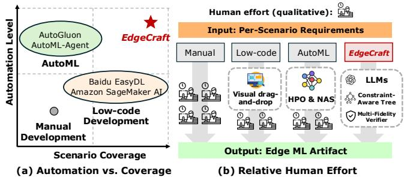  
Figure 1: Qualitative comparison of EdgeCraft with existing edge ML development paradigms in (a) automation and coverage, and (b) required human efort.

(b) A huge search space. Developers must make coupled choices about data representation, model family, training recipe, and inference runtime. Even within edge vision, model families such as YOLO [87, 104] and MobileNet [42, 43, 90] expose substantially diferent accuracy-latency-energy trade-ofs. General model libraries further enlarge the space of available architectures [67, 109]. The design space therefore extends far beyond a fixed model zoo.

(c) Fragmented execution environments. Edge devices span hardware families such as Raspberry Pi [86] and NVIDIA Jetson [75], with diferent compute capabilities and soft-ware stacks. Their deployment stacks combine diferent in- ference runtimes, such as PyTorch [82], ONNX [76], and TensorRT [74]. A model that trains successfully may still fail during compilation on the target device. Latency and energy also depend on the devices and runtimes [117].

These factors are tightly coupled. Changing any of these factors can change the best feasible design for a specific IoT scenario. For example, a change in data representation can alter accuracy and exported operators; changing the runtime can afect latency and energy. Moreover, satisfying one SLO may degrade another. Our measurements in Figure 2(d) also confirm this. Therefore, developers must navigate a scenario- dependent design space and repeatedly design, measure, and revise. Existing automated approaches also provide limited automation and scale poorly across scenarios (Figure 1). Model Crafting as a Service (MCaaS). These limitations motivate a new service abstraction for edge ML develop- ment, which we call Model Crafting as a Service (MCaaS)1. Given a user intent, dataset, target device, and service-level objectives, MCaaS seeks to return a deployable ML artifact under a limited search budget (e.g., time or trials). MCaaS is verification- rounded, which means that search decisions rely on results from compiling, running, and measuring candidates on target devices. If no SLO-feasible artifact is found, it reports the best verified candidate together with its re- maining constraint gaps. MCaaS therefore defines an endto-end service contract between high-level application re- quirements and physically validated edge ML artifacts. As a service, MCaaS pools scarce cloud and edge resources across isolated tenant requests and reuses verified compatibility rules across jobs. Recent LLM agents provide a promising foundation for this vision by interpreting open-ended intent and coordinating multi-stage development planning and workflows [39, 46, 49, 72, 79, 88, 112, 119, 124]. However, their general knowledge provides useful design priors rather than reliable knowledge of physical behavior. Strong gen- erative capabilities therefore do not by themselves yield a reliable ML synthesis process.

<table><tr><td>Edge/Mobile ML App.</td><td>Service-Level Optimization Objective</td></tr><tr><td>Camera surveillance [61]</td><td>Max. AUC, acceptable latency</td></tr><tr><td>Visual inspection [9, 10]</td><td>Max. recall/AUROC, acceptable latency</td></tr><tr><td>Drone-based inspection [126]</td><td>Max. mAP, low latency, bounded energy</td></tr><tr><td>Wearable HAR [36]</td><td>Max. accuracy, low latency, bounded energy</td></tr><tr><td>Always-on keyword spotting [108]</td><td>Max. accuracy, very-low latency</td></tr><tr><td>AIOps anomaly detection [89]</td><td>Max. F1/AUROC, very-low latency</td></tr></table>

Table 1: Representative service-level optimization objectives for edge ML applications, reflecting diferent priorities among task quality, latency, and energy.

Challenges. Specifically, realizing MCaaS raises two core design challenges. First, how can the system steer ML solution candidates toward application-specific SLOs in a huge search space? Generating valid edge ML code is comparatively straightforward, but aligning the resulting artifact with application-specific SLOs remains challenging. Our pre liminary study (§ 2.2) confirms that the best solution varies across data distributions, target devices, and SLO requirements. Because an optimal solution may be scenario-specific, MCaaS must provide SLO-guided development and return the highest-quality artifact satisfying the user’s requirements. Second, how can the system obtain trustworthy target-device verification results withoutfully evaluating every candidate?

During this search, a revision (e.g., adding a module or chang- ing the data representation) may improve task quality but violate a latency or energy SLO, and its efect may become clear only after target-device verification. Prior systems therefore rely on a “verify-before-commit” methodology or device- specific calibration to obtain trustworthy physical feedback or calibrated predictions [59, 117, 124]. Fully training, de-ploying, and measuring every candidate is expensive, while cheaper checks provide verification results with diferent levels of reliability. Beyond these two design challenges, op- erating MCaaS also requires managing shared cloud GPUs, edge devices, and verified compatibility rules. Each request has its own private, evolving search tree, while its training and verification jobs share a pool of GPUs and edge devices. The service coordinates these jobs and stores rules derived from reproduced device–runtime failures so that later re- quests can reuse them.

EdgeCraft. In this paper, we propose EdgeCraft, an MCaaS system that achieves fully automated edge ML synthesis (Fig- ure 1). Its central principle is a separation between proposal and decision authority: LLMs propose and prioritize candidates, while verification determines which candidates may be accepted or rejected. EdgeCraft has two key designs: (a) Constraint-aware synthesis tree. EdgeCraft organizes edge ML development as a constraint-aware synthesis tree, where each node stores a candidate and its verification results. Edge- Craft records each node’s parent–child history and expresses the measured task quality, latency, and energy as gaps or slack relative to the requested SLOs. The tree uses these results to generate and refine child candidates toward the remaining objectives. (b) Multi-fidelity verifier. To produce these verification results eficiently, the Multi-Fidelity Ver- ifier progressively evaluates each candidate through static checks, low-cost device measurements, and full training with target-device verification. Decision authority depends on how each verification result is obtained: proxy results guide exploration, while verified static incompatibilities or calibrated physical measurements may prune a candidate. Only full evaluation can establish an artifact as feasible, and in- conclusive low-cost verification results advance to full ver- ification. To operate both mechanisms across concurrent requests, EdgeCraft provides Cross-Tenant Shared Services. These services coordinate training and execution jobs over pooled cloud GPUs and edge devices and store verified com- patibility rules for later reuse.

Evaluation. We construct a comprehensive benchmark spanning diverse modalities, devices, and runtimes (Table 4). Across a comprehensive 50-task public benchmark, Edge- Craft exceeds the task-specific Reference in best-observed quality on 40 tasks and finds an SLO-feasible artifact on 45, with the two outcomes overlapping on 38 tasks. Compared with agentic approaches, EdgeCraft produces SLO-feasible artifacts for 2.4× as many tasks. Its Multi-Fidelity Verifier reduces verification time by 25.7% while preserving the selected artifact and its task quality. On the private SEN dataset, EdgeCraft shows competitive performance, demonstrating its generalizability to a real-world wearable IoT sensing task. Contributions. We summarize our contributions below:

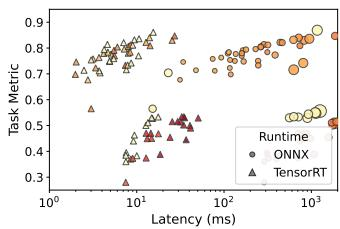  
(a) Multi-Dimensional Design Space fi

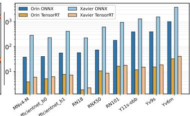  
fi(b) Runtime and Device

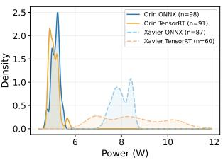  
(c) Power Distribution

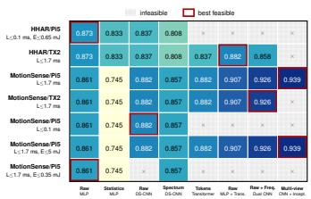  
(d) Scenario-Specific Choice  
Figure 2: (a) Task quality, latency, and power vary across model–runtime configurations. Marker shape and size denote runtime and peak memory, while color denotes measured power from yellow (low) to red (high). (b–c) Measured p95 latency and power vary substantially across device–runtime combinations. (d) The HAR design changes with the dataset, device, and SLOs; hatching marks SLO violations and red boxes mark winners.

• We introduce the first MCaaS system, coupling open-ended code synthesis with target-device verification to produce verified artifacts for user-specified tasks, devices, and SLOs.

• Our constraint-aware tree preserves candidates and uses verified quality and SLO gaps to revise branches; multi-fidelity probes conditionally reject, while only full verifi- cation accepts artifacts.

• A comprehensive benchmark covering 50 public datasets across six modalities and a self-collected sensor task con- firms EdgeCraft’s strong potential and generalizability across edge/mobile ML crafting tasks. Code is available.2

## 2 Background and Motivation

## 2.1 Edge ML Development Characteristics

Edge ML is pervasive. Edge ML has become a pervasive building block in IoT applications. These applications execute ML locally to protect sensitive data and remain functional un der limited connectivity [92, 123]. Crucially, although edge ML is pervasive, each edge ML solution remains inseparable from its specific scenario. There is no universally best solu- tion: its suitability depends jointly on the application task, target device, and service-level objectives. Developers must adapt available model families, training recipes, and infer- ence runtimes to build a de loyable solution that satisfies scenario-specific SLOs.

Why do we need end-to-end automation? Manual devel- opment has not scaled with the growth and diversity of edge AI applications. Developers must repeatedly design, train, export, deploy, and measure a candidate before deciding how to revise it. Existing automation remains fragmented. For instance, AutoML frameworks automate model selection and training within predefined search spaces [26, 34, 37, 122], but typically stop before target-device deployment and measurement. LLM-based program synthesis can generate training programs [46, 72, 91, 113], yet does not reliably close the loop through target-device verification. End-to-end automation is therefore needed to connect these stages, return verification results to subsequent revisions, and continuously refine each candidate for its deployment scenario.

## 2.2 Preliminary Study

We investigate three questions: how strongly edge ML solutions depend on their scenarios, whether LLM-generated ML programs survive target-device execution, and whether LLMs provide a useful prior for navigating the solution space. Scenario-dependent solutions and validation cost. We obtain 336 device–runtime profiles for 107 vision models from timm [109], torchvision [67], and Ultralytics [104] on Jetson AGX Orin and Jetson Xavier NX using ONNX Runtime and TensorRT. Figure 2(a) shows that quality, latency, and power do not improve together across configurations; increasing model scale therefore does not reliably identify the best deployable solution. The deployment configuration alone can dominate performance: for ResNet-18, p95 latency difers by 122× across the four device–runtime combinations, while the highest measured power is 2.4× the lowest (Figures 2(b) and 2(c)). Figure 2(d) shows the same scenario dependence on HHAR [13] and MotionSense [68]. Across seven dataset–device–SLO scenarios drawn from the same candidate pool, five diferent designs achieve the highest SLO- feasible quality, and no design wins more than twice. These winners combine raw, frequency, and multi-view representations with MLP, convolutional, Transformer, and Inception components. Thus, neither model scale nor task quality alone determines the appropriate edge ML solution.

Exhaustively identifying these winners is costly. Exploring these alternatives can consume substantial GPU time,

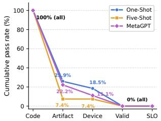

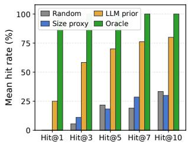  
(a) Pass funnel from valid code to SLO satisfaction.  
(b) Sample eficiency of candidate selection.

Figure 3: Motivation studies of LLM-driven synthesis. (a) LLM-driven synthesis fails before functional validation on the target device. (b) LLM-guided search identifies promising candidates more eficiently.

with prior architecture searches reporting thousands of GPUdays [73]; surviving artifacts must then be verified on their target devices. Edge ML synthesis must therefore explore selectively, reserving full training and target-device verifica tion for promising candidates.

Observation #1: Edge ML solutions are scenario-dependent and costly to validate. Synthesis therefore requires an eficient agent to navigate the open-ended solution space.

LLM agents do not by themselves synthesize a reliable edge ML model. We examine whether existing LLMs and LLM agents can produce deployable edge ML implementations using all 27 benchmark tasks mapped to Jetson Xavier NX. We evaluate one-shot and five-shot GPT-5.4 [77] and MetaGPT [41], yielding 81 candidates. Each candidate is executed unchanged in an isolated workspace on the phys- ical device. We record five cumulative stages: valid code, requested-runtime artifact production, target-device execution, evaluator-validated out ut, and satisfaction of all ac tive SLOs. Figure 3a shows that all 81 candidates produce valid code, but only 15 (18.5%) produce the requested artifact, and 10 (12.3%) execute on the target device. None produces evaluator-validated output or an SLO-feasible candidate. Al- though two candidates report measurements within their numerical SLO thresholds, their outputs fail functional vali- dation and are therefore excluded. Failures commonly result from unavailable device libraries or runtime interfaces and in- compatible export or precision assumptions. Several failures recur across independently generated candidates, repeatedly consuming target-device verification time.

Observation #2: LLM-generated candidates rarely produce valid target-device outputs. Synthesis must therefore apply target-device verification and avoid repeating known failures. LLMs provide useful quality priors when provided with target-device verification. We test whether an LLM can prioritize promising candidates without determining their physical feasibility. We reuse the profiled models from Ob- servation #1, for which task quality and target-device performance have both been measured. Under a 20-trial bud- get, we compare Random selection, a Size-Proxy heuristic, an LLM Prior, and an Oracle. Size-Proxy orders candidates from smaller to larger using standard model-family size, as a lightweight proxy for computational cost. The LLM ranks candidates only by expected task quality, while measured device latency determines feasibility. Hit@� measures how often a strategy finds the highest-quality feasible candidate within its first � trials. Figure 3b shows that the LLM Prior finds strong candidates earlier. It achieves 80% Hit@10, com- pared with 33% for Random and 30% for Size-Proxy; the Oracle achieves 100%. Its rankings also correlate positively with measured task quality, with Spearman coeficients from 0.695 to 0.865. Thus, the LLM guides where to search, while target-device measurements determine which candidates are feasible.

Observation #3: An LLM quality prior improves search efi-ciency by directing limited trials toward promising candidates, while target-device measurements determine feasibility.

## 2.3 Problem Formulation

To address fragmented and device-specific edge ML develop- ment, we formulate Model Crafting as a Service (MCaaS): a mapping from user intent, dataset, target device, and SLOs to a deployable edge ML artifact within a bounded development budget. Existing paradigms automate parts of this process but difer in synthesis scope, target-device verification, and cross-request reuse.

Service model. MCaaS is a multi-tenant cloud service backed by a training cluster and a managed pool of physical edge de- vices. The GPU cluster supports scalable candidate training across concurrent requests, while the provider maintains an extensible catalog of edge device families, such as NVIDIA Jetson, making provider-side target-device verification practical. The tenant specifies the target device, while the service selects a qualified runtime and returns an artifact with its measured target-device performance.

Request and objective. Each tenant request is represented as $R _ { i } ~ = ~ ( u _ { i } , D _ { i } , h _ { i } , C _ { i } , B _ { i } )$ , where �� is the user intent, $D _ { i }$ is the dataset, $h _ { i }$ is the target device, $C _ { i }$ specifies the task- quality objective and applicable physical SLOs, and $B _ { i }$ limits the number of evaluated candidates or wall-clock time. The service seeks the highest-quality valid candidate satisfying these SLOs:

$$
x _ { i } ^ { \star } = \arg \operatorname* { m a x } _ { x \in { \cal { X } } _ { i } ( B _ { i } ) } q _ { i } ( x ) \mathrm { ~ s . t . ~ } \mathrm { V a l i d } _ { h _ { i } } ( x ) = 1 , x \mathrm { ~ s a t i s f i e s ~ S L O s ~ i n ~ } C _ { i } .
$$

Here, $\chi _ { i } ( B _ { i } )$ contains the candidates explored within the bud- get, and $q _ { i } ( x )$ is the request-specific quality score, oriented so higher is better. ${ \mathrm { V a l i d } } _ { h _ { i } } ( x )$ requires a qualified-runtime artifact to be generated, executed on $h _ { i } ,$ , and functionally V3validated. Physical SLOs include latency and energy. The ser-vice returns the selected artifact and its measurements; if no candidate satisfies every SLO, it returns the best candidate and its remaining constraint gaps. This objective follows hardware-aware model development, which maximizes pre- dictive quality under device constraints [15, 97, 114].

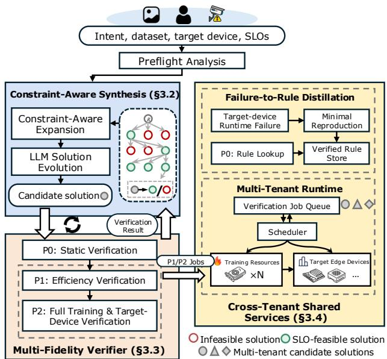  
Figure 4: Overview of EdgeCraft.

Workflow principles. Each candidate proceeds through de- velopment, cloud training and export, and target-device verification. Although edge platforms can support training [115], repeated training is slow and occupies devices needed for target-device verification. These stages are sequential for one candidate, but concurrent requests enable two forms of sharing. Pipeline sharing overlaps cloud work with target- device verification across requests, while rule sharing lets sanitized, verified compatibility rules benefit future requests. Tenant datasets, code, models, artifacts, and development states remain isolated.

## 3 EdgeCraft Design

## 3.1 Overview

Design principle. EdgeCraft separates proposal from decision authority: the LLM explores the open code space and chooses what to try next, while the verifier determines which candidates may be rejected or accepted. The verifier bal- ances reliability and cost by combining low-cost checks with higher-cost target-device execution. Each result is retained and shapes later proposals and decisions.

Architecture. Figure 4 shows EdgeCraft’s two core designs and the shared services. (1) Constraint-Aware Synthesis Tree (§3.2). For each specific task, the tree organizes alternative candidates and evolves them toward the ML artifact that sat- isfies the user’s requirements. (2) Multi-Fidelity Verifier (§3.3) progressively evaluates each candidate through a low-cost P0 static check, a low-cost P1 target-device measurement, and a high-cost P2 full training and target-device execution. The results include the physical information required for decisions, such as latency, energy, and runtime status. They determine whether the candidate is eligible for further ex- ploration and are returned to the LLM to guide expansion and revision. (3) Cross-Tenant Shared Services (§3.4). A shared runtime schedules overlapping training and target-device execution pipelines for all tenants across pooled cloud GPUs and target edge devices. EdgeCraft also conducts Failure-to- Rule Distillation, which converts reproduced device–runtime failures into reusable knowledge that helps avoid repeated failures across tenants.

Algorithm 1: Constraint-aware synthesis tree.   
Input: Request � = (task, data, device, SLOs); budget �   
Output: Best fully verified SLO-feasible artifact   
1 T ← InitializeTree(�, Preflight(�) );   
2 while CandidateCount(T) < � do   
3 P ← LiveBranches( T); // Verified and not pruned.   
4 if P = ∅ then   
5 break;   
6 � ← SummarizeResults( T);   
// Per branch: quality progress, signed normalized SLO gaps   
z (+: unmet; −: slack), and inherited components.   
7 � ← SelectBranch( P, � ); // Verified quality progress and   
signed SLO gaps z.   
8 repeat   
9 � ← ExpandBranch(�, �); // Bounded reject/retry.   
10 until � is executable, extends �, and references only verification   
results in T;   
11 (�, ℓ) ← VerifyNode(�);   
// Progress through P0–P2 until CanReject(�, ℓ) holds or   
full evaluation (§3.3).   
12 RecordResult( T, �, �); // Persist for later expansions.   
13 if CanReject(�, ℓ) then   
14 PruneBranch( T, �);   
15 else   
16 if ℓ is full evaluation ∧ max� �� (�) ≤ 0 then   
17 AcceptBranch( T, �);   
18 return SelectOutput( T ), zout;

Request lifecycle. Each MCaaS request creates a private synthesis tree. The LLM reads earlier verification results, selects a live branch, and proposes the next candidate. The candidate then proceeds through P0 static checks, P1 target- device measurements, and P2 full training and execution. Reliable P0 or P1 results can prune a candidate, while only P2 can accept a candidate. Every result is written back to the tree and guides the next expansion. Cross-Tenant Shared Services schedule P1 and P2 jobs and reuse verified compatibility rules. Algorithm 1 summarizes this lifecycle.

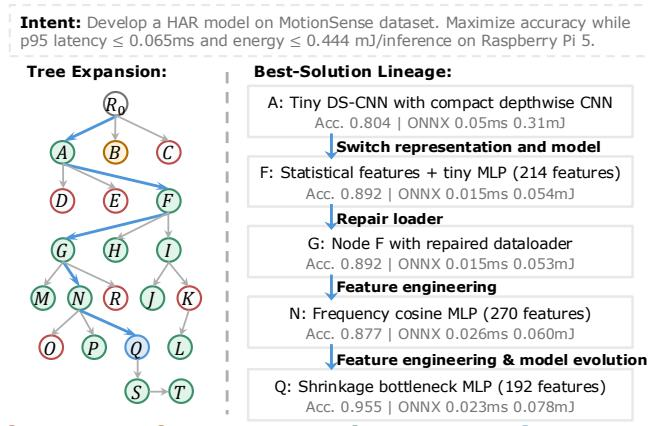  
Figure 5: An illustrative synthesis tree on MotionSense. The left panel shows the tree structure and its verifica- tion results; the right traces successive mutations.

## 3.2 Constraint-Aware Synthesis Tree

Tree state and initialization. For request �, the private tree is $\mathcal { T } _ { i } = ( \mathcal { V } _ { i } , \mathcal { E } _ { i } )$ , where $\mathcal { N } _ { i }$ is the set of nodes and $\mathcal { E } _ { i }$ records their parent–child expansion relations. Upon receiving the request, EdgeCraft initializes the tree as follows:

• Preflight(�) summarizes the dataset schema, target-device capabilities, and qualified runtimes.

• InitializeTree generates and verifies the initial candidates. Each node � stores a candidate $x _ { v }$ and a verification state.

The verification state records the candidate’s verification results, including its inherited components, quality progress, and signed SLO gaps. Each edge (�, �) records the change from parent to child. $\mathcal { P }$ denotes the set of live branches. A verified, unpruned node is live. An accepted node may remain live when its slack leaves room for a higher-quality child candidate. To express diferent constraints in one verification summary, EdgeCraft converts each constrained metric into a signed gap relative to its requested SLO. For metric $m _ { j }$ with target $\tau _ { j }$ and scale $s _ { j } = \operatorname* { m a x } ( | \tau _ { j } | , \epsilon )$ , the gap is

$$
z _ { j } = \left\{ \begin{array} { l l } { ( \hat { m } _ { j } - \tau _ { j } ) / s _ { j } , } & { m _ { j } \leq \tau _ { j } , } \\ { ( \tau _ { j } - \hat { m } _ { j } ) / s _ { j } , } & { m _ { j } \geq \tau _ { j } . } \end{array} \right.
$$

A positive $z _ { j }$ means that the constraint remains unmet. A negative value is slack. Task-quality progress is tracked separately. Together, these values show what a branch has improved and which objective should guide its next revision. For example, a child candidate may improve accuracy but retain a positive latency gap. Once that gap becomes negative, the branch has slack for a more accurate model. Figure 5 shows these states on competing MotionSense branches.

Verification-guided expansion. At each iteration, Edge-Craft expands the synthesis tree as follows:

• SummarizeResults(T) builds a summary � for the branches in P. It contains quality progress and signed gaps z.

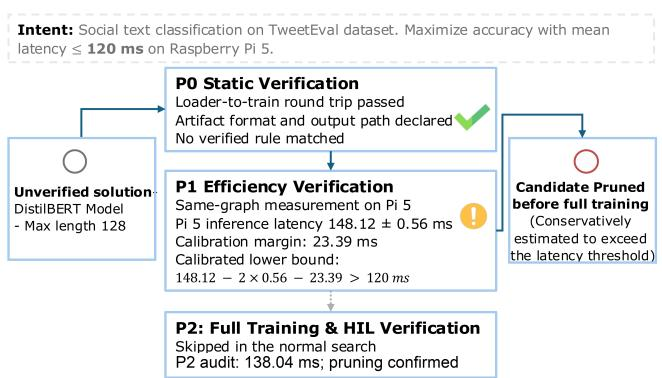  
Figure 6: Calibrated device measurements prune a candidate before full training.

• SelectBranch asks the LLM to choose a parent $\boldsymbol { p }$ from $\mathcal { P }$ and cite the verification results supporting that choice.

• ExpandBranch asks the LLM to produce one child candidate. EdgeCraft admits the candidate only if it is executable, extends ${ \boldsymbol { p } } ,$ , and cites verification results stored in $\mathcal { T }$

An invalid proposal receives a violation note and is retried up to a fixed bound. If the bound is reached, the attempt ends and control returns to the live branch set. Only an admitted candidate consumes one unit of �.

Tree update and completion. VerifyNode(�) (§ 3.3) returns a verification result � and its fidelity ℓ. EdgeCraft records this result before selecting the next branch. CanRe- ject(�, ℓ) is true only when the returned verification result has rejection authority; Section 3.3 defines that authority. A rejected branch is pruned, while only a full evaluation with max� �� (�) ≤ 0 registers an accepted artifact. Every recorded verification result, including results from pruned branches, remains in the tree and shapes the next verification summary �. EdgeCraft returns the highest-quality accepted artifact. If none has been accepted, MCaaS returns the best verified candidate and its remaining gaps.

## 3.3 Multi-Fidelity Verifier

Check, measure, confirm. Full training and target-device verification provide comprehensive information about task quality, latency, and energy, but they require a large number of GPU hours. To obtain such information without targetdevice execution, recent work has shown that latency can be predicted for specific devices, runtimes, and model types [59, 117]. However, open-ended generation can produce candidates beyond that coverage. Our preliminary study (§ 2.2) shows that many candidates can be rejected before full eval- uation. EdgeCraft therefore follows Check → Measure → Confirm through three probes, P0–P2. This section defines VerifyNode(�) and CanReject(�, ℓ) in Algorithm 1.

VerifyNode(�). It evaluates a candidate using three probes.

• P0 checks component and artifact contracts and queries verified compatibility rules (§ 3.4). This static probe requires neither training nor device execution.

• P1 constructs the candidate deployment graph before full training and directly measures latency and, where applicable, energy on the target device.

• P2 fully trains the candidate, exports its artifact, and verifies both task quality and physical performance.

P0 and P1 may reject only under the conditions below; only P2 can accept an artifact. Every result, including the constraint gap of a rejected candidate, returns to the tree. P1 and calibration. P1 gates the training cost of graph-preserving refinements: it measures an initialized artifact before full training, whereas P2 measures the final trained artifact. A calibration context consists of the deployment- graph hash, device–runtime environment, physical metric, and execution setting. Calibration is reused only when this complete context matches; within it, calibration captures empirical P1–P2 and run-to-run variation. Graph-changing revisions, including quantization and export rewriting, cre- ate a new context and proceed to P2. The first candidate in a context completes both probes to create a P1–P2 pair. Later candidates or requests with a matching context use the largest completed diference as $\epsilon _ { \mathrm { c a l } }$ . Only earlier pairs inform a decision; each new pair is added afterward.

CanReject(�, ℓ). At P0, context-stable artifact and load incompatibilities, such as an unsupported ONNX IR version, may reject directly. Compilation- or execution-stage rules re-quire the same deployment-graph hash and compiler context. Incomplete matches provide guidance only. At P1, an earlier calibration pair must match the complete calibration con- text defined above. For upper-bounded physical metrics—i.e., latency and energy—P1 rejects only when

$$
\hat { m } _ { j } - 2 \sigma _ { j } - \epsilon _ { \mathrm { c a l } } > \tau _ { j } .
$$

The left-hand side is a conservative lower bound: it subtracts run-to-run variation $2 \sigma _ { j }$ and the largest completed P1–P2 diference $\epsilon _ { \mathrm { c a l } }$ from the P1 mean $\hat { m } _ { j } .$ . P1 rejects only if this bound still exceeds the $\mathrm { S L O \ } \tau _ { j }$ . Data-dependent training proceeds to P2 because task-quality metrics, such as accuracy and AUROC, cannot be reliably predicted for a new dataset whose modality and data distribution may difer.

Example. Figure 6 shows the decision for TweetEval. Earlier matching pairs give $\epsilon _ { \mathrm { c a l } } = 2 3 . 3 9$ ms. DistilBERT’s P1 latency is 148.12 ± 0.56 ms on Pi 5, producing a conservative lower bound of 123.61 ms. Because this remains above the 120 ms SLO, P1 rejects the candidate. Continuing the candidate through P2 measures 138.04 ms and confirms the rejection. This empirical 10.08 ms diference between the graph-equivalent P1 and P2 artifacts becomes calibration evidence for later candidates under the same context.

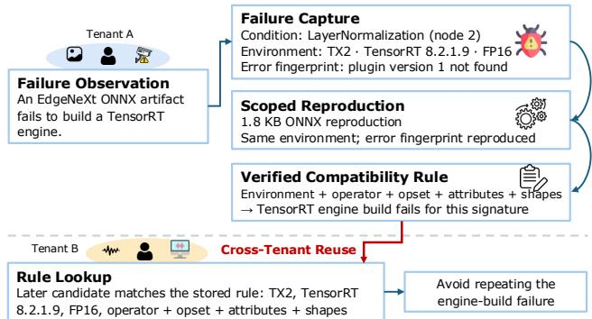  
Figure 7: A reproduced device–runtime failure becomes a verified compatibility rule reused by a later tenant.

## 3.4 Cross-Tenant Shared Services

Private trees, shared services. Each request keeps a pri-vate tree, while Cross-Tenant Shared Services support two forms of sharing. (1) Pipeline sharing. Each candidate pro-duces two ordered jobs: cloud training and target-device execution. These jobs are sequential for one candidate, but can overlap across concurrent requests: one candidate can train while another executes. (2) Rule sharing. P0 matches later candidates across tenants against verified compatibil- ity rules, allowing reproduced failure conditions to prevent repeated failures and device work.

Pipeline sharing. Training and device verification use dif- ferent resource pools, so sequential execution leaves one pool idle while the other works. Each job retains the dependency training and export → target-device verification. Across requests, the scheduler uses tenant-level round-robin to preserve fair access to shared resources. After selecting a tenant, it runs that tenant’s shortest ready job first. A shorter job releases its GPU or device sooner, reducing head-of-line blocking and exposing the next pipeline stage earlier. Because this ordering applies only within the selected tenant, round-robin scheduling still controls progress across tenants. The tree prior breaks ties. Figure 11 evaluates the resulting request-level queueing delay and completion time.

Rule sharing: from failure to verified rule. Similar error text can come from diferent causes, while an operator name alone does not capture its attributes, tensor shapes, or run- time version. EdgeCraft therefore shares a failure only after reproducing its specific condition. When artifact compilation, loading, or execution fails, EdgeCraft records the runtime environment, failure stage, normalized error, and the impli- cated artifact condition, such as an ONNX header field or an operator with its attributes and tensor shapes. It constructs a small reproducer and runs it in the same device–runtime environment. Reproducing the same error creates a verified compatibility rule that records the environment, reproduced condition, verdict, and reproduction procedure. P0 consumes this rule under the rejection conditions in § 3.3. The same verified condition can be reused when it recurs in later re- quests, including those of other tenants. A runtime or driver change leaves the rule stale pending reproduction. Figure 7 traces one failure through this path; Appendix C details re- production and rule matching.

Tenant boundary. The scheduler reads tenant identity, re- source and time estimates, target device, and stage status. It does not inspect datasets, model semantics, or mutation logic. Across requests, the service shares scheduling metadata and sanitized verified compatibility rules. Data, generated code, model weights, artifacts, and search state remain in the re- quest workspace. Shared execution keeps cloud and edge resources busy, while verified rules avoid repeated device work without coupling private synthesis trees.

## 4 Evaluation

Our evaluation seeks to answer the following questions:

Q1. How efectively does EdgeCraft synthesize high-quality, SLO-feasible edge ML artifacts? (§ 4.1)

Q2. How do EdgeCraft’s key designs and parameters afect synthesis quality and eficiency? (§ 4.2, § 4.3)

Q3. Can EdgeCraft generalize to a challenging real-world task? (§ 4.4) Where is its capability boundary? (§ 4.5) task? (§ 4.4) Where is its capability boundary? (§ 4.5)

Benchmark. We construct a comprehensive benchmark encompassing 50 public datasets across six modalities: CV, NLP, Audio, Sensing & Time Series, Tabular, and Multimodal (Table 4, Appendix A). These tasks represent essential IoT applications, such as smart homes and smart health, and are important to real-world evaluation in mobile computing. Moreover, we include a self-collected multimodal dataset to evaluate generalizability to a new task, as detailed in § 4.4. We carefully pair each dataset with target edge devices (Table 2) based on computational complexity and realistic scenarios. For example, compute-intensive object detection is mapped to Jetson GPUs, tabular analysis is mapped to desktop CPUs, and lightweight sensing is assigned to Raspberry Pi 5.

To establish the evaluation basis, we require performance anchors for comparing task quality and on-device perfor mance and for constructing consistent Reference-relative SLOs. We therefore select a Reference model for each public dataset. Each Reference is task-adapted and representative of established ML practices. It must also compile and execute successfully on its assigned device, enabling direct on-device performance comparisons. Table 4 in Appendix A reports the Reference models and their performance; Appendix B provides comprehensive evaluation details, including Reference selection and optimization, SLO construction, energy measurement, and dataset splits.

Baselines. Beyond the reference models, we compare Edge Craft with three automation paradigms. (1) LLM zero-shot and five-shot generation uses the same LLM backend and frozen task context as EdgeCraft, but receives neither it- erative repair nor verification results. (2) MetaGPT Data Interpreter [40, 41] is a popular, powerful, and representative agent framework that develops one candidate at a time through its native data-science workflow. We further imple ment MetaGPT-Verification, which retains MetaGPT’s core workflow but trains each candidate on the server, deploys the resulting artifact to the target edge device, and returns its verification results to MetaGPT before the next revision. Comparing the two variants isolates the benefit of iterative target-device verification. (3) AutoML and hardware-aware NASframeworks include FLAML [107], AutoML-Agent [101], AutoGluon [26, 99], and Once-for-All (OFA) [15]. They rep- resent highly optimized ML capabilities in their respective domains. Because each AutoML and NAS method supports only certain tasks and modalities, we evaluate it only on the datasets it supports. Moreover, we include AIDE’s tree-search policy [46] as a competitive tree-search baseline. We run it with the same settings and verifier as Constraint-Aware. Figure 12 measures how the choice among several search policies afects synthesis performance.

<table><tr><td>Device</td><td>Abbr.</td><td>Compute Resources</td><td>Runtime</td></tr><tr><td>Jetson AGX Orin</td><td>Orin</td><td>8-core Arm, Ampere GPU 32GB</td><td>P, O, T</td></tr><tr><td>Jetson Xavier NX</td><td>NX</td><td>6-core Arm, Volta GPU 8GB</td><td>P, O, T</td></tr><tr><td>Jetson TX2</td><td>TX2</td><td>4-core Arm, Pascal GPU 4GB</td><td>P, O, T</td></tr><tr><td>Raspberry Pi 5</td><td>Pi5</td><td>4-core Cortex-A76 8GB</td><td>P, O, L</td></tr><tr><td>Desktop (CPU)</td><td>PC</td><td>Intel Ultra 5 235</td><td>P,O,L</td></tr></table>

Table 2: Evaluated hardware platforms. Runtime abbr.: P (PyTorch), O (ONNX), T (TensorRT), and L (LiteRT).

Setup. We host EdgeCraft and all baselines on a server equipped with eight NVIDIA A6000 GPUs (48 GB), which connects to edge devices (Table 2) over a local area net-work. For the software stack, EdgeCraft’s agentic backend is built upon LangChain [1] and LangGraph [2]. GPT-5.4 serves as the default LLM engine. Each EdgeCraft request and MetaGPT’s development loop may evaluate at most 24 executable candidates.

## 4.1 Overall Performance

EdgeCraft finds SLO-feasible artifacts on most edge/- mobile ML tasks. Each request uses $L _ { \mathrm { S L O } } = 0 . 8 L _ { \mathrm { R e f } }$ and, when energy is constrained, $E _ { \mathrm { S L O } } = 0 . 8 E _ { \mathrm { R e f } }$ , with Reference measurements taken on the assigned device. This setting asks EdgeCraft to improve task quality under tighter de-ployment limits. We define the normalized quality gap as $g _ { Q } = s _ { Q } ( Q _ { E d g e C r a f t } - Q _ { \mathrm { R e f } } ) / | Q _ { \mathrm { R e f } } |$ , where $s _ { Q } = 1$ for higher- is-better metrics and $s _ { Q } ~ = ~ - 1$ otherwise; positive values favor EdgeCraft. Figure 8 summarizes two complementary outcomes of EdgeCraft’s search: the best task quality ob- served during development and whether the search reaches the SLO-feasible region. Across 50 tasks, EdgeCraft improves the best-observed quality over the Reference on 40 tasks (80%) and finds at least one artifact satisfying all active SLOs on 45 tasks (90%). Together, these results show that EdgeCraft explores competitive designs broadly and reaches deployable solutions on most tasks, even when the latency and energy limits are 20% tighter than the corresponding Reference mea surements. § 4.3 discusses the SLO sensitivity.

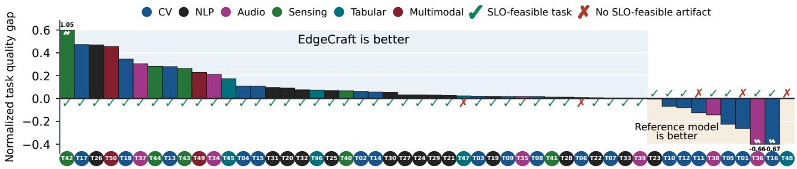  
Figure 8: Normalized task quality gap of EdgeCraft and reference models on 50 edge/mobile datasets.  
EdgeCraft FLAML AutoML-Agent AutoGluon Once-for-All Best quality: 12/20 tasks (60.0%)

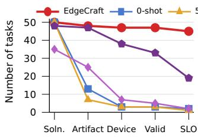

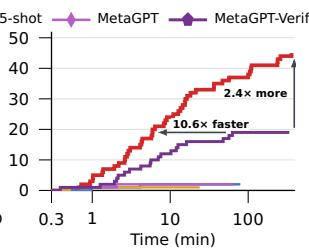  
(a) Development stages  
(b) Tasks meeting SLOs  
Figure 9: Agentic development across 50 tasks: (a) stagewise task retention and (b) cumulative SLO-feasible tasks versus per-task time.

EdgeCraft outperforms agentic methods in SLO feasibility, artifact quality, and development time. Figure 9(a) follows each method through five cumulative stages: Solu- tion, all required loader, training, inference, and description files are present; Artifact, training and export produce an artifact for the requested runtime; Device, the artifact loads and completes inference on the assigned device; Valid, its predictions and measurement output pass the task evalu ator; and SLO, the validated artifact satisfies every active task-quality, latency, and energy requirement. The meth-ods diverge sharply after generation: zero-shot, five-shot, and MetaGPT each produce SLO-feasible artifacts for only one or two tasks. Target-device verification raises MetaGPT-Verification to 19 feasible tasks, showing that verification matters; EdgeCraft reaches 45, or 2.4× as many, showing that verification is more efective within EdgeCraft’s structured design. The advantage also extends beyond feasibility. On the 16 tasks where both methods produce SLO-feasible artifacts, EdgeCraft achieves higher quality on 15 (93.8%) and ties on one, including 69.3% versus 58.0% accuracy on

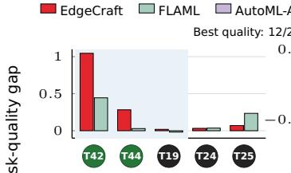

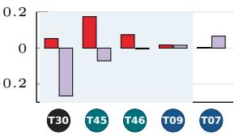  
(b) AutoML-Agent

(a) FLAML  
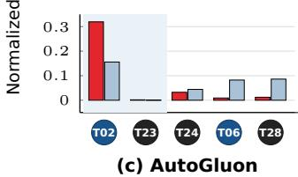

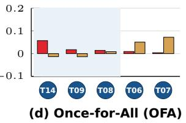  
Figure 10: EdgeCraft and AutoML/NAS baselines on their supported datasets.

T30 and 74.5% versus 49.2% mIoU on T10 . Figure 9(b) shows the same trend over time: EdgeCraft reaches 19 SLO-feasible tasks in 5.9 minutes, whereas MetaGPT-Verification takes 62.8 minutes, 10.6× longer. Thus, EdgeCraft produces feasible artifacts more broadly, improves their quality more consistently, and reaches them sooner.

To characterize the resources required by a complete de- velopment request, we measure one complete task from each of the six modalities across five hardware targets. Averaged across these requests, EdgeCraft uses 0.71 million GPT-5.4 tokens per request, compared with 1.61 million for MetaGPT-Verification, a 55.8% reduction. EdgeCraft produces SLOfeasible artifacts for five of the six tasks, compared with three for MetaGPT-Verification, while using 1.22 versus 0.75 A6000 slot-hours per request.

EdgeCraft remains competitive in task quality against AutoML/NAS baselines. Figure 10 focuses exclusively on task quality. Each bar reports $g _ { Q } = s _ { Q } ( Q _ { \mathrm { m e t h o d } } - Q _ { \mathrm { R e f } } ) / | Q _ { \mathrm { R e f } } |$ where a positive value favors the method. Across these 20 comparisons, EdgeCraft achieves the highest task quality on 12 (60%): three against FLAML, four against AutoML-Agent, two against AutoGluon, and three against Once-for-All. These results show that EdgeCraft remains competitive in pure predictive quality even when compared with specialized optimization frameworks in the domains they are designed to support. In this experiment, each AutoML/NAS framework is evaluated on five datasets aligned with its na- tive support and domain-optimized search space, allowing its specialized modeling capability to be fully exercised. Latency and energy SLO satisfaction do not enter this comparison.

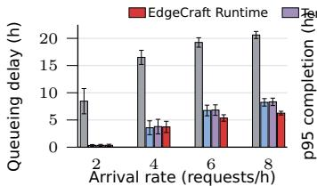  
(a) Mean queueing delay

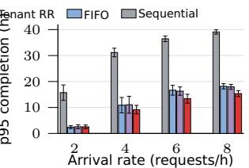  
(b) p95 completion time  
Figure 11: Multi-tenant performance at 2–8 requests/hour: (a) mean queueing delay and (b) p95 completion time (mean±s.d.).

EdgeCraft’s multi-tenant runtime reduces waiting and tail completion time. Figure 11 reports results for 64 request arrivals using measured candidate-job sequences and stage times from eight completed EdgeCraft development runs. Each job enters the ready queue after its dependencies complete. All policies receive identical arrivals and work, so the measured diferences come from their scheduling deci- sions. Sequential processes requests from beginning to end, FIFO schedules ready jobs in arrival order, and Tenant RR rotates across tenants. At 8 requests/hour, EdgeCraft reduces mean queueing delay by 24.9% and p95 completion time by 14.6% relative to Tenant RR. These results show that the multi-tenant runtime provides an efective supporting substrate for concurrent requests.

## 4.2 Ablation Study

Verification-guided control produces better feasible ar- tifacts under the same budget. Figure 12 compares four policies from the same four roots over ten additional candi- dates: independent Best-of-10, Plain without SLO-gap guidance, AIDE-style tree expansion [46], and Constraint-Aware. Across five tasks spanning vision, language, audio, sensing, and tabular workloads, Constraint-Aware produces the largest feasible-quality gain on four and matches or exceeds every alternative in SLO-feasible improvement rate on all five. By using verified quality progress and SLO gaps to choose the next branch and revision, 10–30% of its expan- sions improve the feasible incumbent, compared with 0–20% for the other search strategies.

Multi-Fidelity reduces verification cost while preserving the final result. Figure 13(a) compares Multi-Fidelity with full verification on 16 fixed candidates spanning Py- Torch, ONNX Runtime, TensorRT, and LiteRT. Multi-Fidelity cuts per-runtime verification time by 17.6–39.7% and selects the same artifact with the same task quality in every runtime. Figure 13(b) accumulates this cost as the 16 candidates are explored: total time falls from 69.13 to 51.35 minutes (25.7%). The fast check applies only to graph-preserving candidates whose device, runtime, and execution setting already have a completed calibration; all others proceed to full verifica- tion. Across the complete evaluation, all 60 early rejections are confirmed by full verification. Appendix C details the eligibility condition, cold-start behavior, and safety analysis. Verified Failure Reuse avoids repeated device executions. EdgeCraft stores each reproduced failure as a rule scoped to its device and runtime; a candidate matching the same failure conditions is skipped before device evaluation. Figure 14(a) shows at least one such reuse in each of the nine evaluated TX2 tasks. The full evaluation contains 134 candidates from 15 datasets spanning five modalities, four devices, and three runtimes. All 50 verified rules are reused at least once and collectively match 57 candidates (42.5%). Figure 14(b) shows that these matches reduce required device evaluations from 101 to 44 (56.4%). Device execution confirms the predicted failure for all 57 matched candidates. Appendix C reports and discusses the rule composition, crossdataset reuse, and how workload shifts afect future matches.

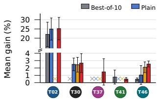  
(a) Feasible-quality gain ↑

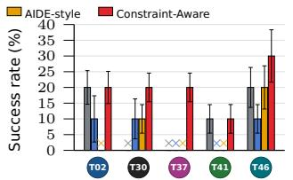  
(b) SLO-feasible success rate ↑

Figure 12: Under the same budget, Constraint-Aware leads in (a) feasible-quality gain and (b) SLO-feasible incumbent-improvement rate; ×: ≤ 0.05%.  
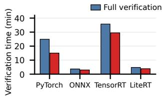  
(a) Verification time ↓

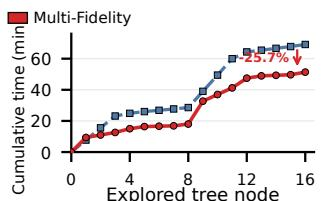  
(b) Tree exploration time ↓  
Figure 13: Multi-Fidelity cuts verification time by 17.6–39.7% across the four runtimes in (a) and total exploration time by 25.7% in (b). In all four runtimes, it selects the same artifact as full verification.

## 4.3 Sensitivity Analysis

EdgeCraft remains efective across search budgets and LLM backends. Figure 15(a) shows feasible-quality gain as a function of the search budget. From 4 to 24 candidates, the best verified SLO-feasible quality improves on every task, averaging 11.3% and reaching 31.7%. On T37 , the same EdgeCraft workflow achieves verified SLO-feasible accuracy of 67.2%, 52.2%, 58.9%, 55.0%, and 79.4% with GPT-5.4, GPT-5.2, DeepSeek-V4-Pro, Gemini-3.1-Pro, and Claude-Opus- 4.8, respectively. All five backends produce a verified SLO- feasible artifact, and the resulting accuracies broadly align with the relative performance of the corresponding LLMs.

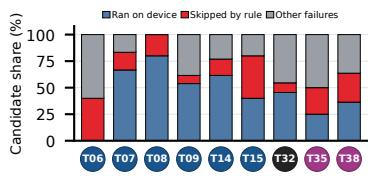

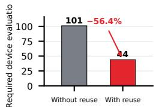  
(a) Candidate outcomes by task  
(b) Required device evaluations

Figure 14: Verified Failure Reuse skips at least one candidate in each of the nine evaluated tasks in (a) and reduces required device evaluations from 101 to 44 (56.4%) across the full evaluation in (b).  
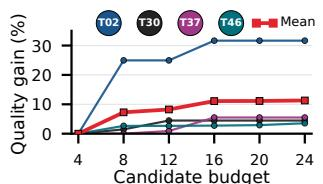

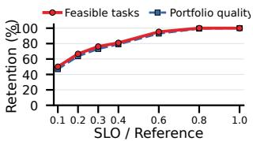  
(a) Feasible-quality gain ↑  
(b) SLO retention ↑  
Figure 15: Search and SLO sensitivity: (a) feasiblequality gain with budget; (b) feasible-task and tasknormalized quality retention for the fixed 1.0× cohort.

EdgeCraft retains broad coverage as SLOs tighten. Fig- ure 15(b) jointly tightens each task’s latency and applicable energy limits for the 42 tasks with complete measurements. At 0.4× and 0.3×, 34 and 32 tasks remain feasible, retaining 79.1% and 73.1% of the aggregate task-normalized quality. Most surviving tasks keep their best 1.0× artifact: 29/34 at 0.4× and 25/32 at 0.3×. The remaining cases show how the search adapts. At 0.3×, T17 moves from MobileNetV3 to a tiny depthwise crowd regressor in TensorRT, whereas T41 uses a lightweight ONNX model whose accuracy changes from 95.5% to 93.0%.

## 4.4 Generalizability

SEN (self-collected)3. Beyond the public benchmark, we include the SEN dataset for a generalizability study. It contains 304 MB of multimodal biosignals collected from 29 stu- dents with special educational needs (SEN) using Empatica E4 wristbands. Its four sensing modalities are accelerometry (ACC), blood-volume pulse (BVP), galvanic skin response (GSR), and skin temperature. We use SEN for emotion recog nition (happy, sad, neutral). This task presents representative challenges for lightweight wearable sensing. We ensure that raw SEN data remain local; the LLM receives only the dataset schema, modality summaries, and candidate-level verifica- tion results. We use a sample-level split and a subject-disjoint split whose six test subjects never appear in training. We select competitive baselines covering three families. (1) Feature engineering + RF maps each modality to a fixed feature vec- tor, concatenates the vectors, and fits a Random Forest (RF) classifier [14]. Expert+RF uses modality-specific physiologi-cal and temporal descriptors tailored to ACC, BVP, GSR, and temperature. General+RF extracts, per signal, mean, standard deviation, maximum, skewness, kurtosis, and quartiles in the time domain, together with spectral centroid, spread, mean and peak frequency, and spectral quartiles. Kats+RF uses 40 time-series characteristics spanning distribution, trend, sea- sonality, and nonlinear dynamics [44]; Catch22+RF uses 22 compact, diverse time-series characteristics [64]. (2) Learned features and models include MiniRocket [21], which uses convolutional features, and NormWear [66], a large end-to-end multimodal foundation model for wearable tasks. (3) AutoML and agent-based baselines include AutoGluon and MetaGPT.

<table><tr><td>Method</td><td>Sample-level ↑</td><td>Cross-subject ↑</td><td>Avg. ↑</td></tr><tr><td>Expert+RF</td><td> $0 . 8 2 4 1 { \scriptstyle \pm 0 . 0 0 1 0 }$ </td><td> $0 . 5 4 7 7 { \scriptstyle \pm 0 . 0 0 4 8 }$ </td><td>0.6859</td></tr><tr><td>General+RF</td><td> $0 . 8 9 4 5 { \scriptstyle \pm 0 . 0 0 2 4 }$ </td><td> $0 . 5 2 8 0 { \scriptstyle \pm 0 . 0 0 3 7 }$ </td><td>0.7113</td></tr><tr><td>Kats+RF</td><td> $0 . 7 8 0 3 { \scriptstyle \pm 0 . 0 0 0 8 }$ </td><td> $0 . 5 5 9 5 { \scriptstyle \pm 0 . 0 0 1 3 }$ </td><td>0.6699</td></tr><tr><td>Catch22+RF</td><td> $0 . 5 7 4 4 { \pm } 0 . 0 0 5 3$ </td><td> $0 . 5 3 2 2 { \scriptstyle \pm 0 . 0 0 0 4 }$ </td><td>0.5533</td></tr><tr><td>MiniRocket</td><td> $0 . 7 8 8 3 { \scriptstyle \pm 0 . 0 0 0 6 }$ </td><td> $\mathbf { 0 . 5 6 9 7 { \pm 0 . 0 0 4 4 } }$ </td><td>0.6790</td></tr><tr><td>NormWear</td><td> $0 . 8 4 1 4 { \pm } 0 . 0 1 6 8$ </td><td> $0 . 5 2 9 3 { \scriptstyle \pm 0 . 0 1 7 0 }$ </td><td>0.6854</td></tr><tr><td>AutoGluon</td><td> $0 . 8 7 6 6 { \scriptstyle \pm 0 . 0 1 2 3 }$ </td><td> $0 . 5 1 4 8 { \pm } 0 . 0 0 1 3$ </td><td>0.6957</td></tr><tr><td>MetaGPT</td><td> $0 . 6 8 4 9 { \scriptstyle \pm 0 . 0 3 2 6 }$ </td><td> $0 . 5 2 2 4 { \scriptstyle \pm 0 . 0 4 4 7 }$ </td><td>0.6037</td></tr><tr><td>EdgeCraft</td><td> $\mathbf { 0 . 8 9 5 3 { \pm 0 . 0 1 8 0 } }$ </td><td> $0 . 5 6 8 3 { \scriptstyle \pm 0 . 0 0 9 2 }$ </td><td>0.7318</td></tr><tr><td>Deployment metric</td><td colspan="2">Sample-level</td><td></td></tr><tr><td></td><td colspan="2"></td><td>Cross-subject</td></tr><tr><td>p95 latency / SLO (ms)</td><td colspan="2"> $0 . 2 5 1 \dot { \pm } 0 . 0 6 5 / 0 . 4$ </td><td> $0 . 3 5 2 { \scriptstyle \pm 0 . 0 1 \dot { 5 } } / \ : 0 . 4$ </td></tr><tr><td>Energy / SLO (mJ) EdgeCraft LLM tokens</td><td colspan="2"> $1 . 0 5 2 { \pm } 0 . 5 6 0 \mathrm { ~ / ~ } 2 . 8$   $1 . 1 3 9 { \pm } 0 . 0 8 8 \mathrm { M }$ </td><td> $1 . 5 8 1 { \pm } 0 . 5 9 1 / 2 . 8$   $0 . 7 7 2 { \scriptstyle \pm 0 . 5 7 0 \mathrm { M } }$ </td></tr></table>

Table 3: SEN AUROC and Pi 5 deployment results.

We use the same Raspberry Pi 5 SLO for both splits: p95 latency ≤ 0.4 ms and energy ≤ 2.8 mJ per inference. As shown in Table 3, EdgeCraft achieves the highest sample- level mean AUROC of $0 . 8 9 5 3 \pm 0 . 0 1 8 0$ , demonstrating its efectiveness in exploring high-quality sensing models. The subject-disjoint setting is substantially harder: its six test subjects never appear during training, and even NormWear, a large foundation model for multimodal wearable sensing, reaches only 0.5293 AUROC. Under this shift, EdgeCraft achieves 0.5683 ± 0.0092, essentially matching the strongest task-specific baseline, MiniRocket, at 0.5697 ± 0.0044, while outperforming all other evaluated baselines. Across all three runs, every selected artifact also satisfies the shared Rasp- berry Pi 5 SLOs. Thus, EdgeCraft achieves the highest pre-dictive quality when subject-specific patterns are available and remains competitive on entirely unseen subjects.

## 4.5 Capability Boundary

Reference quality and SLO feasibility. Figure 8 reports task-quality gain and SLO feasibility across all 50 tasks. The highest-quality candidates trail their respective References on nine tasks, and T48 produces no valid artifact, yielding 40 quality wins overall. The largest gaps occur on T16 and T36 (−0.67 and −0.66), where the task-specific FastReID and HuBERT References retain substantially more quality than the compact deployable candidates; the other seven gaps range from −0.01 to −0.26. Five tasks— T01 , T06 , T11 , T47 , and T48 —are marked with a cross because their searches find no SLO-feasible artifact, leaving 45 tasks with at least one feasible artifact.

Coverage degrades under stringent SLOs. At 0.1×, only 21 ofthe 42 tasks remain feasible: 17 use ONNX Runtime, two use TensorRT, and two use PyTorch. They include linear text models, MFCC/log-mel audio networks, and tiny depthwise or reduced-input vision models. These survivors retain 93.8% mean quality (100% median) relative to their best feasible artifacts at 1.0×. However, after accounting for the tasks that lose feasibility, joint coverage–quality retention drops to 46.9%. This exposes a clear boundary: extreme SLOs favor aggressively compressible tasks and substantially narrow overall coverage.

## 5 Discussion

Solution optimality and scope boundary. EdgeCraft tar-gets workloads where compact models, data representations, or runtime optimizations can preserve quality under physical SLOs. Its boundary arises when quality depends on a high-capacity, task-specific backbone that cannot fit these SLOs. EdgeCraft also does not guarantee a global optimum. SLO gaps guide revisions, and it returns the highest-quality artifact fully verified within the candidate budget. Data col- lection, labeling, and task definition remain outside the scope of EdgeCraft’s automation pipeline.

Privacy. Each user provides an intent, dataset, target device, and SLOs, and receives the resulting artifact and measure ments. In multi-user mode, requests are authenticated and kept in separate workspaces, and users can access only their own tasks and artifacts through the service. Shared com ponents process each request but do not share user data or artifacts across users; only limited scheduling information, sanitized measurement summaries, and verified compatibil ity rules are reused.

Public-benchmark exposure. A potential concern is that LLMs may have encountered information about public datasets during pretraining. This exposure may benefit both Edge-Craft and LLM-driven baselines and bias comparisons. How- ever, it cannot be ruled out because the LLM pretraining corpora are outside our control. We reduce its influence by evaluating 50 tasks across diverse modalities and concrete task–device–runtime settings, so the evaluation does not hinge on a narrow benchmark set. We further include the self-collected SEN dataset, which was unavailable during pre- training. Performance on SEN demonstrates that EdgeCraft can generalize beyond publicly available benchmarks.

## 6 Related Work

Managed low-code ML platforms. Industrial low-code and managed ML platforms, including EasyDL [5], Sage-Maker AI [4], and Vertex AI Vision [32], reduce engineering efort through graphical workflows, hosted training, model catalogs, and deployment services. They make established ML pipelines easier to build and operate, while users still choose the task formulation, data representation, model fam- ily, export path, and target runtime. EdgeCraft automates these coupled choices from high-level intent and returns the complete ML artifact.

AutoML, HPO, and NAS. AutoML automates model selec- tion and training through HPO and NAS. Multi-fidelity methods such as Hyperband, BOHB, and ASHA allocate partial resource budgets and progressively promote promising config- urations [28, 54, 55]; hardware-aware NAS further incorporates predicted or measured device costs [15, 16, 56, 97, 117]. These approaches use a prescribed search space and a com- mon candidate interface, allowing lower-cost measurements to be compared across configurations. LLM-based AutoML agents broaden this workflow to agentic ML development for data science tasks [33, 101, 118]. EdgeCraft instead searches complete ML programs whose data pipelines, model graphs, training procedures, export paths, and runtimes may difer, and whose failures can occur before or during deployment. It calibrates fast checks against earlier full verification and reuses reproduced device–runtime failures as scoped rejection rules. The resulting deployment evidence guides full verification and directs later search.

Coding agents. LLMs can plan, generate, execute, and re-pair code across multi-stage workflows [39, 41, 46, 49, 72, 88]. Agentic skills further package reusable domain knowledge and procedures [58]. EdgeCraft uses this general orchestration capability for edge ML development, while grounding each branch in measured task quality, latency, energy, and runtime status on the assigned device. A task is complete only when its deployed artifact satisfies the requirements, and the same evidence guides branch expansion, revision, pruning, and acceptance.

LLM-driven IoT program synthesis. LLMs also show strong capabilities in IoT applications. TaskSense translates user intent into executable sensor toolchains for heteroge- neous sensor systems [60]; AutoIOT synthesizes AIoT application code [91]; and EmbedGenius automates embedded IoT software development [113]. Together, they broaden the pro-gramming interface for embedded systems. Although those systems may involve ML components, they remain program-centric rather than model-centric. Ed eCraft focuses on au- tomated edge-model development and deployment.

## 7 Conclusion

We propose EdgeCraft, a verification-grounded system that couples constraint-aware LLM synthesis with progressive target-device verification, reusable verified compatibility rules, and multi-tenant execution. Across 50 tasks, Edge- Craft combines broad development capability and competi- tive quality with lower verification time and token use.

## References

[1] LangChain AI. 2025. LangChain: The Agent Engineering Platform. https://github.com/langchain-ai/langchain. https://docs.langchain. com/langchain/ A framework for building agents and LLM-powered applications with interoperable components and third-party integrations.

[2] LangChain AI. 2025. LangGraph: A Low-Level Orchestration Framework and Runtime for Building Stateful Agents. https://docs. langchain.com/oss/python/langgraph/overview. Provides durable execution, streaming, human-in-the-loop, and persistence for long running agent workflows. Inspired by Pregel and Apache Beam.

[3] Tiago Almeida and Jos Hidalgo. 2011. SMS Spam Collection. UCI Machine Learning Repository. DOI: https://doi.org/10.24432/C5CC84.

[4] Amazon Web Services. 2025. Machine Learning Service - Amazon SageMaker AI. https://aws.amazon.com/pm/sagemaker/. Oficial website. Accessed: 2026-04-13.

[5] Baidu. 2026. EasyDL. https://ai.baidu.com/easydl/. Oficial website. Accessed: 2026-04-13.

[6] Francesco Barbieri, Jose Camacho-Collados, Luis Espinosa-Anke, and Leonardo Neves. 2020. TweetEval:Unified Benchmark and Comparative Evaluation for Tweet Classification. In Proceedings ofFindings of EMNLP.

[7] Emanuele Bastianelli, Andrea Vanzo, Pawel Swietojanski, and Verena Rieser. 2020. SLURP: A Spoken Language Understanding Resource Package. arXiv:2011.13205 [cs.CL] https://arxiv.org/abs/2011.13205

[8] Afsara Benazir. 2024. Fluent Speech Commands Dataset. doi:10.5281/ zenodo.11106540

[9] Paul Bergmann, Kilian Batzner, Michael Fauser, David Sattlegger, and Carsten Steger. 2021. The MVTec Anomaly Detection Dataset: A Comprehensive Real-World Dataset for Unsupervised Anomaly Detection. International Journal of Computer Vision 129, 4 (2021), 1038–1059. doi:10.1007/s11263-020-01400-4

[10] Paul Bergmann, Michael Fauser, David Sattlegger, and Carsten Steger. 2019. MVTec AD — A Comprehensive Real-World Dataset for Unsu- pervised Anomaly Detection. In IEEE/CVF Conference on Computer Vision and Pattern Recognition (CVPR). 9584–9592. doi:10.1109/CVPR. 2019.00982

[11] Juhi Bhojani. 2024. Airline Reviews. https://www.kaggle.com/ datasets/juhibhojani/airline-reviews Accessed: 2026-08-06.

[12] Niels Birbaumer, N. Ghanayim, T. Hinterberger, I. Iversen, B. Kotchoubey, A. Kübler, J. Perelmouter, E. Taub, and H. Flor. 1999. A Spelling Device for the Paralysed. Nature 398, 6725 (1999), 297–298. doi:10.1038/18581

[13] Henrik Blunck, Sourav Bhattacharya, Thor Prentow, Mikkel Kjrgaard, and Anind Dey. 2015. Heterogeneity Activity Recognition. UCI Machine Learning Repository. doi:10.24432/C5689X

[14] Leo Breiman. 2001. Random Forests. Machine Learning 45, 1 (2001), 5–32. doi:10.1023/A:1010933404324

[15] Han Cai, Chuang Gan, Tianzhe Wang, Zhekai Zhang, and Song Han. 2020. Once-for-All: Train One Network and Specialize it for Eficient Deployment. arXiv:1908.09791 [cs.LG] https://arxiv.org/abs/1908. 09791

[16] Han Cai, Ligeng Zhu, and Song Han. 2019. ProxylessNAS: Direct Neural Architecture Search on Target Task and Hardware. arXiv:1812.00332 [cs.LG] https://arxiv.org/abs/1812.00332

[17] Iñigo Casanueva, Tadas Temčinas, Daniela Gerz, Matthew Henderson, and Ivan Vulić. 2020. Eficient Intent Detection with Dual Sentence Encoders. In Proceedings of the 2nd Workshop on Natural Language Processing for Conversational AI. 38–45. https://aclanthology.org/ 2020.nlp4convai-1.5/

[18] Mustafa Cevik. 2019. Software Defect Prediction. https://www. kaggle.com/datasets/semustafacevik/software-defect-prediction Ver-sion 1; accessed: 2026-08-06.

[19] Christopher Clark, Kenton Lee, Ming-Wei Chang, Tom Kwiatkowski, Michael Collins, and Kristina Toutanova. 2019. BoolQ: Exploring the Surprising Dificulty of Natural Yes/No Questions. In Proceedings of NAACL.

[20] Etienne David, Simon Madec, Pouria Sadeghi-Tehran, Helge Aasen, Bangyou Zheng, Shouyang Liu, Norbert Kirchgessner, Goro Ishikawa, Koichi Nagasawa, Minhajul Badhon, et al. 2020. Global Wheat Head Detection (GWHD) Dataset: A Large and Diverse Dataset of High Resolution RGB-Labelled Images to Develop and Benchmark Wheat Head Detection Methods. arXiv preprint arXiv:2005.02162 (2020).

[21] Angus Dempster, Daniel F. Schmidt, and Geofrey I. Webb. 2021. MINIROCKET: A Very Fast (Almost) Deterministic Transform for Time Series Classification. In Proceedings ofthe 27th ACM SIGKDD Conference on Knowledge Discovery and Data Mining. Association for Computing Machinery, New York, NY, USA, 248–257. doi:10.1145/ 3447548.3467231

[22] Dorottya Demszky, Dana Movshovitz-Attias, Jeongwoo Ko, Alan Cowen, Gaurav Nemade, and Sujith Ravi. 2020. GoEmotions: A Dataset of Fine-Grained Emotions. arXiv:2005.00547 [cs.CL] https: //arxiv.org/abs/2005.00547

[23] Konstantinos Drossos, Samuel Lipping, and Tuomas Virtanen. 2019. Clotho: An Audio Captioning Dataset. arXiv:1910.09387 [cs.SD] https://arxiv.org/abs/1910.09387

[24] Konstantinos Drossos, Samuel Lipping, and Tuomas Virtanen. 2021. Clotho Dataset. https://zenodo.org/records/4783391

[25] Eran Eidinger, Roee Enbar, and Tal Hassner. 2014. Age and Gender Estimation of Unfiltered Faces. IEEE Transactions on Information Forensics and Security 9 (2014), 2170–2179.

[26] Nick Erickson, Jonas Mueller, Alexander Shirkov, Hang Zhang, Pedro Larroy, Mu Li, and Alexander Smola. 2020. AutoGluon-Tabular: Robust and Accurate AutoML for Structured Data. arXiv preprint arXiv:2003.06505 (2020).

[27] Mark Everingham, Luc Van Gool, Christopher K. I. Williams, John Winn, and Andrew Zisserman. 2010. The PASCAL Visual Object Classes (VOC) Challenge. arXiv:0909.5206 [cs.CV]

[28] Stefan Falkner, Aaron Klein, and Frank Hutter. 2018. BOHB: Robust and Eficient Hyperparameter Optimization at Scale. arXiv:1807.01774 [cs.LG] https://arxiv.org/abs/1807.01774

[29] Li Fei-Fei, Rob Fergus, and Pietro Perona. 2007. Learning generative visual models from few training examples: An incremental Bayesian approach tested on 101 object categories. Computer vision and Image understanding 106, 1 (2007), 59–70.

[30] Gautam. 2019. E commerce text dataset. doi:10.5281/zenodo.3355823

[31] Andreas Geiger, Philip Lenz, Christoph Stiller, and Raquel Urtasun. 2013. Vision meets Robotics: The KITTI Dataset. International Journal ofRobotics Research (IJRR) (2013).

[32] Google Cloud. 2026. Vertex AI Vision. https://docs.cloud.google.com/ vision-ai/docs. Oficial documentation page, last updated 2026-04-11. Accessed: 2026-04-13.

[33] Siyuan Guo, Cheng Deng, Ying Wen, Hechang Chen, Yi Chang, and Jun Wang. 2024. Ds-agent: Automated data science by empowering large language models with case-based reasoning. arXiv preprint arXiv:2402.17453 (2024).

[34] H2O.ai. 2016. Python Interface for H2O, Python Module Version 3.10.0.8. https://github.com/h2oai/h2o-3

[35] Rohan Harode. 2020. WebMD Drug Reviews Dataset. https://www.kaggle.com/datasets/rohanharode07/webmd-drug- reviews-dataset Accessed: 2026-08-06.

[36] Lixing He, Bufang Yang, Di Duan, Zhenyu Yan, and Guoliang Xing. 2026. EgoLog: Ego-Centric Fine-Grained Daily Log with Ubiquitous Wearables. arXiv:2504.02624 [cs.HC] https://arxiv.org/abs/2504. 02624

[37] Xin He, Kaiyong Zhao, and Xiaowen Chu. 2021. AutoML: A survey of the state-of-the-art. Knowledge-based systems 212 (2021), 106622.

[38] Micah Hodosh, Peter Young, and Julia Hockenmaier. 2013. Framing image description as a ranking task: Data, models and evaluation metrics. Journal of Artificial Intelligence Research 47 (2013), 853–899.

[39] Sirui Hong, Yizhang Lin, Bang Liu, Bangbang Liu, Binhao Wu, Ceyao Zhang, Danyang Li, Jiaqi Chen, Jiayi Zhang, Jinlin Wang, et al. 2025. Data interpreter: An llm agent for data science. In Findings of the Association for Computational Linguistics: ACL 2025. 19796–19821.

[40] Sirui Hong, Yizhang Lin, Bang Liu, Bangbang Liu, Binhao Wu, Ceyao Zhang, Danyang Li, Jiaqi Chen, Jiayi Zhang, Jinlin Wang, et al. 2025. Data interpreter: An llm agent for data science. In Findings of the Association for Computational Linguistics: ACL 2025. 19796–19821.

[41] Sirui Hong, Mingchen Zhuge, Jonathan Chen, Xiawu Zheng, Yuheng Cheng, Jinlin Wang, Ceyao Zhang, Zili Wang, Steven Ka Shing Yau, Zijuan Lin, Liyang Zhou, Chenyu Ran, Lingfeng Xiao, Chenglin Wu, and Jürgen Schmidhuber. 2024. MetaGPT: Meta Programming for A Multi-Agent Collaborative Framework. In The Twelfth International Conference on Learning Representations. https://openreview.net/ forum?id=VtmBAGCN7o

[42] Andrew Howard, Mark Sandler, Grace Chu, Liang-Chieh Chen, Bo Chen, Mingxing Tan, Weijun Wang, Yukun Zhu, Ruoming Pang, Vijay Vasudevan, Quoc V. Le, and Hartwig Adam. 2019. Searching for MobileNetV3. arXiv:1905.02244 [cs.CV] https://arxiv.org/abs/ 1905.02244

[43] Andrew G. Howard, Menglong Zhu, Bo Chen, Dmitry Kalenichenko, Weijun Wang, Tobias Weyand, Marco Andreetto, and Hartwig Adam. 2017. MobileNets: Eficient Convolutional Neural Networks for Mo- bile Vision Applications. arXiv:1704.04861 [cs.CV] https://arxiv.org/ abs/1704.04861

[44] Xiaodong Jiang, Sudeep Srivastava, Sourav Chatterjee, Yang Yu, Jef-frey Handler, Peiyi Zhang, Rohan Bopardikar, Dawei Li, Yanjun Lin, Uttam Thakore, Michael Brundage, Ginger Holt, Caner Komurlu, Rak-shita Nagalla, Zhichao Wang, Hechao Sun, Peng Gao, Wei Cheung, Jun Gao, Qi Wang, Marius Guerard, Morteza Kazemi, Yulin Chen, Chong Zhou, Sean Lee, Nikolay Laptev, Tihamér Levendovszky, Jake Taylor, Huijun Qian, Jian Zhang, Aida Shoydokova, Trisha Singh, Chengjun Zhu, Zeynep Baz, Christoph Bergmeir, Di Yu, Ahmet Koylan, Kun Jiang, Ploy Temiyasathit, and Emre Yurtbay. 2022. Kats. https://github.com/facebookresearch/Kats

[45] Zhihan Jiang, Jinyang Liu, Junjie Huang, Yichen Li, Yintong Huo, Jiazhen Gu, Zhuangbin Chen, Jieming Zhu, and Michael R. Lyu. 2024. A Large-Scale Evaluation for Log Parsing Techniques: How Far Are We? arXiv:2308.10828 [cs.SE] https://arxiv.org/abs/2308.10828

[46] Zhengyao Jiang, Dominik Schmidt, Dhruv Srikanth, Dixing Xu, Ian Kaplan, Deniss Jacenko, and Yuxiang Wu. 2025. Aide: Ai-driven exploration in the space of code. arXiv preprint arXiv:2502.13138 (2025).

[47] Glenn Jocher and Muhammad Rizwan. 2025. Ultralytics Datasets: HomeObjects-3K Detection Dataset. https://docs.ultralytics.com/ datasets/detect/homeobjects-3k/

[48] Kaggle. 2026. Kaggle: The World’s AI Proving Ground. https://www. kaggle.com/ Website accessed: 2026-07-01.

[49] Andrej Karpathy. 2026. karpathy/autoresearch. https://github.com/ karpathy/autoresearch. GitHub repository. Accessed: 2026-04-13.

[50] Aditya Khosla, Nityananda Jayadevaprakash, Bangpeng Yao, and Li Fei-Fei. 2011. Novel dataset for Fine-Grained Image Categorization. In First Workshop on Fine-Grained Visual Categorization (FGVC), IEEE

Conference on Computer Vision and Pattern Recognition (CVPR).

[51] Alex Krizhevsky. 2009. Learning multiple layers of features from tiny images. Technical Report.

[52] James Large, E. Kate Kemsley, Nikolaus Wellner, Ian Goodall, and Anthony Bagnall. 2018. Detecting Forged Alcohol Non-invasively Through Vibrational Spectroscopy and Machine Learning. In Advances in Knowledge Discovery and Data Mining. Springer, 298–309. doi:10.1007/978-3-319-93034-3\_24

[53] Stefan Larson, Anish Mahendran, Joseph J. Peper, Christopher Clarke, Andrew Lee, Parker Hill, Jonathan K. Kummerfeld, Kevin Leach, Michael A. Laurenzano, Lingjia Tang, and Jason Mars. 2019. An Evaluation Dataset for Intent Classification and Out-of-Scope Pre diction. In Proceedings ofthe 2019 Conference on Empirical Methods in Natural Language Processing and the 9th International Joint Conference on Natural Language Processing (EMNLP-IJCNLP). https: //www.aclweb.org/anthology/D19-1131

[54] Lisha Li, Kevin Jamieson, Giulia DeSalvo, Afshin Rostamizadeh, and Ameet Talwalkar. 2018. Hyperband: A Novel Bandit-Based Approach to Hyperparameter Optimization. arXiv:1603.06560 [cs.LG] https: //arxiv.org/abs/1603.06560

[55] Liam Li, Kevin Jamieson, Afshin Rostamizadeh, Ekaterina Gonina, Moritz Hardt, Benjamin Recht, and Ameet Talwalkar. 2020. A System for Massively Parallel Hyperparameter Tuning. arXiv:1810.05934 [cs.LG] https://arxiv.org/abs/1810.05934

[56] Neiwen Ling, Xuan Huang, Zhihe Zhao, Nan Guan, Zhenyu Yan, and Guoliang Xing. 2023. BlastNet: Exploiting Duo-Blocks for Cross-Processor Real-Time DNN Inference. In Proceedings ofthe 20th ACM Conference on Embedded Networked Sensor Systems (Boston, Massachusetts) (SenSys ’22). Association for Computing Machinery, New York, NY, USA, 91–105. doi:10.1145/3560905.3568520

[57] Chengyu Liu, David Springer, Qiao Li, Benjamin Moody, Ricardo A. Juan, Francisco J. Chorro, Francisco Castells, Jose M. Roig, Ikaro Silva, Alistair E. W. Johnson, Zeeshan Syed, Samuel E. Schmidt, Christina D. Papadaniil, Leontios J. Hadjileontiadis, Hosein Naseri, Ali Moukadem, Alain Dieterlen, Christian Brandt, Hong Tang, Maryam Samieinasab, Mohammad Reza Samieinasab, Reza Sameni, Roger G. Mark, and Gari D. Cliford. 2016. An open access database for the evaluation of heart sound algorithms. Physiological Measurement 37, 12 (dec 2016), 2181–2213. doi:10.1088/0967-3334/37/12/2181

[58] Hongjun Liu, Yifei Ming, Shafiq Joty, and Chen Zhao. 2026. Harnessing LLM Agents with Skill Programs. arXiv:2605.17734 [cs.AI] https://arxiv.org/abs/2605.17734

[59] Hao Liu, Qing Wang, and Marco Zuniga. 2026. InstMeter: An Instruction-Level Method to Predict Energy and Latency ofDL Mode Inference on MCUs. arXiv:2603.04134 [cs.LG] https://arxiv.org/abs/ 2603.04134

[60] Kaiwei Liu, Bufang Yang, Lilin Xu, Yunqi Guo, Guoliang Xing, Xian Shuai, Xiaozhe Ren, Xin Jiang, and Zhenyu Yan. 2025. TaskSense: A Translation-like Approach for Tasking Heterogeneous Sensor Systems with LLMs. In Proceedings ofthe 23rd ACM Conference on Embedded Networked Sensor Systems. 213–225.

[61] W. Liu, D. Lian W. Luo, and S. Gao. 2018. Future Frame Prediction for Anomaly Detection – A New Baseline. In 2018 IEEE Conference on Computer Vision and Pattern Recognition (CVPR).

[62] Xinchen Liu, Wu Liu, Huadong Ma, and Huiyuan Fu. 2016. Large-scale vehicle re-identification in urban surveillance videos. In 2016 IEEE International Conference on Multimedia and Expo (ICME). 1–6. doi:10.1109/ICME.2016.7553002

[63] Steven R. Livingstone and Frank A. Russo. 2018. The Ryerson Audio-Visual Database of Emotional Speech and Song (RAVDESS): A dy- namic, multimodal set of facial and vocal expressions in North Amer- ican English. PLOS ONE 13, 5 (2018), e0196391. doi:10.1371/journal.

pone.0196391

[64] Carl H. Lubba, Sarab S. Sethi, Philip Knaute, Simon R. Schultz, Ben D. Fulcher, and Nick S. Jones. 2019. catch22: CAnonical Time-series CHaracteristics. Data Mining and Knowledge Discovery 33, 6 (2019), 1821–1852. doi:10.1007/s10618-019-00647-x

[65] Loren Lugosch, Mirco Ravanelli, Patrick Ignoto, Vikrant Singh Tomar, and Yoshua Bengio. 2019. Speech Model Pre-Training for End-to-End Spoken Language Understanding. In Interspeech 2019. 814–818. doi:10.21437/Interspeech.2019-2396

[66] Yunfei Luo, Yuliang Chen, Asif Salekin, and Tauhidur Rahman. 2026. Toward Foundation Model for Multivariate Wearable Sensing of Physiological Signals. ACM Transactions on Computing for Healthcare 7, 3, Article 43 (2026), 43 pages. doi:10.1145/3803808

[67] TorchVision maintainers and contributors. 2016. TorchVision: Py- Torch’s Computer Vision library.

[68] Mohammad Malekzadeh, Richard G. Clegg, Andrea Cavallaro, and Hamed Haddadi. 2019. Mobile Sensor Data Anonymization. In Proceedings ofthe International Conference on Internet ofThings Design and Implementation (Montreal, Quebec, Canada) (IoTDI ’19). ACM, New York, NY, USA, 49–58. doi:10.1145/3302505.3310068

[69] MRMARS1010. 2024. Banana Quality Dataset. https://www.kaggle. com/datasets/mrmars1010/banana-quality-dataset Accessed: 2026- 08-06.

[70] Subhas Chandra Mukhopadhyay. 2015. Wearable Sensors for Human Activity Monitoring: A Review. IEEE Sensors Journal 15, 3 (2015), 1321–1330. doi:10.1109/JSEN.2014.2370945

[71] Warwick Nash, Tracy Sellers, Simon Talbot, Andrew Cawthorn, and Wes Ford. 1994. Abalone. UCI Machine Learning Repository. doi:10. 24432/C55C7W

[72] Alexander Novikov, Ngân Vu, Marvin Eisenberger, Emilien Dupont,˜ Po-Sen Huang, Adam Zsolt Wagner, Sergey Shirobokov, Borislav Kozlovskii, Francisco JR Ruiz, Abbas Mehrabian, et al. 2025. Alphaevolve: A coding agent for scientific and algorithmic discovery. arXiv preprint arXiv:2506.13131 (2025).

[73] Asaf Noy, Niv Nayman, Tal Ridnik, Nadav Zamir, Sivan Doveh, Itamar Friedman, Raja Giryes, and Lihi Zelnik-Manor. 2019. ASAP: Architecture Search, Anneal and Prune. arXiv:1904.04123 [stat.ML] https://arxiv.org/abs/1904.04123

[74] NVIDIA. 2026. NVIDIA TensorRT. https://developer.nvidia.com/ tensorrt. Oficial NVIDIA Developer page. Accessed: 2026-04-13.

[75] NVIDIA Corporation. 2026. The Ultimate Platform for Physical AI and Robotics. https://www.nvidia.com/en-us/autonomous-machines/embedded-systems/. Accessed: 2026-01-29.

[76] ONNX Community. 2026. GitHub - onnx/onnx: Open standard for machine learning interoperability. https://github.com/onnx/onnx. GitHub repository. Accessed: 2026-04-13.

[77] OpenAI. 2025. GPT-5 Chat Model. https://openai.com/zh-Hans-CN/index/introducing-gpt-5/. Accessed: 2026-04-28.

[78] Vassil Panayotov, Guoguo Chen, Daniel Povey, and Sanjeev Khudan-pur. 2015. Librispeech: an ASR corpus based on public domain audio books. In Acoustics, Speech and Signal Processing (ICASSP), 2015 IEEE International Conference on. IEEE, 5206–5210.

[79] Kunjal Panchal, Saayan Mitra, Sunav Choudhary, Victor Bursztyn, Somdeb Sarkhel, and Hui Guan. 2026. Mosaic: Runtime-Eficient Multi-Agent Embodied Planning. arXiv:2607.09603 [cs.MA] https: //arxiv.org/abs/2607.09603

[80] Papers with Code. 2026. Papers with Code. https://paperswithcode. com/ Website accessed: 2026-07-01.

[81] Karol J. Piczak. 2015. ESC: Dataset for Environmental Sound Classification. In Proceedings ofthe 23rd Annual ACM Conference on Multimedia (Brisbane, Australia, 2015-10-13). ACM Press, 1015–1018. doi:10.1145/2733373.2806390

[82] PyTorch Foundation. 2026. PyTorch. https://pytorch.org/. Accessed: 2026-01-29.

[83] Wenhao Qi, Xiaohong Zhu, Bin Wang, Yankai Shi, Chaoqun Dong, Shiying Shen, Jiaqi Li, Kun Zhang, Yunfan He, Mengjiao Zhao, et al. 2025. Alzheimer’s disease digital biomarkers multidimensional land scape and AI model scoping review. npj Digital Medicine 8, 1 (2025), 366.

[84] Hongchun Qu, Efrem Obsie, and Frank Drummond. 2020. Data for: Wild blueberry yield prediction using a combination of computer simulation and machine learning algorithms. doi:10.17632/p5hvjzsvn8. 1

[85] Alec Radford, Jong Wook Kim, Chris Hallacy, Aditya Ramesh, Gabriel Goh, Sandhini Agarwal, Girish Sastry, Amanda Askell, Pamela Mishkin, Jack Clark, Gretchen Krueger, and Ilya Sutskever. 2021. Learning Transferable Visual Models From Natural Language Supervision. arXiv:2103.00020 [cs.CV] https://arxiv.org/abs/2103.00020

[86] Raspberry Pi Foundation. 2026. Raspberry Pi. https://www. raspberrypi.org/. Accessed: 2026-01-29.

[87] Joseph Redmon, Santosh Divvala, Ross Girshick, and Ali Farhadi. 2016. You only look once: Unified, real-time object detection. In Proceedings of the IEEE conference on computer vision and pattern recognition. 779–788.

[88] Bernardino Romera-Paredes, Mohammadamin Barekatain, Alexander Novikov, Matej Balog, M Pawan Kumar, Emilien Dupont, Francisco JR Ruiz, Jordan S Ellenberg, Pengming Wang, Omar Fawzi, et al. 2024. Mathematical discoveries from program search with large language models. Nature 625, 7995 (2024), 468–475.

[89] Mohamed Sana, Nicola Piovesan, Antonio De Domenico, Yibin Kang, Haozhe Zhang, Merouane Debbah, and Fadhel Ayed. 2025. Reasoning Language Models for Root Cause Analysis in 5G Wireless Networks. (2025). arXiv:[arXiv preprint arXiv:2507.21974] https://arxiv.org/ abs/2507.21974

[90] Mark Sandler, Andrew Howard, Menglong Zhu, Andrey Zhmoginov, and Liang-Chieh Chen. 2019. MobileNetV2: Inverted Residuals and Linear Bottlenecks. arXiv:1801.04381 [cs.CV] https://arxiv.org/abs/ 1801.04381

[91] Leming Shen, Qiang Yang, Yuanqing Zheng, and Mo Li. 2025. Autoiot: Llm-driven automated natural language programming for aiot appli cations. In Proceedings of the 31st Annual International Conference on Mobile Computing and Networking. 468–482.

[92] Raghubir Singh and Sukhpal Singh Gill. 2023. Edge AI: a survey. Internet ofThings and Cyber-Physical Systems 3 (2023), 71–92.

[93] Richard Socher, Alex Perelygin, Jean Wu, Jason Chuang, Christo-pher D. Manning, Andrew Ng, and Christopher Potts. 2013. Recursive Deep Models for Semantic Compositionality Over a Sentiment Treebank. In Proceedings ofthe 2013 Conference on Empirical Methods in Natural Language Processing. Association for Compu tational Linguistics, Seattle, Washington, USA, 1631–1642. https: //www.aclweb.org/anthology/D13-1170

[94] Kechen Song and Yunhui Yan. 2013. A Noise Robust Method Based on Completed Local Binary Patterns for Hot-Rolled Steel Strip Surface Defects. Applied Surface Science 285 (2013), 858–864. doi:10.1016/j. apsusc.2013.09.002

[95] Shweta Srivastava, Aditya Bisht, and Neetu Narayan. 2017. Safety and security in smart cities using artificial intelligence—A review. In 2017 7th international conference on cloud computing, data science & engineering-confluence. IEEE, 130–133.

[96] Johannes Stallkamp, Marc Schlipsing, Jan Salmen, and Christian Igel. 2011. The German Trafic Sign Recognition Benchmark: A multi-class classification competition. In IEEE International Joint Conference on Neural Networks. 1453–1460.

[97] Mingxing Tan, Bo Chen, Ruoming Pang, Vijay Vasudevan, Mark Sandler, Andrew Howard, and Quoc V. Le. 2019. Mnas-Net: Platform-Aware Neural Architecture Search for Mobile. arXiv:1807.11626 [cs.CV] https://arxiv.org/abs/1807.11626

[98] Akriti Taneja, Gayathri Nair, Manisha Joshi, Somesh Sharma, Surabhi Sharma, Anet Rezek Jambrak, Elena Roselló-Soto, Francisco J Barba, Juan M Castagnini, Noppol Leksawasdi, et al. 2023. Artificial intelli gence: Implications for the agri-food sector. Agronomy 13, 5 (2023), 1397.

[99] Zhiqiang Tang, Haoyang Fang, Su Zhou, Taojiannan Yang, Zihan Zhong, Tony Hu, Katrin Kirchhof, and George Karypis. 2024. AutoGluon-Multimodal (AutoMM): Supercharging Multimodal AutoML with Foundation Models. arXiv preprint arXiv:2404.16233 (2024).

[100] The Learning Agency Lab. 2022. Feedback Prize - English Language Learning. https://www.kaggle.com/competitions/feedback-prizeenglish-language-learning/data Accessed: 2026-08-06.

[101] Patara Trirat, Wonyong Jeong, and Sung Ju Hwang. 2024. Automl-agent: A multi-agent llm framework for full-pipeline automl. arXiv preprint arXiv:2410.02958 (2024).

[102] Ultralytics. 2024. Dog-Pose Estimation Dataset. Ultralytics Datasets. https://docs.ultralytics.com/datasets/pose/dog-pose/ Accessed: 2026- 08-06.

[103] Ultralytics. 2024. Hand Keypoints Pose Estimation Dataset. Ultralytics Datasets. https://docs.ultralytics.com/datasets/pose/handkeypoints/ Accessed: 2026-08-06.

[104] Ultralytics Inc. 2026. Ultralytics | Revolutionizing the World of Vision AI. https://www.ultralytics.com/. Accessed: 2026-01-29.

[105] University. 2022. crack Dataset. https://universe.roboflow.com/ university-bswxt/crack-bphdr visited on 2024-01-23.

[106] Alex Wang, Amanpreet Singh, Julian Michael, Felix Hill, Omer Levy, and Samuel R. Bowman. 2019. GLUE: A Multi-Task Benchmark and Analysis Platform for Natural Language Understanding. In the Proceedings of ICLR..

[107] Chi Wang, Qingyun Wu, Markus Weimer, and Erkang Zhu. 2021. FLAML: A Fast and Lightweight AutoML Library. arXiv:1911.04706 [cs.LG] https://arxiv.org/abs/1911.04706

[108] P. Warden. 2018. Speech Commands: A Dataset for Limited-Vocabulary Speech Recognition. ArXiv e-prints (April 2018). arXiv:1804.03209 [cs.CL] https://arxiv.org/abs/1804.03209

[109] Ross Wightman. 2019. PyTorch Image Models. https://github.com/ rwightman/pytorch-image-models. doi:10.5281/zenodo.4414861

[110] Thomas Wolf, Lysandre Debut, Victor Sanh, Julien Chaumond, Clement Delangue, Anthony Moi, Pierric Cistac, Tim Rault, Rémi Louf, Morgan Funtowicz, Joe Davison, Sam Shleifer, Patrick von Platen, Clara Ma, Yacine Jernite, Julien Plu, Canwen Xu, Teven Le Scao, Sylvain Gugger, Mariama Drame, Quentin Lhoest, and Alexander M. Rush. 2020. HuggingFace’s Transformers: State-of-the-art Natural Language Processing. arXiv:1910.03771 [cs.CL] https: //arxiv.org/abs/1910.03771

[111] Gui-Song Xia, Xiang Bai, Jian Ding, Zhen Zhu, Serge Belongie, Jiebo Luo, Mihai Datcu, Marcello Pelillo, and Liangpei Zhang. 2018. DOTA: A Large-Scale Dataset for Object Detection in Aerial Images. In Proceedings ofthe IEEE Conference on Computer Vision and Pattern Recognition. 3974–3983. doi:10.1109/CVPR.2018.00418

[112] Bufang Yang, Lilin Xu, Liekang Zeng, Yunqi Guo, Siyang Jiang, Wenrui Lu, Kaiwei Liu, Hancheng Xiang, Xiaofan Jiang, Guoliang Xing, and Zhenyu Yan. 2025. ProAgent: Harnessing On-Demand Sensory Contexts for Proactive LLM Agent Systems. arXiv:2512.06721 [cs.AI] https://arxiv.org/abs/2512.06721

[113] Huanqi Yang, Mingzhe Li, Mingda Han, Zhenjiang Li, and Weitao Xu. 2024. Embedgenius: Towards automated software development

for generic embedded iot systems. arXiv preprint arXiv:2412.09058 (2024).

[114] Tien-Ju Yang, Andrew Howard, Bo Chen, Xiao Zhang, Alec Go, Mark Sandler, Vivienne Sze, and Hartwig Adam. 2018. NetAdapt: Platform-Aware Neural Network Adaptation for Mobile Applications. arXiv:1804.03230 [cs.CV] https://arxiv.org/abs/1804.03230

[115] Wangsong Yin, Daliang Xu, Gang Huang, Ying Zhang, Shiyun Wei, Mengwei Xu, and Xuanzhe Liu. 2024. PieBridge: Fast and Parameter-Eficient On-Device Training via Proxy Networks. In Proceedings of the 22nd ACM Conference on Embedded Networked Sensor Systems (Hangzhou, China) (SenSys ’24). Association for Computing Machin-ery, New York, NY, USA, 126–140. doi:10.1145/3666025.3699327

[116] Wangsong Yin, Rongjie Yi, Daliang Xu, Gang Huang, Mengwei Xu, and Xuanzhe Liu. 2025. Elastic On-Device LLM Service. arXiv:2409.09071 [cs.DC] https://arxiv.org/abs/2409.09071

[117] Li Lyna Zhang, Shihao Han, Jianyu Wei, Ningxin Zheng, Ting Cao, Yuqing Yang, and Yunxin Liu. 2021. Nn-meter: Towards accurate latency prediction of deep-learning model inference on diverse edge devices. In Proceedings ofthe 19th Annual International Conference on Mobile Systems, Applications, and Services. 81–93.

[118] Shujian Zhang, Chengyue Gong, Lemeng Wu, Xingchao Liu, and Mingyuan Zhou. 2023. Automl-gpt: Automatic machine learning with gpt. arXiv preprint arXiv:2305.02499 (2023).

[119] Weichen Zhang, Zile Zhou, Xin Zeng, Xuchen Liu, Jianjie Fang, Chen Gao, Yong Li, Jinqiang Cui, Xinlei Chen, and Xiao-Ping Zhang. 2025. Open3D-VQA: A Benchmark for Comprehensive Spatial Reasoning with Multimodal Large Language Model in Open Space. arXiv:2503.11094 [cs.CV] https://arxiv.org/abs/2503.11094

[120] Xiang Zhang, Junbo Zhao, and Yann LeCun. 2016. Characterlevel Convolutional Networks for Text Classification. arXiv:1509.01626 [cs.LG] https://arxiv.org/abs/1509.01626

[121] Yingying Zhang, Desen Zhou, Siqin Chen, Shenghua Gao, and Yi Ma. 2016. Single-Image Crowd Counting via Multi-Column Convolutional Neural Network. In Proceedings of the IEEE Conference on Computer Vision and Pattern Recognition. 589– 597. https://openaccess.thecvf.com/content\_cvpr\_2016/html/Zhang\_ Single-Image\_Crowd\_Counting\_CVPR\_2016\_paper.html

[122] Zhihe Zhao, Kai Wang, Neiwen Ling, and Guoliang Xing. 2021. EdgeML: An AutoML Framework for Real-Time Deep Learning on the Edge. In Proceedings of the International Conference on Internetof-Things Design and Implementation (Charlottesvle, VA, USA) (IoTDI ’21). Association for Computing Machinery, New York, NY, USA, 133–144. doi:10.1145/3450268.3453520

[123] Zhi Zhou, Xu Chen, En Li, Liekang Zeng, Ke Luo, and Junshan Zhang. 2019. Edge intelligence: Paving the last mile of artificial intelligence with edge computing. Proc. IEEE 107, 8 (2019), 1738–1762.

[124] Zhaomeng Zhou, Lan Zhang, Junyang Wang, and Mu Yuan. 2025. IoT-Brain: Grounding LLMs for Semantic-Spatial Sensor Scheduling. In Proceedings ofthe 2025 ACM Workshop on Access Networks with Artificial Intelligence (ANAI ’25). Association for Computing Machinery, New York, NY, USA, 6–10. doi:10.1145/3737904.3768530

[125] Jieming Zhu, Shilin He, Pinjia He, Jinyang Liu, and Michael R. Lyu. 2023. Loghub: A Large Collection of System Log Datasets for AIdriven Log Analytics. arXiv:2008.06448 [cs.SE] https://arxiv.org/abs/ 2008.06448

[126] Pengfei Zhu, Longyin Wen, Dawei Du, Xiao Bian, Heng Fan, Qinghua Hu, and Haibin Ling. 2021. Detection and Tracking Meet Drones Challenge. IEEE Transactions on Pattern Analysis and Machine Intelli-gence (2021), 1–1. doi:10.1109/TPAMI.2021.3119563

A Public Benchmark
<table><tr><td rowspan=1 colspan=1>Modality</td><td rowspan=1 colspan=1>Task</td><td rowspan=1 colspan=1>Edge Application</td><td rowspan=1 colspan=1>Dataset</td><td rowspan=1 colspan=1>Device</td><td rowspan=1 colspan=1>Reference Model</td><td rowspan=1 colspan=1>Result (Q/L/E)</td><td rowspan=1 colspan=1>Metric</td></tr><tr><td rowspan=18 colspan=1>CV</td><td rowspan=5 colspan=1>Object detection T01 T02 T03T04T05</td><td rowspan=1 colspan=1>Crop detection</td><td rowspan=1 colspan=1>GlobalWheat [20]</td><td rowspan=1 colspan=1>NX</td><td rowspan=1 colspan=1>YOLO11n</td><td rowspan=1 colspan=1>0.63/16.16/130.92</td><td rowspan=1 colspan=1>mAP</td></tr><tr><td rowspan=1 colspan=1>Smart home monitoring</td><td rowspan=1 colspan=1>HomeObjects-3K [47]</td><td rowspan=1 colspan=1>NX</td><td rowspan=1 colspan=1>YOLOv8n FT</td><td rowspan=1 colspan=1>0.41/250.15/-</td><td rowspan=1 colspan=1>mAP</td></tr><tr><td rowspan=1 colspan=1>Autonomous driving</td><td rowspan=1 colspan=1>KITTI [31]</td><td rowspan=1 colspan=1>Orin</td><td rowspan=1 colspan=1>YOLOv8n</td><td rowspan=1 colspan=1>0.63/8.89/-</td><td rowspan=1 colspan=1>mAP</td></tr><tr><td rowspan=1 colspan=1>Aerial inspection</td><td rowspan=1 colspan=1>DOTA [111]</td><td rowspan=1 colspan=1>Orin</td><td rowspan=1 colspan=1>YOLO11n-OBB</td><td rowspan=1 colspan=1>0.28/10.83/0.11</td><td rowspan=1 colspan=1>mAP</td></tr><tr><td rowspan=1 colspan=1>Common-objectperception</td><td rowspan=1 colspan=1>PASCAL VOC [27]</td><td rowspan=1 colspan=1>NX</td><td rowspan=1 colspan=1>YOLOv8n</td><td rowspan=1 colspan=1>0.79/15.71/-</td><td rowspan=1 colspan=1>mAP@0.5</td></tr><tr><td rowspan=4 colspan=1>Image classification To6T07T08</td><td rowspan=2 colspan=1>Edge visual analytics</td><td rowspan=1 colspan=1>CIFAR10 [51]</td><td rowspan=1 colspan=1>TX2</td><td rowspan=1 colspan=1>ResNet-20</td><td rowspan=1 colspan=1>0.92/6.20/-</td><td rowspan=1 colspan=1>Accuracy</td></tr><tr><td rowspan=1 colspan=1>Caltech-101 [29]</td><td rowspan=1 colspan=1>TX2</td><td rowspan=1 colspan=1>MobileNetV3 Linear</td><td rowspan=1 colspan=1>0.90/42.89/-</td><td rowspan=1 colspan=1>Accuracy</td></tr><tr><td rowspan=1 colspan=1>Steel-surface inspection</td><td rowspan=1 colspan=1>NEU-CLS [94]</td><td rowspan=1 colspan=1>TX2</td><td rowspan=1 colspan=1>ResNet-18 Linear</td><td rowspan=1 colspan=1>0.98/110.00/-</td><td rowspan=1 colspan=1>Accuracy</td></tr><tr><td rowspan=1 colspan=1>Intelligent transportation</td><td rowspan=1 colspan=1>GTSRB [96]</td><td rowspan=1 colspan=1>TX2</td><td rowspan=1 colspan=1>EfficientNet-B0</td><td rowspan=1 colspan=1>0.98/41.91/-</td><td rowspan=1 colspan=1>Accuracy</td></tr><tr><td rowspan=1 colspan=1>Semantic segmentationT10</td><td rowspan=1 colspan=1>Road condition monitoring</td><td rowspan=1 colspan=1>Crack Segmentation [105]</td><td rowspan=1 colspan=1>NX</td><td rowspan=1 colspan=1>YOLO11n-seg</td><td rowspan=1 colspan=1>0.80/709.84/-</td><td rowspan=1 colspan=1>mIoU</td></tr><tr><td rowspan=2 colspan=1>Pose estimation</td><td rowspan=1 colspan=1>Animal monitoring</td><td rowspan=1 colspan=1>Dog-Pose [50, 102]</td><td rowspan=1 colspan=1>NX</td><td rowspan=1 colspan=1>YOLOv8n-Pose</td><td rowspan=1 colspan=1>0.75/19.06/-</td><td rowspan=1 colspan=1>PCK</td></tr><tr><td rowspan=1 colspan=1>Hand pose understanding</td><td rowspan=1 colspan=1>Hand Keypoints [103]</td><td rowspan=1 colspan=1>NX</td><td rowspan=1 colspan=1>YOLO11n-Pose</td><td rowspan=1 colspan=1>0.90/18.96/0.15</td><td rowspan=1 colspan=1>PCK</td></tr><tr><td rowspan=1 colspan=1>Video analytics</td><td rowspan=1 colspan=1>Drone-based analysis</td><td rowspan=1 colspan=1>VisDrone [126]</td><td rowspan=1 colspan=1>Orin</td><td rowspan=1 colspan=1>YOLOv8n</td><td rowspan=1 colspan=1>0.11/8.97/0.10</td><td rowspan=1 colspan=1>mAP</td></tr><tr><td rowspan=1 colspan=1>Face recognitionT14</td><td rowspan=1 colspan=1>Face attribute analysis</td><td rowspan=1 colspan=1>Adience [25]</td><td rowspan=1 colspan=1>TX2</td><td rowspan=1 colspan=1>ResNet-18</td><td rowspan=1 colspan=1>0.84/16.06/-</td><td rowspan=1 colspan=1>Accuracy</td></tr><tr><td rowspan=1 colspan=1>Optical character recognition 15</td><td rowspan=1 colspan=1>Document scanner</td><td rowspan=1 colspan=1>Rendered SST2 [85]</td><td rowspan=1 colspan=1>TX2</td><td rowspan=1 colspan=1>ResNet-18 FT</td><td rowspan=1 colspan=1>0.51/108.79/-</td><td rowspan=1 colspan=1>Accuracy</td></tr><tr><td rowspan=1 colspan=1>Vehicle re-identification </td><td rowspan=1 colspan=1>Intelligent transportation</td><td rowspan=1 colspan=1>VeRi-776 [62]</td><td rowspan=1 colspan=1>Orin</td><td rowspan=1 colspan=1>FastReID R50</td><td rowspan=1 colspan=1>0.82/127.03/-</td><td rowspan=1 colspan=1>mAP</td></tr><tr><td rowspan=1 colspan=1>Crowd countingT17</td><td rowspan=1 colspan=1>Smart city surveillance</td><td rowspan=1 colspan=1>ShanghaiTech [121]</td><td rowspan=1 colspan=1>Orin</td><td rowspan=1 colspan=1>MobileNetV3-S Count</td><td rowspan=1 colspan=1>119.80/2.88/-</td><td rowspan=1 colspan=1>MAE</td></tr><tr><td rowspan=1 colspan=1>Anomaly detection</td><td rowspan=1 colspan=1>Industrial IoT (IIoT)</td><td rowspan=1 colspan=1>MVTec AD [9, 10]</td><td rowspan=1 colspan=1>NX</td><td rowspan=1 colspan=1>MobileNetV3-S Features</td><td rowspan=1 colspan=1>0.73/12.73/-</td><td rowspan=1 colspan=1>AUROC</td></tr><tr><td rowspan=15 colspan=1>NLP</td><td rowspan=2 colspan=1>Industrial AIOps 19T20</td><td rowspan=1 colspan=1>Supercomputer analysis</td><td rowspan=1 colspan=1>Loghub-BGL-2K [45, 125]</td><td rowspan=1 colspan=1>PC</td><td rowspan=1 colspan=1>Word-hash LR</td><td rowspan=1 colspan=1>0.98/0.01/-</td><td rowspan=1 colspan=1>F1</td></tr><tr><td rowspan=1 colspan=1>Storage-system analysis</td><td rowspan=1 colspan=1>Loghub-HDFS [45, 125]</td><td rowspan=1 colspan=1>PC</td><td rowspan=1 colspan=1>Hash LR</td><td rowspan=1 colspan=1>0.91/0.01/-</td><td rowspan=1 colspan=1>F1</td></tr><tr><td rowspan=2 colspan=1>Intent classification</td><td rowspan=1 colspan=1>Private assistant routing</td><td rowspan=1 colspan=1>CLINC150 [53]</td><td rowspan=1 colspan=1>PC</td><td rowspan=1 colspan=1>Word-bigram LR</td><td rowspan=1 colspan=1>0.75/0.03/-</td><td rowspan=1 colspan=1>Accuracy</td></tr><tr><td rowspan=1 colspan=1>Mobile banking support</td><td rowspan=1 colspan=1>BANKING77 [17]</td><td rowspan=1 colspan=1>Pi5</td><td rowspan=1 colspan=1>Word-hash LR</td><td rowspan=1 colspan=1>0.89/0.05/-</td><td rowspan=1 colspan=1>Accuracy</td></tr><tr><td rowspan=2 colspan=1>Text classification T24</td><td rowspan=1 colspan=1>News filtering</td><td rowspan=1 colspan=1>AG News [120]</td><td rowspan=1 colspan=1>NX</td><td rowspan=1 colspan=1>DistilBERT</td><td rowspan=1 colspan=1>0.94/506.89/-</td><td rowspan=1 colspan=1>Accuracy</td></tr><tr><td rowspan=1 colspan=1>Product/service routing</td><td rowspan=1 colspan=1>Ecommerce Text [30]</td><td rowspan=1 colspan=1>PC</td><td rowspan=1 colspan=1>Char-3gram LR</td><td rowspan=1 colspan=1>0.94/0.40/-</td><td rowspan=1 colspan=1>Accuracy</td></tr><tr><td rowspan=3 colspan=1>Text regression 125T26T27</td><td rowspan=1 colspan=1>Medical review analysis</td><td rowspan=1 colspan=1>WebMD Reviews [35]</td><td rowspan=1 colspan=1>PC</td><td rowspan=1 colspan=1>Word-hash Ridge</td><td rowspan=1 colspan=1>1.29/0.09/-</td><td rowspan=1 colspan=1>RMSE</td></tr><tr><td rowspan=1 colspan=1>Writing feedback</td><td rowspan=1 colspan=1>Feedback Prize ELL [100]</td><td rowspan=1 colspan=1>PC</td><td rowspan=1 colspan=1>BERT Mini</td><td rowspan=1 colspan=1>1.00/14.40/-</td><td rowspan=1 colspan=1>MCRMSE</td></tr><tr><td rowspan=1 colspan=1>Airline review scoring</td><td rowspan=1 colspan=1>Airline Reviews [11]</td><td rowspan=1 colspan=1>PC</td><td rowspan=1 colspan=1>Word-Bigram Ridge</td><td rowspan=1 colspan=1>2.16/0.08/-</td><td rowspan=1 colspan=1>RMSE</td></tr><tr><td rowspan=1 colspan=1>Semantic similarity</td><td rowspan=1 colspan=1>Local text matching</td><td rowspan=1 colspan=1>GLUE STS-B [106]</td><td rowspan=1 colspan=1>PC</td><td rowspan=1 colspan=1>BERT Mini</td><td rowspan=1 colspan=1>0.84/6.65/-</td><td rowspan=1 colspan=1>Spearman</td></tr><tr><td rowspan=1 colspan=1>Spam classification 1</td><td rowspan=1 colspan=1>On-device SMS filtering</td><td rowspan=1 colspan=1>SMS Spam Collection [3]</td><td rowspan=1 colspan=1>Pi5</td><td rowspan=1 colspan=1>Word-2gram LR</td><td rowspan=1 colspan=1>0.90/0.06/-</td><td rowspan=1 colspan=1>F1</td></tr><tr><td rowspan=2 colspan=1>Sentiment classification</td><td rowspan=1 colspan=1>Social-text analysis</td><td rowspan=1 colspan=1>TweetEval [6]</td><td rowspan=1 colspan=1>Pi5</td><td rowspan=1 colspan=1>BERT Mini</td><td rowspan=1 colspan=1>0.66/6.70/-</td><td rowspan=1 colspan=1>Accuracy</td></tr><tr><td rowspan=1 colspan=1>Review analysis</td><td rowspan=1 colspan=1>SST-2 [93]</td><td rowspan=1 colspan=1>Pi5</td><td rowspan=1 colspan=1>BERT Mini</td><td rowspan=1 colspan=1>0.85/9.34/-</td><td rowspan=1 colspan=1>Accuracy</td></tr><tr><td rowspan=1 colspan=1>Emotion recognition</td><td rowspan=1 colspan=1>Conversational analytics</td><td rowspan=1 colspan=1>GoEmotions [22]</td><td rowspan=1 colspan=1>TX2</td><td rowspan=1 colspan=1>RoBERTa</td><td rowspan=1 colspan=1>0.47/1095.98/-</td><td rowspan=1 colspan=1>Accuracy</td></tr><tr><td rowspan=1 colspan=1>Boolean QA 153</td><td rowspan=1 colspan=1>Lightweight QA</td><td rowspan=1 colspan=1>BoolQ [19]</td><td rowspan=1 colspan=1>NX</td><td rowspan=1 colspan=1>BERT Mini FT</td><td rowspan=1 colspan=1>0.67/24.25/-</td><td rowspan=1 colspan=1>Accuracy</td></tr><tr><td rowspan=6 colspan=1>Audio</td><td rowspan=1 colspan=1>Speech recognitionT34</td><td rowspan=1 colspan=1>Personal assistant</td><td rowspan=1 colspan=1>LibriSpeech-100h [78]</td><td rowspan=1 colspan=1>Orin</td><td rowspan=1 colspan=1>Whisper</td><td rowspan=1 colspan=1>0.06/223.21/-</td><td rowspan=1 colspan=1>WER</td></tr><tr><td rowspan=2 colspan=1>Speech understanding</td><td rowspan=1 colspan=1>Smart assistant</td><td rowspan=1 colspan=1>FSC [8, 65]</td><td rowspan=1 colspan=1>TX2</td><td rowspan=1 colspan=1>Log-mel CNN</td><td rowspan=1 colspan=1>0.35/4.45/18.26</td><td rowspan=1 colspan=1>Accuracy</td></tr><tr><td rowspan=1 colspan=1>Personal assistant</td><td rowspan=1 colspan=1>SLURP [7]</td><td rowspan=1 colspan=1>NX</td><td rowspan=1 colspan=1>HuBERT-SLU</td><td rowspan=1 colspan=1>0.70/1668.41/-</td><td rowspan=1 colspan=1>Accuracy</td></tr><tr><td rowspan=1 colspan=1>Emotion recognition</td><td rowspan=1 colspan=1>Local emotion analysis</td><td rowspan=1 colspan=1>RAVDESS [63]</td><td rowspan=1 colspan=1>NX</td><td rowspan=1 colspan=1>Log-mel DS-CNN</td><td rowspan=1 colspan=1>0.39/3.85/-</td><td rowspan=1 colspan=1>Accuracy</td></tr><tr><td rowspan=1 colspan=1>Audio classification</td><td rowspan=1 colspan=1>Ambient sound analysis</td><td rowspan=1 colspan=1>ESC-50 [81]</td><td rowspan=1 colspan=1>TX2</td><td rowspan=1 colspan=1>Log-mel ResNet-18</td><td rowspan=1 colspan=1>0.67/902.93/-</td><td rowspan=1 colspan=1>Accuracy</td></tr><tr><td rowspan=1 colspan=1>Keyword spotting</td><td rowspan=1 colspan=1>Personal assistant</td><td rowspan=1 colspan=1>Speech Commands [108]</td><td rowspan=1 colspan=1>Pi5</td><td rowspan=1 colspan=1>Log-mel DS-CNN</td><td rowspan=1 colspan=1>0.94/0.64/4.91</td><td rowspan=1 colspan=1>Accuracy</td></tr><tr><td rowspan=5 colspan=1>Sensing /Time-Series</td><td rowspan=2 colspan=1>Human activity recognition</td><td rowspan=1 colspan=1>Wearable sensing</td><td rowspan=1 colspan=1>HHAR [13]</td><td rowspan=1 colspan=1>Pi5</td><td rowspan=1 colspan=1>DS-CNN</td><td rowspan=1 colspan=1>0.80/0.08/0.53</td><td rowspan=1 colspan=1>Accuracy</td></tr><tr><td rowspan=1 colspan=1>Smartphone sensing</td><td rowspan=1 colspan=1>MotionSense [68]</td><td rowspan=1 colspan=1>Pi5</td><td rowspan=1 colspan=1>Temporal 1D CNN</td><td rowspan=1 colspan=1>0.94/0.06/0.44</td><td rowspan=1 colspan=1>Accuracy</td></tr><tr><td rowspan=3 colspan=1>Time-series classification 2T43T44</td><td rowspan=1 colspan=1>Industrial sensing</td><td rowspan=1 colspan=1>EthanolConcentration [52]</td><td rowspan=1 colspan=1>Pi5</td><td rowspan=1 colspan=1>Spectral MLP</td><td rowspan=1 colspan=1>0.27/0.35/-</td><td rowspan=1 colspan=1>Accuracy</td></tr><tr><td rowspan=1 colspan=1>Physiological sensing</td><td rowspan=1 colspan=1>Self-Regulation-SCP1 [12]</td><td rowspan=1 colspan=1>Pi5</td><td rowspan=1 colspan=1>ResNet-1D</td><td rowspan=1 colspan=1>0.65/3.42/26.12</td><td rowspan=1 colspan=1>Accuracy</td></tr><tr><td rowspan=1 colspan=1>Heartbeat monitoring</td><td rowspan=1 colspan=1>Heartbeat [57]</td><td rowspan=1 colspan=1>Pi5</td><td rowspan=1 colspan=1>InceptionTime</td><td rowspan=1 colspan=1>0.67/1.74/12.66</td><td rowspan=1 colspan=1>Accuracy</td></tr><tr><td rowspan=4 colspan=1>Tabular</td><td rowspan=2 colspan=1>Tabular classification</td><td rowspan=1 colspan=1>Food quality grading</td><td rowspan=1 colspan=1>Banana Quality [69]</td><td rowspan=1 colspan=1>PC</td><td rowspan=1 colspan=1>XGBoost</td><td rowspan=1 colspan=1>0.75/0.08/-</td><td rowspan=1 colspan=1>F1</td></tr><tr><td rowspan=1 colspan=1>Software quality analysis</td><td rowspan=1 colspan=1>Software Defects [18]</td><td rowspan=1 colspan=1>PC</td><td rowspan=1 colspan=1>Extra Trees</td><td rowspan=1 colspan=1>0.73/0.01/-</td><td rowspan=1 colspan=1>AUROC</td></tr><tr><td rowspan=2 colspan=1>Tabular regression</td><td rowspan=1 colspan=1>Marine age estimation</td><td rowspan=1 colspan=1>UCI Abalone [71]</td><td rowspan=1 colspan=1>PC</td><td rowspan=1 colspan=1>Random Forest</td><td rowspan=1 colspan=1>1.58/0.01/-</td><td rowspan=1 colspan=1>MAE</td></tr><tr><td rowspan=1 colspan=1>Yield estimation</td><td rowspan=1 colspan=1>Wild Blueberry Yield [84]</td><td rowspan=1 colspan=1>PC</td><td rowspan=1 colspan=1>HistGBR</td><td rowspan=1 colspan=1>194.62/0.01/-</td><td rowspan=1 colspan=1>MAE</td></tr><tr><td rowspan=2 colspan=1>Multimodal</td><td rowspan=1 colspan=1>Audio captioning</td><td rowspan=1 colspan=1>Hearing accessibility</td><td rowspan=1 colspan=1>Clotho [23, 24]</td><td rowspan=1 colspan=1>Orin</td><td rowspan=1 colspan=1>EffNet-B2 Trm</td><td rowspan=1 colspan=1>0.14/184.67/2190.03</td><td rowspan=1 colspan=1>BLEU</td></tr><tr><td rowspan=1 colspan=1>Image captioning</td><td rowspan=1 colspan=1>Visual assistance</td><td rowspan=1 colspan=1>Flickr8k [38]</td><td rowspan=1 colspan=1>Orin</td><td rowspan=1 colspan=1>BLIP</td><td rowspan=1 colspan=1>0.19/3653.86/48170.06</td><td rowspan=1 colspan=1>BLEU</td></tr></table>

Table 4: A comprehensive benchmark of edge-oriented on-device AI tasks. For each frozen Reference, the table reports task quality (Q), p95 latency in ms (L), and energy per inference in mJ (E). Energy constrains the search only for the 12 tasks with an application-level energy SLO; “–” denotes tasks without one.

## B Benchmark and Evaluation Details

Reference selection and SLO construction. Because the selected baselines do not uniformly support this heteroge- neous 50-task benchmark, frozen References provide com- mon anchors for comparing task quality and device performance and constructing consistent Reference-relative SLOs. Our Reference models are task-matched, task-adapted, and representative baselines drawn from classic model families and mature task-specific practices. We select and optimize our reference models and SLOs as follows.

• Reference choice. The 50-task benchmark contains 12 classical linear or tree models, 32 compact learned models, and six specialized pretrained models. The last group com-prises FastReID, RoBERTa, Whisper, HuBERT, an EficientNet-B2 captioner, and BLIP. This composition spans lightweight edge models and task-specific pretrained models. We draw our reference models from prominent open-source repositories and widely recognized platforms, including PapersWith-Code [80], Kaggle [48], and HuggingFace [110].

• Reference optimization. We train or fine-tune each model on the task’s training data, export its deployable arti- fact, and verify its predictions and runtime behavior on the assigned device. The References span modalities and opti-mized deployment stacks. For example, T30 uses a fully fine- tuned BERT Mini exported to ONNX and measured across three Raspberry Pi 5 sessions. T01 uses a trained YOLO11n compiled through a hardware-optimized TensorRT FP16 path on Xavier NX, achieving 16.16 ms p95 latency; T40 uses a compact DS-CNN that achieves 0.08 ms and 0.53 mJ per inference on Raspberry Pi 5. These References therefore combine mature task recipes with deployment optimizations.

• SLO definition. For a controlled stress test, we define every SLO through the same relative ratio and freeze it before synthesis begins. Latency and active-energy limits are set to 0.8× the corresponding Reference measurements, re-quiring EdgeCraft to improve task quality while operating within physical budgets that are 20% tighter than those of a strong deployable baseline. The 0.8× values are deliberate experimental stress targets: they normalize dificulty rather than represent a universal application deadline. This uniform rule removes per-task discretion; Table 4 retains the absolute quality, latency, and energy values, and Figure 15 evaluates Reference-relative SLOs from 0.1× to 1.0×.

Reference quality and deployment eficiency impose com-plementary challenges: a higher-quality Reference raises the bar for quality improvement, while faster and more energy- eficient deployment produces tighter absolute SLOs. Across classical, compact learned, and specialized pretrained Refer- ences, EdgeCraft achieves quality wins on 11/12, 25/32, and 4/6 tasks, and finds SLO-feasible artifacts on 10/12, 29/32, and 6/6 tasks, respectively. Thus, the results span the full Reference portfolio rather than concentrating in one model family.

Latency and energy measurement. All latency and energy metrics are derived from repeated inference after warm-up. Latency is the p95 over repeated runtime invocations. Energy is measured independently of candidate-generated code and averaged over hardware-power samples aligned with the same repeated inference window. Jetson platforms use the on-board INA3221 sensor to sample VDD\_IN board-input power, while Raspberry Pi 5 uses vcgencmd pmic\_read\_adc to aggregate internal PMIC-rail power; both are sampled at 10 Hz. This low sampling frequency does not conflict with sub-millisecond inference times. Each workload is sustained over a prolonged repeated-inference window, allowing the 10 Hz sampling to reliably capture steady-state active power. Sampling begins before inference, records an idle window, and is accepted with at least three timestamp-aligned ac- tive samples. We compute energy per inference as mean active power multiplied by the timed duration and divided by the actual repetition count. We derive measurement variation from the aligned samples, reporting total energy as the conservative primary metric and retaining idle-subtracted dynamic energy as an auxiliary metric.

Dataset splits. We use the oficial dataset splits for all ap- plicable methods. Before each experiment, we freeze the training, validation, and test partitions. Model training uses the training partition, whereas our tree-based search uses only feedback from the validation partition. When an ofi- cial test partition exists, it is excluded from the synthesis loop. We report the final performance on the held-out test partition.

SEN evaluation details. We run three independent synthe- ses for each sample-level and cross-subject split, all using the same Raspberry Pi 5 SLOs, GPT-5.4 backend, 24-candidate budget, and verification pipeline. Validation results select one artifact per run, which is then evaluated on the held-out test partition. All six artifacts satisfy both physical SLOs: mean p95 latency is 0.251/0.352 ms and mean energy is 1.052/1.581 mJ for the sample-level/cross-subject settings. Table 3 reports the mean and sample standard deviation across the three runs.

MetaGPT-Verification. This baseline preserves MetaGPT Data Interpreter’s native planning, coding, debugging, and re-vision workflow. After each candidate, an execution adapter trains it on the server, exports its declared artifact, runs it on the target device, and returns task quality, runtime status, p95 latency, and applicable energy to the next revision. It uses the same GPT-5.4 backend, device and SLO contract, verifier, and per-task cap of 24 executable candidates as EdgeCraft. Thus, MetaGPT receives the same target-device evidence while re- taining its native linear search; tree control and cross-request rule reuse remain the variables introduced by EdgeCraft.

## C Multi-Fidelity Verification and Failure Reuse

Multi-Fidelity eligibility and cold start. The fast measure- ment (P1) may reject a candidate only when an earlier full verification covers the same model graph, device, runtime, precision, input profile, and measurement setup. The first candidate under a new setting therefore proceeds to full ver- ification; subsequent candidates under that setting may use its calibrated fast measurement. A change in any matching field returns the candidate to full verification. The safety eval uation spans Reference-relative SLOs from 0.01× to 0.8×. All 60 early rejections agree with full verification, correspond- ing to a one-sided exact 95% upper bound of 4.87% on the disagreement rate. The calibration margin also includes the observed measurement variation.

Verified failure rules and matching. A rule represents a reproduced device–runtime incompatibility rather than an error string alone. It combines the failure stage and normal- ized error with the device, runtime version, artifact format, and the implicated condition, such as an IR version, opset, data type, operator, shape, or precision setting. A rule be-comes active only after the same failure is reproduced on its target device and runtime, and it skips a candidate only when these fields match. The 50 rules cover TX2, Xavier NX, Orin AGX, and Raspberry Pi 5 (23/6/9/12 rules), as well as TensorRT, ONNX Runtime, and LiteRT (16/32/2). They represent operator, data-type, dynamic-output, IR-version, schema, and build/load failures (10/4/2/29/3/2). Twenty-five rules also match an artifact from a diferent dataset, showing that reuse is not limited to one task. Once established, de- terministic artifact-version limits are enforced as P0 checks before device execution. Operator-, data-type-, and dynamic-output conditions remain verified failure rules because they depend on the artifact structure and its device–runtime con- text.

Table 5: Evaluation scope and aggregate outcomes for the two verification mechanisms.
<table><tr><td>Measure</td><td>Evaluation and outcome</td></tr><tr><td colspan="2">Multi-Fidelity verification</td></tr><tr><td>Verification cost</td><td>16 fixed candidates across four runtimes: per-runtime time falls by 17.6-39.7%, and total time falls from 69.13 to 51.35 minutes (25.7%), with the same selected</td></tr><tr><td>Applicability</td><td>artifact. Of 180 candidates, 120 yield matched fast/full mea- surements; 69 have prior calibration at decision time.</td></tr><tr><td>Decision safety</td><td>60 early rejections across the evaluated SLO settings; full verification agrees with all 60.</td></tr><tr><td colspan="2">Verified Failure Reuse</td></tr><tr><td>Coverage</td><td>134 candidates from 15 datasets, five modalities, four devices, and three runtimes; all 50 rules are reused,</td></tr><tr><td>Device cost</td><td>matching 57 candidates. Required device evaluations fall from 101 to 44 (56.4%).</td></tr><tr><td>Non-IR benefit</td><td>After deterministic IR-version checks at P0, the re- maining rules reduce required device evaluations</td></tr><tr><td>Decision safety</td><td>from 69 to 44 (36.2%). All 57 matched candidates reproduce the predicted failure under device execution.</td></tr></table>

Rule-bank warm-up and workload shifts. The service can warm the rule bank on representative workloads and continue to add rules as devices and runtimes evolve. A workload, device, or runtime shift reduces how often existing rules match until the bank covers the new setting; it does not broaden the scope of an existing rule. Candidates outside that scope proceed to device execution, where a reproduced incompatibility can establish a rule for the new setting.