# Elicitation and Decision Geometry in Single-Index Bandits

Sakshi Arya Case Western Reserve University, USA

Cheng Soon Ong CSIRO, Australia

## Abstract

We study two-arm contextual bandits with arm-specific single indices and a shared unknown monotone link. Monotonicity makes the optimal action depend only on the contrast between the index directions, hence arm-specific reward functions need not be estimated. We introduce Natural Boundary Learning (NBL), a greedy procedure that uses a sequential Stein contrast to learn the optimal boundary directly, without estimating the reward functions or the common link. We characterize the local Riemannian dynamics of NBL through a decision stability coeficient balancing arm separation, link geometry, and the context distribution. We show that this stability is connected to the elicitation geometry of the underlying convex potential. Under local decision stability, NBL contracts toward the optimal boundary and achieves O(log n) expected regret. Numerical experiments illustrate the predicted stability regimes and compare NBL with a parametric greedy benchmark under link misspecification.

## 1 INTRODUCTION

Contextual bandits seek to make efective sequential decisions by learning from observed contexts and rewards obtained under previous actions. A central challenge is to balance two competing goals: imposing enough structure to learn eficiently while retaining enough flexibility to accommodate complex reward mechanisms. Linear and generalized linear bandits impose parametric reward models that enable eficient learning [11, 8], but their performance can be sensitive to model misspecification [9]. At the other end, nonparametric contextual bandits allow greater flexibility in the reward functions [27, 21], but generally face a more dificult learning problem and need not retain a simple interpretation of how covariates determine treatment decisions. Singleindex bandits [5, 12] provide a natural middle ground,

retaining an interpretable low-dimensional index while leaving its mapping to the mean reward unspecified.

In this paper, we study a two-arm single-index contextual bandit in which the arms have diferent index directions but share an unknown strictly increasing link, $\mathbb { E } ( Y _ { t , a } \mid X _ { t } ) = g ( \beta _ { a } ^ { \top } X _ { t } )$ . The shared-link assumption has a natural interpretation from the perspective of elicitation [10]: the arm-specific indices may difer, but they are translated to the mean-reward scale through a common elicitation geometry. Motivated by the success of greedy policies in parametric contextual bandits under suitable context distributions [6], we ask: what does it mean to be greedy when the shared monotone link is unknown? Monotonicity provides a simple answer: $g ( \beta _ { + } ^ { \top } x ) \ge g ( \beta _ { - } ^ { \top } x )$ if and only if $( \beta _ { + } - \beta _ { - } ) ^ { \top } x \ge 0 .$ Thus the optimal policy is determined by the decision boundary $\bar { \{ x : ( v ^ { \star } ) ^ { \top } x = 0 \} }$ , whose normal direction is $v ^ { \star } = ( \beta _ { + } - \beta _ { - } ) / \| \beta _ { + } - \beta _ { - } \| _ { 2 }$ . Rather than estimating the two reward functions, a greedy learner can therefore target only the decision boundary, opening the possibility of faster regret rates under suitable structure. This motivates Natural Boundary Learning (NBL), which uses a sequential Stein contrast to update the boundary direction on the unit sphere. Related ideas arise in the supervised individualized treatment-learning literature, where single-index structure has been imposed on treatment contrasts to obtain interpretable treatment rules without fully modeling outcome surfaces [26, 17].

Learning the boundary, however, is only part of the problem. The regret incurred from a boundary error depends on how diferences on the index scale are translated to the mean-reward scale, bringing the unknown link back into the analysis. We show that the local dynamics of NBL are governed by a decision stability coeficient balancing arm separation, the sensitivity and curvature of the shared link, and the context distribution. Through the elicitation representation $g = ( \varphi ^ { \prime } ) ^ { - 1 }$ ， this stability is further connected to the geometry of the underlying convex potential. Thus, although monotonicity makes the optimal boundary independent of the unknown link, the geometry of that link determines whether and how the boundary can be learned greedily.

Our contributions are threefold. First, we formulate the shared-link single-index bandit as a direct boundarylearning problem and develop NBL based on a sequential Stein contrast. Second, we characterize its local Riemannian dynamics and connect decision stability to the elicitation geometry of the shared link. Third, under local decision stability, we establish contraction to $v ^ { \star }$ and a logarithmic expected regret. Numerical experiments illustrate the stability regimes and compare NBL with a parametric greedy logistic benchmark.

Notation. Let $( z ) _ { + } = \operatorname* { m a x } \{ z , 0 \}$ and let $\mathbb { 1 } \{ \cdot \}$ denote the indicator. Write $\mathbb { S } ^ { d - 1 } = \left\{ v \in \mathbb { R } ^ { d } : \| v \| _ { 2 } = 1 \right\}$ and $P _ { v } ^ { \perp } = I _ { d } - v v ^ { \top }$ for the tangent-space projection at v. Throughout, $\| \cdot \| _ { 2 }$ denotes the Euclidean norm.

## 2 SETUP AND RELATED WORK

We consider a stochastic contextual bandit problem with two actions, $\mathcal { A } = \{ - 1 , + 1 \}$ . At each decision time $t = 1 , \ldots , n .$ , a context vector $X _ { t } ~ \in ~ \mathbb { R } ^ { d }$ is observed, an action $A _ { t } ~ \in ~ { \cal A }$ is selected, and a corresponding reward $Y _ { t }$ is revealed. Let $Y _ { t , a }$ denote the potential reward associated with action $^ { a , }$ so that $Y _ { t } = Y _ { t , A _ { t } }$ We let $\mathcal { H } _ { t - 1 } = \sigma ( X _ { s } , A _ { s } , Y _ { s } : 1 \leq s \leq t - 1 )$ denote the history available prior to observing $X _ { t } .$ . Let $\mathcal { F }$ denote a class of probability distributions on R, and let $T : \mathcal { F }  \mathbb { R }$ denote a statistical functional of interest. For each action a and context x, let $F _ { a , x } \in { \mathcal { F } }$ denote the conditional distribution of $Y _ { t , a }$ given $X _ { t } = x$ . We focus on the conditional mean functional

$$
\begin{array} { r } { T ( F _ { a , x } ) = \mathbb { E } [ Y _ { t , a } \mid X _ { t } = x ] = m _ { a } ( x ) . } \end{array}
$$

We assume that the conditional mean admits the shared-link single-index representation

$$
m _ { a } ( x ) = g ( \beta _ { a } ^ { \top } x ) , \qquad a \in \{ - 1 , + 1 \} .\tag{1}
$$

where $g : \mathbb { R }  \mathbb { R }$ is an unknown common link function and $\beta _ { a } \in \mathbb { R } ^ { d }$ is an unknown action-specific index direction satisfying $\| \beta _ { a } \| _ { 2 } = 1$ Thus, the nonlinear relationship between the index and the conditional mean is shared across actions, while the index directions are allowed to difer, allowing the efects of the covariates/contexts to vary across actions. Throughout, the common link $g$ is assumed to be strictly increasing. Consequently, $m _ { + } ( x ) \ \geq \ m _ { - } ( x )$ if and only if $( \beta _ { + } - \beta _ { - } ) ^ { \top } x \ge 0$ , so that the optimal decision boundary is linear even though the conditional mean reward functions need not be. Define the index separation and corresponding unit direction by

$$
\Delta _ { \beta } = \| \beta _ { + } - \beta _ { - } \| _ { 2 } , \qquad v ^ { \star } = \frac { \beta _ { + } - \beta _ { - } } { \Delta _ { \beta } } ,\tag{2}
$$

where we assume $\beta _ { + } \neq \beta _ { - }$ . The optimal arm at context x is then given by, $a ^ { \star } ( x ) = \operatorname { s g n } \{ ( v ^ { \star } ) ^ { \top } x \}$ . Thus, although the reward model involves an unknown nonparametric link and two unknown index directions, the optimal action depends only on the decision-relevant direction $v ^ { \star }$ and not on the unknown shared link $g .$ We measure the performance of a policy through its cumulative regret relative to the oracle policy,

$$
R _ { n } ( \pi ) = \sum _ { t = 1 } ^ { n } \left\{ m _ { a ^ { \star } ( X _ { t } ) } ( X _ { t } ) - m _ { A _ { t } } ( X _ { t } ) \right\} .\tag{3}
$$

Our goal is therefore to learn $v ^ { \star }$ directly from the sequentially collected bandit observations, without first estimating the unknown link $g$ or the individual index directions $\beta _ { + }$ and $\beta _ { - }$

Related work. Single-index contextual bandits lie between parametric linear and generalized linear bandits [1, 8, 29] and fully nonparametric approaches [21, 20, 14, 25]. Within single-index models, the link and index direction may each be shared or actionspecific, yielding $g ( \beta ^ { \top } x ) , g _ { a } ( \beta ^ { \top } x ) , g ( \beta _ { a } ^ { \top } x ) , g _ { a } ( \beta _ { a } ^ { \top } x )$ Existing work has studied the shared-index setting with action-specific links [5], the shared-link, shared-index setting [12], and models with both action-specific links and indices [18, 4]. These approaches estimate the relevant index direction(s) and construct the policy from them. In contrast, for the shared-link, action-specificindex model $g ( \beta _ { a } ^ { \top } x )$ , we directly learn the decisionboundary direction $v ^ { \star } \propto \beta _ { + } - \beta _ { - }$ without separately estimating the arm-specific indices or the common link. Our approach is also related to greedy contextual bandit methods, which can learn efectively without continued randomized exploration under suitable conditions on the context distribution [6]. Finally, our interpretation of the shared link through elicitation geometry builds on the theory of elicitable statistical functionals and consistent scoring functions [10, 19, 23].

## 3 STEIN IDENTIFICATION OF THEDECISION DIRECTION

The optimal policy depends on the reward model only through the direction $v ^ { \star }$ in (2). We therefore seek to estimate $v ^ { \star }$ directly. Our construction builds on score-function estimators for single-index models based on Stein’s identity [28]. In general, for a density p with score $S ( x ) = - \nabla \log p ( x )$ , the first-order Stein identity takes the form ${ \mathbb E } \{ f ( X ) S ( X ) \} = { \mathbb E } \{ \nabla f ( X ) \}$ under suitable regularity conditions. For the theoretical development in this paper, we specialize to Gaussian contexts.

Assumption 1 (Gaussian contexts). The contexts satisfy $X _ { t } \overset { \mathrm { i i d } } { \sim } N ( 0 , I _ { d } )$ and are independent of the past history $\mathcal { H } _ { t - 1 }$

Assumption 2 (Regularity of the common link). The common link $g : \mathbb { R }  \mathbb { R }$ is twice continuously diferentiable and there exist constants $C _ { g } > 0$ and $q \geq 0$ such that $| g ^ { ( j ) } ( z ) | \leq C _ { g } ( 1 + | z | ^ { q } ) , \ z \in \mathbb { R } , j = 0 , 1 , 2 .$ , where $g ^ { ( 0 ) } = g$

For Gaussian contexts, $S ( X ) = X$ , and Assumption 2 ensures the integrability and boundary conditions required by Stein’s identity. We work with isotropic Gaussian contexts, since whitening need not preserve the shared-link unit-norm parameterization. We therefore obtain the following specialization.

Proposition 3 (First-order Stein identity). Under $A s -$ sumptions 1 and 2, for any $\beta \in \mathbb { S } ^ { d - 1 } , \mathbb { E } \{ g ( \beta ^ { \top } X ) X \} =$ $\beta \mathbb { E } \{ g ^ { \prime } ( \beta ^ { \top } X ) \}$

Since $\| \beta _ { a } \| _ { 2 } = 1$ , we have $\beta _ { a } ^ { \top } X \sim N ( 0 , 1 )$ for both actions. Let $\mu _ { g } = \mathbb { E } \{ g ^ { \prime } ( Z ) \}$ , where $Z \sim N ( 0 , 1 )$ . By Proposition 3, ${ \mathrm { \bar { E } } } \{ m _ { a } ( X ) X \} = \mu _ { g } \beta _ { a }$ for $a \in \{ - 1 , + 1 \}$ Since $g$ is strictly increasing and continuously diferentiable, $\mu _ { g } > 0$ . Consequently,

$$
{ \mathbb E } \{ m _ { + } ( X ) X - m _ { - } ( X ) X \} = \mu _ { g } ( \beta _ { + } - \beta _ { - } ) = \Delta _ { \beta } \mu _ { g } v ^ { \star } .\tag{4}
$$

Thus, Stein’s identity identifies the decision-relevant direction $v ^ { \star }$ up to a positive scalar, without requiring estimation of the common link g or the individual index directions. The remaining challenge is to exploit this identity sequentially, when only the reward corresponding to the selected action is observed and adaptive arm selection changes the distribution of the contexts conditional on the selected action. This motivates learning the decision boundary directly rather than estimating the two index directions separately.

## 4 NATURAL BOUNDARY LEARNING (NBL)

Equation (4) suggests directly learning the boundary direction from a Stein-type contrast. In the bandit setting, however, only the reward $Y _ { t } = Y _ { t , A _ { t } }$ corresponding to the selected action is observed. NBL therefore proceeds in two stages: an initial randomized sampling period is used to estimate the boundary direction $v ^ { \star }$ , followed by greedy sampling that continually updates the boundary direction from the observed bandit feedback. We make the following assumptions on the reward process.

Assumption 4 (Sequential reward model). For each $t \geq 1$ and $a \in \{ - 1 , + 1 \} , \mathbb { E } [ Y _ { t , a } \mid X _ { t } , { \mathcal { H } } _ { t - 1 } ] = m _ { a } ( X _ { t } )$ Assumption 5 (Bounded rewards). There exists $B _ { Y } ~ > ~ 0$ such that $| Y _ { t , a } | \leq B _ { Y }$ almost surely for all $t \geq 1$ and $a \in \{ - 1 , + 1 \}$

Assumption 4 allows sequential dependence while fixing the conditional mean reward, and boundedness in Assumption 5 provides the concentration needed in our analysis. For the first $n _ { 0 }$ rounds, let $A _ { t } \sim$ Unif $\{ - 1 , + 1 \}$ independently of $X _ { t }$ and $\mathcal { H } _ { t - 1 }$ , and define the Stein contrast $W _ { t } = A _ { t } Y _ { t } X _ { t }$ . It is easy to check that under Assumptions 1, 2, and 4 (see (21)),

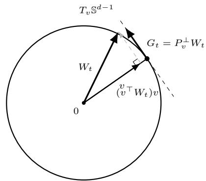  
Figure 1: Tangent projection in NBL. The Stein signal decomposes as $W _ { t } = ( v ^ { \top } W _ { t } ) v + P _ { v } ^ { \bot } W _ { t }$ . The orthogonal component $G _ { t } = P _ { v } ^ { \perp } W _ { t }$ defines the tangent update direction at $v \in \mathbb { S } ^ { d - 1 }$

$$
\mathbb { E } [ W _ { t } \mid \mathcal { H } _ { t - 1 } ] = \frac { \Delta _ { \beta } \mu _ { g } } { 2 } \boldsymbol { v } ^ { \star } .
$$

We therefore initialize $v _ { n _ { 0 } } ~ = ~ \overline { { W } } _ { n _ { 0 } } / \| \overline { { W } } _ { n _ { 0 } } \| _ { 2 }$ , where $\overline { { { W } } } _ { n _ { 0 } } ~ = ~ n _ { 0 } ^ { - 1 } \sum _ { t = 1 } ^ { n _ { 0 } } W _ { t }$ , so that the unknown scale $\Delta _ { \beta } \mu _ { g } / 2$ disappears upon normalization. Proposition 15 in the Appendix further shows that, for any $\delta \in ( 0 , 1 )$ with probability at least $1 - \delta$

$$
\| v _ { n _ { 0 } } - v ^ { \star } \| _ { 2 } \lesssim \frac { B _ { Y } } { \Delta _ { \beta } \mu _ { g } } \sqrt { \frac { d + \log ( 1 / \delta ) } { n _ { 0 } } } .
$$

For $t > n _ { 0 }$ , NBL selects $A _ { t } = \operatorname { s g n } ( v _ { t - 1 } ^ { \top } X _ { t } )$ . Since only the tangent component of $W _ { t }$ changes the direction of $v _ { t - 1 }$ , let

$$
P _ { v } ^ { \perp } = I _ { d } - v v ^ { \top } , \qquad G _ { t } = P _ { v _ { t - 1 } } ^ { \perp } W _ { t } .\tag{5}
$$

NBL updates

$$
v _ { t } = \frac { v _ { t - 1 } + \eta _ { t } G _ { t } } { \Vert v _ { t - 1 } + \eta _ { t } G _ { t } \Vert _ { 2 } } , \qquad t > n _ { 0 } .\tag{6}
$$

Algorithm 1 summarizes the resulting procedure. Figure 1 illustrates the tangent projection underlying the update. Having defined the NBL algorithm, we now study whether its greedy updates continue to learn the true boundary direction after randomized initialization. The key object is the population tangent field associated with one greedy NBL update. We study two questions: is the true boundary direction $v ^ { \star }$ an equilibrium of the population dynamics, and do small perturbations away from $v ^ { \star }$ induce updates that move the boundary back toward it? These are distinct properties. Equilibrium identifies $v ^ { \star }$ as a stationary point of the population dynamics, while local stability determines whether nearby population updates are restoring. We begin by identifying the population field generated by the greedy policy.

Algorithm 1 Natural Boundary Learning (NBL)   
Require: $n _ { 0 } ,$ step sizes $\{ \eta _ { t } \} _ { t > n _ { 0 } }$   
1: for $t = 1 , \ldots , n _ { 0 }$ do   
2: Observe $X _ { t } ;$ draw $A _ { t } \sim \operatorname { U n i f } \{ - 1 , + 1 \}$   
3: Observe $Y _ { t } ;$ set $W _ { t } = A _ { t } Y _ { t } X _ { t }$   
4: end for   
$\sum _ { t = 1 } ^ { n _ { 0 } } W _ { t }$   
5: $v _ { n _ { 0 } }  \frac { \bigcup { \substack { u = 1 } } } { \Vert \sum _ { t = 1 } ^ { n _ { 0 } } W _ { t } \Vert _ { 2 } }$   
6: for $t = n _ { 0 } + \bar { 1 } , n _ { 0 } + 2 , \ldots , n$ do   
7: Observe $X _ { t } ; \mathrm { s e t } \ A _ { t } \gets \mathrm { s g n } ( v _ { t - 1 } ^ { \top } X _ { t } )$   
8: Observe $Y _ { t } ;$ set $W _ { \underline { { t } } }  A _ { t } Y _ { t } X _ { t }$   
9: $G _ { t } \gets ( I _ { d } - v _ { t - 1 } v _ { t - 1 } ^ { \top } ) W _ { t }$   
10: $\mathbf { \boldsymbol { \eta } } _ { t } \gets \frac { \mathbf { \boldsymbol { v } } _ { t - 1 } + \eta _ { t } G _ { t } } { \mathbf { \boldsymbol { \eta } } _ { t } }$   
$\lVert \boldsymbol { v } _ { t - 1 } + \boldsymbol { \eta } _ { t } \boldsymbol { G } _ { t } \rVert _ { 2 }$   
11: end for

Population geometry. For $v \in \mathbb { S } ^ { d - 1 }$ , define

$$
\begin{array} { r l } & { F ( v ) = \mathbb { E } [ m _ { + } ( X ) X \mathbb { 1 } \{ v ^ { \top } X \geq 0 \} } \\ & { \qquad - m _ { - } ( X ) X \mathbb { 1 } \{ v ^ { \top } X < 0 \} ] . } \end{array}\tag{7}
$$

Let $\begin{array} { r l r } { h ( v ) } & { { } = } & { P _ { v } ^ { \perp } F ( v ) } \end{array}$ Under greedy allocation, Lemma 17 in the Appendix gives $\operatorname { \mathbb { E } } [ W _ { t } ~ | ~ { \mathcal { H } } _ { t - 1 } ] ~ =$ $F ( v _ { t - 1 } )$ and $\mathbb { E } [ G _ { t } \ | \ u _ { t - 1 } ] \ = \ h ( v _ { t - 1 } )$ . Thus, h is the population tangent field underlying the NBL update. Moreover, defining ${ \mathcal { I } } ( v ) ~ = ~ \mathbb { E } [ \{ m _ { + } ( X ) ~ +$ $m _ { - } ( X ) \} ( v ^ { \top } X ) _ { + } ] - v ^ { \top } \mathbb { E } \{ m _ { - } ( X ) X \}$ , gives $\nabla \mathcal { I } ( v ) =$ $F ( v )$ . Hence, gradSd−1 $\mathcal { I } ( v ) = h ( v )$ , so h is the Riemannian gradient field of $\mathcal { I }$ on $\mathbb { S } ^ { d - 1 }$

Proposition 6 (Population equilibrium). Under $A s -$ sumptions 1 and 2, $F ( v ^ { \star } ) = \kappa ^ { \star } v ^ { \star }$ for some $\kappa ^ { \star } \in \mathbb { R }$ Consequently, $h ( v ^ { \star } ) = 0$

Thus, $v ^ { \star }$ is a stationary point of the population Riemannian gradient field. NBL can therefore be viewed as a stochastic Riemannian gradient-ascent procedure on the sphere [2]. This reflects the natural-gradient principle of adapting an update to the geometry of the parameter space [3], with the normalization in (6) providing the standard normalization retraction onto $\mathbb { S } ^ { d - 1 }$ This motivates the term Natural Boundary Learning.

The role of the randomized initialization is therefore to place the iterate in a neighborhood of $v ^ { \star }$ where the population field is contractive. We next characterize this local stability, which will provide the contraction condition used in the stochastic analysis. For the local analysis, write $\beta _ { a } = \theta + a ( \Delta _ { \beta } / 2 ) v ^ { \star } , a \in \{ - 1 , + 1 \}$ , where $\theta ^ { \top } v ^ { \star } = 0$ and $\| \theta \| _ { 2 } ^ { 2 } = 1 - \Delta _ { \beta } ^ { 2 } / 4 .$ . Let $U = \theta ^ { \top } X$ and $Z = ( v ^ { \star } ) ^ { \top } X$ . Under Assumption 1, $U \sim N ( 0 , 1 -$ $\Delta _ { \beta } ^ { 2 } / 4 ) , Z \sim N ( 0 , 1 )$ , and $U$ and $Z$ are independent. Define

$$
\mu ^ { \star } = \mathbb { E } \left[ g ^ { \prime } \left( U + \frac { \Delta _ { \beta } } { 2 } Z \right) \mathbb { 1 } \{ Z > 0 \} \right] , m _ { 2 } = \mathbb { E } \{ g ^ { \prime \prime } ( U ) \} .\tag{8}
$$

For $u \in T _ { v ^ { \star } } \mathbb { S } ^ { d - 1 }$ , let $D h ( v ^ { \star } ) [ u ]$ denote the directional derivative of h at $v ^ { \star }$ along u.

Local stability simply means that when the candidate direction moves slightly away from $v ^ { \star }$ , the population update moves it back toward $v ^ { \star }$ . For geometric intuition, we refer the reader to Appendix A.4.2, where this behavior is illustrated in two dimensions. We next characterize this local behavior in arbitrary dimension.

Proposition 7 (Local population dynamics). Let ϕ0 denote the standard Gaussian density. Under Assumptions 1 and ${ \mathit { 2 } } ,$ for every $u \in T _ { v ^ { \star } } \mathbb { S } ^ { d - 1 }$

$$
D h ( v ^ { \star } ) [ u ] = - \Delta _ { \beta } \mu ^ { \star } u + 2 \phi _ { 0 } ( 0 ) m _ { 2 } \theta ( \theta ^ { \top } u ) .\tag{9}
$$

Since $( { \theta } ^ { \top } u ) ^ { 2 } \leq ( 1 - { \Delta _ { \beta } ^ { 2 } } / 4 ) \| u \| _ { 2 } ^ { 2 }$ , the proposition implies $\langle u , D h ( v ^ { \star } ) [ u ] \rangle \leq - \lambda _ { \star } \| u \| _ { 2 } ^ { 2 }$ , where the decision stability coeficient is

$$
\lambda _ { \star } = \Delta _ { \beta } \mu ^ { \star } - 2 \phi _ { 0 } ( 0 ) ( m _ { 2 } ) _ { + } \left( 1 - \frac { \Delta _ { \beta } ^ { 2 } } { 4 } \right) ,\tag{10}
$$

and $( m _ { 2 } ) _ { + } = \displaystyle \operatorname* { m a x } \{ m _ { 2 } , 0 \} , \mu ^ { \star }$ and $m _ { 2 }$ as defined in (8). Since positive $\lambda _ { \star }$ ensures that the linearized population field is strictly contractive in every tangent direction, we impose the following local stability condition.

Assumption 8 (Positive decision stability). The decision stability coeficient satisfies $\lambda _ { \star } > 0 .$

Corollary 9 (Local decision stability). Under Assumption $\delta , v ^ { \star }$ is a locally attracting equilibrium of the population NBL dynamics. In particular, there exist $r _ { 0 } , \lambda _ { 0 } > 0$ such that $\begin{array} { r } { \langle v - v ^ { \star } , h ( v ) \rangle \leq - \lambda _ { 0 } \| v - v ^ { \star } \| _ { 2 } ^ { 2 } } \end{array}$ whenever $\lVert \boldsymbol { v } - \boldsymbol { v } ^ { \star } \rVert _ { 2 } \leq r _ { 0 }$

Corollary 9 shows that positive $\lambda _ { \star }$ yields a locally contractive population field around $v ^ { \star }$ . This local contraction will be the key ingredient in the stochastic analysis of Section 6. To understand when it holds, we next examine the two competing terms in the local dynamics. The first term in $( 9 ) , - \Delta _ { \beta } \mu ^ { \star } u ,$ , always acts against a tangent perturbation $u ,$ , since $\mu ^ { \star } > 0$ The second term, $2 \phi _ { 0 } ( 0 ) m _ { 2 } \theta ( \theta ^ { \top } u )$ , depends on the component of the perturbation along θ and can either reinforce or weaken this restoring force. In particular, when $u \perp \theta .$ , the second term vanishes and the population dynamics are locally restoring at rate $\Delta _ { \beta } \mu ^ { \star }$ While strict monotonicity makes the optimal decision boundary independent of the shape of $^ { g , }$ the stability coeficient depends on the shared link through $\mu ^ { \star }$ and $m _ { 2 }$ . Thus, the link does not determine which boundary is optimal, but it does determine the local dynamics by which that boundary is learned. We next use elicitation geometry to make this dependence explicit.

## 5 ELICITATION GEOMETRY ANDDECISION STABILITY

We first we give a decision-theoretic interpretation of the shared link through elicitation theory, and then use the resulting geometry to interpret the link-dependent quantities $\mu ^ { \star }$ and $m _ { 2 }$ governing decision stability.

## 5.1 Elicitation geometry of the shared link

Recall from Section 2 that $T ( F _ { a , x } ) = m _ { a } ( x )$ is the conditional mean functional. The mean is elicitable: there exist strictly consistent losses for which $T ( F _ { a , x } )$ is the unique optimal point prediction under $F _ { a , x }$ . In particular, a classical class of consistent losses for the mean is given by Bregman losses [23, 10]. Let $\varphi : \mathcal { T } $ R be a twice diferentiable, strictly convex potential. The associated Bregman loss is

$$
\ell _ { \varphi } ( r , y ) = \varphi ( y ) - \varphi ( r ) - \varphi ^ { \prime } ( r ) ( y - r ) .\tag{11}
$$

Under standard regularity conditions, $\begin{array} { r l } { T ( F _ { a , x } ) } & { { } = } \end{array}$ $\begin{array} { r } { m _ { a } ( x ) \ = \ \arg \operatorname* { m i n } _ { r } \mathbb { E } _ { F _ { a , x } } [ \ell _ { \varphi } ( r , Y ) ] } \end{array}$ . Diferent strictly convex potentials can elicit the same mean functional while inducing diferent local geometries; see $\mathrm { A p \mathrm { - } }$ pendix B for examples. Moreover,

$$
\frac { \partial } { \partial r } \ell _ { \varphi } ( r , y ) = \varphi ^ { \prime \prime } ( r ) ( r - y ) ,
$$

so the curvature $\varphi ^ { \prime \prime } ( r )$ determines how prediction errors are locally weighted at the prediction value r. The same convex potential induces a natural dual coordinate $\vartheta = \varphi ^ { \prime } ( r )$ . Geometrically, ϑ is the slope of the tangent to $\varphi$ at r. Since $\varphi$ is strictly convex, $\varphi ^ { \prime }$ is strictly increasing and hence invertible on its range. Writing $g _ { \varphi } = ( \varphi ^ { \prime } ) ^ { - 1 }$ , suppose that the action-specific index represents the conditional mean on this dual scale, so that $\varphi ^ { \prime } \{ m _ { a } ( x ) \} = \beta _ { a } ^ { \top } x$ . Mapping back to the primal mean scale gives $m _ { a } ( x ) = g _ { \varphi } ( \beta _ { a } ^ { \top } x )$ . Under this interpretation,

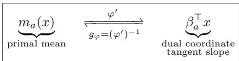

and the single-index assumption can be viewed as imposing linear dimension reduction in the dual coordinate. The high-dimensional context is first reduced to the scalar $\beta _ { a } ^ { \top } x ,$ , and the inverse-gradient map $( \varphi ^ { \prime } ) ^ { - 1 }$ then returns this scalar to the conditional mean scale.

If the two actions share a common convex potential $\varphi ,$ then they share the same response geometry $g _ { \varphi } = ( \varphi ^ { \prime } ) ^ { - 1 }$ , while retaining action-specific linear representations through $\beta _ { + }$ and $\beta _ { - }$ . Thus, the shared-link model in (1) separates a common response geometry from action-specific dimension reduction. Moreover, although this geometry determines how the dual coordinate is mapped to the conditional mean, its monotonicity preserves the ordering of the two actions. This preservation of ordering is exactly what makes the optimal action depend only on $v ^ { \star }$

This interpretation does not require the unknown link in our model to be specified through a known potential. Conversely, under suitable regularity, any strictly increasing link $g$ admits such a representation: defining $\varphi ^ { \prime } = g ^ { - 1 }$ on the range of $g$ yields a strictly convex potential satisfying $g = ( \varphi ^ { \prime } ) ^ { - 1 } ;$ see Appendix B.3 for the formal construction. Thus, φ provides an interpretive description of the geometry induced by the unknown shared link, rather than an object that must be known or estimated by NBL. This perspective clarifies how link geometry afects learning dynamics while leaving the optimal boundary unchanged.

## 5.2 Geometry of decision stability

The geometry does, however, afect how changes in the dual coordinate are transmitted to the conditional mean. Since $\varphi ^ { \prime } \{ g _ { \varphi } ( z ) \} = z$ , diferentiation gives

$$
g _ { \varphi } ^ { \prime } ( z ) = { \frac { 1 } { \varphi ^ { \prime \prime } \{ g _ { \varphi } ( z ) \} } } , \qquad g _ { \varphi } ^ { \prime \prime } ( z ) = - { \frac { \varphi ^ { \prime \prime \prime } \{ g _ { \varphi } ( z ) \} } { \left[ \varphi ^ { \prime \prime } \{ g _ { \varphi } ( z ) \} \right] ^ { 3 } } } .
$$

Thus, $g _ { \varphi } ^ { \prime } ( z )$ is the reciprocal curvature of the eliciting potential and measures the local sensitivity of the primal mean to changes in the dual coordinate, while $g _ { \varphi } ^ { \prime \prime } ( z )$ describes how this sensitivity varies across the response surface.

The two terms in (10) therefore have distinct geometric roles. The first term measures the strength of the restoring signal generated by the dual-to-primal sensitivity: changes in the index must translate into suficiently large changes in the conditional mean for a perturbation of the boundary to generate a meaningful restoring update. The second term captures the efect of variation in this sensitivity across the population. Because a curved link responds diferently at diferent index values, variation in the dual-to-primal sensitivity can create an asymmetry in the population boundary update. Importantly, what matters for stability is not curvature at a particular index value, but its signed average under the population distribution, $m _ { 2 } = - \mathbb { E } [ \varphi ^ { \prime \prime \prime } \{ g ( U ) \} / \{ \varphi ^ { \prime \prime } \{ g ( U ) \} \} ^ { 3 } ]$ . Thus, local curvature may cancel across the population. When $m _ { 2 } \ > \ 0$ , the resulting average curvature efect can weaken the restoring component of the population $\mathrm { { d y } \mathrm { { - } } }$ namics, whereas when $m _ { 2 } \leq 0 .$ , it cannot oppose the restoring movement. Appendix B.4 expresses both $\mu ^ { \star }$ and $m _ { 2 } .$ , and hence the full decision stability coeficient $\lambda _ { \star }$ , directly in terms of the curvature and variation of the eliciting potential.

The preceding interpretation also connects decision stability to self-concordance conditions used in the generalized linear bandit literature [22, 29]. In particular, consider the generalized self-concordance condition

$$
| g ^ { \prime \prime } ( z ) | \leq R g ^ { \prime } ( z ) , z \in \mathbb { R } ,\tag{12}
$$

for some $R \geq 0$ . Since $g ^ { \prime } ( z ) > 0 ,$ , this is equivalent to $| ( \log g ^ { \prime } ) ^ { \prime } ( z ) | \le R$ and, in terms of the eliciting potential, to $| \varphi ^ { \prime \prime \prime } ( m ) | \leq R \{ \varphi ^ { \prime \prime } ( m ) \} ^ { 2 }$ . Thus, self-concordance uniformly controls the variation of the dual-to-primal sensitivity relative to its magnitude.

Proposition 10 (Self-concordance and decision stability). Suppose that the shared link satisfies (12). Define $\kappa ( a ) = e ^ { a ^ { 2 } / 2 } \Phi ( - a )$ , where Φ denotes the standard normal distribution function. Then the decision stability coeficient satisfies

$$
\lambda _ { \star } \geq 2 \mu ^ { \star } \left\{ \frac { \Delta _ { \beta } } { 2 } - \phi _ { 0 } ( 0 ) \left( 1 - \frac { \Delta _ { \beta } ^ { 2 } } { 4 } \right) \frac { R } { \kappa ( R \Delta _ { \beta } / 2 ) } \right\} .
$$

Consequently, a suficient condition for local decision stability is $\Delta _ { \beta } / 2 > \phi _ { 0 } ( 0 ) ( 1 - \Delta _ { \beta } ^ { 2 } / 4 ) R / \kappa ( R \Delta _ { \beta } / 2 )$

Proposition 10 (proof in Appendix B.5) should be viewed as a suficient condition rather than as a replacement for the exact stability criterion $\lambda _ { \star } > 0$ . The latter depends on the average slope and signed curvature of the shared link under the population distribution, whereas self-concordance imposes uniform control on curvature relative to slope. The self-concordance bound can therefore be conservative, and decision stability may hold even when the suficient condition above is not satisfied.

This distinction is also useful in comparing NBL with existing analyses of greedy generalized linear bandits. Self-concordance controls the regularity of the response link, while conditions such as covariate diversity [6] ensure that greedy allocation continues to provide sufficient information for estimating arm-specific parameters. Decision stability plays a diferent role: it determines whether the population dynamics of a direct boundary estimator exhibit restoring drift toward the optimal decision boundary, accounting jointly for the geometry of the boundary and the magnitude of the reward gap across it.

Taken together, these results reveal a distinction between the geometry of the decision problem and the geometry of learning. Monotonicity makes the optimal boundary independent of the shape of the shared link, while the dual-to-primal sensitivity and its variation determine the local dynamics by which that decision boundary is learned. These dynamics depend jointly on the separation between the arm-specific indices and on how the shared link translates this separation into a reward gap. Thus, diferent elicitation geometries can induce the same optimal decision boundary while producing diferent reward gaps and diferent local learning behavior. We make this distinction explicit in Section 7, where we vary the geometry of the shared link while holding the arm-specific indices, and hence the optimal decision boundary, fixed.

## 6 REGRET GUARANTEES

The population analysis in Section 4 shows that, when $\lambda _ { \star } > 0 .$ the mean NBL update is locally contractive around $v ^ { \star }$ . We now show that this contraction persists for the stochastic iterates following a suficiently accurate randomized initialization and yields logarithmic cumulative regret. Detailed stochastic arguments are deferred to Appendix C.

Local stochastic convergence. Let $e _ { t } ~ = ~ \| v _ { t } -$ $v ^ { \star } \| _ { 2 } ^ { 2 } . \mathrm { B y }$ the definition of the Stein contrast $G _ { t }$ in (5), $G _ { t } \in T _ { v _ { t - 1 } } \mathbb { S } ^ { d - 1 }$ . Hence, normalization of the tentative update cannot increase its distance from $v ^ { \star }$ , giving

$$
e _ { t } \le e _ { t - 1 } + 2 \eta _ { t } \langle v _ { t - 1 } - v ^ { \star } , G _ { t } \rangle + \eta _ { t } ^ { 2 } \| G _ { t } \| _ { 2 } ^ { 2 } .\tag{13}
$$

To separate the population drift from the stochastic fluctuation, define $\xi _ { t } = G _ { t } - h ( v _ { t - 1 } )$ . By Lemma 17, $\mathbb { E } [ \xi _ { t } \ | \ \mathcal { H } _ { t - 1 } ] = 0$ . Substituting $G _ { t } = h ( v _ { t - 1 } ) + \xi _ { t }$ into (13) gives

$$
\begin{array} { r l } & { e _ { t } \leq e _ { t - 1 } + 2 \eta _ { t } \langle v _ { t - 1 } - v ^ { \star } , h ( v _ { t - 1 } ) \rangle } \\ & { \qquad + 2 \eta _ { t } \langle v _ { t - 1 } - v ^ { \star } , \xi _ { t } \rangle + \eta _ { t } ^ { 2 } \| G _ { t } \| _ { 2 } ^ { 2 } . } \end{array}\tag{14}
$$

Thus, the evolution of the directional error consists of a population drift term, a martingale fluctuation, and a second-order stochastic term. Under Assumption 8, the population drift is locally contractive by Corollary 9. The remaining terms determine whether the stochastic iterates remain within this stability region. Combining the pathwise decomposition with the local contraction gives the following one-step conditional error bound.

Lemma 11 (Local one-step contraction). Suppose that Assumptions $1 , \ 4 , \ 5 ,$ and 8 hold. $I f \| v _ { t - 1 } - v ^ { \star } \| _ { 2 } \leq r _ { 0 }$ then

$$
\mathbb { E } [ e _ { t } \ | \ \mathcal { H } _ { t - 1 } ] \leq ( 1 - 2 \lambda _ { 0 } \eta _ { t } ) e _ { t - 1 } + B _ { Y } ^ { 2 } d \eta _ { t } ^ { 2 } .\tag{15}
$$

Lemma 11 shows that the directional error contracts locally, up to a stochastic term of order $d \eta _ { t } ^ { 2 }$ . Since this recursion is valid only while the iterates remain near $v ^ { \star }$ , we next control their exit probability.

Localization. Let $\tau = \operatorname* { i n f } \{ t \geq n _ { 0 } : \| v _ { t } - v ^ { \star } \| _ { 2 } > r _ { 0 } \}$ denote the first exit time from the stability neighborhood. To localize the stochastic recursion, we multiply the increments in (14) by $\mathbb { 1 } \{ t \leq \tau \}$ . Since $\{ t \leq \tau \}$ is $\mathscr { H } _ { t - 1 } \mathrm { - m e a s u r a b l e } ,$ the stopping indicator is predictable and preserves the martingale-diference structure of the fluctuation term. Summing the resulting stopped recursion reduces the localization argument to controlling the accumulated martingale fluctuation and secondorder stochastic term. We use the harmonic step size $\eta _ { t } = \gamma / ( t + t _ { 0 } )$ , which balances the contracting population drift with summable second-order stochastic fluctuations.

Lemma 12 (Finite-horizon localization). Under the conditions as in Lemma 11 above, fix $n \geq n _ { 0 }$ and $\delta \in ( 0 , 1 )$ . There exists a problem-dependent constant $C _ { \mathrm { l o c } } < \infty$ , independent of $d , n ,$ and $\delta ,$ such that, if ${ n _ { 0 } } \geq C _ { \mathrm { l o c } } \{ d + \log ( 1 / \delta ) \}$ , then $\mathbb { P } ( \tau \leq n ) \leq \delta$

The explicit form of $C _ { \mathrm { l o c } }$ is given in Appendix C. Lemma 12 shows that an initialization period of order $d + \log ( 1 / \delta )$ keeps the NBL iterates within the local stability region with probability at least $1 - \delta .$ Within this region, the one-step contraction yields the following estimation rate.

Proposition 13 (Localized estimation rate). Suppose that Assumptions $1 , \ 4 , \ 5 ,$ and 8 hold. Let $\eta _ { t } = \gamma / ( t +$ $t _ { 0 } )$ , where $2 \gamma \lambda _ { 0 } > 1 , n _ { 0 } + 1 + t _ { 0 } \geq 2 \gamma \lambda _ { 0 } .$ , and $t _ { 0 } \le C _ { \mathrm { o f f } } n _ { 0 }$ for some constant $C _ { \mathrm { o f f } } < \infty$ . Then, for some $C _ { e } < \infty$ independent of d and t,

$$
\mathbb { E } \left[ \Vert v _ { t } - v ^ { \star } \Vert _ { 2 } ^ { 2 } \mathbb { 1 } \left\{ \tau > t \right\} \right] \leq C _ { e } \frac { d } { t + t _ { 0 } } , \qquad t \geq n _ { 0 } .
$$

Thus, within the local stability region, the squared directional error is of order $d / t$ . We next show that this rate translates directly into logarithmic cumulative regret through the geometry of boundary disagreement.

From boundary error to regret. The greedy action difers from the optimal action only when $v _ { t - 1 }$ and $v ^ { \star }$ assign diferent signs to $X _ { t }$ . Thus, the instantaneous regret can be written as

$$
r _ { t } = | m _ { + } ( X _ { t } ) - m _ { - } ( X _ { t } ) | \mathbb { 1 } \left\{ \operatorname { s g n } ( v _ { t - 1 } ^ { \top } X _ { t } ) \neq \operatorname { s g n } ( ( v ^ { \star } ) ^ { \top } X _ { t } ) \right\}
$$

Moreover, because the two conditional mean functions agree on the optimal decision boundary, the reward gap vanishes as $( \boldsymbol { v } ^ { \star } ) ^ { \top } \boldsymbol { X } _ { t }$ approaches zero. Under the polynomial-growth condition on $g ^ { \prime }$ and Gaussian contexts, the weighted Gaussian disagreement bound in Lemma 26 therefore gives

$$
\mathbb { E } [ r _ { t } \mid \mathcal { H } _ { t - 1 } ] \leq C _ { \mathrm { g a p } } \frac { \Delta _ { \beta } } { 2 } \| v _ { t - 1 } - v ^ { \star } \| _ { 2 } ^ { 2 } ,\tag{16}
$$

where $C _ { \mathrm { g a p } } ~ < ~ \infty$ depends only on the polynomialgrowth constants for $g ^ { \prime }$ and on $q$ from Assumption $2 ,$ and is independent of $\Delta _ { \beta } , d ,$ and t.

Theorem 14 (Regret of NBL). Suppose that Assumptions $1 , \ 2 , \ 4 , \ 5 ,$ and 8 hold. Let $\eta _ { t } = \gamma / ( t + t _ { 0 } )$ with $2 \gamma \lambda _ { 0 } > 1$ and suppose that $t _ { 0 } \le C _ { \mathrm { o f f } } n _ { 0 }$ for some fixed $C _ { \mathrm { o f f } } < \infty$ . There exists a suficiently large problemdependent constant $C _ { 0 } ~ < ~ \infty$ , independent of d and $n ,$ such that, with $n _ { 0 } = \lceil C _ { 0 } ( d + \log n ) \rceil$ and $n _ { 0 } < n _ { : }$ Natural Boundary Learning satisfies

$$
\mathbb { E } [ R _ { n } ] = O ( d \log n ) ,
$$

where the implicit constant is independent of d and n.

Theorem 14 shows that, after an initialization period of order $d + \log n ,$ NBL achieves $O ( d \log { n } )$ expected regret while acting greedily throughout Stage II. The rate follows from the direct connection between boundary estimation and regret. The localized squared estimation error is of order $d / t ,$ , while the reward gap vanishes near the true decision boundary. Consequently, (16) converts squared boundary error of order $d / t$ into instantaneous regret of order $d / t$ . Summing over time then gives $\textstyle \sum _ { t = 1 } ^ { n } { d } / t = O ( d \log ^ { - } n )$ . The shared-link model is related to generalized linear contextual bandits, where a known link permits $\widetilde { O } ( \sqrt { d n } )$ regret using UCB-style exploration [16]. In contrast, our link is unknown, but its shared monotonicity makes the optimal decision boundary identifiable without estimating the link. Our result is also related to exploration-free linear contextual bandits: [6] obtain logarithmic regret under covariate diversity, while [13] establish O(poly log n) regret under local anti-concentration. For the shared-link single-index model, NBL similarly requires randomized exploration only initially and achieves O(d log n) regret through local stability of the boundary dynamics.

## 7 NUMERICAL ILLUSTRATIONS

We use two sets of experiments to illustrate the role of decision stability and the efect of link misspecification. Throughout, $d = 2 ;$ complete simulation settings and additional experiments are given in Appendix D.

Decision stability and stochastic behavior. We first consider the two-transition family $g ( z ) = p _ { 0 } +$ $\dot { a _ { 1 } } \{ 1 + \operatorname { t a n h } [ b _ { 1 } ( z - \mu _ { 1 } ) ] \} + a _ { 2 } \{ 1 + \operatorname { t a n h } [ b _ { 2 } ( z - \mu _ { 2 } ) ] \}$ and select links yielding stable, near-critical, and unstable dynamics at $\Delta _ { \beta } = 0 . 2$ . Figure $2 ( \mathrm { a } )$ shows that all three links are strictly increasing, but their local geometry difers substantially. In particular, panel (b) shows differences in curvature over regions receiving appreciable Gaussian mass. Through the balance between the sensitivity and curvature terms in the decision stability coefficient in (10), these diferences lead to positive, nearly zero, and negative values of λ⋆ at $\Delta _ { \beta } = 0 . 2$ . Panel (c) shows, however, that instability is largely confined to weakly separated arms, typically with $\Delta _ { \beta } \lesssim 0 . 2$ in these examples, and disappears as the arm separation increases. The stochastic experiment in panel (d) reflects the same population geometry: average regret decreases under stable dynamics, while near-critical and unstable dynamics exhibit increasingly persistent regret. Additional directional-error diagnostics and experiments varying $\Delta _ { \beta }$ are in Appendix D.

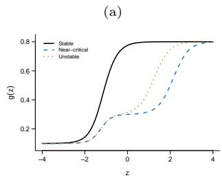

Decision stability and stochastic behavior  
(b)  
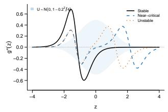

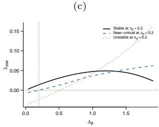

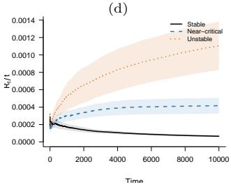  
Link misspecification and parametric comparison

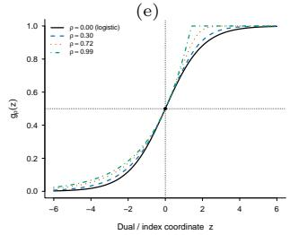

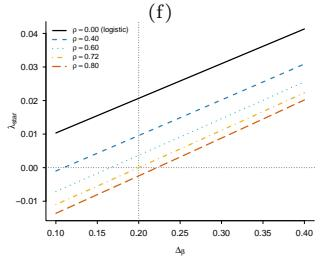

(g)  
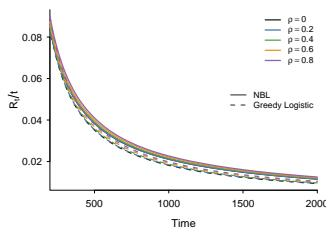

(h)  
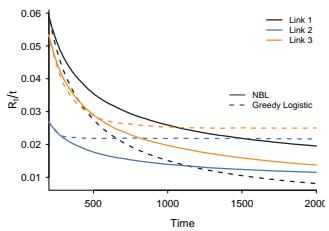  
Figure 2: Numerical illustration of decision stability and link misspecification. Top: two-transition links yielding stable, near-critical, and unstable dynamics, their curvature, the resulting decision stability coeficient $\lambda _ { \star }$ , and stochastic NBL regret. Bottom: the elicitation-induced link family, its decision stability under weak separation, and comparisons of NBL with Greedy Logistic under link misspecification.

Link misspecification and parametric comparison. We next compare NBL with Greedy Logistic, a natural parametric benchmark for greedy contextualbandit learning [6]. Figure 2(e) considers the elicitationinduced family $g _ { \rho } = ( \varphi _ { \rho } ^ { \prime } ) ^ { - 1 }$ , where $\rho = 0$ is logistic and increasing $\rho$ gives controlled departures from logistic geometry. Panel (f) shows that these departures can also alter decision stability under weak separation. In panel (g), Greedy Logistic has lower regret when the link is logistic or nearly logistic, while larger departures from the logistic link lead to lower regret for NBL. Panel (h) returns to the two-transition family in (a), now in the well-separated regime $\Delta _ { \beta } = 1$ , and similarly shows that NBL can outperform Greedy Logistic under link misspecification. Together, these comparisons highlight the parametric eficiency of Greedy Logistic under correct specification and the advantage of directly learning the decision boundary when the link is misspecified.

## 8 CONCLUSION

We introduced Natural Boundary Learning for two-arm contextual bandits with a shared unknown monotone link. Rather than estimating the reward functions, NBL uses a sequential Stein contrast to learn the optimal decision boundary directly. Our analysis connects Stein identification, Riemannian population dynamics, and elicitation geometry through the decision stability coeficient $\lambda _ { \star } ,$ and establishes logarithmic expected regret under local stability. The numerical results illustrate how link geometry and arm separation jointly determine the resulting learning dynamics.

Several directions remain open. The present theory relies on isotropic Gaussian contexts and two arms, and extending boundary learning to more general context distributions and multiple interacting decision boundaries is of particular interest. Our guarantees are also local and require a suficiently accurate initialization. Developing global or adaptive initialization guarantees, as well as understanding robustness to departures from the shared-link assumption, are natural directions for future work.

## REFERENCES

[1] Yasin Abbasi-Yadkori, D´avid P´al, and Csaba Szepesv´ari. Improved algorithms for linear stochastic bandits. In J. Shawe-Taylor, R. Zemel, P. Bartlett, F. Pereira, and K.Q. Weinberger, edi-

tors, Advances in Neural Information Processing Systems, volume 24. Curran Associates, Inc., 2011.

[2] P.-A. Absil, R. Mahony, and R. Sepulchre. Optimization Algorithms on Matrix Manifolds. Princeton University Press, Princeton, NJ, 2008.

[3] Shun-ichi Amari. Information Geometry and Its Applications, volume 194 of Applied Mathematical Sciences. Springer, Tokyo, 2016.

[4] Sakshi Arya, Satarupa Bhattacharjee, and Bharath K. Sriperumbudur. Kernel single-index bandits: Estimation, inference, and learning. arXiv preprint arXiv:2603.18938, 2026.

[5] Sakshi Arya and Hyebin Song. Batched singleindex global multi-armed bandits with covariates. arXiv preprint arXiv:2503.00565, 2026.

[6] Hamsa Bastani, Mohsen Bayati, and Khashayar Khosravi. Mostly exploration-free algorithms for contextual bandits. Management Science, 67(3):1329–1349, 2021.

[7] Marc Peter Deisenroth, A Aldo Faisal, and Cheng Soon Ong. Mathematics for Machine Learning. Cambridge University Press, 2020.

[8] Sarah Filippi, Olivier Cappe, Aur´elien Garivier, and Csaba Szepesv´ari. Parametric Bandits: The generalized linear case. In J. Laferty, C. Williams, J. Shawe-Taylor, R. Zemel, and A. Culotta, editors, Advances in Neural Information Processing Systems, volume 23. Curran Associates, Inc., 2010.

[9] Avishek Ghosh, Sayak Ray Chowdhury, and Aditya Gopalan. Misspecified linear bandits. In Proceedings of the AAAI Conference on Artificial Intelligence, volume 31, 2017.

[10] Tilmann Gneiting. Making and evaluating point forecasts. Journal of the American Statistical Association, 106(494):746–762, 2011.

[11] Alexander Goldenshluger and Assaf Zeevi. A linear response bandit problem. Stochastic Systems, 3(1):230–261, 2013.

[12] Yue Kang, Mingshuo Liu, Bongsoo Yi, Jing Lyu, Zhi Zhang, Doudou Zhou, and Yao Li. Single index bandits: Generalized linear contextual bandits with unknown reward functions. In The Fourteenth International Conference on Learning Representations, 2026.

[13] Seok-Jin Kim and Min-hwan Oh. Local anticoncentration class: Logarithmic regret for greedy linear contextual bandit. In Advances in Neural Information Processing Systems, volume 37, 2024.

[14] Andreas Krause and Cheng Soon Ong. Contextual gaussian process bandit optimization. Advances in neural information processing systems, 24, 2011.

[15] B. Laurent and P. Massart. Adaptive estimation of a quadratic functional by model selection. The Annals of Statistics, 28(5):1302–1338, 2000.

[16] Lihong Li, Yu Lu, and Dengyong Zhou. Provably optimal algorithms for generalized linear contextual bandits. In Proceedings of the 34th International Conference on Machine Learning, volume 70 of Proceedings of Machine Learning Research, pages 2071–2080. PMLR, 2017.

[17] Muxuan Liang and Menggang Yu. Relative contrast estimation and inference for treatment recommendation. Biometrics, 79(4):2920–2932, 2023.

[18] Wanteng Ma and T Tony Cai. Nonparametric bandits with single-index rewards: Optimality and adaptivity. arXiv preprint arXiv:2512.24669, 2025.

[19] Kent Harold Osband. Providing Incentives for Better Cost Forecasting (Prediction, Uncertainty Elicitation). University of California, Berkeley, 1985.

[20] Vianney Perchet and Philippe Rigollet. The multiarmed bandit problem with covariates. The Annals of Statistics, 2013.

[21] Philippe Rigollet and Assaf Zeevi. Nonparametric bandits with covariates. Conference on Learning Theory (COLT), page 54, 2010.

[22] Yoan Russac, Louis Faury, Olivier Capp´e, and Aur´elien Garivier. Self-concordant analysis of generalized linear bandits with forgetting. In International Conference on Artificial Intelligence and Statistics, pages 658–666. PMLR, 2021.

[23] Leonard J Savage. Elicitation of personal probabilities and expectations. Journal of the American Statistical Association, 66(336):783–801, 1971.

[24] Roman Vershynin. High-Dimensional Probability: An Introduction with Applications in Data Science, volume 47 of Cambridge Series in Statistical and Probabilistic Mathematics. Cambridge University Press, 2018.

[25] Nirandika Wanigasekara and Christina Yu. Nonparametric contextual bandits in metric spaces with unknown metric. In H. Wallach, H. Larochelle, A. Beygelzimer, F. d'Alch´e-Buc, E. Fox, and R. Garnett, editors, Advances in Neural Information Processing Systems, volume 32. Curran Associates, Inc., 2019.

[26] Cui Xiong, Menggang Yu, and Jun Shao. Treatment recommendation and parameter estimation under single-index contrast function. Statistical Theory and Related Fields, 1(2):171–181, 2017.

[27] Yuhong Yang and Dan Zhu. Randomized allocation with nonparametric estimation for a multi-

armed bandit problem with covariates. The Annals of Statistics, 30(1):100–121, 2002.

[28] Zhuoran Yang, Krishnakumar Balasubramanian, and Han Liu. High-dimensional non-Gaussian single index models via thresholded score function estimation. In Doina Precup and Yee Whye Teh, editors, Proceedings of the 34th International Conference on Machine Learning, volume 70 of Proceedings of Machine Learning Research, pages 3851–3860. PMLR, 06–11 Aug 2017.

[29] Yu-Jie Zhang, Sheng-An Xu, Peng Zhao, and Masashi Sugiyama. Generalized linear bandits: Almost optimal regret with one-pass update. Advances in Neural Information Processing Systems, 38:69244–69277, 2026.

# Appendix for “Elicitation and Decision Geometry in Single-Index Bandits”

## A PROOFS AND SUPPORTING THEORY

## A.1 Randomized initialization

We first establish that the randomized initialization places NBL in a prescribed neighborhood of $v ^ { \star }$ with suficiently high probability. Recall that $\mathbb { E } [ W _ { t } \mid \mathcal { H } _ { t - 1 } ] = ( \Delta _ { \beta } \mu _ { g } / 2 ) v ^ { \star }$ during the randomized stage.

Proposition 15 (Randomized initialization). Suppose that Assumptions 1, 2, 4, and 5 hold. Then

$$
\mathbb { E } \big [ \| v _ { n _ { 0 } } - v ^ { \star } \| _ { 2 } ^ { 2 } \big ] \leq \frac { 1 6 B _ { Y } ^ { 2 } d } { \Delta _ { \beta } ^ { 2 } \mu _ { g } ^ { 2 } n _ { 0 } } .\tag{17}
$$

Moreover, there exists a universal constant $C > 0$ such that, for any $\delta \in ( 0 , 1 )$ , with probability at least $1 - \delta$

$$
\| v _ { n _ { 0 } } - v ^ { \star } \| _ { 2 } \leq \frac { C B _ { Y } } { \Delta _ { \beta } \mu _ { g } } \sqrt { \frac { d + \log ( 2 / \delta ) } { n _ { 0 } } } .\tag{18}
$$

Consequently, for any $r > 0$ and $\delta _ { 0 } \in ( 0 , 1 )$ , there exists a universal constant $C _ { \mathrm { i n i t } } > 0$ such that

$$
n _ { 0 } \ge C _ { \mathrm { i n i t } } \frac { B _ { Y } ^ { 2 } \{ d + \log ( 2 / \delta _ { 0 } ) \} } { \Delta _ { \beta } ^ { 2 } \mu _ { g } ^ { 2 } r ^ { 2 } }
$$

implies $\mathbb { P } ( \| v _ { n _ { 0 } } - v ^ { \star } \| _ { 2 } \le r ) \ge 1 - \delta _ { 0 }$

## A.2 Gaussian integration-by-parts identities

We record the Gaussian integration-by-parts identities used throughout the proofs.

Lemma 16 (Gaussian Stein identities). Let $X \sim N ( 0 , I _ { d } )$ and let $\beta \in \mathbb { R } ^ { d }$ . Suppose that $f : \mathbb { R }  \mathbb { R }$ is twice continuously diferentiable and satisfies the integrability conditions required for the expectations below to be finite. Then

$$
\mathbb { E } \left[ X f ( \beta ^ { \top } X ) \right] = \mathbb { E } \left[ f ^ { \prime } ( \beta ^ { \top } X ) \right] \beta ,\tag{19}
$$

$$
\begin{array} { r } { \mathbb { E } \left[ X X ^ { \top } f ( \beta ^ { \top } X ) \right] = \mathbb { E } \left[ f ( \beta ^ { \top } X ) \right] I _ { d } + \mathbb { E } \left[ f ^ { \prime \prime } ( \beta ^ { \top } X ) \right] \beta \beta ^ { \top } . } \end{array}\tag{20}
$$

Equivalently,

$$
\mathbb { E } \left[ ( X X ^ { \top } - I _ { d } ) f ( \beta ^ { \top } X ) \right] = \mathbb { E } \left[ f ^ { \prime \prime } ( \beta ^ { \top } X ) \right] \beta \beta ^ { \top } .
$$

Proof. For the first identity, the multivariate Gaussian integration-by-parts formula gives

$$
\mathbb { E } [ X _ { j } h ( X ) ] = \mathbb { E } [ \partial _ { j } h ( X ) ] .
$$

Taking $h ( X ) = f ( \beta ^ { \top } X )$ yields

$$
\partial _ { j } h ( X ) = \beta _ { j } f ^ { \prime } ( \beta ^ { \top } X ) ,
$$

and hence

$$
\begin{array} { r } { \mathbb { E } [ X _ { j } f ( \beta ^ { \top } X ) ] = \beta _ { j } \mathbb { E } [ f ^ { \prime } ( \beta ^ { \top } X ) ] . } \end{array}
$$

Collecting the coordinates gives (19).

For the second identity, applying Gaussian integration by parts twice gives

$$
{ \mathbb E } [ ( X _ { j } X _ { k } - \delta _ { j k } ) h ( X ) ] = { \mathbb E } [ \partial _ { j k } h ( X ) ] .
$$

Since

$$
\partial _ { j k } f ( { \boldsymbol { \beta } } ^ { \top } \boldsymbol { X } ) = \beta _ { j } \beta _ { k } f ^ { \prime \prime } ( { \boldsymbol { \beta } } ^ { \top } \boldsymbol { X } ) ,
$$

we obtain

$$
\begin{array} { r } { \mathbb { E } [ ( X _ { j } X _ { k } - \delta _ { j k } ) f ( \beta ^ { \top } X ) ] = \beta _ { j } \beta _ { k } \mathbb { E } [ f ^ { \prime \prime } ( \beta ^ { \top } X ) ] . } \end{array}
$$

Collecting the entries gives (20).

## A.3 Proof of Proposition 15

Proof. Note that $Y _ { t , a }$ which we denote as $Y _ { t , + }$ and $Y _ { t , \tau }$ denotes the potential rewards for the two arms $\{ + 1 , - 1 \}$ at time $t ,$ respectively (these are not to the observed rewards). Recall that during the randomized initialization stage,

$$
W _ { t } = A _ { t } Y _ { t } X _ { t } , \qquad t = 1 , \dots , n _ { 0 } ,
$$

where $A _ { t }$ is chosen uniformly from $\{ - 1 , + 1 \}$ using fresh randomization independent of $X _ { t }$ and $\mathcal { H } _ { t - 1 }$ . We first identify the conditional mean of $W _ { t }$ given the past. Since $X _ { t }$ is independent of $\mathcal { H } _ { t - 1 }$ and the randomized action is selected uniformly,

$$
\mathbb { E } [ W _ { t } \mid \mathcal { H } _ { t - 1 } ] = \frac { 1 } { 2 } \mathbb { E } [ Y _ { t , + } X _ { t } \mid \mathcal { H } _ { t - 1 } ] - \frac { 1 } { 2 } \mathbb { E } [ Y _ { t , - } X _ { t } \mid \mathcal { H } _ { t - 1 } ] .
$$

For each $a \in \{ - 1 , + 1 \}$ , the tower property and the conditional-mean model give

$$
\begin{array} { r l } & { \mathbb { E } \left[ Y _ { t , a } X _ { t } \mid \mathcal { H } _ { t - 1 } \right] = \mathbb { E } \left[ X _ { t } \mathbb { E } \big [ Y _ { t , a } \mid X _ { t } , \mathcal { H } _ { t - 1 } \big ] \mid \mathcal { H } _ { t - 1 } \right] } \\ & { \qquad = \mathbb { E } \left[ X _ { t } g ( \beta _ { a } ^ { \top } X _ { t } ) \big \vert \mathcal { H } _ { t - 1 } \right] . } \end{array}
$$

Because $X _ { t }$ is independent of $\mathcal { H } _ { t - 1 }$ and $X _ { t } \sim N ( 0 , I _ { d } )$ , the last expectation is equal to $\mathbb { E } [ X _ { t } g ( \beta _ { a } ^ { \top } X _ { t } ) ] = \mu _ { g } \beta _ { a }$ where the final equality follows from the first-order Gaussian Stein identity. Consequently,

$$
\mathbb { E } [ W _ { t } \mid \mathcal { H } _ { t - 1 } ] = \frac { \mu _ { g } } { 2 } ( \beta _ { + } - \beta _ { - } ) = \frac { \Delta _ { \beta } \mu _ { g } } { 2 } v ^ { \star } .\tag{21}
$$

Define the centered increment $\begin{array} { r } { D _ { t } = W _ { t } - \frac { \Delta _ { \beta } \mu _ { g } } { 2 } v ^ { \star } } \end{array}$ . By (21), E $[ D _ { t } \mid { \mathcal { H } } _ { t - 1 } ] = 0$ . Thus, $\{ D _ { t } \} _ { t = 1 } ^ { n _ { 0 } }$ forms a martingalediference sequence with respect to the filtration generated by the sequential observations together with the randomization used to select the actions. We first record a mean-squared bound for the initialization error. Since $\{ D _ { t } \} _ { t = 1 } ^ { n _ { 0 } }$ is a martingale-diference sequence, the cross terms vanish, and hence

$$
\mathbb { E } \left\| \overline { { W } } _ { n _ { 0 } } - \frac { \Delta _ { \beta } \mu _ { g } } { 2 } v ^ { \star } \right\| _ { 2 } ^ { 2 } = \frac { 1 } { n _ { 0 } ^ { 2 } } \mathbb { E } \left\| \sum _ { t = 1 } ^ { n _ { 0 } } D _ { t } \right\| _ { 2 } ^ { 2 } = \frac { 1 } { n _ { 0 } ^ { 2 } } \sum _ { t = 1 } ^ { n _ { 0 } } \mathbb { E } \| D _ { t } \| _ { 2 } ^ { 2 } .
$$

Moreover, since $D _ { t } = W _ { t } - \mathbb { E } [ W _ { t } \mid \mathcal { H } _ { t - 1 } ] , \mathbb { E } \Vert D _ { t } \Vert _ { 2 } ^ { 2 } \leq \mathbb { E } \Vert W _ { t } \Vert _ { 2 } ^ { 2 } \leq B _ { Y } ^ { 2 } \mathbb { E } \Vert X _ { t } \Vert _ { 2 } ^ { 2 } = B _ { Y } ^ { 2 } d$ . Therefore,

$$
\mathbb { E } \left. \overline { { W } } _ { n _ { 0 } } - \frac { \Delta _ { \beta } \mu _ { g } } { 2 } v ^ { \star } \right. _ { 2 } ^ { 2 } \leq \frac { B _ { Y } ^ { 2 } d } { n _ { 0 } } .
$$

Using

$$
\left. { \frac { x } { \| x \| _ { 2 } } } - { \frac { y } { \| y \| _ { 2 } } } \right. _ { 2 } \leq { \frac { 2 \| x - y \| _ { 2 } } { \| y \| _ { 2 } } } ,
$$

with $x = \overline { { W } } _ { n _ { 0 } }$ and $y = ( \Delta _ { \beta } \mu _ { g } / 2 ) v ^ { \star }$ , we obtain

$$
\mathbb { E } \left[ \| v _ { n _ { 0 } } - v ^ { \star } \| _ { 2 } ^ { 2 } \right] \leq \frac { 1 6 B _ { Y } ^ { 2 } d } { \Delta _ { \beta } ^ { 2 } \mu _ { g } ^ { 2 } n _ { 0 } } .
$$

This proves (17). For the high-probability bound note that,

$$
\overline { { W } } _ { n _ { 0 } } - \frac { \Delta _ { \beta } \mu _ { g } } { 2 } v ^ { \star } = \frac { 1 } { n _ { 0 } } \sum _ { t = 1 } ^ { n _ { 0 } } D _ { t } .
$$

We therefore control the empirical initialization moment by concentrating the martingale sum. Fix any $u \in \mathbb { S } ^ { d - 1 }$ Under Assumption $5 ,$

$$
| u ^ { \top } W _ { t } | = | Y _ { t } | | u ^ { \top } X _ { t } | \leq B _ { Y } | u ^ { \top } X _ { t } | .
$$

Conditional on $\mathcal { H } _ { t - 1 }$ , the random variable $u ^ { \top } X _ { t }$ remains standard Gaussian because $X _ { t }$ is independent of $\mathcal { H } _ { t - 1 }$ Hence, for every $s > 0$

$$
\mathbb P \left( | u ^ { \top } W _ { t } | > s \middle | \mathcal { H } _ { t - 1 } \right) \leq \mathbb P \left( B _ { Y } | u ^ { \top } X _ { t } | > s \middle | \mathcal { H } _ { t - 1 } \right) = \mathbb P \left( B _ { Y } | Z | > s \right) \leq 2 \exp \left( - \frac { s ^ { 2 } } { 2 B _ { Y } ^ { 2 } } \right) ,
$$

where $Z \sim N ( 0 , 1 )$ . Thus, conditionally on $\mathcal { H } _ { t - 1 }$ , every projection $u ^ { \top } W _ { t }$ has a sub-Gaussian tail with scale of order $B _ { Y }$ , uniformly over $u \in \mathbb { S } ^ { d - 1 }$ and $t \leq n _ { 0 }$ . The preceding conditional tail bound shows that, conditional on $\mathcal { H } _ { t - 1 }$ , the random variable $u ^ { \top } W _ { t }$ is sub-Gaussian with scale of order $B _ { Y }$ . Since centering a sub-Gaussian random variable preserves sub-Gaussianity up to a universal constant, there exists a universal constant $C _ { 0 } > 0$ such that

$$
{  { \mathbb E } } \left[ \exp \left\{ \lambda \left( \boldsymbol { u } ^ { \top } \boldsymbol { W } _ { t } - {  { \mathbb E } } [ \boldsymbol { u } ^ { \top } \boldsymbol { W } _ { t } \mid \boldsymbol { \mathcal H } _ { t - 1 } ] \right) \right\} \big | \mathcal H _ { t - 1 } \right] \le \exp \left( C _ { 0 } \lambda ^ { 2 } B _ { Y } ^ { 2 } \right) , \qquad \lambda \in {  { \mathbb R } } .
$$

Recalling that $\begin{array} { r } { D _ { t } = W _ { t } - \mathbb { E } [ W _ { t } \mid \mathcal { H } _ { t - 1 } ] = W _ { t } - \frac { \Delta _ { \beta } \mu _ { g } } { 2 } v ^ { \star } } \end{array}$ , we therefore have

$$
\begin{array} { r } { \mathbb { E } \left[ \exp \{ \lambda u ^ { \top } D _ { t } \} \big | \mathcal { H } _ { t - 1 } \right] \leq \exp \left( C _ { 0 } \lambda ^ { 2 } B _ { Y } ^ { 2 } \right) , \qquad \lambda \in \mathbb { R } . } \end{array}
$$

We can now apply the standard exponential martingale argument. Iterating the preceding conditional momentgenerating-function bound gives

$$
\mathbb { E } \left[ \exp \left\{ \lambda \sum _ { t = 1 } ^ { n _ { 0 } } u ^ { \top } D _ { t } \right\} \right] \leq \exp \left( C _ { 2 } n _ { 0 } \lambda ^ { 2 } B _ { Y } ^ { 2 } \right) .
$$

Indeed, conditioning successively on the past yields

$$
\begin{array} { r l } { \mathbb { E } \left[ \exp \left\{ \lambda \displaystyle \sum _ { t = 1 } ^ { n _ { 0 } } u ^ { \top } D _ { t } \right\} \right] } & { = \mathbb { E } \left[ \exp \left\{ \lambda \displaystyle \sum _ { t = 1 } ^ { n _ { 0 } - 1 } u ^ { \top } D _ { t } \right\} \mathbb { E } \left[ \exp \{ \lambda u ^ { \top } D _ { n _ { 0 } } \} \big | \mathcal { H } _ { n _ { 0 } - 1 } \right] \right] } \\ & { \leq \exp ( C _ { 2 } \lambda ^ { 2 } B _ { Y } ^ { 2 } ) \mathbb { E } \left[ \exp \left\{ \lambda \displaystyle \sum _ { t = 1 } ^ { n _ { 0 } - 1 } u ^ { \top } D _ { t } \right\} \right] , } \end{array}
$$

and repeating this argument gives the stated bound. Applying Chernof’s inequality and optimizing over λ therefore gives a universal constant $c _ { 0 } > 0$ such that

$$
\mathbb { P } \left( \left| \sum _ { t = 1 } ^ { n _ { 0 } } u ^ { \top } D _ { t } \right| > n _ { 0 } s \right) \le 2 \exp \left( - c _ { 0 } \frac { n _ { 0 } s ^ { 2 } } { B _ { Y } ^ { 2 } } \right) .
$$

Equivalently,

$$
\mathbb { P } \left( \left| u ^ { \top } \left\{ \overline { { W } } _ { n _ { 0 } } - \frac { \Delta _ { \beta } \mu _ { g } } { 2 } v ^ { \star } \right\} \right| > s \right) \leq 2 \exp \left( - c _ { 0 } \frac { n _ { 0 } s ^ { 2 } } { B _ { Y } ^ { 2 } } \right) .\tag{22}
$$

It remains to make this concentration bound uniform over directions $u \in \mathbb { S } ^ { d - 1 }$ . Let N be a $1 / 2 \AA$ -net of $\mathbb { S } ^ { d - 1 }$ . We may choose $\mathcal { N }$ so that $| \mathcal { N } | \leq 5 ^ { d }$ . Moreover, for every $z \in \mathbb { R } ^ { d } , \| z \| _ { 2 } \leq 2 \operatorname* { m a x } _ { u \in \mathcal { N } } | u ^ { \top } z |$ . Taking $\begin{array} { r } { z = \overline { { W } } _ { n _ { 0 } } - \frac { \Delta _ { \beta } \mu _ { g } } { 2 } v ^ { \star } } \end{array}$

and applying a union bound together with (22), we obtain

$$
\begin{array} { r l } { \mathbb { P } \left( \left\| \overline { { W } } _ { n _ { 0 } } - \frac { \Delta _ { \beta } \mu _ { g } } { 2 } v ^ { \star } \right\| _ { 2 } > 2 s \right) \leq \mathbb { P } \left( \displaystyle \operatorname* { m a x } _ { u \in \mathcal { N } } \left| u ^ { \top } \left\{ \overline { { W } } _ { n _ { 0 } } - \frac { \Delta _ { \beta } \mu _ { g } } { 2 } v ^ { \star } \right\} \right| > s \right) } & { } \\ & { \leq \displaystyle \sum _ { u \in \mathcal { N } } \mathbb { P } \left( \left| u ^ { \top } \left\{ \overline { { W } } _ { n _ { 0 } } - \frac { \Delta _ { \beta } \mu _ { g } } { 2 } v ^ { \star } \right\} \right| > s \right) } \\ & { \leq 2 | \mathcal { N } | \exp \left( - c _ { 0 } \frac { n _ { 0 } s ^ { 2 } } { B _ { Y } ^ { 2 } } \right) } \\ & { \leq 2 \exp \left( d \log 5 - c _ { 0 } \frac { n _ { 0 } s ^ { 2 } } { B _ { Y } ^ { 2 } } \right) . } \end{array}
$$

Choosing $\begin{array} { r } { s = C _ { 3 } B _ { Y } \sqrt { \frac { d + \log ( 2 / \delta ) } { n _ { 0 } } } } \end{array}$ for a suficiently large universal constant $C _ { 3 } > 0$ gives, with probability at least $1 - \delta$ ,

$$
\left\| \overline { { W } } _ { n _ { 0 } } - \frac { \Delta _ { \beta } \mu _ { g } } { 2 } v ^ { \star } \right\| _ { 2 } \leq C _ { 4 } B _ { Y } \sqrt { \frac { d + \log ( 2 / \delta ) } { n _ { 0 } } }\tag{23}
$$

for another universal constant $C _ { 4 } > 0$ . We next translate the concentration of the unnormalized moment $\overline { { W } } _ { n _ { 0 } }$ into concentration of its direction. For any nonzero vectors $x , y \in \mathbb { R } ^ { d }$ ,

$$
\left. { \frac { x } { \| x \| _ { 2 } } } - { \frac { y } { \| y \| _ { 2 } } } \right. _ { 2 } \leq { \frac { 2 \| x - y \| _ { 2 } } { \| y \| _ { 2 } } } .
$$

Applying this inequality with $x = \overline { { W } } _ { n _ { 0 } } , y = ( \Delta _ { \beta } \mu _ { g } / 2 ) v ^ { \star }$ , and using $\| v ^ { \star } \| _ { 2 } = 1$ , we obtain

$$
\| v _ { n _ { 0 } } - v ^ { \star } \| _ { 2 } \leq \frac { 4 } { \Delta _ { \beta } \mu _ { g } } \left\| \overline { { W } } _ { n _ { 0 } } - \frac { \Delta _ { \beta } \mu _ { g } } { 2 } v ^ { \star } \right\| _ { 2 } .
$$

Combining this inequality with (23) and absorbing numerical factors into a universal constant $C > 0$ gives, with probability at least $1 - \delta$

$$
\| v _ { n _ { 0 } } - v ^ { \star } \| _ { 2 } \leq \frac { C B _ { Y } } { \Delta _ { \beta } \mu _ { g } } \sqrt { \frac { d + \log ( 2 / \delta ) } { n _ { 0 } } } .
$$

Finally, let $r > 0$ and $\delta _ { 0 } \in ( 0 , 1 )$ . The preceding upper bound is at most r whenever

$$
n _ { 0 } \ge C _ { \mathrm { i n i t } } \frac { B _ { Y } ^ { 2 } \{ d + \log ( 2 / \delta _ { 0 } ) \} } { \Delta _ { \beta } ^ { 2 } \mu _ { g } ^ { 2 } r ^ { 2 } }
$$

for a suficiently large universal constant $C _ { \mathrm { i n i t } } > 0$ . Therefore,

$$
\begin{array} { r } { \mathbb { P } \left( \| v _ { n _ { 0 } } - v ^ { \star } \| _ { 2 } \leq r \right) \geq 1 - \delta _ { 0 } . } \end{array}
$$

This completes the proof.

## A.4 Population dynamics proofs

## A.4.1 Conditional mean of the greedy NBL update

Lemma 17 (Conditional population field). During Stage II of NBL,

$$
\mathbb { E } [ W _ { t } \mid \mathcal { H } _ { t - 1 } ] = F ( v _ { t - 1 } ) ,\tag{24}
$$

where F is defined in (7). Consequently,

$$
\mathbb { E } [ G _ { t } \mid \mathcal { H } _ { t - 1 } ] = h ( v _ { t - 1 } ) ,\tag{25}
$$

where $h ( v ) = P _ { v } ^ { \perp } F ( v )$

Proof. During Stage II, the greedy action rule is

$$
A _ { t } = \left\{ { \begin{array} { l l } { + 1 , } & { v _ { t - 1 } ^ { \top } X _ { t } \geq 0 , } \\ { - 1 , } & { v _ { t - 1 } ^ { \top } X _ { t } < 0 . } \end{array} } \right.
$$

Since $W _ { t } = A _ { t } Y _ { t } X _ { t }$ , we may write

$$
\begin{array} { r } { W _ { t } = Y _ { t , + } X _ { t } \mathbb { 1 } \{ v _ { t - 1 } ^ { \top } X _ { t } \geq 0 \} - Y _ { t , - } X _ { t } \mathbb { 1 } \{ v _ { t - 1 } ^ { \top } X _ { t } < 0 \} . } \end{array}
$$

Taking conditional expectation given $\mathcal { H } _ { t - 1 }$ and applying the tower property gives

$$
\mathbb { E } [ W _ { t } \mid \mathcal { H } _ { t - 1 } ] = \mathbb { E } \left[ \mathbb { E } \left[ Y _ { t , + } X _ { t } \mathbb { 1 } \left\{ v _ { t - 1 } ^ { \top } X _ { t } \geq 0 \right\} - Y _ { t , - } X _ { t } \mathbb { 1 } \left\{ v _ { t - 1 } ^ { \top } X _ { t } < 0 \right\} \left| X _ { t } , \mathcal { H } _ { t - 1 } \right] \right| \mathcal { H } _ { t - 1 } \right] .
$$

Because $X _ { t }$ and $v _ { t - 1 }$ are measurable with respect to $\sigma ( X _ { t } , \mathcal { H } _ { t - 1 } )$ , while

$$
\mathbb { E } [ Y _ { t , a } \mid X _ { t } , { \mathcal { H } } _ { t - 1 } ] = g ( \beta _ { a } ^ { \top } X _ { t } ) ,
$$

the inner conditional expectation equals $g \big ( \beta _ { + } ^ { \top } X _ { t } \big ) X _ { t } \mathbb { 1 } \big \{ v _ { t - 1 } ^ { \top } X _ { t } \geq 0 \big \} - g \big ( \beta _ { - } ^ { \top } X _ { t } \big ) X _ { t } \mathbb { 1 } \big \{ v _ { t - 1 } ^ { \top } X _ { t } < 0 \big \}$ . Therefore,

$$
\begin{array} { r } { \mathbb { E } [ W _ { t } \mid \mathcal { H } _ { t - 1 } ] = \mathbb { E } \left[ g ( \beta _ { + } ^ { \top } X _ { t } ) X _ { t } \mathbb { 1 } \left\{ v _ { t - 1 } ^ { \top } X _ { t } \geq 0 \right\} - g ( \beta _ { - } ^ { \top } X _ { t } ) X _ { t } \mathbb { 1 } \left\{ v _ { t - 1 } ^ { \top } X _ { t } < 0 \right\} \Big | \mathcal { H } _ { t - 1 } \right] . } \end{array}
$$

Now $v _ { t - 1 }$ is $\mathcal { H } _ { t - 1 }$ -measurable, while $X _ { t }$ is independent of $\mathcal { H } _ { t - 1 }$ and has the same distribution as $X \sim N ( 0 , I _ { d } )$ Conditional on $\mathcal { H } _ { t - 1 }$ , we may therefore treat $v _ { t - 1 }$ as fixed and integrate only with respect to the distribution of $X _ { t }$ . By the definition of F in $( 7 ) , \mathbb { E } [ W _ { t } \mid \mathcal { H } _ { t - 1 } ] = F ( v _ { t - 1 } )$ , which proves (24).

Finally, $G _ { t } = P _ { v _ { t - 1 } } ^ { \perp } W _ { t }$ . Since $v _ { t - 1 }$ is $\mathcal { H } _ { t - 1 }$ -measurable, $P _ { v _ { t - 1 } } ^ { \perp }$ is also $\mathcal { H } _ { t - 1 }$ -measurable. Hence

$$
\mathbb { E } [ G _ { t } \ | \ \mathcal { H } _ { t - 1 } ] = P _ { v _ { t - 1 } } ^ { \perp } \mathbb { E } [ W _ { t } \ | \ \mathcal { H } _ { t - 1 } ] = P _ { v _ { t - 1 } } ^ { \perp } F ( v _ { t - 1 } ) = h ( v _ { t - 1 } ) ,
$$

which proves (25).

Proof of Proposition 6. We show that the true boundary direction is an equilibrium of the population tangent field: $h ( v ^ { \star } ) = 0$ . The key observation is that, at $v ^ { \star }$ , the two greedy decision regions are the two halfspaces separated by the hyperplane orthogonal to $v ^ { \star }$ . Under the isotropic Gaussian distribution, these two halfspaces can be paired by reflection. Let

$$
Z = \left( v ^ { \star } \right) ^ { \top } X .\tag{26}
$$

Using the orthogonal decomposition of X along $v ^ { \star }$ and its orthogonal complement,

$$
X = P _ { v ^ { \star } } ^ { \perp } X + Z v ^ { \star } .
$$

Since $X \sim N ( 0 , I _ { d } )$ , we have $Z \sim N ( 0 , 1 )$ . Moreover, $Z$ and $P _ { v ^ { \star } } ^ { \perp } X$ are jointly Gaussian and uncorrelated, since

$$
\mathrm { C o v } \left( P _ { v ^ { \star } } ^ { \perp } X , Z \right) = P _ { v ^ { \star } } ^ { \perp } v ^ { \star } = 0 .
$$

Hence Z is independent of $P _ { v ^ { \star } } ^ { \perp } X$ . At $v = v ^ { \star }$ , the definition of the population field in (7) gives

$$
F ( v ^ { \star } ) = \mathbb { E } \left[ g ( \beta _ { + } ^ { \top } X ) X \mathbb { 1 } \{ Z \geq 0 \} \right] - \mathbb { E } \left[ g ( \beta _ { - } ^ { \top } X ) X \mathbb { 1 } \{ Z < 0 \} \right] .
$$

Since $\mathbb { P } ( Z = 0 ) = 0$ , we may freely interchange the events $\{ Z \ge 0 \}$ and $\{ Z > 0 \}$ below. For a realization with $Z > 0$ , define its reflection through the hyperplane orthogonal to $v ^ { \star }$ by $\widetilde { X } = P _ { v ^ { \star } } ^ { \perp } X - Z v ^ { \star }$ . Since $Z \sim N ( 0 , 1 )$ is independent of $P _ { v ^ { \star } } ^ { \perp } X$ and $Z { \overset { d } { = } } - Z$ , we have ${ \widetilde { X } } { \overset { d } { = } } X$ . Moreover,

$$
( v ^ { \star } ) ^ { \top } X = Z > 0 , \qquad ( v ^ { \star } ) ^ { \top } \widetilde X = - Z < 0 .
$$

Thus, the true greedy rule selects arm +1 at $X$ and arm −1 at ${ \widetilde { X } } .$ . Write $\beta _ { a } = \theta + a ( \Delta _ { \beta } / 2 ) v ^ { \star }$ for $a \in \{ - 1 , + 1 \}$ where $\theta ^ { \top } v ^ { \star } = 0$ . Using the orthogonal decomposition of $X$ ,

$$
\beta _ { + } ^ { \top } X = \left( \theta + \frac { \Delta _ { \beta } } { 2 } v ^ { \star } \right) ^ { \top } \left( P _ { v ^ { \star } } ^ { \bot } X + Z v ^ { \star } \right) = \theta ^ { \top } P _ { v ^ { \star } } ^ { \bot } X + \frac { \Delta _ { \beta } } { 2 } Z .
$$

At the reflected point,

$$
\beta _ { - } ^ { \top } \widetilde { X } = \left( \theta - \frac { \Delta _ { \beta } } { 2 } v ^ { \star } \right) ^ { \top } \left( P _ { v ^ { \star } } ^ { \bot } X - Z v ^ { \star } \right) = \theta ^ { \top } P _ { v ^ { \star } } ^ { \bot } X + \frac { \Delta _ { \beta } } { 2 } Z .
$$

Hence $\beta _ { + } ^ { \top } X = \beta _ { - } ^ { \top } \widetilde { X }$ , and therefore, by the shared-link structure, $g ( \beta _ { + } ^ { \top } X ) = g ( \beta _ { - } ^ { \top } \widetilde { X } )$ . Thus, each point in the positive halfspace and its reflection in the negative halfspace have the same selected mean reward. Because reflection preserves the Gaussian distribution, we may rewrite the contribution from the negative halfspace over the positive halfspace. In particular,

$$
\begin{array} { r l } & { F ( v ^ { \star } ) = \mathbb { E } \left[ \left\{ g ( \beta _ { + } ^ { \top } X ) X - g ( \beta _ { - } ^ { \top } \widetilde { X } ) \widetilde { X } \right\} \mathbb { 1 } \{ Z > 0 \} \right] } \\ & { \quad \quad = \mathbb { E } \left[ g \left( \theta ^ { \top } P _ { v ^ { \star } } ^ { \bot } X + \frac { \Delta _ { \beta } } { 2 } Z \right) ( X - \widetilde { X } ) \mathbb { 1 } \{ Z > 0 \} \right] . } \end{array}
$$

By construction, $X - \widetilde { X } = 2 Z v ^ { \star }$ . Therefore,

$$
F ( \boldsymbol { v } ^ { \star } ) = 2 \mathbb { E } \left[ Z g \left( \theta ^ { \top } P _ { \boldsymbol { v } ^ { \star } } ^ { \bot } X + \frac { \Delta _ { \beta } } { 2 } Z \right) \mathbb { 1 } \{ Z > 0 \} \right] \boldsymbol { v } ^ { \star } = \boldsymbol { \kappa } ^ { \star } \boldsymbol { v } ^ { \star } ,
$$

where

$$
\kappa ^ { \star } = 2 \mathbb { E } \left[ Z g \left( \theta ^ { \top } P _ { v ^ { \star } } ^ { \bot } X + \frac { \Delta _ { \beta } } { 2 } Z \right) \mathbb { 1 } \{ Z > 0 \} \right] .
$$

Thus, the mean signed observation at the true boundary need not vanish; rather, it is purely radial. Consequently, it has no tangential component:

$$
h ( v ^ { \star } ) = P _ { v ^ { \star } } ^ { \perp } F ( v ^ { \star } ) = \kappa ^ { \star } P _ { v ^ { \star } } ^ { \perp } v ^ { \star } = 0 .
$$

Hence $v ^ { \star }$ is an equilibrium of the population dynamics.

## A.4.2 Decision stability in two dimensions

Before carrying out the general d-dimensional stability analysis, it is useful to visualize the relevant geometry in two dimensions. Suppose $d = 2$ and, after rotating coordinates, let $v ^ { \star } = ( 1 , 0 ) ^ { \top }$ . A direction on the unit circle can be parameterized by its signed angle from $v ^ { \star }$ as $v ( \alpha ) = ( \cos { \alpha } , \sin { \alpha } ) ^ { \top }$ . The corresponding unit tangent vector is

$$
v _ { \perp } ( \alpha ) = ( - \sin \alpha , \cos \alpha ) ^ { \top } = \frac { d } { d \alpha } v ( \alpha ) .
$$

Thus, $v _ { \perp } ( \alpha )$ points in the direction of increasing $\alpha .$ Since $h ( v ( \alpha ) )$ lies in the one-dimensional tangent space at $v ( \alpha )$ , there exists a scalar function H such that

$$
\begin{array} { r } { h ( v ( \alpha ) ) = H ( \alpha ) v _ { \perp } ( \alpha ) . } \end{array}\tag{27}
$$

Since $v _ { \bot } ( \alpha )$ is a unit tangent vector and $h ( v ) = P _ { v } ^ { \perp } F ( v )$

$$
H ( \alpha ) = v _ { \perp } ( \alpha ) ^ { \top } h ( v ( \alpha ) ) = v _ { \perp } ( \alpha ) ^ { \top } F ( v ( \alpha ) ) .
$$

Hence, the sign of $H ( \alpha )$ determines the direction of the population motion along the unit circle. Since $v ^ { \star }$ is a population equilibrium, $H ( 0 ) = 0$ . If $\alpha > 0 .$ then $v ( \alpha )$ lies counterclockwise from $v ^ { \star }$ , so restoring motion toward $\alpha = 0$ requires movement in the direction of decreasing $\alpha ,$ and hence $H ( \alpha ) < 0$ . Conversely, if $\alpha < 0$ , restoring motion requires movement in the direction of increasing $\alpha ,$ and hence $H ( \alpha ) > 0$ . Combining the two cases, local attraction toward $v ^ { \star }$ is characterized by

$$
\alpha H ( \alpha ) < 0 \qquad { \mathrm { f o r ~ a l l ~ s u f f i c i e n t l y ~ s m a l l ~ } } \alpha \neq 0 .\tag{28}
$$

Figure 3 illustrates this restoring geometry.

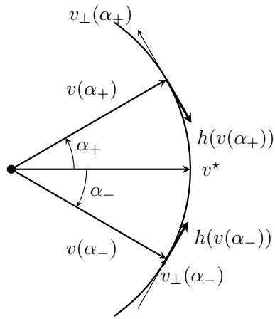  
Figure 3: Local stability geometry in two dimensions. The tangent vector $v _ { \perp } ( \alpha )$ points in the direction of increasing α. For $\alpha _ { + } > 0 _ { ; }$ , a restoring population field points opposite to $v _ { \perp } ( \alpha _ { + } )$ , toward decreasing α. For $\alpha _ { - } < 0 .$ , it points in the same direction as $v _ { \bot } ( \alpha _ { - } )$ , toward increasing α. In both cases the population field moves the candidate direction back toward $v ^ { \star }$

The two-dimensional picture suggests that the relevant object is the first-order change in the population tangent field when v is perturbed away from $v ^ { \star }$ . We next derive this local behavior in arbitrary dimension.

## A.4.3 Proof of the local population Jacobian

Proof. The proof proceeds in three steps. First, we characterize admissible first-order perturbations of $v ^ { \star }$ on the sphere and define the directional derivative of the population tangent field. Second, we decompose this derivative into the change in the tangent projection and the change in the population vector induced by the moving greedy decision boundary. Third, we simplify these two contributions using Gaussian Stein identities and the equilibrium representation of $F ( v ^ { \star } )$ , yielding the Jacobian in Proposition 7.

Step 1: First-order perturbations on the sphere. We have shown that $v ^ { \star }$ is an equilibrium of the population tangent field, $h ( v ^ { \star } ) = 0$ . However, equilibrium alone does not imply stability. We therefore study what happens to the population field when the current boundary direction is moved a small amount away from $v ^ { \star }$ while remaining on the sphere.

For $\epsilon > 0 .$ , consider a first-order perturbation of $v ^ { \star }$ of the form

$$
v ( \epsilon ) = v ^ { \star } + \epsilon u + o ( \epsilon ) , \qquad \epsilon  0 .
$$

Because the boundary direction is constrained to lie on $\mathbb { S } ^ { d - 1 }$ , we must have $\| v ( \epsilon ) \| _ { 2 } ^ { 2 } = 1$ . Expanding the squared norm gives

$$
\begin{array} { r l } & { \| v ( \epsilon ) \| _ { 2 } ^ { 2 } = \langle v ^ { \star } + \epsilon u + o ( \epsilon ) , v ^ { \star } + \epsilon u + o ( \epsilon ) \rangle } \\ & { \qquad = \| v ^ { \star } \| _ { 2 } ^ { 2 } + 2 \epsilon ( v ^ { \star } ) ^ { \top } u + o ( \epsilon ) } \\ & { \qquad = 1 + 2 \epsilon ( v ^ { \star } ) ^ { \top } u + o ( \epsilon ) . } \end{array}
$$

Therefore, for the perturbation to remain on the sphere to first order, we must have $( v ^ { \star } ) ^ { \top } u = 0$ . Thus, the admissible first-order perturbations are exactly the vectors in the tangent space

$$
T _ { \boldsymbol { v } ^ { \star } } \mathbb { S } ^ { d - 1 } = \left\{ \boldsymbol { u } \in \mathbb { R } ^ { d } : ( \boldsymbol { v } ^ { \star } ) ^ { \top } \boldsymbol { u } = 0 \right\} .
$$

The question we want to answer is therefore the following: if we move a small amount away from $v ^ { \star }$ in a tangent direction $u ,$ how does the population tangent field $h ( v )$ change? To make this precise, for a fixed $u \in T _ { v ^ { \star } } \mathbb { S } ^ { d - 1 }$ ， consider the normalized path

$$
v _ { u } ( \epsilon ) = \frac { v ^ { \star } + \epsilon u } { \| v ^ { \star } + \epsilon u \| _ { 2 } } .
$$

By construction, $v _ { u } ( \epsilon ) \in \mathbb { S } ^ { d - 1 }$ and $v _ { u } ( 0 ) = v ^ { \star }$ . Moreover, since $( v ^ { \star } ) ^ { \top } u = 0$

$$
\left. \frac { d } { d \epsilon } v _ { u } ( \epsilon ) \right| _ { \epsilon = 0 } = u .
$$

Hence the path moves away from $v ^ { \star }$ initially in the direction u. We now expand the population field along this path. A first-order Taylor expansion gives

$$
\begin{array} { l } { { \displaystyle h ( v _ { u } ( \epsilon ) ) = h ( v _ { u } ( 0 ) ) + \epsilon \left. \frac { d } { d \epsilon } h ( v _ { u } ( \epsilon ) ) \right. _ { \epsilon = 0 } + o ( \epsilon ) } } \\ { { \displaystyle ~ = h ( v ^ { \star } ) + \epsilon \left. \frac { d } { d \epsilon } h ( v _ { u } ( \epsilon ) ) \right. _ { \epsilon = 0 } + o ( \epsilon ) } . } \end{array}
$$

This motivates defining the directional derivative of h at $v ^ { \star }$ in the tangent direction u by

$$
D h ( v ^ { \star } ) [ u ] : = \left. \frac { d } { d \epsilon } h ( v _ { u } ( \epsilon ) ) \right| _ { \epsilon = 0 } .
$$

Since $h ( v ^ { \star } ) = 0$ , the expansion reduces to

$$
\begin{array} { r } { h ( v _ { u } ( \epsilon ) ) = \epsilon D h ( v ^ { \star } ) [ u ] + o ( \epsilon ) . } \end{array}\tag{29}
$$

Equation (29) gives the local population behavior around the equilibrium. For $\epsilon > 0$ , the perturbation from $v ^ { \star }$ is, to first order, in the direction u. A population field that moves the direction back toward $v ^ { \star }$ should therefore have a component opposite to u. This leads us to study $\langle u , D h ( v ^ { \star } ) [ u ] \rangle$ . If this quantity is negative for every nonzero tangent direction u, then the first-order population field points back toward $v ^ { \star }$

Step 2: Decomposition of the local derivative. Recall that $h ( v ) = P _ { v } ^ { \perp } F ( v ) , P _ { v } ^ { \perp } = I _ { d } - v v ^ { \top }$ . Therefore,

$$
{ \cal D } h ( v ^ { \star } ) [ u ] = \left. \frac { d } { d \epsilon } \left\{ P _ { v _ { u } ( \epsilon ) } ^ { \bot } F ( v _ { u } ( \epsilon ) ) \right\} \right| _ { \epsilon = 0 } .
$$

Applying the product rule gives

$$
\begin{array} { r } { D h ( v ^ { \star } ) [ u ] = D P _ { v ^ { \star } } ^ { \perp } [ u ] F ( v ^ { \star } ) + P _ { v ^ { \star } } ^ { \perp } D F ( v ^ { \star } ) [ u ] . } \end{array}\tag{30}
$$

Here

$$
D P _ { v ^ { \star } } ^ { \perp } [ u ] = \left. \frac { d } { d \epsilon } P _ { v _ { u } ( \epsilon ) } ^ { \perp } \right| _ { \epsilon = 0 }
$$

and

$$
D F ( v ^ { \star } ) [ u ] = \left. \frac { d } { d \epsilon } F ( v _ { u } ( \epsilon ) ) \right| _ { \epsilon = 0 } .
$$

The two terms in (30) arise for diferent reasons. The first describes how the tangent projection changes as the candidate direction rotates while the population vector is held fixed at $F ( v ^ { \star } )$ . The second describes how the population vector $F ( v )$ itself changes because rotating v changes the two greedy decision regions. We calculate these terms separately.

Change in the tangent projection. Since $P _ { v } ^ { \perp } = I _ { d } - v v ^ { \top }$ , we have

$$
{ \cal D } P _ { v ^ { \star } } ^ { \perp } [ u ] = - \left\{ u ( v ^ { \star } ) ^ { \top } + v ^ { \star } u ^ { \top } \right\} .
$$

By Proposition 6, $F ( v ^ { \star } ) = \kappa ^ { \star } v ^ { \star }$ . Using $( v ^ { \star } ) ^ { \top } v ^ { \star } = 1$ and $u ^ { \top } v ^ { \star } = 0$ , we therefore obtain

$$
D P _ { v ^ { \star } } ^ { \perp } [ u ] F ( v ^ { \star } ) = - \left\{ u ( v ^ { \star } ) ^ { \top } + v ^ { \star } u ^ { \top } \right\} \kappa ^ { \star } v ^ { \star } = - \kappa ^ { \star } u .
$$

Thus,

$$
{ \cal D } P _ { v ^ { \star } } ^ { \perp } [ u ] { \cal F } ( v ^ { \star } ) = - \kappa ^ { \star } u .\tag{31}
$$

Change in the population vector. It remains to calculate $D F ( v ^ { \star } ) [ u ]$ . Recall from (7) that

$$
F ( v ) = F _ { + } ( v ) - F _ { - } ( v ) ,
$$

where

$$
F _ { + } ( v ) = \mathbb { E } \left[ g ( \beta _ { + } ^ { \top } X ) X \mathbb { 1 } \{ v ^ { \top } X \geq 0 \} \right]
$$

and

$$
F _ { - } ( v ) = \mathbb { E } \left[ g ( \beta _ { - } ^ { \top } X ) X \mathbb { 1 } \{ v ^ { \top } X < 0 \} \right] .
$$

Thus, the dependence on v enters only through the two halfspaces. To determine how these halfspaces change when v is perturbed away from $v ^ { \star }$ , fix a nonzero tangent direction $u \in T _ { v ^ { \star } } \mathbb { S } ^ { d - 1 }$ and consider the spherical path

$$
v _ { \epsilon } = \cos ( \epsilon \| u \| _ { 2 } ) v ^ { \star } + \sin ( \epsilon \| u \| _ { 2 } ) \frac { u } { \| u \| _ { 2 } } , \qquad \epsilon \geq 0 .
$$

Because $u \perp v ^ { \star }$ , this path remains on the sphere: $\| v _ { \epsilon } \| _ { 2 } = 1$ . Moreover,

$$
v _ { 0 } = v ^ { \star } , \qquad \left. \frac { d } { d \epsilon } v _ { \epsilon } \right| _ { \epsilon = 0 } = u .
$$

Recall that $Z = ( v ^ { \star } ) ^ { \top } X$ . Using the orthogonal decomposition of X along $v ^ { \star }$

$$
X = P _ { v ^ { \star } } ^ { \perp } X + Z v ^ { \star } .
$$

Since $X \sim N ( 0 , I _ { d } )$ , we have $Z \sim N ( 0 , 1 )$ , and Z is independent of $P _ { v ^ { \star } } ^ { \perp } X$ . Also, because $u \perp v ^ { \star } , u ^ { \top } X = u ^ { \top } P _ { v ^ { \star } } ^ { \bot } X .$ We can therefore write

$$
\begin{array} { r } { v _ { \epsilon } ^ { \top } X = \left\{ \cos ( \epsilon \| u \| _ { 2 } ) v ^ { \star } + \sin ( \epsilon \| u \| _ { 2 } ) \frac { u } { \| u \| _ { 2 } } \right\} ^ { \top } X } \\ { = \cos ( \epsilon \| u \| _ { 2 } ) Z + \frac { \sin ( \epsilon \| u \| _ { 2 } ) } { \| u \| _ { 2 } } u ^ { \top } P _ { v ^ { \star } } ^ { \bot } X . } \end{array}
$$

For suficiently small ϵ, cos $( \epsilon \| u \| _ { 2 } ) > 0$ . Therefore,

$$
\boldsymbol { v } _ { \epsilon } ^ { \intercal } \boldsymbol { X } \geq 0 \quad \Longleftrightarrow \quad Z \geq - \frac { \boldsymbol { u } ^ { \intercal } P _ { v ^ { \star } } ^ { \bot } \boldsymbol { X } } { \| \boldsymbol { u } \| _ { 2 } } \tan ( \epsilon \| \boldsymbol { u } \| _ { 2 } ) .\tag{32}
$$

We first diferentiate $F _ { + } ( v _ { \epsilon } )$ . Conditional on $P _ { v ^ { \star } } ^ { \perp } X$ , the quantity u⊤ $\hat { P } _ { v ^ { \star } } ^ { \perp } X$ is fixed, whereas $Z$ remains standard normal. Hence

$$
\begin{array} { r l } & { \mathbb { E } \left[ g ( \beta _ { + } ^ { \top } X ) X \mathbb { 1 } \big \{ v _ { \epsilon } ^ { \top } X \geq 0 \big \} \big | P _ { v ^ { \star } } ^ { \bot } X \right] } \\ & { \quad = \int _ { - \frac { u ^ { \top } P _ { v ^ { \star } } ^ { \bot } } { \| u \| _ { 2 } } \tan ( \epsilon \| u \| _ { 2 } ) } ^ { \infty } g \big \{ \beta _ { + } ^ { \top } \left( P _ { v ^ { \star } } ^ { \bot } X + z v ^ { \star } \right) \big \} \left( P _ { v ^ { \star } } ^ { \bot } X + z v ^ { \star } \right) \phi _ { 0 } ( z ) d z , } \end{array}
$$

where $\phi _ { 0 }$ denotes the standard normal density. Only the lower limit of this integral depends on ϵ. Its derivative at $\epsilon = 0$ is

$$
\frac { d } { d \epsilon } \left\{ - \frac { u ^ { \top } P _ { v ^ { \star } } ^ { \bot } X } { \| u \| _ { 2 } } \tan ( \epsilon \| u \| _ { 2 } ) \right\} \bigg | _ { \epsilon = 0 } = - u ^ { \top } P _ { v ^ { \star } } ^ { \bot } X .
$$

Therefore, by the fundamental theorem of calculus and the chain rule,

$$
\frac { d } { d \epsilon } \mathbb { E } \left[ g ( \beta _ { + } ^ { \top } X ) X \mathbb { 1 } \{ v _ { \epsilon } ^ { \top } X \geq 0 \} \left| P _ { v ^ { \star } } ^ { \bot } X \right. \right] \Bigg | _ { \epsilon = 0 } = \phi _ { 0 } ( 0 ) \left( u ^ { \top } P _ { v ^ { \star } } ^ { \bot } X \right) g \left( \beta _ { + } ^ { \top } P _ { v ^ { \star } } ^ { \bot } X \right) P _ { v ^ { \star } } ^ { \bot } X .
$$

To pass from this conditional derivative to the derivative of $F _ { + } ( v _ { \epsilon } )$ , we interchange diferentiation and expectation. For ϵ in a suficiently small neighborhood of zero, the derivative of the conditional integral is obtained by evaluating the integrand at the moving boundary

$$
z = - { \frac { u ^ { \top } P _ { v ^ { \star } } ^ { \bot } X } { \| u \| _ { 2 } } } \tan ( \epsilon \| u \| _ { 2 } )
$$

and multiplying by the derivative of this boundary. Since tan $( \epsilon \| u \| _ { 2 } )$ and $\sec ^ { 2 } ( \epsilon \| u \| _ { 2 } )$ are uniformly bounded for suficiently small $\epsilon ,$ Assumption 2 implies that the norm of this derivative is bounded by a polynomial in $\| X \| _ { 2 }$ , uniformly over such ϵ. Because X is Gaussian, all polynomial moments of $\| X \| _ { 2 }$ are finite. Dominated convergence therefore permits diferentiation under the expectation.

Recall that $\beta _ { + } = \theta + ( \Delta _ { \beta } / 2 ) v ^ { \star }$ . Since $P _ { v ^ { \star } } ^ { \perp } X$ is orthogonal to $v ^ { \star }$

$$
\beta _ { + } ^ { \top } P _ { v ^ { \star } } ^ { \bot } X = \theta ^ { \top } P _ { v ^ { \star } } ^ { \bot } X .
$$

Taking expectation therefore gives

$$
\begin{array} { r l } & { D F _ { + } ( v ^ { \star } ) [ u ] = \phi _ { 0 } ( 0 ) \mathbb { E } \left[ g \left( \theta ^ { \top } P _ { v ^ { \star } } ^ { \bot } X \right) \left( u ^ { \top } P _ { v ^ { \star } } ^ { \bot } X \right) P _ { v ^ { \star } } ^ { \bot } X \right] } \\ & { \qquad = \phi _ { 0 } ( 0 ) \mathbb { E } \left[ g \left( \theta ^ { \top } P _ { v ^ { \star } } ^ { \bot } X \right) ( P _ { v ^ { \star } } ^ { \bot } X ) ( P _ { v ^ { \star } } ^ { \bot } X ) ^ { \top } \right] u . } \end{array}\tag{33}
$$

We next diferentiate $F _ { - } ( v _ { \epsilon } )$ . From (32),

$$
\boldsymbol { v } _ { \epsilon } ^ { \intercal } \boldsymbol { X } < 0 \quad \Longleftrightarrow \quad \boldsymbol { Z } < - \frac { \boldsymbol { u } ^ { \intercal } P _ { v ^ { \star } } ^ { \bot } \boldsymbol { X } } { \| \boldsymbol { u } \| _ { 2 } } \tan ( \epsilon \| \boldsymbol { u } \| _ { 2 } ) .
$$

Conditional on $P _ { v ^ { \star } } ^ { \perp } X$ , we therefore have

$$
\begin{array} { r l } & { \mathbb { E } \left[ g ( \beta _ { - } ^ { \top } X ) X \mathbb { 1 } \{ v _ { \epsilon } ^ { \top } X < 0 \} \big | P _ { v ^ { \star } } ^ { \bot } X \right] } \\ & { \quad = \int _ { - \infty } ^ { - \frac { u ^ { \top } P _ { v ^ { \star } } ^ { \bot } X } { \| u \| _ { 2 } } \tan ( \epsilon \| u \| _ { 2 } ) } g \left\{ \beta _ { - } ^ { \top } \left( P _ { v ^ { \star } } ^ { \bot } X + z v ^ { \star } \right) \right\} \left( P _ { v ^ { \star } } ^ { \bot } X + z v ^ { \star } \right) \phi _ { 0 } ( z ) d z . } \end{array}
$$

Here the moving boundary is the upper limit of integration. Consequently, the fundamental theorem of calculus gives the opposite sign. Since $\beta _ { - } = \theta - ( \Delta _ { \beta } / 2 ) v ^ { \star }$ and hence $\beta _ { - } ^ { \top } P _ { v ^ { \star } } ^ { \bot } X = \bar { \theta } ^ { \top } P _ { v ^ { \star } } ^ { \bot } X$ , we obtain

$$
\begin{array} { r l } & { D F _ { - } ( v ^ { \star } ) [ u ] = - \phi _ { 0 } ( 0 ) \mathbb { E } \left[ g \left( \theta ^ { \top } P _ { v ^ { \star } } ^ { \bot } X \right) \left( u ^ { \top } P _ { v ^ { \star } } ^ { \bot } X \right) P _ { v ^ { \star } } ^ { \bot } X \right] } \\ & { \qquad = - \phi _ { 0 } ( 0 ) \mathbb { E } \left[ g \left( \theta ^ { \top } P _ { v ^ { \star } } ^ { \bot } X \right) ( P _ { v ^ { \star } } ^ { \bot } X ) ( P _ { v ^ { \star } } ^ { \bot } X ) ^ { \top } \right] u . } \end{array}\tag{34}
$$

Finally, because $F ( v ) = F _ { + } ( v ) - F _ { - } ( v )$ , the two boundary contributions in (33) and (34) add. Hence

$$
\begin{array} { r } { D F ( v ^ { \star } ) [ u ] = 2 \phi _ { 0 } ( 0 ) \mathbb { E } \left[ g \left( \theta ^ { \top } P _ { v ^ { \star } } ^ { \bot } X \right) ( P _ { v ^ { \star } } ^ { \bot } X ) ( P _ { v ^ { \star } } ^ { \bot } X ) ^ { \top } \right] u . } \end{array}\tag{35}
$$

Step 3: Simplifying the local derivative. We next simplify the matrix expectation in (35). Since $\theta \perp v ^ { \star }$ $P _ { v ^ { \star } } ^ { \perp } \theta = \theta$ and therefore $\theta ^ { \top } P _ { v ^ { \star } } ^ { \bot } X = \theta ^ { \top } X$ . Moreover,

$$
\begin{array} { r } { \mathbb E \left[ g \left( \theta ^ { \top } P _ { v ^ { \star } } ^ { \bot } X \right) ( P _ { v ^ { \star } } ^ { \bot } X ) ( P _ { v ^ { \star } } ^ { \bot } X ) ^ { \top } \right] = P _ { v ^ { \star } } ^ { \bot } \mathbb E \left[ g ( \theta ^ { \top } X ) X X ^ { \top } \right] P _ { v ^ { \star } } ^ { \bot } . } \end{array}
$$

Applying the second-order Gaussian Stein identity in Lemma 16 with $f ( z ) = g ( z )$ and index direction θ gives

$$
\begin{array} { r } { \mathbb { E } \left[ g ( \theta ^ { \top } X ) X X ^ { \top } \right] = \mathbb { E } [ g ( \theta ^ { \top } X ) ] I _ { d } + \mathbb { E } [ g ^ { \prime \prime } ( \theta ^ { \top } X ) ] \theta \theta ^ { \top } . } \end{array}
$$

Define

$$
m _ { 0 } = \mathbb { E } [ g ( \theta ^ { \top } X ) ] .\tag{36}
$$

Recall that $m _ { 2 } = \mathbb { E } [ g ^ { \prime \prime } ( \theta ^ { \top } X ) ]$ . It follows that

$$
\mathbb { E } \left[ g \left( \theta ^ { \top } P _ { v ^ { \star } } ^ { \bot } X \right) \left( P _ { v ^ { \star } } ^ { \bot } X \right) \left( P _ { v ^ { \star } } ^ { \bot } X \right) ^ { \top } \right] = m _ { 0 } P _ { v ^ { \star } } ^ { \bot } + m _ { 2 } \theta \theta ^ { \top } .
$$

Substituting this identity into (35) gives

$$
\begin{array} { r } { D F ( v ^ { \star } ) [ u ] = 2 \phi _ { 0 } ( 0 ) \left\{ m _ { 0 } P _ { v ^ { \star } } ^ { \perp } + m _ { 2 } \theta \theta ^ { \top } \right\} u . } \end{array}
$$

Because u is tangent at $v ^ { \star } , P _ { v ^ { \star } } ^ { \bot } u = u$ . Hence

$$
P _ { v ^ { \star } } ^ { \perp } D F ( v ^ { \star } ) [ u ] = 2 \phi _ { 0 } ( 0 ) \left\{ m _ { 0 } u + m _ { 2 } \theta ( \theta ^ { \top } u ) \right\} .
$$

Combining this with (30) and (31) gives

$$
D h ( v ^ { \star } ) [ u ] = \{ - \kappa ^ { \star } + 2 \phi _ { 0 } ( 0 ) m _ { 0 } \} u + 2 \phi _ { 0 } ( 0 ) m _ { 2 } \theta ( \theta ^ { \top } u ) .\tag{37}
$$

It remains to simplify the coeficient involving $\kappa ^ { \star }$ . From the proof of Proposition $6 ,$

$$
\kappa ^ { \star } = 2 \mathbb { E } \left[ Z g \left( \theta ^ { \top } P _ { v ^ { \star } } ^ { \bot } X + \frac { \Delta _ { \beta } } { 2 } Z \right) \mathbb { 1 } \{ Z > 0 \} \right] .
$$

Using the law of iterated expectations,

$$
\boldsymbol { \kappa } ^ { \star } = 2 \mathbb { E } \left[ \mathbb { E } \left[ Z g \left( \theta ^ { \top } P _ { v ^ { \star } } ^ { \bot } X + \frac { \Delta _ { \beta } } { 2 } Z \right) \mathbb { 1 } \{ Z > 0 \} \left| P _ { v ^ { \star } } ^ { \bot } X \right. \right] \right] .
$$

Since $Z \sim N ( 0 , 1 )$ is independent of $P _ { v ^ { \star } } ^ { \perp } X$ , conditional on $P _ { v ^ { \star } } ^ { \perp } X$ the scalar $\theta ^ { \top } P _ { v ^ { \star } } ^ { \perp } X$ is fixed and $Z$ retains its standard normal distribution. Therefore,

$$
\mathbb { E } \left[ Z g \left( \theta ^ { \top } P _ { v ^ { \star } } ^ { \bot } X + \frac { \Delta _ { \beta } } { 2 } Z \right) \mathbb { 1 } \{ Z > 0 \} \Bigg | P _ { v ^ { \star } } ^ { \bot } X \right] = \int _ { 0 } ^ { \infty } z g \left( \theta ^ { \top } P _ { v ^ { \star } } ^ { \bot } X + \frac { \Delta _ { \beta } } { 2 } z \right) \phi _ { 0 } ( z ) d z .
$$

Since $\phi _ { 0 } ^ { \prime } ( z ) = - z \phi _ { 0 } ( z )$

$$
\int _ { 0 } ^ { \infty } z g \left( \theta ^ { \top } P _ { v ^ { \star } } ^ { \bot } X + \frac { \Delta _ { \beta } } { 2 } z \right) \phi _ { 0 } ( z ) d z = - \int _ { 0 } ^ { \infty } g \left( \theta ^ { \top } P _ { v ^ { \star } } ^ { \bot } X + \frac { \Delta _ { \beta } } { 2 } z \right) \phi _ { 0 } ^ { \prime } ( z ) d z .
$$

Integration by parts gives

$$
\begin{array} { r } { - \displaystyle \int _ { 0 } ^ { \infty } g \left( \theta ^ { \top } P _ { v ^ { \star } } ^ { \bot } X + \frac { \Delta _ { \beta } } { 2 } z \right) \phi _ { 0 } ^ { \prime } ( z ) d z = - \displaystyle \left[ g \left( \theta ^ { \top } P _ { v ^ { \star } } ^ { \bot } X + \frac { \Delta _ { \beta } } { 2 } z \right) \phi _ { 0 } ( z ) \right] _ { z = 0 } ^ { z = \infty } } \\ { + \frac { \Delta _ { \beta } } { 2 } \displaystyle \int _ { 0 } ^ { \infty } g ^ { \prime } \left( \theta ^ { \top } P _ { v ^ { \star } } ^ { \bot } X + \frac { \Delta _ { \beta } } { 2 } z \right) \phi _ { 0 } ( z ) d z . } \end{array}
$$

Under Assumption 2, g grows at most polynomially, whereas the Gaussian density decays faster than any polynomial. Therefore,

$$
\operatorname* { l i m } _ { z \to \infty } g \left( \theta ^ { \top } P _ { v ^ { \star } } ^ { \bot } X + \frac { \Delta _ { \beta } } { 2 } z \right) \phi _ { 0 } ( z ) = 0 .
$$

At the lower endpoint, $g \left( \theta ^ { \top } P _ { v ^ { \star } } ^ { \bot } X \right) \phi _ { 0 } ( 0 )$ remains. Hence

$$
\begin{array} { r l } {  { \int _ { 0 } ^ { \infty } z g ( \theta ^ { \top } P _ { v ^ { \star } } ^ { \perp } X + \frac { \Delta _ { \beta } } { 2 } z ) \phi _ { 0 } ( z ) d z } } \\ & { = \phi _ { 0 } ( 0 ) g ( \theta ^ { \top } P _ { v ^ { \star } } ^ { \perp } X ) + \frac { \Delta _ { \beta } } { 2 } \int _ { 0 } ^ { \infty } g ^ { \prime } ( \theta ^ { \top } P _ { v ^ { \star } } ^ { \perp } X + \frac { \Delta _ { \beta } } { 2 } z ) \phi _ { 0 } ( z ) d z . } \end{array}
$$

Taking expectation over $P _ { v ^ { \star } } ^ { \perp } X$ gives

$$
\kappa ^ { \star } = 2 \phi _ { 0 } ( 0 ) m _ { 0 } + \Delta _ { \beta } \mathbb { E } \left[ g ^ { \prime } \left( \theta ^ { \top } P _ { v ^ { \star } } ^ { \bot } X + \frac { \Delta _ { \beta } } { 2 } Z \right) \mathbb { 1 } \{ Z > 0 \} \right] .
$$

Since $\theta ^ { \top } P _ { v ^ { \star } } ^ { \bot } X = \theta ^ { \top } X = U$ , the definition of $\mu ^ { \star }$ gives

$$
\kappa ^ { \star } = 2 \phi _ { 0 } ( 0 ) m _ { 0 } + \Delta _ { \beta } \mu ^ { \star } .\tag{38}
$$

Substituting (38) into (37), the terms involving $m _ { 0 }$ cancel:

$$
\begin{array} { r l } & { D h ( v ^ { \star } ) [ u ] = \{ - \left( 2 \phi _ { 0 } ( 0 ) m _ { 0 } + { \Delta _ { \beta } } \mu ^ { \star } \right) + 2 \phi _ { 0 } ( 0 ) m _ { 0 } \} u + 2 \phi _ { 0 } ( 0 ) m _ { 2 } \theta ( \theta ^ { \top } u ) } \\ & { \quad \quad \quad = - { \Delta _ { \beta } } \mu ^ { \star } u + 2 \phi _ { 0 } ( 0 ) m _ { 2 } \theta ( \theta ^ { \top } u ) . } \end{array}
$$

Thus,

$$
D h ( v ^ { \star } ) [ u ] = - \Delta _ { \beta } \mu ^ { \star } u + 2 \phi _ { 0 } ( 0 ) m _ { 2 } \theta ( \theta ^ { \top } u ) ,
$$

which proves Proposition 7.

## A.5 Proof of the local stability corollary

Proof of Corollary 9. We first show that the derivative of the population tangent field at $v ^ { \star }$ is strictly contracting along every tangent direction. Recall from Proposition $7$ that, for every $u \in T _ { v ^ { \star } } \mathbb { S } ^ { d - 1 } , D h ( v ^ { \star } ) [ u ] = - \Delta _ { \beta } \mu ^ { \star } u +$ $2 \phi _ { 0 } ( 0 ) m _ { 2 } \theta ( \theta ^ { \top } u )$ . Taking the inner product with u gives

$$
\begin{array} { r l } & { \langle { \boldsymbol u } , D h ( { \boldsymbol v } ^ { \star } ) [ { \boldsymbol u } ] \rangle = - \Delta _ { \beta } \mu ^ { \star } \| { \boldsymbol u } \| _ { 2 } ^ { 2 } + 2 \phi _ { 0 } ( 0 ) m _ { 2 } ( { \boldsymbol { \theta } } ^ { \top } { \boldsymbol u } ) ^ { 2 } } \\ & { \qquad \leq - \Delta _ { \beta } \mu ^ { \star } \| { \boldsymbol u } \| _ { 2 } ^ { 2 } + 2 \phi _ { 0 } ( 0 ) ( m _ { 2 } ) _ { + } ( { \boldsymbol { \theta } } ^ { \top } { \boldsymbol u } ) ^ { 2 } . } \end{array}
$$

By Cauchy–Schwarz and $\| \theta \| _ { 2 } ^ { 2 } = 1 - \Delta _ { \beta } ^ { 2 } / 4$

$$
( { \boldsymbol { \theta } } ^ { \top } { \boldsymbol { u } } ) ^ { 2 } \leq \| { \boldsymbol { \theta } } \| _ { 2 } ^ { 2 } \| { \boldsymbol { u } } \| _ { 2 } ^ { 2 } = \left( 1 - { \frac { \Delta _ { \beta } ^ { 2 } } { 4 } } \right) \| { \boldsymbol { u } } \| _ { 2 } ^ { 2 } .
$$

Consequently,

$$
\langle \boldsymbol { u } , D h ( \boldsymbol { v } ^ { \star } ) [ \boldsymbol { u } ] \rangle \leq - \left\{ \Delta _ { \beta } \mu ^ { \star } - 2 \phi _ { 0 } ( 0 ) ( m _ { 2 } ) _ { + } \left( 1 - \frac { \Delta _ { \beta } ^ { 2 } } { 4 } \right) \right\} \| \boldsymbol { u } \| _ { 2 } ^ { 2 } = - \lambda _ { \star } \| \boldsymbol { u } \| _ { 2 } ^ { 2 } ,
$$

where $\lambda _ { \star }$ is the decision stability coeficient defined in (10). Thus, whenever $\lambda _ { \star } > 0$ , the linearized population field is strictly contracting in every nonzero tangent direction at $v ^ { \star }$

We next show that this infinitesimal contraction extends to a neighborhood of $v ^ { \star }$ on the sphere. Let $v \in \mathbb { S } ^ { d - 1 }$ and write $\Delta = v - v ^ { \star }$ . Decompose $\Delta$ into its tangent and normal components at $v ^ { \star }$ :

$$
\Delta = u + \{ ( v ^ { \star } ) ^ { \top } \Delta \} v ^ { \star } , \qquad u = P _ { v ^ { \star } } ^ { \perp } \Delta \in T _ { v ^ { \star } } \mathbb { S } ^ { d - 1 } .
$$

Since both $v$ and $v ^ { \star }$ are unit vectors, $\| \Delta \| _ { 2 } ^ { 2 } = \| v - v ^ { \star } \| _ { 2 } ^ { 2 } = 2 - 2 v ^ { \top } v ^ { \star }$ . Hence

$$
( v ^ { \star } ) ^ { \top } \Delta = ( v ^ { \star } ) ^ { \top } ( v - v ^ { \star } ) = v ^ { \top } v ^ { \star } - 1 = - \frac { 1 } { 2 } \| \Delta \| _ { 2 } ^ { 2 } .
$$

Therefore, the decomposition above can be written exactly as

$$
\Delta = u - \frac { 1 } { 2 } \| \Delta \| _ { 2 } ^ { 2 } v ^ { \star } .\tag{39}
$$

Because $u \perp v ^ { \star }$ , it follows from (39) that

$$
\begin{array} { c } { { \displaystyle | | \Delta | | _ { 2 } ^ { 2 } = | | u | | _ { 2 } ^ { 2 } + \frac { 1 } { 4 } | | \Delta | | _ { 2 } ^ { 4 } , } } \\ { { \displaystyle | | u | | _ { 2 } ^ { 2 } = | | \Delta | | _ { 2 } ^ { 2 } - \frac { 1 } { 4 } | | \Delta | | _ { 2 } ^ { 4 } . } } \end{array}\tag{40}
$$

In particular,

$$
\| u \| _ { 2 } ^ { 2 } = \| \Delta \| _ { 2 } ^ { 2 } + o ( \| \Delta \| _ { 2 } ^ { 2 } ) \qquad \mathrm { a s } ~ v \to v ^ { \star } .
$$

We now justify the first-order expansion of the population tangent field used below. For $w \in T _ { v ^ { \star } } \mathbb { S } ^ { d - 1 }$ with $\| w \| _ { 2 } < 1$ , define the local parametrization

$$
q ( w ) = \sqrt { 1 - \| w \| _ { 2 } ^ { 2 } } v ^ { \star } + w .
$$

Then $q ( w ) \in \mathbb { S } ^ { d - 1 } , q ( 0 ) = v ^ { \star }$ , and $D q ( 0 ) [ w ] = w$ . Moreover, writing $Z = ( v ^ { \star } ) ^ { \top } X$ and using $w ^ { \top } X = w ^ { \top } P _ { v ^ { \star } } ^ { \bot } X$ we have

$$
q ( w ) ^ { \top } X = \sqrt { 1 - \| w \| _ { 2 } ^ { 2 } } Z + w ^ { \top } P _ { v ^ { \star } } ^ { \bot } X .
$$

Thus,

$$
q ( w ) ^ { \top } X \geq 0 \iff Z \geq - \frac { w ^ { \top } P _ { v ^ { \star } } ^ { \bot } X } { \sqrt { 1 - \| w \| _ { 2 } ^ { 2 } } } .
$$

Conditional on $P _ { v ^ { \star } } ^ { \perp } X$ , the right-hand side is a smoothly varying boundary for the one-dimensional Gaussian integral in $Z .$ . Diferentiating this representation with respect to w, the resulting derivatives are obtained by evaluating the integrand at this moving boundary and multiplying by derivatives of the boundary. For w in a suficiently small neighborhood of zero, Assumption 2 implies that these derivatives are bounded uniformly by an integrable polynomial function of $\| X \| _ { 2 }$ . Since X is Gaussian, dominated convergence permits diferentiation under the expectation and shows that $F \circ q$ is continuously diferentiable near zero. Since $P _ { q ( w ) } ^ { \perp }$ is smooth in $w ,$ it follows that $h \circ q$ is also continuously diferentiable near zero.

For v suficiently close to $v ^ { \star }$ , we have $v ^ { \top } v ^ { \star } > 0$ . Since $u = P _ { v ^ { \star } } ^ { \perp } v ,$ , the unit-norm constraint gives

$$
v = \sqrt { 1 - \| u \| _ { 2 } ^ { 2 } } v ^ { \star } + u = q ( u ) .
$$

Hence, using $h ( v ^ { \star } ) = 0$ and the diferentiability of $h \circ q$ at zero,

$$
h ( \boldsymbol { v } ) = D h ( \boldsymbol { v } ^ { \star } ) [ \boldsymbol { u } ] + r ( \boldsymbol { v } ) , \qquad \| \boldsymbol { r } ( \boldsymbol { v } ) \| _ { 2 } = o ( \| \boldsymbol { u } \| _ { 2 } ) .\tag{41}
$$

By (40), $\| u \| _ { 2 } / \| \Delta \| _ { 2 } \to 1$ as $v  v ^ { \star }$ . Therefore,

$$
h ( v ) = D h ( v ^ { \star } ) [ u ] + r ( v ) , \qquad \| r ( v ) \| _ { 2 } = o ( \| \Delta \| _ { 2 } ) .\tag{42}
$$

Using (39) and (42), we obtain

$$
\begin{array} { l } { \displaystyle \langle \Delta , h ( v ) \rangle = \left. u - \frac 1 2 \| \Delta \| _ { 2 } ^ { 2 } v ^ { \star } , D h ( v ^ { \star } ) [ u ] + r ( v ) \right. } \\ { \displaystyle \qquad = \langle u , D h ( v ^ { \star } ) [ u ] \rangle + \langle u , r ( v ) \rangle - \frac 1 2 \| \Delta \| _ { 2 } ^ { 2 } \langle v ^ { \star } , D h ( v ^ { \star } ) [ u ] \rangle - \frac 1 2 \| \Delta \| _ { 2 } ^ { 2 } \langle v ^ { \star } , r ( v ) \rangle . } \end{array}
$$

We now bound the three remainder terms. First,

$$
| \langle u , r ( v ) \rangle | \leq \| u \| _ { 2 } \| r ( v ) \| _ { 2 } = o ( \| \Delta \| _ { 2 } ^ { 2 } ) .
$$

Next, because $D h ( v ^ { \star } )$ is a linear map on the finite-dimensional tangent space, its operator norm is finite. Hence, for some constant $C < \infty , \| D h ( v ^ { \star } ) [ u ] \| _ { 2 } \leq C \| u \| _ { 2 } \leq C \| \Delta \| _ { 2 } ,$ , and therefore

$$
\left| \frac { 1 } { 2 } \| \Delta \| _ { 2 } ^ { 2 } \left. v ^ { \star } , D h ( v ^ { \star } ) [ u ] \right. \right| \leq \frac { C } { 2 } \| \Delta \| _ { 2 } ^ { 3 } = o ( \| \Delta \| _ { 2 } ^ { 2 } ) .
$$

Finally,

$$
\left| \frac 1 2 \| \Delta \| _ { 2 } ^ { 2 } \langle v ^ { \star } , r ( v ) \rangle \right| \le \frac 1 2 \| \Delta \| _ { 2 } ^ { 2 } \| r ( v ) \| _ { 2 } = o ( \| \Delta \| _ { 2 } ^ { 2 } ) .
$$

Combining these bounds yields

$$
\langle \Delta , h ( v ) \rangle = \langle u , D h ( v ^ { \star } ) [ u ] \rangle + o ( \| \Delta \| _ { 2 } ^ { 2 } ) .\tag{43}
$$

Using the infinitesimal contraction established above together with (40),

$$
\begin{array} { r } { \langle \Delta , h ( v ) \rangle \leq - \lambda _ { \star } \| u \| _ { 2 } ^ { 2 } + o ( \| \Delta \| _ { 2 } ^ { 2 } ) = - \lambda _ { \star } \| \Delta \| _ { 2 } ^ { 2 } + o ( \| \Delta \| _ { 2 } ^ { 2 } ) . } \end{array}
$$

Equivalently,

$$
\begin{array} { r } { \langle v - v ^ { \star } , h ( v ) \rangle \leq - \lambda _ { \star } \| v - v ^ { \star } \| _ { 2 } ^ { 2 } + o ( \| v - v ^ { \star } \| _ { 2 } ^ { 2 } ) } \end{array}
$$

as $v  v ^ { \star }$ on $\mathbb { S } ^ { d - 1 }$

Because $\lambda _ { \star } > 0$ , there exists $r _ { 0 } > 0$ such that whenever $v \in \mathbb { S } ^ { d - 1 }$ satisfies $\lVert \boldsymbol { v } - \boldsymbol { v } ^ { \star } \rVert _ { 2 } \leq r _ { 0 }$ , the remainder term satisfies

$$
\bigl | o ( \| v - v ^ { \star } \| _ { 2 } ^ { 2 } ) \bigr | \leq \frac { \lambda _ { \star } } { 2 } \| v - v ^ { \star } \| _ { 2 } ^ { 2 } .
$$

Therefore,

$$
\langle v - v ^ { \star } , h ( v ) \rangle \leq - \frac { \lambda _ { \star } } { 2 } \| v - v ^ { \star } \| _ { 2 } ^ { 2 } .
$$

Thus, the claimed neighborhood contraction holds with, for example, $\lambda _ { 0 } = \lambda _ { \star } / 2 > 0$

## B ADDITIONAL DETAILS ON ELICITATION GEOMETRY

This appendix provides additional details for the elicitation interpretation developed in Section 5. We first formalize the Bregman representation of the conditional mean, then describe the associated primal–dual geometry. We next show that a strictly increasing response link itself induces a convex potential, and finally relate this geometry explicitly to the decision stability coeficient and the self-concordance condition.

## B.1 Bregman elicitation of the conditional mean

For completeness, we briefly recall the relevant definitions; a more detailed treatment of consistency and elicitability is given in [10]. Recall that F denotes a class of distributions and $T : { \mathcal { F } } $ R the statistical functional of interest. A loss $\ell ( r , y )$ is strictly consistent for $T \operatorname { i f } ,$ for every $F \in { \mathcal { F } }$

$$
T ( F ) = \arg \operatorname* { m i n } _ { r } \mathbb { E } _ { F } [ \ell ( r , Y ) ] ,
$$

whenever the expectation is well defined. A functional admitting a strictly consistent loss is called elicitable. We specialize to the mean functional. Let $\mathcal { T } \subseteq \mathbb { R }$ be an interval containing the relevant reward and prediction values, and let $\varphi : { \mathcal { T } }  \mathbb { R }$ be diferentiable and strictly convex. The Bregman loss [23] generated by $\varphi$ is

$$
\ell _ { \varphi } ( r , y ) = \varphi ( y ) - \varphi ( r ) - \varphi ^ { \prime } ( r ) ( y - r ) .\tag{44}
$$

The following standard calculation shows that every such loss elicits the mean.

Lemma 18 (Bregman consistency for the mean). Let $F \in { \mathcal { F } }$ have finite mean $\mu _ { F } = \mathbb { E } _ { F } [ Y ] \in { \mathcal { T } }$ , and suppose that the expectations below are finite. Then

$$
\mathbb { E } _ { F } [ \ell _ { \varphi } ( r , Y ) ] - \mathbb { E } _ { F } [ \ell _ { \varphi } ( \mu _ { F } , Y ) ] = \ell _ { \varphi } ( r , \mu _ { F } ) .
$$

Consequently, $i f \varphi$ is strictly convex,

$$
\mu _ { F } = \arg \operatorname* { m i n } _ { r \in \mathcal { T } } \mathbb { E } _ { F } [ \ell _ { \varphi } ( r , Y ) ] .
$$

Proof. By (44),

$$
\mathbb { E } _ { F } [ \ell _ { \varphi } ( r , Y ) ] = \mathbb { E } _ { F } [ \varphi ( Y ) ] - \varphi ( r ) - \varphi ^ { \prime } ( r ) ( \mu _ { F } - r ) ,
$$

whereas $\mathbb { E } _ { F } [ \ell _ { \varphi } ( \mu _ { F } , Y ) ] = \mathbb { E } _ { F } [ \varphi ( Y ) ] - \varphi ( \mu _ { F } )$ . Subtracting gives

$$
\begin{array} { r } { \mathbb { E } _ { F } [ \ell _ { \varphi } ( r , Y ) ] - \mathbb { E } _ { F } [ \ell _ { \varphi } ( \mu _ { F } , Y ) ] = \varphi ( \mu _ { F } ) - \varphi ( r ) - \varphi ^ { \prime } ( r ) ( \mu _ { F } - r ) = \ell _ { \varphi } ( r , \mu _ { F } ) . } \end{array}
$$

Strict convexity implies that the final expression is nonnegative and vanishes only when $r = \mu _ { F }$

Applying Lemma 18 to the conditional distribution $F _ { a , x }$ gives $\begin{array} { r } { T ( F _ { a , x } ) = m _ { a } ( x ) = \arg \operatorname* { m i n } _ { r } \mathbb { E } _ { F _ { a , x } } [ \ell _ { \varphi } ( r , Y ) ] } \end{array}$ which is the representation used in Section 5. If $\varphi$ is twice continuously diferentiable with $\varphi ^ { \prime \prime } ( r ) > 0 ,$ define $w ( r ) = \varphi ^ { \prime \prime } ( r )$ . Diferentiating (44) with respect to the prediction gives

$$
\frac { \partial } { \partial r } \ell _ { \varphi } ( r , y ) = w ( r ) ( r - y ) .\tag{45}
$$

Thus, $w ( r )$ locally weights the usual mean identification function $r - y$ . Equivalently, a second-order expansion around r gives

$$
\ell _ { \varphi } ( r , y ) = \frac 1 2 w ( r ) ( y - r ) ^ { 2 } + o \{ ( y - r ) ^ { 2 } \} , \qquad y \to r ,
$$

so $w = \varphi ^ { \prime \prime }$ describes the local geometry of the loss on the mean-prediction scale. Lemma 18 also makes clear that the mean does not determine a unique loss: diferent strictly convex potentials can elicit the same mean functional while inducing diferent local geometries.

## B.2 Primal–dual geometry and response maps

We next make precise the primal–dual representation used in Section 5. Let $\mathcal { T } \subseteq \mathbb { R }$ be an open interval and suppose that $\varphi : \mathcal { T } $ R is diferentiable and strictly convex. Its convex conjugate is given by [7, Section 7.3.3],

$$
\varphi ^ { * } ( \vartheta ) = \operatorname* { s u p } _ { r \in \mathcal { T } } \{ r \vartheta - \varphi ( r ) \} .\tag{46}
$$

For a fixed ϑ, an interior maximizer of (46) satisfies $\vartheta - \varphi ^ { \prime } ( r ) = 0$ . Thus, the primal and dual coordinates are related by $\vartheta = \varphi ^ { \prime } ( r )$ . Since $\varphi$ is strictly convex, $\varphi ^ { \prime }$ is strictly increasing and therefore one-to-one. Let $\mathcal { I } = \varphi ^ { \prime } ( \mathcal { I } )$ denote its range. For $\vartheta \in \mathcal { I } , r = ( \varphi ^ { \prime } ) ^ { - 1 } ( \vartheta )$ . Under standard Legendre-type regularity conditions, the conjugate is diferentiable on $\mathcal { I }$ and $( \varphi ^ { * } ) ^ { \prime } ( \vartheta ) = ( \varphi ^ { \prime } ) ^ { - 1 } ( \vartheta )$ . Thus, the response map induced by $\varphi$ may equivalently be written as $g _ { \varphi } ( \vartheta ) = ( \varphi ^ { \prime } ) ^ { - 1 } ( \vartheta ) = ( \varphi ^ { \ast } ) ^ { \prime } ( \vartheta )$ . Geometrically, $\vartheta = \varphi ^ { \prime } ( r )$ is the slope of the tangent to the graph of $\varphi$ at the primal coordinate r. Strict convexity ensures that diferent primal coordinates have diferent tangent slopes. The inverse map $( \varphi ^ { \prime } ) ^ { - 1 }$ therefore recovers the primal coordinate from its tangent slope. For the shared-link model, suppose that the conditional mean functional satisfies

$$
\varphi ^ { \prime } \{ T ( F _ { a , x } ) \} = \varphi ^ { \prime } \{ m _ { a } ( x ) \} = \beta _ { a } ^ { \top } x .\tag{47}
$$

Whenever $\beta _ { a } ^ { \top } x \in \mathcal { I }$ , inversion gives

$$
m _ { a } ( x ) = ( \varphi ^ { \prime } ) ^ { - 1 } ( \beta _ { a } ^ { \top } x ) = g _ { \varphi } ( \beta _ { a } ^ { \top } x ) .\tag{48}
$$

A common potential φ across actions therefore induces a common response geometry through $g _ { \varphi } .$ , while the linear representations $\beta _ { a } ^ { \top } x$ remain action-specific. There is a domain issue in this representation that is particularly relevant under our Gaussian context model. Since $X _ { t } \sim N ( 0 , I _ { d } )$ and $\| \beta _ { a } \| _ { 2 } = 1$ , we have $\beta _ { a } ^ { \top } X _ { t } \sim N ( 0 , 1 )$ , so the dual coordinate has support R. Consequently, for (47) to hold on the full support of the index, we require

$$
\varphi ^ { \prime } ( { \mathcal { T } } ) = \mathbb { R } .\tag{49}
$$

Under (49), $g _ { \varphi } = ( \varphi ^ { \prime } ) ^ { - 1 }$ is defined on all of R. Several familiar convex potentials illustrate both the primal–dual construction and this domain requirement.

Table 1: Examples of convex potentials, Bregman weights, dual coordinates, and induced response maps.
<table><tr><td>4(r)</td><td> $\overline { { w ( r ) = \varphi ^ { \prime \prime } ( r ) } }$   $\overline { { \vartheta = \varphi ^ { \prime } ( r ) } }$ </td></tr><tr><td> $\overline { { { \frac { 1 } { 2 } } r ^ { 2 } } }$ </td><td>r</td><td> $\overline { { g _ { \varphi } ( \vartheta ) } }$  θ</td></tr><tr><td>r log r − r</td><td></td><td> $\exp ( \vartheta )$ </td></tr><tr><td>− log r</td><td>log r</td><td> $- \frac { 1 } { \vartheta }$ </td></tr><tr><td></td><td> $- { \frac { 1 } { r } }$ </td><td></td></tr><tr><td> $r \log r + ( 1 - r ) \log ( 1 - r )$ </td><td> $\textstyle \log \left( { \frac { r } { 1 - r } } \right)$ </td><td> $\frac { \exp ( \vartheta ) } { 1 + \exp ( \vartheta ) }$ </td></tr></table>

The quadratic potential and binary negative entropy have dual domain R, producing the identity and logistic response maps, respectively. Negative entropy produces the exponential response map, while Burg entropy produces an inverse-type response map on a restricted dual domain. Thus, the primal–dual construction itself is more general than the Gaussian-index model considered in this paper: compatibility additionally requires the dual domain to contain the support of the linear index. The construction above begins with a convex potential $\varphi$ and derives the corresponding response map $g _ { \varphi } = ( \varphi ^ { \prime } ) ^ { - 1 }$ . Our model is specified in the opposite direction, beginning with an unknown strictly increasing link g. We next show that such a link itself induces a convex potential and therefore admits the same primal-dual interpretation.

## B.3 From a monotone response link to a convex potential

The preceding discussion begins with a convex potential $\varphi$ and constructs the response map $g _ { \varphi } = ( \varphi ^ { \prime } ) ^ { - 1 }$ . For the model in this paper, however, it is also useful to consider the reverse direction. We begin with an unknown strictly increasing link g and ask whether it induces a convex potential having g as its primal-recovery map. Let

$\mathcal { M } = g ( \mathbb { R } )$ denote the range of $g .$ Since $g$ is strictly increasing, it is one-to-one and therefore admits an inverse $g ^ { - 1 } : \mathcal { M }  \mathbb { R }$ . Fix an arbitrary reference point $m _ { 0 } \in \mathcal { M }$ and define

$$
\varphi _ { g } ( m ) = \int _ { m _ { 0 } } ^ { m } g ^ { - 1 } ( s ) d s , \qquad m \in \mathcal { M } .\tag{50}
$$

Then $\varphi _ { q } ^ { \prime } ( m ) \ = \ g ^ { - 1 } ( m )$ . Because $g ^ { - 1 }$ is strictly increasing, $\varphi _ { g }$ is strictly convex. Moreover, $\varphi _ { g } ^ { \prime } \{ g ( \vartheta ) \} =$ $g ^ { - 1 } \{ g ( \check { \vartheta } ) \} = \vartheta _ { : }$ , and hence $g = ( \varphi _ { g } ^ { \prime } ) ^ { - 1 }$ . This gives the following representation result.

Proposition 19 (Convex potential induced by a monotone link). Let $g : \mathbb { R }  \mathcal { M }$ be continuous and strictly increasing, where $\mathcal { M } = g ( \mathbb { R } )$ . Define $\varphi _ { g }$ by (50). Then $\varphi _ { g }$ is diferentiable and strictly convex on $\mathcal { M } ,$ , with $\varphi _ { g } ^ { \prime } = g ^ { - 1 }$ . Consequently, $g = ( \varphi _ { g } ^ { \prime } ) ^ { - 1 }$ . Therefore, the shared-link model $m _ { a } ( x ) = g ( \beta _ { a } ^ { \top } x )$ can equivalently be written in the dual-coordinate form $\varphi _ { g } ^ { \prime } \{ m _ { a } ( x ) \} = \beta _ { a } ^ { \top } x$

Proof. Continuity and strict monotonicity of $g$ imply that its inverse $g ^ { - 1 }$ is continuous and strictly increasing on $\mathcal { M } .$ . The fundamental theorem of calculus applied to (50) therefore gives

$$
\varphi _ { g } ^ { \prime } ( m ) = g ^ { - 1 } ( m ) .
$$

Since the derivative of $\varphi _ { g }$ is strictly increasing, $\varphi _ { g }$ is strictly convex. Finally,

$$
\varphi _ { g } ^ { \prime } \{ g ( \vartheta ) \} = g ^ { - 1 } \{ g ( \vartheta ) \} = \vartheta ,
$$

which establishes $g = ( \varphi _ { g } ^ { \prime } ) ^ { - 1 }$ and the stated dual-coordinate representation.

The choice of reference point $m _ { 0 }$ afects $\varphi _ { g }$ only through an additive constant and therefore does not afect either its derivative or the induced response map. More generally, Bregman divergences are invariant to afine modifications of their generating potential. For the particular dual-coordinate representation above, however, the normalization $\varphi _ { g } ^ { \prime } = g ^ { - 1 }$ fixes the linear component. Thus, the geometry relevant to the associated Bregman loss is determined by the curvature of the potential rather than by its additive normalization.

## B.4 Elicitation geometry and decision stability

The preceding construction also makes precise the relationship between the geometry of the convex potential and the shape of the induced response link. Recall that $g = ( \varphi ^ { \prime } ) ^ { - 1 }$ , so that $\varphi ^ { \prime } \{ g ( z ) \} = z$ . Diferentiating gives $\varphi ^ { \prime \prime } \{ g ( z ) \} g ^ { \prime } ( z ) = 1$ , and hence $g ^ { \prime } ( z ) = 1 / \varphi ^ { \prime \prime } \{ g ( z ) \}$ . If $\varphi$ is three times diferentiable, diferentiating once more gives $g ^ { \prime \prime } ( z ) = - \varphi ^ { \prime \prime \prime } \{ g ( z ) \} / \{ \varphi ^ { \prime \prime } \{ g ( z ) \} \} ^ { 3 }$ . Thus, the slope and curvature of the response link are determined by the local curvature and variation of the elicitation geometry. In particular, smaller Bregman curvature corresponds to greater dual-to-primal sensitivity, while variation in this curvature determines how the sensitivity changes along the index. These identities connect the elicitation geometry directly to the local population dynamics of NBL. Recall that $U = \theta ^ { \top } X$ and $Z = ( v ^ { \star } ) ^ { \top } X$ . Then

$$
\mu ^ { \star } = \mathbb { E } \left[ \frac { \mathbb { 1 } \{ Z > 0 \} } { \varphi ^ { \prime \prime } \left\{ g \left( U + \frac { \Delta _ { \beta } } { 2 } Z \right) \right\} } \right] ,\tag{51}
$$

while

$$
m _ { 2 } = - \mathbb { E } \left[ { \frac { \varphi ^ { \prime \prime \prime } \{ g ( U ) \} } { \{ \varphi ^ { \prime \prime } \{ g ( U ) \} \} ^ { 3 } } } \right] .\tag{52}
$$

The two quantities therefore capture diferent aspects of the same elicitation geometry. The quantity $\mu ^ { \star }$ is governed by the dual-to-primal sensitivity $1 / \varphi ^ { \prime \prime } ( m )$ . Since dm $\iota / d z = g ^ { \prime } ( z ) = 1 / \varphi ^ { \prime \prime } ( m )$ , it measures how strongly a local change in the dual coordinate is translated into a change in the conditional mean. By contrast, m2 captures the average variation of this sensitivity across the population through $g ^ { \prime \prime }$ . Substituting (51) and (52) into the decision stability coeficient gives

$$
\lambda _ { \star } = \Delta _ { \beta } \mathbb { E } [ \frac { \mathbb { 1 } \{ Z > 0 \} } { \varphi ^ { \prime \prime } \{ g ( U + \frac { \Delta _ { \beta } } { 2 } Z ) \} } ] - 2 \phi _ { 0 } ( 0 ) ( 1 - \frac { \Delta _ { \beta } ^ { 2 } } { 4 } ) ( - \mathbb { E } [ \frac { \varphi ^ { \prime \prime \prime } \{ g ( U ) \} } { \{ \varphi ^ { \prime \prime } \{ g ( U ) \} \} ^ { 3 } ] } ) _ { + } .\tag{53}
$$

Thus, the decision stability coeficient depends jointly on the separation of the arm-specific indices and on the geometry through which this separation is translated from the dual scale to the reward scale. The first term captures the restoring signal associated with dual-to-primal sensitivity, while the second captures the possible efect of variation in this sensitivity across the population. Importantly, the latter depends on the signed population average $m _ { 2 } = \mathbb { E } [ g ^ { \prime \prime } ( U ) ]$ ], so local curvature may cancel across diferent regions of the index space. When $m _ { 2 } > 0 .$ this average curvature efect can weaken the restoring component, whereas when $m _ { 2 } \le 0$ , it cannot oppose the restoring movement.

## B.5 Self-concordance and decision stability

We next relate the self-concordance condition used in Section 5 to the curvature of the induced convex potential. Recall that $g = ( \varphi ^ { \prime } ) ^ { - 1 }$ . Diferentiating the identity $\varphi ^ { \prime } \{ g ( z ) \} = z$ gives

$$
g ^ { \prime } ( z ) = { \frac { 1 } { \varphi ^ { \prime \prime } \{ g ( z ) \} } } ,
$$

and diferentiating once more yields

$$
g ^ { \prime \prime } ( z ) = - { \frac { \varphi ^ { \prime \prime \prime } \{ g ( z ) \} } { \{ \varphi ^ { \prime \prime } \{ g ( z ) \} \} ^ { 3 } } } .
$$

Consequently, the generalized self-concordance condition $| g ^ { \prime \prime } ( z ) | \le R g ^ { \prime } ( z ) , z \in \mathbb { R }$ , is equivalent, with $m = g ( z )$ , to $| \varphi ^ { \prime \prime \prime } ( m ) | \leq R \{ \varphi ^ { \prime \prime } ( \stackrel { \sim } { m } ) \} ^ { 2 }$ . Equivalently,

$$
\left| { \frac { d } { d m } } { \frac { 1 } { \varphi ^ { \prime \prime } ( m ) } } \right| \leq R .
$$

Thus, self-concordance controls how rapidly the local dual-to-primal sensitivity $1 / \varphi ^ { \prime \prime } ( m )$ can vary over the primal mean space. The following proof shows how this control bounds the curvature contribution to the decision stability coeficient relative to its restoring component.

Proof of Proposition 10. Recall that $\lambda _ { \star } = \Delta _ { \beta } \mu ^ { \star } - 2 \phi _ { 0 } ( 0 ) \left( 1 - ( \Delta _ { \beta } ^ { 2 } / 4 ) \right) ( m _ { 2 } ) _ { + }$ . Let $U = \theta ^ { \top } X$ and $Z = ( v ^ { \star } ) ^ { \top } X$ Then $U \sim N ( 0 , 1 - \Delta _ { \beta } ^ { 2 } / 4 ) , Z \sim N ( 0 , 1 )$ , and $U \perp Z ,$ while $\mu ^ { \star } = \mathbb { E } [ g ^ { \prime } ( U + ( \Delta _ { \beta } / 2 ) Z ) \mathbb { 1 } \{ Z > 0 \} ] , m _ { 2 } = \mathbb { E } [ g ^ { \prime \prime } ( U ) ]$ We first control the curvature term. By self-concordance, $| g ^ { \prime \prime } ( z ) | \le R g ^ { \prime } ( z )$ for every $z \in \mathbb { R }$ . Therefore,

$$
( m _ { 2 } ) _ { + } \leq | m _ { 2 } | \leq \mathbb { E } [ | g ^ { \prime \prime } ( U ) | ] \leq R \mathbb { E } [ g ^ { \prime } ( U ) ] .\tag{54}
$$

It remains to relate $\mathbb { E } [ g ^ { \prime } ( U ) ]$ to $\mu ^ { \star }$ . Since $g ^ { \prime } > 0$ , the self-concordance condition implies $| d \log g ^ { \prime } ( z ) / d z | \le R$ Hence, for any $z _ { 1 } , z _ { 2 } \in \mathbb { R }$

$$
| \log g ^ { \prime } ( z _ { 1 } ) - \log g ^ { \prime } ( z _ { 2 } ) | \leq R | z _ { 1 } - z _ { 2 } | .
$$

Taking $z _ { 1 } = U + ( \Delta _ { \beta } / 2 ) Z$ and $z _ { 2 } = U$ , on $\{ Z > 0 \}$ we obtain

$$
\log g ^ { \prime } \left( U + \frac { \Delta _ { \beta } } { 2 } Z \right) \geq \log g ^ { \prime } ( U ) - \frac { R \Delta _ { \beta } } { 2 } Z ,
$$

and therefore

$$
g ^ { \prime } \left( U + \frac { \Delta _ { \beta } } { 2 } Z \right) \ge \exp \left( - \frac { R \Delta _ { \beta } } { 2 } Z \right) g ^ { \prime } ( U ) , \qquad Z > 0 .
$$

Using the independence of U and $Z ,$

$$
\mu ^ { \star } = \mathbb { E } \left[ g ^ { \prime } \left( U + \frac { \Delta _ { \beta } } { 2 } Z \right) \mathbb { 1 } \{ Z > 0 \} \right] \geq \mathbb { E } [ g ^ { \prime } ( U ) ] \mathbb { E } \left[ \exp \left( - \frac { R \Delta _ { \beta } } { 2 } Z \right) \mathbb { 1 } \{ Z > 0 \} \right] = \kappa \left( \frac { R \Delta _ { \beta } } { 2 } \right) \mathbb { E } [ g ^ { \prime } ( U ) ] ,\tag{55}
$$

where, for $a \geq 0 , \kappa ( a ) = \mathbb { E } [ e ^ { - a Z } \mathbb { 1 } \{ Z > 0 \} ] = e ^ { a ^ { 2 } / 2 } \Phi ( - a )$ . The final equality follows by completing the square in the standard normal integral. It follows from (55) that $\mathbb { E } [ g ^ { \prime } ( U ) ] \le \mu ^ { \star } / ( \kappa ( R \Delta _ { \beta } / 2 ) )$ . Combining this with (54) gives

$$
( m _ { 2 } ) _ { + } \leq \frac { R } { \kappa ( R \Delta _ { \beta } / 2 ) } \mu ^ { \star } .\tag{56}
$$

Substituting (56) into the definition of $\lambda _ { \star }$ yields

$$
\lambda _ { \star } \ge 2 \mu ^ { \star } \left\{ \frac { \Delta _ { \beta } } { 2 } - \phi _ { 0 } ( 0 ) \left( 1 - \frac { \Delta _ { \beta } ^ { 2 } } { 4 } \right) \frac { R } { \kappa ( R \Delta _ { \beta } / 2 ) } \right\} .
$$

Since $\mu ^ { \star } > 0$ , the right-hand side is strictly positive whenever

$$
\frac { \Delta _ { \beta } } { 2 } > \phi _ { 0 } ( 0 ) \left( 1 - \frac { \Delta _ { \beta } ^ { 2 } } { 4 } \right) \frac { R } { \kappa ( R \Delta _ { \beta } / 2 ) } .
$$

Thus $\lambda _ { \star } > 0$ under the stated condition, which proves the result.

## C PROOFS FOR THE STOCHASTIC ANALYSIS AND REGRET

We first record the geometric normalization fact used in deriving (13).

Lemma 20 (Efect of normalization). Let $x , u \in \mathbb { R } ^ { d }$ satisfy $\| { x } \| _ { 2 } \geq 1$ and $\| u \| _ { 2 } = 1$ . Then

$$
\left. { \frac { x } { \| x \| _ { 2 } } } - u \right. _ { 2 } \leq \| x - u \| _ { 2 } .
$$

Proof. Let $r = \| x \| _ { 2 } \geq 1$ . Since $\| u \| _ { 2 } = 1$ ，

$$
\left\| { \frac { x } { r } } - u \right\| _ { 2 } ^ { 2 } = 2 - { \frac { 2 x ^ { \top } u } { r } } , \qquad \| x - u \| _ { 2 } ^ { 2 } = r ^ { 2 } + 1 - 2 x ^ { \top } u .
$$

Therefore,

$$
\| x - u \| _ { 2 } ^ { 2 } - \left\| { \frac { x } { r } } - u \right\| _ { 2 } ^ { 2 } = r ^ { 2 } - 1 - 2 x ^ { \top } u \left( 1 - { \frac { 1 } { r } } \right) = ( r - 1 ) \left( r + 1 - { \frac { 2 x ^ { \top } u } { r } } \right) .
$$

By Cauchy–Schwarz, $x ^ { \top } u / r \leq 1$ , so the second factor is at least $r - 1 \geq 0$ . Hence the diference is nonnegative, proving the claim. □

Since $G _ { t } \in T _ { v _ { t - 1 } } \mathbb { S } ^ { d - 1 } , v _ { t - 1 } ^ { \top } G _ { t } = 0$ , and hence $\| v _ { t - 1 } + \eta _ { t } G _ { t } \| _ { 2 } ^ { 2 } = 1 + \eta _ { t } ^ { 2 } \| G _ { t } \| _ { 2 } ^ { 2 } \geq 1$ . Applying Lemma 20 with $x = v _ { t - 1 } + \eta _ { t } G _ { t }$ and $u = v ^ { \star }$ therefore gives

$$
e _ { t } = \left\| \frac { v _ { t - 1 } + \eta _ { t } G _ { t } } { \| v _ { t - 1 } + \eta _ { t } G _ { t } \| _ { 2 } } - v ^ { \star } \right\| _ { 2 } ^ { 2 } \leq \| v _ { t - 1 } + \eta _ { t } G _ { t } - v ^ { \star } \| _ { 2 } ^ { 2 } = e _ { t - 1 } + 2 \eta _ { t } \langle v _ { t - 1 } - v ^ { \star } , G _ { t } \rangle + \eta _ { t } ^ { 2 } \| G _ { t } \| _ { 2 } ^ { 2 } ,
$$

which gives (13). For completeness, define $\xi _ { t } = G _ { t } - h ( v _ { t - 1 } )$ . By Lemma $\begin{array} { r } { { 1 } 7 , \mathbb { E } [ \xi _ { t } \ | \ \mathcal { H } _ { t - 1 } ] = 0 } \end{array}$ . Substituting $G _ { t } = h ( v _ { t - 1 } ) + \xi _ { i }$ t into the preceding inequality gives the stochastic decomposition (14).

Proof of Lemma 11. Taking conditional expectation in (13) given $\mathcal { H } _ { t - 1 }$ and using Lemma 17 gives

$$
\begin{array} { r } { \mathbb { E } [ e _ { t } \mid \mathcal { H } _ { t - 1 } ] \leq e _ { t - 1 } + 2 \eta _ { t } \left. v _ { t - 1 } - v ^ { \star } , h ( v _ { t - 1 } ) \right. + \eta _ { t } ^ { 2 } \mathbb { E } [ \| G _ { t } \| _ { 2 } ^ { 2 } \mid \mathcal { H } _ { t - 1 } ] . } \end{array}\tag{57}
$$

Here $v _ { t - 1 }$ and $\eta _ { t }$ are $\mathcal { H } _ { t - 1 }$ -measurable. It remains to control the conditional second moment of the stochastic update. Since $G _ { t } = P _ { v _ { t - 1 } } ^ { \perp } W _ { t }$ and $P _ { v _ { t - 1 } } ^ { \perp }$ is an orthogonal projection, $\| G _ { t } \| _ { 2 } \leq \| W _ { t } \| _ { 2 }$ . Moreover, $W _ { t } = A _ { t } Y _ { t } X _ { t }$ and $A _ { t } \in \{ - 1 , + 1 \}$ , so

$$
\lVert G _ { t } \rVert _ { 2 } ^ { 2 } \leq Y _ { t } ^ { 2 } \lVert X _ { t } \rVert _ { 2 } ^ { 2 } \leq B _ { Y } ^ { 2 } \lVert X _ { t } \rVert _ { 2 } ^ { 2 } .
$$

Since $X _ { t }$ is independent of $\mathcal { H } _ { t - 1 }$ and $X _ { t } \sim N ( 0 , I _ { d } )$ ，

$$
\begin{array} { r } { \mathbb { E } [ \| G _ { t } \| _ { 2 } ^ { 2 } \ | \ \mathcal { H } _ { t - 1 } ] \le B _ { Y } ^ { 2 } \mathbb { E } \| X _ { t } \| _ { 2 } ^ { 2 } = B _ { Y } ^ { 2 } d . } \end{array}
$$

Finally, $\mathrm { i f } \ \| v _ { t - 1 } - v ^ { \star } \| _ { 2 } \leq r _ { 0 }$ , then Corollary 9 gives

$$
\begin{array} { r } { \langle v _ { t - 1 } - v ^ { \star } , h ( v _ { t - 1 } ) \rangle \leq - \lambda _ { 0 } \| v _ { t - 1 } - v ^ { \star } \| _ { 2 } ^ { 2 } = - \lambda _ { 0 } e _ { t - 1 } . } \end{array}
$$

Substituting these bounds into (57) yields

$$
\mathbb { E } [ e _ { t } \ | \ \mathcal { H } _ { t - 1 } ] \leq ( 1 - 2 \lambda _ { 0 } \eta _ { t } ) e _ { t - 1 } + B _ { Y } ^ { 2 } d \eta _ { t } ^ { 2 } ,
$$

as claimed.

## C.1 Finite-horizon localization

The local contraction in Lemma 11 holds only while the iterate remains within the stability neighborhood of $v ^ { \star }$ Recall the first exit time τ = inf $\{ t \geq n _ { 0 } : \| v _ { t } - v ^ { \star } \| _ { 2 } > r _ { 0 } \}$ . We now control the stochastic trajectory up to this exit time. For $t > n _ { 0 }$ , (14) and Corollary 9 imply

$$
\begin{array} { r l } & { ( e _ { t } - e _ { t - 1 } ) \mathbb { 1 } \{ t \leq \tau \} \leq - 2 \lambda _ { 0 } \eta _ { t } e _ { t - 1 } \mathbb { 1 } \{ t \leq \tau \} } \\ & { \qquad + \ 2 \eta _ { t } \langle v _ { t - 1 } - v ^ { \star } , \xi _ { t } \rangle \mathbb { 1 } \{ t \leq \tau \} + \eta _ { t } ^ { 2 } \| G _ { t } \| _ { 2 } ^ { 2 } \mathbb { 1 } \{ t \leq \tau \} . } \end{array}\tag{58}
$$

Since $\{ t \leq \tau \} \in \mathcal { H } _ { t - 1 }$ , the stopping indicator is predictable and therefore preserves the martingale-diference structure of the fluctuation term.

For $t \geq n _ { 0 }$ , define

$$
M _ { t } = 2 \sum _ { s = n _ { 0 } + 1 } ^ { t } \eta _ { s } \left. v _ { s - 1 } - v ^ { \star } , \xi _ { s } \right. \mathbb { 1 } \{ s \leq \tau \} ,\tag{59}
$$

$$
Q _ { t } = \sum _ { s = n _ { 0 } + 1 } ^ { t } \eta _ { s } ^ { 2 } \| G _ { s } \| _ { 2 } ^ { 2 } \mathbb { 1 } \{ s \leq \tau \} .\tag{60}
$$

Summing (58) from $s = n _ { 0 } + 1$ to t gives

$$
e _ { t \wedge \tau } \leq e _ { n _ { 0 } } - 2 \lambda _ { 0 } \sum _ { s = n _ { 0 } + 1 } ^ { t } \eta _ { s } e _ { s - 1 } \mathbb { 1 } \big \{ s \leq \tau \big \} + M _ { t } + Q _ { t } \leq e _ { n _ { 0 } } + M _ { t } + Q _ { t } ,\tag{61}
$$

where the last inequality follows by dropping the nonpositive drift term.

We use the harmonic step size

$$
\eta _ { t } = \frac { \gamma } { t + t _ { 0 } } .\tag{62}
$$

Then $\textstyle \sum _ { t \geq 1 } \eta _ { t } = \infty$ and $\textstyle \sum _ { t \geq 1 } \eta _ { t } ^ { 2 } < \infty$ , so the contractive drift can accumulate while the second-order stochastic fluctuations remain summable. The same choice will also yield the $t ^ { - 1 }$ localized estimation rate below.

## C.2 Concentration of the stopped stochastic terms

The following lemma controls the martingale and quadratic stochastic terms in (61).

Lemma 21 (Control of the stopped stochastic terms). Let $\eta _ { t } = \gamma / ( t + t _ { 0 } )$ . There exist universal constants $C _ { M } , C _ { Q } > 0$ such that, for any $\delta \in ( 0 , 1 )$ and any finite horizon $n , \ i f \ n _ { 0 } + t _ { 0 } \geq C _ { M } B _ { Y } ^ { 2 } \gamma ^ { 2 } r _ { 0 } ^ { - 2 } \log ( 3 / \delta )$ , then

$$
\mathbb { P } \left( \operatorname* { m a x } _ { n _ { 0 } \leq t \leq n } M _ { t } > \frac { r _ { 0 } ^ { 2 } } { 4 } \right) \leq \frac { \delta } { 3 } .
$$

Similarly, if $n _ { 0 } + t _ { 0 } \ge C _ { Q } B _ { Y } ^ { 2 } \gamma ^ { 2 } r _ { 0 } ^ { - 2 } \left\{ d + \log ( 3 / \delta ) \right\}$ , then

$$
\mathbb { P } \left( Q _ { n } > \frac { r _ { 0 } ^ { 2 } } { 4 } \right) \leq \frac { \delta } { 3 } .
$$

The proof of Lemma 21 uses the following three concentration results.

Lemma 22 (Conditional tail-to-MGF bound). Let U be a real-valued random variable and let $\mathcal { G }$ be $a \ \sigma { - } f i e l d .$ Suppose that, almost surely,

$$
\mathbb { P } ( | U | \geq x | \mathcal { G } ) \leq 2 \exp ( - \frac { x ^ { 2 } } { 2 \sigma ^ { 2 } } ) , \qquad x > 0 ,
$$

where $\sigma$ is a nonnegative ${ \mathcal { G } } .$ -measurable random variable. Then there exists a universal constant $C _ { \mathrm { s g } } > 0$ such that

$$
{ \mathbb E } \left[ \exp \left\{ \lambda \left( U - { \mathbb E } [ U \mid { \mathcal G } ] \right) \right\} | { \mathcal G } \right] \leq \exp \left( C _ { \mathrm { s g } } \lambda ^ { 2 } \sigma ^ { 2 } \right) , \qquad \lambda \in { \mathbb R } .
$$

Proof. Condition on G throughout, so that σ may be regarded as fixed. The assumed tail bound first implies moment bounds for U. For every $p \geq 1$ , using the tail-integration formula,

$$
\mathbb { E } [ | U | ^ { p } \mid \mathcal { G } ] = p \int _ { 0 } ^ { \infty } x ^ { p - 1 } \mathbb { P } ( | U | \geq x \mid \mathcal { G } ) d x \leq 2 p \int _ { 0 } ^ { \infty } x ^ { p - 1 } \exp \left( - \frac { x ^ { 2 } } { 2 \sigma ^ { 2 } } \right) d x .
$$

With the change of variables $z = x ^ { 2 } / ( 2 \sigma ^ { 2 } )$ , the right-hand side is $p ( 2 \sigma ^ { 2 } ) ^ { p / 2 } \Gamma ( p / 2 )$ . Hence, using the standard bound $\Gamma ( p / 2 ) ^ { 1 / p } \leq C \sqrt { p } , \ : \left( \mathbb { E } [ | U | ^ { p } \ : | \ : \mathcal { G } ] \right) ^ { 1 / p } \leq C _ { 1 } \sigma \sqrt { p }$ for a universal constant $C _ { 1 } > 0$

Now define the conditionally centered variable $Z = U - \mathbb { E } [ U \mid { \mathcal { G } } ]$ . By the conditional Minkowski inequality,

$$
( \mathbb { E } [ | Z | ^ { p } \ | \ { \mathcal G } ] ) ^ { 1 / p } \leq ( \mathbb { E } [ | U | ^ { p } \ | \ { \mathcal G } ] ) ^ { 1 / p } + | \mathbb { E } [ U \ | \ { \mathcal G } ] | \leq ( \mathbb { E } [ | U | ^ { p } \ | \ { \mathcal G } ] ) ^ { 1 / p } + \mathbb { E } [ | U | \ | \ { \mathcal G } ] .
$$

Applying the preceding moment bound with p and with $p = 1$ gives

$$
( \mathbb { E } [ | Z | ^ { p } \mid { \mathcal G } ] ) ^ { 1 / p } \leq C _ { 2 } \sigma \sqrt { p } , \qquad p \geq 1 ,
$$

for another universal constant $C _ { 2 } > 0$ . Moreover, $\mathbb { E } [ Z \mid { \mathcal { G } } ] = 0$ . The standard equivalence between the moment and moment-generating-function characterizations of centered sub-Gaussian random variables therefore yields

$$
{ \mathbb E } [ e ^ { \lambda Z } \mid { \mathcal G } ] \le \exp ( C _ { \mathrm { s g } } \lambda ^ { 2 } \sigma ^ { 2 } ) , \qquad \lambda \in { \mathbb R } ,
$$

for a universal constant $C _ { \mathrm { s g } } > 0 ;$ see, for example, [24, Section 2.6].

Lemma 23 (Maximal inequality for conditionally sub-Gaussian martingales). Let $\{ D _ { s } , \mathcal { H } _ { s } \}$ be a martingalediference sequence satisfying

$$
\mathbb { E } [ \exp ( \lambda D _ { s } ) \mid \mathcal { H } _ { s - 1 } ] \leq \exp \left( \frac { \lambda ^ { 2 } \sigma _ { s } ^ { 2 } } { 2 } \right)
$$

for every $\lambda \in \mathbb { R }$ , where $\sigma _ { s } ^ { 2 }$ is deterministic. Then, for every $x > 0$ and $T \geq 1$ ，

$$
\mathbb { P } \left( \operatorname* { m a x } _ { 1 \leq t \leq T } \sum _ { s = 1 } ^ { t } D _ { s } \geq x \right) \leq \exp \left\{ - \frac { x ^ { 2 } } { 2 \sum _ { s = 1 } ^ { T } \sigma _ { s } ^ { 2 } } \right\} .
$$

Proof. Let

$$
S _ { t } = \sum _ { s = 1 } ^ { t } D _ { s } , \qquad V _ { t } = \sum _ { s = 1 } ^ { t } \sigma _ { s } ^ { 2 } .
$$

For any $\lambda > 0$ , define

$$
L _ { t } ( \lambda ) = \exp \left\{ \lambda S _ { t } - \frac { \lambda ^ { 2 } } { 2 } V _ { t } \right\} .
$$

We first verify that $\{ L _ { t } ( \lambda ) \}$ is a nonnegative supermartingale. Since $S _ { t } = S _ { t - 1 } + D _ { t }$ and $V _ { t } = V _ { t - 1 } + \sigma _ { t } ^ { 2 }$

$$
L _ { t } ( \lambda ) = L _ { t - 1 } ( \lambda ) \exp \left\{ \lambda D _ { t } - \frac { \lambda ^ { 2 } } { 2 } \sigma _ { t } ^ { 2 } \right\} .
$$

Hence, conditioning on $\mathcal { H } _ { t - 1 }$

$$
\begin{array} { r } { \mathbb { E } [ L _ { t } ( \lambda ) \mid \mathcal { H } _ { t - 1 } ] = L _ { t - 1 } ( \lambda ) e ^ { - \lambda ^ { 2 } \sigma _ { t } ^ { 2 } / 2 } \mathbb { E } [ e ^ { \lambda D _ { t } } \mid \mathcal { H } _ { t - 1 } ] \leq L _ { t - 1 } ( \lambda ) , } \end{array}
$$

where the inequality follows from the conditional moment-generating-function assumption. Thus $\{ L _ { t } ( \lambda ) \}$ is a nonnegative supermartingale, with $L _ { 0 } ( \lambda ) = 1$ . By Ville’s inequality for nonnegative supermartingales,

$$
\mathbb { P } \left( \operatorname* { m a x } _ { 1 \leq t \leq T } L _ { t } ( \lambda ) \geq u \right) \leq \frac { 1 } { u } , \qquad u > 0 .
$$

Now suppose that max $\begin{array} { r } { \mathsf { l } \leq t { \leq } T \ S _ { t } \ \geq x } \end{array}$ . Then there exists some $t ^ { \star } \leq T$ such that $S _ { t ^ { \star } } \geq x$ . Since $V _ { t ^ { \star } } \leq V _ { T }$

$$
L _ { t ^ { \star } } ( \lambda ) = \exp \left\{ \lambda S _ { t ^ { \star } } - \frac { \lambda ^ { 2 } } { 2 } V _ { t ^ { \star } } \right\} \geq \exp \left\{ \lambda x - \frac { \lambda ^ { 2 } } { 2 } V _ { T } \right\} .
$$

Therefore,

$$
\left\{ \operatorname* { m a x } _ { 1 \leq t \leq T } S _ { t } \geq x \right\} \subseteq \left\{ \operatorname* { m a x } _ { 1 \leq t \leq T } L _ { t } ( \lambda ) \geq \exp \left( \lambda x - \frac { \lambda ^ { 2 } } { 2 } V _ { T } \right) \right\} .
$$

Applying Ville’s inequality gives

$$
\mathbb { P } \left( \operatorname* { m a x } _ { 1 \leq t \leq T } S _ { t } \geq x \right) \leq \exp \left\{ - \lambda x + \frac { \lambda ^ { 2 } } { 2 } V _ { T } \right\} .
$$

This holds for every $\lambda > 0$ . If $V _ { T } > 0$ , the right-hand side is minimized at $\lambda = x / V _ { T }$ , which yields

$$
\mathbb { P } \left( \operatorname* { m a x } _ { 1 \leq t \leq T } S _ { t } \geq x \right) \leq \exp \left\{ - \frac { x ^ { 2 } } { 2 V _ { T } } \right\} .
$$

Since $\begin{array} { r } { V _ { T } = \sum _ { s = 1 } ^ { T } \sigma _ { s } ^ { 2 } } \end{array}$ , this proves the claim. If $V _ { T } = 0 ,$ then $\sigma _ { s } ^ { 2 } = 0$ for every $s \leq T$ . The moment-generatingfunction assumption implies $\mathbb { E } [ e ^ { \lambda D _ { s } } \mid \mathcal { H } _ { s - 1 } ] \le 1$ for every $\lambda \in \mathbb { R }$ , which forces $D _ { s } = 0$ almost surely. Hence the conclusion is trivial. □

Lemma 24 (Weighted chi-square concentration). Let $Z _ { 1 } , \ldots , Z _ { m }$ be independent $N ( 0 , I _ { d } )$ random vectors, and let $a _ { 1 } , \ldots , a _ { m } \geq 0$ be deterministic. Then, for every $x > 0$

$$
\mathbb P \left( \sum _ { s = 1 } ^ { m } a _ { s } \{ \| Z _ { s } \| _ { 2 } ^ { 2 } - d \} \ge 2 \sqrt { d x \sum _ { s = 1 } ^ { m } a _ { s } ^ { 2 } } + 2 x \operatorname* { m a x } _ { 1 \le s \le m } a _ { s } \right) \le e ^ { - x } .
$$

Proof. Write $\boldsymbol { Z _ { s } } = ( Z _ { s 1 } , \ldots , Z _ { s d } ) ^ { \intercal }$ . Then

$$
\sum _ { s = 1 } ^ { m } a _ { s } \{ \| Z _ { s } \| _ { 2 } ^ { 2 } - d \} = \sum _ { s = 1 } ^ { m } \sum _ { j = 1 } ^ { d } a _ { s } ( Z _ { s j } ^ { 2 } - 1 ) .
$$

The random variables $\{ Z _ { s j } \}$ are independent standard Gaussian. Applying the weighted chi-square inequality of [15, Lemma $1 ]$ to the md variables with coeficient $a _ { s }$ repeated d times gives

$$
\mathbb { P } \left( \sum _ { s = 1 } ^ { m } \sum _ { j = 1 } ^ { d } a _ { s } ( Z _ { s j } ^ { 2 } - 1 ) \geq 2 \sqrt { x \sum _ { s = 1 } ^ { m } \sum _ { j = 1 } ^ { d } a _ { s } ^ { 2 } } + 2 x \operatorname* { m a x } a _ { s } \right) \leq e ^ { - x } .
$$

Since

$$
\sum _ { s = 1 } ^ { m } \sum _ { j = 1 } ^ { d } a _ { s } ^ { 2 } = d \sum _ { s = 1 } ^ { m } a _ { s } ^ { 2 } ,
$$

the claimed bound follows.

Proof of Lemma 21. We control the martingale term $M _ { t }$ and the quadratic term $Q _ { t }$ separately.

Control of $M _ { t }$ . Recall from (59) that $\begin{array} { r } { M _ { t } = 2 \sum _ { s = n _ { 0 } + 1 } ^ { t } \eta _ { s } \left. v _ { s - 1 } - v ^ { \star } , \xi _ { s } \right. \mathbb { 1 } \{ s \leq \tau \} } \end{array}$ . Define the increments

$$
\begin{array} { r } { \Delta M _ { s } = M _ { s } - M _ { s - 1 } = 2 \eta _ { s } \langle v _ { s - 1 } - v ^ { \star } , \xi _ { s } \rangle \mathbb { 1 } \{ s \leq \tau \} . } \end{array}
$$

We first verify that $\{ M _ { t } \} _ { t \ge n _ { 0 } }$ is a martingale with respect to $\{ \mathcal { H } _ { t } \}$ . Since $\mathbb { E } [ \xi _ { s } \ | \ \mathcal { H } _ { s - 1 } ] = 0$ and $\{ s \leq \tau \}$ is $\mathcal { H } _ { s - 1 }$ 1-measurable, we have

$$
\begin{array} { r l } & { \mathbb { E } [ \Delta M _ { s } \mid \mathcal { H } _ { s - 1 } ] = 2 \eta _ { s } \mathbb { 1 } \{ s \leq \tau \} \mathbb { E } \left[ \langle v _ { s - 1 } - v ^ { \star } , \xi _ { s } \rangle \mid \mathcal { H } _ { s - 1 } \right] } \\ & { \qquad = 2 \eta _ { s } \mathbb { 1 } \{ s \leq \tau \} \langle v _ { s - 1 } - v ^ { \star } , \mathbb { E } [ \xi _ { s } \mid \mathcal { H } _ { s - 1 } ] \rangle } \\ & { \qquad = 0 . } \end{array}
$$

Thus $\{ \Delta M _ { s } \}$ is a martingale-diference sequence, and hence $\{ M _ { t } \} _ { t \ge n _ { 0 } }$ is a martingale. To control its increments, define $U _ { s } = \langle v _ { s - 1 } - v ^ { \star } , G _ { s } \rangle$ . Since $\mathbb { E } [ G _ { s } \mid \mathcal { H } _ { s - 1 } ] = h ( v _ { s - 1 } )$ , we have

$$
U _ { s } - \mathbb { E } [ U _ { s } \ | \ { \mathcal { H } } _ { s - 1 } ] = \langle v _ { s - 1 } - v ^ { \star } , \xi _ { s } \rangle .
$$

Therefore,

$$
\Delta M _ { s } = 2 \eta _ { s } \{ U _ { s } - \mathbb { E } [ U _ { s } \ | \ \mathcal { H } _ { s - 1 } ] \} \mathbb { 1 } \{ s \leq \tau \} .
$$

Moreover, by the definition of $G _ { s }$

$$
\begin{array} { r } { U _ { s } = \left. v _ { s - 1 } - v ^ { \star } , P _ { v _ { s - 1 } } ^ { \perp } W _ { s } \right. = \left. P _ { v _ { s - 1 } } ^ { \perp } ( v _ { s - 1 } - v ^ { \star } ) , W _ { s } \right. . } \end{array}
$$

Using $W _ { s } = A _ { s } Y _ { s } X _ { s } , A _ { s } \in \{ - 1 , + 1 \}$ , and $| Y _ { s } | \le B _ { Y }$ 2

$$
\begin{array} { r } { | U _ { s } | \leq B _ { Y } \left| \left. P _ { v _ { s - 1 } } ^ { \perp } ( v _ { s - 1 } - v ^ { \star } ) , X _ { s } \right. \right| . } \end{array}\tag{63}
$$

Conditional on $\mathcal { H } _ { s - 1 } , P _ { v _ { s - 1 } } ^ { \perp } ( v _ { s - 1 } - v ^ { \star } )$ is fixed, while $X _ { s } \sim N ( 0 , I _ { d } )$ is independent of $\mathcal { H } _ { s - 1 }$ . Hence

$$
 P _ { v _ { s - 1 } } ^ { \perp } ( v _ { s - 1 } - v ^ { \star } ) , \boldsymbol { X } _ { s }  |  \mathcal { H } _ { s - 1 } \sim N ( 0 ,  P _ { v _ { s - 1 } } ^ { \perp } ( v _ { s - 1 } - v ^ { \star } )  _ { 2 } ^ { 2 } ) . 
$$

Consequently, (63) and the standard Gaussian tail bound imply that, for every $x > 0$

$$
\mathbb { P } \left( | U _ { s } | \ge x \left| \mathcal { H } _ { s - 1 } \right. \right) \le 2 \exp \left\{ - \frac { x ^ { 2 } } { 2 B _ { Y } ^ { 2 } \| P _ { v _ { s - 1 } } ^ { \perp } ( v _ { s - 1 } - v ^ { \star } ) \| _ { 2 } ^ { 2 } } \right\} .
$$

Applying Lemma 22 conditionally on $\mathcal { H } _ { s - 1 }$ with $\sigma _ { s } = B _ { Y } \left. P _ { v _ { s - 1 } } ^ { \perp } ( v _ { s - 1 } - v ^ { \star } ) \right. _ { 2 }$ gives

$$
\mathbb { E } \left[ \exp \left\{ \lambda \left( U _ { s } - \mathbb { E } [ U _ { s } \mid \mathcal { H } _ { s - 1 } ] \right) \right\} | \mathcal { H } _ { s - 1 } \right] \leq \exp \left( C _ { \mathrm { s g } } \lambda ^ { 2 } \sigma _ { s } ^ { 2 } \right) .
$$

Since $\mathbb { 1 } \{ s \leq \tau \}$ is $\mathcal { H } _ { s - 1 } .$ -measurable, replacing λ above by $2 \lambda \eta _ { s } \mathbb { 1 } \{ s \leq \tau \}$ and using $\| P _ { v _ { s - 1 } } ^ { \perp } ( v _ { s - 1 } - v ^ { \star } ) \| _ { 2 } \ \leq$ $\| v _ { s - 1 } - v ^ { \star } \| _ { 2 } \leq r _ { 0 }$ on $\{ s \leq \tau \}$ , gives

$$
\begin{array} { r } { \mathbb { E } \left[ e ^ { \lambda \Delta M _ { s } } \Big | \mathcal { H } _ { s - 1 } \right] \leq \exp \left\{ 4 C _ { \mathrm { s g } } \lambda ^ { 2 } B _ { Y } ^ { 2 } \eta _ { s } ^ { 2 } \left\| P _ { v _ { s - 1 } } ^ { \perp } ( v _ { s - 1 } - v ^ { \star } ) \right\| _ { 2 } ^ { 2 } { \mathbb 1 } \left\{ s \leq \tau \right\} \right\} \leq \exp \left\{ 4 C _ { \mathrm { s g } } \lambda ^ { 2 } B _ { Y } ^ { 2 } r _ { 0 } ^ { 2 } \eta _ { s } ^ { 2 } \right\} . } \end{array}
$$

Thus $M _ { t }$ is a martingale with conditionally sub-Gaussian increments. Lemma 23 therefore gives, for every $x > 0$

$$
\mathbb { P } \left( \operatorname* { m a x } _ { n _ { 0 } \le t \le n } M _ { t } \ge x \right) \le \exp \left\{ - \frac { x ^ { 2 } } { 1 6 C _ { \mathrm { s g } } B _ { Y } ^ { 2 } r _ { 0 } ^ { 2 } \sum _ { s = n _ { 0 } + 1 } ^ { n } \eta _ { s } ^ { 2 } } \right\} .
$$

For $\eta _ { s } = \gamma / ( s + t _ { 0 } )$ , we have

$$
\sum _ { s = n _ { 0 } + 1 } ^ { n } \eta _ { s } ^ { 2 } \le \gamma ^ { 2 } \sum _ { s = n _ { 0 } + 1 } ^ { \infty } \frac { 1 } { ( s + t _ { 0 } ) ^ { 2 } } \le \gamma ^ { 2 } \int _ { n _ { 0 } + t _ { 0 } } ^ { \infty } \frac { d u } { u ^ { 2 } } = \frac { \gamma ^ { 2 } } { n _ { 0 } + t _ { 0 } } .
$$

Therefore,

$$
\mathbb { P } \left( \operatorname* { m a x } _ { n _ { 0 } \le t \le n } M _ { t } \ge x \right) \le \exp \left\{ - \frac { ( n _ { 0 } + t _ { 0 } ) x ^ { 2 } } { 1 6 C _ { \mathrm { s g } } B _ { Y } ^ { 2 } r _ { 0 } ^ { 2 } \gamma ^ { 2 } } \right\} .
$$

Taking $x = r _ { 0 } ^ { 2 } / 4$ gives

$$
\mathbb { P } \left( \operatorname* { m a x } _ { n _ { 0 } \le t \le n } M _ { t } \ge \frac { r _ { 0 } ^ { 2 } } { 4 } \right) \le \exp \left\{ - \frac { ( n _ { 0 } + t _ { 0 } ) r _ { 0 } ^ { 2 } } { 2 5 6 C _ { \mathrm { s g } } B _ { Y } ^ { 2 } \gamma ^ { 2 } } \right\} .
$$

Hence $n _ { 0 } + t _ { 0 } \geq 2 5 6 C _ { \mathrm { s g } } B _ { Y } ^ { 2 } \gamma ^ { 2 } r _ { 0 } ^ { - 2 }$ log  3δ  is suficient to ensure

$$
\mathbb { P } \left( \operatorname* { m a x } _ { n _ { 0 } \leq t \leq n } M _ { t } > \frac { r _ { 0 } ^ { 2 } } { 4 } \right) \leq \frac { \delta } { 3 } .
$$

Thus the first claim holds with, for example, $C _ { M } = 2 5 6 C _ { \mathrm { s g } }$

Control of $Q _ { t }$ . Recall from (60) that $\begin{array} { r } { Q _ { t } = \sum _ { s = n _ { 0 } + 1 } ^ { t } \eta _ { s } ^ { 2 } \| G _ { s } \| _ { 2 } ^ { 2 } \mathbb { 1 } \{ s \leq \tau \} } \end{array}$ . Since every summand is nonnegative, $Q _ { t }$ is nondecreasing in t, and therefore max ${ \bf \Phi } _ { n _ { 0 } \le t \le n } Q _ { t } = Q _ { n }$ . Moreover,

$$
\| G _ { s } \| _ { 2 } = \| P _ { v _ { s - 1 } } ^ { \perp } W _ { s } \| _ { 2 } \leq \| W _ { s } \| _ { 2 } = | Y _ { s } | \| X _ { s } \| _ { 2 } \leq B _ { Y } \| X _ { s } \| _ { 2 } .
$$

Hence, pathwise,

$$
Q _ { n } \leq B _ { Y } ^ { 2 } \sum _ { s = n _ { 0 } + 1 } ^ { n } \eta _ { s } ^ { 2 } \| X _ { s } \| _ { 2 } ^ { 2 } .\tag{64}
$$

Notice that the stopping indicator has disappeared from the right-hand side. This allows us to use directly the independence of the Gaussian covariates. Applying Lemma 24 with $a _ { s } = \eta _ { s } ^ { 2 }$ gives, for every $x > 0$ , with probability at least $1 - e ^ { - x }$

$$
\sum _ { s = n _ { 0 } + 1 } ^ { n } \eta _ { s } ^ { 2 } \| X _ { s } \| _ { 2 } ^ { 2 } \leq d \sum _ { s = n _ { 0 } + 1 } ^ { n } \eta _ { s } ^ { 2 } + 2 \sqrt { x d \sum _ { s = n _ { 0 } + 1 } ^ { n } \eta _ { s } ^ { 4 } + 2 x \operatorname* { m a x } _ { n _ { 0 } + 1 \leq s \leq n } \eta _ { s } ^ { 2 } } .\tag{65}
$$

For the harmonic step size,

$$
\sum _ { s = n _ { 0 } + 1 } ^ { n } \eta _ { s } ^ { 2 } \leq \frac { \gamma ^ { 2 } } { n _ { 0 } + t _ { 0 } } .
$$

Similarly,

$$
\sum _ { s = n _ { 0 } + 1 } ^ { n } \eta _ { s } ^ { 4 } \leq \gamma ^ { 4 } \sum _ { s = n _ { 0 } + 1 } ^ { \infty } \frac { 1 } { ( s + t _ { 0 } ) ^ { 4 } } \leq \gamma ^ { 4 } \int _ { n _ { 0 } + t _ { 0 } } ^ { \infty } \frac { d u } { u ^ { 4 } } = \frac { \gamma ^ { 4 } } { 3 ( n _ { 0 } + t _ { 0 } ) ^ { 3 } } \leq \frac { \gamma ^ { 4 } } { ( n _ { 0 } + t _ { 0 } ) ^ { 3 } } ,
$$

and

$$
\operatorname* { m a x } _ { n _ { 0 } + 1 \leq s \leq n } \eta _ { s } ^ { 2 } \leq \frac { \gamma ^ { 2 } } { ( n _ { 0 } + t _ { 0 } ) ^ { 2 } } .
$$

Substituting these bounds into (65), we obtain, with probability at least $1 - e ^ { - x }$

$$
Q _ { n } \leq B _ { Y } ^ { 2 } \gamma ^ { 2 } \left\{ \frac { d } { n _ { 0 } + t _ { 0 } } + \frac { 2 \sqrt { x d } } { ( n _ { 0 } + t _ { 0 } ) ^ { 3 / 2 } } + \frac { 2 x } { ( n _ { 0 } + t _ { 0 } ) ^ { 2 } } \right\} .
$$

Since $n _ { 0 } + t _ { 0 } \ge 1$

$$
\frac { 2 \sqrt { x d } } { ( n _ { 0 } + t _ { 0 } ) ^ { 3 / 2 } } \leq \frac { 2 \sqrt { x d } } { n _ { 0 } + t _ { 0 } } \leq \frac { d + x } { n _ { 0 } + t _ { 0 } } ,
$$

where the last inequality follows from $2 { \sqrt { x d } } \leq d + x . { \mathrm { ~ A l } }$ so,

$$
\frac { 2 x } { ( n _ { 0 } + t _ { 0 } ) ^ { 2 } } \leq \frac { 2 x } { n _ { 0 } + t _ { 0 } } .
$$

Consequently,

$$
Q _ { n } \leq \frac { B _ { Y } ^ { 2 } \gamma ^ { 2 } } { n _ { 0 } + t _ { 0 } } \{ 2 d + 3 x \} \leq \frac { 3 B _ { Y } ^ { 2 } \gamma ^ { 2 } } { n _ { 0 } + t _ { 0 } } ( d + x )
$$

with probability at least $1 - e ^ { - x }$ . Taking $x = \log ( 3 / \delta )$ therefore gives, with probability at least $1 - \delta / 3 .$

$$
Q _ { n } \leq \frac { 3 B _ { Y } ^ { 2 } \gamma ^ { 2 } } { n _ { 0 } + t _ { 0 } } \left\{ d + \log \left( \frac { 3 } { \delta } \right) \right\} .
$$

Thus, if $n _ { 0 } + t _ { 0 } \ge 1 2 B _ { Y } ^ { 2 } \gamma ^ { 2 } r _ { 0 } ^ { - 2 } \{ d + \log \left( 3 / \delta \right) \}$ , then $Q _ { n } \leq r _ { 0 } ^ { 2 } / 4$ with probability at least $1 - \delta / 3$ . Equivalently,

$$
\mathbb { P } \left( Q _ { n } > \frac { r _ { 0 } ^ { 2 } } { 4 } \right) \leq \frac { \delta } { 3 } .
$$

Hence the second claim holds with, for example, $C _ { Q } = 1 2 .$ . Combining the two preceding arguments proves Lemma 21. □

Proof of Lemma 12. Define the events

$$
\mathcal { E } _ { \mathrm { i n i t } } = \left\{ e _ { n _ { 0 } } \leq \frac { r _ { 0 } ^ { 2 } } { 4 } \right\} , \qquad \mathcal { E } _ { M } = \left\{ \operatorname* { m a x } _ { n _ { 0 } \leq t \leq n } M _ { t } \leq \frac { r _ { 0 } ^ { 2 } } { 4 } \right\} , \qquad \mathcal { E } _ { Q } = \left\{ Q _ { n } \leq \frac { r _ { 0 } ^ { 2 } } { 4 } \right\} .
$$

We first show that each of these events occurs with high probability. $\mathrm { B y }$ Proposition 15, applied with $r = r _ { 0 } / 2$ and $\delta _ { 0 } = \delta / 3$ , there exists a universal constant $C _ { \mathrm { i n i t } } > 0$ such that

$$
n _ { 0 } \geq \frac { C _ { \mathrm { i n i t } } B _ { Y } ^ { 2 } } { \Delta _ { \beta } ^ { 2 } \mu _ { g } ^ { 2 } r _ { 0 } ^ { 2 } } \left( d + \log \frac { 3 } { \delta } \right)
$$

implies

$$
\mathbb { P } \left( \| v _ { n _ { 0 } } - v ^ { \star } \| _ { 2 } \leq \frac { r _ { 0 } } { 2 } \right) \geq 1 - \frac { \delta } { 3 } ,
$$

where $C _ { \mathrm { i n i t } }$ absorbs the numerical constants arising from $r \ = \ r _ { 0 } / 2$ , from $c = \Delta _ { \beta } / 2$ , and from replacing $\log ( 2 / \delta _ { 0 } ) = \log ( 6 / \delta )$ by a constant multiple of $\log ( 3 / \bar { \delta } )$ . Therefore,

$$
\mathbb { P } ( \mathcal { E } _ { \mathrm { i n i t } } ^ { c } ) \le \frac { \delta } { 3 } .\tag{66}
$$

Next, let $C _ { \mathrm { q u a d } } = \operatorname* { m a x } \{ C _ { M } , C _ { Q } \}$ . Since $t _ { 0 } \ge 0 , n _ { 0 } + t _ { 0 } \ge n _ { 0 }$ , and since $d + \log ( 3 / \delta ) \geq \log ( 3 / \delta )$ , Lemma 21 implies that

$$
n _ { 0 } \geq C _ { \mathrm { q u a d } } B _ { Y } ^ { 2 } \gamma ^ { 2 } r _ { 0 } ^ { - 2 } \left\{ d + \log \frac { 3 } { \delta } \right\}
$$

is suficient for

$$
\mathbb { P } ( \mathcal { E } _ { M } ^ { c } ) \leq \frac { \delta } { 3 } , \qquad \mathbb { P } ( \mathcal { E } _ { Q } ^ { c } ) \leq \frac { \delta } { 3 } .\tag{67}
$$

Consequently, there exists a problem-dependent constant $C _ { \mathrm { l o c } } < \infty$ , independent of $d , n ,$ and $\delta ,$ such that ${ n _ { 0 } } \geq C _ { \mathrm { l o c } } \left\{ d + \log ( 1 / \delta ) \right\}$ implies both (66) and (67). For example, $C _ { \mathrm { l o c } }$ may be chosen as a suficiently large universal multiple of $( \bar { B _ { Y } ^ { 2 } } / r _ { 0 } ^ { \bar { 2 } } ) \operatorname* { m a x } \{ ( { 1 } / { \dot { \Delta } _ { \beta } ^ { 2 } } { \dot { \mu } _ { g } ^ { 2 } } ) , { \gamma ^ { 2 } } \}$ . We now show that

$$
\mathcal { E } _ { \mathrm { i n i t } } \cap \mathcal { E } _ { M } \cap \mathcal { E } _ { Q } \subseteq \{ \tau > n \} .
$$

From the stopped recursion (61),

$$
e _ { t \wedge \tau } \leq e _ { n _ { 0 } } + M _ { t } + Q _ { t } , \qquad n _ { 0 } \leq t \leq n .
$$

Since $Q _ { t } \leq Q _ { n } ,$ , on ${ \mathcal { E } } _ { \mathrm { i n i t } } \cap { \mathcal { E } } _ { M } \cap { \mathcal { E } } _ { Q }$ we have

$$
e _ { t \wedge \tau } \leq \frac { r _ { 0 } ^ { 2 } } { 4 } + \frac { r _ { 0 } ^ { 2 } } { 4 } + \frac { r _ { 0 } ^ { 2 } } { 4 } = \frac { 3 r _ { 0 } ^ { 2 } } { 4 } , \qquad n _ { 0 } \leq t \leq n .
$$

Suppose, to the contrary, that $\tau \leq n$ . Taking $t \ = \ \tau$ gives $e _ { \tau } \ \leq \ 3 r _ { 0 } ^ { 2 } / 4 \ < \ r _ { 0 } ^ { 2 }$ . However, by the definition $\tau = \operatorname* { i n f } \left\{ t \geq n _ { 0 } : \| v _ { t } - v ^ { \star } \| _ { 2 } > r _ { 0 } \right\}$ , the event $\{ \tau < \infty \}$ implies $e _ { \tau } = \lVert \boldsymbol { v } _ { \tau } - \boldsymbol { v } ^ { \star } \rVert _ { 2 } ^ { 2 } > r _ { 0 } ^ { 2 }$ , which is a contradiction. Therefore, $\tau > n$ on ${ \mathcal { E } } _ { \mathrm { i n i t } } \cap { \mathcal { E } } _ { M } \cap { \mathcal { E } } _ { Q }$ . Finally, by the union bound and (66)–(67),

$$
\mathbb { P } ( \tau \leq n ) \leq \mathbb { P } ( \mathcal { E } _ { \mathrm { i n i t } } ^ { c } ) + \mathbb { P } ( \mathcal { E } _ { M } ^ { c } ) + \mathbb { P } ( \mathcal { E } _ { Q } ^ { c } ) \leq \delta .
$$

This proves the claim.

## C.3 Localized estimation rate

We first record a deterministic recursion lemma used to convert the local one-step contraction into a $t ^ { - 1 }$ estimation rate.

Lemma 25 (Deterministic stochastic approximation recursion). Let $\alpha > 1$ and $b > 0 ,$ , and suppose that a nonnegative sequence $\{ a _ { t } \} _ { t \ge n _ { 0 } }$ satisfies

$$
a _ { t } \le \left( 1 - \frac { \alpha } { t + t _ { 0 } } \right) a _ { t - 1 } + \frac { b } { ( t + t _ { 0 } ) ^ { 2 } } , \qquad t > n _ { 0 } .
$$

I $f n _ { 0 } + 1 + t _ { 0 } \ge \alpha$ , then

$$
a _ { t } \le \frac { C } { t + t _ { 0 } } , \qquad t \ge n _ { 0 } ,
$$

where

$$
C = \operatorname* { m a x } \left\{ ( n _ { 0 } + t _ { 0 } ) a _ { n _ { 0 } } , \frac { b } { \alpha - 1 } \right\} .
$$

Proof. We proceed by induction. By the definition of C,

$$
a _ { n _ { 0 } } \leq { \frac { C } { n _ { 0 } + t _ { 0 } } } .
$$

Suppose that, for some $t > n _ { 0 }$

$$
a _ { t - 1 } \leq \frac { C } { t - 1 + t _ { 0 } } .
$$

Since $n _ { 0 } + 1 + t _ { 0 } \geq \alpha$ , the coeficient $1 - \alpha / ( t + t _ { 0 } )$ is nonnegative. Therefore,

$$
a _ { t } \leq \left( 1 - { \frac { \alpha } { t + t _ { 0 } } } \right) { \frac { C } { t - 1 + t _ { 0 } } } + { \frac { b } { ( t + t _ { 0 } ) ^ { 2 } } } .
$$

It remains to show that the right-hand side is at most $C / ( t + t _ { 0 } )$ . This is equivalent to

$$
\frac { b } { t + t _ { 0 } } \leq C \left\{ 1 - \frac { t + t _ { 0 } - \alpha } { t - 1 + t _ { 0 } } \right\} = C \frac { \alpha - 1 } { t - 1 + t _ { 0 } } .
$$

By the definition of $C , C ( \alpha - 1 ) \geq b .$ , and hence

$$
C { \frac { \alpha - 1 } { t - 1 + t _ { 0 } } } \geq { \frac { b } { t - 1 + t _ { 0 } } } \geq { \frac { b } { t + t _ { 0 } } } .
$$

Thus $a _ { t } \leq C / ( t + t _ { 0 } )$ , completing the induction.

Whenever $\lVert \boldsymbol { v } _ { t - 1 } - \boldsymbol { v } ^ { \star } \rVert _ { 2 } \leq r _ { 0 }$ , the local one-step contraction in Lemma 11 gives

$$
\mathbb { E } [ e _ { t } \ | \ \mathcal { H } _ { t - 1 } ] \leq ( 1 - 2 \lambda _ { 0 } \eta _ { t } ) e _ { t - 1 } + B _ { Y } ^ { 2 } d \eta _ { t } ^ { 2 } .
$$

For $\eta _ { t } = \gamma / ( t + t _ { 0 } )$ , this becomes

$$
\mathbb { E } [ e _ { t } \mid \mathcal { H } _ { t - 1 } ] \leq \left( 1 - \frac { 2 \gamma \lambda _ { 0 } } { t + t _ { 0 } } \right) e _ { t - 1 } + \frac { B _ { Y } ^ { 2 } \gamma ^ { 2 } d } { ( t + t _ { 0 } ) ^ { 2 } } .\tag{68}
$$

The following result uses this recursion together with the randomized initialization bound to obtain the localized estimation rate needed for the regret analysis.

Proof of Proposition 13. Let $a _ { t } ~ = ~ \mathbb { E } \left[ e _ { t } \mathbb { 1 } \{ \tau > t \} \right]$ . For $t \ > \ n _ { 0 }$ , since $\{ \tau > t \} \subseteq \{ \tau \geq t \}$ , we have $a _ { t } \ \leq$ $\mathbb { E } \left[ e _ { t } \mathbb { 1 } \{ \tau \geq t \} \right]$ . The event $\{ \tau \geq t \} = \{ t \leq \tau \}$ is $\mathcal { H } _ { t - 1 }$ 1-measurable, and on this event $\lVert \boldsymbol { v } _ { t - 1 } - \boldsymbol { v } ^ { \star } \rVert _ { 2 } ~ \leq ~ r _ { 0 }$ Therefore, using (68) and the tower property,

$$
\begin{array} { r l r } {  { a _ { t } \le \mathbb { E } [ \mathbb { 1 } \{ \tau \ge t \} \mathbb { E } [ e _ { t } \ \vert \ \mathcal { H } _ { t - 1 } ] ] } } \\ & { } & { \le ( 1 - \frac { 2 \gamma \lambda _ { 0 } } { t + t _ { 0 } } ) \mathbb { E } [ e _ { t - 1 } \mathbb { 1 } \{ \tau \ge t \} ] + \frac { B _ { Y } ^ { 2 } \gamma ^ { 2 } d } { ( t + t _ { 0 } ) ^ { 2 } } \mathbb { P } ( \tau \ge t ) . } \end{array}
$$

Since $\{ \tau \geq t \} = \{ \tau > t - 1 \}$ and $\mathbb { P } ( \tau \geq t ) \leq 1$ , it follows that

$$
a _ { t } \leq \left( 1 - \frac { 2 \gamma \lambda _ { 0 } } { t + t _ { 0 } } \right) a _ { t - 1 } + \frac { B _ { Y } ^ { 2 } \gamma ^ { 2 } d } { ( t + t _ { 0 } ) ^ { 2 } } .
$$

Applying Lemma 25 with $\alpha = 2 \gamma \lambda _ { 0 } , b = B _ { Y } ^ { 2 } \gamma ^ { 2 } d ,$ gives $a _ { t } \leq C / ( t + t _ { 0 } )$ , where

$$
C = \operatorname* { m a x } \left\{ ( n _ { 0 } + t _ { 0 } ) a _ { n _ { 0 } } , \frac { B _ { Y } ^ { 2 } \gamma ^ { 2 } d } { 2 \gamma \lambda _ { 0 } - 1 } \right\} .
$$

It remains to control the first term in C. Since $a _ { n _ { 0 } } \leq \mathbb { E } [ e _ { n _ { 0 } } ]$ , the expectation bound in Proposition 15 gives

$$
a _ { n _ { 0 } } \leq C _ { \mathrm { i n i t } } ^ { \prime } \frac { B _ { Y } ^ { 2 } d } { \Delta _ { \beta } ^ { 2 } \mu _ { g } ^ { 2 } n _ { 0 } }
$$

for a universal constant $C _ { \mathrm { i n i t } } ^ { \prime } > 0$ . Since $t _ { 0 } \le C _ { \mathrm { o f f } } n _ { 0 }$ 2

$$
( n _ { 0 } + t _ { 0 } ) a _ { n _ { 0 } } \le C _ { \mathrm { i n i t } } ^ { \prime } \frac { B _ { Y } ^ { 2 } d } { \Delta _ { \beta } ^ { 2 } \mu _ { g } ^ { 2 } } \frac { n _ { 0 } + t _ { 0 } } { n _ { 0 } } \le C _ { \mathrm { i n i t } } ^ { \prime } ( 1 + C _ { \mathrm { o f f } } ) \frac { B _ { Y } ^ { 2 } } { \Delta _ { \beta } ^ { 2 } \mu _ { g } ^ { 2 } } d .
$$

Consequently, $C \leq C _ { e } d .$ , where we may take

$$
C _ { e } = \operatorname* { m a x } \left\{ C _ { \mathrm { i n i t } } ^ { \prime } ( 1 + C _ { \mathrm { o f f } } ) \frac { B _ { Y } ^ { 2 } } { \Delta _ { \beta } ^ { 2 } \mu _ { g } ^ { 2 } } , \frac { B _ { Y } ^ { 2 } \gamma ^ { 2 } } { 2 \gamma \lambda _ { 0 } - 1 } \right\} .\tag{69}
$$

Therefore,

$$
\mathbb { E } \left[ \Vert v _ { t } - v ^ { \star } \Vert _ { 2 } ^ { 2 } \mathbb { 1 } \{ \tau > t \} \right] \leq C _ { e } \frac { d } { t + t _ { 0 } } , \qquad t \geq n _ { 0 } .
$$

Finally, for $t > n _ { 0 } , \{ \tau \geq t \} = \{ \tau > t - 1 \}$ , so applying the preceding bound at time t − 1 gives

$$
\mathbb { E } \left[ \| v _ { t - 1 } - v ^ { \star } \| _ { 2 } ^ { 2 } \mathbb { 1 } \{ \tau \geq t \} \right] \leq C _ { e } \frac { d } { t - 1 + t _ { 0 } } .
$$

This proves the claim.

## C.4 From boundary error to regret

We next show that, under Gaussian contexts, disagreement between two nearby decision boundaries has quadrati cally small probability mass after weighting by the distance to the optimal boundary.

Lemma 26 (Gaussian polynomially weighted disagreement). Let $X \sim N ( 0 , I _ { d } )$ and let $v , v ^ { \star } \in \mathbb { S } ^ { d - 1 }$ . Suppose that $\theta ^ { \top } v ^ { \star } = 0$ and $\| \theta \| _ { 2 } \leq 1$ . For every fixed $q \geq 0$ , there exists a constant $C _ { q } < \infty$ such that

$$
\begin{array} { r l } & { \mathbb { E } \left[ | ( v ^ { \star } ) ^ { \top } X | \left\{ 1 + | \theta ^ { \top } X | ^ { q } + | ( v ^ { \star } ) ^ { \top } X | ^ { q } \right\} \mathbb { 1 } \left\{ \operatorname { s g n } ( v ^ { \top } X ) \neq \operatorname { s g n } ( ( v ^ { \star } ) ^ { \top } X ) \right\} \right] \leq C _ { q } \| v - v ^ { \star } \| _ { 2 } ^ { 2 } . } \end{array}
$$

Proof of Lemma 26. Throughout the proof, $C _ { q }$ denotes a finite positive constant depending only on $q ,$ whose value may change from line to line. Let $\alpha \in [ 0 , \pi ]$ denote the angle between v and $v ^ { \star } .$ . By rotational invariance, choose an orthonormal basis such that $\boldsymbol { v } ^ { \star } = \boldsymbol { e } _ { 1 }$ and $v = \cos ( \alpha ) e _ { 1 } + \sin ( \alpha ) e _ { 2 }$ . Since $( X _ { 1 } , X _ { 2 } ) \sim N ( 0 , I _ { 2 } )$ , write $X _ { 1 } = R \cos \Phi$ and $X _ { 2 } = R \sin \Phi$ , where $\Phi \sim \mathrm { U n i f } [ 0 , 2 \pi )$ $R \perp \Phi$ , and $R ^ { 2 } \sim \chi _ { 2 } ^ { 2 }$ . Hence $( v ^ { \star } ) ^ { \top } X = R \cos \Phi$ and $v ^ { \top } X = R \cos ( \Phi - \alpha )$

Since $R > 0$ almost surely, the disagreement event is

$$
{ \mathcal { D } } _ { v } = \left\{ \operatorname { s g n } ( v ^ { \top } X ) \neq \operatorname { s g n } ( ( v ^ { \star } ) ^ { \top } X ) \right\} = \left\{ \operatorname { s g n } ( \cos \Phi ) \neq \operatorname { s g n } ( \cos ( \Phi - \alpha ) ) \right\} .
$$

Decompose $\theta = \theta _ { | | } + \theta _ { \perp }$ , where $\theta _ { \parallel } \in \operatorname { s p a n } ( e _ { 1 } , e _ { 2 } )$ and $\theta _ { \perp }$ is orthogonal to this plane, and define $U = \theta _ { \perp } ^ { \top } X$ . Since $\| \theta \| _ { 2 } \leq 1 , | \theta _ { \| } ^ { \top } X | \overset { . . } { \leq } R$ , and hence $| \theta ^ { \top } X | ^ { q } \leq C _ { q } \{ R ^ { q } + | U | ^ { q } \}$ . Also, $| ( v ^ { \star } ) ^ { \top } X | ^ { q } \leq R ^ { q }$ . Therefore,

$$
\begin{array} { r } { | ( v ^ { \star } ) ^ { \top } X | \left\{ 1 + | \theta ^ { \top } X | ^ { q } + | ( v ^ { \star } ) ^ { \top } X | ^ { q } \right\} \mathbb { 1 } \left\{ { \mathcal D } _ { v } \right\} \leq C _ { q } R | \cos \Phi | \left\{ 1 + R ^ { q } + | U | ^ { q } \right\} \mathbb { 1 } \left\{ { \mathcal D } _ { v } \right\} . } \end{array}
$$

Now U is independent of $( R , \Phi )$ , while R is independent of Φ. Since $\mathcal { D } _ { v }$ depends only on $\Phi$

$$
\mathbb { E } \left[ \left| \left( \boldsymbol { v } ^ { \star } \right) ^ { \top } \boldsymbol { X } \right| \left\{ 1 + \left| \boldsymbol { \theta } ^ { \top } \boldsymbol { X } \right| ^ { q } + \left| \left( \boldsymbol { v } ^ { \star } \right) ^ { \top } \boldsymbol { X } \right| ^ { q } \right\} \mathbb { 1 } \left\{ \mathcal { D } _ { v } \right\} \right] \leq C _ { q } \mathbb { E } \left[ R \{ 1 + R ^ { q } + | U | ^ { q } \} \right] \mathbb { E } \left[ \left| \cos \Phi \right| \mathbb { 1 } \left\{ \mathcal { D } _ { v } \right\} \right] .
$$

Since R is the norm of a two-dimensional standard Gaussian vector and $U \sim N ( 0 , \lVert { \boldsymbol { \theta } } _ { \perp } \rVert _ { 2 } ^ { 2 } )$ with $\lVert \boldsymbol { \theta } _ { \perp } \rVert _ { 2 } \leq 1$ , all of the preceding moments are bounded by constants depending only on q. Hence $\mathbb { E } [ R \{ 1 + R ^ { q } + | U | ^ { q } \} ] \leq C _ { q } .$

It remains to control the angular factor. For $\alpha \in [ 0 , \pi ]$ , the signs of cos ϕ and cos $( \phi - \alpha )$ difer precisely on two angular wedges of length α, which may be represented modulo 2π by $( \pi / 2 , \pi / 2 + \alpha )$ and $( 3 \pi / 2 , 3 \pi / 2 + \alpha )$ Therefore,

$$
\int _ { { \mathcal { D } } _ { \alpha } } | \cos \phi | d \phi = 2 \int _ { \pi / 2 } ^ { \pi / 2 + \alpha } | \cos \phi | d \phi = 2 ( 1 - \cos \alpha ) .
$$

Consequently, E[| cos $\Phi | \mathbb { 1 } \{ { \mathcal { D } } _ { v } \} ] = ( 1 - \cos \alpha ) / \pi$ . Thus

$$
\begin{array} { r } { \mathbb { E } \left[ | ( v ^ { \star } ) ^ { \top } X | \left\{ 1 + | \theta ^ { \top } X | ^ { q } + | ( v ^ { \star } ) ^ { \top } X | ^ { q } \right\} \mathbb { 1 } \{ \mathcal { D } _ { v } \} \right] \leq C _ { q } ( 1 - \cos \alpha ) . } \end{array}
$$

Finally, $\| v - v ^ { \star } \| _ { 2 } ^ { 2 } = 2 ( 1 - \cos \alpha )$ , and therefore

$$
\begin{array} { r } { \mathbb { E } [ | ( v ^ { \star } ) ^ { \top } X | \{ 1 + | \theta ^ { \top } X | ^ { q } + | ( v ^ { \star } ) ^ { \top } X | ^ { q } \} \mathbb { 1 } \{ \mathcal { D } } _ { v } \} ] \leq C _ { q } \| v - v ^ { \star } \| _ { 2 } ^ { 2 } ,  \end{array}
$$

after absorbing numerical constants into $C _ { q } .$

Using $\beta _ { + } = \theta + ( \Delta _ { \beta } / 2 ) v ^ { \star }$ and $\beta _ { - } = \theta - ( \Delta _ { \beta } / 2 ) v ^ { \star }$ , the mean-value theorem gives

$$
| m _ { + } ( X ) - m _ { - } ( X ) | \leq \Delta _ { \beta } | ( v ^ { \star } ) ^ { \top } X | \operatorname* { s u p } _ { u \in I _ { X } } | g ^ { \prime } ( u ) | ,
$$

where $I _ { X }$ is the interval between $\beta _ { - } ^ { \top } X$ and $\beta _ { + } ^ { \top } X$ . Since $\Delta _ { \beta } \leq 2$ , every $u \in I _ { X }$ satisfies $| u | \leq | \theta ^ { \top } X | + | ( v ^ { \star } ) ^ { \top } X |$ Assumption 2 therefore implies

$$
\begin{array} { r } { | m _ { + } ( X ) - m _ { - } ( X ) | \leq C \Delta _ { \beta } | ( v ^ { \star } ) ^ { \top } X | \left\{ 1 + | \theta ^ { \top } X | ^ { q } + | ( v ^ { \star } ) ^ { \top } X | ^ { q } \right\} , } \end{array}
$$

where $C < \infty$ depends only on the polynomial-growth constants for $g ^ { \prime }$ and on $q .$

Returning to the sequential problem, conditional on $\mathcal { H } _ { t - 1 }$ , the direction $v _ { t - 1 }$ is fixed, while $X _ { t } \sim N ( 0 , I _ { d } )$ is independent of $\mathcal { H } _ { t - 1 }$ . Applying Lemma 26 with $v = v _ { t - 1 }$ therefore gives

$$
\mathbb { E } [ r _ { t } \mid \mathcal { H } _ { t - 1 } ] \leq C _ { \mathrm { g a p } } \frac { \Delta _ { \beta } } { 2 } \| v _ { t - 1 } - v ^ { \star } \| _ { 2 } ^ { 2 } ,
$$

where the numerical factor 2 is absorbed into $C _ { \mathrm { g a p } } < \infty$ . The constant $C _ { \mathrm { g a p } }$ depends only on the polynomial-growth constants for $g ^ { \prime }$ and on $q ,$ and is independent of $\Delta _ { \beta } , d ,$ and t.

Combining this instantaneous regret bound with the localized estimation rate and the finite-horizon localization result yields the following cumulative regret guarantee.

Theorem 27 (Regret of NBL). Suppose that Assumptions $1 , ~ 2 , ~ 4 , ~ 5 , ~$ and 8 hold. Let $r _ { 0 } > 0$ and $\lambda _ { 0 } > 0$ be the local stability constants from Corollary 9, so that $\begin{array} { r } { \langle v - v ^ { \star } , h ( v ) \rangle \leq - \lambda _ { 0 } \| v - v ^ { \star } \| _ { 2 } ^ { 2 } } \end{array}$ whenever $\lVert \boldsymbol { v } - \boldsymbol { v } ^ { \star } \rVert _ { 2 } \leq r _ { 0 }$ Let $\eta _ { t } = \gamma / ( t + t _ { 0 } )$ , where $2 \gamma \lambda _ { 0 } > 1$ . Fix a horizon $n \geq 2$ . There exists a suficiently large problem-dependent constant $C _ { 0 } < \infty$ , independent of d and n, such that, with $n _ { 0 } = \lceil C _ { 0 } ( d + \log n ) \rceil$ , the following holds. Suppose that $t _ { 0 } \le C _ { \mathrm { o f f } } n _ { 0 }$ for some fixed $C _ { \mathrm { o f f } } < \infty$ $I f n _ { 0 } < n$ , then

$$
\mathbb { E } [ R _ { n } ] \le 2 B _ { Y } n _ { 0 } + C _ { \mathrm { g a p } } \frac { \Delta _ { \beta } } { 2 } C _ { e } d \left\{ 1 + \log \left( \frac { n + t _ { 0 } } { n _ { 0 } + t _ { 0 } } \right) \right\} + 2 B _ { Y } n ^ { - 3 } ,
$$

where $C _ { e }$ is the constant in Proposition 13. Consequently,

$$
\mathbb { E } [ R _ { n } ] = O ( d \log n ) ,
$$

where the implicit constant is independent of d and n.

Proof of Theorem 14. Set $\delta \ : = \ : n ^ { - 4 }$ . We first verify that $n _ { 0 } = \lceil C _ { 0 } ( d + \log n ) \rceil$ can be chosen to satisfy all lower-bound requirements. By Lemma 12, it is suficient that

$$
n _ { 0 } \geq C _ { \mathrm { l o c } } \{ d + \log ( 1 / \delta ) \} .
$$

Since $\delta = n ^ { - 4 } , d + \log ( 1 / \delta ) = d + 4 \log n \leq 4 ( d + \log n )$ , so the localization requirement is satisfied whenever $C _ { 0 } \geq 4 C _ { \mathrm { l o c } }$ . Proposition 13 also requires $n _ { 0 } + 1 + t _ { 0 } \geq 2 \gamma \lambda _ { 0 }$ . Since $d + \log n$ is bounded away from zero for $d \geq 1$ and $n \geq 2$ , this condition is also satisfied by enlarging $C _ { 0 }$ , if necessary. Thus $C _ { 0 }$ may be chosen as a finite problem-dependent constant, independent of d and $n ,$ such that all lower-bound requirements on $n _ { 0 }$ hold.

For $t > n _ { 0 }$ , decompose

$$
\mathbb { E } [ r _ { t } ] = \mathbb { E } [ r _ { t } \mathbb { 1 } \{ \tau \geq t \} ] + \mathbb { E } [ r _ { t } \mathbb { 1 } \{ \tau < t \} ] .
$$

Since $\{ \tau \geq t \} = \{ \tau > t - 1 \}$ is $\mathcal { H } _ { t - 1 }$ -measurable, the preceding bound gives

$$
\begin{array} { r l } & { \mathbb { E } \big [ r _ { t } \mathbb { 1 } \big \{ \tau \geq t \big \} \big ] = \mathbb { E } \big [ \mathbb { 1 } \big \{ \tau \geq t \big \} \mathbb { E } \big [ r _ { t } \bigm | \mathcal { H } _ { t - 1 } \big ] \big ] } \\ & { \qquad \leq C _ { \mathrm { g a p } } \frac { \Delta _ { \beta } } { 2 } \mathbb { E } \big [ \| v _ { t - 1 } - v ^ { \star } \| _ { 2 } ^ { 2 } \mathbb { 1 } \big \{ \tau \geq t \big \} \big ] } \\ & { \qquad \leq C _ { \mathrm { g a p } } \frac { \Delta _ { \beta } } { 2 } C _ { e } \frac { d } { t - 1 + t _ { 0 } } , } \end{array}
$$

where the last inequality follows from Proposition 13.

On the complementary event, bounded rewards imply $r _ { t } \leq 2 B _ { Y }$ . Since $\{ \tau < t \} \subseteq \{ \tau \leq n \}$ for t ≤ $t \leq n ,$ Lemma 12 gives

$$
\begin{array} { r } { \mathbb { E } [ r _ { t } \mathbb { 1 } \{ \tau < t \} ] \le 2 B _ { Y } \mathbb { P } ( \tau \le n ) \le 2 B _ { Y } n ^ { - 4 } . } \end{array}
$$

Hence, for every $t > n _ { 0 }$

$$
\mathbb { E } [ r _ { t } ] \le C _ { \mathrm { g a p } } \frac { \Delta _ { \beta } } { 2 } C _ { e } \frac { d } { t - 1 + t _ { 0 } } + 2 B _ { Y } n ^ { - 4 } .
$$

Summing over the boundary-learning stage,

$$
\begin{array} { r } { \displaystyle \sum _ { t = n _ { 0 } + 1 } ^ { n } \mathbb { E } [ r _ { t } ] \leq C _ { \mathrm { g a p } } \frac { \Delta _ { \beta } } { 2 } C _ { e } d \sum _ { t = n _ { 0 } + 1 } ^ { n } \frac { 1 } { t - 1 + t _ { 0 } } + 2 B _ { Y } ( n - n _ { 0 } ) n ^ { - 4 } } \\ { \leq C _ { \mathrm { g a p } } \frac { \Delta _ { \beta } } { 2 } C _ { e } d \left\{ 1 + \log \left( \frac { n + t _ { 0 } } { n _ { 0 } + t _ { 0 } } \right) \right\} + 2 B _ { Y } n ^ { - 3 } . } \end{array}
$$

During randomized initialization, $\begin{array} { r } { r _ { t } \leq 2 B _ { Y } , \mathrm { s o } \sum _ { t = 1 } ^ { n _ { 0 } } \mathbb { E } [ r _ { t } ] \leq 2 B _ { Y } n _ { 0 } } \end{array}$ . Therefore,

$$
\mathbb { E } [ R _ { n } ] \le 2 B _ { Y } n _ { 0 } + C _ { \mathrm { g a p } } \frac { \Delta _ { \beta } } { 2 } C _ { e } d \left\{ 1 + \log \left( \frac { n + t _ { 0 } } { n _ { 0 } + t _ { 0 } } \right) \right\} + 2 B _ { Y } n ^ { - 3 } .
$$

Finally, $n _ { 0 } = O ( d + \log n )$ . Since $t _ { 0 } \le C _ { \mathrm { o f f } } n _ { 0 }$ and $n _ { 0 } < n , t _ { 0 } \leq C _ { \mathrm { o f f } } n .$ , and hence

$$
1 + \log \left( \frac { n + t _ { 0 } } { n _ { 0 } + t _ { 0 } } \right) \leq 1 + \log ( 1 + C _ { \mathrm { o f f } } ) + \log n = O ( \log n ) .
$$

Thus $\mathbb { E } [ R _ { n } ] = O ( d + \log n ) + O ( d \log n ) + O ( n ^ { - 3 } )$ . Since $d \geq 1$ and $n \geq 2 , d + \log n = O ( d \log n )$ , and therefore

$$
\mathbb { E } [ R _ { n } ] = O ( d \log n ) .
$$

## D NUMERICAL EXPERIMENTS

## D.1 Simulation Setup

Unless otherwise stated, all numerical experiments use $d = 2$ with isotropic Gaussian contexts $X _ { t } \sim N ( 0 , I _ { 2 } )$ . We parameterize the two arm-specific index directions as

$$
\beta _ { a } = \theta + a { \frac { \Delta _ { \beta } } { 2 } } v ^ { \star } , \qquad a \in \{ - 1 , + 1 \} ,
$$

where $\| \boldsymbol { v } ^ { \star } \| _ { 2 } = 1 , \ \theta ^ { \top } \boldsymbol { v } ^ { \star } = 0 .$ and $\lVert \theta \rVert _ { 2 } ^ { 2 } = 1 - \Delta _ { \beta } ^ { 2 } / 4$ . Thus $\| \beta _ { + } - \beta _ { - } \| _ { 2 } = \Delta _ { \beta }$ , and the optimal action is $a ^ { \star } ( x ) = \mathrm { s g n } \{ ( v ^ { \star } ) ^ { \top } x \}$ . The conditional mean reward is $m _ { a } ( x ) = g ( \beta _ { a } ^ { \top } x )$ , with the shared strictly increasing link g varied across experiments. For the population calculations, we use the decomposition $U = \theta ^ { \top } X$ and $Z = ( v ^ { \star } ) ^ { \top } X$ so that $U \sim N ( 0 , 1 - \Delta _ { \beta } ^ { 2 } / 4 )$ and $Z \sim N ( 0 , 1 )$ are independent. The two link-dependent quantities entering the decision stability coeficient are

$$
\mu ^ { \star } = \mathbb { E } \left[ g ^ { \prime } \left( U + \frac { \Delta _ { \beta } } { 2 } Z \right) \mathbf { 1 } \{ Z > 0 \} \right] , \qquad m _ { 2 } = \mathbb { E } \{ g ^ { \prime \prime } ( U ) \} ,
$$

and we evaluate

$$
\lambda _ { \star } = \Delta _ { \beta } \mu ^ { \star } - 2 \phi _ { 0 } ( 0 ) ( m _ { 2 } ) _ { + } \left( 1 - \frac { \Delta _ { \beta } ^ { 2 } } { 4 } \right) .
$$

The expectations defining these population quantities are evaluated numerically under the corresponding Gaussian distributions.

For the stochastic experiments, NBL is updated using

$$
A _ { t } = \mathrm { s g n } ( v _ { t - 1 } ^ { \top } X _ { t } ) , \qquad G _ { t } = P _ { v _ { t - 1 } } ^ { \bot } ( A _ { t } Y _ { t } X _ { t } ) , \qquad v _ { t } = \frac { v _ { t - 1 } + \eta _ { t } G _ { t } } { \| v _ { t - 1 } + \eta _ { t } G _ { t } \| _ { 2 } } ,
$$

with harmonic step size $\eta _ { t } = \gamma / ( t + t _ { 0 } )$ . Unless otherwise stated, we use $\gamma = 1 0$ and $t _ { 0 } = 5 0 0$ . In the experiments designed to examine the local stochastic dynamics, the initial direction is displaced by $1 0 ^ { \circ }$ from $v ^ { \star }$ . We use $n = 1 0 { , } 0 0 0$ rounds and average the resulting trajectories over 100 independent Monte Carlo replications. We report two measures of stochastic performance. The signed angular error records the oriented displacement of $v _ { t }$ from $v ^ { \star }$ and therefore retains the direction of the local population dynamics. The decision performance is summarized by average regret $R _ { t } / t$ , where

$$
R _ { t } = \sum _ { s = 1 } ^ { t } \left\{ m _ { a ^ { \star } } ( X _ { s } ) \bigl ( X _ { s } \bigr ) - m _ { A _ { s } } \bigl ( X _ { s } \bigr ) \right\} .
$$

For trajectory plots, solid curves show Monte Carlo means and shaded regions show pointwise approximate 95% Monte Carlo confidence intervals for the mean, computed as the Monte Carlo mean plus or minus 1.96 Monte Carlo standard errors. The experiments comparing NBL with Greedy Logistic use a separate common randomized initialization and a shorter horizon; their settings and implementation are given in Appendix D.4. Exact specifications of the elicitation-induced and two-transition link families are given in Appendices D.2.1 and D.2.2, respectively.

## D.2 Link Geometry and Decision Stability

We use two complementary link constructions to examine the decision stability condition. The first is an elicitation-induced family that allows the local geometry of the link to be varied analytically. The second is a flexible two-transition link used as an unknown nonparametric regression function. Together, the examples illustrate that decision stability depends jointly on the geometry of the shared link and the separation between the arm-specific indices.

## D.2.1 A controlled elicitation-induced family

We begin with a weighted version of the binary negative-entropy potential. For $\rho \in ( - 1 , 1 )$ , define

$$
\varphi _ { \rho } ( m ) = ( 1 + \rho ) m \log m + ( 1 - \rho ) ( 1 - m ) \log ( 1 - m ) - \kappa _ { \rho } m , \qquad m \in ( 0 , 1 ) ,
$$

where $\kappa _ { \rho } = 2 \rho ( 1 - \log 2 )$ . The linear term is chosen so that $\varphi _ { \rho } ^ { \prime } ( 1 / 2 ) = 0$ . Since afine terms do not afect the associated Bregman divergence, this normalization changes the dual coordinate without changing the underlying Bregman geometry. Diferentiating gives $\varphi _ { \rho } ^ { \prime } ( m ) = ( 1 + \rho ) \log m - ( 1 - \rho ) \log ( 1 - m ) + 2 \rho \log 2$ and $\varphi _ { \rho } ^ { \prime \prime } ( m ) = ( 1 + \rho ) / m + ( 1 - \rho ) / ( 1 - m )$ . Since $| \rho | < 1 , { \stackrel { \prime } { \varphi } } { } _ { \rho } ^ { \prime \prime } ( m ) > 0$ on (0, 1), so $\varphi _ { \rho }$ is strictly convex and $\varphi _ { \rho } ^ { \prime }$ is strictly increasing. The induced response link $g _ { \rho } = ( \varphi _ { \rho } ^ { \prime } ) ^ { - 1 }$ is therefore characterized by

$$
z = ( 1 + \rho ) \log g _ { \rho } ( z ) - ( 1 - \rho ) \log \{ 1 - g _ { \rho } ( z ) \} + 2 \rho \log 2 ,
$$

or, equivalently, $g _ { \rho } ( z ) ^ { 1 + \rho } / \{ 1 - g _ { \rho } ( z ) \} ^ { 1 - \rho } = e ^ { z } / 2 ^ { 2 \rho }$ . Moreover, $\varphi _ { \rho } ^ { \prime } ( m ) \to - \infty$ as $m \downarrow 0$ and $\varphi _ { \rho } ^ { \prime } ( m ) \to + \infty$ as m $\uparrow 1 .$ , so $g _ { \rho }$ is a strictly increasing map from R onto $( 0 , 1 )$ . When $\rho = 0$ , the construction reduces exactly to the logistic link.

The normalization allows the local geometry of the family to be compared directly. At $m = 1 / 2$ , we have $\varphi _ { \rho } ^ { \prime \prime } ( 1 / 2 ) = 4$ and $\varphi _ { \rho } ^ { \prime \prime \prime } ( 1 / 2 ) = - 8 \rho$ . Using $g _ { \rho } ^ { \prime } = 1 / \varphi _ { \rho } ^ { \prime \prime } ( g _ { \rho } )$ and $g _ { \rho } ^ { \prime \prime } = - \varphi _ { \rho } ^ { \prime \prime \prime } ( \bar { g _ { \rho } } ) / \{ \varphi _ { \rho } ^ { \prime \prime } ( g _ { \rho } ) \} ^ { 3 }$ gives

$$
g _ { \rho } ( 0 ) = { \frac { 1 } { 2 } } , \qquad g _ { \rho } ^ { \prime } ( 0 ) = { \frac { 1 } { 4 } } , \qquad g _ { \rho } ^ { \prime \prime } ( 0 ) = { \frac { \rho } { 8 } } .
$$

Thus the family preserves the value and slope of the response link at the origin while allowing its local curvature and asymmetry to vary through $\rho .$ The same potential defines a proper Bregman loss that continues to elicit the ordinary Bernoulli mean, so varying $\rho$ changes the elicitation geometry without changing the target functional. Figure 4 shows the corresponding potential and dual map, while the induced links are shown in Figure $2 ( \mathrm { e } )$ of the main text.

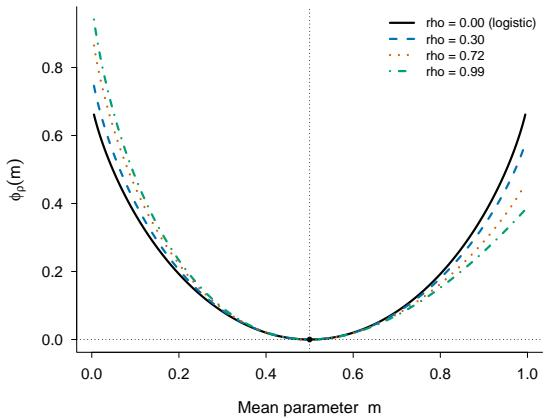  
(a) Elicitation potential

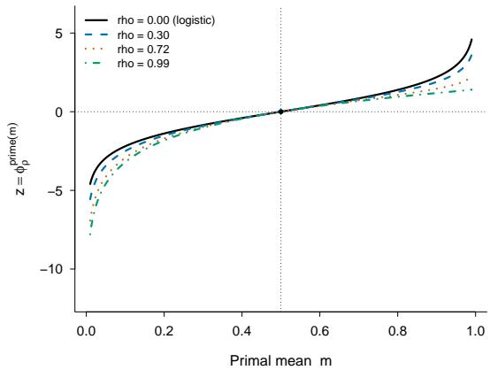  
(b) Dual map  
Figure 4: Elicitation geometry of the asymmetric weighted negative-entropy family. Panel (a) shows $\varphi _ { \rho } ,$ while panel (b) shows the dual map $z = \varphi _ { \rho } ^ { \prime } ( m )$ . The induced link $g _ { \rho } = ( \varphi _ { \rho } ^ { \prime } ) ^ { - 1 }$ is shown in Figure $2 ( \mathrm { e } )$

Because every $g _ { \rho }$ is strictly increasing, changing $\rho$ leaves the optimal decision boundary unchanged. It can, however, alter the population dynamics used to learn that boundary. Recall that the decision stability coeficient is $\lambda _ { \star } = \Delta _ { \beta } \mu ^ { \star } - 2 \phi _ { 0 } ( 0 ) ( m _ { 2 } ) _ { + } ( 1 - \Delta _ { \beta } ^ { 2 } / 4 )$ . The first term captures the restoring contribution associated with link sensitivity, whereas the second captures the destabilizing contribution from positive population-averaged curvature. The efect of elicitation geometry can therefore be particularly pronounced under weak arm separation, where the restoring signal is small while the curvature contribution need not be. Figure $2 ( \mathrm { f } )$ illustrates this behavior in the weak-separation regime. At the reference value $\Delta _ { \beta } = 0 . 2$ , the choices $\rho = 0 . 6 0 , 0 . 7 2 , 0 . 8 0$ give $\lambda _ { \star } \approx 3 . 7 0 \times 1 0 ^ { - 3 } , 2 . 1 5 \times 1 0 ^ { - 5 } , - 2 . 4 5 \times 1 0 ^ { - 3 }$ , respectively, providing stable, near-critical, and unstable examples. As $\Delta _ { \beta }$ increases, the restoring contribution strengthens, while the factor $1 - \Delta _ { \beta } ^ { 2 } / 4$ multiplying the curvature contribution decreases. The instability in this family is therefore concentrated in the weak-separation regime rather than being an intrinsic property of the link.

Figure 5 makes this balance explicit at $\Delta _ { \beta } = 0 . 2$ as $\rho$ varies. For visual comparison, we plot the two half-scaled contributions determining the sign of $\lambda _ { \star } \colon$ the restoring contribution $( \Delta _ { \beta } / 2 ) \mu ^ { \star }$ and the curvature contribution $\phi _ { 0 } ( 0 ) ( m _ { 2 } ) _ { + } ( 1 - \Delta _ { \beta } ^ { 2 } / 4 )$ . The restoring contribution changes relatively slowly, whereas the positive-curvature contribution increases substantially with $\rho .$ They coincide near $\rho = 0 . 7 2$ , where $\lambda _ { \star } = 0$ : beyond this point the curvature contribution dominates and the true boundary becomes locally unstable.

## D.2.2 A flexible unknown link

The preceding construction varies the link through a known elicitation family. In our bandit model, however, the shared link $g$ is unknown and is not assumed to belong to a parametric family. To illustrate decision stability in this more general setting, we generate rewards from the flexible two-transition link

$$
g ( z ) = p _ { 0 } + a _ { 1 } \{ 1 + \operatorname { t a n h } [ b _ { 1 } ( z - \mu _ { 1 } ) ] \} + a _ { 2 } \{ 1 + \operatorname { t a n h } [ b _ { 2 } ( z - \mu _ { 2 } ) ] \} ,\tag{70}
$$

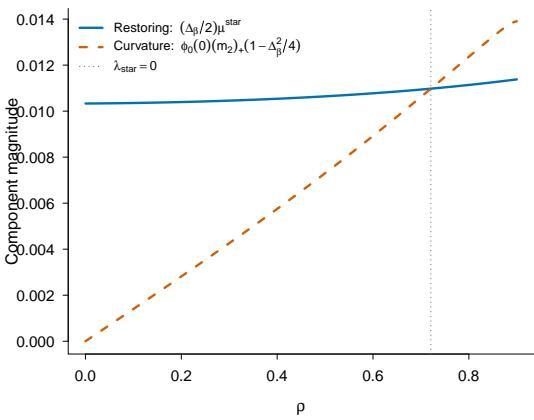  
Figure 5: Components determining the sign of the decision stability coeficient at $\Delta _ { \beta } = 0 . 2$ . For visual comparison, the figure shows the half-scaled restoring contribution $( \Delta _ { \beta } / 2 ) \mu ^ { \star }$ and curvature contribution $\phi _ { 0 } ( 0 ) ( m _ { 2 } ) _ { + } ( 1 - \Delta _ { \beta } ^ { 2 } / 4 )$ Their equality corresponds to $\lambda _ { \star } = 0$

with $p _ { 0 } = 0 . 1 0 , a _ { 1 } = 0 . 1 0 , a _ { 2 } = 0 . 2 5 , b _ { 1 } = 2 , b _ { 2 } = 1 . 4 ,$ and $\mu _ { 1 } = - 1 . 2 5$ , and vary only the location $\mu _ { 2 }$ of the second transition. This functional form is used only to generate the ground-truth regression function; the shared link is treated as unknown by NBL, which neither specifies nor estimates this parametric form.

Unlike the elicitation-induced family, this construction is not designed to preserve a common value or slope at a particular index value. Instead, changing $\mu _ { 2 }$ moves the second transition across the index space and produces diferent sensitivity and curvature profiles. Since $a _ { j } , b _ { j } > 0$ , every link in the family is strictly increasing and therefore induces the same form of linear optimal decision boundary, while its curvature can change sign across the index space. At the reference separation $\Delta _ { \beta } = 0 . 2$ , we use $\mu _ { 2 } = - 1 . 0 7 4 0 3 7 , 2 . 1 4 4 0 7 2$ , and 1.244122 to obtain stable, near-critical, and unstable local population dynamics, respectively. The resulting links and curvature profiles are shown in Figure $2 ( \mathrm { a ) - ( b ) }$ . These labels refer only to the local dynamics at $\Delta _ { \beta } = 0 . 2$ and are not intrinsic properties of the links.

To understand why links with the same monotonicity can produce diferent local dynamics, recall that $U =$ $\theta ^ { \top } X \sim N ( 0 , 1 -  { \Delta _ { \scriptscriptstyle B } } ^ { 2 } / 4 )$ and $Z = ( v ^ { \star } ) ^ { \top } X \sim N ( 0 , 1 )$ are independent. The link enters the decision stability coeficient through $\mu ^ { \star } = \mathbb { E } [ g ^ { \prime } ( U + \Delta _ { \beta } Z / 2 ) \mathbf { 1 } \{ Z > 0 \} ]$ and $m _ { 2 } = \mathbb { E } \{ g ^ { \prime \prime } ( U ) \}$ . Thus stability is not determined by the pointwise magnitude of either $g ^ { \prime }$ or $g ^ { \prime \prime }$ . Rather, it depends on the balance between link sensitivity and curvature after these quantities are weighted under the relevant population distributions. In particular, when $m _ { 2 } \leq 0$ the positive-curvature penalty in $\lambda _ { \star }$ vanishes, whereas suficiently large positive population-averaged curvature can oppose the restoring contribution associated with $\mu ^ { \star }$

The same construction allows us to examine the interaction between link geometry and arm separation more systematically. We vary $\mu _ { 2 }$ over a continuum while simultaneously varying $\Delta _ { \beta }$ , keeping all remaining parameters of the link fixed. Figure 6 shows the resulting decision-stability regions. The shaded region corresponds to $\lambda _ { \star } < 0 .$ while the solid curve marks the boundary $\lambda _ { \star } = 0$ . The horizontal dotted line indicates the reference separation $\Delta _ { \beta } = 0 . 2$ used in the main experiments. At the reference separation, moving the second transition through the index space can move the population dynamics into and out of the unstable region. This dependence is nonmonotone: instability occurs only over an intermediate range of $\mu _ { 2 }$ for this family. The phase diagram also shows that the stability of a fixed link depends on the arm separation. As $\Delta _ { \beta }$ increases, the unstable region contracts and eventually disappears over the displayed family. This behavior is consistent with Figure $2 ( \mathrm { c ) }$ , where the three representative links become locally stable as the arm separation increases.

To see more directly how arm separation changes the population geometry, we hold fixed the link with $\mu _ { 2 } =$ 1.244122, which is locally unstable at $\Delta _ { \beta } = 0 . 2$ , and vary $\Delta _ { \beta }$ . The functions $g ^ { \prime }$ and $g ^ { \prime \prime }$ remain unchanged, while the population quantities entering $\lambda _ { \star }$ change with the arm separation. In particular, $U \sim N ( 0 , 1 - \Delta _ { \beta } ^ { 2 } / 4 )$ , so increasing $\Delta _ { \beta }$ concentrates the distribution of $U$ around zero. Figure 7 overlays the fixed sensitivity and curvature profiles with the distributions of $U$ corresponding to $\Delta _ { \beta } = 0 . 2 , 1 . 0$ , and 1.8. For curvature, the interpretation is direct: since $m _ { 2 } = \mathbb { E } \{ g ^ { \prime \prime } ( U ) \}$ , increasing $\Delta _ { \beta }$ places greater weight on the behavior of $g ^ { \prime \prime }$ near zero and less weight on curvature farther away. Thus the population-averaged curvature can change even though $g ^ { \prime \prime }$ itself remains

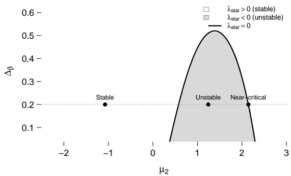

Figure 6: Decision-stability phase diagram for the two-transition shared-link family. The shaded region corresponds to $\lambda _ { \star } < 0$ , while the solid curve marks the stability boundary $\lambda _ { \star } = 0$ . The dotted horizontal line indicates the reference separation $\Delta _ { \beta } = 0 . 2$ , and the three points correspond to the representative links used in the main numerical experiments.

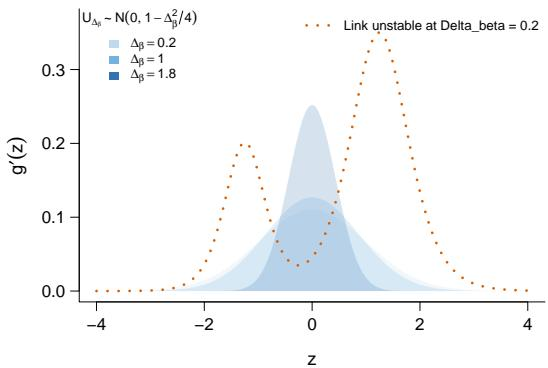  
(a) Link sensitivity $g ^ { \prime } ( z )$

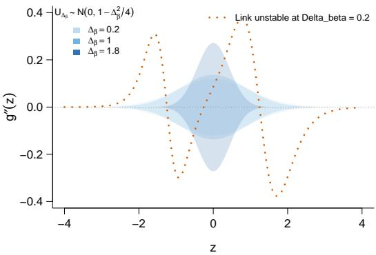  
(b) Link curvature $g ^ { \prime \prime } ( z )$  
Figure 7: Efect of arm separation on the population weighting of a fixed unknown link. The link is locally unstable at $\Delta _ { \beta } = 0 . 2$ and is held fixed as $\Delta _ { \beta }$ varies. The shaded regions correspond to $U \sim N ( 0 , 1 - \Delta _ { \beta } ^ { 2 } / 4 )$ for $\Delta _ { \beta } = 0 . 2$ , 1.0, and 1.8, and are rescaled by a common factor for visual comparison. In panel (b), the densities are reflected about zero only for visual reference.

fixed. The sensitivity panel has a related but distinct interpretation. Since $\mu ^ { \star } = \mathbb { E } [ g ^ { \prime } ( U + \Delta _ { \beta } Z / 2 ) \mathbf { 1 } \{ Z > 0 \} ]$ changing $\Delta _ { \beta }$ afects $\mu ^ { \star }$ both through the distribution of U and through the shift $\Delta _ { \beta } Z / 2$ . Thus the density shown in panel (a) illustrates only one component of the population weighting entering $\mu ^ { \star }$

These changes occur together with the explicit dependence of $\lambda _ { \star }$ on arm separation. Increasing $\Delta _ { \beta }$ directly strengthens the sensitivity contribution through the factor $\Delta _ { \beta }$ and reduces the multiplier $1 - \Delta _ { \beta } ^ { 2 } / 4$ on the curvature contribution, while also changing $\mu ^ { \star }$ and $m _ { 2 }$ themselves. This explains why the same fixed link can be locally unstable under weak arm separation and locally stable when the arm directions are more widely separated. The next subsection examines how these population-level diferences are reflected in the stochastic NBL recursion.

## D.3 Stochastic Dynamics and Arm Separation

The preceding illustrations describe the population geometry underlying NBL. We next examine whether these local stability regimes remain visible in the stochastic recursion driven by the noisy sequential Stein contrast. We use the same three two-transition links and first fix $\Delta _ { \beta } = 0 . 2$ , so that they correspond to the stable, near-critical, and unstable population regimes identified above. To isolate the local dynamics, each replication is initialized with a signed angular displacement of $1 0 ^ { \circ }$ from $v ^ { \star }$ . We run NBL for $n = 1 0 { , } 0 0 0$ rounds using $\eta _ { t } = \gamma / ( t + t _ { 0 } )$ with $\gamma = 1 0$ and $t _ { 0 } = 5 0 0$ , and average the results over 100 Monte Carlo replications.

Since these experiments use $d = 2$ , we measure directional error by the signed angle from $v ^ { \star }$ to $v _ { t }$ . Writing

$\boldsymbol { v } ^ { \star } = ( v _ { 1 } ^ { \star } , v _ { 2 } ^ { \star } ) ^ { \top }$ , we define

$$
\alpha _ { t } = \mathrm { a t a n 2 } \left( v _ { 1 } ^ { \star } v _ { t , 2 } - v _ { 2 } ^ { \star } v _ { t , 1 } , \left( v ^ { \star } \right) ^ { \top } v _ { t } \right) ,
$$

and report $1 8 0 \alpha _ { t } / \pi$ in degrees. Thus $\alpha _ { t } = 0$ corresponds to the true boundary direction, while the sign records the direction of the displacement around $v ^ { \star }$ . Figure 8 examines the stochastic boundary dynamics from two

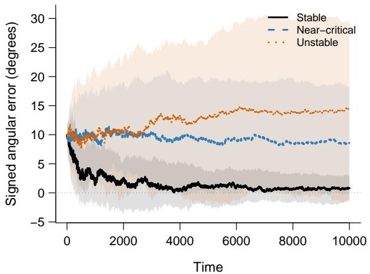  
(a) Varying link geometry

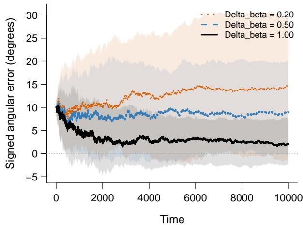  
(b) Varying arm separation  
Figure 8: Signed angular error of NBL over 100 Monte Carlo replications. Panel (a) fixes $\Delta _ { \beta } = 0 . 2$ and varies the shared link across the stable, near-critical, and unstable population regimes. Panel (b) fixes the link with $\mu _ { 2 } = 1 . 2 4 4 1 2 2$ , which is unstable at $\Delta _ { \beta } = 0 . 2 $ , and varies the arm separation. Curves show Monte Carlo means and shaded regions show pointwise approximate 95% Monte Carlo confidence intervals for the mean trajectories.

complementary directions. Panel (a) fixes $\Delta _ { \beta } = 0 . 2$ and varies the shared link to be as specified in Section D.2.2. In the stable regime, the boundary estimate is driven toward $v ^ { \star } ;$ near criticality, the angular error remains persistently away from zero; and in the unstable regime, the estimate moves progressively farther from $v ^ { \star }$ . Thus the attracting, near-critical, and repelling behaviors predicted by the population geometry remain visible under stochastic updating.

Panel (b) instead fixes the link to be same as (70) with $\mu _ { 2 } = 1 . 2 4 4 1 2 2$ and varies the arm separation. The same link that moves away from $v ^ { \star }$ at $\Delta _ { \beta } = 0 . 2$ exhibits increasingly strong recovery toward the true boundary direction as $\Delta _ { \beta }$ increases. This agrees with the population phase diagram in Figure 6 and shows that the dependence of decision stability on arm separation is also visible in the finite-sample NBL recursion.

The corresponding regret behavior is shown in Figure $2 ( \mathrm { d } )$ for the varying-link experiment. Under stable dynamics, average regret $R _ { t } / t$ decreases, whereas near-critical and unstable dynamics exhibit increasingly persistent regret. Together, the population and stochastic experiments show how the geometry captured by $\lambda _ { \star }$ translates into both directional learning of the boundary and its resulting decision performance.

## D.4 Additional Comparisons with Greedy Logistic

We next compare NBL with Greedy Logistic, a parametric benchmark based on greedy generalized linear contextual-bandit learning [6]. Following a common randomized initialization, Greedy Logistic fits a separate logistic regression for each arm and selects the arm with the larger fitted conditional mean. Since the logistic link is strictly increasing, this is equivalent to selecting the arm with the larger fitted linear score. In contrast, NBL does not estimate either arm-specific reward function and instead updates the decision boundary directly. We use $d = 2 , \Delta _ { \beta } = 1 , n = 2 0 0 0$ , and a randomized initialization of $n _ { 0 } = 2 0 0$ rounds. For NBL, we use $\eta _ { t } = 1 0 / ( t + 5 0 0 )$ , and results are averaged over 100 Monte Carlo replications. Unless otherwise stated, we generate contexts independently as $X _ { t } \sim N ( 0 , I _ { d } )$ . Conditional on $X _ { t } ,$ the potential rewards are generated independently as $Y _ { t , a } \sim \mathrm { B e r n o u l l i } \{ g ( \beta _ { a } ^ { \top } X _ { t } ) \}$ for $a \in \{ - 1 , + 1 \}$ , so that $\mathbb { E } ( Y _ { t , a } \mid X _ { t } ) = g ( \beta _ { a } ^ { \top } X _ { t } )$ . The observed reward is $Y _ { t } = Y _ { t , A _ { t } }$ . For comparisons between algorithms, each Monte Carlo replication uses the same generated contexts and potential rewards for both methods, so that NBL and Greedy Logistic are evaluated on a common Bernoulli reward realization. Within each replication, the two methods use the same randomized initialization.

We first consider the elicitation-induced family $g _ { \rho } = ( \varphi _ { \rho } ^ { \prime } ) ^ { - 1 }$ with $\rho \in \{ 0 , 0 . 2 , 0 . 4 , 0 . 6 , 0 . 8 \}$ , where $\rho = 0$ is exactly logistic. This provides a controlled sequence of departures from the working link used by Greedy Logistic. Figure $2 ( \mathrm { g ) }$ shows that Greedy Logistic has lower regret when the link is logistic or close to logistic, reflecting the benefit of exploiting the correctly or approximately specified parametric reward model. As the link departs further from logistic geometry, this advantage diminishes and NBL can have lower regret.

We then consider the three two-transition links in Section D.2.2 used in the population experiments. Although these links were selected to have diferent stability behavior at $\Delta _ { \beta } = 0 . 2$ , all three have positive decision stability coeficients at the well-separated value $\Delta _ { \beta } = 1$ used here. The comparison therefore isolates link misspecification without placing NBL in the unstable regime. Figure $2 \mathrm { ( h ) }$ shows that Greedy Logistic can retain an advantage for a non-logistic link that remains suficiently well approximated by its working model, while NBL can have lower regret for larger departures from logistic geometry.

These comparisons illustrate the distinction between parametric reward modeling and direct boundary learning. When the logistic specification is correct or provides a good approximation, Greedy Logistic can exploit the additional structure and achieve lower finite-sample regret. NBL does not obtain the same parametric eficiency, but its regret remains competitive in these experiments despite neither specifying nor estimating the shared link. As the link departs further from the logistic specification, the parametric advantage diminishes, and under suficiently strong misspecification, directly learning the decision boundary can yield lower regret. Thus NBL pays a relatively modest price for link agnosticism in the settings considered here, while avoiding sensitivity to a particular parametric specification.