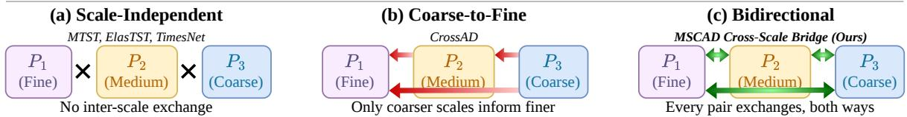
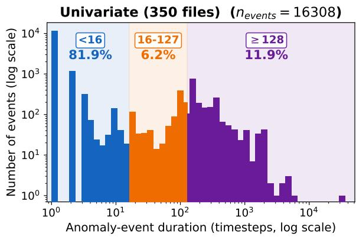
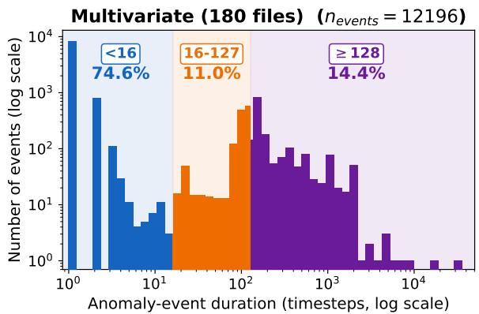
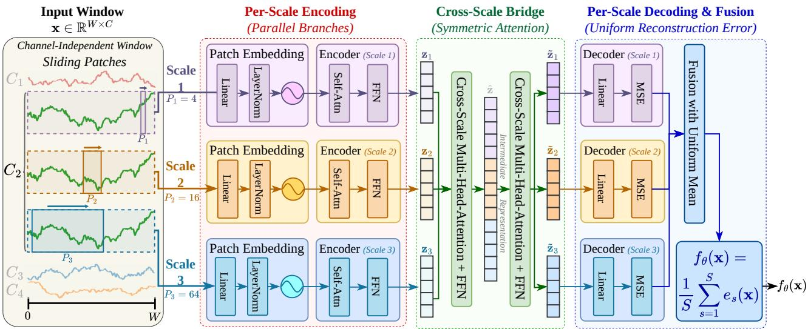
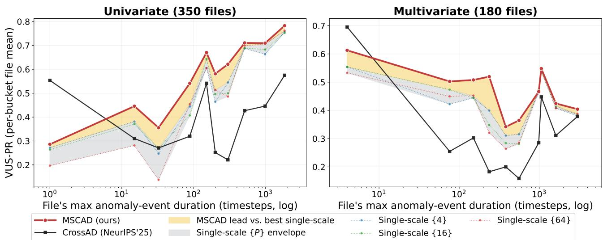
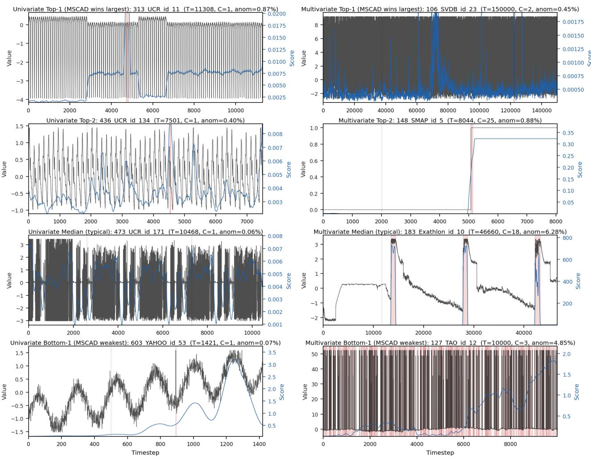
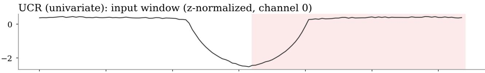
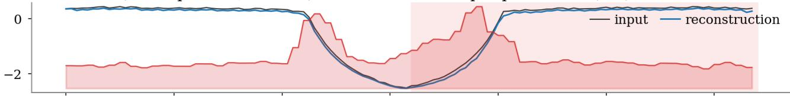
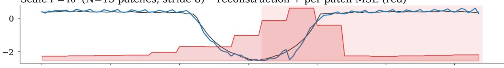
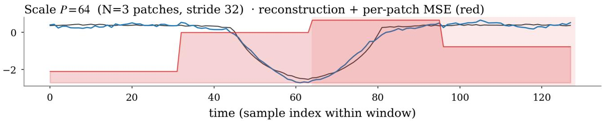

# No Scale Left Behind: Multi-Scale Autoencoders with Bidirectional Attention for Time Series Anomaly Detection

Jiaheng Guo, Haochen Zhang, Yu-Chao Huang, Jinhao Duan, Nicholas Konz, Tianlong Chen UNITES Lab, University of North Carolina at Chapel Hill

Time series anomaly detection (TSAD) plays a crucial role in healthcare, finance, industrial monitoring, and other sectors. Within and between these settings, anomalies span vastly diferent temporal scales, from sub-second point spikes to multi-hour drift patterns. However, most existing TSAD methods commit to a single temporal granularity, and multi-scale designs either analyze diferent scales in isolation or are constrained to a predefined coarse-to-fine hierarchy, both failing to suficiently capture multi-scale interactions. To resolve this limitation, we propose Multi-Scale Autoencoder with Cross-Scale Attention for TSAD (MSCAD), a simple yet powerful semi-supervised TSAD framework founded on parallel autoencoder branches corresponding to diferent patch sizes. A stack of symmetric bidirectional cross-scale attention blocks enables every pair of scales to exchange information before reconstruction without allowing any single scale to be privileged. On the comprehensive TSB-AD benchmark (40 datasets, 530 series), MSCAD achieves large performance gains against 50 baselines across multiple metrics, with VUS-PR of 0.57(+9.6%) on the univariate split and 0.47(+9.3%) on the multivariate split compared to the state-of-the-art.

## 1 Introduction

Time series data underpins many critical sectors, such as medical diagnostics, industrial infrastructure, and finance, where the detection of anomalies is paramount. These irregularities vary significantly in nature, including physiological spikes in EEG/ECG signals, sudden industrial service outages, or gradual financial drifts. Efectively identifying these behaviors via time series anomaly detection (TSAD) is a fundamental requirement for ensuring the safe and reliable operation of these systems.

Semi-supervised TSAD is the primary paradigm for high-stakes applications because labeled anoma- lies are notoriously scarce and diverse, necessitating models that learn the manifold of normalcy from anomaly-free training data. Over the past decade, research has produced various architectural back- bones, including reconstruction-based detectors, forecasting-based approaches, and representation-based methods (Audibert et al., 2020; Wu et al., 2023; Yang et al., 2023). However, most of these frameworks treat temporal scale as a fixed hyperparameter, which limits their ability to capture both point-wise and trend-level irregularities simultaneously. Recent meta-analyses on the TSB-AD benchmark underscore this bottleneck, reporting that the performance gap between disparate backbones is surprisingly narrow (Liu & Paparrizos, 2024). This suggests the field is restricted not by backbone choice, but by a failure to efectively integrate multi-scale semantics, which can range from transient, sub-second spikes (e.g., sensor malfunctions) to persistent, multi-hour regime shifts (Figure 1).

A detector restricted to a single temporal receptive field faces an inherent trade-of, where a resolution that is too fine may overlook slow structural changes and one that is too coarse will smooth over transient events. While multi-scale designs have attempted to mitigate this, existing coupling strategies generally fall into two suboptimal categories. First, scale-independent parallel branches process scales in isolation and fuse outputs only via score-level weighting or feature concatenation, which fails to capture anomalies requiring joint reasoning across scales, such as a fine-scale deviation that is only salient in the context of a shifted coarse-scale background (Wu et al., 2023; Zhang et al., 2024b). Second, asymmetric hierarchy approaches restrict cross-scale information flow to one direction, using coarse-scale context as a conditioning signal for finer scales (Li et al., 2025; Chen et al., 2024). CrossAD (Li et al., 2025) makes this design explicit, utilizing block-diagonal masks that forbid cross-scale interaction inside the encoder, imposing a directed coarse-to-fine inductive bias that may be suboptimal when anomaly evidence is scale-local or reciprocal. We demonstrate that the strategy for coupling scales is as critical as the presence of multiple scales themselves, representing a fundamental gap in current architectural designs.

  
Figure 1: (Top) Anomaly-event duration distribution on TSB-AD. Short events (< 16 timesteps) dominate; long events (≥ 128 timesteps) form a non-trivial 12–14% tail, motivating a multi-scale design. (Bottom) Cross-scale coupling topologies. Existing multi-scale TSAD methods either keep scales independent or impose asymmetric coarse-to-fine flow. MSCAD uses a bidirectional bridge, allowing each scale to exchange information with every other scale symmetrically.

We close this gap with MSCAD (Multi-Scale Autoencoder with Cross-Scale Attention for Time Series Anomaly Detection). Each input window is processed in parallel by three autoencoder branches for diferent patch sizes. Crucially, we use a small stack of symmetric cross-scale attention bridges between the per-scale encoders and decoders so that every scale’s encoded tokens cross-attend to the concatenation of all other scales’ tokens, with no hierarchy or privileged reference scale, so each pair of scales freely exchan es information in both directions before reconstruction. These brid ed re resentations are then decoded at each scale, and the resulting per-scale reconstruction errors are fused via a simple uniform aggregator. Surprisingly, we find that this straightforward aggregation approach matches or outperforms every learned input-adaptive gating mechanism we evaluated, indicating that the preceding cross-scale attention mechanism already efectively reconciles temporal semantics prior to reconstruction. On the comprehensive TSB-AD benchmark, MSCAD attains state-of-the-art VUS-PR of 0.57 on univariate and 0.47 on multivariate splits, with 3-seed standard deviation below .002 and no per-file hyperparameter tuning, representing a significant advance toward robust, general-purpose TSAD that maintains strong performance across diverse domains without the need for manual, dataset-specific configuration. Our main contributions are summarized as follows:

• We identify a structural limitation of existing multi-scale TSAD methods: they either process scales independently or impose a coarse-to-fine hierarchy, missing the symmetric, bidirectional exchange between every pair of scales.

• We propose MSCAD, a multi-scale autoencoder with a symmetric cross-scale bridge that performs bidirectional cross-attention between every pair of scales without a privileged reference scale.

• We show through ablations that symmetric exchange is the key design component: replacing it with a coarse-to-fine variant reduces the gain to within seed noise of a no-bridge baseline. A uniform aggregator matches or outperforms learned input-adaptive gates.

• MSCAD achieves state-of-the-art performance across multiple metrics on the TSB-AD benchmark, with VUS-PR of 0.57 on TSB-AD-U and 0.47 on TSB-AD-M across 50 baselines.

## 2 Related Work

Semi-supervised time series anomaly detection. TSAD under the semi-supervised setting has been approached from several broad angles. Reconstruction-based methods train a model on anomaly-free data and score anomalies by reconstruction error: USAD (Audibert et al., 2020) introduces adversarial training of paired autoencoders; Anomaly Transformer (Xu et al., 2022) exploits the asymmetric priorassociation / series-association gap within a single-scale Transformer; DCdetector (Yang et al., 2023) contrasts dual patch-attention views of the same series. Forecasting- andfrequency-based methods instead score deviations from predicted or frequency-domain normal patterns: TimesNet (Wu et al., 2023) converts 1-D series into 2-D tensors along dominant periods; FITS (Xu et al., 2024) models time series with a lightweight frequency interpolation module; CATCH (Wu et al., 2025) introduces channel-aware frequency patching for multivariate anomaly detection; KAN-AD (Zhou et al., 2025) uses Fourier-based Kolmogorov–Arnold networks to model smooth temporal patterns with few parameters. Recent general and representation-based detectors further improve robustness and transferability: DADA (Shentu et al., 2025) pre-trains a general anomaly detector with adaptive bottlenecks and dual adversarial decoders, while PaAno (Park & Kang, 2026) learns patch-level representations with a lightweight 1D-CNN and scores anomalies by comparing test patches against normal training patches.

Multi-scale anomaly detectors. The natural response to the granularity dilemma is to run the detector at multiple scales. Existing multi-scale designs for TSAD fall into two camps, both structurally diferent from ours. (i) Scale-independent parallel branches. MTST (Zhang et al., 2024b) and ElasTST (Zhang et al., 2024a) tokenize at multiple patch sizes but process each scale independently and concatenate features without cross-scale attention; TimesNet (Wu et al., 2023) applies period-specific 2-D convolution and recombines only via amplitude-weighted summation; None of these allow one scale’s representation to be sha ed b another’s within the backbone. (ii) Asymmetric hierarchies. Besides CrossAD (Li et al., 2025), Pathformer (Chen et al., 2024) routes forecasting information across scales via an adaptive pathway gate; Scaleformer and coarse-to-fine pyramidal Transformers (Shabani et al., 2023; Wu et al., 2024) refine predictions hierarchically; TimeMixer (Wang et al., 2024) mixes past and future decompositions with directed (non-symmetric) flows. All share the same privileged-scale inductive bias. In contrast, MSCAD is designed to enable symmetric inter-scale information flow at the representation level, avoiding both scale-isolated processing and privileged coarse-to-fine hierarchies.

## 3 Method

## 3.1 Problem Formulation

We consider TSAD under the standard semi-supervised setting (Liu & Paparrizos, 2024). Let $X =$ $( x _ { 1 } , . . . , x _ { T } ) \in \mathbb { R } ^ { T \times C }$ denote a time series of length $T$ with $C \geq 1$ channels. The training split ${ \mathcal { X } } ^ { \mathrm { t r } }$ is assumed anomaly-free; no anomaly labels are observed during training. At test time, given an unseen series $X ^ { \mathrm { t e } } \in \mathcal { X } ^ { \mathrm { t e } }$ of length $T ^ { \mathrm { t e } }$ , the goal is to produce a per-timestep anomaly score $\mathbf { S } \in \mathbb { R } ^ { T ^ { \mathrm { t e } } }$ , where larger s indicates a higher likelihood that timestep t is anomalous. Performance is measured against a ground-truth label sequence $\mathbf { y } \in \{ 0 , 1 \} ^ { T ^ { \mathrm { t e } } }$ via threshold-free volume-under-the-surface (VUS) metrics (Paparrizos et al., 2022) (primarily VUS-PR), which integrate s against y over all detection thresholds and a small temporal tolerance.

Sliding-window framework. We adopt a standard sliding-window framework where both training and inference operate on overlapping windows of length W extracted with stride $\tau ,$ i.e.,

$$
\mathbf { x } ^ { ( i ) } = X [ i \tau : i \tau + W ] \in \mathbb { R } ^ { W \times C } , \quad \forall i \in \{ 0 , 1 , \dots , \lfloor ( T - W ) / \tau \rfloor \} .\tag{1}
$$

  
Figure 2: MSCAD architecture. Three parallel patch-Transformer branches at scales $\mathcal { P } = \{ 4 , 1 6 , 6 4 \}$ $( \ S \bar { 8 } . 3 . 3 )$ are connected by a stack of B symmetric cross-scale bridges (§3.4); each branch decodes its bridged latents back to patch space, and the uniform mean of the per-scale reconstruction errors is the window score $f _ { \boldsymbol { \theta } } ( \mathbf { x } )$

A scoring model $f _ { \theta } : \mathbb { R } ^ { W \times C }  \mathbb { R } ^ { + }$ assigns a window-level score $f _ { \theta } ( \mathbf { x } ^ { ( i ) } )$ ; per-timestep scores $s _ { t }$ are recovered by averaging over all windows that cover timestep t. Following Liu & Paparrizos (2024), channels are processed independently and per-channel scores are averaged across channels, allowing a univariate model to handle multivariate inputs without parameter inflation.

Reconstruction-based scoring. A reconstruction-based detector parameterizes $f _ { \theta }$ via an autoencoder $g _ { \theta } : \mathbb { R } ^ { W \times C }  \mathbb { R } ^ { W \times C }$ trained on ${ \mathcal { X } } ^ { \mathrm { t r } }$ to minimize the objective $\mathcal { L } ( \boldsymbol { \theta } ) = \mathbb { E } _ { \mathbf { x } \sim \mathcal { X } ^ { \mathrm { t r } } } { \left. { \mathbf { x } - g _ { \theta } ( \mathbf { x } ) } \right. } _ { 2 } ^ { 2 } ,$ . and scores each test window by its squared reconstruction error, $f _ { \theta } ( \mathbf { x } ) = \| \mathbf { x } - g _ { \theta } ( \mathbf { x } ) \| _ { 2 } ^ { 2 }$ . The premise is that $g \theta { \mathrm { : } }$ , fit only on normal traces, faithfully reconstructs in-distribution windows but fails on subsequences whose patterns deviate from training, so reconstruction error signals deviation.

## 3.2 Framework Overview

The core of MSCAD is its reconstruction model $g _ { \boldsymbol { \theta } . }$ , a multi-scale autoencoder with symmetric bidirectional cross-scale communication. Given an input window $\mathbf { x } \in \mathbb { R } ^ { W \times C }$ , the model produces the window- level anomaly score $f _ { \boldsymbol { \theta } } ( \mathbf { x } )$ end-to-end in the following three stages (Figure 2). ① Per-scale encoding. The window is processed in parallel by S scale branches indexed by a fixed set of patch sizes $\mathcal { P } =$ $\{ P _ { 1 } , P _ { 2 } , \dots , P _ { S } \}$ (we use $S = 3$ and $\dot { \mathcal { P } } = \{ 4 , 1 6 , 6 4 \}$ throughout the paper). Each branch Branchs tokenizes x into $N _ { s }$ patch tokens via a strided patch embedding and processes them with a Transformer encoder, producing per-scale latents $\mathbf { z } _ { s } \in \mathbb { R } ^ { N _ { s } \times \mathbf { \hat { d } } }$ (§3.3). ② Symmetric cross-scale bridge. The per-scale latents $\{ \bar { \mathbf { z } } _ { s } \} _ { s = 1 } ^ { S }$ pass through a stack of B bridge modules that lets each scale’s tokens attend to the concatenated tokens of all other scales, yielding context-mixed latents $\{ \tilde { \mathbf { z } } _ { s } \} _ { s = 1 } ^ { S }$ of the same per-scale shapes. The bridge is symmetric (i.e., no scale is privileged as a conditioning signal) and bidirectional $( i . e . ,$ every pair of scales both informs and is informed by the other), which is the core architectural departure from prior multi-scale TSAD (§3.4). ③ Per-scale decoding and uniform fusion. Each bridged latent $\tilde { \mathbf { z } } _ { s }$ is projected back to the patch space by a linear decoder, yielding a per-scale window-level reconstruction error $e _ { s } ( \mathbf { x } ) \in \mathbb { R } _ { \geq 0 }$ , the mean squared error between the reconstructed and original patches at scale s $( \ S 3 . 3 )$ . The S per-scale errors are fused into the final window-level anomaly score by a simple uniform averaging $\begin{array} { r } { f _ { \theta } ( \mathbf { \bar { x } } ) ~ = ~ \frac { 1 } { S } \sum _ { s = 1 } ^ { S } e _ { s } ( \mathbf { x } ) } \end{array}$ , which also serves as the per-window training loss (§3.5).

Each of the three stages maps directly to the gap diagnosed in §1: parallel branches preserve scale-specific reconstruction targets so no scale absorbs another’s signal, the symmetric bridge enables bidirectional inter-scale information flow without a coarse-to-fine asymmetry, and uniform fusion eschews learned routing, which we find redundant once the bridge has already reconciled semantics across scales (§4.3).

## 3.3 Multi-Scale Patch Branches

Each scale branch Branchs $( s = 1 , \ldots , S )$ is a lightweight autoencoder that operates at a single temporal granularity, defined by its patch size $P _ { s } \in \mathcal { P }$ . The encoder Encs produces the per-scale latent $\mathbf { z } _ { s }$ to be utilized by the cross-scale bridge (§3.4), and the decoder $\mathrm { D e c } _ { s }$ reconstructs the original patches and yields the per-scale window-level error $e _ { s } ( \mathbf { x } )$

Patch extraction and embedding. Given a single-channel slice of an input window $\mathbf { x } \in \mathbb { R } ^ { W }$ the branch extracts overlapping patches with stride $P _ { s } / 2$ (50% overlap):

$$
\begin{array} { r } { \mathbf { u } _ { s } ^ { ( j ) } = \mathbf { x } \Big [ j \cdot P _ { s } / 2 : j \cdot P _ { s } / 2 + P _ { s } \Big ] \in \mathbb { R } ^ { P _ { s } } , \quad j = 0 , 1 , \ldots , N _ { s } - 1 , } \end{array}
$$

yielding $N _ { s } = \lfloor 2 ( W - P _ { s } ) / P _ { s } \rfloor + 1$ patches per window. Each patch is linearly projected to a d-dimensional token by a learnable patch embedding PatchEmbeds $: \mathbb { R } ^ { P _ { s } }  \mathbb { R } ^ { d }$ , with a learnable absolute positional encoding $\mathbf { p } _ { s } ^ { ( j ) } \in \mathbb { R } ^ { d }$ added on top: $\mathbf { h } _ { s } ^ { ( j ) } =$ PatchEmbed $\mathbf { \Lambda } _ { s } \big ( \mathbf { u } _ { s } ^ { ( j ) } \big ) + \mathbf { p } _ { s } ^ { ( j ) }$

Per-scale encoding. The patch tokens $\mathbf { H } _ { s } = \big ( \mathbf { h } _ { s } ^ { ( 0 ) } , \ldots , \mathbf { h } _ { s } ^ { ( N _ { s } - 1 ) } \big ) \in \mathbb { R } ^ { N _ { s } \times d }$ are processed by a stack of $L$ standard Transformer encoder layers, using multi-head self-attention with h heads and a GELU feed-forward sublayer of width $4 d ,$ denoted as $\mathbf { \bar { z } } _ { s } = \mathrm { E n c } _ { s } ( \mathbf { H } _ { s } ) \in \mathbb { R } ^ { N _ { s } \times d }$ . Cruciall , the S branches do not share parameters, ensuring that each scale can specialize its representation to satisfy its respective reconstruction objective without interference from other temporal granularities.

Per-scale decoding. The subsequent decoding operates on the bridged counterpart $\tilde { \textbf { z } } _ { s } ~ ( \ \ S 3 . 4 )$ of $\mathbf { z } _ { s }$ Each token $\mathbf { z } _ { s } ^ { ( j ) }$ is mapped back to patch space by a single linear projection Dec $\mathbf { \Psi } _ { : } \mathbb { R } ^ { d } \to \mathbb { R } ^ { P _ { s } } \colon \hat { \mathbf { u } } _ { s } ^ { ( j ) } =$ $\mathrm { D e c } _ { s } \big ( \mathbf { z } _ { s } ^ { ( j ) } \big ) , \quad j = 0 , \dots , N _ { s } - 1$ . The per-scale window-level reconstruction error is the mean squared error between reconstructed and original patches, averaged over patch positions and within-patch timesteps: $\begin{array} { r } { e _ { s } ( \mathbf { x } ) = \frac { 1 } { N _ { s } P _ { s } } \sum _ { j = 0 } ^ { N _ { s } - 1 } \| \hat { \mathbf { u } } _ { s } ^ { ( j ) } - \mathbf { u } _ { s } ^ { ( j ) } \| _ { 2 } ^ { 2 } } \end{array}$ . This reconstruction error constitutes the per-scale signal for the aggregated window-level score and provides the local objective for the training process detailed in §3.5.

## 3.4 Symmetric Cross-Scale Bridge

The cross-scale bridge is a unified module positioned between the per-scale encoders and decoders (§3.3). It accepts the S per-scale latents $\{ { \bf z } _ { s } \} _ { s = 1 } ^ { S }$ and produces transformed counterparts $\{ \tilde { \mathbf { z } } _ { s } \} _ { s = 1 } ^ { S }$ of identical dimensions, ensuring that each $\tilde { \mathbf { z } } _ { s }$ incorporates information from all other temporal scales. By default we utilize multi-head cross-attention with parameters shared across scales. Importantly, this design is both symmetric (every scale simultaneously serves as both query and context) and bidirectional (every pair of scales can exchange information within a single forward pass).

Cross-attention block. For each scale s, we form a context sequence by concatenating the latents of all other scales, $\mathbf { C } _ { s } = \operatorname { c o n c a t } ( \mathbf { z } _ { j } : j \neq s ) \in \mathbb { R } ^ { ( \sum _ { j \neq s } N _ { j } ) \times d }$ , and apply multi-head cross-attention: ${ \bf a } _ { s } =$ $\mathrm { M H A } ( Q = \mathbf { z } _ { s } , \ K = \mathbf { C } _ { s } , \ V = \mathbf { C } _ { s } ) \in \mathbb { R } ^ { N _ { s } \times d }$ . The output is updated via a standard Transformer blocks with residual connections and LayerNorm: $\mathbf { z } _ { s } ^ { \prime } = \mathrm { L a y e r N o r m } ( \hat { \mathbf { z } } _ { s } + \mathbf { a } _ { s } ) , \quad \tilde { \mathbf { z } } _ { s } = \mathrm { L a y e r N o r m } ( \mathbf { z } _ { s } ^ { \prime } + \mathrm { F F N } ( \mathbf { z } _ { s } ^ { \prime } ) )$ All attention projections are shared across scales, and the bridge consists of $B = 2$ such blocks.

S mmetr and bidirectionalit . The brid e is s mmetric: no scale is rivile ed and the o eration is invariant under any joint permutation of the scale indices on inputs and outputs. It is also bidirectional, in that every pair of scales informs the other within a single forward pass: scale s queries scale j through $\mathbf { C } _ { s } ,$ and scale $j$ simultaneously queries scale s through $\mathbf { C } _ { j }$ , with both updates happening before the decoder is called. This stands in contrast to prior multi-scale TSAD designs (cf. §1), which either disable inter-scale flow entirely or impose a coarse-to-fine asymmetry (Figure 1).

## 3.5 Training and Inference

MSCAD is trained by minimizing the expectation of the window-level anomaly score on the training split ${ \mathcal { X } } ^ { \mathrm { t r } }$ :

$$
\mathcal { L } ( \theta ) = \mathbb { E } _ { { \mathbf { x } } \sim \mathcal { X } ^ { \mathrm { t r } } } \big [ f _ { \theta } ( { \mathbf { x } } ) \big ] = \frac { 1 } { S } \sum _ { s = 1 } ^ { S } \mathbb { E } _ { { \mathbf { x } } \sim \mathcal { X } ^ { \mathrm { t r } } } \big [ e _ { s } ( { \mathbf { x } } ) \big ] ,\tag{2}
$$

which reduces to the unweighted mean of the per-scale reconstruction errors. We intentionally omit auxiliary loss terms, such as diversity regularizers or representation-level contrastive objectives. Empirically, we found that such additions introduce unnecessary optimization complexity without yielding performance gains; our ablation studies (§4.3) confirm that this streamlined, single-objective approach consistently matches or exceeds the performance of more complex multi-term formulations.

Training windows are drawn from per-channel z score-normalized training series and shufled. We hold out a 10% random validation subset for early stopping; the remaining windows are batched and the model is updated with Adam, cosine annealing of the learning rate over E epochs, and gradient-norm clipping at 1.0. At test time, the input series $\breve { X } ^ { \mathrm { t e } }$ is z-normalized using the training statistics. For each channel $c ,$ overlapping windows $\{ \mathbf { x } ^ { ( i ) } \}$ are extracted via Eq. (1) with the same $W$ and τ used during training and scored by $f _ { \theta } ( \mathbf { x } ^ { ( i ) } )$ ; the per-timestep channel score $s _ { t } ^ { ( c ) }$ is the mean of $f _ { \theta }$ over all windows that contain timestep t. The final per-timestep anomaly score is the channel average, $\begin{array} { r } { s _ { t } \ = \ \frac { 1 } { C } \sum _ { c = 1 } ^ { C } s _ { t } ^ { ( c ) } . } \end{array}$ following the channel-independent convention introduced in §3.1. No thresholding or post-processing is applied to the final scores; instead, we evaluate the raw vector s directly using threshold-free metrics to ensure a more objective and robust performance assessment.

## 4 Experiments and Results

## 4.1 Experimental Design

Benchmark and protocol. We evaluate on TSB-AD (Liu & Paparrizos, 2024), the most comprehensive public TSAD benchmark to date. Earlier TSAD research standardized around a handful of real-world multivariate datasets (SMAP and MSL (Hundman et al., 2018), SMD (Su et al., 2019), SWaT and WADI (Goh et al., 2017), PSM (Abdulaal et al., 2021)) and a growing suite of univariate collections (UCR Anomaly Archive (Wu & Keogh, 2023), NAB, Yahoo); TSB-AD consolidates this setting under a unified evaluation protocol. The oficial evaluation split contains 350 univariate (TSB-AD-U) and 180 multivariate (TSB-AD-M) series spanning 40 datasets across healthcare, networking, IoT, server monitoring, and synthetic control. Each series is partitioned into a clean training prefix and a labelled test sufix; following the benchmark’s semi-supervised protocol, every detector is trained on the prefix and scored on the full series at test time, with metrics computed against the labelled sufix. Multivariate series are processed channel-independently and per-channel scores are averaged, following the TSB-AD convention. Further details of TSB-AD are listed in Appendix A.

Metrics. Our primary metric is volume-under-the-surface precision–recall (VUS-PR) (Paparrizos et al., 2022), which integrates precision–recall over all detection thresholds and a small temporal bufer; unlike Point-Adjusted F1 (PA-F1) it is threshold-free and not gameable by random scores. Point-Adjusted F1 was long commonly used in TSAD evaluation, but Kim et al. (2022) show that random scores can exceed 0.70 PA-F1 on most standard datasets. For completeness we additionally report VUS-ROC, AUC-PR, AUC-ROC, and two F1 variants, Range-based F1 and standard Point-F1, all from the TSB-AD metric suite (Liu & Paparrizos, 2024), to characterize behaviour under diferent detection regimes. PA-F1, together with Event-based-F1 and Afiliation-F, are reported in Appendix B. Univariate and multivariate means are reported separately throughout; per-dataset breakdowns appear in Appendix E.

Baselines. We compare against the 50 TSAD baselines distributed with TSB-AD (Liu & Paparrizos, 2024), spanning classical methods (Sub-PCA (Shyu et al., 2003), KShapeAD (Paparrizos & Gravano, 2015), KMeansAD), deep reconstruction and prediction models (USAD (Audibert et al., 2020), DeepAnT (Munir et al., 2019), OmniAnomaly (Su et al., 2019), AnomalyTransformer (Xu et al., 2022), DCdetector (Yang et al., 2023)), forecasting-, frequency-, and Transformer-based models (TimesNet (Wu et al., 2023), PatchTST (Nie et al., 2023), iTransformer (Liu et al., 2024), FITS (Xu et al., 2024), CATCH (Wu et al.,

Table 1: MSCAD vs. representative baselines on TSB-AD. Methods are grouped by family: Stat. = statisti cal/ML methods, NN/Trans. = neural-network or Transformer-based methods, and FM = foundation or pretrained general models. Multi-scale indicates whether the method explicitly models multiple temporal resolutions (✓) or not (✗). External baseline scores are quoted from prior published reports unless otherwise noted. Bold marks the best per column; underline marks the second-best.
<table><tr><td rowspan="2" colspan="2">Method</td><td rowspan="2">Multi-Scale</td><td colspan="3">Range-Wise Measure</td><td colspan="3">Point-Wise Measure</td></tr><tr><td>VUS-PR</td><td>VUS-ROC</td><td>Range-F1</td><td>AUC-PR</td><td>AUC-ROC</td><td>Point-F1</td></tr><tr><td colspan="10">Univariate Split TSB-AD-U (23 datasets, 350 series)</td></tr><tr><td rowspan="2">Stat.</td><td colspan="10">Sub-PCA (Shyu et al., 2003)</td></tr><tr><td>KShapeAD (Paparrizos &amp; Gravano, 2015)</td><td>x x</td><td>0.42 0.40</td><td>0.76 0.76</td><td>0.41 0.40</td><td></td><td>0.37 0.35</td><td>0.71 0.74</td><td>0.42 0.39</td></tr><tr><td rowspan="10">N/ns.</td><td>USAD (Audibert et al., 2020)</td><td>x</td><td>0.36</td><td>0.71</td><td>0.40</td><td>0.32</td><td>0.66</td><td></td><td>0.37</td></tr><tr><td>AnomalyTransformer (Xu et al., 2022)</td><td>x</td><td>0.12</td><td>0.56</td><td>0.14</td><td></td><td>0.08</td><td>0.50</td><td>0.12</td></tr><tr><td>TimesNet (Wu et al., 2023)</td><td>√</td><td>0.26</td><td>0.72</td><td>0.21</td><td></td><td>0.18</td><td>0.61</td><td>0.24</td></tr><tr><td>PatchTST (Nie et al., 2023)</td><td>x</td><td>0.26</td><td>0.75</td><td>0.22</td><td></td><td>0.21</td><td>0.63</td><td>0.25</td></tr><tr><td>DCdetector (Yang et al., 2023)</td><td>x</td><td>0.09</td><td>0.56</td><td>0.10</td><td></td><td>0.05</td><td>0.50</td><td>0.10</td></tr><tr><td>iTransformer (Liu et al., 2024)</td><td>x</td><td>0.22</td><td>0.74</td><td>0.18</td><td></td><td>0.16</td><td>0.61</td><td>0.21</td></tr><tr><td>FITS (Xu et al., 2024)</td><td>x</td><td>0.26</td><td>0.73</td><td></td><td>0.20</td><td>0.17</td><td>0.61</td><td>0.23</td></tr><tr><td>DADA (Shentu et al., 2025)</td><td>x</td><td>0.31</td><td>0.77</td><td></td><td>0.31</td><td>0.29</td><td>0.71</td><td>0.38</td></tr><tr><td>CrossAD (Li et al., 2025)</td><td>√</td><td>0.43</td><td>0.82</td><td></td><td>0.40</td><td>0.41</td><td>0.77</td><td>0.45</td></tr><tr><td>KAN-AD (Zhou et al., 2025)</td><td>x</td><td>0.43</td><td>0.82</td><td></td><td>0.43</td><td>0.41 0.46</td><td>0.80 0.86</td><td>0.44</td></tr><tr><td rowspan="5"></td><td>PaAno (Park &amp; Kang, 2026)</td><td>x</td><td>0.52</td><td>0.89</td><td>0.48</td><td></td><td></td><td></td><td>0.51</td></tr><tr><td>OFA (Zhou et al., 2023)</td><td></td><td>0.24</td><td>0.71</td><td>0.20</td><td></td><td>0.16</td><td>0.59</td><td>0.22</td></tr><tr><td>Lag-Llama (Rasul et al., 2024)</td><td>× ×</td><td>0.27</td><td>0.72</td><td>0.31</td><td></td><td>0.25</td><td>0.65</td><td>0.30</td></tr><tr><td>MOMENT (FT) (Goswami et al., 2024)</td><td>x</td><td>0.39</td><td>0.76</td><td>0.35</td><td></td><td>0.30</td><td>0.69</td><td>0.35</td></tr><tr><td>MOMENT (ZS) (Goswami et al., 2024) TimesFM (Das et al., 2024)</td><td>x x</td><td>0.38 0.30</td><td>0.75 0.74</td><td>0.36 0.34</td><td></td><td>0.30 0.28</td><td>0.68 0.67</td><td>0.35 0.34</td></tr><tr><td colspan="10">MSCAD</td></tr><tr><td colspan="10">Multivariate Split TSB-AD-M (17 datasets, 180 series)</td></tr><tr><td colspan="10">Sta. Sub-PCA (Shyu et al., 2003)</td></tr><tr><td rowspan="10"></td><td>KMeansAD (Liu &amp; Paparrizos, 2024)</td><td>x x</td><td>0.31 0.29</td><td>0.74 0.73</td><td>0.29 0.33</td><td></td><td>0.31 0.25</td><td>0.70 0.69</td><td>0.37 0.31</td></tr><tr><td>DeepAnT (Munir et al., 2019)</td><td>x</td><td>0.31</td><td>0.76</td><td>0.37</td><td></td><td>0.32</td><td>0.73</td><td>0.37</td></tr><tr><td>OmniAnomaly (Su et al., 2019)</td><td>x</td><td>0.31</td><td>0.69</td><td>0.37</td><td></td><td>0.27</td><td>0.65</td><td>0.32</td></tr><tr><td>AnomalyTransformer (Xu et al., 2022)</td><td>x</td><td>0.12</td><td>0.57</td><td>0.14</td><td></td><td>0.07</td><td>0.52</td><td>0.12</td></tr><tr><td>TimesNet (Wu et al., 2023)</td><td>√</td><td>0.19</td><td>0.64</td><td>0.17</td><td></td><td>0.13</td><td>0.56</td><td>0.20</td></tr><tr><td>PatchTST (Nie et al., 2023)</td><td>x</td><td>0.28</td><td>0.71</td><td>0.26</td><td></td><td>0.26</td><td>0.65</td><td>0.32</td></tr><tr><td>DCdetector (Yang et al., 2023)</td><td>x</td><td>0.10</td><td>0.56</td><td>0.10</td><td></td><td>0.06</td><td>0.50</td><td>0.10</td></tr><tr><td>iTransformer (Liu et al., 2024)</td><td>x</td><td>0.29</td><td>0.70</td><td></td><td>0.23</td><td>0.23</td><td>0.63</td><td>0.28</td></tr><tr><td>FITS (Xu et al., 2024)</td><td>x</td><td>0.21</td><td>0.66</td><td></td><td>0.16</td><td>0.15</td><td>0.58</td><td>0.22</td></tr><tr><td>DADA (Shentu et al., 2025)</td><td>x</td><td>0.31 0.30</td><td>0.73 0.73</td><td></td><td>0.25</td><td>0.31</td><td>0.69</td><td>0.35</td></tr><tr><td>CATCH (Wu et al., 2025) CrossAD (Li et al., 2025)</td><td>x √</td><td>0.32</td><td></td><td></td><td>0.27</td><td>0.24</td><td>0.67</td><td>0.30 0.37</td></tr><tr><td>KAN-AD (Zhou et al., 2025)</td><td>x</td><td></td><td></td><td>0.73 0.75</td><td>0.29 0.41</td><td>0.32 0.38</td><td>0.70 0.73</td><td></td></tr><tr><td>PaAno (Park &amp; Kang, 2026)</td><td></td><td></td><td>0.41</td><td>0.79</td><td>0.41</td><td>0.38</td><td>0.76</td><td>0.42 0.43</td></tr><tr><td></td><td></td><td>x</td><td>0.43</td><td></td><td></td><td></td><td></td><td></td></tr><tr><td>FM</td><td>OFA (Zhou et al., 2023)</td><td>x</td><td>0.21</td><td>0.63</td><td>0.17</td><td>0.15</td><td>0.55</td><td>0.21</td></tr><tr><td colspan="2">MSCAD</td><td>√</td><td>0.47</td><td>0.79</td><td>0.46</td><td>0.45</td><td>0.78</td><td>0.49</td></tr></table>

2025), KAN-AD (Zhou et al., 2025)), recent representation or general TSAD models (DADA (Shentu et al., 2025), PaAno (Park & Kang, 2026)), multi-scale TSAD via CrossAD (Li et al., 2025), and foundation/pretrained models (OFA (Zhou et al., 2023), Lag-Llama (Rasul et al., 2024), MOMENT (Goswami et al., 2024), TimesFM (Das et al., 2024)). Full baseline introductions is provided in Appendix C.

Implementation. Unless otherwise noted, MSCAD uses window length W = 128, patch sizes P = {4, 16, 64}, token width d = 256, L = 2 Transformer encoder layers per branch with h = 4 heads, and a stack of B = 2 symmetric cross-scale attention bridge blocks. Training uses Adam with learning rate 10−3, batch size 128, cosine schedule over E = 30 epochs, gradient-norm clipping at 1.0, and early stopping with patience 5 on a 10% random validation hold-out. The same configuration is applied to every series, with no per-file hyperparameter tuning. Each MSCAD result is the mean over 3 seeds on the headline configuration. Full implementation details are in Appendix D.

  
Figure 3: Per-bucket mean VUS-PR vs. each file’s max anomaly-event duration (10 quantile-spaced buckets) on TSB-AD. Gold shading: MSCAD’s lead over the best single-scale baseline per bucket. Gray band: min–max envelope of single-scale variants P ∈ {4, 16, 64}.

## 4.2 Main Results

Table 1 reports MSCAD on six metrics on the univariate and multivariate splits of TSB-AD against 18 and 16 representative baselines, respectively. MSCAD is the top method on every reported metric on both splits. On the primary metric VUS-PR, MSCAD reaches 0.57 on UTS, a +0.05 absolute / +9.6% relative improvement over the strongest baseline, PaAno (2026), and 0.47 on MTS, a +0.04 absolute / +9.3% relative improvement over the strongest multivariate baseline, PaAno (2026). The gains are especially clear on the precision-recall metrics: MSCAD improves AUC-PR by +0.08 on UTS and +0.07 on MTS, and improves VUS-PR by +0.05 and +0.04, respectively. It also edges the strongest baselines on VUS-ROC and AUC-ROC at full precision, indicating that the improvement is not confined to a single ranking metric. On the threshold-dependent metrics, MSCAD also achieves the best Range-F1 and Point-F1 on both splits, showing that its raw anomaly scores remain strong even under oracle thresholding. Crucially, all MSCAD numbers are produced with a singlefixed configuration applied to every series, with no per-file hyperparameter tuning. The full 50-baseline comparison, multi-seed results, per-dataset breakdowns, and a compute / parameter cost table are in Appendix E.

Per-duration view. Fi ure 3 stratifies the evaluation files into ten uantile-s aced duration buckets and reports per-bucket mean VUS-PR. Versus single-scale designs: no single patch size dominates uniformly across event durations. The fine, medium, and coarse single-scale variants each perform best in diferent regions, producing a duration-dependent envelope. MSCAD generally tracks or exceeds this envelope, with the clearest gains in the mid-to-long duration buckets, suggesting that the symmetric bridge reduces the need to choose a single privileged temporal resolution. The gains are not uniform: in a few buckets, especially at the shortest durations, one single-scale variant remains competitive. Versus CrossAD: CrossAD is a strong multi-scale baseline, especially because its cross-window query-library design injects global context beyond each fixed sliding window. MSCAD does not include this cross-window memory mechanism; it focuses only on how scale representations interact within a window. Despite this simpler design, MSCAD matches or exceeds CrossAD across most duration buckets and achieves higher aggregate VUS-PR on both TSB-AD splits. This pattern suggests that symmetric within-window scale exchange is complementary to, and in our setting more efective than, relying solely on directed coarse-to-fine scale flow. The c2f ablation in §4.3 supports this interpretation: replacing symmetric exchange with a directed coarse-to-fine variant substantially weakens the bridge contribution.

Table 2: Brid e contribution at the headline confi uration (d=256 B=2). The identit variant (FFN+residual but no cross-scale context) is statistically tied with the no-bridge baseline, isolating the cross-scale exchange as the load-bearing component. Entries with ± are 3-seed mean±stddev.
<table><tr><td>Configuration</td><td>UTS VUS-PR</td><td>MTS VUS-PR</td><td>Average VUS-PR</td></tr><tr><td>No bridge (B=0)</td><td>0.5380</td><td>0.4412</td><td>0.5051</td></tr><tr><td>Identity bridge (FFN+residual only)</td><td>0.5399</td><td>0.4440</td><td> $0 . 5 0 7 3 { \scriptstyle \pm . 0 0 1 7 }$ </td></tr><tr><td>Symmetric cross-attention bridge (default)</td><td>0.5691±.0018</td><td>0.4705±.0019</td><td>0.5356±.0018</td></tr></table>

Table 3: Both directed variants substantially reduce the bridge gain: c2f drops by 0.0244 All from sym, while f2c lands near the no-bridge baseline (0.5051 in Table 2).
<table><tr><td>Direction</td><td>UTS VUS-PR</td><td>MTS VUS-PR</td><td>Average VUS-PR</td></tr><tr><td>c2F (CrossAD-style)</td><td>0.5412</td><td>0.4529</td><td>0.5112</td></tr><tr><td>F2c</td><td>0.5313</td><td>0.4511</td><td>0.5041</td></tr><tr><td>sYM (default)</td><td>0.5691</td><td>0.4705</td><td>0.5356</td></tr></table>

## 4.3 Model Analysis

We run four controlled ablations at the headline configuration (d=256, W=128, S=3, B=2, attention bridge), reported as 3-seed mean±stddev across seeds {2026, 2027, 2028} on VUS-PR. The first two isolate the role of the bridge itself; the third confirms that the headline numbers are not the result of HP over-fitting; the fourth shows that input-adaptive routing on top of the bridge is unnecessary.

Bridge ablation. Table 2 compares three regimes: no bridge at all, an identity bridge that runs the FFN+residual block but injects zero cross-scale context, and the symmetric cross-attention bridge at depth B=2. The identity variant lifts All by only +0.002 over no-bridge, within seed noise, demonstrating that the FFN+residual wrapper alone is inert. Adding the symmetric cross-attention layers lifts All by +0.017, confirming that the cross-scale exchange (not the wrapper) is the load-bearing component.

Symmetric vs. asymmetric flow. Table 3 replaces the symmetric exchange with directed scale flows at the same parameter count. In the CrossAD-style coarse-to-fine variant (c2f), each scale attends only to coarser scales, while the coarsest scale receives an em t context and is assed throu h the FFN+residual block. This drops Average VUS-PR from 0.5356 to 0.5112 (−0.0244), retaining only a small fraction of the gain over the no-bridge baseline (0.5051 in Table 2). The fine-to-coarse variant (f2c) performs similarly to no-bridge at 0.5041. These directed designs restrict reciprocal exchange: c2f prevents coarse-scale representations from querying fine-scale tokens that often carry high-frequency anomaly evidence, while f2c deprives fine-scale representations of broader context. The result suggests that MSCAD’s gain comes from bidirectional scale interaction, not merely from adding cross-attention parameters.

Hyperparameter sensitivity. Table 13 sweeps three of the main HPs around the headline. Token width saturates at d=256 (the next step d=512 regresses by −0.002, indicating that the larger width adds noise on the relatively short training prefixes rather than capturing additional signal). Bridge depth saturates at B=2: depth-3 and depth-4 both regress, suggesting the bridge over-mixes scales when stacked too deeply. Window size is inverted-U with a peak at W=128: narrower windows lose long-context anomaly coverage; wider windows shift the validation distribution of the per-window normal manifold and degrade early-stopping. The 3-scale patch set {4, 16, 64} is the default; the scale-set composition sweep is in Appendix F.

Fusion gate. Replacing the uniform 1/S aggregator with a learned MLP gate over four per-window statistics does not improve VUS-PR: the all-feature gate reaches 0.5346, the random-feature control reaches 0.5347, and individual feature-drop variants fall in 0.5312–0.5349. The uniform default reaches 0.5356, suggesting that once the symmetric bridge has reconciled scale semantics, an input-adaptive routing layer adds parameters without adding measurable signal. Full gate ablations are in Appendix F.

## 5 Conclusion

We introduced MSCAD, a simple yet powerful multi-scale autoencoder for time series anomaly detection that bridges parallel per-scale branches via a small stack of symmetric bidirectional cross-scale attention blocks. In contrast to prior multi-scale TSAD designs that either run scales in isolation or impose a coarse- to-fine hierarchy, MSCAD lets every pair of scales exchange information freely with no privileged reference, and aggregates per-scale reconstruction errors with a single uniform fusion. On the comprehensive TSB-AD benchmark, MSCAD attains state-of-the-art on every variance-aware ranking metric (VUS-PR, VUS-ROC, AUC-PR, AUC-ROC) on both univariate and multivariate splits, with a single fixed configuration applied to every series. Our headline VUS-PR of 0.57 on UTS and 0.47 on MTS surpasses previous SOTA by +0.05 on UTS and +0.04 on MTS, a 9.6% and 9.3% relative gain obtained without any per-series hyperparameter search or per-file tuning. Together with the ablations, these results show that the way scales are coupled matters at least as much as whether multiple scales are present at all, and identify the equal importance of each scale and the symmetric bidirectional cross-scale flow as a productive design axis for future TSAD architectures.

## Acknowledgments

This research was partially funded by the National Institutes of Health (NIH) under award 1OT2OD038051. The views and conclusions contained in this document are those of the authors and should not be interpreted as representing the oficial policies, either expressed or implied, of the NIH.

## References

Abdulaal, A., Liu, Z., and Lancewicki, T. Practical approach to asynchronous multivariate time series anomaly detection and localization. In Proceedings of the 27th ACM SIGKDD Conference on Knowledge Discovery and Data Mining, pp. 2485–2494. ACM, 2021.

Ahmad, S., Lavin, A., Purdy, S., and Agha, Z. Unsupervised real-time anomaly detection for streaming data. Neurocomputing, 262:134–147, 2017.

Ansari, A. F., Stella, L., Turkmen, C., Zhang, X., Mercado, P., Shen, H., Shchur, O., Rangapuram, S. S., Arango, S. P., Kapoor, S., Zschiegner, J., Maddix, D. C., Mahoney, M. W., Torkkola, K., Wilson, A. G., Bohlke-Schneider, M., and Wang, Y. Chronos: Learning the language of time series. Transactions on Machine Learning Research, 2024.

Audibert, J., Michiardi, P., Guyard, F., Marti, S., and Zuluaga, M. A. USAD: Unsupervised anomaly detection on multivariate time series. In Proceedings of the 26th ACM SIGKDD Conference on Knowledge Discovery and Data Mining, pp. 3395–3404. ACM, 2020.

Bächlin, M., Plotnik, M., Roggen, D., Maidan, I., Hausdorf, J. M., Giladi, N., and Tröster, G. Wearable assistant for parkinson’s disease patients with the freezing of gait symptom. IEEE Transactions on Information Technology in Biomedicine, 14(2):436–446, 2010.

Boniol, P. and Palpanas, T. Series2Graph: Graph-based subsequence anomaly detection for time series. Proceedings of the VLDB Endowment, 13(12):1821–1834, 2020.

Boniol, P., Paparrizos, J., Palpanas, T., and Franklin, M. J. SAND: Streaming subsequence anomaly detection. Proceedings of the VLDB Endowment, 14(10):1717–1729, 2021.

Breunig, M. M., Kriegel, H.-P., Ng, R. T., and Sander, J. LOF: Identifying density-based local outliers. In SIGMOD, 2000.

Candès, E. J., Li, X., Ma, Y., and Wright, J. Robust principal component analysis? Journal of the ACM, 58 (3):1–37, 2011.

Chen, P., Zhang, Y., Cheng, Y., Shu, Y., Wang, Y., Wen, Q., Yang, B., and Guo, C. Pathformer: Multi-scale transformers with adaptive pathways for time series forecasting. In International Conference on Learning Representations, 2024.

Das, A., Kong, W., Sen, R., and Zhou, Y. A decoder-only foundation model for time-series forecasting. In ICML, 2024.

Davis, J. and Goadrich, M. The relationship between precision-recall and ROC curves. In Proceedings of the 23rd International Conference on Machine Learning, pp. 233–240. ACM, 2006.

Fawcett, T. An introduction to ROC analysis. Pattern Recognition Letters, 27(8):861–874, 2006.

Filonov, P., Lavrentyev, A., and Vorontsov, A. Multivariate industrial time series with cyber-attack simula- tion: Fault detection using an LSTM-based predictive data model. arXiv preprint arXiv:1612.06676, 2016.

Fleith, P. Controlled anomalies time series (CATS) dataset, September 2023. Dataset, version 2.

Garg, A., Zhang, W., Samaran, J., Savitha, R., and Foo, C.-S. An evaluation of anomaly detection and diagnosis in multivariate time series. IEEE Transactions on Neural Networks and Learning Systems, 33 (6):2508–2517, 2022.

Goh, J., Adepu, S., Junejo, K. N., and Mathur, A. A dataset to support research in the design of secure water treatment systems. In Critical Information Infrastructures Security, volume 10242 of Lecture Notes in Computer Science, pp. 88–99. Springer, 2017.

Goldberger, A. L., Amaral, L. A. N., Glass, L., Hausdorf, J. M., Ivanov, P. C., Mark, R. G., Mietus, J. E., Moody, G. B., Peng, C.-K., and Stanley, H. E. Physiobank, physiotoolkit, and physionet: Components of a new research resource for complex physiologic signals. Circulation, 101(23):e215–e220, 2000.

Goldstein, M. and Dengel, A. Histogram-based outlier score (HBOS): A fast unsupervised anomaly detection algorithm. In KI-2012: Poster and Demo Track, 2012.

Goswami, M., Szafer, K., Choudhry, A., Cai, Y., Li, S., and Dubrawski, A. MOMENT: A family of open time-series foundation models. In ICML, 2024.

Greenwald, S. D. Improved Detection and Classification of Arrhythmias in Noise-Corrupted Electrocardiograms Using Contextual Information. PhD thesis, Massachusetts Institute of Technology, 1990.

Hariri, S., Carrasco Kind, M., and Brunner, R. J. Extended isolation forest. IEEE Transactions on Knowledge and Data Engineering, 33(4):1479–1489, 2021.

He, Z., Xu, X., and Deng, S. Discovering cluster-based local outliers. Pattern Recognition Letters, 24(9-10): 1641–1650, 2003.

Huet, A., Navarro, J. M., and Rossi, D. Local evaluation of time series anomaly detection algorithms. In Proceedings of the 28th ACM SIGKDD Conference on Knowledge Discovery and Data Mining, pp. 635–645. ACM, 2022.

Hundman, K., Constantinou, V., Laporte, C., Colwell, I., and Soderstrom, T. Detecting spacecraft anomalies using lstms and nonparametric dynamic thresholding. In Proceedings of the 24th ACM SIGKDD International Conference on Knowledge Discovery and Data Mining, pp. 387–395. ACM, 2018.

IOPS. IOPS dataset, n.d. Dataset.

Jacob, V., Song, F., Stiegler, A., Rad, B., Diao, Y., and Tatbul, N. Exathlon: A benchmark for explainable anomaly detection over time series. Proceedings of the VLDB Endowment, 14(11):2613–2626, 2021.

Keogh, E., Lin, J., Lee, S.-H., and Van Herle, H. Finding the most unusual time series subsequence: Algorithms and applications. Knowledge and Information Systems, 11(1):1–27, 2007.

Kim, S., Choi, K., Choi, H.-S., Lee, B., and Yoon, S. Towards a rigorous evaluation of time-series anomaly detection. In Proceedings of the AAAI Conference on Artificial Intelligence, volume 36, pp. 7194–7201, 2022.

Lai, K.-H., Zha, D., Xu, J., Zhao, Y., Wan , G., and Hu, X. Revisitin time series outlier detection: Definitions and benchmarks. In Thirty-Fifth Conference on Neural Information Processing Systems Datasets and Benchmarks Track, 2021.

Laptev, N., Amizadeh, S., and Billawala, Y. S5 - a labeled anomaly detection dataset, version 1.0(16m), March 2015. Dataset.

Li, B., Shentu, Q., Shu, Y., Zhang, H., Li, M., Jin, N., Yang, B., and Guo, C. CrossAD: Time series anomaly detection with cross-scale associations and cross-window modeling. In Advances in Neural Information Processing Systems, 2025.

Li, Z., Zhao, Y., Botta, N., Ionescu, C., and Hu, X. COPOD: Copula-based outlier detection. In ICDM, 2020.

Liu, F. T., Ting, K. M., and Zhou, Z.-H. Isolation forest. In ICDM, 2008.

Liu, Q. and Paparrizos, J. The elephant in the room: Towards a reliable time-series anomaly detection benchmark. In Advances in Neural Information Processing Systems, volume 37, pp. 108231–108261, 2024.

Liu, Y., Hu, T., Zhang, H., Wu, H., Wang, S., Ma, L., and Long, M. iTransformer: Inverted transformers are efective for time series forecasting. In International Conference on Learning Representations, 2024.

Malhotra, P., Vig, L., Shrof, G., and Agarwal, P. Long short term memory networks for anomaly detection in time series. In ESANN, 2015.

Mathur, A. P. and Tippenhauer, N. O. SWaT: A water treatment testbed for research and training on ICS security. In Proceedings of the 2016 International Workshop on Cyber-Physical Systems for Smart Water Networks, pp. 31–36. IEEE, 2016.

Moritz, S., Rehbach, F., Chandrasekaran, S., Rebolledo, M., and Bartz-Beielstein, T. GECCO industrial challenge 2018 dataset: A water quality dataset for the “internet of things: Online anomaly detection for drinking water quality” competition at the genetic and evolutionary computation conference 2018, kyoto, japan, February 2018. Dataset, version v1.

Munir, M., Siddiqui, S. A., Dengel, A., and Ahmed, S. DeepAnT: A deep learning approach for unsupervised anomaly detection in time series. IEEE Access, 7:1991–2005, 2019.

Nie, Y., Nguyen, N. H., Sinthong, P., and Kalagnanam, J. A time series is worth 64 words: Long-term forecasting with transformers. In International Conference on Learning Representations, 2023.

NOAA Pacific Marine Environmental Laboratory. Tropical atmosphere ocean (TAO) project, n.d. Dataset.

Paparrizos, J. and Gravano, L. k-Shape: Eficient and accurate clustering of time series. In SIGMOD, 2015.

Paparrizos, J., Boniol, P., Palpanas, T., Tsay, R. S., Elmore, A. J., and Franklin, M. J. Volume under the surface: A new accuracy evaluation measure for time-series anomaly detection. Proceedings of the VLDB Endowment, 15(11):2774–2787, 2022.

Park, J. and Kang, S. PaAno: Patch-based representation learning for time-series anomaly detection. In International Conference on Learning Representations, 2026.

Ramaswamy, S., Rastogi, R., and Shim, K. Eficient algorithms for mining outliers from large data sets. In SIGMOD, 2000.

Rasul, K., Ashok, A., Williams, A. R., Ghonia, H., Bhagwatkar, R., Khorasani, A., Bayazi, M. J. D., Adamopoulos, G., Riachi, R., Hassen, N., Biloš, M., Garg, S., Schneider, A., Chapados, N., Drouin, A., Zantedeschi, V., Nevmyvaka, Y., and Rish, I. Lag-Llama: Towards foundation models for probabilistic time series forecasting. arXiv preprint arXiv:2310.08278, 2024.

Ren, H., Xu, B., Wang, Y., Yi, C., Huang, C., Kou, X., Xing, T., Yang, M., Tong, J., and Zhang, Q. Time-series anomaly detection service at Microsoft. In KDD, 2019.

Roggen, D., Calatroni, A., Rossi, M., Holleczek, T., Förster, K., Tröster, G., Lukowicz, P., Bannach, D., Pirkl, G., Ferscha, A., Doppler, J., Holzmann, C., Kurz, M., Holl, G., Chavarriaga, R., Sagha, H., Bayati, H., Creatura, M., and Millán, J. d. R. Collectin com lex activit datasets in hi hl rich networked sensor environments. In 2010 Seventh International Conference on Networked Sensing Systems, pp. 233–240. IEEE, 2010.

Rousseeuw, P. J. Least median of squares regression. Journal of the American Statistical Association, 79 (388):871–880, 1984.

Saito, T. and Rehmsmeier, M. The precision-recall plot is more informative than the ROC plot when evaluating binary classifiers on imbalanced datasets. PLOS ONE, 10(3):e0118432, 2015.

Sakurada, M. and Yairi, T. Anomaly detection using autoencoders with nonlinear dimensionality reduction. In Proceedings of the MLSDA 2014 Workshop on Machine Learningfor Sensory Data Analysis, 2014.

Schölkopf, B., Platt, J. C., Shawe-Taylor, J., Smola, A. J., and Williamson, R. C. Estimating the support of a high-dimensional distribution. Neural Computation, 13(7):1443–1471, 2001.

Shabani, M. A., Abdi, A. H., Meng, L., and Sylvain, T. Scaleformer: Iterative multi-scale refining transformers for time series forecasting. In International Conference on Learning Representations, 2023.

Sharafaldin, I., Lashkari, A. H., and Ghorbani, A. A. Toward generating a new intrusion detection dataset and intrusion trafic characterization. In Proceedings of the 4th International Conference on Information Systems Security and Privacy, volume 1, pp. 108–116. SciTePress, 2018.

Shentu, Q., Li, B., Zhao, K., Shu, Y., Rao, Z., Pan, L., Yang, B., and Guo, C. Towards a general time series anomaly detector with adaptive bottlenecks and dual adversarial decoders. In International Conference on Learning Representations, 2025.

Shyu, M.-L., Chen, S.-C., Sarinnapakorn, K., and Chang, L. A novel anomaly detection scheme based on principal component classifier. In Proceedings of the IEEE Foundations and New Directions of Data Mining Workshop, 2003.

Si, H., Li, J., Pei, C., Cui, H., Yang, J., Sun, Y., Zhang, S., Li, J., Zhang, H., Han, J., Pei, D., and Xie, G. TimeSeriesBench: An industrial-grade benchmark for time series anomaly detection models. arXiv preprint arXiv:2402.10802, 2024.

Su, Y., Zhao, Y., Niu, C., Liu, R., Sun, W., and Pei, D. Robust anomaly detection for multivariate time series through stochastic recurrent neural network. In Proceedings of the 25th ACM SIGKDD International Conference on Knowledge Discovery and Data Mining, pp. 2828–2837. ACM, 2019.

Tatbul, N., Lee, T. J., Zdonik, S., Alam, M., and Gottschlich, J. Precision and recall for time series. In Advances in Neural Information Processing Systems, volume 31, 2018.

Thill, M., Konen, W., and Bäck, T. MarkusThill/MGAB: The mackey-glass anomaly benchmark, April 2020. Dataset, version v1.0.1.

Tran, L., Fan, L., and Shahabi, C. Distance-based outlier detection in data streams. Proceedings of the VLDB Endowment, 9(12):1089–1100, 2016.

Tuli, S., Casale, G., and Jennings, N. R. Tranad: Deep transformer networks for anomaly detection in multivariate time series data. Proceedings of the VLDB Endowment, 15(6):1201–1214, 2022.

van Rijsbergen, C. J. Information Retrieval. Butterworths, 2 edition, 1979.

von Birgelen, A. and Niggemann, O. Anomaly detection and localization for cyber-physical production systems with self-organizing maps. In IMPROVE - Innovative Modelling Approaches for Production Systems to Raise Validatable Eficiency, volume 8 of Technologien für die intelligente Automation, pp. 55–71. Springer Vieweg, 2018.

Wang, S., Wu, H., Shi, X., Hu, T., Luo, H., Ma, L., Zhang, J. Y., and Zhou, J. Timemixer: Decomposable multiscale mixing for time series forecasting. In International Conference on Learning Representations, 2024.

Wu, H., Hu, T., Liu, Y., Zhou, H., Wang, J., and Long, M. Timesnet: Temporal 2d-variation modeling for general time series analysis. In International Conference on Learning Representations, 2023.

Wu, Q., Yao, G., Feng, Z., and Yang, S. Peri-midformer: Periodic pyramid transformer for time series analysis. In Advances in Neural Information Processing Systems, volume 37, 2024.

Wu, R. and Keogh, E. J. Current time series anomaly detection benchmarks are flawed and are creating the illusion of progress. IEEE Transactions on Knowledge and Data Engineering, 35(3):2421–2429, 2023.

Wu, X., Qiu, X., Li, Z., Wang, Y., Hu, J., Guo, C., Xiong, H., and Yang, B. CATCH: Channel-aware multivariate time series anomaly detection via frequency patching. In International Conference on Learning Representations, 2025.

Xu, H., Chen, W., Zhao, N., Li, Z., Bu, J., Li, Z., Liu, Y., Zhao, Y., Pei, D., Feng, Y., Chen, J., Wang, Z., and Qiao, H. Unsupervised anomaly detection via variational auto-encoder for seasonal KPIs in web applications. In Proceedings of the 2018 World Wide Web Conference, pp. 187–196. International World Wide Web Conferences Steering Committee, 2018.

Xu, J., Wu, H., Wang, J., and Long, M. Anomaly transformer: Time series anomaly detection with association discrepancy. In International Conference on Learning Representations, 2022.

Xu, Z., Zeng, A., and Xu, Q. FITS: Modeling time series with 10k parameters. In ICLR, 2024.

Yang, Y., Zhang, C., Zhou, T., Wen, Q., and Sun, L. DCdetector: Dual attention contrastive representation learning for time series anomaly detection. In Proceedings of the 29th ACM SIGKDD Conference on Knowledge Discovery and Data Mining, pp. 3033–3045. ACM, 2023.

Yeh, C.-C. M., Zhu, Y., Ulanova, L., Begum, N., Ding, Y., Dau, H. A., Silva, D. F., Mueen, A., and Keogh, E. Matrix profile I: All pairs similarity joins for time series: A unifying view that includes motifs, discords and shapelets. In ICDM, 2016.

Zhang, J., Zheng, S., Wen, X., Zhou, X., Bian, J., and Li, J. ElasTST: Towards robust varied-horizon forecasting with elastic time-series transformer. In Advances in Neural Information Processing Systems, volume 37, 2024a.

Zhang, S., Zhong, Z., Li, D., Fan, Q., Sun, Y., Zhu, M., Zhang, Y., Pei, D., Sun, J., Liu, Y., Yang, H., and Zou, Y. Eficient KPI anomaly detection through transfer learning for large-scale web services. IEEE Journal on Selected Areas in Communications, 40(8):2440–2455, 2022.

Zhang, Y., Ma, L., Pal, S., Zhang, Y., and Coates, M. Multi-resolution time-series transformer for long-term forecasting. In Proceedings of The 27th International Conference on Artificial Intelligence and Statistics, volume 238 of Proceedings of Machine Learning Research, pp. 4222–4230. PMLR, 2024b.

Zhou, Q., Pei, C., Sun, F., Han, J., Gao, Z., Zhang, H., Xie, G., Pei, D., and Li, J. KAN-AD: Time series anomaly detection with kolmogorov-arnold networks. In International Conference on Machine Learning, 2025.

Zhou, T., Niu, P., Wang, X., Sun, L., and Jin, R. One fits all: Power general time series analysis by pretrained LM. In Advances in Neural Information Processing Systems, 2023.

## Appendix

A TSB-AD Benchmark Details 15   
A.1 Statistics . 16   
A.2 Sub-datasets Breakdown 16   
A.3 Evaluation Protocol and Tuning Sets 16   
B Evaluation Metrics 18   
B.1 Score and Label Convention 18   
B.2 Threshold-Independent Point Metrics 18   
B.3 Volume-Under-Surface Metrics . 19   
B.4 Threshold-Dependent F1 Variants 19   
B.5 Reporting and Aggregation . 20   
C Baselines 20   
C.1 Statistical and classical methods . 20   
C.2 Time-series-s ecific shallow methods 21   
C.3 Deep reconstruction and prediction methods 22   
C.4 Foundation models . 23   
D MSCAD Implementation 24   
D.1 Pseudocode 24   
D.2 Hyperparameter Configuration 24   
D.3 Unified Evaluation Pipeline 26   
D.4 Compute Resources . 26   
E More Detailed Experimental Results 26   
E.1 Full baseline comparison on TSB-AD 27   
E.2 Multi-seed results across all eight metrics 27   
E.3 Per-dataset breakdown . 28   
E.4 Compute and parameter cost 29   
E.5 Qualitative case studies . 30   
F Additional Ablations 31   
F.1 Hyperparameter sensitivity 31   
F.2 Scale-set composition 32   
F.3 Fusion-gate ablation 33   
F.4 Bridge operator . . 33   
F.5 Diversity-loss sweep 34   
G Broader Impact 34   
H Limitations 35

## A TSB-AD Benchmark Details

TSB-AD (Liu & Paparrizos, 2024) is a large-scale time-series anomaly detection benchmark introduced in the NeurIPS 2024 Datasets and Benchmarks track. The benchmark was designed to address three recurring sources of unreliability in TSAD evaluation: low-quality or weakly curated datasets, metric choices that can overstate performance under severe class imbalance, and inconsistent hyperparameter- selection protocols across detectors. TSB-AD combines 1,070 curated time series from 40 benchmark sub- datasets, releases separate univariate and multivariate tracks, and provides fixed tuning and evaluation file lists so that model selection and final reporting are separated.

We use TSB-AD because the benchmark matches the central stress case of this paper: anomalies vary substantially in temporal extent, signal morphology, domain, dimensionality, and class imbalance. In particular, the benchmark contains both point-like anomalies and long anomalous intervals; univariate series with a single sensor channel and multivariate telemetry with hundreds of channels; and domains ranging from server metrics and industrial-control systems to spacecraft telemetry, medical signals, finance, and human activity. All benchmark files are timestamp-aligned CSV files whose final column is the binary ground-truth label, Label; the remaining columns are observed time-series channels.

## A.1 Statistics

Table 4 summarizes the released benchmark and the exact tuning/evaluation splits used in our experi- ments. We compute the statistics from the local copy of the released TSB-AD CSV files and the oficial file lists under Datasets/File\_List/. An anomaly event denotes a maximal contiguous segment with label one. The reported anomaly-event length is the average event length per time series, averaged over the corresponding split.

Table 4: Aggregate statistics of TSB-AD. The univariate track contains 870 curated series and the multivariate track contains 200 curated series. The headline TSB-AD protocol evaluates on 350 univariate and 180 multivariate held-out series, after selecting hyperparameters on the tuning split.
<table><tr><td>Track</td><td>Split</td><td># series</td><td>Avg. dim.</td><td>Avg. len.</td><td>Avg. # ev.</td><td>Avg. ev. len.</td></tr><tr><td rowspan="3">TSB-AD-U</td><td>All</td><td>870</td><td>1.0</td><td>38,814.0</td><td>39.7</td><td>179.5</td></tr><tr><td>Eval</td><td>350</td><td>1.0</td><td>51,886.7</td><td>46.6</td><td>321.3</td></tr><tr><td>Tuning</td><td>48</td><td>1.0</td><td>47,143.3</td><td>82.6</td><td>185.9</td></tr><tr><td rowspan="3">TSB-AD-M</td><td>All</td><td>200</td><td>29.3</td><td>107,760.5</td><td>71.1</td><td>582.6</td></tr><tr><td>Eval</td><td>180</td><td>29.1</td><td>108,826.8</td><td>67.8</td><td>591.3</td></tr><tr><td>Tuning</td><td>20</td><td>30.4</td><td>98,164.1</td><td>101.1</td><td>504.8</td></tr></table>

The benchmark is strongly imbalanced, which is typical for operational anomaly detection. Averaged per time series, anomalous points account for approximately 2.4% of TSB-AD-U and 5.1% of TSB-AD-M. The global anomaly ratios, computed after pooling all timestamps, are 2.7% and 4.3%, respectively. This imbalance is one reason we follow TSB-AD and use VUS-PR, rather than ROC-based metrics alone, as the primary comparison measure.

## A.2 Sub-datasets Breakdown

TSB-AD organizes the benchmark into a univariate track (TSB-AD-U) and a multivariate track (TSB-AD-M). The 40 sub-dataset count follows the benchmark convention: when a source dataset contributes both a multivariate benchmark and a derived univariate benchmark, these are counted as separate benchmark sub-datasets. Tables 5 and 6 report the source-level composition of the two tracks. “P” denotes point anomalies and “Seq” denotes interval anomalies.

The sub-dataset composition makes the benchmark substantially more demanding than single-domain TSAD testbeds. Short web-service or spacecraft sequences such as YAHOO, MSL, and SMAP test localized detection behavior, while long medical and industrial traces such as MITDB, SVDB, LTDB, SWaT, and CATSv2 test memory, scale adaptation, and robustness to long normal stretches. The multivariate track additionally stresses cross-channel modeling: OPP contains 248 channels on average, SWaT contains nearly 60, and MSL contains 55, whereas several medical subsets are low-dimensional but extremely long.

## A.3 Evaluation Protocol and Tuning Sets

We follow the TSB-AD tune-then-evaluate protocol. Hyperparameters are selected using only the tuning split files: TSB-AD-U-Tuning.csv for TSB-AD-U and TSB-AD-M-Tuning.csv for TSB-AD-M. After this selection step, the chosen configuration is frozen. Final evaluation uses TSB-AD-U-Eva.csv for TSB-AD-U and TSB-AD-M-Eva.csv for TSB-AD-M. This split discipline is important because many TSAD methods expose sensitive choices—window size, patch length, latent dimension, thresholding rule, reconstruction horizon, training epochs, and normalization strategy—that can otherwise be inadvertently tuned on the test set.

Table 5: TSB-AD-U source breakdown. All time series are univariate. The Eval and Tune columns count files appearing in TSB-AD-U-Eva.csv and TSB-AD-U-Tuning.csv, respectively.
<table><tr><td>Source</td><td># series</td><td>Eval</td><td>Tune</td><td>Avg. length</td><td>Anom. ratio</td><td>Type</td></tr><tr><td>UCR (Wu &amp; Keogh, 2023)</td><td>228</td><td>70</td><td>6</td><td>68,052.9</td><td>0.6%</td><td>P&amp;Seq</td></tr><tr><td>NAB (Ahmad et al., 2017)</td><td>28</td><td>23</td><td>5</td><td>5,099.8</td><td>10.6%</td><td>Seq</td></tr><tr><td>YAHOO (Laptev et al., 2015)</td><td>259</td><td>30</td><td>5</td><td>1,561.8</td><td>0.6%</td><td>P&amp;Šeq</td></tr><tr><td>IOPS (IOPS, n.d.)</td><td>17</td><td>15</td><td>2</td><td>72,792.3</td><td>1.4%</td><td>Seq</td></tr><tr><td>MGAB (Thill et al., 2020)</td><td>9</td><td>8</td><td>1</td><td>97,777.8</td><td>0.2%</td><td>Seq</td></tr><tr><td>WSD (Zhang et al., 2022)</td><td>111</td><td>20</td><td>5</td><td>17,509.5</td><td>0.6%</td><td>Seq</td></tr><tr><td>SED (Boniol et al., 2021)</td><td>3</td><td>2</td><td>1</td><td>23,332.3</td><td>4.1%</td><td>Seq</td></tr><tr><td>TODS (Lai et al., 2021)</td><td>15</td><td>13</td><td>2</td><td>5,000.0</td><td>6.4%</td><td>P&amp;Šeq</td></tr><tr><td>NEK (Si et al., 2024)</td><td>9</td><td>8</td><td>1</td><td>1,073.0</td><td>8.0%</td><td>P&amp;Seq</td></tr><tr><td>Stock (Tran et al., 2016)</td><td>20</td><td>8</td><td>2</td><td>15,000.0</td><td>9.4%</td><td>P&amp;Seq</td></tr><tr><td>Power (Keogh et al., 2007)</td><td>1</td><td>1</td><td>0</td><td>35,040.0</td><td>8.6%</td><td>Seq</td></tr><tr><td>Daphnet-U (Bächlin et al., 2010)</td><td>1</td><td>1</td><td>0</td><td>38,774.0</td><td>5.9%</td><td>Seq</td></tr><tr><td>CATSv2-U (Fleith, 2023)</td><td>1</td><td>1</td><td>0</td><td>300,000.0</td><td>4.9%</td><td>Seq</td></tr><tr><td>SWaT-U (Mathur &amp; Tippenhauer, 2016)</td><td>1</td><td>1</td><td>0</td><td>419,919.0</td><td>12.1%</td><td>Seq</td></tr><tr><td>LTDB-U (Goldberger et al., 2000)</td><td>9</td><td>8</td><td>1</td><td>100,000.0</td><td>18.8%</td><td>Seq</td></tr><tr><td>TAO-U (NOAA Pacific Marine Environmental Laboratory, n.d.)</td><td>3</td><td>2</td><td>1</td><td>10,000.0</td><td>9.4%</td><td>P&amp;Šeq</td></tr><tr><td>Exathlon-U (Jacob et al., 2021)</td><td>32</td><td>30</td><td>2</td><td>44,075.8</td><td>11.0%</td><td></td></tr><tr><td>MITDB-U (Goldberger et al., 2000)</td><td>8</td><td>7</td><td>1</td><td>631,250.0</td><td></td><td>Seq</td></tr><tr><td>MSL-U (Hundman et al., 2018)</td><td>9</td><td>7</td><td>2</td><td>3,492.0</td><td>4.2% 5.8%</td><td>Seq</td></tr><tr><td>SMAP-U (Hundman et al., 2018)</td><td>19</td><td>17</td><td>2</td><td>7,700.2</td><td>2.8%</td><td>Seq</td></tr><tr><td>SMD-U (Su et al., 2019)</td><td>38</td><td>33</td><td>5</td><td>24,207.7</td><td>2.0%</td><td>Seq</td></tr><tr><td>SVDB-U (Greenwald, 1990)</td><td>20</td><td>18</td><td>2</td><td>171,380.0</td><td>3.6%</td><td>Seq</td></tr><tr><td>OPP-U (Roggen et al., 2010)</td><td>29</td><td>27</td><td>2</td><td>16,544.8</td><td>6.4%</td><td>Seq Seq</td></tr></table>

Table 6: TSB-AD-M source breakdown. The Avg. dim. column reports the average number of observed channels, excluding the binary label column.
<table><tr><td>Source</td><td># series</td><td>Eval</td><td>Tune</td><td>Avg. dim.</td><td>Avg. length</td><td>Anom. ratio</td><td>Type</td></tr><tr><td>GHL (Filonov et al., 2016)</td><td>25</td><td>23</td><td>2</td><td>19.0</td><td>199,001.0</td><td>1.1%</td><td>Seq</td></tr><tr><td>Daphnet (Bächlin et al., 2010)</td><td>1</td><td>1</td><td>0</td><td>9.0</td><td>38,774.0</td><td>5.9%</td><td>Seq</td></tr><tr><td>Exathlon (Jacob et al., 2021)</td><td>27</td><td>25</td><td>2</td><td>20.5</td><td>60,878.4</td><td>9.8%</td><td>Seq</td></tr><tr><td>Genesis (von Birgelen &amp; Niggemann, 2018)</td><td>1</td><td>1</td><td>0</td><td>18.0</td><td>16,220.0</td><td>0.3%</td><td>Seq</td></tr><tr><td>OPP (Roggen et al., 2010)</td><td>8</td><td>7</td><td>1</td><td>248.0</td><td>17,426.8</td><td>4.1%</td><td>Seq</td></tr><tr><td>SMD (Su et al., 2019)</td><td>22</td><td>20</td><td>2</td><td>38.0</td><td>25,466.4</td><td>3.8%</td><td>Seq</td></tr><tr><td>SWaT (Mathur &amp; Tippenhauer, 2016)</td><td>2</td><td>2</td><td>0</td><td>58.5</td><td>207,457.5</td><td>12.9%</td><td>Seq</td></tr><tr><td>PSM (Abdulaal et al., 2021)</td><td>1</td><td>1</td><td>0</td><td>25.0</td><td>217,624.0</td><td>11.2%</td><td>P&amp;Seq</td></tr><tr><td>SMAP (Hundman et al., 2018)</td><td>27</td><td>25</td><td>2</td><td>25.0</td><td>7,855.9</td><td>2.9%</td><td>Seq</td></tr><tr><td>MSL (Hundman et al., 2018)</td><td>16</td><td>14</td><td>2</td><td>55.0</td><td>3,119.4</td><td>5.1%</td><td>Seq</td></tr><tr><td>CreditCard (Sharafaldin et al., 2018)</td><td>1</td><td>1</td><td>0</td><td>29.0</td><td>284,807.0</td><td>0.2%</td><td>P&amp;Seq</td></tr><tr><td>GECCO (Moritz et al., 2018)</td><td>1</td><td>1</td><td>0</td><td>9.0</td><td>138,521.0</td><td>1.2%</td><td>Seq</td></tr><tr><td>MITDB (Goldberger et al., 2000)</td><td>13</td><td>11</td><td>2</td><td>2.0</td><td>336,153.8</td><td>2.8%</td><td>Seq</td></tr><tr><td>SVDB (Greenwald, 1990)</td><td>31</td><td>28</td><td>3</td><td>2.0</td><td>207,122.6</td><td>4.9%</td><td>Seq</td></tr><tr><td>LTDB (Goldberger et al., 2000)</td><td>5</td><td>4</td><td>1</td><td>2.2</td><td>100,000.0</td><td>15.6%</td><td>Seq</td></tr><tr><td>CATSv2 (Fleith, 2023)</td><td>6</td><td>5</td><td>1</td><td>17.0</td><td>240,000.0</td><td>3.7%</td><td>Seq</td></tr><tr><td>TAO (NOAA Pacific Marine Environmental Laboratory, n.d.)</td><td>13</td><td>11</td><td>2</td><td>3.0</td><td>10,000.0</td><td>8.8%</td><td>P&amp;Seq</td></tr></table>

The released file lists are simple one-column CSV files containing file\_name. For TSB-AD-U, the repository also provides TSB-AD-U-Eva-Full.csv, containing 822 non-tuning univariate files. Unless explicitly stated otherwise, our headline TSB-AD-U results use the 350-file evaluation subset TSB-AD-U-Eva.csv, matching the benchmark protocol described in the main text. For TSB-AD-M, the 180 evaluation files and 20 tuning files partition the 200 released multivariate series.

Each detector returns a real-valued anomaly score at every timestamp. The oficial TSB-AD metric entry point is get\_metrics. It reports four threshold-free metrics: AUC-PR, AUC-ROC, VUS-PR, and VUS-ROC. It also reports thresholded F1 variants, including standard point-F1, point-adjusted F1, eventbased F1, range-based F1, and afiliation-F. Following TSB-AD and the VUS metric proposal (Paparrizos et al., 2022), we use VUS-PR as the primary metric. VUS evaluates detection quality over a range of thresholds and temporal tolerance windows, while the precision-recall view is more sensitive than ROC to the rare-positive regime that dominates anomaly detection. We therefore treat VUS-PR as the primary ranking criterion and report the other metrics as supporting evidence.

## B Evaluation Metrics

This appendix describes the evaluation measures used in our TSB-AD experiments. We follow the oficial TSB-AD metric interface get\_metrics(score, labels) (Liu & Paparrizos, 2024), which takes a real-valued anomaly score and a binary ground-truth label sequence for each time series. Larger scores indicate more anomalous timestamps. Unless stated otherwise, each metric is computed independently for each time series and then averaged over the corresponding evaluation split; we do not pool timestamps across datasets before computing a metric. All metrics are reported in [0, 1], and larger values are better.

## B.1 Score and Label Convention

For a time series of length $T ,$ let $y = ( y _ { 1 } , \dots , y _ { T } ) \in \{ 0 , 1 \} ^ { T }$ denote the ground-truth anomaly labels, where $y _ { t } = 1$ means timestamp t belongs to an anomalous region. Let $s = \bar { ( \ l _ { 1 } , \ l _ { 1 } , \ l _ { 1 } , \ l _ { 2 } , \ l _ { 3 _ { T } } ) } \in \mathbb { R } ^ { T }$ denote the detector’s anomaly score. A threshold θ induces binary predictions

$$
{ \hat { y } } _ { t } ( \theta ) = \mathbf { 1 } [ s _ { t } > \theta ] .\tag{3}
$$

Threshold-independent metrics evaluate the ranking induced by s over all thresholds. Thresholddependent metrics require a binary prediction; when no fixed threshold is supplied, the TSB-AD imple- mentation reports the best value over an oracle threshold search. We therefore use threshold-dependent F1 variants only as diagnostic secondary metrics, not as the primary ranking criterion.

## B.2 Threshold-Independent Point Metrics

AUC-ROC. The area under the receiver operating characteristic curve measures the tradeof between true-positive rate and false-positive rate as the threshold varies (Fawcett, 2006):

$$
\mathrm { T P R } ( \theta ) = \frac { \sum _ { t } \mathbf { 1 } [ \hat { y } _ { t } ( \theta ) = 1 \wedge y _ { t } = 1 ] } { \sum _ { t } \mathbf { 1 } [ y _ { t } = 1 ] } , \qquad \mathrm { F P R } ( \theta ) = \frac { \sum _ { t } \mathbf { 1 } [ \hat { y } _ { t } ( \theta ) = 1 \wedge y _ { t } = 0 ] } { \sum _ { t } \mathbf { 1 } [ y _ { t } = 0 ] } .\tag{4}
$$

TSB-AD computes AUC-ROC with sklearn.metrics.roc\_auc\_score. This metric is useful for rank- ing quality but can be optimistic under severe class imbalance because the false-positive rate is normalized by the large number of normal timestamps.

AUC-PR. The area under the precision-recall curve uses

$$
\operatorname { P r e c i s i o n } ( \theta ) = \frac { \sum _ { t } \mathbf { 1 } [ \hat { y } _ { t } ( \theta ) = 1 \wedge y _ { t } = 1 ] } { \sum _ { t } \mathbf { 1 } [ \hat { y } _ { t } ( \theta ) = 1 ] } , \qquad \operatorname { R e c a l l } ( \theta ) = \operatorname { T P R } ( \theta ) .\tag{5}
$$

TSB-AD computes AUC-PR as average precision with sklearn.metrics.average\_precision\_ score. Precision-recall curves are commonly used alongside ROC curves for ranked binary evaluation (Davis & Goadrich, 2006). Because precision directly penalizes false alarms among predicted anomalies, AUC-PR is more informative than AUC-ROC in rare-anomaly regimes (Saito & Rehmsmeier, 2015). However, both AUC-ROC and AUC-PR are point-wise: they treat each timestamp independently and do not account for small temporal shifts between predicted and labeled anomaly intervals.

## B.3 Volume-Under-Surface Metrics

The primary metric in this paper is VUS-PR, the volume under the precision-recall surface proposed for time-series anomaly detection (Paparrizos et al., 2022) and recommended by TSB-AD. VUS extends point-wise AUC by evaluating performance over two axes: the score threshold and a temporal tolerance window. The tolerance dimension addresses a common property of TSAD labels: a detector may react slightly before or after the annotated anomaly boundary while still identifying the same event.

Let $w \in \{ 0 , \ldots , W \}$ denote the temporal tolerance window. For each window $w ,$ the ground-truth anomaly intervals are softly extended around their boundaries, and range-aware true-positive, false- positive, and precision values are computed across score thresholds. This yields a range-aware ROC curve and a range-aware precision-recall curve for each w. TSB-AD then averages the corresponding areas across all windows:

$$
\mathrm { V U S - R O C } = \frac { 1 } { W + 1 } \sum _ { w = 0 } ^ { W } \mathrm { A U C - R O C } _ { \mathrm { r a n g e } } ( w ) , \qquad \mathrm { V U S - P R } = \frac { 1 } { W + 1 } \sum _ { w = 0 } ^ { W } \mathrm { A U C - P R } _ { \mathrm { r a n g e } } ( w ) .\tag{6}
$$

In the oficial $\mathsf { g e t } .$ \_metri $\mathsf { c s } \left( \right)$ call, the default setting is $W = 1 0 0$ and the curves are approximated with 250 thresholds. We use VUS-PR as the headline metric because it combines the two properties most important for TSAD evaluation: precision-recall sensitivity to rare anomalies and tolerance to small temporal boundary mismatch. VUS-ROC is reported as a secondary threshold-independent measure.

## B.4 Threshold-Dependent F1 Variants

TSB-AD also reports several F1-style metrics after converting the anomaly score to binary predictions. When the prediction vector is not supplied, the implementation searches thresholds and reports the best value. These metrics are useful for diagnosing detector behavior but can be sensitive to threshold selection and, in some cases, to point-adjustment efects.

Standard-F1. Standard-F1 is the harmonic mean of point-wise precision and point-wise recall:

$$
\mathrm { F 1 } = \frac { \mathrm { 2 } \mathrm { P r e c i s i o n } \mathrm { R e c a l l } } { \mathrm { P r e c i s i o n } + \mathrm { R e c a l l } } .\tag{7}
$$

The oficial implementation reports the best point-wise F1 over the precision-recall curve when no fixed threshold is provided. The F-measure itself follows the classical information-retrieval definition (van Rijsbergen, 1979).

PA-F1. Point-adjusted F1 first modifies the binary predictions with an event-level adjustment: if any timestamp inside a ground-truth anomaly interval is detected, the prediction is expanded to cover that whole interval. Standard point-wise F1 is then computed on the adjusted prediction vector. PA-F1 rewards detecting at least one point in each labeled event, but it can overstate performance for noisy scores that fire anywhere inside many anomalous intervals. This point-adjustment protocol is widely traced to Donut (Xu et al., 2018) and is included by TSB-AD for completeness (Liu & Paparrizos, 2024). For this reason, we do not use PA-F1 as a primary comparison metric.

Event-based F1. Event-based F1 measures recall at the anomaly-event level. A ground-truth event is counted as detected if at least one predicted anomalous timestamp overlaps that event. TSB-AD combines this event recall with point-wise precision and reports their harmonic mean. This metric is less sensitive to exact coverage within an event than Standard-F1, but it still depends on a threshold. This event-level family is used in TSB-AD following prior multivariate TSAD evaluation work (Garg et al., 2022; Liu & Paparrizos, 2024).

R-based F1. Range-based F1 evaluates overlap between predicted anomaly ranges and ground-truth anomaly ranges. It follows the range-based precision and recall framework for time series (Tatbul et al., 2018). The range recall used by TSB-AD combines an existence reward and an overlap reward:

$$
R _ { \mathrm { r e c a l l } } = \frac { 1 } { | \mathcal { E } | } \sum _ { E \in \mathcal { E } } \left( \alpha \operatorname { E x i s t } ( E , \hat { y } ) + ( 1 - \alpha ) \operatorname { O v e r l a p } ( E , \hat { y } ) \right) ,\tag{8}
$$

where E is the set of ground-truth anomaly ranges and the oficial implementation uses $\alpha = 0 . 2$ . Range precision is computed analogously by swapping the roles of predicted and ground-truth ranges. R-based F1 is the harmonic mean of range precision and range recall.

Afiliation-F. Afiliation-F is an event-afiliation metric that compares predicted and ground-truth anomaly events through event-wise precision and recall. The TSB-AD implementation converts binary vectors into event intervals, computes afiliation precision and recall, and reports their harmonic mean (Huet et al., 2022). As with the other threshold-dependent metrics, TSB-AD reports the best value over a threshold grid when no fixed prediction vector is supplied.

## B.5 Reporting and Aggregation

Our main tables rank methods by mean VUS-PR on the held-out TSB-AD evaluation split. We report VUS-ROC, AUC-PR, AUC-ROC, Standard-F1, PA-F1, Event-based F1, R-based F1, and Afiliation-F as auxiliary metrics. This reporting convention separates the primary scientific claim from threshold-selection efects: VUS-PR evaluates the continuous anomaly score directly, while the F1 variants describe how the same score behaves after thresholding. When a table includes coverage, the coverage value records the fraction of evaluation files for which a method produced a valid score sequence of the required length.

## C Baselines

We follow the TSB-AD evaluation protocol (Liu & Paparrizos, 2024) and additionally include recent methods that postdate the original TSB-AD table. Below we group each baseline by category and give a one-paragraph description; full method details are in the cited papers. For families with both per- point and subsequence variants, TSB-AD’s “Sub” prefix denotes a sliding-window subsequence wrapper around the underlying algorithm; we cite the original paper and indicate the subsequence variant in the description.

## C.1 Statistical and classical methods

These methods predate deep learning and treat each data point, or sliding subsequence, as an item in a feature space, scoring by distance, density, isolation, or projection residual. They are interpretable, fast, and on many TSB-AD datasets remain competitive with deep models (Liu & Paparrizos, 2024).

IForest / Sub-IForest (Liu et al., 2008). Builds an ensemble of random binary trees and scores each point by the average path length needed to isolate it; anomalies are reached in fewer splits. Sub-IForest is the TSB-AD subsequence variant.

LOF / Sub-LOF (Breunig et al., 2000). Compares the local density of each point to the densities of its k-nearest neighbours; large ratios flag local outliers. Sub-LOF is the TSB-AD subsequence variant.

KNN / Sub-KNN (Ramaswamy et al., 2000). Scores each point by the distance to its k-th nearest neighbour; far neighbours imply anomaly. Sub-KNN is the TSB-AD subsequence variant.

HBOS / Sub-HBOS (Goldstein & Dengel, 2012). Builds an independent histogram per feature and scores each sample as the negative log of the product of bin densities. Sub-HBOS is the TSB-AD subsequence variant.

OCSVM / Sub-OCSVM (Schölkopf et al., 2001). A one-class kernel SVM that separates the training data from the origin in feature space; signed distance to the boundary is the anomaly score. Sub-OCSVM is the TSB-AD subsequence variant.

MCD / Sub-MCD (Rousseeuw, 1984). Fits a robust mean and covariance from the cleanest subset of points using minimum-covariance-determinant estimation; Mahalanobis distance to that fit is the anomaly score. Sub-MCD is the TSB-AD subsequence variant.

PCA / Sub-PCA (Shyu et al., 2003). Projects onto leading principal components; reconstruction residuals along major and minor components form the anomaly score. Sub-PCA is the TSB-AD subsequence variant.

RobustPCA (Candès et al., 2011). Decomposes the data matrix as low-rank plus sparse via principal component pursuit; the sparse component contains the anomalies.

COPOD (Li et al., 2020). Fits an empirical copula on the marginals and uses tail probabilities of each point as the anomaly score; parameter-free and interpretable.

CBLOF (He et al., 2003). Clusters the data, distinguishes “large” and “small” clusters, and scores each point by a weighted distance to the nearest large cluster.

EIF (Hariri et al., 2021). Replaces axis-aligned splits in iForest with random hyperplanes of arbitrary orientation, removing the “visible-grid” bias of the original.

KMeansAD (Liu & Paparrizos, 2024). Slides windows over the series, fits k-means on the windowed embeddings, and scores each window by Euclidean distance to its assigned centroid; KMeansAD\_U is the unsupervised variant of the same composite detector. The implementation is shipped with TSB-AD; we cite the benchmark.

POLY (Liu & Paparrizos, 2024). TSB-AD’s polynomial-fitting baseline: a low-order polynomial is fitted in a sliding window and the standardised residual, with GARCH volatility estimation, is the per-point anomaly score. Shipped only with TSB-AD; no independent publication.

## C.2 Time-series-specific shallow methods

Methods that exploit temporal structure—subsequence similarity, periodicity, graph topology, or spectral residuals—without deep learning. They are strong on univariate point and contextual anomalies.

KShapeAD (Paparrizos & Gravano, 2015). Applies k-Shape, a shape-based clustering algorithm using shape-based distance from cross-correlation, to sliding subsequences; anomaly score is the distance from each subsequence to the nearest cluster centroid.

SAND (Boniol et al., 2021). Online subsequence detector that maintains an evolving cluster-based normal model from arriving batches and scores each new point by its distance to that model.

Series2Graph (Boniol & Palpanas, 2020). Embeds subsequences in a low-dimensional space and converts the trajectory into a directed graph of recurring shapes; rare nodes / edges and unusual transitions reveal anomalies of variable length.

MatrixProfile / Left\_STAMPi (Yeh et al., 2016). Computes, for every subsequence, the Euclidean distance to its nearest non-trivial neighbour, known as the matrix profile; discords, or high matrix-profile values, are the anomalies. Left STAMPi is the streaming, left-only incremental form introduced in the same paper.

SR (Ren et al., 2019). Computes the FFT log-amplitude spectrum, isolates the spectral residual relative to a smoothed average, and inverts to a saliency map; large saliency relative to its moving average is flagged as an anomaly.

## C.3 Deep reconstruction and prediction methods

Neural detectors that learn a model of normal behaviour through autoencoder reconstruction, forecasting residuals, or contrastive attention, and flag points where the model fails.

AutoEncoder (Sakurada & Yairi, 2014). A vanilla feed-forward autoencoder maps windows to a low-dimensional latent space; per-point reconstruction error is the anomaly score.

CNN (Munir et al., 2019). A 1-D convolutional forecaster, following DeepAnT-style prediction, predicts the next time step(s) from a context window; large prediction error indicates an anomaly.

LSTMAD (Malhotra et al., 2015). A stacked LSTM is trained on normal data to predict the next horizon; prediction errors are modelled as a multivariate Gaussian whose tail probabilities are the anomaly score.

TranAD (Tuli et al., 2022). Transformer encoder–decoder trained with focus-score self-conditioning and adversarial training to amplify reconstruction errors on rare events.

AnomalyTransformer (Xu et al., 2022). Introduces an Anomaly-Attention layer that contrasts a learned point-wise prior with the data-conditioned series association; the Kullback–Leibler discrepancy between them, optimised minimax, separates anomalies from normal points.

OmniAnomal (Su et al., 2019). Stochastic recurrent network combinin GRU with a VAE and planar normalising flows; the input’s reconstruction probability is the anomaly score, with per-channel interpretability.

USAD (Audibert et al., 2020). Two autoencoders share an encoder and are adversarially trained; the anomaly score combines reconstruction error from one decoder with the discriminator-style loss of the second.

Donut (Xu et al., 2018). A VAE trained on seasonal KPIs with MCMC-based imputation of missing / anomalous points; reconstruction probability under the learned latent prior is the anomaly score.

TimesNet (Wu et al., 2023). Reshapes a 1-D series into a stack of 2-D tensors based on dominant periods, then applies parameter-eficient inception blocks to model intra- and inter-period variations jointly. For AD, residual-based scoring is used.

FITS (Xu et al., 2024). Applies complex-valued linear interpolation in the frequency domain after discarding negligible high-frequency components; matches deep models with roughly 10 k parameters. For AD, residual-based scoring is used.

PatchTST (Nie et al., 2023). Channel-independent transformer over patches of the time series, with each channel sharing weights. Originally a forecaster; used in TSB-AD as a forecast-residual anomaly detector.

CrossAD (Li et al., 2025). The strongest public multi-scale TSAD method prior to ours. CrossAD generates multi-scale views via average-pooling, then runs a scale-independent encoder whose blockdiagonal attention mask forbids any cross-scale interaction inside the encoder. A separate cross-scale decoder reconstructs each scale from the encodings of strictly coarser scales, privileging the coarse scale as the unique conditioning signal. A cross-window query library (period-aware router + EMA-updated global prototypes) injects long-range context. The asymmetric coarse-to-fine information flow is exactly the design constraint MSCAD removes.

CATCH (Wu et al., 2025). Channel-aware multivariate detector with frequency patching and a learned channel mixer; introduces a frequency-aware patch encoder to capture non-stationary behaviour in multi-channel series.

KAN-AD (Zhou et al., 2025). Reformulates anomaly detection with Fourier-basis Kolmogorov–Arnold networks; deconstructs the normal pattern into a sum of smooth univariate basis functions, achieving strong UTS performance with only ∼103 parameters.

DeepAnT (Munir et al., 2019). A convolutional forecasting-based anomaly detector that predicts future values from a fixed-length context window and uses prediction error as the anomaly score. It is reported separately from the generic CNN baseline in the TSB-AD multivariate table.

DCdetector (Yang et al., 2023). Builds dual attention views over time-series patches and uses contrastive representation learning to separate normal and anomalous patterns; anomaly scores are derived from discrepancies between the learned patch-level attention representations.

iTransformer (Liu et al., 2024). Applies the Transformer architecture with variables treated as tokens, originally for forecasting; in the TSB-AD protocol it is evaluated as a forecasting-residual anomaly detector.

DADA (Shentu et al., 2025). A general time-series anomaly detector with adaptive bottlenecks and dual adversarial decoders, designed to improve transferability and robustness across heterogeneous TSAD datasets.

PaAno (Park & Kang, 2026). Lightweight patch-based representation learner for TSAD: extracts short overlapping temporal patches, embeds them with a compact 1D-CNN, and trains the embedding space with triplet and pretext losses; AD scores are computed by comparing test-patch embeddings against normal patch embeddings from the training series.

## C.4 Foundation models

Time-series foundation models pre-trained on large corpora and applied either zero-shot, using forecast or reconstruction residuals at inference, or after task-specific fine-tuning.

Lag-Llama (Rasul et al., 2024). Decoder-only transformer for univariate probabilistic forecasting using lagged values as covariates; applied as a zero-shot forecaster whose residual gives the anomaly score.

Chronos (Ansari et al., 2024). Tokenises scaled, quantised time-series values into a fixed vocabulary and trains a T5-family language model with cross-entropy; zero-shot probabilistic forecasts power the AD residual.

TimesFM (Das et al., 2024). A decoder-only attention model with input patching, pre-trained on a ∼100B-point real and synthetic time-series corpus; used zero-shot, with AD score from forecast residual.

MOMENT (ZS / FT) (Goswami et al., 2024). T5-encoder pre-trained with masked time-series modelling on the Time-Series Pile; applied either zero-shot, with frozen reconstruction-error scoring, or after lightweight fine-tuning on each task.

OFA (Zhou et al., 2023). Adapts a frozen pre-trained GPT-2, with self-attention and FFN layers fixed and only positional / embedding / normalisation / output layers finetuned, for time-series tasks including AD; reconstruction-error scoring is used.

## D MSCAD Implementation

This appendix documents the MSCAD reference implementation used to produce every reported number. All architectural choices match the headline symmetric cross-attention variant (d=256, L=2 Transformer layers per scale, B=2 bridge blocks); deviations for ablation and sensitivity studies are explicitly noted in the relevant sections of §4.3 and Appendix F. The reference code is in models/mspatch.py; the BaseDetector-compatible wrapper that the TSB-AD evaluation pipeline calls is in TSB\_AD/models/MSPatch.py.

## D.1 Pseudocode

Algorithm 1 summarises the headline configuration. The forward pass operates on a single channel; multivariate inputs are processed channel-independently and per-channel scores are averaged at the end of inference (§D.3).

## D.2 Hyperparameter Configuration

Table 7 lists the complete reference configuration. The same configuration is applied to every series in TSB-AD — both univariate and multivariate splits, every dataset family, every series length — with no per-file tuning.

Table 7: Reference hyperparameters for the headline MSCAD (symmetric cross-attention, d=256, B=2). Sensitivity around these values is reported in Table 13 and Appendix F.
<table><tr><td>Group</td><td>Hyperparameter</td><td>Value</td></tr><tr><td rowspan="9">Architecture</td><td>Window length W Sliding stride τ</td><td>128</td></tr><tr><td></td><td> $P _ { \mathrm { m i n } } / 2 = 2$ </td></tr><tr><td>Patch sizes P</td><td>{4, 16, 64}</td></tr><tr><td>Number of scales S</td><td>3</td></tr><tr><td>Token dim d</td><td>256</td></tr><tr><td>Attention heads h</td><td>4</td></tr><tr><td></td><td>2</td></tr><tr><td>Per-scale encoder layers L</td><td></td></tr><tr><td>Bridge depth B</td><td></td></tr><tr><td rowspan="2">Bridge</td><td>Bridge type</td><td>symmetric cross-attention</td></tr><tr><td>Sharing</td><td>QKVO projections shared across S scale-query passes</td></tr><tr><td>Fusion</td><td>Aggregator</td><td>uniform 1/S mean of per-scale errors</td></tr><tr><td rowspan="8">Optimization</td><td>Loss</td><td>per-window mean reconstruction error</td></tr><tr><td>Optimizer</td><td>Adam (β1=0.9, β2=0.999)</td></tr><tr><td>Learning rate η</td><td> $1 \times 1 0 ^ { - 3 }$ </td></tr><tr><td>LR schedule</td><td>cosine decay to 0 over E epochs</td></tr><tr><td>Batch size b</td><td>128</td></tr><tr><td>Max epochs E</td><td>30</td></tr><tr><td>Validation fraction v</td><td>0.1 (random)</td></tr><tr><td>Early-stopping patience ρ</td><td>5 epochs</td></tr><tr><td rowspan="2">Regularization</td><td>Dropout</td><td>0.1 (attention + FFN)</td></tr><tr><td>Gradient-norm clip</td><td>1.0</td></tr><tr><td rowspan="2">Numerics</td><td>Precision</td><td>FP32</td></tr><tr><td>Random seeds</td><td>{2026, 2027, 2028} for the headline</td></tr></table>

The headline configuration totals 5.97M trainable parameters (branches: 5.18M; bridge: 0.79M; uniform fusion: 0 learned parameters), of which the bridge accounts for ∼13%. The shared-projection design

Algorithm 1 MSCAD (headline attn): forward pass and training loop.   
Require: Training series $\mathcal { X } ^ { \mathrm { t r } }$ , window size $W ,$ patch sizes $\mathcal { P } = \{ P _ { 1 } , \ldots , P _ { S } \}$ , token dim $d ,$ encoder depth $L ,$ bridge depth B,   
heads $h ,$ learning rate $\eta ,$ max epochs $E ,$ batch size $b ,$ patience $\rho ,$ validation fraction $v .$   
Ensure: Trained scoring network $\dot { f } _ { \theta } : \mathbb { R } ^ { W } \xrightarrow { } \mathbb { R } _ { \geq 0 } .$   
1: Per-channel z-score normalize $\mathcal { X } ^ { \mathrm { t r } }$ using its own mean/std.   
2: Slide windows of length W at stride $\tau { = } P _ { \mathrm { m i n } } / 2$ over $\mathcal { X } ^ { \mathrm { t r } }$ ; randomly hold out a v-fraction as $\nu .$   
Initialize for each scale $s = 1 , \ldots , S \colon$   
3: linear PatchEmbeds : $\mathbb { R } ^ { P _ { s } } \xrightarrow { ^ { \prime } } \mathbb { R } ^ { ^ { d } }$ , learnable position embedding $\mathbf { p } _ { s }$   
4: L-layer Transformer encoder Enc (h heads, FFN width 4d)   
5: linear decoder Dec $: \mathbb { R } ^ { d }  \mathbb { R } ^ { P _ { s } }$   
6: Initialize a stack of B symmetric cross-scale bridge blocks $\{ \mathrm { B r i d g e } _ { b } \} _ { b = 1 } ^ { B }$ , each containing one $\mathrm { M H A } + \mathrm { F F N }$ with attention   
projections shared across scales.   
7: function ForwardScore $( \mathbf { x } \in \mathbb { R } ^ { W } )$   
8: for $s = 1 , \ldots , S$ do ▷ per-scale encoding (parallel across s)   
9: ${ \mathbf { u } } _ { s } \gets$ ExtractPatches $( \mathbf { x } , P _ { s } , \mathrm { s t r i d e } = P _ { s } / 2 )$   
10: H ← PatchEmbed $( \mathbf { u } _ { s } ) + \mathbf { p } _ { s }$   
11: $\mathbf { z } _ { s } \gets \mathrm { E n c } _ { s } ( \mathbf { H } _ { s } ) \in \mathbb { R } ^ { N _ { s } \times d }$   
12: end for   
13: for $b = 1 , \dots , B$ do ▷ symmetric cross-scale exchange   
14: $\bar { \mathbf { z } } _ { s } \gets \mathbf { z } _ { s }$ for all $s = 1 , \ldots , S$ ▷ snapshot before block   
15: for $s = 1 , \ldots , S$ do   
16: $\mathbf { C } _ { s } \gets \mathrm { c o n c a t } ( \{ \bar { \mathbf { z } } _ { j } : j \neq s \} )$   
17: $\mathbf { a } _ { s } \gets \mathrm { M H A } _ { b } ( \dot { Q } = \bar { \mathbf { z } } _ { s } , \dot { K } = \mathbf { \widetilde { C } } _ { s } , V = \mathbf { C } _ { s } )$   
18: $\mathbf { r } _ { s } \gets \mathrm { L a y e r N o r m } ( \bar { \mathbf { z } } _ { s } + \mathbf { a } _ { s } )$   
19: $\tilde { \mathbf { z } } _ { s } \gets \mathrm { L a y e r N o r m } ( \mathbf { r } _ { s } + \mathrm { F F N } _ { b } ( \mathbf { r } _ { s } ) )$   
20: end for   
21: ${ \bf z } _ { s } \gets \tilde { { \bf z } } _ { s }$ for all $s = 1 , \ldots , S$ ▷ synchronous scale update   
22: end for   
23: for $s = 1 , \ldots , S$ do ▷ per-scale decoding   
24: $\hat { \mathbf { u } } _ { s } \gets \mathrm { D e c } _ { s } ( \mathbf { z } _ { s } )$   
25: $\begin{array} { r } { e _ { s }  \frac { 1 } { N _ { s } P _ { s } } \sum _ { j = 0 } ^ { \tilde { N } _ { s } - 1 } \| \hat { \mathbf { u } } _ { s } ^ { ( j ) } - \mathbf { u } _ { s } ^ { ( j ) } \| _ { 2 } ^ { 2 } } \end{array}$   
26: end for   
27: return $\begin{array} { r } { f _ { \theta } ( \mathbf { x } ) \gets \frac { 1 } { S } \sum _ { s = 1 } ^ { S } e _ { s } } \end{array}$   
28: end function   
29: $\theta ^ { \star }  \theta ; \ell ^ { \star }  + \infty ; t  0$ ▷ train with early stopping on $\nu$   
30: for epoch $= 1 , \ldots , E$ do   
31: Update θ on minibatches of size b: Adam(η), grad-norm clipped at 1.0, cosine LR schedule.   
32: $\ell \dot { \mathbf { \xi } }  \mathbb { E } _ { \mathbf { x } \in \mathcal { V } } [ f _ { \theta } ( \mathbf { x } ) ]$   
33: if $\ell < \ell ^ { \star }$ then $\tilde { \theta ^ { \star } }  \theta ; \ell ^ { \star }  \ell ; t  0$   
34: else $t \gets t + 1$   
35: end if   
36: if $\mid t \geq \rho$ then break   
37: end $\mathbf { \bar { i f } } ^ { \prime }$   
38: end for   
39: return $f _ { \theta ^ { \star } }$

keeps the bridge cost fixed in S: scaling from S=3 to S=4 would add only the per-scale embedding / encoder / decoder, not bridge parameters.

## D.3 Unified Evaluation Pipeline

Every detector reported in this paper, including MSCAD, runs through the TSB-AD wrapper interface (run\_Semisupervise\_AD / run\_Unsupervise\_AD in TSB\_AD/model\_wrapper.py). For MSCAD specifically, scoring a test series $X ^ { \mathrm { t e } } \in \mathbb { R } ^ { \overline { { T } } ^ { \mathrm { t e } } \times C }$ proceeds as:

1. Normalization. Each channel is z-score normalized using training-prefix statistics, never test-sufix statistics, to prevent leakage.

2. Channel-independent forward pass. For each channel $c \in \{ 1 , \ldots , C \}$ , the per-channel slice is scored by the same $f _ { \theta }$ trained on the (clean) training prefix. Sliding windows of length $W { = } 1 2 8$ are extracted at stride $\tau { = } 2$ and scored by Algorithm 1’s ForwardScore.

3. Per-timestep score recovery. For timestamp t in channel $c ,$ the score $s _ { t } ^ { ( c ) }$ is the unweighted mean of $f _ { \boldsymbol { \theta } } ( \mathbf { x } ^ { ( i ) } )$ over all windows $\mathbf { x } ^ { ( i ) }$ that cover t (each timestamp is covered by $W / \tau { = } 6 4$ overlapping windows in the interior).

4. Channel aggregation. For multivariate inputs, the final per-timestep score is the channel mean $\begin{array} { r } { s _ { t } = \frac { 1 } { C } \sum _ { c } s _ { t } ^ { ( c ) } } \end{array}$

5. Metrics. The raw vector $\mathbf { s } \in \mathbb { R } ^ { T ^ { \mathrm { t e } } }$ is passed without thresholding to TSB-AD’s get\_metrics(score, labels), which returns the eight evaluation metrics described in Appendix B. The same TSB-AD pipeline is used for every baseline; no method-specific post-processing is applied.

This convention—channel-independent inference, mean over covering windows, raw score handed to the oficial metric routine—matches the TSB-AD reference protocol (Liu & Paparrizos, 2024) and ensures that MSCAD and every baseline are scored under identical conditions.

## D.4 Compute Resources

All experiments run on a single GPU. The headline configuration was trained and scored on an NVIDIA RTX PRO 6000 Blackwell node; ablations and HP sweeps used a mix of A6000 and A100 nodes for throughput. We report wall times on the Blackwell node for consistency (Table 12). Per-series end-to-end time (training + inference) ranges from ∼5 s on short NAB / Yahoo files to ∼15 min on the longest MITDB / Exathlon-M series; the full 530-series TSB-AD evaluation split takes ${ \sim } 2 5$ h per seed for the headline attention bridge at $d { = } 2 5 6 , B { = } 2$ . The complete experimental program reported in this paper—headline (3 seeds), bridge-direction and bridge-contribution ablations, $\dot { d _ { \mathrm { m o d e l } } } / B / W \dot $ sensitivity sweeps, fusion-gate ablations, and CrossAD reproductions under both untuned and per-file tuned protocols—consumed approximately 1,200 A6000-equivalent GPU hours. Training is single-precision throughout; we did not use mixed precision because the per-window working set fits comfortably in FP32 at the headline capacity.

## E More Detailed Experimental Results

This appendix collects the extended evaluation evidence supporting §4.2. We report (i) the full TSB-AD baseline comparison on both splits at the leaderboard’s native precision (§E.1), (ii) per-seed mean±standard deviation across all eight metrics tracked by TSB-AD’s metric suite (§E.2), (iii) a perdataset breakdown of MSCAD’s performance to make per-domain strengths and weaknesses inspectable (§E.3), (iv) compute and parameter costs (§E.4), and (v) qualitative case studies of MSCAD detections on representative series (§E.5). Throughout, MSCAD numbers come from the headline configuration of §4.1 (3 seeds {2026, 2027, 2028}); baseline numbers in the leaderboard tables are taken verbatim from the TSB-AD release (Liu & Paparrizos, 2024) and are reported at its native two-digit precision, while CrossAD (Li et al., 2025) numbers were reproduced locally and are shown at four digits.

## E.1 Full baseline comparison on TSB-AD

Tables 8 and 9 expand Table 1 to the entire baseline catalogue: 39 methods on the univariate split and 33 on the multivariate s lit (50 distinct methods in total) coverin classical statistical detectors time-series-specific shallow methods, deep reconstruction- and forecasting-based detectors, and foundation- model-based detectors. Each baseline is listed in descending order of VUS-PR within its split, followed by the recently-released methods that postdate the original TSB-AD release table. MSCAD wins every column on every metric on both splits; margins to the strongest leaderboard baseline (PaAno (Park & Kang, 2026) on UTS, also PaAno on MTS) are +0.05 on UTS VUS-PR and +0.04 on MTS VUS-PR, with comparable or larger gains on the other five metrics.

Table 8: Full baseline comparison on TSB-AD-U against MSCAD. Bold marks the best per column.
<table><tr><td>Method</td><td>VUS-PR</td><td>VUS-ROC</td><td>Range-F1</td><td>AUC-PR</td><td>AUC-ROC</td><td>Point-F1</td></tr><tr><td colspan="7">Univariate split (TSB-AD-U, 23 datasets, 350 series, 39 baselines)</td></tr><tr><td>Sub-PCA</td><td>0.42</td><td>0.76</td><td>0.41</td><td>0.37</td><td>0.71</td><td>0.42</td></tr><tr><td>KShapeAD</td><td>0.40</td><td>0.76</td><td>0.40</td><td>0.35</td><td>0.74</td><td>0.39</td></tr><tr><td>POLY</td><td>0.39</td><td>0.76</td><td>0.35</td><td>0.31</td><td>0.73</td><td>0.37</td></tr><tr><td>Series2Graph</td><td>0.39</td><td>0.80</td><td>0.35</td><td>0.33</td><td>0.76</td><td>0.38</td></tr><tr><td>MOMENT (FT)</td><td>0.39</td><td>0.76</td><td>0.35</td><td>0.30</td><td>0.69</td><td>0.35</td></tr><tr><td>MOMENT (ZS)</td><td>0.38</td><td>0.75</td><td>0.36</td><td>0.30</td><td>0.68</td><td>0.35</td></tr><tr><td>KMeansAD</td><td>0.37</td><td>0.76</td><td>0.38</td><td>0.32</td><td>0.74</td><td>0.37</td></tr><tr><td>USAD</td><td>0.36</td><td>0.71</td><td>0.40</td><td>0.32</td><td>0.66</td><td>0.37</td></tr><tr><td>Sub-KNN</td><td>0.35</td><td>0.79</td><td>0.32</td><td>0.27</td><td>0.76</td><td>0.34</td></tr><tr><td>MatrixProfile</td><td>0.35</td><td>0.76</td><td>0.32</td><td>0.26</td><td>0.73</td><td>0.33</td></tr><tr><td>SAND</td><td>0.34</td><td>0.76</td><td>0.36</td><td>0.29</td><td>0.73</td><td>0.35</td></tr><tr><td>CNN</td><td>0.34</td><td>0.79</td><td>0.35</td><td>0.33</td><td>0.71</td><td>0.38</td></tr><tr><td>LSTMAD</td><td>0.33</td><td>0.76</td><td>0.34</td><td>0.31</td><td>0.68</td><td>0.37</td></tr><tr><td>SR</td><td>0.32</td><td>0.81</td><td>0.35</td><td>0.32</td><td>0.74</td><td>0.38</td></tr><tr><td>TimesFM</td><td>0.30</td><td>0.74</td><td>0.34</td><td>0.28</td><td>0.67</td><td>0.34</td></tr><tr><td>IForest</td><td>0.30</td><td>0.78</td><td>0.30</td><td>0.29</td><td>0.71</td><td>0.35</td></tr><tr><td>OmniAnomaly</td><td>0.29</td><td>0.72</td><td>0.29</td><td>0.27</td><td>0.65</td><td>0.31</td></tr><tr><td>Lag-Llama</td><td>0.27</td><td>0.72</td><td>0.31</td><td>0.25</td><td>0.65</td><td>0.30</td></tr><tr><td>Chronos</td><td>0.27</td><td>0.73</td><td>0.33</td><td>0.26</td><td>0.66</td><td>0.32</td></tr><tr><td>TimesNet</td><td>0.26</td><td>0.72</td><td>0.21</td><td>0.18</td><td>0.61</td><td>0.24</td></tr><tr><td>AutoEncoder</td><td>0.26</td><td>0.69</td><td>0.28</td><td>0.19</td><td>0.63</td><td>0.25</td></tr><tr><td>TranAD</td><td>0.26</td><td>0.68</td><td>0.25</td><td>0.20</td><td>0.57</td><td>0.25</td></tr><tr><td>FITS</td><td>0.26</td><td>0.73</td><td>0.20</td><td>0.17</td><td>0.61</td><td>0.23</td></tr><tr><td>Sub-LOF</td><td>0.25</td><td>0.73</td><td>0.25</td><td>0.16</td><td>0.68</td><td>0.24</td></tr><tr><td>OFA</td><td>0.24</td><td>0.71</td><td>0.20</td><td>0.16</td><td>0.59</td><td>0.22</td></tr><tr><td>Sub-MCD</td><td>0.24</td><td>0.72</td><td>0.24</td><td>0.15</td><td>0.67</td><td>0.23</td></tr><tr><td>Sub-HBOS</td><td>0.23</td><td>0.67</td><td>0.27</td><td>0.18</td><td>0.61</td><td>0.23</td></tr><tr><td>Sub-OCSVM</td><td>0.23</td><td>0.73</td><td>0.23</td><td>0.16</td><td>0.65</td><td>0.22</td></tr><tr><td>Sub-IForest</td><td>0.22</td><td>0.72</td><td>0.23</td><td>0.16</td><td>0.63</td><td>0.22</td></tr><tr><td>Donut</td><td>0.20</td><td>0.68</td><td>0.20</td><td>0.14</td><td>0.56</td><td>0.20</td></tr><tr><td>LOF</td><td>0.17</td><td>0.68</td><td>0.22</td><td>0.14</td><td>0.58</td><td>0.21</td></tr><tr><td>AnomalyTransformer</td><td>0.12</td><td>0.56</td><td>0.14</td><td>0.08</td><td>0.50</td><td>0.12</td></tr><tr><td>CrossAD</td><td>0.43</td><td>0.82</td><td>0.40</td><td>0.41</td><td>0.77</td><td>0.45</td></tr><tr><td>PatchTST</td><td>0.26</td><td>0.75</td><td>0.22</td><td>0.21</td><td>0.63</td><td>0.25</td></tr><tr><td>DCdetector</td><td>0.09</td><td>0.56</td><td>0.10</td><td>0.05</td><td>0.50</td><td>0.10</td></tr><tr><td>iTransformer</td><td>0.22</td><td>0.74</td><td>0.18</td><td>0.16</td><td>0.61</td><td>0.21</td></tr><tr><td>DADA</td><td>0.31</td><td>0.77</td><td>0.31</td><td>0.29</td><td>0.71</td><td>0.38</td></tr><tr><td>KAN-AD</td><td>0.43</td><td>0.82</td><td>0.43</td><td>0.41</td><td>0.80</td><td>0.44</td></tr><tr><td>PaAno</td><td>0.52</td><td>0.89</td><td>0.48</td><td>0.46</td><td>0.86</td><td>0.51</td></tr><tr><td>MSCAD (ours)</td><td>0.5691</td><td>0.9030</td><td>0.5618</td><td>0.5366</td><td>0.8911</td><td>0.5682</td></tr></table>

## E.2 Multi-seed results across all eight metrics

The headline numbers in §4.2 are seed-aggregated means on six metrics. Table 11 reports the full eight-metric breakdown—the six already shown in Table 1 plus PA-F1 and Afiliation-F—together with the per-seed standard deviation across seeds {2026, 2027, 2028}. Two observations are immediate. First, the per-seed standard deviation is ≤ 0.0024 on every metric and every split, indicating that MSCAD’s performance is stable under random initialization and the small-batch validation hold-out used for early stopping. Second, the threshold-dependent PA-F1, while higher in absolute value than the threshold-free VUS-PR (a known artefact of the point-adjustment protocol; see Appendix B), tracks the same overall ranking, supporting the choice of VUS-PR as the headline metric without losing information about thresholded behaviour.

Table 9: Full baseline comparison on TSB-AD-M against MSCAD. Bold marks the best per column.
<table><tr><td>Method</td><td>VUS-PR</td><td>VUS-ROC</td><td>Range-F1</td><td>AUC-PR</td><td>AUC-ROC</td><td>Point-F1</td></tr><tr><td colspan="7">Multivariate split (TSB-AD-M, 17 datasets, 180 series, 33 baselines)</td></tr><tr><td>CNN</td><td>0.31</td><td>0.76</td><td>0.37</td><td>0.32</td><td>0.73</td><td>0.37</td></tr><tr><td>OmniAnomaly</td><td>0.31</td><td>0.69</td><td>0.37</td><td>0.27</td><td>0.65</td><td>0.32</td></tr><tr><td>PCA</td><td>0.31</td><td>0.74</td><td>0.29</td><td>0.31</td><td>0.70</td><td>0.37</td></tr><tr><td>LSTMAD</td><td>0.31</td><td>0.74</td><td>0.38</td><td>0.31</td><td>0.70</td><td>0.36</td></tr><tr><td>USAD</td><td>0.30</td><td>0.68</td><td>0.37</td><td>0.26</td><td>0.64</td><td>0.31</td></tr><tr><td>AutoEncoder</td><td>0.30</td><td>0.69</td><td>0.28</td><td>0.30</td><td>0.67</td><td>0.34</td></tr><tr><td>KMeansAD</td><td>0.29</td><td>0.73</td><td>0.33</td><td>0.25</td><td>0.69</td><td>0.31</td></tr><tr><td>CBLOF</td><td>0.27</td><td>0.70</td><td>0.31</td><td>0.28</td><td>0.67</td><td>0.32</td></tr><tr><td>MCD</td><td>0.27</td><td>0.69</td><td>0.20</td><td>0.27</td><td>0.65</td><td>0.33</td></tr><tr><td>OCSVM</td><td>0.26</td><td>0.67</td><td>0.30</td><td>0.23</td><td>0.61</td><td>0.28</td></tr><tr><td>Donut</td><td>0.26</td><td>0.71</td><td>0.21</td><td>0.20</td><td>0.64</td><td>0.28</td></tr><tr><td>RobustPCA</td><td>0.24</td><td>0.61</td><td>0.33</td><td>0.24</td><td>0.58</td><td>0.29</td></tr><tr><td>FITS</td><td>0.21</td><td>0.66</td><td>0.16</td><td>0.15</td><td>0.58</td><td>0.22</td></tr><tr><td>OFA</td><td>0.21</td><td>0.63</td><td>0.17</td><td>0.15</td><td>0.55</td><td>0.21</td></tr><tr><td>EIF</td><td>0.21</td><td>0.71</td><td>0.26</td><td>0.19</td><td>0.67</td><td>0.26</td></tr><tr><td>COPOD</td><td>0.20</td><td>0.69</td><td>0.24</td><td>0.20</td><td>0.65</td><td>0.27</td></tr><tr><td>IForest</td><td>0.20</td><td>0.69</td><td>0.24</td><td>0.19</td><td>0.66</td><td>0.26</td></tr><tr><td>HBOS</td><td>0.19</td><td>0.67</td><td>0.24</td><td>0.16</td><td>0.63</td><td>0.24</td></tr><tr><td>TimesNet</td><td>0.19</td><td>0.64</td><td>0.17</td><td>0.13</td><td>0.56</td><td>0.20</td></tr><tr><td>KNN</td><td>0.18</td><td>0.59</td><td>0.21</td><td>0.14</td><td>0.51</td><td>0.19</td></tr><tr><td>TranAD</td><td>0.18</td><td>0.65</td><td>0.21</td><td>0.14</td><td>0.59</td><td>0.21</td></tr><tr><td>LOF</td><td>0.14</td><td>0.60</td><td>0.14</td><td>0.10</td><td>0.53</td><td>0.15</td></tr><tr><td>AnomalyTransformer</td><td>0.12</td><td>0.57</td><td>0.14</td><td>0.07</td><td>0.52</td><td>0.12</td></tr><tr><td>CrossAD (no tuning)</td><td>0.32</td><td>0.73</td><td>0.29</td><td>0.32</td><td>0.70</td><td>0.37</td></tr><tr><td>Sub-PCA</td><td>0.31</td><td>0.74</td><td>0.29</td><td>0.31</td><td>0.70</td><td>0.37</td></tr><tr><td>DeepAnT</td><td>0.31</td><td>0.76</td><td>0.37</td><td>0.32</td><td>0.73</td><td>0.37</td></tr><tr><td>PatchTST</td><td>0.28</td><td>0.71</td><td>0.26</td><td>0.26</td><td>0.65</td><td>0.32</td></tr><tr><td>DCdetector</td><td>0.10</td><td>0.56</td><td>0.10</td><td>0.06</td><td>0.50</td><td>0.10</td></tr><tr><td>iTransformer</td><td>0.29</td><td>0.70</td><td>0.23</td><td>0.23</td><td>0.63</td><td>0.28</td></tr><tr><td>DADA</td><td>0.31</td><td>0.73</td><td>0.25</td><td>0.31</td><td>0.69</td><td>0.35</td></tr><tr><td>CATCH</td><td>0.30</td><td>0.73</td><td>0.27</td><td>0.24</td><td>0.67</td><td>0.30</td></tr><tr><td>KAN-AD</td><td>0.41</td><td>0.75</td><td>0.41</td><td>0.38</td><td>0.73</td><td>0.42</td></tr><tr><td>PaAno</td><td>0.43</td><td>0.79</td><td>0.41</td><td>0.38</td><td>0.76</td><td>0.43</td></tr><tr><td>MSCAD (ours)</td><td>0.4705</td><td>0.7910</td><td>0.4639</td><td>0.4470</td><td>0.7835</td><td>0.4878</td></tr></table>

## E.3 Per-dataset breakdown

Table 10 reports the same six metrics on each of the 40 TSB-AD source datasets (23 univariate, 17 multivariate). The breakdown surfaces three patterns. (a) Strong performance on long-context industrial telemetry. MSCAD scores VUS-PR ≥ 0.78 on Exathlon, OPPORTUNITY, SMD, and SVDB on the univariate split, and ≥ 0.60 on Exathlon, MSL, and SVDB on the multivariate split, all of which contain mixtures of point and contextual anomalies that exercise the multi-scale design. (b) Dificulty on short, near-zeroanomaly-ratio series. Single-series subsets such as Power, Stock, TAO, and YAHOO on UTS, and GHL, GECCO, OPPORTUNITY, and Genesis on MTS, account for almost all of MSCAD’s per-dataset losses. These series have few or no anomaly events, heavy class imbalance, and limited prefix length, conditions that challenge any reconstruction-based detector trained from scratch and that motivate the per-series amortization direction discussed in Appendix H. (c) Robustness under domain shift. MSCAD remains within 0.03 VUS-PR of the within-split mean on diverse domains: medical waveforms (LTDB, MITDB, SVDB), spacecraft telemetry (SMAP, MSL), web trafic (NAB, IOPS, YAHOO), and human-activity sensing (Daphnet, OPPORTUNITY). This robustness is delivered by a singlefixed configuration: the per-dataset table is computed under exactly the same hyperparameters used for every other reported number.

Table 10: Per-dataset breakdown of MSCAD on TSB-AD, averaged over seeds {2026, 2027, 2028}. Rows are datasets within each split; columns match the six metrics from the main results table.
<table><tr><td>Dataset</td><td>n VUS-PR</td><td>VUS-ROC</td><td>Range-F1</td><td>AUC-PR</td><td>AUC-ROC</td><td>Point-F1</td></tr><tr><td colspan="7">Univariate split (TSB-AD-U, 23 datasets, 350 series)</td></tr><tr><td>CATSv2</td><td>1 0.3414</td><td>0.7490</td><td>0.3135</td><td>0.5428</td><td>0.7533</td><td>0.6422</td></tr><tr><td>Daphnet</td><td>1 0.5166 30</td><td>0.9489</td><td>0.5145 0.9372</td><td>0.5253 0.9516</td><td>0.9521 0.9975</td><td>0.5650 0.9687</td></tr><tr><td>Exathlon</td><td>0.9531</td><td>0.9975</td><td></td><td></td><td>0.8953</td><td></td></tr><tr><td>IOPS</td><td>15 0.2950</td><td>0.8927</td><td>0.3269</td><td>0.3732</td><td></td><td>0.4213</td></tr><tr><td>LTDB</td><td>8 0.6291</td><td>0.7758</td><td>0.6185</td><td>0.5633</td><td>0.7638</td><td>0.6083</td></tr><tr><td>MGAB</td><td>8 0.2355</td><td>0.9582</td><td>0.3796</td><td>0.2221</td><td>0.9550</td><td>0.2896</td></tr><tr><td>MITDB</td><td>7 0.4074</td><td>0.8322</td><td>0.4517</td><td>0.4086</td><td>0.8000</td><td>0.4744</td></tr><tr><td>MSL</td><td>7 0.4785</td><td>0.7790</td><td>0.4634</td><td>0.4246</td><td>0.7682</td><td>0.5009</td></tr><tr><td>NAB</td><td>23 0.6851</td><td>0.8660</td><td>0.7478</td><td>0.6669</td><td>0.8555</td><td>0.6948</td></tr><tr><td>NEK</td><td>8 0.6262</td><td>0.8891</td><td>0.6589</td><td>0.6111</td><td>0.9143</td><td>0.7568</td></tr><tr><td>OPPORTUNITY</td><td>27 0.7792</td><td>0.9384</td><td>0.7736</td><td>0.7848</td><td>0.9343</td><td>0.8027</td></tr><tr><td>Power</td><td>1 0.0871</td><td>0.4675</td><td>0.1943</td><td>0.0854</td><td>0.4725</td><td>0.1629</td></tr><tr><td>SED</td><td>2 0.8274</td><td>0.9874</td><td>0.6682</td><td>0.6649</td><td>0.9791</td><td>0.6637</td></tr><tr><td>SMAP</td><td>17 0.6170</td><td>0.8769</td><td>0.6400</td><td>0.6098</td><td>0.8710</td><td>0.6097</td></tr><tr><td>SMD</td><td>33 0.7252</td><td>0.9778</td><td>0.7100</td><td>0.7307</td><td>0.9780</td><td>0.7048</td></tr><tr><td>SVDB</td><td>18 0.7886</td><td>0.9871</td><td>0.6602</td><td>0.7464</td><td>0.9828</td><td>0.7376</td></tr><tr><td>SWaT</td><td>1 0.3743</td><td>0.5977</td><td>0.2478</td><td>0.7462</td><td>0.8320</td><td>0.7916</td></tr><tr><td>Stock</td><td>8 0.6153</td><td>0.7639</td><td>0.1380</td><td>0.1036</td><td>0.5721</td><td>0.1687</td></tr><tr><td>TAO</td><td>2 0.9236</td><td>0.9442</td><td>0.3747</td><td>0.1509</td><td>0.5718</td><td>0.2261</td></tr><tr><td>TODS</td><td>13 0.5922</td><td>0.7894</td><td>0.2304</td><td>0.2695</td><td>0.7251</td><td>0.3376</td></tr><tr><td>UCR</td><td>70 0.4278</td><td>0.9312</td><td>0.5321</td><td>0.4335</td><td>0.9233</td><td>0.4776</td></tr><tr><td>WSD</td><td>20 0.3970</td><td>0.9531</td><td>0.5417</td><td>0.4543</td><td>0.9583</td><td>0.4896</td></tr><tr><td>YAHOO</td><td>30 0.2434</td><td>0.7675</td><td>0.1374</td><td>0.1640</td><td>0.7633</td><td>0.1986</td></tr><tr><td colspan="7">Multivariate split (TSB-AD-M, 17 datasets,</td></tr><tr><td>CATSv2</td><td>5 0.1257</td><td>0.6037</td><td>180 series) 0.5753</td><td>0.1981</td><td>0.6525</td><td>0.2732</td></tr><tr><td>CreditCard</td><td>1 0.0502</td><td>0.6575</td><td>0.0496</td><td>0.0118</td><td>0.6950</td><td>0.0739</td></tr><tr><td>Daphnet</td><td>1 0.4288</td><td>0.9391</td><td>0.5225</td><td>0.4085</td><td>0.9433</td><td>0.5473</td></tr><tr><td>Exathlon</td><td>25 0.9169</td><td>0.9474</td><td>0.9145</td><td>0.9440</td><td>0.9646</td><td>0.9381</td></tr><tr><td>GECCO</td><td>1 0.0423</td><td>0.4809</td><td>0.1538</td><td>0.2687</td><td>0.6671</td><td>0.3942</td></tr><tr><td>GHL</td><td>23 0.0144</td><td>0.4445</td><td>0.0254</td><td>0.0121</td><td>0.4412</td><td>0.0452</td></tr><tr><td>Genesis</td><td>1 0.0817</td><td>0.9609</td><td>0.1835</td><td>0.0335</td><td>0.9566</td><td>0.0878</td></tr><tr><td>LTDB</td><td>4 0.4322</td><td>0.7930</td><td>0.4654</td><td>0.3765</td><td>0.7938</td><td>0.4500</td></tr><tr><td>MITDB</td><td>11 0.2518</td><td>0.7963</td><td>0.4317</td><td>0.3506</td><td>0.7785</td><td>0.4354</td></tr><tr><td>MSL</td><td>14 0.6362</td><td>0.9104</td><td>0.6671</td><td>0.6126</td><td>0.9078</td><td>0.6597</td></tr><tr><td>OPPORTUNITY</td><td>7 0.1704</td><td>0.3484</td><td>0.1733</td><td>0.1675</td><td>0.3598</td><td>0.2300</td></tr><tr><td>PSM</td><td>1 0.1809</td><td>0.6041</td><td>0.0569</td><td>0.1536</td><td>0.6620</td><td>0.2783</td></tr><tr><td>SMAP</td><td>25 0.5349</td><td>0.8808</td><td>0.5519</td><td>0.5339</td><td>0.8750</td><td>0.5503</td></tr><tr><td>SMD</td><td>20 0.3253</td><td>0.8066</td><td>0.3811</td><td>0.3805</td><td>0.8654</td><td>0.4598</td></tr><tr><td>SVDB</td><td>28 0.6060</td><td>0.9370</td><td>0.5465</td><td>0.5915</td><td>0.9326</td><td>0.6094</td></tr><tr><td>SWaT</td><td>2 0.3732</td><td>0.6902</td><td>0.3854</td><td>0.5405</td><td>0.8434</td><td>0.6763</td></tr><tr><td></td><td></td><td></td><td>0.1419</td><td>0.0905</td><td>0.5122</td><td>0.1598</td></tr><tr><td>TAO</td><td>11 0.7126</td><td>0.8109</td><td></td><td></td><td></td><td></td></tr></table>

## E.4 Compute and parameter cost

Table 12 reports parameter counts and per-series wall times for the headline MSCAD and two reference points: a smaller d=128, B=1 MSCAD variant and the same headline architecture with the bridge removed (B=0). Three points are worth noting. (a) Most of the parameter budget sits in the per-scale branches (5.18M of 5.97M, or ∼87%); the bridge itself adds only ∼13%. The small fraction of parameters contributed by the bridge underscores that the gain reported in Table 2 is driven by the interaction, not by additional capacity. (b) Removing the bridge (no-bridge row) cuts the per-seed wall time by roughly 55%, from 24.8 h to 11.2 h, while the parameter count shrinks by only 13%. The compute cost of the bridge is therefore dominated by activation memory and attention quadratic over concatenated context tokens, not by additional weights. (c) The headline configuration’s per-series wall time is 14 s on UTS files and 7.8 min on MTS files; the MTS overhead is linear in the number of channels because each channel is processed independently (a deliberate TSB-AD-protocol choice for fair comparison across detectors with and without explicit channel modelling). For multivariate sensor banks where cross-channel structure is important, amortizing the per-channel forward pass via grouped channels or a channel-mixer is a natural extension and is discussed in Appendix H.

Table 11: MSCAD headline configuration, 3-seed mean±standard deviation across seeds {2026, 2027, 2028} on every metric reported by TSB-AD’s get\_metrics routine. Per-seed standard deviation is $\leq 0 . 0 0 4 0$ on every cell.
<table><tr><td>Metric</td><td> $\mathbf { U T S } \ ( n { = } 3 5 0 )$ </td><td> $\mathbf { M T S } \ ( n { = } 1 8 0 )$ </td><td>Overall (n=530)</td></tr><tr><td>AUC-PR</td><td> $0 . 5 3 6 6 \pm 0 . 0 0 1 7$ </td><td> $0 . 4 4 7 0 \pm 0 . 0 0 1 5$ </td><td> $0 . 5 0 6 2 \pm 0 . 0 0 1 6$ </td></tr><tr><td>AUC-ROC</td><td> $0 . 8 9 1 1 \pm 0 . 0 0 0 3$ </td><td> $0 . 7 8 3 5 \pm 0 . 0 0 1 6$ </td><td> $0 . 8 5 4 5 \pm 0 . 0 0 0 3$ </td></tr><tr><td>VUS-PR</td><td> $0 . 5 6 9 1 \pm 0 . 0 0 1 8$ </td><td> $0 . 4 7 0 5 \pm 0 . 0 0 1 9$ </td><td> $0 . 5 3 5 6 \pm 0 . 0 0 1 8$ </td></tr><tr><td>VUS-ROC</td><td> $0 . 9 0 3 0 \pm 0 . 0 0 0 2$ </td><td> $0 . 7 9 1 0 \pm 0 . 0 0 1 5$ </td><td> $0 . 8 6 4 9 \pm 0 . 0 0 0 5$ </td></tr><tr><td>Point-F1</td><td> $0 . 5 6 8 2 \pm 0 . 0 0 2 0$ </td><td> $0 . 4 8 7 8 \pm 0 . 0 0 2 4$ </td><td> $0 . 5 4 0 9 \pm 0 . 0 0 2 1$ </td></tr><tr><td>PA-F1</td><td> $0 . 6 5 5 9 \pm 0 . 0 0 2 1$ </td><td> $0 . 5 4 2 1 \pm 0 . 0 0 4 0$ </td><td> $0 . 6 1 7 3 \pm 0 . 0 0 2 5$ </td></tr><tr><td>Event-based-F1</td><td> $0 . 5 9 8 2 \pm 0 . 0 0 2 3$ </td><td> $0 . 5 0 1 6 \pm 0 . 0 0 1 1$ </td><td> $0 . 5 6 5 4 \pm 0 . 0 0 1 8$ </td></tr><tr><td>R-based-F1</td><td> $0 . 5 6 1 8 \pm 0 . 0 0 1 6$ </td><td> $0 . 4 6 3 9 \pm 0 . 0 0 2 9$ </td><td> $0 . 5 2 8 5 \pm 0 . 0 0 1 0$ </td></tr><tr><td>Affiliation-F</td><td> $0 . 8 9 6 9 \pm 0 . 0 0 1 0$ </td><td> $0 . 8 3 2 0 \pm 0 . 0 0 0 9$ </td><td> $0 . 8 7 4 9 \pm 0 . 0 0 0 4$ </td></tr></table>

Table 12: Compute and parameter cost. Wall times are per-series end-to-end (training + inference) on a single NVIDIA RTX PRO 6000 Blackwell GPU; per-seed totals are summed across the full TSB-AD evaluation split (350 UTS + 180 MTS). MSCAD variants share the reference configuration (win\_size=128, patch\_sizes=[4, 16, 64], 4 heads).
<table><tr><td>Method</td><td>Params</td><td>UTS time/series</td><td>MTS time/series</td><td>Total per seed</td></tr><tr><td>MSCAD attn (d=256, depth 2)</td><td>5.97M</td><td>14.0s</td><td>7.8 min</td><td>24.8 h</td></tr><tr><td>MSCAD attn (d=128, depth 1)</td><td>1.01M</td><td>11.6s</td><td>4.4 min</td><td>14.4h</td></tr><tr><td>MSCAD no-bridge (d=256, depth 2)</td><td>5.18M</td><td>8.3 s</td><td>3.5 min</td><td>11.2h</td></tr></table>

## E.5 Qualitative case studies

Figure 4 visualises MSCAD’s per-timestep score on a small set of representative TSB-AD series spanning the major anomaly morphologies in the benchmark: short point spikes (top row), bounded contextual events (middle row), and long regime shifts (bottom row). On each panel, the input series is overlaid with the ground-truth anomaly mask (red shading) and MSCAD’s raw anomaly score (blue line); the score crosses an oracle threshold during anomalous regions without spuriously firing on the surrounding clean prefix. The cases illustrate two design properties asserted in $\ S \bar { 3 } \colon$ : the small patch $\left( P \mathrm { = } 4 \right)$ localizes the rising edge of point spikes, and the large patch $( P { = } 6 4 )$ maintains a clean baseline through long contextual anomalies that exceed the window size of any single scale. The full set of per-series score visualisations is omitted for space; the rendering script and per-file score arrays are part of the released code.

Reconstruction visualisations. Figure 5 complements the score visualisations with the underlying per-scale reconstructions, the quantities directly optimised by the training loss (§3.5). For each case, the first three panels overlay the input window with the reconstruction at scales $P \in \{ 4 , 1 6 , 6 4 \}$ ; the rightmost panel shows the per-patch squared error that the uniform $1 / S$ aggregator combines into the window score. The fine scale $\bar { ( P { = } 4 ) }$ tracks point and short-burst structure but flattens slow drift, the coarse scale $( P { = } 6 4 )$ follows long-context envelopes but smears point spikes, and the middle scale $( P { = } 1 6 )$ covers the gap; the per-scale errors are therefore complementary, which is the empirical condition under which uniform fusion is competitive (§4.3).

  
Figure 4: MSCAD anomaly-score visualisations on representative TSB-AD series. For each panel, the time series is plotted on top with the labelled anomaly window shaded; the bottom trace is MSCAD’s raw per-timestep score. The score concentrates inside the labelled regions on both short point anomalies and long contextual anomalies.

## F Additional Ablations

This appendix collects the four ablations that the main text forward-references but does not table for space reasons. Each isolates a single design choice in the headline configuration $( d { = } 2 5 6 , B { = } 2 ,$ , three scales, symmetric cross-attention bridge, uniform $1 / S$ fusion, $\lambda _ { \mathrm { d i v } } { = } 0 )$ : the patch-scale set P (§F.2), the input-adaptive fusion gate (§F.3), the cross-scale operator inside the bridge (§F.4), and the diversity- regularizer weight (§F.5). Unless noted, each row is reported on the same TSB-AD evaluation split as the main results.

## F.1 Hyperparameter sensitivity

The hyperparameter sensitivity results discussed in Section 4.3 are reported in Table 13.

Scale P=4 (N=63 patches, stride 2) · reconstruction + per-patch MSE (red)  

Scale P= 16 (N=15 patches, stride 8) · reconstruction + per-patch MSE (red)  

  
Figure 5: Per-scale reconstructions on a representative TSB-AD-U series. Left to right: the original window, the reconstruction at $P { = } 4 , P { = } 1 6 , P { = } 6 4$ , and the per-patch squared error at each scale. The complementary error profiles across scales motivate the uniform fusion used by MSCAD.

Table 13: Hyperparameter sensitivity around the headline $( d { = } 2 5 6 , B { = } 2 , W { = } 1 2 8$ , attention bridge). Each block sweeps one HP holding the rest at its block-default. Bold marks the default in each block. Capacity saturates at d=256, depth saturates at B=2, and window is inverted-U at $W { = } 1 2 8$
<table><tr><td rowspan="2">Metric</td><td colspan="4"> $d _ { \mathrm { m o d e l } }$  (B=2,W=128)</td><td colspan="5">Bridge depth B  $( d \mathrm { = } 2 5 6 ,$   $W { = } 1 2 8 )$ </td><td colspan="3">Window W  $( d { = } 2 5 6 , B { = } 2 )$ </td></tr><tr><td>64</td><td>128</td><td>256</td><td>512</td><td>0</td><td>1</td><td>2</td><td>3</td><td>4</td><td>64</td><td>128</td><td>256</td></tr><tr><td>UTS</td><td>0.54</td><td>0.56</td><td>0.57</td><td>0.57</td><td>0.55</td><td>0.56</td><td>0.57</td><td>0.56</td><td>0.56</td><td>0.54</td><td>0.57</td><td>0.53</td></tr><tr><td>MTS</td><td>0.45</td><td>0.46</td><td>0.47</td><td>0.46</td><td>0.45</td><td>0.47</td><td>0.47</td><td>0.47</td><td>0.46</td><td>0.46</td><td>0.47</td><td>0.42</td></tr><tr><td>All</td><td>0.51</td><td>0.53</td><td>0.54</td><td>0.53</td><td>0.52</td><td>0.53</td><td>0.54</td><td>0.53</td><td>0.53</td><td></td><td>0.510.54</td><td>0.49</td></tr></table>

## F.2 Scale-set composition

Table 14 sweeps the cardinality of the patch-scale set ${ \mathcal P } ,$ holding every other hyperparameter at the headline. The three-scale default $\mathcal { P } = \{ 4 , \bar { 1 6 } , 6 4 \}$ is the unique winner across all three columns: dropping the middle scale $( \mathcal { P } \mathrm { = } \{ 4 , 6 4 \} )$ costs 0.011 All VUS-PR (−0.009 UTS, −0.015 MTS), confirming that the middle scale is not redundant once the two extremes are present; adding a fourth scale $( \mathcal { P } = \{ 4 , 1 \bar { 6 } , 3 2 , 6 4 \} )$ costs 0.003 All VUS-PR while inflating the parameter count, indicating that the bridge does not benefit from finer scale ranularit be ond three. The benchmark-wide saturation at $| \mathcal { P } | { = } 3$ matches the bimodal anomaly-duration distribution of TSB-AD (Fig. 1, top): two scales are needed for the two duration modes, one is needed to bridge them, and additional scales merely re-sample the same coverage.

Table 14: Scale-set composition. Efect of varying the number of patch scales $| \mathcal { P } |$ at the headline configuration $( d { = } 2 5 6 , B { = } 2 )$ . The two-scale variant uses $\{ 4 , 6 4 \}$ , the three-scale default uses {4, 16, 64}, and the four-scale variant uses {4, 16, 32, 64}. The default is best on All VUS-PR; dropping the middle scale loses MTS coverage, and adding a fourth scale adds parameters without gain.
<table><tr><td colspan="2">Scale set</td><td></td><td>UTS VUS-PR</td><td>MTS VUS-PR</td><td>Average VUS-PR</td></tr><tr><td rowspan="3"></td><td> $| \mathcal { P } | { = } 2 , \mathcal { P } { = } \{ 4 , 6 4 \}$ </td><td></td><td>0.5599</td><td>0.4557</td><td>0.5245</td></tr><tr><td> $| \mathcal { P } | { = } 3 , \mathcal { P } { = } \{ 4 , 1 6 , 6 4 \}$ </td><td>(default)</td><td>0.5691</td><td>0.4705</td><td>0.5356</td></tr><tr><td></td><td> $| \mathcal { P } | { = } 4 , \mathcal { P } { = } \{ 4 ,  1 6 , 3 2 , 6 4 \}$ </td><td>0.5657</td><td>0.4698</td><td>0.5331</td></tr></table>

## F.3 Fusion-gate ablation

Table 15 replaces the uniform $1 / S$ aggregator with a small MLP that consumes four per-window statistics — window mean $\mu ,$ window standard deviation $\sigma ,$ dominant frequency $f _ { \mathrm { d o m } } ,$ , and spectral entropy $h _ { \mathrm { s p e c } } -$ and emits a softmax distribution over scales. We evaluate the full feature set, every single feature subset of size two and three, and a control where the four features are replaced by independent random noise. Two patterns emerge. (i) The uniform default wins All VUS-PR over every learned variant by 0.001–0.004, even though each learned variant adds ${ \dot { \sim } } 1 0 ^ { 3 }$ parameters and is trained jointly with the rest of the model; the headline cell stands at 0.5356 while the best learned variant tops out at 0.5349. (ii) Replacing the gate’s input with random noise barely changes anything: random-features VUS-PR (0.5347) is statistically indistinguishable from the trained four-feature gate (0.5346), indicating that the gate is essentially uninformed by its conditioning signal. Together these observations support the conclusion that a learned gate is vestigial once the symmetric bridge has reconciled scale semantics: the per-scale errors that exit the decoder are already balanced enough that input-adaptive routing has nothing left to do. We therefore default to the parameter-free uniform aggregator.

Table 15: Fusion-gate ablation. VUS-PR on TSB-AD with the uniform $1 / S$ default replaced by learned input-adaptive gates parameterized over four per-window statistics: window mean $\mu ,$ standard deviation $\sigma _ { z }$ , dominant-frequency $f _ { \mathrm { d o m } } ,$ , and spectral entropy $h _ { \mathrm { s p e c } }$ . “Random features” substitutes shufled values for the four statistics; “time-only” and “freq-only” restrict the input to $\{ \mu , \sigma \}$ and $\{ f _ { \mathrm { d o m } } , h _ { \mathrm { s p e c } } \}$ respectively; “drop $X ^ { \dag }$ removes one feature. Reported on the headline configuration.
<table><tr><td>Gate variant</td><td>UTS VUS-PR</td><td>MTS VUS-PR</td><td>All VUS-PR</td></tr><tr><td>Uniform 1/S (default)</td><td>0.5691</td><td>0.4705</td><td>0.5356</td></tr><tr><td>Learned MLP, all four features</td><td>0.5636</td><td>0.4782</td><td>0.5346</td></tr><tr><td>Learned MLP, random features</td><td>0.5636</td><td>0.4783</td><td>0.5347</td></tr><tr><td>Learned MLP, time-only  $\{ \mu , \sigma \}$ </td><td>0.5647</td><td>0.4738</td><td>0.5338</td></tr><tr><td>Learned MLP, freq-only {fdom, hspec}</td><td>0.5630</td><td>0.4750</td><td>0.5331</td></tr><tr><td>Learned MLP, drop  $\mu$ </td><td>0.5622</td><td>0.4707</td><td>0.5312</td></tr><tr><td>Learned MLP, drop  $\sigma$ </td><td>0.5662</td><td>0.4739</td><td>0.5349</td></tr><tr><td>Learned MLP, drop  $f _ { \mathrm { d o m } }$ </td><td>0.5638</td><td>0.4756</td><td>0.5338</td></tr><tr><td>Learned MLP, drop  $h _ { \mathrm { s p e c } }$ </td><td>0.5638</td><td>0.4746</td><td>0.5335</td></tr></table>

## F.4 Bridge operator

Table 16 replaces the cross-attention operator inside the symmetric bridge with three parameter-light aggregators — mean-, sum-, and max-pool over the concatenated other-scale tokens — holding the FFN+residual wrapper, the symmetric query-context construction, and the bridge depth B=2 fixed. Two takeaways. (i) Every non-trivial operator beats the no-bridge / identity baselines by a comparable margin (+0.026 to +0.031 All VUS-PR over no-bridge), confirming again that the load-bearing component is the symmetric exchange, not the choice of operator: the FFN+residual wrapper alone (identity) lifts All by only +0.002, whereas any genuine cross-scale aggregation lifts it by +0.027 or more. (ii) Cross-attention is the strongest aggregator at the headline: it wins All VUS-PR (0.5356) and MTS VUS-PR (0.4705), edges out max-pool by +0.004 All, beats mean-pool by +0.003 All, and beats sum-pool by +0.004 All despite sum’s slightly higher UTS number (0.5702); sum’s strong UTS is ofset by a much larger MTS standard deviation (±0.031, vs. ±0.002–0.004 for the others), reflecting one outlier seed on multivariate. We therefore default to cross-attention as the bridge operator. The mean-pool variant remains attractive as a parameter-light alternative (−0.79 M parameters) for compute-constrained deployments and is what we use for the bridge-direction analysis in Table 3.

Table 16: Bridge operator. Efect of replacing the cross-attention operator inside the symmetric bridge with simpler aggregators, holding the FFN+residual wrapper and the symmetric concatenation context fixed $( d { = } 2 5 6 , \bar { B } { = } 2 )$ . All non-trivial operators beat the no-bridge / identity baselines by a similar margin, supporting the §4.3 claim that the cross-scale exchange is the load-bearing piece. Entries with ± are 3-seed mean±standard deviation.
<table><tr><td>Bridge operator</td><td>UTS VUS-PR</td><td>MTS VUS-PR</td><td>All VUS-PR</td></tr><tr><td>No bridge (B=0)</td><td>0.5380</td><td>0.4412</td><td>0.5051</td></tr><tr><td>Identity (FFN+residual only)</td><td>0.5399±.0004</td><td>0.4440±.0043</td><td>0.5073±.0017</td></tr><tr><td>Cross-attention</td><td>0.5691±.0018</td><td>0.4705±.0019</td><td>0.5356±.0018</td></tr><tr><td>Mean-pool</td><td>0.5654±.0010</td><td>0.4682±.0042</td><td>0.5324±.0014</td></tr><tr><td>Sum-pool</td><td>0.5702±.0022</td><td>0.4513±.0311</td><td>0.5312±.0074</td></tr><tr><td>Max-pool</td><td>0.5677±.0009</td><td>0.4630±.0040</td><td>0.5321±.0017</td></tr></table>

## F.5 Diversity-loss sweep

Table 17 sweeps the diversity-regularizer weight $\lambda _ { \mathrm { d i v } }$ , an auxiliary loss term that penalises pairwise agreement between per-scale reconstruction errors with the intent of encouraging each scale to specialise on a distinct error mode. Setting $\lambda _ { \mathrm { d i v } } { = } 0 . 1$ , the value used in early MSCAD prototypes, costs 0.015 All VUS-PR (−0.030 UTS, −0.015 MTS) compared to the unregularised default. The drop is many times the seed standard deviation reported in Table 11 $( \sigma \le 0 . 0 0 2 \bar { 4 }$ across all metrics) and therefore not seed noise. We interpret the regression as evidence that the symmetric cross-scale bridge already produces suficiently disentangled per-scale latents: an additional diversity penalty pushes the per-scale errors apart in directions that are harmful to the joint reconstruction objective. We therefore omit auxiliary loss terms throughout, confirming the design choice asserted in §3.5.

Table 17: Diversity-loss sweep. Efect of adding a per-scale diversity regularizer with weight $\lambda _ { \mathrm { d i v } }$ to the reconstruction loss. The default $\lambda _ { \mathrm { d i v } } { = } 0$ outperforms the regularized variant on every metric, supporting the §3.5 design choice to omit auxiliary loss terms. Reported on the symmetric cross-attention bridge with uniform fusion, seed 2026.
<table><tr><td> $\lambda _ { \mathrm { d i v } }$ </td><td>UTS VUS-PR</td><td>MTS VUS-PR</td><td>All VUS-PR</td></tr><tr><td>0 (default)</td><td>0.5691</td><td>0.4705</td><td>0.5356</td></tr><tr><td>0.1</td><td>0.5388</td><td>0.4559</td><td>0.5207</td></tr></table>

## G Broader Impact

MSCAD targets time-series anomaly detection in domains where missed alarms and false alarms carry significant operational consequences. Healthcare monitoring of physiological signals, e.g., ECG and EEG telemetry, continuous glucose monitoring, and ICU vital-sign streams, can benefit from a detector that handles both transient single-beat artifacts and slow regime shifts in a single pass, since both event types are clinically meaningful but can be missed by single-scale designs. Industrial monitoring scenarios, including power grids, water and sanitation infrastructure such as the SWaT testbed, gas pipelines such as GHL, and manufacturing lines, similarly contain multi-scale anomalies ranging from sub-second sensor faults to multi-hour drift. MSCAD is designed for this setting, since its symmetric bridge captures cross-scale evidence without privileging any one resolution.

Beyond these examples, MSCAD applies naturally to space telemetry, including NASA SMAP and MSL, server cluster health monitoring such as SMD, and network intrusion detection such as PSM. Across these settings, MSCAD’s semi-supervised protocol matches typical data availability, where normal traces are abundant but labelled anomalies are scarce or absent. Its channel-independent inference also scales linearly to multivariate sensor banks without parameter inflation, lowering the engineering cost of deploying the same model across heterogeneous systems.

Potential negative impacts. Because MSCAD is intended for high-stakes monitoring settings, incorrect anomaly scores can cause real harm. False negatives may delay intervention in clinical, industrial, or security systems, while false positives may create alarm fatigue, unnecessary shutdowns, or ineficient allocation of expert attention. The model may also encourage over-reliance on automated alerts when deployed without human review, especially because reconstruction-based scores do not by themselves explain the root cause of an anomaly. In multivariate settings, the channel-independent scoring strategy may miss relational failures across sensors, so MSCAD should be used as a decision-support tool rather than as a fully autonomous safety mechanism. Practical deployments should include calibrated thresholds, domain-specific validation, human escalation paths, and monitoring for distribution shift.

## H Limitations

MSCAD is computationally heavier than several lightweight TSAD baselines. The headline configuration, with $d { = } 2 5 6 , B { = } 2$ , three Transformer branches, and a stack of cross-scale bridges, has roughly 5.97M parameters, compared to < 0.1M for KAN-AD and several classical detectors. Training is performed from scratch on each series’ normal prefix to avoid cross-series leakage, which means each new deployment incurs a per-series training cost, ranging from a few minutes for short series to roughly 30 minutes for long-prefix multivariate series in our protocol. Inference uses a dense sliding-window forward pass at stride $\tau { = } P _ { \mathrm { m i n } } / 2 { = } 2$ , so every timestep is covered by $W / \tau { \approx } 6 4$ overlapping windows. On a single NVIDIA RTX PRO 6000 Blackwell GPU, this is real-time for moderate-length streams, but the per-window latency may exceed the budget of safety-critical settings such as emergency clinical alerting or real-time intrusion response, where sub-second decisions are required. Closing this gap, for example through distillation of the cross-scale bridge into a lightweight student network or amortized cross-series pretraining that removes the per-series training cost, is a natural direction for future work and is out of scope for the present paper.