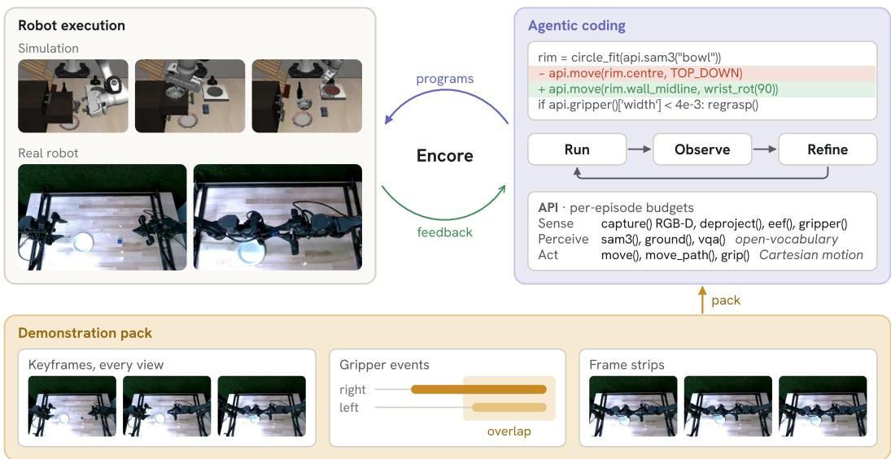  
Figure 1: ENCORE. A coding agent writes a policy program, runs it in simulation or on a bimanual robot, and refines it iteratively, with no success signal at run time. In the handover pack shown, the two grips overlap through the transfer, which the task sentence never mentions.

## 1 Introduction

Consider how an engineer would program the bimanual cube handover in Figure 1 from five demonstrations. They would notice that the giving arm presents the cube from the side, that the receiving gripper rolls a quarter turn so the finger planes cross, and that it closes before the giving gripper opens. The task sentence mentions none of this, and each detail is visible in only a few frames. The engineer would then write a program that reproduces the sequence in a new layout, run it, and repair it. Learning a policy from the same five trajectories remains difficult [1, 2]: they cover a tiny part of the state space, and without synthetic augmentation [3, 4] a policy trained on them fails as soon as it leaves the demonstrated path.

The engineer’s workflow of writing, running, and repairing a program is exactly what coding agents now do well. Given tools, an execution environment, and a budget of attempts, a frontier language model can write a program, run it, and repair it from the result. Code-as-policies systems have already shown that robot policies can be written as programs over perception and control APIs [5, 6], while more recent agents can debug failed rollouts and accumulate reusable skills across tasks [7, 8, 9].

Coding agents suggest another use for demonstrations. Modern agents interpret images and text and write analysis code to inspect unfamiliar data, so we convert each teleoperated demonstration into a structured record an agent can query: keyframes at the demonstrator’s gripper actions, frame strips around each contact event, and the complete underlying trajectory. Such a record states both the intended outcome and the strategy that reached it: where the demonstrator grasped, at what orientation, and along which path.

Existing approaches do not provide demonstrations to coding agents in a form they can use effectively. A teleoperated episode is a dense multimodal stream containing hundreds of timesteps, several camera views, and many joint-state channels. The moments that determine the outcome occupy a small fraction of the frames. Compressing the episode into a textual summary [10] or a compact token sequence [11] requires deciding in advance which details matter and may discard unexpected but essential cues, such as a change in grasp orientation or a wobble before a regrasp. Placing the entire episode in context creates the opposite problem: it overwhelms the agent with incidental details. In our experiments, handing even the strongest prior agentic pipeline [8] the same demonstrations as raw trajectory files brought it no measurable gain.

We introduce ENCORE, an agentic framework for few-shot robot manipulation. A deterministic builder first transforms each demonstration into the evidence described above. A fresh coding agent then explores this evidence using analysis code that it writes itself, infers the task, and implements a policy against a narrow perception and action API. The agent then refines the policy iteratively over a small number of development rollouts. To measure the demonstrations’ contribution, we compare three demonstrations (K=3) with none (K=0) under the same model, API, development budget, and evaluation protocol. The design places the boundary between agent and policy at development time: the language model writes, tests, and repairs the program, and the deployed policy makes no model calls, so it can be evaluated on thousands of sealed episodes with no agent in the loop.

Our central claim is that demonstrations act as a search prior for agentic policy construction: they expose manipulation strategies that the agent can transfer to new layouts, compose under new instructions, and turn into executable programs. On LIBERO-PRO [12], the first program written with demonstrations already succeeds during development in about half of the perturbed cells, and the first program written without them almost never does; given enough attempts, the agent without demonstrations reaches a similar final rate (Figure 2). Where the agent’s own search fails, the demonstrations can supply the missing strategy, and in one cell the demonstrated grasp decides every episode (Section 4.3). On RoboDojo, whose sentences leave the goal or the contact strategy unstated, no program succeeds without demonstrations. Our contributions are: (i) a distiller that turns teleoperated demonstrations into evidence a coding agent can query without being told what it means; (ii) a harness that develops, verifies, and freezes policy programs with no access to the success signal, whose programs succeed on 96.3% of sealed LIBERO-PRO perturbation episodes;

and (iii) a controlled comparison on LIBERO-PRO, 22 RoboDojo tasks, and a real bimanual robot that shows where demonstrations change what the agent discovers.

## 2 Related work

## 2.1 Code as policies and agentic robotics

Language models can express robot policies as code over perception and control primitives [5, 6], and successors structure that interface with spatial value maps [13] or relational keypoint constraints [14]. A second line of work makes the model an agent: it executes its programs, reads the outcome, and revises them, accumulating reusable skills across tasks [8, 15, 9, 16]. ASPIRE [8] is the strongest published system of this kind on LIBERO-PRO [12] and our primary comparison. It iterates from language alone, and its execution traces are annotated with human-written diagnostic rules, including the gripper width that counts as a grasp and the width that counts as closing on air. Our harness gives no such aids. The brief states only the task, traces are passed on uninterpreted, and each agent builds its own diagnostics.

## 2.2 Learning from few demonstrations

Demonstration-conditioned code generation compresses trajectories into prompts, by recursive summarization [10] or keypoint action tokens [11]. The compression fixes in advance what the model may see, and generation is single-pass. Few-shot imitation instead transfers the demonstrated trajectories directly [1, 17, 18], and demonstration-augmentation systems synthesize training data from a few seeds [3, 19, 4]; in both cases the resulting artifact is a network whose behavior cannot be read, audited, or edited. Unlike these methods, ENCORE exposes distilled but uninterpreted demonstration data to an iterative coding agent and evaluates the resulting frozen program on held-out states.

## 3 Method

Problem statement. A task is specified by one sentence of intent and K recorded human demonstrations on the same embodiment: in simulation three episodes drawn from the benchmark’s own demonstration files, on hardware five that we teleoperate. The output is a policy program: a module that runs in a process holding no simulator and no robot handle, and that acts on the world through a fixed API. Evaluation uses held-out initial states, and the success predicate is never exposed to the agent or to the program. The agent may run a bounded number of development episodes on a disjoint band of states and has no access to asset files or object poses.

ENCORE has three components (Figure 1): a demonstration distiller (§3.1), a perception-and-action API identical in simulation and on hardware (§3.2), and a development loop (§3.3) that ends with the program frozen for the sealed evaluation of Section 4. Tasks share no code.

## 3.1 Demonstration distiller

A demonstration is a stream $D = \{ ( I _ { t } , s _ { t } , a _ { t } ) \} _ { t = 1 } ^ { T }$ , where T is the number of timesteps and $I _ { t }$ collects every camera view. The state $s _ { t } = ( p _ { t } , q _ { t } , g _ { t } )$ carries each arm’s 6-DoF end-effector pose, joints, and gripper width. A handful of the T steps decide the task, so distillation must select. Our distiller selects only on signals the demonstrator produced and does not say what they mean: a builder that tags a frame release has already done part of the work we want the agent to do. The pack of a demonstration is

$$
{ \mathcal { P } } ( D ) = ( \ell , K , E , \tau , A ) .
$$

ℓ is the intent sentence. $K = \{ ( t , I _ { t } , s _ { t } ) : t \in T _ { K } \}$ is the keyframe set: every camera view and the full state at each selected instant. The indices $T _ { K }$ are the demonstrator’s own annotations, gripper sign transitions $\left\{ t : \operatorname { s i g n } g _ { t } \neq \operatorname { s i g n } g _ { t - 1 } \right\}$ joined with the sharpest heading breaks of the smoothed end-effector velocity. A multi-stage task therefore arrives pre-segmented, with no video understanding in the pipeline. E is the gripper-event table: each open and close, with its time, arm, and width signal. The labels describe the width signal only, and the agent decides which opening is a release. On hardware each event also carries a frame strip, the tiled frames spanning roughly 1.5 s around it. τ is the state path at stride five, units declared. A is the complete action stream. A whitelist validator removes all other fields, including simulator state, object poses, and file paths, so the pack cannot lead the agent to benchmark files.

Table 1: The API a policy program calls, the same in simulation and on hardware.
<table><tr><td></td><td>call</td><td>returns</td></tr><tr><td>sense</td><td>capture(cam) deproject(u, v)</td><td>RGB-D frame with intrinsics and extrinsics 3-D point in the robot frame</td></tr><tr><td>perceive act</td><td>eef(), tool_rotation(), gripper() sam3(q), ground(q), vqa(q) move(xyz, R), move_path(pts, R) grip(w)</td><td>pose, tool rotation, jaw width and effort masks, boxes, or an answer for a text prompt Cartesian motion; returns the position residual sets the jaw width</td></tr></table>

## 3.2 Perception-and-action API

The API draws the line between what we give the agent and what it must work out. It supplies sensing and motion, the same in simulation and on hardware (Table 1). Everything specific to the task, including which object to take, how to grasp it, where it goes, and how to tell that it got there, must come from the pack or from what the agent measures during development. Perception and motion calls draw on a per-episode budget, so a program cannot buy success with unlimited queries. On the robot the rig also serves SAM segmentation and a guarded top-down pick and place; the handover program calls neither.

Example. The frozen drawer program of Section 4.3 (Appendix G) turns a capture into a point cloud, finds the cabinet face, and takes the lowest handle bar standing off it. It tilts the open gripper 20<sup>◦</sup> below horizontal, the attitude it read from the demonstrated pulls, seats the fingertips on top of the bar, and drags with a move target far out and low, as the demonstrated actions do. It then captures again and drags a second time if the drawer front has come out less than 12 cm.

## 3.3 Development loop

Each task gets one fresh agent, which explores the pack with analysis code it writes itself, implements a program, and revises it over development episodes on a disjoint band of initial states. Because benchmark success is unavailable at runtime, and evaluation statically refuses any program that reads the episode termination flag, programs implement their own grasp and placement checks using proprioception and RGB-D. When development ends the agent selects one version and freezes it.

## 4 Experiments

## 4.1 Setup

Benchmark. LIBERO-PRO [12] perturbs LIBERO [20] along a layout axis (POS), which relocates objects and the fixtures they sit on, and an instruction axis (TASK), which re-authors the sentence and with it the rewarded end state. Neither perturbed axis carries demonstrations of its own. We evaluate all 30 tasks of the spatial, object, and goal suites on all three axes: 90 cells, 50 sealed episodes each. On the 30 unperturbed cells ENCORE reaches 98.6% (Table 4); Sections 4.2 and 4.3 cover the two perturbed axes. Every cell runs the loop of Section 3.3 once, with a fresh opus-5 agent that shares no files with any other cell. It develops on 15 initial states, and one frozen program is evaluated once on 50 sealed states and scored by the benchmark’s own predicate (Appendix D).

Baselines. We compare against the results Lu et al. [8] report for the VLA baselines $( \pi _ { 0 . 5 } ;$ Open-VLA and $\pi _ { 0 }$ score zero and are omitted), for their code-as-policies agent without a skill library (CaP-Agent0), and for ASPIRE on opus-4.6. Because these come from an older model, we also rerun ASPIRE’s released code at a pinned commit on opus-5 over the same 60 perturbation cells (Appendix D). The two harnesses give their agents different tools (Appendix E).

## 4.2 Transferring a demonstrated strategy to a new layout

On the POS axis the sentence is unchanged and the objects and their fixtures have moved, so the question is whether the agent can carry a demonstrated strategy to a layout it has not seen. It usually can, and from its first program. The first program written with three demonstrations already succeeds on some development state in 11 of 30 cells, and on average on 29% of its development episodes; the first program written without them succeeds nowhere. The first success arrives at a median of version 2 against 4, earlier in 21 cells and later in 5 (Figure 2). The final rates are close, 1454 and 1437 of 1500 sealed episodes: with 15 development episodes the $K { = } 0$ agent measures most of what the pack states, including the grasp geometry and the goal site.

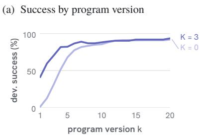

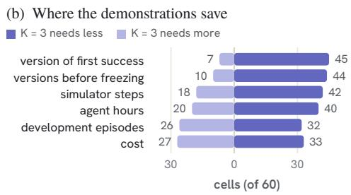  
Figure 2: Development on LIBERO-PRO, POS and TASK cells pooled. (a) Mean development success of each cell’s current program at version k (60 cells; a frozen cell keeps its final version). (b) Paired per cell, how often the $K { = } 3$ agent needs less or more of each resource. The demonstrations reduce the number of attempts, while agent time and cost stay similar (0.51 against 0.55 hours per cell), because the $K { = } 3$ agent spends part of the saved iterations reading the pack. Same harness, budget, model, and sealed evaluation.

## 4.3 Composing demonstrated skills under a new instruction

The TASK axis rewrites the sentence and the rewarded end state and keeps the scene. The rewrites are recombinations: each cell receives two packs, neither of which demonstrates its goal, and the agent must decide from the sentence which part of each pack to reuse (Figure 3). Here the demonstrations help more. The first program already succeeds in 18 of 30 cells, on average on 53% of its development episodes, against one cell and 2% without demonstrations, and the median first success arrives at version 1 against 5. The frozen programs differ as well: paired per cell, K=3 wins 10, loses 2, and ties 18, and succeeds on 1435 of 1500 sealed episodes against 1409.

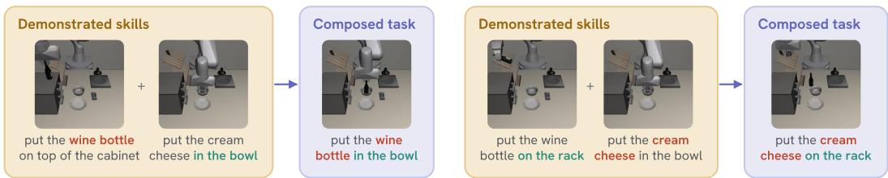  
Figure 3: Recombination on the TASK axis. Each cell gets two packs (left, centre) and a sentence asking for a third task (right) that neither demonstrates; red marks the object the sentence takes, teal the target, and which pack supplies which half flips between the two cells. Both cells score 50/50 with the two packs.

(c) Spatial, Pos

(a) Object, Pos  
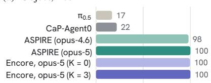

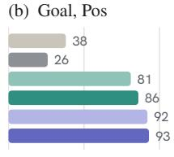

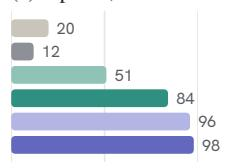

(d) Object, Task  
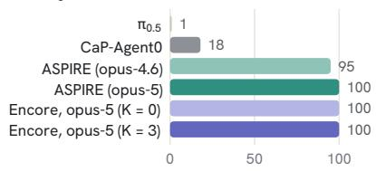  
success (%)

(e) Goal, Task  
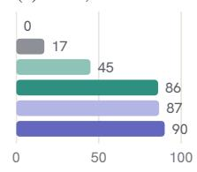  
success (%)

(f) Spatial, Task  
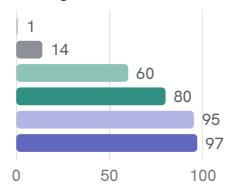  
success (%)  
Figure 4: LIBERO-PRO [12], sealed success per suite and axis (10 tasks × 50 episodes). $\pi _ { 0 . 5 } .$ CaP-Agent0, and ASPIRE on opus-4.6 as reported by Lu et al. [8]; ASPIRE on opus-5 is our rerun of its released code. K=1 is in Appendix A.

The drawer cell. On open\_middle\_drawer-TASK the sentence asks for the bottom drawer, while the demonstrations open the middle one. The cell scores $5 0 / 5 0$ with demonstrations and $0 / 5 0$ without, in both acquisitions. The $K { = } 0$ agent could open the other two drawers, but in 33 program versions no grasp it tried engaged the bottom handle: tilted pinches, a hook from below the bar, and pressing its closed jaws on top of the bar and dragging outward, which did not move the drawer. It froze a program that opens the middle and top drawers and concluded that the bottom handle cannot be engaged through this API. The demonstrations of the middle drawer show the missing piece: throughout the pull the demonstrator’s actions drive downward as well as outward, with the wrist tilted 15 to 36<sup>◦</sup> below horizontal. The $K { = } 3$ program seats its open fingertips on the bar and reproduces that drag, and the bottom drawer opens (Appendices F and G). A failed search during development does not show that a task is infeasible, and a demonstration can supply the strategy the search missed.

The plate cell. The largest loss runs the other way. On put\_bowl\_top\_cabinet-TASK, which asks for the plate on top of the cabinet, the K=3 agent never held the plate long enough to carry it, recorded that no grasp its jaws could keep would reach the cabinet, and froze after 11 versions at $0 / 5 0 .$ . The K=0 agent kept searching for 23 versions, found a grasp that lifts the plate along an arc, and scored 50/50. The demonstrations shorten the search; they do not guarantee that it ends in the right place.

## 4.4 Comparison with prior systems

Over the 60 perturbation cells the K=3 programs succeed on 2889 of 3000 sealed episodes (96.3%) and the K=0 programs on 2846 (94.9%), against 89.3% for ASPIRE rerun on the same model and 71.7% as published; most of the margin lies in the spatial suite (Figure 4; per task in Appendix A). With one demonstration the programs succeed on 2791 (93.0%). An earlier acquisition of the same cells, run before we removed a shared note file from the brief, showed a $K { = } 3$ advantage of 252 episodes. The clean protocol reproduces the $K { = } 3$ number but not the gap, so we do not report the gap as an effect. Removing the verification loop while keeping the demonstrations drops the goal suite from 440 to 117 of 450 (Appendix C).

## 4.5 Underspecified tasks: RoboDojo

RoboDojo [21] is a bimanual Isaac Sim benchmark. Its instructions often leave the goal or the contact strategy unstated (“Build a tower using the wooden blocks and wooden boards”, “put the bottles into the dustbin, using handover when needed”), while its judge scores a specific structure or sequence. We ran the unchanged loop on 22 of its tasks with three teleoperated demonstrations per task, a development band of 15 layouts, and a sealed band drawn from the official evaluation layouts and scored by the benchmark’s own judge (Figure 5, Table 2). On 12 of them, chosen to separate goal-underspecified from contact-sensitive tasks, we add an arm that receives the same three demonstrations reduced to their keyframe images, with every pose, gripper reading, and action removed.

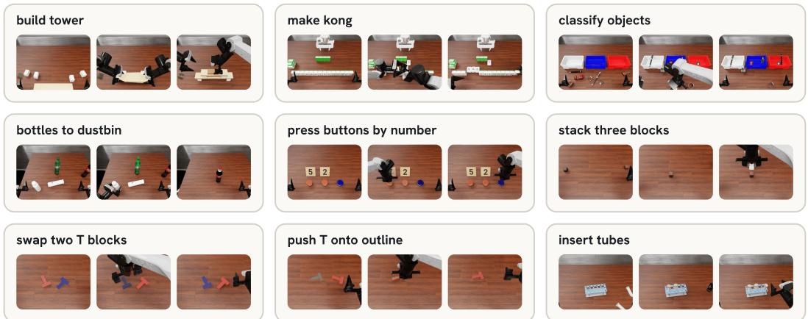  
Figure 5: RoboDojo tasks, one sealed K=3 success each (start, middle, end). The first row states its goal only through the demonstrations; the others need a delicate contact or a visual cue.

Table 2: RoboDojo, successes in 50 sealed episodes per task, scored by the benchmark’s judge. Left: the tasks not shown (organize table, pack objects, imitate sorting, fold clothes) score 0 in every arm, and one task has no demonstration data. Right: tasks with an images-only arm; the six contact-precise tasks score 0 in every arm (K=3, images and K=0 on 20 episodes). Bold: best arm.
<table><tr><td>task</td><td>K=3</td><td>K=1</td><td>K=0</td></tr><tr><td>build tower</td><td>36</td><td>0</td><td>0</td></tr><tr><td>make kong</td><td>36</td><td>0</td><td>0</td></tr><tr><td>bottles to dustbin</td><td>15</td><td>2</td><td>0</td></tr><tr><td>classify objects</td><td>8</td><td>7</td><td>0</td></tr><tr><td>arrange by number</td><td>0</td><td>31</td><td>0</td></tr><tr><td>10 tasks</td><td>95</td><td>40</td><td>0</td></tr></table>

<table><tr><td>task</td><td>K=3</td><td>K=1</td><td>images</td><td>K=0</td></tr><tr><td>press buttons</td><td>50</td><td>50</td><td>50</td><td>0</td></tr><tr><td>stack three blocks</td><td>43</td><td>22</td><td>0</td><td>10</td></tr><tr><td>swap two T blocks</td><td>47</td><td>44</td><td>15</td><td>38</td></tr><tr><td>push T onto outline</td><td>18</td><td>0</td><td>8</td><td>0</td></tr><tr><td>insert tubes</td><td>14</td><td>34</td><td>0</td><td>2</td></tr><tr><td>tic-tac-toe</td><td>5</td><td>0</td><td>21</td><td>4</td></tr><tr><td>six contact-precise</td><td>0</td><td>0</td><td>0</td><td>0</td></tr></table>

Without demonstrations, no program succeeds. On the first 10 tasks K=3 succeeds on 95 of 450 sealed episodes and K=0 on none. The 95 come from four tasks, and on each of them the K=0 agent solved the manipulation but could not tell what to build. One wrote: “the manipulation is solved; the target structure is not known.” The K=3 agents read the structure from the keyframe images. With one demonstration the 10 tasks reach 40 of 450.

Images alone are not enough when the contact is delicate. On stacking, swapping, inserting tubes, and pushing the T, the images-only arm falls well below the full pack, and on stacking and swapping it scores below no pack at all: the agent saw a picture of the demonstrated grasp without its measurements and spent its budget reconstructing them. Only on pressing buttons by number, where the goal is visual, do the images carry the whole effect; on tic-tac-toe they do best, because the fullpack agent kept the demonstrations’ pauses between turns and ran out of steps. Six contact-precise tasks (plugging a charger, inserting a key, fastening screws, making toast, storing a laptop, hanging mugs) score zero in every arm, which marks the current limit of these programs.

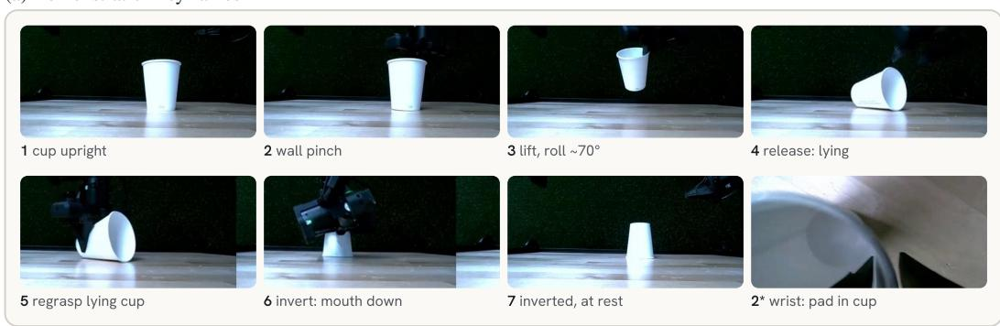

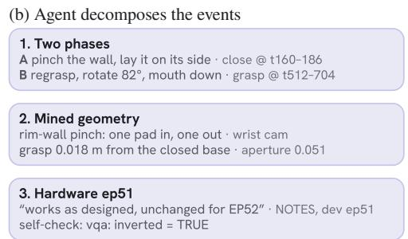

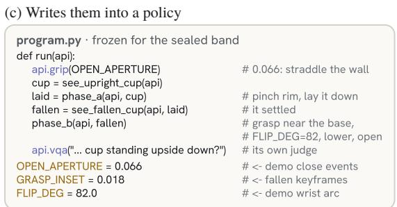

Figure 6: From five demonstrations to a frozen policy on the real robot: (a) a cup-inversion demonstration as the pack presents it; (b) the agent’s reading, quoted from its notes; (c) the frozen program, which verifies its own outcome by querying a VLM about the scene.  
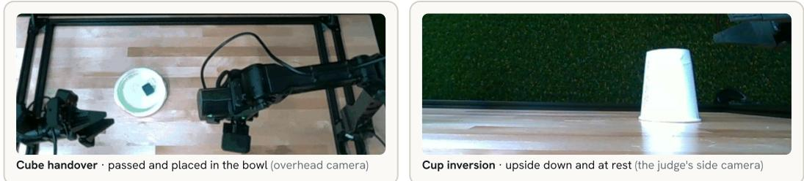  
Figure 7: Goal states: the cube passed and placed in the bowl (overhead); the cup upside down and at rest (the judge’s side camera).

## 4.6 Real-robot experiments

Setup. We run the loop of Section 3.3 and the API of Section 3.2 unchanged on a bimanual Trossen WidowX AI: two 6-DoF arms with parallel jaws, observed by four RealSense D405 cameras, the overhead one calibrated to the table plane to 1.1 mm. We evaluate a two-arm cube handover and cup inversion (Figure 7), five teleoperated demonstrations each, distilled by the same builder as in simulation. A fresh agent develops from the pack and freezes one program; evaluation initial state are operator-varied and recorded by the harness, and a human who did not develop the program judges each trial.

Tasks. The handover demonstrations present the cube from the side, roll the receiving gripper a quarter turn so the finger planes cross, and close the receiving grip before the giving one opens. The cup demonstrations pinch the standing cup’s wall, lay it on its side, regrasp it near the base, and stand the wrist up so the opening lands on the table, four gripper events rather than two (Figure 6; Appendix F). On sealed 10-episode human-judged bands, both tasks score 9/10.

## References

[1] E. Johns. Coarse-to-fine imitation learning: Robot manipulation from a single demonstration. In ICRA, 2021.

[2] K. Dreczkowski, P. Vitiello, V. Vosylius, and E. Johns. Learning a thousand tasks in a day. Science Robotics, 2025.

[3] A. Mandlekar, S. Nasiriany, B. Wen, I. Akinola, Y. Narang, L. Fan, Y. Zhu, and D. Fox. Mimicgen: A data generation system for scalable robot learning using human demonstrations. In CoRL, 2023.

[4] Z. Xue, S. Deng, Z. Chen, Y. Wang, Z. Yuan, and H. Xu. Demogen: Synthetic demonstration generation for data-efficient visuomotor policy learning. RSS, 2025.

[5] J. Liang, W. Huang, F. Xia, P. Xu, K. Hausman, B. Ichter, P. Florence, and A. Zeng. Code as policies: Language model programs for embodied control. In ICRA, 2023.

[6] I. Singh, V. Blukis, A. Mousavian, A. Goyal, D. Xu, J. Tremblay, D. Fox, J. Thomason, and A. Garg. Progprompt: Generating situated robot task plans using large language models. In ICRA, 2023.

[7] G. Wang, Y. Xie, Y. Jiang, A. Mandlekar, C. Xiao, Y. Zhu, L. Fan, and A. Anandkumar. Voyager: An open-ended embodied agent with large language models. TMLR, 2024.

[8] R. Lu, Y. Wu, E. Kou, L. Fu, W. Xiao, A. Mandlekar, Y. Xu, G. Shi, K. Goldberg, A. Chen, M. Chowdhury, Y. Zhu, L. Fan, and G. Wang. ASPIRE: Agentic /skills discovery for robotics. arXiv preprint arXiv:2607.00272, 2026.

[9] J. Zhang, J. Ge, H. Yoo, L. Fu, Z. Yang, Y. Liu, R. Saravanan, S. Yin, J. Yu, D. Niu, Z. Wang, R. Herzig, K. Goldberg, Y. Bai, D. M. Chan, I. Stoica, A. Kanazawa, J. Lei, H. Feng, and T. Darrell. Playful agentic robot learning. arXiv preprint arXiv:2606.19419, 2026.

[10] H. Wang, G. Gonzalez-Pumariega, Y. Sharma, and S. Choudhury. Demo2code: From summarizing demonstrations to synthesizing code via extended chain-of-thought. In NeurIPS, 2023.

[11] N. Di Palo and E. Johns. Keypoint action tokens enable in-context imitation learning in robotics. In RSS, 2024.

[12] X. Zhou, Y. Xu, G. Tie, Y. Chen, G. Zhang, D. Chu, P. Zhou, and L. Sun. LIBERO-PRO: Towards robust and fair evaluation of vision-language-action models beyond memorization. arXiv preprint arXiv:2510.03827, 2025.

[13] W. Huang, C. Wang, R. Zhang, Y. Li, J. Wu, and L. Fei-Fei. Voxposer: Composable 3d value maps for robotic manipulation with language models. In CoRL, 2023.

[14] W. Huang, C. Wang, Y. Li, R. Zhang, and L. Fei-Fei. Rekep: Spatio-temporal reasoning of relational keypoint constraints for robotic manipulation. In CoRL, 2024.

[15] L. Fu, J. Yu, K. El-Refai, E. Kou, H. Xue, H. Huang, W. Xiao, G. Wang, D. Niu, F.-F. Li, G. Shi, J. Wu, S. Sastry, Y. Zhu, K. Goldberg, and L. Fan. CaP-X: A framework for benchmarking and improving coding agents for robot manipulation. arXiv preprint arXiv:2603.22435, 2026.

[16] B. Y. Tsui, A. Y. Fang, and T. J. Hwu. Demonstration-free robotic control via LLM agents. arXiv preprint arXiv:2601.20334, 2026.

[17] N. Di Palo and E. Johns. Dinobot: Robot manipulation via retrieval and alignment with vision foundation models. In ICRA, 2024.

[18] V. Vosylius and E. Johns. Instant policy: In-context imitation learning via graph diffusion. In ICLR, 2025.

[19] C. Garrett, A. Mandlekar, B. Wen, and D. Fox. Skillmimicgen: Automated demonstration generation for efficient skill learning and deployment. In CoRL, 2024.

[20] B. Liu, Y. Zhu, C. Gao, Y. Feng, Q. Liu, Y. Zhu, and P. Stone. Libero: Benchmarking knowledge transfer for lifelong robot learning. In NeurIPS, 2023.

[21] T. Chen, Y. Chen, Z. Li, J. Tang, K. Su, H. Lu, W. Wan, B. Chen, et al. RoboDojo: A unified sim-and-real benchmark for comprehensive evaluation of generalist robot manipulation policies. arXiv preprint arXiv:2607.04434, 2026.

## A Main result tables

Table 3 reports the exact values visualized in Figure 4, and Table 4 the per-task breakdown behind them. All ENCORE numbers are 50-seed sealed evaluations (seeds 1–50) of one frozen program per cell; baselines are as published by Lu et al. [8], except the opus-5 rerun of ASPIRE, which we ran at a pinned commit (Section 4). The ENCORE K=3 and K=0 columns are the clean acquisition of 2026-09-13 and the K=1 column its counterpart of 2026-09-25; the earlier acquisition that included a shared note file is not reported.

Table 3: LIBERO-PRO success under position (POS) and instruction (TASK) perturbation, macroaveraged over 10 tasks per suite.
<table><tr><td rowspan="2">Method</td><td colspan="2">libero-object</td><td colspan="2">libero-goal</td><td colspan="2">libero-spatial</td><td colspan="2">Overall</td></tr><tr><td>Pos</td><td>Task</td><td>Pos</td><td>Task</td><td>Pos</td><td>Task</td><td>Pos</td><td>Task</td></tr><tr><td>OpenVLA</td><td>0.00</td><td>0.00</td><td>0.00</td><td>0.00</td><td>0.00</td><td>0.00</td><td>0.00</td><td>0.00</td></tr><tr><td>π0</td><td>0.00</td><td>0.00</td><td>0.00</td><td>0.00</td><td>0.00</td><td>0.00</td><td>0.00</td><td>0.00</td></tr><tr><td>π0.5</td><td>0.17</td><td>0.01</td><td>0.38</td><td>0.00</td><td>0.20</td><td>0.01</td><td>0.25</td><td>0.01</td></tr><tr><td>CaP-Agent0</td><td>0.22</td><td>0.18</td><td>0.26</td><td>0.17</td><td>0.12</td><td>0.14</td><td>0.20</td><td>0.16</td></tr><tr><td>ASPIRE (opus-4.6)</td><td>0.98</td><td>0.95</td><td>0.81</td><td>0.45</td><td>0.51</td><td>0.60</td><td>0.77</td><td>0.67</td></tr><tr><td>ASPIRE (opus-5, our rerun)</td><td>1.00</td><td>1.00</td><td>0.86</td><td>0.86</td><td>0.84</td><td>0.80</td><td>0.90</td><td>0.89</td></tr><tr><td>ENCORE (K=0)</td><td>1.00</td><td>1.00</td><td>0.92</td><td>0.87</td><td>0.96</td><td>0.95</td><td>0.96</td><td>0.94</td></tr><tr><td>ENCORE (K=1)</td><td>0.99</td><td>1.00</td><td>0.89</td><td>0.85</td><td>0.90</td><td>0.94</td><td>0.93</td><td>0.93</td></tr><tr><td>ENCORE (K=3)</td><td>1.00</td><td>1.00</td><td>0.93</td><td>0.90</td><td>0.98</td><td>0.97</td><td>0.97</td><td>0.96</td></tr></table>

Table 4: Per-task success on LIBERO-PRO, 50 sealed episodes per cell. Stock is the unperturbed task. K=3 receives three demonstrations, K=1 one, K=0 none, with the framework otherwise identical.
<table><tr><td></td><td>Stock</td><td colspan="3">Pos</td><td colspan="3">Task</td></tr><tr><td>Task</td><td>K=3</td><td>K=3</td><td>K=1</td><td>K=0</td><td>K=3</td><td>K=1</td><td>K=0</td></tr><tr><td>libero-object</td><td></td><td></td><td></td><td></td><td></td><td></td><td></td></tr><tr><td>alphabet soup</td><td>1.00</td><td>1.00</td><td>1.00</td><td>1.00</td><td>1.00</td><td>1.00</td><td>1.00</td></tr><tr><td>bbq sauce</td><td>1.00</td><td>1.00</td><td>1.00</td><td>1.00</td><td>1.00</td><td>1.00</td><td>1.00</td></tr><tr><td>butter</td><td>1.00</td><td>1.00</td><td>0.98</td><td>1.00</td><td>1.00</td><td>1.00</td><td>1.00</td></tr><tr><td>chocolate pudding</td><td>1.00</td><td>1.00</td><td>1.00</td><td>1.00</td><td>1.00</td><td>1.00</td><td>1.00</td></tr><tr><td>cream cheese</td><td>1.00</td><td>1.00</td><td>1.00</td><td>1.00</td><td>1.00</td><td>1.00</td><td>1.00</td></tr><tr><td>ketchup</td><td>1.00</td><td>1.00</td><td>1.00</td><td>1.00</td><td>1.00</td><td>1.00</td><td>1.00</td></tr><tr><td>milk</td><td>1.00</td><td>1.00</td><td>0.96</td><td>0.96</td><td>1.00</td><td>1.00</td><td>1.00</td></tr><tr><td>orange juice</td><td>1.00</td><td>1.00</td><td>1.00</td><td>1.00</td><td>1.00</td><td>1.00</td><td>1.00</td></tr><tr><td>salad dressing</td><td>1.00</td><td>1.00</td><td>1.00</td><td>1.00</td><td>1.00</td><td>1.00</td><td>1.00</td></tr><tr><td>tomato sauce</td><td>1.00</td><td>1.00</td><td>1.00</td><td>1.00</td><td>1.00</td><td>0.98</td><td>1.00</td></tr><tr><td>libero-goal</td><td></td><td></td><td></td><td></td><td></td><td></td><td></td></tr><tr><td>open middle drawer</td><td>0.96</td><td>0.70</td><td>0.06</td><td>0.44</td><td>1.00</td><td>0.00</td><td>0.00</td></tr><tr><td>open top drawer put bowl</td><td>0.98</td><td>1.00</td><td>0.98</td><td>1.00</td><td>1.00</td><td>1.00</td><td>0.98</td></tr><tr><td>push plate front stove</td><td>0.92</td><td>1.00</td><td>1.00</td><td>1.00</td><td>1.00</td><td>1.00</td><td>0.98</td></tr><tr><td>put bowl on plate</td><td>1.00</td><td>0.94</td><td>0.92</td><td>0.96</td><td>1.00</td><td>1.00</td><td>1.00</td></tr><tr><td>put bowl on stove</td><td>1.00</td><td>0.98</td><td>1.00</td><td>1.00</td><td>1.00</td><td>0.86</td><td>0.84</td></tr><tr><td>put bowl top cabinet</td><td>1.00</td><td>1.00</td><td>1.00</td><td>1.00</td><td>0.00</td><td>0.82</td><td>1.00</td></tr><tr><td>put cream cheese in bowl</td><td>1.00</td><td>0.92</td><td>0.98</td><td>1.00</td><td>1.00</td><td>0.94</td><td>0.88</td></tr><tr><td>put wine on rack</td><td>0.94</td><td>0.76</td><td>1.00</td><td>0.80</td><td>1.00</td><td>1.00</td><td>0.98</td></tr><tr><td>put wine top cabinet</td><td>0.98</td><td>1.00</td><td>1.00</td><td>1.00</td><td>1.00</td><td>1.00</td><td>1.00</td></tr><tr><td>turn on stove</td><td>1.00</td><td>1.00</td><td>1.00</td><td>1.00</td><td>1.00</td><td>0.88</td><td>1.00</td></tr><tr><td>libero-spatial</td><td></td><td></td><td></td><td></td><td></td><td></td><td></td></tr><tr><td>bowl between</td><td>0.96</td><td>0.98</td><td>1.00</td><td>1.00</td><td>0.92</td><td>0.80</td><td>0.92</td></tr><tr><td>bowl cookie box</td><td>1.00</td><td>0.92</td><td>0.38</td><td>1.00</td><td>1.00</td><td>1.00</td><td>1.00</td></tr><tr><td>bowl next to plate</td><td>0.96</td><td>1.00</td><td>1.00</td><td>1.00</td><td>1.00</td><td>1.00</td><td>1.00</td></tr><tr><td>bowl next to ramekin</td><td>1.00</td><td>0.98</td><td>0.98</td><td>1.00</td><td>0.98</td><td>0.96</td><td>0.92</td></tr><tr><td>bowl on cookie box</td><td>1.00</td><td>1.00</td><td>0.90</td><td>0.94</td><td>1.00</td><td>0.78</td><td>0.88</td></tr><tr><td>bowl on ramekin</td><td>1.00</td><td>1.00</td><td>1.00</td><td>0.90</td><td>1.00</td><td>1.00</td><td>1.00</td></tr><tr><td>bowl on stove</td><td>1.00</td><td>1.00</td><td>1.00</td><td>1.00</td><td>1.00</td><td>0.96</td><td>0.98</td></tr><tr><td>bowl on wooden cabinet</td><td>1.00</td><td>0.90</td><td>0.78</td><td>0.78</td><td>1.00</td><td>1.00</td><td>1.00</td></tr><tr><td>bowl table center</td><td>1.00</td><td>1.00</td><td>1.00</td><td>1.00</td><td>0.84</td><td>0.94</td><td>0.94</td></tr><tr><td>bowl top drawer cabinet</td><td>0.88</td><td>1.00</td><td>0.98</td><td>0.96</td><td>0.96</td><td>1.00</td><td>0.88</td></tr></table>

## B Development cost

Per cell, median over the sixty perturbation cells, clean acquisition: the K=3 agent writes 4 program versions, runs 46.5 development episodes, and spends 0.51 hours and 66k output tokens before freezing; the K=0 agent 6 versions, 53 episodes, 0.55 hours, and 69k tokens. Totals over the sixty cells are 37 against 44 agent hours. The first version already succeeds on some development state in 29 cells with demonstrations and in 1 without, and the version of first success has median 2 against 4 (Figure 2). By comparison, ASPIRE’s released loop on the same model spends a median 0.99 hours and 91k output tokens per cell over the sixty cells. A frozen program then costs nothing at evaluation time beyond the simulator: a sealed LIBERO episode takes eleven seconds and no model call.

## C Additional ablations

Verification loop and raw demonstrations. Removing the verification loop while keeping the demonstrations drops the goal suite from 440 to 117 of 450 (Table 5; both arms under the earlier brief with the shared note file). Without the loop, the agent freezes programs it has not seen fail. Giving ASPIRE’s loop the same three demonstrations as raw trajectory files gains 6 episodes in 500, within single-run variance. The demonstrations pay off when they are distilled into a pack and the agent can test what it reads from them.

When is the action channel necessary? On RoboDojo the images-only arm loses to the full pack where contact is delicate. To test whether this holds for a class of fixtures and not only for particular cells, we ran the three arms, under the earlier brief, on eight LIBERO-90 tasks with articulated fixtures (microwave, three drawers, stove, opening and closing each). The other seven score 50/50 in every arm but one, which scores 42/50. On open\_bottom\_drawer the full pack scores 50/50 and both no-action arms 0/50. Two measurable conditions separate this fixture from the seven: the bar protrudes less than the jaw’s open half-width, so the default pinch is geometrically impossible, and the pinch fails silently, closing on air without a contact signature. On the microwave the pinch is also impossible but fails loudly, the door prises the jaws open, and the K=0 agent diagnosed its way to the hook. The demonstration was necessary only where the failure left no signal the agent could observe.

Table 5: Ablations. Top: verification loop excised with demonstrations kept (nine goal-suite tasks, 50 sealed episodes each; earlier brief with a note file shared across cells). Bottom: ASPIRE’s released loop on opus-5 on the goal-swap axis (10 tasks × 50 seeds), with and without the three demonstrations as raw trajectory files.
<table><tr><td>Arm</td><td>Success</td></tr><tr><td>verification ablation, ENCORE</td><td></td></tr><tr><td>full system (K=3)</td><td>440/450</td></tr><tr><td>verification loop removed</td><td>117/450</td></tr><tr><td>ASPIRE&#x27;s loop</td><td></td></tr><tr><td>as released</td><td>431/500</td></tr><tr><td>plus three demonstrations as raw trajectories</td><td>437/500</td></tr></table>

## D Evaluation protocol

Every cell runs the development loop once, headless, with a fresh agent that has not seen any other task; the inner model is opus-5 for our arms and for the rerun baseline. All agents receive the same brief. In the LIBERO-PRO and RoboDojo experiments each cell is developed in isolation: agents share no files with one another, and each agent derives the constants in its program from its own pack and development runs. Development touches a disjoint band of 15 initial states (seeds 51–65 on LIBERO-PRO). The selected program is frozen, its hash recorded, and evaluated once by a coordinator on 50 sealed states (seeds 1–50), with no per-episode result reaching any agent before the band completes; the benchmark’s own success predicate is the only judge. A static check refuses programs that branch on the episode termination flag, so each program must carry its own verification. Comparisons between arms are paired per cell over the 60 matched perturbation cells. The ASPIRE rerun uses a wrapper that restarts a session if it delivers a program before its development sweep has finished; it reaches 89.3%, against the 71.7% reported in the original paper. The two ablations of Appendix C were acquired earlier, under a brief that shared a note file across cells.

## E Inputs available to each system

The two contracts differ, and the difference favors the baseline. ASPIRE’s agents call a grasp planner and a top-down grasp selector, fit oriented bounding boxes with a library routine, read a coordinatorcurated library of reusable code at the start of every session, and are handed diagnostic thresholds in the brief, down to the gripper width that counts as a grasp and the width that counts as closing on air. ENCORE’s agents receive the demonstrations and none of these tools or hints, and every threshold in a ENCORE program was set by the agent that wrote it.

## F Case studies

A demonstration is an existence proof (TASK). (Section 4.3.) On open\_middle\_drawer-TASK the K=0 agent resolved the re-authored target correctly: it opened the middle and top drawers on its development seeds, saw the benchmark reject both, and turned to the bottom bar. Its notes record why every grasp failed. A side pinch needs a horizontal wrist, and the horizontal hand extends 96 mm below the end effector while the bar stands 48 mm above the table; rolling the wrist reduces the overhang to 41 mm, still too much. A hook must sit in the slot behind the bar, which is 11 mm deep, and the closed finger pair is 15 mm thick. Pressing the closed jaws on top of the bar and dragging it 10 cm outward left the drawer face where it was. Across 20 probe versions and four wrist families, the deepest low pose it reached was a bar thickness short of a grip. It wrote this down as a falsifiable claim that the handle cannot be engaged, froze a program that opens the two drawers it can reach, and scored 0/50.

The K=3 agent hit the same wall with pinches and then read the pack: the demonstrated pull keeps the wrist 15 to 36<sup>◦</sup> below horizontal, and its actions stay saturated outward and downward (a commanded height change near the maximum throughout the pull while the measured height does not change). Seating the open fingertips on top of the bar and commanding a target far out and low reproduces that pull; on its development seeds it dragged the bottom drawer 19 cm. The K=0 agent turned its failed attempts into a claim about the robot, and the demonstrations show that the claim is false.

## G Frozen program listings

The two frozen programs of Section 4.3’s drawer cell, exactly as evaluated (md5 011b5af6 and c2fcb7de in the reproduction bundle), less the PROVENANCE dictionary that our audit reads and the policy never does. First the K=0 program (0/50), then the K=3 one (50/50).

## G.1 Without demonstrations

```python
program_k0.py · frozen, K=0, 0/50 sealed
1 """v33: the bottom drawer's bar cannot be engaged (see NOTES: the hand is taller
2 than the 48 mm gap under the bar, and the 11 mm slot behind the bar is narrower
3 than the 15 mm finger pair). This version does everything the arm CAN do: it
4 side-pinches and pulls open every handle bar it can reach, middle first, then
5 top, verifying each grip with the closed width."""
6 import numpy as np
7
8 R_SIDE = np.array([[-1.0, 0.0, 0.0],
9 [0.0, 0.0, -1.0],
10 [0.0, -1.0, 0.0]])
11 REACHABLE_BANDS = (1, 2) # bottom band (0) is out of the arm's envelope
12 Z_FLOOR = 1.000 # horizontal wrist cannot go below this (v12/v13)
13
14
15 def _cloud(f):
16 d = np.asarray(f.depth, dtype=np.float64)
17 K = np.asarray(f.intrinsics, dtype=np.float64)
18 T = np.asarray(f.t_base_cam, dtype=np.float64)
19 h, w = d.shape
20 u, v = np.meshgrid(np.arange(w), np.arange(h))
21 pc = np.stack([(u - K[0, 2]) / K[0, 0] * d, (v - K[1, 2]) / K[1, 1] * d, d], axis
,→ =-1)
22 return pc @ T[:3, :3].T + T[:3, 3]
23
24
25 def perceive(api, tag=""):
26 f = api.capture("cam_high")
27 P = _cloud(f).reshape(-1, 3)
28 e = P[(P[:, 2] > 0.93) & (P[:, 2] < 1.15) & (P[:, 1] < 0.30) & (P[:, 1] > -0.5)
29 & (P[:, 0] > -0.35) & (P[:, 0] < 0.30)]
30 hist, edges = np.histogram(e[:, 1], bins=np.arange(-0.5, 0.30, 0.005))
31 fy = edges[int(hist.argmax())] + 0.0025
```

32 pr = e[(e[:, 1] > fy + 0.006) & (e[:, 1] < fy + 0.06)   
33 & (e[:, 0] > -0.12) & (e[:, 0] < 0.25)]   
34 hz, bz = np.histogram(pr[:, 2], bins=np.arange(0.90, 1.16, 0.01))   
35 bands = []   
36 i = 0   
37 while i < len(hz):   
38 if hz[i] > 20:   
39 j = i   
40 while j < len(hz) and hz[j] > 20:   
41 j += 1   
42 s = pr[(pr[:, 2] >= bz[i]) & (pr[:, 2] < bz[j])]   
43 bands.append(dict(z=float(s[:, 2].mean()), n=int(len(s)),   
44 x0=float(np.percentile(s[:, 0], 3)),   
45 x1=float(np.percentile(s[:, 0], 97)),   
46 ytip=float(np.percentile(s[:, 1], 98))))   
47 i = j   
48 else:   
49 i += 1   
50 api.log("PERCEIVE%s face\_y=%.4f nbands=%d" % (tag, fy, len(bands)))   
51 for b in bands:   
52 api.log("   
,→ ["x0"], b["x1"], b["ytip"]))   
53 return fy, bands   
54   
55   
56 def goto(api, p, tries=2, seconds=2.0, tol=0.008):   
57 p = np.asarray(p, dtype=float)   
58 cmd = p.copy()   
59 for \_ in range(tries):   
60 api.move(cmd.tolist(), rotation=R\_SIDE, seconds=seconds)   
61 e = np.asarray(api.eef())   
62 err = p - e   
63 if np.linalg.norm(err) < tol:   
64 break   
65 cmd = cmd + np.clip(err, -0.06, 0.06)   
66 return np.asarray(api.eef())   
67   
68   
69 def held(api):   
70 g = api.gripper()   
71 return 0.008 < g["width\_m"] < 0.035 and g["effort"] > 1.0, g   
72   
73   
74 def open\_bar(api, b):   
75 bx = 0.5 \* (b["x0"] + b["x1"])   
76 bz = b["z"]   
77 ytip = b["ytip"]   
78 api.log("BAR x=%.4f z=%.4f ytip=%.4f" % (bx, bz, ytip))   
79 api.grip(0.08)   
80 api.move([bx, ytip + 0.22, bz + 0.08], seconds=2.0)   
81 goto(api, [bx, ytip + 0.14, bz], tries=2, seconds=2.0)   
82   
83 gy = None   
84 for dy in (-0.005, 0.010):   
85 goto(api, [bx, ytip + dy, bz], tries=2, seconds=1.2)   
86 api.grip(0.0)   
87 api.settle(0.2)   
88 ok, g = held(api)   
89 api.log(" TRY dy=%.3f width=%.4f effort=%.2f eef=%s ok=%s"   
90 % (dy, g["width\_m"], g["effort"], np.round(api.eef(), 4).tolist(), ok))   
91 if ok:   
92 gy = dy   
93 break   
94 api.grip(0.08)   
95 if gy is None:   
96 api.log(" NOGRIP")   
97 return False   
98   
99 e = np.asarray(api.eef())   
100 x0, z0 = e[0], e[2]   
101 y = float(e[1])   
102 for k in range(8):   
103 y += 0.025   
104 goto(api, [x0, y, z0], tries=1, seconds=1.0, tol=0.01)   
105 ok, g = held(api)   
106 ee = np.asarray(api.eef())   
107 api.log(" PULL%d width=%.4f eef=%s" % (k, g["width\_m"], np.round(ee, 4).tolist   
,→ ()))   
108 if not ok:

109 api.log(" LOST at pull%d" % k)   
110 break   
111 y = float(ee[1])   
112 api.grip(0.08)   
113 api.settle(0.2)   
114 e = np.asarray(api.eef())   
115 api.move([e[0], e[1] + 0.10, e[2] + 0.08], rotation=R\_SIDE, seconds=1.2)   
116 return True   
117   
118   
119 def run(api):   
120 fy, bands = perceive(api)   
121 if len(bands) < 3:   
122 api.log("ABORT bands=%d" % len(bands))   
123 return   
124 for idx in REACHABLE\_BANDS:   
125 b b d [id ]   
126 if b["z"] < Z\_FLOOR:   
127 api.log("band %d at z=%.3f is below the wrist floor; skipped" % (idx, b["z"   
,→ ]))   
128 continue   
129 ok = open\_bar(api, b)   
130 api.log("band %d opened=%s" % (idx, ok))   
131 perceive(api, "\_after")

## G.2 With demonstrations

```diff
program_k3.py · frozen, K=3, 50/50 sealed
"""c2clean goal_open_middle_drawer_task_k3 -- v16: open the BOTTOM drawer with the
2 demos' loaded drag, plus a verified second attempt.
3
4 Mechanism (settled by the v1-v15 receipt chain on debug seeds):
5 * The cabinet's +y face carries three handle bars, tops measured at
6 z = 0.956 / 1.025 / 1.098, each standing 0.027 m off a face plane at
7 y = -0.157 and spanning x in [-0.03, 0.09].
8 * The graded drawer is the BOTTOM one, the one api.instruction() names:
9 v6 opened the middle drawer fully and v8 the top one, both false.
10 * The bottom bar cannot be pinched -- a fingers-vertical wrist stalls at
11 1 00 i h f h h ( 11 14) b h d '
12 mechanism reaches it: an open gripper on a wrist tilted 20 deg below
13 horizontal, fingertips seated on top of the bar, then a pose target far out
14 and low so the controller stays saturated in +y and -z (the pack's actions
15 do exactly this: dz ~ -0.94 throughout the pull while the measured height
16 never changes). v15 dragged the bottom drawer 0.188 m that way, 2/2.
17
18 v16 keeps that and adds a receipt: re-perceive the drawer front and, if it did
19 not come out at least CRACK_MIN, seat and drag once more from the drawer's
20 current front. Everything is measured per episode; nothing here is timed.
21
22 import numpy as np
23
24 R_TILT_DEG = 20.0
25 R_DOWN = np.array([[1.0, 0.0, 0.0],
26 [0.0, -1.0, 0.0],
27 [0.0, 0.0, -1.0]])
28 BAR_X = 0.03
29 SEAT_ABOVE_BAR = 0.008
30 FACE_MARGIN = 0.012
31 PRESS_INTO = 0.030
32 DRAG_OUT = 0.28
33 DRAG_DOWN = 0.09
34 STANDOFF = 0.075
35 CRACK_MIN = 0.12
36 BAR_STANDS_OFF = 0.027
37 FALLBACK_FACE_Y = -0.157
38 FALLBACK_BAND = (0.940, 0.956)
39
40
41 def tool_frame(tilt_deg):
42 """Columns = tool x,y,z in base frame; approach points -y and tilt_deg down."""
43 t = np.radians(tilt_deg)
44 zt = np.array([0.0, -np.cos(t), -np.sin(t)])
45 yt = np.array([1.0, 0.0, 0.0])
```

46 return np.column\_stack([np.cross(yt, zt), yt, zt])   
47   
48   
49 def cloud(f, u0, u1, v0, v1):   
50 d = np.nan\_to\_num(f.depth, nan=0.0, posinf=0.0, neginf=0.0)[v0:v1, u0:u1]   
51 V, U = np.mgrid[v0:v1, u0:u1]   
52 K, T = np.asarray(f.intrinsics, float), np.asarray(f.t\_base\_cam, float)   
53 X = (U - K[0, 2]) \* d / K[0, 0]   
54 Y = (V - K[1, 2]) \* d / K[1, 1]   
55 P = (np.stack([X, Y, d, np.ones\_like(d)], -1) @ T.T)[..., :3]   
56 return P[(d > 0.2) & (d < 3.0)]   
57   
58   
59 def scene(api, tag):   
60 """Cabinet face plane and the handle bands standing off it."""   
61 f = api.capture("cam\_high")   
62 p = cloud(f, 0, 300, 150, 470)   
63 m = p[(p[:, 0] > -0.10) & (p[:, 0] < 0.15) & (p[:, 2] > 0.905) & (p[:, 2] < 1.11)   
64 & (p[:, 1] > -0.30) & (p[:, 1] < 0.30)]   
65 if len(m) < 100:   
66 api.log("PERCEIVE %s: too few points (%d)" % (tag, len(m)))   
67 return FALLBACK\_FACE\_Y, [FALLBACK\_BAND]   
68 hist, edges = np.histogram(m[:, 1], bins=np.arange(-0.30, 0.30, 0.005))   
69 face\_y = float(edges[int(np.argmax(hist))] + 0.0025)   
70 prot = m[(m[:, 1] > face\_y + 0.012) & (m[:, 1] < face\_y + 0.05)]   
71 bands, zs = [], np.sort(prot[:, 2])   
72 if len(zs):   
73 start = prev = zs[0]   
74 for z in zs[1:]:   
75 if z - prev > 0.015:   
76 bands.append((start, prev))   
77 start = z   
78 prev = z   
79 bands.append((start, prev))   
80 bands = [b for b in bands   
81 if len(prot[(prot[:, 2] >= b[0]) & (prot[:, 2] <= b[1])]) >= 8]   
82 api.log("PERCEIVE %s face\_y=%.3f bands=%s"   
83 % (tag, face\_y, [(round(a, 3), round(b, 3)) for a, b in bands]))   
84 return face\_y, (bands or [FALLBACK\_BAND])   
85   
86   
87 def front\_of(api, face\_y, bar\_top, tag):   
88 """Front-most point of the bottom drawer, in a height window above its bar   
89 and below the drawer above it -- which excludes the bowl (top \~0.95) and the   
90 plate (\~0.92) standing on the table in front of the cabinet."""   
91 f = api.capture("cam\_high")   
92 p = cloud(f, 0, 300, 150, 470)   
93 m = p[(p[:, 0] > -0.08) & (p[:, 0] < 0.13)   
94 & (p[:, 2] > bar\_top + 0.010) & (p[:, 2] < bar\_top + 0.055)   
95 & (p[:, 1] > face\_y + 0.025) & (p[:, 1] < 0.30)]   
96 if len(m) < 15:   
97 api.log("FRONT %s: nothing proud of the face (n=%d)" % (tag, len(m)))   
98 return None, 0.0   
99 front = float(np.percentile(m[:, 1], 98))   
100 travel = front - (face\_y + BAR\_STANDS\_OFF)   
101 api.log("FRONT %s n=%d front=%.3f travel=%.3f" % (tag, len(m), front, travel))   
102 return front, travel   
103   
104   
105 def where(api, tag):   
106 e = api.eef()   
107 api.log("AT %s eef=%s gap=%.4f" % (tag, np.round(e, 4).tolist(), api.gripper()["   
,→ width\_m"]))   
108 return e   
109   
110   
111 def drag(api, ref\_y, z\_seat, R, tag):   
112 """Seat the open fingertips on top of the bar at ref\_y, then drag out under   
113 a saturated down+out command, the way the pack's demos do."""   
114 api.grip(0.08)   
115 api.move(np.array([BAR\_X, ref\_y + STANDOFF, z\_seat + 0.05]), rotation=R, seconds   
,→ =3.0)   
116 r = api.move(np.array([BAR\_X, ref\_y + FACE\_MARGIN, z\_seat]), rotation=R, seconds   
,→ =2.0)   
117 where(api, "%s face res=%.4f" % (tag, r))   
118 r = api.move(np.array([BAR\_X, ref\_y - PRESS\_INTO, z\_seat]), rotation=R, seconds   
,→ =1.5)   
119 where(api, "%s press res=%.4f" % (tag, r))   
120 r = api.move(np.array([BAR\_X, ref\_y + DRAG\_OUT, z\_seat - DRAG\_DOWN]),

121 rotation=R, seconds=3.0)   
122 where(api, "%s drag res=%.4f" % (tag, r))   
123   
124   
125 def run(api):   
126 api.log("instruction: %r" % api.instruction())   
127 where(api, "start")   
128 face\_y, bands = scene(api, "t0")   
129 band = min(bands, key=lambda b: b[1])   
130 bar\_top = band[1]   
131 z\_seat = bar\_top + SEAT\_ABOVE\_BAR   
132 api.log("PLAN bottom bar\_top=%.3f z\_seat=%.3f face\_y=%.3f" % (bar\_top, z\_seat,   
,→ face\_y))   
133   
134 R = tool\_frame(R\_TILT\_DEG)   
135 drag(api, face\_y, z\_seat, R, "A1")   
136   
137 # clear the view, measure how far the drawer actually came out   
138 api.move(np.array([BAR\_X, 0.22, z\_seat + 0.14]), rotation=R\_DOWN, seconds=2.0)   
139 front, travel = front\_of(api, face\_y, bar\_top, "afterA1")   
140   
141 if travel < CRACK\_MIN:   
142 ref = (front - BAR\_STANDS\_OFF) if front is not None else face\_y   
143 api.log("RETRY from ref\_y=%.3f" % ref)   
144 drag(api, ref, z\_seat, R, "A2")   
145 api.move(np.array([BAR\_X, 0.22, z\_seat + 0.14]), rotation=R\_DOWN, seconds=2.0)   
146 front, travel = front\_of(api, face\_y, bar\_top, "afterA2")   
147   
148 api.log("done travel=%.3f" % travel)