# A Comprehensive View of Fairness through Distributional Stability

Gayane Taturyan LTCI, Télécom Paris, Institut Polytechnique de Paris, Palaiseau, France gayane.taturyan@telecom-paris.fr

Charlotte Laclau LTCI, Télécom Paris, Institut Polytechnique de Paris, Palaiseau, France charlotte.laclau@telecom-paris.fr

Stephan Clemencon LTCI, Télécom Paris, Institut Polytechnique de Paris, Palaiseau, France stephan.clemencon@telecom-paris.fr

## Abstract

We view fairness as a property of distributional stability. Rather than assessing a predictor under a fixed data distribution, we study how its predictions change under perturbations that modify the composition of protected groups. A predictor is fair if it remains stable under such shifts. Under this perspective, several classical notions of fairness arise as stability with respect to specific perturbations, with the associated unfairness gap given by a Lipschitz constant of a prediction-rate functional. This formulation also yields guarantees that hold uniformly over a range of demographic compositions at test time, without requiring knowledge of the deployment distribution. It leads to a learning procedure based on convex combinations of reweighted predictors, formulated as a second-order cone program, for which we establish generalization bounds. Experiments on standard benchmarks illustrate the approach.

## 1 Introduction

Fairness in the field of machine learning has been studied primarily from two distinct perspectives, leading to the introduction of two broad categories of definitions. Groupfairness, on the one hand, requires that predictive outcomes be statistically equal or comparable across groups defined by sensitive characteristics such as gender or ethnic origin, which has given rise to a large number of competing metrics, including demographic parity, equal opportunity, or equalized odds, among others [8, 21]. On the other hand, the concept of individual fairness stipulates as a mandatory condition that similar individuals be assigned similar predictive outcomes, which is formalized by a Lipschitz condition with respect to a task-specific metric [16]. These two approaches rest on different foundations and have been studied largely in isolation.

We also note that both of these approaches evaluate fairness relative to a fixed data distribution. In practice, a model trained on one population is often deployed on another, whether in different regions, at different times, or in different institutional contexts. Recent work has begun to investigate how fairness guarantees degrade under such changes [4, 19, 23], but these approaches are either tailored to specific shift models, require knowledge of the deployment distribution at training time, or model the shift as acting on the feature space while leaving the distribution of the sensitive attribute G itself unchanged. Our framework takes a different perspective: we consider perturbations that act directly on the marginal distribution of G, which is the primary driver of deployment bias in practice.

In this article, we propose to approach fairness from the perspective of stability — specifically, the distributional stability of a given prediction function rather than the algorithmic stability derived from learning theory. A classifier is fair if its behavior does not change in the face of perturbations in the data distribution that reflect social considerations, such as changes in the composition of protected groups. This single principle links the concepts of fairness at the individual level and at the group level, which appear as special cases corresponding to different classes of perturbations. This naturally resolves the issue of context shifts during deployment: a classifier trained to remain stable in the face of variations in group distribution inherits fairness guarantees that apply uniformly to all demographic compositions at deployment time, without the need to know the deployment distribution in advance.

Contributions. We define fairness of a predictive rule as a stability property (Section 2). We then establish formal equivalences between individual fairness, demographic parity, equal opportunity, and stability under specific perturbation classes, showing that the unfairness gap is in each case a Lipschitz constant (Section 3). For group fairness, we unify these results into a single optimization problem via a constraint functional measuring deviation between predictions and a target level across deployment contexts; its decomposition ensures guarantees for both fairness and uniform deployment. Restricting to convex mixtures of reweighted classifiers turns the empirical problem into a second-order cone program, for which we establish generalization bounds (Section 4). Numerical experiments confirm the theory’s practical applicability (Section 5). Proofs, the Equalized Odds extension, and additiona experiments and discussions are deferred to the Supplementary Material.

Related works. Algorithmic fairness, especially for binary classification, has been extensively studied from both theoretical and methodological perspectives. A large part of this literature considers aware setting, in which the sensitive attribute is available at the prediction time [8, 10, 12, 18, 20, 34, 35], whereas fewer works address the unaware setting [1, 9, 11, 22, 27, 28], in which it is not. A number of works aim to unify fairness-constrained classification within a common framework. A classical example is the reductions approach of Agarwal et al. [1], where the authors reduce fair classification to a sequence of cost-sensitive classification problems and construct a randomized classifier with minimum empirical error under the prescribed constraint. A recent work of Chzhen et al. [11] proposes a unified post-processing framework for randomized classification under general system-level constraints (including group-fairness constraints), based on entropic regularization and stochastic optimization. The stability-based perspective is related to recent work on the robustness of fairness-constrained learning under adversarial perturbations [6], that shows how malicious noise in the training data can significantly affect the validity of fairness constraints. In our work we define fairness itself as a stability under perturbations. Despite an initial resemblance to distributionally robust optimization approaches, our framework is based on specific perturbations induced by a prescribed perturbation rule and admits an importance-weight representation. Unlike DRO, this structural specificity yields non-vacuous deployment guarantees, as we discuss in Appendix A.2.

Notation. For an integer $K > 0$ , we define $[ K ] \ { \stackrel { \mathrm { d e f } } { = } } \ \left\{ 1 , \cdots , K \right\}$ and write $\Delta _ { K }$ for the probability simplex in $\mathbb { R } ^ { K }$ . The notation $\widetilde { \mathcal { O } }$ hides unimportant constants and logarithmic terms.

## 2 Defining fairness as a property of stability

The concept of stability is ubiquitous in the sciences, particularly in mathematics, as it describes how a “system”, such as a machine-learning algorithm, responds to changes in the parameters or data used to define it. The various notions of stability and their applications are far too numerous to list here and we refer to Appendix A.1 for an in-depth description in the machine-learning context. Instead of the main concepts of a predictor’s fairness introduced in the literature, we propose a definition based on the concept of stability under changes in the data distribution. As we will see in the following sections, this new definition allows us to subsume the previous ones within a unified formal framework.

## 2.1 Background and preliminaries

Let us consider the generic problem of predictive learning with fairness concerns regarding sensitive attributes $G$ valued in ${ \mathcal { G } } ,$ where the random label $Y$ takes values in a space $\mathcal { V }$ equipped with a metric $d y : \mathcal { y } ^ { 2 }  [ 0 , \infty )$ , and the predictive information is modelled by a random vector X, valued in a high-dimensional metric space $( \mathcal { X } , d _ { \mathcal { X } } ) . \mathrm { B y } z = ( \mathbf { x } , g , y )$ is meant a realization in the product space $\mathcal { Z } = \mathcal { X } \times \mathcal { G } \times \mathcal { Y }$ of the random triplet $\pmb { Z } = ( \pmb { X } , \pmb { G } , \pmb { Y } )$ , defined on a probability space $( \Omega , \bar { \mathcal { F } } , \mathbb { P } )$ with joint distribution $\mathcal { D }$ describing the system under study, by $h : \mathcal { X } \to \bar { \mathcal { Y } }$ an arbitrary (measurable) predictive rule in unaware setting. Equipped with these notations, let us now review the standard definitions that aim to formalize algorithmic fairness. Individual fairness (IF), introduced by Dwork et al. [16], which requires that similar individuals receive similar predictions, is defined as follows.

Definition 1 (Individual Fairness). A predictor $h : \mathcal { X } \to \mathcal { Y }$ satisfies the IF property when it satisfies the $( d _ { \mathcal { Y } } , d _ { \mathcal { X } } )$ -Lipschitz condition for some constant $L < \infty .$

$$
\forall ( \pmb { x } , \pmb { x } ^ { \prime } ) \in \mathcal { X } ^ { 2 } , d _ { \mathcal { V } } ( h ( \pmb { x } ) , h ( \pmb { x } ^ { \prime } ) ) \leqslant L \cdot d _ { \mathcal { X } } ( \pmb { x } , \pmb { x } ^ { \prime } ) .
$$

The concept of group fairness differs in that it requires measures of performance to be identical across groups defined by the sensitive attribute $G .$ . Depending on the type of predictive problem considered $( \mathrm { e . g . }$ , classification, regression, ranking) and the criterion chosen to measure performance, it can take various forms. Among those introduced in the literature, below we highlight the following two major notions for binary classification $( \mathrm { i . e . , } \mathcal { N } = \{ 0 , 1 \} ,$ ), that will serve as main examples in the subsequent analysis. For simplicity, the definitions are given for only two sensitive groups, i.e., $\mathcal { G } = \{ 0 , 1 \}$ . They can be immediately extended to the case where the sensitive attribute G takes more than two values.

Definition 2 (Demographic Parity). A predictor $h : \mathcal { X }  \{ 0 , 1 \}$ satisfies Demographic Parity (DP) if its predictions are independent of $\cdot \overbar { { \cal G } } \cdot \overbar { { \mathbb { P } } } ( h ( X ) = 1 \mid { \cal G } = 0 ) = \mathbb { P } ( \overbar { h } ( X ) = 1 \overbar { | } \ \bar { \cal G } = 1 )$

The concept of equal opportunity (EO) requires that there be no disparity with respect to a specific aspect of predictive performance.

Definition 3 (Equal Opportunity). A classifier h satisfies the EO property if it achieves equal true positive rates across groups: $\operatorname { \mathbb { P } } ( h ( X ) = 1 \mid Y = 1 , G = 0 ) \ = \ \operatorname { \mathbb { P } } ( h ( X ) = 1 \mid Y = 1 , G = 1 )$

The concept of Equalized Odds (EOdd) strengthens the EO property by requiring the equality to hold conditionally on both values of the label; its definition is recalled in Appendix D.

## 2.2 A new definition of fairness for a predictive rule

We now propose to define the fairness of a predictor as a stability property. The concept of stability is already widely used in statistical learning theory, primarily to account for the sensitivity of a learning algorithm to changes in the training examples [7, 24]. An algorithm is said to be stable if replacing a few training data points does not significantly change the learned function. The framework we are developing here is of a different nature. We consider a fixed prediction function $h$ and seek to quantify how its outputs change as the distribution of sensitive attributes $G$ varies. Unlike domain adaptation [29], which aims to correct such changes, we characterize predictors whose behavior remains stable in the face of these perturbations, and show that classical notions of fairness naturally follow from the requirement for this specific type of stability. Consider a class $\mathcal { P }$ of (perturbation) operators $\mathbf { P } : D \subset \mathcal { M } _ { 1 } ( \mathcal { Z } )  \mathcal { M } _ { 1 } ( \mathcal { Z } )$ acting on the elements D of a domain M included in the set $\mathcal { M } _ { 1 } ( \mathcal { Z } )$ of probability measures on $\mathcal { Z }$ to produce a perturbed probability measure $\mathbf P ( \mathcal D )$ on $\mathcal { Z }$ . Since only the values taken by the variable $h ( X )$ are relevant to the definition of individual fairness, we set $\mathcal { Z }$ equal to $\mathcal { X }$ in this case. With this in mind, we propose the following definition, inspired by the formalism of PAC learning.

Definition 4 (Fairness as Distributional Stability). Consider a class $\mathcal { P }$ ofperturbation operators acting on a domain $D \subset { \mathcal { M } } _ { 1 } ( { \mathcal { Z } } )$ and a predictionfunction $h : \mathcal { X } \to \mathcal { Y }$ $L e t \varepsilon > 0$ and $\Delta ( h ; { \mathbf \nabla ( \mathcal { D } , \mathbf { P } ) } ) ,$ be a statistical distance between the distributions ofthe prediction $h ( X )$ under $\mathcal { D } \in \mathcal { M }$ and under $\mathbf P ( \mathcal D )$ . The prediction function h is said to be ε-fair w.r.t. $\mathcal { P }$ and $\Delta i f$ and only $i f$

$$
\operatorname* { s u p } _ { ( \mathcal { D } , \mathbf { P } ) \in \mathcal { M } \times \mathcal { P } } \Delta ( h ; ~ ( \mathcal { D } , \mathbf { P } ) ) \leqslant \varepsilon .
$$

The choice of $\mathcal { P }$ and that of $\Delta$ are left intentionally general here; specific and interpretable instances are constructed in Section $3 . \ \mathrm { A s }$ we shall see, it is natural to consider perturbations of the distribution of the sensitive attribute G in the context of group fairness.

## 3 From various existing concepts of fairness to a unified approach

In this section, we show that the general formalism introduced accounts for the various concepts of individual and group fairness for specific choices of the class of $\mathcal { P }$ and the statistical distance $\bar { \Delta }$

## 3.1 Individual fairness and local perturbations

The feature space X being equipped with a task-specific metric $d _ { \mathcal { X } }$ , as in Dwork et al. [16], consider the class of transformations of X indexed by $\rho > 0 \colon$

$$
\begin{array} { r } { \mathcal { T } _ { \rho } = \left\{ T : \mathcal { X } \to \mathcal { X } ; \quad T \mathrm { ~ m e a s u r a b l e ~ a n d } \forall x \in \mathcal { X } , \quad d _ { \mathcal { X } } ( \pmb { x } , T ( \pmb { x } ) ) \leq \rho \right\} . } \end{array}\tag{1}
$$

Each transformation $T \in \mathcal { T } _ { \rho }$ is naturally associated with a perturbation operator ${ \bf P } _ { T }$ acting on the distribution of X and assigning to any probability distribution D on X its pushforward by $\check { T }$

Proposition 1 (IF and Stability). Let $h : \mathcal { X } \to \mathcal { Y }$ be a predictionfunction and $d y : y ^ { 2 } \to [ 0 , \infty )$ a metric on predictions. The following assertions are equivalent.

1. The predictivefunction h satisfies the IF property with $( d _ { \mathcal { Y } } , d _ { \mathcal { X } } )$ -Lipschitz constant $L < \infty$

2. For all $\rho > 0 ,$ , the predictivefunction h is Lρ-fair w.r.t. to the class $\mathcal { P } _ { \rho }$ ofperturbation operators $\mathbf { P } _ { T } , \ T \in \mathcal { T } _ { \rho } ,$ , defined on the domain $\mathcal { M } = \{ \delta _ { \pmb { x } } : ~ \pmb { x } \in \pmb { \chi } \}$ of all point masses and taking $\Delta ( h ; ~ ( \mathcal { D } , \mathbf { P } ) )$ as the Wasserstein 1-distance between the pushforward of ${ \bar { h } } ( X )$ ’s distribution under $\mathcal { D }$ and that under $\mathbf P ( \mathcal D )$ based on the costfunction $d _ { \mathcal { V } } .$

$$
\operatorname* { s u p } _ { ( \pmb { x } , T ) \in \mathcal { X } \times \mathcal { T } _ { \rho } } d \pmb { y } \big ( h ( \pmb { x } ) , h ( T ( \pmb { x } ) ) \big ) \leqslant L \rho .\tag{2}
$$

Individual fairness is therefore equivalent to distributional stability in the sense of Definition 4, with a stability parameter $L \rho$ proportional to the perturbation parameter $\rho .$

## 3.2 Group fairness and resampling perturbations

We now consider the various notions of group fairness. Rather than perturbing individual feature vectors, we consider perturbations that act on the marginal distribution of the sensitive attribute G (assumed binary for simplicity). The magnitude of the perturbation is parametrized here by the proportion $\pi \in ( 0 , 1 )$ of group $G = 1$ in the population, and $\Delta$ measures how the prediction rates of h change as this proportion varies. We introduce two types of perturbation. The first resamples G $\mathrm { \ g l o b a l l y . }$ , while the second resamples G within the positive label class.

Perturbation 1. The class $\mathcal { P } _ { \pi } ^ { G }$ is composed ofall operators $\mathbf { P } : \mathcal { M } _ { 1 } ( \mathcal { Z } )  \mathcal { M } _ { 1 } ( \mathcal { Z } )$ such that, for all distribution $\mathcal { D } \in \mathcal { M } _ { 1 } ( \mathcal { Z } )$ , 1) the conditional distribution of $( X , Y )$ given G is the same under D and under $\mathbf { P } ( \mathcal { D } ) , 2 ) \mathbb { P } _ { \mathbf { P } ( \mathcal { D } ) } \bigl ( G = 1 \bigr ) = \pi$

Such a class is non empty, since the type 1 perturbations of a distribution D are in 1-to-1 correspondence with the Bernoulli random variables on $( \Omega , \mathcal { F } , \mathbb { P } )$ with parameter π.

Perturbation 2. The class $\mathcal { P } _ { \pi } ^ { G | 1 }$ is composed ofall operators $\mathbf { P } : \mathcal { M } _ { 1 } ( \mathcal { Z } )  \mathcal { M } _ { 1 } ( \mathcal { Z } )$ such that,for all distribution $\mathcal { D } \in \mathcal { M } _ { 1 } ( \mathcal { Z } ) , I )$ X’s conditional distribution given $( Y , { \dot { G } } )$ and $Y ^ { \prime } s$ distribution are the same under D and under $\mathbf { P } ( { \mathcal { D } } ) , 2 ) \mathbb { P } _ { \mathbf { P } ( { \mathcal { D } } ) } ( G = 1 \mid Y = 1 ) = \pi .$

Remark 1 (On perturbations). In Perturbation 2, we fix $\mathbb { P } ( X \mid Y , G )$ rather than the stronger $\mathbb { P } ( X , Y \mid G )$ used in Perturbation 1. While $\mathbb { P } ( X , Y \mid { \dot { G } } )$ implies the invariance of $\mathbb { P } ( X \mid Y , G )$ , it also implies the invariance $o f \mathbb { P } ( Y \mid G )$ . This, combined with the imposed constraint $o f { \mathbb { P } } _ { \mathbf { P } ( \mathcal { D } ) } { \big ( } G =$ $1 \mid Y = 1 ) = \pi$ , may be infeasible by Bayes’ rule. Fixing only $\mathbb { P } ( X \mid Y , G )$ ensures feasibility.

Given a perturbation operator $\mathbf { P } \in \mathcal { P } _ { \pi } ^ { \perp }$ , with $\boxed { \mathbf { \Sigma } } \in \{ G , G \mid \mathbf { 1 } \}$ and a base distribution D, we write ${ \mathcal { D } } _ { \pi } \ { \stackrel { \mathrm { d e f } } { = } } \ \mathbf { P } ( { \mathcal { D } } )$ . We show that group fairness constraints can be expressed by a certain descriptive functional that depends on the perturbation setting and is affine w.r.t. the perturbation parameter. Throughout the paper, we reserve the label Claim for statements that generalize a pattern observed on the running examples (e.g., DP, EO), under conditions tailored to each perturbation rule.

Definition 5 (Prediction rate functional). For a predictionfunction $h : \mathcal { X }  \{ 0 , 1 \}$ and aperturbation parameter $\pi \in [ 0 , 1 ]$ , we define thefunctional $\Phi ( h ; \pi ) \ { \stackrel { \mathrm { d e f } } { = } } \ \mathbb { E } _ { \mathcal { D } _ { \pi } } [ \varphi _ { h } ( Z ) ]$ , where $\varphi _ { h } : \mathcal { Z }  [ 0 , 1 ]$ is some statistic that is linear w.r.t. h.

Claim 1. Let $\mathcal { D } _ { \pi }$ be a perturbed distribution obtainedfrom D according to a given, appropriate perturbation rule and a fixed perturbation parameter $\pi \in [ 0 , 1 ]$ . The prediction rate functional $\Phi ( h ; \pi )$ admits a form

$$
\Phi ( h ; \pi ) = \alpha ( h ) + \pi \gamma ( h ) ,\tag{3}
$$

where $\alpha ( h )$ and $\gamma ( h )$ are some prediction rate quantities under the initial (unperturbed) distribution D. Moreover, it holds that

$$
| \Phi ( h ; \pi ) - \Phi ( h ; \pi ^ { \prime } ) | = | \gamma ( h ) | | \pi - \pi ^ { \prime } | , \quad \forall \pi , \pi ^ { \prime } \in [ 0 , 1 ] , a n d\tag{4}
$$

$$
\operatorname* { s u p } _ { \pi , \pi ^ { \prime } \in [ 0 , 1 ] } | \Phi ( h ; \pi ) - \Phi ( h ; \pi ^ { \prime } ) | = | \gamma ( h ) | \overset { \mathrm { d e f } } { = } \mathcal { U } ( h ) ,\tag{5}
$$

where $\mathcal { U } ( h )$ is the explicit fairness gap (unfairness) for each constraint.

The functional $\Phi ( h ; \pi )$ , although at first obscure, clearly captures the intuition behind each constraint, by being defined as a relevant prediction rate under the perturbed distribution. We now show that DP and EO correspond, respectively, to stability under the introduced perturbations. Throughout, $h : \mathcal { X }  \{ 0 , 1 \}$ is a possibly randomized prediction function and $G \in \{ 0 , 1 \}$ is the sensitive attribute.

Demographic Parity and Stability. Let $\mathcal { D } _ { \pi }$ be a perturbed distribution according to Perturbation 1. We define the global positive prediction rate under $\mathcal { D } _ { \pi }$ as $P _ { h } ( \pi ) \stackrel { \mathrm { d e f } } { = } \mathbb { P } _ { \pi } ( h ( \boldsymbol { X } ) = 1 ) = \mathbb { E } _ { \mathcal { D } _ { \pi } } [ \mathbb { I } \{ h ( \boldsymbol { X } ) \} ]$ (or $\mathbb { E } _ { \mathcal { D } _ { \pi } } [ h ( X ) ]$ when randomized) and denote by $r _ { g } ( h ) \ { \stackrel { \mathrm { d e f } } { = } } \ \mathbb { P } ( h ( X ) = 1 \mid G = g )$

Proposition 2. The prediction h satisfies DP if and only $i f P _ { h } ( \pi )$ is constant in π. Moreover,

$$
{ \cal P } _ { h } ( \pi ) = r _ { 0 } ( h ) + \pi ( r _ { 1 } ( h ) - r _ { 0 } ( h ) ) , a n d \operatorname* { s u p } _ { \pi , \pi ^ { \prime } \in [ 0 , 1 ] } | { \cal P } _ { h } ( \pi ) - { \cal P } _ { h } ( \pi ^ { \prime } ) | = | r _ { 1 } ( h ) - r _ { 0 } ( h ) | .
$$

The deviation from stability coincides exactly with the DP gap. This result also connects DP to sample representativity: if the training dataset has group proportions that differ from the population, resampling perturbations model precisely this shift.

Example 1. Suppose the model predicts a positive outcomefor 80% ofindividuals in group 0 and for 40% ofindividuals in group 1, so $r _ { 0 } ( h ) = 0 . 8$ and $r _ { 1 } ( h ) \stackrel { \cdot } { = } 0 . 4$ . The global positive prediction rate under a population with group prevalence π is $P _ { h } ( \pi ) \stackrel { \textstyle \cdot } { = } 0 . 8 ( 1 - \pi ) + 0 . { \bar { 4 } } \pi = 0 . { \bar { 8 } } - 0 . 4 \pi$ Thus, as π varies from 0 to 1, the prediction rate decreases linearly from 0.8 to $0 . 4 ,$ , and the maximal deviation is $\begin{array} { r } { \operatorname* { s u p } _ { \pi , \pi ^ { \prime } \in [ 0 , 1 ] } | P _ { h } ( \pi ) - P _ { h } ( \pi ^ { \prime } ) | = | r _ { 0 } - r _ { 1 } | = 0 . 4 } \end{array}$ , which is the DP gap.

The same analysis applies to intra-class resampling.

Equal Opportunity and Stability. Let $\mathcal { D } _ { \pi }$ be a perturbed distribution according to Perturbation 2. We define the true positive prediction rate under $\mathcal { D } _ { \pi }$ as $P _ { h | Y = 1 } ( \pi ) \stackrel { \mathrm { d e f } } { = } \mathbb { P } _ { \mathcal { D } _ { \pi } } ( h ( X ) = 1 \mid Y = 1 ) =$ $\begin{array} { r } { \mathbb { E } _ { \mathcal { D } _ { \pi } } \big [ \frac { \mathbb { I } \{ h ( \mathbf { X } ) \} \mathbb { I } \{ Y = 1 \} } { \mathbb { P } ( Y = 1 ) } \big ] \operatorname { ( o r } \mathbb { E } _ { \mathcal { D } _ { \pi } } \big [ \frac { h ( \mathbf { X } ) \mathbb { I } \{ Y = 1 \} } { \mathbb { P } ( Y = 1 ) } \big ] } \end{array}$ when randomized) and denote by $q _ { g } ( h ) \ { \stackrel { \mathrm { d e f } } { = } } \ \mathbb { P } ( h ( X ) =$ $1 \mid G = g , \dot { Y } = \dot { 1 } )$

Proposition 3. The prediction h satisfies EO if and only $i f P _ { h | Y = 1 } ( \pi )$ is constant in π. Moreover,

$$
P _ { h | Y = 1 } ( \pi ) = q _ { 0 } ( h ) + \pi ( q _ { 1 } ( h ) - q _ { 0 } ( h ) ) ~ , a n d \operatorname* { s u p } _ { \pi , \pi ^ { \prime } \in [ 0 , 1 ] } | P _ { h | Y = 1 } ( \pi ) - P _ { h | Y = 1 } ( \pi ^ { \prime } ) | = | q _ { 1 } ( h ) - q _ { 0 } ( h ) | ~ .
$$

Claim 2. Due to linearity ofφh w.r.t. h (Definition 5), there exists a constant $B > 0$ such that $f o r$ every measurable function ${ \dot { f } } : { \mathcal { X } }  \mathbb { R }$ , it holds that $\mathbb { E } [ \varphi _ { f } ( Z ) ] \leqslant B \mathbb { E } | f ( X ) |$ . For example, in the case of Demographic Parity, we have $\varphi _ { h } ( \boldsymbol { X } ) = h ( \boldsymbol { X } )$ and $B = 1$

Variance control. It is easy to notice that in all of the examples we have $\begin{array} { r } { \operatorname* { s u p } _ { \pi , \pi ^ { \prime } \in [ 0 , 1 ] } | \Phi ( h ; \pi ) - } \end{array}$ $\Phi ( h ; \pi ^ { \prime } ) | = | \Phi ( h ; 1 ) - \Phi ( h ; 0 ) |$ |, meaning the supremum is achieved at the endpoints. This rewrites the problem as the usual “minimization under $\mathrm { D P / E O ^ { \ast } }$ . However, our interest lies within the resampling aspect of the problem. Rather than focusing on the worst-case deviation over all perturbations, we now adopt a stochastic viewpoint, in which perturbations are achieved according to a distribution Π. This allows us to quantify fairness in terms of average sensitivity, leading to smoother and more tractable constraints. We propose to reformulate the constraint through variance control.

Definition 6 (Perturbation variance functional). Let Π be a probability measure on $[ 0 , 1 ]$ and $\pi \sim \Pi$ We define the perturbation variancefunctional as $\begin{array} { r } { \mathbf { V } _ { \Pi } ( h ) \stackrel { \mathrm { d e f } } { = } \operatorname { V a r } _ { \pi \sim \Pi } ( \Phi ( h ; \pi ) ) } \end{array}$

From Definition 5, we have that $\Phi ( h ; \pi ) = \alpha ( h ) + \pi \gamma ( h )$ . Using the fact that for $a , b \in \mathbb { R }$ and a random variable $\mathrm { X , V a r } ( a + b X ) = b ^ { 2 } \mathrm { V a r } ( X )$ , we get $\begin{array} { r } { \dot { \mathbf { V } } _ { \Pi } ( h ) = \bar { \gamma } ( h ) ^ { 2 } \operatorname { V a r } _ { \pi \sim \Pi } ( \pi ) } \end{array}$ . This equation above leads to the equivalence $\begin{array} { r } { \mathcal { \dot { U } } ( h ) \leqslant \varepsilon \iff \mathbf { V } _ { \Pi } ( h ) \leqslant \varepsilon ^ { 2 } \operatorname { V a r } _ { \pi \sim \Pi } ( \pi ) } \end{array}$

Links between individual and group fairness. As we established, both individual and group fairness can be equivalently expressed by our notion of stability from Definition 4. Let us emphasise one more connection between the two. The functional $\Phi ( h ; \pi )$ is Lipschitz w.r.t. perturbation parameter π (4), and its Lipschitz constant is exactly the unfairness gap. This provides a complementary angle to view fairness notions: while individual fairness requires similar predictions for similar individuals, formalized by Lipschitz property of the prediction function w.r.t. the feature space, our generalized group-fairness formulation requires stability of perturbation-indexed prediction rates under small changes in the perturbation parameter, that is, Lipschitz continuity of the map $\pi \to \Phi ( h ; \pi )$ . However, despite these conceptual analogies and the possibility of extending our variance-based perspective to individual fairness through suitably randomized local perturbations, the methodologies required to achieve fairness in the two settings remain structurally different. We therefore focus from now on on group fairness, leaving explorations of corresponding methods for individual fairness to future work.

## 4 Methodology: variance and mean control with mixture models

## 4.1 Problem formulation

Variance and mean control. Under the introduced perturbation-variance functional constraint, the problem reduces to classical fairness constraints, with a scaling governed by the variance of the perturbation-parameter distribution. This holds even for the empirical problem. Rather than controlling only the variability of $\Phi ( h ; \pi )$ across perturbations, we consider a stricter objective of requiring $\Phi ( h ; \pi )$ to remain close to a given target level t.

Definition 7 (Perturbation t-variance functional). Let Π be a probability measure on $( 0 , 1 )$ and $\pi \sim \Pi$ . For a $t \in [ 0 , 1 ]$ , we define the perturbation t-variance functional as

$$
\begin{array} { r } { \mathcal { C } _ { \Pi } ( h ; t ) \stackrel { \mathrm { d e f } } { = } \mathbb { E } _ { \pi \sim \Pi } [ ( \Phi ( h ; \pi ) - t ) ^ { 2 } ] . } \end{array}
$$

Adding and subtracting $\mathbb { E } _ { \pi \sim \Pi } \big [ \Phi ( h ; \pi ) \big ]$ inside the square yields the following decomposition:

$$
\begin{array} { r } { \mathcal { C } _ { \Pi } ( h ; t ) = { \mathbf { V } } _ { \Pi } ( h ) + ( \mathbb { E } _ { \pi \sim \Pi } [ \Phi ( h ; \pi ) ] - t ) ^ { 2 } . } \end{array}\tag{6}
$$

As the decomposition (6) shows, the functional $\mathcal { C } _ { \Pi } ( h ; t )$ controls not only the variance term equivalent to fairness, but also the mean level of $\Phi ( h ; \pi )$ itself. Moreover, one can notice that ${ \bar { \mathbf { V } } } _ { \Pi } ( h ) =$ $\mathrm { i n f } _ { t \in [ 0 , 1 ] } \mathcal { C } _ { \Pi } ( h ; t )$ , with $t ^ { \star } = \mathbb { E } _ { \pi \sim \Pi } [ \Phi ( h ; \dot { \pi } ) ]$ . Thus, we can state the following obvious lemma. Lemma 1. Ifh satisfies $\mathcal { C } _ { \Pi } ( h ; t ) \leqslant \delta f o r t \in [ 0 , 1 ]$ , then ${ \bf V } _ { \Pi } ( h ) \leqslant \delta$ and $( \mathbb { E } _ { \pi \sim \Pi } [ \Phi ( h ; \pi ) ] - t ) ^ { 2 } \leqslant \delta$ Remark 2 (On the choice of t). We can choose t as desired, or, more naturally, we can set $t =$ ${ \mathbb E } _ { \pi \sim \Pi } [ \Phi ( h _ { 0 } , \pi ) ]$ , where h is an unconstrained baseline. The impact oft is studied in Appendix E.4.

We introduce the following standard regularity assumption on the loss.

Assumption 1. The loss $\ell : [ 0 , 1 ] \times \mathcal { Y }  [ 0 , 1 ]$ is convex and L-Lipschitz in itsfirst argument.

We define the corresponding population risk of a predictor h $: \mathcal { X }  [ 0 , 1 ]$ by $\mathcal { R } ( h ) \stackrel { \mathrm { d e f } } { = } \mathbb { E } [ \ell ( h ( X ) , Y ) ]$ Given a $t \in [ 0 , 1 ]$ , our goal is to solve the following constrained problem

$$
\operatorname* { m i n } _ { h \in \mathcal { H } } \left\{ \mathcal { R } ( h ) : \mathcal { C } _ { \Pi } ( h ; t ) \leqslant \delta \right\} .\tag{P}
$$

Convex mixtures. In our framework, fairness is characterized through the behaviour of the prediction function across a family of perturbed distributions. This makes it natural to combine predictors trained on different distributions, especially given that model averaging has already been shown to be effective for enforcing fairness in the classical setting [17].

For $\pi _ { 1 } , \cdot \cdot \cdot , \pi _ { K } \stackrel { \mathrm { i . i . d . } } { \sim } \Pi$ , let $\eta _ { 1 } , \cdots , \eta _ { K }$ be (unconstrained) Bayes regression functions minimizing the risks on respective distributions $\mathcal { D } _ { \pi _ { 1 } } , \cdot \cdot \cdot , \mathcal { D } _ { \pi _ { K } } ,$ that is ηk ∈ arg min ${ } _ { h } \mathcal { R } _ { D _ { k } } ( h )$ , for $k \in [ K ]$ . For ${ \pmb { \alpha } } \in \Delta _ { K }$ , we define a convex mixture $\begin{array} { r } { \eta _ { \alpha } \stackrel { \mathrm { d e f } } { = } \sum _ { k = 1 } ^ { K } \alpha _ { k } \eta _ { k } } \end{array}$

Rather than optimizing the true risk of the mixture directly, we focus on its linearized convex surrogate, defined as $\begin{array} { r } { \overline { { \mathcal { R } } } ( \eta _ { \alpha } ) \overset { \mathrm { d e f } } { = } \sum _ { k = 1 } ^ { K } \alpha _ { k } \mathcal { R } ( \eta _ { k } ) } \end{array}$ . Since the loss is convex in prediction, Jensen’s inequality implies that $\begin{array} { r } { \mathcal { R } ( \eta _ { \alpha } ) = \mathcal { R } ( \sum _ { k = 1 } ^ { K } \alpha _ { k } \eta _ { k } ) \leqslant \sum _ { k = 1 } ^ { K } \alpha _ { k } \mathcal { R } ( \eta _ { k } ) = \overline { { \mathcal { R } } } ( \eta _ { \alpha } ) } \end{array}$ , showing that this surrogate upper-bounds the actual risk of the convex mixture. Given a $t \in [ 0 , 1 ]$ , the problem (P) translates as

$$
\begin{array} { r } { \pmb { \alpha } ^ { \star } \in \underset { \pmb { \alpha } \in \Delta _ { K } } { \arg \operatorname* { m i n } } \left\{ \overline { { \mathcal { R } } } ( \pmb { \eta } _ { \pmb { \alpha } } ) : \mathcal { C } _ { \Pi } ( \pmb { \eta } _ { \pmb { \alpha } } ; t ) \leqslant \delta \right\} . } \end{array}\tag{Pα}
$$

Empirical problem. Let us define the empirical counterparts of the quantities of our interest and consider the empirical problem of $( \mathcal { P } _ { \alpha } )$ . We define the empirical risk of h on an i.i.d. sample $\begin{array} { r } { \mathcal { D } ^ { N } = \{ Z _ { 1 } , \cdots , Z _ { N } \} \mathrm { a s } \widehat { \mathcal { R } } _ { \mathcal { D } ^ { N } } ( h ) \overset { \mathrm { d e f } } { = } \frac { 1 } { N } \sum _ { i = 1 } ^ { N } \ell ( h ( X _ { i } ) , Y _ { i } ) } \end{array}$ . Let $\widehat { \eta } _ { k } \in$ arg min ${ } _ { h } \widehat { \mathcal { R } } _ { \mathcal { D } _ { \pi _ { * } } ^ { N } } ( h )$ estimate k $\eta _ { k }$ for all $k \in [ K ]$ on the perturbed samples of $\mathcal { D } ^ { N }$ . For ${ \pmb { \alpha } } \in \Delta _ { K }$ , we define $\begin{array} { r } { \widehat { \eta } _ { \alpha } \stackrel { \mathrm { d e f } } { = } \sum _ { k = 1 } ^ { \widehat { K } } \alpha _ { k } \widehat { \eta } _ { k } } \end{array}$ Assumption 2. (Regression rates) It holds that max $k \leqslant K   \mathbb { E } | \widehat { \eta } _ { k } - \eta _ { k } | \leqslant \rho _ { N }$

Remark 3. (On regression rates) Assumption 2 can be satisfied with $\rho _ { N } \leqslant \widetilde { \mathcal { O } } ( 1 / \sqrt { N } )$ for parametric cases, and even with faster rates under certain assumptions. For example, under the assumption, that there exist $\beta \in \dot { \mathbb { N } } \backslash \{ 0 \}$ and $L > 0 ;$ , such that $| \eta ( \pmb { x } ) - \eta _ { \pmb { x } } ( \pmb { x } ^ { \prime } ) | \leqslant L \| \pmb { x } - \pmb { x } ^ { \prime } \| ^ { \beta }$ , where $\eta _ { \pmb { x } }$ is Taylor polynomial of degree β at x, and under an additional assumption that the support of $\mathbb { P } _ { X }$ is $\mathcal { X } = [ - 1 , \overset { \cdot } { 1 } ] ^ { d }$ and it admits density uniformly lower and upper bounded on X, thenfor some constants $C _ { 1 } , C _ { 2 }$ , it holds that supP ${ \mathbb { P } } _ { n } ( | \eta ( \pmb { X } ) - \widehat { \eta } ( \pmb { X } ) | \geqslant \epsilon ) \leqslant C _ { 1 } \exp \Bigl ( C _ { 2 } N ^ { - \frac { 2 \beta } { 2 \beta + d } } \epsilon ^ { 2 } \Bigr ) \ / 3$ , Theorem 3.2]. Here, Assumption 2 is satisfied with $\rho _ { N } \leqslant \widetilde { \mathcal { O } } ( N ^ { - \frac { \beta } { 2 \beta + d } } )$

Lemma 2 (Mixture rates). Under Assumption 2 and Claim $3 , \mathbb { E } | \widehat { \eta } _ { \alpha } - \eta _ { \alpha } | \leqslant \rho _ { N }$ for all ${ \pmb { \alpha } } \in \Delta _ { K }$

Let ${ \mathcal { D } } ^ { n } = \{ Z _ { 1 } , \cdot \cdot \cdot , Z _ { n } \}$ be i.i.d. samples from D, and $\Pi ^ { m } = \{ \pi _ { 1 } ^ { \prime } , \cdot \cdot \cdot , \pi _ { m } ^ { \prime } \}$ be i.i.d. samples from Π. For a fixed $\pi ^ { \prime } ,$ , we define $\begin{array} { r } { \widehat { \Phi } _ { n } ( h ; \pi ^ { \prime } ) \ \stackrel { \mathrm { d e f } } { = } \ \frac { 1 } { n } \sum _ { i = 1 } ^ { n } w _ { \pi } ( Z _ { i } ) \varphi _ { h } ( Z _ { i } ) } \end{array}$ . Let $\widehat { \mathbf { A } } \in \mathbb { R } ^ { m \times K }$ be a matrix with elements $\widehat { A } _ { j , k } = \widehat { \Phi } _ { n } ( \widehat { \eta } _ { k } , \pi _ { j } )$ . Notice, that we can rewrite the empirical constraint as $\begin{array} { r } { \widehat { \mathcal { C } } _ { n , m } ( \widehat { \pmb { \eta } } _ { \alpha } , t ) = \frac { 1 } { m } \| \widehat { \bf A } \alpha - t { \bf 1 } \| _ { 2 } ^ { 2 } } \end{array}$ . Denoting $\widehat { r _ { k } } \ \stackrel { \mathrm { d e f } } { = } \ \widehat { \mathcal { R } } ( \widehat { \eta _ { k } } )$ and $\widehat { \pmb { r } } = \left( \widehat { \pmb { r } } _ { 1 } , \cdots , \widehat { \pmb { r } } _ { K } \right)$ , we obtain the following second-order cone program (SOCP)

$$
\begin{array} { r } { \widehat { \pmb { \alpha } } \in \underset { { \pmb { \alpha } } \in \Delta _ { K } } { \arg \operatorname* { m i n } } \left\{ \widehat { \pmb { r } } ^ { \top } { \pmb { \alpha } } : \left\| \widehat { { \mathbf { A } } } { \pmb { \alpha } } - { t } { \pmb { 1 } } \right\| _ { 2 } \leqslant \sqrt { m \delta } \right\} . } \end{array}\tag{PSOCP}
$$

Feasibility and existence. The problem $( \mathcal { P } _ { \mathtt { S } 0 \mathtt { C } \mathtt { P } } )$ has a continuous linear objective, and the simplex $\Delta _ { K }$ is compact and convex. Therefore, once feasibility is established, existence of an optimizer follows from the Weierstrass extreme value theorem. In classical fairness problems, (strict) feasibility is ensured by constant functions, but in our mixture setting one cannot generally claim that a constant function belongs to the convex hull of $\{ \eta _ { k } \} _ { k = 1 } ^ { K } ( \mathrm { o r } \{ \tilde { \eta _ { k } } \} _ { k = 1 } ^ { K } )$ . However, if we augment both population and empirical dictionaries by constant functions $h _ { K + 1 } \equiv 1$ and $h _ { K + 2 } \equiv 0$ , and choose ${ \pmb { \alpha } } = ( 0 , \cdot \cdot \cdot , 0 , t , 1 - t )$ , yielding a constant predictor $h _ { \alpha } \equiv t .$ , we will have $\mathcal { C } _ { \Pi } ( t , t ) = 0 < \delta$ (or $\widehat { \mathcal { C } } _ { n , m } ( t , t ) = 0 < \delta )$ . Note, that these two additional predictors do not affect our general theoretical results, thus we omit them from our discussion, and impose strict feasibility as an assumption.

Assumption 3 (Strict feasibility). There exists $\begin{array} { r } { \pmb { \alpha } ^ { 0 } \in \Delta _ { K } s . t . \mathcal { C } _ { \Pi } ( \pmb { \eta } _ { \pmb { \alpha } ^ { 0 } } ; t ) < \delta . } \end{array}$

## 4.2 Constructing perturbations

Let us denote by $p _ { g } \ { \stackrel { \mathrm { d e f } } { = } } \ \mathbb { P } ( G = g )$ and $p _ { g , y } \ { \stackrel { \mathrm { d e f } } { = } } \ \mathbb { P } ( G = g \mid Y = y )$ for all $g , y \in \{ 0 , 1 \}$

Assumption 4 (Bounded group probabilities). Let $p _ { g } , p _ { g , y } \in [ \underline { { p } } , 1 - \underline { { p } } ] ,$ , with $\underline { { p } } \in ( 0 , 1 / 2 )$

Assumption 5 (Bounded perturbations). Let Π be supported on $[ \underline { { \pi } } , 1 - \underline { { \pi } } ]$ , with $\underline { { \pi } } \in ( 0 , 1 / 2 )$

The construction of perturbations is twofold. First, we consider stratified sampling from Π. Letting $\Pi = U ( \underline { { \pi } } , 1 - \underline { { \pi } } )$ , we partition $[ \underline { { \pi } } , 1 - \underline { { \pi } } ]$ uniformly into intervals $I _ { 1 } , \cdots , I _ { m }$ of length $\frac { ( 1 - 2 \pi ) } { m }$ , and sample $\pi _ { i } ^ { \prime } \sim U ( I _ { j } )$ independently for $j = 1 , \cdots , m$ . The stratification yields faster convergence rates, as discussed in the next section. Then, for a perturbation parameter $\pi \in \Pi$ , the corresponding distribution shift is represented through importance-weights, defined by the Radon-Nikodym derivative as $\begin{array} { r } { w _ { \pi } ( z ) \ \stackrel { \mathrm { d e f } } { = } \ \frac { d \mathcal { D } _ { \pi } } { d \mathcal { D } } ( z ) > 0 } \end{array}$ . For our examples, Assumptions $^ { 4 , 5 }$ ensure that $\begin{array} { r } { \mathcal { D } _ { \pi } \ll \mathcal { D } , } \end{array}$ and we can explicitly compute wπ (Appendix C.1). Applying Radon-Nikodym theorem gets us $\Phi ( h ; \pi ) = \mathbb { E } _ { \hat { \mathcal { D } } _ { \pi } } [ \varphi _ { h } ( \dot { Z } ) ] = \mathrm { \hat { E } } [ w _ { \pi } ( Z ) \varphi _ { h } ( Z ) ]$ . This means, that instead of resampling, we can just compute and plug in the respective importance weights onto our expressions.

Claim 3 (Bounded weights). Under Assumptions $4 , 5 , \exists W > 0 \ s . t . \ w _ { \pi } ( Z ) < W , \forall ( \pi , Z ) \in \Pi \times \mathcal { Z } .$

## 4.3 Convergence rates

We now turn to the convergence analysis of the finite procedure, aiming to understand how the empirical solution $\widehat { \eta } _ { \widehat { \alpha } }$ is approaching its population counterpart $\eta _ { \alpha ^ { \star } }$ ⋆. There are three sources of error in our framework, each contributing in its own rate. Under Assumption 2 and Remark 3, estimating regression functions $\eta _ { k }$ from $N$ samples of $\mathcal { D } ^ { N }$ yields to an error $\rho _ { N } \asymp N ^ { - \frac { \beta } { 2 \beta + d } }$ , that under convexity transfers to the mixture $\eta _ { \alpha }$ as well. Linearity of $\varphi _ { h }$ in $h ,$ combined with Claims 2,3 leads to overall rate of $| \Phi ( \widehat { \pmb { \eta } } _ { \alpha } ; \pi ) - \Phi ( \pmb { \eta } _ { \alpha } ; \pi ) | \leqslant \delta _ { N } \asymp \rho _ { N }$ . For a fixed $\pi ^ { \prime }$ , under Claim 3, and with Bernstein’s inequality, the empirical approximation of $\Phi ( \widehat { \eta } _ { k } ; \pi ^ { \prime } )$ from n samples from $\mathcal { D } ^ { n }$ contributes $\delta _ { n } \asymp n ^ { - \frac { 1 } { 2 } }$ . The third error comes from perturbation parameter sampling, where for any Lipschitz function of $\pi ,$ , stratification of $[ \underline { { \pi } } , 1 - \underline { { \pi } } ]$ into m intervals replaces the usual $m ^ { - \frac { 1 } { 2 } }$ by $\delta _ { m } \asymp m ^ { - \frac { 3 } { 2 } }$ The risk analysis relies on a value continuity argument, that follows from Assumption 3. Under Assumption 1, the approximation of the linearized risk introduces an additional error $\delta _ { n ( R ) } \asymp n ^ { - \frac { 1 } { 2 } }$ The combination of the introduced errors leads to the following (informal) theorem. The formal versions of all the statements from this section, along with their proofs, are given in Appendix C.2. Theorem 1 (Informal). Suppose Assumptions $_ { I - 5 }$ hold. Then, conditionally on $\mathcal { D } ^ { N }$ and with “high probability” over $( \mathcal { D } ^ { n } , \Pi ^ { m } )$ , thefollowing hold.

Table 1: Results on the Adult Income and COMPAS datasets (mean ± std over 20 seeds). The deploy gap is $\begin{array} { r } { \operatorname* { s u p } _ { \pi ^ { \prime } \in \{ 0 , 1 \} } | \Phi ( h ; \pi ^ { \prime } ) - t | } \end{array}$ . Bold indicates the best value per column, constraint, and dataset. $" \ast "$ indicates statistical significance when compared with the second-best result (underlined). Significance is assessed via paired Wilcoxon signed-rank tests. ERM is reported for reference only.
<table><tr><td rowspan="2">Constraint Model</td><td rowspan="2"></td><td colspan="3">Adult</td><td colspan="3">COMPAS</td></tr><tr><td>U(h) ↓</td><td>Deploy gap ↓ Accuracy ↑</td><td></td><td>U(h) ↓</td><td>Deploy gap ↓</td><td>Accuracy ↑</td></tr><tr><td rowspan="5">DP</td><td>ERM</td><td> $. 1 8 0 \pm . 0 0 5$ </td><td> $. 1 2 2 \pm . 0 0 3$ </td><td> $. 8 4 5 \pm . 0 0 2$ </td><td> $. 1 3 2 \pm . 0 0 9$ </td><td> $. 0 7 9 \pm . 0 0 6$ </td><td> $. 6 8 0 \pm . 0 0 7$ </td></tr><tr><td>ERM+DP</td><td> $. 0 3 6 \pm . 0 0 6$ </td><td> $\underline { { { . 0 4 9 \pm . 0 0 6 } } }$ </td><td> ${ \bf . 8 2 7 \pm . 0 0 2 }$ </td><td> $. 0 1 2 \pm . 0 0 6$ </td><td> $\underline { { . 0 1 1 \pm . 0 0 4 } }$ </td><td> $. 5 6 6 \pm . 0 1 9$ </td></tr><tr><td>PostProc</td><td> $. 0 1 3 \pm . 0 0 9$ </td><td> $\overline { { . 0 9 7 \pm . 0 0 5 } }$ </td><td> $\underline { { 8 2 3 \pm . 0 0 4 } }$ </td><td> $\overline { { . 0 3 8 \pm . 0 2 1 } }$ </td><td> $\overline { { . 0 4 4 \pm . 0 2 2 } }$ </td><td> $\overline { { . 5 5 5 \pm . 0 1 6 } }$ </td></tr><tr><td>Shifty</td><td> $\overline { { . 0 3 3 \pm . 0 2 1 } }$ </td><td> $. 1 3 8 \pm . 0 3 2$ </td><td> $\overline { { . 8 0 2 \pm . 0 1 0 } }$ </td><td> $. 0 1 5 \pm . 0 1 2$ </td><td> $. 4 7 2 \pm . 0 3 9$ </td><td> $. 5 1 0 \pm . 0 0 7$ </td></tr><tr><td>STABLE</td><td> ${ \bf . 0 1 1 } \pm . { \bf 0 0 0 }$ </td><td> $\mathbf { 0 0 6 } \pm \mathbf { 0 0 0 } ^ { \ast }$ </td><td> $. 7 5 3 \pm . 0 0 3$ </td><td> $\mathbf { 0 1 2 } \pm . 0 \mathbf { 0 1 }$ </td><td> $\mathbf { 0 0 6 \pm . 0 0 1 ^ { \ast } }$ </td><td> $\mathbf { . 6 8 0 \pm . 0 0 9 ^ { \ast } }$ </td></tr><tr><td rowspan="5">EO</td><td>ERM</td><td> $. 0 7 5 \pm . 0 1 5$ </td><td> $. 0 3 7 \pm . 0 0 7$ </td><td> $. 8 4 5 \pm . 0 0 2$ </td><td> $. 1 2 6 \pm . 0 1 3$ </td><td> $. 0 6 9 \pm . 0 0 7$ </td><td> $. 6 8 0 \pm . 0 0 7$ </td></tr><tr><td>ERM+EO</td><td> $\underline { { . 0 2 1 \pm . 0 1 5 } }$ </td><td> $. 0 1 8 \pm . 0 0 8$ </td><td> ${ \underline { { . 8 4 2 \pm . 0 0 3 } } }$ </td><td> $\mathbf { . 0 1 5 \pm . 0 0 7 ^ { \ast } }$ </td><td> $\underline { { . 0 5 6 \pm . 0 0 6 } }$ </td><td> ${ \underline { { 5 9 5 } } } \pm . 0 5 0 $ </td></tr><tr><td>PostProc</td><td> $\overline { { . 0 3 6 \pm . 0 2 5 } }$ </td><td> $\overline { { . 0 5 2 \pm . 0 1 2 } }$ </td><td> $\overline { { . 8 4 1 \pm . 0 0 2 } }$ </td><td> $. 0 7 4 \pm . 0 3 7$ </td><td> $\overline { { . 0 8 9 \pm . 0 4 4 } }$ </td><td> $\overline { { . 5 2 5 \pm . 0 1 7 } }$ </td></tr><tr><td>Shifty</td><td> $. 0 4 3 \pm . 0 2 4$ </td><td> $. 0 8 1 \pm . 0 5 3$ </td><td> $. 8 2 4 \pm . 0 1 2$ </td><td> $\underline { { . 0 4 6 \pm . 0 2 9 } }$ </td><td> $. 3 6 3 \pm . 0 8 5$ </td><td> $. 5 5 0 \pm . 0 2 1$ </td></tr><tr><td>STABLE</td><td> $\mathbf { 0 1 3 } \pm \mathbf { 0 0 9 } ^ { \ast }$ </td><td> $\mathbf { . 0 1 3 \pm . 0 0 7 ^ { \ast } }$ </td><td> ${ \bf . 8 4 4 \pm . 0 0 3 }$ </td><td> $\overline { { . 0 5 2 \pm . 0 0 8 } }$ </td><td> ${ \bf . 0 2 9 \pm . 0 0 5 ^ { \ast } }$ </td><td> $\mathbf { 6 5 1 } \pm \mathbf { . 0 1 0 ^ { * } }$ </td></tr></table>

1. Constraint. Let $\widehat { \pmb { \alpha } } \in \Delta _ { K }$ s.t. $\widehat { \mathcal { C } } _ { n , m } ( \widehat { \alpha } ; t ) \leqslant \delta .$ Then, $\mathcal { C } _ { \Pi } ( \widehat { \eta } _ { \widehat { \alpha } } ; t ) \leqslant ( \sqrt { \delta } + \delta _ { n } ) ^ { 2 } + \delta _ { m }$

2. Unfairness. It holds that $\mathcal { U } ( \widehat { \pmb { \eta } } _ { \widehat { \pmb { \alpha } } } ) \leqslant ( \sqrt { \delta } + \delta _ { n } + \sqrt { \delta _ { m } } ) \Big / \sqrt { \mathrm { V a r } _ { \Pi } ( \pi ) }$

3. Uniform Deployment. For all $\pi ^ { \prime } \in [ \underline { { \pi } } , 1 - \underline { { \pi } } ] ,$ , it simultaneously holds that

$$
\begin{array} { r } { | \Phi ( \widehat { \eta } _ { \widehat { \alpha } } ; \pi ^ { \prime } ) - t | \leqslant \left( \sqrt { \delta } + \delta _ { n } + \sqrt { \delta _ { m } } \right) \cdot \left( 1 + | \pi ^ { \prime } - \mathbb { E } _ { \Pi } [ \pi ] | / \sqrt { \mathrm { V a r n } ( \pi ) } \right) . } \end{array}
$$

4. Risk. There exists a constant $0 < C < \infty$ , s.t. it holds that

$$
\begin{array} { r } { \overline { { \mathscr { R } } } ( \widehat { \eta } _ { \widehat { \alpha } } ) - \overline { { \mathscr { R } } } ( \eta _ { \alpha ^ { \star } } ) \leqslant L \cdot \delta _ { N } + C \cdot ( 2 \sqrt { \delta } ( \delta _ { n } + \delta _ { N } ) + ( \delta _ { n } + \delta _ { N } ) ^ { 2 } + \delta _ { m } ) + 2 \delta _ { n ( R ) } . } \end{array}
$$

Theorem 1 shows that the rates in 1,2 and 4 are within $\widetilde { \mathcal { O } } ( n ^ { - \frac { 1 } { 2 } } + m ^ { - \frac { 3 } { 2 } } + N ^ { - \frac { \beta } { 2 \beta + d } } )$ . It also shows that our reformulated problem $( \mathcal { P } _ { \alpha } )$ doesn’t yield any convergence loss for unfairness, and provides additional guarantee for deployment. The deployment gap is the largest at the extreme points $\pi ^ { \prime } \in \{ 0 , 1 \}$ , corresponding to single-group populations. Unlike a classifier trained under a classical fairness constraint (e.g., DP,EO) at the training marginal $p _ { 1 }$ , that only controls the unfairness, and does not prevent $\Phi ( h ; \pi ^ { \prime } )$ from drifting linearly as $\bar { \pi ^ { \prime } }$ changes, the solution $\widehat { \eta } _ { \widehat { \alpha } }$ of $( \mathcal { P } _ { \mathtt { S O C P } } )$ controls both the slope $\gamma ( \widehat { \pmb { \eta } } _ { \widehat { \pmb { \alpha } } } )$ and the absolute level around $t ,$ yielding a strictly stronger and distribution-free deployment guarantee. This also highlights the role of Π as a design parameter. Since the guarantee improves with $\operatorname { V a r } _ { \Pi } ( \pi )$ , choosing broader perturbation law leads to stronger fairness guarantees.

## 5 Numerical experiments

We evaluate our approach (referred to as STABLE) on two benchmark datasets under both DP and EO constraints1. On Adult Income [5] and COMPAS [2], we consider binary classification with gender and race as sensitive attributes, comparing against ERM under constraints [1], PostProc [11] and Shifty [19]. Demographic shift is simulated via importance weighting (see Appendix E.1). We also consider a large-scale deployment scenario using ACS Income [15], a survey of the US adult population covering all 50 states, each with a distinct racial composition. We train on California and evaluate on 11 held-out states, whose proportion of White residents varies, constituting a real geographic demographic shift rather than a simulated one. The target t is set as the mean prediction of ERM on the training set (DP) or the average group-conditional TPR of ERM (EO). An analysis of hyperparameters and the impact of t values on training is conducted in Appendices E.1 and E.4.

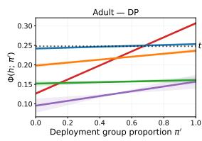

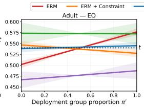

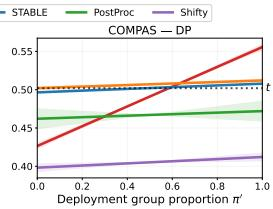

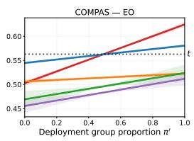  
Figure 1: Prediction rate $\Phi ( h ; \pi ^ { \prime } )$ under demographic shift on the Adult Income and COMPAS datasets for DP and EO. Shaded regions show ± std of the curve shape over 20 random seeds.

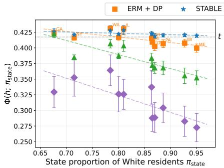

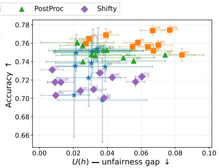  
Figure 2: Geographic generalization on ACS Income. (left) Prediction rate $\Phi ( h ; \pi _ { \mathrm { s t a t e } } )$ as a function of the state proportion of White residents. Dashed lines show linear fits per method; (right) Accuracy vs. DP unfairness gap U(h) across held-out states. Each point corresponds to one state.

Results. The accuracy-fairness tradeoff varies across settings. Overall, STABLE is highly competitive with the other models (Table 1). On Adult, it outperforms all baselines under EO, while under DP it suffers a notable loss in accuracy, despite achieving the lowest unfairness and deployment gap. On COMPAS, it outperforms all baselines under DP and, under EO, still achieves the best accuracy and deployment gap, although with higher unfairness. Overall, this is consistent with the theory: the SOCP constraint controls both the slope γ(h) and the absolute level of $\Phi ( h ; \pi ^ { \prime } )$ around t (Figure 1), which is strictly stronger than the classical fairness constraint and shrinks the feasible set accordingly. Moreover, SOCP optimizes a linearized surrogate of the risk, which, despite upper-bounding the true mixture risk, introduces a linearization gap that may occasionally translate into reduced accuracy.

On the ACS geographic experiment, STABLE remains the closest to t across all held-out states (Figure 2). The other baselines, even Shifty that considers demographic shift, introduce a systematic geographic bias: their slope $\pi _ { \mathrm { s t a t e } } \mapsto \Phi ( h ; \pi _ { \mathrm { s t a t e } } )$ is negative, causing them to drift below t in highproportion states. This illustrates that controlling static unfairness does not preclude deployment bias. On the accuracy-DP unfairness trade-off, Shifty and STABLE behave similarly, while the others maintain a higher accuracy but at the cost of a larger variance in fairness scores.

## 6 Conclusion and perspectives

We introduced a stability-based perspective on fairness and showed that both individual and group fairness arise from it through appropriate perturbation classes. We then introduced a stronger constraint that jointly controls group fairness and the stability of the prediction rate across perturbations, and showed that when considering a linearized risk, the problem admits a tractable SOCP solution.

We further established convergence guarantees from empirical to population quantities and illustrated the practical relevance of the problem through numerical experiments and comparisons to various benchmarks. One limitation is that our method addresses a specific tractable surrogate rather than the original problem in full generality. A natural next step is therefore to derive a more direct solution of the original problem and to establish end-to-end guarantees.

Acknowledgments and Disclosure of Funding

Acknowledgments

## References

[1] Alekh Agarwal, Alina Beygelzimer, Miroslav Dudik, John Langford, and Hanna Wallach. A reductions approach to fair classification. In Jennifer Dy and Andreas Krause, editors, Proceedings of the 35th International Conference on Machine Learning, volume 80 of Proceedings of Machine Learning Research, pages 60–69. PMLR, 10–15 Jul 2018. URL https://proceedings.mlr.press/v80/agarwal18a.html.

[2] Julia Angwin, Jeff Larson, Surya Mattu, and Lauren Kirchner. Machine Bias. ProPublica, 2016. URL https://www.propublica.org/article/ machine-bias-risk-assessments-in-criminal-sentencing.

[3] J-Y Audibert and AB Tsybakov. Fast learning rates for plug-in classifiers. Annals of Statistics, 35(2):608–633, 2007.

[4] Ainhize Barrainkua, Paula Gordaliza, Jose A. Lozano, and Novi Quadrianto. Preserving the fairness guarantees of classifiers in changing environments: A survey. ACM Comput. Surv., 57 (6), February 2025. ISSN 0360-0300. doi: 10.1145/3637438. URL https://doi.org/10. 1145/3637438.

[5] Barry Becker and Ronny Kohavi. Adult Dataset, 1996. URL https://archive.ics.uci. edu/dataset/2/adult.

[6] Avrim Blum, Princewill Okoroafor, Aadirupa Saha, and Kevin M. Stangl. On the vulnerability of fairness constrained learning to malicious noise. In Sanjoy Dasgupta, Stephan Mandt, and Yingzhen Li, editors, Proceedings of The 27th International Conference on Artificial Intelligence and Statistics, volume 238 of Proceedings ofMachine Learning Research, pages 4096–4104. PMLR, 02–04 May 2024. URL https://proceedings.mlr.press/v238/blum24a.html.

[7] Olivier Bousquet and André Elisseeff. Stability and generalization. J. Mach. Learn. Res., 2: 499–526, March 2002. ISSN 1532-4435. doi: 10.1162/153244302760200704. URL https: //doi.org/10.1162/153244302760200704.

[8] Toon Calders, Faisal Kamiran, and Mykola Pechenizkiy. Building classifiers with independency constraints. In Proceedings ofthe 2009 IEEE International Conference on Data Mining Workshops, ICDMW ’09, page 13–18, USA, 2009. IEEE Computer Society. ISBN 9780769539027. doi: 10.1109/ICDMW.2009.83. URL https://doi.org/10.1109/ICDMW.2009.83.

[9] E. Celis, L. Huang, V. Keswani, and N. Vishnoi. Classification with fairness constraints: A meta-algorithm with provable guarantees. In Proceedings of the conference on fairness, accountability, and transparency, pages 319–328, 2019.

[10] S. Chiappa, R. Jiang, T. Stepleton, A. Pacchiano, H. Jiang, and J. Aslanides. A general approach to fairness with optimal transport. In AAAI, 2020.

[11] Evgenii Chzhen, Mohamed Hebiri, and Gayane Taturyan. Randomized multi-class classification under system constraints: a unified approach via post-processing, 2025. URL https://arxiv. org/abs/2512.14246.

[12] C. Denis, R. Elie, M. Hebiri, and F. Hu. Fairness guarantees in multi-class classification with demographic parity. Journal ofMachine Learning Research, 25(130):1–46, 2024.

[13] L. Devroye and T. Wagner. Distribution-free performance bounds for potential function rules. IEEE Transactions on Information Theory, 25(5):601–604, 1979. doi: 10.1109/TIT.1979. 1056087.

[14] L. Devroye and T. Wagner. Distribution-free inequalities for the deleted and holdout error estimates. IEEE Trans. Inf. Theor., 25(2):202–207, September 2006. ISSN 0018-9448. doi: 10.1109/TIT.1979.1056032. URL https://doi.org/10.1109/TIT.1979.1056032.

[15] Frances Ding, Moritz Hardt, John Miller, and Ludwig Schmidt. Retiring Adult: New datasets for fair machine learning. In Advances in Neural Information Processing Systems, volume 34, pages 6478–6490, 2021.

[16] Cynthia Dwork, Moritz Hardt, Toniann Pitassi, Omer Reingold, and Richard Zemel. Fairness through awareness. In Proceedings of the 3rd innovations in theoretical computer science conference, pages 214–226, 2012.

[17] Jean-David Fermanian, Dominique Guégan, and Xuwen Liu. Fair learning by model averaging. Risk and Decision Analysis, 11(1-2):20–49, 2025. doi: 10.1177/15697371251321734.

[18] S. Gaucher, N. Schreuder, and E. Chzhen. Fair learning with wasserstein barycenters for nondecomposable performance measures. In Proceedings ofThe 26th International Conference on Artificial Intelligence and Statistics, volume 206 of Proceedings of Machine Learning Research, pages 2436–2459. PMLR, 25–27 Apr 2023. URL https://proceedings.mlr. press/v206/gaucher23a.html.

[19] Stephen Giguere, Blossom Metevier, Yuriy Brun, Philip S. Thomas, Scott Niekum, and Bruno Castro da Silva. Fairness guarantees under demographic shift. In International Conference on Learning Representations, 2022.

[20] Paula Gordaliza, Eustasio del Barrio, Fabrice Gamboa, and Jean-Michel Loubes. Obtaining fairness using optimal transport theory. In ICML, pages 2357–2365, 2019.

[21] Moritz Hardt, Eric Price, and Nati Srebro. Equality of opportunity in supervised learning. NeurIPS, 29, 2016.

[22] X. Hou and L. Zhang. Finite-sample and distribution-free fair classification: Optimal trade-off between excess risk and fairness, and the cost of group-blindness. arXiv preprint arXiv:2410.16477, 2024.

[23] Zhimeng (Stephen) Jiang, Xiaotian Han, Hongye Jin, Guanchu Wang, Rui Chen, Na Zou, and Xia Hu. Chasing fairness under distribution shift: A model weight perturbation approach. In A. Oh, T. Naumann, A. Globerson, K. Saenko, M. Hardt, and S. Levine, editors, Advances in Neural Information Processing Systems, volume 36, pages 63931–63944. Curran Associates, Inc., 2023.

[24] Michael Kearns and Dana Ron. Algorithmic stability and sanity-check bounds for leave-one-out cross-validation. Neural Comput., 11(6):1427–1453, August 1999. ISSN 0899-7667. doi: 10.1162/089976699300016304. URL https://doi.org/10.1162/089976699300016304.

[25] Samuel Kutin and Partha Niyogi. Almost-everywhere algorithmic stability and generalization error. In Proceedings of the Eighteenth Conference on Uncertainty in Artificial Intelligence, UAI’02, page 275–282, San Francisco, CA, USA, 2002. Morgan Kaufmann Publishers Inc. ISBN 1558608974.

[26] Haoyu Lei, Amin Gohari, and Farzan Farnia. On the inductive biases of demographic paritybased fair learning algorithms. In The 40th Conference on Uncertainty in Artificial Intelligence, 2024.

[27] Thibaud Leteno, Michael Perrot, Charlotte Laclau, Antoine Gourru, and Christophe Gravier. Fair text classification via transferable representations. Journal of Machine Learning Research, 26(239):1–47, 2025.

[28] L. Oneto, M. Donini, and M. Pontil. General fair empirical risk minimization. In 2020 International Joint Conference on Neural Networks (IJCNN), pages 1–8. IEEE, 2020.

[29] Ievgen Redko, Emilie Morvant, Amaury Habrard, Marc Sebban, and Younès Bennani. A survey on domain adaptation theory: learning bounds and theoretical guarantees. 2022.

[30] W. H. Rogers and T. J. Wagner. A Finite Sample Distribution-Free Performance Bound for Local Discrimination Rules. The Annals ofStatistics, 6(3):506 – 514, 1978. doi: 10.1214/aos/ 1176344196. URL https://doi.org/10.1214/aos/1176344196.

[31] Shiori Sagawa\*, Pang Wei Koh\*, Tatsunori B. Hashimoto, and Percy Liang. Distributionally robust neural networks. In International Conference on Learning Representations, 2020. URL https://openreview.net/forum?id=ryxGuJrFvS.

[32] Jake A. Soloff, Rina Foygel Barber, and Rebecca Willett. Bagging provides assumption-free stability. JMLR, 2024. URL https://arxiv.org/abs/2301.12600.

[33] R. Vershynin. High-dimensional probability: An introduction with applications in data science. Cambridge University Press, 2018.

[34] R. Xian, L. Yin, and H. Zhao. Fair and optimal classification via post-processing. In International conference on machine learning, pages 37977–38012. PMLR, 2023.

[35] X. Zeng, E. Dobriban, and G. Cheng. Fair bayes-optimal classifiers under predictive parity. Advances in Neural Information Processing Systems, 35:27692–27705, 2022.

## Organization of the Supplementary Material

The Supplementary Material is organized as follows.

• Appendix A provides additional literature review and further discussion.

• Appendix B contains the main proofs establishing the equivalence between existing fairness notions and our stability-based definition, together with additional discussion.

• Appendix C provides the explicit forms of the importance weights, the proofs of the convergence results for the constraints and the risk, along with some auxiliary lemmas needed in the analysis.

• Appendix D extends the framework to Equalized Odds. We introduce the relevant notions and prove the associated equivalence result with stability.

• Appendix E is dedicated to numerical experiments. We provide additional implementation details and conduct further experiments.

## A Discussions on related works

Machine learning models are increasingly used in high-stakes decisions, such as hiring, healthcare, and criminal justice. In such settings, biases already present in the data may be inherited or even amplified by the resulting models, with potentially serious consequences for the individuals affected. Algorithmic fairness seeks to understand, quantify, and mitigate these effects. Since this question also involves philosophical and social considerations, it naturally lies at the intersection of several fields; in this paper, however, we focus on its mathematical aspect and do not aim to resolve the broader question of what fairness ought to be.

## A.1 Stability and learning theory

Many notions of stability have been introduced in the Statistics and Machine-Learning literature to define and quantify the stability property of a statistical learning algorithm, meaning roughly that a slight change in the data (distribution) has no significant effect on the decision function produced by the algorithm. Depending on the definition of stability chosen, it is possible to use concentration results to deduce error bounds for decision rules from the stability property satisfied by the algorithm producing them, $e . g .$ , ERM with a certain cost function and/or with additive penalization, bagging. This idea is not new at all and dates back at least to the late 70’s in Statistics, refer to [30], [14], [13] and [24] for instance. The concept of stability has more recently been revisited in new forms by the machine learning community. See in particular the concept of uniform stability in [7] yielding exponential bounds and the refinements in [25]. More generally, this line of research has been adopted by many authors, too numerous to be listed in an exhaustive fashion, dealing with various approaches $( e . g .$ bagging in [32]) and issues (clustering, latent variable analysis, ranking).

## A.2 Comparison with Distributionally Robust Optimization

While our framework bears a resemblance to distributionally robust optimization (DRO), the two approaches differ in both structure and the guarantees they provide, with interesting connections that we now discuss.

DRO reminder. Given a divergence d (here KL) and radius $\varepsilon > 0$ , define the uncertainty set $\mathcal { U } _ { \varepsilon } = \{ \mathcal { D } ^ { \prime } : \mathrm { K L } ( \mathcal { D } ^ { \prime } \| \mathcal { D } ) \leq \varepsilon \}$ . DRO solves

$$
\operatorname* { m i n } _ { h } \operatorname* { s u p } _ { \mathcal { D } ^ { \prime } \in \mathcal { U } _ { \varepsilon } } \mathbb { E } _ { \mathcal { D } ^ { \prime } } [ \ell ( h ( X ) , Y ) ] .
$$

Our demographic shifts $\mathcal { D } _ { \pi }$ (Perturbation 1) satisfy $\mathcal { D } _ { \pi } \in \mathcal { U } _ { \varepsilon }$ whenever $\varepsilon \geq \mathrm { K L } ( \mathcal { D } _ { \pi } \| \mathcal { D } )$ . Since $\mathcal { D } _ { \pi }$ only resamples $G$ while keeping $P ( X , Y \mid G )$ fixed, the KL reduces to the KL between two Bernoulli distributions:

$$
\mathrm { K L } ( \mathcal { D } _ { \pi } \| \mathcal { D } ) = \pi \log \frac { \pi } { p _ { 1 } } + ( 1 - \pi ) \log \frac { 1 - \pi } { 1 - p _ { 1 } } .
$$

To cover all deployment proportions $\pi ^ { \prime } \in [ \bar { \pi } , 1 - \bar { \pi } ]$ , DRO requires a radius at least

$$
\varepsilon ^ { * } ( \bar { \pi } ) = \operatorname* { m a x } _ { \pi \in \left[ \bar { \pi } , 1 - \bar { \pi } \right] } \left[ \pi \log \frac { \pi } { p _ { 1 } } + ( 1 - \pi ) \log \frac { 1 - \pi } { 1 - p _ { 1 } } \right] ,
$$

which is attained at one of the endpoints $\pi \in \{ \bar { \pi } , 1 - \bar { \pi } \}$ by convexity of the KL divergence. Since $\mathrm { K L } ( \mathrm { B e r n o u l l i } ( \pi ) |$ Bernoulli $\left( p _ { 1 } \right) )$ is continuous and strictly positive for $\pi \neq p _ { 1 }$ , we have $\varepsilon ^ { * } ( \bar { \pi } ) > 0$ uniformly in $p _ { 1 } \in [ \bar { p } , 1 - \bar { p } ] ;$ ; in particular, $\varepsilon ^ { * } = \Omega ( 1 )$ whenever $\left| \bar { \pi } - p _ { 1 } \right| \ge c$ for some constant $c > 0$ Table 2 illustrates representative values.

Table 2: Minimum DRO radius $\varepsilon ^ { \ast } ( \bar { \pi } )$ required to cover all demographic shifts $\pi ^ { \prime } \in [ \bar { \pi } , 1 - \bar { \pi } ]$ , for varying training group proportion $p _ { 1 }$ and perturbation lower bound π¯.
<table><tr><td>p1\元</td><td>0.1</td><td>0.2</td><td>0.3</td></tr><tr><td>0.2</td><td>1.15</td><td>0.83</td><td>0.58</td></tr><tr><td>0.3</td><td>0.79</td><td>0.53</td><td>0.34</td></tr><tr><td>0.5</td><td>0.37</td><td>0.19</td><td>0.08</td></tr></table>

At radius $\varepsilon = \varepsilon ^ { * } = \Omega ( 1 )$ , the uncertainty set $\mathcal { U } _ { \varepsilon }$ is sufficiently large to contain distributions that arbitrarily corrupt the feature mechanism $P ( X \mid G )$ and the label mechanism $P ( Y \mid G )$ Consequently, the worst-case risk over $\mathcal { U } _ { \varepsilon }$ is controlled by corruptions of $P ( \mathbf { } X | G )$ and $P ( \dot { Y } | \dot { G } )$ that are unrelated to demographic fairness, hence making the bound uninformative about the performance under such demographic shift.

Why our framework avoids this problem. The uncertainty set $\mathcal { U } _ { \varepsilon }$ contains distributions that alter $P ( X \mid G ) , P ( Y \mid G )$ , and other aspects of the data generating process entirely irrelevant to demographic fairness. Our framework instead restricts to the one-dimensional manifold $\{ \mathcal { D } _ { \pi } ~ :$ $\pi \in [ \bar { \pi } , \bar { 1 } - \bar { \pi } ] \}$ , which captures exactly the shifts of interest while preserving $P ( X , Y \mid G )$ . This structural specificity combined with the affine form $\Phi ( h ; \pi ) = \alpha ( h ) + \pi \gamma ( h )$ , enables simultaneous control of slope and absolute level via $\mathcal { C } _ { \Pi } ( h ; t )$ . As a result, Theorem 1 provides guarantees that converge to zero as n, m → ∞ – something no DRO bound with radius $\varepsilon = O ( 1 )$ can achieve.

Connection to Group DRO and SA-DRO. Our framework is more closely related to structured DRO approaches such as Group DRO [31]. In the binary case, Group DRO minimizes $\begin{array} { r } { \operatorname* { m a x } _ { \lambda \in [ 0 , 1 ] } \lambda \bar { \mathbb { E } } _ { D _ { 1 } } [ \ell ( \cdot ) ] + ( 1 - \lambda ) \mathbb { E } _ { D _ { 0 } } [ \bar { \ell } ( \cdot ) ] } \end{array}$ , which is exactly the worst-case risk over our Perturbation 1 family $\{ D _ { \pi } : \pi \in [ 0 , 1 ] \}$ . The two frameworks thus share the same perturbation structure for demographic parity. The differences are twofold. First, the objectives differ: Group DRO minimizes only the worst-case risk, while STABLE controls the variance of $\Phi ( h ; \pi )$ around a target level $t ,$ which we show to be formally equivalent to fairness constraints. Second, Perturbation 2, which resamples G within the positive class to capture equal opportunity, has no natural Group DRO counterpart, as Group DRO cannot vary $P ( G = 1 \mid Y \stackrel { \cdot } { = } 1 )$ independently of $P ( G = 1 \mid Y \stackrel { \cdot } { = } 0 )$ .

A closely related work is SA-DRO [26], which applies DRO directly on the marginal distribution of the sensitive attribute and adds an explicit fairness regularization term. The same structural differences with Group DRO apply here. Additionally, SA-DRO relies on soft regularization rather than a hard constraint, and therefore does not provide quantitative guarantees on the unfairness gap $\mathcal { U } ( h )$ or on the deployment gap.

## B Proofs for Section 3

## B.1 Individual fairness

Recall that the Wasserstein 1-distance between the pushforward of $h (  { \boldsymbol { X } } )  { \mathrm {  ~ s ~ } }$ distribution under $\mathcal { D }$ and that under $\mathbf P ( \mathcal D )$ based on the cost function $d _ { \mathcal { Y } }$ is

$$
\operatorname* { i n f } _ { X \sim \mathcal { D } , \ X ^ { \prime } \sim { \bf P } ( \mathcal { D } ) } \mathbb { E } [ d y ( h ( X ) , h ( X ^ { \prime } ) ] ,
$$

where the infimum is taken over all couplings $( X , X ^ { \prime } )$ of the pair of distributions $\mathcal { D }$ and $\mathbf P ( \mathcal D )$ Proof of Proposition 1.

Proposition (Proposition 1, IF and Stability). Let $h : \mathcal { X }  \mathcal { Y }$ be a prediction function and $d y : { \bar { y } } ^ { 2 } \to [ 0 , \infty )$ a metric on predictions. Thefollowing assertions are equivalent.

1. The predictive function h satisfies the IF property with $( d _ { \mathcal { Y } } , d _ { \mathcal { X } } )$ -Lipschitz constant $L < \infty$

2. For all $\rho > 0 ,$ , the predictive function h is $\mathrm { L } \rho { - } f a i r$ w.r.t. to the class $\mathcal { P } _ { \rho }$ ofperturbation operators $\mathbf { P } _ { T } , T \in \bar { \mathcal { T } } _ { \rho } ,$ defined on the domain ${ \dot { \mathcal { M } } } = \{ \delta _ { \pmb { x } } : \pmb { x } \in \pmb { \mathcal { X } } \}$ ofall point masses and taking $\Delta { \left( h ; \mathbf { \lambda } ( \mathcal { D } , \mathbf { P } ) \right) }$ as the Wasserstein 1-distance between the pushforward of $h (  { \boldsymbol { X } } )  { \boldsymbol { \cdot } } _ { s }$ distribution under D and that under $\mathbf P ( \mathcal D )$ based on the costfunction $d _ { \mathcal { Y } }$

$$
\mathop { \operatorname* { s u p } } _ { ( \pmb { x } , T ) \in \mathcal { X } \times \mathcal { T } _ { \rho } } d \mathscr { y } \left( h ( \pmb { x } ) , h ( T ( \pmb { x } ) ) \right) \leqslant L \rho .
$$

Proof. Let us show that $( 1 \Rightarrow 2 )$ . It is easy to notice that

$$
\operatorname* { s u p } _ { ( \substack { ( \boldsymbol { x } , T ) \in \mathcal { X } \times \mathcal { T } _ { \rho } } } d _ { \mathcal { Y } } ( h ( \pmb { x } ) , h ( T ( \pmb { x } ) ) ) \leqslant \operatorname* { s u p } _ { ( \pmb { x } , T ) \in \mathcal { X } \times \mathcal { T } _ { \rho } } L d _ { \mathcal { X } } ( \pmb { x } , T ( \pmb { x } ) ) \leqslant L \rho .
$$

Now let us show that $( 2 \Rightarrow 1 )$ . First, let us fix any ${ \boldsymbol { x } } , { \boldsymbol { x } } ^ { \prime }$ , and denote $\rho ^ { \prime } : = d _ { \mathcal { X } } ( \pmb { x } , \pmb { x } ^ { \prime } )$ . Let us also introduce the following transformation

$$
T _ { x  x ^ { \prime } } ( z ) = \binom { x ^ { \prime } } { z } { { \it \Psi } } _ { o t h e r w i s e } .
$$

Choosing $\rho = \rho ^ { \prime }$ , we consider the set $\tau _ { \rho ^ { \prime } }$ . We notice that $T _ { x \to x ^ { \prime } } \in \mathcal { T } _ { \rho ^ { \prime } }$ and observe that

$$
\begin{array} { r l } & { d y ( h ( \pmb { x } ) , h ( \pmb { x } ^ { \prime } ) ) = d y ( h ( \pmb { x } ) , h ( T _ { \pmb { x }  \pmb { x } ^ { \prime } } ( \pmb { x } ) ) ) } \\ & { \qquad \leqslant \underset { \pmb { x } \in \mathcal { X } } { \operatorname* { s u p } } d y ( h ( \pmb { x } ) , h ( T _ { \pmb { x }  \pmb { x } ^ { \prime } } ( \pmb { x } ) ) ) } \\ & { \qquad \leqslant \underset { T \in \mathcal { T } _ { \rho ^ { \prime } } } { \operatorname* { s u p } } \underset { \pmb { x } \in \mathcal { X } } { \operatorname* { s u p } } d y ( h ( \pmb { x } ) , h ( T ( \pmb { x } ) ) ) \leqslant L \rho ^ { \prime } = L d _ { \mathcal { X } } ( \pmb { x } , \pmb { x } ^ { \prime } ) . } \end{array}
$$

The proof is concluded.

## B.2 Group fairness

Proof of Proposition 2.

Proposition (Proposition 2, DP and Stability). Let $h : \mathcal { X }  \{ 0 , 1 \}$ be a (possibly randomized) prediction function, $G \in \{ 0 , 1 \}$ be a sensitive attribute, and denote $r _ { g } ( h ) \ { \stackrel { \mathrm { d e f } } { = } } \ \mathbb { P } ( h ( X ) = 1 \mid G =$ $\mathsf { \bar { g } } ) , \forall g \in \{ \bar { 0 } , 1 \}$ . Let $\mathcal { D } _ { \pi }$ be a perturbed distribution according to Perturbation 1. We define the global positive prediction rate under $\mathcal { D } _ { \pi }$ as $P _ { h } ( \pi ) \stackrel { \mathrm { d e f } } { = } \mathbb { P } _ { \mathcal { D } _ { \pi } } ( h ( X ) = 1 )$ ). Then, the following statements are equivalent:

1. h satisfies Demographic Parity: $r _ { 0 } ( h ) = r _ { 1 } ( h )$

2. $P _ { h } ( \pi )$ is constant in π on $[ 0 , 1 ] ( i . e .$ , the global positive rate is invariant to any resampling $o f G ) .$

Moreover, one has the explicit identity

$$
P _ { h } ( \pi ) = r _ { 0 } ( h ) + \pi ( r _ { 1 } ( h ) - r _ { 0 } ( h ) ) ,
$$

so that

$$
\operatorname* { s u p } _ { \pi , \pi ^ { \prime } \in [ 0 , 1 ] } | P _ { h } ( \pi ) - P _ { h } ( \pi ^ { \prime } ) | = | r _ { 1 } ( h ) - r _ { 0 } ( h ) | .
$$

Proof. By the law of total probability, for any $\pi \in [ 0 , 1 ]$

$$
P _ { h } ( \pi ) = \mathbb { P } _ { \mathcal { D } _ { \pi } } ( h ( \mathbf { X } ) = 1 ) = \pi r _ { 1 } ( h ) + ( 1 - \pi ) r _ { 0 } ( h ) .
$$

We note that if $r _ { 0 } ( h ) = r _ { 1 } ( h )$ , then $P _ { h } ( \pi ) = \pi r _ { 1 } ( h ) + ( 1 - \pi ) r _ { 1 } ( h ) = r _ { 1 } ( h )$ , which does not depend on $\pi ,$ hence $( 1 ) \Rightarrow ( 2 )$

Secondly, if we suppose that $P _ { h } ( \pi )$ is constant in π, then for all $\pi , \pi ^ { \prime } \in [ 0 , 1 ]$ , we have

$$
\pi r _ { 1 } ( h ) + ( 1 - \pi ) r _ { 0 } ( h ) = \pi ^ { \prime } r _ { 1 } ( h ) + ( 1 - \pi ^ { \prime } ) r _ { 0 } ( h ) ,
$$

which can be rewritten as

$$
( \pi - \pi ^ { \prime } ) ( r _ { 1 } ( h ) - r _ { 0 } ( h ) ) = 0 .
$$

Since we may choose $\pi \neq \pi ^ { \prime }$ , it follows that $r _ { 1 } ( h ) - r _ { 0 } ( h ) = 0 , { \mathrm { i . e . , } } r _ { 0 } ( h ) = r _ { 1 } ( h )$ , which is exactly Demographic Parity $( \mathbf { s o } \left( 2 \right) \Rightarrow \left( 1 \right) )$ ).

This proves the equivalence.

## Proof of Proposition 3.

Proposition (Proposition 3, EO and Stability). Let $h : \mathcal { X }  \{ 0 , 1 \}$ be a (possibly randomized) predictionfunction, $G \in \{ 0 , 1 \}$ be a sensitive attribute, and denote $q _ { g , y } ( h ) \ { \stackrel { \mathrm { d e f } } { = } } \ \mathbb { P } ( h ( X ) = 1 \mid G =$ $\mathsf { \bar { g } } , Y = y ) , \forall g , y \in \{ 0 , 1 \}$ . Let $\mathcal { D } _ { \pi }$ be a perturbed distribution according to Perturbation 2. We define the true positive prediction rate under $\mathcal { D } _ { \pi }$ as $P _ { h | Y = 1 } ( \pi ) \stackrel { \mathrm { d e f } } { = } \mathbb { P } _ { \mathcal { D } _ { \pi } } ( h ( \boldsymbol { X } ) = 1 \mid Y = 1 )$ . Then thefollowing statements are equivalent:

1. h satisfies Equal Opportunity: $q _ { 0 , 1 } ( h ) = q _ { 1 , 1 } ( h )$

2. $P _ { h | Y = 1 } ( \pi )$ is constant in $\pi o n \left[ 0 , 1 \right] ( i . e .$ , the true positive rate is invariant to any resampling ofG within positive label class).

Moreover, one has the explicit identity

$$
P _ { h | Y = 1 } ( \pi ) = q _ { 0 , 1 } ( h ) + \pi ( q _ { 1 , 1 } ( h ) - q _ { 0 , 1 } ( h ) ) ,
$$

so that

$$
\operatorname* { s u p } _ { \pi , \pi ^ { \prime } \in [ 0 , 1 ] } | P _ { h | Y = 1 } ( \pi ) - P _ { h | Y = 1 } ( \pi ^ { \prime } ) | = | q _ { 1 , 1 } ( h ) - q _ { 0 , 1 } ( h ) | .
$$

Proof. Let us show that $( 1 \Rightarrow 2 )$ . Denoting $q : = q _ { 0 , 1 } ( h ) = q _ { 1 , 1 } ( h )$ and applying the law of total probability, we get

$$
P _ { h | Y = 1 } ( \pi ) = \mathbb { P } _ { \mathcal { D } _ { \pi } } \bigl ( h ( X ) = 1 \mid Y = 1 \bigr ) = ( 1 - \pi ) q _ { 0 , 1 } ( h ) + \pi q _ { 1 , 1 } ( h ) = q ,
$$

which does not depend on π. Now let us show that $( 2 \Rightarrow 1 )$ . Assuming $P _ { h | Y = 1 } ( \pi )$ is constant in π, we can state that

$$
( 1 - \pi ) q _ { 0 , 1 } ( h ) + \pi q _ { 1 , 1 } ( h ) = ( 1 - \pi ^ { \prime } ) q _ { 0 , 1 } ( h ) + \pi ^ { \prime } q _ { 1 , 1 } ( h ) .
$$

Rewriting the above as

$$
( \pi - \pi ^ { \prime } ) ( q _ { 1 , 1 } ( h ) - q _ { 0 , 1 } ( h ) ) = 0 ,
$$

we deduce that $q _ { 1 , 1 } ( h ) = q _ { 0 , 1 } ( h )$

The proof is concluded.

## C Details and proofs for Section 4

## C.1 Importance weights representation

In this section we show that the distribution shifts under our consideration can be described by their corresponding importance-weights, defined by the Radon-Nikodym derivative

$$
w _ { \pi } ( \pmb { x } , g , y ) \overset { \mathrm { d e f } } { = } \frac { d \mathcal { D } _ { \pi } } { d \mathcal { D } } ( \pmb { x } , g , y ) .
$$

Recall, that $p _ { g } = \mathbb { P } ( G = g ) \ \forall g \in \{ 0 , 1 \}$ and $\mathbb { P } ( G = g \mid Y = y ) \ \forall g , y \in \{ 0 , 1 \}$

For Perturbation 1, considering the factorization $\mathbb { P } ( X , G , Y ) = \mathbb { P } ( G ) \mathbb { P } ( X , Y \mid G )$ , and computing the Radon-Nikodym derivative, we get

$$
\begin{array} { r } { w _ { \pi } ( g ) = \left\{ \frac { \pi } { p _ { 1 } } , \quad \mathrm { i f } g = 1 , \right. } \\ { \left. \frac { 1 - \pi } { p _ { 0 } } , \quad \mathrm { i f } g = 0 . \right. } \end{array}
$$

For Perturbation $^ { 2 , }$ considering the factorization $\mathbb { P } ( X , G , Y ) = \mathbb { P } ( Y ) \mathbb { P } ( G \mid Y ) \mathbb { P } ( X \mid Y , G )$ , and computing the Radon-Nikodym derivative, we get

$$
\begin{array} { r } { w _ { \pi } ( g , y ) = \left\{ \begin{array} { l l } { \frac { \pi } { p _ { 1 , 1 } } , } & { \mathrm { i f } \left( g , y \right) = \left( 1 , 1 \right) , } \\ { \frac { 1 - \pi } { p _ { 0 , 1 } } , } & { \mathrm { i f } \left( g , y \right) = \left( 0 , 1 \right) , } \\ { 1 , } & { \mathrm { i f } y = 0 . } \end{array} \right. } \end{array}
$$

## C.2 Convergence rates

First, let us recall the following two crucial lemmas.

Lemma 3. [33, Hoeffding inequality] Let $X _ { 1 } , \cdots , X _ { N }$ be independent random variables such that $X _ { i } \in [ a _ { i } , b _ { i } ] f o r$ every i. Then, for any $t > 0 ,$ , we have

$$
\mathbb { P } \left( \sum _ { i = 1 } ^ { N } ( \mathbf { X } _ { i } - \mathbb { E } [ \mathbf { X } _ { i } ] ) \geqslant t \right) \leqslant \exp \left( - { \frac { 2 t ^ { 2 } } { \sum _ { i = 1 } ^ { N } ( b _ { i } - a _ { i } ) ^ { 2 } } } \right) .
$$

Lemma 4. [33, Bernstein inequality] Let $X _ { 1 } , \cdots , X _ { N }$ be independent, mean-zero random variables satisfying $| X _ { i } | \leqslant K$ for every i. Let $\begin{array} { r } { \sigma ^ { 2 } = \sum _ { i = 1 } ^ { N } \mathbb { E } X _ { i } ^ { 2 } } \end{array}$ is the variance of the sum. Then, for any $t > 0 ,$ , we have

$$
\mathbb { P } \left( \left| \sum _ { i = 1 } ^ { N } X _ { i } \right| \geqslant t \right) \leqslant 2 \exp \left( - \frac { t ^ { 2 } / 2 } { \sigma ^ { 2 } + { K t } / { 3 } } \right) .
$$

We now examine the different sources of error arising from the estimation of population-level quantities.

## C.2.1 Regression error rates

Recall the following expressions

$$
\eta _ { \alpha ^ { * } } = \sum _ { k \in [ K ] } \alpha _ { k } ^ { \star } \eta _ { k } , \qquad \eta _ { \widehat { \alpha } } = \sum _ { k \in [ K ] } { \widehat { \alpha } } _ { k } \eta _ { k } , \qquad { \widehat { \eta } } _ { \alpha ^ { * } } = \sum _ { k \in [ K ] } \alpha _ { k } ^ { \star } { \widehat { \eta } } _ { k } , \qquad { \widehat { \eta } } _ { \widehat { \alpha } } = \sum _ { k \in [ K ] } { \widehat { \alpha } } _ { k } { \widehat { \eta } } _ { k } .
$$

Lemma 5. Let Assumption 2 and Claims 2–3 hold. Then, for all for every $\pmb { \alpha } \in \Delta _ { K }$ and all $\pi \in [ \underline { { \pi } } , 1 - \underline { { \pi } } ]$ , it holds that

$$
\begin{array} { r } { \left| \Phi ( \widehat { \eta } _ { \alpha } ; \pi ) - \Phi ( \eta _ { \alpha } ; \pi ) \right| \leqslant B W \rho _ { N } \overset { \mathrm { d e f } } { = } \delta _ { N } . } \end{array}
$$

Proof. By the linearity of $\varphi _ { h }$ in h and the definition of the mixture, for any ${ \pmb { \alpha } } \in \Delta _ { K }$ , we have

$$
| \Phi ( \widehat { \eta } _ { \alpha } ; \pi ) - \Phi ( \eta _ { \alpha } ; \pi ) | = \Big | \sum _ { k = 1 } ^ { K } \alpha _ { k } \left[ \Phi ( \widehat { \eta } _ { k } ; \pi ) - \Phi ( \eta _ { k } ; \pi ) \right] \Big | \leqslant \operatorname* { m a x } _ { 1 \leqslant k \leqslant K } \Big | \Phi ( \widehat { \eta } _ { k } ; \pi ) - \Phi ( \eta _ { k } ; \pi ) \Big | .
$$

For each k and $\pi ,$ , from Hölder’s inequality and Claims 2–3, we obtain

$$
\begin{array} { r l } & { \left| \Phi ( \widehat { \eta } _ { k } ; \pi ) - \Phi ( \eta _ { k } ; \pi ) \right| = \left| \mathbb { E } [ w _ { \pi } ( \pmb { Z } ) \varphi _ { \widehat { \eta } _ { k } - \eta _ { k } } ( \pmb { Z } ) ] \right| \leqslant \left\| w _ { \pi } ( \pmb { Z } ) \right\| _ { L ^ { \infty } } \mathbb { E } [ \varphi _ { \widehat { \eta } _ { k } - \eta _ { k } } ( \pmb { Z } ) ] } \\ & { \qquad \leqslant W B \mathbb { E } [ | \widehat { \eta } ( \pmb { Z } ) - \eta ( \pmb { Z } ) | ] . } \end{array}
$$

Assumption 2 concludes the proof.

## C.2.2 Perturbation error rates

Lemma 6 (Stratified sampling). Let $\Pi = U ( \underline { { \pi } } , 1 - \underline { { \pi } } )$ and $\mathcal { T } _ { 1 } , \cdots , \mathcal { T } _ { m }$ be a uniform partition of $[ \underline { { \pi } } , 1 - \underline { { \pi } } ]$ into m intervals of length $\begin{array} { r } { | \mathcal { I } | = \frac { ( 1 - 2 \pi ) } { m } } \end{array}$ . We sample $\pi _ { j } ^ { \prime } \sim U ( \mathcal { T } _ { j } )$ independently for $j = 1 , \cdots , m$ . Let $f : [ \underline { { \pi } } , 1 - \underline { { \pi } } ] \to \mathbb { R }$ be a L−Lipschitz function. For all $a _ { \delta _ { m } } ~ \in ~ ( 0 , 1 )$ with probability greater than $1 - a _ { \delta _ { m } }$ ¯, it holds that

$$
\Big | \frac { 1 } { m } \sum _ { j = 1 } ^ { m } f ( \pi _ { j } ^ { \prime } ) - \mathbb { E } _ { \Pi } [ f ( \pi ) ] \Big | \leqslant \frac { L ( 1 - 2 \underline { { \pi } } ) } { m ^ { 3 / 2 } } \sqrt { 2 \log ( ^ { 2 } / a _ { \delta _ { m } } ) } \stackrel { \mathrm { d e f } } { = } \delta _ { L , m } .
$$

Proof. Denote the stratum mean by $\begin{array} { r } { \mu _ { j } \ \stackrel { \mathrm { d e f } } { = } \ \frac { 1 } { | { \mathcal { T } } | } \int _ { { \mathcal { T } } _ { j } } f ( \pi ) } \end{array}$ d π and the intra-stratum deviation by $\xi _ { j } \ { \overset { \underset { \mathrm { d e f } } { } } { = } } \ f ( \pi _ { j } ^ { \prime } ) - \mu _ { j }$ . Notice, that $\begin{array} { r } { \frac { 1 } { m } \sum _ { j = 1 } ^ { m } \mu _ { j } = \frac { 1 } { m } \sum _ { j } \frac { 1 } { | \mathcal { Z } | } \int _ { \mathcal { X } _ { j } } f ( \pi ) \mathrm { d } \pi = \frac { 1 } { 1 - 2 \frac { \pi } { 2 } } \int \displaylimits _ { \frac { \pi } { 2 } } ^ { 1 - \pi } f ( \pi ) \mathrm { d } \pi = } \end{array}$ $\mathbb { E } _ { \Pi } [ f ( \pi ) ]$ , therefore $\begin{array} { r } { \frac { 1 } { m } \sum _ { j } f ( \pi _ { j } ^ { \prime } ) - \mathbb { E } _ { \Pi } [ f ( \pi ) ] = \frac { 1 } { m } \sum _ { j = 1 } ^ { m } \xi _ { j } } \end{array}$ . Moreover, for $\pi \in { \mathcal { T } } _ { j } , | f ( \pi ) - \mu _ { j } | \leqslant$ $\begin{array} { r } { \operatorname* { s u p } _ { \pi , \pi ^ { \prime } \in \mathcal { T } _ { j } } | f ( \pi ) - f ( \pi ^ { \prime } ) | ^ { * } \leqslant L | \mathcal { Z } | , \operatorname { s o } | \xi _ { j } | \leqslant L | \mathcal { Z } | } \end{array}$ . Combining this with the facts that $\mathbb { E } [ \xi _ { j } ] = 0$ for each $j ,$ that $\xi _ { j }$ are independent, and applying Hoeffding’s inequality, we obtain

$$
\mathbb { P } \Big ( \Big | \frac { 1 } { m } \sum _ { i } \xi _ { j } \Big | > \epsilon \Big ) \leqslant 2 \exp \Big ( - \frac { m \epsilon ^ { 2 } } { 2 L ^ { 2 } | \mathcal { Z } | ^ { 2 } } \Big ) = 2 \exp \Big ( - \frac { m ^ { 3 } \epsilon ^ { 2 } } { 2 L ^ { 2 } ( 1 - 2 \underline { { \pi } } ) ^ { 2 } } \Big ) .
$$

Setting $\begin{array} { r } { a _ { \delta _ { m } } = 2 \exp \left( - \frac { m ^ { 3 } \epsilon ^ { 2 } } { 2 L ^ { 2 } ( 1 - 2 \underline { { \pi } } ) ^ { 2 } } \right) } \end{array}$ and obtaining $\begin{array} { r } { \epsilon = \frac { \sqrt { 2 } L ( 1 - 2 \pi ) } { m ^ { 3 / 2 } } \sqrt { \log ( 2 / a _ { \delta _ { m } } ) } } \end{array}$ concludes the proof. □

## C.2.3 Sample generalization rates

Lemma 7. For all $a _ { \delta _ { n } } \in ( 0 , 1 )$ with probability greater than $1 - a _ { \delta _ { n } }$ and conditionally on $\mathcal { D } ^ { N }$ , with probability greater than $1 - a _ { \delta _ { n } }$ it holds that

$$
\operatorname* { m a x } _ { k \in [ K ] , j \in [ m ] } \left| \widehat { \Phi } _ { n } ( \widehat { \eta } _ { k } ; \pi _ { j } ^ { \prime } ) - \Phi ( \widehat { \eta } _ { k } ; \pi _ { j } ^ { \prime } ) \right| \leqslant \sqrt { \frac { 2 W ^ { 2 } \log \left( 2 K m / a _ { \delta _ { n } } \right) } { n } } + \frac { 2 W \log \left( 2 K m / a _ { \delta _ { n } } \right) } { 3 n } \stackrel { \mathrm { d e f } } { = } \delta _ { n } .
$$

Moreover,for all ${ \pmb { \alpha } } \in \Delta _ { K }$ and $j \in [ m ] ,$ , it holds that

$$
\left| \widehat { \Phi } _ { n } ( \widehat { \eta } _ { \alpha } ; \pi _ { j } ^ { \prime } ) - \Phi ( \widehat { \eta } _ { \alpha } ; \pi _ { j } ^ { \prime } ) \right| \leqslant \delta _ { n } .
$$

Proof. Let us fix $k \in [ K ]$ and $j \in [ m ]$ . The function $\widehat { \eta } _ { k }$ is fixed conditionally on sample $\mathcal { D } ^ { N }$ Let us define $\xi _ { i } \ { \stackrel { \mathrm { d e f } } { = } } \ w _ { \pi _ { i } ^ { \prime } } ( Z _ { i } ) \varphi _ { \widehat \eta _ { k } } ( Z _ { i } )$ , for $\pmb { Z _ { i } } \overset { \mathrm { i . i . d . } } { \sim } \mathcal { D } ^ { n }$ . We have $\mathbb { E } [ \xi _ { i } ] = \Phi ( \widehat { \eta } _ { k } ; \pi _ { j } ^ { \prime } ) , | \xi _ { i } | \leqslant W$ $\lvert \xi _ { i } - \mathbb { E } [ \xi _ { i } ] \rvert \leqslant W$ and $\dot { \mathrm { V a r } } ( \xi _ { i } ) \leqslant \mathbb { E } [ \xi _ { i } ^ { 2 } ] \leqslant W ^ { 2 }$ . Applying Bernstein’s inequality, for any $\epsilon > 0$ it holds that

$$
\mathbb { P } _ { \mathcal { D } ^ { n } } \bigg ( \Big | \frac { 1 } { n } \sum _ { i } \xi _ { i } \Big | > \epsilon | \mathcal { D } ^ { N } \bigg ) \leqslant 2 \exp \bigg ( - \frac { n \epsilon ^ { 2 } } { 2 W ^ { 2 } + \frac { 2 } { 3 } W \epsilon } \bigg ) .
$$

Setting $\begin{array} { r } { \frac { a _ { \delta n } } { K m } = 2 \exp \left( - \frac { n \epsilon ^ { 2 } } { 2 W ^ { 2 } + \frac { 2 } { 3 } W \epsilon } \right) } \end{array}$ , obtaining $\begin{array} { r } { \epsilon = \sqrt { \frac { 2 W ^ { 2 } \log \left( 2 K m / a _ { \delta _ { n } } \right) } { n } } + \frac { 2 W \log \left( 2 K m / a _ { \delta _ { n } } \right) } { 3 n } } \end{array}$ , and applying union bound over all pairings $( k , j ) \in [ K ] \times [ m ]$ concludes the proof of the first inequality. Moreover, using the triangle inequality and the fact that $\begin{array} { r } { \alpha _ { k } \geqslant 0 , \sum _ { k } \alpha _ { k } = 1 } \end{array}$ , we obtain

$$
\begin{array} { l } { \displaystyle \Big | \widehat { \Phi } _ { n } ( \widehat { \eta } _ { \alpha } ; \pi _ { j } ^ { \prime } ) - \Phi ( \widehat { \eta } _ { \alpha } ; \pi _ { j } ^ { \prime } ) \Big | = \Big | \displaystyle \sum _ { k = 1 } ^ { K } \alpha _ { k } \big ( \widehat { \Phi } _ { n } ( \widehat { \eta } _ { k } ; \pi _ { j } ^ { \prime } ) - \Phi ( \widehat { \eta } _ { k } ; \pi _ { j } ^ { \prime } ) \big ) \Big | } \\ { \displaystyle \leqslant \displaystyle \sum _ { k = 1 } ^ { K } \alpha _ { k } \Big | \widehat { \Phi } _ { n } ( \widehat { \eta } _ { k } ; \pi _ { j } ^ { \prime } ) - \Phi ( \widehat { \eta } _ { k } ; \pi _ { j } ^ { \prime } ) \Big | } \\ { \displaystyle \leqslant \operatorname* { m a x } _ { k } | \widehat { \Phi } _ { n } ( \widehat { \eta } _ { k } ; \pi _ { j } ^ { \prime } ) - \Phi ( \widehat { \eta } _ { k } ; \pi _ { j } ^ { \prime } ) | \leqslant \delta _ { n } . } \end{array}
$$

The proof is concluded.

## C.2.4 Final constraint rates

Formal version and the proof of the first statement of Theorem 1.

Theorem 2 (Constraint rates). Let αb be a simplex vector, s.t. $\widehat { \mathcal { C } } _ { n , m } ( \widehat { \eta } _ { \widehat { \alpha } } ; t ) \leqslant \delta .$ . For all $a _ { \delta _ { m } } , a _ { \delta _ { n } } \in$ (0, 1) and conditionally on $\mathcal { D } ^ { N }$ , with probability greater than $1 - a _ { \delta _ { m } } - a _ { \delta _ { n } }$ it holds that

$$
\mathcal { C } _ { \Pi } ( \widehat { \eta } _ { \widehat { \alpha } } ; t ) \leqslant \Big ( \sqrt { \delta } + \delta _ { n } \Big ) ^ { 2 } + \delta _ { m } ,
$$

where

$$
\delta _ { m } \triangleq \frac { 2 ( 2 - \pi ) ( 1 - 2 \underline { { \pi } } ) } { m ^ { 3 / 2 } } \sqrt { 2 \log ( 4 / a _ { \delta _ { m } } ) } a n d \delta _ { n } = \sqrt { \frac { 2 W ^ { 2 } \log ( 2 K m / a _ { \delta _ { n } } ) } { n } } + \frac { 2 W \log ( 2 K m / a _ { \delta _ { n } } ) } { 3 n } .
$$

Proof. Let us fix $j \in [ m ]$ . By the triangle inequality, and Lemma 7, we have

$$
\big | \Phi \big ( \widehat { \eta } _ { \widehat { \alpha } } ; \pi _ { j } ^ { \prime } \big ) - t \big | \leqslant \big | \widehat { \Phi } _ { n } \big ( \widehat { \eta } _ { \widehat { \alpha } } ; \pi _ { j } ^ { \prime } \big ) - t \big | + \big | \widehat { \Phi } _ { n } \big ( \widehat { \eta } _ { \widehat { \alpha } } ; \pi _ { j } ^ { \prime } \big ) - \Phi \big ( \widehat { \eta } _ { \widehat { \alpha } } ; \pi _ { j } ^ { \prime } \big ) \big | \leqslant \big | \widehat { \Phi } _ { n } \big ( \widehat { \eta } _ { \widehat { \alpha } } ; \pi _ { j } ^ { \prime } \big ) - t \big | + \delta _ { n } .
$$

Squaring both sides of the above inequality, we get $( \Phi ( \widehat { \pmb { \eta } } _ { \widehat { \pmb { \alpha } } } ; \pi _ { j } ^ { \prime } ) - t ) ^ { 2 } \leqslant ( | \widehat { \Phi } _ { n } ( \widehat { \pmb { \eta } } _ { \widehat { \pmb { \alpha } } } ; \pi _ { j } ^ { \prime } ) - t | + \delta _ { n } ) ^ { 2 }$ Averaging over $j = 1 , \cdots , m$ yields

$$
\begin{array} { l } { \displaystyle \frac { 1 } { m } \sum _ { j = 1 } ^ { m } ( \Phi ( \widehat { \eta } _ { \widehat { \alpha } } ; \pi _ { j } ^ { \prime } ) - t ) ^ { 2 } \leqslant \displaystyle \frac { 1 } { m } \sum _ { j } ( | \widehat { \Phi } _ { n } ( \widehat { \eta } _ { \widehat { \alpha } } ; \pi _ { j } ^ { \prime } ) - t | + \delta _ { n } ) ^ { 2 } } \\ { \displaystyle \qquad = \widehat { \mathcal { C } } _ { n , m } ( \widehat { \eta } _ { \widehat { \alpha } } ; t ) + 2 \delta _ { n } \frac { 1 } { m } \sum _ { j } | \widehat { \Phi } _ { n } ( \widehat { \eta } _ { \widehat { \alpha } } ; \pi _ { j } ^ { \prime } ) - t | + \delta _ { n } ^ { 2 } . } \end{array}
$$

By Cauchy–Schwarz inequality, and the fact that $\widehat { \mathcal { C } } _ { n , m } ( \widehat { \eta } _ { \widehat { \alpha } } ; t ) \leqslant \delta$ , we have

$$
\frac { 1 } { m } \sum _ { j } | \widehat { \Phi } _ { n } ( \widehat { \eta } _ { \widehat { \alpha } } ; \pi _ { j } ^ { \prime } ) - t | \leqslant \sqrt { \frac { 1 } { m } \sum _ { j } ( \widehat { \Phi } _ { n } ( \widehat { \eta } _ { \widehat { \alpha } } ; \pi _ { j } ^ { \prime } ) - t ) ^ { 2 } } = \sqrt { \widehat { \mathcal { C } } _ { n , m } ( \widehat { \eta } _ { \widehat { \alpha } } ; t ) } \leqslant \sqrt { \delta } .
$$

Combining the inequalities above we get

$$
\frac { 1 } { m } \sum _ { j = 1 } ^ { m } ( \Phi ( \widehat { \eta } _ { \widehat { \alpha } } ; \pi _ { j } ^ { \prime } ) - t ) ^ { 2 } \leqslant ( \sqrt { \delta } + \delta _ { n } ) ^ { 2 } .\tag{7}
$$

For any ${ \pmb { \alpha } } \in \Delta _ { K }$ , by linearity of $\alpha ( \cdot ) ^ { 2 }$ and $\gamma ( \cdot )$ , that follows from linearity of $\Phi ( h ; \pi )$ in Claim 1, and denoting $\begin{array} { r } { \alpha _ { \pmb { \alpha } } \overset { \mathrm { d e f } } { = } \sum _ { k = 1 } ^ { K } \alpha _ { k } \alpha ( \widehat { \eta } _ { k } ) } \end{array}$ and $\begin{array} { r } { \gamma _ { \alpha } \overset { \mathrm { d e f } } { = } \sum _ { k = 1 } ^ { K } \alpha _ { k } \gamma ( \widehat \eta _ { k } ) } \end{array}$ , we get

$$
( \Phi ( { \hat { \eta } } _ { \alpha } ; \pi ) - t ) ^ { 2 } = ( \alpha _ { \alpha } - t ) ^ { 2 } + 2 ( \alpha _ { \alpha } - t ) \gamma _ { \alpha } \pi + \gamma _ { \alpha } ^ { 2 } \pi ^ { 2 } .
$$

Averaging over $\pi _ { 1 } ^ { \prime } , \cdots , \pi _ { m } ^ { \prime }$ and subtracting from $\mathcal { C } _ { \Pi } ( \widehat { \pmb { \eta } } _ { \alpha } ; t )$ , we get

$$
\begin{array} { l } { \displaystyle \mathcal { C } _ { \Pi } ( \widehat { \eta } _ { \alpha } ; t ) - \frac { 1 } { m } \sum _ { j = 1 } ^ { m } ( \Phi ( \widehat { \eta } _ { \alpha } ; \pi _ { j } ^ { \prime } ) - t ) ^ { 2 } } \\ { \displaystyle \qquad = 2 ( \alpha _ { \alpha } - t ) \gamma _ { \alpha } \Big \{ \mathbb { E } _ { \Pi } [ \pi ] - \frac { 1 } { m } \sum _ { j = 1 } ^ { m } \pi _ { j } ^ { \prime } \Big \} + \gamma _ { \alpha } ^ { 2 } \Big \{ \mathbb { E } _ { \Pi } [ \pi ^ { 2 } ] - \frac { 1 } { m } \sum _ { j = 1 } ^ { m } ( \pi _ { j } ^ { \prime } ) ^ { 2 } \Big \} . } \end{array}
$$

Now, let us notice that the maps $\pi \mapsto \pi$ and $\pi \mapsto \pi ^ { 2 }$ are respectively 1–Lipschitz and $2 ( 1 - \underline { { \pi } } ) -$ Lipschitz on $[ \underline { { \pi } } , 1 - \underline { { \pi } } ]$ . Applying Lemma 6 with a union bound, and recalling that $\alpha _ { \alpha } \in [ 0 , 1 ]$ ¯and $\gamma _ { \alpha } \in [ - 1 , 1 ]$ , with probability at least $1 - a _ { \delta _ { m } }$ and uniformly in ${ \pmb { \alpha } } \in \Delta _ { K }$ , we obtain

$$
\mathcal { C } _ { \Pi } ( \widehat { \eta } _ { \alpha } ; t ) \leqslant \frac { 1 } { m } \sum _ { j } ( \Phi ( \widehat { \eta } _ { \alpha } ; \pi _ { j } ^ { \prime } ) - t ) ^ { 2 } + \frac { 2 ( 2 - \underline { { \pi } } ) ( 1 - 2 \underline { { \pi } } ) } { m ^ { 3 / 2 } } \sqrt { 2 \log ( 4 / a _ { \delta _ { m } } ) } .
$$

Finally, specializing at $\mathbf { \alpha } _ { \alpha } = \widehat { \mathbf { \alpha } } _ { \alpha }$ and applying (7), we get

$$
\mathcal { C } _ { \Pi } ( \widehat { \eta } _ { \widehat { \alpha } } ; t ) \leqslant \frac { 1 } { m } \sum _ { j } ( \Phi ( \widehat { \eta } _ { \widehat { \alpha } } ; \pi _ { j } ^ { \prime } ) - t ) ^ { 2 } + \delta _ { m } \leqslant ( \sqrt { \delta } + \delta _ { n } ) ^ { 2 } + \delta _ { m } .
$$

The proof is concluded.

The second statement of Theorem 1 is stated below as a corollary and follows directly from Theorem 2. Corollary 1 (Unfairness rates). Under the conditions ofTheorem 2, it holds that

$$
\mathcal { U } ( \widehat { \eta } _ { \widehat { \alpha } } ) \leqslant \sqrt { \frac { ( \sqrt { \delta } + \delta _ { n } ) ^ { 2 } + \delta _ { m } } { \mathrm { V a r } _ { \Pi } ( \pi ) } } \leqslant \frac { \sqrt { \delta } + \delta _ { n } + \sqrt { \delta _ { m } } } { \sqrt { \mathrm { V a r } _ { \Pi } ( \pi ) } } .
$$

Thus, if we set $\delta = \delta _ { 0 } ^ { 2 } \mathrm { V a r } _ { \Pi } ( \pi )$ , then we will have $\begin{array} { r } { \mathcal { U } ( \widehat { \pmb { \eta } } _ { \widehat { \pmb { \alpha } } } ) - \delta _ { 0 } \leqslant \widetilde { \mathcal { O } } \left( \frac { 1 } { n ^ { 1 / 2 } } + \frac { 1 } { m ^ { 3 / 4 } } \right) } \end{array}$

Formal version and the proof of the third statement of Theorem 1.

Theorem 3 (Uniform Deployment Guarantee). Let $\widehat { \eta } _ { \widehat { \alpha } }$ be any feasible solution of $( \mathcal { P } _ { \mathtt { S } 0 \mathtt { C } \mathtt { P } } )$ with threshold δ and target $t \in [ 0 , 1 ]$ . Under the conditions ofTheorem 2, For all $a _ { \delta _ { m } } , a _ { \delta _ { n } } \in ( 0 , 1 )$ and conditionally on $\mathcal { D } ^ { N }$ , with probability greater than $1 - a _ { \delta _ { m } } - a _ { \delta _ { r } }$ over $( D ^ { n } , \bar { \Pi } ^ { m } )$ , the following holds simultaneouslyfor all $\pi ^ { \prime } \in [ \underline { { \pi } } , \underline { { \mathrm { i } } } - \underline { { \pi } } ]$

$$
\bigl | \Phi ( \widehat { \eta } _ { \widehat { \alpha } } ; \pi ^ { \prime } ) - t \bigr | \leqslant ( \sqrt { \delta } + \delta _ { n } + \sqrt { \delta _ { m } } ) \cdot \left( 1 + \frac { \vert \pi ^ { \prime } - \mu _ { \Pi } \vert } { \sqrt { \mathrm { V a r } _ { \Pi } ( \pi ) } } \right) .
$$

Proof. It follows from (6) and Theorem 2 that

$$
( \mathbb { E } _ { \pi \sim \Pi } [ \Phi ( \widehat { \eta } _ { \widehat { \alpha } } ; \pi ) ] - t ) ^ { 2 } \leqslant ( \sqrt { \delta } + \delta _ { n } ) ^ { 2 } + \delta _ { m } .
$$

Taking the square root, we obtain

$$
| \mathbb { E } _ { \pi \sim \Pi } [ \Phi ( \widehat { \eta } _ { \widehat { \alpha } } ; \pi ) ] - t | \leqslant \sqrt { \delta } + \delta _ { n } + \sqrt { \delta _ { m } } .
$$

For a fixed $\pi ^ { \prime } ,$ , we have

$$
\begin{array} { r } { \Phi ( \widehat { \eta } _ { \widehat { \alpha } } ; \pi ^ { \prime } ) - t = \underbrace { \left[ \Phi ( \widehat { \eta } _ { \widehat { \alpha } } ; \pi ^ { \prime } ) - \mathbb { E } _ { \Pi } [ \Phi ( \widehat { \eta } _ { \widehat { \alpha } } ; \pi ) ] \right] } _ { \mathrm { f l u c t u a t i o n ~ t e r m } } + \underbrace { \left[ \mathbb { E } _ { \Pi } [ \Phi ( \widehat { \eta } _ { \widehat { \alpha } } ; \pi ) ] - t \right] } _ { \mathrm { b i a s ~ t e r m } } . } \end{array}
$$

Let us denote by $\mu _ { \Pi } \ { \stackrel { \mathrm { d e f } } { = } } \ \mathbb { E } _ { \Pi } [ \pi ]$ . For the fluctuation term, by the linearity of $\Phi ( \widehat { \eta } _ { \widehat { \alpha } } ; \pi )$ and the identity $\mathbb { E } _ { \Pi } [ \alpha ( h ) + \pi \gamma ( \dot { h } ) ] = \alpha ( h ) \dot { + } \mu _ { \Pi } \gamma ( h )$ , we have

$$
\begin{array} { r l } & { \Phi \bigl ( \widehat { \eta } _ { \widehat { \alpha } } ; \pi ^ { \prime } \bigr ) - \mathbb { E } _ { \Pi } \bigl [ \Phi \bigl ( \widehat { \eta } _ { \widehat { \alpha } } ; \pi \bigr ) \bigr ] = \bigl ( \alpha \bigl ( \widehat { \eta } _ { \widehat { \alpha } } \bigr ) + \pi ^ { \prime } \gamma \bigl ( \widehat { \eta } _ { \widehat { \alpha } } \bigr ) \bigr ) - \bigl ( \alpha \bigl ( \widehat { \eta } _ { \widehat { \alpha } } \bigr ) + \mu _ { \Pi } \gamma \bigl ( \widehat { \eta } _ { \widehat { \alpha } } \bigr ) \bigr ) } \\ & { \qquad = \bigl ( \pi ^ { \prime } - \mu _ { \Pi } \bigr ) \gamma \bigl ( \widehat { \eta } _ { \widehat { \alpha } } \bigr ) . } \end{array}
$$

Therefore,

$$
\begin{array} { r } { \Phi ( \widehat { \eta } _ { \widehat { \alpha } } ; \pi ^ { \prime } ) - t = ( \pi ^ { \prime } - \mu _ { \Pi } ) \gamma ( \widehat { \eta } _ { \widehat { \alpha } } ) + \left[ \mathbb { E } _ { \Pi } [ \Phi ( \widehat { \eta } _ { \widehat { \alpha } } ; \pi ) ] - t \right] . } \end{array}\tag{8}
$$

Applying the triangle inequality to (8) and substituting bounds from Theorem 2,

$$
\begin{array} { r l } { \left| \Phi ( \widehat { \eta } _ { \widehat { \alpha } } ; \pi ^ { \prime } ) - t \right| \leqslant | \pi ^ { \prime } - \mu _ { \Pi } | \cdot | \gamma ( \widehat { \eta } _ { \widehat { \alpha } } ) | + \left| \mathbb { E } _ { \Pi } [ \Phi ( \widehat { \eta } _ { \widehat { \alpha } } ; \pi ) ] - t \right| } & { } \\ { \leqslant | \pi ^ { \prime } - \mu _ { \Pi } | \cdot \frac { ( \sqrt { \delta } + \delta _ { n } + \sqrt { \delta _ { m } } ) } { \sqrt { \mathrm { V a r } _ { \Pi } ( \pi ) } } + ( \sqrt { \delta } + \delta _ { n } + \sqrt { \delta _ { m } } ) } & { } \\ { = \left( 1 + \frac { | \pi ^ { \prime } - \mu _ { \Pi } | } { \sqrt { \mathrm { V a r } _ { \Pi } ( \pi ) } } \right) \cdot ( \sqrt { \delta } + \delta _ { n } + \sqrt { \delta _ { m } } ) . } \end{array}
$$

Since this bound holds for all $\pi ^ { \prime } \in [ 0 , 1 ]$ simultaneously, the proof is concluded.

Let us also prove the following lemma, that we will use in later analysis.

Lemma 8 (Reverse feasibility). Under the conditions of Lemma 5, Lemma 6 and Lemma 7, let $\sqrt { \delta } > \delta _ { n } + \delta _ { N }$ and $( \sqrt { \delta } - \delta _ { n } - \delta _ { N } ) ^ { 2 } > \delta _ { m }$ . We define the tightened level as

$$
{ \widetilde { \delta } } \ { \stackrel { \mathrm { d e f } } { = } } \ \left( { \sqrt { \delta } } - \delta _ { n } - \delta _ { N } \right) ^ { 2 } - \delta _ { m } .
$$

If ${ \pmb { \alpha } } \in \Delta _ { K }$ satisfies $\mathcal { C } _ { \Pi } ( \eta _ { \alpha } ; t ) \le \widetilde { \delta } ,$ , then $\widehat { \mathcal { C } } _ { n , m } \big ( \widehat { \eta } _ { \alpha } ; t \big ) \leqslant \delta .$

Proof. Fix any $j \in [ m ]$ . By the triangle inequality,

$$
\begin{array} { r l } & { \left| \widehat { \Phi } _ { n } ( \widehat { \eta } _ { \alpha } ; \pi _ { j } ^ { \prime } ) - t \right| \leqslant \left| \widehat { \Phi } _ { n } ( \widehat { \eta } _ { \alpha } ; \pi _ { j } ^ { \prime } ) - \Phi ( \widehat { \eta } _ { \alpha } ; \pi _ { j } ^ { \prime } ) \right| + \left| \Phi ( \widehat { \eta } _ { \alpha } ; \pi _ { j } ^ { \prime } ) - \Phi ( \eta _ { \alpha } ; \pi _ { j } ^ { \prime } ) \right| + \left| \Phi ( \eta _ { \alpha } ; \pi _ { j } ^ { \prime } ) - t \right| } \\ & { \qquad \leqslant \delta _ { n } + \delta _ { N } + \left| \Phi ( \eta _ { \alpha } ; \pi _ { j } ^ { \prime } ) - t \right| . } \end{array}
$$

Squaring and averaging over $j = 1 , \ldots , m$ gives

$$
\widehat { \mathcal { C } } _ { n , m } ( \widehat { \eta } _ { \alpha } ; t ) = \frac { 1 } { m } \sum _ { j = 1 } ^ { m } \bigl ( \widehat { \Phi } _ { n } ( \widehat { \eta } _ { \alpha } ; \pi _ { j } ^ { \prime } ) - t \bigr ) ^ { 2 } \leqslant \frac { 1 } { m } \sum _ { j = 1 } ^ { m } \Bigl ( \bigl | \Phi ( \eta _ { \alpha } ; \pi _ { j } ^ { \prime } ) - t \bigr | + \delta _ { n } + \delta _ { N } \Bigr ) ^ { 2 } .\tag{9}
$$

Let us define $g ( \pi ) \ { \stackrel { \mathrm { d e f } } { = } } \ ( \Phi ( \eta _ { \alpha } ; \pi ) - t ) ^ { 2 }$ . Since the map $\pi \mapsto \Phi ( \eta _ { \alpha } ; \pi )$ is affine, g is a polynomial of degree two in $\pi ,$ , and in particular Lipschitz on $[ \underline { { \pi } } , \bar { 1 } - \underline { { \pi } } ]$ with constant at most $2 W ^ { \dot { 2 } }$ , applying Lemma 6, we obtain

$$
\frac { 1 } { m } \sum _ { j = 1 } ^ { m } g ( \pi _ { j } ^ { \prime } ) \leqslant \mathbb { E } _ { \Pi } [ g ( \pi ) ] + \delta _ { m } = \mathcal { C } _ { \Pi } ( \eta _ { \alpha } ; t ) + \delta _ { m } \leqslant \widetilde { \delta } + \delta _ { m } .
$$

Applying the Cauchy–Schwarz inequality, we get

$$
\frac { 1 } { m } \sum _ { j = 1 } ^ { m } \bigl | \Phi ( \eta _ { \alpha } ; \pi _ { j } ^ { \prime } ) - t \bigr | \leqslant \sqrt { \frac { 1 } { m } \sum _ { j = 1 } ^ { m } g ( \pi _ { j } ^ { \prime } ) } \leqslant \sqrt { \widetilde { \delta } + \delta _ { m } } .
$$

Expanding the right-hand-side of (9), we obtain

$$
\begin{array} { l } { \displaystyle \widehat { \mathcal { C } } _ { n , m } ( \widehat { \eta } _ { \alpha } ; t ) \leqslant \displaystyle \frac { 1 } { m } \sum _ { j } g ( \pi _ { j } ^ { \prime } ) + 2 ( \delta _ { n } + \delta _ { N } ) \cdot \displaystyle \frac { 1 } { m } \sum _ { j } \Bigl | \Phi \bigl ( \eta _ { \alpha } ; \pi _ { j } ^ { \prime } \bigr ) - t \bigr | + \bigl ( \delta _ { n } + \delta _ { N } \bigr ) ^ { 2 } } \\ { \displaystyle \leqslant ( \widetilde { \delta } + \delta _ { m } ) + 2 ( \delta _ { n } + \delta _ { N } ) \sqrt { \widetilde { \delta } + \delta _ { m } } + ( \delta _ { n } + \delta _ { N } ) ^ { 2 } } \\ { \displaystyle \leqslant \left( \sqrt { \widetilde { \delta } + \delta _ { m } } + \delta _ { n } + \delta _ { N } \right) ^ { 2 } . } \end{array}
$$

Substituting $\widetilde { \delta } = ( \sqrt { \delta } - \delta _ { n } - \delta _ { N } ) ^ { 2 } - \delta _ { m }$ gives

$$
\sqrt { { \widetilde \delta } + \delta _ { m } } = \sqrt { ( \sqrt { \delta } - \delta _ { n } - \delta _ { N } ) ^ { 2 } } = \sqrt { \delta } - \delta _ { n } - \delta _ { N } ,
$$

and finally we get

$$
\widehat { \mathcal { C } } _ { n , m } ( \widehat { \eta } _ { \alpha } ; t ) \leqslant \left( ( \sqrt { \delta } - \delta _ { n } - \delta _ { N } ) + \delta _ { n } + \delta _ { N } \right) ^ { 2 } = \delta .
$$

The proof is concluded.

## C.2.5 Risk rates

For prediction functions $h _ { 1 } , \cdots , h _ { K }$ , let us recall the notation of population and empirical linearized risks

$$
\begin{array} { r } { \overline { { \mathscr { R } } } ( h _ { \alpha } ) \overset { \mathrm { d e f } } { = } \displaystyle \sum _ { k = 1 } ^ { K } \alpha _ { k } \mathscr { R } ( h _ { k } ) , \qquad \widehat { \mathscr { R } } _ { n } ( h _ { \alpha } ) \overset { \mathrm { d e f } } { = } \displaystyle \sum _ { k = 1 } ^ { K } \alpha _ { k } \widehat { \mathscr { R } } _ { n } ( h _ { k } ) . } \end{array}
$$

Let us also define

$$
\overline { { \nu } } ( \delta ^ { \prime } ) \stackrel { \mathrm { d e f } } { = } \operatorname* { m i n } _ { \alpha \in \Delta _ { K } } \left\{ \overline { { \mathcal { R } } } ( \eta _ { \alpha } ) : \mathcal { C } ( \eta _ { \alpha } ; t ) \leqslant \delta ^ { \prime } \right\} \mathrm { ~ , ~ f o r ~ } \delta ^ { \prime } > 0 \mathrm { . }
$$

The population-optimal mixture at level δ is $\pmb { \alpha } ^ { \star } \ \stackrel { \mathrm { d e f } } { = }$ arg min $\alpha \in \Delta _ { K } \left\{ \overline { { R } } ( \pmb { \eta } _ { \alpha } ) : C _ { \Pi } ( \pmb { \eta } _ { \alpha } ; t ) \leqslant \delta \right\}$ , so that $\overline { { \nu } } ( \delta ) = \overline { { R } } ( \eta _ { \alpha ^ { \star } } )$

Lemma 9 (Value continuity). Under Assumption 3, for every $0 \leqslant \gamma \leqslant \delta - \mathcal { C } ( \eta _ { \alpha ^ { 0 } } ; t )$ , it holds that

$$
0 \leqslant \overline { { \nu } } ( \delta - \gamma ) - \overline { { \nu } } ( \delta ) \leqslant \gamma C , \quad \mathrm { w h e r e } \quad C \overset { \mathrm { d e f } } { = } \frac { \overline { { \mathcal { R } } } ( \eta _ { \alpha ^ { 0 } } ) - \overline { { \nu } } ( \delta ) } { \delta - \mathcal { C } ( \eta _ { \alpha ^ { 0 } } ; t ) } .
$$

Proof. Let $\alpha _ { \delta } ^ { \star }$ be a minimizer in the definition of $\overline { { \nu } } ( \delta )$ . Fix $\gamma \in [ 0 , \delta - \mathcal { C } ( \eta _ { \alpha ^ { 0 } } ; t ) ]$ and set

$$
\lambda _ { \gamma } \overset { \mathrm { d e f } } { = } \frac { \gamma } { \delta - \mathcal { C } ( \eta _ { \alpha ^ { 0 } } ; t ) } \in [ 0 , 1 ] , \qquad \alpha _ { \gamma } \overset { \mathrm { d e f } } { = } ( 1 - \lambda _ { \gamma } ) \alpha _ { \delta } ^ { \star } + \lambda _ { \gamma } \alpha ^ { 0 } .
$$

The simplex $\Delta _ { K }$ is convex, hence ${ \pmb { \alpha } } _ { \gamma } \in \Delta _ { K }$ . Moreover, $\alpha \mapsto \Phi ( \eta _ { \alpha } ; \pi )$ is affine for every fixed $\pi ,$ hence $\pmb { \alpha } \mapsto ( \Phi ( \pmb { \eta } _ { \pmb { \alpha } } ; \pi ) - t ) ^ { 2 }$ is convex, and taking the expectation over $\pi \sim \Pi .$ , again, preserves the convexity. Therefore, it holds that

$$
\mathcal { C } ( \eta _ { \alpha _ { \gamma } } ; t ) \leqslant ( 1 - \lambda _ { \gamma } ) \mathcal { C } ( \eta _ { \alpha _ { \delta } ^ { \star } } ; t ) + \lambda _ { \gamma } \mathcal { C } ( \eta _ { \alpha ^ { 0 } } ; t ) \leqslant ( 1 - \lambda _ { \gamma } ) \delta + \lambda _ { \gamma } \mathcal { C } ( \eta _ { \alpha ^ { 0 } } ; t ) = \delta - \gamma .
$$

Hence, $\alpha _ { \gamma }$ is feasible for level $\delta - \gamma$ , and thus

$$
\overline { { \nu } } ( \delta - \gamma ) \leqslant \overline { { \mathcal { R } } } ( \eta _ { \alpha _ { \gamma } } ) .
$$

Using the linearity of ${ \overline { { \mathcal { R } } } } ,$ , we obtain

$$
\mathcal { R } ( \eta _ { \alpha _ { \gamma } } ) = ( 1 - \lambda _ { \gamma } ) \overline { { \mathcal { R } } } ( \eta _ { \alpha _ { \delta } ^ { \star } } ) + \lambda _ { \gamma } \overline { { \mathcal { R } } } ( \eta _ { \alpha ^ { 0 } } ) = \overline { { \nu } } ( \delta ) + \lambda _ { \gamma } \bigl ( \overline { { \mathcal { R } } } ( \eta _ { \alpha ^ { 0 } } ) - \overline { { \nu } } ( \delta ) \bigr ) .
$$

Combining the last two, we obtain

$$
\overline { { \nu } } ( \delta - \gamma ) - \overline { { \nu } } ( \delta ) \leqslant \gamma \frac { \overline { { \mathcal { R } } } ( \eta _ { \alpha ^ { 0 } } ) - \overline { { \nu } } ( \delta ) } { \delta - \mathcal { C } ( \eta _ { \alpha ^ { 0 } } ; t ) } .
$$

We conclude the proof by noticing that $\overline { { \nu } } ( \delta ) \leqslant \overline { { \nu } } ( \delta - \gamma )$ due to monotonicity of the feasible sets.

Lemma 10. Under Assumption 2 and Assumption 1,for every $\alpha \in \Delta _ { K }$

$$
\left| \overline { { \mathcal { R } } } ( \widehat { \eta } _ { \alpha } ) - \overline { { \mathcal { R } } } ( \eta _ { \alpha } ) \right| \leqslant L \rho _ { N } .
$$

Proof. For each $k \in [ K ]$ , by the Lipschitz property of ℓ in its first argument,

$$
\begin{array} { r } { \left| \mathcal { R } ( \widehat { \eta } _ { k } ) - \mathcal { R } ( \eta _ { k } ) \right| = \left| \mathbb { E } [ \ell ( \widehat { \eta } _ { k } ( X ) , Y ) - \ell ( \eta _ { k } ( X ) , Y ) ] \right| \leqslant L \mathbb { E } | \widehat { \eta } _ { k } ( X ) - \eta _ { k } ( X ) | . } \end{array}
$$

Since ${ \pmb { \alpha } } \in \Delta _ { K }$

$$
\begin{array} { r l } { \displaystyle \big \vert \overline { { \mathcal { R } } } ( \widehat { \eta } _ { \alpha } ) - \overline { { \mathcal { R } } } ( \eta _ { \alpha } ) \big \vert = \big \vert \displaystyle \sum _ { k = 1 } ^ { K } \alpha _ { k } ( \mathcal { R } ( \widehat { \eta } _ { k } ) - \mathcal { R } ( \eta _ { k } ) ) \big \vert \leqslant \displaystyle \sum _ { k = 1 } ^ { K } \alpha _ { k } \big \vert \mathcal { R } ( \widehat { \eta } _ { k } ) - \mathcal { R } ( \eta _ { k } ) \big \vert } & { } \\ { \leqslant L \operatorname* { m a x } _ { k } \mathbb { E } \vert \widehat { \eta } _ { k } ( X ) - \eta _ { k } ( X ) \vert \leqslant L \rho _ { N } . } & { } \end{array}
$$

The proof is concluded.

Lemma 11 (Uniform linearized risk deviation). For every $a _ { \delta _ { R } } \in ( 0 , 1 )$ , with probability at least $1 - a _ { \delta _ { R } } ,$

$$
\operatorname* { s u p } _ { \alpha \in \Delta _ { K } } \big | \overline { { \mathscr { R } } } ( \eta _ { \alpha } ) - \widehat { \overline { { \mathscr { R } } } } _ { n } ( \eta _ { \alpha } ) \big | \leqslant \sqrt { \frac { \log \left( 2 K / \iota _ { \delta _ { R } } \right) } { 2 n } } \ \underline { { \mathrm { d e f } } } \ \delta _ { n ( R ) } .
$$

Moreover, the statement is identicalfor estimated mixture $\widehat { \eta } _ { \alpha }$ .

Proof. For each fixed $k \in [ K ]$ , the random variables $\ell ( h _ { k } ( X _ { i } ) , Y _ { i } )$ are i.i.d. and take values in $[ 0 , 1 ]$ Hoeffding’s inequality yields

$$
\begin{array} { r } { \mathbb { P } _ { \mathcal { D } ^ { n } } \Big ( \big | \mathcal { R } ( \eta _ { k } ) - \widehat { \mathcal { R } } _ { n } ( \eta _ { k } ) \big | > \epsilon \big | \mathcal { D } ^ { N } \Big ) \leqslant 2 \exp \big ( - 2 n \epsilon ^ { 2 } \big ) . } \end{array}
$$

Taking the union bound over $k \in [ K ]$ gives

$$
\mathbb { P } _ { \mathcal { D } ^ { n } } \bigg ( \operatorname* { m a x } _ { k \in \left[ K \right] } \left| \mathcal { R } ( \eta _ { k } ) - \widehat { \mathcal { R } } _ { n } ( \eta _ { k } ) \right| > \epsilon \left| \mathcal { D } ^ { N } \right. \bigg ) \leqslant 2 K \exp \bigl ( - 2 n \epsilon ^ { 2 } \bigr ) .
$$

Choosing $\epsilon = \sqrt { \frac { \log \left( { ^ 2 K } / { a _ { \delta _ { R } } } \right) } { 2 n } }$ yields, with probability at least $1 - a _ { \delta _ { R } }$ and conditionally on $\mathcal { D } ^ { N }$

$$
\operatorname* { m a x } _ { k \in [ K ] } \left| \mathcal { R } ( \eta _ { k } ) - \widehat { \mathcal { R } } _ { n } ( \eta _ { k } ) \right| \leqslant \delta _ { n ( R ) } .
$$

Finally, for any ${ \pmb { \alpha } } \in \Delta _ { K }$

$$
\left| \overline { { \mathcal { R } } } ( \eta _ { \alpha } ) - \widehat { \overline { { \mathcal { R } } } } _ { n } ( \eta _ { \alpha } ) \right| = \Big | \sum _ { k = 1 } ^ { K } \alpha _ { k } \big ( \mathcal { R } ( \eta _ { k } ) - \widehat { \mathcal { R } } _ { n } ( \eta _ { k } ) \big ) \Big | \leqslant \sum _ { k = 1 } ^ { K } \alpha _ { k } \big | \mathcal { R } ( \eta _ { k } ) - \widehat { \mathcal { R } } _ { n } ( \eta _ { k } ) \big | \leqslant \delta _ { n ( R ) } .
$$

The proof is concluded.

Formal version and the proof of the fourth statement of Theorem 1.

Theorem 4 (Risk rates). Let αb be a solution of $( \mathcal { P } _ { \mathtt { S } 0 \mathtt { C } \mathtt { P } } )$ . Suppose Assumptions $_ { 2 - 5 }$ hold, and $n , m , N$ are large enough so that $\sqrt { \delta } > \delta _ { n } + \delta _ { N }$ and $( \sqrt { \delta } - \delta _ { n } - \delta _ { N } ) ^ { 2 } > \delta _ { m }$ . Then, for all $a _ { \delta _ { n } } , a _ { \delta _ { m } } , a _ { \delta _ { n ( R ) } } \in ( 0 , 1 )$ , conditionally on $D ^ { N }$ , with probability at least $1 - a _ { \delta _ { n } } - a _ { \delta _ { m } } - a _ { \delta _ { n ( R ) } }$ over $( D ^ { n } , \Pi ^ { m } )$ , it holds that

$$
\overline { { \mathscr { R } } } ( \widehat { \eta } _ { \widehat { \alpha } } ) - \overline { { \mathscr { R } } } ( \eta _ { \alpha ^ { \star } } ) \leqslant L \cdot \rho _ { N } + C \cdot ( 2 \sqrt { \delta } ( \delta _ { n } + \delta _ { N } ) + ( \delta _ { n } + \delta _ { N } ) ^ { 2 } + \delta _ { m } ) + 2 \delta _ { n ( R ) } ,
$$

where $\delta _ { n }$ and $\delta _ { m }$ arefrom Theorem 2, and

$$
\delta _ { n ( R ) } = \sqrt { \frac { \log \left( 2 K / \alpha _ { \delta _ { R } } \right) } { 2 n } } , \qquad C = \frac { \overline { { { \mathcal { R } } } } ( \eta _ { \alpha ^ { 0 } } ) - \overline { { { \nu } } } ( \delta ) } { \delta - \mathcal { C } ( \eta _ { \alpha ^ { 0 } } ; t ) } .
$$

Proof. Let $\widetilde { \delta } = ( \sqrt { \delta } - \delta _ { n } - \delta _ { N } ) ^ { 2 } - \delta _ { m } > 0$ be the tightened threshold from the reverse feasibility (Lemma 8). When $n , m , N$ are “large enough”, then $\delta _ { n } , \delta _ { m } , \delta _ { N }$ are “sufficiently” small, so it holds that $\mathcal { C } _ { \Pi } ( \eta _ { \alpha _ { 0 } } ; t ) < \widetilde { \delta } _ { }$ , that is the feasible set at the level δe is non-empty. Let us denote by αe the minimizer of $\overline { { \nu } } ( \widetilde { \delta } )$ . We have $\mathcal { C } _ { \Pi } ( \pmb { \eta } _ { \widetilde { \pmb { \alpha } } } ; t )$ and $\overline { { \nu } } ( \widetilde { \delta } ) = \overline { { \mathcal { R } } } ( \eta _ { \widetilde { \alpha } } )$ . From Lemma 8, we have that $\mathcal { C } _ { n , m } ( \widehat { \pmb { \eta } } _ { \widetilde { \pmb { \alpha } } } ) \leqslant \delta$ . Since αb is the empirical minimizer of $( \mathcal { P } _ { \mathtt { S } 0 \mathtt { C } \mathtt { P } } )$ , and αe is empirically feasible, we have $\widehat { \mathcal { R } } _ { n } ( \widehat { \eta } _ { \widehat { \alpha } } ) \leqslant \widehat { \mathcal { R } } _ { n } ( \widehat { \eta } _ { \widetilde { \alpha } } )$ . Combining this, with Lemma 11, we get

$$
\overline { { \mathcal { R } } } ( \widehat { \eta } _ { \widehat { \alpha } } ) \leqslant \widehat { \overline { { \mathcal { R } } } } _ { n } ( \widehat { \eta } _ { \widehat { \alpha } } ) + \delta _ { n ( R ) } \leqslant \widehat { \overline { { \mathcal { R } } } } _ { n } ( \widehat { \eta } _ { \widetilde { \alpha } } ) + \delta _ { n ( R ) } \leqslant \overline { { \mathcal { R } } } ( \widehat { \eta } _ { \widetilde { \alpha } } ) + 2 \delta _ { n ( R ) } .
$$

Next, we apply Lemma 10 and obtain

$$
\overline { { \mathcal { R } } } ( \widehat { \eta } _ { \widetilde { \alpha } } ) \leqslant \overline { { \mathcal { R } } } ( \eta _ { \widetilde { \alpha } } ) + L \rho _ { N } = \overline { { \nu } } ( \widetilde { \delta } ) + L \rho _ { N } .
$$

Finally, we are in position to apply value continuity (Lemma 9). Setting

$$
\begin{array} { r } { \gamma = \delta - \widetilde { \delta } = \delta - ( \sqrt { \delta } - \delta _ { n } - \delta _ { N } ) ^ { 2 } + \delta _ { m } } \\ { = 2 \sqrt { \delta } ( \delta _ { n } + \delta _ { N } ) + ( \delta _ { n } + \delta _ { N } ) ^ { 2 } + \delta _ { m } , } \end{array}
$$

we get

$$
\overline { { { \nu } } } ( \widetilde { \delta } ) = \overline { { { \nu } } } ( \delta - \gamma ) \leqslant \overline { { { \nu } } } ( \delta ) + \gamma C .
$$

Combining everything above, we finally obtain

$$
\overline { { \mathcal { R } } } ( \widehat { \eta } _ { \widehat { \alpha } } ) \leqslant \overline { { \mathcal { R } } } ( \eta _ { \alpha ^ { \star } } ) + \gamma C + L \rho _ { N } + 2 \delta _ { n ( R ) } .
$$

The proof is concluded.

## D Extension to Equalized Odds

Definition 8 (Equalized Odds). A classifier h satisfies the EOdds property ifit achieves equal true positive rates and equal false positive rates across groups:

$$
\mathbb { P } ( h ( \pmb { X } ) = 1 \mid \boldsymbol { Y } = \boldsymbol { y } , G = 0 ) \ = \ \mathbb { P } ( h ( \pmb { X } ) = 1 \mid \boldsymbol { Y } = \boldsymbol { y } , G = 1 ) , \qquad \forall \boldsymbol { y } \in \{ 0 , 1 \} .
$$

To connect EOdds to stability, we consider the following perturbation.

Perturbation 3. The class $\mathcal { P } _ { \pi } ^ { G | Y }$ , with ${ \pmb { \pi } } = ( \pi _ { 0 } , \pi _ { 1 } )$ , is composed ofall operators $\mathbf { P } : \mathcal { M } _ { 1 } ( \mathcal { Z } ) $ $\mathcal { M } _ { 1 } ( \mathcal { Z } )$ such that, for all distribution $\mathcal { D } \in \dot { \mathcal { M } } _ { 1 } ( \mathcal { Z } ) , I )$ X’s conditional distribution given $( Y , G )$ and $\dot { Y } ^ { \prime } s$ distribution are the same under D and under $\mathbf { P } ( { \mathcal { D } } ) , 2 ) \mathbb { P } _ { \mathbf { P } ( { \mathcal { D } } ) } ( G = 1 \mid Y = y ) ^ { \sim } = \pi _ { y } , \forall y \in$ {0, 1}.

Proposition 4 (EOdds and Stability). Let $h : \mathcal { X }  \{ 0 , 1 \}$ be a (possibly randomized) prediction function, $G \in \{ 0 , 1 \}$ be a sensitive attribute, and denote $q _ { g , y } ( h ) \ { \stackrel { \mathrm { d e f } } { = } } \ \operatorname { \mathbb { P } } ( h ( X ) = 1 \mid G = g , Y =$ $y ) , \forall g , y \in \{ 0 , 1 \}$ . Let $\mathcal { D } _ { \pi }$ be a perturbed distribution according to Perturbation 3. We define the true positive and false positive prediction rates under $\mathcal { D } _ { \pi }$ respectively as $P _ { h | Y = 1 } ( \pi ) \stackrel { \mathrm { d e f } } { = } \mathbb { P } _ { \mathcal { D } _ { \pi } } ( h ( X ) =$ $1 \ | \ Y = 1 )$ and $P _ { h | Y = 0 } ( \pmb { \pi } ) \overset { \mathrm { d e f } } { = } \mathbb { P } _ { \mathcal { D } _ { \pmb { \pi } } } ( h ( \pmb { X } ) = 1 \mid Y = 0 )$ . Then, the following statements are equivalent:

1. h satisfies Equalized Odds: $q _ { 0 , y } ( h ) = q _ { 1 , y } ( h ) , \forall y \in \{ 0 , 1 \}$

Algorithm 1: Pseudo-Algorithm   
Require: Samples $\{ Z _ { i } \} _ { i = 1 } ^ { n } \stackrel { \mathrm { i . i . d . } } { \sim }$ D, perturbation parameter law Π, target t, threshold δ.   
1: Sample $\pi _ { 1 } , \cdots , \pi _ { K } \stackrel { \mathrm { i . i . d . } } { \sim }$ Π   
2: for $k = 1$ to $K$ do   
3: Train $\widehat { \eta } _ { k }$ by weighted ERM on $\left\{ Z _ { i } \right\}$ with weights $w _ { \pi _ { k } } ( Z _ { i } )$   
4: end for   
5: Sample $\pi _ { 1 } ^ { \prime } , . . . , \pi _ { m } ^ { \prime } \stackrel { \mathrm { i . i . d . } } { \sim } \Pi .$   
6: Build $\widehat { \mathbf { A } } ,$ , with $\begin{array} { r } { \widehat { A } _ { j , k } = \widehat \Phi _ { n } ( \widehat \eta _ { k } , \pi _ { j } ^ { \prime } ) = \frac { 1 } { n } \sum _ { i = 1 } ^ { n } w _ { \pi _ { j } ^ { \prime } } ( Z _ { i } ) \varphi _ { \widehat \eta _ { k } } ( Z _ { i } ) ; \mathrm { a n d } r _ { k } = \widehat { \mathcal R } _ { n } ( \widehat \eta _ { k } ) } \end{array}$   
7: Solve the $\operatorname { S O C P } \left( \mathcal { P } _ { \mathtt { S 0 C P } } \right)$ to obtain ${ \widehat { \mathbf {alpha } } } .$   
8: Set $\begin{array} { r } { \widehat { \eta } _ { \widehat { \alpha } } = \sum _ { k = 1 } ^ { K } \widehat { \alpha } _ { k } \widehat { \eta } _ { k } . } \end{array}$

2. $P _ { h | Y = y } ( \pi )$ is constant in $\pi _ { y } o n \left[ 0 , 1 \right] , \forall y \in \left\{ 0 , 1 \right\} ( i . e .$ , the true positive andfalse negative rates are invariant to any intra-class resampling ofG).

Moreover, one has the explicit identity

$$
P _ { h | Y = y } ( \pi ) = q _ { 0 , y } ( h ) + \pi _ { y } ( q _ { 1 , y } ( h ) - q _ { 0 , y } ( h ) ) , \quad \forall y \in \{ 0 , 1 \} ,
$$

so that

$$
\operatorname* { s u p } _ { \pi _ { y } , \pi _ { y } ^ { \prime } \in \left[ 0 , 1 \right] } | P _ { h | Y = y } ( \pi _ { y } ) - P _ { h | Y = y } ( \pi _ { y } ^ { \prime } ) | = | q _ { 1 , y } ( h ) - q _ { 0 , y } ( h ) | , \quad \forall y \in \left\{ 0 , 1 \right\} .
$$

Proof. Let us show that $( 1 \Rightarrow 2 )$ . Denoting $q _ { y } : = q _ { 0 , y } ( h ) = q _ { 1 , y } ( h ) , \forall y \in \{ 0 , 1 \}$ , and applying the law of total probability, we get

$$
\begin{array} { r } { P _ { h | Y = y } ( \pmb { \pi } ) = \mathbb { P } _ { \mathcal { D } _ { \pmb { \pi } } } ( h ( \pmb { X } ) = 1 \mid Y = y ) = ( 1 - \pi _ { y } ) q _ { 0 , y } ( h ) + \pi _ { y } q _ { 1 , y } ( h ) = q _ { y } , \forall y \in \{ 0 , 1 \} , } \end{array}
$$

which does not depend on $\pi _ { y } .$

Now let us show that $( 2 \Rightarrow 1 )$ . Assuming $P _ { h | Y = y } ( \pi )$ is constant in $\pi _ { y } , \forall y \in \{ 0 , 1 \}$ , we can state that for $y \in \{ 0 , 1 \}$ ,it holds that

$$
( 1 - \pi _ { y } ) q _ { 0 , y } ( h ) + \pi _ { y } q _ { 1 , y } ( h ) = ( 1 - \pi _ { y } ^ { \prime } ) q _ { 0 , y } ( h ) + \pi _ { y } ^ { \prime } q _ { 1 , y } ( h ) \quad \forall y \in \{ 0 , 1 \} .
$$

Rewriting the above as

$$
( \pi _ { y } - \pi _ { y } ^ { \prime } ) ( q _ { 1 , y } ( h ) - q _ { 0 , 1 } ( h ) ) = 0 ,
$$

we deduce that $q _ { 0 , y } ( h ) = q _ { 1 , y } ( h ) , \forall y \in \{ 0 , 1 \}$ . The proof is concluded.

Importance-weights representation Under Perturbation 3, considering the factorization $\mathbb { P } ( \boldsymbol { \hat { X } } , \boldsymbol { G } , \boldsymbol { Y } ) = \mathbb { P } ( \boldsymbol { \tilde { Y } } ) \mathbb { P } ( \boldsymbol { \hat { \textbf { \textit { G } } } } | \boldsymbol { Y } ) \mathbb { P } ( \boldsymbol { X } \mid \boldsymbol { Y } , \boldsymbol { G } )$ , and computing the Radon-Nikodym derivative, we get

$$
\begin{array} { r } { w _ { \pi } ( g , y ) = \left\{ \begin{array} { l l } { \frac { \pi _ { 1 } } { p _ { 1 , 1 } } , } & { \mathrm { i f ~ } ( g , y ) = ( 1 , 1 ) , } \\ { \frac { 1 - \pi _ { 1 } } { p _ { 0 , 1 } } , } & { \mathrm { i f ~ } ( g , y ) = ( 0 , 1 ) , } \\ { \frac { \pi _ { 0 } } { p _ { 1 , 0 } } , } & { \mathrm { i f ~ } ( g , y ) = ( 1 , 0 ) , } \\ { \frac { 1 - \pi _ { 0 } } { p _ { 0 , 0 } } , } & { \mathrm { i f ~ } ( g , y ) = ( 0 , 0 ) . } \end{array} \right. } \end{array}
$$

## E Experiments: additional details and results

All experiments are run on an Apple M2, 16 GB RAM. The average running times per seed are reported in Table 3. In all experiments, we operate in the unaware setting: the sensitive attribute G is not available at prediction time. Results are reported as mean ± standard deviation over 20 random seeds.

Table 3: Average training time per seed (seconds). All experiments run locally on an Apple M2, 16 GB RAM, macOS. Shifty uses Setting 2 (unknown demographic shift, $\alpha = 0 . 2 5 )$ ). NA stands for Not Applicable.
<table><tr><td></td><td colspan="2">ERM + constraint</td><td colspan="2">STABLE (ours)</td><td colspan="2">PostProc</td><td colspan="2">Shifty</td></tr><tr><td></td><td>DP</td><td>EO</td><td>DP</td><td>EO</td><td>DP</td><td>EO</td><td>DP</td><td>EO</td></tr><tr><td>Adult</td><td>3.5 ± 0.39</td><td> $5 . 0 6 \pm 1 . 3 5$ </td><td> $4 . 9 8 \pm 0 . 5 6$ </td><td> $6 . 4 1 \pm 0 . 6$ </td><td> $1 . 6 \pm 0 . 1$ </td><td> $1 . 8 5 \pm 0 . 0 7$ </td><td>284.34 ± 314.12</td><td> $2 6 9 . 8 \pm 1 6 5 . 8$ </td></tr><tr><td>COMPAS</td><td> $1 . 0 1 \pm 0 . 1 8$ </td><td> $1 . 0 1 \pm 0 . 2 7$ </td><td> $1 . 6 6 \pm 0 . 5 2$ </td><td> $1 . 6 9 \pm 0 . 2 7$ </td><td> $1 . 1 2 \pm 0 . 0 7$ </td><td> $1 . 2 5 \pm 0 . 0 8$ </td><td> $1 1 . 6 7 \pm 4 . 9$ </td><td> $1 6 . 9 8 \pm 6 . 5 6$ </td></tr><tr><td>ACS</td><td> $1 2 6 . 8 \pm 1 2$ </td><td> $1 0 1 . 2 \pm 1 5 . 8$ </td><td> $1 5 1 . 2 \pm 1 1 . 1$ </td><td> $1 4 9 . 9 \pm 1 0 . 3$ </td><td> $8 . 3 8 \pm 0 . 6 7$ </td><td> $1 7 . 0 \pm 1 . 6$ </td><td> $5 6 . 9 \pm 1 1 . 6$ </td><td> $5 0 . 2 \pm 9 . 8$ </td></tr></table>

## E.1 Evaluation protocol

Simulating deployment shift. For the Adult Income and COMPAS datasets we simulate the deployment under demographic shift without retraining.

Given a fixed trained model h and a test set $\left\{ \left( x _ { i } , g _ { i } , y _ { i } \right) \right\}$ , the functional $\Phi ( h ; \pi ^ { \prime } )$ is estimated via importance weighting: each observation receives weight $\begin{array} { r } { w _ { \pi ^ { \prime } } ( g _ { i } ) = \frac { \pi ^ { \prime } } { p _ { 1 } } { \bf 1 } \{ g _ { i } = 1 \} + \frac { 1 - \pi ^ { \prime } } { p _ { 0 } } { \bf 1 } \{ g _ { i } = 0 \} } \end{array}$ where $p _ { g } = { \widehat { \mathbb { P } } } ( G = g )$ is estimated on the test set.

This reweights the empirical distribution to match a target group proportion $\pi ^ { \prime }$ without requiring a new dataset, and corresponds exactly to Perturbation 1 of Section 3. The deploy gap is then $\begin{array} { r } { \operatorname* { s u p } _ { \pi ^ { \prime } \in \{ 0 , 1 \} } | \Phi ( h ; \pi ^ { \prime } ) - t | } \end{array}$ , evaluated at the two extremes.

Hyperparameter selection. STABLE learns a convex mixture of K weighted-ERM predictors, each being an $\ell _ { 2 } \cdot$ -regularised logistic regression (regularisation $C = 1$ , lbfgs solver). The mixture is optimised via a SOCP evaluated on m stratified perturbation points drawn from Π. We fix $K = 3 0$ (number of mixture components) and $m = 6 0$ (number of SOCP constraint evaluation points) across all experiments, as preliminary runs showed no sensitivity beyond these values.

The two hyperparameters subject to selection are ${ \bar { \pi } } ,$ the lower bound of the perturbation interval $\Pi = [ \bar { \pi } , 1 - \bar { \pi } ]$ , and $\delta ,$ the SOCP feasibility threshold controlling the trade-off between fairness and accuracy. For each dataset and constraint, δ and π¯ are selected via grid search on a fixed held-out validation split (seed 0 for Adult and COMPAS, five validation states for ACS Income), optimising the deploy gap max( $| \Phi ( h ; 0 ) - t | , | \Phi ( h ; 1 ) - t | )$ The search grids are: $\bar { \pi } \in \{ 0 . 0 2 , 0 . 0 5 , 0 . 1 0 , 0 . 1 5 , 0 . 2 0 , 0 . 3 0 , 0 . 4 0 \}$ $\delta \in \{ 1 \dot { 0 } ^ { - 5 } , 5 { \times } 1 0 ^ { - 5 } , \dot { 1 } 0 ^ { - 4 } , 5 { \times } 1 0 ^ { - 4 } , \dot { 1 } 0 ^ { - 3 } , 5 { \times }$ $1 0 ^ { - 3 } , 1 0 ^ { - 2 } , 5 \times 1 0 ^ { - 2 } \}$ . All reported results use the selected hyperparameters evaluated on 20 independent random seeds (independent test states for ACS Income), ensuring no leakage between selection and evaluation. The selected values are reported in Table 4. We also report the sensitivity analysis for the grid on Adult with DP constraints in Figure 3. We observe the same behavior on all datasets, for both constraints (DP or EO). For Shifty, the fairness tolerance ε was set to the largest value avoiding systematic No-Solution-Found outcomes: $\varepsilon = 0 . 1 0 ( \mathrm { A d u l t , D P } ) , \varepsilon = 0 . 0 5$ (COMPAS and ACS, DP), and $\varepsilon = 0$ .15 (Adult COMPAS and ACS, EO); all runs used the unknown-shift setting $( \mathtt { s e t t i n g = 2 } )$ with $\alpha = 0 . 2 5$ . ERM and all base classifiers use ℓ2-regularised logistic regression with $C = 1$ and the lbfgs solver. $\mathrm { E R M + D P }$ and ERM+EO (Exponentiated Gradient) use $\varepsilon = 0 . 0 1$ as the fairness tolerance, following the default recommended in Agarwal et al. [1]. For PostProc, the entropic regularisation is set to $\varepsilon = 2 ^ { - 1 2 8 }$ (effectively zero, corresponding to the unregularised regime), and the number of stochastic optimization steps $T$ is set to twice the size of the unlabeled calibration set, in accordance with the theoretical prescription of Chzhen et al. [11].

## E.2 ACS geographic experiment.

The ACS Income task [15] is derived from the 2018 American Community Survey and covers over 1.5 million working-age adults across all US states.

We train on California $( n = 8 0 , 0 0 0$ subsampled) and select hyperparameters on 3 validation states $( n = 3 0 , 0 0 0$ per state). We use 11 test states, with White resident proportions ranging from 62% to 93%, never seen during hyperparameter selection.

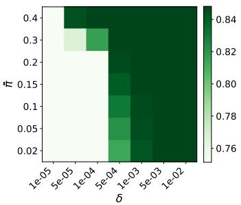  
(a) Accuracy↑

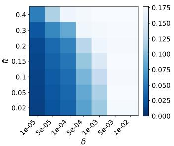  
(b) U(h) ↓

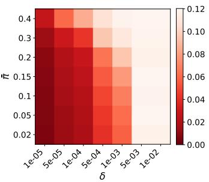  
(c) Deployment Gap ↓  
Figure 3: Hyperparameter sensitivity on the Adult dataset (DP constraint, seed 0). Each cell reports the value of accuracy (left), U(h) (center) and deploy gap max $\cdot ( | \Phi ( h ; 0 ) - t | , | \Phi ( h ; 1 ) - t | )$ (right) as a function of threshold δ and the perturbation lower bound π¯.

Table 4: Selected hyperparameters for STABLE. $K = 3 0$ and m = 60 are fixed across all settings. N.A. stands for Not Applicable.
<table><tr><td rowspan="2"></td><td colspan="2">Adult</td><td colspan="2">COMPAS</td><td colspan="2">ACS Income</td></tr><tr><td>DP</td><td>EO</td><td>DP</td><td>EO</td><td>DP</td><td>EO</td></tr><tr><td>π δ</td><td>0.02  $1 0 ^ { - 5 }$ </td><td>0.15  $1 0 ^ { - 5 }$ </td><td>0.02  $1 0 ^ { - 5 }$ </td><td>0.15  $1 0 ^ { - 4 }$ </td><td>0.02  $1 0 ^ { - 5 }$ </td><td>0.15  $1 0 ^ { - 5 }$ </td></tr></table>

## E.3 Results on ACS with EO constraint

On the ACS geographic experiment under EO (see Figure 4, Stable remains the closest to t across all held-out states, with a near-flat slope $\pi _ { \mathrm { s t a t e } } \mapsto \Phi _ { \mathrm { E O } } ( h ; \pi _ { \mathrm { s t a t e } } )$ , and ERM+EO achieves comparable deployment stability. PostProc drifts systematically above t, while Shifty drifts below t despite explicitly accounting for demographic shift. On the accuracy-EO unfairness tradeoff, Stable and ERM+EO form a competitive frontier in the low-unfairness, high-accuracy region, whereas PostProc exhibits larger variance across states and Shifty trades accuracy for fairness without closing the gap on either.

## E.4 The effect of t

We denote by $t _ { \mathrm { E R M } }$ the target level estimated from ERM and used throughout our experiments. In addition, we consider a grid of 25 values for t in (0.05, 0.95). We train STABLE under both DP and EO on Adult dataset for all the values of t, using the hyperparameters tuned at $t _ { \mathrm { E R M } }$ , over 20 random seeds. For DP, Figure 5a shows that the accuracy is fairly stable over the first half of the grid, then it slightly peaks around $t = 0 . 5$ , then dramatically drops, suggesting that the problem no longer converges. By contrast, the unfairness and the deployment gap remain very stable. For EO, Figure 5b shows that the accuracy increases as t approaches $t _ { \mathrm { E R M } } .$ , remains stable in its neighbourhood, then drops dramatically as t moves away, again indicating non-convergence. The unfairness and deployment gap increase as t approaches $t _ { \mathrm { E R M } }$ , then slightly peak, and finally decrease gradually.

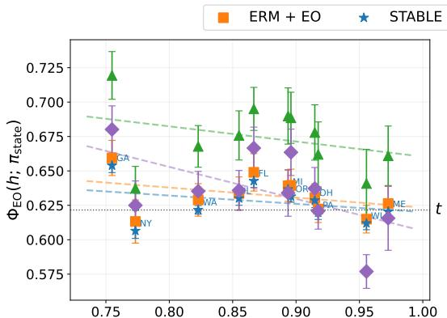  
State P(G = 1 Y= 1) White among high-income

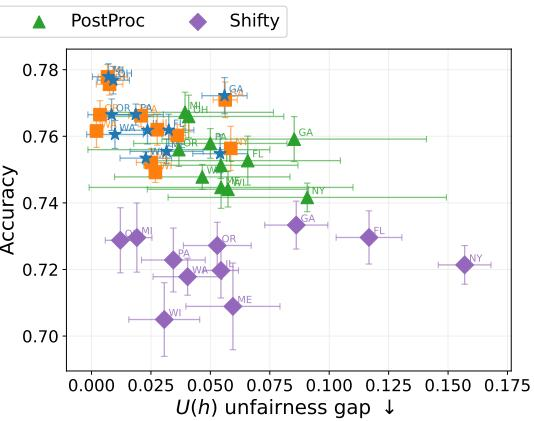  
Figure 4: Geographic generalization on ACS Income. (left) Prediction rate $\Phi ( h ; \pi _ { \mathrm { s t a t e } } )$ as a function of the state proportion of White residents. Dashed lines show linear fits per method; (right) Accuracy vs. EO unfairness gap U(h) across held-out states. Each point corresponds to one state.

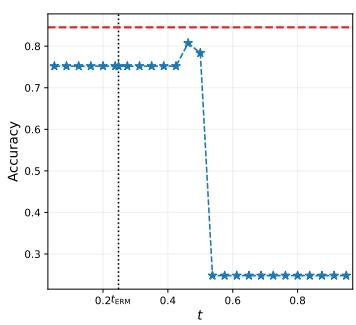

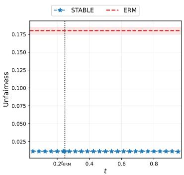

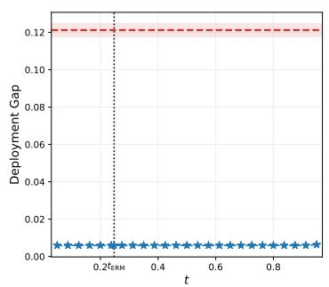  
(a) The effect of target t on Accuracy, Unfairness, and Deployment Gap for STABLE under DP. Shaded regions show ± std over 20 random seeds.

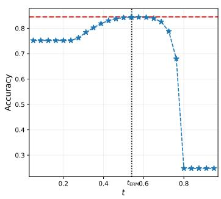

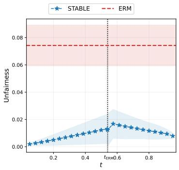

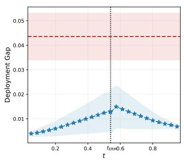  
(b) The effect of target t on Accuracy, Unfairness, and Deployment Gap for STABLE under EO. Shaded regions show ± std over 20 random seeds.  
Figure 5: The effect of target t.