# A Sharp Transition in Data Reconstruction under Diferential Privacy

Max Cairney-Leeming Institute of Science and Technology Austria max.cairney-leeming@ist.ac.at

Simone Bombari Institute of Science and Technology Austria simone.bombari@ist.ac.at

Marco Mondelli Institute of Science and Technology Austria marco.mondelli@ist.ac.at

## Abstract

Data reconstruction attacks have empirically been successful in recovering training samples from learned models, raising privacy concerns and motivating defenses with guarantees that remain valid against future threats. While diferential privacy (DP) provides formal protection, choosing the privacy budget remains a challenge: small budgets severely reduce utility, but it is hard to quantify how large the budget can be without allowing accurate reconstruction. In this work, we study informed attackers who aim to reconstruct a single d-dimensional training sample from a ρ-zero-concentrated DP model, knowing all other training data. Our main contribution is to establish a sharp transition at $\rho \asymp d$ for data reconstruction: on the one hand, we derive entropy-based lower bounds for any private mechanism and any attack, characterizing a set of target priors for which reconstruction is information-theoretically impossible for $\rho \ll d ;$ on the other hand, we analyze a simple attack on private linear regression with output perturbation, showing that reconstruction is practically feasible for $\rho \gg d .$ Remarkably, the transition moves to $\rho \asymp s$ for data lying in an s-dimensional subspace, demonstrating that the privacy budget guaranteeing adequate protection must be assessed in terms of the efective dimension of the data. We validate our findings via experiments on synthetic data and natural images (CIFAR-10, ImageNet).

## 1 Introduction

Easy access to vast amounts of training data is a key ingredient in the success of modern deep learning, naturally encouraging the collection of data that may contain sensitive personal information or copyrighted material. Standard training methods often memorize such training data, making it possible for attackers to recover information about their content from the final model (Carlini et al., 2021; Nasr et al., 2025; Cooper et al., 2026). For example, membership inference attacks are designed to determine whether a given target sample x was included in the training set (Shokri et al., 2017; Nasr et al., 2019; Carlini et al., 2022), while data reconstruction aims to recover the full $x _ { t }$ from scratch (Haim et al., 2022; Buzaglo et al., 2023).

A way to address these risks is via diferential privacy (DP) (Dwork et al., 2006), which has become the standard paradigm for provably safeguarding models from leaking private information e.g. through unintended memorization. DP quantifies data protection through a numerical parameter (ρ in Definition 1), which bounds the impact a single data point can have on the output of the algorithm. However, the noise required by DP training negatively afects performance (Abadi et al., 2016), thus limiting its adoption. In particular, this performance cost is generally noticeable for constant-order (i.e., not dependent on sample size or data dimensionality) privacy budgets $\rho \asymp 1$ , a regime that is also the usual focus in the literature (De et al., 2022; McKenna et al., 2025)1. This scaling provides non-trivial trade-ofs for membership inference attacks (Dong et al., 2022; Mahloujifar et al., 2022; Kairouz et al., 2015): informally, attacks are possible when $\rho \gg 1$ , and impossible when $\rho \ll 1$

On the other hand, much larger privacy budgets yield negligible utility losses in some domains and still protect models from reconstruction attacks (Bhowmick et al., 2019; Stock et al., 2022; Ziller et al., 2024), motivating interest in the regime $\rho \gg 1$ (Cyfers, 2025). In particular, Balle et al. (2022) have shown that, for suitable priors on $x _ { t } \in \mathbb { R } ^ { d } , \rho \ll d$ sufices to make reconstruction statistically impossible. However, for general priors, their bound relies on small-ball probabilities which may be hard to compute in practice $( \mathrm { e . g . }$ for natural language data). Most importantly, it is unclear whether the result is tight, in the sense that reconstruction attacks are possible for $\rho \gg d .$

Our work takes a step towards understanding when the privacy budget sharply characterizes the feasibility of reconstruction from the final model parameters, identifying a sharp transition at $\rho \asymp d$ in $D P$ linear regression. We focus on informed attackers with access to the training set (except for the target example), as well as the hyper-parameters of the output perturbation algorithm used to train the model. More specifically, our contributions are the following:

1. We derive a lower bound on the expected reconstruction error in terms of the target’s diferential entropy $h ( x _ { t } )$ , valid for any $\rho { \mathrm { - z C D P } }$ mechanism and any attack (Theorem 1). This result implies that accurate reconstruction is impossible as long as $\rho \ll h ( x _ { t } )$ . For the target distributions considered by Balle et al. (2022), or for distributions with independent entries, we have $h ( x _ { t } ) \asymp d ,$ , demonstrating the impossibility of reconstruction for $\rho \ll d .$

2. We characterize the performance of an explicit reconstruction attack on a DP model trained via output perturbation (Theorem 2). For a natural range of regularization parameters λ and residual clipping thresholds $C _ { \mathrm { c l i p } }$ , the attack succeeds with high probability whenever $\rho \gg d ,$ providing a tight converse to Theorem 1.

3. We extend our results to data distributions with lower efective dimension, in particular to data supported on an s-dimensional subspace of $\mathbb { R } ^ { d } .$ . We obtain an analogous entropy-based lower bound (Theorem 3) and derive a reconstruction attack that exploits knowledge of the subspace (Theorem 4). Together, these results show that the relevant transition for data reconstruction in this setting occurs at $\rho \asymp s .$

We validate our findings through numerical experiments on synthetic data (Figs. 2 and 5a) and natural images from CIFAR-10 and ImageNet (Figs. 3, 4 and 5b), demonstrating the wider generality of our results beyond the technical assumptions. Overall, our work identifies data dimensionality as a relevant scale for assessing privacy budgets, providing a concrete basis for studying the risks and potential utility benefits of larger budgets.

## 2 Related work

Data reconstruction from non-private models. Large models are known to memorize individual training data within their parameters. Such data can be extracted through appropriate prompting in generative models (Carlini et al., 2023; Nasr et al., 2025; Cooper et al., 2026), or reconstructed directly from the parameters of classifiers (Haim et al., 2022; Buzaglo et al., 2023; Oz et al., 2024; Shen et al., 2026). In the theoretical literature, the problem of fully reconstructing the training set has been tackled in specific settings: the heuristic method of Haim et al. (2022) relies on the implicit bias of gradient descent in homogeneous networks (Lyu and Li, 2020; Ji and Telgarsky, 2020); Loo et al. (2024) and Iurada et al. (2026) show that reconstruction is possible in, respectively, infinite-width shallow networks and suficiently over-parameterized models. If the attacker knows the rest of the dataset, an efective reconstruction method against a generalized linear model, trained without the clipping or noise required for privacy, has also been expressed in closed form by Balle et al. (2022).

Attacks on private models. For models trained with DP, the feasibility of membership inference attacks (MIAs) is closely linked to the privacy budget (Yeom et al., 2018; Kairouz et al., 2015; Mahloujifar et al., 2022), and there is a connection to privacy auditing, as these results mean that successful membership attacks set lower bounds on the privacy guarantee of an algorithm (Jagielski et al., 2020; Nasr et al., 2023; Steinke et al., 2023). Reconstruction attacks have also been linked to privacy budgets, primarily through reconstruction robustness (Balle et al., 2022). This framework has been extended to give stronger bounds for specific mechanisms (Hayes et al., 2023; Kaissis et al., 2023), to use $f { \mathrm { - D P } }$ (Kulynych et al., 2025), and to reconstruct multiple data points (Swanberg et al., 2026). Additional related work has focused on recovering one batch from DP-SGD (Liu et al., 2025), specializing reconstruction robustness to discrete alphabets (Guo et al., 2023), or lower bounding the reconstruction error through the bias and variance of the attack (Guo et al., 2022), though requiring the privacy budget to be at most logarithmic in the diameter of the target prior to rule out reconstruction. Our work combines impossibility guarantees based on the entropy of the target with a provably successful attack, thus establishing a sharp transition for data reconstruction.

Large privacy budgets. A classical convention in the DP literature is to take the privacy budget to be a moderately small constant (Dwork and Roth, 2014). This is consistent with theoretical analyses showing that MIAs fail when $\rho \ll 1$ (Bun and Steinke, 2016; Kairouz et al., 2015; Dong et al., 2022). When membership is not a sensitive attribute, much larger (possibly dimension-dependent) budgets provide meaningful protection while better preserving utility. This has been shown in the locally private setting (Bhowmick et al., 2019; Sarwate and Sankar, 2014; Kalantari et al., 2018), in language models (Stock et al., 2022), and in medical imaging (Ziller et al., 2024), with Aerni et al. (2024) even finding that budgets well above $1 0 ^ { 3 }$ can outperform other heuristic defenses against membership attacks. This evidence also partly motivates the recent position taken by Cyfers (2025), who argues that larger budgets should not be dismissed in favor of uncertified protection methods. Our results provide a theoretical foundation for this perspective, identifying the data’s efective dimension as the scale for assessing how large privacy budgets can be while still protecting against accurate reconstruction.

## 3 Preliminaries

Notation. We set $[ n ] : = \{ 1 , \dots , n \}$ . Given a vector v, let $\| \cdot \| _ { 2 }$ denote its Euclidean norm. Given a matrix $A \in \mathbb { R } ^ { n \times m }$ , let $\| A \| _ { \mathrm { o p } }$ be its operator (spectral) norm. Let $\begin{array} { r } { h ( a ) = - \int p _ { a } ( x ) \log p _ { a } ( x ) \mathrm { d } x } \end{array}$ denote the diferential entropy of a random variable a. We use the letters $x , \chi$ to denote feature vectors and the space of features; $y , y$ for labels; and $z , { \mathcal { Z } }$ for feature-label pairs. Complexity notations ${ \cal O } \left( \lesssim \right) , \Omega \left( \gtrsim \right)$ and $\Theta \left( \asymp \right)$ are meant for large input dimension d and sample size $n .$

Linear regression. Let $Z = ( X , Y )$ be a labeled training dataset, where $X \ = \ [ x _ { 1 } , \ldots , x _ { n } ] ^ { \top } \ \in \ \mathbb { R } ^ { n \times }$ d contains the training data (features) on its rows and $Y = [ \bar { y } _ { 1 } , \dots , y _ { n } ] ^ { \top } \in \mathbb { R } ^ { n }$ contains the corresponding labels. We assume features to have bounded norm $\| x \| _ { 2 } \leq R$ and input-label pairs to be sampled i.i.d. from a joint distribution $P _ { X Y }$ . We consider the linear regression model

$$
y _ { i } = x _ { i } ^ { \top } \theta _ { \mathrm { t r u e } } + \nu _ { i } ,\tag{1}
$$

where $\theta _ { \mathrm { t r u e } } \in \mathbb { R } ^ { d }$ and $\nu _ { i }$ is independent label noise. The goal of DP linear regression is to output an estimate that guarantees a privacy budget and minimizes the test risk, defined for $\theta \in \mathbb { R } ^ { d }$ as

$$
\mathcal { P } ( \theta ) = \frac { 1 } { 2 } \mathbb { E } _ { ( x , y ) \sim P _ { X Y } } \left[ \left( x ^ { \top } \theta - y \right) ^ { 2 } \right]\tag{2}
$$

Diferential privacy (DP) and output perturbation. We say that the datasets $Z$ and $Z ^ { \prime }$ are adjacent if they difer in a single input-label pair. We quantify DP via ρ-zero-concentrated DP $\left( \rho { \mathrm { - z C D P } } \right)$ which uses the α-R´enyi divergence between two probability distributions $P , Q$

$$
D _ { \alpha } ( P \| Q ) : = { \frac { 1 } { \alpha - 1 } } \log \int \left( { \frac { \mathrm { d } P } { \mathrm { d } Q } } \right) ^ { \alpha } \mathrm { d } Q , \qquad \alpha > 1 .\tag{3}
$$

Definition 1 $( \rho \mathrm { - z C D P }$ (Bun and Steinke, 2016)). A randomized algorithm M satisfies $\rho { - } z C D P$ if, for every adjacent pair of datasets $Z , Z ^ { \prime }$ , and every $\alpha > 1$

$$
D _ { \alpha } \big ( \mathcal { M } ( Z ) \| \mathcal { M } ( Z ^ { \prime } ) \big ) \le \rho \alpha .\tag{4}
$$

Fix a regularization parameter $\lambda > 0$ , and a residual clipping threshold $C _ { \mathrm { c l i p } } > 0$ . Let $\ell _ { C _ { \mathrm { c l i p } } }$ be the Huber loss, i.e., a square loss linearized to be $C _ { \mathrm { c l i p } ^ { - 1 } }$ Lipschitz:

$$
\ell _ { C _ { \mathrm { c l i p } } } ( a ) : = \left\{ \begin{array} { l l } { a ^ { 2 } / 2 , } & { | a | \leq C _ { \mathrm { c l i p } } , } \\ { C _ { \mathrm { c l i p } } | a | - C _ { \mathrm { c l i p } } ^ { 2 } / 2 , } & { | a | > C _ { \mathrm { c l i p } } . } \end{array} \right.\tag{5}
$$

Writing $Z = ( X , Y )$ , output perturbation first computes the regularized empirical-risk minimizer

$$
\theta ^ { * } ( Z ) : = \underset { \theta \in \mathbb { R } ^ { d } } { \arg \operatorname* { m i n } } \left\{ \frac { 1 } { n } \sum _ { i = 1 } ^ { n } \ell _ { C _ { \mathrm { c l i p } } } \left( x _ { i } ^ { \top } \theta - y _ { i } \right) + \frac { \lambda } { 2 } \| \theta \| _ { 2 } ^ { 2 } \right\} ,\tag{6}
$$

and then releases

$$
\begin{array} { r } { \tilde { \theta } = \theta ^ { * } ( Z ) + b _ { \mathrm { D P } } , \qquad b _ { \mathrm { D P } } \sim \mathcal { N } ( 0 , \sigma _ { \mathrm { D P } } ^ { 2 } I _ { d } ) . } \end{array}\tag{7}
$$

Proposition 1. The output perturbation algorithm defined by $( 6 ) - ( 7 )$ is $\rho { - } z C D P$ provided

$$
\sigma _ { \mathrm { D P } } ^ { 2 } = \frac { 2 R ^ { 2 } C _ { \mathrm { c l i p } } ^ { 2 } } { \lambda ^ { 2 } \rho n ^ { 2 } } .\tag{8}
$$

This result follows standard arguments on the Gaussian mechanism applied to minimization algorithms with bounded sensitivity (Mironov, 2017), and its proof is deferred to Appendix B. Intuitively, larger λ (or smaller $C _ { \mathrm { c l i p } } )$ implies that the efect of a single training sample on the resulting $\theta ^ { * } ( Z )$ is smaller. Then, to guarantee privacy, Gaussian noise is added proportionally to $1 / \rho$ and $R ^ { 2 } = \operatorname* { s u p } _ { x } \| x \| _ { 2 } ^ { 2 }$ . We will refer to $C _ { \mathrm { c l i p } }$ and λ as the hyper-parameters of output perturbation.

Reconstruction threat model. We follow the same threat model as Balle et al. (2022). A trusted processor has a dataset $Z = ( X , Y )$ , decomposed into a target point $\boldsymbol { z } _ { t } = \left( x _ { t } , y _ { t } \right)$ and the rest of the dataset, $Z _ { - } = ( X _ { - } , y _ { - } )$ . For convenience, we associate $t \in [ n ]$ with an index in the data. The processor releases the output $\mathcal { M } ( Z ) \in \Theta$ of a $\rho { \mathrm { - z C D P } }$ mechanism on the dataset. The attacker then develops a function $\mathcal { A } : \mathcal { Z } ^ { n - 1 } \times \Theta  \mathcal { X }$ to reconstruct the target feature $x _ { t } \in \mathcal { X }$ from $\mathcal { M } ( Z )$ and all other datapoints $Z _ { - }$ . We note that the attacker also has knowledge of the mechanism’s hyperparameters $\lambda$ and $C _ { \mathrm { c l i p } }$ . The resulting reconstruction is $\widehat { \boldsymbol { x } } : = \mathcal { A } ( Z _ { - } , \mathcal { M } ( Z ) )$ ).

## 4 Main results

## 4.1 Information-theoretic lower bound

We first show a lower bound on the expected error an attacker must incur when reconstructing the target point, regardless of $( X _ { - } , y _ { - } )$ , the $\rho { \mathrm { - z C D P } }$ mechanism, or the reconstruction method.

Theorem 1. Let the target feature $x _ { t }$ be independent of the rest of the dataset $Z _ { - } = ( X _ { - } , y _ { - } )$ . Let $\mathcal { A }$ : ${ \mathcal { Z } } ^ { n - 1 } \times \Theta \to \chi$ be an attack, taking as input $Z _ { - }$ and the output $\mathcal { M } ( Z _ { - } \cup \{ z _ { t } \} )$ of a $\rho { - } z C D P$ mechanism, and producing as output an estimate $\widehat { x }$ of $x _ { t }$ . Then,

$$
\frac { \mathbb { E } \| x _ { t } - \widehat { x } \| _ { 2 } ^ { 2 } } { \mathbb { E } \| x _ { t } \| _ { 2 } ^ { 2 } } \geq \frac { 1 } { 2 \pi e } \exp \left( \frac { 2 } { d } \left( h ( x _ { t } ^ { \prime } ) - \rho \right) \right) ,\tag{9}
$$

with $\begin{array} { r } { x _ { t } ^ { \prime } : = \frac { \sqrt { d } } { \sqrt { \mathbb { E } \| x _ { t } \| _ { 2 } ^ { 2 } } } x _ { t } . } \end{array}$

We note that the bound in (9) is scale-invariant, in the sense that neither the LHS or RHS depend on the norm of $x _ { t }$ . Since the LHS of (9) is 1 for the all-0 estimator and 0 for $\hat { x } = x _ { t }$ , we conclude that any attack fails whenever $\rho$ is small compared to the diferential entropy of the (normalized) point to be reconstructed. This dependence on $h ( x _ { t } ^ { \prime } )$ is natural: the diferential entropy quantifies the prior uncertainty in the target, with normalization removing its dependency on the scale of the distribution, and $\rho$ bounds the information that the mechanism can reveal.

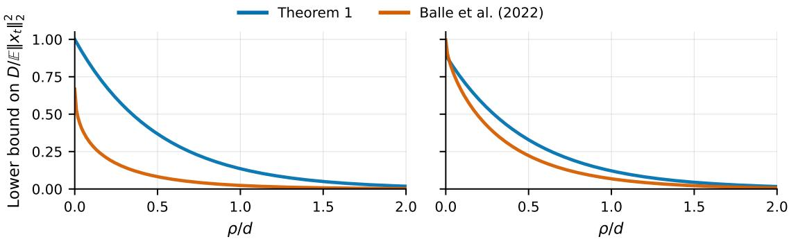  
(a) Gaussian  
(b) Uniform in ball radius $\sqrt { d }$  
Figure 1: Lower bounds on the normalized mean squared error $D / \mathbb { E } \| x _ { t } \| _ { 2 } ^ { 2 }$ , with $D = \mathbb { E } \| x _ { t } - \widehat { x } \| _ { 2 } ^ { 2 }$ . We take $d = 2 0$ and let the distribution of $x _ { t }$ be standard Gaussian (left) or uniform on the ball of radius $\sqrt { d } \ \mathrm { ( r i g h t ) }$ following the setting of Propositions $6 { - } 7$ of Balle et al. (2022). The guarantees of Balle et al. (2022) are translated into bounds on the mean squared error using the Gaussian Chernof and uniform-ball volume bounds, see Appendix F for details.

When $h ( x _ { t } ^ { \prime } ) = \Theta ( d )$ , Theorem 1 implies that, if $\rho \ll d ,$ reconstructing $x _ { t }$ accurately is informationtheoretically impossible. This is the case e.g. for isotropic Gaussians, for the uniform distribution on a ball, and for distributions with independent entries, each with marginal entropy bounded away from 0. Moreover, while (9) bounds normalized mean squared error in terms of $h ( x _ { t } ^ { \prime } )$ , similar bounds can be obtained for (i) the per-coordinate error $\mathbb { E } \lVert x _ { t } - \widehat { x } \rVert _ { 2 } ^ { 2 } / d$ in terms of $h ( x _ { t } )$ , and for $( i i )$ diferent norms/orders $\left( \mathrm { e . g . , } \mathbb { E } \| x _ { t } - \widehat { x } \| _ { 2 } \right)$ whenever the max-entropy distribution under bounded distortion is computable. The proof of Theorem 1 is in Appendix C, with a sketch given below.

Proof sketch. Let us consider normalized features $\mathbb { E } [ \| x _ { t } \| _ { 2 } ^ { 2 } ] = d$ for simplicity, so that $x _ { t } ^ { \prime } = x _ { t }$ . The idea is to combine an upper bound on the mutual information coming from the privacy guarantee with a rate-distortion inequality. First, in Lemma 2, we show that $I ( z _ { t } ; \mathcal { M } ( Z _ { - } \cup \{ z _ { t } \} ) ) \le \rho .$ This follows by taking the R´enyi order $\boldsymbol { \alpha } \downarrow 1$ in the zCDP condition and using convexity of the KL divergence to bound mutual information. As shown by Bun and Steinke (2016), an application of the data processing inequality, combined with the independence of $x _ { t }$ and $Z _ { - }$ , then implies

$$
I ( x _ { t } ; \widehat { x } ) \le \rho .\tag{10}
$$

Writing $D = \mathbb { E } \| x _ { t } - \widehat { x } \| _ { 2 } ^ { 2 }$ and using that the Gaussian distribution maximizes the diferential entropy when the second moment is constrained, in Lemma 3 we show that

$$
h ( x _ { t } ) - \frac { d } { 2 } \log \left( \frac { 2 \pi e D } { d } \right) \leq I ( x _ { t } ; \widehat { x } ) .\tag{11}
$$

Combining (10)-(11) yields the claimed lower bound.

Comparison with prior bounds. Balle et al. (2022, Corollary 4) bound the probability of reconstruction within a radius r through the small-ball probability $\begin{array} { r } { \operatorname* { s u p } _ { v } \mathbb { P } ( \| x _ { t } - v \| _ { 2 } \leq r ) } \end{array}$ . In contrast, our bound is on the mean squared error and the distribution of $x _ { t }$ enters through its diferential entropy. We note that the examples of a uniform and Gaussian distribution in Propositions $6 { - } 7$ of Balle et al. (2022) also show that $\rho \ll d$ guarantees the impossibility of reconstructing training data. However, Fig. 1 demonstrates that the bound of Theorem 1 is tighter for the Gaussian case and also for the uniform case unless $\rho / d$ approaches 0. The improvement is particularly noticeable for moderate values of $\rho / d ,$ i.e., when a strong privacy guarantee is required.

## 4.2 Algorithmic upper bound

We next design an attack on the linear model in (1) privatized via output perturbation (see $\left( 6 \right) )$ , and give provable guarantees on its reconstruction error.

Assumption 1. Each feature datapoint $x \in \mathbb { R } ^ { d } \ i n \ X$ is independently and identically drawn from a $O ( 1 )$ subGaussian distribution with bounded norm $\| x \| _ { 2 } \leq R$ for $R = \Theta ( { \sqrt { d } } )$ . Furthermore, we assume $\| x _ { t } \| _ { 2 } =$ $\Theta ( { \sqrt { d } } )$ and $\nu _ { i } \sim \mathcal { N } ( 0 , \zeta ^ { 2 } )$

In words, we require the data to have well-behaved tails, as commonly done in related work (Brown et al., 2024; Iurada et al., 2026). We also note that this assumption can be relaxed to requiring $\| \dot { X } _ { - } ^ { \enspace \top } X _ { - } \| _ { \mathrm { o p } } =$ $O ( n + d )$ . The normalization $R = \Theta ( { \sqrt { d } } )$ is chosen for convenience, and it corresponds to taking the entries of x of constant order. The Gaussian assumption on $\nu _ { i }$ is also chosen for simplicity, as it can be relaxed to requiring suficient anti-concentration of the noise.

Note that the derivative of the Huber loss is $\psi _ { C _ { \mathrm { c l i p } } } ( a ) : = \ell _ { C _ { \mathrm { c l i p } } } ^ { \prime } ( a ) = \mathrm { s i g n } ( a ) \operatorname* { m i n } \{ | a | , C _ { \mathrm { c l i p } } \}$ . Given the non-target data, define the leave-one-out gradient

$$
F _ { - } ( \theta ) : = \sum _ { i \in [ n ] , i \neq t } x _ { i } \psi _ { C _ { \mathrm { c l i p } } } ( x _ { i } ^ { \top } \theta - y _ { i } ) + n \lambda \theta .\tag{12}
$$

For $\lambda > 0$ , the regularized objective in the RHS of (6) is strongly convex, and it has a unique minimizer $\theta ^ { * }$ The first-order optimality condition thus gives

$$
- F _ { - } ( \theta ^ { * } ) = x _ { t } \psi _ { C _ { \mathrm { c l i p } } } ( x _ { t } ^ { \top } \theta ^ { * } - y _ { t } ) .\tag{13}
$$

Then, given access to $\theta ^ { * }$ , through the knowledge of $X _ { - } , y _ { - } , C _ { \mathrm { c l i p } }$ and $\lambda ,$ one can compute $F _ { - } ( \theta ^ { * } )$ . This quantity, assuming $\psi _ { C _ { \mathrm { c l i p } } } ( x _ { t } ^ { \top } \theta ^ { * } - y _ { t } ) \neq 0$ , is an exact estimator of the direction of $x _ { t } ,$ , due to (13). As the attacker has access to the perturbed weights $\tilde { \theta }$ (and not to $\theta ^ { * } )$ , it is natural to pick $F _ { - } ( \tilde { \theta } )$ to estimate the direction of $x _ { t }$ . The performance of this reconstruction attack is characterized below.

Theorem 2. Let Assumption 1 hold, and let $\lambda > 0 , C _ { \mathrm { c l i p } } > 0$ and $\rho > 0$ be the parameters of the algorithm chosen $b y$ the learner. The attacker computes

$$
\widehat { x } : = R \frac { F _ { - } ( \widetilde { \theta } ) } { \| F _ { - } ( \widetilde { \theta } ) \| _ { 2 } } .\tag{14}
$$

Let $\eta \in ( 0 , 1 )$ be a failure probability and $C , c > 0$ be absolute constants. Then, with probability at least $1 - \eta - 2 e ^ { - c n } - 2 e ^ { - c d }$ ，

$$
\frac { \operatorname* { m i n } _ { \tau \in [ - 1 , 1 ] } \| x _ { t } - \tau \widehat { x } \| _ { 2 } ^ { 2 } } { \| x _ { t } \| _ { 2 } ^ { 2 } } \leq C \left[ \operatorname* { m a x } \left\{ 1 , \frac { C _ { \mathrm { c l i p } } } { \zeta \eta } \left( 1 + \frac { d } { n \lambda } \right) \right\} \left( 1 + \frac { 1 } { \lambda } \right) \left( 1 + \frac { d } { n } \right) \right] ^ { 2 } \frac { d } { \rho } .\tag{15}
$$

Theorem 2 states that, for large enough privacy parameter $\rho ,$ the estimate $F _ { - } ( \tilde { \theta } )$ is approximately aligned to the target $x _ { t }$ . We note that the remaining sign and scale ambiguities may be easily resolvable in practice: the attacker has only two signs to consider (which would reconstruct the original image or its negative), and prior knowledge of the typical sample norm is a natural choice of scale. Formally, we remark that it is also possible to extend the lower bound in Theorem 1 to the metric considered here, without losing the dependence on the dimension

Consider now the case where η is a small constant $( \mathrm { e . g . , } \ \eta = 0 . 0 1 )$ , the label noise is of constant order $\zeta = \Theta ( 1 )$ and the number of training samples satisfies $n \ = \ \Omega ( d )$ , often needed in linear regression to achieve non-trivial test loss (Wainwright, 2019; Mourtada, 2022). Then, the smallest $\rho$ allowing successfu reconstruction depends on the hyper-parameters $C _ { \mathrm { c l i p } } , \lambda$ used by output perturbation. Fig. 2a shows that small clipping constants $C _ { \mathrm { c l i p } } = O ( 1 )$ and a suficiently large regularization $\lambda = \Theta ( 1 )$ empirically yield good performance and, under this scaling, (15) reads

$$
\frac { \operatorname* { m i n } _ { \tau \in [ - 1 , 1 ] } \| x _ { t } - \tau \widehat { x } \| _ { 2 } ^ { 2 } } { \| x _ { t } \| _ { 2 } ^ { 2 } } \lesssim \frac { d } { \rho } .\tag{16}
$$

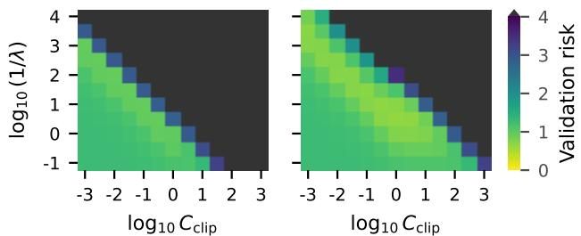  
(a) Hyperparameter search at $\rho = 1 0$ and $\rho = 1 0 ^ { 4 }$

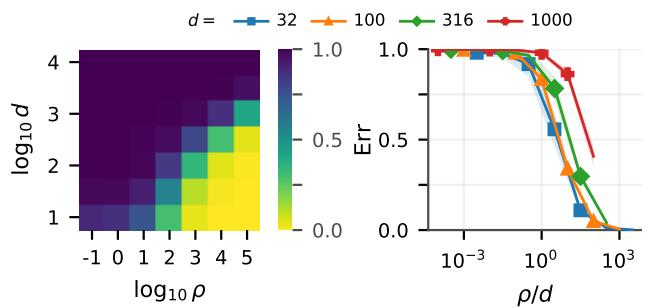  
(b) Reconstruction error relative to ρ and d  
Figure 2: Hyper-parameter selection and reconstruction, for synthetic data sampled uniformly on the sphere. The first two panels show validation mean squared error (MSE) over a hyper-parameter grid at $n = d = 1 0 0 0$ $\zeta = 0 . 5$ , for $\rho = 1 0$ and $\rho = 1 0 ^ { 4 }$ . The third and fourth panel show normalized reconstruction error after hyper-parameter selection within the range $\lambda \geq 0 . 1$ and $C _ { \mathrm { c l i p } } \leq 0 . 1 \zeta$

This matches the scaling of the impossibility result of Theorem 1, and the sharp transition in data reconstruction at $\rho \asymp d$ is clearly displayed in Fig. 2b. We also remark that the findings in Fig. $2 ( \mathrm { a } )$ on $C _ { \mathrm { c l i p } }$ are in analogy with the evidence that small gradient clipping constants yield good downstream performance in private gradient methods (Li et al., 2022; De et al., 2022; Bombari et al., 2026). The proof of Theorem 2 is in Appendix D, with a sketch given below.

Proof sketch. The idea is to separate the signal carried by the target point from the perturbation induced by the privacy noise. Writing $a = \psi _ { C _ { \mathrm { c l i p } } } ( x _ { t } ^ { \top } \theta ^ { * } - y _ { t } )$ , the optimality condition (13) gives

$$
\begin{array} { r l r l r } { - F _ { - } ( \tilde { \theta } ) = a x _ { t } + w , } & { { } } & { w : = F _ { - } ( \theta ^ { * } ) - F _ { - } ( \tilde { \theta } ) . } \end{array}
$$

First, to lower-bound |a|, we show that the target residual at $\theta ^ { * }$ is close to that at the leave-one-out estimator θ defined in (31). Conditional on $( x _ { t } , Z _ { - } )$ , the latter residual is Gaussian with variance $\zeta ^ { 2 } .$ Gaussian anti-concentration, combined with Lemma 5 , then yields

$$
| a | \gtrsim \mathrm { m i n } \left\{ C _ { \mathrm { c l i p } } , \frac { \zeta \eta } { 1 + R ^ { 2 } / ( n \lambda ) } \right\}
$$

with probability at least $1 - \eta ;$ see (36). Next, the same lemma controls the amplification of the privacy noise through $F _ { - }$ . Combining concentration of the Gram matrix $X _ { - } ^ { \phantom { + } \top } X .$ and of the norm of the Gaussian noise gives, with high probability,

$$
\| w \| _ { 2 } \lesssim \sigma _ { \mathrm { D P } } \sqrt { d } ( n \lambda + n + d ) ,
$$

as established in (38). Finally, Lemma 4 gives min $\mathsf { l } _ { \tau \in [ - 1 , 1 ] } \| x _ { t } - \tau \widehat { x } \| _ { 2 } ^ { 2 } \leq 4 \| w \| _ { 2 } ^ { 2 } / a ^ { 2 }$ . Substituting $\sigma _ { \mathrm { D P } }$ from Proposition 1, using $R ^ { 2 } = O ( d )$ , and taking a union bound yields the final guarantee. □

## 4.3 Extension to low-dimensional data

The bounds above show that $\rho \asymp d$ is a sharp threshold for reconstructing data in dimension d privatized via $\mathrm { a \ \rho - z C D P }$ mechanism: Theorem 1 implies that reconstruction is information-theoretically impossible for $\rho \ll d ,$ , and Theorem 2 exhibits a successful attack for $\rho \gg d .$ However, the impossibility result, and therefore the tightness of this threshold, relies on the entropy of $x _ { t }$ to scale with the number of dimensions, i.e., $h ( x _ { t } ) \asymp d ,$ which may not be the case for data in practical applications. To model that, we now focus on data lying in a lower dimensional subspace of Rd.

More precisely, let P be a fixed orthogonal projection of rank $s < d _ { \colon }$ , and let $U \in \mathbb { R } ^ { d \times s }$ have orthonormal columns spanning Im(P), so that $P = U U ^ { \top }$ . Define

$$
\begin{array} { r } { h _ { s } ( x _ { t } ) : = h ( U ^ { \top } x _ { t } ) , } \end{array}
$$

where $h$ is taken with respect to the Lebesgue measure on $\mathbb { R } ^ { s }$ . Note that this definition does not depend on the specific choice of orthonormal basis, and its purpose is to avoid computing the diferential entropy of $P { x _ { t } }$ in the original ambient space $\mathbb { R } ^ { d }$ , where its distribution would be singular.

The result below (proved in Appendix E) extends the lower bound of Theorem 1.

Theorem 3. In the same setting as Theorem 1, for any rank-s projection P satisfying the conditions above, any reconstruction of $x _ { t }$ from a $\rho { - } z C D P$ mechanism obeys:

$$
\frac { \mathbb { E } \| x _ { t } - \widehat { x } \| _ { 2 } ^ { 2 } } { \mathbb { E } \| P x _ { t } \| _ { 2 } ^ { 2 } } \geq \frac { 1 } { 2 \pi e } \exp \left( \frac { 2 } { s } ( h _ { s } ( x _ { s } ^ { \prime } ) - \rho ) \right) ,\tag{17}
$$

with $\begin{array} { r } { x _ { s } ^ { \prime } : = \frac { \sqrt { s } } { \sqrt { \mathbb { E } \| P x _ { t } \| _ { 2 } ^ { 2 } } } P x _ { t } . } \end{array}$

We note that the lower bound in (17) is analogous to that in (9) upon replacing $( i ) \mathbb { E } \| x _ { t } \| _ { 2 } ^ { 2 }$ with $\mathbb { E } \Vert P x _ { t } \Vert _ { 2 } ^ { 2 }$ in the denominator of the LHS, and $( i i ) h ( x _ { t } ^ { \prime } )$ with $h _ { s } ( x _ { s } ^ { \prime } )$ on the RHS. Thus, if the point to be reconstructed $x _ { t }$ lies close to the span of Im(P) (i.e., $\mathbb { E } \Vert x _ { t } \Vert _ { 2 } ^ { 2 } \approx \mathbb { E } \Vert P x _ { t } \Vert _ { 2 } ^ { 2 } )$ , then any attack fails whenever $\rho$ is small compared to the diferential entropy $h _ { s } ( x _ { s } ^ { \prime } )$ computed on that span. Furthermore, as this span has dimension s, we would typically have $h _ { s } ( x _ { s } ^ { \prime } ) = \Theta ( s )$ , implying the impossibility of data reconstruction whenever $\rho \ll s$

To complement this lower bound, the result below (also proved in Appendix E) characterizes the performance of a variant of the attack in Theorem 2 that seeks to reconstruct an s-dimensional projection of the target.

Theorem 4. Consider the same setting as Theorem 2, but with $R = \Theta ( \sqrt { s } )$ and $\| x _ { t } \| _ { 2 } = \Theta ( { \sqrt { s } } )$ replacing the corresponding $\Theta ( { \sqrt { d } } )$ assumptions. Let $P \in \mathbb { R } ^ { d \times d }$ be a rank-s projector, known to the attacker, such that $x _ { i } \in { \mathrm { I m } } ( P )$ for all $i \in [ n ]$ . Let

$$
\hat { x } _ { P } : = R \frac { P F _ { - } ( \tilde { \theta } ) } { \lVert P F _ { - } ( \tilde { \theta } ) \rVert _ { 2 } } .\tag{18}
$$

Then, $i f n = \Omega ( s ) , \lambda = \Omega ( 1 ) , C _ { \mathrm { c l i p } } = O ( \zeta )$ , we have

$$
\frac { \operatorname* { m i n } _ { \tau \in [ - 1 , 1 ] } \| x _ { t } - \tau \hat { x } _ { P } \| _ { 2 } ^ { 2 } } { \| x _ { t } \| _ { 2 } ^ { 2 } } \lesssim \frac { s } { \rho } ,\tag{19}
$$

with probability at least 0.99.

While the result of Theorem 3 is scale-invariant, Theorem 4 considers R and $\| x _ { t } \| _ { 2 }$ of order $\sqrt { s } . ^ { 2 }$ Modulo this scale diference, the upper bound in (19) is analogous to that in (16) upon replacing $( i )$ the estimator x with its projected version ${ \hat { x } } _ { P } .$ , and (ii) the dimension d of the ambient space with the dimension s of the subspace containing the data. In words, Theorem 4 shows that an attack having knowledge of the subspace of dimension s in which the data lies, is successful whenever $\rho \gg s$ and, combined with Theorem 3, this establishes $\rho \asymp s$ as a sharp threshold for data reconstruction.

## 5 Experiments

We study the attacks of Sections 4.2-4.3 for data sampled uniformly on the d-dimensional sphere, synthetic data concentrated near an s-dimensional subspace, and binary regression on data taken from ImageNet (elephants vs. pandas) and CIFAR-10 (frog vs. trucks). Details on datasets construction, learning algorithm, and attacks are given in Appendix G. We report the squared reconstruction error (see e.g. the LHS of (19)), with the sign ambiguity resolved.

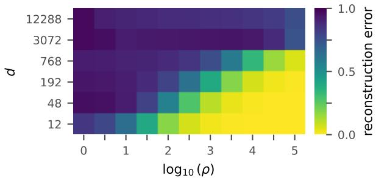

(a) ImageNet reconstruction heatmap  
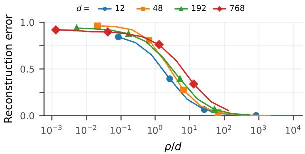  
(b) ImageNet, ρ/d

Figure 3: Reconstruction of ImageNet data (elephants vs. pandas). Hyperparameter search for mean validation MSE within $\lambda \ge 0 . 1$ and $C _ { \mathrm { c l i p } } \leq$ 0.01. The panels show squared relative error against $( \rho , d )$ and against $\rho / d$  
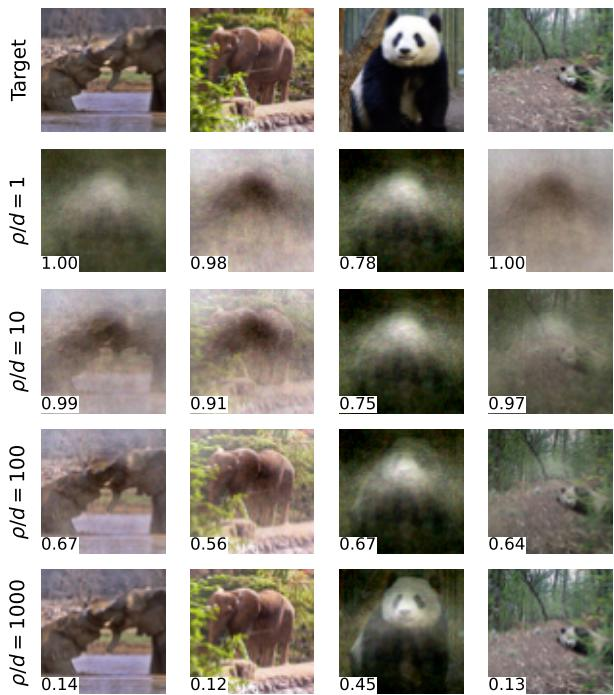  
Figure 4: Reconstructions of four target images from ImageNet (elephants vs. pandas) as the privacy budget grows, with λ = 1 and $C _ { \mathrm { c l i p } } = 0 . 1 2 5$ . The number inside each reconstruction is its reconstruction error. Here, $d = 1 2 { , } 2 8 8$ (64 × 64 RGB images). Additional plots appear in Figs. 7 and 8.

Synthetic d-dimensional data. In Fig. 2a, we investigate how diferent choices of $C _ { \mathrm { c l i p } }$ and λ afect the performance of the output perturbation algorithm in (7). The heatmaps show that, for both values of $\rho ,$ the best performance is achieved for (i) suficiently small values of $C _ { \mathrm { c l i p } }$ , and (ii) an appropriate ratio $C _ { \mathrm { c l i p } } / \lambda$ . In fact, the lowest validation risk occurs on a top-left to bottom-right diagonal of the heatmap. Then, for any output perturbation algorithm, we take the values of $\lambda \geq 0 . 1$ and $C _ { \mathrm { c l i p } } \leq 0 . 1 \zeta$ that minimize the validation risk. In the left panel of Fig. 2b, we plot the reconstruction error as a function of $\rho$ and $d ,$ and identify a clear diagonal boundary $\rho / d \asymp 1$ between successful and unsuccessful attacks, validating our result in (16). In the right panel of Fig. 2b, we plot the same reconstruction error as a function of $\rho / d$ , and show that curves corresponding to diferent values of d (in diferent colors) collapse onto each other under this scaling.

Natural images. In Fig. 3, we consider ImageNet data, and perform the same experiments as those described in Fig. 2 for synthetic data. Here, we tune the value of d by down-scaling images to a lower resolution, and we optimize the output perturbation algorithm across the hyper-parameters ranges $\lambda \geq 0 . 1$ and $C _ { \mathrm { c l i p } } \leq 0 . 0 1$ . In Fig. 3a, we plot the reconstruction error as a function of $\rho$ and $d ,$ and identify the same clear diagonal boundary as in Fig. 2 for the attack success across diferent image resolutions. In Fig. 3b, we then plot the same reconstruction error as a function $\rho / d ,$ , noting that curves corresponding to diferent values of d collapse onto each other. This provides evidence that our proposed threshold $\rho \asymp d$ for data reconstruction persists in natural images as well. Furthermore, in Fig. 4 we give a visual presentation of some target images (first row) and the corresponding reconstructions for increasing values of $\rho / d .$ Additional visual reconstructions appear in Figs. 7 and 8 (Appendix G.4).

Low-dimensional data. In Fig. 5, we numerically investigate the conclusions of Theorems 3 and 4. More precisely, in Figure 5a, we fix the ambient dimension at $d = 1 0 0 0$ , and generate synthetic data concentrated near an s-dimensional subspace. The construction is detailed in Appendix G.1. We test the reconstruction attack in (18), estimating the rank-s PCA projector P from $X _ { - }$ , and report its performance as a function of $\rho / s$ (left panel) and $\rho$ (right panel). The reconstruction error curves with respect to $\rho / s$ overlap for diferent values of s, showing a transition at the level of $\rho \asymp s$ . In contrast, the curves are clearly separated when plotted against $\rho .$ This validates our bound in (19), and it shows that the same privacy budget $\rho$ can result in diferent guarantees in terms of data reconstruction, depending on the efective dimension of the data.

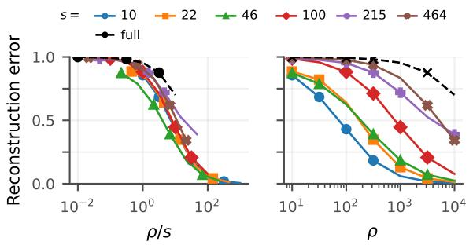  
(a) Synthetic rank-s data

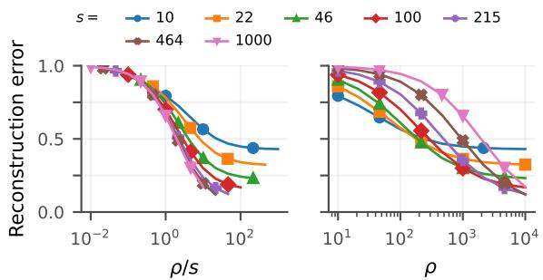  
(b) CIFAR-10 (frog vs. truck)  
Figure 5: Reconstruction error for projected attacks on (a) synthetic rank-s data with $d = 1 0 0 0 \mathrm { { ; } }$ and (b) CIFAR-10 (frog vs. truck) data with $d = 3 { , } 0 7 2$ (32 × 32 RGB images). Each pair of plots uses $\rho / s$ (left) and $\rho \ \mathrm { ( r i g h t ) }$ on the x-axis, and diferent colors for diferent values of the rank s.

Next, in Fig. 5b, we consider a similar class of experiments, training our DP linear regression model on CIFAR-10 data. We perform the reconstruction attack in (18), defining $P$ as the projector over the s principal components of the data distribution, estimated from X−. We again plot the reconstruction error both in terms of $\rho / s$ (left panel) and $\rho$ (right panel). As for the synthetic data, the curves are separated when plotted against $\rho ,$ and they collapse onto each other when plotted against $\rho / s$ . However, diferently from the synthetic data, when s is too small $( \mathrm { e . g . } , s = 1 0 )$ , the error exhibits a plateau even at large $\rho / s$ capturing the fact that low-rank subspaces do not capture all of the signal of the target. Similar results for ImageNet are reported in Fig. 6 (Appendix G.3).

## 6 Conclusions

In this work, we study how diferential privacy quantitatively determines the feasibility of successful reconstruction attacks. First, in Theorem 1, we prove that any $\rho { \mathrm { - z C D P } }$ mechanism prevents data reconstruction as long as the privacy budget is suficiently smaller than the entropy of the target, i.e., $\rho \ll h ( x _ { t } )$ . When $h ( x _ { t } ) = \Theta ( d )$ (which holds, $\mathrm { e . g . }$ , for distributions with independent entries), this provides the suficient condition $\rho \ll d$ to protect from reconstruction attacks. Then, in Theorem $2 ,$ we show that this condition is also necessary: there exists an attack on a linear model trained with output perturbation that achieves arbitrary accuracy as $\rho \gg d .$ . Taken together, these results identify $\rho \asymp d$ as a sharp transition in data reconstruction. We next show that this threshold shifts according to the efective dimension of the data: when the data lies on an s-dimensional subspace known to the attacker, the transition moves to $\rho \asymp s$ (Theorems 3 and 4). This highlights the role of the data prior in assessing the efective guarantees given by a privacy budget.

A first natural research direction for future work is to extend Theorem 2 to other algorithms (e.g., DP gradient descent or objective perturbation) and beyond the linear model assumption, as well as expand our results on low-dimensional data to non-linear subspaces. A second exciting avenue is to consider less powerful attackers, without knowledge of all remaining training data. Information-theoretic lower bounds in that setting would complement the recent work by Swanberg et al. (2026) on adversary-aware privacy guarantees. We suspect that matching those bounds with attacks would require a diferent learning model: when multiple training examples are unknown, the optimality conditions of a linear model generally leave their individual values under-determined (Runkel et al., 2025). Thus, the success of the attack will likely depend on the capacity of the learning model, in agreement with the results of Iurada et al. (2026) in the context of non-private learning.

## Acknowledgements

This research was funded in whole or in part by the Austrian Science Fund (FWF) 10.55776/COE12. For the purpose of open access, the authors have applied a CC BY public copyright license to any Author Accepted Manuscript version arising from this submission.

Simone Bombari was supported by a Google PhD fellowship. The authors would like to thank Edwige Cyfers for helpful discussions.

This research was supported by the Scientific Service Units (SSU) of the Institute of Science and Technology Austria through resources provided by Scientific Computing (SciComp).

## References

Martin Abadi, Andy Chu, Ian Goodfellow, H. Brendan McMahan, Ilya Mironov, Kunal Talwar, and Li Zhang. Deep learning with diferential privacy. In ACM SIGSAC Conference on Computer and Communications Security (CCS), 2016.

Michael Aerni, Jie Zhang, and Florian Tram\`er. Evaluations of machine learning privacy defenses are misleading. In ACM SIGSAC Conference on Computer and Communications Security (CCS), 2024.

Borja Balle, Giovanni Cherubin, and Jamie Hayes. Reconstructing Training Data with Informed Adversaries. In IEEE Symposium on Security and Privacy (SP), May 2022. doi: 10.1109/SP46214.2022.9833677.

Abhishek Bhowmick, John Duchi, Julien Freudiger, Gaurav Kapoor, and Ryan Rogers. Protection against reconstruction and its applications in private federated learning. arXiv:1812.00984, 2019.

Simone Bombari and Marco Mondelli. Privacy for free in the overparameterized regime. Proceedings of the National Academy of Sciences, 2025.

Simone Bombari, Jialei Luo, Inbar Seroussi, and Marco Mondelli. High-dimensional private linear regression with optimal rates. arXiv:2505.16329, 2026.

Gavin R Brown, Krishnamurthy Dj Dvijotham, Georgina Evans, Daogao Liu, Adam Smith, and Abhradeep Guha Thakurta. Private gradient descent for linear regression: Tighter error bounds and instance-specific uncertainty estimation. In International Conference on Machine Learning (ICML), 2024.

Mark Bun and Thomas Steinke. Concentrated Diferential Privacy: Simplifications, Extensions, and Lower Bounds. In Theory of Cryptography, Lecture Notes in Computer Science. Springer, 2016. doi: 10.1007/ 978-3-662-53641-4 24.

Gon Buzaglo, Niv Haim, Gilad Yehudai, Gal Vardi, Yakir Oz, Yaniv Nikankin, and Michal Irani. Deconstructing data reconstruction: Multiclass, weight decay and general losses. In Conference on Neural Information Processing Systems (NeurIPS), 2023.

Nicholas Carlini, Florian Tram\`er, Eric Wallace, Matthew Jagielski, Ariel Herbert-Voss, Katherine Lee, Adam Roberts, Tom Brown, Dawn Song, Ulfar Erlingsson, Alina Oprea, and Colin Rafel. Extracting training´ data from large language models. In USENIX Security Symposium, 2021.

Nicholas Carlini, Steve Chien, Milad Nasr, Shuang Song, Andreas Terzis, and Florian Tram\`er. Membership inference attacks from first principles. In IEEE Symposium on Security and Privacy (SP), 2022.

Nicholas Carlini, Jamie Hayes, Milad Nasr, Matthew Jagielski, Vikash Sehwag, Florian Tram\`er, Borja Balle, Daphne Ippolito, and Eric Wallace. Extracting training data from difusion models. In USENIX Security Symposium, 2023.

A Feder Cooper, Mark A Lemley, Allison Casasola, Ahmed Ahmed, Aaron Gokaslan, Amy B Cyphert, Christopher De Sa, Daniel E Ho, and Percy Liang. Extracting memorized pieces of (copyrighted) books from open-weight language models. In Conference on Language Modeling, 2026.

Thomas M. Cover and Joy A. Thomas. Elements of Information Theory. Wiley-Interscience, 2001.

Edwige Cyfers. Setting ε is not the issue in diferential privacy. In Conference on Neural Information Processing Systems (NeurIPS), 2025.

Soham De, Leonard Berrada, Jamie Hayes, Samuel L. Smith, and Borja Balle. Unlocking high-accuracy diferentially private image classification through scale. arXiv:2204.13650, 2022.

Jinshuo Dong, Aaron Roth, and Weijie J. Su. Gaussian diferential privacy. Journal of the Royal Statistical Society Series B: Statistical Methodology, 2022.

Cynthia Dwork and Aaron Roth. The algorithmic foundations of diferential privacy. Foundations and Trends in Theoretical Computer Science, 2014.

Cynthia Dwork, Frank McSherry, Kobbi Nissim, and Adam Smith. Calibrating Noise to Sensitivity in Private Data Analysis. In Theory of Cryptography, Lecture Notes in Computer Science, Berlin, Heidelberg, 2006. Springer.

Chuan Guo, Brian Karrer, Kamalika Chaudhuri, and Laurens van der Maaten. Bounding Training Data Reconstruction in Private (Deep) Learning. In International Conference on Machine Learning (ICML), 2022.

Chuan Guo, Alexandre Sablayrolles, and Maziar Sanjabi. Analyzing privacy leakage in machine learning via multiple hypothesis testing: A lesson from Fano. In International Conference on Machine Learning (ICML), 2023.

Niv Haim, Gal Vardi, Gilad Yehudai, Ohad Shamir, and Michal Irani. Reconstructing Training Data from Trained Neural Networks. In Conference on Neural Information Processing Systems (NeurIPS), 2022.

Jamie Hayes, Saeed Mahloujifar, and Borja Balle. Bounding training data reconstruction in DP-SGD. In Conference on Neural Information Processing Systems (NeurIPS), 2023.

Leonardo Iurada, Simone Bombari, Tatiana Tommasi, and Marco Mondelli. A law of data reconstruction for random features (and beyond). In International Conference on Learning Representations (ICLR), 2026.

Matthew Jagielski, Jonathan Ullman, and Alina Oprea. Auditing diferentially private machine learning: How private is private SGD? In Conference on Neural Information Processing Systems (NeurIPS), 2020.

Ziwei Ji and Matus Telgarsky. Directional convergence and alignment in deep learning. In Conference on Neural Information Processing Systems (NeurIPS), 2020.

Peter Kairouz, Sewoong Oh, and Pramod Viswanath. The composition theorem for diferential privacy. In International Conference on Machine Learning (ICML), 2015.

Georgios Kaissis, Jamie Hayes, Alexander Ziller, and Daniel Rueckert. Bounding data reconstruction attacks with the hypothesis testing interpretation of diferential privacy. arXiv:2307.03928, 2023.

Kousha Kalantari, Lalitha Sankar, and Anand D. Sarwate. Robust Privacy-Utility Tradeofs Under Differential Privacy and Hamming Distortion. IEEE Transactions on Information Forensics and Security, 2018.

Antti Koskela and Tejas Kulkarni. Practical diferentially private hyperparameter tuning with subsampling. In Conference on Neural Information Processing Systems (NeurIPS), 2023.

Bogdan Kulynych, Juan Felipe Gomez, Georgios Kaissis, Jamie Hayes, Borja Balle, Flavio P. Calmon, and Jean Louis Raisaro. Unifying Re-Identification, Attribute Inference, and Data Reconstruction Risks in Diferential Privacy. In Conference on Neural Information Processing Systems (NeurIPS), 2025.

Xuechen Li, Florian Tram\`er, Percy Liang, and Tatsunori Hashimoto. Large language models can be strong diferentially private learners. In International Conference on Learning Representations (ICLR), 2022.

Sheng Liu, Zihan Wang, Yuxiao Chen, and Qi Lei. Data Reconstruction Attacks and Defenses: A Systematic Evaluation. In International Conference on Artificial Intelligence and Statistics (AISTATS), 2025.

Noel Loo, Ramin Hasani, Mathias Lechner, Alexander Amini, and Daniela Rus. Understanding reconstruction attacks with the neural tangent kernel and dataset distillation. In International Conference on Learning Representations (ICLR), 2024.

Kaifeng Lyu and Jian Li. Gradient descent maximizes the margin of homogeneous neural networks. In International Conference on Learning Representations (ICLR), 2020.

Saeed Mahloujifar, Alexandre Sablayrolles, Graham Cormode, and Somesh Jha. Optimal membership inference bounds for adaptive composition of sampled Gaussian mechanisms. arXiv:2204.06106, 2022.

Ryan McKenna, Yangsibo Huang, Amer Sinha, Borja Balle, Zachary Charles, Christopher A. Choquette-Choo, Badih Ghazi, Georgios Kaissis, Ravi Kumar, Ruibo Liu, Da Yu, and Chiyuan Zhang. Scaling laws for diferentially private language models. In International Conference on Machine Learning (ICML), 2025.

Ilya Mironov. Renyi Diferential Privacy. In IEEE Computer Security Foundations Symposium (CSF), 2017.

Jaouad Mourtada. Exact minimax risk for linear least squares, and the lower tail of sample covariance matrices. The Annals of Statistics, 2022.

Milad Nasr, Reza Shokri, and Amir Houmansadr. Comprehensive privacy analysis of deep learning: Passive and active white-box inference attacks against centralized and federated learning. In IEEE Symposium on Security and Privacy (SP), 2019.

Milad Nasr, Jamie Hayes, Thomas Steinke, Borja Balle, Florian Tram\`er, Matthew Jagielski, Nicholas Carlini, and Andreas Terzis. Tight auditing of diferentially private machine learning. In USENIX Security Symposium, 2023.

Milad Nasr, Javier Rando, Nicholas Carlini, Jonathan Hayase, Matthew Jagielski, A. Feder Cooper, Daphne Ippolito, Christopher A. Choquette-Choo, Florian Tram\`er, and Katherine Lee. Scalable extraction of training data from aligned, production language models. In International Conference on Learning Representations (ICLR), 2025.

Yakir Oz, Gilad Yehudai, Gal Vardi, Itai Antebi, Michal Irani, and Niv Haim. Reconstructing training data from real world models trained with transfer learning. arXiv:2407.15845, 2024.

Nicolas Papernot and Thomas Steinke. Hyperparameter tuning with renyi diferential privacy. In International Conference on Learning Representations (ICLR), 2022.

Christina Runkel, Kanchana Vaishnavi Gandikota, Jonas Geiping, Carola-Bibiane Sch¨onlieb, and Michael Moeller. Training data reconstruction: Privacy due to uncertainty? In Computer Vision and Pattern Recognition (CVPR) Workshops, 2025.

Anand D. Sarwate and Lalitha Sankar. A rate-distortion perspective on local diferential privacy. In Allerton Conference on Communication, Control, and Computing (Allerton), 2014.

Yujie Shen, Zihan Wang, Jian Qian, and Qi Lei. Data Reconstruction: Identifiability and Optimization with Sample Splitting. In International Conference on Machine Learning (ICML), 2026.

Reza Shokri, Marco Stronati, Congzheng Song, and Vitaly Shmatikov. Membership inference attacks against machine learning models. In IEEE Symposium on Security and Privacy (SP), 2017.

Thomas Steinke, Milad Nasr, and Matthew Jagielski. Privacy auditing with one (1) training run. In Conference on Neural Information Processing Systems (NeurIPS), 2023.

Pierre Stock, Igor Shilov, Ilya Mironov, and Alexandre Sablayrolles. Defending against reconstruction attacks with r´enyi diferential privacy. arXiv:2202.07623, 2022.

Marika Swanberg, Meenatchi Sundaram Muthu Selva Annamalai, Jamie Hayes, Borja Balle, and Adam Smith. A unified framework for adversary-aware diferential privacy bounds. arXiv:2507.08158, 2026.

Tim van Erven and Peter Harremo¨es. R´enyi Divergence and Kullback-Leibler Divergence. IEEE Transactions on Information Theory, 2014.

Roman Vershynin. Introduction to the Non-Asymptotic Analysis of Random Matrices. Cambridge University Press, 2012.

Roman Vershynin. High-Dimensional Probability: An Introduction with Applications in Data Science. Cam bridge University Press, 2018.

Martin J Wainwright. High-Dimensional Statistics: A Non-Asymptotic Viewpoint. Cambridge University Press, 2019.

Samuel Yeom, Irene Giacomelli, Matt Fredrikson, and Somesh Jha. Privacy risk in machine learning: Analyzing the connection to overfitting. In IEEE Computer Security Foundations Symposium (CSF), 2018.

Alexander Ziller, Tamara T. Mueller, Simon Stieger, Leonhard F. Feiner, Johannes Brandt, Rickmer Braren, Daniel Rueckert, and Georgios Kaissis. Reconciling privacy and accuracy in AI for medical imaging. Nature Machine Intelligence, 2024.

## A Additional notation

Given a symmetric matrix A, we denote with $\operatorname { t r } ( A )$ its trace, and by $s _ { \operatorname* { m i n } } ( A ) \ ( s _ { \operatorname* { m a x } } ( A ) )$ its smallest (largest) singular value. Given a symmetric matrix $A ,$ we denote by $\lambda _ { \operatorname* { m i n } } ( A ) \ ( \lambda _ { \operatorname* { m a x } } ( A ) )$ its smallest (largest) eigenvalue. For square, symmetric matrices A, B, we write $A \preceq B$ if $B - A$ is positive semi-definite $\mathrm { ( p . s . d . ) }$ , where A is p.s.d. if $x ^ { \top } A x \geq 0$ for all $x \in \mathbb { R } ^ { n }$ . We use the notation $[ b ] _ { + } = \operatorname* { m a x } \{ b , 0 \}$ for $b \in \mathbb { R }$

## B Sensitivity and privacy of output perturbation

Lemma 1 (Sensitivity of (6)). Fix $\lambda , R , C _ { \mathrm { c l i p } } > 0$ . Let $Z , Z ^ { \prime }$ be adjacent datasets of size $n ,$ with every feature vector in either dataset having norm at most R. Then, the minimizer in (6) satisfies

$$
\| \theta ^ { * } ( Z ) - \theta ^ { * } ( Z ^ { \prime } ) \| _ { 2 } \leq \frac { 2 R C _ { \mathrm { c l i p } } } { \lambda n } .\tag{20}
$$

Proof. Without loss of generality, let $Z$ and $Z ^ { \prime }$ difer in their first example, and write

$$
\theta : = \theta ^ { \ast } ( Z ) , \qquad \theta ^ { \prime } : = \theta ^ { \ast } ( Z ^ { \prime } ) , \qquad r : = \theta - \theta ^ { \prime } .
$$

Define

$$
\begin{array} { r } { g _ { i } ( \vartheta ) : = x _ { i } \ell _ { C _ { \mathrm { c l i p } } } ^ { \prime } ( x _ { i } ^ { \top } \vartheta - y _ { i } ) , \qquad g _ { 1 } ^ { \prime } ( \vartheta ) : = x _ { 1 } ^ { \prime } \ell _ { C _ { \mathrm { c l i p } } } ^ { \prime } ( ( x _ { 1 } ^ { \prime } ) ^ { \top } \vartheta - y _ { 1 } ^ { \prime } ) . } \end{array}
$$

The first-order optimality conditions for the two strongly convex objectives are

$$
0 = \frac { 1 } { n } \left( g _ { 1 } ( \theta ) + \sum _ { i = 2 } ^ { n } g _ { i } ( \theta ) \right) + \lambda \theta , \qquad 0 = \frac { 1 } { n } \left( g _ { 1 } ^ { \prime } ( \theta ^ { \prime } ) + \sum _ { i = 2 } ^ { n } g _ { i } ( \theta ^ { \prime } ) \right) + \lambda \theta ^ { \prime } .
$$

Subtracting these equations and taking the inner product with r gives

$$
\lambda \| r \| _ { 2 } ^ { 2 } = \mathrm { ~ - ~ } \frac { 1 } { n } r ^ { \top } \left( \sum _ { i = 2 } ^ { n } \bigl ( g _ { i } ( \theta ) - g _ { i } ( \theta ^ { \prime } ) \bigr ) \right) - \frac { 1 } { n } r ^ { \top } \left( g _ { 1 } ( \theta ) - g _ { 1 } ^ { \prime } ( \theta ^ { \prime } ) \right) .\tag{21}
$$

The first term on the RHS is non-positive. In fact, $\textstyle \sum _ { i = 2 } ^ { n } \ell _ { C _ { \mathrm { c l i p } } } ( x _ { i } ^ { \top } \vartheta - y _ { i } )$ is convex in $\vartheta ,$ so its gradient is monotone, i.e.,

$$
r ^ { \top } \left( \sum _ { i = 2 } ^ { n } ( g _ { i } ( \theta ) - g _ { i } ( \theta ^ { \prime } ) ) \right) \geq 0 .
$$

Since $| \ell _ { C _ { \mathrm { c l i p } } } ^ { \prime } ( \cdot ) | \le C _ { \mathrm { c l i p } }$ and $\| x _ { i } \| _ { 2 } \leq R ,$ every per-example gradient satisfies

$$
\| g _ { i } ( \vartheta ) \| _ { 2 } \leq R C _ { \mathrm { c l i p } } .
$$

Then, plugging this result into (21), Cauchy-Schwarz and the triangle inequality yield

$$
\begin{array} { l } { \displaystyle \lambda \| r \| _ { 2 } ^ { 2 } \leq \frac { \| r \| _ { 2 } } { n } \left( \| g _ { 1 } ( \theta ) \| _ { 2 } + \| g _ { 1 } ^ { \prime } ( \theta ^ { \prime } ) \| _ { 2 } \right) } \\ { \displaystyle \leq \frac { 2 R C _ { \mathrm { c l i p } } } { n } \| r \| _ { 2 } . } \end{array}
$$

If $r = 0$ , the claim is immediate. Otherwise, dividing by $\lambda \| r \| _ { 2 }$ proves

$$
\| r \| _ { 2 } = \| \theta ^ { * } ( Z ) - \theta ^ { * } ( Z ^ { \prime } ) \| _ { 2 } \leq \frac { 2 R C _ { \mathrm { c l i p } } } { \lambda n } ,
$$

which gives the desired result.

Proposition 1. The output perturbation algorithm defined by $( 6 ) - ( 7 )$ is $\rho { - } z C D P$ provided

$$
\sigma _ { \mathrm { D P } } ^ { 2 } = \frac { 2 R ^ { 2 } C _ { \mathrm { c l i p } } ^ { 2 } } { \lambda ^ { 2 } \rho n ^ { 2 } } .\tag{8}
$$

Proof. By Lemma 1, for adjacent $Z , Z ^ { \prime }$

$$
\Vert \theta ^ { * } ( Z ) - \theta ^ { * } ( Z ^ { \prime } ) \Vert _ { 2 } \leq \Delta _ { 2 } : = \frac { 2 R C _ { \mathrm { c l i p } } } { \lambda n } .
$$

For every $\alpha > 1$ , the R´enyi divergence between Gaussians with means $\mu , \mu ^ { \prime }$ and common covariance $\sigma _ { \mathrm { D P } } ^ { 2 } I _ { d }$ is given by (see (Mironov, 2017, Proposition 7))

$$
D _ { \alpha } \big ( \mathcal { N } ( \mu , \sigma _ { \mathrm { D P } } ^ { 2 } I _ { d } ) \big | \big | \mathcal { N } ( \mu ^ { \prime } , \sigma _ { \mathrm { D P } } ^ { 2 } I _ { d } ) \big ) = \frac { \alpha \| \mu - \mu ^ { \prime } \| _ { 2 } ^ { 2 } } { 2 \sigma _ { \mathrm { D P } } ^ { 2 } } .
$$

Taking $\mu = \theta ^ { * } ( Z )$ and $\mu ^ { \prime } = \theta ^ { * } ( Z ^ { \prime } )$ , the stated lower bound on $\sigma _ { \mathrm { D P } } ^ { 2 }$ gives

$$
D _ { \alpha } \bigl ( \tilde { \theta } ( Z ) \| \tilde { \theta } ( Z ^ { \prime } ) \bigr ) \le \frac { \alpha \Delta _ { 2 } ^ { 2 } } { 2 \sigma _ { \mathrm { D P } } ^ { 2 } } \le \rho \alpha .
$$

The claim follows from Definition 1.

Note, of course, that larger variances than the value stated also satisfy $\rho { \mathrm { - z C D P } }$ given the same hyperparameters, but lead to greater-than-necessary utility loss; we therefore assume the learner chooses the smallest variance to satisfy their desired privacy bound.

## C Proof of the information-theoretic lower bound

We start with a lemma using arguments from Bun and Steinke (2016).

Lemma 2 (Mutual information bound from $\rho { \mathrm { - z C D P ) } }$ . Suppose M is $a \ \rho { - } z C D P$ mechanism, applied to a dataset $Z = Z _ { - } \cup \{ z _ { t } \}$ , where $z _ { t }$ is a random variable and $Z _ { - }$ is fixed. Then, we have

$$
I ( z _ { t } ; \mathcal { M } ( Z _ { - } \cup \{ z _ { t } \} ) ) \le \rho ,\tag{22}
$$

where $I ( \cdot ; \cdot )$ denotes the mutual information in the probability space of $z _ { t }$ and of the private mechanism.

Proof. As M is $\rho { \mathrm { - z C D P } } .$ , due to Definition 1, we have that

$$
D _ { \alpha } ( \mathcal { M } ( Z ) \| \mathcal { M } ( Z ^ { \prime } ) ) \le \rho \cdot \alpha ,
$$

for all $\alpha > 1$ and all neighboring datasets $Z , Z ^ { \prime }$ where $Z = Z _ { - } \cup \{ z \} , Z ^ { \prime } = Z _ { - } \cup \{ z ^ { \prime } \}$ , for arbitrary $z , z ^ { \prime } \in { \mathcal { Z } }$ By continuity of the R´enyi divergence as $\alpha  1 \ : ( \mathrm { o n } \ : \alpha \in [ 0 , \infty ]$ when $D _ { \alpha } ( P \| Q ) < \infty )$ (van Erven and Harremo¨es, 2014, Theorem 7), the above condition gives

$$
D _ { \mathrm { K L } } ( \mathcal { M } ( Z ) \| \mathcal { M } ( Z ^ { \prime } ) ) = D _ { 1 } ( \mathcal { M } ( Z ) \| \mathcal { M } ( Z ^ { \prime } ) ) \le \rho .\tag{23}
$$

For shorthand, we introduce the notation $\tilde { \theta } = \mathcal { M } ( Z _ { - } \cup \{ z _ { t } \} )$ , θ for a value taken by ${ \tilde { \theta } } ,$ and z for a value taken by $z _ { t }$ . Then, we have

$$
\begin{array} { r l } & { I ( z _ { \infty } , \bar { g } _ { \infty } ) = \int y _ { z _ { \infty } , ( \bar { z } ) } \bar { g } _ { z _ { \infty } , ( \bar { z } ) } ( \bar { z } ) \log \frac { P _ { z _ { \infty } , ( \bar { z } ) } ( \bar { z } ) } { P _ { z _ { \infty } , ( \bar { z } ) } ( \bar { z } ) } \mathrm { d } z } \\ & { \quad = \int y _ { z _ { \infty } , ( \bar { z } ) } \Bigg ( \int y _ { \infty , ( \bar { z } ) } ( \bar { z } ) \log \frac { P _ { z _ { \infty } , ( \bar { z } ) } ( \bar { z } ) } { P _ { z _ { \infty } , ( \bar { z } ) } ( \bar { z } ) } \mathrm { d } \bar { z } \Bigg ) \mathrm { d } z } \\ & { \quad = \int y _ { z _ { \infty } , ( \bar { z } ) } \mathrm { d } P _ { z _ { \infty } , ( \bar { z } ) } ( \bar { z } ) \mathrm { d } \bar { g } _ { \infty } \Bigg ) \mathrm { d } \bar { g } _ { \infty } } \\ & { \quad = \int y _ { z _ { \infty } , ( \bar { z } ) } | y _ { \infty , ( \bar { z } ) } ( \bar { z } ) z _ { \infty } - \mathrm { \bar { z } } | | | \bar { g } _ { \infty } | | \bar { g } _ { \infty } | \mathrm { d } z } \\ &  \quad = \int y _ { z _ { \infty } , ( \bar { z } ) } | y _ { \infty , ( \bar { z } ) } ( \bar { z } ) | \Bigg ( \int y _ { \infty , ( \bar { z } ) } ( \bar { z } ) \mathrm { d } \bar { g } _ { \infty } ( \bar { z } ) \mathrm { d } \bar { g } _ { \infty } ( \bar { z } ) \mathrm { d } \bar { g } _ { \infty } ^ { \prime } \mathrm { d } \bar { g } _ { \infty } ^ { \prime } \mathrm { d } \bar { g } _ { \infty } ^ { \prime } \mathrm { d } \bar { g } _ { \infty } ^ { \prime } \mathrm { d } \bar { g } _ { \infty } \end{array}
$$

where the fifth line holds as the KL divergence is convex in its second argument (van Erven and Harremo¨es, 2014, Theorem 12) and the seventh line follows from (23). □

We can now turn to a brief discussion on rate-distortion and distortion-rate functions, before we develop a theorem combining this with the mutual information bound. For more details, we refer the interested reader to the classical textbook (Cover and Thomas, 2001). Let S be a random variable in $\mathbb { R } ^ { k }$ , for an arbitrary dimension $k \geq 1$ , and consider a (possibly random) function $\mathcal { C } : \mathbb { R } ^ { k }  \mathbb { R } ^ { k }$ which we will refer to as channel. We define its rate and distortion by

$$
\mathcal { R } ( \mathcal { C } ) : = I ( S ; \mathcal { C } ( S ) ) , \qquad \mathcal { D } ( \mathcal { C } ) : = \mathbb { E } \big [ \| S - \mathcal { C } ( S ) \| _ { 2 } ^ { 2 } \big ] .
$$

Then, we define the rate-distortion and distortion-rate functions as

$$
\mathfrak { r } ( D ) : = \operatorname* { i n f } _ { \mathcal { C } : \mathcal { D } ( \mathcal { C } ) \leq D } \mathcal { R } ( \mathcal { C } ) , \qquad \mathfrak { d } ( \mathsf { R } ) : = \operatorname* { i n f } _ { \mathcal { C } : \mathcal { R } ( \mathcal { C } ) \leq \mathsf { R } } \mathcal { D } ( \mathcal { C } ) .\tag{24}
$$

We will use this notation in the remaining part of the section.

Lemma 3 (Rate/distortion bounds for the squared $\ell _ { 2 }$ distortion). Let $D > 0$ and $\mathsf { R } \geq 0$ . Then, the rate-distortion and distortion-rate functions defined in (24) satisfy

$$
\mathfrak { r } ( D ) \geq \left[ h ( S ) - \frac { k } { 2 } \log \left( 2 \pi e \frac { D } { k } \right) \right] _ { + } ,\tag{25}
$$

$$
\mathfrak { d } ( \mathsf { R } ) \geq \frac { k } { 2 \pi e } \exp \left( \frac { 2 } { k } ( h ( S ) - \mathsf { R } ) \right) .\tag{26}
$$

Proof. We have

$$
\begin{array} { r l } & { \mathbf { r } ( D ) = _ { \mathcal { C } : \mathbb { E } | | C ( S ) - S | | _ { \leq } } I ( S ; \mathcal { C } ( S ) ) } \\ & { \qquad = h ( S ) - \quad \underset { \mathcal { C } : \mathbb { E } | \mathcal { C } ( S ) - S | | _ { \leq } } { \operatorname* { s u p } } h ( S | \mathcal { C } ( S ) ) } \\ & { \qquad = h ( S ) - \quad \underset { \mathcal { C } : \mathbb { E } | \mathcal { C } ( S ) - S | | _ { \leq } } { \operatorname* { s u p } } h ( S - \mathcal { C } ( S ) | \mathcal { C } ( S ) ) } \\ & { \qquad = h ( S ) - \quad \underset { \mathcal { C } : \mathbb { E } | \mathcal { C } ( S ) - S | | _ { \leq } } { \operatorname* { s u p } } h ( S - \mathcal { C } ( S ) | \mathcal { C } ( S ) ) } \\ & { \qquad \geq h ( S ) - \quad \underset { \mathcal { C } : \mathbb { E } | \mathcal { C } ( S ) - S | | _ { \leq } } { \operatorname* { s u p } } h ( S - \mathcal { C } ( S ) ) } \\ & { \qquad = h ( S ) - \quad \underset { \Delta : \mathbb { E } | \Delta } { \operatorname* { s u p } } h ( \Delta ) } \\ & { \qquad = h ( S ) - \frac { k } { 2 \operatorname* { s u p } } \left( 2 \pi e \frac { D } { k } \right) . } \end{array}
$$

Here, the second line uses $I ( S ; { \mathcal { C } } ( S ) ) = h ( S ) - h ( S | { \mathcal { C } } ( S ) )$ ; the third line uses that the conditional diferential entropy is translation-invariant; the fourth line uses that conditioning decreases entropy; in the fifth line we take $\Delta = S - { \mathcal { C } } ( S )$ and use that the space of all random variables $\Delta$ with $\| \Delta \| _ { 2 } ^ { 2 } \le D$ is equivalent to $\{ S - { \mathcal { C } } ( S ) : \mathbb { E } \| { \mathcal { C } } ( S ) - S \| _ { 2 } ^ { 2 } \leq D \}$ ; the sixth line uses that, under this distortion condition, the max-entropy distribution is Gaussian (Cover and Thomas, 2001, Theorem 9.6.5).

Combining this with $\mathfrak { r } ( D ) \geq 0$ gives the first bound. For any channel with $\mathcal { R } ( \mathcal { C } ) \leq \mathsf { R }$ , we have

$$
h ( S ) - \frac { k } { 2 } \log \left( 2 \pi e \frac { \mathcal { D } ( \mathcal { C } ) } { k } \right) \leq \mathfrak { r } ( \mathcal { D } ( \mathcal { C } ) ) \leq \mathcal { R } ( \mathcal { C } ) \leq \mathsf { R } .
$$

Rearranging and taking the infimum over such channels gives

$$
\mathfrak { d } ( \mathsf { R } ) \geq \frac { k } { 2 \pi e } \exp \left( \frac { 2 } { k } ( h ( S ) - \mathsf { R } ) \right) .
$$

Theorem 1. Let the target feature $x _ { t }$ be independent of the rest of $t h e$ dataset $Z _ { - } = ( X _ { - } , y _ { - } )$ . Let $\mathcal { A }$ : ${ \mathcal { Z } } ^ { n - 1 } \times \Theta \to \chi$ be an attack, taking as input $Z _ { - }$ and the output $\mathcal { M } ( Z _ { - } \cup \{ z _ { t } \} )$ of a $\rho { - } z C D P$ mechanism, and producing as output an estimate $\widehat { x }$ of $x _ { t }$ . Then,

$$
\frac { \mathbb { E } \| x _ { t } - \widehat { x } \| _ { 2 } ^ { 2 } } { \mathbb { E } \| x _ { t } \| _ { 2 } ^ { 2 } } \geq \frac { 1 } { 2 \pi e } \exp \left( \frac { 2 } { d } \left( h ( x _ { t } ^ { \prime } ) - \rho \right) \right) ,\tag{9}
$$

with $\begin{array} { r } { x _ { t } ^ { \prime } : = \frac { \sqrt { d } } { \sqrt { \mathbb { E } \| x _ { t } \| _ { 2 } ^ { 2 } } } x _ { t } . } \end{array}$

Note that we assume that the diferential entropy is well-defined, i.e. that $x _ { t }$ has a density with respect to the Lebesgue measure on $\mathbb { R } ^ { d }$ , has finite diferential entropy, and $0 < \mathbb { E } \| x _ { t } \| _ { 2 } ^ { 2 } < \infty$

Proof. Fix $Z _ { - }$ and write $\boldsymbol { z } _ { t } = ( x _ { t } , y _ { t } )$ . Consider the shorthand $\theta ( z ) = \mathcal { M } ( Z _ { - } \cup \{ z \} )$ ). The target pair $z _ { t } ,$ the resulting learned weights $\theta ( z _ { t } )$ , and the reconstruction $\widehat { x } = \mathcal { A } ( Z _ { - } , \theta ( z _ { t } ) )$ form a Markov chain

$$
z _ { t }  \theta ( z _ { t } )  { \widehat { x } } .
$$

Since $x _ { t }$ is the feature component of $z _ { t } ,$ , we have

$$
I ( x _ { t } ; \widehat { x } ) \leq I ( z _ { t } ; \widehat { x } ) \leq I ( z _ { t } ; \theta ( z _ { t } ) ) \leq \rho ,
$$

where the first two steps follow from the data-processing inequality, and the last step holds due to Lemma $2 ,$ since $\mathcal { M }$ is $\rho { \mathrm { - z C D P } } .$ . All information quantities here are evaluated conditional on the fixed $Z _ { - }$

Now, define the induced channel $\mathcal { C } ( x _ { t } ) = \widehat { x } ,$ , averaging over the conditional distribution of $y _ { t }$ and the randomness of the mechanism and attack. We apply the rate-distortion definitions to the feature variable

$x _ { t } ,$ taking $S = x _ { t }$ and $k = d$ in Lemma 3. Since $\mathcal { R } ( \mathcal { C } ) = I ( x _ { t } ; \widehat { x } ) \le \rho ,$ , using the definition of distortion-rate function d in (24) and Lemma 3, we have

$$
\mathbb { E } \| x _ { t } - \widehat { x } \| _ { 2 } ^ { 2 } = \mathcal { D } ( \mathcal { C } ) \geq \mathfrak { d } ( \rho ) \geq \frac { d } { 2 \pi e } \exp \left( \frac { 2 } { d } ( h ( x _ { t } ) - \rho ) \right) .
$$

Finally, to remove the efect of the scale of $x _ { t } ,$ we apply the fact that $h ( A X ) = h ( X ) + \log | \operatorname* { d e t } ( A ) |$ (Cover and Thomas, 2001, Theorem 9.6.4) with $\begin{array} { r } { x _ { t } ^ { \prime } = \sqrt { \frac { d } { \mathbb { E } \| x _ { t } \| _ { 2 } ^ { 2 } } } x _ { t } } \end{array}$ , and divide by $\mathbb { E } \Vert x _ { t } \Vert _ { 2 } ^ { 2 }$ to obtain (9). □

## D Proof of the algorithmic upper bound

Lemma 4. Let $\boldsymbol { x } _ { t } \in \mathbb { R } ^ { d }$ , and let $q \in \mathbb { R } ^ { d }$ be such that $q = a x _ { t } + w \neq 0$ , for some real number $a \neq 0 .$ , and some $w \in \mathbb { R } ^ { d }$ . Defining ${ \widehat { x } } = \| x _ { t } \| _ { 2 } { \frac { q } { \| q \| _ { 2 } } }$ , we have

$$
\operatorname* { m i n } _ { \tau \in [ - 1 , 1 ] } \| x _ { t } - \tau \widehat { x } \| _ { 2 } ^ { 2 } \leq \frac { 4 \| w \| _ { 2 } ^ { 2 } } { a ^ { 2 } } .
$$

Proof. If $x _ { t } = 0$ , choose $\tau = 0$ . Otherwise, set $R _ { t } = \| x _ { t } \| _ { 2 } > 0$ and choose $\tau = \operatorname { s i g n } ( a ) \in [ - 1 , 1 ]$ . Then

$$
\begin{array} { r l } & { \frac { 1 } { R _ { t } } \| x _ { t } - \tau \hat { x } \| _ { 2 } = \left\| \frac { q } { \| q \| _ { 2 } } - \frac { a x _ { t } } { \| a x _ { t } \| _ { 2 } } \right\| _ { 2 } } \\ & { \qquad \leq \left\| \frac { q } { \| q \| _ { 2 } } - \frac { q } { \| a x _ { t } \| _ { 2 } } \right\| _ { 2 } + \left\| \frac { q - a x _ { t } } { \| a x _ { t } \| _ { 2 } } \right\| _ { 3 } } \\ & { \qquad = \frac { \left| \| a x _ { t } \| _ { 2 } - \| q \| _ { 2 } \right| } { \| a x _ { t } \| _ { 2 } } + \frac { \| w \| _ { 2 } } { \| a x _ { t } \| _ { 2 } } } \\ & { \qquad \leq \frac { 2 \| w \| _ { 2 } } { | a | R _ { t } } . } \end{array}
$$

The last inequality follows from the reverse triangle inequality and $\boldsymbol { q } = \boldsymbol { a } \boldsymbol { x } _ { t } + \boldsymbol { w }$ . Multiplying by $R _ { t } .$ , squaring, and minimizing over $\tau \in [ - 1 , 1 ]$ gives the desired result. □

Lemma 5 (A property of $F _ { - } )$ . Let $F _ { - }$ be defined as in (12). Then, for any $\theta _ { 1 } , \theta _ { 2 } \in \mathbb { R } ^ { d }$ , we have

$$
F _ { - } ( \theta _ { 1 } ) - F _ { - } ( \theta _ { 2 } ) = M ( \theta _ { 1 } - \theta _ { 2 } ) ,\tag{27}
$$

for some positive semi definite matrix M that satisfies

$$
n \lambda I \preceq M \preceq X _ { - } ^ { \top } X _ { - } + n \lambda I .\tag{28}
$$

Proof. Define a diagonal matrix $D \in \mathbb { R } ^ { ( n - 1 ) \times ( n - 1 ) }$ with entries

$$
D _ { i i } : = \left\{ \begin{array} { l l } { \frac { \psi _ { C _ { \mathrm { c l i p } } } ( x _ { i } ^ { \top } \theta _ { 1 } - y _ { i } ) - \psi _ { C _ { \mathrm { c l i p } } } ( x _ { i } ^ { \top } \theta _ { 2 } - y _ { i } ) } { x _ { i } ^ { \top } ( \theta _ { 1 } - \theta _ { 2 } ) } , } & { \mathrm { i f ~ } x _ { i } ^ { \top } ( \theta _ { 1 } - \theta _ { 2 } ) \neq 0 , } \\ { 0 , } & { \mathrm { o t h e r w i s e , } } \end{array} \right.
$$

where we consider non-target points $X _ { - } = \{ x _ { i } \} _ { i \in [ n - 1 ] }$ . Then, (12) yields

$$
F _ { - } ( \theta _ { 1 } ) - F _ { - } ( \theta _ { 2 } ) = \sum _ { i \in [ n - 1 ] } x _ { i } D _ { i i } x _ { i } ^ { \top } ( \theta _ { 1 } - \theta _ { 2 } ) + \lambda n ( \theta _ { 1 } - \theta _ { 2 } ) = M ( \theta _ { 1 } - \theta _ { 2 } ) ,
$$

with

$$
M = { X _ { - } } ^ { \top } D X _ { - } + n \lambda I .\tag{29}
$$

Since the gradient of the clipped loss function $\psi _ { C _ { \mathrm { c l i p } } }$ is non-decreasing and 1-Lipschitz, we have $0 \leq D _ { i i } \leq 1$ which implies that $X _ { - } ^ { \phantom { \dagger } } { } ^ { T } D X _ { - }$ is p.s.d. and such that ${ X _ { - } } ^ { \top } D X _ { - } \preceq { X _ { - } } ^ { \top } X _ { - }$ □

Theorem 2. Let Assumption 1 hold, and let $\lambda > 0 , C _ { \mathrm { c l i p } } > 0$ and $\rho > 0$ be the parameters of the algorithm chosen by the learner. The attacker computes

$$
\widehat { x } : = R \frac { F _ { - } ( \widetilde { \theta } ) } { \| F _ { - } ( \widetilde { \theta } ) \| _ { 2 } } .\tag{14}
$$

Let $\eta \in ( 0 , 1 )$ be a failure probability and $C , c > 0$ be absolute constants. Then, with probability at least $1 - \eta - 2 e ^ { - c n } - 2 e ^ { - c d }$ ，

$$
\frac { \operatorname* { m i n } _ { \tau \in [ - 1 , 1 ] } \| x _ { t } - \tau \widehat { x } \| _ { 2 } ^ { 2 } } { \| x _ { t } \| _ { 2 } ^ { 2 } } \leq C \left[ \operatorname* { m a x } \left\{ 1 , \frac { C _ { \mathrm { c l i p } } } { \zeta \eta } \left( 1 + \frac { d } { n \lambda } \right) \right\} \left( 1 + \frac { 1 } { \lambda } \right) \left( 1 + \frac { d } { n } \right) \right] ^ { 2 } \frac { d } { \rho } .\tag{15}
$$

Proof. Consider the shorthand for the residuals

$$
r _ { t } ( \theta ) : = x _ { t } ^ { \top } \theta - y _ { t } .
$$

As noted in (13), we have that

$$
- F _ { - } ( \theta ^ { * } ) = x _ { t } \psi _ { C _ { \mathrm { c l i p } } } ( x _ { t } ^ { \top } \theta ^ { * } - y _ { t } ) .
$$

On the perturbed noisy weights ${ \tilde { \theta } } ,$ we have

$$
- F _ { - } ( \tilde { \theta } ) = x _ { t } \psi _ { C _ { \mathrm { c l i p } } } ( r _ { t } ( \theta ^ { * } ) ) - ( F _ { - } ( \tilde { \theta } ) - F _ { - } ( \theta ^ { * } ) ) .\tag{30}
$$

Firstly, we lower bound the absolute value of $\psi _ { C _ { \mathrm { c l i p } } } ( r _ { t } ( \theta ^ { * } ) )$ . A useful tool is the optimal solution to the same learning problem on all datapoints except the target, i.e., just on $X _ { - }$ , with a slightly altered regularization parameter $\textstyle { \frac { n } { n - 1 } } \lambda \colon$

$$
\theta _ { - } : = \underset { \theta \in \mathbb { R } ^ { d } } { \arg \operatorname* { m i n } } \left\{ \frac { 1 } { n - 1 } \sum _ { \substack { i \in [ n ] , i \neq t } } \ell _ { C _ { \mathrm { c l i p } } } ( x _ { i } ^ { \top } \theta - y _ { i } ) + \frac { 1 } { 2 } \frac { n \lambda } { ( n - 1 ) } \| \theta \| _ { 2 } ^ { 2 } \right\} .\tag{31}
$$

This objective is strongly convex, so its minimizer is unique, and its gradient is $F _ { - } / ( n { - } 1 )$ . Hence $F _ { - } ( \theta _ { - } ) = 0$ Due to Lemma 5, we have

$$
\theta ^ { * } - \theta _ { - } = M ^ { - 1 } ( F _ { - } ( \theta ^ { * } ) - F _ { - } ( \theta _ { - } ) ) = M ^ { - 1 } F _ { - } ( \theta ^ { * } ) ,
$$

where the second step holds as $F _ { - } ( \theta _ { - } ) = 0$ . Note that $M \in \mathbb { R } ^ { d \times d }$ is a p.s.d. matrix such that $\left. M ^ { - 1 } \right. _ { \mathrm { o p } } \leq$ $( n \lambda ) ^ { - 1 }$ . Then, we have

$$
r _ { t } ( \theta ^ { * } ) = x _ { t } ^ { \top } \theta ^ { * } - y _ { t }\tag{32}
$$

$$
= x _ { t } ^ { \top } ( \theta ^ { * } - \theta _ { - } ) + \underbrace { x _ { t } ^ { \top } \theta _ { - } - y _ { t } } _ { : = r _ { t } ( \theta _ { - } ) }\tag{33}
$$

$$
= x _ { t } ^ { \top } M ^ { - 1 } F _ { - } ( \theta ^ { * } ) + r _ { t } ( \theta _ { - } )\tag{34}
$$

$$
= - x _ { t } ^ { \top } M ^ { - 1 } x _ { t } \psi _ { C _ { \mathrm { c l i p } } } ( r _ { t } ( \theta ^ { * } ) ) + r _ { t } ( \theta _ { - } ) .\tag{35}
$$

Since $r _ { t } ( \theta ^ { * } )$ and $\psi _ { C _ { \mathrm { c l i p } } } ( r _ { t } ( \theta ^ { * } ) )$ ) have the same sign, and $\begin{array} { r } { 0 \leq x _ { t } ^ { \top } M ^ { - 1 } x _ { t } \leq \frac { R ^ { 2 } } { n \lambda } } \end{array}$ , we have

$$
\lvert r _ { t } ( \theta _ { - } ) \rvert = \lvert r _ { t } ( \theta ^ { * } ) \rvert + x _ { t } ^ { \top } M ^ { - 1 } x _ { t } \lvert \psi _ { C _ { \mathrm { c l i p } } } ( r _ { t } ( \theta ^ { * } ) ) \rvert \le \left( 1 + \frac { R ^ { 2 } } { n \lambda } \right) \lvert r _ { t } ( \theta ^ { * } ) \rvert .
$$

Thus, for any $u \geq 0$ , we have

$$
\mathbb { P } ( | r _ { t } ( \theta ^ { * } ) | \le u ) \le \mathbb { P } \left( | r _ { t } ( \theta _ { - } ) | \le \left( 1 + \frac { R ^ { 2 } } { n \lambda } \right) u \right) .
$$

The residual $r _ { t } ( \theta _ { - } )$ decomposes as $r _ { t } ( \theta _ { - } ) = x _ { t } ^ { \top } ( \theta _ { - } - \theta _ { \mathrm { t r u e } } ) - \nu _ { t }$ . Conditional on $( x _ { t } , Z _ { - } )$ , the first term is fixed and $\nu _ { t } \sim \mathcal { N } ( 0 , \zeta ^ { 2 } )$ remains independent. Its density is bounded by $1 / ( \zeta \sqrt { 2 \pi } )$ , so

$$
\mathbb { P } \left( | r _ { t } ( \theta _ { - } ) | \leq \zeta \eta \sqrt { \pi / 2 } \right) \leq \eta .
$$

Together, this gives

$$
\mathbb { P } ( | r _ { t } ( \theta ^ { * } ) | \le u ) \le \eta , \qquad u : = \frac { \zeta \eta \sqrt { \pi / 2 } } { 1 + R ^ { 2 } / ( n \lambda ) } .\tag{36}
$$

Next, we upper bound the term $\lVert F _ { - } ( \tilde { \theta } ) - F _ { - } ( \theta ^ { * } ) \rVert _ { 2 }$ . Using Lemma 5, since $\tilde { \theta } - \theta ^ { * } = b _ { \mathrm { D P } }$ by definition (see (7)), we can write

$$
F _ { - } ( \tilde { \theta } ) - F _ { - } ( \theta ^ { * } ) = \underbrace { ( { X _ { - } } ^ { \top } D X _ { - } + n \lambda I ) } _ { M _ { \mathrm { d p } } } b _ { \mathrm { D P } } ,
$$

where $\begin{array} { r } { \| M _ { \mathrm { d p } } \| _ { \mathrm { o p } } \leq \left\| X _ { - } ^ { \top } X _ { - } \right\| _ { \mathrm { o p } } + \lambda n } \end{array}$ . Due to Assumption 1, we can apply Remark 5.40 in Vershynin (2012) with deviation parameter $t = { \sqrt { n + d } }$ to get

$$
\begin{array} { r } { \left\| { X _ { - } } ^ { \top } X _ { - } \right\| _ { \mathrm { o p } } \leq ( n - 1 ) \left\| { \mathbb { E } [ x x ^ { \top } ] } \right\| _ { \mathrm { o p } } + C ( n + d ) , } \end{array}
$$

with probability at least $1 - 2 e ^ { - c _ { 1 } ( n + d ) }$ , for absolute constants $C , c _ { 1 } > 0$ . Then, again by Assumption 1, we have that $\| \mathbb { E } [ x ^ { \top } ] \| _ { \mathrm { o p } } \leq C$ (see e.g. the argument in Lemma C.1 of Bombari and Mondelli (2025)), which readily gives, after enlarging C,

$$
\begin{array} { r } { \left\| M _ { \mathrm { d p } } \right\| _ { \mathrm { o p } } \leq n \lambda + C ( n + d ) . } \end{array}\tag{37}
$$

Theorem 3.1.1 in Vershynin (2018), applied to the independent Gaussian coordinates of $ { b _ { \mathrm { D P } } } / \sigma _ { \mathrm { D P } }$ , yields $\| b _ { \mathrm { D P } } \| _ { 2 } = O ( \sqrt { d } \sigma _ { \mathrm { D P } } )$ with probability at least $1 - 2 e ^ { - c _ { 2 } d }$ , for an absolute constant $c _ { 2 } > 0$ . Taking the intersection with the previous event, whose total failure probability is at most $2 e ^ { - c _ { 1 } ( n + d ) } + 2 e ^ { - c _ { 2 } d }$ , gives

$$
\| F _ { - } ( \widetilde { \theta } ) - F _ { - } ( \theta ^ { * } ) \| _ { 2 } = \| M _ { \mathrm { d p } } b _ { \mathrm { D P } } \| _ { 2 } = O \left( \sigma _ { \mathrm { D P } } \sqrt { d } \left( n \lambda + n + d \right) \right) .\tag{38}
$$

Then, merging (36) and (38) in (30), and using Lemma 4, gives, with probability at least $1 - \eta -$ $2 e ^ { - c _ { 1 } ( n + d ) } - 2 e ^ { - c _ { 2 } d }$ ，

$$
\frac { \operatorname* { m i n } _ { \tau \in [ - 1 , 1 ] } \| x _ { t } - \tau \widehat { x } \| _ { 2 } ^ { 2 } } { R ^ { 2 } } \leq C _ { 1 } \frac { n ^ { 2 } \left( \lambda + ( 1 + d / n ) \right) ^ { 2 } \sigma _ { \mathrm { D P } } ^ { 2 } d } { R ^ { 2 } \operatorname* { m i n } \{ u ^ { 2 } , C _ { \mathrm { c l i p } } ^ { 2 } \} } ,\tag{39}
$$

where we used $| \psi _ { C _ { \mathrm { c l i p } } } ( r ) | ^ { 2 } = \operatorname* { m i n } \{ r ^ { 2 } , C _ { \mathrm { c l i p } } ^ { 2 } \}$ and $| r _ { t } ( \theta ^ { * } ) | > u$ on the signal event.

Recalling u from above and $\sigma _ { \mathrm { D P } }$ from Proposition 1:

$$
u : = \frac { \zeta \eta \sqrt { \pi / 2 } } { 1 + R ^ { 2 } / ( n \lambda ) } , \qquad \sigma _ { \mathrm { D P } } = \frac { \sqrt { 2 } R C _ { \mathrm { c l i p } } } { \lambda \sqrt { \rho } n } ,
$$

the bound becomes, for an absolute constant $C _ { 2 } > 0$

$$
\frac { \operatorname* { m i n } _ { \tau \in [ - 1 , 1 ] } \left\| x _ { t } - \tau \widehat { x } \right\| _ { 2 } ^ { 2 } } { \left\| x _ { t } \right\| _ { 2 } ^ { 2 } } \leq C _ { 2 } \frac { R ^ { 2 } } { \left\| x _ { t } \right\| _ { 2 } ^ { 2 } } \operatorname* { m a x } \left\{ 1 , \frac { 2 C _ { \mathrm { c l i p } } ^ { 2 } } { \pi \zeta ^ { 2 } \eta ^ { 2 } } \left( 1 + \frac { R ^ { 2 } } { n \lambda } \right) ^ { 2 } \right\} \left( 1 + \frac { C } { \lambda } \right) ^ { 2 } \left( 1 + \frac { d } { n } \right) ^ { 2 } \frac { d } { \rho } .
$$

Here we used

$$
1 + { \frac { C ( 1 + d / n ) } { \lambda } } \leq \left( 1 + { \frac { C } { \lambda } } \right) \left( 1 + { \frac { d } { n } } \right) .
$$

By Assumption 1, $\| x _ { t } \| _ { 2 } ^ { 2 } = \Theta ( d )$ and $R ^ { 2 } = \Theta ( d )$ , so the ratio displayed in the bound is $O ( 1 )$ . Absorbing it into the absolute constant proves (15). A union bound over the Gram-matrix event, the privacy-noise event, and the signal anti-concentration event gives total failure probability at most $\eta + 2 e ^ { - c _ { 1 } ( n + d ) } + 2 e ^ { - c _ { 2 } d }$ □

## E Proofs for the extension to low-dimensional data

Theorem 3. In the same setting as Theorem 1, for any rank-s projection $P$ satisfying the conditions above, any reconstruction of $x _ { t }$ from a $\rho { - } z C D P$ mechanism obeys:

$$
\frac { \mathbb { E } \| x _ { t } - \widehat { x } \| _ { 2 } ^ { 2 } } { \mathbb { E } \| P x _ { t } \| _ { 2 } ^ { 2 } } \geq \frac { 1 } { 2 \pi e } \exp \left( \frac { 2 } { s } ( h _ { s } ( x _ { s } ^ { \prime } ) - \rho ) \right) ,\tag{17}
$$

with $\begin{array} { r } { x _ { s } ^ { \prime } : = \frac { \sqrt { s } } { \sqrt { \mathbb E \| P x _ { t } \| _ { 2 } ^ { 2 } } } P x _ { t } } \end{array}$

Proof. Let $U \in \mathbb { R } ^ { d \times s }$ have orthonormal columns spanning Im $( P )$ , so that $P = U U ^ { \top }$ and $U ^ { \top } U = I _ { s }$ . Set $x _ { \parallel } = P x _ { t }$ and ${ \widehat x } _ { | | } = P { \widehat x }$ , both in Im $( P ) \subseteq \mathbb { R } ^ { d }$ , and let $v = U ^ { \top } x _ { t }$ and $\widehat { \boldsymbol { v } } = \boldsymbol { U } ^ { \top } \widehat { \boldsymbol { x } }$ be their coordinates in $\mathbb { R } ^ { s }$ Thus $x _ { \parallel } = U v , \tilde { x } _ { \parallel } = U \widehat { v }$ , and the entropy notation in the theorem means $h _ { s } ( x _ { t } ) = h ( v )$

Fix Z−. As in the proof of Theorem 1, the data-processing inequality and Lemma 2, applied to $z _ { t } =$ $( x _ { t } , y _ { t } )$ , give

$$
I ( v ; \widehat { v } ) \leq I ( x _ { t } ; \widehat { x } ) \leq \rho .
$$

Let us apply Lemma 3 with $S = v$ and $k = s ,$ , to the source v and reconstruction v in $\mathbb { R } ^ { s }$ . Since U preserves Euclidean norms, we obtain

$$
\mathbb { E } \| x _ { \| } - \widehat { x } _ { \| } \| _ { 2 } ^ { 2 } = \mathbb { E } \| v - \widehat { v } \| _ { 2 } ^ { 2 } \geq \frac { s } { 2 \pi e } \exp \left( \frac { 2 } { s } ( h _ { s } ( x _ { t } ) - \rho ) \right) .\tag{40}
$$

Letting $x _ { \perp } = ( I - P ) x _ { t } \in \mathrm { I m } ( P ) ^ { \perp }$ , we have

$$
\| x _ { t } - \widehat { x } \| _ { 2 } ^ { 2 } = \| x _ { \| } - P \widehat { x } \| _ { 2 } ^ { 2 } + \| x _ { \perp } - ( I - P ) \widehat { x } \| _ { 2 } ^ { 2 }\tag{41}
$$

$$
\geq \| x _ { \parallel } - \widehat { x } _ { \parallel } \| _ { 2 } ^ { 2 } .\tag{42}
$$

Taking expectations, dividing by $\mathbb { E } \Vert P x _ { t } \Vert _ { 2 } ^ { 2 }$ and using $\begin{array} { r } { h _ { s } ( x _ { s } ^ { \prime } ) = h _ { s } ( x _ { t } ) + \frac { s } { 2 } \log \bigl ( s / \mathbb { E } \| P x _ { t } \| _ { 2 } ^ { 2 } \bigr ) } \end{array}$ (again, via an application of Theorem 9.6.4 in Cover and Thomas (2001)) gives (17). □

Theorem 4. Consider the same setting as Theorem 2, but with $R = \Theta ( \sqrt { s } )$ and $\| x _ { t } \| _ { 2 } = \Theta ( \sqrt { s } )$ replacing the corresponding $\Theta ( { \sqrt { d } } )$ assumptions. Let $P \in \mathbb { R } ^ { d \times d }$ be a rank-s projector, known to the attacker, such that $x _ { i } \in { \mathrm { I m } } ( P )$ for all $i \in [ n ]$ . Let

$$
\hat { x } _ { P } : = R \frac { P F _ { - } ( \tilde { \theta } ) } { \lVert P F _ { - } ( \tilde { \theta } ) \rVert _ { 2 } } .\tag{18}
$$

Then, $i f n = \Omega ( s ) , \lambda = \Omega ( 1 ) , C _ { \mathrm { c l i p } } = O ( \zeta )$ , we have

$$
\frac { \operatorname* { m i n } _ { \tau \in [ - 1 , 1 ] } \| x _ { t } - \tau \hat { x } _ { P } \| _ { 2 } ^ { 2 } } { \| x _ { t } \| _ { 2 } ^ { 2 } } \lesssim \frac { s } { \rho } ,\tag{19}
$$

with probability at least 0.99.

Proof. Consider the shorthand $a : = \psi _ { C _ { \mathrm { c l i p } } } ( x _ { t } ^ { \top } \theta ^ { * } - y _ { t } )$ . Recall that $b _ { \mathrm { D P } } = \tilde { \theta } - \theta ^ { * }$ is the Gaussian noise defined in (7) and $M _ { \mathrm { d p } } = { X _ { - } } ^ { \top } D X _ { - } + n \lambda I$ is the matrix constructed in the proof of Theorem 2. Projecting both sides of (30) over $P { \mathrm { \ g i } }$ ves

$$
- P F _ { - } ( { \tilde { \theta } } ) = a P x _ { t } - P M _ { \mathrm { d p } } b _ { \mathrm { D P } } = a x _ { t } - P M _ { \mathrm { d p } } b _ { \mathrm { D P } } .\tag{43}
$$

Notice that we have

$$
P M _ { \mathrm { d p } } b _ { \mathrm { D P } } = P M _ { \mathrm { d p } } P b _ { \mathrm { D P } } + P M _ { \mathrm { d p } } ( I - P ) b _ { \mathrm { D P } } = P M _ { \mathrm { d p } } P b _ { \mathrm { D P } } ,
$$

where we use that $X _ { - } ( I - P ) = 0$ , due to $x _ { i } \in { \mathrm { I m } } ( P )$ for all $i \in [ n ]$

Let $U \in \mathbb { R } ^ { d \times s }$ have orthonormal columns spanning $\operatorname { I m } ( P )$ , and set $Z _ { - } : = X _ { - } U$ . The rows of $Z _ { - }$ are independent O(1)-subGaussian vectors in $\mathbb { R } ^ { s }$ . Applying the concentration argument used for (37), now in dimension s, gives

$$
\left\| { X _ { - } } ^ { \top } X _ { - } \right\| _ { \mathrm { o p } } = \left\| Z _ { - } ^ { \top } Z _ { - } \right\| _ { \mathrm { o p } } \leq C ( n + s )
$$

with probability at least $1 - 2 e ^ { - c _ { 2 } n }$ . Consequently,

$$
\begin{array} { r } { \| P M _ { \mathrm { d p } } \| _ { \mathrm { o p } } \leq \| M _ { \mathrm { d p } } \| _ { \mathrm { o p } } \leq n \lambda + C ( n + s ) . } \end{array}
$$

Then, we have that

$$
\| P M _ { \mathrm { d p } } b _ { \mathrm { D P } } \| _ { 2 } \leq \| P M _ { \mathrm { d p } } \| _ { \mathrm { o p } } \| P b _ { \mathrm { D P } } \| _ { 2 } = O \left( ( ( 1 + \lambda ) n + s ) \sigma _ { \mathrm { D P } } \sqrt { s } \right) ,
$$

with probability at least $1 - 2 e ^ { - c _ { 2 } n } - 2 e ^ { - c _ { 3 } s }$ , where the last equality follows from a similar argument as the one used to obtain (38).

Then, the argument follows the same path as the one for the proof of Theorem 2, after (38) and using Lemma 4. This yields, with probability at least $1 - \eta - 2 e ^ { - c _ { 2 } n } - 2 e ^ { - c _ { 3 } s }$

$$
\frac { \operatorname* { m i n } _ { \tau \in [ - 1 , 1 ] } \left\| x _ { t } - \tau \widehat { x } \right\| _ { 2 } ^ { 2 } } { \| x _ { t } \| _ { 2 } ^ { 2 } } \leq C _ { 1 } \frac { R ^ { 2 } } { \| x _ { t } \| _ { 2 } ^ { 2 } } \frac { n ^ { 2 } \left( \lambda + \left( 1 + s / n \right) \right) ^ { 2 } \sigma _ { \mathrm { D P } } ^ { 2 } s } { R ^ { 2 } \operatorname* { m i n } \{ u ^ { 2 } , C _ { \mathrm { c l i p } } ^ { 2 } \} } ,
$$

where u is defined as a function of η in (36). Apart from the factor $R ^ { 2 } / \| x _ { t } \| _ { 2 } ^ { 2 }$ , the RHS is the bound in (39) with d replaced by s. Furthermore, $\| x _ { t } \| _ { 2 } ^ { 2 } = \Theta ( s )$ and $R ^ { 2 } = \Theta ( s )$ , so that $\bar { R ^ { 2 } } / \| x _ { t } \| _ { 2 } ^ { 2 } = O ( 1 )$ . Following the same substitution as at the end of the proof of Theorem 2, with $n = \Omega ( s ) , \lambda = \Omega ( 1 )$ , and $C _ { \mathrm { c l i p } } = O ( \zeta \eta )$ , we obtain the desired result by taking η to be a suficiently small absolute constant. □

## F Comparison with Balle et al. (2022)

Corollary 4 in (Balle et al., 2022) bounds reconstruction success in terms of the small-ball probability $\begin{array} { r } { \kappa ( r ) : = \operatorname* { s u p } _ { v \in \mathbb { R } ^ { d } } \mathbb { P } ( \| x _ { t } - v \| _ { 2 } \leq r ) } \end{array}$ . Writing $\bar { \kappa } ( r ) \in ( 0 , 1 ]$ for an upper bound on $\kappa ( r )$ , we convert their guarantee to expected squared error by integrating the corresponding tail bound:

$$
D : = \mathbb { E } \| x _ { t } - \widehat { x } \| _ { 2 } ^ { 2 } \geq \int _ { 0 } ^ { \infty } 2 r \left[ 1 - \exp \left( - \left[ \sqrt { \log ( 1 / \bar { \kappa } ( r ) ) } - \sqrt { \rho } \right] _ { + } ^ { 2 } \right) \right] d r .\tag{44}
$$

This follows from $\begin{array} { r } { D = \int _ { 0 } ^ { \infty } 2 r \mathbb { P } ( \| x _ { t } - \widehat { x } \| _ { 2 } > r ) d r } \end{array}$

For $x _ { t } \sim \mathcal { N } ( 0 , I _ { d } )$ , we use the Chernof bound from their proof of Proposition 7,

$$
\bar { \kappa } ( r ) = \left\{ \begin{array} { l l } { \exp \left[ \displaystyle \frac { d } { 2 } \left( 1 - \displaystyle \frac { r ^ { 2 } } { d } + \log \displaystyle \frac { r ^ { 2 } } { d } \right) \right] , } & { 0 < r \leq \sqrt { d } , } \\ { 1 , } & { r > \sqrt { d } . } \end{array} \right.
$$

For the uniform distribution on the ball of radius ${ \sqrt { d } } ,$ , their Proposition 6 proof gives, after rescaling, $\kappa ( r ) = \operatorname* { m i n } \{ ( r / \sqrt { d } ) ^ { d } , 1 \}$ . Thus, our comparison uses the small-ball bounds in their proofs, retaining their radius dependence before the asymptotic simplifications in the statements of the propositions.

## G Experimental details and additional numerical results

This appendix describes the datasets (Appendix G.1) and the experimental procedure (Appendix G.2), and then provides more details for the figures in the main text. We provide further visual reconstructions for the full-dimensional attack (Appendix G.4) and the remaining experiments on the low-dimensional setting (Appendix G.3). Parameter configurations are given in Appendix G.5.

## G.1 Datasets

Synthetic data. We draw $n = 1 0 0 0$ training examples independently and uniformly from the sphere of radius $R : = { \sqrt { d } }$ . We draw $\theta _ { \mathrm { t r u e } }$ uniformly from the unit sphere and generate labels according to Eq. (1). Validation and test sets of 10,000 examples are drawn from the same distribution.

Synthetic rank-s data. For the low-dimensional experiments, we design a distribution that has a subspace with a strong signal, and a weak component on its complement. For $s < d ,$ each example is initially generated as $x = x _ { \parallel } + x _ { \perp }$ , where the two components are independent and uniform on spheres in complementary coordinate blocks of size s and $d - s ,$ with respective radii $\sqrt { s }$ and $\tau _ { b } \sqrt { s / ( 1 - { \tau _ { b } } ^ { 2 } ) }$ . Then, $\mathbb { E } [ x _ { \parallel } , x _ { \parallel } ^ { \top } ] = I$ on the signal block, $\mathbb { E } [ x _ { \perp } \mid x _ { \parallel } ] = 0$ , and every example has norm $\| x \| _ { 2 } = \sqrt { s / ( 1 - { \tau _ { b } } ^ { 2 } ) }$ , with $\| x _ { \perp } \| _ { 2 } / \| x \| _ { 2 } = \tau _ { b }$ The experiments in Fig. 5a use $\tau _ { b } = 0 . 0 1$ , so the data lies near, rather than exactly in, the signal subspace. A fixed Householder reflection is applied to every split, mixing the coordinate blocks without changing these norms. The attacker estimates the rank-s projector from the leading right singular vectors of $X _ { - } ;$ the true signal subspace is not supplied to the attack. The feature clipping radius R is set 0.01 above the sample norm to avoid clipping due to rounding. We use 1000 training examples and 2000 examples in each of the validation and test sets, with $\theta _ { \mathrm { t r u e } }$ and labels generated as in the preceding paragraph.

CIFAR-10. We form a binary frog-versus-truck problem from classes 6 and 9. The oficial training data for those classes are split into 8000 training and 2000 validation examples, and the oficial test split provides 2000 test examples.

ImageNet. We form binary problems from pairs of ImageNet-21K classes, specifically African elephant (n02504458) versus giant panda (n02510455). The pooled images of each class are shufled and split 80/10/10, giving 2160 training and 270 validation and test examples. Images are resized by downscaling to produce data of varying dimension.

Image preprocessing. RGB pixel values are mapped to [0, 1] and centered as follows: for each dataset and resolution, we subtract a fixed public mean image, fitted using 10,000 training images from classes outside the private binary pair. The same mean is reused across the training, validation, and test splits. Each centered feature vector is then rescaled to norm ${ \sqrt { d } } .$ , with $R = { \sqrt { d } }$ . Images retain their binary class labels, and label noise is not added.

## G.2 Experimental procedure

For each run, data is generated as described above. The learner’s private linear regression is implemented using a damped Newton solver on the clipped, regularized Huber objective in (6), running until convergence.

The private release is implemented by adding Gaussian noise as in (7), with the variance set by (8).

Replicates and aggregation. Each quantitative synthetic setting attacks one target for each of three independent seeds, hence three target attacks in total. Each quantitative image setting attacks one target from each binary class for each of three seeds, hence six target attacks in total. Hyperparameters are selected using the mean validation risk over these replicates. Each plotted heatmap cell or curve point is then the mean reconstruction error over the same target attacks. The visual reconstruction panels are not averaged: each displays four targets (two from each class) for a single random seed. The numbers of seeds and targets per class used for each figure are listed in Appendix G.5.

Privacy of hyperparameter selection. Our experiments compare output-perturbation mechanisms to illustrate the theoretical scaling laws, rather than evaluate an end-to-end private model-selection procedure. We therefore select hyperparameters using validation performance without accounting for the privacy cost of selection. The reported ρ guarantees apply to each trained mechanism, not the complete process including hyperparameter selection. Naturally, a real-world deployment on sensitive data would require private hyperparameter selection, for example using the methods of Papernot and Steinke (2022); Koskela and Kulkarni (2023), and would give guarantees that covered the entire process.

Image visualisation. For display of centered reconstructions, we choose the sign to give a nonnegative inner product with the centered, normalized target. We then multiply by the target’s saved inverse normalization scale, add back the public mean image, and clip RGB values to [0, 1]. We use the sign and scale of the target for visualization only.

## G.3 Projected reconstruction: remaining figures

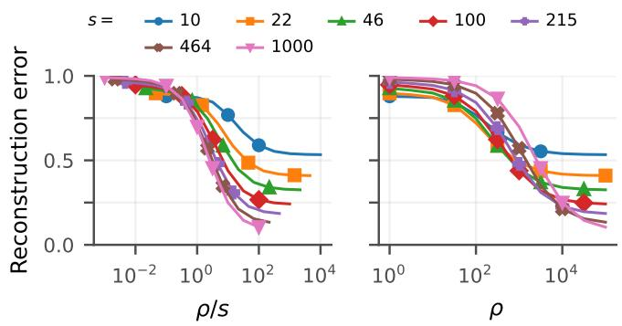  
Figure 6: Projected reconstruction error on ImageNet (elephant vs. panda) data with $d = 1 2 , 2 8 8 .$ . The projected attack uses a rank-s PCA subspace estimated from the known data. The left panel plots the projected attacks against $\rho / s ;$ the right panel plots them against $\rho .$ Colours indicate the projection rank s.

## G.4 Further visual reconstructions

In addition to Fig. 4, we present several more examples of reconstruction of ImageNet data in Fig. 7; and similarly for CIFAR-10 in Fig. 8.

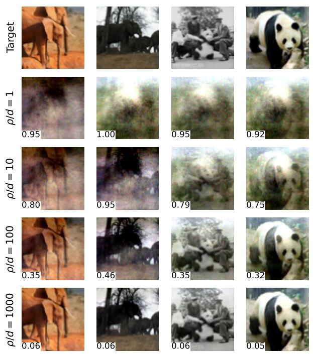  
(a)

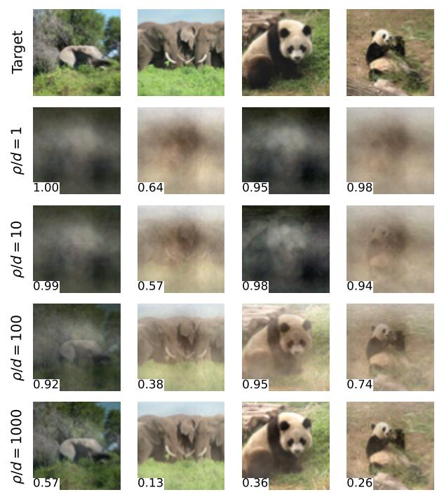  
(b)  
Figure 7: Additional ImageNet elephant-versus-panda reconstructions, presented as in Fig. 4.

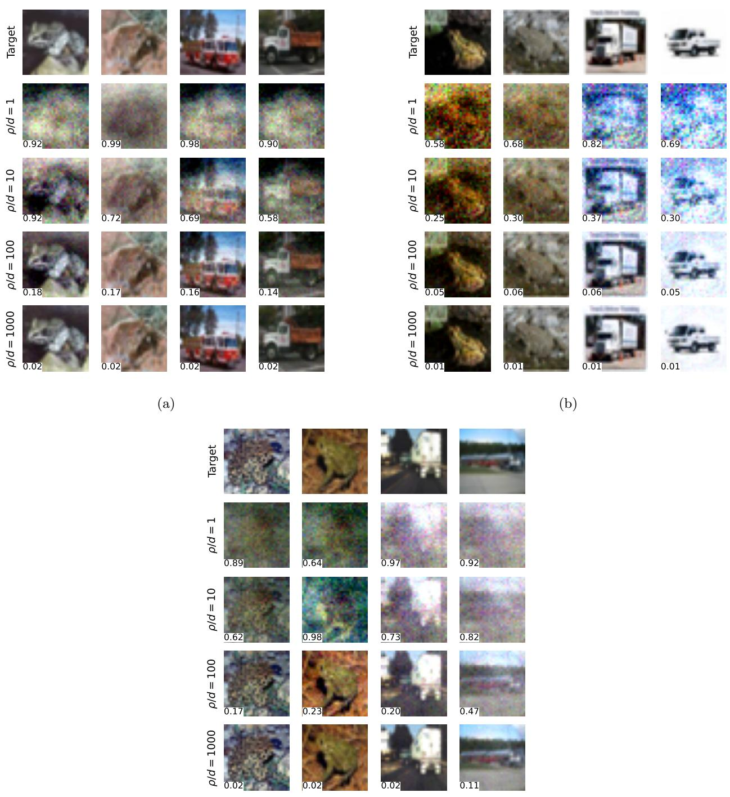  
(c)  
Figure 8: CIFAR-10 frog-versus-truck reconstructions for all three target seeds, presented as in Fig. 4.

## G.5 Run configurations per figure

Each table below lists the configurations for each figure. If a parameter had a large number of values, we summarize this as the endpoints of the range, the number of values, and the increment, if it was a geometric range.

<table><tr><td>Setting</td><td>Synthetic</td></tr><tr><td>Training examples n</td><td>1,000</td></tr><tr><td>Validation examples</td><td>10,000</td></tr><tr><td>Test examples</td><td>10,000</td></tr><tr><td>Dimension d</td><td>10–10,000 (7)</td></tr><tr><td>Feature norm |x||2</td><td> $\sqrt { d }$ </td></tr><tr><td>Feature clipping R</td><td> $\sqrt { d }$ </td></tr><tr><td>Label noise ζ</td><td>0.5</td></tr><tr><td>Privacy budget ρ</td><td> $0 . 1 { - } 1 0 ^ { 5 } \ ( 7 , \times 1 0 )$ </td></tr><tr><td>Regularization λ</td><td> $1 0 ^ { - 4 } – 1 0 \ ( 1 1 , \times \sqrt { 1 0 } )$ </td></tr><tr><td>Residual clipping  $C _ { \mathrm { c l i p } }$  # of seeds</td><td> $1 0 ^ { - 3 } \mathrm { - } 1 , 0 0 0 \ ( 1 3 , \times \sqrt { 1 0 } )$  3</td></tr></table>

Table 1: Configuration for Figure 2.

<table><tr><td>Setting</td><td>ImageNet (elephant/panda)</td></tr><tr><td>Training examples n</td><td>2,160</td></tr><tr><td>Validation examples</td><td>270</td></tr><tr><td>Test examples</td><td>270</td></tr><tr><td>Dimension d</td><td> $1 2 \mathrm { - } 1 2 , 2 8 8 \ ( 6 , \times 4 )$ </td></tr><tr><td>Feature norm ∥|x||2</td><td> $\sqrt { d }$ </td></tr><tr><td>Feature clipping R</td><td> $\sqrt { d }$ </td></tr><tr><td>Privacy budget ρ</td><td> $1 { - } 1 0 ^ { 5 } \ ( 1 1 , \times \sqrt { 1 0 } )$ </td></tr><tr><td>Regularization λ</td><td> $1 0 ^ { - 4 } { \textrm { - } } 1 \ ( 9 , \times { \sqrt { 1 0 } } )$ </td></tr><tr><td>Residual clipping  $C _ { \mathrm { c l i p } }$ </td><td> $1 0 ^ { - 3 } – 1 0 \ ( 9 , \times \sqrt { 1 0 } )$ </td></tr><tr><td># of seeds</td><td>3</td></tr><tr><td>Targets per class</td><td>1</td></tr></table>

Table 2: Configuration for Figure 3. Hyperparameter selection used validation risk within $\lambda \ge 0 . 1$ and $C _ { \mathrm { c l i p } } \leq 0 . 0 1$

<table><tr><td>Setting</td><td>ImageNet (elephant/panda)</td></tr><tr><td>Training examples n</td><td>2,160</td></tr><tr><td>Validation examples</td><td>270</td></tr><tr><td>Test examples</td><td>270</td></tr><tr><td>Dimension d</td><td>12,288</td></tr><tr><td>Feature norm∥x||2</td><td> $\sqrt { d }$ </td></tr><tr><td>Feature clipping R</td><td>√d</td></tr><tr><td>Privacy budget ρ</td><td> $1 . 2 3 \times 1 0 ^ { 3 } \mathrm { - 1 . 2 3 \times 1 0 ^ { 8 } ~ ( 6 , \times 1 0 ) }$ </td></tr><tr><td>Regularization λ</td><td>1</td></tr><tr><td>Residual clipping  $C _ { \mathrm { c l i p } }$ </td><td>0.125</td></tr><tr><td># of seeds</td><td>1</td></tr><tr><td>Targets per class</td><td>2</td></tr></table>

Table 3: Configuration for Figure 4.

<table><tr><td>Setting</td><td>Synthetic rank-s signal</td><td>CIFAR-10 (frog/truck)</td></tr><tr><td>Training examples n</td><td>1,000</td><td>8,000</td></tr><tr><td>Validation examples</td><td>2,000</td><td>2,000</td></tr><tr><td>Test examples</td><td>2,000</td><td>2,000</td></tr><tr><td>Dimension d</td><td>1,000</td><td>3,072</td></tr><tr><td>Feature norm  $\| { \boldsymbol { x } } \| _ { 2 }$ </td><td></td><td>√d</td></tr><tr><td>Feature clipping R</td><td>3.17–31.6 (7)</td><td> $\sqrt { d }$ </td></tr><tr><td>Label noise ζ</td><td>0.1</td><td></td></tr><tr><td>Privacy budget  $\rho$ </td><td> $1 0 { - } 1 0 { , } 0 0 0 \ ( 7 , \times \sqrt { 1 0 } )$ </td><td>10–10,000 (10, ×2.15)</td></tr><tr><td>Regularization  $\lambda$ </td><td> $1 0 ^ { - 4 } { \textrm { - } } 1 \ ( 9 , \times { \sqrt { 1 0 } } )$ </td><td>3.07, 307, 3,072</td></tr><tr><td>Residual clipping  $C _ { \mathrm { c l i p } }$ </td><td> $1 0 ^ { - 4 } { \textrm { - } } 1 \ ( 9 , \times { \sqrt { 1 0 } } )$ </td><td>0.1</td></tr><tr><td>Attacker PCA rank s</td><td>10-1,000 (7)</td><td>10-1,000 (7)</td></tr><tr><td>Signal rank of the data</td><td>10-1,000 (7)</td><td></td></tr><tr><td>Bulk-to-signal ratio  $\tau _ { b }$ </td><td>0.01</td><td></td></tr><tr><td># of seeds</td><td>3</td><td>3</td></tr><tr><td>Targets per class</td><td></td><td>1</td></tr></table>

Table 4: Configuration for Figure 5. Hyperparameter selection used validation risk within $\lambda \ge 0 . 1$ and $C _ { \mathrm { c l i p } } \leq 0 . 1 \zeta$ for Synthetic rank-s signal; $\lambda \geq 1 0$ and $C _ { \mathrm { c l i p } } \leq 0 . 1$ for CIFAR-10 (frog/truck).

<table><tr><td>Setting</td><td>ImageNet (elephant/panda)</td></tr><tr><td>Training examples n</td><td>2,160</td></tr><tr><td>Validation examples</td><td>270</td></tr><tr><td>Test examples</td><td>270</td></tr><tr><td>Dimension d</td><td>12,288</td></tr><tr><td>Feature norm  $\| { \boldsymbol { x } } \| _ { 2 }$ </td><td> $\sqrt { d }$ </td></tr><tr><td>Feature clipping R</td><td> $\sqrt { d }$ </td></tr><tr><td>Privacy budget ρ</td><td> $1 { - } 1 0 ^ { 5 } \ ( 1 1 , \times \sqrt { 1 0 } )$ </td></tr><tr><td>Regularization  $\lambda$ </td><td>1-1,000 (7, ×√10)</td></tr><tr><td>Residual clipping  $C _ { \mathrm { c l i p } }$ </td><td>0.01,0.1</td></tr><tr><td>Attacker PCA rank s</td><td>10-1,000 (7)</td></tr><tr><td># of seeds</td><td>3</td></tr><tr><td>Targets per class</td><td>1</td></tr></table>

Table 5: Configuration for Figure 6. Hyperparameter selection used validation risk within $\lambda \geq 1 0$ and $C _ { \mathrm { c l i p } } \leq 0 . 0 1$

<table><tr><td>Setting</td><td>ImageNet (elephant/panda)</td></tr><tr><td>Training examples n</td><td>2,160</td></tr><tr><td>Validation examples</td><td>270</td></tr><tr><td>Test examples</td><td>270</td></tr><tr><td>Dimension d</td><td>12,288</td></tr><tr><td>Feature norm ∥x||2</td><td>√d</td></tr><tr><td>Feature clipping R</td><td>√d</td></tr><tr><td>Privacy budget ρ</td><td> $1 . 2 3 \times 1 0 ^ { 3 } \mathrm { - 1 . 2 3 \times 1 0 ^ { 8 } ~ ( 6 , \times 1 0 ) }$ </td></tr><tr><td>Regularization  $\lambda$ </td><td>1</td></tr><tr><td>Residual clipping  $C _ { \mathrm { c l i p } }$ </td><td>0.125</td></tr><tr><td># of seeds</td><td>2</td></tr><tr><td>Targets per class</td><td>2</td></tr></table>

Table 6: Configuration for Figure 7.

<table><tr><td>Setting</td><td>CIFAR-10 (frog/truck)</td></tr><tr><td>Training examples n</td><td>8,000</td></tr><tr><td>Validation examples</td><td>2,000</td></tr><tr><td>Test examples</td><td>2,000</td></tr><tr><td>Dimension d</td><td>3,072</td></tr><tr><td>Feature norm  $\| { \boldsymbol { x } } \| _ { 2 }$ </td><td> $\sqrt { d }$ </td></tr><tr><td>Feature clipping  $R$ </td><td> $\sqrt { d }$ </td></tr><tr><td>Privacy budget  $\rho$ </td><td> $3 0 7 \mathrm { - 3 . 0 7 \times 1 0 ^ { 7 } ~ ( 6 , ~ \times 1 0 ) }$ </td></tr><tr><td>Regularization  $\lambda$ </td><td>1</td></tr><tr><td>Residual clipping  $C _ { \mathrm { c l i p } }$ </td><td> $_ { 0 . 1 2 5 }$ </td></tr><tr><td># of seeds</td><td>3</td></tr><tr><td>Targets per class</td><td>2</td></tr></table>

Table 7: Configuration for Figure 8.