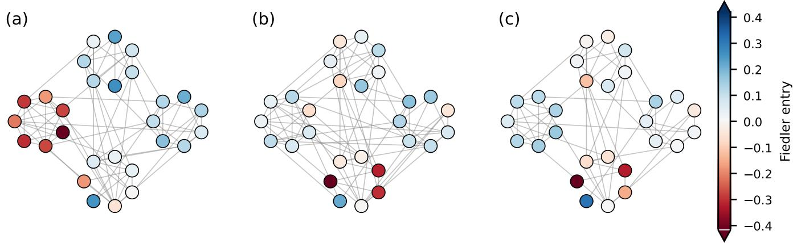
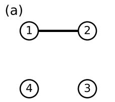
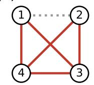
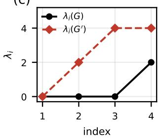
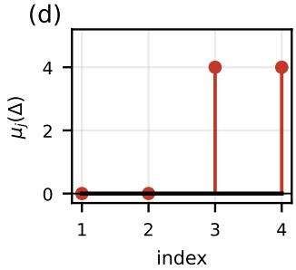
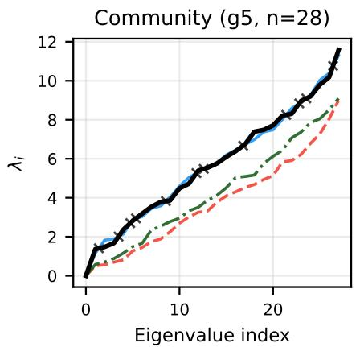
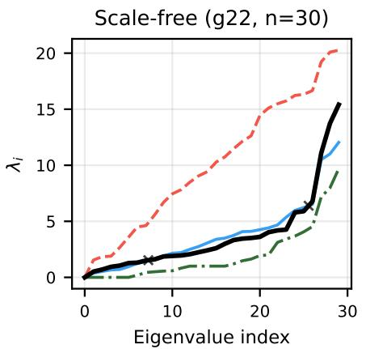
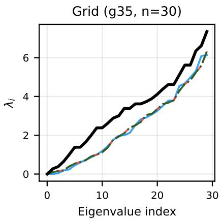
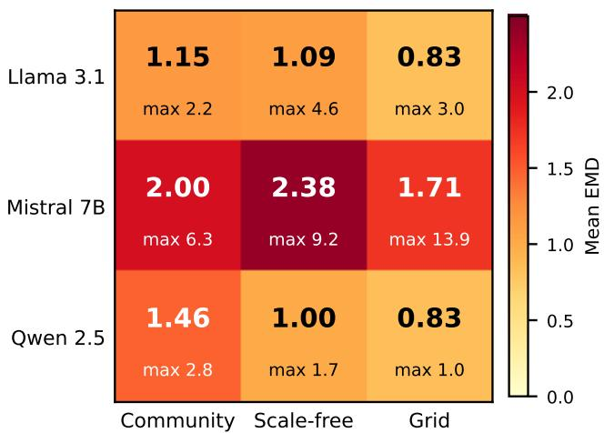

# A Spectral Theory of Distortion in LLM Graph Reconstruction: Sharp Bounds and Empirical Characterization

Jianru Shen

Columbia University

New York, NY, USA

js5929@columbia.edu

Abstract—Evaluations of graph reconstruction by language models typically report a single aggregate distance between the original and the reconstructed graph. We prove that for the Wasserstein distance between Laplacian spectra such a summary is bracketed by two edge counts, the net change in edge number from below and the symmetric difference from above, each scaled by $2 / n$ where n is the number of vertices. The bracket is sharp: its two ends coincide exactly when the reconstruction only adds edges or only deletes them, and on that class the distance is a rescaled edge count that says nothing about which edges changed. When the ends differ, the residual between the distance and the lower end is positive only if the reconstruction both invented and lost edges, which turns it into a certificate of mixed editing computable from the reported summaries alone. We characterize these regimes in 135 reconstructions produced by three openweight models over 45 synthetic graphs. Seventy-seven outputs are one-sided and 29 mixed outputs have $X ~ > ~ 0 ,$ including cases where edge count is exactly preserved while nineteen edges were simultaneously invented and lost. The three models differ in editing policy, ranging from copying the input to attempting completion at the cost of large hallucination volume, a distinction that aggregate distortion does not reveal.

Index Terms—spectral graph theory, Laplacian eigenvalues, large language models, graph reconstruction, model evaluation

## I. INTRODUCTION

Large language models are increasingly applied to graphstructured tasks, including node classification, link prediction, and reasoning over topology described in natural language [1]– [3]. A basic diagnostic in this setting is reconstruction: the model receives a partial description of a graph and returns what it takes the complete edge set to be. Assessing the result means comparing two graphs on a common vertex set, and the comparison is usually reduced to a scalar, such as edge accuracy or edit distance [2]–[4], or a Laplacian-spectral distance [5], [6].

One scalar cannot say how a reconstruction failed. A model that omits twenty edges and a model that invents twenty edges can produce the same distance to the original, although the first is conservative and the second hallucinates. This is usually treated as a known imprecision of aggregate metrics. We show that for spectral distortion it is a theorem, and that the same argument yields a test that repairs part of the loss at no additional cost. Figure 1 shows two reconstructions of one graph whose scalar summaries obscure different edit mechanisms.

Let $G ^ { \prime }$ be a reconstruction of $G$ on the same vertex set and let EMD denote the Wasserstein distance between their Laplacian spectra. Our main result brackets EMD between two edge counts: the net change $\vert \vert E \vert - \vert E ^ { \prime } \vert \vert$ from below and the symmetric difference $| E \triangle E ^ { \prime } |$ from above, both scaled by $2 / n$ . The bracket is sharp in a strong sense. Its two ends coincide exactly when the edit is one-sided, that is when the model only added edges or only deleted them, and on that class EMD equals a rescaled edge count and carries no further information. When the two ends differ, the residual between EMD and the lower end is positive only if the edit is mixed, which turns that residual into a certificate of simultaneous hallucination and loss. Once EMD, ECR, |E| and n have been computed, the certificate requires no access to the identities of the reconstructed edges.

We evaluate three open-weight models on 45 synthetic graphs spanning block, preferential attachment, and lattice families. The bounds hold on all 135 reconstructions. Seventyseven fall in the degenerate class where distortion is provably an edge count, so a per family average of EMD over such a corpus reproduces the density profile of the benchmark rather than any property of a model. Twenty-nine mixed outputs have $X > 0 ,$ , including two edge-count-preserving outputs for which no individual scalar reveals the simultaneous additions and deletions of nineteen and fifteen edges respectively. Aggregate distortion separates the three models by magnitude but obscures substantial differences in editing policy, ranging from returning the prompt verbatim to attempting completion at the cost of large hallucination volume.

Prior work on graph reasoning with language models evaluates output at the task level or through edit distance [2]–[4] and treats the metric as given. For graph comparison, Gu, Hua, and Liu define Wasserstein distances between normalized-Laplacian spectral measures and derive $O ( 1 / n )$ stability under bounded graph operations [5], while NetLSD compares graphs through Laplacian heat-trace signatures [6]. Our setting instead fixes a common vertex set and the combinatorial Laplacian and yields exact finite-n edge-edit bounds in terms of the net edge-count change and the symmetric difference, together with equality characterizations and a mixed-edit certificate. The perturbation inequalities used in the proof, due to Weyl and Mirsky [7], [8], are classical; the contribution is the resulting characterization and its empirical regime analysis.

  
Fig. 1. Two reconstructions of community instance g5 $( n = 2 8 ) ;$ layout and node color are fixed from the original graph, so only the edge sets differ. (a) Original. (b) Preserves the edge count $\mathrm { \dot { ( E C R = 1 ) } }$ while adding and deleting 19 edges each, certified mixed from scalar summaries. (c) Verbatim return of the prompted sublist. EMD and edge-count summaries can thus obscure the edit mechanism; neither reconstruction is implied to be faithful.

## II. SPECTRAL BOUNDS FOR RECONSTRUCTION DISTORTION

## A. Notation

Let $G = ( V , E )$ be a simple undirected graph and let $G ^ { \prime } =$ $( V , E ^ { \prime } )$ be a reconstruction of G on the same vertex set, $| V | =$ $n .$ Their combinatorial Laplacians are $L = D - A$ and $L ^ { \prime } =$ $D ^ { \prime } - A ^ { \prime }$ , with degree matrices $D , D ^ { \prime }$ and adjacency matrices $A , A ^ { \prime }$ . Eigenvalues are always listed in nondecreasing order, $\lambda _ { 1 } \leq \cdots \leq \lambda _ { n }$ for L and $\lambda _ { 1 } ^ { \prime } \leq \cdots \leq \lambda _ { n } ^ { \prime }$ for $L ^ { \prime } ,$ and we write $\delta _ { i } = \lambda _ { i } ^ { \prime } - \lambda _ { i }$ for the pointwise spectral difference at index i. The Fiedler value is $\lambda _ { 2 }$ and the Fiedler vector v is a unit eigenvector for it.

An edit is described by the added set $E ^ { \prime } \backslash E$ and the deleted set $E \setminus E ^ { \prime }$ , with cardinalities $a = | E ^ { \prime } \backslash E |$ and $d = | E \setminus E ^ { \prime } |$ so that $| E \triangle E ^ { \prime } | = a + d$ and $| E ^ { \prime } | - | E | = a - d .$ An edit is one-sided if min $( a , d ) = 0$ and mixed otherwise. For an edge $e = \{ u , v \}$ let $b _ { e }$ be its signed incidence vector, with entries +1 at $u , - 1$ at v, and 0 elsewhere; then $b _ { e } b _ { e } ^ { \top } \succeq 0$ and $\mathrm { t r } ( b _ { e } b _ { e } ^ { \top } ) = \| b _ { e } \| ^ { 2 } = 2$ . The perturbation induced by the edit is

$$
\Delta = L ^ { \prime } - L = P - M , \quad P = \sum _ { e \in E ^ { \prime } \backslash E } b _ { e } b _ { e } ^ { \top } , \quad M = \sum _ { e \in E \backslash E ^ { \prime } } b _ { e } b _ { e } ^ { \top } ,\tag{1}
$$

with $P , M \succeq 0$ , and $\| \cdot \|$ ∗ denotes the trace norm.

We use three scalar summaries. The spectral distortion is the Wasserstein distance between the empirical spectral measures $\begin{array} { r } { \mu _ { G } = \frac { 1 } { n } \sum _ { i = 1 } ^ { n } \delta _ { \lambda } } \end{array}$ i and $\begin{array} { r } { \mu _ { G ^ { \prime } } = \frac { 1 } { n } \sum _ { i = 1 } ^ { n } \delta _ { \lambda _ { i } ^ { \prime } } } \end{array}$ , which on the real line is realized by the monotone coupling [9] and therefore equals

$$
\operatorname { E M D } ( G , G ^ { \prime } ) = W _ { 1 } ( \mu _ { G } , \mu _ { G ^ { \prime } } ) = \frac { 1 } { n } \sum _ { i = 1 } ^ { n } \bigl | \delta _ { i } \bigr | .\tag{2}
$$

The edge count ratio is $\mathrm { E C R } = | E ^ { \prime } | / | E | .$ , defined whenever $| E | > 0$ as holds for all benchmark graphs, and the algebraic connectivity ratio is $\mathrm { A C R } = \lambda _ { 2 } ^ { \prime } / \lambda _ { 2 } .$ , defined when $\lambda _ { 2 } > 0$ Section III presents each graph to a model as a sublist $E _ { \mathrm { p } } \subseteq$ $E$ of size $\lfloor \rho \vert E \vert \rfloor$ for a fixed keep ratio $\rho ,$ together with the withheld set $E _ { \mathrm { w } } = E \setminus E _ { \mathrm { p } } ,$ , and asks the model to return the complete edge list. The set $E ^ { \prime }$ is the model output. Community graphs are drawn from a stochastic block model [10] with c blocks of equal size $s = n / c$ , within block probability $p _ { \mathrm { i n } }$ and between block probability $p _ { \mathrm { o u t } } ;$ scale-free graphs use the preferential attachment model with attachment parameter m.

## B. The sandwich bound

Theorem 1 (Spectral sandwich). For all $G , G ^ { \prime }$ on a common vertex set of size $n ,$

$$
\frac 2 n \big | | E | - | E ^ { \prime } | \big | \ \le \ \mathrm { E M D } ( G , G ^ { \prime } ) \ \le \ \frac 2 n \big | E \triangle E ^ { \prime } \big | .\tag{3}
$$

The lower bound equals ${ \frac { 2 | E | } { n } } { \big | } 1 - \mathrm { E C R } { \big | }$ , so it is computable from the scalar summaries alone.

Proof. For the lower bound, tr $\begin{array} { r } { L = \sum _ { u \in V } \deg ( u ) = 2 | E | } \end{array}$ and likewise tr $L ^ { \prime } = 2 | E ^ { \prime } |$ , so

$$
\sum _ { i } | \delta _ { i } | \geq \left| \sum _ { i } \delta _ { i } \right| = \left| \operatorname { t r } L ^ { \prime } - \operatorname { t r } L \right| = 2 { \big | } | E ^ { \prime } | - | E | { \big | } .
$$

For the upper bound, Mirsky’s inequality for the trace norm [7], [8] gives $\begin{array} { r } { \sum _ { i } | \delta _ { i } | \leq \| \Delta \| _ { * } . } \end{array}$ Applying the triangle inequality for $\| \cdot \| ,$ ∗ to (1) and using $\lVert b _ { e } \bar { b } _ { e } ^ { \top } \rVert _ { * } = \mathrm { t r } ( b _ { e } b _ { e } ^ { \top } ) = 2$ yields $\| \Delta \| _ { * } \le 2 | E \triangle E ^ { \prime } |$ . Dividing by n and rewriting $\begin{array} { r l } { \left| | E | - | E ^ { \prime } | \right| = } & { { } } \end{array}$ $\left| E \right| \left| 1 - \mathrm { E C R } \right|$ completes the proof. □

Remark 2. Equality holds on the left of (3) if and only if the nonzero differences $\delta _ { i }$ all carry the same sign, that is, if and only if one spectrum dominates the other pointwise. Pointwise dominance follows from a one-sided edit by Weyl monotonicity, but the converse fails; Example 9 exhibits a mixed edit whose perturbation is positive semidefinite.

Corollary 3 (One-sided collapse). $I f E \subseteq E ^ { \prime } o r E ^ { \prime } \subseteq E ,$ then

$$
\operatorname { E M D } ( G , G ^ { \prime } ) = { \frac { 2 } { n } } { \big | } E \triangle E ^ { \prime } { \big | } = { \frac { 2 } { n } } { \big | } | E | - | E ^ { \prime } | { \big | } ,\tag{4}
$$

so both bounds of (3) are attained at once. The two bounds coincide ifand only ifthe edit is one-sided, since $| a - d | = a { + } d$ exactly when min $( a , d ) = 0 .$ . In this regime EMD is a rescaled edge count and carries no information about the edit beyond its cardinality.

Proof. For a pure addition $\Delta = P \succeq 0 .$ , so Weyl monotonicity gives $\delta _ { i } \geq 0$ for every i and $\begin{array} { r } { \sum _ { i } | \delta _ { i } | = \sum _ { i } \delta _ { i } = \operatorname { t r } \Delta = 2 a } \end{array}$ which equals both $2 | E \triangle E ^ { \prime } |$ and $2 | | E ^ { \prime } | - | E |$ . Pure deletion is symmetric. The second claim is the stated arithmetic identity.

Corollary 3 shows that the sandwich is sharp: its two bounds meet on an entire class of edits, and that class is exactly the one-sided one. It also identifies the regime in which EMD is uninformative about mechanism. The next result converts the residual between EMD and the lower bound into a certificate for the complementary regime.

Corollary 4 (Mixing certificate). Define the trace excess

$$
X = \mathrm { E M D } ( G , G ^ { \prime } ) - \frac { 2 | E | } { n } \big | 1 - \mathrm { E C R } \big | \geq 0 .\tag{5}
$$

Then

$$
\operatorname* { m i n } ( a , d ) \geq { \frac { n } { 4 } } X .\tag{6}
$$

In particular $X ~ > ~ 0$ proves that the reconstruction both hallucinated and lost edges. Once EMD, ECR, |E| and n are available, computing X requires no access to the identities of the reconstructed edges.

Proof. By Theorem 1, X is at most the width of the interval in (3), namely $\begin{array} { r } { \frac { 2 } { n } \big [ ( a + d ) - | a - d | \big ] = \frac { 4 } { n } \operatorname* { m i n } ( a , d ) } \end{array}$ Equivalently, writing $\begin{array} { r } { \dot { S _ { + } } = \sum _ { \delta _ { i } > 0 } \delta _ { i } } \end{array}$ and $\begin{array} { r } { \bar { S } _ { - } = - \sum _ { \delta _ { i } < 0 } \delta _ { i } } \end{array}$ we have $\begin{array} { r } { \sum _ { i } \vert \delta _ { i } \vert = S _ { + } + S _ { - } } \end{array}$ and $\begin{array} { r } { \left| \sum _ { i } \delta _ { i } \right| = | S _ { + } - \bar { S } _ { - } | , } \end{array}$ so $n X = S _ { + } \stackrel { . } { + } S _ { - } - | S _ { + } - S _ { - } | = 2 \stackrel { . } { \operatorname* { m i n } } ( \stackrel { . } { S _ { + } } , S _ { - } )$ . Thus X is the normalized amount of spectral motion that is cancelled by motion in the opposite direction. □

Definition 5 (Edit classes). A reconstruction is one-sided if $\quad \operatorname* { m i n } ( a , d ) = 0 .$ , dominant mixed if $\operatorname* { m i n } ( a , d ) \geq 1$ and $X = 0 ,$ and certified mixed if $X > 0$ . The three classes partition all reconstructions, and membership in the third is decidable from the scalar summaries alone.

Remark 6 (Conservativeness). Equality in (6) forces EMD to attain the upper bound of (3), which by Proposition 8 requires every added edge to be vertex disjoint from every deleted edge. The certificate is therefore expected to be conservative whenever added and deleted edges overlap. It lower-bounds the smaller edit side but need not recover its true size.

## C. Attainment of the upper bound

Lemma 7 (Splitting). Let $P , M \succeq 0$ be symmetric. Then $\parallel P -$ $M \| _ { * } = \operatorname { t r } P + \operatorname { t r } M$ if and only $i f P M = 0 .$

Proof. If $P M = 0$ then ran $M \subseteq \ker P$ and ran $P \subseteq \ker M$ so $P - M$ acts as $P$ and $\mathrm { a s } - M$ on orthogonal subspaces and its trace norm is tr $P + \operatorname { t r } M$

Conversely, write $\Delta = P - M$ in its Jordan decomposition $\Delta \ = \ \Delta _ { + } - \Delta _ { - }$ with $\Delta _ { \pm } ~ \succeq ~ 0$ supported on orthogonal subspaces, so $\| \Delta \| _ { * } ~ = ~ \mathrm { t r } \Delta _ { + } + \mathrm { t r } \Delta _ { - }$ . Together with tr $\Delta _ { + } - \operatorname { t r } \Delta _ { - } = \operatorname { t r } \Delta = \operatorname { t r } P - \operatorname { t r } M$ , the hypothesis gives tr $\Delta _ { + } = \operatorname { t r } P$ and tr $\Delta _ { - } = \operatorname { t r } M$ . Let Π be the orthogonal projection onto ran $\Delta _ { + }$ . Orthogonality of the supports gives $\Delta _ { - } \Pi = 0$ and hence $\Pi \Delta \Pi = \Delta _ { + }$ , so

$$
\begin{array} { r l } & { \mathrm { t r } P = \mathrm { t r } \Delta _ { + } = \mathrm { t r } ( \Pi P \Pi ) - \mathrm { t r } ( \Pi M \Pi ) } \\ & { \qquad = \mathrm { t r } P - \mathrm { t r } \big ( ( I { - } \Pi ) P ( I { - } \Pi ) \big ) - \mathrm { t r } ( \Pi M \Pi ) . } \end{array}
$$

Both subtracted terms are traces of positive semidefinite matrices and must vanish. From $\mathrm { t r } ( \bar { \Pi M } \Pi ) \ = \ \lVert M ^ { 1 / 2 } \Pi \rVert _ { F } ^ { 2 } \ =$ 0 we get $M \boldsymbol { \Pi } \ = \ \boldsymbol { 0 }$ , and from t $\begin{array} { l l } { \mathrm { \Delta } \mathrm { r } \big ( ( I { - } \Pi ) P ( I { - } \Pi ) \big ) } & { = } \end{array}$ $\Vert P ^ { 1 / 2 } ( I { - } \Pi ) \Vert _ { F } ^ { 2 } = 0$ we get $P = \Pi P \Pi$ . Hence $P$ is supported in ran Π while M annihilates it, so $P M = 0 .$ □

Proposition 8 (Necessary condition for upper attainment). Suppose $\begin{array} { r } { \mathrm { E M D } ( G , G ^ { \prime } ) = \frac { 2 } { n } | E \triangle E ^ { \prime } | } \end{array}$ and the edit is mixed. Then every added edge is vertex disjoint from every deleted edge.

Proof. Attainment forces equality throughout $\begin{array} { r l } { \sum _ { i } | \delta _ { i } | } & { { } \leq } \end{array}$ $\| \Delta \| _ { * } \leq 2 ( a + d )$ , in particular $\| P - M \| _ { * } = \operatorname { t r } P +$ tr M, so $P M = 0$ by Lemma 7. Since $\mathrm { t r } ( P M ) \stackrel { \cdot \cdot } { = } \| P ^ { 1 / 2 } M ^ { 1 / 2 } \| _ { F } ^ { 2 }$ , this is equivalent to t $\mathbf { \partial } \cdot ( P M ) = 0$ , and expanding (1) gives

$$
\mathrm { t r } ( P M ) = \sum _ { e \in E ^ { \prime } \backslash E } \sum _ { f \in E \backslash E ^ { \prime } } \left( b _ { e } ^ { \top } b _ { f } \right) ^ { 2 } .
$$

The edges e and f are always distinct, so $b _ { e } ^ { \top } b _ { f } \in \{ 0 , \pm 1 \}$ and it is nonzero exactly when e and f share a vertex. The sum vanishes if and only if no added edge meets a deleted edge. □

Example 9 (Mixed edit attaining the lower bound). Let $n =$ $4 , \ E \ = \ \{ \{ 1 , 2 \} \}$ and $E ^ { \prime } = E ( K _ { 4 } ) \setminus \{ \{ 1 , 2 \} \}$ , so $a \ = \ 5$ and d = 1. The spectra are $\{ 0 , 0 , 0 , 2 \}$ and $\{ 0 , 2 , 4 , 4 \}$ , hence EMD = 2, the lower bound $\frac { 2 } { 4 } | 5 - 1 | = 2$ is attained and the upper bound ${ \frac { 2 } { 4 } } \cdot 6 = 3$ is strict. Here $\Delta = L ( K _ { 4 } ) -$ $2 b _ { 1 2 } \bar { b _ { 1 2 } ^ { \top } }$ has spectrum $\{ 0 , 0 , 4 , 4 \}$ : a mixed edit can produce a positive semidefinite perturbation and hence pointwise spectral dominance. This is why the certificate of Corollary 4 is one directional. Consistently with Proposition 8, the upper bound is not attained, since the added edge {1, 3} meets the deleted edge {1, 2} at vertex 1. Figure 2 displays the construction.

Example 10 (Isospectral edit). Let $\begin{array} { r l r l r l } { n } & { { } = } & { 4 , } & { E } & { { } = } \end{array}$ $\{ \{ 1 , 2 \} , \{ 2 , 3 \} , \{ 1 , 4 \} \}$ and $E ^ { \prime } = \{ \{ 2 , 3 \} , \{ 3 , 4 \} , \{ 1 , 4 \} \}$ , so $a = d = 1$ and the added edge {3, 4} is vertex disjoint from the deleted edge {1, 2}. Both graphs are paths on four vertices, so their spectra coincide, G is connected with $\lambda _ { 2 } = 2 - \sqrt { 2 } >$ 0, and every summary is blind: EMD = 0 while $| E \triangle E ^ { \prime } | = 2 ,$ and $X \ = \ 0 , \ \mathrm { E C R } \ = \ 1 , \ \mathrm { A C R } \ = \ 1$ , with no crossing in the sense of Proposition 12. Together with Example 9 this brackets the failure modes of spectral diagnostics, a mixed edit presenting either as dominance or as the identity. It also shows that the vertex disjointness of Proposition 8 is necessary but not sufficient for upper attainment, since this disjoint edit attains the lower bound instead.

  
(c)

(b)  

  
Fig. 2. The mixed edit of Example 9. (a) G. (b) $G ^ { \prime } ~ = ~ K _ { 4 }$ minus {1, 2}; hallucinated edges solid red, deleted edge dotted gray. (c) Pointwise dominance without a crossing, attaining the lower bound of (3). (d) The perturbation spectrum is nonnegative although the edit is mixed.

Example 11 (Upper attainment and a tight certificate). Let G be the star $K _ { 1 , 3 }$ with center 1, and let the reconstruction delete the leaf edge {1, 2} and add the edge {3, 4} between two leaves, so $a = d = 1$ and $\left| E ^ { \prime } \right| = \left| E \right|$ . The spectra are $\{ 0 , 1 , 1 , 4 \}$ and $\{ 0 , 0 , 3 , 3 \}$ , giving $\mathrm { E M D } = 1$ , which attains the upper bound $\scriptstyle { \frac { 2 } { 4 } } \ \cdot \ 2 \ = \ 1$ . The added and deleted edges are vertex disjoint, as required by Proposition 8. Here the net change is zero, so the lower bound is 0 and the trace excess is $X = 1 ;$ the certificate of Corollary 4 returns $\lceil n X / 4 \rceil = 1 =$ min $. ( a , d )$ and is exact. This shows that the constant $\textstyle { \frac { 1 } { 4 } }$ in (6) cannot be improved.

## D. Spectral order and local diagnostics

Proposition 12 (Order and crossings). Let $\delta _ { i } = \lambda _ { i } ^ { \prime } - \lambda _ { i }$

(i) If $E \subseteq E ^ { \prime }$ then $\delta _ { i } \geq 0$ for all $i ; i f E ^ { \prime } \subseteq E$ then $\delta _ { i } \leq 0$ for all i.

(ii) If $E ^ { \prime } = E \cup \{ e \}$ then $\lambda _ { i } \ \leq \ \lambda _ { i } ^ { \prime } \ \leq \ \lambda _ { i + 1 }$ for $~ i ~ < ~ n ,$ $\lambda _ { n } \leq \lambda _ { n } ^ { \prime } \leq \lambda _ { n } + 2 ,$ , and $\textstyle \sum _ { i } \delta _ { i } = 2 .$

(iii) $X > 0$ if and only if there exist indices $i , j$ with $\delta _ { i } >$ $0 > \delta _ { j }$

Consequently a crossing of the two sorted spectral curves is a sound certificate of a mixed edit, equivalent to $X \ > \ 0 ;$ the converse implication from mixing to crossing fails by Example 9.

Proof. Part (i) is Weyl monotonicity for $\Delta \ = \ P \ \succeq \ 0$ respectively $\Delta = - M \preceq 0$ . Part (ii) is the Weyl interlacing inequality for a rank one positive semidefinite update of trace 2. For (iii), the identity $n X = 2 \operatorname* { m i n } ( S _ { + } , S _ { - } )$ from

Corollary 4 shows that $X > 0$ if and only if both positive and negative spectral shifts occur. A one-sided edit has only one sign by (i). □

Proposition 13 (Connectivity diagnostics). Let G be connected, so $\lambda _ { 2 } > 0 .$

(i) If $E \subseteq E ^ { \prime }$ then $\mathrm { A C R } \geq 1$ , and if $E ^ { \prime } \subseteq E$ then $\mathrm { A C R } \leq$ 1. Hence $\mathrm { A C R } ~ < ~ 1$ certifies $d \ge 1$ and $\mathrm { A C R } > 1$ certifies $a \geq 1$

(ii) If $\mathrm { E C R } ~ \geq ~ 1$ and $\mathrm { A C R ~ < ~ 1 ~ }$ , or $\mathrm { E C R } ~ \leq ~ 1$ and $\mathrm { A C R } > 1 .$ , then the edit is mixed and $X \ > \ 0 .$ . The pair (ECR, ACR) is thus a coarsening of Corollary 4 that localizes a crossing at the Fiedler index.

(iii) For every S with $\varnothing \neq S \subsetneq V ,$

$$
\lambda _ { 2 } ^ { \prime } \leq \frac { n \left| \partial _ { G ^ { \prime } } S \right| } { \left| S \right| \left( n - \left| S \right| \right) } ,
$$

where $\partial _ { G ^ { \prime } } S$ is the set of edges of G′ leaving S. In particular $\mathrm { A C R } = 0 ~ i f$ and only if G′ is disconnected.

Proof. Part (i) is Proposition 12(i) at index 2. For (ii), assume ECR $\geq 1$ and $\mathrm { A C R } < 1$ . Then $\begin{array} { r } { \sum _ { i } \delta _ { i } = 2 ( | E ^ { \prime } | - | E | ) \ge 0 } \end{array}$ while $\delta _ { 2 } < 0 .$ If every δ were nonpositive the sum would force $\delta _ { i } = 0$ for all i, contradicting $\delta _ { 2 } < 0 ;$ hence some $\delta _ { j } > 0$ and Proposition 12(iii) applies. The other case is symmetric. For (iii), take $x = ( n - | S | ) \mathbf { 1 } _ { S } - | S | \mathbf { 1 } _ { V \backslash S }$ . Then $x \perp \mathbf { 1 } , x ^ { \top } x =$ $n | S | ( n - | S | )$ , and only cut edges contribute to $x ^ { \top } L ^ { \prime } x =$ $\sum { _ { \{ u , v \} \in E ^ { \prime } } ( x _ { u } - x _ { v } ) ^ { 2 } }$ , each by $n ^ { 2 } , \mathrm { { s o } } x ^ { \top } L ^ { \prime } x = n ^ { 2 } | \partial _ { G ^ { \prime } } S |$ . The Rayleigh characterization of $\lambda _ { 2 } ^ { \prime }$ gives the bound, and $\lambda _ { 2 } ^ { \prime } = 0$ holds exactly when $G ^ { \prime }$ is disconnected [12]. □

## E. The degenerate regime

Proposition 14 (Closed form under sublist return). Suppose the reconstruction returns exactly the prompted sublist, $E ^ { \prime } =$ $E _ { \mathrm { p } }$ with $| E _ { \mathrm { p } } | = \lfloor \rho | E \vert \rfloor$ . Then the edit is one sided and

$$
\mathrm { E M D } ( G , G ^ { \prime } ) = \frac { 2 } { n } \big \lbrack ( 1 - \rho ) | E | \big \rbrack = ( 1 - \rho ) \bar { \kappa } + { \cal O } ( 1 / n ) ,\tag{7}
$$

where $\bar { \kappa } = 2 | E | / n$ is the average degree of G. The value is determined by n and $| E |$ alone: it does not depend on the model, on which edges were withheld, or on any structural property of G beyond its size and density.

Proof. Apply Corollary 3 with $| E | - \lfloor \rho | E | \rfloor = \lceil ( 1 - \rho ) | E | \rceil$ □

Proposition 14 has a direct consequence for benchmark design. Along connected sparse families with average degree $\bar { \kappa } ~ = ~ \Theta ( 1 )$ , including rectangular lattices and fixed-m preferential-attachment graphs, the degenerate distortion is $\Theta ( 1 )$ ; for block models with fixed $p _ { \mathrm { i n } }$ and growing block size it grows with κ¯. A per family profile of EMD values can therefore reproduce the density profile of the benchmark rather than any property of the model under evaluation.

## III. EXPERIMENTAL SETUP

## A. Benchmark

The corpus consists of 45 synthetic graphs in three families and three size levels, five instances per cell. Synthetic graphs give controlled generating families and exact ground truth for all edge-level quantities; they do not make the withheld set uniquely identifiable. Community graphs use an equal-block stochastic block model [10] with $p _ { \mathrm { i n } } = 0 . 7 , p _ { \mathrm { o u t } } = 0 . 0 5$ and $c = 3 , 4 , 5$ , giving $n = 1 5 , 2 8$ , 50; two disconnected draws were deterministically redrawn, so ACR is defined throughout. Scale free graphs use preferential attachment [11] with $m = 2$ at $n = 1 5 , 3 0 , 5 0 .$ , giving $| E | = 2 ( n - 2 )$ . Grid graphs use five pairwise non-isomorphic rectangular lattices per level, with n in 14–18, 27–32 and 45–50.

## B. Reconstruction task

Each graph is presented as a shuffled sublist $E _ { \mathrm { p } } \subseteq E$ of size $\lfloor \rho \vert E \vert \rfloor$ with keep ratio $\rho = 0 . 7 5$ , together with three global descriptors: the number of vertices, the edge density and the average degree. The model is instructed to return the complete edge list, one edge per line, with no explanation. The sampling of $E _ { \mathrm { p } }$ uses a fixed seed, so the withheld set $E _ { \mathrm { w } } = E \setminus E _ { \mathrm { p } }$ is identical across models and the completion problem is the same for all of them.

We evaluate three instruction-tuned open-weight models at comparable scale: Llama 3.1 8B [13], Mistral 7B [14] and Qwen 2.5 7B [15]. All are run locally through Ollama [16] on a single Apple M4 machine with temperature 0 and no external API access, giving 135 reconstructions. Model output is parsed by fixing the vertex set to V and retaining valid undirected pairs of existing vertices, with duplicates and selfloops removed. No other repair is applied: deviations in edge count are the object of study rather than an artifact to be corrected. Raw responses and parsed edge lists are retained for every run, which permits all derived quantities to be recomputed without re-querying the models.

Edge counts are reported after de-duplication. Across the 135 reconstructions the parser discarded 174, 334 and 1 candidate pairs for Llama, Mistral and Qwen respectively, of which all but seven were duplicate edges; out-of-range vertices and self-loops together account for the remaining seven. The parser therefore removes almost no edges beyond repeats, so the hallucination counts reflect model output rather than postprocessing.

## C. Measurement

For each graph we form the combinatorial Laplacian and compute its full sorted spectrum. The distortion EMD is evaluated as the Wasserstein distance between the two spectra viewed as equally weighted samples of size $n ,$ which coincides with (2). In ACR we treat $\lambda _ { 2 } ^ { \prime }$ below $1 0 ^ { - 9 }$ as exactly zero, so a disconnected reconstruction reports $\mathrm { { A C R } = 0 }$ rather than a numerical artifact.

From the retained edge lists we obtain $a = | E ^ { \prime } \setminus E |$ and $d = | E \backslash E ^ { \prime } |$ directly, and hence the edit class of Definition 5. The certificate of Corollary 4 is evaluated as $\lceil n X / 4 \rceil$ and compared against the true min $( a , d )$ . Since $E$ and $E _ { \mathrm { p } }$ are both known, one-sided reconstructions are further separated into those returning exactly the prompted sublist, $E ^ { \prime } = E _ { \mathrm { p } }$ , and those returning a proper subset of it.

Completion behavior is measured relative to $E _ { \mathrm { p } }$ and $E _ { \mathrm { w } }$ by

$$
\begin{array} { r l r } { \mathbf { k e p t } = | E ^ { \prime } \cap E _ { \mathrm { p } } | , } & { \ } & { \mathrm { d r o p p e d } = | E _ { \mathrm { p } } \setminus E ^ { \prime } | , } \\ { \mathrm { r e c o v e r e d } = | E ^ { \prime } \cap E _ { \mathrm { w } } | , } & { \ } & { \mathrm { h a l l u c i n a t e d } = | E ^ { \prime } \setminus E | , } \end{array}
$$

so that a equals the number of hallucinated edges and d equals dropped plus $\lvert E _ { \mathrm { w } } \rvert$ minus recovered. These identities were verified on all 135 reconstructions.

## D. A null model for recovery

A model that emits non-prompt edges without using structure would still recover some withheld edges by chance, at a rate that grows with the number of edges it emits. To separate signal from volume we condition on that number. Let r = recovered + hallucinated be the count of emitted edges outside $E _ { \mathrm { p } }$ , and let $\begin{array} { r } { N = \binom { n } { 2 } - | E _ { \mathrm { p } } | } \end{array}$ be the number of vertex pairs available to a structure-blind model. Drawing r of those N pairs uniformly makes the recovered count hypergeometric with mean rq and variance $r q ( 1 - q ) ( N - r ) / ( N - 1 )$ ), where $q = | E _ { \mathrm { w } } | / N$ . Summing these moments over instances gives the expectation and variance of total recovery under the null, and we report the standardized deviation z of the observed total. The test asks whether a model’s hits exceed chance given how often it guessed, not whether it guessed often.

## E. Link prediction baselines

To calibrate recovery against structure-aware heuristics, we compare each model to three classical link predictors at the same emission volume. For a model and instance, let r be the number of edges the model emitted outside $E _ { \mathrm { p } }$ . We rank all candidate pairs in ${ \binom { V } { 2 } } \setminus E _ { \mathrm { p } }$ on the visible graph $( V , E _ { \mathrm { p } } )$ by common neighbors,

$$
s _ { \mathrm { C N } } ( u , v ) = | \Gamma _ { \mathrm { p } } ( u ) \cap \Gamma _ { \mathrm { p } } ( v ) | ,
$$

Adamic–Adar [17],

$$
s _ { \mathrm { A A } } ( u , v ) = \sum _ { w \in \Gamma _ { \mathrm { p } } ( u ) \cap \Gamma _ { \mathrm { p } } ( v ) } \frac { 1 } { \log \deg _ { \mathrm { p } } ( w ) } ,
$$

and preferential attachment [18],

$$
s _ { \mathrm { P A } } ( u , v ) = \deg _ { \mathrm { p } } ( u ) \ \deg _ { \mathrm { p } } ( v ) ,
$$

where $\Gamma _ { \mathrm { p } }$ and $\mathrm { d e g } _ { \mathrm { p } }$ are neighborhoods and degrees in $( V , E _ { \mathrm { p } } )$ Each baseline selects the top r pairs. Score ties are broken uniformly at random and the recovered count is averaged over 1,000 tie permutations, which matters on the grid family where many pairs share a zero score. The random baseline is the hypergeometric expectation $r | E _ { \mathrm { w } } | / ( { \binom { n } { 2 } } - | E _ { \mathrm { p } } | )$ at the same budget.

TABLE I  
ATTAINMENT OF (3) BY EDIT CLASS AT TOLERANCE $1 0 ^ { - 6 }$ . THE FIRST TWO ROWS ARE ONE-SIDED; THE LAST TWO ARE MIXED.
<table><tr><td>Edit class</td><td>N</td><td>Lower attained</td><td>Upper attained</td></tr><tr><td>Sublist returned exactly</td><td>57</td><td>57</td><td>57</td></tr><tr><td>Other one-sided</td><td>20</td><td>20</td><td>20</td></tr><tr><td>Mixed, dominant</td><td>29</td><td>29</td><td>0</td></tr><tr><td>Mixed, certified</td><td>29</td><td>0</td><td>0</td></tr><tr><td>Total</td><td>135</td><td>106</td><td>77</td></tr></table>

## IV. RESULTS

## A. Bounds and attainment

Numerical evaluation agrees with (3) to tolerance $1 0 ^ { - 6 }$ on all 135 outputs. The empirical question is therefore which equality regime each output occupies. Table I shows 77 one-sided outputs, all attaining both bounds as required by Corollary 3: 57 exact sublist returns and 20 proper subsets. For these EMD is a rescaled edge count carrying no information about which edges changed. No output is a pure addition. The remaining 58 are mixed; 29 attain the lower bound and none the upper. For 57 of the 58, an added edge meets a deleted edge, so Proposition 8 rules out upper bound attainment. The exception is Llama on grid g35, with a = 2, $d \ = \ 1 5$ $\mathrm { E M D } ~ = ~ 0 . 8 6 7$ and upper bound 1.133: vertex disjoint yet below the upper bound, so the condition is necessary but not sufficient. The largest dominant edit is Mistral on g39, with a = 192, d = 4, ECR = 5.48 and $X = 0$

## B. Certificates and crossings

The trace excess of (5) is positive on 29 reconstructions. All 29 are mixed, as guaranteed by Corollary 4; the stored edge lists provide an implementation check, with $\lceil n X / 4 \rceil$ at most the true min $. ( a , d )$ on every one. The estimate is uniformly conservative: it returns 1 on 24 instances, 2 on two, 3 on two and 5 on one, while the true overlap ranges from 2 to 24.

The set of instances with $X ~ > ~ 0$ coincides exactly with the set whose sorted spectral curves cross, and no one-sided instance exhibits a crossing, as required by Proposition 12(iii). Figure 3 shows this on three instances: the two curves that cross are the two certified reconstructions in the panel set, and the remaining seven track the original without a sign change. The coarse test of Proposition 13(ii) fires on 10 of the 29 and never outside the certified class, and $\mathrm { A C R } = 0$ agrees with disconnection of $G ^ { \prime }$ with no mismatch across the corpus, an implementation check for Proposition 13(iii). Disconnection is common: 41 of the 135 reconstructions have $\mathrm { A C R } = 0 .$ concentrated in the scale-free and grid families with 24 and 14 instances against 3 for community graphs. Preferential attachment and lattice graphs contain many degree two vertices, which a withheld quarter of the edges can isolate, whereas dense blocks are redundant enough to survive. The counts also invert the ordering of edit volume: Qwen disconnects 19 reconstructions and Mistral only 9, consistent with the fact that deletion can isolate vertices whereas additional edges can reconnect components.

Two instances show what the certificate buys. On community instance g5 the Llama reconstruction has $\mathrm { E C R } ~ = ~ 1$ $\mathrm { A C R } ~ = ~ 0 . 8 4$ and $\mathrm { E M D } ~ = ~ 0 . 1 6$ . None of these scalars identifies the simultaneous 19 additions and 19 deletions; their joint residual $X = 0 . 1 6 1$ does. Scale-free instance g22 similarly preserves edge count while adding 15 edges and deleting 15, with the largest excess in the corpus at $X = 0 . 5 5 4$

## C. Edit policies differ across models

The three models occupy different regions of the classification of Definition 5. Aggregate distortion orders them by magnitude, as Figure 4 shows, but it obscures a difference in editing policy that is visible in Table II and resolved by family in Table III.

Qwen exhibits a predominantly copy-oriented output pattern. It is one sided on 44 of 45 instances, returning the prompted sublist verbatim 36 times, and emits non-prompt edges on one instance, which is certified mixed. Llama produces mixed edits on 31 of 45 instances and is the source of 19 of the 29 certificates. Mistral is bimodal: it is one-sided on 19 instances and produces the largest hallucination volume in the corpus on the remainder, reaching ECR = 5.48 on g39 and ECR = 3.65 on g16.

Recovery of withheld edges is low for all three. Out of 805 withheld edges each, Llama recovers 34, Mistral 46 and Qwen 1. Under the null model of Section III, which conditions on how many non-prompt edges each model emitted, Llama is above chance at $z = + 5 . 4 6 ,$ , whereas Mistral is indistinguishable from structure-blind guessing at $z = + 1 . 1 7$ despite its higher raw count: its 46 hits follow from 732 attempts against a chance expectation of 40.6. Qwen emits only four non-prompt edges in total, so we do not interpret a standardized recovery score.

Chance is a weak reference point, so Table IV compares each model against classical link prediction heuristics given the same emission budget on the same visible graph. In aggregate Llama’s 34 exceeds the best baseline, Adamic–Adar at 27.2, while Mistral’s 46 falls below both common neighbors at 47.4 and Adamic–Adar at 50.9. The per family breakdown shows that this ordering is not uniform. On community graphs Adamic–Adar recovers 17.0 and 20.4 against the models’ 11 and 12, since dense blocks make most withheld edges close a triangle. On scale-free graphs 68 per cent of withheld edges have no common neighbors, because preferential attachment graphs are locally tree like, which is why the neighborhood scores are weak there while preferential attachment, whose score is a degree product and needs no triangles, recovers 14.8 and 33.6 against the models’ 9 and 21. In both families the models are beaten by the heuristic that matches the family.

The grid family is the only one on which both evaluated models outperform all matched-volume baselines. Here common neighbors and Adamic–Adar have no signal: every withheld grid edge has zero common neighbors because the lattice is bipartite, so both rank the withheld edges at the bottom of their candidate lists. Preferential attachment remains defined but is also weak. The models recover 14 and 13

  
Fig. 3. Sorted Laplacian spectra for one medium instance per family; crossings mark $X > 0$ (Proposition 12). The two crossing curves are the certified reconstructions of $^ { \mathrm { g 5 } }$ and $\mathbf { g } \bar { 2 } 2 .$ In $\mathbf { g } 3 5$ the Mistral and Qwen curves coincide (identical edge lists) while the Llama curve is mixed yet spectrally dominated, the one corpus instance whose added and deleted edges are vertex disjoint.

## TABLE II

EDIT POLICY PER MODEL. CLASSES ARE EXACT SUBLIST / OTHER ONE SIDED / MIXED; RECOVERY IS OUT OF 805 WITHHELD EDGES; z IS THE STANDARDIZED RECOVERY UNDER THE NULL MODEL OF SECTION III. QWEN’S SCORE IS NOT REPORTED BECAUSE IT EMITTED ONLY FOUR NON-PROMPT EDGES.

<table><tr><td>Model</td><td>Classes</td><td>Recov.</td><td>Halluc.</td><td>Dropped</td><td> $_ z$ </td></tr><tr><td>Llama 3.1</td><td>9/5/31</td><td>34</td><td>430</td><td>54</td><td>+5.46</td></tr><tr><td>Mistral 7B</td><td>12/7/26</td><td>46</td><td>686</td><td>109</td><td>+1.17</td></tr><tr><td>Qwen 2.5</td><td>36/8/1</td><td>1</td><td>3</td><td>40</td><td></td></tr></table>

TABLE III

EDIT-CLASS COMPOSITION BY MODEL AND GRAPH FAMILY, AS EXACT SUBLIST / OTHER ONE-SIDED / MIXED.
<table><tr><td>Model</td><td>Community</td><td>Scale-free</td><td>Grid</td></tr><tr><td>Llama 3.1</td><td>6/0/9</td><td>1/3/11</td><td>2/2/11</td></tr><tr><td>Mistral 7B</td><td>2/5/8</td><td>4/0/11</td><td>6/2/7</td></tr><tr><td>Qwen 2.5</td><td>11/3/1</td><td>13/2/0</td><td>12/3/0</td></tr></table>

there. Since the fixed row-major labeling exposes adjacency through index differences of one or the row length, the model advantage is consistent with serialization cues rather than topological reasoning, and is specific to the labeling and prompt format of Section III.

Two further patterns hold across the corpus. No reconstruction recovers a withheld edge without also hallucinating at least one edge, so no completion is clean. Reproduction itself is lossy: of the 2364 prompt edges supplied to each model, Llama fails to return 54, Mistral 109 and Qwen 40, or 2.3, 4.6 and 1.7 per cent.

## D. The degenerate regime and aggregate distortion

On all 57 instances that return the prompted sublist, the closed form (7) holds to machine precision, with a maximum deviation of $1 . 8 \times 1 0 ^ { - 1 5 }$ computed from the raw spectra. The closed form matches the observed mean in all nine cells. The size trend follows the average degree as predicted: community distortion grows from 0.911 to 2.087 across the three levels, while grid and scale-free distortion stay near constant, at 0.751 to 0.866 and 0.933 to 0.960 respectively. These values themselves do not distinguish models.

Figure 4 shows the mean distortion per model and family, which is how such evaluations are usually summarized. Two readings of that matrix are misleading. First, the Qwen row of 1.457, 1.004 and 0.830 is produced by 36 verbatim returns out of 45, so by Proposition 14 it is close to a deterministic function of the benchmark densities rather than a profile of the model. Second, the Mistral grid cell has mean 1.713 and maximum 13.93, the latter from $^ { \mathrm { g 3 9 } }$ alone, so the cell average describes no typical instance. The matrix supports the conclusion that Mistral distorts most, which is true, and supports no conclusion at all about how.

## V. DISCUSSION AND CONCLUSION

The bounds are independent of how $G ^ { \prime }$ is produced. In our corpus 77 of 135 outputs are one-sided, so by Corollary 3 the distortion is a rescaled edge count with no edge-identity information: on the 57 exact sublist returns it is fixed by $n ,$ |E| and $\rho ,$ and on the other 20 it reflects output volume but not edit mechanism.

The trace excess recovers part of this loss at no additional measurement cost. It certifies 29 mixed outputs, including $\mathrm { g 5 }$ and g22 where $\mathrm { E C R } ~ = ~ 1$ hides 38 and 30 edits. The certificate is intentionally conservative: 29 other mixed outputs have $X = 0$ because their sorted spectra remain pointwise ordered. Example 9 gives one sufficient positive semidefinite mechanism, and Example 10 shows that mixed edits can even be Laplacian isospectral. Thus $X > 0$ is conclusive, whereas

TABLE IV  
WITHHELD-EDGE RECOVERY AT MATCHED EMISSION VOLUME, AVERAGED OVER 1,000 TIE PERMUTATIONS. CN: COMMON NEIGHBORS; AA: ADAMIC–ADAR; PA: PREFERENTIAL ATTACHMENT; RAND: HYPERGEOMETRIC EXPECTATION. BOLD MARKS THE LARGEST RECOVERY IN EACH ROW. QWEN IS OMITTED (FOUR NON-PROMPT EDGES TOTAL).
<table><tr><td>Model</td><td>Family</td><td>Wthld</td><td>LLM</td><td>Rand</td><td>CN</td><td>AA</td><td>PA</td></tr><tr><td>Llama 3.1</td><td>Community</td><td>386</td><td>11</td><td>4.2</td><td>17.1</td><td>17.0</td><td>1.8</td></tr><tr><td></td><td>Scale-free</td><td>225</td><td>9</td><td>6.9</td><td>7.9</td><td>10.1</td><td>14.8</td></tr><tr><td></td><td>Grid</td><td>194</td><td>14</td><td>3.2</td><td>0.1</td><td>0.1</td><td>0.2</td></tr><tr><td>Mistral 7B</td><td>Community</td><td>386</td><td>12</td><td>8.1</td><td>19.4</td><td>20.4</td><td>6.7</td></tr><tr><td></td><td>Scale-free</td><td>225</td><td>21</td><td>21.4</td><td>21.8</td><td>24.3</td><td>33.6</td></tr><tr><td></td><td>Grid</td><td>194</td><td>13</td><td>11.1</td><td>6.2</td><td>6.2</td><td>4.1</td></tr></table>

  
Fig. 4. Mean EMD and cell maximum over 15 outputs per model-family cell. The Qwen row largely tracks the benchmark density profile; the Mistral grid cell is driven by one instance.

$X = 0$ is not. Three counts are zero across the corpus: no output adds edges without also losing some, none returns a rearranged same-sized subset, and none recovers a withheld edge without hallucinating one, so no completion is clean.

The models exhibit distinct policies. Qwen mostly copies the prompt, Llama more often attempts completion, and Mistral is bimodal and can be hallucination-heavy. Recovery stays low, and the matched-volume baselines show that raw hits must be read relative to emission volume and graph family. Aggregate EMD orders the models by magnitude, as Figure 4 shows, but does not reveal these mechanisms. For fixed-vertex evaluations based on combinatorial-Laplacian W1, EMD should be reported with ECR and X: ECR records net edge-count change, while $X > 0$ certifies simultaneous addition and deletion.

a) Limitations: We study three 7–8B open-weight models, synthetic graphs, one keep ratio, and one prompt, node labeling and edge ordering. Larger or proprietary models may behave differently, and random relabeling or a different serialization may change the observed policies. The withheld set is generally not uniquely identifiable, so the experiment characterizes behavior under this protocol rather than general graph-reasoning ability. Parsing fixes the vertex set, and the uniform null model does not represent all plausible structured guessing.

b) Conclusion: We proved a sharp sandwich for combinatorial-Laplacian $W _ { 1 }$ distortion, identified its exact one-sided collapse, and derived a scalar certificate of mixed editing with min $( a , d ) \geq n X / 4$ . Across 135 model outputs the degenerate regime is the majority and the certificate detects mixed edits hidden by edge-count summaries. The conclusions apply to fixed-vertex evaluations using this spectral metric; $X > 0$ is conclusive, while $X = 0$ remains compatible with mixed editing.

## REFERENCES

[1] B. Jin, G. Liu, C. Han, M. Jiang, H. Ji, and J. Han, “Large language models on graphs: A comprehensive survey,” 2023, arXiv:2312.02783.

[2] H. Wang, S. Feng, T. He, Z. Tan, X. Han, and Y. Tsvetkov, “Can language models solve graph problems in natural language?” in Proc. Advances in Neural Information Processing Systems (NeurIPS), 2023.

[3] J. Guo, L. Du, H. Liu, M. Zhou, X. He, and S. Han, “GPT4Graph: Can large language models understand graph structured data? An empirical evaluation and benchmarking,” 2023, arXiv:2305.15066.

[4] B. Fatemi, J. Halcrow, and B. Perozzi, “Talk like a graph: Encoding graphs for large language models,” in Proc. Int. Conf. Learning Representations (ICLR), 2024.

[5] J. Gu, B. Hua, and S. Liu, “Spectral distances on graphs,” Discrete Applied Mathematics, vols. 190–191, pp. 56–74, 2015.

[6] A. Tsitsulin, D. Mottin, P. Karras, A. M. Bronstein, and E. Muller,¨ “NetLSD: Hearing the shape of a graph,” in Proc. 24th ACM SIGKDD Int. Conf. Knowledge Discovery and Data Mining, 2018, pp. 2347–2356.

[7] L. Mirsky, “Symmetric gauge functions and unitarily invariant norms,” Quart. J. Math., vol. 11, no. 1, pp. 50–59, 1960.

[8] R. Bhatia, Matrix Analysis. New York: Springer, 1997.

[9] F. Santambrogio, Optimal Transport for Applied Mathematicians. Cham, Switzerland: Birkhauser, 2015.

[10] P. W. Holland, K. B. Laskey, and S. Leinhardt, “Stochastic blockmodels: First steps,” Social Networks, vol. 5, no. 2, pp. 109–137, June 1983.

[11] A.-L. Barabasi and R. Albert, “Emergence of scaling in random networks,” Science, vol. 286, no. 5439, pp. 509–512, Oct. 1999.

[12] M. Fiedler, “Algebraic connectivity of graphs,” Czechoslovak Math. J., vol. 23, no. 2, pp. 298–305, 1973.

[13] Llama Team, “The Llama 3 herd of models,” 2024, arXiv:2407.21783.

[14] A. Q. Jiang et al., “Mistral 7B,” 2023, arXiv:2310.06825.

[15] Qwen Team, “Qwen2.5 technical report,” 2024, arXiv:2412.15115.

[16] Ollama, “Ollama: Run large language models locally,” 2023. [Online]. Available: ollama.com

[17] L. A. Adamic and E. Adar, “Friends and neighbors on the web,” Social Networks, vol. 25, no. 3, pp. 211–230, 2003.

[18] D. Liben-Nowell and J. Kleinberg, “The link-prediction problem for social networks,” J. Amer. Soc. Inf. Sci. Technol., vol. 58, no. 7, pp. 1019–1031, 2007.