# ARCHITECTURE ALIGNMENT WITH SPARSE PRIORS IN TABULAR FOUNDATION MODELS

Tianqi Zhao Renmin University of China

Guanyang Wang Rutgers University

Tianyi Zhuang\* National University of Singapore

Yan Shuo Tan† National University of Singapore

Shuo Duan\* National University of Singapore

Qiong Zhang† Renmin University of China

## ABSTRACT

Tabular foundation models (TFMs) are increasingly popular because they deliver strong predictions on new datasets through in-context learning, without task-specific training or extensive tuning. Yet released TFMs differ simultaneously in their pretraining priors, architectures, and objectives, obscuring their respective inductive biases. We therefore examine one concrete capability: irrelevantfeature suppression. Across synthetic tasks and real-world datasets, adding null features causes substantially greater predictive degradation in the row-token model TabDPT, whereas the cell-token alternating-axis model TabPFN v2 and other TFMs remain comparatively stable. This gap motivates us to ask whether architecture contributes to irrelevant-feature suppression. Because released TFMs remain confounded by other design choices, we train streamlined row-token and alternating-axis transformers under identical sparse-to-dense linear priors. Exact Bayes analysis shows that sparse prediction requires context-dependent feature gating, whereas the dense endpoint requires only uniform feature weighting. Consistent with this distinction, the alternating-axis model is substantially closer to the Bayesian optimal predictor on sparse tasks, while the architecture gap becomes negligible on dense tasks; almost all of the sparse gap arises from linear coefficient-estimation error. Finally, in both the controlled model and frozen TabPFN v2, we examine the effect of interventions on the feature-attention outputs on the linear coefficients, finding evidence of task-dependent selective routing of computation through feature-indexed pathways. Together, these results support architecture– prior alignment: preserving an addressable feature axis provides an inductive bias for task-adaptive relevance inference. Code is available here.

## 1 Introduction

Tabular foundation models (TFMs) are pretrained predictors that condition on a labeled table and predict labels for new rows in context without updating their parameters. On small- and medium-sized tabular tasks, recent TFMs achieve state-of-the-art or competitive accuracy, often without task-specific hyperparameter tuning (Hollmann et al., 2025; Erickson et al., 2025). By replacing dataset-specific fitting and tuning with in-context adaptation, TFMs greatly reduce deployment costs on new datasets, driving rapid development of increasingly capable systems.

Each TFM couples two central design choices: a distribution of pretraining tasks, often called its data prior, and an architecture for learning from the sampled context. TabPFN v2 marked a major change in both choices (Hollmann et al., 2025). Whereas TabPFN v1—and later TabDPT—principally represented entire observations as tokens (Hollmann et al., 2023; Ma et al., 2025), TabPFN v2 adopted a cell-based design with alternating attention along the observation and feature axes. It paired this alternating-axis architecture with a richer pretraining pipeline and delivered a large improvement in benchmark performance. Subsequent systems have continued to modify both architecture and the data prior (Qu et al., 2025; 2026; Grinsztajn et al., 2025; 2026; Kong & Das, 2026; Ma et al., 2025; Hosseinzadeh et al., 2026).

This joint evolution makes architectural progress difficult to interpret. First, released models typically change the pretraining prior and architecture together, so performance differences cannot be cleanly attributed to either ingredient. Second, aggregate benchmark scores reveal which model predicts better on average but not which predictive capabilities or inductive biases have changed. Recent work has begun to isolate the role of the prior by comparing several priors under a fixed architecture and training protocol (Zhang et al., 2025b; Türkmen et al., 2026). By contrast, studies of TFM architecture have primarily analyzed released checkpoints through layerwise probing, representation analysis, attention interventions, and ablations (Rezaei Balef et al., 2026; Biloš et al., 2026; Gupta et al., 2026). These studies illuminate how trained TFMs compute, but they do not isolate architecture as an experimental variable. The resulting open question is not simply which architecture performs best, but whether architecture itself affects a specific predictive capability under a matched task prior. In this paper, we study that question through the following hypothesis:

Cell-token architectures with alternatingfeature- and observation-axis attention provide a stronger inductive bias toward irrelevant-feature suppression than row-token architectures.

Two observations motivate this hypothesis. TabPFN v2 is robust to injected irrelevant features (Hu & Ghelichi, 2026) and can sometimes outperform LASSO on sparse linear prediction tasks (Zhang et al., 2025a). We first broaden this evidence by comparing irrelevant-feature robustness across released TFMs. Across the tested systems, TabPFN v2+ and TabICL v2 remain close to their clean-task performance as null features are added, whereas TabDPT is substantially more sensitive. The sensitivity decreases across TabDPT releases v1.0–v1.3 but remains well above that of TabPFN v2 in every release (Section 2 and App. C.4). Because these systems also differ in their pretraining priors and procedures, this comparison establishes a capability gap but cannot attribute it to architecture.

Motivated by this gap, we isolate architecture in a controlled setting. We construct a matched family of orthogonal linear-regression priors that varies only the number of active features and admits exact posterior predictive means. At the dense endpoint, the Bayes optimal predictor reduces to a fixed isotropic linear kernel over context observations. Under every sparse prior, however, each feature–response statistic is modulated by a context-dependent posterior inclusion probability, producing a diagonal feature gate that depends on the full labeled context. We show that predictors affine in the context responses attain the dense Bayes optimal predictor but incur a strict approximation gap under sparsity, whereas an idealized alternating-axis network can directly approximate the sparse computation. This contrast identifies a computational alignment rather than an impossibility result for general deep row-token transformers: preserving a feature axis provides an explicit route for inferring and applying task-specific relevance.

We test the resulting prediction—that the architectural advantage should track the need for context-dependent feature gating—by training streamlined row-token and cell-token alternating-axis transformers under identical priors and training protocols. Against the exact Bayes targets, the alternating-axis model has substantially lower excess prediction error than the row-token model on sparse tasks, while the architecture gap becomes negligible at the dense endpoint. An exact functional decomposition attributes almost all of the sparse gap to errors in the estimated linear coefficients rather than to intercept or nonlinear query effects, tying the advantage to context-dependent allocation of predictive mass across coordinates.

Finally, towards explaining this sparse gap, we investigate how the alternating-axis architecture may enable computation that is more suited to sparse priors. Specifically, we use interventions on the feature-attention outputs, stratified by layer, feature, and row-type, and examine its effect on individual linear coefficients. Across the controlled model and frozen TabPFN v2, we observe evidence of selective computational routing through the feature-indexed pathways provided by feature-attention, that this routing is task dependent, and that computation is heterogeneous across layers.

Together, the observational, controlled, and interventional evidence supports architecture–prior alignment rather than a universal ranking of tabular transformers. Preserving an explicit feature axis offers a direct route to task-adaptive coordinate gating when the task determines which features matter, while conferring little advantage when the optimal rule weights all coordinates uniformly.

## 2 Released TFMs respond differently to irrelevant features

We first ask how strongly irrelevant features affect released TFMs. We distinguish two questions: whether adding irrelevant features reduces predictive performance, and whether the fitted predictor remains functionally sensitive to those features. Our primary contrast is between the row-token model TabDPT and the classical alternating-axis model TabPFN v2; TabICL v2 and TabPFN v3 broaden the comparison beyond these two models. We consider models released before August 1, 2026. The appendix adds TabPFN v2.5 (App. C.2) and repeats the analysis across TabDPT releases (App. C.4).

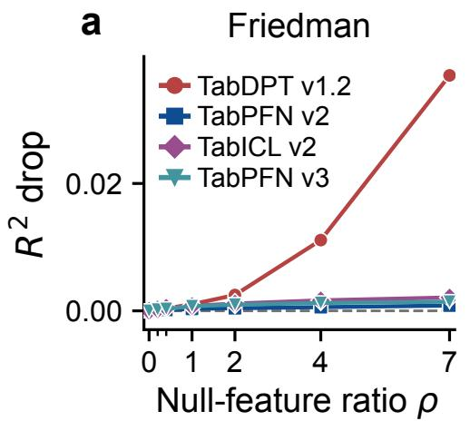

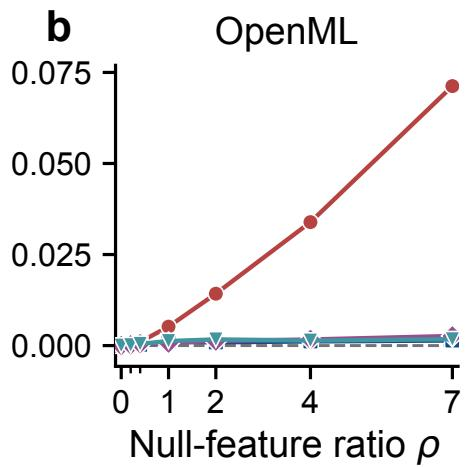  
Figure 1: Adding null features degrades TabDPT v1.2 more than the other released TFMs. Median query-set $R ^ { 2 }$ drop on (a) synthetic and (b) OpenML datasets as the ratio $\rho$ increases.

Paired design and metrics. We evaluate each TFM on paired versions of synthetic and real-world regression datasets. Each pair contains a clean dataset with only the raw features and an augmented dataset with additional features constructed to carry no information about the response; we call these added features null features. We vary the null-to-original feature ratio $\rho$ from zero to seven. For the synthetic datasets, we add independent null features to randomly generated Friedman datasets (Friedman, 1991), whose nonlinear response depends on five known relevant features and therefore provides ground-truth relevance. For the real-world evaluation, we add row-permuted copies of raw columns to 42 OpenML regression datasets (Vanschoren et al., 2014), preserving their empirical distributions while breaking their association with the target. We evaluate TabDPT v1.2 without retrieval (Hosseinzadeh et al., 2026), TabPFN $\mathrm { v } 2 / \mathrm { v } \bar { 3 }$ (Hollmann et al., 2025; Grinsztajn et al., 2026), and TabICL v2 (Qu et al., 2026). Across both settings, the $R ^ { 2 }$ drop relative to the paired clean task measures predictive degradation. To measure functional dependence, we permute one null query feature while holding the context and all other query features fixed. We normalize the resulting prediction change by the standard deviation of the query targets and call this measure the null-feature shift. An ideal relevance-adaptive predictor should incur little $R ^ { 2 }$ drop when null features are added and little prediction shift when a null coordinate is permuted. App. C gives the data construction, evaluated values of $\rho ,$ metrics, and inference settings.

Predictive degradation under null features. All models perform similarly on the clean tasks; their robustness separates only as null features are added (App. Fig. 9). At $\rho = 7 ,$ , TabDPT’s median $R ^ { 2 }$ drop is 0.0370 on Friedman and 0.0713 on OpenML, compared with 0.0008 and 0.0014, respectively, for TabPFN v2. Thus, TabDPT’s median degradation exceeds TabPFN $\mathbf { v } 2 \mathbf { \bar { s } }$ by factors of more than 46 on Friedman and more than 50 on OpenML, while TabICL $\mathbf { v } 2$ and TabPFN v3 also remain close to their clean-task performance (Fig. 1). A performance gap alone does not show that the fitted predictor depends on the added coordinates. We therefore turn to the null-feature shift, which directly measures the prediction change caused by perturbing a null query feature.

Functional dependence on null features. The paired comparison shows that the performance gap is widespread rather than driven by a few tasks. $\mathbf { A } \mathbf { t } \ \rho = 7$ , TabDPT’s $R ^ { 2 }$ drop exceeds TabPFN $\mathbf { v } 2 \mathbf { \bar { s } }$ on 98.9% of the 350 Friedman task settings and 95.2% of the 42 OpenML datasets $( \mathrm { F i g . } 2 ( \mathrm { a } ) )$ . Both models respond much more strongly to known relevant Friedman features or raw OpenML covariates than to the added nulls, providing positive controls for the sensitivity measure (App. Fig. 12). Nevertheless, TabDPT is consistently more sensitive to the null coordinates (Fig. 2(a, b)). At $\rho = 7$ on OpenML, its median null-feature shift is more than 8.5 times that of TabPFN ${ \bf v } 2 .$ , and it exceeds TabPFN $\mathbf { v } 2 \mathbf { \bar { s } }$ on all $^ { 4 2 }$ datasets. An additional partial-dependence analysis likewise shows that TabDPT depends more strongly on the added null features than TabPFN v2 (App. Fig. 13). Together, the predictive and functional results show that this difference is large and widespread.

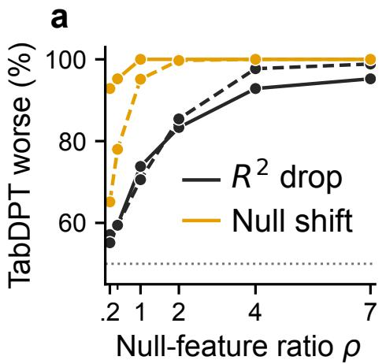

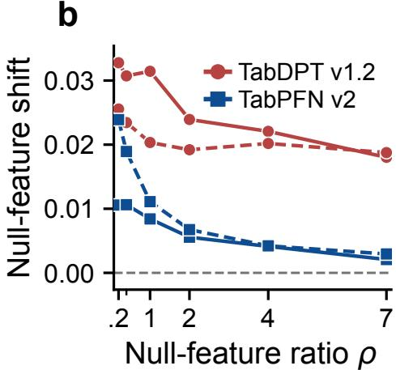  
Figure 2: Null features affect TabDPT more often and more strongly than TabPFN. (a) Fraction of paired tasks on which TabDPT v1.2 has a larger $R ^ { 2 }$ drop or null-feature shift than TabPFN $\mathbf { v } 2 .$ (b) Median null-feature shift for both models across values of $\rho .$ . Solid: OpenML; dashed: Friedman.

## 3 Isolating the architectural contrast with controlled priors

The preceding released-model comparison shows that TabDPT is much more sensitive to irrelevant features than TabPFN $\mathbf { v } 2 ,$ but differences in their pretraining data and procedures prevent us from attributing this gap to architecture. To isolate the architectural contrast, we train streamlined row-token and alternating-axis models under identical task priors and training protocols and evaluate them against exact Bayes targets.

## 3.1 Sparse and dense priors require different computations

To make the sparse–dense comparison precise, we seek a task family spanning sparse settings and a dense endpoint for which the Bayes-optimal predictor is available in closed form. We construct such a family by varying the number of active features in an orthogonal fixed design regression model.

Matched priors. Fix $n \geq d \geq 2 , v ^ { 2 } , \sigma ^ { 2 } > 0$ , and consider fixed design regression tasks of the form

$$
y = X { \boldsymbol { \beta } } + \varepsilon , \qquad \varepsilon \sim { \mathcal { N } } ( 0 , \sigma ^ { 2 } I _ { n } ) , \qquad X ^ { \top } X = n I _ { d } .\tag{1}
$$

Write $[ d ] = \{ 1 , \ldots , d \}$ . For $k \in [ d ] , \operatorname { l e t } S _ { k } = \{ A \subseteq [ d ] : | A | = k \}$ and define a prior $P _ { k }$ by drawing

$$
S \sim \operatorname { U n i f } ( S _ { k } ) , \qquad \beta _ { S } | S \sim { \mathcal { N } } ( 0 , ( v ^ { 2 } / k ) I _ { k } ) , \qquad \beta _ { S ^ { c } } = 0 .\tag{2}
$$

Here k is the number of active features. Throughout the controlled analysis, active and inactive refer specifically to membership in the realized support S, whereas relevant and irrelevant are reserved for broader statements about predictive dependence. The prior is sparse when $k < c$ and dense when $k = d ,$ . The scaling by $1 / k$ gives $\mathbb { E } [ \beta ] = 0 .$ $\mathbf { \bar { E } } \| \beta \| _ { 2 } ^ { 2 } = v ^ { 2 }$ , and $\mathbb { E } [ \beta \beta ^ { \top } ] = ( v ^ { 2 } / d ) I _ { d }$ for every k. Thus, changing k changes the support structure but not the coefficient covariance or expected signal energy. We therefore call $\{ \breve { P } _ { k } \}$ a matched prior family. Together with (1), each $P _ { k }$ specifies a hierarchical Bayesian linear regression model.

Posterior predictive means. Given observed data $D = ( X , y )$ from (1), consider prediction at a fixed covariate vector $x \in \mathbb { R } ^ { d }$ . For $y _ { q } = x ^ { \top } \beta + \varepsilon _ { q }$ , where $\varepsilon _ { q } \sim \mathcal { N } ( 0 , \sigma ^ { 2 } )$ is independent of the observed data, the Bayes-optimal predictor under squared loss is the posterior predictive mean $f _ { k } ^ { * } ( D , x ) = \mathbb { E } [ y _ { q } | D , x ] = x ^ { \top } \mathbb { E } [ \beta | D ]$ . Orthogonality makes $c = c ( D ) : = X ^ { \top } y / n$ sufficient for $\beta$ and yields the closed-form posterior coefficient mean

$$
\eta _ { k } ^ { * } ( c ) : = \mathbb { E } [ \beta | D ] = \mathbb { E } [ \beta | c ] = \lambda _ { k } q _ { k } ( c ) \odot c ,\tag{3}
$$

where $q _ { k , j } ( c ) = \mathbb { P } ( j \in S | c )$ is the jth element of the posterior inclusion vector $q _ { k } ( c ) , \lambda _ { k } = n v ^ { 2 } / ( n v ^ { 2 } + k \sigma ^ { 2 } )$ is a shrinkage factor, and denotes coordinatewise multiplication. See App. D.2 for details.

Computational difference between dense and sparse priors. The posterior predictive mean in (3) exposes a computational difference between the dense and sparse priors

• Under the dense prior $P _ { d } , q _ { d } ( c ) = \mathbf { 1 } _ { d }$ and $\eta _ { d } ^ { * } ( c ) = \lambda _ { d } c ,$ , so the Bayes rule applies the same shrinkage factor to every feature. Its prediction $f _ { d } ^ { * } ( D , x )$ can be implemented as the linear-kernel regression $\textstyle ( \lambda _ { d } / n ) \sum _ { i } \langle x , { \bar { x } } _ { i } \rangle y _ { i }$

• Under a sparse prior $P _ { k }$ with $k < d ,$ the posterior predictive mean instead uses the context-dependent feature gate $q _ { k } ( c )$ . Although $c = X ^ { \top } y / n$ is linear in y, the exponential normalization in (17)–(18) makes $q _ { k } ( c )$ nonlinear in c.

## 3.2 Attention architectures and alignment with posterior mean computation

To test whether keeping features separate provides a more direct route to the feature weights required by sparse prediction, we compare controlled row-token and alternating-axis models. Fig. 3(a,b) summarizes the streamlined row token and cell-token alternating-axis architectures used in the controlled comparison. Details about the architectures are

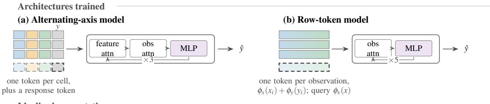

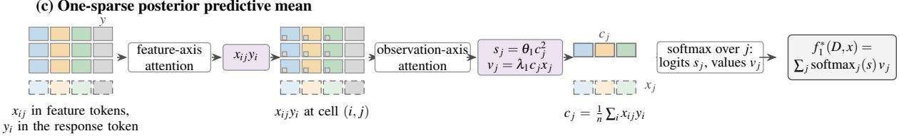  
Figure 3: Architectures and an idealized one-sparse Bayes posterior predictive mean. (a–b) The alternating-axis and row-token models used in the controlled comparison. (c) For $k = 1$ , response routing and within-feature aggregation form $c _ { j }$ , and feature-axis softmax combines $\lambda _ { 1 } c _ { j } x _ { j }$ using logits proportional to $c _ { j } ^ { 2 }$ . Panel (c) is a mathematical construction, not an identified circuit in the trained models (App. D.5). Colors denote features; dashed and heavy outlines mark query and readout tokens, respectively; shading denotes pointwise maps.

given in App. E.1. Both models use the same embedding width and similar parameter counts, providing representative implementations of the two attention layouts at a comparable model scale. Differences in depth, token count, and computational cost remain inherent to the comparison. App. E.2 gives the full configurations and parameter counts.

Why row-token architecture can handle dense priors but may struggle with sparse ones. We show below that any fixed-kernel regression cannot express the posterior predictive mean under a sparse prior.

Theorem 1 (Response-affine barrier). Fix $X ^ { \top } X = n I _ { d }$ and a nonzero prediction point x. Let

$$
{ \mathcal { F } } _ { \mathrm { a f f } } ( x ) = \{ f ( D , x ) = a ( X , x ) + b ( X , x ) ^ { \top } y : a ( X , x ) \in \mathbb { R } , \ b ( X , x ) \in \mathbb { R } ^ { n } \} ,\tag{4}
$$

where a and b may depend arbitrarily on $X , x ,$ and known prior parameters, but not on y. Under every $P _ { k } ,$ , the unique minimizer ofsquared prediction risk in $\mathcal { F } _ { \mathrm { a f f } } ( x )$ is $f _ { \mathrm { a f f } } ^ { * } ( D , \bar { x } ) = \bar { \lambda } _ { d } x ^ { \top } c .$ It equals $f _ { d } ^ { * } ( D , \bar { x } )$ , whereasfor every $k < d ,$

$$
\operatorname* { i n f } _ { f \in { \mathcal F } _ { \mathrm { a f f } } ( x ) } \mathbb { E } _ { D } \big [ \{ f ( D , x ) - f _ { k } ^ { * } ( D , x ) \} ^ { 2 } \big ] > 0 .\tag{5}
$$

See proof details in App. D.4. The theorem shows that when the number of active features is strictly smaller than the feature dimension, no function in the affine class can approximate $f _ { k } ^ { * } ( D , x )$ arbitrarily well. To connect this barrier to row-token architectures, note that linear-kernel regression corresponds to an idealized one-layer row-token attention computation without softmax (von Oswald et al., 2023). Since linear-kernel regression is an instance of the fixed-kernel class covered by Thm. 1, this correspondence suggests that the same barrier applies to that idealized row-token model. Although nonlinearities and multiple layers can improve expressivity, the expressivity of linear-kernel regression remains a useful baseline heuristic for row-token architectures.

Why alternating-axis architecture is more aligned with sparse priors. For the sparse prior with $k = 1$ , an alternating-axis circuit implements the Bayes predictor as shown in Fig. 3(c).

Step 1. Response routing makes each context response $y _ { i }$ available to each feature.

Step 2. Observation-axis aggregation forms $c _ { j }$

Step 3. Feature-axis softmax combines values $\lambda _ { 1 } c _ { j } x _ { j }$ using logits proportional to $c _ { j } ^ { 2 } .$ . Because feed-forward networks can approximate the required continuous pointwise maps on compact domains, an idealized alternating-axis network can approximate this one-sparse construction arbitrarily well (Prop. 3, App. D.5). The appendix extends the construction to every k using three routing and aggregation stages and $O ( k )$ pooled statistics.

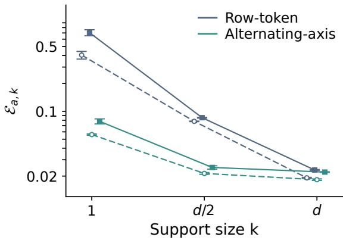  
Figure 4: The sparse advantage contracts at the dense endpoint. Task-normalized Bayes approximation error (log scale) for the row-token and alternating-axis models. denotes d = 10; denotes $d \stackrel { \cdot } { = } 2 0$ . Markers and error bars show the mean SD across three training seeds, each evaluated on 32,000 shared test tasks.

## 3.3 Controlled experiments to test the architectural contrast

Setup. For each (d, k) pair, with $d \in \{ 1 0 , 2 0 \}$ and $k \in \{ 1 , d / 2 , d \}$ , we train separate row-token and alternating-axis models on tasks drawn from $P _ { k }$ . We set $v ^ { 2 } = 1$ and $\sigma = 1 . 5$ . This choice keeps the prior-averaged signal-to-noise ratio fixed across values of k and d. We evaluate both architectures on the same $T = 3 2 { , } 0 0 0$ tasks per condition. Each task has an orthogonal context with 50–100 observations and independent queries $x \sim \mathcal { N } ( 0 , I _ { d } )$ . See App. E.2 for pretraining details.

Error relative to Bayes target. Let $\widehat { f } _ { a , k }$ denote the predictor with architecture a trained under $P _ { k }$ . We now describe bhow to define an aggregate measure of excess prediction error of $\widehat { f } _ { a , k }$ relative to the posterior predictive mean $f _ { k } ^ { * }$ . For each test context D, we evaluate its mean squared error to $f _ { k } ^ { * }$ b(where the mean is taken with respect to an independent query $x \sim \mathcal { N } ( 0 , I _ { d } ) )$ , normalized by the energy of $f _ { k } ^ { * }$ , and then take a further expectation over contexts:

$$
\mathcal { E } _ { a , k } : = \mathbb { E } _ { D } \left[ \frac { \mathbb { E } _ { x } \Big [ \| \widehat { f } _ { a , k } ( D , x ) - f _ { k } ^ { * } ( D , x ) \| ^ { 2 } \Big ] } { \mathbb { E } _ { x } [ \| f _ { k } ^ { * } ( D , x ) \| ^ { 2 } ] } \right] .\tag{6}
$$

App. E.2.3 gives the empirical estimator of this quantity.

The empirical error values, averaged over 32,000 test tasks, are shown in Fig. 4. We see that the alternating-axis model has substantially lower excess error under sparse priors, with a gap of $\mathcal { E } _ { \mathrm { r o w } , k } ^ { \mathrm { - } } - \mathcal { E } _ { \mathrm { a l t e r n a t i n g } , k } \approx 0 . 3 4$ (respectively $\approx 0 . 6 2 7 )$ at $k = 1$ and $d = 1 0$ (respectively $\bar { d } = 2 \bar { 0 } )$ . The gap is positive for all three training seeds, and also holds conditioned on D across nearly all test tasks (App. E.3). However, for dense priors, this gap becomes essentially negligible.

Error gap is due to linear coefficient estimation. Since $f _ { k } ^ { * } ( D , x )$ is a linear function of $x ,$ it is insightful to decompose the difference $\widehat { f } _ { a , k } ( D , x ) - f _ { k } ^ { * } ( D , x )$ into a linear term and a nonlinear residual. This allows us to examine how much binaccuracy is due to failing to estimate the coefficients correctly, and how much is due to lying outside the linear model class. Aggregating this analysis across architectures then gives further insight into what contributes to their performance gap over sparse priors. We first state a general decomposition.

Lemma 2 (Prediction error decomposition). Let f be square-integrable, and let $x \sim \mathcal { N } ( 0 , I _ { d } )$ be independent of D. For any context D, define the best linear predictor coefficients

$$
\big ( \zeta _ { f } ( D ) , \eta _ { f } ( D ) \big ) : = \underset { \zeta \in \mathbb { R } , \eta \in \mathbb { R } ^ { d } } { \arg \operatorname* { m i n } } \mathbb { E } _ { x } \big [ ( f ( D , x ) - \zeta - x ^ { \top } \eta ) ^ { 2 } \big ] ,\tag{7}
$$

and the nonlinear residual $r _ { f } ( D , x ) = f ( D , x ) - \zeta _ { f } ( D ) - x ^ { \top } \eta _ { f } ( D )$ . Then we have

$$
\begin{array} { r } { \mathbb { E } _ { x } [ ( f ( D , x ) - f _ { k } ^ { * } ( D , x ) ) ^ { 2 } ] = \underbrace { \| \eta _ { f } ( D ) - \eta _ { k } ^ { * } ( c ) \| _ { 2 } ^ { 2 } } _ { c o e f j i c i e n t e r r o r } + \underbrace { \zeta _ { f } ( D ) ^ { 2 } } _ { i n t e r c e p t e r o r } + \underbrace { \mathbb { E } _ { x } [ r _ { f } ( D , x ) ^ { 2 } ] } _ { n o n l i n e a r i y e r r o r } . } \end{array}\tag{8}
$$

The proof and its connection to excess prediction risk appear in App. D.6. We estimate the three terms for each context and normalize them as in (6). App. E.4.1 gives the estimation details.

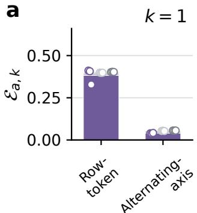

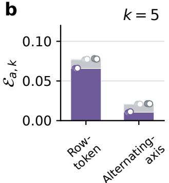

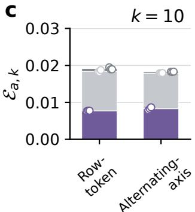  
Figure 5: Task-normalized error components at $d = \mathbf { 1 0 . } \mathbb { 1 }$ coefficient; squared intercept; residual. Bars stack these components for one architecture. Each component is averaged equally over 32,000 shared test datasets per seed. Bars show three-seed means, and points show seed averages. The total bar height equals the sum of the three components.

Sparse priors. At $d = 1 0$ , the between-architecture coefficient-error difference accounts for 98.4% of the mean prediction-error gap at $k = 1$ and 97.5% at $k = 5$ (Fig. 5; App. Fig. 24). App. E.4.3 further separates coefficient error over active and inactive features. The sparse architecture gap therefore comes almost entirely from the row-token architecture’s much larger coefficient error.

Dense prior. At $k = d ,$ the Bayes coefficient map is the uniform rule $\eta _ { d } ^ { * } ( c ) = \lambda _ { d } c$ . The row-token model has slightly lower mean coefficient error than the alternating-axis model at both $d = 1 0$ and $d = 2 0$ . Its larger intercept and residual errors offset this coefficient advantage. The alternating-axis model therefore retains a small overall prediction advantage (App. E.4.2).

In summary, the alternating-axis advantage under sparse priors lies primarily in estimating the context-dependent coefficients, rather than in representing the prediction’s linear dependence on the query. At the dense endpoint, where the Bayesian coefficient map reduces to uniform shrinkage, the coefficient advantage disappears. We next try to understand why there is such an accuracy gap in coefficient estimation.

## 4 Tracing attention-mediated computation of linear coefficients

Section 3.3 shows that alternating-axis models approximate the sparse Bayesian predictor more accurately, primarily through better estimation of its context-dependent coefficients. We now investigate how feature attention contributes to this computation. We hypothesize thatfeature-axis attention supports task-dependent, selectively routed computation of linear coefficients: attenuating messages associated with a feature should preferentially affect its own coefficient, with stronger effects for active features. We further examine where this control is concentrated across layers and between context and query messages. We test this in the simplified alternating-axis model and then apply the same analysis to pretrained TabPFN v2.

## 4.1 Feature-message interventions and coefficient responses

To examine the hypothesis, we define interventions on internal quantities of the computation graph and observe their effect on the fitted linear coefficients, as defined in (7). We perform this analysis for both the simplified alternating-axis architecture from Section 3.2 as well as frozen TabPFN v2.

Intervention. For one feature-attention head within a row, let $\alpha _ { p g }$ be the attention weight from source token g to receiver p, and let $v _ { g }$ be its value vector. Attenuating source feature j replaces the weighted sum by

$$
\sum _ { g } \alpha _ { p g } v _ { g } \quad \longmapsto \quad \sum _ { g \neq j } \alpha _ { p g } v _ { g } + ( 1 - \delta ) \alpha _ { p j } v _ { j } .
$$

We apply this change to every receiver and head at one selected layer $\ell ,$ using $\delta = 0 . 1$ unless stated otherwise. The context-only intervention changes context rows only; the query-only intervention changes query rows only. Attention weights are unchanged and not renormalized, residual connections remain intact, and downstream computation is rerun. App. F.1 gives the equivalent implementation after the output projection. The operation is illustrated in Fig. 6.

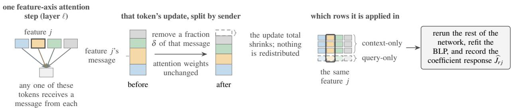  
Figure 6: Feature-message attenuation in the simplified alternating-axis model. Source feature $j ^ { \flat } \boldsymbol { \mathrm { s } }$ contribution is scaled by 1 δ at every receiver and head, either in context rows or in query rows. Other sources’ contributions at that operation and the residual pathway are unchanged. Bar sizes are schematic; App. F.1 gives implementation details.

Coefficient response. Because the fitted model is almost perfectly linear, as shown in Fig. 5, we investigate the effect of the intervention on the estimated linear coefficients. Let $a \in \{ \mathrm { c o n t e x t , q u e r y } \}$ denote the intervened row type. Let $\widehat { \eta } _ { 0 , r } ( D )$ and $\widehat { \eta } _ { \delta , \ell , j , r } ^ { a } ( D )$ be the baseline and intervened coefficients for query feature r, estimated on the same queries, b band define the coefficient response per unit attenuation by

$$
\begin{array} { r } { \widehat { J } _ { r j } ^ { ( \ell , a ) } = \{ \widehat { \eta } _ { 0 , r } ( D ) - \widehat { \eta } _ { \delta , \ell , j , r } ^ { a } ( D ) \} / \delta . } \end{array}\tag{9}
$$

We cal $j$ b bthe source feature index and r the target feature index.

An illustrative coefficient-response matrix. Fig. 7 shows query-only interventions for one task, selected by proximity to the median Bayes coefficient norm. Column j corresponds to the attenuated feature and row r to the affected coefficient: diagonal entries indicate own-feature effects, while off-diagonal entries indicate effects on other features. In this example, the largest final-layer response lies on the active source’s own coefficient. The separate color scales show localization within each layer, not relative response magnitudes across layers. Context-only matrices are reported in App. F.2.

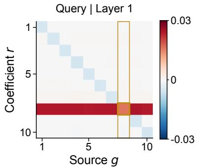

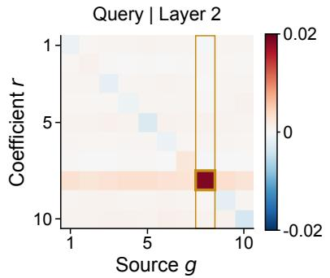

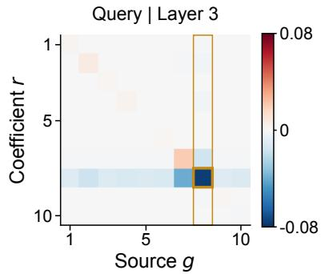  
Figure 7: Coefficient responses to query-message attenuation. Alternating-axis model, $d = 1 0 , k = 1 , \delta = 0 . 1$ . The task is nearest the median Bayes coefficient norm among the 128 tasks. Each matrix column attenuates one source on query rows; matrix rows index affected coefficients. Color shows signed $\widehat { J } _ { r j } ^ { ( \ell ) }$ with a symmetric scale per layer. Gold outlines mark the active source and its own coefficient.

## 4.2 Evaluating and interpreting selective routing

To determine whether these patterns persist across tasks, we quantify where the coefficient response occurs and how strong it is, computing each metric separately for context and query interventions and suppressing a below:

1. Specificity, $p _ { j } ^ { ( \ell ) } = | \widehat { J } _ { j j } ^ { ( \ell ) } | / \sum _ { r } | \widehat { J } _ { r j } ^ { ( \ell ) } |$ , is the fraction of the total absolute coefficient response occurring on feature $j$ b bitself. A high value indicates that attenuating source $j$ mainly changes the prediction’s linear dependence on that same feature, rather than other features.

2. Sensitivity, $w _ { j } ^ { ( \ell ) } = | \widehat { J } _ { j j } ^ { ( \ell ) } | / | c _ { j } |$ , is the magnitude of the own-feature coefficient response per unit attenuation, bnormalized by the observed feature–response statistic $\left| c _ { j } \right|$ . A high value indicates stronger control over that coefficient relative to this statistic.

For $d \in \{ 1 0 , 2 0 \}$ , we compute specificity and sensitivity values on a collection same 128 datasets with sparsity $k = 1$ We summarize effects separately over active and inactive features.

App. F.1 gives the estimators, denominator handling, and aggregation.

Extension to TabPFN v2. Each source token in TabPFN v2 represents a native group of two features. We therefore attenuate a source group and aggregate its own-feature responses over both constituent coefficients. A group is active if it contains an active coordinate. The grouped definitions are given in App. F.1; below, a source denotes an individual feature in the simplified model or a feature group in TabPFN v2.

(a)  
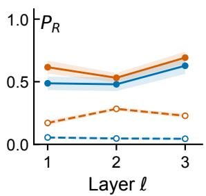

(b)  
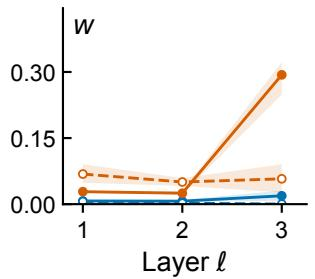

(d)  
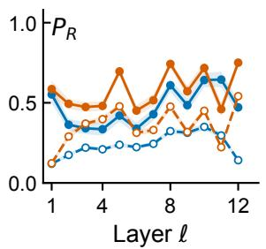

(e)  
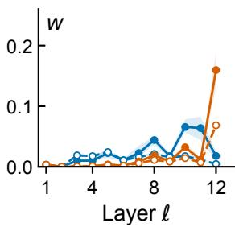  
Figure 8: Support-selective message effects in context and query rows. Panels (a,b): alternating-axis model; $^ { ( \mathrm { d } , \mathrm { e } ) }$ frozen TabPFN v2. d = 10, k = 1, δ = 0.1; the same 128 tasks are used throughout. denotes context-row interventions; denotes query-row interventions. and denote active and inactive sources, respectively. For each model, panels show mean specificity $P _ { R }$ and median sensitivity $w ,$ after averaging sources within each role and task. Prediction-error panels (c,f) appear in Fig. 32. Bands are pointwise 95% intervals from 2,000 generator-batch bootstrap resamples.

The results in Fig. 8 show similar patterns in the simplified alternating-axis model and TabPFN $\mathbf { v } 2 \mathbf { : }$

• Selective computational routing. Active sources have high specificity, particularly for final-layer query messages (panels a, d): attenuating a feature’s messages predominantly changes its own coefficient. This supports selective computational routing through feature-indexed pathways.

• Routing is task dependent. Active sources have higher specificity than inactive sources at every tested layer under both interventions. Their final-layer query sensitivities are also 5.1 and 2.3 the inactive-source values in the simplified model and TabPFN v2, respectively (panels b, e); both contrasts persist at $d = 2 0 ( { \mathrm { A p p . } } { \mathrm { F } } . 3 )$ ).

• Computation is heterogeneous across layers. Own-feature sensitivity peaks in final-layer query messages; for active sources, the query median is 15.5 and 8.9 the context median in the two models, respectively. Earlier messages exert weaker own-feature control, although this does not imply that those layers are dispensable.

The signs of $\widehat { J } _ { j j }$ and $c _ { j }$ do not always agree (App. F.4), suggesting that the computation is more complex than simply btransmitting a positively weighted feature contribution. Coefficient changes nevertheless closely reconstruct the centered prediction response for final-layer active query interventions (median fidelity 0.976 and 0.969; App. F.2). Predictive consequences and robustness across attenuation strengths and support sizes are reported in Apps. F.3–F.6. Selective computational routing is a candidate mechanism underlying the alternating-axis advantage, but these experiments do not establish where relevance is inferred or whether reduced inactive-source influence reflects suppression within attention itself.

## 5 Conclusion

Irrelevant features expose differences among tabular foundation models that are less apparent on clean tasks. Controlled pretraining under matched sparse and dense linear priors shows that architecture contributes to this contrast: the alternating-axis model more accurately approximates the sparse Bayesian predictor, while its advantage contracts sharply at the dense endpoint. Almost all of the sparse prediction gap is attributable to coefficient error rather than intercept or nonlinear query effects. The analytical targets motivate this prior-dependent advantage: sparse prediction requires context-dependent feature weighting, whereas dense prediction requires only uniform shrinkage.

Feature-message interventions provide evidence of selective computational routing in both the simplified alternating-axis model and pretrained TabPFN $\mathbf { v } 2 .$ . Messages associated with active features exert more feature-specific coefficient control, with strong own-feature effects concentrated in final-layer query messages. These findings identify pathways that regulate predictive dependence on individual features, without establishing where relevance is inferred or fully explaining the architecture gap. Together, the results support studying architectural inductive biases through controlled task families and explicit computational targets, rather than seeking a universal ranking of tabular architectures.

## Acknowledgments

Tianqi Zhao and Qiong Zhang are supported by the National Key R&D Program of China Grant 2024YFA1015800. Y.S. Tan was supported by NUS Startup Grant A-8000448-00-00 and the Singapore Ministry of Education (MOE) AcRF Tier 1 Grants A-8002498-00-00 and A-8004458-00-00.

## References

Marin Biloš, James T. Wilson, Anderson Schneider, and Yuriy Nevmyvaka. A mechanistic study of tabular foundation models. arXiv preprint arXiv:2605.21288, 2026. URL https://arxiv.org/abs/2605.21288.

Xiang Cheng, Yuxin Chen, and Suvrit Sra. Transformers implement functional gradient descent to learn non-linear functions in context. In International Conference on Machine Learning, 2024. URL https://proceedings.mlr. press/v235/cheng24a.html.

Zi-Jian Cheng, Ziyi Jia, Zhi Zhou, Yu-Feng Li, and Lan-Zhe Guo. TabFSBench: Tabular benchmark for feature shifts in open environments. In International Conference on Machine Learning, 2025. URL https://proceedings.mlr. press/v267/cheng25e.html.

Nick Erickson, Lennart Purucker, Andrej Tschalzev, David Holzmüller, Prateek Mutalik Desai, David Salinas, and Frank Hutter. TabArena: A living benchmark for machine learning on tabular data. In Advances in Neural Information Processing Systems, volume 38, 2025. URL https://proceedings.neurips.cc/paper\_files/paper/ 2025/hash/1697e3fb412da11dc9488249f9e7bbc9-Abstract-Datasets\_and\_Benchmarks\_Track.html. Datasets and Benchmarks Track.

João Fonseca and Julia Stoyanovich. ExplainerPFN: Towards tabular foundation models for model-free zero-shot feature importance estimations. arXiv preprint arXiv:2601.23068, 2026. URL https://arxiv.org/abs/2601.23068.

Jerome H. Friedman. Multivariate adaptive regression splines. The Annals of Statistics, 19(1):1–67, 1991. doi: 10.1214/aos/1176347963.

Léo Grinsztajn, Klemens Flöge, Oscar Key, Felix Birkel, Philipp Jund, Brendan Roof, Benjamin Jäger, Dominik Safaric, Simone Alessi, Adrian Hayler, Mihir Manium, Rosen Yu, Felix Jablonski, Shi Bin Hoo, Anurag Garg, Jake Robertson, Magnus Bühler, Vladyslav Moroshan, Lennart Purucker, Clara Cornu, Lilly Charlotte Wehrhahn, Alessandro Bonetto, Bernhard Schölkopf, Sauraj Gambhir, Noah Hollmann, and Frank Hutter. TabPFN-2.5: Advancing the state of the art in tabular foundation models. arXiv preprint arXiv:2511.08667, 2025. doi: 10.48550/arXiv.2511.08667. URL https://arxiv.org/abs/2511.08667.

Léo Grinsztajn, Klemens Flöge, Oscar Key, Felix Birkel, Philipp Jund, Brendan Roof, Mihir Manium, Shi Bin Hoo, Magnus Bühler, Anurag Garg, Dominik Safaric, Jake Robertson, Benjamin Jäger, Simone Alessi, Adrian Hayler, Vladyslav Moroshan, Lennart Purucker, Philipp Singer, Alan Arazi, Julien Siems, Jan Hendrik Metzen, Georg Grab, Nick Erickson, Siyuan Guo, Eliott Kalfon, Simon Bing, David Salinas, Clara Cornu, Lilly Charlotte Wehrhahn, Diana Kriuchkova, Kursat Kaya, Lydia Sidhoum, Marie Salmon, Jerry Chen, Madelon Hulsebos, Yann LeCun, Samuel Müller, Bernhard Schölkopf, Sauraj Gambhir, Noah Hollmann, and Frank Hutter. TabPFN-3: Technical report. arXiv preprint arXiv:2605.13986, 2026. URL https://arxiv.org/abs/2605.13986.

Atharva Gupta, Dhruv Kumar, Murari Mandal, and Saurabh Deshpande. Where computation lives inside TabPFN: Causal localisation of attention head function. arXiv preprint arXiv:2606.12917, 2026. URL https://arxiv.org/ abs/2606.12917. 2nd ICML Workshop on Foundation Models for Structured Data.

Noah Hollmann, Samuel Müller, Katharina Eggensperger, and Frank Hutter. TabPFN: A transformer that solves small tabular classification problems in a second. In International Conference on Learning Representations, 2023. URL https://openreview.net/forum?id=cp5PvcI6w8\_.

Noah Hollmann, Samuel Müller, Lennart Purucker, Arjun Krishnakumar, Max Körfer, Shi Bin Hoo, Robin Tibor Schirrmeister, and Frank Hutter. Accurate predictions on small data with a tabular foundation model. Nature, 637: 319–326, 2025. doi: 10.1038/s41586-024-08328-6.

Rasa Hosseinzadeh, Alex Labach, Zexin Xue, Shuyi Han, Valentin Thomas, and Anthony L. Caterini. TabDPT-Turbo: Efficient in-context learning for tabular prediction. arXiv preprint arXiv:2608.01400, 2026. URL https: //arxiv.org/abs/2608.01400. 2nd ICML Workshop on Foundation Models for Structured Data.

James Hu and Mahdi Ghelichi. Noise immunity in in-context tabular learning: An empirical robustness analysis of TabPFN’s attention mechanisms. arXiv preprint arXiv:2604.04868, 2026. URL https://arxiv.org/abs/2604. 04868.

Sarthak Jain and Byron C. Wallace. Attention is not explanation. In Conference ofthe North American Chapter ofthe Associationfor Computational Linguistics, 2019. doi: 10.18653/v1/N19-1357.

Christopher Kolberg, Jules Kreuer, Jonas Huurdeman, Sofiane Ouaari, Katharina Eggensperger, and Nico Pfeifer. TabPFN-Wide: Continued pre-training for extreme feature counts. arXiv preprint arXiv:2510.06162, 2025. URL https://arxiv.org/abs/2510.06162.

Weihao Kong and Abhimanyu Das. Introducing TabFM: A zero-shot foundation model for tabular data. Google Research Blog, June 2026. URL https://research.google/blog/ introducing-tabfm-a-zero-shot-foundation-model-for-tabular-data/.

Junwei Ma, Valentin Thomas, Rasa Hosseinzadeh, Alex Labach, Hamidreza Kamkari, Jesse C. Cresswell, Keyvan Golestan, Guangwei Yu, Anthony L. Caterini, and Maksims Volkovs. TabDPT: Scaling tabular foundation models on real data. In Advances in Neural Information Processing Systems, volume 38, 2025. doi: 10.52202/085713-5748. URL https://proceedings.neurips.cc/paper\_files/paper/2025/hash/ fc0e3f908a2116ba529ad0a1530a3675-Abstract-Conference.html.

Alexander Pfefferle, Johannes Hog, Lennart Purucker, and Frank Hutter. nanoTabPFN: A lightweight and educational reimplementation of TabPFN. In EurIPS 2025 Workshop: AIfor Tabular Data, 2025. URL https://openreview. net/forum?id=kYUf6HwAsM.

Jingang Qu, David Holzmüller, Gaël Varoquaux, and Marine Le Morvan. TabICL: A tabular foundation model for in-context learning on large data. In International Conference on Machine Learning, 2025. URL https: //proceedings.mlr.press/v267/qu25d.html.

Jingang Qu, David Holzmüller, Gaël Varoquaux, and Marine Le Morvan. TabICLv2: A better, faster, scalable, and open tabular foundation model. In International Conference on Machine Learning, 2026. URL https: //arxiv.org/abs/2602.11139.

Amir Rezaei Balef, Mykhailo Koshil, and Katharina Eggensperger. Is one layer enough? understanding inference dynamics in tabular foundation models. In International Conference on Machine Learning, 2026. URL https: //arxiv.org/abs/2605.06510.

Zeynep Türkmen, Kür¸sat Kaya, Alexander Pfefferle, and Frank Hutter. Towards evaluating data priors for tabular foundation models. arXiv preprint arXiv:2606.29241, 2026. URL https://arxiv.org/abs/2606.29241. 2nd ICML Workshop on Foundation Models for Structured Data.

Joaquin Vanschoren, Jan N. van Rijn, Bernd Bischl, and Luis Torgo. OpenML: Networked science in machine learning. SIGKDD Explorations, 15(2):49–60, 2014. doi: 10.1145/2641190.2641198.

Johannes von Oswald, Eyvind Niklasson, Ettore Randazzo, João Sacramento, Alexander Mordvintsev, Andrey Zhmoginov, and Max Vladymyrov. Transformers learn in-context by gradient descent. In International Conference on Machine Learning, 2023. URL https://proceedings.mlr.press/v202/von-oswald23a.html.

Sarah Wiegreffe and Yuval Pinter. Attention is not not explanation. In Conference on Empirical Methods in Natural Language Processing, 2019. doi: 10.18653/v1/D19-1002.

Qiong Zhang, Yan Shuo Tan, Qinglong Tian, and Pengfei Li. TabPFN: One model to rule them all? arXiv preprint arXiv:2505.20003, 2025a. URL https://arxiv.org/abs/2505.20003.

Xiyuan Zhang, Danielle C. Maddix, Junming Yin, Nick Erickson, Abdul Fatir Ansari, Boran Han, Shuai Zhang, Leman Akoglu, Christos Faloutsos, Michael W. Mahoney, Cuixiong Hu, Huzefa Rangwala, George Karypis, and Yuyang Wang. Mitra: Mixed synthetic priors for enhancing tabular foundation models. In Advances in Neural Information Processing Systems, volume 38, 2025b. doi: 10.52202/085713-0535. URL https://proceedings.neurips.cc/ paper\_files/paper/2025/hash/177d68f4adef163b7b123b5c5adb3c60-Abstract-Conference.html.

## A Related work

Tabular foundation models and architectural axes. Prior-data fitted networks learn to approximate Bayesian prediction under a pretraining distribution and apply the learned procedure to new datasets in context (Hollmann et al., 2023; 2025). Modern TFMs differ not only in scale and pretraining data but also in how they represent a table. TabPFN v2 combines attention over observations with attention over randomized feature groups (Hollmann et al., 2025); TabICL and TabICL v2 use dedicated column embedding and compression stages before in-context processing (Qu et al., 2025;

2026). TabDPT emphasizes row tokens, learned dataset preprocessing, real-data pretraining, and retrieval for scaling the context (Ma et al., 2025). These systems confound architecture with prior, scale, and preprocessing, motivating our paired production stress test followed by common-prior training of streamlined architectures.

Feature processing also determines how models scale to wide tables. TabPFN-Wide uses continued prior-informed pretraining to extend TabPFN to extreme feature counts and reports improved robustness to feature noise (Kolberg et al., 2025). This demonstrates that robustness depends on pretraining exposure as well as architecture. Our objective is complementary: we hold the prior fixed when comparing architectures, and then vary only the support structure of that common prior.

In-context learning as kernel aggregation or learned optimization. Theory for transformer in-context learning has connected attention to linear regression and gradient-based learning algorithms (von Oswald et al., 2023). For nonlinear targets, transformers can implement functional gradient descent, yielding similarity-weighted or kernel-like updates over context examples (Cheng et al., 2024). Such accounts make row attention a natural mechanism for aggregating labels from similar context observations. They do not by themselves explain how the similarity should adapt when most coordinates are irrelevant. In our controlled family, the dense Bayes rule is exactly a fixed row kernel, while the sparse Bayes rule requires its coordinate metric to depend on support evidence from the current task. This places feature suppression inside the kernel rather than treating a generic kernel interpretation as either sufficient or deficient.

Robustness to noisy and irrelevant features. The closest empirical study evaluates TabPFN under injected random and correlated features, label noise, and varying sample size, finding stable accuracy and increasingly concentrated feature attention (Hu & Ghelichi, 2026). Our production experiments broaden the comparison across five released TFMs and use paired regression tasks, while the controlled experiments separate architecture from pretraining and evaluate against known Bayes functions. Most importantly, attention concentration is not treated as mechanistic evidence: our source-route intervention tests whether a route has a feature-aligned effect on the fitted predictor. Work on feature shift benchmarks studies robustness to changing feature spaces more generally (Cheng et al., 2025); we focus specifically on task-irrelevant coordinates whose addition should leave the oracle prediction rule unchanged.

Mechanistic interpretation of TFMs. Recent studies show that similar benchmark accuracy can conceal different in-context algorithms. Biloš et al. (2026) find evidence for attention-weighted row voting in TabPFN v2 and a prototypelike representation in TabICL v2. Layerwise probing and structural interventions further suggest that TFM inference proceeds through iterative refinement, with substantial but non-interchangeable redundancy across depth (Rezaei Balef et al., 2026). At a finer scale, Gupta et al. (2026) use activation patching, head ablation, and attention entropy to localize task-dependent computation in TabPFN v2.5. These works ask where predictions or readout algorithms emerge. We instead start from a statistically defined computation—context-dependent coordinate gating—and measure how interventions change the fitted coefficient map. Because later representations may repair or redistribute an intervention, we use small dose responses and propagate every perturbation through the complete remaining network rather than equating a large one-shot ablation with a specific mechanism.

Feature attribution. Attribution and mechanism are related but distinct. ExplainerPFN predicts Shapley-style feature importance from the data distribution without access to the target model (Fonseca & Stoyanovich, 2026), while conventional post-hoc methods explain a fixed model through perturbations, gradients, or surrogate functions. Raw attention weights describe routing mass but omit the routed values, residual pathways, and downstream transformations; they therefore need not equal feature contributions (Jain & Wallace, 2019; Wiegreffe & Pinter, 2019). Our route-tocoefficient matrix is an intervention diagnostic, not a proposed replacement for SHAP. In full TabPFN v2 it is reported at token-group resolution because the tokenizer does not expose a one-to-one raw-feature route.

## B Discussion and limitations

Architecture–prior alignment, not a universal winner. The paper’s three stages support a conditional architectural claim. The released-model comparison identifies a practically relevant difference in irrelevant-feature suppression, the exact Bayes rules explain why sparse and dense priors demand different computations, and the controlled experiments test whether the two architectures learn those computations equally well. The alternating-axis advantage under sparsity, together with its contraction at the dense endpoint, is consistent with feature-indexed computation being aligned with context-dependent support inference. The coefficient decomposition further shows that the sparse prediction gap arises primarily from the learned coefficient map rather than from intercept or nonlinear query effects.

This evidence does not make two-dimensional attention either necessary or sufficient for irrelevant-feature suppression. Deep row-token models can construct context-dependent metrics, and the fixed-kernel theorem does not cover that unrestricted class. Conversely, TabPFN v2, TabPFN v2.5, TabICL v2, and TabPFN v3 differ substantially in their tokenization and feature-processing pathways even though all are robust in the null-column experiment. The supported conclusion is narrower: a coordinate-indexed computational route directly represents the sufficient statistics and posterior gates required for sparse task adaptation, and this alignment can improve learning under a matched training protocol.

Functional suppression and internal mechanism. We define suppression by the fitted predictor’s behavior rather than by exact support recovery. A null feature is functionally suppressed when changing its query value has little effect on the prediction and when adding many such features produces little loss in predictive performance. Under the sparse prior, the realized support is hidden, so even a generated inactive coordinate can have nonzero posterior inclusion probability and a nonzero posterior-mean coefficient. For this reason, the primary coefficient analysis compares the learned map with the posterior mean, while the active–inactive split serves as a secondary diagnostic for locating approximation error.

The input–output diagnostics establish functional dependence but do not locate its internal implementation. Raw attention weights are also insufficient because a large weight may carry a small value vector, be canceled downstream, or be bypassed by a residual stream. The route-to-coefficient intervention instead asks how attenuating a specific feature message changes the fitted coefficient map after the perturbation propagates through the remaining network. Specificity locates the coefficient response, normalized sensitivity measures its magnitude, and $\Delta E$ tests whether the message improves Bayes approximation. Under the one-sparse prior, active sources have higher specificity throughout the network and greater final-layer sensitivity in both context and query processing. At intermediate sparsity, the active-source advantage persists in specificity and prediction-error changes. Across support sizes, feature-specific responses persist even at the dense endpoint, whereas active–inactive contrasts identify support selectivity only in sparse settings (App. F.6). These are local effects in fixed networks rather than a complete circuit identification, and norm-matched perturbation controls and replication across alternating-axis training seeds remain outside the present experiments.

Tokenization limits raw-feature conclusions. The controlled alternating-axis model assigns one address to each raw feature, whereas TabPFN v2 may place multiple raw features in the same token. A token-level intervention can therefore identify the causal role of a group route but cannot determine which member generated that role. Padding, singleton passes, and post-hoc splitting could create apparent member-level scores, but each option introduces an additional assumption or changes the model input. We consequently retain group-level claims for the frozen checkpoint under the evaluated single-estimator configuration and do not extend the intervention result to its full production ensemble. Any use of these interventions for raw-feature attribution would require a separate identification and validation argument.

Statistical and experimental scope. The exact theory assumes Gaussian queries, orthogonal context columns, a known support size, and a linear response. These assumptions remove feature correlation, support-size uncertainty, and nonlinear approximation so that the posterior inclusion calculation is explicit and learned predictors can be compared with the full Bayes function. The Friedman and OpenML experiments show that the motivating phenomenon extends beyond the orthogonal model, but they do not validate every step of the proposed mechanism outside that model. With correlated features, relevance can be shared among substitutes and the diagonal metric is no longer the complete statistical object.

The released-model comparison is also observational with respect to architecture because the systems differ in pretraining data, preprocessing, scale, feature limits, and ensemble procedures. We disable TabDPT retrieval to avoid a separate full-space retrieval failure, while TabPFN v2 uses its native feature subsampling beyond the declared width limit. The controlled protocol removes many of these confounders by fixing the task prior and evaluation distribution, but differences in depth, token count, and computation remain inherent to the architectures. A fuller optimization-level comparison would additionally require explicit control of model capacity, training compute, seed variability, feature order, and checkpoint selection. Sensitivity to these choices and to intermediate support sizes determines how broadly the observed architectural advantage generalizes.

Implications. The sparse–dense comparison suggests that TFM evaluation should vary the structure of the task prior rather than report only average benchmark accuracy. It also suggests a design principle: when relevance changes across tasks, preserve an addressable feature axis long enough to accumulate evidence and modulate feature contributions. This primitive need not be implemented through dense feature attention, because shared feature gates, structured sparse attention, or other permutation-equivariant coordinate modules may provide cheaper routes to the same computation. The theory identifies the required statistical map, not a single mandatory architecture.

## C Details for the pretrained production-model experiments

## C.1 Shared paired data construction

Synthetic tasks. We use seven unique Friedman configurations. A sample-size sweep sets $N \in \{ 2 5 0 , 5 0 0 , 1 0 0 0 , 2 0 0 0 \}$ at noise standard deviation $\sigma = 1$ , while a noise sweep sets $\sigma \in \{ 0 . 5 , 1 , 2 , 4 \}$ at $N = 1 0 0 0 ;$ the shared $( N , \sigma ) =$ (1000, 1) configuration is evaluated once. Each configuration contains 50 independently generated tasks with an 80/20 context/query split and five relevant features sampled from $\mathrm { U n i f } ( 0 , 1 )$ . Both benchmarks use the null-to-original feature ratios $\rho \in \{ 0 , 0 . 2 , 0 . 4 , 1 , 2 , 4 , 7 \}$ . At the largest dose, we generate 35 null features drawn i.i.d. from $\mathrm { U n i f } ( 0 , 1 )$ the same marginal distribution as the relevant features, so a null column differs from a relevant one only in being independent of the response; context and query rows use separate random streams. Smaller doses take nested prefixes of the same feature bank, so the relevant-feature values, targets, response noise, split, and previously introduced null columns are identical within a paired comparison.

Real tasks and preprocessing. We use the 42 OpenML regression datasets listed in Table 1. A deterministic permutation selects at most 1,000 rows, followed by an approximately 80/20 context/query split; smaller tables use all available rows without resampling. Feature preprocessing is fit only on the context partition. Constant columns are removed, numeric missing values are median-imputed, and categorical features are ordinal-encoded, with a finite extra code for categories observed only in the query partition. This experiment-level preprocessing retains at most one numeric column per original feature. After the null-feature construction below, the resulting matrix is passed directly to each model, whose native inference pipeline may apply additional data-dependent preprocessing or feature expansion internally.

For a real table with d retained features, we add $r = \lceil \rho d \rceil$ null columns. At fractional doses, a seeded ordering selects r original columns; at integer doses, we concatenate complete copies of the table. Each copy is permuted by whole rows, preserving dependence among its columns, with independent permutations for context and query. Smaller doses are nested within larger ones, and a final seeded column permutation removes positional distinctions between original and null features. Because r is integer-valued, the realized $r / d$ can slightly exceed the requested $\rho$ on narrow tables; cross-dataset summaries use the requested $\rho .$

Construction repeats. Every Friedman task and every OpenML dataset is augmented five times independently, and these five construction repeats are used in every analysis in this section. A repeat redraws only the augmentation: the synthetic null columns, and, on real tables, the column selection and the whole-row permutations. The underlying task is held fixed, so the relevant features, targets, response noise, and context/query split are identical across the five repeats of a given task or dataset. All randomness is derived deterministically from a single run seed together with the source, the dataset identifier, and the repeat index, so one repeat presents identical inputs to every model and nests across doses; the five repeats are therefore paired across models and mutually independent. Unless stated otherwise, every summary below averages the five repeats within a task or dataset before aggregating across tasks or datasets.

Table 1: OpenML regression datasets used in the irrelevant-feature experiments of Section 2. Numbers are OpenML dataset IDs.
<table><tr><td>41021</td><td>Moneyball</td><td>44971</td><td>White Wine</td><td>44989</td><td>King County</td></tr><tr><td>44956</td><td>Abalone</td><td>44972</td><td>Red Wine</td><td>44990</td><td>Brazilian Houses</td></tr><tr><td>44957</td><td>Airfoil Self Noise</td><td>44973</td><td>Grid Stability</td><td>44992</td><td>FPS Benchmark</td></tr><tr><td>44958</td><td>Auction Verification</td><td>44974</td><td>Video Transcoding</td><td>44993</td><td>Health Insurance</td></tr><tr><td>44959</td><td>Concrete Strength</td><td>44975</td><td>Wave Energy</td><td>44994</td><td>Cars</td></tr><tr><td>44960</td><td>Energy Efficiency</td><td>44976</td><td>SARCOs</td><td>45012</td><td>FIFA</td></tr><tr><td>44962</td><td>Forest Fires</td><td>44977</td><td>California Housing</td><td>45402</td><td>Space GA</td></tr><tr><td>44963</td><td>Physicochemical Protein</td><td>44978</td><td>CPU Activity</td><td>196</td><td>Auto MPG</td></tr><tr><td>44964</td><td>Superconductivity</td><td>44979</td><td>Diamonds</td><td>230</td><td>Machine CPU</td></tr><tr><td>44965</td><td>Geographical Origin of Music</td><td>44980</td><td>Kin8nm</td><td>560</td><td>Body Fat</td></tr><tr><td>44966</td><td>Solar Flare</td><td>44981</td><td>PumaDyn32NH</td><td>42370</td><td>Yacht Hydrodynamics</td></tr><tr><td>44967</td><td>Student Performance</td><td>44983</td><td>Miami Housing</td><td>44146</td><td>Medical Charges</td></tr><tr><td>44969</td><td>Naval Propulsion</td><td>44984</td><td>CPS88 Wages</td><td>46286</td><td>Communities and Crime</td></tr><tr><td>44970</td><td>QSAR Fish Toxicity</td><td>44987</td><td>Socmob</td><td>46292</td><td>Servo</td></tr></table>

## C.2 Predictive degradation under null features

Released checkpoints and inference. We use the official released regression checkpoints in Table 2 and the default inference settings of the package versions listed there, including native preprocessing and target handling. We make two exceptions. First, we disable TabDPT retrieval while retaining the full context. Second, we set ignore\_pretraining\_limits=true for TabPFN v2 because its declared 500-feature limit is below the maximum experimental width of 976; its native pipeline then performs estimator-level feature subsampling in these wide conditions. TabPFN v2.5 and v3 have 2,000-feature limits and require no override. This subsampling therefore affects only TabPFN v2 on the widest OpenML conditions: the largest Friedman width is 40 features, and TabPFN v2.5 and v3 reach comparable OpenML robustness without any override. TabPFN v2’s stability is thus not an artifact of discarding the added columns.

Table 2: Official released regression checkpoints and departures from their package-default inference settings.
<table><tr><td>System</td><td>Package</td><td>Official checkpoint</td><td></td><td>Departure from default</td></tr><tr><td>TabDPT (retrieval off)</td><td>tabdpt 1.2.0</td><td></td><td>tabdpt1_2.safetensors</td><td>retrieval disabled</td></tr><tr><td>TabPFN v2</td><td>tabpfn 8.0.8</td><td></td><td>tabpfn-v2-regressor.ckpt</td><td>width-limit override</td></tr><tr><td>TabPFN v2.5</td><td>tabpfn 8.0.8</td><td></td><td>tabpfn-v2.5-regressor-v2.5_default.ckpt</td><td>none</td></tr><tr><td>TabICL v2</td><td>tabicl 2.1.1</td><td></td><td>tabicl-regressor-v2-20260212.ckpt</td><td>none</td></tr><tr><td>TabPFN v3</td><td>tabpfn 8.0.8</td><td></td><td>tabpfn-v3-regressor-v3_default.ckpt</td><td>none</td></tr></table>

All reported inference used PyTorch 2.7.1 (CUDA 12.8 build) and NVIDIA GeForce RTX 5090 GPUs.

Metrics and aggregation. We use the query-set $R ^ { 2 }$ drop $\mathrm { D r o p } _ { a , t } ( \rho ) = R _ { a , t } ^ { 2 } ( 0 ) - R _ { a , t } ^ { 2 } ( \rho )$ . We first average the five construction repeats within each task or dataset and then report medians; the appendix figures below add the corresponding IQRs, which the main-text figure omits because they describe the spread of the benchmark collection rather than the model comparison. For the primary two-model comparison, we subtract these repeat-averaged drops within each task: $\Delta _ { t } ( \rho ) = \mathrm { D r o p } _ { \mathrm { T a b D P T } , t } ( \rho ) - \mathrm { D r o p } _ { \mathrm { T a b P F N } \ \mathbf { v } 2 , t } ( \rho )$ . Each Friedman configuration contributes 50 tasks, so the pooled synthetic summary weights the seven configurations equally.

Table 3: Median paired $R ^ { 2 }$ drop at the maximum dose $\rho = 7 .$ . Friedman pools seven configurations with 50 tasks each; OpenML contains 42 datasets. Brackets contain the 25th and 75th percentiles.
<table><tr><td>System</td><td>Friedman</td><td>OpenML</td></tr><tr><td>TabDPT (retrieval off)</td><td>0.0370 [0.0246, 0.0562]</td><td>0.0713 [0.0291, 0.1584]</td></tr><tr><td>TabPFN v2</td><td>0.0008 [-0.00003, 0.0018]</td><td>0.0014 [0.0001, 0.0096]</td></tr><tr><td>TabPFN v2.5</td><td>-0.0002 [−0.0012, 0.0002]</td><td>0.0011 [-0.0010, 0.0063]</td></tr><tr><td>TabICL v2</td><td>0.0021 [0.0011, 0.0055]</td><td>0.0026 [0.0000, 0.0084]</td></tr><tr><td>TabPFN v3</td><td>0.0014 [0.0005, 0.0034]</td><td>0.0017 [-0.0001, 0.0057]</td></tr></table>

Table 4: Paired $R ^ { 2 }$ -drop difference $\Delta _ { t } ( \rho )$ between TabDPT (retrieval off) and TabPFN v2. Entries are medians [25th, 75th percentiles] across 350 Friedman task-settings or 42 OpenML datasets, after averaging five construction repeats within each task. Positive values mean greater degradation for TabDPT.
<table><tr><td>ρ</td><td>Friedman</td><td>OpenML</td></tr><tr><td>0.2</td><td>0.0001 [-0.0004, 0.0007]</td><td>0.0003 [-0.0011, 0.0040]</td></tr><tr><td>0.4</td><td>0.0002 [-0.0005, 0.0011]</td><td>0.0005 [-0.0015, 0.0083]</td></tr><tr><td>1</td><td>0.0006 [-0.0002, 0.0020]</td><td>0.0022[-0.0004, 0.0214]</td></tr><tr><td>2</td><td>0.0020 [0.0008, 0.0051]</td><td>0.0117 [0.0020, 0.0476]</td></tr><tr><td>4</td><td>0.0107 [0.0049, 0.0213]</td><td>0.0270 [0.0120, 0.1143]</td></tr><tr><td>7</td><td>0.0363 [0.0238, 0.0550]</td><td>0.0698 [0.0280, 0.1525]</td></tr></table>

Friedman setting sweeps. Figure 10 resolves the Friedman dose response by observation noise and by total sample size, and repeats the OpenML summary with its IQR. TabDPT degrades in every setting, most strongly at small N. The other systems stay close to their clean baselines, except that TabICL v2 degrades noticeably at the smallest sample size (N = 250).

OpenML width stratification. Figure 11 separates the OpenML datasets by their pre-augmentation feature count. The dose-dependent TabDPT degradation is visible in all three strata and is not driven only by the naturally widest tables.

OpenML (42 datasets)  
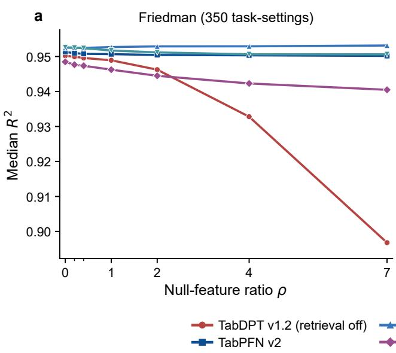

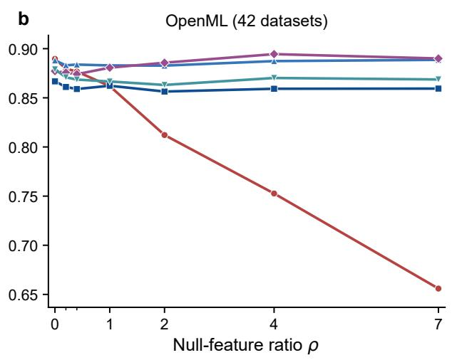

Figure 9: Raw query-set $R ^ { 2 }$ without subtracting the $\rho = 0$ baseline. Points show medians across tasks or datasets after averaging construction repeats. The five models have comparable clean performance within each benchmark setting.  
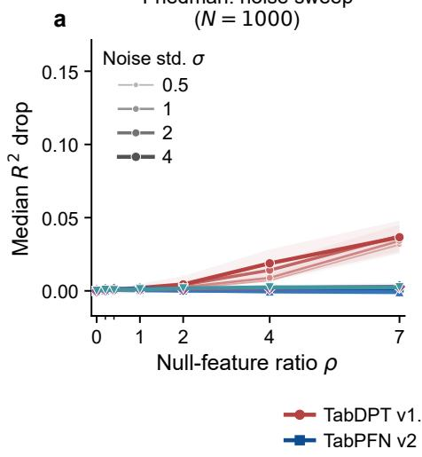

b  
Friedman: sample-size sweep (σ = 1)  
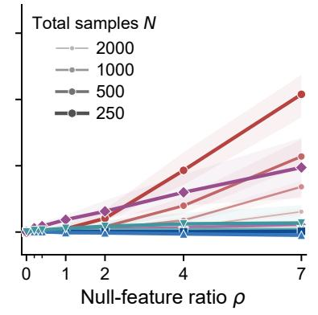

c  
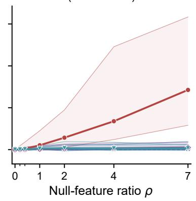  
Figure 10: Friedman noise and sample-size sweeps for the $R ^ { 2 }$ drop. Panels (a) and (b) vary observation noise and total sample size, respectively; shade and line width encode the setting, and ribbons span the IQR across 50 tasks. Panel (c) reports the median and IQR across 42 OpenML datasets.

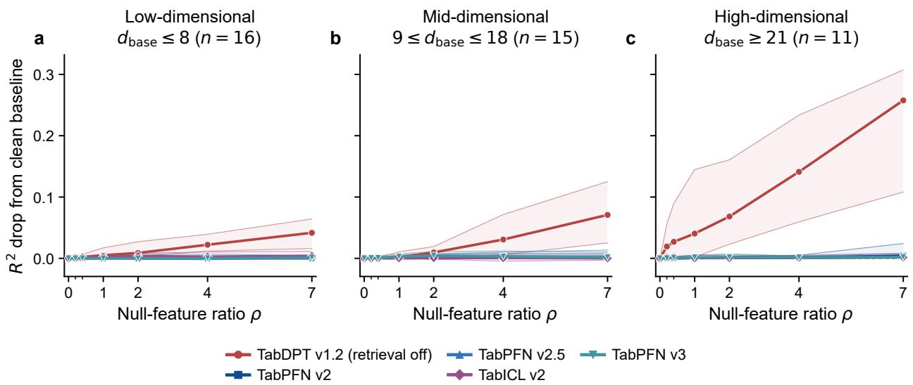  
Figure 11: OpenML $R ^ { 2 }$ drop stratified by the number of retained features before augmentation, $d _ { \mathrm { b a s e } }$ . Points and ribbons show medians and IQRs across datasets in each stratum.

## C.3 Functional dependence on null features

Setup. This analysis uses the same seven Friedman configurations and 42 OpenML datasets as the dose response above, at all seven ratios and all five construction repeats. The primary comparison is between TabDPT with retrieval disabled and TabPFN $\mathbf { v } 2 ,$ with the checkpoints and inference settings in Table 2.

Single-feature permutation shift. Let $\mathbf { y } _ { \mathrm { q u e r y } }$ denote the held-out query targets, $\widehat { \mathbf { y } }$ the query predictions, and yperm(j) the predictions after permuting query feature $j$ while holding the context and all other query features fixed. We define the normalized prediction shift as

$$
S _ { j } ^ { \mathrm { p e r m } } = \frac { \mathrm { R M S E } ( \widehat { \mathbf { y } } ^ { \mathrm { p e r m } ( j ) } , \widehat { \mathbf { y } } ) } { \mathrm { S D } ( \mathbf { y } _ { \mathrm { q u e r y } } ) } ,\tag{10}
$$

and call it the null-feature shift when $j$ is an added null coordinate. Corresponding features use the same permutation across models and nested doses. The five construction repeats already provide independent draws of the null features, so we do not add a second permutation loop within each repeat. The known relevant features in the synthetic tasks provide positive controls. For real data, we compare added null features with original features, whose relevance is unknown.

One-way PDP variation. We additionally evaluate one-way partial-dependence curves at the empirical quantiles 5%, 27.5%, 50%, 72.5%, and 95%. Each synthetic condition includes all five relevant features. Real conditions include at most five original features, and both benchmarks include at most five null features. Grids are fixed across models and doses. Relevant-feature and original-feature grids come from the clean context; a real null feature uses the grid of the original feature from which it was copied. We summarize feature j by

$$
S _ { j } ^ { \mathrm { P D P } } = \frac { \operatorname { S D } _ { u \in \mathcal { G } _ { j } } [ Q _ { \mathrm { e v a l } } ^ { - 1 } \sum _ { q = 1 } ^ { Q _ { \mathrm { e v a l } } } \widehat { f } ( D , x _ { q } ^ { j  u } ) ] } { \operatorname { S D } ( y _ { \mathrm { q u e r y } } ) } ,\tag{11}
$$

where $\mathcal { G } _ { j }$ is its five-point grid, $Q _ { \mathrm { e v a l } }$ is the number of query rows, and $x _ { q } ^ { j  u }$ replaces coordinate $j$ of $x _ { q }$ with u while keeping all other coordinates fixed. The context D and fitted model remain fixed throughout. We report this summary over two sets of null features. The first is all null features present at the current dose, so its membership grows with $\rho .$ The second is restricted to the null features introduced at the smallest positive dose $\rho = 0 . 2 ;$ because doses are nested, these same columns are still present at every larger dose, and the restriction is the same for both models. A change in the first summary can come either from the model’s dependence on a given column or from the changing composition of the set being averaged, whereas the second follows one fixed set of columns across the dose grid.

Aggregation. For each model, dose, and feature role, we average first across features within each task and repeat, and then across the five repeats. The appendix figures (Figures 12, 13, 16, 17, and 18) report medians and IQRs across tasks or datasets; the main-text figure (Figure 2(b)) reports medians only.

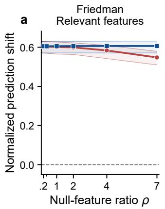

b  
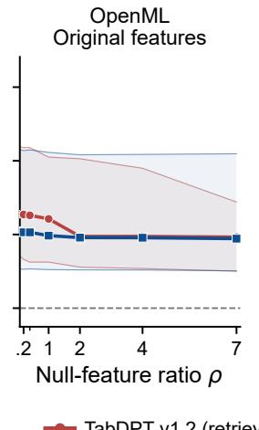

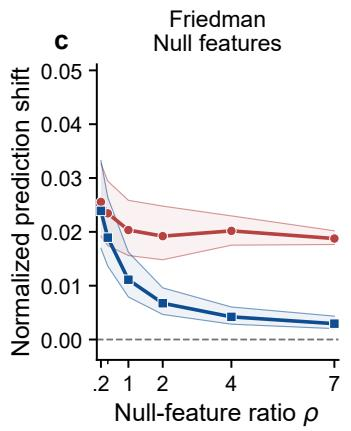

d  
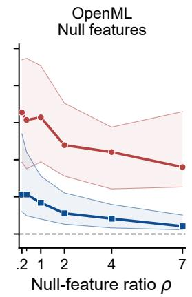

Figure 12: Normalized prediction shift from Eq. 10. Panels (a,b) show relevant Friedman features and original OpenML features; panels $^ { ( \mathrm { c } , \mathrm { d } ) }$ show added null features in the same order. The two feature-role pairs use separate vertical scales. Points show medians and ribbons span the IQR after averaging features and five construction repeats within each task. Friedman panels pool the seven configurations equally; OpenML panels summarize $^ { 4 2 }$ datasets. Panels $^ { ( \mathrm { c } , \mathrm { d } ) }$ show the null-feature shift plotted in Figure 2(b).  
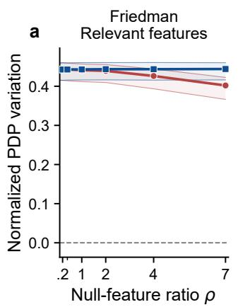  
b

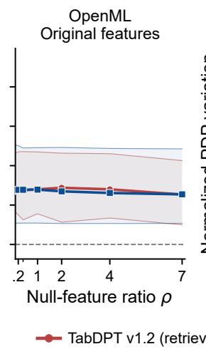

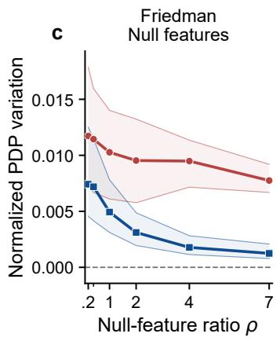

d  
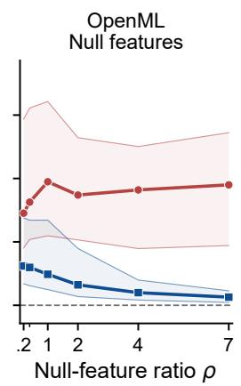  
Figure 13: Normalized one-way PDP variation. Panels $^ { ( \mathrm { a } , \mathrm { b } ) }$ show relevant Friedman features and original OpenML features; panels (c,d) show added null features in the same order, with a separate vertical scale for each feature-role pair. Points show medians across tasks or datasets and ribbons span the IQR after averaging eligible features and five construction repeats within each task. The ordering agrees with the permutation intervention in Figure 12.

Relevant-feature controls. Figure 12 places the main-text result next to its positive controls. Both models respond an order of magnitude more strongly to relevant Friedman features or original OpenML covariates than to added null features, so the difference in null-feature sensitivity is not a difference in overall responsiveness. TabDPT’s response to the relevant Friedman features also decreases with dose, whereas TabPFN $\mathbf { v } 2$ remains stable.

Restricting the PDP summary to the null features introduced at $\rho = 0 . 2 { \mathrm { . } }$ , and following those same columns as the dose grows, reproduces the ordering obtained over all null features: TabDPT keeps depending on them, while TabPFN ${ \bf v } 2$ suppresses them further at larger doses. The ordering therefore does not depend on which null features enter the average at each dose.

Representative PDP curves. Figures 14 and 15 show column-resolved examples at $\rho = 7$ for one Friedman task and Grid Stability, respectively. Each curve is centered at its 50% grid point. The Friedman example labels the five relevant columns $x _ { j }$ and the added null columns $z _ { k } .$ . For Grid Stability, an added column $z _ { k }$ is labeled by the original column from which it was copied; matching colors identify the same source column. Both figures show one deterministic construction repeat, whereas the aggregate results in Figure 13 use all five repeats. Relevant-feature or original-feature panels and null-feature panels use separate vertical scales, each shared across the two models

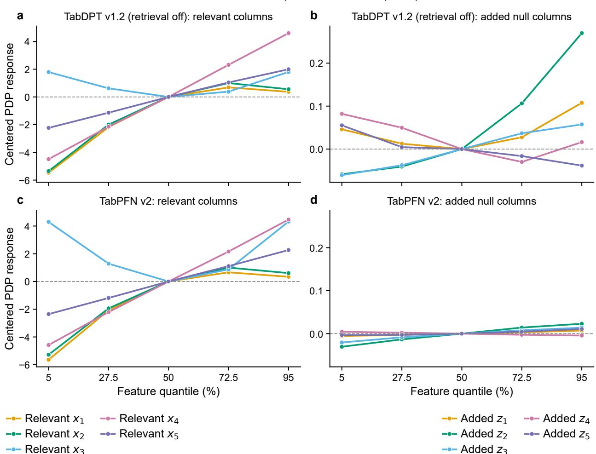  
Figure 14: Column-resolved PDPs for a fixed Friedman task with N = 1000 and $\sigma = 1$ . Both models respond to the relevant features, while TabDPT shows a larger response to the added null features.

Friedman setting dependence. Figure 16 resolves the permutation result by noise and sample size. The null-feature gap persists in both sweeps from $\rho = 1$ onward and is largest at smaller sample sizes; the response to relevant features remains substantially larger than the response to null features.

OpenML width stratification. Stratifying OpenML datasets by their original width preserves the larger TabDPT sensitivity to null features under both interventions (Figures 17 and 18).

## C.4 Replication across TabDPT releases

Motivation and protocol. The two analyses above evaluate the TabDPT release that was current when we ran them, v1.2. To test whether the irrelevant-feature sensitivity is specific to that release, we repeat both experiments for the official v1.0, v1.1 and v1.3 checkpoints on exactly the same 350 Friedman task-settings, the same 42 OpenML datasets, the same five construction repeats and the same dose grid. Each release runs with the default inference settings of its own package version (Table 5), with the single departure used throughout this section: the full training context, that is retrieval disabled. Ensembling, preprocessing, outlier clipping, feature reduction and target handling therefore differ between releases exactly as their defaults differ, and the comparison is observational with respect to architecture in the same sense as the cross-system comparison above. Table 5 lists the artifacts and the resulting departures.

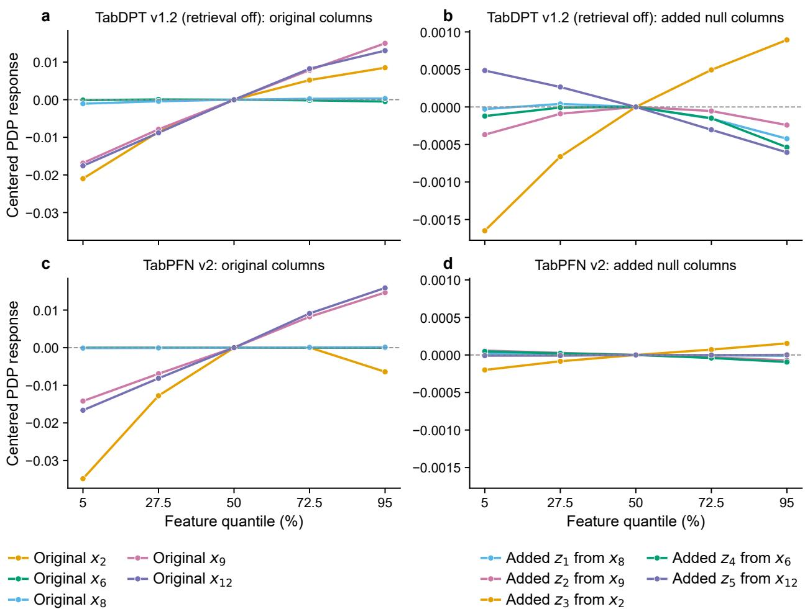  
Figure 15: Column-resolved PDPs for Grid Stability, a medium-dimensional OpenML dataset with 12 original features.

Table 5: TabDPT releases used in the replication. The default context of tabdpt 1.1.14 already exceeds every context in our tasks, and tabdpt 1.2.0 and 1.3.0 use the full context by default, so only v1.0 departs from its package default.
<table><tr><td>Release</td><td colspan="2">Package</td><td>Official checkpoint</td><td>Default ensemble</td><td>Departure from default</td></tr><tr><td>TabDPT v1.0</td><td>tabdpt 0.1.0</td><td></td><td>tabdpt_76M.ckpt</td><td>single estimator</td><td>full context instead of 128-row retrieval</td></tr><tr><td>TabDPT v1.1</td><td>tabdpt</td><td>1.1.14</td><td>tabdpt1_1.safetensors</td><td>8</td><td>none in effect</td></tr><tr><td>TabDPT v1.2</td><td>tabdpt 1.2.0</td><td></td><td>tabdpt1_2.safetensors</td><td>8</td><td>none</td></tr><tr><td>TabDPT v1.3</td><td>tabdpt 1.3.0</td><td></td><td>tabdpt1_3.safetensors</td><td>8</td><td>none</td></tr></table>

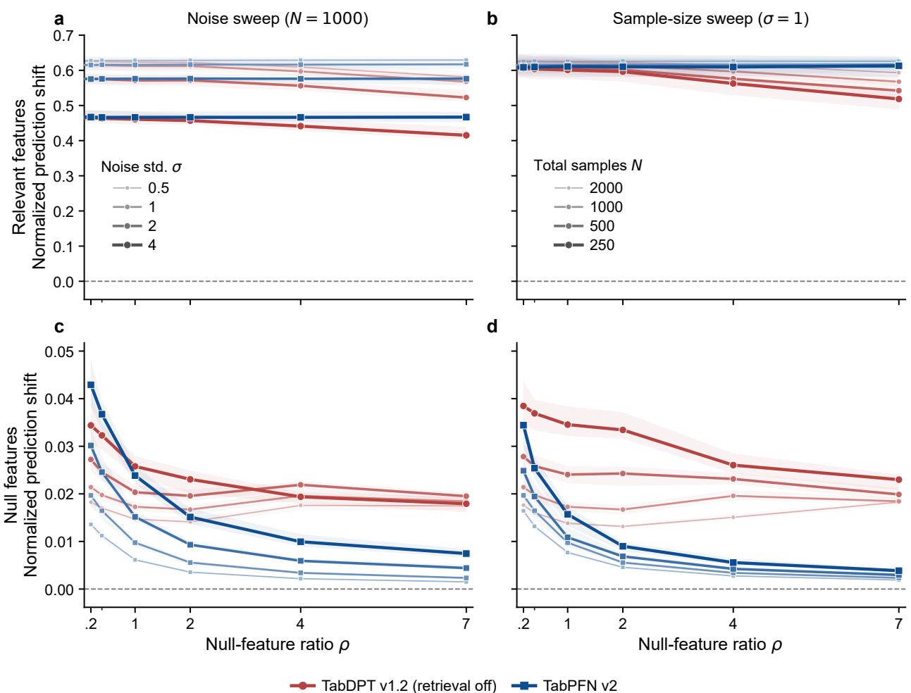  
Figure 16: Friedman permutation sensitivity across noise and sample-size settings. Shade and line width encode the setting; ribbons show IQRs across 50 tasks. Columns vary noise (left) and total sample size (right), while rows show relevant (top) and null (bottom) features.

Dose response. Figure $1 9 ( \mathrm { a } ,$ , b) shows that every release degrades as null columns accumulate, and that the degradation shrinks monotonically from v1.0 to v1.3 on both benchmarks. At the largest dose the median $R ^ { 2 }$ drop on Friedman falls from 0.1466 for v1.0 to 0.0089 for v1.3, and on OpenML from 0.1205 to 0.0619; the TabPFN v2 reference stays at 0.0008 and 0.0014 (Table 6). Even the newest release therefore remains more than an order of magnitude more dose-sensitive than TabPFN v2 on OpenML, and it still has a larger $R ^ { 2 }$ drop than TabPFN $\mathbf { v } 2$ on 94.0% of Friedman task-settings and 92.9% of OpenML datasets. Panels (c, d) give the absolute medians behind these drops: the release differ in clean-task accuracy as well, most visibly on OpenML, which is why the paired drop rather than the raw $R ^ { 2 }$ is the comparable quantity.

Functional sensitivity. Figure 20 repeats the functional analysis for the same releases. Panels (a, b) are the positive controls: all releases respond to relevant Friedman features or original OpenML features about an order of magnitude more strongly than to the added nulls, so the differences in panels (c, d) are not differences in overall responsiveness. On the added null features the ordering matches the dose response, with the median null-feature shift at $\rho = 7$ falling from 0.0344 (v1.0) to 0.0115 (v1.3) on Friedman and from 0.0276 to 0.0156 on OpenML, against 0.0029 and 0.0021 for TabPFN $\mathbf { v } 2 .$ Newer releases suppress null coordinates better, and none of them matches the suppression achieved by TabPFN v2.

Scope. These runs show that the phenomenon is a property of every released TabDPT version rather than of one checkpoint, and that the releases have been reducing it. They do not attribute the trend to any particular architectural change: consecutive releases differ simultaneously in weights and training data, default ensembling, clipping thresholds, preprocessing and output parameterization (see the release notes of each package version).

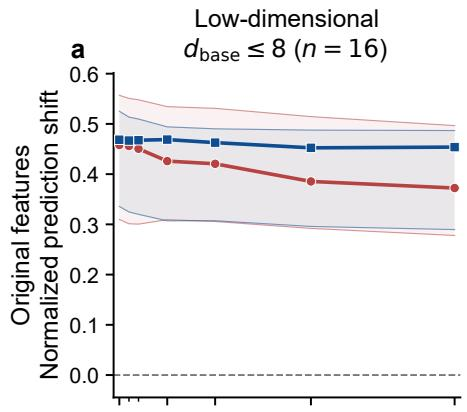

b  
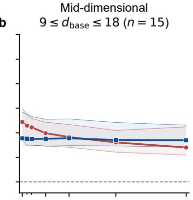

c  
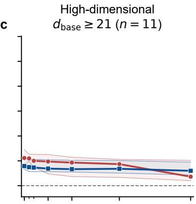

d  
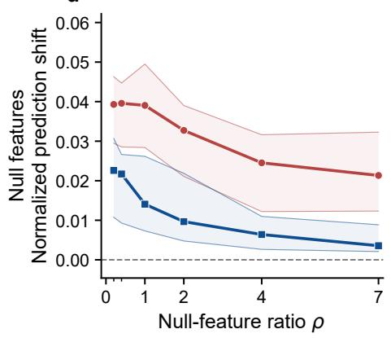

e  
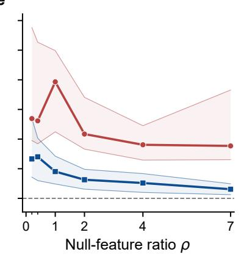

f  
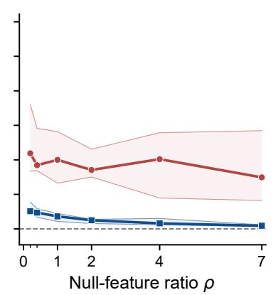  
Figure 17: OpenML permutation sensitivity stratified by pre-augmentation feature count. Rows show original and null features; points and ribbons show medians and IQRs across datasets.

Table 6: TabDPT releases at the maximum dose $\rho = 7 .$ Entries are medians [25th, 75th percentiles] across 350 Friedman task-settings or 42 OpenML datasets after averaging five construction repeats within each task. The last column is the percentage of paired tasks on which the release exceeds TabPFN $\mathbf { v } 2$ in $R ^ { 2 ^ { * } }$ drop, Friedman / OpenML.
<table><tr><td rowspan="2">Release</td><td colspan="2"> $\overline { { { R ^ { 2 } \mathrm { ~ d r o p ~ } } } }$ </td><td colspan="2">Null-feature shift</td><td>Exceeds TabPFN v2</td></tr><tr><td>Friedman</td><td>OpenML</td><td>Friedman</td><td>OpenML</td><td>(% of tasks)</td></tr><tr><td>TabDPT v1.0</td><td>0.1466 [0.1213, 0.1780]</td><td>0.1205 [0.0547, 0.1661]</td><td>0.0344 [0.0324, 0.0367]</td><td>0.0276 [0.0194, 0.0431]</td><td>100.0/97.6</td></tr><tr><td>TabDPT v1.1</td><td>0.0727 [0.0533, 0.1095]</td><td>0.0999 [0.0406, 0.1709]</td><td>0.0300 [0.0278, 0.0333]</td><td>0.0229 [0.0143, 0.0304]</td><td>100.0 / 97.6</td></tr><tr><td>TabDPT v1.2</td><td>0.0370 [0.0246, 0.0562]</td><td>0.0713 [0.0291, 0.1584]</td><td>0.0188 [0.0177, 0.0202]</td><td>0.0180 [0.0127, 0.0330]</td><td>98.9 / 95.2</td></tr><tr><td>TabDPT v1.3</td><td>0.0089 [0.0039, 0.0233]</td><td>0.0619 [0.0162, 0.1130]</td><td>0.0115 [0.0096, 0.0135]</td><td>0.0156 [0.0088, 0.0272]</td><td>94.0 / 92.9</td></tr><tr><td>TabPFN v2 (reference)</td><td>0.0008 [−0.00003, 0.0018]</td><td>0.0014 [0.0001, 0.0096]</td><td>0.0029 [0.0020, 0.0043]</td><td>0.0021 [0.0011, 0.0051]</td><td></td></tr></table>

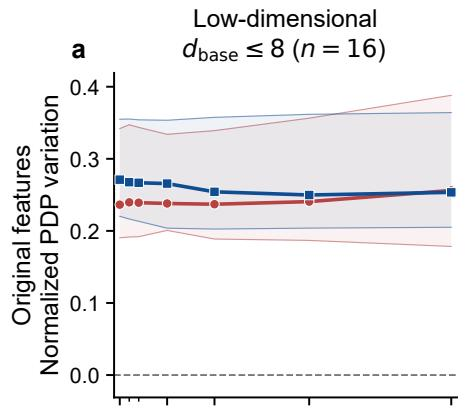

b  
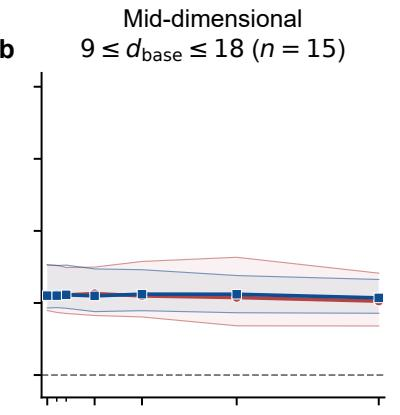

c  
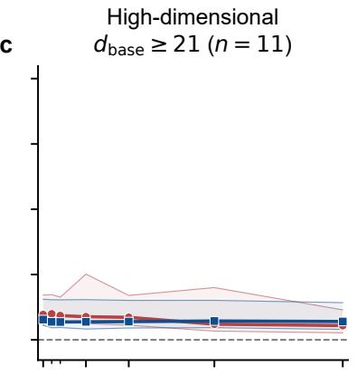

d  
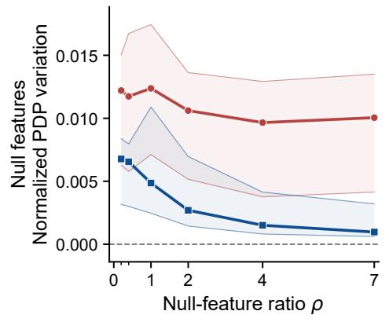

e  
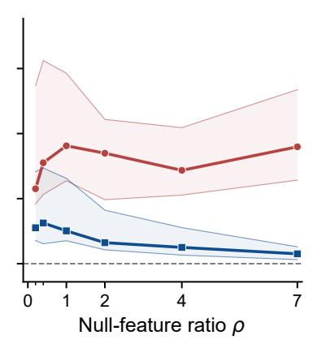  
f

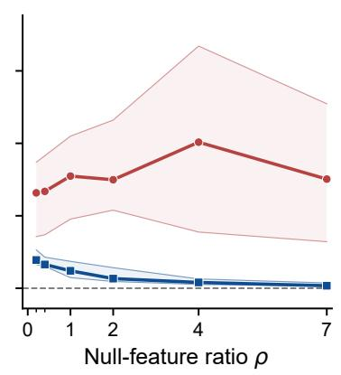  
Figure 18: OpenML PDP variation stratified by pre-augmentation feature count, using the same aggregation as Figure 13.

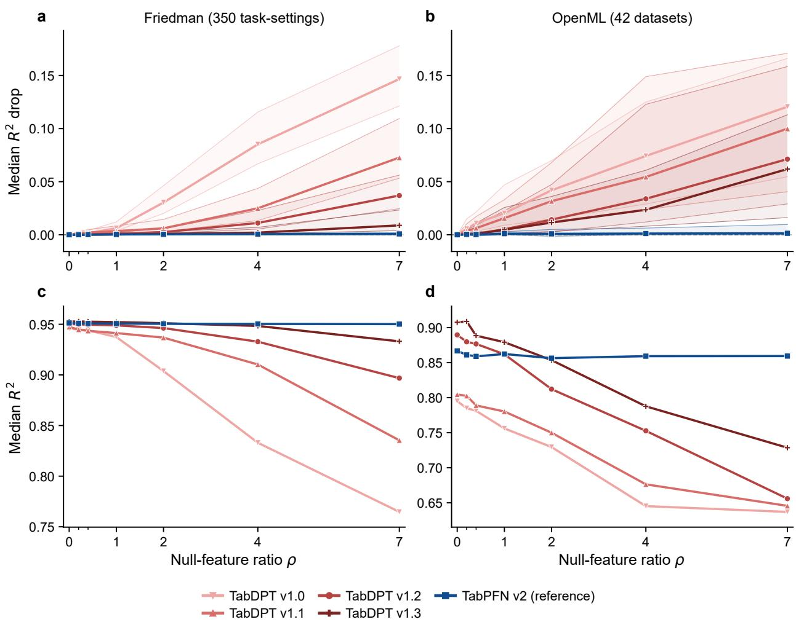  
Figure 19: Null-feature dose response of four TabDPT releases with TabPFN v2 as reference. (a, b) Median $R ^ { 2 }$ drop with interquartile bands. $( \mathrm { c } , \mathrm { d } )$ Median absolute $R ^ { 2 }$ at each dose. Aggregation matches Figure 10: five construction repeats are averaged within each task before taking medians across 350 Friedman task-settings or 42 OpenML datasets.

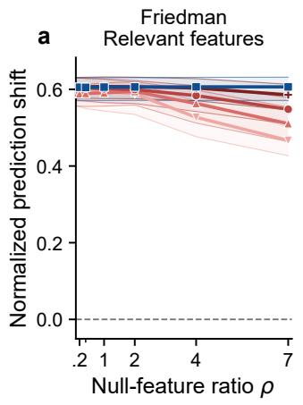

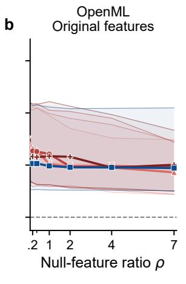

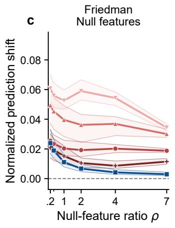

d  
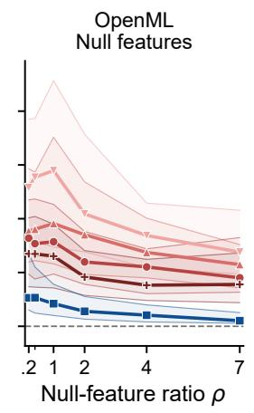  
Figure 20: Normalized prediction shift under single-feature permutation for four TabDPT releases, with TabPFN v2 as reference. (a, b) Relevant Friedman features and original OpenML features as positive controls. (c, d) Added null features. Aggregation matches Figure 12.

## D Derivations and proofs for the sparse and dense priors

We use the model and notation of Section 3. Throughout, $n \geq d \geq 2 , v ^ { 2 } , \sigma ^ { 2 } > 0$ , and $k \in \{ 1 , \ldots , d \}$ are fixed.   
Expectations are taken under $P _ { k }$ and the fixed-design regression model.

## D.1 Sufficiency and matched prior moments

The design X can be fixed or drawn independently of the coefficient prior subject to $X ^ { \top } X = n I _ { d }$ . One random construction is $X = { \sqrt { n } } Q$ , where $Q$ contains the orthonormal columns from a thin QR factorization of an $n \times d$ matrix with independent standard Gaussian entries. Given X, draw $S$ uniformly from $S _ { k }$ , draw its k active coefficients independently with variance $v ^ { 2 } / k$ , and draw observation noise independently.

Let $P _ { X } = X X ^ { \top } / n$ . Orthogonality gives

$$
\| y - X \beta \| _ { 2 } ^ { 2 } = \| ( I _ { n } - P _ { X } ) y \| _ { 2 } ^ { 2 } + n \| c - \beta \| _ { 2 } ^ { 2 } , \qquad c = { \frac { X ^ { \top } y } { n } } .\tag{12}
$$

The first term is independent of $\beta ,$ so the posterior depends on $D$ only through c. Moreover,

$$
\boldsymbol { c } = \frac { 1 } { n } \boldsymbol { X } ^ { \top } \boldsymbol { y } = { \boldsymbol { \beta } } + \boldsymbol { \xi } , \qquad \boldsymbol { \xi } = \frac { \boldsymbol { X } ^ { \top } \boldsymbol { \varepsilon } } { n } \sim \mathcal { N } ( 0 , \tau ^ { 2 } I _ { d } ) , \qquad \tau ^ { 2 } = \frac { \sigma ^ { 2 } } { n } .\tag{13}
$$

Indeed, $\operatorname { C o v } ( X ^ { \top } { \varepsilon } / n \mid X ) = \sigma ^ { 2 } X ^ { \top } X / n ^ { 2 } = \tau ^ { 2 } I _ { d }$ . Its noise law is therefore the same for every admissible X.

For each coordinate,

$$
\operatorname* { P r } ( j \in S ) = \frac { k } { d } , \qquad \mathbb { E } [ \beta _ { j } ] = 0 , \qquad \mathbb { E } [ \beta _ { j } ^ { 2 } ] = \frac { k } { d } \frac { v ^ { 2 } } { k } = \frac { v ^ { 2 } } { d } .\tag{14}
$$

For distinct $j , r ,$ conditional independence and zero conditional means give $\mathbb { E } [ \beta _ { j } \beta _ { r } \ | \ S ] = 0$ . Averaging over $S$ and summing the coordinate variances proves the matched-moment identities stated in Section 3, including the dense endpoint.

## D.2 Support posterior and posterior-mean coefficient map

Write $a _ { k } = v ^ { 2 } / k$ . Conditional on a candidate support $A \in S _ { k }$ , integrating the Gaussian coefficient prior against the likelihood gives independent coordinates with

$$
\begin{array} { r } { c _ { j } \mid S = A \sim \left\{ \begin{array} { l l } { N ( 0 , a _ { k } + \tau ^ { 2 } ) , } & { j \in A , } \\ { N ( 0 , \tau ^ { 2 } ) , } & { j \not \in A . } \end{array} \right. } \end{array}\tag{15}
$$

Their joint density is

$$
p ( c \mid S = A ) = { \frac { \exp \left( - { \frac { \| c \| _ { 2 } ^ { 2 } } { 2 \tau ^ { 2 } } } + \theta _ { k } \sum _ { j \in A } c _ { j } ^ { 2 } \right) } { ( 2 \pi ) ^ { d / 2 } ( a _ { k } + \tau ^ { 2 } ) ^ { k / 2 } ( \tau ^ { 2 } ) ^ { ( d - k ) / 2 } } } , \qquad \theta _ { k } = { \frac { a _ { k } } { 2 \tau ^ { 2 } ( a _ { k } + \tau ^ { 2 } ) } } .\tag{16}
$$

Since all candidate supports have size k and equal prior probability, all factors except the support score cancel in Bayes rule, giving

$$
\pi _ { k } ( A \mid c ) = { \frac { \exp { \Bigl ( } \theta _ { k } \sum _ { j \in A } c _ { j } ^ { 2 } { \Bigr ) } } { \sum _ { B \in S _ { k } } \exp { \bigl ( } \theta _ { k } \sum _ { r \in B } c _ { r } ^ { 2 } { \bigr ) } } } , \qquad A \in { \mathcal { S } } _ { k } .\tag{17}
$$

Marginalizing the support indicators gives

$$
q _ { k , j } ( c ) = \operatorname* { P r } ( j \in S \mid c ) = \sum _ { \underset { i \in A } { A \in S _ { k } } } \pi _ { k } ( A \mid c ) , \qquad \sum _ { j = 1 } ^ { d } q _ { k , j } ( c ) = \mathbb { E } [ \left| S \right| \mid c ] = k .\tag{18}
$$

For an active coordinate, Gaussian conjugacy gives

$$
\beta _ { j } \mid c , S = A \sim \mathcal { N } ( \lambda _ { k } c _ { j } , \lambda _ { k } \tau ^ { 2 } ) , \qquad \lambda _ { k } = \frac { a _ { k } } { a _ { k } + \tau ^ { 2 } } .\tag{19}
$$

Inactive coordinates remain zero. Hence

$$
\mathbb { E } [ \beta _ { j } \ | \ c ] = \sum _ { A \in { \cal S } _ { k } } \pi _ { k } ( A \ | \ c ) \lambda _ { k } c _ { j } { \bf 1 } \{ j \in A \} = \lambda _ { k } q _ { k , j } ( c ) c _ { j } .\tag{20}
$$

Sufficiency and independence of the prediction noise then imply

$$
\mathbb { E } [ y _ { q } \mid D , x ] = x ^ { \top } \mathbb { E } [ \beta \mid D ] = x ^ { \top } \eta _ { k } ^ { * } ( c ) ,\tag{21}
$$

which is the unique squared-risk minimizer up to almost-sure equality.

## D.3 Data dependence of the Bayes feature metric

We verify the claim in Section 3 that the Bayes predictor is a row kernel with diagonal feature metric $\mathrm { d i a g } ( q _ { k } ( c ) )$ , which is the identity for $k = d$ and varies with the context for every $k < d .$

Proof. Substituting $c = n ^ { - 1 } \textstyle \sum _ { i } x _ { i } y _ { i }$ into the posterior mean gives

$$
f _ { k } ^ { * } ( D , x ) = \lambda _ { k } x ^ { \top } \mathrm { d i a g } ( q _ { k } ( c ) ) c = \frac { \lambda _ { k } } { n } \sum _ { i = 1 } ^ { n } y _ { i } x ^ { \top } \mathrm { d i a g } ( q _ { k } ( c ) ) x _ { i } .\tag{22}
$$

For $k = d ,$ the only support is $[ d ]$ , so $q _ { d } ( c ) = \mathbf { 1 }$ and the metric is the identity.

For $k < d ,$ fix a coordinate $j$ and fix $c _ { - j }$ . Define the positive finite quantities

$$
U _ { j } = \sum _ { \stackrel { A \subseteq [ d ] \setminus \{ j \} } { | A | = k - 1 } } \exp \left( \theta _ { k } \sum _ { r \in A } c _ { r } ^ { 2 } \right) , \qquad V _ { j } = \sum _ { \stackrel { A \subseteq [ d ] \setminus \{ j \} } { | A | = k } } \exp \left( \theta _ { k } \sum _ { r \in A } c _ { r } ^ { 2 } \right) .\tag{23}
$$

The empty-support term is one. Separating supports according to whether they contain $j$ yields

$$
q _ { k , j } ( c ) = { \frac { e ^ { \theta _ { k } c _ { j } ^ { 2 } } U _ { j } } { e ^ { \theta _ { k } c _ { j } ^ { 2 } } U _ { j } + V _ { j } } } .\tag{24}
$$

Because $\theta _ { k } , U _ { j } , V _ { j } > 0$ , this quantity is strictly increasing in $c _ { j } ^ { 2 }$ and converges to one as $| c _ { j } | \to \infty$ . The diagonal metric therefore varies with c for every $k < d .$ □

## D.4 Response-affine barrier

ProofofTheorem 1. Fix X and x $\neq 0$ , and write $\alpha = v ^ { 2 } / d$ . The matched first two moments and independent Gaussian noise give

$$
\mathbb { E } [ y ] = 0 , \qquad \operatorname { C o v } ( y ) = \alpha X X ^ { \top } + \sigma ^ { 2 } I _ { n } , \qquad \operatorname { C o v } ( y , y _ { q } ) = \alpha X x .\tag{25}
$$

The response covariance is positive definite. Because $X ^ { \top } X = n I _ { d } .$ , the vector Xx is its eigenvector with eigenvalue $n \alpha + \sigma ^ { 2 }$ . Hence the unique least-squares coefficients for predicting $y _ { q }$ affinely from y are

$$
a ^ { * } = 0 , \qquad b ^ { * } = \operatorname { C o v } ( y ) ^ { - 1 } \operatorname { C o v } ( y , y _ { q } ) = { \frac { \alpha } { n \alpha + \sigma ^ { 2 } } } X x = { \frac { \lambda _ { d } } { n } } X x .\tag{26}
$$

Therefore $\begin{array} { r } { ( b ^ { * } ) ^ { \top } y = \lambda _ { d } x ^ { \top } c } \end{array}$ . Uniqueness also follows from

$$
\begin{array} { r } { \mathbb { E } [ ( a + b ^ { \top } y - y _ { q } ) ^ { 2 } ] - \mathbb { E } [ ( ( b ^ { * } ) ^ { \top } y - y _ { q } ) ^ { 2 } ] = a ^ { 2 } + ( b - b ^ { * } ) ^ { \top } \operatorname { C o v } ( y ) ( b - b ^ { * } ) . } \end{array}\tag{27}
$$

The calculation uses only the matched first two moments and consequently has the same solution for every $P _ { k }$

Since $f _ { k } ^ { * } ( D , x ) = \mathbb { E } [ y _ { q } \mid D , x ]$ , the conditional-mean identity gives, for every D-measurable predictor $f ,$

$$
\begin{array} { r } { \mathbb { E } [ ( f ( D , x ) - y _ { q } ) ^ { 2 } ] = \mathbb { E } [ ( f ( D , x ) - f _ { k } ^ { * } ( D , x ) ) ^ { 2 } ] + \mathbb { E } [ ( f _ { k } ^ { * } ( D , x ) - y _ { q } ) ^ { 2 } ] . } \end{array}\tag{28}
$$

The second term does not depend on $f .$ Thus the same affine predictor minimizes approximation error to $f _ { k } ^ { * }$ , and

$$
\operatorname* { i n f } _ { f \in \mathcal { F } _ { \mathrm { a f f } } ( x ) } \mathbb { E } _ { D } [ ( f ( D , x ) - f _ { k } ^ { * } ( D , x ) ) ^ { 2 } ] = \mathbb { E } _ { D } \big [ \{ x ^ { \top } ( \lambda _ { d } c - \eta _ { k } ^ { * } ( c ) ) \} ^ { 2 } \big ] .\tag{29}
$$

For strict positivity, take $k < d$ and choose j with $x _ { j } \neq 0 . { \mathrm { A t } } c = t e _ { j }$ , all coordinates of $\lambda _ { d } c - \eta _ { k } ^ { \ast } ( c )$ except j vanish. Moreover, $q _ { k , j } ( 0 ) = k / d$ and $q _ { k , j } ( t e _ { j } )  1$ as $| t |  \infty$ by Eq. 24, while

$$
\frac { k } { d } < \frac { \lambda _ { d } } { \lambda _ { k } } = \frac { v ^ { 2 } + k \tau ^ { 2 } } { v ^ { 2 } + d \tau ^ { 2 } } < 1 .\tag{30}
$$

For some finite nonzero t, therefore, $x _ { j } t \{ \lambda _ { d } - \lambda _ { k } q _ { k , j } ( t e _ { j } ) \} \ne 0$ . The difference is continuous, so it remains nonzero on an open neighborhood. The marginal law of c is a mixture of nonsingular Gaussian densities and is strictly positive everywhere; that neighborhood has positive probability. This proves the strict gap. For $k = d , \eta _ { d } ^ { * } ( c ) = \lambda _ { d } c$ identically, so the gap is zero. □

The result holds separately at each known n. If n varies, condition on it and use $\lambda _ { d } ( n ) = v ^ { 2 } / ( v ^ { 2 } + d \sigma ^ { 2 } / n )$

## D.5 Alternating-axis realization and exact-k normalization

Architecture class. Fix n observed rows and one prediction row, indexed by $i \in [ n + 1 ]$ , and augment the d feature tokens in each row with a response/readout token indexed by $j = 0 , \Lambda$ width-m cell-token state is therefore $h \ = \ ( h _ { i j } ) _ { i \in [ n + 1 ] , j \in \{ 0 , \dots , d \} }$ , with $\boldsymbol { h } _ { i j } ~ \in ~ \mathbb { R } ^ { m }$ . At initialization, feature token $( i , j ) , j \ \geq \ 1$ , contains $x _ { i j }$ (with $x _ { n + 1 , j } = x _ { j } )$ , observed response token $( i , 0 )$ contains $y _ { i } .$ , and $( n + 1 , 0 )$ is the prediction readout. Every token also contains fixed indicators of its feature-versus-response type and its observed-versus-prediction-row role.

For a token u and an allowed attention group $G ( u )$ , one softmax-attention sublayer has the form

$$
\widetilde { h } _ { u } = h _ { u } + W _ { O } \sum _ { v \in G ( u ) } \alpha _ { u v } W _ { V } h _ { v } , \qquad \alpha _ { u v } = \frac { \displaystyle \exp \{ ( W _ { Q } h _ { u } ) ^ { \top } ( W _ { K } h _ { v } ) + M _ { u v } \} } { \sum _ { w \in G ( u ) } \exp \{ ( W _ { Q } h _ { u } ) ^ { \top } ( W _ { K } h _ { w } ) + M _ { u w } \} } ,\tag{31}
$$

where $M _ { u v } \in \{ 0 , - \infty \}$ is a fixed mask depending only on token type and observed-versus-prediction status. For feature-axis attention, $\bar { G } _ { F } ( i , j ) = \{ ( i , \ell ) : \dot { 0 } \leq \ell \leq d \}$ ; for observation-axis attention at a feature token, $G _ { O } ( i , j ) =$ $\left\{ ( \ell , j ) : 1 \leq \ell \leq n + 1 \right\}$ . Parameters are shared over all groups of the same sublayer. Each attention sublayer may be followed by a residual pointwise map

$$
h _ { u } \longmapsto h _ { u } + W _ { 2 } \rho ( W _ { 1 } h _ { u } + b _ { 1 } ) + b _ { 2 } ,\tag{32}
$$

shared over tokens, where $\rho$ is continuous and nonpolynomial. Layer parameters may differ across depth, and a sublayer may be made inactive by setting its output projection to zero. We call any finite composition whose active attention sublayers alternate between the two axes an alternating-axis network; its scalar output is a linear readout of $h _ { n + 1 , 0 }$ Denote this class by $\mathcal { A } _ { n , d }$

Proposition 3 (Alternating-axis neural approximation). Fix $n , d , 1 \leq k \leq d ,$ , and positive prior and noise parameters. Let be a compact set ofobserved datasets and prediction points satisfying $X ^ { \top } X = n I _ { d } .$ . For every $\epsilon > 0 ,$ there exists $F _ { \epsilon } \in \mathcal { A } _ { n , d }$ such that

$$
\operatorname* { s u p } _ { ( D , x ) \in { \mathcal K } } | F _ { \epsilon } ( D , x ) - f _ { k } ^ { * } ( D , x ) | < \epsilon .\tag{33}
$$

The construction uses three active attention sublayers infeature–observation–feature order and $O ( k )$ residual-state channels. The hidden widths ofthe pointwisefeed-forward maps may depend on $n , d , k ,$ the parameters, $\kappa ,$ and $\epsilon ;$ no corresponding total-parameter or optimization bound is asserted.

Proof. First, we give an exact computation with continuous pointwise maps, then approximate these maps by feedforward networks. Feature-axis attention makes the response $y _ { i }$ available at every feature cell $( i , j )$ of an observed row while the residual path preserves $x _ { i j }$ . A pointwise map forms the product $x _ { i j } y _ { i }$ . Second, set the observationaxis attention logits equal and mask them to the observed rows. At fixed feature $j ,$ its output is the exact average $\begin{array} { r } { c _ { j } = n ^ { - 1 } \sum _ { i } x _ { i j } \bar { y } _ { i } ; } \end{array}$ the prediction-cell residual preserves $x _ { j }$ . A pointwise map can now operate on $( c _ { j } , x _ { j } )$

For general k, put $w _ { j } = \exp ( \theta _ { k } c _ { i } ^ { 2 } )$ and $a _ { j } = \lambda _ { k } c _ { j } x _ { j }$ , and form the 2k channels $( w _ { j } ^ { r } , a _ { j } w _ { j } ^ { r } ) _ { r = 1 } ^ { k }$ . Third, feature-axis attention at the prediction readout is uniform over the d feature tokens, excluding the response token. Scaling the averages by the known d yield

$$
p _ { r } = \sum _ { j = 1 } ^ { d } w _ { j } ^ { r } , \qquad t _ { r } = \sum _ { j = 1 } ^ { d } a _ { j } w _ { j } ^ { r } , \qquad 1 \leq r \leq k .\tag{34}
$$

Let $e _ { m } ( w )$ be the elementary symmetric polynomial of degree $m ,$ with $e _ { 0 } = 1$ . Newton’s identities recover these polynomials from the pooled power sums:

$$
e _ { m } = \frac { 1 } { m } \sum _ { r = 1 } ^ { m } ( - 1 ) ^ { r - 1 } e _ { m - r } p _ { r } , \qquad 1 \leq m \leq k .\tag{35}
$$

For completeness, this follows by equating coefficients in $\begin{array} { r } { E ^ { \prime } ( z ) = E ( z ) \sum _ { r > 1 } ( - 1 ) ^ { r - 1 } p _ { r } z ^ { r - 1 } } \end{array}$ , where $E ( z ) =$ $\begin{array} { r } { \prod _ { j } ( 1 + w _ { j } z ) = \sum _ { m } e _ { m } z ^ { m } } \end{array}$ , interpreted as a formal power series. Similarly, expanding $E ( z ) / ( 1 + w _ { j } z )$ gives $\begin{array} { r } { e _ { k - 1 } ( w _ { - j } ) = \sum _ { r = 0 } ^ { k - 1 } ( - 1 ) ^ { r } w _ { j } ^ { r } e _ { k - 1 - r } ( w ) } \end{array}$ . Using the inclusion probabilities in Eq. 39, the final pointwise map evaluates

$$
f _ { k } ^ { * } ( D , x ) = \frac { \sum _ { r = 1 } ^ { k } ( - 1 ) ^ { r - 1 } e _ { k - r } ( w ) t _ { r } } { e _ { k } ( w ) } .\tag{36}
$$

Thus the prediction is a continuous function of the 2k pooled channels. Since $w _ { j } ~ \geq ~ 1$ , its denominator obeys $\begin{array} { r } { e _ { k } ( w ) \geq { \binom { d } { k } } > 0 } \end{array}$

All exact intermediate states range over compact sets. Products, exponentials, and powers can therefore be approximated uniformly by the pointwise networks. The final rational map is continuous on a compact neighborhood of the attainable summaries where its denominator stays positive, so it too admits uniform approximation. Choosing successive approximation errors sufficiently small proves Eq. 33. Residual channels retain the inputs needed at each stage; token-type and row-role indicators allow shared pointwise maps to implement the required role-specific operations. The first routing operation can select the response token exactly with the allowed type mask. The final pointwise output is stored in one channel for the linear readout. Only $O ( k )$ state channels are needed; the pointwise hidden widths are unrestricted.

For $k = 1$ , a more direct construction identifies the final attention weights with the posterior gate. After the observationaxis stage, form $s _ { j } = \theta _ { 1 } c _ { j } ^ { 2 }$ and $v _ { j } = \lambda _ { 1 } c _ { j } x _ { j }$ . Third, a prediction readout state applies feature-axis attention with logits $s _ { j }$ and values $v _ { j }$ , producing

$$
\sum _ { j = 1 } ^ { d } \frac { e ^ { \theta _ { 1 } c _ { j } ^ { 2 } } } { \sum _ { r = 1 } ^ { d } e ^ { \theta _ { 1 } c _ { r } ^ { 2 } } } \lambda _ { 1 } c _ { j } x _ { j } = f _ { 1 } ^ { * } ( D , x ) .\tag{37}
$$

Approximating the products and squares gives the same uniform-approximation conclusion. This special construction is illustrated in Figure 3c. □

Scope of the construction. The three attention stages belong to the idealized class $\mathcal { A } _ { n , d }$ , not necessarily to three blocks of the trained model. The construction uses type masks and flexible pointwise maps and does not establish realization by its particular normalization, widths, or block layout. For general $k ,$ the final attention pools uniformly; the nonlinear readout, rather than its attention weights, implements the inclusion-weighted prediction. Consequently, the result gives a feature-indexed realization but neither identifies attention weights with relevance for all k nor proves a separation from row-token networks. Newton’s recursion takes $O ( k ^ { 2 } )$ arithmetic operations after pooling, but its alternating sums can be numerically ill-conditioned. The proof is an approximation result on compact domains, not a numerical-stability or learning-efficiency guarantee.

General support sizes. For $w _ { j } = \exp ( \theta _ { k } c _ { j } ^ { 2 } )$ , define the elementary symmetric polynomials

$$
e _ { m } ( w ) = \sum _ { \stackrel { A \subseteq [ d ] } { | A | = m } } \prod _ { r \in A } w _ { r } , \qquad e _ { 0 } ( w ) = 1 .\tag{38}
$$

Set $e _ { m } = 0$ when $m < 0$ or m exceeds the number of available coordinates. The support normalizer is $e _ { k } ( w ) > 0$ Summing over supports containing j gives

$$
q _ { k , j } ( c ) = \frac { w _ { j } e _ { k - 1 } ( w _ { - j } ) } { e _ { k } ( w ) } .\tag{39}
$$

Define prefix and suffix tables

$$
F _ { j , m } = e _ { m } ( w _ { 1 } , \ldots , w _ { j } ) , \qquad G _ { j , m } = e _ { m } ( w _ { j } , \ldots , w _ { d } ) , \qquad 0 \leq m \leq k .\tag{40}
$$

Initialize $F _ { 0 , 0 } = G _ { d + 1 , 0 } = 1$ and $F _ { 0 , m } = G _ { d + 1 , m } = 0$ for $m > 0$ , with all negative-degree entries zero. Partitioning subsets by inclusion of their boundary coordinate yields

$$
F _ { j , m } = F _ { j - 1 , m } + w _ { j } F _ { j - 1 , m - 1 } , \qquad G _ { j , m } = G _ { j + 1 , m } + w _ { j } G _ { j + 1 , m - 1 } .\tag{41}
$$

Compute $F$ in increasing $j$ and G in decreasing j. Then

$$
e _ { k } ( w ) = F _ { d , k } , \qquad e _ { k - 1 } ( w _ { - j } ) = \sum _ { m = 0 } ^ { k - 1 } F _ { j - 1 , m } G _ { j + 1 , k - 1 - m } .\tag{42}
$$

Each table takes $O ( d k )$ arithmetic operations and storage. Evaluating the k-term sum for every j takes another $O ( d k )$ operations. Together with Eq. 39, this computes all inclusion probabilities. Forming c takes $O ( n d )$ operations, and forming and summing $\lambda _ { k } q _ { k , j } c _ { j } x _ { j }$ takes $O ( d )$

Endpoints. For $\begin{array} { r } { k = 1 , e _ { 1 } ( w ) = \sum _ { j } w _ { j } } \end{array}$ and $e _ { 0 } ( w _ { - j } ) = 1$ , recovering the feature softmax. For $\begin{array} { r } { k = d , e _ { d } ( w ) = \prod _ { j } w _ { j } } \end{array}$ so all gates equal one and the subset computation can be omitted.

Log-domain evaluation. Store $\ell _ { j } = \theta _ { k } c _ { j } ^ { 2 } , L _ { j , m } ^ { F } = \log F _ { j , m }$ , and $L _ { j , m } ^ { G } = \log G _ { j , m }$ . Represent zero entries by and entries equal to one by zero. With $\operatorname { L S E } ( a , b ) = \log ( e ^ { a } + e ^ { b } )$ evaluated by the usual maximum subtraction, the recurrences become

$$
\begin{array} { r } { L _ { j , m } ^ { F } = \mathrm { L S E } ( L _ { j - 1 , m } ^ { F } , \ell _ { j } + L _ { j - 1 , m - 1 } ^ { F } ) , } \end{array}
$$

$$
\begin{array} { r } { L _ { j , m } ^ { G } = \mathrm { L S E } ( L _ { j + 1 , m } ^ { G } , \ell _ { j } + L _ { j + 1 , m - 1 } ^ { G } ) . } \end{array}\tag{43}
$$

Define LSE of all  inputs to be $- \infty$ . The final log inclusion probability is

$$
\begin{array} { r } { \log q _ { k , j } = \ell _ { j } + \mathrm { L S E } _ { 0 \leq m < k } \left( L _ { j - 1 , m } ^ { F } + L _ { j + 1 , k - 1 - m } ^ { G } \right) - L _ { d , k } ^ { F } . } \end{array}\tag{44}
$$

Only the normalized log probabilities need to be exponentiated. A common shift of all $\ell _ { j }$ also leaves the probabilities unchanged, since every support has exactly k entries. This implementation retains the ${ \bar { O } } ( d k )$ arithmetic and storage bounds.

## D.6 Proof of Lemma 2 and excess prediction risk

Proof. Fix a context D for which $f ( D , \cdot )$ is square-integrable. Since $\mathbb { E } _ { x } [ x ] = 0$ and $\mathbb { E } _ { x } [ x x ^ { \top } ] = I _ { d } ,$ the constant function 1 and query-coordinate functions $x \mapsto x _ { j } , j \in [ d ]$ , form an orthonormal family in $\overline { { L ^ { 2 } } }$ . Thus the affine projection in Lemma 2 has the unique coefficients

$$
\zeta _ { f } ( D ) = \mathbb { E } _ { x } [ f ( D , x ) ] , \qquad \eta _ { f } ( D ) = \mathbb { E } _ { x } [ x f ( D , x ) ] ,\tag{45}
$$

and its residual satisfies

$$
\mathbb { E } _ { x } [ r _ { f } ( D , x ) ] = 0 , \qquad \mathbb { E } _ { x } [ x r _ { f } ( D , x ) ] = 0 .\tag{46}
$$

Using $f _ { k } ^ { * } ( D , x ) = x ^ { \top } \eta _ { k } ^ { * } ( c )$ , write

$$
f ( D , x ) - f _ { k } ^ { * } ( D , x ) = \zeta _ { f } ( D ) + x ^ { \top } ( \eta _ { f } ( D ) - \eta _ { k } ^ { * } ( c ) ) + r _ { f } ( D , x ) .
$$

The three summands are mutually orthogonal by query centering and Eq. 46. Squaring and averaging over x, with $\mathbb { E } _ { x } [ x x ^ { \top } ] = I _ { d } .$ , gives Eq. 8. □

Connection to excess prediction risk. Define the population squared risk under $P _ { k }$ by

$$
R _ { k } ( f ) : = \mathbb { E } _ { D , x , y _ { q } } [ ( f ( D , x ) - y _ { q } ) ^ { 2 } ] ,\tag{47}
$$

with $y _ { q }$ as in Section 3. Since $f _ { k } ^ { * } ( D , x ) = \mathbb { E } [ y _ { q } \mid D , x ]$ , conditional-expectation orthogonality and Eq. 8 give

$$
R _ { k } ( f ) - R _ { k } \big ( f _ { k } ^ { * } \big ) = \mathbb { E } _ { D , x } [ ( f ( D , x ) - f _ { k } ^ { * } ( D , x ) ) ^ { 2 } ] = \mathbb { E } _ { D } [ C _ { f } ( D ) + \zeta _ { f } ( D ) ^ { 2 } + N _ { f } ( D ) ] ,\tag{48}
$$

where $C _ { f } ( D ) = \| \eta _ { f } ( D ) - \eta _ { k } ^ { * } ( c ) \| _ { 2 } ^ { 2 }$ and $N _ { f } ( D ) = \mathbb { E } _ { x } [ r _ { f } ( D , x ) ^ { 2 } ]$

## E Controlled experiments: setup and extended results

This appendix gives the experimental settings and complete results for Section 3.3. We first describe training and evaluation, then report the architecture comparison and its coefficient-space decomposition. Population identities and proofs appear in Appendix D.6.

## E.1 Controlled architectures

• The alternating-axis model follows nanoTabPFN (Pfefferle et al., 2025), a compact reimplementation of TabPFN v2 (Hollmann et al., 2025). It embeds each feature cell separately, places the response in an additional token, and alternates feature- and observation-axis attention within each block. We adapt it to regression by giving its two-layer MLP decoder a scalar output and training with squared loss, and we read predictions from the query response tokens.

• The row-token model replaces the shared scalar cell encoder with a linear projection of the entire covariate vector, $\mathbb { R } ^ { d } \overset { } { \to } \mathbb { R } ^ { E }$ , adds a linear response embedding to each context row token, and removes feature-axis attention and its associated normalization. Query rows receive no response embedding, and predictions are read from their row tokens. We retain the observation-axis attention mask, post-norm feed-forward blocks, and scalar MLP decoder. This construction follows TabPFN v1’s linear-encoder, post-norm configuration (Hollmann et al., 2023) and shares the linear row and response encoders and additive label injection of the original TabDPT architecture (Ma et al., 2025), although TabDPT uses different normalization.

## E.2 Experimental setup and evaluation protocol

## E.2.1 Tasks and model configurations

Tasks. We use the priors in Section 3 with $d \in \{ 1 0 , 2 0 \} , k \in \{ 1 , d / 2 , d \} , v ^ { 2 } = 1$ , and $\sigma = 1 . 5$ . Each condition contains $T = 3 2 { , } 0 0 0$ test tasks (data-generation seed 1), generated in 1,000 batches of 32. Context length $n _ { t }$ is shared within a batch and ranges from 50 to 100, with $X _ { t } ^ { \top } X _ { t } = n _ { t } I _ { d }$ . Each task has $Q _ { \mathrm { e v a l } } ^ { ( t ) } = 1 5 0 - n _ { t }$ independent queries $x _ { t q } \sim \mathcal { N } ( 0 , I _ { d } )$ . All architectures and training seeds use the same test contexts and queries. The Bayes target $\eta _ { k , n _ { t } } ^ { * } ( c _ { t } )$ uses the task’s actual context length. Changing d also changes $d / n _ { t }$ and the per-coordinate prior variance; the two dimensions test recurrence of the pattern, not an isolated dimension effect.

Models and inference. We use the architectures defined in Section 3 and Appendix E.1. Both have embedding width 96, feed-forward width 192, four attention heads, GELU activations, post-normalization, and a two-layer scalar MLP decoder. The row-token model has five blocks and 393,985/394,945 parameters at $d = 1 0 / 2 0 $ ; the alternating-axis model has three blocks and 355,873 parameters at either dimension. Counts include the encoders and decoder. This approximately matches parameter scale; token counts and computation differ. Features are standardized using context statistics and clipped to [ 100, 100]. The alternating-axis model uses one token per feature plus a response token, with unknown query responses initialized to the mean context response. Observation-axis attention permits context self-attention and query-to-context attention only. Inference preserves feature order and response units, without feature augmentation, target scaling, or prediction ensembling.

## E.2.2 Hyperparameter selection and final training

Shared search protocol. For each (d, k), both architectures use schedule-free AdamW and the same learning-rate grid $\{ 5 \times 1 0 ^ { - 4 } , 1 0 ^ { - \cdot 3 } , 2 \times 1 0 ^ { - 3 } , 4 \times 1 0 ^ { - 3 } \}$ . Both architectures share one tuning dataset per (d, k), with separate training, validation, and hyperparameter-selection sets. Data-generation seed 0 fixes these task sets. For each candidate learning rate, we train three models with training seeds 0, 1, 2 , which vary model initialization while keeping the task sets fixed. Each candidate’s best validation checkpoint is scored on the same 32,000 selection tasks using MSE pooled over noisy query targets. We average this score over the three training runs and select the learning rate with the lowest mean, separately for each architecture and (d, k). Table 7 reports the selected learning rates.

Training and early stopping. The same training and stopping rules apply during hyperparameter search and final training. All runs use batch size 32, zero weight decay, and gradient clipping at norm 1. Maximum budgets are 10,000 steps for d = 10 and 20,000 for d = 20. Every 500 steps, we evaluate MSE against noisy query labels on all 3,200 validation tasks. Training stops after five consecutive checks without a new lowest validation MSE, or when the step budget is exhausted. In either case, we restore the checkpoint with the lowest validation MSE.

Final training. With these hyperparameters fixed, we retrain each model from random initialization on a newly generated training set from the same prior (data-generation seed 1), using the same three training seeds and training protocol. The training sets contain 320,000 tasks for d = 10 and 640,000 for d = 20. A separate 3,200-task validation set selects the final checkpoint; its step is reported in Table 7. The final 32,000-task test set is used only for evaluation.

Table 7: Selected learning rates for schedule-free AdamW and checkpoints from final training. Maximum step budgets are fixed by dimension; checkpoint steps are chosen by validation MSE and listed in training-seed order 0/1/2.
<table><tr><td>d</td><td>k</td><td>Model</td><td>Selected LR</td><td>Max. steps</td><td>Checkpoint step (0/1/2)</td></tr><tr><td>10</td><td>1</td><td>Row-token</td><td>0.0010</td><td>10000</td><td>10000 / 10000 / 10000</td></tr><tr><td>10</td><td>1</td><td>Alternating-axis</td><td>0.0010</td><td>10000</td><td>9500 / 9500 / 9500</td></tr><tr><td>10</td><td>5</td><td>Row-token</td><td>0.0010</td><td>10000</td><td>9500 / 10000 / 10000</td></tr><tr><td>10</td><td>5</td><td>Alternating-axis</td><td>0.0010</td><td>10000</td><td>9500 / 10000 / 10000</td></tr><tr><td>10</td><td>10</td><td>Row-token</td><td>0.0010</td><td>10000</td><td>10000 / 10000 / 7000</td></tr><tr><td>10</td><td>10</td><td>Alternating-axis</td><td>0.0010</td><td>10000</td><td>10000 / 10000 / 6000</td></tr><tr><td>20</td><td>1</td><td>Row-token</td><td>0.0020</td><td>20000</td><td>19000 / 20000 / 20000</td></tr><tr><td>20</td><td>1</td><td>Alternating-axis</td><td>0.0005</td><td>20000</td><td>20000 / 20000 / 20000</td></tr><tr><td>20</td><td>10</td><td>Row-token</td><td>0.0010</td><td>20000</td><td>18500 / 12500 / 19000</td></tr><tr><td>20</td><td>10</td><td>Alternating-axis</td><td>0.0010</td><td>20000</td><td>20000 / 10500 / 20000</td></tr><tr><td>20</td><td>20</td><td>Row-token</td><td>0.0010</td><td>20000</td><td>12500 / 12500 / 12500</td></tr><tr><td>20</td><td>20</td><td>Alternating-axis</td><td>0.0005</td><td>20000</td><td>20000 / 18500 / 19500</td></tr></table>

## E.2.3 Evaluation

All quantities below are defined for fixed d, k and one training seed; the seed index is suppressed. For test dataset $D _ { t }$ we estimate the normalized Bayes approximation error in Eq. 6 by

$$
\widehat { \xi } _ { a , k } ^ { ( t ) } : = \frac { 1 } { { Q _ { \mathrm { e v a l } } ^ { ( t ) } } \displaystyle \sum _ { q = 1 } ^ { Q _ { \mathrm { e v a l } } ^ { ( t ) } } [ \widehat { f } _ { a , k } ( D _ { t } , x _ { t q } ) - f _ { k } ^ { * } ( D _ { t } , x _ { t q } ) ] ^ { 2 } } { s _ { k } ^ { ( t ) } } .\tag{49}
$$

The denominator $s _ { k } ^ { ( t ) }$ is the dataset’s Bayes prediction energy. All evaluated datasets have $s _ { k } ^ { ( t ) } > 1 0 ^ { - 1 2 }$ and are retained without a denominator offset.

## E.3 Extended architecture–prior comparison

## E.3.1 Dense-prior reference

For a dataset D drawn under $P _ { k } .$ , we define the dense-prior prediction gap as

$$
\begin{array} { r l r } {  { \Delta _ { k } ^ { \mathrm { d e n s e } } ( D ) : = \mathbb { E } _ { \boldsymbol { x } } \big [ ( f _ { d } ^ { * } ( D , \boldsymbol { x } ) - f _ { k } ^ { * } ( D , \boldsymbol { x } ) ) ^ { 2 } \big ] } } \\ & { } & { = \| \lambda _ { d } c - \eta _ { k } ^ { * } ( c ) \| _ { 2 } ^ { 2 } , \qquad c = c ( D ) . } \end{array}\tag{50}
$$

The equality follows from query isotropy. This gap measures the prediction cost of applying uniform dense-prior shrinkage instead of the Bayes rule under $P _ { k }$ . Its expectation is strictly positive for $k \ < \ d$ and zero for $k = d$ (Theorem 1).

Figure 21(a) shows that exploiting the sparse prior reduces expected squared prediction error relative to the dense-prior rule. For both dimensions, this gain is largest at $k = 1$ , decreases at $\bar { k } = d \bar { / 2 }$ , and vanishes at $k = d ,$ where the two predictors coincide.

## E.3.2 Learned predictors

For each test dataset, the paired architecture gap is

$$
\widehat { G } _ { k } ^ { ( t ) } : = \widehat { \mathcal { E } } _ { \mathrm { r o w - t o k e n } , k } ^ { ( t ) } - \widehat { \mathcal { E } } _ { \mathrm { a l t e r n a t i n g - a x i s } , k } ^ { ( t ) } .\tag{51}
$$

Positive values favor the alternating-axis model. Figure 21(b) shows a large mean advantage under sparse priors and a small positive mean advantage at the dense endpoints for all three seeds.

Task-level architecture gaps. Figure 22 shows the distribution of per-dataset architecture gaps, both after averaging over training seeds and for individual seeds. The alternating-axis model outperforms the row-token model on nearly all sparse datasets. Under dense priors, its average advantage is small, and the better-performing architecture varies across datasets.

## E.4 Coefficient-space accounting of the architecture gap

## E.4.1 Affine projection and error estimation

Estimating the affine component. For each context D, we estimate the affine projection of f (Lemma 2) using $Q _ { \mathrm { p r o j } } = 1 , \bar { 0 } 0 0$ independent Gaussian queries $x _ { m } ^ { \mathrm { p r o j } } \sim \mathcal { N } ( 0 , I _ { d } )$ :

$$
( \widehat { \zeta } _ { f } ( D ) , \widehat { \eta } _ { f } ( D ) ) : = \arg \operatorname* { m i n } _ { \zeta \in \mathbb { R } , \eta \in \mathbb { R } ^ { d } } \frac { 1 } { Q _ { \mathrm { p r o j } } } \sum _ { m = 1 } ^ { Q _ { \mathrm { p r o j } } } [ f ( D , x _ { m } ^ { \mathrm { p r o j } } ) - \zeta - ( x _ { m } ^ { \mathrm { p r o j } } ) ^ { \top } \eta ] ^ { 2 } .\tag{52}
$$

Projection queries are independent of the context and evaluation queries, and shared across models and intervention conditions. Fit targets are model predictions in original response units, with preprocessing and model randomness fixed; query labels are not used.

We solve the unregularized least-squares problem, including an intercept, in float64 with numpy.linalg.lstsq (rcond=None).

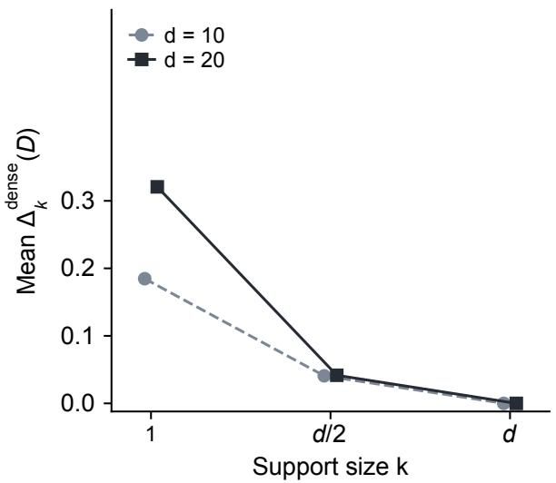

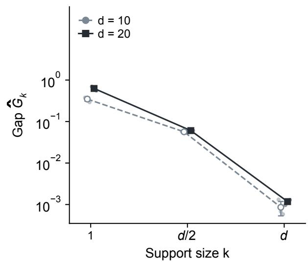  
Figure 21: Dense-prior and architecture gaps across support sizes. (a) Mean dense-prior prediction gap $\Delta _ { k } ^ { \mathrm { d e n s e } } ( D )$ (Eq. 50) over 32,000 test datasets per condition. The dense endpoint is exactly zero. (b) Per-dataset architecture gaps $\widehat { G } _ { k } ^ { ( t ) }$ b(Eq. 51), averaged equally over the same 32,000 test datasets for each seed. Positive values favor the alternating-axis model. Large markers show means over three seeds, small points show individual seed averages, and error bars show seed SDs $( \mathrm { d } \mathrm { d } \mathrm { o f } { = } 0 )$ . The axis label omits the dataset index. Circles/dashed lines denote $d = 1 0 ;$ ; squares/solid lines denote $d = 2 0$ . Panel (a) uses unnormalized errors on a linear axis; panel (b) uses task-normalized errors on a log axis. Support sizes are categorical.

Error components. Using the fitted coefficients and independent evaluation queries, define

$$
\begin{array} { r l } & { \widehat { C } _ { f } ^ { ( t ) } : = \| \widehat { \eta } _ { f } ( D _ { t } ) - \eta _ { k , n _ { t } } ^ { * } ( c _ { t } ) \| _ { 2 } ^ { 2 } , } \\ & { \widehat { N } _ { f } ^ { ( t ) } : = \displaystyle \frac { 1 } { Q _ { \mathrm { e v a l } } ^ { ( t ) } } \sum _ { q = 1 } ^ { Q _ { \mathrm { e v a l } } ^ { ( t ) } } \widehat { r } _ { f , t q } ^ { 2 } , \qquad \widehat { r } _ { f , t q } : = f ( D _ { t } , x _ { t q } ) - \widehat { \zeta } _ { f } ( D _ { t } ) - x _ { t q } ^ { \top } \widehat { \eta } _ { f } ( D _ { t } ) . } \end{array}\tag{53}
$$

These give coefficient error $\widehat { C } _ { f } ^ { ( t ) }$ ), squared-intercept error $\widehat { \zeta } _ { f } ( D _ { t } ) ^ { 2 }$ , and fitted residual error $\widehat { N } _ { f } ^ { ( t ) }$ . For $f = \widehat { f } _ { a , k }$ , define bthe normalized components on dataset $D _ { t }$ as

$$
\widehat { C } _ { a , k } ^ { ( t ) } : = \frac { \widehat { C } _ { f } ^ { ( t ) } } { s _ { k } ^ { ( t ) } } , \qquad \widehat { Z } _ { a , k } ^ { ( t ) } : = \frac { \widehat { \zeta } _ { f } ( D _ { t } ) ^ { 2 } } { s _ { k } ^ { ( t ) } } , \qquad \widehat { N } _ { a , k } ^ { ( t ) } : = \frac { \widehat { N } _ { f } ^ { ( t ) } } { s _ { k } ^ { ( t ) } } .\tag{54}
$$

All three use the same denominator as $\widehat { \mathcal { E } } _ { a , k } ^ { ( t ) }$

## E.4.2 Full component results across dimensions

Error components. Figures 5 and 23 show the component errors at $d = 1 0$ and $d = 2 0 ,$ , respectively. Under sparse priors, the alternating-axis model has substantially lower coefficient error, whereas intercept and residual errors are closer between architectures. $\mathrm { A t } d = 2 0 , k = 1$ , coefficient error is 0.685 for the row-token model and 0.0603 for the alternating-axis model. At the dense endpoint, the row-token model has slightly lower coefficient error but higher intercept and residual errors in both dimensions.

Architecture gaps. To locate the prediction gap $\widehat { G } _ { k } ^ { ( t ) } \left( \mathrm { E q . } 5 1 \right)$ , we compare the normalized components on the same dataset:

$$
\begin{array} { r l } & { \widehat { G } _ { k } ^ { C , ( t ) } : = \widehat { C } _ { \mathrm { r o w - t o k e n } , k } ^ { ( t ) } - \widehat { C } _ { \mathrm { a l t e r n a t i n g - a x i s } , k } ^ { ( t ) } , } \\ & { \widehat { G } _ { k } ^ { \zeta , ( t ) } : = \widehat { Z } _ { \mathrm { r o w - t o k e n } , k } ^ { ( t ) } - \widehat { Z } _ { \mathrm { a l t e r n a t i n g - a x i s } , k } ^ { ( t ) } , } \\ & { \widehat { G } _ { k } ^ { N , ( t ) } : = \widehat { N } _ { \mathrm { r o w - t o k e n } , k } ^ { ( t ) } - \widehat { N } _ { \mathrm { a l t e r n a t i n g - a x i s } , k } ^ { ( t ) } . } \end{array}\tag{55}
$$

a  
0.5% of tasks outside view  
0.7% of tasks outside view  
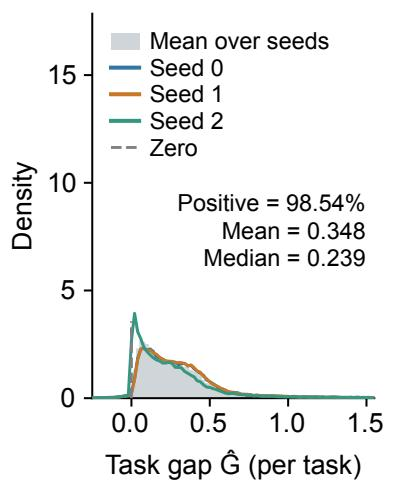  
3.2% of tasks outside view

b  
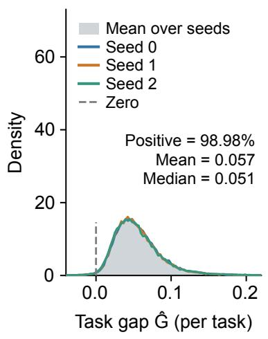

c  
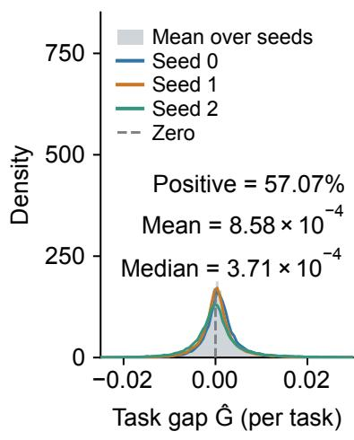

d  
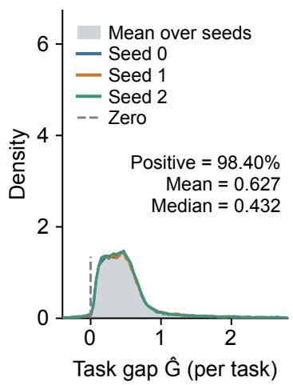

e  
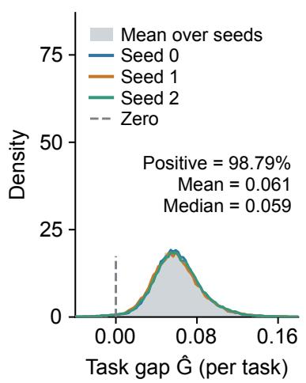

f  
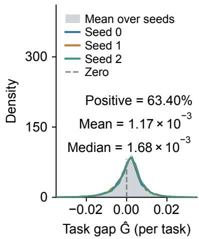  
3.4% of tasks outside view  
0.3% of tasks outside view  
0.4% of tasks outside view  
Figure 22: Task-level distributions of the architecture gap. Rows correspond to $d = 1 0$ and $d = 2 0 ;$ columns to $k \stackrel { \sim } { = } 1 , k = d / 2$ , and $k = d .$ Positive gaps favor the alternating-axis model. Gray shading shows the distribution of per-dataset gaps $\widehat { G } _ { k } ^ { ( t ) }$ after averaging over three training seeds; colored curves show the distributions for individual seeds. bAll distributions use the same histogram bins within each panel; the dashed line marks zero. Annotations report the positive fraction, mean, and median of the seed-averaged gaps, computed over all 32,000 tasks per condition. Axis ranges focus on the distribution bodies; the fraction of seed-averaged gaps outside each view is noted below the panel. Densities are normalized by the full task count.

c  
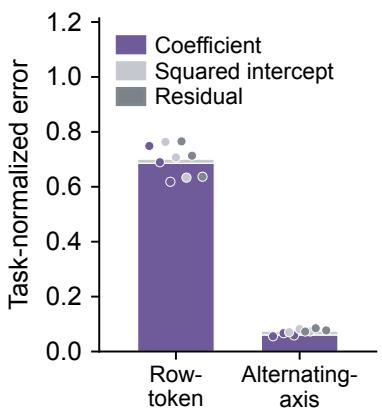

b  
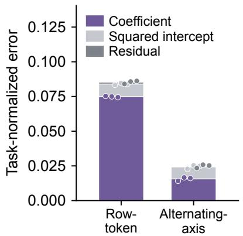

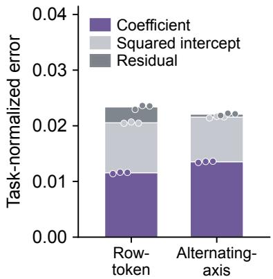  
Figure 23: Task-normalized error components at $d = \mathbf { 2 0 } .$ . Bars stack coefficient, squared-intercept, and residual errors for row-token and alternating-axis predictors at $k = 1 , 1 0 , 2 0$ . For each seed, components are averaged equally over the same 32,000 test datasets. Bars show means over three seeds; points mark each seed’s cumulative component means at the stack boundaries. Colors match Figure 5.

Positive gaps favor the alternating-axis model within that component. The superscript $\zeta$ denotes a difference in squared intercepts.

Figure 24 shows that coefficient error dominates the sparse architecture gap. $\mathrm { \bf A t } d = 1 0$ , the between-architecture coefficient-error difference accounts for 98.4% and $9 7 . 5 \%$ of the mean prediction-error gap at $k = 1$ and $k = 5$ . At $d = 2 0$ , the corresponding shares are 99.7% and 98.0% at $k = 1$ and $k = 1 0$ . At both dense endpoints, the negative coefficient gap is offset by positive intercept and residual gaps, leaving a small positive prediction gap.

## E.4.3 Active and inactive coordinate contributions

Coefficient errors by support group. For the realized support $S _ { t }$ , we split each model’s coefficient error into active and inactive contributions:

$$
\begin{array} { r } { \widehat { C } _ { f , \mathrm { a c t i v e } } ^ { ( t ) } : = \displaystyle \sum _ { j \in S _ { t } } ( \widehat { \eta } _ { f , j } ( D _ { t } ) - \eta _ { k , n _ { t } , j } ^ { * } ( c _ { t } ) ) ^ { 2 } , } \\ { \widehat { C } _ { f , \mathrm { i n a c t i v e } } ^ { ( t ) } : = \displaystyle \sum _ { j \notin S _ { t } } ( \widehat { \eta } _ { f , j } ( D _ { t } ) - \eta _ { k , n _ { t } , j } ^ { * } ( c _ { t } ) ) ^ { 2 } . } \end{array}\tag{56}
$$

Both terms measure squared deviations from the Bayes coefficient vector and sum to $\widehat { C } _ { f } ^ { ( t ) }$ . For architecture a trained under $P _ { k } ,$ , let $f = \widehat { f } _ { a , k }$ and define the task-normalized group errors as

$$
\widehat { C } _ { a , k , b } ^ { ( t ) } : = \frac { \widehat { C } _ { f , b } ^ { ( t ) } } { s _ { k } ^ { ( t ) } } , \qquad b \in \{ \mathrm { a c t i v e , i n a c t i v e } \} .\tag{57}
$$

Figure 25 decomposes each model’s coefficient error using the same normalization as Figure 5. Under sparse priors, the alternating-axis model has lower error in both groups. $\mathrm { A t } \bar { k } = d .$ , every coordinate is active and the inactive error is zero.

Coefficient errors per coordinate. For sparse priors, we divide $\widehat { C } _ { a , k , \mathrm { a c t i v e } } ^ { ( t ) }$ by k and $\widehat { C } _ { a , k , \mathrm { i n a c t i v e } } ^ { ( t ) }$ by $d - k$ to obtain b bthe mean error per coordinate in each group. Figure 26 shows that active coordinates have higher per-coordinate error for both architectures across the sparse conditions. $\mathbf { A } \mathbf { t } k = 1$ , total error is higher in the larger inactive group. The alternating-axis model has lower per-coordinate error in both groups.

## E.4.4 Ordinary least squares as a coefficient baseline

To distinguish recovering the context statistic from computing the Bayes coefficient map, we add ordinary least squares (OLS) as a baseline. Under the orthogonal design, its coefficients and prediction are

$$
c _ { t } = ( X _ { t } ^ { \top } X _ { t } ) ^ { - 1 } X _ { t } ^ { \top } y _ { t } = \frac { X _ { t } ^ { \top } y _ { t } } { n _ { t } } , \qquad f _ { \mathrm { O L S } } ( D _ { t } , x ) = x ^ { \top } c _ { t } .\tag{58}
$$

a  
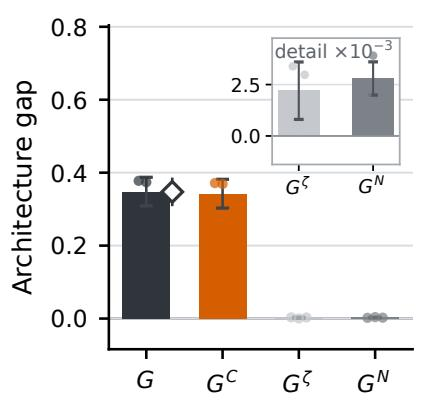

b  
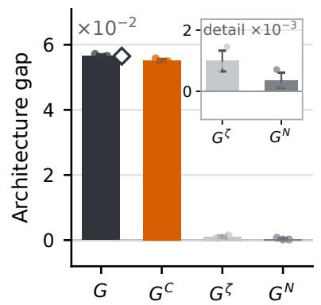

c  
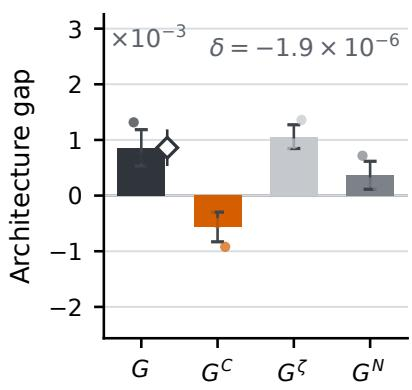

d  
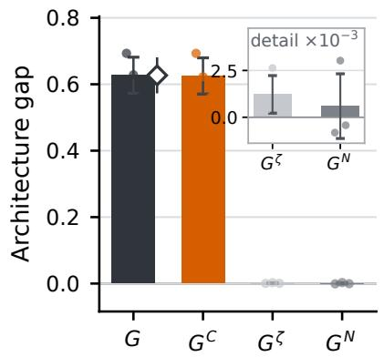

e  
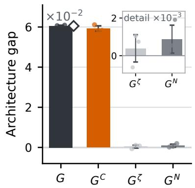

f  
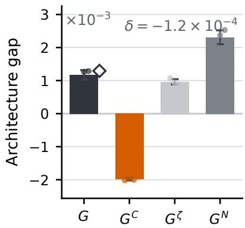  
Figure 24: The sparse architecture gap lies mainly in coefficients. Rows correspond to $d = 1 0 , 2 0 ;$ columns to $k = 1 , d / 2 , d .$ . Bars show row-token minus alternating-axis gaps in task-normalized prediction, coefficient, squaredintercept, and residual error. For each seed, gaps are averaged equally over the same 32,000 test datasets. Bars show means over three seeds; points show individual seed averages; error bars show seed SDs (ddof=0). Positive values favor the alternating-axis model. Hollow diamonds show component sums; insets magnify the two small non-coefficient gaps. Main panels share vertical ranges within each column. Labels $G , G ^ { C } , G ^ { \zeta }$ , and $\bar { G } ^ { N }$ suppress hats and the indices $k , t$ (Eqs. 51 and 55).

We compute $c _ { t }$ directly from each of the same 32,000 test contexts. Its affine projection has coefficient $c _ { t } ,$ zero intercept, and zero nonlinear residual. Thus its task-normalized coefficient error is

$$
C _ { \mathrm { O L S } , k } ^ { ( t ) } : = \frac { \| c _ { t } - \eta _ { k , n _ { t } } ^ { * } ( c _ { t } ) \| _ { 2 } ^ { 2 } } { s _ { k } ^ { ( t ) } } , \qquad s _ { k } ^ { ( t ) } = \| \eta _ { k , n _ { t } } ^ { * } ( c _ { t } ) \| _ { 2 } ^ { 2 } .\tag{59}
$$

This is also its population relative prediction error under $x \sim \mathcal { N } ( 0 , I _ { d } )$ . We use the same support partition and equal-task averaging as in Eq. 57.

OLS has higher mean coefficient error than either trained architecture in all six conditions (Figure 27). $\mathrm { A t } \ k = 1$ inactive coordinates contribute 86.0% and 91.9% of its mean error at $d = 1 0$ and $d = 2 0$ , respectively. Indeed, $c _ { t } = \beta + X _ { t } ^ { \top } \varepsilon / n _ { t }$ retains estimation noise on every coordinate, with conditional variance $\sigma ^ { 2 } / \bar { n } _ { t }$ per coordinate. The Bayes map instead applies both posterior inclusion weights and shrinkage, $\eta _ { k , n _ { t } } ^ { * } ( c _ { t } ) = \lambda _ { k , n _ { t } } q _ { k } ( c _ { t } ) \odot c _ { t }$ . Both predictions are linear in the query; the difference lies in how their coefficients depend on the context.

Coefficient shrinkage. Figure 28 shows the relation between OLS and Bayes coefficients. Although OLS recovers the sufficient statistic $c _ { t } .$ , it does not implement the prior-dependent posterior coefficient map. For sparse priors, $\eta _ { k , n _ { t } } ^ { * } ( c _ { t } ) = \lambda _ { k , n _ { t } } q _ { k } ( c _ { t } ) \odot c _ { t }$ combines coordinate selection with shrinkage: coordinates with weak posterior support are mapped toward zero, while coordinates with stronger evidence retain a larger fraction of their OLS coefficients. This separation is most pronounced at $k = 1$ and contracts as the support size increases. $\quad \mathrm { A t } k = d ,$ posterior inclusion is identically one and the map reduces to uniform shrinkage, $\eta _ { d , n _ { t } } ^ { * } ( c _ { t } ) = \lambda _ { d , n _ { t } } c _ { t } .$ , yielding the exact identity

a  
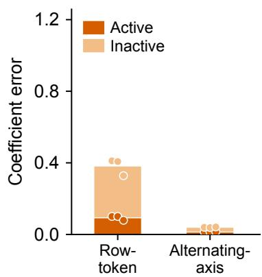

b  
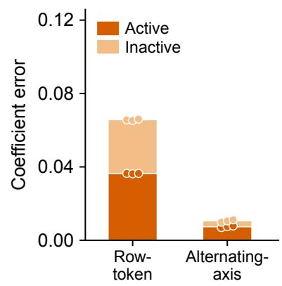

c  
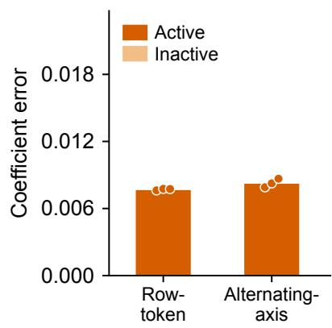

d  
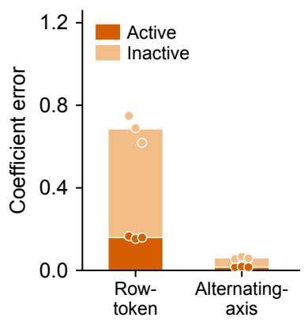

e  
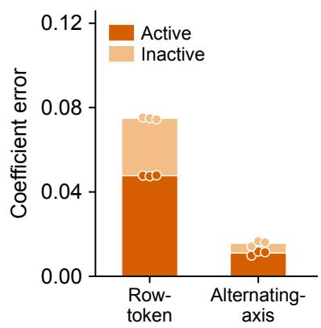

f  
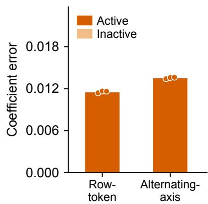  
Figure 25: Active and inactive coefficient errors by architecture. Stacked bars show task-normalized group errors $( \operatorname { E q . 5 7 } ) ;$ ; each bar sums to the model’s coefficient error. Rows correspond to $d = 1 0 , 2 0$ and columns to $k = 1 , d / 2 , d .$ For each seed, group errors are averaged equally over the same 32,000 test datasets. Bars show means over three seeds; points mark each seed’s mean active and total coefficient errors at the corresponding stack boundaries. $\quad \mathrm { A t } \ k = d ,$ the inactive contribution is zero. Vertical ranges are shared across dimensions within each column.

$$
C _ { \mathrm { O L S } , d } ^ { ( t ) } = \left( \frac { 1 - \lambda _ { d , n _ { t } } } { \lambda _ { d , n _ { t } } } \right) ^ { 2 } = \left( \frac { d \sigma ^ { 2 } } { n _ { t } v ^ { 2 } } \right) ^ { 2 } .\tag{60}
$$

Its task averages are 0.104774 and 0.419098 at $d = 1 0 , 2 0$

a  
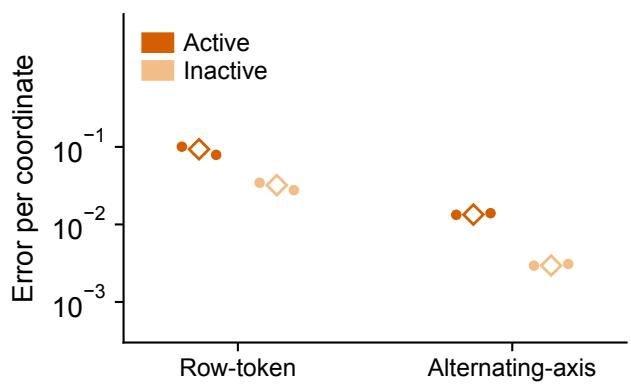

b  
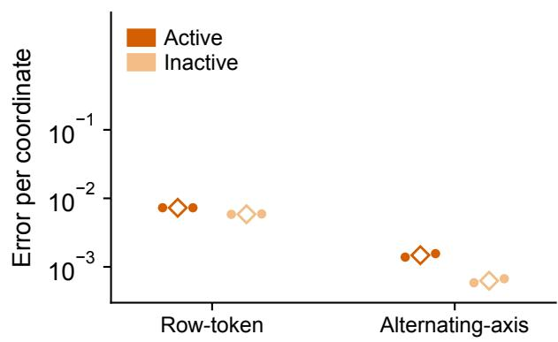

c  
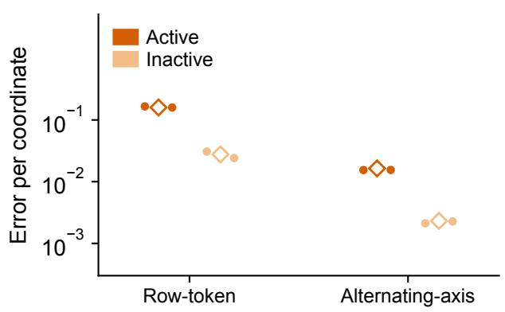

d  
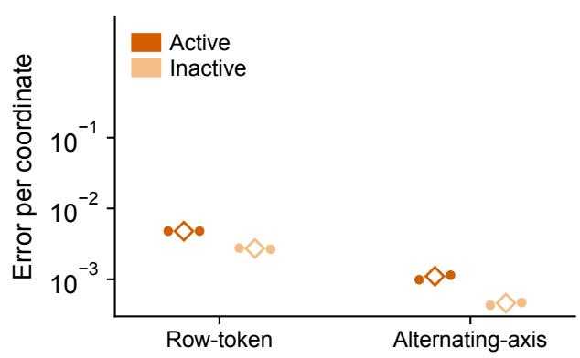  
Figure 26: Coefficient errors per coordinate under sparse priors. Each model’s task-normalized active and inactive errors (Eq. 57) are divided by k and $d - k ,$ respectively. Rows correspond to $d = 1 0 , 2 0$ and columns to $k = 1 , d / 2$ Colors match Figure 25. Per-coordinate errors are averaged equally over the same 32,000 test datasets for each seed. Diamonds show means over three seeds, circles show individual seed averages, and error bars show seed SDs (ddof=0). All panels share a logarithmic vertical axis.

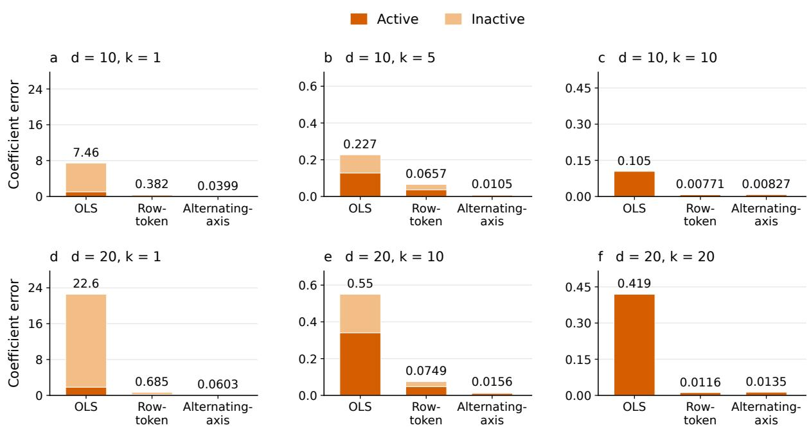  
Figure 27: OLS and learned-model coefficient errors relative to Bayes. Rows correspond to $d = 1 0 , 2 0$ and columns to $k \overset { \cdot } { = } 1 , d / 2 , d .$ Bars stack task-normalized active and inactive coefficient errors; annotations give their sum. Every bar uses the same 32,000 test datasets per condition. OLS is deterministic given the context; learned-model bars average three training seeds and reproduce Figure 25. $\quad \mathrm { A t } k = d ,$ the inactive sum is zero. Linear vertical ranges are shared within each column.

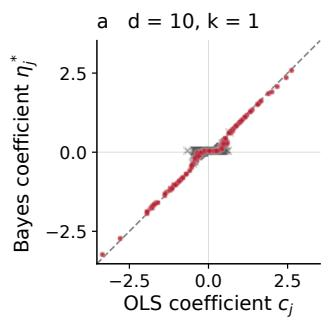

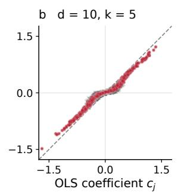

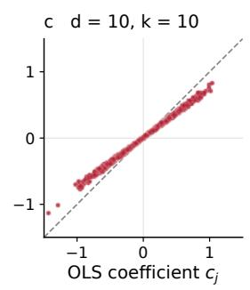

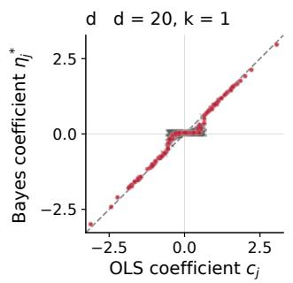

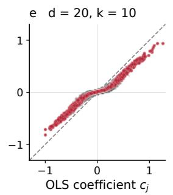

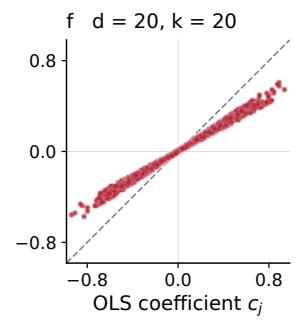  
Figure 28: OLS coefficients and posterior-mean coefficients. Each panel plots all coordinates from 150 fixed, randomly sampled test tasks. Dark red circles denote active coordinates and dark gray crosses denote inactive coordinates in the realized support. Dashed lines indicate equal coefficients. ${ \mathrm { A t ~ } } k = d ,$ variation in context length produces different shrinkage slopes across tasks. Error summaries use the complete 32,000-task test set.

## F Feature-message interventions: methods and additional results

This appendix supports Section 4. We specify the intervention and statistics, assess the coefficient description of prediction changes, and compare context- and query-message effects. We then examine response direction, attenuation strength, and support size. The primary analysis uses $k = 1 ; \mathsf { A }$ ppendix F.6 extends it to $k \overset { \cdot } { = } d / 2$ and $k = d$

## F.1 Intervention protocol and statistical aggregation

Tasks and models. The results reported here use $k = 1$ and $d \in \{ 1 0 , 2 0 \}$ under the setup in Appendix E.2.1. At each dimension, all interventions use the same 128 tasks for the alternating-axis model and frozen TabPFN ${ \bf v } 2$ . The task inputs, targets, and query sets are identical across models and row scopes. These tasks are the first 128 original contexts in the saved one-sparse cohort; selection precedes all intervention summaries.

The alternating-axis model uses the final seed-0 checkpoint trained under $P _ { 1 }$ at each dimension (Appendix E.2.2). Frozen TabPFN $\mathbf { v } 2$ uses tabpfn-v2-regressor-09gpqh39.ckpt with package version 8.0.8, one estimator, original feature order, and no augmentation. We retain its native encoding, normalization, and bar-distribution mean, returning predictions in original response units. Inference uses float32. Layers are numbered from one throughout.

Feature-message intervention. Let $I ( g )$ contain the raw-feature indices in source token $g .$ For the alternating-axis model, $I ( g ) = \bar { \{ g \} }$ ; for TabPFN $\mathbf { \boldsymbol { v } } 2 , | I ( g ) | = 2$ at both evaluated dimensions. A source is active if its group contains an active coordinate; this status is used only for analysis. We intervene on each source separately at every layer, holding the context and query sets fixed. At layer ℓ, let $\alpha _ { i , p , g } ^ { ( \ell , h ) }$ be the attention weight from source $g$ to receiver p in row i and head $h ,$ and let $\mathbf { v } _ { i , g } ^ { ( \ell , h ) }$ be its value vector. For a selected row set $\mathcal { R }$ , the projected source message and modified attention output are

$$
\begin{array} { r } { m _ { i , p  g } ^ { ( \ell ) } = W _ { O } ^ { ( \ell ) } \operatorname { c o n c a t } _ { h } [ \alpha _ { i , p , g } ^ { ( \ell , h ) } \mathbf { v } _ { i , g } ^ { ( \ell , h ) } ] , } \\ { o _ { i p } ^ { ( \ell ) } ( \delta ; g , \mathcal { R } ) = o _ { i p } ^ { ( \ell ) } ( 0 ) - \delta \mathbf { 1 } \{ i \in \mathcal { R } \} m _ { i , p  g } ^ { ( \ell ) } . } \end{array}\tag{61}
$$

We set $\delta = 0 . 1$ , with dose comparisons at 0.05 and 0.2. Context and query interventions use their respective row sets ; joint interventions use both sets. The same multiplier applies to every receiving token and attention head in the selected rows. Values include their projection bias; the output-projection bias is unchanged. Attention weights at the modified operation are held fixed without renormalization, and downstream computation is rerun. The alternating-axis implementation subtracts the projected source message; the TabPFN adapter scales the source value before aggregation

Coefficient sensitivity. For each context D, we fit the baseline and intervened predictors on the same queries using the affine model

$$
\widehat { \zeta } ( D ) + \sum _ { r } \widehat { \eta } _ { r } ( D ) x _ { r } .
$$

Appendix E.4.1, Eq. 52, gives the estimator. Here $\widehat { \eta _ { r } } ( D )$ is the fitted slope for query feature $x _ { r }$ . Subscripts 0 and $\delta , \ell g$ denote the baseline and intervened predictors. Extending Eq. 9 to grouped sources gives

$$
\widehat { J } _ { r g } ^ { ( \ell ) } ( D ; \delta , \mathcal { R } ) = \frac { \widehat { \eta } _ { 0 , r } ( D ) - \widehat { \eta } _ { \delta , \ell g , \mathcal { R } , r } ( D ) } { \delta } .
$$

We suppress the row-set argument $\mathcal { R }$ below. Attenuating source g therefore changes coefficient r by $- \delta \widehat { J } _ { r g } ^ { ( \ell ) }$

For isotropic Gaussian queries, the population slope is $\eta _ { f } ( D ) = \mathbb { E } _ { x } [ x f ( D , x ) ]$ , hence

$$
J _ { r g } ^ { ( \ell ) } = \mathbb { E } _ { x } \left[ x _ { r } \frac { f _ { 0 } ( D , x ) - f _ { \delta , \ell g } ( D , x ) } { \delta } \right] .
$$

Thus $J$ measures the feature-aligned component of the prediction response; with the same query design, its least-squares estimate is equivalently obtained by regressing the prediction difference divided by δ on the query features, including an intercept.

To normalize for the magnitude of context statistics, let $c = X ^ { \top } y / n$ and $\begin{array} { r } { u _ { g } = \sum _ { r \in I ( g ) } \left| c _ { r } \right| } \end{array}$ . We define the coefficient sensitivity as the total absolute own-feature response divided by $u _ { g } \mathrm { : }$

$$
w _ { g } ^ { ( \ell ) } = \frac { \sum _ { r \in I ( g ) } | \widehat { J } _ { r g } ^ { ( \ell ) } | } { u _ { g } } , \qquad u _ { g } > 0 .\tag{62}
$$

For a single-feature source, $w _ { j } ^ { ( \ell ) } = | \widehat { J } _ { j j } ^ { ( \ell ) } | / | c _ { j } |$ when $c _ { j } \neq 0 .$ . Thus $w _ { g } ^ { ( \ell ) } \geq 0 ;$ larger values indicate stronger own-feature bcoefficient effects per unit context-statistic magnitude. All evaluated sources have $u _ { g } > 0$

Prediction-error change. Using a shared set of held-out queries, we compare the baseline predictor $f _ { 0 }$ and the intervened predictor $f _ { \delta , \ell g }$ against the Bayes prediction under $\bar { P } _ { k }$ :

$$
\begin{array} { l } { \displaystyle E ( f ; D ) = \frac { 1 } { Q _ { \mathrm { e v a l } } } \sum _ { m = 1 } ^ { Q _ { \mathrm { e v a l } } } \left[ f ( D , x _ { m } ^ { \mathrm { e v a l } } ) - ( x _ { m } ^ { \mathrm { e v a l } } ) ^ { \top } \eta _ { k } ^ { * } ( c ) \right] ^ { 2 } , } \\ { \Delta E _ { \ell g } = E ( f _ { \delta , \ell g } ; D ) - E ( f _ { 0 } ; D ) . } \end{array}\tag{63}
$$

Positive $\Delta E _ { \ell g }$ indicates that attenuation worsens Bayes approximation; negative values indicate improvement.

Specificity. For a fixed context, layer, and dose, first compute each source’s own-feature response fraction,

$$
p _ { g } ^ { ( \ell ) } ( D ; \delta ) = \frac { \sum _ { r \in I ( g ) } | \widehat { J } _ { r g } ^ { ( \ell ) } | } { \sum _ { r = 1 } ^ { d } | \widehat { J } _ { r g } ^ { ( \ell ) } | } .\tag{64}
$$

For a source role $R \in \{ \mathrm { a c t i v e , i n a c t i v e } \}$ , specificity is the arithmetic mean over its source set, so each source receives equal weight regardless of its total response magnitude:

$$
P _ { R } ^ { ( \ell ) } ( D ; \delta ) = \frac { 1 } { | \mathcal { G } _ { R } ( D ) | } \sum _ { g \in \mathcal { G } _ { R } ( D ) } p _ { g } ^ { ( \ell ) } ( D ; \delta ) .\tag{65}
$$

Aggregation and uncertainty. The plotted points are arithmetic means of these context-level quantities, with equal weights across contexts. For example, at $d = 1 0 , k = 1$ in the alternating-axis model, inactive specificity is the average of nine separate source fractions within each context. Active and inactive specificities do not sum to one. Ratios with source denominators at most $1 0 ^ { - 1 2 }$ are undefined and excluded before taking the source mean; no such ratios occur in the plotted cohorts. A context with no sources in a role is omitted for that role. In particular, no inactive curve exists at $k = d .$ Coefficient sensitivity w and error change $\Delta E$ are averaged over sources within each role and context, then summarized by the median across contexts. Specificity uses the equal-source and equal-context means above. Intervals are pointwise 95% percentile confidence intervals from 2,000 generator-batch resamples at a fixed checkpoint. The one-sparse cohort contains 122 original batches per dimension. Each draw retains all selected contexts from a sampled batch and recomputes the context-level mean or median. Draws are shared across models, row scopes, layers, doses, and source roles within each dimension and prior.

## F.2 Validity of the coefficient-response interpretation

We assess how well fitted coefficient changes reconstruct the prediction response, then use response matrices to locate these changes by feature.

Fidelity to the prediction change. Fix a context, layer ℓ, and source $^ { g , }$ and suppress $\ell , g$ in the following definitions. On held-out queries, write $\Delta f _ { m } ^ { - } = f _ { \delta , \ell g } ( D , x _ { m } ^ { \mathrm { e v a l } } ) \stackrel { \cdot } { - } f _ { 0 } ( D , x _ { m } ^ { \mathrm { e v a l } } )$ and $\Delta \widehat { \eta } = \widehat { \eta } _ { \delta , \ell g } - \widehat { \eta } _ { 0 }$ . The centered prediction change is

$$
\widetilde { \Delta f } _ { m } : = \Delta f _ { m } - \overline { { \Delta f } } ,
$$

fand its linear reconstruction from the fitted coefficient change is

$$
\widetilde { \Delta f } _ { m } ^ { \mathrm { l i n } } : = ( x _ { m } ^ { \mathrm { e v a l } } - \bar { x } ^ { \mathrm { e v a l } } ) ^ { \top } \Delta \widehat { \eta } .
$$

f bBars denote held-out query means. We measure reconstruction fidelity by

$$
\widehat { R } _ { \Delta , \ell g } ^ { 2 } = 1 - \frac { \sum _ { m } \bigl ( \widetilde { \Delta f } _ { m } - \widetilde { \Delta f } _ { m } ^ { \mathrm { l i n } } \bigr ) ^ { 2 } } { \sum _ { m } \bigl ( \widetilde { \Delta f } _ { m } \bigr ) ^ { 2 } } .\tag{66}
$$

fThe numerator is the squared reconstruction error; the denominator is the total squared centered prediction change. Values near one indicate that coefficient changes faithfully capture the intervention’s effect across queries, after removing its mean shift. We exclude ratios with denominators at most $\mathrm { \dot { 1 } 0 ^ { - 1 2 } }$ and average valid scores within each source role and context.

For separate-row interventions, final-layer active-source median fidelity ranges from 0.81 to 0.97 under context attenuation and from 0.97 to 0.98 under query attenuation across models and dimensions. Thus, fitted coefficient changes capture most of the centered active-source response, with higher fidelity for query interventions.

Figure 29 gives the full depth profiles under joint attenuation. Final-layer active-source medians exceed 0.96 in both models and dimensions. Inactive-source medians are 0.94 and 0.83 in the alternating-axis model at $d = 1 0$ and d = 20, and 0.71 and 0.67 in TabPFN v2. The coefficient description is therefore more complete for active-source responses.

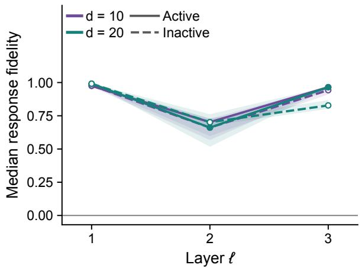

b  
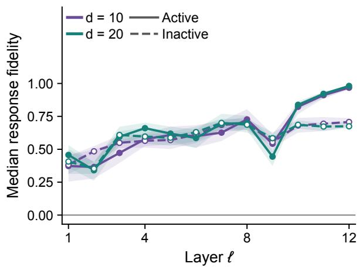  
Figure 29: Fidelity of coefficient changes to prediction changes. All layers, $k = 1 , \delta = 0 . 1$ , joint context-and-query attenuation. Panels compare active and inactive sources within (a) the alternating-axis model and (b) frozen TabPFN v2, each using the same 128 tasks per dimension. Colors distinguish $d = 1 0$ and $d = 2 0$ . Solid and dashed lines show activeand inactive-source medians of within-context role-averaged $\widehat { R } _ { \Delta } ^ { 2 }$ , respectively, with equal context weights. Bands use the bpointwise 95% bootstrap procedure in Appendix F.1. Higher values indicate better fidelity ( ); the maximum is one, and values can be negative.

a  
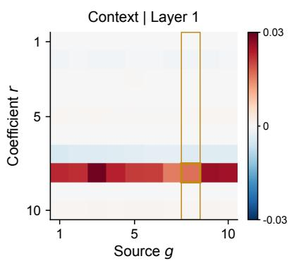

b  
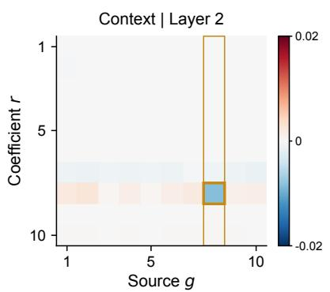

c  
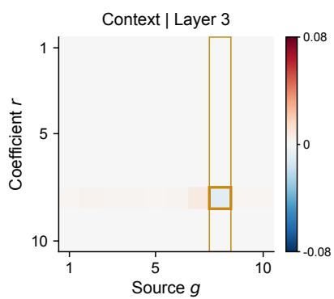  
Figure 30: Coefficient responses to context-message attenuation. Alternating-axis model, $d = 1 0 , k = 1 , \delta = 0 . 1$ panels show layers 1–3. Each matrix column attenuates one source on context rows. The task, matrix axes, per-layer color scales, and gold outlines match Figure 7, allowing direct comparison with query interventions.

Illustrative response matrices. Figure 30 complements the query interventions in Figure 7 with context interventions on the same $d = 1 0$ task. Figure 31 shows both row scopes at $d = 2 0$ . At each dimension, the example is selected by proximity to the median Bayes coefficient norm among the same 128 tasks, with the smallest task ID breaking ties. Within each dimension, the same context is shown for both row scopes at all three layers. In both examples, the largest final-layer response occurs on the active source’s own coefficient under either intervention, with a larger magnitude for query attenuation. $\mathrm { { A t } } d = 2 0$ , the final-layer own-coefficient responses have opposite signs across the two row scopes, illustrating distinct context and query effects within the same task.

## F.3 Context- and query-message effects across dimensions

Predictive consequences at $d = 1 0 .$ Figure 32 complements the main-text specificity and sensitivity panels with held-out Bayes-target error changes. In TabPFN v2, final-layer query attenuation increases error for active groups and decreases it for inactive groups. In the alternating-axis model, the active-query median is smaller and its 95% interval spans zero. These effects distinguish coefficient control from predictive usefulness.

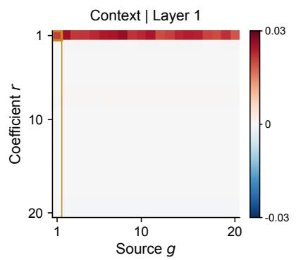

b  
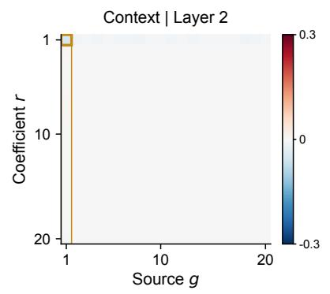

c  
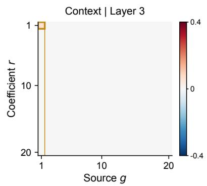

d  
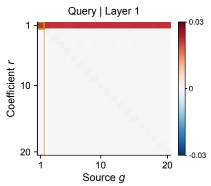

e  
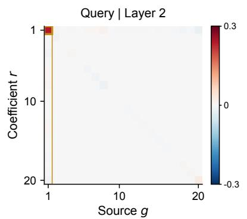

f  
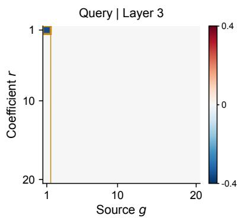  
Figure 31: Coefficient responses within a $d = 2 0$ task. Alternating-axis model, $k = 1 , \delta = 0 . 1$ . Top: context interventions; bottom: query interventions. Columns show layers 1–3. The same task is used throughout; context and query panels share a symmetric color scale within each layer. Matrix axes and gold outlines follow Figure 7.

(c)  
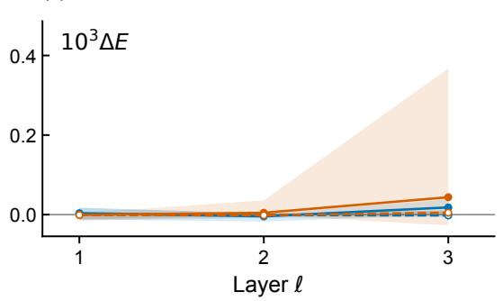

(f)  
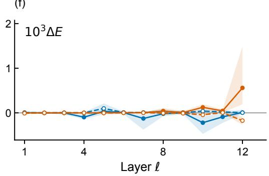  
Figure 32: Predictive consequences of context- and query-message attenuation. Panel (c): alternating-axis model; panel (f): frozen TabPFN $\vee 2 . ~ d = \bar { 1 0 } , k = 1 , \delta = 0 . 1 $ the same 128 tasks as in Figure 8. Curves show median prediction-error changes after averaging sources within each role and task; bands are pointwise 95% generator-batch bootstrap intervals. Panels (c) and (f) complete Figure 8, whose panels (a, b, d, e) appear in the main text.

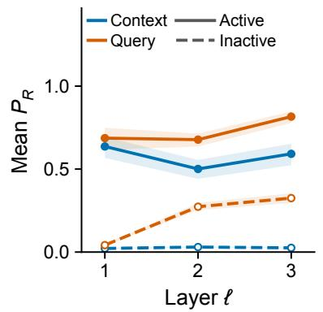

b  
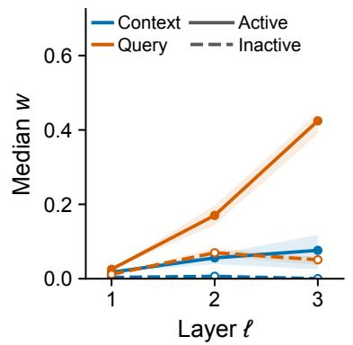

c  
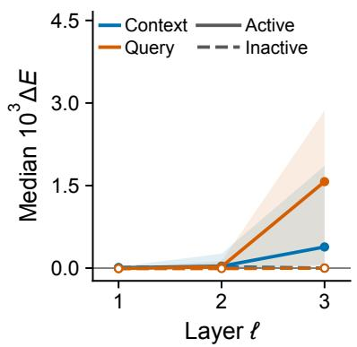

d  
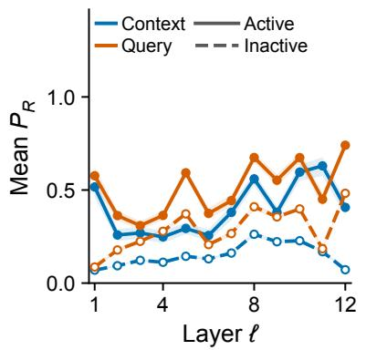

e  
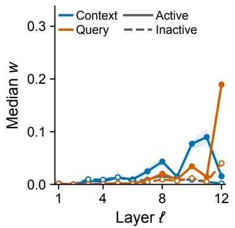

f  
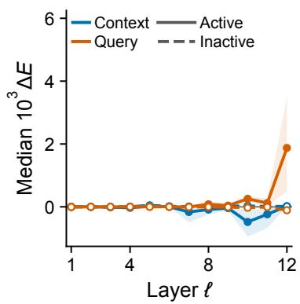  
Figure 33: Context and query message effects at d = 20. k = 1, δ = 0.1, 128 shared tasks. Top: alternating-axis model; bottom: frozen TabPFN v2. Layout, source-role summaries, and confidence intervals follow Figure 8.

Replication at $d = 2 0$ . Figure 33 repeats the separate-row interventions at $d = 2 0$ . Active sources have higher specificity at every layer in both models and row scopes. Final-layer active-source sensitivity also exceeds inactivesource sensitivity in all four comparisons. In the alternating-axis model, attenuating active sources in either row set increases final-layer prediction error. In TabPFN $\mathbf { v } 2 ,$ , the larger prediction-error contrast occurs under query attenuation, as at d = 10.

## F.4 Response direction and predictive usefulness

Specificity and sensitivity measure the location and magnitude of a response. We next examine its direction and relation to prediction error.

Signed sensitivity. For each learned-model source, we orient its own-feature responses by the corresponding context statistics and define

$$
s _ { g } ^ { ( \ell ) } = \frac { \sum _ { r \in I ( g ) } \mathrm { s i g n } ( c _ { r } ) \widehat { J } _ { r g } ^ { ( \ell ) } } { \sum _ { r \in I ( g ) } | c _ { r } | } .\tag{67}
$$

For the alternating-axis model, this reduces to $s _ { j } ^ { ( \ell ) } = \widehat { J } _ { j j } ^ { ( \ell ) } / c _ { j }$ . Positive values indicate that retaining the message supports the direction of $c ;$ bnegative values indicate an opposing response. For native TabPFN v2 groups, the numerator sums the two direction-aligned coordinate responses. The magnitude satisfies $| s _ { g } | \le w _ { g }$ , with equality for single-feature sources. We also report the unnormalized own-feature magnitude $\begin{array} { r } { a _ { g } = \sum _ { r \in I ( g ) } | \widehat { J } _ { r g } | } \end{array}$

Figure 34 shows the distribution of signed sensitivity for active sources at the final feature-attention layer, using the same 128 one-sparse tasks at $\delta = 0 . 1$ . Each task has exactly one active source in both models. Active query responses are negative in 56 tasks a $d = 1 0$ and seven at $d = 2 0$ in the alternating-axis model, compared with one and zero in

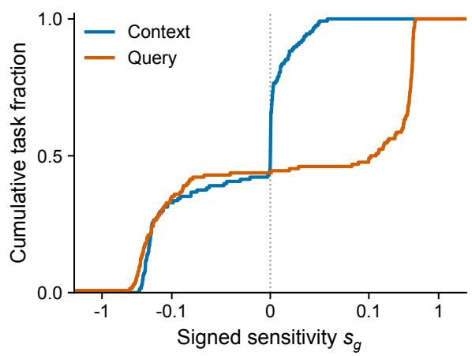

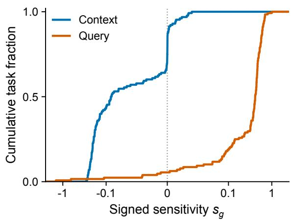

c  
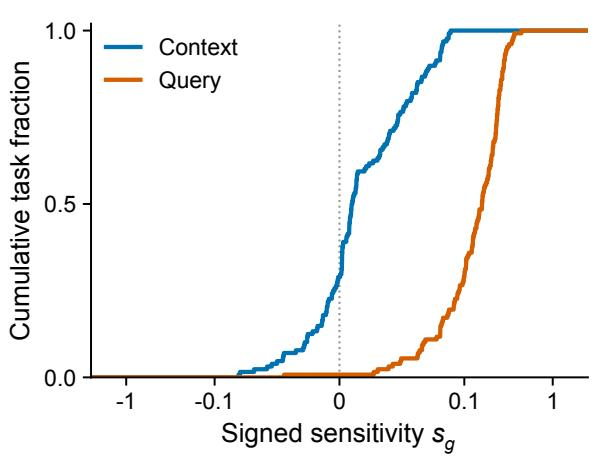

d  
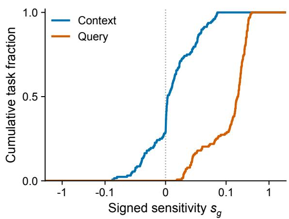  
Figure 34: Direction and magnitude of active-source control. Final-layer empirical distributions of signed sensitivity $s _ { g } ,$ with $k = 1 , \delta = 0 . 1$ , and the same 128 tasks per dimension and model. Top: alternating-axis model; bottom: TabPFN $\bar { \mathbf { v } 2 }$ Left: $d = 1 0 ;$ ; right: $d = 2 0$ . Colors distinguish context and query attenuation, as in Figure 8. All tasks are shown. The horizontal axis is linear for $| s _ { g } | \leq 0 . 0 5$ and logarithmic outside that interval; the dotted line marks zero.

TabPFN v2. Among these negative-query cases, the alternating-axis model has median ${ w _ { g } = 0 . 1 9 9 }$ and $a _ { g } = 0 . 0 6 3$ at $d = 1 0$ , versus 0.026 and 0.002 at $\bar { d } = \bar { 2 } 0$ . Context interventions yield more frequent negative responses than query interventions in every model–dimension comparison. The distributions therefore distinguish response direction from the unsigned selectivity measured in Figure 8.

The following three references relate response direction to the intervened quantity in a Bayesian computation.

Final-contribution reference. In the one-sparse construction of Figure 3(c), the final message from feature j contributes $\eta _ { 1 , j } ^ { * } x _ { j }$ to the prediction. Attenuating this contribution gives

$$
f _ { \delta , j } ( D , x ) = f _ { 1 } ^ { * } ( D , x ) - \delta \eta _ { 1 , j } ^ { * } x _ { j } , \qquad J _ { r j } ^ { \mathrm { i d e a l } } = { \bf 1 } \{ r = j \} \eta _ { 1 , j } ^ { * } .
$$

Thus its own-feature response relative to $c _ { j }$ is $J _ { j j } ^ { \mathrm { i d e a l } } / c _ { j } = \lambda _ { 1 } q _ { 1 , j } ( c ) \ge 0$ for $c _ { j } \neq 0$ . This final-contribution intervention supplies a reference for both the localization and direction of the learned coefficient response. For every nonzero response, specificity is one regardless of realized support membership. Under independent isotropic queries, the increase in Bayes approximation error from this exact baseline is $\delta ^ { 2 } ( \eta _ { 1 , j } ^ { * } ) ^ { 2 } \geq 0$ . Finite-noise posterior inclusion is positive even for inactive features, so zero inactive response is not required.

Perturbing evidence before competition. Write $q _ { j } ~ = ~ q _ { 1 , j } ( c ) , ~ \eta _ { j } ^ { * } ~ = ~ \eta _ { 1 , j } ^ { * } ( c ) , ~ \lambda ~ = ~ \lambda _ { 1 }$ , and $\theta ~ = ~ \theta _ { 1 } ~ =$ $v ^ { 2 } / [ 2 \tau ^ { 2 } ( v ^ { 2 } + \tau ^ { 2 } ) ]$ , with $\tau ^ { 2 } = \sigma ^ { 2 } / n$ . Suppose an intervention replaces only $c _ { j }$ by $( 1 - \delta ) c _ { j }$ before evaluating $q _ { r } = \exp ( \theta c _ { r } ^ { 2 } ) / \sum _ { s } \exp ( \theta c _ { s } ^ { 2 } )$ and the posterior coefficients. Differentiating gives

$$
\frac { \partial q _ { r } } { \partial c _ { j } } = 2 \theta c _ { j } q _ { r } ( { \bf 1 } \{ r = j \} - q _ { j } ) .
$$

The limiting coefficient response is therefore

$$
\begin{array} { l } { { J _ { r j } ^ { \mathrm { { e v i d e n c e } } } : = \displaystyle \operatorname* { l i m } _ { \delta  0 } \frac { \eta _ { r } ^ { * } ( c ) - \eta _ { r } ^ { * } ( c - \delta c _ { j } \mathbf { e } _ { j } ) } { \delta } = c _ { j } \frac { \partial \eta _ { r } ^ { * } } { \partial c _ { j } } } } \\ { { = \lambda q _ { r } c _ { j } \mathbf { 1 } \{ r = j \} + 2 \theta \eta _ { r } ^ { * } c _ { j } ^ { 2 } ( \mathbf { 1 } \{ r = j \} - q _ { j } ) , } } \end{array}\tag{68}
$$

where $\mathbf { e } _ { j }$ is the jth coordinate vector. In particular, $J _ { j j } ^ { \mathrm { e v i d e n c e } } = \eta _ { j } ^ { * } [ 1 + 2 \theta c _ { j } ^ { 2 } ( 1 - q _ { j } ) ]$ , while $J _ { r j } ^ { \mathrm { e v i d e n c e } } = - 2 \theta \eta _ { r } ^ { * } q _ { j } c _ { j } ^ { 2 }$ for $r \neq j$ . Weakening one evidence coordinate thus increases competitors’ coefficient magnitudes to first order. Own-feature signed sensitivity remains nonnegative. This reference describes evidence rescaling before posterior competition; its off-diagonal terms distinguish it from final-contribution attenuation.

An alternative signed realization. The same Bayesian coefficient can be decomposed as

$$
\eta _ { j } ^ { \ast } = \lambda c _ { j } - \lambda ( 1 - q _ { j } ) c _ { j } .
$$

Consider two additive prediction contributions implementing these terms. Attenuating only the second, with $q$ and the first contribution held fixed, gives $J _ { j j } ^ { \mathrm { c o r r e c t i o n } } = \dot { - } \lambda ( 1 - q _ { j } ) \dot { c } _ { j }$ and zero off-diagonal responses. Its signed sensitivity is nonpositive although the baseline prediction is exactly Bayesian. The same Bayesian predictor can therefore yield either response sign, depending on the contribution being attenuated. These additive realizations provide functional references for interpreting the measured signs.

Relation to predictive effects. For $e = \widehat { \eta } _ { 0 } - \eta _ { 1 } ^ { * }$ and $\widehat { J } = \widehat { J } _ { \cdot g } ^ { ( \ell ) }$ , the coefficient-error change is

$$
\lVert \widehat { \eta } _ { \delta , \ell g } - \eta _ { 1 } ^ { * } \rVert _ { 2 } ^ { 2 } - \lVert e \rVert _ { 2 } ^ { 2 } = - 2 \delta e ^ { \top } \widehat { J } + \delta ^ { 2 } \lVert \widehat { J } \rVert _ { 2 } ^ { 2 } .\tag{69}
$$

Equation 69 follows by substituting $\widehat { \eta } _ { \delta , \ell g } = \widehat { \eta } _ { 0 } - \delta \widehat { J } _ { \cdot g } ^ { ( \ell ) }$ and expanding the square. The identity holds at the measured dose, since $\widehat { J }$ b b bis the corresponding finite difference. Predictive usefulness therefore depends on the response’s alignment bwith the baseline error as well as its magnitude. The reported $\Delta E$ evaluates the full prediction change against Bayes on held-out queries (Eq. 63). For population affine projections, Lemma 2 gives the corresponding full error change as

$$
\Delta E _ { \mathrm { p o p } } = \Delta C + ( \zeta _ { \delta } ^ { 2 } - \zeta _ { 0 } ^ { 2 } ) + \mathbb { E } _ { x } [ r _ { \delta } ( D , x ) ^ { 2 } - r _ { 0 } ( D , x ) ^ { 2 } ] ,
$$

where $\Delta C$ is the population coefficient-error change. The full error change combines coefficient, intercept, and residual components. Empirical estimates additionally include projection error and finite-query cross terms.

## F.5 Robustness to attenuation strength

We vary $\delta \in \{ 0 . 0 5 , 0 . 1 , 0 . 2 \}$ under joint context-and-query attenuation, using the same 128 tasks per dimension. This analysis tests the dose dependence of combined message effects; Appendix F.3 compares context and query effects separately at $\delta = 0 . 1$

Alternating-axis model. Final-layer active-source sensitivity exceeds inactive-source sensitivity at all three doses (Figures 35 and 36). The median active-source error change increases from $- 4 . 6 \times 1 0 ^ { - 6 } \mathrm { t o } 1 . 7 \times \bar { 1 0 } ^ { - 4 } \mathrm { a t } d = 1 0$ , and from $1 . 4 \times 1 0 ^ { - 5 }$ to $3 . 6 \times 1 0 ^ { - 3 }$ at d = 20, as δ increases from 0.05 to 0.2. Inactive-source changes remain smaller at the largest dose.

Frozen TabPFN v2. Final-layer active groups also have higher sensitivity at all three doses. Their median error change is positive and increases with δ, whereas attenuating inactive groups decreases error. Thus, the active-source sensitivity advantage persists across doses in both models, while the sign of the prediction effect depends on the model and source role.

a  
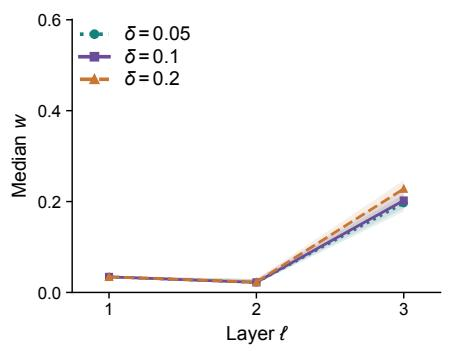

b  
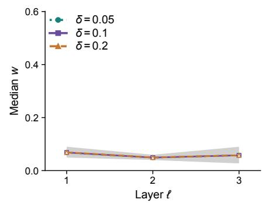

c  
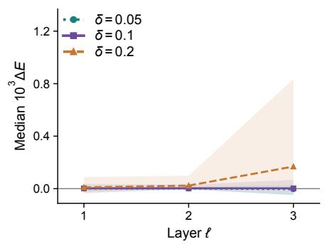

d  
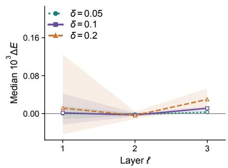

e  
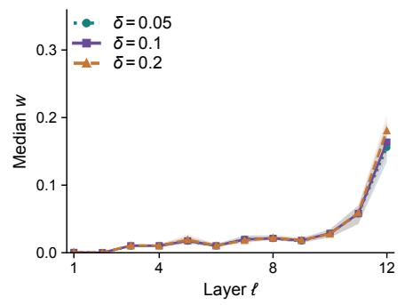

f  
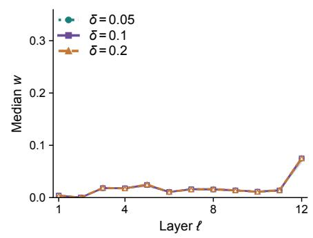

g  
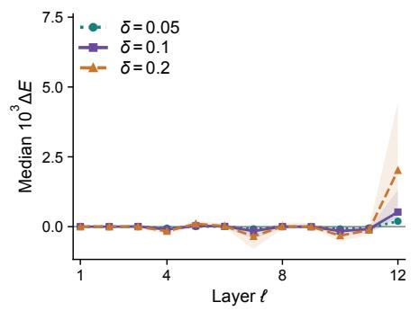

h  
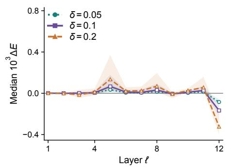  
Figure 35: Attenuation-strength comparison at $d = 1 0 . \mathrm { ~ } k = 1$ , 128 tasks, joint context-and-query attenuation. Panels $( \mathrm { a - d } ) \colon$ alternating-axis model; (e–h): TabPFN $\mathbf { v } 2 .$ For each model, rows show sensitivity and error change; columns show active and inactive sources. Curves show task medians of role averages; bands are 95% batch-bootstrap intervals (Appendix F.1). Dose comparisons share bootstrap draws. Sensitivity axes match across dimensions; error axes are panel-specific.

a  
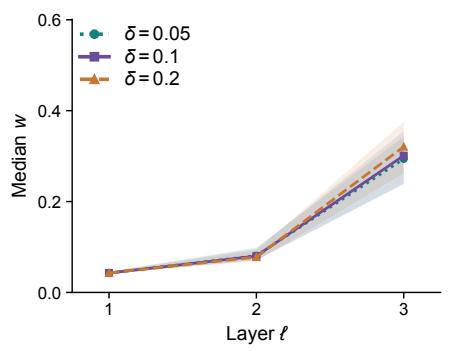

b  
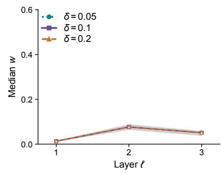

c  
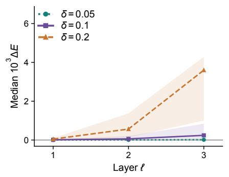

d  
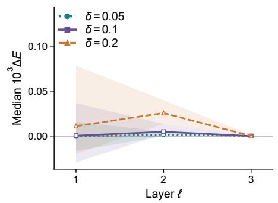

e  
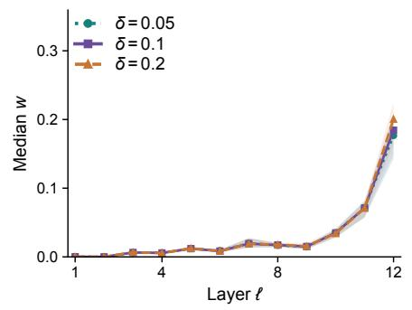

f  
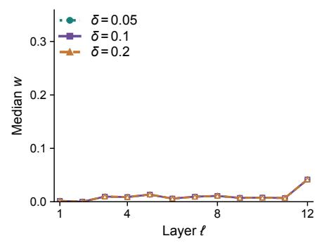

g  
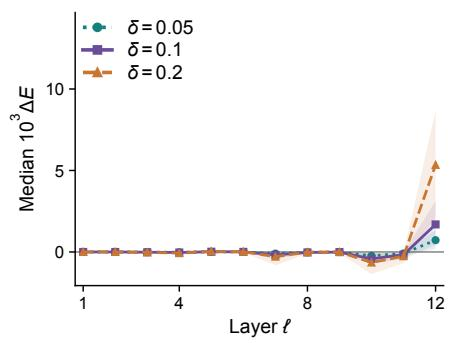

h  
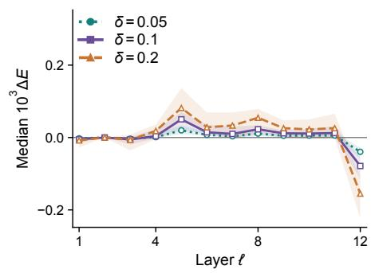  
Figure 36: Attenuation-strength comparison at $d = 2 0 . \ : k = 1$ , 128 tasks, joint context-and-query attenuation. Panels $( \mathrm { a - d } ) \colon$ alternating-axis model; (e–h): TabPFN $\mathbf { v } 2 .$ For each model, rows show sensitivity and error change; columns show active and inactive sources. Curves show task medians of role averages; bands are 95% batch-bootstrap intervals (Appendix F.1). Dose comparisons share bootstrap draws. Sensitivity axes match across dimensions; error axes are panel-specific.

## F.6 Extension across support sizes and scope of conclusions

Section 4 focuses on the one-sparse prior. We repeat the same intervention at $k = d / 2$ to test whether the final-layer active–inactive distinction persists beyond extreme sparsity, and at $k = d$ to test whether feature messages remain functionally important when every feature is active.

Protocol. We use the intervention and measurements in Appendix F.1, with $\delta = 0 . 1 , d \in \{ 1 0 , 2 0 \}$ , and joint attenuation of context and query rows. The alternating-axis model uses the final seed-0 checkpoint trained under each matched prior $P _ { k }$ ; TabPFN v2 remains frozen across priors. At each dimension and prior, both models use the same 128 tasks. These are the first 128 original contexts in the corresponding saved active–active pair cohort; only the original context enters the analysis. Bayes approximation error uses the corresponding $\eta _ { k } ^ { * } ( c )$ in Eq. 63. Aggregation and batch-bootstrap intervals follow Appendix F.1.

$\mathrm { A t } k = d / 2$ , TabPFN v2 has an inactive native feature group in 111 of 128 contexts at $d = 1 0$ and all 128 at $d = 2 0 ;$ inactive-group summaries use these contexts, while active-group summaries use all 128. The two role summaries therefore cover different task sets at $d = 1 0 . { \mathrm { A t } } k = d , $ every source is active.

Intermediate support: $k = d / 2 .$ . Final-layer active sources have higher mean specificity and larger median predictionerror changes than inactive sources in both models and dimensions (Figure 37, rows 1 and 3). TabPFN v2 also retains a larger active-source median sensitivity at both dimensions, as does the alternating-axis model at $d = 2 0$ . In the alternating-axis model at $d = 1 0$ , active and inactive median sensitivities are close (0.194 and 0.200), while specificity is 0.499 versus 0.251. Response localization and prediction effects retain an active–inactive contrast, while the sensitivity advantage varies across conditions.

Dense support: $k = d .$ At the dense endpoint every source is active. Source attenuation continues to change the corresponding coefficients and produces positive final-layer median $\Delta E$ in both models and dimensions (Figure 37, rows 2 and 4). Feature-message control therefore extends to dense prediction, where support selection is unnecessary.

Fidelity of coefficient changes. Across the two additional priors and dimensions, final-layer active-source medians of $\widehat { R } _ { \Delta } ^ { 2 }$ range from 0.93 to 0.98 in the alternating-axis model and from 0.80 to 0.85 in TabPFN ${ \bf v } 2 ( \mathrm { E q } . 6 6 )$ . Coefficient bchanges therefore explain most of the centered prediction change, supporting the same coefficient-based interpretation across support sizes.

Scope of the evidence. Across these experiments, feature messages exert feature-aligned control over prediction coefficients. Under sparse priors, this control varies with source relevance; under the dense prior, it remains functionally important. These results locate coefficient control within the computation. Identifying how relevance is inferred requires tracing the formation of the intervened messages.

a  
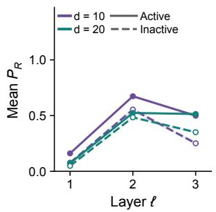

b  
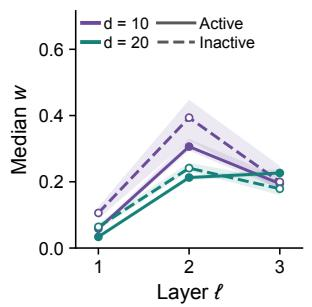

c  
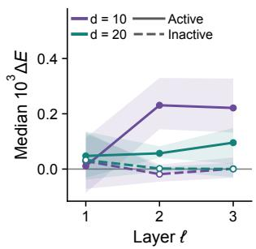

d  
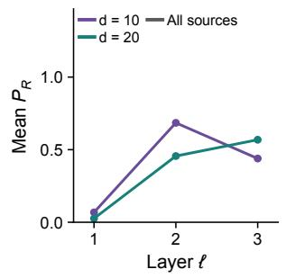

e  
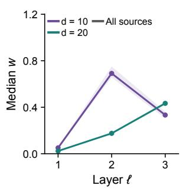

f  
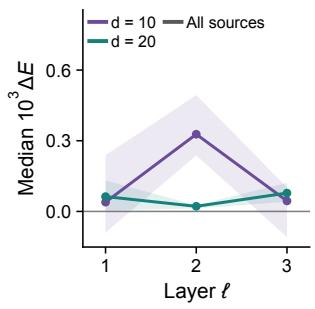

g  
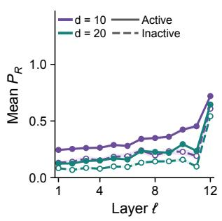

h  
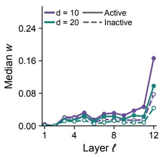

i  
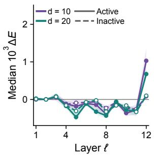

j  
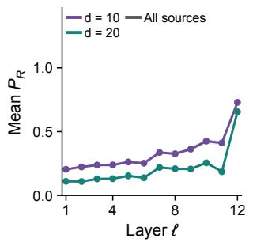

k  
l  
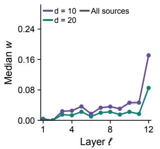

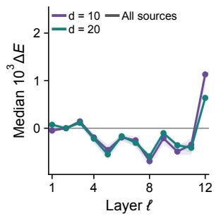  
Figure 37: Coefficient control across support sizes. Panels (a–f): alternating-axis model; $( \mathsf { g } \mathrm { - } 1 ) \mathsf { : }$ : frozen TabPFN $\mathbf { v } 2$ Within each model, rows show $k = d / 2$ and $k = d ;$ columns show specificity, sensitivity, and prediction-error change. Joint attenuation, $\delta = 0 . 1$ , 128 shared tasks per dimension and prior. Colors distinguish dimensions; solid and dashed curves denote active and inactive sources. All sources are active at $k = d$ . Bands are pointwise 95% batch-bootstrap intervals. TabPFN $\mathbf { v } 2$ sources are native two-feature groups.

## G Notation

Population BLP coefficients and error components carry no accents; hats denote fitted predictors and empirical estimates. Stars identify Bayes-optimal quantities or population optima, and bars denote sample means. A subscript identifies the predictor, prior, or coordinate; a parenthesized superscript (t) identifies a test task. Dependence on fixed parameters is suppressed only within a stated setting. Controlled-experiment definitions: dense-prior prediction gap (Eq. 50), Bayes approximation error (Eq. 6; finite-query estimate in Eq. 49), architecture gap (Eq. 51), population error components (Lemma 2; Appendix D.6), and their empirical estimates (Eqs. 53–55).

Table 8: Notation for the controlled model, affine projection, and interventions.
<table><tr><td>Symbol</td><td>Meaning</td></tr><tr><td> $D = ( X , y ) ; n , d$ </td><td>Context, context size, and feature dimension;  $\ b { X } \in \mathbb { R } ^ { n \times d } , \ b { y } \in \mathbb { R } ^ { n }$ </td></tr><tr><td> $\boldsymbol { x } \in \mathbb { R } ^ { d } ; x _ { i } ^ { \top }$ </td><td>Independent query vector; row i of the context design. Within a query,  $x _ { j }$  denotes coordinate  $j .$ </td></tr><tr><td> $\beta ; S ; k ; P _ { k }$ </td><td>Data-generating regression coefficients, their active support, its size, and the corre- sponding coefficient prior.</td></tr><tr><td> $v ^ { 2 } ; \sigma ^ { 2 } ; \tau ^ { 2 }$ </td><td>Total prior signal energy, response-noise variance, and  $\sigma ^ { 2 } / n .$ </td></tr><tr><td> $c = X ^ { \top } y / n$ </td><td>Sufficient statistic for the coefficient posterior.</td></tr><tr><td> $\pi _ { k } ( A \mid c ) ; q _ { k , j } ( c )$ </td><td>Posterior probability of support  $A ;$  posterior inclusion probability of coordinate  $j .$ </td></tr><tr><td> $\lambda _ { k } ; \theta _ { k }$ </td><td>Conditional Gaussian shrinkage factor; scale multiplying squared evidence in the support posterior.</td></tr><tr><td> $\eta _ { k } ^ { * } ( c ) ; f _ { k } ^ { * } ( D , x )$ </td><td>Bayes coefficient map and prediction  $x ^ { \top } \eta _ { k } ^ { * } ( c ) \mathrm { . }$  an additional index n exposes context- length dependence.</td></tr><tr><td> $\zeta _ { f } ( D ) ; \eta _ { f } ( D )$ </td><td>Population affine-BLP intercept and slope of predictor  $f$  under the query distribution.</td></tr><tr><td> $\widehat { \zeta } _ { f } ( D ) ; \widehat { \eta } _ { f } ( D )$ </td><td>Finite-query least-squares estimates of the BLP intercept and slope.</td></tr><tr><td> $r _ { f } ( D , x )$ </td><td>Residual after subtracting the population affine BLP;  $\widehat { r } _ { f }$  uses the fitted BLP.</td></tr><tr><td> $C _ { f } ; \zeta _ { f } ^ { 2 } ; N _ { f }$   $\Delta _ { k } ^ { \mathrm { d e n s e } } ( D )$ </td><td>Coefficient error, squared intercept, and nonlinear residual error, respectively.</td></tr><tr><td></td><td>Mean squared prediction difference between the dense-prior rule and Bayes for dataset  $\hat { D } .$ </td></tr><tr><td> $\mathcal { E } _ { a , k } ; \widehat { \mathcal { E } } _ { a , k }$ </td><td>Task-level normalized Bayes approximation error and its finite-query estimate; both</td></tr><tr><td> $\widehat { C } _ { a , k } ; \widehat { Z } _ { a , k } ; \widehat { N } _ { a , k }$ </td><td>refer to one dataset and one training seed. Normalized coefficient, squared-intercept, and residual errors for one dataset and one</td></tr><tr><td></td><td>training seed.</td></tr><tr><td> $R _ { k } ( f )$   $a ; { \widehat { f } } _ { a , k }$ </td><td>Population risk against noisy query responses (Appendix D.6). Architecture or model label; trained controlled predictor under  $P _ { k } ; a$  is row-token or</td></tr><tr><td></td><td>alternating-axis.</td></tr><tr><td> $T ; t$   $Q _ { \mathrm { p r o j } } ; Q _ { \mathrm { e v a l } }$ </td><td>Test-task count and task index. Numbers of projection and evaluation queries; the task index is omitted for a fixed</td></tr><tr><td> $\widehat { G } _ { k } ; \widehat { G } _ { k } ^ { U }$ </td><td>context. Per-dataset row-token minus alternating-axis gaps in normalized prediction error</td></tr><tr><td></td><td>and component  $U \in \{ C , \zeta , N \}$  , for one training seed. The ζ label denotes squared intercepts.</td></tr><tr><td> $\gamma _ { \ell g } ; \delta ; \widehat { J } _ { r g } ^ { ( \ell ) }$ </td><td>External message multiplier, attenuation fraction, and fitted coefficient response per unit attenuation  $( \widehat { \eta } _ { 0 , r } - \widehat { \eta } _ { \delta , \ell g , r } ) / \delta$ </td></tr><tr><td> $I ( g ) ; u _ { g } ; w _ { g } ^ { ( \ell ) }$ </td><td>Source token&#x27;s raw-feature indices  $\sum _ { r \in I ( g ) } | c _ { r } | ,$  , and coefficient sensitivity</td></tr><tr><td> $\widehat { R } _ { \mathrm { a f f } } ^ { 2 } ; \widehat { R } _ { \Delta } ^ { 2 }$ </td><td>Held-out affine-fit fidelity and fidelity to the centered intervention effect.</td></tr></table>

In the production experiments of Section 2, M denotes the released model, N sample size, and $\rho$ the null-feature ratio. $S _ { j } ^ { \mathrm { p e r m } }$ and $S _ { i } ^ { \mathrm { P D P } }$ are sensitivity scores, distinct from support $S . \mathcal { N } , \mathbb { E } , I _ { d }$ denote the Gaussian distribution, expectation, and identity matrix. Held-out $R ^ { 2 }$ values may be negative. In Section 4, ℓ indexes the attenuated layer, g the source token, and r an affected coefficient; $m _ { i , p  g } ^ { ( \ell ) }$ is the projected message to receiver $p$ at row i, and R specifies the intervened context rows, query rows, or both. $\widehat { J } _ { r g } ^ { ( \ell ) }$ is the coefficient response per unit attenuation. $\begin{array} { r } { w _ { g } ^ { ( \ell ) } = \sum _ { r \in I ( g ) } | \widehat { J } _ { r g } ^ { ( \ell ) } | / u _ { g } \geq 0 } \end{array}$ is coefficient sensitivity. Table subscripts act and inact denote averages over active and inactive sources within a context, respectively. $P ^ { ( \ell ) }$ is the equal-source mean of own-feature coefficient-response fractions; $P _ { R } ^ { ( \ell ) }$ restricts that mean to source role R. Both are distinct from the prior $P _ { k } .$ . Following the main text, $E ( f ; D )$ and $\Delta E _ { \ell g }$ denote held-out Bayes approximation error and its change under attenuation without hats; $\Delta \widehat { C } _ { \ell g }$ is the corresponding change in fitted coefficient error. These intervention errors use original response units and do not use the task-energ normalization of the architecture comparison.