# ARE IN-CONTEXT IMAGES WORTH 10 DIMENSIONS?

Adhemar de Senneville1 Xavier Bou2 Jérémy Anger1   
Rafael Grompone1 Gabriele Facciolo1,3

1Université Paris-Saclay, CNRS, ENS Paris-Saclay, Centre Borelli, Paris, France

2Pôle recherche de l'AMIAD, Palaiseau, France

3Institut Universitaire de France, Paris, France

## ABSTRACT

There has been significant work on understanding the In-Context Learning capabilities of Large Language Models, especially on the induction circuit. For a few-shot classification task, the induction circuit leverages linear representations of each labeled example in-context in order to classify an unlabeled query. However, few works focus on how those linear representations are built in the first place. Leveraging the expressivity of the vision modality compared to text, we uncover a Shared Discriminative Geometry (SDG) inside Large Vision Language Models (LVLMs). It is a low-dimensional space, shared across all image classification tasks, in which in-context images are compressed into linearly separable representations later used to perform classification. We observe that this is the result of the model performing a dimensionality reduction of vision representations in early layers. In order to explain this phenomenon: (1) We show analytically that linear self-attention can perform a dimensionality reduction by projecting incontext data onto its principal components, with each layer implementing one gradient descent step toward this objective. (2) We provide evidence that trained LVLMs reduce the dimensionality of vision representations in early layers via a similar mechanism.

## 1 INTRODUCTION

A fundamental problem in computer vision is learning to recognize novel concepts from only a handful of image examples. To address this problem, the standard approach is fine-tuning, where a pretrained feature extractor is adapted to the task through in-weight learning. A promising alternative is In-Context Learning (ICL), which frames the problem as a conditional prediction problem, where the model receives a small labeled support set together with an unlabeled query image.

ICL was first observed as an emerging capability in Large Language Models (LLMs) (Brown et al., 2020) in the text modality and was later observed in Large Vision Language Models (LVLMs) (Alayrac et al., 2022) on multimodal vision-text tasks. The extension of ICL to the vision modality motivates us to investigate how LVLMs perform it. While the induction circuit (Olsson et al., 2022) by which the model compares in-context examples using linear representations to perform classification is well studied, here we focus on the formation of those representations. In this study, we investigate this process through few-shot in-context image classification. Whereas prior work has focused on text classification, the continuous nature of visual inputs and the diversity of image classes allow us to better trace feature formation across a wide range of classification tasks.

Surprisingly, preliminary experiments show that similarity-based classification performs much worse on text tokens predicting the class labels than on vision tokens. Motivated by this observation, we use a meta-training protocol to find the subspace that best classifies the query image given the support images. This protocol reveals a subspace inside of text tokens in which in-context images are compressed into representations later used by the model to predict the query label. We name this subspace the Shared Discriminative Geometry (SDG) as it has 3 key properties: (1) It is shared across all image classification tasks. (2) Classes are linearly separable in that space. (3) It has a small effective dimensionality (～10 dimensions for Ministral 3 (3B) (Liu et al., 2026)).

We posit that this surprisingly low dimensionality results from the model performing a dimensionality reduction in-context, effectively projecting discriminative high-dimensional vision features onto the principal components of the in-context examples, preserving the linear separability with fewer dimensions. As illustrated in Fig. 1, this dimensionality reduction occurs in early layers in vision tokens. The resulting representations are then transferred to text tokens. The model finally uses this subspace to attend to similar in-context examples.

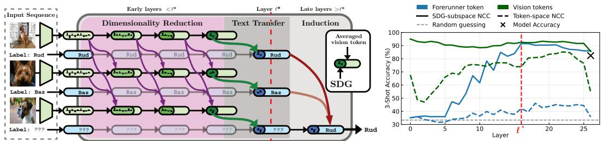

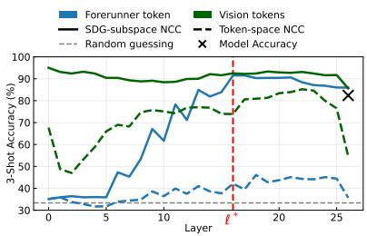  
Figure 1: Left (our contribution): The first layers of the LVLM reduce the dimension of image tokens in-context using sample-to-sample comparisons. These representations are transferred to text and later used for in-context learning. Right: Nearest Centroid Classifier (NCC) accuracy across layers forforerunner tokensandvision tokensafter and before projecting onto theText SDGand Vision SDG, respectively.

Our contributions can be summarized as: (I) We introduce a meta-training protocol that uncovers a Shared Discriminative Geometry in text token representations. It is a low-dimensional space shared across image classification tasks in which classes are linearly separable. The model uses this geometry to make predictions. (II) We show theoretically that non-causal linear transformers can perform a dimensionality reduction through in-context sample-to-sample attention. (III) We observe a dimensionality reduction of vision token representations in LVLMs and provide empirical evidence that it relies on a circuit similar to our theoretical construction.

## 2 RELATED WORK

LLMs ICL Mechanistic Interpretability. Mechanistic Interpretability aims to find an algorithmic description and circuits that describe the complex capabilities of models. In-context Classification has been a common test bed for studying ICL mechanisms. For text classification, prior work has identified two independent circuits (Cho et al., 2025a; Wang et al., 2023; Yang et al., 2025b) distributed in the early and the later layers of the transformer. In early layers, the last token of each in-context example aggregates information into a linearly separable representation. In later layers, the induction circuit uses induction heads (Olsson et al., 2022) that exploit these representations to infer the query class label from similar support examples. Little work has focused on the mechanism by which those high-quality representations are formed.

LLMs Subspaces. Previous work has identified specific subspaces within LLMs. Hu et al. (2025) found a 4D subspace tracking the unit digit through trigonometric functions. Engels et al. (2025) found a 2D subspace characterizing weekday, month, and year. Wollschläger et al. (2025) found up to 5D subspaces characterizing refusal behavior across several LLM families. Recently, Huang & Hahn (2026) proposed a method to learn subspaces in an unsupervised manner. We uniquely study in LVLMs a subspace tied to the vision modality. Unlike prior fixed semantic subspaces, SDG occupies a fixed subspace, yet we show that its inner geometry is context dependent.

Transformers ICL Theory. Prior work has shown that linear transformers can implement algorithms in-context such as linear regression (Von Oswald et al., 2023; Ahn et al., 2023), expectation maximization (Chen et al., 2026) and reinforcement-learning algorithms (Lin et al., 2024). To our knowledge, we show for the first time that linear transformers can also perform dimensionality reduction by projecting examples onto the principal components of the current context. Nonetheless, the convergence of this algorithm has been studied previously (Chi et al., 2019).

## 3 PRELIMINARIES

## 3.1 EXPERIMENT SETTING

Datasets. We use 10 standard publicly available image classification datasets across a diverse range of domains: EuroSAT (Helber et al., 2019), UCF101 (Soomro et al., 2012), DTD (Cimpoi et al., 2014), Caltech101 (Fei-Fei et al., 2004), SUN397 (Xiao et al., 2010), OxfordPets (Parkhi et al., 2012), StanfordCars (Krause et al., 2013), Flowers102 (Nilsback & Zisserman, 2008), Food101 (Bossard et al., 2014), and FGVCAircraft (Maji et al., 2013). The last 5 are fine-grained image classification datasets. The expressivity of the vision modality helps us probe LVLM mechanisms shared across classification tasks for two reasons. First, working with images allows us to sample diverse classification tasks from \~ 2000 fine-grained classes. This is significantly harder to achieve with the less diverse set of classification tasks in text. Second, text offers a less diverse set of inputs due to its discrete nature compared to vision.

Task. We consider in-context K-way N-shot few-shot classification where the LVLM is given $M : = N K + 1$ images $\{ \mathrm { i m g } _ { i } \} _ { i = 1 } ^ { M }$ . Only the first NK images are labeled $\mathbf { c } = \{ c _ { i } \} _ { i = 1 } ^ { N K }$ , with N examples for each of the K classes $c _ { i } \in \{ 1 , \ldots , K \}$ , while ${ \mathrm { i m g } } _ { M }$ is the unlabeled query image. LVLMs are composed of a vision encoder, and an LLM decoder transformer. The LLM decoder takes as input a sequence of interleaved vision and text tokens. Text tokens are deduced from the embedding vocabulary $f _ { t } ,$ whereas vision tokens are outputs of the vision encoder given an image fv (img). We build the ICL classification task as the following token sequence:

$$
\begin{array} { r l } & { S _ { i } = \Big [ f _ { t } ( \mathbf { \ " } { \sim } \mathrm { i n a g e : } ^ { \mathbf { n } } ) , ~ f _ { v } ( \mathrm { i m } \mathbf { g } _ { i } ) , f _ { t } ( \mathbf { \ " } { \sim } \mathrm { 1 a b e l : } ^ { \mathbf { n } } ) , f _ { t } ( y _ { c _ { i } } ) \Big ] , \quad i = 1 , \dots , N K } \\ & { } \\ & { Q = \Big [ f _ { t } ( \mathbf { \ " } { \sim } \mathrm { i n a g e : } ^ { \mathbf { n } } ) , f _ { v } ( \mathrm { i m } \mathbf { g } _ { M } ) , f _ { t } ( \mathbf { \ " } { \sim } \mathrm { 1 a b e l : } ^ { \mathbf { n } } ) \Big ] , \mathcal { T } = \Big [ S _ { 1 } , \dots , S _ { N K } , Q \Big ] , } \end{array}\tag{1}
$$

where [·] denotes token concatenation, and $y _ { c _ { i } }$ denotes the text associated with class label $c _ { i } . \ S _ { i }$ denotes the i-th support example, Q the query example without its label, and T the full in-context sequence. For each task, we randomly select one of the ten datasets and sample a 3-way, 3-shot classification task from it. Thus, 10 images are given to the LVLM for each task. Label tokens are abstract and semantically unaligned with the visual classes. Following Confavreux et al. (2026) we use $" \mathrm { \_ R u d " , ~ } " \mathrm { \_ B a z " }$ and $" _ { - } \mathrm { G i p } "$ Given that multimodal ICL has been shown to rely strongly on textual inputs over visual inputs (Chen et al., 2025; Deng et al., 2025), using abstract labels removes the influence of label semantics from the learning dynamics. Indeed, this forces the model to classify the query image using the support set without “zero-shotting" the class from memory. See supplementary material A.1 for more experiments on the impact of the choice of label space.

We refer to the forerunner token as the token $" : "$ placed after "1 abe1 " and responsible for predicting the class label token; it is therefore responsible for the image classification task. Throughout this work we will probe vision and forerunner representations across layers. Thus, we denote the forerunner token hidden state for image i at layer l output by $h _ { i , \ell } \in \mathbb { R } ^ { D }$ and the average-pooled vision token hidden state by $v _ { i , \ell } \in \mathbb { R } ^ { D }$ , where D is the LVLM hidden-state dimension. We also include the input to the first layer, denoted by $\ell = 0$ by convention. In the absence of a dedicated aggregation mechanism, such as a CLS token (Dosovitskiy et al., 2020) or a trained pooling (Lee et al., 2019; He et al., 2022), we average-pool vision tokens to obtain image representations (Tian et al., 2020). Note that this is just a proxy of vision token representations, for example the token from the center of the object classifies better than tokens on the background.

Models. All results in the paper are shown using Ministral 3 (3B) as its architecture does not use linear attention or local attention, simplifying the analysis. Additional results for Qwen 3.5 (4B and 9B) (Qwen Team, 2026), Qwen 3 (4B) (Yang et al., 2025a) and Ministral 3 (8B) are provided in the supplementary material E.

Following the formulation of Elhage et al. (2021), an attention head is parameterized by query, key, value, and output projections $W _ { Q } , W _ { K } , W _ { V } , W _ { O }$ . Let $R = [ r _ { 1 } , \ldots , r _ { n } ]$ be its input states, the head contribution to the update of the token $r _ { n }$ is

$$
\Delta r _ { n } = W _ { \mathrm { O V } } R \mathrm { \ s o f t m a x } \left( \frac { R ^ { \top } W _ { \mathrm { K Q } } r _ { n } } { \sqrt { d _ { h } } } \right) , \qquad W _ { \mathrm { K Q } } : = W _ { K } ^ { \top } W _ { Q } , \quad W _ { \mathrm { O V } } : = W _ { O } W _ { V } .\tag{2}
$$

The KQ circuit $r _ { i } ^ { \top } W _ { \mathrm { K Q } } r _ { n } = \left( W _ { K } r _ { i } \right) ^ { \top } ( W _ { Q } r _ { n } )$ determines the attention score of each input to the query token. This score is a bilinear similarity, meaning that it is linear in either token representation when the other is fixed. The OV circuit maps via $W _ { \mathrm { O V } }$ each input token to its contribution to $r _ { n }$

## 3.2 MOTIVATION

In this section we motivate our work by the following observation: Raw representations of the forerunner token, which predicts the class label, are not class linear separable, whereas visiontoken representations are. Throughout this study, we will use the Nearest Centroid Classifier (NCC) accuracy as a proxy to assess class linear separability, or more broadly speaking “feature quality". This is similar to the standard practice of using linear probing classification accuracy as a proxy for feature quality of foundation models (Chen et al., 2020; Oquab et al., 2023; Wang & Isola, 2020). NCC measures class separability of a representation space by testing whether examples of the same class cluster around a common direction in the representation space. It is a classical fewshot classifier (Snell et al., 2017; Hu et al., 2022; Li et al., 2021) that can be seen as a simple form of in-context learning. Given an in-context feature matrix $X = [ x _ { 1 } , \dots , x _ { N K } , x _ { M } ] \in \mathbb { R } ^ { D \times ( N K + 1 ) }$ and the labels c of the first N K examples, the NCC predicts the label of the query $x _ { M }$ as

$$
\operatorname { N C C } _ { \mathrm { p r e d } } ( X , \mathbf { c } ) = \arg \operatorname* { m a x } _ { k \in \{ 1 , \ldots , K \} } x _ { M } ^ { \top } \mu _ { k } , \qquad \mu _ { k } = \frac { 1 } { N } \sum _ { i : c _ { i } = k } x _ { i } .\tag{3}
$$

As commonly done with NCC, we use the dot product as the similarity function. Note this corresponds to a bilinear similarity in the full representation space $x _ { M } ^ { \top } I _ { D } \mu _ { k } \overset { \cdot } { = } x _ { M } ^ { \top } \mu _ { k }$ . Unless specified otherwise, reported accuracies are averages over 1000 tasks for the 3-shot in-context settings.

Figure 1 (Right) shows the LVLM accuracy (cross ×), as well as the NCC accuracy (dotted lines) of forerunner tokens $h _ { i , \ell }$ andvision tokens $v _ { i , \ell }$ across LLM decoder layers. Vision token NCC accuracy is comparable to model accuracy across most layers. However, we observe that the forerunner token is significantly less class discriminative, with an accuracy close to random guessing. This is surprising, since the forerunner token is expected to aggregate visual information to correctly classify the query image (Cho et al., 2025a). This indicates that either information is not transferred to the forerunner token or that it is only present in a small subspace of its high-dimensional embedding.

## 4 SHARED DISCRIMINATIVE GEOMETRY

In this section, we show the existence of a Shared Discriminative Geometry in both the text forerunner token (Text SDG) and vision tokens (Vision SDG), in which image classes are linearly separable. Then, we show that the Text SDG mechanistically contributes to the model's in-context performance. Finally, we identify a two-step circuit describing the formation of the Text SDG.

## 4.1 LEARNING THE SHARED DISCRIMINATIVE GEOMETRY

In order to probe discriminative representations within the forerunner token, in this section we introduce a protocol to learn theText SDG(see Fig. 2), which is a set of linear downprojections $\{ \Phi _ { \ell } \} _ { 0 , \dots , L }$ for each output layer of the LVLM. Each $\Phi _ { \ell }$ projects the forerunner token into a subspace $\Phi _ { \ell } : \mathbb { R } ^ { D }  \mathbb { R } ^ { D _ { \downarrow } }$ where the dot product is class discriminative between the support examples. For Ministral 3B $D = 3 0 7 2$ and $D _ { \downarrow } = 1 2 8$ . We freeze the LVLM as only the projections $\Phi _ { \ell }$ are learned. We refer to SDG as a geometry because each $\Phi _ { \ell }$ defines a bilinear similarity $h _ { i , \ell } ^ { \mathrm { ~ \top ~ } } \Phi _ { \ell } ^ { \mathrm { ^ T ~ } } \Phi _ { \ell } h _ { j , \ell }$ which measures similarity between forerunner

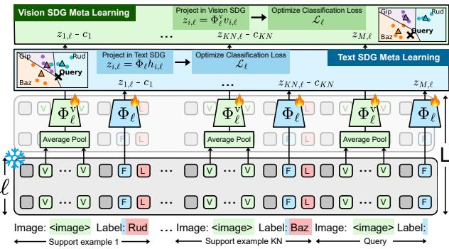  
Figure 2: Training setup. At each layer, we meta-learn the Text SDGprojection $\Phi _ { \ell }$ andVision SDGprojection $\Phi _ { \rho } ^ { \mathrm { v } }$ so that projected embeddings from the same class cluster around a common direction.

token representations at layer l. During training, we first project forerunner tokens $h _ { i , \ell }$ onto the SDG $z _ { i , \ell } = \Phi _ { \ell } h _ { i , \ell } .$ Then, for each in-context classification task, we compute one centroid per class and define the per-layer meta-training loss as

$$
\mu _ { k , \ell } = \frac { 1 } { N } \sum _ { i : c _ { i } = k } z _ { i , \ell } , \qquad \mathcal { L } _ { \ell } = \sum _ { k = 1 } ^ { K } \left( z _ { M , \ell } ^ { \top } \mu _ { k , \ell } - \mathbb { 1 } [ c _ { M } = k ] \right) ^ { 2 } ,\tag{4}
$$

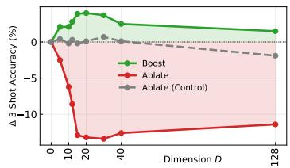

<table><tr><td>Intervention</td><td>1-shot</td><td>2-shot</td><td>3-shot</td><td>4-shot</td><td>5-shot</td></tr><tr><td>LVLM Accuracy</td><td>34.4%</td><td>77.2%</td><td>82.4%</td><td>84.2%</td><td>85.4%</td></tr><tr><td>128D-Control Ablation</td><td>-0.4</td><td>-1.2</td><td>-1.9</td><td>-2.5</td><td>-2.2</td></tr><tr><td>15D-SDG Ablation</td><td>-7.1</td><td>-10.8</td><td>-12.9</td><td>-12.0</td><td>-10.6</td></tr><tr><td>15D-SDG Boost</td><td>+7.5</td><td>+4.7</td><td>+3.9</td><td>+3.0</td><td>+2.9</td></tr></table>

Figure 3: Left: Effect of SDG intervention as a function of the number of top dimensions D ablated. Right: Effect of interventions on the top 15 SDG dimensions across shot counts.

where 1 denotes the indicator function. The loss trains $\Phi _ { \ell }$ to align the projected query with the centroid of its class (dot product $\sim 1 )$ while making it orthogonal to the centroids of other classes (dot product $\sim 0 )$ . Importantly, the forerunner token cannot carry information about its current support label thanks to the causal nature of LLMs. Indeed, the label token is placed after the forerunner token, ensuring no leakage of the correct label into the representations. We train for 32k tasks with a batch size of 32 using AdamW, a learning rate of 0.001, and a weight decay of 0.001. Weight decay is necessary to stabilize training by suppressing directions that carry no discriminative signal or are never activated by the training data. In order to better trace the formation of the Text SDG, using the same protocol we also learn theVision SDG $\{ \Phi _ { \ell } ^ { \mathrm { v } } \} _ { 0 , \ldots , L } .$ Similarly, each $\Phi _ { \ell } ^ { \mathrm { v } }$ projects the averagepooled vision token $v _ { i , \ell }$ into a subspace where the dot product is class discriminative between the support images (see Fig. 2).

Results. The NCC accuracy of the forerunner token after projecting onto theText SDGacross layers is shown in Fig. 1 (Right, solid line). The accuracy starts rising at layer 6 and peaks at layer $\ell ^ { * } = 1 6 .$ Here, we denote the layer of peak accuracy by $\ell ^ { * } .$ At $\ell ^ { * }$ the accuracy even surpasses the model performance. This finding is consistent with prior work identifying the induction circuit in late layers as a bottleneck to model performance (Cho et al., 2025b) and showing that internal representations can surpass the model performance (de Senneville et al., 2026). We train $\Phi _ { \ell }$ to down-project onto $\mathbb { R } ^ { 1 2 8 }$ which is the dimensionality of the representation processed by attention heads. However, we find that its effective dimension is $\sim 1 0 \mathrm { a t } \ell ^ { \ast }$ (estimated with the participation ratio; Gao et al. (2017)). This measure quantifies the effective number of directions contributing to the pairwise similarities induced by $\Phi _ { \ell } ^ { * }$ . For comparison, the average effective dimension of the model's attention heads is $\sim 9 0$ out of a maximum of 128. While the effective dimensionality of $\Phi _ { \ell }$ is a proxy and may vary with the training setup (see supplementary material B.2 and B.3), it is striking that we can identify a fixed 10-dimensional subspace in which representations still achieve 90% accuracy across 10 domain-specific datasets.

Ablation. Next, we ablate theText SDGat layer $\ell ^ { * }$ to test if it mechanistically contributes to the LVLM's ability to classify images. Let $V _ { k }$ contain the top-k right singular vectors of $\Phi _ { \ell ^ { * } }$ For all hidden states at $\ell ^ { * }$ output, we remove the top-k Text SDG dimensions by projecting onto their orthogonal complement giving $\tilde { \mathbf { h } } _ { \ell ^ { * } } ~ = ~ ( I - V _ { k } V _ { k } ^ { \top } ) \mathbf { h } _ { \ell ^ { * } }$ As a control, we do the same for a 128-dimensional random subspace. We also try boosting the top-k SDG dimensions at $\ell ^ { * } \colon$ $\tilde { \mathbf { h } } _ { \ell ^ { * } } = ( I + V _ { k } V _ { k } ^ { \top } ) \mathbf { h } _ { \ell ^ { * } }$ . This operation essentially doubles the magnitude of the SDG and should directly increase the image-to-image comparison signal used for classification. As shown in Fig. 3 (left), only 15 dimensions capture most of the ablation effect. Ablating the top 15 dimensions of the SDG decreases model accuracy by 12.9%, boosting them increases accuracy by 3.9%, whereas ablating a random subspace has a negligible effect. This is consistent with our observation that the geometry lies in a few dimensions, although completely eliminating its contribution to classification requires ablating 5 additional dimensions. In this paper, we retain effective dimensionality as our measure of the SDG dimensionality because it can be computed at every layer and measures a property of its geometry. Additional results from 1 to 5 shots for the 15-dimensional SDG ablation and the 128-dimensional control random-subspace are shown in the right panel of Fig. 3. This shows that SDG is low-dimensional and is necessary to the model's ability to classify images in-context. More ablations are provided in supplementary material D.1.

## 4.2 TEXT SDG FORMATION AS A TWO-STEP PROCESS

In this section, we provide empirical evidence that this low-dimensionality is the result of the LVLM performing a two-step circuit: first the model reduces the dimensionality of vision tokens in the

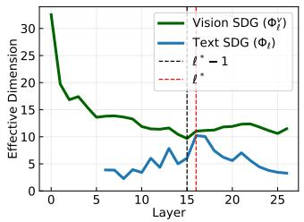

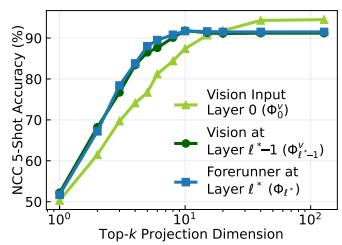

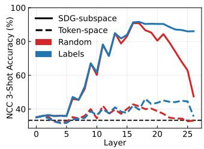  
Figure 4: Left: Effective Dimension across layers of the $\Phi _ { \ell }$ (Text SDG) and $\Phi _ { \ell } ^ { \mathrm { v } }$ (Vision SDG). Middle: NCC Accuracy in the top-k SDG dimensions of the input vision tokens, the vision tokens at layer $\ell ^ { * } { - 1 }$ and forerunner token at $\ell ^ { * }$ . Right: Text SDG with and without random label assignment.

Vision SDGfrom layer 1 to $\ell ^ { * } - 1$ , then the model transfers the resulting geometry to theText SDG in the forerunner token at layer $\ell ^ { * }$

Step 1: Reducing dimensionality in vision tokens from layer 1 to $\ell ^ { * } - 1$ Figure 4 (Left) reports the effective dimension of both the Vision and Text SDG across layers. The Vision SDG decreases from 32 dimensions for the input vision tokens to a minimum of 10 at layer $\ell ^ { * } - 1$ while preserving similar accuracy. To investigate this further, we test whether vision tokens at layer $\ell ^ { * } { - 1 }$ concentrate class-discriminative information into fewer dimensions than the vision tokens output by the vision encoder. In Fig. 4 (Middle), we report NCC accuracy for the input vision tokens and the vision tokens at layer $\bar { \ell } ^ { * } - 1$ after projecting them onto the top k dimensions of $\Phi _ { 0 } ^ { \mathrm { v } }$ and $\Phi _ { \ell ^ { * } - 1 } ^ { \mathrm { v } }$ , respectively. We observe that the low dimensional projections are more class discriminative at layer $\ell ^ { * } - 1$ in vision tokens than in input vision tokens. At the same time the full space accuracy is not higher at layer $\ell ^ { * } { - 1 }$ . Interestingly the top 10 dimensions at layer $\ell ^ { * } { - 1 }$ have $29 \%$ error reduction compared to input vision representations (+4 accuracy points). Put differently at layer $\ell ^ { * } - 1$ vision tokens have a 90% accuracy using $\sim 2$ times less dimensions.

<table><tr><td>Ablation effect (3-shot)</td><td> $\Delta \%$ </td></tr><tr><td>(1) 128D- Text SDG at  $\ell ^ { * } - 1$  (2) 128D- - Vision SDG at  $\ell ^ { * } - 1$ </td><td rowspan="3">-3.2 -6.4 -5.2</td></tr><tr><td>(3) Attention from vision at</td></tr><tr><td> $\ell ^ { * } - 1$  to text at  $\ell ^ { * }$  - Text SDG at  $\ell ^ { * }$ </td></tr></table>

Table 1: Ablations from $\ell ^ { * } - 1$ to $\ell ^ { * }$

Step 2: Transfer to text from $\ell ^ { * } { - 1 }$ to $\ell ^ { * }$ . Figure 4 (Middle) shows the NCC accuracy for the forerunner token at layer $\ell ^ { * }$ after projecting it onto the top k dimensions of $\Phi _ { \ell ^ { * } }$ . It shows that the forerunner token at layer $\ell ^ { * }$ closely matches the feature quality of the average-pooled vision token at the previous layer $\ell ^ { * } { - 1 }$ . In Fig. 4 (Left), similarly the effective dimension of $\Phi _ { \ell ^ { * } }$ matches the one of $\Phi _ { \ell ^ { * } - 1 } ^ { \mathrm { v } }$ . This suggests that most of the vision representations are transferred to the forerunner token between layer $\ell ^ { * } - 1$ and $\ell ^ { * }$ To test this, we separately ablate (1) Text SDG at $\ell ^ { * } - 1 , ( 2 )$

Vision SDG at $\ell ^ { * } - 1$ and (3) attention from vision tokens at $\ell ^ { * } - 1$ to text tokens at $\ell ^ { * }$ , see Table 1. Ablating the Vision SDG at $\ell ^ { * } - 1$ reduces accuracy twice as much as ablating the Text SDG at the same layer (6.4 vs. 3.2 points). Ablating attention from vision tokens at $\ell ^ { * } { - 1 }$ to the forerunner token at $\ell ^ { * }$ causes a similar drop (5.2 points), suggesting that this attention transfers class-discriminative information from the Vision SDG at $\ell ^ { * } - 1$ to text tokens at $\ell ^ { * }$ . Additional experiments in the supplementary material D.2 examine this vision-to-text transfer in detail. Specifically, we observe that heads performing this operation copy class-discriminative representations from specific vision tokens called sink tokens (Kang et al., 2025).

## 5 WHY THE SDG IS SO LOW-DIMENSIONAL

## 5.1 EXPLAINING WHAT DRIVES IN-CONTEXT DIMENSIONALITY REDUCTION

In-Context Labels Do Not Drive Dimensionality Reduction. A possible explanation is that the Text SDG formation is driven by induction or supervision: the model may use preceding support labels to progressively compare in-context examples and optimally compress them in a class discriminative geometry. To test this hypothesis we learn Text SDG with and without assigning random label tokens to images. Figure 4 (Right) shows that random label assignment has close to no effect during the formation phase of Text SDG on its accuracy and on its peak accuracy. The formation circuit therefore extracts the same class-discriminative visual features regardless of label assignment of precedent support examples. It is important to note that this is not the case after Text SDG formation, where accuracy is higher with correct label assignments than with random label assignments, as shown in Fig. 4 (Right). The well studied induction circuit (Olsson et al., 2022) uses image-label assignment to compress input examples in a class-discriminative lower dimensional space. Indeed, after induction, at the final layer, the model accuracy is the accuracy of the forerunner token in a 3-dimensional space. This space is spanned by the unembedding directions of the 3 possible labels: "Rud", "Baz"and $" \mathrm { G i p } "$

Preserving the In-Context Gram Matrix Can Drive Dimensionality Reduction. Since Text SDG formation is independent of support-label assignments, it is impressive that the model performs well classifying planes, satellite images or even textures by building an intermediary image representation in such a small shared dimensional space. However, we make two observations. (1) For a given classification task, the model receives a fixed context of M images, whose high-dimensional representations we collect as $X \in \mathbb { R } ^ { D \times M }$ . We assume that rank $\bar { ( X ) } ^ { - } = M$ . (2) Although the examples are represented in a D-dimensional space, NCC classifies the query using only similarities to the support examples. The classification score for class k in Eq. (3) is the average similarity to support of class k

$$
x _ { M } ^ { \top } \mu _ { k } = \frac { 1 } { N } \sum _ { i : c _ { i } = k } x _ { M } ^ { \top } x _ { i } = \frac { 1 } { N } \sum _ { i : c _ { i } = k } ( X ^ { \top } X ) _ { M , i } ,\tag{5}
$$

and therefore depends only on the Gram matrix $X ^ { \top } X$ or equivalently on sample-to-sample similarity. Thus, for a fixed context, there exists a low-dimensional $Z \in \dot { \mathbb { R } } ^ { D _ { \downarrow } \times M }$ with $M \leq \bar { D } _ { \downarrow } \ll D$ such that $Z ^ { \top } Z = X ^ { \top } X$ in which NCC accuracy is unchanged. All solutions are orthonormal arrangements of the principal components of X: $\bar { Z } = Q U ^ { \top } \bar { X } ( Q \in \mathbb { R } ^ { D _ { \downarrow } \times M } , Q ^ { \top } Q = I _ { M } )$ , where U contains the M principal directions of $X$ These principal directions are determined using (uncentred) principal component analysis (PCA), with $\dot { \boldsymbol { X } } \boldsymbol { X } ^ { \top ^ { \bot } } = \boldsymbol { U } \boldsymbol { \Lambda } \boldsymbol { U } ^ { \top }$ . This observation raises the following questions: Can transformers reduce the dimensionality of in-context high dimensional inputs while preserving their pairwise similarities? If yes, do we observe a similar circuit in LVLMs?

## 5.2 DIMENSIONALITY REDUCTION THROUGH SELF-ATTENTION

In this section, we show that in a simplified setting, transformer layers can perform dimensionality reduction via sample-to-sample attention.

In-context setup. Given M in-context examples $x _ { i } \in \mathbb { R } ^ { D _ { \uparrow } }$ in a high dimensional space, we associate each token with a compressed state $\bar { z _ { i , \ell } } \in \mathbb { R } ^ { D _ { \downarrow } }$ , where $D _ { \downarrow } \ll D _ { \uparrow }$ . We define the context matrix at layer l as

$$
C _ { \ell } = \binom { x _ { 1 } } { z _ { 1 , \ell } } \quad \cdots \quad x _ { M , \ell } \biggr ) \in \mathbb { R } ^ { ( D _ { \uparrow } + D _ { \downarrow } ) \times M } .\tag{6}
$$

The upper block $X \in \mathbb { R } ^ { D _ { \uparrow } \times M }$ stores the fixed high-dimensional in-context input tokens, while the lower block $Z _ { \ell } \in \mathbb { R } ^ { D _ { \downarrow } \times M }$ stores the compressed variables updated by the attention layers. Note that $Z _ { \ell }$ is in this simplified setup tied to a canonical basis $( e _ { D _ { \uparrow } + 1 } , \dots , e _ { D _ { \uparrow } + D _ { \downarrow } } )$ meaning $\Phi _ { \ell } = ( 0 I _ { D _ { \perp } } )$ . However the model can represent the compressed in-context examples in any $D _ { \downarrow } .$ dimensional orthonormal basis. In the real model, this basis may even partially overlap with the subspace carrying X. Importantly, $Z _ { \ell }$ is expressed in a fixed basis making it shared across tasks while the main direction of X may vary from a task to another. The geometries of the original and compressed representations are encoded by the Gram matrices $X ^ { \top } \bar { X }$ and $Z ^ { \top } Z .$ , and the objective is to make the compressed Gram matrix match the original one. This is equivalent to minimizing

$$
{ \mathcal { E } } ( Z ) = { \frac { 1 } { 4 } } \left\| Z ^ { \top } Z - X ^ { \top } X \right\| _ { F } ^ { 2 } , \qquad { \mathrm { w h e r e } } \qquad \nabla _ { Z } { \mathcal { E } } = Z \left( Z ^ { \top } Z - X ^ { \top } X \right) .\tag{7}
$$

Assumptions. 1. Non-causal attention. Here, we assume that each token can attend to every other token. This is the strongest assumption, as most LVLMs are causal. This means that the first example cannot modify its state given the context as it does not have access to the other tokens, making the process less efficient. 2. Linear self-attention. Following the standard linear self-attention (Ahn et al., 2024; Von Oswald et al., 2023), we remove the softmax, as well as the normalization and write

$$
\mathrm { L S A } ( C _ { \ell } ) = C _ { \ell } + W _ { O V } C _ { \ell } C _ { \ell } ^ { \top } W _ { K Q } C _ { \ell } = C _ { \ell + 1 } .\tag{8}
$$

Optimization. Under these assumptions, choosing

$$
W _ { K Q } = \left( \begin{array} { c c } { { I _ { D _ { \uparrow } } } } & { { 0 } } \\ { { 0 } } & { { - I _ { D _ { \downarrow } } } } \end{array} \right) \qquad \mathrm { { a n d } } \qquad W _ { O V } = \eta \left( \begin{array} { c c } { { 0 } } & { { 0 } } \\ { { 0 } } & { { I _ { D _ { \downarrow } } } } \end{array} \right) ,\tag{9}
$$

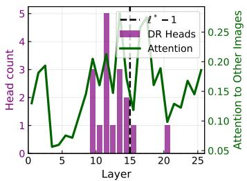

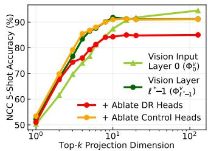

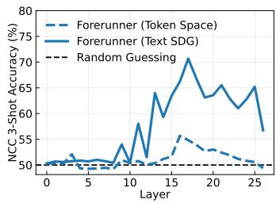  
Figure 5: Left: Number of Dimensionality Reduction Heads (DR Heads) across layers, as well as the average attention to other images in-context. Middle: NCC Accuracy in the top-k SDG dimensions after ablating DR Heads attention. Right: Forerunner NCC accuracy on SST-2.

the lower block of $\mathrm { L S A } ( C _ { \ell } )$ is equivalent to a gradient step toward minimizing $\mathcal { E }$

$$
\begin{array} { r } { Z _ { \ell + 1 } = Z _ { \ell } + \eta Z _ { \ell } ( X ^ { \top } X - Z _ { \ell } ^ { \top } Z _ { \ell } ) = Z _ { \ell } - \eta \nabla _ { Z } \mathcal { E } ( Z _ { \ell } ) } \end{array}\tag{10}
$$

with $\eta$ the learning rate. This is similar to prior work showing that linear attention can implement a single gradient-descent step toward solving linear regression (Ahn et al., 2023). Therefore, converging to the solution requires multiple layers.

Convergence. Let $\lambda _ { 1 } \geq \cdots \geq \lambda _ { M } > 0$ denote the eigenvalues of $X ^ { \top } X$ . To obtain an explicit convergence bound, we assume

$$
\mathrm { r a n k } ( Z _ { 0 } ) = M \qquad \mathrm { a n d } \qquad 0 < \eta < { \frac { 1 } { 4 \left( \lambda _ { 1 } + \left\| Z _ { 0 } ^ { \top } Z _ { 0 } - X ^ { \top } X \right\| _ { F } \right) } } .\tag{11}
$$

A standard transformer can realize $Z _ { 0 }$ initialization through positional embeddings assigning linearly independent compressed states to the M in-context examples, or simply by starting with a random subspace of $X .$ Additionally $\eta$ must be small enough. Under those assumptions, the linear self-attention dynamics converge locally at an exponential rate:

$$
\mathcal { E } ( Z _ { \ell } ) = O ( \exp ( - 4 \eta \lambda _ { M } \ell ) ) .\tag{12}
$$

We provide the convergence proof, empirically validate the result and include the effect of each assumption, in the supplementary material C.1 and C.2. Overall, under our idealized assumptions, linear self-attention can compress M input representations from $D _ { \uparrow }$ to $D _ { \downarrow }$ dimensions, where the sample-to-sample similarity error converges locally to zero at an exponential rate.

## 5.3 EVIDENCE OF A SIMILAR MECHANISM IN LVLMS

We first aim to select heads that might implement the dimensionality reduction, focusing on the OV circuit in Eq. (9). For that, we first introduce the Bilinear Distortion Error (BDE) as

$$
\mathrm { B D E } ( S , S ^ { \prime } ) : = \frac { 1 } { 2 } \mathbb { E } _ { x , y ^ { \downarrow , \downarrow , \downarrow } \sim \mathcal { N } ( 0 , I _ { D } ) } \left[ \left( x ^ { \top } S y - x ^ { \top } S ^ { \prime } y \right) ^ { 2 } \right] = \frac { 1 } { 2 } \| S - S ^ { \prime } \| _ { F } ^ { 2 } .\tag{13}
$$

The BDE tests whether two geometries $S$ and $S ^ { \prime }$ are the same by measuring whether they induce the same bilinear similarity for pairs of independently sampled inputs. Thanks to the assumption that $x$ and $y$ follow standard Gaussian distributions, we can compute the error offline using only the two similarity matrices. Also we normalize each matrix $S$ to get a score bounded between 0 and 1. A score of zero means that the two normalized geometries induce identical dot products. Now, if we hypothesize that the learnedVision SDGdescribes the $Z$ subspace, a dimensionality reduction head should map $\Phi _ { \ell } ^ { \mathrm { v } }$ via $W _ { O V }$ to $\Phi _ { \ell + 1 } ^ { \mathrm { v } }$ . Thus, we define a score sov that measures the expected error between the bilinear similarity of the output Vision SDG $\Phi _ { \ell + 1 } ^ { \mathrm { v } }$ and the bilinear similarity of the input Vision SDG Φγ after being transported through $W _ { O V }$ giving $s _ { O V } = \mathrm { B D E } \Big ( \Phi _ { \ell + 1 } ^ { \mathrm { v } \top } \Phi _ { \ell + 1 } ^ { \mathrm { v } } , \left( \Phi _ { \ell } ^ { \mathrm { v } } W _ { O V } ^ { \top } \right) ^ { \top } \left( \Phi _ { \ell } ^ { \mathrm { v } } W _ { O V } ^ { \top } \right) \Big )$ . For the theoretical circuit in Eq. (10), $s _ { O V } = 0$ , as $\Phi _ { \ell } = ( 0 I _ { D _ { \perp } } )$ . We classify the 2% of heads with the lowest scores as dimensionality reduction heads. See Section D.4 for additional analysis of dimensionality reduction heads and the choice of the score $s _ { O V }$

Fig. 5 (Left) shows that dimensionality reduction heads concentrate before $\ell ^ { * } - 1$ . Notably, a high number of dimensionality reduction heads correlate with a high amount of attention to the other incontext images, although attention patterns are not part of the selection criterion. This is consistent with our theoretical circuit which reduces dimensionality through comparisons between in-context examples. Next, we ablate attention from vision tokens to vision tokens in other in-context images for the dimensionality reduction heads. For a fair comparison, we re-learn the Vision SDG with this attention ablated. In addition, as a control, we do the same to an equal number of randomly selected heads before l\* —1. In Fig. 5 (Middle), we no longer observe the NCC accuracy boost in 10 dimensions when this attention is ablated. Thus, ablating only attention from vision tokens to vision tokens in other in-context images, for just 2% of the heads which match our theoretical OV circuits, impairs the dimensionality reduction. This hints at the fact that LVLMs implement a circuit similar to our theoretical circuit. Also, prior work observed empirically that sample-to-sample attention was beneficial to model performance which they call contextualization (Bakalova et al., 2025). Our results show dimensionality reduction as one mechanism explaining contextualization.

<table><tr><td rowspan="2"></td><td colspan="3">Classification</td><td colspan="3">Matching</td></tr><tr><td></td><td></td><td></td><td>|Open MI VLGuard VizWiz| Matching MI SugarCrepe MHaluBench NaturalBench</td><td></td><td></td></tr><tr><td>Baseline</td><td>|84.0</td><td>63.0</td><td>72.0</td><td>|81.0</td><td>75.0</td><td>61.0</td></tr><tr><td>128D-SDG Ablation</td><td>-11.0</td><td>-17.0</td><td>-4.0</td><td>+6.5</td><td>+3.0</td><td>-2.0</td></tr><tr><td>128D-SDG Boost</td><td>+11.5</td><td>+6.0</td><td>+1.5</td><td>-4.0</td><td>-5.5</td><td>-1.0</td></tr></table>

Table 2: Impact of the Text SDG ablation and boost on multimodal benchmarks in the 2-shot setting.

## 6 SDG IN OTHER ICL TASKS

Text classification. A natural question raised by preceding observations is whether theText SDG is shared across modalities or specific to vision. To test this, we evaluate the forerunner token NCC accuracy on a binary text classification task (SST-2 (Socher et al., 2013)), using the same protocol. We replace images with sequences of text tokens. In Fig. 5 (Right), at l\*, the forerunner NCC accuracy is close to random before projection onto the Text SDG, but increases after projection. This suggests that the SDG is not tied only to the vision modality, even if it was trained only using visual inputs.

Other Multimodal Tasks. We also ask if our learnedText SDGis involved in multimodal tasks other than image classification. We ablate and boost the Text SDG at l\* as the model performs these tasks in-context. Each task is categorized either as Classification or Matching. Classification Tasks involve learning to classify ImageNet images (Open MI (Zong et al., 2025)), if an image and text user query pair is harmful or not (VLGuard (Zong et al., 2024)) and if an image and question pair is answerable (VizWiz (Gurari et al., 2018)). Matching Tasks involve learning if two images match (Matching MI (Zong et al., 2025)) and if a text description matches an image (SugarCrepe (Hsieh et al., 2023), MHaluBench (Chen et al., 2024), NaturalBench (Li et al., 2024)).

The results in Table 2 show that for classification tasks, modifying the SDG has the same effect as in the image classification setup, meaning the SDG is involved in multimodal classification tasks. For matching tasks, we observe the opposite effect: ablating the SDG improves performance. Here, support examples indicate which task to perform, while the answer depends on matching inputs within the query rather than on their visual similarity to support examples. Ablating the SDG therefore helps the model by avoiding basing its answer on visual similarity to support examples.

## 7 CONCLUSION

In summary we have shown that the formation of linear image representations cannot be reduced to a simple transfer from input vision tokens to text tokens. Remarkably, we find that across LVLM layers, the number of dimensions required to preserve linear class separability decreases. Therefore, we offer an explanation by combining a theoretical framework with empirical analysis.

Future Work. While vision makes this geometry easier to study, future work should test whether the same mechanism generalizes to LLMs and to other tasks beyond classification, and study how to learn additional geometries, and how they interact. We think that Table 2 is an interesting direction for test-time modification and monitoring of what the model learns in-context. Future work could also study our theoretical circuit in more detail.

Limitations. We show that one theoretical circuit can perform dimensionality reduction, but we do not directly identify the theoretical circuits within trained LVLMs. We only identify a similar circuit that might be more sophisticated. Because our theoretical circuit assumes linear non-causal attention, it does not explain how LVLMs approximate it. Moreover, using average pooling as an aggregation of all visual information for an image is a simplification that erases the more complex token-level interaction mechanisms.

## AI USE STATEMENT

In this work, we used generative AI tools to aid and polish writing, support retrieval and discovery of related work, assistance in interpreting results, and assist in proving mathematical claims. We have not used generative AI tools for research ideation, drafting sections of the paper, or generating synthetic datasets. Additionally, we used generative AI tools to assist with code generation, particularly for plotting and formatting, and carefully reviewed all generated code. The convergence proof in Section C.1 was developed with some AI assistance and formally verified in Lean. An author carefully checked every step and revised its presentation to improve its usefulness and clarity for future readers. We have reviewed all AI-assisted work. We take responsibility for the final content of this work, including text, claims or artifacts produced with the aid of generative AI.

## REPRODUCIBILITY STATEMENT

The code is included in the supplementary material for reproducibility and will be publicly released. Please follow the instructions in this repository to reproduce the experiments. Training details and hyperparameters are provided in Sec. B.1, numerical experiment settings in Sec. C.2, and evaluation protocols for other multimodal tasks and text classification in Sec. F. All datasets used in this work are cited and publicly available for download.

## REFERENCES

Kwangjun Ahn, Xiang Cheng, Hadi Daneshmand, and Suvrit Sra. Transformers learn to implement preconditioned gradient descent for in-context learning. Advances in Neural Information Processing Systems, 36:45614–45650, 2023.

Kwangjun Ahn, Xiang Cheng, Minhak Song, Chulhee Yun, Ali Jadbabaie, and Suvrit Sra. Linear attention is (maybe) all you need (to understand transformer optimization). In International Conference on Learning Representations, volume 2024, 2024.

Jean-Baptiste Alayrac, Jeff Donahue, Pauline Luc, Antoine Miech, Iain Barr, Yana Hasson, Karel Lenc, Arthur Mensch, Katherine Millican, Malcolm Reynolds, et al. Flamingo: a visual language model for few-shot learning. Advances in neural information processing systems, 35:23716– 23736, 2022.

I.K. Argyros. A generalization of ostrowski's theorem on fixed points. Applied Mathematics Letters, 12(6):77–79, 1999. ISSN 0893-9659.

Aleksandra Bakalova, Yana Veitsman, Xinting Huang, and Michael Hahn. Contextualize-thenaggregate: Circuits for in-context learning in gemma-2 2b. In Second Conference on Language Modeling, 2025.

Lukas Bossard, Matthieu Guillaumin, and Luc Van Gool. Food-101 – mining discriminative components with random forests. In European Conference on Computer Vision, 2014.

Tom Brown, Benjamin Mann, Nick Ryder, Melanie Subbiah, Jared D Kaplan, Prafulla Dhariwal, Arvind Neelakantan, Pranav Shyam, Girish Sastry, Amanda Askell, et al. Language models are few-shot learners. Advances in neural information processing systems, 33:1877–1901, 2020.

Shuo Chen, Zhen Han, Bailan He, Jianzhe Liu, Mark Buckley, Yao Qin, Philip Torr, Volker Tresp, and Jindong Gu. Can multimodal large language models truly perform multimodal in-context learning? In 2025 IEEE/CVF Winter Conference on Applications of Computer Vision (WACV), pp. 6000–6010. IEEE, 2025.

Ting Chen, Simon Kornblith, Mohammad Norouzi, and Geoffrey Hinton. A simple framework for contrastive learning of visual representations. In International conference on machine learning, pp. 1597–1607. PMLR, 2020.

Xiang Chen, Chenxi Wang, Yida Xue, Ningyu Zhang, Xiaoyan Yang, Qiang Li, Yue Shen, Lei Liang, Jinjie Gu, and Huajun Chen. Unified hallucination detection for multimodal large language models. In Proceedings of the 62nd Annual Meeting of the Association for Computational Linguistics (Volume 1: Long Papers), pp. 3235–3252, 2024.

Zhiheng Chen, Ruofan Wu, and Guanhua Fang. Transformers as unsupervised learning algorithms: A study on gaussian mixtures. In The Fourteenth International Conference on Learning Representations, 2026.

Yuejie Chi, Yue M. Lu, and Yuxin Chen. Nonconvex optimization meets low-rank matrix factorization: An overview. IEEE Transactions on Signal Processing, 67(20), 2019. doi: 10.1109/TSP.2019.2937282.

Hakaze Cho, Mariko Kato, Yoshihiro Sakai, and Naoya Inoue. Revisiting in-context learning inference circuit in large language models. In International Conference on Learning Representations, volume 2025, 2025a.

Hakaze Cho, Yoshihiro Sakai, Mariko Kato, Kenshiro Tanaka, Akira Ishii, and Naoya Inoue. Tokenbased decision criteria are suboptimal in in-context learning. In Proceedings of the 2025 Conference of the Nations of the Americas Chapter of the Association for Computational Linguistics: Human Language Technologies (Volume 1: Long Papers), pp. 5378–5401, 2025b.

Jiho Choi, Jaemin Kim, Sanghwan Kim, Seunghoon Hong, and Jin-Hwi Park. When sinks help or hurt: Unified framework for attention sink in large vision-language models. In European Conference on Computer Vision, pp. 148–166. Springer, 2026.

Mircea Cimpoi, Subhransu Maji, Iasonas Kokkinos, Sammy Mohamed, and Andrea Vedaldi. Describing textures in the wild. In Proceedings of the IEEE conference on computer vision and pattern recognition, pp. 3606–3613, 2014.

Basile Confavreux, Aaditya K Singh, Jin Hwa Lee, Amaury Sabran, and Andrew M Saxe. Comparing the learning dynamics of in-context learning and fine-tuning in language models. In The Fourteenth International Conference on Learning Representations, 2026.

Adhémar de Senneville, Xavier Bou, Jérémy Anger, Rafael Grompone, and Gabriele Facciolo. Unlocking few-shot capabilities in lvlms via prompt conditioning and head selection. arXiv preprint arXiv:2603.24181, 2026.

Ailin Deng, Tri Cao, Zhirui Chen, and Bryan Hooi. Words or vision: Do vision-language models have blind faith in text? In Proceedings of the Computer Vision and Pattern Recognition Conference, pp. 3867–3876, 2025.

Alexey Dosovitskiy, Lucas Beyer, Alexander Kolesnikov, Dirk Weissenborn, Xiaohua Zhai, Thomas Unterthiner, Mostafa Dehghani, Matthias Minderer, Georg Heigold, Sylvain Gelly, et al. An image is worth 16x16 words: Transformers for image recognition at scale. arXiv preprint arXiv:2010.11929, 2020.

Nelson Elhage, Neel Nanda, Catherine Olsson, Tom Henighan, Nicholas Joseph, Ben Mann, Amanda Askell, Yuntao Bai, Anna Chen, Tom Conerly, Nova DasSarma, Dawn Drain, Deep Ganguli, Zac Hatfield-Dodds, Danny Hernandez, Andy Jones, Jackson Kernion, Liane Lovitt, Kamal Ndousse, Dario Amodei, Tom Brown, Jack Clark, Jared Kaplan, Sam McCandlish, and Chris Olah. A mathematical framework for transformer circuits. Transformer Circuits Thread, 2021. URLhttps://transformer-circuits.pub/2021/framework/index.html.

Josh Engels, Eric Michaud, Isaac Liao, Wes Gurnee, and Max Tegmark. Not all language model features are one-dimensionally linear. In Y. Yue, A. Garg, N. Peng, F. Sha, and R. Yu (eds.), International Conference on Learning Representations, volume 2025, 2025.

Li Fei-Fei, Rob Fergus, and Pietro Perona. Learning generative visual models from few training examples: An incremental bayesian approach tested on 101 object categories. In 2004 conference on computer vision and pattern recognition workshop, pp. 178–178. IEEE, 2004.

Peiran Gao, Eric Trautmann, Byron Yu, Gopal Santhanam, Stephen Ryu, Krishna Shenoy, and Surya Ganguli. A theory of multineuronal dimensionality, dynamics and measurement. bioRxiv, pp. 214262, 2017. doi:10.1101/214262.

Danna Gurari, Qing Li, Abigale J Stangl, Anhong Guo, Chi Lin, Kristen Grauman, Jiebo Luo, and Jeffrey P Bigham. Vizwiz grand challenge: Answering visual questions from blind people. In 2018 IEEE/CVF Conference on Computer Vision and Pattern Recognition, pp. 3608–3617. IEEE, 2018.

Jun He, Richang Hong, Xueliang Liu, Mingliang Xu, and Qianru Sun. Revisiting local descriptor for improved few-shot classification. ACM Transactions on Multimedia Computing, Communications, and Applications (TOMM), 18(2s):1–23, 2022.

Patrick Helber, Benjamin Bischke, Andreas Dengel, and Damian Borth. Eurosat: A novel dataset and deep learning benchmark for land use and land cover classification. IEEE Journal of Selected Topics in Applied Earth Observations and Remote Sensing, 12(7):2217–2226, 2019.

Cheng-Yu Hsieh, Jieyu Zhang, Zixian Ma, Aniruddha Kembhavi, and Ranjay Krishna. Sugarcrepe: Fixing hackable benchmarks for vision-language compositionality. Advances in neural information processing systems, 36:31096–31116, 2023.

Shell Xu Hu, Da Li, Jan Stühmer, Minyoung Kim, and Timothy M Hospedales. Pushing the limits of simple pipelines for few-shot learning: External data and fine-tuning make a difference. In Proceedings of the IEEE/CVF conference on computer vision and pattern recognition, pp. 9068– 9077, 2022.

Xinyan Hu, Kayo Yin, Michael I Jordan, Jacob Steinhardt, and Lijie Chen. Understanding in-context learning of addition via activation subspaces. arXiv preprint arXiv:2505.05145, 2025.

Xinting Huang and Michael Hahn. Decomposing representation space into interpretable subspaces with unsupervised learning. In The Fourteenth International Conference on Learning Representations, 2026.

Seil Kang, Jinyeong Kim, Junhyeok Kim, and Seong Jae Hwang. See what you are told: Visual attention sink in large multimodal models. In International Conference on Learning Representations, volume 2025, 2025.

Jonathan Krause, Michael Stark, Jia Deng, and Li Fei-Fei. 3d object representations for fine-grained categorization. In Proceedings of the IEEE international conference on computer vision workshops, pp. 554–561, 2013.

Juho Lee, Yoonho Lee, Jungtaek Kim, Adam Kosiorek, Seungjin Choi, and Yee Whye Teh. Set transformer: A framework for attention-based permutation-invariant neural networks. In International conference on machine learning, pp. 3744–3753. PMLR, 2019.

Baiqi Li, Zhiqiu Lin, Wenxuan Peng, Jean De Dieu Nyandwi, Daniel Jiang, Zixian Ma, Simran Khanuja, Ranjay Krishna, Graham Neubig, and Deva Ramanan. Naturalbench: Evaluating visionlanguage models on natural adversarial samples. Advances in Neural Information Processing Systems, 37:17044–17068, 2024.

Wei-Hong Li, Xialei Liu, and Hakan Bilen. Universal representation learning from multiple domains for few-shot classification. In Proceedings of the IEEE/CVF international conference on computer vision, pp. 9526–9535, 2021.

Licong Lin, Yu Bai, and Song Mei. Transformers as decision makers: Provable in-context reinforcement learning via supervised pretraining. In B. Kim, Y. Yue, S. Chaudhuri, K. Fragkiadaki, M. Khan, and Y. Sun (eds.), International Conference on Learning Representations, volume 2024, 2024.

Alexander H Liu, Kartik Khandelwal, Sandeep Subramanian, Victor Jouault, Abhinav Rastogi, Adrien Sadé, Alan Jeffares, Albert Jiang, Alexandre Cahill, Alexandre Gavaudan, et al. Ministral 3. arXiv preprint arXiv:2601.08584, 2026.

Subhransu Maji, Esa Rahtu, Juho Kannala, Matthew Blaschko, and Andrea Vedaldi. Fine-grained visual classification of aircraft. arXiv preprint arXiv:1306.5151, 2013

Maria-Elena Nilsback and Andrew Zisserman. Automated flower classification over a large number of classes. In Indian Conference on Computer Vision, Graphics and Image Processing, Dec 2008.

Catherine Olsson, Nelson Elhage, Neel Nanda, Nicholas Joseph, Nova DasSarma, Tom Henighan, Ben Mann, Amanda Askell, Yuntao Bai, Anna Chen, Tom Conerly, Dawn Drain, Deep Ganguli, Zac Hatfield-Dodds, Danny Hernandez, Scott Johnston, Andy Jones, Jackson Kernion, Liane Lovitt, Kamal Ndousse, Dario Amodei, Tom Brown, Jack Clark, Jared Kaplan, Sam McCandlish, and Chris Olah. In-context learning and induction heads, 2022.

Maxime Oquab, Timothée Darcet, Théo Moutakanni, Huy Vo, Marc Szafraniec, Vasil Khalidov, Pierre Fernandez, Daniel Haziza, Francisco Massa, Alaaeldin El-Nouby, et al. Dinov2: Learning robust visual features without supervision. arXiv preprint arXiv:2304.07193, 2023.

Omkar M Parkhi, Andrea Vedaldi, Andrew Zisserman, and CV Jawahar. Cats and dogs. In 2012 IEEE conference on computer vision and pattern recognition, pp. 3498–3505. IEEE, 2012.

Qwen Team. Qwen3.5: Towards native multimodal agents, February 2026. URL ht tps : / / qwen . ai/blog?id=qwen3.5.

Jake Snell, Kevin Swersky, and Richard Zemel. Prototypical networks for few-shot learning. In I. Guyon, U. Von Luxburg, S. Bengio, H. Wallach, R. Fergus, S. Vishwanathan, and R. Garnett (eds.), Advances in Neural Information Processing Systems, volume 30. Curran Associates, Inc., 2017.

Richard Socher, Alex Perelygin, Jean Wu, Jason Chuang, Christopher D. Manning, Andrew Ng, and Christopher Potts. Recursive deep models for semantic compositionality over a sentiment treebank. In David Yarowsky, Timothy Baldwin, Anna Korhonen, Karen Livescu, and Steven Bethard (eds.), Proceedings of the 2013 Conference on Empirical Methods in Natural Language Processing, pp. 1631–1642, Seattle, Washington, USA, October 2013. Association for Computational Linguistics.

Khurram Soomro, Amir Roshan Zamir, and Mubarak Shah. Ucf101: A dataset of 101 human actions classes from videos in the wild. arXiv preprint arXiv:1212.0402, 2012.

Yonglong Tian, Yue Wang, Dilip Krishnan, Joshua B Tenenbaum, and Phillip Isola. Rethinking few-shot image classification: a good embedding is all you need? In European conference on computer vision, pp. 266–282. Springer, 2020.

Johannes Von Oswald, Eyvind Niklasson, Ettore Randazzo, João Sacramento, Alexander Mordvintsev, Andrey Zhmoginov, and Max Vladymyrov. Transformers learn in-context by gradient descent. In International Conference on Machine Learning, pp. 35151–35174. PMLR, 2023.

Lean Wang, Lei Li, Damai Dai, Deli Chen, Hao Zhou, Fandong Meng, Jie Zhou, and Xu Sun. Label words are anchors: An information flow perspective for understanding in-context learning. In Proceedings of the 2023 Conference on Empirical Methods in Natural Language Processing, pp. 9840–9855, 2023.

Tongzhou Wang and Phillip Isola. Understanding contrastive representation learning through alignment and uniformity on the hypersphere. In Hal Daumé III and Aarti Singh (eds.), Proceedings of the 37th International Conference on Machine Learning, volume 119 of Proceedings of Machine Learning Research, pp. 9929–9939. PMLR, 13–18 Jul 2020.

Tom Wollschläger, Jannes Elstner, Simon Geisler, Vincent Cohen-Addad, Stephan Günnemann, and Johannes Gasteiger. The geometry of refusal in large language models: Concept cones and representational independence. In Aarti Singh, Maryam Fazel, Daniel Hsu, Simon Lacoste-Julien, Felix Berkenkamp, Tegan Maharaj, Kiri Wagstaff, and Jerry Zhu (eds.), Proceedings of the 42nd International Conference on Machine Learning, volume 267 of Proceedings of Machine Learning Research, pp. 66945–66970. PMLR, 13–19 Jul 2025.

Jianxiong Xiao, James Hays, Krista A Ehinger, Aude Oliva, and Antonio Torralba. Sun database: Large-scale scene recognition from abbey to zoo. In 2010 IEEE computer society conference on computer vision and pattern recognition, pp. 3485–3492. IEEE, 2010.

An Yang, Anfeng Li, Baosong Yang, Beichen Zhang, Binyuan Hui, Bo Zheng, Bowen Yu, Chang Gao, Chengen Huang, Chenxu Lv, et al. Qwen3 technical report. arXiv preprint arXiv:2505.09388, 2025a.

Haolin Yang, Hakaze Cho, Yiqiao Zhong, and Naoya Inoue. Unifying attention heads and task vectors via hidden state geometry in in-context learning. In The Thirty-ninth Annual Conference on Neural Information ProcessingSystems, 2025b. URL https : //openreview .net /forum? id=FIfjDqjV0B.

Yongshuo Zong, Ondrej Bohdal, Tingyang Yu, Yongxin Yang, and Timothy Hospedales. Safety finetuning at (almost) no cost: A baseline for vision large language models. In Forty-first International Conference on Machine Learning, 2024.

Yongshuo Zong, Ondrej Bohdal, and Timothy Hospedales. V1-icl bench: The devil in the details of multimodal in-context learning. In International Conference on Learning Representations, volume 2025, 2025.

## SUPPLEMENTARY MATERIAL OVERVIEW

• Sec. A: Experimental Setup

\- Sec. A.1: Label Space

• Sec. B: Meta-training

– Sec. B.1: Training Details

\- Sec. B.2: Dimensionality

– Sec. B.3: Training on One Dataset Only

• Sec. C: Theoretical Analysis

\- Sec. C.1: Convergence Proof

– Sec. C.2: Numerical Validation

• Sec. D: Circuit Analysis

\- Sec. D.1: More Ablation Experiments

– Sec. D.2: Analysis of Flow from Vision to Forerunner

– Sec. D.3: SDG Alignment across Layers

– Sec. D.4: Analysis of Dimensionality Reduction Heads

• Sec. E: Other Models Experiments

• Sec. F: Other Tasks Details

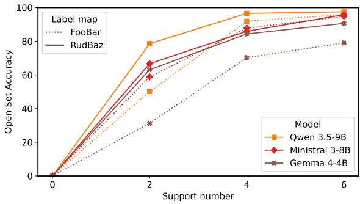  
Figure 6: Model performance versus the total number of support examples (0, 2, 4, and $^ { 6 , }$ corresponding to 0, 1, 2, and 3 shots per class) for two label spaces in the 2-way setting.

## A EXPERIMENTAL SETUP

## A.1 LABEL SPACE

<table><tr><td></td><td> $\{ \mathtt { F o o } , \mathtt { B a r } \}$ </td><td> $\{ \mathrm { R u d } , \mathrm { B a z } \}$ </td></tr><tr><td>Ministral 3 (8B)</td><td>48.9</td><td>0.0</td></tr><tr><td>Qwen 3.5 (9B)</td><td>23.3</td><td>0.0</td></tr></table>

Table 3: Probability (%) assigned to the other class label at the second in-context example, given the first example's label (2-way, 1-shot setting).

As stated in the main paper, choosing an appropriate semantically unaligned label space is important for removing language biases. Standard practice uses the {Foo, Bar} label space. However, $\{ \mathrm { F o o , B a r } \}$ has been widely used and may therefore appear in the pretraining data. As shown in Table 3, the model assigns a non-zero probability to Foo after seeing Bar as a label, and vice versa. This behavior does

not occur with {Rud, Baz}. Furthermore, Fig. 6 shows that using {Rud, Baz} improves model performance by removing this bias. For these reasons, we choose {Rud, Baz} as our label space. For 3-way classification, we extend this label space with the additional label Gip.

## B META-TRAINING

## B.1 TRAINING DETAILS

We train on 32,768 episodes sampled from the 10 datasets. Each episode selects a dataset uniformly, then samples three distinct classes uniformly from that dataset. Each episode contains three support images per class and one additional query image whose class is selected uniformly among the three classes. Support and query images are distinct within an episode. The nine support examples are arranged into three consecutive blocks, each containing one example per class in independently shuffled class order. This arrangement lets us compute one-, two-, and three-shot classification losses from prefixes of three, six, and nine support examples, respectively, in a single forward pass. Images are resized to 256 × 256 pixels using bicubic interpolation before applying the model's pretrained image processor. No additional image augmentation is applied.

Each hidden state is l2-normalized before applying $\Phi _ { \ell } \in \mathbb { R } ^ { 1 2 8 \times 3 0 7 2 }$ . This is mainly to stabilize the training, as certain LLM decoders exhibit high $\ell _ { 2 } { \mathrm { - n o r m } }$ in the residual stream in last layers, this keeps training dynamic similar across layers. The projections are initialized independently using the default PyTorch linear-layer initialization, with weights sampled uniformly from $[ - 1 / \sqrt { 3 0 7 2 } , 1 / \sqrt { 3 0 7 2 } ]$ . The LVLM remains frozen throughout training.

We apply the loss after 3, 6, and 9 support images in-context to obtain more training signal from each task. We use a batch size of 32 episodes, which stabilizes convergence given the high variance across tasks. We optimize all projections jointly with AdamW using learning rate 0.001, weight decay 0.001, $( \beta _ { 1 } , \dot { \beta _ { 2 } } ) = ( 0 . 9 , \dot { 0 } . 9 \dot { 9 } 9 )$ , and $\epsilon = \mathrm { \bar { 1 0 } } ^ { - 8 }$ . We initially keep the learning rate fixed at 0.001, then gradually reduce it to zero using cosine decay over the final 324 training steps.

We use a single NVIDIA A100-SXM4 GPU with 80 GB memory and FlashAttention-2. The frozen LVLM forward pass used bfloat16, while projection parameters and loss computations used float32. The complete run took approximately 3 hours and 20 minutes.

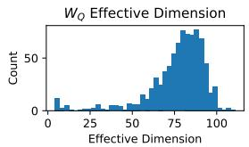

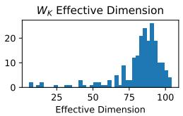

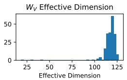

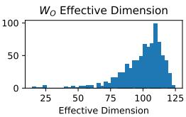  
Figure 7: Histograms of effective dimension for the query $( W _ { Q } ) ,$ key $( W _ { K } )$ , value $( W _ { V } )$ , and output $( \bar { W } _ { O } )$ projection matrices of the model.

<table><tr><td>Training setup</td><td>Support counts used for the loss</td><td>Effective dimension of  $\Phi _ { \ell ^ { * } - 1 } ^ { \mathrm { v } }$ </td></tr><tr><td>3-way 3-shot</td><td>3,6,9</td><td>9.69</td></tr><tr><td>3-way 3-shot</td><td>9</td><td>9.68</td></tr><tr><td>4-way 4-shot</td><td>4, 8, 12, 16</td><td>11.08</td></tr><tr><td>4-way 4-shot</td><td>16</td><td>10.79</td></tr></table>

Table 4: Effective dimension of the Vision SDG at $\ell ^ { * } - 1$ under different training setups. Support counts indicate when the query classification loss is computed and exclude the query image.

## B.2 DIMENSIONALITY

We measure the effective dimension of each SDG projection Φ using the participation ratio (Gao et al., 2017), where $\lambda _ { i }$ are the eigenvalues of the bilinear similarity matrix $\mathring { \Phi } ^ { \top } \Phi$

$$
d _ { \mathrm { e f f } } ( \Phi ) = \frac { \left( \sum _ { i } \lambda _ { i } \right) ^ { 2 } } { \sum _ { i } \lambda _ { i } ^ { 2 } } .\tag{14}
$$

Figure 7 shows for comparison the distributions of effective dimension across the query, key, value, and output projections of the model. Averaged over all heads and the four projection types, the effective dimension is \~ 90. Figure 8 compares the ordered eigenvalues of $\Phi _ { \ell ^ { * } } ^ { \top } \ \mathrm { \hat { \Phi } } _ { \ell ^ { * } }$ (Text SDG at $\ell ^ { * }$ blue) and $( \Phi _ { 0 } ^ { \mathrm { v } } ) ^ { \top } \Phi _ { 0 } ^ { \mathrm { v } }$ (input Vision SDG, green). The Text SDG spectrum drops sharply around rank 10, whereas the input Vision SDG decays more gradually. The top 10 directions account for 91.06% of the projected variance of the Text SDG at $\ell ^ { * }$ , compared with 45.36% for the input Vision SDG.

We test whether the low dimensionality of the SDG depends on the training setup by varying the number of classes and shots, and whether the loss is applied at intermediate support counts or only after the full support set. As shown in Table 4, removing the intermediate losses has little effect on the effective dimension of $\Phi _ { \ell ^ { * } - 1 } ^ { \mathrm { v } }$ . Moving from 3-way 3-shot (10 in-context images) to 4-way 4-shot (17 in-context images) training slightly increases it, but all four configurations yield an effective dimension close to 10. Thus, the precise dimensionality varies with the training setup, but that fluctuation remains negligible.

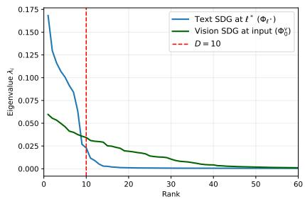  
Figure 8: Ordered eigenvalues of $\Phi _ { \ell ^ { * } } ^ { \top } \Phi _ { \ell ^ { * } }$ (Text SDG, blue) and $( \Phi _ { 0 } ^ { \mathrm { v } } ) ^ { \top } \Phi _ { 0 } ^ { \mathrm { v } }$ (input Vision SDG, green). The Text SDG spectrum drops sharply around rank 10, with approximately 90% of its eigenvalue mass in the top 10 directions; the input Vision SDG decays more gradually.

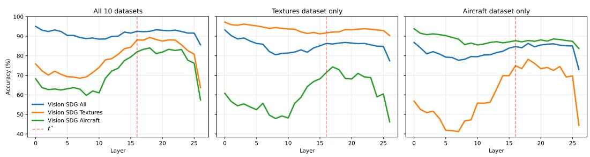  
Figure 9: NCC accuracy of average-pooled vision tokens across layers. NCC Accuracy is computed in 3 different Vision SDG on 3 different datasets. Left: On all 10 datasets combined. Middle: On the Textures dataset. Right: On the Aircraft dataset.

## B.3 TRAINING ON ONE DATASET ONLY

<table><tr><td>Vision SDG training data</td><td>Effective dimension at  $\ell ^ { * } - 1 ( \Phi _ { \ell ^ { * } - 1 } ^ { \mathrm { v } } )$ </td></tr><tr><td>All 10 datasets</td><td>9.69</td></tr><tr><td>Textures only</td><td>9.71</td></tr><tr><td>Aircraft only</td><td>6.57</td></tr></table>

Table 5: Effective dimension of the Vision SDG at layer $\ell ^ { * } - 1$ when trained on all 10 datasets or on a single dataset.

The shared property of the SDG of having a high accuracy on 10 different domains could result from training on those 10 domains. In order to challenge that property, we experiment with training the shared discriminative geometry only on 1 dataset instead of 10. We follow the same training protocol in two separate experiments, training once on Aircraft alone and once on Textures alone. We focus here only on the Vision SDG. As shown in Table 5, training on Textures alone yields nearly the same effective dimension as training on all 10 datasets (9.71 versus 9.69), showing that the approximately 10-dimensional Vision SDG can emerge from a single domain. Training on Aircraft alone yields a lower effective dimension (6.57), indicating that the learned geometry's effective dimensionality depends on the training domain.

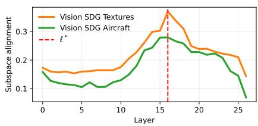  
Figure 10: Layer-wise subspace alignment of the Textures and Aircraft Vision SDGs with the Vision SDG trained on all datasets.

Evidence of shared geometry. Next, we test whether a Vision SDG trained on a single dataset generalizes to other domains by comparing NCC accuracy across layers on Textures, Aircraft, and the full set of 10 datasets (Figure 9). Between layers 7 and 15, where dimensionality reduction occurs, we see that the accuracy of the Textures Vision SDG increases for Aircraft and vice versa. Similarly, the accuracy of the Textures Vision SDG and Aircraft Vision SDG increases on the full set of all 10 datasets in the similar range. This indicates that in those layers, discriminative directions get more common between tasks and domains. This presents an additional independent observation of the dimensionality reduction

and of the shared property of the SDG between domains. Additionally, we examine whether the Textures and Aircraft Vision SDGs converge toward the All datasets Vision SDG by measuring their layer-wise subspace alignment (using $1 - \mathrm { B D E } \Big ( ( \Phi _ { \ell , \mathrm { O n e } } ^ { \mathrm { v } } ) ^ { \top } \Phi _ { \ell , \mathrm { O n e } } ^ { \mathrm { v } } , ( \Phi _ { \ell , \mathrm { A l l } } ^ { \mathrm { v } } ) ^ { \top } \Phi _ { \ell , \mathrm { A l l } } ^ { \mathrm { v } } \Big )$ from Eq. (13)) (Figure 10). Over the same layer range (7–15), both the Aircraft and Textures Vision SDGs become increasingly aligned with the Vision SDG trained on all 10 datasets. This provides complementary geometric evidence that discriminative directions become increasingly shared across domains in these layers.

Evidence of domain-specific geometry. However, on Textures, the SDG trained on Textures achieves higher accuracy than the SDG trained on Aircraft, and vice versa on Aircraft. This means that part of the training is learning to select features that are domain-specific. Training on 10 different and diverse domains should in practice diminish that effect. In conclusion, our training protocol produces an SDG that combines features shared across domains with features specific to its training domain. Future work could investigate how to better disentangle both.

## C THEORETICAL ANALYSIS AND VALIDATION

## C.1 PROOF OF THE CONVERGENCE RATE

Let $n = M$ and $\lambda _ { 1 } \geq \cdot \cdot \cdot \geq \lambda _ { n } > 0$ be the eigenvalues of $X ^ { \top } X$ and

$$
\boldsymbol { \mathcal { E } } ( Z _ { \ell } ) = \frac { 1 } { 4 } \left\| ( Z _ { \ell } ) ^ { \top } Z _ { \ell } - X ^ { \top } \boldsymbol { X } \right\| _ { F } ^ { 2 } .\tag{15}
$$

Assume

$$
D _ { \downarrow } \geq n , \qquad \mathrm { r a n k } ( Z _ { 0 } ) = n , \qquad 0 < \eta < \frac { 1 } { 4 [ \lambda _ { 1 } + \| ( Z _ { 0 } ) ^ { \top } Z _ { 0 } - X ^ { \top } X \| _ { F } ] } .\tag{16}
$$

We prove that the dynamics

$$
\boldsymbol { Z } _ { \ell + 1 } = \boldsymbol { Z } _ { \ell } + \eta \boldsymbol { Z } _ { \ell } \left( \boldsymbol { X } ^ { \top } \boldsymbol { X } - ( \boldsymbol { Z } _ { \ell } ) ^ { \top } \boldsymbol { Z } _ { \ell } \right)\tag{17}
$$

satisfy

$$
\mathcal { E } ( Z _ { \ell } ) = O \big ( ( 1 - 2 \eta \lambda _ { n } ) ^ { 2 \ell } \big ) .\tag{18}
$$

Define the Gram-matrix error

$$
E _ { \ell } = Z _ { \ell } ^ { \top } Z _ { \ell } - X ^ { \top } X .\tag{19}
$$

Proof outline. The proof proceeds in three steps:

• Descent and boundedness. We establish that $\mathcal { E } ( Z _ { \ell } )$ decreases, from which $Z _ { \ell } E _ { \ell } \to 0$ and the boundedness of $( Z _ { \ell } ) _ { \ell }$ follow.

• Convergence to zero error. Using the full-rank initialization and the determinant dynamics, we exclude convergence to a rank-deficient stationary point and conclude that $E _ { \ell } \to 0$

• Exponential convergence rate. Once $E _ { \ell }$ is sufficiently small, its dynamics consist of a linear contraction with rate $1 - 2 \eta \lambda _ { n }$ and a quadratic remainder, yielding $\mathcal { E } ( Z _ { \ell } ) ~ =$ $O ( \exp ( - 4 \eta \lambda _ { n } \ell ) )$

C.1.1 DESCENT AND BOUNDEDNESS. $\begin{array} { r } { \| E _ { \ell } \| _ { F } \leq \| E _ { 0 } \| _ { F } \mathrm { ~ A N D ~ } Z _ { \ell } E _ { \ell } \longrightarrow 0 } \end{array}$

The update is

$$
Z _ { \ell + 1 } = Z _ { \ell } ( I _ { n } - \eta E _ { \ell } ) .\tag{20}
$$

Consequently,

$$
\begin{array} { r } { E _ { \ell + 1 } = ( I _ { n } - \eta E _ { \ell } ) Z _ { \ell } ^ { \top } Z _ { \ell } ( I _ { n } - \eta E _ { \ell } ) - X ^ { \top } X } \end{array}\tag{21}
$$

$$
\begin{array} { r l } & { = E _ { \ell } - \eta \left( E _ { \ell } Z _ { \ell } ^ { \top } Z _ { \ell } + Z _ { \ell } ^ { \top } Z _ { \ell } E _ { \ell } \right) + \eta ^ { 2 } E _ { \ell } Z _ { \ell } ^ { \top } Z _ { \ell } E _ { \ell } , } \end{array}\tag{22}
$$

$$
\begin{array} { r } { E _ { \ell + 1 } - E _ { \ell } = - \eta \left( E _ { \ell } Z _ { \ell } ^ { \top } Z _ { \ell } + Z _ { \ell } ^ { \top } Z _ { \ell } E _ { \ell } \right) + \eta ^ { 2 } E _ { \ell } Z _ { \ell } ^ { \top } Z _ { \ell } E _ { \ell } . } \end{array}\tag{23}
$$

We first prove recursively that

$$
\| E _ { \ell } \| _ { F } \leq \| E _ { 0 } \| _ { F } \qquad { \mathrm { f o r ~ e v e r y ~ } } \ell .\tag{24}
$$

Assume that this inequality holds at layer l. Then

$$
\| Z _ { \ell } \| _ { 2 } ^ { 2 } = \| Z _ { \ell } ^ { \top } Z _ { \ell } \| _ { 2 }\tag{25}
$$

$$
\mathbf { \Sigma } = \| \boldsymbol { X } ^ { \top } \boldsymbol { X } + E _ { \ell } \| _ { 2 }\tag{26}
$$

$$
\leq \lambda _ { 1 } + \| E _ { \ell } \| _ { 2 }\tag{27}
$$

$$
\leq \lambda _ { 1 } + \| E _ { 0 } \| _ { F } .\tag{28}
$$

Equality (25) follows from $\| Z _ { \ell } \| _ { 2 } ^ { 2 } = \lambda _ { \mathrm { m a x } } ( Z _ { \ell } ^ { \top } Z _ { \ell } )$ . Equality (26) follows from the definition of $E _ { \ell }$ Inequality (27) follows from the triangle inequality and $\| X ^ { \top } X \| _ { 2 } = \lambda _ { 1 }$ . Finally, (28) follows from $\| E _ { \ell } \| _ { 2 } \leq \| E _ { \ell } \| _ { F } \leq \| E _ { 0 } \| _ { F }$

Taking the Frobenius inner product of Eq. (23) with $E _ { \ell }$ gives

$$
\langle E _ { \ell } , E _ { \ell + 1 } - E _ { \ell } \rangle = \mathrm { t r } \left[ E _ { \ell } ^ { \top } ( E _ { \ell + 1 } - E _ { \ell } ) \right]\tag{29}
$$

$$
= - \eta \operatorname { t r } \left( E _ { \ell } ^ { 2 } Z _ { \ell } ^ { \top } Z _ { \ell } \right) - \eta \operatorname { t r } \left( E _ { \ell } Z _ { \ell } ^ { \top } Z _ { \ell } E _ { \ell } \right) + \eta ^ { 2 } \operatorname { t r } \left( E _ { \ell } ^ { 2 } Z _ { \ell } ^ { \top } Z _ { \ell } E _ { \ell } \right)\tag{30}
$$

$$
= - 2 \eta \mathrm { t r } \left( Z _ { \ell } ^ { \top } Z _ { \ell } E _ { \ell } ^ { 2 } \right) + \eta ^ { 2 } \mathrm { t r } \left( Z _ { \ell } ^ { \top } Z _ { \ell } E _ { \ell } ^ { 3 } \right) ,\tag{31}
$$

where the last equality follows from the symmetry of $E _ { \ell }$ and the cyclicity of the trace. Since $E _ { \ell }$ i symmetric,

$$
- \| E _ { \ell } \| _ { 2 } E _ { \ell } ^ { 2 } \preceq E _ { \ell } ^ { 3 } \preceq \| E _ { \ell } \| _ { 2 } E _ { \ell } ^ { 2 } .\tag{32}
$$

Because $Z _ { \ell } ^ { \mathrm { T } } Z _ { \ell }$ is positive semidefinite,

$$
\left| \operatorname { t r } \left( \left( Z _ { \ell } \right) ^ { \top } Z _ { \ell } E _ { \ell } ^ { 3 } \right) \right| \leq \| E _ { \ell } \| _ { 2 } \operatorname { t r } \left( \left( Z _ { \ell } \right) ^ { \top } Z _ { \ell } E _ { \ell } ^ { 2 } \right) .\tag{33}
$$

Moreover tr $\left( ( Z _ { \ell } ) ^ { \top } Z _ { \ell } E _ { \ell } ^ { 2 } \right) = \| Z _ { \ell } E _ { \ell } \| _ { F } ^ { 2 } , \mathrm { t h e r e f o r e }$

$$
\langle E _ { \ell } , E _ { \ell + 1 } - E _ { \ell } \rangle \leq - 2 \eta \| Z _ { \ell } E _ { \ell } \| _ { F } ^ { 2 } + \eta ^ { 2 } \| E _ { \ell } \| _ { 2 } \| Z _ { \ell } E _ { \ell } \| _ { F } ^ { 2 }\tag{34}
$$

$$
= \left( - 2 \eta + \eta ^ { 2 } \Vert E _ { \ell } \Vert _ { 2 } \right) \Vert Z _ { \ell } E _ { \ell } \Vert _ { F } ^ { 2 }\tag{35}
$$

$$
\leq \left( - 2 \eta + \eta ^ { 2 } \Vert E _ { 0 } \Vert _ { F } \right) \Vert Z _ { \ell } E _ { \ell } \Vert _ { F } ^ { 2 } .\tag{36}
$$

The first inequality bounds the cubic trace term using $\left| \operatorname { t r } ( ( Z _ { \ell } ) ^ { \top } Z _ { \ell } E _ { \ell } ^ { 3 } ) \right| \le \| E _ { \ell } \| _ { 2 } \| Z _ { \ell } E _ { \ell } \| _ { F } ^ { 2 }$ . The second line factors out the common term $\| Z _ { \ell } E _ { \ell } \| _ { F } ^ { 2 }$ , while the final inequality uses $\| E _ { \ell } \| _ { 2 } ~ \leq$ $\| E _ { \ell } \| _ { F } \leq \| E _ { 0 } \| _ { F }$

The three terms in Eq. (23) satisfy

$$
\begin{array} { r l } { \mathrm { ( i ) } } & { { } \left\| E _ { \ell } ( Z _ { \ell } ) ^ { \top } Z _ { \ell } \right\| _ { F } = \left\| ( Z _ { \ell } E _ { \ell } ) ^ { \top } Z _ { \ell } \right\| _ { F } } \end{array}\tag{37}
$$

$$
\begin{array} { r l } { \mathrm { ( i i ) } } & { { } \left. \left( Z _ { \ell } \right) ^ { \top } Z _ { \ell } E _ { \ell } \right. _ { F } \leq \Vert Z _ { \ell } \Vert _ { 2 } \Vert Z _ { \ell } E _ { \ell } \Vert _ { F } , } \end{array}\tag{38}
$$

$$
\begin{array} { r l } { \mathrm { ( i i i ) } } & { { } \left\| E _ { \ell } ( Z _ { \ell } ) ^ { \top } Z _ { \ell } E _ { \ell } \right\| _ { F } = \left\| ( Z _ { \ell } E _ { \ell } ) ^ { \top } ( Z _ { \ell } E _ { \ell } ) \right\| _ { F } } \end{array}
$$

$$
\leq \| Z _ { \ell } E _ { \ell } \| _ { F } \| Z _ { \ell } E _ { \ell } \| _ { 2 }
$$

$$
\leq \| E _ { 0 } \| _ { F } \| Z _ { \ell } \| _ { 2 } \| Z _ { \ell } E _ { \ell } \| _ { F } .\tag{39}
$$

We obtain

$$
\| E _ { \ell + 1 } - E _ { \ell } \| _ { F } \leq \eta \| Z _ { \ell } \| _ { 2 } \left( 2 + \eta \| E _ { 0 } \| _ { F } \right) \| Z _ { \ell } E _ { \ell } \| _ { F }\tag{40}
$$

$$
\leq \eta \sqrt { \lambda _ { 1 } + \| E _ { 0 } \| _ { F } } \left( 2 + \eta \| E _ { 0 } \| _ { F } \right) \| Z _ { \ell } E _ { \ell } \| _ { F } .\tag{41}
$$

The first inequality combines the bounds on the three terms of the error increment, while the second uses Eq. (28) to eliminate the dependence on $\| Z _ { \ell } \| _ { 2 }$

Since $\begin{array} { r } { \mathcal { E } ( Z _ { \ell } ) = \frac { 1 } { 4 } \| E _ { \ell } \| _ { F } ^ { 2 } } \end{array}$ , using Eqs. (36) and (41),

$$
\mathcal { E } ( Z _ { \ell + 1 } ) - \mathcal { E } ( Z _ { \ell } ) = \frac { 1 } { 2 } \left. E _ { \ell } , E _ { \ell + 1 } - E _ { \ell } \right. + \frac { 1 } { 4 } \| E _ { \ell + 1 } - E _ { \ell } \| _ { F } ^ { 2 }\tag{42}
$$

$$
\leq \left[ - \eta + \frac { \eta ^ { 2 } \| E _ { 0 } \| _ { F } } { 2 } + \frac { \eta ^ { 2 } \left( \lambda _ { 1 } + \| E _ { 0 } \| _ { F } \right) \left( 2 + \eta \| E _ { 0 } \| _ { F } \right) ^ { 2 } } { 4 } \right] \| Z _ { \ell } E _ { \ell } \| _ { F } ^ { 2 }\tag{43}
$$

$$
= - \eta \left[ 1 - \frac { \eta \| E _ { 0 } \| _ { F } } { 2 } - \frac { \eta \left( \lambda _ { 1 } + \| E _ { 0 } \| _ { F } \right) \left( 2 + \eta \| E _ { 0 } \| _ { F } \right) ^ { 2 } } { 4 } \right] \| Z _ { \ell } E _ { \ell } \| _ { F } ^ { 2 } .\tag{44}
$$

By the step-size assumption,

$$
\eta < \frac { 1 } { 4 \left( \lambda _ { 1 } + \Vert E _ { 0 } \Vert _ { F } \right) } .\tag{45}
$$

Multiplying by $\lambda _ { 1 } + \| E _ { 0 } \| _ { F } > 0$ gives

$$
\eta \left( \lambda _ { 1 } + \Vert E _ { 0 } \Vert _ { F } \right) < \frac { 1 } { 4 } .\tag{46}
$$

Moreover, since $\lVert E _ { 0 } \rVert _ { F } < \lambda _ { 1 } + \lVert E _ { 0 } \rVert _ { F } .$ we also have

$$
\eta \| E _ { 0 } \| _ { F } < \eta ( \lambda _ { 1 } + \| E _ { 0 } \| _ { F } ) < \frac { 1 } { 4 } .\tag{47}
$$

Hence

$$
1 - \frac { \eta \| E _ { 0 } \| _ { F } } { 2 } - \frac { \eta \left( \lambda _ { 1 } + \| E _ { 0 } \| _ { F } \right) \left( 2 + \eta \| E _ { 0 } \| _ { F } \right) ^ { 2 } } { 4 } > 1 - \frac { 1 } { 8 } - \frac { 8 1 } { 2 5 6 }\tag{48}
$$

$$
= { \frac { 1 4 3 } { 2 5 6 } } > { \frac { 1 } { 2 } } .\tag{49}
$$

It follows that

$$
\mathcal { E } ( Z _ { \ell + 1 } ) \leq \mathcal { E } ( Z _ { \ell } ) - \frac { \eta } { 2 } \| Z _ { \ell } E _ { \ell } \| _ { F } ^ { 2 } .\tag{50}
$$

Thus $\mathcal { E } ( Z _ { \ell + 1 } ) \le \mathcal { E } ( Z _ { \ell } )$ , which proves Eq. (24) recursively. Summing Eq. (50) from $\ell = 0$ to L gives

$$
\begin{array} { r l } {  { \frac { \eta } { 2 } \sum _ { \ell = 0 } ^ { L } \| Z _ { \ell } E _ { \ell } \| _ { F } ^ { 2 } \le \sum _ { \ell = 0 } ^ { L } ( \mathcal { E } ( Z _ { \ell } ) - \mathcal { E } ( Z _ { \ell + 1 } ) ) } } \\ & { \quad \quad = \mathcal { E } ( Z _ { 0 } ) - \mathcal { E } ( Z _ { L + 1 } ) } \\ & { \quad \le \mathcal { E } ( Z _ { 0 } ) , } \end{array}\tag{51}
$$

where the second line follows by telescoping and the last inequality uses $\mathcal { E } ( Z _ { L + 1 } ) \geq 0$ .Letting $L \to \infty$ in Eq. (51) yields

$$
\sum _ { \ell = 0 } ^ { \infty } \| Z _ { \ell } E _ { \ell } \| _ { F } ^ { 2 } < \infty .\tag{52}
$$

Since the summands in Eq. (52) are nonnegative, they must converge to zero. Therefore,

$$
Z _ { \ell } E _ { \ell } \longrightarrow 0 .\tag{53}
$$

C.1.2 CONVERGENCE TO ZERO ERROR. $\| E _ { \ell } \| _ { F } \longrightarrow 0$

We next prove that the error must enter the local contraction region. From Eq. (24),

$$
I _ { n } - \eta E _ { \ell } \succeq \left( 1 - \eta \| E _ { \ell } \| _ { 2 } \right) I _ { n }\tag{54}
$$

$$
\succeq ( 1 - \eta \Vert E _ { 0 } \Vert _ { F } ) I _ { n }\tag{55}
$$

$$
\succ \frac { 3 } { 4 } I _ { n } .\tag{56}
$$

Thus $I _ { n } - \eta E _ { \ell }$ is invertible. Since

$$
Z _ { \ell + 1 } = Z _ { \ell } \big ( I _ { n } - \eta E _ { \ell } \big ) ,\tag{57}
$$

the full-rank assumption gives

$$
\operatorname { r a n k } ( Z _ { \ell } ) = n \qquad { \mathrm { f o r ~ e v e r y ~ f i n i t e ~ } } \ell .\tag{58}
$$

The sequence is also bounded because

$$
\| Z _ { \ell } \| _ { F } ^ { 2 } = \mathrm { t r } \left( ( Z _ { \ell } ) ^ { \top } Z _ { \ell } \right)
$$

$$
\leq n \| ( Z _ { \ell } ) ^ { \top } Z _ { \ell } \| _ { 2 }\tag{59}
$$

(60)

$$
\begin{array} { r } { \leq n \left( \lambda _ { 1 } + \Vert E _ { 0 } \Vert _ { F } \right) . } \end{array}\tag{61}
$$

Consider any convergent subsequence

$$
Z _ { \ell _ { k } } \longrightarrow \overline { { Z } } .\tag{62}
$$

Equation (53) and continuity give

$$
{ \overline { { Z } } } \left( { \overline { { Z } } } ^ { \top } { \overline { { Z } } } - X ^ { \top } X \right) = 0 .\tag{63}
$$

Multiplication by Zgives $\overline { { Z } } ^ { \top }$

$$
\overline { { { Z } } } ^ { \top } \overline { { { Z } } } \left( \overline { { { Z } } } ^ { \top } \overline { { { Z } } } - X ^ { \top } X \right) = 0 .\tag{64}
$$

Taking the transpose gives

$$
\left( \overline { { { Z } } } ^ { \top } \overline { { { Z } } } - X ^ { \top } X \right) \overline { { { Z } } } ^ { \top } \overline { { { Z } } } = 0 .\tag{65}
$$

Consequently,

$$
{ \overline { { Z } } } ^ { \top } { \overline { { Z } } } X ^ { \top } X = \left( { \overline { { Z } } } ^ { \top } { \overline { { Z } } } \right) ^ { 2 } = X ^ { \top } X { \overline { { Z } } } ^ { \top } { \overline { { Z } } } .\tag{66}
$$

Thus the two symmetric matrices $\overline { { Z } } ^ { \top } \overline { { Z } }$ and $X ^ { \top }$ X commute and have a common orthonormal eigenbasis. In that basis,

$$
X ^ { \top } X = \operatorname { d i a g } ( \lambda _ { 1 } , \ldots , \lambda _ { n } ) , \qquad { \overline { { Z } } } ^ { \top } { \overline { { Z } } } = \operatorname { d i a g } ( \gamma _ { 1 } , \ldots , \gamma _ { n } ) .\tag{67}
$$

Equation (64) then becomes

$$
\gamma _ { i } ( \gamma _ { i } - \lambda _ { i } ) = 0 \qquad \mathrm { f o r e v e r y } \ i .\tag{68}
$$

Therefore,

$$
\gamma _ { i } = 0 \qquad \mathrm { o r } \qquad \gamma _ { i } = \lambda _ { i } .\tag{69}
$$

Suppose, for contradiction, that $\mathcal { E } ( Z _ { \ell } )$ converges to a positive value. Every convergent subsequence then has a nonzero limiting error. By Eq. (69), at least one corresponding $\gamma _ { i }$ must be zero. At such a limit,

$$
\operatorname* { d e t } \left[ I _ { \mathit { n } } - \eta \left( \overline { { Z } } ^ { \top } \overline { { Z } } - X ^ { \top } X \right) \right] = \prod _ { i = 1 } ^ { n } \left[ 1 + \eta ( \lambda _ { i } - \gamma _ { i } ) \right]\tag{70}
$$

$$
= \prod _ { i : \gamma _ { i } = 0 } ( 1 + \eta \lambda _ { i } )\tag{71}
$$

$$
\geq 1 + \eta \lambda _ { n } .\tag{72}
$$

We now show explicitly that this bound must hold near every sufficiently late iterate. Otherwise, infinitely many layers would satisfy

$$
\operatorname* { d e t } ( I _ { n } - \eta E _ { \ell } ) \leq 1 + \frac { \eta \lambda _ { n } } { 2 } .\tag{73}
$$

The corresponding $Z _ { \ell }$ form a bounded sequence, so they contain a convergent subsequence. Taking the limit along that subsequence would give

$$
\operatorname* { d e t } \left[ I _ { n } - \eta \left( { \overline { { Z } } } ^ { \top } { \overline { { Z } } } - X ^ { \top } X \right) \right] \leq 1 + { \frac { \eta \lambda _ { n } } { 2 } } ,\tag{74}
$$

which contradicts Eq. (72). Hence there exists a finite L such that

$$
\operatorname* { d e t } ( I _ { n } - \eta E _ { \ell } ) > 1 + \frac { \eta \lambda _ { n } } { 2 } \qquad \mathrm { f o r ~ e v e r y ~ } \ell \ge L .\tag{75}
$$

On the other hand,

$$
\operatorname* { d e t } \left( ( Z _ { \ell + 1 } ) ^ { \top } Z _ { \ell + 1 } \right) = \operatorname* { d e t } \left( ( Z _ { \ell } ) ^ { \top } Z _ { \ell } \right) \operatorname* { d e t } ( I _ { n } - \eta E _ { \ell } ) ^ { 2 } .\tag{76}
$$

Equations (58) and (75) would therefore imply

$$
\operatorname* { d e t } \left( ( Z _ { \ell } ) ^ { \top } Z _ { \ell } \right) > \operatorname* { d e t } \left( ( Z _ { L } ) ^ { \top } Z _ { L } \right) \left( 1 + \frac { \eta \lambda _ { n } } { 2 } \right) ^ { 2 ( \ell - L ) } .\tag{77}
$$

The right-hand side diverges, whereas Eq. (28) gives

$$
\begin{array} { r } { \operatorname* { d e t } \left( ( Z _ { \ell } ) ^ { \top } Z _ { \ell } \right) \le \left( \lambda _ { 1 } + \| E _ { 0 } \| _ { F } \right) ^ { n } . } \end{array}\tag{78}
$$

This contradiction proves

$$
\| E _ { \ell } \| _ { F } \longrightarrow 0 .\tag{79}
$$

## C.1.3 EXPONENTIAL CONVERGENCE RATE. $\displaystyle \mathcal { E } ( Z _ { \ell } ) = O ( \exp ( - 4 \eta \lambda _ { n } \ell ) )$

It remains to derive the exponential rate. We use the following consequence of Ostrowski's fixedpoint theorem Argyros (1999). Let $E _ { \ell + 1 } = \mathcal { F } ( E _ { \ell } )$ converge to a fixed point $E ^ { \star }$ . If $\mathcal { F }$ is continuously differentiable near $E ^ { \star }$ and

$$
\rho ( D { \mathcal { F } } ( E ^ { \star } ) ) < 1 ,\tag{80}
$$

then, for every

$$
\rho ( D \mathcal { F } ( E ^ { \star } ) ) < q < 1 ,\tag{81}
$$

the iterates satisfy

$$
\| E _ { \ell } - E ^ { \star } \| _ { F } = O ( q ^ { \ell } ) .\tag{82}
$$

Consider the polynomial map

$$
{ \mathcal { F } } ( E ) = \left( I _ { n } - \eta E \right) \left( X ^ { \top } X + E \right) \left( I _ { n } - \eta E \right) - X ^ { \top } X .\tag{83}
$$

The error update satisfies $E _ { \ell + 1 } = \mathcal { F } ( E _ { \ell } )$ , and $\mathcal { F } ( 0 ) = 0$ . Moreover,

$$
D \mathcal { F } ( 0 ) [ \Delta ] = \Delta - \eta \left( \Delta X ^ { \top } X + X ^ { \top } X \Delta \right) .\tag{84}
$$

Let $v _ { i }$ be an eigenvector of $X ^ { \top } X$ associated with $\lambda _ { i }$ . Equation (84) gives

$$
D \mathcal { F } ( 0 ) \left[ v _ { i } v _ { j } ^ { \top } \right] = \left[ 1 - \eta ( \lambda _ { i } + \lambda _ { j } ) \right] v _ { i } v _ { j } ^ { \top } .\tag{85}
$$

Hence, the eigenvalues of $D \mathcal { F } ( 0 )$ are $1 - \eta ( \lambda _ { i } + \lambda _ { j } )$ . The step-size assumption implies

$$
\eta < { \frac { 1 } { \lambda _ { 1 } + \lambda _ { n } } } ,\tag{86}
$$

and therefore

$$
- \left( 1 - 2 \eta \lambda _ { n } \right) < 1 - 2 \eta \lambda _ { 1 } \leq 1 - \eta ( \lambda _ { i } + \lambda _ { j } ) \leq 1 - 2 \eta \lambda _ { n } .\tag{87}
$$

Since the upper bound is attained for $i = j = n ,$

$$
\rho ( D \mathcal { F } ( 0 ) ) = 1 - 2 \eta \lambda _ { n } < 1 .\tag{88}
$$

By Eq. (79), $E _ { \ell } ~ \to ~ 0$ Let $a _ { \ell } ~ = ~ \| E _ { \ell } \| _ { F }$ and $\rho ~ = ~ 1 - 2 \eta \lambda _ { n }$ Since $\mathcal { F }$ is polynomial and $\| D \mathcal { F } ( 0 ) \| _ { F  F } = \rho ,$ there is a constant $C > 0$ such that, for all sufficiently large $\ell ,$

$$
a _ { \ell + 1 } \leq \rho a _ { \ell } + C a _ { \ell } ^ { 2 } .\tag{89}
$$

Equation (82) gives $a _ { \ell } = O ( q ^ { \ell } )$ for any $\rho < q < 1$ , so $\textstyle \sum _ { \ell = 0 } ^ { \infty } a _ { \ell } < \infty$ . For sufficiently large $L ,$ iterating the preceding inequality yields

$$
a _ { \ell } \leq a _ { L } \rho ^ { \ell - L } \prod _ { j = L } ^ { \ell - 1 } \left( 1 + \frac { C } { \rho } a _ { j } \right)\tag{90}
$$

$$
\leq a _ { L } \rho ^ { \ell - L } \exp \left( \frac { C } { \rho } \sum _ { j = L } ^ { \infty } a _ { j } \right) = O ( \rho ^ { \ell } ) .\tag{91}
$$

Consequently,

$$
\mathcal E ( Z _ { \ell } ) = \frac { 1 } { 4 } a _ { \ell } ^ { 2 } = O \big ( ( 1 - 2 \eta \lambda _ { n } ) ^ { 2 \ell } \big ) = O ( \exp ( - 4 \eta \lambda _ { n } \ell ) ) .\tag{92}
$$

## C.2 NUMERICAL EXPERIMENTS

We first verify the predicted convergence of the Gram error of the transformer in the idealized setting considered, then test its robustness to initialization, causal masking, normalization, and softmax attention.

Experimental setup. We initialize both $x _ { i } \in \mathbb { R } ^ { D _ { \uparrow } }$ and $z _ { i , 0 } \in \mathbb { R } ^ { D _ { \downarrow } }$ from standard Gaussian distributions then normalize, with $D _ { \uparrow } = 1 0 2 4$ $D _ { \downarrow } = 3 2$ and $M = 9$ . We run 16 updates (layers) with $\eta = 0 . 3$ . Since $D _ { \downarrow } \geq M _ { }$ , the compressed states can represent the input Gram matrix exactly. We report the relative Gram error

$$
\varepsilon _ { \ell } = { \frac { \left\| Z _ { \ell } ^ { \top } Z _ { \ell } - X ^ { \top } X \right\| _ { \mathrm { F } } ^ { 2 } } { \left\| X ^ { \top } X \right\| _ { \mathrm { F } } ^ { 2 } } } .\tag{93}
$$

Curves report the mean error over 30 seeds, and shaded regions indicate the 25th to 75th percentiles.

Baseline. We first evaluate the transformer in the idealized setting considered in our theoretical analysis: non-causal linear self-attention, without softmax or normalization. Attention weights are initialized using Eq. (9). The relative Gram error decreases exponentially, as shown in Fig. 11a. For comparison, we plot the asymptotic decay rate predicted by Eq. (12), anchored at $\varepsilon _ { 0 }$

$$
\varepsilon _ { \ell } ^ { \mathrm { r e f } } = \varepsilon _ { 0 } \exp ( - 4 \eta \lambda _ { M } \ell ) .\tag{94}
$$

As expected, the empirical error decreases exponentially and follows the asymptotic decay.

Assumption 1: Causal attention. We add only an attention mask, removing all interactions from future examples while keeping the same weights. As shown in Fig. 11b, causality slows the convergence rate. Despite this, the relative Gram error decreases steadily even though the first example cannot attend to subsequent examples.

<table><tr><td>Intervention</td><td>1-shot</td><td>2-shot</td><td>3-shot</td><td>4-shot</td><td>t 5-shot</td></tr><tr><td>LVLM Accuracy</td><td>34.4%</td><td>77.2%</td><td>82.4%</td><td>84.2%</td><td>85.4%</td></tr><tr><td>1D to 128D - Control Ablation AM 1D to 15D - SDG Ablation 1D to 128D - SDG Ablation 16D to 128D - SDG Ablation 1D to 15D - SDG Boost 1D to 128D - SDG Boost 16D to 128D - SDG Boost</td><td>-0.4 -7.1 -13.3 -5.7 +7.5 +12.8 +6.9</td><td>-1.2 -10.8 -11.3 +1.8 +4.7 +3.3 -1.8 +0.8</td><td>-1.9 -12.9 -11.4 +1.6 +3.9 +1.5 -3.0 -0.0</td><td>-2.5 -12.0 -11.7 +1.4 +3.0 +1.4 -3.2</td><td>-2.2 -10.6 -9.7 +0.5 +2.9 +1.3 -2.9</td></tr><tr><td>Founer 1D to 128D - Control Ablation 1D to 15D - SDG Ablation 1D to 128D - SDG Ablation 16D to 128D - SDG Ablation 1D to 15D - SDG Boost 1D to 128D - SDG Boost 16D to 128D - SDG Boost</td><td>-1.9 -5.0 -9.9 -5.6 +4.2 +8.9 +4.5</td><td>-1.0 -0.5 +1.1 +2.2 +2.1 +0.0</td><td>-0.9 -0.5 +0.3 +0.8 +0.5 -0.4</td><td>-0.1 -1.5 -0.2 +0.6 +0.8 +0.3 -1.5</td><td>-0.1 -1.1 -0.6 +0.4 +0.4 +0.2 -1.2</td></tr></table>

Table 6: Effect of top SDG interventions on model classification performance. Baseline accuracy is reported in percent; intervention effects are changes in percentage points.

Assumption 2.a: Normalization. We test the effect of normalizing every $z _ { i , \ell }$ to unit norm before each update. As shown in Fig. 11d, normalization has a negligible impact on convergence.

Assumption 2.b: Softmax attention. We apply softmax to the attention weights. Softmax produces a weighted average, since its weights sum to one, whereas linear attention sums over the M examples. We therefore multiply $W _ { V }$ by $M = 9$ to match the scale of the linear update. Additionally, before the first update, we center X and $Z _ { 0 }$ . It prevents softmax attention from continuing to change the compressed vectors after the Gram matrices already match. As shown in Fig. 11c, softmax has a negligible impact on convergence under those additional assumptions.

Assumption 3: Z initialization. We compare $Z _ { 0 }$ Gaussian initialization, random projection $Z _ { 0 } ~ = ~ \mathrm { \bar { { W } } } _ { r a n d } ^ { \top } X$ , and canonical initialization $Z _ { 0 } ~ = ~ [ I _ { M } ; 0 ]$ . All three initializations satisfy the convergence assumptions $( r a n k ( Z _ { 0 } ) = M )$ and converge, as shown in Fig. 11e. Gaussian and projection initializations behave similarly. Canonical initialization yields an error approximately ten times smaller.

Summary. As shown in Fig. 11, in this setup with a 32× dimensionality reduction, all tested settings reach a relative Gram error below $1 { \bar { 0 } } ^ { - 5 }$ after all transformer layers.

## D CIRCUIT ANALYSIS

## D.1 MORE ABLATION EXPERIMENTS

## D.1.1 ABLATING THE TOP SDG DIMENSIONS

At layer l\*, ablation removes the component of a token's hidden state along selected Text SDG directions, while boosting doubles that component. Table 6 applies both interventions to the top 15 directions, all 128 directions, and the remaining directions after excluding the top 15. For each choice, we intervene either on all tokens or only on the forerunner token, measure the change in classification accuracy across one to five shots, and include ablation of a random 128-dimensional subspace as a control. Notably, ablating the SDG only from the forerunner tokens has less effect. This may be due to later layers copying the SDG from other text tokens back to the forerunner token. For 2 to 5 shots, ablating all 128 dimensions has less effect than ablating only the top 15 dimensions. This confirms that the geometry used for classification is low-dimensional. Ablating dimensions 16 to 128 slightly improves accuracy for 2 to 5 shots, while boosting them reduces it, suggesting a small opposing effect.

## D.1.2 ABLATION IMPACT ON HEADS ACCURACY

A possible reason for having a low dimensionality is allowing many heads to query the geometry without costing too much in parameters. Each head measures closeness of a query to support in-context through bilinear similarity in its learned query-key space $x _ { q } ^ { \top } W _ { Q } ^ { \top } W _ { K } x _ { i }$ If SDG dimensionality was 128, then an accurate sample-to-sample comparison would require all the heads' parameters, making the head able to only do that comparison without leaving capacity for other computations. Therefore we investigate if many heads use the SDG. First we focus our attention on induction heads (Olsson et al., 2022). In short, those heads copy the label of support examples that are closest to the query. We count a head as an induction head if it is in the top 5% of heads attending to the support label tokens when predicting the query label following Cho et al. (2025a). Figure 12 (Left) shows the number of induction heads per layer. We see that just after $\ell ^ { * }$ , there is a sudden increase in the number of induction heads. This shows induction starts only after the SDG is fully formed. We next ask whether the SDG is used by induction heads and, more broadly, across many attention heads. Figure 12 (Middle) reports, for each head, the accuracy obtained by assigning the query to the class of supports receiving the largest amount of attention from the Forerunner Token.

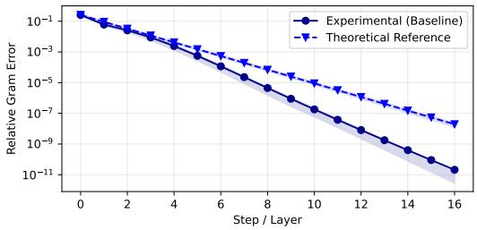  
(a) Baseline convergence and theoretical rate

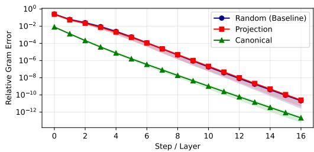  
(e) Initialization

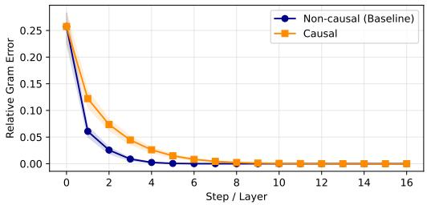  
(b) Causal masking

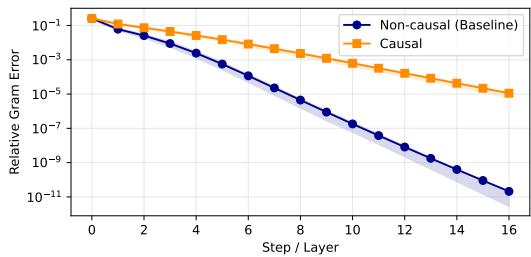  
(f) Causal masking (log scale)

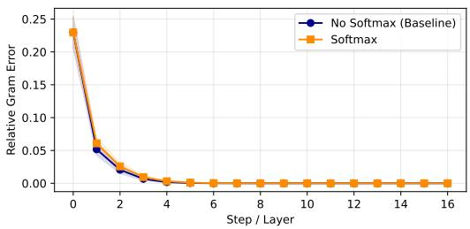  
(c) Softmax attention

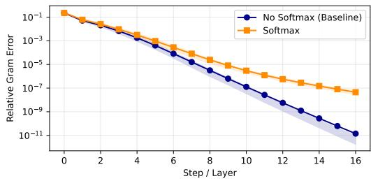  
(g) Softmax attention (log scale)

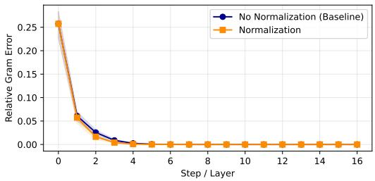  
(d) Normalization

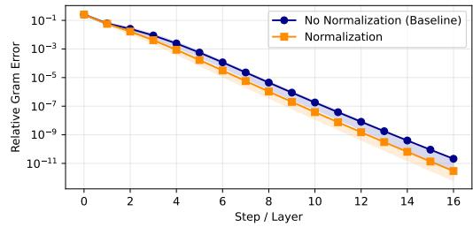  
(h) Normalization (log scale)  
Figure 11: Numerical evaluation of Relative Gram Error under different initialization and attention settings.

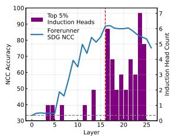

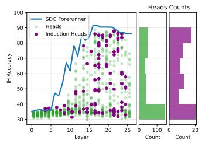

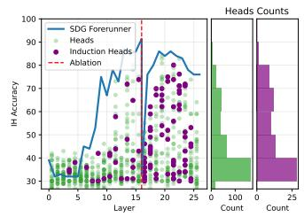  
Figure 12: Left: Number of induction heads across layers. Middle: Head accuracy across layers, with head count per accuracy range. Right: Same as the middle after ablating the SDG at l\*.

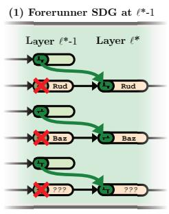  
Effect: -3.2%

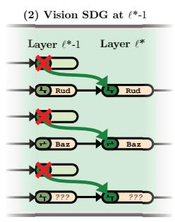  
Effect: -6.4%

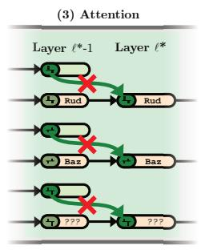  
Effect: -5.2%

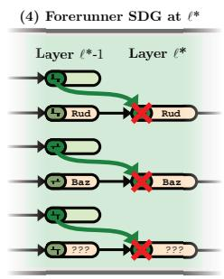  
Effect: -11.4%  
Figure 13: Schematization of the ablation performed in Table 1.

Simply put, it tells us how accurately any given head attends to support examples of the same class. While the SDG is the upper bound on the accuracy a head can have, we see many heads having a high accuracy close to it. After its formation, 14.77% of all heads and 23.29% of induction heads have an accuracy above 80%. Figure 12 (Right) shows heads accuracy after ablating the SDG at layer l\*. Accuracy drops across heads with only 1.42% of all heads and 1.37% of induction heads having an accuracy above 80%. This indicates that the SDG is used by both many heads and many induction heads. This supports the hypothesis that having lower-dimensional geometries helps many heads do better sample-to-sample comparisons.

## D.2 ANALYSIS OF FLOW FROM VISION TO FORERUNNER

In this section we study in more detail the circuit that transfers information from Vision SDG in Vision tokens at l\*—1 to the Text SDG in the Forerunner token at l\*. We start by doing an experiment where we compute the NCC accuracy in the Vision SDG at l\* — 1 for each token position in the image. To do that, we simply replace average pooling with selecting the token at the desired position. Figure 14 (Right) shows the results of that experiment. We observe that some tokens achieve better accuracy than others. In particular, 3 tokens have particularly high accuracy, which we name sink tokens 1, 2 and 3 Kang et al. (2025). Consistent with Choi et al. (2026), this suggests that these tokens contain meaningful semantic information across tasks. Figure 14 (Left) reports attention from the query forerunner token to the query image for each head. We see a spike in the 2 layers before l\* where heads attend more to that image. The main paper experiment in Table 1 shows that most of the transfer happens between layers l\* — 1 and l\*. Thus we focus on the 3 heads that attend the most to the query image in this layer (heads 7, 8 and 17 of layer 16). Figure 15 shows the attention from the forerunner token to the query image for the 3 selected heads on 3 different tasks. As those heads do not attend to other in-context images we don't show attention to other in-context images. The same token positions receive high attention from the 3 heads in the 3 displayed tasks. Attention patterns correlate with those in Fig. 14 (Right). In particular, sink tokens 2 and 3 always get attention from the 3 heads, although some attention goes to the tokens placed on the object of interest. In conclusion, it seems that high-quality features concentrate in certain specific sink tokens at fixed positions on the image, and the Forerunner token attends to these sink tokens in order to transfer information from vision to text. The schematization of the ablations performed in Table 1 is shown in Fig. 13

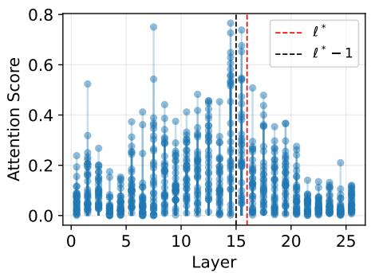

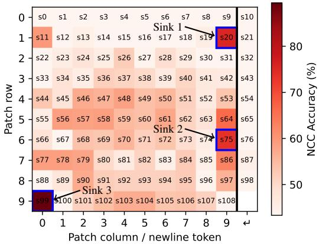  
Figure 14: Left: Average amount of attention of each head across layers. Attention from the forerunner token to the query image. Right: NCC accuracy at layer 15 per token position after projecting onto the Vision SDG. Columns 0-9 are image patches; the rightmost column contains newline tokens. Blue boxes mark the three patch-token sinks.

## D.3 SDG ALIGNMENT ACROSS LAYERS

We compare the Vision and Text SDGs across layers using the BDE (see Eq. (13)). Figure 16a shows that the Vision SDG remains relatively aligned between neighboring layers, but gradually drifts over larger layer distances. This illustrates the benefit of learning a separate down-projection at each layer to track the changing geometry. The Text SDG shows weaker alignment between neighboring layers before $\ell ^ { * }$ and becomes more stable after that layer (Fig. 16b). Finally, alignment between the Vision and Text SDGs remains low (Fig. 16c), suggesting that their dominant directions are approximately orthogonal. In other words, when the Vision SDG is transferred to text tokens, a rotation is applied.

## D.4 ANALYSIS OF DIMENSIONALITY REDUCTION HEADS

In this section we study in more detail the dimensionality reduction circuit in Vision tokens from layer 1 to $\ell ^ { * } - 1$

Choice of $s o V$ . We derive the identity used in Eq. (13). Let $\Delta = S - S ^ { \prime }$ . We normalize each similarity matrix as $S \mapsto S / \| S \| _ { F }$ before computing $s o V$ , making the score invariant to independent rescaling. For independent $x , y \sim \mathcal { N } ( 0 , I _ { D } )$

$$
2 \operatorname { B D E } ( S , S ^ { \prime } ) = \mathbb { E } _ { x , y } \left[ ( \boldsymbol { x } ^ { \top } \Delta y ) ^ { 2 } \right]\tag{95}
$$

$$
= \mathbb { E } _ { x } \big [ x ^ { \top } \Delta \mathbb { E } _ { y } [ y y ^ { \top } ] \Delta ^ { \top } x \big ]\tag{96}
$$

$$
= \mathrm { T r } \big ( \Delta \Delta ^ { \top } \mathbb { E } _ { x } [ x x ^ { \top } ] \big )\tag{97}
$$

$$
= { \mathrm { T r } } ( \Delta \Delta ^ { \top } ) = \| \Delta \| _ { F } ^ { 2 } .\tag{98}
$$

Note that the Gaussian assumption can be relaxed: sampling x and $y$ independently and uniformly from the unit sphere gives the same BDE when the expectation in Eq. (13) is multiplied by $D ^ { 2 }$ . The score $s o V$ measures how well $W _ { O V }$ maps the previous Vision SDG at layer l to the next Vision SDG at layer $\ell + 1$ . Note that the score is bounded between 0 and 1 for positive semidefinite matrices, as is always the case here because we define bilinear similarity through $\Phi ^ { \top } \Phi$ . The bound does not hold for arbitrary matrices. For our theoretical circuit, the $\dot { Z }$ subspace is selected by $\Phi _ { \ell } ^ { \mathrm { v } } = \Phi _ { \ell + 1 } ^ { \mathrm { v } } = \left( 0 \quad I _ { D _ { \perp } } \right)$ . Since $W _ { O V } = \eta \Phi _ { \rho } ^ { \mathrm { v } \top } \Phi _ { \rho } ^ { \mathrm { v } }$ , this gives $s _ { O V } = 0$ . Note that this score is invariant to orthogonal rotations that $W _ { O V }$ could perform between subspaces. However, we find that this simple score allows us to select dimensionality reduction heads reliably.

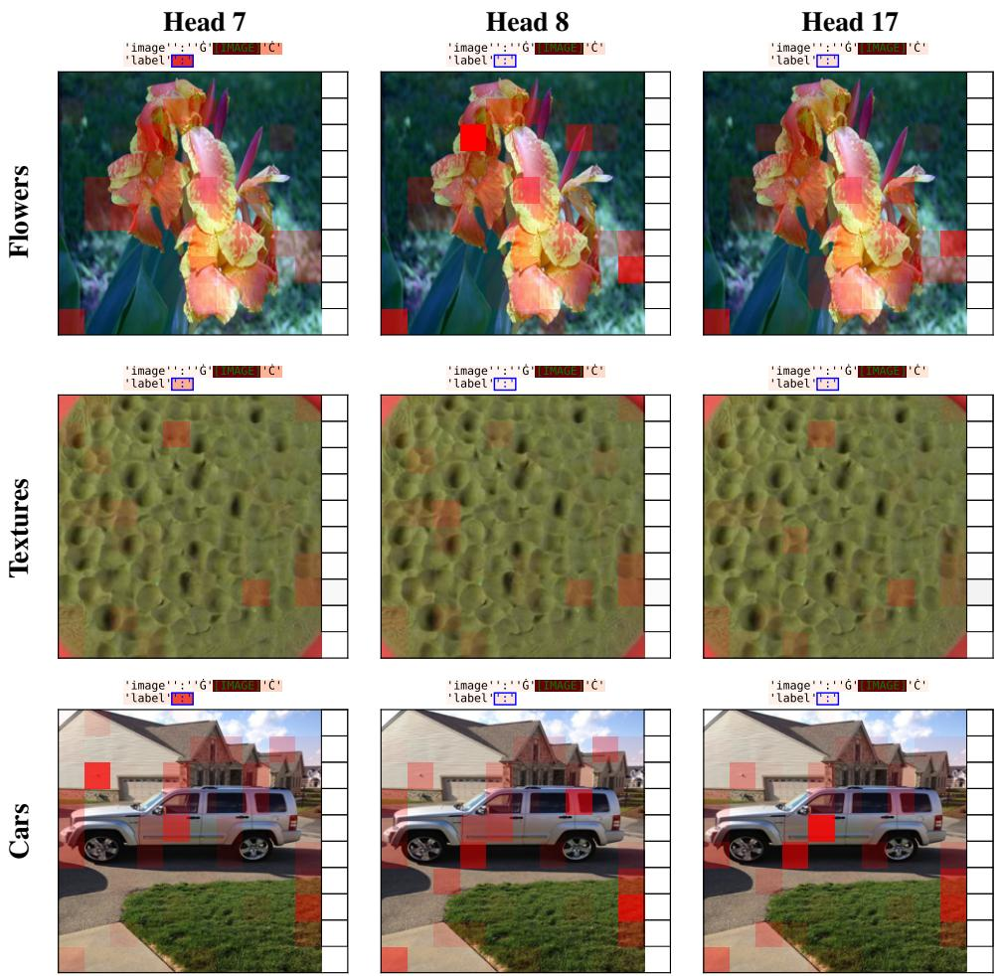  
Figure 15: Attention from the Forerunner token to image tokens at layer l\*. Columns correspond to attention heads 7, 8, and 17; rows correspond to the Flowers, Textures and Cars datasets.

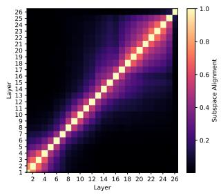  
(a) Vision SDG

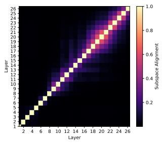  
(b) Text SDG

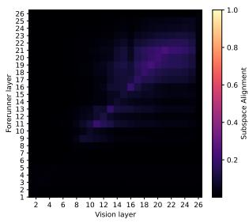  
(c) Text vs. Vision SDG  
Figure 16: SDG alignment across layers, measured using 1 – BDE

$$
\mathbf { L e f t } \colon 1 - \mathrm { B D E } \bigl ( ( \bar { \Phi _ { i } ^ { \mathrm { v } } } ) ^ { \top } \Phi _ { i } ^ { \mathrm { v } } , ( \Phi _ { j } ^ { \mathrm { v } } ) ^ { \top } \bar { \Phi _ { j } ^ { \mathrm { v } } } \bigr )
$$

$$
1 - \mathrm { B } \mathrm { \bar { D } E } \big ( \Phi _ { i } ^ { \top } \Phi _ { i } , \Phi _ { j } ^ { \top } \Phi _ { j } \big )
$$

Right: $1 - \mathrm { B D E } \big ( \Phi _ { i } ^ { \top } \Phi _ { i } , ( \Phi _ { j } ^ { \mathrm { v } } ) ^ { \top } \Phi _ { j } ^ { \mathrm { v } } \big )$ . Rows correspond to layer i and columns to layer $j .$

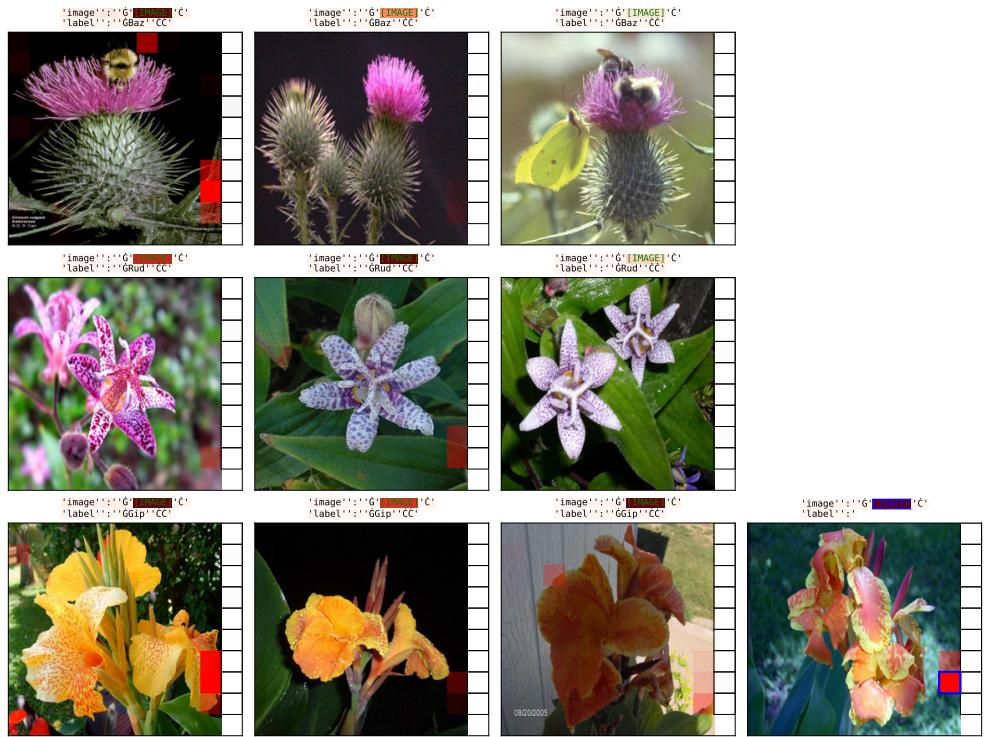  
Figure 17: Visualization of attention from sink token 2 to other in-context images for head 27 at layer 12 (dimensionality reduction head), on a task from the Flowers dataset

As an alternative to the BDE, we could measure the largest bilinear distortion over unit-norm inputs:

$$
\begin{array} { r l } & { \mathrm { B D E } _ { \mathrm { s p e c } } ( S , S ^ { \prime } ) : = \displaystyle \frac { 1 } { 2 } \displaystyle \operatorname* { s u p } _ { \| x \| _ { 2 } = \| y \| _ { 2 } = 1 } \left( x ^ { \top } S y - x ^ { \top } S ^ { \prime } y \right) ^ { 2 } } \\ & { \qquad = \displaystyle \frac { 1 } { 2 } \displaystyle \operatorname* { s u p } _ { \| x \| _ { 2 } = \| y \| _ { 2 } = 1 } \left( x ^ { \top } ( S - S ^ { \prime } ) y \right) ^ { 2 } } \\ & { \qquad = \displaystyle \frac { 1 } { 2 } \displaystyle \operatorname* { s u p } _ { \| y \| _ { 2 } = 1 } \| ( S - S ^ { \prime } ) y \| _ { 2 } ^ { 2 } } \\ & { \qquad = \displaystyle \frac { 1 } { 2 } \| S - S ^ { \prime } \| _ { 2 } ^ { 2 } . } \end{array}\tag{99}
$$

This choice requires no assumption on the distribution of x and y. The resulting spectral norm is equivalent to the Frobenius norm, with $\| \Delta \| _ { 2 } \leq \| \Delta \| _ { F } \leq \sqrt { \mathrm { r a n k } ( \Delta ) } \| \Delta \| _ { 2 }$

Attention patterns. Next we investigate the attention patterns of the selected dimensionality heads. As there are many vision tokens we focus on the sink tokens identified earlier (see Fig. 14 (Right)). Figures 17 to 20 show attention from sink tokens 2 and 3 to other in-context images on tasks from the Flowers and Cars datasets. The blue square marks the querying sink token, and the red shading shows where it attends. We select the dimensionality reduction head with the lowest sov score, head 27 in layer 12, and the head with the lowest $s o V$ score in layer 10, head 26. We see that those heads look more at the previous sink tokens of similar in-context examples, which is coherent with the theoretically derived circuit.

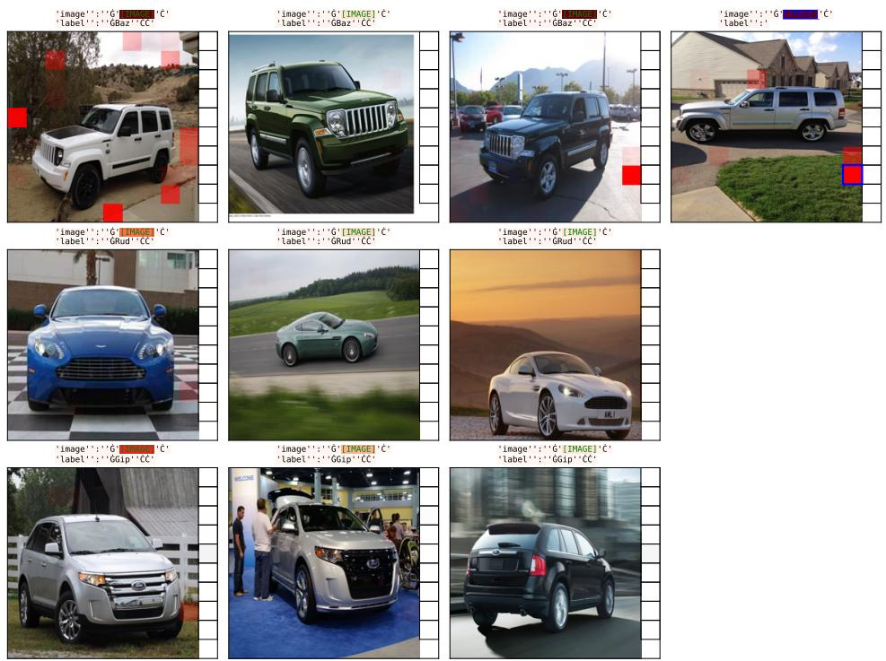  
Figure 18: Visualization of attention from sink token 2 to other in-context images for head 27 at layer 12 (dimensionality reduction head), on a task from the Cars dataset.

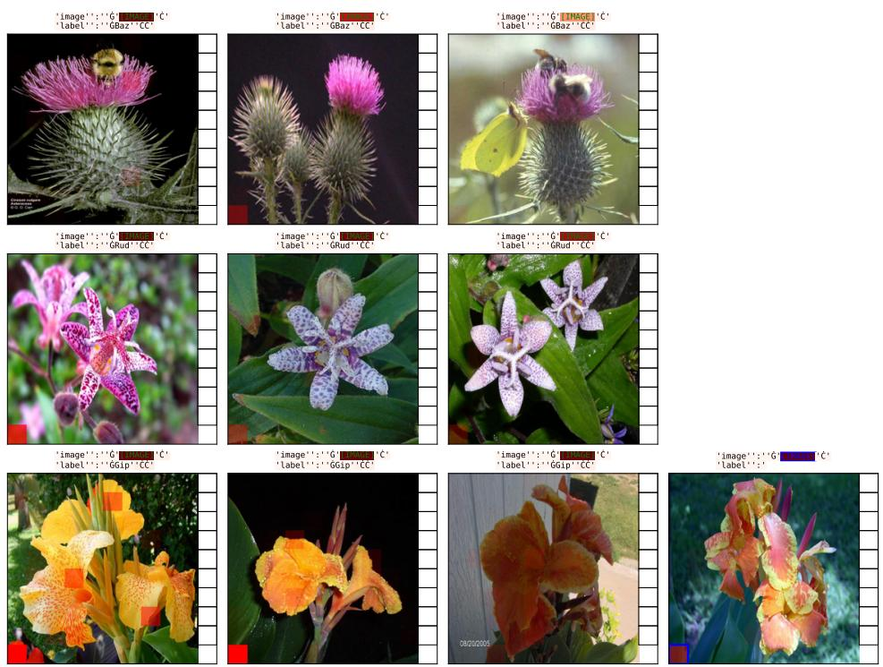  
Figure 19: Visualization of attention from sink token 3 to other in-context images for head 26 at layer 10 (dimensionality reduction head), on a task from the Flowers dataset.

  
Figure 20: Visualization of attention from sink token 3 to other in-context images for head 26 at layer 10 (dimensionality reduction head), on a task from the Cars dataset.

<table><tr><td>Model</td><td>Attention</td><td>Layers</td><td>Heads</td><td>Total heads</td><td>Token dim.</td><td>Head dim.</td><td>MLP dim.</td></tr><tr><td>Ministral 3 (3B) Full</td><td></td><td>26</td><td>32</td><td>832</td><td>3072</td><td>128</td><td>9216</td></tr><tr><td>Ministral 3 (8B)</td><td>Full</td><td>34</td><td>32</td><td>1088</td><td>4096</td><td>128</td><td>14336</td></tr><tr><td>Qwen 3.5 (4B)</td><td>Full/linear</td><td>32</td><td>16/32</td><td>128/768</td><td>2560</td><td>256/128</td><td>9216</td></tr><tr><td>Qwen 3.5 (9B)</td><td>Full/linear</td><td>32</td><td>16/32</td><td>128/768</td><td>4096</td><td>256/128</td><td>12288</td></tr><tr><td>Qwen 3 (4B)</td><td>Full</td><td>36</td><td>32</td><td>1152</td><td>2560</td><td>128</td><td>9728</td></tr></table>

Table 7: LLM-decoder hyperparameters. Thehighlighted modelis used for the main paper experiments and analyses. Slash-separated values follow the order of attention types. Each Qwen model has 8 full-attention layers and 24 linear-attention layers; head counts refer to query heads for full attention and value heads for linear attention.
<table><tr><td>Model</td><td> $\ell ^ { * }$ </td><td>Effective dimension of  $\Phi _ { \ell ^ { * } }$ </td></tr><tr><td>Ministral 3 (3B)</td><td>16</td><td>10.22</td></tr><tr><td>Ministral 3 (8B)</td><td>17</td><td>10.28</td></tr><tr><td>Qwen 3.5 (9B)</td><td>19</td><td>7.46</td></tr><tr><td>Qwen 3.5 (4B)</td><td>18</td><td>9.18</td></tr><tr><td>Qwen 3 (4B)</td><td>23</td><td>8.92</td></tr></table>

Table 8: Peak NCC layer and Text SDG effective dimension across models.

## E OTHER MODELS

We experiment in the main paper with Ministral 3 (3B) (Liu et al., 2026). Their main architectural hyperparameters are reported in Table 7. Both decoders use grouped-query attention and a context length of 262,144 tokens. Both models use the same Pixtral vision encoder. Table 7 also contains hyperparameters of the other models we experiment with.

We report results for Ministral 3 (3B and 8B), Qwen 3 (4B) and Qwen 3.5 (4B and 9B): NCC accuracy before and after projection onto the SDG (Fig. 21), effective dimension of the Text and Vision SDGs across layers (Fig. 22), and NCC accuracy as a function of projection dimension (Fig. 23). The peak-accuracy layer $\ell ^ { * }$ and the effective dimension of the Text SDG at that layer are summarized in Table 8.

## E.1 NCC ACCURACY ACROSS LAYERS

## E.2 NCC ACCURACY IN THE SHARED DISCRIMINATIVE GEOMETRY

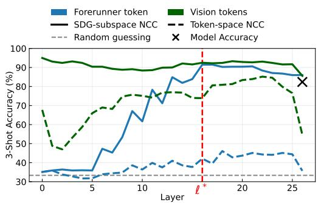  
(a) Ministral 3 (3B)

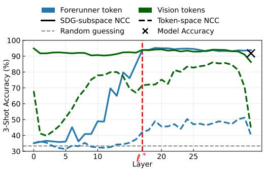  
(b) Ministral 3 (8B)

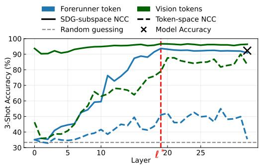  
(c) Qwen 3.5 (9B)

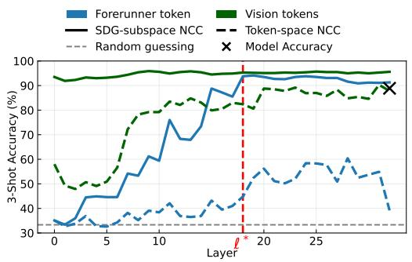  
(d) Qwen 3.5 (4B)

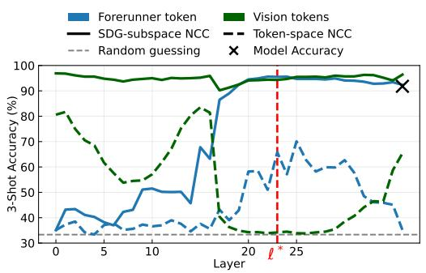  
(e) Qwen 3 (4B)  
Figure 21: NCC accuracy before and after projection onto the Shared Discriminative Geometry.

## E.3 EFFECTIVE DIMENSION

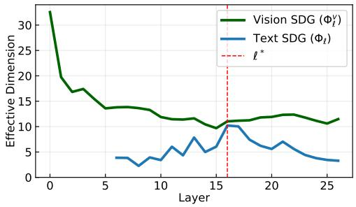  
(a) Ministral 3 (3B)

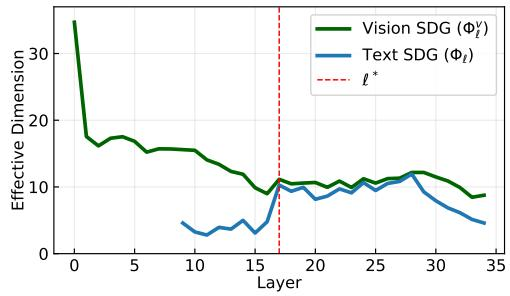  
(b) Ministral 3 (8B)

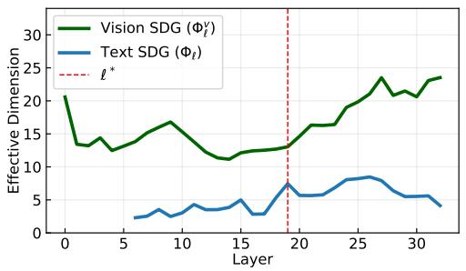  
(c) Qwen 3.5 (9B)

  
(d) Qwen 3.5 (4B)

  
(e) Qwen 3 (4B)  
Figure 22: Effective dimension across layers of $\Phi _ { \ell }$ (Text SDG) and $\Phi _ { \ell } ^ { \mathrm { v } }$ (Vision SDG).

<table><tr><td>Dataset</td><td>Question format</td><td>Answers</td></tr><tr><td>Open MI</td><td>This is a</td><td>Provided concept names</td></tr><tr><td>VLGuard</td><td>Original instruction field</td><td>harmful / unharmful</td></tr><tr><td>VizWiz</td><td>Original question field</td><td>answerable / unanswerable</td></tr><tr><td>Matching MI</td><td>Do the two images satisfy the induced relationship?</td><td>Yes / No</td></tr><tr><td>SugarCrepe MHaluBench</td><td>Does this image show&#x27;&lt;caption&gt;&#x27;?</td><td>Yes / No hallucination 1 non-</td></tr><tr><td></td><td>Original claim field</td><td>hallucination</td></tr><tr><td>NaturalBench</td><td>Does this image show&#x27;&lt;caption&gt;&#x27;?</td><td>Yes / No</td></tr></table>

Table 9: Question and answer formatting. Matching MI uses two images per example; all other benchmarks use one. Caption-based questions are read directly from the formatted dataset files.

## E.4 NCC ACCURACY BY PROJECTION DIMENSION

## F OTHER TASKS DETAILS

SST-2. SST-2 (Socher et al., 2013) is a binary sentiment classification dataset of movie-review sentences labeled positive or negative. We follow the same evaluation protocol, replacing each image with the sentence's sequence of text tokens. In Eq. (1), we replace "← image : " with "← text : " and replace fv(img) with the corresponding sentence sequence of text-token embeddings.

Open MI. Fast Open-Ended MiniImageNet (Open MI in the main paper) , from VL-ICL Bench (Zong et al., 2025), asks the model to classify ImageNet images using concept names introduced by the demonstrations. We evaluate all 200 provided tasks, using the support images supplied for each task.

Matching MI. Fast Matching MiniImageNet (Matching MI in the main paper) , also from VL-ICL Bench, asks whether two images satisfy a relationship illustrated by the demonstrations. We evaluate all 200 provided tasks and sample demonstrations from the supplied support set, including both positive and negative pairs.

VLGuard. VLGuard (Zong et al., 2024) contains images paired with user instructions. We ask the model to classify each pair as harmful or unharmful and evaluate the first 200 pairs in our prepared dataset.

VizWiz. VizWiz (Gurari et al., 2018) contains photographs and questions submitted by blind users. We use its answerability labels: the model predicts whether the question can be answered. We evaluate on 200 generated tasks.

SugarCrepe. SugarCrepe (Hsieh et al., 2023) pairs COCO images with correct captions and modified captions that do not match the image. We turn each image-caption pair into a yes/no question. We evaluate on 200 generated tasks.

MHaluBench. MHaluBench (Chen et al., 2024) provides images and textual claims annotated for hallucination. We ask the model to classify each claim as hallucination or non-hallucination. We evaluate on 200 generated tasks.

NaturalBench. We use the image-caption matching version of NaturalBench (Li et al., 2024). Each caption is presented as a yes/no question asking whether it describes the image. We evaluate on 200 generated tasks.

Questions and answers retain the dataset-specific formatting in Table 9. Each image placeholder occupies a separate line, followed by the question and a new line containing Answer : <answer>. Demonstrations are separated by a newline; the query ends at Answer :. Evaluation matches the greedy next token.

  
(a) Ministral 3 (3B)

  
(b) Ministral 3 (8B)

  
(c) Qwen 3.5 (9B)

  
(d) Qwen 3.5 (4B)

  
(e) Qwen 3 (4B)  
Figure 23: NCC accuracy in the top-k SDG dimensions of the input vision tokens (Layer l = 0) and the forerunner token at $\check { \ell ^ { * } }$