# An Efective, Reliable, and Robust Framework for Human Activity Recognition Using Wearable Sensors

NAFEES AHMAD∗, The Chinese University of Hong Kong, China

HO-FUNG LEUNG, Independent Researcher, China

MUHAMMAD ADIL ABID, Malmö University, Sweden

SADIA SHAKIL, National University of Sciences and Technology (NUST), Pakistan and The Chinese University of Hong Kong, China

Human Activity Recognition (HAR) through wearable sensors greatly improves the quality of human life through its multiple applications in health monitoring, assisted living, and fitness tracking. For HAR, multi-sensor channel information is vital for optimal performance. Current work states that applying an attention neural network to prioritize discriminatory sensor channels helps the model classify activity more precisely. However, obtaining discriminatory information from multisensory channels is not always trivial, for example, when collecting data from older hospitalized patients. In this context, existing HAR methods struggle to classify activities, particularly activities with similar natures. Moreover, HAR deep models predominantly sufer from overfitting due to the small size of available datasets, which leads to poor performance. Data augmentation is a viable solution to this problem. However, currently available data augmentation methods to HAR have various drawbacks, i l di th ibilit f b i d i d d t lti i di t t d d l f t t T dd th HAR problems, we propose a novel framework, ALAE-TAE-CutMix+, which primarily focuses on two aspects. First, it enhances th l t t i f ti h h l d l t l it th l ti lti l l t t f t d the ongoing activity. Consequently, the discriminatory feature representations of each activity is enriched. Second, a new g t ti t t g i i t d d t dd th h t i g f i ti g lti h l d t g t ti W th t d th f k t t f th h d i l ALAE CIE TAE C tMi + hi h l t t the interactions between the features of each pair of sensor channels. We find that although the first framework performs slightly better than the latter, the latter is nonetheless more reliable and robust. Both frameworks significantly outperform existing state-of-the-art approaches on the four most commonly used HAR datasets from diverse domains. In addition, we l lid t th t ib ti f h f th d l i th d f k th gh d t il d bl ti t di

CCS Concepts: • Human-centered computing → Ubiquitous and mobile computing; • Computing methodologies → Neural networks; • Supervised learning by classification;

Additional Key Words and Phrases: Human activity recognition, deep learning, attention, wearable sensors, Inter-sensor interactions, data augmentation, time-series data

## 1 Introduction

Wearable sensor-based human activity recognition (HAR) has gained much popularity due to the proliferation of low-cost, infrastructure-less, comfortable-to-wear sensing devices. It provides a wide range of applications, particularly in the healthcare domain, for examples, patient monitoring, assistance for the aged, and rehabilitation [2, 9, 10, 13, 14, 16, 25, 28]. A key element in building these applications is to have a model capable of automatically and accurately recognizing human activity using wearable sensors.

Deep learning (DL) based models have established benchmark performance in HAR [1, 17, 22, 23], and the performance of these models is highly dependent on multi-sensor channels data. Some sensor channels provid more discriminatory information for ongoing activity than others, and giving attention to these sensor channels helps the model classify the activities more accurately [1]. However, in some situations, receiving discriminatory information from most sensor channels is non-trivial, particularly when capturing older adults’ similar yet diferent activities. More specifically, for subjects who are hospitalized and older, they cannot perform activities in the same manner as younger and healthier people because they cannot actively twitch their body muscles due to illness, frailty, and aging. In addition, older people can remain stationary for prolonged periods and often they cannot move, especially in activities of static nature. In such situations, the attached sensors cannot capture signals from the human body in the same way as they can from a healthy young body. As a result, very minor fluctuations (even almost negligible) in activity patterns may yield information that makes it more dificult to classify the activity. Encountering such a situation, where activities of similar nature are also present, it becomes more challenging to obtain discriminatory information about these activities. This results in a higher likelihood that these activities will be confused with one another during the classification process. Under these circumstances, getting the sensor channel’s attention does not help too much the model classify the activities.

Available HAR datasets based on wearable sensors are typically small due to the tedious efort required to collect the labeled data [20, 21]. Limited training data could lead to model overfitting and unsatisfactory results on unseen test data. Augmenting the training data with artificially generated sequences contributes to generalizing model performance across many other domains such as computer vision. However, current HAR studies are largely limited to handcrafting methods (scaling, jittering, etc.), assuming they produce virtual sequences by altering original sequences while preserving their label semantics. In these generated sequences, the semantics and salient features of the original label data may not be preserved, thus generating irrelevant and unrecognizable sequences that may potentially mislead the model during training [32]. Abedin, Ehsanpour, Shi, Rezatofighi and Ranasinghe [1] use the mixup data augmentation strategy in HAR, where two original sequences are linearly mixed. Although this improves the model’s performance to some extent, the augmented mixup sequences may look completely diferent from the original sequences, causing the mixed sequence to become meaningless from a human perspective. Also, linear mixing can mix the salient features of the two original sequences, leading to a completely diferent representation that cannot associate with any of the original sequences. Therefore, training on these generated sequences may distort the learned model for the test sequences.

This paper is extension of our previous work [3]. We propose a HAR framework called ALAE-TAE-CutMix+, comprised of multiple new components to address the aforementioned problems. To address the lack of discriminatory information, we propose an adaptive latent attention encoder (ALAE) to enhance latent information across each sensor channel and exploit the relationship between multiple latent information of each sensor channel and corresponding activity. The ALAE only transmits those representations to subsequent modules that can better encode the current activity. Furthermore, Long Short Term Memory (LSTM) with a temporal attention layer can enhance performance by learning the temporal and contextual relationships in the sensor sequence [22]. Therefore, we adopt a temporal attention encoder (TAE) to improve the generated representations of ALAE by further learning the activity’s temporal and relevant information.

To prevent the augmented sequence from large alteration and perform a meaningful adoption, we propose to adopt a temporal CutMix method to regularize our model. Unlike the mixup method [1], it simply copies the subsequence region of one sequence into another sequence to generate the virtual sequence. The augmented sequence label is generated based on the ratio of both original sequence contributions, efectively resolving the issue of label-preserving semantics raised in handcrafted augment sequences. Additionally, the CutMix technique is easy to apply and it is dataset independent. It penalizes the deep model for learning non-discriminatory regions. Experimental results suggest a significant generalization improvement via the proposed temporal CutMix augmentation.

However, in some cases, the virtual sequence is generated from entirely diferent properties of two activity sequences, such as “cycling” and “sleeping,” which can appear unnatural and unrecognizable to the human eye and may hinder the performance of the DL model. Given this, we decide to broaden our investigation of data augmentation for HAR by extending our proposed CutMix method to CutMix+, according to which the model is trained using a combination of virtual and original sequences. More specifically, we overcome the problem by training the model with the joint supervision of the original sequences loss (cross-entropy loss) and the virtual sequences loss (CutMix loss) in an end-to-end learning manner.

Another significant challenge to address is learning the possible interactions between the sensor channels. As the interactions between sensor channels vary from activity to activity, capturing these interactions might be able to enhance the performance of the model. For example, when cleaning the table, there appears to be a special relationship between the movement of the right hand and the back, indicating notable interactions between these two body positions. Capturing these relations through attached sensors might help to recognize the cleaning t bl ti it t l I f t th t d d b Ab di t l [1] h th t l i th i t ti between sensor channels can improve the model’s performance. Therefore, we hypothesize that exploring the interactions between sensor channels can significantly improve the model performance. To this end, we extend our ALAE-TAE-CutMix+ framework with a new component Cross-Channel Interaction Encoder (CIE) referred to as the ALAE-CIE-TAE-CutMix+ framework in order to further learn interactions between the sensor channels.

Both our proposed methods achieve superior performance scores across multiple challenging datasets containing data on older hospitalized patients, healthy subjects over the age of “50”, and daily static and sporadic human activities. The main contributions of this work are summarized as follows:

(1) We propose a HAR framework called ALAE-TAE-CutMix+. Where the ALAE module is for enhancing sensor channel information, the TAE module learns temporal contextual information. Moreover, CutMix augmentation is for HAR model regularization, while CutMix+ is an extension of CutMix to address the ambiguity that arises in CutMix augmented sequences in some scenarios.

(2) We extend the ALAE-TAE-CutMix+ framework by integrating the CIE module to form a more compreh i f k f d t ALAE CIE TAE C tMi + t t k i t t th i t ti b t each pair of sensor channels.

(3) Both our frameworks significantly outperform the state-of-the-art HAR frameworks on four benchmark datasets, thus highlighting the efectiveness, reliability, robustness, and generalization ability of the proposed frameworks. Moreover, through extensive ablation studies, we present the individual contributions made by each module in the proposed frameworks. Furthermore, we show further insights of our frameworks by conducting experiments on limited amounts of training data and diferent segment sizes.

The paper is structured in the following manner: Section 2 briefly reviews the related work on the learning frameworks and data argumentation methods for wearable sensor-based HAR. In Sections 3 and 4, respectively, the ALAE-TAE-CutMix+ and ALAE-CIE-TAE-CutMix+ frameworks’ designs and workflows are described. Section 5 presents the experimental analysis and results of our frameworks, and finally, Section 6 ends with the paper’s conclusion.

## 2 Related Work

Traditional sensor-based human activity recognition (HAR) process requires segmentation of input data streams using sliding windows, followed by manual feature extraction and finally machine learning classification [7, 11, 29]. These handcrafted techniques achieve somewhat satisfactory results but rely heavily on trial and error and human experience. In order to eliminate the need for time-consuming human feature engineering, deep learning (DL) models are used to extract features automatically [35]. Preliminary studies explore convolutional neural network (CNN) to automatically perform feature extraction in end-to-end learning models, and they are shown to outperform traditional handcrafted machine learning techniques [6, 26, 36, 39]. These studies use 1D convolution kernels along the time dimension to capture the dependency of consecutive locally connected data samples and diferent activity pattern variations, thus obtaining salient features in a more abstract representation format. Although these models achieves higher performance, they are not good enough for learning the temporal relations in long sequences. Meanwhile, the HAR community adopts deep recurrent neural networks (RNNs) based methods, for example, forward and bidirectional long short-term memory (LSTM) [17] and various ensemble methods of LSTM models [15], to alleviate the problem in capturing long temporal relationships between consecutive sensor input time-stamps. To exploit the strengths of CNN and LSTM, Ordóñez and Roggen [23] propose a hierarchical combination of CNN and LSTM called DeepConvLSTM, which learns temporal correlations in samples on a more abstract level. The RNN-based models surpass all the previous HAR models in terms of performance. However, they take into consideration all input time-stamps in learning, which may include irrelevant or noisy time-stamps along with the relevant time-stamps of the activity. Murahari and Plötz [22] mitigate this issue by extending DeepConvLSTM, adding a temporal attention layer to learn relevant time-stamps within the input sequence relevant to the ongoing activity.

More recently, Abedin et al. [1] investigate the role of diferent sensor channels in capturing human activities. They highlight that each sensor channel has distinct sensing capabilities for capturing the same activity. Therefore, they propose a self-attention based deep model to give more attention to those sensor channels that are more important to the current in-process activity. Although the sensor channel attention improves HAR model performance, it may not yield discriminatory information in some situations, for example, in the case of recognizing activities of older hospitalized patients.

On the other hand, though data augmentation has gained wide popularity in diferent machine learning domains due to its great ability to regularize DL models, however, relatively less eforts have been made to l d t t ti th d f lti h l d t i th HAR d i I thi t t dif t augmentation methods are explored [27, 31, 32], such as noise addition, scaling, rotation, inversion, time reversion, signal section scrambling, time stretching and warping, and channel shufling. Faridee, Khan, Pathak and Roy [12] explore similar augmentation methods to train the semi-supervised transfer learning-based model for recognizing complex human activities. While these methods show a high potential to generalize the model for unseen test data, they are dataset dependent and require a high level of expertise to be adopted efectively. This creates a number of challenges and issues when applying these techniques to HAR multichannel data. In a further development in this area, Abedin et al. [1] examine the mixup data augmentation for HAR, which linearly mixes two examples and their labels (according to the proportion of each example) in each batch to generate a virtual example in training. However, due to the linear mixing of two original sequences, the augmented sequence can appear completely diferent from the original sequences and becoming meaningless from a human perspective, which can afect the performance of the model.

## 3 The ALAE-TAE-CutMix+ Framework

In this Section, we describe an end-to-end HAR model ALAE-TAE-CutMix+, which receives human activity data from wearable sensing devices as input and recognizes the ongoing human activities [3]. In general, a wearable sensing device used in human activity recognition is composed of multiple sensors of diferent modalities, such as accelerometers, gyroscopes, magnetometers, and so on. Each of these sensors measures diferent aspects of motion and orientation, and outputs the measurements from a number of sensor channels (e.g., �-, �-, and �-axes).

As depicted in Figure 1, the ALAE-TAE-CutMix+ architecture consists in two major modules: the Adaptive Latent Attention Encoder (ALAE) and the Temporal Attention Encoder (TAE). ALAE consists in two components: the encoder ε and the attention module �. The encoder module ε generates the latent representations for each of the � sensor channels using a convolutional neural network. There are � convolutional kernels used to generate � latent representations for each of the sensor channels. Then, the attention module processes these latent representations and produces latent attention feature maps to uncover those sensor channel representations that encode ongoing activity better than other latent representations. Afterwards, TAE learns the sequential relationships between time-stamps in a refined representation of all sensor channels and generates a contextual f th l t ti t f th fi l l ifi ti

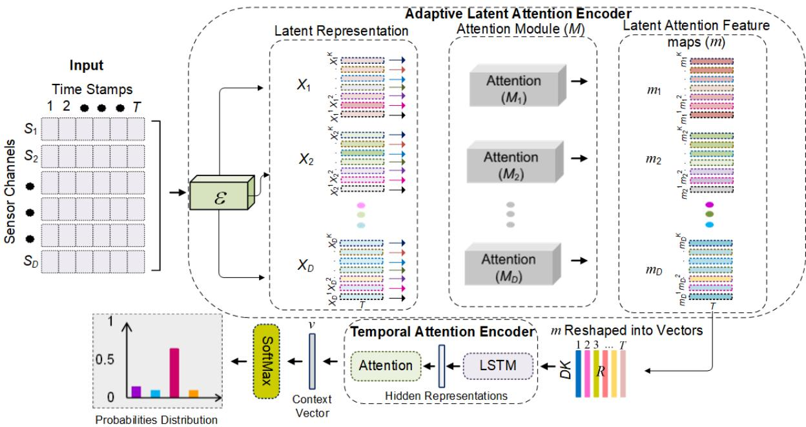  
Fig. 1. Overview of the proposed ALAE-TAE-CutMix+ framework for human activity recognition.

Another important component of ALAE-TAE-CutMix+ is the CutMix+ data augmentation scheme. Available HAR benchmark datasets, such as Hospital [37], Skoda [30], etc., are typically small in size due to the arduous procedure of gathering annotated data through wearable devices. Any DL model becomes prone to overfitting and loses their capacity to generalize. CutMix+, as we shall see, significantly contributes to the improvements of the performance of the model by augmenting the datasets with segments artificially generated using existing segments.

## 3.1 Adaptive Latent Atention Encoder (ALAE)

As pointed out by Abedin et al. [1], in human activity recognition, each channel of a sensor in a sensing device has a unique perceptual ability to capture the same activity. Some sensor channels provide more discriminatory information for ongoing activity compared to others. Consequently, giving high priority to data from more discriminating sensor channels can improve the performance of the HAR model. However, this is not always true in every situation. When data is acquired from senior individuals and hospitalized patients, most sensor channels provide non-discriminatory information across similar activities (e.g., sitting and sitting-down, lying and lying-down, etc.). For example, it can be seen in the very same study by Abedin et al. [1] that the proposed model misclassifies most of the sitting-down activity test samples of hospitalized patients as sitting and the lying-down activity samples as lying. Moreover, when the similar activities (such as lying, sitting, sitting on the sofa, sitting on the chair, sitting on the couch, etc.) are static in nature, the situation becomes even worse. As aged patients are generally unable to perform activities in the same manner as young, healthy people, they remain in a

6 • Nafees et al.

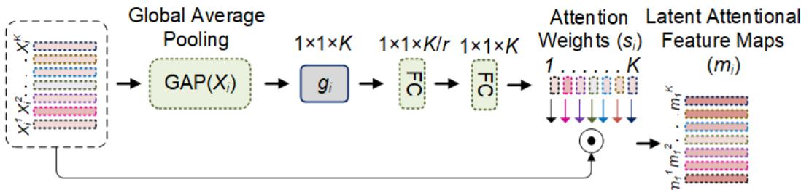  
Fig. 2. Overview of the atention module.

single position for an extended period of time without many movements, resulting in activity patterns with few spikes or changes. Hence, it is likely that sensor channels do not convey discriminatory information for similar activities of static nature. Therefore, in these cases, encoding the sensor channel with attention is insuficient to improve HAR model performance.

The main task of Adaptive Latent Attention Encoder (ALAE) is to generate multiple diferent representations for each sensor channel. We hypothesize that the emergence of multiple diferent latent representations enhances the likelihood of obtaining discriminating information. Then, we can leverage latent representations of those sensor channels that are more informative about the ongoing activity than the representations of other sensor channels. These latent representations can assist the model in encoding activities of similar nature in latent space diferently from one another. Accordingly, we design an end-to-end trainable ALAE module that accepts sensor channel representations as input, generates multiple latent representations and produces the attentive latent representations for each sensor channel.

3.1.1 Latent Representation Generation ofSensor Channels. To project the input representation into the latent representation, we adopt a trainable encoder ε based on a convolutional neural network, which accepts a segment f $T$ ti t f i t d t $S _ { i } \in \mathbb { R } ^ { T }$ from sensor channel �, $1 \leq i \leq D$ , as input and generates � latent representations $X _ { i } ^ { 1 } , . . . , X _ { i } ^ { K }$ corresponding to the sensor channel �,

$$
\begin{array} { l } { \displaystyle \varepsilon ( S ) = \varepsilon ( S _ { 1 } , S _ { 2 } , \cdots , S _ { D } ) } \\ { \displaystyle = ( ( X _ { 1 } ^ { 1 } , X _ { 1 } ^ { 2 } , \cdots , X _ { 1 } ^ { K } ) , ( X _ { 2 } ^ { 1 } , X _ { 2 } ^ { 2 } , \cdots , X _ { 2 } ^ { K } ) , \cdots , ( X _ { D } ^ { 1 } , X _ { D } ^ { 2 } , \cdots \thinspace , X _ { D } ^ { K } ) ) } \\ { \displaystyle = ( X _ { 1 } , X _ { 2 } , \cdots \thinspace , X _ { D } ) , } \end{array}\tag{1}
$$

where $X _ { i } ^ { k } \in \mathbb { R } ^ { T }$ denotes the $k ^ { \mathrm { { t h } } }$ latent representation generated across sensor channel $i , X _ { i } \in \mathbb { R } ^ { K \times T }$ is the latent space feature maps of sensor channel �. The convolutional encoder produces these representations, which are subsequently fed into the attention module to generate attentively optimized representations for each sensor channel.

3.1.2 Atention Module (M). Inspired by the squeeze and excitation method [19], we design the attention module �, where attention network $M _ { i }$ accepts the � latent representations of the $i ^ { \mathrm { { t h } } }$ sensor channel and learns the important latent representations among them. Figure 2 shows the internal structure of attention module �. First, we squeeze the data by computing the global average pooling across � latent representations of a sensor channel �,

$$
g _ { i } = G A P ( X _ { i } ) = ( g _ { i } ^ { 1 } , g _ { i } ^ { 2 } , \cdot \cdot \cdot , g _ { i } ^ { K } ) ,\tag{2}
$$

where $g _ { i } \in \mathbb { R } ^ { k }$ is a vector of � values generated for each sensor channel �. The $k ^ { \mathrm { { t h } } }$ value $g _ { i } ^ { k }$ is derived from the corresponding $k ^ { \mathrm { { t h } } }$ latent representation $X _ { i } ^ { k }$ . ��� denotes the global average pooling operation applied on latent representations $X _ { i }$ generated by encoder ε.

To use the $g _ { i }$ vector produced by the squeeze operation (Equation 2), we perform an excitation operation to enhance the latent representations. The excitation operation performs two operations to accomplish this task. The first step is to compute attention weights, and the second step is to assign these weights to the corresponding sensor channel latent representations. To obtain the attention weights, all the � values of $g _ { i }$ for each latent representation $X _ { i }$ are passed through a two-layer fully connected (FC) neural network,

$$
\begin{array} { r l } & { s _ { i } = \sigma ( h ( g _ { i } , W ) ) = \sigma ( W _ { 2 } \delta ( W _ { 1 } g _ { i } ) ) } \\ & { \quad = ( s _ { i } ^ { 1 } , s _ { i } ^ { 2 } , . . . , s _ { i } ^ { K } ) , } \end{array}\tag{3}
$$

where $\delta$ is the ReLU activation function, $W _ { 1 } \in \mathbb { R } ^ { \frac { K } { r } \times K }$ and $W _ { 2 } \in \mathbb { R } ^ { K \times \frac { K } { r } }$ are the learning parameters associated with the first and second layers of the FC. To reduce computational complexity and the likelihood of overfitting, and increase generalization, the number of learning parameters $W _ { 1 }$ are reduced by some reduction ratio �. However, in the second layer, we increase the dimension again with learning parameters $W _ { 2 }$ and pass the result through the sigmoid function $\sigma$ to obtain the exact number of attention weights (one for each latent representation). The generated weights $s _ { i } \in \mathbb { R } ^ { K }$ are multiplied with the original sensor channel latent representations $X _ { i } \in \mathbb { R } ^ { T }$ respectively to obtain the final enhanced latent representations,

$$
\begin{array} { l } { m _ { i } = s _ { i } X _ { i } } \\ { \phantom { x x x x x x x x x x x x x x x x x x x x x x x x x x x x x x x x x x x x x x x x x x } } \\ { \phantom { x x x x x x x x x x x x x x x x x x x x x x x x } = ( s _ { i } ^ { 1 } X _ { i } ^ { 1 } , s _ { i } ^ { 2 } X _ { i } ^ { 2 } , \cdots , m _ { i } ^ { K } ) } \\ { \phantom { x x x x x x x x x x x x x x x x x x x x } } \\ { \phantom { x x x x x x x x x x x x x x x x x x } = ( m _ { i } ^ { 1 } , m _ { i } ^ { 2 } , \cdots , m _ { i } ^ { K } ) } \end{array}\tag{4}
$$

where $m _ { i } ^ { k } \ = \ ( ( m _ { i } ^ { k } ) _ { 1 } , ( m _ { i } ^ { k } ) _ { 2 } , \cdot \cdot \cdot , ( m _ { i } ^ { k } ) _ { t } ) \ \in \ \mathbb { R } ^ { T }$ indicates the $k ^ { \mathrm { { t h } } }$ latent representation across sensor channel $i ,$ and $\boldsymbol { m } _ { i } = ( m _ { i } ^ { 1 } , \boldsymbol { \dot { m } _ { i } ^ { 2 } } , \cdots , m _ { i } ^ { K } ) \in \mathbb { R } ^ { \dot { K } \times T }$ represents the � number of latent attentive representations of $X _ { i } \ =$ $( X _ { i } ^ { 1 } , X _ { i } ^ { 2 } , \cdots , X _ { i } ^ { K } )$ . Overall, from the result of attention module $M ,$ , we get $m = ( m _ { 1 } , m _ { 2 } , \cdot \cdot \cdot , m _ { D } ) \in \mathbb { R } ^ { D \times K \times T }$ which is passed to the subsequent module of the model.

## 3.2 Temporal Atention Encoder (TAE)

The resultant feature maps $m = ( m _ { 1 } , m _ { 2 } , \cdot \cdot \cdot , m _ { D } ) \in \mathbb { R } ^ { D \times K \times T }$ produced by ALAE are sequentially provided to a two-layer LSTM in order to incorporate a contextual representation of the time-stamps into the model. We reshape these feature maps at each time-stamp $t , 1 \leq t \leq T$ to obtain a vector representation $( R _ { t } ) _ { t = 1 } ^ { T }$ for sequential learning, where $R _ { t } = ( ( m _ { 1 } ^ { 1 } ) _ { t } , \ldots , ( m _ { 1 } ^ { K } ) _ { t } , ( m _ { 2 } ^ { 1 } ) _ { t } , \ldots , ( m _ { 2 } ^ { K } ) _ { t } , \ldots , \ldots , ( m _ { D } ^ { 1 } ) _ { t } , \ldots , ( m _ { D } ^ { K } ) _ { t } ) \in \mathbb { R } ^ { D K }$

When considering only the LSTM, we obtain a summarized version of all time-stamps from the last LSTM cell. However, in HAR, data at diferent time-stamps do not all contribute equally to recognizing the ongoing activity. Therefore, to alleviate this problem and to reduce the burden from the last hidden state cell of the LSTM, we employ a temporal attention approach after the LSTM final layer,

$$
\alpha _ { t } = \frac { \exp ( \operatorname { t a n h } ( W h _ { t } ) ) } { \sum _ { t = 1 } ^ { T } \exp ( \operatorname { t a n h } ( W h _ { t } ) ) } ,\tag{5}
$$

Here, we do not only take the last cell vector representation $h _ { T }$ at time-stamp � from the LSTM but also consider all hidden state representations $\left( h _ { t } \right) _ { t = 1 } ^ { T }$ corresponds to each time-stamp $t , 1 \leq t \leq T$ . This helps to review all time-stamps and put weights on the more relevant ones. In the above formulation, hidden states $\left( h _ { t } \right) _ { t = 1 } ^ { T }$ pass through the first layer to get attention scores, where � is the learning parameter and tanh is the activation function. Then, the softmax function is utilized to obtain the normalized attention weights $\alpha _ { t }$ corresponding to all hidden states.

## 3.3 Computing probabilities for each of the activities

Finally, the sum of products of each hidden states with their attention weights is computed for the final aggregated representation. As a result, important time-stamps are weighed more, and the contributions of less relevant time-stamps become weaker or due to the efects of the attention weights.

$$
\upsilon = \sum _ { t = 1 } ^ { T } \alpha _ { t } h _ { t } .\tag{6}
$$

Hence, a holistic, contextual vector � of all the time-stamps is provided to the model. After that, as a final step, the context vector � is passed through a softmax layer. This obtains the final results, which are the model-predicted probabilities for each of the activities.

## 3.4 Data Augmentation

As virtually all Human Activity Recognition (HAR) benchmark datasets are small in size, adding virtual samples to attain data augmentation to increase training data is expected to be able to to improve generalization performance of the model. However, the data augmentation strategies in various machine learning applications, such as small orientation, flipping, cropping, and scaling in computer vision, might not be the most appropriate for multi-sensor channel time-series data. This is because, on one hand, their efectiveness is dataset-dependent and, on the other hand, it is strongly reliant on domain-expert knowledge for appropriate adoption. Even with domain experience, applying these strategies to HAR is non-trivial, as it is dificult to determine to what extent each sensor channel is altered (e.g., in re-scaling or flipping) but it still preserves the semantics of the original data label. Here, the mixup data augmentation approach [40] is a viable option, which generates a virtual sequence by linearly mixing two original sequences with diferent labels, using diferent proportions of each sequence. This is because, by generating labels in this way, we can address the label semantics problem posed by handcrafted traditional augmentation approaches. However, due to the linear mixing of two original sequences with diferent labels, the generated augmented sequence often appears unnatural and less meaningful, and they can even be fundamentally diferent from the original sequences. This may cause label semantics alteration and model distortion for test sequences.

3.4.1 Temporal CutMix Data Augmentation. Inspired by the CutMix [38] data augmentation method, we first introduce in this Section a temporal CutMix data augmentation method for regularizing the datasets to be used in our HAR model.

W ill t t th t l C tMi t ti th h l i Fi 3 h t dif tl labeled original training segments $( x _ { a } , x _ { b } )$ are utilized to generate a virtual segment $x _ { v }$ with a label $y _ { v } .$ . The temporal CutMix algorithm first determines two sub-segments, each from the two original segments $x _ { a }$ and $x _ { b }$ Specifically, we identify the sub-segment $S _ { A }$ with four values $( S _ { s } ^ { C } , S _ { s } ^ { T } , S _ { e } ^ { C } , S _ { e } ^ { T } ) . S _ { s } ^ { C }$ and $S _ { \mathrm { { s } } } ^ { T }$ indicate the starting sensor channel and starting time-stamp of the sub-segment $S _ { A } ,$ , respectively, while $S _ { e } ^ { C } , \bar { S _ { e } ^ { T } }$ t th di sensor channel and time-stamp of sub-segment, respectively. Next, the sub-segment area $S _ { A }$ in $x _ { a }$ is removed, and replaced with the corresponding sub-segment in ��. In the example (see Figure 3), the sub-segment $S _ { A }$ (from sensors channels $S _ { s } ^ { C } = 4 \ : \mathrm { t o } \ : \bar { S } _ { e } ^ { C } = 8$ with their time-stamps $S _ { s } ^ { T } = 1 4$ to $S _ { e } ^ { T } = 2 4 \bar { ) }$ is cropped from $x _ { a }$ and filled in with the corresponding data from ��). The points of sub-segment $S _ { A }$ are sampled uniformly, i.e., these points are chosen arbitrarily from a uniform distribution between the minimum and maximum values,

$$
S _ { s } ^ { C } \sim \mathrm { U n i f o r m ~ D i s t r i b u t i o n } ( 0 , D ) , S _ { e } ^ { C } = D \sqrt { 1 - \lambda }
$$

$$
S _ { s } ^ { T } \sim \mathrm { U n i f o r m } \mathrm { D i s t r i b u t i o n } ( 0 , T ) , S _ { e } ^ { T } = T \sqrt { 1 - \lambda } .\tag{7}
$$

Time Stamps

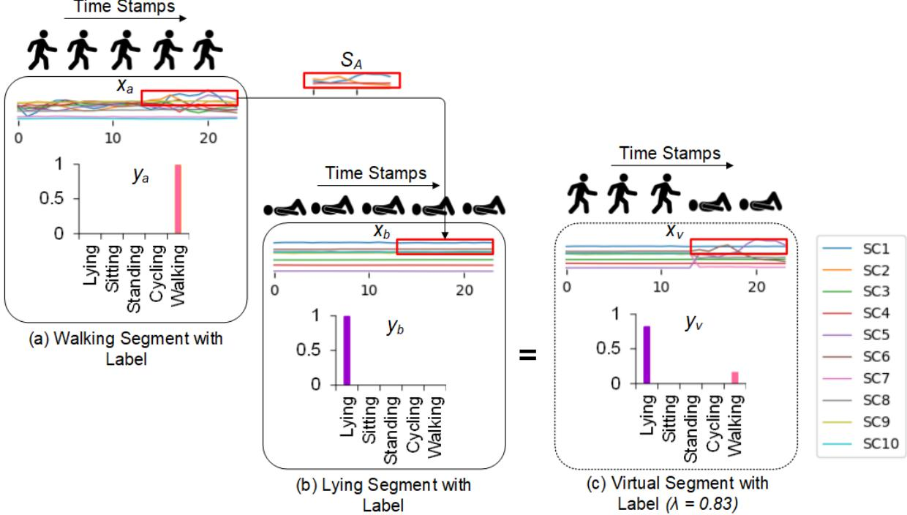  
Fig. 3. Illustration of our temporal CutMix component generated virtual example: (a) a segment of walking activity $( x _ { a } )$ from the training partition with its one-hot encoded label $\left( y _ { a } \right)$ , (b) a training segment of lying activity corresponding to its one-hot encoded label (��), (c) a newly generated virtual sample with the target label and lambda’s (� ∼ ����������������(�, �)) value indicates the mixing ratio of input segments. The sub-segment $S _ { A }$ from sensors channels 4 − 8 with their time-stamps 14 − 24 is cropped from $x _ { a }$ and pasted on the corresponding location in $x _ { b }$ . Each colour in the sequences $X _ { a } , X _ { b }$ , and $X _ { v } ,$ represents a sensor channel, while the range of numbers 0 to 24 on the horizontal axis indicates their time-stamps. (Best viewed in color.)

where �, which is derived from the Beta distribution (�, �), indicates the mixing ratio from segment $x _ { a }$ and $x _ { b }$ in the newly generated segment ${ x _ { v } } . ^ { 1 }$ After generating a new sample $x _ { v } ,$ , we generate its label $y _ { v }$ as,

$$
y _ { v } = \lambda y _ { a } + ( 1 - \lambda ) y _ { b } .\tag{8}
$$

Temporal CutMix makes it possible to rapidly generate two virtual segments by exchanging the sub-segments in random pairs of training segments from a similar mini-batch at each iteration. It shows promising results in enhancing the generalization of the HAR model. Moreover, the Temporal CutMix is domain-agnostic and easy to implement.

3.4.2 CutMix+. Despite efectiveness of temporal CutMix in generating new segments from original segments of two diferent classes, it might generate new segments from two original sequences of intuitively completely diferent classes, $e . g .$ , cycling and sleeping. Consequently, the generated virtual segments appears unnatural and unrecognizable, which can cause ambiguity and hinder the training and learning performance of the model. To alleviate this problem, we revise temporal CutMix to CutMix+. Specifically, in each training iteration, we provide the model with one of two original segments, $e . g . , ( x _ { b } , y _ { b } )$ and a newly generated segment $( x _ { v } , y _ { v } )$ , but we exclude the segment $( x _ { a } , y _ { a } )$ to reduce the possibility of overfitting. Due to this addition, our loss function is as follows,

$$
\begin{array} { r l } & { L _ { t o t a l } = L _ { C E } ^ { v } + L _ { C E } ^ { r _ { b } } = \mathbb { E } \big [ { - y _ { v } } . \log \overline { { y } } _ { v } - y _ { b } . \log \overline { { y } } _ { b } \big ] } \\ & { \qquad = \mathbb { E } \big [ { - [ \lambda y _ { a } + ( 1 - \lambda ) y _ { b } ] . \log \overline { { y } } _ { v } - y _ { b } . \log \overline { { y } } _ { b } } \big ] , } \end{array}\tag{9}
$$

$L _ { C E } ^ { v }$ defines the evaluation of the CutMix cross-entropy loss of the virtual segment, whereas $L _ { C E } ^ { r b }$ represents the evaluation of the cross-entropy classification loss of the original segment. $y _ { a } , y _ { b }$ , and $y _ { v }$ are the actual labels, while $\overline { { y } } _ { v }$ and $\overline { { y } } _ { b }$ describe the predicted probability of the virtual segment $x _ { v }$ and the real segment $x _ { b } ,$ respectively. By utilizing both classification loss and CutMix loss in combination (as shown in Equation 9) we improve the performance ability of our model on both virtual segments and original segments.

## 4 ALAE-CIE-TAE-CutMix+ Framework

The proposed ALAE-TAE-CutMix+ framework does not directly benefit from the interactions between sensors As shown by studies [1, 4, 5], exploiting the interactions between sensors enables the HAR model to extract more discriminatory and meaningful representations for an activity. We believe that this finding aligns with the fact that diferent body parts interact with one another during an activity. These interactions for each activity can be diferent, and they help diferentiate the activities. For example, in the table cleaning activity, unique interactions b t th i ht h d d th b k f th b d C t i th ki d f i t ti th h th tt h d sensor channels enables the model to extract more distinct representations for activities, ultimately leading to more accurately recognition of activities. Thus, we propose to extend the ALAE-TAE-CutMix+ framework with a new end-to-end trainable module, the Cross-Channel Interaction Encoder (CIE), to leverage the interactions between sensor channels, and investigate whether it improves model performance. We refer to this enhanced framework as the new framework ALAE-CIE-TAE-CutMix+. As we have already outlined the modules ALAE, TAE, and CutMix+ in detail in Section 3, in this section, we present the CIE module and, discuss its design, workflow, and how it is integrated within the ALAE-TAE-CutMix+ framework.

## 4.1 Cross-Channel Interaction Encoder (CIE)

To learn the interactions between sensor channels, we adopt the CIE module from the study conducted by Abedin et al. [1]. The overall architecture of the CIE module is presented in Figure 4. The module makes use of the self-attention mechanism [34, 41], a popular method to learn the relationship between any two variables in the input. It accepts the sensor channels feature maps � from the ALAE module, learns the interactions between these channels at each time-stamp, and passes them to the TAE module. To achieve this, the representation � $\mathsf { \Omega } _ { : } ( \in \mathbb { R } ^ { D \times K \times T } )$ is passed through the CIE one by one as $t _ { i } ( \in \mathbb { R } ^ { D \times K } ) , t = 1 , 2 , \dots , T$ . In the first step, we compute the normalized correlations between each dual sensor channel representations $m _ { t } ^ { d }$ and $m _ { t } ^ { d ^ { ' } }$ at every time-stamp �,

$$
\boldsymbol { a } _ { t } ^ { d , d ^ { ' } } = \frac { e x p ( f ( \boldsymbol { m } _ { t } ^ { d } ) ^ { T } \boldsymbol { g } ( \boldsymbol { m } _ { t } ^ { d ^ { ' } } ) ) } { \displaystyle \sum _ { d ^ { ' } = 1 } ^ { D } e x p ( f ( \boldsymbol { m } _ { t } ^ { d } ) ^ { T } \boldsymbol { g } ( \boldsymbol { m } _ { t } ^ { d ^ { ' } } ) ) } ,\tag{10}
$$

where $a _ { t } ^ { d , d ^ { ' } }$ indicates the normalized correlation value between the features of $d ^ { t h }$ sensor channel and the features of $d ^ { ' t h }$ sensor channel at time-stamp �. After that, the self-attention feature map $o _ { t } ^ { d }$ at each time-stamp � is produced as the dot product of the normalized correlation values and the actual input sensor channels latent

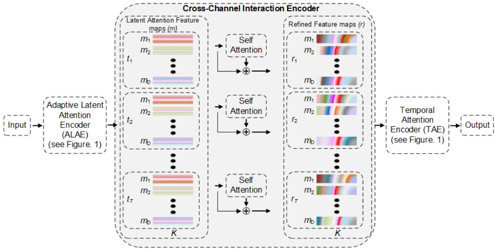  
Fig. 4. Overview of Cross-Channel Interaction Encoder and showing how it is integrated into ALAE-TAE-CutMix+ framework.

representations $h ( m _ { t } ^ { d ^ { ' } } )$ ,

$$
o _ { t } ^ { d } = \sum _ { d ^ { ' } = 1 } ^ { D } a _ { t } ^ { d , d ^ { ' } } h ( m _ { t } ^ { d ^ { ' } } ) .\tag{11}
$$

Overall, this indicates that the model computes the degrees of interaction between features of the $d ^ { t h }$ sensor h l d th f t f h f th $d ^ { ' t h }$ h l Fi ll t bl th d l t d id h th t it needs to encode the interaction between a pair of sensor channel with respect to the ongoing activity, a refined representation � is generated. This is achieved through the residual operation [18]

$$
r _ { t } ^ { d } = \gamma o _ { t } ^ { d } + m _ { t } ^ { d } ,\tag{12}
$$

which multiplies the generated attention representation $o _ { t } ^ { d }$ with the scalar learning parameter � and then adds it back to the input feature. The parameter $\gamma$ is initialized to 0 and it is gradually increased during the training. This enables the model to initially focus on learning the simpler interactions between the sensor channels, and then progressively learn the more complex interactions. The purpose of adding the input feature maps � (ALAE output) is to create the connectivity between the ALAE feature maps and self-attention feature maps $o _ { t } ^ { d . }$ −enabling the model to boost or suppress the ALAE feature maps (sensor channel representations) according to the current ongoing activity. In the aforementioned formulation, the functions $f ( ) , g ( )$ , and ℎ() are learnable linear transformation functions. The output of the CIE module produces $\boldsymbol { r } = ( r _ { 1 } , r _ { 2 } , \ldots , r _ { T } ) \in \mathbb { R } ^ { D \times K }$ . We reshape � into a temporal vector and passes it into the TAE module for learning sequential features.

## 4.2 Overview of complete ALAE-CIE-TAE-CutMix+

The overall architecture of the complete ALAE-CIE-TAE-CutMix+ framework is depicted in Figure 4. First, we input the CutMix+ augmented segment into the ALAE module. The ALAE module produces the attentive and optimal latent representation across each sensor channel, selectively enhancing the representations that are highly related to the ongoing activity. Next, the enhanced sensor channel representations are passed to the CIE module, which learns the interactions across each pair of sensor channels at each time-stamp. Finally, the output of the CIE module is passed to the TAE module, which extracts the global temporal representation of the activity and provides it to the softmax layer to predict the activity.

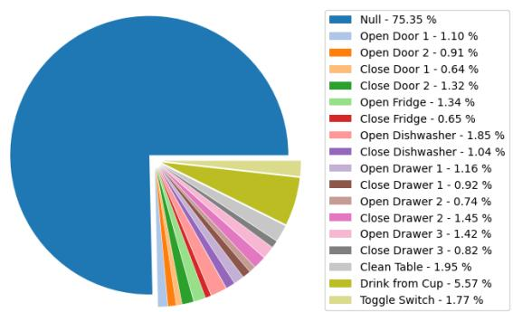  
(a) Opportunity

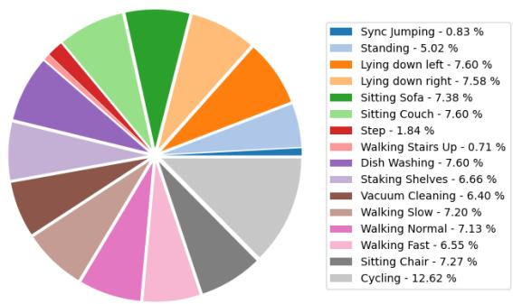  
(b) GOTOV

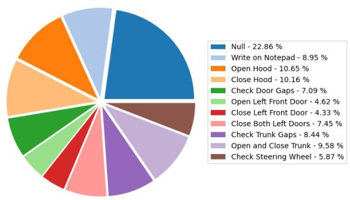  
(c) Skoda

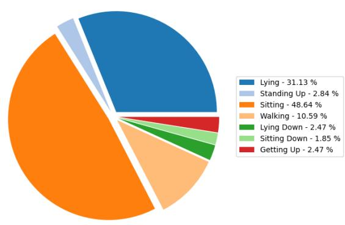  
(d) Hospital  
Fig. 5. Pie charts illustrating the four benchmark datasets investigated in our work. The activities listed within these benchmark datasets and their percentage distribution are presented. (Best viewed in color.)

## 5 Experiments and Results

## 5.1 Benchmark Human Activity Recognition Datasets

Given that our frameworks focus on addressing the challenges and constraints in recognizing older persons and patient activities, we use publicly available benchmark datasets, i.e., Hospital [37], GOTOV [24] to validate the performance of both proposed models and compare it with state-of-the-art research. The Hospital dataset comprises data on aged patients’ activities, and the GOTOV dataset includes data on healthy older adults’ activities. These datasets are relevant to elderly care applications. Moreover, to demonstrate the generalizability of the model, we also conduct experiments on highly popular HAR datasets, such as Skoda [30] and Opportunity [8]. Skoda contains activities performed by workers on an automotive assembly line, and the Opportunity dataset is a highly unbalanced dataset with a significant bias toward a Null class distribution, accounting for about 75.44% of the data, while most other activities contain data for short gestures. Figure 5 shows the activities listed in each dataset and their respective distributions. In addition, a statistical overview is provided in Table 1. A brief overview of each dataset is presented below.

Table 1. Statistical overview of the datasets.
<table><tr><td>Dataset</td><td># Subjects</td><td># Sensor Channels</td><td># Activities</td><td># Training Segments</td></tr><tr><td>Hospital</td><td>12</td><td>6</td><td>7</td><td>4607</td></tr><tr><td>GOTOV</td><td>29</td><td>9</td><td>16</td><td>291723</td></tr><tr><td>Skoda</td><td>1</td><td>60</td><td>10</td><td>15548</td></tr><tr><td>Opportunity</td><td>4</td><td>79</td><td>18</td><td>54246</td></tr></table>

5.1.1 Hospital. The dataset consists of 12 older, hospitalized patients wearing inertial sensors on their clothing and performing seven diferent activities. For hold-out evaluation, we follow [37], in which data from the first 8 d th t 3 ti i t d f t i i d t ti titi ti l hil th t f th d t i used for validation.

5.1.2 GOTOV. This dataset consists of 9 sensor channels of data attached to three diferent body positions, collected from 35 older adults (21 men and 14 women) over the age of 61 performing 16 activities. We exclude six people (four men and two women) from the evaluation due to the unavailability of data from some sensor channels. For hold-out evaluation, the data of three users is used for testing and three for validation, each consisting of two men and one woman, while the data of the remaining users are used for training.

5.1.3 Skoda. This dataset comprises 10 assembly line activities collected from car manufacturing workers through 60 sensor channels attached to the right-hand body position. For hold-out evaluation, we follow [15], where the first 80% of each label data is used for training, the next 10% for validation, and the remaining for testing.

5.1.4 Opportunity. This dataset is collected through 79 sensor channels data for 18 diferent activities. Four volunteers equipped with wearable sensors carried out the kitchen activities for five diferent runs. For hold-out evaluation, we replicate [17], where the data of the 4th and 5th runs acquired from subjects 2 and 3 are treated as a test, and the data of the 2nd run collected from subject one is assigned to the validation section, and the remaining data is considered training data.

## 5.2 Evaluation

For a fair comparison, we use the same evaluation approach (e.g., hold-out), performance metrics, and standard training and testing partitions used in our state-of-the-art studies [1, 15, 17, 22]. Following [1, 15, 22], training data is divided into segments using a sliding window technique before feeding the data into the learning model. During training, we utilize 24 time-stamps in each segment with 50% overlap between consecutive windows, for example, a new window � overlaps with 12 samples of window � − 1. While in testing, following [1, 22], a more practical and realistic technique, sample-by-sample evaluation is employed in which prediction is made for each test sample. As our utilized HAR datasets are imbalanced (as shown in Figure 5), thus following studies [1, 15, 17, 22],

Table 2. An F-score based performance comparison between the proposed frameworks and the baseline studies.
<table><tr><td>HAR Study</td><td>Hospital</td><td>GOTOV</td><td>Skoda</td><td></td><td>Opportunity</td></tr><tr><td rowspan="5">Bassines</td><td>LSTM Learner Baseline [15]</td><td>62.7</td><td>61.1</td><td>90.4</td><td>65.9</td></tr><tr><td>DeepConvLSTM [23]</td><td>62.8</td><td>66.9</td><td>91.2</td><td>67.2</td></tr><tr><td>b-LSTM-S [17]</td><td>63.6</td><td>63.9</td><td>92.1</td><td>68.4</td></tr><tr><td>Att. Model [22]</td><td>64.1</td><td>70.7</td><td>91.3</td><td>70.7</td></tr><tr><td>Attend and Discriminate [1]</td><td>66.6</td><td>76.2</td><td>92.8</td><td>74.6</td></tr><tr><td rowspan="4"></td><td>ALAE-TAE-CutMix+</td><td>70.5</td><td>79.4</td><td>94.8</td><td>75.1</td></tr><tr><td>ALAE-CIE-TAE-CutMix+</td><td>70.3</td><td>79.7</td><td>94.8</td><td>73.4</td></tr><tr><td>Improvement of ALAE-TAE-CutMix⁺ over [1]</td><td>(5.86%)</td><td>(4.12%)</td><td>(2.16%)</td><td></td></tr><tr><td></td><td></td><td></td><td></td><td>(0.68%)</td></tr></table>

we also use the F-score

$$
{ \mathrm { F - s c o r e } } = 2 \times { \frac { p r e c i s i o n \times r e c a l l } { p r e c i s i o n + r e c a l l } } ,\tag{13}
$$

evaluation metric to report our models performance. In addition, confusion matrices are reported for the proposed frameworks to show the activity-wise model’s performance.

## 5.3 Experimental Setup and Hyperparameter Setings

We implement our proposed frameworks using TensorFlow Keras and conduct all the experiments on an Nvidia RTX 3090 GPU. Dropout is employed on the ALAE and TAE modules to avoid overfitting. Specifically, we choose 0.5 as the dropout probability on the attention module �′� first and second dense layers, while in the TAE module, 0.5 dropout and 0.5 recurrent dropouts are used on the LSTM first layer, and 0.5 and 0.9 as the LSTM second layer, respectively. Our model learning parameters are optimized for up to 300 iterations in an end-to-end training manner using backpropagation and the cross-entropy loss function on a mini-batch size of 256. Adam is used as a learning parameter optimizer, with a learning rate of 0.001 that decreases by 0.9 every ten epochs. For CutMix+ data augmentation we utilize � = 0.3. All the hyperparameters are kept the same across all four utilized datasets.

## 5.4 Comparison with the State-of-the-Art HAR studies

In this section, we compare the performance of the proposed frameworks with state-of-the-art HAR studies. We conduct a pool of experiments, each of which involves the random initialization of the learning parameters. Initially, we follow the traditional way of comparing the performance, in which we report the best experiment result among all conducted experiments to show the efectiveness of the proposed frameworks. We observe from the pool of experiments that the simpler framework’s best experiment result is relatively better than the CIE-enhanced framework’s best result. However, the results of most of the other experiments of the CIE-enhanced framework are relatively better and more stable (the results range was quite small). Given this situation, we go a step further and examine the reliability and robustness of the proposed frameworks by presenting a performance comparison based on average results and the standard deviations of all the experiments.

5.4.1 Efectiveness. To show the efectiveness of our proposed frameworks, we compare our results with five leading-edge HAR studies that proposed one of the most widely recognized models for HAR (listed in Table 2). For the Hospital, Skoda, and Opportunity datasets, the results of baseline studies [17, 23] are directly quoted from [1], whereas the results of other baseline studies are obtained from [1, 15, 22]. As no results are available for the GOTOV dataset, we utilize the published code of the baseline studies to obtain the performance data.

From the data in Table 2, it is clear that both proposed models, with and without CIE, outperform all baseline studies across all datasets. However, in this scenario of result reporting, our simpler model (without CIE) is generally more efective − surpassing the best-performing state-of-the-art [1] by 5.86%, 4.12%, 2.16%, and 0.68% on the Hospital, GOTOV, Skoda and Opportunity datasets, respectively. Even though the Hospital and GOTOV datasets contain inter-class similarity problems and the Hospital dataset is small and imbalanced (unequal distribution of classes in the training dataset, see Figure 5), it should be noted that the proposed models achieve a significant performance improvement in recognizing the activities of older people (both hospitalized and non-hospitalized). Furthermore, in the case of the Skoda dataset, when recognizing the activity performance of assembly line workers, there is a considerable improvement over the state-of-the-art [1]. Notably, for the Opportunity dataset, our ALAE-TAE-CutMix+ model also outperforms state-of-the-art despite a high level of class imbalance and greater diversity of activities. For further insights and a better understanding of the performance of our model, we provide the class-wise recognition performance through confusion matrices across all datasets in Figures 6 and 7 for the simpler framework and CIE-enhanced framework, respectively. For the Opportunity d t t t ti iti f d ith “N ll” l ti iti Thi t d th N ll l h ld infinite number of unknown activities information—more than 75% of the total data (see Figure 5(a)). This is one of the research problems in the field of HAR. To show the activity-wise improvements of our models, we conduct the performance comparison between our models and the runner-up model [1] across Hospital and GOTOV datasets in Figure 8. The proposed models achieve superior performance. These datasets include inter-class similar activities’ complexities—lacking discriminatory information across activities. In this scenario, developing a model that obtains desirable performance is not a trivial task. Hence, substantial improvement of our methods on the aforementioned datasets is noteworthy, particularly for inter-class similar activities (e.g., see sitting-down and lying-down activities in the Hospital dataset, while the GOTOV dataset includes sitting on a sofa and sitting on a chair, and three types of walking (slow, normal, and fast)). This is strong evidence of enhancing discriminatory information, which was our primary motivation for developing the ALAE module.

5.4.2 Reliability and Robustness. To obtain the complete picture of the performance of our proposed frameworks, we also show how reliable and robust they are. For reliability, we see how accurately the models perform in each experiment. In the robustness, we see the consistency in the performance of models in diferent experiments. To measure the model’s reliability, we report the average result of all the conducted experiments. Conversely, to measure the model’s robustness, we report the standard deviations of all the conducted experiments. In Table 3, we report the results of all the experiments using the CIE-enhanced ALAE-CIE-TAE-CutMix+ framework, that of the simpler ALAE-TAE-CutMix+ framework without the CIE module, and that of the current state-of-the-art model (Attend and Discriminate [1]). 2

Based on the results, it is evident that the computed average scores of the CIE-enhanced framework are significantly higher, while the obtained standard deviations are generally lower than those of the proposed simpler framework and current state-of-the-art Attend and Discriminate framework. Hence, this shows that the CIE-enhanced framework is more reliable and robust than other frameworks. In addition, compared to the Attend and Discriminate model, our simpler model (without the CIE module) also ofers more robustness and reliability.

## 5.5 Ablation Study

Given that we integrate several new modules (CutMix+, ALAE, CIE and TAE) into the proposed HAR framework, it is therefore mandatory to see the efects and contributions of each component in the proposed framework. To do this, we conduct an ablation study on the Hospital dataset, and report the contribution of each module alone and in conjunction with other proposed modules in Table 4.

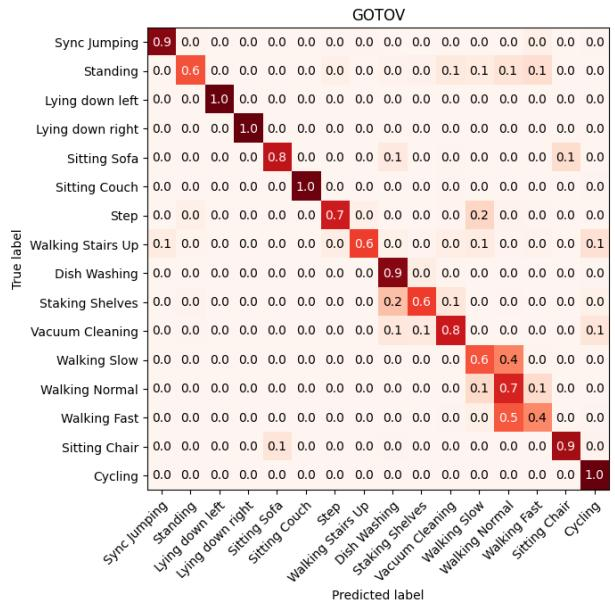

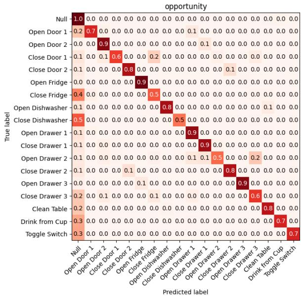

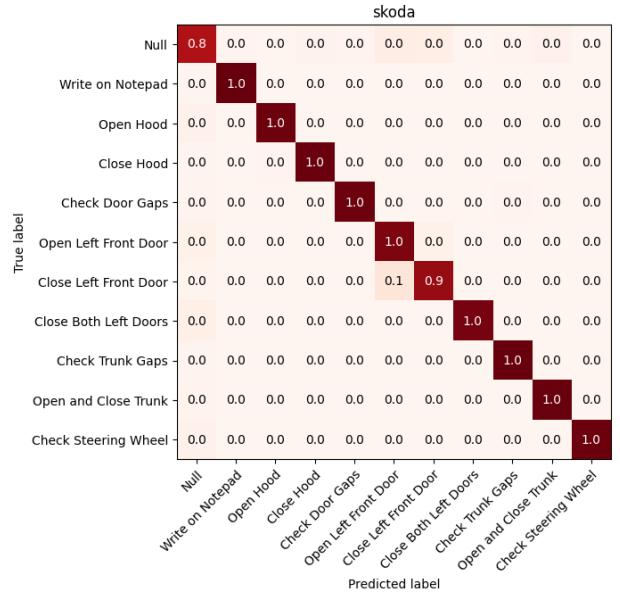

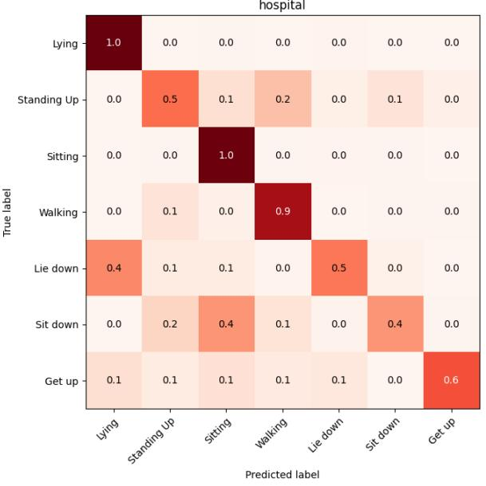  
Fig. 6. Confusion matrices to show class-wise recognition performance of ALAE-TAE-CutMix+ framework achieved on the hold-out test splits across the four benchmark datasets.

We start by removing all other modules from the proposed framework, leaving only the TAE module’s LSTM layers and the classification layer. As a result, it becomes the similar model (i.e., Baseline LSTM Learner) proposed in the study [15], which we use as our reference model for the ablation study. We add each module with the reference model in their respective places (as chosen in the proposed framework) alone and in diferent combinations to see how much the addition of the modules improves the performance compared to the reference model. Unsurprisingly, eliminating all new components except the reference model makes the performance largely d t 62.7% ( t d th LSTM b d l i g d l [15] l t d 62.7% ( T bl 2)) I t t when all new modules (CutMix+, ALAE, and TAE) are utilized together, the F-score performance improves significantly to 70.5%. However, it is interesting when CIE is used with all the new modules, the performance is slightly dropped, which we discuss shortly.

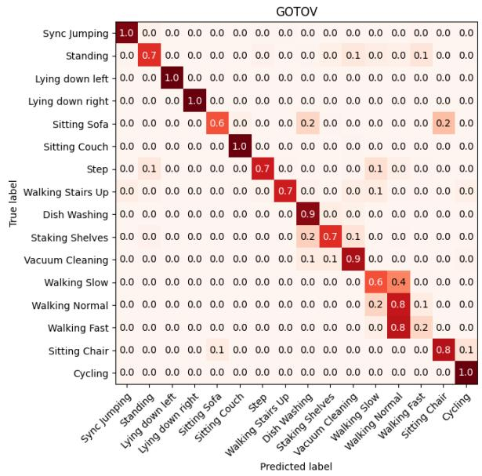

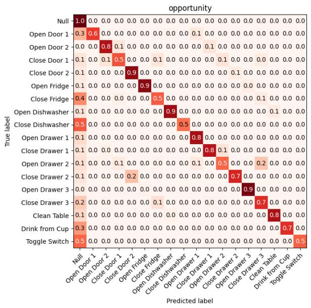

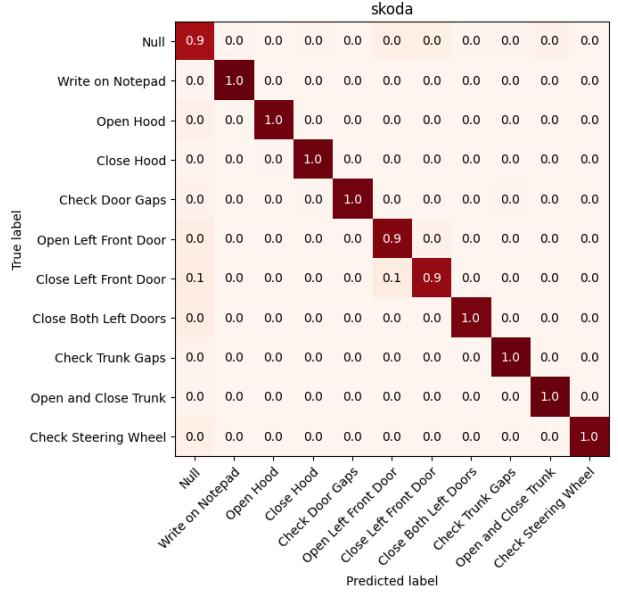

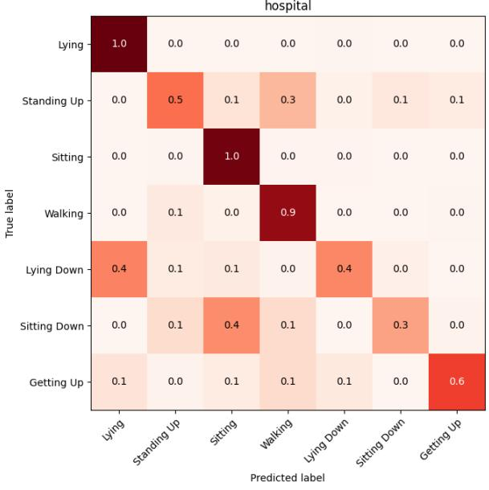  
Fig. 7. Confusion matrices to show class-wise recognition performance of ALAE-CIE-TAE-CutMix+ framework achieved on the hold-out test splits across the four benchmark datasets.

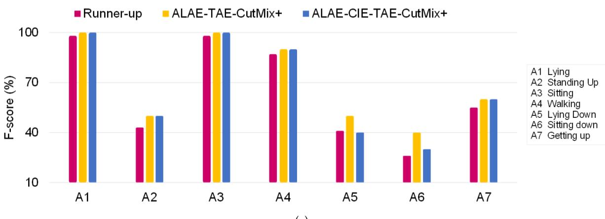  
(a)

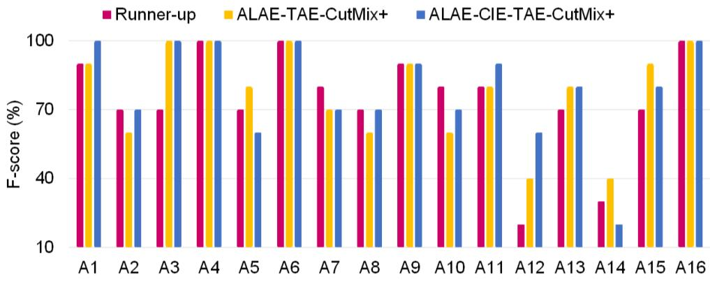  
(b)  
Fig. 8. Activity-wise recognition performance comparison among both proposed models and the runner-up Atend and Discriminate model [1] on (a) Hospital and (b) GOTOV dataset.

Table 3. Performance comparison between the proposed ALAE-CIE-TAE-CutMix+, ALAE-TAE-CutMix+ and the current best performing model based on average results and the standard deviations of all experiments.
<table><tr><td>HAR Study</td><td>Hospital</td><td>GOTOV</td><td>Skoda</td><td>Opportunity</td></tr><tr><td>Attend and Discriminate [1]</td><td> $6 4 . 8 \pm 0 . 8$ </td><td> $7 5 . 3 \pm 0 . 9$ </td><td> $\overline { { 9 2 . 2 \pm 0 . 2 } }$ </td><td> $7 0 . 6 \pm 2 . 8$ </td></tr><tr><td>ALAE-TAE-CutMix+</td><td> $6 7 . 7 \pm 1 . 1$ </td><td> $7 7 . 8 \pm 0 . 7$ </td><td> $9 4 . 5 \pm 0 . 1 $ </td><td> $7 1 . 3 \pm 0 . 4$ </td></tr><tr><td> $_ { \mathrm { A L A E - C I E - T A E - C u t M i x ^ { + } } }$ </td><td> $6 8 . 7 \pm 0 . 7$ </td><td> $7 8 . 4 \pm 0 . 2$ </td><td> $9 4 . 6 \pm 0 . 1$ </td><td> $7 1 . 7 \pm 1 . 0$ </td></tr></table>

The addition of only the CutMix data augmentation with the reference model obtains an impressive 3.5% performance gain over the baseline (from 62.7% to 66.2%), showing its efectiveness in generalizing the HAR model. Moreover, this implies that CutMix’s generated multi-channel samples successfully augment training data and enhance the generalization of the learned activity’s key representations to test sequences. Similarly, integrating the ALAE module alone achieves a 3.5% improvement over the LSTM reference model (from 62.7% to 66.2%). This shows the ALAE module contribution toward enhancing discriminatory information for each activity.

Table 4. The results of ablation study on the Hospital dataset.
<table><tr><td>HAR Model</td><td>F-score</td></tr><tr><td>LSTM Learner Baseline Ours (CutMix)</td><td>62.7 66.2</td></tr><tr><td>Ours (ALAE) Ours (CutMix⁺)</td><td>66.2 66.7</td></tr><tr><td> $\mathrm { O u r s } \left( \mathrm { C u t M i x } + \mathrm { T A E } \right)$ </td><td>66.7</td></tr><tr><td> $\mathrm { O u r s } \left( \mathrm { A L A E } + \mathrm { T A E } \right)$ </td><td>66.8</td></tr><tr><td> $\mathrm { O u r s } \left( \mathrm { C u t M i x ^ { + } + T A E } \right)$ </td><td>66.9</td></tr><tr><td> $\mathrm { O u r s } \left( \mathrm { C u t M i x } + \mathrm { A L A E } \right)$ </td><td></td></tr><tr><td> $\mathrm { O u r s } \left( \mathrm { C u t M i x } + \mathrm { A L A E } + \mathrm { T A E } \right)$ </td><td>69.7</td></tr><tr><td></td><td>69.9</td></tr><tr><td> $\mathbf { O u r s } \left( \mathbf { C u t M i x ^ { + } + A L A E + T A E } \right)$ </td><td>70.5</td></tr></table>

As expected, the integration of ALAE with CutMix (CutMix + ALAE) significantly boosts performance by 7% over the baseline (from 62.7% to 69.7%). Further, the inclusion of TAE with other modules marginally improves model performance. Additionally, we see more performance improvements and faster model convergence when integrating CutMix+ with other modules to train the model on both virtual and raw sequences.

Adding the CIE module with all the proposed modules has a slightly negative impact on the model performance. H it ht t b t d th t th CIE d l h i ifi t i t i t f i i th b t and reliability of the model as illustrated in Section 5.4.

We also conduct an ablation study on the GOTOV dataset, as its characteristics difer significantly from those of the Hospital dataset. For example, GOTOV data comes from healthy aged subjects, whereas the Hospital d t t d t i f ld ti t GOTOV i l d d t f l g b f h l d th GOTOV dataset is around 63.30 times more data than the Hospital dataset. The results are shown in Table 5. It is important to note that the addition of the ALAE module is consistently improving the performance of the model. As shown in the Table 5, whenever we use the ALAE module (alone and also in combination with other modules), it is significantly contributes to the performance enhancement of the model. This shows the substantial efectiveness of the ALAE module toward extracting the discriminatory features across each activity.

We also investigate how hand-crafted traditional data augmentation methods afect the performance of the learning models (ALAE-TAE and ALAE-CIE-TAE). We adopt the recently explored methods that include scaling, jittering, and magnitude warping from the study conducted by Um et al. [32] and apply them on the proposed models. The results are detailed in Table 6. Scaling changes the segment data magnitude by multiplying arbitrarily scalar number with the sensor channel data samples. Jittering introduces simulated noise to the sensor channel data. Finally, magnitude warping introduces subtle variations in the magnitude of each data sample by convolving the data segment with a smooth curve whose value fluctuates around one.

Based on the findings, we find that CutMix and its variants exhibit a significant performance advantage over all traditional handcrafted data augmentation methods. From Table 6, it can be observed that in most cases, the traditional augmentation methods highly degrade the performance of the models, particularly on the GOTOV dataset. We believe that this may be due to random alteration of each sensor channel data without considering its label’s knowledge. Consequently, the artificially generated sequences sufer from the label alteration problem (i.e., the data is altered in a way that becomes semantically diferent from the original activity label) and training the model on this artificially generated sequence misleads the model, which ultimately causes the model distortion for test sequences. For example, consider scaling data augmentation: When the sequence for the slow walk activity is augmented by scaling with a larger generated number, the data magnitude for each sensor channel increases. Consequently, the data pattern diverges semantically and may look like a pattern of fast walking or jogging activity. Moreover, when the model is trained on this augmented sequence with the original label (slow walk), it can lead to the model being misleading. This problem can be reduced if these data augmentations are carefully tuned and applied [32]. However, carefully tuning is not a straightforward task due to the multiple challenges involved, for example, what and how many activities are to be recognized, the similarity of inter-class activities, the variation in intra-class activities, and the number of sensor channels and their characteristics etc. [1].

Table 5. The results of ablation study on the GOTOV dataset.
<table><tr><td>HAR Model</td><td>F-score</td></tr><tr><td>LSTM Learner Baseline</td><td>61.1</td></tr><tr><td>Ours (CutMix)</td><td>64.8</td></tr><tr><td>Ours (ALAE) Ours (CutMix⁺)</td><td>73.7</td></tr><tr><td>Ours (CutMix + TAE)</td><td>63.3 64.9</td></tr><tr><td>Ours (ALAE + TAE)</td><td>74.4</td></tr><tr><td>Ours (CutMix⁺ + TAE)</td><td>65.0</td></tr><tr><td>Ours (CutMix + ALAE)</td><td>78.9</td></tr><tr><td>Ours (CutMix + ALAE + TAE)</td><td></td></tr><tr><td>Ours (CutMix⁺ + ALAE + TAE)</td><td>78.4</td></tr><tr><td>Ours (CutMix + CIE + ALAE + TAE)</td><td>79.4 79.7</td></tr></table>

Table 6. The F-score based comparison between proposed CutMix and its variants with diferent data augmentation methods on Hospital and GOTOV dataset.
<table><tr><td rowspan="2">Data Augmentation</td><td colspan="2">Hospital</td><td colspan="2">GOTOV</td></tr><tr><td>ALAE-TAE</td><td>ALAE-CIE-TAE</td><td>ALAE-TAE</td><td>ALAE-CIE-TAE</td></tr><tr><td>No Augmentation</td><td>68.2</td><td>66.7</td><td>72.4</td><td>70.6</td></tr><tr><td>Scaling</td><td>67.1</td><td>66.8</td><td>72.7</td><td>75.5</td></tr><tr><td>Jittering</td><td>67</td><td>67.2</td><td>71.3</td><td>75.7</td></tr><tr><td>Magnitude Warping</td><td>68.5</td><td>67.9</td><td>71.0</td><td>74.7</td></tr><tr><td>CutMix with No Label Mixing</td><td>68.2</td><td>68.3</td><td>76.1</td><td>78.3</td></tr><tr><td>CutMix</td><td>69.9</td><td>70.2</td><td>78.8</td><td>78.9</td></tr><tr><td>CutMix+</td><td>70.5</td><td>70.3</td><td>79.6</td><td>79.7</td></tr></table>

Importantly, compared to the handcrafted data augmentation methods, CutMix generates novel augment segments by considering the original data (not any noise or random values) and the labels. In this manner, it largely alleviates the problem of changing the label semantics, leading to more accurate augmentation for HAR. This can be validated by comparing the results over no augmentation in Table 6: CutMix significantly boosts, while handcrafted methods either reduce or minimally improve the model performance.

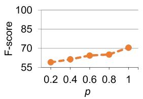  
(a) Hospital dataset

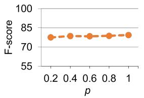  
(b) GOTOV dataset

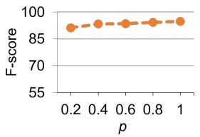  
(c) Skoda dataset

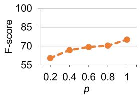  
(d) Opportunity dataset

Fig. 9. The performance analysis of the proposed simpler framework on limited training data across diferent datasets.  
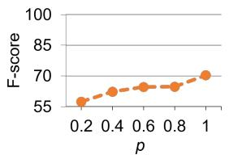  
(a) Hospital dataset

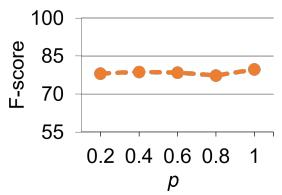  
(b) GOTOV dataset

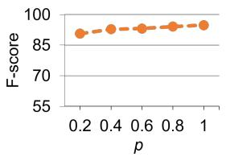  
(c) Skoda dataset

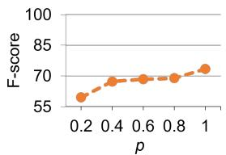  
(d) Opportunity dataset  
Fig. 10. The performance analysis of the proposed CIE-enhanced framework on limited training data across diferent datasets.

In addition, to further strengthen our observation that handcrafted augmentation methods can alter the semantic representation of the original activity label in generated augmented samples, we conduct additional experiments with the CutMix data augmentation. In these experiments, we only mix the two input activities (according to the mixing ratio) to generate the augment segments without mixing their corresponding labels. The majority ratio activity input label is assigned to the newly generated augmented segment. According to the findings presented in Table 6, by comparing the results of the CutMix and CutMix+, we observe that the model’s performance is negatively impacted when the labels from both activities are not mixed according to the mixing ratio. This efect is observed even though we ensure that the likelihood of label transformation semantics from the original activity in the newly generated segment is minimal, which is achieved by transforming the original segment with a small amount of data from the other activity and retaining the original label to the newly transformed augmented segment. Nevertheless, CutMix with no label mixing performs better than no augmentation and handcrafted methods in most cases. This improvement could be due to the mixing of minor parts from the second activity segment, potentially contributing to the model’s regularization.

## 5.6 Impact of Less Amount of Training Data on Model Performance

To show the efectiveness of the model on the limited amount of training data, we also investigate the performance of our proposed simpler framework ALAE-TAE-CutMix+ and CIE-enhanced framework ALAE-CIE-TAE-CutMix+ on a randomly selected � amount of the training data $( p \in ( 0 . 2 , 0 . 4 , 0 . 8 , 1 . 0 ) )$ across all the considered datasets. The results of simpler framework are presented in Figure 9 and CIE-enhanced framework in Figure 10. As HAR datasets are highly imbalanced, we ensure that all classes must have participation in the training data when evaluating the model on diferent data sizes.

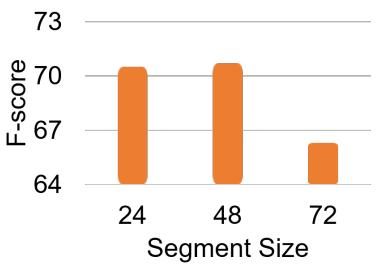  
(a) Hospital dataset

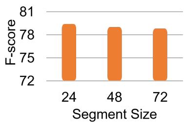  
(b) GOTOV dataset  
Fig. 11. Impact of diferent segment sizes on the performance of the proposed simpler framework.

It is a general perspective that whenever the model is trained on a smaller amount of data, its performance is negatively impacted. However, surprisingly, the results across the GOTOV and SKODA datasets demonstrate that even with highly limited training data (only 20% of the data), we observe no significant negative impact on the models’ performance compared to utilizing 100% of the training data−highlighting the efectiveness of our models. On the other hand, when examining the Hospital and Opportunity datasets, we observe some decrement in the models’ performance. The most probable reason is that these two datasets are immensely imbalanced. For instance, as the reader can see in Figure 5, in the case of the Opportunity dataset, more than 75% of the total data belongs to the Null class, and the rest of the remaining data belongs to the other 17 classes, which is only less than 25% of the total training data. In the case of the Hospital dataset, around 80% of the total data belong to two classes (setting and walking activity), and only the remaining 20% of the data belongs to the other 5 classes. Under this imbalance dataset situation, when the training data is also reduced (e.g., 20%), the representation of minority classes will almost vanish. As a result, the model does not get suficient training on the minority class data. Nevertheless, our proposed HAR models still provide acceptable performance.

## 5.7 Impact of Diferent Segment Sizes on Model Performance

To determine the efect of diferent segment sizes on model performance, we also conduct experiments in which the input segment sample size is increased to 24, 48, and 72 samples, respectively. The results of the proposed simpler framework are presented in the Figure 11 and the CIE-enhanced framework in Figure 12. In the case of the Hospital dataset, the results indicate that the models perform better when increasing segment size from 24 to 48. The reason can be that when samples are increased, the models are more confident to classify the patterns of similar nature activities, resulting more performance gain. This observation can be validated from the results when the samples are few (24 samples) in a segment, where the models’ performance is low compared to what is achieved on segment size 48. It is due to the models confusing the activity with its similar nature activity ( see Figures 6 and 7 e.g., sitting with sitting down and lying with lying down activities). On the other hand, when increasing the samples too much (i.e., 24 to 72), the models performance degrades. It is understandable, as the Hospital dataset includes activities whose representations are limited in the dataset and these activities are also characterized by short gestures. In this situation, increasing the samples too much in segments causes multi-class segments problem (model receiving segments containing samples from diferent classes) [33, 37].

Surprisingly, on the GOTOV dataset, we observe better performance, particularly when increasing samples in segments (here 72 samples) on a CIE-enhanced model. Notably, the GOTOV dataset contains relatively more classes with characteristics of inter-class similarity problems (see Figure 5); therefore, adopting more sample segments results the models more accurately recognizing these activities. On the other hand, the models does not face the same multi-class window problem on this dataset that it faces on the Hospital dataset over 72 sample segments because it is well-balanced (see Figure 5), with mostly classes that have an equal distribution and contain proper activities, not gestures.

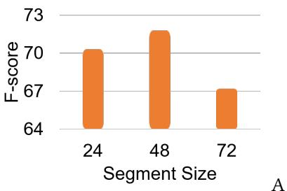  
(a) Hospital dataset

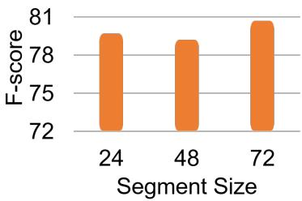  
(b) GOTOV dataset  
Fig. 12. Impact of diferent segment sizes on the performance of the proposed CIE-enhanced framework.

## 6 Conclusion

We propose a HAR framework called ALAE-TAE-CutMix+. The ALAE module enriches the representation of each sensor channel by generating multiple latent representations. It exploits those sensor channel representations that are more discriminatory than others for the current undergoing activity in order to classify activities more precisely. The TAE module learns temporal contextual information. CutMix+ is a new augmentation method for multi-sensor channels based HAR to achieve better generalization with two variants: CutMix and CutMix+. CutMix is for HAR model regularization, while CutMix+ is an extension of CutMix that addresses the ambiguity in CutMix augmented sequences in some scenarios. Furthermore, we also propose the further enhanced framework, ALAE-CIE-TAE-CutMix+, in which the ALAE-TAE-CutMix+ framework is extended by integrating the CIE module. With the new CIE module, this framework further considers the interactions between each pair of sensor channels. Extensive experimental results across four benchmark datasets show the remarkable superiority of both proposed frameworks’ performance in efectiveness, reliability and robustness. Moreover, we also demonstrate the contribution of each module in the proposed frameworks through extensive ablation experiments. In addition, we analyze the efectiveness of the proposed frameworks in diferent situations by training the models with limited training data and diferent segment sizes.

## References

[1] Alireza Abedin, Mahsa Ehsanpour, Qinfeng Shi, Hamid Rezatofighi, and Damith C. Ranasinghe. 2021. Attend and Discriminate: Beyond the State-of-the-Art for Human Activity Recognition Using Wearable Sensors. Proc. ACM Interact. Mob. Wearable Ubiquitous Technol. 5, 1, Article 1 (mar 2021), 22 pages. doi:10.1145/3448083

[2] Nafees Ahmad, Lansheng Han, Khalid Iqbal, Rashid Ahmad, Muhammad Adil Abid, and Naeem Iqbal. 2019. SARM: Salah activities recognition model based on smartphone. Electronics 8, 8 (2019), 881.

[3] Nafees Ahmad and Ho-fung Leung. 2023. ALAE-TAE-CutMix+: Beyond the State-of-the-Art for Human Activity Recognition Using Wearable Sensors. In 2023 IEEE International Conference on Pervasive Computing and Communications (PerCom). 222–231. doi:10.1109 PERCOM56429.2023.10099138

[4] Nafees Ahmad and Ho-fung Leung. 2024. HyperHAR: Inter-sensing device bilateral correlations and hyper-correlations learning approach for wearable sensing device based human activity recognition. Proceedings ofthe ACM on Interactive, Mobile, Wearable and Ubiquitous Technologies 8, 1 (2024), 1–29.

[5] Nafees Ahmad, Ho-Fung Leung, and Farzan Farnia. 2025. VirtualHAR: Virtual Sensing Device and Correlation-Based Learning Approach for Multiwearable Sensing Device-Based Human Activity Recognition. IEEE Internet ofThings Journal 12, 13 (2025), 23577–23597.

[6] Sourav Bhattacharya and Nicholas D Lane. 2016. Sparsification and separation of deep learning layers for constrained resource inference on wearables. In Proceedings of the 14th ACM Conference on Embedded Network Sensor Systems CD-ROM. 176–189.

[7] Andreas Bulling, Ulf Blanke, and Bernt Schiele. 2014. A tutorial on human activity recognition using body-worn inertial sensors. ACM Computing Surveys (CSUR) 46, 3 (2014), 1–33.

[8] Ricardo Chavarriaga, Hesam Sagha, Alberto Calatroni, Sundara Tejaswi Digumarti, Gerhard Tröster, José del R. Millán, and Daniel Roggen. 2013. The Opportunity challenge: A benchmark database for on-body sensor-based activity recognition. Pattern Recognition Letters 34, 15 (2013), 2033–2042. Smart Approaches for Human Action Recognition. doi:10.1016/j.patrec.2012.12.014

[9] Federico Cruciani, Ian Cleland, Kåre Synnes, and Josef Hallberg. 2018. Personalized Online Training for Physical Activity monitoring using weak labels. In 2018 IEEE International Conference on Pervasive Computing and Communications Workshops (PerCom Workshops). IEEE 567 572

[10] Jordana Dahmen, Alyssa La Fleur, Gina Sprint, Diane Cook, and Douglas L Weeks. 2017. Using wrist-worn sensors to measure and compare physical activity changes for patients undergoing rehabilitation. In 2017 IEEE International Conference on Pervasive Computing and Communications Workshops (PerCom Workshops). IEEE, 667–672.

[11] Muhammad Ehatisham-ul Haq and Muhammad Awais Azam. 2020. Opportunistic sensing for inferring in-the-wild human contexts based on activity pattern recognition using smart computing. Future Generation Computer Systems 106 (2020), 374–392.

[12] Ab Z h Md F id Md Abd ll h Al H fi Kh Nil P th k d Ni l R 2019 A T A t S li l h activity recognition with few labels. In Proceedings of the 16th EAI International Conference on Mobile and Ubiquitous Systems: Computing, Networking and Services. 162–171.

[13] Jordan Frank, Shie Mannor, and Doina Precup. 2010. Activity and gait recognition with time-delay embeddings. In Twenty-Fourth AAAI Conference on Artificial Intelligence.

[14] M h t Gö i Y Költ h M M i S W l M Gi t lt J S h S Wi k lb h M M h ll k d E St i h Thi 2010 D fi i th i t f bl d ti l f ll di ti d f ll d t ti d i f h Informatics for health and social care 35 3 4 (2010) 177 187

[15] Yu Guan and Thomas Plötz. 2017. Ensembles of deep lstm learners for activity recognition using wearables. Proceedings ofthe ACM on Interactive, Mobile, Wearable and Ubiquitous Technologies 1, 2 (2017), 1–28.

[16] Nils Yannick Hammerla, James Fisher, Peter Andras, Lynn Rochester, Richard Walker, and Thomas Plötz. 2015. PD disease state assessment in naturalistic environments using deep learning. In Twenty-Ninth AAAI conference on artificial intelligence.

[17] Nils Y. Hammerla, Shane Halloran, and Thomas Plötz. 2016. Deep, Convolutional, and Recurrent Models for Human Activity Recognition Using Wearables. In Proceedings ofthe Twenty-Fifth International Joint Conference on Artificial Intelligence (New York, New York, USA) (IJCAI’16). AAAI Press, 1533–1540.

[18] Kaiming He, Xiangyu Zhang, Shaoqing Ren, and Jian Sun. 2016. Deep residual learning for image recognition. In Proceedings of the IEEE conference on computer vision and pattern recognition. 770–778.

[19] Jie Hu, Li Shen, and Gang Sun. 2018. Squeeze-and-Excitation Networks. In 2018 IEEE/CVF Conference on Computer Vision and Pattern Recognition. 7132–7141. doi:10.1109/CVPR.2018.00745

[20] Oscar D Lara and Miguel A Labrador. 2012. A survey on human activity recognition using wearable sensors. IEEE communications surveys & tutorials 15, 3 (2012), 1192–1209.

[21] Fernando Moya Rueda, René Grzeszick, Gernot A Fink, Sascha Feldhorst, and Michael Ten Hompel. 2018. Convolutional neural networks for human activity recognition using body-worn sensors. In Informatics, Vol. 5. MDPI, 26.

[22] Vishvak S. Murahari and Thomas Plötz. 2018. On Attention Models for Human Activity Recognition. In Proceedings ofthe 2018 ACM International Symposium on Wearable Computers (Singapore, Singapore) (ISWC ’18). Association for Computing Machinery, New York, NY USA 100 103 d i 10 1145/3267242 3267287

[23] Francisco Javier Ordóñez and Daniel Roggen. 2016. Deep Convolutional and LSTM Recurrent Neural Networks for Multimodal Wearable Activity Recognition. Sensors 16, 1 (2016). doi:10.3390/s16010115

[24] St li P hi k Ri d C h h M tthij M d Di H t Si M ij t Eli P Sl b A K bb d Marian Beekman. 2020. Activity recognition using wearable sensors for tracking the elderly. User Modeling and User-Adapted Interaction 30, 3 (2020), 567–605.

[25] Thomas Plötz, Nils Y Hammerla, Agata Rozga, Andrea Reavis, Nathan Call, and Gregory D Abowd. 2012. Automatic assessment of problem behavior in individuals with developmental disabilities. In Proceedings of the 2012 ACM conference on ubiquitous computing. 391–400.

[26] Charissa Ann Ronao and Sung-Bae Cho. 2015. Deep convolutional neural networks for human activity recognition with smartphone sensors. In International Conference on Neural Information Processing. Springer, 46–53.

[27] Aaqib Saeed, Tanir Ozcelebi, and Johan Lukkien. 2019. Multi-task Self-Supervised Learning for Human Activity Detection. Proc. ACM Interact. Mob. Wearable Ubiquitous Technol. 3, 2, Article 61 (June 2019), 30 pages. doi:10.1145/3328932

[28] R b t L Shi t T R k Vi th D k Abb tt K ith D Hill d D ith C R i h 2017 A b tt l d wireless wearable sensor system for identifying bed and chair exits in a pilot trial in hospitalized older people. PloS one 12, 10 (2017),

e0185670.

[29] Muhammad Shoaib, Stephan Bosch, Ozlem Durmaz Incel, Hans Scholten, and Paul JM Havinga. 2014. Fusion of smartphone motion sensors for physical activity recognition. Sensors 14, 6 (2014), 10146–10176.

[30] Thomas Stiefmeier, Daniel Roggen, Georg Ogris, Paul Lukowicz, and Gerhard Tröster. 2008. Wearable Activity Tracking in Car Manufacturing. IEEE Pervasive Computing 7, 2 (2008), 42–50. doi:10.1109/MPRV.2008.40

[31] Chi Ian Tang, Ignacio Perez-Pozuelo, Dimitris Spathis, Soren Brage, Nick Wareham, and Cecilia Mascolo. 2021. SelfHAR: Improving Human Activity Recognition through Self-training with Unlabeled Data. Proc. ACM Interact. Mob. Wearable Ubiquitous Technol. 5, 1, Article 36 (March 2021), 30 pages. doi:10.1145/3448112

[32] Terry T Um, Franz MJ Pfister, Daniel Pichler, Satoshi Endo, Muriel Lang, Sandra Hirche, Urban Fietzek, and Dana Kulić. 2017. Data augmentation of wearable sensor data for parkinson’s disease monitoring using convolutional neural networks. In Proceedings ofthe 19th ACM international conference on multimodal interaction. 216–220.

[33] Alireza Abedin Varamin, Ehsan Abbasnejad, Qinfeng Shi, Damith C Ranasinghe, and Hamid Rezatofighi. 2018. Deep auto-set: A deep auto-encoder-set network for activity recognition using wearables. In Proceedings ofthe 15th EAI International Conference on Mobile and Ubiquitous Systems: Computing, Networking and Services. 246–253.

[34] A hi h V i N Sh Niki P J k b U k it Lli J Aid N G Ł k K i d Illi P l khi 2017 Att ti i All N d I Advances in Neural Information Processing Systems I G U V L b S B i H W ll h R. Fergus, S. Vishwanathan, and R. Garnett (Eds.), Vol. 30. Curran Associates, Inc. https://proceedings.neurips.cc/paper/2017/file/ 3f5ee243547dee91fbd053c1c4a845aa-Paper.pdf

[35] Jindong Wang, Yiqiang Chen, Shuji Hao, Xiaohui Peng, and Lisha Hu. 2019. Deep learning for sensor-based activity recognition: A survey. Pattern recognition letters 119 (2019), 3–11.

[36] Jianbo Yang, Minh Nhut Nguyen, Phyo Phyo San, Xiao Li Li, and Shonali Krishnaswamy. 2015. Deep convolutional neural networks on multichannel time series for human activity recognition. In Twenty-fourth international joint conference on artificial intelligence.

[37] Rui Yao, Guosheng Lin, Qinfeng Shi, and Damith C. Ranasinghe. 2018. Eficient dense labelling of human activity sequences from wearables using fully convolutional networks. Pattern Recognition 78 (2018), 252–266. doi:10.1016/j.patcog.2017.12.024

[38] Sangdoo Yun, Dongyoon Han, Sanghyuk Chun, Seong Joon Oh, Youngjoon Yoo, and Junsuk Choe. 2019. CutMix: Regularization Strategy to Train Strong Classifiers With Localizable Features. In 2019 IEEE/CVF International Conference on Computer Vision (ICCV). 6022–6031. doi:10.1109/ICCV.2019.00612

[39] Ming Zeng, Le T Nguyen, Bo Yu, Ole J Mengshoel, Jiang Zhu, Pang Wu, and Joy Zhang. 2014. Convolutional neural networks for human activity recognition using mobile sensors. In 6th international conference on mobile computing, applications and services. IEEE, 197–205.

[40] Hongyi Zhang, Moustapha Cissé, Yann N. Dauphin, and David Lopez-Paz. 2018. mixup: Beyond Empirical Risk Minimization. In International Conference on Learning Representations. https://openreview.net/forum?id=r1Ddp1-Rb

[41] Han Zhang, Ian Goodfellow, Dimitris Metaxas, and Augustus Odena. 2019. Self-Attention Generative Adversarial Networks. In Proceedings ofthe 36th International Conference on Machine Learning (Proceedings ofMachine Learning Research, Vol. 97), Kamalika Ch dh i d R l S l kh tdi (Ed ) PMLR 7354 7363 htt // di g l / 97/ h g19d ht l