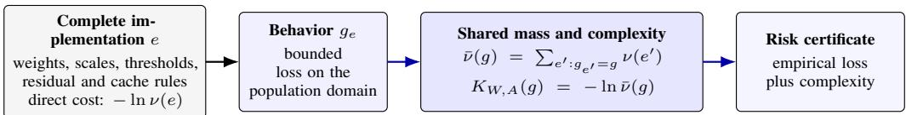
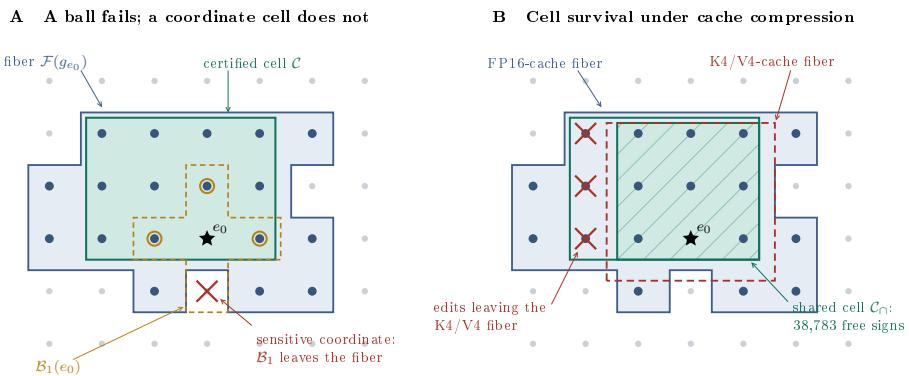

# BEHAVIORAL CAPACITY CERTIFICATES FOR QUANTIZED LANGUAGE MODELS

Arian Eamaz Mojtaba Soltanalian

Department of Electrical and Computer Engineering University of Illinois Chicago aeamaz2@uic.edu msol@uic.edu

## ABSTRACT

Activation and key–value cache precision change what a quantized language model computes without altering its stored weights. Direct weight-code bounds, however, assign identical complexity to deployments that behave differently and charge separately for weight codes that behave identically. Behavioral Capacity Certificates (BCC) charge for behavior using the aggregate prior mass of complete implementations—weights, scales, activation and cache rules—that induce the same bounded loss. When quantization merges implementations, this shared mass lowers the complexity penalty, and a break-even law determines when the saving survives the cost of validating it. BCC supports a three-step deployment workflow, and our experiments verify each step. First, a forward-only screen shortlists per-layer bit-widths by how often candidate perturbations preserve the reference predictions, with quality comparable to Hessian-guided selection at lower preprocessing cost. Second, margin-certified cells identify weights that can be pruned or sign-flipped without changing the deployed behavior: every permitted combination preserves all declared predictions, and on OLMoE-1B-7B and SmolLM2-1.7B, independent probes bound the probability that any permitted combination changes a prediction on new text. Third, BCC bounds the population loss of the deployed model, nonvacuously for complete decoders and more tightly than the compressed code route. At equal cache memory, giving keys higher precision than values yields lower NLL and higher prediction agreement on GPT-2, Qwen2.5, and SmolLM2, together with a tighter complexity bound in the GPT-2 audit.

## 1 INTRODUCTION

Weight quantization reduces parameter storage of large language models (Frantar et al., 2022; Lin et al., 2024). But a deployment is not solely defined by a weight bit-width. At long context, the key–value (KV) cache can dominate inference memory, motivating its quantization alongside the weights (Liu et al., 2024). Activation quantization also helps meet computation budgets by enabling low-precision matrix multiplications and reducing activation storage (Xiao et al., 2023). Activation precision, cache precision, scaling conventions, and clipping rules shape the computation and can be varied while stored weight tensors remain fixed. It is therefore plausible to expect scenarios in which deployments with byte-identical weight checkpoints compute different functions, while activation rounding absorbs weight differences, allowing distinct checkpoints to produce identical outputs.

Compression-based generalization bounds connect empirical loss to a description of a reconstructed predictor, including PAC–Bayesian compression approaches (Zhou et al., 2019; Lotfi et al., 2022; 2024). When numerical conventions are fixed as side information, a direct weight-code charge assigns identical complexity to a 16-bit and a 4-bit cache even when their outputs differ. This motivates a complementary question to choosing the best weight–activation (W/A) format for a transformer’s feed-forward network (FFN): how should generalization be certified when different W/Aformats and cache rules induce the same bounded loss on the declared domain? Behavioral Capacity Certificates address this question by aggregating prior probability over complete implementations with the same bounded loss function. Their shared mass determines the behavioral complexity, allowing the bound to credit alternative implementations of the same task behavior.

  
Figure 1: BCC aggregates prior mass by bounded loss. Construction-derived cells additionally pay independent-probe transfer.

Background and prior art. PAC–Bayes relates population loss to empirical loss and divergence from a sample-independent prior (Shawe-Taylor & Williamson, 1997; McAllester, 1998; 1999; Maurer, 2004). Compression analyses reduce that divergence by giving the predictor a short description: noise-stable networks admit compressed surrogates (Arora et al., 2018), and explicit codes yield nonvacuous bounds for stochastic networks and language models (Dziugaite & Roy, 2017; Zhou et al., 2019; Lotfi et al., 2024). Our setting differs in two ways. First, these bounds charge for the description of one predictor; we charge for the pooled prior mass of every implementation inducing the same loss, so activation and cache choices that leave the weights unchanged still enter the certificate. Second, under a declared perturbation law that mass is the probability that an implementation change leaves the loss unchanged, so one quantity bounds both complexity and perturbation risk. Functional-equivalence covers (Shen, 2024) and symmetry-based PAC–Bayes bounds (Beck & Ochs, 2025) exploit hidden-unit permutations or other group actions that preserve the input–output map; we merge implementations across quantization formats that share a loss on every declared input. HAWQ-V2 (Dong et al., 2020) and SmoothQuant (Xiao et al., 2023) choose precisions with curvature or rescaling heuristics defined on weights; we score candidates by the behavior they preserve.

Certifying shared behavior. Let E be the countable set of complete implementations, and let $\Pi ( e ) = g _ { e }$ map each implementation to its bounded loss function $g _ { e } : \mathcal { X }  [ 0 , 1 ]$ ]. The fiber of a behavior g is its preimage:

$$
{ \mathcal { F } } ( g ) : = \Pi ^ { - 1 } ( g ) = \{ e \in { \mathcal { E } } : g _ { e } ( X ) = g ( X ) { \mathrm { ~ f o r ~ e v e r y ~ } } X \in { \mathcal { X } } \} .
$$

For a sample-independent prior $\nu ,$ its mass and behavioral complexity are

$$
\bar { \nu } ( g ) = \nu ( \mathcal { F } ( g ) ) = \sum _ { e \in \mathcal { F } ( g ) } \nu ( e ) , \qquad K _ { W , A } ( g ) = - \ln \bar { \nu } ( g ) .\tag{1}
$$

The behavioral quotient $\mathcal { E } / { \sim }$ is the set of these fibers, grouping implementations that have identical loss on every declared input; thus $e \sim e ^ { \prime }$ exactly when $g _ { e } = g _ { e ^ { \prime } }$ . The Occam–KL bound certifies deterministic deployments at this complexity. With a uniform B-bit prior, a size- $N _ { g }$ fiber costs $B - \log _ { 2 } N _ { g }$ bits. Certified subsets lower-bound its mass and thus upper-bound its complexity. A three-implementation toy example can be a uniform prior over three complete implementations, differing only in their quantized weight vectors: $w _ { 1 } \stackrel { \cdot } { = } ( - 1 , - 1 , + 1 ) , w _ { 2 } \stackrel { \cdot } { = } ( - 1 , + 1 , + 1 )$ , and $w _ { 3 } = ( + 1 , - 1 , + 1 )$ , with $\nu ( e _ { i } ) = 1 / 3$ . Suppose $e _ { 1 }$ and $e _ { 2 }$ induce the same bounded loss function $g _ { A }$ on every declared input, while $e _ { 3 }$ induces $g _ { B } \neq g _ { A }$ . The fiber $\mathcal { F } ( g _ { A } ) = \{ e _ { 1 } , e _ { 2 } \}$ therefore has mass $\bar { \nu } ( g _ { A } ) = 2 / 3$ . Naming $e _ { 1 }$ costs $- \ln ( 1 / 3 ) = \ln 3$ , whereas naming its behavior costs $K _ { W , A } ( g _ { A } ) = - \ln ( 2 / 3 ) = \ln ( 3 / 2 )$ . BCC thus saves ln 2 nats, exactly one bit, in the certificate’s complexity penalty while keeping the same empirical loss. This saving comes from shared behavior and requires no parameter-space metric. A practitioner chooses weight and activation precision, compresses the KV cache, prunes weights, and must tolerate faults in the stored ones; each of these changes the implementation, and a guarantee tied to one implementation’s description survives none of them. Because BCC certifies behavior rather than a particular implementation, every change that stays inside the certified fiber keeps the same guarantee, and the certificate identifies which changes stay inside it. This supports a simple workflow: screen candidates cheaply, certify the changes that preserve behavior, and bound the model finally deployed. The main target is a certificate that stays valid through the decisions a deployment actually makes.

Our contributions are:

• Nonvacuous bounds beyond lossless compression. BCC aggregates prior mass across complete implementations that induce the same bounded loss function. We derive population-risk bounds and identify when aggregation savings survive independent validation. Completedecoder experiments yield nonvacuous bounds tighter than lossless histogram-and-order coding; exact finite-task comparisons also improve on the cheapest Huffman-coded realization under the same prior (Tables 2 and 7).

• One mass for generalization and stability. Under a declared perturbation law, the probability of preserving the entire loss function bounds both behavioral complexity and expected perturbation damage, with the mixture-prior cost included. The provided certificate does not need any parameter metric, differentiability, or local minimum as discussed in Proposition 4.2. Proposition 4.1 identifies weight signs that may be flipped and weights that may be zeroed while every reference prediction on the declared domain is preserved. Many such perturbations change the weights and not the behavior: they remain in the same fiber, so a practitioner may deploy them and keep the same certificate. Margin certificates identify large families of simultaneous output-head sign flips and pruning edits with predictionpreservation guarantees, validated on GPT-2 and OLMoE across cache precisions (Table 4 and Appendix B.16).

• Practical guidance for quantized deployment. A forward-only screen shortlists weightprecision choices with quality comparable to Hessian-guided selection at lower measured preprocessing cost (Table 5). At equal cache memory, our audits show that assigning higher precision to keys than values yields lower NLL and higher prediction agreement on GPT-2, Qwen2.5, and SmolLM2 (Table 3; Appendix B.15).

Notation. An implementation $e = ( a _ { q } , \theta , s , t , r , k , m _ { T } )$ specifies format, weights, scales, thresholds, residual/normalization rules, cache rules, and teacher/calibration metadata. Its predictor is $f _ { e } ,$ and $e _ { 0 }$ denotes the reference implementation. For cache comparisons, $e _ { 0 , h }$ uses cache setting h. Let $S \sim \mathcal { D } ^ { m }$ and $Z \sim \hat { D ^ { n } }$ be independent document samples for construction and probing. For $\ell ( f _ { e } , X ) \ \in \ [ a , a + \Delta ]$ , define $\bar { g } _ { e } \ = \ ( \ell ( f _ { e } , \cdot ) - a ) / \Delta , \ R _ { 0 } ( g ) \ = \ \mathbb { E } _ { \mathcal { D } } g ( X )$ , and $\begin{array} { r } { \widehat { R } _ { 0 } ( g ) = m ^ { - 1 } \sum _ { i } g ( X _ { i } ) } \end{array}$ . Thus $\mathcal { R } ( f _ { e } ) = a + \Delta R _ { 0 } ( g _ { e } )$ and $\widehat { \mathcal { R } } _ { S } ( f _ { e } ) = a + \Delta \widehat { R } _ { 0 } ( g _ { e } )$ . For $q \in [ 0 , 1 ]$ and $c \geq 0 , \mathrm { k l } _ { + } ^ { - 1 } ( q , c ) = \operatorname* { s u p } \{ r \in [ q , 1 ] : \mathrm { k l } ( q \| r ) \leq c \}$ , where kl is binary KL divergence. In this paper, a certificate is a mathematically established guarantee on population loss or preservation of declared behavior, under the stated assumptions.

## 2 JOINT W/A BEHAVIORAL COMPLEXITY

We derive population guarantees for complete W/A behaviors and use them to certify deployment choices. Starting from the behavioral mass in Equation (1), Theorem 2.1 establishes the population bound, and Corollary 2.2 applies it to deployment targets. We then compare the resulting complexity charge with direct implementation coding.

Evaluating the full behavioral mass can require comparing many complete implementations, so we develop certificates based on local audits and verified subsets. Proposition 2.3 gives an exact composition rule for routed architectures. For cells discovered from data, Theorem 2.4 quantifies the independent-transfer cost, and Proposition 2.5 and Corollary 2.6 determine when the complexity savings outweigh this cost and how many probes are required under a declared transfer scenario. A further construction uses margin budgets to certify a product cell without enumerating its members (Proposition 4.1 in Section 4). The next theorem turns behavioral mass into a population guarantee valid after model selection.

Theorem 2.1 (Behavioral Occam–KL certificate). With probability at least $1 - \delta$ over S, simultaneously for every complete W/A behavior g,

$$
R _ { 0 } ( g ) \leq \mathrm { k l } _ { + } ^ { - 1 } \left( \widehat { R } _ { 0 } ( g ) , \frac { K _ { W , A } ( g ) + \ln ( 1 / \delta ) } { m } \right) .\tag{2}
$$

A prefix code of length $B ( e )$ with prior mass at least $2 ^ { - B ( e ) }$ gives $K _ { W , A } ( g _ { e } ) \le B ( e )$ ln 2; Appendix A derives a simpler explicit upper bound using Pinsker’s inequality.

The complexity penalty depends on the combined prior probability of implementations with the same loss function. Because the guarantee holds simultaneously for all such functions, it remains valid when the deployed implementation is selected using the certification data.

Why certify damage? Deployment decisions also require controlling the loss added by quantization relative to a reference model. Here $f _ { 0 } = f _ { e _ { 0 } }$ , where $e _ { 0 }$ may be a teacher implementation fixed independently of S. Positive damage counts loss increases without allowing improvements on other inputs to cancel them. The following corollary certifies this bounded target and supports selection under a permitted degradation budget:

Corollary 2.2 (Certificate-guided deployment). Let $f _ { 0 }$ be a reference predictorfixed independently $o f S ,$ , and let $\ell ( \cdot , X ) \in [ a , \bar { a } + \Delta ]$ . For each candidate implementation e, define the positive-damage behavior $d _ { e } ( \dot { X } ) = [ \ell \dot { ( } f _ { e } , X ) - \ell ( f _ { 0 } , X ) ] _ { + } / \Delta \in [ 0 , 1 ]$ , or any measurable $[ 0 , { \bar { 1 } } ]$ -valued upper bound on this quantity, and let $K _ { d } ( d _ { e } )$ be its push-forward complexity under a sample-independent candidate prior. With probability at least $1 - \delta ,$ simultaneouslyfor all candidates,

$$
\mathcal { R } ( f _ { e } ) - \mathcal { R } ( f _ { 0 } ) \leq \Delta U _ { d } ( e ) , \qquad U _ { d } ( e ) = \mathrm { k l } _ { + } ^ { - 1 } \left( \widehat { R } _ { 0 } ( d _ { e } ) , \frac { K _ { d } ( d _ { e } ) + \ln ( 1 / \delta ) } { m } \right) .\tag{3}
$$

Consequently, selecting the cheapest deployment satisfying $U _ { d } ( e ) \leq \epsilon$ is valid without a post-selection penalty beyond the declared prior.

Positive clipped-NLL damage guides our GPT-2 allocation and scale-calibration studies $( \mathsf { A p - } $ pendix B.7); Theorem 2.4 also accommodates this bounded target when transferring a data-constructed posterior’s guarantee to a selected implementation.

Behavioral complexity and direct implementation codes. Use the sample-independent prior $\nu ( e ) = \pi ( a _ { q } ) P _ { a _ { q } } ( e \setminus a _ { q } )$ in Equation (1) to obtain the behavioral mass and complexity. For a fixed format c, define the conditional complexity $\begin{array} { r } { K ( g \mid c ) = - \ln \sum _ { e : a _ { q } ( e ) = c , \Pi ( e ) = g } \hat { P } _ { c } ( e \setminus c ) } \end{array}$ . The joint quantity obeys the log-sum-exp identity $\begin{array} { r } { K _ { W , A } ( g ) = - \ln \sum _ { c } \pi ( c ) e ^ { - K ( g | c ) } } \end{array}$ . Conditional comparisons charge the format selector $- \ln \pi ( c ) ; K _ { W , A } ( g )$ combines all formats sharing the same loss behavior under the declared prior. This push-forward exposes the difference from the implementation code. For a reference $e _ { 0 } .$ , define the behavioral compression gain

$$
G _ { \mathrm { B C C } } ( e _ { 0 } ) = \ln \frac { \sum _ { e : \Pi ( e ) = \Pi ( e _ { 0 } ) } \nu ( e ) } { \nu ( e _ { 0 } ) } \geq 0 .\tag{4}
$$

Hence $K _ { W , A } ( g _ { e _ { 0 } } ) = - \ln \nu ( e _ { 0 } ) - G _ { \mathrm { B C C } } ( e _ { 0 } )$ . For a uniform B-bit implementation family with behavioral multiplicity $N _ { g } ,$ this becomes $K _ { W , A } = B \ln 2 - \ln N _ { g } .$ Activation precision affects complexity through fiber prior mass (multiplicity under a uniform prior) or coded activation metadata, so BCC can distinguish A4 from A8 without counting transient activations as persistent parameters.

From local audits to a full-model certificate. Direct evaluation of the mass in Equation (1) can require comparing many complete implementations. To reduce this work, we seek a way to combine local fiber masses from separate component audits. Layer-wise auditing is not valid for dense models. In a sequential network, changing one layer can change the inputs to later layers, so separate local loss equalities do not preserve the final loss. However, mixture-of-experts (MoE) models route inputs to selected experts (Fedus et al., 2022); fixed top-one routing permits exact loss-fiber composition when each input’s loss depends only on its selected expert. A learned router must be fixed with stable assignments, and top-k mixing requires a joint transition certificate unless the stated one-expert loss dependence holds.

Proposition 2.3 (Exact composition under fixed routing). Let $\begin{array} { r } { \mathcal { X } = \bigcup _ { u = 1 } ^ { U } A _ { u } } \end{array}$ be afixed partition, with fixed shared computation and router. For $\boldsymbol { e } = ( e _ { 1 } , \dots , e _ { U } )$ , assume $\mathsf { \bar { g } } _ { e } ( X ) = g _ { u , e _ { u } } ( X )$ on $A _ { u } .$ the loss there depends only on expert u. For a realized behavior g, put $F _ { u } ( g ) = \{ e _ { u } : g _ { u , e _ { u } } = g | _ { A _ { u } } \}$ Then

$$
F ( g ) = \prod _ { u } F _ { u } ( g ) , \qquad { \bar { \nu } } ( g ) = \prod _ { u } p _ { u } ( g ) , \qquad K _ { W , A } ( g ) = \sum _ { u } - \ln p _ { u } ( g ) ,\tag{5}
$$

where the mass identities use a sample-independent product prior $\nu = \otimes _ { u } \nu _ { u }$ and $p _ { u } ( g ) \ =$ $\nu _ { u } ( F _ { u } ( g ) ) > 0 .$ . For local format mixtures, $\begin{array} { r } { \bar { p } _ { u } ( g ) = \bar { \sum } _ { f } \pi _ { u } ( \bar { f } ) \nu _ { u , f } ( F _ { u } ( g ) \bar { ) } } \end{array}$ . The fiber identity holds for arbitrary joint priors; independence is needed only for the probability product. Certified local subsets give the corresponding mass lower bound. Ifthe fixed sharedfields have mixture weight $\pi ( a )$ , their contribution gives $\begin{array} { r } { K _ { W , A } ( g ) \leq - \ln \pi ( a ) - \sum _ { u } \ln p _ { u } ( g ) } \end{array}$

Appendix A.2 gives the proof and architectural conditions. The results of the routed-composition are reported in Table 17 of Appendix B.8.

Why independent transfer? A cell found on $S$ may disagree outside it. Theorem 2.4 certifies its posterior risk and transfers the guarantee to the selected implementation using the probe sample $Z \bar { = } ( Z _ { 1 } , \ldots , Z _ { n } ) \sim \mathcal { D } ^ { n }$ , independent of S. Each probe $Z _ { j }$ is a fresh input used to bound population loss discrepancy from the reference when exhaustive verification is infeasible. For a distribution Q on implementations define $\widehat { R } _ { 0 } ( Q ) = \mathbb { E } _ { e \sim Q } \widehat { R } _ { 0 } ( g _ { e } )$ and $\begin{array} { r } { \widehat { d } _ { Z } ( Q , e _ { 0 } ) = n ^ { - 1 } \sum _ { j } \mathbb { E } _ { e \sim Q } | g _ { e } ( Z _ { j } ) - g _ { e _ { 0 } } ( Z _ { j } ) | } \end{array}$ Theorem 2.4 (Posterior transfer and layerwise sample quotients). After observing S, let $e _ { 0 }$ be arbitrary and let $Q _ { S }$ be any posterior on implementations. $I f ( e _ { 0 } , Q _ { S } )$ is fixed before observing $Z ,$ then with probability at least $1 - \delta - \eta$ over (S, Z),

$$
R _ { 0 } ( g _ { e _ { 0 } } ) \leq \eta _ { Z } + \mathrm { k l } _ { + } ^ { - 1 } \left( \widehat { R } _ { 0 } ( Q _ { S } ) , \frac { D _ { \mathrm { K L } } ( Q _ { S } \| \nu ) + \ln ( 2 \sqrt { m } / \delta ) } { m } \right) ,\tag{6}
$$

with $\eta _ { Z } = \mathrm { k l } _ { + } ^ { - 1 } \Big ( \widehat { d } _ { Z } ( Q _ { S } , e _ { 0 } ) , \frac { \ln ( 1 / \eta ) } { n } \Big )$ . In particular, let $\mathcal { C } _ { S } ( e _ { 0 } )$ be a measurable cell whose members have the same loss vector as $e _ { 0 }$ on S, set $\mu _ { S } = \nu ( \mathcal { C } _ { S } ( e _ { 0 } ) ) > 0$ , and take $Q _ { S } = \nu ( \cdot \mid { \mathcal { C } } _ { S } ( e _ { 0 } ) )$ . Then $\widehat { R } _ { 0 } ( Q _ { S } ) = \widehat { R } _ { 0 } ( g _ { e _ { 0 } } ) , D _ { \mathrm { K L } } ( Q _ { S } \| \nu ) = - \ln \mu _ { S }$ , and

$$
R _ { 0 } ( g _ { e _ { 0 } } ) \leq \eta _ { Z } + \mathrm { k l } _ { + } ^ { - 1 } \mathopen { } \mathclose \bgroup \left( \widehat { R } _ { 0 } ( g _ { e _ { 0 } } ) , \frac { - \ln \mu _ { S } + \ln ( 2 \sqrt { m } / \delta ) } { m } \aftergroup \egroup \right) .\tag{7}
$$

If the prior factorizes over layers and fixed metadata and $\begin{array} { r } { \mathcal { C } _ { S } ~ = ~ \prod _ { \ell = 1 } ^ { L } \mathcal { C } _ { \ell , S } } \end{array}$ , then − ln $\mu _ { S } ~ =$ $\dot { \Sigma } _ { \ell } - \dot { \ln } \nu _ { \ell } ( \dot { \mathcal { C } } _ { \ell , S } )$ plus the metadata cost.

Theorem 2.4 converts a construction-sample cell into a population guarantee for $e _ { 0 }$ , with $\eta _ { Z }$ bounding the additional risk incurred when replacing the posterior by that implementation. Thus, observed merging can support certification even when cell members differ on new inputs. Exact sample cells use the reference’s empirical loss; approximate posteriors use their own empirical mean loss. Selection using the probes requires another split or a selector penalty. Layerwise composition still requires complete transition equality in dense networks, or the routed conditions of Proposition 2.3.

Why a break-even law? A quotient lowers the complexity term, but it does not automatically lower the bound. The quotient posterior is charged its own empirical loss, which may exceed the reference implementation’s; it carries a PAC–Bayes confidence term in place of the direct code’s; and a cell built from construction data also pays a certified transfer $\tau .$ The next proposition combines these three charges into an exact threshold $G _ { \star } \colon$ the transferred quotient improves the direct bound precisely when the saving exceeds it. Corollary 2.6 converts that threshold into a probe count, so the required budget can be assessed under a declared transfer scenario before probes are drawn.

Proposition 2.5 (Exact quotient pay-for-it criterion). Let a direct comparator use B bits, empirical loss q0, and failure probability $\alpha ,$ and let a quotient posterior use empirical Gibbs loss $q _ { Q }$ , saving $G \in [ 0 , B ]$ bits, PAC–Bayesfailure probability δ, and an independently certified additive transfer τ. Let $\begin{array} { r } { U _ { \mathrm { r a w } } = \mathrm { k l } _ { + } ^ { - 1 } \Big ( q _ { 0 } , \frac { B \ln { 2 } + \ln ( 1 / \alpha ) } { m } \Big ) . ~ I f U _ { \mathrm { r a w } } - \tau \le q _ { Q } } \end{array}$ , the transferred quotient cannot be strictly smaller. $f q _ { Q } < \dot { U } _ { \mathrm { r a w } } - \tau < 1$ , then

$$
U _ { \mathrm { B C C } } < U _ { \mathrm { r a w } } \quad \Longleftrightarrow \quad G > G _ { \star } : = B + \log _ { 2 } \frac { 2 \sqrt { m } } { \delta } - \frac { m } { \ln 2 } \mathrm { k l } ( q _ { Q } \| U _ { \mathrm { r a w } } - \tau ) .\tag{8}
$$

Appendix A separates this threshold into confidence andfit–transfer costs. Returning the smaller of both bounds requires jointfailure budget $\alpha + \delta + \eta$ when τ has failure probability η.

Corollary 2.6 (Independent-probe budget for a quotient win). Fix the direct bound $U _ { \mathrm { r a w } }$ and the quotient core

$$
U _ { \mathrm { c o r e } } = \mathrm { k l } _ { + } ^ { - 1 } \left( q _ { Q } , \frac { ( B - G ) \ln 2 + \ln ( 2 \sqrt { m } / \delta ) } { m } \right) , \qquad \Delta _ { \mathrm { c o r e } } = U _ { \mathrm { r a w } } - U _ { \mathrm { c o r e } } .
$$

For a probe countfixed before observing Z and its valid transfer bound $\tau _ { n } ,$ the transferred quotient is strictly better when $\Delta _ { \mathrm { c o r e } } > 0$ and $\tau _ { n } < \Delta _ { \mathrm { c o r e } }$ . Consequently $n _ { \star } =$ min $\{ n \in \mathbb { N } _ { \geq 1 } : \tau _ { n } < \Delta _ { \mathrm { c o r e } } \}$ is the break-even budget for a declared transfer scenario. In the zero-disagreement scenario, for $0 < \Delta _ { \mathrm { c o r e } } < 1$ and transfer failure probability η, $\tau _ { n } = 1 - \eta ^ { 1 / n }$ and

$$
n _ { \star } = \left\lfloor \frac { \ln ( 1 / \eta ) } { - \ln ( 1 - \Delta _ { \mathrm { c o r e } } ) } \right\rfloor + 1 .\tag{9}
$$

Larger certifiedfibers decrease $U _ { \mathrm { c o r e } }$ and the required zero-disagreement budget; Appendix A gives the derivative and limiting-transfer analysis.

## 3 EVIDENCE FOR BEHAVIORAL COMPLEXITY AND STABILITY

We test exact merging, certificate tightening after validation, and stability under specified implementation changes.

Protocol and scope. Local audits use a predeclared finite universe of complete implementations that vary specified layers or operations while fixing the remaining fields. This makes prior masses computable under a common comparison prior; local-prior guarantees are conditional on those fixed fields. An exact sample cell $C _ { S } ( e _ { 0 } )$ contains implementations satisfying $g _ { e } ( X _ { i } ) = g _ { e 0 } ( X _ { i } )$ ) for every $X _ { i } \in S . \mathrm { A }$ uniformly verified approximate cell lies in $\begin{array} { r } { E _ { \eta _ { 0 } } ( e _ { 0 } ) = \{ \bar { e } : \tilde { \operatorname* { s u p } _ { X \in \mathcal { X } } } | g _ { e } ( X ) - g _ { e _ { 0 } } ( X ) | \dot { \leq } } \end{array}$ $\eta _ { 0 } \}$ . Cells inferred from construction data require independent transfer (Theorem 2.4); cells verified over the entire declared population require no transfer probes.

## 3.1 EXACT MERGING AND NET CERTIFICATE GAINS

Lower weight and activation precision can preserve behavior. A direct code charges each implementation separately; the question is whether implementations at different budgets that share the same behavior can be charged as one. We enumerate all $2 ^ { 9 } = 5 1 2$ binary and $3 ^ { 9 } = 1 9 , 6 8 3$ ternary $3 \times 3$ weight matrices and evaluate their predictions on all 125 inputs. For both binary and ternary weights, distinct weight assignments evaluated at A4 and A8 can preserve every prediction on this complete population (Table 1). Each row fixes a task and weight format and pools A4/A8 implementations with equal prior weight. Individual costs of 10.000 and 15.265 bits become shared behavioral costs of 8.415 and 11.943 bits for the binary and ternary tasks, respectively. Appendix B.1 also reports matching behavior across weight formats: one W1/A8 and two W1.58/A8 implementations have identical 0–1 loss vectors. The binary implementation also matches at A4, preserving predictions across both precision reductions. On three fixed decoder checkpoints, 18–29 W/A/K/V format choices preserve all four-token continuations on 256 construction prefixes, reducing the conditional complexity charge by 4.17–4.86 bits (see Appendix B.2). BCC further tightens compressed-code bounds under both a histogram-Huffman code and a distribution-sensitive ternary prior, relative to the cheapest individual realization of the shared behavior under each prior (Table 7; Appendix B.18).

Useful bounds for complete models. Complete codes give nonvacuous error and smoothed-NLL bounds in six controlled four-layer runs (Table 2) and six natural-text deployments (Table 10 in Appendix B.3.1). BCC improves the compressed bound in every row. Exact input-transition cells preserve all logits, without transfer probes (Appendix B.3). Construction-selected 0–1 cells and Brier posteriors improve decoder bounds in three replications each; probe-budget controls appear in Table 11 in Appendix B.4. All four GPT-2 FFN local-prior bounds tighten after transfer (Appendix B.5).

Matched-memory cache finding: favor key precision. At 14.625 MiB and unchanged checkpoint bytes, K8/V4 beats K4/V8 on NLL, agreement, and certified credit (+187.93 bits; Table 3). This lower complexity upper bound holds at both prefix lengths (Appendix B.14). This preference agrees with prior reports that keys are more sensitive to quantization (Tang et al., 2025; Liu et al., 2024; Hariri et al., 2026).

Table 1: Shared behavior across activation precisions. Each row fixes a separate task on 125 inputs and a weight format. A4/A8 entries give matching weight assignments divided by the total. The prior is uniform over assignments and gives A4/A8 equal weight. Direct cost names one implementation; BCC cost names the shared behavior using the pooled prior mass. Costs are in bits.
<table><tr><td></td><td>Weights A4 fiber/total</td><td></td><td>A8 fiber/total Pooled prior mass</td><td>Direct cost</td><td>BCC cost</td></tr><tr><td>Binary</td><td>2/512</td><td>1/512</td><td>3/1024</td><td>10.000</td><td>8.415</td></tr><tr><td>Ternary</td><td>6/19,683</td><td>4/19,683</td><td>5/19,683</td><td>15.265</td><td>11.943</td></tr></table>

Table 2: Nonvacuous complete-decoder NLL bounds (bits/target; $m = 5 3 0 , 0 0 0 ;$ joint 95% coverage). Prefixes are drawn independently with replacement from the declared finite population, so Theorem 2.1’s independence hypothesis holds with respect to that population.
<table><tr><td rowspan=1 colspan=1>FormatSeedG (bits)LiteralCompressed  BCC</td></tr><tr><td rowspan=1 colspan=1>W4/A4 191 3206.40.6838      0.63280.6017</td></tr><tr><td rowspan=1 colspan=1>W4/A8 191 1459.30.7044     0.66470.6505</td></tr><tr><td rowspan=1 colspan=1>W4/A4 193 3107.10.6802     0.62850.5985</td></tr><tr><td rowspan=1 colspan=1>W4/A8 193 1550.20.7177      0.67230.6572</td></tr><tr><td rowspan=1 colspan=1>W4/A4 197 3125.00.6839      0.63550.6052</td></tr><tr><td rowspan=1 colspan=1>W4/A8 197 1440.60.6810      0.63630.6224</td></tr></table>

Table 3: Cache memory, task quality, and certified complexity at a common GPT-2 checkpoint: 64 WikiText windows, 1,008-token prefill, and 16 steps. Each row certifies a subset of its reference deployment’s behavioral fiber by varying bias codes at a fixed cache format. This supplies G bits of complexity reduction, giving $\dot { K _ { W , A } } / \ln \bar { 2 } \le B - G$ under the common code cost B.
<table><tr><td>Cache</td><td>MiB/stream</td><td>NLL (nats) Agree. (%)</td><td>G (bits)</td></tr><tr><td>FP16/FP16</td><td>36.000</td><td>3.2137</td><td>100.00 1079.91</td></tr><tr><td>K8/V8</td><td>19.125</td><td>3.2135</td><td>99.22 398.19</td></tr><tr><td>K4/V8</td><td>14.625</td><td>3.2966</td><td>85.06 405.07</td></tr><tr><td>K8/V4</td><td>14.625</td><td>3.2139</td><td>95.80 593.00</td></tr><tr><td>K4/V4</td><td>10.125</td><td>3.2868</td><td>84.38 599.88</td></tr></table>

Memory, quality, and certified complexity. Results reported in Table 3 show that K8/V8 saves 46.9% of FP16 cache memory with near-identical NLL, but provides 681.72 fewer bits of certified complexity reduction. In this experiment $G = \log _ { 2 } | { \mathcal { C } } |$ , where C is the certified family of bias-code combinations that all produce identical logits at that cache setting, giving the complexity upper bound B − G. The key/value decomposition explains the observed ordering (Table 27 in Appendix B.14): changing V8 to V4 adds 194.81 credit bits, whereas changing K8 to K4 adds only 6.88 bits. The coarser formats admit more bias-code combinations on the same variable coordinates. FP16 uses a different construction: it preserves half words directly, while the low-bit construction also preserves shared dynamic scales by freezing observed maximizers. The resulting FP16 cell permits 251 key-bia coordinates to vary, compared with only one under either low-bit key format. These credits describe certified subsets of each setting’s own behavioral fiber; their ordering does not necessarily follow prediction agreement or NLL. The equal-memory quality advantage of higher key precision also holds in our Qwen2.5 and SmolLM2 audits (Appendix B.15).

  
Dots are complete implementations in a xed-cache slice; lled dots lie in the ber. Rings and crosses are at Hamming distance one from e . Schematic; not to scale.  
Figure 2: Behavioral fibers under weight perturbations. A: A weight perturbation can move the model outside its reference fiber and change its predictions. The certified cell contains combinations of perturbations that stay inside. B: Cache precision changes the fibers. The shared cell preserves each cache setting’s own reference predictions.

## 4 CERTIFIED FAMILIES AND DEPLOYMENT DECISIONS

We consider weight edits such as sign flips (w 7→ −w), pruning $( w \mapsto 0 )$ , and magnitude reductions that replace a quantized weight with an allowed value of smaller magnitude. A certified editfamily specifies which weights may change and their allowed values. The preceding bounds certify the nominal model; practitioners also need to know how implementation edits affect that guarantee. This requires explicit families of tolerated changes and risk bounds under the intended perturbation law. We derive these using prediction margins and retained cell mass, then connect them to screening, pruning, and fault audits.

Certifying simultaneous weight edits. Testing individual edits cannot establish that their combinations are safe. A Hamming ball $B _ { r } ( e _ { 0 } )$ also includes every edit within its radius r, so one sensitive coordinate can invalidate the whole family (Figure 2A). We instead select editable coordinates and bound how their joint changes can close each winner–competitor logit gap. Proposition 4.1 turns these margin budgets into a product cell whose every permitted combination preserves predictions, without enumerating its members. This supplies the guarantees used for sign-flip assurance, pruning, and audit reduction. We also test sign flips and pruning on GPT-2; Appendix B.9 reports these experiments.

Proposition 4.1 (Margin-certified coordinate cells). Fix the representation ϕ, scale $\alpha > 0 ,$ , and tie rule of a head αc with N symbols in an alphabet A of size q. Let $v _ { j } = \operatorname* { s u p } _ { X \in \mathcal { X } } | \phi _ { j } ( X ) | < \infty$ . For editable coordinates $J _ { k }$ in row $k ,$ define $\begin{array} { r } { \hat { L } _ { k } = \sum _ { j \in J _ { k } } } \end{array}$ ma $\mathrm { { x } } _ { a \in \mathcal { A } } | a - c _ { k j } | v _ { j }$ . For every input, let w be its winner and $m _ { w k } = \langle c _ { w } - c _ { k } , \phi ( X ) \rangle$ ⟩. If, for every $k \neq w _ { : }$ $L _ { w } + L _ { k } < m _ { w k }$ or $L _ { w } =$ $L _ { k } = 0 ,$ , all $q ^ { D _ { * } }$ joint edits, $\begin{array} { r } { \dot { D } _ { * } = \sum _ { k } | \dot { J } _ { k } | , } \end{array}$ , preserve every prediction. For prediction-error loss, an independent uniform head prior gives $K _ { W , A } ( g ) \leq K _ { \mathrm { u p s t r e a m } } + ( N - D _ { * } )$ ln q, including upstream and metadata cost. Proof: Appendix A.4.

Population fibers without probe transfer. We test whether large families of simultaneous outputhead edits can preserve every declared prediction and reduce the complexity charged by BCC. On the complete declared population of 23,735 GPT-2 contexts, margin-certified head cells preserve every prediction and yield explicit behavioral complexity savings under a uniform head prior: 50,623 bits for binary weights and approximately 75,565 bits for ternary weights (for details see Appendix B.9).

Weight edits across cache precisions. Cache quantization changes the head’s inputs and can reduce the margins protecting weight edits. We therefore check whether edits certified before cache compression still preserve the unedited model’s predictions at each cache setting. In the GPT-2 binary/A8 head experiment on 23,735 declared contexts, the full 50,623-sign bank remains safe at K8/V8, whereas stronger compression invalidates some permitted edits. A shared subset of 38,783 signs (76.61%) remains certified across all five tested cache formats; Appendix B.16 reports the matched-memory K8/V4 versus K4/V8 comparison. Figure 2B illustrates this restriction: the shared cell preserves each cache setting’s own unedited predictions, so its weight edits add no prediction changes to those caused by cache compression.

Table 4: OLMoE output-head edit certification at context length 256, with four teacher-forced and four greedy continuation steps. All banks contain 27,550 editable coordinates. Advantages are simultaneous lower bounds on control failure risk minus selected-family failure risk, in percentage points (pp). All bounds share 98.33% confidence. Cache savings include scales.
<table><tr><td>Cache</td><td>Failed prefixes</td><td>Risk upper (%)</td><td>Magnitude advantage (pp)</td><td>Activation-cost advantage (pp)</td><td>Cache saved (%)</td></tr><tr><td>K8/V8</td><td>4/8192</td><td>0.217</td><td>0.978</td><td>0.689</td><td>48.44</td></tr><tr><td>K8/V4</td><td>6/8192</td><td>0.260</td><td>0.823</td><td>0.625</td><td>60.94</td></tr></table>

The following modern-model experiments test whether BCC can certify large families of weight changes at realistic model scale. The family’s prior mass determines its complexity charge, while independent probes bound the probability that any permitted change alters a reference prediction on a new input. For prediction-error loss, this disagreement bound controls the transfer cost in Theorem 2.4.

Certified output-head edits. Using the margin construction of Proposition 4.1, we certify simultaneous edit families so that the prediction-risk guarantee applies to any permitted sign-flip pattern or pruning subset. On OLMoE-1B-7B, one shared bank of 27,550 output-head coordinates covers all $\cdot 2 ^ { 2 7 , 5 5 0 }$ sign patterns across the K8/V8 and K8/V4 deployments. Margin bounds certify their joint effect without enumerating the patterns. Evaluation on 8,192 independent prefixes bounds the probability that any allowed edit changes a required prediction by 0.217% and 0.260%, respectively, relative to each deployment’s own unedited head. Both deployments meet all seven certification criteria and have lower failure risk than equal-size magnitude and activation-aware banks (Table 4). Every head in the selected family also has a population added clipped-NLL bound below 0.0233 nats per token. The cache savings come from KV quantization; the edit certificate applies to the output head with expert and router weights fixed. Appendix B.10 gives the construction, confidence ledger, and complete diagnostics. At context length 1,024, the margin construction certifies a shared family of 21,874 output-head coordinates on SmolLM2-1.7B, covering all $2 ^ { 2 1 , 8 7 4 }$ sign patterns and their permitted pruning combinations. On 8,192 independent prefixes, the prediction-risk upper bounds are 0.121% for K8/V8 and 0.292% for K8/V4. Both deployments meet all seven certification criteria and have lower all-pattern failure risk than equal-size magnitude and activation-cost controls. This extends the edit-certificate evidence to a modern dense model at longer context (Appendix B.11).

Certified edit capacity on SmolLM2. Beyond comparing safety at a fixed family size, we ask how many output-head weights can change together under a fixed risk limit. At a 1% continuationdisagreement limit, BCC certifies 32,768 coordinates jointly across K8/V8 and K8/V4, versus 1,024 for activation-cost selection: a 32× gain on the declared grid, while magnitude selection passes no tested size (Appendix B.12). For losses determined by the generated tokens and target, the continuation-disagreement bound controls population transfer (Theorem 2.4).

From certified edits to perturbation-risk bounds. Proposition 4.1 identifies a safe family; its probability under a declared perturbation law measures how often an edit is guaranteed to preserve behavior. Unlike geometric flatness, which can change under function-preserving reparameterizations (Dinh et al., 2017), this probability requires no parameter metric, differentiability, or local minimum. When a sample-independent coding prior mixes the declared perturbation laws, Proposition 4.2 uses fiber probability to bound both behavioral complexity and expected loss increase, accounting for the mixture weight. Certified cells supply lower bounds on that probability.

Proposition 4.2 (Fiber mass, a charged kernel prior, and stability). Fix distributions $\kappa _ { j }$ and positive weights $\pi _ { j }$ summing to one, independently of the certification sample, and set $\begin{array} { r } { \nu = \sum _ { j } \overline { { \pi _ { j } } } \kappa _ { j } } \end{array}$ . For the populationfiber $F _ { e } , l e t s _ { j } = \kappa _ { j } ( F _ { e } ) > 0 , L _ { j } = - \ln \pi _ { j } ,$ and $R ( e ) = \mathbb { E } _ { X } g _ { e } ( X )$ . With independent draws of e′ ∼ $\kappa _ { j }$ and $X ,$

Table 5: Screening twelve four-layer references at three weight budgets with FP32 activations. Alice reuses Shakespeare-selected schedules. BFMS takes 3.40–6.15 s versus 17.58–34.13 s for Hessian. Disagreement is to FP; ∆NLL is in nats.
<table><tr><td colspan="3">Disagreement (%)</td><td colspan="2">∆NLL</td></tr><tr><td>Selector</td><td>Shakespeare</td><td>Alice</td><td>Shakespeare</td><td>Alice</td></tr><tr><td>BFMS: natural contexts</td><td>39.61</td><td>39.90</td><td>0.3936</td><td>0.3415</td></tr><tr><td>HAWQ-style trace</td><td>40.40</td><td>40.38</td><td>0.3974</td><td>0.3441</td></tr><tr><td>Covariance-aware Hessian</td><td>40.12</td><td>40.38</td><td>0.3907</td><td>0.3402</td></tr><tr><td>Weight-MSE</td><td>45.56</td><td>45.72</td><td>0.6340</td><td>0.5307</td></tr></table>

$$
K _ { W , A } ( g _ { e } ) \leq L _ { j } - \ln s _ { j } , , \quad D _ { j } ^ { + } ( e ) : = \mathbb { E } \big [ ( g _ { e ^ { \prime } } ( X ) - g _ { e } ( X ) ) _ { + } \big ] \leq ( 1 - s _ { j } ) ( 1 - R ( e ) ) .\tag{10}
$$

Writing $R _ { \kappa _ { i } } ( e ) = \mathbb { E } _ { e ^ { \prime } \sim \kappa _ { i } } R ( e ^ { \prime } )$ , if $R ( e ) \ \leq \ U \ \leq \ 1$ , then $R _ { \kappa _ { j } } ( e ) \leq 1 - s _ { j } + s _ { j } U$ . For $\nu =$ $\kappa _ { j } , K _ { W , A } ( g _ { e } ) = - \ln s _ { j }$ . Certified positive lower bounds on $s _ { j }$ retain these inequalities (see Appendix A.5.3).

Training and behavioral mass. Training affects the approximate cell mass under fixed quantization and perturbation rules. In Appendix B.17, Tables 31–32, we compare quantization-aware training (QAT) from scratch with deterministic post-training quantization (PTQ), matched by format and initialization seed, across four low-bit formats and three seeds. At mean absolute Brier tolerance 1/1024, construction-cell coverage averages 86.0% under QAT and 3.2% under PTQ over the declared nontrivial single-symbol edits. QAT also yields lower independently evaluated positive Brier damage in all 12 format–seed comparisons. For fixed nominal-risk and within-cell discrepancy bounds U and τ, larger mass tightens the perturbed-risk bound in Proposition A.3 whenever $\bar { U _ { + } } \tau < 1$ . These measurements associate training with greater approximate cell mass and perturbation robustness.

Screening implementation choices. Because the space of layer precisions, scales and clipping rules is too large to evaluate exhaustively, behavioral fiber mass sensitivity (BFMS) screens layer/candidate pairs by forward-only FP prediction retention under declared perturbations. It gives allocation quality comparable to Hessian-guided selection at lower measured cost (Table 5). Appendix B.6 specifies the unlabeled probes, timing controls, joint W/A extension, and subsequent certification. Sequential damage allocation improves bounds, held-out damage, and NLL over HAWQ at matched cost in both families (Table 15 in Appendix B.7). Binary joint scale–allocation selection reduces held-out damage by 19.2% and NLL increases by 37.4% against checkpoint-MSE selection (Table 16 in Appendix B.7). Certified zero-damage mass also reduces the sampling cost of perturbation audits (Appendix B.13).

## 5 CONCLUSION

BCC charges a deployment for its behavior rather than for one implementation’s description, so a single certificate covers every implementation in the certified fiber. Verified transitions, fixed routing, margin budgets, and independent probes make this mass computable. The experiments use it to screen precisions, certify families of weight edits on GPT-2, OLMoE, and SmolLM2, and compare cache allocations at equal memory.

## REFERENCES

Sanjeev Arora, Rong Ge, Behnam Neyshabur, and Yi Zhang. Stronger generalization bounds for deep nets via a compression approach. In Proceedings of the 35th International Conference on Machine Learning, volume 80, pp. 254–263. PMLR, 2018. URL https://proceedings. mlr.press/v80/arora18b.html.

Armin Beck and Peter Ochs. Symmetries in PAC-bayesian learning. arXiv preprint arXiv:2510.17303, 2025.

Laurent Dinh, Razvan Pascanu, Samy Bengio, and Yoshua Bengio. Sharp minima can generalize for deep nets. In Proceedings ofthe 34th International Conference on Machine Learning, volume 70 of Proceedings ofMachine Learning Research, pp. 1019–1028, 2017. URL https://procee dings.mlr.press/v70/dinh17b.html.

Zhen Dong, Zhewei Yao, Daiyaan Arfeen, Amir Gholami, Michael W. Mahoney, and Kurt Keutzer. HAWQ-V2: Hessian aware trace-weighted quantization of neural networks. In Advances in Neural Information Processing Systems, 2020.

Gintare Karolina Dziugaite and Daniel M. Roy. Computing nonvacuous generalization bounds for deep (stochastic) neural networks with many more parameters than training data. In Proceedings of the Thirty-Third Conference on Uncertainty in Artificial Intelligence, 2017. URL https: //arxiv.org/abs/1703.11008.

William Fedus, Barret Zoph, and Noam Shazeer. Switch Transformers: Scaling to trillion parameter models with simple and efficient sparsity. Journal ofMachine Learning Research, 23(120):1–39, 2022. URL https://www.jmlr.org/papers/v23/21-0998.html.

Elias Frantar, Saleh Ashkboos, Torsten Hoefler, and Dan Alistarh. GPTQ: Accurate post-training quantization for generative pre-trained transformers. arXiv preprint arXiv:2210.17323, 2022. URL https://arxiv.org/abs/2210.17323.

Evangelos Georganas, Alexander Heinecke, and Pradeep Dubey. Breaking the 1.58-bit barrier for ternary LLMs, 2026. URL https://arxiv.org/abs/2609.16338.

Mohsen Hariri, Alan Luo, Weicong Chen, Tianyi Zhang, Qifan Wang, Xiaotian Han, and Vipin Chaudhary. Quantize what counts: More for keys, less for values. In Findings ofthe Association for Computational Linguistics: ACL 2026, pp. 26393–26420. Association for Computational Linguistics, 2026. doi: 10.18653/v1/2026.findings-acl.1314. URL https://aclanthology .org/2026.findings-acl.1314/.

Albert Q. Jiang, Alexandre Sablayrolles, Antoine Roux, Arthur Mensch, et al. Mixtral of Experts. arXiv preprint arXiv:2401.04088, 2024. URL https://arxiv.org/abs/2401.04088.

Ji Lin, Jiaming Tang, Haotian Tang, Shang Yang, Wei-Ming Chen, Wei-Chen Wang, Guangxuan Xiao, Xingyu Dang, Chuang Gan, and Song Han. AWQ: Activation-aware weight quantization for on-device LLM compression and acceleration. In Proceedings of Machine Learning and Systems, volume 6, 2024. URL https://proceedings.mlsys.org/paper\_files/paper/ 2024/hash/42a452cbafa9dd64e9ba4aa95cc1ef21-Abstract-Conference. html.

Zirui Liu, Jiayi Yuan, Hongye Jin, Shaochen Zhong, Zhaozhuo Xu, Vladimir Braverman, Beidi Chen, and Xia Hu. KIVI: A tuning-free asymmetric 2bit quantization for KV cache. In Proceedings of the 41st International Conference on Machine Learning, volume 235, pp. 32332–32344. PMLR, 2024. URL https://proceedings.mlr.press/v235/liu24bz.html.

Sanae Lotfi, Marc Finzi, Sanyam Kapoor, Andres Potapczynski, Micah Goldblum, and Andrew Gordon Wilson. PAC-bayes compression bounds so tight that they can explain generalization. In Advances in Neural Information Processing Systems, 2022. URL https: //arxiv.org/abs/2211.13609.

Sanae Lotfi, Marc Anton Finzi, Yilun Kuang, Tim G. J. Rudner, Micah Goldblum, and Andrew Gordon Wilson. Non-vacuous generalization bounds for large language models. In Proceedings ofthe 41st International Conference on Machine Learning, volume 235 of Proceedings ofMachine Learning Research, pp. 32801–32818, 2024. URL https://proceedings.mlr.press/v235/l otfi24a.html.

Andreas Maurer. A note on the PAC bayesian theorem. arXiv preprint cs/0411099, 2004. URL https://arxiv.org/abs/cs/0411099.

David A. McAllester. Some PAC-Bayesian theorems. In Proceedings of the Eleventh Annual Conference on Computational Learning Theory, pp. 230–234. ACM, 1998. doi: 10.1145/279943.2 79989. URL https://doi.org/10.1145/279943.279989.

David A. McAllester. PAC-Bayesian model averaging. In Proceedings of the Twelfth Annual Conference on Computational Learning Theory, pp. 164–170. ACM, 1999. doi: 10.1145/307400.3 07435. URL https://doi.org/10.1145/307400.307435.

Art B. Owen. Monte Carlo Theory, Methods and Examples. https://artowen.su.dom ains/mc/, 2013. URL https://artowen.su.domains/mc/Ch-var-basic.pdf. Chapter 8, variance reduction.

John Shawe-Taylor and Robert C. Williamson. A PAC analysis of a Bayesian estimator. In Proceed ings ofthe Tenth Annual Conference on Computational Learning Theory, pp. 2–9. ACM, 1997. doi: 10.1145/267460.267466. URL https://doi.org/10.1145/267460.267466.

Guohao Shen. Exploring the complexity of deep neural networks through functional equivalence. In Proceedings ofthe 41st International Conference on Machine Learning, volume 235 of Proceedings of Machine Learning Research, pp. 44643–44664. PMLR, 2024.

Zicong Tang, Shi Luohe, Zuchao Li, Baoyuan Qi, Liu Guoming, Lefei Zhang, and Ping Wang. SpindleKV: A novel KV cache reduction method balancing both shallow and deep layers. In Proceedings of the 63rd Annual Meeting of the Association for Computational Linguistics (Volume 1: Long Papers), pp. 28428–28442. Association for Computational Linguistics, 2025. doi: 10.186 53/v1/2025.acl-long.1380. URL https://aclanthology.org/2025.acl-long.13 80/.

Guangxuan Xiao, Ji Lin, Mickael Seznec, Hao Wu, Julien Demouth, and Song Han. SmoothQuant: Accurate and efficient post-training quantization for large language models. In Proceedings of the 40th International Conference on Machine Learning, volume 202 of Proceedings ofMachine Learning Research, pp. 38087–38099. PMLR, 2023. URL https://proceedings.mlr.pr ess/v202/xiao23c.html.

Wenda Zhou, Victor Veitch, Morgane Austern, Ryan P. Adams, and Peter Orbanz. Non-vacuous generalization bounds at the ImageNet scale: A PAC-Bayesian compression approach. In International Conference on Learning Representations, 2019. URL https://openreview.net/f orum?id=BJgqqsAct7.

## A PROOFS AND CERTIFIED CONSTRUCTIONS

This appendix proves every theorem, proposition, and corollary stated in Sections 2 and 4, together with the re-centering inequality and the audit budget used in the numerical results. All logarithms are natural unless a base is shown; the main text defines the bounded losses and sampling events.

Table 6: Location of the main results’ proofs. The cited pages are in this PDF.
<table><tr><td>Main result</td><td>Proof or construction</td><td>Page</td></tr><tr><td>Proposition 2.3</td><td>Fixed-routing factorization and feasible-set inclusion</td><td>13</td></tr><tr><td>Theorem 2.1; Corollary 2.2</td><td>Countable behavioral prior and positive damage</td><td>14</td></tr><tr><td>Theorem 2.4</td><td>Shared PAC-Bayes event and independent transfer</td><td>15</td></tr><tr><td>Proposition 2.5</td><td>Exact inversion of the comparison</td><td>15</td></tr><tr><td>Corollary 2.6</td><td>Strict probe-budget threshold and integer rounding</td><td>16</td></tr><tr><td>Proposition 4.1</td><td>Simultaneous coordinate edits and half-margin budgets</td><td>17</td></tr><tr><td>Proposition 4.2</td><td>Coding mass, perturbation risk, and recoding invariance</td><td>19</td></tr><tr><td>Equation 19</td><td>Covered-risk decomposition</td><td>18</td></tr><tr><td>Audit variance and budget</td><td>Proposition A.5 and Corollary A.6</td><td>18</td></tr></table>

## A.1 CODING AND ENTROPY INTERPRETATION

Proposition A.1 (Coding interpretation and entropy baseline). For every countable implementation prior ν and behavior map Π, fix one representative $s ( g ) ~ \in \ \Pi ^ { \hat { - 1 } } ( g )$ for each g with $\bar { \nu } ( g ) > 0$ and define the sample-independent prior $\nu ^ { \dagger } ( s ( g ) ) = \bar { \nu } ( g )$ , with zero mass on the other implementations. Then the ordinary implementation-level Occam complexity of $s ( g )$ is exactly − ln ν $\mathbf { \sigma } ( s ( g ) ) = K _ { W , A } ( g )$ , and $s ( g )$ has the same bounded lossfunction as every implementation in itsfiber. Thus BCC is the direct Occam code ofan oracle codebook containing one canonical representative per behavior. It may strictly improve coding under the original declared implementation prior, but an oracle representative prior can match, rather than be strictly beaten by, the quotient.

More generally, let E be the random implementation returned by any predeclared selection procedure, let $G = \Pi ( E )$ , and assume $H ( E ) < \infty$ . Among all sample-independent direct and behavioral priors,

$$
\operatorname* { i n f } _ { \rho } \mathbb { E } [ - \ln \rho ( E ) ] - \operatorname* { i n f } _ { \sigma } \mathbb { E } [ - \ln \sigma ( G ) ] = H ( E ) - H ( G ) = H ( E \mid G ) .\tag{11}
$$

Hence conditional selection entropy within behavior cells is the exact optimal expected coding value of quotienting.

Proof of Proposition A.1. The masses $\{ \bar { \nu } ( g ) \} _ { g }$ sum to one, so $\nu ^ { \dagger }$ is a sample-independent prior. By construction, $- \ln \nu ^ { \dagger } ( s ( g ) ) = - \ln \bar { \nu } ( g ) = K _ { W , A } ( g )$ , and $\Pi ( s ( g ) ) = g$ gives the same population loss behavior. For the entropy statement, cross-entropy gives $\dot { \mathbb { E } } [ - \ln \rho ( \bar { E } ) ] = H ( E ) + \bar { D _ { \mathrm { K L } } } ( P _ { E } \| \rho )$ and $\begin{array} { r } { \mathbb { E } [ - \ln \sigma ( G ) ] = H ( G ) \dot { + } D _ { \mathrm { K L } } ( P _ { G } \| \sigma ) } \end{array}$ ; minimizing at the two marginals and using that G is a function of E yields $H ( E ) - H ( G ) = H ( E \mid G )$

## A.2 EXACT ROUTING COMPOSITION AND CERTIFIED FEASIBILITY

Proof of Proposition 2.3. For any implementation tuple $e ,$ the identity $g _ { e } = g$ on X holds if and only if $g _ { u , e _ { u } } = g | _ { A _ { u } }$ for every u, since the regions partition the domain. Therefore its preimage is exactly $\Pi _ { u } F _ { u } ( g )$ . For countable implementation spaces, nonnegative summation under a product prior gives

$$
\nu ( F ( g ) ) = \sum _ { e _ { 1 } \in F _ { 1 } } \cdot \cdot \cdot \sum _ { e _ { U } \in F _ { U } } \prod _ { u } \nu _ { u } ( e _ { u } ) = \prod _ { u } \sum _ { e _ { u } \in F _ { u } } \nu _ { u } ( e _ { u } ) .
$$

Taking negative logarithms proves additivity. Expanding each local mixture before summing proves the format formula. Local certified subsets give a subset of this product fiber, so their mass is a lower bound. A component of a shared-field mixture contributes $\textstyle \pi ( a ) \prod _ { u } p _ { u } ( g )$ to total mass; other components can add further mass. No assumption of independence of data, expert losses, or routing frequencies enters this identity. Sample independence is required when the prior is used for certification. □

A mixture of products retains an explicit mass formula. The composition statement also permits correlated expert priors. For the same fixed partition and loss maps, if $\begin{array} { r } { \nu = \sum _ { h } \lambda _ { h } \bigotimes _ { u } \nu _ { u , h } } \end{array}$ , then

$$
\bar { \nu } ( g ) = \sum _ { h } \lambda _ { h } \prod _ { u } \nu _ { u , h } ( F _ { u } ( g ) ) .
$$

Thus independence can be weakened to an explicit mixture of products, with the mixture weights retained. Under an arbitrary joint prior the fiber still factorizes as a set, and its joint probability must be used.

Feasibility dominance under a common prior. For each fixed candidate, $\bar { \nu } ( g _ { e } ) \geq \nu ( e )$ , so its exact-fiber Occam–KL bound $U _ { \mathrm { B C C } } ( e )$ is no greater than $U _ { \mathrm { r a w } } ( e )$ under the same empirical loss, sample size, and confidence charge. Consequently, for a common candidate set H, physical cost $B _ { \mathrm { p h y s } }$ , and threshold ε,

$$
\{ e \in \mathcal { H } : U _ { \mathrm { r a w } } ( e ) \leq \varepsilon \} \subseteq \{ e \in \mathcal { H } : U _ { \mathrm { B C C } } ( e ) \leq \varepsilon \} , \qquad B _ { \mathrm { B C C } } ^ { * } ( \varepsilon ) \leq B _ { \mathrm { r a w } } ^ { * } ( \varepsilon ) ,\tag{12}
$$

where $B ^ { * }$ minimizes physical cost over the indicated set and is $+ \infty$ when empty. The inclusion holds for any architecture with known fiber mass. Fixed routing supplies an exact local computation of that mass. The 100-seed study uses the same prior and candidate budgets for both routes, so this inclusion explains the ordering across its entire tolerance grid. Its strict gains depend on the measured losses and masses. A transferred empirical cell additionally pays its transfer and confidence terms.

Applicability to MoE architectures. The result applies when each input’s loss depends on one edited expert and fixed shared fields. A router selecting an entire predictor for a document is one example. Token-routed transformer blocks require checking the loss dependence of the full computation: later attention can mix tokens assigned to different experts, and later routers can see states changed by earlier edits. Switch Transformers use sparse expert selection (Fedus et al., 2022); Mixtral selects two experts per token and combines their outputs (Jiang et al., 2024). These architectures motivate certification of routing and expert interfaces. For a routed block with independently editable experts, preserving each expert’s complete output on its fixed reachable region supplies a composable block transition. Combining such transition cells across layers gives a certified product subset of the full-model fiber. The present routed study tests the exact loss-local premise on a fully known finite state domain.

Counterexamples identify the required structure. With one scalar output ab and reference $( a , b ) = ( 0 , 0 )$ , either individual edit to one preserves the output, while editing both changes it. Separate loss equality therefore does not compose in general sequential systems. Even when a routed fiber is a product set, a correlated prior assigning mass $1 / 2$ to each of $( 0 , 0 )$ and $( 1 , 1 )$ gives the singleton fiber $\{ ( 0 , 0 ) \}$ } mass $1 / 2 ,$ although the product of its marginal masses is $1 / 4$ . Finally, changing the router changes the regions themselves; a certificate must fix the router, prove its assignments stable, or include the changed routing in the certified object.

## A.3 PROOF OF THE BEHAVIORAL CERTIFICATE

Code-length relaxation. If the implementation prior assigns a reconstructed prefix code of length $B ( e )$ mass at least $2 ^ { - B ( e ) }$ , then $K _ { W , A } ( g _ { e } ) \le B ( e )$ ln 2, and Pinsker gives the simpler consequence

$$
\mathcal { R } ( f _ { e } ) \leq \widehat { \mathcal { R } } _ { S } ( f _ { e } ) + \Gamma _ { m } ( B , \Delta , \delta ) , \quad \Gamma _ { m } = \Delta \sqrt { \frac { B \ln 2 + \ln ( 1 / \delta ) } { 2 m } } .\tag{13}
$$

For a fixed [0, 1]-valued behavior $^ { g , }$ the one-sided Chernoff inequality gives $\mathrm { P r } \{ R _ { 0 } ( g ) \} ~ >$ $\ker _ { + } ^ { - 1 } ( \widehat { R } _ { 0 } ( g ) , c ) \} \leq e ^ { - m c }$ . Set $c _ { g } = [ K _ { W , A } ( g ) + \mathrm { l n } ( 1 / \delta ) ] / m$ and allocate failure probability $\delta \bar { \nu } ( g )$ to each countable behavior. A union bound proves Equation (2). If the implementation prior assigns the decoded implementation mass at least $\bar { 2 } ^ { - B }$ , then the whole equivalence class has at least that mass and ${ K _ { W , A } } \leq B$ ln 2. Pinsker’s inequality yields Equation (13). All sample-dependent scales, allocation choices, masks, and checkpoints must therefore be encoded.

Proof of Corollary 2.2. Pointwise, $\ell ( f _ { e } , X ) - \ell ( f _ { 0 } , X ) \leq [ \ell ( f _ { e } , X ) - \ell ( f _ { 0 } , X ) ] _ { + } \leq \Delta d _ { e } ( X ) .$ taking expectations and applying Theorem 2.1 proves Equation (3). The event is simultaneous, so any cost-constrained selection made on that event remains covered.

The shared PAC–Bayes event. For a fixed bounded loss of mean $p \in ( 0 , 1 )$ , convexity reduces its KL exponential moment to the Bernoulli case (Maurer, 2004), giving

$$
\mathbb { E } _ { S } e ^ { m \mathrm { k l } ( \widehat { R } _ { 0 } ( g ) \| R _ { 0 } ( g ) ) } \le \xi _ { m } : = \sum _ { k = 0 } ^ { m } { \binom { m } { k } } ( k / m ) ^ { k } ( 1 - k / m ) ^ { m - k } \le 2 \sqrt { m } ,
$$

with $0 ^ { 0 } = 1$ . The last inequality follows from that reference for $m \geq 8 ;$ substitution in the finite sum verifies $\xi _ { m } ^ { 2 } \leq 4 m$ for $1 \leq m \leq 7$ . Means zero and one give a moment of one. Averaging over ν and applying Markov’s inequality yields a single event of probability at least $1 - \delta .$ . On this event, KL convexity and the variational change-of-measure inequality give, simultaneously for all $Q \ll \nu ,$

$$
m \operatorname { k l } ( \widehat { R } _ { 0 } ( Q ) \lVert R _ { 0 } ( Q ) ) \leq D _ { \operatorname { K L } } ( Q \lVert \nu ) + \ln ( 2 \sqrt { m } / \delta ) .
$$

For posteriors with infinite KL, use $R _ { 0 } ( Q ) \le 1$ . Thus the posterior may be selected on S without an extra posterior-selection union bound.

For Theorem 2.4, use the PAC–Bayes–KL inequality with the arbitrary data-dependent posterior $Q _ { S }$ to obtain the core term in Equation (6). Conditional on S, the function $\bar { X } \mapsto \mathbb { E } _ { e \sim Q _ { S } } | g _ { e } ( \bar { X } ) - g _ { e _ { 0 } } ( X ) |$ is fixed and $[ 0 , 1 ]$ -valued. The one-sided Chernoff bound on the independent probes therefore gives $\mathbb { E } _ { X } \mathbb { E } _ { e \sim Q _ { S } } | \dot { g _ { e } } ( \dot { X } ) - g _ { e _ { 0 } } ( X ) | \le \eta z$ . Finally, $R _ { 0 } ( g _ { e _ { 0 } } ) \leq R _ { 0 } ( Q _ { S } ) + \eta _ { Z }$ and a union bound prove Equation (6). For the exact-cell specialization, conditioning the prior gives $D _ { \mathrm { K L } } ( Q _ { S } \vert \vert \nu ) = - \mathrm { \bar { l n } } \mu _ { S }$ and cell membership gives $\widehat { R } _ { 0 } ( Q _ { S } ) = \widehat { R } _ { 0 } ( g _ { e _ { 0 } } )$ , proving Equation $( 7 )$ . Under a product prior and product cell, masses multiply. Layerwise transition equality on the reference reached states makes the training computations equal inductively; per-layer loss equality alone does not, and the claim fails if a bypass crossing the cut is omitted.

Reading the transfer argument. The posterior is an accounting device: conditioning the prior on a computable cell turns its mass into a KL complexity. PAC–Bayes controls this posterior’s average risk even though the cell was selected on S. The deployed object, however, is the chosen implementation $e _ { 0 }$ . Independent probes certify the remaining discrepancy needed to pass from the average to that implementation. Freezing both objects before Z makes this last discrepancy a fixed bounded function for concentration. Thus Theorem 2.4 closes the gap between a computable empirical cell and a population guarantee for deployment.

Confidence and fit–transfer decomposition. When $U _ { \mathrm { r a w } }$ is the interior KL root, the same threshold decomposes exactly as

$$
G _ { \star } = \log _ { 2 } \frac { 2 \sqrt { m } \alpha } { \delta } + \frac { m } { \ln 2 } \left[ \mathrm { k l } ( q _ { 0 } \| U _ { \mathrm { r a w } } ) - \mathrm { k l } ( q _ { Q } \| U _ { \mathrm { r a w } } - \tau ) \right] .\tag{14}
$$

The first term is the confidence toll; the second is the exact empirical-fit-and-transfer toll in equivalent bits. In particular, $\log _ { 2 } ( 2 \sqrt { m } )$ is the full threshold only when $q _ { Q } = q _ { 0 } , \tau = 0$ , and $\alpha = \delta$

Proof of Proposition 2.5. The one-sided inverse is strictly increasing in its radius on the interior. Therefore $\tau + \mathrm { k l } _ { + } ^ { - 1 } ( q _ { Q } , c _ { Q } ) < U _ { \mathrm { r a w } }$ is possible only when $U _ { \mathrm { r a w } } - \tau > q _ { Q }$ , and in that case it is equivalent to $c _ { Q } < \mathrm { k l } ( q _ { Q } \| U _ { \mathrm { r a w } } - \tau )$ . Substituting $c _ { Q } = [ ( B - G )$ ln 2 + ln $( 2 \sqrt { m } / \delta ) ] / m$ and solving for G gives Equation (8). If $U _ { \mathrm { r a w } }$ is the interior root, then m $\mathrm { k l } ( q _ { 0 } \| U _ { \mathrm { r a w } } ) = B \ln 2 + \ln ( 1 / \alpha )$ substitution gives Equation (14). The arithmetic comparison itself does not select a new confidence event. To return the smaller bound adaptively, cover both events by a union bound; for overall failure ε, preallocate $\alpha + \delta + \eta \leq \varepsilon$ and recompute both ledgers. Tables comparing separately valid 95% bounds do not by themselves certify their adaptively chosen minimum at 95%.

Fiber growth and the limiting transfer cost. Under the notation of Corollary 2.6, for a uniform implementation prior with fiber size $F , G = \log _ { 2 } F$ . At an interior KL root $q _ { Q } < U _ { \mathrm { c o r e } } < 1$ , holding the other ledger terms fixed,

$$
\frac { \partial \Delta _ { \mathrm { c o r e } } } { \partial G } = \frac { \ln 2 } { m } \frac { U _ { \mathrm { c o r e } } ( 1 - U _ { \mathrm { c o r e } } ) } { U _ { \mathrm { c o r e } } - q _ { Q } } > 0 .\tag{15}
$$

Holding the transfer scenario fixed, larger certified fibers lower its budget, and as $\Delta _ { \mathrm { c o r e } } \downarrow 0$ the zero-disagreement law is $n _ { \star } = \Theta ( \ln ( 1 / \eta ) / \Delta _ { \mathrm { c o r e } } )$ . More generally, if a sequence of valid transfer bounds satisfies $\tau _ { n } \to d _ { \infty }$ , then every sufficiently large n wins when $d _ { \infty } < \Delta _ { \mathrm { c o r e } }$ and no sufficiently large n wins when $d _ { \infty } > \Delta _ { \mathrm { c o r e } } . \mathrm { I f } \Delta _ { \mathrm { c o r e } } \leq 0$ , no number of zero-disagreement probes can make that ledger beat the direct bound; more probes can remove transfer cost but cannot repair an unfavorable confidence-and-complexity core.

Proof of Corollary 2.6. The transferred bound is $U _ { \mathrm { c o r e } } + \tau _ { n } .$ , so strict improvement over $U _ { \mathrm { r a w } }$ is equivalent to $\tau _ { n } < U _ { \mathrm { r a w } } - U _ { \mathrm { c o r e } }$ . With zero empirical disagreement, $\mathrm { k l } ( 0 \| r ) = - \ln ( 1 - r )$ gives $\tau _ { n } = 1 - \exp [ - \ln ( 1 / \eta ) / n ] = 1 - \eta ^ { 1 / n }$ . Solving the strict inequality $1 - \eta ^ { 1 / n } < \Delta _ { \mathrm { c o r e } }$ for the least integer n gives Equation (9). Since $\partial _ { u } \mathrm { k l } ( \bar { q } _ { Q } \vert \vert u ) = ( u - \bar { q } _ { Q } ) \dot { / } [ u ( 1 - u ) ]$ , implicit differentiation of $\mathrm { k l } ( q _ { Q } \bar { \| } U _ { \mathrm { c o r e } } ) ^ { - } = [ ( B - G ) \ln 2 + C ] / m$ gives Equation (15). The elementary inequalities $x \leq - \ln ( \operatorname { 1 - } x ) \leq x / ( \operatorname { 1 } - x )$ for $x \in ( 0 , 1 )$ give the stated small-gap scaling. The limit claim follows directly from $\tau _ { n }  d _ { \infty }$ . When $\Delta _ { \mathrm { c o r e } } \leq 0$ , the nonnegative transfer term cannot yield a strict win. Equality of $d _ { \infty }$ and $\Delta _ { \mathrm { c o r e } }$ alone does not determine the asymptotic strict ordering.

Interpreting the probe budget. There is no width-only probe law. If a width-w universe contains $F ( w )$ genuinely equivalent implementations, its saving is exactly $\log _ { 2 } F ( w )$ bits: exponential fiber growth gives a saving linear in the number of redundant coded choices, whereas polynomial growth gives only $O ( \log w )$ bits. Quotienting is never worthwhile for the stated comparator when its saving fails to overcome the confidence and empirical-fit tolls $( \Delta _ { \mathrm { c o r e } } \leq 0 )$ , or, on the transfer-coverage event, when the true population disagreement is at least $\Delta _ { \mathrm { c o r e } } .$ It can be valid yet impractical at any realistic probe budget. The corollary therefore serves as a prospective resource-allocation rule: spend validation effort only when the available core improvement can cover the declared transfer scenario.

Prospective planning versus sequential validation. The zero-disagreement budget is conditional on that declared scenario; it does not predict that future probes will agree. At a fixed n, the observed disagreement determines the certificate. Repeatedly checking probes and stopping at the first favorable fixed-η bound is not justified by Theorem 2.4. One valid sequential version preallocates $\eta _ { n } > 0$ with $\textstyle \sum _ { n > 1 } \eta _ { n } \leq \eta .$ , for example $\eta _ { n } = \eta / [ n ( n + 1 ) ]$ , and uses $\tau _ { n } = \mathrm { k l } _ { + } ^ { - 1 } ( \widehat { d } _ { Z _ { 1 : n } , \ln ( 1 / \eta _ { n } ) / n } )$ Conditionally on S, a union bound then covers all inspected $n ;$ the core event gives total failure at most $\delta + \eta$ . The stopping threshold must be recomputed with these charges. The reported fixed-budget audits use predeclared probe counts, so their certificates require no such adjustment.

## A.4 COMPUTABLE CELLS AND THE MARGIN CERTIFICATE

The exact population quotient in Equation (1) is generally difficult to compute. Certification only needs a valid upper bound on complexity: a verified subset of a population fiber lower-bounds its mass and therefore upper-bounds its negative logarithm. The following constructions make this route computable under explicit hypotheses.

Architecture determines the composition rule. The certificate indexes complete population behaviors. For fixed routed losses satisfying Proposition 2.3, local fibers compose exactly, so the global mass follows from local masses. For a sequential network, preserving every complete transition on reachable states gives a sufficient composition rule. Residual, attention, normalization, scale, and cache paths must be included. The controlled complete-decoder and GPT-2 cache studies certify such transitions (Sections B.3 and B.14); the FFN and head audits use their stated local universes. The constructions below give computable fiber subsets without recovering the entire equivalence class.

Proposition A.2 (A computable output-head quotient). Fix an activationformat and a population set $\mathcal { X } .$ . Let $\ b { \phi } ( \ b { x } ) \in \mathbb { R } ^ { d }$ be the complete fixed representation reaching a C-class quantized linear head, and let each of its $N = C d$ symbols lie in a numerical alphabet A of size $q \ \geq \ 2$ and diameter $D _ { \mathcal { A } }$ , including fixed scales. Le $r \in \{ 0 , \ldots , N \}$ . For a reference code W, write ${ \hat { y } } ( x ) =$ arg maxc $\langle W _ { c } , \phi ( x ) \rangle$ ⟩ and

$$
m _ { k } ( x ) = \langle W _ { \hat { y } ( x ) } - W _ { k } , \phi ( x ) \rangle , \qquad k \neq \hat { y } ( x ) .
$$

For each $( x , k )$ , assign sensitivity $s _ { c , j } ( x , k ) = D _ { A } | \phi _ { j } ( x ) |$ when $c \in \{ \hat { y } ( x ) , k \}$ and zero otherwise, and let $S _ { r } ( x , k )$ be the sum ofits r largest coordinate sensitivities. If

$$
\operatorname* { i n f } _ { x \in \mathcal { X } } \operatorname* { m i n } _ { k \neq \hat { y } ( x ) } [ m _ { k } ( x ) - S _ { r } ( x , k ) ] > 0 ,\tag{16}
$$

then every head code within Hamming radius r has the same predictions, hence the same 0–1 loss behavior, on X. Under an independent uniform head prior, with $K _ { \mathrm { u p s t r e a m } }$ charging thefixed upstream implementation and all other metadata,

$$
K _ { W , A } ( g ) \leq K _ { \mathrm { u p s t r e a m } } + N \ln q - \ln \sum _ { j = 0 } ^ { r } { \binom { N } { j } } ( q - 1 ) ^ { j } .\tag{17}
$$

For a finite declared population, Equation (16) is evaluated by enumeration; for an infinite population, any sound neural-network verifier may lower-bound the margins and upper-bound the sensitivities. The representation $\phi$ is recomputed for A4 and A8, so activation precision can change the certified radius. This is a sufficient construction rather than an assumption that a Hamming ball happens to be equivalent. Its proof is immediate: changing at most r symbols decreases any winning logit margin by at most $S _ { r }$

## Proof and half-margin specialization of Proposition 4.1.

Proof. For every allowed simultaneous edit, row k changes its logit by at most $\nu L _ { k }$ . Its adverse change relative to winner w is therefore at most $\alpha ( L _ { w } + \bar { L _ { k } } )$ . The strict inequality in Proposition 4.1 preserves a positive winning gap. When both budgets are zero, both logits and their tie order stay unchanged. All predictions are preserved. The editable coordinates are disjoint, giving $q ^ { D _ { * } }$ complete head codes. Their uniform conditional prior mass is $q ^ { D _ { * } - N }$ ; including upstream and metadata cost proves the bound. □

The rowwise half-margin construction used in the experiments is a sufficient specialization. Let $b _ { k }$ be the infimum of the unscaled winner–runner-up margin when k wins and the winner–k margin otherwise. Choosing $L _ { k } = 0 \mathrm { o r } 0 < L _ { k } < b _ { k } / 2$ implies the pairwise condition: at any positive gap $m _ { w k }$ , both $b _ { w } \le m _ { w k }$ and $b _ { k } \le m _ { w k }$ , while a zero gap forces both budgets to zero. Joint budgets can permit more edits: for a unit gap, $( L _ { w } , L _ { k } ) = ( \bar { 0 . 7 } , 0 . 2 )$ satisfies the pairwise test although the first row exceeds half the margin. This strengthens the sufficient condition; the reported experiment counts retain their original budgets.

This cell can be large even when no radius-one ball lies in the fiber, since it can exclude sensitive directions. The population bounds on margins and feature magnitudes must be sound. The head experiment evaluates them over its complete declared domain (Section B.9).

Reachable transitions and finite cuts. At layer $\ell ,$ let $\Omega _ { \ell }$ be a sample-independent, certified finite set of states that can reach the quantized boundary, and let $T _ { \ell } ( \theta _ { \ell } ) \stackrel { - } { = } ( F _ { \ell , \theta _ { \ell } } \stackrel { - } { = } ( u ) : u \in \Omega _ { \ell } )$ . Use a sample-independent code that indexes each distinct transition tuple uniformly. If all paths crossing the boundary are included, then

$$
K _ { W , A } ( g ) \leq \sum _ { \ell } \ln \vert \{ T _ { \ell } ( \theta _ { \ell } ) : \theta _ { \ell } \in \Theta _ { \ell } \} \vert + B _ { \mathrm { d o w n s t r e a m } } \ln 2 .\tag{18}
$$

Here $K _ { W , A }$ refers to this explicitly chosen tuple-code prior, not necessarily the original implementation prior. The reachable-state sets must cover every admissible upstream choice. A full-precision residual, dynamic scale, normalization state, attention probability, or KV-cache path crossing the cut must be included. Thus activation precision enters the code geometry.

## A.5 BEHAVIORAL MASS AND PERTURBATION RISK

The question answered by this appendix. Nominal damage compares a deployed implementation with a useful reference. It does not specify how that implementation reacts to a subsequent change in its weight symbols or quantizer thresholds. Behavioral multiplicity can address this second question when mass is measured under a declared law of implementation changes. The relevant object is the probability of preserving behavior under that law. A large coding-prior fiber alone does not establish a worst-case margin, tolerance to arbitrary hardware faults, or robustness to another input distribution.

## A.5.1 COVERAGE AND RE-CENTERING

Let $\kappa _ { e }$ be a specified distribution over complete perturbed implementations and write $R _ { \kappa } ( e ) =$ $\mathbb { E } _ { e ^ { \prime } \sim \kappa _ { e } } R ( e ^ { \prime } )$ . The kernel describes implementation variation; it need not equal the coding prior $\nu ,$ and an adaptively centered kernel is not automatically a legal sample-independent coding prior. For the exact population fiber $F _ { e } = \{ e ^ { \prime } : g _ { e ^ { \prime } } = g _ { e } \}$ , define

$$
s _ { e } = \kappa _ { e } ( F _ { e } ) , ~ K _ { \kappa } ( g _ { e } ) = - \ln s _ { e } .
$$

Thus the same push-forward construction has an operational interpretation: $s _ { e }$ is the probability that a perturbation preserves the chosen loss function. It is not the probability of identical logits unless the verifier establishes that stronger equivalence.

Proposition A.3 (Covered perturbation risk). Let $g _ { e } \in [ 0 , 1 ]$ , let $\kappa _ { e }$ be a declared perturbation law over complete implementations centered at $e ,$ and write $R _ { \kappa } ( e ) = \mathbb { E } _ { e ^ { \prime } \sim \kappa _ { e } } R ( e ^ { \prime } )$ . Let C be a construction-selected cell with known kernel mass $s = \kappa _ { e } ( C )$ and, when $s > 0 ,$ set $Q = \kappa _ { e } ( { \cdot } \mid C )$ Ifsimultaneous valid bounds give $R ( e ) \leq U$ and $\begin{array} { r } { \mathbb { E } _ { X , e ^ { \prime } \sim Q } | g _ { e ^ { \prime } } ( X ) - g _ { e } ( X ) | \le \tau , } \end{array}$ , then

$$
R _ { \kappa } ( e ) \leq 1 - s + s \operatorname* { m i n } \{ 1 , U + \tau \} .\tag{19}
$$

For $s = 0$ the bound is one and $Q$ need not be defined. Exact cells have $\tau = 0 ;$ empirical cells obtain τ from independent probes (Theorem $2 . 4 ) .$ For the full population fiber $F _ { e } , \tau = 0$ and $s = \kappa _ { e } \grave { ( F _ { e } ) } = e ^ { - K _ { \kappa } ( g _ { e } ) } , s o \ h _ { \kappa } ( e ) \leq 1 - e ^ { - K _ { \kappa } ( g _ { e } ) } ( 1 - U )$

Proof. Split the kernel expectation over C and its complement. The complement contributes at most $1 - s . \operatorname { O n } C$ , the pointwise inequality $g _ { e ^ { \prime } } ( X ) \leq g _ { e } ( \bar { X } ) + | g _ { e ^ { \prime } } ( X ) - g _ { e } ( X )$ | gives conditional risk at most $R ( e ) + \tau$ , and boundedness also gives an upper bound of one. Substitute $R ( e ) \leq U$ . For the exact fiber, conditional discrepancy is zero and $s \stackrel { \cdot } { = } e ^ { - K _ { \kappa } }$ . No independence between layers or geometric regularity of the fiber is required. □

The guarantee therefore, depends on three quantities: nominal risk $U ,$ , retained mass $s ,$ and within-cell discrepancy τ. All members of a fiber share the same nominal loss, so deploying the member whose kernel retains the most mass tightens the bound at no cost in accuracy (re-centering). For empirical cells, freeze $C$ and Q before probes and independently draw $X _ { i } \sim \mathcal { D }$ and $E _ { i } \sim Q$ . The observations $| g _ { E _ { i } } ( X _ { i } ) - g _ { e } ( X _ { i } ) | ^ { \cdot } \in [ 0 , 1 ]$ have the conditional discrepancy as their mean. One-sided KL inversion and a union bound over the frozen candidates give τ. Nominal bounds can use the earlier BCC or direct-code route. This applies the independent-validation principle of Theorem 2.4 to a specified perturbation law.

Corollary A.4 (Required coverage). Put $v =$ min $\{ 1 , U + \tau \}$ andfix a risk threshold $\varepsilon < 1 . \ I f v > \varepsilon ,$ no $s \leq 1$ makes Equation (19) pass the threshold. $H v \leq \varepsilon ,$ it passes exactly when

$$
s \geq { \frac { 1 - \varepsilon } { 1 - v } } , e q u i \nu a l e n t l y \quad - \ln s \leq \ln { \frac { 1 - v } { 1 - \varepsilon } } .
$$

Proof. Rearrange $1 - s ( 1 - v ) \leq \varepsilon ;$ here $1 - v > 0 .$ . Taking logarithms gives the equivalent complexity condition. This is a conditional rule for given $U$ and $\tau ;$ changing the cell can change τ . □

The mixture bound is no larger than min $\{ 1 , U + 1 - s + s \tau \}$ , which separately charges the full outside-cell damage. It need not beat direct certification of $R _ { \kappa }$ from perturbed predictions. A minimum of the covered and direct routes is valid when their confidence events share a common ledger.

## A.5.2 DAMAGE AUDITS AND CONSTRUCTION COSTS

The behavioral certificate supplies an exactly integrable zero-damage stratum and its exact probability mass from a proof, with zero perturbation queries. The population-margin construction uses nominal activations and margins, whose acquisition and processing carry a separate cost. Conditional sampling then spends perturbation queries on the complement and reweights by its known mass, an application of classical stratified Monte Carlo (Owen, 2013).

Proposition A.5 (Mass-guided damage auditing). Fix an implementation, a perturbation law $\kappa ,$ and a certified cell C with known mass $s = \kappa ( \bar { C } )$ . Let $Z ( E , { \bf \dot { X } } ) \in [ 0 , 1 ]$ be identically zero on C for every population input, and let $w = 1 - s > 0$ . Write $Y \sim Z ( { \overset { \cdot } { E } } , { \overset { \cdot } { X } } ) \mid E \not \in C$ , with mean µ and variance $\sigma ^ { 2 } { } _ { ; }$ , where inputs and implementations are independent. For n iid queries, the direct estimator ${ \widehat { D } } _ { \mathrm { d i r } } = n ^ { - 1 } \sum _ { i } Z _ { i }$ and $\begin{array} { r } { \widehat { D } _ { C } = w n ^ { - 1 } \sum _ { i } Y _ { i } } \end{array}$ are both unbiasedfor $D = \mathbb { E } Z$ , and

$$
\mathrm { V a r } ( \widehat { D } _ { \mathrm { d i r } } ) = \frac { w \sigma ^ { 2 } + w ( 1 - w ) \mu ^ { 2 } } { n } , \qquad \mathrm { V a r } ( \widehat { D } _ { C } ) = \frac { w ^ { 2 } \sigma ^ { 2 } } { n } \leq w \mathrm { V a r } ( \widehat { D } _ { \mathrm { d i r } } ) .\tag{20}
$$

Any valid upper bound u on $\mu$ gives $D \leq$ wu at the same confidence level. $I f s = 1$ , then $D = 0$ without queries.

Proof. The zero contribution on C gives $D = w \mu$ and $\mathbb { E } Z ^ { 2 } = w ( \sigma ^ { 2 } + \mu ^ { 2 } )$ . Subtracting $( w \mu ) ^ { 2 }$ and dividing by n gives the direct variance; iid conditional sampling gives the second. Their difference is $w ( 1 - w ) ( \sigma ^ { 2 } + \mu ^ { 2 } ) / n \geq 0 ;$ ; the stronger displayed factor follows because w $\mathrm { V a r } ( \widehat { D } _ { \mathrm { d i r } } ) - \mathrm { V a r } ( \widehat { D } _ { C } ) =$ $w ^ { 2 } ( 1 - w ) \mu ^ { 2 } / n \geq 0$ . Multiplying a valid mean upper bound by the known nonnegative w preserves its confidence event. □

For prediction disagreement, a prediction-fiber subset supplies $C .$ For positive 0–1 damage, a loss-fiber subset suffices. If the nominal correctness probability c is known, both routes can also sample inputs conditional on nominal correctness: their estimators become $c \overline { { Z } }$ and $c w \overline { { Y } }$ , respectively, and both variances are multiplied by $c ^ { 2 }$ . Our comparator uses this improvement. For Bernoulli observations, we use the exact one-sided binomial upper limit for u. The procedure requires a certified cell, its mass, and a sampler for its complement. Query savings reuse that certificate; constructing it has a separate cost. The variance comparison is an expectation over audits and is not a pointwise ordering of every realized confidence bound.

Corollary A.6 (Prospective query budget and construction-cost crossover). Under Proposition A.5, let $0 < s < 1 , w = 1 - s ,$ and let $N \geq 1$ be an integer direct-audit budget. The conditional estimator with $n = \lceil w N \rceil$ queries has MSE no larger than the direct estimator with N queries. If cell construction and sampler setup cost $b \geq 0$ direct-query equivalents, and each conditional query costs $r > 0$ such equivalents, this allocation costs less whenever

$$
b + r \lceil ( 1 - s ) N \rceil < N .\tag{21}
$$

For $r = 1$ , the smallest integer budget passing the test is $N _ { \mathrm { m i n } } = \lceil ( \lfloor b \rfloor + 1 ) / s \rceil$ . Ignoring rounding gives N > b/s. More generally, when $r ( 1 - s ) < 1$ , the unrounded threshold is $N > b / [ 1 - r ( 1 - s ) ]$

Proof. Put ${ \cal V } = w \sigma ^ { 2 } + w ( 1 - w ) \mu ^ { 2 }$ , the direct one-query variance. By Equation (20), $w ^ { 2 } \sigma ^ { 2 } \le w V$ Since both estimators are unbiased and $n \geq w N$

$$
\mathrm { M S E } ( \widehat { D } _ { C } ; n ) = \frac { w ^ { 2 } \sigma ^ { 2 } } { n } \leq \frac { w V } { n } \leq \frac { V } { N } = \mathrm { M S E } ( \widehat { D } _ { \mathrm { d i r } } ; N ) .
$$

The cost is $b + r n$ , giving Equation (21). For $r = 1 , N - \lceil ( 1 - s ) N \rceil = | s N |$ , so the test is equivalent $\mathrm { t o } \ \lfloor s N \rfloor \ > \ b$ , or $s N \geq \lfloor b \rfloor + 1$ . This gives $N _ { \mathrm { m i n } }$ . Dropping the ceiling gives the unrounded thresholds. □

Thus s supplies a guaranteed variance-reduction factor of at least $1 / ( 1 - s )$ before audit outcomes are observed. For Bernoulli conditional outcomes with $0 < \mu < 1$ , the exact factor is $( 1 - w \mu ) / [ w ( 1 - \mu ) ]$ it approaches $1 / w \mathrm { a s } \mu \downarrow 0$ , so this mass-only guarantee is sharp. Reusing a cell over several audits shares b across them: the total-cost test is $\begin{array} { r } { b + \bar { r } \sum _ { j } [ w N _ { j } ] < \bar { \sum _ { j } } N _ { j } } \end{array}$ . For $s = 1$ , the risk is exactly zero and no perturbation queries are needed; $s = 0$ provides no mass-based query saving. These rules compare expected squared error. Equal confidence-bound width and elapsed-time savings require their own cost and precision analysis.

## A.5.3 ONE MASS FOR CODING AND STABILITY

Invariance under behavior-preserving recoding. Let $T : \mathcal { E } \to \mathcal { E } ^ { \prime }$ map countable implementation spaces and satisfy $g _ { T ( e ) } ^ { \prime } = g _ { e }$ for every e. Transport the prior and each declared kernel by $\nu ^ { \prime } = T _ { \# } \nu$

and $\kappa _ { j } ^ { \prime } = T _ { \# } \kappa _ { j }$ , where $T _ { \# } \mu ( A ) = \mu ( T ^ { - 1 } ( A ) )$ ). For the fibers $F _ { g } = \{ e : g _ { e } = g \}$ and $F _ { g } ^ { \prime } = \{ e ^ { \prime }$ $g _ { e ^ { \prime } } ^ { \prime } = { \bar { g } } \}$

$$
\bar { \nu } ^ { \prime } ( g ) = \bar { \nu } ( g ) , \qquad \kappa _ { j } ^ { \prime } ( F _ { g } ^ { \prime } ) = \kappa _ { j } ( F _ { g } ) .\tag{22}
$$

Indeed, $T ^ { - 1 } ( F _ { q } ^ { \prime } ) ~ = ~ F _ { g } ;$ applying the push-forward definition proves both equalities. Also $\mathbb { E } _ { e ^ { \prime } \sim \kappa _ { i } ^ { \prime } } R ^ { \prime } ( e ^ { \prime } ) = \mathbb { E } _ { e \sim \kappa _ { j } } R ( e )$ by loss preservation. Thus behavioral complexity, kernel coverage, actual perturbation risk, and the bounds in Proposition 4.2 are unchanged when mixture weights are retained. Injectivity, differentiability, a volume element, and a group structure are unnecessary. Statistical use retains the sample-independence condition on the prior and any charged kernel dictionary.

For example, three equally probable implementations with behaviors $\left( g _ { A } , g _ { A } , g _ { B } \right)$ give fiber masses $( 2 / 3 , 1 / 3 )$ . Merging the first two implementations and adding their masses preserves those probabilities and the complexity $\ln ( 3 / 2 )$ of $g _ { A }$ . Assigning a new uniform prior to the two resulting codes gives masses $( 1 / 2 , 1 / 2 )$ and complexity ln 2 instead. Likewise, a coordinate-defined edit or noise law must be transported to represent the same perturbation experiment. The invariant object consists of the loss map together with its declared measures.

The coding prior and perturbation kernel need not be identical. Proposition 4.2 allows a declared dictionary of kernels and charges for choosing one, including its center.

## Proof of Proposition 4.2.

Proof. The prior gives $\nu ( F _ { e } ) \geq \pi _ { j } \kappa _ { j } ( F _ { e } ) = \pi _ { j } s _ { j } ;$ ; taking negative logarithms gives Equation (10). Positive damage is zero on $F _ { e } . \ \mathrm { O u t s i d e i t } , \ [ g _ { e ^ { \prime } } ( \check { X } ) ] _ { + } \stackrel { \sim } { \leq } 1 - g _ { e } ( \check { X } )$ , because both losses lie in [0, 1]. Independence of $e ^ { \prime }$ and X therefore bounds the complement contribution by $( 1 - s _ { j } ) ( 1 - R ( e ) )$ . Finally $R _ { \kappa _ { j } } ( e ) \leq R ( e ) + D _ { j } ^ { + } ( e ) \leq 1 - s _ { j } + s _ { j } R ( e )$ , and $s _ { j } \geq 0$ allows substitution of U. The first inequality is simultaneous over implementations and dictionary indices; using it in a statistical certificate still requires the sample-independent prior and confidence event of Theorem 2.1. No zero-cost adaptive prior is introduced. □

Thus one mass has two meanings: it is the probability of preserving the entire chosen loss function, and, after charging the kernel index, it bounds the code assigned to that function. Increasing $s _ { j }$ tightens both upper bounds for fixed $L _ { j }$ and nominal risk. Actual damage also depends on losses outside the fiber. Equation (22) preserves these code and risk statements under behavior-preserving recoding with transported measures.

Using a certified subset. A complete fiber need not be recovered. If $C \subseteq F _ { e }$ has a certified mass lower bound $0 < \underline { { s } } _ { j } \le \kappa _ { j } ( C )$ and $R ( e ) \leq U$ with $U \in [ 0 , 1 ]$ , then on their joint validity event the same construction gives

$$
K _ { W , A } ( g _ { e } ) \leq L _ { j } - \ln \underline { { s } } _ { j } , \qquad R _ { \kappa _ { j } } ( e ) \leq 1 - \underline { { s } } _ { j } + \underline { { s } } _ { j } U .
$$

Indeed, $s _ { j } \geq { \underline { { s } } } _ { j }$ , and both right-hand sides are nonincreasing in the substituted mass. A margincertified coordinate bank therefore supplies both bounds without enumerating every allowed fault combination. Under a kernel confined to a verified prediction-preserving cell, $s _ { j } = 1$ and every permitted implementation retains the reference prediction-error risk. A data-selected bank must still use a charged sample-independent kernel dictionary or another valid prior construction for the coding statement.

The risk bound is sharp given only $s _ { j }$ and $R ( e ) = u < 1$ : on a singleton input domain take reference loss u, give its fiber mass $s _ { j }$ , and assign loss one to all remaining mass. Then $R _ { \kappa _ { j } } ( e ) = s _ { j } u + ( 1 - s _ { j } )$ and $D _ { i } ^ { + } ( e ) = ( 1 - s _ { j } ) ( 1 - u )$ . A stronger uniform bound therefore requires information about losses outside the fiber.

## B EXPERIMENTAL PROTOCOLS, PRINCIPAL ABLATIONS, AND CONTROLS

The studies distinguish three objects: exact equality on a declared population, construction-sample equality validated by independent probes, and empirical screening followed by evaluation of the assembled model. The loss and sampling unit below specify each guarantee.

## B.1 EXACT MERGING ACROSS WEIGHT AND ACTIVATION PRECISION

The complete population is the Cartesian cube of $( - 1 , - 0 . 5 5 , - 0 . 1 , 0 . 3 5 , 0 . 9 )$ in float32 arithmetic. For a fixed bias b and three-class decoder D, the network predicts $\begin{array} { r l } { \hat { y } _ { W } ( x ) } & { { } = } \end{array}$ arg $\mathrm { m a x } _ { c } [ D Q _ { A } ( \mathrm { t a n h } ( W x + b ) ) ] _ { c }$ , where W is $3 \times 3$ . The symmetric per-vector quantizer has levels seven for A4 and 127 for A8. We enumerate all 512 binary and 19,683 ternary codes and compare complete 125-entry loss vectors $g _ { e } ( x , y ) = \mathbb { 1 } \{ \hat { y } _ { e } ( x ) \ne y \}$ . Equality of these vectors preserves correctness at every input. Prediction agreement is checked separately, since different wrong classes can have the same 0–1 loss. Neither condition alone preserves NLL.

The within-alphabet examples in Table 1 use disclosed seeds 110 and 49, with labels supplied by binary code 502 and ternary code 741 at A8, respectively. Cross-weight comparisons hold the task, decoder, bias, and labels fixed. In the seed-110 task, the matrices

$$
W _ { \mathrm { B } } = \left( { \begin{array} { l l l } { - 1 } & { 1 } & { 1 } \\ { - 1 } & { 1 } & { 1 } \\ { 1 } & { 1 } & { 1 } \end{array} } \right) , \qquad W _ { \mathrm { T } } = \left( { \begin{array} { l l l } { - 1 } & { 0 } & { 0 } \\ { - 1 } & { 1 } & { 1 } \\ { 1 } & { 1 } & { 1 } \end{array} } \right)
$$

have identical predictions at A8 on all 125 inputs; the binary matrix also matches at A4. All are error-free, with class counts (2, 74, 49). The A8 zero-loss fiber contains one binary and two ternary codes. Equal alphabet priors give mass $1 / ( 2 \cdot 5 1 2 ) + 2 / ( 2 \cdot 1 9 , 6 8 3 )$ , or 9.926832 bits of behavioral complexity, compared with direct costs 10.000 and 15.264663 bits including the alphabet tag. The 36.907% reduction in weight cost compares ideal code lengths 9 and $9 \log _ { 2 }$ 3; fixed-length blocks require 9 and 15 bits before common metadata.

Behavioral aggregation after lossless compression. Compression bounds reward short descriptions of individual predictors (Lotfi et al., 2024). We test whether shared behavior supplies additional savings after replacing the uniform weight code by a lossless entropy code. The comparison uses both existing tasks, seeds 110 and 49, and all four binary/ternary–A4/A8 formats. Their zero-loss fibers contain seven and ten complete implementations, respectively. Bias, decoder, and other inference rules remain public fixed side information; the comparison charges the conditional first-layer code and the two-bit W/A format tag. For an alphabet of size q and a nine-symbol weight code w with symbol counts $n _ { 1 } , \ldots , n _ { q } ,$ , define the task-independent source distribution

$$
\rho _ { q } ( w ) = \left[ \binom { 9 + q - 1 } { q - 1 } \frac { 9 ! } { \prod _ { j = 1 } ^ { q } n _ { j } ! } \right] ^ { - 1 } .
$$

This chooses a histogram uniformly and then an arrangement uniformly. A deterministic Huffman tree for $\rho _ { q } .$ , with ties broken by code/node index, assigns length $L _ { q } ( w )$ . The actual prefix lengths define $\nu _ { H } \overbar { ( w , A , q ) } = 2 ^ { - 2 - L _ { q } ( w ) }$ ; their Kraft sums are exactly one within each alphabet. The tree is determined by $q ,$ the length nine, and the fixed enumeration, with no fitted histogram or taskdependent codebook. Every code round-trips to its original weights. Direct certification uses the largest individual prior mass in the zero-loss fiber, and BCC uses the sum over that same fiber. Thus the direct comparator may choose the cheapest compressed realization of the shared behavior.

Table 7: Behavioral aggregation with a compressed-code prior on the two declared exact tasks. $K _ { \mathrm { d i } } ^ { \star }$ is the cheapest direct charge within the zero-loss fiber; KBCC pools that fiber under the same prior. All complexities are in bits and include the W/A format tag. Uniform-code charges are ideal lengths; Huffman direct charges are actual prefix lengths. Bounds concern the bounded 0–1 loss, with the joint confidence ledger stated in the text.
<table><tr><td>Task seed</td><td>Coding prior</td><td> $K _ { \mathrm { d i r } } ^ { \star }$ </td><td> $K _ { \mathrm { B C C } }$ </td><td> $U _ { \mathrm { d i r } } ^ { \star }$ </td><td>UBCC</td></tr><tr><td>110</td><td>Uniform</td><td>11.000</td><td>9.366</td><td>0.02318</td><td>0.02101</td></tr><tr><td>110</td><td>Huffman</td><td>10.000</td><td>8.656</td><td>0.02185</td><td>0.02007</td></tr><tr><td>49</td><td>Uniform</td><td>16.265</td><td>12.943</td><td>0.03012</td><td>0.02574</td></tr><tr><td>49</td><td>Huffman</td><td>13.000</td><td>11.046</td><td>0.02582</td><td>0.02324</td></tr></table>

The Huffman code reduces the best direct charge from 11 to 10 bits in seed 110 and from 16.265 to 13 bits in seed 49. Aggregation supplies a further 1.344 and 1.954 bits, tightening the compressed-code bounds in both tasks. The fiber membership and decoded predictions are unchanged; the numerical bounds change because the new code assigns different prior masses. The displayed bounds use $m = 5 1 2$ fresh iid draws with replacement from each task’s uniform 125-input population. Every member of the reported fiber has zero loss on every population input, so its empirical loss is zero for every possible sample. Assigning $\delta = 0 . 0 5 / 4 = \mathrm { { i } } / \mathrm { { 8 0 } }$ to each task/prior event gives joint coverage at least 95%; the zero-loss Occam–KL inverse is $U ( \mu ) = 1 - ( \mu / 8 0 ) ^ { 1 / 5 1 2 }$ . Exact population membership requires no transfer term. Since the population error is already known to be zero, these bounds illustrate the additional coding benefit of aggregation; they provide no new estimate of that finite risk or whole-model language-model guarantee.

## B.2 SHARED BEHAVIOR ACROSS W/A/K/V FORMATS

We test whether different weight, activation, and cache formats can share behavior while the source checkpoint remains fixed. This isolates the complexity saving obtained by pooling format choices.

Construction and protocol. We use three existing four-layer character decoders with width 16, two attention heads, and a 65-character vocabulary. For each checkpoint, we evaluate all 256 tuples

$$
( W , A , K , V ) \in \{ 4 , 8 , 1 2 , 1 6 \} ^ { 4 } .
$$

The learned source parameters remain fixed. Quantized values and scales are determined by the chosen formats and a common deterministic quantizer. W applies to all linear weight matrices, including the output head; A applies to linear inputs; K and V apply to the cached keys and values in every attention layer. Embeddings remain FP16, while normalization, residual operations, and arithmetic remain FP32. Sixteen-bit fields use FP16 rounding; lower precisions use symmetric integer rounding with per-row weight scales, per-token activation scales, and per-token/head cache scales. All scales are FP32. The formats are evaluated through numerical emulation, including the twelve-bit settings.

The declared behavior is the four-token greedy continuation following a 28-character prefix. We draw 256 construction prefixes uniformly with replacement from the fixed Shakespeare text. For each checkpoint, the primary family contains every format tuple whose continuation matches W16/A16/K16/V16 on every construction prefix. We freeze these families before evaluating 8,192 independent prefixes from the same finite text population.

Prior mass and complexity. Conditioned on the fixed source checkpoint, the prior is uniform over the 256 format tuples, so an individual format choice costs eight bits. A family of m matching implementations contributes mass $m / 2 5 6$ and supplies

$$
G = \log _ { 2 } m , \qquad { \overline { { K } } } _ { S } = - \log _ { 2 } ( m / 2 5 6 ) = 8 - G .
$$

Here, $\overline { { K } } _ { S }$ is a conditional complexity upper bound in bits for the loss behavior restricted to the construction domain. Continuation equality preserves any declared loss determined by the generated tokens and target, so the matching implementations belong to the same loss fiber on that domain. Other implementations may contribute additional mass.

Table 8: Behavioral aggregation across W/A/K/V formats with each source checkpoint fixed. Every reported family preserves all four-token continuations on the 256 construction prefixes. $\overline { { K } } _ { S }$ and G are conditional charges in bits. The last column bounds the probability that any family member changes any continuation token on a fresh prefix, with joint 95% confidence across the three rows.
<table><tr><td>Seed</td><td>Formats m</td><td>Mass  $m / 2 5 6$ </td><td> $\overline { { K } } _ { S }$ </td><td>G</td><td>Failures</td><td>Risk upper</td></tr><tr><td>1</td><td>22</td><td>0.08594</td><td>3.541</td><td>4.459</td><td>116/8192</td><td>1.721%</td></tr><tr><td>2</td><td>29</td><td>0.11328</td><td>3.142</td><td>4.858</td><td>97/8192</td><td>1.466%</td></tr><tr><td>3</td><td>18</td><td>0.07031</td><td>3.830</td><td>4.170</td><td>127/8192</td><td>1.868%</td></tr></table>

Results and population transfer. All four precision fields vary within each reported family. For example, seed 2 groups W16/A16/K16/V16 with W12/A12/K8/V8 while preserving every declared continuation. Its 29 matching implementations reduce the conditional complexity upper bound from 8 to 3.142 bits, saving 4.858 bits.

On independent probes, the failure event is disagreement with the reference by any member of the frozen family at any continuation position. One-sided Clopper–Pearson bounds use three ledger entries with $\dot { \delta } = 0 . 0 \dot { 5 } / 3$ , giving joint 95% confidence. The resulting population-disagreement bounds are $1 . 4 7 \mathrm { - } 1 . 8 7 \%$ ; the predeclared 1% transfer criterion is not met. Exact equality therefore applies to the construction domain, while the independent bounds quantify transfer to the declared finite text population. This experiment uses a separate confidence budget from the other studies.

## B.3 COMPLETE FOUR-LAYER DECODERS AND LOSSLESS COMPRESSION

This experiment certifies every learned parameter of a four-layer causal decoder. The pre-LayerNorm model has width 16, two attention heads, FFN width 32, and 9,472 parameters. A length-nine input begins with one of eight selector symbols, followed by eight independent uniform tokens from a 16- symbol alphabet; the label is the selected token. The declared population has ${ 8 { \cdot } 1 6 ^ { 8 } } = 3 4 { , } 3 5 9 { , } 7 3 8$ ,368 prefixes. Prefixes are drawn independently and uniformly with replacement, so Theorem 2.1’s sampling hypothesis holds with respect to that population.

Linear matrices use W4 symbols $\{ - 7 , \ldots , 7 \}$ and FP32 matrix scales; embeddings are FP16 and biases and normalization parameters FP32. Linear inputs use A4 or A8 dynamic max-absolute quantization. A further quantizer rounds the token-plus-position embedding sum before the first block, with no bypass. Its FP32 scale is computed from the complete token–position alphabet during training and frozen for deployment. This input transition is part of the trained architecture.

Seeds 191, 193, and 197 are evaluated at both activation precisions. Each model trains for 16 epochs on 30,000 examples (data seed 7241), using AdamW with learning rate 0.003, weight decay $\mathrm { \bar { 1 0 } ^ { - 4 } }$ batch size 512, gradient clipping at one, and straight-through quantizer gradients. The certificate sample includes these 30,000 examples and 500,000 fresh examples (seed 8123); a separate 20,000- example set (seed 1049) measures held-out performance. Fresh examples do not enter training or selection.

Loss and complete code. The deployed distribution is $p _ { s , e } = ( 1 5 / 1 6 ) p _ { e } + 1 / 2 5 6$ . Set $a =$ $\log _ { 2 } ( 2 5 6 / 2 4 1 )$ and $\Delta = 8 - a$ . We certify

$$
g _ { e } ^ { 0 1 } ( x , y ) = \mathbf { 1 } \{ \arg \operatorname* { m a x } _ { k } p _ { s , e } ( k \mid x ) \neq y \} , \qquad g _ { e } ^ { \mathrm { N L L } } ( x , y ) = \frac { - \log _ { 2 } p _ { s , e } ( y \mid x ) - a } { \Delta } .
$$

Both are in [0, 1]. The likelihood bound converts back to bits as $a + \Delta U$ and applies to this smoothed deployment. A fixed decoder reconstructs the architecture, every learned word, quantizer scales, activation tag, smoothing constant, and codec. A 32-bit byte-length prefix followed by an n-byte payload has prior mass $2 ^ { - 3 2 - 8 n }$ ; summing over all $2 ^ { 3 2 }$ possible lengths gives total mass one. Invalid records decode to a fixed fallback.

The literal codec uses W4 nibbles. The compressed codec stores each matrix histogram and its exact symbol-order rank, charging ⌈log2 $\begin{array} { r l } {  { \binom { N + 1 4 } { 1 4 } \bar { 7 } + \lceil \log _ { 2 } ( N ! / \prod _ { j } n _ { j } ! ) \rceil } } \end{array}$ bits and its scale. Embeddings remain literal FP16; remaining values are literal FP32, with byte padding charged. The literal code costs 58,928 bits and compressed codes 53,560–54,816 bits. Both codecs reconstruct all parameters exactly and belong to the same prior.

Exact cell and confidence. For token embedding $E _ { v j }$ , position embedding $P _ { t j }$ , and fixed input quantizer $Q _ { b , s }$ , let

$$
\begin{array} { r l } & { I _ { v j } = \{ h \mathrm { ~ a ~ f i n i t e ~ F P 1 6 ~ w o r d : ~ } Q _ { b , s } ( h + P _ { t j } ) = Q _ { b , s } ( E _ { v j } + P _ { t j } ) \mathrm { ~ f o r ~ a l l ~ } t = 0 , \ldots , 8 \} , } \\ & { \quad \mathcal { C } = \displaystyle \prod _ { v = 0 } ^ { 2 3 } \displaystyle \prod _ { j = 1 } ^ { 1 6 } I _ { v j } . } \end{array}
$$

Position embeddings and downstream fields are fixed. Every member preserves all input transitions and therefore all logits by induction. This covers the whole task population, without enumerating its prefixes. Monotone word-interval searches give $\begin{array} { r } { G = \sum _ { v , j } \log _ { 2 } \dot { | } I _ { v j } ^ { \mathbf { \rho } } | } \end{array}$ ; the compressed records alone imply $K \leq ( B _ { \mathrm { c m p } } - G )$ ln 2. There is no transfer term. Independent enumeration of all finite FP16 words verifies the intervals.

Allocating 0.025 to each loss event gives joint 95% coverage across all six models and all code routes under the common prior, with radius $( \dot { K } + \ln 4 0 ) / 5 3 0 \textcircled { 0 0 }$ . Table 2 reports NLL; Table 9 reports error. The BCC NLL bound tightens the compressed bound by 2.13–4.91% in every run. Complete codecs, checkpoints, per-example losses, and independent inversions are retained.

Table 9: Complete-model task losses and absolute error certificates. The 20,000-example held-out set is separate from the certificate sample. All bounds are simultaneous under the two-loss 95% ledger and are rounded upwards; all six declared runs are retained. $B _ { \mathrm { c m p } }$ is the complete compressed record length.
<table><tr><td>Format</td><td>Seed</td><td> $B _ { \mathrm { c m p } }$ </td><td>Test error</td><td>Test NLL</td><td> $U _ { 0 1 } ^ { \mathrm { l i t } }$ </td><td> $U _ { 0 1 } ^ { \mathrm { c m p } }$ </td><td> $U _ { 0 1 } ^ { \mathrm { B C C } }$ </td></tr><tr><td>W4/A4</td><td>191</td><td>53,632</td><td>0.00000</td><td>0.08855</td><td>0.07418</td><td>0.06775</td><td>0.06383</td></tr><tr><td>W4/A8</td><td>191</td><td>54,816</td><td>0.00040</td><td>0.09309</td><td>0.07520</td><td>0.07020</td><td>0.06842</td></tr><tr><td>W4/A4</td><td>193</td><td>53,560</td><td>0.00000</td><td>0.08796</td><td>0.07418</td><td>0.06766</td><td>0.06387</td></tr><tr><td>W4/A8</td><td>193</td><td>54,248</td><td>0.00080</td><td>0.09678</td><td>0.07767</td><td>0.07196</td><td>0.07006</td></tr><tr><td>W4/A4</td><td>197</td><td>53,896</td><td>0.00000</td><td>0.08858</td><td>0.07427</td><td>0.06816</td><td>0.06434</td></tr><tr><td>W4/A8</td><td>197</td><td>54,280</td><td>0.00000</td><td>0.08810</td><td>0.07418</td><td>0.06854</td><td>0.06678</td></tr></table>

## B.3.1 NATURAL-TEXT FEASIBILITY WITH COMPLETE CODES

To test whether the same accounting yields useful guarantees on natural text, we certify six complete four-layer character decoders. The existing width-16 checkpoints from seeds $1 , 2 ,$ and 3 of Section B.6 are each deployed at W4/A4 and W4/A8. The model has two attention heads, FFN width 32, context length 32, a 65-character vocabulary, and 11,072 learned parameters. All six choices are fixed before evaluation, with no further training or calibration search.

Deployment, population, and loss. Every linear matrix uses per-row W4 quantization with stored FP32 row scales; embeddings use FP16 and normalization parameters FP32. Linear inputs use dynamic per-token A4 or A8 quantization. A stored-scale quantizer also rounds token-plus-position embeddings before the first block. Its scale is computed over the complete token–position alphabet after post-training quantization and then frozen. The complete record includes the architecture, vocabulary, all learned values, quantizer tags, scales, smoothing, byte-length prefix, and padding. Raw W4 nibbles cost 89,680 bits; the histogram/order codec costs 87,608–87,680 bits. Both records reconstruct the same deployed model exactly.

The declared population is uniform over all 1,115,362 length-32 context/next-character pairs in the fixed Shakespeare text. One pair is one observation. We draw $m = 1 0 ^ { 6 }$ population offsets independently with replacement (seed 3501701), then draw $n = 5 0 { , } 0 0 0$ indices independently with replacement into that sample (seed 3501702). The deployments are fixed before this index draw. This is a finite-corpus risk guarantee. It does not assume independent successive characters or certify an unseen text distribution.

For $V = 6 5 ,$ the deployed probabilities are $p _ { s , e } = ( 1 5 / 1 6 ) p _ { e } + 1 / ( 1 6 V )$ . Define $a = - \log _ { 2 } ( 1 5 / 1 6 +$ $1 / ( 1 6 V ) )$ and $b = \mathrm { \bar { l o g _ { 2 } } ( 1 \bar { 6 } } V )$ . The targets are

$$
g _ { e } ^ { 0 1 } ( x , y ) = \mathbf { 1 } \{ \arg \operatorname* { m a x } _ { k } p _ { s , e } ( k \mid x ) \neq y \} , \qquad g _ { e } ^ { \mathrm { N L L } } ( x , y ) = \frac { - \log _ { 2 } p _ { s , e } ( y \mid x ) - a } { b - a } .
$$

Both lie in $[ 0 , 1 ] ;$ the likelihood interval is approximately [0.09163, 10.02237] bits. We compare NLL bounds with the stronger uniform-predictor baseline $\log _ { 2 } 6 5 = 6 . 0 2 2 3 7$ bits, as well as their bounded-loss ceiling.

Exact mass and confidence. For each token/channel coordinate, form the set of finite FP16 words preserving its input code at every one of the 32 positions, as in Section B.3. Their Cartesian product preserves the entire input transition for every vocabulary sequence of length at most 32. All downstream logits, and hence both loss targets, agree. The cell varies only literal embedding words, so every compressed record has the same length. Its count gives $\begin{array} { r } { G = \mathbf { \dot { Z } } _ { v , j } \log _ { 2 } | I _ { v j } | } \end{array}$ and $K \leq ( B _ { \mathrm { c m p } } - G )$ ln 2. Independent exhaustive enumeration of all 63,488 finite FP16 words verifies each interval. No probe-transfer penalty is needed for this exact cell.

Conditional on the full sample and each fixed deployment, Hoeffding gives the full empirical normalized risk at most $q = \mathrm { m i n } \{ 1 , \widehat { R } _ { \mathrm { s u b } } + \epsilon \}$ , where $\epsilon = \sqrt { \ln { 4 8 0 } / ( 2 n ) } = 0 . 0 0 7 8 5 7 3 4$ , with failure $1 / 4 8 0$ . The twelve model/loss pairs consume $1 2 / 4 8 0$ confidence; two simultaneous Occam events, one per loss, each consume $1 / \bar { 8 0 }$ and cover every code route and model. Monotonicity of KL inversion and a union bound therefore give joint 95% coverage for

$$
U = { \mathrm { k l } } _ { + } ^ { - 1 } \left( q , { \frac { ( B - G ) \ln 2 + \ln 8 0 } { 1 0 ^ { 6 } } } \right) , \qquad U _ { \mathrm { N L L } } = a + ( b - a ) U .
$$

For raw and compressed controls, set $G = 0$ and use their respective complete record lengths. Raw, compressed, and BCC controls share the same evaluated losses and confidence allocation.

Table 10: Complete natural-text NLL bounds (bits/character; joint 95% coverage). One million prefixes are drawn independently with replacement from the declared finite population; 50,000 sampled indices estimate their empirical loss with charged uncertainty. All bounds are below the uniform baseline, $\log _ { 2 } 6 5 = 6 . 0 2 2 { \bar { 4 } }$ . Empirical denotes the evaluated subsample; values are rounded.
<table><tr><td>Format</td><td>Seed</td><td>G (bits)</td><td>Empirical</td><td>Raw</td><td>Compressed</td><td>BCC</td></tr><tr><td>W4/A4</td><td>1</td><td>6840.5</td><td>3.5146</td><td>5.3340</td><td>5.3138</td><td>5.2446</td></tr><tr><td>W4/A8</td><td>1</td><td>2645.6</td><td>3.3011</td><td>5.1139</td><td>5.0936</td><td>5.0670</td></tr><tr><td>W4/A4</td><td>2</td><td>6986.0</td><td>3.6270</td><td>5.4485</td><td>5.4289</td><td>5.3585</td></tr><tr><td>W4/A8</td><td>2</td><td>2589.3</td><td>3.2965</td><td>5.1091</td><td>5.0893</td><td>5.0633</td></tr><tr><td>W4/A4</td><td>3</td><td>6804.5</td><td>3.4993</td><td>5.3183</td><td>5.2978</td><td>5.2290</td></tr><tr><td>W4/A8</td><td>3</td><td>2657.0</td><td>3.2776</td><td>5.0894</td><td>5.0688</td><td>5.0421</td></tr></table>

Every NLL bound in Table 10 is below the uniform baseline; BCC tightens compressed bounds by 0.51–1.30%. A4 has larger cells at unchanged stored weight cost, while A8 has lower empirical NLL and final bounds.

## B.4 INDEPENDENT TRANSFER: EXACT, BRIER, AND CLIPPED-NLL CONTROLS

One observation is a labeled selector sequence $X = ( x , y )$ . The exact target is 0–1 error; the Brier target is $\textstyle g _ { e } ^ { \mathrm { B } } ( X ) = { \frac { 1 } { 2 } } \sum _ { k = 1 } ^ { 1 6 } ( p _ { e } ( k \mid x ) - \mathbf { 1 } \{ k = y \} ) ^ { 2 }$ . Both are bounded by one. Checkpoint seeds 89, 97, and 101 and all selection rules are frozen before the confirming runs. Conditioned on the independent four-format checkpoint tuple, the prior selects a format uniformly and then a code uniformly from the center and its one-symbol final-FFN replacements. A 512-example construction sample selects the minimum-Brier implementation using fixed tie rules. Exact and approximate transfer use separate untouched 20,000-example probe samples; separate test samples are descriptive.

For 0–1, the posterior conditions the prior on the selected reference’s entire construction-loss vector. For Brier, candidates in the selected format are sorted by construction mean loss, and the uniform

Table 11: Risk bounds after independent transfer. Decoder ranges span three seeds; GPT-2 uses the local prior. T denotes ternary and G is the saving in bits. Protocols and confidence ledgers: Sections B.4 and B.5.
<table><tr><td>Audit</td><td>Format</td><td>Probes</td><td> $G \ : ( \mathrm { b i t s } )$ </td><td> $U _ { \mathrm { r a w } }$ </td><td> $U _ { \mathrm { B C C } }$ </td></tr><tr><td>Decoder: exact 0–1</td><td>T/A8</td><td>20,000</td><td>12.000</td><td>0.02868</td><td>0.02035–0.02060</td></tr><tr><td>Decoder: Brier</td><td>T/A8</td><td>20,000</td><td>12.000</td><td>0.02890-0.03022</td><td>0.02065-0.02215</td></tr><tr><td>GPT-2 FFN</td><td>W1/A4</td><td>1,024</td><td>13.559</td><td>0.08062</td><td>0.07256</td></tr><tr><td>GPT-2 FFN</td><td>W1/A8</td><td>1,024</td><td>13.930</td><td>0.07851</td><td>0.06988</td></tr><tr><td>GPT-2 FFN</td><td>T/A4</td><td>1,024</td><td>14.820</td><td>0.08094</td><td>0.07058</td></tr><tr><td>GPT-2 FFN</td><td>T/A8</td><td>1,024</td><td>15.116</td><td>0.07984</td><td>0.06863</td></tr></table>

posterior on the nonempty prefix minimizing the PAC–Bayes core is selected. This need not be a Brier equality cell: its actual Gibbs loss and independent Brier discrepancy enter Theorem 2.4. The selected support is the whole ternary/A8 format in all three confirming runs. Each loss block uses failure probability $0 . 0 5 / 9$ per seed/event for the raw comparator, posterior core, and transfer. Table 11 summarizes the gains; Table 12 gives every confirming row.

Table 12: Fresh data-selected quotient confirmation. Each block uses the conservative per-event failure probability $0 . 0 5 / 9$ for three seeds and the PAC–Bayes core, public transfer, and raw Occam comparator; this is the predeclared primary allocation for Brier. $| Q | / \bar { U }$ is the posterior fraction within the selected format, $\widehat { R } _ { S } ( Q )$ is construction Gibbs loss, $\widehat { d } _ { Z }$ is public mean loss distortion, $U _ { \mathrm { r a w } } ^ { \star }$ is the best direct hierarchical certificate, $U _ { \mathrm { B C C } }$ is the transferred quotient certificate, and Gain is the bound-unit difference $\underline { { U _ { \mathrm { r a w } } ^ { \star } - U _ { \mathrm { B C C } } } } .$
<table><tr><td>Loss</td><td>Seed</td><td> $| Q | / U$ </td><td> ${ \widehat { R } } _ { S } ( Q )$ </td><td> $\widehat { d } _ { Z }$ </td><td> $U _ { \mathrm { r a w } } ^ { \star }$ </td><td> $U _ { \mathrm { B C C } }$ </td><td>Gain</td></tr><tr><td>0-1</td><td>89</td><td>4,097/4,097</td><td>0</td><td> $9 . 0 6 \times 1 0 ^ { - 5 }$ </td><td>0.02868</td><td>0.02060</td><td>0.00808</td></tr><tr><td>0-1</td><td>97</td><td>4,097/4,097</td><td>0</td><td> $\overline { { 4 . 7 6 \times 1 0 ^ { - 7 } } }$ </td><td>0.02868</td><td>0.02035</td><td>0.00832</td></tr><tr><td>0-1</td><td>101</td><td>4,097/4,097</td><td>0</td><td>0</td><td>0.02868</td><td>0.02035</td><td>0.00833</td></tr><tr><td>Brier</td><td>89</td><td>4,097/4,097</td><td> $1 . 7 1 \times 1 0 ^ { - 4 }$ </td><td> $4 . 9 1 \times 1 0 ^ { - 5 }$ </td><td>0.02958</td><td>0.02148</td><td>0.00810</td></tr><tr><td>Brier</td><td>97</td><td>4,097/4,097</td><td> $\overline { { 3 . 4 2 \times 1 0 ^ { - 4 } } }$ </td><td> $\overline { { 1 . 7 7 \times 1 0 ^ { - 5 } } }$ </td><td>0.03022</td><td>0.02215</td><td>0.00807</td></tr><tr><td>Brier</td><td>101</td><td> $4 , 0 9 7 / 4 , 0 9 7$ </td><td> $\overline { { 3 . 7 4 \times 1 0 ^ { - 5 } } }$ </td><td> $\overline { { 7 . 1 1 \times 1 0 ^ { - 6 } } }$ </td><td>0.02890</td><td>0.02065</td><td>0.00825</td></tr></table>

The bounded-likelihood control uses $g _ { e } = \operatorname* { m i n } \{ - \ln p _ { e } ( y \mid x ) , 1 0 \} / 1 0$ and transfers a 0–1-selected posterior using this loss’s own discrepancy. The $4 { , } 0 0 0$ -probe control fails to improve the direct certificate in every format: for T/A8, 12.000 saved bits are insufficient against a 122.710-bit threshold. The binary posterior cores already exceed their direct bounds, so additional probes alone cannot fix them. These outcomes distinguish useful fiber credit from a guarantee that every empirical cell wil pay for its validation.

## B.5 GPT-2 FINAL-FFN LOCAL-PRIOR AUDIT

The pinned GPT-2-small checkpoint has 124,439,808 parameters. Only block 11’s 768 × 3072 and $3 0 7 2 \times 7 6 8 \mathrm { F F N }$ matrices are quantized; other fields are fixed. W1 and ternary maps use the disclosed per-tensor scales, and the LayerNorm output and post-GELU input use dynamic per-token A4/A8 rounding. A fixed FP16 cut stores the final-MLP input for replay. The universe contains the reference and every one-symbol first-FFN replacement in 32 output channels chosen by a checkpoint/layer hash before reading text: 24,577 binary or 49,153 ternary implementations, costing 14.585 or 15.585 local bits.

The first 512/1,024/1,024 nonempty train/validation/test entries, independently tokenized and truncated to 64 tokens, provide construction/probe/test sets. For target y, a fixed public modular map chooses distractor $d ( y )$ . The document loss is $\begin{array} { r } { g _ { e } ( X ) = | T _ { X } | ^ { - 1 } \sum _ { t \in T _ { X } } \mathbf { 1 } \{ z _ { e , y _ { t } } \leq z _ { e , d ( y _ { t } ) } \} } \end{array}$ , with zero for an empty target set. Documents receive equal weight; this is a pairwise ranking target. A cell preserves every construction-document loss and the dynamic post-GELU scale. Scale-changing candidate–document pairs receive discrepancy one on probes, a conservative transfer charge.

All four local-prior bounds tighten after transfer (Table 11). The savings of 13.559–15.116 bits are 93.0–97.0% of the local code but only 0.000198–0.000295% of the full FFN code. The public fixed reference also admits a tighter point prior.

Table 13: Scale-III GPT-2-small quotient summary. Format gives weight/activation precision; $B _ { \mathrm { f u l l } }$ is raw complexity of both final-FFN matrices in Mbit; $M _ { S } / | \mathcal { H } |$ is construction multiplicity over local-universe size; $G = \log _ { 2 } { M _ { S } }$ is quotient saving in bits; $\eta _ { Z }$ is independent transfer cost; and $U _ { \mathrm { r a w } } ^ { \mathrm { l o c } }  U _ { \mathrm { B C C } } ^ { \mathrm { l o c } }$ gives the direct and transferred quotient per-format 95% local-prior certificates. Both full-FFN bounds equal one.
<table><tr><td>Format</td><td> $B _ { \mathrm { f u l l } }$  (Mbit)</td><td> $M _ { S } / | \mathcal { H } |$ </td><td>G (bits)</td><td>ηz</td><td> $U _ { \mathrm { r a w } } ^ { \mathrm { l o c } } \to U _ { \mathrm { B C C } } ^ { \mathrm { l o c } }$ </td><td></td></tr><tr><td>W1/A4</td><td>4.719</td><td>12,071/24,577</td><td>13.559</td><td>0.00595</td><td>0.08062 → 0.07256</td><td></td></tr><tr><td>W1/A8</td><td>4.719</td><td>15,611/24,577</td><td>13.930</td><td>0.00601</td><td>0.07851 → 0.06988</td><td></td></tr><tr><td>W1.58/A4</td><td>7.479</td><td>28,917/49,153</td><td>14.820</td><td>0.00594</td><td>0.08094 → 0.07058</td><td></td></tr><tr><td>W1.58/A8</td><td>7.479</td><td>35,518/49,153</td><td>15.116</td><td>0.00564</td><td> $\overline { { 0 . 0 7 9 8 4 \to 0 . 0 6 8 6 3 } }$ </td><td></td></tr></table>

## B.6 FORWARD-ONLY SCREENING AND HESSIAN CONTROLS

Screening measures whether a layer perturbation retains the full-precision reference’s predictions on fixed unlabeled contexts. The tested decoders have four pre-normalized attention–MLP blocks, GELU, no dropout, and untied embeddings. Widths 16 and 32 use two and four heads, FFN widths 32 and 64, and 11,072 and 38,528 parameters. Only QKV, attention-output, and FFN matrices are perturbed; other fields and activations stay FP32. Seeds 0–1 are pilots; seeds 2–7 give twelve confirming references across the two widths.

Tiny Shakespeare supplies a 65-character vocabulary. Contiguous regions allocate 80% to training, 5% to Hessian calibration, 5% to screening, and 10% to audit. Training uses length-32 contexts, batch size 32, 1,500 AdamW steps, learning rate 0.003 decaying to 0.0003, weight decay 0.01, and unit gradient clipping. Each screen uses 96 natural contexts; unigram and uniform random contexts are distribution controls. Audits use 2,048 nonoverlapping Shakespeare contexts and, after selection is frozen, 2,048 normalized contexts from Alice’s Adventures in Wonderland.

For a weight row $w _ { a }$ and candidate $b \in \{ 2 , 3 , 4 \}$ , set $s _ { a , b } = \| w _ { a } \| _ { \infty } / ( 2 ^ { b - 1 } - 1 )$ . The primary screen draws 64 independent uniform perturbations per block/scale, with coordinate ranges $[ - s _ { a , b } / 2 , s _ { a , b } / 2 ]$ If $k _ { i , \ell , b }$ draws retain context i’s reference prediction, its score is

$$
\widehat { S } _ { \ell , b } = - \frac { 1 } { 9 6 } \sum _ { i = 1 } ^ { 9 6 } \ln \frac { k _ { i , \ell , b } + 1 / 2 } { 6 5 } .
$$

Each perturbed block and its complete downstream network are reevaluated; full-precision prefixes are cached. The score is a smoothed marginal retention statistic, rather than a joint fiber-mass estimate.

Each selector minimizes its summed block scores on the same 39 W2/W3/W4 schedules with total widths 10, 12, or 14 bits, corresponding to mean block precisions 2.5, 3, and 3.5. The complete quantized model is then evaluated; score additivity is a search heuristic and does not assert layerwise factorization. HAWQ-style scores use 128 Rademacher Hessian–vector products on 128 calibration contexts, scoring $\mathrm { t r } ( \boldsymbol { \bar { H } _ { \ell } } ) \dot { \lVert { Q _ { b } ( W _ { \ell } ) } - W _ { \ell } \rVert _ { F } ^ { 2 } } / n _ { \ell }$ . Covariance-aware Hessian, directional Taylor, weight-MSE, uniform schedule, and mean-escape controls are retained. Quantized forward evaluation uses dequantized floating-point weights and FP32 activations.

Table 5 shows comparable observed quality to Hessian selection and better prediction retention than weight-MSE on both corpora. The mean-escape score slightly improves on the logarithmic score; the covariance-aware Hessian has slightly lower Shakespeare NLL increase. Seed-level inference averages budgets and widths within each confirming seed; 20,000 bootstrap resamples use those six seeds. The HAWQ sign-test $p \textmd { - }$ value is 0.3125 on each corpus, with no claimed statistical equivalence margin.

Timing uses two CPU threads, identical 96-context sets, and three alternating repetitions on pilot seed zero. BFMS takes 3.40–6.15 seconds versus 17.58–34.13 for 128 Hessian products; ratios against

32 products are 1.15 and 1.55. Dense width-16 Hessian checks have symmetry residual at most $1 . 0 \dot { 6 } \times 1 0 ^ { - 1 5 }$ and finite-difference curvature error at most $4 . 4 3 \times 1 0 ^ { - 7 }$ . Independent replay checks 1,380 schedule arrays and one complete candidate per reference. The study supports preprocessing; random perturbation retention alone does not certify deterministic rounding. Joint W/A screening is specified as an extension, with its population certification and large-model cost still to be evaluated.

Table 14: Full-precision screening followed by matched-budget quantization. Each row averages twelve confirming references (six seeds at each width) and three mean block-weight precisions, 2.5, 3, and 3.5 bits. Disagreement is relative to the FP reference; error increase is in percentage points and NLL increase in nats. Alice uses unchanged Shakespeare-selected schedules. Natural-context BFMS with uniform step noise is the fixed extension selector; alternatives are retained controls. The random row is the exact uniform mean over each menu.
<table><tr><td rowspan="2">Selector</td><td colspan="3">Shakespeare</td><td colspan="3">Alice</td></tr><tr><td>Disag. (%)</td><td>∆err. (pp)</td><td>∆NLL</td><td>Disag. (%)</td><td>∆err. (pp)</td><td>∆NLL</td></tr><tr><td>BFMS: natural contexts</td><td>39.61</td><td>8.27</td><td>0.3936</td><td>39.90</td><td>7.35</td><td>0.3415</td></tr><tr><td>BFMS: unigram-random</td><td>39.50</td><td>8.24</td><td>0.3912</td><td>39.74</td><td>7.28</td><td>0.3392</td></tr><tr><td>BFMS: uniform-random</td><td>40.06</td><td>8.34</td><td>0.3901</td><td>40.40</td><td>7.37</td><td>0.3384</td></tr><tr><td>BFMS: Gaussian noise</td><td>39.97</td><td>8.34</td><td>0.3906</td><td>40.38</td><td>7.31</td><td>0.3387</td></tr><tr><td>Mean escape: natural contexts</td><td>39.26</td><td>8.23</td><td>0.3900</td><td>39.51</td><td>7.28</td><td>0.3393</td></tr><tr><td>Radius-calibrated mass</td><td>39.67</td><td>8.33</td><td>0.3887</td><td>39.99</td><td>7.39</td><td>0.3401</td></tr><tr><td>HAWQ-style trace</td><td>40.40</td><td>8.49</td><td>0.3974</td><td>40.38</td><td>7.55</td><td>0.3441</td></tr><tr><td>Covariance-aware Hessian</td><td>40.12</td><td>8.38</td><td>0.3907</td><td>40.38</td><td>7.36</td><td>0.3402</td></tr><tr><td>Weight-MSE</td><td>45.56</td><td>11.19</td><td>0.6340</td><td>45.72</td><td>9.68</td><td>0.5307</td></tr><tr><td>Directional Taylor</td><td>42.38</td><td>8.81</td><td>0.4059</td><td>42.63</td><td>7.87</td><td>0.3514</td></tr><tr><td>Uniform allocation mean</td><td>54.24</td><td>13.83</td><td>0.7658</td><td>54.43</td><td>12.46</td><td>0.6528</td></tr></table>

## B.7 ALLOCATION, CALIBRATION, AND INDEPENDENT SELECTION

For reference FP32 GPT-2 and document X, the certified target is

$$
g _ { e } ^ { \mathrm { d a m } } ( X ) = { \frac { 1 } { 1 0 | T _ { X } | } } \sum _ { t \in T _ { X } } [ \operatorname* { m i n } \{ - \ln p _ { e } ( y _ { t } \mid X _ { < t } ) , 1 0 \} - \operatorname* { m i n } \{ - \ln p _ { 0 } ( y _ { t } \mid X _ { < t } ) , 1 0 \} ] _ { + } .
$$

The positive part precedes averaging; empty-target documents have zero loss. Teacher-JS divides mean tokenwise JS by ln 2. Documents have equal weight; ordinary token-averaged NLL is a separate endpoint. These studies use candidate-prior certificates, with no additional merging inferred from similar scores.

Sequential selection reevaluates assembled three-block FFN allocations. The common original prior is uniform over $2 { \binom { 1 2 } { 3 } } = 4 4 0$ family/allocation choices. Six finalists are frozen before independent draws from the $_ { 1 5 , 5 7 5 }$ nonempty training entries after the first 8,192, truncated to 64 tokens. Certification draws 4,096 entries and evaluation 1,024 entries independently with replacement, retaining multiplicities. The original-440 and independent six-finalist routes have radii 0.00238663 and 0.00133805 and share total failure 0.05. This finite-corpus sampling supports the reported confidence ledger.

Table 15: Fresh certification of six frozen GPT-2 deployments on 4,096 iid draws from the declared finite WikiText population, followed by 1,024 independent evaluation draws. $U _ { 4 4 0 }$ uses the full allocation prior; $U _ { 6 }$ uses the independently frozen finalists. Each prior receives $\delta = 0 . 0 2 5$ , giving joint 95% coverage. All bounds target normalized positive clipped-NLL damage; ∆NLL is token-averaged evaluation NLL increase. Costs match within each weight family.
<table><tr><td>Weights</td><td>Selection rule</td><td>Blocks</td><td> $U _ { 4 4 0 }$ </td><td> $U _ { 6 }$ </td><td> $d _ { \mathrm { e v a l } }$ </td><td>∆NLL</td></tr><tr><td>W1</td><td>Positive damage</td><td>3,8,10</td><td>0.06479</td><td>0.06042</td><td>0.04948</td><td>0.38234</td></tr><tr><td>W1</td><td>Teacher-JS</td><td>7,9,10</td><td>0.06867</td><td>0.06419</td><td>0.05288</td><td>0.39389</td></tr><tr><td>W1</td><td>HAWQ-V2 score</td><td>3,8,9</td><td>0.06706</td><td>0.06262</td><td>0.05151</td><td>0.40241</td></tr><tr><td>Ternary</td><td>Positive damage</td><td>1,6,9</td><td>0.04973</td><td>0.04586</td><td>0.03604</td><td>0.25209</td></tr><tr><td>Ternary</td><td>Teacher-JS</td><td>3,6,9</td><td>0.05041</td><td>0.04652</td><td>0.03659</td><td>0.25623</td></tr><tr><td>Ternary</td><td>HAWQ-V2 score</td><td>3,8,9</td><td>0.05094</td><td>0.04703</td><td>0.03742</td><td>0.25424</td></tr></table>

Positive-damage selection improves the certificate, held-out damage, and NLL over the tested HAWQ score in both families. The earlier isolated-layer selection underperformed HAWQ on NLL, motivating complete-model reevaluation. Teacher-JS improves its fidelity target but has a different ternary NLL ordering.

For independent scale calibration, each FFN scale becomes c mean $| W |$ with $c \in$ $\{ 1 / 2 , 1 / \sqrt { 2 } , 1 , \sqrt { 2 } , 2 \}$ ; the global multiplier is shared across selected blocks. Public entries $6 , 1 4 4 -$ 6,399 select $c = 1 / 2$ before entries 6,912–7,167 are used for certification/selection. The chosen deployment is frozen before evaluating entries 7,168–7,679. Fixed-block comparisons use a twofamily prior; sequential comparisons share the 440-choice prior. Fixed-block certificates improve for both families. Joint W1 selection reduces held-out damage by 19.2% and NLL increase by 37.4% versus unit-scale/checkpoint-MSE selection. The ternary checkpoint-MSE selector is better than the calibrated selector on both damage and NLL. The full ledger and paired intervals appear in Table 16. A same-sample scale control pays a five-way selector charge that outweighs its empirical gain, illustrating the value of independent calibration.

Table 16: Full independent-calibration ledger. Stage C holds blocks fixed and stage D reruns three-step interaction-aware selection. c is the global scale multiplier, $U _ { d }$ is the simultaneous 95% positivedamage certificate, $d _ { \mathrm { t e s t } }$ is positive damage on the untouched 512-document holdout, and ∆NLL is held-out token-NLL increase. MSE chooses scale only from checkpoint weight reconstruction; HAWQ replays its frozen unit-scale allocation. Lower is better within a stage and weight family.
<table><tr><td>Stage</td><td>Weights Rule</td><td></td><td>c / blocks</td><td> $U _ { d }$ </td><td> $d _ { \mathrm { t e s t } }$ </td><td>∆NLL</td></tr><tr><td>C</td><td>W1</td><td>Public behavioral calibration</td><td>0.5 /3,8,10</td><td>0.08752</td><td>0.04260</td><td>0.31213</td></tr><tr><td>C</td><td>W1</td><td>Unit = checkpoint MSE</td><td>1 /3,8,10</td><td>0.09219</td><td>0.04807</td><td>0.37546</td></tr><tr><td>C</td><td>T</td><td>Public behavioral calibration</td><td>0.5 / 1,6,9</td><td>0.07484</td><td>0.03365</td><td>0.21646</td></tr><tr><td>C</td><td>T</td><td>Unit</td><td>1 / 1,6,9</td><td>0.07735</td><td>0.03493</td><td>0.23384</td></tr><tr><td>C</td><td>T</td><td>Checkpoint MSE</td><td>√2/1,6,9</td><td>0.07852</td><td>0.03582</td><td>0.25464</td></tr><tr><td>D</td><td>W1</td><td>Calibrated sequential BCC</td><td>0.5 /1,7,9</td><td>0.11124</td><td>0.03696</td><td>0.22617</td></tr><tr><td>D</td><td>W1</td><td>Unit = MSE sequential BCC</td><td>1 / 6,8,10</td><td>0.12438</td><td>0.04576</td><td>0.36152</td></tr><tr><td>D</td><td>W1</td><td>HAWQ replay</td><td>1 /3,8,9</td><td>0.12911</td><td>0.05015</td><td>0.38679</td></tr><tr><td>D</td><td>T</td><td>Calibrated sequential BCC</td><td>0.5 /1,5,7</td><td>0.10785</td><td>0.03532</td><td>0.23468</td></tr><tr><td>D</td><td>T</td><td>Unit sequential BCC</td><td>1/3,9,11</td><td>0.10673</td><td>0.03435</td><td>0.26586</td></tr><tr><td>D</td><td>T</td><td>Checkpoint-MSE sequential BCC</td><td>√2/7,8,10</td><td>0.10064</td><td>0.03100</td><td>0.17574</td></tr><tr><td>D</td><td>T</td><td>HAWQ replay</td><td>1 /3,8,9</td><td>0.10948</td><td>0.03622</td><td>0.23731</td></tr></table>

## B.8 FIXED ROUTING AND EXACT FULL-MODEL MASS

Four top-one routed linear experts have dimensions 2, 3, 4, and 5, with 24 fully enumerated states per expert and routing probabilities (8, 4, 2, 1)/15. An independent integer-weight teacher supplies binary labels. Each of 100 frozen seeds uses 128 construction draws. The target is the unscaled 0–1 loss of the selected expert, so disjoint routing meets Proposition 2.3. The independent expert prior mixes binary and ternary formats equally and is uniform within each alphabet. For local behavior $g _ { u }$ its mass is $\bar { p } _ { u } ( g _ { u } ) = \bar { M _ { u , \mathrm { b i n } } } / ( 2 2 ^ { d _ { u } ^ { \cdot } } ) + \bar { M } _ { u , \mathrm { t e r n } } / ( 2 3 ^ { d _ { u } } )$ ; global mass is $\prod _ { u } p _ { u } ( g _ { u } )$

Table 17: Exact routed composition: certified feasible seeds out of 100 at every declared risk tolerance. Full mass uses the same candidates and prior as raw coding; per-seed confidence gives joint 95% coverage. Section B.8 specifies the encoded costs.
<table><tr><td>Tolerance .100.125</td><td></td><td></td><td>5.150.175</td><td></td><td>.200</td><td>.225</td><td>.250</td><td>.275</td><td>.300</td><td>.325</td><td>.350</td><td>.375 5.400</td></tr><tr><td>Raw</td><td>0</td><td>0</td><td>2</td><td>16</td><td>26</td><td>43</td><td>52</td><td>64</td><td>75</td><td>85</td><td>92 97</td><td>100</td></tr><tr><td>Full mass</td><td>0</td><td>0</td><td>4</td><td>17</td><td>30</td><td>44</td><td>53</td><td>65</td><td>79</td><td>87</td><td>94 97</td><td>100</td></tr></table>

The executable code charges a four-bit format header and $\lceil d _ { u } \log _ { 2 } { q _ { u } } \rceil$ bits per expert. Dynamic programming optimizes complexity at each encoded-bit and empirical-error state, then checks the KL bound. Eight fixed budget ceilings and thirteen risk tolerances are shared between direct and quotient coding. The per-seed failure allocation gives joint 95% coverage. Table 17 reports the entire tolerance grid: full mass admits at least as many models everywhere, with strict gains at nine thresholds. At 0.30 it admits 79 versus 75 seeds; seven shared feasible cases save 2–3 encoded bits. All admitted models satisfy their tolerance on the exhaustively known population. Rational mass checks and exhaustive replay on three seeds verify the dynamic program.

Exact composition in routed models. Per-layer audits cannot simply be multiplied: editing one layer changes the next layer’s inputs, so full-model mass is generally out of reach. Routing is the exception. Four fixed top-one experts factorize full-model mass (Proposition 2.3). Across 100 seeds, full mass admits at least as many deployments at all 13 tolerances and more at nine (Table 17). At 0.30 it admits 79 versus 75 seeds; seven shared cases use 2–3 fewer bits. The common prior ensures feasibility inclusion; routing permits expertwise computation (Equation (12) and Section B.8).

## B.9 HEAD CELLS, PRUNING, AND SIGN-BIT ASSURANCE

GPT-2’s original tied head is replaced by a separate quantized head so that head edits leave embeddings and upstream features fixed. Its $7 6 8 \cdot 5 0 , 2 5 7 = 3 8 , 5 9 7 , 3 7 6$ symbols are binary or ternary with a fixed global scale. Final hidden features use A4 or A8 max-absolute rounding. The complete domain comprises all 23,735 eligible nonempty WikiText-2 training rows with at least two tokens, truncated to 32 tokens. Each row supplies one final next-token prediction; every row enters certification.

The nominal target is next-token 0–1 error. Edit assurance uses $g _ { e } ^ { \mathrm { r e t } } ( X ) = \mathbf { 1 } \{ \hat { y } _ { e } ( X ) \neq \hat { y } _ { e _ { 0 } } ( X ) \}$ relative to the fixed quantized head. Both average uniformly over this domain. Dot products use integer codes and a fixed tie rule; their absolute sums are bounded by $7 6 8 \cdot 1 2 7 < 2 ^ { 2 4 }$ . Sensitivity sums round outwards and independent rational checks verify row budgets. Coordinates are ordered by increasing maximum activation magnitude, with index tie-breaking; each row frees the largest prefix satisfying the half-margin condition in Appendix A.4. Zero-sensitivity coordinates remain free under ties.

Table 18: A8 population-certified coordinate cells. Error is exact 0–1 loss on all 23,735 declared rows. D counts free head symbols and $G = D _ { * } \log _ { 2 } q$ is the saving under the full uniform head prior. Changes counts prediction changes after canonicalization; no transfer probes are used.
<table><tr><td>Error</td><td>Format</td><td> $D _ { * }$ </td><td>G (bits)</td><td>Changes</td></tr><tr><td>0.82772</td><td>W1/A8</td><td>50,623</td><td>50,623.0</td><td>0</td></tr><tr><td>0.75770</td><td>T/A8</td><td>47,676</td><td>75,564.7</td><td>0</td></tr></table>

At A8, the binary bank has 50,623 addresses and the ternary bank contributes 75,564.672 bits of credit. No A8 feature coordinate is identically zero. Every permitted sign choice preserves predictions; zeroing remains within the same displacement budgets. Pruning removes 50,623 binary or 45,626 nonzero ternary entries. Ten uniform masks and maximum/RMS-activation masks match edit count and Frobenius displacement within each alphabet. The certified masks change no predictions; the

Table 19: Pruning and fault assurance on 23,735 GPT-2 contexts, with matched edit counts and displacement. Pruning removes 50,623 W1 or 45,626 ternary weights; fault trials flip 5,063 signs. Any changed prediction fails (Section B.9).
<table><tr><td colspan="3">Pruning: prediction changes</td><td>Sign flips: failed patterns</td></tr><tr><td>Selection</td><td>W1/A8</td><td>T/A8</td><td>Out of 16,384 trials</td></tr><tr><td>Certified cell/bank</td><td>0</td><td>0</td><td>0</td></tr><tr><td>RMS activation</td><td>57</td><td>91</td><td>16,384</td></tr><tr><td>Max activation</td><td>2,218</td><td>72</td><td>16,384</td></tr></table>

RMS masks change 57/91 and the maximum masks 2,218/72 (Table 19). Every random mask changes more than 23,000 predictions. NLL can change and favors RMS pruning in this comparison.

The sign-fault campaign freezes equal-size banks and tests 16,384 patterns, each flipping 5,063 signs. The certified bank has zero failures, and each activation-only bank fails every trial. The certificate covers all permitted subsets, including those untested by injection. Certification cost differs from computing saliency and is not matched here.

Applying Proposition 4.1 yields a certified bank of 50,623 signs in the GPT-2 W1/A8 output head whose every subset can be flipped simultaneously without changing any of the 23,735 declared predictions. All 250,623 combinations remain within the same prediction-preserving cell and behavioral fiber, retaining the same 0–1 loss and, with the prior and certification data fixed, the same behavioral certificate. We evaluate 16,384 patterns, each flipping 5,063 signs; a trial fails if any declared predic tion changes. The certified bank records no failures, while RMS-activation and maximum-activation banks matched in size, edit count, and displacement each fail every trial. Table 19 also reports prediction-preserving pruning under the same margin budgets (Section B.9).

## B.10 OUTPUT-HEAD EDIT CERTIFICATION ON OLMOE

Implementation and certified family. We evaluate allenai/OLMoE-1B-7B-0924 at pinned revision 6d84c485. The model executes its learned top-eight routing over 64 experts in each of 16 layers. Expert and router weights remain BF16. A separate output head uses sign-magnitude W8 codes, fixed dyadic row scales, and H16 feature codes. Head fitting compares round-to-nearest with GPTQ-style damped Gram reconstruction using construction data only; GPTQ is selected. The selected bank contains 27,550 nonzero coordinates and is shared by BASE, K8/V8, and K8/V4. All 227,550 sign combinations are covered by the interval check. Reducing selected magnitudes, including pruning to zero, remains inside the same score intervals. The reference for each check is that deployment’s own unedited integer head.

Construction, calibration, and probes. The finite population is the 286,892 eligible endpoints in the pinned WikiText-2 test token stream at dataset revision b08601e0. Context length is 256, and the continuation horizon is four teacher-forced and four greedy steps. Independent uniform draws with replacement supply 512 construction, 1,024 calibration, and 8,192 probe prefixes, using experiment seed 2026092291. Head fitting uses 256 construction prefixes; candidate-head selection uses a separate 128 construction prefixes. Seven predeclared bank divisors, 1, 2, 4, 8, 16, 32, 64, are evaluated on calibration data. The largest eligible bank must have zero calibration union failures in every deployment and mean positive clipped-loss envelope at most 0.02 nats. Divisor 64 selects the 27,550-coordinate family; the selected family and matched controls are frozen before probing.

Failure event and confidence ledger. A prefix fails if some permitted edit changes some required teacher-forced or greedy prediction. Tokens within a prefix are not treated as independent samples. The fixed ledger contains 168 one-sided confidence entries, including the cross-deployment union event and the separate win and loss bounds used in each paired comparison. The experiment-level failure budget is 1/60, giving

$$
\delta _ { \mathrm { e n t r y } } = { \frac { 1 } { 6 0 \cdot 1 6 8 } } = { \frac { 1 } { 1 0 , 0 8 0 } } .
$$

Table 20: OLMoE quality diagnostics, in nats per token. Head upper compares the frozen integer head with the raw head under BASE. Deployment changes compare each unedited deployment with BASE using the same frozen head. The measured edit envelope averages tokenwise worst-edit positive clipped-loss increases; its population upper bound applies to every head in the family.
<table><tr><td>Setting</td><td>Head upper</td><td>Deployment signed mean</td><td>Deployment signed upper</td><td>Measured edit envelope</td><td>Edit-loss upper</td></tr><tr><td>BASE</td><td>0.026965</td><td>+0.000000</td><td>0.000000</td><td>0.0001277</td><td>0.023285</td></tr><tr><td>K8/V8</td><td>0.026965</td><td>-0.000344</td><td>0.026288</td><td>0.0001276</td><td>0.023284</td></tr><tr><td>K8/V4</td><td>0.026965</td><td>+0.006865</td><td>0.033662</td><td>0.0001280</td><td>0.023287</td></tr></table>

Table 21: OLMoE matched robustness controls. Failure counts are out of 8,192 prefixes. Lower advantages are in percentage points (pp) and use the complete simultaneous confidence ledger.
<table><tr><td rowspan="2">Setting</td><td colspan="3">Failed prefixes</td><td colspan="2">Lower advantage (pp)</td></tr><tr><td>Selected</td><td>Magnitude</td><td>e Activation cost</td><td>Magnitude</td><td>Activation cost</td></tr><tr><td>BASE</td><td>5</td><td>133</td><td>107</td><td>0.915</td><td>0.675</td></tr><tr><td>K8/V8</td><td>4</td><td>137</td><td>106</td><td>0.978</td><td>0.689</td></tr><tr><td>K8/V4</td><td>6</td><td>125</td><td>103</td><td>0.823</td><td>0.625</td></tr></table>

Thus the ledger has simultaneous confidence at least 98.33%. One-sided Clopper–Pearson upper bounds use the recorded prefix failure counts: BASE has 5/8192 failures and upper risk 0.239%; the two primary rows appear in Table 4. Across all three deployments, 15 prefixes fail in at least one setting, giving a simultaneous union-risk upper bound of 0.430%.

Quality gates. Losses are clipped at 20 nats per token and averaged within each prefix. Signed head-quality and deployment-quality confidence bounds use the frozen mixture-betting procedure, with additional raw empirical mean checks. The head tolerance is 0.1 nat and the deployment tolerance is 0.25 nat. The measured signed head change is 0.000371 nats per token, with upper bound 0.026965. The other family criteria require at least 1,024 free signs, prefix failure-risk upper bound at most 1%, added clipped-loss upper bound at most 0.1 nat, population clipped-loss upper bound at most 0.95 ln V, and cache saving at least 40%, where $V = 5 0 { , } 2 8 0$ . Both primary settings meet all seven criteria. BASE is a reference row and has no cache-saving requirement in the primary verdict.

Matched controls. The magnitude and activation-cost controls each contain 27,550 nonzero editable entries. Activation cost ranks entries by $| c _ { i j } | \operatorname* { m a x } _ { X } | z _ { j } ( X )$ |, computed globally on construction data only. The paired estimand is control failure probability minus selected family failure probability. Its lower bound subtracts the Clopper–Pearson upper bound on control-only successes from the lower bound on selected-only successes; both events receive their own entries in the ledger. The lower advantages are positive for both deterministic controls in all three settings (Table 21). These comparisons concern the event that some allowed edit changes a prediction. Full-pruning comparisons and random-control diagnostics are recorded separately.

Routing, cache quality, and scope. The recorded execution visits all 64 experts in every layer in both teacher-forced and greedy modes. Teacher-forced prediction agreement with BASE is 97.7600% for K8/V8 and 94.6350% for K8/V4; selected-expert-set agreement is 89.9611% and 73.3484%, respectively. These are empirical diagnostics. The edit certificate holds the backbone and router parameters fixed and covers the declared finite population and continuation horizon. Expertwise factorization is studied separately in Section B.8. The review archive provides tables, frozen settings, and diagnostics; complete feature arrays, integer heads, and cell files in the full evidence archive support certificate replay.

## B.11 OUTPUT-HEAD EDIT CERTIFICATION ON SMOLLM2

Implementation and certified family. We evaluate HuggingFaceTB/SmolLM2-1.7B at pinned revision effd688a. Backbone weights and activations remain BF16. A separate output head uses sign-magnitude W8 codes, fixed dyadic row scales, and H16 feature codes. The input embeddings remain fixed when the output head is edited. Construction-only selection chooses the GPTQ-style head over round-to-nearest rounding.

Table 22: SmolLM2 output-head edit certification at context length 1,024. The same 21,874- coordinate family is used in every row. Risk concerns any permitted edit changing any required prediction in a fresh prefix. Added-loss bounds apply to every head in the family and are in nats per token. BASE is a reference row; K8/V8 and K8/V4 are primary. Displayed upper bounds are rounded upward.
<table><tr><td>Cache</td><td>Failed prefixes</td><td>Risk upper (%)</td><td>Added clipped NLL upper</td><td>Cache saved (%)</td></tr><tr><td>BASE K16/V16</td><td>4/8192</td><td>0.228</td><td>0.024867</td><td>0.000</td></tr><tr><td>K8/V8</td><td>0/8192</td><td>0.121</td><td>0.024867</td><td>46.875</td></tr><tr><td>K8/V4</td><td>7/8192</td><td>0.292</td><td>0.024873</td><td>59.375</td></tr></table>

The selected family contains 21,874 nonzero editable coordinates, shared by BASE, K8/V8, and K8/V4. Integer interval checks cover all 221,874 simultaneous sign patterns without enumerating them. Pruning and permitted integer magnitude reductions remain inside the same score intervals. Each deployment is compared with its own unedited integer-head predictions.

Construction, calibration, and probes. The population consists of eligible endpoints in the tokenized WikiText-103 raw test stream at dataset revision b08601e0. Context length is 1,024, with four teacher-forced and four greedy continuation steps. Independent uniform draws with replacement supply 512 construction, 1,024 calibration, and 8,192 probe prefixes, using seed 20260923101. Head fitting uses 256 construction prefixes, and candidate-head selection uses a separate 128 construction prefixes.

The fixed calibration grid uses divisors 1, 2, 4, 8, 16, 32, 64. An eligible candidate must have zero calibration failures in every deployment and mean positive clipped-loss envelope at most 0.02 nats per token. The smallest candidate has one BASE calibration failure and zero failures in both primary deployments. The predeclared smallest-candidate fallback therefore selects divisor 64, giving 21,874 coordinates. This family and all matched controls are frozen before probe inference.

Failure event and simultaneous confidence. A prefix fails if some permitted edit changes any required teacher-forced or greedy prediction. Tokens within a prefix are not counted as independent samples. The fixed ledger contains 168 one-sided confidence entries, including the union across deployments and the bounds used in paired control comparisons. The experiment-level error budget is 1/120, giving $\delta _ { \mathrm { { e n t r y } } } = 1 / ( 1 2 0 \cdot 1 \dot { 6 } 8 ) = 1 / 2 0$ ,160. All ledger bounds therefore hold jointly with confidence 1 − 1/120, approximately 99.17%.

Table 22 reports the selected-family certificate. Across all three deployments, 11 of 8,192 prefixes fail in at least one setting, giving a union-risk upper bound of 0.371%. Combining this experiment with the OLMoE experiment in Appendix B.10 gives joint confidence at least 97.5% by a union bound.

Quality criteria. We use the seven criteria described in Appendix B.10, with vocabulary size V = 49,152. Losses are clipped at 20 nats per token and averaged within each prefix. Signed quality bounds use the fixed mixture-betting procedure, with additional raw empirical mean checks.

The head’s measured signed NLL change is +0.000455 nats per token, with upper bound below 0.028823. For K8/V8 and K8/V4, the measured deployment changes are −0.000341 and +0.005792 nats per token, with signed upper bounds below 0.028034 and 0.034260, respectively. The population added clipped-NLL bound is below 0.02488 nats per token for every head in the selected family in either primary deployment. Both primary deployments meet all seven criteria.

Matched robustness controls. Every control contains exactly 21,874 nonzero editable coordinates. The magnitude control ranks absolute aligned head coefficients; the activation-cost control ranks $\vert c _ { i j } \vert \operatorname* { m a x } _ { X } \vert z _ { j } ( X ) \vert$ , using construction features only. The random control samples uniformly from nonzero coordinates. All control masks are fixed before probing.

Table 23: Matched SmolLM2 controls: failed prefixes out of 8,192. All-pattern failure means that some permitted combination changes a required prediction. Full pruning sets every selected coordinate to zero. The simultaneous advantage statements in the text concern the all-pattern event.
<table><tr><td rowspan="2">Bank</td><td colspan="2">All patterns</td><td colspan="2">Full pruning</td></tr><tr><td>K8/V8</td><td>K8/V4</td><td>K8/V8</td><td>K8/V4</td></tr><tr><td>Margin-selected</td><td>0</td><td>7</td><td>0</td><td>1</td></tr><tr><td>Magnitude</td><td>439</td><td>424</td><td>43</td><td>48</td></tr><tr><td>Activation cost</td><td>61</td><td>69</td><td>15</td><td>16</td></tr><tr><td>Random</td><td>4971</td><td>4990</td><td>1015</td><td>1023</td></tr></table>

Table 23 reports the failure counts. The simultaneous lower bounds on all-pattern failure-risk reduction against the activation-cost control are 0.309 and 0.318 percentage points for K8/V8 and K8/V4. Against the magnitude control, the corresponding lower bounds exceed 4.320 and 3.991 percentage points. These comparisons support a robustness advantage for the margin-selected family at matched editable size.

Certified freedom and memory. The certificate covers simultaneous sign flips, pruning, and permitted magnitude reductions of the selected output-head coordinates under the declared population and continuation horizon. Cache quantization supplies the measured memory savings, including FP32 scale storage; the edit certificate bounds the additional prediction risk from changing the output head.

## B.12 CERTIFIED EDIT CAPACITY ON SMOLLM2

Question and protocol. We test how many output-head coordinates each selection method can modify jointly while meeting a common 1% population continuation-disagreement limit. The model is SmolLM2-1.7B at revision effd688a. The backbone retains BF16 weights and activations; the untied output head uses W8 sign-magnitude codes, dyadic scales, and H16 integer features. Construction-only head fitting selects between RTN and a GPTQ-style candidate using separate fitting and selection subsets; the GPTQ-style candidate is selected before probing. The two cache settings are K8/V8 and K8/V4, with packed codes and FP32 scales.

We draw 512 construction prefixes and 8,192 independent probe prefixes using separate random streams, uniformly with replacement from the fixed tokenized WikiText-103 test population (dataset revision b08601e0). Each prefix contains 1,024 context tokens. The primary event is that some permitted head modification changes at least one token of the setting’s own unedited 32-token greedy continuation. Exact integer interval tests cover every simultaneous sign assignment and allowed integer magnitude reduction, including pruning. Four teacher-forced continuation positions per prefix provide the loss measurements. At the same model and 1,024-token context as Appendix B.10, this separate experiment tests a 32-token greedy continuation, whereas Appendix B.10 tests four teacher-forced and four greedy steps; the experiments use separate confidence ledgers.

Frozen selection and confidence. All methods use the same head and construction features. BCC ranks coordinates using activation costs and prediction-margin budgets; the controls rank by magnitude or activation cost. At every tested size, each method selects the same number of nonzero coordinates. The complete size grid is

$$
\{ 5 1 2 , 1 , 0 2 4 , 2 , 0 4 8 , 4 , 0 9 6 , 8 , 1 9 2 , 1 6 , 3 8 4 , 3 2 , 7 6 8 , 6 5 , 5 3 6 , 1 3 1 , 0 7 2 \} .
$$

Head fitting, rankings, and the grid are frozen before probing. A fixed 816-entry ledger allocates error probability 0.05/816 to each one-sided bound across both planned checkpoints, all sizes, controls, quality checks, and across-cache events. This gives simultaneous confidence of at least 95% and covers selection of the largest passing grid point. Prefixes are the independent sampling units.

A size passes when its continuation-disagreement upper bound is at most 1%, its worst-edit added clipped-NLL upper bound is at most 0.1 nat per token, and the head and deployment quality criteria pass. The head and deployment tolerances are 0.1 and 0.25 nat, respectively, applied to signed

Table 24: Largest certified coordinate count on the frozen grid at a 1% continuation-disagreement limit. The shared row bounds failure in either cache setting. For magnitude selection, < 512 indicates that even the smallest tested family failed the certification criteria; smaller sizes were not evaluated; the grid begins at 512. Risk bounds use the simultaneous 95% confidence ledger.
<table><tr><td rowspan="2">Requirement</td><td rowspan="2">BCC</td><td rowspan="2">Activation cost</td><td colspan="2">BCC risk</td></tr><tr><td>Magnitude</td><td>upper bound</td></tr><tr><td>K8/V8</td><td>65,536</td><td>2,048</td><td>&lt; 512</td><td>0.904%</td></tr><tr><td>K8/V4</td><td>65,536</td><td>2,048</td><td>&lt; 512</td><td>0.935%</td></tr><tr><td>Shared across both</td><td>32,768</td><td>1,024</td><td>&lt; 512</td><td>0.630%</td></tr></table>

Table 25: Matched-size comparison with 32,768 editable coordinates per method. Counts are failed prefixes out of 8,192. The last two columns concern failure in either cache setting.
<table><tr><td></td><td></td><td>K8/V4</td><td>Either setting</td><td>Union risk upper bound</td></tr><tr><td>Method BCC</td><td>K8/V8</td><td></td><td></td><td></td></tr><tr><td>Activation cost</td><td>16 582</td><td>11 612</td><td>26 1,120</td><td>0.630% 15.181%</td></tr><tr><td></td><td>2,258</td><td>2,356</td><td>3,412</td><td>43.758%</td></tr><tr><td>Magnitude</td><td></td><td></td><td></td><td></td></tr></table>

per-prefix clipped-loss bounds and the corresponding raw empirical means. NLL is clipped at 20 nats.   
Shared certification additionally bounds the probability of failure in either cache setting by 1%.

Certified capacity. Table 24 reports the largest passing size on the declared grid. BCC supports 32× as many coordinates as activation-cost selection both separately and jointly across cache settings. For 65,536 BCC coordinates, K8/V8 and K8/V4 have respectively 43 and 45 failed prefixes out of 8,192. The shared 32,768-coordinate family has 26 prefixes failing in at least one setting.

Comparison at equal family size. At 32,768 coordinates, BCC also has lower disagreement than both matched controls (Table 25). Paired simultaneous lower bounds establish an across-cache risk reduction of 11.69 percentage points relative to activation-cost selection and 39.00 points relative to magnitude selection.

Quality and fixed edits. All reported head and deployment quality gates pass. The measured head loss increase is 0.000305 nat per token. The K8/V8 and K8/V4 deployment increases relative to the integer-head BF16-cache baseline are 0.000209 and 0.006999 nat. For the 65,536-coordinate BCC families, the worst-edit added clipped-NLL upper bounds are 0.028151 and 0.028155 nat per token. At the shared size of 32,768 coordinates, pruning every selected weight changes 7 and 5 of 8,192 prefixes under K8/V8 and K8/V4; flipping every selected sign changes 14 and 11, respectively.

Connection to behavioral complexity. Conditional on the fixed backbone, head magnitudes, scales, cache rules, and arithmetic, a uniform prior over the N = 98,228,997 nonzero head signs assigns a D-coordinate sign family mass $2 ^ { D - { \dot { N } } }$ . Relative to one fixed sign assignment, this gives D bits of conditional complexity credit. The shared margin-budget family therefore earns 32,768 bits, or 0.033% of the N-bit sign code, compared with 1,024 bits for the largest certified activation-cost family on the grid. Independent probes bound the family’s population disagreement; for prediction-error loss, this controls the transfer discrepancy in Theorem 2.4. The interval certificate additionally covers pruning and magnitude reduction, while the stated prior mass counts only the sign assignments.

## B.13 MASS-GUIDED PERTURBATION AUDITS

Two fixed A8 heads are audited under uniform one-symbol replacement and uniform zeroing of one nonzero symbol. The targets are prediction disagreement and positive 0–1 task damage. Their mean averages uniformly over the same 23,735 contexts and under the declared edit law. A populationcertified zero-target subset has known mass s; the conditional estimator samples its complement and multiplies the mean by 1 − s (Proposition A.5). For additional error, both estimators additionally condition on nominally correct contexts and multiply by their known fraction.

A complete integer census fixes ground-truth risks but is hidden from both estimators. All eight conditions, query budgets 256/1,024/4,096/16,384, 128 initial seeds, and 512 confirmation seeds are frozen. Each audit uses iid context/edit draws and a one-sided 95% binomial upper limit weighted by its stratum mass. Confidence is per frozen audit. At 4,096 queries, MSE is 5.36–28.69 times smaller; the exact variance ratios are 5.66–30.64, corresponding to 82.3–96.7% fewer queries at matched expected squared error. Table 26 retains all conditions and budgets. Construction and sampler setup costs enter Corollary A.6; elapsed-time savings are unmeasured. These repeated audits assess sampling efficiency on the fixed heads and population.

Table 26: Certified mass concentrates a perturbation audit. s is the certified zero-target mass; MSE ratios use 512 fresh audit seeds and 4,096 queries per route. The oracle ratio follows from the exact finite-population census. Final columns show median direct/conditional 95% upper-bound ratios at every prescribed budget. Larger ratios favor conditioning. Both damage routes exploit known nominal correctness.
<table><tr><td>Format</td><td>Edit law</td><td>Target</td><td>S</td><td colspan="2">MSE ratio</td><td colspan="4">Upper-bound ratio: queries</td></tr><tr><td></td><td></td><td></td><td></td><td>Observed</td><td>Oracle</td><td></td><td>256 1,024</td><td>4,096</td><td>16,384</td></tr><tr><td>W1/A8</td><td>Substitute</td><td>Prediction</td><td>0.820</td><td>5.36</td><td>5.66</td><td>2.23</td><td>1.56</td><td>1.27</td><td>1.12</td></tr><tr><td>W1/A8</td><td>Substitute</td><td>+ error</td><td>0.942</td><td>20.10</td><td>18.33</td><td>3.24</td><td>1.93</td><td>1.38</td><td>1.18</td></tr><tr><td>W1/A8</td><td>Zero</td><td>Prediction</td><td>0.917</td><td>12.97</td><td>12.55</td><td>3.18</td><td>1.93</td><td>1.39</td><td>1.17</td></tr><tr><td>W1/A8</td><td>Zero</td><td>+ error</td><td>0.965</td><td>28.69</td><td>30.64</td><td>4.58</td><td>2.42</td><td>1.61</td><td>1.25</td></tr><tr><td>T/A8</td><td>Substitute</td><td>Prediction</td><td>0.858</td><td>6.61</td><td>7.20</td><td>2.32</td><td>1.64</td><td>1.28</td><td>1.13</td></tr><tr><td>T/A8</td><td>Substitute</td><td>+ error</td><td>0.949</td><td>22.80</td><td>20.91</td><td>3.25</td><td>1.94</td><td>1.41</td><td>1.18</td></tr><tr><td>T/A8</td><td>Zero</td><td>Prediction</td><td>0.888</td><td>10.45</td><td>9.34</td><td>2.51</td><td>1.64</td><td>1.28</td><td>1.13</td></tr><tr><td>T/A8</td><td>Zero</td><td>+ error</td><td>0.954</td><td>25.29</td><td>23.73</td><td>3.21</td><td>1.95</td><td>1.39</td><td>1.18</td></tr></table>

## B.14 KV-CACHE PRECISION AND LOGIT-PRESERVING CELLS

The GPT-2-small checkpoint and WikiText-2-raw-v1 are pinned to revisions 607a30d7 and b08601e0. All twelve blocks retain FP32 learned weights and ordinary activations. Tokenized validation and test text is partitioned into disjoint 1,025-token windows; fixed seeds select 32 windows from each split without replacement. These 64 windows form the complete declared population. Both cohorts enter cell construction. Each trajectory has a 128- or 1,008-token prefill and sixteen teacher forced cached steps. The bounded loss averages min $\{ \ell _ { e , t } , 1 6 \} / 1 6$ over those sixteen next-token NLLs. Ordinary NLL and FP16-reference prediction agreement are reported separately.

Arithmetic and cell construction. Formats are FP16/FP16, K8/V8, K8/V4, K4/V8, and K4/V4. For each token/head’s 64 channels, low-bit arithmetic uses $s _ { b } ( x ) = \mathrm { { m a x } \{ \mathrm { { f } _ { 3 2 } ( \| x \| _ { \infty } / ( 2 ^ { b - 1 } - 1 ) ) , \epsilon _ { 3 2 } \} } }$ nearest-even rounding, symmetric clipping, and one FP32 scale. Four-bit codes are packed two per byte. Attention reads the rounded cache during prefill and continuation, including the current token. This write-before-read rule is the audited convention; retained cache and temporary workspace are accounted separately.

Only the 1,536 first-block K/V projection bias words vary within a cell. Captured pre-bias projections $u _ { j , i }$ are fixed under those edits. For a low-bit group, freeze every coordinate attaining its nominal maximum $M _ { j }$ on any covered transition. For each remaining bias, find all finite FP32 words in the interval around the nominal value that keep $\vert \mathrm { H } _ { 3 2 } ( u _ { j , i } + b _ { i } ) \vert \dot { \leq } M _ { j }$ and preserve its quantized code on every transition. FP16 intervals preserve each stored half word, including signed zero. Monotone searches, endpoint checks, and excluded-neighbor checks establish each interval $I _ { i }$

Every simultaneous choice from $\prod _ { i } I _ { i }$ retains a fixed maximizer and bounds all other magnitudes, so dynamic scales and stored codes remain unchanged. Queries and residual inputs are fixed; first-block attention is identical. Induction through all later blocks and cache writes gives exactly the same logits on every declared trajectory. This establishes a population fiber subset for both clipped NLL and predictions at each cache setting. Different nominal cache settings can still have different losses.

Table 27: Certified coordinate cells. Credits add across K and V, including mixed formats. Variableword counts are out of 768 per side. At prefixes 128 and 1,008, the constraints cover 9,216 and 65,536 first-block transitions respectively. The low-bit construction freezes all observed maximizer coordinates to preserve dynamic scales; the FP16 construction preserves half words directly.
<table><tr><td>Side</td><td>Bits</td><td> $G _ { 1 2 8 }$ </td><td> $G _ { 1 0 0 8 }$ </td><td>Variable words, 128</td><td>Variable words, 1,008</td></tr><tr><td>K</td><td>16</td><td>1950.972</td><td>605.528</td><td>601</td><td>251</td></tr><tr><td>K</td><td>8</td><td>411.894</td><td>3.700</td><td>42</td><td>1</td></tr><tr><td>K</td><td>4</td><td>619.535</td><td>10.584</td><td>42</td><td>1</td></tr><tr><td>V</td><td>16</td><td>1602.233</td><td>474.378</td><td>588</td><td>220</td></tr><tr><td>V</td><td>8</td><td>984.485</td><td>394.488</td><td>90</td><td>46</td></tr><tr><td>V</td><td>4</td><td>1354.424</td><td>589.298</td><td>90</td><td>46</td></tr></table>

Code, memory, and controls. The common prior charges 32 bits per variable bias and a threebit format tag, plus $B _ { \mathrm { r e s t } }$ for all fixed checkpoint fields and metadata. Thus $\begin{array} { r } { G _ { k } = \sum _ { i } \log _ { 2 } \left| I _ { i } \right| } \end{array}$ yields $K ( g _ { e _ { k } } \bar { ) \leq } ( B _ { \mathrm { r e s t } } + 4 9 , 1 5 5 - G _ { k } )$ ln 2. The tag and checkpoint cost are identical across the five formats. Retained cache values are generated during inference; their memory cost is reported separately from the learned checkpoint. Reported credit measures the constructed subsets, whose search rules differ between FP16 and low-bit formats.

For T retained positions, cache bytes are $1 2 T \cdot 1 2 [ 6 4 ( b _ { K } + b _ { V } ) / 8 + 4 { \bf 1 } \{ b _ { K } < 1 6 \} + 4 { \bf 1 } \{ b _ { V } < 1 6 \} ]$ Table 3 gives the 1,024-position trade-off. At matched 14.625 MiB, K8/V4 has lower NLL, higher agreement, and 187.927 more credit bits than K4/V8. FP16 has more credit but uses more memory; cache selection therefore considers all three criteria. Torch/NumPy interval checks and simultaneous endpoint/random edits verify packed writes on the complete domain. Full-model replays verify bitwise logit equality on the recorded replay windows. The mathematical transition argument supplies the full-domain guarantee.

## B.15 CACHE PRECISION ON QWEN2.5 AND SMOLLM2

Matched-memory cache precision on Qwen2.5 and SmolLM2. The preference for higher key precision extends to Qwen2.5-1.5B and SmolLM2-1.7B. At equal packed cache memory, K8/V4 yields lower mean continuation NLL and higher prediction agreement with bfloat16 (BF16) than K4/V8 at all three tested context lengths (Table 28). Exact paired tests support a greater than one-half probability of a strict per-prefix NLL improvement in all six comparisons, with joint 95% confidence. The quantizer, sampling protocol, and complete comparison statistics are given below.

Table 28: Equal-memory cache allocation on two modern checkpoints. Each row uses 512 prefixes and 32 teacher-forced continuation tokens. NLL is in nats per token; agreement is with the BF16- cache reference. K8/V4 and K4/V8 use identical packed cache bytes within each row.
<table><tr><td colspan="4"></td><td colspan="2">Agreement (%)</td></tr><tr><td>Model</td><td>Context</td><td>K8/V4</td><td>K4/V8</td><td>K8/V4</td><td>K4/V8</td></tr><tr><td>Qwen2.5-1.5B</td><td>1,024</td><td>2.1533</td><td>10.6837</td><td>91.37</td><td>0.57</td></tr><tr><td>Qwen2.5-1.5B</td><td>2,048</td><td>2.0986</td><td>10.5060</td><td>91.56</td><td>0.49</td></tr><tr><td>Qwen2.5-1.5B</td><td>4,096</td><td>2.0613</td><td>10.3682</td><td>92.25</td><td>0.73</td></tr><tr><td>SmolLM2-1.7B</td><td>1,024</td><td>2.0427</td><td>2.1955</td><td>95.41</td><td>81.61</td></tr><tr><td>SmolLM2-1.7B</td><td>2,048</td><td>1.9885</td><td>2.1168</td><td>95.46</td><td>82.87</td></tr><tr><td>SmolLM2-1.7B</td><td>4,096</td><td>1.9672</td><td>2.0644</td><td>95.40</td><td>84.83</td></tr></table>

Models, arithmetic, and matched storage. We evaluate Qwen2.5-1.5B and SmolLM2-1.7B from Qwen and HuggingFaceTB, respectively, at pinned model revisions 8faed761 and effd688a. Weights and ordinary activations remain BF16. The cache formats are K16/V16, K8/V4, and K4/V8. Keys are quantized after rotary embedding. Keys and values use the same symmetric absmax quantizer, with one FP32 scale per token and KV head; four-bit codes are packed two per byte. There is no residual full-precision window. K8/V4 and K4/V8 occupy exactly the same persistent cache bytes, including scales, at every tested length. Relative to BF16, both allocations save 60.94% on Qwen2.5 and 59.38% on SmolLM2. Storage is measured at L + 31 cached tokens; transient dequantization buffers and peak GPU allocation are recorded separately.

Table 29: Additional statistics for the modern cache comparison. The main NLL and agreement comparison is in Table 28. ∆NLL is K8/V4 minus BF16, in nats per token. MiB is the equal cache allocation for K8/V4 and K4/V8. Wins count strict per-prefix NLL improvements for K8/V4; the final column is the simultaneous lower win-probability bound.
<table><tr><td colspan="5">BF16</td><td colspan="2">Win lower</td></tr><tr><td>Model</td><td>Context</td><td>NLL</td><td>∆NLL</td><td>MiB</td><td>Wins</td><td>(%)</td></tr><tr><td>Qwen2.5-1.5B</td><td>1,024</td><td>2.1203</td><td>+0.0330</td><td>11.269</td><td>512/512</td><td>99.069</td></tr><tr><td>Qwen2.5-1.5B</td><td>2,048</td><td>2.0614</td><td>+0.0372</td><td>22.206</td><td>512/512</td><td>99.069</td></tr><tr><td>Qwen2.5-1.5B</td><td>4,096</td><td>2.0281</td><td>+0.0332</td><td>44.081</td><td>512/512</td><td>99.069</td></tr><tr><td>SmolLM2-1.7B</td><td>1,024</td><td>2.0366</td><td>+0.0061</td><td>80.361</td><td>463/512</td><td>86.880</td></tr><tr><td>SmolLM2-1.7B</td><td>2,048</td><td>1.9820</td><td>+0.0065</td><td>158.361</td><td>450/512</td><td>84.028</td></tr><tr><td>SmolLM2-1.7B</td><td>4,096</td><td>1.9616</td><td>+0.0056</td><td>314.361</td><td>433/512</td><td>80.369</td></tr></table>

Population and evaluation. Each checkpoint defines a fixed, tokenized, newline-joined WikiText-103 test population at dataset revision b08601e0. Eligible endpoints have 4,096 preceding tokens and 32 following tokens. We draw 512 endpoints independently and uniformly with replacement for each checkpoint, using seed 2026092207. The context lengths $L \in \{ 1 0 2 4 , 2 \dot { 0 } 4 8 , 4 0 9 \dot { 6 } \}$ share these draws. Repeated endpoints and overlapping text are retained; independence concerns the endpoint draws conditional on the finite stream. Each prefix contributes its mean NLL over 32 teacher-forced tokens. Prediction agreement compares top-one predictions with the same checkpoint’s BF16-cache reference on those tokens.

Frozen comparisons and confidence. The primary event is a strict per-prefix NLL win for K8/V4 over K4/V8; ties count as non-wins. Six predeclared one-sided Clopper–Pearson lower bounds share a 0.05 failure budget, so each receives $\alpha = 0 . 0 5 / 6 = 1 / 1 2 0$ . For w wins among $n = 5 1 2$ prefixes, the lower bound is the α quantile of $\mathrm { B e t a } ( w , n - w + 1 )$ ) when $w > 0 ,$ , and zero when w = 0. All six lower bounds exceed $1 / 2 ,$ , with simultaneous confidence at least 95%. Mean NLL and prediction agreement are empirical summaries. The archived bootstrap intervals for mean NLL gaps are pointwise descriptive intervals and do not determine this test.

Magnitude of the cache effect. Qwen2.5 exhibits severe degradation under the tested K4/V8 quantizer: mean NLL is 10.37–10.68 nats, compared with 2.03–2.12 for BF16 and 2.06–2.15 for K8/V4. SmolLM2 supplies the graded comparison: K8/V4 lowers mean NLL by 0.097–0.153 nats relative to K4/V8 and retains approximately 95.4% agreement with BF16. These measurements establish the allocation preference for the declared cache quantizer; the Qwen comparison does not isolate the contribution of key outlier channels.

Evidence and scope. The archive retains per-token losses and predictions, endpoint draws, all six paired comparisons, persistent memory counts, timing, the frozen protocol and confidence ledger, and immutable model and data hashes. These results measure continuation quality and prediction agreement. Behavioral cell masses and complexity bounds were not computed for these two checkpoints.

## B.16 DO WEIGHT-EDIT GUARANTEES SURVIVE CACHE COMPRESSION?

Cache compression changes the features and output margins that protect a weight cell. We recheck the original 50,623-sign binary-head bank, certified with FP32 upstream features, on the same complete 23,735-row domain at each cache setting. The model uses the twelve-layer cache arithmetic above, the separate binary head, and A8 final features. The target is prediction retention relative to the unedited head at the same cache setting. Cache-only changes relative to FP16 are recorded separately.

A second bank retains 50,594 original addresses using FP16 features alone; its hash is frozen before compressed-cache evaluation. For integer feature z, nominal row score $s _ { k } = c _ { k } ^ { \top } z$ , and editable

coordinates $J _ { k }$ , the exact sign-cell extrema are

$$
\underline { { s } } _ { k } = s _ { k } - \sum _ { j \in J _ { k } } ( c _ { k j } z _ { j } + | z _ { j } | ) , \qquad \overline { { s } } _ { k } = s _ { k } + \sum _ { j \in J _ { k } } ( | z _ { j } | - c _ { k j } z _ { j } ) .
$$

For nominal smallest-index winner $w ,$ , the entire cell is safe precisely when $\underline { { s } } _ { w } > \overline { { s } } _ { k }$ for $k < w$ and $\underline { { s } } _ { w } \geq \overline { { s } } _ { k }$ for $k > w$ . Rows independently attain these extrema, proving necessity and sufficiency. Pruning and mixed pruning/sign edits stay within the same score intervals. Every reported failure has an independently replayed integer witness.

The original four-format census gives 0, 0, 14, and 25 unsafe contexts at FP16/FP16, K8/V8, K8/V4, and K4/V4. An unsafe context admits at least one allowed prediction-changing edit. The matchedmemory extension evaluates K8/V4 and K4/V8 under one recorded CPU runtime, with four threads and batches of 128. It gives 18 versus 25 unsafe contexts (Table 30). The earlier K8/V4 count of 14 belongs to the earlier runtime. Restricting MKL to AVX2 reduces first-128-context feature-code differences from 164 to one, but the full-domain shift is not attributed to a specific arithmetic setting. The matched ordering is consistent with Table 3; robustness across backends is untested. The net shift of four is not a statistical uncertainty interval.

Table 30: Matched-memory cache precision and weight-cell safety on all 23,735 contexts. Both formats use the same recorded CPU runtime with unchanged checkpoint bytes. K8/V4 gives 18 under the runtime of here; the matched comparison is 18 versus 25. The full count shift is not yet attributed to a specific arithmetic setting. Entries count unsafe contexts for the original 50,623-sign bank, frozen FP16 50,594-sign bank, original 41,725-sign common bank, and extended 38,783-sign bank. KV memory includes FP32 scales and is normalized to 1,024 retained tokens; the certification prefixes contain 1–31 tokens. Costs match at every length.
<table><tr><td colspan="5">Unsafe contexts</td></tr><tr><td>Cache</td><td>KVMiB</td><td>Original</td><td>FP16 subset</td><td>Old common Extended common</td></tr><tr><td>K8/V4</td><td>14.625</td><td>18</td><td>18</td><td>0</td></tr><tr><td>K4/V8</td><td>14.625</td><td>25</td><td>25</td><td>0 3 0</td></tr></table>

The original four-format intersection contains 41,725 signs (82.42% of the original bank). It admits three unsafe contexts at K4/V8. The prospectively specified extension intersects recertified banks from both new runs and retains 38,783 signs (76.61%). This subset is safe across all five tested formats and both recorded K8/V4 runtimes. For every permitted edited head $c ^ { \prime }$ and every declared context, $\hat { y } _ { c ^ { \prime } , h } ( X ) = \hat { y } _ { c , h } ( X )$ at each tested cache/runtime h. Subset inclusion proves inheritance from each constituent bank. Consequently weight edits add zero prediction damage to each cache’s own reference, including every sign pattern, pruning subset, and their mixtures.

The entire-original-bank flip changes 18 predictions in each matched format; pruning changes 14 versus 13. These endpoint tests complement the whole-cell criterion. Reusing the common bank on new domains, quantizers, or backends requires validation. Cache compression changes the representations and margins protecting these edits, so we also test whether the weight-edit guarantee survives changes to cache precision. The full 50,623-sign bank survives K8/V8; a shared 38,783-sign subset (76.61%) preserves each setting’s unedited predictions across five tested cache formats and recorded runtimes on the declared domain (Figure 2, panel B). Thus, edits within this shared subset add no prediction changes to those already caused by cache compression. The matched 18-versus-25 unsafe-context ordering is consistent with Table 3, and prediction preservation permits NLL changes (Table 30 and Sections B.9 and B.16).

## B.17 QUANTIZATION-AWARE TRAINING AND APPROXIMATE BEHAVIORAL MASS

QAT produces substantially larger approximate behavioral cells and lower perturbation damage than PTQ on the controlled retrieval task. Across four low-bit formats and three initialization seeds, mean construction-cell coverage increases from 3.2% under PTQ to 86.0% under QAT. QAT also achieves lower independently measured damage in every format–seed comparison.

Task, models, and training. Each input contains nine tokens: an initial selector identifies one of the following eight positions, whose token is the prediction target. Data tokens are sampled uniformly from an alphabet of size 16. The decoder has two transformer blocks, hidden width 32, four attention heads, and FFN width 64.

For each of three initialization seeds, we train a full-precision model and QAT models in the four formats $\{ \mathrm { W 1 , T } \} \times \{ \mathrm { A 4 , A 8 } \}$ }, where T denotes ternary weights. Training uses 30,000 examples, eight epochs, AdamW with learning rate $3 \times 1 0 ^ { - 3 }$ and weight decay $1 0 ^ { - 4 }$ , batch size 512, and gradient clipping at one. QAT uses deterministic quantized forward computations with straightthrough gradients. PTQ applies the corresponding deterministic quantizers to the seed-matched final full-precision checkpoint.

Binary weights use α sign(W), where α = mean |W|. Ternary weights use α $\mathrm { c l i p } ( \mathrm { r o u n d } ( W / \alpha ) , - 1 , 1 )$ . Activations use dynamic per-token symmetric quantization with 7 or 127 positive levels for A4 and A8, respectively.

Behavioral loss and edit distribution. For a labeled sequence $X = ( x , y )$ , we use normalized Brier loss

$$
g _ { e } ^ { B } ( X ) = \frac { 1 } { 2 } \sum _ { k = 1 } ^ { 1 6 } \left( p _ { e } ( k \mid x ) - 1 \{ k = y \} \right) ^ { 2 } \in [ 0 , 1 ] .
$$

Each QAT or PTQ implementation serves as its own nominal reference $e _ { 0 }$ . The perturbation distribution $\kappa _ { e _ { 0 } }$ is uniform over all nontrivial single-symbol substitutions at 64 fixed, hash-selected weight addresses across the two FFNs. This gives 64 binary edits or 128 ternary edits. Each edit changes one stored weight code while holding its scale and all other codes fixed. The forward computation retains dynamic activation quantization.

Construction and independent evaluation. Construction, validation, and evaluation use independently generated sets of 256, 1,024, and 2,048 examples, respectively. For construction set S, define

$$
C _ { S , \epsilon } ( e _ { 0 } ) = \left\{ e : \frac { 1 } { | S | } \sum _ { X \in S } \big | g _ { e } ^ { B } ( X ) - g _ { e _ { 0 } } ^ { B } ( X ) \big | \le \epsilon \right\} , \qquad s _ { \epsilon } = \kappa _ { e _ { 0 } } ( C _ { S , \epsilon } ( e _ { 0 } ) ) .
$$

The primary tolerance is $\epsilon = 1 / 1 0 2 4$ . Coverage is computed over the complete declared single-edit distribution, excluding the unchanged reference. It measures preservation of mean construction loss within the specified tolerance.

Independent validation estimates the conditional absolute discrepancy within the selected cell. On the separate evaluation set $T ,$ , single-edit damage is

$$
\widehat { d } _ { 1 } = \frac { 1 } { | T | } \sum _ { X \in { \cal T } } \mathbb { E } _ { e \sim \kappa _ { e _ { 0 } } } \left[ \big ( g _ { e } ^ { B } ( X ) - g _ { e _ { 0 } } ^ { B } ( X ) \big ) _ { + } \right] .
$$

Thus coverage and damage are evaluated on separate examples. The four formats share three initialization seeds, yielding 12 paired format–seed comparisons.

Coverage and perturbation damage. Table 31 reports the per-format results. QAT achieves higher construction coverage and lower independent single-edit damage in all 12 paired comparisons. For W1/A8, mean coverage reaches 96.9%, compared with 3.6% under PTQ. The corresponding ternary coverages are 99.7% for A4 and 100.0% for A8, to the displayed precision.

Using unrounded per-format means, PTQ single-edit damage is 5.4, 18.6, 385.7, and 83.9 times the corresponding QAT damage for W1/A4, W1/A8, T/A4, and T/A8, respectively. These averages include every edit in the declared kernel. Separate sixteen-edit stress tests, using 24 complete perturbations per model, also give lower damage under QAT in all 12 comparisons. These stress measurements assess robustness beyond the single-edit distribution used to construct the cells.

Dependence on the tolerance. Table 32 evaluates the predeclared tolerances using the same construction measurements. The QAT coverage advantage persists at the stricter positive tolerance 1/4096, with 11 paired wins and one tie, and at 1/256, with 12 wins. At zero tolerance, both methods have zero nonreference coverage under the declared edit distribution.

Table 31: QAT/PTQ perturbation audits, averaged over three initialization seeds. $R _ { B }$ is independent nominal Brier loss; s is construction-cell coverage at tolerance $1 / 1 0 2 4 ; \widehat { d } _ { 1 }$ is independent mean positive Brier damage under a single-symbol edit. Each comparison uses the same quantization format and edit addresses. T denotes ternary weights.
<table><tr><td rowspan="2">Format</td><td colspan="2"> $R _ { B }$ </td><td colspan="2">S</td><td colspan="2"> $\widehat { d } _ { 1 }$ </td></tr><tr><td>QAT</td><td>PTQ</td><td>QAT</td><td>PTQ</td><td>QAT</td><td>PTQ</td></tr><tr><td>W1/A4</td><td>0.03179</td><td>0.55200</td><td>0.474</td><td>0.000</td><td>0.001547</td><td>0.008371</td></tr><tr><td>W1/A8</td><td>0.00440</td><td>0.54858</td><td>0.969</td><td>0.036</td><td>0.000116</td><td>0.002154</td></tr><tr><td>T/A4</td><td>0.00028</td><td>0.49127</td><td>0.997</td><td>0.010</td><td>0.000018</td><td>0.007001</td></tr><tr><td>T/A8</td><td>0.00198</td><td>0.48880</td><td>1.000</td><td>0.081</td><td>0.000024</td><td>0.001984</td></tr></table>

Table 32: Construction-cell coverage across predeclared Brier tolerances. Means are over the 12 format–seed cases. W/T/L counts QAT coverage wins, ties, and losses against PTQ. The unchanged implementation is excluded.
<table><tr><td>Tolerance €</td><td>QAT coverage</td><td>PTQ coverage</td><td>W/T/L</td></tr><tr><td>0</td><td>0.000</td><td>0.000</td><td>0/12/0</td></tr><tr><td>1/4096</td><td>0.693</td><td>0.000</td><td>11/1/0</td></tr><tr><td>1/1024</td><td>0.860</td><td>0.032</td><td>12/0/0</td></tr><tr><td>1/256</td><td>0.958</td><td>0.434</td><td>12/0/0</td></tr></table>

Connection to the covered-risk guarantee. The measured coverage is the mass term in Proposition A.3. Given simultaneous bounds on nominal risk, $R ( e _ { 0 } ) \leq U$ , and conditional within-cell discrepancy, $\begin{array} { r } { \mathbb { E } _ { e \sim \kappa _ { e _ { 0 } } ( \cdot | C ) , X } | g _ { e } ^ { B } ( X ) - g _ { e _ { 0 } } ^ { B } ( X ) | \leq \tau , } \end{array}$ , the proposition gives

$$
R _ { \kappa } ( e _ { 0 } ) \leq 1 - s + s \operatorname* { m i n } \{ 1 , U + \tau \} .
$$

For fixed $U$ and $\tau$ with $U + \tau < 1$ , greater coverage strictly lowers this upper bound. The experiment therefore connects training outcomes to the behavioral mass entering the perturbation guarantee. QAT’s gains in mass and robustness accompany its improvement in nominal loss; the comparison establishes their association under the stated quantization and perturbation rules.

## B.18 TERNARY CODING FOLLOWED BY BEHAVIORAL AGGREGATION

Lossless coding can exploit unequal ternary symbol frequencies before behavioral aggregation is applied. We evaluate these two sources of saving separately, using a fixed normalized prior and the existing exact finite-model experiments.

A fixed distribution-sensitive ternary prior. BITCOS stores a presence bitmap followed by the signs of nonzero weights (Georganas et al., 2026). For N ternary symbols with $n _ { 0 }$ zeros, its ideal symbol payload is $2 N - n _ { 0 }$ bits. Define

$$
\pi _ { 0 } ( w ) = \prod _ { i = 1 } ^ { N } p _ { 0 } ( w _ { i } ) , \qquad p _ { 0 } ( 0 ) = { \textstyle { \frac { 1 } { 2 } } } , \quad p _ { 0 } ( - 1 ) = p _ { 0 } ( + 1 ) = { \textstyle { \frac { 1 } { 4 } } } .
$$

Then $- \log _ { 2 } \pi _ { 0 } ( w ) = 2 N - n _ { 0 }$ and $\begin{array} { r } { \sum _ { w } \pi _ { 0 } ( w ) = 1 } \end{array}$ . To cover both sparse and dense codes, use

$$
\begin{array} { r } { \pi _ { \mathrm { m i x } } ( w ) = \frac { 1 } { 2 } \pi _ { 0 } ( w ) + \frac { 1 } { 2 } 3 ^ { - N } . } \end{array}
$$

This mixture selects between two whole-vector source distributions. Writing $L _ { 0 } = 2 N - n _ { 0 }$ and $L _ { u } = N \log _ { 2 } 3 .$ , its exact charge is

$$
\begin{array} { r l } & { L _ { \operatorname* { m i x } } ( w ) = \operatorname* { m i n } \lbrace L _ { 0 } , L _ { u } \rbrace + 1 - \log _ { 2 } \Bigl ( 1 + 2 ^ { - | L _ { 0 } - L _ { u } | } \Bigr ) } \\ & { \qquad \leq \operatorname* { m i n } \lbrace L _ { 0 } , L _ { u } \rbrace + 1 . } \end{array}\tag{23}
$$

Thus the overhead above the better component is at most one bit per weight vector. Scales, format choices, and other non-public deployment information receive their own prior charges.

Separating coding and aggregation. Let ν be the complete-implementation prior and $\mathcal F ( g )$ an exact behavioral fiber. Using the main paper’s complexity and gain in bits, define

$$
K _ { \mathrm { d i r } } ^ { \star } ( g ) = - \log _ { 2 } \operatorname* { m a x } _ { e \in \mathcal { F } ( g ) } \nu ( e ) ,
$$

$$
K _ { \mathrm { B C C } } ( g ) = \frac { K _ { W , A } ( g ) } { \ln 2 } = - \log _ { 2 } \sum _ { e \in \mathcal { F } ( g ) } \nu ( e ) .
$$

The direct comparator selects a cheapest individual realization $e ^ { \star } \in \arg \operatorname* { m a x } _ { e \in { \mathcal { F } } ( g ) } \nu ( e )$ . The additional aggregation saving is exactly

$$
\frac { G _ { \mathrm { B C C } } ( e ^ { \star } ) } { \ln 2 } = K _ { \mathrm { d i r } } ^ { \star } ( g ) - K _ { \mathrm { B C C } } ( g ) = \log _ { 2 } \frac { \sum _ { e \in \mathcal { F } ( g ) } \nu ( e ) } { \operatorname* { m a x } _ { e \in \mathcal { F } ( g ) } \nu ( e ) } .
$$

Mixture probabilities are summed over fiber members before taking logarithms; nonuniform code probabilities are retained individually.

Exact reweighting of the declared finite tasks. We reuse the two fixed tasks with seeds 110 and 49, exhaustively evaluating all 512 binary and 19,683 ternary nine-symbol weight codes at A4 and A8 on their complete 125-input populations. The architecture, bias, decoder, and remaining inference rules are public fixed side information. The four W/A formats receive equal prior mass, giving a two-bit format tag. Binary weight codes remain uniform; ternary codes receive the prior above. Every model and prediction is unchanged by this reweighting.

Table 33: Coding and behavioral savings on the existing exact tasks. All charges are in bits, including the W/A tag. Direct columns use the cheapest realization within the same zero-loss fiber. The final column is additional aggregation saving under the mixture.
<table><tr><td>Task</td><td>Members</td><td>Uniform direct</td><td>Mixture direct</td><td>Mixture BCC</td><td>Extra saving</td></tr><tr><td>110</td><td>7</td><td>11.000</td><td>11.000</td><td>9.387</td><td>1.613</td></tr><tr><td>49</td><td>10</td><td>16.265</td><td>15.498</td><td>13.062</td><td>2.436</td></tr></table>

These charges differ from the main-text A8 comparison for task 110 (10.000 → 9.927 bits), which fixes A8, uses a one-bit tag over the binary and ternary formats, and assigns uniform symbol priors. Here a two-bit tag covers four W/A formats, fibers pool A4 and A8, and ternary codes use the mixture prior. In this four-format universe, uniform-prior aggregation costs 9.366 bits, compared with 9.387 bits under the mixture.

For task 49, distribution-sensitive coding saves 0.767 bits, and behavioral aggregation contributes a further 2.436 bits. Its cheapest ternary member has five zeros among nine symbols, giving $L _ { 0 } = 1 3$ bits before the format tag. Task 110 retains an additional aggregation saving of 1.613 bits. Both gains are measured against the best individual realization under the same mixture prior. The existing histogram-Huffman comparator also retains additional aggregation savings: 1.344 bits in task 110 and 1.954 bits in task 49. Its direct/BCC charges are 10.000/8.656 and 13.000/11.046 bits, respectively.

Fixed seed sweep. Across the existing ternary task seeds 0–49, jointly considering A4 and A8, the mixture yields strict additional aggregation savings in 14 of 50 zero-loss fibers and ties in the remaining 36. The mean saving over all 50 tasks is 0.450 bits, with a maximum of 3.828 bits. The complete per-task results retain every fiber member and all direct and aggregated prior masses.

Certificate values. For an illustrative zero-loss Occam comparison with m = 512 IID draws and per-task/prior failure probability 1/80, the upper bound is $U ( \bar { \mu } ) = 1 - ( \mu / 8 0 ) ^ { 1 / 5 1 2 }$ . The two tasks and two primary priors share a total failure budget of 0.05. Under the mixture, aggregation changes the bounds from 0.023178 to 0.021042 in task 110 and from 0.029108 to 0.025901 in task 49. The population error of each reported fiber is exactly zero by exhaustive evaluation; these values illustrate the coding effect on the certificate.

Compatibility with certified sign freedom. Suppose a certified cell permits all $2 ^ { D }$ combinations of D nonzero sign flips while fixing zero locations, magnitudes, metadata, and all other codes. Every member has the same probability under both component priors and their mixture. Let $\nu _ { \mathrm { m i x } }$ be the resulting complete-implementation prior and write $\mathbf { \bar { \rho } } _ { L _ { \mathrm { m i x } } } ( e _ { 0 } ^ { \mathbf { \bar { \rho } } } ) = - \log _ { 2 } \nu _ { \mathrm { m i x } } ( e _ { 0 } )$ , including common metadata. Then

$$
\nu _ { \mathrm { m i x } } ( C ) = 2 ^ { D } \nu _ { \mathrm { m i x } } ( e _ { 0 } ) , \qquad - \log _ { 2 } \nu _ { \mathrm { m i x } } ( C ) = L _ { \mathrm { m i x } } ( e _ { 0 } ) - D .
$$

Thus aggregation within a proved sign cell retains exactly D bits of saving after this distributionsensitive coding step.

When the sparse component helps. The component $\pi _ { 0 }$ charges less than the uniform component exactly when the zero fraction exceeds $2 - \log _ { 2 } 3 \approx 4 1 . 5 \%$ . Deployed ternary LLMs reach up to 51.5% zeros (Georganas et al., 2026), where π0 is preferred. Our six controlled-decoder checkpoints (seeds 89, 97, and 101 at A4/A8; 17,952 ternary symbols each) have 28.4–29.1% zeros, so the mixture charges the uniform cost plus approximately one bit per model. All symbols and dequantized weight tensors round-trip exactly. Scales, unchanged non-symbol parameters, and byte padding are recorded separately. These counts concern lossless storage; the savings in Table 33 concern prior mass shared by equivalent implementations.

## C SCOPE, LIMITATIONS, AND REPRODUCIBILITY

Future work should evaluate BCC on ultra-large language models and larger mixture-of-experts architectures across a broader range of weight, activation, and KV-cache formats. The screening results motivate testing joint precision allocation, interactions between layers, and end-to-end search efficiency at larger scales. For MoE models, extending certification to learned routing and simultaneous changes across experts would broaden its applicability. Another direction is to construct larger behavioral families spanning multiple layers and formats, and determine when their shared prior mass yields useful complete-model certificates and realizable compression gains. These extensions will also require scalable methods for cell construction and validation.

The accompanying package provides sources, frozen protocols, scripts, saved outputs, small-model checkpoints, hashes, and pinned revisions for public weights and data.