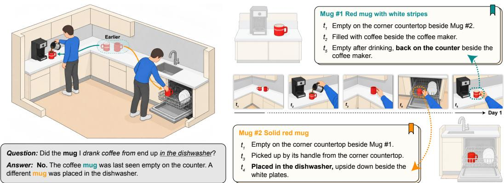
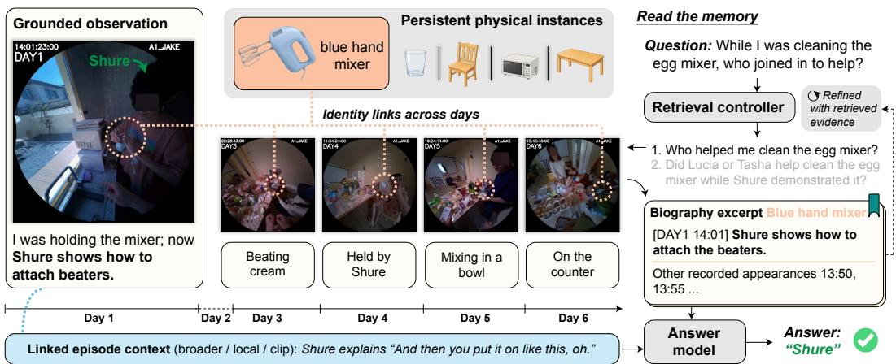
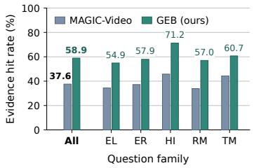
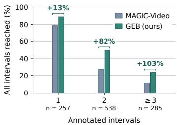
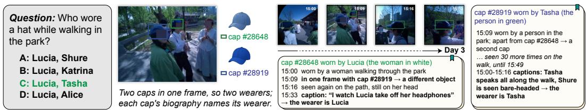
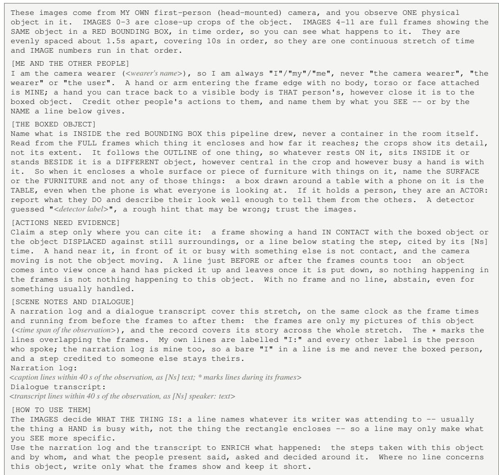
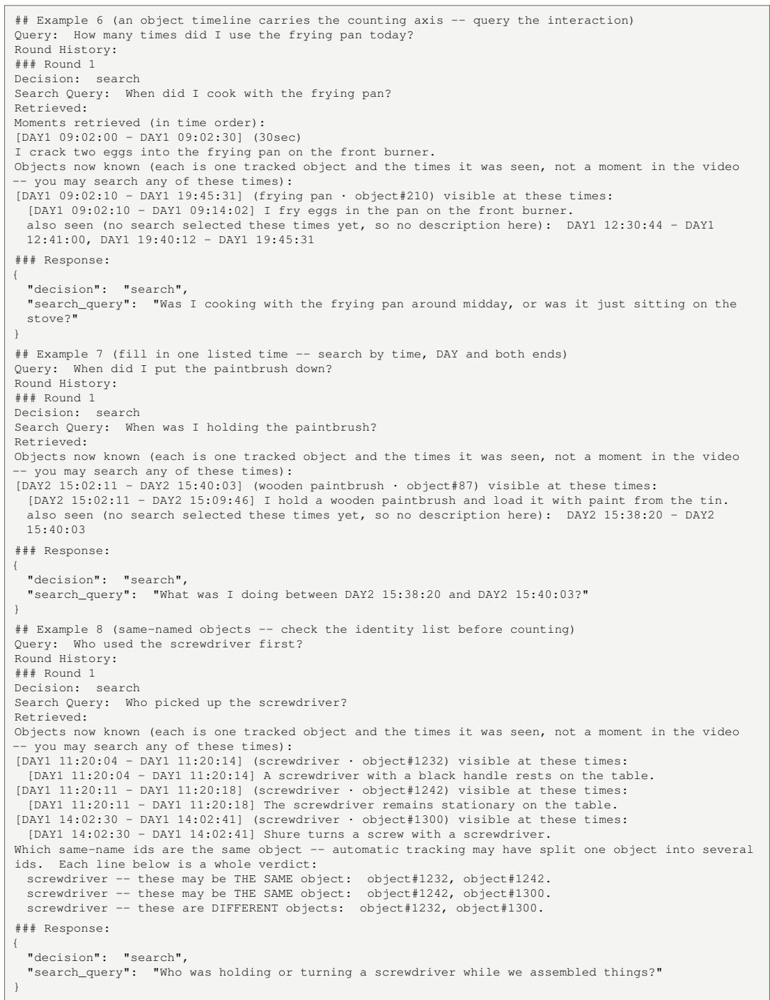

# BEYOND THE TIMELINE: AUGMENTING LONG-VIDEO MEMORY WITH GROUNDED ENTITY BIOGRAPHIES

Hui Ren<sup>1</sup> <sup>∗</sup>, Lei Fan<sup>2</sup>, Henry Pao<sup>2</sup>, Han Guo<sup>2</sup>, Zeeshan Zia<sup>2</sup>, Ying Chen<sup>2</sup>, Alexander Schwing<sup>1</sup>, Gang Hua<sup>2</sup>

<sup>1</sup>University of Illinois Urbana-Champaign <sup>2</sup>Amazon.com, Inc.

Project page

## ABSTRACT

Answering questions about long videos often requires connecting events involving the same objects across hours or days. Chronological descriptions and text-derived entities can leave physical identity unresolved: different objects may share a description, while observations of the same object remain disconnected across events. Retrieving relevant events therefore does not necessarily recover the “biography” of the particular entity a question concerns. To address this, we introduce Grounded Entity Biographies (GEB), a long-video memory framework that groups visually grounded observations of the same physical instance across clips into retrievable biographies while preserving the context of each moment. During question answering, the biography is retrieved alongside episodic evidence, allowing the model to follow an entity through events using identity links established during memory construction. Evaluations across four benchmarks, including day-long and weeklong recordings, demonstrate improvements over prior memory frameworks in both multiple-choice and open-ended question answering. On EgoLifeQA, GEB achieves 72.0% accuracy, 4.4 percentage points above the best published result. Ablations show that grounded identity association and biography reading both contribute to the gains, which additional descriptions alone do not fully recover.

## 1 INTRODUCTION

History can be organized around events or around the subjects who took part. A chronicle follows events through time; a biography follows a subject through those events. Long-video memory needs both perspectives: it must recover what happened at a particular moment and connect what happened to the same person or object across hours or days. The latter requires deciding which scattered observations concern the same physical entity. Without this correspondence, a detailed record of moments leaves the biography of an entity incomplete.

Consider the question in Figure 1: Did the mug I drank coffee from end up in the dishwasher? The striped red mug was used for coffee and later seen empty on the counter; a different, solid red mug was placed in the dishwasher. A descriptive memory may retrieve both “coffee is poured into a red mug” and “a red mug is placed in the dishwasher.” Both descriptions can be accurate, yet their shared wording does not establish that the events involve the same instance. Retrieving relevant events is therefore insufficient without resolving whose biography they belong to.

Memory frameworks make long recordings searchable through temporal descriptions and semantic relations (Wang et al., 2024; Yeo et al., 2026), with recent structured memory frameworks also consolidating entity mentions into cross-time narratives (Li et al., 2026a). When correspondence is derived from language, two related limitations remain. First, descriptions can conflate or fragment the biographies of physical objects: different objects may share a name, while one object may be described differently as its state, location, or activity changes. Second, retrieving an observation may not reveal the other encounters of that particular instance, especially across recording sessions, where temporal proximity and continuous tracking no longer connect observations. Without identity established in the memory itself, retrieval and reasoning must reconstruct which moments belong together from the evidence available for each question.

  
Figure 1: Moments record events; persistent entities connect them into biographies. To answer whether the mug used for coffee ended up in the dishwasher, a memory must know which physical mug took part in each event. A descriptive memory may retrieve “coffee is poured into a red mug” and “a red mug is placed in the dishwasher” yet cannot tell whether the two mugs are the same.

We introduce Grounded Entity Biographies (GEB), a long-video memory framework that organizes observations into biographies of inferred physical instances while preserving the context and visual evidence of each encounter (Figure 2). GEB grounds each observation in views of the instance and its surrounding activity, then associates observations across clips using visual and contextual evidence, and rejects a match when the video shows two different physical instances. At question time, a retrieved observation becomes an entry point: retrieval follows same-instance edges to the other observations of the same inferred instance and can reach their episodic context and source evidence. Further, the biography excerpt presented to the controller also lists the observations not yet inspected, giving the controller concrete targets for further search.

We evaluate GEB on day-long and week-long recordings, covering multiple-choice and open-ended question answering (Yang et al., 2025; Tian et al., 2026; Chen et al., 2026). On EgoLifeQA, GEB achieves 72.0% accuracy versus 67.6% reported by MAGIC-Video, the strongest published memory framework, while using the same retrieval controller, the same answer model, and the same retrieval limits. The fraction of questions whose evidence window reaches the answering context rises from 37.6% to 58.9%, indicating better access to relevant moments. Ablations show: indexing descriptions without physical-instance association recovers only part of the gain; removing the same-instance edges, the edges to episodic context, or the biography text each reduces accuracy.

Our contributions are summarized as follows:

• Grounded entity biographies: a memory representation and construction approach that links visually grounded observations into persistent entity biographies while retaining their event context and supporting evidence.

• Retrieval and reading through identity: a mechanism that connects episodes through shared physical entities and presents biography excerpts that support reasoning and guide further search.

• Empirical validation and analysis: improvements on long-video question answering under matched reasoning components, with evidence-access diagnostics and ablations examining the roles of grounding, association, and biography reading.

## 2 RELATED WORK

Long-video memory and agentic retrieval. Long-video models extend the amount of visual context they can process through memory compression and hierarchical token reduction (Song et al., 2024; Li et al., 2026b). Retrieval-based approaches access selected evidence on demand: VideoAgent iteratively gathers information with visual tools (Wang et al., 2024), while WorldMM coordinates retrieval from episodic, semantic, and visual memories (Yeo et al., 2026). Ego-R1 learns to compose tool calls for long-horizon reasoning (Tian et al., 2026), and ReMA recursively manages a multimodal belief state (Chen et al., 2026). GEB complements these retrieval strategies by connecting a matched observation to other events involving the same physical instance.

  
Figure 2: Overview of Grounded Entity Biographies (GEB). Visually grounded observations of each instance are associated across clips into a persistent biography; here the blue hand mixer is linked across days, each observation keeping its description, its source frames and its episode context. At question time a controller retrieves biography excerpts together with episodic and visual evidence, and the answer model identifies Shure from them.

Entity memory. Entity-centered memory frameworks retain information about recurring people and objects. VideoAgent tracks and re-identifies objects within a video and keeps an object-occurrence database (Fan et al., 2024); AMEGO links the interaction tracklets of one object and records where it is used (Goletto et al., 2024). M3-Agent gives the people in a video face and voice identities beside episodic and semantic text (Long et al., 2026), and Embodied VideoAgent maintains persistent objects from egocentric video with depth and pose sensing (Fan et al., 2025). GEB organizes observations of the same physical instance into biographies while retaining event contexts. These biographies support retrieval across events and guide further search through references to other recorded appearances.

Structured memory and relational retrieval. Graph-based retrieval connects evidence through extracted entities and relations. GraphRAG organizes document collections through entity graphs and community summaries (Edge et al., 2024); HippoRAG and HippoRAG 2 support associative retrieval through knowledge graphs and links to source passages (Gutierrez et al., 2024; 2025).´ For video, EGAgent and EgoGraph construct temporal entity graphs from transcripts and scene descriptions (Rege et al., 2026; Sun et al., 2026). MAGIC-Video builds a multimodal memory graph over its captions, using entity nodes for names extracted by a language model and consolidated across time, augmented by topic and event chains (Li et al., 2026a). Language-derived entity links can merge distinct physical instances or split one instance across names. GEB associates observations using visual and contextual evidence, with separation in shared frames vetoing a match.

## 3 GROUNDED ENTITY BIOGRAPHIES

Grounded Entity Biographies (GEB) connects persistent entity biographies to episodic memory. We define this representation (Sections 3.1–3.2), then describe how grounded association constructs biographies and retrieval follows them across events (Sections 3.3–3.4).

## 3.1 REPRESENTING AN ENTITY BIOGRAPHY

A grounded entity biography is a temporally ordered record of encounters with one physical entity.   
Each encounter preserves the visible subject, its event context, and the supporting evidence.

We partition a given recording into T short video clips. Each $c _ { t }$ denotes one clip containing a sequence of frames, and $\boldsymbol { \mathcal { C } } = \{ \check { c } _ { t } \} _ { t = 1 } ^ { T }$ denotes the collection of clips. An observation $o _ { i }$ records one tracked subject within one clip; O denotes all such observations. Each record retains the visible time span $\tau _ { i }$ of the subject in the recording, tracked image regions, a description of its state and interactions, and references to its source clip and supporting context. The context used to describe an encounter may extend beyond its visible span. For example, the mixer being handled in one clip and resting on a counter in another constitute two observations, even if they depict the same mixer (Figure 2).

Let $\hat { z } _ { i } \in \{ 1 , \ldots , K \}$ be the entity identifier assigned to observation $o _ { i } ,$ , where K is the number of inferred physical entities. The biography of entity k is

$$
{ \cal B } _ { k } = \mathrm { s o r t } _ { \tau } \big ( \{ o _ { i } \in \mathcal O : \hat { z } _ { i } = k \} \big ) ,\tag{1}
$$

where sort<sub>τ</sub> orders observations by the start times of their visible spans. Membership expresses estimated correspondence to the same physical instance across clips; a shared category or name alone does not establish it. Gaps in this observed history do not imply that the entity was absent or inactive. Section 3.3 discusses how $\hat { z } _ { i }$ is computed.

## 3.2 CONNECTING BIOGRAPHIES TO EPISODIC MEMORY

A biography connects encounters with the same subject, while an episode preserves the surrounding activity and other participants needed to interpret them. Identifying who helped with the mixer, for example, requires context about the people involved. In our memory, we therefore link each encounter to its biography, surrounding episode, and source video.

A persistent entity node $u _ { k }$ represents one inferred physical instance, such as the blue mixer across days, without requiring continuous visibility. Observation nodes retain its individual encounters. Episode nodes hold scene descriptions at multiple temporal scales, such as Shure’s actions and dialogue while handling the mixer (Figure 2). Source-clip nodes reference the original video. An episode and source clip may cover the same interval but supply different evidence: a contextual description and its supporting frames.

Formally, let U and E denote the sets of entity and episode nodes. Using the above notation for nodes of observations (O) and clip records (C), we represent the memory as

$$
{ \mathcal { G } } = ( { \mathcal { N } } , { \mathcal { R } } ) , \qquad { \mathcal { N } } = { \mathcal { U } } \cup { \mathcal { O } } \cup { \mathcal { E } } \cup { \mathcal { C } } .\tag{2}
$$

Here, $\mathcal { N }$ is the complete node set and R is the set of all relation edges described next.

Three relation types connect observations to identity, context, and visual evidence. Entity membership contributes an edge $( u _ { k } , o _ { i } ) \in \mathcal { R }$ whenever observation $o _ { i }$ is assigned to entity $k , \mathrm { i } . \mathrm { e } . , \hat { z } _ { i } = k$ Episode context links each observation to its local episode. Visual provenance links it to its source clip. Within episodic memory, temporal adjacency connects successive episodes at the same scale, while containment connects local episodes to coarser episodes that contain them, providing access to broader activity context.

Persistent entities act as bridges across episodes. For observations $o _ { i }$ and $o _ { j }$ assigned to entity k, membership and context links establish a path

$$
e _ { a } ~  ~ o _ { i } ~  ~ u _ { k } ~  ~ o _ { j } ~  ~ e _ { b } ,
$$

where $e _ { a }$ and $e _ { b }$ contain the two observations. The shared identity connects encounters across days even when their descriptions differ; linked episodes preserve who interacted with it at each moment. The ablations of Section 4.4 distinguish SAME-INSTANCE edges (entity membership) from observation→timeline edges (episode context and visual provenance).

## 3.3 WRITING THE MEMORY

Writing a biography requires attributing an event to the correct visible subject and recognizing that subject when it reappears. GEB separates these decisions: grounded descriptions preserve individual encounters, while cross-clip association determines which encounters share an entity.

Grounding encounters in their context. An open-vocabulary detector and a within-clip tracker group repeated detections into observations, providing multiple views of a subject within one encounter. To describe each encounter, a vision-language model jointly reads subject crops, scene frames, and available timestamped narration and dialogue. Crops reveal distinguishing details, scene frames show interactions involving the subject, and text supplies surrounding event context. The prompt instructs the model to establish the subject visually and use textual context only when it concerns that subject. This addresses a central attribution problem: an action described near an object need not involve that object.

Associating encounters conservatively. For each new observation, we decide whether to append it to an existing biography or start a new one. A mistaken association creates false paths between events, so a match must have positive support and remain consistent with the retained evidence.

For this, we process observations in temporal order, retrieving candidate matches among existing entities by embedding similarity. Let $\mathbf { v } _ { i }$ be a normalized multimodal embedding of the new observation $o _ { i } ; s _ { i j } = { \bf v } _ { i } ^ { \top } { \bf v } _ { j }$ measures its similarity to an earlier observation $o _ { j }$ . For an existing candidate entity $k ,$ the nonempty set $M _ { k }$ contains a bounded number of its most recent assigned observations, used as comparison references.

Two thresholds, $\theta _ { \mathrm { c o n s } } < \theta _ { \mathrm { m a t c h } }$ , impose complementary requirements. The new observation must be sufficiently similar to every reference, guarding against inconsistent views being combined, and strongly match at least one, requiring positive correspondence evidence. A third check uses visual separation: we compute bounding-box intersection-over-union (IoU) on frames shared by the two observations. We set $D _ { i j } = 1$ when the two observations share at least a minimum number of frames and their boxes fall below the IoU threshold in at least a prescribed fraction of those frames, and $D _ { i j } = 0$ otherwise (Appendix A). A zero means that no separation evidence was found; it does not establish that the subjects are the same instance.

We assign $o _ { i }$ to a candidate entity k only if all three conditions hold:

$$
\operatorname* { m i n } _ { o _ { j } \in M _ { k } } s _ { i j } \ge \theta _ { \mathrm { c o n s } } , \quad \operatorname* { m a x } _ { o _ { j } \in M _ { k } } s _ { i j } \ge \theta _ { \mathrm { m a t c h } } , \quad D _ { i j } = 0 \ \forall o _ { j } \in M _ { k } .\tag{3}
$$

Thus, matching one reference cannot compensate for contradicting another. If a reference and the new observation show two similar mixers apart in shared frames, that candidate is rejected regardless of embedding similarity.

If multiple candidates qualify, we choose the one with the highest mean similarity to its reference observations. For the selected entity k, we set $\hat { z } _ { i } = k$ and append $o _ { i }$ to its reference set $M _ { k }$ , removing the oldest reference if the size limit is exceeded; if no candidate qualifies, $o _ { i }$ starts a new entity. Bounding $M _ { k }$ limits comparison cost, while all assigned observations remain in $\boldsymbol { B } _ { k }$ . Threshold calibration and separation-test settings are given in Appendix A.

People follow the same observation and association process as objects. When participants are named, an additional stage assigns and consolidates identities using unambiguous person-and-day appearance profiles, abstaining when identifying features are shared (Appendix A).

## 3.4 READING THE MEMORY

A question may identify an entity through one encounter but concern another. Retrieval uses the matched encounter to enter its biography and recover surrounding evidence. A language-model controller (Li et al., 2026a) reads the question and accumulated evidence, then issues another search or passes deduplicated biographies, episode excerpts, and source frames to the answer model.

Retrieving through identity and context. Observation descriptions and episode captions are indexed together, semantically and lexically; a query’s initial matches come from this shared index and from visual matches to source clips. Relevance propagates from these matches through entity membership to other observations of the same inferred instance, and through context links to their surrounding episodes. We implement this propagation with Personalized PageRank (Haveliwala, 2002) and combine its scores with query-text similarity for ranking. Entity nodes transmit relevance; the returned evidence consists of observations, episodes, and source clips.

These records compete within a shared retrieval budget. Limits on selected appearances, both overall and per entity, preserve room for episodic context and prevent a frequently observed subject from dominating. Relation weights and budget settings are specified in Appendix A. For timestamped questions, retrieval and rendering are restricted to memory records preceding the query time.

Reading a biography and extending the search. For each entity, the biography excerpt contains its observations selected through the current retrieval round, ordered by time. Each block retains the entity identifier, timestamps, and stored descriptions. Other recorded appearances that have not been selected are summarized by times and counts, giving the controller concrete targets for subsequent searches. The biography therefore provides both evidence about the subject and access to parts of its history that remain to be inspected.

Conservative association can leave one physical instance under multiple identifiers. When biographies that share a name are retrieved together, an accompanying note distinguishes pairs with visual evidence of separation from those whose identity remains unresolved. Different identifiers alone are not treated as proof of different objects. Linked episodic evidence also provides context for checking the account of an observation; the reading prompt gives the episode precedence when the two descriptions conflict.

## 4 EXPERIMENTS

We evaluate question answering, access to supporting moments, and the contributions of identity association, episodic connections, and biography reading.

## 4.1 EXPERIMENTAL SETUP

Benchmarks. Our evaluation covers complementary demands of video memory. EgoLifeQA (Yang et al., 2025) and Ego-R1-Bench (Tian et al., 2026) test multiple-choice answering over approximately 52 hours of participant A1’s week, using 500 and 50 questions, respectively. Only recordings preceding each question’s timestamp are accessible. MM-Lifelong (Chen et al., 2026) tests openended answering over the same week (Test@Week) and a 23.6-hour gameplay stream (Test@Day), with the complete recording accessible. The same EgoLife memory supports both multiple-choice benchmarks and Test@Week without rebuilding. MultiHop-EgoQA (Chen et al., 2025) tests questions requiring evidence from separate moments: it contains 1,080 questions over 360 three-minute Ego4D clips (Grauman et al., 2022). Its annotated evidence intervals allow us to evaluate whether retrieval reaches all required moments. Memory construction uses video without audio.

Comparisons. We compare with general, long-video, and agentic video models, distinguishing published results from our runs in the tables. For comparisons among memory frameworks, MAGIC-Video (Li et al., 2026a), WorldMM (Yeo et al., 2026), and GEB use Qwen3.5-35B as controller and answer model. Their EgoLifeQA and Ego-R1-Bench baseline results are taken from Li et al. (2026a). On MM-Lifelong and MultiHop-EgoQA, we run the released implementations. GEB and MAGIC-Video share the episodic captions, topic and event summaries, and retrieval limits. WorldMM retains its own episodic, semantic, and visual stores. Appendix A specifies retrieval-unit, search-round and frame limits, and Appendix C the per-benchmark protocol, including WorldMM’s per-store retrieval. No-memory reference rows evaluate the answer model with sampled video evidence. On MultiHop-EgoQA, this reference receives frames spanning the entire clip, whereas memory frameworks select evidence through retrieval.

Evaluation. We report multiple-choice accuracy on EgoLifeQA and Ego-R1-Bench, and the benchmark’s GPT-5-judged accuracy on MM-Lifelong. MultiHop-EgoQA evaluates answer quality and temporal grounding. We use its released scoring code and its grading prompt with an independent gpt-oss-120b judge. Grading uses the 724 questions with a reference answer. Ego-R1-Bench results are averaged over three seeds, and our memory-framework evaluations on MM-Lifelong and MultiHop-EgoQA each report the mean over three runs. Detailed scoring protocols appear in Appendix C. Uncertainty estimates are summarized with the main results below.

## 4.2 QUESTION ANSWERING RESULTS

GEB achieves the highest overall score among the compared systems on all four splits in Table 1.

Week-long multiple-choice answering. GEB achieves 72.0% accuracy on EgoLifeQA, improving over the strongest competing memory framework, MAGIC-Video, by 4.4 percentage points. The corresponding gain on Ego-R1-Bench is 6.6 points with the same controller and answer model. Improvements over MAGIC-Video extend to four of the five EgoLifeQA question families, with the largest gain in EventRecall (+7.9 points, Table 1). Full system comparisons are provided in Appendix Table 16.

Table 1: GEB achieves the highest overall accuracy on each benchmark split shown. Accuracy (%). EL, ER, HI, RM, TM: EntityLog, EventRecall, HabitInsight, RelationMap, TaskMaster; Manual/Gemini: human-written/model-generated Ego-R1 questions. <sup>∗</sup> on a model name: EgoLifeQA and Ego-R1 results from Li et al. (2026a); <sup>∗</sup> on a cell: Chen et al. (2026); <sup>†</sup>: Yeo et al. (2026). Other entries are our runs. GEB, MAGIC-Video, and WorldMM use the same Qwen3.5-35B controller and answer model. Bold/underline: best/second-best per column. Full comparisons in Tables 16 and 10.
<table><tr><td></td><td colspan="4">EgoLifeQA ↑</td><td colspan="3">Ego-R1 ↑</td><td colspan="2">MM-Lifelong ↑</td></tr><tr><td>Model</td><td>EL</td><td>ER</td><td>HI RM</td><td>TM Avg.</td><td>Manual</td><td>Gemini</td><td>Avg.</td><td>Week</td><td>Day</td></tr><tr><td colspan="10">General MLLMs</td></tr><tr><td>GPT-5†</td><td></td><td></td><td>47.2 42.1 47.5 53.6 55.6 48.6</td><td></td><td></td><td></td><td></td><td>15.00*</td><td>15.25*</td></tr><tr><td>Qwen3-VL-235B</td><td>44.0</td><td>44.4 50.8</td><td>44.8 50.8 46.0</td><td></td><td>40.0</td><td>62.7</td><td>51.3</td><td>15.63*</td><td>12.44*</td></tr><tr><td>Qwen3.5-35B</td><td>43.2</td><td>46.8 49.2</td><td>50.4 61.9</td><td>49.0</td><td>38.7</td><td>65.3</td><td>52.0</td><td>13.75</td><td>7.50</td></tr><tr><td colspan="10"></td></tr><tr><td>Video-XL-2-8B</td><td></td><td></td><td>Long Video MLLMs 36.0 37.3 41.0 24.8 41.3 34.8</td><td></td><td>40.0</td><td>20.0</td><td>30.0</td><td>12.00*</td><td>9.00*</td></tr><tr><td>InternVideo2.5-8B*</td><td>34.4 37.3</td><td>42.6</td><td>30.4 31.7 34.8</td><td></td><td>28.0</td><td>21.3</td><td>24.7</td><td>13.75</td><td>5.25</td></tr><tr><td>VideoChat-Flash-7B*</td><td>36.839.7</td><td></td><td>34.4 31.2</td><td>41.336.4</td><td>33.3</td><td>34.7</td><td>34.0</td><td>12.50</td><td>5.25</td></tr><tr><td colspan="10">Agentic Video MLLMs</td></tr><tr><td>ReMA (GPT-5 agent)</td><td></td><td></td><td></td><td></td><td></td><td></td><td></td><td>18.82*</td><td>16.75*</td></tr><tr><td>SiLVR-gpt-oss-120b</td><td></td><td></td><td>35.2 42.957.4 52.8 57.1 47.0</td><td></td><td>22.7</td><td>60.0</td><td>41.3</td><td>9.50</td><td>6.00</td></tr><tr><td>Ego-R1-Qwen3.5-35B</td><td></td><td></td><td>33.6 38.1 37.7 34.4 50.8 37.6</td><td></td><td>30.7</td><td>29.3</td><td>30.0</td><td>14.25</td><td>6.50</td></tr><tr><td>AVP-Qwen3.5-35B</td><td>29.632.5</td><td>27.9</td><td>28.033.3</td><td>30.2</td><td>32.0</td><td>25.3</td><td>28.7</td><td>14.50</td><td>4.25</td></tr><tr><td>WorldMM-GPT-5†</td><td>62.464.3</td><td>75.4</td><td>62.4</td><td>71.4 65.6</td><td></td><td></td><td></td><td></td><td></td></tr><tr><td>WorldMM-Qwen3.5-35B*</td><td>49.6</td><td>54.8 54.1</td><td>62.4</td><td>60.3 56.0</td><td>48.0</td><td>66.7</td><td>57.3</td><td>31.42</td><td>8.50</td></tr><tr><td>MAGIC-Video-Qwen3.5-35B*</td><td>67.2</td><td>65.9 67.2</td><td>66.4</td><td>74.6 67.6</td><td>50.7</td><td>78.7</td><td>64.7</td><td>30.92</td><td>10.08</td></tr><tr><td>GEB-Qwen3.5-35B (ours)</td><td>70.4</td><td></td><td></td><td>73.8 73.8 71.2 71.4 72.0</td><td>64.0</td><td>78.7</td><td>71.3</td><td>36.83</td><td>17.58</td></tr></table>

Open-ended answering across recordings. On Test@Week, GEB reaches 36.83%, exceeding the strongest competing result, WorldMM, by 5.41 points. On the gameplay Test@Day split, its lead over the strongest competitor, ReMA, is 0.83 points. The reported confidence intervals exclude zero for EgoLifeQA, Ego-R1-Bench, and Test@Week, but include zero for Test@Day (Appendix Table 14). GEB exceeds both memory-framework baselines on each split. These results extend the evaluation to free-form answers and a recording domain with recurring game entities, with a clearer advantage on the week-long benchmark.

Answering and temporal grounding. MultiHop-EgoQA additionally tests whether a system identifies the moments supporting its answer (Table 2). GEB leads the compared memory frameworks on every reported metric: its answer score increases from WorldMM’s 2.74 to 3.11, while mIoU increases by 1.6 points. GEB also exceeds every model the benchmark reports in IoU@0.3 and mIoU, including GeLM, which is fine-tuned on the benchmark’s training set. The improvements in both measures motivate examining which evidence reaches the answer model. The answer model reading 60 frames of the whole clip without a memory scores higher still, showing the gap that remains to answering from the complete clip.

## 4.3 RETRIEVAL OF SUPPORTING EVIDENCE

An evidence hit on EgoLifeQA occurs when a received caption or described observation overlaps the annotated evidence window. Observations contribute their description-context windows, which may extend beyond visible spans (Appendix C). MultiHop-EgoQA complete evidence coverage (All in Table 3) requires overlap with every annotated interval. These measures evaluate received context, while temporal grounding evaluates intervals predicted in answers. Retrieved duration (Clip) is the union of received intervals divided by duration, accounting for differences in the amount of retrieved context.

Access to relevant moments. Figure 3a shows that GEB increases EgoLifeQA evidence hits from 37.6% to 58.9% compared with MAGIC-Video. The improvement holds across all question families. Biographies make an observation’s source interval available alongside episodic evidence, providing additional routes to the moments a question concerns.

Table 2: GEB leads the compared memory frameworks on MultiHop-EgoQA. Whole-clip models are separate references; Qwen3.5-35B reads 60 frames without memory. Full: complete video for memory construction, with evidence retrieved at question time. IoU@0.3 averages all questions; mIoP, mIoG, and mIoU average those predicting intervals. Sim.: sentence similarity. Score: 1–10 grading by gpt-oss-120b, averaged over three runs for memory frameworks. <sup>‡</sup>: grounding and Sim. from Chen et al. (2025), Score from released models using the same judge (Appendix C). Bold/underline: best/second-best within each block.
<table><tr><td></td><td></td><td colspan="4">Temporal grounding</td><td colspan="2">Answering</td></tr><tr><td>Model</td><td># Frames mIoP ↑ mIoG ↑ IoU@0.3 ↑ mIoU ↑ Sim. ↑ Score ↑</td><td></td><td></td><td></td><td></td><td></td><td></td></tr><tr><td>Human</td><td>Full</td><td>71.8</td><td>81.0</td><td>87.0</td><td>61.8</td><td>74.3</td><td>一</td></tr><tr><td colspan="8">Whole-clip MLLMs</td></tr><tr><td>GPT-40‡</td><td>60</td><td>18.9</td><td>24.4</td><td>12.0</td><td>12.2</td><td>73.7</td><td></td></tr><tr><td>InternVL2-8B‡</td><td>30</td><td>11.8</td><td>24.0</td><td>6.3</td><td>6.6</td><td>71.9</td><td>3.33</td></tr><tr><td>LLaVA-NeXT-Video-7B‡</td><td>32</td><td></td><td></td><td>一</td><td>一</td><td>62.1</td><td>2.91</td></tr><tr><td>TimeChat-7B</td><td>96</td><td>10.2</td><td>5.6</td><td>3.0</td><td>3.6</td><td>58.9</td><td>2.24</td></tr><tr><td>VTimeLLM-7B‡</td><td>100</td><td>12.4</td><td>28.2</td><td>8.8</td><td>9.2</td><td>70.5</td><td>2.95</td></tr><tr><td>LLaVA-NeXT-7B → Llama-3.1-8B‡</td><td>180</td><td>21.4</td><td>22.3</td><td>10.1</td><td>9.7</td><td>63.6</td><td>2.23</td></tr><tr><td>GeLM-7B‡</td><td>180</td><td>23.7</td><td>41.0</td><td>18.2</td><td>16.7</td><td>75.0</td><td>3.19</td></tr><tr><td>Qwen3.5-35B</td><td>60</td><td>33.7</td><td>43.3</td><td>33.1</td><td>24.5</td><td>70.4</td><td>3.64</td></tr></table>

<table><tr><td colspan="8">Agentic Video MLLMs</td></tr><tr><td>WorldMM-Qwen3.5-35B</td><td>Full</td><td>30.6</td><td>34.2</td><td>21.5</td><td>18.9</td><td>62.2</td><td>2.74</td></tr><tr><td>MAGIC-Video-Qwen3.5-35B</td><td>Full</td><td>29.6</td><td>30.7</td><td>19.0</td><td>17.6</td><td>61.3</td><td>2.58</td></tr><tr><td>GEB-Qwen3.5-35B (ours)</td><td>Full</td><td>32.0</td><td>36.7</td><td>25.9</td><td>20.5</td><td>65.2</td><td>3.11</td></tr></table>

  
(a) Evidence coverage

  
(b) Complete evidence  
Figure 3: GEB improves access to annotated evidence over MAGIC-Video, with larger relative gains when evidence spans multiple intervals. (a) Percentage of the 484 annotated EgoLifeQA questions whose evidence window overlaps a received unit, overall and by question family (abbreviations in Table 1). (b) Percentage of MultiHop-EgoQA questions for which received units overlap every annotated interval, grouped by interval count. Brackets show relative gains over MAGIC-Video, and n gives the number of questions in each group.

Access to distributed evidence. On MultiHop-EgoQA, complete evidence coverage increases from 35.4% to 52.1% over MAGIC-Video, a relative gain of 47% (Table 3). Figure 3b and the $A l l , \geq 3$ column show larger relative gains for questions requiring several intervals than for those requiring one. These gains support linking observations across events to recover distributed evidence.

Accounting for retrieved duration. To assess whether the gain follows simply from retrieving more of the recording, we increase MAGIC-Video’s MultiHop-EgoQA allowance from three to six units per round. Complete evidence coverage remains below GEB at a similar retrieved duration (Table 3). WorldMM achieves comparable complete coverage to GEB, but its retrieved units span more of the clip and its answer score is lower. Thus, complete coverage alone does not explain answer quality.

## 4.4 ABLATION STUDIES

Table 4 isolates memory organization, episodic connections, and reading inputs on EgoLifeQA with the controller and answer model fixed.

Physical identity beyond additional descriptions. Without association, each observation forms its own entity; name-keyed identity groups observations by described name. Both retain all descriptions

Table 3: GEB exceeds MAGIC-Video in complete coverage and is comparable to WorldMM with lower retrieved duration. All: fraction of questions with overlap for every annotated interval; All, ≥3: the same over the 285 questions with three or more intervals. Clip: union of received intervals divided by clip duration. Score and mIoU follow Table 2; Score gives mean±std across runs. ∆ All: row minus GEB, with a bootstrap 95% confidence interval over questions. The lower block removes biography text or association.
<table><tr><td></td><td colspan="3">Evidence reached Read</td><td colspan="2">Outcome</td><td colspan="3">vs. ours</td></tr><tr><td>Memory</td><td>All↑</td><td> $\mathrm { A l l } , \geq 3 \uparrow$ </td><td>Clip ↓</td><td>Score ↑</td><td>mIoU ↑</td><td></td><td>∆ All [95% CI]</td><td></td></tr><tr><td>MAGIC-Video-Qwen3.5-35B</td><td>0.354</td><td>0.116</td><td>0.230</td><td> $2 . 5 8 { \pm } 0 . 0 7$ </td><td>17.6</td><td>-0.167</td><td></td><td>[-0.190, -0.145]</td></tr><tr><td>6 units/round</td><td>0.449</td><td>0.182</td><td>0.319</td><td> $2 . 7 5 { \pm } 0 . 0 5$ </td><td>18.5</td><td>-0.071</td><td></td><td>[−0.096, -0.048]</td></tr><tr><td>WorldMM-Qwen3.5-35B</td><td>0.526</td><td>0.244</td><td>0.399</td><td> $2 . 7 4 \pm 0 . 0 6$ </td><td>18.9</td><td></td><td>+0.005</td><td>[−0.019, +0.030]</td></tr><tr><td>GEB-Qwen3.5-35B (ours)</td><td>0.521</td><td>0.235</td><td>0.343</td><td> $3 . 1 1 \pm 0 . 0 3$ </td><td>20.5</td><td></td><td></td><td></td></tr><tr><td>Ours with one decision removed</td><td></td><td></td><td></td><td></td><td></td><td></td><td></td><td></td></tr><tr><td>w/o biography text (index only) 0.468</td><td></td><td>0.164</td><td>0.279</td><td> $3 . 0 6 { \pm } 0 . 0 6$ </td><td>19.8</td><td></td><td></td><td>-0.053 [−0.070, -0.034]</td></tr><tr><td>w/o association</td><td>0.484</td><td>0.194</td><td>0.309</td><td> $3 . 1 1 \pm 0 . 0 4$ </td><td>19.9</td><td></td><td></td><td>-0.037 [-0.055, -0.019]</td></tr></table>

Table 4: GEB benefits from physical-instance organization, contextual connections, and biography reading. EgoLifeQA accuracy (%) on 500 questions with fixed controller and answer model. Left block: the index. Right block: the reading. ∆: variant minus full GEB, in percentage points. Variant definitions: Section 4.4; additional edge ablations: Table 15.
<table><tr><td>Memory</td><td>Acc. ↑</td><td>∆</td><td>Memory</td><td>Acc. ↑</td><td>∆</td></tr><tr><td>GEB (full)</td><td>72.0</td><td></td><td></td><td></td><td></td></tr><tr><td>The index</td><td></td><td></td><td>The reading</td><td></td><td></td></tr><tr><td>w/o association</td><td>68.6-3.4</td><td></td><td>w/o biography text (index only)</td><td>68.0</td><td>-4.0</td></tr><tr><td>identity keyed by name</td><td>69.2</td><td>-2.8</td><td>w/o biography text for the answer model 70.8</td><td></td><td>-1.2</td></tr><tr><td>descriptions appended to captions 68.2</td><td></td><td>-3.8</td><td>w/o identity notes</td><td>68.2</td><td>-3.8</td></tr><tr><td>w/o observation→timeline edges</td><td>68.2-3.8</td><td></td><td>w/o unsearched-observation line</td><td>70.2</td><td>-1.8</td></tr><tr><td></td><td></td><td></td><td>w/o caption text</td><td>61.8</td><td>-10.2</td></tr><tr><td></td><td></td><td></td><td>w/o visual frames</td><td>70.4</td><td>-1.6</td></tr></table>

under the full model’s retrieval-unit and frame limits and deliver comparable context, but reduce accuracy by 3.4 and 2.8 points. Appending descriptions to captions removes observation and entity structure and costs 3.8 points at a matched answering-context budget. These controls support physical-instance organization beyond additional descriptions.

Connections to identity and event context. Removing SAME-INSTANCE edges while retaining entity assignments costs 3.0 points. Disconnecting observations from episodes and source clips costs 3.8 points, and removing both edge families costs 5.0 (Appendix Table 15). These results support both following identity across events and recovering the context of each observation.

Biographies for answering and further search. Withholding biography text from both models while retaining the indexed memory costs 4.0 points. Withholding it only from the answer model while keeping the controller’s searches fixed reduces accuracy by 1.2 points. Removing references to observations not yet selected costs 1.8 points. The text-removal controls establish benefits beyond graph retrieval, while the reference removal supports using biographies to guide further search.

Consistency across benchmarks. On MM-Lifelong, appending descriptions to captions costs 3.25 points on Test@Week and 5.08 on Test@Day; withholding biography text with the index retained costs 6.75 and 2.33, respectively. Neither variant recovers full performance on either split (Appendix Table 9). On MultiHop-EgoQA, both association and biography-text removal reduce complete evidence coverage, with confidence intervals excluding zero, but have smaller effects on answer scores (Table 3). Appendix E illustrates how biographies and context resolve concrete questions.

## 5 CONCLUSION

Long-video memory must preserve not only what happened, but also which people and objects connect events across time. We introduced Grounded Entity Biographies, a framework that links visually grounded observations of the same physical instance while retaining each observation’s context and source evidence. These biographies make persistent entities bridges across episodes, allowing retrieval to follow an entity’s history and use previously recorded appearances to guide further search. Evaluations across four benchmarks demonstrate improvements in multiple-choice and open-ended question answering, including week-long recordings. Evidence analysis shows better access to relevant moments, while ablations support the contributions of grounded identity association and biography reading beyond additional descriptions alone. These findings highlight the value of organizing video memory around enduring subjects alongside the events in which they participate.

## REFERENCES

Nir Aharon, Roy Orfaig, and Ben-Zion Bobrovsky. BoT-SORT: Robust associations multi-pedestrian tracking. arXiv preprint arXiv:2206.14651, 2022.

Guo Chen, Lidong Lu, Yicheng Liu, Liangrui Dong, Lidong Zou, Jixin Lv, Zhenquan Li, Xinyi Mao, Baoqi Pei, Shihao Wang, Zhiqi Li, Karan Sapra, Fuxiao Liu, Yin-Dong Zheng, Yifei Huang, Limin Wang, Zhiding Yu, Andrew Tao, Guilin Liu, and Tong Lu. Towards multimodal lifelong understanding: A dataset and agentic baseline. arXiv preprint arXiv:2603.05484, 2026.

Qirui Chen, Shangzhe Di, and Weidi Xie. Grounded multi-hop VideoQA in long-form egocentric videos. In Proceedings ofthe AAAI Conference on Artificial Intelligence, 2025.

Christopher Clark, Jieyu Zhang, Zixian Ma, Jae Sung Park, Rohun Tripathi, Sangho Lee, Mohammadreza Salehi, Jason Ren, Chris Dongjoo Kim, Yinuo Yang, Vincent Shao, Yue Yang, Weikai Huang, Ziqi Gao, Taira Anderson, Jianrui Zhang, Jitesh Jain, George Stoica, Ali Farhadi, and Ranjay Krishna. Molmo2: Open weights and data for vision-language models with video understanding and grounding. In Proceedings of the IEEE/CVF Conference on Computer Vision and Pattern Recognition (CVPR), 2026.

Darren Edge, Ha Trinh, Newman Cheng, Joshua Bradley, Alex Chao, Apurva Mody, Steven Truitt, Dasha Metropolitansky, Robert Osazuwa Ness, and Jonathan Larson. From local to global: A graph RAG approach to query-focused summarization. arXiv preprint arXiv:2404.16130, 2024.

Yue Fan, Xiaojian Ma, Rujie Wu, Yuntao Du, Jiaqi Li, Zhi Gao, and Qing Li. VideoAgent: A memory-augmented multimodal agent for video understanding. In European Conference on Computer Vision (ECCV), 2024.

Yue Fan, Xiaojian Ma, Rongpeng Su, Jun Guo, Rujie Wu, Xi Chen, and Qing Li. Embodied VideoAgent: Persistent memory from egocentric videos and embodied sensors enables dynamic scene understanding. In Proceedings ofthe IEEE/CVF International Conference on Computer Vision (ICCV), 2025.

Gabriele Goletto, Tushar Nagarajan, Giuseppe Averta, and Dima Damen. AMEGO: Active memory from long egocentric videos. In European Conference on Computer Vision (ECCV), 2024.

Kristen Grauman, Andrew Westbury, Eugene Byrne, Zachary Chavis, Antonino Furnari, Rohit Girdhar, Jackson Hamburger, Hao Jiang, Miao Liu, Xingyu Liu, Miguel Martin, Tushar Nagarajan, Ilija Radosavovic, Santhosh Kumar Ramakrishnan, Fiona Ryan, Jayant Sharma, Michael Wray, Mengmeng Xu, Eric Zhongcong Xu, Chen Zhao, Siddhant Bansal, Dhruv Batra, Vincent Cartillier, Sean Crane, Tien Do, Morrie Doulaty, Akshay Erapalli, Christoph Feichtenhofer, Adriano Fragomeni, Qichen Fu, Abrham Gebreselasie, Cristina Gonzalez, James Hillis, Xuhua Huang,´ Yifei Huang, Wenqi Jia, Weslie Khoo, Jachym Kol´ a´ˇr, Satwik Kottur, Anurag Kumar, Federico Landini, Chao Li, Yanghao Li, Zhenqiang Li, Karttikeya Mangalam, Raghava Modhugu, Jonathan Munro, Tullie Murrell, Takumi Nishiyasu, Will Price, Paola Ruiz, Merey Ramazanova, Leda Sari, Kiran Somasundaram, Audrey Southerland, Yusuke Sugano, Ruijie Tao, Minh Vo, Yuchen Wang, Xindi Wu, Takuma Yagi, Ziwei Zhao, Yunyi Zhu, Pablo Arbelaez, David Crandall, Dima´ Damen, Giovanni Maria Farinella, Christian Fuegen, Bernard Ghanem, Vamsi Krishna Ithapu, C. V. Jawahar, Hanbyul Joo, Kris Kitani, Haizhou Li, Richard Newcombe, Aude Oliva, Hyun Soo Park, James M. Rehg, Yoichi Sato, Jianbo Shi, Mike Zheng Shou, Antonio Torralba, Lorenzo Torresani, Mingfei Yan, and Jitendra Malik. Ego4d: Around the world in 3,000 hours of egocentric video. In Proceedings ofthe IEEE/CVF Conference on Computer Vision and Pattern Recognition (CVPR), 2022.

Bernal Jimenez Guti ´ errez, Yiheng Shu, Yu Gu, Michihiro Yasunaga, and Yu Su. HippoRAG:´ Neurobiologically inspired long-term memory for large language models. In Advances in Neural Information Processing Systems (NeurIPS), 2024.

Bernal Jimenez Guti´ errez, Yiheng Shu, Weijian Qi, Sizhe Zhou, and Yu Su. From RAG to memory:´ Non-parametric continual learning for large language models. In International Conference on Machine Learning (ICML), 2025.

Taher H. Haveliwala. Topic-sensitive PageRank. In Proceedings of the 11th International Conference on World Wide Web (WWW), 2002.

Jiazheng Li, Chi-Hao Wu, Yunze Liu, Kaize Ding, Jundong Li, and Chuxu Zhang. Bridging modalities, spanning time: Structured memory for ultra-long agentic video reasoning. arXiv preprint arXiv:2605.08271, 2026a.

Xinhao Li, Yi Wang, Jiashuo Yu, Xiangyu Zeng, Yuhan Zhu, Haian Huang, Jianfei Gao, Kunchang Li, Yinan He, Chenting Wang, Yu Qiao, Yali Wang, and Limin Wang. VideoChat-Flash: Hierarchical compression for long-context video modeling. In International Conference on Learning Representations (ICLR), 2026b.

Lin Long, Yichen He, Wentao Ye, Yiyuan Pan, Yuan Lin, Hang Li, Junbo Zhao, and Wei Li. Seeing, listening, remembering, and reasoning: A multimodal agent with long-term memory. In International Conference on Learning Representations (ICLR), 2026.

Maxime Oquab, Timothee Darcet, Th´ eo Moutakanni, Huy V. Vo, Marc Szafraniec, Vasil Khalidov,´ Pierre Fernandez, Daniel Haziza, Francisco Massa, Alaaeldin El-Nouby, Mido Assran, Nicolas Ballas, Wojciech Galuba, Russell Howes, Po-Yao Huang, Shang-Wen Li, Ishan Misra, Michael Rabbat, Vasu Sharma, Gabriel Synnaeve, Hu Xu, Herve Jegou, Julien Mairal, Patrick Labatut, Armand Joulin, and Piotr Bojanowski. DINOv2: Learning Robust Visual Features Without Supervision. Transactions on Machine Learning Research, 2024.

Minghao Qin, Xiangrui Liu, Zhengyang Liang, Yan Shu, Huaying Yuan, Juenjie Zhou, Shitao Xiao, Bo Zhao, and Zheng Liu. Video-XL-2: Towards very long-video understanding through task-aware kv sparsification. arXiv preprint arXiv:2506.19225, 2025.

Alec Radford, Jong Wook Kim, Chris Hallacy, Aditya Ramesh, Gabriel Goh, Sandhini Agarwal, Girish Sastry, Amanda Askell, Pamela Mishkin, Jack Clark, Gretchen Krueger, and Ilya Sutskever. Learning transferable visual models from natural language supervision. In International Conference on Machine Learning (ICML), 2021.

Aniket Rege, Arka Sadhu, Yuliang Li, Kejie Li, Ramya Korlakai Vinayak, Yuning Chai, Yong Jae Lee, and Hyo Jin Kim. Agentic very long video understanding. In Annual Meeting of the Association for Computational Linguistics (ACL), 2026.

Enxin Song, Wenhao Chai, Guanhong Wang, Yucheng Zhang, Haoyang Zhou, Feiyang Wu, Haozhe Chi, Xun Guo, Tian Ye, Yanting Zhang, Yan Lu, Jenq-Neng Hwang, and Gaoang Wang. MovieChat: From dense token to sparse memory for long video understanding. In Proceedings ofthe IEEE/CVF Conference on Computer Vision and Pattern Recognition (CVPR), 2024.

Shitong Sun, Ke Han, Yukai Huang, Weitong Cai, and Jifei Song. EgoGraph: Temporal knowledge graph for egocentric video understanding. arXiv preprint arXiv:2602.23709, 2026.

Hao Tang, Kevin J Liang, Kristen Grauman, Matt Feiszli, and Weiyao Wang. EgoTracks: A long-term egocentric visual object tracking dataset. In Advances in Neural Information Processing Systems (NeurIPS), 2023.

Shulin Tian, Ruiqi Wang, Hongming Guo, Penghao Wu, Yuhao Dong, Xiuying Wang, Jingkang Yang, Hao Zhang, Hongyuan Zhu, and Ziwei Liu. Ego-R1: Agentic chain-of-tool-thought for ultra-long egocentric video reasoning. IEEE Transactions on Pattern Analysis and Machine Intelligence, 2026.

Ao Wang, Lihao Liu, Hui Chen, Zijia Lin, Jungong Han, and Guiguang Ding. YOLOE: Real-time seeing anything. In Proceedings of the IEEE/CVF International Conference on Computer Vision (ICCV), 2025a.

Xiaohan Wang, Yuhui Zhang, Orr Zohar, and Serena Yeung-Levy. VideoAgent: Long-form video understanding with large language model as agent. In European Conference on Computer Vision (ECCV), 2024.

Yi Wang, Xinhao Li, Ziang Yan, Yinan He, Jiashuo Yu, Xiangyu Zeng, Chenting Wang, Changlian Ma, Haian Huang, Jianfei Gao, Min Dou, Kai Chen, Wenhai Wang, Yu Qiao, Yali Wang, and Limin Wang. Internvideo2.5: Empowering video mllms with long and rich context modeling. arXiv preprint arXiv:2501.12386, 2025b.

Ziyang Wang, Honglu Zhou, Shijie Wang, Junnan Li, Caiming Xiong, Silvio Savarese, Mohit Bansal, Michael S. Ryoo, and Juan Carlos Niebles. Active video perception: Iterative evidence seeking for agentic long video understanding. In Proceedings ofthe IEEE/CVF Conference on Computer Vision and Pattern Recognition (CVPR) Findings, 2026.

Jingkang Yang, Shuai Liu, Hongming Guo, Yuhao Dong, Xiamengwei Zhang, Sicheng Zhang, Pengyun Wang, Zitang Zhou, Binzhu Xie, Ziyue Wang, Bei Ouyang, Zhengyu Lin, Marco Cominelli, Zhongang Cai, Bo Li, Yuanhan Zhang, Peiyuan Zhang, Fangzhou Hong, Joerg Widmer, Francesco Gringoli, Lei Yang, and Ziwei Liu. EgoLife: Towards egocentric life assistant. In Proceedings ofthe IEEE/CVF Conference on Computer Vision and Pattern Recognition (CVPR), 2025.

Woongyeong Yeo, Kangsan Kim, Jaehong Yoon, and Sung Ju Hwang. WorldMM: Dynamic multimodal memory agent for long video reasoning. In Proceedings ofthe IEEE/CVF Conference on Computer Vision and Pattern Recognition (CVPR), 2026.

Boqiang Zhang, Kehan Li, Zesen Cheng, Zhiqiang Hu, Yuqian Yuan, Guanzheng Chen, Sicong Leng, Yuming Jiang, Hang Zhang, Xin Li, Peng Jin, Wenqi Zhang, Fan Wang, Lidong Bing, and Deli Zhao. Videollama 3: Frontier multimodal foundation models for image and video understanding. arXiv preprint arXiv:2501.13106, 2025a.

Ce Zhang, Yan-Bo Lin, Ziyang Wang, Mohit Bansal, and Gedas Bertasius. SiLVR: A simple language-based video reasoning framework. Transactions on Machine Learning Research, 2026.

Peiyuan Zhang, Kaichen Zhang, Bo Li, Guangtao Zeng, Jingkang Yang, Yuanhan Zhang, Ziyue Wang, Haoran Tan, Chunyuan Li, and Ziwei Liu. Long context transfer from language to vision. Transactions on Machine Learning Research, 2025b.

## APPENDIX

## A IMPLEMENTATION AND HYPERPARAMETERS

Video units and tracks. The EgoLife week is processed as 6,266 thirty-second clips of 1408×1408 video, sampled at 10 fps. YOLOE-26x-seg in its prompt-free mode detects objects on every sampled frame (Wang et al., 2025a), BoT-SORT links the detections into tracks within a clip (Aharon et al., 2022; Tang et al., 2023), and duplicate tracks of one object are merged. Following VideoAgent (Fan et al., 2024), tracks that the tracker split are regrouped by CLIP and DINOv2 appearance similarity (Radford et al., 2021; Oquab et al., 2024), and tracks seen in the same frame are never grouped. A group visible for at least two seconds becomes an observation and keeps representative crops, its time span, and its source episode; whole-frame and watermark boxes are discarded.

Description. Each observation is described by one call to a locally served vision-language model (Qwen3.5-35B). The call sees four crops at 448 px, scene frames at 768 px sampled at 1 fps over the observation’s span (3 to 30) with the subject boxed, and the recording’s own caption and transcript within ±40 s. It returns the object’s name, a one-paragraph summary that is used as the retrieval text, an event description, whether the object is a person, its location, and its stable attributes.

Association. Each observation is embedded with Qwen3-VL-Embedding-8B from its crops, name and summary. Every entity with a reference observation at or above $\theta _ { \mathrm { { m a t c h } } }$ is a candidate, and acceptance follows Equation 3 over the reference set of each entity, its 10 most recently assigned observations. A box that stays in place across the cut between two consecutive clips (the mutual best match with IoU at least 0.6) also counts as the match anchor, and the consistency floor and the separation test still apply. Two observations of one clip are visually separate $( D _ { i j } = 1 )$ when they share at least three frames and their boxes overlap with IoU < 0.5 in at least two thirds of them. The two thresholds are set per recording by visual inspection of sampled merges: $\theta _ { \mathrm { c o n s } } , \theta _ { \mathrm { m a t c h } } =$ 0.60, 0.75 on EgoLife and 0.75, 0.85 on the gameplay stream, whose repeated assets make objects of one kind score alike.

Naming. One vision call per clip assigns the people on screen to the recording’s cast jointly, and a text model (gpt-oss-120b) distills each person’s clothing for the day from those assignments. An entity matched to one unambiguous profile takes its name and carries it to its observations on the other days, and an entity that two days name differently carries no name across days. The name labels the entity, and the description text is left as written. This stage runs on the EgoLife recording, whose seven participants are named; the Test@Day livestream has no cast, so its entities carry only the names written in their descriptions.

Graph and retrieval. Observation texts are embedded with the caption encoder (Qwen3-Embedding-4B, 2560-d) and indexed in the same lexical index as the captions. Edge weights are episode context 1.0, visual provenance 0.8, and SAME-INSTANCE 0.5. On EgoLife, the episodic memory uses 30-second, 3-minute, 10-minute, and 1-hour scales. Personalized PageRank uses a damping factor of 0.85, and each returned node is ranked by the product of its PageRank score and its query–text cosine similarity. An entity node exists for every entity with two or more observations. It routes relevance between the observations and is not scored as a unit itself. Each retrieved observation is one unit of the round’s budget; the retrieved observations of one entity are rendered together as its biography excerpt, the Retrieved entity block of Figure 5. Retrieval on every benchmark allows at most five rounds and 64 frames. Week-scale retrieval uses 16 units per round, and at most six of the units may be observations, at most three of them from one entity and with no limit on the number of entities. MultiHop-EgoQA uses three units per round, of which at most one may be an observation. On every benchmark the controller and the answer model are Qwen3.5-35B, called either on a locally served vLLM instance, its context window extended to 1M tokens with YaRN, or through OpenRouter’s qwen3.5-flash endpoint, the hosted form of the same checkpoint. GEB and MAGIC-Video share one episodic memory: the 30-second captions and the topic and event summaries derived from them, injected after each search. The summaries are extracted once from the captions and do not depend on the entities. For a question asked at time t, the memory is re-indexed to the nodes before t.

## B MEMORY SCALE AND RETRIEVAL COST

Table 5 summarizes the memory built for the EgoLife week, and Table 6 counts the nodes and edges of the three memory frameworks on the graph a question at the end of the week retrieves over. At the selected operating point, association groups 257,974 observations (83.7% of all) into 27,446 entities of two or more observations, 15,365 of which span more than one day. Beside the shared episodic memory, the memory graph holds one node per tracked observation and one per entity with two or more observations, so its size follows the number of tracked observations, about 49 per 30-second clip. The memory is written once, offline, and serves every later question.

Table 5: Scale of the memory built for the EgoLife week. Entities are counted once each, including those carried across several days; the seven named people are one entity each.
<table><tr><td>Quantity</td><td>Count</td></tr><tr><td>Thirty-second video clips</td><td>6,266</td></tr><tr><td>Approximate video duration</td><td>52 hours</td></tr><tr><td>Tracked object observations</td><td>308,244</td></tr><tr><td>Entities after association</td><td>77,716</td></tr><tr><td>of which join two or more observations</td><td>27,446</td></tr><tr><td>of which span more than one day</td><td>15,365</td></tr><tr><td>Observations inside entities of two or more observations</td><td>257,974</td></tr><tr><td>Largest entity, a named person / an unnamed object</td><td>5,264 / 517</td></tr></table>

Name collisions in the corpus. The frozen memory lets us count how often a described name fails to identify an instance. Two observations of one clip are proven to be different objects by the same-frame separation test of Appendix A, which uses geometry alone and does not depend on the association. In the EgoLife week, 89,888 such pairs carry the same described name, and they occur in 5,804 of the 6,266 clips (92.6%). In the other direction, under our association, 77.2% of the 22,401 object entities seen more than once are described under two or more distinct names (an air conditioner is also an air conditioning unit and a wall-mounted air conditioner), so a memory keyed by the described name both merges different instances and splits one instance.

Retrieval cost. We measure the query-time cost of the memory of GEB on the 50 Ego-R1-Bench questions. The searches issued in an evaluation in the setting of Section 4.1 are run again on one A100, without the controller and the answer model, against the memory of the whole week, which is at least as large as the memory any question sees, so the times below are upper bounds. Each search traverses the memory graph of Table 6 with no language-model call, and its time covers retrieval and the formatting of the returned context. A search takes 5.6 s on average (median 5.1 s, 90th percentile 8.6 s), and a question, with 2.42 searches, spends 13.6 s in retrieval.

## C EVALUATION PROTOCOL

EgoLifeQA and Ego-R1-Bench. Both benchmarks use the protocol under which the published numbers in Table 1 were obtained (Li et al., 2026a): participant A1, with the recording up to the query time visible (Section 4.1). Two EgoLifeQA questions (71 and 73) cannot be answered from their options, one with duplicated options and one whose gold option is identical to another, and count as wrong for every system we run. Multiple-choice answers are scored by exact match.

EgoLifeQA evidence coverage. Figure 3a evaluates the 484 questions with an annotated evidence window. We count an evidence hit when that window overlaps a 30-second caption or a described observation received by the answer model. An observation contributes the contextual window used to generate its description (Appendix A). Coarser episode summaries are not counted in this measure. Coverage measures access to temporally relevant context, not the correctness of the observation’s identity assignment.

MultiHop-EgoQA. The benchmark releases 1,080 questions over 360 three-minute segments of Ego4D videos (854×480, 30 fps, no audio track). MAGIC-Video, WorldMM and GEB build their memory on 10-second units from the same captions and visual units. MAGIC-Video adds its name-keyed entities and triples, and WorldMM its separate episodic, semantic and visual stores. The multi-granularity aggregation and the chains summarize hours and have no content on a three-minute clip, so the shared episodic memory has a single granularity there. Our observations are tracked and described on 10-second clips from their own frames only, and associated across the clip’s 18 segments by the same visual association as at week scale. A 10-second observation is one unit of the timeline it links to. GEB retrieves three units per round, of which at most one may be an observation, for at most five rounds under the frame cap in Appendix A. MAGIC-Video also retrieves three units per round, whereas WorldMM retrieves up to three units from each of its episodic, semantic, and visual stores. The additional MAGIC-Video comparison increases its allowance to six units per round while retaining the controller, answer model, and scoring protocol. Because these allowances need not produce equal amounts of context, Table 3 also reports the fraction of the clip covered by received units. A clip is 18 episodes, so 16 units would return most of it in one round. The controller and the answer model are those of Section 4.1, and frames enter the answering context only inside a retrieved visual unit.

Table 6: Memory statistics for the EgoLife A1 week, counted on the memory a question asked at the end of the week retrieves over. WorldMM is not one graph: it keeps a HippoRAG graph per caption granularity (passage and extracted-entity vertices, weighted relation edges) beside separate semantic-triple and visual-clip indices. GEB and MAGIC-Video share the episodic memory (episode, clip and temporal edges). GEB adds one node per tracked observation and one per entity with two or more observations. MAGIC-Video adds its text-derived entity and triple layer.
<table><tr><td></td><td>WorldMM- Qwen3.5-35B</td><td>MAGIC-Video- Qwen3.5-35B</td><td>GEB-Qwen3.5-35B (ours)</td></tr><tr><td colspan="4">Nodes</td></tr><tr><td>Episode nodes (captions at 4 granularities)</td><td>7,624</td><td>7,625</td><td>7,625</td></tr><tr><td>Visual clip nodes</td><td>6,223†</td><td>6,223</td><td>6,223</td></tr><tr><td>Named-entity nodes extracted from text</td><td>55,468</td><td>2,669</td><td></td></tr><tr><td>Semantic triple nodes</td><td>3,821†</td><td>3,821</td><td></td></tr><tr><td>Observation nodes</td><td></td><td></td><td>308,244</td></tr><tr><td>Entity nodes</td><td></td><td></td><td>27,446</td></tr><tr><td>Total graph nodes</td><td>63,092</td><td>20,338</td><td>349,538</td></tr><tr><td colspan="4">Edges</td></tr><tr><td>Temporal adjacency (episode→episode)</td><td></td><td>15,182</td><td>15,182</td></tr><tr><td>Granularity containment (coarse→fine episode)</td><td></td><td>13,560</td><td>13,560</td></tr><tr><td>Episode↔clip</td><td></td><td>12,446</td><td>12,446</td></tr><tr><td>Entity or observation→episode (episode context)</td><td></td><td>18,619</td><td>306,233</td></tr><tr><td>Entity or observation→clip (visual provenance)</td><td></td><td>18,619</td><td>306,233</td></tr><tr><td>Entity→triple (has property)</td><td></td><td>4,020</td><td></td></tr><tr><td>Entity↔observation (SAME-INSTANCE)</td><td></td><td></td><td>257,974</td></tr><tr><td>HippoRAG passage-entity and relation edges</td><td>565,096</td><td></td><td></td></tr><tr><td>Total graph edges</td><td>565,096</td><td>82,446</td><td>911,628</td></tr></table>

<sup>†</sup> Held in a separate index, not in the HippoRAG graphs; not counted in the WorldMM totals. <sup>‡</sup> One node per entity with two or more observations. A single-observation entity is reached through its observation node.

MultiHop-EgoQA scoring. Answers follow the benchmark’s open-ended prompt and are parsed and scored with its released code. mIoP, mIoG and mIoU compare the predicted evidence intervals with the annotation, averaged over the questions that predicted an interval, and IoU@0.3 is computed over all questions. Both come from the released script run unchanged on our predictions. Sentence similarity compares the answer with the reference (all-MiniLM-L6-v2). The benchmark’s 1–10 grading prompt scores the 724 questions with a worded reference and runs on gpt-oss-120b rather than the answer model. The grounding metrics and the sentence similarity involve no judge, so the rows Table 2 copies from the benchmark paper are on the same scale as ours in those columns. Among those rows, Human is scored on 10% of the questions, GeLM is fine-tuned on the benchmark’s training set, and the caption pipeline reads all 180 captions of a clip. Published grading scores use GPT-4o and are not reported. Instead we ran the released inference code and weights of every open-source system (InternVL2-8B, LLaVA-NeXT-Video-7B, TimeChat-7B, VTimeLLM-7B, the LLaVA-NeXT caption pipeline with Llama-3.1-8B, and GeLM-7B on its released features) and scored their answers with the same gpt-oss-120b judge. Their grounding metrics and sentence similarity match the reported values within one point for every system except the caption pipeline, whose mIoP and mIoG are two to three points below the reported values. GPT-4o itself is not re-run, so every comparison of grading scores in the paper is on one judge. Evidence coverage is read off the answering context: a caption unit or a described observation covers an evidence interval when their windows overlap. The confidence intervals of Table 3 are computed over all 1,080 questions, each question’s value being its mean over the three runs, and the judge score is averaged over the 724 questions with a worded reference.

MM-Lifelong. Test@Week is the same EgoLife recording as our main experiments, with 200 human-written questions and no query timestamp, so the whole week is observable and the memory built for EgoLifeQA is used unchanged. Test@Day is a 23.6-hour gameplay livestream with 200 questions. The three memory frameworks share its 30-second captions, which name the game and copy on-screen names because the questions refer to the game’s entities by name. Static interface overlays (health bars, icons, the streamer’s name tag) are not physical objects and are excluded from the memory, and the association thresholds are set by the inspection of Appendix A. Answers are free text, and the benchmark’s GPT-5 judge scores each 0–5, mapped to 1, 0.5, or 0. The Qwen3.5-35B row of Table 1 is the answer model alone. It reads 1536 frames sampled uniformly over the whole recording, the frame count of the published Qwen3-VL rows, sent as one video through the model’s own video processor with each frame kept at 512 pixels on its longer side, without transcript or thinking and under the same judge. Table 7 varies the input of the answer model alone, and Table 1 reports the strongest of these settings.

Table 7: Qwen3.5-35B alone on MM-Lifelong The answer model of every memory framework we run reads the recording directly, its inputs sampled uniformly over the whole recording, 200 questions per cell. The first two rows send 1536 frames as one video through the model’s own video processor, at 512 pixels on the longer side and at the processor’s default budget of 160×96 per frame. The third row sends 256 frames as separate images. The 64-frame rows use the protocol of Li et al. (2026a) for general MLLMs. Captions are the memory frameworks’ 30-second captions at the sampled positions, and the frame-only rows carry no transcript.
<table><tr><td>Input</td><td>Test@Week ↑</td><td>Test@Day ↑</td></tr><tr><td>1536 frames, longer side 512 pixels (the Qwen3.5-35B row of Table 1)</td><td>13.75</td><td>7.50</td></tr><tr><td>1536 frames at the processor&#x27;s default budget, 160×96 per frame</td><td>9.25</td><td>6.50</td></tr><tr><td>256 frames as images at 151,200 pixels each, greedy</td><td>12.50</td><td>7.25</td></tr><tr><td>64 frames, longest edge 512</td><td>11.50</td><td>7.00</td></tr><tr><td>64 frames and their 64 captions</td><td>9.00</td><td>4.75</td></tr><tr><td>512 captions, no frames</td><td>9.00</td><td>3.25</td></tr></table>

Baselines run by us. Unmarked entries in Tables 1, 16, and 10 are our runs. These runs access only recordings preceding the query time on EgoLifeQA and Ego-R1-Bench, and the complete recording on MM-Lifelong. On EgoLifeQA and Ego-R1-Bench the Qwen3.5-35B row reads 256 frames sampled up to the query time together with their captions. The long-video models (LongVA-7B (Zhang et al., 2025b), InternVideo2.5-8B (Wang et al., 2025b), VideoLLaMA3-7B (Zhang et al., 2025a), Molmo2-8B (Clark et al., 2026), Video-XL-2-8B (Qin et al., 2025) and VideoChat-Flash-7B (Li et al., 2026b)) run from their public checkpoints with their own inference code and read 256 frames sampled uniformly at 1 fps under one open-ended prompt. VideoChat-Flash-7B receives the frames as a 1 fps video. The agentic rows run every text role on gpt-oss-120b and every frame-reading role on Qwen3.5-35B. SiLVR (Zhang et al., 2026) hands every 30-second caption to one reasoning model, thinned to a character budget that fits the model’s 128k-token context, and asks for the answer. AVP (Wang et al., 2026) is a plan-observe-reflect agent (three rounds, 512 frames per step at 384 pixels, a 1,024-frame budget) whose synthesizer returns a short answer. Ego-R1 (Tian et al., 2026) runs its released prompt, tool schemas and twelve-turn loop, with the fine-tuned agent replaced by gpt-oss-120b and the video and frame tools reading our 1 fps frames with Qwen3.5-35B. It uses its released hierarchical caption database for Test@Week and, for Test@Day, a database of the same three levels written by gpt-oss-120b from our 30-second captions. EgoButler (Yang et al., 2025), in Table 16 only, runs EgoLife’s released EgoRAG code unchanged on the same 30-second captions, every call on gpt-oss-120b. MM-Lifelong answers are scored by the benchmark’s GPT-5 judge.

## D ADDITIONAL RESULTS

Ablation settings and context budgets. The EgoLifeQA variants without association and with identity keyed by name retain every observation description as a searchable unit under the full model’s retrieval-unit and frame limits (Appendix A). For descriptions appended to captions, the observation and entity nodes are removed, and the retrieval allowance is adjusted to approximately match the full model’s mean answering-context token and frame counts. Matching therefore concerns the delivered context, rather than the number of retrieved units. Withholding biography text retains the indexed observations and graph connections. The index-only variant withholds that text from both models, while the answer-model-only variant keeps the controller’s searches fixed and removes it only from the final answering context.

Answering context. Table 8 reports the answering context GEB hands the answer model on EgoLifeQA with and without the visual frames, under the limits in Appendix A. Without frames, the answer model retains the textual biographies and captions and reads 8.2k tokens per question, with accuracy reported in the w/o visual frames row of Table 4. This removal changes the input modality as well as context size. The separate w/o identity notes variant removes the notes distinguishing visually separate same-named entities from pairs whose identity remains unresolved (Appendix E).

Table 8: Answering-context size with and without visual frames. Tok and Fr: mean answeringcontext tokens and frame references per question on EgoLifeQA. The second row is the w/o visual frames row of Table 4; controller, prompts, caps and video are the same.
<table><tr><td>Memory</td><td>Tok</td><td>Fr</td></tr><tr><td>GEB-Qwen3.5-35B (ours)</td><td>130.0k</td><td>62.9</td></tr><tr><td>w/o visual frames</td><td>8.2k</td><td>0.0</td></tr></table>

MM-Lifelong. Table 9 tests on both MM-Lifelong splits whether the gain comes from indexing the observations by identity or from their words: descriptions appended to captions keeps the words without the index, and w/o biography text keeps the index without its words. Both rows are defined as in Table 4, and each is the mean over three runs under the benchmark’s judge. Table 10 lists every published row beside every system we ran.

Table 9: Withholding the biography text or appending the descriptions to the captions lowers the score on both splits. MM-Lifelong accuracy (%) under the benchmark’s GPT-5 judge, mean ± std over three runs. The ablation rows are defined as in Table 4; the two memory frameworks run under our protocol repeat the means of Table 1 with their std. ∆: difference to the full memory.
<table><tr><td rowspan="2">Memory</td><td colspan="4">MM-Lifelong ↑</td></tr><tr><td>Week</td><td>∆</td><td>Day</td><td>∆</td></tr><tr><td>GEB-Qwen3.5-35B (ours)</td><td> $3 6 . 8 3 \pm 0 . 8 8$ </td><td></td><td> $1 7 . 5 8 \pm 0 . 1 4$ </td><td></td></tr><tr><td>w/o biography text (index only)</td><td> $3 0 . 0 8 \pm 1 . 6 6$ </td><td>-6.75</td><td> $1 5 . 2 5 \pm 1 . 1 5$ </td><td>-2.33</td></tr><tr><td>descriptions appended to captions</td><td> $3 3 . 5 8 \pm 0 . 8 0$ </td><td>-3.25</td><td> $1 2 . 5 0 \pm 1 . 0 9$ </td><td>-5.08</td></tr><tr><td>MAGIC-Video-Qwen3.5-35B</td><td> $3 0 . 9 2 \pm 0 . 8 0$ </td><td>-5.91</td><td> $1 0 . 0 8 \pm 0 . 5 2$ </td><td>-7.50</td></tr><tr><td>WorldMM-Qwen3.5-35B</td><td> $3 1 . 4 2 \pm 2 . 2 7$ </td><td>-5.41</td><td> $8 . 5 0 \pm 2 . 6 3$ </td><td>-9.08</td></tr></table>

MultiHop-EgoQA. Table 11 reports results on all six benchmark metrics for the memory frameworks, the six-unit volume control, and the two ablation variants in Table 3. Table 12 breaks down the judge scores by question category. Table 13 tracks complete evidence coverage after each search round, as measured from the controller’s search logs. The coverage gap between GEB and the variant without biography text widens from 2.5 percentage points after the first round to 5.1 after the fifth.

Table 10: MM-Lifelong answer accuracy (%) with every published row of Chen et al. (2026) (their Tables 4 and 15) and every system we ran; entries marked with <sup>∗</sup> are taken from the original paper; MAGIC-Video, WorldMM and GEB report the mean over three runs; the rows without <sup>∗</sup> are run by us: the long-video models read 256 frames sampled uniformly at 1 fps with their released scripts. Bold marks the best number within each group.
<table><tr><td>Model</td><td># Frames</td><td>Test@Week ↑</td><td>Test@Day ↑</td></tr><tr><td>Human*</td><td>Full</td><td>95.6</td><td>99.2</td></tr><tr><td colspan="4">General MLLMs</td></tr><tr><td>GPT-5*</td><td>50</td><td>15.00</td><td>15.25</td></tr><tr><td>Qwen3-VL-235B 本</td><td>1536</td><td>15.63</td><td>12.44</td></tr><tr><td>Qwen3-VL-30B*</td><td>1536</td><td>11.07</td><td>11.48</td></tr><tr><td>Qwen3.5-35B</td><td>1536</td><td>13.75</td><td>7.50</td></tr><tr><td colspan="4"></td></tr><tr><td>Video-XL-2-8B*</td><td>Long Video MLLMs 2048</td><td>10.25</td><td>8.75</td></tr><tr><td>Video-XL-2-8B*</td><td>1024</td><td>12.00</td><td>9.00</td></tr><tr><td>Eagle-2.5-8B*</td><td>512</td><td>9.50</td><td>7.25</td></tr><tr><td>Eagle-2.5-8B*</td><td>32</td><td>7.00</td><td>8.25</td></tr><tr><td>Nemotron-v2-12B*</td><td>512</td><td>11.00</td><td>7.25</td></tr><tr><td>Nemotron-v2-12B*</td><td>128</td><td>8.50</td><td>7.00</td></tr><tr><td>LongVA-7B</td><td>256</td><td>5.00</td><td>5.00</td></tr><tr><td>InternVideo2.5-8B</td><td>256</td><td>13.75</td><td>5.25</td></tr><tr><td>VideoLLaMA3-7B</td><td>256</td><td>11.25</td><td>5.75</td></tr><tr><td>Molmo2-8B</td><td>256</td><td>9.50</td><td>10.00</td></tr><tr><td>VideoChat-Flash-7B</td><td>256</td><td>12.50</td><td>5.25</td></tr><tr><td colspan="4">Agentic Video MLLMs</td></tr><tr><td>VideoMind-7B*</td><td>Full</td><td>11.75</td><td>7.50</td></tr><tr><td>LongVT-7B*</td><td>Full</td><td>9.75</td><td>7.00</td></tr><tr><td>DeepVideoDiscovery 文</td><td>Full</td><td>9.02</td><td>10.25</td></tr><tr><td>ReMA (GPT-5 agent) *</td><td>Full</td><td>18.82</td><td>16.75</td></tr><tr><td>ReMA (Qwen3-VL-235B agent)*</td><td>Full</td><td>15.98</td><td>13.33</td></tr><tr><td>SiLVR-gpt-oss-120b</td><td>Full</td><td>9.50</td><td>6.00</td></tr><tr><td>Ego-R1-Qwen3.5-35B</td><td>Full</td><td>14.25</td><td>6.50</td></tr><tr><td>AVP-Qwen3.5-35B</td><td>Full</td><td>14.50</td><td>4.25</td></tr><tr><td>WorldMM-Qwen3.5-35B</td><td>Full</td><td>31.42</td><td>8.50</td></tr><tr><td>MAGIC-Video-Qwen3.5-35B</td><td>Full</td><td>30.92</td><td>10.08</td></tr><tr><td></td><td></td><td></td><td></td></tr><tr><td>GEB-Qwen3.5-35B (ours)</td><td>Full</td><td>36.83</td><td>17.58</td></tr></table>

Table 11: Under the benchmark’s released metrics, the three baseline rows and both variants lie below the full memory on mIoG, IoU@0.3, mIoU and Sim. Columns as in Table 2, Score as the mean ± std over three runs. The upper block holds the memory frameworks of Table 2 and the six-unit volume control of Section 4.3. The lower block removes one of the two decisions the memory rests on, as in Table 3.
<table><tr><td></td><td colspan="4">Temporal grounding</td><td colspan="2">Answering</td></tr><tr><td>Memory</td><td>mIoP↑</td><td>mIoG↑</td><td>IoU@0.3↑</td><td>mIoU↑</td><td>Sim. ↑</td><td>Score ↑</td></tr><tr><td>MAGIC-Video-Qwen3.5-35B</td><td>29.6</td><td>30.7</td><td>19.0</td><td>17.6</td><td>61.3</td><td>2.58±0.07</td></tr><tr><td>MAGIC-Video-Qwen3.5-35B, 6 units/round</td><td>30.2</td><td>33.2</td><td>20.7</td><td>18.5</td><td>63.1</td><td>2.75±0.05</td></tr><tr><td>WorldMM-Qwen3.5-35B</td><td>30.6</td><td>34.2</td><td>21.5</td><td>18.9</td><td>62.2</td><td>2.74±0.06</td></tr><tr><td>GEB-Qwen3.5-35B (ours)</td><td>32.0</td><td>36.7</td><td>25.9</td><td>20.5</td><td>65.2</td><td>3.11±0.03</td></tr><tr><td>Ours with one decision removed</td><td></td><td></td><td></td><td></td><td></td><td></td></tr><tr><td>w/o biography text (index only)</td><td>32.1</td><td>34.2</td><td>24.4</td><td>19.8</td><td>64.8</td><td>3.06±0.06</td></tr><tr><td>w/o association</td><td>32.5</td><td>34.1</td><td>25.3</td><td>19.9</td><td>64.8</td><td>3.11±0.04</td></tr></table>

Table 12: MultiHop-EgoQA judge score by question category (mean over three runs; n = judged questions). Categories follow the benchmark’s annotation; the smaller categories hold 34 to 73 questions.
<table><tr><td rowspan="2"></td><td rowspan="2"></td><td colspan="5">Score ↑</td></tr><tr><td>MAGIC-Video-</td><td>MAGIC-Video- Qwen3.5-35B,</td><td>WorldMM-</td><td></td><td>GEB-Qwen3.5-35B Qwen3.5-35B,</td></tr><tr><td>Category</td><td>n</td><td>Qwen3.5-35B</td><td>6 units/round</td><td>Qwen3.5-35B</td><td>(ours)</td><td>all 60 frames</td></tr><tr><td>A: Repeated activities 73</td><td></td><td>2.91</td><td>3.00</td><td>2.97</td><td>3.24</td><td>4.10</td></tr><tr><td>B: Multiple actions</td><td>241</td><td>2.53</td><td>2.73</td><td>2.75</td><td>2.91</td><td>3.22</td></tr><tr><td>C: Multiple objects</td><td>193</td><td>2.40</td><td>2.51 2.79</td><td>2.43</td><td>2.90</td><td>3.47</td></tr><tr><td>D: Locations/people</td><td>72</td><td>2.51</td><td>2.46</td><td>2.59 2.57</td><td>3.25 2.90</td><td>3.85</td></tr><tr><td>E: Event composition 111</td><td></td><td>2.32 4.23</td><td>4.61</td><td>4.68</td><td>5.90</td><td>3.34 7.09</td></tr><tr><td>F: Event comparison 34</td><td></td><td></td><td></td><td></td><td></td><td></td></tr></table>

Table 13: Evidence reached after each search round on MultiHop-EgoQA: the fraction of questions whose every evidence interval had been retrieved after the controller’s first r searches (mean over three runs, read off the controller’s search log as All in Table 3 is read off the answering context). A question that stops early keeps its final value.
<table><tr><td></td><td colspan="5">All ↑ after r searches</td></tr><tr><td>Memory</td><td>r = 1</td><td>r = 2</td><td>r = 3</td><td>r = 4</td><td>r = 5</td></tr><tr><td>MAGIC-Video-Qwen3.5-35B</td><td>0.171</td><td>0.251</td><td>0.296</td><td>0.331</td><td>0.354</td></tr><tr><td>MAGIC-Video-Qwen3.5-35B, 6 units/round</td><td>0.235</td><td>0.326</td><td>0.386</td><td>0.420</td><td>0.449</td></tr><tr><td>WorldMM-Qwen3.5-35B</td><td>0.294</td><td>0.363</td><td>0.436</td><td>0.489</td><td>0.526</td></tr><tr><td>GEB-Qwen3.5-35B (ours)</td><td>0.287</td><td>0.387</td><td>0.455</td><td>0.497</td><td>0.519</td></tr><tr><td>Ours with one decision removed</td><td></td><td></td><td></td><td></td><td></td></tr><tr><td>w/o biography text (index only)</td><td>0.262</td><td>0.353</td><td>0.402</td><td>0.442</td><td>0.468</td></tr><tr><td>w/o association</td><td>0.279</td><td>0.373</td><td>0.424</td><td>0.462</td><td>0.484</td></tr></table>

Statistical significance of the headline gains. Table 14 gives 95% confidence intervals on the gain of GEB over the strongest baseline for each overall benchmark score in Table 1, following the procedure of Li et al. (2026a). Where the anchor is a published number or a mean under our protocol, the baseline’s per-question scores are not paired with ours, so the interval is a one-sample bootstrap of GEB’s own per-question scores (2,000 resamples) with the anchor subtracted as a constant; it reflects the sampling spread of GEB alone and can be asymmetric. On Ego-R1-Bench both systems are evaluated over three seeds, and the interval adds MAGIC-Video’s reported per-seed variance to ours in quadrature. The intervals on EgoLifeQA, Ego-R1-Bench and Test@Week exclude 0. On Test@Day the strongest baseline is ReMA’s reported 16.75, and the interval on the 0.83-point gain includes 0; against MAGIC-Video and WorldMM on that split (10.08 and 8.50) the same bootstrap gives [+3.34, +11.84] and [+4.83, +13.50]. The remaining tables give the full layouts: Table 15 the EgoLifeQA ablation rows that Section 4.4 does not discuss, and Table 16 the full EgoLifeQA and Ego-R1-Bench comparison behind Table 1, with the frame budget and modality of every system and the published rows on the same question sets.

Table 14: 95% confidence intervals on the headline gains of GEB over the strongest baseline of each column of Table 1. EgoLifeQA and MM-Lifelong: one-sample bootstrap (2,000 resamples) of GEB’s per-question scores, the anchor subtracted as a constant; on MM-Lifelong a question’s score is its mean over our three runs. Where GEB has three runs its cell is the mean ± standard deviation over them; on Ego-R1 the interval adds the anchor’s reported per-seed variance to ours in quadrature. <sup>∗</sup>: the baseline’s published number; without a marker, its mean over three runs under Section 4.1.
<table><tr><td>Benchmark (n)</td><td>Strongest baseline</td><td>GEB</td><td>Gap</td><td>95% CI</td></tr><tr><td>EgoLifeQA (500)</td><td>MAGIC-Video-Qwen3.5-35B* (67.6)</td><td>72.0</td><td>+4.4</td><td>[+0.4, +8.4]</td></tr><tr><td>Ego-R1-Bench  $( 5 0 \times 3 )$ </td><td>MAGIC-Video-Qwen3.5-35B*  $( 6 4 . 7 \pm 1 . 1 5 )$ </td><td> $7 1 . 3 \pm 3 . 1$ </td><td>+6.6</td><td> $[ + 2 . 9 , + 1 0 . 3 ]$ </td></tr><tr><td>Test@Week  $( 2 0 0 \times 3 )$ </td><td>WorldMM-Qwen3.5-35B (31.42)</td><td> $3 6 . 8 3 \pm 0 . 8 8 \ + 5 . 4 1$ </td><td></td><td> $[ + 0 . 1 6 , + 1 0 . 9 2 ]$ </td></tr><tr><td>Test@Day  $( 2 0 0 \times 3 )$ </td><td>ReMA (GPT-5 agent)* (16.75)</td><td> $1 7 . 5 8 \pm 0 . 1 4 \ + 0 . 8 3$ </td><td></td><td> $[ - 3 . 4 2 , + 5 . 5 8 ]$ </td></tr></table>

Table 15: Removing the relevance propagation along a biography costs three points, and removing both edge families five. Further ablations on EgoLifeQA (accuracy, %), under the setting of Table 4. w/o SAME-INSTANCE edges keeps the entity grouping and removes only the propagation of relevance between an entity’s observations; the combined row removes both edge families of Section 3.2.
<table><tr><td>Memory</td><td>Acc. ↑</td><td> $\Delta$ </td></tr><tr><td>GEB (full)</td><td>72.0</td><td></td></tr><tr><td>w/o SAME-INSTANCE edges</td><td>69.0</td><td>-3.0</td></tr><tr><td>w/o SAME-INSTANCE and observation→timeline edges</td><td>67.0</td><td>-5.0</td></tr></table>

Table 16: Full comparison on EgoLifeQA and Ego-R1-Bench (accuracy, %), with the frame budget and modality of every system. A mark on a model name gives the paper its numbers are taken from, each with its own answer model: <sup>∗</sup> Li et al. (2026a), <sup>†</sup> Yeo et al. (2026), which ran the marked systems itself, <sup>‡</sup> Rege et al. (2026), <sup>§</sup> Yang et al. (2025). Unmarked rows are our runs, with frame budgets and input modalities shown in the table. Ego-R1-Bench results are averaged over three runs (Appendix C). Numbers reported on other question sets are omitted. Bold/underline: best/second-best in each column. Families as in Table 1.
<table><tr><td rowspan="2"></td><td rowspan="2"># Frames Modality</td><td rowspan="2"></td><td colspan="4">EgoLifeQA ↑</td><td rowspan="2"></td><td colspan="2">Ego-R1 ↑</td><td rowspan="2"></td></tr><tr><td>EL</td><td>ER 126</td><td>HI 61</td><td></td><td>RM TM</td><td>Avg.</td><td>Manual Gemini Avg.</td></tr><tr><td colspan="10">125 125 63 500 25</td></tr><tr><td></td><td>General MLLMs</td><td></td><td></td><td></td><td></td><td></td><td></td><td></td><td></td><td></td></tr><tr><td rowspan="3">Qwen3.5-9B*</td><td>64</td><td>V</td><td></td><td></td><td>32.8 30.2 45.9 28.8 20.6 31.2</td><td></td><td></td><td>24.0</td><td>42.7</td><td>33.3</td></tr><tr><td>512</td><td>T</td><td></td><td></td><td>25.6 28.6 47.5 35.2 41.3 33.4</td><td></td><td></td><td>33.3</td><td>46.7</td><td>40.0</td></tr><tr><td>64</td><td>V+T</td><td></td><td></td><td>28.8 31.7 45.9 33.6 36.533.8</td><td></td><td></td><td>22.7</td><td>64.0</td><td>43.3</td></tr><tr><td>Qwen3.5-35B</td><td>256</td><td>V+T</td><td></td><td></td><td>43.2 46.849.2 50.4 61.949.0</td><td></td><td></td><td>38.7</td><td>65.3</td><td>52.0</td></tr><tr><td>Qwen3-VL-235B</td><td>256</td><td>V+T</td><td></td><td></td><td>44.0 44.4 50.844.850.846.0</td><td></td><td></td><td>40.0</td><td>62.7</td><td>51.3</td></tr><tr><td>GPT-5.4 Mini*</td><td>64</td><td>V+T</td><td></td><td></td><td>37.6 40.544.3 34.4 41.338.8</td><td></td><td></td><td>22.7</td><td>40.0</td><td>31.3</td></tr><tr><td>Gemini 3.1 Flash Lite*</td><td>64</td><td>V+T</td><td>44.0 41.3 42.6 47.2 38.143.2</td><td></td><td></td><td></td><td></td><td>29.3</td><td>66.7</td><td>48.0</td></tr><tr><td>GPT-4.1‡</td><td></td><td>T</td><td></td><td></td><td>32.0 39.7 39.3 32.8 39.7 36.0</td><td></td><td></td><td></td><td></td><td></td></tr><tr><td>Gemini 2.5 Pro‡</td><td>3000</td><td>V+T</td><td>45.6 48.4 51.7 41.6 52.446.8</td><td></td><td></td><td></td><td></td><td></td><td></td><td></td></tr><tr><td colspan="9">47.2 42.1 47.5 53.6 55.648.6</td></tr><tr><td></td><td>128</td><td></td><td>Long Video MLLMs</td><td></td><td></td><td></td><td></td><td></td><td></td><td></td></tr><tr><td>VideoLLaMA3-7B* InternVideo2.5-8B*</td><td>512</td><td>V V</td><td>34.4 37.3 42.6 30.4 31.734.8</td><td></td><td>32.8 35.7 37.7 27.2 33.3 32.8</td><td></td><td></td><td>34.7</td><td>36.0</td><td>35.3 24.7</td></tr><tr><td></td><td>128</td><td>V</td><td></td><td></td><td></td><td></td><td></td><td>28.0</td><td>21.3</td><td>23.3</td></tr><tr><td>LongVA-7B*</td><td>1024</td><td>V</td><td></td><td></td><td>33.6 38.1 36.1 39.2 28.6 35.8</td><td></td><td></td><td>28.0</td><td>18.7</td><td></td></tr><tr><td>VideoChat-Flash-7B*</td><td>256</td><td>V</td><td></td><td></td><td>36.8 39.7 34.4 31.2 41.336.4</td><td></td><td></td><td>33.3</td><td>34.7</td><td>34.0</td></tr><tr><td>Molmo2-8B Video-XL-2-8B</td><td>256</td><td>V</td><td></td><td></td><td>32.0 40.5 37.7 31.2 31.734.6</td><td></td><td></td><td>36.0 40.0</td><td>44.0 20.0</td><td>40.0 30.0</td></tr><tr><td colspan="9">36.0 37.3 41.0 24.841.334.8</td></tr><tr><td>EgoButler-GPT-40§</td><td></td><td></td><td>Agentic Video MLLMs T</td><td>34.4 42.1 29.5 30.4 44.4 36.2</td><td></td><td></td><td></td><td></td><td></td><td></td></tr><tr><td>EgoButler-Gemini 1.5 Pro§</td><td></td><td>T</td><td></td><td>36.0 37.3 45.9 30.4 34.936.9</td><td></td><td></td><td></td><td></td><td></td><td></td></tr><tr><td>Ego-R1-Qwen3.5-35B</td><td>Full</td><td>V+T</td><td></td><td>33.6 38.1 37.7 34.4 50.837.6</td><td></td><td></td><td></td><td>30.7</td><td>29.3</td><td>30.0</td></tr><tr><td>AVP-Qwen3.5-35B</td><td>Full</td><td>V+T</td><td></td><td>29.6 32.5 27.9 28.0 33.3 30.2</td><td></td><td></td><td></td><td>32.0</td><td>25.3</td><td>28.7</td></tr><tr><td>SiLVR-gpt-oss-120b</td><td>Full</td><td>T</td><td></td><td>35.2 42.9 57.4 52.8 57.1 47.0</td><td></td><td></td><td></td><td>22.7</td><td>60.0</td><td>41.3</td></tr><tr><td>EgoButler-gpt-oss-120b</td><td>Full</td><td>T</td><td></td><td>40.0 40.5 47.5 45.6 46.043.2</td><td></td><td></td><td></td><td>29.3</td><td>37.3</td><td>33.3</td></tr><tr><td>LightRAG</td><td></td><td></td><td></td><td>40.8 48.4 67.2 50.4 44.4 48.8</td><td></td><td></td><td></td><td></td><td></td><td></td></tr><tr><td>HippoRAG†</td><td></td><td></td><td></td><td>48.8 60.3 70.5 60.866.7 59.6</td><td></td><td></td><td></td><td></td><td></td><td></td></tr><tr><td>Video-RAG†</td><td></td><td></td><td></td><td>49.6 56.3 67.2 55.2 54.0 55.4</td><td></td><td></td><td></td><td></td><td></td><td></td></tr><tr><td>EgoRAG†</td><td></td><td></td><td></td><td>40.0 56.3 62.3 54.4 52.4 52.0</td><td></td><td></td><td></td><td></td><td></td><td></td></tr><tr><td>Ego-R1-3B†</td><td></td><td></td><td></td><td>51.2 53.2 63.9 50.4 50.8 53.0</td><td></td><td></td><td></td><td></td><td></td><td></td></tr><tr><td>HippoMM†</td><td></td><td></td><td></td><td>45.6 53.2 70.5 55.2 58.7 54.6</td><td></td><td></td><td></td><td></td><td></td><td></td></tr><tr><td>M3-Agent†</td><td></td><td></td><td></td><td>44.4 54.862.356.854.0 53.5</td><td></td><td></td><td></td><td></td><td></td><td></td></tr><tr><td>EGAgent-Gemini 2.5 Pro‡</td><td>1 FPS→50</td><td>V+T</td><td></td><td></td><td>54.4 57.1 60.3 62.4 74.657.5</td><td></td><td></td><td></td><td></td><td></td></tr><tr><td>WorldMM-GPT-5†</td><td>Full</td><td>V+T</td><td></td><td>62.4 64.375.4 62.4 71.465.6</td><td></td><td></td><td></td><td></td><td></td><td></td></tr><tr><td>WorldMM-Qwen3.5-35B*</td><td>Full</td><td>V+T</td><td></td><td>49.6 54.8 54.1 62.4 60.356.0</td><td></td><td></td><td></td><td>48.0</td><td>66.7</td><td>57.3</td></tr><tr><td>MAGIC-Video-Qwen3.5-35B*</td><td>Full</td><td>V+T</td><td></td><td>67.265.9 67.266.474.667.6</td><td></td><td></td><td>50.7</td><td></td><td>78.7</td><td>64.7</td></tr><tr><td>GEB-Qwen3.5-35B (ours)</td><td>Full</td><td>V+T</td><td></td><td>70.4 73.8 73.8 71.2 71.4 72.0</td><td></td><td></td><td>64.0</td><td></td><td>78.7</td><td>71.3</td></tr></table>

## E QUALITATIVE EXAMPLES

This appendix traces two EgoLifeQA questions through GEB and the MAGIC-Video baseline, one through its frames and one through the two answering contexts, and shows the note that accompanies biographies that share a name.

The hat question. Figure 4 shows a question on which GEB and the baseline diverge, who wore a hat while walking in the park. The baseline’s three searches return 28 episodes from three days, none of which says who wore a hat on the walk, and its answer is wrong. One GEB search returns the person entity whose observation reads “the woman with the blue hat”, the hat entity whose observation names Lucia, and a note that the two blue caps in the park are different objects. GEB answers Lucia and Tasha (option C), which is right. The binding of hat to wearer, which the baseline’s answer model had to infer, was established before the question was asked.

  
Figure 4: Grounded biographies connect object identity to event context. Two blue caps appear together at 15:09 on Day 3, so they are distinct instances despite sharing a description. GEB keeps a biography for each cap and retrieves the surrounding episodes to identify its wearer: Lucia and Tasha (option C). Cards summarize the retrieved biography and episodic evidence; colored boxes mark the two caps.

Objects that share a name. When biographies that share a name are retrieved together, a closing note states which of them a shared frame proves to be different objects. In the hat question the two blue caps of Figure 4 are seen together at 15:09 on Day 3, and the note reads:

[Retrieved entity] Which same-name ids are the same object — automatic tracking may have split one object into several ids. Each line below is a whole verdict: blue cap — these are DIFFERENT objects: object#28648, object#28919 (none of them may be the same).

The answer model’s reasoning cites this line and gives the two caps two different wearers.

The scallion question. Figure 5 reproduces, abridged, the two answering contexts for EgoLifeQA question 54, asked on the first evening about the bundle of scallions in the wearer’s hand.

## F PROMPTS

This section gives the prompts with which GEB describes observations and searches the memory. Figures 6 and 7 give the description prompt on EgoLife, sent to the vision-language model once per observation with the crops and scene frames of Appendix A. On MultiHop-EgoQA the prompt keeps the same rules without the caption and transcript lines, so each observation is described from its own frames, and people are referred to by what is seen because the benchmark names no one. On the Test@Day stream the actors are game characters, and the prompt asks for the name the game gives each of them, since the questions refer to them by name. Test@Week uses the EgoLife memory unchanged. Figures 8 to 10 give the controller prompt on EgoLife. At each round the controller reads the question and the round history and returns a JSON decision, either a search with its query or the answer. On the other benchmarks the controller prompt has the same structure, with the description of the recording, the time format and the examples written for it.

<table><tr><td colspan="2">Question (asked at DAY1 19:16:47). Who purchased the scallion in my hand? (A) Me (B) Tasha (C) Alice (D) Lucia</td></tr><tr><td colspan="2">MAGIC-Video-Qwen3.5-35B. Five searches; 43 episodes, 10 triples, 64 frames. Search 1 Who purchased the scallion I was holding?</td></tr><tr><td>[Retrieved episode]</td><td>[DAY1 17:39:32 - DAY1 17:39:59]I look left and right. I point at the large scallion in Alice&#x27;s hand with my</td></tr><tr><td>[Retrieved episode]</td><td>right hand and say, &quot;Take another look.&quot; [... ] Alice adds, &quot;We need it, but not that much.&quot; [...] [DAY1 18:25:32 - DAY1 18:26:00] [...] Lucia walks over holding a big scallion, watching and laughing the</td></tr><tr><td></td><td>whole time. [...] Lucia says, “This is garlic.&quot; Alice wonders, &quot;Isn&#x27;t this green onion?&quot; Lucia clarifies, “This is garlic sprouts.&quot; [...]</td></tr><tr><td>[Retrieved semantic]</td><td>(Lucia, holds, big scallion) (Alice, bought, garlic) [...] 9 more episodes, 1 more triple</td></tr><tr><td colspan="2">Search 2 Who paid for the scallions or vegetables at the grocery store?</td></tr><tr><td>[Retrieved episode]</td><td>[DAY1 17:36:36 - DAY1 17:37:00] [.. .] Alice says, &quot;This is 5 yuan.&quot;I ask, &quot;That one is 11 yuan, right?&quot; [.. .] She then says, &quot;Let&#x27;s buy this one.&quot; [...]</td></tr><tr><td>Search 3 Did I place the scallion in the shopping cart?</td><td>[...] 9 more episodes</td></tr><tr><td colspan="2">[Retrieved semantic] (I, holds, shopping cart) (I, pushes, shopping cart) (I, shops with, Alice)</td></tr><tr><td>Search 4Who paid for the groceries at the store checkout?</td><td>[.. .] 8 more episodes</td></tr><tr><td>[Retrieved episode]</td><td>[DAY1 18:17:30 - DAY1 18:17:59] [.. .] Lucia says, &quot;It&#x27;s only filled here,&quot; and notes that everything is paid except one item that seems unpaid. Tasha adds that one item has been paid. [. . . ]</td></tr><tr><td colspan="2">[.. . ] 9 more episodes, 4 more triples Search 5Who paid for the scallions specifically or did I pay for the vegetables?</td></tr><tr><td>[Retrieved episode]</td><td>[DAY1 18:17:06 - DAY1 18:17:30] [.. .] Shure hands me a very long bill, which I roll up with my hand. [...] Tasha asks, &quot;Can it really be paid successfully?&quot; [.. .]</td></tr><tr><td>Answer</td><td>[.. .] 3 more episodes D (Lucia) ×</td></tr><tr><td colspan="2">GEB-Qwen3.5-35B. Three searches; 10 episodes, 12 biographies, 64 frames.</td></tr><tr><td colspan="2">Search 1 Who purchased the scallion that I was holding? [Retrieved entity]</td></tr><tr><td></td><td>scallions in plastic packaging · object#8606[DAY1 17:39:41 - DAY1 19:14:00] [DAY1 17:39:41 - DAY1 17:39:52] I held the bunch of scallions while examining them in the aisle. Alice and Tasha discussed if the item was necessary for their shopping. I handed the scallions to Alice at the end of the sequence. [DAY1 17:40:00 - DAY1 17:40:30] Alice held the pack of scallions while discussing with Tasha whether to buy it. They debated the quantity needed for their plans and eventually decided to keep it. [DAY1 18:35:00 - DAY1 18:35:29] I carried a bundle of scallions, then Tasha took them from my bag to</td></tr><tr><td>[Retrieved episode]</td><td>hold for me. We discussed the items while walking with the group. also seen (no search selected these times yet, so no description here): DAY1 19:13:57 - DAY1 19:14:00 [DAY1 18:35:01 - DAY1 18:35:29] [...] Tasha says, “This scallion hit your foot,&quot; then adds, “I&#x27;ll hold it for you,&quot; and picks up the green onions from my bag. “Oh, really? Thanks,&quot; I reply. [...]</td></tr><tr><td>Search 2 Who actually bought or paid for the scallions that I was holding?</td><td>[.. .] 4 more biographies, 4 more episodes</td></tr><tr><td colspan="2">[Retrieved episode] [DAY1 18:26:00 - DAY1 18:26:29] I hold something and push the shopping cart over. [.. .] Shure asks,</td></tr><tr><td></td><td>“Who cares, who brought the green onions?” [... ] Alice confirms, “Yes, it&#x27;s garlic sprouts.&quot; [.. .] [...] 2 more biographies, 1 more episode</td></tr><tr><td colspan="2">Search 3Who paid for the scallions at the checkout? [Retrieved entity] check-out counter ·object#10148 [DAY1 18:18:51 - DAY1 18:25:53]</td></tr><tr><td></td><td>[DAY1 18:25:03 - DAY1 18:25:53] The group stood at the checkout counters to pay for their items. I used my phone to scan my cart. Tasha scanned a package of kitchen wipes. Alice scanned a box of garlic sprouts. [...] also seen (no search selected these times yet, so no description here): DAY1 18:18:51 - DAY1 18:19:00, DAY1 18:23:45 - DAY1 18:23:49</td></tr></table>

Figure 5: The biography of the bundle in the wearer’s hand reaches its buyer, while the baseline’s triple records only who held it. Abridged verbatim from the two answering contexts. Bold green marks the phrases the answer turns on, red the line that misled the baseline, and each item stands under the search that returned it. The triple that names Lucia records who was holding the bundle at the checkout, not who chose and paid for it. The biography of the bundle in hand extends from the aisle to three minutes before the question and arrives with the first search, and the next two searches turn to the checkout, where the counter’s observation shows Alice scanning it. The baseline’s four further searches return prices, the cart and the bill, nothing that binds the bundle to a buyer.

  
Figure 6: Description prompt on EgoLife: instructions. Sent once per observation with its crops and scene frames; the angle-bracketed parts are filled in per observation. The reply format follows in Figure 7.

```json
[JSON SCHEMA]
Every field is read by someone who never sees these pictures and has no video to refer to, so name
no recording of any kind -- not "the video", "the clip", "the frames", "this sequence", "the
footage", "the session" -- and use no IMAGE numbers outside the one field that asks for one: where
you would write "throughout the video", write plain past tense ("it stayed on the table") or the
stretch in words ("while we unpacked"). The red box is apparatus too, so no sentence starts with it
or with "this object": start with the THING, or with whoever acts on it. Return STRICT JSON:
{
"object_name": "1-5 words: what it ACTUALLY is, read from the images (a \"bottle\" may be a
\"hand-soap dispenser\"); \"my <part>\" if it is my own body or clothing. Never a person's NAME --
say what you SEE of them. Fall back to \"<detector label>\" only when the images are too unclear to
tell",
"is_person": "the JSON value true if the box is on a PERSON, false otherwise -- true for a person
only partly seen, false for part of my own body and for anything a person wears or carries",
"appearance": "<=15 words: color, material, what it is",
"location": "<=15 words: where this object BELONGS, which stays true between sightings even while
a hand holds it now, e.g. the room or area it is in; \"unclear\" if you cannot tell.",
"action": "<=15 words: what is DONE to it over this stretch, first person if I do it; exactly
\"none\" where you can cite nothing. FOR A PERSON: what THEY do",
"action_evidence": "<=12 words: the IMAGE number showing the contact or displacement (\"IMAGE 6:
I grip the handle\"), or the [Ns] time of the line stating the step; exactly \"none\" if action is
\"none\"",
"event_desc": "<=50 words: every step taken with this object in detail. exactly \"no activity\"
if nothing happens.",
"summary": "1-3 sentences, retrievable by event-style questions: what happened with this object
from beginning to end, who took part, and what was said or decided around it, enriched from the
narration log and dialogue transcript. Write me as \"I\". EVERY SENTENCE MUST BE ABOUT THIS
OBJECT: one that would read the same with the box on anything else in the room does not belong, so
drop it rather than reach three sentences -- nobody touched it and no line named it is oNE
sentence, and that is a complete answer. IF THE BOX HOLDS A PERSON, THE FIRST WORD IS THEM (\"She
...\", \"He ...\"): the steps and the words are THEIRS, I appear only where they deal with me, and
you refer to them by what you SEE (\"the woman with pink hair\", \"she\") -- a name in a line is
who SPOKE, so it can name the OTHER people in the story but never the boxed one.",
"unique_mark": "one concrete mark telling THIS item from another of the same model -- text, a
logo, a sticker, a scratch, a stain; exactly \"none\" if there is none. FOR A PERSON: something
they wear every day",
"reid_summary": "1-3 sentences to recognise it hours later from another angle and in other light:
only what holds in EVERY sighting, so no momentary action, angle, lighting or open/closed. Do not
name another object of the same kind, and for a PERSON no names at all -- cover hair, face and any
permanent mark, glasses, build, age, clothing, as far as the images show",
"source_evidence": "the [Ns] times of the lines you used, each with <=6 words on what matches;
exactly \"none\" if you used none",
"confidence": "\"low\" when the box is too small or blurred to read, or does not hold one single
thing throughout; \"high\" when it holds one thing and shows it clearly; \"medium\" between"
}
```  
Figure 7: Description prompt on EgoLife: reply format, continuing Figure 6. The summary is the retrieval text of the observation.

```markdown
You are a reasoning agent for a multimodal video memory retrieval system.
Your job is to decide whether to stop and answer, or to search memory for more evidence.
# Decision Modes:
1. <sub>**</sub>search<sub>**</sub>: Retrieve memory to begin, continue, or extend progress toward the answer.
- Write the search query as a natural-language sentence or question (NOT a list of keywords).
Good: "Who handed the black marker to Shure?"
Bad: "black marker Shure hand location"
- The retrieval system uses semantic embedding similarity, so natural sentences work much better
than keyword lists.
- Each round, try a different angle -- do not rephrase the same query.
2. <sub>**</sub>answer<sub>**</sub>: Stop searching because the accumulated results are sufficient.
- If 2+ consecutive rounds returned "[No new results]", you MUST answer with what you have.
# Context Inputs:
Current Query
Round History: Log of past retrieval rounds. Each round is written in this format:
### Round N
Decision: <search|answer>
Search Query: <query text>
Retrieved:
<retrieved items summary>
# STRICT OUTPUT RULES:
- Always decide <sub>**</sub>first<sub>**</sub>: "search" or "answer".
- If decision = "search": Must include "search_query" (a single concise query string).
- If decision = "answer": Do NOT include "search_query".
- Always output valid JSON only, no extra commentary.
# Output Format:
{
"decision": "search" | "answer",
"search_query": "<str>"
}
# Object timelines
- A round's results come in up to two parts. "Moments retrieved" are excerpts of the recording, in
time order. If an "Objects now known" part follows, each entry there is ONE tracked object and the
times it was seen. A time a search has covered carries a description; the remaining times are
listed without one. The ids come from automatic tracking and re-identification, which is imperfect
both ways: one object may be split into two ids, and two objects may be merged under one id.
Appearances can also be missed, so a timeline is what was detected, not a complete history.
- A "Which same-name ids are the same object" list after the entries sorts out the ids that share a
name. A "these may be THE SAME object" line means every id on it could be the same single thing, so
their times may all belong to one object; a "these are DIFFERENT objects" line means those ids were
seen apart at the same moment, so they cannot be merged. An id can appear on more than one may-be
line -- it may be either of them, while those two are not each other. So before concluding "the
same X", or counting how many Xs there were, read those lines.
- When the question asks how many times something happened, which came first , or who did it
first<sub>**</sub>, search for the object AND the interaction ("Who picked up the screwdriver?"), not just the
object's name: an object's timeline lists the times it was seen, which is exactly the axis such a
question needs.
- <sub>**</sub>To fill in a listed time, search by time<sub>**</sub>: a query naming a time -- with its DAY, like "What
was I doing between DAY1 12:30:44 and DAY1 12:41:00?" -- reads out the recording at that time
INSTEAD of searching. It can only return what is already there, so use it for a time you already
have (for example a time listed for an object but not yet described), one time or range per query.
Always write the DAY with the clock time: without it the day has to be guessed. A query that only
bounds time on one side ("before DAY1 17:20", "after DAY1 20:32") is not a readout -- it searches by
meaning as usual.
- A time listed for an object with no description means no search has covered that time yet -- one
search by time can fill it in. If that search returns nothing, answer from the times themselves.
- An entry's description was written for that ONE object, so it can attach what was said or done
nearby to the wrong object. Where an entry conflicts with a "Moments retrieved" excerpt, trust the
excerpt, and search for that moment to see it in full.
```  
Figure 8: Controller prompt on EgoLife: instructions. The system prompt of the controller; the question and the round history follow it as the user message. The few-shot examples follow in Figure 9.

```markdown
# Few-shot Examples:
## Example 1
Query: Who gives the graduation gift to Maria?
Round History: []
### Response:
{
"decision": "search",
"search_query": "Who gave a graduation gift to Maria?"
}
## Example 2
Query: Who gives the graduation gift to Maria?
Round History:
### Round 1
Decision: search
Search Query: Who gave a graduation gift to Maria?
Retrieved:
[DAY1 10:30:00 - DAY1 10:31:30] (30sec)
I watch Luis hand a wrapped gift to Maria at the ceremony.
(Luis, gives, graduation gift to Maria)
### Response:
{
"decision": "search",
"search_query": "What is Luis's relationship to Maria?"
}
## Example 3
Query: Who gives the graduation gift to Maria?
Round History:
### Round 1
Decision: search
Search Query: Who gave a graduation gift to Maria?
Retrieved:
[DAY1 10:30:00 - DAY1 10:31:30] (30sec)
I watch Luis hand a wrapped gift to Maria at the ceremony.
### Round 2
Decision: search
Search Query: What is Luis's relationship to Maria?
Retrieved:
(Luis, is brother of, Maria)
### Response:
{
"decision": "answer"
## Example 4 (incorporate discovered clues into later queries)
Query: Who used the microwave last on the first floor?
Round History:
### Round 1
Decision: search
Search Query: Who used the microwave on the first floor?
Retrieved:
[DAY1 20:32:00 - DAY1 20:32:30] (30sec)
Lucia asks, "Can it fit?" I reply, "Yes." I put a plate in the microwave.
(Lucia, adjusts, microwave)
(I, uses, microwave)
### Response:
{
"decision": "search",
"search_query": "Did Lucia or anyone else use the first-floor microwave after DAY1 20:32?"
## Example 5 (no new results -- stop early)
Query: Where did I put the red box?
Round History:
### Round 1
Decision: search
Search Query: Where did I place the red box?
Retrieved:
[No new results]
### Round 2
Decision: search
Search Query: What happened with the red box recently?
Retrieved:
[No new results]
### Response:
{
"decision": "answer"
```  
Figure 9: Controller prompt on EgoLife: few-shot examples 1–5, continuing Figure 8.

  
Figure 10: Controller prompt on EgoLife: few-shot examples 6–8, continuing Figure 9.

## G LIMITATIONS

GEB estimates instance identity from visual evidence, and reliable tracking and re-identification across long videos remain open challenges. Association errors may assign an observation to the wrong biography, while contextual descriptions may attribute a nearby action to the wrong entity. Retrieval over the larger memory graph also incurs higher latency than caption-only retrieval (Appendix B). These limitations suggest concrete directions for further improving association reliability, action attribution, and retrieval efficiency within the proposed framework.