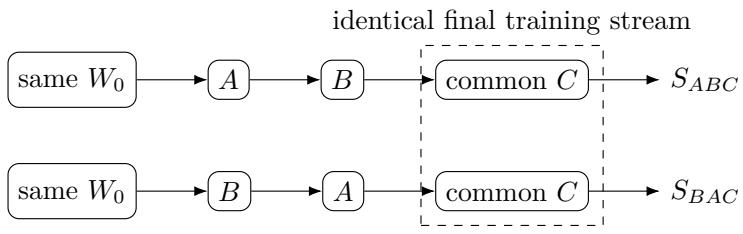
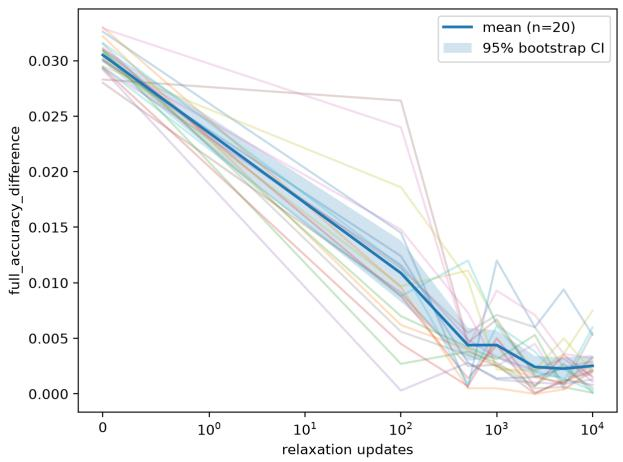
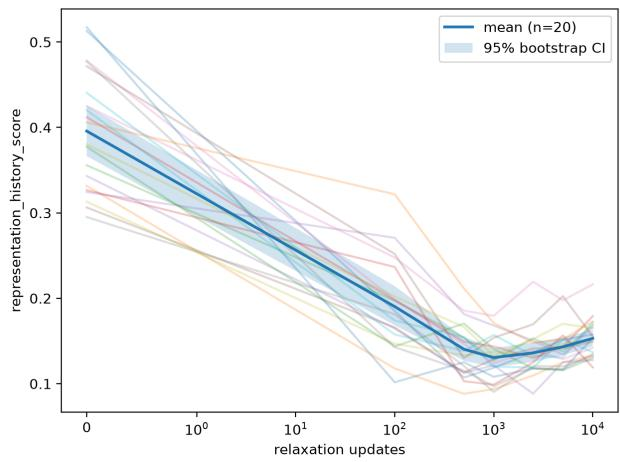
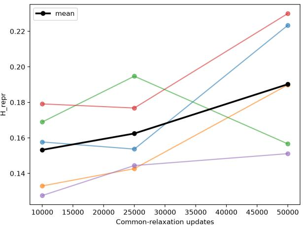
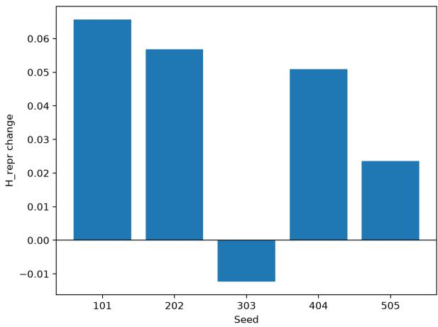
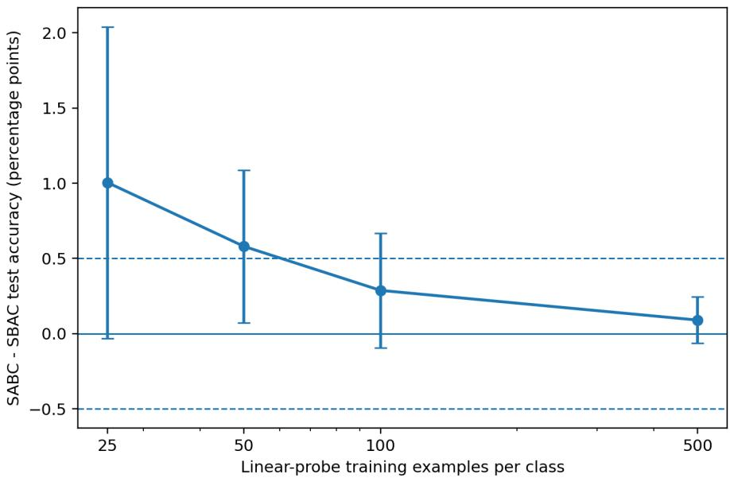
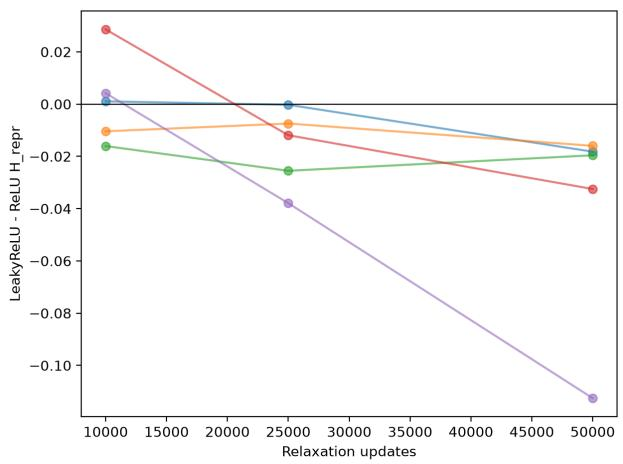
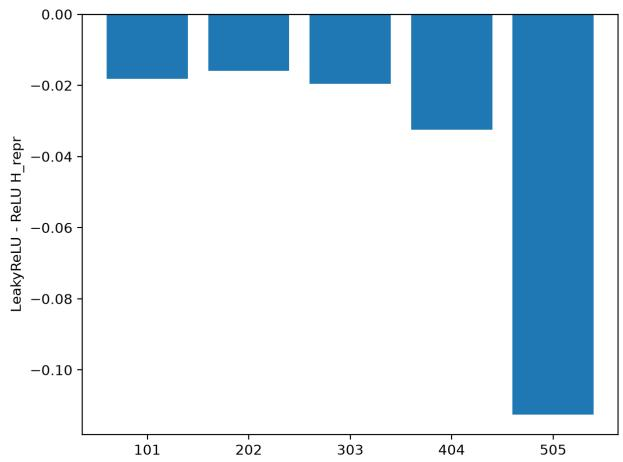
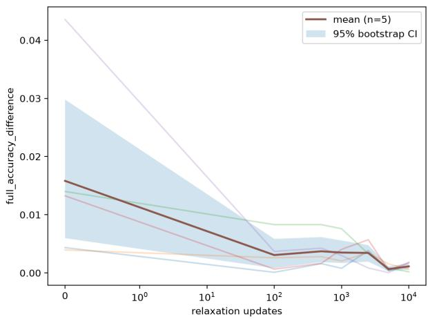
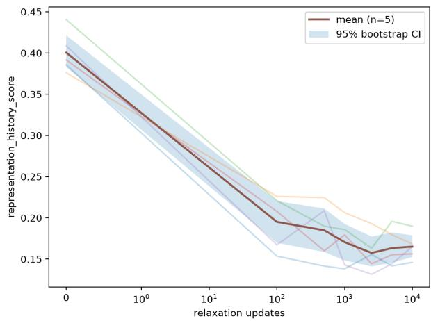

# Behavioral Convergence Without Representational Convergence:

Persistent Training-History Dependence in Neural Networks

Ertuğrul Mutlu

Aachen, Germany

September 2026

## Abstract

Neural networks trained toward the same final objective can reach similar predictive performance while retaining internal representations shaped by earlier training history. We study this efect using controlled sequential-training experiments in which paired convolutional networks start from identical weights, experience reversed task orders, and then receive the same deterministic common-relaxation distribution. Across 20 paired MNIST runs, 16 satisfy a predeclared behavioral-matching criterion, yet their matched representations retain a mean history score of 0.139 (95% bootstrap CI: 0.127–0.153) and approximately 3.1% prediction disagreement. Extending common relaxation to 50,000 optimizer updates does not erase the measured diference: across five paired seeds, the representation-history score remains 0.190 (95% bootstrap CI: 0.161–0.219) at the end of the measured horizon while the mean accuracy gap is only 0.18 percentage points. Fresh linear probes show that, with suficient labeled data, the two histories retain practically equivalent linearly accessible class information. A same-label rotated-MNIST control reproduces the efect: all five paired seeds reach behavioral matching while retaining a mean representation-history score of 0.162. Finally, a matched-learning-rate ReLU–LeakyReLU control reduces the 50,000-update representation residue by 0.040 on average in all five paired seeds, providing directional evidence that activation-mediated plasticity contributes to the persistence of training-history efects. These results provide protocol-scoped evidence that behavioral convergence need not imply representational convergence and that optimization history can leave measurable internal traces after prolonged common training.

Keywords: representation similarity, path dependence, sequential learning, CKA, continual learning, hysteresis

## 1 Introduction

Neural networks are usually compared through observable behavior. If two models obtain nearly identical accuracy and loss on the same distribution, they are often treated as functionally interchangeable. Their internal states, however, need not be interchangeable. Neural-network training is a sequential optimization process, and the solution reached after training may depend on the trajectory by which the model arrived there.

This motivates a basic question: if two neural networks experience diferent training histories and are subsequently trained for a long time on exactly the same final distribution, do their internal representations converge once their behavior becomes similar?

A direct comparison of networks trained in opposite task orders does not isolate this question cleanly. Sequential training is well known to produce catastrophic forgetting and interference, so the task presented most recently can dominate final performance (Goodfellow et al., 2013; Parisi et al., 2019). A model trained on A and then B may therefore difer from a model trained on B and then A simply because their final tasks difer.

We address this confound with a common-relaxation protocol. Starting from identical parameters, one network receives

$$
S _ { A B C } : A  B  C ,
$$

whereas its paired counterpart receives

$$
S _ { B A C } : B \to A \to C .
$$

The two histories difer only in the order of the first two phases. During $C ,$ both networks receive the same final distribution, deterministic batch sequence, optimizer configuration, and number of optimizer updates. The common phase is intended to reduce the direct behavioral consequences of the preceding task order.

We then ask whether behavioral similarity during C is accompanied by representational similarity. Representations are compared using centered kernel alignment (CKA), a representation-similarity measure designed to compare learned features across neural networks (Kornblith et al., 2019). Our declared representation-history metric is

$$
H _ { \mathrm { r e p r } } = 1 - { \frac { \mathrm { C K A _ { \mathrm { c o n v 2 } } + C K A _ { \mathrm { f c 1 } } } } { 2 } } .
$$

A value of zero indicates perfect CKA agreement at the two declared layers; larger values indicate greater representational divergence.

The main experiment contains 20 paired seeds. Sixteen of the twenty pairs reach a predeclared behavioral-matching criterion during common relaxation. Nevertheless, their matched representations retain a mean $H _ { \mathrm { r e p r } }$ of approximately 0.139. This diference is not simply a transient immediately after the task-order switch. A separate five-paired-seed experiment extends common relaxation from 10,000 to 50,000 updates, where $H _ { \mathrm { r e p r } }$ remains substantial.

We perform three additional sets of controls. First, fresh linear classifiers are trained on frozen representations from the common 10,000-update endpoint. With 500 labeled examples per class, the resulting classifiers are practically equivalent within a predeclared ±0.5 percentage-point margin, indicating that representational diference does not imply that one representation has simply lost the class information required for the task. Second, we repeat the sequential protocol with rotated MNIST, where both histories contain the same labels but diferent input orientations. The representational efect persists. Third, we replace ReLU with LeakyReLU under a matched learning-rate protocol. The residual history score decreases in all five paired seeds, suggesting that activation-mediated plasticity may influence persistence.

Our contribution is deliberately narrower than a universal claim of neural-network hysteresis. We demonstrate persistent training-history dependence over a finite measured optimization horizon under carefully controlled protocols. The central empirical observation is that behavior can substantially converge while internal representations remain measurably history dependent.

Contributions. This work provides: (i) a paired common-relaxation protocol that controls initialization and final training conditions while reversing earlier task order; (ii) a 20-paired-seed demonstration of behavioral matching without representational matching; (iii) long-horizon and same-label controls showing persistence beyond the original class-split setting; and (iv) functional and mechanistic probes using fresh linear readouts and a matched ReLU–LeakyReLU comparison.

  
Compare accuracy, predictions, CKA, and $H _ { \mathrm { r e p r } }$ through common-relaxation updates  
Figure 1: Common-relaxation design. Paired networks start from the same initialization, receive reversed histories $A  B$ and $B  A$ , then receive the same deterministic final training stream C.

## 2 Related Work

## 2.1 Continual learning and catastrophic forgetting

Sequential neural-network training is strongly associated with catastrophic forgetting: optimization on new data can interfere with parameters and representations learned from earlier data. Goodfellow et al. (2013) empirically investigated this behavior under gradient-based training, while Parisi et al. (2019) review catastrophic forgetting as a central challenge in continual and lifelong learning.

Our goal difers from the usual continual-learning objective. We do not propose a method for retaining performance on old tasks. Instead, catastrophic forgetting is a confound that motivates the common-relaxation design. By following diferent histories with the same C distribution, we ask whether history remains measurable after the most obvious order-dependent behavioral efects have largely disappeared.

## 2.2 Comparing neural representations

Representation-similarity methods make it possible to compare internal computations even when models have similar external performance. SVCCA was introduced by Raghu et al. (2017) to compare neural representations across layers and stages of training. Kornblith et al. (2019) subsequently developed and analyzed CKA, demonstrating its usefulness for comparing representations across separately trained networks.

We use linear CKA because the question of interest is explicitly representational rather than purely parametric. Weight vectors can difer substantially even when networks implement closely related functions due to parameter symmetries and alternative low-loss solutions. Our primary metric therefore combines CKA at Conv2 and FC1 rather than treating raw Euclidean parameter distance as the principal evidence.

## 2.3 Loss landscapes and multiple solutions

Work on neural-network loss landscapes has shown that apparently diferent minima can often be connected by low-loss paths (Draxler et al., 2018; Garipov et al., 2018). These findings emphasize that parameter-space separation should not automatically be interpreted as functional disconnection. Our question is complementary: even if multiple low-loss solutions are functionally similar or connected, does a model’s optimization history leave a measurable signature in its learned representations?

## 2.4 Rectifier activations and plasticity

Rectified activations have shaped modern neural-network optimization. Leaky and parametric variants introduce non-zero gradients in regions where ordinary ReLU has zero derivative (Maas et al., 2013; He et al., 2015). The related dying-ReLU phenomenon describes units that become inactive over the relevant input domain (Lu et al., 2019). This motivates our ReLU–LeakyReLU control. We do not assume that inactive ReLU units are the sole source of training-history dependence; instead, the comparison tests whether modifying this aspect of optimization changes the measured residue.

## 3 Methods

## 3.1 Dataset and preprocessing

All experiments use MNIST. Images are transformed to tensors and normalized with mean 0.1307 and standard deviation 0.3081. No data augmentation is applied. Training uses batch size 128, zero data-loader workers, seeded data-loader generators, and requested deterministic PyTorch algorithms. For the primary class-split protocol,

$$
A = \{ 0 , 1 , 2 , 3 , 4 \} , \qquad B = \{ 5 , 6 , 7 , 8 , 9 \} .
$$

Each history contains two sequential ten-epoch phases. Thus $S _ { A B C }$ learns A for ten epochs followed by B for ten epochs, whereas $S _ { B A C }$ learns B followed by A.

The common distribution C is a deterministic balanced MNIST training subset containing 5,000 examples per digit. Its iterator restarts reproducibly, allowing common relaxation to be specified directly by optimizer-update count rather than epochs.

## 3.2 Network architecture

The experiments use a compact convolutional network with no normalization layers. The model contains a $3 \times 3$ convolution from 1 to 32 channels, max pooling, a $3 \times 3$ convolution from 32 to 64 channels, a second max-pooling operation, a fully connected layer from $6 4 \times 7 \times 7$ inputs to 128 hidden units, and a ten-class output layer. Padding preserves spatial size across the convolutions.

In the default condition, ReLU follows Conv1, Conv2, and FC1. The mechanism-control condition replaces these activations with LeakyReLU with negative slope 0.01 while preserving all other architecture choices. The implementation exposes post-activation Conv1, Conv2, FC1, and logit representations for analysis.

## 3.3 Optimization and common relaxation

The main class-split experiments use SGD with learning rate 0.05, momentum 0.9, zero weight decay, and batch size 128. An initial pilot compared preserving versus resetting optimizer state at the beginning of C. The selected main protocol resets optimizer state immediately before common relaxation; model parameters are unchanged by the reset.

The main experiment evaluates common relaxation at

$$
0 , 1 0 0 , 5 0 0 , 1 0 0 0 , 2 5 0 0 , 5 0 0 0 , 1 0 0 0 0
$$

optimizer updates. The 20 paired seeds are 101, 202, 303, 404, 505, 606, 707, 808, 909, 1010, 1111, 1212, 1313, 1414, 1515, 1616, 1717, 1818, 1919, and 2020. Within each seed, $S _ { A B C }$ and $S _ { B A C }$ share the same initialization and protocol apart from task order and run identity.

## 3.4 Behavioral matching

For each pair, we select the earliest common-relaxation checkpoint satisfying both

$$
| \mathrm { A c c } _ { S _ { A B C } } - \mathrm { A c c } _ { S _ { B A C } } | \leq 0 . 0 0 2
$$

and

$$
\operatorname* { m i n } ( \mathrm { A c c } _ { S _ { A B C } } , \mathrm { A c c } _ { S _ { B A C } } ) \geq 0 . 9 7 .
$$

Thus behavioral matching requires a full-test accuracy gap of at most 0.2 percentage points while both models achieve at least 97% accuracy. If no checkpoint satisfies the criterion, the seed is marked unmatched.

## 3.5 Representational and functional metrics

Representation comparisons use a deterministic class-balanced test probe containing 200 examples per class. For convolutional layers, activations are reduced by global average pooling; FC1 activations are used directly. Feature-space linear CKA is computed after centering each feature dimension.

The primary representation-history score is

$$
H _ { \mathrm { r e p r } } = 1 - { \frac { \mathrm { C K A _ { \mathrm { c o n v 2 } } + C K A _ { \mathrm { f c 1 } } } } { 2 } } .
$$

Conv1 and logits are excluded from this declared primary score. Secondary functional metrics include prediction disagreement, Jensen–Shannon divergence between predictive distributions, accuracy gap, and loss diference. Normalized parameter distance and activation-health quantities are retained as secondary diagnostics.

## 3.6 Multi-seed aggregation and uncertainty

All comparisons preserve the paired design; $S _ { A B C }$ and $S _ { B A C }$ are never treated as independent samples. Mean uncertainty is estimated using 10,000 paired-seed bootstrap resamples with bootstrap seed 12345. Paired t tests, Wilcoxon signed-rank tests, sign counts, and paired Cohen’s $d _ { z }$ are reported where relevant.

## 3.7 Long-horizon relaxation

A fresh five-paired-seed experiment uses seeds 101, 202, 303, 404, and 505 and extends common relaxation to 50,000 updates. The selected ReLU/reset protocol is otherwise unchanged. Additional checkpoints are evaluated at 25,000 and 50,000 updates. The interpretation is explicitly finite-horizon: persistence at 50,000 updates is not treated as mathematical permanence.

## 3.8 Frozen linear probes

To test whether representational diference corresponds to diferent accessibility of class information, we train fresh linear classifiers on frozen FC1 representations from the final 10,000-update checkpoints of all 20 main model pairs. This endpoint is fixed across seeds and is not selected based on probe performance.

Backbones are switched to evaluation mode, frozen, and checked for exact equality before and after probe training. Paired SABC and SBAC linear heads begin from exactly identical tensors and receive identical balanced examples, labels, deterministic minibatch permutations, and optimization settings.

The probes use SGD for 20 epochs with learning rate 0.01, zero momentum, zero weight decay, and batch size 128. The default fresh-head seed is 777. Testing uses 200 examples per class. Training budgets of 25, 50, 100, and 500 examples per class are evaluated. For the 50-example condition, robustness is additionally assessed with probe seeds 777, 1777, 2777, 3777, and 4777 while retaining the 20 model seeds as the independent statistical units. At 500 examples per class, an exploratory TOST equivalence analysis uses a ±0.5 percentage-point margin.

## 3.9 LeakyReLU mechanism control

The initial LeakyReLU protocol at learning rate 0.05 exhibited reproducible numerical instability in several seed/order combinations. Rather than compare activation functions under diferent optimization rates, we performed a descending stability search and reran both ReLU and LeakyReLU at the same selected rate. Learning rate 0.04 was the highest tested candidate that remained finite across all ten short traces (five seeds × two orders); full long-horizon runs were subsequently audited for non-finite values.

The final matched comparison uses learning rate 0.04, momentum 0.9, zero weight decay, optimizer reset, and 50,000 common-relaxation updates. The predeclared primary endpoint is

$$
\Delta H _ { \mathrm { r e p r } } = H _ { \mathrm { r e p r } } ^ { \mathrm { L e a k y R e L U } } - H _ { \mathrm { r e p r } } ^ { \mathrm { R e L U } }
$$

at 50,000 updates. Negative values indicate lower history residue under LeakyReLU.

## 3.10 Same-label rotated-MNIST control

The class-split experiment changes both input distribution and active label set across A and B. To test whether disjoint labels are necessary, we use a rotated-MNIST protocol. Both domains contain all ten digit labels: domain A contains MNIST at 0◦, while domain B contains a deterministic 90◦ rotation. The common distribution is balanced across digits and both rotation domains. Architecture, reset policy, optimizer schedule, checkpoint schedule, and behavioral-matching criterion otherwise follow the main protocol. Five paired seeds are evaluated.

## 4 Results

## 4.1 Behavioral matching does not eliminate representational history

In the 20-paired-seed main experiment, 16 of 20 seeds satisfy the predeclared performance-matching criterion within the first 10,000 common-relaxation updates. At those matched endpoints, mean

$$
H _ { \mathrm { r e p r } } = 0 . 1 3 8 7 ,
$$

with 95% bootstrap CI [0.1267, 0.1527]. The score ranges from 0.103 to 0.212 across matched seeds. Mean prediction disagreement remains 3.06% (95% bootstrap CI: 2.75–3.40%). Thus, matching aggregate accuracy does not imply convergence to the same internal representation or even identical per-example predictions.

At the common 10,000-update endpoint across all 20 seeds, mean SABC accuracy is 98.603% and mean SBAC accuracy is 98.483%. The mean absolute accuracy gap is 0.252 percentage points and prediction disagreement is 2.74%. Despite this close behavioral performance, mean $H _ { \mathrm { r e p r } } = 0 . 1 5 3 1$ with 95% bootstrap CI [0.1439, 0.1635].

  
(a) Absolute full-test accuracy gap.

  
(b) Representation-history score.  
Figure 2: Main 20-paired-seed common-relaxation experiment. Behavioral diferences contract rapidly, while the declared Conv2/FC1 representation-history score remains clearly above zero at the end of the 10,000-update horizon. Thin curves show individual seeds; the heavy curve and band show the aggregate mean and bootstrap interval.

## 4.2 Fifty thousand common updates do not erase the measured diference

The long-horizon experiment extends the same ReLU/reset protocol to 50,000 updates across five paired seeds. Mean history scores are 0.1532 at 10,000 updates, 0.1625 at 25,000, and 0.1902 at 50,000. The final bootstrap 95% CI is [0.1611, 0.2193].

At 50,000 updates, mean SABC and SBAC accuracies are 98.480% and 98.316%, respectively. The mean absolute accuracy gap is 0.180 percentage points and prediction disagreement is 2.93%.

The mean change in $H _ { \mathrm { r e p r } }$ from 10,000 to 50,000 updates is +0.0369. Its bootstrap interval is positive, but the paired t test is borderline $( p = 0 . 0 6 0 )$ and the Wilcoxon test gives $p = 0 . 1 2 5$ We therefore do not claim systematic monotonic growth. The supported conclusion is narrower: the measured representation residue does not decay toward zero over the observed 50,000-update horizon.

## 4.3 Distinct representations retain similarly accessible class information at high probedata budgets

Frozen FC1 linear probes reveal a systematic dependence on labeled probe data. With 25 examples per class, the mean SABC-minus-SBAC probe-accuracy diference is +1.005 percentage points; the paired t test gives $p = 0 . 0 5 6$ . At 50 examples per class, the diference is $+ 0 . 5 8 0$ points with paired t-test $p = 0 . 0 2 7$ , Wilcoxon $p = 0 . 0 2 8$ , and paired $d _ { z } = 0 . 5 3 5$ . At 100 examples per class the diference falls to +0.288 points, and at 500 examples per class it is only +0.090 points.

At 500 examples per class, a TOST analysis supports practical equivalence within the predeclared ±0.5 percentage-point margin: the 90% CI for the signed diference is $[ - 0 . 0 3 7 , 0 . 2 1 7 ]$ percentage points and both one-sided tests reject the corresponding equivalence bounds. The 50-example efect also survives repeated fresh-head initialization: averaging over five probe seeds yields a mean SABC advantage of +0.496 percentage points, with 15 of 20 model seeds positive (paired t-test $p = 0 . 0 1 1$ ; Wilcoxon $p = 0 . 0 0 8 )$ .

These results suggest that the paired representations can difer geometrically while preserving nearly equivalent task information when the readout receives suficient supervision. Diferences are more visible as sample-eficient accessibility under limited probe data.

  
(a) $H _ { \mathrm { r e p r } }$ from 10k to 50k.

  
(b) Per-seed change from 10k to 50k.  
Figure 3: Long-horizon stress test across five paired seeds. The residue remains substantial through 50,000 common updates. Four of five seeds increase from 10k to 50k, but the sample is too small and variable to support a general growth claim.

Table 1: Primary FC1 linear-probe endpoint (epoch 20) across training-data budgets. Diferences are SABC minus SBAC in percentage points.
<table><tr><td>Examples/class</td><td>Mean diff.</td><td>95% t CI</td><td>Paired  $p$ </td><td> $d _ { z }$ </td></tr><tr><td>25</td><td>+1.005</td><td>[-0.031,2.041]</td><td>0.056</td><td>0.454</td></tr><tr><td>50</td><td>+0.580</td><td>[0.072, 1.088]</td><td>0.027</td><td>0.535</td></tr><tr><td>100</td><td>+0.288</td><td>[−0.094,0.669]</td><td>0.131</td><td>0.353</td></tr><tr><td>500</td><td>+0.090</td><td>[−0.064,0.244]</td><td>0.237</td><td>0.273</td></tr></table>

## 4.4 LeakyReLU reduces the long-horizon residue

At matched learning rate 0.04, ReLU and LeakyReLU have nearly identical history scores at 10,000 updates: 0.1299 and 0.1313, respectively. By 25,000 updates, the means are 0.1337 for ReLU and 0.1171 for LeakyReLU. At 50,000 updates,

$$
H _ { \mathrm { r e p r } } ^ { \mathrm { R e L U } } = 0 . 1 5 4 8 , \qquad H _ { \mathrm { r e p r } } ^ { \mathrm { L e a k y R e L U } } = 0 . 1 1 5 0 .
$$

The primary paired diference is therefore $\Delta H _ { \mathrm { r e p r } } = - 0 . 0 3 9 8$ . All five paired seeds are negative. The bootstrap 95% interval is $[ - 0 . 0 7 7 2 , - 0 . 0 1 7 6 ]$ , and paired efect size is $d _ { z } = - 0 . 9 7$ . The paired t test gives $p = 0 . 0 9 7$ and the Wilcoxon test gives $p = 0 . 0 6 2 5$

Functional diferences decrease as well. At 50,000 updates, prediction disagreement averages 2.56% for ReLU and 1.44% for LeakyReLU. Mean absolute accuracy gap decreases from 0.582 to 0.130 percentage points. Given the five-seed sample and the non-significant conventional paired tests for the primary representation endpoint, we treat this as consistent directional mechanism evidence rather than definitive causal evidence.

## 4.5 The efect persists when both histories use the same labels

The rotated-MNIST experiment removes the disjoint-label structure of the main protocol. All five paired seeds satisfy the behavioral-matching criterion. At their matched endpoints, mean $H _ { \mathrm { r e p r } } = 0 . 1 6 1 7$ with bootstrap 95% CI [0.1412, 0.1821], while matched prediction disagreement averages 3.17%.

At the common 10,000-update endpoint, mean SABC accuracy is 98.732% and mean SBAC accuracy is 98.694%. The mean absolute accuracy gap is only 0.112 percentage points and prediction disagreement is 2.44%, yet $H _ { \mathrm { r e p r } } = 0 . 1 6 5 1$ with bootstrap 95% CI [0.1537, 0.1783]. The persistent representation diference therefore cannot be explained solely by the original use of disjoint 0–4 and 5–9 output classes.

  
Figure 4: Fresh FC1 linear-probe diferences across labeled-data budgets. Points show the mean SABC-minus-SBAC full-test accuracy diference; error bars are 95% t intervals. Dashed horizontal lines mark the ±0.5 percentage-point practical-equivalence margin used at 500 examples per class.

Table 2: Summary of the main evidence chain. Bootstrap intervals are mean 95% intervals.
<table><tr><td>Condition</td><td>n</td><td>Behavioral criterion</td><td> $H _ { \mathrm { r e p r } }$ </td><td>95% bootstrap CI</td></tr><tr><td>Main matched end- points</td><td>16/20</td><td>≤ 0.2 pp gap, ≥ 97% acc.</td><td>0.139</td><td>[0.127, 0.153]</td></tr><tr><td>Main at 10k</td><td>20</td><td>mean gap 0.252 pp</td><td>0.153</td><td>[0.144, 0.164]</td></tr><tr><td>Long horizon at 50k</td><td>5</td><td>mean gap 0.180 pp</td><td>0.190</td><td>[0.161, 0.219]</td></tr><tr><td>Rotated matched endpoints</td><td>5/5</td><td>same criterion</td><td>0.162</td><td>[0.141, 0.182]</td></tr><tr><td>Leaky minus ReLU at 50k</td><td>5</td><td>matched LR=0.04</td><td>-0.040</td><td>[-0.077, -0.018]</td></tr></table>

## 5 Discussion

The experiments consistently separate two notions that are often treated as interchangeable: convergence in task behavior and convergence in internal representation. During common relaxation, models with diferent histories recover similar full-task accuracy, yet CKA continues to distinguish their deeper representations. This diference survives the mechanically defined behavioral-matching criterion, a 50,000-update stress test, and a same-label rotated-MNIST control.

One interpretation is that the final objective admits a family of functionally similar internal solutions and that optimization history influences which member of that family is reached. This is compatible with work showing that neural-network optimization can discover multiple low-loss solutions, including solutions connected by low-loss parameter-space paths (Draxler et al., 2018; Garipov et al., 2018). Our experiment adds a temporal dimension: after the current training condition has become the same, the learned representation remains informative about the path preceding it.

  
(a) $\Delta H _ { \mathrm { r e p r } }$ across the measured horizon.

  
(b) Per-seed $\Delta H _ { \mathrm { r e p r } }$ at 50k.

Figure 5: Matched learning-rate activation control. $\Delta H _ { \mathrm { r e p r } }$ is LeakyReLU minus ReLU, so negative values indicate less residual history dependence under LeakyReLU. All five seeds are negative at 50,000 updates.  
  
(a) Accuracy-gap recovery.

  
(b) Representation-history score.  
Figure 6: Same-label rotated-MNIST control across five paired seeds. Behavioral gaps contract while a non-zero representation residue remains.

The linear-probe results clarify what this diference does and does not mean. A CKA diference does not imply that one history has failed to learn the classification task. At high probe-data budgets, fresh classifiers recover practically equivalent performance from both frozen representations. The two models therefore retain similarly accessible label information even though that information is arranged diferently internally. Under low supervision, however, the geometry appears to have modest consequences for sample-eficient accessibility.

The activation-function comparison provides an initial mechanism clue. ReLU has zero derivative for negative pre-activations, while LeakyReLU retains a non-zero slope. Replacing ReLU with LeakyReLU does not remove the history efect, but it reduces the long-horizon residue in every paired seed examined. This is consistent with the hypothesis that restricted activation-mediated plasticity contributes to persistence. It does not show that dying or low-activity ReLU units are the sole cause: LeakyReLU changes optimization dynamics throughout the model, and five seeds are insuficient to identify a unique causal mechanism.

The rotated-MNIST result is particularly important for interpretation. In the original class split, A and B train disjoint output classes, raising the possibility that history residue is specific to class-partitioned catastrophic forgetting. When A and B instead contain the same labels and difer only by a fixed domain transformation, behavioral convergence again occurs without representational convergence. This extends the observation beyond the original class-order setting.

We describe the phenomenon as persistent training-history dependence. It is related to the intuitive notion of hysteresis because the system’s measured internal state depends on its preceding path even under the same current training condition. Classical hysteresis terminology can imply stronger properties, including cyclic protocols or persistent loop structure. The present experiments do not establish those stronger claims.

## 6 Limitations

• Scale. All experiments use MNIST and a compact CNN. The evidence supports a controlled existence result in the tested setting, not a claim that the same magnitude or mechanism must occur in large modern architectures.

• Representation metric. The primary result uses linear CKA at Conv2 and FC1. No single similarity measure uniquely characterizes internal computation, and global-average pooling removes spatial structure from convolutional features.

• Behavioral criterion. Matching is defined primarily by accuracy. Prediction disagreement, Jensen–Shannon divergence, and loss diferences provide additional diagnostics, but do not exhaust every possible behavioral distinction.

• Secondary-control sample size. Long-horizon, activation, and rotated-MNIST controls use five paired seeds and therefore have lower inferential resolution than the 20-seed main experiment.

• Activation-control stabilization. Learning rate 0.04 was selected after the original LeakyReLU learning rate 0.05 produced reproducible numerical failure. The ReLU comparison was rerun at the same selected learning rate to avoid an activation–learning-rate confound, but the stability search is a pragmatic post-hoc adjustment.

• Finite horizon. Persistence through 50,000 updates is not permanence. We do not show that representations can never converge under indefinitely long common training.

• Sequential rather than cyclic protocol. A stricter hysteresis claim would benefit from a repeated cyclic schedule demonstrating reproducible loop structure under repeated traversal of a control variable.

• Weight-space diagnostics. Raw weights are not permutation aligned. Direct parameter distances and linear interpolation are therefore secondary diagnostics rather than primary evidence.

## 7 Conclusion

We studied whether neural networks that experience diferent training histories converge internally after they are subsequently exposed to the same final training distribution. They need not.

Across 20 paired class-split experiments, most model pairs became behaviorally matched while retaining a substantial representation-history score. The measured diference persisted through a 50,000-update common-relaxation stress test, survived a same-label rotated-MNIST control, and remained compatible with practically equivalent high-data linear-probe performance. A matched ReLU–LeakyReLU comparison reduced the residual representation diference, providing preliminary evidence that activation-mediated plasticity contributes to the efect.

The resulting picture is not one of permanently isolated solutions, nor a universal proof of neuralnetwork hysteresis. It is a controlled demonstration that similar final behavior does not uniquely determine internal state: optimization history can remain encoded in learned representations long after its most obvious behavioral consequences have diminished.

## Reproducibility Statement

The accompanying release package contains the paper-facing aggregate analyses for the pilot, 20- seed main experiment, frozen linear probes, 50,000-update stress test, activation-function control, and rotated-MNIST control. It also contains the final-control manifests, generated configurations, orchestration scripts, an environment snapshot, and SHA256 checksums. Raw run directories remain the source of truth in the experiment repository. The final release package was separately integrity-checked before preparation of this manuscript.

## A Experimental Checkpoint Schedule

The main common-relaxation checkpoints are 0, 100, 500, 1,000, 2,500, 5,000, and 10,000 optimizer updates. The long-horizon experiment additionally evaluates 25,000 and 50,000 updates. The activation comparison declares the 50,000-update $\Delta H _ { \mathrm { r e p r } }$ endpoint as primary.

## B Interpretation Rules Used in This Work

Three distinctions are maintained throughout the analysis. First, behavioral matching is not treated as exact functional identity: prediction disagreement remains an explicit metric. Second, a non-zero CKA-derived history score is treated as evidence of representational diference under the declared probe, not proof of complete parameter-space basin separation. Third, persistence over a measured horizon is not described as permanence.

## References

Ian J. Goodfellow, Mehdi Mirza, Da Xiao, Aaron Courville, and Yoshua Bengio. An empirical investigation of catastrophic forgetting in gradient-based neural networks. arXiv preprint arXiv:1312.6211, 2013.

German I. Parisi, Ronald Kemker, Jose L. Part, Christopher Kanan, and Stefan Wermter. Continual lifelong learning with neural networks: A review. Neural Networks, 113:54–71, 2019. doi:10.1016/j.neunet.2019.01.012.

Maithra Raghu, Justin Gilmer, Jason Yosinski, and Jascha Sohl-Dickstein. SVCCA: Singular vector canonical correlation analysis for deep learning dynamics and interpretability. In Advances in Neural Information Processing Systems, volume 30, pages 6076–6085, 2017.

Simon Kornblith, Mohammad Norouzi, Honglak Lee, and Geofrey Hinton. Similarity of neural network representations revisited. In Proceedings of the 36th International Conference on Machine Learning, PMLR 97:3519–3529, 2019.

Felix Draxler, Kambis Veschgini, Manfred Salmhofer, and Fred Hamprecht. Essentially no barriers in neural network energy landscape. In Proceedings of the 35th International Conference on Machine Learning, PMLR 80:1309–1318, 2018.

Timur Garipov, Pavel Izmailov, Dmitrii Podoprikhin, Dmitry P. Vetrov, and Andrew G. Wilson. Loss surfaces, mode connectivity, and fast ensembling of DNNs. In Advances in Neural Information Processing Systems, volume 31, 2018.

Andrew L. Maas, Awni Y. Hannun, and Andrew Y. Ng. Rectifier nonlinearities improve neural network acoustic models. In ICML Workshop on Deep Learning for Audio, Speech and Language Processing, 2013.

Kaiming He, Xiangyu Zhang, Shaoqing Ren, and Jian Sun. Delving deep into rectifiers: Surpassing human-level performance on ImageNet classification. In Proceedings of the IEEE International Conference on Computer Vision, pages 1026–1034, 2015.

Lu Lu, Yeonjong Shin, Yanhui Su, and George Em Karniadakis. Dying ReLU and initialization: Theory and numerical examples. arXiv preprint arXiv:1903.06733, 2019.