# Beyond Compression: Diagnosing How Post-Training Changes Mathematical Reasoning

Hongyang Li<sup>1</sup>, Yiming Zhu<sup>2</sup>, Xiao Li<sup>2</sup>, Caesar Wu<sup>1</sup>, Said Mammar<sup>3</sup>, Pascal Bouvry<sup>1</sup>

## Abstract

Post-training is central to mathematical reasoning in modern large language models (LLMs), but endpoint pass@1 alone underidentifies what has changed. Gains may reflect newly reachable solutions, cheaper sampling of latent solutions, surface robustness, or memorisation. We compare three post-training paths under a common diagnostic readout: our suficiently trained of-policy distillation trajectories, released Qwen3 of-policy-plus-on-policy distillation endpoints, and a released DeepSeek-Math endpoint trained with Group Relative Policy Optimisation (GRPO). Our probe uses cross-surface pass@K over verbatim prompts, paraphrases, numerical isomorphisms, and translations, plus consistency, distribution-shape, and verified supervised-fine-tuning (SFT) membership analyses. We find two regimes. On easier AMC problems, large-K ceilings are near saturation, so posttraining mainly compresses sample cost. On harder AIME problems, post-training expands the large-K ceiling over the base model: suficient of-policy distillation already raises this ceiling, Qwen3 released endpoints raise it further, and DeepSeek-Math GRPO does not dominate suficient ofpolicy distillation at large K. English-dominant distillation improves non-English reasoning but preserves language-tier gaps. A controlled-overfit audit finds limited sensitivity in current SFT-membership probes. Compression is one regime of post-training, not a universal explanation.

## 1 Introduction

Open-weight reasoning models now achieve strong scores on mathematical benchmarks, but endpoint pass@1 alone does not identify what post-training has changed. The same gain may reflect newly reachable solutions, cheaper sampling of latent solutions, robustness to surface variation, or memorisation of benchmark content. These explanations imply diferent conclusions for evaluation and deployment, yet they can produce the same endpoint accuracy.

This ambiguity is central to current debates on mathematical post-training. Prior work argues that reinforcement learning (RL) can mainly compress sample cost, raising pass@1 without expanding the large-K ceiling (Yue et al. 2025); other work shows that RL can acquire new compositional behaviours in controlled settings (Yuan et al. 2025). Meanwhile, SFT and distillation have become major practical routes to strong reasoning models (Muennighof et al. 2025; Ye et al. 2025; Guha et al. 2025), building on broader knowledge-distillation and reasoning-distillation recipes (Hinton, Vinyals, and Dean 2015; Magister et al. 2023); related work further shows that distinct training stages—continual pre-training, problem-solving SFT, and RL—can shape mathematical reasoning diferently (Chen et al. 2025). However, static teacher-trace imitation, studentrollout-based teacher matching, and verifier-driven RL need not shape the output distribution in the same way. Surfacerobustness studies further show that high reasoning scores can be sensitive to linguistic, symbolic, or functional perturbations (Mirzadeh et al. 2024; Srivastava et al. 2024). Separately, memorisation and membership-inference work shows that language models can retain or reveal training data, but membership is often hard to verify for released models (Carlini et al. 2021, 2023). Existing evaluations therefore often isolate one axis at a time—mechanism, surface form, endpoint, or membership assumption—making these explanations dificult to separate under a common protocol.

We address this with a trajectory-aware diagnostic. The key idea is to evaluate performance as both the sampling budget and problem surface vary. If a gain appears at small K but vanishes at large K, it indicates sample-cost compression. If it persists at large K, it indicates ceiling expansion: the post-trained model reaches correct solutions that the base model did not reach under the evaluated budget. If the gain fails under paraphrase, numerical isomorphism, or translation, it is surface-fragile. If verified training items separate from verified unseen controls, memorisation becomes a plausible explanation. We compare three posttraining paths under this common readout (Fig. 1). First, we train reproducible of-policy distillation trajectories for Qwen3-4B, Qwen3-8B, and DeepSeek-Math-7B. We treat these suficiently trained of-policy endpoints as first-class post-training models rather than weak SFT baselines. Second, we evaluate released Qwen3-4B and Qwen3-8B endpoints, which use of-policy followed by on-policy distillation for these sizes (Yang et al. 2025). Third, we evaluate the released DeepSeek-Math-7B-RL endpoint as a GRPO comparison (Shao et al. 2024). Since some endpoints are released rather than retrained by us, our goal is mechanism-relative diagnosis under a shared protocol, not a perfectly matched causal ablation of every algorithm.

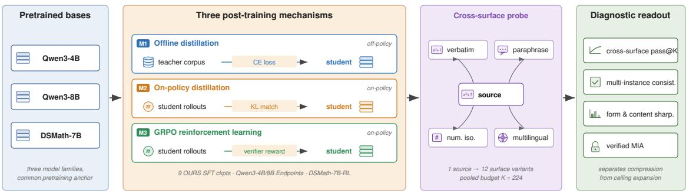  
Figure 1: Overview. We compare three post-training paths—our of-policy distillation trajectories (M1), released Qwen3 ofpolicy-plus-on-policy distillation endpoints (M2), and the released DeepSeek-Math GRPO endpoint (M3)—on shared base model families. We evaluate them with cross-surface pass@K over verbatim prompts, paraphrases, numerical isomorphisms, and translations, together with strategy-diversity, multi-instance consistency, and verified memorisation probes.

Our main probe is cross-surface pass@K. Starting from a shared 100-problem pool, we pool attempts at the sourceproblem level, so large-K performance measures whether the model can solve the underlying problem across surface changes, not merely resample one familiar prompt. We complement this with multi-instance consistency, distributionshape descriptors separating form sharpening from answercontent sharpening, cross-lingual analysis, and verified SFTmembership probes enabled by our controlled training data.

Our results show two regimes. On easier AMC problems, large-K ceilings are near saturation, so post-training mainly behaves as sample-cost compression: correct solutions become cheaper to sample, while mechanisms converge near the ceiling. On harder AIME problems, however, post-training expands the ceiling over the base model. Sufficient of-policy distillation already raises the cross-surface large-K ceiling; released Qwen3 of-policy-plus-on-policy endpoints raise it further; and the released DeepSeek-Math GRPO endpoint does not exceed our suficiently trained ofpolicy endpoint at large K. Thus, compression explains one regime of post-training, but not all mechanisms or dificulties.

Robustness and distributional diagnostics refine this picture. Qwen3 endpoints strongly consolidate solved problems across paraphrases and numerical isomorphisms, while the DeepSeek-Math GRPO endpoint remains close to its SFT checkpoints in multi-instance consistency. Distributionshape metrics show that form sharpening and answer-content sharpening can diverge. Cross-lingually, English-dominant distillation improves every non-English language we evaluate, but preserves the stronger-versus-weaker language gap. Finally, a controlled-overfit memorisation audit finds limited sensitivity in current behavioural and forward-pass membership probes for SFT-specific membership. Our contributions are:

1. Mechanism-relative post-training comparison. We place suficiently trained of-policy distillation, released on-policy distillation, and released GRPO endpoints under a common diagnostic readout, while distinguishing controlled trajectories from observed endpoints.

2. Cross-surface pass@K. We introduce a trajectory-aware probe that separates sample-cost compression, large-K ceiling expansion, and surface robustness.

3. Regime-dependent view of compression. We show that compression explains saturated easy problems, while hard problems reveal ceiling expansion from post-training, already under suficient of-policy distillation.

4. Distributional and robustness diagnostics. We connect capability changes to multi-instance consistency, form/content sharpening, multilingual surface shifts, and verified SFT-membership controls.

## 2 Method

The paper is organised around three post-training mechanisms observed in modern open-weight LLMs for mathematical reasoning (§2.1). We train a sequence of checkpoints under one of them—of-policy distillation—across three model families (§2.2). All checkpoints are evaluated with a capability probe set (§2.3). Sampling, scoring, and strategy-diversity protocols are summarised in §2.4.

## 2.1 Three post-training mechanisms

Recent open-weight math reasoning models build on pretrained bases through diferent post-training mechanisms. We group them into three types, which difer in the training data, objective, and whether updates depend on the student’s own rollouts.

(M1) Of-policy distillation. The student is trained on a static dataset of (input, teacher output) pairs with crossentropy loss on teacher tokens; the student’s own distribution does not enter the update (Hinton, Vinyals, and Dean 2015). This covers long chain-of-thought (CoT) (Wei et al. 2022) SFT recipes used in academic distillation studies (Magister et al. 2023; Ho, Schmid, and Yun 2023) and open pipelines such as OpenR1 (Hugging Face

Open R1 Team 2025), NuminaMath (Li et al. 2024), and DeepSeek-R1 distillations (DeepSeek-AI 2025).

(M2) On-policy distillation. The student generates rollouts, and teacher logits provide a KL-matching target for the generated tokens. The Qwen3 report (Yang et al. 2025, §4.5) states that the smaller dense models (0.6B– 14B) and Qwen3-30B-A3B use of-policy distillation followed by on-policy distillation against 32B/235B teachers, rather than the four-stage SFT+RL pipeline used for flagship models. Thus, the Qwen3-4B and Qwen3-8B Oficial endpoints we evaluate are on-policy-distilled, not RL-trained.

(M3) Reinforcement learning. The student generates rollouts scored by a rule-based verifier, and policy-gradient updates maximise expected verified reward. We use DeepSeek-Math-7B-RL (Shao et al. 2024) as our M3 endpoint, whose GRPO recipe starts from an SFT’d DeepSeek-Math-7B checkpoint.

All comparisons are anchored at released base checkpoints within the same family, so post-training paths share a common pretraining reference even when endpoint trajectories are observed rather than controlled. Table 1 lists all 15 checkpoints with mechanism labels: our 9 M1 checkpoints provide the open-replicable trajectory, while M2 and M3 endpoints are observed endpoints.

<table><tr><td>Checkpoint</td><td>Post-training pipeline</td><td>Source</td></tr><tr><td>Qwen3-4B-Base</td><td></td><td>Qwen</td></tr><tr><td>Qwen3-4B-SFT-Math-45k-ep1</td><td>Off-policy distill</td><td>Ours</td></tr><tr><td>Qwen3-4B-SFT-Math-45k-ep2</td><td>Off-policy distill</td><td>Ours</td></tr><tr><td>Qwen3-4B-SFT-Math-45k-ep3</td><td>Off-policy distill</td><td>Ours</td></tr><tr><td>Qwen3-4B (Official)</td><td>Off-policy + On-policy distill</td><td>Qwen</td></tr><tr><td>Qwen3-8B-Base</td><td></td><td>Qwen</td></tr><tr><td>Qwen3-8B-SFT-Math-90k-ep1</td><td>Off-policy distill</td><td>Ours</td></tr><tr><td>Qwen3-8B-SFT-Math-90k-ep2</td><td>Off-policy distill</td><td>Ours</td></tr><tr><td>Qwen3-8B-SFT-Math-90k-ep3</td><td>Off-policy distill</td><td>Ours</td></tr><tr><td>Qwen3-8B (Official)</td><td>Off-policy + On-policy distill</td><td>Qwen</td></tr><tr><td>DeepSeek-Math-7B-Base</td><td></td><td>DeepSeek</td></tr><tr><td>DeepSeek-Math-7B-SFT-hybrid-ep1</td><td>Off-policy distill</td><td>Ours</td></tr><tr><td>DeepSeek-Math-7B-SFT-hybrid-ep2</td><td>Off-policy distill</td><td>Ours</td></tr><tr><td>DeepSeek-Math-7B-SFT-hybrid-ep3</td><td>Off-policy distill</td><td>Ours</td></tr><tr><td>DeepSeek-Math-7B-RL</td><td>Off-policy distill + RL</td><td>DeepSeek</td></tr></table>

Table 1: Model roster. Nine checkpoints (Ours) instantiate of-policy distillation. In the Source column, Ours marks checkpoints we trained; the rest are released endpoints. Where a released pipeline is listed as of-policy distillation, that stage is the vendor’s own, not one of ours: DeepSeek-Math-7B-RL applies GRPO on top of DeepSeek’s SFT checkpoint, and the Qwen3 Oficial endpoints distil ofpolicy then on-policy.

## 2.2 Our of-policy distillation training

Training corpora. For the Qwen3 family we use OpenR1- Math (Hugging Face Open R1 Team 2025), a public corpus of competition-level math problems paired with reasoning traces distilled from DeepSeek-R1. We retain samples with exactly one ⟨think⟩ . . . ⟨/think⟩ block, a \boxed{·} final answer (Figure 2), and total assistant length below 60k characters (typical samples ≈6k tokens after Qwen3 tokenization; tail up to ≈26k). We draw two splits under a fixed seed: OpenR1-Math-45k for the 4B model and OpenR1- Math-90k for the 8B model; the size diference accommodates the larger model’s compute budget. For DeepSeek-Math-7B, whose native context window is only 4,096 tokens, we construct a 4k-fitted hybrid corpus by combining two sources, filtered OpenR1-Math samples and short-form CoT traces sourced from NuminaMath-CoT (Li et al. 2024).

```powershell
User: Find all real x such that $x ^ { 4 } - 8 x ^ { 2 } + 1 5 = 0 .$
Assistant:
<think>
Let $y = x ^ { 2 } .$ . Then $y ^ { 2 } - 8 y + 1 5 = ( y - 3 ) ( y - 5 ) = 0 ,$ so
$y \in \{ 3 , 5 \} .$ . Therefore $x ^ { 2 } \in \{ 3 , 5 \}$ , giving the four real roots
$x \in \{ \pm { \sqrt { 3 } } , \pm { \sqrt { 5 } } \}$
</think>
The four real roots are $\pm \sqrt { 3 }$ and $\pm { \sqrt { 5 } } .$ The final answer is
$\{ - { \sqrt { 5 } } , - { \sqrt { 3 } } , { \sqrt { 3 } } , { \sqrt { 5 } } \}$
```  
Figure 2: A representative training sample for of-policy distillation (stylised; real samples average ∼3k tokens of ⟨think⟩ content).

Training procedure. All checkpoints are full-parameter fine-tunes using the verl SFT trainer (Sheng et al. 2024) under Fully Sharded Data Parallel (FSDP) with bfloat16 weights and activation checkpointing. Hardware is four nodes of four NVIDIA A100-40GB (16 GPUs) for the 4B and 7B runs and eight nodes (32 GPUs) for the 8B runs. Per-GPU micro-batch is fixed at 1, sequence packing is disabled, and validation runs on a held-out 200-sample split every 100 steps. Checkpoints are saved at every epoch boundary; downstream evaluation uses epoch checkpoints to keep the trajectory axis clean. Total wall-clock per 3-epoch run is ∼14 h on Qwen3-4B (16 A100), ∼20 h on Qwen3-8B (32 A100), and ∼8 h on DeepSeek-Math-7B (16 A100, native 4k context). The full hyperparameter list, training/validation loss curves, and learning-rate / gradient-norm trajectories are reported in Appendix B (Table 5; Figures 6, 7, 8).

## 2.3 Capability probe set (T0–T3)

<table><tr><td>Probe</td><td>Design</td><td>Items</td><td>Rollouts</td></tr><tr><td>TO</td><td>verbatim</td><td>100</td><td>4,800</td></tr><tr><td>T1</td><td>paraphrase (3×)</td><td>300</td><td>4,800</td></tr><tr><td>T2</td><td>numerical isomorphism (3×)</td><td>300</td><td>4,800</td></tr><tr><td>T3</td><td>translation (5 langs)</td><td>500</td><td>8,000</td></tr></table>

Table 2: Capability probe inventory. T0–T3 transform a shared 100-problem source pool—30 problems from AIME 2025, 30 from AIME 2026, and 40 from AMC 2023. Rollout counts are per evaluated checkpoint.

Conventional math benchmarks report pass@K on a single verbatim problem statement, conflating “can the model solve this surface form” with “can the model solve this class of problem”—a gap that surface-form memorisation or distillation leakage can hide. We therefore instantiate a verbatim anchor plus three perturbation axes around each source problem and ask whether capability survives each:

T0 (verbatim). Original English—the conventional benchmark.

T1 (paraphrase). 3 length-controlled English paraphrases per source preserving numerical content and groundtruth answer. Probes surface-form robustness.

T2 (numerical isomorphism). 3 digit-preserving constant permutations per source; reasoning structure preserved but the ground-truth answer changes, ruling out answerlevel memorisation.

T3 (cross-lingual). 5 translations covering Chinese, Spanish, Swahili, Urdu, and Arabic. Probes cross-lingual generalisation.

The full probe set contains 1,200 variants per model $( 1 0 0 \cdot ( 1 + \bar { 3 } + 3 + 5 ) ) \colon$ : T0 is sampled $K = 4 8$ times per source (single variant); T1/T2/T3 are sampled $K = 1 6$ per variant, giving source-level pools of 48 on T1/T2, 80 on T3, and combined pass@K budgets of 96 (T1∪T2), 144 (T0∪T1∪T2), and 224 (full T0∪T1∪T2∪T3). An honest capability gain should propagate beyond the verbatim anchor; surface-fragile gains register preferentially on T0. The inventory is shown in Table 2.

## 2.4 Sampling and strategy-diversity

All rollouts use vLLM (Kwon et al. 2023) with $T = 0 . 7 ,$ top- $\cdot p = 0 . 9 5$ , and max\_new\_tokens = 16,384 (Qwen3) or 4,096 (DSMath native context). Responses are scored by a balanced-brace $\scriptstyle \left\backslash \log \ x \in \mathrm { d } \{ \cdot \} \right.$ parser with LaTeX equivalence (Appendix Fig. 12 shows a representative rollout with full reasoning trace). We also test whether each post-training mechanism sharpens $p ( y \mid x )$ (Yue et al. 2025; Kirk et al. 2024) at three layers: answer-level (self-consistency majority share (Wang et al. 2023), distinct-answer count, entropy), response-level (pairwise 4-gram Jaccard (Li et al. 2016), MiniLM-L6 (Wang et al. 2020) embedding cosine distance, length CV), and cluster-level (single-link clustering at cosine $\varepsilon = 0 . 3 )$ . The layers separate form-collapse (templates) from content-collapse (answers) (Stanton et al. 2021).

## 3 Cross-mechanism analysis

We evaluate all three on two orthogonal axes: capability (the highest pass@K a model reaches when given K surfaceperturbed attempts at a problem) and mechanism signature (the shape of the output distribution that produces those attempts).

Overview. For each source problem the probe set yields an attempt budget, pooled at the source-problem level, of

$$
K _ { \operatorname* { m a x } } = \underbrace { 1 \times 4 8 } _ { \mathrm { T 0 } } + \underbrace { 3 \times 1 6 } _ { \mathrm { T 1 } } + \underbrace { 3 \times 1 6 } _ { \mathrm { T 2 } } + \underbrace { 5 \times 1 6 } _ { \mathrm { T 3 } } = 2 2 4 ,
$$

where T0 is the original problem and T1, T2, and T3 are variants. The cross-surface pass@K at $K { = } 2 2 4$ is therefore the probability that any of 224 attempts—spanning paraphrase, numerical isomorphism, and translation—produces a correct answer for that source problem. This probe extends the capability-ceiling pass@K of Yue et al. (2025) from i.i.d. resampling on a single prompt to 12 surface variants per source problem, which is a strictly stronger capability probe—i.i.d. resampling on the original prompt is the T0 special case $( K \leq 4 8 )$ of our $K = 2 2 4$ budget, and a model must solve the underlying problem under any surface to score (formal definition in Appendix A).

## 3.1 Compression vs. ceiling expansion

The full cross-mechanism capability summary (pass@1, pass@16, pass@48, pass@96, pass@144, pass@224 for all 15 checkpoints) is reported in Table 6 (Appendix C). We read it along two axes: dificulty (AMC 2023 vs. the harder AIME 2025+2026 subset) and mechanism (of-policy distillation alone vs. of-policy + on-policy distillation vs. of-policy + GRPO RL). Figures 3 and 4 plot the full pass@K trajectories; per-subset numeric anchor points at $K \in \{ 1 , 4 8$ , 96, 144, 224} for all three families are tabulated in Appendix C (Tables 7a–8b).

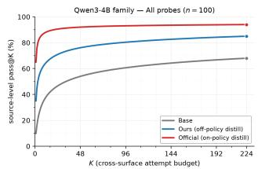  
(a) 4B, full set.

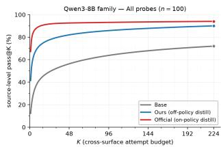

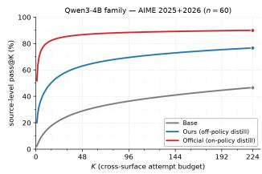

(b) 8B, full set.  
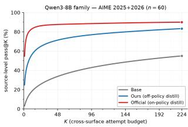  
(d) 8B, AIME (n=60).

(c) 4B, AIME (n=60).  
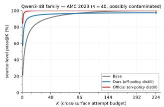  
(e) 4B, AMC (n=40).

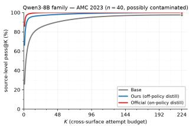  
(f) 8B, AMC (n=40).  
Figure 3: Qwen3 cross-surface pass@K.

Easy regime (AMC): mechanism diferences collapse at the ceiling. On AMC 2023, pass@224 is already near saturation across families: 100/98/100 for Qwen3-4B, 98/100/100 for Qwen3-8B, and 90/98/95 for DSMath-7B under Base/SFT-ep3/Endpoint (Tables 7b, 8b). Where headroom remains, SFT closes most of the gap, as in DSMath $( 9 0  9 8 , + 8 \mathrm { p p } )$ . At this budget, the endpoint mechanism adds little further lift: Qwen3 endpoints are capped at or near 100%, while the DSMath RL endpoint is slightly below SFT-ep3 (95 vs. 98). Thus, in the easy regime, crosssurface robustness is limited mainly by saturation and the measurement ceiling rather than by a clearly separable endpoint mechanism. We therefore do not over-interpret withinfamily orderings, since with n=40 the one-standard-error scale is already about ±3pp.

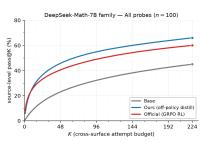  
(a) Full n=100.

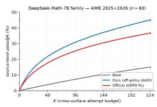  
(b) AIME (n=60).

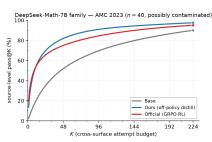  
(c) AMC (n=40).  
Figure 4: DeepSeek-Math-7B cross-surface pass@K. Base, our of-policy distillation checkpoint, and the released GRPO endpoint are evaluated under the same pooled T0–T3 budget.

Hard regime (AIME): post-training expands the ceiling. On AIME 2025+2026, where substantial headroom remains, post-training raises the large-K ceiling over the base models. In Qwen3, suficient of-policy distillation already lifts pass@224 from 47 → 77 (4B) and 55 → 83 (8B), and the released of-policy-plus-on-policy endpoints raise the ceiling further to 90% at both scales. Thus, in the hard regime, post-training is not only cheaper sampling of latent solutions; it can also expand reachable support.

Sample-eficiency vs. ceiling expansion. The mechanismspecific picture is more nuanced. In the DeepSeek-Math family, the released GRPO endpoint behaves mainly as sampleeficiency reshaping: it improves pass@1 on the full set and AMC, but its large-K values are flat or lower than our ofpolicy endpoint, and on AIME it trails at both pass@1 and pass@224. By contrast, the Qwen3 endpoints improve both pass@1 and the large-K ceiling over suficient of-policy distillation. The headline pass@1 gain is still largely compression, but the residual large-K lift is genuine ceiling expansion. RL and on-policy distillation are therefore not exchangeable post-training mechanisms, even when both improve endpoint pass@1.

Scale saturates at the cross-surface ceiling, not at pass@1. After on-policy distillation, Qwen3-4B and Qwen3-8B endpoints nearly coincide on both pass@1 and pass@224 (AIME: 55.6/90 vs. 57.2/90; AMC: 87.6/100 vs. 88.2/100), suggesting that this probe saturates by endpoint stage and that the residual scale gap is mainly visible along the SFT trajectory.

## 3.2 Multi-instance consistency

Pass@K asks whether any sample succeeds; it does not say whether success survives a surface change. We therefore measure, for each source problem and probe class, whether all three variants receive at least one correct sample at K=16

(all-3), whether any variant does (any-1), and the conditional failure rate among solved problems (fragile). Table 3 reports T1 paraphrases; the per-problem T0/T1/T2 visualisation is in Figure 10 (Appendix C).
<table><tr><td>Family</td><td>Stage</td><td>all-3</td><td>any-1</td><td>fragile</td></tr><tr><td rowspan="3">Qwen3-4B</td><td>Base</td><td>26%</td><td>53%</td><td>51%</td></tr><tr><td>SFT-ep3</td><td>58%</td><td>75%</td><td>23%</td></tr><tr><td>Endpoint</td><td>84%</td><td>89%</td><td>6%</td></tr><tr><td>Qwen3-8B</td><td>Base SFT-ep3 Endpoint</td><td>33% 65% 87%</td><td>55% 81% 90%</td><td>40% 20% 3%</td></tr><tr><td>DSMath-7B</td><td>Base SFT-ep3 Endpoint</td><td>5% 21% 20%</td><td>22% 46% 45%</td><td>77% 54% 56%</td></tr></table>

Table 3: T1 multi-instance consistency (per source problem; 3 paraphrases, $K \ = \ 1 6$ each). all-3: all variants solved; any-1: at least one variant solved; fragile = (any-1 − all-3) / any-1.

Consistency separates mechanisms: On T1, Qwen3 all-3 consistency increases monotonically from Base to SFT-ep3 to Endpoint: 26→58→84% for 4B and 33→65→87% for 8B, while fragility falls to 6%/3%. T0 and T2 show the same consolidation pattern (Figure 10). DSMath is the contrast: its GRPO RL endpoint is indistinguishable from SFT-ep3 (20% vs. 21% all-3; 56% vs. 54% fragility). Together with the pass@K inversion in §3.1, this suggests that this specific RL endpoint re-weights probability mass at pass@1 without consolidating solved problems into surface-robust modes.

## 3.3 Output-distribution signature: form vs. content sharpening

Pass@K and consistency only reveal whether correct samples appear; they do not show how the rollout distribution changes. We therefore describe each T0 K = 48 rollout pool along two axes. Form sharpening measures whether reasoning traces collapse into similar surface realisations, using response-length variation and embedding-cluster diversity. Answer-content sharpening measures whether the model concentrates on a small set of final answers, using self-consistency majority share and the number of distinct boxed answers. These axes are separable. Of-policy distillation consistently sharpens form, but its efect on answer content depends on the model family: Qwen3 contracts answer support, whereas DeepSeek-Math broadens it, likely because the hybrid SFT corpus introduces additional solution paths. The released Qwen3 on-policy-distilled endpoints sharpen both axes most strongly, reaching near-canonical reasoning traces and low answer diversity. By contrast, the DeepSeek-Math GRPO endpoint contracts the answer support relative to SFT but does not increase the majority-answer share (Fig. 5). This is support contraction without modal consolidation.

Together with the pass@K and consistency results, this distributional view explains why mechanisms with similar endpoint gains need not be equivalent. The Qwen3 endpoints combine ceiling expansion, surface consistency, and answercontent consolidation. The DeepSeek-Math GRPO endpoint mainly prunes the SFT answer support without producing a higher large-K ceiling or stronger surface consistency in our setting.

<table><tr><td>Family</td><td>Stage</td><td>maj</td><td> $\mathbf { n } _ { \mathbf { u } }$ </td><td> $\mathbf { n _ { c } }$ </td><td>emb</td><td> $\mathbf { c v } _ { \mathrm { l e n } }$ </td></tr><tr><td rowspan="3">Qwen3-4B</td><td>Base</td><td>19.6%</td><td>26.29</td><td>3.50</td><td>0.312</td><td>1.447</td></tr><tr><td>SFT-ep3</td><td>36.7%</td><td>8.36</td><td>1.00</td><td>0.123</td><td>0.390</td></tr><tr><td>Endpoint</td><td>70.1%</td><td>2.26</td><td>1.00</td><td>0.088</td><td>0.168</td></tr><tr><td rowspan="3">Qwen3-8B</td><td>Base</td><td>19.4%</td><td>27.09</td><td>1.31</td><td>0.189</td><td>1.627</td></tr><tr><td>SFT-ep3</td><td>48.4%</td><td>6.51</td><td>1.00</td><td>0.118</td><td>0.327</td></tr><tr><td>Endpoint</td><td>69.5%</td><td>2.08</td><td>1.00</td><td>0.091</td><td>0.147</td></tr><tr><td rowspan="3">DSMath-7B</td><td>Base</td><td>7.4%</td><td>13.96</td><td>24.07</td><td>0.738</td><td>1.433</td></tr><tr><td>SFT-ep3</td><td>11.4%</td><td>28.56</td><td>2.78</td><td>0.260</td><td>0.791</td></tr><tr><td>Endpoint</td><td>10.5%</td><td>9.76</td><td>1.52</td><td>0.224</td><td>0.910</td></tr></table>

Table 4: Strategy-diversity descriptors on the T0 $K { = } 4 8$ rollout pool (§2.4). Answers are extracted via $\left\backslash \log \mathbf { x } { \in } \mathsf { d } \{ \cdot  \right\}$ / "Answer:" / "final answer $\dot { \boldsymbol { \perp } } \boldsymbol { S } ^ { \boldsymbol { \ " } }$ patterns, then LaTeX-normalised. maj: self-consistency majority share— fraction of the 48 samples giving the most common extracted answer (Wang et al. 2023). $\mathbf { n } _ { \mathbf { u } } \colon$ distinct extracted answers per problem. $\mathbf { n } _ { \mathbf { c } } \mathbf { : }$ single-link clusters on MiniLM-L6 response embeddings at cosine $\varepsilon { = } 0 . 3 .$ . emb: mean pairwise embedding cosine distance. $\mathbf { c v } _ { \mathrm { l e n } } \colon$ response-length coeficient of variation. Italics flag the DSMath Endpoint, where GRPO RL leaves maj unchanged (−0.9pp) while contracting the answer support $n _ { \mathrm { u } }$ by −66% (§3.3).

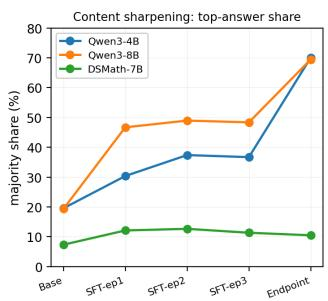

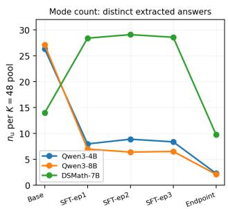  
Figure 5: Content axis (maj, $n _ { \mathbf { u } } )$ across all checkpoints Answer extraction matches Table 4.

## 4 Cross-lingual generalisation

Multilingual math reasoning has been evaluated on fixed translation sets such as Multilingual Grade School Math (MGSM) (Shi et al. 2022). We extend this idea to competition-style source problems and pool attempts within the same source problem. T3 (Section 2.3) covers 5 translations per source (Chinese, Spanish, Arabic, Urdu, Swahili). For this section we extend T3 with 3 additional languages chosen to broaden script and language-family coverage— Swedish, Icelandic, Tamil—using the same translation protocol and $K { = } 1 6$ per (source, language). Combined with 16 T0 samples per source as the English anchor, this yields a 9-language cross-section over the same 100 source problems for all 9 models. Languages are grouped by Qwen3- 4B Base pass@16: stronger $n o n – e n = \{ \mathrm { z h }$ , es, sv, ar}, the four non-English languages with the highest Qwen3-4B Base pass@16; weaker non-en = {is, ta, ur, sw}, the remaining four.

Three readings across the 9 (family, role) cells of the multilingual table (full numbers and per-family bar charts in $\mathsf { A p - }$ pendix D, Table 9): (F1) the stronger non-English group {zh, es, sv, ar} beats the weaker group {is, ta, ur, sw} in every cell by +3 to +18pp on mean pass@16, with the tier preserved by every mechanism; (F2) English-dominant SFT lifts every non-English language by +4 to +49pp at SFT-ep3 across all 24 non-English cells (largest: Icelandic on Qwen3-8B, 23→72)—even Swahili moves up despite no direct supervision (§2.2); (F3) Swahili is a floor that no mechanism removes, trailing the next-worst language by $2 4 / 1 7 / 1 0 \mathrm { p p }$ at the Qwen3-4B/8B/DSMath-7B endpoints, and regressing 9→4 on DSMath-7B from SFT-ep3 to RL endpoint (the largest relative single-language regression in the table at −56%; DS-Math es also drops 33→27, −6pp absolute)—a deficit fixed at Base and preserved or amplified by every mechanism, suggesting a pretraining-corpus rather than post-training property (visualised across 6 models in Appendix Fig. 16). Pooling all 9 languages (16 samples each, 144 per source) reproduces the same pattern as §3.1: on DSMath, GRPO RL leads at small K (sharpening), and SFT-ep3 matches or exceeds it from K≈16 onward. Qwen3 endpoints remain monotoneabove SFT-ep3 throughout (Appendix Fig. 17).

## 5 Memorisation

We report a controlled-overfit memorisation audit on 3 families × 3 epochs (0, 10, 20) × 3 probe modalities (behavioural prefix-completion, behavioural forbidden-CoT, forward-pass membership-inference attack (MIA) (Shi et al. 2024)). The overfit corpus is a 200-item subset of each family’s canonical training source with an MD5-disjoint 200-item heldout set; 10/20 epochs deliver an order of magnitude more per-item gradient passes than a typical SFT trajectory, designed to maximise detectability. Under these conditions, none of the three modalities yields a strong, reliable memorisation signal: behavioural $\dot { \Delta \mathrm { ^ { * } s } }$ are noisy across families and probe types (we omit them from the quantitative claims), and forward-pass MIA reports area under the receiveroperating-characteristic curve (ROC AUC) bounded within [.51, .65] across the overfit grid (Appendix Table 10), below the stronger pretraining-data detection signals reported in prior work (e.g., Min-K% Prob reaching AUC 0.88 for copyrighted-book detection (Shi et al. 2024)). Read as a sensitivity ceiling, this audit calibrates what current methods can resolve about SFT-specific membership and cautions against interpreting modest MIA AUCs as direct evidence of SFT memorisation. The full protocol is in Appendix E.

## 6 Discussion

Our results suggest that mathematical post-training is best understood as distribution shaping over a dificulty-dependent capability landscape. Endpoint pass@1 conflates several effects: cheaper sampling of already reachable solutions, expansion of the large-K reachable ceiling, robustness to surface variation, and possible memorisation. These efects can move diferently across mechanisms and therefore require trajectory-aware diagnosis.

The compression account is real, but regime-bound. On easier AMC problems, the cross-surface large-K ceiling is near saturation, so post-training mainly improves sample eficiency: correct solutions become cheaper to sample while mechanisms converge near the same ceiling. On harder AIME problems, however, base models leave substantial headroom, and post-training expands the reachable ceiling. Crucially, this expansion already appears under our suficiently trained of-policy distillation trajectories, making ofline distillation a genuine capability-expanding posttraining path rather than a weak SFT baseline. Released endpoints then provide mechanism-relative evidence: Qwen3 of-policy-plus-on-policy endpoints add further large-K lift, whereas the DeepSeek-Math GRPO endpoint sharpens small-K behaviour but does not exceed suficient of-policy distillation at large K in our comparison.

Robustness and distributional diagnostics further show that mechanisms are not interchangeable. Qwen3 endpoints consolidate solved problems across paraphrases and numerical isomorphisms, while the DeepSeek-Math GRPO endpoint remains close to its SFT predecessor in multi-instance consistency. Form sharpening and answer-content sharpening can also diverge, so more uniform reasoning traces should not be equated with more reliable reasoning unless correctness and cross-surface consistency improve as well. Cross-lingually, English-dominant distillation improves non-English reasoning but preserves stronger-versus-weaker language gaps, suggesting that post-training does not erase inherited coverage asymmetries. Finally, our controlled-overfit audit calibrates how much memorisation current membership probes can detect at all: the weak signals we measure bound the probes, not the phenomenon.

## 7 Conclusion

We compare three mathematical post-training mechanisms— of-policy distillation, of-policy-plus-on-policy distillation, and of-policy-plus-GRPO RL—under a shared crosssurface diagnostic framework. Using cross-surface pass@K, consistency, distribution-shape, multilingual, and verified SFT-membership probes, we separate sample-cost compression from ceiling expansion, robustness, and memorisation sensitivity.

Overall, compression is one regime of post-training, not a universal explanation of reasoning gains. Easy problems mainly expose sampling-cost compression, while hard problems show that suficient post-training—already of-policy distillation—can expand the reachable ceiling over the base. Evaluating reasoning progress therefore requires surfaceaware, trajectory-aware, and membership-controlled diagnostics beyond endpoint pass@1.

## Limitations

Our comparisons are mechanism-relative rather than fully causal: the studied post-training paths difer in historical pipeline, and we isolate no single algorithmic factor.

We cover nine languages, but translation quality, cultural specificity, and benchmark familiarity vary across them. The memorisation study calibrates detection sensitivity on our own controlled SFT data; it does not audit contamination from pretraining or from the data behind released endpoints.

## Ethical Statement

This work uses publicly available competition mathematics problems (AIME 2025/2026, AMC 2023) and public open-source training corpora (OpenR1-Math, NuminaMath-CoT). No human subjects, personally identifiable information, or sensitive content are involved. All models analysed are openly released under their respective licenses, and our SFT training data is filtered and curated from public corpora rather than collected from new sources. The full reproducibility package—problem pools and surface transforms, rollouts, analysis intermediates, and the analysis code—accompanies this submission as the code and data archive, so every reported number can be independently verified.

## References

Carlini, N.; Ippolito, D.; Jagielski, M.; Lee, K.; Tramer, F.; and Zhang, C. 2023. Quantifying Memorization Across Neural Language Models. In ICLR.

Carlini, N.; Tramer, F.; Wallace, E.; Jagielski, M.; Herbert-Voss, A.; Lee, K.; Roberts, A.; Brown, T. B.; Song, D.; Erlingsson, Ú.; Oprea, A.; and Rafel, C. 2021. Extracting Training Data from Large Language Models. In 30th USENIX Security Symposium (USENIX Security 21), 2633– 2650.

Chen, M.; Tworek, J.; Jun, H.; Yuan, Q.; Pinto, H. P. D. O.; Kaplan, J.; Edwards, H.; Burda, Y.; Joseph, N.; Brockman, G.; et al. 2021. Evaluating large language models trained on code. arXiv preprint arXiv:2107.03374.

Chen, Z.; Liu, T.; Tian, M.; Tong, Q.; Luo, W.; and Liu, Z. 2025. Advancing Mathematical Reasoning in Language Models: The Impact of Problem-Solving Data, Data Synthesis Methods, and Training Stages. arXiv:2501.14002.

DeepSeek-AI. 2025. DeepSeek-R1: Incentivizing Reasoning Capability in LLMs via Reinforcement Learning. arXiv:2501.12948.

Guha, E.; et al. 2025. OpenThoughts: Data Recipes for Reasoning Models. arXiv:2506.04178.

Hinton, G.; Vinyals, O.; and Dean, J. 2015. Distilling the Knowledge in a Neural Network. In NeurIPS Deep Learning and Representation Learning Workshop.

Ho, N.; Schmid, L.; and Yun, S.-Y. 2023. Large Language Models Are Reasoning Teachers. In ACL.

Hugging Face Open R1 Team. 2025. OpenR1-Math: An Open Reproduction of DeepSeek-R1’s Mathematical Reasoning Distillation. https://huggingface.co/datasets/openr1/OpenR1-Math-220k.

Kirk, R.; Mediratta, I.; Nalmpantis, C.; Luketina, J.; Hambro, E.; Grefenstette, E.; and Raileanu, R. 2024. Understanding the Efects of RLHF on LLM Generalisation and Diversity. In ICLR.

Kwon, W.; Li, Z.; Zhuang, S.; Sheng, Y.; Zheng, L.; Yu, C. H.; Gonzalez, J. E.; Zhang, H.; and Stoica, I. 2023. Eficient Memory Management for Large Language Model Serving with PagedAttention. In Proceedings ofthe 29th Symposium on Operating Systems Principles (SOSP).

Li, J.; Beeching, E.; Tunstall, L.; Lipkin, B.; Soletskyi, R.; Huang, S. C.; Rasul, K.; Yu, L.; Jiang, A.; Shen, Z.; Qin, Z.; Dong, B.; Zhou, L.; Fleureau, Y.; Lample, G.; and Polu, S. 2024. NuminaMath. https://huggingface.co/datasets/AI-MO/NuminaMath-CoT.

Li, J.; Galley, M.; Brockett, C.; Gao, J.; and Dolan, B. 2016. A Diversity-Promoting Objective Function for Neural Conversation Models. In NAACL.

Magister, L. C.; Mallinson, J.; Adamek, J.; Malmi, E.; and Severyn, A. 2023. Teaching small language models to reason. In Proceedings of the 61st Annual Meeting of the Associationfor Computational Linguistics (Volume 2: Short Papers), 1773–1781.

Mirzadeh, I.; Alizadeh, K.; Shahrokhi, H.; Tuzel, O.; Bengio, S.; and Farajtabar, M. 2024. GSM-Symbolic: Understanding the Limitations of Mathematical Reasoning in Large Language Models. arXiv:2410.05229.

Muennighof, N.; Yang, Z.; Shi, W.; Li, X. L.; Fei-Fei, L.; Hajishirzi, H.; Zettlemoyer, L.; Liang, P.; Candes, E.; and Hashimoto, T. 2025. s1: Simple Test-Time Scaling. arXiv:2501.19393.

Shao, Z.; Wang, P.; Zhu, Q.; Xu, R.; Song, J.; Bi, X.; Zhang, H.; Zhang, M.; Li, Y. K.; Wu, Y.; and Guo, D. 2024. DeepSeek-Math: Pushing the Limits of Mathematical Reasoning in Open Language Models. arXiv:2402.03300.

Sheng, G.; Zhang, C.; Ye, Z.; Wu, X.; Zhang, W.; Zhang, R.; Peng, Y.; Lin, H.; and Wu, C. 2024. HybridFlow: A Flexible and Eficient RLHF Framework. arXiv:2409.19256.

Shi, F.; Suzgun, M.; Freitag, M.; Wang, X.; Srivats, S.; Vosoughi, S.; Chung, H. W.; Tay, Y.; Ruder, S.; Zhou, D.; Das, D.; and Wei, J. 2022. Language Models are Multilingual Chain-of-Thought Reasoners. arXiv preprint arXiv:2210.03057.

Shi, W.; Ajith, A.; Xia, M.; Huang, Y.; Liu, D.; Blevins, T.; Chen, D.; and Zettlemoyer, L. 2024. Detecting pretraining data from large language models. In International Conference on Learning Representations, volume 2024, 51826– 51843.

Srivastava, S.; Annarose M B; Anto P V; Menon, S.; Sukumar, A.; Adwaith Samod T; Philipose, A.; Prince, S.; and Thomas, S. 2024. Functional Benchmarks for Robust Evaluation of Reasoning Performance, and the Reasoning Gap. arXiv:2402.19450.

Stanton, S.; Izmailov, P.; Kirichenko, P.; Alemi, A. A.; and Wilson, A. G. 2021. Does Knowledge Distillation Really Work? In NeurIPS.

Wang, W.; Wei, F.; Dong, L.; Bao, H.; Yang, N.; and Zhou, M. 2020. Minilm: Deep self-attention distillation for taskagnostic compression of pre-trained transformers. Advances in neural information processing systems, 33: 5776–5788.

Wang, X.; Wei, J.; Schuurmans, D.; Le, Q. V.; Chi, E. H.; Narang, S.; Chowdhery, A.; and Zhou, D. 2023. Self-Consistency Improves Chain of Thought Reasoning in Language Models. In ICLR.

Wei, J.; Wang, X.; Schuurmans, D.; Bosma, M.; Xia, F.; Chi, E.; Le, Q. V.; Zhou, D.; et al. 2022. Chain-of-thought prompting elicits reasoning in large language models. Advances in neural information processing systems, 35: 24824–24837.

Yang, A.; et al. 2025. Qwen3 Technical Report. arXiv:2505.09388.

Ye, Y.; Huang, Z.; Xiao, Y.; Chern, E.; Xia, S.; and Liu, P. 2025. LIMO: Less is More for Reasoning. arXiv:2502.03387.

Yuan, L.; Chen, W.; Zhang, Y.; Cui, G.; Wang, H.; You, Z.; Ding, N.; Liu, Z.; Sun, M.; and Peng, H. 2025. From f(x) and g(x) to f(g(x)): LLMs Learn New Skills in RL by Composing Old Ones. arXiv:2509.25123.

Yue, Y.; Chen, Z.; Lu, R.; Zhao, A.; Wang, Z.; Yue, Y.; Song, S.; and Huang, G. 2025. Does Reinforcement Learning Really Incentivize Reasoning Capacity in LLMs Beyond the Base Model? In Advances in Neural Information Processing Systems, volume 38, 57654–57689.

A Formal definition of cross-surface pass@K For each source problem s and a subset of transforms $\mathcal { T } ^ { \prime } \subseteq$ $\{ T _ { 0 } , T _ { 1 } , T _ { 2 } , T _ { 3 } \}$ , let N be the size of the pool of all rollouts drawn from variants of s under transforms in $\mathcal { T } ^ { \prime } .$ , and let n be the count of those rollouts scored correct by math\_verify. The unbiased pass@K estimator (Chen et al. 2021) is

$$
\begin{array} { r } { \mathrm { p a s s @ } K ( s ) = \left\{ \begin{array} { l l } { 0 , } & { n = 0 , } \\ { 1 , } & { N - n < K , } \\ { 1 - { \binom { N - n } { K } } \big / { \binom { N } { K } } , } & { \mathrm { e l s e } . } \end{array} \right. } \end{array}
$$

We report the source-level mean on a subset $S ^ { \prime } \subseteq$ $\{ s _ { 1 } , \ldots , s _ { 1 0 0 } \}$ , denoted pass@K(S<sup>′</sup>). Every reported cell has $K \leq N$ . The pool behind each column is given by the probe set row of each pass@K table, and $S ^ { \prime }$ by its caption. Two places do not fit this formalism and state their own convention instead: the multilingual table draws its en column from the first 16 of the 48 T0 samples and each non-English column from the 16 T3 samples of that language, and the 9- language pooled figures combine those same 16 T0 samples with eight T3 languages.

## B Training details

This appendix reports the full hyperparameter list (Table 5), training/validation loss curves (Figure 6), and perstep learning-rate (Figure 7) and gradient-norm (Figure 8) trajectories for the representative SFT runs, confirming that the cosine schedule listed in Table 5 was executed as specified and that no run diverged. Figure 7: peak $2 \times 1 0 ^ { - 5 }$ is reached after ∼ 1% of total steps (linear warm-up) and decays smoothly to $2 \times 1 0 ^ { - 6 }$ , exactly 0.1× peak as set by min\_ $\_ { 1 } \mathtt { r \_ r a t i o }$ . Figure 8: gradient norm stays bounded throughout training, with no divergence or loss explosion.

## C Cross-mechanism analysis

This appendix reports the full cross-mechanism capability summary (Table 6) and per-subset numeric anchor points referenced from §3.1. Table 6 reports pass@K at $K \in \{ 1 , 1 6 , 4 8 , 9 6 , 1 4 4 , 2 2 4 \}$ for all 15 checkpoints. The four subset tables that follow give the values at $K \in$ {1, 48, 96, 144, 224} on the harder AIME 2025+2026 subset (n=60) and the potentially-contaminated AMC 2023 subset $( n { = } 4 0 )$ for both Qwen3 families (Tables 7a, 7b) and the DeepSeek-Math-7B family (Tables 8a, 8b). Figure 9 provides a combined cross-mechanism view on AIME (Fig. 9a) and AMC (Fig. 9b). It overlays six curves on a single axis: M1 (of-policy distill, SFT-ep3) for all three families, M2 (onpolicy distill) for the two Qwen3 families, and M3 (GRPO RL) for DeepSeek-Math-7B. No family has all three mechanisms: M2 exists only as a released Qwen3 endpoint and M3 only as a released DeepSeek-Math endpoint.

## D Cross-lingual evaluation

The aggregated multilingual numbers referenced in §4 are shown in Table 9; per-family breakdowns are in Figure 13 (Qwen3-4B), Figure 14 (Qwen3-8B), and Figure 15 (DeepSeek-Math-7B).

## E Memorisation: positive controls

Construction. For each base model we sample a 200-item seen set from its canonical SFT corpus (OpenR1-Math-220k for Qwen3, dsmath-hybrid for DSMath) and a 200-item unseen held-out set drawn MD5-disjoint from 220k. Each base is then fine-tuned on only the seen set for 10 and 20 epochs (full-parameter verl SFT, batch 32, lr $2 \times 1 0 ^ { - 5 } )$ , deliberately producing the overfit regime that should maximally expose memorisation.

Probes. Each (model, ckpt) cell is evaluated under three independent probes targeting diferent memorisation traces: (i) Implicit — 40% problem prefix $+ ^ { 6 6 } \mathrm { T }$ he final answer is:”, 1024 tokens, any-of-16 boxed-match (Carlini et al. 2021); (ii) Direct — full problem $+ ~ { } ^ { 6 6 } \mathrm { n o }$ reasoning, only \boxed{}”, 128 tokens (answer-recall under forbidden CoT); (iii) MIA — forward-pass Loss / MIN-K% / Zlib AUC over the groundtruth answer tokens, conditioned on the problem (Shi et al. 2024); no sampling. Behavioural cells (i, ii) use one-sided Mann–Whitney on $n { = } 2 0 0$ items per split; MIA reports ROC AUC against the verified split label.

Behavioural probes are noisy. Within the same (family, ckpt) cell, qualitative inspection finds verbatim recitation, length-truncated CoT, and ordinary problem-solving all cooccurring. Single $\Delta _ { \mathrm { { s e e n - u n s e e n } } }$ values are therefore highly noisy and inherently unreliable. We exclude behavioural numbers from the headline range and rely on the deterministic MIA AUC below.

MIA caveats. Forward-pass MIA (Table 10) is one forward pass per item, so its AUC is stable. Two caveats temper the bounded range reported in the main text: (i) Qwen3 Loss AUC responds to overfit (+3–4pp from ep0 to ep20), but DSMath Loss AUC is already $\approx 0 . 6 5$ at ep0 (no overfit) and barely moves with epoch—part of the DSMath signal therefore reflects baseline corpus statistics rather than memorisation per se; (ii) we did not run a randomised baseline (AUC after relabelling seen/unseen at random) to anchor what 0.65 means in this regime.

<table><tr><td>Hyperparameter</td><td>Value</td></tr><tr><td>Optimiser</td><td> $\mathbf { A d a m W } , ( \beta _ { 1 } , \beta _ { 2 } ) = ( 0 . 9 , 0 . 9 9 9 )$ </td></tr><tr><td>Peak learning rate</td><td> $2 \times 1 0 ^ { - 5 }$ </td></tr><tr><td>LR schedule</td><td>Cosine, min ratio 0.1</td></tr><tr><td>Warm-up</td><td>1% of total steps</td></tr><tr><td>Weight decay</td><td>0.1</td></tr><tr><td>Gradient clipping</td><td>1.0</td></tr><tr><td>Precision</td><td>bfloat16 (FSDP, activation ckpt; activation offload on the 8B and 7B runs only)</td></tr><tr><td>Max sequence length</td><td>32,768 (Qwen3) / 4,096 (DSMath, native)</td></tr><tr><td>Micro-batch per GPU</td><td>1</td></tr><tr><td>Global batch (4B)</td><td>16 32</td></tr><tr><td>Global batch (7B / 8B)</td><td></td></tr><tr><td>Epochs</td><td>3</td></tr><tr><td>Total tokens (Qwen3-4B)</td><td>≈ 0.80 B</td></tr><tr><td>Total tokens (Qwen3-8B)</td><td>≈ 1.56 B</td></tr><tr><td>Total tokens (DSMath-7B)</td><td>≈ 0.34B</td></tr></table>

Table 5: SFT training hyperparameters.

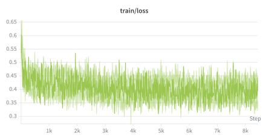  
(a) Qwen3-4B train/loss

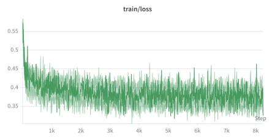  
(b) Qwen3-8B train/loss

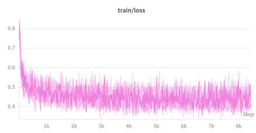  
(c) DSMath-7B train/loss

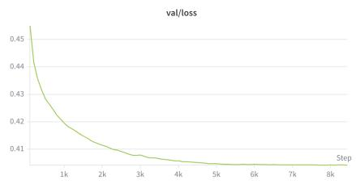  
(d) Qwen3-4B val/loss

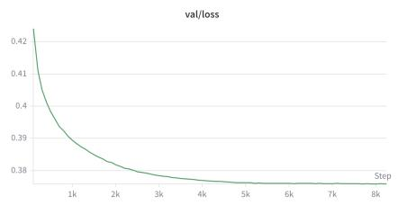  
(e) Qwen3-8B val/loss

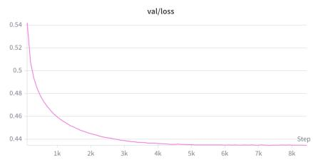  
(f) DSMath-7B val/loss  
Figure 6: Training (top row) and validation (bottom row) loss across three epochs of of-policy distillation.

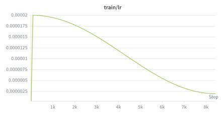

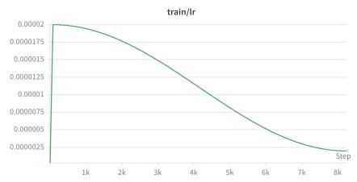

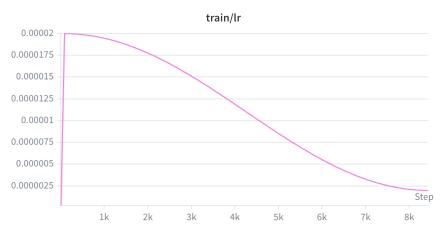  
Figure 7: Learning-rate schedule for the SFT runs. Left to right: Qwen3-4B-SFT-Math-45k, Qwen3-8B-SFT-Math-90k, $\mathrm { a n d \ D S M a t h { - } 7 B { - } S F T { - } h y b r i d }$

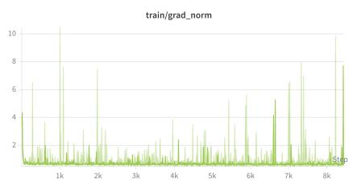

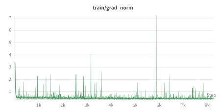

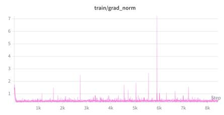  
Figure 8: Gradient norm for the SFT runs (clip threshold 1.0, see Table 5). No divergence over three epochs.

<table><tr><td>Family probe set</td><td>Stage</td><td>Post-training</td><td>pass@1 TO</td><td>pass@16 TO</td><td>pass@48 TO</td><td>pass@96 T1UT2</td><td>pass@144 T0UT1UT2</td><td>pass@224 UT3</td><td>ratio</td></tr><tr><td rowspan="5">Qwen3-4B</td><td>Base</td><td></td><td>10.5</td><td>39</td><td>49</td><td>62</td><td>66</td><td>68</td><td>6.48×</td></tr><tr><td>SFT-ep1</td><td>Off-policy distill</td><td>36.6</td><td>64</td><td>70</td><td>78</td><td>81</td><td>85</td><td>2.32×</td></tr><tr><td>SFT-ep2</td><td>Off-policy distill</td><td>38.9</td><td>66</td><td>75</td><td>80</td><td>81</td><td>84</td><td>2.16×</td></tr><tr><td>SFT-ep3</td><td>Off-policy distill</td><td>38.7</td><td>67</td><td>76</td><td>82</td><td>84</td><td>85</td><td>2.19×</td></tr><tr><td>Endpoint</td><td>Off + On distill</td><td>68.4</td><td>87</td><td>90</td><td>93</td><td>93</td><td>94</td><td>1.37×</td></tr><tr><td rowspan="5">Qwen3-8B</td><td>Base</td><td></td><td>12.8</td><td>44</td><td>50</td><td>66</td><td>68</td><td>72</td><td>5.62×</td></tr><tr><td>SFT-ep1</td><td>Off-policy distill</td><td>44.6</td><td>73</td><td>79</td><td>84</td><td>84</td><td>84</td><td>1.88×</td></tr><tr><td>SFT-ep2</td><td>Off-policy distill</td><td>46.5</td><td>75</td><td>80</td><td>86</td><td>86</td><td>88</td><td>1.89×</td></tr><tr><td>SFT-ep3</td><td>Off-policy distill</td><td>46.5</td><td>77</td><td>82</td><td>87</td><td>89</td><td>90</td><td>1.94×</td></tr><tr><td>Endpoint</td><td>Off + On distill</td><td>69.6</td><td>89</td><td>90</td><td>94</td><td>94</td><td>94</td><td>1.35×</td></tr><tr><td rowspan="5">DSMath-7B</td><td>Base</td><td></td><td>1.1</td><td>12</td><td>22</td><td>34</td><td>40</td><td>45</td><td>40.00×</td></tr><tr><td>SFT-ep1</td><td>Off-policy distill</td><td>7.1</td><td>31</td><td>44</td><td>52</td><td>59</td><td>60</td><td>8.45×</td></tr><tr><td>SFT-ep2</td><td>Off-policy distill</td><td>7.1</td><td>31</td><td>45</td><td>54</td><td>59</td><td>60</td><td>8.42×</td></tr><tr><td>SFT-ep3</td><td>Off-policy distill</td><td>7.4</td><td>35</td><td>48 41</td><td>54 51</td><td>58 56</td><td>66</td><td>8.87×</td></tr><tr><td>Endpoint</td><td>Off + RL</td><td>9.7</td><td>29</td><td></td><td></td><td></td><td>60</td><td>6.18×</td></tr></table>

Table 6: Capability across three post-training mechanisms. Cross-surface pass@K pooled across T0/T1/T2/T3 surfaces (see §3). The ratio column reports pass@224/pass@1, a per-checkpoint sample-eficiency multiplier (computed from unrounded values).

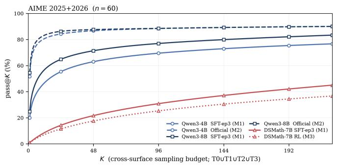  
(a) AIME 2025+2026 (n=60).

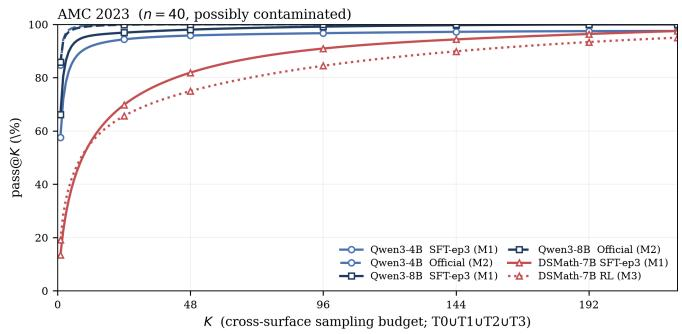  
(b) AMC 2023 (n=40, possibly contaminated)  
Figure 9: Cross-mechanism pass@K pooled across $\mathbf { T 0 + T 1 + T 2 + T 3 } \left( K _ { \operatorname* { m a x } } { = } 2 2 4 \right)$

<table><tr><td>Family</td><td>Stage</td><td>pass@1</td><td>pass@48</td><td>pass@96</td><td>pass@144</td><td>pass@224</td></tr><tr><td rowspan="2">probe set</td><td></td><td>TO</td><td>TO</td><td>T1UT2</td><td>T0UT1UT2</td><td>UT3</td></tr><tr><td>Base</td><td>2.5</td><td>27</td><td>37</td><td>43</td><td>47</td></tr><tr><td rowspan="2">Qwen3-4B</td><td> $\mathrm { S F I - e p } 3$ </td><td>22.7</td><td>62</td><td>72</td><td>75</td><td>77</td></tr><tr><td>Endpoint</td><td>55.6</td><td>83</td><td>88</td><td>88</td><td>90</td></tr><tr><td rowspan="3">Qwen3-8B</td><td>Base</td><td>2.9</td><td>27</td><td>45</td><td>48</td><td>55</td></tr><tr><td> $\mathrm { S F I - e p } 3$ </td><td>28.6</td><td>72</td><td>80</td><td>82</td><td>83</td></tr><tr><td>Endpoint</td><td>57.2</td><td>83</td><td>90</td><td>90</td><td>90</td></tr></table>

(a) AIME 2025+2026 $( n { = } 6 0 ) .$ . On the cross-surface ceiling (pass@224) the on-policy distillation endpoint adds +13pp on Qwen3-4B (77→90) and $+ 7 \mathrm { p p }$ on Qwen3-8B (83→90). Singleattempt (pass@1) gains +33/+29pp are sample-eficiency driven.

<table><tr><td>Family</td><td>Stage</td><td>pass@1</td><td>pass@48</td><td>pass@96</td><td>pass@144</td><td>pass@224</td></tr><tr><td rowspan="2">probe set</td><td></td><td>TO</td><td>TO</td><td>T1UT2</td><td>T0UT1UT2</td><td>UT3</td></tr><tr><td>Base</td><td>22.4</td><td>82</td><td>100</td><td>100</td><td>100</td></tr><tr><td rowspan="2">Qwen3-4B</td><td> $\mathrm { S F T - e p } 3$ </td><td>62.8</td><td>98</td><td>98</td><td>98</td><td>98</td></tr><tr><td>Endpoint</td><td>87.6</td><td>100</td><td>100</td><td>100</td><td>100</td></tr><tr><td rowspan="3">Qwen3-8B</td><td>Base</td><td>27.7</td><td>85</td><td>98</td><td>98</td><td>98</td></tr><tr><td> $\mathrm { S F T - e p } 3$ </td><td>73.2</td><td>98</td><td>98</td><td>100</td><td>100</td></tr><tr><td>Endpoint</td><td>88.2</td><td>100</td><td>100</td><td>100</td><td>100</td></tr></table>

(b) AMC 2023 $( n { = } 4 0 ,$ possibly contaminated). AMC predates every model release. The pass@K≥48 ceiling is already at 98–100 after of-policy distillation; the on-policy lift concentrates at pass@1 $( + 2 5 \mathrm { p p } 4 \mathrm { B } , + 1 5 \mathrm { p p } 8 \mathrm { B } )$ .

Table 7: Qwen3 dificulty-stratified capability.
<table><tr><td>Stage</td><td>pass@1</td><td>pass@48</td><td>pass@96</td><td>pass@144</td><td>pass@224</td></tr><tr><td>probe set</td><td>TO</td><td>TO</td><td>T1UT2</td><td>T0UT1UT2</td><td>UT3</td></tr><tr><td>Base</td><td>0.0</td><td>2</td><td>7</td><td>8</td><td>15</td></tr><tr><td>SFT-ep3</td><td>1.1</td><td>22</td><td>33</td><td>37</td><td>45</td></tr><tr><td>Endpoint (RL)</td><td>1.0</td><td>20</td><td>28</td><td>35</td><td>37</td></tr></table>

(a) AIME 2025+2026 (n=60). GRPO RL does not exceed SFT-ep3 at any $K \geq 4 8 ,$ and the point estimates favour SFT-ep3 throughout (∆pass@224= − 8pp, 45 → 37). A paired bootstrap over source problems puts every interval across zero, including the 0.1pp gap at pass@1. Italics flag the SFT-ep3 ≥ RL ordering.

<table><tr><td>Stage</td><td>pass@1</td><td>pass@48</td><td>pass@96</td><td>pass@144</td><td>pass@224</td></tr><tr><td>probe set</td><td>TO</td><td>TO</td><td>T1UT2</td><td>T0UT1UT2</td><td>UT3</td></tr><tr><td>Base</td><td>2.8</td><td>52</td><td>75</td><td>88</td><td>90</td></tr><tr><td>SFT-ep3</td><td>17.0</td><td>88</td><td>85</td><td>90</td><td>98</td></tr><tr><td>Endpoint (RL)</td><td>22.8</td><td>72</td><td>85</td><td>88</td><td>95</td></tr></table>

(b) AMC 2023 $( n { = } 4 0 ,$ possibly contaminated). RL gains +5.8pp at pass@1 over of-policy distillation (single-shot sharpening); this is the only contrast in the table whose bootstrap interval excludes zero. Beyond it the ordering reverses— −15pp on the T0 pool at pass@48, −2.5pp on the full cross-surface pool at pass@224 (one problem out of 40)—within intervals that do not.

Table 8: DeepSeek-Math-7B dificulty-stratified capability.  
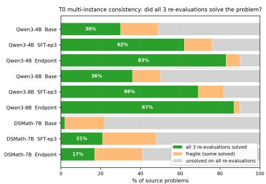  
(a) T0: 3 re-evaluations of the original prompt.

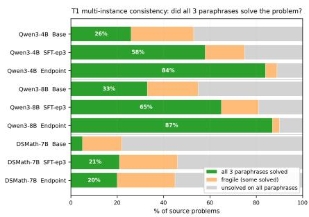  
(b) T1: 3 paraphrases.

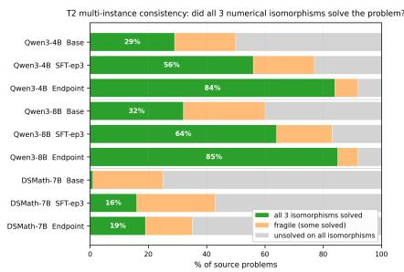  
(c) T2: 3 numerical isomorphisms.  
Figure 10: Multi-instance consistency across T0, T1, T2. Each panel uses three instances of $K { = } 1 6$ samples per source problem. T1/T2: three paraphrase/isomorphism variants. T0: the $K { = } 4 8$ original-prompt pool partitioned into three disjoint 16- sample batches so the per-instance budget matches T1/T2. Green: all three instances solved (at least one correct sample each); orange: some-but-not-all; grey: unsolved on all three. All three panels show the same monotone Base→SFT-ep3 consolidation, with the Qwen3 endpoints further lifting all three transforms; the DSMath RL endpoint stays within ±4pp of SFT-ep3 on all three (T0 −4, T1 −1, T2 +3pp), consistent with §3.2.

<table><tr><td>en</td><td>Cities A and B are 45 miles apart. Alicia lives in A and Beth lives in B. Alicia bikes towards B at 18 miles per hour. Leaving at the same time, Beth bikes toward A at 12 miles per hour. How many miles from City A will they be when they meet?</td><td></td><td></td></tr><tr><td>zh</td><td>城市A 和 B 相距45 英里。艾丽西亚住在A，贝丝住在 B。艾丽西亚以每小时18英里的速度骑自行车向</td><td></td><td></td></tr><tr><td>es</td><td>B 出发。同时，贝丝以每小时12 英里的速度骑自行车向A 出发。她们相遇时距离城市A 多少英里？ Las ciudades A y B están a 45 millas de distancia. Alicia vive en A y Beth vive en B. Alicia va en bicicleta hacia B a 18 millas por hora. Saliendo al mismo tiempo, Beth va en bicicleta hacia A a 12 millas por hora.</td><td></td><td></td></tr><tr><td>SV</td><td>cuántas millas de la ciudad A estarán cuando se encuentren? Städerna A och B ligger 45 miles från varandra. Alicia bor i A och Beth bor i B. Alicia cyklar mot B med</td><td></td><td></td></tr><tr><td>ar</td><td>18 miles per timme. Samtidigt, när de startar, cyklar Beth mot A med 12 miles per timme. Hur många miles från stad A kommer de att vara när de möts?  .</td><td></td><td></td></tr><tr><td>is</td><td>Borgir A og B eru 45 mílur á milli. Alicia býr í A og Beth býr í B. Alicia hjólar í átt að B á 18 mílum</td><td></td><td></td></tr><tr><td>ta</td><td>á klukkustund. Á sama tíma hjólar Beth í átt að A á 12 mílum á klukkustund. Hversu margar mílur frá borg A verða bær begar bær mætast? .8 .12</td><td>45. </td><td></td></tr><tr><td>ur</td><td>L. π? </td><td></td><td></td></tr><tr><td>SW</td><td>Miji A na B iko umbali wa 45 maili. Alicia anaishi A na Beth anaishi B. Alicia anaendesha baiskeli</td><td></td><td></td></tr></table>

Figure 11: Representative T3 case.

Source problem (amc23\_\_000, English T0; same item as Figure 11):   
Cities A and B are 45 miles apart. Alicia lives in A and Beth lives in B. Alicia bikes towards B at 18 miles per hour. Leaving at the same   
time, Beth bikes toward A at 12 miles per hour. How many miles from City A will they be when they meet?   
Ground truth: 27.   
Model: Qwen3-4B-SFT-Math-45k-ep3 (of-policy distilled, our SFT-ep3 checkpoint). Sampled at T=0.7, top-p=0.95. Sample 40/48,   
406 new tokens, scored correct.   
Full response (verbatim, 1,337 characters; line breaks preserved):   
<think>   
Okay, let’s see. So, Alicia and Beth are biking towards each other from cities A and B, which are 45 miles apart. Alicia starts from A at   
18 mph, and Beth starts from B at 12 mph. We need to find out how many miles from A they will meet each other.   
Hmm, this seems like a relative speed problem. When two objects move towards each other, their speeds add up. So, the combined speed   
at which they are approaching each other is 18 + 12 = 30 mph. That makes sense.   
Now, the total distance between them is 45 miles. If they’re moving towards each other at 30 mph, how long will it take for them to meet?   
Well, time is distance divided by speed. So, time = 45 miles /30 mph. Let me calculate that.   
45 divided by 30 is 1.5 hours. So, they will meet after 1.5 hours.   
Now, we need to find out how far Alicia has traveled in that time. Since speed is distance divided by time, distance = speed × time   
Alicia’s speed is 18 mph, and time is 1.5 hours. Let me compute that.   
18 × 1.5. Hmm, 18 times 1 is 18, and 18 times 0.5 is 9. So, 18 + 9 = 27 miles. So, Alicia will have biked 27 miles from A when they   
meet.   
Alternatively, we could check Beth’s distance. Beth’s speed is 12 mph. 12 × 1.5 is 18 miles. 27 + 18 = 45, which checks out. So that’s   
correct.   
Therefore, the answer should be 27 miles from City A.   
</think>   
Answer: 27  
Figure 12: Representative model response with reasoning. Of-policy distilled checkpoint (Qwen3-4B SFT-ep3) on the same source problem as Figure 11.

<table><tr><td>Model</td><td>Metric</td><td>en</td><td colspan="4">stronger non-en</td><td colspan="4">weaker non-en</td></tr><tr><td></td><td></td><td>en</td><td>zh</td><td>es</td><td>SV</td><td>ar</td><td>is</td><td>ta</td><td>ur</td><td>SW</td></tr><tr><td>Qwen3-4B Base</td><td>pass@1</td><td>9.6</td><td>11.9</td><td>15.0</td><td>13.5</td><td>8.4</td><td>2.1</td><td>5.9</td><td>7.6</td><td>1.8</td></tr><tr><td></td><td>pass@16</td><td>37</td><td>45</td><td>48</td><td>42</td><td>38</td><td>15</td><td>33</td><td>38</td><td>15</td></tr><tr><td>Qwen3-4B SFT-ep3</td><td>pass@1</td><td>37.3</td><td>27.8</td><td>38.4</td><td>38.4</td><td>34.0</td><td>31.7</td><td>34.6</td><td>32.9</td><td>15.4</td></tr><tr><td></td><td>pass@16</td><td>69</td><td>53</td><td>66</td><td>68</td><td>69</td><td>64</td><td>63</td><td>67</td><td>47</td></tr><tr><td>Qwen3-4B Endpoint</td><td>pass@1</td><td>69.2</td><td>64.8</td><td>68.9</td><td>70.1</td><td>69.8</td><td>58.8</td><td>58.2</td><td>58.6</td><td>31.4</td></tr><tr><td></td><td>pass@16</td><td>88</td><td>83</td><td>88</td><td>85</td><td>87</td><td>77</td><td>77</td><td>80</td><td>53</td></tr><tr><td>Qwen3-8B Base</td><td>pass@1</td><td>12.4</td><td>9.8</td><td>19.4</td><td>13.5</td><td>15.9</td><td>2.9</td><td>9.7</td><td>7.9</td><td>2.3</td></tr><tr><td></td><td>pass@16</td><td>43</td><td>41</td><td>48</td><td>42</td><td>44</td><td>23</td><td>37</td><td>36</td><td>21</td></tr><tr><td>Qwen3-8B SFT-ep3</td><td>pass@1</td><td>47.2</td><td>33.3</td><td>44.6</td><td>40.8</td><td>39.5</td><td>38.6</td><td>39.0</td><td>22.6</td><td>29.6</td></tr><tr><td></td><td>pass@16</td><td>78</td><td>63</td><td>72</td><td>74</td><td>73</td><td>72</td><td>72</td><td>60</td><td>58</td></tr><tr><td>Qwen3-8B Endpoint</td><td>pass@1</td><td>69.3</td><td>65.3</td><td>70.1</td><td>69.9</td><td>68.6</td><td>65.0</td><td>61.1</td><td>63.7</td><td>43.2</td></tr><tr><td></td><td>pass@16</td><td>90</td><td>86</td><td>89</td><td>89</td><td>86</td><td>86</td><td>84</td><td>84</td><td>67</td></tr><tr><td>DSMath-7B Base</td><td>pass@1</td><td>1.1</td><td>0.9</td><td>1.2</td><td>0.4</td><td>1.1</td><td>0.2</td><td>0.6</td><td>0.4</td><td>0.3</td></tr><tr><td></td><td>pass@16</td><td>11</td><td>7</td><td>14</td><td>5</td><td>10</td><td>4</td><td>9</td><td>5</td><td>5</td></tr><tr><td>DSMath-7B SFT-ep3</td><td>pass@1</td><td>7.4</td><td>3.7</td><td>6.2</td><td>4.7</td><td>4.2</td><td>1.8</td><td>1.6</td><td>1.1</td><td>0.8</td></tr><tr><td></td><td>pass@16</td><td>35</td><td>25</td><td>33</td><td>25</td><td>28</td><td>19</td><td>19</td><td>11</td><td>9</td></tr><tr><td>DSMath-7B Endpoint</td><td>pass@1</td><td>10.0</td><td>6.9</td><td>9.1</td><td>9.0</td><td>6.1</td><td>3.8</td><td>3.9</td><td>1.7</td><td>0.4</td></tr><tr><td></td><td>pass@16</td><td>30</td><td>25</td><td>27</td><td>28</td><td>29</td><td>25</td><td>20</td><td>14</td><td>4</td></tr></table>

Table 9: Multilingual cross-surface reasoning, 9 models × 9 languages. Each model contributes two rows: pass@1 and pass@16.

Qwen3-4B  
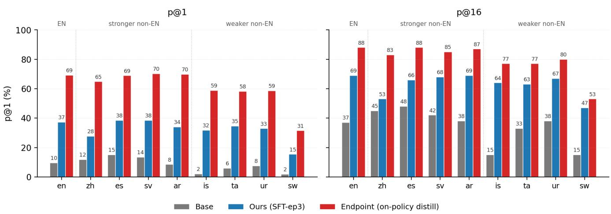  
Figure 13: Qwen3-4B family. pass@1 (left) and pass@16 (right) across 9 languages. Bars: Base / SFT-ep3 (ours) / Endpoint (on-policy distillation).

Qwen3-8B  
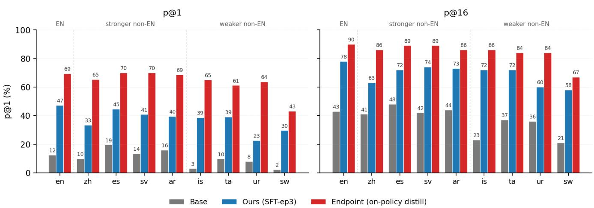  
Figure 14: Qwen3-8B family. Same layout as Figure 13; Base / SFT-ep3 / Endpoint comparison at 8B scale.

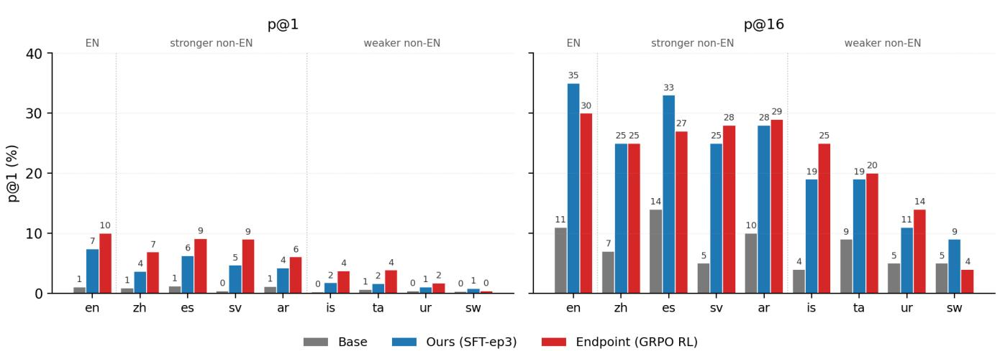  
Figure 15: DeepSeek-Math-7B family. Endpoint is the released GRPO RL checkpoint. y-axis truncated to [0, 40]% to keep sub-percent diferences visible at smaller pass@1 baselines.

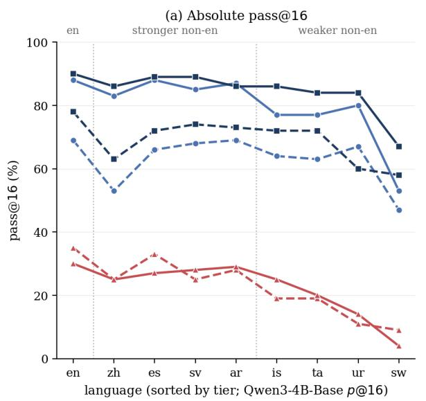

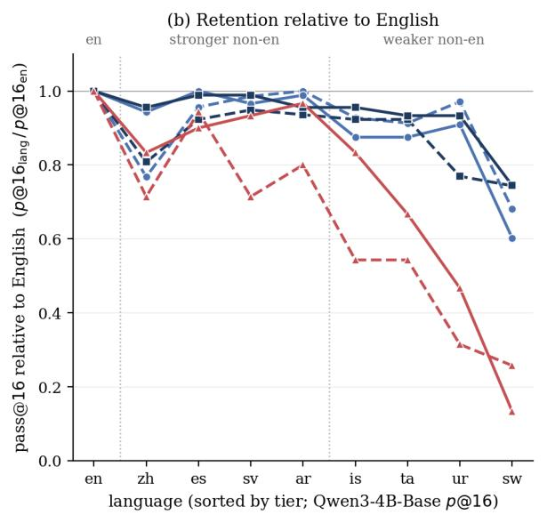  
Figure 16: Multilingual imbalance across mechanisms. We plot pass@16 over English, stronger non-English languages (zh, es, sv, ar), and weaker non-English languages (is, ta, ur, sw) for each post-trained model. (a) Absolute scores show the family level performance gap. (b) English-relative retention $( p a s s @ 1 6 _ { \mathrm { l a n g } } / \bar { p a } s s @ 1 6 _ { \mathrm { e n } } )$ normalises across families. Weaker-language gaps persist after post-training.

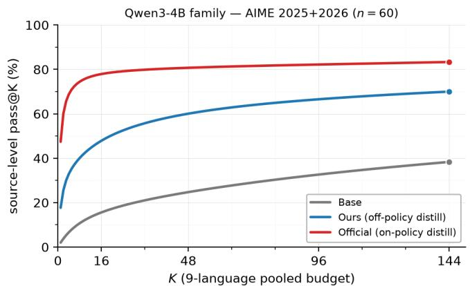  
(a) Qwen3-4B, AIME (n=60).

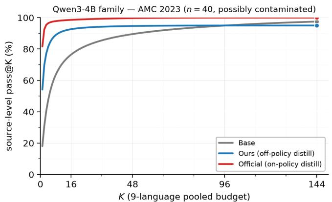  
(b) Qwen3-4B, AMC (n=40).

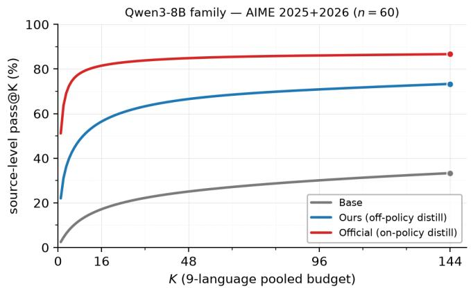  
(c) Qwen3-8B, AIME (n=60).

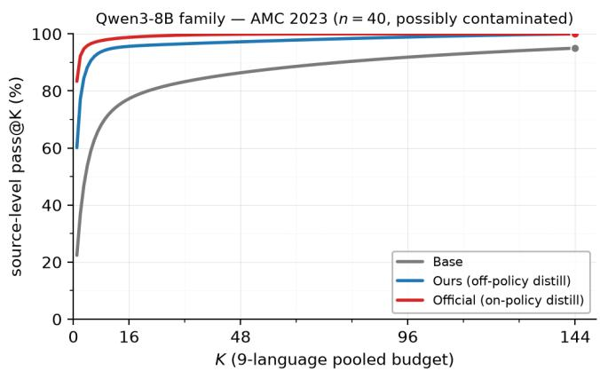  
(d) Qwen3-8B, AMC (n=40).

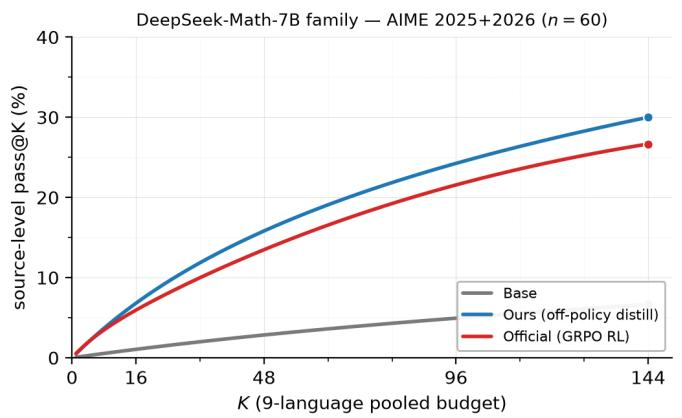  
(e) DSMath-7B, AIME (n=60).

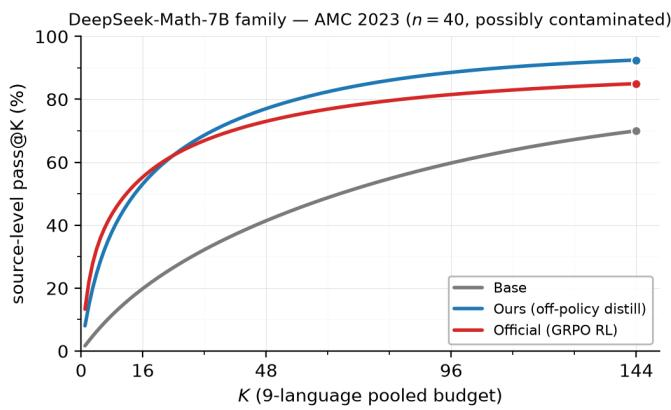  
(f) DSMath-7B, AMC (n=40).  
Figure 17: 9-language pooled pass@K split by dificulty subset. Each panel pools 9 languages (144 samples per source) and plots source-level pass@K for K=1 . . . 144. Rows: Qwen3-4B / Qwen3-8B / DSMath-7B; columns: AIME 2025+2026 (n=60) and AMC 2023 (n=40). On DSMath, GRPO RL leads at small K on AMC (sharpening) and SFT-ep3 first matches RL at K≈24, leading at every larger K. Qwen3 endpoints stay monotone-above SFT-ep3 throughout.

<table><tr><td>Family</td><td>Epochs</td><td colspan="3">Loss MIN-K% Zlib ROC AUC vs. unseen</td></tr><tr><td rowspan="3">Qwen3-4B</td><td>0</td><td>0.562</td><td>0.627</td><td>0.513</td></tr><tr><td>10</td><td>0.603</td><td>0.648</td><td>0.548</td></tr><tr><td>20</td><td>0.596</td><td>0.644</td><td>0.540</td></tr><tr><td rowspan="3">Qwen3-8B</td><td>0</td><td>0.576</td><td>0.592</td><td>0.548</td></tr><tr><td>10</td><td>0.613</td><td>0.606</td><td>0.583</td></tr><tr><td>20</td><td>0.613</td><td>0.602</td><td>0.583</td></tr><tr><td rowspan="3">DSMath-7B</td><td>0</td><td>0.649</td><td>0.543</td><td>0.638</td></tr><tr><td>10</td><td>0.644</td><td>0.558</td><td>0.631</td></tr><tr><td>20</td><td>0.645</td><td>0.555</td><td>0.633</td></tr></table>

Table 10: Forward-pass MIA ROC AUC across the overfit grid. 200 seen vs. 200 unseen items per cell, one forward pass per item (no sampling). All entries stay within [.51, .65], below the stronger pretraining-data detection signals reported in prior work (e.g., Min-K% Prob reaching AUC 0.88 for copyrighted-book detection (Shi et al. 2024)). Qwen3 Loss AUC climbs +3–4pp from 0 to 20 overfit epochs (an overfit-sensitive signal), while DSMath Loss AUC starts at ≈ 0.65 without overfit and stays essentially flat (baseline corpus statistics, not memorisation).