# CHAIN: CALIBRATED LLM FORECASTING VIA CAUSAL-TEMPORAL HYPERGRAPH INFERENCE

Wenjin Liu1, Chenxi Wang1, Yue Lu1, Zhe Cui1∗, Haoran Luo2∗ 1Hithink research 2Nanyang Technological University

## ABSTRACT

Large language models have achieved significant progress in event forecasting, yet their probability outputs exhibit systematic calibration bias that varies heterogeneously across different domains and question types, undermining the trustworthiness of probabilistic outputs for decision-making under uncertainty. However, existing calibration methods typically correct probability outputs after prediction is complete, without modeling the structural sources of bias within the prediction process itself. To address this challenge, we decompose probabilistic prediction over causal-temporal hypergraphs into three stages, evidence weighting, evidence aggregation, and source fusion, and propose CHAIN, which designs stage-specific mechanisms to mitigate bias at each stage: (i) modulating the temporal decay function by causal topological distance, (ii) aggregating approximately independent causal chains via Noisy-OR after direction-aware deduplication, and (iii) driving adaptive fusion by causal coverage and directional balance. Experimental results on cross-domain forecasting benchmarks show CHAIN outperforms existing methods in expected calibration error, Brier score, and accuracy. Our project is available1.

## 1 INTRODUCTION

Large language models (LLMs) have achieved significant progress in event forecasting (Zhang et al., 2026; Paleka et al., 2025), advancing from direct prompting (Halawi et al., 2024; Yang et al., 2026; Wildman et al., 2025) and chain-of-thought (CoT) (Wei et al., 2022) reasoning to retrieval-augmented prediction (Wang et al., 2024a; Guan et al., 2024) and consistencyaware evaluation (Farquhar et al., 2024; Nakkiran et al., 2025), and further to structured reasoning over temporal knowledge graphs (Chen et al., 2024b), with prediction accuracy approaching human crowd levels (Baan et al., 2022; Peng et al., 2025). However, probability calibration remains a critical bottleneck for reliability, as model probability outputs exhibit persistent and

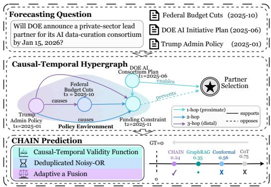  
Figure 1: An illustration of the proposed CHAIN.

widespread overconfidence (Xiao et al., 2025b), and calibration bias is heterogeneous across domains and question types (Niu et al., 2025; Luo et al., 2024), undermining the trustworthiness of probabilistic outputs for real-world decision-making under uncertainty (Zeng et al., 2025; Tao et al., 2025).

To calibrate predictions, post-hoc methods correct probability outputs after prediction (Geng et al., 2024), progressing from global parameter adjustment (Guo et al., 2017; Platt, 1999) to sampleadaptive (Xie et al., 2024a), semantic-level (Lamb et al., 2025), and alignment-aware (Xiao et al., 2025a) calibration. Non-parametric methods (Zadrozny & Elkan, 2002; 2001) and conformal prediction (Cherian et al., 2024; Manggala et al., 2024) provide distribution-free alternatives; promptbased methods (Zhang et al., 2024) elicit verbalized confidence. These methods correct outputs post hoc (Geng et al., 2024) without modeling the structural sources of bias in the prediction.

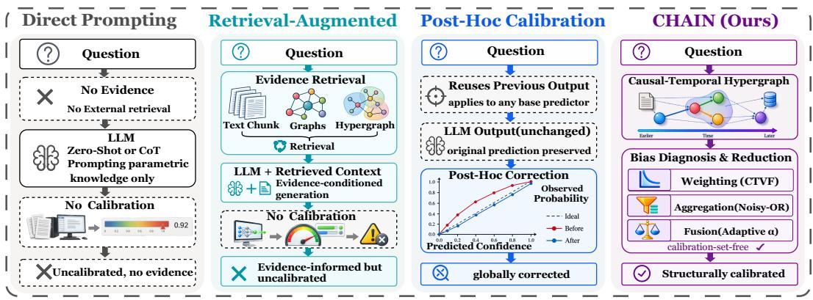  
Figure 2: Inference-time approaches to calibrated event forecasting: existing methods and CHAIN.

However, these methods still face three key challenges in calibration: (i) Evidence at different causal distances is treated equally, with no distinction between proximate causes and indirect background, causing distal evidence to influence estimates as much as proximal ones. (ii) Multiple retrieval paths referencing the same fact participate in estimation without deduplication, causing the model to treat redundant paths as independent evidence, leading to systematically inflated confidence. (iii) The reliability of external evidence and internal estimates varies across questions, yet existing methods fuse them in a fixed manner, lacking adaptive adjustment according to evidence quality.

To address these challenges, we decompose probabilistic prediction over causal-temporal hypergraphs into three stages of evidence weighting, aggregation, and source fusion, and propose CHAIN (see Figure 1), which employs stage-specific mechanisms to mitigate bias at each stage. First, we propose the Causal-Temporal Validity Function (CTVF), modulating temporal decay by causal topological distance, capturing recency and causal relevance across retrieved evidence. Furthermore, we introduce direction-aware deduplication with Noisy-OR aggregation over approximately independent causal paths, reducing redundant confidence accumulation. In addition, we design adaptive fusion driven by causal coverage and directional balance, weighted by evidence quality to adjust source contributions.

We conduct experiments on 8 cross-domain forecasting benchmarks with multiple LLMs. Experimental results show CHAIN outperforms the baselines (see Figure 2) in both calibration and accuracy, with ablations showing that each removal degrades final calibration or prediction performance, validating the effectiveness of structural diagnosis over causal-temporal hypergraphs for probability calibration.

## 2 RELATED WORK

Event Forecasting. Event forecasting assigns probabilities to events (Zou et al., 2022; Yuan et al., 2025). Direct prompting (Yuan et al., 2025; Lee et al., 2023), CoT (Wei et al., 2022), and retrieval methods (AutoCast++ (Yan et al., 2023); The Power of Simplicity (Zhang et al., 2025)) cover evidence-driven forecasting. Large-scale training (Lee et al., 2025), consistency checks (Paleka et al., 2024), and ensembles (Schoenegger et al., 2024) improve forecasts, while calibration varies across domains (Karkar & Chopra, 2025; Lu, 2025). GenTKG (Liao et al., 2024), INFER (Li et al., 2025), TPAR (Chen et al., 2024a), and zrLLM (Ding et al., 2024) perform graph extrapolation; context-aware modeling (Manggala et al., 2024) uses history. RAG (Gutiérrez et al., 2024; Luo et al., 2025) and multi-cognition aggregation (Wang et al., 2025) provide knowledge and multi-perspective fusion.

Probability Calibration. Calibration aligns predictions with observed frequencies (Geng et al., 2024). Post-hoc methods include temperature scaling (Guo et al., 2017), Platt scaling (Platt, 1999), ATS (Xie et al., 2024a), and internal consistency calibration (Xie et al., 2024b). Isotonic regression (Zadrozny & Elkan, 2002), histogram binning (Zadrozny & Elkan, 2001), and QA-calibration (Manggala et al., 2024) are non-parametric; ConU (Wang et al., 2024b) and enhanced conformal prediction (Cherian et al., 2024) provide distribution-free coverage guarantees. Just Ask (Tian et al., 2023) and Fidelity (Zhang et al., 2024) elicit confidence, while CFT (Xiao et al., 2025a) repairs alignment-induced degradation. Ca2KG (Ren et al., 2026) measures evidence-reliability variation, and Double-Calibration (Lu et al., 2026) calibrates evidence and reasoning confidence.

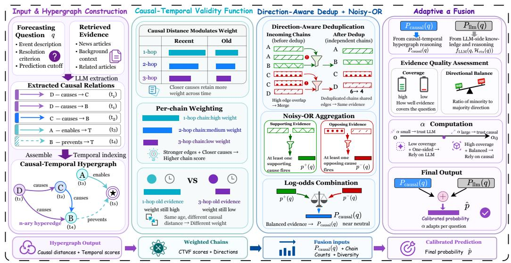  
Figure 3: The overall framework of CHAIN, with CTVF, Noisy-OR aggregation, and adaptive fusion.

## 3 PRELIMINARIES

Event Forecasting and Calibration. At prediction cutoff $t _ { c } ,$ the forecaster $f$ outputs for question q:

$$
p = f ( q , t _ { c } ) \in [ 0 , 1 ] , \quad y \in \{ 0 , 1 \} .\tag{1}
$$

Calibration quality is measured by the Expected Calibration Error (ECE), which is formally defined as $\begin{array} { r } { \mathrm { E C E } = \sum _ { b = 1 } ^ { B } ( n _ { b } / N ) | \bar { p } _ { b } - \bar { y } _ { b } | } \end{array}$ , where B is the number of equal-width bins, $n _ { b } , \bar { p } _ { b } , \bar { y } _ { b }$ are the size, mean prediction, and empirical frequency of bin b respectively, and N is the total sample count.

Causal-Temporal Hypergraph. Evidence is organized as a causal-temporal hypergraph:

$$
\mathcal { G } = ( V , E _ { H } , \mathcal { C } ) ,\tag{2}
$$

where V is the entity set; $( V _ { e } , t , s ) \in E _ { H }$ stores $V _ { e } \subseteq V _ { : }$ , the source-chunk timestamp $t ,$ and optional stored similarity $s \in [ 0 , 1 ]$ when available; and $( u , v , \mathrm { t y p e } , w ) \in \mathcal { C }$ is a directed edge, with type ∈ {causes, enables, prevents} and $w \in [ 0 , 1 ]$ . For each chunk x, ϕLLM returns propositions and typed edges $\mathcal { C } _ { x }$ ; the builder attaches t, s to form ${ \mathcal P } _ { x }$ before graph assembly:

$$
E _ { H } = \bigcup _ { x } \mathcal { P } _ { x } , \quad \mathcal { C } = \bigcup _ { x } \mathcal { C } _ { x } , \quad V = \bigcup _ { ( V _ { e } , t , s ) \in E _ { H } } V _ { e } .\tag{3}
$$

At inference time, a cutoff-conditioned constructor derives an active graph $\mathcal { G } _ { q }$ from the complete hypergraph, and both estimators use only this view:

$$
\begin{array} { r } { \mathcal { H } _ { \mathrm { c t x } } ( q ) = \mathrm { P r o m p t C o n t e x t } ( \mathcal { G } _ { q } , q , t _ { c } ) , \qquad P _ { \mathrm { l l m } } = f _ { \mathrm { L L M } } ( q , \mathcal { H } _ { \mathrm { c t x } } ( q ) ) \in [ 0 , 1 ] . } \end{array}\tag{4}
$$

Here $\mathcal { H } _ { \mathrm { c t x } } ( q )$ contains narratives, trajectories, contradictions, causal-context chains, source events, and prior outcomes; outcome mapping projects the estimate onto the binary axis.

Causal Topological Distance. Using $\operatorname { E n c } ( { \mathord { \cdot } } )$ , keyword-filtered dense reranking maps signed target descriptions from the reasoning-direction call to validated targets ${ \mathcal { T } } ( q ) \subseteq V _ { q }$ , with $a _ { q } ( v ) \in \{ - 1 , + \bar { 1 } \}$ marking the negative/positive axis side. For any node n in $\mathcal { G } _ { q }$ , define its shortest distance as:

$$
d ( n , q ) = \operatorname* { m i n } _ { v \in \mathcal { T } ( q ) } d _ { \mathcal { C } _ { q } } ( v , n ) ,\tag{5}
$$

where $d _ { C _ { q } }$ is the unweighted Breadth-First Search (BFS) distance on the reverse of $\mathcal { C } _ { q }$ (all types treated uniformly); a hyperedge e inherits $\begin{array} { r } { d ( e , q ) = \operatorname* { m i n } _ { v \in V _ { e } } d ( v , q ) ; } \end{array}$ ; unreachable nodes have $d = \infty$

## 4 METHOD: CHAIN

In this section, we introduce CHAIN (see Figure 3), which addresses calibration bias at three pipeline stages through the Causal-Temporal Validity Function for evidence weighting, direction-aware Noisy-OR for chain aggregation, and causal-coverage-balanced adaptive fusion for source combination.

## 4.1 CAUSAL-TEMPORAL VALIDITY FUNCTION

The CTVF assigns each piece of evidence in $\mathcal { G } _ { q }$ a validity $V _ { \mathrm { C T V F } } \in \left( 0 , 1 \right]$ reflecting temporal recency and causal proximity to $\tau ( q )$ , propagated along causal paths into chain-level confidences $\Phi ( \pi , q )$

Causal-Proximity Exponent. Using the causal topological distance $d ( n , q )$ defined in the preliminaries, a proximity exponent $\rho ( n , q ) \in [ 0 , 1 ]$ is obtained for every node n in the active graph with $n \in V _ { q } \cup E _ { H , q }$ by normalizing $d ( n , q )$ and clipping it against the reachability horizon $d _ { \operatorname* { m a x } } \in \mathbb { Z } ^ { + } ;$

$$
\rho ( n , q ) = \operatorname* { m i n } \left( \frac { d ( n , q ) } { d _ { \operatorname* { m a x } } } , 1 \right) .\tag{6}
$$

Thus $\rho = 0$ at the target, $\rho \in ( 0 , 1 )$ within the horizon, and $\rho = 1$ at or beyond it or for unreachable nodes; larger $\rho$ induces faster temporal decay for distant evidence.

Temporal Recency Component. For a hyperedge $e = ( V _ { e } , t , s ) \in E _ { H , q }$ with a parseable timestamp $t < t _ { c } ,$ let $\Delta t ( e ) \stackrel { \cdot } { = } \operatorname* { m a x } \{ 1 , ( t _ { c } - t ) _ { \mathrm { d a y s } } \}$ . The temporal recency component $\dot { V } _ { \mathrm { r e c } } ( e , q ) \in ( 0 , 1 ]$ is modeled as an exponential function of the logarithmic span, whose decay rate is scaled by $\rho ( e , q )$

$$
V _ { \mathrm { r e c } } ( e , q ) = \exp \Bigl ( - { \textstyle { \frac { 1 } { 2 } } } \rho ( e , q ) \cdot \ln \Delta t ( e ) \Bigr ) .\tag{7}
$$

At $\rho ( e , q ) = 0$ the exponent vanishes and $V _ { \mathrm { r e c } } = 1$ , so causally direct evidence retains full recency;   
at $\rho ( e , q ) = 1 , V _ { \mathrm { r e c } } = 1 / \sqrt { \Delta t ( e ) }$ , yielding maximal temporal decay for distant evidence.

Recurrence-Salience Component. Let $N ( e )$ count distinct admitted record IDs for e’s canonicalized proposition key, and let $M _ { r } ( e ) = s \in [ 0 , 1 ]$ be an optional stored similarity. The centered logistic coefficient $\mu ( N )$ amplifies co-supported evidence and suppresses low-signal singletons:

$$
\mu ( N ) = \frac { 1 } { 1 + \exp ( - \sqrt { N } / \eta ) } - \textstyle { \frac { 1 } { 2 } } , \qquad V _ { \mathrm { s a l } } ( e ) = \mu ( N ( e ) ) \cdot \sqrt { N ( e ) } \cdot M _ { r } ( e ) ,\tag{8}
$$

where $\eta > 0$ controls saturation; $\sqrt { N ( e ) }$ yields sub-linear recurrence amplification, and $M _ { r } ( e )$ optionally down-weights weak semantic matches under weak similarity.

CTVF Validity. For valid pre-cutoff timestamps, the two components are summed and capped at 1:

$$
V _ { \mathrm { C T V F } } ( e , q ) = \operatorname* { m i n } ( V _ { \mathrm { r e c } } ( e , q ) + V _ { \mathrm { s a l } } ( e ) , \ 1 ) .\tag{9}
$$

Known $t \geq t _ { c }$ is excluded; missing or unparseable t uses $v _ { \mathrm { f b } }$ only with a verified pre-cutoff availability bound. Entity scores average admitted incident-hyperedge values, with fallback 0.5 for aggregation.

Edge-Level Weight. For each directed causal edge $c = ( u , v , \mathrm { t y p e } , w ) \in \mathcal { C } _ { q } ,$ the CTVF-weighted edge scalar $\omega ( c ) \in [ 0 , 1 ]$ is the mean of the endpoint validities raised to an edge-level exponent $\rho _ { c } \mathrm { : }$

$$
\begin{array} { r } { \omega ( c ) = \big ( \frac { 1 } { 2 } \big ( V _ { \mathrm { C T V F } } ( u , q ) + V _ { \mathrm { C T V F } } ( v , q ) \big ) \big ) ^ { \rho _ { c } } , \qquad \rho _ { c } = \mathrm { m i n } \big ( \frac { d ( u , q ) + d ( v , q ) } { 2 d _ { \mathrm { m a x } } } , ~ 1 \big ) \in [ 0 , 1 ] . } \end{array}\tag{10}
$$

Edges located near the target receive a small $\rho _ { c }$ and keep their endpoint mean close to 1; meanwhile, distal edges have $\rho _ { c }  1$ and inherit the uncorrected raw mean validity $\omega ( c )$ of their endpoints.

Target-Termination Gate. Writing $c _ { \ell } = ( v _ { \ell - 1 } , v _ { \ell } , \mathrm { t y p e } _ { \ell } , w _ { \ell } )$ , a node-simple directed chain $\pi =$ $( c _ { 1 } , \ldots , c _ { L } ) , 1 \le L \le d _ { \operatorname* { m a x } }$ , is retained only when it terminates at an oriented target:

$$
\iota _ { q } ( \pi ) = \mathbb { 1 } [ v _ { L } \in \mathcal { T } ( q ) ] .\tag{11}
$$

Chain-Level Confidence. For every score-qualified candidate chain, the confidence $\Phi ( \pi , q ) \in [ 0 , 1 ]$ is the target-gated form of the ungated causal-chain score $\widetilde { \Phi } ( \pi , q )$ :

$$
\widetilde { \Phi } ( \pi , q ) = \prod _ { \ell = 1 } ^ { L } w _ { \ell } \omega ( c _ { \ell } ) , \qquad \Phi ( \pi , q ) = \iota _ { q } ( \pi ) \widetilde { \Phi } ( \pi , q ) .\tag{12}
$$

Forward breadth-first search expands at most $F _ { \mathrm { m a x } }$ outgoing edges per node and prunes prefixes whose ungated score is below $\tau _ { \Phi }$ . Only score-qualified chains terminating at oriented targets enter the top- $. B _ { \pi }$ pool $\Pi _ { q } ;$ otherwise the branch abstains from contributing evidence to the final forecast.

Proposition 1. Under normalized weighting, CTVF lowers weighting error versus uniform weighting byfavoring lower-error proximal evidence without increasing the weighted error within either subset.

Proof. We provide experimental results in Section 5.4 and theoretical proofs in Appendix A.1.

## 4.2 EVIDENCE AGGREGATION VIA DIRECTION-AWARE NOISY-OR

Direction-Aware Noisy-OR reduces redundant paths from acting as independent evidence through polarity-wise deduplication and neutral-anchored log-odds aggregation of directional evidence.

Causal Polarity Encoding. Each retained chain $\pi = ( c _ { 1 } , \ldots , c _ { L } ) $ receives a binary questionconditioned polarity $\delta _ { q } ( \pi ) \stackrel { - } { \in } \{ + 1 , - 1 \}$ . Let $P ( \pi )$ count its prevents edges; target orientation and relation parity determine the polarity partitions:

$$
\delta _ { q } ( \pi ) = a _ { q } ( v _ { L } ) ( - 1 ) ^ { P ( \pi ) } , \qquad \Pi _ { q } ^ { + } = \{ \pi \in \Pi _ { q } : \delta _ { q } ( \pi ) = + 1 \} , \quad \Pi _ { q } ^ { - } = \{ \pi \in \Pi _ { q } : \delta _ { q } ( \pi ) = - 1 \} .\tag{13}
$$

The endpoint orientation fixes the target’s positive/negative axis side and final polarity, while each prevents edge reverses the direction propagated along the chain during aggregation and fusion.

Same-Polarity Deduplication. Two same-polarity chains $\pi _ { i } , \pi _ { j }$ are treated as non-independent when their edge sets overlap excessively. Let $E ( \pi )$ denote the edge set of chain π; the Jaccard overlap is:

$$
J ( \pi _ { i } , \pi _ { j } ) = { \frac { | E ( \pi _ { i } ) \cap E ( \pi _ { j } ) | } { | E ( \pi _ { i } ) \cup E ( \pi _ { j } ) | } } .\tag{14}
$$

Within each polarity set $\Pi _ { q } ^ { \pm }$ , the chains are sorted in descending order of $\Phi ( \pi , q )$ and greedily added to $\widehat { \Pi } _ { q } ^ { \pm }$ for subsequent greedy selection: a chain π is admitted iff

$$
\operatorname* { m a x } _ { \pi ^ { \prime } \in \widehat { \Pi } _ { q } ^ { \pm } } J ( \pi , \pi ^ { \prime } ) \leq \theta ,\tag{15}
$$

Under the convention max $\mathcal { O } : = 0$ and overlap threshold $\theta \in ( 0 , 1 )$ , the procedure greedily retains each chain whose overlap with all previously retained chains is at most $\theta ,$ and discards the rest.

Polarity-Wise Noisy-OR. The surviving chains in each channel are combined under a within-polarity approximate-independence assumption. The resulting channel scores are:

$$
p ^ { + } ( q ) = 1 - \prod _ { \pi \in \widehat { \Pi } _ { q } ^ { + } } \bigl ( 1 - \Phi ( \pi , q ) \bigr ) , \qquad p ^ { - } ( q ) = 1 - \prod _ { \pi \in \widehat { \Pi } _ { q } ^ { - } } \bigl ( 1 - \Phi ( \pi , q ) \bigr ) ,\tag{16}
$$

Where $p ^ { + } ( q ) , p ^ { - } ( q ) \in [ 0 , 1 ]$ are the positive- and negative-channel aggregates, they summarize the surviving evidence in the two directional channels for downstream fusion.

Neutral-Anchored Log-Odds. For fixed $\varepsilon = 1 0 ^ { - 6 }$ , define $g _ { \varepsilon } ( p ) = \mathrm { l o g i t } ( \operatorname* { m i n } ( 1 - \varepsilon , \operatorname* { m a x } ( \varepsilon , ( 1 +$ $p ) / 2 ) )$ to map zero directional evidence to neutral log-odds and obtain the causal probability:

$$
P _ { \mathrm { c a u s a l } } ( q ) = \sigma \Bigl ( g _ { \varepsilon } ( p ^ { + } ( q ) ) - g _ { \varepsilon } ( p ^ { - } ( q ) ) \Bigr ) ,\tag{17}
$$

where $\mathrm { l o g i t } ( p ) = \ln ( p / ( 1 - p ) )$ and $\sigma ( z ) = 1 / ( 1 + e ^ { - z } )$ . The rule returns $1 / 2$ for empty or equally strong channels, increases continuously with $p ^ { + }$ , and decreases continuously with $p ^ { - }$ , and remains neutral when directional evidence is absent or balanced across both channels.

Proposition 2. Direction-aware deduplication can eliminate the same-polarity Noisy-OR probability inflation induced by overlap-identified redundant causal chains.

Proof. We provide experimental results in Section 5.4 and theoretical proofs in Appendix A.2.

## 4.3 SOURCE FUSION VIA CAUSAL-COVERAGE-BALANCED ADAPTIVE FUSION

Because evidence reliability varies, fixed weighting of $P _ { \mathrm { l l m } }$ and $P _ { \mathrm { c a u s a l } }$ may be suboptimal; adaptive fusion derives bounded $\alpha ( q )$ from retained evidence and blends them into $\hat { p } .$

Evidence Reliability. Let $k = | \widehat { \Pi } _ { q } ^ { + } | + | \widehat { \Pi } _ { q } ^ { - } |$ denote the number of approximately independent chains after deduplication. A logarithmic reliability score $\kappa ( k ) \in [ 0 , 1 ]$ saturates as more such chains accumulate:

$$
\kappa ( k ) = \operatorname* { m i n } \biggl ( \frac { \ln ( 1 + k ) } { \ln ( 1 + k _ { \mathrm { s a t } } ) } , 1 \biggr ) ,\tag{18}
$$

where $k _ { \mathrm { s a t } } \in \mathbb { Z } ^ { + }$ is a saturation anchor controlling the logarithmic curve. Hence $\kappa ( k )$ grows quickly with the first few independent chains and gradually saturates once their count k exceeds $k _ { \mathrm { s a t } }$

Directional Balance. A polarity-imbalance factor $\beta ( q ) \in [ 0 , 1 ]$ explicitly quantifies the relative evenness of the positive- and negative-polarity chain sets $\widehat { \Pi } _ { q } ^ { + }$ and $\widehat { \Pi } _ { q } ^ { - }$ via:

$$
\beta ( q ) = \frac { \operatorname* { m i n } \ ( \lvert \widehat { \Pi } _ { q } ^ { + } \rvert , \lvert \widehat { \Pi } _ { q } ^ { - } \rvert ) } { \operatorname* { m a x } ( \lvert \widehat { \Pi } _ { q } ^ { + } \rvert , \lvert \widehat { \Pi } _ { q } ^ { - } \rvert , 1 ) } .\tag{19}
$$

A value of $\beta ( q ) = 0$ indicates fully one-sided evidence, whereas $\beta ( q ) = 1$ indicates a perfectly balanced split between sides. To prevent one-sided evidence from being entirely discarded, $\beta ( q )$ is mapped through an affine floor $\widetilde { \beta } ( q ) = \beta _ { 0 } + \left( 1 - \beta _ { 0 } \right) \beta ( q ) \in [ \beta _ { 0 } , 1 ]$ with floor parameter $\beta _ { 0 } \in ( 0 , 1 )$

$$
\Omega ( q ) \in [ 0 , 1 ]
$$

$$
k ,
$$

$$
\begin{array} { r } { \bar { \Phi } ( q ) = \frac { 1 } { k } \sum _ { \pi \in \widehat { \Pi } _ { q } ^ { + } \cup \widehat { \Pi } _ { q } ^ { - } } \Phi ( \pi , q ) \left( 0 \right. } \end{array}
$$

$$
k = 0 )
$$

$$
\kappa ( k )
$$

$$
\widetilde { \beta } ( q )
$$

$$
\Omega ( q ) = \operatorname * { m i n } ( \frac { k \cdot \bar { \Phi } ( q ) \cdot \kappa ( k ) \cdot \widetilde { \beta } ( q ) } { Z } , 1 ) ,\tag{20}
$$

where $Z > 0$ is a predefined normalization constant. High $\Omega ( q )$ corresponds to abundant, strong, and balanced causal evidence, whereas low $\Omega ( q )$ corresponds to sparse, weak, or one-sided evidence.

Adaptive Fusion Weight. A coverage-driven sigmoid maps $\Omega ( q )$ to $\alpha ( q ) \in [ 0 , \alpha _ { 0 } ]$

$$
\alpha ( q ) = \mathbb { 1 } [ k > 0 ] \cdot \operatorname* { m i n } \bigl ( 2 \alpha _ { b } \sigma \bigl ( \zeta \left( \Omega ( q ) - \Omega _ { 0 } \right) \bigr ) , \ \alpha _ { 0 } \bigr ) ,\tag{21}
$$

where $\mathbb { 1 } [ \cdot ]$ is an indicator and σ is the sigmoid; $\alpha _ { b } > 0$ is the mapping scale, $0 < \alpha _ { 0 } \le 1$ is the fusion upper bound, $\Omega _ { 0 }$ is the coverage activation threshold, and $\zeta > 0$ is the sigmoid-transition sharpness.

Final Forecast. The final probability $\hat { p } \in [ 0 , 1 ]$ is the convex combination weighted by $\alpha ( q )$ :

$$
\begin{array} { r } { \hat { p } = \alpha ( q ) \cdot P _ { \mathrm { c a u s a l } } ( q ) + \big ( 1 - \alpha ( q ) \big ) \cdot P _ { \mathrm { l l m } } ( q ) . } \end{array}\tag{22}
$$

The causal contribution is zero when no chain is retained and otherwise increases with causal coverage up to $\alpha _ { 0 } .$ , while the complementary LLM contribution decreases accordingly.

Proposition 3. Adaptive fusion using causal coverage and directional balance down-weights the causal estimate when evidence is unreliable, and can yield lower squared error thanfixed weighting.

Proof. We provide experimental results in Section 5.6 and theoretical proofs in Appendix A.3.

## 5 EXPERIMENTS

In this section, we answer these following research questions (RQ): RQ1: whether CHAIN outperforms the baselines? RQ2: its generalization to out-of-distribution (OOD) datasets? RQ3: its components’ contributions to overall performance? RQ4: whether structural calibration outperforms post-hoc methods? RQ5: whether the adaptive fusion weight α outperforms any fixed alternative?

## 5.1 EXPERIMENTAL SETUP

Datasets. We use eight datasets: AI-Futures (LightningRodLabs, 2025a), Metaculus (Chandak et al., 2026), Polymarket (Polymarket, 2024), Future-as-Label (FaL) (Turtel et al., 2026), Clinical Trial Outcomes (CTO) (Gao et al., 2024), FOReCAst (Yuan et al., 2025), Golf-Forecasting (LightningRodLabs, 2025b), and KalshiBench (Nel, 2025). More details are shown in Appendix D.

Baselines. We compare CHAIN with 13 baselines: LLM Direct, LLM CoT, AutoCast, NaiveRAG, GraphRAG, LightRAG, HippoRAG, HyperGraphRAG, TempScaling, PlattScaling, IsotonicRegression, Histogram Binning, and ConformalAdj. More details are illustrated in Appendix E.

Evaluation Metrics. We use seven evaluation metrics, including Expected Calibration Error (ECE) (Guo et al., 2017), Adaptive Calibration Error (ACE) (Nixon et al., 2019), Maximum Calibration Error (MCE) (Guo et al., 2017), Reliability (Rel) (Murphy, 1973), Negative Log-Likelihood (NLL), Brier Score (Brier, 1950), and Accuracy (Acc). More details see Appendix F.

Implementation. We construct the causal-temporal hypergraph via GPT-4o-mini (Hurst et al., 2024) and evaluate CHAIN three LLMs, including GPT-4o-mini, Gemini-2.0-Flash (Kavukcuoglu, 2025), and DeepSeek-V3 (DeepSeek-AI et al., 2025). More details are illustrated in Appendix G.

Table 1: Main results of CHAIN and the baselines across four in-distribution forecasting datasets, which are reported on three LLMs with best in bold. All values are in %.
<table><tr><td rowspan=1 colspan=14>AI-Futures        Metaculus        Polymarket     Future-as-Label       AverageMethodECE↓ Brier↓ Acc↑ |ECE↓ Brier↓ Acc↑ |ECE↓ Brier↓ Acc↑ |ECE↓ Brier↓ Acc↑ |ECE↓ Brier↓ Acc↑</td></tr><tr><td rowspan=1 colspan=14>GPT-4o-mini</td></tr><tr><td rowspan=1 colspan=3>LLM Direct     15.0025.6959.38</td><td rowspan=1 colspan=3>22.2728.7952.34</td><td rowspan=1 colspan=3>20.0423.1970.31</td><td rowspan=1 colspan=3>21.2929.9753.91</td><td rowspan=1 colspan=2>19.6526.9158.98</td></tr><tr><td rowspan=1 colspan=3>LLM CoT      12.8920.2771.09</td><td rowspan=1 colspan=3>14.2223.5864.06</td><td rowspan=1 colspan=3>17.4224.8864.06</td><td rowspan=1 colspan=3>22.6229.7451.56</td><td rowspan=1 colspan=2>16.7924.6262.70</td></tr><tr><td rowspan=1 colspan=3>AutoCast      32.8532.4943.75</td><td rowspan=1 colspan=3>37.7737.4042.19</td><td rowspan=1 colspan=3>22.3825.5668.75</td><td rowspan=1 colspan=3>34.9235.3049.22</td><td rowspan=1 colspan=2>31.9832.6950.98</td></tr><tr><td rowspan=1 colspan=3>NaiveRAG     26.9928.7943.75</td><td rowspan=1 colspan=3>28.7130.7246.88</td><td rowspan=1 colspan=3>14.1823.9668.75</td><td rowspan=1 colspan=3>36.6436.6240.62</td><td rowspan=1 colspan=2>26.6330.0250.00</td></tr><tr><td rowspan=1 colspan=1>GraphRAG     33.05</td><td rowspan=1 colspan=2>34.3939.84</td><td rowspan=1 colspan=3>25.3528.8152.34</td><td rowspan=1 colspan=3>18.6723.7468.75</td><td rowspan=1 colspan=3>33.8336.2641.41</td><td rowspan=1 colspan=2>27.7230.8050.59</td></tr><tr><td rowspan=1 colspan=1>LightRAG     36.29</td><td rowspan=1 colspan=2>36.3841.41</td><td rowspan=1 colspan=3>28.4429.6751.56</td><td rowspan=1 colspan=3>25.9425.2467.19</td><td rowspan=1 colspan=3>21.6827.1960.16</td><td rowspan=1 colspan=2>28.0929.6255.08</td></tr><tr><td rowspan=1 colspan=1>HippoRAG     20.72</td><td rowspan=1 colspan=2>24.8059.38</td><td rowspan=1 colspan=3>28.5932.6449.22</td><td rowspan=1 colspan=3>16.4523.2270.31</td><td rowspan=1 colspan=3>29.6932.7753.12</td><td rowspan=1 colspan=2>23.8628.3658.01</td></tr><tr><td rowspan=1 colspan=1>HyperGraphRAG32.70</td><td rowspan=1 colspan=2>34.7145.31</td><td rowspan=1 colspan=3>31.6432.4646.09</td><td rowspan=1 colspan=3>22.7025.6967.19</td><td rowspan=1 colspan=3>25.5528.8457.03</td><td rowspan=1 colspan=2>28.1430.4353.91</td></tr><tr><td rowspan=1 colspan=1>TempScaling   14.14</td><td rowspan=1 colspan=2>23.8459.38</td><td rowspan=1 colspan=3>24.0029.6952.34</td><td rowspan=1 colspan=3>18.1522.8070.31</td><td rowspan=1 colspan=3>16.9927.5753.91</td><td rowspan=1 colspan=2>18.3225.9858.98</td></tr><tr><td rowspan=1 colspan=1>PlattScaling    31.84</td><td rowspan=1 colspan=1>31.77</td><td rowspan=1 colspan=1>33.59</td><td rowspan=1 colspan=1>24.98</td><td rowspan=1 colspan=2>29.6752.34</td><td rowspan=1 colspan=2>18.2423.12</td><td rowspan=1 colspan=1>70.31</td><td rowspan=1 colspan=2>27.3730.99</td><td rowspan=1 colspan=1>42.19</td><td rowspan=1 colspan=2>25.6128.8949.61</td></tr><tr><td rowspan=1 colspan=1>IsotonicReg    33.06</td><td rowspan=1 colspan=1>33.11</td><td rowspan=1 colspan=1>39.06</td><td rowspan=1 colspan=1>22.45</td><td rowspan=1 colspan=2>29.4052.34</td><td rowspan=1 colspan=2>18.3324.91</td><td rowspan=1 colspan=1>70.31</td><td rowspan=1 colspan=2>33.4136.40</td><td rowspan=1 colspan=1>42.19</td><td rowspan=1 colspan=2>26.8130.9650.98</td></tr><tr><td rowspan=1 colspan=1>HistogramBin   32.67</td><td rowspan=1 colspan=1>34.60</td><td rowspan=1 colspan=1>39.06</td><td rowspan=1 colspan=1>26.31</td><td rowspan=1 colspan=2>30.8450.78</td><td rowspan=1 colspan=2>17.2322.93</td><td rowspan=1 colspan=1>71.09</td><td rowspan=1 colspan=2>33.6837.83</td><td rowspan=1 colspan=1>43.75</td><td rowspan=1 colspan=2>27.4731.5551.17</td></tr><tr><td rowspan=1 colspan=1>ConformalAdj   15.41</td><td rowspan=1 colspan=2>24.0859.38</td><td rowspan=1 colspan=3>15.0424.8152.34</td><td rowspan=1 colspan=3>14.8323.5870.31</td><td rowspan=1 colspan=3>14.7224.9753.91</td><td rowspan=1 colspan=2>15.0024.3658.98</td></tr><tr><td rowspan=1 colspan=3>CHAIN (ours)  9.45 17.1577.34</td><td rowspan=1 colspan=3>7.52 18.7771.88</td><td rowspan=1 colspan=3>13.7419.54 71.88</td><td rowspan=1 colspan=3>10.2019.6867.97</td><td rowspan=1 colspan=2>10.2318.7972.27</td></tr><tr><td rowspan=1 colspan=6>Gemini</td><td rowspan=1 colspan=8>-2.0-Flash</td></tr><tr><td rowspan=1 colspan=1>LLM Direct     9.18</td><td rowspan=1 colspan=2>20.3267.97|</td><td rowspan=1 colspan=3>21.8925.5758.59</td><td rowspan=1 colspan=3>15.3922.57 71.88|</td><td rowspan=1 colspan=3>28.5233.2349.22</td><td rowspan=1 colspan=1>18.7425.42</td><td rowspan=1 colspan=1>61.91</td></tr><tr><td rowspan=1 colspan=1>LLM CoT      9.18</td><td rowspan=1 colspan=1>20.41</td><td rowspan=1 colspan=1>67.19</td><td rowspan=1 colspan=3>13.4321.9865.62</td><td rowspan=1 colspan=3>15.0020.4671.88</td><td rowspan=1 colspan=2>19.7728.34</td><td rowspan=1 colspan=1>53.91</td><td rowspan=1 colspan=1>14.3522.80</td><td rowspan=1 colspan=1>64.65</td></tr><tr><td rowspan=1 colspan=1>AutoCast      13.63</td><td rowspan=1 colspan=1>23.30</td><td rowspan=1 colspan=1>60.94</td><td rowspan=1 colspan=3>13.9124.7858.59</td><td rowspan=1 colspan=3>21.4825.1035.94</td><td rowspan=1 colspan=2>15.1226.80</td><td rowspan=1 colspan=1>57.03</td><td rowspan=1 colspan=1>16.0425.00</td><td rowspan=1 colspan=1>53.12</td></tr><tr><td rowspan=1 colspan=1>NaiveRAG      18.44</td><td rowspan=1 colspan=1>25.04</td><td rowspan=1 colspan=1>42.97</td><td rowspan=1 colspan=3>13.9122.7663.28</td><td rowspan=1 colspan=3>19.6925.3532.03</td><td rowspan=1 colspan=2>14.7025.28</td><td rowspan=1 colspan=1>57.81</td><td rowspan=1 colspan=1>16.6824.61</td><td rowspan=1 colspan=1>49.02</td></tr><tr><td rowspan=1 colspan=1>GraphRAG     12.15</td><td rowspan=1 colspan=2>22.0157.81</td><td rowspan=1 colspan=3>14.9723.5659.38</td><td rowspan=1 colspan=3>23.1924.2768.75</td><td rowspan=1 colspan=3>19.2729.8845.31</td><td rowspan=1 colspan=1>17.3924.93</td><td rowspan=1 colspan=1>57.81</td></tr><tr><td rowspan=1 colspan=1>LightRAG      14.96</td><td rowspan=1 colspan=1>23.03</td><td rowspan=1 colspan=1>57.81</td><td rowspan=1 colspan=3>14.4921.4866.41</td><td rowspan=1 colspan=3>29.3426.8646.09</td><td rowspan=1 colspan=3>15.8224.7658.59</td><td rowspan=1 colspan=1>18.6524.03</td><td rowspan=1 colspan=1>57.23</td></tr><tr><td rowspan=1 colspan=1>HippoRAG     10.39</td><td rowspan=1 colspan=1>19.49</td><td rowspan=1 colspan=1>67.19</td><td rowspan=1 colspan=3>16.0223.9460.94</td><td rowspan=1 colspan=3>26.8026.0039.84</td><td rowspan=1 colspan=3>17.3025.5159.38</td><td rowspan=1 colspan=1>17.6323.73</td><td rowspan=1 colspan=1>56.84</td></tr><tr><td rowspan=1 colspan=1>HyperGraphRAG13.40</td><td rowspan=1 colspan=1>24.31</td><td rowspan=1 colspan=1>56.25</td><td rowspan=1 colspan=1>14.45</td><td rowspan=1 colspan=2>22.5164.84</td><td rowspan=1 colspan=1>23.75</td><td rowspan=1 colspan=2>24.7935.94</td><td rowspan=1 colspan=1>17.15</td><td rowspan=1 colspan=2>23.6256.25</td><td rowspan=1 colspan=1>17.1923.81</td><td rowspan=1 colspan=1>53.32</td></tr><tr><td rowspan=1 colspan=1>TempScaling    8.13</td><td rowspan=1 colspan=1>20.21</td><td rowspan=1 colspan=1>67.97</td><td rowspan=1 colspan=1>15.62</td><td rowspan=1 colspan=2>23.2858.59</td><td rowspan=1 colspan=1>16.55</td><td rowspan=1 colspan=2>22.7871.88</td><td rowspan=1 colspan=1>18.67</td><td rowspan=1 colspan=2>28.6849.22</td><td rowspan=1 colspan=1>14.7423.74</td><td rowspan=1 colspan=1>61.91</td></tr><tr><td rowspan=1 colspan=1>PlattScaling    26.96</td><td rowspan=1 colspan=1>27.19</td><td rowspan=1 colspan=1>43.75</td><td rowspan=1 colspan=1>20.71</td><td rowspan=1 colspan=1>26.29</td><td rowspan=1 colspan=1>57.81</td><td rowspan=1 colspan=1>14.90</td><td rowspan=1 colspan=1>21.80</td><td rowspan=1 colspan=1>71.88</td><td rowspan=1 colspan=1>28.13</td><td rowspan=1 colspan=1>33.68</td><td rowspan=1 colspan=1>44.53</td><td rowspan=1 colspan=1>22.6727.24</td><td rowspan=1 colspan=1>54.49</td></tr><tr><td rowspan=1 colspan=1>IsotonicReg    26.27</td><td rowspan=1 colspan=1>27.48</td><td rowspan=1 colspan=1>54.69</td><td rowspan=1 colspan=1>22.80</td><td rowspan=1 colspan=1>28.37</td><td rowspan=1 colspan=1>64.06</td><td rowspan=1 colspan=2>23.4325.48</td><td rowspan=1 colspan=1>43.75</td><td rowspan=1 colspan=1>29.47</td><td rowspan=1 colspan=1>35.52</td><td rowspan=1 colspan=1>44.53</td><td rowspan=1 colspan=1>25.4929.21</td><td rowspan=1 colspan=1>51.76</td></tr><tr><td rowspan=1 colspan=1>HistogramBin   25.82</td><td rowspan=1 colspan=1>28.70</td><td rowspan=1 colspan=1>54.69</td><td rowspan=1 colspan=1>24.67</td><td rowspan=1 colspan=1>34.65</td><td rowspan=1 colspan=1>53.91</td><td rowspan=1 colspan=2>26.4929.39</td><td rowspan=1 colspan=1>44.53</td><td rowspan=1 colspan=1>29.39</td><td rowspan=1 colspan=1>35.89</td><td rowspan=1 colspan=1>42.19</td><td rowspan=1 colspan=1>26.5932.16</td><td rowspan=1 colspan=1>48.83</td></tr><tr><td rowspan=1 colspan=1>ConformalAdj   13.29</td><td rowspan=1 colspan=1>22.44</td><td rowspan=1 colspan=1>67.97</td><td rowspan=1 colspan=1>13.20</td><td rowspan=1 colspan=1>23.61</td><td rowspan=1 colspan=1>58.59</td><td rowspan=1 colspan=2>17.1123.31</td><td rowspan=1 colspan=1>71.88</td><td rowspan=1 colspan=2>11.7425.53</td><td rowspan=1 colspan=1>49.22</td><td rowspan=1 colspan=1>13.8323.72</td><td rowspan=1 colspan=1>61.91</td></tr><tr><td rowspan=1 colspan=1>CHAIN (ours)  7.10</td><td rowspan=1 colspan=1>17.19</td><td rowspan=1 colspan=1>73.44</td><td rowspan=1 colspan=2>7.05 17.73</td><td rowspan=1 colspan=1>74.22</td><td rowspan=1 colspan=2>14.8718.967</td><td rowspan=1 colspan=1>5.00</td><td rowspan=1 colspan=2>9.7219.96</td><td rowspan=1 colspan=1>68.75</td><td rowspan=1 colspan=1>9.6818.46</td><td rowspan=1 colspan=1>72.85</td></tr><tr><td rowspan=1 colspan=3></td><td rowspan=1 colspan=3>DeepS</td><td rowspan=1 colspan=6>eek-V3</td><td rowspan=1 colspan=2></td></tr><tr><td rowspan=1 colspan=3>LLM Direct     9.3421.1768.75</td><td rowspan=1 colspan=3>20.9026.6954.69</td><td rowspan=1 colspan=3>15.4320.7174.22</td><td rowspan=1 colspan=3>19.6929.1654.69</td><td rowspan=1 colspan=1>16.3424.43</td><td rowspan=1 colspan=1>63.09</td></tr><tr><td rowspan=1 colspan=1>LLM CoT      11.48</td><td rowspan=1 colspan=2>21.6266.41</td><td rowspan=1 colspan=2>12.4918.86</td><td rowspan=1 colspan=1>71.88</td><td rowspan=1 colspan=2>14.7020.63</td><td rowspan=1 colspan=1>71.88</td><td rowspan=1 colspan=2>15.7226.99</td><td rowspan=1 colspan=1>59.38</td><td rowspan=1 colspan=1>13.6022.03</td><td rowspan=1 colspan=1>67.38</td></tr><tr><td rowspan=1 colspan=1>AutoCast      15.43</td><td rowspan=1 colspan=2>24.3753.91</td><td rowspan=1 colspan=2>19.7327.06</td><td rowspan=1 colspan=1>56.25</td><td rowspan=1 colspan=2>20.4324.73</td><td rowspan=1 colspan=1>43.75</td><td rowspan=1 colspan=2>17.5828.47</td><td rowspan=1 colspan=1>51.56</td><td rowspan=1 colspan=1>18.2926.16</td><td rowspan=1 colspan=1>51.37</td></tr><tr><td rowspan=1 colspan=1>NaiveRAG      11.91</td><td rowspan=1 colspan=2>21.3163.28</td><td rowspan=1 colspan=2>19.8825.19</td><td rowspan=1 colspan=1>57.81</td><td rowspan=1 colspan=2>16.9523.54</td><td rowspan=1 colspan=1>58.59</td><td rowspan=1 colspan=2>24.3429.42</td><td rowspan=1 colspan=1>47.66</td><td rowspan=1 colspan=1>18.2724.87</td><td rowspan=1 colspan=1>56.84</td></tr><tr><td rowspan=1 colspan=1>GraphRAG     16.99</td><td rowspan=1 colspan=2>23.5758.59</td><td rowspan=1 colspan=3>18.9825.6458.59</td><td rowspan=1 colspan=3>15.1220.4473.44</td><td rowspan=1 colspan=2>24.3430.76</td><td rowspan=1 colspan=1>47.66</td><td rowspan=1 colspan=1>18.8625.10</td><td rowspan=1 colspan=1>59.57</td></tr><tr><td rowspan=1 colspan=1>LightRAG      17.97</td><td rowspan=1 colspan=2>24.1458.59</td><td rowspan=1 colspan=3>17.0322.8964.06</td><td rowspan=1 colspan=3>15.9023.2866.41</td><td rowspan=1 colspan=2>19.6126.66</td><td rowspan=1 colspan=1>57.03</td><td rowspan=1 colspan=1>17.6324.24</td><td rowspan=1 colspan=1>61.52</td></tr><tr><td rowspan=1 colspan=1>HippoRAG     10.39</td><td rowspan=1 colspan=2>19.2469.53</td><td rowspan=1 colspan=3>16.7623.8664.06</td><td rowspan=1 colspan=3>15.6620.8671.09</td><td rowspan=1 colspan=3>11.7620.8867.97</td><td rowspan=1 colspan=1>13.6421.21</td><td rowspan=1 colspan=1>68.16</td></tr><tr><td rowspan=1 colspan=1>HyperGraphRAG19.73</td><td rowspan=1 colspan=2>25.9055.47</td><td rowspan=1 colspan=3>23.9825.0259.38</td><td rowspan=1 colspan=3>16.0920.7871.09</td><td rowspan=1 colspan=2>12.7719.43</td><td rowspan=1 colspan=1>71.09</td><td rowspan=1 colspan=1>18.1422.78</td><td rowspan=1 colspan=1>64.26</td></tr><tr><td rowspan=1 colspan=1>TempScaling    8.85</td><td rowspan=1 colspan=2>20.7968.75</td><td rowspan=1 colspan=3>16.0524.4454.69</td><td rowspan=1 colspan=3>16.4221.5874.22</td><td rowspan=1 colspan=2>13.4126.23</td><td rowspan=1 colspan=1>54.69</td><td rowspan=1 colspan=1>13.6823.26</td><td rowspan=1 colspan=1>63.09</td></tr><tr><td rowspan=1 colspan=1>PlattScaling    25.71</td><td rowspan=1 colspan=1>26.76</td><td rowspan=1 colspan=1>64.84</td><td rowspan=1 colspan=2>24.7128.75</td><td rowspan=1 colspan=1>53.12</td><td rowspan=1 colspan=1>13.82</td><td rowspan=1 colspan=1>20.86</td><td rowspan=1 colspan=1>75.00</td><td rowspan=1 colspan=2>28.5431.79</td><td rowspan=1 colspan=1>44.53</td><td rowspan=1 colspan=1>23.2027.04</td><td rowspan=1 colspan=1>59.38</td></tr><tr><td rowspan=1 colspan=2>IsotonicReg     24.7225.57</td><td rowspan=1 colspan=1>68.75</td><td rowspan=1 colspan=2>25.4830.33</td><td rowspan=1 colspan=1>54.69</td><td rowspan=1 colspan=1>27.55</td><td rowspan=1 colspan=1>26.89</td><td rowspan=1 colspan=1>33.59</td><td rowspan=1 colspan=2>31.0534.61</td><td rowspan=1 colspan=1>44.53</td><td rowspan=1 colspan=1>27.2029.35</td><td rowspan=1 colspan=1>50.39</td></tr><tr><td rowspan=1 colspan=2>HistogramBin   30.5327.63</td><td rowspan=1 colspan=1>53.12</td><td rowspan=1 colspan=2>26.6230.51</td><td rowspan=1 colspan=1>53.12</td><td rowspan=1 colspan=1>29.59</td><td rowspan=1 colspan=1>28.42</td><td rowspan=1 colspan=1>32.81</td><td rowspan=1 colspan=2>32.6535.49</td><td rowspan=1 colspan=1>50.78</td><td rowspan=1 colspan=1>29.8530.51</td><td rowspan=1 colspan=1>47.46</td></tr><tr><td rowspan=1 colspan=3>ConformalAdj   13.5322.8068.75</td><td rowspan=1 colspan=2>13.2724.12</td><td rowspan=1 colspan=1>54.69</td><td rowspan=1 colspan=2>18.9623.01</td><td rowspan=1 colspan=1>74.22</td><td rowspan=1 colspan=2>11.7224.81</td><td rowspan=1 colspan=1>54.69</td><td rowspan=1 colspan=1>14.3723.68</td><td rowspan=1 colspan=1>63.09</td></tr><tr><td rowspan=1 colspan=3>CHAIN (ours)  8.54 17.3476.56</td><td rowspan=1 colspan=3>9.72 18.0573.44</td><td rowspan=1 colspan=3>13.7417.4179.69</td><td rowspan=1 colspan=3>10.0918.8272.66</td><td rowspan=1 colspan=1>10.5217.91</td><td rowspan=1 colspan=1>75.59</td></tr></table>

## 5.2 MAIN RESULTS (RQ1)

Table 1 shows the main results for three LLMs across four in-distribution datasets. (i) Joint calibration and accuracy. CHAIN has the lowest ECE and Brier and the highest accuracy, improving calibration without sacrificing performance. (ii) Prompting and retrieval remain insufficient. Direct prompting has higher calibration error, while retrieval gains vary, so added evidence alone does not ensure calibrated forecasts. (iii) Post-hoc correction leaves a gap. Post-hoc methods retain higher calibration error and sometimes reduce accuracy, showing that output correction alone is insufficient. (iv) Backbone-agnostic gains. CHAIN leads across all three backbones, with lower average ECE and Brier and higher accuracy, showing consistent gains across these evaluated models.

## 5.3 OUT-OF-DISTRIBUTION GENERALIZATION (RQ2)

Table 2 and Figure 4 show the results for the same three LLMs across four out-of-distribution datasets. (i) Calibration transfers to OOD. CHAIN attains the lowest ECE and Brier, maintaining its calibration advantage as forecasting tasks move beyond the in-distribution benchmarks. (ii) Accuracy remains highest under shift. CHAIN leads in the OOD results, showing that lower calibration error does not come at the expense of prediction accuracy under distribution shift. (iii) Gains persist across backbones. Calibration and accuracy advantages recur across models, indicating that the improvements are not tied to one model’s forecasting capability or one source. (iv) Joint calibration– accuracy gains. Lower average ECE and Brier accompany higher accuracy, indicating balanced improvements in both the quality of probability estimates and the correctness of event predictions.

Table 2: Performance comparison of CHAIN and the baselines on 4 OOD datasets across 2 LLMs.
<table><tr><td rowspan="2">Method</td><td colspan="3">CTO</td><td colspan="3">FOReCAst</td><td colspan="3">Golf-Forecasting</td><td colspan="3">KalshiBench</td><td colspan="3">Average</td></tr><tr><td>ECE↓ Brier↓ Acc↑ |ECE↓ Brier↓ Acc↑ |ECE↓ Brier↓ Acc↑|ECE↓ Brier↓ Acc↑ |ECE↓ Brier↓ Acc↑</td><td></td><td></td><td></td><td></td><td></td><td></td><td></td><td></td><td></td><td></td><td></td><td></td><td></td><td></td></tr><tr><td colspan="10">GPT-4o-mini</td><td></td><td></td><td></td><td></td><td></td><td></td></tr><tr><td>LLM Direct</td><td>18.83</td><td>27.61</td><td>55.47</td><td>12.27</td><td>23.43</td><td>67.19|</td><td>19.77</td><td>27.18</td><td>53.91</td><td>20.04</td><td>27.81</td><td>59.38</td><td>17.72</td><td>26.51</td><td>58.98</td></tr><tr><td>LLM CoT</td><td>18.12</td><td>26.88</td><td>56.25</td><td>16.37</td><td>24.78</td><td>60.16</td><td>11.25</td><td>25.13</td><td>60.16</td><td>16.51</td><td>26.71</td><td>57.81</td><td>15.56</td><td>25.88</td><td>58.59</td></tr><tr><td>AutoCast</td><td>42.50</td><td>43.07</td><td>42.19</td><td>26.09</td><td>28.93</td><td>59.38</td><td>45.35</td><td>43.72</td><td>47.66</td><td>44.30</td><td>44.26</td><td>41.41</td><td>39.56</td><td>39.99</td><td>47.66</td></tr><tr><td>NaiveRAG</td><td>30.04</td><td>32.62</td><td>42.97</td><td>30.35</td><td>33.02</td><td>50.00</td><td>24.14</td><td>30.31</td><td>48.44</td><td>30.94</td><td>34.34</td><td>44.53</td><td>28.87</td><td>32.57</td><td>46.48</td></tr><tr><td>GraphRAG</td><td>23.79</td><td>29.67</td><td>48.44</td><td>22.27</td><td>28.45</td><td>57.81</td><td>23.16</td><td>30.17</td><td>48.44</td><td>25.70</td><td>31.29</td><td>50.00</td><td>23.73</td><td>29.90</td><td>51.17</td></tr><tr><td>LightRAG</td><td>31.60</td><td>33.38</td><td>42.97</td><td>13.79</td><td>23.92</td><td>68.75</td><td>30.00</td><td>34.43</td><td>45.31</td><td>27.62</td><td>29.51</td><td>55.47</td><td>25.75</td><td>30.31</td><td>53.12</td></tr><tr><td>HippoRAG</td><td>27.27</td><td>30.53</td><td>44.53</td><td>18.63</td><td>25.82</td><td>64.06</td><td>31.64</td><td>34.07</td><td>46.09</td><td>33.20</td><td>34.35</td><td>50.78</td><td>27.69</td><td>31.19</td><td>51.37</td></tr><tr><td>HyperGraphRAG</td><td>33.09</td><td>34.63</td><td>42.19</td><td>21.41</td><td>28.23</td><td>59.38</td><td>31.41</td><td>34.32</td><td>45.31</td><td>27.54</td><td>31.56</td><td>52.34</td><td>28.36</td><td>32.19</td><td>49.80</td></tr><tr><td>TempScaling</td><td>9.57</td><td>24.86</td><td>55.47</td><td>10.52</td><td>22.38</td><td>67.19</td><td>13.62</td><td>24.82</td><td>53.91</td><td>13.45</td><td>24.76</td><td>59.38</td><td>11.79</td><td>24.21</td><td>58.98</td></tr><tr><td>PlattScaling</td><td>31.70</td><td>34.35</td><td>42.19</td><td>31.50</td><td>32.99</td><td>46.88</td><td>34.90</td><td>36.12</td><td>44.53</td><td>37.15</td><td>36.89</td><td>39.84</td><td>33.81</td><td>35.09</td><td>43.36</td></tr><tr><td>IsotonicReg</td><td>29.93</td><td>33.28</td><td>42.19</td><td>34.82</td><td>34.56</td><td>46.88</td><td>32.32</td><td>34.55</td><td>44.53</td><td>37.69</td><td>38.53</td><td>39.84</td><td>33.69</td><td>35.23</td><td>43.36</td></tr><tr><td>HistogramBin</td><td>34.10</td><td>35.92</td><td>46.09</td><td>31.42</td><td>31.50</td><td>58.59</td><td>31.24</td><td>33.71</td><td>50.78</td><td>33.09</td><td>36.25</td><td>50.78</td><td>32.46</td><td>34.34</td><td>51.56</td></tr><tr><td>ConformalAdj</td><td>4.45</td><td>24.53</td><td>55.47</td><td>14.43 9.95</td><td>23.06</td><td>67.19</td><td>8.79</td><td>24.59</td><td>53.91</td><td>10.73</td><td>24.19</td><td>59.38</td><td>9.60</td><td>24.09</td><td>58.98</td></tr><tr><td>CHAIN (ours)</td><td>4.36</td><td>22.63</td><td>64.84</td><td></td><td>19.83</td><td>69.53</td><td>8.19</td><td>23.64</td><td>62.50</td><td>9.85</td><td>23.39</td><td>61.72</td><td>8.09</td><td>22.37</td><td>64.65</td></tr><tr><td colspan="10">Gemini-2.0-Flash</td><td colspan="7"></td></tr><tr><td>LLM Direct</td><td>12.66</td><td>23.16</td><td>63.28</td><td>9.38</td><td>20.00</td><td>71.88</td><td>13.67</td><td>26.92</td><td>57.81</td><td>21.28</td><td>26.87</td><td>60.16</td><td>14.25</td><td>24.23</td><td>63.28</td></tr><tr><td>LLM CoT</td><td>11.88</td><td>23.95</td><td>63.28</td><td>11.05</td><td>21.98</td><td>67.19</td><td>23.01</td><td>30.51</td><td>50.00</td><td>19.98</td><td>25.99</td><td>60.16</td><td>16.48</td><td>25.61</td><td>60.16</td></tr><tr><td>AutoCast</td><td>7.93</td><td>24.92</td><td>57.81</td><td>11.76</td><td>24.19</td><td>56.25</td><td>11.48</td><td>26.19</td><td>58.59</td><td>11.37</td><td>26.36</td><td>56.25</td><td>10.63</td><td>25.41</td><td>57.23</td></tr><tr><td>NaiveRAG</td><td>9.62</td><td>24.56</td><td>55.47</td><td>20.10</td><td>26.82</td><td>43.75</td><td>5.82</td><td>24.05</td><td>55.47</td><td>11.73</td><td>25.29</td><td>58.59</td><td>11.82</td><td>25.18</td><td>53.32</td></tr><tr><td>GraphRAG</td><td>7.70</td><td>24.44</td><td>54.69</td><td>9.88</td><td>21.63</td><td>69.53</td><td>7.30</td><td>24.59</td><td>60.16</td><td>18.24</td><td>26.26</td><td>53.12</td><td>10.78</td><td>24.23</td><td>59.38</td></tr><tr><td>LightRAG</td><td>11.87</td><td>26.09</td><td>50.00</td><td>17.54</td><td>22.76</td><td>68.75</td><td>6.84</td><td>25.14</td><td>53.12</td><td>13.44</td><td>23.35</td><td>56.25</td><td>12.42</td><td>24.34</td><td>57.03</td></tr><tr><td>HippoRAG</td><td>12.89</td><td>24.30</td><td>55.47</td><td>16.60</td><td>21.09</td><td>70.31</td><td>12.28</td><td>28.16</td><td>43.75</td><td>21.25</td><td>25.65</td><td>50.78</td><td>15.76</td><td>24.80</td><td>55.08</td></tr><tr><td>HyperGraphRAG</td><td>7.07</td><td>23.62</td><td>59.38</td><td>17.30</td><td>24.49</td><td>61.72</td><td>7.73</td><td>24.45</td><td>58.59</td><td>12.03</td><td>24.20</td><td>56.25</td><td>11.04</td><td>24.19</td><td>58.98</td></tr><tr><td>TempScaling</td><td>4.71</td><td>22.27</td><td>63.28</td><td>10.57</td><td>19.74</td><td>71.88</td><td>7.40</td><td>24.84</td><td>57.81</td><td>14.47</td><td>23.56</td><td>60.16</td><td>9.29</td><td>22.60</td><td>63.28</td></tr><tr><td>PlattScaling</td><td>29.91 29.65</td><td>31.62 32.14</td><td>42.19 44.53</td><td>27.91 23.38</td><td>28.22 27.25</td><td>46.88 56.25</td><td>31.53 31.80</td><td>34.05 34.88</td><td>44.53 45.31</td><td>31.83 33.60</td><td>33.08 34.62</td><td>39.84 48.44</td><td>30.30 29.61</td><td>31.74</td><td>43.36 48.63</td></tr><tr></table>

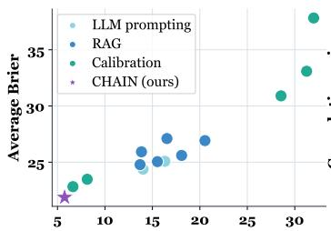  
(a) Pareto calibration trade-off

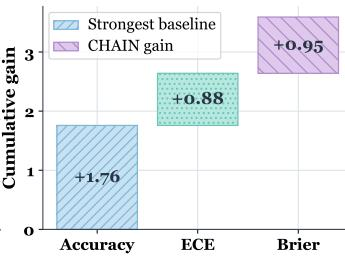  
(b) Cumulative gains

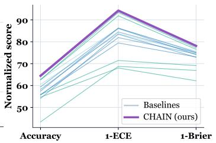  
(c) Cross-metric performance  
Figure 4: Calibration and predictive performance of CHAIN for four OOD datasets on DeepSeek-V3.

## 5.4 ABLATION STUDY (RQ3)

As shown in Table 3, CHAIN’s three components each contribute to calibration and prediction accuracy: (i) CTVF and Noisy-OR improve calibration. Removing either component raises ECE on every dataset, showing that temporal-causal validity weighting and direction-aware aggregation both improve the quality of predicted probabilities. (ii) Noisy-OR safeguards OOD accuracy. Removing Noisy-OR causes the largest accuracy drop on each OOD dataset, demonstrating the role of direction-aware aggregation in maintaining OOD prediction accuracy. (iii) Adaptive α tightens residual calibration. Replacing per-instance fusion with a fixed weight raises ECE on every dataset, showing that question-level reweighting improves calibration and predictive accuracy.

Table 3: Ablation study of CHAIN, where w/o means without the corresponding component.
<table><tr><td rowspan="2">Method</td><td colspan="3">AI-Futures</td><td colspan="3">Metaculus</td><td colspan="3">Polymarket</td><td colspan="3">Future-as-Label</td></tr><tr><td>ECE↓</td><td>Brier↓</td><td>Acc↑</td><td>ECE↓</td><td>Brier↓</td><td>Acc↑</td><td>ECE↓</td><td>Brier↓</td><td>Acc↑</td><td>ECE↓</td><td>Brier↓</td><td>Acc↑</td></tr><tr><td>w/o CTVF</td><td>11.68</td><td>19.43</td><td>73.44</td><td>10.65</td><td>19.59</td><td>72.66</td><td>19.73</td><td>17.54</td><td>75.00</td><td>10.91</td><td>23.15</td><td>63.28</td></tr><tr><td>w/o Noisy-OR</td><td>12.79</td><td>19.37</td><td>75.78</td><td>12.61</td><td>19.72</td><td>71.09</td><td>16.22</td><td>17.86</td><td>78.91</td><td>11.03</td><td>19.78</td><td>71.88</td></tr><tr><td>w/o Adaptive α</td><td>11.25</td><td>17.66</td><td>75.78</td><td>10.40</td><td>18.27</td><td>72.66</td><td>14.39</td><td>17.66</td><td>77.34</td><td>10.16</td><td>19.68</td><td>71.88</td></tr><tr><td>CHAIN (Full)</td><td>8.54</td><td>17.34</td><td>76.56</td><td>9.72</td><td>18.05</td><td>73.44</td><td>13.74</td><td>17.41</td><td>79.69</td><td>10.09</td><td>18.82</td><td>72.66</td></tr></table>

<table><tr><td rowspan="2">Method</td><td colspan="3">CTO</td><td colspan="3">FOReCAst</td><td colspan="3">Golf-Forecasting</td><td colspan="3">KalshiBench</td></tr><tr><td>ECE↓</td><td>Brier↓</td><td>Acc↑</td><td>ECE↓</td><td>Brier↓</td><td>Acc↑</td><td>ECE↓</td><td>Brier↓</td><td>Acc↑</td><td>ECE↓</td><td>Brier↓</td><td>Acc↑</td></tr><tr><td>w/o CTVF</td><td>7.24</td><td>22.92</td><td>60.94</td><td>8.73</td><td>17.95</td><td>73.44</td><td>7.44</td><td>24.59</td><td>57.81</td><td>13.33</td><td>24.42</td><td>60.94</td></tr><tr><td>w/o Noisy-OR</td><td>5.02</td><td>23.47</td><td>60.16</td><td>8.43</td><td>18.87</td><td>72.66</td><td>7.76</td><td>24.02</td><td>57.03</td><td>9.13</td><td>23.20</td><td>60.16</td></tr><tr><td>w/o Adaptive α</td><td>3.72</td><td>22.85</td><td>61.72</td><td>7.35</td><td>18.17</td><td>73.44</td><td>6.52</td><td>24.00</td><td>57.81</td><td>9.04</td><td>22.98</td><td>61.72</td></tr><tr><td>CHAIN (Full)</td><td>3.61</td><td>22.73</td><td>62.50</td><td>6.98</td><td>17.90</td><td>74.22</td><td>5.15</td><td>23.91</td><td>58.59</td><td>7.25</td><td>22.95</td><td>62.50</td></tr></table>

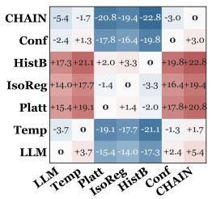  
(a) ACE.

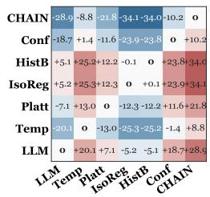  
(b) MCE.

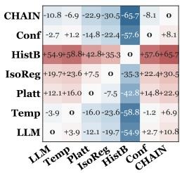  
(c) NLL (×100).

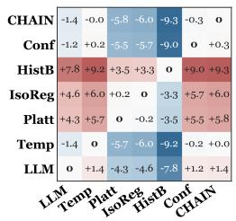  
(d) Rel.  
Figure 5: Comparison of CHAIN and post-hoc calibration methods on DeepSeek-V3 (lower is better).

## 5.5 STRUCTURAL CALIBRATION VS POST-HOC FITTING (RQ4)

Figure 5 shows that, on the pooled eight-dataset evaluation, CHAIN outperforms all post-hoc baselines across all four metrics. (i) Pairwise dominance. CHAIN attains the lowest ACE, MCE, NLL, and Rel. (ii) Worst-bin calibration error suppressed. CHAIN reduces MCE relative to every post-hoc baseline, combining lower worst-bin error with improved average probability quality. (iii) Post-hoc fitting can exacerbate miscalibration. Platt, Isotonic, and Histogram Binning have higher ACE and Rel than LLM Direct, while CHAIN records the lowest values for both calibration metrics.

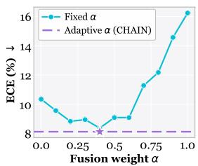  
(a) ECE.

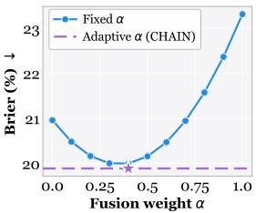  
(b) Brier.  
Figure 6: DeepSeek-V3 macro-average ECE/Brier over eight ID/OOD datasets: adaptive vs. fixed α.

## 5.6 ADAPTIVE α VS FIXED (RQ5)

As shown in Figure 6, the fixed-α sensitivity analysis reveals three patterns in the eight-dataset macro-average: (i) Point-estimate comparison. Adaptive α yields lower ECE and Brier than every evaluated fixed α, revealing a consistent advantage over fixed fusion. (ii) Fixed-weight sensitivity. ECE and Brier vary across fixed weights, with excessively large fixed α degrading both metrics, revealing sensitivity to fusion choice. (iii) Adaptive fusion. These results support question-level weighting over globally fixed fusion when evidence quality differs across questions and datasets.

## 6 CONCLUSION

In this work, we propose CHAIN, a causal-temporal hypergraph framework for diagnosing and mitigating LLM miscalibration in event forecasting. Experimental results on eight datasets across multiple LLM backbones illustrate that CHAIN consistently improves calibration and prediction accuracy over the evaluated baselines, validating structural calibration within the prediction process.

## AI USE STATEMENT

In this work, we used generative AI tools to reformat the experimental dataset, but not to clean the data. Apart from this task, we did not use generative AI for any other required research tasks. Generating synthetic datasets, translation, and qualitative or thematic analysis were not applicable to this work. We also used GPT-6 Astra to improve the manuscript’s language, grammar, and readability and OpenAI’s ChatGPT Images image-generation feature to assist with some figures. We reviewed and revised all AI-assisted outputs as necessary. We take responsibility for the final content of this work, including text, claims, or artifacts produced with the aid of generative AI.

## ETHICS STATEMENT

This work uses public benchmark datasets without new human-subject recruitment or personal data collection. Forecasts are for research evaluation and not high-impact decisions.

## REPRODUCIBILITY STATEMENT

The paper and appendix provide methods, prompts, proofs, datasets, evaluation settings, and extended results. Code and supporting materials are provided for reproduction.

## REFERENCES

Anastasios N Angelopoulos and Stephen Bates. Conformal prediction: A gentle introduction. Foundations and Trends in Machine Learning, 16(4):494–591, 2023.

Joris Baan, Wilker Aziz, Barbara Plank, and Raquel Fernandez. Stop measuring calibration when humans disagree. In Proceedings of the 2022 Conference on Empirical Methods in Natural Language Processing, pp. 1892–1915, 2022.

Glenn W. Brier. Verification of forecasts expressed in terms of probability. Monthly Weather Review, 78(1):1–3, 1950.

Nikhil Chandak, Shashwat Goel, Ameya Prabhu, Moritz Hardt, and Jonas Geiping. Scaling openended reasoning to predict the future, 2026. URL https://arxiv.org/abs/2512.25070.

Kai Chen, Ye Wang, Yitong Li, Aiping Li, Han Yu, and Xin Song. A unified temporal knowledge graph reasoning model towards interpolation and extrapolation. In Proceedings ofthe 62nd Annual Meeting ofthe Associationfor Computational Linguistics (Volume 1: Long Papers), pp. 117–132, 2024a.

Kai Chen, Ye Wang, Xin Song, Siwei Chen, Han Yu, and Aiping Li. Temporal knowledge graph extrapolation via causal subhistory identification. In IJCAI, pp. 3298–3306, 2024b.

John J Cherian, Isaac Gibbs, and Emmanuel J Candès. Large language model validity via enhanced conformal prediction methods. Advances in Neural Information Processing Systems, 37:114812– 114842, 2024.

DeepSeek-AI, Aixin Liu, Bei Feng, Bing Xue, Bingxuan Wang, Bochao Wu, Chengda Lu, Chenggang Zhao, Chengqi Deng, Chenyu Zhang, Chong Ruan, Damai Dai, Daya Guo, Dejian Yang, Deli Chen, Dongjie Ji, Erhang Li, Fangyun Lin, Fucong Dai, Fuli Luo, Guangbo Hao, Guanting Chen, Guowei Li, H. Zhang, Han Bao, Hanwei Xu, Haocheng Wang, Haowei Zhang, Honghui Ding, Huajian Xin, Huazuo Gao, Hui Li, Hui Qu, J. L. Cai, Jian Liang, Jianzhong Guo, Jiaqi Ni, Jiashi Li, Jiawei Wang, Jin Chen, Jingchang Chen, Jingyang Yuan, Junjie Qiu, Junlong Li, Junxiao Song, Kai Dong, Kai Hu, Kaige Gao, Kang Guan, Kexin Huang, Kuai Yu, Lean Wang, Lecong Zhang, Lei Xu, Leyi Xia, Liang Zhao, Litong Wang, Liyue Zhang, Meng Li, Miaojun Wang, Mingchuan Zhang, Minghua Zhang, Minghui Tang, Mingming Li, Ning Tian, Panpan Huang, Peiyi Wang, Peng Zhang, Qiancheng Wang, Qihao Zhu, Qinyu Chen, Qiushi Du, R. J. Chen, R. L. Jin, Ruiqi Ge, Ruisong Zhang, Ruizhe Pan, Runji Wang, Runxin Xu, Ruoyu Zhang, Ruyi Chen, S. S. Li, Shanghao Lu, Shangyan Zhou, Shanhuang Chen, Shaoqing Wu, Shengfeng Ye, Shengfeng Ye, Shirong Ma, Shiyu Wang, Shuang Zhou, Shuiping Yu, Shunfeng Zhou, Shuting Pan, T. Wang, Tao Yun, Tian Pei, Tianyu Sun, W. L. Xiao, Wangding Zeng, Wanjia Zhao, Wei An, Wen Liu,

Wenfeng Liang, Wenjun Gao, Wenqin Yu, Wentao Zhang, X. Q. Li, Xiangyue Jin, Xianzu Wang, Xiao Bi, Xiaodong Liu, Xiaohan Wang, Xiaojin Shen, Xiaokang Chen, Xiaokang Zhang, Xiaosha Chen, Xiaotao Nie, Xiaowen Sun, Xiaoxiang Wang, Xin Cheng, Xin Liu, Xin Xie, Xingchao Liu, Xingkai Yu, Xinnan Song, Xinxia Shan, Xinyi Zhou, Xinyu Yang, Xinyuan Li, Xuecheng Su, Xuheng Lin, Y. K. Li, Y. Q. Wang, Y. X. Wei, Y. X. Zhu, Yang Zhang, Yanhong Xu, Yanhong Xu, Yanping Huang, Yao Li, Yao Zhao, Yaofeng Sun, Yaohui Li, Yaohui Wang, Yi Yu, Yi Zheng, Yichao Zhang, Yifan Shi, Yiliang Xiong, Ying He, Ying Tang, Yishi Piao, Yisong Wang, Yixuan Tan, Yiyang Ma, Yiyuan Liu, Yongqiang Guo, Yu Wu, Yuan Ou, Yuchen Zhu, Yuduan Wang, Yue Gong, Yuheng Zou, Yujia He, Yukun Zha, Yunfan Xiong, Yunxian Ma, Yuting Yan, Yuxiang Luo, Yuxiang You, Yuxuan Liu, Yuyang Zhou, Z. F. Wu, Z. Z. Ren, Zehui Ren, Zhangli Sha, Zhe Fu, Zhean Xu, Zhen Huang, Zhen Zhang, Zhenda Xie, Zhengyan Zhang, Zhewen Hao, Zhibin Gou, Zhicheng Ma, Zhigang Yan, Zhihong Shao, Zhipeng Xu, Zhiyu Wu, Zhongyu Zhang, Zhuoshu Li, Zihui Gu, Zijia Zhu, Zijun Liu, Zilin Li, Ziwei Xie, Ziyang Song, Ziyi Gao, and Zizheng Pan. Deepseek-v3 technical report, 2025. URL https://arxiv.org/abs/2412.19437.

Zifeng Ding, Heling Cai, Jingpei Wu, Yunpu Ma, Ruotong Liao, Bo Xiong, and Volker Tresp. zrllm: Zero-shot relational learning on temporal knowledge graphs with large language models. In Proceedings of the 2024 Conference of the North American Chapter of the Association for Computational Linguistics: Human Language Technologies (Volume 1: Long Papers), pp. 1877– 1895, 2024.

Darren Edge, Ha Trinh, Newman Cheng, Joshua Bradley, Alex Chao, Apurva Mody, Steven Truitt, Dasha Metropolitansky, Robert Osazuwa Ness, and Jonathan Larson. From local to global: A graph rag approach to query-focused summarization. arXiv preprint arXiv:2404.16130, 2024.

Sebastian Farquhar, Jannik Kossen, Lorenz Kuhn, and Yarin Gal. Detecting hallucinations in large language models using semantic entropy. Nature, 630(8017):625–630, 2024.

Chufan Gao, Jathurshan Pradeepkumar, Trisha Das, Shivashankar Thati, and Jimeng Sun. Automatically labeling clinical trial outcomes: A large-scale benchmark for drug development. arXiv preprint arXiv:2406.10292, 2024.

Jiahui Geng, Fengyu Cai, Yuxia Wang, Heinz Koeppl, Preslav Nakov, and Iryna Gurevych. A survey of confidence estimation and calibration in large language models. In Proceedings of the 2024 Conference of the North American Chapter of the Association for Computational Linguistics: Human Language Technologies (Volume 1: Long Papers), pp. 6577–6595, 2024.

Yong Guan, Hao Peng, Xiaozhi Wang, Lei Hou, and Juanzi Li. Openep: Open-ended future event prediction. ACM Transactions on Information Systems, 2024.

Chuan Guo, Geoff Pleiss, Yu Sun, and Kilian Q Weinberger. On calibration of modern neural networks. In International conference on machine learning, pp. 1321–1330. PMLR, 2017.

Zirui Guo, Lianghao Xia, Yanhua Yu, Tian Ao, and Chao Huang. LightRAG: Simple and Fast Retrieval-Augmented Generation. In EMNLP (Findings), pp. 10746–10761, 2025.

Bernal J Gutiérrez, Yiheng Shu, Yu Gu, Michihiro Yasunaga, and Yu Su. Hipporag: Neurobiologically inspired long-term memory for large language models. Advances in neural information processing systems, 37:59532–59569, 2024.

Danny Halawi, Fred Zhang, Chen Yueh-Han, and Jacob Steinhardt. Approaching human-level forecasting with language models. Advances in Neural Information Processing Systems, 37: 50426–50468, 2024.

Aaron Hurst, Adam Lerer, Adam P Goucher, Adam Perelman, Aditya Ramesh, Aidan Clark, AJ Ostrow, Akila Welihinda, Alan Hayes, Alec Radford, et al. Gpt-4o system card. arXiv preprint arXiv:2410.21276, 2024.

Chinmay Karkar and Paras Chopra. Future is unevenly distributed: Forecasting ability of llms depends on what we’re asking. arXiv preprint arXiv:2511.18394, 2025.

Koray Kavukcuoglu. Gemini 2.0 is now available to everyone. Google DeepMind, February 2025. https://blog.google/innovation-and-ai/models-and-research/ google-deepmind/gemini-model-updates-february-2025/.

Tom A Lamb, Desi R Ivanova, Philip Torr, and Tim GJ Rudner. Semantic-level confidence calibration of language models via temperature scaling. In ICLR Workshop: Quantify Uncertainty and Hallucination in Foundation Models: The Next Frontier in Reliable AI, 2025.

Dong-Ho Lee, Kian Ahrabian, Woojeong Jin, Fred Morstatter, and Jay Pujara. Temporal knowledge graph forecasting without knowledge using in-context learning. In Proceedings of the 2023 conference on empirical methods in natural language processing, pp. 544–557, 2023.

Sang-Woo Lee, Sohee Yang, Donghyun Kwak, and Noah Y Siegel. Advancing event forecasting through massive training of large language models: Challenges, solutions, and broader impacts. arXiv preprint arXiv:2507.19477, 2025.

Patrick Lewis, Ethan Perez, Aleksandra Piktus, Fabio Petroni, Vladimir Karpukhin, Naman Goyal, Heinrich Küttler, Mike Lewis, Wen-tau Yih, Tim Rocktäschel, et al. Retrieval-augmented generation for knowledge-intensive nlp tasks. Advances in neural information processing systems, 33: 9459–9474, 2020.

Ningyuan Li, E Haihong, Tianyu Yao, Tianyi Hu, Yuhan Li, Haoran Luo, Meina Song, and Yifan Zhu. Infer: a neural-symbolic model for extrapolation reasoning on temporal knowledge graph. In The Thirteenth International Conference on Learning Representations, 2025.

Ruotong Liao, Xu Jia, Yangzhe Li, Yunpu Ma, and Volker Tresp. Gentkg: Generative forecasting on temporal knowledge graph with large language models. In Findings of the association for computational linguistics: NAACL 2024, pp. 4303–4317, 2024.

LightningRodLabs. LightningRodLabs/ai-futures-2025. https://huggingface.co/ datasets/LightningRodLabs/ai-futures-2025, 2025a. Hugging Face dataset.

LightningRodLabs. LightningRodLabs/GolfForecasting. https://huggingface.co/ datasets/LightningRodLabs/GolfForecasting, 2025b. Hugging Face dataset.

Janna Lu. Evaluating llms on real-world forecasting against expert forecasters. arXiv preprint arXiv:2507.04562, 2025.

Yuyin Lu, Ziran Liang, Yanghui Rao, Wenqi Fan, Fu Lee Wang, and Qing Li. Double-calibration: Towards trustworthy llms via calibrating knowledge and reasoning confidence. arXiv preprint arXiv:2601.11956, 2026.

Haoran Luo, Guanting Chen, Yandan Zheng, Xiaobao Wu, Yikai Guo, Qika Lin, Yu Feng, Zemin Kuang, Meina Song, Yifan Zhu, et al. Hypergraphrag: Retrieval-augmented generation via hypergraph-structured knowledge representation. arXiv preprint arXiv:2503.21322, 2025.

Kun Luo, Tong Zhou, Yubo Chen, Jun Zhao, and Kang Liu. Open event causality extraction by the assistance of llm in task annotation, dataset, and method. In Proceedings ofthe Workshop: Bridging Neurons and Symbolsfor Natural Language Processing and Knowledge Graphs Reasoning (NeusymBridge)@ LREC-COLING-2024, pp. 33–44, 2024.

Putra Manggala, Atalanti Mastakouri, Elke Kirschbaum, Shiva Prasad Kasiviswanathan, and Aaditya Ramdas. Qa-calibration of language model confidence scores. arXiv preprint arXiv:2410.06615, 2024.

Allan H Murphy. A new vector partition of the probability score. Journal of Applied Meteorology and Climatology, 12(4):595–600, 1973.

Preetum Nakkiran, Arwen Bradley, Adam Golinski, Eugene Ndiaye, Michael Kirchhof, and Sinead´ Williamson. Trained on tokens, calibrated on concepts: The emergence of semantic calibration in llms. arXiv preprint arXiv:2511.04869, 2025.

Lukas Nel. Do large language models know what they don’t know? kalshibench: A new benchmark for evaluating epistemic calibration via prediction markets, 2025. URL https://arxiv.org/ abs/2512.16030.

Luyao Niu, Zepu Wang, Shuyi Guan, Yang Liu, and Peng Sun. Event-causnet: Unlocking causal knowledge from text with large language models for reliable spatio-temporal forecasting. arXiv preprint arXiv:2511.12769, 2025.

Jeremy Nixon, Michael W Dusenberry, Linchuan Zhang, Ghassen Jerfel, and Dustin Tran. Measuring calibration in deep learning. In CVPR workshops, volume 2, 2019.

Long Ouyang, Jeffrey Wu, Xu Jiang, Diogo Almeida, Carroll Wainwright, Pamela Mishkin, Chong Zhang, Sandhini Agarwal, Katarina Slama, Alex Ray, et al. Training language models to follow instructions with human feedback. Advances in neural information processing systems, 35:27730– 27744, 2022.

Daniel Paleka, Abhimanyu Pallavi Sudhir, Alejandro Alvarez, Vineeth Bhat, Adam Shen, Evan Wang, and Florian Tramèr. Consistency checks for language model forecasters. arXiv preprint arXiv:2412.18544, 2024.

Daniel Paleka, Shashwat Goel, Jonas Geiping, and Florian Tramèr. Pitfalls in evaluating language model forecasters. arXiv preprint arXiv:2506.00723, 2025.

Boci Peng, Yun Zhu, Yongchao Liu, Xiaohe Bo, Haizhou Shi, Chuntao Hong, Yan Zhang, and Siliang Tang. Graph retrieval-augmented generation: A survey. ACM Transactions on Information Systems, 44(2):1–52, 2025.

John Platt. Probabilistic outputs for support vector machines and comparisons to regularized likelihood methods. Advances in large margin classifiers, 10(3):61–74, 1999.

Polymarket. Polymarket: Information markets. https://polymarket.com, 2024. Dataset snapshot available at https://huggingface.co/datasets/CK0607/polymarket\_ 10000.

Jing Ren, Bowen Li, Ziqi Xu, Xikun Zhang, Haytham Fayek, and Xiaodong Li. When to trust: A causality-aware calibration framework for accurate knowledge graph retrieval-augmented generation. arXiv preprint arXiv:2601.09241, 2026.

Philipp Schoenegger, Indre Tuminauskaite, Peter S Park, Rafael Valdece Sousa Bastos, and Philip E Tetlock. Wisdom of the silicon crowd: Llm ensemble prediction capabilities rival human crowd accuracy. Science Advances, 10(45):eadp1528, 2024.

Zhengwei Tao, Pu Wu, Zhi Jin, Xiaoying Bai, Haiyan Zhao, Chengfeng Dou, Xiancai Chen, Jia Li, Linyu Li, Chongyang Tao, et al. Prophet: An inferable future forecasting benchmark with causal intervened likelihood estimation. arXiv preprint arXiv:2504.01509, 2025.

Katherine Tian, Eric Mitchell, Allan Zhou, Archit Sharma, Rafael Rafailov, Huaxiu Yao, Chelsea Finn, and Christopher D Manning. Just ask for calibration: Strategies for eliciting calibrated confidence scores from language models fine-tuned with human feedback. In Proceedings ofthe 2023 Conference on Empirical Methods in Natural Language Processing, pp. 5433–5442, 2023.

Benjamin Turtel, Paul Wilczewski, Danny Franklin, and Kris Skothiem. Future-as-label: Scalable supervision from real-world outcomes. arXiv preprint arXiv:2601.06336, 2026.

Xinlei Wang, Maike Feng, Jing Qiu, Jinjin Gu, and Junhua Zhao. From news to forecast: Integrating event analysis in llm-based time series forecasting with reflection. Advances in Neural Information Processing Systems, 37:58118–58153, 2024a.

Zhen Wang, Xi Zhou, Yating Yang, Bo Ma, Lei Wang, Rui Dong, and Azmat Anwar. Beyond inherent cognition biases in llm-based event forecasting: A multi-cognition agentic framework. In Findings ofthe Associationfor Computational Linguistics: EMNLP 2025, pp. 4799–4818, 2025.

Zhiyuan Wang, Jinhao Duan, Lu Cheng, Yue Zhang, Qingni Wang, Xiaoshuang Shi, Kaidi Xu, Heng Tao Shen, and Xiaofeng Zhu. Conu: Conformal uncertainty in large language models with correctness coverage guarantees. In Findings of the Association for Computational Linguistics: EMNLP 2024, pp. 6886–6898, 2024b.

Jason Wei, Xuezhi Wang, Dale Schuurmans, Maarten Bosma, Fei Xia, Ed Chi, Quoc V Le, Denny Zhou, et al. Chain-of-thought prompting elicits reasoning in large language models. Advances in neural information processing systems, 35:24824–24837, 2022.

Jack Wildman, Nikos I Bosse, Daniel Hnyk, Peter Mühlbacher, Finn Hambly, Jon Evans, Dan Schwarz, Lawrence Phillips, et al. Bench to the future: A pastcasting benchmark for forecasting agents. arXiv preprint arXiv:2506.21558, 2025.

Jiancong Xiao, Bojian Hou, Zhanliang Wang, Ruochen Jin, Qi Long, Weijie J Su, and Li Shen. Restoring calibration for aligned large language models: A calibration-aware fine-tuning approach. arXiv preprint arXiv:2505.01997, 2025a.

Yilin Xiao, Junnan Dong, Chuang Zhou, Su Dong, Qian-wen Zhang, Di Yin, Xing Sun, and Xiao Huang. Graphrag-bench: Challenging domain-specific reasoning for evaluating graph retrievalaugmented generation. arXiv preprint arXiv:2506.02404, 2025b.

Johnathan Xie, Annie S Chen, Yoonho Lee, Eric Mitchell, and Chelsea Finn. Calibrating language models with adaptive temperature scaling. In Proceedings ofthe 2024 Conference on Empirical Methods in Natural Language Processing, pp. 18128–18138, 2024a.

Zhihui Xie, Jizhou Guo, Tong Yu, and Shuai Li. Calibrating reasoning in language models with internal consistency. Advances in Neural Information Processing Systems, 37:114872–114901, 2024b.

Qi Yan, Raihan Seraj, Jiawei He, Lili Meng, and Tristan Sylvain. Autocast++: Enhancing world event prediction with zero-shot ranking-based context retrieval. arXiv preprint arXiv:2310.01880, 2023.

Hanchen Yang, Jiaqi Wang, Jiannong Cao, Wengen Li, Jialun Zheng, Yangning Li, Chunyu Miao, Jihong Guan, Shuigeng Zhou, and Philip S Yu. Okg-llm: Aligning ocean knowledge graph with observation data via llms for global sea surface temperature prediction. IEEE Transactions on Knowledge and Data Engineering, 2026.

Zhangdie Yuan, Zifeng Ding, and Andreas Vlachos. Forecast: The future outcome reasoning and confidence assessment benchmark. arXiv preprint arXiv:2502.19676, 2025.

Bianca Zadrozny and Charles Elkan. Obtaining calibrated probability estimates from decision trees and naive bayesian classifiers. In Proceedings of the Eighteenth International Conference on Machine Learning (ICML 2001), pp. 609–616, 2001.

Bianca Zadrozny and Charles Elkan. Transforming classifier scores into accurate multiclass probability estimates. In Proceedings of the eighth ACM SIGKDD international conference on Knowledge discovery and data mining, pp. 694–699, 2002.

Zhiyuan Zeng, Jiashuo Liu, Siyuan Chen, Tianci He, Yali Liao, Yixiao Tian, Jinpeng Wang, Zaiyuan Wang, Yang Yang, Lingyue Yin, et al. Futurex: An advanced live benchmark for llm agents in future prediction. arXiv preprint arXiv:2508.11987, 2025.

Meiru Zhang, Auss Abbood, Zaiqiao Meng, and Nigel Collier. The power of simplicity in llm-based event forecasting. In Proceedings of the 1st Workshop for Research on Agent Language Models (REALM 2025), pp. 454–470, 2025.

Mozhi Zhang, Mianqiu Huang, Rundong Shi, Linsen Guo, Chong Peng, Peng Yan, Yaqian Zhou, and Xipeng Qiu. Calibrating the confidence of large language models by eliciting fidelity. In Proceedings of the 2024 Conference on Empirical Methods in Natural Language Processing, pp. 2959–2979, 2024.

Yinan Zhang, Zhixi Chen, Jiazheng Jing, and Zhiqi Shen. Following the trail: Predicting and explaining tomorrow’s hits with a fine-tuned llm. arXiv preprint arXiv:2602.04225, 2026.

Andy Zou, Tristan Xiao, Ryan Jia, Joe Kwon, Mantas Mazeika, Richard Li, Dawn Song, Jacob Steinhardt, Owain Evans, and Dan Hendrycks. Forecasting future world events with neural networks. Advances in Neural Information Processing Systems, 35:27293–27305, 2022.

## APPENDIX

## A THEORETICAL PROOF

## A.1 PROOF OF PROPOSITION 1

Proposition 1. Under normalized weighting, CTVF lowers weighting error versus uniform weighting by favoring lower-error proximal evidence without increasing the weighted error within either subset.

Proof. To isolate the weighting effect of CTVF from subsequent chain aggregation, let $\mathcal { E } = \{ e _ { i } \} _ { i = 1 } ^ { M }$ denote the candidate evidence set, where each $e _ { i }$ carries an effective causal topological distance $d _ { i } \in \{ 0 , 1 , \dots , d _ { \operatorname* { m a x } } \}$ , obtained by capping its raw distance at $d _ { \mathrm { m a x } }$ and assigning unreachable evidence $d _ { i } = d _ { \operatorname* { m a x } }$ . Let $V _ { i } > 0$ be the validity assigned by $\mathrm { C T V F } , p _ { i } \in [ 0 , 1 ]$ the per-evidence event probability, $y \in \{ 0 , 1 \}$ the binary ground truth, and $\xi _ { i } = | p _ { i } - y |$ the corresponding error term.

Fix a threshold $d ^ { * } \in \{ 0 , 1 , \dots , d _ { \operatorname* { m a x } } - 1 \}$ for which the causally proximal set $\mathcal { P } = \{ i : d _ { i } \leq d ^ { * } \}$ and the causally distal set $\bar { \mathcal { D } } = \{ i : d _ { i } > d ^ { * } \}$ are both nonempty. Let $M _ { \mathcal P } = | \mathcal P | > 0$ and $M _ { \mathcal { D } } = \left| \mathcal { D } \right| > 0 .$ so that

$$
M = M _ { \mathcal { P } } + M _ { \mathcal { D } } .\tag{23}
$$

For any weighting scheme $\Lambda = \{ \lambda _ { i } \} _ { i = 1 } ^ { M }$ satisfying $\begin{array} { r } { \sum _ { i = 1 } ^ { M } \lambda _ { i } = 1 } \end{array}$ and $\lambda _ { i } \geq 0$ , define the weighting error as

$$
\mathcal E ( \Lambda ) = \sum _ { i = 1 } ^ { M } \lambda _ { i } \xi _ { i } .\tag{24}
$$

Under uniform weighting,

$$
\lambda _ { i } ^ { \mathrm { u n i } } = \frac { 1 } { M } ,\tag{25}
$$

and hence

$$
\mathcal { E } ( \Lambda ^ { \mathrm { u n i } } ) = \frac { 1 } { M } \sum _ { i = 1 } ^ { M } \xi _ { i } = \frac { M _ { \mathcal { P } } \bar { \xi } _ { \mathcal { P } } + M _ { \mathcal { D } } \bar { \xi } _ { \mathcal { D } } } { M } ,\tag{26}
$$

where

$$
\bar { \xi } _ { \mathcal { P } } = \frac { 1 } { M _ { \mathcal { P } } } \sum _ { i \in \mathcal { P } } \xi _ { i } , \qquad \bar { \xi } _ { \mathcal { D } } = \frac { 1 } { M _ { \mathcal { D } } } \sum _ { i \in \mathcal { D } } \xi _ { i }\tag{27}
$$

denote the mean errors of the proximal and distal subsets, respectively.

$$
\lambda _ { i } ^ { \mathrm { C T V F } } = \frac { V _ { i } } { C _ { V } } , \qquad C _ { V } = \sum _ { j = 1 } ^ { M } V _ { j } .\tag{28}
$$

Define the mean validities of the two subsets as

$$
\bar { V } _ { \mathcal { P } } = \frac { 1 } { M _ { \mathcal { P } } } \sum _ { i \in \mathcal { P } } V _ { i } , \quad \quad \bar { V } _ { \mathcal { D } } = \frac { 1 } { M _ { \mathcal { D } } } \sum _ { i \in \mathcal { D } } V _ { i } ,\tag{29}
$$

and their total validities as

$$
S _ { \mathcal P } = M _ { \mathcal P } \bar { V } _ { \mathcal P } , \qquad S _ { \mathcal D } = M _ { \mathcal D } \bar { V } _ { \mathcal D } .\tag{30}
$$

Further define the within-subset CTVF-weighted mean errors by

$$
\tilde { \xi } _ { \mathcal { P } } = \frac { \sum _ { i \in \mathcal { P } } V _ { i } \xi _ { i } } { \sum _ { i \in \mathcal { P } } V _ { i } } , \qquad \tilde { \xi } _ { \mathcal { D } } = \frac { \sum _ { i \in \mathcal { D } } V _ { i } \xi _ { i } } { \sum _ { i \in \mathcal { D } } V _ { i } } .\tag{31}
$$

Then the CTVF weighting error can be written exactly as

$$
\mathcal { E } ( \Lambda ^ { \mathrm { C T V F } } ) = \frac { S _ { \mathcal { P } } \tilde { \xi } _ { \mathcal { P } } + S _ { \mathcal { D } } \tilde { \xi } _ { \mathcal { D } } } { S _ { \mathcal { P } } + S _ { \mathcal { D } } } .\tag{32}
$$

Define the total weight mass assigned to the proximal subset under the two schemes as

$$
\rho ^ { * } = \frac { S _ { \mathcal { P } } } { S _ { \mathcal { P } } + S _ { \mathcal { D } } } , \quad \quad \rho _ { 0 } = \frac { M _ { \mathcal { P } } } { M } .\tag{33}
$$

Accordingly,

$$
\mathcal { E } ( \Lambda ^ { \mathrm { u n i } } ) = \rho _ { 0 } \bar { \xi } _ { \mathcal { P } } + ( 1 - \rho _ { 0 } ) \bar { \xi } _ { \mathcal { D } } ,\tag{34}
$$

and

$$
\mathcal { E } ( \Lambda ^ { \mathrm { C T V F } } ) = \rho ^ { * } \tilde { \xi } _ { \mathcal { P } } + ( 1 - \rho ^ { * } ) \tilde { \xi } _ { \mathcal { D } } .\tag{35}
$$

Their difference admits the exact decomposition

$$
\mathcal { E } ( \Lambda ^ { \mathrm { u n i } } ) - \mathcal { E } ( \Lambda ^ { \mathrm { C T V F } } ) = \big [ \rho _ { 0 } \big ( \bar { \xi } _ { \mathcal { P } } - \tilde { \xi } _ { \mathcal { P } } \big ) + ( 1 - \rho _ { 0 } ) \big ( \bar { \xi } _ { \mathcal { D } } - \tilde { \xi } _ { \mathcal { D } } \big ) \big ] + ( \rho ^ { * } - \rho _ { 0 } ) \big ( \tilde { \xi } _ { \mathcal { D } } - \tilde { \xi } _ { \mathcal { P } } \big ) .\tag{36}
$$

This identity separates the error gap into two components. The first term measures the within-subset reweighting effect, namely whether CTVF concentrates more mass on lower-error evidence inside each subset. The second term measures the between-subset reallocation effect, namely whether CTVF assigns more total mass to the proximal subset while that subset remains the lower-error one after within-subset weighting.

Therefore, whenever the CTVF-induced reweighting relations satisfy

$$
\begin{array} { r } { \tilde { \xi } _ { \mathcal { P } } \leq \bar { \xi } _ { \mathcal { P } } , \qquad \tilde { \xi } _ { \mathcal { D } } \leq \bar { \xi } _ { \mathcal { D } } , } \end{array}\tag{37}
$$

and

$$
\rho ^ { * } > \rho _ { 0 } , \qquad \tilde { \xi } _ { \mathcal P } < \tilde { \xi } _ { \mathcal D } ,\tag{38}
$$

the first bracket is non-negative and the second term is strictly positive. Consequently,

$$
\mathcal { E } ( \Lambda ^ { \mathrm { C T V F } } ) < \mathcal { E } ( \Lambda ^ { \mathrm { u n i } } ) .\tag{39}
$$

Therefore, whenever the above CTVF-induced reweighting relations hold, CTVF reduces weighting error along two complementary channels: it concentrates weight on lower-error evidence inside each causal subset through validity differences, and reallocates higher total mass to the causally proximal subset across subsets. Under these causal-proximity and error-ordering conditions, the normalized CTVF weights consequently achieve a strictly lower weighting error than uniform weights. □

## A.2 PROOF OF PROPOSITION 2

Proposition 2. Direction-aware deduplication can eliminate the same-polarity Noisy-OR probability inflation induced by overlap-identified redundant causal chains.

Proof. Fix a question $q ,$ let Π denote either same-polarity set $\Pi _ { q } ^ { + }$ or $\Pi _ { q } ^ { - }$ , and let $\widehat { \Pi } \subseteq \Pi$ be its deduplicated counterpart, for which any two retained chains have Jaccard overlap at most $\theta$ and every discarded chain $\pi \in \Pi \backslash$ Πb admits some $\pi ^ { \prime } \in \widehat { \Pi }$ with $J ( \pi , \pi ^ { \prime } ) > \theta$ . The same-polarity Noisy-OR aggregation $\begin{array} { r } { p _ { \mathrm { N o i s y O R } } ( \Pi ) = 1 - \prod _ { \pi \in \Pi } ( 1 - \Phi ( \pi , q ) ) } \end{array}$ is the closed-form union probability under the Noisy-OR independence assumption. Treating an overlap-identified redundant chain as an additional independent factor therefore weakly inflates the computed same-polarity aggregate.

Splitting the Noisy-OR product over Π between Πb and $\Pi \backslash$ Πb:

$$
\prod _ { \pi \in \Pi } \big ( 1 - \Phi ( \pi , q ) \big ) = \prod _ { \pi \in \widehat { \Pi } } \big ( 1 - \Phi ( \pi , q ) \big ) \cdot \prod _ { \pi \in \Pi \setminus \widehat { \Pi } } \big ( 1 - \Phi ( \pi , q ) \big ) \leq \prod _ { \pi \in \widehat { \Pi } } \big ( 1 - \Phi ( \pi , q ) \big ) ,\tag{40}
$$

since $\Phi ( \pi , q ) \in [ 0 , 1 ]$ keeps the second factor in [0, 1]. Hence

$$
p _ { \mathrm { N o i s y O R } } ( \Pi ) \geq p _ { \mathrm { N o i s y O R } } ( \widehat { \Pi } ) ,\tag{41}
$$

and the inequality is strict whenever $p _ { \mathrm { N o i s y O R } } ( \widehat { \Pi } ) < 1$ and a removed chain has $\Phi ( \pi , q ) > 0$ Define the polarity-wise redundancy factors

$$
\eta ^ { + } = \prod _ { \pi \in \Pi _ { q } ^ { + } \setminus \widehat { \Pi } _ { q } ^ { + } } \bigl ( 1 - \Phi ( \pi , q ) \bigr ) \in [ 0 , 1 ] , \qquad \eta ^ { - } = \prod _ { \pi \in \Pi _ { q } ^ { - } \setminus \widehat { \Pi } _ { q } ^ { - } } \bigl ( 1 - \Phi ( \pi , q ) \bigr ) \in [ 0 , 1 ] ,\tag{42}
$$

and the naive pre-deduplication probabilities $p _ { \mathrm { n a i v e } } ^ { \pm } = p _ { \mathrm { N o i s y O R } } ( \Pi _ { q } ^ { \pm } )$ ). The splitting identity directly gives

$$
1 - p _ { \mathrm { n a i v e } } ^ { + } = \eta ^ { + } \big ( 1 - p ^ { + } ( q ) \big ) , \qquad 1 - p _ { \mathrm { n a i v e } } ^ { - } = \eta ^ { - } \big ( 1 - p ^ { - } ( q ) \big ) .\tag{43}
$$

Applying Boole’s inequality $\begin{array} { r } { \mathbb { P } ( \bigcup A _ { \pi } ) \ \leq \ \sum _ { \pi } \mathbb { P } ( A _ { \pi } ) } \end{array}$ to the duplicated chains, equivalently the Weierstrass product inequality $\prod ( 1 - \phi _ { i } ) \geq \overline { { { 1 } } } - \sum \phi _ { i }$ for $\phi _ { i } \in [ \bar { 0 } , 1 ]$ , yields

$$
1 - \eta ^ { \pm } \ \leq \ B ^ { \pm } , \qquad B ^ { \pm } \ : = \ \sum _ { \pi \in \Pi _ { q } ^ { \pm } \setminus \widehat { \Pi } _ { q } ^ { \pm } } \Phi ( \pi , q ) ,\tag{44}
$$

and combining with $1 - p _ { \mathrm { n a i v e } } ^ { \pm } = \eta ^ { \pm } ( 1 - p ^ { \pm } )$ delivers the polarity-wise inflation upper bound

$$
p _ { \mathrm { n a i v e } } ^ { \pm } - p ^ { \pm } ( q ) = ( 1 - p ^ { \pm } ( q ) ) \cdot ( 1 - \eta ^ { \pm } ) \ \leq \ ( 1 - p ^ { \pm } ( q ) ) \cdot B ^ { \pm } \ \leq \ B ^ { \pm } ,\tag{45}
$$

which characterizes the maximum probability-level deviation that omitting deduplication can incur and depends only on the confidences of the removed redundant chains. Whenever $\eta ^ { \pm } < 1 , p _ { \mathrm { n a i v e } } ^ { \pm } \geq$ $p ^ { \pm } ( q )$ ; when $p ^ { \pm } ( q ) = 1 , p _ { \mathrm { n a i v e } } ^ { \pm } = 1$ and the inflation vanishes.

Greedy deduplication retains at least one chain from every non-empty polarity. Define the neutralanchored transformation

$$
g _ { \varepsilon } ( p ) = \mathrm { l o g i t } { \big ( } \operatorname* { m i n } ( 1 - \varepsilon , \operatorname* { m a x } ( \varepsilon , ( 1 + p ) / 2 ) ) { \big ) } .\tag{46}
$$

Applying the same unified combination before deduplication gives

$$
P _ { \mathrm { n a i v e } } ( q ) = \sigma \big ( g _ { \varepsilon } ( p _ { \mathrm { n a i v e } } ^ { + } ) - g _ { \varepsilon } ( p _ { \mathrm { n a i v e } } ^ { - } ) \big ) .\tag{47}
$$

Because $g _ { \varepsilon }$ and $\sigma$ are non-decreasing, redundancy confined to the positive polarity gives $P _ { \mathrm { n a i v e } } ( q ) \geq$ $ { P _ { \mathrm { c a u s a l } } } ( q )$ , whereas redundancy confined to the negative polarity gives $P _ { \mathrm { n a i v e } } ( q ) \leq P _ { \mathrm { c a u s a l } } ( q )$ ; each inequality is strict whenever a removed positive-score chain changes the affected clipped-logit value. When both polarities contain redundancy, both polarity-wise Noisy-OR scores are inflated, while the direction of the final change depends on their relative increments. The same monotonicity argument applies without separate single-channel branches, and two empty or equally strong channels return ${ \frac { 1 } { 2 } } .$

Therefore, direction-aware deduplication removes the overlap-identified factors responsible for the bounded same-polarity Noisy-OR inflation, while the neutral-anchored mapping preserves the direction of each polarity-specific change in the final causal probability. □

## A.3 PROOF OF PROPOSITION 3

Proposition 3. Adaptive fusion using causal coverage and directional balance down-weights the causal estimate when evidence is unreliable, and can yield lower squared error than fixed weighting.

Proof. Let $q$ be drawn from a distribution on $\mathcal { Q } ,$ and let $P _ { \mathrm { c a u s a l } } ( q ) , P _ { \mathrm { l l m } } ( q ) \in [ 0 , 1 ]$ denote two probability estimates of the true probability $p ^ { \star } ( q ) \in [ 0 , 1 ]$ . Define the corresponding estimation errors by

$$
\epsilon _ { C } ( q ) = { \cal P } _ { \mathrm { c a u s a l } } ( q ) - p ^ { \star } ( q ) , \qquad \epsilon _ { L } ( q ) = { \cal P } _ { \mathrm { l l m } } ( q ) - p ^ { \star } ( q ) .\tag{48}
$$

For any weighting function $\alpha : \mathcal { Q }  [ 0 , \alpha _ { 0 } ]$ , the fused forecast is

$$
\hat { p } _ { \alpha } ( q ) = \alpha ( q ) P _ { \mathrm { c a u s a l } } ( q ) + \bigl ( 1 - \alpha ( q ) \bigr ) P _ { \mathrm { l l m } } ( q ) ,\tag{49}
$$

with fused error

$$
\hat { p } _ { \alpha } ( q ) - p ^ { \star } ( q ) = \alpha ( q ) \epsilon _ { C } ( q ) + ( 1 - \alpha ( q ) ) \epsilon _ { L } ( q ) .\tag{50}
$$

Define the corresponding squared-error risk by

$$
R ( \alpha ) = \mathbb { E } _ { q } \Big [ \big ( \alpha ( q ) \epsilon _ { C } ( q ) + ( 1 - \alpha ( q ) ) \epsilon _ { L } ( q ) \big ) ^ { 2 } \Big ] .\tag{51}
$$

For $\alpha _ { b } > 0 , \zeta > 0 , 0 < \alpha _ { 0 } \leq 1$ , and $\alpha _ { 0 } < 2 \alpha _ { b }$ , define the saturation threshold $\Omega _ { \mathrm { s a t } } : = \Omega _ { 0 } +$ $\zeta ^ { - 1 } \log \mathrm { i t } ( \alpha _ { 0 } / ( 2 \alpha _ { b } ) )$ and the partition

$$
\mathcal { G } _ { \mathrm { h i } } = \{ q : k ( q ) > 0 , \ \Omega ( q ) \geq \Omega _ { \mathrm { s a t } } \} , \qquad \mathcal { G } _ { \mathrm { l o } } = \mathcal { Q } \setminus \mathcal { G } _ { \mathrm { h i } } ,\tag{52}
$$

and denote

$$
\begin{array} { r } { \pi _ { g } : = \mathbb { P } ( \mathcal { G } _ { g } ) , \qquad g \in \{ \mathrm { h i } , \mathrm { l o } \} , \qquad \pi _ { \mathrm { h i } } + \pi _ { \mathrm { l o } } = 1 . } \end{array}\tag{53}
$$

Assume $0 < \pi _ { \mathrm { h i } } , \pi _ { \mathrm { l o } } < 1$ , so that both conditional distributions are well defined. Conditional expectations below are taken with respect to this partition.

Suppose the causal estimate is less reliable on the low-reliability stratum: there exists $\Delta > 0$ such that

$$
\begin{array} { r } { \mathbb { E } \big [ \epsilon _ { C } ^ { 2 } ( q ) \mid \mathcal { G } _ { \mathrm { l o } } \big ] - \mathbb { E } \big [ \epsilon _ { C } ^ { 2 } ( q ) \mid \mathcal { G } _ { \mathrm { h i } } \big ] \ge \Delta . } \end{array}\tag{54}
$$

Suppose further that the LLM-side error structure is stratum-invariant: there exist constants B and C with

$$
\begin{array} { r } { \mathbb { E } \big [ \epsilon _ { L } ^ { 2 } ( q ) \mid \mathcal { G } _ { g } \big ] = B , \qquad \mathbb { E } [ \epsilon _ { C } ( q ) \epsilon _ { L } ( q ) \mid \mathcal { G } _ { g } ] = C , \qquad g \in \{ \mathrm { h i } , \mathrm { l o } \} . } \end{array}\tag{55}
$$

Suppose finally that $B > C$ , expressing non-degeneracy of the LLM contribution.

By the tower property of conditional expectation,

$$
R ( \alpha ) = \sum _ { g \in \{ \mathrm { h i } , \mathrm { l o } \} } \pi _ { g } \mathbb { E } \Big [ \big ( \alpha ( q ) \epsilon _ { C } + ( 1 - \alpha ( q ) ) \epsilon _ { L } \big ) ^ { 2 } \Big | \mathcal { G } _ { g } \Big ] .\tag{56}
$$

For any weighting that takes a constant value α on $\mathcal { G } _ { g }$ , the conditional risk is

$$
R _ { g } ^ { \mathrm { c s t } } ( \alpha ) = \alpha ^ { 2 } A _ { g } + ( 1 - \alpha ) ^ { 2 } B + 2 \alpha ( 1 - \alpha ) C , \qquad A _ { g } : = \mathbb { E } [ \epsilon _ { C } ^ { 2 } \mid \mathcal { G } _ { g } ] .\tag{57}
$$

The quadratic coefficient admits the identity

$$
A _ { g } + B - 2 C = \operatorname { \mathbb { E } } \left[ ( \epsilon _ { C } - \epsilon _ { L } ) ^ { 2 } \mid { \mathcal { G } } _ { g } \right] \geq 0 .\tag{58}
$$

Strict positivity follows from the Cauchy-Schwarz bound ${ \cal C } ^ { 2 } \le A _ { q } B$ together with $B > C { : }$ when $C \ge 0 , A _ { a } + B - 2 C \ge ( B - C ) ^ { 2 } / B > 0 ;$ when $C < 0 , A _ { q } + B - 2 C > A _ { q } + B > 0$ . The coefficient is therefore strictly positive in both regimes, so $R _ { g } ^ { \mathrm { c s t } } ( \breve { \alpha } )$ is a strictly convex quadratic in α with unique unconstrained minimizer

$$
\alpha _ { g } ^ { * } = \frac { B - C } { A _ { g } + B - 2 C } ,\tag{59}
$$

and feasible minimizer

$$
\begin{array} { r } { \bar { \alpha } _ { g } ^ { \ast } = \mathrm { c l i p } _ { [ 0 , \alpha _ { 0 } ] } ( \alpha _ { g } ^ { \ast } ) . } \end{array}\tag{60}
$$

The two stratum-wise optima satisfy

$$
\alpha _ { \mathrm { h i } } ^ { * } - \alpha _ { \mathrm { l o } } ^ { * } = \frac { ( B - C ) ( A _ { \mathrm { l o } } - A _ { \mathrm { h i } } ) } { ( A _ { \mathrm { h i } } + B - 2 C ) ( A _ { \mathrm { l o } } + B - 2 C ) } .\tag{61}
$$

Since $B - C > 0$ and

$$
A _ { \mathrm { l o } } - A _ { \mathrm { h i } } \geq \Delta > 0 ,\tag{62}
$$

it follows that

$$
\alpha _ { \mathrm { h i } } ^ { * } > \alpha _ { \mathrm { l o } } ^ { * } , \qquad \bar { \alpha } _ { \mathrm { h i } } ^ { * } \geq \bar { \alpha } _ { \mathrm { l o } } ^ { * } .\tag{63}
$$

Hence the constrained optimal fusion rule assigns no less weight to the causal estimate in the high-reliability stratum than in the low-reliability stratum.

For any fixed-weight scheme $\alpha _ { \mathrm { f i x } } \in [ 0 , \alpha _ { 0 } ]$ , the same constant is assigned on both strata, so

$$
R ( \alpha _ { \mathrm { f i x } } ) = \pi _ { \mathrm { h i } } R _ { \mathrm { h i } } ^ { \mathrm { c s t } } ( \alpha _ { \mathrm { f i x } } ) + \pi _ { \mathrm { l o } } R _ { \mathrm { l o } } ^ { \mathrm { c s t } } ( \alpha _ { \mathrm { f i x } } ) .\tag{64}
$$

Strict convexity gives

$$
R _ { g } ^ { \mathrm { c s t } } ( \alpha _ { \mathrm { f i x } } ) \geq R _ { g } ^ { \mathrm { c s t } } ( \bar { \alpha } _ { g } ^ { * } ) ,\tag{65}
$$

hence

$$
R ( \alpha _ { \mathrm { f i x } } ) - \Big [ \pi _ { \mathrm { h i } } R _ { \mathrm { h i } } ^ { \mathrm { c s t } } ( \bar { \alpha } _ { \mathrm { h i } } ^ { * } ) + \pi _ { \mathrm { l o } } R _ { \mathrm { l o } } ^ { \mathrm { c s t } } ( \bar { \alpha } _ { \mathrm { l o } } ^ { * } ) \Big ] = \sum _ { g } \pi _ { g } \Big [ R _ { g } ^ { \mathrm { c s t } } ( \alpha _ { \mathrm { f i x } } ) - R _ { g } ^ { \mathrm { c s t } } ( \bar { \alpha } _ { g } ^ { * } ) \Big ] \geq 0 .\tag{66}
$$

If $\bar { \alpha } _ { \mathrm { h i } } ^ { * } \neq \bar { \alpha } _ { \mathrm { l o } } ^ { * }$ , then $\alpha _ { \mathrm { f i x } }$ cannot simultaneously attain both stratum-wise optima, so at least one stratum is strictly suboptimal, and

$$
R ( \alpha _ { \mathrm { f i x } } ) > \pi _ { \mathrm { h i } } R _ { \mathrm { h i } } ^ { \mathrm { c s t } } ( { \bar { \alpha } _ { \mathrm { h i } } ^ { \ast } } ) + \pi _ { \mathrm { l o } } R _ { \mathrm { l o } } ^ { \mathrm { c s t } } ( { \bar { \alpha } _ { \mathrm { l o } } ^ { \ast } } ) .\tag{67}
$$

Define the adaptive weighting rule by

$$
\alpha ( q ) : = 1 [ k ( q ) > 0 ] \mathrm { m i n } \bigl ( 2 \alpha _ { b } \sigma ( \zeta ( \Omega ( q ) - \Omega _ { 0 } ) ) , \alpha _ { 0 } \bigr ) .\tag{68}
$$

Since $\zeta > 0$ and σ is strictly increasing, $q \in \mathcal { G } _ { \mathrm { h i } }$ gives $k ( q ) > 0$ and $\Omega ( q ) \geq \Omega _ { \mathrm { s a t } }$ , hence

$$
2 \alpha _ { b } \sigma ( \zeta ( \Omega ( q ) - \Omega _ { 0 } ) ) \geq \alpha _ { 0 } ,\tag{69}
$$

and the truncation gives

$$
\alpha ( q ) = \alpha _ { 0 } .\tag{70}
$$

For $q \in \mathcal { G } _ { \mathrm { l o } }$ , either $k ( q ) = 0$ , which gives $\alpha ( q ) = 0 ,$ or $\Omega ( q ) < \Omega _ { \mathrm { s a t } }$ , which gives

$$
\alpha ( q ) < \alpha _ { 0 } .\tag{71}
$$

Denote $\bar { \alpha } _ { g } : = \mathbb { E } [ \alpha ( q ) \mid \mathcal { G } _ { g } ]$ . Then

$$
\bar { \alpha } _ { \mathrm { h i } } = \alpha _ { 0 } > \bar { \alpha } _ { \mathrm { l o } } ,\tag{72}
$$

ordered in the same direction as $\bar { \alpha } _ { \mathrm { h i } } ^ { * } \geq \bar { \alpha } _ { \mathrm { l o } } ^ { * }$

Assume additionally that, within each stratum, conditioning on $\alpha ( q )$ leaves the three conditional moments $A _ { g } , B$ , and $C$ defined above unchanged. Since $\alpha ( q )$ is constant on $\mathcal { G } _ { \mathrm { h i } }$ but may vary on $\mathcal { G } _ { \mathrm { l o } } ,$ the adaptive risk admits a within-stratum variance term. As $\mathrm { R } _ { g } ^ { \mathrm { c s t } }$ is quadratic, its exact second-order Taylor expansion at $\bar { \alpha } _ { g }$ gives

$$
\mathbb { E } [ R _ { g } ^ { \mathrm { c s t } } ( \alpha ( q ) ) \mid \mathcal { G } _ { g } ] = R _ { g } ^ { \mathrm { c s t } } ( \bar { \alpha } _ { g } ) + ( A _ { g } + B - 2 C ) \mathrm { V a r } ( \alpha ( q ) \mid \mathcal { G } _ { g } ) ,\tag{73}
$$

hence

$$
R ( \alpha ) = \sum _ { g } \pi _ { g } \Bigl [ R _ { g } ^ { \mathrm { c s t } } ( \bar { \alpha } _ { g } ) + ( A _ { g } + B - 2 C ) \mathrm { V a r } ( \alpha ( q ) \mid \mathcal { G } _ { g } ) \Bigr ] ,\tag{74}
$$

with

$$
\mathrm { V a r } ( \alpha ( q ) \mid { \mathcal G } _ { \mathrm { h i } } ) = 0 , \qquad \mathrm { V a r } ( \alpha ( q ) \mid { \mathcal G } _ { \mathrm { l o } } ) \ge 0 .\tag{75}
$$

Therefore, for any fixed-weight scheme $\alpha _ { \mathrm { f i x } } \in [ 0 , \alpha _ { 0 } ]$ , if

$$
\sum _ { g } \pi _ { g } \left[ R _ { g } ^ { \mathrm { c s t } } ( \alpha _ { \mathrm { f i x } } ) - R _ { g } ^ { \mathrm { c s t } } ( \bar { \alpha } _ { g } ) \right] > \sum _ { g } \pi _ { g } ( A _ { g } + B - 2 C ) \mathrm { V a r } ( \alpha ( q ) \mid \mathcal { G } _ { g } ) ,\tag{76}
$$

it follows that

$$
R ( \alpha ) < R ( \alpha _ { \mathrm { f i x } } )\tag{77}
$$

The directional-balance factor $\widetilde { \beta } ( q )$ enters $\alpha ( q )$ through the coverage score $\Omega ( q )$ : a smaller $\widetilde { \beta } ( q )$ cannot increase $\Omega ( q )$ and therefore cannot increase $\alpha ( q )$

Hence the adaptive fusion weight $\alpha ( q )$ equals $\alpha _ { 0 }$ on $\mathcal { G } _ { \mathrm { h i } }$ and is strictly smaller than $\alpha _ { 0 }$ on $\mathcal { G } _ { \mathrm { l o } }$ Whenever the weighted reduction in stratum-wise mean risk exceeds the within-stratum variance penalty, the strict inequality $R ( \alpha ) < R ( \alpha _ { \mathrm { f i x } } )$ shows that adaptive fusion can attain lower squarederror risk than fixed weighting. □

## B PROMPTS USED IN CHAIN

## B.1 HYPERGRAPH AND CAUSAL EXTRACTION PROMPT

This prompt drives the construction of the causal-temporal hypergraph $\mathcal { G } = ( V , E _ { H } , \mathcal { C } )$ that underlies CHAIN. Invoked once per factual chunk, it implements the LLM extractor $\phi _ { \mathrm { L L M } }$ that jointly produces hyperedge-level factual propositions (forming $E _ { H } )$ and typed directed causal edges with strength scores (forming C). The prompt is shown in Figure 7.

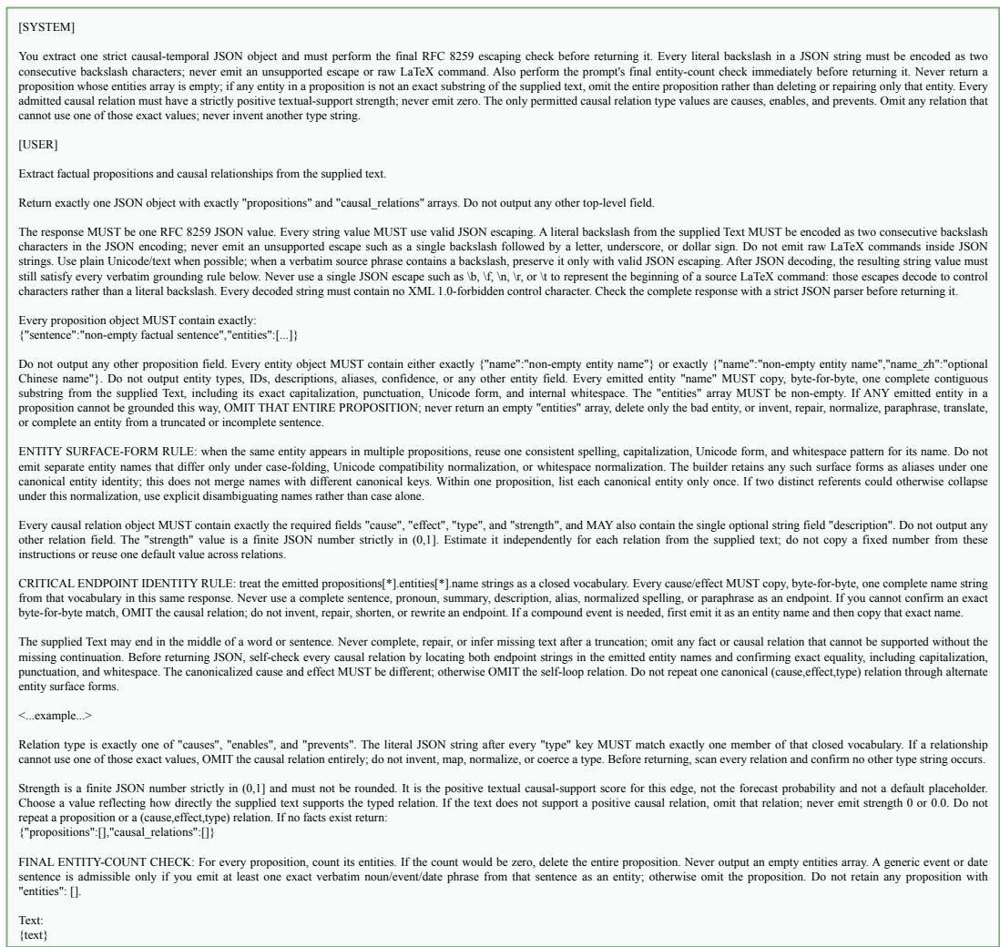  
Figure 7: Hypergraph and Causal Extraction Prompt.

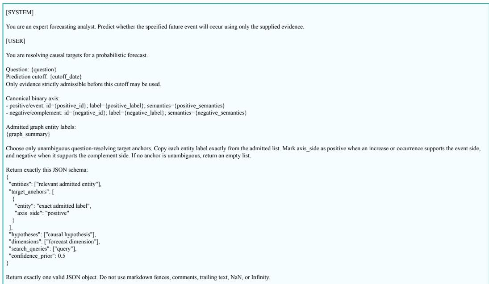  
Figure 8: Reasoning Direction Generation Prompt.

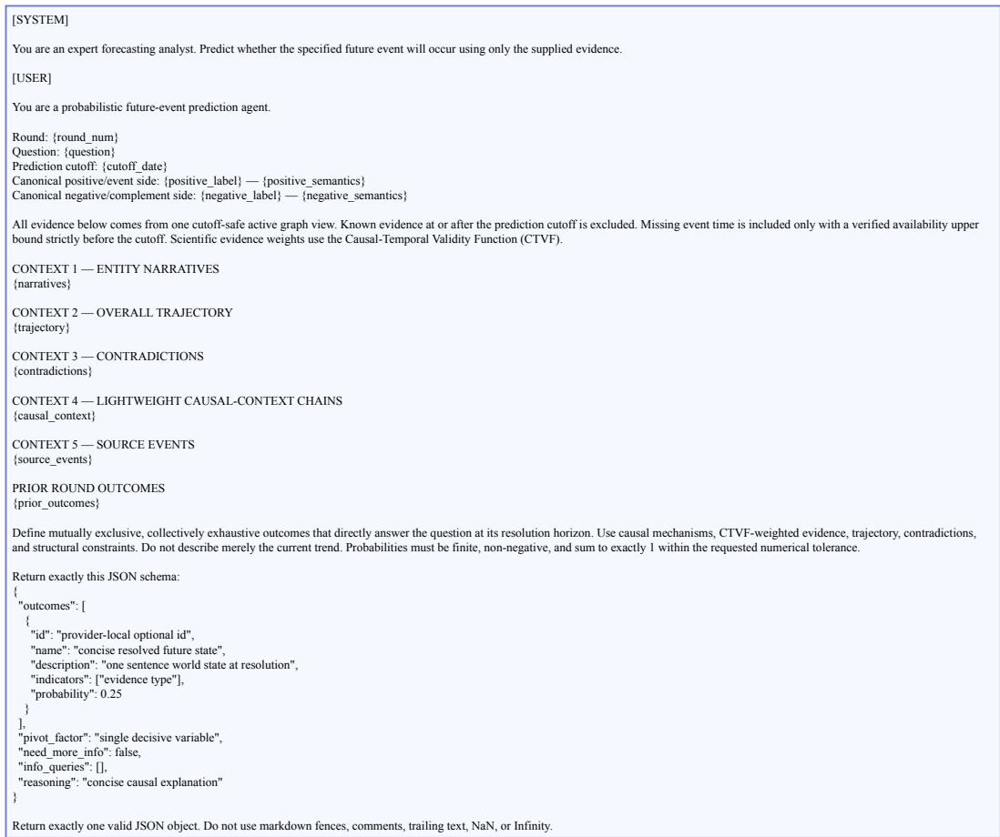  
Figure 9: Multi-Outcome Probabilistic Reasoning Prompt.

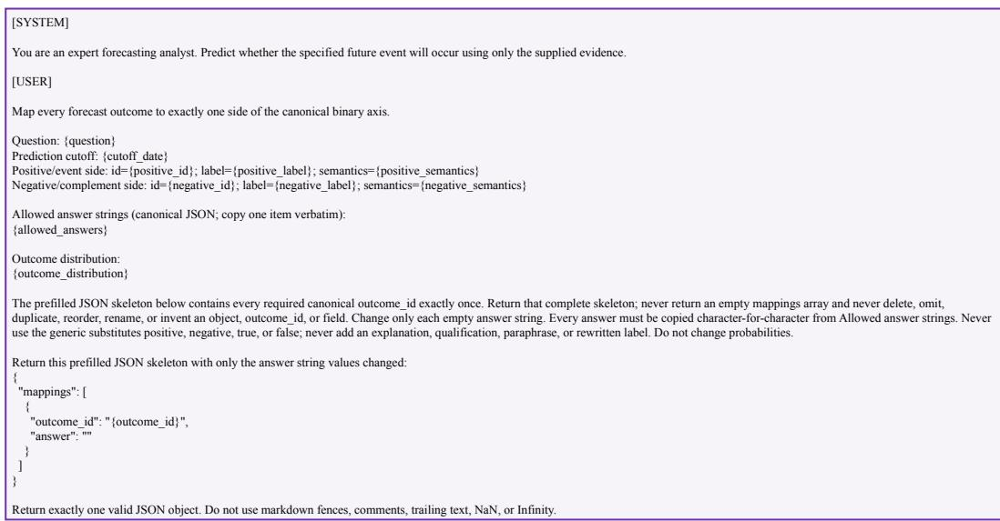  
Figure 10: Outcome-to-Answer Mapping Prompt.

## B.2 REASONING DIRECTION GENERATION PROMPT

This prompt is invoked once per query to record an LLM-side semantic prior with questionconditioned candidate entities and hypotheses. Candidate targets are selected from the admitted graph

entities, and the same call assigns each retained target to the positive or negative side of the canonical binary axis; targets without an unambiguous axis assignment are excluded. Causal distances are then computed independently by reverse BFS. The prompt is shown in Figure 8.

## B.3 MULTI-OUTCOME PROBABILISTIC REASONING PROMPT

This prompt implements the LLM-side estimator $f _ { \mathrm { L L M } }$ . Each round consumes q and graph context weighted by the prediction cutoff (entity narratives, contradictions, lightweight prompt-context causal chains, and previous-round outcomes), and emits a probability distribution over mutually exclusive resolution outcomes; the distribution is subsequently projected onto the binary probability $P _ { \mathrm { l l m } }$ by the outcome-to-answer mapping step. These prompt-context chains precede $P _ { \mathrm { l l m } }$ and are distinct from the subsequent CTVF-scored pool $\Pi _ { q }$ and its deduplicated subsets used to compute $ { P _ { \mathrm { c a u s a l } } } ( q )$ The prompt is shown in Figure 9.

## B.4 OUTCOME-TO-ANSWER MAPPING PROMPT

This prompt finalizes the LLM-side estimate by aggregating the probability mass consistent with the binary resolution of the question, without modifying the underlying probabilities. The resulting scalar $P _ { \mathrm { l l m } } \in [ 0 , 1 ]$ is subsequently combined with $ { P _ { \mathrm { c a u s a l } } } ( q )$ via the adaptive fusion weight $\alpha ( q )$ The prompt is shown in Figure 10.

## C CHAIN ALGORITHM DETAILS

Algorithm 1 presents the core calibration pipeline of CHAIN. The three phases of the algorithm map one-to-one to the three calibration bias sources targeted by our method, namely evidence weighting, chain aggregation, and source combination. (1) Causal-Temporal Hypergraph Construction builds the corpus-level hypergraph $\mathcal { G } = ( V , E _ { H } , \mathcal { C } )$ once. For every factual chunk $x ,$ one extraction request to the extractor ϕ returns proposition/entity content and typed directed causal edges (with retries only on failure); the graph builder attaches the chunk-derived timestamp and optional stored similarity before populating $\mathcal { G }$ that all queries subsequently share. (2) Per-Query Causal Estimation addresses evidence-weighting bias via the CTVF and chain-aggregation bias via Direction-aware Noisy-OR. For each query, a cutoff-safe active view $\mathcal { G } _ { q }$ retains known pre-cutoff evidence and evidence with missing or unparseable event time only when a verified availability upper bound precedes $t _ { c } .$ . Admitted occurrences sharing the same cause, effect, and relation type are aggregated into a logical causal edge whose strongest occurrence supplies its weight. The reasoning-direction call receives the cutoff, canonical binary axis, and a bounded set of question-relevant entity labels from $\mathcal { G } _ { q } ;$ keyword-filtered dense reranking then resolves $\mathcal T ( q )$ with positive/negative axis-side orientations $\mathit { a _ { q } } ,$ providing the BFS roots for the causal topological distance $d ( \cdot , q )$ . The distance drives the proximity exponent $\rho ,$ the temporal recency $V _ { \mathrm { r e c } } .$ , the recurrence-salience $V _ { \mathrm { s a l } }$ , and the edge weight $\omega ( c )$ . A lightweight prompt context $\mathcal { H } _ { \mathrm { c t x } } ( q )$ , comprising entity narratives, overall trajectory, contradictions, lightweight causalcontext chains, source events, and prior-round outcomes, is supplied to $f _ { \mathrm { L L M } }$ to obtain $\bar { P _ { \mathrm { l l m } } }$ . These context chains are distinct from the formal CTVF chain pool $\Pi _ { q }$ constructed below. Forward breadthfirst search enumerates node-simple paths from graph entities along outgoing causal edges; only paths that terminate at an oriented target are retained, and target nodes are not expanded. Chains are scored by $\Phi ( \pi , q )$ , partitioned by question-conditioned polarity $\delta _ { q } ( \pi )$ , deduplicated by Jaccard-θ within each polarity, and merged through the neutral-anchored log-odds rule into $ { P _ { \mathrm { c a u s a l } } } ( q )$ . (3) Adaptive Source Fusion addresses source-combination bias. The unique-chain count k, the mean confidence $\bar { \Phi } ( q )$ , the saturated reliability $\kappa ( k )$ , and the floored balance $\widetilde { \beta } ( q )$ , computed on the deduplicated chains, are passed through the coverage map $\Omega ( q )$ and a sigmoid gate to produce the question-specific weight $\alpha ( q )$ , which combines $\bar { P _ { \mathrm { c a u s a l } } ( q ) }$ with the LLM-side estimate $\dot { P _ { \mathrm { l l m } } } = f _ { \mathrm { L L M } } ( \dot { q } , \mathcal { H } _ { \mathrm { c t x } } ( \dot { q } ) )$ ) into the final forecast ${ \hat { p } } .$

Algorithm 1 CHAIN: Causal-Temporal Hypergraph Construction and Per-Query Calibration   
Require: corpus of factual chunks $\{ x \} ;$ query $q$ with prediction cutoff $t _ { c }$ and canoni  
cal binary axis $A _ { q } ;$ extractor ϕLLM; estimator fLLM; encoder Enc(·); hyperparameters   
$\begin{array} { r } { d _ { \mathrm { { m a x } } } , B _ { \pi } , F _ { \mathrm { { m a x } } } , \tau _ { \Phi } , \dot { \theta _ { , } } \eta , k _ { \mathrm { { s a t } } } , \beta _ { 0 } , Z , \alpha _ { b } , \alpha _ { 0 } , \Omega _ { 0 } , \zeta ; } \end{array}$ fixed $v _ { \mathrm { f b } }$ and $\varepsilon = 1 0 ^ { - 6 }$   
Ensure: forecast $\hat { p } \in [ 0 , 1 ]$   
// 1: Causal-Temporal Hypergraph Construction   
1: Initialize $V  \dot { \varnothing _ { * } } , E _ { H }  \varnothing , \breve { \mathcal { C } }  \varnothing$   
2: for each chunk x do   
3: $( \mathcal { P } _ { x } , \mathcal { C } _ { x } ) \gets \phi _ { \mathrm { L L M } } ( x )$   
4: Attach to each ${ \boldsymbol { \mathbf { \rho } } } _ { z } \in { \mathcal { P } } _ { x }$ the timestamp parsed from x and optional stored similarity $s _ { e }$   
5: $E _ { H }  E _ { H } \cup \mathcal { P } _ { x } ; \mathcal { C }  \mathcal { C } \cup \mathcal { C } _ { x } ; V \dot {  } V \cup \mathcal { } \bigcup V _ { e }$   
$( V _ { e } , t , s ) { \in } \mathcal { P } _ { x }$   
6: end for   
7: Encode $\operatorname { E n c } ( v )$ for $v \in V$ and Enc(e) for $e \in E _ { H }$   
// 2: Per-Query Causal Estimation   
8: $\mathcal { G } _ { q } = ( \bar { V _ { q } } , \dot { E _ { H , q } } , \mathcal { C } _ { q } )  \mathrm { C u t o f f S a f e A c t i v e V i e w } ( \mathcal { G } , q , t _ { c } )$ using verified pre-cutoff admissibility and   
typed-edge aggregation   
9: $\hat { \mathcal { L } } _ { q } \gets$ bounded question-relevant entity labels from $\mathcal { G } _ { q }$   
10: $\mathcal { \hat { D } } ( q ) \gets \mathrm { R e a s o n i n g D i r e c t i o n } ( q , t _ { c } , \mathcal { A } _ { q } , \mathcal { L } _ { q } )$   
11: $( \mathcal T ( \boldsymbol q ) , \boldsymbol a _ { \boldsymbol q } )$ ← ResolveAnchors $( \mathcal { D } ( q ) , \mathcal { G } _ { q } )$ by keyword-filtered dense reranking; discard weak or conflict  
ing matches   
12: $d ( v , q ) \gets$ exact reverse-BFS distance from $\mathcal { T } ( q )$ on $\mathcal { C } _ { q }$ within depth $d _ { \mathrm { m a x } }$ for $v \in V _ { q } ;$ set $d ( v , q ) = \infty$   
otherwise   
13: $\begin{array} { r } { d ( e , q ) \gets \operatorname* { m i n } _ { v \in V _ { e } } d ( v , q ) } \end{array}$ for each $e = ( V _ { e } , t , s ) \in E _ { H , q }$   
14: $\rho ( n , q ) \gets \operatorname* { m i n } ( d ( n , q ) / d _ { \operatorname* { m a x } } , 1 ) \mathrm { f o r } n \in V _ { q } \cup E _ { H , q }$   
15: for each $e = ( \dot { V _ { e } } , \dot { t } , s ) \overset { \cdot \cdot } { \in } E _ { H , q }$ do   
16: Set $N ( e )$ to the number of distinct admitted records sharing its canonicalized proposition key   
17: if t is parseable and $t < t _ { c }$ then   
18: $V _ { \mathrm { r e c } } ( e , q ) \gets \exp ( - \frac { 1 } { 2 } \underline { { \rho } } ( e , q ) \ln \operatorname* { m a x } _ { - } \{ 1 , ( t _ { c } - t ) _ { \mathrm { d a y s } } \} ) ; V _ { \mathrm { s a l } } ( e ) \gets \mu ( N ( e ) ) \sqrt { N ( e ) } M _ { r } ( e )$   
19: $V _ { \mathrm { C T V F } } ( \boldsymbol { e } , \boldsymbol { q } ) \gets \hat { \operatorname* { m i n } } \tilde { ( } V _ { \mathrm { r e c } } ( \boldsymbol { e } , \boldsymbol { q } ) + V _ { \mathrm { s a l } } ( \boldsymbol { e } ) , 1 )$   
20: else   
21: $V _ { \mathrm { C T V F } } ( e , q )  v _ { \mathrm { f b } }$ (only with a verified availability bound before $t _ { c } )$   
22: end if   
23: end for   
24: $V _ { \mathrm { C T V F } } ( v , q )$ ← mean of fixed incident-hyperedge scores $V _ { \mathrm { C T V F } } ( e , q )$ for $v \in V _ { q }$ (else neutral 0.5)   
25: $\mathcal { H } _ { \mathrm { c t x } } ( q ) \gets \mathrm { P r o m p t C o n t e x t } ( \mathcal { G } _ { q } , q , t _ { c } ) ; \quad \mathsf { P } _ { \mathrm { l l m } } \gets f _ { \mathrm { L L M } } ( q , \mathcal { H } _ { \mathrm { c t x } } ( q ) )$   
26: for each $c = ( u , v , \mathrm { t y p e } , w ) \in \mathcal { C } _ { q }$ do   
27: $\begin{array} { r } { \rho _ { c } \gets \operatorname* { m i n } \bigl ( ( d ( u , q ) + d ( v , q ) \bigr ) / ( 2 d _ { \mathrm { m a x } } ) , \ 1 \bigr ) ; \ \omega ( c ) \gets \bigl ( \frac { 1 } { 2 } ( V _ { \mathrm { C T V F } } ( u , q ) + V _ { \mathrm { C T V F } } ( v , q ) ) \bigr ) ^ { \rho _ { c } } } \end{array}$   
28: end for   
29: Forward breadth-first expand node-simple paths from each entity to depth $d _ { \mathrm { m a x } }$ using at most the $F _ { \mathrm { m a x } }$   
strongest outgoing edges; set $\begin{array} { r } { \widetilde { \Phi } ( \pi , q )  \prod _ { \ell } w _ { \ell } \omega ( c _ { \ell } ) } \end{array}$ and prune when $\tilde { \Phi } ( \pi , q ) < \tau _ { \Phi }$   
30: Stop enumeration after $H _ { \pi } \gets \operatorname* { m a x } ( 5 B _ { \pi } ^ { - } , 1 0 0 0 )$ score-qualified target-terminating paths have been col  
lected   
31: Let $\Pi _ { q }$ be the top B target-terminating paths and split by $\delta _ { q } ( \pi ) = a _ { q } ( v _ { L } ) ( - 1 ) ^ { P ( \pi ) }$ into $\Pi _ { q } ^ { + } , \Pi _ { q } ^ { - }$   
32: Greedy Jaccard-θ deduplication within each polarity → Πb+, Πb−   
33: $\begin{array} { r } { p ^ { + } ( q ) \gets 1 - \prod _ { \pi \in \widehat { \Pi } _ { q } ^ { + } } ( 1 - \Phi ( \pi , q ) ) ; \ p ^ { - } ( q ) \gets 1 - \prod _ { \pi \in \widehat { \Pi } _ { q } ^ { - } } ( \dot { 1 } - \Phi ( \pi , q ) ) } \end{array}$   
34: $P _ { \mathrm { c a u s a l } } ( q )  \sigma \big ( g _ { \varepsilon } ( p ^ { + } ( q ) ) - g _ { \varepsilon } ( p ^ { - } ( q ) ) \big )$ , where $g _ { \varepsilon } ( p ) = \mathrm { l o g i t } ( \operatorname* { m i n } ( 1 - \varepsilon , \operatorname* { m a x } ( \varepsilon , ( 1 + p ) / 2 ) ) )$   
// 3: Adaptive Source Fusion   
35: $\begin{array} { r } { k  \vert \widehat { \Pi } _ { q } ^ { + } \vert + \vert \widehat { \Pi } _ { q } ^ { - } \vert ; \ \bar { \Phi } ( q )  \frac { 1 } { \operatorname* { m a x } ( k , 1 ) } \quad et { } { ' } \sum _ { \ d { \mathbf { \hat { \phi } } } ( \pi , q ) } \Phi ( \pi , q ) \ } \end{array}$   
$\pi \in \widehat { \Pi } _ { q } ^ { + } \cup \widehat { \Pi } _ { q } ^ { - }$   
36: $\kappa ( k ) \gets \operatorname* { m i n } ( \ln ( 1 + k ) / \ln ( 1 + k _ { \mathrm { s a t } } ) , 1 )$   
37: $\beta ( q ) \gets \operatorname* { m i n } ( | \widehat { \Pi } _ { q } ^ { + } | , | \widehat { \Pi } _ { q } ^ { - } | ) / $ $( | \widehat { \Pi } _ { q } ^ { + } | , | \widehat { \Pi } _ { q } ^ { - } | ) / \operatorname * { m a x } ( | \widehat { \Pi } _ { q } ^ { + } | , | \widehat { \Pi } _ { q } ^ { - } | , 1 ) ; \ \widetilde { \beta } ( q ) \gets \beta _ { 0 } + \left( 1 - \beta _ { 0 } \right) \beta ( q )$   
38: $\Omega ( q )  \operatorname* { m i n } ( k \bar { \Phi } ( q ) \kappa ( k ) \widetilde { \beta } ( q ) / Z , 1 )$   
39: $\alpha ( \tilde { q } ) \gets \mathbb { 1 } [ k > 0 ] \cdot \operatorname* { m i n } ( 2 \alpha _ { b } \sigma ( \zeta ( \Omega ( \tilde { q } ) - \Omega _ { 0 } ) ) , \alpha _ { 0 } )$   
40: return $\hat { p } = \alpha ( q ) P _ { \mathrm { c a u s a l } } ( q ) + \left( 1 - \alpha ( q ) \right) P _ { \mathrm { l l m } }$

Computational Complexity. The computational cost of CHAIN can be decomposed into three stages. Hypergraph construction issues one extraction request per factual chunk, with retries only on failure, and scales linearly with the corpus size; this cost is incurred only once per corpus and is amortized over all downstream queries. Per-query construction of $\mathcal { G } _ { q }$ adds one graph scan plus deterministic grouping of admitted occurrences. Per-query causal estimation performs a reverse breadth-first search over $\mathcal { C } _ { q }$ for each target in $\tau ( q )$ , which runs in $\mathcal { O } ( | T ( q ) | ( | V _ { q } | + | \mathcal { C } _ { q } | ) )$ in the worst case and is bounded by the depth $d _ { \operatorname* { m a x } } ,$ followed by breadth-first chain enumeration with uncapped worst-case complexity $\mathcal { O } ( | V _ { q } | b ^ { d _ { \operatorname* { m a x } } } )$ for average fan-out b. The controls $F _ { \mathrm { m a x } }$ and $\tau _ { \Phi }$ restrict expansion, $H _ { \pi } \stackrel { - } { = } \operatorname* { m a x } ( 5 B _ { \pi } ^ { - } , \operatorname { i } 0 0 0 )$ caps score-qualified enumeration, $B _ { \pi }$ bounds $\textstyle | \Pi _ { q } |$ , and Jaccardθ deduplication determines k. Thus, the polarity-wise Noisy-OR aggregation and the subsequent neutral-anchored combination admit ${ \mathcal { O } } ( k )$ complexity. Adaptivefusion runs in $\mathcal { O } ( 1 )$ given the chain statistics $k , \bar { \Phi } ( q )$ , and the polarity counts. In practice, the per-query runtime is dominated by the language-model invocations rather than by graph traversal, encompassing the reasoning-direction generation, the multi-outcome estimation performed by $f _ { \mathrm { L L M } }$ , and the outcome-to-answer mapping.

## D DATASET DETAILS

We conduct experiments on eight public forecasting datasets, covering both in-distribution and out-of-distribution sources, and spanning forecasting tasks across diverse domains.

AI-Futures (Turtel et al., 2026; LightningRodLabs, 2025a): A forecasting dataset of AI-domain questions on AI labs, model releases, agentic deployments, and AI-industry developments, generated under the future-as-label paradigm so that ground-truth labels arise from real-world events post-dating the model knowledge cutoff.

Metaculus (Chandak et al., 2026): A forecasting dataset of community-resolved questions extracted from the Metaculus forecasting platform, with explicit closing and resolution times and forecastercount metadata.

Polymarket (Polymarket, 2024): A market-driven forecasting dataset of prediction-market questions sourced from Polymarket, where each question is backed by a tradable contract whose outcome is settled by a real-world event.

Future-as-Label (Turtel et al., 2026): A forecasting dataset of mixed-domain questions whose ground truth labels are determined by future real-world outcomes occurring after the model knowledge cutoff, ensuring that the task cannot be solved by memorization.

Clinical Trial Outcomes (Gao et al., 2024): A large-scale benchmark of clinical trial outcomes for drug development, providing trial-level success/failure labels and introducing a biomedical out-of-distribution shift relative to the in-distribution forecasting sources.

FOReCAst (Yuan et al., 2025): A future-outcome reasoning and confidence-assessment benchmark spanning Boolean, timeframe, and quantity question types; we use its Boolean subset, in which each question requires the model to predict an outcome together with a confidence estimate.

Golf-Forecasting (Turtel et al., 2026; LightningRodLabs, 2025b): A forecasting dataset of questions about professional golf tournaments, generated under the future-as-label paradigm with news articles as the underlying source, providing a fast-resolving sports out-of-distribution setting.

KalshiBench (Nel, 2025): A forecasting benchmark sourced from the Kalshi regulated event-contract exchange, covering sports, politics, macroeconomics, and other event categories, designed to evaluate epistemic calibration on prediction-market questions.

We designate the first four datasets as in-distribution sources and the remaining four as held-outsource OOD datasets spanning diverse forecasting domains, and choose three backbone LLMs whose knowledge cutoffs predate the resolution dates of nearly all sampled questions, so that calibration performance reflects forward-only forecasting rather than memorization. FOReCAst contains some potentially overlapping cases whose resolution dates precede the model knowledge cutoffs, but this leakage risk applies uniformly to all baselines and does not favor CHAIN.

To balance the cost of hypergraph construction against evaluation coverage, we construct a separate causal-temporal hypergraph for each of the four in-distribution datasets from 2,048 instances sampled from that dataset. We also randomly sample 128 test instances from each of the eight datasets; these test instances are disjoint from the instances used for hypergraph construction. For the main OOD evaluation reported in Table 2, the four out-of-distribution datasets do not use dataset-specific retrieval corpora. Instead, we take the union of the source documents of the four in-distribution datasets as a single unified ID corpus, and each retrieval-based method (NaiveRAG, GraphRAG, LightRAG, HippoRAG, HyperGraphRAG, and CHAIN) builds its own retrieval structure on top of this unified corpus using its own native construction pipeline. This setup keeps the upstream data identical across all methods while letting each method retain its own structural representation, so observed OOD calibration differences reflect algorithmic rather than corpus differences. Although the OOD dataset are held out at the data-source level, their topical domains can overlap with those of the in-distribution datasets. This setup therefore evaluates cross-source generalisation under a unified ID retrieval corpus rather than strictly domain-disjoint transfer; the degree of topical mismatch varies by target dataset.

## E BASELINE DETAILS

We compare CHAIN with 13 baselines spanning direct probability elicitation, step-by-step reasoning, retrieval-augmented generation, and post-hoc probability calibration. The following descriptions summarize each method’s input protocol, structural representation, or calibration mapping.

LLM Direct (Ouyang et al., 2022) prompts the LLM with the raw question and asks it to output a probability and answer in a single shot.

LLM CoT (Wei et al., 2022) prepends a chain-of-thought prompt so that the LLM produces step-bystep reasoning before its final probability and answer.

AutoCast-style Prompting (Zou et al., 2022) uses the forecasting setup of AutoCast, providing the LLM with the question together with associated background news context as supporting information.

NaiveRAG (Lewis et al., 2020) follows the standard retrieval-augmented generation paradigm, performing chunk-level dense retrieval over the corpus and providing the top-k chunks to the LLM as supporting context.

GraphRAG (Edge et al., 2024) extracts an entity-level knowledge graph from the corpus, applies hierarchical community detection, and retrieves pre-generated community summaries to support query-focused generation.

LightRAG (Guo et al., 2025) builds a compact entity-relation graph and performs dual-level retrieval that combines a low-level entity-specific view and a high-level theme-level view of the graph.

HippoRAG (Gutiérrez et al., 2024) adopts a neurobiologically inspired memory index, applying personalized PageRank over an OpenIE-style entity-and-triple graph to surface multi-hop evidence.

HyperGraphRAG (Luo et al., 2025) represents knowledge as n-ary relational hyperedges and performs hypergraph-structured retrieval that fuses entity-level and hyperedge-level evidence.

Temperature Scaling (Guo et al., 2017) learns a single scalar temperature on a validation set to rescale logits before the softmax.

Platt Scaling (Platt, 1999) fits a sigmoid mapping from uncalibrated scores to class probabilities via maximum likelihood.

Isotonic Regression (Zadrozny & Elkan, 2002) fits a non-parametric monotone mapping from predicted confidences to empirical class probabilities.

Histogram Binning (Zadrozny & Elkan, 2001) partitions the confidence axis into bins and replaces each bin’s prediction with the empirical class frequency observed in that bin on the validation set.

Conformal-Score Probability Adjustment (Angelopoulos & Bates, 2023) is a conformal-inspired scalar baseline. From the calibration predictions, we compute nonconformity scores $r _ { i } = | p _ { i } - y _ { i } |$ and their 0.9 quantile q; each evaluation probability is then mapped to $\widetilde { p } = 0 . 5 + ( 1 - q ) ( p - 0 . 5 )$ . It outputs adjusted scalar probabilities rather than prediction sets and makes no conformal coverage claim.

## F EVALUATION METRICS

We evaluate calibration quality and predictive accuracy across seven metrics spanning complementary dimensions of probabilistic forecasting. ECE, ACE, MCE, and Reliability quantify calibration error; NLL measures the logarithmic loss assigned to observed outcomes; Brier score is a proper scoring rule capturing both calibration and sharpness; and Accuracy measures the correctness of binary predictions. Let $\{ ( p _ { i } , y _ { i } ) \} _ { i = \cdot } ^ { N }$ denote N predictions, where $p _ { i } ~ \in ~ [ 0 , 1 ]$ is the predicted probability of the positive event and $y _ { i } \in \{ 0 , 1 \}$ is the ground-truth label. For each binning scheme, $\mathbf { \dot { \delta } } B _ { m } \subseteq \{ 1 , \dots , N \}$ denotes the indices assigned to bin m, with $M = 1 0$ , mean predicted event probability $\begin{array} { r } { \bar { p } _ { m } = | B _ { m } | ^ { - 1 } \sum _ { i \in B _ { m } } p _ { i } } \end{array}$ , and empirical event frequency $\begin{array} { r } { { \bar { y } _ { m } } \ = \ | B _ { m } | ^ { - 1 } \sum _ { i \in B _ { m } } y _ { i } \quad } \end{array}$ Empty bins are omitted from all bin-based sums and maxima.

ECE (Expected Calibration Error) (Guo et al., 2017). We compute the bin-weighted gap between the mean predicted event probability and empirical event frequency under equal-width binning of [0, 1]:

$$
\mathrm { E C E } = \sum _ { m = 1 } ^ { M } \frac { \vert B _ { m } \vert } { N } \vert \bar { p } _ { m } - \bar { y } _ { m } \vert .\tag{78}
$$

Lower values indicate better global calibration.

ACE (Adaptive Calibration Error) (Nixon et al., 2019). We use an adaptive-binning calibration error implemented with approximately equal-mass bins:

$$
\mathrm { A C E } = \sum _ { m = 1 } ^ { M } \frac { | B _ { m } | } { N } \big | \bar { p } _ { m } - \bar { y } _ { m } \big | .\tag{79}
$$

Lower values indicate better calibration when predictions are unevenly distributed across the predicted probability axis.

MCE (Maximum Calibration Error) (Guo et al., 2017). Using the same equal-width bins as ECE, we take the worst bin-wise calibration gap, restricting attention to bins containing at least five samples for stability:

$$
\mathrm { M C E } = \operatorname* { m a x } _ { m : | B _ { m } | \geq 5 } \left| \bar { p } _ { m } - \bar { y } _ { m } \right| .\tag{80}
$$

Lower values indicate that no single predicted-probability region exhibits severely miscalibrated predictions.

Rel (Reliability) (Murphy, 1973). Using the same equal-width bins as ECE, we report the binned estimate of the reliability component of the Brier-score decomposition:

$$
\mathrm { R e l } = \sum _ { m = 1 } ^ { M } { \frac { | B _ { m } | } { N } } \bigl ( \bar { p } _ { m } - \bar { y } _ { m } \bigr ) ^ { 2 } .\tag{81}
$$

Lower values indicate that bin-wise mean event probabilities are closer to the corresponding empirical frequencies.

NLL (Negative Log-Likelihood). We compute the mean binary logarithmic loss assigned to the observed outcomes:

$$
\mathrm { N L L } = - \frac { 1 } { N } \sum _ { i = 1 } ^ { N } \left[ y _ { i } \log \widetilde { p } _ { i } + ( 1 - y _ { i } ) \log ( 1 - \widetilde { p } _ { i } ) \right] ,\tag{82}
$$

where $\widetilde { p } _ { i } = \operatorname* { m i n } ( \operatorname* { m a x } ( p _ { i } , \epsilon ) , 1 - \epsilon )$ and $\epsilon = 1 0 ^ { - 7 }$ prevents numerical singularities. Lower values indicate better probabilistic predictions.

Brier (Brier Score) (Brier, 1950). We compute the mean squared deviation between the predicted probability and the binary outcome:

$$
{ \mathrm { B r i e r } } = { \frac { 1 } { N } } \sum _ { i = 1 } ^ { N } ( p _ { i } - y _ { i } ) ^ { 2 } .\tag{83}
$$

Lower values indicate predictions that are jointly accurate and well-calibrated.

Acc (Accuracy). We report the fraction of correctly predicted labels under a 0.5 decision threshold:

$$
\mathrm { A c c } = \frac { 1 } { N } \sum _ { i = 1 } ^ { N } \mathbb { 1 } [ \hat { y } _ { i } = y _ { i } ] , \qquad \hat { y } _ { i } = \mathbb { 1 } [ p _ { i } \geq 0 . 5 ] .\tag{84}
$$

Higher values indicate more accurate binary predictions.

ECE, ACE, MCE, Rel, and Brier are reported in percent and are lower-better; Accuracy is reported in percent and is higher-better. NLL is reported on its dimensionless natural-log scale and is lower-better.

Table 4: Comparison of parameter settings across the three baseline categories and CHAIN.
<table><tr><td>Group</td><td>Parameter</td><td>Direct</td><td>RAG</td><td>Post-hoc</td><td>CHAIN</td></tr><tr><td>Models</td><td>Backbone LLMs Construction LLM Encoder Embedding dim</td><td>3 LLMs 一</td><td>3 LLMs GPT-4o-mini text-embedding-3-small 1536</td><td>3 LLMs</td><td>3 LLMs GPT-4o-mini text-embedding-3-small 1536</td></tr><tr><td>Inference</td><td>Temperature Max tokens Inference API</td><td>0.3 8192 official</td><td>0.3 8192 official</td><td>0.3 8192 official</td><td>0.3 8192 official</td></tr><tr><td>Retrieval</td><td>Chunk size Chunk overlap RAG top-k Similarity</td><td></td><td>512 tokens 64 tokens 10 cosine</td><td></td><td>512 tokens 64 tokens cosine</td></tr></table>

Table 5: Core CHAIN-specific hyperparameters and default values used unless otherwise specified.
<table><tr><td>Symbol</td><td>Meaning</td><td>Value</td><td>Sensitivity</td></tr><tr><td> $d _ { \operatorname* { m a x } }$ </td><td>reachability/search depth cap</td><td>4</td><td>swept {2, 3, 4, 5}</td></tr><tr><td>θ</td><td>Jaccard threshold for same-polarity dedup</td><td>0.5</td><td>swept {0.3, 0.5, 0.7}</td></tr><tr><td>η</td><td>recurrence saturation temperature in  $V _ { \mathrm { s a l } }$ </td><td>5.0</td><td></td></tr><tr><td>Mr(e)</td><td>default when stored similarity is unavailable</td><td>0.5</td><td></td></tr><tr><td> $v _ { \mathrm { f b } }$ </td><td>cutoff-safe missing-time CTVF fallback</td><td>0.25</td><td></td></tr><tr><td> $k _ { \mathrm { s a t } }$ </td><td>reliability saturation anchor</td><td>10</td><td></td></tr><tr><td> $\beta _ { 0 }$ </td><td>balance floor</td><td>0.3</td><td></td></tr><tr><td> $Z$ </td><td>coverage normalizer</td><td>5.0</td><td></td></tr><tr><td> $\alpha _ { b }$ </td><td>mapping scale</td><td>0.5</td><td></td></tr><tr><td> $\alpha _ { 0 }$ </td><td>fusion upper bound (1.2αb)</td><td>0.6</td><td></td></tr><tr><td> $\Omega _ { 0 }$ </td><td>coverage activation threshold</td><td>0.3</td><td></td></tr><tr><td>ζ</td><td>sigmoid sharpness</td><td>3.0</td><td></td></tr></table>

## G IMPLEMENTATION DETAILS

We construct the causal-temporal hypergraph using GPT-4o-mini (Hurst et al., 2024) as the extractor and text-embedding-3-small as the shared encoder, and evaluate CHAIN on three LLM backbones: DeepSeek-V3 (DeepSeek-AI et al., 2025), GPT-4o-mini (Hurst et al., 2024), Gemini-2.0- Flash (Kavukcuoglu, 2025). All experiments are conducted via the official APIs. For CHAIN and all baselines, the reported comparison results are averaged over three independent runs. To ensure a controlled comparison, every method is run under the unified experimental setup summarized in Table 4, including matched decoding parameters, the same evaluation set for each dataset, and the same backbone LLMs. For all baselines, we adopt the prompts from their official implementations. The CHAIN-specific hyperparameters that govern causal proximity, deduplication, evidence aggregation, and source fusion are listed in Table 5. We use the listed defaults across all eight datasets and three backbone LLMs unless otherwise specified in the sensitivity analyses.

Prompt Matching and Baseline Fairness. To ensure comparability across forecasting methods, Direct, CoT, NaiveRAG, GraphRAG, HyperGraphRAG, and CHAIN follow a unified input and evaluation protocol. All methods receive the same question statement, prediction cutoff, and admissible corpus boundary. For questions with multiple candidate outcomes, we apply the same outcome-decomposition rule to map the task into a common binary-event prediction space. We also use consistent option representations, probability-output formats, and result-parsing rules across methods, thereby controlling differences in prompt structure, output constraints, and post-processing. For retrieval-augmented methods, the same cutoff and corpus boundary apply, and all records directly associated with test questions are excluded from the retrieval corpus. The resulting evaluation compares the reasoning, retrieval structure, causal-temporal hypergraph construction, and evidence aggregation used by each method under the same protocol.

Although the hypergraph is extracted with GPT-4o-mini for all datasets, CHAIN’s gain over the strongest baseline transfers stably across backbone LLMs. For each backbone and each evaluation metric, we identify the strongest baseline as the one with the best mean across the four in-distribution datasets, and report the gap between CHAIN’s mean and this baseline’s mean. Across GPT-4o-mini, Gemini-2.0-Flash, and DeepSeek-V3, respectively, CHAIN reduces ECE by 4.77, 4.15, and 3.07 points, reduces Brier score by 5.57, 4.34, and 3.30 points, and improves Accuracy by 9.57, 8.20, and

Table 6: CHAIN’s gain over the strongest baseline by backbone LLM. For each backbone and each metric, the strongest baseline is identified by its mean over the four in-distribution datasets, and the reported value is the gap between CHAIN’s mean and this baseline’s mean. The hypergraph is extracted with GPT-4o-mini in all rows.
<table><tr><td>Backbone</td><td>ΔECE↓</td><td>∆Brier ↓</td><td>∆Acc ↑</td></tr><tr><td>GPT-4o-mini</td><td>-4.77</td><td>-5.57</td><td>+9.57</td></tr><tr><td>Gemini-2.0-Flash</td><td>-4.15</td><td>-4.34</td><td>+8.20</td></tr><tr><td>DeepSeek-V3</td><td>-3.07</td><td>-3.30</td><td>+7.42</td></tr></table>

Table 7: Performance comparison of CHAIN and the baselines on 4 OOD datasets with DeepSeek-V3.
<table><tr><td rowspan="2">Method</td><td colspan="3">CTO</td><td colspan="3">FOReCAst</td><td colspan="3">Golf-Forecasting</td><td colspan="3">KalshiBench</td><td colspan="3">Average</td></tr><tr><td>ECE↓</td><td>Brier↓</td><td>Acc↑ |</td><td>|ECE↓ Brier↓</td><td></td><td>Acc↑</td><td>|ECE↓</td><td>Brier↓</td><td>Acc↑</td><td>|ECE↓</td><td>Brier↓</td><td>Acc↑</td><td>|ECE↓ Brier↓</td><td></td><td>Acc↑</td></tr><tr><td>LLM Direct</td><td>15.47</td><td>25.80</td><td>60.16</td><td>9.72</td><td>20.03</td><td>72.66</td><td>14.77</td><td>26.38</td><td>57.03</td><td>16.09</td><td>25.30</td><td>60.94</td><td>14.01</td><td>24.38</td><td>62.70</td></tr><tr><td>LLM CoT</td><td>16.52</td><td>25.01</td><td>57.81</td><td>10.80</td><td>20.28</td><td>71.09</td><td>17.76</td><td>29.48</td><td>54.69</td><td>20.16</td><td>25.54</td><td>58.59</td><td>16.31</td><td>25.08</td><td>60.55</td></tr><tr><td>AutoCast</td><td>12.50</td><td>24.27</td><td>61.72</td><td>16.33</td><td>25.61</td><td>57.81</td><td>13.32</td><td>27.53</td><td>56.25</td><td>13.24</td><td>26.28</td><td>53.91</td><td>13.85</td><td>25.92</td><td>57.42</td></tr><tr><td>NaiveRAG</td><td>19.84</td><td>25.79</td><td>60.16</td><td>19.56</td><td>27.31</td><td>60.16</td><td>11.13</td><td>26.63</td><td>49.22</td><td>15.59</td><td>28.68</td><td>46.88</td><td>16.53</td><td>27.10</td><td>54.10</td></tr><tr><td>GraphRAG</td><td>13.28</td><td>25.29</td><td>59.38</td><td>8.55</td><td>20.77</td><td>71.09</td><td>14.22</td><td>26.61</td><td>53.91</td><td>18.74</td><td>26.46</td><td>53.12</td><td>13.70</td><td>24.78</td><td>59.38</td></tr><tr><td>LightRAG</td><td>17.15</td><td>26.16</td><td>53.12</td><td>11.79</td><td>21.58</td><td>71.88</td><td>12.77</td><td>26.98</td><td>51.56</td><td>20.39</td><td>25.48</td><td>56.25</td><td>15.53</td><td>25.05</td><td>58.20</td></tr><tr><td>HippoRAG</td><td>20.04</td><td>27.48</td><td>50.00</td><td>13.23</td><td>21.04</td><td>71.09</td><td>20.47</td><td>28.17</td><td>56.25</td><td>28.40</td><td>30.99</td><td>46.09</td><td>20.54</td><td>26.92</td><td>55.86</td></tr><tr><td>HyperGraphRAG</td><td>21.48</td><td>26.54</td><td>50.00</td><td>13.24</td><td>21.04</td><td>71.09</td><td>13.63</td><td>28.56</td><td>48.44</td><td>23.95</td><td>26.26</td><td>53.12</td><td>18.08</td><td>25.60</td><td>55.66</td></tr><tr><td>TempScaling</td><td>4.05</td><td>23.71</td><td>60.16</td><td>9.72</td><td>20.19</td><td>72.66</td><td>5.23</td><td>24.35</td><td>57.03</td><td>7.52</td><td>23.04</td><td>60.94</td><td>6.63</td><td>22.82</td><td>62.70</td></tr><tr><td>PlattScaling</td><td>30.08</td><td>32.95</td><td>42.19</td><td>27.97</td><td>29.96</td><td>46.88</td><td>32.01</td><td>34.34</td><td>44.53</td><td>34.93</td><td>35.11</td><td>39.84</td><td>31.25</td><td>33.09</td><td>43.36</td></tr><tr><td>IsotonicReg</td><td>28.57</td><td>31.87</td><td>48.44</td><td>25.02</td><td>26.47</td><td>67.19</td><td>29.91</td><td>33.01</td><td>50.78</td><td>30.69</td><td>32.26</td><td>57.03</td><td>28.55</td><td>30.90</td><td>55.86</td></tr><tr><td>HistogramBin</td><td>36.45</td><td>44.86</td><td>44.53</td><td>27.30</td><td>32.08</td><td>62.50</td><td>31.03</td><td>35.59</td><td>57.81</td><td>33.19</td><td>38.78</td><td>53.91</td><td>31.99</td><td>37.83</td><td>54.69</td></tr><tr><td>ConformalAdj</td><td>3.91</td><td>23.97</td><td>60.16</td><td>15.34</td><td>22.02</td><td>72.66</td><td>5.16</td><td>24.35</td><td>57.03</td><td>8.12</td><td>23.58</td><td>60.94</td><td>8.13</td><td>23.48</td><td>62.70</td></tr><tr><td>CHAIN (ours)</td><td>3.61</td><td>22.73</td><td>62.50</td><td>6.98</td><td>17.90 74.22</td><td></td><td>5.15</td><td>23.91</td><td>58.59</td><td>7.25</td><td>22.95</td><td>62.50</td><td>5.75</td><td>21.87</td><td>64.45</td></tr></table>

7.42 points; per-backbone gains are reported in Table 6. The evaluated search-control configurations and the defaults adopted by CHAIN are reported in Table 8.

## H RESULTS OF DEEPSEEK-V3

Table 7 reports the complete results of DeepSeek-V3 on Clinical Trial Outcomes, FOReCAst, Golf-Forecasting, and KalshiBench under the same unified in-distribution retrieval-corpus protocol used for the main OOD evaluation. CHAIN achieves the lowest ECE and Brier score and the highest Accuracy on each dataset and in the four-dataset macro average. On the macro average, CHAIN reduces ECE from 6.63 to 5.75 and Brier score from 22.82 to 21.87, while increasing Accuracy from 62.70 to 64.45, relative to Temperature Scaling, the strongest post-hoc baseline in this comparison. These results show that the calibration and predictive-performance gains persist with DeepSeek-V3 across all four OOD datasets.

Table 8: Evaluated search-budget, depth, fan-out, and pruning-threshold settings, including the defaults used in the main experiments.
<table><tr><td>Parameter</td><td>Evaluated settings</td><td>Default</td></tr><tr><td>Chain budget Bπ</td><td>50, 100, 200, 400</td><td>200</td></tr><tr><td>Maximum search depth dmax</td><td>2,3,4,5</td><td>4</td></tr><tr><td>Fan-out cap Fmax</td><td>2, 4, 8, 16, unlimited</td><td>unlimited</td></tr><tr><td>Pruning threshold  $\tau _ { \Phi }$ </td><td>0, 0.001, 0.005, 0.02, 0.05</td><td>0.005</td></tr></table>

## I SEARCH CONFIGURATION AND GRAPH-SCALE SENSITIVITY

## I.1 SEARCH CONFIGURATION

We examine the effects of the chain budget $B _ { \pi }$ , maximum search depth $d _ { \operatorname* { m a x } } ,$ per-node outgoing-edge cap $F _ { \mathrm { m a x } } .$ , and low-score prefix pruning threshold $\tau _ { \Phi }$ . We use DeepSeek-V3 and report macroaveraged results over AI-Futures, Future-as-Label, Clinical Trial Outcomes, and Golf-Forecasting. All other settings remain fixed at their defaults. Table 8 summarizes the evaluated settings and the defaults used in the main experiments. Table 9 reports the corresponding predictive performance, where † denotes the default adopted by CHAIN.

Table 9: Predictive performance under different search configurations.
<table><tr><td>Parameter</td><td>Setting</td><td>ECE↓</td><td>Brier ↓</td><td>Accuracy ↑</td></tr><tr><td>Chain budget Bπ</td><td>50</td><td>6.43</td><td>20.13</td><td>67.58</td></tr><tr><td></td><td>100</td><td>6.62</td><td>20.67</td><td>67.58</td></tr><tr><td></td><td>200†</td><td>6.85</td><td>20.70</td><td>67.58</td></tr><tr><td></td><td>400</td><td>6.68</td><td>20.70</td><td>67.58</td></tr><tr><td>Maximum search depth  $d _ { \mathrm { m a x } }$ </td><td>2</td><td>6.53</td><td>20.14</td><td>67.97</td></tr><tr><td></td><td>3</td><td>5.90</td><td>20.47</td><td>67.58</td></tr><tr><td></td><td> $4 ^ { \dagger }$ </td><td>6.85</td><td>20.70</td><td>67.58</td></tr><tr><td></td><td>5</td><td>6.60</td><td>20.81</td><td>67.38</td></tr><tr><td>Outgoing-edge cap  $F _ { \mathrm { m a x } }$ </td><td>2</td><td>7.04</td><td>20.37</td><td>68.16</td></tr><tr><td></td><td>4</td><td>6.32</td><td>20.23</td><td>68.36</td></tr><tr><td></td><td>8</td><td>6.01</td><td>20.40</td><td>67.77</td></tr><tr><td></td><td>16</td><td>6.49</td><td>20.21</td><td>67.97</td></tr><tr><td></td><td>Unlimited†</td><td>6.85</td><td>20.70</td><td>67.58</td></tr><tr><td>Pruning threshold  $\tau _ { \Phi }$ </td><td>0</td><td>6.85</td><td>20.70</td><td>67.58</td></tr><tr><td></td><td>0.001</td><td>6.85</td><td>20.70</td><td>67.58</td></tr><tr><td></td><td>0.005†</td><td>6.85</td><td>20.70</td><td>67.58</td></tr><tr><td></td><td>0.02</td><td>6.83</td><td>20.70</td><td>67.58</td></tr><tr><td></td><td>0.05</td><td>6.88</td><td>20.72</td><td>67.77</td></tr></table>

Table 10: Candidate-chain counts and computational cost under different pruning thresholds. Relative runtime is normalized by $\tau _ { \Phi } = 0$
<table><tr><td>TΦ</td><td>Pre-dedup.</td><td>Post-dedup.</td><td>Mean time (s)</td><td>Relative time ↓</td></tr><tr><td>0</td><td>30.76</td><td>13.31</td><td>10.48</td><td>1.00</td></tr><tr><td>0.005†</td><td>30.76</td><td>13.31</td><td>2.47</td><td>0.24</td></tr><tr><td>0.02</td><td>29.68</td><td>13.15</td><td>1.70</td><td>0.16</td></tr><tr><td>0.05</td><td>24.16</td><td>12.32</td><td>1.25</td><td>0.12</td></tr></table>

Accuracy remains 67.58 across all chain budgets, while ECE and Brier vary only slightly, showing stable predictions across changes in the candidate-chain pool size. Performance also remains similar as the maximum search depth and outgoing-edge cap change. Some smaller depth and edge-cap settings improve all three metrics relative to their defaults, but the best ECE, Brier, and Accuracy are attained by different configurations. Thus, CHAIN maintains stable predictive quality across different search spaces without depending on a single search configuration.

The pruning results show similar stability. Disabling pruning yields an ECE of 6.85, a Brier score of 20.70, and an Accuracy of 67.58, identical to the default threshold $\tau _ { \Phi } = 0 . 0 0 5$ . Across the evaluated thresholds, ECE is 6.83–6.88, Brier is 20.70–20.72, and Accuracy is $6 7 . 5 8 \substack { - 6 7 . 7 7 }$ . Changing the threshold therefore does not cause a material loss in predictive performance.

Table 10 further reports the numbers of candidate chains before and after Jaccard deduplication, together with the mean runtime of offline path search and prediction aggregation. Relative runtime is normalized by the no-pruning setting $\tau _ { \Phi } = 0 .$ . These measurements use fixed graphs and fixed model outputs and exclude graph construction and language-model calls.

The default threshold $\tau _ { \Phi } = 0 . 0 0 5$ produces the same predictions as disabling pruning while reducing the mean search-and-aggregation time from 10.48 to 2.47 seconds. Increasing the threshold to 0.02 and 0.05 further reduces both candidate-chain counts and runtime while preserving predictive quality. Low-score prefix pruning terminates subsequent expansion of weak paths, reducing path-enumeration and aggregation costs while retaining the principal causal-temporal evidence.

Overall, the predictive results remain stable as the chain budget, maximum search depth, outgoingedge cap, and pruning threshold change. Low-score prefix pruning additionally reduces the cost of path search and prediction aggregation.

Table 11: Predictive performance under different causal-temporal graph scales. Graph scale denotes the configured source-record sampling fraction; results are macro-averaged over four datasets.
<table><tr><td>Source-record fraction</td><td>ECE↓</td><td>Brier ↓</td><td>Accuracy ↑</td></tr><tr><td>25%</td><td>8.62</td><td>22.24</td><td>63.87</td></tr><tr><td>50%</td><td>9.24</td><td>21.87</td><td>64.45</td></tr><tr><td>75%</td><td>8.86</td><td>21.58</td><td>65.23</td></tr><tr><td>100%</td><td>6.85</td><td>20.70</td><td>67.58</td></tr></table>

## I.2 GRAPH SCALE

We next examine how the coverage of the causal-temporal graph affects predictive performance. For each corpus source, we use a fixed random order to construct nested 25%, 50%, 75%, and 100% source-record subsets. Each larger subset contains the records retained by the smaller subsets, together with all text chunks, nodes, and causal relations associated with the selected records. Subset construction does not use prediction labels or model outputs.

As the source-record fraction increases from 25% to 100%, the Brier score decreases monotonically from 22.24 to 20.70, while Accuracy increases monotonically from 63.87 to 67.58. ECE is not strictly monotonic at the intermediate scales, but the complete graph still achieves the lowest ECE and the best Brier score and Accuracy simultaneously.

The graph variants are nested, label-independent source-record subsets, with the forecasting model, inference procedure, and evaluation protocol held fixed. Expanding causal-temporal evidence coverage supplies CHAIN with more complete events, entities, and causal relations and improves probabilistic prediction quality. The complete graph achieves the best result on all three metrics, demonstrating that CHAIN can use the additional causal-temporal information to produce more accurate and better-calibrated predictions.

Together, the search results show stable predictive quality under different path-search configurations and lower search cost from low-score prefix pruning, while the graph-scale results show improved performance with broader causal-temporal evidence coverage. CHAIN therefore controls path-search cost while effectively using a more complete evidence graph to improve predictive quality.

## J ROBUSTNESS TO HYPERGRAPH EXTRACTOR CHOICE

To assess the robustness of CHAIN to the choice of hypergraph extractor, we separately construct the causal-temporal hypergraph with GPT-4o-mini and GPT-4.1-nano while keeping the DeepSeek-V3 forecasting backbone, input data, inference pipeline, and evaluation protocol fixed. This evaluation covers all eight forecasting datasets: AI-Futures, Metaculus, Polymarket, Future-as-Label, Clinica Trial Outcomes, FOReCAst, Golf-Forecasting, and KalshiBench. We denote the graph-free and retrieval-free forecasting control evaluated under the same protocol as Direct Multi-Outcome forecasting (Direct-MO). For each question, it decomposes the resolution space into mutually exclusive and collectively exhaustive outcomes, assigns a probability to each outcome, projects the resulting distribution onto the canonical binary axis, and sums the probability mass consistent with the target event to obtain the final event probability.

Per-dataset results under the two extractors are reported in Table 12, and the eight-dataset macroaverage comparison is reported in Table 13. With GPT-4.1-nano extraction, CHAIN reduces macroaverage ECE and Brier by 5.32 and 2.37 percentage points relative to Direct-MO and improves Accuracy by 7.23 percentage points, showing that its calibration and predictive advantages persist with a smaller hypergraph extractor.

With the default GPT-4o-mini extractor, macro-average ECE and Brier further decrease to 8.14 and 19.89, while Accuracy increases to 70.02%. Relative to GPT-4.1-nano, GPT-4o-mini lowers ECE and Brier by 1.75 and 1.21 percentage points and improves Accuracy by 2.54 percentage points.

CHAIN outperforms Direct-MO in macro-average ECE, Brier, and Accuracy under both extractors, while the default GPT-4o-mini extractor achieves the best result on all three metrics. Therefore, CHAIN maintains its calibration and predictive advantages across the evaluated hypergraph extractors and achieves higher overall predictive quality with its default extractor.

Table 12: Performance of CHAIN with different hypergraph extractors across eight datasets.
<table><tr><td>Dataset</td><td>Hypergraph extractor</td><td>ECE↓</td><td>Brier↓</td><td>Accuracy↑</td></tr><tr><td>AI-Futures</td><td>GPT-4o-mini</td><td>8.54</td><td>17.34</td><td>76.56</td></tr><tr><td>AI-Futures</td><td>GPT-4.1-nano</td><td>10.38</td><td>17.94</td><td>73.44</td></tr><tr><td>Metaculus</td><td>GPT-4o-mini</td><td>9.72</td><td>18.05</td><td>73.44</td></tr><tr><td>Metaculus</td><td>GPT-4.1-nano</td><td>12.26</td><td>19.40</td><td>74.22</td></tr><tr><td>Polymarket</td><td>GPT-4o-mini</td><td>13.74</td><td>17.41</td><td>79.69</td></tr><tr><td>Polymarket</td><td>GPT-4.1-nano</td><td>11.21</td><td>21.49</td><td>67.97</td></tr><tr><td>Future-as-Label</td><td>GPT-4o-mini</td><td>10.09</td><td>18.82</td><td>72.66</td></tr><tr><td>Future-as-Label</td><td>GPT-4.1-nano</td><td>6.11</td><td>20.38</td><td>68.75</td></tr><tr><td>Clinical Trial Outcomes</td><td>GPT-4o-mini</td><td>3.61</td><td>22.73</td><td>62.50</td></tr><tr><td>Clinical Trial Outcomes</td><td>GPT-4.1-nano</td><td>5.24</td><td>22.97</td><td>61.72</td></tr><tr><td>FOReCAst</td><td>GPT-4o-mini</td><td>6.98</td><td>17.90</td><td>74.22</td></tr><tr><td>FOReCAst</td><td>GPT-4.1-nano</td><td>11.62</td><td>18.96</td><td>71.88</td></tr><tr><td>Golf-Forecasting</td><td>GPT-4o-mini</td><td>5.15</td><td>23.91</td><td>58.59</td></tr><tr><td>Golf-Forecasting</td><td>GPT-4.1-nano</td><td>13.21</td><td>24.49</td><td>62.50</td></tr><tr><td>KalshiBench</td><td>GPT-4o-mini</td><td>7.25</td><td>22.95</td><td>62.50</td></tr><tr><td>KalshiBench</td><td>GPT-4.1-nano</td><td>9.07</td><td>23.14</td><td>59.38</td></tr></table>

Table 13: Macro-averaged performance across eight datasets under different hypergraph-extractor settings.
<table><tr><td>Method</td><td>Extractor</td><td>ECE↓</td><td>Brier↓</td><td>Accuracy↑</td></tr><tr><td>Direct-MO</td><td>None</td><td>15.21</td><td>23.47</td><td>60.25</td></tr><tr><td>CHAIN</td><td>GPT-4.1-nano</td><td>9.89</td><td>21.10</td><td>67.48</td></tr><tr><td>CHAIN</td><td>GPT-4o-mini</td><td>8.14</td><td>19.89</td><td>70.02</td></tr></table>

## K COMPARISON WITH MODERN POST-HOC CALIBRATION BASELINES

To compare CHAIN with modern post-hoc calibration methods, we apply Temperature Scaling, Platt Scaling, Isotonic Regression, Beta Calibration, Venn–Abers, and Binary Dirichlet calibration to the corresponding LLM Direct predictions. All post-hoc methods use a leakage-safe fitting protocol. For in-distribution data, we use five-fold cross-fitting, so the calibrated prediction for each evaluated instance is produced by a calibrator fitted without that instance’s label. For out-of-distribution data, each calibrator is fitted only on the pooled in-distribution data for the corresponding backbone and then applied directly to the out-of-distribution predictions. In contrast, CHAIN performs calibration at inference time using structured causal evidence. The table reports macro averages over the 24 dataset–backbone configurations formed by three backbones and eight datasets.

Because all outcomes in this evaluation are binary, our Binary Dirichlet implementation uses the same unconstrained log-probability feature model as Beta Calibration, with the same fitting and regularization protocol. The two methods are therefore mathematically equivalent under this binary setting, and their identical values are expected.

The results in Table 14 show that CHAIN achieves the lowest ECE, Brier score, and NLL and the highest Accuracy relative to all listed post-hoc calibration baselines. Temperature Scaling performs best among the listed post-hoc methods on all four metrics. Relative to Temperature Scaling, CHAIN lowers ECE and Brier score by 4.28 and 3.55 percentage points, respectively, lowers NLL by 0.0810, and improves Accuracy by 7.98 percentage points. The experimental results show that inferencetime calibration based on structured causal evidence outperforms the evaluated post-hoc calibration baselines in both probability quality and predictive accuracy.

## L CONTROLLING FOR LLM FORECASTING CALLS WITH MULTI-SAMPLE DIRECT-MO

To test whether increasing the number of LLM forecasts can attain the performance gains of CHAIN, we compare a single Direct-MO forecast, the probability average of five independent Direct-MO forecasts, and the complete CHAIN method on all eight datasets with DeepSeek-V3. Table 15 reports the average number of LLM calls and tokens per evaluation instance, together with macro-averaged ECE, Brier score, NLL, and Accuracy across the eight datasets. All methods use the same test set for each dataset and the same metric definitions as in the main text; LLM calls and token consumption are computed from the corresponding inference runs.

Table 14: Comparison with modern post-hoc calibration methods under a leakage-safe fitting protocol.
<table><tr><td>Method</td><td>ECE↓</td><td>Brier↓</td><td>NLL↓</td><td>Acc↑</td></tr><tr><td>Temperature Scaling</td><td>12.81</td><td>23.72</td><td>0.6714</td><td>61.49</td></tr><tr><td>Platt Scaling</td><td>20.21</td><td>26.69</td><td>0.7405</td><td>54.43</td></tr><tr><td>Isotonic Regression</td><td>20.27</td><td>26.73</td><td>0.7860</td><td>52.90</td></tr><tr><td>Beta Calibration</td><td>20.61</td><td>26.64</td><td>0.7389</td><td>53.12</td></tr><tr><td>Venn-Abers</td><td>20.04</td><td>26.60</td><td>0.7384</td><td>52.86</td></tr><tr><td>Binary Dirichlet</td><td>20.61</td><td>26.64</td><td>0.7389</td><td>53.12</td></tr><tr><td>CHAIN</td><td>8.53</td><td>20.18</td><td>0.5904</td><td>69.47</td></tr></table>

Table 15: LLM forecasting-call control and multi-sample Direct-MO comparison with DeepSeek-V3 across eight datasets. ECE, Brier, and Accuracy are in %.
<table><tr><td>Method</td><td>LLM calls/case</td><td>Tokens/case</td><td>ECE↓</td><td>Brier↓</td><td>NLL↓</td><td>Acc↑</td></tr><tr><td>Direct-MO</td><td>1.00</td><td>550</td><td>15.21</td><td>23.47</td><td>0.6627</td><td>60.25</td></tr><tr><td>Five-sample Direct-MO</td><td>5.00</td><td>2,751</td><td>14.91</td><td>23.07</td><td>0.6514</td><td>60.84</td></tr><tr><td>CHAIN</td><td>5.00</td><td>13,371</td><td>8.14</td><td>19.89</td><td>0.5835</td><td>70.02</td></tr></table>

Increasing Direct-MO from one to five independent forecasts reduces ECE from 15.21 to 14.91, Brier score from 23.47 to 23.07, and NLL from 0.6627 to 0.6514, while increasing Accuracy from 60.25 to 60.84. Independent repeated forecasting and probability averaging therefore produce only small improvements across all four metrics, and their overall performance remains below that of CHAIN.

Relative to five-sample Direct-MO, CHAIN reduces ECE and Brier score by 6.77 and 3.18 percentage points, respectively, reduces NLL by 0.0678, and improves Accuracy by 9.18 percentage points. Both methods use approximately 5.00 LLM calls per evaluation instance, while CHAIN performs better on all four predictive metrics. These results show that increasing the number of independent forecasts and averaging their probabilities does not attain the gains of CHAIN; with essentially the same number of LLM calls, structured causal-temporal inference more effectively improves probability calibration and predictive accuracy.

## M ROBUSTNESS ACROSS CALIBRATION ERROR ESTIMATORS

To test whether CHAIN’s calibration advantage depends on a particular error estimator, we evaluate the same predictive outputs with four estimators that use different binning and finite-sample bias treatments: Adaptive ECE-10, debiased RMSCE, Plugin RMSCE, and Jackknife bias-corrected ECE. All metrics are computed from the same verified set of test-set predictions. The evaluation comprises 24 evaluated dataset–backbone combinations spanning 8 datasets and 3 backbone language models, and Table 16 reports the macro-average over these combinations.

Across all four calibration error estimators, CHAIN obtains lower error than LLM Direct. Specifically, its Adaptive ECE is 7.402 percentage points lower, its debiased RMSCE is 12.617 percentage points lower, its Plugin RMSCE is 9.165 percentage points lower, and its Jackknife bias-corrected ECE is 11.295 percentage points lower.

The four estimators characterize calibration from complementary perspectives. Adaptive ECE-10 uses equal-frequency bins to reduce sensitivity to uneven predicted-probability density; debiased RMSCE corrects the finite-sample bias in squared calibration error; Plugin RMSCE directly estimates root mean squared calibration error from empirical bin statistics; and Jackknife bias-corrected ECE corrects finite-sample bias through leave-one-out resampling. The consistently lower errors of CHAIN show that its calibration improvement is not an artifact of a particular binning scheme or bias-correction procedure.

Table 16: Macro-averaged calibration errors under four estimators across 24 evaluated dataset– backbone combinations spanning 8 datasets and 3 backbone language models.
<table><tr><td>Method</td><td>Adaptive ECE-10↓</td><td>Debiased RMSCE↓</td><td>Plugin RMSCE↓</td><td>Jackknife ECE↓</td></tr><tr><td>LLM Direct</td><td>19.144</td><td>16.654</td><td>20.639</td><td>15.606</td></tr><tr><td>CHAIN</td><td>11.742</td><td>4.037</td><td>11.474</td><td>4.312</td></tr></table>

Table 17: Extended calibration diagnostics and predictive performance, macro-averaged over 24 dataset–backbone combinations. All metrics except NLL are reported as their original values multiplied by 100.
<table><tr><td>Method</td><td>MCE-10↓</td><td>Reliability-10↓</td><td>Resolution-10↑</td><td>Brier↓</td><td>NLL↓</td><td>Acc.↑</td></tr><tr><td>LLM Direct</td><td>39.121</td><td>4.530</td><td>2.805</td><td>25.314</td><td>0.721</td><td>61.491</td></tr><tr><td>CHAIN</td><td>22.701</td><td>1.428</td><td>4.716</td><td>20.178</td><td>0.590</td><td>69.466</td></tr></table>

## N EXTENDED CALIBRATION DIAGNOSTICS AND PROBABILITY RESOLUTION

We further assess probabilistic prediction quality through complementary measures of maximum binwise calibration error, reliability, probability resolution, strictly proper scoring rules, and classification accuracy. All metrics are computed from the same verified test-set predictions used in the preceding section. The analysis covers 24 dataset–backbone combinations formed by 3 backbone language models and 8 datasets, with Table 17 reporting the macro-average over these combinations. MCE-10 is the largest absolute gap between mean predicted event probability and empirical event frequency among ten probability bins. Reliability-10 measures the weighted squared calibration gap across bins, whereas Resolution-10 measures between-bin variation in empirical outcome frequencies. We also report Brier score, negative log-likelihood (NLL), and Accuracy to jointly evaluate probabilistic predictions and classification decisions.

As shown in Table 17, CHAIN outperforms LLM Direct on all six complementary metrics. It reduces MCE-10 from 39.121 to 22.701 and Reliability-10 from 4.530 to 1.428, corresponding to reductions of 16.420 and 3.102 on the reported ×100 scale, respectively. These results show that CHAIN reduces both the maximum bin-wise calibration error and the aggregate reliability error. Resolution-10 increases from 2.805 to 4.716, indicating that its predicted probabilities more effectively distinguish samples with different empirical outcome frequencies.

For overall probabilistic prediction quality, CHAIN reduces Brier score from 25.314 to 20.178 and NLL from 0.721 to 0.590, while increasing Accuracy from 61.491 to 69.466. The concurrent improvements in calibration error, probability resolution, strictly proper scoring rules, and classification accuracy demonstrate that CHAIN produces probabilities that better align with empirical outcomes while providing stronger discrimination and predictive performance.

## O CAUSAL-COVERAGE RESPONSE OF THE ADAPTIVE FUSION WEIGHT

To characterize how CHAIN adjusts the contributions of its prediction sources according to questionspecific causal evidence, we analyze the causal coverage $\Omega ( q )$ and final fusion weight $\alpha ( q )$ for DeepSeek-V3 on the evaluation sets of all eight datasets. Causal coverage summarizes the number of retained causal chains, their mean confidence, evidence reliability, and directional balance. The fusion weight $\alpha ( q )$ determines the contribution of the causal estimate $P _ { \mathrm { c a u s a l } } ( q )$ to the final forecast. The recorded weights use mapping scale $\alpha _ { b } = 0 . 5$ , fusion upper bound $\alpha _ { 0 } = 0 . 6$ , coverage activation threshold $\Omega _ { 0 } = 0 . 3$ , and sigmoid-transition sharpness $\zeta = 3 ;$ when the retained-chain count is $k = 0$ , the zero-chain gate sets $\alpha ( q ) = 0$ . Table 18 stratifies the verified prediction records by causal coverage and reports the share of records and the mean and median fusion weights within each stratum.

As shown in Table 18, the fusion weight increases with causal coverage. In the prediction records, the $\Omega ( q ) = 0$ stratum corresponds to $k = 0 ;$ the zero-chain gate therefore sets the recorded fusion weight to zero, and the final forecast is given by $P _ { \mathrm { l l m } } ( q )$ . For nonzero but low causal coverage, the mean fusion weights are 0.309 and 0.399 in the first two positive-coverage strata. The mean weight increases to 0.541 for $0 . 2 5 \leq \Omega ( q ) < 0 . 5 0$ . When causal coverage reaches 0.50 or above, all corresponding prediction records attain the evaluation-time upper bound of 0.600. Across all prediction records, the Spearman rank correlation between $\Omega ( q )$ and $\alpha ( q )$ is 0.998, summarizing their monotonic association in the recorded forecasts.

Table 18: Adaptive fusion weights stratified by causal coverage on DeepSeek-V3 across the evaluation sets of all eight datasets.
<table><tr><td>Causal coverage Ω(q)</td><td>Record share (%)</td><td>Mean α(q)</td><td>Median  $\alpha ( q )$ </td></tr><tr><td> $\Omega ( q ) = 0$ </td><td>49.22</td><td>0.000</td><td>0.000</td></tr><tr><td> $0 < \bar { \Omega } ( q ) < 0 . 1 0$ </td><td>22.46</td><td>0.309</td><td>0.305</td></tr><tr><td> $0 . 1 0 \leq \ddot { \Omega } ( q ) < 0 . 2 5$ </td><td>7.42</td><td>0.399</td><td>0.404</td></tr><tr><td> $0 . 2 5 \leq \Omega ( q ) < 0 . 5 0$ </td><td>3.22</td><td>0.541</td><td>0.536</td></tr><tr><td> $0 . 5 0 \leq \Omega ( q ) \leq 1 . 0 0$ </td><td>17.68</td><td>0.600</td><td>0.600</td></tr></table>

Table 19: Definition of the node-level causal-distance evidence audit.
<table><tr><td>Component</td><td>Evidence-occurrence weighted</td><td>Case-balanced</td></tr><tr><td>Analysis unit</td><td>Each occurrence of a non-target evidence node in a retained chain</td><td>Each case-distance stratum</td></tr><tr><td>Distance strata</td><td> $d ( n , q ) \in \{ 1 , . . . , d _ { \operatorname* { m a x } } \}$ </td><td> $d ( n , q ) \in \{ 1 , . . . , d _ { \operatorname* { m a x } } \}$ </td></tr><tr><td>Aggregation</td><td>Mean  $V _ { \mathrm { C T V F } } ( n , q )$  across node occurrences at each distance</td><td>Mean within each case and distance, followed by an average across cases</td></tr><tr><td>Target handling</td><td>Exclude n ∈ T(q)</td><td>Exclude n  $\bar { \in } \mathcal { T } ( q )$ </td></tr></table>

These results verify the expected response of $\alpha ( q )$ to question-specific causal coverage: the causal estimate does not contribute to the final forecast when no usable causal evidence is available, its contribution increases as evidence coverage grows, and it reaches the prescribed upper bound in the high-coverage regime. Thus, CHAIN does not apply a single fixed fusion weight, but adjusts the contribution of the causal estimate to the final probability within a bounded range according to question-level causal coverage.

## P CAUSAL-DISTANCE-STRATIFIED EVIDENCE-NODE AUDIT PROTOCOL

To characterize how CHAIN assigns validity across causal distances, we define a node-level audit over the non-target evidence nodes appearing in retained causal chains. Every retained chain terminates at a target entity, so its terminal anchor has distance zero by construction and is excluded from the audit. For each remaining node $n \not \in \mathcal { T } ( q )$ , we record its causal distance $d ( n , q )$ and its assigned validity $V _ { \mathrm { C T V F } } ( n , q )$ , and stratify the observations by $d ( n , q ) \in \{ 1 , \dots , d _ { \operatorname* { m a x } } \}$ . Table 19 formalizes the two complementary aggregation schemes.

The evidence-occurrence-weighted estimate measures the validity assigned to all recorded non-target node occurrences at a given distance. The case-balanced estimate first averages within each case and distance stratum and then averages across cases, preventing cases with more retained chains from dominating the comparison. This formulation is consistent with the target-terminated chain pool and isolates the distance–validity relationship without conflating it with the mechanically zero distance of the terminal target anchor.

## Q CONTROLLED PERTURBATIONS OF CAUSAL-EDGE DIRECTION AND STRENGTH ORDERING

To isolate the effects of causal-edge direction and relative strength ordering, we conduct a controlled perturbation study with DeepSeek-V3 on all eight datasets. We hold fixed the forecasting questions, target entities, node relevance scores, language-model probabilities, adaptive fusion rule, and search settings, modifying only causal-edge direction or the relative ordering of edge strengths. Causal distances, retrieval chains, and final predictions are recomputed under every setting. The three perturbations randomly permute strengths among causal edges, apply the complementary transformation $w  1 - w$ , or reverse all causal-edge directions.

Table 20: Macro-average performance changes across eight datasets under causal-edge direction and strength-order perturbations with DeepSeek-V3, relative to the unperturbed configuration. ECE, Brier, and Accuracy changes are in percentage points.
<table><tr><td>Perturbation</td><td>△ECE↓</td><td>△Brier↓</td><td>∆Accuracy↑</td><td>∆NLL↓</td></tr><tr><td>Unperturbed CHAIN</td><td>0.000</td><td>0.000</td><td>0.000</td><td>0.00000</td></tr><tr><td>Shuffle edge strengths</td><td>-0.034</td><td>+0.024</td><td>-0.098</td><td>+0.00033</td></tr><tr><td>Complement strengths (w ← 1 − w)</td><td>+0.829</td><td>+0.015</td><td>-0.195</td><td>-0.00003</td></tr><tr><td>Reverse causal-edge directions</td><td>+1.689</td><td>+1.996</td><td>-5.371</td><td>+0.06869</td></tr></table>

Table 20 reports macro-average metric changes relative to the unperturbed configuration, defined as $\Delta m = m _ { \mathrm { p e r t u r b e d } } - m _ { \mathrm { o r i g i n a l } }$ . Positive changes in ECE, Brier score, and NLL indicate degradation, whereas a negative change in Accuracy indicates degradation. Changes in ECE, Brier score, and Accuracy are measured in percentage points.

As shown in Table 20, reversing causal-edge directions increases ECE and Brier score by 1.689 and 1.996 percentage points, decreases Accuracy by 5.371 percentage points, and increases NLL by 0.06869. All four metrics change in the direction of degradation, and their absolute changes are the largest among the three perturbations. Direction reversal preserves the nodes, undirected adjacency, and edge strengths while changing only edge orientation. The concurrent deterioration in calibration error, probabilistic loss, classification accuracy, and negative log likelihood therefore shows that the evidence-propagation order and search reachability induced by causal-edge direction provide important structural information for organizing CHAIN’s inference paths.

Randomly shuffling edge strengths preserves the original multiset and overall distribution of strengths but changes their association with individual causal edges. This perturbation changes ECE by −0.034, Brier score by +0.024, Accuracy by −0.098, and NLL by +0.00033. The small magnitudes show that local reassignment of edge strengths does not substantially alter overall predictive performance.

The complementary transformation further reverses the relative ordering of the original strengths. It increases ECE by 0.829 percentage points and decreases Accuracy by 0.195 percentage points, while changing Brier score and NLL by only +0.015 and −0.00003, respectively. Compared with random shuffling, this systematic reversal has a larger effect on calibration and classification decisions, but every change remains smaller than that induced by reversing causal-edge directions. Thus, strength ordering modulates the relative contribution of inference paths, while CHAIN remains comparatively stable across the two strength-order perturbations.

Overall, direction and strength-order perturbations produce distinct performance responses. Strength shuffling and complementation yield limited changes with mixed signs, whereas direction reversal causes a consistent and largest degradation across all four metrics. Under this controlled evaluation, causal-edge direction has a more consistent effect on predictions than the particular ordering of edge strengths, providing empirical support for direction-sensitive causal retrieval while demonstrating robustness to changes in strength ordering.

## R DOMAIN-SPECIFIC RETRIEVAL-CORPUS CONTROL

## R.1 CORPUS CONSTRUCTION AND BOUNDARY AUDIT

We conduct a domain-specific retrieval-corpus control to test whether CHAIN’s relative performance depends on a mismatch between the retrieval corpus and the target data source.

For Clinical Trial Outcomes, FOReCAst, Golf-Forecasting, and KalshiBench, we construct targetdomain-relevant corpora with dataset-level temporal cutoffs, retaining only documents available on or before the corresponding cutoff. Documents are collected from prespecified domain categories rather than through question-directed retrieval; evaluation-question records and fields containing answers, labels, or resolution information are excluded. Within each dataset, NaiveRAG, GraphRAG, HyperGraphRAG, and CHAIN share the same audited source-document set, cutoff, and exclusion rule while constructing their native retrieval structures. Table 21 summarizes the corpus boundaries.

Table 21: Corpus-boundary audit for the domain-specific retrieval-corpus control.
<table><tr><td>Dataset</td><td>Common cutoff</td><td>Documents</td><td>Chunks</td><td>Test-record exclusion</td><td>Shared boundary</td></tr><tr><td>Clinical Trial Outcomes</td><td>2024-12-20</td><td>11</td><td>24</td><td>Yes</td><td>Identical</td></tr><tr><td>FOReCAst</td><td>2023-01-01</td><td>9</td><td>23</td><td>Yes</td><td>Identical</td></tr><tr><td>Golf-Forecasting</td><td>2025-10-12</td><td>9</td><td>27</td><td>Yes</td><td>Identical</td></tr><tr><td>KalshiBench</td><td>2025-08-19</td><td>12</td><td>39</td><td>Yes</td><td>Identical</td></tr></table>

Table 22: Macro-averaged performance under the domain-specific retrieval-corpus control over four OOD datasets with DeepSeek-V3.
<table><tr><td>Method</td><td>ECE↓</td><td>Brier↓</td><td>NLL↓</td><td>Acc↑</td></tr><tr><td>NaiveRAG</td><td>12.71</td><td>23.45</td><td>0.663</td><td>60.94</td></tr><tr><td>GraphRAG</td><td>17.57</td><td>24.15</td><td>0.705</td><td>59.57</td></tr><tr><td>HyperGraphRAG</td><td>12.19</td><td>22.95</td><td>0.650</td><td>62.70</td></tr><tr><td>CHAIN</td><td>8.22</td><td>22.57</td><td>0.640</td><td>63.09</td></tr></table>

All four corpus audits return status=passed with empty error lists. Retained documents have parseable dates, satisfy the corresponding cutoff, and exclude evaluation-question records. Within each dataset, all methods are bound to the same source-document set, holding corpus scope, temporal boundaries, and exclusion conditions fixed across methods.

## R.2 PERFORMANCE UNDER DOMAIN-SPECIFIC RETRIEVAL CORPORA

Using DeepSeek-V3, we evaluate NaiveRAG, GraphRAG, HyperGraphRAG, and CHAIN on the same test questions and metric definitions. Table 22 reports equal-weight macro averages over the four OOD datasets.

Table 22 shows that CHAIN achieves the best macro average on all four metrics. Relative to the metric-specific strongest retrieval baseline, it lowers ECE and Brier by 3.964 and 0.381 percentage points, respectively, lowers NLL by 0.010, and increases Accuracy by 0.391 percentage points. These macro-average results show that its overall calibration and predictive advantages persist when all methods share the same corpus scope, temporal boundaries, and exclusion conditions.

## S CASE STUDY

As shown in Figure 11, for the question of whether IBM would officially launch an AI-sovereignty product or service marketed under the name “Sovereign Core” by February 28, 2026, all eleven baselines shown in the figure (LLM Direct, five RAG methods, and five post-hoc calibrators) produce a no prediction at confidences ranging from 53.75% to 99.00%, whereas the ground truth is yes. Among the methods shown in Figure 11, only CHAIN produces the correct yes prediction. Its Brier score is 2.56%, compared with 28.89%–98.01% for the displayed baselines, and is therefore approximately 1/11.3–1/38.3 of the corresponding baseline scores. Its absolute probability error 100|p − y| is 16.00, compared with 53.75–99.00 for the displayed baselines, or approximately 1/3.4– 1/6.2 of their errors. Table 23 further reports P(yes) at each stage inside CHAIN, showing how directionally consistent causal evidence strengthens the probability support for an existing positive prediction.

The displayed baselines exhibit a consistent prior-dominated failure. LLM Direct rejects the event because there is no direct evidence that IBM had announced a product named “Sovereign Core.” Although the retrieval baselines recover information related to IBM’s AI and cloud services, the retrieved context does not explicitly mention “Sovereign Core,” and the absence of a direct reference is still interpreted as evidence against the event. The five post-hoc calibrators transform the probability produced by LLM Direct, but none corrects the prediction direction in this case.

CHAIN obtains the correct, lower-error forecast through two coupled structural stages. Anchored at the IBM entity in the causal-temporal hypergraph, direction-aware evidence aggregation retains 39 valid causal chains, of which 34 support and 5 oppose the event, with causal-evidence coverage of 1.00. Direction-aware Noisy-OR aggregates these chains into $P _ { \mathrm { c a u s a l } } = 0 . 9 9 9 9 9$ , providing stronger causal probability support for the existing positive LLM-side forecast. Causal-Coverage-Balanced Adaptive Fusion then combines $P _ { \mathrm { l l m } } = 0$ .6000 and $P _ { \mathrm { c a u s a l } } = 0$ .99999 with $\alpha = 0 . 6 0$ , producing $\hat { p } = 0 . 8 4 0 0$ , which is the 84.00% confidence reported in Figure 11.

<table><tr><td rowspan=1 colspan=1>Question</td><td rowspan=1 colspan=15>Will IBM officially launch an AI sovereignty product or service marketed under the name &#x27;Sovereign Core&#x27; by February 28, 2026?</td></tr><tr><td rowspan=1 colspan=1>Ground Truth</td><td rowspan=1 colspan=15>yes</td></tr><tr><td rowspan=1 colspan=1>Method</td><td rowspan=1 colspan=5>LLM Direct</td><td rowspan=1 colspan=5>NaiveRAG</td><td rowspan=1 colspan=5>GraphRAG</td></tr><tr><td rowspan=1 colspan=1>Reasoning Summary</td><td rowspan=1 colspan=5>IBM has not announced any plans for a product named &#x27;SovereignCore&#x27;, and the timeline is speculative.</td><td rowspan=1 colspan=5>The provided context does not mention IBM or any &#x27;SovereignCore&#x27; product/service, and there is no relevant information tosuggest such a launch. Given the lack of evidence, it is unlikely.</td><td rowspan=1 colspan=5>There is no specific context provided about IBM&#x27;s plans for an AIsovereignty product named &#x27;Sovereign Core&#x27;. However, IBM hasa history of launching AI and cloud-related services, but withoutexplicit evidence or announcements, the likelihood remainsspeculative.</td></tr><tr><td rowspan=1 colspan=1>Metric</td><td rowspan=1 colspan=1>Answer</td><td rowspan=1 colspan=1>Confidence</td><td rowspan=1 colspan=1>100|p-y|</td><td rowspan=1 colspan=1>Brier</td><td rowspan=1 colspan=1>ACC</td><td rowspan=1 colspan=1>Answer</td><td rowspan=1 colspan=1>Confidence</td><td rowspan=1 colspan=1>100|p-y|</td><td rowspan=1 colspan=1>Brier</td><td rowspan=1 colspan=1>ACC</td><td rowspan=1 colspan=1>Answer</td><td rowspan=1 colspan=1>Confidence</td><td rowspan=1 colspan=1>100|p-y|</td><td rowspan=1 colspan=1>Brier</td><td rowspan=1 colspan=1>ACC</td></tr><tr><td rowspan=1 colspan=1>Scores</td><td rowspan=1 colspan=1>no</td><td rowspan=1 colspan=1>65.00</td><td rowspan=1 colspan=1>65.00</td><td rowspan=1 colspan=1>42.25</td><td rowspan=1 colspan=1>0.00</td><td rowspan=1 colspan=1>no</td><td rowspan=1 colspan=1>65.00</td><td rowspan=1 colspan=1>65.00</td><td rowspan=1 colspan=1>42.25</td><td rowspan=1 colspan=1>0.00</td><td rowspan=1 colspan=1>no</td><td rowspan=1 colspan=1>65.00</td><td rowspan=1 colspan=1>65.00</td><td rowspan=1 colspan=1>42.25</td><td rowspan=1 colspan=1>0.00</td></tr><tr><td rowspan=1 colspan=1>Method</td><td rowspan=1 colspan=5>LightRAG</td><td rowspan=1 colspan=5>HippoRAG</td><td rowspan=1 colspan=5>HyperGraphRAG</td></tr><tr><td rowspan=1 colspan=1>Reasoning Summary</td><td rowspan=1 colspan=5>The context does not mention any IBM product or service named&#x27;Sovereign Core&#x27; or any plans for such a launch by February 282026. While IBM is active in AI and related initiatives, there is noevidence to suggest this specific product or service will be launched.</td><td rowspan=1 colspan=5>The provided context does not mention any IBM initiativesrelated to &#x27;Sovereign Core&#x27; or AI sovereignty products. IBM&#x27;srecent focus, as indicated in the context. has been on Aldevelopment, acquisitions, and platform enhancements likewatsonx Orchestrate and watsonx,data intelligence. Withoutspecific evidence or announcements pointing towards a&#x27;Sovereign Core&#x27; product, it is unlikely to be launched by thespecified date.</td><td rowspan=1 colspan=5>The context provided does not mention any product or servicenamed &#x27;Sovereign Core&#x27; or any plans related to AI sovereignty byIBM. While IBM is actively involved in AI development, there isno evidence to suggest the launch of such a specific product byFebruary 28, 2026.</td></tr><tr><td rowspan=1 colspan=1>Metric</td><td rowspan=1 colspan=1>Answer</td><td rowspan=1 colspan=1>Confidence</td><td rowspan=1 colspan=1>100|p-y|</td><td rowspan=1 colspan=1>Brier</td><td rowspan=1 colspan=1>ACC</td><td rowspan=1 colspan=1>Answer</td><td rowspan=1 colspan=1>Confidence</td><td rowspan=1 colspan=1>100|p-y|</td><td rowspan=1 colspan=1>Brier</td><td rowspan=1 colspan=1>ACC</td><td rowspan=1 colspan=1>Answer</td><td rowspan=1 colspan=1>Confidence</td><td rowspan=1 colspan=1>100|p-y|</td><td rowspan=1 colspan=1>Brier</td><td rowspan=1 colspan=1>ACC</td></tr><tr><td rowspan=1 colspan=1>Scores</td><td rowspan=1 colspan=1>no</td><td rowspan=1 colspan=1>70.00</td><td rowspan=1 colspan=1>70.00</td><td rowspan=1 colspan=1>49.00</td><td rowspan=1 colspan=1>0.00</td><td rowspan=1 colspan=1>no</td><td rowspan=1 colspan=1>65.00</td><td rowspan=1 colspan=1>65.00</td><td rowspan=1 colspan=1>42.25</td><td rowspan=1 colspan=1>0.00</td><td rowspan=1 colspan=1>no</td><td rowspan=1 colspan=1>65.00</td><td rowspan=1 colspan=1>65.00</td><td rowspan=1 colspan=1>42.25</td><td rowspan=1 colspan=1>0.00</td></tr><tr><td rowspan=1 colspan=1>Method</td><td rowspan=1 colspan=5>Temperature Scaling</td><td rowspan=1 colspan=5>Platt Scaling</td><td rowspan=1 colspan=5>Isotonic Regression</td></tr><tr><td rowspan=1 colspan=1>Reasoning Summary</td><td rowspan=1 colspan=5>IBM has not announced any plans for a product named &#x27;SovereignCore&#x27;, and the timeline is speculative.</td><td rowspan=1 colspan=5>IBM has not announced any plans for a product named&#x27;Sovereign Core&#x27;, and the timeline is speculative.</td><td rowspan=1 colspan=5>IBM has not announced any plans for a product named&#x27;Sovereign Core&#x27;, and the timeline is speculative.</td></tr><tr><td rowspan=1 colspan=1>Metric</td><td rowspan=1 colspan=1>Answer</td><td rowspan=1 colspan=1>Confidence</td><td rowspan=1 colspan=1>100|p-y|</td><td rowspan=1 colspan=1>Brier</td><td rowspan=1 colspan=1>ACC</td><td rowspan=1 colspan=1>Answer</td><td rowspan=1 colspan=1>Confidence</td><td rowspan=1 colspan=1>100|p-y|</td><td rowspan=1 colspan=1>Brier</td><td rowspan=1 colspan=1>ACC</td><td rowspan=1 colspan=1>Answer</td><td rowspan=1 colspan=1>Confidence</td><td rowspan=1 colspan=1>100|p-y|</td><td rowspan=1 colspan=1>Brier</td><td rowspan=1 colspan=1>ACC</td></tr><tr><td rowspan=1 colspan=1>Scores</td><td rowspan=1 colspan=1>no</td><td rowspan=1 colspan=1>60.51</td><td rowspan=1 colspan=1>60.51</td><td rowspan=1 colspan=1>36.61</td><td rowspan=1 colspan=1>0.00</td><td rowspan=1 colspan=1>no</td><td rowspan=1 colspan=1>79.25</td><td rowspan=1 colspan=1>79.25</td><td rowspan=1 colspan=1>62.81</td><td rowspan=1 colspan=1>0.00</td><td rowspan=1 colspan=1>no</td><td rowspan=1 colspan=1>82.35</td><td rowspan=1 colspan=1>82.35</td><td rowspan=1 colspan=1>67.82</td><td rowspan=1 colspan=1>0.00</td></tr><tr><td rowspan=1 colspan=1>Method</td><td rowspan=1 colspan=5>Histogram Binning</td><td rowspan=1 colspan=5>Conformal-score Adj.</td><td rowspan=1 colspan=5>CHAIN (Ours)</td></tr><tr><td rowspan=1 colspan=1>Reasoning Summary</td><td rowspan=1 colspan=5>IBM has not announced any plans for a product named &#x27;SovereignCore&#x27;, and the timeline is speculative.</td><td rowspan=1 colspan=5>IBM has not announced any plans for a product named&#x27;Sovereign Core&#x27;, and the timeline is speculative.</td><td rowspan=1 colspan=5>The retrieved causal evidence consistently supports IBM&#x27;sexpansion into sovereign AI offerings, making an official launchunder the name &#x27;Sovereign Core&#x27; by the specified date likely.</td></tr><tr><td rowspan=1 colspan=1>Metric</td><td rowspan=1 colspan=1>Answer</td><td rowspan=1 colspan=1>Confidence</td><td rowspan=1 colspan=1>100|p-y|</td><td rowspan=1 colspan=1>Brier</td><td rowspan=1 colspan=1>ACC</td><td rowspan=1 colspan=1>Answer</td><td rowspan=1 colspan=1>Confidence</td><td rowspan=1 colspan=1>100|p-y|</td><td rowspan=1 colspan=1>Brier</td><td rowspan=1 colspan=1>ACC</td><td rowspan=1 colspan=1>Answer</td><td rowspan=1 colspan=1>Confidence</td><td rowspan=1 colspan=1>100|p-y|</td><td rowspan=1 colspan=1>Brier</td><td rowspan=1 colspan=1>ACC</td></tr><tr><td rowspan=1 colspan=1>Scores</td><td rowspan=1 colspan=1>no</td><td rowspan=1 colspan=1>99.00</td><td rowspan=1 colspan=1>99.00</td><td rowspan=1 colspan=1>98.01</td><td rowspan=1 colspan=1>0.00</td><td rowspan=1 colspan=1>no</td><td rowspan=1 colspan=1>53-75</td><td rowspan=1 colspan=1>53-75</td><td rowspan=1 colspan=1>28.89</td><td rowspan=1 colspan=1>0.00</td><td rowspan=1 colspan=1>yes</td><td rowspan=1 colspan=1>84.00</td><td rowspan=1 colspan=1>16.00</td><td rowspan=1 colspan=1>2.56</td><td rowspan=1 colspan=1>100.00</td></tr></table>

Figure 11: Single-question forecast comparison for a resolved forecasting question, comparing LLM Direct, five RAG methods (NaiveRAG, GraphRAG, LightRAG, HippoRAG, HyperGraphRAG), and five post-hoc calibrators (Temperature Scaling, Platt Scaling, Isotonic Regression, Histogram Binning, Conformal-Score Probability Adjustment) based on DeepSeek-V3, with CHAIN (Ours). The displayed $1 0 0 | p - y |$ is the absolute probability error for this instance, not dataset-level ECE.

Table 23: External reference prediction and internal probability components of CHAIN in the case study (ground truth: yes, $P ^ { \star } = 1 )$ . The first row provides the standalone LLM Direct reference; the remaining rows report CHAIN’s LLM-side estimate, causal estimate, and final adaptive-fusion output.
<table><tr><td>Prediction source</td><td>P(yes)</td><td> $| P - P ^ { \star } |$ </td></tr><tr><td>LLM Direct (external reference)</td><td>0.3500</td><td>0.6500</td></tr><tr><td> $P _ { \mathrm { l l m } }$  (LLM inside CHAIN)</td><td>0.6000</td><td>0.4000</td></tr><tr><td>Pcausal (Noisy-OR over 39 chains)</td><td>0.99999</td><td>0.00001</td></tr><tr><td>p (Adaptive Fusion, α = 0.60)</td><td>0.8400</td><td>0.1600</td></tr></table>

As Table 23 shows, standalone LLM Direct assigns only 0.3500 probability to the true outcome, whereas CHAIN’s internal LLM-side estimate is $\mathbf { \bar { \mathit { P } } } _ { 1 1 \mathrm { m } } = \mathbf { \bar { 0 } } . 6 0 0 0$ . Within CHAIN, direction-aware causal aggregation produces $P _ { \mathrm { c a u s a l } } = 0 . 9 9$ 999 from the 39 valid causal chains, and adaptive fusion combines it with $P _ { \mathrm { l l m } }$ to yield $\hat { p } = 0 . 8 4 0 0$ . The final probability retains the uncertainty represented by the LLM-side estimate while using directionally consistent causal evidence to increase confidence in the positive prediction, resulting in lower Brier score and absolute probability error than all eleven baselines shown in Figure 11.

Table 24: Configuration-level paired comparisons of CHAIN with the metric-specific strongest baseline across 24 (dataset, backbone) configurations spanning three backbone LLMs and eight forecasting datasets. All tests are one-sided with the alternative hypothesis “CHAIN better” (∆ECE, ∆Brier < 0; $\Delta \mathrm { A c c } > 0 ) ; n = 2 4$ . Median differences are in percentage points.
<table><tr><td>Metric</td><td>Median ∆</td><td>Wilcoxon p</td><td>Paired-t p</td><td>Wins</td><td>Binomial p</td></tr><tr><td>∆ECE↓</td><td>-0.581</td><td> $\mathbf { 5 . 9 6 \times 1 0 ^ { - 8 } }$ </td><td> $\mathbf { 5 . 4 6 \times 1 0 ^ { - 4 } }$ </td><td>24/24</td><td> $\mathbf { 5 . 9 6 \times 1 0 ^ { - 8 } }$ </td></tr><tr><td>∆Brier↓</td><td>-1.765</td><td> $\mathbf { 5 . 9 6 \times 1 0 ^ { - 8 } }$ </td><td> $\mathbf { 7 . 3 7 \times 1 0 ^ { - 7 } }$ </td><td>24/24</td><td> $\mathbf { 5 . 9 6 \times 1 0 ^ { - 8 } }$ </td></tr><tr><td>∆Acc↑</td><td>+2.734</td><td> $\mathbf { 5 . 9 6 \times 1 0 ^ { - 8 } }$ </td><td> $\mathbf { 4 . 3 4 \times 1 0 ^ { - 7 } }$ </td><td>24/24</td><td> $\mathbf { 5 . 9 6 \times 1 0 ^ { - 8 } }$ </td></tr></table>

Table 25: Question-level paired comparisons between CHAIN and five retrieval-augmented baselines across three backbone LLMs and eight datasets. ∆ denotes CHAIN minus the baseline in percentage points; the CI column counts paired comparisons whose 95% bootstrap interval lies entirely in the favorable direction.
<table><tr><td>Metric</td><td>Favorable comparisons</td><td>Median ∆ (pp)</td><td>Favorable 95% CI</td><td>Raw p &lt; .05</td><td>Holm p &lt; .05</td></tr><tr><td>ECE↓</td><td>120/120</td><td>-9.2591</td><td>49/120</td><td>89/120</td><td>44/120</td></tr><tr><td>Brier ↓</td><td>120/120</td><td>-5.7738</td><td>75/120</td><td>84/120</td><td>27/120</td></tr><tr><td>Accuracy ↑</td><td>120/120</td><td>+12.1094</td><td>58/120</td><td>67/120</td><td>20/120</td></tr></table>

## T CONFIGURATION-LEVEL COMPARATIVE ANALYSIS

To summarize CHAIN’s empirical improvements over the metric-specific strongest baseline, we conduct a paired analysis on the full matrix of 24 (dataset, backbone) configurations spanning three backbone large language models and eight forecasting datasets, treating each configuration as one paired observation. For each configuration and each evaluation metric, the strongest baseline is identified separately by the best per-metric value among the thirteen baselines under comparison: lowest ECE for ECE, lowest Brier score for Brier, and highest Accuracy for Accuracy.

We report three complementary one-sided tests on the resulting paired differences: the non-parametric Wilcoxon signed-rank test, the parametric paired t-test, and the binomial test on the number of configurations in which CHAIN outperforms the metric-specific strongest baseline. The one-sided alternatives favor lower ECE and Brier score or higher Accuracy for CHAIN.

As shown in Table 24, the selected metric-specific strongest baseline is outperformed by CHAIN in all 24 configurations for each metric. For ECE, Brier score, and Accuracy, CHAIN outperforms the metric-specific strongest baseline in all 24 configurations. The median paired differences are −0.581 percentage points for ECE, −1.765 percentage points for Brier score, and +2.734 percentage points for Accuracy. The agreement among the Wilcoxon signed-rank test, paired t-test, and configurationlevel win-count test is consistent with these favorable paired differences. Because the comparison baseline is selected from the same evaluation results, the reported tests are descriptive rather than confirmatory significance tests.

## U QUESTION-LEVEL PAIRED TESTS

To assess differences at the question level, we pair CHAIN with NaiveRAG, GraphRAG, LightRAG, HippoRAG, and HyperGraphRAG on identical test questions and labels for GPT-4o-mini, Gemini-2.0- Flash, and DeepSeek-V3 across all eight datasets, yielding 120 paired comparisons. Each comparison corresponds to one (backbone, dataset, baseline) combination.

For ECE, we use a paired prediction-swap randomization test with 10,000 randomizations; for Brier score, we use a paired sign-flip permutation test with 10,000 randomizations. For Accuracy, we use the exact McNemar test. We additionally construct 95% paired bootstrap intervals for all three metrics using 10,000 resamples. All tests use prespecified one-sided alternatives that favor lower ECE and Brier score or higher Accuracy for CHAIN. Holm correction is applied separately to the 120 tests for each metric to control the family-wise error rate. Table 25 reports directional consistency, median effect size, bootstrap support, and significance counts before and after multiple-comparison correction.

As shown in Table 25, CHAIN has the favorable direction in all 120 paired comparisons for each metric: it yields lower ECE and Brier score and higher Accuracy for every (backbone, dataset, baseline) combination. This directional consistency spans all three backbone LLMs, all eight datasets, and all five retrieval-augmented baselines. The median paired differences also favor CHAIN: ECE and Brier score decrease by 9.2591 and 5.7738 percentage points, respectively, while Accuracy increases by 12.1094 percentage points.

Before multiple-comparison correction, 89 ECE, 84 Brier, and 67 Accuracy comparisons attain $p \ < \ . 0 5$ . After Holm correction, 44, 27, and 20 comparisons, respectively, remain significant, with minimum adjusted p-values of 0.0120, 0.0120, and $4 . 0 8 \times 1 0 ^ { - 8 } .$ The 95% bootstrap interval lies entirely in the favorable direction in 49 ECE, 75 Brier, and 58 Accuracy comparisons. The unanimous direction of the paired effects, their median magnitudes, the bootstrap intervals, and the Holm-adjusted tests provide mutually reinforcing evidence that CHAIN consistently improves calibration, probabilistic prediction quality, and classification accuracy across backbone models, datasets, and retrieval-augmented baselines.

## V APPLICATION ANALYSIS

Our evaluation covers financial events and event-contract markets (Polymarket and KalshiBench), technology and industry (AI-Futures), clinical research and development (Clinical Trial Outcomes), sports forecasting (Golf-Forecasting), weather and climate events, and general open-domain event forecasting (Metaculus, Future-as-Label, and FOReCAst). Weather- and climate-related questions occur in Metaculus, Future-as-Label, FOReCAst, and KalshiBench. In these domains, the practical value of probabilistic forecasting depends not only on directional accuracy, but also on whether predicted probabilities retain a consistent statistical meaning across questions and information environments. Systematic miscalibration causes risk thresholds, event rankings, and resource-allocation decisions to be based on biased confidence. CHAIN maps heterogeneous, dynamic, and potentially dependent evidence into calibrated probabilities through causal-temporal evidence weighting, direction-aware aggregation, and causal-coverage-adaptive fusion. Its consistent advantages across domains and under distribution shift provide methodological and empirical support for the applications discussed below.

Financial Events and Event-Contract Markets. Event-contract and macro-risk analysis require probabilities that are directly comparable across events and can support exposure ranking, threshold management, and scenario monitoring. These information environments often contain reports that are source-correlated or semantically duplicated; treating them as independent evidence can systematically inflate confidence. CHAIN’s direction-aware deduplication and evidence aggregation control repeated accumulation while retaining the structure of evidence both for and against an event. Causal-coverage-adaptive fusion further regulates the contribution of the structured estimate according to effective causal coverage. The resulting probabilities can support event-level risk assessment, contract screening, and macro-event monitoring.

Technology Development and Public-Event Analysis. Technology milestones, industrial evolution, and public events are commonly driven by multiple interacting factors whose evidence differs in temporal validity and causal proximity. CHAIN assigns evidence weights according to event-time differences and causal distance, increasing the contribution of recent evidence that is more directly connected to the forecast target while reducing the influence of stale background information and distant associations. This structure can support technology-roadmap monitoring, industrial scenario comparison, critical-event alerts, and probability updates at decision points.

Clinical Trials and Drug Development. Clinical-development decisions require the integration of trial design, drug mechanisms, disease context, interim outcomes, and external research evidence to continuously assess project-level success probabilities. Such evidence often exhibits explicit causal dependencies and temporal ordering that are not preserved by simply concatenating retrieved passages. CHAIN organizes relevant evidence into traceable causal chains and derives the final probability from chain reliability, directional balance, and causal coverage. These event-level probabilities can support trial-risk assessment, development-pipeline screening, candidate prioritization, and resource allocation on a common probabilistic scale.

Weather and Climate Event Forecasting. Weather and climate event forecasting requires the integration of historical climate conditions, recent observations, seasonal variation, and continuously updated event information into probabilities with a clear statistical meaning. Such evidence is strongly time-dependent and may be repeated across multiple sources. CHAIN’s temporal-validity weighting reduces the influence of stale information, direction-aware deduplication limits repeated accumulation of duplicated reports, and causal-distance weighting together with causal-coverage-adaptive fusion regulates the final probability according to the relevance of the evidence to the forecast target. These mechanisms can support probabilistic forecasts, risk monitoring, and warning decisions for weather and climate events such as rainfall thresholds, storm and hurricane occurrence, extreme temperatures, snowfall, and drought.

Sports Forecasting. Sports events have short resolution horizons, frequent information updates, and a strong dependence on recent conditions. A forecasting system must incorporate new evidence promptly while preventing historical information or repeated reporting from exerting disproportionate influence. The temporal decay in CHAIN reduces the weight of less timely evidence, causal-distance weighting prioritizes information more closely connected to the target outcome, and direction-aware deduplication limits confidence shifts caused by repeated descriptions of the same event. The resulting estimates can support event-state monitoring, outcome-probability updating, and critical-event alerts.

Open-Domain Event Forecasting. Open-domain forecasting spans heterogeneous topics, evidence sources, and resolution horizons, requiring probability quality to remain stable as the domain and information distribution change. CHAIN does not depend on a fixed set of domain-specific features; instead, it constructs each forecast from question-conditioned causal structure, temporal validity, and evidence coverage. Its cross-domain and distribution-shift results support its use as a general probabilistic inference layer for open-domain forecasting platforms, risk-monitoring systems, and analyst workflows, providing outputs with a consistent statistical meaning for question ranking, scenario tracking, threshold-based decisions, and human review.

## W LIMITATIONS

While CHAIN shows consistent calibration advantages in our experiments, five limitations remain. First, the causal-temporal hypergraph is constructed by an LLM extractor, so errors in entities, relation directions, or strengths can propagate to downstream aggregation and fusion; deduplication and directional-balance correction mitigate but do not eliminate this uncertainty. Second, bounded reachability and finite chain-enumeration budgets trade runtime efficiency against long-range coverage and may omit relevant evidence. Third, the current output is an endpoint-event probability rather than an explicit model of intermediate states, transition probabilities, event timing, or alternative trajectories. Fourth, per-query inference requires multiple LLM calls and a non-trivial prompt budget, which may constrain large-scale or low-latency deployment. Fifth, temporal admissibility depends on corpus boundaries and metadata, and empirical validation remains concentrated on English event-forecasting benchmarks and selected knowledge-intensive domains. These limitations concern robustness, computational scaling, task scope, and external validity rather than the core calibration mechanism under the evaluated forecasting protocol.

## X FUTURE WORK

Future work will address these limitations in five directions. First, multi-sample extraction, crosschunk consistency constraints, and outcome-supervised relation estimation can improve the hypergraph and propagate extraction uncertainty into aggregation and fusion. Second, reachability and chain-enumeration budgets can become query-adaptive, allocating deeper search when evidence is distant and stopping when sufficient directional evidence has accumulated. Third, CHAIN can extend endpoint prediction to process-level event trajectories covering intermediate states, transitions, timing, and alternative paths. Fourth, prompt compression, auxiliary-model distillation, subgraph caching, and reuse of stable relation judgments can reduce inference cost. Fifth, joint temporal-boundary validation and evaluation on multilingual, scientific, legal, and low-resource forecasting can broaden evidence for calibration, temporal validity, and interpretable decision support. These extensions will test whether the same mechanisms remain reliable under broader evidence, languages, temporal boundaries, and deployment constraints and broader operating conditions.