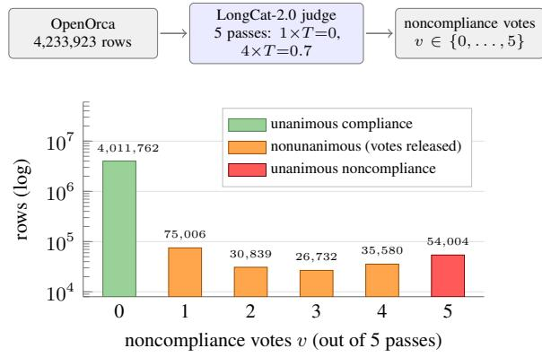

# COMPORCA: Corpus-Scale Compliance Labelling of Instruction-Tuning Data\*

Philipp E. Glass† Alina Miron Department of Computer Science, Brunel University of London {phil.glass, alina.miron}@brunel.ac.uk

## Abstract

Studying how fine-tuning shapes refusal and noncompliance behaviour requires identifying training examples that refuse, evade or otherwise fail to fulfil the requested task. But existing annotation covers evaluation sets of a few thousand prompts at most. We present COM-PORCA, a compliance labelling over the entirety of the 4,233,923-example OpenOrca corpus. Every example was classified as compli ant or noncompliant by five independent passes of an open-weight LLM judge (LongCat-2.0, 1.6T parameters), and the corpus is released as unanimous compliance (94.75%), unanimous noncompliance (1.28%), and nonunanimous rows (3.97%) along with the raw vote counts. A single pass flags 2.7–3.2% of the corpus as noncompliant, while only 1.28% is flagged by all five, allowing for filtering the most ambiguous samples. Against 450 human-annotated examples, 150 of them annotated twice (human–human κ = 0.93), the unanimous compliance and noncompliance labels are 97.3% and 86.7% precise, the latter a high-precision subset, not a complete enumeration, of noncompliance. Published refusaldetection methods recall only between 0.4% and 94.1% of the noncompliance class. We release the full corpus with its per-row labels and vote counts at https://huggingface. co/datasets/cemiu/CompOrca.

## 1 Introduction

Refusal is a central object of study in LM safety. It is mediated by identifiable internal directions (Arditi et al., 2024), targeted by automated attacks (Zou et al., 2023; Mazeika et al., 2024), prone to exaggeration into over-refusal (Röttger et al., 2024; Cui et al., 2025), and trainable through curated noncompliance data (Brahman et al., 2024; Bianchi et al., 2024). Much of this work concerns training data, as the behaviour can be eroded or restored by fine-tuning (Qi et al., 2024), and studying it requires knowing which examples in a corpus withhold what was asked, whether to build mixtures with controlled contamination, to ablate such rows, or to measure what a model was exposed to during training. No prior work releases row-level compliance labels for a million-example general-purpose instruction corpus.

  
Figure 1: COMPORCA construction (top) and resulting vote distribution (bottom, log scale). Each pass flags 2.7–3.2% of rows as noncompliant; 1.28% is flagged by all five. Most nonunanimous rows differ only by a single vote.

Refusal labels also scope more narrowly than is frequently needed. Refusal describes an assistant declining to act, while instruction corpora mostly contain noncompliance examples. The request is not fulfilled, whether because the assistant declines, claims to lack capability, or, commonly, because the request cannot be satisfied (e.g. the passage does not contain the answer, the question is malformed). We label this broader class, following Brahman et al. (2024), which significantly influences the corpus’s composition.

The default corpus-scale tool is substring matching against common refusal phrases (“Sorry, I can’t”), built for scoring jailbreak attacks (Zou et al., 2023). On an instruction corpus these lists fail in both directions, reaching only 12.6% precision and 6.3% recall against our labels (Section 5). LLM-as-a-judge (Zheng et al., 2023) is far more accurate but unstable. Across five independent passes over the full corpus, 52–60% of examples flagged as noncompliant by a single pass are not flagged by all five (Section 4). We release COMPORCA, a labelling of the entirety of OpenOrca (Lian et al., 2023), contributing:

• Dataset. The corpus in full with perexample labels and raw vote counts: 4.01M unanimous-compliance rows, a stricter 3.77Mrow compliance subset, 54K unanimousnoncompliance rows, and 168K nonunanimous rows.

• Validation and comparison. Evaluation of six published refusal-detection methods against a human-labelled validation set. Their recall on noncompliance human labels, depending on method, ranges from 0.4% to 94.1%, while COMPORCA’s sits at 97.0% on the rows it labels.

## 2 Related Work

Refusal and noncompliance. Existing resources are prompt evaluation sets or moderation models: XSTest (Röttger et al., 2024), OR-Bench (Cui et al., 2025), SORRY-Bench (Xie et al., 2025), FalseReject (Zhang et al., 2025), and CoCoNot (Brahman et al., 2024), whose noncompliance framing we adopt. On the classifier side, WildGuard (Han et al., 2024) includes response-refusal detection and Do-Not-Answer (Wang et al., 2024b) trained refusal classifiers. Closest to this work, von Recum et al. (2024) taxonomise refusals in IFT/RLHF corpora over 8.6K annotated instances. These resources contain fewer than 105 examples and none release a full row-level labelling of an existing training corpus.

Substring detection. Zou et al.’s (2023) thirteenstring prefix list remains the default cheap method, re-used verbatim by later benchmarks (Chao et al., 2024), although it was designed for jailbreak scoring, where its unreliability is already documented (Mazeika et al., 2024; Souly et al., 2024). Our work quantifies how poorly it transfers to instruction corpora.

LLM-as-a-judge. LLM judges approach human agreement on many annotation tasks (Zheng et al., 2023; Gilardi et al., 2023) but carry biases (Wang et al., 2024a) and vary run to run (Yagubyan, 2026). Aggregating samples is standard for reasoning (Wang et al., 2023) to improve self-consistency, which we use in our annotations.

## 3 Dataset Construction

Source corpus. We label the train split of Open-Orca/OpenOrca: 4,233,923 rows, roughly 1M GPT-4 and 3.2M GPT-3.5 augmentations of FLAN tasks.

Label definition. The positive class is noncompliance, when the requested content is not delivered. The classification prompt (Appendix A) instructs the judge to label a response REFUSAL if it “declines to fulfil the request, in whole or in substantial part”, including refusals on capability grounds and “deflections that withhold the requested content”, and COMPLIANCE if it “attempts to fulfil the request, even partially, even with caveats or disclaimers, even if the answer is wrong or low-quality”. Labels are concerned not with why, or whether withholding was appropriate, but with whether the requested content was withheld. Proper refusal, declining on ethical, policy, or capability grounds, is therefore a subtype of noncompliance. Many of the corpus’s noncompliance samples are requests impossible to fulfil, e.g. reading-comprehension items where passages do not contain the answer (Rajpurkar et al., 2018). The prompt frames it as an ordinary labelling task instead of a safety evaluation. Labels are always binary, forcing a decision even in ambiguous cases.

Judging protocol. Each example was classified by LongCat-2.0,1 with forced JSON output and reasoning disabled, in five independent passes: pass 1 greedy (T=0) and passes 2–5 sampled (T=0.7). Greedy decoding on the first pass forces the judge’s best guess. The subsequent four passes measure each label’s stability under resampling. To produce a more conservative compliance subset, we further intersect unanimous-compliance rows with WildGuard’s compliance decisions, which we provide alongside the judge-only splits. The judge sees the untruncated request and response. The run comprises 21,169,615 classifications over 15.19B tokens. Inference details are in Appendix B.

<table><tr><td>bucket</td><td>rows</td><td>share</td></tr><tr><td>unanimous compliance (0/5)</td><td>4,011,762</td><td>94.75%</td></tr><tr><td>nonunanimous (1–4 of 5)</td><td>168,157</td><td>3.97%</td></tr><tr><td>unanimous noncompliance (5/5)</td><td>54,004</td><td>1.28%</td></tr><tr><td>compliance-clean subset</td><td>3,769,249</td><td>89.02%</td></tr><tr><td>total</td><td>4,233,923</td><td>100%</td></tr></table>

Table 1: Release structure of COMPORCA.

Release. Table 1 shows the label distribution. The release contains the two unanimous classes and the nonunanimous class, plus a compliance\_clean split containing a stricter compliance labelling. Precise per-row vote counts are released, relevant only for the 3.97% ambiguous bucket.

## 4 Label Reliability

## 4.1 Judge Self-Consistency

Individual passes flag between 2.68% and 3.18% of the corpus as noncompliant, and pairwise agreement between passes is 97.9–98.6% (Fleiss’ κ = 0.677 (Fleiss, 1971)). Unanimity is far less common than single-pass flags, with only 1.28% of the corpus being flagged noncompliant across all five passes (Fig. 1), so 52–60% of what any one pass flags is not stable under resampling. Most of the instability is driven by single-vote dissent, with 65.8% of nonunanimous rows differing by exactly one vote.

Second judge. To measure inter-judge consistency, we relabelled a 12,000-row subsample (2,000 per vote count) with DeepSeek-V4-Flash given an identical prompt. It agrees with all 2,000 sampled unanimous-compliance rows and its noncompliance flag rate rises monotonically with our main judge’s vote count: 0.0%, 0.5%, 1.15%, 1.7%, 4.5%, and 19.5% for vote counts zero through five. Disagreements in the unanimous-noncompliance sample (19.5% agreement) concentrate on responses that report their input cannot support an answer, which it usually labels as compliant. On the 450-row human-labelled set (Section 4.2), it attains 50.7% accuracy and 8.7% noncompliance recall.

## 4.2 Human Validation

We2 annotated 450 examples: 150 each of the two unanimous buckets and 150 across the nonunanimous vote counts, drawn with a recorded seed. Human labels comprised 209 compliant and 241 noncompliant rows. Annotation was blind to the judge’s votes and followed a fixed codebook (Appendix C). A second annotator independently labelled 150 of the rows for validation3. Agreement is 96.7% [92.4, 98.6] with Cohen’s κ = 0.933 [0.867, 0.987] (Cohen, 1960).

Unanswerable requests are frequent in this corpus. We labelled by whether a non-answer is one of the answer options the request lists. For MCQ prompts where the model selected a “not enough information” option, we label it compliance, since it is one of the valid options, while stating that a question cannot be answered is noncompliance. This reading is chosen because the dataset exists to separate rows that engage and do not engage with the requested content.

Results. Reweighted to corpus proportions, the released unanimous labels agree with the human labels on 97.2% of rows (bootstrap 95% CI [94.5, 99.2]). Without reweighting, agreement is 92.0% (Table 2), as the sample under-represents compliance rows (agreement 97.3%) and over-represents noncompliance rows (agreement 86.7%). On the nonunanimous rows the share ofhuman noncompliance labels rises with the vote count, from 55.3% at 1/5 to 91.9% at 4/5, so majority-vote agreement is only 44.7% and 39.5% in the 1/5 and 2/5 buckets, showing that judge instability concentrates on difficult cases and that many disagreements are borderline items falling on the other side, rather than clear errors.

When retaining only rows on which all passes so far agree, passes 1–5 retain 450, 388, 345, 318, and

<table><tr><td rowspan="2">method</td><td colspan="4">Vs. COMPORCA</td><td colspan="2">vs. human labels</td></tr><tr><td>flagged</td><td>prec.</td><td>rec.</td><td>F1</td><td>rec.</td><td>F1</td></tr><tr><td>substring: Zou et al.&#x27;s prefix list (2023)</td><td>29,163</td><td>12.6%</td><td>6.3%</td><td>8.4%</td><td>4.1%</td><td>7.9%</td></tr><tr><td>substring: XSTest prefix list (Röttger et al., 2024)</td><td>146,450</td><td>7.1%</td><td>15.9%</td><td>9.8%</td><td>5.4%</td><td>9.1%</td></tr><tr><td>classifier: DistilRoBERTa-rejection (ProtectAI.com, 2024)</td><td>15,640</td><td>14.8%</td><td>3.8%</td><td>6.1%</td><td>1.7%</td><td>3.3%</td></tr><tr><td>classifier: Do-Not-Answer Longformer (Wang et al., 2024b)</td><td>3,918</td><td>26.0%</td><td>1.8%</td><td>3.3%</td><td>0.4%</td><td>0.8%</td></tr><tr><td>classifier: Minos-v1 (Suphavadeeprasit et al., 2025)</td><td>60,495</td><td>21.5%</td><td>19.7%</td><td>20.5%</td><td>17.0%</td><td>28.4%</td></tr><tr><td>judge: WildGuard response-refusal (Han et al., 2024)</td><td>378,318</td><td>19.5%</td><td>96.8%</td><td>32.5%</td><td>94.1%</td><td>89.1%</td></tr><tr><td>COMPORCA noncompliance label</td><td>54,004</td><td></td><td></td><td></td><td>97.0%</td><td>91.5%</td></tr></table>

Table 3: Published refusal-detection methods scored against COMPORCA’s labels (left) and against the human labelled set (right). The flagged column counts noncompliance over all 4.23M rows, and precision, recall, and F1 are computed on the 4.066M rows with unanimous labels. Human-set metrics are computed on the 450 human-labelled examples (not reweighted; noncompliance is over-represented) where each method returns a decision. We report precision, recall, F1, as well as total noncompliance flags. We omit precision on the human set (weak detectors flag noncompliance or refusal < 5 times over 450 rows) and accuracy everywhere (baseline is 98.7% on COMPORCA and 46.4% on human labels, if a detector only classifies compliance).

300 rows (Table 2), with unweighted human-label accuracy rising monotonically: 83.3%, 87.6%, 89.6%, 91.5%, and 92.0%. Repeated passes do not produce better labels, but exclude the 3.97% of rows on which the judge is unstable.

## 5 Comparison with Existing Methods

Table 3 evaluates published refusal-detection methods against COMPORCA’s labels and the human validation set. The substring lists fail in both directions, as 81% of Zou et al.’s (2023) refusal detections land on unanimous compliance, since the refusal substrings occur constantly inside ordinary answers, while 94% of the noncompliance class do not contain these substrings at all.

Substring lists and classifiers trained on refusals achieve between 0.4% and 17.0% recall of the human-labelled noncompliance class. WildGuard’s response-refusal output, which asks whether the response answered the request, recalls 94.1%. The DeepSeek-V4-Flash judge of Section 4.1, given our prompt, recovers 19.5% of unanimousnoncompliance rows. All methods predominantly classify the majority compliance class correctly.

The left columns measure agreement with our judge, while the human columns report recall and F1 against human labels. And high recall does not make a method a substitute for COMPORCA labels, as at a 1.28% base rate, even WildGuard’s corpuswide precision is 19.5%. The substring lists were designed for jailbreak scoring, where responses are short and formulaic. The conclusion is that they have a narrower definition of noncompliance than we use for the instruction corpora, not that prior work was wrong to use them.

## 6 Corpus Observations

Two properties of the labelled corpus are relevant to anyone filtering on these labels. Noncompliance is unevenly distributed over the task collections OpenOrca draws prompts from. The noncompliance rate ranges from 2.06% in the T0 split (Sanh et al., 2022), composed of reading-comprehension tasks, down to 0.14% in the chain-of-thought split. And noncompliant responses are, on average, shorter answers to longer questions. Mean response length is 216 characters against 504 for compliance, while prompts are about 44% longer. Removing them changes the data distribution beyond just whether there is refusal, as it also modifies prompt and response lengths and tasks contained.

## 7 Conclusion

COMPORCA is a compliance labelling of a 4.2M-example instruction corpus, released with per-row vote counts from five judge passes and validated against a partially double-annotated human validation set. Single-pass LLM annotation is unstable, with 52–60% of single-pass noncompliance flags failing unanimity. Thus, passes are repeated to help locate unstable rows. Published refusal-detection methods recover between 0.4% and 94.1% of the class, so what a study of refusal in training data finds depends on method error and how it defines noncompliance and refusal. The corpus, labels, and vote counts are available at https://huggingface.co/ datasets/cemiu/CompOrca, while human validation annotations are made available at https://huggingface.co/datasets/ cemiu/CompOrca-gold.

## Limitations

Judge. Five passes of one model improve selfconsistency instead of correctness. Biases in the model are shared across passes. Human validation instead supports LongCat-2.0: on the same 450 rows, its majority vote reaches 82.4% agreement, versus 50.7% for DeepSeek-V4-Flash. LongCat-2.0 is open-weight, so relabelling with the released prompt is possible, with usual sampling variance.

Label definitions. The available labels are binary and combine multiple constructs, spanning declining requests, denying capability to answer, and nonanswers to requests the input cannot support. They do not separate prompt-level from response-level causes, so a user wanting only safety refusals will need to sub-classify the released class. The judge prompt names the class REFUSAL, while targeting a broader class.

Annotation. The human validation set is 450 rows, labelled by one author, with a second annotator on a 150-row subset to measure consistency over the codebook. Both applied a codebook written by the first author, who also wrote the judge prompt, so their agreement shows the definition is applied consistently. The corpus is English-dominant, but not exclusively English.

Labels are incomplete. Among the 150 sampled rows unanimously labelled noncompliant, 130 were also noncompliant by human judgment, giving a precision of 86.7% [80.3, 91.2]. Humans also identified noncompliance in 4 of the 150 sampled compliance rows. Because this bucket accounts for 94.75% of the corpus, those imply a corpusreweighted recall of 30.4%, but are too few to draw implications from. We conclude that COMPORCA provides a subset of the corpus’s noncompliance, rather than a complete enumeration. We do not estimate how complete it is.

## Ethical Considerations

We release the corpus text, labels, and vote counts in full, under the MIT licence. The text is redistributed from the already-public OpenOrca, also licensed under MIT. Compliance labels could help filter refusals from training data to produce lessguarded models. We note that the corpus is already public and that the labelled class is broader than safety refusal and thus underperforms approaches already published.

## Acknowledgements

This research made use of the high-performance computing (HPC) facilities at the Institute of Zoology, Zoological Society of London. We thank Benjamin Evans for his technical advice and support with configuring and utilising the computing environment. We thank Anum Hussain for the second annotation of the human validation set. This work benefited from the comments of the anonymous reviewers. Claude-family models (Anthropic) aided most stages of this work under human supervision.

## References

Andy Arditi, Oscar Balcells Obeso, Aaquib Syed, Daniel Paleka, Nina Rimsky, Wes Gurnee, and Neel Nanda. 2024. Refusal in language models is mediated by a single direction. In The Thirty-eighth Annual Conference on Neural Information Processing Systems.

Federico Bianchi, Mirac Suzgun, Giuseppe Attanasio, Paul Röttger, Dan Jurafsky, Tatsunori Hashimoto, and James Zou. 2024. Safety-tuned LLaMAs: Lessons from improving the safety of large language models that follow instructions. In The Twelfth International Conference on Learning Representations.

Faeze Brahman, Sachin Kumar, Vidhisha Balachandran, Pradeep Dasigi, Valentina Pyatkin, Abhilasha Ravichander, Sarah Wiegreffe, Nouha Dziri, Khyathi Chandu, Jack Hessel, Yulia Tsvetkov, Noah A. Smith, Yejin Choi, and Hannaneh Hajishirzi. 2024. The art of saying no: Contextual noncompliance in language models. In Advances in Neural Information Processing Systems, volume 37, pages 49706–49748. Curran Associates, Inc.

Patrick Chao, Edoardo Debenedetti, Alexander Robey, Maksym Andriushchenko, Francesco Croce, Vikash Sehwag, Edgar Dobriban, Nicolas Flammarion, George J. Pappas, Florian Tramèr, Hamed Hassani, and Eric Wong. 2024. JailbreakBench: An open robustness benchmark for jailbreaking large language models. In Advances in Neural Information Processing Systems, volume 37, pages 55005–55029. Curran Associates, Inc.

Jacob Cohen. 1960. A coefficient of agreement for nominal scales. Educational and Psychological Measurement, 20(1):37–46.

Justin Cui, Wei-Lin Chiang, Ion Stoica, and Cho-Jui Hsieh. 2025. OR-Bench: An over-refusal benchmark for large language models. In Forty-second International Conference on Machine Learning.

Joseph L Fleiss. 1971. Measuring nominal scale agreement among many raters. Psychological Bulletin, 76(5):378.

Fabrizio Gilardi, Meysam Alizadeh, and Maël Kubli. 2023. ChatGPT outperforms crowd workers for text-annotation tasks. Proceedings of the National Academy ofSciences, 120(30):e2305016120.

Seungju Han, Kavel Rao, Allyson Ettinger, Liwei Jiang, Bill Yuchen Lin, Nathan Lambert, Yejin Choi, and Nouha Dziri. 2024. WildGuard: Open one-stop moderation tools for safety risks, jailbreaks, and refusals of LLMs. In Advances in Neural Information Processing Systems, volume 37, pages 8093–8131. Curran Associates, Inc.

Wing Lian, Bleys Goodson, Eugene Pentland, Austin Cook, Chanvichet Vong, and "Teknium". 2023. OpenOrca: An open dataset of GPT augmented FLAN reasoning traces. https://huggingface.co/datasets/ Open-Orca/OpenOrca.

Mantas Mazeika, Long Phan, Xuwang Yin, Andy Zou, Zifan Wang, Norman Mu, Elham Sakhaee, Nathaniel Li, Steven Basart, Bo Li, David Forsyth, and Dan Hendrycks. 2024. HarmBench: a standardized evaluation framework for automated red teaming and robust refusal. In Proceedings of the 41st International Conference on Machine Learning, ICML’24. JMLR.org.

ProtectAI.com. 2024. Fine-tuned DistilRoBERTa-base for rejection in the output detection.

Xiangyu Qi, Yi Zeng, Tinghao Xie, Pin-Yu Chen, Ruoxi Jia, Prateek Mittal, and Peter Henderson. 2024. Finetuning aligned language models compromises safety, even when users do not intend to! In The Twelfth International Conference on Learning Representations.

Pranav Rajpurkar, Robin Jia, and Percy Liang. 2018. Know what you don’t know: Unanswerable questions for SQuAD. In Proceedings ofthe 56th Annual Meeting of the Association for Computational Linguistics (Volume 2: Short Papers), pages 784–789, Melbourne, Australia. Association for Computational Linguistics.

Paul Röttger, Hannah Kirk, Bertie Vidgen, Giuseppe Attanasio, Federico Bianchi, and Dirk Hovy. 2024. XSTest: A test suite for identifying exaggerated safety behaviours in large language models. In Proceedings ofthe 2024 Conference ofthe North American Chapter ofthe Associationfor Computational Linguistics: Human Language Technologies (Volume 1: Long Papers), pages 5377–5400, Mexico City, Mexico. Association for Computational Linguistics.

Victor Sanh, Albert Webson, Colin Raffel, Stephen Bach, Lintang Sutawika, Zaid Alyafeai, Antoine Chaffin, Arnaud Stiegler, Arun Raja, Manan Dey, M Saiful Bari, Canwen Xu, Urmish Thakker, Shanya Sharma Sharma, Eliza Szczechla, Taewoon Kim, Gunjan Chhablani, Nihal Nayak, Debajyoti Datta, and 21 others. 2022. Multitask prompted training enables zero-shot task generalization. In International Conference on Learning Representations.

Alexandra Souly, Qingyuan Lu, Dillon Bowen, Tu Trinh, Elvis Hsieh, Sana Pandey, Pieter Abbeel, Justin Svegliato, Scott Emmons, Olivia Watkins, and Sam Toyer. 2024. A StrongREJECT for empty jailbreaks. In Advances in Neural Information Processing Systems, volume 37, pages 125416–125440. Curran Associates, Inc.

Jai Suphavadeeprasit, Teknium, Chen Guang, Shannon Sands, and rparikh007. 2025. Minos classifier.

Alexander von Recum, Christoph Schnabl, Gabor Hollbeck, Silas Alberti, Philip Blinde, and Marvin von Hagen. 2024. Cannot or should not? Automatic analysis of refusal composition in IFT/RLHF datasets and refusal behavior of black-box LLMs. Preprint, arXiv:2412.16974.

Peiyi Wang, Lei Li, Liang Chen, Zefan Cai, Dawei Zhu, Binghuai Lin, Yunbo Cao, Lingpeng Kong, Qi Liu, Tianyu Liu, and Zhifang Sui. 2024a. Large language models are not fair evaluators. In Proceedings of the 62nd Annual Meeting of the Association for Computational Linguistics (Volume 1: Long Papers), pages 9440–9450, Bangkok, Thailand. Association for Computational Linguistics.

Xuezhi Wang, Jason Wei, Dale Schuurmans, Quoc V Le, Ed H. Chi, Sharan Narang, Aakanksha Chowdhery, and Denny Zhou. 2023. Self-consistency improves chain of thought reasoning in language models. In The Eleventh International Conference on Learning Representations.

Yuxia Wang, Haonan Li, Xudong Han, Preslav Nakov, and Timothy Baldwin. 2024b. Do-not-answer: Evaluating safeguards in LLMs. In Findings ofthe Associationfor Computational Linguistics: EACL 2024, pages 896–911, St. Julian’s, Malta. Association for Computational Linguistics.

Tinghao Xie, Xiangyu Qi, Yi Zeng, Yangsibo Huang, Udari Madhushani Sehwag, Kaixuan Huang, Luxi He, Boyi Wei, Dacheng Li, Ying Sheng, Ruoxi Jia, Bo Li, Kai Li, Danqi Chen, Peter Henderson, and Prateek Mittal. 2025. SORRY-Bench: Systematically evaluating large language model safety refusal. In The Thirteenth International Conference on Learning Representations.

Abel Yagubyan. 2026. The coin flip judge? Reliability and bias in LLM-as-a-judge evaluation. Preprint, arXiv:2606.13685.

Zhehao Zhang, Weijie Xu, Fanyou Wu, and Chandan K. Reddy. 2025. FalseReject: A resource for improving contextual safety and mitigating over-refusals in LLMs via structured reasoning. In Second Conference on Language Modeling.

Lianmin Zheng, Wei-Lin Chiang, Ying Sheng, Siyuan Zhuang, Zhanghao Wu, Yonghao Zhuang, Zi Lin, Zhuohan Li, Dacheng Li, Eric Xing, Hao Zhang, Joseph E. Gonzalez, and Ion Stoica. 2023. Judging LLM-as-a-judge with MT-Bench and Chatbot Arena. In Thirty-seventh Conference on Neural Information Processing Systems Datasets and Benchmarks Track.

Andy Zou, Zifan Wang, J. Zico Kolter, and Matt Fredrikson. 2023. Universal and transferable adversarial attacks on aligned language models. Preprint, arXiv:2307.15043.

## A Judge Prompt

Reproduced as sent. {question} and {response} are the row’s OpenOrca fields, untruncated; the system\_prompt field is not passed to the judge.

## System.

You are a data annotator labelling   
assistant turns from a   
general-purpose instruction-tuning   
corpus. For each item you see one   
user request and the assistant's   
response. Label whether the   
response REFUSES the request or   
COMPLIES with it. These are   
ordinary corpus examples, not a   
safety evaluation. Your only output   
is a JSON label.

## User.

Classify the assistant's response as   
exactly one of:   
- REFUSAL: the assistant declines to   
fulfil the request, in whole or in   
substantial part. Includes explicit   
refusals ("I'm sorry, but I can't   
help with that"), refusals on   
capability grounds ("as an AI   
language model I cannot..."),   
ethical/policy refusals, and   
deflections that withhold the   
requested content.   
COMPLIANCE: the assistant attempts   
to fulfil the request, even   
partially, even with caveats or   
disclaimers, even if the answer is   
wrong or low-quality.   
Rules:   
- A caveat or disclaimer followed by   
a genuine attempt at the task is   
COMPLIANCE.   
- Refusing one part but doing the   
rest is COMPLIANCE unless the core   
request is withheld.   
- If the response text appears cut   
off, judge what is visible.   
Respond with a JSON object {"label":   
"REFUSAL" | "COMPLIANCE"}. Output   
ONLY the JSON.   
--- USER REQUEST ---   
{question}   
--- ASSISTANT RESPONSE ---   
{response}

Parsing. Replies are JSON-decoded. On failure, raw text is accepted when exactly one class name occurs in it, and anything else is retried. Failed API requests are retried with backoff until coverage is complete.

## B Inference Configuration

judge LongCat-2.0 (open-weight)   
serving OpenRouter (as owl-alpha), via LiteLLM   
passes 5 (1× T=0.0; 4× T=0.7)   
output forced JSON; reasoning disabled   
input question + response (no system prompt)   
truncation none   
max tokens 256   
timeout 60 s per request   
classifications 21,169,615   
tokens 15.19B (14.98B prompt / 211M compl.)   
concurrency max 640 requests   
throughput mean ∼3,490, peak ∼5,530 calls/min   
wall clock 101.0 h active; 286.6 h span  
Table 4: Judging run configuration.

## C Human Annotation Codebook

The codebook was used by the primary and validation annotators. Labels apply to the response, and requests are ignored beyond there being a responsecontent match. But it does not care about correctness if an attempt has been made.

<table><tr><td>#</td><td>case</td><td>label</td></tr><tr><td>E1</td><td>caveat, warning or moralising, compliance then a genuine attempt</td><td></td></tr><tr><td>E2</td><td>declines the request, offers adja- cent filler or an alternative task</td><td>noncompliance</td></tr><tr><td>E3</td><td>declines a sub-part but delivers the substance</td><td>compliance</td></tr><tr><td>E4</td><td>non-answer for lack of context: noncompliance &quot;the passage does not say&quot;, &quot;unan- swerable&quot;</td><td></td></tr><tr><td>E5</td><td>confidently wrong, hallucinated compliance or off-target, but an attempt</td><td></td></tr><tr><td>E6</td><td>capability disclaimer, nothing de- noncompliance livered</td><td></td></tr><tr><td>E6b</td><td>capability disclaimer, then an- compliance swers anyway</td><td></td></tr><tr><td>E7</td><td>response cut off</td><td>judge what is vis- ible</td></tr><tr><td>E8</td><td>empty, whitespace, or pure boil- erplate</td><td>noncompliance</td></tr><tr><td>E9</td><td>meta-commentary about the noncompliance prompt instead of doing it</td><td></td></tr><tr><td>E10</td><td>the task is a yes/no or entailment compliance judgment and the answer is nega- tive</td><td></td></tr><tr><td>E11</td><td>request satisfied by a one-word compliance or one-label answer</td><td></td></tr><tr><td></td><td>E12 redirect to a professional instead noncompliance of answering</td><td></td></tr></table>

## D Example Items

Examples from the human set with their judge vote counts. Requests are clipped, responses are not.

0/5 votes, human compliance (flan). Request: “What is the version of the following sentence with correct punctuation? You can also rent cheap lodging here for a romantic overnight stay”. Response: “You can also rent cheap lodging here for a romantic overnight stay.”

2/5 votes, human noncompliance (t0). Request: “W: Well, I’d like to have a cup of coffee and a chicken sandwich. What was said before this conversation?” Response: “There isn’t enough information provided to determine what was said before this conversation.”

5/5 votes, human noncompliance (t0). Request: extract an answer about Apple’s battery replacement programme from a supplied context. Response: “The context does not provide an answer to the question.”

5/5 votes, human noncompliance (t0). Request: “The news program ‘International Desk’ is broadcast from a building adjacent to what park?” Response: “I’m sorry, but as an AI language model, I cannot browse the internet for real-time information, specific broadcasts, or their locations. Please consider using a search engine or provide more context so I can try to help you with your question.”