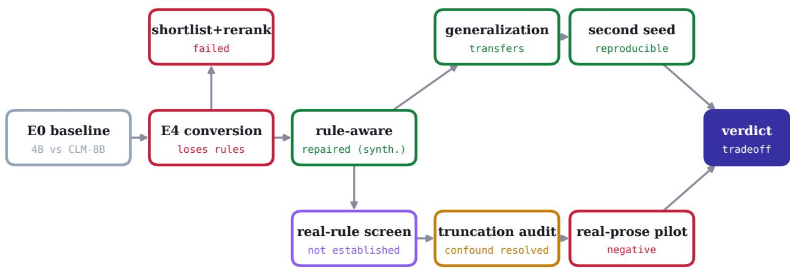
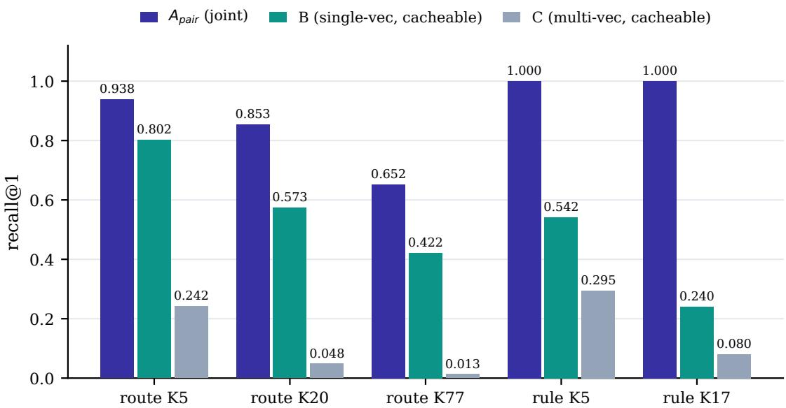
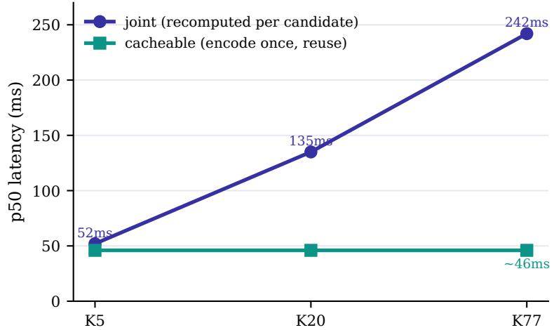
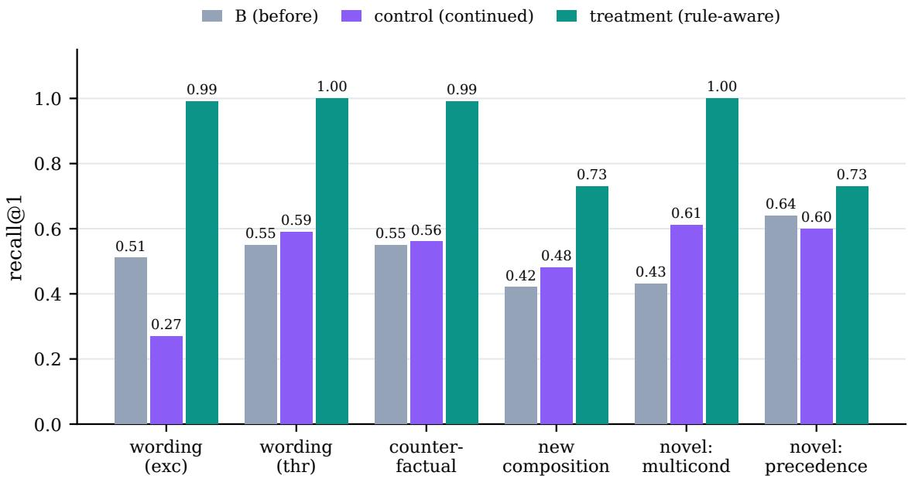
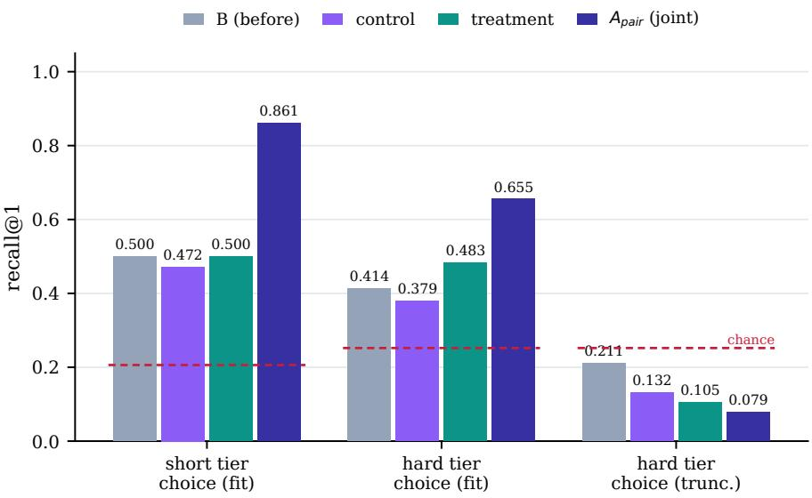
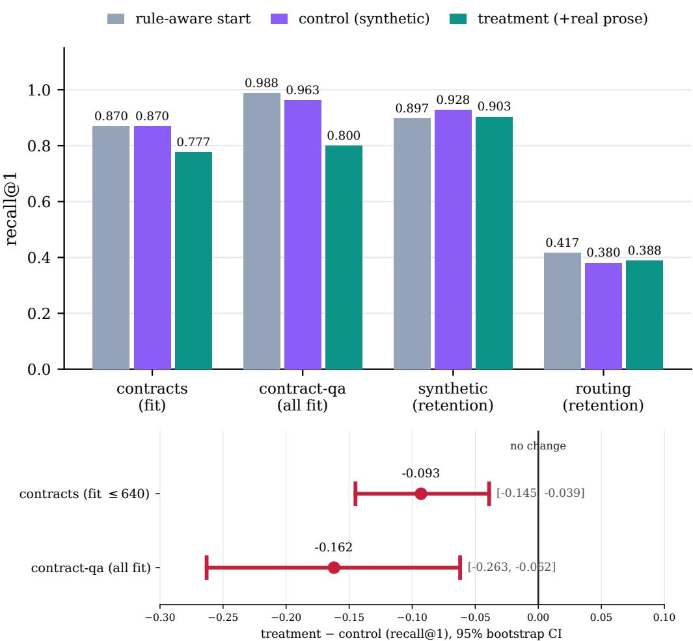

# Can a Cacheable Decision Model Follow Rules?

Dushyant Rajput Nirdesh Chauhan Siddharth Kosaraju

AltSlate Labs LLP

dushyant@altslate.com nirdesh@altslate.com siddharth@altslate.com

September 2026

## Abstract

A non-generative decision model scores candidate actions from their text and returns a temperature-scaled probability, replacing a generation step with a single forward pass. The accurate way to do this reads the state, the governing rules, and each candidate together— a joint scorer—so every candidate is re-encoded against every state, and cost grows with the size of the candidate menu. Independent encoding lets each candidate be encoded once and reused across states—a measured latency reduction that widens with the menu (about 5× at 77 candidates in our setup)—but it moves the state and the candidate apart. We ask how much rule-sensitivity—picking the action a stated rule requires, not the one that merely looks similar—survives that move, and whether the loss can be trained back. On Certo, a Qwen3-4B [1] decision model, we run four experiments. (1) At a matched budget, the tested conversion to cacheable scoring loses rule-sensitivity: a single-vector dual encoder falls from 1.00 to 0.24 recall@1 on rule-sensitive selection while the joint scorer holds 1.00; a shortlist-then-rerank rescue fails because the cheap encoder drops the compliant candidate before reranking. (2) Targeted supervision restores performance on heldout synthetic rule tasks—the cacheable encoder reads paraphrased rules (0.99–1.00), tracks counterfactual flips (98.7% of pairs correct on both sides vs. 30%), composes operators, and partly handles rule types it never trained on, with every gain’s paired interval excluding zero and the result reproducing across seeds; we do not isolate whether these predictions depend on the supplied rule. (3) On real, human-authored rules the added benefit is not established: after resolving a truncation confound that had masked the hard tier, the joint scorer keeps a statistically significant edge on the short tier (0.861 vs. 0.500; paired CI [+0.167, +0.556]) and a directional, non-significant one on the hard tier (0.655 vs. 0.483, n=29), while the synthetic recipe gives no convincing lift over the pre-trained encoder. (4) A matched cross-domain real-prose mixture did not help and reduced unseen-source contract accuracy by 9.3 and 16.2 points $( - 0 . 0 9 3 , 9 5 \% \mathrm { C I } [ - 0 . 1 4 5 , - 0 . 0 3 9 ] ; - 0 . 1 6 2 , [ - 0 . 2 6 3 , - 0 . 0 6 2 ] )$ , though the design confounds reduced synthetic exposure with the added prose. The picture that holds up: targeted supervision restores strong performance across held-out synthetic rule tasks, but we do not isolate whether it makes the encoder depend on the supplied rule, and neither it nor a crossdomain real-prose mixture demonstrably improved unseen-source real-rule decisions; the joint scorer keeps an advantage (significant on the short tier) at the cost of caching. Beneficial transfer to unseen-source rules is not established; the tested privacy-data replacement produced a measured decline whose cause and generality remain unresolved.

## 1 Introduction

Many production decisions are not open-ended generation. A support system routes a message to one of a fixed set of intents; a workflow engine picks the one action a policy permits; a moderation layer answers a yes/no question about a rule. For these, a large language model that writes a paragraph and then commits to an answer is both slower than necessary and harder to calibrate than a model that simply scores the options.

Certo is a small, non-generative decision model built for this shape of problem. It encodes a state—the situation together with the rules that govern it—and scores each candidate action from its text, returning a temperature-scaled probability over the candidates for three primitives: Choice (pick one of several), Score (an ordinal level), and Noul (yes/no). One forward pass, no generation, probabilities as the primary output.

The reference model uses a joint scorer: the state, the rules, and one candidate are read together in a single sequence, and a head emits a relevance score. Reading them together is what lets the model apply a rule to a candidate. It is also what makes the model expensive at scale: because a candidate only ever exists fused with a state, its representation cannot be reused, and the cost of scoring a menu grows with the number of candidates. Serving stacks already reuse computation in a limited way: automatic prefix caching [2] lets a causal joint scorer reuse the shared state-and-rules prefix across the candidates of a single state, so only each candidate’s sufix is recomputed. What no joint scorer can do is reuse a candidate’s representation across diferent states, because that representation is always conditioned on the state it was scored against.

The alternative is independent encoding, the design behind dense retrieval [3, 4] and its multivector variants [5]: encode the state once and each candidate once, then combine cheaply. This adds the second kind of reuse—a candidate’s vector is state-independent, so it is computed once and reused across every state that shares a rubric. In our measurements this widens the latency gap with menu size (§3); we report it for the implementation measured, not as an architectural constant. The risk is equally real: the state and the candidate never meet inside the network, and rule application may be exactly the interaction that separation destroys.

This paper is a study of that tradeof on one model. The precise question is:

How much rule-sensitivity survives when a joint decision scorer is converted to a cacheable independent-encoding scorer, can the loss be trained back, and does any recovered rulesensitivity transfer to real rules the model was not trained on?

Our contributions are four experiments and a qualified answer. Section 3 shows the conversion loses rule-sensitivity and a shortlist rescue fails. Section 4 shows counterfactual supervision recovers it on synthetic rules, reproducibly. Section 5 tests real rules, uncovers and resolves a truncation confound, and finds the synthetic recovery does not clearly transfer. Section 6 runs a controlled real-prose training pilot and finds cross-domain data does not help. We are explicit throughout about which claims are established and which are not.

## 2 Setting and architectures

Model. Certo is a Qwen3-4B [1] encoder. All scorers share the backbone’s causal attention and difer in how hidden states are reduced to a score (below). Choice and Noul are trained with a multiclass Brier loss [6]; Score with a ranked-probability (squared-EMD) loss [7]. Outputs are temperature-scaled per primitive [8]; we do not measure calibration under transfer, so we describe them as temperature-scaled probabilities rather than calibrated ones. Adapters are LoRA [9] (rank 16) on the attention and MLP projections.

Four scorers. All read a state and a set of candidates and rank the candidates; they difer in where the state and a candidate meet, which decides whether a candidate’s representation is

  
Figure 1: The experimental program as a dependency graph. E0 is a prior baseline study (Certo vs. a contrastive dual-encoder); E4 is the four-scorer conversion study of §3; later nodes are this paper’s experiments. Green nodes are positive results, red are negative, amber is a confound resolved by re-analysis. The spine (E0 → E4 → rule-aware → generalization → second seed) establishes and validates the training fix; the lower track (real-rule screen → truncation audit → real-prose pilot) tests it against real rules.

reusable.

$A _ { \mathbf { p a i r } }$ (joint cross-encoder). Each candidate is concatenated with the state and rules into one sequence; the last-token hidden state feeds a scalar-relevance head, and a softmax over candidates gives the distribution. Not cacheable. This is the standard reranker design [10].

$A _ { 1 0 }$ (joint head). Reads the state once; the last-token hidden state feeds a native K-way head over up to ten candidates. Accurate but capped at the head width.

• B (single-vector dual). State and each candidate are encoded separately; each one’s lasttoken hidden state is linearly projected and L2-normalized to a single vector, and the score is scaled cosine. Candidate vectors are cacheable [3, 4].

• C (multi-vector). Each token’s hidden state is linearly projected to a per-token vector (no pooling); the score is late-interaction MaxSim over the token vectors [5]. Cacheable.

Throughout, the rules live in the state, so candidate embeddings stay reusable even for rule-sensitive decisions: only the state carries the rubric.

Protocol. “Matched budget” means equal training examples and optimizer steps across the arms compared; token and compute counts vary with content and are not separately equalized. Splits are disjoint by rule family and by document source; held-out suites use rule combinations, wordings, and types never seen in training. Confidence intervals are bootstraps (5000 resamples) grouped by the unit of dependence: by counterfactual pair for the paired block, by document elsewhere. In the real-rule evaluations each item is a distinct document (Table 3), so document- and item-level resampling coincide there. Latencies are p50, single query, bf16, on one GPU, with candidate vectors served from a warm cache for the cacheable arms; they index the trend, not an optimized deployment.

Table 1: Experiment 1: recall@1 by scorer, with p50 latency. Reusable: candidate embeddings reusable across states; the joint scorer can still reuse the state prefix within one state via prefix caching. The rulesensitive slice has 17 candidates, so its second column is K17 (the full menu), not K20.
<table><tr><td></td><td colspan="3">routing</td><td colspan="2">rule-sensitive</td><td rowspan="2">latency</td><td rowspan="2">cand. emb. reusable</td></tr><tr><td>scorer</td><td>K5</td><td>K20</td><td>K77</td><td>K5</td><td>K17</td></tr><tr><td> $A _ { \mathrm { p a i r } } \ \mathrm { ( j o i n t ) }$ </td><td>0.938</td><td>0.853</td><td>0.652</td><td>1.00</td><td>1.00</td><td>52–242 ms</td><td>no</td></tr><tr><td> $A _ { 1 0 }$  (joint head)</td><td>0.953</td><td></td><td></td><td>1.00</td><td></td><td>47 ms (K≤10)</td><td>no</td></tr><tr><td>B (single-vector)</td><td>0.802</td><td>0.573</td><td>0.422</td><td>0.542</td><td>0.240</td><td>46 ms</td><td>yes</td></tr><tr><td>C (multi-vector)</td><td>0.242</td><td>0.048</td><td>0.013</td><td>0.295</td><td>0.080</td><td>46 ms</td><td>yes</td></tr></table>

  
Figure 2: Recall@1 by scorer. The joint scorer $( A _ { \mathrm { p a i r } } )$ holds rule-sensitive accuracy at 1.00 across menu sizes; both cacheable scorers collapse on rules (B to 0.24, C to 0.08 at K17) while keeping some routing ability. The rule-sensitive slice has 17 candidates (K17); routing K20 is a separate slice.

## 3 Experiment 1: making scoring cacheable loses rule-sensitivity

We trained all four scorers from the same reference model at a matched budget and measured recall@1 on two kinds of decision at several menu sizes K: routing (choose the intent matching a message) and rule-sensitive selection (choose the action a stated rule requires). Results are in Table 1 and Figure 2.

The joint scorer nails rule-sensitivity (1.00) but its latency grows with the menu (Figure 3). The single-vector encoder keeps partial routing but loses rule-sensitivity (0.24–0.54 vs. 1.00); the multi-vector encoder collapses to near chance, observed as a MaxSim score collapse in which no candidate stands out. Cacheable scoring is approximately flat over the measured range (the cosine step still grows with the candidate count, but is negligible here). The measured latency gap is about 2.9× at K20 (135 vs. 46 ms) and 5.3× at K77 (242 vs. 46 ms), the largest menu we measure, and widens with $K ;$ these are execution latencies, not scoring-pass counts (Figure 3).

A shortlist rescue also fails. We tried a hybrid: retrieve a cheap top-k with the cacheable encoder, then rerank with the joint scorer. The target is candidate-inclusion recall@k—the rulecompliant answer appearing in the $\mathrm { { t o p } - \it { k } \mathrm { { - } \it { a t } } \geq 0 . 9 8 }$ , so a compute-saving k (smaller than the menu) still leaves the reranker a correct option to pick. The rule-sensitive slice has 17 candidates (the K17 column of Table 1). At the tested shortlist sizes, inclusion recall was 0.72/0.80 at $k { = } 5 / 1 0$ and reached 1.00 only at $k { = } 1 7 ,$ , i.e. the full set (no shortlist); k=11–16 were not measured. On routing, inclusion recall was $0 . 7 0 / 0 . 8 2 / 0 . 9 3$ at $k { = } 5 / 1 0 / 2 0$ and hybrid top-1 accuracy (0.57–0.64) did not exceed the joint reranker’s 0.65. So for the tested reduced shortlists, no size both saved compute and met the target. The omitted candidates were the rule-compliant ones, which is consistent with surface-similarity ranking but does not by itself establish that as the cause. Among the conversions tried at this budget, only joint interaction preserved rule-sensitive accuracy.

  
Figure 3: Why caching is worth wanting. Joint scoring grows with the menu (52 → 242 ms, K5→K77); cacheable scoring is approximately flat (≈ 46 ms over the measured range) because candidate vectors are reused. Conditions in the Protocol paragraph.

## 4 Experiment 2: counterfactual supervision recovers it on synthetic rules

Rather than change the architecture, we changed the data. The single-vector encoder (B) was continued on counterfactual rule pairs: two situations that difer by exactly one condition—an exception firing, a threshold crossed—so the correct action flips. The rule is written into the state, keeping candidates cacheable, and the semantically tempting but prohibited action is always present as a hard negative [11]. Positives are labelled by an executable rule.

Example. A counterfactual pair, difering in one clause (the candidate menu is identical): ${ } ^ { 6 6 } P o l { - }$ icy: to release the payment, do release payment. Exception: if the request is past the deadline, do deny out of window. Situation: the request is within the deadline.” → gold release payment; flipping the last clause to past the deadline moves the gold to deny out of window, with release payment now the hard negative.

Evaluation used a frozen suite of held-out rules across four blocks (paraphrased wordings, counterfactual pairs, a composition of two operators, and rule types never trained). Table 2 and Figure 4 report recall@1 with paired bootstrap intervals against two baselines: the encoder before this training (B) and a control continued on unrelated data.

Table 2: Experiment 2: held-out generalization suite, recall@1. Slashes give the two families within a block; the CI is for the pooled block. Bootstrap grouping: by pair for the counterfactual block (300 items, 150 pairs), by item otherwise (n=300). Every block gain over both baselines excludes zero.
<table><tr><td>block</td><td>B (before)</td><td>control</td><td>treatment</td><td>treat. – control (95% CI)</td></tr><tr><td>unseen wording (exc. / thr.), n=300</td><td>0.51 /0.55</td><td>0.27 / 0.59</td><td>0.99 /1.00</td><td>+0.563 [0.507, 0.620]</td></tr><tr><td>counterfactual, 150 pairs</td><td>0.55</td><td>0.56</td><td>0.99</td><td>+0.430 [0.377, 0.483]</td></tr><tr><td>new composition, n=300</td><td>0.42</td><td>0.48</td><td>0.73</td><td>+0.250 [0.187,0.313]</td></tr><tr><td>novel type (multicond. / prec.), n=300</td><td>0.43 / 0.64</td><td>0.61 / 0.60</td><td>1.00 / 0.73</td><td>+0.263 [0.217,0.313]</td></tr><tr><td>counterfactual both-correct</td><td>0.30</td><td>0.29</td><td>0.987</td><td></td></tr><tr><td>routing (retention)</td><td>0.430</td><td>0.453</td><td>0.420</td><td>-0.033 [-0.077, +0.013]</td></tr></table>

  
Figure 4: Held-out generalization suite. The treatment reads paraphrased rules (0.99–1.00), tracks counterfactuals, composes an exception with a threshold (0.73), and partly handles untrained rule types (multicondition 1.00, precedence 0.73), with no statistically detectable routing change (the interval still admits an ≈ 8-point drop, so this is not an equivalence claim).

The treatment reads paraphrased rules it never saw, answers both sides of a counterfactual pair correctly 98.7% of the time against 30% for the baseline, composes operators, and partly handles rule types outside its training. We detect no statistically significant routing change (−0.033, 95% CI [−0.077, +0.013]); the interval still admits up to a roughly 8-point drop, so this is not an equivalence claim. The result reproduced under a second seed (seed 2 recall@1: wording 1.00/1.00, counterfactual 1.00, composition 0.82, multi-condition 1.00, precedence 0.73; both-correct 1.00), with the precedence ceiling identical across seeds. The cacheable encoder therefore generalizes across the held-out synthetic rule tasks while keeping the large-menu serving advantage. We stop short of calling it rule-following: whether its predictions depend on the supplied rule, rather than on a learned decision pattern, is what the rule-only control (below) would settle, and we do not claim it here.

Table 3: Experiment 3: real rule-sensitive choice, recall@1, rescored within the trained window. On truncated items the joint scorer falls furthest, exactly as the candidate-dropping mechanism predicts.
<table><tr><td>slice</td><td>n</td><td>B</td><td>control</td><td>treatment</td><td> $A _ { \mathrm { p a i r } } \ \mathrm { ( j o i n t ) }$ </td></tr><tr><td>short tier, choice (fits)</td><td>36</td><td>0.500</td><td>0.472</td><td>0.500</td><td>0.861</td></tr><tr><td>hard tier, choice (fits)</td><td>29</td><td>0.414</td><td>0.379</td><td>0.483</td><td>0.655</td></tr><tr><td>hard tier, choice (truncated)</td><td>38</td><td>0.211</td><td>0.132</td><td>0.105</td><td>0.079</td></tr><tr><td>short tier, yes/no&#x27; (fits)</td><td>24</td><td>0.958</td><td>0.958</td><td>0.917</td><td>0.958</td></tr></table>

  
Figure 5: Real rule-sensitive choice within the trained window (dashed red: chance). The joint scorer keeps an advantage on inputs that fit (significant on the short tier); on truncated inputs every scorer falls to near or below chance, the joint one furthest, because right-truncation drops its appended candidate.

What the synthetic suite does not yet isolate. These pairs change a condition in the state, which shows sensitivity to the relevant facts but does not by itself rule out a learned, templatespecific procedure. The decisive control—holding the facts and candidates fixed and changing only the stated rule, so the correct answer moves, with deleted-rule and shufled-rule baselines—is not yet run (§8). The other open question is external validity: the suite is synthetic and templated.

## 5 Experiment 3: real rules, and a truncation confound

We scored the trained encoders on real, human-authored decisions drawn from JevBench, an internal benchmark of insurance, policy, and contract questions with the rules stated in the text. A first pass read as a flat null on the hard tier. That reading was an artifact of truncation.

The confound. The joint scorer appends the candidate after the state in one sequence. On a long document, right-truncation at the trained window cuts the candidate of entirely. An input audit found that only 29 of 67 hard-tier choice items fit both scorers’ trained windows (state up to 3,649 tokens against a 640/704 budget); the short tier fit in full. Rescoring only within the trained window, with the models frozen, separates skill from truncation (Table 3, Figure 5).

Two conclusions, held apart, with paired bootstraps over the fitting items. On the short tier the joint scorer has a significant edge over the cacheable treatment (0.861 vs. 0.500, i.e. 31/36 vs.

Table 4: Experiment 4: real-prose pilot, recall@1. Replacing part of the synthetic mixture with privacypolicy prose reduced unseen-source contract accuracy (−9.3 and −16.2 points); retention on synthetic rules and routing is approximately unchanged (we do not run an equivalence test).
<table><tr><td>slice</td><td>n</td><td>rule-aware start</td><td>control (synthetic)</td><td>treatment (+real prose)</td></tr><tr><td>contracts (fit ≤640)</td><td>332</td><td>0.870</td><td>0.870</td><td>0.777</td></tr><tr><td>contract-qa (all fit)</td><td>80</td><td>0.988</td><td>0.963</td><td>0.800</td></tr><tr><td>contracts (truncated)</td><td>144</td><td>0.569</td><td>0.562</td><td>0.556</td></tr><tr><td>synthetic rules (retention)</td><td>1200</td><td>0.897</td><td>0.928</td><td>0.903</td></tr><tr><td>routing (retention)</td><td>400</td><td>0.417</td><td>0.380</td><td>0.388</td></tr></table>

18/36; paired d = +0.361, 95% CI [+0.167, +0.556]). On the hard tier the edge is directional but not significant (0.655 vs. 0.483, i.e. 19/29 vs. 14/29; d = +0.172, CI [−0.069, +0.414])—a five-item diference on a small slice, which we report descriptively and treat as weaker than the short-tier result. The 38 truncated hard items are set aside, not repaired, so the shift from a raw 0.328 to 0.655 is a subset comparison, not a measured gain on all 67. Separately, the synthetic training gave no convincing added benefit over the pre-trained encoder on these real rules (treatment vs. B: short $d = 0 . 0 0 0 , \mathrm { C I } \ [ - 0 . 1 6 7 , + 0 . 1 6 7 ]$ ; hard $d = + 0 . 0 6 9$ , CI [0.000, +0.172]). Transfer of the synthetic recovery to real rules is not established, which is weaker than saying it was disproved.

## 6 Experiment 4: a controlled real-prose pilot

The natural next intervention is to train on real rule prose rather than synthetic templates. We ran it as a controlled pilot with a matched continuation. Both arms started from the rule-aware encoder with the same allowance (6,000 examples, 500 steps, one seed, identical replay). The control continued the synthetic mixture; the treatment replaced 40% of the synthetic slot with real privacy-policy decisions (LegalBench [12] privacy policy entailment, rules in the state, yes/no). The locked primary test was a source-disjoint corpus—contract questions (consumer contracts qa and contract qa)—never seen in training. We report inputs that fit the trained window separately from those that do not, per an input-validity check. Results are in Table 4 and Figure 6.

Both contract diferences sit fully to the left of zero: −0.093 (CI [−0.145, −0.039], a 9.3-point drop) on the fitting slice and −0.162 (CI [−0.263, −0.062]) on contract-qa. The supported conclusion is narrow: replacing part of the synthetic mixture with privacy-policy examples reduced contract accuracy under this recipe. We cannot separate the causes, because the treatment changes two things at once—it removes synthetic examples and adds privacy ones—so the harm could come from reduced synthetic exposure, the added prose, or their interaction. The control matching the untrained start on contracts (0.870 = 0.870) rules out neither. A third arm with the same reduced synthetic exposure but no privacy supervision would isolate this (§8). Under the pre-registered rule—advance only on a meaningful gain over continuation—the pilot stops here, with no second seed. Its scope is one source pairing (privacy → contracts) in a binary format that does not exercise the joint-vs-cacheable choice gap; it answers the pilot’s exact question for this pairing: no.

## 7 Discussion

The four experiments compose into a single, qualified reading. A cacheable independent-encoding decision model generalizes across held-out variants of its training distribution (paraphrase, counterfactual, composition, a second seed); whether it does so by interpreting the supplied rule, rather than a learned decision pattern, is what the rule-only control would settle, and we do not claim it here. What did not hold is transfer: neither the synthetic recipe (Experiment 3) nor a crossdomain real-prose mixture (Experiment 4) demonstrably improved decisions on unseen-source real rules. Meanwhile the joint scorer wins significantly on the short real-rule slice (the hard-tier edge is uncertain), and pays for it with candidate recomputation.

  
Figure 6: Top: pilot recall@1. On both contract tests the treatment falls below the control and the untrained start; retention on synthetic rules and routing is approximately unchanged (no equivalence test). Bottom: treatment − control with 95% bootstrap intervals, both fully left of zero.

Practical implication. The result is an application-dependent tradeof, not a general recommendation. Where menus are small and rule-sensitivity matters, the joint scorer is the safer choice; we report its latency (Table 1) and leave the afordability judgment to the application. Where menus are large, the cacheable encoder’s serving advantage is real, but so is its accuracy cost even on routing—0.422 vs. 0.652 for the joint scorer at K77—so the choice depends on how much accuracy the application can trade for latency. A promising but untested hypothesis is that training on the customer’s own decision types is what makes Certo strong; we did not demonstrate this on a customer dataset or a source-matched real-rule experiment, and we did not establish that either scorer generalizes to unseen-source rules for free.

A methodological note. Experiment 3 is a reminder that an evaluation window is part of the model. The hard-tier “null” was an artifact of appending the candidate after a long document and truncating from the right; the fix was an input audit and a within-window rescore, not more training. Reporting fitting and truncated inputs separately is cheap insurance against this class of confound.

## 8 Future work

Several experiments would sharpen or overturn the negative-transfer reading, roughly in order of expected value.

1. Rule-only counterfactual test. The decisive control for rule use: hold the facts and candidates fixed and change only the stated rule so the correct answer moves, with deletedrule and shufled-rule baselines. This would separate genuine rule application from a learned, template-specific procedure, which the current condition-flipping pairs do not fully isolate.

2. A third pilot arm. To separate reduced synthetic exposure from added privacy prose in Experiment 4, add an arm with the same reduced synthetic count and no privacy supervision.

3. Choice-format real rules. Experiments 3–4 lean on binary and short-clause real tasks; the joint-vs-cacheable gap is clearest on multi-candidate Choice. A real, multi-candidate rule corpus (for example contract-clause selection or statutory reasoning framed as choice) would test the gap where it matters most.

4. A prefix-reusing joint latency baseline. Our latency comparison is against a joint scorer without prefix caching. A joint scorer that reuses the shared state prefix across candidates would narrow the gap; measuring it would scope the caching advantage precisely.

5. Source-matched training. The pilot trained on privacy policies and tested on contracts. A matched pilot—train and test on the same document family, split by document—would separate “real prose does not help” from “cross-domain real prose does not help.”

6. A joint model on the same new data. To attribute the remaining real-rule gap specifically to architecture, the joint scorer should be trained on the same real corpus as the cacheable one; only then is the comparison an architecture comparison rather than a data comparison.

7. Longer windows and centre-preserving truncation. The joint scorer’s real-rule ceiling is entangled with context length. Training and serving at longer windows, and truncating the state rather than the appended candidate, would remove the confound of Experiment 3 by construction.

8. The multi-vector collapse. C’s failure was observed as a MaxSim score collapse but its mechanism (long causal state swamping late interaction) is proposed, not isolated; a length/mask/aggregation ablation would settle it, and a rule-aware multi-vector encoder may recover more than the single-vector one.

9. The precedence ceiling. Recall@1 on the untrained precedence rule type tops out at 0.73 on both seeds; targeted supervision for ordered-rule application is the obvious next lever.

10. Calibration under transfer. We report accuracy under transfer but not calibration; whether a rule-aware cacheable encoder stays calibrated on unseen-source rules is a separate, deployment-relevant question.

## 9 Limitations

The real-rule evaluations are small (tens of items per slice) with wide intervals, and most are binary or short-clause; the joint-vs-cacheable choice gap rests on the JevBench choice slices. The ruleaware result establishes generalization across held-out synthetic rule tasks, not that predictions depend on the supplied rule; the rule-only control that would isolate this (§8) is not yet run. The real-prose pilot is a single source pairing and a single seed; a diferent pairing or a choice-format corpus could difer. C’s collapse mechanism is proposed, not isolated. Attributing the real-rule gap specifically to architecture, rather than to data, would require the joint model trained on the same new corpus, which we did not run. All results are on one backbone (Qwen3-4B) and one adapter recipe.

## 10 Reproducibility

All experiments run on NVIDIA RTX PRO 4500 Blackwell Server Edition GPUs (four for training, one for the latency measurements). Adapters are LoRA (rank 16, α=32) on the q,k,v,o,gate,up,down projections, AdamW at learning rate $1 \times 1 0 ^ { - 4 }$ (cosine, 100 warmup steps), bf16, gradient checkpointing. Experiment 1 trains all four arms for 1000 steps from the same reference model with efective batch 64 (matched budget): the dual arm at state length 640, candidate length 64, projection 512 (per-device batch 8, accumulation 2); the joint cross-encoder $A _ { \mathrm { p a i r } }$ at sequence length 704 (per-device batch 4, accumulation 4); the multi-vector arm at state length 512, candidate length 48, projection 128; $A _ { 1 0 }$ is the native joint head of the reference model. Experiment 2 continues the dual arm for 600 steps (control on a neutral mixture, treatment on the counterfac tual mixture; both from the Experiment 1 dual checkpoint), and Experiment 4 for 500 steps, each with the same optimizer settings. Checkpoints for the cacheable arms are on Hugging Face (rajpdus/certo-rule-aware-arms). The scripts for all four experiments, the frozen generalization suite, the locked real-prose test set, and per-item prediction files—from which every reported interval can be recomputed without retraining—are released at https://github.com/AltSlate-Labs/ certo-rules-or-reuse (tag v1.0, commit c0c0472). Every real-rule and pilot evaluation reports inputs that fit the trained window separately from those that do not; treatment-vs-control diferences are bootstraps grouped by the unit of dependence (§2).

## References

[1] An Yang et al. Qwen3 technical report. arXiv preprint arXiv:2505.09388, 2025.

[2] Woosuk Kwon, Zhuohan Li, Siyuan Zhuang, Ying Sheng, Lianmin Zheng, Cody Hao Yu, Joseph E. Gonzalez, Hao Zhang, and Ion Stoica. Eficient memory management for large language model serving with PagedAttention. In SOSP, 2023.

[3] Vladimir Karpukhin, Barlas O˘guz, Sewon Min, Patrick Lewis, Ledell Wu, Sergey Edunov, Danqi Chen, and Wen-tau Yih. Dense passage retrieval for open-domain question answering. In EMNLP, 2020.

[4] Nils Reimers and Iryna Gurevych. Sentence-BERT: Sentence embeddings using siamese BERTnetworks. In EMNLP-IJCNLP, 2019.

[5] Omar Khattab and Matei Zaharia. ColBERT: Eficient and efective passage search via contextualized late interaction over BERT. In SIGIR, 2020.

[6] Glenn W. Brier. Verification of forecasts expressed in terms of probability. Monthly Weather Review, 78(1):1–3, 1950.

[7] Edward S. Epstein. A scoring system for probability forecasts of ranked categories. Journal of Applied Meteorology, 8(6):985–987, 1969.

[8] Chuan Guo, Geof Pleiss, Yu Sun, and Kilian Q. Weinberger. On calibration of modern neural networks. In ICML, 2017.

[9] Edward J. Hu, Yelong Shen, Phillip Wallis, Zeyuan Allen-Zhu, Yuanzhi Li, Shean Wang, Lu Wang, and Weizhu Chen. LoRA: Low-rank adaptation of large language models. arXiv preprint arXiv:2106.09685, 2021.

[10] Rodrigo Nogueira and Kyunghyun Cho. Passage re-ranking with BERT. arXiv preprint arXiv:1901.04085, 2019.

[11] Divyansh Kaushik, Eduard Hovy, and Zachary C. Lipton. Learning the diference that makes a diference with counterfactually-augmented data. In ICLR, 2020.

[12] Neel Guha et al. LegalBench: A collaboratively built benchmark for measuring legal reasoning in large language models. In NeurIPS Datasets and Benchmarks, 2023.