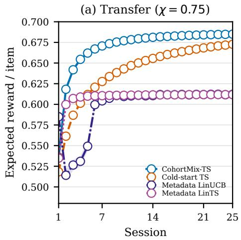
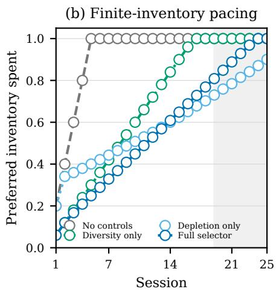
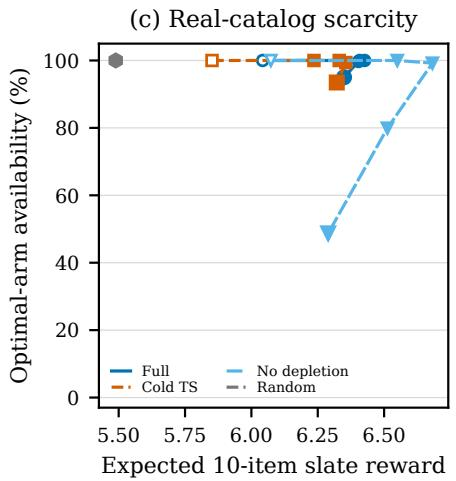
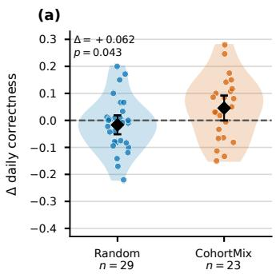
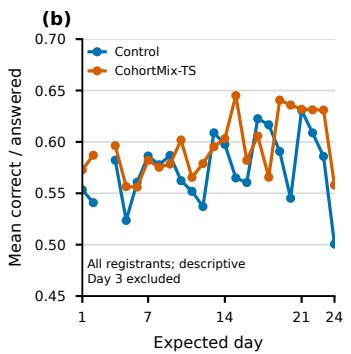
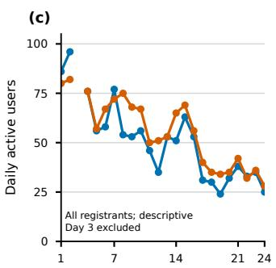
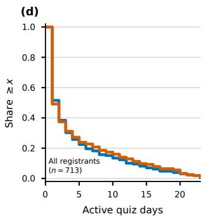
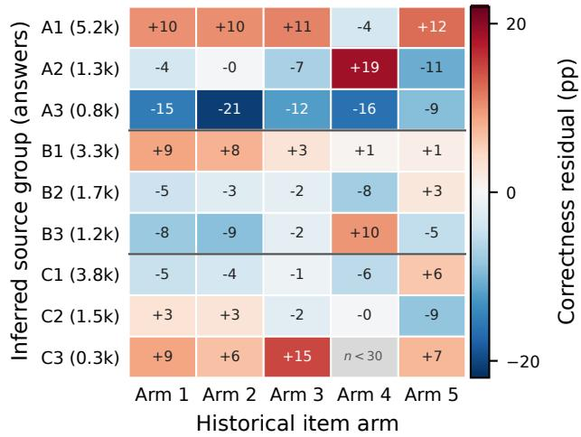

# Challenges and Solutions for Bandits in the Wild: Warm-Started Mixture Bandits for Cross-Cohort Slate Recommendation

Serafima Lebedeva1,2,∗, Sumantrak Mukherjee1,∗, Ali Arshad Sadal2, Ilias Ekşi2, Rahul Sharma1,2, Julia Mueller2, Theresa Dombrowski2, Jakob Karolus1,2, Viktor Bengs1, Eyke Hüllermeier1,3, Sebastian Vollmer1,2∗

## Abstract

Many recommender services repeatedly encounter cold-start cohorts, where new users arrive with little or no interaction history. This creates two challenges: learning user preferences quickly from limited feedback and sustaining useful recommendations when each user has a finite catalog that can become repetitive or depleted over time. We propose CohortMix-TS, a warm-started mixture bandit that learns latent user groups from earlier cohorts and uses available metadata to construct group-informed priors for new users. Starting from these fixed priors, the model personalizes independently as feedback from each user becomes available. Session slates combine Thompson sampling with diversity and inventory-depletion controls. We evaluate CohortMix-TS through simulation, semisynthetic experiments, and a 25-day randomized in-the-wild deployment with 713 registered participants in a Campus Games quiz application. Our evaluations show that cross-cohort transfer improves early recommendation quality and user-level regret, while inventory-aware slate construction helps prevent premature exhaustion of preferred items. In the field deployment, treatment users also showed a larger early-to-late change in correctness than users receiving random recommendations. Together, these results show how warm-start transfer and inventory-aware recommendations can support personalization for short-lived, repeatedly cold-starting cohorts.

## Keywords

recommender systems, multi-armed bandits, cold start, slate recommendation, cross-cohort transfer

## 1 Introduction

Recommendation systems select items in video platforms [10], retail services [13], news systems [21], and mobile applications [33]; broader accounts describe recommender systems [39] and their evolution [5]. In several applications, users are recruited or activated in cohorts. Flash-sale periods [29] create short-lived recommendation tasks as available assortments change, while onlinelearning systems [31] repeatedly select activities for new learners [9]. Campaign-style games and health interventions [44] similarly place many participants on a common schedule. A cohort is active for a short horizon, so the recommender must personalize early enough to make the displayed items useful to each user.

New cohort members commonly arrive without a current interaction history or a complete context for personalization. The operational setting also difers from an unconstrained ranking problem: items cannot usually be repeated for a user, a user’s candidate pool is finite, and some users disengage before the campaign ends. Learning a user’s preferences from feedback is therefore a sequential decision problem. Multi-armed bandits provide a standard framework for this problem [4], and surveys document their use in recommendation [43]. Thompson sampling [1] balances exploration of uncertain items with exploitation of items whose current reward estimates are high; information-directed sampling [40] provides a related Bayesian decision rule. In a short campaign, however, exploration that would pay of only after a long horizon can consume a material share of the available interactions. Moreover, a policy that repeatedly favors one item type can use its finite per-user inventory too early. Item similarity could support generalization across items, but suficiently rich item metadata are not always available to define that similarity directly.

Collaborative filtering learns long-term user–item structure from earlier interactions, but a newly arriving user has not supplied the observations needed for an individual factor estimate. It also does not prescribe how to choose sequential slates or how much uncertainty to explore. Earlier cohorts nevertheless contain populationlevel preference structure that can provide a warm start for the next cohort. We use that structure as an uncertain, metadata-conditioned prior rather than as a fixed user assignment: users with the same metadata can still belong to diferent preference groups, and current feedback can separate them.

We address this setting with CohortMix-TS, a cross-cohort mixture bandit. It transfers historical item and user structure into soft priors, constructs feasible slates through an arm-level Thompson rule, and performs scheduled batch updates between sessions. The empirical study is central to the paper: we pair controlled simulations with a 25-day randomized in-the-wild deployment of the full policy in the Campus Games of the RPTU 1. Four questions organize this study: RQ1 asks whether historical warm starts improve early decisions; RQ2 asks whether soft memberships help when users with the same metadata have diferent preferences; RQ3 asks whether diversity and depletion controls preserve useful items for later rounds; and RQ4 asks whether the complete policy difers from random recommendation in the in-the-wild study.

This paper makes the following contributions:

• We formulate cross-cohort slate recommendation with historical cohort data, cold-start users, delayed binary feedback, user-level no-repeat constraints, finite per-user inventories, and changing active-user sets.

• We introduce CohortMix-TS, which combines historical latent structure, soft metadata-conditioned priors, Thompson sampling, diversity and depletion controls, and scheduled approximate hierarchical updates.

• We evaluate the mechanisms in two parametric environments and a source-only 2024-to-2025 data-calibrated semisynthetic environment with replication-based uncertainty estimates.

• We report a randomized 25-day in-the-wild deployment of the complete policy against random recommendation with 713 registered participants.

Section 2 positions the work, Section 3 defines the setting, and Section 4 describes the method. Sections 5 and 6 give the evaluation design and results, respectively.

## 2 Related Work

Cold-start recommendation and transfer. Collaborative filtering estimates low-dimensional user–item structure from observed interactions [23]; implicit-feedback variants model a related signal [17]. Factorization bandits [45] and collaborative-filtering bandits [28] combine such shared representations with sequential item selection. Matrix-factorization variants can represent multiple user tastes [7, 8]. Long-running datasets, including MovieLens [14] and MIND [46], provide the interaction traces on which such models rely. A new user faces the cold-start problem [6]; an occasional visitor may likewise lack direct feedback at arrival [3]. Cold-start methods therefore use side information, population structure, or transferred representations to initialize a model. Meta-bandits [24], hierarchical bandits [16], and warm-start bandits [37] likewise transfer shared structure across related tasks. Dynamic collaborative filtering [18], empirical-Bayes multi-bandits [19], and empirical-Bayes meta-prior learning [36] ofer related approaches. CohortMix-TS instead uses historical factors to form item arms and metadata-conditioned priors, then revises arm beliefs during the short target cohort.

Online, contextual, and clustered bandit recommendation. Bandits formalize the choice between gathering information and choosing items with high current reward estimates. Contextual bandits use observed features [2, 26], while clustered variants share information through inferred groups [32, 47]. A contextual model restricted to categorical metadata learns pooled metadata–arm efects but does not maintain a user-specific latent state; we evaluate this representation with Metadata LinUCB and Metadata LinTS. Our scheduled updates are operational feedback boundaries, rather than adaptive batching [20]. Field recommender studies [12, 34] and large production decision systems [35] have shown why deployed behavior can difer from ofline metrics. Partial feedback complicates unbiased ofline evaluation [27]; treatment-style recommendations complicate causal evaluation [41]; and evaluation surveys summarize these concerns [48]. This motivates both randomization and careful outcome definitions.

Constrained slate recommendation. Slate-aware rankers model interactions in a displayed list [38], and slate-likelihood Thompson policies can diversify it [11]. Diversified contextual combinatorial bandits use determinantal point processes for a richer relevance– diversity trade-of [30]. These approaches are complementary to our arm-level selector: a slate-aware re-ranker could operate on feasible within-arm candidates. Multi-item mobile recommendation also exhibits slate and position efects [15]. Selecting a session slate changes future availability. Sleeping bandits motivate changing action sets [22]; rotting bandits address repeated use [25]; and nonstationary bandit methods ofer related tools [42]. Our availability instead comes from user-level no-repeat constraints rather than a globally disappearing catalog. We use a penalty score rather than claim an exact constrained-bandit solution.

Together, these lines leave a practical gap: a policy must transfer uncertain cohort structure, adapt within a short campaign, and construct feasible multi-item sessions from a finite per-user catalog.

## 3 Problem Formulation

We write $[ n ] = \{ 1 , \dots , n \}$ . Let Q denote the fixed item catalog, � the number of rounds, and � the number of items presented to each active user in a round. The catalog is the same in every round; a user’s available subset changes only after items have been displayed to that user.

## 3.1 Cohorts, information, and indexing

In our setting, a set of users who join during the same time period forms a cohort. Let U be the users in the current cohort. Historical data $\mathcal { D } ^ { \mathrm { h i s t } }$ contain records from earlier cohorts of the items displayed to a user and the resulting binary outcome. Each new user � $\in \mathcal { U }$ arrives with an observed metadata group $g _ { u } ,$ but with no outcome from the current cohort.

We index rounds by $t \in [ T ]$ , items by $q \in \mathcal { Q } ,$ , and users by $u \in \mathcal { U } .$ Let $\mathcal { U } _ { t } \subseteq \mathcal { U }$ be the users who are active in round �. The active set can shrink when users leave or do not complete a round.

## 3.2 Cross-cohort slate environment

For each � $\in \mathcal { U } _ { t } .$ the learner presents a slate $S _ { u , t } \subseteq Q$ of � distinct items. The outcome for item $q \in S _ { u , t }$ is $y _ { u , t , q } \in \{ 0 , 1 \}$ . Before round �, the items previously displayed to user � are

$$
Q _ { u , t - 1 } ^ { \mathrm { s e e n } } = \bigcup _ { \tau < t } S _ { u , \tau } .
$$

The learner therefore selects $S _ { u , t } \ \subseteq \ Q \ \backslash \ Q _ { u , t - 1 } ^ { \mathrm { s e e n } }$ . It receives the outcomes for a slate after the round, then uses the accumulated observations to form later slates. The final slate is a set: its display order is not part of the model.

## 3.3 Objective and evaluation

The purpose of personalization is to make useful choices for every user throughout the � rounds. We therefore seek high reward in each round and evaluate the learner by cumulative reward over the cohort horizon:

$$
\operatorname* { m a x } _ { \pi } \mathbb { E } _ { \pi } \left[ \sum _ { { t } = 1 } ^ { T } \sum _ { u \in \mathcal { U } _ { t } } \sum _ { q \in S _ { u , t } } y _ { u , t , q } \right] .\tag{1}
$$

The policy � uses $g _ { u } , \mathcal { D } ^ { \mathrm { h i s t } }$ , and outcomes observed before round � when selecting a feasible slate.

In the synthetic environments, the evaluator knows the generated reward probabilities and can report pseudo-regret as an additional measure of how eficiently the learner personalizes. Those

probabilities are unavailable in the in-the-wild study, so we compare the change in observed performance for the personalized learner and the random control. For user �, the scalar early–late change is

$$
\Delta _ { u } = C _ { u } ( W _ { u } ^ { \mathrm { l a t e } } ) - C _ { u } ( W _ { u } ^ { \mathrm { e a r l y } } ) ,\tag{2}
$$

where $C _ { u } ( W )$ is that user’s mean of daily correctness values over observed days in time window �. Users can also leave the study or complete only some rounds. Better personalization may improve continued participation, so we report participation and completion accounting as secondary field measures; cumulative reward remains the primary optimization metric.

## 4 CohortMix-TS: Warm-Started Mixture Bandits

## 4.1 Historical structure and cold-start priors

Earlier cohorts commonly provide response records for the same finite catalog while a newly arriving user has no current-cohort outcomes. We use those records to group items into arms and to form priors that make initial personalization possible. Let $R \ \in$ $[ 0 , 1 ] ^ { n _ { H } \times | Q | }$ be the sparse historical user–item response matrix, where $R _ { h , q }$ is the mean binary outcome for historical user ℎ and item �. Let $\Omega \subseteq [ n _ { H } ] \times Q$ be the set of observed entries of �. We fit a rank-� regularized matrix factorization, where $U \in \mathbb { R } ^ { n _ { H } \times d }$ and $V \in \mathbb { R } ^ { | Q | \times d }$ are the historical-user and item factor matrices:

$$
\operatorname* { m i n } _ { U , V } \sum _ { ( h , q ) \in \Omega } ( R _ { h , q } - U _ { h } ^ { \top } V _ { q } ) ^ { 2 } + \lambda _ { U } \| U \| _ { F } ^ { 2 } + \lambda _ { V } \| V \| _ { F } ^ { 2 } .\tag{3}
$$

The regularization weights $\lambda _ { U }$ and $\lambda _ { V }$ penalize large historical-user and item factors, respectively. The latent dimension � is chosen during historical preprocessing and controls the capacity of these representations. Each row $V _ { q }$ represents an item and each row $U _ { h }$ represents a historical user. Clustering the item rows $\{ V _ { q } \}$ partitions the catalog into � item arms $\mathcal { A } = \left\{ 1 , \ldots \ldots , A \right\}$ , with arm � containing $Q _ { a }$ . Clustering historical-user rows, together with metadata where available, yields � latent user groups $C = \{ 1 , \ldots , C \}$ . For the deployment, � and � were selected before enrollment; Section A gives those values and the candidate ranges.

For a new user, the learner observes metadata group $g _ { u }$ but not the latent group to which the user belongs. Earlier cohorts estimate the association between metadata and latent groups. The vector $p _ { u } ^ { ( 0 ) } \in [ 0 , 1 ] ^ { C }$ therefore has entries $p _ { u , c } ^ { ( 0 ) } = \widehat { \mathrm { P r } } ( c \mid g _ { u } )$ and sums to one; an unseen metadata value receives the global group frequencies. For each group–arm pair, the historical success and failure counts $s _ { c , a } ^ { \mathrm { h i s t } }$ and $f _ { c , a } ^ { \mathrm { h i \bar { s } t } }$ give a smoothed mean and a fixedstrength Beta prior. Here, $\alpha _ { 0 }$ and $\beta _ { 0 }$ are smoothing pseudo-counts, and $\kappa > 0$ is the selected efective prior strength:

$$
\widehat { \mu } _ { c , a } = \frac { \alpha _ { 0 } + s _ { c , a } ^ { \mathrm { h i s t } } } { \alpha _ { 0 } + \beta _ { 0 } + s _ { c , a } ^ { \mathrm { h i s t } } + f _ { c , a } ^ { \mathrm { h i s t } } } , \qquad ( \alpha _ { c , a } ^ { H } , \beta _ { c , a } ^ { H } ) = \kappa ( \widehat { \mu } _ { c , a } , 1 - \widehat { \mu } _ { c , a } ) .\tag{4}
$$

The quantities $\alpha _ { c , a } ^ { H }$ and $\beta _ { c , a } ^ { H }$ are the historical success and failure pseudo-counts for group � and arm �. For a new user, the initial arm belief aggregates uncertain group membership,

$$
\big ( \alpha _ { u , a } ^ { ( 0 ) } , \beta _ { u , a } ^ { ( 0 ) } \big ) = \sum _ { c = 1 } ^ { C } \mathcal { P } _ { u , c } ^ { ( 0 ) } \big ( \alpha _ { c , a } ^ { H } , \beta _ { c , a } ^ { H } \big ) .\tag{5}
$$

Equation (5) summarizes the metadata-conditioned mixture by a single Beta distribution. It preserves the mixture’s expected reward for arm �, the center of the warm-started Thompson distribution before the user has supplied feedback. Fixing � gives every user–arm prior the same, controlled amount of historical influence, independent of how many observations happened to be recorded for a historical group–arm cell. This first-moment match gives comparable initialization across users while retaining one Beta draw per arm for slate construction. We examine the efect of the chosen prior strength in the transfer sensitivity analysis.

## 4.2 Constraint-aware slate construction

Because an item can be displayed only once to a user, a promising arm’s finite per-user inventory can be exhausted early. Given the campaign horizon, the learner therefore paces each arm’s consumption while constructing a slate, balancing sampled reward now against feasible items in later rounds. Thompson sampling makes this reward–information trade-of explicit: a Beta belief represents uncertainty about an arm’s binary reward rate, and an independent draw from each arm’s belief is a plausible reward rate for the next display. A high draw favors the arm, while uncertain arms occasionally draw high enough to be explored. At selection step $i \in [ K ]$ , let $Q _ { u , t , i } ^ { \mathrm { a v a i l } }$ be the items that user � has not seen and that have not yet been selected for the current slate. Let $m _ { a } = | Q _ { a } |$ be the per-user inventory of arm $^ { a , }$ let $h _ { u , a , t , i }$ be the number of earlier selections in the current slate that used arm �, and define

$$
d _ { u , a , t , i } = 1 - \frac { | Q _ { a } \cap Q _ { u , t , i } ^ { \mathrm { a v a i l } } | } { m _ { a } } , \qquad r _ { u , a , t , i } = 1 - d _ { u , a , t , i } .
$$

Thus, $d _ { u , a , t , i }$ is the share of user �’s arm-� inventory already spent and $r _ { u , a , t , i }$ is its remaining share before selection step �. An arm is feasible exactly when $Q _ { a } \cap Q _ { u . t . i } ^ { \mathrm { a v a i l } } \neq \emptyset$ . To pace inventory use, the learner carries a smoothed arm-specific pacing error $\bar { e } _ { u , a , t - 1 }$ from the preceding round, initialized to zero: $e _ { u , a , t , i } = \rho \bar { e } _ { u , a , t - 1 } + ( 1 -$ $\rho ) ( d _ { u , a , t , i } - t / T )$ . Here $\rho \in \left[ 0 , 1 \right]$ retains prior error; clip(�, �, ℎ) = min{max{�, �}, ℎ} limits the adjustment to bounds $\eta _ { \mathrm { m i n } }$ and �max; and $\phi ~ \geq ~ 0$ sets its strength. For every feasible arm, the policy samples $\widetilde { \theta } _ { u , a } \sim \mathrm { B e t a } ( \alpha _ { u , a } , \beta _ { u , a } )$ and computes

$$
\begin{array} { r l } & { D _ { u , a , t , i } = 1 + \phi \ \mathrm { c l i p } ( e _ { u , a , t , i } , \eta _ { \mathrm { m i n } } , \eta _ { \mathrm { m a x } } ) , \mathrm { s c o r e } _ { u , a , t , i } = \widetilde \theta _ { u , a } / P _ { u , a , t , i } , } \\ & { P _ { u , a , t , i } = 1 + \gamma h _ { u , a , t , i } + \delta ( 1 - r _ { u , a , t , i } ) D _ { u , a , t , i } . } \end{array}\tag{6}
$$

Here, $D _ { u , a , t , i }$ is the pacing multiplier and $P _ { u , a , t , i }$ is the total penalty that divides the Thompson draw. The coeficient $\gamma \geq 0$ discourages repeated arm use within one slate, while $\delta \geq 0$ weights the depletion penalty. The controller compares consumption with the uniform plan $t / T ;$ a positive error means an arm is being used faster than plan and strengthens its depletion term. After the slate, it stores $\bar { e } _ { u , a , t } = \rho \bar { e } _ { u , a , t - 1 } + ( 1 - \rho ) ( d _ { u , a , t , K + 1 } - t / T )$ . The score therefore trades immediate sampled reward against within-slate variety and later feasibility.

After selecting the highest-scoring arm, the policy samples one item uniformly from that arm’s available pool and removes it before the next selection step. Uniform sampling treats items within an arm as exchangeable. An arm may appear more than once when it still has unseen items, which is necessary when $K > A$

Al orithm 1 Constraint-aware slate construction for user �   
Require: Current Beta parameters, unseen arm pools, slate size �   
1: $S \gets \emptyset$ and $\mathcal { V }  Q \backslash Q _ { u , t - 1 } ^ { \mathrm { s e e n } }$   
2: for � = 1 to � do   
3: $F \gets \{ a : Q _ { a } \cap \mathcal { V } \neq \emptyset \}$   
4: for each $a \in F$ do   
5: Sample $\widetilde { \theta } _ { u , a }$ and compute Equation (6)   
6: end for   
7: �∗ ← arg max�∈� score�,�,�,�   
8: Sample � uniformly from $\ Q _ { a ^ { * } } \cap \mathcal { V }$   
9: Set $S  S \cup \{ q \}$ , set $\mathcal { V }  \mathcal { V } \setminus \{ q \}$ , and update the within  
slate state   
10: end for   
11: return �

## 4.3 Posterior adaptation across rounds

Recommendations are commonly committed as a full slate before any item in that slate has been answered, and operational workflows can prepare slates periodically from one parameter snapshot. We therefore hold the model fixed while a round is served and update it only at scheduled feedback checkpoints. All active users receive their �-item slates from the same snapshot, so feedback from one item cannot change another item in that slate or another user’s slate in the same round. When the round closes, the learner aggregates observed outcomes, refreshes memberships and pseudo-counts, and uses the resulting snapshot for later slates. In the deployment, a round was a daily quiz session: answers from a completed active day were batched at the daily boundary, and membership refresh began after a user had answered at least 10 items. For user � and arm �, $s _ { u , a } ^ { ( t ) }$ and $f _ { u , a } ^ { ( t ) }$ are the scalar counts of correct and incorrect outcomes in round �. Their cumulative values are $\begin{array} { r } { s _ { u , a } ^ { ( \leq t ) } = \sum _ { \tau \leq t } s _ { u , a } ^ { ( \tau ) } } \end{array}$ and $\begin{array} { r } { f _ { u , a } ^ { ( \leq t ) } = \sum _ { \tau \leq t } f _ { u , a } ^ { ( \tau ) } } \end{array}$

At each such feedback checkpoint, the learner computes the membership-probability vector $\mathop { p _ { u } ^ { ( t ) } } \in [ 0 , 1 ] ^ { C }$ from the registrationtime mixture and cumulative evidence:

$$
\begin{array} { r l } & { \ell _ { u , c } ^ { ( t ) } = \log  { \mathcal { P } } _ { u , c } ^ { ( 0 ) } + \displaystyle \sum _ { a } \log B \Big ( s _ { u , a } ^ { ( \le t ) } + \alpha _ { c , a } ^ { H } , f _ { u , a } ^ { ( \le t ) } + \beta _ { c , a } ^ { H } \Big ) } \\ & { \qquad - \displaystyle \sum _ { a } \log B ( \alpha _ { c , a } ^ { H } , \beta _ { c , a } ^ { H } ) , } \\ & { \qquad \quad p _ { u , c } ^ { ( t ) } = \mathrm { s o f t m a x } _ { c } \Big ( \ell _ { u , c } ^ { ( t ) } \Big ) . } \end{array}\tag{8}
$$

Here, $\boldsymbol { \ell } _ { u } ^ { ( t ) } \in \mathbb { R } ^ { C }$ is the vector of log-membership scores and � is the Beta function. Under the arm-level conditional-exchangeability model, the Beta-function diference is the log marginal likelihood of a user’s group–arm counts after integrating a Bernoulli rate under the historical Beta prior; the binomial coeficient cancels across groups. Thus, $\rho _ { u } ^ { ( t ) }$ is a soft reassignment under a working arm-level model. The entries of $p _ { u } ^ { ( t ) }$ sum to one. Between checkpoints, the learner uses the most recently computed membership vector. It also maintains two nonnegative $C \times A$ matrices, $\xi ^ { + , ( t ) }$ and $\xi ^ { - , ( t ) }$ , for cumulative fractional correct and incorrect evidence assigned to each group–arm pair. The shared-update weight $\lambda \in [ 0 , 1 ]$ determines the fraction of a round’s evidence placed in these group-level

Algorithm 2 Cross-cohort CohortMix-TS workflow   
Require: Historical logs $\mathcal { D } ^ { \mathrm { h i s t } }$ , current cohort metadata   
1: Fit Equation (3); cluster item and historical-user representations   
2: Estimate $p _ { u , c } ^ { ( 0 ) }$ and group–arm priors with Equations (4)–(5)   
3: for each round � do   
4: for each active user � do   
5: Serve the slate returned by Algorithm 1   
6: end for   
7: Collect delayed feedback after the round   
8: Update memberships, shared pseudo-counts, and user be  
liefs with Equations (8)–(10)   
9: end for

ledgers. The ledgers evolve as

$$
\xi _ { c , a } ^ { \pm , ( 0 ) } = 0 , \qquad \xi _ { c , a } ^ { \pm , ( t ) } = \xi _ { c , a } ^ { \pm , ( t - 1 ) } + \lambda \sum _ { u \in \mathcal { U } _ { t } } \mathcal { P } _ { u , c } ^ { ( t ) } x _ { u , a } ^ { \pm , ( t ) } ,\tag{9}
$$

where $x _ { u , a } ^ { + , ( t ) } = s _ { u , a } ^ { ( t ) }$ and $x _ { u , a } ^ { - , ( t ) } = f _ { u , a } ^ { ( t ) }$ . For each user, the learner also retains that user’s fractional contributions $\zeta _ { u , c , a } ^ { + , ( t ) }$ and $\zeta _ { u , c , a } ^ { - , ( t ) }$ to the two ledgers, initialized to zero and incremented by $\lambda \mathfrak { p } _ { u , c } ^ { ( t ) } \mathscr { s } _ { u , a } ^ { ( t ) }$ and $\lambda \mathfrak { p } _ { u , c } ^ { ( t ) } f _ { u , a } ^ { ( t ) }$ , respectively. This produces a leave-one-user-out group mean for the next round:

$$
\begin{array} { r l } & { \bar { \mu } _ { u , c , a } ^ { ( t ) } = \frac { \alpha _ { c , a } ^ { H } + \xi _ { c , a } ^ { + , ( t ) } - \zeta _ { u , c , a } ^ { + , ( t ) } } { \alpha _ { c , a } ^ { H } + \beta _ { c , a } ^ { H } + \xi _ { c , a } ^ { + , ( t ) } + \xi _ { c , a } ^ { - , ( t ) } - \zeta _ { u , c , a } ^ { + , ( t ) } - \zeta _ { u , c , a } ^ { - , ( t ) } } , } \\ & { \bar { \mu } _ { u , a } ^ { ( t ) } = \displaystyle \sum _ { c } \hat { p } _ { u , c } ^ { ( t ) } \bar { \mu } _ { u , c , a } ^ { ( t ) } , } \\ & { \alpha _ { u , a } ^ { ( t ) } = \kappa \bar { \mu } _ { u , a } ^ { ( t ) } + s _ { u , a } ^ { ( \leq t ) } , \qquad \beta _ { u , a } ^ { ( t ) } = \kappa \big ( 1 - \bar { \mu } _ { u , a } ^ { ( t ) } \big ) + f _ { u , a } ^ { ( \leq t ) } . } \end{array}\tag{10}
$$

Thus, scheduled feedback updates the center of a fixed-strength group-informed prior while each user’s cumulative outcomes enter its Beta parameters directly. Equations (8)–(10) define the scheduled soft-mixture update.

## 5 Experimental Setup

## 5.1 Baselines

Within each generated environment, policies use the same catalog, slate size, user-level no-repeat rule, and delayed-feedback schedule. At each selection step, a policy chooses an arm and samples an unseen item from that arm.

Full CohortMix-TS. The full policy uses a metadata-conditioned soft mixture of historical group priors, refreshes memberships from each user’s cumulative feedback, adds a fraction � of feedback to shared group-level ledgers, and applies slate controls when they are studied. Every non-random policy also updates its own user–arm belief from that user’s feedback. It is the deployment treatment.

Cold-start TS.. Cold-start Thompson sampling initializes every user–arm belief as Beta(1, 1) and updates it from that user’s outcomes.

Metadata-only contextual baselines. Metadata LinUCB and Metadata LinTS use the one-hot interaction $x _ { u , a } = e _ { g _ { u } } \otimes e _ { a } { \mathrm { : } }$ 20 features in transfer and 136 in the year-split benchmark. Both receive the same source estimates and metadata association as CohortMix-TS, collapsed to a metadata–arm mean at $\kappa = 1 0$ , and pool feedback by metadata–arm cell after each session. They have no user, latentgroup, item, or factor features. LinUCB uses $\alpha = . 5 ;$ LinTS uses Gaussian scale $\nu = . 5 .$ . They appear only in transfer and the yearsplit benchmark.

Transfer ablations. Warm TS (fixed mixture) retains $p _ { u } ^ { ( 0 ) }$ and updates individual arm beliefs, but has neither reassignment nor a group ledger. Hard-cluster TS uses fixed arg max� $p _ { u , c } ^ { ( 0 ) }$ assignments; its semi-synthetic counterpart is Hard membership. Static source mixture ranks the initial metadata-conditioned his torical mean and never updates.

Semi-synthetic ablations. Global prior replaces metadataconditioned frequencies with population frequencies. In the realcatalog scarcity diagnostic, No depletion sets $\delta = 0$ while retaining the remaining personalization components. Random recommendation samples uniformly from unseen items and is the deployed control.

Slate-control variants. The finite-inventory environment fixes highly concentrated, correct beliefs and compares only slate construction. No controls sets all terms to zero; Diversity only sets $\gamma = . 5 ;$ ; Depletion only sets $\delta = \phi = 1 ;$ Full selector uses both; and No adaptive controller changes only $\phi$ to zero. Full selector denotes the slate-control rule, not the full cross-cohort policy.

Feasible oracle. In the transfer and year-split semi-synthetic environments, an oracle knows the simulated reward means while respecting each user’s item inventory. It provides the pseudo-regret reference rather than a deployable policy.

## 5.2 Three environments

The environments answer diferent parts of the problem while keeping the interaction protocol fixed: users receive 10 unseen items in each of 25 sessions, feedback arrives after the session, and policies are compared on matched generated cohorts. The first asks whether prior-cohort information helps cold-start personalization; the second asks how to use a scarce per-user inventory; and the third asks whether the transfer result persists under a real catalog and a year-to-year split.

Parametric transfer environment. This is a clean test of historical transfer rather than inventory management. Each observed metadata value contains two hidden user types with opposing preferred arms. Thus, metadata supplies a useful starting point but cannot determine one person’s best arm. Every arm contains more items than a user can receive in 25 sessions, and slate controls are inactive. We vary the alignment $\chi$ between historical and target preference profiles: $\chi = 1$ means that the prior cohort has the same profile, whereas $\chi = 0$ means that it carries no directional information about the target profile. We compare CohortMix-TS with the metadata-only contextual baselines, Warm TS (fixed mixture), Hard cluster TS, Cold-start TS, and Static source mixture. Appendix A gives the generator, potential-outcome protocol, and prior-strength interaction.

Parametric constraint environment. This is a clean test of slate controls rather than a test of learning from history. All policies begin with accurate arm beliefs, but one high-reward arm has a limited number ofunseen items for each user. Repeatedly choosing that arm within one session also lowers the reward of later selections in that session. We vary its inventory and compare No controls, Diversity only, Depletion only, Full selector, and No adaptive controller. The resulting trade-of is between taking the scarce arm immediately, spreading choices within a slate, and retaining useful items for later sessions.

Year-split data-calibrated semi-synthetic environment. The third environment joins the previous two questions to observed cohort data without replaying any participant’s actual recommendation history. A disjoint 2024 cohort supplies the historical factorization, groups, metadata association, and arm priors. A 2025 cohort calibrates hidden target preferences for freshly generated users. Both cohorts use the same 1,347-item catalog, partitioned into eight arms of sizes 128, 239, 137, 84, 298, 98, 243, and 120. The policy sees only 2024-derived structure, a new user’s faculty, and simulated feedback; the evaluator alone uses the 2025 records. Each main cohort has 288 users balanced across three source-only preference types, so a majority type cannot mask performance for the others. The main benchmark turns slate penalties of to focus on transfer. Figure 1(c) separately uses the real 98-item arm to study depletion. It compares CohortMix-TS, the metadata-only contextual baselines, the listed ablations, and Random. Appendix A gives the calibration, potential-outcome protocol, and sensitivities.

## 5.3 Randomized in-the-wild deployment

To test whether personalized allocation can match questions to participants, the completed in-the-wild deployment used a 25-day Campus Games quiz. Correctness was the binary reward: questions difer in dificulty and subject familiarity, so a question that suits one participant or group may be a poor match for another. The daily quiz delivered $K = 1 0$ multiple-choice items from a catalog of $Q = 1 { , } 3 4 7$ items, with a 20-second limit per item. A prior cohort of 859 users over the same catalog supplied the transferred structure. Historical model selection yielded five item arms and 23 user groups. The five arm sizes were 273, 190, 516, 76, and 292 items. This randomized study evaluates the complete deployed policy against random allocation, rather than an isolated method component.

The previous cohort’s questions were sampled independently of recommendations, so no exposure correction is required. For adaptive historical logs with known display propensities, the factorization and group–arm rates can instead use inverse-propensity weighting [27], avoiding a policy-induced exposure pattern being treated as preference.

Assignment occurred once at registration. The 356 treatment users received CohortMix-TS slates intended to increase their estimated probability of answering correctly, while 357 control users received random unseen items; quiz length, time limit, scoring, and catalog were identical between arms. Recommendations were planned on a rolling three-day horizon, with assigned items reserved until used or returned to the eligible pool. The deployed settings were $\gamma = 0 . 5 , \delta = 1 . 0 , \phi = 1 . 0 , \eta _ { \mathrm { m i n } } = - 0 . 3 , \eta _ { \mathrm { m a x } } = 0 . 7 ,$ $\rho = 0 . 3 , \lambda = 0 . 3$ , and $\kappa = 1 0$ . Membership updates began only after a user had supplied at least 10 answers. The deployment did not vary �.

  
Figure 1: One diagnostic for each generated environment. (a) Transfer expected reward at alignment $\chi = 0 . 7 5$ for CohortMix-TS, Cold-start TS, Metadata LinUCB, and Metadata LinTS; higher means closer agreement between historical and target preferences. (b) Preferred-arm inventory use when that arm contains 20% of the �� item opportunities for No controls, Diversity only, Depletion only, and Full selector. (c) Real-catalog scarcity stress in the 2024–2025 year-split environment. Each line joins five consecutive five-session blocks. Both coordinates average over users whose generated optimal arm is the actual 98-item arm: expected 10-item slate reward (horizontal) and the percentage with an unseen item remaining in that arm before the session slate is selected (vertical). Open markers denote sessions 1–5 and filled terminal markers denote sessions 21–25. Shaded bands in (a)–(b) are percentile bootstrap 95% intervals across 160 cohorts; (c) reports cohort-average trajectories across 96 cohorts.

## 6 Results and Empirical Analysis

## 6.1 Cross-cohort transfer depends on prior alignment

Figure 1(a) and Table 1 answer RQ1 and RQ2. When historical and target preferences align, CohortMix-TS has the strongest early and campaign reward and the lowest high-regret tail. The transferred mixture gives it useful structure before a user supplies feedback; Cold-start TS begins with difuse arm beliefs and must first explore. A fixed mixture or hard assignment transfers some structure, but cannot use feedback to resolve initial latent-type uncertainty. Figure 1(a) exposes a failure mode of standard contextual models based only on observed metadata: Metadata LinUCB and Metadata LinTS pool faculty–arm outcomes, so their curves level of when one faculty contains users with opposing hidden preferences. Figure 3 shows the corresponding source-data pattern, with group–arm correctness varying within metadata categories. The appendix sensitivity check shows that the mean early-reward benefit grows with historical–target alignment; under severe mismatch, its advantage for high-regret users disappears. Thus, RQ1’s benefit depends on reliable cross-cohort structure, and RQ2’s soft memberships protect against within-metadata heterogeneity.

## 6.2 Slate controls trade early exploitation for later feasibility

Figure 1(b) answers RQ3 in the finite-inventory environment. Without depletion control, a policy spends the scarce preferred arm early; variants with the depletion term instead pace it through the final week. The full slate controller accepts less immediate concentration than Diversity only, then has stronger later reward once the scarce arm would otherwise be unavailable. The sensitivity grid in Appendix A shows that this trade-of weakens when the preferred inventory is less scarce. Depletion is therefore useful for the stated short-inventory setting, rather than a universally reward-maximizing penalty.

Table 1: Parametric transfer results at alignment $\chi = 0 . 7 5 ,$ averaged over 160 generated cohorts. Rewards are expected per displayed item; Minority is campaign reward for the lower-probability hidden subtype. P90 pseudo-regret is the 90th percentile of per-user pseudo-regret at the final session. Bold marks the best result and underline the second-best result in each column.
<table><tr><td>Policy</td><td>Early ↑</td><td>Campaign ↑ Minority ↑</td><td></td><td>P90 regret ↓</td></tr><tr><td>Full CoHORTMIx-TS</td><td>0.622</td><td>0.669</td><td>0.653</td><td>19.18</td></tr><tr><td>Warm TS (fixed mixture)</td><td>0.579</td><td>0.642</td><td>0.628</td><td>24.39</td></tr><tr><td>Hard-cluster TS</td><td>0.592</td><td>0.609</td><td>0.506</td><td>62.77</td></tr><tr><td>Cold-start TS</td><td>0.576</td><td>0.639</td><td>0.638</td><td>24.73</td></tr><tr><td>Static source mixture</td><td>0.585</td><td>0.585</td><td>0.400</td><td>87.47</td></tr><tr><td>Metadata LinUCB</td><td>0.541</td><td>0.596</td><td>0.505</td><td>65.23</td></tr><tr><td>Metadata LinTS</td><td>0.592</td><td>0.607</td><td>0.502</td><td>66.82</td></tr></table>

## 6.3 Year-split data-calibrated semi-synthetic benchmark

Table 2 answers RQ1 and RQ2 in the year-split environment. The proposed policy improves on Cold-start TS because the historical mixture starts each user with informative arm preferences, while

Table 2: Year-split data-calibrated semi-synthetic results over 96 generated cohorts. Source-only 2024 structure initializes each policy; 2025 records calibrate hidden target preferences. Reward entries are expected per displayed item; pseudoregret is per user over 250 displayed items. The main benchmark turns slate penalties of to isolate transfer; Figure 1(c) reports the separate real-catalog scarcity stress. Bold marks the best result and underline the second-best result in each column.

<table><tr><td> $\mathrm { P o l i c y }$ </td><td> $\mathrm { E a r l y \uparrow }$ </td><td>Campaign ↑</td><td>Late ↑</td><td>Pseudo-regret ↓</td></tr><tr><td>COHORTMIX-TS</td><td>0.597</td><td>0.627</td><td>0.632</td><td>37.71</td></tr><tr><td>Cold-start TS</td><td>0.584</td><td>0.618</td><td>0.628</td><td>39.94</td></tr><tr><td>Metadata LinUCB</td><td>0.580</td><td>0.590</td><td>0.601</td><td>46.84</td></tr><tr><td>Metadata LinTS</td><td>0.580</td><td>0.594</td><td>0.598</td><td>45.99</td></tr><tr><td>Hard membership</td><td>0.583</td><td>0.615</td><td>0.625</td><td>40.59</td></tr><tr><td>Global prior</td><td>0.584</td><td>0.615</td><td>0.624</td><td>40.67</td></tr><tr><td>Random</td><td>0.565</td><td>0.565</td><td>0.565</td><td>53.12</td></tr></table>

cold start first explores from a uniform Beta prior. The metadataonly contextual policies improve their faculty-level estimates but cannot separate individual preferences within a faculty, which limits their later gains. Hard membership and a global prior remove, respectively, adaptive uncertainty about type and the metadata sig nal; both patterns support the value of a soft, metadata-conditioned warm start.

Figure 1(c) answers RQ3 with the actual 98-item arm. The No depletion trajectory gains reward early by repeatedly selecting the preferred arm, then exhausts that arm for many afected users and loses late slate quality. The tempered controller preserves availability into the final block. Random preserves the arm by rarely selecting it, but supplies lower-reward slates throughout. The figure therefore shows the intended early–late pacing trade-of, not a claim that depletion control improves every campaign-wide outcome.

## 6.4 Randomized in-the-wild deployment

Real-world participation constraints substantially reduced the size of the correctness analysis. Of the 713 registered users, 385 interacted with at least one quiz item. The outcome analysis excluded activity before the oficial start and two dates afected by technical failures, then retained participants with at least 30 answered items. This answer-count filter produced an analysis set of 211 users: 109 treatment and 102 control. Because the filter occurs after assignment, the resulting comparison is not an intention-to-treat estimate for all registrants.

The four largest metadata strata contained 58 treatment and 61 control users. Computing $\Delta _ { u }$ additionally requires observed outcomes in both the early and late windows; only 23 treatment and 29 control users met this requirement. Mean $\Delta _ { u }$ was 0.0455 for treatment and −0.0168 for control, a diference of 0.0623 (bootstrap 95% interval [0.005, 0.119]). A two-sided Mann–Whitney rank-sum test returned $\mathnormal { p } = 0 . 0 4 3$ . Figure 2 shows this distribution and descriptive daily context. Broader responder analyses weakened the evidence: the all-faculty answer-qualified set $\left( n = 9 3 \right)$ had a 0.034 diference $( p = 0 . 1 4 6 )$ , and all complete-window responders $( n = 9 6 )$ had a 0.033 diference $( p = 0 . 1 5 3 )$ ; answer-weighting the restricted outcome gave 0.057 $(  p = 0 . 0 5 3 )$ . The small complete-window subset and post-assignment filtering limit precision and interpretation; the result is sensitive to the responder definition and does not isolate individual method components.

We also compared two randomized-arm participation indicators using all 713 registrants. At least one quiz item was started by 53.1% of treatment users (189/356) and 54.9% of control users (196/357; two-sided Fisher test $p = 0 . 6 5 2 )$ . At least 30 items were answered by 30.6% oftreatment users (109/356) and 28.6% ofcontrol users $( 1 0 2 / 3 5 7 ; p = 0 . 5 6 6 )$ . These are intention-to-treat operational outcomes; neither comparison provided evidence of a treatment diference. Correctness is undefined for users who did not answer, so the study data do not identify an all-randomized correctness efect without a missingness model. We have no pre-assignment quiz outcome.

We do not use the daily count of correct answers as a treatmentefect outcome. Such counts combine answer correctness with changing participation and therefore cannot distinguish improved matching from greater exposure.

## 7 Discussion and Limitations

The field study randomized the complete policy against random recommendation, but its correctness result is conditional on postassignment responses. The all-registrant participation comparisons are intention-to-treat operational outcomes, not correctness or retention efects. Nonresponders have no correctness value to include, and we did not fit a pre-specified missing-data or longitudinal model; we also have no pre-assignment quiz outcome. The restricted result is therefore compatible with improved item matching over time, but not with a population-wide causal claim about learning, interest, satisfaction, or retention.

The � sweeps show that a fixed concentration must be calibrated to transfer alignment: stronger priors help under aligned transfer but can harm under severe source–target mismatch. The finite-inventory isolation deliberately removes prior uncertainty, and the deployment uses one fixed value. Equation (5) is not a second-moment match, and we did not fit � by empirical Bayes, as in empirical-Bayes meta-prior learning [36]. The uniform $t / T$ plan is the only pacing target evaluated: we did not test front-loaded, concave, value-aware, attendance-aware, or annealed schedules. The real-catalog stress shows a late-availability benefit from depletion, but it does not establish a general choice of controller weight. Likewise, no dificulty-bucket or item-level posterior was compared with uniform within-arm sampling.

The comparison set is mechanism-specific rather than a broad recommender benchmark. It includes Metadata LinUCB and Metadata LinTS in the transfer and year-split semi-synthetic benchmarks, initialized from the same metadata–arm source estimates and evaluated with the same feasibility and slate constraints. These policies pool feedback within metadata–arm cells and therefore do not represent a user-specific latent state. We do not compare against contextual models with common user–item feature representations or against hierarchical Bayesian TS; Hard-cluster TS is an ablation, not a substitute. The arm partition is fixed throughout the study; handling catalog changes requires a principled transfer of priors across revised arms. Future work should compare richer models under common historical inputs and pre-specify longitudinal field outcomes.

  
Figure 2: In-the-wild deployment outcomes. (a) Participant-level early–late daily-correctness change $\Delta _ { u }$ in the restricted, complete-window analysis $( n \ = \ 5 2 ;$ treatment = 23, control = 29). Points are users; diamonds and bars are group means and bootstrap 95% intervals. The treatment–control diference is 0.062 (95% interval [0.005, 0.119]; $\mathnormal { p } = 0 . 0 4 3 )$ . (b) Daily mean correct/answered rate, averaged within each responding user-day; (c) daily active users; and (d) active-day survival. Panels (b)–(d) are descriptive all-registrant traces $( n = 7 1 3 )$ after removing technical-failure dates and have changing daily denominators. Blue denotes random control and orange denotes CohortMix-TS.

## 8 Conclusion

We developed CohortMix-TS for short-horizon, finite-inventory cohort recommendation, transferred historical structure into soft priors, and deployed the complete policy in a randomized campaign. The controlled environments and 2024–2025 data-calibrated bench mark identify settings in which historical warm starts improve early recommendation and a scarce arm benefits from pacing. In our in-the-wild deployment, we observed a larger early–late correctness change only in the reported restricted subset. Future work will test richer representations, adaptive priors and pacing, and longer-running services with pre-specified longitudinal outcomes.

## A Detailed Environments and Ablations

Common protocol. All policies construct every user’s slate from the same pre-session state and receive feedback only after that session is complete. Within each generated cohort, policies share the same user metadata, item pools, and Bernoulli potential outcomes. We summarize uncertainty over independently generated cohorts; “early” denotes sessions 1–5 and $\mathrm { ^ { * } l a t e ^ { * } }$ denotes sessions 19–25.

Ablations. Warm TS (fixed mixture) keeps the registration-time metadata mixture and updates only a user’s local arm counts. Hard membership replaces that mixture with its most likely historical group, while Static source mixture serves the highest-ranked source arm without feedback updates. Global prior replaces $\mathrm { P r } ( c \mid$ $g _ { u } )$ with population group frequencies. Metadata LinUCB and Metadata LinTS pool one-hot metadata–arm estimates and do not maintain a user-specific latent state. In the scarcity diagnostic, No depletion changes only � from .25 to zero; Random samples feasible unseen items uniformly.

Transfer environment and membership ablations. The transfer environment has four metadata values, eight hidden groups, and five arms. Each metadata value places prior mass .65 and .35 on two groups with opposing preferred arms, so metadata alone cannot identify a user’s best arm. Target group profiles interpolate between the historical profile and an orthogonal profile using �: $\chi = 1$ denotes aligned source and target profiles, whereas $\chi = 0$ removes this alignment. We draw 400 historical binary outcomes per group– arm cell, generate 480 target users, and give each user 300 items per arm; the catalog is deliberately generous, so slate controls are inactive. We use $T = 2 5$ sessions and $K = 1 0$ items per session. The comparison includes fixed-mixture, hard-membership, staticsource, cold-start, and metadata-only contextual alternatives. The $\kappa \times \chi$ grid in Table 3 shows the early-reward contrast between CohortMix-TS and Cold-start TS.

Finite-inventory ablations. The finite-inventory environment has 256 users, one preferred arm with mean reward .70, and four fallback arms with mean reward .50. The preferred arm has capacity $m \in \{ 2 5 , 5 0 , 7 5 , 1 0 0 \}$ , while each fallback arm has capacity 125. Thus $m / ( T K ) \in \{ . 1 0 , . 2 0 , . 3 0 , . 4 0 \}$ is the fraction of a user’s campaign slots that the preferred arm could fill. To make slate diversity relevant, every earlier use of an arm within the same slate lowers the reward logit by .25. We vary diversity $\gamma \in \left. 0 , . 2 5 , . 5 , 1 \right.$ , depletion weight $\delta \in \{ 0 , . 5 , 1 , 2 \}$ , and controller strength � ∈ $\{ 0 , . 5 , 1 , 2 \}$ . Table 3 reports the component ablation at $m / ( T K ) = . 2 0$ . The � grid shows that stronger depletion control is needed when the preferred arm supplies only .10 of the campaign: early exhaustion falls from 1.00 at $\delta \leq 1$ to .27 at $\delta = 2 ,$ while at .20 it is zero for $\delta \geq . 5 . \mathrm { A t }$ looser capacities, the diversity-only policy can have higher campaign reward, which is why the controller is presented as a pacing trade-of rather than a universal improvement.

Sensitivity patterns. $\mathrm { A t } \ \chi = 0 ,$ the warm start still improves average early reward, but it has a worse 90th-percentile user pseudoregret tail; at $\kappa = 1 0 ,$ the Full-minus-Cold P90 diference $\mathrm { i } s + 1 2 . 2 7$ $\mathrm { A t } \ \chi = 1$ , the corresponding diference $\mathrm { i } s - 1 9 . 6 2 .$ . Thus, alignment chiefly determines whether historical structure also protects users with high regret. In the high-alignment year-split environment, a separate 32-cohort prior sweep over $\kappa \in \{ 2 , 5 , 1 0 , 2 0 \}$ improved campaign reward as prior strength increased. $\mathrm { ~ A ~ } \lambda \in \{ 0 , 1 , . 3 , . 5 \}$ check was nearly flat, so it does not identify .3 as a uniquely preferred sharing weight. These are targeted sensitivity checks, not a search over all configurations.

Table 3: Ablation and sensitivity details. (Left) finite-inventory component ablation at $m / ( T K ) = . 2 0 ;$ rewards are expected per displayed item and Early exhaust is the fraction of users whose preferred arm is exhausted before the final week. “No adaptive controller” retains $\gamma = . 5$ and $\delta = 1$ but sets $\phi = 0 .$ . (Right) the early-reward diference between CohortMix-TS and Cold-start TS in the transfer environment; positive values favor CohortMix-TS. Bold marks the best and underline the second-best result within each left-hand reward column.
<table><tr><td>Policy</td><td>Early ↑</td><td>Campaign ↑</td><td>Late ↑</td><td>Early exhaust ↓</td></tr><tr><td>No controls</td><td>.4386</td><td>.4333</td><td>.4320</td><td>1.00</td></tr><tr><td>Diversity only</td><td>.5244</td><td>.5002</td><td>.4506</td><td>1.00</td></tr><tr><td>Depletion only</td><td>.4756</td><td>.4790</td><td>.4834</td><td>.00</td></tr><tr><td>No adaptive controller</td><td>.5177</td><td>.5081</td><td>.4983</td><td>.00</td></tr><tr><td>Full selector</td><td>.5168</td><td>.5083</td><td>.4996</td><td>.00</td></tr></table>

Year-split data-calibrated semi-synthetic environment. The disjoint 2024 source contains 49,675 answers from 561 users, and the 2025 target calibration contains 23,838 answers from 347 diferent users. We first shrink source user–arm response profiles toward 2024 arm means and cluster those eight-dimensional profiles into three source-only groups. These groups determine the historical Beta priors and Prb (� | faculty). The 2025 records are used only by the generator to obtain hidden target profiles, user residuals, and target group–arm means; policies receive neither these records nor the target labels. Source-calibrated question efects and sampled target user residuals create fresh potential outcomes, shared across policies. The source–target group–arm correlation is .985. Each cohort has 288 users balanced across hidden types and draws from the actual 1,347-question, eight-arm catalog without replacement for 25 sessions of 10 items. The transfer benchmark fixes � = 10 and � = .3 with slate penalties inactive to isolate transfer. The scarcity diagnostic uses the real 98-item arm and compares $( \gamma , \delta , \phi ) = ( 0 , . 2 5 , 1 )$ with $\delta = 0 ;$ it evaluates availability only among users for whom that arm is hidden-optimal.

Field deployment details. The deployment was a 25-day daily quiz within a Campus Games quiz. On an active day, a participant received 10 previously unseen multiple-choice items from a 1,347- item catalog, with a 20-second limit; incorrect or expired answers received reward zero. The preceding 859-user cohort used the same catalog. Historical preprocessing selected five item arms and 23 user groups from candidate counts 2–7 and 2–39. Their (size, historical correctness) pairs were (273, .555), (190, .560), (516, .500), (76, .524), and (292, .570). Faculty was the deployment-time metadata field; 17 categories occurred in the current cohort.

Randomization occurred once at registration. Control users received uniformly sampled unseen items; treatment users received CohortMix-TS slates. Recommendations were planned over a rolling three-day horizon: assigned items were reserved, excluded from later candidate pools, and released if unused. The policy used $\gamma = . 5 , \delta = \phi = 1$ , �min = −.3, �max = .7, � = .3, � = 10, and $\lambda = . 3 ;$ membership updates began after 10 answers.

The de-identified records include event type, time, correctness, and response time; our analysis removed pre-event activity and two unreliable dates. Enrollment records show control/treatment counts of 357/356 registered, 196/189 with any activity, and 102/109 with at least 30 answers. The analysis retained 61/58 users in the four largest metadata strata and 29/23 with both windows. Equation (2) uses expected days 1–7 and 18–24. All-faculty thresholded responders gave a 0.034 diference (� = 0.146); all complete-window responders gave 0.033 $( p = 0 . 1 5 3 )$ . Complete-window response was 13.7% in control and 13.2% in treatment $( p = 0 . 9 1 3 )$ , but it does not identify missing correctness outcomes.

<table><tr><td></td><td> $\chi = 0$ </td><td> $\chi = . 5$ </td><td> $\chi = 1$ </td></tr><tr><td> $\kappa = 1$ </td><td>.033</td><td>.029</td><td>.034</td></tr><tr><td> $\kappa = 5$ </td><td>.032</td><td>.034</td><td>.073</td></tr><tr><td> $\kappa = 1 0$ </td><td>.029</td><td>.035</td><td>.083</td></tr><tr><td> $\kappa = 2 0$ </td><td>.025</td><td>.035</td><td>.090</td></tr><tr><td> $\kappa = 4 0$ </td><td>.015</td><td>.032</td><td>.098</td></tr></table>

  
Figure 3: Source-only group–arm variation conditional on metadata. Within the three highest-support metadata cat- egories that split into multiple inferred groups, each cell is a group’s leave-group-out correctness residual (percentage points) relative to other historical users with the same metadata category and item arm. A–C denote anonymized metadata categories; rows are ordered by source answer sup- port. The gray cell has fewer than 30 observations.

Historical variation conditional on metadata. Figure 3 gives a descriptive source-only view of group–arm variation after conditioning on the observed metadata category. It is not an independent validation of latent grouping, because the historical grouping procedure also used metadata; the controlled transfer environment isolates that question.

## Ethical Considerations

The deployment used voluntary participation and a review process appropriate to research involving human participants. The analysis uses de-identified event logs, minimizes retained metadata, and should restrict access to personnel who need the data for the study. Any shared study data should remove identifiers, dates that permit linkage, and small strata that could enable re-identification.

Optimizing correctness can favor easier items for some users and can create unequal experiences if historical metadata encode unequal access, preparation, or participation. The method uses metadata as an uncertain prior rather than a fixed assignment, but this does not remove that risk. Before deployment, operators should define privacy-preserving, adequately sized monitoring groups and report recommendation exposure, correctness, and participation by group alongside aggregate outcomes. We do not make subgroup efect claims from the deployment: its restricted complete-window analysis contains 52 users across four metadata strata. The system should not use quiz outcomes for grading, discipline, or high-stakes decisions. Operators should provide an explanation of personalization, an opt-out path where feasible, and monitoring for unexpected disparities.

## Acknowledgement

This work was funded by the Ministerium für Wissenschaft und Gesundheit des Landes Rheinland- Pfalz through the project AI4Nof1 under grant 724-0019#2024/0001-150115404.

## References

[1] Shipra Agrawal and Navin Goyal. 2012. Further Optimal Regret Bounds for Thompson Sampling, In International Conference on Artificial Intelligence and Statistics. International Conference on Artificial Intelligence and Statistics.

[2] Shipra Agrawal and Navin Goyal. 2012. Thompson Sampling for Contextual Bandits with Linear Payofs, In International Conference on Machine Learning. International Conference on Machine Learning 28, 127–135.

[3] M. Aharon, A. Kagian, Y. Kaplan, R. Nissim, and O. Somekh. 2015. Serving Ads to “Yahoo Answers” Occasional Visitors, In The Web Conference. The Web Conference, 1257–1262. doi:10.1145/2740908.2741997

[4] Andrea Barraza-Urbina and D. Głowacka. 2020. Introduction to Bandits in Recommender Systems, In ACM Conference on Recommender Systems. ACM Conference on Recommender Systems, 748–750. doi:10.1145/3383313.3411547

[5] M. Blake. 2017. Two Decades of Recommender Systems at Amazon.Com. (2017).

[6] Jesús Bobadilla, Fernando Ortega, Antonio Hernando, and Jesús Bernal. 2012. A Collaborative Filtering Approach to Mitigate the New User Cold Start Problem. Knowledge-Based Systems 26 (2012), 225–238. doi:10.1016/j.knosys.2011.07.021

[7] Chao Chen, Dongsheng Li, Qin Lv, Jun Yan, S. M. Chu, and Li Shang. 2016. MPMA: Mixture Probabilistic Matrix Approximation for Collaborative Filtering, In International Joint Conference on Artificial Intelligence. International Joint Conference on Artificial Intelligence.

[8] Chao Chen, Dongsheng Li, Yingying Zhao, Qin Lv, and Li Shang. 2015. WE-MAREC: Accurate and Scalable Recommendation through Weighted and En semble Matrix Approximation, In Annual International ACM SIGIR Conference on Research and Development in Information Retrieval. Annual International ACM SIGIR Conference on Research and Development in Information Retrieval. doi:10.1145/2766462.2767718

[9] Youngduck Choi, Youngnam Lee, Junghyun Cho, Jineon Baek, Byungsoo Kim, Yeongmin Cha, Dongmin Shin, Chan Bae, and Jaewe Heo. 2020. Towards an Appropriate Query, Key, and Value Computation for Knowledge Tracing, In ACM Conference on Learning @ Scale. ACM Conference on Learning @ Scale, 341–344. doi:10.1145/3386527.3405945

[10] James Davidson, Benjamin Liebald, Junning Liu, Palash Nandy, T. Vleet, U. Gargi, Sujoy Gupta, Yu He, Mike Lambert, Blake Livingston, et al. 2010. The YouTube Video Recommendation System, In ACM Conference on Recommender Systems. ACM Conference on Recommender Systems, 293–296. doi:10.1145/1864708.1864770

[11] Simen Eide, David S. Leslie, and Arnoldo Frigessi. 2021. Dynamic Slate Recommendation with Gated Recurrent Units and Thompson Sampling. Data Mining and Knowledge Discovery 36, 5 (2021), 1756–1786. doi:10.1007/s10618-022-00849- w

[12] Florent Garcin, Boi Faltings, Olivier Donatsch, Ayar Alazzawi, Christophe Bruttin, and Amr Huber. 2014. Ofline and Online Evaluation of News Recommender Systems at Swissinfo.Ch, In ACM Conference on Recommender Systems. ACM Conference on Recommender Systems, 169–176. doi:10.1145/2645710.2645745

[13] Carlos A. Gomez-Uribe and Neil Hunt. 2016. The Netflix Recommender System: Algorithms, Business Value, and Innovation. (2016).

[14] F. Harper, J. Konstan, and J. A. 2016. The MovieLens Datasets: History and Context. TIIS (2016). doi:10.1145/2827872

[15] Xu HE, Bo An, Yanghua Li, Haikai Chen, Qingyu Guo, Xin Li, and Zhirong Wang. 2020. Contextual User Browsing Bandits for Large-Scale Online Mobile Recommendation, In ACM Conference on Recommender Systems. ACM Conference on Recommender Systems, 63–72. doi:10.1145/3383313.3412234

[16] Joey Hong, Branislav Kveton, Manzil Zaheer, and Mohammad Ghavamzadeh. 2021. Hierarchical Bayesian Bandits, In International Conference on Artificial Intelligence and Statistics. International Conference on Artificial Intelligence and Statistics 151, 7724–7741.

[17] Yuqing Hu. 2024. Matrix Factorization Model in Collaborative Filtering Algo rithms Based on Feedback Datasets. In Applied Economics and Policy Studies. Springer Nature Singapore, 1405–1412. doi:10.1007/978-981-97-0523-8\_128

[18] Shion Ishikawa, Young joo Chung, and Yu Hirate. 2022. Dynamic Collaborative Filtering Thompson Sampling for Cross-domain Advertisements Recommenda tion, In arXiv.org. arXiv.org. arXiv:2208.11926 doi:10.48550/arXiv.2208.11926

[19] Xia Jiang and Rong J. B. Zhu. 2025. Empirical Bayesian Multi-Bandit Learning. arXiv.org (2025). arXiv:2510.26284 doi:10.48550/arXiv.2510.26284

[20] Cem Kalkanli and Ayfer Özgür. 2021. Batched Thompson Sampling. In Advances in Neural Information Processing Systems, Vol. 34. 29984–29994.

[21] Mozhgan Karimi, Dietmar Jannach, and Michael Jugovac. 2018. News Recommender Systems – Survey and Roads Ahead. Information Processing & Management 54, 6 (2018), 1203–1227. doi:10.1016/j.ipm.2018.04.008

[22] Robert Kleinberg, Alexandru Niculescu-Mizil, and Yogeshwer Sharma. 2010. Regret bounds for sleeping experts and bandits. Machine-mediated learning 80, 2-3 (2010), 245–272. doi:10.1007/s10994-010-5178-7

[23] Y. Koren and Robert M. Bell. 2011. Advances in Collaborative Filtering. In Recommender Systems Handbook. Springer. doi:10.1007/978-0-387-85820-3\_5

[24] B. Kveton, Mikhail Konobeev, M. Zaheer, Chih-Wei Hsu, Martin Mladenov, Craig Boutilier, and Csaba Szepesvari. 2021. Meta-Thompson Sampling, In International Conference on Machine Learning. International Conference on Machine Learning 139, 404–420. doi:10.1017/9781108571401.044

[25] Nir Levine, Koby Crammer, and Shie Mannor. 2017. Rotting bandits. Neural Information Processing Systems 30 (2017).

[26] Lihong Li, Wei Chu, John Langford, and Robert E. Schapire. 2010. A Contextual-Bandit Approach to Personalized News Article Recommendation, In The Web Conference. The Web Conference, 661–670. doi:10.1145/1772690.1772758

[27] Lihong Li, Wei Chu, John Langford, and Xuanhui Wang. 2010. Unbiased Ofline Evaluation of Contextual-Bandit-Based News Article Recommendation Algorithms, In Web Search and Data Mining. Web Search and Data Mining, 297–306. doi:10.1145/1935826.1935878

[28] Shuai Li, Alexandros Karatzoglou, and Claudio Gentile. 2016. Collaborative Filtering Bandits. In Proceedings ofthe 39th International ACM SIGIR Conference on Research and Development in Information Retrieval. ACM, 539–548. doi:10. 1145/2911451.2911548

[29] Zhi Li, Daichi Amagata, Yihong Zhang, Takuya Maekawa, Takahiro Hara, Kei Yonekawa, and Mori Kurokawa. 2022. HML4Rec: Hierarchical Meta-Learning for Cold-Start Recommendation in Flash Sale E-Commerce. Knowledge-Based Systems 255 (2022), 109674. doi:10.1016/j.knosys.2022.109674

[30] Yong Liu, Yingtai Xiao, Qiong Wu, Chunyan Miao, Juyong Zhang, Binqiang Zhao, and Haihong Tang. 2020. Diversified Interactive Recommendation with Implicit Feedback, In AAAI Conference on Artificial Intelligence. AAAI Conference on Artificial Intelligence 34, 04, 4932–4939. doi:10.1609/aaai.v34i04.5931

[31] Yinping Ma, Rongbin Ouyang, Xinzheng Long, Zhitong Gao, Tianping Lai, and Chun Fan. 2023. DORIS: Personalized Course Recommendation System Based on Deep Learning. PLOS ONE 18, 6 (2023), e0284687. doi:10.1371/journal.pone. 0284687

[32] Kanak Mahadik, Qingyun Wu, Shuai Li, and Amit Sabne. 2020. Fast Distributed Bandits for Online Recommendation Systems, In International Conference on Supercomputing. International Conference on Supercomputing, 1–13. doi:10.1145/ 3392717.3392748

[33] M. H. Maqbool, Umar Farooq, Adib Mosharrof, A. B. Siddique, and Hassan Foroosh. 2023. MobileRec: A Large Scale Dataset for Mobile Apps Rec ommendation, In Annual International ACM SIGIR Conference on Research and Development in Information Retrieval. Annual International ACM SIGIR Conference on Research and Development in Information Retrieval, 3007–3016. doi:10.1145/3539618.3591906

[34] James McInerney, Benjamin Lacker, Samantha Hansen, Karl Higley, Hugues Bouchard, Alois Gruson, and Rishabh Mehrotra. 2018. Explore, Exploit, and Explain: Personalizing Explainable Recommendations with Bandits, In ACM Conference on Recommender Systems. ACMConference on RecommenderSystems. doi:10.1145/3240323.3240354

[35] H. Brendan McMahan, Gary Holt, D. Sculley, Michael Young, Dietmar Ebner, Julian Grady, Lan Nie, Todd Phillips, Eugene Davydov, Daniel Golovin, et al. 2013. Ad click prediction: a view from the trenches, In Knowledge Discovery and Data Mining (Chicago, Illinois, USA). Knowledge Discovery and Data Mining, 1222–1230. doi:10.1145/2487575.2488200

[36] Sareh Nabi, Houssam Nassif, Joseph Hong, Hamed Mamani, and Guido Imbens. 2020. Bayesian Meta-Prior Learning Using Empirical Bayes. Management Sciences 68, 3 (2020), 1737–1755. doi:10.1287/mnsc.2021.4136

[37] Bastian Oetomo, R. Malinga Perera, Renata Borovica-Gajic, and Benjamin I. P. Rubinstein. 2021. Cutting to the Chase with Warm-Start Contextual Bandits. Industrial Conference on Data Mining 65, 9 (2021), 3533–3565. doi:10.1007/s10115- 023-01861-2

[38] Yi Ren, Xiao Han, Xu Zhao, Shenzheng Zhang, and Yan Zhang. 2023. Slate-Aware Ranking for Recommendation, In Web Search and Data Mining. Web Search and Data Mining, 499–507. doi:10.1145/3539597.3570380

[39] F. Ricci, L. Rokach, and Bracha Shapira. 2011. Introduction to recommender systems handbook. 35 pages. doi:10.1007/978-0-387-85820-3\_1

[40] Daniel Russo and Benjamin Van Roy. 2014. An Information-Theoretic Analysis of Thompson Sampling. Journal ofMachine Learning Research (2014).

[41] Tobias Schnabel, Adith Swaminathan, Ashudeep Singh, Navin Chandak, and Thorsten Joachims. 2016. Recommendations as Treatments: Debiasing Learning and Evaluation, In International Conference on Machine Learning. International Conference on Machine Learning, 1670–1679.

[42] Julien Seznec, Andrea Locatelli, Alexandra Carpentier, Alessandro Lazaric, and Michal Valko. 2018. Rotting bandits are no harder than stochastic ones, In International Conference on Artificial Intelligence and Statistics. International

Conference on Artificial Intelligence and Statistics, 2564–2572.

[43] Nícollas Silva, Heitor Werneck, Thiago Silva, Adriano C. M. Pereira, and Leonardo Rocha. 2022. Multi-Armed Bandits in Recommendation Systems: A Survey of the State-of-the-Art and Future Directions. Expert Systems with Applications 197 (2022), 116669. doi:10.1016/j.eswa.2022.116669

[44] Jennifer Sween, S. Wallington, V. Sheppard, T. Taylor, A. Llanos, and L. Adams-Campbell. 2014. The Role of Exergaming in Improving Physical Activity: A Review. Journal ofPhysical Activity and Health 11, 4 (2014), 864–870. doi:10. 1123/jpah.2011-0425

[45] Huazheng Wang, Qingyun Wu, and Hongning Wang. 2017. Factorization Bandits for Interactive Recommendation, In AAAI Conference on Artificial Intelligence. AAAIConference on Artificial Intelligence 31, 1, 2695–2702. doi:10.1609/aaai.v31i1. 10936

[46] Fangzhao Wu, Ying Qiao, Jiun-Hung Chen, Chuhan Wu, Tao Qi, Jianxun Lian, Danyang Liu, Xing Xie, Jianfeng Gao, Winnie Wu, et al. 2020. MIND: A Large scale Dataset for News Recommendation, In Annual Meeting of the Association for Computational Linguistics, Dan Jurafsky, Joyce Chai, Natalie Schluter, and Joel Tetreault (Eds.). Annual Meeting ofthe Association for Computational Linguistics, 3597–3606. doi:10.18653/v1/2020.acl-main.331

[47] Liu Yang, Bo Liu, Leyu Lin, Feng Xia, Kai Chen, and Qiang Yang. 2020. Exploring Clustering of Bandits for Online Recommendation System, In ACM Conference on Recommender Systems. ACM Conference on Recommender Systems, 120–129. doi:10.1145/3383313.3412250

[48] Eva Zangerle and Christine Bauer. 2022. Evaluating Recommender Systems: Survey and Framework. Comput. Surveys 55, 8 (2022), 1–38. doi:10.1145/3556536