# Counterfactual Probing for Parallel Unmasking with Hidden Forest Structure

Ryotaro Kawata1∗ Satoshi Hayakawa1† Taiji Suzuki1,2‡

1The University of Tokyo 2RIKEN AIP

## Abstract

Masked generative models ofer parallel token prediction, but accurate parallel sampling must account for dependencies among tokens. When dependencies are unknown, finding safe batches also costs model evaluations. We study whether total evaluations, including discovery, can be sublinear in sequence length N; sublinear sequential depth then follows. We consider discrete distributions with hidden forest structure, accessed through a fixed approximate conditional oracle. Under explicit regularity conditions and uniform Hellinger error bounds, for any fixed target accuracy $\varepsilon \in ( 0 , 1 / 8 ]$ and suficiently large N, our sampler achieves seed-averaged total-variation error at most ε, with tota masked-state submissions and sequential depth both bounded by $\widetilde { O } ( N ^ { C } \varepsilon ^ { - a } )$ for constants $0 < C < 1$ and $a > 0$ . These guarantees use polynomial vocabulary size and an edge-response lower bound set by N and ε. The sampler shares evaluations of hypothetical reveals across dependence tests to identify safe parallel batches without requiring full recovery of the hidden forest. A tunable parameter trades probing cost against irreversible commit rounds. In the same class, any admissible irreversible product-commit sampler attaining the same seed-averaged accuracy requires $\Omega ( N ^ { c } \varepsilon ^ { b } )$ counterfactual submissions or commit rounds in the worst case, for constants $c , b > 0$

## 1 Introduction

Masked generative models predict missing tokens from a partially revealed sequence, allowing many positions to be processed in one model evaluation (Austin et al., 2021; Sahoo et al., 2024; Nie et al., 2025). Turning these predictions into a joint sample is less straightforward. Drawing several tokens independently can miss dependencies between them. With exact conditionals, revealing one token at a time samples exactly by the chain rule, in any fixed order, but uses N model evaluations in N sequential steps for a sequence of length N. The question is whether parallel unmasking can reduce this total cost.

Choosing which tokens to reveal together is itself part of the problem. Confidence, entropy, and adaptive ordering guide practical samplers (Chang et al., 2022; Ben-Hamu et al., 2025; Kim et al., 2025; Hayakawa et al., 2026). Yet the singleton predictions at one masked state do not, in general, determine the dependence among its masked positions. Evaluating hypothetical reveals can supply additional information: existing methods compare candidate continuations or test contextual independence across positions (Lee et al., 2025; Azangulov et al., 2026). These evaluations also contribute to the sampling cost. These methods do not establish a sublinear total-evaluation bound at fixed sampling accuracy. We therefore ask:

Can a sampler discover enough dependence structure and generate an accurate sample with o(N) model evaluations in total, at fixed accuracy?

To study this question, we consider distributions that factorize over hidden forests, classical models of discrete dependence (Chow and Liu, 1968; Tan et al., 2011). For a known forest, exact conditionals allow exact sampling in O(log N) rounds by revealing one centroid per residual component. Our goal is to exploit this conditional separation while accounting for the cost of discovering safe batches.

Key strategy: shared counterfactual probing. We compare singleton predictions from a fixed approximate conditional oracle under hypothetical token fillings, without committing the tested values (Figure 1). Sharing evaluations across many dependence tests reduces discovery cost. The resulting local structure guides generation, progressively simplifying the remaining forest. To generate tokens, we independently sample a batch from the oracle’s singleton conditionals and commit it permanently. We count evaluations used for both probing and generation.

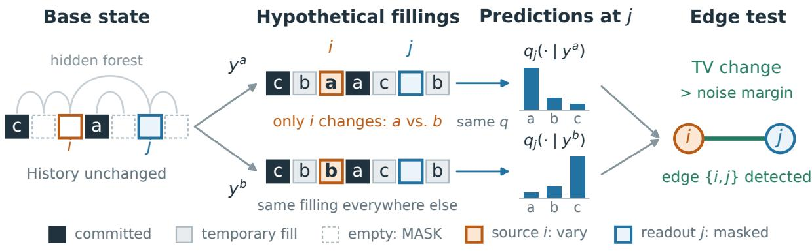  
Figure 1: Counterfactual edge probing; faint arcs show the hidden forest. Keeping the committed state unchanged, vary only source i between two hypothetical fillings and compare the predicted rows at masked readout j. With the same fully filled background, a response above the oracle-noise margin detects {i, j}. Section 4.2 packs and aggregates such tests.

Main results, informally. Under the target and oracle assumptions in Section 2, for any fixed suficiently small accuracy $\varepsilon > 0$ and all suficiently large N, there is a sampler with seed-averaged total-variation $( T V )$ error at most ε using $\widetilde { O } ( N ^ { 2 / 3 + 1 / ( 9 s ) } )$ evaluations in total, which also gives sublinear sequential depth. Here $s > 1$ is the rank-frequency exponent. Conversely, every admissible irreversible product-commit sampler meeting the same accuracy target uniformly over the class requires worst-case budgets of $\Omega ( N ^ { c } )$ probes or $\Omega ( N ^ { c } )$ commit rounds for some $c > 0$ (Theorems 3.1–3.2).

The model assumes detectable edge responses, controlled tail responses, a rank-frequency envelope, and polynomial vocabulary. Its uniform oracle accuracy also sufices for the N-step baseline to meet the output target (Appendix J.2).

Existing distribution-general samplers achieve smaller depth exponents with suficient total budgets of O(N) or O(N log N) (Anari et al., 2024; 2026). Dependence-adaptive guarantees can be sublinear on weakly dependent instances (Li and Cai, 2025; Zhao and Cai, 2026). Our guarantee also covers paths with constant dependence per edge and total correlation $\Theta ( N )$ (Proposition I.1; Section 5).

Section 4 combines random-color probes, majority certification of low-degree neighborhoods, singleton peeling of the high-degree core, and parallel centroid commits, without first recovering the original forest. A public degree cutof trades probing work against commit rounds.

## 2 Problem formulation

Public and hidden information. The vocabulary and its order, class parameters, accuracy target, and algorithm parameters are public: known to the sampler and fixed before the hidden instance is chosen. The target, forest, exact marginals, ranks, and response witnesses are hidden. For the main results, fix $0 < \varepsilon \le 1 / 8$ before taking $N \to \infty ;$ we suppress dependence on N. The appendix retains the general finite setup.

For laws $p , q$ on a finite alphabet, write $\begin{array} { r } { d _ { \mathrm { T V } } ( p , q ) = \frac { 1 } { 2 } \sum _ { a } | p ( a ) - q ( a ) | , h ^ { 2 } ( p , q ) = 1 - \sum _ { a } \sqrt { p ( a ) q ( a ) } } \end{array}$ , and $\begin{array} { r } { D _ { \mathrm { K L } } ( p \| q ) = \sum _ { a } p ( a ) \log ( p ( a ) / q ( a ) ) } \end{array}$ (natural logarithms). Write $\Delta ^ { \circ }$ for the strictly positive probability simplex.

## 2.1 Hidden forest and regularity

Definition 2.1 (Forest target and committed history). Let $[ N ] = \{ 1 , \dots , N \}$ and let V be a vocabulary of size V with public order $\prec$ The target $X \in \mathcal { V } ^ { N }$ has a strictly positive law $P \in \Delta ^ { \circ } ( \mathcal { V } ^ { N } )$ and a hidden undirected forest $F = ( [ N ] , E ) { \mathrm { ~ ( T a n ~ e t ~ a l } }$ ., 2011; Bhattacharyya et al., 2023). Write $\pi _ { i }$ for the marginal of $X _ { i }$ . A committed history $H _ { G } = ( G , x _ { G } )$ leaves residual positions $U _ { G } = [ N ] \backslash G$ and forest $F _ { G } = F [ U _ { G } ]$ (Theorem A.1 and Equation (14)).

Assumption 2.2 (Forest factorization). Choose one root per component, with root set ${ \mathrm { R o o t s } } ( F )$ and parent pa(j) for each nonroot. Assume the factorization (Theorem A.2):

$$
P ( x ) = \prod _ { u \in \mathrm { R o o t s } ( F ) } \pi _ { u } ( x _ { u } ) \prod _ { j \notin \mathrm { R o o t s } ( F ) } P ( X _ { j } = x _ { j } \mid X _ { \mathrm { p a } ( j ) } = x _ { \mathrm { p a } ( j ) } ) .\tag{1}
$$

Definition 2.3 (Tail sets and directed response). For distinct positions $i , j ,$ call i the source whose token value is varied and j the masked readout whose conditional distribution is inspected. For a complete boundary $z \in \mathcal { V } ^ { [ N ] \setminus \{ i , j \} }$ , write ${ \mathcal { T } } _ { i } ( t ) = \{ a : \pi _ { i } ( a ) \leq t \}$ and $\mu _ { i \to j } ( \cdot \mid a , z ) = \mathcal { L } _ { P } ( X _ { j } \mid X _ { i } = a , X _ { [ N | \setminus \{ i , j \} } = z )$ The directed response is $\begin{array} { r } { \Omega _ { i \to j } ( z ) = \operatorname* { m a x } _ { a , b \in \mathcal { V } } d _ { \mathrm { T V } } ( \mu _ { i \to j } ( \cdot  { | } a , z ) , \mu _ { i \to j } ( \cdot  { | } b , z ) ) } \end{array}$ (Theorem $\mathrm { A . 3 } )$

Assumption 2.4 (Regularity and scaling for the main results). Let $s > 1$ and $\omega \in ( 0 , 1 ]$ be public.

• (RT) Tail response. For all distinct $\ i , j , \in [ 0 , 1 ]$ , and complete boundaries $z ,$ $\begin{array} { r } { \operatorname* { m a x } _ { a , b \in \mathcal { T } _ { i } ( t ) } d _ { \mathrm { T V } } \big ( \mu _ { i \to j } ( \cdot  { | } a , z ) , \mu _ { i \to j } ( \cdot  { | } b , z ) \big ) \leq t } \end{array}$ For tails of size at most one, take the maximum as zero. Tail tokens are thus interchangeable within TV error t (Theorem $\mathrm { A . 4 } )$

• (UEN) Edge nondegeneracy. Every edge $\{ u , v \} \ \in \ E$ and complete boundary z satisfy min $\{ \Omega _ { u \to v } ( z ) , \Omega _ { v \to u } ( z ) \} \ge \omega$ . The witnessing token pair may depend on the direction and boundary (Theorem A.4).

• (RF) Rank-frequency envelope. Rank tokens $a _ { i , k }$ by decreasing $\pi _ { i } { \mathrm { ~ ( t i e s ~ u s e ~ } } \prec { \Big ) }$ . For every position i and rank $k , \pi _ { i } ( a _ { i , k } ) \leq k ^ { - s } + V ^ { - 1 }$ (Theorem $\mathrm { A . 5 } )$ . No lower frequency bound or adjacentrank separation is assumed. This bounds tokens above thresholds exceeding $V ^ { - 1 }$ and, with RT, explicit token choices (Section 4.1).

• Scaling. For a public $\nu > 1 / 3$ , take $V = N ^ { \nu + o ( 1 ) }$ and set $\omega = ( \varepsilon ^ { 2 } / ( 3 2 N ) ) ^ { 1 / 3 }$ (Theorem G.3).

## 2.2 Oracle access and sampling objective

One oracle evaluation is one masked-state submission; a probe is a noncommit counterfactual submission. Hypothetical-reveal tests also appear in PUNT (Azangulov et al., 2026); Definition 2.6 charges probes to the sampling budget.

Definition 2.5 (Frozen conditional oracle). A masked state is $y \in ( \mathcal { V } \cup \{ \mathsf { M A S K } \} ) ^ { N }$ with observed set $O ( y ) = \{ i : y _ { i } \neq \mathsf { M A S K } \}$ . For a masked readout $j \notin O ( y )$ , its exact row is $\mu _ { j } ( \cdot \mid y ) = \mathcal { L } _ { P } ( X _ { j } \mid X _ { O ( y ) } =$ $y _ { O ( y ) } )$ . The oracle $q = \{ q _ { j } \} _ { j \in [ N ] }$ is fixed and deterministic (Theorem $\mathrm { A . 6 } )$ . One submission returns probability vectors for a requested subset S of masked positions:

$$
\begin{array} { r } { ( y , S ) \xrightarrow { \mathrm { ~ o n e ~ m a s k e d - s t a t e ~ s u b m i s s i o n } } \quad \left\{ q _ { j } ( \cdot \mid y ) \right\} _ { j \in S } , S \subseteq [ N ] \setminus O ( y ) . } \end{array}
$$

Each row is the full vector $q _ { j } ( \cdot \mid y ) = ( q _ { j } ( a \mid y ) ) _ { a \in \mathcal { V } } \in \Delta ^ { \circ } ( \mathcal { V } )$ ; the submission costs one evaluation, regardless of |S|.

Definition 2.6 (Sampling operations, resources, and risk). An admissible algorithm uses q adaptively without remasking committed positions (Theorem A.9). At $H _ { G } = ( G , x _ { G } )$ , both operations preserve $y _ { G } = x _ { G } \colon$

• Probe. Submit $( y , S )$ with $S \subseteq [ N ] \backslash O ( y )$ and inspect the probabilities $\{ q _ { j } ( a \mid y ) : j \in S , \ a \in \mathcal { V } \}$ returned together. The state y may temporarily reveal residual coordinates; only the transcript changes, while $( G , x _ { G } )$ stays fixed.

• Commit. Choose a nonempty batch $B \subseteq U _ { G }$ from prior information, before the reply. Submit $( y , B )$ with all residual positions masked, receive $\{ q _ { j } ( \cdot \mid y ) \} _ { j \in B }$ , and sample $z _ { B } \sim \bigotimes _ { j \in B } q _ { j } ( \cdot \mid y )$ to commit permanently.

Batches eventually partition [N]. Committing counterfactual values or using verify-and-accept steps is not allowed.

Resources (Theorem A.11). Let $s = 1 , 2 , . . .$ . index the submissions actually performed, and let $s _ { \mathrm { p r e } }$ index the distinguished preprocessing all-mask readout (0 if absent). Define

$$
Q _ { \mathrm { c f } } : = { \big | } \{ s : s \neq s _ { \mathrm { p r e } } , ~ \mathrm { s u b m i s s i o n } ~ s ~ \mathrm { i s ~ a ~ p r o b e } \} { \big | } ,
$$

$$
R : = { \big | } \{ s : { \mathrm { s u b m i s s i o n ~ } } s { \mathrm { ~ p e r f o r m s ~ a ~ n o n e m p t y ~ p r o d u c t ~ c o m m i t } } \} { \big | } .
$$

The construction’s total is $1 + Q _ { \mathrm { c f } } + R _ { \mathrm { } }$ including its one initial all-mask readout. Repeated states and parallel submissions count separately; positions and tests sharing one submission do not. The oracle depth D counts sequential oracle stages; returned probabilities and local computation are not charged separately.

Output law and risk. The algorithm’s decision rule chooses submissions and batches from available information and a seed W independent of the hidden instance and primitive commit-draw randomness. Conditional on $W = w .$ , the output law $\widehat { P } _ { w } ^ { q }$ integrates the commit draws (Theorem A.10). Its seed-averaged risks are $\mathcal { R } _ { \mathrm { T V } } ( A ; P , q ) = \mathbb { E } _ { W } d _ { \mathrm { T V } } ( P , \widehat { P } _ { W } ^ { q } )$ and $\mathcal { R } _ { \mathrm { K L } } ( A ; P , q ) = \mathbb { E } _ { W } D _ { \mathrm { K L } } \Big ( P \Big | \Big | \widehat { P } _ { W } ^ { q } \Big )$ (Theorem F.1).

The risks average divergence over decision-rule seeds, before mixing their output laws. Convexity gives $d _ { \mathrm { T V } } ( P , \mathbb { E } _ { W } \widehat { P } _ { W } ^ { q } ) \leq \mathcal { R } _ { \mathrm { T V } } ( A ; P , q )$ : the upper bound also controls the mixed output, while the lower bound concerns the stated seed-averaged criterion.

Assumption 2.7 (Uniform frozen-oracle accuracy: two cases). For the fixed public accuracy $\varepsilon ,$ assume one of the following bounds uniformly over all valid state–readout pairs.

Case (i) (Hellinger, A2; Theorem A.7): $h ^ { 2 } ( \mu _ { j } ( \cdot \mid y ) , q _ { j } ( \cdot \mid y ) ) \le \varepsilon ^ { 2 } / ( 8 N )$

Case (ii) (forward KL; Theorem F.1): $D _ { \mathrm { K L } } ( \mu _ { j } ( \cdot \mid y ) \lvert | q _ { j } ( \cdot \mid y ) ) \leq \varepsilon ^ { 2 } / ( 4 N )$

Both cases imply row-TV error at most $\varepsilon / ( 2 \sqrt { N } )$ , uniformly over counterfactual and commit states. This uniform requirement is stronger than average prediction accuracy of a trained model.

Definition 2.8 (Target–oracle classes). For each case, take all target–oracle tuples satisfying Theorems 2.2 and 2.4 and the corresponding condition of Theorem 2.7. For case (i), denote this class by $\mathfrak { F } ^ { \mathrm { s h } }$ and write $( P ^ { I } , q ^ { I } )$ for the target and oracle of instance $I \in \mathfrak { F } ^ { \mathrm { s h } }$ (Theorem G.3).

## 3 Main results

## 3.1 Sublinear sampling is possible

The positive result controls total submissions and sequential depth. The public algorithm parameter d trades discovery submissions against irreversible commit rounds; target degrees may be arbitrary.

Theorem 3.1 (Existence of a sublinear oracle sampler). For either target–oracle class in Definition 2.8 and every public integer $9 \leq d \leq N - 1$ , there is an admissible sampler Apack, depending only on the public class data and $d ,$ with the following guarantees for all suficiently large N. Uniformly over the respective target–oracle class, on every execution path,

$$
\begin{array} { r } { Q _ { \mathrm { c f } } = \widetilde { O } \left( d ^ { 2 } ( N / \varepsilon ^ { 2 } ) ^ { 1 / ( 3 s ) } \right) , \qquad R , D = \widetilde { O } ( N / d ) . } \end{array}\tag{2}
$$

Here $\widetilde O$ hides powers of log N, with ε fixed. In case $( i ) _ { i }$ , su $\mathrm { p } _ { I \in \mathfrak { F } ^ { \mathrm { s h } } } \mathcal { R } _ { \mathrm { T V } } ( A _ { \mathrm { p a c k } } ; P ^ { I } , q ^ { I } ) \le \varepsilon$ . In case $( i i )$ uniformly over its class, $\mathcal { R } _ { \mathrm { K L } } ( A _ { \mathrm { p a c k } } ; P , q ) \le \varepsilon ^ { 2 }$

In particular, choosing $d = \lceil ( N \omega ^ { 1 / s } ) ^ { 1 / 3 } \rceil$ gives the common balanced bound

$$
1 + Q _ { \mathrm { c f } } + R , ~ D = \widetilde O \Bigl ( N ^ { 2 / 3 + 1 / ( 9 s ) } / \varepsilon ^ { 2 / ( 9 s ) } \Bigr ) = o ( N ) .\tag{3}
$$

Since $s > 1$ , both total submissions and depth are sublinear at fixed admissible accuracy. Section 4 gives the construction and Theorem G.3 the finite calibration and logarithmic factors. Table 1 compares bounds under the respective target and oracle assumptions.

## 3.2 A query–round lower bound

The lower bound applies to every admissible sampler in the Hellinger/TV class $\mathfrak { F } ^ { \mathrm { s h } }$ : each commit samples a product batch from the current singleton predictions and permanently fixes its tokens. Accuracy is measured by the seed-averaged TV risk in Definition 2.6.

Theorem 3.2 (Fixed-accuracy query–round lower bound). For all suficiently large even $N _ { z }$ , every admissible algorithm with deterministic bounds $Q _ { \mathrm { c f } } \leq \overline { { Q } }$ and $R \leq \overline { { R } }$ on every instance, seed, transcript, and execution path and su $\operatorname { p } _ { I \in \mathfrak { F } ^ { \mathrm { s h } } } \mathcal { R } _ { \mathrm { T V } } ( A ; P ^ { I } , q ^ { I } ) \le \varepsilon$ satisfies

$$
\begin{array} { r } { \overline { { Q } } = \Omega \Big ( ( N / \varepsilon ^ { 2 } ) ^ { 1 / ( 3 s ) } \Big ) \quad o r \quad \overline { { R } } = \Omega \Big ( N ^ { 1 / 3 } \varepsilon ^ { 1 / 3 } \Big ) . } \end{array}\tag{4}
$$

The constants may depend on s, but not on the hidden instance or the algorithm. The suficiently-large-N threshold may depend on the fixed public accuracy ε.

Table 1: Suficient bounds at fixed positive accuracy and polynomial vocabulary. Mean: seed-averaged divergence; exp.: expected resources (ours are pathwise). TC/DTC: total/dual total correlation; Tb: a supplied bound on either. Path: Proposition I.1. Oracle conditions, accuracy dependence, and markers a, b: Appendices I–J.
<table><tr><td>Sampler / variant</td><td>Target / oracle</td><td>Submissions</td><td>Depth</td><td>Output</td></tr><tr><td>Sequential chain rule</td><td>Arbitrary / exact</td><td>N</td><td>N</td><td>Exact</td></tr><tr><td>One product batch</td><td>Arbitrary / exact</td><td>1</td><td>1</td><td>No error boundª</td></tr><tr><td>Anari et al. (2024)</td><td>Arbitrary / exact</td><td>O(N), exp.</td><td>õ(N2/3)</td><td>Exact</td></tr><tr><td>Anari et al. (2026)</td><td>Arbitrary / noisyb</td><td>O(N log N), exp.</td><td> ${ \widetilde O } ( N ^ { 1 / 2 } )$ </td><td>TV</td></tr><tr><td>Li and Cai (2025)</td><td>TC/DTC / averaged prediction error</td><td>O(1 + TC + DTC) same (path: O(N))</td><td></td><td>Mean KL</td></tr><tr><td>Chen et al. (2026)</td><td>Supplied Î / exact</td><td>õ(1 + T) (path: ð(N))</td><td>same</td><td>Mean KL</td></tr><tr><td>This paper, case (i)</td><td>Regular hidden forests / uniform Hellinger</td><td> $\widetilde { O } ( N ^ { 2 / 3 + 1 / ( 9 s ) } )$ </td><td>same</td><td>Mean TV</td></tr><tr><td>This paper, case (ii)</td><td>Regular hidden forests / uniform forward KL</td><td> $\widetilde { O } ( N ^ { 2 / 3 + 1 / ( 9 s ) } )$ </td><td>same</td><td>Mean KL</td></tr></table>

Lower-bound construction. The hard family is a hidden matching whose oracle reveals dependence only when a source is set to its private trigger token. One submitted state tests at most one candidate per source, even when many readout rows are returned. The proof converts collisions of unresolved matched endpoints within product-commit batches into a TV lower bound, showing that accuracy requires enough submissions or commit rounds. The hard family uses $\omega \asymp ( \varepsilon ^ { 2 } / N ) ^ { 1 / 3 } ,$ : its nontrigger squared-Hellinger error is of order $\omega ^ { 3 } \asymp \varepsilon ^ { 2 } / N$ . Thus the signal floor vanishes as $\dot { N } ^ { - 1 / 3 }$ at fixed accuracy; changing ε also changes the target class. Theorems G.2 and G.3 give the finite bound and its specialization to Theorem 3.2.

## 4 Algorithmic construction

We now construct the sampler in Theorem 3.1. The key is to learn the residual forest as sampling removes vertices. Step 2–Step 3 share counterfactual probes to recover low-degree neighborhoods with high probability. When all screens succeed, Step 4 uses these reports to shrink the high-degree core by singleton commits, and Step 5–Step 6 recover the remaining forest for parallel centroid commits (Algorithm 1).

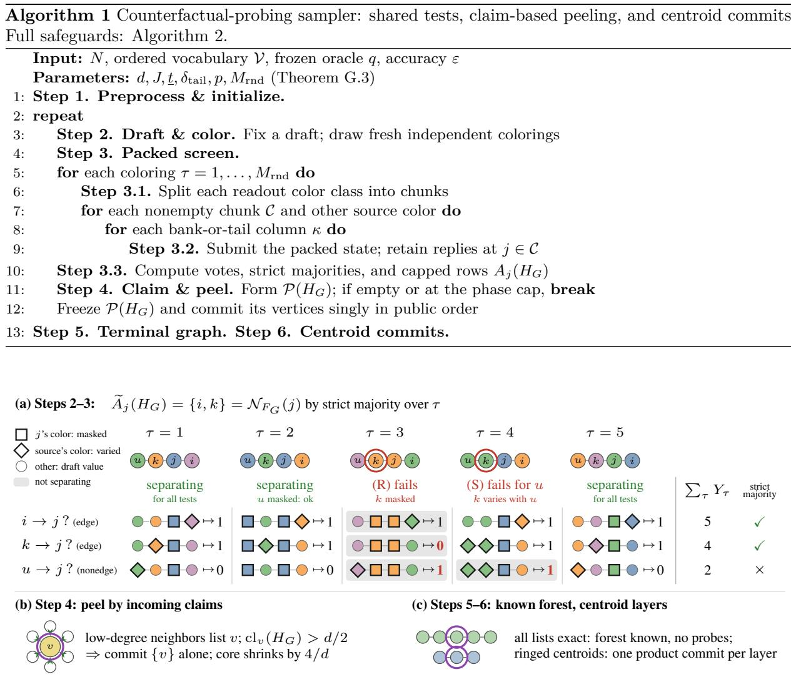  
Figure 2: Shared tests and majority recovery. (a) Each cell represents all bank/tail columns; each readout color has one chunk. Equal-color pairs (no diamond) get vote 0 without probing. Grey: nonseparation; red: illustrative errors. (b) Singleton peels contract the core per phase. (c) One centroid per component forms a terminal batch.

## 4.1 Building a single-source edge test

We prepare the edge test that Section 4.2 will share across pairs. Fix a history $H _ { G } = ( G , x _ { G } )$ , distinct residual positions $i , j$ , and a query-free draft $f .$ The single-source state $y ^ { a }$ reveals $x _ { G }$ , sets $y _ { i } ^ { a } = a ,$ masks $j ,$ and fixes all other residual coordinates to their draft values (Figure 1). Its exact reply $\mu _ { i \to j } ( \cdot \mid a , z )$ has boundary $z = ( x _ { G } , f _ { U _ { G } \backslash \{ i , j \} } )$ . For a nonedge this row is constant in a by forest separation (Theorem E.2); for an edge its TV diameter is at least ω by Assumption 2.4 (UEN). Testing all ordered pairs and tokens separately costs $| U _ { G } | ( | U _ { G } | - 1 ) V$ submissions.

Banks and tail representatives (Step 1). To reduce token choices, we test a local vocabulary bank and one representative of the omitted tokens. Write $\varepsilon _ { 0 } : = \varepsilon / ( 2 \sqrt { N } )$ for the row-TV error bound in either case (Equations (103) and (195)). On the threshold grid $\mathcal { G }$ with floor $\underline { { t } } ,$ choose $t = \operatorname* { m a x } \{ u \in \mathcal { G } : u \leq \delta _ { \mathrm { t a i l } } \}$ the largest threshold allowed by the tail budget. One all-mask submission gives the local vocabulary banks $\widehat { B } _ { i } : = \left\{ a \in \mathcal { V } : q _ { i } ( a  { | } \mathsf { M A S K } ^ { N } ) \geq t - \varepsilon _ { 0 } \right\}$ and tail representatives $b _ { i } = \operatorname* { m i n } _ { \prec } ( \mathcal { V } \setminus \widehat { B } _ { i } )$ (Theorem D.1). The standard draft reuses these rows without another submission (Equation (114)).

Assumption 2.4 (RT) allows each omitted token to be replaced by $b _ { i }$ within TV error $\delta _ { \mathrm { t a i l } } = \omega / 2$ Assumption 2.4 (RF) bounds $\ell _ { \mathrm { m a x } } = \mathrm { m a x } _ { i } | \widehat { \boldsymbol { \beta } } _ { i } | = O ( \omega ^ { - 1 / s } )$

A resolvable edge signal. The test queries every bank token and the tail representative, then compares $\begin{array} { r l } & { \operatorname* { m a x } _ { a , a ^ { \prime } \in \widehat { \mathcal { B } _ { i } } \cup \{ b _ { i } \} } d _ { \mathrm { T V } } ( q _ { j } ( \cdot  { | } y ^ { a } ) , q _ { j } ( \cdot  { | } y ^ { a ^ { \prime } } ) ) } \end{array}$ with $2 \varepsilon _ { 0 }$ . This observed diameter is at most $2 \varepsilon _ { 0 }$ for a nonedge; for an edge it is at least $\omega - \delta _ { \mathrm { t a i l } } - 2 \varepsilon _ { 0 } > 2 \varepsilon _ { 0 }$ when $\delta : = 4 \varepsilon _ { 0 } + \delta _ { \mathrm { t a i l } } < \omega$ . Under the scaling in Assumption 2.4, our

parameter choices make preprocessing feasible and ensure $\delta < \omega$ for all suficiently large N (Theorem G.3).   
Theorem E.6 proves the diameter bound.

## 4.2 Packing tests with random colorings

We share the tests of Section 4.1 across source and readout groups. For each coloring, Step 3.1 splits color classes into chunks of at most $\lceil N / J \rceil$ positions. Step 3.2 masks one chunk and varies another color class through bank-or-tail columns κ: each source takes its own token value, while committed values and the remaining draft stay fixed. There are $\Lambda \leq \ell _ { \mathrm { m a x } } + 1$ submitted columns; Equations (115) and (116) specify padding and the empty-bank case. The same replies test every source–readout pair between the two groups. Step 2 draws $M _ { \mathrm { r n d } }$ independent colorings with independent uniform colors $h _ { \tau } ( i ) \in [ p ]$ $p = 8 ( d + 1 )$ . All screen probes are fixed before replies: one oracle stage (Algorithm 3). Coloring also shares evaluations in sparse Jacobian estimation (Coleman and Moré, 1983).

For $i  j$ , the single-source test is preserved if every neighbor of $j$ is revealed and all except i stay fixed. Call a coloring separating when:

• Readout separation $( R )$ . No neighbor of j has $j ^ { \prime }$ s color, so none is masked.

• Source separation (S). No neighbor of j other than i has i’s color, so none varies with i.

For separating colorings with distinct source/readout colors, exact replies equal their single-source counterparts (Theorem E.5). Figure $2 ( \mathrm { a } )$ shows possible collision errors and majority voting.

Voting and capped candidate lists (Step 3.3). Each coloring casts one vote on whether i and $j$ are adjacent, using the shared replies from Step 3.2. For diferently colored $i , j$ , compare the conditional distributions returned at $j$ across the columns probing i’s color class. Let $D _ { \tau } ( i , j ~ \mid ~ H _ { G } )$ be their maximum pairwise TV distance (Equation (125)). Applying the threshold from Section 4.1 gives the vote $Y _ { \tau } ( i , j \mid H _ { G } ) = \mathbf { 1 } \{ D _ { \tau } ( i , j \mid H _ { G } ) > 2 \varepsilon _ { 0 } \}$ . Equal-color pairs have no corresponding probe and receive vote zero. We retain candidates supported by a strict majority of all $M _ { \mathrm { r n d } }$ colorings:

$$
\widetilde { A } _ { j } ( H _ { G } ) : = \left\{ i \in U _ { G } \setminus \{ j \} : \sum _ { \tau = 1 } ^ { M _ { \mathrm { r n d } } } Y _ { \tau } ( i , j \mid H _ { G } ) > M _ { \mathrm { r n d } } / 2 \right\} .
$$

The returned list $A _ { j } ( H _ { G } )$ equals $\widetilde { A } _ { j } ( H _ { G } )$ when it contains at most d candidates; otherwise, it retains the d candidates with the highest vote totals, breaking ties by public position order. Random hashing followed by majority aggregation also appears in junta learning (Bshouty and Costa, 2018).

Low-degree recovery (Step 2–Step 3). For a readout j with $d _ { F _ { G } } ( j ) \leq d ,$ conditions (R) and (S) forbid at most 2d color equalities. Conditional on the past and the fixed draft, each equality has probability $1 / p$ Thus, each fresh coloring separates any fixed pair $( i , j )$ with probability at least $1 - 2 d / p > 3 / 4$

$\mathrm { B y }$ the single-source margin $\delta < \omega$ from Section 4.1, every separating coloring gives the correct edge/nonedge vote. This includes same-color separating pairs: condition (R) excludes an edge, so their zero vote is correct. A strict separating majority therefore classifies the pair correctly, regardless of the remaining votes. Let Iso $\left( H _ { G } \right)$ denote the analysis-only event that such a majority holds for every $i \neq j$ with $d _ { F _ { G } } ( j ) \leq d$ On this event, each low-degree candidate list equals the true neighborhood. Its size is already at most $d ,$ so truncation leaves it unchanged (Theorem E.6):

$$
A _ { j } ( H _ { G } ) = \mathcal { N } _ { F _ { G } } ( j ) \quad \mathrm { f o r ~ e v e r y ~ } j \in U _ { G } \mathrm { ~ w i t h ~ } d _ { F _ { G } } ( j ) \leq d .\tag{5}
$$

By independence across colorings, Hoefding’s inequality bounds the probability that a fixed pair lacks a strict separating majority by $e ^ { - M _ { \mathrm { r n d } } / 8 }$ . A union bound over pairs gives

$$
\mathrm { P r } \big ( \mathsf { l s o } ( H _ { G } ) ^ { \mathrm { c } } \mid \mathrm { p a s t ~ i n c l u d i n g ~ t h e ~ c u r r e n t ~ d r a f t } \big ) \le N ^ { 2 } e ^ { - M _ { \mathrm { r n d } } / 8 } .\tag{6}
$$

Fresh colors make this bound valid at every adaptively reached screen. A further union bound over the capped number of screen calls controls failure along the full execution (Theorem E.4).

## 4.3 Peeling the high-degree core, then centroid layers

Step 4 commits vertices with many incoming neighbor reports singly. When all screens succeed, repeated peeling removes the high-degree core, enabling forest recovery and parallel centroid commits (Step $5 \textdegree$ Step 6).

Define the incoming claim count and the peel set (also Equation (106)) by

$$
\operatorname { c l } _ { v } ( H _ { G } ) : = | \{ u \in U _ { G } : v \in A _ { u } ( H _ { G } ) \} | , \qquad \mathcal { P } ( H _ { G } ) : = \{ v \in U _ { G } : \operatorname { c l } _ { v } ( H _ { G } ) > d / 2 \} .\tag{7}
$$

Why peel by incoming claims (Step 4)? A high-degree vertex’s own report may be unreliable, but each low-degree neighbor reports it correctly. Peeling may also select low-degree vertices; singleton commits introduce no within-batch dependence error. The size cap controls their cost: on successful screens, $| A _ { u } ( H _ { G } ) | \leq d _ { F _ { G } } ( u )$ , so

$$
( d / 2 ) | { \cal P } ( H _ { G } ) | \leq \sum _ { v } \mathrm { c l } _ { v } ( H _ { G } ) = \sum _ { u } | A _ { u } ( H _ { G } ) | \leq \sum _ { u } d _ { F _ { G } } ( u ) < 2 | U _ { G } | .
$$

Thus a phase uses fewer than $4 | U _ { G } | / d$ singleton rounds.

The high-degree core shrinks. Let ${ \mathcal { V } } ^ { \mathrm { h i } } ( H _ { G } ) = \{ v : d _ { F _ { G } } ( v ) > d \}$ . On a successful screen, an unpeeled high-degree vertex has at most $d / 2$ low-degree neighbors, since each contributes a claim; it therefore has more than $d / 2$ neighbors in $\nu ^ { \mathrm { h i } } ( H _ { G } )$ . The forest induced on $\nu ^ { \mathrm { h i } } ( H _ { G } )$ has degree sum below $2 | \mathcal { V } ^ { \mathrm { h i } } ( H _ { G } ) |$ so fewer than $( 4 / d ) | \mathcal { V } ^ { \mathrm { h i } } ( H _ { G } )$ | high-degree vertices remain unpeeled when $\nu ^ { \mathrm { h i } } ( H _ { G } )$ is nonempty. Deleting vertices cannot raise degrees; the next history $H _ { G } ^ { \prime }$ satisfies

$$
\begin{array} { r } { | \mathcal { V } ^ { \mathrm { h i } } ( H _ { G } ^ { \prime } ) | \leq ( 4 / d ) | \mathcal { V } ^ { \mathrm { h i } } ( H _ { G } ) | . } \end{array}\tag{8}
$$

Finish without further probes (Step 5–Step 6). On successful-screen paths, the ${ \cal O } ( \log N )$ phase cap or an empty peel set ensures residual maximum degree at most d (Theorem E.7). Since screening precedes either test, Equation (5) makes every terminal row exact. Joining reported neighbors therefore recovers the true residual forest. The exact joint conditional of one centroid per component factorizes. Centroid deletion halves component sizes, giving logarithmically many layers (Theorems E.2 and H.4). These layers form a vertex ranking (Iyer et al., 1988), with higher ranks assigned to earlier commits. Only commit submissions remain: later steps delete vertices of the known forest rather than rediscovering it.

## 4.4 Resources and accuracy

Each screen uses at most $\Lambda M _ { \mathrm { r n d } } p ( p + J ) $ submissions: columns, colorings, source colors, and readout chunks. With $J = d ,$ , the bank bound, phase count, and peel-size bound yield

$$
Q _ { \mathrm { c f } } = \widetilde { \cal O } ( \omega ^ { - 1 / s } d ^ { 2 } ) , \qquad R , D = \widetilde { \cal O } ( N / d ) .
$$

Larger d increases screening cost but reduces commit rounds; balancing gives Equation (3). Public caps enforce the bounds even on failed-screen paths (Theorem E.8); Algorithm 2 specifies singleton cycle repair and the round-cap all-residual product-commit fallback.

On paths where all screens succeed, the target conditional factorizes over every commit batch. The appendix bounds oracle error and the contribution of failed screens using separate TV and forward-KL arguments (Theorems E.9 to E.11 and F.3). The calibration in Theorem G.3 gives the guarantees of Theorem 3.1 for the sampler in Algorithm 1.

## 5 Related work

Masked generation and dependence-aware decoding. Under standard absorbing masks, the denoising target can be expressed using time-independent clean-data conditionals (Ou et al., 2025; Zheng et al., 2025), motivating our frozen-oracle model. Most closely related, PUNT (Azangulov et al., 2026) uses hypothetical reveals and shares evaluations across contextual-independence tests, but does not establish a sublinear total-evaluation guarantee or an end-to-end sampling-error bound. Our random-color screen instead certifies local neighborhoods and yields sublinear total submissions under the hidden-forest target–oracle assumptions of Theorem 3.1. Fu et al. (2025) lower-bound rounds under a confidencethreshold restriction; our lower bound trades probes against commit rounds over the full admissible interface.

Parallel sampling guarantees. Distribution-general conditional-oracle samplers provide exact- and noisy-oracle guarantees with smaller depth exponents (Anari et al., 2024; 2026); Table 1 compares their row-query bounds in our submission units. Dependence-based schedule analyses control error through

TC/DTC, efective TC, or adaptive estimates (Li and Cai, 2025; Chen et al., 2026; Dmitriev et al., 2026a; Zhao and Cai, 2026). Our class contains a path on which TC, DTC, and efective TC are all Θ(N), while the construction exploits local conditional separation. Appendices I–J give the source conditions and path calculations; these substitutions compare suficient upper bounds, not lower bounds on those samplers.

Learning hidden structure. Structure learning uses subset queries (Angluin and Chen, 2008; Abasi and Bshouty, 2019), samples (Chow and Liu, 1968; Dasarathy et al., 2016), or Gaussian covariance entries (Lugosi et al., 2021). Tree Ising laws can be learned in global TV without exact tree recovery (Daskalakis and Pan, 2021). Our conditional-row probes yield local certificates and charge discovery to sampling; Appendix J.3 gives further historical context.

## 6 Finite-size experiments

We evaluate four hidden forest families with an exact frozen conditional oracle at five sizes from $N = 8 1 9 2$ to 16384. Figure 3 compares total oracle submissions under the fixed empirical batch-KL criterion $K + 2 \mathrm { S E } _ { \mathrm { M C } } \leq 1 0 ^ { - 1 0 } L _ { 0 }$ , where K sums product-to-joint batch KL along the sampled history, not the target-to-output risk. The family-specific reference $L _ { 0 }$ is the one-batch KL cost at $N = 2 0 4 8$ (Appendix K). We use empirical tuning; the targets and parameters need not satisfy the theorem’s suficient conditions. Our sampler’s submission counts are consistent with sublinear scaling over the tested finite-size range. These exact-oracle experiments isolate submission cost; learned-model accuracy and runtime are outside their scope.

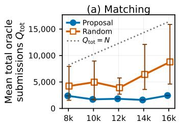

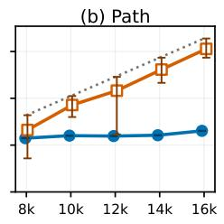

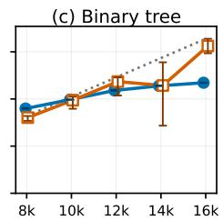  
Sequence length N

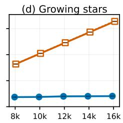  
Figure 3: Total oracle submissions $Q _ { \mathrm { t o t } } = Q _ { \mathrm { p r e } } + Q _ { \mathrm { c f } } + R$ , including preprocessing, probes, and nonempty commit rounds. Points: six-run means; whiskers: min–max ranges (not standard errors or confidence intervals). Proposal settings are fixed per forest and N; random budgets are selected per run on coupled curves. Proposal ranges $( \leq 7 8$ submissions) may lie inside markers. Dotted line: exact singleton $Q _ { \mathrm { t o t } } = N$ not a cap. Horizontal ticks: $\mathrm { 1 k = 1 0 2 4 }$

## 7 Conclusion

We establish sublinear parallel unmasking under hidden-forest assumptions, including dependence-discovery costs. The main practical challenge is to turn shared probing into computational savings with learned denoisers. Open directions include closing the probe–commit tradeof gap for irreversible sampling, understanding whether remasking improves this tradeof when resampling costs are counted, and extending the guarantees beyond forests.

## Acknowledgments

RK was partially supported by JSPS KAKENHI (24K02905) and JST BOOST (JPMJBS2418). SH was partially supported by JSPS KAKENHI (26K25548) and received access to ChatGPT for Academic Researchers program.

TS was partially supported by JST CREST (PMJCR2015) and JSPS KAKENHI (25H01107). This work was supported by JST ERATO Grant Number JPMJER2601. This research is supported by the National Research Foundation, Singapore and the Ministry of Digital Development and Information under the AI Visiting Professorship Programme (award number AIVP-2024-004). Any opinions, findings and conclusions or recommendations expressed in this material are those of the author(s) and do not reflect the views of National Research Foundation, Singapore and the Ministry of Digital Development and Information.

## AI use statement

Generative AI tools were used extensively during this work, not only for language editing. GPT-5.6 Sol and GPT-6 Astra were used throughout the research and writing process. Claude Fable 5.1 and Claude Opus 5.5 were additionally used for writing assistance and the generation of Figures 1 and 2. Iterative brainstorming and technical discussions with the GPT models contributed to the development of central proof ideas. The GPT models also assisted in developing and refining mathematical arguments, making proof steps explicit and rigorous, and drafting and revising the proofs. AI tools also assisted with experimental design. The GPT models were also used to write code for the numerical experiments. Further assistance included literature search, translation, and the preparation of scientific figures, as well as manuscript organization, expository revision, and LATEX preparation. AI assistance was also used to formalize the manuscript’s named mathematical claims in Lean 4, whose kernel checked the resulting proofs. The correspondence between the formal statements and the manuscript was audited separately. The authors verified the proofs and cross-checked the cited sources. The authors take responsibility for the final content of this work, including its mathematical claims, proofs, citations, and AI-assisted text.

## Code availability

The Lean 4 formalization, verification records, and experiment code and saved results are available in the arxiv-v1 snapshot at https://github.com/ryotaro-kawata-wa/ counterfactual-parallel-unmasking. The repository includes pinned dependencies and repro duction instructions.

## References

Hasan Abasi and Nader H. Bshouty. On learning graphs with edge-detecting queries. In Proceedings of the 30th International Conference on Algorithmic Learning Theory, volume 98 of Proceedings of Machine Learning Research, pages 3–30. PMLR, 2019. URL https://proceedings.mlr.press/v98/abasi19a. html.

Nima Anari, Ruiquan Gao, and Aviad Rubinstein. Parallel sampling via counting. In Proceedings of the 56th Annual ACM Symposium on Theory of Computing, pages 537–548. Association for Computing Machinery, 2024. doi: 10.1145/3618260.3649744. URL https://arxiv.org/abs/2408.09442.

Nima Anari, Carlo Baronio, CJ Chen, Alireza Haqi, Frederic Koehler, Anqi Li, and Thuy-Duong Vuong. Parallel sampling via autospeculation. In Proceedings of the 58th Annual ACM Symposium on Theory of Computing, pages 1168–1179. Association for Computing Machinery, 2026. doi: 10.1145/3798129.3800828. URL https://arxiv.org/abs/2511.07869.

Dana Angluin and Jiang Chen. Learning a hidden graph using O(log n) queries per edge. Journal of Computer and System Sciences, 74(4):546–556, 2008. doi: 10.1016/j.jcss.2007.06.006. URL https: //doi.org/10.1016/j.jcss.2007.06.006.

Jacob Austin, Daniel D. Johnson, Jonathan Ho, Daniel Tarlow, and Rianne van den Berg. Structured denoising difusion models in discrete state-spaces. In Advances in Neural Information Processing Systems, volume 34, pages 17981–17993, 2021. URL https://proceedings.neurips.cc/paper/2021/ hash/958c530554f78bcd8e97125b70e6973d-Abstract.html.

Iskander Azangulov, Teodora Pandeva, Niranjani Prasad, Javier Zazo, and Sushrut Karmalkar. Parallel sampling from masked difusion models via conditional independence testing. In International Conference on Learning Representations, 2026. URL https://openreview.net/forum?id=XjcHRIu0iF.

Vansh Bansal, Cholyeon Cho, Syamantak Kumar, Sujay Sanghavi, and Purnamrita Sarkar. Understanding parallel samplers in masked difusion via random walks on graphs. arXiv preprint arXiv:2606.22976, 2026. URL https://arxiv.org/abs/2606.22976.

Florent Becker, Martín Matamala, Nicolas Nisse, Ivan Rapaport, Karol Suchan, and Ioan Todinca. Adding a referee to an interconnection network: What can(not) be computed in one round. arXiv preprint arXiv:1009.4447, 2010. URL https://arxiv.org/abs/1009.4447v2.

Heli Ben-Hamu, Itai Gat, Daniel Severo, Niklas S. Nolte, and Brian Karrer. Accelerated sampling from masked difusion models via entropy bounded unmasking. In Advances in Neural Information Processing Systems, volume 38, 2025. URL https://proceedings.neurips.cc/paper\_files/paper/2025/hash/ 510e22f4a2da5212a64f1591736e2eaf-Abstract-Conference.html.

Arnab Bhattacharyya, Sutanu Gayen, Eric Price, Vincent Y. F. Tan, and N. V. Vinodchandran. Nearoptimal learning of tree-structured distributions by Chow and Liu. SIAM Journal on Computing, 52(3): 761–793, 2023. doi: 10.1137/22M1489678. URL https://epubs.siam.org/doi/10.1137/22M1489678.

Antonio Blanca, Zongchen Chen, Daniel Štefankovič, and Eric Vigoda. Complexity of high-dimensional identity testing with coordinate conditional sampling. In Proceedings of the Thirty-Sixth Conference on Learning Theory, volume 195 of Proceedings of Machine Learning Research, pages 1774–1790. PMLR, 2023. URL https://proceedings.mlr.press/v195/blanca23a.html.

Guy Bresler and Mina Karzand. Learning a tree-structured Ising model in order to make predictions. The Annals of Statistics, 48(2):713–737, 2020. doi: 10.1214/19-AOS1808. URL https://arxiv.org/abs/ 1604.06749.

Nader H. Bshouty and Areej Costa. Exact learning of juntas from membership queries. Theoretical Computer Science, 742:82–97, 2018. doi: 10.1016/j.tcs.2017.12.032. URL https://arxiv.org/abs/ 1706.06934v1.

Changxiao Cai and Gen Li. Confidence-based decoding is provably eficient for difusion language models. arXiv preprint arXiv:2603.22248, 2026. URL https://arxiv.org/abs/2603.22248.

Andrew Campbell, Joe Benton, Valentin De Bortoli, Thomas Rainforth, George Deligiannidis, and Arnaud Doucet. A continuous time framework for discrete denoising models. In Advances in Neural Information Processing Systems, volume 35, pages 28266–28279, 2022. URL https://proceedings.neurips.cc/paper\_files/paper/2022/hash/ b5b528767aa35f5b1a60fe0aaeca0563-Abstract-Conference.html.

Clément L. Canonne, Dana Ron, and Rocco A. Servedio. Testing probability distributions using conditional samples. SIAM Journal on Computing, 44(3):540–616, 2015. doi: 10.1137/130945508. URL https: //doi.org/10.1137/130945508.

Clément L. Canonne, Xi Chen, Gautam Kamath, Amit Levi, and Erik Waingarten. Random restrictions of high-dimensional distributions and uniformity testing with subcube conditioning. In Proceedings of the 2021 ACM-SIAM Symposium on Discrete Algorithms, pages 321–336. SIAM, 2021. doi: 10.1137/1. 9781611976465.21. URL https://arxiv.org/abs/1911.07357.

Huiwen Chang, Han Zhang, Lu Jiang, Ce Liu, and William T. Freeman. MaskGIT: Masked generative image transformer. In Proceedings of the IEEE/CVF Conference on Computer Vision and Pattern Recognition, pages 11315–11325, 2022. URL https://openaccess.thecvf.com/content/CVPR2022/ html/Chang\_MaskGIT\_Masked\_Generative\_Image\_Transformer\_CVPR\_2022\_paper.html.

Haoxuan Chen, Yinuo Ren, Lexing Ying, and Grant M. Rotskof. Accelerating difusion models with parallel sampling: Inference at sub-linear time complexity. In Advances in Neural Information Processing Systems, volume 37, 2024. URL https://proceedings.neurips.cc/paper\_files/paper/2024/hash/ f162fa05675e3db4a733aafc081653cf-Abstract-Conference.html.

Sitan Chen, Kevin Cong, and Jerry Li. Optimal inference schedules for masked difusion models. In Proceedings of the Thirty-Ninth Conference on Learning Theory, volume 336 of Proceedings of Machine Learning Research, pages 1279–1311. PMLR, 2026. URL https://proceedings.mlr.press/v336/ chen26e.html.

Xi Chen, Rajesh Jayaram, Amit Levi, and Erik Waingarten. Learning and testing junta distributions with subcube conditioning. In Proceedings of the 34th Conference on Learning Theory, volume 134 of

Proceedings of Machine Learning Research, pages 1060–1113. PMLR, 2021. URL https://proceedings. mlr.press/v134/chen21b.html.

C. K. Chow and C. N. Liu. Approximating discrete probability distributions with dependence trees. IEEE Transactions on Information Theory, 14(3):462–467, 1968. doi: 10.1109/TIT.1968.1054142. URL https://doi.org/10.1109/TIT.1968.1054142.

Thomas F. Coleman and Jorge J. Moré. Estimation of sparse Jacobian matrices and graph coloring problems. SIAM Journal on Numerical Analysis, 20(1):187–209, 1983. doi: 10.1137/0720013. URL https://epubs.siam.org/doi/10.1137/0720013.

Gautam Dasarathy, Aarti Singh, Maria-Florina Balcan, and Jong H. Park. Active learning algorithms for graphical model selection. In Proceedings of the 19th International Conference on Artificial Intelligence and Statistics, volume 51 of Proceedings of Machine Learning Research, pages 1356–1364. PMLR, 2016. URL https://proceedings.mlr.press/v51/dasarathy16.html.

Constantinos Daskalakis and Qinxuan Pan. Sample-optimal and eficient learning of tree Ising models. In Proceedings of the 53rd Annual ACM SIGACT Symposium on Theory of Computing, 2021. doi: 10.1145/3406325.3451006. URL https://arxiv.org/abs/2010.14864v2.

Daniil Dmitriev, Zhihan Huang, and Yuting Wei. Eficient sampling with discrete difusion models: Sharp and adaptive guarantees. In Proceedings of the Thirty-Ninth Conference on Learning Theory, volume 336 of Proceedings of Machine Learning Research, pages 2038–2104. PMLR, 2026a. URL https://proceedings.mlr.press/v336/dmitriev26a.html.

Daniil Dmitriev, Zhihan Huang, and Yuting Wei. Provably adaptive sampling with uniform and remasking discrete difusion models. arXiv preprint arXiv:2608.23554, 2026b. URL https://arxiv.org/abs/ 2608.23554.

Guhao Feng, Yihan Geng, Jian Guan, Wei Wu, Liwei Wang, and Di He. Theoretical benefit and limitation of difusion language model. In Advances in Neural Information Processing Systems, volume 38, 2025. URL https://proceedings.neurips.cc/paper\_files/paper/2025/hash/ 2318d75a06437eaa257737a5cf3ab83c-Abstract-Conference.html.

Weiming Feng, Yuxin Sun, and Yitong Yin. What can be sampled locally? Distributed Computing, 33:227– 253, 2020. doi: 10.1007/s00446-018-0332-8. URL https://doi.org/10.1007/s00446-018-0332-8.

Hengyu Fu, Baihe Huang, Virginia Adams, Charles Wang, Venkat Srinivasan, and Jiantao Jiao. From bits to rounds: Parallel decoding with exploration for difusion language models. arXiv preprint arXiv:2511.21103, 2025. URL https://arxiv.org/abs/2511.21103.

Noah Golowich, Ankur Moitra, and Dhruv Rohatgi. The power of test-time training for approximate sampling. arXiv preprint arXiv:2606.11437, 2026. URL https://arxiv.org/abs/2606.11437.

Satoshi Hayakawa, Yuhta Takida, Masaaki Imaizumi, Hiromi Wakaki, and Yuki Mitsufuji. Distillation of discrete difusion through dimensional correlations. In Proceedings of the 42nd International Conference on Machine Learning, volume 267 of Proceedings of Machine Learning Research, pages 22259–22297. PMLR, 2025. URL https://proceedings.mlr.press/v267/hayakawa25a.html.

Satoshi Hayakawa, Yuhta Takida, Masaaki Imaizumi, Hiromi Wakaki, and Yuki Mitsufuji. Demystifying MaskGIT sampler and beyond: Adaptive order selection in masked difusion. Transactions on Machine Learning Research, 2026. URL https://openreview.net/forum?id=mKlW68i2Ig.

Zhengfu He, Tianxiang Sun, Qiong Tang, Kuanning Wang, Xuanjing Huang, and Xipeng Qiu. Difusion-BERT: Improving generative masked language models with difusion models. In Proceedings of the 61st Annual Meeting of the Association for Computational Linguistics (Volume 1: Long Papers), pages 4521–4534. Association for Computational Linguistics, 2023. doi: 10.18653/v1/2023.acl-long.248. URL https://aclanthology.org/2023.acl-long.248/.

David Heckerman, David Maxwell Chickering, Christopher Meek, Robert Rounthwaite, and Carl Kadie. Dependency networks for inference, collaborative filtering, and data visualization. Journal of Machine Learning Research, 1:49–75, 2000. URL https://jmlr.org/papers/v1/heckerman00a.html.

Jonathan Ho, Ajay N. Jain, and Pieter Abbeel. Denoising difusion probabilistic models. In Advances in Neural Information Processing Systems, volume 33, 2020. URL https://proceedings.neurips.cc/ paper/2020/hash/4c5bcfec8584af0d967f1ab10179ca4b-Abstract.html.

Ananth V. Iyer, H. Donald Ratlif, and G. Vijayan. Optimal node ranking of trees. Information Processing Letters, 28(5):225–229, 1988. doi: 10.1016/0020-0190(88)90194-9. URL https://research.ibm.com/ publications/optimal-node-ranking-of-trees.

Haozhe Jiang, Nika Haghtalab, and Lijie Chen. Difusion language models are provably optimal parallel samplers. In International Conference on Learning Representations, 2026. URL https://proceedings.iclr.cc/paper\_files/paper/2026/hash/ 2f992baabfee60ab6add5e4f63b414b1-Abstract-Conference.html.

Jaeyeon Kim, Kulin Shah, Vasilis Kontonis, Sham M. Kakade, and Sitan Chen. Train for the worst, plan for the best: Understanding token ordering in masked difusions. In Proceedings of the 42nd International Conference on Machine Learning, volume 267 of Proceedings of Machine Learning Research, pages 30749–30768. PMLR, 2025. URL https://proceedings.mlr.press/v267/kim25ah.html.

Hugo Lavenant and Giacomo Zanella. Error bounds and optimal schedules for masked difusions with factorized approximations. arXiv preprint arXiv:2510.25544, 2025. URL https://arxiv.org/abs/ 2510.25544.

Sanghyun Lee, Seungryong Kim, Jongho Park, and Dongmin Park. Lookahead unmasking elicits accurate decoding in difusion language models. arXiv preprint arXiv:2511.05563, 2025. URL https://arxiv. org/abs/2511.05563v1.

Jose Lezama, Tim Salimans, Lu Jiang, Huiwen Chang, Jonathan Ho, and Irfan Essa. Discrete predictorcorrector difusion models for image synthesis. In Proceedings of the 11th International Conference on Learning Representations, 2023. URL https://openreview.net/forum?id=VM8batVBWvg.

Gen Li and Changxiao Cai. Breaking AR’s sampling bottleneck: Provable acceleration via difusion language models. In Advances in Neural Information Processing Systems, volume 38, 2025. URL https://proceedings.neurips.cc/paper\_files/paper/2025/hash/ 111298628bfb153ee1f84b10fec3a8b9-Abstract-Conference.html.

Xiang Li, John Thickstun, Ishaan Gulrajani, Percy Liang, and Tatsunori B. Hashimoto. Difusion-LM improves controllable text generation. In Advances in Neural Information Processing Systems, volume 35, 2022. URL https://proceedings.neurips.cc/paper\_files/paper/2022/hash/ 1be5bc25d50895ee656b8c2d9eb89d6a-Abstract.html.

Yuchen Li, Alexandre Kirchmeyer, Aashay Mehta, Yilong Qin, Boris Dadachev, Kishore Papineni, Sanjiv Kumar, and Andrej Risteski. Promises and pitfalls of generative masked language modeling: Theoretical framework and practical guidelines. In Proceedings of the 41st International Conference on Machine Learning, volume 235 of Proceedings of Machine Learning Research, pages 27969–28017. PMLR, 2024. URL https://proceedings.mlr.press/v235/li24af.html.

Yuchen Liang, Renxiang Huang, Lifeng Lai, Ness Shrof, and Yingbin Liang. Absorb and converge: Provable convergence guarantee for absorbing discrete difusion models. In Advances in Neural Information Processing Systems, volume 38, 2025. doi: 10.52202/085713-0685. URL https://papers.neurips.cc/paper\_files/paper/2025/hash/ 1d571ea833394630c1dec71664f16cd9-Abstract-Conference.html.

Yuchen Liang, Zhiheng Tan, Ness Shrof, and Yingbin Liang. Sharp convergence rates for masked difusion models. arXiv preprint arXiv:2602.22505, 2026. URL https://arxiv.org/abs/2602.22505.

Anji Liu, Oliver Broadrick, Mathias Niepert, and Guy Van den Broeck. Discrete copula difusion. In Proceedings of the 13th International Conference on Learning Representations, 2025. URL https://proceedings.iclr.cc/paper\_files/paper/2025/hash/ dd1fef536655685898a6602bfbf16857-Abstract-Conference.html.

Han Liu, Min Xu, Haijie Gu, Anupam Gupta, John Laferty, and Larry Wasserman. Forest density estimation. Journal of Machine Learning Research, 12(25):907–951, 2011. URL https://jmlr.org/ papers/v12/liu11a.html.

Gábor Lugosi, Jakub Truszkowski, Vasiliki Velona, and Piotr Zwiernik. Learning partial correlation graphs and graphical models by covariance queries. Journal of Machine Learning Research, 22(203):1–41, 2021. URL https://jmlr.org/papers/v22/20-1137.html.

Shen Nie, Fengqi Zhu, Zebin You, Xiaolu Zhang, Jingyang Ou, Jun Hu, Jun Zhou, Yankai Lin, Ji-Rong Wen, and Chongxuan Li. Large language difusion models. In Advances in Neural Information Processing Systems, volume 38, 2025. URL https://proceedings.neurips.cc/paper\_files/paper/2025/hash/ 48b383b24230e0e6e649d9c98dae4d8c-Abstract-Conference.html.

Jingyang Ou, Shen Nie, Kaiwen Xue, Fengqi Zhu, Jiacheng Sun, Zhenguo Li, and Chongx uan Li. Your absorbing discrete difusion secretly models the conditional distributions of clean data. In Proceedings of the 13th International Conference on Learning

Representations, 2025. URL https://proceedings.iclr.cc/paper\_files/paper/2025/hash/ a365e37c18fb91af547a2f0012a89e98-Abstract-Conference.html.

Yong-Hyun Park, Chieh-Hsin Lai, Satoshi Hayakawa, Yuhta Takida, and Yuki Mitsufuji. Jump your steps: Optimizing sampling schedule of discrete difusion models. In Proceedings of the 13th International Conference on Learning Representations, 2025. URL https://proceedings.iclr.cc/paper\_files/ paper/2025/hash/f00aa3e7878d109618f5edeb36e2c6d3-Abstract-Conference.html.

Yury Polyanskiy and Yihong Wu. Information Theory: From Coding to Learning. Cambridge University Press, 2025. doi: 10.1017/9781108966351. URL https://people.lids.mit.edu/yp/homepage/data/ itbook-export.pdf.

Yinuo Ren, Haoxuan Chen, Grant M. Rotskof, and Lexing Ying. How discrete and continuous difusion meet: Comprehensive analysis of discrete difusion models via a stochastic integral framework. In Proceedings of the 13th International Conference on Learning Representations, 2025. URL https://proceedings.iclr.cc/paper\_files/paper/2025/hash/ 6a9305d8e1dc254308a2c2e918108007-Abstract-Conference.html.

Subham Sekhar Sahoo, Marianne Arriola, Yair Schif, Aaron Gokaslan, Edgar Marroquin, Justin T. Chiu, Alexander Rush, and Volodymyr Kuleshov. Simple and efective masked difusion language models. In Advances in Neural Information Processing Systems, volume 37, 2024. URL https://proceedings.neurips.cc/paper\_files/paper/2024/hash/ eb0b13cc515724ab8015bc978fdde0ad-Abstract-Conference.html.

Andy Shih, Suneel Belkhale, Stefano Ermon, Dorsa Sadigh, and Nima Anari. Parallel sampling of difusion models. In Advances in Neural Information Processing Systems, volume 36, 2023. URL https://proceedings.neurips.cc/paper\_files/paper/2023/hash/ 0d1986a61e30e5fa408c81216a616e20-Abstract-Conference.html.

Jascha Sohl-Dickstein, Eric Weiss, Niru Maheswaranathan, and Surya Ganguli. Deep unsupervised learning using nonequilibrium thermodynamics. In Proceedings of the 32nd International Conference on Machine Learning, volume 37 of Proceedings of Machine Learning Research, pages 2256–2265. PMLR, 2015. URL https://proceedings.mlr.press/v37/sohl-dickstein15.html.

Yang Song, Jascha Sohl-Dickstein, Diederik P. Kingma, Abhishek Kumar, Stefano Ermon, and Ben Poole. Score-based generative modeling through stochastic diferential equations. In International Conference on Learning Representations, 2021. URL https://arxiv.org/abs/2011.13456.

Vincent Y. F. Tan, Animashree Anandkumar, and Alan S. Willsky. Learning high-dimensional Markov forest distributions: Analysis of error rates. Journal of Machine Learning Research, 12(45):1617–1653, 2011. URL https://jmlr.org/papers/v12/tan11a.html.

Tim van Erven and Peter Harremoës. Rényi Divergence and Kullback–Leibler Divergence. IEEE Transactions on Information Theory, 60(7):3797–3820, 2014. doi: 10.1109/TIT.2014.2320500. URL https://arxiv.org/abs/1206.2459.

Martin J. Wainwright. The data geometry of masking difusion: Certified-optimal schedules via unmasking growth complexity. arXiv preprint arXiv:2608.13520, 2026. URL https://arxiv.org/abs/2608.13520.

Shintaro Wakasugi and Taiji Suzuki. State size independent statistical error bound for discrete diffusion models. In Advances in Neural Information Processing Systems, volume 38, 2025. doi: 10.52202/085713-4637. URL https://proceedings.neurips.cc/paper\_files/paper/2025/hash/ caabce23491e5418f4c9ea348359fcd2-Abstract-Conference.html.

Yu Yao, Huanjian Zhou, Andi Han, Wei Huang, and Masashi Sugiyama. Accelerating discrete difusion models with parallel-in-time sampling. arXiv preprint arXiv:2607.00773, 2026. URL https://arxiv. org/abs/2607.00773.

Shaorong Zhang, Longxuan Yu, Rob Brekelmans, Luhan Tang, Salman Asif, and Greg Ver Steeg. Generation order and parallel decoding in masked difusion models: An information-theoretic perspective. arXiv preprint arXiv:2602.00286, 2026. URL https://arxiv.org/abs/2602.00286.

Zikun Zhang, Zixiang Chen, and Quanquan Gu. Convergence of score-based discrete difusion models: A discrete-time analysis. In Proceedings of the 13th International Conference on Learning Representations, 2025. URL https://proceedings.iclr.cc/paper\_files/paper/2025/hash/ 560b4a3ad23137d641258d8807de13e9-Abstract-Conference.html.

Yunxiao Zhao and Changxiao Cai. Adaptation to intrinsic dependence in difusion language models. arXiv preprint arXiv:2602.20126, 2026. URL https://arxiv.org/abs/2602.20126.

Kaiwen Zheng, Yongxin Chen, Hanzi Mao, Ming-Yu Liu, Jun $\mathrm { Z h u . }$ , and Qinsheng Zhang. Masked difusion models are secretly time-agnostic masked models and exploit inaccurate categorical sampling. In International Conference on Learning Representations, 2025. URL https://proceedings.iclr.cc/paper\_ files/paper/2025/hash/9e3b203e72c4e058de26d02a92a81844-Abstract-Conference.html.

## A Full problem setup

We use the size convention of Section 2: N is fixed within each finite statement, and size dependence is suppressed, including in P, V, ω and the accuracy parameters. In rate statements, parameters declared constant are independent of $N ;$ every public sequence and its deterministic remainder is fixed uniformly over the class before any hidden target or oracle is chosen.

Reading route to the main claims. The formal setup below fixes the objects used by all proofs. The following routes give the dependencies of the main claims:

• Lower bound in case (i), Theorem 3.2. Appendix B defines the matching family and states its finite lower bound. Appendix C proves the bound and verifies class inclusion in Theorem C.2. Then the adjacent Theorems G.2 and G.3 in Appendix G give the finite calibration and the fixed-accuracy deduction of the main theorem.

• Upper bounds in both cases, Theorem 3.1. Appendix D specifies the executable sampler. $\mathrm { A p \mathrm { - } }$ pendix E proves the shared screen, peeling, and resource bounds, and the TV guarantee in case (i) (Theorem E.1). Appendix F proves the forward-KL guarantee in case (ii) (Theorem F.3), using Theorem F.2. Theorems G.1 and G.3 verify the finite calibration and derive Theorem 3.1 with accuracy fixed before $N \to \infty$

• Comparison in Table 1. Appendix I proves the row-to-state accounting and the path’s TC/DTC scales; Appendix J records the assumptions of the source results being substituted.

• Finite-size experiments, Section 6. Appendix K gives the targets, accuracy test, tuning, resource accounting, and evaluation protocol.

The elementary auxiliary facts in Appendix H are referenced at their point of use. That appendix also collects the supplementary selector-invariance result.

Short intuition paragraphs precede the main proof steps. There, ≃ compares scales up to fixed positive multiplicative constants in the stated regime. An upper bound alone is written with $\lesssim$ or an explicit inequality, and subpolynomial factors are displayed when relevant. All formal statements retain their finite constants and domains.

Remark (Supplementary context). Unnumbered remarks give supplementary context beyond the proof route above. Assumptions, resource definitions, conditioning arguments, and restrictions needed to apply a result are stated in the main exposition.

For each $N \geq 3$ , let $[ N ] : = \{ 1 , \dots , N \}$ be the set of positions and let V be a finite vocabulary of size $V \geq 2 .$ , equipped with a public total order ≺. For a finite set ${ \mathcal { A } } ,$ write $\Delta ( \mathcal { A } )$ for its probability simplex and $\Delta ^ { \circ } ( { \mathcal { A } } )$ for the strictly positive part. For $p , q \in \Delta ( { \mathcal { A } } )$ , we use the normalizations

$$
d _ { \mathrm { T V } } ( p , q ) : = { \frac { 1 } { 2 } } \sum _ { a \in { \mathcal { A } } } { | p ( a ) - q ( a ) | } , \qquad h ^ { 2 } ( p , q ) : = 1 - \sum _ { a \in { \mathcal { A } } } { \sqrt { p ( a ) q ( a ) } } .\tag{9}
$$

For $q \in \Delta ^ { \circ } ( { \mathcal { A } } )$ , also write

$$
\chi ^ { 2 } ( p \| q ) : = \sum _ { a \in \mathcal { A } } \frac { ( p ( a ) - q ( a ) ) ^ { 2 } } { q ( a ) } .\tag{10}
$$

Also define $\begin{array} { r l r } { D _ { \mathrm { K L } } ( p \| q ) } & { : = } & { \sum _ { a } p ( a ) \log ( p ( a ) / q ( a ) ) } \end{array}$ , with natural logarithms and the convention $0 \log ( 0 / q ( a ) ) = 0$ . For $x \in \mathbb { R } ,$ let $[ x ] _ { + } : = \operatorname* { m a x } \{ x , 0 \}$

All quantities explicitly declared public below, together with the algorithm and the law of its internal random seed, are fixed before the target instance is chosen. The hidden target law and, subsequently, the frozen oracle may be chosen adversarially. Local vocabulary banks ${ \widehat { B } } _ { i }$ , tail representatives, drafts, and graph certificates are constructed from oracle replies by the algorithm.

## A.1 Target law and hidden forest

We expand Theorems 2.1 and 2.2.

Definition A.1 (Forest-structured target law). Let $X = ( X _ { 1 } , \ldots , X _ { N } ) \in \mathcal { V } ^ { N }$ have a hidden strictly positive law $P \in \Delta ^ { \circ } ( \mathcal { V } ^ { N } )$ , and let $F = \left( [ { \cal N } ] , E \right)$ be a hidden undirected forest. The exact position marginal is

$$
\begin{array} { r } { \pi _ { i } : = \mathcal L _ { P } ( X _ { i } ) \in \Delta ^ { \circ } ( \mathcal V ) , \qquad i \in [ N ] . } \end{array}\tag{11}
$$

For each orientation $i  j$ of an edge $\{ i , j \} \in E _ { \ l }$ let $K _ { i \to j } ( \cdot \mid a ) \in \Delta ^ { \circ } ( \mathcal { V } )$ be an endpoint kernel for every $a \in \nu$

Assumption A.2 (Structural forest law (S0–C0)). Forest factorization (S0). Fix one hidden reference root in each connected component. If Roots(F) is the resulting root set and $\operatorname { p a } ( j )$ is the induced parent of a nonroot vertex $j ,$ assume

$$
P ( x ) = \prod _ { u \in \mathrm { R o o t s } ( F ) } \pi _ { u } ( x _ { u } ) \prod _ { j \notin \mathrm { R o o t s } ( F ) } K _ { \mathrm { p a } ( j )  j } ( x _ { j } \mid x _ { \mathrm { p a } ( j ) } ) .\tag{12}
$$

Endpoint compatibility (C0). For every $\{ i , j \} \in E$ and a, $b \in \mathcal V$ , assume

$$
\pi _ { i } ( a ) K _ { i \to j } ( b \mid a ) = \pi _ { j } ( b ) K _ { j \to i } ( a \mid b ) .\tag{13}
$$

Moving a root across one edge replaces the left-hand side of 13 by its right-hand side and leaves every other factor unchanged. Iterating this replacement along the unique path between two roots shows that (S0)–(C0) yield the same factorization for every componentwise root choice.

To obtain these kernels from Theorem 2.2, set $K _ { i \to j } ( b \mid a ) : = P ( X _ { j } = b \mid X _ { i } = a )$ for each oriented edge. Then (S0) is the main-text factorization, and (C0) follows from

$$
\pi _ { i } ( a ) K _ { i  j } ( b \mid a ) = P ( X _ { i } = a , X _ { j } = b ) = \pi _ { j } ( b ) K _ { j  i } ( a \mid b ) .
$$

For a committed set $G \subseteq [ N ]$ and realized values $x _ { G } \in \mathcal { V } ^ { G }$ , define the history, uncommitted set, and residual forest by

$$
H _ { G } : = ( G , x _ { G } ) , \qquad U _ { G } : = [ N ] \setminus G , \qquad F _ { G } : = F [ U _ { G } ] .\tag{14}
$$

Strict positivity makes every such history admissible. For any graph $H = ( W , E _ { H } )$ , we write $\mathcal { N } _ { H } ( v ) : =$ $\{ u \in W : \{ u , v \} \in E _ { H } \}$ for its neighborhood and $d _ { H } ( v ) : = | \mathcal { N } _ { H } ( v ) |$ for its degree. The induced graph $H [ S ]$ , for $S \subseteq W$ , has vertex set $S$ and edge set $\{ \{ u , v \} \in E _ { H } : u , v \in S \} ; V ( T )$ denotes the vertex set of a connected component $T .$

## A.2 Response regularity

The response quantities below correspond to Theorem 2.3; the general regularity assumptions correspond to the RT, UEN, and RF items of Theorem 2.4. For simplicity, the main text and Theorem G.3 use $\alpha = L = C = 1$

Definition A.3 (Marginal tails and intrinsic responses). For a source position $i \in [ N ]$ and threshold $t \in [ 0 , 1 ]$ , define the exact marginal tail

$$
\mathcal T _ { i } ( t ) : = \{ a \in \mathcal V : \pi _ { i } ( a ) \leq t \} .\tag{15}
$$

For distinct positions i, j and a complete boundary $z \in \mathcal { V } ^ { [ N ] \setminus \{ i , j \} }$ , define the boundary-conditioned row

$$
\mu _ { i \to j } ( \cdot \mid a , z ) : = \mathcal { L } _ { P } \left( X _ { j } \mid X _ { i } = a , X _ { [ N ] \backslash \{ i , j \} } = z \right) .\tag{16}
$$

For an edge $e = \{ u , v \} \in E$ and such a complete boundary, define the directed intrinsic response

$$
\Omega _ { v \to u } ( z ) : = \operatorname* { m a x } _ { a , b \in \mathcal { V } } d _ { \mathrm { T V } } \big ( \mu _ { v \to u } ( \cdot \mid a , z ) , \mu _ { v \to u } ( \cdot \mid b , z ) \big ) .\tag{17}
$$

Assumption A.4 (Response regularity (RT–UEN)). Let $\alpha > 0 , L \in [ 0 , \infty )$ , and $\omega \in ( 0 , 1 ]$ be public. Power tail-response continuity (RT). For all distinct $i , u \in [ N ]$ , every $t \in [ 0 , 1 ]$ , and every complete assignment $z \in \bar { \mathcal { V } } ^ { [ N ] \backslash \{ i , u \} }$ , assume

$$
\operatorname* { m a x } _ { a , b \in { \mathcal { T } } _ { i } ( t ) } d _ { \mathrm { T V } } \big ( \mu _ { i  u } ( \cdot  { | } a , z ) , \mu _ { i  u } ( \cdot  { | } b , z ) \big ) \leq L t ^ { \alpha } .\tag{18}
$$

The maximum is defined to be zero when the tail is empty or a singleton.

Two-sided edge nondegeneracy (UEN). For every edge $e = \{ u , v \} \in E$ and every complete boundary z, assume

$$
\operatorname* { m i n } \bigl \{ \Omega _ { v \to u } ( z ) , \Omega _ { u \to v } ( z ) \bigr \} \geq \omega .\tag{19}
$$

Only the scale ω is public; the forest, edge direction, boundary, and maximizing token pair remain hidden. Assumption A.5 (Asymptotic vocabulary and frequency envelope (RF)). For asymptotic rate statements, let $\nu > 0 , s > 1$ , and $C \geq 1$ be public constants, and assume $V = \dot { N } ^ { \nu + o ( 1 ) }$ . Order the vocabulary at each position by exact marginal mass,

$$
\pi _ { i } ( a _ { i , 1 } ) \geq \cdot \cdot \cdot \geq \pi _ { i } ( a _ { i , V } ) ,\tag{20}
$$

with ties broken by $\prec ,$ and assume uniformly in $i \in [ N ]$ and $k \in [ V ]$ that

$$
\pi _ { i } ( a _ { i , k } ) \leq C ( k ^ { - s } + V ^ { - 1 } ) .\tag{21}
$$

No lower Zipf bound or adjacent-rank separation is assumed. This assumption is used only to turn finite bounds into uniform asymptotic rates; it is not needed for finite correctness once threshold feasibility and the realized bank sizes are fixed.

## A.3 Frozen conditional oracle

The two cases of Assumption 2.7 share the frozen oracle interface below, with diferent accuracy conditions and output objectives:

• Case (i) (Hellinger/TV). The uniform squared-Hellinger condition is (A2) below; the output objective is the seed-averaged TV risk in Theorem A.10. The normalized Hellinger radius $\varepsilon ^ { \mathrm { H } }$ remains independent of the output-TV tolerance ε.

• Case (ii) (forward $K L )$ . Theorem F.1 defines the uniform forward row-KL condition and the seed-averaged forward-KL output objective.

The main text uses $\varepsilon ^ { \mathrm { H } } = \varepsilon / 2$ in case (i) and $\varepsilon ^ { \mathrm { K L } } = \varepsilon ^ { 2 } / 2$ in case (ii), with the latter calibrated by Theorem F.4. Theorem G.3 gives both main-text specializations.

Definition A.6 (Frozen conditional oracle). As in Theorem 2.5, let MASK $\notin \mathcal { V }$ . For a masked state $y \in ( \mathcal { V } \cup \{ \mathsf { M A S K } \} ) ^ { N }$ , define

$$
M ( y ) : = \{ i : y _ { i } = { \mathsf { M A S K } } \} , \qquad O ( y ) : = [ N ] \setminus M ( y ) .\tag{22}
$$

For $j \in M ( y )$ , the hidden exact singleton conditional is

$$
\mu _ { j } ( a \mid y ) : = P { \bigl ( } X _ { j } = a \mid X _ { O ( y ) } = y _ { O ( y ) } { \bigr ) } , \qquad a \in \mathcal { V } .\tag{23}
$$

The all-mask state is $y ^ { \perp } : = ( \mathsf { M A S K } , \hdots , \mathsf { M A S K } )$ , so $\mu _ { i } ( \cdot \mid y ^ { \perp } ) = \pi _ { i }$ i.

The oracle is one deterministic frozen map

$$
q : \{ ( y , j ) : y \in ( \mathcal { V } \cup \{ \mathsf { M A S K } \} ) ^ { N } , \ j \in M ( y ) \} \longrightarrow \Delta ^ { \circ } ( \mathcal { V } ) .\tag{24}
$$

Equivalently, write $q = \{ q _ { j } \} _ { j \in [ N ] }$ , with $q ( y , j ) = q _ { j } ( \cdot \mid y )$ and $q _ { j } ( a \mid y )$ its probability mass at token a. One submission, a family of probability vectors. One oracle evaluation submits a single masked state y and returns full vocabulary probability vectors at the requested masked positions:

$$
\begin{array} { r } { ( y , S ) \xrightarrow { \mathrm { ~ o n e ~ m a s k e d - s t a t e ~ s u b m i s s i o n } } \quad \left\{ q _ { j } ( \cdot \mid y ) \right\} _ { j \in S } , S \subseteq M ( y ) . } \end{array}
$$

Here S selects the readouts; each returned row is the whole vector $q _ { j } ( \cdot \mid y ) = ( q _ { j } ( a \mid y ) ) _ { a \in \mathcal { V } }$ . The charge is one submission, regardless of |S| or how many tests use the returned probabilities. Every occurrence of the same $( y , j )$ returns the same row, across readout sets and operations; repeated submissions still count as separate evaluations. Probes and commits in Theorem A.9 use this same interface and the same frozen rows.

Assumption A.7 (Case (i): frozen-oracle accuracy (A2)). For a public $\varepsilon ^ { \mathrm { H } } \in [ 0 , 1 ]$ , assume uniformly over all valid $( y , j )$ that

$$
h ^ { 2 } \big ( \mu _ { j } ( \cdot \mid y ) , q _ { j } ( \cdot \mid y ) \big ) \leq \frac { ( \varepsilon ^ { \mathrm { H } } ) ^ { 2 } } { 2 N } .\tag{25}
$$

Oracle errors may be adversarially correlated across states, positions, and calls; no independence, unbiasedness, concentration, or fresh-noise condition is imposed. Let $\mathcal { Q } ^ { \mathrm { H e l } } ( P ; \varepsilon ^ { \mathrm { H } } )$ denote the class of frozen maps satisfying (A2).

Remark A.8 (Oracle metric calibration). The parameter $\varepsilon ^ { \mathrm { H } }$ is a normalized oracle budget: the per-row Hellinger distance in (A2) is at most $\varepsilon ^ { \mathrm { { H } } } / \sqrt { 2 N }$ , not $\varepsilon ^ { \mathrm { H } }$ . Lemma H.1 therefore gives the row-TV bound $\varepsilon ^ { \mathrm { H } } / \sqrt { N }$ used by the screen; this is a consequence of (A2), not an additional assumption. Conversely, that row-TV bound alone does not imply (A2). For example, for suficiently small $e > 0 .$ , the positive binary laws $( 1 - 2 e , 2 e )$ and $( 1 - e , e )$ have TV distance e but squared Hellinger distance at least $e ( \sqrt { 2 } - 1 ) ^ { 2 } / 2 > e ^ { 2 } / 2$ By Lemma H.2, either of the following uniform bounds is suficient for (A2):

$$
\operatorname* { s u p } _ { ( y , j ) } D _ { \mathrm { K L } } \big ( \mu _ { j } ( \cdot \ | \  y ) \big | \| q _ { j } ( \cdot \ | \ y ) \big ) \leq \frac { ( \varepsilon ^ { \mathrm { H } } ) ^ { 2 } } { N } \quad \mathrm { o r } \quad \operatorname* { s u p } _ { ( y , j ) } D _ { \mathrm { K L } } \big ( q _ { j } ( \cdot \ | \ y ) \| \mu _ { j } ( \cdot \ | \ y ) \big ) \leq \frac { ( \varepsilon ^ { \mathrm { H } } ) ^ { 2 } } { N } .\tag{26}
$$

These are suficient conditions, not necessary bounds on the KL error of an oracle satisfying (A2): Remark H.3 gives a strictly positive counterexample to the converse. Imposing either KL condition leaves the upper theorem valid with its stated output-TV bound; it does not assert an output-KL bound for the randomized sampler.

## A.4 Algorithms, risk, and resources

Both operations below use the row family of Theorem A.6. A probe inspects its probabilities without changing the committed history; a commit samples a chosen batch from these rows and permanently fixes the sampled values. The algorithm requirements and resource counts below apply to both cases. They give the full interface of Theorem 2.6.

Definition A.9 (Admissible algorithms). Algorithm requirements. An admissible algorithm accesses $q = \{ q _ { j } \} _ { j \in [ N ] }$ adaptively and satisfies the following conditions.

• Observable decisions and independent randomness. Let W be decision-rule randomness independent of the hidden instance and of the primitive random sources used for product-commit draws. The decision rule (also called the controller) uses public data, previous oracle replies, committed values, and its internal state and seed to choose the next operation (probe or commit), its submitted state, and any commit batch. Once the seed is fixed, these choices are deterministic functions of the observable history. The sampled token values may depend on W through the decision rule’s choices, but the primitive commit-draw randomness is separate from that seed. The forest, exact marginals, endpoint kernels, hidden ranks, edge directions, and response witnesses remain hidden.

• No remasking and history-compatible submissions. At a realized history $H _ { G } = ( G , x _ { G } )$ , every submitted state must agree with the committed values: $y _ { i } = x _ { i }$ for all $i \in G$ . Committed positions stay revealed in all subsequent submissions, with the same values. Uncommitted positions in $U _ { G }$ may be masked or temporarily assigned vocabulary tokens for a probe.

• Probes (counterfactual submissions). Choose a history-compatible state y and a subset of masked positions $S \subseteq M ( y )$ . One submission $( y , S )$ returns $\{ q _ { j } ( \cdot \mid y ) \} _ { j \in S }$ together, allowing the algorithm to inspect all probabilities $\{ q _ { j } ( a \mid y ) : j \in S , \ a \in \mathcal { V } \}$ . This operation updates the observable transcript but leaves $H _ { G } = ( G , x _ { G } )$ unchanged; temporary assignments are not committed. Probes may be adaptive and interleaved with commits. They may also use $O ( y ) = G$ , with every residual position masked: additional hypothetical reveals are optional.

• Irreversible product commits. Let t index commits only, and let $G _ { t - 1 }$ be the positions committed before round t, with $G _ { 0 } = \emptyset$ . Choose a nonempty batch $B _ { t } \subseteq U _ { G _ { t - } }$ from the observable past and W, before receiving this commit’s oracle reply. Submit the state

$$
( y _ { t } ) _ { i } = \left\{ { \begin{array} { l l } { x _ { i } , } & { i \in G _ { t - 1 } , } \\ { { \mathsf { M A S K } } , } & { i \in U _ { G _ { t - 1 } } . } \end{array} } \right.\tag{27}
$$

One submission $( y _ { t } , B _ { t } )$ returns the probability vectors $\{ q _ { j } ( \cdot \mid y _ { t } ) \} _ { j \in B _ { t } }$ from the same interface. Draw $z _ { B _ { t } } \in \mathcal { V } ^ { B _ { t } }$ according to

$$
\bigotimes _ { j \in B _ { t } } q _ { j } ( \cdot \mid y _ { t } ) ,\tag{28}
$$

and permanently update $G _ { t } : = G _ { t - 1 } \cup B _ { t }$ and $x _ { B _ { t } } : = z _ { B _ { t } }$ , retaining the earlier values $x _ { G _ { t - 1 } }$ . The product in equation 28 draws the batch coordinates independently conditional on the current history and selected batch. Temporary probe assignments cannot replace this draw, and the draw is not filtered by an accept–reject or verify-and-accept step.

• Completion. The batches are disjoint and satisfy $\textstyle \bigcup _ { t = 1 } ^ { R } B _ { t } = [ N ]$

Operation-indexed actions and visible history. Index the submissions actually performed, probes and commits together, by consecutive positive integers $s = 1 , 2 , . . . ;$ repeated or parallel submissions have separate indices. This operation index is distinct from the rank-frequency exponent in equation 21. Let $s _ { t }$ be the operation index of commit t, and write $t _ { s } = t$ when $s = s _ { t }$ . Fix the decision-rule seed w. The complete visible history immediately before operation s is $h _ { s - } ^ { \mathrm { o p } }$ , initialized by the public data and seed-fixed initial state, $h _ { 1 - } ^ { \mathrm { o p } } : = h _ { \mathrm { i n i t } } ( w )$ . The selected action has the form

$$
A _ { s } = \mathsf { N e x t } _ { w } ( h _ { s - } ^ { \mathrm { o p } } ) = \left\{ \begin{array} { l l } { ( \mathsf { q u e r y } , y _ { s } ^ { \mathrm { o p } } , J _ { s } ) , } & { \mathrm { p r o b e } , } \\ { ( \mathsf { c o m m i t } , y _ { s } ^ { \mathrm { o p } } , B _ { t _ { s } } ) , } & { \mathrm { c o m m i t } . } \end{array} \right.\tag{29}
$$

Here query denotes a probe, $J _ { s }$ is its requested readout set (S in the probe rule), with $J _ { s } \subseteq M ( y _ { s } ^ { \mathrm { o p } } )$ . At the current committed history $( G , x _ { G } )$ , a probe state satisfies

$$
( y _ { s } ^ { \mathrm { o p } } ) _ { i } = x _ { i } \quad ( i \in G ) , \qquad ( y _ { s } ^ { \mathrm { o p } } ) _ { i } \in \mathcal { V } \cup \{ \mathsf { M A S K } \} \quad ( i \notin G ) .
$$

The decision rule in Equation (29) selects these uncommitted entries and $J _ { s }$ from the visible history and fixed seed; any token assignments there are temporary and may all be omitted. At a commit, the state instead has all uncommitted positions masked:

$$
y _ { s } ^ { \mathrm { o p } } = y _ { t _ { s } } , \qquad ( y _ { t _ { s } } ) _ { i } = \left\{ { x _ { i } , } \qquad i \in G , \right.
$$

as in Equation (27), with $G = G _ { t _ { s } - 1 }$

At the current committed history $( G , x _ { G } )$ , the vertex roles are:

<table><tr><td>Role</td><td>Probe</td><td>Commit t</td></tr><tr><td>Temporarily assigned positions</td><td> $O ( y _ { s } ^ { \mathrm { o p } } ) \setminus G$ </td><td>∅</td></tr><tr><td>Requested readouts</td><td> $J _ { s }$ </td><td> $B _ { t }$ </td></tr><tr><td>Newly committed positions</td><td>∅</td><td> $B _ { t }$ </td></tr></table>

If $z _ { s }$ is the vector drawn at a commit, the ordinary observation and the visible-history update are

$$
\begin{array} { r } { o _ { s } ^ { \mathrm { v i s } } : = \left\{ \begin{array} { l l } { ( q _ { j } ( \cdot  { | \ : } y _ { s } ^ { \mathrm { o p } } ) ) _ { j \in J _ { s } } , } & { \mathrm { q u e r y } , } \\ { ( ( q _ { j } ( \cdot  { | \ : } y _ { s } ^ { \mathrm { o p } } ) ) _ { j \in B _ { t _ { s } } } , z _ { s } ) , } & { \mathrm { c o m m i t } , } \end{array} \right. } \end{array}\tag{30}
$$

$$
h _ { ( s + 1 ) - } ^ { \mathrm { o p } } : = ( h _ { s - } ^ { \mathrm { o p } } , A _ { s } , o _ { s } ^ { \mathrm { v i s } } ) .\tag{31}
$$

The decision-rule internal state is a deterministic function of this history and $w .$ This full-history representation does not require the implementation to store the entire transcript.

Definition A.10 (Output law and case (i) risk). For an admissible algorithm from Theorem A.9, let Xb be its output. Conditional on $W = w$ , let $\widehat { P } _ { w } ^ { q }$ be its law after integrating all product-commit draws. Define the seed-averaged total-variation risk by

$$
\mathcal { R } _ { \mathrm { T V } } ( A ; P , q ) : = \mathbb { E } _ { W } d _ { \mathrm { T V } } \big ( P , \widehat { P } _ { W } ^ { q } \big ) ,\tag{32}
$$

and the oracle-robust risk by

$$
{ \overline { { \mathscr { R } } } } _ { \mathrm { T V } } ( { \cal A } ; P ) : = \operatorname* { s u p } _ { q \in Q ^ { \mathrm { H e l } } ( P ; \varepsilon ^ { \mathrm { H } } ) } { \mathscr { R } } _ { \mathrm { T V } } ( { \cal A } ; P , q ) .\tag{33}
$$

The expectation in equation 32 is the expectation of the conditional-output TV, rather than the TV after first mixing over W. In case (ii), the same conditional output law is evaluated by the seed-averaged forward-KL risk of Theorem F.1.

Definition A.11 (Resources and all-path budgets). These definitions apply to both accuracy cases. In the counts below, s ranges over the positive-integer indices of submissions actually performed, as in Equation (29); t indexes commits only. Let $s _ { \mathrm { p r e } }$ be the index of the one distinguished preprocessing all-mask readout, with $s _ { \mathrm { p r e } } = 0$ if it is not used. Define

$$
Q _ { \mathrm { c f } } : = { \big | } \{ s : s \neq s _ { \mathrm { p r e } } , ~ \mathrm { s u b m i s s i o n } ~ s ~ \mathrm { i s ~ a ~ p r o b e } \} { \big | } ,
$$

R := {s : submission s performs a nonempty product commit}.

Each probe other than that preprocessing readout contributes one to $Q _ { \mathrm { c f } } ;$ each commit contributes one to R and zero to $Q _ { \mathrm { c f } } ,$ regardless of its batch size. A probe at the commit state equation 27 still counts toward $\displaystyle Q _ { \mathrm { c f } } \colon$ the operation performed, rather than the masked state alone, determines its counter. Every other all-mask probe also counts toward $Q _ { \mathrm { c f } }$ . Reusing returned rows in several tests adds no submission, whereas submitting the same state again does. The actual total number of submissions is therefore $Q _ { \mathrm { c f } } + R + { \bf 1 } \{ s _ { \mathrm { p r e } } > 0 \}$

The one distinguished all-mask readout is kept separate through the accounting flag $Q _ { \mathrm { m a r g } } \in \{ 0 , 1 \}$ : set it to one when that readout is charged, and to zero when it is omitted from the reported count (or is not used). The reported noncommit count is

$$
\begin{array} { r } { Q _ { \mathrm { n c } } : = Q _ { \mathrm { c f } } + Q _ { \mathrm { m a r g } } . } \end{array}\tag{34}
$$

Thus $Q _ { \mathrm { n c } }$ excludes commits. When the preprocessing readout is used and charged, the full count is $Q _ { \mathrm { n c } } + R = 1 + Q _ { \mathrm { c f } } + R$ , as in the main construction. Setting $Q _ { \mathrm { m a r g } } = 0$ omits only that preprocessing charge; it does not make other probes free.

Sequential depth and bandwidth. D counts sequential oracle stages. A stage may contain multiple submissions whose inputs are fixed before receiving that stage’s replies; later inputs that depend on those replies require another stage. Parallel submissions therefore share depth but each retains its own submission charge. Returned-row counts, scalar bandwidth, and local computation are not included in these interaction counts; Theorem E.8 separately accounts for the construction’s rows.

Deterministic all-path budgets. The budgets $\overline { { Q } } , \overline { { R } }$ satisfy $Q _ { \mathrm { c f } } \leq \overline { { Q } }$ and $R \leq \overline { { R } }$ on every instance, seed, transcript, and realized path. A lower bound on these budgets does not assert the same lower bound on every realized counter.

Example (Submission counting). One preprocessing all-mask readout, two probes of the same state, and one commit of all N positions use $Q _ { \mathrm { c f } } = 2$ and $R = 1$ . Charging preprocessing gives $Q _ { \mathrm { m a r g } } = 1 , Q _ { \mathrm { n c } } = 3$ and $Q _ { \mathrm { n c } } + R = 4$ evaluations. Returning several rows per probe or using each row in several tests does not change these counts.

Quantifier order. The public class data and the algorithm are fixed first. A hidden target law satisfying Assumptions A.2 and A.4, together with Assumption A.5 where asymptotic rates are claimed, is then chosen. In case (i), a single frozen oracle satisfying Assumption A.7 is chosen after the target law; the algorithm is then executed and the robust risk in equation 33 is evaluated. Case (ii) uses the same order with the oracle class and output risk of Theorem F.1.

## B Finite matching lower-bound statements

This section defines the hard matching family and states its finite TV query–round lower bound and target-error tradeof. Appendix C proves these results and verifies class membership in Theorem C.2. Appendix G then places the finite main-text calibration (Theorem G.2) immediately before the fixedaccuracy derivation (Theorem G.3) of the case (i) lower bound in Theorem 3.2. The finite upper bounds for the two cases are Theorems E.1 and F.3.

## B.1 Finite matching lower bound

Definition B.1 (Finite hard matching family). Let N be even, let $1 \leq m < V$ be integers, and suppose

$$
m \rho < 1 , \qquad 0 < \eta \leq \rho \leq \frac { 1 } { 2 } .\tag{35}
$$

Use the public vocabulary and common marginal

$$
\mathcal V = \{ a _ { 1 } , \ldots , a _ { m } \} \sqcup \mathcal B ^ { \mathrm { b g } } , \qquad | \mathcal B ^ { \mathrm { b g } } | = V - m , \qquad \pi ( a _ { c } ) = \rho , \qquad \pi ( b ) = \frac { 1 - m \rho } { V - m } .\tag{36}
$$

The candidate bank $\{ a _ { 1 } , \ldots , a _ { m } \}$ and the background set are public. An instance $I = ( \mathcal { M } , \Theta )$ consists of a hidden perfect matching M on [N] and hidden trigger indices $\Theta = ( \Theta _ { i } ) _ { i = 1 } ^ { N } \in [ m ] ^ { N }$ . Put

$$
\phi _ { i } ( a ) : = { \bf 1 } \{ a = a _ { \Theta _ { i } } \} - \rho , \qquad \sigma _ { \rho } ^ { 2 } : = \rho ( 1 - \rho ) .\tag{37}
$$

For $e = \{ i , j \} \in \mathcal { M }$ , define

$$
P _ { e } ^ { 0 } ( a , b ) : = \pi ( a ) \pi ( b ) ,\tag{38}
$$

$$
P _ { e } ^ { I } ( a , b ) : = \pi ( a ) \pi ( b ) \left[ 1 + \eta \frac { \phi _ { i } ( a ) \phi _ { j } ( b ) } { \sigma _ { \rho } ^ { 2 } } \right] ,\tag{39}
$$

$$
P ^ { I } : = \bigotimes _ { e \in { \cal { M } } } P _ { e } ^ { I } , \qquad K _ { i \to j } ^ { I } ( b \mid a ) : = \pi ( b ) \left[ 1 + \eta { \frac { \phi _ { i } ( a ) \phi _ { j } ( b ) } { \sigma _ { \rho } ^ { 2 } } } \right] .\tag{40}
$$

The bounds in equation 35 make these laws strictly positive: the three possible likelihood-ratio values are displayed in equation 50 and checked in Step 1 of the proof of Lemma C.1. If mate $\_ M ( j )$ denotes the mate of j, the selected frozen oracle is, for every masked readout j and $i : = \mathrm { m a t e } _ { \mathcal { M } } ( j )$

$$
q _ { j } ^ { I } ( \cdot \mid y ) : = \left\{ \begin{array} { l l } { \pi , } & { i \in M ( y ) , } \\ { K _ { i \to j } ^ { I } ( \cdot \mid y _ { i } ) , } & { i \in O ( y ) \mathrm { ~ a n d ~ } y _ { i } = a _ { \Theta _ { i } } , } \\ { \pi , } & { i \in O ( y ) \mathrm { ~ a n d ~ } y _ { i } \neq a _ { \Theta _ { i } } . } \end{array} \right.\tag{41}
$$

Let $\Im ^ { \mathrm { h a r d } } [ V , m , \rho , \eta ]$ be the family obtained by ranging over all M and Θ. The public candidate labels are granted to the algorithm; the matching and trigger indices remain hidden.

For integers Q, R, let ${ \mathfrak { A } } ( { \overline { { Q } } } , { \overline { { R } } } )$ be the admissible algorithms whose counterfactual-submission and nonemptycommit counters are at most $\overline { { Q } }$ and ${ \overline { { R } } } ,$ respectively, on every instance, seed, transcript, and realized path. Define

$$
\Re _ { \mathrm { T V } } ^ { \mathrm { h a r d } } ( \overline { { Q } } , \overline { { R } } ; V , m , \rho , \eta ) : = \operatorname* { i n f } _ { \substack { A \in \Im ( \overline { { Q } } , \overline { { R } } ) } } \operatorname* { s u p } _ { I \in \Im ^ { \mathrm { h a r d } } [ V , m , \rho , \eta ] } \mathcal { R } _ { \mathrm { T V } } ( A ; P ^ { I } , q ^ { I } ) .\tag{42}
$$

The theorem below uses only the finite hard-family conditions. Theorem G.2 later chooses these parameters to satisfy the case (i) oracle condition for the main lower bound.

Theorem B.2 (Nonlinear finite adaptive query–round lower bound). Assume only the basic hard-family conditions equation 35; in particular, no restriction on $N \eta ^ { 2 }$ is imposed. Then

$$
\begin{array} { r l } & { 0 \leq \overline { { Q } } \leq m / 8 , 1 \leq \overline { { R } } \leq N / 1 6 3 8 4 } \\ & { \qquad \Longrightarrow \quad \Re _ { \mathrm { T V } } ^ { \mathrm { h a r d } } ( \overline { { Q } } , \overline { { R } } ; V , m , \rho , \eta ) } \\ & { \qquad \geq \displaystyle \frac { 1 } { 4 } \left[ 1 - \exp \left. - \frac { N \eta ^ { 2 } } { 9 8 3 0 4 \overline { { R } } } \right. \right] . } \end{array}\tag{43}
$$

Corollary B.3 (Nonlinear finite target-error tradeof). Assume equation 35, $\displaystyle \mathit { f i x } \varepsilon \in ( 0 , 1 / 8 ]$ , and suppose an admissible algorithm has worst-case pathwise budgets $( \overline { { Q } } , \overline { { R } } )$ and

$$
\operatorname* { s u p } _ { I \in \mathfrak { I } ^ { \mathrm { h a r d } } [ V , m , \rho , \eta ] } \mathcal { R } _ { \mathrm { T V } } ( A ; P ^ { I } , q ^ { I } ) \le \varepsilon .\tag{44}
$$

Then at least one of

$$
\overline { { Q } } > m / 8 , \qquad \overline { { R } } > N / 1 6 3 8 4 , \qquad \overline { { R } } \geq \frac { N \eta ^ { 2 } } { 7 8 6 4 3 2 \varepsilon }\tag{45}
$$

holds.

Remark B.4 (Where the oracle slack enters). The selected oracle equation 41 is exact except in its third case, where a revealed nontrigger source value a at the mate i of j produces the row π instead of the exact row $K _ { i  j } ^ { I } ( \cdot \mid a )$ . The diference of these two rows is $\pi ( b ) \eta \phi _ { i } ( a ) \phi _ { j } ( b ) / \sigma _ { \rho } ^ { 2 }$ with $\phi _ { i } ( a ) = - \rho _ { ; }$ , so by equation 47 they are at total-variation distance exactly $\eta \rho ,$ and the squared Hellinger bound equation 48 is the only place where Assumption A.7 is consumed. The resulting constraint $\dot { \eta } ^ { 2 } \rho \le ( \varepsilon ^ { \mathrm { H } } ) ^ { \hat { 2 } } / ( 2 N )$ in equation 54 yields the cubic signal calibration when $\eta = \rho = \omega$

## C Proof of the lower bound

This section proves the finite matching lower bound in Theorem B.2 and states and proves its class inclusion in Theorem C.2. The matching proof allows randomized, adaptive, value-dependent algorithms, interleaved counterfactual submissions, and unrestricted returned bandwidth. Only deterministic envelopes for the two pathwise counters in Theorem A.11 are bounded. The next step toward Theorem 3.2 is in Appendix G: Theorem G.2 gives the finite calibration, immediately followed by the fixed-accuracy derivation in Theorem G.3.

## C.1 Proof overview

The goal is to show that few counterfactual submissions and few commit rounds cannot both yield small sampling error. We use a hidden perfect matching: each position has one hidden trigger among m candidates, and the oracle conceals an edge’s dependence until a trigger is hit. The argument has three steps.

1. At most one candidate per source per submission. A state can return many rows but tests at most one candidate at each source. Conditional uniformity bounds the probability of hitting a given source before retirement within $\overline { { Q } }$ submissions by $\overline { { Q } } / m$ . Summing over positions gives ${ \mathbb E } D _ { \mathrm { g e n } } \le N \overline { { Q } } / m$ where $D _ { \mathrm { g e n } }$ counts query-retired edges.

2. Few commit rounds force collisions. Every edge not retired by a query must be retired at its first endpoint commit. Few rounds therefore require large active batches. Conditional uniformity makes such batches likely to contain both endpoints of an unresolved edge: a collision. Edge counting and a conditional Laplace bound give $Z \gtrsim N / \overline { { R } }$ collisions with constant probability under the budget conditions of Theorem B.2.

3. Collisions turn hidden dependence into sampling error. At a collision, sampling independently from the correct marginals π misses the edge’s dependence. The one-edge squared Hellinger loss $d _ { \mathrm { e d g e } } \asymp \eta ^ { 2 }$ gives a local afinity factor $1 - d _ { \mathrm { e d g e } }$ . The midpoint identity combines these factors along adaptive paths to bound output error. Here query-disclosure and collision probabilities use the instance–midpoint law equation 64, with the decision-rule seed fixed; the final conclusion concerns the sampler’s seed-averaged TV risk. The table locates the results that implement these three steps.

<table><tr><td>Proof step</td><td>Key idea and conclusion</td><td>References</td></tr><tr><td>Construct a hard matching family</td><td>Nontrigger oracle replies hide dependence while each edge retains loss  $d _ { \mathrm { e d g e } } \asymp \eta ^ { 2 }$  . The inclusion calculation checks the target assumptions and oracle error under the stated calibration.</td><td>Section C.2; Theorems C.1 and C.2</td></tr><tr><td>Relate adaptive commits to output error</td><td>Later batches depend on sampled values. The midpoint identity expresses output affinity as an expectation of products of local affinities along these adaptive paths.</td><td>Section C.3; Theorem C.3</td></tr><tr><td>Limit what probes can reveal</td><td>The unresolved matching and triggers remain conditionally uniform. One candidate per source per submission gives  ${ \mathbb E } D _ { \mathrm { g e n } } \le N \overline { { Q } } / m$ </td><td>Section C.4; Theorems C.4 and C.5</td></tr><tr><td>Force collisions with few rounds</td><td>Edge counting forces large active batches; a conditional Laplace bound then gives  $Z \gtrsim N / \overline { { R } }$  with constant probability under the budgets in equation 46.</td><td>Sections C.5 to C.7; Theorems C.6 to C.8</td></tr><tr><td>Convert collisions into sampling error</td><td>Each collision contributes a factor  $1 - d _ { \mathrm { e d g e } }$  . The midpoint identity gives a prior-averaged loss; averaging over seeds and selecting a worst-case instance yields the TV lower bound.</td><td>Sections C.8 and C.9; Theorems B.2 and C.9</td></tr><tr><td>Recover the main-text lower bound</td><td>Calibrate the matching witness at the public parameters, then take the fixed-accuracy limit to obtain Theorem 3.2.</td><td>Theorems G.2 and G.3</td></tr></table>

Table 2: Proof steps for the lower bound.

Quantitative summary. For every fixed decision-rule seed $w ,$ the finite hypotheses and constants give the following chain:

$$
\begin{array} { r l } & { Q \leq m / 8 , \quad 1 \leq \overline { { R } } \leq N / 1 6 3 8 4 } \\ & { \implies \quad \mathbb { E } D _ { \mathrm { g e n } } \leq N / 8 } \\ & { \implies \quad \mathbb { P } \left( Z \geq \frac { N } { 8 1 9 2 \overline { { R } } } \right) \geq \frac { 1 } { 4 } } \\ & { \implies \quad \mathbb { E } _ { I \sim \Pi } h ^ { 2 } ( P ^ { I } , \widehat { P } _ { w } ^ { I } ) \geq \frac { 1 } { 4 } \left[ 1 - \exp \left\{ - \frac { N \eta ^ { 2 } } { 9 8 3 0 4 \overline { { R } } } \right\} \right] . } \end{array}\tag{46}
$$

The collision step combines the unresolved-matching invariant, the edge-counting identity, and the conditional Laplace bound. The last step uses the adaptive midpoint identity and $d _ { \mathrm { e d g e } } \geq \eta ^ { 2 } / 1 2$

## C.2 Hard-family local facts and class membership

This subsection proves the one-edge calculations in Theorem C.1: positivity and common marginals, the edge response, the selected-oracle error, and the one-edge Hellinger loss. The same calculations then verify Theorem C.2, placing the finite hard family inside the shared target/oracle class used by both bounds.

Intuition. There are two diferent error scales. Removing one dependence edge costs $d _ { \mathrm { e d g e } } \simeq \eta ^ { 2 }$ , whereas replacing a nontrigger conditional by the neutral marginal costs at most order $\eta ^ { 2 } \rho .$ The extra factor ρ lets the frozen oracle hide failed trigger tests while preserving a larger loss when two unresolved endpoints are committed together.

For the moment calculations, if $A \sim \pi$ , then the trigger indicator at position i is Bernoulli with mean $\rho .$ Hence

$$
\mathbb { E } \phi _ { i } ( A ) = 0 , \qquad \mathbb { E } \phi _ { i } ( A ) ^ { 2 } = \sigma _ { \rho } ^ { 2 } , \qquad \mathbb { E } | \phi _ { i } ( A ) | = 2 \sigma _ { \rho } ^ { 2 } .\tag{47}
$$

Indeed, the feature is $1 - \rho$ with probability $\rho$ and $- \rho$ otherwise, so

$$
\begin{array} { r l } & { \mathbb { E } \phi _ { i } = \rho ( 1 - \rho ) - ( 1 - \rho ) \rho = 0 , } \\ & { \mathbb { E } \phi _ { i } ^ { 2 } = \rho ( 1 - \rho ) ^ { 2 } + ( 1 - \rho ) \rho ^ { 2 } = \rho ( 1 - \rho ) , } \\ & { \mathbb { E } | \phi _ { i } | = \rho ( 1 - \rho ) + ( 1 - \rho ) \rho = 2 \rho ( 1 - \rho ) . } \end{array}
$$

Lemma C.1 (Local facts for the hard matching family). Under equation 35, every member of $\Im ^ { \mathrm { h a r d } } [ V , m , \rho , \eta ]$ has the following properties.

1. Positivity, marginals, and factorization. Each edge law in equation 39 is strictly positive, has both marginals equal to π, and the product law satisfies the structural forest assumptions.

2. Edge response. For either orientation $i  j$ of a matching edge, the largest TV change in the endpoint kernel equals η.

3. Oracle error. Let $j$ be any readout, let $i : = \mathrm { m a t e } _ { \mathcal { M } } ( j )$ , and let $a \in \mathcal { V } \setminus \{ a _ { \Theta _ { i } } \}$ be a revealed nontrigger value at i. The selected oracle is exact outside this case, while in this case

$$
h ^ { 2 } \big ( K _ { i  j } ^ { I } ( \cdot \mid a ) , \pi \big ) \leq \frac { \eta ^ { 2 } \rho } { 2 ( 1 - \rho ) } \leq \eta ^ { 2 } \rho .\tag{48}
$$

4. One-edge Hellinger loss. For every matching edge e, uniformly over its two private trigger indices, the value below depends only on $( \rho , \eta )$ , not on e or I:

$$
\frac { \eta ^ { 2 } } { 1 2 } \leq d _ { \mathrm { e d g e } } : = h ^ { 2 } \bigl ( P _ { e } ^ { I } , P _ { e } ^ { 0 } \bigr ) \leq \frac { \eta ^ { 2 } } { 2 } .\tag{49}
$$

Proof. 1. Positivity, common marginals, and forest factorization. Fix $e = \left\{ i , j \right\}$ . Summing equation 39 over its second coordinate and using equation 47 gives

$$
\sum _ { b } \boldsymbol { P } _ { e } ^ { I } ( \boldsymbol { a } , \boldsymbol { b } ) = \pi ( \boldsymbol { a } ) \left[ \mathbb { 1 } + \eta \frac { \phi _ { i } ( \boldsymbol { a } ) } { \sigma _ { \rho } ^ { 2 } } \mathbb { E } \phi _ { j } ( \boldsymbol { B } ) \right] = \boldsymbol { \pi } ( \boldsymbol { a } ) ,
$$

where $B \sim \pi$ . The other marginal follows symmetrically. The likelihood ratio with respect to $P _ { e } ^ { 0 }$ takes the three values

$$
1 + \eta \frac { \phi _ { i } ( a ) \phi _ { j } ( b ) } { \sigma _ { \rho } ^ { 2 } } = \left\{ \begin{array} { l l } { 1 + \eta ( 1 - \rho ) / \rho , } & { a , b \mathrm { ~ a r e ~ t h e i r ~ r e s p e c t i v e ~ t r i g g e r s } , } \\ { 1 - \eta , } & { \mathrm { e x a c t l y ~ o n e ~ o f } a , b \mathrm { ~ i s ~ i t s ~ t r i g g e r } , } \\ { 1 + \eta \rho / ( 1 - \rho ) , } & { a , b \mathrm { ~ a r e ~ b o t h ~ n o n t r i g g e r s } . } \end{array} \right.\tag{50}
$$

The conditions $0 < \eta \le \rho \le 1 / 2$ place every value in $[ 1 / 2 , 2 ]$ , proving strict positivity. The marginal identity also gives the endpoint compatibility

$$
\pi ( a ) K _ { i \to j } ^ { I } ( b \mid a ) = P _ { e } ^ { I } ( a , b ) = \pi ( b ) K _ { j \to i } ^ { I } ( a \mid b ) .
$$

Every component is one edge, so multiplying these identities over the hidden matching proves the required forest factorization for either root choice.

2. Directed endpoint response. For source values $a , a ^ { \prime } .$

$$
\begin{array} { l } { { \displaystyle d _ { \mathrm { T V } } \big ( K _ { i  j } ^ { I } ( \cdot \vert ~ a ) , K _ { i  j } ^ { I } ( \cdot \vert ~ a ^ { \prime } ) \big ) } \ ~ } \\ { { \displaystyle ~ = \frac { \eta | \phi _ { i } ( a ) - \phi _ { i } ( a ^ { \prime } ) | } { 2 \sigma _ { \rho } ^ { 2 } } \sum _ { b } \pi ( b ) | \phi _ { j } ( b ) | = \eta | \phi _ { i } ( a ) - \phi _ { i } ( a ^ { \prime } ) | . } } \end{array}\tag{51}
$$

The feature equals $1 - \rho$ at the unique trigger and $- \rho$ elsewhere. Its largest diference is therefore one, so the maximum in equation 51 is exactly $\eta .$

3. Oracle error at a revealed nontrigger. Because the target is a product over matching edges, the exact row at a readout j is π when its mate is masked and is $\bar { K } _ { i \to j } ^ { I } ( \cdot \mid y _ { i } )$ when the mate i is revealed. Thus equation 41 is exact in its first two cases. In the third case, $\dot { \phi _ { i } } ( y _ { i } ) = - \rho$ , so the likelihood ratio is

$$
\frac { K _ { i \to j } ^ { I } ( b \mid y _ { i } ) } { \pi ( b ) } = 1 - \frac { \eta } { 1 - \rho } \phi _ { j } ( b ) .
$$

Substitution into the definition of chi-square divergence gives

$$
\begin{array} { l } { \chi ^ { 2 } \big ( K _ { i  j } ^ { I } ( \cdot  { | } \ y _ { i } ) \big | \big | \pi \big ) = \displaystyle \sum _ { b } \pi ( b ) ( \frac { \eta \phi _ { j } ( b ) } { 1 - \rho } ) ^ { 2 } } \\ { = \displaystyle \frac { \eta ^ { 2 } } { ( 1 - \rho ) ^ { 2 } } \rho ( 1 - \rho ) = \eta ^ { 2 } \frac { \rho } { 1 - \rho } . } \end{array}\tag{52}
$$

For a likelihood ratio $r , \ ( \sqrt { r } - 1 ) ^ { 2 } \leq ( r - 1 ) ^ { 2 }$ . The normalization in equation 9 therefore implies $h ^ { 2 } ( p , q ) \leq \chi ^ { 2 } ( p \| q ) / 2$ . Combining this with equation 52 and $\rho \le 1 / 2$ proves equation 48.

4. One-edge squared-Hellinger loss. Finally, put

$$
Z _ { e } ( a , b ) : = \frac { \phi _ { i } ( a ) \phi _ { j } ( b ) } { \sigma _ { \rho } ^ { 2 } } .
$$

Under $P _ { e } ^ { 0 }$ , each endpoint independently equals its trigger token with probability $\rho .$ Thus

$$
Z _ { e } = \left\{ \begin{array} { l l } { ( 1 - \rho ) / \rho , } & { \mathrm { w i t h ~ p r o b a b i l i t y } ~ \rho ^ { 2 } ~ \mathrm { ( b o t h ~ t r i g g e r s ) } , } \\ { - 1 , } & { \mathrm { w i t h ~ p r o b a b i l i t y } ~ 2 \rho ( 1 - \rho ) ~ \mathrm { ( o n e ~ t r i g g e r ) } , } \\ { \rho / ( 1 - \rho ) , } & { \mathrm { w i t h ~ p r o b a b i l i t y } ~ ( 1 - \rho ) ^ { 2 } ~ \mathrm { ( n e i t h e r ~ t r i g g e r ) } . } \end{array} \right.
$$

This law depends only on $\rho ,$ not on the edge or its trigger indices. Equation 47 and independence under $P _ { e } ^ { 0 }$ give

$$
\mathbb { E } _ { P _ { e } ^ { 0 } } Z _ { e } = \frac { \mathbb { E } \phi _ { i } \mathbb { E } \phi _ { j } } { \sigma _ { \rho } ^ { 2 } } = 0 , \qquad \mathbb { E } _ { P _ { e } ^ { 0 } } Z _ { e } ^ { 2 } = \frac { \mathbb { E } \phi _ { i } ^ { 2 } \mathbb { E } \phi _ { j } ^ { 2 } } { ( \sigma _ { \rho } ^ { 2 } ) ^ { 2 } } = 1 .
$$

Since d $\begin{array} { r } { { 1 } P _ { e } ^ { I } / \mathrm { d } P _ { e } ^ { 0 } = 1 + \eta Z _ { e } , } \end{array}$ the definition of squared Hellinger distance gives the first line below. For the second, multiply $\sqrt { 1 + \eta Z _ { e } } - 1$ by $( \sqrt { 1 + \eta Z _ { e } } + 1 ) / ( \sqrt { 1 + \eta Z _ { e } } + 1 )$ :

$$
\begin{array} { c } { d _ { \mathrm { e d g e } } = \displaystyle \frac { 1 } { 2 } \mathbb { E } _ { P _ { e } ^ { 0 } } \big ( \sqrt { 1 + \eta Z _ { e } } - 1 \big ) ^ { 2 } } \\ { = \displaystyle \frac { \eta ^ { 2 } } { 2 } \mathbb { E } _ { P _ { e } ^ { 0 } } \frac { Z _ { e } ^ { 2 } } { ( \sqrt { 1 + \eta Z _ { e } } + 1 ) ^ { 2 } } . } \end{array}\tag{53}
$$

Consequently $d _ { \mathrm { e d g e } }$ depends only on $( \rho , \eta )$ , so it is the same for every matching component and every choice of its trigger indices. By equation 50, the denominator lies between one and $( \sqrt { 2 } + 1 ) ^ { 2 } < 6$ . Equation 49 follows. □

Intuition for class inclusion. The four checks have separate jobs: $V \rho > 1$ puts the candidate bank above the background, $\rho \leq m ^ { - s }$ gives the frequency envelope, $\omega \leq \eta$ gives the edge signal, and $\eta ^ { 2 } \rho \le ( \varepsilon ^ { \mathrm { H } } ) ^ { 2 } / ( 2 N )$ hides nontrigger replies within the oracle budget. In the main calibration, $\eta = \rho = \omega ,$ so the last check becomes the cubic constraint $\omega ^ { 3 } \leq ( \varepsilon ^ { \mathrm { H } } ) ^ { 2 } / ( 2 N )$

Proposition C.2 (Finite hard-family inclusion). In addition to equation 35, let $s > 1$ , use the same public vocabulary of size $V _ { i }$ set $\alpha = L = C = 1$ , and suppose

$$
V \rho > 1 , \qquad \rho \leq m ^ { - s } , \qquad \omega \leq \eta , \qquad \eta ^ { 2 } \rho \leq \frac { ( \varepsilon ^ { \mathrm { H } } ) ^ { 2 } } { 2 N } .\tag{54}
$$

Then every target in $\Im ^ { \mathrm { h a r d } } [ V , m , \rho , \eta ]$ satisfies the structural and response assumptions in Appendix A, as well as the finite rank–frequency inequality in (RF; Equation (21)), and its selected oracle equation 41 belongs to $\bar { \mathcal { Q } } ^ { \mathrm { H e l } } ( P ^ { I } ; \varepsilon ^ { \mathrm { H } } )$ . If the public vocabulary sequence also obeys the vocabulary-growth condition in (RF; Theorem A.5), then the full $( R F ;$ Theorem A.5) assumption holds. Under that additional asymptotic condition, this matching family is a contained subfamily of the same public problem class used by the upper theorem.

Proof of Theorem C.2. 1. Forest structure and the edge-signal condition (UEN; Equation (19)). Apply Theorem C.1. Its first conclusion proves strict positivity and Assumption A.2. Complete boundary assignments outside a matching edge do not alter that edge’s law, so equation 51 makes both directed intrinsic responses exactly η. The condition ω ≤ η therefore proves (UEN; Equation (19)).

2. Response-tail regularity (RT; Equation (18)). For (RT; Equation (18)), first consider distinct positions $i , j$ that are not matched. Conditioning on a complete boundary fixes the mates of i and $j ,$ and the product over matching components makes $\mu _ { i \to j } ( \cdot \mid a , z )$ independent of $a .$ The response diameter is therefore zero.

It remains to consider a matching edge. Fix a threshold t.

$\operatorname { I f } t < \rho ,$ , the marginal tail contains no candidate token and hence no trigger. Every source value in the tail has the same centered feature $- \rho ,$ so its response diameter is zero.

$\operatorname { I f } t \geq \rho .$ , the response diameter is at most $\begin{array} { r } { \eta \leq \rho \leq t . } \end{array}$

Thus (RT; Equation (18)) holds with $\alpha = L = 1$

3. Rank–frequency regularity (RF; Equation (21)). The inequality $V \rho > 1$ is equivalent to the background mass in equation 36 being strictly less than $V ^ { - 1 }$ , since

$$
{ \frac { 1 - m \rho } { V - m } } < { \frac { 1 } { V } } \Longleftrightarrow V - V m \rho < V - m \Longleftrightarrow V \rho > 1 .
$$

Hence the m candidates occupy the first m marginal ranks. For $k \leq m$

$$
\pi ( a _ { k } ) = \rho \leq m ^ { - s } \leq k ^ { - s } ;
$$

for $k > m$ , the vocabulary-floor term $V ^ { - 1 }$ sufices. This proves the rank–frequency inequality in $( \mathrm { R F } ;$ Equation (21)) with $C = 1$ . The separate vocabulary-growth clause in (RF; Theorem A.5) holds whenever the public sequence V has the declared asymptotic scaling.

$\it 4 .$ Uniform oracle accuracy (A2). The only nonzero oracle error is bounded by equation 48. The final condition in equation 54 therefore places it below $( \varepsilon ^ { \mathrm { H } } ) ^ { 2 } / ( 2 N )$ , proving (A2). All required finite conditions hold for every hidden matching and trigger vector. Together with the stated vocabulary-growth condition, this proves the asserted inclusion in the shared asymptotic class. □

## C.3 Adaptive midpoint comparison and instance prior

We relate the target law to the sampler’s output law through the discrepancies at individual commits. Three points guide the comparison:

• Goal. Express the output afinity, or equivalently one minus the squared-Hellinger error, in terms of local commit afinities.

• Obstacle. A diferent committed value can change subsequent probes, batches, and the stopping round. Thus local afinities depend on the realized history; the fixed-product afinity formula does not directly combine them.

• Bridge. Normalize the geometric mean of the two commit kernels at each history. These normalized kernels define a common path law under which the product of local afinities equals the output afinity in expectation (Theorem C.3).

Fixed objects. Fix an admissible algorithm with finite pathwise budgets $( \overline { { Q } } , \overline { { R } } )$ , an instance $I = ( \mathcal { M } , \Theta )$ of Theorem B.1, and one value w of the decision-rule seed. Put

$$
\widehat { P } _ { w } ^ { I } : = \widehat { P } _ { w } ^ { q ^ { I } } .\tag{55}
$$

The following three executions difer in their commit kernels, defined below. The exact comparison process has terminal law $P ^ { I } ;$ Step 2 of the proof verifies this even for adaptive batches.
<table><tr><td>Execution</td><td>Commit kernel at history h</td><td>Law and role</td></tr><tr><td>Exact comparison</td><td> $P _ { t } ^ { I } ( \cdot \mid h )$  : true joint conditional</td><td> $P ^ { I } { : }$  target output law.</td></tr><tr><td>Product-commit sampler</td><td> $\widehat { P } _ { t } ^ { I } ( \cdot \mid h )$  : product of oracle rows</td><td> $\widehat { P } _ { w } ^ { I } \mathrm { : }$  output law being evaluated</td></tr><tr><td>Adaptive midpoint</td><td> $m _ { t } ^ { I } ( \cdot \mid h ) ;$  normalized geometric mean</td><td> $\mathbb { M } _ { w } ^ { I }$  : analytic path law for averaging local affinities.</td></tr></table>

• Shared operations. All three use the same seed-fixed decision rule and the same frozen oracle $q ^ { I }$ for probes. At a common history they select the same batch $B _ { t } ( h )$

• Changed operation. Only the law of the committed values changes. The resulting histories, and hence later batches, can difer between executions.

Definition (Commit kernels and adaptive midpoint law). History and batch. Immediately before commit t, after the intervening probes, let h be the complete observable history: committed positions and values, the earlier oracle transcript, and the decision-rule state. Thus $h = h _ { s _ { t } - } ^ { \mathrm { o p } }$ in the operation notation of Equations (29) and (31). Write $G ( h )$ for the committed set, $x _ { G ( h ) }$ for its values, and $y _ { t } ( h )$ for the commit state in equation 27. For fixed $( I , w )$ , the probes and batch selection are deterministic functions of the observed past; write $B _ { t } ( h )$ for the selected batch. The seed w is suppressed from local kernels because h includes the seed-fixed decision-rule state, but retained in full-law and terminal-round notation.

Commit kernels. For $z \in \mathcal { V } ^ { B _ { t } ( h ) }$ , define

$$
P _ { t } ^ { I } ( z \mid h ) : = P ^ { I } \big ( X _ { B _ { t } ( h ) } = z \mid X _ { G ( h ) } = x _ { G ( h ) } \big ) ,\tag{56}
$$

$$
\widehat { P } _ { t } ^ { I } ( z \mid h ) : = \prod _ { j \in B _ { t } ( h ) } q _ { j } ^ { I } ( z _ { j } \mid y _ { t } ( h ) ) .\tag{57}
$$

Local afinity and midpoint law. Define

$$
a _ { t } ( I , h ) : = \sum _ { z \in \mathcal { V } ^ { B _ { t } ( h ) } } \sqrt { P _ { t } ^ { I } ( z \mid h ) \widehat { P } _ { t } ^ { I } ( z \mid h ) } ,\tag{58}
$$

$$
m _ { t } ^ { I } ( z \mid h ) : = \frac { \sqrt { P _ { t } ^ { I } ( z \mid h ) \widehat { P } _ { t } ^ { I } ( z \mid h ) } } { a _ { t } ( I , h ) } .\tag{59}
$$

Let $\mathbb { M } _ { w } ^ { I }$ be the analytic adaptive path law that runs the same decision rule and frozen-oracle probes, drawing every commit batch from $m _ { t } ^ { I } ( \cdot \mid h )$ .

## Why the construction is well defined.

• Conditioning on the history. For fixed $( I , w )$ , every reachable h can be reconstructed from $x _ { G ( h ) } \colon$ replay the seed-fixed decision rule from the initial state and, at each earlier commit, supply the coordinates of $x _ { G ( h ) }$ selected by that commit. The frozen oracle reproduces the intervening replies, batches, and decision-rule states. Conversely, h records $x _ { G ( h ) }$ . Thus conditioning on this h adds no random event beyond $X _ { G ( h ) } = x _ { G ( h ) }$ , justifying equation 56.

• Normalization. Strict positivity makes the denominator nonzero. Cauchy–Schwarz gives $0 ~ <$ $a _ { t } ( I , h ) \leq 1$ . In particular,

$$
\sum _ { z \in \mathcal { V } ^ { B _ { t } ( h ) } } m _ { t } ^ { I } ( z \mid h ) = \frac { \displaystyle \sum _ { z \in \mathcal { V } ^ { B _ { t } ( h ) } } \sqrt { P _ { t } ^ { I } ( z \mid h ) \widehat { P } _ { t } ^ { I } ( z \mid h ) } } { a _ { t } ( I , h ) } = \frac { a _ { t } ( I , h ) } { a _ { t } ( I , h ) } = 1 .
$$

• Pathwise budgets. Both commit kernels are strictly positive, so the midpoint kernel has the same support at every reachable history. It therefore traverses the same decision tree as the implemented sampler. Every midpoint path has at most $\overline { { Q } }$ counterfactual submissions and at most R nonempty commits.

From local afinity to output error. The defining factorization is

$$
\sqrt { P _ { t } ^ { I } ( z \mid h ) \widehat { P } _ { t } ^ { I } ( z \mid h ) } = a _ { t } ( I , h ) m _ { t } ^ { I } ( z \mid h ) .
$$

Along a complete path, the normalized $m _ { t } ^ { I }$ factors supply its midpoint probability, while the $a _ { t } ( I , h )$ factors retain the local afinity losses. The next identity averages their product over the adaptive paths. Lemma C.3 (Adaptive midpoint identity). For every fixed instance I and decision-rule seed $w _ { \mathrm { i } }$

$$
\begin{array} { r l } & { 1 - h ^ { 2 } ( P ^ { I } , \widehat { P } _ { w } ^ { I } ) = \mathbb { E } _ { H \sim \mathbb { M } _ { w } ^ { I } } \displaystyle \prod _ { t = 1 } ^ { T _ { w } ^ { I } ( H ) } a _ { t } ( I , H _ { t - 1 } ) , } \end{array}\tag{60}
$$

where $T _ { w } ^ { I } ( H ) \leq \overline { { R } }$ is the terminal number of nonempty commit batches on the midpoint path. Here $H _ { t - 1 }$ denotes the complete observable history immediately before commit t, after all intervening counterfactual operations. The subscript counts earlier commits, not individual query operations.

The remaining lower-bound argument uses this identity at two levels:

• Local penalty. Theorem C.9 bounds the factors $a _ { t } ( I , h )$ using unresolved edges whose endpoints are committed together.

• Global error. The survivor and collision arguments count these events under the instance–midpoint law equation 64. The identity converts that count into an output-error bound.

Proof. 1. Reconstruct the unique adaptive path. Fix a complete output $x \in \mathcal { V } ^ { N }$ . Starting with the empty history, replay the deterministic seed-fixed decision rule. Whenever it chooses $B _ { t } ( h _ { t - 1 } ( x ) )$ , feed it $z _ { t } ( x ) : = x _ { B _ { t } ( h _ { t - 1 } ( x ) ) }$ . This recursively determines the histories, batches, and terminal round $T _ { w } ^ { I } ( x )$ . No remasking makes the realized batches disjoint and exhaustive. Put $G _ { t } ( x ) : = G _ { t - 1 } ( x ) \cup B _ { t } ( h _ { t - 1 } ( \bar { x } ) )$ , with $G _ { 0 } ( x ) = \alpha$

2. Factor the exact and product output masses. The exact conditional factors telescope:

$$
\begin{array} { l } { \displaystyle \prod _ { t = 1 } ^ { T _ { w } ^ { I } ( x ) } P _ { t } ^ { I } ( z _ { t } ( x ) \mid h _ { t - 1 } ( x ) ) } \\ { = \displaystyle \prod _ { t = 1 } ^ { T _ { w } ^ { I } ( x ) } \frac { P ^ { I } ( X _ { G _ { t } ( x ) } = x _ { G _ { t } ( x ) } ) } { P ^ { I } ( X _ { G _ { t - 1 } ( x ) } = x _ { G _ { t - 1 } ( x ) } ) } = \frac { P ^ { I } ( X _ { [ N ] } = x ) } { 1 } = P ^ { I } ( x ) . } \end{array}
$$

Here the numerator at round t is the denominator at round $t + 1$ ; the initial event has probability one and the terminal set is [N]. This identity and the product-commit rule therefore give

$$
P ^ { I } ( x ) = \prod _ { t = 1 } ^ { T _ { w } ^ { I } ( x ) } P _ { t } ^ { I } ( z _ { t } ( x ) \mid h _ { t - 1 } ( x ) ) ,\tag{61}
$$

$$
\widehat { P } _ { w } ^ { I } ( x ) = \prod _ { t = 1 } ^ { T _ { w } ^ { I } ( x ) } \widehat { P } _ { t } ^ { I } ( z _ { t } ( x ) \mid h _ { t - 1 } ( x ) ) .\tag{62}
$$

The batch-selection rule has no likelihood factor because it is deterministic given the displayed history. 3. Normalize the midpoint path mass. For the same terminal output, the midpoint path mass is

$$
\mathbb { M } _ { w } ^ { I } ( x ) : = \prod _ { t = 1 } ^ { T _ { w } ^ { I } ( x ) } m _ { t } ^ { I } ( z _ { t } ( x ) \mid h _ { t - 1 } ( x ) ) .\tag{63}
$$

To verify that this path mass sums to one, first account for paths that finish at diferent rounds. Nonempty batches are disjoint, so every path has at most N rounds. For this calculation only, pad each finished path to N rounds by setting $B _ { t } ( h ) = \emptyset , \mathcal { V } ^ { \emptyset } = \{ \emptyset \}$ , and $m _ { t } ^ { I } ( \emptyset \mid h ) = 1$ after termination. These extra factors leave equation 63 unchanged. Each complete output corresponds to exactly one padded path, and conversely, because the seed-fixed decision rule is deterministic and the genuine batches are disjoint and exhaustive.

Write $h _ { t - 1 }$ for the history determined by the preceding assignments $z _ { 1 } , \dots , z _ { t - 1 }$ . For any $1 \leq r \leq N$ , hold $z _ { 1 } , \ldots , z _ { r - 1 }$ fixed. The earlier factors do not depend on $z _ { r } ,$ so the local normalization above gives

$$
\begin{array} { l } { \displaystyle \sum _ { z _ { r } \in \mathcal { V } ^ { \partial _ { r } ( h _ { r - 1 } ) } } \prod _ { t = 1 } ^ { r } m _ { t } ^ { I } ( z _ { t } \mid h _ { t - 1 } ) } \\ { = \displaystyle \left[ \prod _ { t = 1 } ^ { r - 1 } m _ { t } ^ { I } ( z _ { t } \mid h _ { t - 1 } ) \right] \underbrace { \sum _ { z _ { r } \in \mathcal { V } ^ { \partial _ { r } ( h _ { r - 1 } ) } } m _ { r } ^ { I } ( z _ { r } \mid h _ { r - 1 } ) } _ { = 1 } } \\ { = \displaystyle \prod _ { t = 1 } ^ { r - 1 } m _ { t } ^ { I } ( z _ { t } \mid h _ { t - 1 } ) . } \end{array}
$$

Applying this equality for $r = N , N - 1 , \ldots , 1$ removes the nested sums from the innermost one outwards and ends with the empty product 1:

$$
\sum _ { x \in \mathcal { V } ^ { N } } \mathbb { M } _ { w } ^ { I } ( x ) = \sum _ { z _ { 1 } \in \mathcal { V } ^ { B _ { 1 } ( h _ { 0 } ) } } \cdots \sum _ { z _ { N } \in \mathcal { V } ^ { B _ { N } ( h _ { N - 1 } ) } } \prod _ { t = 1 } ^ { N } m _ { t } ^ { I } ( z _ { t } \mid h _ { t - 1 } ) = 1 .
$$

4. Convert the afinity sum into a midpoint expectation. Substituting $\sqrt { P _ { t } ^ { I } \widehat { P } _ { t } ^ { I } } = a _ { t } ( I , h ) m _ { t } ^ { I }$ into the terminal afinity sum yields

$$
\begin{array} { r l } & { \mathrm { A f f } ( P ^ { I } , \widehat { P } _ { w } ^ { I } ) } \\ & { \quad = \displaystyle \sum _ { x \in \mathcal { V } ^ { N } } \sqrt { P ^ { I } ( x ) \widehat { P } _ { w } ^ { I } ( x ) } } \\ & { \quad = \displaystyle \sum _ { x \in \mathcal { V } ^ { N } } \mathbb { M } _ { w } ^ { I } ( x ) \prod _ { t = 1 } ^ { T _ { w } ^ { I } ( x ) } a _ { t } ( I , h _ { t - 1 } ( x ) ) } \\ & { \qquad \quad = \mathbb { E } _ { H \sim \mathbb { N } _ { w } ^ { I } } \prod _ { t = 1 } ^ { T _ { w } ^ { I } ( H ) } a _ { t } ( I , H _ { t - 1 } ) . } \end{array}
$$

Since $\mathrm { A f f } ( p , q ) = 1 - h ^ { 2 } ( p , q )$ , this is equation 60.

Instance prior for the remaining proof. Keep the seed w fixed. Draw an instance $I = ( \mathcal { M } , \Theta )$ from the prior Π as follows:

• Matching. M is uniform over all perfect matchings of [N].

• Triggers. $\Theta _ { 1 } , \ldots , \Theta _ { N }$ are independent uniform elements of [m], independent of M.

All random variables used in the remaining proof are evaluated under the joint analytic law

$$
I \sim \Pi , \qquad H \mid ( I , w ) \sim \mathbb { M } _ { w } ^ { I } .\tag{64}
$$

## C.4 Unresolved edges, survivor invariant, and query retirement

We need two facts under the instance–midpoint law equation 64:

• The distribution left unresolved. Theorem C.4 shows that the remaining matching is uniform and its triggers are independent uniform remaining candidates. This permits the conditional collision calculation below.

• The number of query retirements. Theorem C.5 bounds E $: D _ { \mathrm { g e n } } \leq N \overline { { Q } } / m$ . A submission tests at most one candidate at each source, so probes can retire only a limited number of edges before commits touch them.

We first define retirement and the information used to condition these two statements. The decision-rule seed w remains fixed. Use the operation clock, actions $A _ { s } ,$ and visible histories $h _ { s - } ^ { \mathrm { o p } }$ from Equations (29) and (31). For a query, write $y = y _ { s } ^ { \mathrm { o p } }$ and $J = J _ { s }$ . At commit $t , s = s _ { t }$ and the batch is $B _ { t } = B _ { t , s }$

Definition (Unresolved edges and the analytic record). The test at one source. For any submitted state y and position $i \in [ N ]$ , put

$$
\mathsf { T e s t } _ { i } ( y ) : = \left\{ \begin{array} { l l } { c , } & { y _ { i } = a _ { c } \mathrm { ~ f o r ~ s o m e ~ } c \in [ m ] , } \\ { \perp , } & { y _ { i } = \mathsf { M A S K } \mathrm { ~ o r ~ } y _ { i } \in B ^ { \mathrm { b g } } , } \end{array} \right. \qquad \mathsf { H i t } _ { i } ( y ) : = \mathbf { 1 } \{ \mathsf { T e s t } _ { i } ( y ) = \Theta _ { i } \} .\tag{65}
$$

Thus $y _ { i } = a _ { c }$ tests the equality $\Theta _ { i } = c .$ . A mask or background value tests no candidate.

Unresolved edges and vertices. Let ${ \mathcal { M } } _ { s } ^ { \mathrm { u n r e s } }$ be the edges unresolved immediately before operation s. Initialize $\mathcal { M } _ { 1 } ^ { \mathrm { u n r e s } } : = \mathcal { M }$ and update by

$$
\mathcal { M } _ { s + 1 } ^ { \mathrm { u n r e s } } : = \left\{ \begin{array} { l l } { \{ e \in \mathcal { M } _ { s } ^ { \mathrm { u n r e s } } : \sum _ { i \in e } \mathsf { H i t } _ { i } ( y ) = 0 \} , } & { \mathrm { q u e r y ~ o f ~ } y , } \\ { \{ e \in \mathcal { M } _ { s } ^ { \mathrm { u n r e s } } : e \cap B _ { t } = \emptyset \} , } & { \mathrm { c o m m i t } ~ t . } \end{array} \right.\tag{66}
$$

Define the unresolved vertex set by

$$
\mathcal { U } _ { s } ^ { \mathrm { o p } } : = \bigcup _ { e \in \mathcal { M } _ { s } ^ { \mathrm { u n r e s } } } e .\tag{67}
$$

Thus a query retires an edge when at least one endpoint hits; a commit retires it when $e \cap B _ { t } \neq \emptyset$ In either case both endpoints leave $\mathcal { U } _ { s } ^ { \mathrm { o p } }$ . A query commits neither endpoint, and a commit fixes only those in $e \cap B _ { t }$ . Because each update removes whole edges, ${ \mathcal { M } } _ { s } ^ { \mathrm { u n r e s } }$ is a perfect matching on $\mathcal { U } _ { s } ^ { \mathrm { o p } }$ . The target law remains $\begin{array} { r } { P ^ { I } ( x ) = \prod _ { e \in \mathcal { M } } P _ { e } ^ { I } ( x _ { e } ) } \end{array}$ , and the frozen oracle $q ^ { I }$ remains unchanged. In particular, an uncommitted vertex may lie on a retired edge.

Retirement record. For each newly retired edge, record its identity and both trigger indices:

$$
\mathsf { R e t } _ { s } : = \left\{ \left( e , ( \Theta _ { i } ) _ { i \in e } \right) : e \in \mathcal { M } _ { s } ^ { \mathrm { u n r e s } } \setminus \mathcal { M } _ { s + 1 } ^ { \mathrm { u n r e s } } \right\} .\tag{68}
$$

Endpoint tuples use the public position order. Let $\begin{array} { r } { D _ { \mathrm { g e n } } : = \sum _ { s : A _ { s } \mathrm { ~ i s ~ a ~ q u e r y } } \left| \mathcal { M } _ { s } ^ { \mathrm { u n r e s } } \backslash \mathcal { M } _ { s + 1 } ^ { \mathrm { u n r e s } } \right| } \end{array}$ . Simultaneous hits on both endpoints count as one retired edge.

Remaining candidates. Initially $\mathcal { C } _ { i , 1 } ^ { \mathrm { o p } } : = [ m ]$ . For each surviving $i \in \mathcal { U } _ { s + 1 } ^ { \mathrm { o p } }$ , put

$$
\mathcal { C } _ { i , s + 1 } ^ { \mathrm { o p } } : = \left\{ \begin{array} { l l } { \mathcal { C } _ { i , s } ^ { \mathrm { o p } } \setminus \{ \mathsf { T e s t } _ { i } ( y ) \} , } & { \mathrm { q u e r y ~ o f } \ y , } \\ { \mathcal { C } _ { i , s } ^ { \mathrm { o p } } , } & { \mathrm { c o m m i t } . } \end{array} \right.\tag{69}
$$

A surviving endpoint has hit bit zero, so any candidate tested there has failed. Subtracting ⊥ or a previously excluded candidate changes nothing. Candidate sets are needed only while the vertex survives. Analytic observations and history. Use the ordinary observation $o _ { \mathrm { ~ e ~ } } ^ { \mathrm { v i s } }$ from Equation (30), with $q = q ^ { I }$ At a commit, $z _ { s } = X _ { B _ { t } }$ is drawn from the midpoint kernel $m _ { t } ^ { I } ( \cdot \mid h _ { s - } ^ { \mathrm { o p } } )$ of Equation (59). The additional information is:

• At a query, the entire hit-bit vector $\left( \mathsf { H i t } _ { i } ( y ) \right) _ { i \in \mathcal { U } _ { s } ^ { \mathrm { o p } } }$ from Equation (65), including bits whose mate rows were not requested. Evaluate these bits on the same pre-operation set $\mathcal { U } _ { s } ^ { \mathrm { o p } }$ , then apply Equation (66).

• At each retirement, the tuples in $\mathsf { R e t } _ { s }$ from Equation (68). Commit values $X _ { B _ { t } }$ are already part of the ordinary observation, not additional hidden information.

Formally, initialize $\mathcal { H } _ { 1 - } ^ { \mathrm { o p } } : = h _ { 1 - } ^ { \mathrm { o p } }$ and define

$$
\begin{array} { r } { \mathsf { O b s } _ { s } : = \left\{ \begin{array} { l l } { \big ( o _ { s } ^ { \mathrm { v i s } } , ( \mathsf { H i t } _ { i } ( y ) ) _ { i \in \mathcal { U } _ { s } ^ { \mathrm { o p } } } \big ) , } & { \mathrm { q u e r y ~ o f ~ } y , } \\ { o _ { s } ^ { \mathrm { v i s } } , } & { \mathrm { c o m m i t } , } \end{array} \right. } \end{array}\tag{70}
$$

$$
\mathcal { H } _ { ( s + 1 ) - } ^ { \mathrm { o p } } : = ( \mathcal { H } _ { s - } ^ { \mathrm { o p } } , A _ { s } , { \mathrm { O b s } } _ { s } , { \mathrm { R e t } } _ { s } ) .\tag{71}
$$

The decision rule uses only the ordinary observations in Equation (31); it does not receive hit bits or retirement disclosures. Its internal state is recoverable from that visible history. Define the analytic sigma-field and hidden survivor state by

$$
\begin{array} { r l } & { \mathcal { F } _ { s - } ^ { \mathrm { o p } } : = \sigma ( \mathcal { H } _ { s - } ^ { \mathrm { o p } } , \mathcal { U } _ { s } ^ { \mathrm { o p } } ) , } \\ & { \mathsf { S } _ { s } ^ { \mathrm { o p } } : = \big ( \mathcal { M } _ { s } ^ { \mathrm { u n r e s } } , ( \Theta _ { i } ) _ { i \in \mathcal { U } _ { s } ^ { \mathrm { o p } } } \big ) . } \end{array}\tag{72}
$$

The visible history is a projection of the analytic record, so $\sigma ( h _ { s - } ^ { \mathrm { o p } } ) \subseteq \mathcal { F } _ { s - } ^ { \mathrm { o p } }$ . The unresolved vertices are recoverable by removing all recorded retired endpoints from $[ N ]$ ; their remaining matching and triggers are not explicitly recorded. The survivor state $\mathsf { S } _ { s } ^ { \mathrm { o p } }$ is not itself an entry of the record. Here unresolved means survival under Equation (66), not a claim about the algorithm’s knowledge.

One state supplies at most one test per source, even if many returned rows are inspected. Its submission contributes one to $Q _ { \mathrm { c f } } \leq \overline { { Q } }$ , as in Theorem A.11. A state inducing no tests still counts, except for the separately accounted distinguished preprocessing readout. Retired edges can still afect ordinary oracle replies; they are excluded only from subsequent unresolved-edge collision counts.

State immediately before a commit. At operation $s _ { t } .$ use the shorter pre-commit notation for the objects in Equations (67), (69), (71) and (72):

$$
\begin{array} { r l r } & { \mathscr { U } _ { t } : = \mathscr { U } _ { s _ { t } } ^ { \mathrm { o p } } , } & { \mathscr { C } _ { i , t } : = \mathscr { C } _ { i , s _ { t } } ^ { \mathrm { o p } } , } \\ & { \mathscr { H } _ { t - } : = \mathscr { H } _ { s _ { t } - } ^ { \mathrm { o p } } , } & { \mathscr { F } _ { t - } : = \mathscr { F } _ { s _ { t } - } ^ { \mathrm { o p } } , } \\ & { \mathsf { S } _ { t } : = \mathsf { S } _ { s _ { t } } ^ { \mathrm { o p } } , } & { \mathscr { H } _ { t - 1 } = h _ { s _ { t } - } ^ { \mathrm { o p } } . } \end{array}\tag{73}
$$

Here $H _ { t - 1 }$ is the complete visible history used in Theorem C.3, after any queries preceding commit t. There may be queries before commit 1, so $\mathcal { U } _ { 1 }$ need not equal [N]. The next operation after commit t is $s _ { t } + 1$ ; intervening queries are processed before the next commit boundary $s _ { t + 1 } .$

Why uniformity can survive an observation. A failed test removes one candidate. A hit or a commit instead retires the afected edge and records both its triggers. We show that, once this retired record is fixed, the probability of the complete new observation is the same for every compatible remaining matching and trigger assignment. Equal prior weights therefore give equal posterior weights.

Lemma C.4 (Unresolved-matching invariant). Under the joint law equation $6 \%$

$$
\mathsf { S } _ { t } \mid \mathcal { F } _ { t - } \sim \mathrm { U n i f } \left( \mathrm { P M } ( \mathcal { U } _ { t } ) \right) \otimes \bigotimes _ { i \in \mathcal { U } _ { t } } \mathrm { U n i f } ( \mathcal { C } _ { i , t } ) ,\tag{74}
$$

where PM(U) denotes the perfect matchings of U. In particular, the unresolved matching is conditionally uniform, and every surviving trigger is conditionally uniform on its untested candidates. The same product law holds at every analytic operation boundary, with the current unresolved $s e t ,$ remaining-candidate sets, and analytic sigma-field in place of their pre-commit notation above.

Simplified proof via conditional independence. We prove the operation-boundary statement and then specialize it to the pre-commit boundaries. We use the operation-time notation already defined in Equations (67), (69), (71) and (72), without introducing shorter names for these objects. The desired induction step has two parts:

1. after conditioning on the newly retired edges and their triggers, the new survivor state still has the required product-uniform law; and

2. the new observation is conditionally independent of that survivor state once the retirement record is fixed.

Indeed, these two statements give

$$
\begin{array} { r l } & { \mathcal { L } \left( \mathsf { S } _ { s + 1 } ^ { \mathrm { o p } } \mid \mathcal { F } _ { s - } ^ { \mathrm { o p } } , \mathsf { R e t } _ { s } , \mathsf { O b s } _ { s } \right) } \\ & { \qquad = \mathcal { L } \left( \mathsf { S } _ { s + 1 } ^ { \mathrm { o p } } \mid \mathcal { F } _ { s - } ^ { \mathrm { o p } } , \mathsf { R e t } _ { s } \right) , } \end{array}
$$

and the conditioning field on the left is precisely $\mathcal { F } _ { ( s + 1 ) - } ^ { \mathrm { o p } } ,$ by Equations (71) and (72).

1. Initialize the induction. Before operation 1, the unresolved matching is uniform on $\mathrm { P M } ( [ N ] )$ , and the trigger indices are mutually independent and uniform on $[ m ]$ , independently of the matching. Thus the required product law holds at the initial boundary.

Now assume that, conditionally on $\mathcal { F } _ { s - } ^ { \mathrm { o p } }$

$$
\mathsf { S } _ { s } ^ { \mathrm { o p } } \sim \operatorname { U n i f } \big ( \operatorname { P M } ( \mathcal { U } _ { s } ^ { \mathrm { o p } } ) \big ) \otimes \bigotimes _ { i \in \mathcal { U } _ { s } ^ { \mathrm { o p } } } \operatorname { U n i f } ( \mathcal { C } _ { i , s } ^ { \mathrm { o p } } ) .
$$

The action $A _ { s }$ is already determined by $\mathcal { F } _ { s - } ^ { \mathrm { o p } }$ , because the seed-fixed decision rule uses the visible history contained in this field.

2. Condition first on the retirement record. Fix a retirement record of positive conditional probability,

$$
\mathfrak { r } = \{ ( e , ( \theta _ { i } ^ { \mathfrak { r } } ) _ { i \in e } ) : e \in E _ { 0 } \} , \qquad D _ { 0 } : = \bigcup _ { e \in E _ { 0 } } e ,
$$

where $E _ { 0 }$ is the set of edges retired in operation s and $D _ { 0 }$ is its endpoint set. On $\{ { \sf R e t } _ { s } = \sf { r } \}$ ，

$$
\mathcal { U } _ { s + 1 } ^ { \mathrm { o p } } = \mathcal { U } _ { s } ^ { \mathrm { o p } } \setminus D _ { 0 } .
$$

For every $i \in \mathcal { U } _ { s + 1 } ^ { \mathrm { o p } }$ , the update already defined in equation 69 reads

$$
\mathcal { C } _ { i , s + 1 } ^ { \mathrm { o p } } = \left\{ \begin{array} { l l } { \mathcal { C } _ { i , s } ^ { \mathrm { o p } } \setminus \{ \mathsf { T e s t } _ { i } ( y ) \} , } & { A _ { s } \mathrm { ~ i s ~ a ~ q u e r y ~ o f ~ } y , } \\ { \mathcal { C } _ { i , s } ^ { \mathrm { o p } } , } & { A _ { s } \mathrm { ~ i s ~ a ~ c o m m i t } . } \end{array} \right.
$$

For an edge $e = \{ i , j \} \in \mathcal { M } _ { s } ^ { \mathrm { u n r e s } }$ , the update equation 66 is equivalently

$$
\begin{array} { r } { \begin{array} { l l l l } { e \in \mathcal { M } _ { s + 1 } ^ { \mathrm { u n r e s } } } & { \iff } & { \Big \{ \mathsf { H i t } _ { i } ( y ) = \mathsf { H i t } _ { j } ( y ) = 0 , } & { A _ { s } \mathrm { ~ i s ~ a ~ q u e r y ~ o f ~ } y , } \\ { e \cap B _ { t } = \emptyset , } & { A _ { s } \mathrm { ~ i s ~ c o m m i t ~ } t . } \end{array} } \end{array}
$$

In the query case, a candidate $\theta _ { i }$ at a surviving endpoint obeys

$$
\theta _ { i } \in { \mathcal { C } } _ { i , s + 1 } ^ { \mathrm { o p } } \quad \iff \quad \theta _ { i } \in { \mathcal { C } } _ { i , s } ^ { \mathrm { o p } } \mathrm { ~ a n d ~ } \theta _ { i } \neq { \mathsf { T e s t } } _ { i } ( y ) .
$$

This also covers Test $\mathbf { \Psi } ( y ) = \bot$ , because trigger indices lie in [m]. Since the fixed record has positive conditional probability, each $e \in E _ { 0 }$ satisfies the complementary retirement condition: at least one endpoint hits in the query case, and $e \cap B _ { t } \neq \emptyset$ in the commit case. Hence the complete support of the new survivor state, after fixing $\mathfrak { r } ,$ is

$$
\mathrm { P M } ( \mathcal { U } _ { s + 1 } ^ { \mathrm { o p } } ) \times \prod _ { i \in \mathcal { U } _ { s + 1 } ^ { \mathrm { o p } } } \mathcal { C } _ { i , s + 1 } ^ { \mathrm { o p } } .
$$

We now verify explicitly that every element of this Cartesian support has the same conditional weight. Fix $\begin{array} { r } { \mathfrak { z } = \left( M ^ { \prime } , ( \theta _ { i } ) _ { i \in \mathcal { U } _ { s + 1 } ^ { \mathrm { o p } } } \right) \in \mathrm { P M } ( \mathcal { U } _ { s + 1 } ^ { \mathrm { o p } } ) \times \prod _ { i \in \mathcal { U } _ { s + 1 } ^ { \mathrm { o p } } } \mathcal { C } _ { i , s + 1 } ^ { \mathrm { o p } } } \end{array}$ . Together, z and r reconstruct exactly one preoperation state: its unresolved matching is $M ^ { \prime } \dot { \cup } E _ { 0 }$ , its trigger is $\theta _ { i }$ on $\mathcal { U } _ { s + 1 } ^ { \mathrm { o p } }$ , and its trigger is $\theta _ { i } ^ { \mathrm { r } }$ on $D _ { 0 }$ Conversely, membership in the displayed support ensures that this reconstructed state produces the fixed retirement record. Since

$$
\mathcal { U } _ { s } ^ { \mathrm { o p } } = \mathcal { U } _ { s + 1 } ^ { \mathrm { o p } } \dot { \cup } D _ { 0 } ,
$$

these two constructions are inverse to each other. The induction hypothesis therefore gives the same joint mass to every compatible $\mathfrak { z } \mathrm { : }$

$$
\begin{array} { r l } & { \mathbb { P } \big ( \mathrm { S } _ { s + 1 } ^ { \mathrm { o p } } = \mathfrak { z } , \mathrm { R e t } _ { s } = \mathfrak { r } \big | \mathcal { F } _ { s - } ^ { \mathrm { o p } } \big ) } \\ &  \quad = \mathbb { P } \underbrace { \left( \begin{array} { l l } { \mathcal { M } _ { s } ^ { \mathrm { u n r e s } } = M ^ { \prime } \dot { \cup } L _ { 0 } , } \\ { \Theta _ { i } = \theta _ { i } } & { ( i \in \mathcal { U } _ { s + 1 } ^ { \mathrm { o p } } ) , \bigg | \mathcal { F } _ { s - } ^ { \mathrm { o p } }  } _ { \Theta _ { i } = \theta _ { i } ^ { \mathrm { t } } } } \\ & \right) \quad = \underbrace { \frac { 1 } { \big | \mathrm { P M } ( \mathcal { U } _ { s } ^ { \mathrm { o p } } ) \big | } \displaystyle \prod _ { i \in \mathcal { U } _ { s } ^ { \mathrm { o p } } } \frac { 1 } { | \mathcal { C } _ { i , s } ^ { \mathrm { o p } } | } . } \end{array} \end{array}
$$

The common weight $c _ { s }$ is independent of $\mathfrak { z } .$

Normalize over the full support. The number of compatible survivor configurations is

$$
K _ { \mathfrak { r } } : = | \operatorname { P M } ( \mathcal { U } _ { s + 1 } ^ { \mathrm { o p } } ) | \prod _ { i \in \mathcal { U } _ { s + 1 } ^ { \mathrm { o p } } } | \mathcal { C } _ { i , s + 1 } ^ { \mathrm { o p } } | .
$$

These configurations partition $\{ { \sf R e t } _ { s } = \sf t \}$ , and each has joint weight $c _ { s }$ . Therefore

$$
\mathbb { P } \big ( \mathsf { R e t } _ { s } = \mathsf { r } \big | \mathcal { F } _ { s - } ^ { \mathrm { o p } } \big ) = K _ { \mathsf { r } } c _ { s } .
$$

For every compatible ${ \mathfrak { z } } ,$ it follows that

$$
\begin{array} { r l } & { \mathbb { P } \big ( \mathsf { S } _ { s + 1 } ^ { \mathrm { o p } } = \mathfrak { z } \big \vert \mathcal { F } _ { s - } ^ { \mathrm { o p } } , \mathsf { R e t } _ { s } = \mathfrak { r } \big ) } \\ & { \quad = \frac { \mathbb { P } \big ( \mathsf { S } _ { s + 1 } ^ { \mathrm { o p } } = \mathfrak { z } , \mathsf { R e t } _ { s } = \mathfrak { r } \big \vert \mathcal { F } _ { s - } ^ { \mathrm { o p } } \big ) } { \mathbb { P } \left( \mathsf { R e t } _ { s } = \mathfrak { r } \big \vert \mathcal { F } _ { s - } ^ { \mathrm { o p } } \right) } } \\ & { \quad = \frac { c _ { s } } { K _ { \mathrm { r } } c _ { s } } = \frac { 1 } { K _ { \mathrm { r } } } } \\ & { \quad = \frac { 1 } { \vert \mathrm { \nabla \mathrm { P M } } ( \mathcal { U } _ { s + 1 } ^ { \mathrm { o p } } ) \vert } \prod _ { i \in \mathcal { U } _ { s + 1 } ^ { \mathrm { o p } } } \frac { 1 } { \vert \mathcal { C } _ { i , s + 1 } ^ { \mathrm { o p } } \vert } . } \end{array}
$$

The last line is exactly the mass function of

$$
\mathrm { U n i f } \big ( \mathrm { P M } ( \mathcal { U } _ { s + 1 } ^ { \mathrm { o p } } ) \big ) \otimes \bigotimes _ { i \in \mathcal { U } _ { s + 1 } ^ { \mathrm { o p } } } \mathrm { U n i f } ( \mathcal { C } _ { i , s + 1 } ^ { \mathrm { o p } } ) .
$$

Thus conditioning on retirement has not coupled the surviving matching and triggers.

3. A query observation contains no further survivor information. Suppose $A _ { s } = ( { \tt q u e r y } , y , J )$ . We check the complete observation edge by edge.

• On an edge retired before operation s, its identity and triggers are already in $\mathcal { F } _ { s - } ^ { \mathrm { o p } }$ , so every requested frozen-oracle row on that edge is fixed.

• On an edge retired by this query, its identity and both triggers are in r. Together with the submitted state y, these values fix its hit bits and every requested row.

• Let $e = \{ i , j \}$ survive, and suppose the row at $j \in J$ is requested. Then neither endpoint hits: ${ \sf H i t } _ { i } ( y ) = { \sf H i t } _ { j } ( y ) = 0$ . Moreover, the edge has not met an earlier commit, so both endpoints are uncommitted. If i is masked, the selected frozen-oracle rule returns π. If i is temporarily revealed, survival implies $y _ { i } \neq a _ { \Theta _ { i } }$ , and the same rule again returns π. In formulas,

$$
q _ { j } ^ { I } ( \cdot \mid y ) = \left\{ \pi , \begin{array} { l } { { i \in M ( y ) , } } \\ { { \pi , i \in O ( y ) \setminus G ( h _ { s - } ^ { \mathrm { o p } } ) , y _ { i } \neq a _ { \Theta _ { i } } . } } \end{array} \right.
$$

Thus the requested row is independent of the identity of i and of the surviving trigger values.

The hit bits on surviving endpoints are all zero, while every other hit bit and row is fixed by $( \mathcal { F } _ { s - } ^ { \mathrm { o p } } , \mathsf { R e t } _ { s } =$ r). Hence the whole query observation Obss is determined by $( \mathcal { F } _ { s - } ^ { \mathrm { o p } } , \mathsf { R e t } _ { s } )$ on the compatible support. Equivalently, for every compatible z and observation value $^ { O , }$

$$
\begin{array} { r l } & { \mathbb { P } \big ( \mathrm { O b s } _ { s } = o \big | \mathcal { F } _ { s - } ^ { \mathrm { o p } } , \mathsf { R e t } _ { s } = \mathfrak { r } , \mathsf { S } _ { s + 1 } ^ { \mathrm { o p } } = \mathfrak { z } \big ) } \\ & { \qquad = \mathbb { P } \big ( \mathrm { O b s } _ { s } = o \big | \mathcal { F } _ { s - } ^ { \mathrm { o p } } , \mathsf { R e t } _ { s } = \mathfrak { r } \big ) \in \{ 0 , 1 \} . } \end{array}
$$

In particular,

$$
\mathrm { O b s } _ { s } \downarrow \downarrow \uparrow \ S _ { s + 1 } ^ { \mathrm { o p } } \vert \left( \mathcal { F } _ { s - } ^ { \mathrm { o p } } , \mathsf { R e t } _ { s } \right) \qquad \mathrm { f o r ~ a ~ q u e r y ~ o p e r a t i o n . }
$$

4. A commit observation depends only on retired edge components. Suppose $A _ { s } = ( { \mathsf { c o m m i t } } , y _ { t } , B _ { t } )$ , so $s = s _ { t } .$ . By Equation (66), every unresolved edge that meets $B _ { t }$ is included in $\mathsf { R e t } _ { s }$ . Consequently every surviving edge satisfies

$$
e \in { \mathcal { M } } _ { s + 1 } ^ { \mathrm { u n r e s } } \quad \implies \quad e \cap B _ { t } = \emptyset .
$$

Equivalently,

$$
\mathcal { U } _ { s + 1 } ^ { \mathrm { o p } } \cap B _ { t } = \emptyset .
$$

We now verify that the normalized midpoint law preserves this separation.

Fix a compatible instance I. For every edge $e \in \mathcal { M }$ , define probability masses on $\mathcal { V } ^ { e \cap B _ { t } }$ by

$$
\begin{array} { r l } & { p _ { e } ( z _ { e \cap B _ { t } } ) : = P _ { e } ^ { I } \Big ( X _ { e \cap B _ { t } } = z _ { e \cap B _ { t } } \Big | X _ { e \cap G ( h _ { s - } ^ { \mathrm { o p } } ) } = x _ { e \cap G ( h _ { s - } ^ { \mathrm { o p } } ) } \Big ) , } \\ & { \widehat { p _ { e } } ( z _ { e \cap B _ { t } } ) : = \displaystyle \prod _ { j \in e \cap B _ { t } } q _ { j } ^ { I } ( z _ { j } \mid y _ { t } ( h _ { s - } ^ { \mathrm { o p } } ) ) . } \end{array}
$$

Both are normalized masses. For $p _ { e } ,$ this is the defining normalization of a conditional law; for $\widehat { p } _ { e }$ , it follows coordinate by coordinate:

$$
\sum _ { z _ { e } \cap B _ { t } } p _ { e } ( z _ { e \cap B _ { t } } ) = 1 , \qquad \sum _ { z _ { e \cap B _ { t } } } \widehat { p _ { e } } ( z _ { e \cap B _ { t } } ) = \prod _ { j \in e \cap B _ { t } } \left[ \sum _ { z _ { j } \in \mathcal { V } } q _ { j } ^ { I } ( z _ { j } \mid y _ { t } ( h _ { s - } ^ { \mathrm { o p } } ) ) \right] = 1 .
$$

When $e \cap B _ { t } = \emptyset$ , there is one empty assignment and both masses equal 1 on it.

Because the target factorizes over matching edges and the commit rule uses the product of its requested oracle rows,

$$
\begin{array} { l } { { \displaystyle P _ { t } ^ { I } ( z \mid h _ { s - } ^ { \mathrm { o p } } ) = \frac { \displaystyle \prod _ { e \in \mathcal { M } } P _ { e } ^ { I } \Big ( X _ { e \cap B _ { t } } = z _ { e \cap B _ { t } } , X _ { e \cap G ( h _ { s - } ^ { \mathrm { o p } } ) } = x _ { e \cap G ( h _ { s - } ^ { \mathrm { o p } } ) } \Big ) } { \displaystyle \prod _ { e \in \mathcal { M } } P _ { e } ^ { I } \Big ( X _ { e \cap G ( h _ { s - } ^ { \mathrm { o p } } ) } = x _ { e \cap G ( h _ { s - } ^ { \mathrm { o p } } ) } \Big ) } } \ ~ }  \\ { { \displaystyle \qquad = \prod _ { e \in \mathcal { M } } p _ { e } ( z _ { e \cap B _ { t } } ) } , \ ~ } \\ { { \displaystyle \widehat { P } _ { t } ^ { I } ( z \mid h _ { s - } ^ { \mathrm { o p } } ) = \prod _ { e \in \mathcal { M } } \widehat { p } _ { e } ( z _ { e \cap B _ { t } } ) } . }  \end{array}
$$

The first equality conditions the edge-product target on the already committed values; the denominators are positive by strict positivity of the hard family. The blocks $e \cap B _ { t } .$ , including empty ones, are disjoint and have union $B _ { t }$ . Thus restriction to these blocks and the distributive law $\mathrm { g i v e }$ , for arbitrary functions $f _ { e } ,$ , the finite-product identity

$$
\sum _ { z \in \mathcal { V } ^ { B _ { t } } } \prod _ { e \in \mathcal { M } } f _ { e } ( z _ { e \cap B _ { t } } ) = \prod _ { e \in \mathcal { M } } \left[ \sum _ { u \in \mathcal { V } ^ { e \cap B _ { t } } } f _ { e } ( u ) \right] .
$$

Applying it with $f _ { e } ( u ) = \sqrt { p _ { e } ( u ) \widehat { p } _ { e } ( u ) }$ gives the midpoint normalizer. Strict positivity of the hard family and frozen oracle gives $\begin{array} { r } { \sum _ { u } \sqrt { p _ { e } ( u ) \widehat { p } _ { e } ( u ) } > 0 } \end{array}$ for every edge, so all following componentwise divisions are valid.

Substituting this normalizer into Equation (59) now gives

$$
\begin{array} { r } { m _ { t } ^ { I } ( z \mid h _ { s - } ^ { \mathrm { o p } } ) = \frac { \displaystyle \prod _ { e \in \mathcal { M } } \sqrt { p _ { e } ( z _ { e \cap B _ { t } } ) \widehat { p _ { e } } ( z _ { e \cap B _ { t } } ) } } { \displaystyle \prod _ { e \in \mathcal { M } } \left[ \sum _ { u \in \mathcal { V } ^ { \mathrm { e n } _ { L } } } \sqrt { p _ { e } ( u ) \widehat { p _ { e } } ( u ) } \right] } } \\ { = \displaystyle \prod _ { e \in \mathcal { M } } \frac { \sqrt { p _ { e } ( z _ { e \cap B _ { t } } ) } \widehat { p _ { e } } ( z _ { e \cap B _ { t } } ) } { \displaystyle \sum _ { u \in \mathcal { V } ^ { \mathrm { e n } _ { B _ { t } } } } \sqrt { p _ { e } ( u ) \widehat { p _ { e } } ( u ) } } . } \end{array}
$$

For a surviving edge, $e \cap B _ { t } = \emptyset$ , so its normalized factor is 1. Every nontrivial factor belongs either to an edge retired earlier, whose identity and triggers are in $\mathcal { F } _ { s - } ^ { \mathrm { o p } }$ , or to an edge retired now, whose identity and triggers are in r. Thus the midpoint probability of the observed commit value does not depend on ${ \sf S } _ { s + 1 } ^ { \mathrm { o p } }$ . The accompanying oracle rows have the same property: rows on previously retired edges are fixed by $\dot { \mathcal F } _ { s - } ^ { \mathrm { o p } }$ , and rows on newly retired edges are fixed after conditioning on r.

More explicitly, fix a compatible z. Together with $( \mathcal { F } _ { s - } ^ { \mathrm { o p } } , \mathsf { R e t } _ { s } = \mathfrak { r } )$ , it specifies the compatible instance I. For a commit observation (q, z),

$$
\begin{array} { r l } & { \mathbb { P } \big ( \mathrm { O b } \mathsf { s } _ { s } = ( \mathbf { q } , z ) \big | \mathcal { F } _ { s - } ^ { \mathrm { o p } } , \mathsf { R e t } _ { s } = \mathfrak { r } , \mathsf { S } _ { s + 1 } ^ { \mathrm { o p } } = \mathfrak { z } \big ) } \\ & { \quad = \mathbf { 1 } \Big \{ \mathbf { q } = \big ( q _ { j } ^ { I } ( \cdot \vert \ y _ { t } ( h _ { s - } ^ { \mathrm { o p } } ) ) \big ) _ { j \in B _ { t } } \Big \} m _ { t } ^ { I } ( z \vert h _ { s - } ^ { \mathrm { o p } } ) . } \end{array}
$$

Every row and every nonunit edge factor on the right is determined by $( \mathcal { F } _ { s - } ^ { \mathrm { o p } } , \mathsf { R e t } _ { s } )$ ; changing z changes only survivor-edge factors, which equal 1. Thus the displayed likelihood is the same for all compatible survivor configurations. Hence

$$
\mathsf { O b s } _ { s } \perp \perp \mathsf { S } _ { s + 1 } ^ { \mathrm { o p } } \mid ( \mathcal { F } _ { s - } ^ { \mathrm { o p } } , \mathsf { R e t } _ { s } ) \qquad \mathrm { f o r ~ a ~ c o m m i t ~ o p e r a t i o n } .
$$

5. Close the induction. Step 3 proves for a query, and Step 4 proves for a commit, that the conditional law of the new observation does not change when the new survivor state is added to the conditioning information:

$$
\begin{array} { r l } & { \mathcal { L } \left( \mathrm { O b s } _ { s } \middle | \mathcal { F } _ { s - } ^ { \mathrm { o p } } , \mathrm { R e t } _ { s } , \mathsf { S } _ { s + 1 } ^ { \mathrm { o p } } \right) } \\ & { \qquad = \mathcal { L } \left( \mathrm { O b s } _ { s } \middle | \mathcal { F } _ { s - } ^ { \mathrm { o p } } , \mathrm { R e t } _ { s } \right) . } \end{array}
$$

Thus, for every pair $( \mathfrak { r } , o )$ of positive conditional probability and every compatible survivor configuration $^ { 3 , }$

$$
\begin{array} { r l } & { \mathbb { P } \big ( \mathsf { S } _ { s + 1 } ^ { \mathrm { o p } } = \mathfrak { z } \big | \mathcal { F } _ { s - } ^ { \mathrm { o p } } , \mathsf { R e t } _ { s } = \mathfrak { r } , \mathsf { O b } \mathfrak { s } _ { s } = o \big ) } \\ & { \qquad = \mathbb { P } \big ( \mathsf { S } _ { s + 1 } ^ { \mathrm { o p } } = \mathfrak { z } \big | \mathcal { F } _ { s - } ^ { \mathrm { o p } } , \mathsf { R e t } _ { s } = \mathfrak { r } \big ) } \\ & { \qquad = \frac { 1 } { | \operatorname { P M } ( \mathcal { U } _ { s + 1 } ^ { \mathrm { o p } } ) | } \displaystyle \prod _ { i \in \mathcal { U } _ { s + 1 } ^ { \mathrm { o p } } } \frac { 1 } { | \mathcal { C } _ { i , s + 1 } ^ { \mathrm { o p } } | } . } \end{array}
$$

The last equality is the normalization computed in Step 2.

It remains only to identify the conditioning field. The selected action $A _ { s }$ is $\mathcal { F } _ { s - } ^ { \mathrm { o p } }$ -measurable, and the next unresolved set is recovered from the current set and retirement record by

$$
\mathcal { U } _ { s + 1 } ^ { \mathrm { o p } } = \mathcal { U } _ { s } ^ { \mathrm { o p } } \big \backslash \bigcup _ { ( e , \cdot ) \in \mathsf { R e t } _ { s } } e .
$$

The current unresolved set is itself recoverable from $\mathcal { H } _ { s - } ^ { \mathrm { o p } }$ by the previously recorded retirements. Expanding Equations (71) and (72) and using these two measurability facts gives

$$
\begin{array} { r l } & { \mathcal { F } _ { ( s + 1 ) - } ^ { \mathrm { o p } } = \sigma \Big ( \mathcal { H } _ { ( s + 1 ) - } ^ { \mathrm { o p } } , \mathcal { U } _ { s + 1 } ^ { \mathrm { o p } } \Big ) } \\ & { \quad \quad \quad \quad = \sigma \big ( \mathcal { H } _ { s - } ^ { \mathrm { o p } } , A _ { s } , \mathrm { O b } \mathsf { s } _ { s } , \mathsf { R e t } _ { s } , \mathcal { U } _ { s + 1 } ^ { \mathrm { o p } } \big ) } \\ & { \quad \quad \quad = \sigma \big ( \mathcal { F } _ { s - } ^ { \mathrm { o p } } , \mathsf { R e t } _ { s } , \mathrm { O b } \mathsf { s } _ { s } \big ) . } \end{array}
$$

Consequently, the preceding conditional mass is also the conditional mass given ${ \mathcal { F } } _ { ( s + 1 ) - } ^ { \mathrm { o p } }$ . Therefore

$$
\mathsf { S } _ { s + 1 } ^ { \mathrm { o p } } \mid \mathcal { F } _ { ( s + 1 ) - } ^ { \mathrm { o p } } \sim \mathrm { U n i f } \big ( \mathrm { P M } ( \mathcal { U } _ { s + 1 } ^ { \mathrm { o p } } ) \big ) \otimes \bigotimes _ { i \in \mathcal { U } _ { s + 1 } ^ { \mathrm { o p } } } \mathrm { U n i f } ( \mathcal { C } _ { i , s + 1 } ^ { \mathrm { o p } } ) .
$$

This proves the product law at every operation boundary.

Finally, the event that operation s is commit t is known at the starting boundary:

$$
\left\{ s _ { t } = s \right\} = \left\{ \sum _ { r < s } { \bf 1 } \{ A _ { r }   { \mathrm { ~ i s ~ a ~ c o m m i t } } \} = t - 1 , \ A _ { s } { \mathrm { ~ i s ~ a ~ c o m m i t } } \right\} \in \mathcal { F } _ { s - } ^ { \mathrm { o p } } .
$$

Applying the operation-boundary law on each event $\{ s _ { t } = s \}$ , and using $\mathsf { S } _ { s _ { t } } ^ { \mathrm { o p } } = \mathsf { S } _ { t }$ and $\mathcal { F } _ { s _ { t } - } ^ { \mathrm { o p } } = \mathcal { F } _ { t - }$ , proves equation 74. □

One source, at most one candidate per submission. Recall from Equations (66) and (68) that the number of query-retired edges is

$$
D _ { \mathrm { g e n } } = \sum _ { s : A _ { s } \mathrm { ~ i s ~ a ~ q u e r y } } | \mathcal { M } _ { s } ^ { \mathrm { u n r e s } } \ : \backslash \ : \mathcal { M } _ { s + 1 } ^ { \mathrm { u n r e s } } | .
$$

Commit retirements do not contribute, and simultaneous hits at both endpoints count as one edge. A state $y$ tests at most one candidate $\mathsf { T e s t } _ { i } ( y )$ at each source $i ,$ regardless of how many returned rows are inspected. Together with the conditional uniformity in Theorem C.4, this gives the following bound directly.

Lemma C.5 (Equality-test disclosure). For any algorithm using at most $\overline { { Q } }$ counterfactual submissions,

$$
\mathbb { E } D _ { \mathrm { g e n } } \leq { \frac { N { \overline { { Q } } } } { m } } .\tag{75}
$$

Proof. All probabilities and expectations use the joint instance–midpoint law equation 64, with the decision-rule seed w fixed. The execution below is the midpoint execution. It sufices to consider integer $\overline { { Q } } { : }$ for a noninteger budget, apply the integer result to $\lfloor \overline { { Q } } \rfloor$ , whose bound is no larger. If $\overline { { Q } } = 0$ , there are no query hits and $D _ { \mathrm { g e n } } = 0$ . If ${ \overline { { Q } } } \geq m .$ , the bound follows from $D _ { \mathrm { g e n } } \leq N / 2 \leq N \overline { { Q } } / m$ . Hence assume $1 \leq \overline { { Q } } < m$

1. Bound the hit probability at one query. Fix a vertex i. Number counted counterfactual submissions by $k = 1 , 2 , . . . ;$ commits may occur between them. The distinguished all-mask preprocessing readout tests no candidate and is not included in this count. At the k-th such query, let s be its operation index and write $y = y _ { s } ^ { \mathrm { o p } }$ , as in Equation (29). Recall that $\mathcal { U } _ { s } ^ { \mathrm { o p } } = \bigcup _ { e \in \mathcal { M } _ { \mathrm { e } } ^ { \mathrm { u n r e s } } } e$ is the unresolved vertex set just before this operation (Equation (67)). The past and selected action determine whether operation s is the k-th counted query. Thus the operation-boundary conclusion of Theorem C.4 applies here even when the query time and state are chosen adaptively.

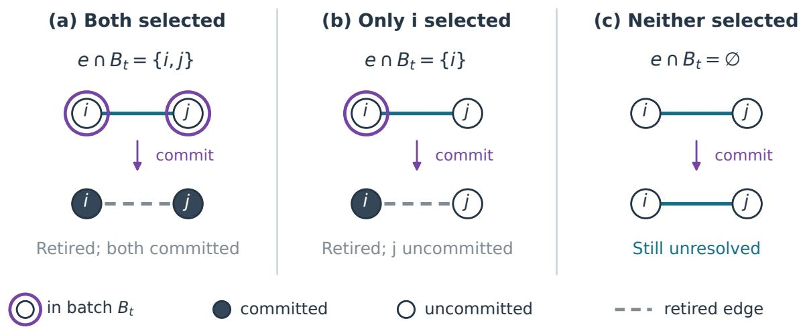  
Figure 4: Three possible batch selections on an initially unresolved edge. Each panel shows the edge before (top) and after (bottom) one commit. Purple rings mark membership in $B _ { t } ;$ filled nodes are committed. Selecting both endpoints gives a collision; selecting one gives a crossing edge. Both events retire the whole edge, but in (b) j remains uncommitted. Selecting neither endpoint leaves the edge unresolved. The proof records the edge identity and both triggers in (a)–(b); the target matching itself is unchanged.

$\mathrm { ~ I ~ f ~ } i \in \mathcal { U } _ { s } ^ { \mathrm { o p } }$ , each of the preceding $k - 1$ counted submissions has removed at most one candidate at i. Commits leave the candidate set of a surviving vertex unchanged, by Equation (69). Consequently,

$$
| \mathcal { C } _ { i , s } ^ { \mathrm { o p } } | \geq m - \left( k - 1 \right) = m - k + 1 .
$$

Conditional on $\mathcal { F } _ { s - } ^ { \mathrm { o p } }$ , the submitted state is fixed and $\Theta _ { i }$ is uniform on $\mathcal { C } _ { i , s } ^ { \mathrm { o p } }$ . Therefore

$$
\begin{array} { r l } & { \mathbb { P } \big ( \mathsf { H i t } _ { i } ( y ) = 1 \mid \mathcal { F } _ { s - } ^ { \mathrm { o p } } \big ) = \mathbb { P } ( \Theta _ { i } = \mathsf { T e s t } _ { i } ( y ) \mid \mathcal { F } _ { s - } ^ { \mathrm { o p } } ) } \\ & { \qquad = \frac { \mathbf { 1 } \big \{ \mathsf { T e s t } _ { i } ( y ) \in \mathcal { C } _ { i , s } ^ { \mathrm { o p } } \big \} } { \vert \mathcal { C } _ { i , s } ^ { \mathrm { o p } } \vert } \le \frac { 1 } { m - k + 1 } . } \end{array}\tag{76}
$$

A mask, background token, or previously excluded candidate gives numerator zero. If the edge has already retired, there can be no further hit while unresolved, regardless of later oracle replies.

2. Accumulate the probabilities without assuming independence. For $0 \leq k \leq \overline { { Q } } .$ , define

$$
p _ { i , k } : = \mathbb { P } \left( \begin{array} { c } { i \mathrm { ~ h a s ~ a ~ q u e r y ~ h i t ~ w h i l e ~ i t s ~ e d g e ~ i s ~ u n r e s o l v e d } } \\ { \mathrm { ~ a m o n g ~ t h e ~ f i r s t ~ } k \mathrm { ~ c o u n t e d ~ s u b m i s s i o n s } } \end{array} \right) , \qquad p _ { i , 0 } = 0 .
$$

If the execution contains fewer than k counted submissions, this event uses all those that occurred; no extra queries are executed. A hit retires the edge, so i can have at most one hit while unresolved. The increment $p _ { i , k } - p _ { i , k - 1 }$ is therefore the probability of such a hit at query k.

To bound this increment, condition on each possible analytic history just before query k, apply equation 76 when i is unresolved, and average over these histories. This gives

$$
\begin{array} { r l } & { p _ { i , k } - p _ { i , k - 1 } \leq \frac { \mathbb { P } ( \mathrm { q u e r y ~ } k \mathrm { ~ o c c u r s ~ a n d ~ } i \mathrm { ~ i s ~ u n r e s o l v e d ~ j u s t ~ b e f o r e ~ i t } ) } { m - k + 1 } } \\ & { \qquad \leq \cfrac { 1 - p _ { i , k - 1 } } { m - k + 1 } . } \end{array}\tag{77}
$$

For the last inequality, an unresolved vertex has not hit earlier. Earlier retirement by a mate hit or a commit, as well as early termination, can only remove paths from the event in the numerator. Simultaneous hits at i and its mate still count as a hit at i: the edge was unresolved immediately before that query. Rearranging equation 77 step by step yields

$$
\begin{array} { l } { 1 - p _ { i , k } = 1 - p _ { i , k - 1 } - ( p _ { i , k } - p _ { i , k - 1 } ) } \\ { \geq ( 1 - p _ { i , k - 1 } ) \left( 1 - \displaystyle \frac { 1 } { m - k + 1 } \right) } \\ { = ( 1 - p _ { i , k - 1 } ) \displaystyle \frac { m - k } { m - k + 1 } . } \end{array}
$$

Starting from $1 - p _ { i , 0 } = 1$ and applying this inequality successively,

$$
\begin{array} { c } { { 1 - p _ { i , \overline { { { Q } } } } \geq \displaystyle \prod _ { k = 1 } ^ { \overline { { { Q } } } } \frac { m - k } { m - k + 1 } } } \\ { { = \displaystyle \frac { m - 1 } { m } \frac { m - 2 } { m - 1 } \cdots \frac { m - \overline { { { Q } } } } { m - \overline { { { Q } } } + 1 } } } \\ { { = \displaystyle \frac { m - \overline { { { Q } } } } { m } . } } \end{array}
$$

For $\overline { { Q } } = 1$ the product has just its first factor. The cancellation therefore gives

$$
p _ { i , \overline { { { Q } } } } \leq 1 - \frac { m - \overline { { { Q } } } } { m } = \frac { \overline { { { Q } } } } { m } .\tag{78}
$$

This multiplication iterates conditional probability bounds; it does not assume independent queries.

3. Count retired edges $b y$ their successful endpoints. At a query, an unresolved edge retires exactly when at least one of its endpoints hits. For binary bits $b _ { u } , b _ { v } , \ \mathbf 1 \{ b _ { u } + b _ { v } \geq 1 \} \leq b _ { u } + b _ { v } $ ; two simultaneous hits still retire only one edge. Hence, pathwise,

$$
\begin{array} { l } { { \displaystyle { \cal D } _ { \mathrm { g e n } } = \sum _ { \substack { s : A _ { s } \mathrm { ~ i s ~ a ~ q u e r y } \{ u , v \} \in \mathcal { M } _ { s } ^ { \mathrm { u n r e s } } } } { \bf 1 } \{ { \sf H i t } _ { u } ( y _ { s } ^ { \mathrm { o p } } ) + { \sf H i t } _ { v } ( y _ { s } ^ { \mathrm { o p } } ) \geq 1 \} } } \\ { { \displaystyle \quad \leq \sum _ { i = 1 } ^ { N } \sum _ { \substack { s : A _ { s } \mathrm { ~ i s ~ a ~ q u e r y } } } { \sf H i t } _ { i } ( y _ { s } ^ { \mathrm { o p } } ) } . } \end{array}
$$

The change from edges to vertices uses that every unresolved vertex lies on exactly one matching edge. For each $i ,$ the inner sum is either zero or one, because its first hit retires its edge. It is thus the indicator of the event defining $\boldsymbol { p } _ { i , \overline { { \boldsymbol { Q } } } }$ . Taking expectations and using E $\mathsf { L } _ { E } = \mathbb { P } ( E )$ gives

$$
\mathbb { E } D _ { \mathrm { g e n } } \leq \sum _ { i = 1 } ^ { N } \mathbb { E } \left[ \sum _ { \boldsymbol { s } : A _ { \boldsymbol { s } } \ \mathrm { i s } \ \underset { i \in \mathcal { U } _ { s } ^ { \mathrm { o p } } } { \sum } \ \mathrm { H i t } _ { i } ( \boldsymbol { y } _ { s } ^ { \mathrm { o p } } ) } \right]
$$

No independence between vertices is used.

## C.5 Common collision bookkeeping

We count how matching edges leave the unresolved-edge set; this pathwise identity supplies the batch-size constraint in the collision lower-tail proof. Recall that $\mathcal { U } _ { t }$ contains the vertices on edges still unresolved immediately before commit t, after any preceding queries. At this boundary, operation $s _ { t } ,$ the unresolved edge set is $\mathcal { M } _ { s _ { t } } ^ { \mathrm { u n r e s } }$ , as in Equations (66) and (73). Put $n _ { t } : = | U _ { t } |$ . Removing whole edges makes this number even.

For the selected batch $B _ { t } ,$ define its active part and collision count:

$$
B _ { t } ^ { \circ } : = B _ { t } \cap \mathcal { U } _ { t } , \qquad n _ { t } ^ { \circ } : = | B _ { t } ^ { \circ } | , \qquad Z _ { t } : = \big | \{ e \in \mathcal { M } _ { s _ { t } } ^ { \mathrm { u n r e s } } : e \subseteq B _ { t } ^ { \circ } \} \big | , \qquad Z : = \sum _ { t } Z _ { t } .\tag{79}
$$

An unresolved edge has no committed endpoint, so $\mathcal { U } _ { t } \subseteq U _ { G _ { t - 1 } }$ . The inclusion can be strict: query-retired endpoints and the uncommitted mate of a commit-retired endpoint remain uncommitted but are no longer active. Figure $4 ( \mathrm { b } )$ shows the latter case. A later commit of that mate creates no new unresolved-edge collision.

Let $R ^ { \circ } : = | \{ t : n _ { t } ^ { \circ } \geq 1 \} | \leq \overline { { R } }$ be the number of rounds with a nonempty active batch.

Lemma C.6 (Pathwise edge-counting identity). Under the retirement rules in Equation (66), every complete execution satisfies the pathwise identity

$$
\frac { N } { 2 } = D _ { \mathrm { g e n } } + \sum _ { t } ( n _ { t } ^ { \circ } - Z _ { t } ) .\tag{80}
$$

Consequently,

$$
\sum _ { t : n _ { t } ^ { \circ } \geq 1 } ( n _ { t } ^ { \circ } - 1 ) = \frac { N } { 2 } - D _ { \mathrm { g e n } } + Z - R ^ { \circ } \geq \frac { N } { 2 } - D _ { \mathrm { g e n } } - \overline { { R } } .\tag{81}
$$

Proof. An active batch touches exactly $n _ { t } ^ { \circ } - Z _ { t }$ previously unresolved edges. Indeed, its $Z _ { t }$ internal edges use $2 Z _ { t }$ vertices, while every remaining active vertex lies on a distinct crossing edge. Thus the number touched is

$$
\underbrace { Z _ { t } } _ { \mathrm { i n t e r n a l ~ e d g e s } } + \underbrace { \left( n _ { t } ^ { \circ } - 2 Z _ { t } \right) } _ { \mathrm { c r o s s i n g ~ e d g e s } } = n _ { t } ^ { \circ } - Z _ { t } .
$$

Since every position is eventually committed, every original matching edge is retired exactly once: either at a successful counterfactual trigger test (query retirement), or at its first active commit batch (commit retirement). Summing over the $N / 2$ original edges proves equation 80.

Finally, $\begin{array} { r } { \sum _ { t : n _ { t } ^ { \circ } \geq 1 } ( n _ { t } ^ { \circ } - 1 ) = \sum _ { t } n _ { t } ^ { \circ } - R ^ { \circ } } \end{array}$ . Substituting $\begin{array} { r } { \sum _ { t } n _ { t } ^ { \circ } = N / 2 - D _ { \mathrm { g e n } } + Z } \end{array}$ from equation 80, then using $Z \geq 0$ and $R ^ { \circ } \leq { \overline { { R } } }$ gives equation 81. □

## C.6 A Laplace bound for uniform-matching collisions

The next lemma is a finite combinatorial statement independent of the hard oracle and the adaptive decision rule. It gives a conditional Laplace bound used below to derive an adaptive lower-tail estimate.

Intuition. For a fixed set of k vertices in a uniform matching on n vertices, each unordered pair is an edge with probability $1 / ( n - 1 )$ . Hence the expected number of internal edges is

$$
{ \binom { k } { 2 } } { \frac { 1 } { n - 1 } } = { \frac { k ( k - 1 ) } { 2 ( n - 1 ) } } \simeq { \frac { k ^ { 2 } } { n } } \qquad ( k \geq 2 ) .
$$

To obtain a lower-tail estimate rather than only a mean, the proof exposes order k edges, each with conditional success probability at least order $k / n$ . Their Laplace factors multiply by successive conditioning; the exposures need not be independent.

Lemma C.7 (Internal-edge Laplace transform). Let M be a uniformly random perfect matching on a labeled set U of even cardinality $n \geq 2$ . Fix $S \subseteq U$ , put $k : = | S |$ , and let

$$
Z _ { S } : = | \{ e \in M : e \subseteq S \} | .
$$

Then, for every $t > 0$

$$
\mathbb { E } e ^ { - t Z _ { S } } \le \exp \left\{ - \frac { 1 - e ^ { - t } } { 3 2 } \frac { [ k - 1 ] _ { + } ^ { 2 } } { n } \right\} .\tag{82}
$$

Proof. 1. Handle sets of size at most three. For $k \in \{ 0 , 1 \}$ , both sides of equation 82 equal one. For $k \in \{ 2 , 3 \}$ , two internal matching edges would require four distinct vertices of S. Thus $Z _ { S } \in \{ 0 , 1 \}$ , and

$$
\begin{array} { r } { \mathbb { E } Z _ { S } = 0 \cdot \mathbb { P } ( Z _ { S } = 0 ) + 1 \cdot \mathbb { P } ( Z _ { S } = 1 ) = \mathbb { P } ( Z _ { S } = 1 ) . } \end{array}
$$

Also, writing the edge count as a sum of indicators and taking expectations,

$$
\mathbb { E } Z _ { S } = \sum _ { \{ u , v \} \subseteq S } \mathbb { P } ( \{ u , v \} \in M ) = { \frac { { \binom { k } { 2 } } } { n - 1 } } = { \frac { k ( k - 1 ) } { 2 ( n - 1 ) } } .\tag{83}
$$

Writing $a _ { t } : = 1 - e ^ { - t } \in ( 0 , 1 )$ , the same two possible values give

$$
\begin{array} { r l } & { \mathbb { E } e ^ { - t Z _ { S } } = \mathbb { P } ( Z _ { S } = 0 ) + e ^ { - t } \mathbb { P } ( Z _ { S } = 1 ) } \\ & { \qquad = 1 - ( 1 - e ^ { - t } ) \mathbb { P } ( Z _ { S } = 1 ) = 1 - a _ { t } \mathbb { E } Z _ { S } . } \end{array}
$$

Using $1 - v \leq e ^ { - v }$ for $v \geq 0$ , we obtain

$$
\mathbb { E } e ^ { - t Z _ { S } } = 1 - a _ { t } \mathbb { E } Z _ { S } \leq e ^ { - a _ { t } \mathbb { E } Z _ { S } } \leq \exp \left\{ - \frac { a _ { t } } { 3 2 } \frac { ( k - 1 ) ^ { 2 } } { n } \right\} ,
$$

where the last inequality follows directly from equation 83 for $k = 2 , 3 .$

2. Expose edges and bound each conditional success probability. It remains to consider $k \geq 4$ . Partition $S = A \sqcup B$ with $| A | = \lfloor k / 2 \rfloor$ and $| B | = \lceil k / 2 \rceil$ , and put m $: = \lfloor k / 4 \rfloor$ . We reveal edges of the original matching M on the full set U, not of a matching restricted to S. Only the starting endpoint is required to lie in A; its mate can lie in A, B, or $U \backslash S$

Fix an ordering of U. Let $U _ { 0 } : = U$ , and for $j = 1 , \ldots , m$ define

$$
\begin{array} { r l r l } & { a _ { j } : = \operatorname* { m i n } ( A \cap U _ { j - 1 } ) , \qquad } & & { b _ { j } : = \operatorname* { m a t e } _ { M } ( a _ { j } ) , } \\ & { e _ { j } : = \{ a _ { j } , b _ { j } \} \in M , \qquad } & & { U _ { j } : = U _ { j - 1 } \setminus \{ a _ { j } , b _ { j } \} . } \end{array}
$$

Thus $U _ { j - 1 }$ consists of the vertices whose matching edges have not yet been revealed; these vertices are already matched in M. The minimum uses the fixed ordering, so the choice of $a _ { j }$ depends only on the earlier revealed edges. It is well-defined because each previous edge removes at most two vertices from A, and

$$
| A \cap U _ { j - 1 } | \geq  \lfloor k / 2 \rfloor - 2 ( j - 1 ) \geq 2 m - 2 ( j - 1 ) \geq 2 > 0 \qquad ( 1 \leq j \leq m ) .
$$

Define the success indicator by

$$
X _ { j } : = \mathbf { 1 } _ { \left\{ b _ { j } \in B \cap U _ { j - 1 } \right\} } , \qquad \{ X _ { j } = 1 \} = \{ \mathrm { m a t e } _ { M } ( a _ { j } ) \in B \cap U _ { j - 1 } \} .
$$

Since every starting endpoint $a _ { \ell }$ lies in A, each previous edge $e _ { \ell }$ removes at most one vertex from B. Consequently,

$$
| B \cap U _ { j - 1 } | \geq [ k / 2 ] - ( j - 1 ) \geq k / 2 - ( m - 1 ) \geq k / 4 , \qquad | U _ { j - 1 } | = n - 2 ( j - 1 ) .
$$

Conditional on $e _ { 1 } , \dotsc , e _ { j - 1 }$ , the remaining matching is uniform on $U _ { j - 1 } { : }$ every perfect matching there has exactly one extension by the already revealed edges. Each possible mate of $a _ { j }$ has the same number of matching completions, so

$$
\mathbb { P } ( b _ { j } = v \mid e _ { 1 } , \dots , e _ { j - 1 } ) = \frac { 1 } { | U _ { j - 1 } | - 1 } \quad \mathrm { f o r ~ } v \in U _ { j - 1 } \setminus \{ a _ { j } \} .
$$

Summing over the allowable mates in B, which never include $a _ { j } \in A$ , gives

$$
\begin{array} { l } { \mathbb { P } ( X _ { j } = 1 \mid e _ { 1 } , \dots , e _ { j - 1 } ) = \displaystyle \sum _ { v \in B \cap U _ { j - 1 } } \mathbb { P } ( b _ { j } = v \mid e _ { 1 } , \dots , e _ { j - 1 } ) } \\ { = \displaystyle \frac { \left| B \cap U _ { j - 1 } \right| } { \left| U _ { j - 1 } \right| - 1 } \geq \displaystyle \frac { k / 4 } { n } = \displaystyle \frac { k } { 4 n } . } \end{array}
$$

The earlier indicators $X _ { 1 } , \dots , X _ { j - 1 }$ are determined by these revealed edges. Adding them to the condi tioning therefore gives the same probability:

$$
\mathbb { P } ( X _ { j } = 1 \mid X _ { 1 } , \ldots , X _ { j - 1 } , \mathrm { a l l ~ p r e c e d i n g ~ e x p o s e d ~ e d g e s } ) \geq u : = \frac { k } { 4 n } .\tag{84}
$$

Removing both endpoints after each exposure makes $e _ { 1 } , \ldots , e _ { m }$ distinct. If $X _ { j } = 1$ , then $a _ { j } \in A$ and $b _ { j } \in B _ { \ l }$ , so $e _ { j } \subseteq A \cup B = S$ . Therefore

$$
\sum _ { j = 1 } ^ { m } X _ { j } = | \{ e _ { j } : 1 \leq j \leq m , ~ X _ { j } = 1 \} | \leq | \{ e \in M : e \subseteq S \} | = Z _ { S } .
$$

3. Iterate conditional Laplace factors without independence. For one exposure, the Bernoulli identity and the preceding probability bound give

$$
\begin{array} { r l } & { \mathbb { E } [ e ^ { - t X _ { j } } \ | \ \mathrm { p r e c e d i n g ~ e x p o s e d ~ e d g e s } ] } \\ & { \qquad = 1 - ( 1 - e ^ { - t } ) \operatorname* { P r } ( X _ { j } = 1 \ | \ \mathrm { p r e c e d i n g ~ e x p o s e d ~ e d g e s } ) } \\ & { \qquad \leq 1 - u ( 1 - e ^ { - t } ) . } \end{array}
$$

For $1 \leq r \leq m$ , condition on the first $r - 1$ exposed edges. The earlier factors are measurable with respect to this record, so

$$
\begin{array} { r l } & { \mathbb { E } e ^ { - t \sum _ { j = 1 } ^ { r } X _ { j } } = \mathbb { E } \bigg [ e ^ { - t \sum _ { j = 1 } ^ { r - 1 } X _ { j } } \mathbb { E } ( e ^ { - t X _ { r } } \mid \mathrm { f i r s t } \ r - 1 \ \mathrm { e x p o s e d ~ e d g e s } ) \bigg ] } \\ & { \qquad \leq [ 1 - u ( 1 - e ^ { - t } ) ] \mathbb { E } e ^ { - t \sum _ { j = 1 } ^ { r - 1 } X _ { j } } . } \end{array}
$$

Starting with the empty sum at $r = 0$ , whose exponential is one, and iterating to $r = m$ gives the power below without an independence assumption:

$$
\begin{array} { r l } & { \mathbb { E } e ^ { - t Z _ { S } } \leq \mathbb { E } \exp \left\{ - t \displaystyle \sum _ { j = 1 } ^ { m } X _ { j } \right\} } \\ & { \qquad \leq \{ 1 - u ( 1 - e ^ { - t } ) \} ^ { m } \leq \exp \{ - m u ( 1 - e ^ { - t } ) \} . } \end{array}\tag{85}
$$

Since m $\ge ~ k / 8$ for $k \geq 4$ , mu $\ge k ^ { 2 } / ( 3 2 n ) \ge ( k - 1 ) ^ { 2 } / ( 3 2 n )$ . Substitution in equation 85 proves equation $8 2 .$ □

## C.7 An adaptive lower tail for batch collisions

The conditional Laplace bound and the edge-counting identity now force many collisions with constant probability under the joint instance–midpoint law. This is the input needed to accumulate edge-level discrepancy nonlinearly; no independence between commit rounds is assumed. Recall that $Z = \textstyle \sum _ { t } Z _ { t }$ counts the unresolved edges whose two endpoints are committed in the same active batch, as defined in equation 79.

Intuition. If order $N$ unresolved vertices were spread evenly across R batches while the unresolved pool had size order N, the collision scale would be

$$
\overline { { R } } \frac { ( N / \overline { { R } } ) ^ { 2 } } { N } = \frac { N } { \overline { { R } } } .
$$

The proof does not assume even batches or a fixed pool: the edge-counting identity forces enough total active batch mass, Cauchy–Schwarz gives the same $N / \overline { { R } }$ scale, and the conditional Laplace bound turns that pathwise mass into a constant-probability collision event.

Proposition C.8 (Adaptive collision lower tail). Fix a decision-rule seed under the joint law equation $6 4 .$ $I f \overline { { Q } } \le m / 8$ and $1 \le \overline { { R } } \le N / 8$ , then

$$
\mathbb { P } \left( Z \geq \frac { N } { 8 1 9 2 \overline { { R } } } \right) \geq \frac { 1 } { 2 } - \exp \left\{ - \frac { N } { 8 1 9 2 \overline { { R } } } \right\} .\tag{86}
$$

In particular, if $\overline { { R } } \leq N / 1$ 16384, then

$$
\mathbb { P } \left( Z \geq \frac { N } { 8 1 9 2 \overline { { R } } } \right) \geq \frac { 1 } { 4 } .\tag{87}
$$

Proof. 1. Fix the pre-exposure information and conditional Laplace bound. For an actual commit round $t ,$ let $B _ { t }$ be the batch selected by the seed-fixed decision rule. Recall the existing notation:

$$
\begin{array} { r l r l } & { } & { \displaystyle { \cal B } _ { t } ^ { \circ } = { \cal B } _ { t } \cap \mathcal { U } _ { t } , \quad } & { \displaystyle n _ { t } = | \mathcal { U } _ { t } | , \quad } & { \displaystyle n _ { t } ^ { \circ } = | { \cal B } _ { t } ^ { \circ } | , } \\ & { } & { \displaystyle Z _ { t } = | \{ e \in \mathcal { M } _ { s _ { t } } ^ { \mathrm { u n r e s } } : e \subseteq { \cal B } _ { t } ^ { \circ } \} | , \quad } & { \displaystyle Z = \sum _ { t } Z _ { t } . } \end{array}
$$

Thus $B _ { t }$ is the full commit batch, whereas $B _ { t } ^ { \circ }$ contains only its currently unresolved vertices.

After termination, append empty rounds until the total number of indexed rounds is ${ \overline { { R } } } .$ In every appended round set $B _ { t } = B _ { t } ^ { \circ } = \mathcal { U } _ { t } = \emptyset$ , so $n _ { t } = n _ { t } ^ { \circ } = Z _ { t } = 0$ . These rounds add no collision, and hence $\begin{array} { r } { Z = \sum _ { t = 1 } ^ { \overline { { R } } } Z _ { t } } \end{array}$ Introduce only the following additional abbreviation:

$$
A _ { t } : = \left\{ \begin{array} { l l } { \left[ n _ { t } ^ { \circ } - 1 \right] _ { + } ^ { 2 } / n _ { t } , } & { n _ { t } > 0 , } \\ { 0 , } & { n _ { t } = 0 . } \end{array} \right.
$$

The pre-commit analytic field $\mathcal { F } _ { t } .$ − determines both the selected batch $B _ { t }$ and the unresolved set $\mathcal { U } _ { t }$ hence also $B _ { t } ^ { \circ } = B _ { t } \cap \mathcal { U } _ { t }$ . Selecting $B _ { t }$ adds no observation: the matching edges incident to $B _ { t } ^ { \circ }$ and the midpoint values $X _ { B _ { t } }$ have not yet been exposed. Thus $n _ { t } , n _ { t } ^ { \circ } , A _ { t } .$ and all quantities from earlier rounds are $\mathcal { F } _ { t ^ { - } }$ −-measurable. For appended empty rounds, use the terminal field.

By Theorem C.4, conditional on $\mathcal { F } _ { t - } ,$ the matching on $\mathcal { U } _ { t }$ is uniform. For $n _ { t } \ge 2 .$ , apply Theorem C.7 with $U = \mathcal { U } _ { t } , S = B _ { t } ^ { \circ } , n = n _ { t } , k = n _ { t } ^ { \circ }$ , and Laplace parameter one. Since $1 - e ^ { - 1 } \ge 1 / 2$ , this gives

$$
\mathbb { E } \left[ e ^ { - Z _ { t } } \mid \mathcal { F } _ { t - } \right] \le \exp \left\{ - \frac { 1 - e ^ { - 1 } } { 3 2 } A _ { t } \right\} \le e ^ { - A _ { t } / 6 4 } .\tag{88}
$$

The unresolved set has even cardinality, so $n _ { t } = 1$ cannot occur. If $n _ { t } = 0$ , then $n _ { t } ^ { \circ } = Z _ { t } = A _ { t } = 0$ , and the same display holds with equality.

2. Iterate the exponential expectation bound. Let $r = 0 , \ldots , \overline { { R } }$ count completed commit rounds, not individual operations. Define

$$
\mathsf { M } _ { r } : = \exp \left\{ - \sum _ { t = 1 } ^ { r } Z _ { t } + \frac { 1 } { 6 4 } \sum _ { t = 1 } ^ { r } A _ { t } \right\} , \qquad \mathsf { M } _ { 0 } : = 1 .\tag{89}
$$

Both $\mathsf { M } _ { r - 1 }$ and $A _ { r }$ are measurable with respect to $\mathcal { F } _ { r - }$ , the field immediately before commit r after any intervening counterfactual operations. Hence equation 88 and the tower property give

$$
\begin{array} { r } { \mathbb { E } \mathsf { M } _ { r } = \mathbb { E } \left[ \mathsf { M } _ { r - 1 } e ^ { A _ { r } / 6 4 } \mathbb { E } ( e ^ { - Z _ { r } } \mid \mathcal { F } _ { r - } ) \right] \le \mathbb { E } \mathsf { M } _ { r - 1 } . } \end{array}
$$

Iteration yields

$$
\mathbb { E } { \mathsf { M } } _ { \overline { { R } } } \leq 1 .\tag{90}
$$

This is the only concentration step; adaptivity is absorbed into the successive conditional expectations. 3. Turn edge counting into a pathwise Laplace budget. By Theorem C.5 and $\overline { { Q } } \leq m / 8$

$$
\mathbb { E } D _ { \mathrm { g e n } } \le \frac { N \overline { { Q } } } { m } \le \frac { N ( m / 8 ) } { m } = \frac { N } { 8 } .
$$

Because $D _ { \mathrm { g e n } } \geq 0$ , Markov’s inequality gives

$$
\mathbb { P } ( D _ { \mathrm { g e n } } > N / 4 ) \le \frac { \mathbb { E } D _ { \mathrm { g e n } } } { N / 4 } \le \frac { N / 8 } { N / 4 } = \frac { 1 } { 2 } .
$$

Taking the complement, $\mathbb { P } ( D _ { \mathrm { g e n } } \le N / 4 ) = 1 - \mathbb { P } ( D _ { \mathrm { g e n } } > N / 4 )$ , therefore yields

$$
\mathbb { P } ( D _ { \mathrm { g e n } } \leq N / 4 ) \geq \frac { 1 } { 2 } .\tag{91}
$$

On this event, the pathwise counting identity equation 81 in Theorem C.6, the bounds $R ^ { \circ } \le \overline { { R } } \le N / 8$ and $Z \geq 0$ imply

$$
\sum _ { t = 1 } ^ { \overline { { R } } } [ n _ { t } ^ { \circ } - 1 ] _ { + } \geq \frac { N } { 2 } - D _ { \mathrm { g e n } } - \overline { { R } } \geq \frac { N } { 8 } .\tag{92}
$$

Since $n _ { t } \leq N$ , the definition of $A _ { t }$ implies $A _ { t } \geq \left[ n _ { t } ^ { \circ } - 1 \right] _ { + } ^ { 2 } / N$ . This also holds when $n _ { t } = 0$ , because then both sides are zero. Cauchy–Schwarz over the R indexed rounds (including appended empty rounds) now gives

$$
\begin{array} { r l r } {  { \sum _ { t = 1 } ^ { \overline { { R } } } A _ { t } \geq \frac { 1 } { N } \sum _ { t = 1 } ^ { \overline { { R } } } [ n _ { t } ^ { \circ } - 1 ] _ { + } ^ { 2 } } } \\ & { } & { \geq \frac { 1 } { N \overline { { R } } } ( \sum _ { t = 1 } ^ { \overline { { R } } } [ n _ { t } ^ { \circ } - 1 ] _ { + } ) ^ { 2 } \geq \frac { N } { 6 4 \overline { { R } } } . } \end{array}\tag{93}
$$

4. Subtract the small-collision event. Set $x : = N / ( 8 1 9 2 \overline { { R } } )$ . On the intersection $\{ D _ { \mathrm { g e n } } \leq N / 4 \} \cap \{ Z < x \}$ equation 93 yields

$$
\log \mathsf { M } _ { \overline { { { R } } } } = - Z + \frac { 1 } { 6 4 } \sum _ { t = 1 } ^ { \overline { { { R } } } } A _ { t } > - x + \frac { N } { 4 0 9 6 \overline { { { R } } } } = x .
$$

Using equation 90 and Markov’s inequality,

$$
\begin{array} { r l } & { \mathbb { P } ( D _ { \mathrm { g e n } } \le N / 4 , ~ Z < x ) \le \mathbb { P } ( \mathsf { M } _ { \overline { { R } } } > e ^ { x } ) } \\ & { \qquad \le \displaystyle \frac { \mathbb { E } \mathsf { M } _ { \overline { { R } } } } { e ^ { x } } \le \displaystyle \frac { 1 } { e ^ { x } } = e ^ { - x } . } \end{array}
$$

Combining with equation 91,

$$
\begin{array} { r l } & { \mathbb { P } ( Z \geq x ) \geq \mathbb { P } ( D _ { \mathrm { g e n } } \leq N / 4 , \ Z \geq x ) } \\ & { \qquad = \mathbb { P } ( D _ { \mathrm { g e n } } \leq N / 4 ) - \mathbb { P } ( D _ { \mathrm { g e n } } \leq N / 4 , \ Z < x ) } \\ & { \qquad \geq \displaystyle \frac { 1 } { 2 } - e ^ { - x } , } \end{array}
$$

which proves equation 86. If $\overline { { R } } \leq N / 1 6 3 8 4$ , then $x \ge 2$ and $1 / 2 - e ^ { - 2 } > 1 / 4$ , proving equation 87.

## C.8 Collision-afinity bound

We combine the midpoint identity with the one-edge Hellinger loss to convert unresolved collisions into a multiplicative afinity penalty. Recall our normalization: for probability masses $p , q$ on the same finite set $\mathcal { X }$ $\begin{array} { r } { \mathrm { A f f } ( p , q ) : = \sum _ { x \in \mathcal { X } } \sqrt { p ( x ) q ( x ) } } \end{array}$ . The squared Hellinger distance is $\begin{array} { r } { h ^ { 2 } ( \hat { p , q } ) : = \frac { 1 } { 2 } \overset { \cdot } { \sum _ { x \in \mathcal { X } } } ( \sqrt { p ( x ) } - \sqrt { q ( x ) } ) ^ { 2 } = } \end{array}$ $1 - \operatorname { A f f } \left( p , q \right)$

Intuition. Each unresolved edge whose endpoints are committed together contributes the factor $1 - d _ { \mathrm { e d g e } }$ Since $d _ { \mathrm { e d g e } } \simeq \eta ^ { 2 }$ 2

$$
1 - ( 1 - d _ { \mathrm { e d g e } } ) ^ { Z } \simeq \operatorname * { m i n } \{ 1 , \eta ^ { 2 } Z \} .
$$

For justification, $1 - ( 1 - d ) ^ { z } \leq \operatorname* { m i n } \{ 1 , z d \}$ for integer $z \geq 0$ , while $\begin{array} { r } { 1 - ( 1 - d ) ^ { z } \geq 1 - e ^ { - z d } \geq ( 1 - } \end{array}$ $e ^ { - 1 } ) \operatorname* { m i n } \{ 1 , z d \}$ . This is an edge-penalty scale; the next lemma places its expectation below the actual squared-Hellinger risk.

Lemma C.9 (Afinity loss from unresolved collisions). For every fixed decision-rule seed $w _ { \mathrm { i } }$

$$
\mathbb { E } _ { I \sim \Pi } h ^ { 2 } ( P ^ { I } , \widehat { P } _ { w } ^ { I } ) \ge \mathbb { E } _ { I , H } \left[ 1 - ( 1 - d _ { \mathrm { e d g e } } ) ^ { Z } \right] ,\tag{94}
$$

where the expectation on the right is under equation $6 \%$

Proof. 1. Specify the edge components at a fixed history. Fix $I ,$ w and a reachable pre-commit history $h ,$ and write $B _ { t } = B _ { t } ( h )$ . As in Step 4 of Theorem C.4, the two component laws on $\mathcal { V } ^ { e \cap B _ { t } }$ , for $e \in \mathcal { M }$ , are

$$
\begin{array} { r l } & { p _ { e } ( z _ { e \cap B _ { t } } ) : = P _ { e } ^ { I } ( z _ { e \cap B _ { t } } \mid x _ { e \cap G ( h ) } ) , } \\ & { \widehat { p _ { e } } ( z _ { e \cap B _ { t } } ) : = \displaystyle \prod _ { j \in e \cap B _ { t } } q _ { j } ^ { I } ( z _ { j } \mid y _ { t } ( h ) ) . } \end{array}
$$

The first line is the conditional probability of the current edge coordinates given the already committed coordinates of that edge. Both masses sum to one; on an empty coordinate set both equal one on the empty assignment. The conditional product calculation in that step gives

$$
P _ { t } ^ { I } ( z \mid h ) = \prod _ { e \in \mathcal { M } } p _ { e } ( z _ { e \cap B _ { t } } ) , \qquad \widehat { P } _ { t } ^ { I } ( z \mid h ) = \prod _ { e \in \mathcal { M } } \widehat { p } _ { e } ( z _ { e \cap B _ { t } } ) .
$$

These products are at fixed $I , h ;$ each component is a block of batch coordinates from one edge, not necessarily a single vertex.

2. Compute the factor of an unresolved collision. Partition the unresolved edges according to the number of selected endpoints:

$$
\mathcal { E } _ { t } ^ { ( r ) } : = \{ e \in \mathcal { M } _ { s _ { t } } ^ { \mathrm { u n r e s } } : | e \cap B _ { t } ^ { \circ } | = r \} , \qquad r \in \{ 0 , 1 , 2 \} .\tag{95}
$$

Thus the collision-edge set and its size are

$$
\mathcal { E } _ { t } ^ { ( 2 ) } = \{ e \in \mathcal { M } _ { s _ { t } } ^ { \mathrm { u n r e s } } : e \subseteq B _ { t } ^ { \circ } \} , \qquad | \mathcal { E } _ { t } ^ { ( 2 ) } | = Z _ { t } , \qquad B _ { t } ^ { \circ } = B _ { t } \cap \mathcal { U } _ { t } .
$$

For $e = \{ i , j \} \in \mathcal { E } _ { t } ^ { ( 2 ) }$ , both endpoints belong to $B _ { t }$ and neither belongs to $G ( h )$ . Thus the exact component has no conditioning within $e ,$ while both oracle rows see their mate masked:

$$
p _ { e } ( z _ { i } , z _ { j } ) = P _ { e } ^ { I } ( z _ { i } , z _ { j } ) , \qquad \widehat { p } _ { e } ( z _ { i } , z _ { j } ) = \pi ( z _ { i } ) \pi ( z _ { j } ) = P _ { e } ^ { 0 } ( z _ { i } , z _ { j } ) .
$$

Here the oracle equality uses equation 41, and the absence of conditioning from other edges uses the target’s edgewise product law. Consequently, $\mathrm { A f f } ( p _ { e } , \widehat { p } _ { e } ) = 1 - h ^ { 2 } ( P _ { e } ^ { I } , P _ { e } ^ { 0 } ) = 1 - d _ { \mathrm { e d g e } } ,$ where $d _ { \mathrm { e d g e } }$ is defined in equation 49. In terms of the actual edge masses, this is

$$
\sum _ { z _ { i } , z _ { j } } \sqrt { P _ { e } ^ { I } ( z _ { i } , z _ { j } ) P _ { e } ^ { 0 } ( z _ { i } , z _ { j } ) } = 1 - d _ { \mathrm { e d g e } } .\tag{96}
$$

3. Bound every remaining component and apply product afinity. Since $p _ { e }$ and $\widehat { p } _ { e }$ are probability masses, $0 \leq \mathrm { A f f } \left( p _ { e } , \widehat { p _ { e } } \right) \leq 1$ by Cauchy–Schwarz. This covers all noncollision components, including previously retired edges where the oracle need not be exact. More specifically, an unresolved crossing edge has $p _ { e } = \widehat { p } _ { e } = \pi$ , and an edge with $e \cap B _ { t } = \emptyset$ has both masses equal to one on the empty assignment; these components have afinity exactly one.

Apply Theorem H.1 with index set $J = { \mathcal { M } }$ , spaces $\chi _ { e } = \mathcal { V } ^ { e \cap B _ { t } }$ , and component laws $p _ { e } , \widehat { p } _ { e }$ . The two product laws to which it applies are exactly $P _ { t } ^ { I } ( \cdot \mid h )$ and $\widehat { P } _ { t } ^ { I } ( \cdot \mid h )$ from Step 1. By the definition equation 58 and that lemma,

$$
\begin{array} { r l } & { a _ { t } ( I , h ) = \mathrm { A f f } \left( P _ { t } ^ { I } ( \cdot \vert h ) , \widehat { P } _ { t } ^ { I } ( \cdot \vert h ) \right) } \\ & { \quad \quad = \displaystyle \prod _ { e \in \mathcal { M } } \mathrm { A f f } ( p _ { e } , \widehat { p } _ { e } ) } \\ & { \quad \quad \quad = \left( \displaystyle \prod _ { e \in \mathcal { E } _ { t } ^ { ( 2 ) } } ( 1 - d _ { \mathrm { e d g e } } ) \right) \left( \displaystyle \prod _ { e \in \mathcal { M } \backslash \mathcal { E } _ { t } ^ { ( 2 ) } } \mathrm { A f f } ( p _ { e } , \widehat { p } _ { e } ) \right) } \\ & { \quad \quad \quad = ( 1 - d _ { \mathrm { e d g e } } ) ^ { Z _ { t } } \displaystyle \prod _ { e \in \mathcal { M } \backslash \mathcal { E } _ { t } ^ { ( 2 ) } } \mathrm { A f f } ( p _ { e } , \widehat { p } _ { e } ) . } \end{array}
$$

Every factor in the remaining product lies in $[ 0 , 1 ] .$ , so

$$
a _ { t } ( I , h ) \leq ( 1 - d _ { \mathrm { e d g e } } ) ^ { Z _ { t } } .\tag{97}
$$

4. Multiply along the adaptive path and average. The preceding bound holds at each reached history, including histories under the midpoint law. Multiplying over rounds and using $Z = \textstyle \sum _ { t } Z _ { t }$ yields

$$
\prod _ { t } a _ { t } ( I , H _ { t - 1 } ) \leq ( 1 - d _ { \mathrm { e d g e } } ) ^ { Z } .
$$

Using the adaptive identity equation 60 first at fixed I, w and then averaging over I gives

$$
\begin{array} { r l } & { \mathbb { E } _ { I } h ^ { 2 } ( P ^ { I } , \widehat { P } _ { w } ^ { I } ) } \\ & { \quad = 1 - \mathbb { E } _ { I } \mathbb { E } _ { H \sim \mathbb { M } _ { w } ^ { I } } \prod _ { t } a _ { t } ( I , H _ { t - 1 } ) } \\ & { \quad \quad \geq 1 - \mathbb { E } _ { I , H } ( 1 - d _ { \mathrm { e d g e } } ) ^ { Z } } \\ & { \quad = \mathbb { E } _ { I , H } [ 1 - ( 1 - d _ { \mathrm { e d g e } } ) ^ { Z } ] , } \end{array}
$$

where the joint expectation uses the conditional midpoint law given $I , w .$ This proves equation 94.

## C.9 Nonlinear finite minimax bound

Intuition. When the query budget is a small enough fraction of the bank size, the preceding two results give

$$
\mathrm { r i s k } \ \stackrel { > } { _ \sim } \ 1 - \exp \{ - c N \eta ^ { 2 } / \overline { { { R } } } \} \simeq \mathrm { m i n } \{ 1 , N \eta ^ { 2 } / \overline { { { R } } } \} ,
$$

where $c > 0$ is a fixed numerical constant. The constant-probability collision event supplies order $N / \overline { { R } }$ missed edges; each contributes order $\eta ^ { 2 }$ . For a small target tolerance $\varepsilon ,$ this forces $\overline { { { R } } } \gtrsim \bar { N } \eta ^ { 2 } / \varepsilon$ . The proof retains the finite constants and checks the prior-to-minimax step explicitly.

Proof of Theorem B.2. 1. Obtain the nonlinear bound at a fixed seed. Fix an arbitrary algorithm in ${ \mathfrak { A } } ( { \overline { { Q } } } , { \overline { { R } } } )$ and a decision-rule seed w. Suppose $\overline { { Q } } \leq m / 8$ and $1 \le \overline { { R } } \le N / 1 6 3 8 4$ . By Theorems C.8 and C.9,

$$
\begin{array} { r l } & { \mathbb { E } _ { I \sim \Pi } h ^ { 2 } ( P ^ { I } , \widehat { P } _ { w } ^ { I } ) } \\ & { \quad \geq \mathbb { E } _ { I , H } \left[ 1 - ( 1 - d _ { \mathrm { e d g e } } ) ^ { Z } \right] } \\ & { \quad \geq \displaystyle \frac { 1 } { 4 } \left[ 1 - ( 1 - d _ { \mathrm { e d g e } } ) ^ { N / ( 8 1 9 2 \overline { { R } } ) } \right] . } \end{array}\tag{98}
$$

The exponent in the last display need not be an integer: on the event $Z \ge N / ( 8 1 9 2 \overline { { R } } )$ , monotonicity of $c \mapsto 1 - ( 1 - d _ { \mathrm { e d g e } } ) ^ { c }$ gives the displayed lower bound. Using $1 - d \leq e ^ { - d }$ for $d \in [ 0 , 1 ]$ and the one-edge estimate $d _ { \mathrm { e d g e } } \geq \eta ^ { 2 } / 1 2$ from equation 49, we obtain

$$
\mathbb { E } _ { I \sim \Pi } h ^ { 2 } ( P ^ { I } , \widehat { P } _ { w } ^ { I } ) \geq \frac { 1 } { 4 } \left[ 1 - \exp \left\{ - \frac { N \eta ^ { 2 } } { 9 8 3 0 4 \overline { { R } } } \right\} \right] .\tag{99}
$$

2. Average over seeds and pass from the prior to minimax risk. Finally, $d _ { \mathrm { T V } } \geq h ^ { 2 }$ by Theorem H.1. The decision-rule seed $W$ is independent of $I \sim \Pi$ , so Tonelli’s theorem gives

$$
\begin{array} { r l } & { \mathbb { E } _ { I } \mathcal { R } _ { \mathrm { T V } } ( \mathcal { A } ; P ^ { I } , q ^ { I } ) = \mathbb { E } _ { W } \mathbb { E } _ { I } d _ { \mathrm { T V } } ( P ^ { I } , \widehat { P } _ { W } ^ { I } ) } \\ & { \qquad \geq \mathbb { E } _ { W } \mathbb { E } _ { I } h ^ { 2 } ( P ^ { I } , \widehat { P } _ { W } ^ { I } ) } \\ & { \qquad \geq \displaystyle \frac { 1 } { 4 } \left[ 1 - \exp \left. - \frac { N \eta ^ { 2 } } { 9 8 3 0 4 \overline { { R } } } \right. \right] . } \end{array}\tag{100}
$$

At least one fixed instance has seed-averaged TV risk at least this prior average. Taking the supremum over the hard family and then the infimum over ${ \mathfrak { A } } ( { \overline { { Q } } } , { \overline { { R } } } )$ proves equation 43. □

Proof of Theorem B.3. Suppose the first two alternatives in equation 45 fail. Then Theorem B.2 and equation 44 imply

$$
\varepsilon \ge \frac { 1 } { 4 } \left[ 1 - \exp \left\{ - \frac { N \eta ^ { 2 } } { 9 8 3 0 4 \overline { { { R } } } } \right\} \right] .
$$

Since $\varepsilon \leq 1 / 8 ,$ , rearrangement gives

$$
\begin{array} { r } { \frac { N \eta ^ { 2 } } { 9 8 3 0 4 \overline { { R } } } \leq - \log ( 1 - 4 \varepsilon ) } \\ { \leq \displaystyle \frac { 4 \varepsilon } { 1 - 4 \varepsilon } \leq 8 \varepsilon . } \end{array}
$$

Here $- \log ( 1 - u ) \leq u / ( 1 - u )$ for $u \in [ 0 , 1 )$ , obtained by integrating $( 1 - x ) ^ { - 1 } \leq ( 1 - u ) ^ { - 1 }$ over $x \in [ 0 , u ]$ Thus

$$
\overline { { { R } } } \geq \frac { N \eta ^ { 2 } } { 7 8 6 4 3 2 \varepsilon } ,
$$

which is the third alternative in equation 45.

## D Algorithmic construction

We specify the randomized sampler $\mathcal { A } _ { \mathrm { p a c k } } ^ { \mathrm { r n d } }$ of Theorem E.1, also denoted $\mathcal { A } _ { \mathrm { p a c k } } : = \mathcal { A } _ { \mathrm { p a c k } } ^ { \mathrm { r n d } }$ . All operations use only public parameters, the realized commit history, and replies of the single frozen oracle. The hidden forest, exact marginals, endpoint kernels, ranks, and response witnesses are never read.

The sampler flow in Figure 2 is illustrated concretely by a 15-vertex construction in Examples D.1, D.2 and E.2.

## D.1 Complete sampler and public parameters

We assemble the sampler from read-only screens and commits, with public caps that bound its execution on every path.

Fix $N \geq 1 0$ . The two resource controls are the degree cutof $d \in \{ 9 , \dots , N - 1 \}$ and readout-chunk parameter $J \in [ N ]$ : the former sets the peeling threshold, while the latter sets the maximum readout size $B ^ { \mathrm { r d } } : = \lceil N / J \rceil$ . The accuracy inputs are a tail tolerance $\delta _ { \mathrm { t a i l } } \in ( 0 , 1 ]$ and a screen-failure budget $\delta ^ { \mathrm { f a i l } } \in ( 0 , 1 )$ . The threshold floor t uses the standard choice equation 107. The draft generator is the zero-query choice equation 114 unless otherwise stated. The standard row selector keeps the highest-vote candidates on overflow. More generally, fix any admissible public selector S from Definition D.3; denote the resulting decision rule by $\mathcal { A } _ { \mathrm { p a c k } } ^ { \mathrm { r n d } } [ \mathsf { S } ]$ . The unadorned sampler uses the standard selector. The row-error radius and resulting screen resolution are derived quantities:

$$
\varepsilon _ { 0 } : = \frac { \varepsilon ^ { \mathrm { H } } } { \sqrt { N } } ,\tag{101}
$$

$$
\delta : = 4 \varepsilon _ { 0 } + \delta _ { \mathrm { t a i l } } .\tag{102}
$$

The oracle condition equation 25 and Theorem H.1 imply, for every valid $( y , j )$

$$
d _ { \mathrm { T V } } \big ( \mu _ { j } ( \cdot \mid y ) , q _ { j } ( \cdot \mid y ) \big ) \leq \varepsilon _ { 0 } .\tag{103}
$$

The preprocessing and screen certificates use the row-TV bound equation 103 in both cases. In case (ii), equation 195 supplies this bound from the uniform forward row-KL condition. The forward-KL output guarantee is proved in Theorem F.3 using the joint-reference identity of Section F.2. The theorem requires feasible preprocessing and $\delta < \omega ;$ neither condition asks the sampler to inspect the hidden forest.

Define the public peel-phase cap

$$
T _ { \mathrm { p e e l } } : = \left\lceil \frac { [ \log ( 2 N / ( d + 1 ) ) ] _ { + } } { \log ( d / 8 ) } \right\rceil .\tag{104}
$$

Set

$$
T _ { \mathrm { s c r } } : = T _ { \mathrm { p e e l } } + 1 , \qquad { \overline { { R } } } : = \left\lceil \frac { 4 N T _ { \mathrm { p e e l } } } { d } \right\rceil + \left\lceil \log _ { 2 } ( N + 1 ) \right\rceil + 2 .\tag{105}
$$

The caps are fixed before the first commit; they are not additional tuning parameters. Algorithm 2 is the full decision rule. Its one-time preprocessing, per-screen draft, and read-only screen are specified in the next three subsections. The named steps agree with Section 4 and Figure 2. Their identifiers name recurring operations, not commit rounds or oracle stages. Step 3 is expanded into Step 3.1, Step 3.2, and Step 3.3 in Algorithm 3. Proofs refer to these named steps as well as the algorithm’s line numbers. In Algorithm 2, r counts completed nonempty commit rounds and k counts completed peel phases.

Given the screen output at $H _ { G }$ , recall the incoming claim count and peel set of Equation (7):

$$
\begin{array} { r } { \mathrm { c l } _ { v } ( H _ { G } ) : = \big | \{ u \in U _ { G } : v \in A _ { u } ( H _ { G } ) \} \big | , \qquad \mathcal { P } ( H _ { G } ) : = \{ v \in U _ { G } : \mathrm { c l } _ { v } ( H _ { G } ) > d / 2 \} . } \end{array}\tag{106}
$$

The terminal row graph on $U _ { \star }$ is constructed in Step 5 of Algorithm 2.

At any history, Commit(B) means the product-commit operation of Definition A.9: submit the current history-compatible commit state 27, read $q _ { j } ( \cdot \mid y )$ for $j \in B ,$ , draw independently from the corresponding product law, and append the realized values to the history. This is the sampler’s only history-changing operation. The batch B is fixed before the reply; this submission adds one to R and nothing to $Q _ { \mathrm { c f } }$

Algorithm 2 Randomized complete packed-screen sampler   
Input: the public setup and parameters $\delta _ { \mathrm { t a i l } } , \underline { { t } } , d , J , \delta ^ { \mathrm { f a i l } }$ , an admissible Draft (standard by default), an   
admissible public row selector S (top votes by default), and access to q   
Output: $\widehat { X } \in \mathcal { V } ^ { N }$ when preprocessing is feasible; otherwise Infeasible   
Step 1. Preprocess & initialize   
1: Construct Prep by Definition D.1   
2: if preprocessing reports infeasibility then   
3: return Infeasible   
4: end if   
5: Set $T _ { \mathrm { s c r } } , \overline { { R } }$ by 105 and set $G  \emptyset , x _ { G }  \emptyset , k  0 .$ , and $r \gets 0$   
6: loop   
7: if $U _ { G } = \varnothing$ then   
8: return the resulting assignment $\widehat { X }$   
9: end if   
Step 2. Draft $\&$ color   
10: Fix $f \gets$ Draft using the current history and past replies   
11: Draw the coloring family by equation 118, with parameters from equation 117   
Step 3. Packed screen   
12: A(H ) ← PackedScreen $( H _ { G } ; \mathsf { P r e p } , f , \mathcal { C } ^ { \mathrm { v a l } } , ( h _ { \tau } ( \cdot ) ) _ { \tau \in \mathcal { T } ^ { \mathrm { c o l } } } , d , J , q , \mathsf { S } , \mathcal { T } )$ ▷ Algorithm 3   
Step 4. Claim & peel   
13: Form cl· $( H _ { G } )$ and ${ \mathcal { P } } ( H _ { G } )$ by 106   
14: if $\mathcal { P } ( H _ { G } ) = \emptyset$ or $k = T _ { \mathrm { p e e l } }$ then   
15: break   
16: end if   
17: Freeze $\overline { { \mathcal { P } } }  \mathcal { P } ( H _ { G } )$   
18: for $v \in \overline { { \mathcal { P } } }$ in increasing position order do   
19: if $r = \overline { { R } } - 1$ then ▷ Guard   
20: Commit $\left( U _ { G } \right)$ and $r \gets r + 1$ return the resulting assignment $\widehat { X }$   
21: end if   
22: Commit({v})   
23: $r \gets r + 1$   
24: end for   
25: $k \gets k + 1$   
26: end loop   
Step 5. Terminal graph   
27: H⋆ $ H _ { G } , U _ { \star }  U _ { G } ,$ and   
${ \widehat { E } } _ { \star } \gets \{ \{ u , v \} \subseteq U _ { \star } : v \in A _ { u } ( H _ { \star } ) \mathrm { ~ o r ~ } u \in A _ { v } ( H _ { \star } ) \}$   
28: $\widehat { F } \gets ( U _ { \star } , \widehat { \widehat { E } } _ { \star } )$   
29: while $\widehat F$ contains a cycle do   
30: if $r = \overline { { R } } - 1$ then ▷ Guard   
31: Commit $( U _ { G } )$ and $r \gets r + 1 ;$ return $\widehat { X }$   
32: end if   
33: Choose a maximum-degree cycle vertex $v ;$ break ties by smallest index   
34: Commit $( \{ v \} ) ; r  r + 1 ;$ delete v and its incident edges from $\widehat F$   
35: end while   
Step 6. Centroid commits   
36: while $\widehat F$ has a vertex do   
37: In each component choose its smallest-label centroid; call their set B   
38: if $r = \overline { { R } } - 1$ then ▷ Guard   
39: Commit $\left( U _ { G } \right)$ and $r  r + 1$ return the resulting assignment $\widehat { X }$   
40: end if   
41: Commit(B)   
42: $r  r + 1$   
43: Delete B and its incident edges from $\widehat F$   
44: end while   
45: return the resulting assignment $\widehat { X }$

1. Screen, then test whether to stop. Each pass first computes rows at the current history (Step 3) and only then tests whether the peel set is empty or the phase cap has been reached (Step 4). In particular, the last permitted peel phase is followed by another screen: the terminal graph never uses rows from before those commits. A nonempty peel set is frozen before its singleton commits; its members are committed in position order, without an intervening screen or recomputation of that set.

2. Repair cycles in the terminal estimate. In Step 5, the working graph $\widehat F$ initially equals $( U _ { \star } , \widehat { E } _ { \star } )$ . A cycle vertex belongs to at least one simple cycle of this graph. The selection rule is

$$
v = \operatorname* { m i n } \qquad \operatorname { a r g m a x } _ { u \in V ( \widehat { F } ) \atop u \mathrm { ~ l i e s ~ o n ~ a ~ c y c l e ~ o f ~ } \widehat { F } } d _ { \widehat { F } } ( u ) .
$$

The degree is measured in the whole current working graph. Commit v using the current history, delete v and its incident edges, and recompute cycle membership and degrees in the remaining graph. No new screen is run: the graph changes only by vertex deletion, whereas each commit queries fresh rows at the updated history. Once it is a forest, proceed to Step 6.

3. Guard: Round-cap fallback. Before each peel, repair, or centroid commit, the check $r = \overline { { R } } - 1$ reserves the last permitted round for one product commit of all remaining positions. This ends the execution even if repair is incomplete. The cap bounds the round count on every path; this final product law need not approximate the true joint conditional.

4. Separate the observable past from the random sources. All ties use the public position or token order. The public transcript $\tau$ starts with preprocessing and is updated after each query, coloring draw, selector output, and commit. It records only information already available to the decision rule, not unrevealed future randomness. The decision-rule seed W contains the coloring blocks and auxiliary draft randomness. Product-commit draws use a separate random source: even after conditioning on $W = w .$ , those draws remain random and are integrated into $\widehat { P } _ { w } ^ { q }$

## D.2 One-time all-mask preprocessing

In Step 1 (Preprocess $\&$ initialize), one all-mask submission supplies the local vocabulary banks ${ \widehat { B } } _ { i }$ and tail representatives $b _ { i }$ reused by every later screen.

Definition D.1 (All-mask preprocessing). Use the standard floor

$$
\underline { { t } } : = 4 \operatorname* { m a x } \{ \varepsilon _ { 0 } , C / V \} .\tag{107}
$$

Here $C \geq 1$ is the public RF (Equation (21)) constant when an envelope is specified; otherwise use $C = 1$ . This keeps the threshold above both the row-noise and frequency-envelope scales. If $\underline { { t } } > 1$ , return Infeasible. Otherwise put $J ^ { \mathrm { g r i d } } : = \lceil \log _ { 2 } ( 1 / \underline { { t } } ) \rceil$ and set

$$
\mathcal { G } : = \{ \operatorname* { m a x } \{ \underline { { t } } , 2 ^ { - m } \} : 0 \leq m \leq J ^ { \mathrm { g r i d } } \} .\tag{108}
$$

Form the feasible set

$$
\mathcal { G } ^ { \mathrm { f e a s } } : = \{ t \in \mathcal { G } : \operatorname* { m i n } \{ 1 , L t ^ { \alpha } \} \leq \delta _ { \mathrm { t a i l } } \} .\tag{109}
$$

If it is empty, return Infeasible before any submission or commit. Otherwise set $t : = \operatorname* { m a x } \mathcal { G } ^ { \mathrm { f e a s } }$

Submit $y ^ { \perp } = ( \mathsf { M A S K } , \hdots , \mathsf { M A S K } )$ once and, for each position $i ,$ form its noisy marginal and local vocabulary bank:

$$
\widetilde { \pi } _ { i } : = q _ { i } ( { \cdot } \vert y ^ { \perp } ) ,\tag{110}
$$

$$
\widehat { B } _ { i } : = \{ a \in \mathcal { V } : \pi _ { i } ( a ) \geq t - \varepsilon _ { 0 } \} .\tag{111}
$$

Here ${ \widehat { B } } _ { i } \subseteq \gamma$ is the subset of vocabulary tokens selected by the bufered all-mask marginal threshold $t - \varepsilon _ { 0 }$ for explicit source-value probing. Tokens outside this set are represented in the response test by $b _ { i }$ below; the set does not restrict commit outputs. Enumerate the vocabulary bank ${ \widehat { B } } _ { i }$ as $\widehat { \mathcal { B } } _ { i } = \{ \widehat { a } _ { i , 1 } , \ldots , \widehat { \boldsymbol { a } } _ { i , \ell _ { i } } \}$ in the public token order, with $\ell _ { i } : = | \widehat { B } _ { i } |$ and $\ell _ { \mathrm { m a x } } : = \operatorname* { m a x } _ { i } \ell _ { i } .$ , and choose

$$
b _ { i } : = \operatorname* { m i n } _ { \prec } \big ( \nu \setminus \widehat { B } _ { i } \big ) .\tag{112}
$$

The floor ensures that this complement is nonempty; Theorem E.3 proves both existence and its exact-tail certificate. Return the reusable tuple

$$
\mathsf { P r e p } : = \Big ( t , ( \widetilde { \pi } _ { i } , \widehat { B } _ { i } , b _ { i } , \ell _ { i } ) _ { i \in [ N ] } , \ell _ { \operatorname* { m a x } } \Big ) .\tag{113}
$$

Apart from the all-mask submission, preprocessing is deterministic and uses no commit draw.

## D.3 Per-screen draft and source columns

We first fix the common background for one screen, then define the source assignments whose oracle replies will be compared.

Example (Standard zero-query draft). Unless stated otherwise, Step 2 uses the standard draft

$$
f _ { i } : = \underset { a \in \mathcal { V } } { \arg \operatorname* { m a x } } \widetilde { \pi } _ { i } ( a ) , \qquad i \in U _ { G } ,\tag{114}
$$

with ties resolved $\ \mathrm { b y \prec } .$ It reuses the initial all-mask rows, works even for empty vocabulary banks, and requires no additional submission or adaptive stage.

Source columns. For the source assignments in Step 3.2, recall that $\widehat { B } _ { i } = \{ \widehat { a } _ { i , 1 } , . . . , \widehat { a } _ { i , \ell _ { i } } \}$ lists the local vocabulary bank in the public token order, not in marginal-probability order. Here $\ell _ { i } = | \widehat { B } _ { i } |$ and $\ell _ { \mathrm { m a x } } = \operatorname* { m a x } _ { i \in [ N ] } \ell _ { i }$ were fixed by preprocessing. For a fixed screen draft, set

$$
\begin{array} { r } { \mathcal { T } ^ { \mathrm { s r c } } : = [ \ell _ { \mathrm { m a x } } ] \cup \{ \mathsf { T } \} , \qquad \varphi _ { \kappa } ( i ; f ) : = \left\{ \begin{array} { l l } { \widehat { a } _ { i , \kappa } , } & { \kappa \in [ \ell _ { i } ] , } \\ { f _ { i } , } & { \kappa \in [ \ell _ { \mathrm { m a x } } ] \setminus [ \ell _ { i } ] , } \\ { b _ { i } , } & { \kappa = \mathsf { T } . } \end{array} \right. } \end{array}\tag{115}
$$

The column order is $1 , \ldots , \ell _ { \mathrm { m a x } } , \top$ . Thus a bank-column index denotes a position-dependent assignment, not one common vocabulary token. All screen quantities below depend on the fixed $f ;$ this dependence is suppressed in row-family, vote, and graph notation. When $\ell _ { \mathrm { m a x } } = 0$ , the screen returns empty rows without submitting even the tail column.

For resource accounting, the number of submitted columns is

$$
\Lambda : = \left\{ \begin{array} { l l } { \ell _ { \mathrm { m a x } } + 1 , } & { \ell _ { \mathrm { m a x } } \geq 1 , } \\ { 0 , } & { \ell _ { \mathrm { m a x } } = 0 . } \end{array} \right.\tag{116}
$$

Example D.1 (A column indexes local vocabulary banks, not a common token). Take $N = 1 5 , G = \emptyset$ and a vocabulary whose first three tokens in the public order are $a \prec b \prec c$ (further tokens may follow). Suppose the local vocabulary banks ${ \widehat { B } } _ { i }$ from Step 1 (Theorem D.1) and the fixed draft are

$$
\widehat { B } _ { 1 } = \{ a , c \} , \quad f _ { 1 } = a , \qquad \widehat { B } _ { i } = \{ b \} , \quad f _ { i } = b \quad ( i \in [ 1 5 ] \setminus \{ 1 \} ) .
$$

This specifies the screen inputs, not a target distribution or an oracle. In particular, $\ell _ { 1 } = 2 , \ell _ { i } = 1$ for $i \neq 1$ , and $\ell _ { \mathrm { m a x } } = 2$ . The first token outside each bank is $b _ { 1 } = b$ and $b _ { i } = a$ for $i \neq 1$ . Substituting into equation 115 gives

$$
\frac { \mathrm { p o s i t i o n ~ }  { \left| \kappa = 1 \quad \kappa = 2 \quad \kappa = \mathsf { T } \quad \right. } } { 1 } \qquad a \qquad c \qquad b \qquad \overset { \mathrm { Z } ^ { \mathrm { s r c } } } { \quad } = \{ 1 , 2 , \mathsf { T } \} , \quad \Lambda = 3 .
$$

Thus column 1 assigns a at position 1 but b at position 4. Column 2 uses the second bank token at position 1 and draft padding at position 4, whose bank has no second token. The tail column uses the representative outside each bank. The same three columns are reused for every source color and readout chunk.

Three diferent indices. The screen uses the following roles; their domains and sampling law are specified in Section D.4.

<table><tr><td>Symbol</td><td>What it selects</td><td>What it does not select</td></tr><tr><td>T</td><td>One entire coloring  $h _ { \tau } : [ N ] \to { \mathcal { C } } ^ { \mathrm { v a l } }$ </td><td>A color within that coloring</td></tr><tr><td> $c ^ { \mathrm { s r c } } , c ^ { \mathrm { r d } }$ </td><td>Source and readout colors under the chosen  $h _ { \tau }$ </td><td>Vocabulary tokens</td></tr><tr><td> $\kappa \in \mathcal { T } ^ { \mathrm { s r c } }$ </td><td> ${ \widehat { B } } _ { i }$  One slot in the vocabulary bank representative, separately at each source i</td><td>or its tail A color or one common token</td></tr></table>

Thus fixing τ fixes all position colors; fixing $c ^ { \mathrm { s r c } }$ then fixes which residual positions are sources. Varying κ changes the tokens assigned to those sources, without recoloring them. The concrete substitution into the submitted-state definition is in Example D.2.

Definition D.2 (Zero-query screen draft). Before each screen, Draft fixes a token vector $f \in \mathcal { V } ^ { U _ { G } }$ using only public data, the realized history, cached oracle replies, and auxiliary seed randomness independent of the coloring and product-commit random sources. It terminates without a submission or commit and without observing current or future colors. The draft is fixed across all colorings, chunks, source colors, and columns of this screen; it may be reused or changed at the next screen. A draft token $f _ { i }$ need not belong to the vocabulary bank ${ \widehat { B } } _ { i }$ and is never committed directly.

## D.4 Packed randomized-color screen

We generate one color family, pack its readouts into chunks, and compare source-column replies to form the screen’s neighbor claims.

Random color generation. For Step 2, set

$$
p _ { \mathrm { r n d } } : = 8 ( d + 1 ) , \qquad M _ { \mathrm { r n d } } : = \left\lceil 8 \log \frac { T _ { \mathrm { s c r } } N ^ { 2 } } { \delta ^ { \mathrm { f a i l } } } \right\rceil .\tag{117}
$$

Write $p = p _ { \mathrm { r n d } }$ $M = M _ { \mathrm { { r n d } } } , \mathcal { C } ^ { \mathrm { { v a l } } } = [ p ]$ , and ${ \mathcal { T } } ^ { \mathrm { c o l } } = [ M ]$ . These are deterministic public parameters. At each reached screen s, conditional on the realized past including its completed draft, the decision rule reveals a fresh block $W _ { s }$ with law

$$
h _ { \tau } ( i ) \stackrel { \mathrm { i . i . d . } } { \sim } \mathrm { U n i f } ( [ p ] ) , \qquad ( \tau , i ) \in [ M ] \times [ N ] .\tag{118}
$$

The blocks $( W _ { s } ) _ { s \leq T _ { \mathrm { s c } 1 } }$ are mutually independent and independent of the auxiliary draft random source and primitive commit randomness; no current or future block is revealed during draft generation. The same family is used for all chunks, source colors, and columns of this screen: Algorithm 3 does not draw or refresh colors.

Accuracy calibration for the main benchmarks. The choices $\delta ^ { \mathrm { f a i l } } = \varepsilon ^ { \mathrm { H } } / 2$ in case (i) and $\delta ^ { \mathrm { f a i l } } =$ $\varepsilon ^ { \mathrm { K L } } / ( 2 N \log V )$ in case (ii) specialize equation 117 to

$$
\begin{array} { r } { p _ { \mathrm { r n d } } = 8 ( d + 1 ) , \qquad M _ { \mathrm { r n d } } : = \{ \lceil 8 \log \frac { 2 T _ { \mathrm { s c r } } N ^ { 2 } } { \varepsilon ^ { \mathrm { H } } } \rceil , \qquad \mathrm { c a s e ~ ( i ) } , } \\ { \lceil 8 \log \frac { 2 T _ { \mathrm { s c r } } N ^ { 3 } \log V } { \varepsilon ^ { \mathrm { K L } } } \rceil , \quad \mathrm { c a s e ~ ( i i ) } } \end{array}\tag{119}
$$

In case (ii), all radius-dependent preprocessing and screen quantities use $\sqrt { \varepsilon ^ { \mathrm { K L } } / 2 }$ in place of $\varepsilon ^ { \mathrm { H } }$ , as in Theorem F.4. The decision rule and commit rule are unchanged.

Readout chunks. Given the colors, Step 3.1 partitions each readout class deterministically so that each probe masks at most $B ^ { \mathrm { r d } }$ positions. For every $\tau \in \mathcal { T } ^ { \mathrm { c o l } }$ and $c ^ { \mathrm { r d } } \in \mathcal { C } ^ { \mathrm { v a l } }$ , let

$$
\begin{array} { r } { \mathcal { C } _ { \tau , \mathrm { c r } ^ { \mathrm { c d } } } ( H _ { G } ) : = \{ j \in U _ { G } : h _ { \tau } ( j ) = c ^ { \mathrm { r d } } \} , \qquad n _ { \tau , \mathrm { c r } ^ { \mathrm { c d } } } ( H _ { G } ) : = | \mathcal { C } _ { \tau , \mathrm { c r } ^ { \mathrm { c d } } } ( H _ { G } ) | . } \end{array}\tag{120}
$$

For a nonempty class, put $n : = n _ { \tau , c ^ { \mathrm { r d } } } ( H _ { G } )$ , list its elements in increasing position order as $j _ { \tau , c ^ { \mathrm { r d } } , 1 } < \cdots <$ $j _ { \tau , c ^ { \mathrm { r d } } , n }$ , and partition it into

$$
\mathcal { C } _ { \tau , c ^ { \mathrm { r d } } , m } ( H _ { G } ) : = \left\{ j _ { \tau , c ^ { \mathrm { r d } } , \ell } : ( m - 1 ) B ^ { \mathrm { r d } } < \ell \leq \operatorname* { m i n } \{ m B ^ { \mathrm { r d } } , n \} \right\} , \quad 1 \leq m \leq \left\lceil \frac { n } { B ^ { \mathrm { r d } } } \right\rceil .\tag{121}
$$

Empty color classes create no chunk. The chunks depend on the current residual set $U _ { G } ,$ , form a disjoint cover of each color class, and have size at most $B ^ { \mathrm { r d } }$ . Write $\mathscr { C } _ { \tau } ( j )$ for the unique chunk containing $j .$

Submitted states. In Step 3.2, each probe masks one readout chunk and changes one source color’s as signment, while keeping the remaining background fixed. For a nonempty readout chunk $\mathscr { C } = \mathscr { C } _ { \tau , c ^ { \mathrm { r d } } , m } ( H _ { G } )$ $\kappa \in \mathcal { T } ^ { \mathrm { s r c } }$ , and a source color $c ^ { \mathrm { s r c } } \in \mathcal { C } ^ { \mathrm { v a l } } \setminus \{ c ^ { \mathrm { \bar { r d } } } \}$ , define the probe state

$$
( y _ { \kappa , \tau , \mathrm { c } ^ { \mathrm { s r c } } } ( H _ { G } , f , \mathcal { C } ) ) _ { k } : = \left\{ \begin{array} { l l } { x _ { k } , } & { k \in G , } \\ { { \sf M A S K } , } & { k \in \mathcal { C } , } \\ { \varphi _ { \kappa } ( k ; f ) , } & { k \in U _ { G } \setminus \mathcal { C } \mathrm { ~ a n d ~ } h _ { \tau } ( k ) = c ^ { \mathrm { s r c } } , } \\ { f _ { k } , } & { \mathrm { o t h e r w i s e } . } \end{array} \right.\tag{122}
$$

Here $c ^ { \mathrm { r d } }$ is the readout color, $c ^ { \mathrm { s r c } }$ is the source color, and τ selects the entire coloring. Since $c ^ { \mathrm { s r c } } \neq c ^ { \mathrm { r d } }$ the source class and readout chunk are disjoint. A missing bank entry leaves its source coordinate at the draft value. Column T instead assigns $b _ { k }$ to the source class only; all other unmasked residual coordinates stay at $f _ { k }$ . There is no separate all-draft baseline submission, and the tail-column state depends on the source color.

Example D.2 (From one coloring to three submitted states). Continue Example D.1. Set $d = J = 9$ , so $p = 8 ( d + 1 ) = 8 0$ and $B ^ { \mathrm { r d } } = \lceil 1 5 / 9 \rceil = 2$ . Fix one index $\tau \in [ M ]$ and suppose Step 2 draws the coloring

$$
h _ { \tau } ( i ) = \left\{ \begin{array} { l l } { 1 , } & { i \in \{ 1 , 4 \} , } \\ { 2 , } & { i \in \{ 1 0 , 1 3 \} , } \\ { 3 , } & { i \in [ 1 5 ] \setminus \{ 1 , 4 , 1 0 , 1 3 \} . } \end{array} \right.
$$

These are three of the 80 available colors, not a change to the color-count parameter. With $c ^ { \mathrm { s r c } } = 1$ and $c ^ { \mathrm { r d } } = 2$ , Step 3.1 applies equation 120–equation 121 to obtain

$$
\begin{array} { r } { \mathcal { C } _ { \tau , 1 } ( H _ { G } ) = \{ 1 , 4 \} , \qquad \mathcal { C } _ { \tau , 2 } ( H _ { G } ) = \{ 1 0 , 1 3 \} , \qquad \mathcal { C } = \mathcal { C } _ { \tau , 2 , 1 } ( H _ { G } ) = \{ 1 0 , 1 3 \} . } \end{array}
$$

For this example only, write $y ^ { \kappa } : = y _ { \kappa , \tau , 1 } ( H _ { G } , f , \{ 1 0 , 1 3 \} )$ . Because $G = \emptyset$ , substituting the bank columns into equation 122 yields

$$
\begin{array} { r l } { \frac { \kappa } { 1 } \displaystyle \frac { \mid \mathrm { s r c ~ ( s o u r c e ) } } { y _ { 1 } ^ { \kappa } } \displaystyle \frac { \mid \mathrm { t a r g e t ~ ( r e a d o u t ) } } { y _ { 4 } ^ { \kappa } } \quad } & { } \\ { \frac { \kappa } { 2 } \displaystyle \frac { \mid \mathrm { s r c ~ ( s o u r c e ) } } { b } \displaystyle \frac { \mid \mathrm { t a r g e t ~ ( r e a d o u t ) } } { \sf M A S K } \quad } & { y _ { k } ^ { \kappa } = f _ { k } = b \quad ( k \in [ 1 5 ] \setminus \{ 1 , 4 , 1 0 , 1 3 \} ) . } \\ { \mathsf { T } \left| \begin{array} { l l } { c } & { b } \\ { b } & { a } \end{array} \right| \mathrm { M A S K } \quad } & { \mathrm { M A S K } } \end{array}
$$

These remaining positions are neither sources nor masked readouts. Since $G = \emptyset$ , they take the otherwise branch of equation 122 and retain their draft values $f _ { k }$ , which equal b by Example D.1. In Step 3.2, each of the three submissions returns both $q _ { 1 0 } ( \cdot \mid y ^ { \kappa } )$ and $q _ { 1 3 } ( \cdot \mid y ^ { \kappa } )$ . Their role is to test dependence, not to commit the source tokens: $G$ remains empty throughout. In this particular example, column 1 happens to agree with the draft at all unmasked positions; it is still one of the three columns, not an extra baseline submission. Figure 5 shows these exact assignments.

TV tests and aggregation. Within each coloring, Step 3.3 compares all pairs of source-column replies at the same readout; a strict majority across colorings determines each candidate row. For distinct $i , j \in U _ { G }$ , when $h _ { \tau } ( i ) \neq h _ { \tau } ( j )$ , define the observable rows

$$
q _ { \tau , \kappa } ^ { \mathrm { s c r } } ( i  j \mid H _ { G } , f ) : = q _ { j } ( \cdot\mid y _ { \kappa , \tau , h _ { \tau } ( i ) } ( H _ { G } , f , \mathcal { C } _ { \tau } ( j ) ) ) , \quad \kappa \in \mathcal { X } ^ { \mathrm { s r c } } ,\tag{123}
$$

and the observable row family

$$
\underline { { { Q } } } _ { \tau } ( i  j \mid H _ { G } ) : = \{ q _ { \tau , \kappa } ^ { \mathrm { s c r } } ( i  j \mid H _ { G } , f ) : \kappa \in \underline { { { \cal T } } } ^ { \mathrm { s r c } } \} .\tag{124}
$$

Its TV diameter and the corresponding vote are

$$
D _ { \tau } ( i , j \mid H _ { G } ) : = \operatorname* { m a x } _ { \substack { q , q ^ { \prime } \in \mathcal { Q } _ { \tau } ( i  j \mid H _ { G } ) } } d _ { \mathrm { T V } } ( q , q ^ { \prime } ) ,\tag{125}
$$

$$
Y _ { \tau } ( i , j \mid H _ { G } ) : = \left\{ \begin{array} { l l } { \mathbf { 1 } \{ D _ { \tau } ( i , j \mid H G ) > 2 \varepsilon _ { 0 } \} , } & { h _ { \tau } ( i ) \neq h _ { \tau } ( j ) , } \\ { 0 , } & { h _ { \tau } ( i ) = h _ { \tau } ( j ) . } \end{array} \right.\tag{126}
$$

Step 1 supplies the banks and tail tokens (Example D.1).

(a) Step 2 + Step 3.1

Fix τ; choose source color 1

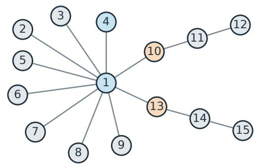  
Blue: {1,4}; orange: {10,13}.

(b) Step 3.2

Column κ = 1

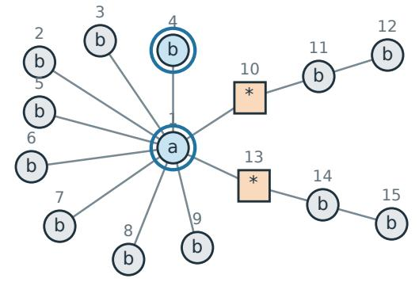  
Sources: (a,b); readouts remain masked.

(c) Step 3.2

Column κ = 2

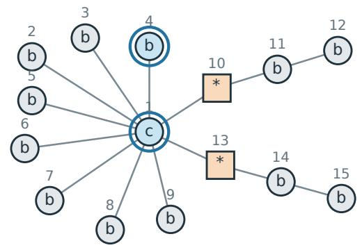  
(d) Step 3.2  
Sources: (c,b); position 4 uses its draft.

Tail column κ = T

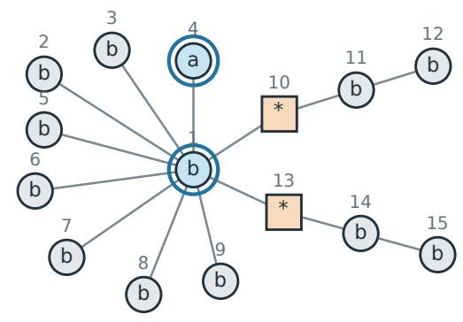  
Sources: (b,a); other tokens stay fixed.  
\* = masked; 3 submitted states, each returning rows 10 and 13.  
Fill always records the color under the same fixed coloring; no commit occurs.

The returned rows feed Step 3.3: votes and row selection.

Figure 5: The coloring and three submitted states of Example D.2, labeled by the steps of Algorithms 2–3. All 15 positions are drawn separately at fixed locations. Fill denotes the color under τ; square outlines mark masked readouts and double outlines mark sources. Small outer numbers are position indices, and inner symbols in (b)–(d) are submitted tokens. No vertex is committed by these probes. The hidden edges are shown only to explain the construction.

When the colors coincide, the row family and diameter need not be formed. The vote is set to zero and never refers to an unsubmitted probe. If $\ell _ { \mathrm { m a x } } = 0$ , the screen returns empty rows before forming these objects.

Computing the diameter requires no additional submissions. It compares every pair of bank-plus-tail rows, not just each bank row against the tail column.

For each readout $j ,$ define the candidate row by

$$
\widetilde { A } _ { j } ( H _ { G } ) : = \left\{ i \in U _ { G } \setminus \{ j \} : \sum _ { \tau \in \mathcal { T } ^ { \mathrm { c o l } } } Y _ { \tau } ( i , j \mid H _ { G } ) > \frac { M } { 2 } \right\} ,\tag{127}
$$

Definition D.3 (Admissible public row selector). Let $\tau$ contain the public transcript available when the screen has finished, including its colors and votes and any retained public decision-rule state. A selector $\mathsf { S }$ is a fixed, terminating, deterministic measurable rule. Given $j ,$ a candidate set $C \subseteq U _ { G } \setminus \{ j \}$ , the cutof $d ,$ and $\tau$ , its output has the form

$$
\mathsf { S } ( j , C , d ; T ) = \{ { C } , \quad \quad | C | \leq d , \quad
$$

On overflow, $C _ { \mathrm { d r o p } } \subseteq C$ is the set of positions that the rule chooses to remove from these inputs, with $| C _ { \mathrm { d r o p } } | \geq | C | - d .$ Thus $| C \setminus C _ { \mathrm { d r o p } } | = | C | - | C _ { \mathrm { d r o p } } | \leq d ;$ the rule may return fewer than $d$ positions, including none. It makes no oracle submission or commit and reads neither hidden target information nor unobserved future randomness or oracle replies.

The returned row $A _ { j } ( H _ { G } )$ is the output of this selector applied to $C = \widetilde { A } _ { j } ( H _ { G } )$ :

$$
A _ { j } ( H _ { G } ) : = { \mathsf { S } } { \big ( } j , \widetilde { A } _ { j } ( H _ { G } ) , d ; { \mathcal { T } } { \big ) } .\tag{128}
$$

Example (Standard top-vote row selector). The standard choice of S for returning $A _ { j } ( H _ { G } )$ in equation 128 orders the positions $i _ { 1 } , \dots , i _ { | C | }$ of $C$ by decreasing total vote $\smash { \sum _ { \tau \in  { \mathbb { Z } } ^ { \mathrm { c o l } } } Y _ { \tau } ( i , j \mid \dot { H } _ { G } ) }$ , breaking ties by increasing position index. It returns

$$
\mathsf { S } ( j , C , d ; \mathcal { T } ) = \{ i _ { \ell } : 1 \leq \ell \leq \operatorname* { m i n } \{ d , | C | \} \} .
$$

Thus it keeps all of C when $| C | \leq d$ and otherwise removes the positions ranked after d. The empty input gives the empty set. Taking $C = \widetilde { A } _ { j } ( H _ { G } )$ gives the standard returned row $A _ { j } ( H _ { G } )$

The size cap alone would not sufice: deleting a candidate from a nonoverflowing row can destroy low-degree exactness. When $\ell _ { \mathrm { m a x } } = 0$ , every returned row is defined to be empty.

Remark (Alternative overflow rule). Returning $\varnothing$ on overflow is another admissible selector. The standard sampler uses top-vote selection; the invariance proposition compares the guarantees of these rules, not their realized performance.

Given its inputs, public transcript, and the frozen oracle, Algorithm 3 is deterministic; the full decision rule in Algorithm 2 supplies its color family in Step 2. It expands Step 3 of Algorithm 1. Within Step 3, Step 3.3 computes votes after each chunk’s probes, then forms and selects rows after all colorings.

Algorithm 3 Packed color screen with a fixed draft   
Input: $H _ { G }$ , Prep, $f ,$ a color set ${ \mathcal { C } } ^ { \mathrm { v a l } }$ , and a family $( h _ { \tau } ( \cdot ) ) _ { \tau \in \mathcal { T } ^ { \mathrm { c o l } } } , d , J ,$ read access to $q , { \mathsf { S } } ,$ and the current   
public transcript $\tau$   
Output: $( A _ { j } ( H _ { G } ) ) _ { j \in U _ { G } } ;$ the history is unchanged   
1: if $\ell _ { \mathrm { m a x } } = 0$ or $\bar { U } _ { G } = \emptyset$ then   
2: return $( \varnothing ) _ { j \in U _ { G } }$ without a counterfactual submission   
3: end if   
4: Initialize all votes in 126 to zero   
5: for $\tau \in \mathcal { T } ^ { \mathrm { c o l } }$ do   
Step 3.1. Readout chunks   
6: Form the color classes and current readout chunks by 120–121   
7: for each nonempty readout chunk $\mathscr { C } = \mathscr { C } _ { \tau , c ^ { \mathrm { r d } } , m } ( H _ { G } )$ do   
Step 3.2. Packed probes   
8: for $\kappa \in \mathcal { T } ^ { \mathrm { s r c } }$ do   
9: for $c ^ { \mathrm { s r c } } \in \mathcal { C } ^ { \mathrm { v a l } } \setminus \{ c ^ { \mathrm { r d } } \}$ do   
10: Submit $y _ { \kappa , \tau , \mathrm { c } ^ { \mathrm { s r c } } } ( H _ { G } , f , \mathcal { C } )$ and read all rows $j \in \mathcal { C }$   
11: end for   
12: end for   
Step 3.3. Votes $\&$ row selection   
13: Form the row-family diameters and votes for all $i \in U _ { G } \backslash \{ j \}$ and $j \in \mathcal { C }$ using 124–126   
14: end for   
15: end for   
Step 3.3. Votes $\&$ row selection (continued)   
16: Form the candidate rows by 127   
17: Append the current screen’s replies, colors, and votes to $\tau$   
18: Apply the public selector by 128   
19: return $( A _ { j } ( H _ { G } ) ) _ { j \in U _ { G } }$

Every bank- or tail-column state is a noncommit counterfactual submission, and the submitted states agree with $H _ { G }$ on G. One submitted state returns all rows indexed by its readout chunk and contributes one to $Q _ { \mathrm { c f } }$ , regardless of |C| (Theorem A.11). The tail-column reply for a fixed $( \tau , \mathcal { C } , c ^ { \mathrm { s r c } } )$ is reused in the diameter computation for that source color, not across diferent source colors.

## D.5 Roles of the construction and proof route

The overview in Section E.2 maps the steps above to their structural, resource, and error guarantees. It also gives the proof routes for both accuracy cases and their specialization to Theorem 3.1.

Remark (Scope of cycle repair). Cycle repair avoids an immediate all-residual product commit merely because the terminal estimate has a cycle. A repaired forest need not contain every true residual edge. The guarantees still charge failed-screen paths to the screen-failure budget; they do not assert an accuracy improvement over the one-batch alternative.

## E Case (i): Hellinger-to-TV upper bound

We prove the finite TV guarantee for the sampler in Appendix D; Section E.2 gives the proof map. Screen certification, peeling, and resource counts support both accuracy cases via equation 195. The error analysis here proves case (i); Appendix F proves case (ii). Appendix G specializes both to Theorem 3.1.

## E.1 Finite upper bound

The finite theorem uses the standard preprocessing floor of Appendix D.2; its query bound uses the realized vocabulary-bank sizes $\ell _ { i } = | \widehat { B } _ { i } |$ . Together with Theorem G.1, it yields case (i) of Theorem 3.1 through Theorem G.3.

Theorem E.1 (Case (i): finite randomized Hellinger-to-TV upper bound). We work in case (i), with the oracle condition of Assumption A.7. Fix $N \geq 1 0$ and the objects of Appendix A. Let $\mathcal { A } _ { \mathrm { p a c k } } ^ { \mathrm { r n d } }$ be Algorithm 2 with the standard zero-query draft of equation $1 1 \%$ and $\delta ^ { \mathrm { f a i l } } \in ( 0 , 1 )$ . Suppose preprocessing is feasible and

$$
\delta < \omega .\tag{129}
$$

Here $p _ { \mathrm { r n d } } , M _ { \mathrm { r n d } }$ are defined in equation 117, and $T _ { \mathrm { s c r } } , \overline { { R } }$ in equation 105; Λ is $\ell _ { \mathrm { m a x } } + 1$ when $\ell _ { \mathrm { m a x } } \geq 1$ and zero when $\ell _ { \mathrm { m a x } } = 0$ , as in equation 116. Then, for every admissible frozen oracle, pathwise over the random colors and product-commit draws,

$$
Q _ { \mathrm { c f } } \leq \Lambda T _ { \mathrm { s c r } } M _ { \mathrm { r n d } } p _ { \mathrm { r n d } } ( p _ { \mathrm { r n d } } + J ) ,\tag{130}
$$

$$
R \leq { \overline { { R } } } .\tag{131}
$$

Moreover,

$$
\mathcal { R } _ { \mathrm { T V } } ( \boldsymbol { \mathcal { A } } _ { \mathrm { p a c k } } ^ { \mathrm { r n d } } ; P , q ) \leq \varepsilon ^ { \mathrm { H } } + \delta ^ { \mathrm { f a i l } } \quad f o r e v e r y q \in \mathcal { Q } ^ { \mathrm { H e l } } ( P ; \varepsilon ^ { \mathrm { H } } ) .\tag{132}
$$

Consequently,

$$
\overline { { \mathcal { R } } } _ { \mathrm { T V } } ( \mathcal { A } _ { \mathrm { p a c k } } ^ { \mathrm { r n d } } ; P ) \leq \varepsilon ^ { \mathrm { H } } + \delta ^ { \mathrm { f a i l } } .\tag{133}
$$

In particular, $i f \varepsilon ^ { \mathrm { H } } > 0$ and

$$
\delta ^ { \mathrm { f a i l } } : = \frac { \varepsilon ^ { \mathrm { H } } } { 2 } ,\tag{134}
$$

then $\overline { { \mathcal { R } } } _ { \mathrm { T V } } ( \mathcal { A } _ { \mathrm { n a c k } } ^ { \mathrm { r n d } } ; P ) \le 3 \varepsilon ^ { \mathrm { H } } / 2$ . If the distinguished all-mask readout is charged, then $Q _ { \mathrm { n c } } = Q _ { \mathrm { c f } } + 1$ by equation 34. Thus the bound for $Q _ { \mathrm { n c } }$ is the right-hand side of equation 130 plus one; $Q _ { \mathrm { c f } }$ still excludes that readout. Including that initial stage, the adaptive oracle depth is at most $D \leq 1 + R + T _ { \mathrm { s c r } }$

## E.2 Proof overview

The proof turns local screen certificates into safe parallel commits: accurate low-degree rows make peeling contract the high-degree core, after which the remaining forest is known and its components can be sampled in parallel. We then bound resources and output error separately. Table 3 follows this chain under the finite hypotheses above. The structural certificates hold when every reached screen succeeds; the resource caps hold on every path. The same construction supports both accuracy cases, with diferent output-error arguments

<table><tr><td>Proof task</td><td>Key argument and conclusion</td><td>Algorithm steps References</td><td></td></tr><tr><td>Certify the vocabulary banks</td><td>Preprocessing gives a nonempty complement of whose tokens have true marginal mass below  $t ,$  certifying the tail representative. Under the standard floor, (RF) bounds  $\ell _ { i } \leq ( 4 C / t ) ^ { 1 / s }$ </td><td> ${ \widehat { B } } _ { i } ,$  Step 1</td><td>Theorem E.3</td></tr><tr><td>Recover low-degree neighborhoods</td><td>Separating colors reduce packed probes to one-source comparisons at a fixed boundary. RT–UEN and the screening margin make their votes correct; fresh-color majorities give  $A _ { j } ( H _ { G } ) = N _ { F _ { G } } ( j )$  for degree at most d, except on reached-screen failures of total probability at most  $\delta ^ { \mathrm { f a i l } }$ </td><td>Step 2–Step 3; Step 3.1- Step 3.3</td><td>Theorems E.2, E.4 and E.5; Theorem E.6</td></tr><tr><td>Peel the</td><td>Let  $n _ { k } ^ { \mathrm { { h i } } }$  count vertices of degree above d before high-degree core phase k. On successful paths, the forest degree sum gives  $n _ { k + 1 } ^ { \mathrm { h i } } \le ( 4 / d ) n _ { k } ^ { \mathrm { h i } }$  . Either stopping test leaves maximum degree at most  $d ,$  certifying the true residual forest.</td><td>Step 4-Step 5 Theorem E.7</td><td></td></tr><tr><td>Complete safe parallel sampling</td><td>Singleton peels and one centroid per true residual Step 4, Step 6 Theorems E.2, E.8 component are safe. Exact-row products then equal joint batch conditionals. Centroid deletion halves component sizes, giving logarithmically many terminal rounds on successful paths.</td><td></td><td>and E.9</td></tr><tr><td>Bound all-path resources</td><td>Count screen loops for  $Q _ { \mathrm { c f } } ,$  and peel and centroid All: commits for rounds. GUARD caps rounds even on failed-screen paths. Each screen is one parallel stage:  $D \leq 1 + R + T _ { \mathrm { s c r } } . \ Q _ { \mathrm { c f } }$  excludes</td><td>Step 1–Step 6, plus GUARD</td><td>Theorem E.8</td></tr><tr><td>Case (i): bound output TV</td><td>preprocessing and commits. Each coordinate is committed once, so adaptive Hellinger composition bounds an analysis-only safe Step 1-Step 6; rule&#x27;s oracle error. Coupling to that rule adds at most  $\delta ^ { \mathrm { f a i l } }$  , giving seed-averaged TV at most  $\varepsilon ^ { \mathrm { H } } + \delta ^ { \mathrm { f a i l } }$ </td><td>All: output-law analysis</td><td>Theorems E.9 to E.11; Theorem E.1</td></tr><tr><td>Case (ii): bound With forward row KL at most output KL</td><td> $\kappa ,$  the joint-reference identity separates row error from batch total correlation. The latter vanishes on successful reference paths, giving seed-averaged KL analysis at most  $N \kappa + N$  log  $V \delta ^ { \mathrm { f a i l } }$ </td><td>All: Step 1–Step 6; output-law</td><td>Theorems F.2 and F.3</td></tr><tr><td>Recover the main theorem</td><td>Verify preprocessing feasibility and screen separation for the main-text scaling, then specialize the finite bounds and choose the degree cutoff. Both cases yield Theorem 3.1.</td><td>All: Step 1–Step 6; parameter choices</td><td>Theorems G.1 and G.3</td></tr></table>

Table 3: Proof steps for the upper bound. Step labels link to Algorithms 2–3.

Two distinctions guide the proof:

• High-degree rows need only satisfy the size cap $| A _ { j } ( H _ { G } ) | \leq d$ . Accurate low-degree rows sufice to force contraction, even when high-degree rows are incorrect.

• For case (i), an analysis-only safe rule switches to singleton completion at the first failed screen (and before any cap fallback). We compare its full output law with the implemented sampler’s law; no conditioning of the output on screen success is needed.

Combining these bounds gives Equation (192):

$$
\mathbb { E } _ { W } d _ { \mathrm { T V } } \big ( P , \widehat { P } _ { W } ^ { q } \big ) \leq \underbrace { \varepsilon ^ { \mathrm { H } } } _ { \mathrm { o r a c l e ~ e r r o r ~ a t ~ c o m m i t s } } + \underbrace { \delta ^ { \mathrm { f a i l } } } _ { \mathrm { f a i l e d - s c r e e n ~ c o u p l i n g } } .
$$

## E.3 Steps 1–3: Preprocessing and exact low-degree certification

We first establish the residual Markov and tail certificates, then prove the fresh-color success bound and the low-degree screen contract. These certify the vocabulary banks from Step 1 (Preprocess & initialize), the fresh colors from Step 2 (Draft & color), and the rows returned by Step 3 (Packed screen).

The next lemma derives the residual Markov property from Equation (1). Recall from equation 14 that $U _ { G } = [ N ] \backslash G$ and $F _ { G } = F [ U _ { G } ]$ . Its row identity is used in Step 3.2 (Packed probes), and its component independence justifies Step 6 (Centroid commits).

Lemma E.2 (Residual Markov property). Fix a history $H _ { G } = ( G , x _ { G } )$ . Conditional on $X _ { G } = x _ { G }$ , the variables in distinct connected components of $F _ { G }$ are independent. Moreover, $f a x j \in U _ { G }$ and the values of all residual neighbors of $j .$ . The exact conditional row of $X _ { j }$ is unchanged $i f$ any residual nonneighbor is revealed, masked, changed, or marginalized.

Proof. 1. Factor the conditional law over residual components. Recall the forest factorization equation 12: $\begin{array} { r } { P ( x ) = \prod _ { u \in \mathrm { R o o t s } ( F ) } \pi _ { u } ( x _ { u } ) \prod _ { j \notin \mathrm { R o o t s } ( F ) } K _ { \mathrm { p a } ( j )  j } ( x _ { j } \mid x _ { \mathrm { p a } ( j ) } ) } \end{array}$ . Here Roots(F) and $\mathrm { p a } ( \cdot )$ are the original reference roots and parent map. Substitute the fixed committed values $x _ { G }$ . For each connected component $T$ of $F _ { G }$ , identified with its vertex set, define

$$
\begin{array} { l l } { g _ { T } ( x _ { T } ) : = \displaystyle { \prod _ { u \in \mathrm { R o s t } ( F ) \cap T } \pi _ { u } ( x _ { u } ) } } & { \mathrm { r o o t s ~ i n ~ } T } \\ { \displaystyle } & { \times \displaystyle { \prod _ { j \in \mathrm { E O s t } ( F ) \cap T } K _ { \mathrm { p a } ( j ) \to j } ( x _ { j } \ | \ x _ { \mathrm { p a } ( j ) } ) } \mathrm { e d g e s ~ w i t h i n ~ } T } \\ { \displaystyle } & { \mathrm { ~ \sum _ { \mathrm { ~ f \in ~ T \setminus \mu _ { \Delta } o t \leq ( F ) ~ } } \mathbb { K } _ { \mathrm { p a } ( j ) \ominus T } ~ } } \\ { \displaystyle } & { \times \displaystyle { \prod _ { j \in \mathrm { E } \backslash \mathrm { R o t } ( F ) \to j } ( x _ { j } \ | \ x _ { \mathrm { p a } ( j ) } ) } \mathrm { e d g e s ~ } G \to T } \\ { \displaystyle } & { \mathrm { p a r ~ } \sum _ { \mathrm { I \in ~ T \setminus \rho _ { \Delta } o t \leq ( F ) ~ } } } \\ { \displaystyle } & { \times \displaystyle { \prod _ { j \in \mathrm { E O R o t } ( F ) \to j } ( x _ { j } \ | \ x _ { \mathrm { p a } ( j ) } ) } \mathrm { e d g e s ~ } T \to G . } \\ { \displaystyle } & { \mathrm { p a r ~ } \sum _ { \mathrm { I \in ~ Z \setminus \rho _ { \Delta } ( \Delta _ { \Delta } ) \ominus \emptyset ~ } } K _ { \mathrm { p a } ( j ) \to j } ( x _ { j } \ | x _ { \mathrm { p a } ( j ) } ) \mathrm { e d g e s ~ } T \to G . } \end{array}
$$

The fixed $x _ { G }$ dependence is suppressed in $g _ { T }$ . In particular, the last product retains factors for committed children of vertices in $T \colon$ their parent values still vary with $x _ { T }$ . Every edge with a residual endpoint is either internal to one such $T$ or crosses between $T$ and $G ;$ no edge joins distinct residual components. Thus, with products over $T$ ranging over these connected components,

$$
P ( x _ { G } , x _ { U _ { G } } ) = [ \prod _ { \substack { u \in \mathrm { R o o t s } ( F ) \cap G } } \pi _ { u } ( x _ { u } ) \prod _ { \substack { j \in G \backslash \mathrm { R o o t s } ( F ) } } K _ { \mathrm { p a } ( j )  j } ( x _ { j } \mid x _ { \mathrm { p a } ( j ) } ) ] \prod _ { T } g _ { T } ( x _ { T } ) .
$$

The bracket is positive and depends only on $x _ { G }$ . It therefore cancels when dividing this joint probability by $\begin{array} { r } { P ( X _ { G } = x _ { G } ) = \sum _ { z _ { U _ { G } } } P ( x _ { G } , z _ { U _ { G } } ) } \end{array}$ . Since the connected components partition $U _ { G } .$ , finite distributivity gives G

$$
\sum _ { x _ { U _ { G } } } \prod _ { T } g _ { T } ( x _ { T } ) = \prod _ { T } \left( \sum _ { x _ { T } } g _ { T } ( x _ { T } ) \right) .
$$

Consequently

$$
\begin{array} { r } { P ( X _ { U _ { G } } = x _ { U _ { G } } \mid X _ { G } = x _ { G } ) = \frac { \prod _ { T } g _ { T } ( x _ { T } ) } { \sum _ { z _ { U _ { G } } } \prod _ { T } g _ { T } ( z _ { T } ) } } \\ { = \prod _ { T } \frac { g _ { T } ( x _ { T } ) } { \sum _ { z _ { T } } g _ { T } ( z _ { T } ) } . } \end{array}
$$

All sums range over the vocabulary assignments on their indicated vertex sets; their denominators are positive by strict positivity of the factors. This proves conditional independence of the residual components.

2. Cancel all factors not incident to the readout. For the second claim, root the original connected component at $j ,$ using (C0). Every original neighbor v of j is observed: either $v \in G$ , or its value is fixed in the lemma. Call this value $x _ { v }$ . The factors involving $X _ { j } = a$ are exactly

$$
\pi _ { j } ( a ) \prod _ { v \in \mathcal { N } _ { F } ( j ) } K _ { j \to v } ( x _ { v } \mid a ) .
$$

All other factors are independent of a once these neighbor values are fixed. Revealing, changing, or summing out nonneighbors only changes a multiplicative factor independent of $a .$ It cancels in the normalized row

$$
\frac { \pi _ { j } ( a ) \prod _ { v \in \mathcal { N } _ { F } ( j ) } K _ { j \to v } ( x _ { v } \mid a ) } { \sum _ { b \in \mathcal { V } } \pi _ { j } ( b ) \prod _ { v \in \mathcal { N } _ { F } ( j ) } K _ { j \to v } ( x _ { v } \mid b ) } .
$$

Thus the history and fixed neighbor values determine the row.

The next lemma certifies the omitted tokens for screening and, under (RF; Equation (21)) with the standard floor, bounds the number of source columns.

Intuition. The local vocabulary bank ${ \widehat { B } } _ { i }$ from equation 111 includes every token whose true marginal mass exceeds t. Conversely, under the standard floor, every included token has true mass at least $t / 2$ The rank envelope then bounds how many such tokens exist:

$$
\frac { t } { 2 } \leq C ( \ell _ { i } ^ { - s } + V ^ { - 1 } ) , \quad C V ^ { - 1 } \leq \frac { t } { 4 } \quad \Longrightarrow \quad \ell _ { i } \leq ( 4 C / t ) ^ { 1 / s } .
$$

This is an upper bound on bank size; (RF; Equation (21)) does not require the envelope to be attained.   
The complementary tokens can all be represented by one certified tail token in the response test.

Lemma E.3 (Preprocessing certificates; Step 1). Suppose preprocessing in Theorem D.1 is feasible, and let t be the threshold it selects. Every local vocabulary bank ${ \widehat { B } } _ { i }$ has a nonempty complement in $\nu ,$ so each $b _ { i }$ is well-defined. For every $i \in [ N ]$ and $a \in \nu$

$$
\left| \pi _ { i } ( a ) - \widetilde { \pi } _ { i } ( a ) \right| \le \varepsilon _ { 0 } , \qquad a \notin \widehat { \mathcal { B } } _ { i } \Longrightarrow a \in \mathcal { T } _ { i } ( t ) .\tag{135}
$$

Under $( R F ;$ Equation (21)), the standard floor equation 107 additionally gives

$$
\ell _ { i } \leq \left( \frac { 4 C } { t } \right) ^ { 1 / s } \quad f o r \ e v e r y \ i .\tag{136}
$$

Proof. 1. Establish a nonempty vocabulary-bank complement. In Step 1 (Preprocess & initialize), preprocessing fixes $t = \operatorname* { m a x } \mathcal { G } ^ { \mathrm { f e a s } }$ once from the public parameters, before the all-mask submission; this threshold is reused by every screen. Since $C \geq 1$ , the standard floor satisfies $\underline { { t } } = 4 \operatorname* { m a x } \{ \varepsilon _ { 0 } , C / V \} \geq 2 ( \varepsilon _ { 0 } + 1 / V )$ Together with $t \geq \underline { { t } } .$ this gives

$$
t - \varepsilon _ { 0 } \geq \varepsilon _ { 0 } + \frac { 2 } { V } > \frac { 1 } { V } \geq \operatorname* { m i n } _ { a \in \mathcal { V } } \widetilde { \pi } _ { i } ( a ) .\tag{137}
$$

Thus $\widehat { B } _ { i } \neq \nu$ , proving tail-representative existence.

2. Certify every omitted token using the row-TV bound. At the all-mask state, $\mu _ { i } ( \cdot \mid y ^ { \perp } ) = \pi _ { i }$ and $q _ { i } ( \cdot \mid y ^ { \perp } ) = \widetilde { \pi } _ { i }$ . Thus equation 103 and the singleton-event bound for TV give, for every $a \in \nu$

$$
\left| \pi _ { i } ( a ) - \widetilde { \pi } _ { i } ( a ) \right| \leq \operatorname* { s u p } _ { A \subseteq \mathcal { V } } \left| \pi _ { i } ( A ) - \widetilde { \pi } _ { i } ( A ) \right| = d _ { \mathrm { T V } } ( \pi _ { i } , \widetilde { \pi } _ { i } ) \leq \varepsilon _ { 0 } .
$$

This bounds both signs of the diference, whether or not a belongs to ${ \widehat { B } } _ { i }$ . For a token outside the vocabulary bank ${ \widehat { B } } _ { i }$ , definition equation 111 then gives

$$
a \not \in { \widehat { \mathcal { B } } } _ { i } \quad \implies \quad \pi _ { i } ( a ) \leq \pi _ { i } ( a ) + \varepsilon _ { 0 } < t .\tag{138}
$$

This proves equation 135, including the tail certificate for $b _ { i }$

3. Apply (RF; Equation (21)) only for the bank-size estimate. For the vocabulary-bank size $\ell _ { i } = | \widehat { B } _ { i } |$ , the standard floor gives $t \geq \underline { { t } } = 4 \operatorname* { m a x } \{ \varepsilon _ { 0 } , C / V \}$ , hence both $t \geq 4 \varepsilon _ { 0 }$ and $t \geq 4 C / V$ . Every $a \in { \widehat { B } } _ { i }$ therefore satisfies

$$
\pi _ { i } ( a ) \geq \widetilde { \pi } _ { i } ( a ) - \varepsilon _ { 0 } \geq t - 2 \varepsilon _ { 0 } \geq \frac { t } { 2 } .\tag{139}
$$

If $\ell _ { i } \geq 1$ , at least $\ell _ { i }$ tokens have exact mass at least $t / 2 ;$ hence the exact rank- $\mathbf { \nabla } \cdot \boldsymbol { \ell } _ { i }$ mass has the same lower bound. Assumption (RF; Equation (21)) and $t \geq 4 C / V$ yield

$$
\frac { t } { 2 } \leq C \left( \ell _ { i } ^ { - s } + V ^ { - 1 } \right) \leq C \ell _ { i } ^ { - s } + \frac { t } { 4 } .
$$

Rearranging proves equation 136. The inequality is trivial when $\ell _ { i } = 0$

Screen-success event (analysis only). The colors drawn in Step 2 (Draft & color) determine the following event for Step 3 (Packed screen). Fix a realized history $H _ { G } = ( G , x _ { G } )$ . For distinct $i , j \in U _ { G }$ with $d _ { F _ { G } } ( j ) \leq d ,$ call $\tau \left( i , j \right)$ )-separating when

$$
\begin{array} { r l } { h _ { \tau } ( v ) \neq h _ { \tau } ( j ) } & { \mathrm { f o r ~ e v e r y ~ } v \in \mathcal { N } _ { F _ { G } } ( j ) , } \\ { h _ { \tau } ( v ) \neq h _ { \tau } ( i ) } & { \mathrm { f o r ~ e v e r y ~ } v \in \mathcal { N } _ { F _ { G } } ( j ) \backslash \{ i \} . } \end{array}\tag{140}
$$

The screen family is successful at $H _ { G }$ , denoted Iso $( H _ { G } )$ , if

$$
\left| \left\{ \tau \in \mathbb { Z } ^ { \mathrm { c o l } } : \tau \mathrm { ~ i s ~ } ( i , j ) \mathrm { - s e p a r a t i n g } \right\} \right| > \frac { M } { 2 }\tag{141}
$$

for every such ordered pair $( i , j )$ . This event is defined using the hidden residual forest only for analysis; the implemented screen neither observes nor tests it. For every separating τ , the two properties used by the screen proof are

$$
\mathcal { N } _ { F _ { G } } ( j ) \cap \mathcal { C } _ { \tau , h _ { \tau } ( j ) } ( H _ { G } ) = \emptyset , \qquad \mathcal { N } _ { F _ { G } } ( j ) \cap \mathcal { C } _ { \tau , h _ { \tau } ( i ) } ( H _ { G } ) \subseteq \{ i \} .\tag{142}
$$

Example E.1 (Checking which colors separate a pair). Use the coloring drawn in Step 2 from Example $\mathrm { D . 2 }$ and the forest in Example E.2. For the tested pair $( i , j ) = ( 1 , 1 0 )$ , the readout has neighbors $\mathcal { N } _ { F _ { G } } ( 1 0 ) =$ {1, 11}. The two tests in equation 142 are therefore

$$
\{ 1 , 1 1 \} \cap { \mathcal C } _ { \tau , 2 } ( H _ { G } ) = \emptyset , \qquad \{ 1 , 1 1 \} \cap { \mathcal C } _ { \tau , 1 } ( H _ { G } ) = \{ 1 \} \subseteq \{ i \} .
$$

Both hold: $h _ { \tau } ( 1 ) = 1 , h _ { \tau } ( 1 0 ) = 2 .$ , and $h _ { \tau } ( 1 1 ) = 3$ . If instead $h _ { \tau } ( 1 1 ) = 2$ , then neighbor 11 shares the readout color and the first intersection contains 11. If instead $h _ { \tau } ( 1 1 ) = 1$ , then an additional neighbor shares the source color and the second intersection is $\{ 1 , 1 1 \} \not \subseteq \{ 1 \}$ . This checks one pair and one coloring. It does not assert the simultaneous strict-majority event equation 141, which requires the full family of M colorings.

Call index, draft, and information before fresh colors. Fix the target, its forest, and the frozen oracle throughout. The index $s \in [ T _ { \mathrm { s c r } } ]$ counts screen calls (Step 3), not individual colorings or commit rounds. Define the reach event

$$
R _ { s } : = \{ \mathrm { A l g o r i t h m ~ 2 ~ r e a c h e s ~ i t s ~ s t h ~ s c r e e n ~ c a l l } \} .
$$

Thus $R _ { s }$ is an event, not the round count R. Recall that $f = ( f _ { i } ) _ { i \in U _ { G } } \in \mathcal { V } ^ { U _ { G } }$ is the background token vector fixed by Draft before fresh colors are drawn (Definition D.2). Its call-indexed version is

$$
f ^ { ( s ) } : = \left\{ \begin{array} { l l } { f \mathrm { ~ f i x e d ~ f o r ~ c a l l ~ } s \mathrm { ~ i n ~ } \mathrm { S t e p ~ } 2 , } & { \mathrm { o n ~ } R _ { s } , } \\ { \dag , } & { \mathrm { o n ~ } R _ { s } ^ { \mathrm { c } } . } \end{array} \right.
$$

The symbol † means no sth call: it is a formal marker, not a vocabulary token, MASK, or a draft vector. Diferent executions can stop after diferent numbers of screens. This marker defines $f ^ { ( s ) }$ on every execution, so the proof can sum over the fixed range $s = 1 , \ldots , T _ { \mathrm { s c r } }$ without adding any call.

On $R _ { s } ,$ , let $\mathcal { T } _ { s - }$ record the past colors, replies, commits, and decision-rule state just after $f ^ { ( s ) }$ is fixed and before the current color block is drawn. On $R _ { s } ^ { \mathsf { c } }$ , use the terminal transcript instead. Define

$$
\mathcal { F } _ { s - 1 } : = \sigma ( \mathcal T _ { s - } , f ^ { ( s ) } ) , \qquad \mathcal F : = \mathcal F _ { s - 1 } \quad \mathrm { a t ~ t h e ~ c a l l ~ u n d e r ~ c o n s i d e r a t i o n } .
$$

On a reached call, this is precisely the information available between draft generation and fresh color generation: the history and completed draft are fixed under this conditioning, but the current colors are not. It excludes current or future colors and the full seed $W ;$ ; fixing W would fix those colors. No union over possible histories or drafts is needed.

Intuition. A low-degree readout creates at most 2d forbidden color equalities. Thus $p _ { \mathrm { r n d } } = 8 ( d + 1 ) \simeq d$ makes one coloring good with probability greater than $3 / 4$ . Repeating independently $M _ { \mathrm { r n d } }$ times makes a wrong majority exponentially unlikely:

$$
\operatorname* { P r } ( \mathrm { w r o n g ~ m a j o r i t y ~ f o r ~ o n e ~ p a i r ~ } | \mathcal { F } ) \leq e ^ { - M _ { \mathrm { r n d } } / 8 } , \qquad T _ { \mathrm { s c r } } N ^ { 2 } e ^ { - M _ { \mathrm { r n d } } / 8 } \leq \delta ^ { \mathrm { f a i l } } .
$$

A union bound over pairs yields Equation (6). The chosen $M _ { \mathrm { r n d } }$ is the ceiling of the logarithm obtained by solving the second inequality. Conditioning is on the past before the fresh colors.

Lemma E.4 (Fresh randomized screens succeed adaptively; Step 2). Suppose Algorithm 2 reaches a screen call with realized past ${ \mathcal { F } } _ { z }$ , including the completed generation of its fixed draft but preceding the current coloring block. Conditional on $\mathcal { F }$ , the fresh family in equation 117 satisfies

$$
\operatorname* { P r } \left( \mathbb { I } \mathsf { s o } ( H _ { G } ) ^ { \mathsf { c } } \mid \mathcal { F } \right) \leq \frac { \delta ^ { \mathrm { f a i l } } } { T _ { \mathrm { s c r } } } .\tag{143}
$$

Consequently, over all decision-rule randomness and commit draws,

$$
{ \operatorname* { P r } } \{ s o m e \ r e a c h e d \ s c r e e n \ i s \ u n s u c c e s s f u l \} \le \delta ^ { \mathrm { f a i l } } .\tag{144}
$$

Proof. 1. Separate one ordered pair with one fresh coloring. Conditional on $\mathcal { F }$ , the history, residual forest, and draft are fixed, while the current colors drawn in Step 2 are mutually independent and uniform. Fix an ordered pair $( i , j )$ with $d _ { F _ { G } } ( j ) \leq d .$ . The two lines of equation 140 contain at most $2 d _ { F _ { G } } ( j ) \leq 2 d$ forbidden color equalities. Each has probability $1 / p _ { \mathrm { r n d } }$ , so one coloring is nonseparating with conditional probability at most

$$
\frac { 2 d } { p _ { \mathrm { r n d } } } = \frac { d } { 4 ( d + 1 ) } < \frac { 1 } { 4 } .\tag{145}
$$

2. Amplify to a strict majority for that pair. Let $X _ { \tau }$ indicate that coloring τ separates this pair. Conditional on $\mathcal { F }$ , the $X _ { \tau }$ are independent and have mean at least $3 / 4$ . Hoefding’s inequality therefore gives

$$
\operatorname* { P r } \left\{ \sum _ { \tau = 1 } ^ { M _ { \mathrm { r n d } } } X _ { \tau } \leq \frac { M _ { \mathrm { r n d } } } { 2 } \bigg | \mathcal { F } \right\} \leq \exp \{ - 2 M _ { \mathrm { r n d } } ( 3 / 4 - 1 / 2 ) ^ { 2 } \} = \exp \{ - M _ { \mathrm { r n d } } / 8 \} .\tag{146}
$$

3. Take a union bound over ordered pairs at the current history. There are fewer than $N ^ { 2 }$ relevant ordered pairs. A union bound and equation 117 give

$$
N ^ { 2 } e ^ { - M _ { \mathrm { r n d } } / 8 } \leq \delta ^ { \mathrm { f a i l } } / T _ { \mathrm { s c r } } ,
$$

which proves equation 143.

$\it 4 .$ Sum over adaptively reached calls by conditional expectation. Recall that $R _ { s }$ means the algorithm reaches its sth screen call, and $f ^ { ( s ) }$ is that call’s draft; † marks an unreached call. On $R _ { s } ,$ let $H ^ { ( s ) }$ be the committed history at that call, and define

$$
E _ { s } : = \{ R _ { s } \mathrm { ~ o c c u r s ~ a n d ~ } \mathsf { l s o } ( H ^ { ( s ) } ) \mathrm { ~ f a i l s } \} .
$$

Thus $E _ { s }$ means call s is reached and fails; it is false on $R _ { s } ^ { \mathsf { c } }$ , with no history or screen evaluated there. The draft rule terminates before the fresh colors (Definition D.2), so reaching the call is decided before those colors. In the notation above, $R _ { s } = \{ f ^ { ( s ) } \neq \dagger \} \in \mathcal { F } _ { s - 1 } = \sigma \big ( \mathcal { T } _ { s - } , f ^ { ( s ) } \big )$ . On $R _ { s }$ apply equation 143; on $R _ { s } ^ { \mathsf { c } }$ the conditional failure probability is zero. Hence

$$
\operatorname* { P r } ( E _ { s } \mid { \mathcal { F } } _ { s - 1 } ) \leq { \left\{ \begin{array} { l l } { \delta ^ { \mathrm { f a i l } } / T _ { \mathrm { s c r } } , } & { { \mathrm { o n ~ } } R _ { s } , } \\ { 0 , } & { { \mathrm { o n ~ } } R _ { s } ^ { \mathrm { c } } } \end{array} \right. } = \mathbf { 1 } _ { R _ { s } } { \frac { \delta ^ { \mathrm { f a i l } } } { T _ { \mathrm { s c r } } } } .
$$

Taking expectations gives

$$
\operatorname* { P r } ( E _ { s } ) = \mathbb { E } [ \operatorname* { P r } ( E _ { s } \mid \mathcal { F } _ { s - 1 } ) ] \leq \mathbb { E } \bigg [ \mathbf { 1 } _ { R _ { s } } \frac { \delta ^ { \mathrm { f a i l } } } { T _ { \mathrm { s c r } } } \bigg ] = \operatorname* { P r } ( R _ { s } ) \frac { \delta ^ { \mathrm { f a i l } } } { T _ { \mathrm { s c r } } } \leq \frac { \delta ^ { \mathrm { f a i l } } } { T _ { \mathrm { s c r } } } .
$$

The failed-screen event is the union of these reached-call failures, so

$$
\operatorname* { P r } \left( \bigcup _ { s = 1 } ^ { T _ { \mathrm { s c r } } } E _ { s } \right) \le \sum _ { s = 1 } ^ { T _ { \mathrm { s c r } } } \operatorname* { P r } ( E _ { s } ) \le T _ { \mathrm { s c r } } \frac { \delta ^ { \mathrm { f a i l } } } { T _ { \mathrm { s c r } } } = \delta ^ { \mathrm { f a i l } } .
$$

This proves equation 144. No independence between diferent screen-success events is asserted or needed. The same separating coloring isolates every packed column for a fixed ordered pair, so neither the event nor this union bound requires an additional union over bank values, columns, or possible drafts. Draft generation is allowed to depend on the past oracle transcript; independence of that draft from oracle error is not used. □

Intuition (Step 3.1, Step 3.2). By Theorem E.4, with high probability every reached screen has a strict separating majority for each pair with readout degree at most $d .$ Fix one such coloring with diferent source and readout colors. The readout chunk contains no neighbor of $j ,$ and the probed source class contains no neighbor of $j$ other than possibly i (Equation (142)). Thus every neighbor is observed, and only i can change among them. By Theorem E.2, the exact row equals the row obtained by varying only i at the common draft boundary in Equation (147); this is the boundary at which (RT; Equation (18)) and (UEN; Equation (19)) apply.

Lemma E.5 (Exact rows at a fixed draft boundary; Step 3.1, Step 3.2). Suppose preprocessing is feasible and $\ell _ { \mathrm { m a x } } \geq 1$ . Fix $H _ { G } = ( G , x _ { G } ) , f \in \mathcal { V } ^ { U _ { G } }$ , and distinct residual positions $i , j$ . Define the complete boundary z on $[ N ] \setminus \{ i , j \}$ by $z _ { k } = x _ { k }$ for $k \in G$ and $z _ { k } = f _ { k }$ otherwise. For an $( i , j )$ -separating coloring with diferent source and readout colors, every $\kappa \in \mathcal { T } ^ { \mathrm { s r c } }$ satisfies

$$
\mu _ { j } ( \cdot \mid y _ { \kappa , \tau , h _ { \tau } ( i ) } ( H _ { G } , f , \mathcal { C } _ { \tau } ( j ) ) ) = \mu _ { i \to j } ( \cdot \mid \varphi _ { \kappa } ( i ; f ) , z ) .\tag{147}
$$

In particular, the exact row family contains all source values in the local vocabulary bank ${ \widehat { B } } _ { i }$ and its tail representative $b _ { i }$ , at this same boundary. Padding may additionally contribute the row for $f _ { i }$

Proof. By Step 3.1 (Readout chunks), the readout chunk is contained in the readout color class. Thus the two isolation clauses in equation 142 give, respectively,

$$
\begin{array} { r } { \mathcal { N } _ { F _ { G } } ( j ) \cap \mathcal { C } _ { \tau } ( j ) = \emptyset , \qquad \mathcal { N } _ { F _ { G } } ( j ) \cap \mathcal { C } _ { \tau , h _ { \tau } ( i ) } ( H _ { G } ) \subseteq \{ i \} . } \end{array}
$$

All residual neighbors of $j$ are therefore observed. Since the source and readout colors difer, i is also outside the masked readout chunk. In the state submitted by Step 3.2 (Packed probes), the relevant observed coordinates are exactly

$$
\big ( y _ { \kappa , \tau , h _ { \tau } ( i ) } ( H _ { G } , f , \mathcal { C } _ { \tau } ( j ) ) \big ) _ { v } = \left\{ \begin{array} { l l } { x _ { v } , } & { v \in G , } \\ { \varphi _ { \kappa } ( i ; f ) , } & { v = i , } \\ { f _ { v } , } & { v \in \mathcal { N } _ { F _ { G } } ( j ) \setminus \{ i \} . } \end{array} \right.
$$

These are the same values as in the complete boundary with source value $\varphi _ { \kappa } ( i ; f )$ and remaining values z. Conditional on $X _ { G } = x _ { G }$ , Lemma E.2 says that the row for j depends only on its residual neighbors. Completing or changing all other coordinates to z therefore leaves it unchanged, proving the identity. The bank columns and column T give the asserted subfamily by equation 115. The boundary is independent of the coloring because one draft is fixed across the entire screen. □

Theorem E.4 bounds the probability that any reached screen fails. Under the screen-success event, Theorem E.6 formalizes equation 5 and identifies the output of Step 3.3 (Votes $\&$ row selection) with the true neighbor set for every readout of residual degree at most d. The target obeys the forest and RT–UEN (Equations (18) and (19)) assumptions (Assumptions A.2 and $\mathrm { A . 4 } )$ , and oracle rows satisfy the TV bound equation 103. Recall the general resolution $\delta = 4 \varepsilon _ { 0 } + \delta _ { \mathrm { t a i l } }$ from equation 102; the main text uses $\varepsilon _ { 0 } = \varepsilon / ( 2 \sqrt { N } )$ . The lemma’s screening-margin hypothesis $\delta < \omega$ means that the target signal exceeds the row-noise and omitted-response allowances. This is a suficient screening condition, not a consequence of RT–UEN (Equations (18) and (19)) alone. Preprocessing feasibility is specified in Definition D.1, and Iso $\left( H _ { G } \right)$ is defined in equation 141.

Lemma E.6 (Low-degree screen contract; Step 3.3). Suppose preprocessing is feasible and $\delta < \omega$ holds. At any history $H _ { G }$ , with any draft fixed throughout the screen, Iso $( H _ { G } )$ implies

$$
A _ { j } ( H _ { G } ) = \mathcal { N } _ { F _ { G } } ( j ) \quad f o r e v e r y j \in U _ { G } w i t h d _ { F _ { G } } ( j ) \le d .
$$

High-degree rows have only the construction’s size cap; no subset or correctness guarantee is asserted for them.

Intuition for the screen contract. At a separating coloring, all exact rows for a nonedge coincide, so its observed diameter is at most $2 \varepsilon _ { 0 }$ . For an edge, restricting source values to the vocabulary bank plus tail representative, $\widehat { B } _ { i } \cup \{ b _ { i } \}$ , loses at most $\delta _ { \mathrm { t a i l } }$ of the full response diameter, and row noise loses at most another $2 \varepsilon _ { 0 }$ . Thus the edge’s observed diameter is at least

$$
\omega - \delta _ { \mathrm { t a i l } } - 2 \varepsilon _ { 0 } > 2 \varepsilon _ { 0 } .
$$

The strict inequality is exactly $4 \varepsilon _ { 0 } + \delta _ { \mathrm { t a i l } } < \omega$ . The proof below verifies the bank/tail comparison, all empty-bank cases, and the strict-majority step.

Proof of Theorem E.6. 1. Fix a successful screen and the hidden exact rows. We analyze the votes and selected rows of Step 3.3 (Votes $\&$ row selection). If $\ell _ { \mathrm { m a x } } = 0$ , use the empty-bank argument in the final paragraph below. Otherwise assume $\ell _ { \mathrm { m a x } } \geq 1$ . Fix a history $H _ { G }$ and a screen draft f for which Iso $( H _ { G } )$ holds, a readout $j \in U _ { G }$ with $d _ { F _ { G } } ( j ) \leq d .$ , and a candidate source $i \in U _ { G } \backslash \{ j \}$ . By equation 141, more than $M / 2$ evaluations are $( i , j )$ -separating.

Recall the binary dependence-test vote $Y _ { \tau } ( i , j \mid H _ { G } )$ in equation 126: it is zero if $h _ { \tau } ( i ) = h _ { \tau } ( j )$ , and otherwise $Y _ { \tau } ( i , j \mid H _ { G } ) = \mathbf { 1 } \{ D _ { \tau } ( i , j \mid H _ { G } ) > 2 \varepsilon _ { 0 } \}$ . Here $D _ { \tau } ( i , j \mid H _ { G } )$ is the observed TV diameter in equation 125. By equation 127, $i \in \widetilde { A } _ { j } ( H _ { G } )$ exactly when $\smash { \sum _ { \tau \in  { \mathbb { Z } } ^ { \mathrm { c o l } } } Y _ { \tau } ( i , j \mid H _ { G } ) > M / 2 }$ For a separating evaluation whose source and readout colors difer, define the hidden exact rows

$$
\mu _ { \tau , \kappa } ^ { \mathrm { s c r } } ( i  j \mid H _ { G } , f ) : = \mu _ { j } ( \cdot\mid y _ { \kappa , \tau , h _ { \tau } ( i ) } ( H _ { G } , f , \mathcal { C } _ { \tau } ( j ) ) ) , \qquad \kappa \in \mathcal { T } ^ { \mathrm { s r c } } ,\tag{148}
$$

$$
\mathcal { P } _ { \tau } ( i  j \mid H _ { G } ) : = \{ \mu _ { \tau , \kappa } ^ { \mathrm { s c r } } ( i  j \mid H _ { G } , f ) : \kappa \in \mathcal { I } ^ { \mathrm { s r c } } \} .\tag{149}
$$

2. No false positives. Assume $\{ i , j \} \not \in E ( F _ { G } )$ and fix a separating τ. $\operatorname { I f } h _ { \tau } ( i ) = h _ { \tau } ( j )$ , then $Y _ { \tau } ( i , j \mid H _ { G } ) = 0$ by equation 126. Otherwise, the probe state in equation 122 masks $\mathscr { C } _ { \tau } ( j )$ , so the other masked positions are exactly $\mathcal { C } _ { \tau } ( j ) \backslash \{ j \}$ . Since $\mathcal { C } _ { \tau } ( j ) \subseteq \mathcal { C } _ { \tau , h _ { \tau } ( j ) } ( H _ { G } )$ , the first relation in equation 142 gives $\mathcal { N } _ { F _ { G } } ( j ) \cap \mathcal { C } _ { \tau } ( j ) = \emptyset$ The positions that can change across columns lie in the source class $\mathcal { C } _ { \tau , h _ { \tau } ( i ) } ( H _ { G } )$ . The second relation in equation 142 bounds its intersection with $\mathcal { N } _ { F _ { G } } ( j )$ by $\{ i \}$ ; this intersection is empty because $i \notin \mathcal { N } _ { F _ { G } } ( j )$ Thus all bank- and tail-column states agree on the committed history and reveal every residual neighbor of $j$ at its fixed draft value. Lemma E.2 gives

$$
\mu _ { \tau , \Upsilon } ^ { \mathrm { s c r } } ( i  j \mid H _ { G } , f ) = \mu _ { \tau , \kappa } ^ { \mathrm { s c r } } ( i  j \mid H _ { G } , f ) \quad \mathrm { f o r ~ e v e r y ~ } \kappa \in \mathcal { X } ^ { \mathrm { s r c } } .\tag{150}
$$

Every observed row is within $\varepsilon _ { \mathrm { 0 } }$ of this common exact row by equation 103; hence every pair of observed rows is within $2 \varepsilon _ { 0 } ,$ and ${ \cal Y } _ { \tau } ( i , j \ \mid \ H _ { G } ) \ = \ 0$ . A strict majority of all evaluations are separating, so $\textstyle \sum _ { \tau \in \mathbb { Z } ^ { \mathrm { c o l } } } Y _ { \tau } ( i , j \mid H _ { G } ) < M / 2$ . Thus $i \not \in \widetilde { A } _ { j } ( H _ { G } )$ by equation 127, proving

$$
\widetilde { A } _ { j } ( H _ { G } ) \subseteq { \mathcal { N } } _ { F _ { G } } ( j ) .\tag{151}
$$

3. No false negatives when the local vocabulary bank is nonempty. Now assume $\{ i , j \} \in E ( F _ { G } )$ and $\ell _ { i } \geq 1$ For every separating $\tau ,$ the first relation in equation 142 implies $h _ { \tau } ( i ) \neq h _ { \tau } ( j )$ . The second relation in equation 142 makes i the only residual neighbor of $j$ in the probed source class. Fix a complete boundary $z \ \in \ \mathcal { V } ^ { [ N ] \backslash \{ i , j \} }$ that agrees with the history and assigns $f _ { v }$ to every uncommitted coordinate $v \neq i , j$ Lemma E.5 gives

$$
\begin{array} { r l } & { \mu _ { \tau , \top } ^ { \mathrm { s c r } } ( i  j \mid H _ { G } , f ) = \mu _ { i  j } ( \cdot \mid b _ { i } , z ) , } \\ & { \mu _ { \tau , \kappa } ^ { \mathrm { s c r } } ( i  j \mid H _ { G } , f ) = \{ \mu _ { i  j } ( \cdot \mid \widehat { a } _ { i , \kappa } , z ) , \kappa \leq \ell _ { i } ,  } \\ & {  \mu _ { i  j } ^ { \mathrm { s c r } } ( \cdot \mid f _ { i } , z ) , \ell _ { i } < \kappa \leq \ell _ { \mathrm { m a x } } .  } \end{array}\tag{152}
$$

Every separating $\tau$ therefore contains the same bank-plus-tail exact subfamily. Its diameter is

$$
D _ { H _ { G } } ^ { \mathrm { e x } } ( i , j ) : = \operatorname* { m a x } _ { a , b \in \widehat { \mathcal { B } _ { i } } \cup \{ b _ { i } \} } d _ { \mathrm { T V } } \big ( \mu _ { i \to j } ( \cdot \mid a , z ) , \mu _ { i \to j } ( \cdot \mid b , z ) \big ) .\tag{153}
$$

Choose columns $\kappa , \kappa ^ { \prime }$ whose exact rows attain this finite bank-plus-tail maximum. Padding can add rows but cannot remove these columns. Applying equation 103 to both rows gives

$$
\begin{array} { r l } & { D _ { \tau } ( i , j \mid H _ { G } ) \geq d _ { \mathrm { T V } } \big ( q _ { \tau , \kappa } ^ { \mathrm { s c } } ( i  j \mid H _ { G } , f ) , q _ { \tau , \kappa ^ { \prime } } ^ { \mathrm { s c r } } ( i  j \mid H _ { G } , f ) \big ) } \\ & { \qquad \geq d _ { \mathrm { T V } } \big ( \mu _ { \tau , \kappa } ^ { \mathrm { s c r } } ( i  j \mid H _ { G } , f ) , \mu _ { \tau , \kappa ^ { \prime } } ^ { \mathrm { s c r } } ( i  j \mid H _ { G } , f ) \big ) } \\ & { \qquad - d _ { \mathrm { T V } } \big ( q _ { \tau , \kappa } ^ { \mathrm { s c r } } ( i  j \mid H _ { G } , f ) , \mu _ { \tau , \kappa } ^ { \mathrm { s c r } } ( i  j \mid H _ { G } , f ) \big ) } \\ & { \qquad - d _ { \mathrm { T V } } \big ( q _ { \tau , \kappa ^ { \prime } } ^ { \mathrm { s c r } } ( i  j \mid H _ { G } , f ) , \mu _ { \tau , \kappa ^ { \prime } } ^ { \mathrm { s c r } } ( i  j \mid H _ { G } , f ) \big ) } \\ & { \qquad \geq D _ { H _ { G } } ^ { \mathrm { e x } } ( i , j ) - 2 \varepsilon _ { 0 } . } \end{array}
$$

If $D _ { H _ { G } } ^ { \mathrm { e x } } ( i , j ) > 4 \varepsilon _ { 0 }$ , this is larger than $2 \varepsilon _ { 0 } ,$ so $Y _ { \tau } ( i , j \mid H _ { G } ) = 1$ for every separating τ . The strict majority then puts i in $\widetilde { A } _ { j } ( H _ { G } )$ by equation 127. Taking the contrapositive,

$$
i \notin \widetilde { A } _ { j } ( H _ { G } ) \quad \Longrightarrow \quad D _ { H _ { G } } ^ { \mathrm { e x } } ( i , j ) \leq 4 \varepsilon _ { 0 } .\tag{154}
$$

To rule out this missed edge, it sufices to show $\Omega _ { i \to j } ( z ) \leq \delta < \omega$ , contradicting (UEN; Equation (19)).   
We establish this full-response bound next.

Recovering the full response diameter. The tail representative $b _ { i }$ and every token outside the vocabulary bank ${ \widehat { B } } _ { i }$ lie in $\tau _ { i } ( t )$ by Lemma E.3. Feasibility of t and (RT; Equation (18)) therefore give

$$
\operatorname* { m a x } _ { a , b \notin \widehat { B } _ { i } } d _ { \mathrm { T V } } \big ( \mu _ { i  j } ( \cdot  { | a , z ) , \mu _ { i  j } ( \cdot  { | b , z ) } \big ) } \leq \operatorname* { m i n } \{ 1 , L t ^ { \alpha } \} \leq \delta _ { \mathrm { t a i l } } .\tag{155}
$$

Suppose $i \notin \widetilde { A } _ { j } ( H _ { G } )$ . In the mixed case $a \in { \widehat { B } } _ { i }$ and $b \notin \widehat { B _ { i } }$ , the triangle inequality through the tail representative gives

$$
\begin{array} { r l } & { d _ { \mathrm { T V } } \big ( \mu _ { i \to j } ( \cdot \mid a , z ) , \mu _ { i \to j } ( \cdot \mid b , z ) \big ) } \\ & { \quad \le d _ { \mathrm { T V } } \big ( \mu _ { i \to j } ( \cdot \mid a , z ) , \mu _ { i \to j } ( \cdot \mid b _ { i } , z ) \big ) + d _ { \mathrm { T V } } \big ( \mu _ { i \to j } ( \cdot \mid b _ { i } , z ) , \mu _ { i \to j } ( \cdot \mid b , z ) \big ) } \\ & { \quad \le 4 \varepsilon _ { 0 } + \delta _ { \mathrm { t a i l } } . } \end{array}
$$

The first distance uses equation 154; the second uses equation 155. Interchanging a, b handles the other mixed case. Together with the bank–bank and tail–tail bounds, this gives, for arbitrary $a , b \in \nu$

$$
d _ { \mathrm { T V } } \left( \mu _ { i \to j } ( \cdot \mid a , z ) , \mu _ { i \to j } ( \cdot \mid b , z ) \right) \leq \left\{ \begin{array} { l l } { 4 \varepsilon _ { 0 } , } & { a , b \in \widehat { \mathcal { B } } _ { i } , } \\ { 4 \varepsilon _ { 0 } + \delta _ { \mathrm { t a i l } } , } & { \mathrm { e x a c t l y ~ o n e ~ o f } ~ a , b \mathrm { ~ l i e s ~ i n ~ } \widehat { \mathcal { B } } _ { i } , } \\ { \delta _ { \mathrm { t a i l } } , } & { a , b \notin \widehat { \mathcal { B } } _ { i } . } \end{array} \right.\tag{156}
$$

The maximum of the three upper bounds in equation 156 is $\delta$ by equation 102. Hence a missed true edge would have directed response at most δ, contradicting (UEN; Equation (19)) and $\delta < \omega$

The same three comparisons also give the quantitative link used in the intuition, without assuming that the edge was missed:

$$
\begin{array} { r l } & { \Omega _ { i \to j } ( z ) \leq \operatorname* { m a x } \{ D _ { H _ { G } } ^ { \mathrm { e x } } ( i , j ) , D _ { H _ { G } } ^ { \mathrm { e x } } ( i , j ) + \delta _ { \mathrm { t a i l } } , \delta _ { \mathrm { t a i l } } \} } \\ & { \qquad = D _ { H _ { G } } ^ { \mathrm { e x } } ( i , j ) + \delta _ { \mathrm { t a i l } } , } \\ & { D _ { \tau } ( i , j \mid H _ { G } ) \geq D _ { H _ { G } } ^ { \mathrm { e x } } ( i , j ) - 2 \varepsilon _ { 0 } } \\ & { \qquad \geq \Omega _ { i \to j } ( z ) - \delta _ { \mathrm { t a i l } } - 2 \varepsilon _ { 0 } } \\ & { \qquad \geq \omega - \delta _ { \mathrm { t a i l } } - 2 \varepsilon _ { 0 } > 2 \varepsilon _ { 0 } . } \end{array}
$$

Here the three entries are the bank–bank, mixed, and tail–tail cases; the last line uses (UEN; Equation (19)) for this true edge.

4. Empty vocabulary banks and row selection. If $\ell _ { i } = 0$ , every source token lies in the certified tail, so equation 155 bounds the entire directed response by $\delta _ { \mathrm { t a i l } } \le \delta < \omega$ . Such an i cannot be adjacent to $j$ by (UEN; Equation (19)). This also covers $\ell _ { \mathrm { m a x } } = 0 :$ : then every local vocabulary bank ${ \widehat { B } } _ { i }$ is empty, every returned row is defined to be empty, and no residual edge incident to a low-degree readout can exist.

5. Preserve the exact candidate row under public selection. We have proved that $\tilde { A } _ { j } ( H _ { G } )$ equals the true neighbor set. Its size is at most $d ,$ so every admissible selector in Definition D.3, as applied in Step 3.3, preserves it by the nonoverflow identity condition. Therefore $A _ { j } ( H _ { G } ) = N _ { F _ { G } } ( j )$ □

## E.4 Steps 4–6: Peeling, terminal certification, and resources

The screen contract now yields the contraction in Equation (8) and sound stopping in Step 4 (Claim & peel), certifying the graph in Step 5 (Terminal graph). We then count resources across the complete sampler, including Step 6 (Centroid commits) and Guard, distinguishing successful-path estimates from unconditional implementation caps.

Example E.2 (One peel commit, then two centroid batches). Let $U _ { G } = [ 1 5 ] , d = 9$ , and let the current residual forest have edge set

$$
E = \{ \{ 1 , i \} : 2 \leq i \leq 9 \} \cup \{ \{ 1 , 1 0 \} , \{ 1 0 , 1 1 \} , \{ 1 1 , 1 2 \} , \{ 1 , 1 3 \} , \{ 1 3 , 1 4 \} , \{ 1 4 , 1 5 \} \} .
$$

Vertex 1 has degree 10; every other vertex has degree at most 2. Suppose the reached screens are successful. By Theorem E.6, $A _ { u } ( H _ { G } ) = \mathcal { N } _ { F _ { G } } ( u )$ for $u \ne 1$ , whereas the row $A _ { 1 } ( H _ { G } )$ need not be exact. Nevertheless,

equation 106 gives

$$
\begin{array} { l } { \displaystyle \mathrm { c l } _ { 1 } ( H _ { G } ) = \sum _ { u \ne 1 } \mathbf { 1 } \{ 1 \in \mathcal { N } _ { F _ { G } } ( u ) \} = 1 0 > 9 / 2 , } \\ { \displaystyle \mathrm { c l } _ { v } ( H _ { G } ) = \lvert \mathcal { N } _ { F _ { G } } ( v ) \setminus \{ 1 \} \rvert + \mathbf { 1 } \{ v \in A _ { 1 } ( H _ { G } ) \} \le 2 + 1 = 3 < 9 / 2 \quad ( v \ne 1 ) . } \end{array}
$$

Hence $\mathcal { P } ( H _ { G } ) = \{ 1 \}$ , regardless of the high-degree row’s contents. In Step 4, the sampler freezes this set and commits vertex 1 alone. The residual components are then

$$
\{ 2 \} , \ldots , \{ 9 \} , \qquad 1 0 \mathrm { - } 1 1 \mathrm { - } 1 2 , \qquad 1 3 \mathrm { - } 1 4 \mathrm { - } 1 5 .
$$

The next pass through Step 3 uses the new history, before the stopping test in Step 4. Every residual degree is now at most 2, so all its rows are exact. Every incoming count is at most $2 < 9 / 2$ , giving an empty peel set and the exact terminal forest in Step 5. The successive batches of Step 6 are

$$
B _ { 1 } = \{ 2 , \ldots , 9 , 1 1 , 1 4 \} , \quad | B _ { 1 } | = 1 0 , \qquad B _ { 2 } = \{ 1 0 , 1 2 , 1 3 , 1 5 \} , \quad | B _ { 2 } | = 4 .
$$

The eight isolates and the two path centers form $B _ { 1 } ;$ deleting them leaves the four singleton components in $B _ { 2 }$ . Thus the example uses $1 + 2 = 3$ commit rounds. This count excludes screen submissions and is not the total oracle depth. Figure 6 keeps the vertex positions fixed throughout these steps.

(a) Step 4

Incoming claims select vertex 1

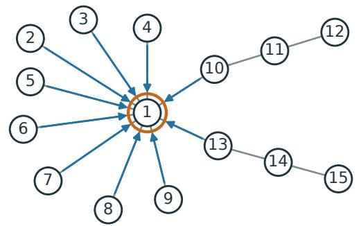

(b) Steps 2-5

After commit 1: screen again

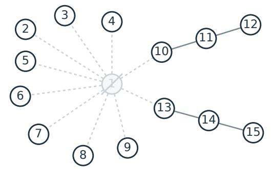  
cl1 = 10; every other count ≤ 3.  
All degrees ≤ 2; exact rows;  = ∅.

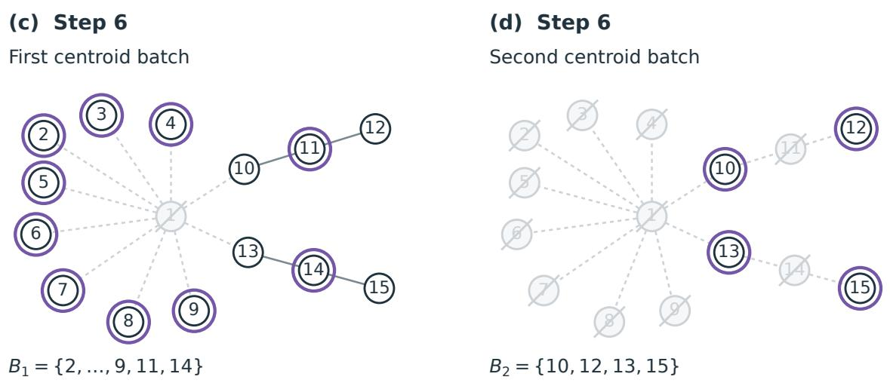  
One peel commit + two centroid batches = three commit rounds (not total oracle depth).

Figure 6: The successful-screen path of Example E.2, with N = 15 and d = 9. Orange and violet rings denote the next peel or centroid commit; pale crossed vertices are already committed. The fills here are neutral, not random colors. The step labels refer to Algorithm 2. A fresh screen separates (a) from (b); the terminal forest then needs no further discovery. All vertices remain individually visible.

Intuition. A high-degree vertex that receives at most $d / 2$ claims has at most $d / 2$ low-degree neighbors, because those neighbors report it exactly. It must therefore have more than $d / 2$ neighbors inside the high-degree subforest. A forest has fewer than twice as many total degrees as vertices, so only a fraction at most $4 / d$ of high-degree vertices can survive one phase. When $d = \stackrel { \sim } { N } ^ { \gamma _ { \mathrm { d e g } } + o ( 1 ) }$ with fixed $\gamma _ { \mathrm { d e g } } > 0$ , the required number of phases is $O _ { \gamma _ { \mathrm { d e g } } } ( 1 )$

Lemma E.7 (Successful-path contraction and sound stopping; Step 4, Step 5). Under the setup of Appendix A, suppose preprocessing is feasible and $\delta < \omega$ . Consider an execution path on which every reached screen is successful in the sense of equation $1 \not \angle 1$ . Let $n _ { k } ^ { \mathrm { h i } }$ be the number of vertices whose residual degree exceeds d at the beginning of peel phase k. After a nonempty peel phase,

$$
n _ { k + 1 } ^ { \mathrm { h i } } \leq \frac 4 d n _ { k } ^ { \mathrm { h i } } ,\tag{157}
$$

with strict inequality whenever $n _ { k } ^ { \mathrm { h i } } > 0$ . Moreover, either peel-loop stopping test in Step 4 of Algorithm ${ \it 2 - }$ an empty peel set or the peel-phase cap—implies that the terminal residual maximum degree is at most d. The terminal certified graph is therefore the true residual forest, so no cycle repair is performed.

Proof. 1. High-degree neighbors of an unpeeled vertex. Fix a phase and define its high-degree set by

$$
\mathcal { V } ^ { \mathrm { h i } } ( H _ { G } ) : = \{ v \in U _ { G } : d _ { F _ { G } } ( v ) > d \} .\tag{158}
$$

At the beginning of phase $k , n _ { k } ^ { \mathrm { h i } } = \vert \mathcal { V } ^ { \mathrm { h i } } ( H _ { G } ) \vert$ |. Recall from Step 4 (Claim & peel) that the incoming claim count is $\begin{array} { r } { \operatorname { c l } _ { v } ( H _ { G } ) \ = \ \sum _ { u \in U _ { G } } ^ { \sim } \mathbf { 1 } \{ v \ \in \ A _ { u } ( H _ { G } ) \} } \end{array}$ and the peel threshold is $\mathrm { c l } _ { v } ( H _ { G } ) > d / 2$ . For $v \in \mathcal { V } ^ { \mathrm { h i } } ( H _ { G } ) \backslash \mathcal { P } ( H _ { G } )$ , every low-degree neighbor reports v exactly by Theorem E.6. Hence

$$
\begin{array} { r l r } {  { \vert \mathcal { N } _ { F _ { G } } ( v ) \setminus \mathcal { V } ^ { \mathrm { h i } } ( H _ { G } ) \vert = \sum _ { u \in U _ { G } \setminus \mathcal { V } ^ { \mathrm { h i } } ( H _ { G } ) } \mathbf { 1 } \{ v \in \mathcal { N } _ { F _ { G } } ( u ) \} } } \\ & { = \sum _ { u \in U _ { G } \setminus \mathcal { V } ^ { \mathrm { h i } } ( H _ { G } ) } \mathbf { 1 } \{ v \in A _ { u } ( H _ { G } ) \} \le \mathrm { c l } _ { v } ( H _ { G } ) \le d / 2 , } \end{array}
$$

$$
\begin{array} { r l } & { d _ { F _ { G } [ { \mathcal { V } } ^ { \mathrm { h i } } ( H _ { G } ) ] } ( v ) = d _ { F _ { G } } ( v ) - | { \mathcal { N } } _ { F _ { G } } ( v ) \backslash { \mathcal { V } } ^ { \mathrm { h i } } ( H _ { G } ) | } \\ & { \qquad \geq d _ { F _ { G } } ( v ) - \mathrm { c l } _ { v } ( H _ { G } ) > d / 2 . } \end{array}
$$

The first equality uses the undirected nature of the forest. Claims from high-degree rows can only increase the incoming count, so they cannot invalidate the bound for an unpeeled vertex. We have shown that

$$
d _ { F _ { G } [ \mathcal { V } ^ { \mathrm { h i } } ( H _ { G } ) ] } ( v ) > \frac { d } { 2 } .\tag{159}
$$

2. Contraction after one peel phase. Empty survivor set. If $\mathcal { V } ^ { \mathrm { h i } } ( H _ { G } ) \backslash \mathcal { P } ( H _ { G } ) = \emptyset$ , no current high-degree vertex survives the phase. Deleting vertices cannot increase residual degrees, so $n _ { k + 1 } ^ { \mathrm { h i } } = 0 ;$ this proves equation 157, strictly when $\mathcal { V } ^ { \mathrm { h i } } ( H _ { G } ) \neq \emptyset$

Nonempty survivor set. Suppose instead that $\mathcal { V } ^ { \mathrm { h i } } ( H _ { G } ) \setminus \mathcal { P } ( H _ { G } ) \ne \emptyset$ . Summing equation 159 over these unpeeled high-degree vertices and using the forest degree-sum identity in Theorem H.4 gives

$$
\frac { d } 2 | \mathcal { V } ^ { \mathrm { h i } } ( H _ { G } ) \setminus \mathcal { P } ( H _ { G } ) | < \sum _ { \substack { v \in \mathcal { V } ^ { \mathrm { h i } } ( H _ { G } ) \setminus \mathcal { P } ( H _ { G } ) } } d _ { F _ { G } [ \mathcal { V } ^ { \mathrm { h i } } ( H _ { G } ) ] } ( v ) \leq 2 | E ( F _ { G } [ \mathcal { V } ^ { \mathrm { h i } } ( H _ { G } ) ] ) | < 2 | \mathcal { V } ^ { \mathrm { h i } } ( H _ { G } ) | .\tag{160}
$$

Let $H ^ { \prime } = ( G ^ { \prime } , x _ { G ^ { \prime } } )$ be the history after all singleton commits in the frozen peel set of this phase, and recall the induced residual forest $F _ { G ^ { \prime } } = F [ U _ { G ^ { \prime } } ]$ from equation 14. Define $\mathcal { V } ^ { \mathrm { h i } } ( \bar { H } ^ { \prime } ) : = \{ v \in U _ { G ^ { \prime } } : d _ { F _ { G ^ { \prime } } } ( v ) > d \}$ Deleting vertices cannot increase residual degrees:

$$
\begin{array} { r } { \mathcal { V } ^ { \mathrm { h i } } ( H ^ { \prime } ) \subseteq \mathcal { V } ^ { \mathrm { h i } } ( H _ { G } ) \setminus \mathcal { P } ( H _ { G } ) , \qquad n _ { k + 1 } ^ { \mathrm { h i } } = | \mathcal { V } ^ { \mathrm { h i } } ( H ^ { \prime } ) | \leq | \mathcal { V } ^ { \mathrm { h i } } ( H _ { G } ) \setminus \mathcal { P } ( H _ { G } ) | . } \end{array}
$$

Dividing equation 160 by $d / 2$ now gives $| \mathcal { V } ^ { \mathrm { h i } } ( H _ { G } ) \backslash \mathcal { P } ( H _ { G } ) | < ( 4 / d ) | \mathcal { V } ^ { \mathrm { h i } } ( H _ { G } ) |$ , and hence the strict form of equation 157. If $\mathcal { V } ^ { \mathrm { h i } } ( H _ { G } ) = \emptyset$ , then the first case above gives equality $n _ { k + 1 } ^ { \mathrm { h i } } = n _ { k } ^ { \mathrm { h i } } = 0$

3. Sound stopping at the phase cap. Initially, Theorem H.4 makes the forest degree sum smaller than 2N, while each high-degree vertex has degree at least d + 1. Hence

$$
n _ { 0 } ^ { \mathrm { h i } } < \frac { 2 N } { d + 1 } .\tag{161}
$$

If the right-hand side is at most one, integrality already gives $n _ { 0 } ^ { \mathrm { h i } } = 0$ . Otherwise, once $n _ { k } ^ { \mathrm { h i } } = 0$ , deleting further vertices keeps every later high-degree count equal to zero. If this never occurs before the phase cap, then $n _ { k } ^ { \mathrm { h i } } > 0$ in every preceding phase, so the strict part of equation 157 may be iterated. In either case, after $T _ { \mathrm { p e e l } }$ completed phases,

$$
n _ { T _ { \mathrm { p e e l } } } ^ { \mathrm { h i } } < \left( \frac { 4 } { d } \right) ^ { T _ { \mathrm { p e e l } } } \frac { 2 N } { d + 1 } \leq \left( \frac { 8 } { d } \right) ^ { T _ { \mathrm { p e e l } } } \frac { 2 N } { d + 1 } \leq 1 ,\tag{162}
$$

To check the last inequality, $d \geq 9$ gives $\log ( d / 8 ) > 0$ , and the ceiling in equation 104 gives

$$
\begin{array} { r l } & { \quad T _ { \mathrm { p e e l } } \log ( d / 8 ) \geq [ \log ( 2 N / ( d + 1 ) ) ] _ { + } , } \\ & { \quad \left( \displaystyle \frac { 8 } { d } \right) ^ { T _ { \mathrm { p e e l } } } \displaystyle \frac { 2 N } { d + 1 } = \exp \Biggl \{ \log \displaystyle \frac { 2 N } { d + 1 } - T _ { \mathrm { p e e l } } \log ( d / 8 ) \Biggr \} \leq 1 . } \end{array}
$$

The integer in equation 162 is therefore zero.

4. Sound stopping with an empty peel set. If instead $\mathcal { P } ( H _ { G } ) = \emptyset$ while $\nu ^ { \mathrm { h i } } ( H _ { G } )$ is nonempty, then equation 160 holds with $\mathcal { V } ^ { \mathrm { h i } } ( H _ { G } ) \backslash \mathcal { P } ( H _ { G } ) = \mathcal { V } ^ { \mathrm { h i } } ( H _ { G } )$ . It would imply $d / 2 < 2 \AA$ , contradicting $d \geq 9$ Hence an empty peel set also certifies the absence of high-degree vertices.

5. Bound peel-set size and certify the terminal graph. We first check that the hard round cap cannot interrupt peeling. Fix a phase at history $H _ { G }$ with $n : = | U _ { G } | \geq 1$ ; if no vertex remains, the algorithm has already returned. Low-degree exactness (Theorem $\mathrm { E . 6 ) }$ and the row-size cap (Theorem D.3) imply $| A _ { u } ( H _ { G } ) | \leq d _ { F _ { G } } ( u )$ for every u: there is equality at low degree, while $| A _ { u } ( H _ { G } ) | \leq d < d _ { F _ { G } } ( u )$ at high degree. Counting each reported ordered pair once, first at its recipient and then in its reporting row, gives

$$
\begin{array} { l } { { \displaystyle \sum _ { v \in { \cal U } _ { G } } \mathrm { c l } _ { v } ( H _ { G } ) = \displaystyle \sum _ { v \in { \cal U } _ { G } } \displaystyle \sum _ { u \in { \cal U } _ { G } } \displaystyle \sum _ { \scriptstyle 1 } \{ v \in A _ { u } ( H _ { G } ) \} } \ ~ } \\ { { \displaystyle \quad \quad = \displaystyle \sum _ { u \in { \cal U } _ { G } } \displaystyle \sum _ { v \in { \cal U } _ { G } } \mathbf { 1 } \{ v \in A _ { u } ( H _ { G } ) \} } \ ~ } \\ { { \displaystyle \quad \quad = \displaystyle \sum _ { u \in { \cal U } _ { G } } \vert A _ { u } ( H _ { G } ) \vert } \ ~ } \\ { { \displaystyle \quad \quad \leq \displaystyle \sum _ { u \in { \cal U } _ { G } } d _ { F _ { G } } ( u ) = 2 \vert E ( F _ { G } ) \vert < 2 n . } } \end{array}\tag{163}
$$

The second equality interchanges finite sums; the last line uses the forest degree sum in Theorem H.4. Recall ${ \mathcal { P } } ( H _ { G } ) = \{ v \in U _ { G } : \operatorname { c l } _ { v } ( H _ { G } ) > d / 2 \}$ from Equation (106). If $\mathcal { P } ( H _ { G } ) = \emptyset$ , then $| \mathcal { P } ( H _ { G } ) | = 0 < 4 n / d .$ Otherwise its strict threshold gives

$$
\begin{array} { r l } & { \displaystyle \frac { d } { 2 } | \mathcal { P } ( H _ { G } ) | < \sum _ { v \in \mathcal { P } ( H _ { G } ) } \mathrm { c l } _ { v } ( H _ { G } ) \leq \sum _ { v \in U _ { G } } \mathrm { c l } _ { v } ( H _ { G } ) < 2 n , } \\ & { \quad | \mathcal { P } ( H _ { G } ) | < \displaystyle \frac { 4 n } { d } \leq \frac { 4 N } { d } . } \end{array}\tag{164}
$$

Step 4 (Claim $\& \ \mathrm { p e e l } )$ freezes this set before its singleton commits, so the phase uses exactly $| \mathcal { P } ( H _ { G } ) |$ rounds if completed and no more if interrupted. With at most $T _ { \mathrm { p e e l } }$ phases, immediately before any planned peel commit the completed-round counter satisfies

$$
r < \frac { 4 N T _ { \mathrm { p e e l } } } { d } < \overline { { R } } - 1 ,\tag{165}
$$

by equation 105. Thus Guard cannot interrupt peeling. If all positions have already been committed, the residual graph is empty. Otherwise peeling reaches one of the two tests identified in the statement. Each pass executes Step 3 before either stopping test in Step 4. At the terminal history every residual vertex is consequently covered by Theorem $\operatorname { E . 6 ; }$ the terminal screen is successful by hypothesis, so all terminal rows are exact. The symmetrized edge set in Step 5 (Terminal graph) is therefore exactly $E ( F _ { \star } )$ In particular, the cycle-repair loop is skipped on the successful path □

Example E.3 (A high-degree vertex can survive a peel phase). This separate example illustrates the row contract used in Theorem E.7, rather than specifying a target–oracle pair. Let $d = 9$ and take the 65 vertices

$$
U = \{ z \} \cup \{ h _ { i } : 1 \leq i \leq 6 \} \cup \{ u _ { i , j } : 1 \leq i \leq 6 , \ 1 \leq j \leq 9 \} \cup \{ s _ { 1 } , s _ { 2 } , s _ { 3 } , s _ { 4 } \} ,
$$

with edges

$$
E = \{ \{ z , h _ { i } \} : 1 \leq i \leq 6 \} \cup \{ \{ h _ { i } , u _ { i , j } \} : 1 \leq i \leq 6 , 1 \leq j \leq 9 \} \cup \{ \{ z , s _ { j } \} : 1 \leq j \leq 4 \} .
$$

At the history under consideration, take $U _ { G } = U$ and $F _ { G } = F = ( U , E )$ . The center z and all six hubs have degree 10; all other vertices are leaves. Take the following row outputs, which obey the contract exact at degree at most $d ,$ size at most d elsewhere:

$$
A _ { z } ( H _ { G } ) = A _ { h _ { i } } ( H _ { G } ) = \emptyset , \qquad A _ { u _ { i , j } } ( H _ { G } ) = \{ h _ { i } \} , \qquad A _ { s _ { j } } ( H _ { G } ) = \{ z \} .
$$

Computing the incoming counts, rather than reading a high-degree row’s size as its degree, gives

$$
\begin{array} { r l } & { \mathrm { c l } _ { z } ( H _ { G } ) = 4 \leq 9 / 2 , } \\ & { \mathrm { c l } _ { u _ { i , j } } ( H _ { G } ) = \mathrm { c l } _ { s _ { j } } ( H _ { G } ) = 0 , } \end{array}
$$

$$
\begin{array} { r c l } { { \operatorname { c l } _ { h _ { i } } ( H _ { G } ) = 9 > 9 / 2 , } } \\ { { \mathcal { P } ( H _ { G } ) = \{ h _ { 1 } , . . . , h _ { 6 } \} . } } \end{array}
$$

Thus $z$ is not peeled. Before the commits its high-degree neighbors are exactly $\{ h _ { 1 } , \ldots , h _ { 6 } \}$ , so their number is $6 > 9 / 2$ , as required by equation 159. After the six frozen singleton commits in Step 4, its remaining neighbors are $\{ s _ { 1 } , \ldots , s _ { 4 } \}$ :

$$
\begin{array} { r } { d _ { F [ U \backslash \mathcal { P } ( H _ { G } ) ] } ( z ) = 4 , } \\ { | \{ v \in U : d _ { F } ( v ) > 9 \} | = 7 , } \\ { | \{ v \in U \backslash \mathcal { P } ( H _ { G } ) : d _ { F [ U \backslash \mathcal { P } ( H _ { G } ) ] } ( v ) > 9 \} | = 0 . } \end{array}
$$

The center survives as a vertex but ceases to be high-degree. The 54 hub leaves become isolated; none was committed in this phase. Figure 7 draws each of them separately.

deg(z) : 10 → 4; all 54 hub leaves remain uncommitted.  
(a) Step 4 - Before: peel the six hubs  
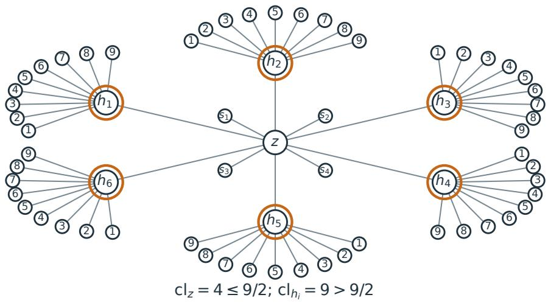  
(b) Step 4 - After: the center survives, with degree 4

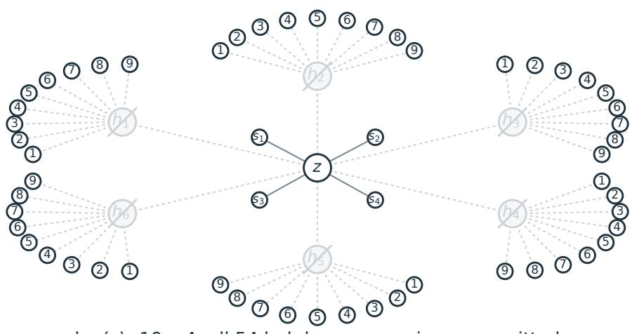

A leaf marked j next to hub $h _ { j }$ is the vertex $U _ { I , j } .$ The two panels use identical locations; no leaf groups are collapsed.

Figure 7: The separate contraction example of Example E.3. The six orange-ringed hubs are committed one at a time in Step 4, with no intervening screen or peel-set recomputation. Their 54 leaves are drawn individually, not bundled. The unpeeled center z changes from degree 10 to degree 4. The lower panel keeps the same locations and crosses out only the committed hubs.

Intuition. The total counterfactual-submission count is bounded by the product of the screen-loop bounds:

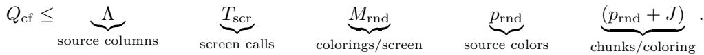

For rounds, Equation (164) bounds each peel set by $4 N / d ;$ after the peel phases, centroid recursion needs only $\left\lceil \log _ { 2 } ( N + 1 ) \right\rceil$ ⌉ layers. The public cap extends the round bound to failed-screen paths. Total masked-state submissions, including preprocessing and commits, are $Q _ { \mathrm { c f } } + R + 1$

Lemma E.8 (Finite query and round counts; Step 1–Step 6). Suppose preprocessing is feasible and $\delta < \omega$ On every execution path of $\mathcal { A } _ { \mathrm { p a c k } } ^ { \mathrm { r n d } } [ \mathsf { S } ]$ with any admissible row selector and the standard draft generator,

$$
Q _ { \mathrm { c f } } \leq \Lambda T _ { \mathrm { s c r } } M _ { \mathrm { r n d } } p _ { \mathrm { r n d } } ( p _ { \mathrm { r n d } } + J ) ,\tag{166}
$$

$$
R \leq { \overline { { R } } } .\tag{167}
$$

where $\overline { { R } } = \lceil 4 N T _ { \mathrm { p e e l } } / d \rceil + \lceil \log _ { 2 } ( N + 1 ) \rceil + 2$ is the public commit-round cap and $T _ { \mathrm { s c r } } = T _ { \mathrm { p e e l } } + 1$ is $t h e$ screen-call cap from equation $1 0 5 ; T _ { \mathrm { p e e l } }$ is the peel-phase cap in equation 104. In equation 166, $p _ { \mathrm { r n d } }$ and $M _ { \mathrm { r n d } }$ are the fixed numbers of colors and independent colorings per screen from equation 117. The subscript rnd labels the randomized-color construction, not a round index. On a path on which every reached screen is successful, the sharper bound

$$
R < { \frac { 4 N T _ { \mathrm { p e e l } } } { d } } + \lceil \log _ { 2 } ( N + 1 ) \rceil\tag{168}
$$

holds, with no cycle repair or round-cap fallback. The adaptive oracle depth, including the initial all-mask preprocessing stage, satisfies

$$
D \leq 1 + R + T _ { \mathrm { s c r } } .\tag{169}
$$

Proof. 1. Count submissions over chunks, columns, and screens. Fix one screen execution at history $H _ { G }$ Recall the quantities counted in its loops:

$Q _ { \mathrm { s c r } } ( H _ { G } )$ denotes the number of masked-state submissions in this one call to Step 3 (Packed screen), all made in Step 3.2; preprocessing and commit submissions are excluded.

$\ell _ { \mathrm { m a x } } = \mathrm { m a x } _ { i \in [ N ] } | \widehat { B } _ { i } |$ is the largest local vocabulary-bank size fixed in Theorem D.1. The number of submitted source columns is $\Lambda = \ell _ { \mathrm { m a x } } + 1$ when $\ell _ { \mathrm { m a x } } \geq 1 .$ , and $\Lambda = 0$ otherwise, as in equation 116.

$p = p _ { \mathrm { r n d } } = 8 ( d + 1 )$ is the number of colors, and $M = M _ { \mathrm { r n d } }$ is the number of independent colorings supplied by Step 2 (Draft & color); their choices are equation 117.

$J \in [ N ]$ is the readout-chunk parameter from Section D.1: it sets $B ^ { \mathrm { r d } } = \lceil N / J \rceil$ , the maximum chunk size. It is not the actual number of chunks.

For one coloring τ, write $n _ { c } : = | { \mathcal { C } } _ { \tau , c } ( H _ { G } ) |$ and let $J _ { \tau }$ be the total number of readout chunks across its color classes. The deterministic partition equation 121 in Step 3.1 creates exactly $\lceil n _ { c } / B ^ { \mathrm { r d } } \rceil$ chunks for every nonempty color class. Therefore

$$
\begin{array} { l } { \displaystyle J _ { \tau } = \sum _ { c : n _ { c } > 0 } \left\lceil \frac { n _ { c } } { B ^ { \mathrm { r d } } } \right\rceil } \\ { \displaystyle \quad \leq \sum _ { c : n _ { c } > 0 } \left( 1 + \frac { n _ { c } } { B ^ { \mathrm { r d } } } \right) } \\ { \displaystyle \quad \leq p + \frac { \left| U _ { G } \right| } { B ^ { \mathrm { r d } } } \leq p + J . } \end{array}\tag{170}
$$

For each chunk, the bank columns and source-specific tail column in Step 3.2 use $( \ell _ { \mathrm { m a x } } + 1 ) ( p - 1 )$ submissions. When $\ell _ { \mathrm { m a x } } \geq 1$ , this is at most $\Lambda p$ . Thus Step 3.1 supplies at most $p + J$ chunks per coloring, and Step 3.2 submits at most $\Lambda p$ states per chunk. Summing over the M colorings from Step 2 gives

$$
Q _ { \mathrm { s c r } } ( H _ { G } ) \leq \underbrace { \Lambda } _ { \mathrm { s o u r c e ~ c o l u m n s } } \qquad \underbrace { M } _ { \mathrm { c o l o r i n g s / s c r e e n } } \qquad \underbrace { p } _ { \mathrm { s o u r c e ~ c o l o r s } } \qquad \underbrace { ( p + J ) } _ { \mathrm { c h u n k s ~ p e r ~ c o l o r i n g } } .\tag{171}
$$

When $\ell _ { \mathrm { m a x } } = 0$ , the algorithm submits no screen state and both sides are zero. The screen runs initially and once after each of at most $T _ { \mathrm { p e e l } }$ completed peel phases, hence at most $T _ { \mathrm { s c r } }$ times. Substituting the randomized values of M and p proves equation 166. The standard draft reuses preprocessing and adds no query. Cycle repair runs no further screen: each singleton repair is one commit submission, charged to $R ,$ not to $Q _ { \mathrm { c f } }$

Returned oracle rows. For the standard zero-query draft, each counterfactual submission reads only its chunk, of size at most $\smash { B ^ { \mathrm { r d } } = \lceil N / J \rceil }$ . Preprocessing reads N rows, and the disjoint commit batches $B _ { 1 } , \ldots , B _ { R }$ partition [N] (Theorem $\mathrm { A . 9 } )$ , so $\begin{array} { r } { \sum _ { t = 1 } ^ { R } | B _ { t } | = N } \end{array}$ . The main construction takes ${ \textit { J } } = { \textit { d } }$ Consequently the total number of returned oracle rows is at most

$$
\underbrace { \big [ N / J \big ] Q _ { \mathrm { c f } } } _ { \mathrm { s c r e e n ~ s u b m i s s i o n s } } + \underbrace { N } _ { \mathrm { p r e p r o c e s s i n g } } + \underbrace { \sum _ { t = 1 } ^ { R } | B _ { t } | } _ { \mathrm { c o m m i t s } } = \big [ N / J \big ] Q _ { \mathrm { c f } } + 2 N .
$$

2. Count adaptive oracle stages. Once the history, draft, and colors are fixed, all submissions in a screen can be issued in one parallel oracle stage in Step 3.2, because their states do not depend on replies from that screen. Each commit requires one stage, and preprocessing in Step 1 requires one. This proves equation 169.

3. Bound peeling rounds on a successful path. On a path where every reached screen succeeds, equation 164 in Theorem E.7 shows that every nonempty peel phase in Step 4 (Claim & peel) commits fewer than $4 N / d$ vertices, one per round. At most $T _ { \mathrm { p e e l } }$ such phases therefore use fewer than $4 N T _ { \mathrm { p e e l } } / d$ rounds. The bound equation 165 also shows that Guard cannot interrupt these commits.

$\it 4 .$ Bound terminal centroid rounds and exclude repair and fallback. By Lemma E.7, the terminal certified graph is the true residual forest. Lemma E.2 makes its connected components conditionally independent. At any layer of Step 6 (Centroid commits), let the current components be $T _ { 1 } , \ldots , T _ { m } .$ , with selected centroids $v _ { 1 } ^ { \mathrm { c e n } } , \ldots , v _ { m } ^ { \mathrm { c e n } }$ , and set $\boldsymbol { B } = \{ v _ { 1 } ^ { \mathrm { c e n } } , \ldots , v _ { m } ^ { \mathrm { c e n } } \}$ . Then

$$
P ( X _ { B } = x _ { B } \mid X _ { G } = x _ { G } ) = \prod _ { \ell = 1 } ^ { m } P \big ( X _ { v _ { \ell } ^ { \mathrm { c e n } } } = x _ { v _ { \ell } ^ { \mathrm { c e n } } } \mid X _ { G } = x _ { G } \big ) .\tag{172}
$$

Thus their exact singleton rows define the exact joint batch conditional. By Theorem H.4, removing a centroid leaves components of size at most half the parent size, so after ℓ terminal batches every remaining component has size at most $N / 2 ^ { \ell }$ . For $\ell = \lceil \log _ { 2 } ( N + 1 ) \rceil$ this is smaller than one. Adding the peeling and terminal rounds proves equation 168. Its right-hand side is smaller than $\overline { { R } } - 1$ by equation 105; hence the hard-cap check is never triggered during the terminal stage either. The terminal graph is already a forest, so the cycle-repair loop adds no rounds.

5. Enforce the round cap on every path. It remains to verify the unconditional randomized round bound enforced by Guard. Initially $r = 0 \leq \overline { { R } } - 1$ . Before every peel, repair, or centroid commit, the algorithm checks whether $r = \overline { { R } } - 1$ . If equality holds, it commits all remaining positions in the reserved final round and returns. Otherwise the integer counter satisfies $r \le \overline { { R } } - 2$ , and the next commit leaves $r + 1 \leq \overline { { R } } - 1$ Every such commit is nonempty and irrevocable, so it removes at least one remaining position; cycle repair cannot continue indefinitely. If it ends without the cap fallback, the remaining working graph is a forest and centroid completion applies. Induction over commit operations therefore gives $R \leq \overline { { R } }$ on every path, proving equation 167. □

## E.5 Exact-commit hybrid and adaptive error composition

This subsection completes the statistical part of the upper bound. Theorem E.9 identifies a structurally safe exact-row hybrid with the target law. Separately, Theorem E.10 bounds the distance between any product-commit decision rule and its exact-row hybrid, whether or not its batches are structurally safe. A safe-decision-rule comparison then accounts for failed screens in the implemented randomized sampler.

Structural safety. At a history $H _ { G } = ( G , x _ { G } )$ , let $F _ { G }$ be the true residual forest on $U _ { G } = [ N ] \backslash G$ . A complete decision rule is structurally safe if, at every realized history, each batch $B \subseteq U _ { G }$ it commits satisfies

$$
| B \cap V ( T ) | \leq 1 \qquad \mathrm { f o r ~ e v e r y ~ c o n n e c t e d ~ c o m p o n e n t ~ } T \mathrm { ~ o f ~ } F _ { G } .
$$

In particular, every singleton batch is safe. This is a property used in the analysis, not permission for the implemented sampler to inspect the hidden forest.

The two executions and their output laws. Fix one complete decision rule, the frozen oracle $q ,$ and a decision-rule seed $W = w$ , including the colors and all auxiliary draft randomness. The product-commit draws remain random after this conditioning. For a chosen batch B and the history-compatible commit state y in equation $^ { 2 7 , }$ compare:

• Oracle execution. A batch assignment $z \in \mathcal { V } ^ { B }$ has mass $\textstyle \prod _ { j \in B } q _ { j } ( z _ { j } \mid y )$ . Recall from Theorem A.10 that its full output law is ${ \widehat { P } } _ { w } ^ { q } ( x ) = \operatorname* { P r } ( { \widehat { X } } = x \mid W = w )$ , with q fixed and all product-commit draws integrated out.

• Exact-commit hybrid. Replace only this commit mass by $\textstyle \prod _ { j \in B } \mu _ { j } ( z _ { j } \mid y )$ , using the exact rows in equation 23. Keep the decision rule, draft generator, query rules, and all frozen-oracle replies unchanged. Denote this execution’s full output law by $P _ { w } ^ { \otimes }$

Both are laws on $\nu ^ { N } ; \otimes$ refers to the product within each commit, not to independence of all output coordinates. The hybrid can still depend on q through its decisions; that dependence is suppressed in $P _ { w } ^ { \otimes }$ The shared rules do not imply shared realized transcripts: diferent commit outcomes can lead to diferent later queries and batches.

Structural safety identifies the hybrid’s product at each commit with the target’s joint batch conditional; for an unsafe batch they need not agree. Thus Theorem E.9 uses safety to prove $P _ { w } ^ { \otimes } = P$ , whereas Theorem E.10 compares the two output laws without requiring safety. Both lemmas also apply to the analysis-only decision rule introduced below.

Intuition. A safe batch takes at most one vertex from each independent residual component. Its product of exact rows is therefore the exact joint conditional. Multiplying these joint conditionals along the adaptive partition is the ordinary chain rule, so the output law is exactly P.

Lemma E.9 (Exact hybrid equals the target law). For every structurally safe complete decision rule, the exact-commit hybrid satisfies

$$
P _ { w } ^ { \otimes } = P \qquad f o r \ e v e r y \ d e c i s i o n { - r u l e } \ s e e d \ w .\tag{173}
$$

Proof. 1. Identify the exact joint law of a safe batch. For a singleton batch the product of exact singleton rows is trivially its exact joint conditional. For a nonsingleton safe batch, its vertices lie in distinct true residual components. Lemma E.2 therefore identifies their exact joint conditional with the product of their exact singleton conditionals, as in equation 172.

2. Apply the chain rule along each adaptive path. For fixed $w ,$ draft generation is deterministic as a function of the observed past, even when its rule is randomized before conditioning on w. For a full assignment $\boldsymbol { x } \in \mathcal { V } ^ { N }$ , let $B _ { t } ( x )$ be the batch selected along the unique hybrid path consistent with x, and let $G _ { t - 1 } ( x )$ be the set committed before that batch, with $G _ { 0 } ( x ) = \alpha$ and $G _ { t } ( x ) = G _ { t - 1 } ( x ) \cup B _ { t } ( x )$ . The batches form an adaptive ordered partition of [N]. The preceding paragraph identifies every hybrid batch law with the corresponding exact joint conditional, so the conditional chain rule gives

$$
\begin{array} { l } { { P _ { w } ^ { \otimes } ( x ) = \displaystyle \prod _ { t } { P \big ( X _ { B _ { t } ( x ) } = x _ { B _ { t } ( x ) } \mid X _ { G _ { t - 1 } ( x ) } = x _ { G _ { t - 1 } ( x ) } \big ) } } } \\ { ~ } \\ { { = \displaystyle \prod _ { t } \frac { P \big ( X _ { G _ { t } ( x ) } = x _ { G _ { t } ( x ) } \big ) } { P \big ( X _ { G _ { t - 1 } ( x ) } = x _ { G _ { t - 1 } ( x ) } \big ) } } } \\ { { = P ( x ) . } } \end{array}\tag{174}
$$

The batch partition may depend on earlier committed values, but for each fixed x the displayed factors are precisely the chain-rule factors along that path. Consecutive numerators and denominators cancel; the first denominator is the probability of the empty constraint, hence one, and the last numerator is $P ( x )$ because every coordinate has been committed. This proves the equality pointwise. □

We next compare the full output laws $P _ { w } ^ { \otimes }$ (exact-row commits) and $\widehat { P } _ { w } ^ { q }$ (oracle-row commits) for the same decision rule and fixed seed. For probability masses $P , Q$ on a finite set, write

$$
\operatorname { A f f } ( P , Q ) : = \sum _ { x } { \sqrt { P ( x ) Q ( x ) } } = 1 - h ^ { 2 } ( P , Q ) .\tag{175}
$$

Intuition. The error budget is attached to committed coordinates, not to probes or rounds. Each coordinate is committed once, so the total budget is

$$
N \cdot \frac { ( \varepsilon ^ { \mathrm { H } } ) ^ { 2 } } { 2 N } = \frac { ( \varepsilon ^ { \mathrm { H } } ) ^ { 2 } } { 2 } .
$$

For adaptive batches, backward induction on the execution tree justifies this accounting. At each node, charge the current batch and then use the budget of the remaining coordinates.

Lemma E.10 (Adaptive squared-Hellinger composition). Assume Theorem $A . 7 \ ( A { \overset {  } { 2 } } )$ : every valid row pair obeys $h ^ { 2 } ( \mu _ { j } ( \cdot \mid y ) , q _ { j } ( \cdot \mid y ) ) \le ( \varepsilon ^ { \mathrm { H } } ) ^ { 2 } / ( 2 N )$ . For every complete decision rule using the product-commit rule and every fixed decision-rule seed w, regardless of structural safety,

$$
h ^ { 2 } \big ( P _ { w } ^ { \otimes } , \widehat { P } _ { w } ^ { q } \big ) \leq \frac { ( \varepsilon ^ { \mathrm { H } } ) ^ { 2 } } { 2 } .\tag{176}
$$

Proof. 1. Compare the two kernels at a common node. Fix $q$ and w throughout the proof. An executiontree node is a stored algorithm state immediately before a commit, or a terminal state after completion; it is not a vertex of the hidden forest. A pre-commit state records

$$
\mathfrak { h } = ( H _ { G } , T , \mathrm { d e c i s i o n - r u l e ~ s t a t e } ) , \qquad H _ { G } = ( G , x _ { G } ) , \quad U _ { G } = [ N ] \setminus G .
$$

Here $\tau$ contains the preceding query/reply and commit record, and the internal state includes any current draft and counters. We use this complete stored state to define continuation kernels directly, without replaying the decision rule from its initial state. With q and w fixed, all operations between commits are deterministic. Thus, from the same stored state h, both executions receive the same frozen-oracle replies and select the same batch $B ( { \mathfrak { h } } ) \subseteq U _ { G }$ and commit state $y ( \mathfrak { h } )$ from equation 27. Comparing kernels at this common state does not assert that two separately sampled executions have identical paths. For a batch assignment $z \in \mathcal { V } ^ { B ( \mathfrak { h } ) }$ , their kernels are

$$
\begin{array} { l } { { \displaystyle P ^ { \otimes } ( z \mid \mathfrak h ) : = \prod _ { j \in B ( \mathfrak h ) } \mu _ { j } ( z _ { j } \mid y ( \mathfrak h ) ) , } } \\ { { \displaystyle \widehat { P } ^ { \otimes } ( z \mid \mathfrak h ) : = \prod _ { j \in B ( \mathfrak h ) } q _ { j } ( z _ { j } \mid y ( \mathfrak h ) ) . } } \end{array}\tag{177}
$$

Both kernels are probability masses on $\mathcal { V } ^ { B \left( \mathfrak { h } \right) }$

$$
\begin{array} { l } { { \displaystyle \sum _ { z \in \mathcal { V } ^ { B ( \mathfrak { h } ) } } P ^ { \otimes } ( z \mid \mathfrak { h } ) = \prod _ { j \in B ( \mathfrak { h } ) } \sum _ { a \in \mathcal { V } } \mu _ { j } ( a \mid y ( \mathfrak { h } ) ) = 1 , } } \\ { { \displaystyle \sum _ { z \in \mathcal { V } ^ { B ( \mathfrak { h } ) } } \widehat { P } ^ { \otimes } ( z \mid \mathfrak { h } ) = \prod _ { j \in B ( \mathfrak { h } ) } \sum _ { a \in \mathcal { V } } q _ { j } ( a \mid y ( \mathfrak { h } ) ) = 1 . } } \end{array}
$$

The finite sums factor by distributivity over the Cartesian product. The first kernel is a product of exact rows, whether or not it equals the target’s joint batch conditional. Hence this comparison needs no structural safety condition.

2. Charge the current batch to its coordinates. Apply the product identity in Theorem H.1 with index set $B ( { \mathfrak { h } } )$ , each coordinate space equal to V, and component laws $\mu _ { j } ( \cdot \mid y ( { \mathfrak { h } } ) )$ and $q _ { j } ( \cdot \mid y ( { \mathfrak { h } } ) )$ ). This gives

$$
\mathrm { A f f } ( P ^ { \otimes } ( \cdot \mid \mathfrak { h } ) , \widehat { P } ^ { \otimes } ( \cdot \mid \mathfrak { h } ) ) = \prod _ { j \in B ( \mathfrak { h } ) } \left[ 1 - h ^ { 2 } \big ( \mu _ { j } ( \cdot \mid y ( \mathfrak { h } ) ) , q _ { j } ( \cdot \mid y ( \mathfrak { h } ) ) \big ) \right] .\tag{178}
$$

Using $\begin{array} { r } { 1 - \prod _ { j } ( 1 - u _ { j } ) \leq \sum _ { j } u _ { j } } \end{array}$ for $u _ { j } \in [ 0 , 1 ]$ and equation 25,

$$
\begin{array} { r l } & { 1 - \mathrm { A f f } \bigl ( P ^ { \otimes } ( \cdot \mid \mathfrak h ) , \widehat { P } ^ { \otimes } ( \cdot \mid \mathfrak h ) \bigr ) = h ^ { 2 } \bigl ( P ^ { \otimes } ( \cdot \mid \mathfrak h ) , \widehat { P } ^ { \otimes } ( \cdot \mid \mathfrak h ) \bigr ) } \\ & { \qquad \le \displaystyle \sum _ { j \in B ( \mathfrak h ) } h ^ { 2 } \bigl ( \mu _ { j } ( \cdot \mid y ( \mathfrak h ) ) , q _ { j } ( \cdot \mid y ( \mathfrak h ) ) \bigr ) } \\ & { \qquad \le | B ( \mathfrak h ) | \frac { ( \varepsilon ^ { \mathrm { H } } ) ^ { 2 } } { 2 N } . } \end{array}\tag{179}
$$

(180)

3. Derive the sufix-afinity recursion. Take a stored execution state h from part 1 of this proof, with committed history $H _ { G } = ( G , x _ { G } )$ and remaining set $U _ { G } = [ N ] \backslash G$ . Here a $s u f f i x$ is the assignment of all still-uncommitted coordinates, not necessarily a contiguous block of positions. Define:

$P ^ { \mathrm { s u f } } ( \cdot \mid \mathfrak { h } )$ : the law of those remaining values when execution resumes from this entire stored state using exact-row commits.

$\widehat { P } ^ { \mathrm { s u f } } ( \cdot \mid { \mathfrak { h } } )$ : the corresponding law when it resumes from the same state using oracle-row commits. Both are probability laws on $\mathcal { V } ^ { U _ { G } }$ , with q and w still fixed. The recursion below defines these continuation laws from the batch kernels in equation $1 7 7 ;$ at a terminal state $U _ { G } = \mathcal { D }$ , each puts mass one on the empty assignment. Set

$$
\mathrm { A f f } _ { \mathrm { s u f } } ( \mathfrak { h } ) : = \mathrm { A f f } ( P ^ { \mathrm { s u f } } ( \cdot \mid \mathfrak { h } ) , \widehat { P } ^ { \mathrm { s u f } } ( \cdot \mid \mathfrak { h } ) ) .\tag{181}
$$

After a batch value $z \in \mathcal { V } ^ { B ( \mathfrak { h } ) } .$ , write h ⊕ z for the next pre-commit node (or terminal node), including all intervening deterministic operations. It has remaining coordinates $U _ { G } \ \backslash \ B ( \mathfrak { h } )$ . For $x ^ { \prime } \in \mathcal { V } ^ { \dot { U } _ { G } \backslash B ( \mathfrak { h } ) }$ , the sufix assignment $( z , x ^ { \prime } )$ has masses

$$
\begin{array} { r } { P ^ { \mathrm { s u f } } ( ( z , x ^ { \prime } ) \mid \mathfrak { h } ) = P ^ { \otimes } ( z \mid \mathfrak { h } ) P ^ { \mathrm { s u f } } ( x ^ { \prime } \mid \mathfrak { h } \oplus z ) , } \\ { \widehat { P } ^ { \mathrm { s u f } } ( ( z , x ^ { \prime } ) \mid \mathfrak { h } ) = \widehat { P } ^ { \otimes } ( z \mid \mathfrak { h } ) \widehat { P } ^ { \mathrm { s u f } } ( x ^ { \prime } \mid \mathfrak { h } \oplus z ) . } \end{array}
$$

These are normalized: summing first over $x ^ { \prime }$ gives one for each child law, and summing over z then gives one by the batch normalization above. There are at most N nonempty commits, so backward induction starts at the empty sufix and defines every law. Summing the geometric means first over $x ^ { \prime }$ now yields

$$
\begin{array} { l }  { \displaystyle \mathrm { A f f } _ { \mathrm { s u f } } ( { \mathfrak { h } } ) = \sum _ { z } \sqrt { P ^ { \otimes } ( z \mid { \mathfrak { h } } ) \widehat { P } ^ { \otimes } ( z \mid { \mathfrak { h } } ) } { \sum _ { x ^ { \prime } } \sqrt { P ^ { \mathrm { s u f } } ( x ^ { \prime } \mid { \mathfrak { h } } \oplus z ) \widehat { P } ^ { \mathrm { s u f } } ( x ^ { \prime } \mid { \mathfrak { h } } \oplus z ) } } } \\ { { \displaystyle \qquad = \sum _ { z } \sqrt { P ^ { \otimes } ( z \mid { \mathfrak { h } } ) \widehat { P } ^ { \otimes } ( z \mid { \mathfrak { h } } ) } { \mathrm { A f f } } _ { \mathrm { s u f } } ( { \mathfrak { h } } \oplus z ) } . } \end{array}\tag{182}
$$

At a terminal node the sufix is empty and its afinity is one.

$\it 4 .$ Bound the remaining loss by backward induction. At a node with committed set $G ,$ , every complete continuation partitions $U _ { G }$ into disjoint future batches. Thus its total coordinate budget is

$$
\sum _ { \mathrm { f u t u r e } \ t } | B ( \mathfrak { h } _ { t } ) | \frac { ( \varepsilon ^ { \mathrm { H } } ) ^ { 2 } } { 2 N } = | U _ { G } | \frac { ( \varepsilon ^ { \mathrm { H } } ) ^ { 2 } } { 2 N } .\tag{183}
$$

We prove by backward induction that this budget bounds the sufix loss:

$$
1 - \mathrm { A f f } _ { \mathrm { s u f } } ( \mathfrak { h } ) \leq | U _ { G } | \frac { ( \varepsilon ^ { \mathrm { H } } ) ^ { 2 } } { 2 N } .\tag{184}
$$

The terminal case has both sides zero. At a nonterminal node, subtract the recursion from one and add and subtract the batch afinity:

$$
\begin{array} { r l } & { 1 - \mathrm { A f f } _ { \mathrm { s u f } } ( \mathfrak { h } ) = 1 - \mathrm { A f f } ( P ^ { \otimes } ( \cdot \ | \ \mathfrak { h } ) , \widehat { P } ^ { \otimes } ( \cdot \ \ | \ \mathfrak { h } ) ) } \\ & { \phantom { x x x x x x x x x x x x x x x x x x x x x x x x x x x x x x x x x x x x x x x x x x x x x x x x x x x x x x x x x } } \\ & { \phantom { x x x x x x x x x x x x x x x x x x x x x x x x x x x x x x x } \leq | { D } ( \mathfrak { x } ) ) \frac { ( \varepsilon ^ { \mathrm { H } } ) ^ { 2 } } { 2 N } + \bigl ( | { U } _ { G } | - | { B } ( \mathfrak { h } ) | \bigr ) \frac { ( \varepsilon ^ { \mathrm { H } } ) ^ { 2 } } { 2 N } \displaystyle \sum _ { z } \sqrt { P ^ { \otimes } ( z \mid \mathfrak { h } ) \widehat { P } ^ { \otimes } ( z \mid \mathfrak { h } ) } } \\ & { \phantom { x x x x x x x x x x x x x x x x x x x x x x x x x x x x x } } \\ & { \leq | { U } _ { G } | \frac { ( \varepsilon ^ { \mathrm { H } } ) ^ { 2 } } { 2 N } . } \end{array}
$$

The first inequality uses the batch bound and the induction hypothesis: every child has exactly $\left| U _ { G } \right| - \left| B ( \mathfrak { h } ) \right|$ uncommitted coordinates. In the last inequality, the remaining sum is the batch afinity, at most ${ \sqrt { 1 \cdot 1 } } = 1$ by Cauchy–Schwarz and the two kernel normalizations in part 1. The resulting coordinate count is $\left| B ( { \mathfrak { h } } ) \right| + \left( \left| U _ { G } \right| - \left| B ( { \mathfrak { h } } ) \right| \right) = \left| U _ { G } \right|$

5. Evaluate the budget at the root. The root ${ \mathfrak { h } } _ { \emptyset }$ is the common state before the first commit, after the initial deterministic operations. It has $G = \emptyset$ and $U _ { G } = [ N ]$ , so its continuation laws are the full output laws recalled above:

$$
P ^ { \mathrm { s u f } } ( \cdot \mid \mathfrak { h } _ { \varnothing } ) = P _ { w } ^ { \otimes } , \qquad \widehat { P } ^ { \mathrm { s u f } } ( \cdot \mid \mathfrak { h } _ { \varnothing } ) = \widehat { P } _ { w } ^ { q } .
$$

In particular, $| U _ { G } | = N$ . Equivalently, along every complete path the disjoint commit batches satisfy

$$
\sum _ { t } | B ( \mathfrak { h } _ { t } ) | = N .\tag{185}
$$

Therefore

$$
h ^ { 2 } ( P _ { w } ^ { \otimes } , \widehat { P } _ { w } ^ { q } ) = 1 - \mathrm { A f f } _ { \mathrm { s u f } } ( \mathfrak { h } _ { \varnothing } ) \le N \frac { ( \varepsilon ^ { \mathrm { H } } ) ^ { 2 } } { 2 N } = \frac { ( \varepsilon ^ { \mathrm { H } } ) ^ { 2 } } { 2 } .\tag{186}
$$

Counterfactual operations afect which common node is reached; they do not generate committed coordinates and add no term to this budget. □

We now separate oracle error from screen failures by comparing with an analysis-only safe decision rule, whose seed-averaged discrepancy from the sampler is charged to the failed-screen probability.

Recall the reached-call event $E _ { s } = \{ R _ { s }$ occurs and Iso $( H ^ { ( s ) } )$ fails}: R means the implemented sampler reaches call $s ,$ and $H ^ { ( s ) }$ is its history. Failure means that the separating-color majority condition equation 141 is violated. Thus Fail $= \dot { \bigcup _ { s = 1 } ^ { T _ { \mathrm { s c r } } } E _ { s } }$

Intuition. The safe decision rule follows the sampler until a screen fails and then finishes by singleton commits. Its batches are always safe, so the previous two lemmas bound its $\mathrm { T V }$ error by $\varepsilon ^ { \mathrm { { \scriptsize ~ H } } } . \mathrm { ~ A ~ }$ common-path coupling charges the discrepancy between the two outputs only to screen failure:

$$
\mathbb { E } _ { W } \mathrm { T V } ( \mathrm { t a r g e t } , \mathrm { s a m p l e r } ) \le \varepsilon ^ { \mathrm { H } } + \delta ^ { \mathrm { f a i l } } .
$$

The first contribution is controlled for every fixed seed; the failure contribution is bounded only after averaging over the colors and commit draws, as verified below. We compare the full output laws: conditioning the implemented output on screen success would also condition its reached histories.

Lemma E.11 (Safe decision rule and failed-screen coupling). Fix a target–oracle pair satisfying the finite hypotheses of Theorem E.1. There is an analysis-only structurally safe decision rule whose conditional output law $\widetilde { P } _ { w } ^ { \mathrm { s a f e } , q }$ satisfies

$$
d _ { \mathrm { T V } } \big ( P , \widehat { P } _ { w } ^ { \mathrm { s a f e } , q } \big ) \leq \varepsilon ^ { \mathrm { H } }
$$

$$
f o r \ e v e r y \ w ,\tag{187}
$$

$$
\begin{array} { r } { \mathbb { E } _ { W } d _ { \mathrm { T V } } \big ( \widehat { P } _ { W } ^ { q } , \widehat { P } _ { W } ^ { \mathrm { s a f e } , q } \big ) \leq \delta ^ { \mathrm { f a i l } } . } \end{array}\tag{188}
$$

Proof. 1. Define the analysis-only safe decision rule. The safe decision rule simulates Algorithm 2 with the same fixed public row selector, draft generator, auxiliary seed, and fresh colorings while every reached screen satisfies equation 141. It is additionally allowed to inspect the hidden residual forest. Immediately after the first unsuccessful execution of Step 3, and also before any Guard fallback, it stops using the screen output and commits all remaining coordinates as singletons in increasing position order. More formally, number the successive simulation checkpoints (screen returns and pre-fallback checks) by n, and define

$$
\tau _ { \mathrm { s w } } : = \operatorname* { i n f } \left\{ n : \begin{array} { l l } { \mathrm { a n ~ u n s u a c e s s f u l ~ s c r e e n ~ h a s ~ j u s t ~ r e t u r n e d , ~ o r } } \\ { \mathrm { t h e ~ s i m u l a t e d ~ s a m p l e r ~ i s ~ a b o u t ~ t o ~ a c t i v a t e ~ a ~ f a l l b a c k ~ } } \end{array} \right\} , \qquad \operatorname* { i n f } \ \mathcal { Q } : = \infty .
$$

Before this checkpoint the two rules agree; from this checkpoint onward the safe rule uses only the singleton completion just specified. The checkpoint index is not the peel-phase index. Hidden-forest inspection defines only this comparison law; it is not available to the implemented sampler. Each singleton commit uses the same frozen oracle q at the updated committed history. Writing $\widehat { X } ^ { \mathrm { s a f e } }$ for its output, define

$$
{ \widehat { P } } _ { w } ^ { \mathrm { s a f e } , q } ( x ) : = \operatorname* { P r } ( { \widehat { X } } ^ { \mathrm { s a f e } } = x \mid W = w ) ,
$$

with the target and oracle fixed and all product-commit draws integrated out.

2. Check structural safety in all three stages.

• Before a switch, the peel commits in Step 4 are singletons.

• If the terminal stage is reached without a switch, Theorem E.7 identifies the graph constructed in Step 5 with the true residual forest, so every centroid batch in Step 6 contains one vertex from each true residual component.

• After a switch, all batches are singletons.

Hence the safe decision rule is structurally safe on every path.

3. Bound oracle error for each fixed seed. Apply Theorems E.9 and E.10 to this safe rule and its own product-of-exact-rows hybrid. The first lemma identifies that hybrid with $P ;$ the second compares it with the safe rule’s oracle output. Thus, for each fixed $w ,$

$$
h ^ { 2 } \bigl ( P , \widehat { P } _ { w } ^ { \mathrm { s a f e } , q } \bigr ) \leq \frac { ( \varepsilon ^ { \mathrm { H } } ) ^ { 2 } } { 2 } .\tag{189}
$$

By equation 214,

$$
d _ { \mathrm { T V } } \big ( P , \widehat { P } _ { w } ^ { \mathrm { s a f e } , q } \big ) \leq \sqrt { 2 h ^ { 2 } \big ( P , \widehat { P } _ { w } ^ { \mathrm { s a f e } , q } \big ) } \leq \varepsilon ^ { \mathrm { H } } ,\tag{190}
$$

which proves equation 187.

4. Couple the sampler to its own safe decision rule. For equation 188, fix the full decision-rule seed w and couple the two conditional executions as follows. Before the safe decision rule switches, whenever their histories agree, use the same draw from their common product-commit law. Thus their histories and all drafts and deterministic frozen-oracle replies remain identical until the safe decision rule switches. By Theorem E.8, in the implemented execution,

$$
\{ { \mathrm { c y c l e ~ r e p a i r ~ o r ~ a ~ h a r d ~ r o u n d - c a p ~ f a l l b a c k ~ o c c u r s } } \} \subseteq { \mathsf { F a i l } } .
$$

An empty peel set or the peel-phase cap triggers the normal loop exit in Step 4. On $\mathsf { F a i l } ^ { \mathsf { c } }$ no switch occurs and the outputs coincide; repair can start only after the safe rule has switched to singleton completion. For the coupled outputs Xb and $\widehat { X } ^ { \mathrm { s a f e } }$ , the common prefix gives the pathwise inclusions

$$
\{ \widehat { X } \neq \widehat { X } ^ { \mathrm { s a f e } } \} \subseteq \{ \tau _ { \mathrm { s w } } < \infty \} \subseteq \mathsf { F a i l } .
$$

Indeed, a first switch caused by a failed screen occurs in that common prefix. A first switch caused by a fallback with no preceding failure is excluded by Theorem E.8. After a switch the two executions may be completed with any coupling of their respective laws. The first common-path failure is exactly the first failure of the implemented execution, since the coupled histories agree up to that point. For any coupling $( X , Y )$ of laws $P , Q$ , the coupling inequality is $d _ { \mathrm { T V } } ( P , Q ) \leq \operatorname* { P r } ( X \neq Y )$ . Applying it to these two outputs gives

$$
d _ { \mathrm { T V } } \big ( \widehat { P } _ { w } ^ { q } , \widehat { P } _ { w } ^ { \mathrm { s a f e } , q } \big ) \leq \operatorname* { P r } ( \widehat { X } \neq \widehat { X } ^ { \mathrm { s a f e } } \ | \ W = w ) \leq \operatorname* { P r } ( \mathsf { F a i l } \ | \ W = w ) ,\tag{191}
$$

where the probability integrates the coupled commit draws.

5. Average the failed-screen probability over seeds. Averaging equation 191 over the seed gives

$$
\begin{array} { r l } & { \mathbb { E } _ { W } d _ { \mathrm { T V } } \big ( \widehat { P } _ { W } ^ { q } , \widehat { P } _ { W } ^ { \mathrm { s a f e } , q } \big ) } \\ & { \quad \le \mathbb { E } _ { W } \operatorname* { P r } ( \mathsf { F a i l } \mid W ) = \operatorname* { P r } ( \mathsf { F a i l } ) = \operatorname* { P r } \bigg ( \bigcup _ { s = 1 } ^ { T _ { \mathrm { s c r } } } E _ { s } \bigg ) \le \delta ^ { \mathsf { f a i l } } . } \end{array}
$$

The equality averaging conditional probabilities is the law of total expectation over colors, draft randomness, and commit draws; the final inequality is equation 144. This proves equation 188, without a seedwise failure bound. □

Proof of Theorem E.1. 1. Account for submissions, commits, and depth. With the standard zero-query generator, the pathwise query and round bounds are equation 166–equation 167 from Theorem E.8. The all-mask preprocessing state is excluded from $Q _ { \mathrm { c f } }$ by Theorem A.11. Charging it gives $Q _ { \mathrm { n c } } = Q _ { \mathrm { c f } } + 1$ , as in equation 34. The depth bound is equation 169.

2. Combine oracle error and failed-screen error. For every target–oracle pair, the TV triangle inequality followed by Theorem E.11 gives

$$
\begin{array} { r l } & { \mathbb { E } _ { W } d _ { \mathrm { T V } } \big ( P , \widehat { P } _ { W } ^ { q } \big ) } \\ & { \quad \leq \mathbb { E } _ { W } d _ { \mathrm { T V } } \big ( P , \widehat { P } _ { W } ^ { \mathrm { s a f e } , q } \big ) + \mathbb { E } _ { W } d _ { \mathrm { T V } } \big ( \widehat { P } _ { W } ^ { \mathrm { s a f e } , q } , \widehat { P } _ { W } ^ { q } \big ) } \\ & { \quad \leq \varepsilon ^ { \mathrm { H } } + \delta ^ { \mathrm { f a i l } } . } \end{array}\tag{192}
$$

This proves equation 132 for each fixed oracle. Taking the supremum over $q \ \in \ \mathcal { Q } ^ { \mathrm { H e l } } ( P ; \varepsilon ^ { \mathrm { H } } )$ gives equation 133. With the choice equation 134, its right-hand side is $\mathrm { \bar { 3 } } \varepsilon ^ { \mathrm { H } } / 2$ □

## F Case (ii): forward-KL upper bound

We prove case (ii) of Theorem 3.1, with the finite guarantee in Theorem F.3. The same sampler uses the row-KL and screen-failure budgets defined below. Its analysis uses a reference process that draws each batch from the true joint conditional, even for unsafe batches. This difers from the product-of-exact-rows hybrid used for TV.

Remark (Relation to the TV formulation). The Hellinger/TV and forward-KL guarantees use the same product-commit rule with diferent public accuracy calibrations. The Hellinger condition (A2) applies to the TV case.

## F.1 Oracle condition and output objective

We use the same frozen row family, probe/commit operations, and resource counts as in Theorems A.6, A.9 and A.11, with the following forward-KL accuracy condition and output risk, corresponding to Theorems 2.6 and 2.7.

Definition F.1 (Uniform forward-KL oracle and seed-averaged KL risk). For a strictly positive target law and $\kappa \geq 0$ , let $\mathcal { Q } ^ { \mathrm { K L } } ( P ; \kappa )$ consist of the strictly positive deterministic frozen maps of Definition A.6 such that

$$
\operatorname* { s u p } _ { ( y , j ) : j \notin { O } ( y ) } D _ { \mathrm { K L } } ( \mu _ { j } ( \cdot  { | } \ y )  { | | q _ { j } ( \cdot  { | } \ y ) ) \leq \kappa } .\tag{193}
$$

For a complete admissible decision rule, use the output law of Theorem A.10 and define

$$
\mathcal { R } _ { \mathrm { K L } } ( A ; P , q ) : = \mathbb { E } _ { W } D _ { \mathrm { K L } } \Big ( P \Big | \Big | \widehat { P } _ { W } ^ { q } \Big ) .\tag{194}
$$

The decision-rule seed excludes the primitive randomness used to draw commit values. All KL divergences use natural logarithms and the displayed forward direction: target or exact conditional first, generated law or oracle second.

The bound in equation 193 is uniform over all masked states, including counterfactual and draft-filled inputs, not merely an average under a data–mask or generated-trajectory law. Lemma H.2 implies

$$
\kappa \leq \frac { ( \varepsilon ^ { \mathrm { H } } ) ^ { 2 } } { N } \quad \Longrightarrow \quad \mathcal { Q } ^ { \mathrm { K L } } ( P ; \kappa ) \subseteq \mathcal { Q } ^ { \mathrm { H e l } } ( P ; \varepsilon ^ { \mathrm { H } } ) .\tag{195}
$$

Thus all existing preprocessing and screen certificates apply with this public Hellinger radius. Neither the converse inclusion nor an output-KL bound from (A2) alone is asserted. Reverse row KL is suficient for (A2), but is not the assumption used for the forward-KL result here.

## F.2 Adaptive joint-reference identity

Learning error and conditional total correlation also appear in the adaptive planner decomposition of Lavenant and Zanella (2025, Proposition 2) (arXiv:2510.25544v2). For completeness, we prove the fixedseed equality for our frozen-oracle interface, keeping counterfactual operations in the adaptive execution path.

The joint-reference process. Fix the frozen oracle and a decision-rule seed w. Keep the decision rule, counterfactual queries, oracle replies, public row selector, and draft-generation rule fixed, but replace each commit kernel by the true joint conditional of that batch given the committed history. Denote this analysis-only process by $\mathbb { P } _ { w } ^ { \mathrm { j o i n t } }$ ; its dependence on the target, oracle, and decision rule is suppressed. Unlike $P _ { w } ^ { \otimes }$ , it draws a dependent batch jointly when the decision rule selects an unsafe batch. It need not be implementable by the available oracle.

Its conditional batch law and total correlation. Here h is the stored pre-commit execution-tree state from the proof of Lemma E.10: it includes the committed history, transcript, and internal decision-rule state. At this node, let $G ( { \mathfrak { h } } )$ and $x _ { G ( \mathfrak { h } ) }$ be the committed set and values, $B ( { \mathfrak { h } } )$ the next batch, and $y ( \mathfrak { h } )$ the corresponding commit state. Put

$$
p ( \cdot \mid \mathfrak { h } ) : = \mathcal { L } _ { P } ( X _ { B ( \mathfrak { h } ) } \mid X _ { G ( \mathfrak { h } ) } = x _ { G ( \mathfrak { h } ) } ) .
$$

Its singleton marginals are $\mu _ { j } ( \cdot \mid y ( { \mathfrak { h } } ) )$ . The conditional batch’s total correlation is

$$
\mathrm { T C } ( p ( \cdot \mid \mathfrak { h } ) ) : = D _ { \mathrm { K L } } \left( p ( \cdot \mid \mathfrak { h } ) \right) \left\| \bigotimes _ { j \in B ( \mathfrak { h } ) } \mu _ { j } ( \cdot \mid y ( \mathfrak { h } ) ) \right) .
$$

Intuition. For one batch, insert the product of its true singleton marginals into the likelihood ratio:

$$
\log { \frac { p ( X _ { B } ) } { \prod _ { j } q _ { j } ( X _ { j } ) } } = \log { \frac { p ( X _ { B } ) } { \prod _ { j } p _ { j } ( X _ { j } ) } } + \sum _ { j } \log { \frac { p _ { j } ( X _ { j } ) } { q _ { j } ( X _ { j } ) } } .
$$

Expectation under the true joint law gives the batch’s total correlation plus its row-KL errors. The adaptive chain rule then adds these quantities along the true-joint reference path.

Lemma F.2 (Joint-reference chain rule and KL decomposition (cf. Ben-Hamu et al., 2025, Eq. (7) and Appendix A.1)). For every complete admissible decision rule and every fixed seed w, the output law under $\mathbb { P } _ { w } ^ { \mathrm { j o i n t } }$ equals $P ,$ even if its batches are not structurally safe. Moreover,

$$
\begin{array} { l } {  { D _ { \mathrm { K L } } \Big ( P \Big \| \widehat { P } _ { w } ^ { q } \Big ) } \qquad } \\ & { = \mathbb { E } _ { \mathbb { P } _ { w } ^ { \mathrm { i o i n t } } } \sum _ { t } [ \operatorname { T C } ( p ( \cdot \mid \mathfrak h _ { t } ) ) + \sum _ { j \in B ( \mathfrak h _ { t } ) } D _ { \mathrm { K L } } ( \mu _ { j } ( \cdot \mid y ( \mathfrak h _ { t } ) ) \| q _ { j } ( \cdot \mid y ( \mathfrak h _ { t } ) ) ) ] . } \end{array}\tag{196}
$$

Here t runs over the nonempty commits on the reference path. Under equation $^ { 1 9 3 , }$ the sum of row-KL terms is at most Nκ on every such path. The sum of total-correlation terms is at most N log V on every path and is zero whenever all batches are structurally safe for the target forest.

Proof. 1. Identify the reference output law along each adaptive path. With w and the frozen map fixed, all operations between commits are deterministic functions of the observed past. Every full assignment x therefore determines a unique execution path. For a reachable node h, the full assignments that visit it form the cylinder

$$
\{ u \in \mathcal { V } ^ { N } : \mathfrak { h } \mathrm { ~ l i e s ~ o n ~ t h e ~ f i x e d - s e e d ~ p a t h ~ o f ~ } u \} = \{ u \in \mathcal { V } ^ { N } : u _ { G ( \mathfrak { h } ) } = x _ { G ( \mathfrak { h } ) } \} .
$$

For the forward inclusion, visiting the node requires its committed values. For the reverse inclusion, induct along the path to h: every earlier committed set is a subset of $G ( { \mathfrak { h } } )$ , so these assignments produce the same earlier commit values, states, frozen-oracle replies, and next actions. Counterfactual replies are functions of the submitted states, not of the uncommitted realization of u. Thus the transcript imposes no further restriction on that realization.

For the ordered partition $( B _ { t } ( x ) ) _ { t }$ chosen along this path, the adaptive chain rule gives $\begin{array} { r } { \prod _ { t } P \big ( X _ { B _ { t } ( x ) } = x _ { B _ { t } ( x ) } \ | \ X _ { G _ { t - 1 } ( x ) } = x _ { G _ { t - 1 } ( x ) } \big ) = P ( x ) } \end{array}$ . The product telescopes through successive committed sets exactly as in equation 174. This is the reference output mass, so the reference output has law $P$ . The cylinder identity then gives $\mathbb { P } _ { w } ^ { \mathrm { j o i n t } }$ (reach $\mathfrak { h } ) = P ( X _ { G ( \mathfrak { h } ) } = x _ { G ( \mathfrak { h } ) } ) > 0$ and the node conditional $\mathbb { P } _ { w } ^ { \mathrm { j o i n t } } ( X _ { B ( \mathfrak { h } ) } = z \mid \mathrm { r e a c h ~ \mathfrak { h } ) } = P ( X _ { B ( \mathfrak { h } ) } = z \mid X _ { G ( \mathfrak { h } ) } = x _ { G ( \mathfrak { h } ) } ) = p ( z \mid \mathfrak { h } )$ , where $p ( z \mid { \mathfrak { h } } )$ is the mass of $p ( \cdot \mid { \mathfrak { h } } )$ . The actual output mass along the same path is $\begin{array} { r } { \widehat { P } _ { w } ^ { q } ( x ) = \prod _ { t } \prod _ { j \in B _ { t } ( x ) } q _ { j } \big ( x _ { j } \ | \ y ( \mathfrak { h } _ { t } ) \big ) } \end{array}$

2. Group the pathwise log ratios by reached nodes. Strict positivity makes both masses positive. Since the reference output has law P and its conditional at each reached node h is $p ( \cdot \mid { \mathfrak { h } } )$ , grouping paths by these nodes gives

$$
\begin{array} { r l } & { D _ { \mathrm { K L } } \Big ( P \Big | \Big | \widehat { P } _ { \sigma } ^ { q } \Big ) } \\ & { = \displaystyle \sum _ { x } P ( x ) \sum _ { \mathfrak { p } \mathrm { ~ o n ~ t h e ~ p a t h ~ o f ~ } x } \log \frac { p \big ( x _ { B ( \mathfrak { p } ) } \mid \mathfrak { p } \big ) } { \prod _ { j \in B ( \mathfrak { p } ) } q _ { j } ( x _ { j } \mid y ( \mathfrak { p } ) ) } } \\ & { = \displaystyle \sum _ { \mathfrak { p _ { j } } } \operatorname* { P r } _ { \mathfrak { p } _ { \sigma } ^ { \mathrm { p o i n t ~ } } } \mathrm { [ r e a c h ~ \mathfrak { h } ~ ] } \sum _ { z } p ( z \mid \mathfrak { h } ) \log \frac { p ( z \mid \mathfrak { h } ) } { \prod _ { j \in B ( \mathfrak { p } ) } q _ { j } ( z _ { j } \mid y ( \mathfrak { h } ) ) } } \\ & { = \mathbb { E } _ { \mathfrak { p } _ { \sigma } ^ { \mathrm { j o i n t ~ } } } \sum _ { t } D _ { \mathrm { K L } } ( p ( \cdot \mid \mathfrak { h } _ { t } ) ) \displaystyle \sum _ { j \in B ( \mathfrak { h } _ { t } ) } q _ { j } ( \cdot \mid y ( \mathfrak { h } _ { t } ) ) ) . } \end{array}
$$

Here h ranges over nonterminal nodes of the fixed-seed execution tree. Every path has at most N nonempty commits and each batch has finitely many outcomes, so the sums are finite. Each node contributes exactly when the path visits it; no common path length is required.

3. Decompose the batch KL. For a positive batch law p with singleton marginals $p _ { j }$ , recall $\begin{array} { r } { \mathrm { T C } ( p ) = \hat { \mathbb { E } _ { p } } \log \frac { p ( X _ { B } ) } { \prod _ { i } p _ { j } ( X _ { j } ) } } \end{array}$ . Inserting the product of these marginals into the likelihood ratio gives $\begin{array} { r } { D _ { \mathrm { K L } } \Big ( p \Big | \Big | \bigotimes _ { j } q _ { j } \Big ) = \mathrm { T C } ( p ) + \sum _ { j } \mathbb { E } _ { p } \log \frac { p _ { j } ( X _ { j } ) } { q _ { j } ( X _ { j } ) } } \end{array}$ . For each j, expanding the expectation gives $\mathbb { E } _ { p }$ log $\begin{array} { r } { \frac { p _ { j } ( X _ { j } ) } { q _ { j } ( X _ { j } ) } = } \end{array}$ $\begin{array} { r } { \sum _ { a \in \mathcal { V } } \big ( \sum _ { x _ { B } : x _ { j } = a } p ( x _ { B } ) \big ) } \end{array}$ log $\frac { p _ { j } ( a ) } { q _ { j } ( a ) }$ . Since $\begin{array} { r } { \sum _ { x _ { B } : x _ { j } = a } p ( x _ { B } ) = p _ { j } ( a ) } \end{array}$ , this equals $\begin{array} { r l } { \sum _ { a \in \mathcal { V } } p _ { j } ( a ) \log \frac { p _ { j } ( a ) } { q _ { j } ( a ) } \ = } \end{array}$ $D _ { \mathrm { K L } } ( p _ { j } \| q _ { j } )$ . Thus $\begin{array} { r } { D _ { \mathrm { K L } } \Big ( p \Big \| \bigotimes _ { j } q _ { j } \Big ) = \mathrm { T C } ( p ) + \sum _ { j } D _ { \mathrm { K L } } ( p _ { j } \| q _ { j } ) } \end{array}$ , which proves equation 196 after substitution into Step 2.

4. Bound the pathwise sums. Uniform row accuracy and $\begin{array} { r } { \sum _ { t } | B ( \mathfrak { h } _ { t } ) | = N } \end{array}$ give the Nκ bound. For a finite probability mass p, write $\begin{array} { r } { H ( p ) : = - \sum _ { z } p ( z ) } \end{array}$ log $p ( z )$ , with 0 log $0 : = 0$ . For a batch law on $\mathcal { V } ^ { B }$ with marginals $p _ { j }$ , expanding gives $\begin{array} { r } { \mathrm { T C } ( p ) = \sum _ { z } p ( z ) \log p ( z ) - \sum _ { j \in B } \sum _ { a \in \mathcal { V } } \bigl ( \sum _ { z : z _ { i } = a } p ( z ) \bigr ) \log p _ { j } ( a ) } \end{array}$ Substituting $\textstyle \sum _ { z : z _ { i } = a } p ( z ) = p _ { j } ( a )$ yields $\begin{array} { r } { \mathrm { T C } ( p ) = \sum _ { j \in B } H ( p _ { j } ) - H ( p ) } \end{array}$ . Here $H ( p ) \geq 0$ because $p ( z ) \leq 1$ and $H ( p _ { j } ) \leq \log { \breve { V } }$ follows from $D _ { \mathrm { K L } } ( p _ { j } \| \mathrm { U n i f } ( \mathcal { V } ) ) = \log V - H ( p _ { j } ) \geq 0 .$ . Apply this calculation with $p = p ( \cdot \mid \mathfrak { h } )$ and $p _ { j } = \mu _ { j } ( \cdot \mid y ( { \mathfrak { h } } ) )$ ) to obtain $0 \leq \mathrm { T C } ( p ( \cdot \mid \mathfrak { h } ) ) \leq | \bar { B ( \mathfrak { h } ) } | \log V$ . Summing over the disjoint batches gives N log V. Finally, a structurally safe batch contains at most one vertex per true residual component (or is a singleton). Lemma E.2 makes its true conditional a product, so its total correlation is zero. □

## F.3 Finite bound and the epsilon calibration

As in the finite case (i) bound of Theorem E.1, preprocessing uses the standard floor; feasibility and screen separation remain explicit hypotheses. With the accuracy calibration in Theorem F.4, the theorem below yields case (ii) of Theorem 3.1 through Theorem G.3.

Intuition. Every path commits N coordinates, so the row-error sum is at most $N \kappa .$ . Successful reference paths use only safe batches and have zero batch total correlation. On all other paths the total correlation is at most N log V. Thus

$$
\exp \mathrm { e x p e c t e d \ o u t p u t ~ K L } \le N \kappa + N \log V \operatorname* { P r } _ { \mathrm { ~ j o i n t ~ r e f e r e n c e ~ a n d ~ s e e d } } ( \mathsf { F a i l } ) .
$$

The fresh-color argument bounds this last probability by $\delta ^ { \mathrm { f a i l } }$ under the reference process as well.

Theorem F.3 (Case (ii): finite randomized forward-KL upper bound). We work in case $( i i )$ , with the oracle class and output risk of Theorem F.1. Fix $N \geq 1 0 , V \geq 2$ , and the target, response, and algorithmic setup of Appendices A and D. Let $\varepsilon ^ { \mathrm { H } } \in [ 0 , 1 ]$ and $0 \leq \kappa \leq ( \varepsilon ^ { \mathrm { H } } ) ^ { 2 } / N$ . Use Algorithm 2 with the standard zero-query draft, the public radius $\varepsilon ^ { \mathrm { H } }$ , and $\delta ^ { \mathrm { f a i l } } \in ( 0 , 1 )$ . Suppose preprocessing is feasible and $\delta < \omega$ . For every $q \in \mathcal { Q } ^ { \mathrm { K L } } ( P ; \kappa )$

$$
\mathcal { R } _ { \mathrm { K L } } ( \mathcal { A } _ { \mathrm { p a c k } } ^ { \mathrm { r n d } } ; P , q ) \leq N \kappa + N \log V \delta ^ { \mathrm { f a i l } } .\tag{197}
$$

On every path, including failed-screen paths, the resources satisfy

$$
\begin{array} { r l r } & { } & { Q _ { \mathrm { c f } } \leq \Lambda T _ { \mathrm { s c r } } M _ { \mathrm { r n d } } p _ { \mathrm { r n d } } ( p _ { \mathrm { r n d } } + J ) , } \\ & { } & { R \leq \overline { { R } } , \qquad D \leq 1 + R + T _ { \mathrm { s c r } } . } \end{array}\tag{198}
$$

The parameters on the right are the original finite parameters in equation 116, equation $^ { 1 1 7 , }$ and equation 105. Charging the initial all-mask state gives $Q _ { \mathrm { n c } } = Q _ { \mathrm { c f } } + 1$ by equation $\mathcal { B } \llcorner$ , so its submission bound is the displayed bound for $Q _ { \mathrm { c f } }$ plus one. If feasibility and separation hold for every oracle in this KL class, the supremum of the risk in equation 197 over that class has the same bound.

Proof. 1. Transfer the oracle and resource guarantees. By Theorem H.2 and equation 193, every valid $( y , j )$ satisfies

$$
\begin{array} { r } { h ^ { 2 } ( \mu _ { j } ( \cdot  { | \ : } y ) , q _ { j } ( \cdot  { | \ : } y ) ) \le \frac { 1 } { 2 } D _ { \mathrm { K L } } ( \mu _ { j } ( \cdot  { | \ : } y ) \| q _ { j } ( \cdot  { | \ : } y ) ) \le \frac { 1 } { 2 } \kappa \le \frac { ( \varepsilon ^ { \mathrm { H } } ) ^ { 2 } } { 2 N } . } \end{array}
$$

Thus the oracle meets Theorem $\mathrm { A . 7 ~ ( A 2 ) }$ , as recorded in equation 195, and Theorem E.8 transfers the preprocessing, screen, and resource guarantees. The output-KL bound instead uses the preceding Theorem F.2.

2. Bound the KL cost at a fixed seed. Using the call notation of Theorem E.4 on the joint-reference execution, define the reached-screen failure event by

$$
\mathsf { F a i l : } = \bigcup _ { s = 1 } ^ { T _ { \mathrm { s c r } } } \{ R _ { s } \ \mathrm { o c c u r s ~ a n d } \ \mathsf { l s o } ( H ^ { ( s ) } ) \ \mathrm { f a i l s } \} .
$$

On Failc, the deterministic successful-path certificates in Lemmas E.7 and E.8 imply that neither cycle repair nor Guard is activated, and every commit is a singleton peel in Step 4 or a safe centroid batch in Step 6. These statements hold for every sequence of realized values, so they also hold for reference commits. Thus the total-correlation cost vanishes on Fail , while the pathwise bound from Lemma F.2 applies on the failure event:

$$
\sum _ { t } ^ { } \operatorname { T C } ( p ( \cdot \mid \mathfrak { h } _ { t } ) ) = \mathbf { 1 } _ { \mathsf { F a i l } } \sum _ { t } ^ { } \operatorname { T C } ( p ( \cdot \mid \mathfrak { h } _ { t } ) ) \leq N \log V \mathbf { 1 } _ { \mathsf { F a i l } } .
$$

Repair batches are singletons, so each has zero total correlation. Their coordinates still enter the row-KL sum only once, as for every other commit; on every path,

$$
\sum _ { t } \sum _ { \substack { j \in B ( \mathfrak { h } _ { t } ) } } D _ { \mathrm { K L } } ( \mu _ { j } ( \cdot \mid y ( \mathfrak { h } _ { t } ) ) \| q _ { j } ( \cdot \mid y ( \mathfrak { h } _ { t } ) ) ) \leq \kappa \sum _ { t } | B ( \mathfrak { h } _ { t } ) | = N \kappa .
$$

Taking the reference expectation replaces the indicator by $\mathbb { P } _ { w } ^ { \mathrm { j o i n t } } ( \mathsf { F a i l } )$ . Adding the pathwise row-KL budget Nκ in Lemma F.2 therefore gives, for each fixed w,

$$
D _ { \mathrm { K L } } \Big ( P \Big | \Big | \widehat { P } _ { w } ^ { q } \Big ) \leq N \kappa + N \log V \mathbb { P } _ { w } ^ { \mathrm { j o i n t } } ( \mathsf { F a i l } ) .\tag{199}
$$

3. Average the screen failure under the joint-reference law. It remains to average the failure term over the decision-rule seed. Generate reference commit values with a fresh primitive random source independent of the color blocks and draft randomness. Just before each reached color draw in Step 2, condition on the reference history and completed draft generation, but not on the current or future colors. The residual forest and draft are then fixed and the new colors remain independent and uniform. The proof of Lemma E.4 uses only these facts, not the law of preceding commit values: for each ordered pair, at most 2d color equalities are forbidden, each with probability $1 / p _ { \mathrm { r n d } } .$ , and independent repetition gives the failure bound $\exp \{ - M _ { \mathrm { r n d } } / 8 \}$ . Union bounds over fewer than $N ^ { 2 }$ pairs give the same conditional bound at a reached reference call. To pass from that conditional estimate to the seed average, define the joint probability of an event A by

$$
\operatorname* { P r } _ { \mathrm { j o i n t } } ( A ) : = \mathbb { E } _ { W } \mathbb { P } _ { W } ^ { \mathrm { j o i n t } } ( A ) .
$$

Form $\mathcal { T } _ { s - } , f ^ { ( s ) } , \mathcal { F } _ { s - 1 } , R _ { s } , E _ { s }$ exactly as in Theorem E.4, now from the reference execution. In particular, $\mathcal { F } _ { s - 1 } = \sigma ( \mathcal { T } _ { s - } , f ^ { ( s ) } )$ excludes the current and future colors, and Fail $\textstyle = \bigcup _ { s = 1 } ^ { T _ { \mathrm { s c r } } } E _ { s }$ . Then

$$
\operatorname* { P r } _ { \mathrm { j o i n t } } ( E _ { s } \mid { \mathcal { F } } _ { s - 1 } ) \leq \mathbf { 1 } _ { R _ { s } } { \frac { \delta ^ { \mathrm { f a i l } } } { T _ { \mathrm { s c r } } } } .
$$

The union bound and conditional expectation give

$$
\begin{array} { r l } { \displaystyle \mathbb { E } _ { W } \mathbb { P } _ { W } ^ { \mathrm { j o i n t } } ( \mathsf { F a i l } ) = \operatorname* { P r } _ { \mathrm { j o i n t } } \left( \bigcup _ { s = 1 } ^ { T _ { \mathrm { s c r } } } E _ { s } \right) } & { } \\ { \displaystyle \leq \sum _ { s = 1 } ^ { T _ { \mathrm { s c r } } } \mathbb { E } _ { \mathrm { j o i n t } } \left[ \operatorname* { P r } _ { \mathrm { j o i n t } } \left( E _ { s } \mid \mathcal { F } _ { s - 1 } \right) \right] } \\ { \displaystyle } & { \leq \frac { \delta ^ { \mathrm { f a i l } } } { T _ { \mathrm { s c r } } } \sum _ { s = 1 } ^ { T _ { \mathrm { s c r } } } \operatorname* { P r } _ { \mathrm { r } } \left( R _ { s } \right) \leq \delta ^ { \mathrm { f a i l } } . } \end{array}
$$

This sums conditional failure probabilities over adaptively reached calls; it does not require the calls to be independent. We have therefore proved

$$
\mathbb { E } _ { W } \mathbb { P } _ { W } ^ { \mathrm { j o i n t } } ( \mathsf { F a i l } ) \le \delta ^ { \mathrm { f a i l } } .\tag{200}
$$

This is a joint probability over fresh colors and reference commit draws; it is not a failure-probability bound conditional on the full seed w. Averaging equation 199 proves equation 197. In particular, failed-screen paths are charged through their finite total-correlation cost, not by attempting to convert a TV coupling bound into KL. No minimum atom size or bounded likelihood ratio is assumed beyond the existing strict positivity. □

Corollary F.4 (Case (ii) with output KL at most epsilon). Fix $0 < \varepsilon ^ { \mathrm { K L } } \leq 1$ and use the preceding finite target and algorithmic setup. Choose

$$
\kappa : = \frac { \varepsilon ^ { \mathrm { K L } } } { 2 N } , \qquad \delta ^ { \mathrm { f a i l } } : = \frac { \varepsilon ^ { \mathrm { K L } } } { 2 N \log V } .\tag{201}
$$

Run the existing algorithm with its public radius set to $\sqrt { \varepsilon ^ { \mathrm { K L } } / 2 }$ . If its preprocessing is feasible and $\delta < \omega$ with this radius, then for every $q \in \mathcal { Q } ^ { \mathrm { K L } } ( P ; \kappa )$ 2

$$
\begin{array} { r } { \mathcal { R } _ { \mathrm { K L } } ( \mathcal { A } _ { \mathrm { p a c k } } ^ { \mathrm { r n d } } ; P , q ) \leq \varepsilon ^ { \mathrm { K L } } , } \end{array}\tag{202}
$$

with the pathwise bounds in equation 198. Thus the per-row budget scales as $\varepsilon ^ { \mathrm { K L } } / N$ , not $( \varepsilon ^ { \mathrm { K L } } ) ^ { 2 } / N$

Proof. The auxiliary radius is in [0, 1], $\kappa = ( \sqrt { \varepsilon ^ { \mathrm { K L } } / 2 } ) ^ { 2 } / N$ , and the displayed failure budget is in (0, 1) for $N \geq 1 0 , V \geq 2$ . Each term on the right of equation 197 is $\varepsilon ^ { \mathrm { K L } } / 2$ □

The auxiliary radius $\sqrt { \varepsilon ^ { \mathrm { K L } } / 2 }$ is an input calibration for case (ii), not a redefinition of the case (i) parameter $\varepsilon ^ { \mathrm { H } }$

Remark (Additional metric consequences). Pinsker’s inequality and Jensen’s inequality imply from equation 202 that $\mathbb { E } _ { W } d _ { \mathrm { T V } } ( P , \widehat { P } _ { W } ^ { q } ) ^ { 2 } \leq \varepsilon ^ { \mathrm { K L } } / 2$ and the mean TV is at most $\sqrt { \varepsilon ^ { \mathrm { K L } } / 2 }$ . This explains the KL versus squared-TV scaling convention in the comparison; it is not a two-sided equivalence of the metrics. Convexity also bounds the forward KL of the seed-marginalized output by equation 194; the latter, stronger objective is the one proved here.

## G From finite bounds to the main theorems

We derive the main-text Theorems 3.1 and 3.2 directly from the finite results. Under the main-text scaling in Assumption 2.4 (Scaling), the row-TV allowance $\varepsilon / ( 2 \sqrt { N } )$ and vocabulary floor $V ^ { - 1 }$ are $o ( \omega )$ Theorem G.1 verifies the resulting finite upper-bound design conditions. Next, Theorem G.2 calibrates the finite lower bound with an independent Hellinger radius and checks the matching witness’s class inclusion at the actual finite public values. With both ingredients in place, Theorem G.3 derives both main theorems with accuracy fixed before $N \to \infty$ , using $\varepsilon ^ { \mathrm { { \acute { H } } } } = \varepsilon / 2$ in case (i) and $\varepsilon ^ { \mathrm { K L } } = \varepsilon ^ { 2 } / 2$ in case (ii).

## G.1 A finite design condition

Intuition. With response constant and exponent equal to one, choosing $\delta _ { \mathrm { t a i l } } = \omega / 2$ leaves the other half of the edge signal for row noise. If both $x / \sqrt { N }$ and $V ^ { - 1 }$ are suficiently below $\omega ,$ the threshold grid has a feasible point with $t \simeq \omega$ . The bank bound then gives a column upper bound of order $\omega ^ { - 1 / s }$ . The following finite inequalities specify the margins and the grid rounding. Here x denotes the public radius supplied to preprocessing: use $x = \varepsilon ^ { \mathrm { H } }$ under (A2), or the Hellinger radius obtained from the KL inclusion equation 195. It is not a separate output-error tolerance.

Lemma G.1 (Public feasibility with a half-signal tail tolerance). Let $N \ge 1 0 , V \ge 2 , s > 1$ , and $\alpha = L = C = 1$ . Use a public preprocessing radius $x \in ( 0 , 1 ]$ , so the marginal and screen TV error bounds used by the construction are $x / \sqrt { N }$ . Suppose

$$
1 6 \operatorname* { m a x } \{ x / \sqrt { N } , V ^ { - 1 } \} \leq \omega \leq \frac { 1 } { 2 } .\tag{203}
$$

Set $\delta _ { \mathrm { t a i l } } = \omega / 2$ and use the standard threshold floor equation 107. Then preprocessing is feasible, the selected threshold satisfies

$$
\frac { \omega } { 4 } \leq t \leq \frac { \omega } { 2 } , \qquad 4 x / \sqrt { N } + \delta _ { \mathrm { t a i l } } \leq \frac { 3 } { 4 } \omega < \omega ,\tag{204}
$$

and, under (RF; Equation (21)), the number of source columns obeys

$$
\Lambda \leq \left( \frac { 1 6 } { \omega } \right) ^ { 1 / s } + 1 .\tag{205}
$$

Proof. 1. Exhibit a feasible grid point. Under the stated constants, the public floor is exactly

$$
\underline { { t } } = 4 \operatorname* { m a x } \{ x / \sqrt { N } , V ^ { - 1 } \} \leq \omega / 4 .
$$

Specifically, choose

$$
t ^ { \prime } = 2 ^ { - \lceil \log _ { 2 } ( 2 / \omega ) \rceil } , \qquad \omega / 4 < t ^ { \prime } \leq \omega / 2 .
$$

The bracket follows by applying $a \leq \lceil a \rceil < a + 1$ to $a = \log _ { 2 } ( 2 / \omega )$ . Since $t ^ { \prime } > t$ and $\lceil \log _ { 2 } ( 2 / \omega ) \rceil \leq$ $\smash { \lceil \log _ { 2 } ( 1 / \underline { { t } } ) \rceil = J ^ { \mathrm { g r i d } } }$ , this is an unclipped point of the grid in equation 108. Every such point is feasible because its response bound is the threshold itself, at most $\delta _ { \mathrm { t a i l } } = \omega / 2 < 1$ . The maximal feasible grid point lies in the same interval.

2. Verify separation and bound the bank. The screen error bound in equation 203 gives 4x $\prime / \sqrt { N } \le \omega / 4$ proving strict separation. Lemma E.3 now bounds every bank by $( 4 / t ) ^ { 1 / s } \leq ( 1 6 / \omega ) ^ { 1 / s }$ . Adding the tail column proves equation 205; if every bank is empty the column count is zero and the same bound holds. □

## G.2 Finite lower-bound calibration for the main text

The next corollary supplies the finite lower bound used in Theorem 3.2. It places the matching witness in the normalized Hellinger/TV model of Section A.3, then calibrates the signal to the independently specified radius $\varepsilon ^ { \mathrm { H } }$ . The main-text class takes $\varepsilon ^ { \mathrm { H } } = \varepsilon / 2$ . The fixed-accuracy limit, including removal of the floor and the finite round minimum, is carried out in Theorem G.3.

Corollary G.2 (Signal-calibrated finite query–round lower bound). Let $N \geq 4$ be even, let $V \geq 2$ be an integer, and fix $s > 1 , 0 < \varepsilon ^ { \mathrm { H } } \leq 1$ , and $\alpha = L = C = 1$ . Suppose

$$
0 < \omega \leq \frac { 1 } { 2 } , \qquad V \omega > 1 , \qquad \omega ^ { 3 } \leq \frac { ( \varepsilon ^ { \mathrm { H } } ) ^ { 2 } } { 2 N } .\tag{206}
$$

Fix $) < \varepsilon \le 1 / 8$ . Every admissible algorithm with integer worst-case pathwise budgets $\overline { { Q } } \geq 0 , \overline { { R } } \geq 1$ and seed-averaged output-TV error at most ε uniformly over the target–oracle tuples satisfying the structural and response assumptions of Appendix A, the finite envelope equation 21, and Theorem A.7 (A2), with these public parameters satisfies

$$
\overline { { Q } } > \frac { \lfloor \omega ^ { - 1 / s } \rfloor } { 8 } o r \overline { { R } } \geq \operatorname* { m i n } \left\{ \frac { N } { 1 6 3 8 4 } , \frac { N \omega ^ { 2 } } { 7 8 6 4 3 2 \varepsilon } \right\} .\tag{207}
$$

For the benchmark choice $\begin{array} { r } { \omega = \frac { 1 } { 2 } \left( \frac { ( \varepsilon ^ { \mathrm { H } } ) ^ { 2 } } { N } \right) ^ { 1 / 3 } } \end{array}$ , the conditions in equation 206 reduce to $V > 2 ( N / ( \varepsilon ^ { \mathrm { H } } ) ^ { 2 } ) ^ { 1 / 3 }$ and the alternative becomes

$$
\begin{array} { l } { \displaystyle \overline { { Q } } > \frac { 1 } { 8 } \left\lfloor 2 ^ { 1 / s } \left( \frac { N } { ( \varepsilon ^ { \mathrm { H } } ) ^ { 2 } } \right) ^ { 1 / ( 3 s ) } \right\rfloor \quad o r } \\ { \displaystyle \overline { { R } } \geq \operatorname* { m i n } \left\{ \frac { N } { 1 6 3 8 4 } , \frac { N ^ { 1 / 3 } ( \varepsilon ^ { \mathrm { H } } ) ^ { 4 / 3 } } { 3 1 4 5 7 2 8 \varepsilon } \right\} . } \end{array}\tag{208}
$$

Proof. 1. Construct the witness using the same public parameters. Keep the public vocabulary of size V, its order, $s , \omega .$ and $\varepsilon ^ { \mathrm { H } }$ from the statement, with $\alpha = L = C = 1$ . In the matching family of Theorem B.1, choose

$$
\eta = \rho = \omega , \qquad m = \lfloor \omega ^ { - 1 / s } \rfloor .\tag{209}
$$

The inequalities

$$
\begin{array} { c } { { 1 \leq m \leq \omega ^ { - 1 / s } < \omega ^ { - 1 } < V , } } \\ { { m \omega \leq \omega ^ { 1 - 1 / s } < 1 , \qquad \omega \leq m ^ { - s } } } \end{array}
$$

give $1 \leq m < V$ and $m \rho < 1$ . Together with $0 < \eta = \rho = \omega \leq 1 / 2 .$ , these verify equation 35. For the last rank inequality, explicitly, $m \leq \omega ^ { - 1 / s }$ implies $m ^ { s } \leq \omega ^ { - 1 }$ , hence $\rho = \omega \leq m ^ { - s }$ . The remaining hypotheses of Theorem C.2 are

$$
V \rho = V \omega > 1 , \qquad \omega = \eta , \qquad \eta ^ { 2 } \rho = \omega ^ { 3 } \leq \frac { ( \varepsilon ^ { \mathrm { H } } ) ^ { 2 } } { 2 N } .
$$

Thus that proposition applies at the actual finite public values. It verifies Theorem 2.2 and the RT, UEN, and RF items of Theorem 2.4, and the Hellinger condition (A2) in Assumption A.7. $\mathrm { A t } ~ \varepsilon ^ { \mathrm { H } } = \varepsilon / 2$ , the latter is precisely Assumption 2.7(i). The vocabulary-growth requirement is additionally supplied when taking the public sequence in Assumption 2.4 (Scaling).

2. Restrict the uniform guarantee and apply the finite tradeof. Fix any admissible algorithm satisfying this corollary’s risk and pathwise-budget hypotheses. Every target–oracle pair in the chosen matching family belongs to the stipulated finite class, so the same algorithm satisfies

$$
\operatorname* { s u p } _ { I \in \mathfrak { I } ^ { \mathrm { h a r d } } [ V , m , \omega , \omega ] } \mathcal { R } _ { \mathrm { T V } } ( \mathcal { A } ; P ^ { I } , q ^ { I } ) \le \varepsilon .
$$

Its deterministic budgets $\overline { { Q } } , \overline { { R } }$ still hold on every instance, seed, transcript, and path in this subfamily. Apply Theorem B.3 at tolerance ε, with $\eta = \omega ;$ the required tolerance range is precisely $0 < \varepsilon \le 1 / 8$ . If $\overline { { Q } } > m / 8$ , the query alternative in equation 207 already holds. Otherwise that corollary implies either $\overline { { R } } > N / 1 6 3 8 4$ or $\overline { { R } } \geq N \omega ^ { 2 } / ( 7 8 6 4 3 2 \varepsilon )$ ; either alternative implies $\overline { { R } } \geq \operatorname* { m i n } \{ N / 1 6 3 8 4 , N \omega ^ { 2 } / ( 7 8 6 4 3 2 \varepsilon ) \}$ Substituting $m = \lfloor \omega ^ { - 1 / s } \rfloor$ proves equation 207.

3. Substitute the signal calibration. Use the benchmark signal $\begin{array} { r } { \omega = \frac { 1 } { 2 } \left( \frac { ( \varepsilon ^ { \mathrm { H } } ) ^ { 2 } } { N } \right) ^ { 1 / 3 } = \frac { 1 } { 2 } ( ( \varepsilon ^ { \mathrm { H } } ) ^ { 2 } / N ) ^ { 1 / 3 } } \end{array}$ . It places the matching witness inside the public oracle-accuracy class while retaining the $\omega ^ { - 1 / s }$ query threshold. This is the signal choice in Assumption 2.4 (Scaling) at $\varepsilon ^ { \mathrm { H } } = \varepsilon / 2$ . Since $0 < \varepsilon ^ { \mathrm { H } } \leq 1$ and $N \geq 4$ , this gives $0 < \omega \leq 1 / 2$ , and

$$
\omega ^ { 3 } = { \frac { 1 } { 8 } } { \frac { ( \varepsilon ^ { \mathrm { H } } ) ^ { 2 } } { N } } = { \frac { ( \varepsilon ^ { \mathrm { H } } ) ^ { 2 } } { 8 N } } \leq { \frac { ( \varepsilon ^ { \mathrm { H } } ) ^ { 2 } } { 2 N } } .
$$

The only remaining condition in equation 206 is the vocabulary condition:

$$
V \omega > 1 \quad \Longleftrightarrow \quad \frac { V } { 2 } \left( \frac { ( \varepsilon ^ { \mathsf { H } } ) ^ { 2 } } { N } \right) ^ { 1 / 3 } > 1 \quad \Longleftrightarrow \quad V > 2 \left( \frac { N } { ( \varepsilon ^ { \mathsf { H } } ) ^ { 2 } } \right) ^ { 1 / 3 } .
$$

The two resource thresholds become

$$
\begin{array} { l } { { \displaystyle \omega ^ { - 1 / s } = \left[ \frac 1 2 \left( \frac { ( \varepsilon ^ { \mathrm { H } } ) ^ { 2 } } N \right) ^ { 1 / 3 } \right] ^ { - 1 / s } = 2 ^ { 1 / s } \left( \frac N { ( \varepsilon ^ { \mathrm { H } } ) ^ { 2 } } \right) ^ { 1 / ( 3 s ) } , } } \\ { { \displaystyle \frac { N \omega ^ { 2 } } { 7 8 6 4 3 2 \varepsilon } = \frac N { 7 8 6 4 3 2 \varepsilon } \frac 1 4 \left( \frac { ( \varepsilon ^ { \mathrm { H } } ) ^ { 2 } } N \right) ^ { 2 / 3 } = \frac { N ^ { 1 / 3 } ( \varepsilon ^ { \mathrm { H } } ) ^ { 4 / 3 } } { 3 1 4 5 7 2 8 \varepsilon } . } } \end{array}
$$

Substitution into equation 207 proves equation 208, with its floor and minimum still intact. The lowerbound part of Theorem G.3 completes the passage from this finite statement to Theorem 3.2. □

## G.3 Fixed-accuracy specialization for the main text

The main text fixes its accuracy parameter before taking $N \to \infty$ . We first retain independent oracle and output budgets, then specialize them at the end of the proof. The cutof d remains a direct parameter, and the logarithmic overhead is displayed explicitly.

The three main claims use the following proof routes; the final part of Corollary G.3 performs their common main-text specialization to the classes in Theorem 2.8.

Main claim Finite result and calibration   
Theorem 3.1, case (i) Theorem E.1 and Lemma G.1   
Theorem 3.1, case (ii) Theorem F.3, Corollary F.4, and Lemma G.1   
Theorem 3.2 Theorem B.2, Corollaries B.3 and G.2   
Corollary G.3 (Fixed-accuracy main-text bounds). Fix $s > 1 , \nu > 1 / 3$ , and a public $V = N ^ { \nu + o ( 1 ) }$ . For   
simplicity, set $\alpha = L = C = 1$ and take all target–oracle tuples satisfying the forest, RT–UEN (Equa  
tions (18) and (19)), and RF (Theorem A.5) assumptions of Appendix A, with either calibration:   
• Case (i): fix $0 < \varepsilon ^ { \mathrm { H } } \leq 1$ , use (A2), and set ω $\begin{array} { r } { = \frac { 1 } { 2 } \left( \frac { ( \varepsilon ^ { \mathrm { H } } ) ^ { 2 } } { N } \right) ^ { 1 / 3 } . } \end{array}$   
• Case (ii): fix $0 < \varepsilon ^ { \mathrm { K L } } \leq 1$ , impose uniform forward row KL at most $\varepsilon ^ { \mathrm { K L } } / ( 2 N )$ , and set $\omega =$   
$\textstyle { \frac { 1 } { 2 } } \left( { \frac { \varepsilon ^ { \mathrm { K L } } } { 2 N } } \right) ^ { 1 / 3 }$   
The exponents s, ν and the chosen accuracy parameter $( \varepsilon ^ { \mathrm { H } } o r \varepsilon ^ { \mathrm { K L } } )$ are fixed independently of N; the   
vocabulary size, signal floor, and per-row oracle-error allowance follow the displayed N-dependent cali  
brations. Here $\mathfrak { F } ^ { \mathrm { s h } }$ is the Hellinger class at these public values, and $\begin{array} { r } { \mathcal { R } _ { \mathrm { T V } } ^ { \mathrm { s h } } ( A ) : = \operatorname* { s u p } _ { I \in \mathfrak { F } ^ { \mathrm { s h } } } \mathcal { R } _ { \mathrm { T V } } ( A ; P ^ { I } , q ^ { I } ) } \end{array}$   
abbreviates its worst-case seed-averaged TV risk. For every public integer choice $9 \leq d \leq N - 1$ and $J = d _ { \colon }$   
use the standard draft, the standard threshold floor, and $\delta _ { \mathrm { t a i l } } = \omega / 2$ . Choose $\delta ^ { \mathrm { f a i l } } = \varepsilon ^ { \mathrm { H } } / 2$ in case (i), or   
$\delta ^ { \mathrm { f a i l } } = \varepsilon ^ { \mathrm { K L } } / ( 2 N \log \dot { V } )$ in case (ii). For all suficiently large $N _ { z }$ , uniformly over this cutof range and the   
respective target–oracle class, the construction is feasible and   
$Q _ { \mathrm { c f } } = O \Bigl ( \omega ^ { - 1 / s } d ^ { 2 } ( \log N ) ^ { 2 } \Bigr ) , \qquad R , D = O \biggl ( \frac { N } { d } \log N \biggr ) .$ (210)   
These bounds hold on every path. The output guarantees are $\mathcal { R } _ { \mathrm { T V } } ^ { \mathrm { s h } } ( \mathcal { A } _ { \mathrm { p a c k } } ^ { \mathrm { r n d } } ) \leq 3 \varepsilon ^ { \mathrm { H } } / 2$ in case (i) and expected   
forward KL at most $\varepsilon ^ { \mathrm { K L } }$ in case $( i i )$   
For case $( i ) ,$ every admissible algorithm with uniform TV risk at most the fixed $0 < \varepsilon \le 1 / 8$ satisfies, for   
all suficiently large even $N _ { z }$   
$\overrightarrow { Q } = \Omega \Big ( ( N / ( \varepsilon ^ { \mathrm { H } } ) ^ { 2 } ) ^ { 1 / ( 3 s ) } \Big ) \quad o r \quad \overline { { R } } = \Omega \Big ( N ^ { 1 / 3 } ( \varepsilon ^ { \mathrm { H } } ) ^ { 4 / 3 } / \varepsilon \Big )$ (211)   
Taking $\varepsilon ^ { \mathrm { H } } = \varepsilon / 2$ in case (i) and $\varepsilon ^ { \mathrm { K L } } = \varepsilon ^ { 2 } / 2$ in case (ii) gives Theorems 3.2 and 3.1, including their   
balanced bounds.   
Proof. Upper bound: feasibility for Theorem 3.1. Set $x = \varepsilon ^ { \mathrm { H } }$ in case (i) and $x = \sqrt { \varepsilon ^ { \mathrm { K L } } / 2 }$ in case (ii). Both   
calibrations have $\omega = \textstyle \frac { 1 } { 2 } ( x ^ { 2 } / \dot { N } ) ^ { 1 / 3 }$ , so   
$\frac { x / \sqrt { N } } { \omega } = 2 x ^ { 1 / 3 } N ^ { - 1 / 6 } \longrightarrow 0 , \qquad \frac { V ^ { - 1 } } { \omega } = 2 x ^ { - 2 / 3 } N ^ { 1 / 3 - \nu - o ( 1 ) } \longrightarrow 0 .$

Also $\omega  0$ . Lemma G.1 therefore supplies preprocessing, screen separation, and $\Lambda = O _ { s } ( \omega ^ { - 1 / s } )$ for all suficiently large N. This step does not depend on d.

Phase and coloring counts. The finite cap equation 104 satisfies

$$
T _ { \mathrm { p e e l } } \leq 1 + { \frac { \log ( 2 N ) } { \log ( 9 / 8 ) } } = O ( \log N ) , \qquad T _ { \mathrm { s c r } } = T _ { \mathrm { p e e l } } + 1 = O ( \log N ) ,
$$

uniformly for $9 \leq d \leq N - 1$ . The chosen failure budgets give respectively

$$
M _ { \mathrm { r n d } } = \left\{ \begin{array} { l l } { \displaystyle \left[ 8 \log \frac { 2 T _ { \mathrm { s c r } } N ^ { 2 } } { \varepsilon ^ { \mathrm { H } } } \right] , } & { \mathrm { c a s e ~ ( i ) , } } \\ { \displaystyle \left[ 8 \log \frac { 2 T _ { \mathrm { s c r } } N ^ { 3 } \log V } { \varepsilon ^ { \mathrm { K L } } } \right] , } & { \mathrm { c a s e ~ ( i i ) . } } \end{array} \right.
$$

Each is ${ \cal O } ( \log N )$ : log $T _ { \mathrm { s c r } } = { \cal O } ( \log \log N )$ , log log $V = { \cal { O } } ( \log \log N )$ , and the logarithms of the inverse accuracy parameters are fixed constants. With $p _ { \mathrm { r n d } } = 8 ( d + 1 ) \leq 1 6 d .$

$$
p _ { \mathrm { r n d } } ( p _ { \mathrm { r n d } } + J ) \leq 1 6 d ( 1 7 d ) = 2 7 2 d ^ { 2 } .
$$

Substituting these factors into equation 130 gives

$$
\begin{array} { r l } & { Q _ { \mathrm { c f } } \leq \Lambda T _ { \mathrm { s c r } } M _ { \mathrm { r n d } } p _ { \mathrm { r n d } } ( p _ { \mathrm { r n d } } + J ) } \\ & { \qquad \leq O _ { s } ( \omega ^ { - 1 / s } ) O ( \log N ) O ( \log N ) O ( d ^ { 2 } ) } \\ & { \qquad = O \Big ( \omega ^ { - 1 / s } d ^ { 2 } ( \log N ) ^ { 2 } \Big ) . } \end{array}
$$

This proves the query bound. The round cap and the depth inequality give

$$
\begin{array} { r l } & { R \leq \bigg \lceil \frac { 4 N T _ { \mathrm { p e e l } } } { d } \bigg \rceil + \lceil \log _ { 2 } ( N + 1 ) \rceil + 2 } \\ & { \quad = O \bigg ( \frac { N } { d } \log N + \log N \bigg ) = O \bigg ( \frac { N } { d } \log N \bigg ) , } \\ & { \quad D \leq 1 + R + T _ { \mathrm { s c r } } = O \bigg ( \frac { N } { d } \log N \bigg ) . } \end{array}
$$

The last equalities use $N / d \geq 1$ . All inputs to these caps are public, so the estimates also cover fallback paths. The finite TV theorem gives $\varepsilon ^ { \mathrm { H } } + \delta ^ { \mathrm { f a i l } } = 3 \varepsilon ^ { \mathrm { H } } / 2$ . The finite KL calibration gives

$$
N \frac { \varepsilon ^ { \mathrm { K L } } } { 2 N } + N \log V \frac { \varepsilon ^ { \mathrm { K L } } } { 2 N \log V } = \varepsilon ^ { \mathrm { K L } } .
$$

For either value of x chosen above,

$$
\omega ^ { - 1 / s } = \left[ \frac { 1 } { 2 } ( x ^ { 2 } / N ) ^ { 1 / 3 } \right] ^ { - 1 / s } = 2 ^ { 1 / s } ( N / x ^ { 2 } ) ^ { 1 / ( 3 s ) } .
$$

Thus suppressing the displayed powers of log N gives the resource bound before the final single-accuracy substitution below. The TV tolerance is met when $\varepsilon \ge 3 \varepsilon ^ { \mathrm { H } } / 2$ ; the KL guarantee uses the separate forward-KL hypothesis, not a TV-to-KL conversion. The constants and the suficiently-large-N threshold depend only on the fixed public parameters and sequences, not on the cutof, target, or frozen oracle.

Balancing and sublinearity. Put $d = J = \lceil ( N \omega ^ { 1 / s } ) ^ { 1 / 3 } \rceil$ . Using $\omega = \textstyle { \frac { 1 } { 2 } } ( x ^ { 2 } / N ) ^ { 1 / 3 }$ , the unrounded value is

$$
( N \omega ^ { 1 / s } ) ^ { 1 / 3 } = 2 ^ { - 1 / ( 3 s ) } x ^ { 2 / ( 9 s ) } N ^ { 1 / 3 - 1 / ( 9 s ) } .
$$

Since $s > 1$ and $x > 0$ is fixed, this tends to infinity and is $o ( N )$ ; the cutof eventually belongs to $\{ 9 , \dots , N - 1 \}$ . For all large $N$ , the unrounded value is at least one, so

$$
\begin{array} { r } { ( N \omega ^ { 1 / s } ) ^ { 1 / 3 } \leq d < ( N \omega ^ { 1 / s } ) ^ { 1 / 3 } + 1 \leq 2 ( N \omega ^ { 1 / s } ) ^ { 1 / 3 } . } \end{array}
$$

Consequently rounding changes only a constant factor, and

$$
\omega ^ { - 1 / s } d ^ { 2 } = \Theta \Bigl ( N ^ { 2 / 3 } \omega ^ { - 1 / ( 3 s ) } \Bigr ) ,
$$

The two calibrations yield

$$
\omega ^ { - 1 / ( 3 s ) } = \left\{ \begin{array} { l l } { 2 ^ { 1 / ( 3 s ) } ( N / ( \varepsilon ^ { \mathrm { H } } ) ^ { 2 } ) ^ { 1 / ( 9 s ) } , } & { \mathrm { c a s e ~ ( i ) } , } \\ { 2 ^ { 4 / ( 9 s ) } ( N / \varepsilon ^ { \mathrm { K L } } ) ^ { 1 / ( 9 s ) } , } & { \mathrm { c a s e ~ ( i i ) } . } \end{array} \right.
$$

Thus the balanced resources are $\widetilde { \cal O } ( N ^ { 2 / 3 + 1 / ( 9 s ) } x ^ { - 2 / ( 9 s ) } )$ . After division by N, their upper bounds are a fixed constant times at most $N ^ { \setminus { 1 / 3 + 1 / ( 9 s ) } } ( \log N ) ^ { 2 }$ , which tends to zero. The additional all-mask submission contributes only $1 / N$

Lower bound: deduction of Theorem 3.2. Work in the corollary’s independently parameterized case (i). The public parameters $s > 1 , 0 < \varepsilon ^ { \mathrm { H } } \leq 1$ , and $0 < \varepsilon \le 1 / 8$ are fixed before $N \to \infty$ , and $V = N ^ { \nu + o \setminus ( 1 ) }$ with $\nu > 1 / 3$ . The finite conditions of Theorem G.2 hold for all suficiently large even N, because

$$
\begin{array} { c } { { \displaystyle \omega = \frac 1 2 ( \varepsilon ^ { \mathrm { H } } ) ^ { 2 / 3 } N ^ { - 1 / 3 } \longrightarrow 0 , } } \\ { { \displaystyle V \omega = \frac 1 2 ( \varepsilon ^ { \mathrm { H } } ) ^ { 2 / 3 } N ^ { \nu - 1 / 3 + o ( 1 ) } \longrightarrow \infty , } } \\ { { \displaystyle \omega ^ { 3 } = \frac { ( \varepsilon ^ { \mathrm { H } } ) ^ { 2 } } { 8 N } \le \frac { ( \varepsilon ^ { \mathrm { H } } ) ^ { 2 } } { 2 N } . } } \end{array}
$$

The matching witness in that corollary is therefore a subfamily of the Hellinger class $\mathfrak { F } ^ { \mathrm { s h } }$ at these public values. For any admissible A with $\mathcal { R } _ { \mathrm { T V } } ^ { \mathrm { s h } } ( \mathcal { A } ) \leq \varepsilon$ and the stated deterministic budgets, equation 208 applies. To remove the query threshold’s floor, use

$$
u _ { N } : = 2 ^ { 1 / s } ( N / ( \varepsilon ^ { \mathrm { H } } ) ^ { 2 } ) ^ { 1 / ( 3 s ) } \longrightarrow \infty , \qquad \lfloor u _ { N } \rfloor \ge u _ { N } - 1 \ge u _ { N } / 2 \quad ( u _ { N } \ge 2 ) .
$$

If the finite query alternative holds, then

$$
\overline { { Q } } > \frac { \lfloor u _ { N } \rfloor } { 8 } \geq \frac { u _ { N } } { 1 6 } = \frac { 2 ^ { 1 / s } } { 1 6 } \left( \frac { N } { ( \varepsilon ^ { \mathrm { H } } ) ^ { 2 } } \right) ^ { 1 / ( 3 s ) } ,
$$

which is the query alternative in equation 211. Otherwise the finite corollary forces its round alternative. To identify the smaller term in that minimum,

$$
\frac { N ^ { 1 / 3 } ( \varepsilon ^ { \mathrm { H } } ) ^ { 4 / 3 } / ( 3 1 4 5 7 2 8 \varepsilon ) } { N / 1 6 3 8 4 } = \frac { ( \varepsilon ^ { \mathrm { H } } ) ^ { 4 / 3 } } { 1 9 2 \varepsilon N ^ { 2 / 3 } } \longrightarrow 0 .
$$

Because both accuracy parameters are fixed and positive, this ratio is at most one for all suficiently large N. Thus the finite round alternative gives

$$
\overline { { { R } } } \geq \operatorname* { m i n } \left\{ \frac { N } { 1 6 3 8 4 } , \frac { N ^ { 1 / 3 } ( \varepsilon ^ { \mathrm { H } } ) ^ { 4 / 3 } } { 3 1 4 5 7 2 8 \varepsilon } \right\} = \frac { N ^ { 1 / 3 } ( \varepsilon ^ { \mathrm { H } } ) ^ { 4 / 3 } } { 3 1 4 5 7 2 8 \varepsilon } .
$$

Together with the query case, this proves equation 211. The query coeficient $2 ^ { 1 / s } / 1 6$ depends only on s, and the round coeficient is 1/3145728. The suficiently-large-N threshold can depend on the fixed public parameters and vocabulary sequence, but none of these choices depends on the hidden instance or the algorithm.

Single-accuracy substitution for both main theorems. Fix $0 < \varepsilon \le 1 / 8$ . Set $\varepsilon ^ { \mathrm { H } } = \varepsilon / 2$ in case (i) and $\varepsilon ^ { \mathrm { K L } } = \varepsilon ^ { 2 } / 2$ in case (ii). The respective row assumptions become

$$
\frac { ( \varepsilon / 2 ) ^ { 2 } } { 2 N } = \frac { \varepsilon ^ { 2 } } { 8 N } , \qquad \frac { \varepsilon ^ { 2 } / 2 } { 2 N } = \frac { \varepsilon ^ { 2 } } { 4 N } ,
$$

as required in Assumption 2.7. Both cases use $x = \varepsilon / 2$ , so

$$
\omega = \frac { 1 } { 2 } \left( \frac { ( \varepsilon / 2 ) ^ { 2 } } { N } \right) ^ { 1 / 3 } = \left( \frac { \varepsilon ^ { 2 } } { 3 2 N } \right) ^ { 1 / 3 } , \qquad \omega ^ { - 1 / s } = \left( \frac { 3 2 N } { \varepsilon ^ { 2 } } \right) ^ { 1 / ( 3 s ) } .
$$

This is exactly the target-class calibration in Assumption 2.4 (Scaling). The output bounds are

$$
\mathcal { R } _ { \mathrm { T V } } ^ { \mathrm { s h } } ( { \mathcal A } _ { \mathrm { p a c k } } ^ { \mathrm { r n d } } ) \leq \frac { 3 \varepsilon ^ { \mathrm { H } } } { 2 } = \frac { 3 \varepsilon } { 4 } \leq \varepsilon , \qquad \mathbb { E } _ { W } D _ { \mathrm { K L } } \Bigl ( P \Bigl \| \widehat { P } _ { W } ^ { q } \Bigr ) \leq \varepsilon ^ { \mathrm { K L } } = \frac { \varepsilon ^ { 2 } } { 2 } \leq \varepsilon ^ { 2 } ,
$$

in cases (i) and (ii), respectively. Substituting $x = \varepsilon / 2$ in the resource and balanced bounds proves Theorem 3.1. For the two lower alternatives,

$$
( N / ( \varepsilon ^ { \mathrm { H } } ) ^ { 2 } ) ^ { 1 / ( 3 s ) } = 2 ^ { 2 / ( 3 s ) } ( N / \varepsilon ^ { 2 } ) ^ { 1 / ( 3 s ) } , \qquad \frac { N ^ { 1 / 3 } ( \varepsilon ^ { \mathrm { H } } ) ^ { 4 / 3 } } { \varepsilon } = 2 ^ { - 4 / 3 } N ^ { 1 / 3 } \varepsilon ^ { 1 / 3 } .
$$

Absorbing only these fixed factors into the constants proves Theorem 3.2. The independent finite statements remain available for other oracle and output budgets. □

Accuracy dependence in the abstract. Fix $0 < \varepsilon \le 1 / 8$ and take $\varepsilon ^ { \mathrm { H } } = \varepsilon / 2$ in case (i). The output TV bound is then $3 \varepsilon / 4 \le \varepsilon$ . The balanced bound equation 3 gives the abstract’s upper form with $C = 2 / 3 + 1 / ( 9 s ) < 1$ and $a = 2 / ( 9 s ) > 0$ . The lower alternatives become $\overline { { Q } } = \Omega ( N ^ { 1 / ( \hat { 3 } s ) } \varepsilon ^ { - 2 / ( 3 s ) } )$ or $\overline { { R } } = \Omega \dot { ( } N ^ { 1 / 3 } \varepsilon ^ { 1 / 3 } )$ . Since $N \geq 1 , 0 < \varepsilon \leq 1$ , and $s > 1$

$$
N ^ { 1 / ( 3 s ) } \varepsilon ^ { - 2 / ( 3 s ) } \geq N ^ { 1 / ( 3 s ) } \varepsilon ^ { 1 / 3 } , \qquad N ^ { 1 / 3 } \varepsilon ^ { 1 / 3 } \geq N ^ { 1 / ( 3 s ) } \varepsilon ^ { 1 / 3 } .
$$

Thus either counterfactual submissions or commit rounds have the common lower bound $\Omega ( N ^ { c } \varepsilon ^ { b } )$ with $c = 1 / ( 3 s ) > 0$ and $b = 1 / 3$ . This is a coarser summary, not a matching lower bound for the upper rate.

## H Auxiliary results

This appendix collects the classical finite facts invoked by the construction and the upper-bound proof, followed by the supplementary row-selector invariance result (Theorem H.5). The elementary finite facts are deterministic algebraic or graph statements and introduce no additional model assumptions.

## H.1 Finite Hellinger-afinity calculus

The textbook cited below uses $H ^ { 2 } ( p , q ) = 2 h ^ { 2 } ( p , q )$ (author-hosted PDF). We include finite proofs for completeness.

Lemma H.1 (Product afinity and $\mathrm { T V }$ comparison; Polyanskiy and Wu, 2025, Eqs. (7.22) and (7.26)). Let J be finite. For every $j \in J$ , let $p _ { j } , q _ { j }$ be probability masses on a finite set X . Then

$$
\operatorname { A f f } \left( \bigotimes _ { j \in J } p _ { j } , \bigotimes _ { j \in J } q _ { j } \right) = \prod _ { j \in J } \operatorname { A f f } ( p _ { j } , q _ { j } ) ,\tag{212}
$$

and consequently

$$
h ^ { 2 } \left( { \bigotimes _ { j \in J } } p _ { j } , { \bigotimes _ { j \in J } } q _ { j } \right) \le \sum _ { j \in J } h ^ { 2 } ( p _ { j } , q _ { j } ) .\tag{213}
$$

For any two probability masses p, q on the same finite set,

$$
h ^ { 2 } ( p , q ) \leq d _ { \mathrm { T V } } ( p , q ) \leq \sqrt { 2 h ^ { 2 } ( p , q ) } .\tag{214}
$$

Proof. 1. Products. For $\begin{array} { r c l } { f _ { j } ( x ) } & { : = } & { \sqrt { p _ { j } ( x ) q _ { j } ( x ) } } \end{array}$ , distributivity gives $\begin{array} { r l } { \mathrm { A f f } ( \bigotimes _ { j } p _ { j } , \bigotimes _ { j } q _ { j } ) } & { { } = } \end{array}$ $\begin{array} { r } { \sum _ { ( x _ { j } ) _ { j } \in \prod _ { \mathcal { A } } } \prod _ { j } f _ { j } ( x _ { j } ) = \prod _ { j } ( \sum _ { x \in \mathcal { X } _ { j } } f _ { j } ( x ) ) = \prod _ { j } \operatorname { A f } ( p _ { j } , q _ { j } ) } \end{array}$ . Put $u _ { j } : = h ^ { 2 } ( p _ { j } , q _ { j } ) \in [ 0 , 1 ]$ , enumerate J, and telescope: $\begin{array} { r } { 1 - \prod _ { j } ( 1 - u _ { j } ) = \sum _ { j } [ \prod _ { k < j } ( 1 - u _ { k } ) - \prod _ { k \le j } ( 1 - u _ { k } ) ] = \sum _ { j } u _ { j } \prod _ { k < j } ( 1 - u _ { k } ) \le \sum _ { j } u _ { j } } \end{array}$ Since $h ^ { 2 } = 1 - \mathrm { A f f }$ , this and equation 212 give equation 213. 2. TV comparison. The identity min $\{ a , b \} = ( a + b - | a - b | ) / 2$ gives $\textstyle \sum _ { x }$ min $\begin{array} { r } { \{ p ( x ) , q ( x ) \} = ( 2 - \sum _ { x } | p ( x ) - } \end{array}$ $q ( x ) | ) / 2 = 1 - d _ { \mathrm { T V } } ( p , q )$ . Since min $\{ p ( x ) , q ( x ) \} \leq { \sqrt { p ( x ) q ( x ) } }$ , subtracting the summed inequality from one gives $h ^ { 2 } ( p , q ) \leq d _ { \mathrm { T V } } ( p , q )$ . For the other direction, Cauchy–Schwarz yields

$$
\begin{array} { r l r } {  { 2 d _ { \mathrm { T V } } ( p , q ) = \sum _ { x } | \sqrt { p ( x ) } - \sqrt { q ( x ) } | ( \sqrt { p ( x ) } + \sqrt { q ( x ) } ) } } \\ & { } & { \leq ( \sum _ { x } ( \sqrt { p ( x ) } - \sqrt { q ( x ) } ) ^ { 2 } ) ^ { 1 / 2 } ( \sum _ { x } ( \sqrt { p ( x ) } + \sqrt { q ( x ) } ) ^ { 2 } ) ^ { 1 / 2 } } \\ & { } & { \leq 2 \sqrt { 2 h ^ { 2 } ( p , q ) } . } \end{array}
$$

Here the first squared sum is ${ \textstyle \sum _ { x } } ( { \sqrt { p ( x ) } } - { \sqrt { q ( x ) } } ) ^ { 2 } = 2 - 2 \operatorname { A f f } ( p , q ) = 2 h ^ { 2 } ( p , q )$ , and the second is $\begin{array} { r } { \sum _ { x } ( \sqrt { p ( x ) } + \sqrt { q ( x ) } ) ^ { 2 } = \sum _ { x } p ( x ) + \sum _ { x } q ( x ) + 2 \sum _ { x } \sqrt { p ( x ) q ( x ) } = 2 + 2 \operatorname { A f f } ( p , q ) \leq 4 } \end{array}$ . The last inequality uses Cauchy–Schwarz: $\begin{array} { r } { \mathrm { A f f } ( p , q ) \leq \sqrt { \sum _ { x } p ( x ) \sum _ { x } q ( x ) } = 1 } \end{array}$ . Dividing by two proves equation 214. □

Lemma H.2 (KL-to-Hellinger comparison; Polyanskiy and Wu, 2025, Eq. (7.33)). For strictly positive probability masses $p , q$ on a finite set,

$$
h ^ { 2 } ( p , q ) \leq 1 - \exp \{ - D _ { \mathrm { K L } } ( p \| q ) / 2 \} \leq \frac { 1 } { 2 } D _ { \mathrm { K L } } ( p \| q ) .\tag{215}
$$

The same inequalities hold with the KL arguments reversed.

Proof. This is the order-1 $. / 2 \mathrm { \ R e n y i / K I }$ comparison in our Hellinger normalization (see also van Erven and Harremoës, 2014). Jensen’s inequality for the convex exponential gives $\quad \operatorname { A f f } \left( p , q \right) \ =$ $\begin{array} { r } { \mathbb { E } _ { X \sim p } \exp \{ - \frac { 1 } { 2 } \log \frac { p ( X ) } { q ( X ) } \} \geq \exp \{ - D _ { \mathrm { K L } } ( p \| q ) / 2 \} } \end{array}$ . Subtract from one and use $1 - e ^ { - x } \leq x$ for $x \ge 0$ The reversed statement follows by exchanging $p , q$ and using the symmetry of Hellinger distance. □

Remark H.3 (No upper KL bound from Hellinger alone). Strict positivity without a uniform lower bound on the masses does not give a converse upper bound on KL. For $0 < u < 1 / 4$ , consider

$$
p _ { u } = ( 1 - u , u ) , \qquad q _ { u } = ( 1 - u e ^ { - 1 / u ^ { 2 } } , u e ^ { - 1 / u ^ { 2 } } ) .
$$

Both laws are strictly positive, and

$$
h ^ { 2 } ( p _ { u } , q _ { u } ) \leq d _ { \mathrm { T V } } ( p _ { u } , q _ { u } ) = u ( 1 - e ^ { - 1 / u ^ { 2 } } ) \leq u \longrightarrow 0 .
$$

Nevertheless,

$$
D _ { \mathrm { K L } } ( p _ { u } \| q _ { u } ) = \frac { 1 } { u } + ( 1 - u ) \log \frac { 1 - u } { 1 - u e ^ { - 1 / u ^ { 2 } } } \geq \frac { 1 } { u } - u \longrightarrow \infty ,
$$

For the last inequality, $1 - u e ^ { - 1 / u ^ { 2 } } \leq 1$ implies $\log ( ( 1 - u ) / ( 1 - u e ^ { - 1 / u ^ { 2 } } ) ) \geq \log ( 1 - u )$ , while

$$
- \log ( 1 - u ) = \int _ { 0 } ^ { u } { \frac { d t } { 1 - t } } \leq { \frac { u } { 1 - u } } \quad \Longrightarrow \quad ( 1 - u ) \log ( 1 - u ) \geq - u .
$$

Swapping the two laws proves the corresponding failure for reverse $\mathrm { K L }$

## H.2 Elementary forest facts

Lemma H.4 (Forest degree sum and tree centroid). Let $H = ( W , E _ { H } )$ be a finite nonempty forest with $c ( H )$ connected components. Then

$$
| E _ { H } | = | W | - c ( H ) , \qquad \sum _ { v \in W } d _ { H } ( v ) = 2 | E _ { H } | < 2 | W | .\tag{216}
$$

Moreover, every finite nonempty tree T has a vertex v such that every component of $T \setminus \{ v \}$ has at most $| V ( T ) | / 2$ vertices.

Proof. Each tree component with $n _ { \ell }$ vertices has $n _ { \ell } - 1$ edges. Summing over the components gives the first identity; the degree-sum identity then gives the remaining claims in equation 216.

For the centroid claim, put $n : = | V ( T ) |$ and choose v minimizing the largest component size after deleting v. If a component $S \operatorname { o f } T \setminus \{ v \}$ had more than $| V ( T ) | / 2$ vertices, let w be the neighbor of v in S. After deleting w, the component containing v has $| V ( \hat { T } ) | - | \hat { S } | < | V ( T ) | / 2$ vertices, while every other component is a proper subset of $S$ and hence has at most $| S | - 1$ vertices. Thus the largest component after deleting w has size at most

$$
\operatorname* { m a x } \{ n - | S | , | S | - 1 \} < | S | ,
$$

whereas the largest component after deleting v has size |S| (all other components together have $n - 1 - | S | <$ |S| vertices). This contradicts the choice of $v ,$ proving the centroid claim. □

## H.3 Public row-selector invariance

Intuition. The structural proof uses two selector properties: exact candidate rows of size at most d are preserved, and every returned row has size at most d. Consequently the same successful-path and all-path arguments apply to every public selector with this contract. The statistical comparisons are then constructed for that selector’s own decision rule.

Proposition H.5 (Invariance under public row selection). Replace the standard top-vote selector by any rule in Definition D.3, keeping all other screen parameters, fresh-color rules, and decision-rule caps unchanged. Under the finite hypotheses of Theorem $\bar { E } . 1 , \ A _ { \mathrm { p a c k } } ^ { \mathrm { r n d } } [ \mathsf { S } ]$ has the same low-degree screen contract, successful-path contraction and stopping guarantees, all-path resource bounds, and expected-TV bound $\varepsilon ^ { \mathrm { H } } + \delta ^ { \mathrm { f a i l } }$ . Under the additional oracle hypotheses of Theorem F.3, its expected forward KL is at most $N \kappa + N \log V \delta ^ { \mathrm { f a i l } }$ . Consequently both main-text benchmark guarantees retain their original calibrations and rates. This statement compares guarantees, not the realized paths or errors of two selectors.

Proof. Recall the selector contract of Theorem D.3:

$$
\begin{array} { r l } { { \mathsf { S } } ( j , C , d ; \mathcal { T } ) \subseteq C , } & { \quad | { \mathsf { S } } ( j , C , d ; \mathcal { T } ) | \leq d , } \\ { | C | \leq d } & { \implies \mathsf { S } ( j , C , d ; \mathcal { T } ) = C . } \end{array}
$$

The selector is a deterministic function of the available public transcript, makes no submission or commit, and does not read future randomness. The dependencies of the proof are as follows.

<table><tr><td>Property retained</td><td>Argument using it</td><td>Guarantee retained</td></tr><tr><td>Identity on nonoverflowing rows</td><td>Theorem E.6</td><td>Low-degree exactness</td></tr><tr><td>Row-size cap and low-degree exactness</td><td>Theorems E.7 and E.8</td><td>Contraction, stopping, resource bounds</td></tr><tr><td>Fresh colors conditional on the Theorem E.4 past</td><td></td><td>Failure budget</td></tr><tr><td>This selector&#x27;s own safe rule</td><td>Theorems E.9 to E.11</td><td>Expected TV bound</td></tr><tr><td>This selector&#x27;s own joint reference</td><td>Theorems F.2 and F.3</td><td>Expected forward-KL bound</td></tr></table>

1. Preserve the low-degree screen contract. On a successful screen, the proof of Theorem E.6 identifies the candidate row with the true neighborhood before applying the selector in Step 3.3. Its size is at most d, so the nonoverflow identity preserves it. Every other returned row still has size at most $d ;$ no claim that it contains only true neighbors is needed.

2. Transfer the structural and resource bounds. These two properties are exactly those used in equation 159 and equation 163. Thus the contraction, terminal exactness, and successful-path round count above apply to the decision rule with the chosen selector. In particular, neither cycle repair nor the round-cap fallback activates on a successful path. The selector adds no submission or commit, and the unchanged caps bound resources on every path, including failed screens.

3. Retain the conditional screen-failure budget. Conditioning on this decision rule’s realized past, including previous selector outputs, still leaves the next colors drawn in Step 2 independent and uniform. Lemma E.4 therefore gives the same failure budget without a union bound over selectors or histories.

$\it 4 .$ Use the chosen selector’s own safe decision rule for TV. For TV, construct the safe decision rule of Lemma E.11 using this same selector. The common-path coupling compares $\mathcal { A } _ { \mathrm { p a c k } } ^ { \mathrm { r n d } } [ \mathsf { S } ]$ with its own safe decision rule using the same selector; it does not compare diferent selectors. Structural safety and the generic adaptive Hellinger bound give $\varepsilon ^ { \mathrm { H } }$ , and a failed screen contributes at most $\delta ^ { \mathrm { f a i l } }$

5. Use the chosen selector’s own joint-reference process for KL. For KL, instead construct the jointreference process of Appendix F.2 for the decision rule with the chosen selector. Write Fail for the event that a reached screen fails in this selector’s joint-reference process. On its reference paths, the costs in equation 196 satisfy

$$
\begin{array}{c} \begin{array} { r l r } {  { \sum _ { t } \sum _ { j \in B ( \mathfrak { h } _ { t } ) } D _ { \mathrm { K L } } \big ( \mu _ { j } ( \cdot  { \lvert \begin{array} { l } { y ( \mathfrak { h } _ { t } ) } \end{array} } )  { \lVert \boldsymbol { q } _ { j } ( \cdot  { \lvert \begin{array} { l } { y ( \mathfrak { h } _ { t } ) } \end{array} } ) \big ) } \le \kappa \sum _ { t } \vert B ( \mathfrak { h } _ { t } ) \vert = N \kappa , } } \\ & { } & { \displaystyle \sum _ { t } \mathrm { T C } ( p ( \cdot  { \lvert \begin{array} { l } { \mathfrak { h } _ { t } } \end{array} } ) ) \le N \log V \mathbf { 1 } _ { \mathsf { F a i l } } . } \end{array}  \end{array}
$$

The second line is zero on a successful reference path by the structural argument; on any path, the sum is at most N log V . Conditioning before each fresh color block in this same reference process gives equation 200. Therefore

$$
\begin{array} { r l } & { \mathbb { E } _ { W } D _ { \mathrm { K L } } \Big ( P \Big \| \widehat { P } _ { W } ^ { q } \Big ) \leq N \kappa + N \log V \mathbb { E } _ { W } \mathbb { P } _ { W } ^ { \mathrm { j o i n t } } ( \mathsf { F a i l } ) } \\ & { \qquad \leq N \kappa + N \log V \delta ^ { \mathrm { f a i l } } . } \end{array}
$$

All output and reference laws here belong to the chosen selector. No comparison with the standard top-vote selector, or conversion from the TV coupling, is used. □

Remark (Interpreting selector invariance). The resource guarantees do not bound a selector’s local arithmetic or memory costs.

## I Existing guarantees in the units of this paper

We separate two tasks: accounting for oracle submissions, and evaluating the dependence quantities in the representative schedule bounds of Table 1 and Section 5. The latter uses one explicit path, evaluated for TC, DTC, and efective TC. The comparison substitutes into published suficient upper bounds; it is not a lower bound on another sampler or a tight worst-case complexity over forests. Appendix J records the source-specific oracle conditions and output objectives.

## I.1 Submissions and parallel depth

One submitted masked state returns all requested singleton rows; repeated submissions and diferent inputs in a parallel batch are charged separately. A query for one conditional row can therefore be implemented by one such submission, so a published row-query upper bound is also a full-output submission upper bound. This conversion need not be tight. A product-unmasking schedule with K updates needs at most K submissions and depth K. Our completed feasible run uses $Q _ { \mathrm { c f } } + R + 1$ submissions, including preprocessing. All these counts exclude local arithmetic and vocabulary readout costs.

Parallel verification does not require sequential prefix queries. Write $\mu$ for the target law used by the external verification sampler, h for its accepted history, and $\boldsymbol { z } = ( z _ { 1 } , \dots , z _ { b } )$ for an ordered candidate block, with $\boldsymbol { z } _ { < j } = \left( z _ { 1 } , \dots , z _ { j - 1 } \right)$ . Once z and h are available, every input in the chain-rule product

$$
\mu ( z \mid h ) = \prod _ { j } \mu ( z _ { j } \mid h , z _ { < j } )
$$

is known and the conditional rows can be queried in parallel. This is consistent with the sublinear-depth Anari results summarized in the table; their exact resource statements are recorded only in Appendix J.1.

## I.2 One path with linear TC and DTC

All entropies and mutual informations below are under $X \sim P .$ . Using the finite entropy $H ( p ) =$ $\begin{array} { r } { - \sum _ { x } p ( x ) \log p ( x ) } \end{array}$ , write $H ( A ) : = H ( { \mathcal { L } } _ { P } ( A ) )$ and, for finite random variables $A , B , C .$

$$
\begin{array} { l } { { \displaystyle { \cal H } ( A  { | } C ) : = \sum _ { c } P ( C = c ) { \cal H } ( P _ { A  { | } C = c } ) , } } \\ { { \displaystyle { \cal I } ( A ; B  { | } C ) : = \sum _ { c } P ( C = c ) D _ { \mathrm { K L } } \big ( P _ { A B  { | } C = c } \big \| P _ { A  { | } C = c } \otimes P _ { B  { | } C = c } \big ) . } } \end{array}
$$

The sums run over positive-probability values of $C ;$ omitting C gives unconditional mutual information. Here $P _ { A B | C = c }$ denotes the conditional joint law and $P _ { A | C = c } , P _ { B | C = c }$ its marginals. With $X _ { - i } : = ( X _ { j } ) _ { j \neq i }$ write

$$
\operatorname { T C } ( P ) : = \sum _ { i } H ( X _ { i } ) - H ( X ) , \qquad \operatorname { D T C } ( P ) : = H ( X ) - \sum _ { i } H ( X _ { i } \mid X _ { - i } ) .
$$

For every forest law, choose a rooted ordering in which each parent precedes its children. In the factorization equation 12, a nonroot vertex $j ,$ conditional on earlier vertices, has law $K _ { \mathrm { p a } ( j )  j } ( \cdot \mid X _ { \mathrm { p a } ( j ) } )$ : none of its

descendants has appeared yet, and its parent separates it from the other earlier vertices. Roots belong to independent components and retain their marginal laws. The entropy chain rule therefore gives

$$
H ( X ) = \sum _ { r \in \mathrm { R o o t s } ( F ) } H ( X _ { r } ) + \sum _ { j \notin \mathrm { R o o t s } ( F ) } H ( X _ { j } \mid X _ { \mathrm { p a } ( j ) } ) .
$$

Subtracting from $\textstyle \sum _ { i } H ( X _ { i } )$ cancels the root entropies and yields

$$
\begin{array} { l } { \mathrm { T C } ( P ) = \displaystyle \sum _ { j \notin \mathrm { R o o t s } ( F ) } [ H ( X _ { j } ) - H ( X _ { j } \mid X _ { \mathrm { p a } ( j ) } ) ] } \\ { \displaystyle = \sum _ { j \notin \mathrm { R o o t s } ( F ) } I ( X _ { j } ; X _ { \mathrm { p a } ( j ) } ) . } \end{array}\tag{217}
$$

A forest need not have large TC: the matching lower-bound witness becomes weakly coupled as accuracy changes. The following diferent witness has constant dependence per edge while retaining the response and tail assumptions. All background tokens share one type, making rare-token exchanges invisible to the conditional rows.

Intuition. The vocabulary has only two dependence-relevant types. The type chain has a fixed nonzero dependence between adjacent positions, while token variation within a type contributes only independent emissions. Consequently each edge contributes a positive constant to $\mathrm { T C } .$ , and each interior position contributes a positive constant to DTC:

$$
\mathrm { T C } ( P ) \simeq N , \qquad \mathrm { D T C } ( P ) \simeq N .
$$

The background vocabulary can grow without changing these dependence scales. The proof checks both class membership and the entropy identities.

Proposition I.1 (A shared-class path with linear TC and DTC). Fix $s > 1$ and put $p = 2 ^ { - s }$ . For every $N , V \geq 3 ,$ , let $\gamma = \{ a _ { 1 } , a _ { 2 } \} \sqcup B , | B | = V - 2$ , with

$$
\pi ( a _ { 1 } ) = 1 - p , \qquad \pi ( a _ { 2 } ) = p / 2 , \qquad \pi ( b ) = { \frac { p } { 2 ( V - 2 ) } } \quad ( b \in \mathcal { B } ) .
$$

Define $\tau ( a _ { 1 } ) = \mathsf { A }$ and $\tau ( a ) = \textsf { B } f o r a \neq a _ { 1 }$ . The type masses are $P _ { \mathsf { A } } = 1 - p , P _ { \mathsf { B } } = p .$ . In the type order $( \mathsf { A } , \mathsf { B } )$ , set

$$
\begin{array} { r } { J = \left( { 1 - 3 p / 2 \atop p / 2 } \quad p / 2 \right) , \qquad g ( t , t ^ { \prime } ) = \frac { J ( t , t ^ { \prime } ) } { P _ { t } P _ { t ^ { \prime } } } , \qquad K ( y \mid x ) = \pi ( y ) g ( \tau ( x ) , \tau ( y ) ) . } \end{array}\tag{218}
$$

Then $\begin{array} { r } { P ( x ) = \pi ( x _ { 1 } ) \prod _ { i = 2 } ^ { N } K ( x _ { j } \mid x _ { j - 1 } ) } \end{array}$ is a strictly positive path law with all marginals π. There is a constant $\omega _ { \star } ( p ) > 0 ,$ independent of $N , V _ { ; }$ , such that this law satisfies (RT; Equation $( 1 8 ) \jmath { - } ( U E N ;$ Equation (19)) with $L = \alpha = 1$ and every $\omega \leq \omega _ { \star } ( p )$ , and (RF; Equation (21)) with $C = 1$ . Its exact oracle satisfies both oracle accuracy conditions. Moreover,

$$
\mathrm { T C } ( P ) = \Theta ( N ) , \qquad \mathrm { D T C } ( P ) = \Theta ( N ) ,\tag{219}
$$

where the constants depend only on $p .$ Consequently this path belongs to each main-text benchmark class for all suficiently large N along that class’s vocabulary and accuracy regime.

Proof. 1. Kernel normalization and stationary marginal. For a type $t ,$ the definition of its mass is $\begin{array} { r } { P _ { t } = \sum _ { x : \tau ( x ) = t } \pi ( x ) } \end{array}$ . Here $0 < p < 1 / 2$ , and the four entries of J are positive. Its row sums are

$$
( 1 - 3 p / 2 ) + p / 2 = 1 - p = P _ { \mathsf { A } } , \qquad p / 2 + p / 2 = p = P _ { \mathsf { B } } .
$$

Since J is symmetric, its column sums are the same. For a fixed token x of type $t = \tau ( x )$ , group the sum over y by type:

$$
\begin{array} { r l } { \displaystyle \sum _ { y } K ( y \mid x ) = \displaystyle \sum _ { t ^ { \prime } \in \{ \mathsf { A } , \mathsf { B } \} } \displaystyle \sum _ { y : \tau ( y ) = t ^ { \prime } } \pi ( y ) \frac { J ( t , t ^ { \prime } ) } { P _ { t } P _ { t ^ { \prime } } } } & { } \\ { = \displaystyle \sum _ { t ^ { \prime } \in \{ \mathsf { A } , \mathsf { B } \} } P _ { t ^ { \prime } } \frac { J ( t , t ^ { \prime } ) } { P _ { t } P _ { t ^ { \prime } } } = \displaystyle \frac { 1 } { P _ { t } } \sum _ { t ^ { \prime } } J ( t , t ^ { \prime } ) = 1 . } \end{array}
$$

Thus K is a probability kernel. For a fixed y of type $t ^ { \prime } .$ , the column-sum identity similarly yields

$$
\begin{array} { r } { \displaystyle \sum _ { x } \pi ( x ) K ( y \mid x ) = \pi ( y ) \sum _ { t \in \{ \mathsf { A } , \mathsf { B } \} } \sum _ { x : \tau ( x ) = t } \pi ( x ) \frac { J ( t , t ^ { \prime } ) } { P _ { t } P _ { t ^ { \prime } } } } \\ { = \pi ( y ) \frac { 1 } { P _ { t ^ { \prime } } } \sum _ { t } J ( t , t ^ { \prime } ) = \pi ( y ) . \qquad } \end{array}
$$

Starting the path from $\pi$ therefore gives marginal π at every position, by induction along the path. Also,

$$
\pi ( x ) K ( y \mid x ) = \pi ( x ) \pi ( y ) \frac { J ( \tau ( x ) , \tau ( y ) ) } { P _ { \tau ( x ) } P _ { \tau ( y ) } } = \pi ( y ) K ( x \mid y ) ,
$$

which verifies endpoint compatibility. Positivity of π and K gives strict positivity of the path law.

2. Boundary-conditioned rows and the edge signal. Substituting the kernel formula into the path law gives

$$
P ( x ) = \left( \prod _ { j = 1 } ^ { N } \pi ( x _ { j } ) \right) \left( \prod _ { j = 2 } ^ { N } g ( \tau ( x _ { j - 1 } ) , \tau ( x _ { j } ) ) \right) .
$$

For fixed values outside readout $j ,$ all factors not incident to $j$ cancel. Write $\displaystyle \mathcal { N } _ { F } ( j ) = \{ j - 1 , j + 1 \} \cap [ N ]$ for its path neighbors. Its normalized conditional row is

$$
P ( X _ { j } = y \mid X _ { - j } = x _ { - j } ) = \frac { \pi ( y ) \prod _ { k \in \mathcal { N } _ { F } ( j ) } g ( \tau ( y ) , \tau ( x _ { k } ) ) } { \sum _ { z } \pi ( z ) \prod _ { k \in \mathcal { N } _ { F } ( j ) } g ( \tau ( z ) , \tau ( x _ { k } ) ) } .
$$

Within type $t ,$ every factor $g$ is constant, so the conditional token law given the type is always $\pi ( \boldsymbol { y } ) / P _ { t }$ for $\tau ( y ) = t .$ . Summing the numerator separately over the two types shows that the conditional odds of type A against type B are

$$
{ \begin{array} { r l } & { { \frac { P \left( \tau ( X _ { j } ) = { \mathsf { A } } \mid X _ { - j } = x _ { - j } \right) } { P \left( \tau ( X _ { j } ) = { \mathsf { B } } \mid X _ { - j } = x _ { - j } \right) } } } \\ & { \qquad = { \frac { P _ { { \mathsf { A } } } \prod _ { k \in \mathcal { N } _ { F } ( j ) } g \left( { \mathsf { A } } , \tau ( x _ { k } ) \right) } { P _ { { \mathsf { B } } } \prod _ { k \in \mathcal { N } _ { F } ( j ) } g \left( { \mathsf { B } } , \tau ( x _ { k } ) \right) } } = \rho \prod _ { k \in \mathcal { N } _ { F } ( j ) } r _ { \tau ( x _ { k } ) } , } \\ & { \qquad \rho : = { \frac { P _ { { \mathsf { A } } } } { P _ { { \mathsf { B } } } } } = { \frac { 1 - p } { p } } , \qquad r _ { t } : = { \frac { g ( { \mathsf { A } } , t ) } { g ( { \mathsf { B } } , t ) } } \quad ( t \in \{ { \mathsf { A } } , { \mathsf { B } } \} ) . } \end{array} }
$$

Thus $\rho$ is the marginal type-odds ratio, and $r _ { t }$ is the multiplicative contribution of a neighbor of type t. Their values follow from the four entries

$$
g ( \mathsf { A } , \mathsf { A } ) = \frac { 1 - 3 p / 2 } { ( 1 - p ) ^ { 2 } } , \quad g ( \mathsf { A } , \mathsf { B } ) = g ( \mathsf { B } , \mathsf { A } ) = \frac { 1 } { 2 ( 1 - p ) } , \quad g ( \mathsf { B } , \mathsf { B } ) = \frac { 1 } { 2 p } :
$$

$$
\begin{array} { r l } & { r _ { \mathsf { A } } = \displaystyle \frac { g ( \mathsf { A } , \mathsf { A } ) } { g ( \mathsf { B } , \mathsf { A } ) } = \frac { ( 1 - 3 p / 2 ) / ( 1 - p ) ^ { 2 } } { 1 / [ 2 ( 1 - p ) ] } = \frac { 2 - 3 p } { 1 - p } , } \\ & { r _ { \mathsf { B } } = \displaystyle \frac { g ( \mathsf { A } , \mathsf { B } ) } { g ( \mathsf { B } , \mathsf { B } ) } = \frac { 1 / [ 2 ( 1 - p ) ] } { 1 / ( 2 p ) } = \frac { p } { 1 - p } . } \end{array}
$$

In particular, $r _ { \mathsf { A } } - r _ { \mathsf { B } } = 2 ( 1 - 2 p ) / ( 1 - p ) > 0 .$

Fix a directed edge $i  j$ and a complete boundary $z \in \mathcal { V } ^ { [ N ] \setminus \{ i , j \} }$ . The two rows to compare are precisely

$$
\begin{array} { r } { \mu _ { i \to j } ( \cdot  { | } a _ { 1 } , z ) = \mathcal { L } _ { P } ( X _ { j }  { | } X _ { i } = a _ { 1 } , X _ { [ N ] \setminus \{ i , j \} } = z ) , } \\ { \mu _ { i \to j } ( \cdot  { | } a _ { 2 } , z ) = \mathcal { L } _ { P } ( X _ { j }  { | } X _ { i } = a _ { 2 } , X _ { [ N ] \setminus \{ i , j \} } = z ) . } \end{array}
$$

Here $\tau ( a _ { 1 } ) = \mathsf { A }$ and $\tau ( a _ { 2 } ) = \mathsf { B }$ . Put $f ( o ) = o / ( 1 + o )$ , the $\mathrm { t y p e } { \cdot } \mathsf { A }$ probability at odds $^ { O , }$ and define the contribution of the other neighbors by

$$
q : = \prod _ { k \in \mathcal { N } _ { F } ( j ) \backslash \{ i \} } r _ { \tau ( z _ { k } ) } \in \{ 1 , r _ { \mathsf { A } } , r _ { \mathsf { B } } \} .
$$

The empty product is one; a path readout has at most one other neighbor. The type-A weights of these two rows are, respectively,

$$
\begin{array} { r } { u : = P ( \tau ( X _ { j } ) = \mathsf { A } \mid X _ { i } = a _ { 1 } , X _ { [ N ] \setminus \{ i , j \} } = z ) = f ( \rho r _ { \mathsf { A } } q ) , } \\ { u ^ { \prime } : = P ( \tau ( X _ { j } ) = \mathsf { A } \mid X _ { i } = a _ { 2 } , X _ { [ N ] \setminus \{ i , j \} } = z ) = f ( \rho r _ { \mathsf { B } } q ) . } \end{array}
$$

Within each type, both rows have the same token law $\pi ( \boldsymbol { y } ) / P _ { t }$ . Expanding TV over the disjoint type supports therefore gives

$$
\begin{array} { r l } & { d _ { \mathrm { T V } } \big ( \mu _ { i  j } ( \cdot \mid a _ { 1 } , z ) , \mu _ { i  j } ( \cdot \mid a _ { 2 } , z ) \big ) } \\ & { \quad = \displaystyle \frac { 1 } { 2 } ( \sum _ { \tau ( y ) = \Delta } \mid u - u ^ { \prime } \mid \frac { \pi ( y ) } { P _ { \mathrm { A } } } + \sum _ { \tau ( y ) = \mathbf { B } } \mid ( 1 - u ) - ( 1 - u ^ { \prime } ) \mid \frac { \pi ( y ) } { P _ { \mathrm { B } } } ) } \\ & { \quad = \displaystyle \frac { 1 } { 2 } \big ( | u - u ^ { \prime } | + | ( 1 - u ) - ( 1 - u ^ { \prime } ) | \big ) = u - u ^ { \prime } = : D ( q ) , } \\ & { \quad \quad D ( q ) = f ( \rho r _ { \mathrm { A } } q ) - f ( \rho r _ { \mathrm { B } } q ) = \frac { \rho q ( r _ { \mathrm { A } } - r _ { \mathrm { B } } ) } { ( 1 + \rho r _ { \mathrm { A } } q ) ( 1 + \rho r _ { \mathrm { B } } q ) } > 0 . } \end{array}
$$

The two sums of $\pi ( \boldsymbol { y } ) / P _ { t }$ equal one by the definition of $P _ { t }$ . The conditional row depends on the source token only through its type, so $a _ { 1 } , a _ { 2 }$ attain the full directed response:

$$
\Omega _ { i \to j } ( z ) = \operatorname* { m a x } _ { c , c ^ { \prime } \in \mathcal { V } } d _ { \mathrm { T V } } \big ( \mu _ { i \to j } ( \cdot \mid c , z ) , \mu _ { i \to j } ( \cdot \mid c ^ { \prime } , z ) \big ) = D ( q ) .
$$

Define $\omega _ { \star } ( p ) : = \mathrm { m i n } \{ D ( 1 ) , D ( r _ { \mathsf { A } } ) , D ( r _ { \mathsf { B } } ) \} > 0$ . This minimum depends only on $p ,$ not on $N , V$ or the boundary. The same calculation applies to either orientation of every path edge, so the required condition equation 19 is

$$
\operatorname* { m i n } \bigl \{ \Omega _ { i \to j } ( z ) , \Omega _ { j \to i } ( z ) \bigr \} \geq \omega _ { \star } ( p ) \geq \omega \qquad \mathrm { ( U E N ; ~ E q u a t i o n ~ ( 1 9 ) ) } .
$$

3. Tail response and the rank–frequency envelope. Recall that $\pi _ { i } = \pi$ at every position, so the marginal tail in equation 15 is ${ \mathcal { T } } _ { i } ( t ) = \{ c \in \mathcal { V } : \pi ( c ) \leq t \}$ . For a nonedge $\{ i , j \} \not \in E$ , the conditional row does not involve the source value, and hence for every $c , c ^ { \prime } \in \mathcal { V }$

$$
\mu _ { i \to j } ( \cdot \mid c , z ) = \mu _ { i \to j } ( \cdot \mid c ^ { \prime } , z ) , \qquad d _ { \mathrm { T V } } \left( \mu _ { i \to j } ( \cdot \mid c , z ) , \mu _ { i \to j } ( \cdot \mid c ^ { \prime } , z ) \right) = 0 .
$$

For an edge, the two threshold ranges are as follows.

• If $t < 1 - p = \pi ( a _ { 1 } )$ , then ${ \mathcal { T } } _ { i } ( t ) \subseteq \{ a _ { 2 } \} \cup { \mathcal { B } } = \tau ^ { - 1 } ( { \mathsf { B } } )$ . Thus all permitted source tokens have the same type and give the same readout row; their maximum TV distance is zero.

• If $t \geq 1 - p ,$ , then $\begin{array} { r } { \mathcal { T } _ { i } ( t ) = \mathcal { V } . } \end{array}$ since $1 - p$ is the largest marginal mass. The full directed response is $D ( q )$ from step 2, so it remains to prove $D ( q ) \leq 1 - p$

Here is the needed bound with its maximization made explicit. Set $x = \sqrt { r _ { \mathsf { A } } / r _ { \mathsf { B } } } > 1$ and $\zeta = \rho r _ { \mathsf { B } } q > 0$ Then

$$
D ( q ) = \frac { x ^ { 2 } \zeta } { 1 + x ^ { 2 } \zeta } - \frac { \zeta } { 1 + \zeta } = \frac { ( x ^ { 2 } - 1 ) \zeta } { ( 1 + x ^ { 2 } \zeta ) ( 1 + \zeta ) } .
$$

The denominator is $1 + ( 1 + x ^ { 2 } ) \zeta + x ^ { 2 } \zeta ^ { 2 }$ . The quotient rule gives

$$
\frac { d } { d \zeta } \frac { ( x ^ { 2 } - 1 ) \zeta } { ( 1 + x ^ { 2 } \zeta ) ( 1 + \zeta ) } = \frac { ( x ^ { 2 } - 1 ) ( 1 - x ^ { 2 } \zeta ^ { 2 } ) } { ( 1 + x ^ { 2 } \zeta ) ^ { 2 } ( 1 + \zeta ) ^ { 2 } } .
$$

The derivative is positive for $\zeta < 1 / x$ and negative for $\zeta > 1 / x$ . Substituting $\zeta = 1 / x$ therefore gives

$$
\operatorname* { s u p } _ { q > 0 } D ( q ) = { \frac { ( x ^ { 2 } - 1 ) / x } { ( 1 + x ) ( 1 + 1 / x ) } } = { \frac { x - 1 } { x + 1 } } .
$$

All quantities are positive, and

$$
\frac { x - 1 } { x + 1 } \leq 1 - p \quad \Longleftrightarrow \quad p x \leq 2 - p \quad \Longleftrightarrow \quad p ^ { 2 } x ^ { 2 } \leq ( 2 - p ) ^ { 2 } .
$$

Finally,

$$
p ^ { 2 } x ^ { 2 } = p ( 2 - 3 p ) , \qquad ( 2 - p ) ^ { 2 } - p ( 2 - 3 p ) = 4 - 6 p + 4 p ^ { 2 } > 0 \quad ( 0 < p < 1 / 2 ) .
$$

Combining the nonedge and edge cases gives, for every distinct $i , j$ , complete boundary $z ,$ and $t \in [ 0 , 1 ]$

$$
\begin{array} { r l } & { \underset { c , c ^ { \prime } \in \mathcal { T } _ { i } ( t ) } { \operatorname* { m a x } } d _ { \mathrm { T V } } \big ( \mu _ { i \to j } ( \cdot \mid c , z ) , \mu _ { i \to j } ( \cdot \mid c ^ { \prime } , z ) \big ) } \\ & { \qquad \le \left\{ \begin{array} { l l } { 0 , } & { 0 \le t < 1 - p , } \\ { 1 - p , } & { 1 - p \le t \le 1 } \end{array} \right. \le t = L t ^ { \alpha } \qquad \mathrm { ( R T ; ~ E q u a t i o n ~ ( 1 8 ) ) } , } \end{array}
$$

where $L = \alpha = 1$ , and the maximum is zero for a tail with at most one token, as in equation 18. For (RF; Equation (21)), $a _ { 1 }$ has mass $1 - p > 1 / 2$ and is the largest atom. The mass of $a _ { 2 }$ is $p / 2 =$ $2 ^ { - s - 1 } \leq 2 ^ { - s }$ . Each background mass obeys, since $V \geq 3$

$$
{ \frac { p } { 2 ( V - 2 ) } } \leq { \frac { 1 } { 4 ( V - 2 ) } } \leq { \frac { 1 } { V } } ; \qquad V \leq 4 ( V - 2 ) \iff 3 V \geq 8 .
$$

The background masses are no larger than $p / 2$ . Therefore, with the ranked tokens of equation 20, every position i and rank $k \in [ V ]$ satisfy

$$
\begin{array} { r l } & { \pi _ { i } ( a _ { i , k } ) \leq \left\{ \begin{array} { l l } { 1 , } & { k = 1 , } \\ { 2 ^ { - s } , } & { k = 2 , } \\ { V ^ { - 1 } , } & { 3 \leq k \leq V } \\ { \leq k ^ { - s } + V ^ { - 1 } = C ( k ^ { - s } + V ^ { - 1 } ) } & { \mathrm { ~ ( R F ; ~ E q u a t i o n ~ ( 2 1 ) ) } , } \end{array} \right. } \end{array}
$$

with $C = 1$ . If $V = 3$ , the possible tie at rank two has mass $p / 2$ on either token, so the same bounds apply under the public tie-breaking order. This is the finite envelope equation 21; the asymptotic part of (RF; Theorem A.5) is supplied by the prescribed sequence $V = \bar { N } ^ { \nu + o ( 1 ) }$ . The exact oracle has zero Hellinger and KL error.

$\it 4 .$ Total correlation. Let $T _ { j } = \tau ( X _ { j } )$ . Its transition probability follows by grouping $K \colon$

$$
P ( T _ { j + 1 } = t ^ { \prime } \mid T _ { j } = t ) = \sum _ { \tau ( y ) = t ^ { \prime } } \pi ( y ) g ( t , t ^ { \prime } ) = \frac { J ( t , t ^ { \prime } ) } { P _ { t } } .
$$

Since its marginal is $P _ { t } .$ , the adjacent type joint law is J. The adjacent token joint law is

$$
P ( X _ { j } = x , X _ { j + 1 } = y ) = J ( t , t ^ { \prime } ) { \frac { \pi ( x ) } { P _ { t } } } { \frac { \pi ( y ) } { P _ { t ^ { \prime } } } } , \qquad t = \tau ( x ) , \quad t ^ { \prime } = \tau ( y ) .
$$

Its likelihood ratio relative to $\pi ( x ) \pi ( y ) \ \mathrm { i s } J ( t , t ^ { \prime } ) / ( P _ { t } P _ { t ^ { \prime } } )$ , which depends only on the types. Grouping the mutual-information sum by type therefore gives

$$
I ( X _ { j } ; X _ { j + 1 } ) = \sum _ { t , t ^ { \prime } } J ( t , t ^ { \prime } ) \log \frac { J ( t , t ^ { \prime } ) } { P _ { t } P _ { t ^ { \prime } } } = I ( T _ { j } ; T _ { j + 1 } ) = : c .
$$

To see why this constant is positive, the displayed sum is $D _ { \mathrm { K L } } ( J \Vert ( P _ { t } P _ { t ^ { \prime } } ) _ { t , t ^ { \prime } } )$ . KL is zero exactly when its two laws agree. Such equality would make J a product table and hence rank one, but

$$
\operatorname* { d e t } J = ( 1 - 3 p / 2 ) ( p / 2 ) - ( p / 2 ) ^ { 2 } = { \frac { p ( 1 - 2 p ) } { 2 } } > 0 .
$$

It depends only on $p ,$ so equation 217 gives $\mathrm { T C } ( P ) = ( N - 1 ) c = \Theta ( N )$

5. Dual total correlation. The chain rule and conditional Markov property give, respectively,

$$
H ( X ) = H ( X _ { 1 } ) + \sum _ { i = 2 } ^ { N } H ( X _ { i } \mid X _ { i - 1 } )
$$

and

$$
\sum _ { i } H ( X _ { i } \mid X _ { - i } ) = H ( X _ { 1 } \mid X _ { 2 } ) + \sum _ { i = 2 } ^ { N - 1 } H ( X _ { i } \mid X _ { i - 1 } , X _ { i + 1 } ) + H ( X _ { N } \mid X _ { N - 1 } ) .
$$

Subtracting cancels the final-coordinate term and yields

$$
\begin{array} { l } { { \displaystyle \mathrm { D T C } ( P ) = H ( X _ { 1 } ) - H ( X _ { 1 } \mid X _ { 2 } ) } } \\ { { ~ + \sum _ { i = 2 } ^ { N - 1 } \left[ H ( X _ { i } \mid X _ { i - 1 } ) - H ( X _ { i } \mid X _ { i - 1 } , X _ { i + 1 } ) \right] } } \\ { { ~ = I ( X _ { 1 } ; X _ { 2 } ) + \sum _ { i = 2 } ^ { N - 1 } I ( X _ { i } ; X _ { i + 1 } \mid X _ { i - 1 } ) . } } \end{array}\tag{220}
$$

To evaluate an interior term, fix the previous type t. The conditional joint table of $( T _ { i } , T _ { i + 1 } )$ is

$$
P ( T _ { i } = u , T _ { i + 1 } = v \mid T _ { i - 1 } = t ) = \frac { J ( t , u ) } { P _ { t } } \frac { J ( u , v ) } { P _ { u } } .
$$

This is obtained from J by multiplying row u by the positive factor $J ( t , u ) / ( P _ { t } P _ { u } )$ . Its determinant is consequently

$$
\frac { J ( t , \mathsf { A } ) J ( t , \mathsf { B } ) } { P _ { t } ^ { 2 } P \mathsf { A } P _ { \mathsf { B } } } \operatorname* { d e t } J > 0 .
$$

The two conditional type variables are therefore dependent for either $t ,$ and their conditional mutual information is a positive constant depending only on $p .$

It remains to relate this type calculation to the token term. Conditioning on $X _ { i - 1 } = x$ afects the future law only through $\tau ( x ) = t$ . For this calculation write $\operatorname* { P r } _ { t } ( . ) = \operatorname* { P r } ( \cdot \mid T _ { i - 1 } = t )$ . For tokens $y , z$ of types $u , v ,$ the emission factors cancel as follows:

$$
\begin{array} { r l } & { \quad \frac { \operatorname* { P r } _ { t } ( X _ { i } = y , X _ { i + 1 } = z ) } { \operatorname* { P r } _ { t } ( X _ { i } = y ) \operatorname* { P r } _ { t } ( X _ { i + 1 } = z ) } } \\ & { \quad = \frac { \operatorname* { P r } _ { t } ( T _ { i } = u , T _ { i + 1 } = v ) \left[ \pi ( y ) / P _ { u } \right] \left[ \pi ( z ) / P _ { v } \right] } { \operatorname* { P r } _ { t } ( T _ { i } = u ) \left[ \pi ( y ) / P _ { u } \right] \operatorname* { P r } _ { t } ( T _ { i + 1 } = v ) \left[ \pi ( z ) / P _ { v } \right] } } \\ & { \quad = \frac { \operatorname* { P r } _ { t } ( T _ { i } = u , T _ { i + 1 } = v ) } { \operatorname* { P r } _ { t } ( T _ { i } = u ) \operatorname* { P r } _ { t } ( T _ { i + 1 } = v ) } . } \end{array}
$$

Grouping the token sum by $( u , v )$ therefore gives

$$
\begin{array} { r l } & { I ( X _ { i } ; X _ { i + 1 } \mid T _ { i - 1 } = t ) } \\ & { = \underset { u , v } { \sum } \mathrm { P r } ( T _ { i } = u , T _ { i + 1 } = v ) \log \frac { \mathrm { P r } _ { i } ( T _ { i } = u , T _ { i + 1 } = v ) } { \mathrm { P r } _ { t } ( T _ { i } = u ) \mathrm { P r } _ { t } ( T _ { i + 1 } = v ) } } \\ & { \qquad \times \underset { y : \tau ( y ) = u } { \underbrace { \sum } } \frac { \pi ( y ) } { P _ { u } } \Bigg ) \underset { = 1 } { \underbrace { \Bigg ( \sum _ { z : \tau ( z ) = v } \frac { \pi ( z ) } { P _ { v } } \Bigg ) } } } \\ & { = I ( T _ { i } ; T _ { i + 1 } \mid T _ { i - 1 } = t ) . } \end{array}
$$

The two sums equal one because $\begin{array} { r } { P _ { u } = \sum _ { \tau ( y ) = u } \pi ( y ) } \end{array}$ and similarly for $P _ { v }$ . The conditional future law is the same for every previous token of type t, so averaging over the previous token, or equivalently over its type with weights $P _ { t } .$ yields

$$
I ( X _ { i } ; X _ { i + 1 } \mid X _ { i - 1 } ) = I ( T _ { i } ; T _ { i + 1 } \mid T _ { i - 1 } ) .
$$

Every interior term is the same positive constant by stationarity and is at most log 2, since the types are binary. Together with $I ( X _ { 1 } ; X _ { 2 } ) = c > 0$ , the identity above proves $\mathrm { D T C } ( P ) = \Theta ( N )$

All constants used for the signal and dependence depend only on $p = 2 ^ { - s }$ . Each main benchmark has $\omega  0 ,$ , so eventually $\omega \leq \omega _ { \star } ( p )$ ; its prescribed vocabulary sequence supplies the remaining asymptotic part of (RF; Theorem A.5). This proves membership in those benchmark classes. □

What the substitution establishes. For this path, the TC/DTC suficient counts listed in Table 1 become $\widetilde { \cal O } ( 1 + N / \varepsilon )$ at forward-KL tolerance ε. These displayed guarantees alone do not yield a sublinear count at fixed accuracy. They do not establish that those samplers require linear work: exact singleton updates already give an N-call cap. Our case-(ii) benchmark also applies, with the balanced count in equation 3 on its sublinear range. The calculation concerns one class member, not every forest or every dependence-adaptive schedule.

Remark (Other dependence measures). No corresponding quantitative comparison is made here for entropy-based bounds or refined unmasking growth complexity.

## I.3 Efective total correlation on the same path

To compare with Dmitriev et al. (2026a), let $Y ( t )$ be an independently masked copy of $X \sim P ;$ each $Y _ { i } ( t )$ equals $X _ { i }$ with probability $e ^ { - t }$ and equals MASK otherwise. Write $Y _ { - ( i , j ) } ( t )$ for all coordinates except $i , j$ Their efective total correlation, written $\mathcal { D } _ { \mathrm { e f f } }$ here, is

$$
\mathcal { D } _ { \mathrm { e f f } } ( P ) : = \int _ { 0 } ^ { \infty } \operatorname* { m i n } \{ 1 , t \} \mathcal { T } _ { P } ( t ) d t , \qquad \mathcal { T } _ { P } ( t ) : = \sum _ { i \neq j } I \big ( Y _ { i } ( t ) ; Y _ { j } ( t ) \mid Y _ { - ( i , j ) } ( t ) \big ) .\tag{221}
$$

These are equation (16) of $\mathrm { a r X i v { : } 2 6 0 2 . 1 5 0 0 8 v 2 }$ . Its Lemma 16 gives $\mathcal { D } _ { \mathrm { e f f } } ( P ) \leq \operatorname* { m i n } \{ \mathrm { T C } ( P ) , \mathrm { D T C } ( P ) \}$ Large $\mathrm { T C }$ and $\mathrm { D T C }$ alone do not imply large efective $\mathrm { T C } \mathfrak { z }$ that paper’s Proposition 5 supplies a counterexample. We therefore evaluate $\mathcal { D } _ { \mathrm { e f f } }$ on our path directly.

Intuition. For an interior edge, reveal its two endpoints and their two outer neighbors. This occurs with probability $e ^ { - 4 t }$ . Fixing those neighbors isolates a dependent two-vertex conditional law, regardless of other reveals. Summing over the $N - 3$ interior edges gives $\mathcal { T } _ { P } ( t ) \gtrsim _ { s } N e ^ { - 4 t }$ ; integrating over a fixed time interval keeps a linear contribution.

Corollary I.2 (Linear efective TC on the comparison path). For the path law in Proposition I.1, with fixed $s > 1 , \mathcal { D } _ { \mathrm { e f f } } ( P ) = \Theta ( N )$ as $N \to \infty$ . The constants depend only on $s ,$ not on $V$

Proof. 1. Expand over the visible coordinates. Take $N \geq 4$ , fix $t > 0$ , and put $\lambda = e ^ { - t }$ . For a pair $i \neq j$ , the visible set outside the pair is $S \subseteq [ N ] \setminus \{ i , j \}$ with probability $\mathbf { \hat { \lambda } } ^ { | S | } ( 1 - \lambda ) ^ { N - 2 - | S | }$ . Put $M _ { k } : = \mathbf { 1 } \{ Y _ { k } ( t ) \neq \mathsf { M A S K } \}$ , so the $M _ { k }$ are independent $\mathrm { B e r } ( \lambda )$ variables, independent of $X$ . Fix an exterior mask pattern with visible set S and revealed values $X _ { S } = x _ { S }$ . The conditioning event is

$$
{ \mathcal { C } } = \{ M _ { k } = \mathbf { 1 } \{ k \in S \} \ { \mathrm { f o r ~ e v e r y ~ } } k \not \in \{ i , j \} , \ X _ { S } = x _ { S } \} .
$$

For this calculation abbreviate $Y _ { k } ( t )$ to $Y _ { k }$ . Since $M _ { i }$ is determined by $Y _ { i }$ and $M _ { j }$ by $Y _ { j }$ , two applications of the conditional chain rule give

$$
\begin{array} { l } { I ( Y _ { i } ; Y _ { j } \mid \mathcal { C } ) = I ( M _ { i } ; Y _ { j } \mid \mathcal { C } ) + I ( Y _ { i } ; Y _ { j } \mid M _ { i } , \mathcal { C } ) } \\ { \quad \quad = I ( Y _ { i } ; M _ { j } \mid M _ { i } , \mathcal { C } ) + I ( Y _ { i } ; Y _ { j } \mid M _ { i } , M _ { j } , \mathcal { C } ) } \\ { \quad \quad = \lambda ^ { 2 } I ( X _ { i } ; X _ { j } \mid X _ { S } = x _ { S } ) . } \end{array}
$$

Here $I ( M _ { i } ; Y _ { j } \mid { \mathcal { C } } ) = 0$ and $I ( Y _ { i } ; M _ { j } \mid M _ { i } , \mathcal { C } ) = 0$ by mask independence. The last conditional mutual information averages over $( M _ { i } , M _ { j } )$ . It is zero whenever either endpoint is masked, because that Y value is constant; when both are visible it equals $I ( X _ { i } ; X _ { j } \mid X _ { S } = x _ { S } )$ , with weight $\lambda ^ { 2 }$ . Averaging over $x _ { S }$ and then over exterior mask patterns gives

$$
I \big ( Y _ { i } ( t ) ; Y _ { j } ( t ) \mid Y _ { - ( i , j ) } ( t ) \big ) = \lambda ^ { 2 } \sum _ { S \subseteq [ N ] \backslash \{ i , j \} } \lambda ^ { | S | } ( 1 - \lambda ) ^ { N - 2 - | S | } I ( X _ { i } ; X _ { j } \mid X _ { S } ) .\tag{222}
$$

2. Retain a positive dependence across each interior edge. Recall the two types $T _ { i } = \tau ( X _ { i } )$ and their transition matrix $\bar { K } ( a , b ) = J ( a , b ) / P _ { a }$ from the proof of Proposition I.1. All entries are positive, and det $\bar { K } = \operatorname * { d e t } J / ( P _ { \mathsf { A } } P _ { \mathsf { B } } ) > 0$ . For an interior pair $i , i + 1$ , where $2 \leq i \leq N - 2$ , fix the outer types $T _ { i - 1 } = a , T _ { i + 2 } = b$ . The conditional two-by-two table is

$$
\operatorname* { P r } ( T _ { i } = u , T _ { i + 1 } = v \mid T _ { i - 1 } = a , T _ { i + 2 } = b ) = \frac { \bar { K } ( a , u ) \bar { K } ( u , v ) \bar { K } ( v , b ) } { Z _ { a , b } } ,
$$

$$
Z _ { a , b } : = \sum _ { u , v } \bar { K } ( a , u ) \bar { K } ( u , v ) \bar { K } ( v , b ) > 0 .
$$

Here and below type indices range over $\{ \mathsf { A } , \mathsf { B } \}$ . This table is obtained from $\bar { K }$ by multiplying row u by $\bar { K } ( a , u )$ , column v by $\bar { K } ( v , b )$ , and the whole table by $Z _ { a , b } ^ { - 1 }$ . Its determinant is

$$
{ \frac { { \bar { K } } ( a , \mathsf { A } ) { \bar { K } } ( a , \mathsf { B } ) { \bar { K } } ( \mathsf { A } , b ) { \bar { K } } ( \mathsf { B } , b ) } { Z _ { a , b } ^ { 2 } } } \operatorname* { d e t } { \bar { K } } > 0 .
$$

Thus the conditional pair has positive mutual information for each boundary type pair, by the KL and rank-one criterion used above. There are only four such pairs. By stationarity, the positive constant

$$
c _ { \mathrm { p a i r } } : = \operatorname* { m i n } _ { a , b } I ( T _ { 2 } ; T _ { 3 } \mid T _ { 1 } = a , T _ { 4 } = b ) > 0
$$

depends only on $p = 2 ^ { - s }$

If $\{ i - 1 , i + 2 \} \subseteq S \subseteq [ N ] \setminus \{ i , i + 1 \}$ , path factorization shows that other observed coordinates afect only factors outside this pair. Conditional on $X _ { S } = x _ { S }$ , the type pair therefore has the displayed table with $a = \tau ( x _ { i - 1 } ) , b = \tau ( x _ { i + 2 } )$ . Applying data processing to the two type maps at each $x _ { S }$ and then averaging gives

$$
\begin{array} { r l } { I ( X _ { i } ; X _ { i + 1 } \mid X _ { S } ) = \displaystyle \sum _ { x _ { S } } P ( X _ { S } = x _ { S } ) I ( X _ { i } ; X _ { i + 1 } \mid X _ { S } = x _ { S } ) } & { } \\ { \quad \quad \geq \displaystyle \sum _ { x _ { S } } P ( X _ { S } = x _ { S } ) I ( T _ { i } ; T _ { i + 1 } \mid X _ { S } = x _ { S } ) } & { } \\ { \quad \quad \geq \displaystyle \sum _ { x _ { S } } P ( X _ { S } = x _ { S } ) c _ { \mathrm { p a i r } } = c _ { \mathrm { p a i r } } . } \end{array}
$$

The total mask weight of these sets is

$$
\sum _ { \stackrel { S \subseteq [ N ] \backslash \{ i , i + 1 \} } { \{ i - 1 , i + 2 \} \subseteq S } } \lambda ^ { | S | } ( 1 - \lambda ) ^ { N - 2 - | S | } = \lambda ^ { 2 } \big ( \lambda + ( 1 - \lambda ) \big ) ^ { N - 4 } = \lambda ^ { 2 } .
$$

The first $\lambda ^ { 2 }$ requires the two outer neighbors to be visible; each remaining coordinate contributes $\lambda + ( 1 - \lambda ) = 1$ . Substituting into equation 222 yields $I ( Y _ { i } ( t ) ; Y _ { i + 1 } ( t ) \mid Y _ { - ( i , i + 1 ) } ( t ) ) \geq c _ { \mathrm { p a i r } } \lambda ^ { 4 }$

3. Sum the edges and integrate. There are $N - 3$ such edges and two orientations per edge in $\mathcal { T } _ { P } ( t )$ Nonnegativity of the other terms gives

$$
\begin{array} { r } { \mathcal { T } _ { P } ( t ) \geq 2 ( N - 3 ) c _ { \mathrm { p a i r } } e ^ { - 4 t } . } \end{array}
$$

Hence

$$
{ \mathcal D } _ { \mathrm { e f f } } ( P ) \ge 2 ( N - 3 ) c _ { \mathrm { p a i r } } \int _ { 0 } ^ { \infty } \operatorname* { m i n } \{ 1 , t \} e ^ { - 4 t } d t = \Omega _ { s } ( N ) .
$$

The integral is a positive finite absolute constant. The reverse bound follows from $\begin{array} { r l } { \mathcal { D } _ { \mathrm { e f f } } ( P ) \leq \mathrm { D T C } ( P ) = } \end{array}$ $O _ { s } ( N )$ , using the cited Lemma 16 and Proposition I.1. □

## J Source locators and conventions for Table 1

This appendix is a verification aid for Table 1, not a separate survey. For each external row, it records the linked version, the theorem or definition supporting the entry, and only the conversion needed to read the table. Numbering below refers to the linked version and may difer from another bibliographic version.

Common conventions. For an external randomized schedule M with conditional output law $Q _ { M }$ , Mean KL/TV denotes $\mathbb { E } _ { M } D ( P , Q _ { M } )$ , not $D ( P , \mathbb { E } _ { M } Q _ { M } )$ ; an unqualified TV guarantee concerns the randomized output law. The marker exp. applies to both resource columns, while same means that the submission bound also bounds depth. Appendix I.1 gives the conversion from conditional-row queries or unmasking updates to our masked-state submissions. Fixed accuracy and polynomial vocabulary are imposed only when comparing growth in N. Uniform counterfactual-row error and an average under a data–mask or trajectory law are diferent oracle assumptions; Table 1 does not identify them.

## J.1 Distribution-general sampler rows

Anari et al. (2024). arXiv:2408.09442v1, Theorem 2 and Algorithm 4: exact conditional rows and exact output, with $O ( N )$ expected row queries and $\widetilde O ( N ^ { 2 / 3 } )$ expected depth for polynomial vocabulary. Appendix I.1 supplies the submission conversion used in the table.

Anari et al. (2026). arXiv:2511.07869v1, Theorem 27 and footnote 3: O(N log N) expected full-row queries and $O ( \sqrt { N }$ log V (log N)3) expected depth. Remark 32, equation (25), gives the noisy-row TV entry:

$$
e \leq \operatorname* { m i n } \{ \tau / N , N ^ { - 3 / 2 } \} \quad \Longrightarrow \quad \mathrm { T V } ( P , Q ) \leq \tau .\tag{223}
$$

The condition is uniform TV accuracy of the normalized rows; the conclusion is TV for the output law. Exact rows give exact output.

## J.2 Dependence-based schedule rows

Li and Cai (2025). arXiv:2505.21400v2, Definition 1, equation (7), defines the predictor error averaged over target data, random masks, and the weighted time index. Theorem 1, equation (8), and Corollary 1, equation (9), give for near-balanced blocks

$$
\mathbb { E } _ { M } { \mathrm { K L } } ( P \| Q _ { M } ) \leq { \frac { C } { K } } { \big ( } \mathrm { T C } ( P ) + \mathrm { D T C } ( P ) { \big ) } + \varepsilon _ { \mathrm { t r a i n } } ,
$$

where M is the random schedule and K is its number of updates. The table allocates a constant accuracy budget to $\varepsilon _ { \mathrm { t r a i n } }$ and substitutes the path calculation in Proposition I.1; no uniform counterfactual-row condition is inferred from this average.

Chen et al. (2026). arXiv:2511.04647v2, Definition 1.1 specifies schedule-averaged forward KL, Definition 2.1 defines one partial-assignment query returning all remaining conditional rows, and Theorem 1.9 gives, for a supplied TC or DTC upper bound $\widehat { T } .$ ,

$$
\begin{array} { r } { { \mathbb E } _ { M } \mathrm { K L } ( P \| Q _ { M } ) \le \varepsilon , \qquad K \le 2 + ( 1 + \log N ) ( 1 + \lceil \widehat T / \varepsilon \rceil ) . } \end{array}\tag{224}
$$

The table uses exact rows and a constant-factor supplied bound. On the path of Proposition I.1, both TC and DTC are Θ(N).

Baselines and this paper. Exact singleton sampling uses N submissions and depth N by the chain rule. For marker a, one exact product batch has forward KL $\mathrm { T C } ( P )$ , which is linear on the path of Proposition I.1; it is only a resource baseline. Our two rows are the balanced bounds in Theorem 3.1 and equation 3: case (i) uses uniform row squared-Hellinger error and reports mean TV, while case (ii) uses uniform row forward KL and reports mean forward KL. Their exact finite statements are Theorems E.1 and F.3.

## J.3 Supplementary citation map

The following citations supply context only; they are not used to derive a row of Table 1.

Modeling background.

• Forest approximation. Liu et al. (2011) study nonparametric density estimation using forests, allowing the true continuous distribution to lie outside that family (abstract). This motivates forests as an approximation class; our target instead satisfies exact forest factorization.

• Prediction without exact structure recovery. Bresler and Karzand (2020) study tree Ising prediction using small-set $T V ,$ which compares marginals on small subsets (abstract). This difers from the global TV objective of Daskalakis and Pan (2021) and our case (i).

• Learned conditional distributions. Heckerman et al. (2000) allow separately learned local conditionals that need not be compatible with a joint law (Section 3, pp. 55–56). Their inference procedure uses ordered pseudo-Gibbs updates; our interface supplies masked-state rows for irreversible commits.

Algorithmic antecedents. The construction in Section 4 connects the following design principles to hidden-forest sampling.

• Shared evaluations (Steps 2–3). Coleman and Moré (1983) use graph coloring to reduce function evaluations for sparse Jacobian estimation (see the paper’s abstract). Our packed probes share evaluations across source–readout pairs; the separation conditions $\mathrm { ( R ) / ( S ) }$ in Section 4.2 make their conditional replies reproduce single-source tests.

• Hashing and majority recovery $( S t e p \ 3 )$ . Bshouty and Costa (2018), arXiv v1, Section 4.3, Theorem 8, Figure 1, steps 1–3, hash variables, lift identified buckets back to variables, and aggregate by majority. Our bucket tests use conditional-row diameters; we recover low-degree neighborhoods rather than a Boolean function.

• Peeling $( S t e p \text{‰}$ . Becker et al. (2010), arXiv v2, Section 3.1, p. 9, reconstruct a forest by decoding leaves from exact degrees and neighbor-ID sums, then removing them and updating these summaries. Here, low-degree reports instead select singleton commits that shrink the high-degree core (Equation (8)), without requiring complete neighborhoods for the committed vertices.

• Separator layers (Steps 5–6). Iyer et al. (1988) relate vertex ranking to separator-tree height (see their abstract). In our centroid schedule, earlier layers have higher ranks: their committed vertices separate same-layer vertices into distinct residual components. We use centroid recursion, not their optimal-ranking algorithm.

Additional context. Difusion foundations and discrete or language formulations include Sohl-Dickstein et al. (2015); Ho et al. (2020); Song et al. (2021); Campbell et al. (2022); Li et al. (2022); He et al. (2023). Parallel-time and complementary complexity perspectives include Shih et al. (2023); Chen et al. (2024); Yao et al. (2026); Feng et al. (2025); Jiang et al. (2026); Zhang et al. (2026); Liang et al. (2026).

Adaptive order, lookahead, confidence, and schedule analyses include Li et al. (2024); Kim et al. (2025); Hayakawa et al. (2026); Lee et al. (2025); Fu et al. (2025); Lavenant and Zanella (2025); Zhao and Cai (2026); Cai and Li (2026); Park et al. (2025). For the specific round statement cited in the main text, the locator for Fu et al. (2025) is arXiv:2511.21103v1, Assumption 3.1 and Theorem 3.2. Dependence-based, remasking, and within-batch modeling perspectives include Dmitriev et al. (2026a;b); Wainwright (2026); Bansal et al. (2026); Hayakawa et al. (2025); Liu et al. (2025); Lezama et al. (2023).

Related oracle, learning, and convergence settings include approximate-density and conditional-sampling access (Golowich et al., 2026; Canonne et al., 2015; 2021; Chen et al., 2021; Blanca et al., 2023), distributed sampling (Feng et al., 2020), learned-denoiser error (Wakasugi and Suzuki, 2025), and discrete-difusion convergence (Zhang et al., 2025; Ren et al., 2025; Liang et al., 2025). These works use objectives or access models diferent from the fixed singleton-conditional interface studied here; no quantitative conversion is claimed beyond the four source rows above.

## J.4 Reading Table 1

• The external entries are suficient upper bounds, not lower bounds on their samplers. The two Anari rows retain their distribution-general guarantees. For the $\mathrm { T C / D T C }$ rows, Appendix I.2 substitutes one path with $\mathrm { T C } ( P ) = \mathrm { D T C } ( P ) = \Theta ( N )$ ; this does not imply that those samplers require linear work.

• Marker b is exactly the pair of row-precision requirements in equation 223. For Chen et al. (2026), $\widehat { T }$ is a supplied TC or DTC upper bound. For the Li–Cai row, $K = N$ removes the factorization term in its Theorem 1; for the Chen et al. row, exact singleton sampling gives the N-call cap.

• The scaling comparison fixes positive output tolerance and polynomial vocabulary. Constant allocations to source-specific learning or sampling error do not change the displayed powers of $N$

• Our rows use $s > 1$ and the balanced examples of equation 3. Their common leading resource power is $2 / 3 + 1 / ( 9 s ) < 1$ ; the target class and oracle assumptions remain part of the comparison.

## K Ideal-target fixed-accuracy protocol

## K.1 Targets

Let $\mathcal { V } = \{ 0 , \ldots , 2 0 4 7 \}$ , with $\phi ( 0 ) = 1 , \phi ( 1 ) = - 1$ , and $\phi ( a ) = 0$ otherwise. On a hidden forest $F = \left( [ { \cal N } ] , E \right)$ the target law is

$$
P ( x ) = \frac { 1 } { Z _ { F } } \prod _ { i = 1 } ^ { N } \psi _ { i } ( x _ { i } ) \prod _ { \{ i , j \} \in E } \big ( 1 + w _ { i j } \phi ( x _ { i } ) \phi ( x _ { j } ) \big ) , \qquad x \in \mathcal { V } ^ { N } ,\tag{225}
$$

where $Z _ { F }$ is the normalizer. For independent $h _ { i } \sim \mathrm { U n i f } [ - 1 , 1 ]$ , its unary factors are

$$
\psi _ { i } ( a ) = \frac { 1 } { 0 . 4 e ^ { h _ { i } } + 0 . 4 e ^ { - h _ { i } } + 0 . 2 } \left\{ \begin{array} { l l } { { 0 . 4 e ^ { h _ { i } } , } } & { { a = 0 , } } \\ { { 0 . 4 e ^ { - h _ { i } } , } } & { { a = 1 , } } \\ { { 0 . 2 / 2 0 4 6 , } } & { { a \in \{ 2 , \ldots , 2 0 4 7 \} . } } \end{array} \right.\tag{226}
$$

For each target draw, a master field vector is shared by prefixes across sizes and forest families, and vertex labels are randomly permuted. Edge weights are given in Table 4. The frozen conditional oracle is exact, $q _ { j } ( \cdot \mid y ) = \mu _ { j } ( \cdot \mid y )$ , and the sampler is not given the edges. We test $N \in \{ 8 1 9 2 , 1 0 2 4 0$ , 12288, 14336, 16384}.

Table 4: Ideal target families and fixed absolute accuracy thresholds. Here $\Delta _ { \star } ( N ) = \operatorname* { m a x } \{ 1 6 , \lceil \sqrt { N } \rceil \}$ and $K _ { \star } = 1 0 ^ { - 1 0 } L _ { 0 }$ uses the reference in Appendix K.2.
<table><tr><td>Family</td><td>Structure before relabeling</td><td> $w _ { F } ( N )$ </td><td> $K _ { \star }$ </td></tr><tr><td>Matching</td><td>Disjoint pairs</td><td>0.5</td><td> $6 . 3 7 5 2 8 9 \times 1 0 ^ { - 9 }$ </td></tr><tr><td>Path</td><td>One path</td><td>0.25</td><td> $2 . 8 0 1 9 6 2 \times 1 0 ^ { - 9 }$ </td></tr><tr><td>Binary tree</td><td>Complete binary tree</td><td>1/6</td><td> $1 . 2 2 6 1 6 2 \times 1 0 ^ { - 9 }$ </td></tr><tr><td>Growing stars</td><td>At most  $\Delta _ { \star } ( N )$  leaves per star</td><td> $0 . 5 / \Delta _ { \star } ( N )$ </td><td> $5 . 1 3 8 9 3 0 \times 1 0 ^ { - 1 2 }$ </td></tr></table>

## K.2 Resources and accuracy

$$
Q _ { \mathrm { t o t } } = Q _ { \mathrm { p r e } } + Q _ { \mathrm { c f } } + R ,\tag{227}
$$

counts preprocessing submissions, counterfactual submissions, and nonempty commit rounds. Each submission is charged once, including repeated states; rows sharing a submission share its cost. For random sampling with B balanced batches, $Q _ { \mathrm { t o t } } = R = B$ . The proposal has no external $Q _ { \mathrm { t o t } } \leq N$ cap. At history $H _ { t - 1 } = ( G _ { t - 1 } , x _ { G _ { t - 1 } } )$ before batch $B _ { t }$ , let yt reveal $x _ { G _ { t - 1 } }$ and mask the other positions, and put $q _ { t , i } = q _ { i } ( \cdot \mid y _ { t } )$ and $P _ { t } = P ( X _ { B _ { t } } \in \cdot \mid X _ { G _ { t - 1 } } = x _ { G _ { t - 1 } } )$ , using the commit index of Theorem A.9. We measure

$$
K = \sum _ { t = 1 } ^ { R } D _ { \mathrm { K L } } \Bigg ( \bigotimes _ { i \in B _ { t } } q _ { t , i } \bigg | \bigg | P _ { t } \Bigg ) .\tag{228}
$$

This is a product-to-joint sum along the sampled history, distinct from the target-to-output risk $\mathcal { R } _ { \mathrm { K L } }$ Passive evaluation adds no oracle rounds: after conditioning and marginalization, boundary factors of arity at most four are enumerated exactly; larger factors use 128 independent Monte Carlo draws each. SE is the conditional standard error of the total estimate. A completed run passes the empirical criterion

$$
K + 2 \mathrm { S E } _ { \mathrm { M C } } \leq K _ { \star } , \qquad K _ { \star } = 1 0 ^ { - 1 0 } L _ { 0 } .\tag{229}
$$

For each forest family, the reference target $P ^ { ( 0 ) }$ has $N = 2 0 4 8$ and

$$
L _ { 0 } = D _ { \mathrm { K L } } \left( \bigotimes _ { i = 1 } ^ { 2 0 4 8 } P _ { i } ^ { ( 0 ) } \bigg \| P ^ { ( 0 ) } \right) , \qquad P _ { i } ^ { ( 0 ) } = \mathcal { L } _ { P ^ { ( 0 ) } } ( X _ { i } ) .\tag{230}
$$

Thus each absolute threshold in Table 4 is fixed across sizes and methods.

## K.3 Sampling and evaluation

Proposal. We tune color counts, degree cutofs, and thresholds empirically, without enforcing the theoretical parameter prescriptions (Section D.1 and Equation (117)); the target family also need not satisfy (RT; Equation (18)) with $L = \alpha = 1$ . Within each (forest, N) cell, we screen candidate settings, then evaluate six low-cost diverse candidates on target draws 171, 172, 173 crossed with sampler streams 271, 272. We freeze the minimum-mean-Qtot candidate that completes and passes on all six pairs at development threshold $1 0 ^ { - 3 } L _ { 0 }$ . Screening and development use respectively 32 and 64 Monte Carlo draws per nonenumerated factor; evaluation uses 128. All 120 fresh proposal evaluation runs have structural exact zero discrepancy, $K = \mathrm { S E } _ { \mathrm { M C } } = 0$

Random baseline. For each evaluation run, fix a random permutation and commit random stream across budgets; budget B partitions the permutation into B balanced nonempty batches. Since adjacent partitions need not be nested, among observed budgets $b _ { 1 } < \cdots < b _ { m } = N$ select the first passing sufix:

$$
B _ { \mathrm { s a f e } } = b _ { k _ { \star } } , \qquad k _ { \star } = \operatorname* { m i n } \{ k : \mathrm { e v e r y ~ o b s e r v e d } \ b _ { \ell } , \ \ell \ge k , \ \mathrm { p a s s e s ~ e q u a t i o n } \ 2 2 9 \} .\tag{231}
$$

The adjacent unsafe–safe bracket is refined to width at most 0.05N (observed maximum: 0.03125N); $B = N$ is the exact singleton endpoint. This is per-run selection from each evaluation curve, not a globally frozen budget. Reported cost is $B _ { \mathrm { s a f e } }$ and excludes search costs, just as proposal development is excluded.

Replicates. Each point uses target draws 196, 197, 198, crossed with sampler streams 292, 293 for the proposal and disjoint streams 294, 295 for random. Means and min–max ranges use these same six runs.

Computation. Eight workers ran on an Apple-silicon Mac mini (macOS 15.7.7, Python 3.13.15, NumPy 2.2.2) and a Linux 5.4.0 host (Python 3.10.12, NumPy 1.26.4; one BLAS/OpenMP thread per worker). The proposal/random study took about 64.7 minutes; the per-run random budget searches took about 12.0 minutes in total.