# DELTA-MATCHING: CLOSING THE FINAL GAP OF NATIVE 8-BIT TRAINING FOR LLMS

Haozhan Tang∗ Carnegie Mellon University

Hao Kang Carnegie Mellon University

Han Cai NVIDIA

Song Han NVIDIA & Massachusetts Institute of Technology

Chenyan Xiong Carnegie Mellon University

## ABSTRACT

Reliable FP8 attention remains a barrier to fully native 8-bit large language model training. We derive how forward-backward inconsistencies produce stale delta and empirically show how it distorts training dynamics. Our stale-delta hybrid runs show a modest loss gap at 569M parameters but substantial loss increases and downstream degradation at 1.67B and 5.29B. QK normalization, NoPE (no positional encoding), and lower-learning-rate context extension mitigate or delay degradation without eliminating it. This pattern suggests accumulated optimization error that smaller models and short runs can conceal. We propose Delta-Matching, proving that it restores the softmax gradient’s zero-row-sum invariant under the stated numerical assumptions. It enables native block-scaled FP8 in every forward and backward attention-core matmul without architectural changes, smaller global batches, or auxiliary forward outputs. Across tested architectures, scales, and training stages, Delta-Matching matches BF16/FP32 mixed-precision training loss and overall downstream performance. We will release our implementation, trained models, and data recipes.

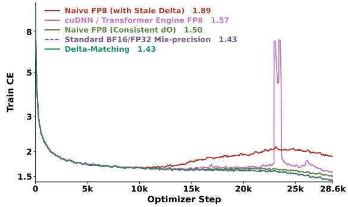

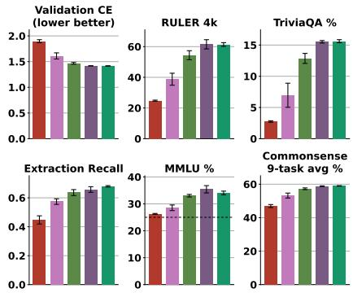  
Figure 1: A 1.67B GDN/GQA hybrid trained on 30B Nemotron-CC tokens. Left. Delta-Matching tracks BF16/FP32 training loss; FP8 baselines degrade. Right. Delta-Matching matches BF16/FP32 validation loss and overall downstream performance. Section 4.1 details training and evaluation.

## 1 INTRODUCTION

FP8 promises faster, more memory-efficient large language model (LLM) training, with roughly twice BF16’s peak Tensor Core throughput on Hopper (NVIDIA, 2023). Existing systems quantize training-state storage (Peng et al., 2023b; Xi et al., 2025) and linear-layer matmuls in both passes (DeepSeek-AI et al., 2025). Despite effective low-precision inference (Zhang et al., 2025c; Shah et al., 2024) and native FP8 training kernels (NVIDIA, 2026g;f; cuDNN Team @ NVIDIA,

2026), reliable attention training across architectures, tokens per step, scales, and durations remains unresolved.

We trace an FP8 attention failure to a saved-output shortcut for the backward row correction (Dao, 2024). Separately rounded forward and backward operands can invalidate this shortcut, producing stale delta that violates the softmax score gradient’s zero-row-sum invariant (Section 3.2). Residuals can sharpen or flatten rows; despite near cancellation across rows, we observe persistent pressure on selected channel gains (Section 3.3).

We propose Delta-Matching, deriving the correction from unquantized probabilities and FP32 products of FP8 backward operands to restore the invariant under the stated numerical assumptions (Section 3.4). Matching output-gradient precision alone leaves a probability-quantization inconsistency that still degrades training (Section 4.2). Delta-Matching enables native block-scaled FP8 in every forward and backward attention-core matmul, without architectural changes, a smaller global batch, or an auxiliary forward output.

The failure persists in hybrids pairing Gated DeltaNet (GDN) with multi-head latent attention (MLA) (Yang et al., 2025; DeepSeek-AI et al., 2025), and Kimi Delta Attention (KDA) with grouped-query attention (GQA) (Kimi Team et al., 2025; Ainslie et al., 2023). QK normalization, proposed to mitigate related BF16 instability (Qiu & Yao, 2026), prevents catastrophic collapse in our FP8 GDN/GQA hybrid but leaves a substantial performance gap. Increasing head dimension from 128 to 256 does not help; removing attention’s positional encoding (NoPE) while retaining position-sensitive recurrent layers only delays degradation (Sections 4.3 and 4.4).

Scale and duration also matter. At 569M parameters, GDN/GQA with stale delta has a modest validation-loss gap, largely preserving downstream performance. SageBwd pretraining (Zhang et al., 2026a) and the BF16 study by Qiu & Yao (2026) focus on this sub-billion regime. At 1.67B and 5.29B, models initially track BF16/FP32 before loss rises and downstream performance degrades, with earlier onset at 5.29B. During 8K-to-64K context extension at a lower learning rate following the Kimi K2 and DeepSeek-V3 recipe (Kimi Team et al., 2026b; DeepSeek-AI et al., 2025), the stale-delta baseline’s training-loss gap over BF16/FP32 exceeds 0.01 only after roughly 19,000 optimizer steps (20B tokens; Section 4.6). These patterns suggest error accumulation over updates, accelerated at larger scales, which small-model or short-run evaluations can obscure.

Figure 1 summarizes 1.67B GDN/GQA pretraining on 30B tokens. We make three contributions.

• We identify a stale-delta failure mechanism in FP8 attention training through theoretical analysis and controlled experiments.

• We formulate Delta-Matching for native FP8 attention and prove that it restores the softmax-backward invariant under the stated numerical assumptions.

• Across tested attention and model architectures, scales, training stages, and linear-layer precisions, Delta-Matching matches BF16/FP32 mixed-precision (MP) attention references in training loss and overall downstream performance.

These findings clarify 8-bit training and offer a path to fully native 8-bit LLM training. We will open-source our implementation, trained models, and data recipes to accelerate LLM research.

## 2 BACKGROUND AND RELATED WORK

## 2.1 LOW-PRECISION TRAINING

FP8 uses OCP-standardized E4M3 and E5M2 formats (Micikevicius et al., 2022; 2023). MXFP8’s shared E8M0 power-of-two scale for 32 values (Rouhani et al., 2023a;b) makes E4M3 practical in both passes (Mishra et al., 2025). H100 SXM peaks at 1,979 TFLOPS in FP8 versus 989 TFLOPS in BF16 (NVIDIA, 2023), and B200 reaches 4.5 versus 2.2 PFLOPS (NVIDIA, 2025). Blackwell adds native MXFP8/NVFP4 block scaling (NVIDIA, 2026c); NVFP4 offers 2× FP8 throughput, rising to 3× on Blackwell Ultra (Aubrey & Stam, 2025). Preliminary Rubin specifications list up to 17.5, 35, and 4 PFLOPS for FP8, NVFP4, and BF16, respectively (NVIDIA, 2026b). These are peak dense Tensor Core rates. Transformer Engine (TE) reports a roughly 1.7× FP8 GEMM speedup on Hopper; higher-precision operators limit overall gains (NVIDIA, 2026e).

FP8-LM and COAT quantize training-state storage (Peng et al., 2023b; Xi et al., 2025), while DeepSeek-V3 and Ling-1T apply FP8 to linear-layer GEMMs (DeepSeek-AI et al., 2025; Ling Team et al., 2025). NVIDIA studies simulated MXFP8 (Mishra et al., 2025) and NVFP4 pretraining (NVIDIA et al., 2026; NVIDIA et al., 2025b); Kimi K3 uses MXFP4 for routed-expert weight during post-training (Kimi Team et al., 2026a). Appendix A.1 details training scales, precision exceptions, and further hardware specifications. These systems use higher-precision attention cores (Figure 2a).

## 2.2 LOW-PRECISION ATTENTION

SageAttention’s default accurate inference path uses INT8 $Q K ^ { \top }$ with FP16 PV (Zhang et al., 2025c); SageAttention2 combines INT4 $Q , { \bar { K } }$ with FP8 P, V (Zhang et al., 2025a); FlashAttention-3 provides an FP8 forward-only kernel on Hopper (Shah et al., 2024).

Training remains unsettled (Figure 2b). FlashAttention-4 evaluates FP16/BF16 forward and backward kernels (Zadouri et al., 2026). SageAttention3 matches full precision on tested fine-tuning tasks (Zhang et al., 2025b); SageBwd matches it on a 325M model at 260K tokens per optimizer step but retains a loss gap at 2.1M (Zhang et al., 2026a). Other approaches modify the architecture (Hernandez Cano et al., 2025), retain selected products in BF16 (Ding et al., 2026), or evaluate´ emulated training only through language-modeling loss (Rouhani et al., 2023b). Qiu & Yao (2026) identify saved-output rounding errors in BF16/FP32 training and test the direct backward row cor rection as a stability intervention; related work studies early-warning monitors (Huang et al., 2026). Attn-QAT uses forward NVFP4 fake quantization and an auxiliary output for a consistent BF16 backward correction (Zhang et al., 2026b). Despite FP8/MXFP8 kernels for both passes (NVIDIA, 2026g;f; cuDNN Team @ NVIDIA, 2026), reliable native attention-core training remains under studied across hybrid architectures, tokens per optimizer step, and parameter scales.

(a)  
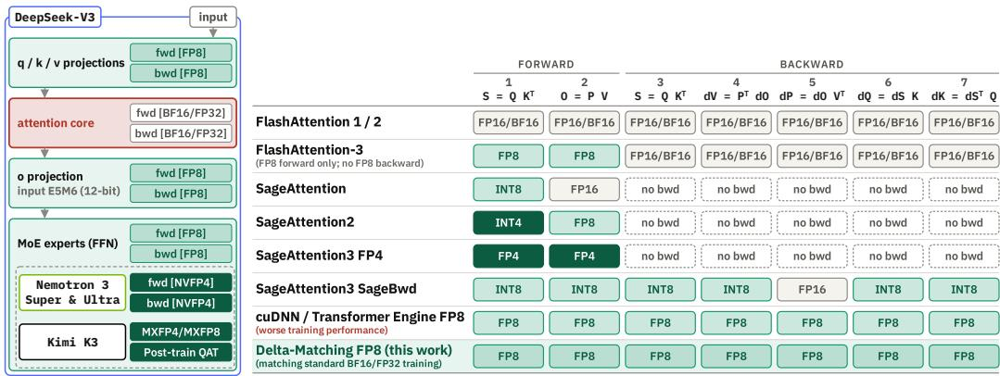  
(b)  
Figure 2: (a) DeepSeek-V3 uses FP8 for projections and FFNs in both passes, retaining higher precision for the $\bar { O ( N ^ { 2 } ) }$ attention core (DeepSeek-AI et al., 2025; Ling Team et al., 2025). Sub-8-bit recipes (dashed) mainly target FFNs (NVIDIA et al., 2025b; Kimi Team et al., 2026a). (b) Operand precision for seven attention-core matmuls (two forward, five backward). Of the two compared methods quantizing all seven to 8 bits, only Delta-Matching matches BF16/FP32 training.

## 2.3 ATTENTION PRELIMINARIES

Softmax attention. Given queries $Q ,$ keys $K ,$ values $V ,$ and head dimension $d ,$ softmax attention and its backward pass compute (Vaswani et al., 2017)

$$
S = Q K ^ { \top } / \sqrt { d } , \qquad P = \operatorname { s o f t m a x } ( S ) , \qquad O = P V ,
$$

$$
d V = P ^ { \top } d O , \quad d P = d O V ^ { \top } , \quad d S = P \odot ( d P - \delta ) , \quad d Q = d S K / \sqrt { d } , \quad d K = d S ^ { \top } Q / \sqrt { d } .
$$

Here dX is the loss gradient for X, ⊙ is elementwise multiplication, and $\begin{array} { r } { \delta _ { i } = \sum _ { i } P _ { i j } d P _ { i j } } \end{array}$ is broadcast across row i. Row-wise softmax remains in FP32 for stability (Ding et al., 2021; Zeng et al., 2023; Qiu & Yao, 2026). FlashAttention recomputes $P$ blockwise during backward instead of storing it, using the exact-arithmetic saved-output correction $\delta _ { i } = \langle d O _ { i } , O _ { i } \rangle$ (Dao et al., 2022; Dao, 2024). GQA shares key-value heads across query-head groups (Shazeer, 2019; Ainslie et al., 2023), MLA jointly compresses keys and values into latent vectors (DeepSeek-AI et al., 2025), and QK normalization controls logit growth (Henry et al., 2020; Dehghani et al., 2023; Wortsman et al., 2024).

Linear and hybrid attention. Linear attention uses a fixed-size recurrent state (Katharopoulos et al., 2020). GDN combines gating and delta-rule updates (Yang et al., 2025); hybrids interleave recurrent and softmax layers (NVIDIA et al., 2025a; Kimi Team et al., 2025; Qwen Team, 2025a;b). We evaluate GQA-only models and GDN/GQA, GDN/MLA, KDA/GQA, and Mamba-2/GQA hybrids. Appendix A.2 provides further architecture details.

## 3 THE STALE DELTA AND DELTA-MATCHING

We derive FP8 violations of the zero-row-sum invariant and trace their training effects. Delta-Matching restores the invariant under the stated assumptions and aligns training dynamics with BF16/FP32.

## 3.1 THE ZERO-ROW-SUM INVARIANT

The softmax backward pass computes $d S = P \odot ( d P - \delta )$ , where $\begin{array} { r } { \delta _ { i } = \sum _ { j } P _ { i j } d P _ { i j } } \end{array}$ is broadcast across row i. Since $\textstyle \sum _ { j } P _ { i j } = 1$ in exact arithmetic,

$$
\sum _ { j } d S _ { i j } = \sum _ { j } P _ { i j } ( d P _ { i j } - \delta _ { i } ) = \delta _ { i } - \delta _ { i } \sum _ { j } P _ { i j } = 0 .\tag{1}
$$

This expresses softmax shift invariance, since adding a constant to a score row leaves its probabilities unchanged. It also gives $\textstyle \sum _ { j } d K _ { j c } = 0$ across tokens in each channel c for keys entering $S =$ $Q K ^ { \top } / \sqrt { d }$ (Appendix A.3).

## 3.2 VIOLATION OF THE INVARIANT UNDER QUANTIZATION

Let $P$ and dO denote FP32 softmax probabilities and BF16 output gradients before FP8 quantization. Hats denote dequantized FP8 operands, including block scales; the products $\widehat { O } \ = \ \widehat { P } \widehat { V }$ and ${ \widehat { d P } } = { \widehat { d O } } { \widehat { V } } ^ { \top }$ use FP32 accumulation and output. Naive FP8 uses FlashAttention’s savedoutput correction $\delta _ { i } ^ { \mathrm { s t a l e } } = \langle d O _ { i } , \widehat { O } _ { i } \rangle$ (Dao, 2024). Retaining BF16 dO avoids its FP8 rounding but mismatches the $\widehat { d P }$ operands. For normalized $P _ { \mathrm { { : } } }$ , identical effective $\widehat { V }$ in both passes, and no accumulation, output-storage, or reduction rounding, $d S _ { i j } ^ { \mathrm { s t a l e } } = P _ { i j } ( \widehat { d P } _ { i j } - \delta _ { i } ^ { \mathrm { s t a l e } } )$ has row sum

$$
\sum _ { j } d S _ { i j } ^ { \mathrm { s t a l e } } = \sum _ { k } \widehat { d O } _ { i k } \Big ( \sum _ { j } \big ( \underbrace { P _ { i j } - \widehat { P } _ { i j } } _ { \mathrm { p r o b a b i l i t y } } \big ) \widehat { V } _ { j k } \Big ) + \sum _ { k } \big ( \underbrace { \widehat { d O } _ { i k } - d O _ { i k } } _ { \mathrm { g r a d i e n t } } \big ) \Big ( \sum _ { j } \widehat { P } _ { i j } \widehat { V } _ { j k } \Big ) .\tag{2}
$$

The probability-quantization and gradient-quantization errors produce stale delta when they do not cancel (derivation in Appendix A.3). Qiu & Yao (2026) found a related output-rounding error in smaller-scale BF16/FP32 mixed-precision GPT-2 training.

We probe the FP8 kernel on BF16-recomputed activations from final 1.67B GDN/GQA checkpoints, covering six attention layers and 32 training windows. Before $d S$ quantization, stale delta produces normalized row-sum residuals of $1 . 1 \times 1 0 ^ { - 2 } – 4 . 7 \times 1 0 ^ { - 2 }$ , measured as window-averaged row medians on a common set of nonzero-gradient rows (Appendix C.1).

## 3.3 HOW INVARIANT VIOLATIONS CHANGE TRAINING DYNAMICS

The stale-delta residual is the score-gradient row sum $\begin{array} { r } { \varepsilon _ { i } = \sum _ { j } d S _ { i j } ^ { \mathrm { s t a l e } } } \end{array}$ . For fixed P and $\widehat { d P }$ , stale delta adds $\varepsilon _ { i } P _ { i j }$ to the matched-delta gradient. In isolation, this term biases a small logit update

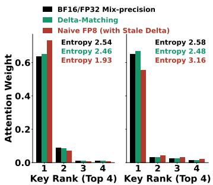  
(a) Stale delta sharpens or flattens attention rows.

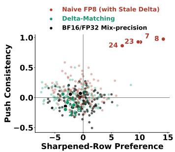  
(b) Favored channels show consistent gain increases.

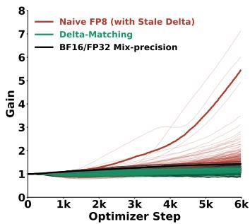  
(c) Key RMSNorm gain trajectories over optimizer steps.

Figure 3: Stale delta distorts attention updates and amplifies selected channels. Last-layer data from a 1.67B GDN/GQA hybrid; (a,b) at step 6,000. (a) From shared FP8 logits, stale delta sharpens (left) or flattens (right) attention; Delta-Matching closely follows BF16/FP32 despite different forward logits. (b) Only stale delta combines strong sharpened-row preference with consistent gain increases in highlighted channels. (c) Stale delta selectively amplifies key RMSNorm gains, which stay controlled with Delta-Matching and BF16/FP32. Thick lines track channel 7; thin lines track the others. Appendix B.4 defines quantities and row selection.

toward sharpening when $\varepsilon _ { i } < 0$ and flattening when $\varepsilon _ { i } > 0$ (Figure 3a). Even if residuals nearly cancel across rows, their effects need not cancel within channels. Channels favored by sharpened rows also show consistent upward pressure on key RMSNorm gains (Figure 3b).

Selective amplification compounds during training (Figure 3c). Eventually, a few channels account for more than 99% of $\textstyle \sum _ { c } ( { \dot { g } } _ { q , c } g _ { k , c } ) ^ { 2 }$ in affected layers, where $g _ { q , c }$ and $g _ { k , c }$ are channel $c \mathbf { \hat { s } }$ query and key RMSNorm gains. This concentration can amplify selected logit contributions and promote softmax saturation, focusing attention on a few keys. Appendix B.2.4 gives the setup for Figure 3.

## 3.4 DELTA-MATCHING

Building on the direct backward correction (Qiu & Yao, 2026), we formulate Delta-Matching for native FP8 attention. It uses FP32 probabilities before quantization and FP32 products of FP8 backward operands to correct both mismatches. Using $\widehat { d O }$ in the saved-output shortcut (consistent dO) removes only the gradient-quantization term under the assumptions of equation 2, leaving

$$
\sum _ { j } P _ { i j } \big ( \widehat { d P } _ { i j } - \langle \widehat { d O } _ { i } , \widehat { O } _ { i } \rangle \big ) = \sum _ { k } \widehat { d O } _ { i k } \Big ( \sum _ { j } \big ( \underbrace { P _ { i j } - \widehat { P } _ { i j } } _ { \mathrm { \normalfont ~ p r o b a b i l i t y } } \big ) \widehat { V } _ { j k } \Big ) .\tag{3}
$$

The forward output uses $\widehat { P }$ but the score gradient uses $P ,$ so consistent dO retains a mismatch and still degrades training (Section 4.2).

For fixed normalized $P$ and $\widehat { d P }$ , zero row sums in $d S _ { i j } = P _ { i j } ( \widehat { d P } _ { i j } - c _ { i } )$ uniquely determine $c _ { i } = \delta _ { i } ^ { \mathrm { m a t c h e d } }$ , with

$$
\delta _ { i } ^ { \mathrm { m a t c h e d } } = \sum _ { j } P _ { i j } \widehat { d P } _ { i j } .\tag{4}
$$

The resulting gradient satisfies

$$
\sum _ { j } d S _ { i j } ^ { \mathrm { m a t c h e d } } = \sum _ { j } P _ { i j } ( \widehat { d P } _ { i j } - \delta _ { i } ^ { \mathrm { m a t c h e d } } ) = \delta _ { i } ^ { \mathrm { m a t c h e d } } \Big ( 1 - \sum _ { j } P _ { i j } \Big ) = 0 .\tag{5}
$$

Delta-Matching restores the invariant up to FP32 rounding before dS quantization. In the same probe, median residuals rise from $1 . 4 \times 1 0 ^ { - 7 } – 7 . 1 \times 1 0 ^ { - 7 }$ to $2 . 7 \times 1 0 ^ { - 3 } – 3 . 4 \times 1 0 ^ { - 3 }$ after FP8 casting with fixed pre-cast normalization. Casting can introduce a signed offset, but stale-delta residuals remain 5.3–6.3× larger across layers (Appendix C.1). Ordinary FP8 operand errors remain, but the correction needs neither higher-precision attention matmuls nor an auxiliary forward output. It closely follows BF16/FP32 attention updates without stale-delta sharpening or flattening and suppresses excessive gain growth (Figure 3). With both tested momentum-based optimizers, AdamW and Muon, stale delta distorts gain dynamics, while Delta-Matching tracks the corresponding BF16/FP32 reference (Appendix C.7.1).

Despite recomputation, our kernel achieves lower combined forward and backward latency on H100 than Hopper-optimized BF16 FlashAttention-3 (Shah et al., 2024). Appendices B.6 and C.2 detail kernel numerics and timing; kernel development is not our focus.

The alternative mitigations we test leave training-performance gaps or markedly different dynamics from BF16/FP32 (Appendix C.4).

## 4 EXPERIMENTS AND DISCUSSION

## 4.1 EXPERIMENT SETUP

Configuration. Our 1.67B-parameter base hybrid combines 18 Gated DeltaNet (Yang et al., 2025) layers and 6 grouped-query attention (Ainslie et al., 2023) layers. We pretrain it on 30B Nemotron-CC tokens (Su et al., 2025; NVIDIA et al., 2025c) at 8K context. Attention uses 16 query and 4 key-value heads of dimension 128, compatible with the evaluated cuDNN FP8 configuration. Each main experiment uses two initialization seeds. Appendices B.2.4, B.1, and B.4 give experimen configurations, data recipes, and reporting conventions.

Evaluation. All methods use BF16 evaluation with FlashAttention-2 (Appendix B.3). Validation cross-entropy (CE) uses held-out Nemotron-CC data. In-context recall uses regenerated RULER tasks at 4K and 8K (Hsieh et al., 2024) and the extraction-recall suite of Arora et al. (2024) over SWDE (Lockard et al., 2019), FDA (Arora et al., 2023), and SQuAD completion (Rajpurkar et al., 2018). General capabilities use five-shot TriviaQA exact match (Joshi et al., 2017), zero-shot MMLU (Hendrycks et al., 2021), and nine zero-shot commonsense benchmarks, LAMBADA (Paperno et al., 2016), HellaSwag (Zellers et al., 2019), PIQA (Bisk et al., 2019), ARC-Easy and ARC-Challenge (Clark et al., 2018), SciQ (Welbl et al., 2017), OpenBookQA (Mihaylov et al., 2018), WinoGrande (Sakaguchi et al., 2021), and COPA (Roemmele et al., 2011; Wang et al., 2019). CS9 is their unweighted mean. Appendix B.5 describes the evaluation protocols. SE denotes standard error; bold marks the best FP8 mean per column within each configuration.

## 4.2 DELTA-MATCHING AGAINST EXISTING FP8 ATTENTION TRAINING

Table 1: Comparison with existing FP8 attention training. $\mathbf { M e a n } \pm \mathbf { S E }$ over two seeds; down stream scores are percentages. CS9 averages the nine individual benchmark accuracies in (b).

(a) Validation loss and downstream performance.
<table><tr><td></td><td></td><td colspan="3">In-Context Recall ↑</td><td colspan="3">General Capabilities ↑</td></tr><tr><td>Method</td><td>Validation CE ↓</td><td> $\mathtt { R U L E R - 4 K }$ </td><td> $\mathrm { R U L E R } – 8 \mathrm { K }$ </td><td>Extraction</td><td> $\mathrm { T r i v i a Q A }$ </td><td>MMLU</td><td>CS9</td></tr><tr><td>BF16/FP32 MP</td><td> $1 . 4 1 7 8 \pm 0 . 0 0 0 4$ </td><td> $6 1 . 5 \pm 3 . 0$ </td><td> $5 2 . 3 \pm 2 . 3$ </td><td> $6 5 . 7 \pm 2 . 0$ </td><td> $1 5 . 5 \pm 0 . 2$ </td><td> $3 5 . 4 \pm { 1 . 4 }$ </td><td> $5 8 . 8 \pm 0 . 2$ </td></tr><tr><td>cuDNN/TE FP8</td><td> $1 . 6 1 0 5 \pm 0 . 0 6 0 0$ </td><td> $3 8 . 8 \pm { 3 . 9 }$ </td><td> $3 1 . 0 \pm 3 . 9$ </td><td> $5 7 . 4 \pm 1 . 9$ </td><td> $7 . 0 \pm 1 . 9$ </td><td> $2 8 . 5 \pm { 1 . 0 }$ </td><td> $5 3 . 2 \pm 1 . 5$ </td></tr><tr><td>Naive FP8 (Stale Delta)</td><td> $1 . 8 9 7 0 \pm 0 . 0 2 9 6$ </td><td> $2 4 . 8 \pm 0 . 3$ </td><td> $1 9 . 8 \pm 2 . 1$ </td><td> $4 4 . 7 \pm 2 . 8$ </td><td> $2 . 7 \pm 0 . 1$ </td><td> $2 6 . 3 \pm 0 . 1$ </td><td> $4 7 . 0 \pm 0 . 9$ </td></tr><tr><td>Naive FP8 (Consistent dO)</td><td> $1 . 4 6 6 7 \pm 0 . 0 1 7 5$ </td><td> $5 4 . 4 \pm 3 . 0$ </td><td> $4 3 . 2 \pm 2 . 3$ </td><td> $6 3 . 6 \pm 2 . 1$ </td><td> $1 2 . 9 \pm 0 . 8$ </td><td> $3 3 . 0 \pm 0 . 5$ </td><td> $5 7 . 3 \pm 0 . 5$ </td></tr><tr><td>Delta-Matching (ours)</td><td> $\mathbf { 1 . 4 1 6 2 \pm 0 . 0 0 0 6 }$ </td><td> ${ \bf 6 1 . 4 \pm 1 . 2 }$ </td><td> $\mathbf { 4 7 . 8 \pm 0 . 5 }$ </td><td> ${ \bf 6 8 . 0 \pm 0 . 5 }$ </td><td> ${ \bf 1 5 . 6 \pm 0 . 2 }$ </td><td> $\mathbf { 3 4 . 0 \ : \pm { \ : 0 . 7 } }$ </td><td> ${ \bf 5 9 . 0 \pm 0 . 2 }$ </td></tr></table>

(b) Commonsense individual benchmark accuracy.
<table><tr><td>Method</td><td>LAMBADA HellaSwag</td><td></td><td>PIQA</td><td>ARC-E</td><td>SciQ</td><td>OBQA</td><td>WinoGrande</td><td>COPA</td><td>ARC-C</td></tr><tr><td>BF16/FP32 MP</td><td> $4 5 . 7 \pm 0 . 4$ </td><td></td><td></td><td>57.0 ± 0.3 72.2 ± 0.1 63.1 ± 1.5 89.4 ± 0.7</td><td></td><td> $3 7 . 0 \pm 0 . 6$ </td><td> $5 7 . 7 \pm 0 . 9$ </td><td> $7 0 . 5 \pm 0 . 5$ </td><td> $3 6 . 7 \pm 0 . 1$ </td></tr><tr><td>cuDNN/TE FP8</td><td> $3 3 . 1 \pm 2 . 9$ </td><td></td><td></td><td>47.0 ± 2.7 68.9 ± 1.1 56.7 ± 0.8 83.0 ± 1.3 34.8 ± 2.2</td><td></td><td></td><td> $5 3 . 8 \pm 0 . 9$ </td><td> $6 9 . 5 \pm 0 . 5$ </td><td> $3 2 . 1 \pm 0 . 9$ </td></tr><tr><td>Naive FP8 (Stale Delta)</td><td> $2 4 . 2 \pm 0 . 9$ </td><td></td><td></td><td>35.6 ± 0.8 63.5 ± 0.8 46.7 ± 0.1 77.3 ± 1.3 30.8 ± 0.8</td><td></td><td></td><td> $5 2 . 7 \pm 0 . 0$ </td><td> $6 5 . 0 \pm 3 . 0$ </td><td>26.8 ± 0.6</td></tr><tr><td>Naive FP8 (Consistent dO)</td><td> $4 2 . 8 \pm { 1 . 0 }$ </td><td></td><td></td><td>54.3 ± 0.8 70.9 ± 1.0 60.4 ± 0.4 88.8 ± 0.6 35.6 ± 2.2</td><td></td><td></td><td> $5 7 . 7 \pm 0 . 4$ </td><td> $7 0 . 5 \pm 1 . 5$ </td><td>34.6 ± 0.4</td></tr><tr><td>Delta-Matching (ours)</td><td>46.7 ± 0.2 57.2 ± 0.1 72.4 ± 0.0 62.4 ± 0.1 89.8 ± 0.1 37.1 ± 0.9 57.9 ± 1.1 71.0 ± 1.0 36.3 ± 0.9</td><td></td><td></td><td></td><td></td><td></td><td></td><td></td><td></td></tr></table>

We compare cuDNN/TE FP8 (NVIDIA, 2026f; cuDNN Team @ NVIDIA, 2026; NVIDIA, 2026g), naive FP8 with stale delta, consistent dO, and Delta-Matching in the base setup (Section 4.1). BF16/FP32 MP denotes BF16 attention inputs with FP32 accumulation (Micikevicius et al., 2018) and uses FP8 FFNs (P1). Full FP8 additionally quantizes attention-core and projection GEMMs (P4), not other operations or training state (Appendix B.2.2). Consistent dO aligns the correction’s output-gradient precision with the backward pass but retains the probability mismatch (Section 3.4).

Consistent dO reduces validation CE from 1.8970 with stale delta to 1.4667, still above BF16/FP32’s 1.4178; cuDNN/TE FP8 reaches 1.6105 (Table 1a). Delta-Matching reaches 1.4162 and the best FP8 aggregate downstream means. Protecting dP in BF16 also preserves near-reference quality, but retains one higher-precision attention matmul and markedly different training dynamics (Appendix C.4.2).

Delta-Matching’s individual commonsense benchmark means stay within 1.0 percentage point of BF16/FP32 (Table 1b). RULER-8K is lower at 47.8 versus 52.3; Section 4.6 examines context extension. Delta-Matching also matches BF16/FP32 with P4’s FP8 GEMMs (Appendix C.3). The same pattern holds in a single-seed full-training comparison with Muon (Appendix C.7.2), where stale delta degrades performance and Delta-Matching matches the BF16/FP32 reference.

## 4.3 DELTA-MATCHING ACROSS ATTENTION VARIANTS

We compare BF16/FP32, stale delta, and Delta-Matching across three GDN/GQA variants (Appendix B.2.1). NoPE removes GQA’s RoPE but retains order-sensitive Gated DeltaNet layers; no QK normalization removes GQA’s query and key RMSNorm. Both use the base precision scopes. Head dimension 256 preserves total query and KV widths with 8 query and 2 KV heads, but all methods retain BF16 FFNs and attention projections (P0 versus P2 in Appendix B.2.2).

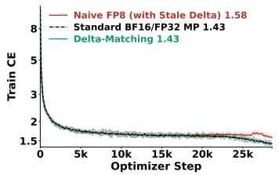  
(a) NoPE.

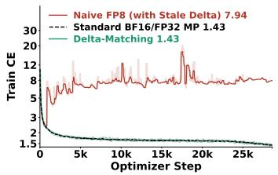  
(b) No QK-norm.

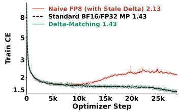  
(c) Head 256.  
Figure 4: Training cross-entropy across GDN/GQA attention variants.

Table 2: Attention variants. $\mathbf { M e a n } \pm \mathbf { S E }$ over two seeds; downstream scores are percentages. Individual commonsense benchmark accuracies appear in Appendix C.9.
<table><tr><td></td><td></td><td></td><td colspan="3">In-Context Recall ↑</td><td colspan="3">General Capabilities ↑</td></tr><tr><td>Configuration Method</td><td></td><td>Validation CE ↓</td><td>RULER-4K RULER-8K Extraction</td><td></td><td></td><td>TriviaQA</td><td>MMLU</td><td>CS9</td></tr><tr><td>NoPE</td><td>BF16/FP32 MP</td><td> $1 . 4 2 1 0 \pm 0 . 0 0 0 0$ </td><td> $5 8 . 0 \pm 3 . 0$ </td><td> $5 1 . 0 \pm 2 . 6$ </td><td> $6 5 . 4 \pm 0 . 8$ </td><td> $1 6 . 0 \pm 0 . 4$ </td><td> $3 5 . 2 \pm 0 . 4$ </td><td> $5 8 . 5 \pm 0 . 1$ </td></tr><tr><td></td><td>Naive FP8 (Stale Delta)</td><td> $1 . 6 5 7 2 \pm 0 . 0 9 7 3$ </td><td> $3 8 . 2 \pm 2 . 7$ </td><td> $2 9 . 3 \pm 2 . 7$ </td><td> $5 3 . 3 \pm 2 . 7$ </td><td> $6 . 3 \pm 1 . 8$ </td><td> $2 8 . 9 \pm { 1 . 9 }$ </td><td> $5 1 . 8 \pm 2 . 7$ </td></tr><tr><td></td><td>Delta-Matching (ours)</td><td> $\mathbf { 1 . 4 2 1 6 \pm 0 . 0 0 2 1 }$ </td><td> ${ \bf 5 8 . 6 \pm 1 . 1 }$ </td><td> ${ \bf 4 9 . 7 \pm 1 . 4 }$ </td><td> ${ \bf 6 4 . 7 \pm 0 . 1 }$ </td><td> ${ \bf 1 5 . 7 \pm 0 . 1 }$ </td><td> ${ \bf 3 2 . 7 \pm 1 . 2 }$ </td><td> ${ \bf 5 8 . 9 \pm 0 . 2 }$ </td></tr><tr><td>No QK-norm</td><td>BF16/FP32 MP</td><td> $1 . 4 2 1 4 \pm 0 . 0 0 1 2$ </td><td> $5 8 . 5 \pm 1 . 9$ </td><td> $4 6 . 5 \pm 5 . 2$ </td><td> $6 5 . 7 \pm 0 . 0$ </td><td> $1 6 . 1 \pm 0 . 3$ </td><td> $3 5 . 0 \pm 0 . 7$ </td><td> $5 9 . 1 \pm 0 . 2$ </td></tr><tr><td></td><td>Naive FP8 (Stale Delta)</td><td></td><td></td><td></td><td>Training diverged</td><td></td><td></td><td></td></tr><tr><td></td><td>Delta-Matching (ours)</td><td> $\mathbf { 1 . 4 2 0 8 \pm 0 . 0 0 1 4 }$ </td><td> ${ \bf 6 0 . 5 \pm 0 . 6 }$ </td><td> ${ \bf 5 0 . 3 \pm 0 . 4 }$ </td><td> ${ \bf 6 4 . 7 \pm 0 . 9 }$ </td><td> ${ \bf 1 5 . 9 \pm 0 . 0 }$ </td><td> ${ \bf 3 4 . 5 \pm 1 . 4 }$ </td><td> ${ \bf 5 8 . 9 \pm 0 . 5 }$ </td></tr><tr><td>Head 256</td><td>BF16/FP32 MP</td><td> $1 . 4 1 3 5 \pm 0 . 0 0 0 3$ </td><td> $6 2 . 9 \pm 1 . 6$ </td><td> $5 2 . 8 \pm 2 . 1$ </td><td> $6 6 . 2 \pm 2 . 4$ </td><td> $1 6 . 4 \pm 0 . 2$ </td><td> $3 6 . 0 \pm 0 . 2$ </td><td> $5 9 . 4 \pm 0 . 8$ </td></tr><tr><td></td><td>Naive FP8 (Stale Delta)</td><td> $2 . 0 7 0 9 \pm 0 . 0 2 8 9$ </td><td> $1 1 . 5 \pm 0 . 2$ </td><td> $7 . 7 \pm 0 . 7$ </td><td> $2 9 . 6 \pm 3 . 4$ </td><td> $1 . 4 \pm 0 . 0$ </td><td> $2 6 . 1 \pm 0 . 2$ </td><td> $4 4 . 0 \pm 0 . 4$ </td></tr><tr><td></td><td>Delta-Matching (ours)</td><td> $\mathbf { 1 . 4 1 4 6 \pm 0 . 0 0 1 4 }$ </td><td> ${ \bf 6 2 . 3 \pm 1 . 2 }$ </td><td> ${ \bf 5 3 . 9 \pm 2 . 9 }$ </td><td> ${ \bf 6 6 . 9 \pm 0 . 8 }$ </td><td> ${ \bf 1 6 . 1 \pm 0 . 2 }$ </td><td> ${ \bf 3 4 . 9 \pm 1 . 7 }$ </td><td> ${ \bf 5 8 . 9 \pm 0 . 2 }$ </td></tr></table>

Neither NoPE nor head dimension 256 eliminates stale-delta degradation (Figure 4, Table 2). Their validation CE gaps relative to BF16/FP32 are 0.2362 and 0.6574, respectively, while stale-delta training diverges without QK normalization. Delta-Matching stays within 0.0011 validation CE of the reference across all three variants, with broadly comparable downstream performance.

## 4.4 DELTA-MATCHING ACROSS MODEL ARCHITECTURES

We compare BF16/FP32, stale delta, and Delta-Matching in two other 1.67B hybrids using the base precision scopes. GDN/MLA replaces GQA with multi-head latent attention; KDA/GQA replaces Gated DeltaNet with Kimi Delta Attention and widens the FFN for parameter parity (Appendix B.2.1). Delta-Matching’s correction applies only to the softmax-attention backward pass.

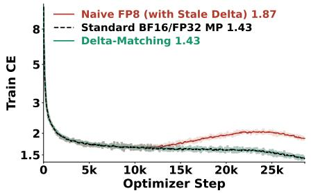  
(a) 1.67B GDN/MLA hybrid.

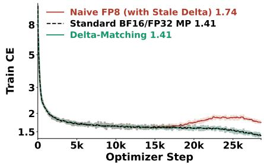  
(b) 1.67B KDA/GQA hybrid.  
Figure 5: Training cross-entropy for 1.67B GDN/MLA (left) and KDA/GQA (right) hybrids. Delta-Matching tracks BF16/FP32 in both; stale delta develops a substantial loss gap.

Table 3: Model architectures. Mean ± SE over two seeds; downstream scores are percentages. Individual commonsense benchmark accuracies appear in Appendix C.9.
<table><tr><td></td><td></td><td></td><td colspan="3">In-Context Recall ↑</td><td colspan="3">General Capabilities ↑</td></tr><tr><td>Architecture Method</td><td></td><td>Validation CE ↓</td><td>RULER-4K RULER-8K</td><td></td><td>Extraction</td><td>TriviaQA</td><td>MMLU</td><td>CS9</td></tr><tr><td>GDN/MLA</td><td>BF16/FP32 MP</td><td> $1 . 4 1 7 8 \pm 0 . 0 0 3 2$ </td><td> $5 4 . 9 \pm 2 . 2$ </td><td> $4 7 . 4 \pm 0 . 1$ </td><td> $6 6 . 7 \pm 0 . 1$ </td><td> $1 5 . 7 \pm 0 . 3$ </td><td> $3 6 . 3 \pm { 1 . 6 }$ </td><td> $5 9 . 2 \pm 0 . 0$ </td></tr><tr><td></td><td>Naive FP8 (Stale Delta)</td><td> $1 . 9 2 6 8 \pm 0 . 0 8 4 4$ </td><td> $2 5 . 9 \pm 2 . 0$ </td><td> $1 8 . 9 \pm 5 . 3$ </td><td> $4 2 . 9 \pm 4 . 4$ </td><td> $2 . 0 \pm { 0 . 7 }$ </td><td> $2 6 . 1 \pm 0 . 5$ </td><td> $4 6 . 0 \pm 1 . 3$ </td></tr><tr><td></td><td>Delta-Matching (ours)</td><td> $\mathbf { 1 . 4 1 8 1 \pm 0 . 0 0 2 4 }$ </td><td> ${ \bf 6 0 . 4 \pm 0 . 6 }$ </td><td> ${ \bf 5 0 . 0 \pm 1 . 7 }$ </td><td> ${ \bf 6 7 . 5 \pm 0 . 1 }$ </td><td> ${ \bf 1 6 . 3 \pm 0 . 3 }$ </td><td> ${ \bf 3 4 . 4 \pm 0 . 5 }$ </td><td> ${ \bf 5 9 . 2 \pm 0 . 3 }$ </td></tr><tr><td>KDA/GQA</td><td>BF16/FP32 MP</td><td> $1 . 3 9 9 4 \pm 0 . 0 0 0 4$ </td><td> $6 5 . 6 \pm 0 . 5$ </td><td> $5 0 . 0 \pm 2 . 3$ </td><td> $6 7 . 9 \pm 0 . 4$ </td><td> $1 7 . 7 \pm 0 . 1$ </td><td> $3 4 . 8 \pm 0 . 1$ </td><td> $6 0 . 2 \pm { 0 . 3 }$ </td></tr><tr><td></td><td>Naive FP8 (Stale Delta)</td><td> $1 . 8 2 2 4 \pm 0 . 1 1 0 0$ </td><td> $2 6 . 2 \pm { 1 0 . 9 }$ </td><td> $2 2 . 9 \pm 9 . 2$ </td><td> $4 4 . 2 \pm 1 1 . 2$ </td><td> $3 . 4 \pm 1 . 0$ </td><td> $2 6 . 2 \pm 0 . 3$ </td><td> $4 8 . 5 \pm 2 . 2$ </td></tr><tr><td></td><td>Delta-Matching (ours)</td><td> $\mathbf { 1 . 3 9 8 8 \pm 0 . 0 0 0 1 }$ </td><td> ${ \bf 6 0 . 7 \pm 2 . 4 }$ </td><td> ${ \bf 5 0 . 7 \pm 2 . 2 }$ </td><td> ${ \bf 6 6 . 8 \pm 1 . 3 }$ </td><td> ${ \bf 1 8 . 3 \pm 0 . 2 }$ </td><td> ${ \bf 3 5 . 7 \pm 1 . 9 }$ </td><td> ${ \bf 6 0 . 0 \pm 0 . 1 }$ </td></tr></table>

Figure 5 shows the corresponding training-loss trajectories. Stale delta raises validation CE by 0.5090 for GDN/MLA and 0.4230 for KDA/GQA relative to BF16/FP32 (Table 3). Delta-Matching stays within 0.0006 of each reference and improves every reported downstream mean over stale delta, with broadly comparable performance to BF16/FP32, although KDA/GQA’s RULER-4K mean is lower at 60.7 versus 65.6.

Some pure-GQA and Mamba-2/GQA configurations retain near-reference loss despite severe gain corruption under stale delta, with masking probes suggesting compensation elsewhere (Appendix C.5). This motivates checking backward consistency and internal dynamics alongside loss and downstream performance.

## 4.5 DELTA-MATCHING ACROSS PARAMETER SCALES

We train 569M and 5.29B GDN/GQA models on 30B Nemotron-CC tokens with the base precision scopes and attention head dimension 256. Model dimensions appear in Appendix B.2.1. At 569M, naive FP8 has a modest validation CE gap with largely preserved downstream performance. At 5.29B, its CE reaches 1.9327 versus 1.3349 for BF16/FP32. RULER-8K falls from 53.5% to 16.3% and CS9 from 63.1% to 45.4% (Figure 6 and Table 4).

Delta-Matching stays within 0.0025 validation CE of BF16/FP32 at both scales. At 5.29B, its RULER means exceed the reference, with slightly lower extraction recall, MMLU, and CS9.

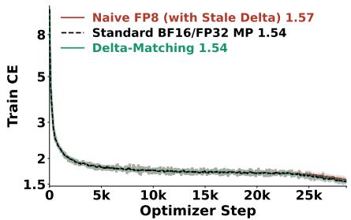  
(a) 569M GDN/GQA hybrid.

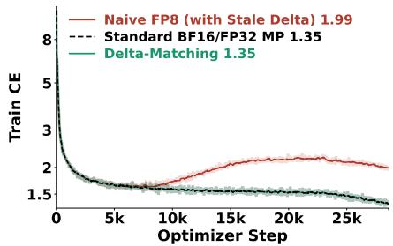  
(b) 5.29B GDN/GQA hybrid.  
Figure 6: Training cross-entropy for (a) 569M and (b) 5.29B GDN/GQA hybrids on 30B Nemotron-CC tokens (Su et al., 2025; NVIDIA et al., 2025c). Delta-Matching tracks BF16/FP32 at both scales; naive FP8 has a larger loss gap at 5.29B.

Table 4: Parameter scales. $\mathbf { M e a n } \pm \mathbf { S E }$ for two seeds per model (0.569B, 5.289B); downstream scores in percent. Individual commonsense benchmark accuracies are in Appendix C.9.
<table><tr><td></td><td></td><td></td><td colspan="3">In-Context Recall ↑</td><td colspan="3">General Capabilities ↑</td></tr><tr><td>Parameters Method</td><td></td><td>Validation CE ↓</td><td></td><td>RULER-4K RULER-8K</td><td>Extraction</td><td>TriviaQA</td><td>MMLU</td><td>CS9</td></tr><tr><td>0.569B</td><td>BF16/FP32 MP</td><td> $1 . 5 2 3 3 \pm 0 . 0 0 0 5$ </td><td> $4 5 . 4 \pm 0 . 5$ </td><td> $3 7 . 8 \pm 0 . 4$ </td><td> $6 5 . 6 \pm 0 . 6$ </td><td> $1 0 . 2 \pm 0 . 4$ </td><td> $2 8 . 9 \pm 0 . 5$ </td><td> $5 4 . 7 \pm 0 . 1$ </td></tr><tr><td></td><td>Naive FP8 (Stale Delta)</td><td> $1 . 5 3 9 9 \pm 0 . 0 1 4 4$ </td><td> ${ \bf 4 8 . 7 \pm 1 . 2 }$ </td><td> ${ \bf 4 0 . 6 \pm 1 . 1 }$ </td><td> $6 2 . 3 \pm 0 . 9$ </td><td> $9 . 6 \pm 0 . 6$ </td><td> $2 8 . 5 \pm 1 . 3$ </td><td> $5 3 . 8 \pm 0 . 6$ </td></tr><tr><td></td><td>Delta-Matching (ours)</td><td> $\mathbf { 1 . 5 2 2 8 \pm 0 . 0 0 1 5 }$ </td><td> $4 6 . 3 \pm { 1 . 0 }$ </td><td> $3 8 . 2 \pm 0 . 8$ </td><td> ${ \bf 6 2 . 9 \pm 0 . 2 }$ </td><td> ${ \bf 9 . 9 \pm 0 . 3 }$ </td><td> ${ \bf 2 8 . 7 \pm 1 . 8 }$ </td><td> ${ \bf 5 4 . 6 \pm 0 . 0 }$ </td></tr><tr><td>5.289B</td><td>BF16/FP32 MP</td><td> $1 . 3 3 4 9 \pm 0 . 0 0 1 1$ </td><td> $6 5 . 6 \pm 0 . 2$ </td><td> $5 3 . 5 \pm 1 . 8$ </td><td> $7 1 . 0 \pm 0 . 9$ </td><td> $2 1 . 7 \pm 0 . 4$ </td><td> $4 2 . 0 \pm 0 . 5$ </td><td> $6 3 . 1 \pm 0 . 1$ </td></tr><tr><td></td><td>Naive FP8 (Stale Delta)</td><td> $1 . 9 3 2 7 \pm 0 . 0 3 4 9$ </td><td> $2 3 . 4 \pm 2 . 4$ </td><td> $1 6 . 3 \pm 5 . 8$ </td><td> $3 7 . 1 \pm 2 . 3$ </td><td> $2 . 0 \pm 0 . 1$ </td><td> $2 6 . 3 \pm 0 . 2$ </td><td> $4 5 . 4 \pm 0 . 3$ </td></tr><tr><td></td><td>Delta-Matching (ours)</td><td> $\mathbf { 1 . 3 3 7 4 } \pm 0 . 0 0 0 5$ </td><td> ${ \bf 6 9 . 2 \pm 2 . 0 }$ </td><td> ${ \bf 5 8 . 6 \pm 0 . 1 }$ </td><td> ${ \bf 7 0 . 3 \pm 0 . 6 }$ </td><td> ${ \bf 2 1 . 6 \pm 0 . 1 }$ </td><td> ${ \bf 4 1 . 3 \pm 0 . 2 }$ </td><td> ${ \bf 6 2 . 0 \pm 0 . 4 }$ </td></tr></table>

## 4.6 DELTA-MATCHING DURING CONTEXT EXTENSION

We extend the 1.67B GDN/GQA hybrid from 8K to 64K on ProLong-derived data (Gao et al., 2025) (Appendix B.1). Methods share each initialization’s completed BF16/FP32 checkpoint and train 28,000 steps with fresh optimizers at a peak learning rate of $8 \times 1 0 ^ { - 4 }$ . The stale-delta loss gap exceeds 0.01 after roughly 19,000 steps (20B tokens; Figure 7). This follows the step-18,000 corpus expansion, which preserved optimizer state but reset TE’s amplitude history (Appendix B.2.3); the timing therefore does not isolate duration or learning-rate effects.

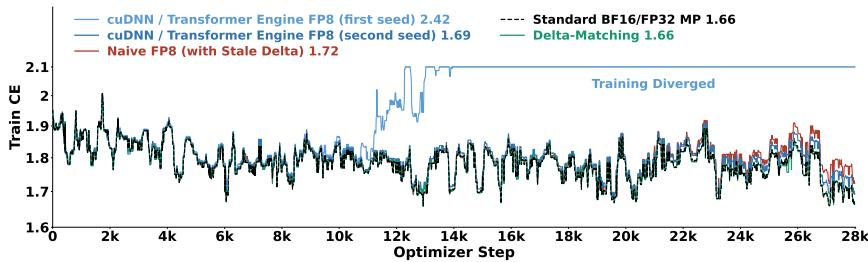  
Figure 7: Training cross-entropy during context extension from 8K to 64K tokens for a 1.67B GDN/GQA hybrid. Both cuDNN/Transformer Engine FP8 seeds are shown.

Delta-Matching tracks BF16/FP32 on RULER (45.6% versus 46.0% at 64K) and exceeds stale delta on all recall metrics (Table 5). One of two cuDNN/TE FP8 runs diverges. Both BF16/FP32 and Delta-Matching lose MMLU and TriviaQA performance after extension (Appendix C.8).

Table 5: In-context recall after 8K-to-64K context extension. $\mathbf { M e a n } \pm \mathbf { S E }$ over two seeds; cuDNN/TE FP8 seeds appear separately because one run diverged. Scores are percentages.
<table><tr><td>Method</td><td>RULER-4K ↑</td><td>RULER-8K ↑</td><td>RULER-16K ↑</td><td>RULER-32K ↑</td><td>RULER-64K ↑</td><td>Extraction ↑</td></tr><tr><td>BF16/FP32 MP</td><td>66.3 ± 0.9</td><td> $5 9 . 2 \pm 3 . 3$ </td><td>55.1 ± 3.7</td><td>50.0 ± 5.1</td><td>46.0 ± 4.5</td><td>69.0 ± 1.6</td></tr><tr><td colspan="3">cuDNN/TE FP8 (1st seed)</td><td colspan="3">Training diverged</td><td></td></tr><tr><td>cuDNN/TE FP8 (2nd seed)</td><td>67.1</td><td>57.3</td><td>54.5</td><td>48.1</td><td>40.3</td><td>68.7</td></tr><tr><td>Naive FP8 (Stale Delta)</td><td> $6 2 . 8 \pm { 1 . 7 }$ </td><td> $5 6 . 2 \pm 1 . 5$ </td><td> $5 0 . 0 \pm 2 . 2$ </td><td> $4 5 . 8 \pm 0 . 8$ </td><td> $4 0 . 1 \pm 0 . 6$ </td><td> $6 4 . 5 \pm 0 . 4$ </td></tr><tr><td>Delta-Matching (ours)</td><td> ${ \bf 6 7 . 6 \pm 4 . 4 }$ </td><td> ${ \bf 6 2 . 2 \pm 2 . 8 }$ </td><td> ${ \bf 5 5 . 4 \pm 1 . 1 }$ </td><td> ${ \bf 5 1 . 6 \pm 0 . 1 }$ </td><td> ${ \bf 4 5 . 6 \pm 0 . 6 }$ </td><td> $6 7 . 9 \pm 0 . 6$ </td></tr></table>

## 5 CONCLUSION

We derive stale delta’s violation of FP8 attention’s zero-row-sum invariant and trace its training consequences empirically. Failures at larger scales and over longer runs are consistent with accumulated optimization error. QK normalization, NoPE, larger head dimensions, and lower-learning-rate context extension do not eliminate them. Other mitigations leave performance gaps or altered dynamics; some architectures conceal gain corruption behind near-reference performance.

Delta-Matching restores the invariant under the stated assumptions, enabling native FP8 in all seven attention-core matmuls without auxiliary forward outputs. Across tested attention variants, architectures, scales, and stages, it matches BF16/FP32 training loss and overall downstream performance. Appendix A.4 discusses limitations and future directions. These findings highlight forwardbackward numerical consistency as essential for reliable 8-bit training and provide a solid, practical solution toward fully 8-bit LLM training.

## AI USE STATEMENT

We used generative AI tools to assist with proof writing, method implementation, translation, and dataset cleaning and reformatting. We also used these tools to identify relevant literature, monitor experiments, and improve the clarity and readability of the manuscript. We have not used generative AI tools for any other tasks requiring disclosure. We have reviewed all AI-assisted work. The authors independently checked the correctness of the proofs, manually designed test cases to validate the method implementations, and manually inspected selected samples to check the data processing. We take responsibility for the final content of this work, including text, claims, or artifacts produced with the aid of generative AI.

## ETHICS STATEMENT

We are not aware of any ethical issues associated with this work.

## REPRODUCIBILITY STATEMENT

We state the numerical assumptions and derive the method in Section 3, with a detailed derivation of the quantization residual in Appendix A.3. Appendix B.1 documents data preparation, and Appendix B.2 specifies model architectures, training precision, optimization recipes, and experiment configurations. Evaluation settings and benchmark protocols are detailed in Appendices B.3 and B.5, with uncertainty reporting defined in Appendix B.4. We will release our implementation, trained models, and data recipes to support reproducibility.

## REFERENCES

Joshua Ainslie, James Lee-Thorp, Michiel de Jong, Yury Zemlyanskiy, Federico Lebron, and Sumit Sanghai. GQA: Training generalized multi-query transformer models from multi-head checkpoints. In Houda Bouamor, Juan Pino, and Kalika Bali (eds.), Proceedings ofthe 2023 Conference on Empirical Methods in Natural Language Processing, pp. 4895–4901, Singapore, December 2023. Association for Computational Linguistics. doi: 10.18653/v1/2023.emnlp-main.298. URL https://aclanthology.org/2023.emnlp-main.298/.

Simran Arora, Brandon Yang, Sabri Eyuboglu, Avanika Narayan, Andrew Hojel, Immanuel Trummer, and Christopher Re. Language models enable simple systems for generating structured views ´ of heterogeneous data lakes, 2023. URL https://arxiv.org/abs/2304.09433.

Simran Arora, Sabri Eyuboglu, Michael Zhang, Aman Timalsina, Silas Alberti, James Zou, Atri Rudra, and Christopher Re. Simple linear attention language models balance the recall-throughput´ tradeoff. In Ruslan Salakhutdinov, Zico Kolter, Katherine Heller, Adrian Weller, Nuria Oliver, Jonathan Scarlett, and Felix Berkenkamp (eds.), Proceedings ofthe 41st International Conference on Machine Learning, volume 235 of Proceedings of Machine Learning Research, pp. 1763– 1840. PMLR, 21–27 Jul 2024. URL https://proceedings.mlr.press/v235/arora 24a.html.

Kyle Aubrey and Nick Stam. Inside NVIDIA Blackwell Ultra: The chip powering the AI factory era. NVIDIA Technical Blog, August 2025. URL https://developer.nvidia.com /blog/inside-nvidia-blackwell-ultra-the-chip-powering-the-aifactory-era/. August 22, 2025.

Stella Biderman, Hailey Schoelkopf, Lintang Sutawika, Leo Gao, Jonathan Tow, Baber Abbasi, Alham Fikri Aji, Pawan Sasanka Ammanamanchi, Sidney Black, Jordan Clive, Anthony DiPofi, Julen Etxaniz, Benjamin Fattori, Jessica Zosa Forde, Charles Foster, Jeffrey Hsu, Mimansa Jaiswal, Wilson Y. Lee, Haonan Li, Charles Lovering, Niklas Muennighoff, Ellie Pavlick, Jason Phang, Aviya Skowron, Samson Tan, Xiangru Tang, Kevin A. Wang, Genta Indra Winata, Franc¸ois Yvon, and Andy Zou. Lessons from the trenches on reproducible evaluation of language models, 2026. URL https://arxiv.org/abs/2405.14782.

Yonatan Bisk, Rowan Zellers, Ronan Le Bras, Jianfeng Gao, and Yejin Choi. Piqa: Reasoning about physical commonsense in natural language, 2019. URL https://arxiv.org/abs/1911 .11641.

Peter Clark, Isaac Cowhey, Oren Etzioni, Tushar Khot, Ashish Sabharwal, Carissa Schoenick, and Oyvind Tafjord. Think you have solved question answering? try arc, the ai2 reasoning challenge, 2018. URL https://arxiv.org/abs/1803.05457.

cuDNN Team @ NVIDIA. How scales are applied in MXFP8 attention. The cuDNN Blog, 2026. URL https://nvidia.github.io/cudnn-frontend/mxfp8-attentionscaling/. Published 2026-04-20. Accessed 2026-09-26.

Tri Dao. Flashattention-2: Faster attention with better parallelism and work partitioning. In B. Kim, Y. Yue, S. Chaudhuri, K. Fragkiadaki, M. Khan, and Y. Sun (eds.), International Conference on Learning Representations, volume 2024, pp. 35549–35562, 2024. URL https://proceedi ngs.iclr.cc/paper\_files/paper/2024/file/98ed250b203d1ac6b24bbcf2 63e3d4a7-Paper-Conference.pdf.

Tri Dao and Albert Gu. Transformers are SSMs: Generalized models and efficient algorithms through structured state space duality. In Ruslan Salakhutdinov, Zico Kolter, Katherine Heller, Adrian Weller, Nuria Oliver, Jonathan Scarlett, and Felix Berkenkamp (eds.), Proceedings of the 41st International Conference on Machine Learning, volume 235 of Proceedings of Machine Learning Research, pp. 10041–10071. PMLR, 21–27 Jul 2024. URL https://proceeding s.mlr.press/v235/dao24a.html.

Tri Dao, Dan Fu, Stefano Ermon, Atri Rudra, and Christopher Re. Flashattention: Fast and memory-´ efficient exact attention with io-awareness. In S. Koyejo, S. Mohamed, A. Agarwal, D. Belgrave, K. Cho, and A. Oh (eds.), Advances in Neural Information Processing Systems, volume 35, pp. 16344–16359. Curran Associates, Inc., 2022. doi: 10.52202/068431-1189. URL https: //proceedings.neurips.cc/paper\_files/paper/2022/file/67d57c32e20 fd0a7a302cb81d36e40d5-Paper-Conference.pdf.

DeepSeek-AI, Aixin Liu, Bei Feng, Bing Xue, Bingxuan Wang, Bochao Wu, Chengda Lu, Chenggang Zhao, Chengqi Deng, Chenyu Zhang, Chong Ruan, Damai Dai, Daya Guo, Dejian Yang, Deli Chen, Dongjie Ji, Erhang Li, Fangyun Lin, Fucong Dai, Fuli Luo, Guangbo Hao, Guanting Chen, Guowei Li, H. Zhang, Han Bao, Hanwei Xu, Haocheng Wang, Haowei Zhang, Honghui Ding, Huajian Xin, Huazuo Gao, Hui Li, Hui Qu, J. L. Cai, Jian Liang, Jianzhong Guo, Jiaqi

Ni, Jiashi Li, Jiawei Wang, Jin Chen, Jingchang Chen, Jingyang Yuan, Junjie Qiu, Junlong Li, Junxiao Song, Kai Dong, Kai Hu, Kaige Gao, Kang Guan, Kexin Huang, Kuai Yu, Lean Wang, Lecong Zhang, Lei Xu, Leyi Xia, Liang Zhao, Litong Wang, Liyue Zhang, Meng Li, Miaojun Wang, Mingchuan Zhang, Minghua Zhang, Minghui Tang, Mingming Li, Ning Tian, Panpan Huang, Peiyi Wang, Peng Zhang, Qiancheng Wang, Qihao Zhu, Qinyu Chen, Qiushi Du, R. J. Chen, R. L. Jin, Ruiqi Ge, Ruisong Zhang, Ruizhe Pan, Runji Wang, Runxin Xu, Ruoyu Zhang, Ruyi Chen, S. S. Li, Shanghao Lu, Shangyan Zhou, Shanhuang Chen, Shaoqing Wu, Shengfeng Ye, Shengfeng Ye, Shirong Ma, Shiyu Wang, Shuang Zhou, Shuiping Yu, Shunfeng Zhou, Shuting Pan, T. Wang, Tao Yun, Tian Pei, Tianyu Sun, W. L. Xiao, Wangding Zeng, Wanjia Zhao, Wei An, Wen Liu, Wenfeng Liang, Wenjun Gao, Wenqin Yu, Wentao Zhang, X. Q. Li, Xiangyue Jin, Xianzu Wang, Xiao Bi, Xiaodong Liu, Xiaohan Wang, Xiaojin Shen, Xiaokang Chen, Xiaokang Zhang, Xiaosha Chen, Xiaotao Nie, Xiaowen Sun, Xiaoxiang Wang, Xin Cheng, Xin Liu, Xin Xie, Xingchao Liu, Xingkai Yu, Xinnan Song, Xinxia Shan, Xinyi Zhou, Xinyu Yang, Xinyuan Li, Xuecheng Su, Xuheng Lin, Y. K. Li, Y. Q. Wang, Y. X. Wei, Y. X. Zhu, Yang Zhang, Yanhong Xu, Yanhong Xu, Yanping Huang, Yao Li, Yao Zhao, Yaofeng Sun, Yaohui Li, Yaohui Wang, Yi Yu, Yi Zheng, Yichao Zhang, Yifan Shi, Yiliang Xiong, Ying He, Ying Tang, Yishi Piao, Yisong Wang, Yixuan Tan, Yiyang Ma, Yiyuan Liu, Yongqiang Guo, Yu Wu, Yuan Ou, Yuchen Zhu, Yuduan Wang, Yue Gong, Yuheng Zou, Yujia He, Yukun Zha, Yunfan Xiong, Yunxian Ma, Yuting Yan, Yuxiang Luo, Yuxiang You, Yuxuan Liu, Yuyang Zhou, Z. F. Wu, Z. Z. Ren, Zehui Ren, Zhangli Sha, Zhe Fu, Zhean Xu, Zhen Huang, Zhen Zhang, Zhenda Xie, Zhengyan Zhang, Zhewen Hao, Zhibin Gou, Zhicheng Ma, Zhigang Yan, Zhihong Shao, Zhipeng Xu, Zhiyu Wu, Zhongyu Zhang, Zhuoshu Li, Zihui Gu, Zijia Zhu, Zijun Liu, Zilin Li, Ziwei Xie, Ziyang Song, Ziyi Gao, and Zizheng Pan. Deepseek-v3 technical report, 2025. URL https://arxiv.org/abs/2412.19437.

Mostafa Dehghani, Josip Djolonga, Basil Mustafa, Piotr Padlewski, Jonathan Heek, Justin Gilmer, Andreas Peter Steiner, Mathilde Caron, Robert Geirhos, Ibrahim Alabdulmohsin, Rodolphe Jenatton, Lucas Beyer, Michael Tschannen, Anurag Arnab, Xiao Wang, Carlos Riquelme Ruiz, Matthias Minderer, Joan Puigcerver, Utku Evci, Manoj Kumar, Sjoerd Van Steenkiste, Gamaleldin Fathy Elsayed, Aravindh Mahendran, Fisher Yu, Avital Oliver, Fantine Huot, Jasmijn Bastings, Mark Collier, Alexey A. Gritsenko, Vighnesh Birodkar, Cristina Nader Vasconcelos, Yi Tay, Thomas Mensink, Alexander Kolesnikov, Filip Pavetic, Dustin Tran, Thomas Kipf, Mario Lucic, Xiaohua Zhai, Daniel Keysers, Jeremiah J. Harmsen, and Neil Houlsby. Scaling vision transformers to 22 billion parameters. In Andreas Krause, Emma Brunskill, Kyunghyun Cho, Barbara Engelhardt, Sivan Sabato, and Jonathan Scarlett (eds.), Proceedings of the 40th International Conference on Machine Learning, volume 202 of Proceedings of Machine Learning Research, pp. 7480–7512. PMLR, 23–29 Jul 2023. URL https: //proceedings.mlr.press/v202/dehghani23a.html.

Ming Ding, Zhuoyi Yang, Wenyi Hong, Wendi Zheng, Chang Zhou, Da Yin, Junyang Lin, Xu Zou, Zhou Shao, Hongxia Yang, and Jie Tang. Cogview: Mastering text-to-image generation via transformers. In M. Ranzato, A. Beygelzimer, Y. Dauphin, P.S. Liang, and J. Wortman Vaughan (eds.), Advances in Neural Information Processing Systems, volume 34, pp. 19822–19835. Curran Associates, Inc., 2021. URL https://proceedings.neurips.cc/paper\_files/p aper/2021/file/a4d92e2cd541fca87e4620aba658316d-Paper.pdf.

Siyu Ding, Mingchuan Ma, Jiabo Tong, Xingrun Xing, Ziming Wang, and Guoqi Li. Full-stack fp4: Stable llm pretraining with quantized projections, optimizers, and attention, 2026. URL https://arxiv.org/abs/2607.04422.

Leo Gao, Jonathan Tow, Stella Biderman, Sid Black, Anthony DiPofi, Charles Foster, Laurence Golding, Jeffrey Hsu, Kyle McDonell, Niklas Muennighoff, Jason Phang, Laria Reynolds, Eric Tang, Anish Thite, Ben Wang, Kevin Wang, and Andy Zou. A framework for few-shot language model evaluation, September 2021. URL https://doi.org/10.5281/zenodo.53716 29.

Tianyu Gao, Alexander Wettig, Howard Yen, and Danqi Chen. How to train long-context language models (effectively). In Wanxiang Che, Joyce Nabende, Ekaterina Shutova, and Mohammad Taher Pilehvar (eds.), Proceedings of the 63rd Annual Meeting of the Association for Computational Linguistics (Volume 1: Long Papers), pp. 7376–7399, Vienna, Austria, July 2025. As-

sociation for Computational Linguistics. ISBN 979-8-89176-251-0. doi: 10.18653/v1/2025.acllong.366. URL https://aclanthology.org/2025.acl-long.366/.

Albert Gu and Tri Dao. Mamba: Linear-time sequence modeling with selective state spaces, 2024. URL https://arxiv.org/abs/2312.00752.

Dan Hendrycks, Collin Burns, Steven Basart, Andy Zou, Mantas Mazeika, Dawn Song, and Jacob Steinhardt. Measuring massive multitask language understanding, 2021. URL https://arxi v.org/abs/2009.03300.

Alex Henry, Prudhvi Raj Dachapally, Shubham Shantaram Pawar, and Yuxuan Chen. Query-key normalization for transformers. In Trevor Cohn, Yulan He, and Yang Liu (eds.), Findings of the Association for Computational Linguistics: EMNLP 2020, pp. 4246–4253, Online, November 2020. Association for Computational Linguistics. doi: 10.18653/v1/2020.findings-emnlp.379. URL https://aclanthology.org/2020.findings-emnlp.379/.

Alejandro Hernandez Cano, Dhia Garbaya, Imanol Schlag, and Martin Jaggi. Towards fully fp8´ gemm llm training at scale. In D. Belgrave, C. Zhang, H. Lin, R. Pascanu, P. Koniusz, M. Ghassemi, and N. Chen (eds.), Advances in Neural Information Processing Systems, volume 38, Main Conference, pp. 56676–56701. Curran Associates, Inc., 2025. doi: 10.52202/085713-1896. URL https://proceedings.neurips.cc/paper\_files/paper/2025/file/51ffd 0668534ac8db7b4d89fe21d5486-Paper-Conference.pdf.

Cheng-Ping Hsieh, Simeng Sun, Samuel Kriman, Shantanu Acharya, Dima Rekesh, Fei Jia, Yang Zhang, and Boris Ginsburg. Ruler: What’s the real context size of your long-context language models?, 2024. URL https://arxiv.org/abs/2404.06654.

Ruixuan Huang, Hantao Huang, Yifan Huang, Ansheng You, Zhenxing Zhang, and Shuai Wang. Mechanism-driven monitors for preemptive detection of llm training instability, 2026. URL ht tps://arxiv.org/abs/2606.28116.

Keller Jordan, Yuchen Jin, Vlado Boza, Jiacheng You, Franz Cesista, Laker Newhouse, and Jeremy Bernstein. Muon: An optimizer for hidden layers in neural networks, 2024. URL https: //kellerjordan.github.io/posts/muon/.

Mandar Joshi, Eunsol Choi, Daniel Weld, and Luke Zettlemoyer. TriviaQA: A large scale distantly supervised challenge dataset for reading comprehension. In Regina Barzilay and Min-Yen Kan (eds.), Proceedings of the 55th Annual Meeting of the Association for Computational Linguistics (Volume 1: Long Papers), pp. 1601–1611, Vancouver, Canada, July 2017. Association for Computational Linguistics. doi: 10.18653/v1/P17-1147. URL https: //aclanthology.org/P17-1147/.

Angelos Katharopoulos, Apoorv Vyas, Nikolaos Pappas, and Franc¸ois Fleuret. Transformers are RNNs: Fast autoregressive transformers with linear attention. In Hal Daume III and Aarti Singh ´ (eds.), Proceedings of the 37th International Conference on Machine Learning, volume 119 of Proceedings of Machine Learning Research, pp. 5156–5165. PMLR, 13–18 Jul 2020. URL ht tps://proceedings.mlr.press/v119/katharopoulos20a.html.

Kimi Team, Yu Zhang, Zongyu Lin, Xingcheng Yao, Jiaxi Hu, Fanqing Meng, Chengyin Liu, Xin Men, Songlin Yang, Zhiyuan Li, Wentao Li, Enzhe Lu, Weizhou Liu, Yanru Chen, Weixin Xu, Longhui Yu, Yejie Wang, Yu Fan, Longguang Zhong, Enming Yuan, Dehao Zhang, Yizhi Zhang, T. Y. Liu, Haiming Wang, Shengjun Fang, Weiran He, Shaowei Liu, Yiwei Li, Jianlin Su, Jiezhong Qiu, Bo Pang, Junjie Yan, Zhejun Jiang, Weixiao Huang, Bohong Yin, Jiacheng You, Chu Wei, Zhengtao Wang, Chao Hong, Yutian Chen, Guanduo Chen, Yucheng Wang, Huabin Zheng, Feng Wang, Yibo Liu, Mengnan Dong, Zheng Zhang, Siyuan Pan, Wenhao Wu, Yuhao Wu, Longyu Guan, Jiawen Tao, Guohong Fu, Xinran Xu, Yuzhi Wang, Guokun Lai, Yuxin Wu, Xinyu Zhou, Zhilin Yang, and Yulun Du. Kimi linear: An expressive, efficient attention architecture, 2025. URL https://arxiv.org/abs/2510.26692.

Kimi Team, Tongtong Bai, Yifan Bai, Yiping Bao, M. C., Jianfeng Cai, Xinyuan Cai, Peizhou Cao, Yuxuan Cao, Ziwei Chai, Y. Charles, H. S. Che, Guanduo Chen, Guangyu Chen, Guanzheng Chen, Huarong Chen, Jia Chen, Jianlong Chen, Jun Chen, Kexin Chen, Peng Chen, Ruijue Chen,

Wentao Chen, Xin Chen, Yang Chen, Yanru Chen, Yifei Chen, Yingjiang Chen, Yuankun Chen, Yujie Chen, Yutian Chen, Zhirong Chen, Dazhi Cheng, Yean Cheng, Jialei Cui, Jingbing Cui, Anqi Dai, Jiaqi Deng, Hao Ding, Rui Ding, Shaofeng Ding, Mengfan Dong, Mengnan Dong, Yuhao Dong, Yuxin Dong, Angang Du, Chenzhuang Du, Dikang Du, Jusen Du, Yulun Du, Yu Fan, Jing Feng, Qiulin Feng, Yichen Feng, Kelin Fu, Qiang Fu, Fuxuan Gao, Hongcheng Gao, Jingyue Gao, Tong Gao, Weijia Gao, Shangyi Geng, Jie Gong, Linhu Gong, Shengao Gong, Xiaochen Gong, Qizheng Gu, Yicheng Gu, Shuhao Guan, Haiqing Guo, Shiqi Guo, Xiang Guo, Zhengyan Guo, Beixi Hao, Wenxin Hao, Xiaoru Hao, Dailan He, Haotian He, Lehan He, Qi He, Weiran He, Xinran He, Xinyi He, Yibo He, Yunjia He, Chao Hong, Tiange Hong, Hao Hu, Jiaxi Hu, Ruikun Hu, Weiming Hu, Yangyang Hu, Zhenxing Hu, Liang Hua, Jinbin Huang, Ke Huang, Ruiyuan Huang, Siying Huang, Weixiao Huang, Yan Huang, Zhengjie Huang, Zhiqi Huang, Yulong Hui, Chaobo Jia, Yutong Jiang, Zhejun Jiang, Zuoyou Jiang, Wenyi Jin, Xinyi Jin, Yu Jing, Huanjun Kong, Guokun Lai, Aidi Li, Cheng Li, Chengyuan Li, Cong Li, Fang Li, Guanyu Li, Haoyang Li, Jia Li, Junxiong Li, Lei Li, Letian Li, Lincan Li, Weihong Li, Wentao Li, Xintong Li, Yang Li, Yishen Li, Yiwei Li, Yuxiao Li, Zhaowei Li, Zhaoxi Li, Zheming Li, Zhengxiao Li, Zhiyuan Li, Jiawei Lin, Xiaohan Lin, Yibo Lin, Zichao Lin, Ziyan Lin, Bill Liu, Boxiao Liu, Chuan Liu, Liang Liu, Shaowei Liu, Shudong Liu, Shuran Liu, Tianwei Liu, Weizhou Liu, Yangyang Liu, Yanming Liu, Yibo Liu, Yipeng Liu, Zhengying Liu, Zhiheng Liu, Enzhe Lu, Haoyu Lu, Lin qiang Lu, Tingzhan Lu, Zhiyuan Lu, Aotian Luo, G. Luo, Junyu Luo, Yifan Luo, B. Lyu, Wen zhou Lyu, Shaoguang Mao, Yuan Mei, Xin Men, Minqing Ni, Yixuan Niu, Siyuan Pan, Shujun Peng, Zhangyang Qi, Ruoyu Qin, ZeChao Qin, Zeyu Qin, Haiquan Qiu, Jianxin Qiu, Jiezhong Qiu, Bowen Qu, Yuhao Qu, Zeyu Shang, Youbo Shao, Han Shen, Jincheng Shi, Juanfeng Shi, Lidong Shi, Shengyuan Shi, Wingchun Siu, Pengwei Song, Xiaoxi Song, Jianlin Su, Yunfeng Su, Zhaochen Su, Lin Sui, Jingsong Sun, Junyao Sun, Shaoning Sun, Shuzhe Sun, Tongyu Sun, Yujun Sun, Yunpeng Tai, Chuning Tang, Heyi Tang, Sirui Tang, Zecheng Tang, Chaoran Tian, Rongpeng Tian, Yu Tian, Wei Tu, Chensi Wang, Chuang Wang, Chunjie Wang, Dinglu Wang, Feng Wang, Hailong Wang, Haiming Wang, Hao Wang, Hao Wang, Huaqing Wang, Hui Wang, Jiayi Wang, Jinglong Wang, Jinhong Wang, Jiuzheng Wang, Linian Wang, Shaobo Wang, Shen zhi Wang, Shuyi Wang, Si Wang, Siyuan Wang, Tianfu Wang, Wenjue Wang, Xingran Wang, Xinmei Wang, Xinyuan Wang, Xusheng Wang, Yalin Wang, Yangkun Wang, Yao Wang, Yaoyu Wang, Yejie Wang, Yiqin Wang, Yucheng Wang, Yuzhi Wang, Zhaoji Wang, Zhaowei Wang, Zhengtao Wang, Zhenhao Wang, Zhongsheng Wang, Zifan Wang, Chu Wei, Ming Wei, Shouxin Wei, Zichen Wen, Fan Wu, Haoning Wu, Rucong Wu, Wenhao Wu, Xiaoxue Wu, Yingcong Wu, Yongqi Wu, Yuxin Wu, Zijian Wu, Xinglang Xian, Chenxuan Xiang, Yuye Xiang, Bocheng Xiao, Chenjun Xiao, Xin Xiao, Jin Xie, Xiaotong Xie, Yifeng Xie, Zhe Xie, Bowei Xing, Yiming Xiong, Baosheng Xu, Boyu Xu, Jiale Xu, Jianfan Xu, Jing Xu, Jinjing Xu, L. H. Xu, Qingtao Xu, Shuyao Xu, Suting Xu, Tiantian Xu, Tianxiang Xu, Weixin Xu, Xinran Xu, Yangchuan Xu, Ye Xu, Yueni Xu, Ziyao Xu, Haonan Xue, Junjie Yan, Yaoyao Yan, Fan Yang, Guangyao Yang, Hao Yang, Junwei Yang, Ruoyu Yang, Wenjie Yang, Xiaofei Yang, Xinyu Yang, Yi Yang, Yiling Yang, Ying Yang, Yuchen Yang, Zhen Yang, Zhilin Yang, Zian Yang, Zuhao Yang, Hao tian Yao, Dan Ye, Haoran Ye, Wenjie Ye, Zhanbo Ye, Bohong Yin, Haoxiang Yin, Xietong Yin, Chengzhen Yu, Haozhen Yu, Longhui Yu, Shengnan Yu, Shuying Yu, Tianxiang Yu, Enming Yuan, Mengjie Yuan, Tongtian Yue, Wei Yue, Yang Yue, Dunyuan Zha, Haobing Zhan, B. H. Zhang, Dehao Zhang, Fei Zhang, Hao Zhang, Haoyuan Zhang, Huanyu Zhang, Jiapei Zhang, Jiaxuan Zhang, Jin Zhang, Kaiyi Zhang, Miaozhen Zhang, Puqi Zhang, Qinglei Zhang, Rong Zhang, Rui Zhang, Shaoshuai Zhang, Shiyi Zhang, Xiaobin Zhang, Xiaoyun Zhang, Y. Zhang, Yangkun Zhang, Ye Zhang, Yichi Zhang, Yikun Zhang, Yizhi Zhang, Yongting Zhang, Yu Zhang, Yutao Zhang, Yutong Zhang, Zheng Zhang, Zijing Zhang, Bin Zhao, Chenguang Zhao, Feifan Zhao, Jinglun Zhao, Jinxiang Zhao, Shuai Zhao, Wenshuo Zhao, Xiangyu Zhao, Xuanle Zhao, Yikai Zhao, Zijia Zhao, Haozhi Zheng, Huabin Zheng, Ruihan Zheng, Shaojie Zheng, Tengyang Zheng, Haofeng Zhong, Lei Zhong, Longguang Zhong, M. Zhou, Qiankang Zhou, Runjie Zhou, Ruozhang Zhou, Xinyu Zhou, Yiqiao Zhou, Zaida Zhou, Jinguo Zhu, Liya Zhu, Xinhao Zhu Yangjunfeng Zhu, Yuxuan Zhu, Zhen Zhu, Chen Zhuang, Weiyu Zhuang, and Xinxing Zu. Kimi k3: Open frontier intelligence, 2026a. URL https://arxiv.org/abs/2607.24653.

Kimi Team, Yifan Bai, Yiping Bao, Y. Charles, Cheng Chen, Guanduo Chen, Haiting Chen, Huarong Chen, Jiahao Chen, Ningxin Chen, Ruijue Chen, Yanru Chen, Yuankun Chen, Yutian Chen, Zhuofu Chen, Jialei Cui, Hao Ding, Mengnan Dong, Angang Du, Chenzhuang Du, Dikang Du, Yulun Du, Yu Fan, Yichen Feng, Kelin Fu, Bofei Gao, Chenxiao Gao, Hongcheng Gao, Peizhong

Gao, Tong Gao, Yuyao Ge, Shangyi Geng, Qizheng Gu, Xinran Gu, Longyu Guan, Haiqing Guo, Jianhang Guo, Xiaoru Hao, Tianhong He, Weiran He, Wenyang He, Yunjia He, Chao Hong, Hao Hu, Yangyang Hu, Zhenxing Hu, Weixiao Huang, Zhiqi Huang, Zihao Huang, Tao Jiang, Zhejun Jiang, Xinyi Jin, Yongsheng Kang, Guokun Lai, Cheng Li, Fang Li, Haoyang Li, Ming Li, Wentao Li, Yang Li, Yanhao Li, Yiwei Li, Zhaowei Li, Zheming Li, Hongzhan Lin, Xiaohan Lin, Zongyu Lin, Chengyin Liu, Chenyu Liu, Hongzhang Liu, Jingyuan Liu, Junqi Liu, Liang Liu, Shaowei Liu, T. Y. Liu, Tianwei Liu, Weizhou Liu, Yangyang Liu, Yibo Liu, Yiping Liu, Yue Liu, Zhengying Liu, Enzhe Lu, Haoyu Lu, Lijun Lu, Yashuo Luo, Shengling Ma, Xinyu Ma, Yingwei Ma, Shaoguang Mao, Jie Mei, Xin Men, Yibo Miao, Siyuan Pan, Yebo Peng, Ruoyu Qin, Zeyu Qin, Bowen Qu, Zeyu Shang, Lidong Shi, Shengyuan Shi, Feifan Song, Jianlin Su, Zhengyuan Su, Lin Sui, Xinjie Sun, Flood Sung, Yunpeng Tai, Heyi Tang, Jiawen Tao, Qifeng Teng, Chaoran Tian, Chensi Wang, Dinglu Wang, Feng Wang, Hailong Wang, Haiming Wang, Jianzhou Wang, Jiaxing Wang, Jinhong Wang, Shengjie Wang, Shuyi Wang, Si Wang, Xinyuan Wang, Yao Wang, Yejie Wang, Yiqin Wang, Yuxin Wang, Yuzhi Wang, Zhaoji Wang, Zhengtao Wang, Zhengtao Wang, Zhexu Wang, Chu Wei, Qianqian Wei, Haoning Wu, Wenhao Wu, Xingzhe Wu, Yuxin Wu, Chenjun Xiao, Jin Xie, Xiaotong Xie, Weimin Xiong, Boyu Xu, Jinjing Xu, L. H. Xu, Lin Xu, Suting Xu, Weixin Xu, Xinran Xu, Yangchuan Xu, Ziyao Xu, Jing Xu, Jing Xu, Junjie Yan, Yuzi Yan, Hao Yang, Xiaofei Yang, Yi Yang, Ying Yang, Zhen Yang, Zhilin Yang, Zonghan Yang, Haotian Yao, Xingcheng Yao, Wenjie Ye, Zhuorui Ye, Bohong Yin, Longhui Yu, Enming Yuan, Hongbang Yuan, Mengjie Yuan, Siyu Yuan, Haobing Zhan, Dehao Zhang, Hao Zhang, Wanlu Zhang, Xiaobin Zhang, Yadong Zhang, Yangkun Zhang, Yichi Zhang, Yizhi Zhang, Yongting Zhang, Yu Zhang, Yutao Zhang, Yutong Zhang, Zheng Zhang, Haotian Zhao, Yikai Zhao, Zijia Zhao, Huabin Zheng, Shaojie Zheng, Longguang Zhong, Jianren Zhou, Xinyu Zhou, Zaida Zhou, Jinguo Zhu, Zhen Zhu, Weiyu Zhuang, and Xinxing Zu. Kimi k2: Open agentic intelligence, 2026b. URL https://arxiv.org/abs/2507.20534.

Diederik P. Kingma and Jimmy Ba. Adam: A method for stochastic optimization, 2017. URL https://arxiv.org/abs/1412.6980.

Barak Lenz, Opher Lieber, Alan Arazi, Amir Bergman, Avshalom Manevich, Barak Peleg, Ben Aviram, Chen Almagor, Clara Fridman, Dan Padnos, Daniel Gissin, Daniel Jannai, Dor Muhlgay, Dor Zimberg, Edden Gerber, Elad Dolev, Eran Krakovsky, Erez Sa, Erez Schwartz, Gal Cohen, Gal Shachaf, Haim Rozenblum, Hofit Bata, Ido Blass, Inbal Magar, Itay Dalmedigos, Jhonathan Osin, Julie Fadlon, Maria Rozman, Matan Danos, Michael Gokhman, Mor Zusman, Naama Gidron, Nir Ratner, Noam Gat, Noam Rozen, Oded Fried, Ohad Leshno, Omer Antverg, Omri Abend, Or Dagan, Orit Cohavi, Raz Alon, Ro&amp;#x27;i Belson, Roi Cohen, Rom Gilad, Roman Glozman, Shahar Lev, Shai Shalev-Shwartz, Shaked Meirom, Tal Delbari, Tal Ness, Tomer Asida, Tom Ben Gal, Tom Braude, Uriya Pumerantz, Joshua Cohen, Yonatan Belinkov, Yuval Globerson, Yuval Levy, and Yoav Shoham. Jamba: Hybrid transformermamba language models. In Y. Yue, A. Garg, N. Peng, F. Sha, and R. Yu (eds.), International Conference on Learning Representations, volume 2025, pp. 67959–67984, 2025. URL https://proceedings.iclr.cc/paper\_files/paper/2025/file/a9ed43fa 31dc8b4a7d7a673d713dcb5f-Paper-Conference.pdf.

Ling Team, Ang Li, Ben Liu, Binbin Hu, Bing Li, Bingwei Zeng, Borui Ye, Caizhi Tang, Changxin Tian, Chao Huang, Chao Zhang, Chen Qian, Chenchen Ju, Chenchen Li, Chengfu Tang, Chilin Fu, Chunshao Ren, Chunwei Wu, Cong Zhang, Cunyin Peng, Dafeng Xu, Daixin Wang, Dalong Zhang, Dingnan Jin, Dingyuan Zhu, Dongke Hu, Fangzheng Zhao, Feifan Wu, Feng Zhu, Gangshan Wang, Haitao Zhang, Hailin Zhao, Hanxiao Zhang, Hanzi Wang, Hao Qian, Haoyi Yu, Heng Zhang, Hongliang Zhang, Hongzhi Luan, Huirong Dong, Huizhong Li, Jia Li, Jia Liu, Jialong Zhu, Jian Sha, Jianping Wei, Jiaolong Yang, Jieyue Ma, Jiewei Wu, Jinjing Huang, Jingyun Tian, Jingyuan Zhang, Jinquan Sun, Juanhui Tu, Jun Liu, Jun Xu, Jun Zhou, Junjie Ou, Junpeng Fang, Kaihong Zhang, Kaiqin Hu, Ke Shi, Kun Tang, Kunlong Chen, Lanyin Mei, Lei Liang, Lei Xu, Libo Zhang, Lin Ju, Lin Yuan, Ling Zhong, Lintao Ma, Lu Liu, Lu Yu, Lun Cai, Meiqi Zhu, Mengying Li, Min Chen, Minghao Xue, Minghong Cai, Mingming Yin, Peijie Jiang, Peilong Zhao, Pingping Liu, Qian Zhao, Qing Cui, Qingxiang Huang, Qingyuan Yang, Quankun Yu, Shaowei Wei, Shijie Lian, Shoujian Zheng, Shun Song, Shungen Zhang, Shuo Zhang, Siyuan Li, Song Liu, Ting Guo, Tong Zhao, Wanli Gu, Weichang Wu, Weiguang Han, Wenjing Fang, Wubin Wang, Xiang Shu, Xiao Shi, Xiaoshun Lan, Xiaolu Zhang, Xiaqing Sun, Xin Zhao, Xingyu Lu, Xiong Xu, Xudong Wang, Xudong Wang, Xuemin Yang, Yajie Yang, Yang Xiang, Yanzhe Li,

Yi Zhang, Yilong Wang, Yingxue Li, Yongzhen Guo, Yuzhuo Fu, Yuanyuan Wang, Yue Yang, Yue Yu, Yufeng Deng, Yun Zhang, Yunfei Yu, Yuqi Zhang, Yuxiao He, Zengke Gui, Zhaoxin Huan, Zhaoyang Wang, Zhibo Zhu, Zhihao Wang, Zhiqiang Zhang, Zhoufei Wang, Zihang Zeng, Ziqi Liu, Zitao Xuan, and Zuoli Tang. Every activation boosted: Scaling general reasoner to 1 trillion open language foundation, 2025. URL https://arxiv.org/abs/2510.22115.

Jingyuan Liu, Jianlin Su, Xingcheng Yao, Zhejun Jiang, Guokun Lai, Yulun Du, Yidao Qin, et al. Muon is scalable for LLM training. arXiv preprint arXiv:2502.16982, 2025.

Colin Lockard, Prashant Shiralkar, and Xin Luna Dong. OpenCeres: When open information extraction meets the semi-structured web. In Jill Burstein, Christy Doran, and Thamar Solorio (eds.), Proceedings ofthe 2019 Conference ofthe North American Chapter ofthe Associationfor Computational Linguistics: Human Language Technologies, Volume 1 (Long and Short Papers), pp. 3047–3056, Minneapolis, Minnesota, June 2019. Association for Computational Linguistics. doi: 10.18653/v1/N19-1309. URL https://aclanthology.org/N19-1309/.

Ilya Loshchilov and Frank Hutter. Decoupled weight decay regularization, 2019. URL https: //arxiv.org/abs/1711.05101.

Paulius Micikevicius, Sharan Narang, Jonah Alben, Gregory Diamos, Erich Elsen, David Garcia, Boris Ginsburg, Michael Houston, Oleksii Kuchaiev, Ganesh Venkatesh, and Hao Wu. Mixed precision training, 2018. URL https://arxiv.org/abs/1710.03740.

Paulius Micikevicius, Dusan Stosic, Neil Burgess, Marius Cornea, Pradeep Dubey, Richard Grisenthwaite, Sangwon Ha, Alexander Heinecke, Patrick Judd, John Kamalu, Naveen Mellempudi, Stuart Oberman, Mohammad Shoeybi, Michael Siu, and Hao Wu. Fp8 formats for deep learning, 2022. URL https://arxiv.org/abs/2209.05433.

Paulius Micikevicius, Stuart Oberman, Pradeep Dubey, Marius Cornea, Andres Rodriguez, Ian Bratt, Richard Grisenthwaite, Norm Jouppi, Chiachen Chou, Amber Huffman, Michael Schulte, Ralph Wittig, Dharmesh Jani, and Summer Deng. OCP 8-bit floating point specification (OFP8), revision 1.0. Open Compute Project, 2023. URL https://raw.githubusercontent.com/ opencomputeproject/FP8/main/OCP%208-bit%20Floating%20Point%20Spe cification%20(OFP8)%20Revision%201.0%202023-06-20.pdf.

Todor Mihaylov, Peter Clark, Tushar Khot, and Ashish Sabharwal. Can a suit of armor conduct electricity? a new dataset for open book question answering. In Ellen Riloff, David Chiang, Julia Hockenmaier, and Jun’ichi Tsujii (eds.), Proceedings of the 2018 Conference on Empirical Methods in Natural Language Processing, pp. 2381–2391, Brussels, Belgium, October-November 2018. Association for Computational Linguistics. doi: 10.18653/v1/D18-1260. URL https://aclanthology.org/D18-1260/.

MiniMax, Aonian Li, Bangwei Gong, Bo Yang, Boji Shan, Chang Liu, Cheng Zhu, Chunhao Zhang, Congchao Guo, Da Chen, Dong Li, Enwei Jiao, Gengxin Li, Guojun Zhang, Haohai Sun, Houze Dong, Jiadai Zhu, Jiaqi Zhuang, Jiayuan Song, Jin Zhu, Jingtao Han, Jingyang Li, Junbin Xie, Junhao Xu, Junjie Yan, Kaishun Zhang, Kecheng Xiao, Kexi Kang, Le Han, Leyang Wang, Lianfei Yu, Liheng Feng, Lin Zheng, Linbo Chai, Long Xing, Meizhi Ju, Mingyuan Chi, Mozhi Zhang, Peikai Huang, Pengcheng Niu, Pengfei Li, Pengyu Zhao, Qi Yang, Qidi Xu, Qiexiang Wang, Qin Wang, Qiuhui Li, Ruitao Leng, Shengmin Shi, Shuqi Yu, Sichen Li, Songquan Zhu, Tao Huang, Tianrun Liang, Weigao Sun, Weixuan Sun, Weiyu Cheng, Wenkai Li, Xiangjun Song, Xiao Su, Xiaodong Han, Xinjie Zhang, Xinzhu Hou, Xu Min, Xun Zou, Xuyang Shen, Yan Gong, Yingjie Zhu, Yipeng Zhou, Yiran Zhong, Yongyi Hu, Yuanxiang Fan, Yue Yu, Yufeng Yang, Yuhao Li, Yunan Huang, Yunji Li, Yunpeng Huang, Yunzhi Xu, Yuxin Mao, Zehan Li, Zekang Li, Zewei Tao, Zewen Ying, Zhaoyang Cong, Zhen Qin, Zhenhua Fan, Zhihang Yu, Zhuo Jiang, and Zijia Wu. Minimax-01: Scaling foundation models with lightning attention, 2025. URL https://arxiv.org/abs/2501.08313.

Asit Mishra, Dusan Stosic, Simon Layton, and Paulius Micikevicius. Recipes for pre-training llms with mxfp8, 2025. URL https://arxiv.org/abs/2506.08027.

NVIDIA. NVIDIA H100 tensor core GPU architecture. Whitepaper, version 1.04, 2023. URL https://resources.nvidia.com/en-us-hopper-architecture/nvidiah100-tensor-c.

NVIDIA. NVIDIA Blackwell architecture technical brief. Version 2.1, 2025. URL https: //resources.nvidia.com/en-us-blackwell-architecture/blackwellarchitecture-technical-brief.

NVIDIA. NVIDIA kicks off the next generation of AI with Rubin—six new chips, one incredible AI supercomputer. NVIDIA Newsroom, January 2026a. URL https://nvidianews.nvi dia.com/news/rubin-platform-ai-supercomputer. January 5, 2026.

NVIDIA. NVIDIA Vera Rubin NVL72. Product page, 2026b. URL https://www.nvidia.c om/en-us/data-center/vera-rubin-nvl72/. Accessed 2026-09-26.

NVIDIA. Parallel thread execution ISA version 9.3. CUDA Toolkit 13.3 Documentation, 2026c. URL https://docs.nvidia.com/cuda/archive/13.3.0/parallel-threadexecution/index.html. Section 9.7.17.10.7: Block Scaling for tcgen05.mma. Accessed 2026-09-26.

NVIDIA. Using FP8 and FP4 with Transformer Engine. Transformer Engine User Guide, version 2.18.0, 2026d. URL https://docs.nvidia.com/deeplearning/transformerengine-releases/release-2.18/user-guide/examples/fp8\_primer.ht ml. Accessed 2026-09-26.

NVIDIA. GEMM speedups across precisions. Transformer Engine User Guide, version 2.18.0, 2026e. URL https://docs.nvidia.com/deeplearning/transformer-engi ne-releases/release-2.18/user-guide/features/low\_precision\_train ing/speedups.html. Accessed 2026-09-26.

NVIDIA. Attention. NVIDIA cuDNN Documentation, 2026f. URL https://docs.nvidia. com/deeplearning/cudnn/latest/operations/Attention.html. Last updated Sep 02, 2026. Accessed 2026-09-26.

NVIDIA. Attention is all you need! Transformer Engine User Guide, version 2.18.0, 2026g. URL https://docs.nvidia.com/deeplearning/transformer-engine-releas es/release-2.18/user-guide/examples/attention/attention.html. Accessed 2026-09-26.

NVIDIA, Aaron Blakeman, Aarti Basant, Abhinav Khattar, Adithya Renduchintala, Akhiad Bercovich, Aleksander Ficek, Alexis Bjorlin, Ali Taghibakhshi, Amala Sanjay Deshmukh, Ameya Sunil Mahabaleshwarkar, Andrew Tao, Anna Shors, Ashwath Aithal, Ashwin Poojary, Ayush Dattagupta, Balaram Buddharaju, Bobby Chen, Boris Ginsburg, Boxin Wang, Brandon Norick, Brian Butterfield, Bryan Catanzaro, Carlo del Mundo, Chengyu Dong, Christine Harvey, Christopher Parisien, Dan Su, Daniel Korzekwa, Danny Yin, Daria Gitman, David Mosallanezhad, Deepak Narayanan, Denys Fridman, Dima Rekesh, Ding Ma, Dmytro Pykhtar, Dong Ahn, Duncan Riach, Dusan Stosic, Eileen Long, Elad Segal, Ellie Evans, Eric Chung, Erick Galinkin, Evelina Bakhturina, Ewa Dobrowolska, Fei Jia, Fuxiao Liu, Gargi Prasad, Gerald Shen, Guilin Liu, Guo Chen, Haifeng Qian, Helen Ngo, Hongbin Liu, Hui Li, Igor Gitman, Ilia Karmanov, Ivan Moshkov, Izik Golan, Jan Kautz, Jane Polak Scowcroft, Jared Casper, Jarno Seppanen, Jason Lu, Jason Sewall, Jiaqi Zeng, Jiaxuan You, Jimmy Zhang, Jing Zhang, Jining Huang, Jinze Xue, Jocelyn Huang, Joey Conway, John Kamalu, Jon Barker, Jonathan Cohen, Joseph Jennings, Jupinder Parmar, Karan Sapra, Kari Briski, Kateryna Chumachenko, Katherine Luna, Keshav Santhanam, Kezhi Kong, Kirthi Sivamani, Krzysztof Pawelec, Kumar Anik, Kunlun Li, Lawrence McAfee, Leon Derczynski, Lindsey Pavao, Luis Vega, Lukas Voegtle, Maciej Bala, Maer Rodrigues de Melo, Makesh Narsimhan Sreedhar, Marcin Chochowski, Markus Kliegl, Marta Stepniewska-Dziubinska, Matthieu Le, Matvei Novikov, Mehrzad Samadi, Michael Ander sch, Michael Evans, Miguel Martinez, Mike Chrzanowski, Mike Ranzinger, Mikolaj Blaz, Misha Smelyanskiy, Mohamed Fawzy, Mohammad Shoeybi, Mostofa Patwary, Nayeon Lee, Nima Tajbakhsh, Ning Xu, Oleg Rybakov, Oleksii Kuchaiev, Olivier Delalleau, Osvald Nitski, Parth Chadha, Pasha Shamis, Paulius Micikevicius, Pavlo Molchanov, Peter Dykas, Philipp Fischer, Pierre-Yves Aquilanti, Piotr Bialecki, Prasoon Varshney, Pritam Gundecha, Przemek Tredak, Rabeeh Karimi, Rahul Kandu, Ran El-Yaniv, Raviraj Joshi, Roger Waleffe, Ruoxi Zhang, Sabrina Kavanaugh, Sahil Jain, Samuel Kriman, Sangkug Lym, Sanjeev Satheesh, Saurav Muralidharan, Sean Narenthiran, Selvaraj Anandaraj, Seonmyeong Bak, Sergey Kashirsky, Seungju Han,

Shantanu Acharya, Shaona Ghosh, Sharath Turuvekere Sreenivas, Sharon Clay, Shelby Thomas, Shrimai Prabhumoye, Shubham Pachori, Shubham Toshniwal, Shyamala Prayaga, Siddhartha Jain, Sirshak Das, Slawek Kierat, Somshubra Majumdar, Song Han, Soumye Singhal, Sriharsha Niverty, Stefania Alborghetti, Suseella Panguluri, Swetha Bhendigeri, Syeda Nahida Akter, Szy mon Migacz, Tal Shiri, Terry Kong, Timo Roman, Tomer Ronen, Trisha Saar, Tugrul Konuk, Tuomas Rintamaki, Tyler Poon, Ushnish De, Vahid Noroozi, Varun Singh, Vijay Korthikanti, Vitaly Kurin, Wasi Uddin Ahmad, Wei Du, Wei Ping, Wenliang Dai, Wonmin Byeon, Xiaowei Ren, Yao Xu, Yejin Choi, Yian Zhang, Ying Lin, Yoshi Suhara, Zhiding Yu, Zhiqi Li, Zhiyu Li, Zhongbo Zhu, Zhuolin Yang, and Zijia Chen. Nemotron-h: A family of accurate and efficient hybrid mamba-transformer models, 2025a. URL https://arxiv.org/abs/2504.03624.

NVIDIA, Aaron Blakeman, Aaron Grattafiori, Aarti Basant, Abhibha Gupta, Abhinav Khattar, Adi Renduchintala, Aditya Vavre, Akanksha Shukla, Akhiad Bercovich, Aleksander Ficek, Aleksandr Shaposhnikov, Alex Kondratenko, Alexander Bukharin, Alexandre Milesi, Ali Taghibakhshi, Alisa Liu, Amelia Barton, Ameya Sunil Mahabaleshwarkar, Amir Klein, Amit Zuker, Amnon Geifman, Amy Shen, Anahita Bhiwandiwalla, Andrew Tao, Anjulie Agrusa, Ankur Verma, Ann Guan, Anubhav Mandarwal, Arham Mehta, Ashwath Aithal, Ashwin Poojary, Asif Ahamed, Asit Mishra, Asma Kuriparambil Thekkumpate, Ayush Dattagupta, Banghua Zhu, Bardiya Sadeghi, Barnaby Simkin, Ben Lanir, Benedikt Schifferer, Besmira Nushi, Bilal Kartal, Bita Darvish Rouhani, Boris Ginsburg, Brandon Norick, Brandon Soubasis, Branislav Kisacanin, Brian Yu, Bryan Catanzaro, Carlo del Mundo, Chantal Hwang, Charles Wang, Cheng-Ping Hsieh, Cheng hao Zhang, Chenhan Yu, Chetan Mungekar, Chintan Patel, Chris Alexiuk, Christopher Parisien, Collin Neale, Cyril Meurillon, Damon Mosk-Aoyama, Dan Su, Dane Corneil, Daniel Afrimi, Daniel Lo, Daniel Rohrer, Daniel Serebrenik, Daria Gitman, Daria Levy, Darko Stosic, David Mosallanezhad, Deepak Narayanan, Dhruv Nathawani, Dima Rekesh, Dina Yared, Divyanshu Kakwani, Dong Ahn, Duncan Riach, Dusan Stosic, Edgar Minasyan, Edward Lin, Eileen Long, Eileen Peters Long, Elad Segal, Elena Lantz, Ellie Evans, Elliott Ning, Eric Chung, Eric Harper, Eric Tramel, Erick Galinkin, Erik Pounds, Evan Briones, Evelina Bakhturina, Evgeny Tsykunov, Faisal Ladhak, Fay Wang, Fei Jia, Felipe Soares, Feng Chen, Ferenc Galko, Frank Sun, Frankie Siino, Gal Hubara Agam, Ganesh Ajjanagadde, Gantavya Bhatt, Gargi Prasad, George Arm strong, Gerald Shen, Gorkem Batmaz, Grigor Nalbandyan, Haifeng Qian, Harsh Sharma, Hayley Ross, Helen Ngo, Herbert Hum, Herman Sahota, Hexin Wang, Himanshu Soni, Hiren Upad hyay, Huizi Mao, Huy C Nguyen, Huy Q Nguyen, Iain Cunningham, Ido Galil, Ido Shahaf, Igo Gitman, Ilya Loshchilov, Itamar Schen, Itay Levy, Ivan Moshkov, Izik Golan, Izzy Putterman, Jan Kautz, Jane Polak Scowcroft, Jared Casper, Jatin Mitra, Jeffrey Glick, Jenny Chen, Jesse Oliver, Jian Zhang, Jiaqi Zeng, Jie Lou, Jimmy Zhang, Jinhang Choi, Jining Huang, Joey Con way, Joey Guman, John Kamalu, Johnny Greco, Jonathan Cohen, Joseph Jennings, Joyjit Daw, Julien Veron Vialard, Junkeun Yi, Jupinder Parmar, Kai Xu, Kan Zhu, Kari Briski, Katherine Cheung, Katherine Luna, Keith Wyss, Keshav Santhanam, Kevin Shih, Kezhi Kong, Khush Bhardwaj, Kirthi Shankar, Krishna C. Puvvada, Krzysztof Pawelec, Kumar Anik, Lawrence McAfee, Laya Sleiman, Leon Derczynski, Li Ding, Lizzie Wei, Lucas Liebenwein, Luis Vega, Maanu Grover, Maarten Van Segbroeck, Maer Rodrigues de Melo, Mahdi Nazemi, Makesh Nar simhan Sreedhar, Manoj Kilaru, Maor Ashkenazi, Marc Romeijn, Marcin Chochowski, Mark Cai, Markus Kliegl, Maryam Moosaei, Matt Kulka, Matvei Novikov, Mehrzad Samadi, Melissa Corpuz, Mengru Wang, Meredith Price, Michael Andersch, Michael Boone, Michael Evans, Miguel Martinez, Mikail Khona, Mike Chrzanowski, Minseok Lee, Mohammad Dabbah, Mo hammad Shoeybi, Mostofa Patwary, Nabin Mulepati, Najeeb Nabwani, Natalie Hereth, Nave Assaf, Negar Habibi, Neta Zmora, Netanel Haber, Nicola Sessions, Nidhi Bhatia, Nikhil Jukar, Nikki Pope, Nikolai Ludwig, Nima Tajbakhsh, Nir Ailon, Nirmal Juluru, Nishant Sharma, Olek sii Hrinchuk, Oleksii Kuchaiev, Olivier Delalleau, Oluwatobi Olabiyi, Omer Ullman Argov, Omr Puny, Oren Tropp, Ouye Xie, Parth Chadha, Pasha Shamis, Paul Gibbons, Pavlo Molchanov, Pawel Morkisz, Peter Dykas, Peter Jin, Pinky Xu, Piotr Januszewski, Pranav Prashant Thombre, Prasoon Varshney, Pritam Gundecha, Przemek Tredak, Qing Miao, Qiyu Wan, Rabeeh Karim Mahabadi, Rachit Garg, Ran El-Yaniv, Ran Zilberstein, Rasoul Shafipour, Rich Harang, Rick Izzo, Rima Shahbazyan, Rishabh Garg, Ritika Borkar, Ritu Gala, Riyad Islam, Robert Hesse, Roger Waleffe, Rohit Watve, Roi Koren, Ruoxi Zhang, Russell Hewett, Russell J. Hewett, Ryan Prenger, Ryan Timbrook, Sadegh Mahdavi, Sahil Modi, Samuel Kriman, Sangkug Lim, Sanjay Kariyappa, Sanjeev Satheesh, Saori Kaji, Satish Pasumarthi, Saurav Muralidharan, Sean Naren tharen, Sean Narenthiran, Seonmyeong Bak, Sergey Kashirsky, Seth Poulos, Shahar Mor, Shan mugam Ramasamy, Shantanu Acharya, Shaona Ghosh, Sharath Turuvekere Sreenivas, Shelby Thomas, Shiqing Fan, Shreya Gopal, Shrimai Prabhumoye, Shubham Pachori, Shubham Toshniwal, Shuoyang Ding, Siddharth Singh, Simeng Sun, Smita Ithape, Somshubra Majumdar, Soumye Singhal, Stas Sergienko, Stefania Alborghetti, Stephen Ge, Sugam Dipak Devare, Sumeet Kumar Barua, Suseella Panguluri, Suyog Gupta, Sweta Priyadarshi, Syeda Nahida Akter, Tan Bui, Teodor-Dumitru Ene, Terry Kong, Thanh Do, Tijmen Blankevoort, Tim Moon, Tom Balough, Tomer Asida, Tomer Bar Natan, Tomer Ronen, Tugrul Konuk, Twinkle Vashishth, Udi Karpas, Ushnish De, Vahid Noorozi, Vahid Noroozi, Venkat Srinivasan, Venmugil Elango, Victor Cui, Vijay Korthikanti, Vinay Rao, Vitaly Kurin, Vitaly Lavrukhin, Vladimir Anisimov, Wanli Jiang, Wasi Uddin Ahmad, Wei Du, Wei Ping, Wenfei Zhou, Will Jennings, William Zhang, Wojciech Prazuch, Xiaowei Ren, Yashaswi Karnati, Yejin Choi, Yev Meyer, Yi-Fu Wu, Yian Zhang, Yigong Qin, Ying Lin, Yonatan Geifman, Yonggan Fu, Yoshi Subara, Yoshi Suhara, Yubo Gao, Zach Moshe, Zhen Dong, Zhongbo Zhu, Zihan Liu, Zijia Chen, and Zijie Yan. Nvidia nemotron 3: Efficient and open intelligence, 2025b. URL https://arxiv.org/abs/2512.20856.

NVIDIA, Aaron Blakeman, Aaron Grattafiori, Aarti Basant, Abhibha Gupta, Abhinav Khattar, Adi Renduchintala, Aditya Vavre, Akanksha Shukla, Akhiad Bercovich, Aleksander Ficek, Aleksandr Shaposhnikov, Alex Kondratenko, Alexander Bukharin, Alexandre Milesi, Ali Taghibakhshi, Al isa Liu, Amelia Barton, Ameya Sunil Mahabaleshwarkar, Amir Klein, Amit Zuker, Amnon Geif man, Amy Shen, Anahita Bhiwandiwalla, Andrew Tao, Ann Guan, Anubhav Mandarwal, Arham Mehta, Ashwath Aithal, Ashwin Poojary, Asif Ahamed, Asma Kuriparambil Thekkumpate, Ayush Dattagupta, Banghua Zhu, Bardiya Sadeghi, Barnaby Simkin, Ben Lanir, Benedikt Schif ferer, Besmira Nushi, Bilal Kartal, Bita Darvish Rouhani, Boris Ginsburg, Brandon Norick, Brandon Soubasis, Branislav Kisacanin, Brian Yu, Bryan Catanzaro, Carlo del Mundo, Chan tal Hwang, Charles Wang, Cheng-Ping Hsieh, Chenghao Zhang, Chenhan Yu, Chetan Mungekar, Chintan Patel, Chris Alexiuk, Christopher Parisien, Collin Neale, Damon Mosk-Aoyama, Dan Su, Dane Corneil, Daniel Afrimi, Daniel Rohrer, Daniel Serebrenik, Daria Gitman, Daria Levy, Darko Stosic, David Mosallanezhad, Deepak Narayanan, Dhruv Nathawani, Dima Rekesh, Dina Yared, Divyanshu Kakwani, Dong Ahn, Duncan Riach, Dusan Stosic, Edgar Minasyan, Edward Lin, Eileen Long, Eileen Peters Long, Elena Lantz, Ellie Evans, Elliott Ning, Eric Chung, Eric Harper, Eric Tramel, Erick Galinkin, Erik Pounds, Evan Briones, Evelina Bakhturina, Faisal Ladhak, Fay Wang, Fei Jia, Felipe Soares, Feng Chen, Ferenc Galko, Frankie Siino, Gal Hubara Agam, Ganesh Ajjanagadde, Gantavya Bhatt, Gargi Prasad, George Armstrong, Gerald Shen, Gorkem Batmaz, Grigor Nalbandyan, Haifeng Qian, Harsh Sharma, Hayley Ross, Helen Ngo, Herman Sahota, Hexin Wang, Himanshu Soni, Hiren Upadhyay, Huizi Mao, Huy C Nguyen, Huy Q Nguyen, Iain Cunningham, Ido Shahaf, Igor Gitman, Ilya Loshchilov, Ivan Moshkov, Izzy Putterman, Jan Kautz, Jane Polak Scowcroft, Jared Casper, Jatin Mitra, Jeffrey Glick, Jenny Chen, Jesse Oliver, Jian Zhang, Jiaqi Zeng, Jie Lou, Jimmy Zhang, Jining Huang, Joey Conway, Joey Guman, John Kamalu, Johnny Greco, Jonathan Cohen, Joseph Jennings, Joyjit Daw, Julien Veron Vialard, Junkeun Yi, Jupinder Parmar, Kai Xu, Kan Zhu, Kari Briski, Katherine Che ung, Katherine Luna, Keshav Santhanam, Kevin Shih, Kezhi Kong, Khushi Bhardwaj, Krishna C. Puvvada, Krzysztof Pawelec, Kumar Anik, Lawrence McAfee, Laya Sleiman, Leon Derczynski, Li Ding, Lucas Liebenwein, Luis Vega, Maanu Grover, Maarten Van Segbroeck, Maer Ro drigues de Melo, Makesh Narsimhan Sreedhar, Manoj Kilaru, Maor Ashkenazi, Marc Romeijn, Mark Cai, Markus Kliegl, Maryam Moosaei, Matvei Novikov, Mehrzad Samadi, Melissa Corpuz, Mengru Wang, Meredith Price, Michael Boone, Michael Evans, Miguel Martinez, Mike Chrzanowski, Mohammad Shoeybi, Mostofa Patwary, Nabin Mulepati, Natalie Hereth, Nave As saf, Negar Habibi, Neta Zmora, Netanel Haber, Nicola Sessions, Nidhi Bhatia, Nikhil Jukar, Nikki Pope, Nikolai Ludwig, Nima Tajbakhsh, Nirmal Juluru, Oleksii Hrinchuk, Oleksii Kuchaiev, Olivier Delalleau, Oluwatobi Olabiyi, Omer Ullman Argov, Ouye Xie, Parth Chadha, Pasha Shamis, Pavlo Molchanov, Pawel Morkisz, Peter Dykas, Peter Jin, Pinky Xu, Piotr Januszewski, Pranav Prashant Thombre, Prasoon Varshney, Pritam Gundecha, Qing Miao, Rabeeh Karimi Ma habadi, Ran El-Yaniv, Ran Zilberstein, Rasoul Shafipour, Rich Harang, Rick Izzo, Rima Shah bazyan, Rishabh Garg, Ritika Borkar, Ritu Gala, Riyad Islam, Roger Waleffe, Rohit Watve, Roi Koren, Ruoxi Zhang, Russell J. Hewett, Ryan Prenger, Ryan Timbrook, Sadegh Mahdavi, Sahil Modi, Samuel Kriman, Sanjay Kariyappa, Sanjeev Satheesh, Saori Kaji, Satish Pasumarthi, Sean Narentharen, Sean Narenthiran, Seonmyeong Bak, Sergey Kashirsky, Seth Poulos, Shahar Mor, Shanmugam Ramasamy, Shantanu Acharya, Shaona Ghosh, Sharath Turuvekere Sreenivas, Shelby Thomas, Shiqing Fan, Shreya Gopal, Shrimai Prabhumoye, Shubham Pachori, Shub

ham Toshniwal, Shuoyang Ding, Siddharth Singh, Simeng Sun, Smita Ithape, Somshubra Majumdar, Soumye Singhal, Stefania Alborghetti, Stephen Ge, Sugam Dipak Devare, Sumeet Kumar Barua, Suseella Panguluri, Suyog Gupta, Sweta Priyadarshi, Syeda Nahida Akter, Tan Bui, Teodor-Dumitru Ene, Terry Kong, Thanh Do, Tijmen Blankevoort, Tom Balough, Tomer Asida, Tomer Bar Natan, Tugrul Konuk, Twinkle Vashishth, Udi Karpas, Ushnish De, Vahid Noorozi, Vahid Noroozi, Venkat Srinivasan, Venmugil Elango, Vijay Korthikanti, Vitaly Kurin, Vitaly Lavrukhin, Wanli Jiang, Wasi Uddin Ahmad, Wei Du, Wei Ping, Wenfei Zhou, Will Jennings, William Zhang, Wojciech Prazuch, Xiaowei Ren, Yashaswi Karnati, Yejin Choi, Yev Meyer, Yi-Fu Wu, Yian Zhang, Ying Lin, Yonatan Geifman, Yonggan Fu, Yoshi Subara, Yoshi Suhara, Yubo Gao, Zach Moshe, Zhen Dong, Zihan Liu, Zijia Chen, and Zijie Yan. Nemotron 3 nano: Open, efficient mixture-of-experts hybrid mamba-transformer model for agentic reasoning, 2025c. URL https://arxiv.org/abs/2512.20848.

NVIDIA, Felix Abecassis, Anjulie Agrusa, Dong Ahn, Jonah Alben, Stefania Alborghetti, Michael Andersch, Sivakumar Arayandi, Alexis Bjorlin, Aaron Blakeman, Evan Briones, Ian Buck, Bryan Catanzaro, Muya Chang, Jinhang Choi, Mike Chrzanowski, Eric Chung, Victor Cui, Steve Dai, Bita Darvish Rouhani, Carlo del Mundo, Deena Donia, Burc Eryilmaz, Henry Estela, Abhinav Goel, Oleg Goncharov, Yugi Guvvala, Robert Hesse, Russell Hewett, Herbert Hum, Ujval Kapasi, Brucek Khailany, Mikail Khona, Nick Knight, Alex Kondratenko, Ronny Krashinsky, Ben Lanir, Simon Layton, Michael Lightstone, Daniel Lo, Paulius Micikevicius, Asit Mishra, Tim Moon, Deepak Narayanan, Chao Ni, Abhijit Paithankar, Satish Pasumarthi, Ankit Patel, Mostofa Patwary, Ashwin Poojary, Gargi Prasad, Sweta Priyadarshi, Yigong Qin, Xiaowei Ren, Oleg Rybakov, Charbel Sakr, Sanjeev Satheesh, Stas Sergienko, Pasha Shamis, Kirthi Shankar, Nishant Sharma, Mohammad Shoeybi, Michael Siu, Misha Smelyanskiy, Darko Stosic, Dusan Stosic, Bor-Yiing Su, Frank Sun, Nima Tajbakhsh, Shelby Thomas, Przemek Tredak, Evgeny Tsykunov, Gandhi Vaithilingam, Aditya Vavre, Rangharajan Venkatesan, Roger Waleffe, Qiyu Wan, Hexin Wang, Mengdi Wang, Lizzie Wei, Hao Wu, Evan Wu, Keith Wyss, Ning Xu, Jinze Xue, Charlene Yang, Yujia Zhai, Ruoxi Zhang, Jingyang Zhu, and Zhongbo Zhu. Pretraining large language models with nvfp4, 2026. URL https://arxiv.org/abs/2509.25149.

Denis Paperno, German Kruszewski, Angeliki Lazaridou, Ngoc Quan Pham, Raffaella Bernardi,´ Sandro Pezzelle, Marco Baroni, Gemma Boleda, and Raquel Fernandez. The LAMBADA dataset:´ Word prediction requiring a broad discourse context. In Katrin Erk and Noah A. Smith (eds.), Proceedings ofthe 54th Annual Meeting ofthe Associationfor Computational Linguistics (Volume 1: Long Papers), pp. 1525–1534, Berlin, Germany, August 2016. Association for Computational Linguistics. doi: 10.18653/v1/P16-1144. URL https://aclanthology.org/P16- 1144/.

Bo Peng, Eric Alcaide, Quentin Anthony, Alon Albalak, Samuel Arcadinho, Stella Biderman, Huanqi Cao, Xin Cheng, Michael Chung, Leon Derczynski, Xingjian Du, Matteo Grella, Kranthi Gv, Xuzheng He, Haowen Hou, Przemyslaw Kazienko, Jan Kocon, Jiaming Kong, Bartłomiej Koptyra, Hayden Lau, Jiaju Lin, Krishna Sri Ipsit Mantri, Ferdinand Mom, Atsushi Saito, Guangyu Song, Xiangru Tang, Johan Wind, Stanisław Wozniak, Zhenyuan Zhang, Qinghua ´ Zhou, Jian Zhu, and Rui-Jie Zhu. RWKV: Reinventing RNNs for the transformer era. In Houda Bouamor, Juan Pino, and Kalika Bali (eds.), Findings of the Association for Compu tational Linguistics: EMNLP 2023, pp. 14048–14077, Singapore, December 2023a. Association for Computational Linguistics. doi: 10.18653/v1/2023.findings-emnlp.936. URL https://aclanthology.org/2023.findings-emnlp.936/.

Houwen Peng, Kan Wu, Yixuan Wei, Guoshuai Zhao, Yuxiang Yang, Ze Liu, Yifan Xiong, Ziyue Yang, Bolin Ni, Jingcheng Hu, Ruihang Li, Miaosen Zhang, Chen Li, Jia Ning, Ruizhe Wang, Zheng Zhang, Shuguang Liu, Joe Chau, Han Hu, and Peng Cheng. Fp8-lm: Training fp8 large language models, 2023b. URL https://arxiv.org/abs/2310.18313.

Haiquan Qiu and Quanming Yao. Why low-precision transformer training fails: An analysis on flash attention. In C. Vondrick, B. Hariharan, C. Raffel, L. Pinto, D. Yang, and A. Faust (eds.), International Conference on Learning Representations, volume 2026, pp. 70649–70672, 2026. URL https://proceedings.iclr.cc/paper\_files/paper/2026/file/7332 09a1f12071a7ec979e8ffaeb1d99-Paper-Conference.pdf.

Qwen Team. Qwen3-Next: Towards ultimate training & inference efficiency. https://qwen.a i/blog?id=4074cca80393150c248e508aa62983f9cb7d27cd, 2025a. Blog post, September 2025. Mirror: https://www.alibabacloud.com/blog/602580. Accessed 2026-09-06.

Qwen Team. Qwen3-Next-80B-A3B-Instruct model card. https://huggingface.co/Qwe n/Qwen3-Next-80B-A3B-Instruct, 2025b. Accessed 2026-09-06.

Pranav Rajpurkar, Robin Jia, and Percy Liang. Know what you don’t know: Unanswerable questions for SQuAD. In Iryna Gurevych and Yusuke Miyao (eds.), Proceedings of the 56th Annual Meeting of the Association for Computational Linguistics (Volume 2: Short Papers), pp. 784–789, Melbourne, Australia, July 2018. Association for Computational Linguistics. doi: 10.18653/v1/P18-2124. URL https://aclanthology.org/P18-2124/.

Melissa Roemmele, Cosmin Adrian Bejan, and Andrew S. Gordon. Choice of plausible alternatives: An evaluation of commonsense causal reasoning. In Logical Formalizations of Commonsense Reasoning — Papers from the AAAI 2011 Spring Symposium (SS-11-06), pp. 90–95, 2011. URL https://cdn.aaai.org/ocs/2418/2418-10878-1-PB.pdf.

Bita Darvish Rouhani, Nitin Garegrat, Tom Savell, Ankit More, Kyung-Nam Han, Ritchie Zhao, Mathew Hall, Jasmine Klar, Eric Chung, Yuan Yu, Michael Schulte, Ralph Wittig, Ian Bratt, Nigel Stephens, Jelena Milanovic, John Brothers, Pradeep Dubey, Marius Cornea, Alexander Heinecke, Andres Rodriguez, Martin Langhammer, Summer Deng, Maxim Naumov, Paulius Micikevicius, Michael Siu, and Colin Verrilli. OCP microscaling formats (MX) specification, version 1.0. Open Compute Project, 2023a. URL https://www.opencompute.org/documents/ocpmicroscaling-formats-mx-v1-0-spec-final-pdf.

Bita Darvish Rouhani, Ritchie Zhao, Ankit More, Mathew Hall, Alireza Khodamoradi, Summer Deng, Dhruv Choudhary, Marius Cornea, Eric Dellinger, Kristof Denolf, Stosic Dusan, Venmugil Elango, Maximilian Golub, Alexander Heinecke, Phil James-Roxby, Dharmesh Jani, Gaurav Kolhe, Martin Langhammer, Ada Li, Levi Melnick, Maral Mesmakhosroshahi, Andres Rodriguez, Michael Schulte, Rasoul Shafipour, Lei Shao, Michael Siu, Pradeep Dubey, Paulius Micikevicius, Maxim Naumov, Colin Verrilli, Ralph Wittig, Doug Burger, and Eric Chung. Microscaling data formats for deep learning, 2023b. URL https://arxiv.org/abs/2310 .10537.

Keisuke Sakaguchi, Ronan LeBras, Chandra Bhagavatula, and Yejin Choi. Winogrande: an adversarial winograd schema challenge at scale. Communications of the ACM, 64(9):99–106, August 2021. ISSN 1557-7317. doi: 10.1145/3474381. URL http://dx.doi.org/10.1145/3 474381.

Imanol Schlag, Kazuki Irie, and Jurgen Schmidhuber. Linear transformers are secretly fast weight¨ programmers. In Marina Meila and Tong Zhang (eds.), Proceedings of the 38th International Conference on Machine Learning, volume 139 of Proceedings of Machine Learning Research, pp. 9355–9366. PMLR, 18–24 Jul 2021. URL https://proceedings.mlr.press/v1 39/schlag21a.html.

Jay Shah, Ganesh Bikshandi, Ying Zhang, Vijay Thakkar, Pradeep Ramani, and Tri Dao. Flashattention-3: Fast and accurate attention with asynchrony and low-precision. In A. Globerson, L. Mackey, D. Belgrave, A. Fan, U. Paquet, J. Tomczak, and C. Zhang (eds.), Advances in Neural Information Processing Systems, volume 37, pp. 68658–68685. Curran Associates, Inc., 2024. doi: 10.52202/079017-2193. URL https://proceedings.neurips.cc/pap er\_files/paper/2024/file/7ede97c3e082c6df10a8d6103a2eebd2-Paper-Conference.pdf.

Noam Shazeer. Fast transformer decoding: One write-head is all you need, 2019. URL https: //arxiv.org/abs/1911.02150.

Dan Su, Kezhi Kong, Ying Lin, Joseph Jennings, Brandon Norick, Markus Kliegl, Mostofa Patwary, Mohammad Shoeybi, and Bryan Catanzaro. Nemotron-CC: Transforming Common Crawl into a refined long-horizon pretraining dataset. In Wanxiang Che, Joyce Nabende, Ekaterina Shutova, and Mohammad Taher Pilehvar (eds.), Proceedings ofthe 63rd Annual Meeting ofthe Association

for Computational Linguistics (Volume 1: Long Papers), pp. 2459–2475, Vienna, Austria, July 2025. Association for Computational Linguistics. ISBN 979-8-89176-251-0. doi: 10.18653/v1/ 2025.acl-long.123. URL https://aclanthology.org/2025.acl-long.123/.

Hugo Touvron, Louis Martin, Kevin Stone, Peter Albert, Amjad Almahairi, Yasmine Babaei, Nikolay Bashlykov, Soumya Batra, Prajjwal Bhargava, Shruti Bhosale, Dan Bikel, Lukas Blecher, Cristian Canton Ferrer, Moya Chen, Guillem Cucurull, David Esiobu, Jude Fernandes, Jeremy Fu, Wenyin Fu, Brian Fuller, Cynthia Gao, Vedanuj Goswami, Naman Goyal, Anthony Hartshorn, Saghar Hosseini, Rui Hou, Hakan Inan, Marcin Kardas, Viktor Kerkez, Madian Khabsa, Isabel Kloumann, Artem Korenev, Punit Singh Koura, Marie-Anne Lachaux, Thibaut Lavril, Jenya Lee, Diana Liskovich, Yinghai Lu, Yuning Mao, Xavier Martinet, Todor Mihaylov, Pushkar Mishra, Igor Molybog, Yixin Nie, Andrew Poulton, Jeremy Reizenstein, Rashi Rungta, Kalyan Saladi, Alan Schelten, Ruan Silva, Eric Michael Smith, Ranjan Subramanian, Xiaoqing Ellen Tan, Binh Tang, Ross Taylor, Adina Williams, Jian Xiang Kuan, Puxin Xu, Zheng Yan, Iliyan Zarov, Yuchen Zhang, Angela Fan, Melanie Kambadur, Sharan Narang, Aurelien Rodriguez, Robert Stojnic, Sergey Edunov, and Thomas Scialom. Llama 2: Open foundation and fine-tuned chat models, 2023. URL https://arxiv.org/abs/2307.09288.

Ashish Vaswani, Noam Shazeer, Niki Parmar, Jakob Uszkoreit, Llion Jones, Aidan N Gomez, Ł ukasz Kaiser, and Illia Polosukhin. Attention is all you need. In I. Guyon, U. Von Luxburg, S. Bengio, H. Wallach, R. Fergus, S. Vishwanathan, and R. Garnett (eds.), Advances in Neural Information Processing Systems, volume 30. Curran Associates, Inc., 2017. URL https: //proceedings.neurips.cc/paper\_files/paper/2017/file/3f5ee243547 dee91fbd053c1c4a845aa-Paper.pdf.

Alex Wang, Yada Pruksachatkun, Nikita Nangia, Amanpreet Singh, Julian Michael, Felix Hill, Omer Levy, and Samuel Bowman. Superglue: A stickier benchmark for general-purpose language understanding systems. In H. Wallach, H. Larochelle, A. Beygelzimer, F. d'Alche-Buc, E. Fox,´ and R. Garnett (eds.), Advances in Neural Information Processing Systems, volume 32. Curran Associates, Inc., 2019. URL https://proceedings.neurips.cc/paper\_files/p aper/2019/file/4496bf24afe7fab6f046bf4923da8de6-Paper.pdf.

Johannes Welbl, Nelson F. Liu, and Matt Gardner. Crowdsourcing multiple choice science questions. In Leon Derczynski, Wei Xu, Alan Ritter, and Tim Baldwin (eds.), Proceedings of the 3rd Workshop on Noisy User-generated Text, pp. 94–106, Copenhagen, Denmark, September 2017. Association for Computational Linguistics. doi: 10.18653/v1/W17-4413. URL https://aclanthology.org/W17-4413/.

Mitchell Wortsman, Peter Liu, Lechao Xiao, Katie Everett, Alexander Alemi, Ben Adlam, JD Co-Reyes, Izzeddin Gur, Abhishek Kumar, Roman Novak, Jeffrey Pennington, Jascha Sohl-Dickstein, Kelvin Xu, Jaehoon Lee, Justin Gilmer, and Simon Kornblith. Small-scale proxies for large-scale transformer training instabilities. In B. Kim, Y. Yue, S. Chaudhuri, K. Fragkiadaki, M. Khan, and Y. Sun (eds.), International Conference on Learning Representations, volume 2024, pp. 49844–49869, 2024. URL https://proceedings.iclr.cc/paper\_ files/paper/2024/file/d848cb2c84f0bba7f1f73cf232734c40-Paper-Conference.pdf.

Haocheng Xi, Han Cai, Ligeng Zhu, Yao Lu, Kurt Keutzer, Jianfei Chen, and Song Han. Coat: Compressing optimizer states and activations for memory-efficient fp8 training. In Y. Yue, A. Garg, N. Peng, F. Sha, and R. Yu (eds.), International Conference on Learning Representations, volume 2025, pp. 42989–43011, 2025. URL https://proceedings.iclr.cc/paper\_ files/paper/2025/file/6ac807c9b296964409b277369e55621a-Paper-Conference.pdf.

Songlin Yang, Bailin Wang, Yikang Shen, Rameswar Panda, and Yoon Kim. Gated linear attention transformers with hardware-efficient training. In Ruslan Salakhutdinov, Zico Kolter, Katherine Heller, Adrian Weller, Nuria Oliver, Jonathan Scarlett, and Felix Berkenkamp (eds.), Proceedings of the 41st International Conference on Machine Learning, volume 235 of Proceedings of Machine Learning Research, pp. 56501–56523. PMLR, 21–27 Jul 2024a. URL https://proceedings.mlr.press/v235/yang24ab.html.

Songlin Yang, Bailin Wang, Yu Zhang, Yikang Shen, and Yoon Kim. Parallelizing linear transformers with the delta rule over sequence length. In A. Globerson, L. Mackey, D. Belgrave, A. Fan, U. Paquet, J. Tomczak, and C. Zhang (eds.), Advances in Neural Information Processing Systems, volume 37, pp. 115491–115522. Curran Associates, Inc., 2024b. doi: 10.52202/079017-3668. URL https://proceedings.neurips.cc/paper\_files/paper/2024/file/d 13a3eae72366e61dfdc7eea82eeb685-Paper-Conference.pdf.

Songlin Yang, Jan Kautz, and Ali Hatamizadeh. Gated delta networks: Improving mamba2 with delta rule. In Y. Yue, A. Garg, N. Peng, F. Sha, and R. Yu (eds.), International Conference on Learning Representations, volume 2025, pp. 29687–29707, 2025. URL https://proceedi ngs.iclr.cc/paper\_files/paper/2025/file/4904fad153f6434a7bcf0446 5d4be2cc-Paper-Conference.pdf.

Ted Zadouri, Markus Hoehnerbach, Jay Shah, Vijay Thakkar, and Tri Dao. Flashattention-4: Algorithm and kernel pipelining co-design for asymmetric hardware scaling. In A. Chowdhery and Z. Jia (eds.), Proceedings of Machine Learning and Systems, volume 8, pp. 912–926. MLSys, 2026. URL https://proceedings.mlsys.org/paper\_files/paper/2026/fil e/ae8b0b5838ba510daff1198474e7b984-Paper-Conference.pdf.

Rowan Zellers, Ari Holtzman, Yonatan Bisk, Ali Farhadi, and Yejin Choi. HellaSwag: Can a machine really finish your sentence? In Anna Korhonen, David Traum, and Llu´ıs Marquez (eds.),\` Proceedings of the 57th Annual Meeting of the Association for Computational Linguistics, pp. 4791–4800, Florence, Italy, July 2019. Association for Computational Linguistics. doi: 10.18653 /v1/P19-1472. URL https://aclanthology.org/P19-1472/.

Aohan Zeng, Xiao Liu, Zhengxiao Du, Zihan Wang, Hanyu Lai, Ming Ding, Zhuoyi Yang, Yifan Xu, Wendi Zheng, Xiao Xia, Weng Lam Tam, Zixuan Ma, Yufei Xue, Jidong Zhai, Wenguang Chen, Peng Zhang, Yuxiao Dong, and Jie Tang. Glm-130b: An open bilingual pre-trained model, 2023. URL https://arxiv.org/abs/2210.02414.

Jintao Zhang, Haofeng Huang, Pengle Zhang, Jia Wei, Jun Zhu, and Jianfei Chen. SageAttention2: Efficient attention with thorough outlier smoothing and per-thread INT4 quantization. In Aarti Singh, Maryam Fazel, Daniel Hsu, Simon Lacoste-Julien, Felix Berkenkamp, Tegan Maharaj, Kiri Wagstaff, and Jerry Zhu (eds.), Proceedings of the 42nd International Conference on Machine Learning, volume 267 of Proceedings of Machine Learning Research, pp. 75097–75119. PMLR, 13–19 Jul 2025a. URL https://proceedings.mlr.press/v267/zhang25 ae.html.

Jintao Zhang, Jia Wei, Haoxu Wang, Pengle Zhang, Xiaoming Xu, Haofeng Huang, Kai Jiang, Jianfei Chen, and Jun Zhu. Sageattention3: Microscaling fp4 attention for inference and an exploration of 8-bit training. In D. Belgrave, C. Zhang, H. Lin, R. Pascanu, P. Koniusz, M. Ghassemi, and N. Chen (eds.), Advances in Neural Information Processing Systems, volume 38, Main Conference, pp. 53901–53931. Curran Associates, Inc., 2025b. doi: 10.52202/085713-1799. URL https://proceedings.neurips.cc/paper\_files/paper/2025/file/4db39 7e0f760cc573c681e81a01a3dba-Paper-Conference.pdf.

Jintao Zhang, Jia Wei, Pengle Zhang, Jun Zhu, and Jianfei Chen. Sageattention: Accurate 8-bit attention for plug-and-play inference acceleration. In Y. Yue, A. Garg, N. Peng, F. Sha, and R. Yu (eds.), International Conference on Learning Representations, volume 2025, pp. 71566–71585, 2025c. URL https://proceedings.iclr.cc/paper\_files/paper/2025/fil e/b286c344d38e10d2466c0514b78e2f36-Paper-Conference.pdf.

Jintao Zhang, Marco Chen, Haoxu Wang, Kai Jiang, Ion Stoica, Joseph E. Gonzalez, Jianfei Chen, and Jun Zhu. Sagebwd: A trainable low-bit attention, 2026a. URL https://arxiv.org/ab s/2603.02170.

Peiyuan Zhang, Matthew Noto, Wenxuan Tan, Chengquan Jiang, Will Lin, Wei Zhou, and Hao Zhang. Attn-qat: 4-bit attention with quantization-aware training, 2026b. URL https://ar xiv.org/abs/2603.00040.

## A EXTENDED DISCUSSION

We provide additional background on low-precision hardware, training systems, and attention architectures. We then derive the stale-delta quantization residual and its implications for key gradients.

## A.1 LOW-PRECISION HARDWARE AND TRAINING SYSTEMS

Formats and scaling. E4M3 and E5M2 are 8-bit floating-point formats (Micikevicius et al., 2022) standardized in OCP OFP8 (Micikevicius et al., 2023). The OCP Microscaling (MX) specification adds block-scaled formats such as MXFP8, sharing an 8-bit power-of-two E8M0 scale across each block of 32 values (Rouhani et al., 2023a;b). Per-tensor FP8 training typically uses E4M3 for forward tensors and the wider-range E5M2 for gradients; finer-grained MXFP8 scaling makes E4M3 practical for both passes, including activation gradients (Mishra et al., 2025).

Hardware capabilities and realized speedups. Tensor Core throughput figures below are peak dense rates. Hopper introduced FP8 Tensor Cores, with H100 SXM peaking at 1,979 TFLOPS in FP8 versus 989 TFLOPS in BF16 and Transformer Engine managing per-tensor scaling (NVIDIA, 2023; 2026d). B200 peaks at 4.5 PFLOPS in FP8 versus 2.2 PFLOPS in BF16, while Blackwell adds native Tensor Core block scaling for MXFP8 and NVFP4 (NVIDIA, 2025; 2026c). NVFP4 offers 2× the FP8 throughput on Blackwell and 3× on Blackwell Ultra (Aubrey & Stam, 2025). Preliminary Rubin specifications list training throughput of up to 17.5, 35, and 4 PFLOPS for FP8, NVFP4, and BF16, respectively, with 19.2 TB/s of HBM4 bandwidth per GPU; partner availability was announced for the second half of 2026 (NVIDIA, 2026b;a). Realized gains are smaller. Transformer Engine reports about a 1.7× FP8 GEMM speedup over BF16 on Hopper, with remaining BF16 operators, especially attention, limiting end-to-end speedups (NVIDIA, 2026e). FP32 remains standard for softmax because of training stability (Ding et al., 2021; Zeng et al., 2023; Qiu & Yao, 2026); H100 exponential throughput is largely precision-independent at about 3.9 TFLOPS, so FP8 primarily benefits the attention matmuls (Shah et al., 2024).

Training-system scope and precision exceptions. FP8-LM stores gradients, all-reduce traffic, and Adam’s first moment in FP8, while COAT quantizes activations and both optimizer moments (Peng et al., 2023b; Xi et al., 2025). DeepSeek-V3 executes forward, activation-gradient, and weight-gradient GEMMs of its quantized linear layers in FP8 but retains the original precision for embeddings, the output head, gating, normalization, and attention operators (DeepSeek-AI et al., 2025). NVIDIA reports BF16 parity using simulated MXFP8 linear-layer GEMMs in an 8B model trained on 15T tokens (Mishra et al., 2025), and NVFP4 pretraining of a 12B model on 10T tokens with 16% of its linear layers retained in BF16 (NVIDIA et al., 2026). Nemotron 3, a hybrid Mamba-MoE architecture, uses native NVFP4 pretraining for up to 25T tokens, but retains QKV and attention output projections in BF16 and reports worse loss when jointly quantizing them with Mamba output projections (NVIDIA et al., 2025b). At the trillion-parameter scale, Ling-1T applies blockwise FP8 to most linear layers, reporting at most a 0.25% relative loss difference from BF16 after 900B tokens (Ling Team et al., 2025). Kimi K3 uses MXFP4 for routed-expert weights during post-training (Kimi Team et al., 2026a). These systems retain higher precision for the attention core by excluding it or restricting low-precision computation to linear or expert GEMMs (Peng et al., 2023b; Xi et al., 2025; DeepSeek-AI et al., 2025; Mishra et al., 2025; NVIDIA et al., 2026; Ling Team et al., 2025; NVIDIA et al., 2025b; Kimi Team et al., 2026a).

## A.2 ATTENTION AND HYBRID ARCHITECTURES

Softmax attention variants. Grouped-query attention (GQA) shares each key-value head across a group of query heads, interpolating between multi-head and multi-query attention (Shazeer, 2019; Ainslie et al., 2023). Multi-head latent attention (MLA) jointly compresses keys and values into a low-dimensional latent representation, reducing the inference KV cache while retaining softmax attention (DeepSeek-AI et al., 2025). QK normalization controls logit growth using scaled $\ell _ { 2 }$ normalization (Henry et al., 2020) or LayerNorm (Dehghani et al., 2023; Wortsman et al., 2024).

Recurrent and hybrid architectures. Linear attention replaces softmax with kernel inner products, enabling recurrent computation with a constant-size state (Katharopoulos et al., 2020). Related models use data-dependent gating (GLA, Mamba, and Mamba2) (Yang et al., $2 0 2 4 \mathrm { a } ;$ Gu & Dao, 2024; Dao & Gu, 2024), per-channel decay (RWKV) (Peng et al., 2023a), or delta-rule updates (DeltaNet) (Schlag et al., 2021; Yang et al., 2024b). Gated DeltaNet (GDN) combines gating and the delta rule (Yang et al., 2025), updating its recurrent state as

$$
\mathbf { S } _ { t } = \mathbf { S } _ { t - 1 } \big ( \alpha _ { t } ( \mathbf { I } - \beta _ { t } \mathbf { k } _ { t } \mathbf { k } _ { t } ^ { \top } ) \big ) + \beta _ { t } \mathbf { v } _ { t } \mathbf { k } _ { t } ^ { \top } .\tag{6}
$$

To address limitations in retrieval (MiniMax et al., 2025) and in-context learning (Lenz et al., 2025), hybrid models interleave recurrent and softmax layers. Nemotron-H devotes approximately 8% of its layers to attention (NVIDIA et al., 2025a); Kimi Linear uses three KDA layers per MLA layer (Kimi Team et al., 2025); and Qwen3-Next uses three GDN layers per gated-attention layer (Qwen Team, 2025a;b).

## A.3 PROOF OF THE QUANTIZATION RESIDUAL

We derive equation 2 for a fixed attention head. Indices $i , j ,$ , and k denote query positions, key positions, and value channels, respectively.

Step 1. Fix the operands and assumptions. Throughout Section 3 and this proof, $P$ and dO denote the FP32 softmax probabilities and BF16 output gradient before FP8 quantization. FP8- quantized operands ${ \widehat { P } } , { \widehat { d O } }$ , and $\widehat { V }$ are represented by their dequantized values including block scales. To isolate operand-quantization effects, we assume exact row normalization,

$$
\sum _ { j } { P _ { i j } } = 1 .\tag{7}
$$

For causal attention, masked entries of both $P$ and $\widehat { P }$ are zero, so all sums may include the full key index range. We assume FP32 accumulation and output for the forward product $\widehat { P V }$ and the backward product $\widehat { d O V } ^ { \top }$ . The same effective $\widehat { V }$ is used in both passes, and we neglect FP32 accumulation and reduction rounding, as well as any output-storage rounding. Thus $\widehat { O }$ and $\widehat { d P }$ denote the FP32 outputs computed from quantized operands, with components

$$
\widehat { O } _ { i k } = \sum _ { j } \widehat { P } _ { i j } \widehat { V } _ { j k } , \qquad \widehat { d P } _ { i j } = \sum _ { k } \widehat { d O } _ { i k } \widehat { V } _ { j k } .\tag{8}
$$

The saved-output correction uses the BF16 output gradient $d O .$ , while $\widehat { d P }$ uses its FP8-quantized counterpart $\widehat { d O }$ . Thus the stale correction and score gradient are

$$
\delta _ { i } ^ { \mathrm { s t a l e } } = \sum _ { k } d O _ { i k } \widehat { O } _ { i k } , \qquad d S _ { i j } ^ { \mathrm { s t a l e } } = P _ { i j } \bigl ( \widehat { d P } _ { i j } - \delta _ { i } ^ { \mathrm { s t a l e } } \bigr ) .\tag{9}
$$

Step 2. Expand the row sum. Define the row-sum residual as $\varepsilon _ { i }$ . Because $\delta _ { i } ^ { \mathrm { s t a l e } }$ is constant across row i, equation 7 gives

$$
\begin{array} { r } { \varepsilon _ { i } = \displaystyle \sum _ { j } d S _ { i j } ^ { \mathrm { s t a l e } } = \displaystyle \sum _ { j } P _ { i j } \widehat { d P } _ { i j } - \delta _ { i } ^ { \mathrm { s t a l e } } \sum _ { j } P _ { i j } } \\ { = \displaystyle \sum _ { j } P _ { i j } \widehat { d P } _ { i j } - \sum _ { k } d O _ { i k } \widehat { O } _ { i k } . } \end{array}\tag{10}
$$

Step 3. Substitute the products and interchange sums. Substituting equation 8 into equation 10 and interchanging the finite sums yields

$$
\begin{array} { c } { \displaystyle \varepsilon _ { i } = \sum _ { j } P _ { i j } \Big ( \sum _ { k } \widehat { d O } _ { i k } \widehat { V } _ { j k } \Big ) - \sum _ { k } d O _ { i k } \Big ( \sum _ { j } \widehat { P } _ { i j } \widehat { V } _ { j k } \Big ) } \\ { = \displaystyle \sum _ { k } \widehat { d O } _ { i k } \Big ( \sum _ { j } P _ { i j } \widehat { V } _ { j k } \Big ) - \sum _ { k } d O _ { i k } \Big ( \sum _ { j } \widehat { P } _ { i j } \widehat { V } _ { j k } \Big ) . } \end{array}\tag{11}
$$

Step 4. Add and subtract the common mixed term. Define the term that combines $\widehat { d O }$ with the quantized forward probabilities,

$$
M _ { i } = \sum _ { k } \widehat { d O } _ { i k } \Bigl ( \sum _ { j } \widehat { P } _ { i j } \widehat { V } _ { j k } \Bigr ) .\tag{12}
$$

Adding and subtracting Mi in equation 11 separates the two operand mismatches,

$$
\begin{array} { r l } & { \varepsilon _ { i } = \Big [ \underset { k } { \sum } \widehat { d \mathcal { O } } _ { i k } \Big ( \underset { j } { \sum } P _ { i j } \widehat { V } _ { j k } \Big ) - M _ { i } \Big ] + \Big [ M _ { i } - \underset { k } { \sum } d O _ { i k } \Big ( \underset { j } { \sum } \widehat { P } _ { i j } \widehat { V } _ { j k } \Big ) \Big ] } \\ & { \quad = \underset { k } { \sum } \widehat { d \mathcal { O } } _ { i k } \Big ( \underset { j } { \sum } ( \underset { \mathrm { p r o b a b i l i t y } } { \sum } ( \underset { j } { \underbrace { P _ { i j } - \widehat { P } _ { i j } } } ) \widehat { V } _ { j k } \Big ) + \underset { k } { \sum } ( \underset { \mathrm { g r a d i z a t e r o r } } { \widehat { Q \mathcal { O } } _ { i k } } - d O _ { i k } ) \Big ( \underset { j } { \sum } \widehat { P } _ { i j } \widehat { V } _ { j k } \Big ) . } \end{array}\tag{13}
$$

This is equation 2. The first term captures the mismatch between $P$ in the score gradient and $\widehat { P }$ in the saved forward output. The second captures the mismatch between $\widehat { d O }$ in the backward product and dO in the saved-output correction. The contributions need not vanish or cancel, so a nonzero row sum is possible but not guaranteed. The assumptions exclude additional residuals from finiteprecision normalization, accumulation, output storage, and reductions. The derivation applies before any subsequent quantization of dS.

Zero column sums of the key gradient. For the queries and keys entering $S = Q K ^ { \top } / \sqrt { d } ,$ the key gradient is $d K = d S ^ { \top } Q / \sqrt { d } .$ Using the exact-arithmetic zero-row-sum invariant in equation 1,

$$
\sum _ { j } d K _ { j c } = \frac { 1 } { \sqrt { d } } \sum _ { j } \sum _ { i } d S _ { i j } Q _ { i c } = \frac { 1 } { \sqrt { d } } \sum _ { i } Q _ { i c } \sum _ { j } d S _ { i j } = 0 .\tag{14}
$$

Thus, the key gradients sum to zero across tokens in each channel c.

## A.4 LIMITATIONS

Infrastructure and performance. Delta-Matching enables FP8 GEMMs in FFNs, attention projections, and all seven attention-core matmuls, but our training stack is not fully optimized. The correction uses a separate pass, leaving room for kernel fusion, improved memory reuse, and integration with neighboring quantizers. Further opportunities include reducing context-parallel communication costs by exchanging attention activations in FP8 and scheduling kernels to overlap recomputation with other backward computations. Our throughput measurements isolate attention kernels rather than end-to-end training performance or distributed scaling (Appendix C.2). They exclude input quantization and autograd-wrapper overhead for our FP8 kernels, while the baselines include wrapper overhead and cuDNN/TE FP8 also includes input casting. Despite speedups over FA3 BF16, Delta-Matching is slower than cuDNN BF16 at head dimension 128 under this accounting. We have not compared runtime against the quality-preserving BF16-dP alternative in Appendix C.4.2. Turning numerical feasibility into system-level speed and memory savings remains an important engineering direction. Nearly full FP8 refers to these GEMM operands, not every operator or stored tensor (Appendix B.2.2).

Architecture and training scale. Our experiments reach 5.29B parameters with 30B-token base pretraining, but do not establish how stale-delta degradation behaves at substantially larger scales or longer durations. The 2.58B pure-GQA and 1.67B Mamba-2/GQA models exhibit severe attentionlayer gain corruption despite small validation-loss gaps (Appendix C.5). We have not established whether further scaling these architectures would turn that corruption into substantial training-loss or downstream degradation. Masking probes suggest compensation elsewhere in the network but do not identify the compensating components or predict when that compensation might fail.

Optimizer coverage. Most experiments use AdamW, supplemented by a 28,610-step Muon-based study with one model configuration and initialization (Appendix C.7). Muon updates hidden matrices, while QK-normalization gains and other remaining parameters still use AdamW. The rowcorrection identity is optimizer-independent, but broader Muon coverage and other optimizer recipes remain untested.

Scope of the numerical guarantee. Delta-Matching restores the zero-row-sum invariant under the stated assumptions, up to FP32 rounding and before subsequent dS quantization (Section 3.4). It does not remove ordinary FP8 operand errors or guarantee convergence and BF16-equivalent performance for arbitrary models and training recipes. Our evidence supports error accumulation over optimizer updates, but does not provide a quantitative law predicting the onset or magnitude of performance loss.

## B EXPERIMENT SETUP

We document the data recipes, training configurations, evaluation protocols, and FP8 attention kernel numerics. We also define reporting conventions and the quantities plotted in Figure 3.

## B.1 DATA RECIPE

Nemotron-CC v2.1. We use Nemotron-CC v2.1 (Su et al., 2025; NVIDIA et al., 2025c), restricted to its High-Quality and High-Quality-DQA subsets. Text is tokenized with the 32,000-entry Llama-2 tokenizer (Touvron et al., 2023). Each document is wrapped with BOS and EOS tokens, then concatenated into a token stream. We construct a validation split by independently holding out each document with probability 0.02 using a fixed seed, then shuffling the held-out documents. The validation stream contains 740,467 documents and 807,013,275 tokens. Packed windows can cross document boundaries without resetting positions or recurrent state.

ProLong-64K. For context extension, ProLong-64K data (Gao et al., 2025) are retokenized with the same Llama-2 tokenizer and repacked into 65,536-token chunks. Held-out windows are disjoint from the training pool. The validation stream contains 256 chunks totaling 16,777,216 tokens. Appendix B.5 specifies how these streams are scored.

## B.2 TRAINING CONFIGURATION

## B.2.1 MODEL ARCHITECTURES

Table 6 summarizes the model geometries. Each hybrid repeats three recurrent layers followed by one softmax-attention layer. All models use SwiGLU FFNs, RMSNorm before each token mixer and FFN, a final RMSNorm, and tied input and output embeddings with a 32,000-token vocabulary. RMSNorm uses $\epsilon = 1 0 ^ { - 6 }$ and FP32 computation. Unless stated otherwise, attention uses query and key RMSNorm and a sigmoid output gate. Hybrid GQA applies RoPE to one quarter of each head with $\theta = 1 0 ^ { 7 }$

Table 6: Model architectures. Parameter counts are in billions, rounded to four decimal places. $L _ { r }$ and $L _ { a }$ count recurrent and softmax-attention layers; $h _ { q } / h _ { k v }$ gives the query and key-value head counts, and d is the attention head dimension. For MLA, the head counts describe the expanded tensors entering the attention core.
<table><tr><td>Model</td><td>Params (B)</td><td> $L _ { r } / L _ { a }$ </td><td>Hidden</td><td>FFN</td><td> $h _ { q } / h _ { k v }$ </td><td>d</td><td>RoPE fraction</td></tr><tr><td>GDN/GQA</td><td>0.5693</td><td>15/5</td><td>1280</td><td>3840</td><td>6/2</td><td>256</td><td>1/4</td></tr><tr><td>GDN/GQA</td><td>1.6654</td><td>18/6</td><td>2048</td><td>6144</td><td>16/4</td><td>128</td><td>1/4</td></tr><tr><td>GDN/GQA</td><td>1.6654</td><td>18/6</td><td>2048</td><td>6144</td><td>8/2</td><td>256</td><td>1/4</td></tr><tr><td>GDN/GQA</td><td>5.2886</td><td>24/8</td><td>3072</td><td>9216</td><td>16/4</td><td>256</td><td>1/4</td></tr><tr><td>GDN/MLA</td><td>1.6654</td><td>18/6</td><td>2048</td><td>6144</td><td>16/16</td><td>128</td><td>1/2</td></tr><tr><td>KDA/GQA</td><td>1.6648</td><td>18/6</td><td>2048</td><td>8064</td><td>16/4</td><td>128</td><td>1/4</td></tr><tr><td>Pure GQA</td><td>1.4749</td><td>0/28</td><td>2048</td><td>6144</td><td>16/8</td><td>128</td><td>1</td></tr><tr><td>Mamba-2/GQA</td><td>1.6665</td><td>18/6</td><td>2048</td><td>7104</td><td>16/4</td><td>128</td><td>1/4</td></tr></table>

GDN/GQA and attention variants. GDN layers use key dimension 128, value dimension 256, width-4 convolutions on queries, keys, and values, and gated output RMSNorm. Key/value head counts are 10/10, 16/16, and 16/32 at 569M, 1.67B, and 5.29B parameters, respectively. The NoPE and no-QK-norm variants use the 1.67B, head-dimension-128 geometry. NoPE removes RoPE only from the GQA layers, leaving the recurrent layers unchanged; no-QK-norm removes only the query and key RMSNorms. The Head Dim 256 variant uses 8 query and 2 KV heads instead of 16 and 4, preserving the total query and KV widths. Its precision and implementation settings also differ from the base configuration, as specified below.

GDN/MLA and KDA/GQA. MLA uses a KV latent of dimension 384 and a shared rotary key of dimension 64. A linear projection maps the 2048-dimensional hidden state to their combined 448- dimensional representation. After RMS normalization, the latent is projected to 1024-dimensional keys and 2048-dimensional values. Each query/key head contains 64 rotary and 64 non-rotary chan nels, normalized separately, with $\theta = 1 0 ^ { \mathsf { \hat { 7 } } }$ . The GDN layers are unchanged from the base model. KDA instead uses 16 recurrent heads with key and value dimensions of 128, rank-128 decay and output gates, width-4 convolutions, and gated output RMSNorm. Its FFN width increases to 8064 for approximate parameter parity.

Pure GQA and Mamba-2/GQA. The pure GQA model has 28 attention layers, no recurrent layers or attention output gate, and full-head RoPE with $\theta = 1 0 ^ { 6 }$ . The Mamba-2 hybrid retains the base GQA configuration and replaces GDN with Mamba-2 layers using 64 recurrent heads of dimension 64, state size 128, one group, expansion factor 2, convolution width 4, chunk size 256, and gated RMSNorm. Its FFN width increases to 7104 for approximate parameter parity.

## B.2.2 TRAINING GEMM PRECISION

Table 7 distinguishes attention-core precision from FFN and attention-projection precision. P0–P4 describe GEMM operands, not every operation or stored tensor in the model. FP8 attention retains higher precision for softmax, row reductions, and accumulation. Recurrent layers remain in BF16 with higher-precision internal computations; normalization, embeddings, and the output head are not converted to FP8 linear layers. Master parameters, AdamW states, and gradient reductions remain in FP32. The full FP8 configuration P4 thus covers the attention core, FFNs, and projections, not all model components.

Table 7: Training GEMM operand precision. Attention projections denote QKVO for GQA and include the latent and up-projections for MLA. Precision scope is independent of stale, consistentdO, or matched delta construction.
<table><tr><td>ID</td><td>Configuration</td><td>Attention core</td><td>FFNs</td><td>Projections</td></tr><tr><td>PO</td><td>BF16 reference</td><td>BF16</td><td>BF16</td><td>BF16</td></tr><tr><td>P1</td><td>FP8 FFNs only</td><td>BF16</td><td>FP8</td><td>BF16</td></tr><tr><td>P2</td><td>Attention-core-only FP8</td><td>FP8</td><td>BF16</td><td>BF16</td></tr><tr><td>P3</td><td>FP8 attention and FFNs</td><td>FP8</td><td>FP8</td><td>BF16</td></tr><tr><td>P4</td><td>FP8 attention, FFNs, and projections</td><td>FP8</td><td>FP8</td><td>FP8</td></tr></table>

Our FP8 attention uses E4M3 operands with block scaling. Appendix B.6 specifies our FP8 attention quantizers, accumulation windows, and backward passes. FP8 linear layers use tensorwise dynamic scaling, with E4M3 inputs and weights and E5M2 output gradients for forward, input-gradient, and weight-gradient GEMMs. The cuDNN/Transformer Engine (TE) baseline uses HYBRID delayed scaling, a maximum-amplitude history of length 16, and BF16 external inputs and outputs.

Naive FP8 uses the saved-output correction, while consistent dO uses the same rounded outputgradient values as the backward GEMM in that correction. Delta-Matching instead forms the correction from the backward operands as defined in Section 3.4. The cuDNN/TE baseline uses its own saved-output correction.

## B.2.3 OPTIMIZATION AND TRAINING RECIPES

Pretraining. Unless noted otherwise, stage-1 runs train for 28,610 optimizer steps on the Nemotron-CC training split in Appendix B.1. The global batch contains 128 sequences of 8192 tokens, giving 1,048,576 tokens per step and approximately 30B tokens overall. Except for the Muon-based study in Appendix C.7, we use AdamW (Kingma & Ba, 2017; Loshchilov & Hutter, 2019) with $\beta _ { 1 } = \mathrm { \bar { 0 } } . 9 , \boldsymbol { \hat { \beta _ { 2 } } } = 0 . 9 5 , \epsilon = 1 0 ^ { - 8 }$ , weight decay 0.1, and global gradient-norm clipping at 1.0. One-dimensional parameters and embeddings, including the tied output head, are excluded from weight decay. The learning rate warms up linearly for 952 steps to $2 . 4 \times 1 0 ^ { - 3 }$ , remains constant through step 22,888, and decays linearly to zero over the last 5722 steps. The objective adds a z-loss of $1 \breve { 0 } ^ { - 4 }$ times the mean squared log-partition to next-token cross-entropy. We use no dropout and keep the data order fixed across runs; the reported run seeds vary model initialization.

Initialization. Linear weights and embeddings use a zero-mean Gaussian with standard deviation 0.02; biases are zero. Weights named $_ { \mathrm { 0 - p r o j } }$ or down proj are additionally scaled by $1 / \sqrt { 2 L }$ for L decoder layers. Recurrent parameters outside Linear modules, including convolutions and state-space parameters, retain their library initialization. MLA’s value up-projection is an exception, with standard deviation $0 . 0 2 \sqrt { 2 0 4 8 / 3 8 4 }$

Context extension. Every method starts from the completed BF16/FP32 reference checkpoint of its initialization seed, with a fresh optimizer, rather than from its own stage-1 arm. We train on ProLong-64K for 28,000 steps with 16 sequences of 65,536 tokens per global batch, preserving 1,048,576 tokens per step and adding approximately 29.4B tokens. The learning rate warms up for 100 steps to $8 \times 1 0 ^ { - 4 }$ , stays constant through step 26,000, and decays linearly to zero at step 28,000. Other optimizer settings follow pretraining. YaRN uses extension factor $8 , \beta _ { \mathrm { f a s t } } = 3 2$ , and $\beta _ { \mathrm { s l o w } } = 1$ ; the post-RoPE query is multiplied by $[ 1 + 0 . 1 \ln 8 ) ^ { 2 } \approx 1 . 4 5 9$ . At step 18,000, training resumes from the checkpoint with optimizer state and data-order continuity, while the selected corpus fraction expands from the first 60% to the first 85%. Transformer Engine’s amplitude history is not checkpointed and restarts at this transition. All reported context-extension results use the fina 28,000-step export.

## B.2.4 EXPERIMENT CONFIGURATIONS

Table 8 maps each result group to its model, precision scope, and hardware. MP denotes the BF16/FP32 attention reference, which already uses FP8 FFNs in P1 configurations. Its attention projections remain BF16, so MP–P4 comparisons also change projection precision. The naive and Delta-Matching arms within each main comparison share the same precision scope and attention implementation, differing in delta construction. Experiments use two initialization seeds unless otherwise noted.

Table 8: Configurations behind the result tables and diagnostic figures. P0–P4 are defined in Table 7. Each run uses eight GPUs of the listed type. The FP8-linear configurations are detailed in Appendix C.3.
<table><tr><td>Results</td><td>Model or variant</td><td>MP</td><td>FP8</td><td>GPUs</td></tr><tr><td>Figure 3</td><td>1.67B GDN/GQA, d = 128</td><td>P1</td><td>P4</td><td>H100</td></tr><tr><td>Figure 9</td><td>1.67B GDN/GQA, Muon, d = 128</td><td>P1</td><td>P4</td><td>H100</td></tr><tr><td>Table 21</td><td>1.67B GDN/GQA, Muon and AdamW, d = 128</td><td>P1</td><td>P4</td><td>H100</td></tr><tr><td>Table 1a</td><td>1.67B GDN/GQA, d = 128</td><td>P1</td><td>P4</td><td>H100</td></tr><tr><td>Table 2</td><td>NoPE</td><td>P1</td><td>P4</td><td>H100</td></tr><tr><td>Table 2</td><td>No QK-norm</td><td>P1</td><td>P4</td><td>H200</td></tr><tr><td>Table 2</td><td>Head Dim 256</td><td>PO</td><td>P2</td><td>H100</td></tr><tr><td>Table 3</td><td>1.67B GDN/MLA</td><td>P1</td><td>P4</td><td>H200</td></tr><tr><td>Table 3</td><td>1.67B KDA/GQA</td><td>P1</td><td>P4</td><td>H200</td></tr><tr><td>Table 4</td><td>569M GDN/GQA</td><td>P1</td><td>P4</td><td>H100</td></tr><tr><td>Table 4</td><td>5.29B GDN/GQA</td><td>P1</td><td>P4</td><td>H100</td></tr><tr><td>Table 5</td><td>1.67B GDN/GQA, 64K</td><td>P1</td><td>P4</td><td>H100</td></tr><tr><td>Table 12</td><td>1.67B GDN/GQA, d = 256</td><td>P0/P1</td><td>P3/P4</td><td>H100</td></tr><tr><td>Table 18</td><td>1.475B pure GQA</td><td>PO</td><td>P2</td><td>H100</td></tr><tr><td>Table 19</td><td>1.67B Mamba-2/GQA</td><td>P1</td><td>P4</td><td>H200</td></tr></table>

Training dynamics in Figure 3. The BF16/FP32, stale-delta, and Delta-Matching runs share one initialization seed and data order, following the pretraining recipe in Appendix B.2.3. The diagnostics cover the first 6,000 steps of the 28,610-step learning-rate schedule, with panels (a, b) using step-6,000 checkpoints and panel (c) recording gains every 25 steps. Offline probe details are given in Appendix B.4.

Hardware and batching. Each run uses a single node with eight H100 GPUs (80GB each) or eight H200 GPUs (141GB each), with FSDP2 across all eight GPUs. Master parameters remain in FP32, while forward/backward parameters are BF16 before any FP8 operand casts. At 8K context, the usual per-GPU batch and accumulation count are 2 and 8; they are 4 and 4 for 569M and H200 runs, and 1 and 16 for 5.29B. At 64K, they are 1 and 2. Selective activation checkpointing is enabled for Head Dim 256, FP8-linear, pure-GQA, 569M, and context-extension runs, and for the first 5.29B seed; it is disabled otherwise.

## B.3 EVALUATION CONFIGURATION

All methods are evaluated from BF16 Hugging Face exports through the same inference path; FP8 is used during training, not benchmark evaluation. Exports preserve GQA or MLA, the recurrent layers, and the layer pattern. Attention uses FlashAttention-2 (Dao, 2024), with a BF16 KV cache for generation; GatedDeltaNet uses fla kernels with FP32 recurrent state. The bundled tokenizer matches Llama-2, and padding uses the EOS token. Harness-based benchmarks use unmodified lm-evaluation-harness 0.4.12 task definitions (Gao et al., 2021) with our model wrapper; RULER uses a separate evaluator. RULER, extraction, and TriviaQA use continuous-batching generation with greedy selection from FP32 logits; CS9 and MMLU use the model’s forward pass. Their likelihood scores use BF16 log-softmax and BF16 answer sums, with exact ties resolved in favor of the first choice. Validation CE runs on one GPU with batch size 4 at 8K and 1 at 64K. Downstream evaluation is data-parallel over eight GPUs, with per-GPU batch sizes 32 for CS9, extraction, and TriviaQA, 16 for MMLU and base RULER, and 4 for context-extension RULER. The environment uses PyTorch 2.12.0+cu130, Transformers 5.9.0, flash attn 2.8.3.post1, and flash-linear-attention 0.5.0.

## B.4 REPORTING CONVENTIONS AND UNCERTAINTY

Unless otherwise stated, tables report the arithmetic mean ± one standard error (SE) across initialization seeds. The SE is $s / { \sqrt { n } }$ , where s is the sample standard deviation and n is the seed count specified in each caption. Reported benchmark error bars do not include benchmark-sampling uncertainty. For CS9 and extraction, we first compute each aggregate within a seed, then calculate its SE across seeds rather than averaging the component SEs. For metric values $x _ { 1 } , \ldots , x _ { n }$ from the individual seeds,

$$
s = { \sqrt { \frac { 1 } { n - 1 } \sum _ { i = 1 } ^ { n } ( x _ { i } - { \bar { x } } ) ^ { 2 } } } , \qquad { \bar { x } } = { \frac { 1 } { n } } \sum _ { i = 1 } ^ { n } x _ { i } .\tag{15}
$$

For paired validation-loss contrasts, the SE is the sample standard deviation of per-window loss differences divided by $\sqrt { N }$ , with $N = 2 { , } 0 0 0$ windows at 8K or $N = 2 5 5$ at 64K. For visual clarity, loss plots show only the first seed of each setting and use a logarithmic y-axis unless otherwise noted; tabulated metrics summarize all reported seeds.

Quantities in Figure 3. Panels (a, b) probe layer 23 on 8,192-token windows. For all three runs, we obtain activations and output gradients by rerunning each checkpoint entirely in BF16, including attention and FFN layers. This does not exactly replay training, which used FP8 FFNs in every run. (a) Let $P _ { 8 }$ be the softmax probabilities from logits computed with FP8 $Q , K$ operands, before probability quantization, and $P _ { t }$ the BF16/FP32 reference probabilities. Attention weight is the postupdate probability P′ = softmax $( S _ { i } - \eta _ { i } d S _ { i } )$ . Both FP8 updates start from $S _ { i } = \log { \bar { P } } _ { 8 . i } ,$ , while the reference starts from log $P _ { t , i }$ , over the causal row. The matched gradient is $d S _ { 8 , i } = P _ { 8 , i } \mathrm { \odot } ( d P _ { 8 , i } -$ $\delta _ { i } ^ { \mathrm { m a t c h e d } } )$ , where $d P _ { 8 }$ uses FP8 $d O , V$ operands and $\begin{array} { r } { \delta _ { i } ^ { \mathrm { m a t c h e d } } = \sum _ { j } P _ { 8 , i j } d P _ { 8 , i j } } \end{array}$ . Stale delta adds $\varepsilon _ { i } P _ { 8 , i }$ , with $\varepsilon _ { i } = \delta _ { i } ^ { \mathrm { m a t c h e d } } - \delta _ { i } ^ { \mathrm { s t a l e } }$ ; only this FP8 pair isolates the backward correction. The reference gradient $d S _ { t }$ uses unquantized operands, and all three updates share $\eta _ { i } = 1 / \operatorname* { m a x } _ { j } | d S _ { t , i j } |$ . Let $T _ { i }$ index the eight largest entries of the pre-update $P _ { t , i }$ for row selection. The plot shows the four keys with the largest post-update BF16/FP32 probabilities; Key rank orders them by those probabilities. Entropy annotations describe the full post-update row in nats. Rows are selected from window 100 of the step-6,000 Delta-Matching checkpoint, requiring $i \geq 1 0 2 4$ , reference entropy between 1 and 3 nats, and $F _ { i } = \| P _ { 8 , i } - P _ { t , i } \| _ { 2 } ^ { - } / \| P _ { t , i } \| _ { 2 } \leq 0 . 0 5$ . Within each residual sign, rows are ranked by $| \varepsilon _ { i } | \| P _ { 8 , i } [ T _ { i } ] \| _ { 2 } / \| ( \dot { d } S _ { 8 , i } - d \dot { S } _ { t , i } ) [ \dot { T } _ { i } ] \| _ { 2 } ^ { ' }$ . The left row (head 5, row 5780) ranks first among negative residuals; the right (head 5, row 1185) ranks fourth among positive residuals and first within head 5. Their ranking ratios are 32.2 and 12.7, and forward differences are 1.8% and 0.5%. Delta-Matching’s plotted weights differ from BF16/FP32 by at most 0.016 per key.

(b) Each dot is a channel, colored by run, with channels 7, 23, 8, and 24 enlarged. The attention weighted channel contribution is $\begin{array} { r } { L _ { i c } = Q _ { i c } \sum _ { i } P _ { 8 , i j } K _ { j c } / \sqrt { d } , } \end{array}$ , using unquantized post-RoPE Q, K and $d = 1 2 8$ . It measures a post-RoPE channel contribution, not a derivative with respect to the pre-RoPE gain. For each of 192 window/head samples (windows 100–111, each with 16 heads), $\Delta _ { r c }$ is the mean $L _ { i c }$ over rows with $\varepsilon _ { i } < 0$ minus its mean over rows with $\varepsilon _ { i } > 0$ . Sharpenedrow preference is $\bar { \Delta } _ { c } / ( s _ { c } / \sqrt { 1 9 2 } )$ , where $\bar { \Delta } _ { c }$ and $s _ { c }$ are the mean and sample standard deviation of these 192 differences. This is a descriptive one-sample t-statistic, not a mean/SD effect size. The SE ignores dependence among heads sharing a window, so the statistic does not provide calibrated statistical significance. For BF16/FP32 and Delta-Matching, the probe computes the hypothetical stale-FP8 residual on each model’s own layer-23 activations and output gradients; neither run applies this residual during training. For the stale run, the probe estimates the residual its kernel applies. Push consistency $\mathrm { i s } - m / \sqrt { v }$ , where $m$ , v are each run’s actual step-6,000 Adam first and second gradient moments for the key gain; positive values indicate upward adaptive-update pressure. The axes show a descriptive association, not an isolated estimate of the residual’s contribution to gain updates.

(c) Gain is the learned key RMSNorm weight $g _ { k , c }$ applied before RoPE, shared across heads and initialized to 1. For token $j$ and channel $c ,$ RMSNorm computes

$$
\widetilde { k } _ { j , c } = g _ { k , c } \frac { k _ { j , c } } { \sqrt { \frac { 1 } { d } \sum _ { r = 1 } ^ { d } k _ { j , r } ^ { 2 } + \epsilon _ { \mathrm { n o r m } } } } ,\tag{16}
$$

where $\epsilon _ { \mathrm { n o r m } }$ is the numerical stabilizer. Figure 3c records the learned parameter $g _ { k , c }$ directly, not a separately computed statistic. Thick lines show ${ \mathit { g } } _ { k , 7 }$ and thin lines the other 127 channels, recorded every 25 steps with the same initialization seed, data order, and learning-rate schedule. The BF16/FP32 trace records FP32 parameters just after the update, one update later than the FP8 runs’ logging of BF16 forward copies. The traces therefore have a one-step timing offset and small storage-rounding differences. Around step $6 , 0 0 0 , g _ { k , 7 }$ reaches 5.4 with stale delta versus 1.2 with Delta-Matching.

## B.5 EVALUATION SUITE

Common Settings. We specify task variants, prompts, and metrics for reproducibility (Biderman et al., 2026). All downstream tasks use their full evaluation split. Prompts have no added BOS token or chat template. CS9, MMLU, and extraction are zero-shot; TriviaQA uses five demonstrations. Generation is greedy, while CS9 and MMLU use likelihood scoring.

Validation Cross-Entropy. At 8K, we score the first 2,000 contiguous windows of our shuffled Nemotron-CC validation stream. Each window contains 8,193 token IDs and yields 8,192 nexttoken predictions, for 16,384,000 predictions in total. Adjacent windows share one boundary token but no predicted positions. Within each window, causal attention crosses document boundaries without resetting positions or recurrent state. The BF16 forward pass produces logits that are cast to FP32 for token cross-entropy and batch sums; running totals use FP64. For N validation windows of $L + 1$ token IDs, we report

$$
\operatorname { C E } _ { \mathrm { v a l } } ( \theta ) = - \frac { 1 } { N L } \sum _ { w = 1 } ^ { N } \sum _ { t = 1 } ^ { L } \log p _ { \theta } \Big ( x _ { t + 1 } ^ { ( w ) } \mid x _ { 1 : t } ^ { ( w ) } \Big ) ,\tag{17}
$$

where $x _ { t } ^ { ( w ) }$ is token t of window w and $p _ { \theta }$ is the evaluated model’s next-token distribution. Natural logarithms give mean negative log-likelihood over NL predicted tokens in nats per token. All methods use identical windows. The 64K protocol instead uses held-out ProLong data (Gao et al., 2025). Its 256 packed chunks of 65,536 tokens yield 255 prediction windows because each requires 65,537 token IDs, giving 16,711,680 predictions. Context-extended models are also evaluated on the same 8K Nemotron windows.

Extraction Recall. We use the Based extraction suite (Arora et al., 2024), comprising SWDE (Lockard et al., 2019), FDA (Arora et al., 2023), and SQuAD completion (Rajpurkar et al., 2018). The datasets are hazyresearch/based-swde-v2, hazyresearch/based-fda, and hazyresearch/based-squad, with 1,111, 1,102, and 2,984 validation examples, respectively. We use harness task version 0, which does not strip prompt or target whitespace. Generation budgets are 48, 48, and 256 tokens; SWDE and FDA stop at a newline, whereas SQuAD completion stops at a blank line. EOS also terminates generation. The 7,936-token input limit does not truncate any prompt. Each example scores one if its single supplied gold value occurs anywhere in the continuation as a case-insensitive literal substring, with no other normalization. This is neither SQuAD exact match nor token F1. The aggregate is the unweighted mean of the three task scores.

RULER. We regenerate the 13 RULER tasks (Hsieh et al., 2024) with the Llama-2 tokenizer and a fixed generation seed, using 500 examples per task and length. Five essay-haystack retrieval tasks use Project Gutenberg novels instead of Paul Graham essays, and the 4K qa 2 task uses a patched generator. Our scores are therefore not directly comparable to published RULER results. The base protocol evaluates lengths 4,096 and 8,192; context-extension evaluation also includes 16,384, 32,768, and 65,536. Nominal lengths include the generation budget, and prompts are not truncated. Generation budgets are 128 tokens for retrieval, 30 for variable tracking, 120 for common-word extraction, 50 for frequent-word extraction, and 32 for QA. Configured newline stops do not trigger with this tokenizer; generation ends at the token budget or a runtime EOS token (IDs 2 or 11). The official scorer measures the fraction of required references found as case-insensitive substrings fo retrieval, variable tracking, and word extraction; QA scores one if any accepted reference is found. For each length, we average the 13 task scores, each rounded to two decimals. Empty predictions score zero, while missing predictions abort evaluation. Per-task results appear in Appendix C.10.

MMLU. We evaluate all 14,042 test questions from cais/mmlu using the zero-shot default harness task (Hendrycks et al., 2021). The model selects among answer labels A–D by conditional likelihood. The reported acc is weighted by each subject’s question count, not an unweighted mean of the 57 subject scores. No prompt reaches the 4,096-token input limit.

Commonsense Individual Benchmark Accuracy. We evaluate nine individual commonsense benchmarks in the zero-shot setting and report their unweighted mean as CS9. We use characterlength-normalized multiple-choice accuracy (acc norm) for HellaSwag (Zellers et al., 2019), PIQA (Bisk et al., 2019), ARC-Easy and ARC-Challenge (Clark et al., 2018), SciQ (Welbl et al., 2017), and OpenBookQA (Mihaylov et al., 2018). LAMBADA (Paperno et al., 2016), WinoGrande (Sakaguchi et al., 2021), and COPA (Roemmele et al., 2011) use acc. For lambada openai, accuracy requires every token of the target last word to be a greedy prediction; it is not multiple choice. SciQ includes the support passage, OpenBookQA uses only the question and choices, and COPA uses the SuperGLUE release (Wang et al., 2019). We use the full test splits for LAMBADA, ARC-Easy, ARC-Challenge, SciQ, and OpenBookQA, and full validation splits for HellaSwag, PIQA, WinoGrande, and COPA. No prompt reaches the 4,096-token input limit. Individual commonsense benchmark accuracies appear in Appendix C.9.

TriviaQA. We report five-shot, closed-book exact match on all 17,944 validation questions from mandarjoshi/trivia qa, configuration rc.nocontext (Joshi et al., 2017). For each question, the harness samples five training examples with a fixed few-shot seed, using the first answer alias in each demonstration. Greedy generation produces at most 32 tokens and stops at a newline, period, comma, or EOS. No prompt reaches the 4,064-token input limit. The remove whitespace filter strips surrounding whitespace. Exact match then ignores case and ASCII punctuation and accepts any supplied answer alias, but does not remove articles. This differs from the original TriviaQA normalization; we do not report F1.

## B.6 FP8 ATTENTION KERNEL NUMERICS

We summarize the numerical choices in our causal FP8 attention kernels for head dimensions 128 and 256. These are the implementations used for the kernel diagnostics and throughput measurements, not a specification of every earlier ablation kernel or vendor baseline. The FA3-style probability encoding is discussed separately in Appendix C.4.3.

## B.6.1 OPERANDS, SCALING, AND ACCUMULATION

Let D be the head dimension and $\tau = D ^ { - 1 / 2 }$ . The inputs $q , k , v , d O$ are BF16, with $q ,$ k taken after QK normalization and RoPE where used. Before quantization, we multiply q by τ in FP32 and subtract the FP32 mean key over sequence positions from k, separately for each channel and KV head. The fused RoPE producer rounds rotated channels to BF16 before applying τ . Thus the dequantized query operand $\bar { Q } = s _ { Q } Q _ { 8 }$ ≈ τq already includes the attention scale. Native GQA shares key-value operands without repeating them.

For an input block X, E4M3 codes and their FP32 scale are

$$
s _ { X } = \mathrm { f l } _ { 3 2 } \left( \frac { \operatorname* { m a x } ( \operatorname* { m a x } | X | , 1 0 ^ { - 3 0 } ) } { 4 4 8 } \right) , \qquad X _ { 8 } = { \mathcal C } _ { 8 } ( X / s _ { X } ) ,\tag{18}
$$

where $\mathcal { C } _ { 8 }$ rounds to nearest-even and saturates at ±448. Here $\mathrm { { f _ { 3 2 } } }$ denotes FP32 rounding, and decoded values are $s _ { X } X _ { 8 }$ . Input producers use IEEE division for $X / s _ { X }$ . The dO scale uses multiplication by $\mathrm { H } _ { 3 2 } ( 1 / 4 4 8 )$ in place of division. Input blocks span all channels and are separate for each sequence and head. Transposed layouts reuse the same codes and scales.

Table 9 summarizes block sizes and accumulation windows. Matrix products use FP8 codes with FP32 accumulator registers, with block scales applied to their results. The registers do not imply full FP32 internal accumulation of FP8 products. Long products therefore periodically promote partial results into a separate FP32 accumulator. Score and $\bar { d P }$ products contract over the head dimension; elementwise arithmetic and approximate base-two exponentials use FP32 fast math. The following arithmetic rules apply at both head dimensions, with the geometry differences listed in the table.

Table 9: Quantization blocks and accumulation windows of our FP8 attention kernels. Input blocks span all channels. Score-gradient tiles are query rows by keys.
<table><tr><td>Setting</td><td>D = 128</td><td>D = 256</td></tr><tr><td>Q, dO quantization blocks</td><td>128 query rows</td><td>64 query rows</td></tr><tr><td>K, V quantization blocks</td><td>64 keys</td><td>32 keys</td></tr><tr><td>Forward probability groups</td><td>64 keys</td><td>32 keys</td></tr><tr><td>dS quantization tiles</td><td>64 × 128</td><td>64 × 64</td></tr><tr><td>Forward PV promotion window</td><td>256 keys</td><td>128 keys</td></tr><tr><td>dV promotion window</td><td>512 query rows</td><td>512 query rows</td></tr><tr><td>dK promotion window</td><td>64 query rows</td><td>64 query rows</td></tr><tr><td>dQ promotion window</td><td>512 keys</td><td>512 keys</td></tr></table>

## B.6.2 FORWARD PROBABILITY ENCODING

The forward pass visits key tiles from the causal diagonal toward key zero. It initializes a running row maximum $\ m \ = \ - \infty$ , normalizer $\ell \ = \ 0$ , and FP32 output accumulator $O _ { \mathrm { a c c } } =$ 0. Let TC denote a Tensor Core code product with FP32 accumulator registers. Scores are $S _ { i j } ~ = ~ \mathrm { T C } ( Q _ { 8 , i } , K _ { 8 , j } ) { \mathrm { f l } } _ { 3 2 } ( s _ { Q } s _ { K } ( j ) )$ ), with future keys masked. Each tile updates $\begin{array} { r l } { m _ { \mathrm { n e w } } } & { { } = } \end{array}$ $\operatorname* { m a x } ( m , \operatorname* { m a x } _ { j } S _ { i j } )$ , computes $\dot { \alpha } = \mathrm { e x p } ( m - m _ { \mathrm { n e w } } )$ , and replaces m by $m _ { \mathrm { n e w } }$ . For each query row and key group g, it encodes the exponentials as

$$
\begin{array} { c c } { \nu _ { g } = \displaystyle \operatorname* { m a x } \left( \operatorname* { m a x } _ { j \in g } S _ { j } , m - 1 2 \ln 2 \right) , } & { w _ { g } = \displaystyle \frac { \exp ( \nu _ { g } - m ) s _ { V } ( g ) } { 4 4 8 } , } \\ { C _ { P , j } ^ { \mathrm { f w d } } = \mathcal C _ { 8 } ( 4 4 8 \exp ( S _ { j } - \nu _ { g } ) ) . } \end{array}\tag{19}
$$

The group maximum maps to 448 unless the floor at $m { - } 1 2 \ln 2$ is active. Within a tile, initialize $T =$ $C _ { P , g _ { 0 } } ^ { \mathrm { f w d } } V _ { 8 , g _ { 0 } }$ and update $\dot { T }  T \mathrm { c l i p } ( w _ { g - 1 } / w _ { g } , 1 0 ^ { - 3 0 } , 1 0 ^ { 3 0 } ) + C _ { P , q } ^ { \mathrm { f w d } } V _ { 8 , g }$ for each remaining group. Rescaling uses FP32, while code products accumulate through the Tensor Core. Promote once per tile using $O _ { \mathrm { a c c } }  \alpha O _ { \mathrm { a c c } } + T w _ { \mathrm { l a s t } }$ . Crucially, $\begin{array} { r } { \ell \gets \alpha \ell + \sum _ { j } \bar { \exp ( S _ { i j } - m ) } } \end{array}$ uses exponentials before the FP8 cast. The normalized output $O = O _ { \mathrm { a c c } } / \ell$ is stored in BF16, while $\mathrm { L S E } = m + \ln \ell$ is stored in FP32. This output-storage rounding is excluded from the ideal operand-error decomposition in Section 3.2.

## B.6.3 BACKWARD CORRECTION AND GRADIENT COMPUTATION

The backward pass reuses the input codes and scales and recomputes scores and $\widehat { d P }$ from FP8 operands. Its scaled FP32 probabilities are

$$
\Pi _ { i j } = 2 ^ { \operatorname * { m i n } ( \mathrm { T C } ( Q _ { 8 , i } , K _ { 8 , j } ) \mathrm { f } _ { 3 2 } ( s _ { Q } s _ { K } \log _ { 2 } e ) - \mathrm { f } _ { 3 2 } ( \mathrm { L S E } _ { i } \log _ { 2 } e ) + 8 , 1 2 ) } .\tag{20}
$$

Ideally, with the exponent clamp inactive, $\Pi = 2 5 6 \exp ( S - \mathrm { L S E } ) ;$ probabilities for future keys are zero. These reconstructed probabilities are not explicitly renormalized. They are used before FP8 casting to form both the correction and dS.

Matched correction. Delta-Matching first recomputes the products needed for $\delta _ { i } ^ { \mathrm { m a t c h e d } } ~ =$ $\sum _ { j } ( \Pi _ { i j } / 2 5 6 ) \widehat { d P } _ { i j }$ . Here $A _ { i j } = \mathrm { T C } ( d O _ { 8 , i } , V _ { 8 , j } )$ and $\widehat { d P } _ { i j } = \mathrm { f l } _ { 3 2 } ( A _ { i j } \mathrm { f l } _ { 3 2 } ( s _ { d O } s _ { V } ) )$ ). The pass traverses keys in ascending order, reduces $\Pi \widehat { d P }$ over 32-key groups in FP32, and multiplies each partial by $2 ^ { - 8 }$ in FP32. It combines these partials in an FP64 accumulator and stores the final correction in FP32. The attention matmuls themselves remain FP8. Stale delta skips this pass and instead computes $\textstyle \sum _ { c } d O _ { i c } O _ { i c }$ in FP32 from BF16 dO and the saved BF16 output.

Score-gradient quantization. The next pass computes dK, dV and stores quantized dS for the final $d Q$ pass. Each key block visits 64-query-row blocks in ascending order from the causal diagonal to the sequence end. Its pre-cast intermediate is

$$
U _ { i j } = \Pi _ { i j } \left[ A _ { i j } \mathrm { f l } _ { 3 2 } ( s _ { d O } s _ { V } s _ { K } ( j ) ) - \mathrm { f l } _ { 3 2 } ( \delta _ { i } s _ { K } ( j ) ) \right] .\tag{21}
$$

Ideally, $U _ { i j } = 2 5 6 s _ { K } ( j ) P _ { i j } ( \widehat { d P } _ { i j } - \delta _ { i } )$ . We cast each tile using one scale $\psi _ { : }$

$$
C _ { S , i j } = \mathcal { C } _ { 8 } ( U _ { i j } \mathrm { d } _ { 3 2 } ( 1 / \psi ) ) , \qquad d S _ { i j } ^ { \prime } = \frac { \psi C _ { S , i j } } { 2 5 6 s _ { K } ( j ) } .\tag{22}
$$

The base scale is $\mathrm { H } _ { 3 2 } \mathrm { ( m a x } | U | \mathrm { H } _ { 3 2 } \mathrm { ( 1 / } 4 4 8 ) \mathrm { ) }$ ). It is floored at $1 0 ^ { - 3 0 }$ and, for nonempty tiles, at $g _ { \mathrm { m a x } } 2 5 6 1 0 ^ { - 8 } / s _ { Q }$ , where $g _ { \mathrm { m a x } }$ is the largest preceding $d K$ tile weight $\psi 2 ^ { - 8 } s _ { Q }$ for that key block, initialized to zero. Tiles whose base scale is below $1 0 ^ { - 3 0 }$ store $\psi = 0$ and zero codes. For $d K$ compute each $C _ { S } ^ { \top } Q _ { 8 }$ tile in a fresh Tensor Core accumulator, promote with weight ${ \psi } 2 ^ { - 8 } s _ { Q }$ , update $g _ { \mathrm { m a x } }$ , and finally multiply the summed gradient by $\mathrm { H } _ { 3 2 } ( 1 / s _ { K } )$ per key-scale group.

For $d V$ , the operand $C _ { P } ^ { \mathrm { b w d } } = \mathcal { C } _ { 8 } ( \Pi )$ has fixed decoding factor $2 ^ { - 8 }$ . Accumulate $( C _ { P } ^ { \mathrm { { b w d } } } ) ^ { \top } d O _ { 8 }$ in a Tensor Core accumulator W with basis $f = 2 ^ { - 8 } s _ { d O }$ . Initialize $W = 0$ and $f _ { \mathrm { p r e v } } = \mathrm { \bar { 1 } }$ . Before each query block, rescale W by clip $f _ { \mathrm { p r e v } } / f , 1 0 ^ { - 8 } , 1 0 ^ { 8 } )$ and update $f _ { \mathrm { p r e v } } = f$ before adding the code product. Promote $W f$ into the FP32 result at globally aligned 512-query-row boundaries and the final block, then reset W.

Query gradients and storage. The final pass owns 64 query rows and visits key tiles in ascending order up to the causal diagonal, using stored $C _ { S }$ and $\psi$ . Initialize the accumulators, window basis $\psi _ { w } ,$ , and running maximum $\psi _ { \mathrm { m a x } }$ to zero. Skip tiles with $\psi = 0 \mathrm { o r } \psi < 1 0 ^ { - 8 } \psi _ { \mathrm { m a x } }$ . For accepted tiles, rescale the current Tensor Core accumulator by clip $( \psi _ { w } / \psi , 1 0 ^ { - 8 } , 1 0 ^ { 8 } )$ , then add $C _ { S } K _ { 8 }$ and set $\psi _ { w } = \psi$ and $\psi _ { \mathrm { m a x } } = \mathrm { m a x } ( \psi _ { \mathrm { m a x } } , \psi )$ . The first accepted tile initializes the accumulator directly. At globally aligned 512-key boundaries and the final tile, promote the accumulator times $\psi _ { w }$ into FP32 dQ if any tile was accepted. Reset the window accumulator and $\psi _ { w }$ , retaining $\psi _ { \mathrm { m a x } } .$ . Finally scale $d Q$ by $\dot { \mathrm { H _ { 3 2 } } } ( \tau / 2 5 6 )$ . Both stale and matched modes share these casts and gradient passes. The implementation stores FP8 score-gradient tiles between passes, so it does not eliminate quadratic intermediate storage. All three gradients are returned in BF16. For GQA, per-query-head $d K , d V$ are summed within each KV-head group in FP32 and rounded to BF16.

Gradient treatment and correction variants. Quantizers and key centering use straight-through gradients. The returned $d Q$ , dK correspond to rotated queries and uncentered rotated keys; RoPE is differentiated afterward where used. In particular, the backward pass does not subtract the positionwise mean of $d K$ as differentiation through key centering would require. Centering preserves softmax before quantization in exact arithmetic, but can change the quantized forward. Consistent dO replaces raw dO in the saved-output correction with its dequantized FP8 operand. The protected-$d \bar { P }$ variant retains stale delta and computes only dP from BF16 operands with FP32 accumulation, leaving only the $s _ { K }$ scale fold in equation 21; other attention products retain their FP8 paths.

Delta-Matching enforces the pre-cast invariant for normalized probabilities in exact arithmetic. Approximate probability reconstruction, finite-precision accumulation, and the subsequent $d S$ cast remain distinct numerical effects. BF16 output-storage rounding additionally affects saved-output corrections, but not the matched correction, which does not consume O. Appendix C.1 measures the resulting pre- and post-cast residuals.

## C ADDITIONAL RESULTS

We measure kernel-level row-sum residuals and attention throughput, then extend the main experiments with FP8 linear layers, alternative stale-delta mitigations, and studies of training dynamics across model architectures, parameter scales, tokens per optimizer step, and optimizer choices. We also report general capabilities after context extension and provide individual commonsense benchmark accuracies and per-task RULER results.

## C.1 ROW-SUM RESIDUALS BEFORE AND AFTER FP8 QUANTIZATION

Setup. We probe the final BF16/FP32 and Delta-Matching checkpoints of the 1.67B GDN/GQA model after 28,610 optimizer steps, using one shared initialization and the training configurations in Appendix B.2. The model has 16 query heads, four KV heads, and head dimension 128, with RoPE applied to 32 channels. We randomly sample 32 training windows of 8,192 tokens and capture post-RoPE Q, K, V, and $d O$ at all six attention layers, indexed 3, 7, 11, 15, 19, and 23. Each checkpoint is rerun in BF16 to obtain these activations and gradients; the probe is not a replay of its FP8 training trajectory. Our FP8 kernel then performs input quantization and the forward and backward passes. The three corrections use identical inputs, with keys and values expanded to all 16 query heads; KV-head diagnostics sum each group’s four contributions.

Measurement and common row set. The instrumented gradient pass records per-row sums of FP32 dS and |dS|, together with the FP8 codes and scales consumed by dQ and dK. We decode the cast values as $d S _ { i j } ^ { \bar { \prime } } = C _ { S , i j } \psi / ( 2 ^ { 8 } s _ { K } ( j ) )$ (Appendix B.6.3). After excluding query positions $\textit { i } < 6 4$ , we retain rows whose pre-cast denominator $\ell _ { i } = \sum _ { j } | d S _ { i j } |$ is nonzero under all three corrections. This common set covers about 99.8% of candidate rows overall for either checkpoint. Writing $\begin{array} { r } { \ell _ { i } ^ { \prime } = \sum _ { j } | d S _ { i j } ^ { \prime } | } \end{array}$ |, we measure

$$
r _ { i } ^ { \mathrm { p r e } } = \frac { \left| \sum _ { j } d S _ { i j } \right| } { \ell _ { i } } , \qquad r _ { i } ^ { \mathrm { p o s t } } = \frac { \left| \sum _ { j } d S _ { i j } ^ { \prime } \right| } { \ell _ { i } } , \qquad r _ { i } ^ { \mathrm { p o s t , o w n } } = \frac { \left| \sum _ { j } d S _ { i j } ^ { \prime } \right| } { \ell _ { i } ^ { \prime } } .\tag{23}
$$

Our primary post-cast statistic fixes each correction’s own denominator across the cast, not across corrections. It retains rows whose cast gradient vanishes, assigning $r _ { i } ^ { \mathrm { p o s t } } = 0$ . Only the owndenominator statistic excludes such rows.

We take row medians within each window and layer, averaging layers 3–19 within each window. Table 10 reports the mean ± one SE over 32 windows, not over seeds or individual rows. For acrosslayer ratios, we first average all six layer summaries within each window, then take the geometric mean of paired window-level ratios. The fixed- and own-denominator summaries agree within about 1.1% in every reported cell.

Correction-pass consistency. Delta-Matching forms its correction in a separate pass. We rerun the gradient pass with corrections zero and one. Writing its pre-cast row sum as $R _ { i } ( c )$ , we infer $S _ { i } ^ { P \tilde { d P } } = R _ { i } \ ' ( 0 )$ and $S _ { i } ^ { P } = R _ { i } ( 0 ) - R _ { i } ( 1 )$ , giving $\delta _ { i } ^ { * } \stackrel { \smile } { = } S _ { i } ^ { P d P } / S _ { i } ^ { P }$ under affine arithmetic. We separately measure the normalized discrepancy where its denominator is nonzero,

$$
e _ { i } = \frac { \left| \delta _ { i } - \delta _ { i } ^ { * } \right| \left| S _ { i } ^ { P } \right| } { \sum _ { j } \left| d S _ { i j } \right| } .\tag{24}
$$

Delta-Matching’s window-averaged median discrepancy is $1 . 4 \times 1 0 ^ { - 7 } – 6 . 9 \times 1 0 ^ { - 7 }$ , with median inferred probability-normalization errors around $3 \times 1 0 ^ { - 7 }$ . This checks scalar centering at FP32- level numerical error, not elementwise or bitwise agreement of the two passes’ probabilities and $d P$

Table 10: Normalized score-gradient row-sum residuals on the common row set. The post-cast columns use the pre-cast denominator. Values are mean ± one SE over 32 windows of per-layer row medians, with layers 3–19 averaged within each window. Checkpoint headings identify the activation source, not the probe correction. All values are dimensionless fractions.
<table><tr><td rowspan="2">Correction</td><td colspan="2">Before FP8 cast</td><td colspan="2">After FP8 cast</td></tr><tr><td>Layers 3–19</td><td>Layer 23</td><td>Layers 3–19</td><td>Layer 23</td></tr><tr><td colspan="5">BF16/FP32 checkpoint activations</td></tr><tr><td>Stale delta</td><td> $( 1 . 1 0 4 5 \pm 0 . 0 0 7 5 ) 1 0 ^ { - 2 }$ </td><td> $( 4 . 6 6 0 \pm 0 . 0 5 7 ) 1 0 ^ { - 2 }$ </td><td> $( 1 . 1 7 0 5 \pm 0 . 0 0 8 5 ) 1 0 ^ { - 2 }$ </td><td> $( 4 . 6 7 9 \pm 0 . 0 5 6 ) 1 0 ^ { - 2 }$ </td></tr><tr><td>Consistent dO</td><td> $( 2 . 4 6 6 \pm 0 . 0 3 1 ) \dot { 1 } 0 ^ { - 3 }$ </td><td> $( 6 . 1 0 3 \pm 0 . 0 4 7 ) 1 0 ^ { - 3 }$ </td><td> $( 3 . 8 9 8 \pm 0 . 0 5 2 ) \dot { 1 } 0 ^ { - 3 }$ </td><td> $( 8 . 6 2 \pm 0 . 1 1 ) \dot { 1 } 0 ^ { - 3 }$ </td></tr><tr><td>Delta-Matching</td><td> $( 1 . 4 2 5 \pm 0 . 0 1 0 ) 1 0 ^ { - 7 }$ </td><td> $( 7 . 1 0 2 \pm 0 . 0 4 9 ) 1 0 ^ { - 7 }$ </td><td> $( 2 . 7 0 0 \pm 0 . 0 4 1 ) 1 0 ^ { - 3 }$ </td><td> $( \dot { 3 } . 3 9 4 \pm 0 . 0 5 8 ) 1 0 ^ { - 3 }$ </td></tr><tr><td colspan="5">Delta-Matching checkpoint activations</td></tr><tr><td>Stale delta</td><td> $( 1 . 0 \dot { 8 } 1 8 \pm 0 . 0 0 8 3 ) 1 0 ^ { - 2 }$ </td><td> $( 3 . 2 1 2 \pm 0 . 0 4 6 ) 1 0 ^ { - 2 }$ </td><td> $( 1 . 1 5 0 7 \pm 0 . 0 0 9 1 ) 1 0 ^ { - 2 }$ </td><td> $( 3 . 2 4 9 \pm 0 . 0 4 6 ) 1 0 ^ { - 2 }$ </td></tr><tr><td>Consistent dO</td><td> $( 2 . 4 0 8 \pm 0 . 0 3 3 ) \dot { 1 } 0 ^ { - 3 }$ </td><td> $( 4 . 3 4 6 \pm 0 . 0 5 6 ) 1 0 ^ { - 3 }$ </td><td> $( 3 . 8 8 3 \pm 0 . 0 5 4 ) \dot { 1 } 0 ^ { - 3 }$ </td><td> $( 6 . 7 2 \pm 0 . 1 1 ) \dot { 1 } 0 ^ { - 3 }$ </td></tr><tr><td>Delta-Matching</td><td> $( 1 . 4 6 6 \pm 0 . 0 1 3 ) 1 0 ^ { - 7 }$ </td><td> $( 4 . 4 0 1 \pm 0 . 0 6 9 ) 1 0 ^ { - 7 }$ </td><td> $( 2 . 7 4 0 \pm 0 . 0 4 2 ) 1 0 ^ { - 3 }$ </td><td> $( 3 . 3 4 8 \pm 0 . 0 5 9 ) 1 0 ^ { - 3 }$ </td></tr></table>

Residuals after quantization. Delta-Matching’s pre-cast residuals are consistent with FP32 rounding, but the FP8 cast raises the reported medians to $2 . 7 \times 1 0 ^ { - 3 } – 3 . 4 \times 1 0 ^ { - 3 }$ . On BF16/FP32 and Delta-Matching checkpoint activations, respectively, stale delta remains 6.25× and 5.29× larger across layers (log-ratio SE 0.011 in both cases), and 13.82× and 9.72× larger in layer 23. Consistent dO remains 1.67× and 1.53× larger across layers, with log-ratio SEs 0.004 and 0.003.

Key-gradient common mode. After summing each GQA group’s four query-head contributions, we measure

$$
c _ { K } = \frac { \left\| \sum _ { j } d K _ { j } \right\| _ { 2 } } { \left( \sum _ { j } \| d K _ { j } \| _ { 2 } ^ { 2 } \right) ^ { 1 / 2 } } .\tag{25}
$$

The sums include all 8,192 keys, and the gradients include all query rows, including those excluded from row statistics. For KV group g, exact arithmetic before inverse RoPE gives

$$
\sum _ { j } d K _ { g , j } = \sum _ { h \in g } \sum _ { i } \bar { Q } _ { h , i } \sum _ { j } d S _ { h , i j } ^ { \prime } ,\tag{26}
$$

where $\bar { Q } \ : = \ : s _ { Q } Q _ { 8 }$ includes the attention scale (Appendix B.6.1). Measured kernel outputs also include matmul and storage rounding. We take the median over four KV heads before aggregating layers and windows. Stale delta’s measured common mode is 4.33× and 4.26× larger than Delta-Matching across layers in the two checkpoint states, and 7.21× and 7.14× larger in layer 23. After inverse RoPE, the 96 unrotated content channels retain this ordering, with across-layer ratios of 4.43× and 4.20×. The 32 rotary channels instead give $c _ { K } \approx 0 . 3 4 – 0 . 4 3$ under every correction. Position-dependent inverse rotations remove their cancellation guarantee, so nonzero common mode there alone does not indicate stale-delta error.

Signed casting offset. We isolate the cast’s signed contribution using

$$
\kappa _ { i } = \frac { \sum _ { j } d S _ { i j } ^ { \prime } - \sum _ { j } d S _ { i j } } { \ell _ { i } } .\tag{27}
$$

This statistic includes the entire common row set, even when the cast gradient vanishes. We average over rows within each window, then report the mean and SE across windows. In layers 3–19, the absolute mean increment is at most $\mathrm { 8 . 0 \times 1 0 ^ { - 6 } }$ across corrections and checkpoints. In layer 23 of the Delta-Matching checkpoint, it is $( 1 . 0 8 \pm 0 . 1 4 ) \times 1 0 ^ { - 3 }$ for the matched correction and $( 3 . 9 6 \pm 0 . 3 4 ) \times 1 0 ^ { - 3 }$ for stale delta. Thus the cast error is neither necessarily unbiased nor identical across corrections. These signed row-sum offsets do not directly measure bias in parameter gradients or its training impact.

Takeaway. Delta-Matching reduces pre-cast row-sum residuals to FP32-level numerical error and retains lower residuals and KV-head common modes after FP8 quantization. The cast still introduces finite residuals and a checkpoint-dependent signed offset, so invariant preservation does not imply an unbiased quantized gradient. These measurements cover two final checkpoints from one initialization and one head-dimension-128 kernel, not residual trajectories throughout training.

## C.2 ATTENTION KERNEL THROUGHPUT

Setup. We benchmark our FP8 attention implementation against FA3 BF16, cuDNN BF16, and cuDNN FP8 through Transformer Engine on one H100 SXM 80GB GPU in an otherwise idle eight-GPU node. Each call uses two 8,192-token sequences with causal attention and native GQA, without repeating key-value heads. Table 11 covers three attention shapes used by the 1.67B GDN/GQA base model, its head-dimension-256 variant, and the 2.58B pure-GQA model. The cuDNN BF16 baseline uses PyTorch scaled-dot-product attention forced to the cuDNN backend; the FP8 baseline uses Transformer Engine’s delayed-scaling DotProductAttention.

Timing and accounting. Inputs are random normal tensors. We run five interleaved rounds, warming GPU clocks with three seconds of matrix products before timing each benchmark. Each round uses the median of 20 CUDA-event measurements after five warm-up calls. Forward timing enables gradients and saves softmax statistics; backward time is the forward-plus-backward time minus the training-forward time. Our FP8 kernel timings exclude input-quantizer time because quantization can be fused into adjacent operations; this benchmark uses prequantized inputs. Timings also exclude autograd-wrapper overhead but include Delta-Matching’s separate row-correction pass. The BF16 baselines include autograd overhead, and cuDNN/TE FP8 also includes input casting, so these measurements are not like-for-like training-step comparisons. For batch size B, query-head count $H _ { q } ,$ , sequence length N, and head dimension d, nominal causal forward work is $2 B \dot { H } _ { q } N ^ { 2 } d$ FLOPs and backward work is $5 B H _ { q } N ^ { 2 } d$ FLOPs. All methods receive the same FLOP count; the correction pass adds time but no credited work. We report mean throughput ± one SE across the five rounds.

Table 11: Attention kernel throughput. Values are TFLOP/s, reported as mean ± SE over five timing rounds. Parentheses give ratios to FA3 BF16 in the same column and shape. cuDNN/TE FP8 includes input casting and is unsupported at head dimension 256 in the measured training configuration.
<table><tr><td>Kernel</td><td>Forward</td><td>Backward</td><td>Forward + backward</td></tr><tr><td colspan="4">Head dimension 128, 16 query heads, 4 key-value heads</td></tr><tr><td>FA3 BF16</td><td> $3 8 6 . 9 \pm 2 . 9 \left( 1 . 0 0 \times \right)$ </td><td> $2 3 0 . 6 \pm 0 . 5 \ : ( 1 . 0 0 \times )$ </td><td> $2 6 0 . 7 \pm 0 . 6 \left( 1 . 0 0 \times \right)$ </td></tr><tr><td>cuDNN BF16</td><td> $6 0 1 . 6 \pm 0 . 7 \ : ( 1 . 5 5 \times )$ </td><td> $4 7 2 . 9 \pm 6 . 5 ( 2 . 0 5 \times )$ </td><td> $5 0 3 . 6 \pm 5 . 2 ( 1 . 9 3 \times )$ </td></tr><tr><td>cuDNN/TE FP8</td><td> $5 2 5 . 4 \pm 1 . 4 \left( 1 . 3 6 \times \right)$ </td><td> $4 2 3 . 9 \pm 1 . 2 ( 1 . 8 4 \times )$ </td><td> $4 4 8 . 7 \pm 1 . 1 \ : ( 1 . 7 2 \times )$ </td></tr><tr><td>Ours, stale delta</td><td> $6 6 1 . 0 \pm 1 . 7 \ : ( 1 . 7 1 \times )$ </td><td> $5 3 7 . 5 \pm 1 . 7 ( 2 . 3 3 \times )$ </td><td> $5 6 7 . 8 \pm 1 . 2 ( 2 . 1 8 \times )$ </td></tr><tr><td>Ours, Delta-Matching</td><td> $6 6 1 . 0 \pm 1 . 7 \ : ( 1 . 7 1 \times )$ </td><td> $4 2 1 . 5 \pm 1 . 0 \ : ( 1 . 8 3 \times )$ </td><td> $4 7 0 . 2 \pm 0 . 8 \ : ( 1 . 8 0 \times )$ </td></tr><tr><td colspan="4">Head dimension 256, 8 query heads, 2 key-value heads</td></tr><tr><td>FA3 BF16</td><td> $7 0 3 . 6 \pm 5 . 5 \ : ( 1 . 0 0 \times )$ </td><td> $3 9 1 . 6 \pm 5 . 1 \ : ( 1 . 0 0 \times )$ </td><td> $4 4 8 . 3 \pm 4 . 7 \ : ( 1 . 0 0 \times )$ </td></tr><tr><td>cuDNN BF16</td><td> $6 1 3 . 9 \pm 1 . 6 ( 0 . 8 7 \times )$ </td><td> $3 7 2 . 3 \pm 5 . 6 ( 0 . 9 5 \times )$ </td><td> $4 1 9 . 4 \pm 5 . 1 \ : ( 0 . 9 4 \times )$ </td></tr><tr><td>cuDNN/TE FP8</td><td></td><td>Not supported</td><td></td></tr><tr><td>Ours, stale delta</td><td> $6 9 6 . 6 \pm 1 . 2 ( 0 . 9 9 \times )$ </td><td> $5 1 8 . 2 \pm 1 . 3 \ : ( 1 . 3 2 \times )$ </td><td> $5 5 9 . 1 \pm 0 . 9 \left( 1 . 2 5 \times \right)$ </td></tr><tr><td>Ours, Delta-Matching</td><td> $6 9 6 . 6 \pm 1 . 2 ( 0 . 9 9 \times )$ </td><td> $4 2 6 . 4 \pm 1 . 0 \ : ( 1 . 0 9 \times )$ </td><td> $4 7 9 . 5 \pm 0 . 8 \ : ( 1 . 0 7 \times )$ </td></tr><tr><td colspan="4">Head dimension 256, 16 query heads, 4 key-value heads</td></tr><tr><td>FA3 BF16</td><td> $6 4 3 . 5 \pm 1 1 . 1 \ : ( 1 . 0 0 \times )$ </td><td> $4 1 9 . 5 \pm 2 . 7 \ : ( 1 . 0 0 \times )$ </td><td> $4 6 5 . 7 \pm 1 . 4 \ : ( 1 . 0 0 \times )$ </td></tr><tr><td>cuDNN BF16</td><td> $6 5 8 . 9 \pm 0 . 5 \ : ( 1 . 0 2 \times )$ </td><td> $3 5 4 . 4 \pm 1 . 4 \ : ( 0 . 8 4 \times )$ </td><td> $4 0 8 . 3 \pm 1 . 3 ( 0 . 8 8 \times )$ </td></tr><tr><td>cuDNN/TE FP8</td><td></td><td>Not supported</td><td></td></tr><tr><td>Ours, stale delta</td><td> $6 8 6 . 0 \pm 2 . 2 \ : ( 1 . 0 7 \times )$ </td><td> $5 1 6 . 9 \pm 2 . 5 \ : ( 1 . 2 3 \times )$ </td><td> $5 5 6 . 1 \pm 2 . 0 \ : ( 1 . 1 9 \times )$ </td></tr><tr><td>Ours, Delta-Matching</td><td> $6 8 6 . 0 \pm 2 . 2 \ : ( 1 . 0 7 \times )$ </td><td> $4 2 6 . 0 \pm 1 . 1 \ : ( 1 . 0 2 \times )$ </td><td> $4 7 7 . 7 \pm 1 . 0 \ : ( 1 . 0 3 \times )$ </td></tr></table>

Takeaway. At head dimension 128, Delta-Matching reaches 1.05× the forward-plus-backward throughput of cuDNN/TE FP8. At head dimension 256, it reaches 1.07× and 1.03× FA3 BF16 throughput with 8 and 16 query heads, respectively. The corresponding stale-delta kernels reach 1.27×, 1.25×, and 1.19× these baselines. Delta-Matching’s correction pass adds roughly 21–28% to stale-delta backward time.

## C.3 DELTA-MATCHING WITH FP8 LINEAR LAYERS

These runs use 8 query heads and 2 key-value heads of dimension 256, whereas Section 4.2 uses 16 query heads and 4 key-value heads of dimension 128 at the same total query width. Dimension 128 supports the evaluated cuDNN FP8 configuration; the vendor kernel is not evaluated here. Absolute results are not directly comparable across these head dimensions. Individual commonsense benchmark accuracies are reported in Table 28.

Using the precision scopes in Table 7, the BF16 baseline is P0 and reuses the Head Dim 256 reference; MP with FP8 FFNs is P1, stale and matched FP8 attention with FP8 FFNs are P3, and Delta-Matching with FP8 FFNs and projections is P4.

Table 12: Delta-Matching composes with FP8 linear layers. Mean ± standard error over two initialization seeds. Extraction scores are fractions; other downstream scores are percentages.
<table><tr><td>Method</td><td>Validation CE ↓ RULER-4K ↑ RULER-8K ↑ 1</td><td></td><td></td><td>Extraction ↑</td><td>TriviaQA ↑1</td><td>MMLU↑</td></tr><tr><td>BF16/FP32 MP</td><td> $1 . 4 1 3 5 \pm 0 . 0 0 0 3$ </td><td> $6 2 . 9 4 \pm 1 . 5 6$ </td><td> $5 2 . 8 4 \pm 2 . 1 4$ </td><td> $0 . 6 6 2 5 \pm 0 . 0 2 4 0$ </td><td></td><td>16.41 ± 0.21 35.97 ± 0.22</td></tr><tr><td>BF16/FP32 MP + FP8 FFN</td><td> $1 . 4 1 5 6 \pm 0 . 0 0 0 8$ </td><td> $5 8 . 2 2 \pm 1 . 6 4$ </td><td> $4 9 . 2 1 \pm 1 . 9 5$ </td><td> $0 . 6 7 5 1 \pm 0 . 0 0 2 4$ </td><td> $1 6 . 0 1 \pm 0 . 2 1$ </td><td>33.90 ± 0.11</td></tr><tr><td>FP8 Attn (Stale Delta) + FP8 FFN</td><td> $2 . 0 4 2 9 \pm 0 . 0 1 6 6$ </td><td> $1 8 . 8 5 \pm 5 . 6 7$ </td><td> $1 4 . 0 9 \pm 5 . 8 6$ </td><td> $0 . 3 4 0 1 \pm 0 . 0 4 0 2$ </td><td> $1 . 5 4 \pm 0 . 1 5$ </td><td>26.43 ± 0.41</td></tr><tr><td>Delta-Matching + FP8 FFN</td><td> $1 . 4 1 5 0 \pm 0 . 0 0 0 1$ </td><td> $6 4 . 1 1 \pm 3 . 2 2$ </td><td> $5 1 . 4 8 \pm 2 . 7 9$ </td><td> $0 . 6 8 8 1 \pm 0 . 0 1 0 7$ </td><td> $1 5 . 4 5 \pm 0 . 2 1$ </td><td> $3 4 . 7 8 \pm 0 . 1 3$ </td></tr><tr><td> $\mathrm { D e l t a - M a t c h i n g + F P 8 ~ F F N + F P 8 ~ Q K V O }$ </td><td> $1 . 4 1 6 4 \pm 0 . 0 0 0 1$ </td><td> $5 9 . 5 4 \pm 2 . 1 2$ </td><td> $5 1 . 4 2 \pm 1 . 7 3$ </td><td> $0 . 6 7 8 1 \pm 0 . 0 0 1 1$ </td><td> $1 5 . 3 6 \pm 0 . 2 3$ </td><td> $3 5 . 6 0 \pm 0 . 0 3$ </td></tr></table>

Takeaway. Delta-Matching enables nearly full FP8 training, with FP8 operands for all FFN and attention-projection GEMMs and all seven attention-core matmuls, while matching the BF16/FP32 reference in validation loss and downstream performance. Recurrent layers, the output head, softmax, reductions, and accumulation retain higher precision. With the same FP8 FFNs, stale-delta attention instead substantially degrades validation loss and downstream performance.

## C.4 ALTERNATIVE METHODS FOR STALE-DELTA MITIGATION

We evaluate alternative stale-delta corrections and probability encodings. Each has limitations in training dynamics or final model quality in the tested configurations.

## C.4.1 AUXILIARY BF16-OUTPUT CORRECTION

Derivation of the output error and remaining backward mismatch. We use the notation of Section 3.2, with normalized P before probability quantization and ${ \widehat { d P } } = { \widehat { d O } } { \widehat { V } } ^ { \top }$ . We ignore backward matmul and row-reduction rounding and consider dS before its subsequent quantization. For any row correction $c _ { i }$

$$
\sum _ { j } P _ { i j } ( \widehat { d P } _ { i j } - c _ { i } ) = \sum _ { j } P _ { i j } \widehat { d P } _ { i j } - c _ { i } \sum _ { j } P _ { i j } = \delta _ { i } ^ { \mathrm { m a t c h e d } } - c _ { i } .\tag{28}
$$

The correction must therefore equal the backward pass’s attention-weighted mean, regardless of output accuracy.

Let $O ^ { \mathrm { r e f } }$ be an auxiliary BF16 attention output from the original $Q , K , V$ . It retains BF16 rounding and is not mathematically exact. The probe uses $\delta _ { i } ^ { \mathrm { r e f } } = \langle \bar { d } { \cal O } _ { i } , \dot { \cal O } _ { i } ^ { \mathrm { r e f } } \rangle$ for the backward correction only, leaving the FP8 forward output unchanged. Write $O ^ { \mathrm { F P 8 } }$ for that saved output, equal to $\widehat { O }$ under Section 3.2’s ideal-product assumptions. Inserting the reference correction into the stale residual gives

$$
\begin{array} { r l } & { \varepsilon _ { i } ^ { \mathrm { s t a l e } } = \delta _ { i } ^ { \mathrm { m a t c h e d } } - \langle d O _ { i } , O _ { i } ^ { \mathrm { F P 8 } } \rangle } \\ & { \qquad = \big ( \delta _ { i } ^ { \mathrm { m a t c h e d } } - \delta _ { i } ^ { \mathrm { r e f } } \big ) + \langle d O _ { i } , O _ { i } ^ { \mathrm { r e f } } - O _ { i } ^ { \mathrm { F P 8 } } \rangle } \\ & { \qquad = \varepsilon _ { i } ^ { \mathrm { r e f } } + \langle d O _ { i } , O _ { i } ^ { \mathrm { r e f } } - O _ { i } ^ { \mathrm { F P 8 } } \rangle . } \end{array}\tag{29}
$$

Replacing the output removes the second term, but $\varepsilon _ { i } ^ { \mathrm { r e f } }$ need not vanish.

Define $\begin{array} { r } { O _ { i } ^ { b } = \sum _ { j } P _ { i j } \widehat { V } _ { j } } \end{array}$ , the output implied by the backward operands. By bilinearity, $\delta _ { i } ^ { \mathrm { m a t c h e d } } =$ $\langle \widehat { d O } _ { i } , O _ { i } ^ { b } \rangle$ . Adding and subtracting $\langle d O _ { i } , O _ { i } ^ { b } \rangle$ yields

$$
\begin{array} { r l } & { \varepsilon _ { i } ^ { \mathrm { r e f } } = \langle \widehat { d } \hat { O } _ { i } , O _ { i } ^ { b } \rangle - \langle d O _ { i } , O _ { i } ^ { \mathrm { r e f } } \rangle } \\ & { \quad \quad = \langle \widehat { d } \hat { O } _ { i } - d O _ { i } , O _ { i } ^ { b } \rangle + \langle d O _ { i } , O _ { i } ^ { b } - O _ { i } ^ { \mathrm { r e f } } \rangle . } \end{array}\tag{30}
$$

The gradient-quantization mismatch remains, and $O ^ { \mathrm { r e f } }$ need not equal $O ^ { b }$ . Unlike consistent dO in Section 3.4, this intervention does not isolate the probability-cast error. These identities apply at fixed operands; they do not imply additive effects on training loss across trajectories.

Experimental setup. We compare BF16/FP32, stale delta, the auxiliary BF16-output correction, and Delta-Matching using one shared initialization and data order. The 1.665B GDN/GQA model has attention head dimension 256, with FP8 restricted to the attention core and BF16 projections and FFNs (P2 versus P0 in Table 7). Each run uses eight H100 GPUs and 128 packed Nemotron-CC v2.1 sequences of 8,192 tokens per step, totaling approximately 14.7B tokens over 14,000 steps. AdamW uses $\beta _ { 1 } = 0 . 9 , \beta _ { 2 } = 0 . 9 \bar { 5 }$ , weight decay 0.1, and gradient clipping at 1.0. The learning rate warms up for 466 steps to $2 . 4 \times 1 0 ^ { - 3 }$ , stays constant through step 11,200, and decays linearly to zero at step 14,000. The auxiliary BF16 forward is used only for delta; a fixed-input check confirmed unchanged forward output and dV , while dQ and dK changed. Stale and auxiliary-output runs use PyTorch RMSNorm and SwiGLU implementations, whereas Delta-Matching and BF16/FP32 use Liger implementations of the same operations. The effect of this implementation difference was not measured separately.

Table 13: Auxiliary BF16-output correction after 14,000 training steps. Validation CE is in nats per token on 32 shared 8,192-token windows, evaluated through the same BF16 attention path. Each method uses one initialization seed. Only means were recorded, so no standard errors are reported.
<table><tr><td>Method</td><td>Correction</td><td>Validation CE↓</td><td>∆CE vs MP</td></tr><tr><td>BF16/FP32 MP</td><td>Reference</td><td>1.4779</td><td>0</td></tr><tr><td>Naive FP8 (Stale Delta)</td><td> $\langle d O _ { i } , O _ { i } ^ { \mathrm { F P 8 } } \rangle$ </td><td>1.6346</td><td>+0.1567</td></tr><tr><td>Auxiliary BF16-output delta</td><td> $\langle d O _ { i } , O _ { i } ^ { \mathrm { r e f } } \rangle$ </td><td>1.5755</td><td>+0.0976</td></tr><tr><td>Delta-Matching</td><td> $\delta _ { i } ^ { \mathrm { m a t c h e d } }$ </td><td>1.4781</td><td>+0.0002</td></tr></table>

Results. The auxiliary output lowers final validation CE by 0.0591 nats relative to stale delta, but its CE remains 0.0974 above Delta-Matching (Table 13). These endpoint differences do not isolate the residual terms’ costs; the second comparison also changes the RMSNorm/SwiGLU implementation. Delta-Matching finishes 0.0002 nats above BF16/FP32. No downstream benchmarks were evaluated for these runs.

The auxiliary-output run’s training-loss gap to BF16/FP32 exceeds stale delta’s in every 250-step bin starting from step 2,750 through 9,000, with a one-step spike of 1.83 nats above BF16/FP32 at step 5,420. Stale delta has the larger binned gap from step 10,250 onward. Delta-Matching stays within 0.0015 nats of BF16/FP32 in every 250-step bin from step 1,000 onward. The auxiliary output thus improves final loss without consistently improving training stability.

A higher-precision auxiliary output improves final loss but does not guarantee a correction consistent with the FP8 backward pass. Delta-Matching directly enforces that consistency and matches BF16/FP32 training and validation loss in this experiment without an additional forward pass.

## C.4.2 PROTECTING THE FRAGILE OPERATION

Setup. Following the SageBwd precision strategy in SageAttention3 (Zhang et al., 2025b), we compute $d P = d \bar { O } V ^ { \top }$ with BF16 operands while retaining FP8 for the other six attention-core matmuls and using the saved-output stale delta. This SageBwd-style implementation uses E4M3/BF16 rather than INT8/FP16. We use the base 1.67B GDN/GQA configuration from Section 4.1, with head dimension 128, two initialization seeds, and a shared data order. Each run trains for 28,610 steps on 30B Nemotron-CC tokens at 8K context (Appendix B.2.3). All methods use FP8 FFNs; the

FP8 attention variants also use FP8 projections. Relative to naive FP8, only the $d P$ precision path changes.

Table 14: Protecting $d P$ in the base 1.67B GDN/GQA configuration. Results are mean ± one SE over two initialization seeds. Validation CE is in nats per token; downstream scores are percentages. The reference, naive FP8, and Delta-Matching rows reproduce Table 1a.
<table><tr><td></td><td></td><td colspan="3">In-Context Recall ↑</td><td colspan="3">General Capabilities ↑</td></tr><tr><td>Method</td><td>Validation CE ↓</td><td>RULER-4K</td><td>RULER-8K</td><td>Extraction</td><td>TriviaQA</td><td>MMLU</td><td>CS9</td></tr><tr><td>BF16/FP32 MP</td><td> $1 . 4 1 7 8 \pm 0 . 0 0 0 4$ </td><td> $6 1 . 5 \pm 3 . 0$ </td><td> $5 2 . 3 \pm 2 . 3$ </td><td> $6 5 . 7 \pm 2 . 0$ </td><td> $1 5 . 5 \pm 0 . 2$ </td><td> $3 5 . 4 \pm 1 . 4$ </td><td> $5 8 . 8 \pm 0 . 2$ </td></tr><tr><td>Naive FP8 (Stale Delta)</td><td> $1 . 8 9 7 0 \pm 0 . 0 2 9 6$ </td><td> $2 4 . 8 \pm 0 . 3$ </td><td> $1 9 . 8 \pm 2 . 1$ </td><td> $4 4 . 7 \pm 2 . 8$ </td><td> $2 . 7 \pm 0 . 1$ </td><td> $2 6 . 3 \pm 0 . 1$ </td><td> $4 7 . 0 \pm 0 . 9$ </td></tr><tr><td>SageBwd-style</td><td> $1 . 4 1 7 5 \pm 0 . 0 0 0 5$ </td><td> $5 7 . 8 \pm 3 . 3$ </td><td> $4 6 . 0 \pm 1 . 1$ </td><td> $6 6 . 8 \pm 1 . 1$ </td><td> $1 5 . 8 \pm 0 . 0$ </td><td> $3 5 . 0 \pm 0 . 9$ </td><td> $5 9 . 1 \pm 0 . 1$ </td></tr><tr><td>Delta-Matching</td><td> $1 . 4 1 6 2 \pm 0 . 0 0 0 6$ </td><td> $6 1 . 4 \pm 1 . 2$ </td><td> $4 7 . 8 \pm 0 . 5$ </td><td> $6 8 . 0 \pm 0 . 5$ </td><td> $1 5 . 6 \pm 0 . 2$ </td><td> $3 4 . 0 \pm 0 . 7$ </td><td> $5 9 . 0 \pm 0 . 2$ </td></tr></table>

Stable loss with different gain dynamics. The SageBwd-style runs track BF16/FP32 training loss within 0.0035 nats in every 2,000-step window and retain near-reference validation loss (Table 14). Downstream performance is broadly comparable, although RULER-8K remains lower at 46.0 versus 52.3, as it does for Delta-Matching at 47.8. Protecting $d P$ avoids FP8 rounding of dO in that product, but the saved-output correction still does not enforce the zero-row-sum invariant.

The gain trajectories nevertheless differ substantially. In layer 19 of the first seed and layer 15 of the second, 64 and 29 of the 128 key gains exceed 4, respectively, with the largest reaching 27.1. Corresponding query gains are smaller than in BF16/FP32, whose gains remain balanced. This imbalance does not imply attention collapse. The affected layers retain near-reference entropy, and removing their attention outputs costs 0.90 and 1.01 times the reference’s loss increase (Table 15). For nonrotary channels, the exact-arithmetic logits depend on $g _ { q , c } g _ { k , c } ,$ so key-gain growth need not sharpen attention when query gains decrease.

Table 15: Gain imbalance without attention collapse in the SageBwd-style runs. Counts cover all 128 channels. Entropy is averaged over 16 held-out windows and query positions 1,024 through 8,191. $\Delta \mathrm { C E } _ { \mathrm { m a s k } }$ is the loss increase from zeroing the layer’s attention output relative to each model’s unmasked loss, with paired SE over 500 windows. Entropy is in nats and CE in nats per token. Layer indices are zero-based.
<table><tr><td>Seed</td><td>Layer</td><td>Method</td><td> $\# ( g _ { k , c } > 4 )$ </td><td>Entropy</td><td> $\Delta \mathrm { C E } _ { \mathrm { m a s k } }$ </td></tr><tr><td>First</td><td>19</td><td>BF16/FP32 MP</td><td>1</td><td>4.08</td><td> $0 . 1 1 0 1 \pm 0 . 0 0 2 2$ </td></tr><tr><td></td><td></td><td>SageBwd-style</td><td>64</td><td>4.21</td><td> $0 . 0 9 8 7 \pm 0 . 0 0 2 1$ </td></tr><tr><td>Second</td><td>15</td><td>BF16/FP32 MP</td><td>0</td><td>4.71</td><td> $0 . 0 6 4 7 \pm 0 . 0 0 1 3$ </td></tr><tr><td></td><td></td><td></td><td>29</td><td></td><td></td></tr><tr><td></td><td></td><td>SageBwd-style</td><td></td><td>4.67</td><td> $0 . 0 6 5 2 \pm 0 . 0 0 1 4$ </td></tr></table>

Interaction with key centering. The kernel subtracts the sequence-mean key $\bar { K }$ before quantization and uses centered keys in the query-gradient product. Holding operands fixed and ignoring additional rounding, with $\tau = 1 / \sqrt { d }$ and $\varepsilon _ { i } = \textstyle \sum _ { j } d S _ { i j }$

$$
d Q _ { i } ^ { \mathrm { c e n t e r e d } } = \tau \sum _ { j } d S _ { i j } ( K _ { j } - \bar { K } ) = d Q _ { i } ^ { \mathrm { u n c e n t e r e d } } - \tau \varepsilon _ { i } \bar { K } .\tag{31}
$$

A nonzero row sum therefore removes a term from the query gradient, while the key gradient retains its corresponding summed component $\textstyle \sum _ { j } d K _ { j } = \tau \sum _ { i } ^ { } \varepsilon _ { i } { \dot { Q } } _ { i }$ . This asymmetry can contribute to the observed gain imbalance. In an 8,000-step diagnostic run, a proxy for this imbalance correlates with layer-19 log key gains at Spearman −0.68. The proxy uses recorded summed key gradients and fixed checkpoint key offsets, so it supports the mechanism without measuring the exact update at each step. Delta-Matching removes the stale residual before dS quantization, although subsequent rounding can leave a smaller residual. It has four layer-19 key gains above 4 in each seed, while all seven attention matmuls remain in FP8.

Protecting a single attention matmul with BF16 enables stable training in the tested setup, but leaves markedly different training dynamics. Despite near-reference loss, selected layers develop much larger key gains and smaller query gains than BF16/FP32.

## C.4.3 FA3-STYLE PROBABILITY ENCODING AND STALE DELTA

Setup and probability encoding. We compare FA3-style max-shift and Delta-Matching on the 1.67B GDN/GQA hybrid (head dimension 256), trained on 30B Nemotron-CC tokens with eight H100 GPUs (Appendix B.2.3). Only the attention core uses FP8 (P2 versus P0 in Table 7); projections and FFNs remain BF16. All evaluations use the same BF16 attention path. The BF16/FP32 reference reuses the Head Dim 256 runs in Table 2, whereas the Delta-Matching results come from separate runs using an earlier version of the Delta-Matching kernels with the same model geometry and precision scope.

FlashAttention-3 (FA3) scales the exponentials relative to the running row maximum by $2 ^ { 8 }$ before casting to E4M3, reducing underflow (Shah et al., 2024). FA3-MS adapts this encoding to blockscaled values and FP8 backward; it is not a stock FA3 training kernel. Folding value scales into probability codes can round even the row-maximum code; our kernel maps each 32-key group’s maximum to the exact E4M3 code 448. FA3-MS’s externally matched correction reuses its backward operand codes, but separate accumulation can leave a mismatch. Our Delta-Matching kernel uses promoted accumulation in both passes and forms its correction from products used inside the backward pass.

Table 16: FA3-style max-shift versus Delta-Matching at head dimension 256. Validation CE is in nats per token; all downstream scores are percentages. CS9 is the unweighted mean accuracy over nine individual commonsense benchmarks. MP and Delta-Matching use the same two initialization seeds and report mean ± one SE. Each FA3-MS row uses one of those seeds. N/E denotes not evaluated.
<table><tr><td></td><td></td><td colspan="3">In-Context Recall ↑</td><td colspan="3">General Capabilities ↑</td></tr><tr><td>Method</td><td>n Validation CE↓</td><td>RULER-4K</td><td>RULER-8K</td><td>Extraction</td><td>TriviaQA</td><td>MMLU</td><td>CS9</td></tr><tr><td colspan="8">BF16/FP32 MP 2 1.41354 ± 0.00026 62.94 ± 1.56 52.84 ± 2.14 66.25 ± 2.40 16.41 ± 0.21 35.97 ± 0.22 59.41 ± 0.81</td></tr><tr><td>FA3-MS (stale)</td><td>1 1.4445</td><td>58.97</td><td>51.51</td><td>67.91</td><td>13.71</td><td>32.15</td><td>57.21</td></tr><tr><td>FA3-MS (externally matched) 1</td><td>1.4349</td><td>58.49</td><td>45.05</td><td>67.06</td><td>15.09</td><td>N/E</td><td>58.10</td></tr><tr><td colspan="8">Delta-Matching (ours) 21.41409 ± 0.0001963.20 ± 0.8652.28 ± 1.17 68.33 ± 0.92 16.30 ± 0.16 33.68 ± 0.19 59.35 ± 0.07</td></tr></table>

Results. FA3-MS with stale delta completed training without non-finite or skipped updates, but validation CE was 0.0307 ± 0.0002 above the same-initialization BF16/FP32 reference. External matching reduced this gap to $0 . 0 2 1 1 \pm 0 . 0 0 0 2$ . Delta-Matching’s two paired gaps were 0.0001 ± 0.0002 and 0.0010 ± 0.0002. These uncertainties are SEs over 2,000 validation windows, not across seeds. The FA3-MS variants share the RMSNorm and SwiGLU operations but differ in kernel implementations, whose effect was not isolated. Their single-initialization results do not establish a general downstream effect.

FA3-style max-shift avoided collapse in these runs but left a validation CE gap with stale or externally matched backward corrections. Delta-Matching with naive forward encoding stayed closer to the BF16/FP32 reference.

## Takeaways.

• An auxiliary BF16 output lowers final validation loss but does not resolve the backward correction mismatch (Appendix C.4.1).

• Keeping one attention matmul in BF16 enables stable training but leaves markedly different gain dynamics in the tested setup (Appendix C.4.2).

• FA3-style max-shift FP8 forward leaves a validation-loss gap to BF16/FP32 with both staledelta and externally matched backward corrections in the tested runs (Appendix C.4.3).

## C.5 ARCHITECTURES AND SCALES WHERE STALE-DELTA TRAINING STILL CONVERGES

Convergence can conceal stale-delta corruption. We inspect QK-normalization gains and mask the last attention layer’s output. The 1.475B pure-GQA model retains near-reference gains, whereas the 2.58B pure-GQA and Mamba-2/GQA models have abnormal gains despite small loss gaps. Masking suggests compensation for the affected layers.

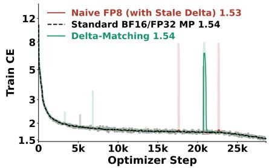  
(a) Pure GQA LLM.

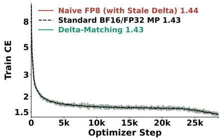  
(b) Mamba-2/GQA hybrid.  
Figure 8: Training cross-entropy for (a) a 1.475B pure GQA LLM and (b) a 1.67B Mamba-2/GQA hybrid, comparing BF16/FP32 mixed precision, naive FP8 with stale delta, and Delta-Matching.

Table 17: Last-attention-layer probes after 30B-token training, using one initialization seed per method and configuration. Masking zeros the attention output while retaining the residual and FFN. $\Delta \mathrm { C E } _ { \mathrm { m a s k } }$ is the resulting CE increase, with paired SEs over 2,000 shared 8,192-token windows evaluated in BF16. SEs are rounded to four decimal places. The maximum gain product is maxc $| g _ { q , c } g _ { k , c } | ;$ the top-six share is the percentage of $\textstyle \sum _ { c } ( g _ { q , c } g _ { k , c } ) ^ { 2 }$ in the six largest channels. The 1.475B pure-GQA rows use the same configuration as Table 18.
<table><tr><td>Method</td><td>Validation CE</td><td>Max. gain product</td><td>Top-six share (%)</td><td> $\Delta \mathrm { C E } _ { \mathrm { m a s k } }$ </td></tr><tr><td colspan="5">1.67B GDN/GQA</td></tr><tr><td>BF16/FP32 MP</td><td>1.4174</td><td>3.1</td><td>6.9</td><td> $0 . 0 5 8 5 \pm 0 . 0 0 0 3$ </td></tr><tr><td>Naive FP8 (Stale Delta)</td><td>1.8674</td><td>2244.4</td><td>99.9</td><td> $0 . 1 2 6 9 \pm 0 . 0 0 1 0$ </td></tr><tr><td>Delta-Matching</td><td>1.4169</td><td>3.7</td><td>7.8</td><td> $0 . 0 1 5 1 \pm 0 . 0 0 0 1$ </td></tr><tr><td colspan="5">1.67B Mamba-2/GQA</td></tr><tr><td>BF16/FP32 MP</td><td>1.4144</td><td>4.4</td><td>9.6</td><td> $0 . 0 2 8 8 \pm 0 . 0 0 0 2$ </td></tr><tr><td>Naive FP8 (Stale Delta)</td><td>1.4215</td><td>404.1</td><td>87.3</td><td> $0 . 0 1 1 9 \pm 0 . 0 0 0 1$ </td></tr><tr><td>Delta-Matching</td><td>1.4147</td><td>4.2</td><td>9.0</td><td> $0 . 0 1 6 5 \pm 0 . 0 0 0 2$ </td></tr><tr><td colspan="5">1.475B pure GQA</td></tr><tr><td>BF16/FP32 MP</td><td>1.5242</td><td>4.1</td><td>9.7</td><td> $0 . 2 5 8 5 \pm 0 . 0 0 0 8$ </td></tr><tr><td>Naive FP8 (Stale Delta)</td><td>1.5263</td><td>4.0</td><td>9.4</td><td> $0 . 2 7 8 4 \pm 0 . 0 0 1 1$ </td></tr><tr><td>Delta-Matching</td><td>1.5254</td><td>3.9</td><td>9.1</td><td> $0 . 2 1 8 0 \pm 0 . 0 0 0 8$ </td></tr><tr><td colspan="5">2.58B pure GQA</td></tr><tr><td>BF16/FP32 MP</td><td>1.4388</td><td>2.2</td><td>5.3</td><td> $0 . 0 3 0 2 \pm 0 . 0 0 0 2$ </td></tr><tr><td>Naive FP8 (Stale Delta)</td><td>1.4452</td><td>878.9</td><td>89.1</td><td> $0 . 0 0 0 8 \pm 0 . 0 0 0 0$ </td></tr><tr><td>Delta-Matching</td><td>1.4376</td><td>2.5</td><td>4.9</td><td> $0 . 0 0 9 5 \pm 0 . 0 0 0 1$ </td></tr></table>

## C.5.1 PURE GROUPED QUERY ATTENTION LLM

We probe one of the two initializations of the 1.475B pure-GQA model shown in Figure 8a and Table 18. Its 28 attention layers use 16 query and 8 KV heads of dimension 128, full-head RoPE with $\theta = 1 0 ^ { 6 } ,$ , and no attention output gate. Only the attention core uses FP8 through the Triton implementation; projections and FFNs remain BF16, corresponding to P2 against the P0 reference in Table 7. Stale delta raises validation CE by $0 . 0 0 2 0 \pm 0 . 0 0 0 3$ nats relative to MP, but the final layer’s maximum gain product remains near the reference (4.0 versus 4.1). Masking this layer costs 0.2784 nats, compared with 0.2585 for MP, so the model still depends substantially on its final attention layer.

We also evaluate one seed per method at 2.58B parameters under the same 30B-token training recipe (Table 17). This model retains 28 attention layers, full-head RoPE, and no output gate, but uses hidden width 2560, FFN width 8192, and 16 query and 4 KV heads of dimension 256. Its FP8 methods use our FP8 attention kernels with P4 precision, including FP8 FFNs and attention projections, against a P1 MP reference. The larger stale-delta model’s maximum final-layer gain product reaches 878.9, versus 2.2 for MP and 2.5 for Delta-Matching, with 89.1% of squared gain products concentrated in six channels. Pure GQA thus exhibits gain corruption at the larger scale, although head geometry, precision scope, and implementation also change.

Despite this corruption, the larger stale model’s paired validation CE gap is only $0 . 0 0 6 4 \pm 0 . 0 0 0 3$ nats. Masking its last attention output costs just 0.0008 nats, versus 0.0302 for MP and 0.0095 for Delta-Matching. The stale model’s penalty is about 3% of MP’s. With that output masked in both models, stale-delta CE is 1.4460, below MP’s 1.4690. Near-reference performance despite little dependence on the affected layer is consistent with compensation by the remaining 27 attention layers rather than gain repair, but the probe does not identify which components compensate.

Table 18: Evaluation of the 1.475B pure grouped-query attention LLM. Mean ± standard error over two initialization seeds. All scores except validation cross-entropy are percentages.
<table><tr><td>Method</td><td>Validation CE↓ RULER-4K ↑ RULER-8K ↑ Extraction ↑ TriviaQA ↑ MMLU ↑ CS9 ↑</td><td></td><td></td><td></td><td></td><td></td><td></td></tr><tr><td>BF16/FP32 MP</td><td>1.5283 ± 0.0041</td><td> $4 9 . 0 \pm 0 . 6$ </td><td> $3 7 . 2 \pm 3 . 1$ </td><td>48.8 ± 0.3</td><td></td><td></td><td>10.7 ± 0.0 26.1 ± 0.1 54.6 ± 0.3</td></tr><tr><td>Naive FP8 (Stale Delta) 1.5249 ± 0.0014</td><td></td><td> $5 2 . 1 \pm 2 . 7$ </td><td> $3 7 . 9 \pm 0 . 8$ </td><td> $4 8 . 2 \pm 0 . 2$ </td><td> $1 1 . 1 \pm 0 . 0$ </td><td> $2 6 . 3 \pm 0 . 4$ </td><td> $5 4 . 6 \pm 0 . 2$ </td></tr><tr><td>Delta-Matching (ours)</td><td> $1 . 5 2 8 3 \pm 0 . 0 0 2 9$ </td><td> $4 5 . 4 \pm 3 . 1$ </td><td> $3 6 . 0 \pm 1 . 2$ </td><td> $4 9 . 4 \pm { 1 . 6 }$ </td><td> $1 0 . 7 \pm 0 . 1$ </td><td> $2 7 . 4 \pm 1 . 4$ </td><td>54.8 ± 0.2</td></tr></table>

## C.5.2 MAMBA-2 AND GROUPED QUERY ATTENTION HYBRID LLM

The Mamba-2/GQA hybrid also retains near-reference validation loss and downstream performance under stale-delta training (Table 19). It shares the GDN/GQA hybrid’s six-attention-layer layout, head geometry, and training recipe, but uses 18 Mamba-2 layers and a wider FFN. Table 17 probes one final checkpoint per method, separately from the two-seed benchmark averages.

Stale delta still inflates the last layer’s gain products, with a maximum of 404.1 and a top-six share of 87.3%, versus 4.4 and 9.6% for MP. This maximum is below the GDN/GQA stale model’s 2244.4 but far above Delta-Matching’s 4.2. Yet the paired validation CE gap to MP is only 0.0070 ± 0.0002 nats, compared with $0 . 4 5 0 0 \pm 0 . 0 0 1 6$ for GDN/GQA.

Masking the affected Mamba-2/GQA layer costs 0.0119 nats, about 41% of MP’s 0.0288-nat masking penalty. The layer still contributes, but less than in the GDN/GQA stale model, whose masking penalty is 0.1269 nats, more than twice its MP reference’s 0.0585. With the last attention output masked, Mamba-2/GQA stale CE is 1.4334 versus 1.4432 for MP. These results are consistent with milder disruption and compensation elsewhere, despite having the same number of attention layers as GDN/GQA.

Takeaway. Near-reference loss conceals severe gain corruption in the 2.58B pure-GQA and Mamba-2/GQA models, unlike the smaller pure-GQA configuration. Masking suggests compensation elsewhere in the network, with attention-layer redundancy a plausible explanation for pure GQA. Delta-Matching maintains near-reference performance without the observed gain corruption.

Table 19: Evaluation of a Mamba-2/GQA hybrid LLM. Mean ± standard error over two initialization seeds. All scores except validation cross-entropy are percentages.
<table><tr><td>Method</td><td>Validation CE↓ RULER-4K ↑ RULER-8K ↑ Extraction ↑ TriviaQA ↑ MMLU ↑ CS9 ↑</td><td></td><td></td><td></td><td></td><td></td><td></td></tr><tr><td>BF16/FP32 MP</td><td> $1 . 4 1 5 2 \pm 0 . 0 0 0 8$ </td><td> $5 6 . 0 \pm 1 . 6$ </td><td> $4 6 . 5 \pm 1 . 2$ </td><td> $6 7 . 9 \pm 0 . 8$ </td><td> $1 5 . 5 \pm 0 . 5$ </td><td> $3 0 . 5 \pm 0 . 0$ </td><td> $5 8 . 6 \pm 0 . 5$ </td></tr><tr><td>Naive FP8 (Stale Delta)</td><td> $1 . 4 1 9 1 \pm 0 . 0 0 2 4$ </td><td> $6 1 . 8 \pm 0 . 1$ </td><td> $4 9 . 0 \pm 1 . 3$ </td><td> $6 8 . 4 \pm 0 . 6$ </td><td> $1 5 . 5 \pm 0 . 2$ </td><td> $3 1 . 7 \pm 2 . 0$ </td><td> $5 8 . 2 \pm 0 . 4$ </td></tr><tr><td>Delta-Matching (ours)</td><td> $1 . 4 1 5 2 \pm 0 . 0 0 0 4$ </td><td> $5 8 . 0 \pm 1 . 4$ </td><td> $4 8 . 0 \pm 0 . 6$ </td><td> $6 8 . 8 \pm 0 . 6$ </td><td> $1 5 . 8 \pm 0 . 1$ </td><td> $3 1 . 2 \pm { 1 . 1 }$ </td><td> $5 8 . 4 \pm 0 . 6$ </td></tr></table>

## C.6 ADDITIONAL STUDY ON TRAINING DYNAMICS

We test whether a larger global batch size reduces stale-delta degradation at a fixed token budget.

Setup. We train the 1.67B GDN/GQA hybrid with head dimension 256 on 30B Nemotron-CC tokens using 8,192-token windows and eight H100 GPUs. Only the attention core uses FP8 through the Triton implementation; projections and FFNs remain BF16 (P2 versus P0 in Table 7). We compare batches of 128 and 256 sequences, giving 1.05M and 2.10M tokens per step and 28,610 and 14,305 updates, respectively. Both use the recipe in Appendix B.2.3 and a peak learning rate of $2 . 4 \times 1 0 ^ { - 3 }$ , with warmup and decay occupying the same fractions of training. At each batch size, stale-delta and Delta-Matching share the implementation, initialization, and data order, differing only in the backward correction.

Table 20: Effect of tokens per optimizer step at a fixed 30B-token budget. The 1.05M-token rows report mean ± one SE across three initialization seeds. The 2.10M-token rows use one of those seeds and have no across-seed error bars. Validation CE is in nats per token; other scores are percentages.
<table><tr><td>Method</td><td>Validation CE↓ RULER-4K ↑ RULER-8K ↑ Extraction ↑</td><td></td><td></td><td></td><td>MMLU ↑</td><td>CS9↑</td></tr><tr><td colspan="7">1.05M tokens per step, 28,610 updates</td></tr><tr><td>BF16/FP32 MP</td><td>1.41387 ± 0.00036</td><td> $6 2 . 3 8 \pm 1 . 0 6$ </td><td> $5 2 . 1 6 \pm 1 . 4 1$ </td><td></td><td>67.21 ± 1.69 35.86 ± 0.17</td><td> $5 9 . 1 6 \pm 0 . 5 3$ </td></tr><tr><td>Naive FP8 (Stale Delta) 2.04837 ± 0.02806</td><td></td><td> $1 3 . 4 7 \pm 2 . 0 2$ </td><td> $1 0 . 1 2 \pm 2 . 4 5$ </td><td></td><td>31.52 ± 2.72 26.04 ± 0.14 44.07 ± 0.22</td><td></td></tr><tr><td>Delta-Matching</td><td>1.41498 ± 0.00088</td><td> $6 3 . 8 0 \pm { 1 . 6 9 }$ </td><td> $5 5 . 1 4 \pm 2 . 1 0$ </td><td></td><td>67.59 ± 0.86 34.69 ± 1.00 58.91 ± 0.12</td><td></td></tr><tr><td colspan="7">2.10M tokens per step, 14,305 updates</td></tr><tr><td>Naive FP8 (Stale Delta)</td><td>1.6197</td><td>46.64</td><td>36.80</td><td>59.45</td><td>26.93</td><td>52.69</td></tr><tr><td>Delta-Matching</td><td>1.4119</td><td>57.25</td><td>48.54</td><td>68.29</td><td>33.38</td><td>59.18</td></tr></table>

A larger batch reduces the final loss gap. For the initialization shared across batch sizes, doubling the batch reduces the final validation CE gap between stale delta and Delta-Matching from $0 . 6 8 \\\hat { 6 } 6 \pm 0 . 0 0 2 2$ to 0.2078 ± 0.0009 nats. Delta-Matching’s own validation CE changes by only $- 0 . 0 0 1 4 \pm 0 . 0 0 0 2$ nats. These paired uncertainties are SEs over 2,000 held-out windows, not across seeds. Despite the smaller gap, the larger-batch stale run still trails Delta-Matching on every downstream metric in Table 20.

Earlier degradation but a smaller final gap. For the shared initialization, the larger-batch run deteriorates after fewer updates (7,590 versus 8,820), but has half as many total updates and starts learning-rate decay earlier in update count. Its smaller final gap therefore need not imply less error per update.

At matched updates 9,000–9,500, the gaps are similar, averaging 0.029 with the standard batch and 0.034 with the doubled batch, before either learning-rate schedule decays.

Takeaway. Increasing tokens per step reduces the observed stale-delta penalty at a fixed token budget but does not eliminate it. The results are consistent with error accumulating over optimizer updates, while Delta-Matching maintains similar validation loss and downstream task performance at both batch sizes.

## C.7 DELTA-MATCHING WITH MUON-BASED TRAINING

We test whether the stale-delta dynamics and the benefit of Delta-Matching extend beyond AdamW by training with Muon (Jordan et al., 2024; Liu et al., 2025).

Setup. We use the 1.665B GDN/GQA hybrid with 18 GatedDeltaNet and 6 GQA layers, 16 query heads, 4 KV heads, head dimension 128, QK normalization, and RoPE on 32 channels per head. Each run uses eight H100 GPUs and a batch of 128 sequences of 8,192 tokens from Nemotron-CC. The BF16/FP32 reference uses FP8 FFNs and BF16 attention and projections (P1). Naive FP8 and Delta-Matching use FP8 attention, QKVO projections, and FFNs (P4), differing only in the backward correction. All three share one initialization and data order with their stage-1 AdamW counterparts.

Optimizer and schedule. Muon updates the 222 two-dimensional hidden weight matrices in attention, GatedDeltaNet projections, and FFNs. It uses Nesterov momentum of 0.95, five Newton– Schulz iterations, and decoupled weight decay of 0.1. For an m × n matrix, the orthogonalized update is scaled by $0 . 2 \sqrt { \operatorname* { m a x } ( m , n ) }$ , following the Moonlight recipe (Liu et al., 2025) to reuse the AdamW learning rate. AdamW with $( \beta _ { 1 } , \beta _ { 2 } ) = ( 0 . 9 , 0 . 9 5 )$ updates the remaining parameters, including tied embeddings, normalization and QK gains, GDN convolutions, and state-space scalars. We retain the 28,610-step warmup-stable-decay schedule, with 952 warmup steps, peak learning rate $2 . 4 \times 1 0 ^ { - 3 }$ , and gradient-norm clipping at 1.0.

## C.7.1 MECHANISM PROBE

We first inspect the initial 4,500 updates, approximately 4.7B tokens, while the learning rate is still at its peak. The AdamW curves cover the same initial interval with the same model, initialization, data order, and learning-rate schedule.

Measurements. The carrier gain is $\begin{array} { r } { G _ { 2 3 } = \frac { 1 } { 3 } \sum _ { c \in \{ 7 , 8 , 2 4 \} } g _ { q , c } g _ { k , c } . } \end{array}$ , averaged over three channels in the last attention layer. Its query and key RMSNorm gain vectors each have 128 entries, are shared across heads, and are initialized to one. The selected channels belong to the slow rotary pairs (7, 23) and (8, 24). Gains are logged every 25 updates and plotted without smoothing. The AdamW gain traces come from instrumented reruns with the same initialization, data order, and schedule as the corresponding stage-1 runs. Training cross-entropy is logged every 10 updates, with a rolling median over 51 logged points used for the plotted loss traces.

Results. Figure 9 shows that stale-delta gain growth persists under Muon-based training, although it is less pronounced than under AdamW during this interval. The Muon stale-delta run also develops a positive training-loss gap, whereas Delta-Matching closely follows the Muon BF16/FP32 gain trajectory without the rising loss gap. The AdamW stale-delta run exhibits stronger gain distortion even though its loss gap is not consistently positive, illustrating why short loss traces alone can miss the altered dynamics.

## C.7.2 FULL TRAINING AND DOWNSTREAM EVALUATION

We train the three Muon methods for the full 28,610 updates, approximately 30B tokens, and evaluate their final checkpoints with the same protocol as Table 1a. Tables 21 and 22 compare them with the corresponding individual AdamW runs sharing the same initialization and batches. All rows use one shared initialization; the AdamW values are individual-run results rather than the two-seed means in Table 1a. Per-task RULER scores are reported in Table 37.

Results. The Muon reference reaches lower validation CE than the paired AdamW reference, 1.3988 versus 1.4174, but stale delta still causes a large loss increase and downstream degradation. Relative to Muon’s reference, stale delta raises validation CE by $0 . 4 0 8 8 8 \pm 0 . 0 0 1 4 5$ nats, while Delta-Matching differs by $- 0 . 0 0 0 2 4 \pm 0 . 0 0 0 1 6$ nats, with paired standard errors over 2,000 shared validation windows. Stale delta lowers RULER-8K from 53.0 to 26.2, TriviaQA from 16.5 to 3.3, and CS9 from 59.2 to 47.2. Delta-Matching retains near-reference validation loss and downstream performance, with higher RULER-8K, extraction, MMLU, and CS9 scores in this initialization.

Muon Standard BF16/FP32 MP Muon Delta-Matching Muon Naive FP8 (with Stale Delta) AdamW Standard BF16/FP32 MP AdamW Delta-Matching AdamW Naive FP8 (with Stale Delta)

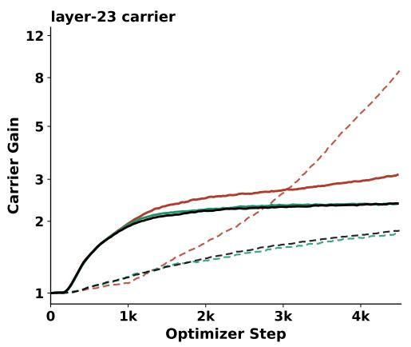

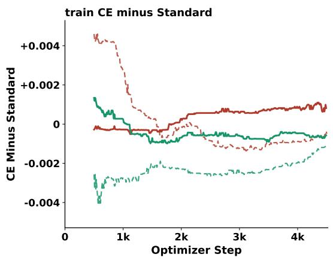  
Figure 9: Training dynamics with Muon-based updates (solid) and AdamW (dashed) over the first 4,500 optimizer steps. The left panel shows the layer-23 mean query–key gain product $G _ { 2 3 }$ on a logarithmic axis; the right shows training cross-entropy relative to each optimizer’s BF16/FP32 reference on a linear axis. Stale delta produces excess gain growth under both optimizer recipes, while Delta-Matching closely tracks the corresponding reference.

Table 21: Validation loss and downstream performance across optimizers. Results after 28,610 updates with one shared initialization and data order. Validation CE is in nats per token; downstream scores are percentages. CS9 is the unweighted mean of the nine benchmark accuracies in Table 22. Single-initialization results carry no standard errors.
<table><tr><td></td><td></td><td></td><td colspan="3">In-Context Recall ↑</td><td colspan="3">General Capabilities ↑</td></tr><tr><td>Optimizer</td><td>Method</td><td>Validation CE↓</td><td>RULER-4K</td><td>RULER-8K</td><td>Extraction</td><td>TriviaQA</td><td>MMLU</td><td>CS9</td></tr><tr><td>Muon</td><td>BF16/FP32 MP</td><td>1.3988</td><td>62.1</td><td>53.0</td><td>68.2</td><td>16.5</td><td>36.2</td><td>59.2</td></tr><tr><td></td><td>Naive FP8 (Stale Delta)</td><td>1.8077</td><td>32.5</td><td>26.2</td><td>47.5</td><td>3.3</td><td>28.2</td><td>47.2</td></tr><tr><td></td><td>Delta-Matching (ours)</td><td>1.3985</td><td>61.2</td><td>58.7</td><td>70.6</td><td>16.8</td><td>38.1</td><td>60.4</td></tr><tr><td>AdamW</td><td>BF16/FP32 MP</td><td>1.4174</td><td>64.5</td><td>54.5</td><td>67.7</td><td>15.3</td><td>34.0</td><td>59.0</td></tr><tr><td></td><td>Naive FP8 (Stale Delta)</td><td>1.8674</td><td>25.2</td><td>21.9</td><td>47.6</td><td>2.9</td><td>26.4</td><td>47.8</td></tr><tr><td></td><td>Delta-Matching (ours)</td><td>1.4169</td><td>60.2</td><td>48.3</td><td>68.4</td><td>15.4</td><td>33.4</td><td>59.2</td></tr></table>

Table 22: Commonsense individual benchmark accuracy across optimizers. The same singleinitialization runs as in Table 21. Scores are percentages; Avg is the unweighted mean of the nine benchmarks.
<table><tr><td>Optimizer Method</td><td></td><td>LAMBADA</td><td> $_ \mathrm { H e l l a S w a g }$ </td><td>PIQA ARC-Easy</td><td></td><td> $\mathrm { S c i Q }$ </td><td></td><td>OpenBookQA WinoGrande</td><td>COPA</td><td>ARC-Challenge |</td><td> $\mathbf { A v } \mathbf { g }$ </td></tr><tr><td rowspan="3">Muon</td><td>BF16/FP32 MP</td><td>47.5</td><td>58.1</td><td>71.7</td><td>62.2</td><td>90.8</td><td>37.2</td><td>58.5</td><td>70.0</td><td>36.9</td><td>|59.2</td></tr><tr><td>Naive FP8 (Stale Delta)</td><td>25.1</td><td>37.8</td><td>64.6</td><td>47.7</td><td>77.7</td><td>29.8</td><td>50.0</td><td>64.0</td><td>27.8</td><td>47.2</td></tr><tr><td>Delta-Matching (ours)</td><td>48.1</td><td>58.1</td><td>73.2</td><td>65.0</td><td>90.5</td><td>37.8</td><td>60.5</td><td>72.0</td><td>38.7</td><td>60.4</td></tr><tr><td rowspan="3">AdamW</td><td>BF16/FP32 MP</td><td>46.1</td><td>57.3</td><td>72.1</td><td>64.6</td><td>90.1</td><td>36.4</td><td>56.7</td><td>71.0</td><td>36.8</td><td>|59.0</td></tr><tr><td>Naive FP8 (Stale Delta)</td><td>25.1</td><td>36.4</td><td>64.3</td><td>46.5</td><td>78.6</td><td>31.6</td><td>52.7</td><td>68.0</td><td>27.4</td><td>47.8</td></tr><tr><td>Delta-Matching (ours)</td><td>46.5</td><td>57.0</td><td>72.4</td><td>62.5</td><td>89.9</td><td>38.0</td><td>56.8</td><td>72.0</td><td>37.2</td><td>59.2</td></tr></table>

Takeaway. For this Muon-based recipe and shared initialization, the stale-delta distortion persists through full training, and Delta-Matching preserves reference-level model quality. This comparison changes the optimizer for hidden weight matrices; normalization gains, including the QK gains, remain on AdamW.

## C.8 GENERAL CAPABILITIES AFTER CONTEXT EXTENSION

Table 23 reports TriviaQA, MMLU, and CS9 results after context extension, complementing the in-context recall evaluation in Section 4.6. Delta-Matching matches the BF16/FP32 mean MMLU score and achieves a higher mean CS9 score, while TriviaQA remains variable across runs.

Table 23: General capabilities after context extension from 8K to 64K tokens. Results for the 1.67B GDN/GQA hybrid in Section 4.6. cuDNN/TE FP8 is reported separately for the first and second seeds; other rows report mean ± standard error over two initialization seeds. All scores are percentages. Individual commonsense benchmark accuracies appear in Table 27.
<table><tr><td>Method</td><td>TriviaQA ↑</td><td>MMLU↑</td><td>CS9 ↑</td></tr><tr><td>BF16/FP32 MP</td><td> $4 . 7 \pm 4 . 6$ </td><td> $2 5 . 5 \pm 0 . 1$ </td><td> $5 8 . 9 \pm 0 . 4$ </td></tr><tr><td>cuDNN/TE FP8 (1st seed)</td><td></td><td>Training diverged</td><td></td></tr><tr><td>cuDNN/TE FP8 (2nd seed)</td><td>1.2</td><td>25.8</td><td>58.8</td></tr><tr><td>Naive FP8 (Stale Delta)</td><td> $1 3 . 0 \pm { } 1 . 0$ </td><td> $2 5 . 7 \pm 0 . 3$ </td><td> $5 7 . 4 \pm 0 . 3$ </td></tr><tr><td>Delta-Matching (ours)</td><td> $2 . 9 \pm 1 . 6$ </td><td> $2 5 . 5 \pm 0 . 1$ </td><td> $5 9 . 9 \pm 0 . 0$ </td></tr></table>

## C.9 COMMONSENSE INDIVIDUAL BENCHMARK ACCURACY

We report accuracies on nine individual commonsense benchmarks. CS9 (Avg) is their unweighted mean. Table 24 reports individual benchmark accuracies for the attention variants in Table 2 (Section 4.3). Table 25 covers the model architectures in Table 3 (Section 4.4), and Table 26 covers the parameter scales in Table 4 (Section 4.5). Table 27 covers the context-extension runs in Table 23 (Section 4.6). Table 28 covers the FP8-linear runs in Table 12 (Appendix C.3).

Table 24: Commonsense individual benchmark accuracy across attention configurations. Mean ± standard error over two initialization seeds. Scores are percentages; Avg is the unweighted mean of the nine benchmarks. Results correspond to Table 2.
<table><tr><td>Method</td><td>LAMBADA HellaSwag</td><td></td><td>PIQA</td><td>ARC-Easy</td><td>SciQ</td><td>OpenBookQA WinoGrande</td><td></td><td>COPA</td><td>ARC-Challenge</td><td> $\mathbf { A v } \mathbf { g }$ </td></tr><tr><td colspan="9">NoPE</td></tr><tr><td>BF16/FP32 MP</td><td> $4 5 . 3 \pm 0 . 5$ </td><td> $5 7 . 1 \pm 0 . 3$ </td><td> $7 2 . 8 \pm 0 . 1$ </td><td> $6 3 . 2 \pm { 0 . 2 }$ </td><td> $8 8 . 8 \pm 0 . 2$ </td><td> $3 7 . 2 \pm 0 . 4$ </td><td> $5 6 . 8 \pm 0 . 2$ </td><td> $6 8 . 5 \pm 1 . 5$ </td><td> $3 6 . 4 \pm { 1 . 2 }$ </td><td> $5 8 . 5 \pm 0 . 1$ </td></tr><tr><td>Naive FP8 (Stale Delta)</td><td> $3 1 . 6 \pm 4 . 9$ </td><td> $4 4 . 7 \pm 4 . 4$ </td><td> $6 7 . 1 \pm 1 . 6$ </td><td> $5 3 . 8 \pm { 3 . 6 }$ </td><td> $8 2 . 3 \pm 4 . 6$ </td><td> $3 2 . 6 \pm 0 . 8$ </td><td> $5 4 . 9 \pm 0 . 6$ </td><td> $6 8 . 5 \pm 2 . 5$ </td><td> $3 1 . 0 \pm { 1 . 8 }$ </td><td> $5 1 . 8 \pm 2 . 7$ </td></tr><tr><td>Delta-Matching (ours)</td><td> $4 4 . 9 \pm 0 . 4$ </td><td> $5 6 . 7 \pm 0 . 1$ </td><td> $7 2 . 3 \pm 0 . 1$ </td><td> $6 3 . 8 \pm 0 . 6$ </td><td> $9 0 . 0 \pm 0 . 1$ </td><td> $3 7 . 1 \pm 0 . 1$ </td><td> $5 7 . 7 \pm 0 . 8$ </td><td> $7 1 . 5 \pm 1 . 5$ </td><td> $3 6 . 0 \pm 0 . 6$ </td><td> $5 8 . 9 \pm 0 . 2$ </td></tr><tr><td colspan="9">No QK-norm</td></tr><tr><td>BF16/FP32 MP</td><td></td><td></td><td></td><td> $6 5 . 3 \pm 0 . 8$ </td><td> $8 9 . 2 \pm 0 . 2$ </td><td> $3 6 . 3 \pm 0 . 1$ </td><td> $5 7 . 2 \pm 0 . 5$ </td><td> $7 0 . 5 \pm 1 . 5$ </td><td> $3 6 . 8 \pm 0 . 4$ </td><td> $\lvert 5 9 . 1 \pm 0 . 2$ </td></tr><tr><td>Naive FP8 (Stale Delta)</td><td> $4 6 . 9 \pm 0 . 5$ </td><td> $5 7 . 1 \pm 0 . 1$ </td><td> $7 2 . 4 \pm 0 . 1$ </td><td></td><td></td><td> $T r a i n i n g d i \nu e r g e d$ </td><td></td><td></td><td></td><td></td></tr><tr><td colspan="9">Delta-Matching (ours)</td></tr><tr><td></td><td> $4 5 . 7 \pm 0 . 5$ </td><td> $5 6 . 9 \pm 0 . 2$ </td><td> $7 2 . 8 \pm 0 . 7$ </td><td> $6 4 . 1 \pm 2 . 3$ </td><td> $8 9 . 6 \pm 0 . 1$ </td><td> $3 6 . 7 \pm 0 . 5$ </td><td> $5 8 . 9 \pm 0 . 5$ </td><td> $6 9 . 0 \pm 0 . 0$ </td><td> $3 6 . 8 \pm 0 . 1$ </td><td> $| 5 8 . 9 \pm 0 . 5$ </td></tr><tr><td colspan="9">Head dimension = 256</td></tr><tr><td>BF16/FP32 MP</td><td> $4 5 . 9 \pm 0 . 0$ </td><td> $5 7 . 1 \pm 0 . 1$ </td><td> $7 2 . 3 \pm 0 . 1$ </td><td> $6 4 . 2 \pm { 1 . 7 }$ </td><td> $8 9 . 7 \pm 0 . 5$ </td><td> $3 8 . 2 \pm { 1 . 8 }$ </td><td> $5 8 . 5 \pm 0 . 1$ </td><td> $7 1 . 5 \pm 2 . 5$ </td><td> $3 7 . 2 \pm 0 . 6$ </td><td> $5 9 . 4 \pm 0 . 8$ </td></tr><tr><td>Naive FP8 (Stale Delta)</td><td> $1 8 . 1 \pm 1 . 2$ </td><td> $3 2 . 6 \pm 0 . 2$ </td><td> $6 2 . 7 \pm 0 . 1$ </td><td> $4 2 . 8 \pm 0 . 4$ </td><td> $7 2 . 4 \pm 0 . 4$ </td><td> $2 9 . 7 \pm 0 . 1$ </td><td> $5 0 . 5 \pm 0 . 2$ </td><td> $6 2 . 0 \pm 1 . 0$ </td><td> $2 5 . 4 \pm 0 . 8$ </td><td> $4 4 . 0 \pm 0 . 4$ </td></tr><tr><td>Delta-Matching (ours)</td><td> $4 6 . 6 \pm 0 . 7$ </td><td> $5 7 . 3 \pm 0 . 2$ </td><td> $7 2 . 4 \pm 0 . 1$ </td><td> $6 3 . 8 \pm 0 . 9$ </td><td> $8 9 . 5 \pm { 1 . 2 }$ </td><td> $3 7 . 3 \pm 0 . 9$ </td><td> $5 7 . 8 \pm 0 . 4$ </td><td> $6 8 . 5 \pm 0 . 5$ </td><td> $3 6 . 9 \pm 0 . 1$ </td><td> $5 8 . 9 \pm 0 . 2$ </td></tr></table>

Table 25: Commonsense individual benchmark accuracy across model architectures. Results for the 1.67B GDN/MLA and KDA/GQA hybrids in Table 3. Mean ± standard error over two initialization seeds. Scores are percentages; Avg is the unweighted mean of the nine benchmarks.
<table><tr><td>Method</td><td>LAMBADA HellaSwag</td><td></td><td>PIQA</td><td>ARC-Easy</td><td>SciQ</td><td>OpenBookQA WinoGrande</td><td></td><td>COPA</td><td>ARC-Challenge</td><td> $\mathbf { A v } \mathbf { g }$ </td></tr><tr><td colspan="9">GDN/MLA</td></tr><tr><td>BF16/FP32 MP</td><td> $4 6 . 1 \pm 0 . 8$ </td><td> $5 7 . 1 \pm 0 . 1$ </td><td> $7 2 . 5 \pm 0 . 2$ </td><td> $6 4 . 6 \pm 1 . 3$ </td><td> $8 9 . 2 \pm 0 . 4$ </td><td> $3 7 . 3 \pm { 1 . 1 }$ </td><td> $5 8 . 8 \pm { } 1 . 0$ </td><td> $7 0 . 0 \pm 1 . 0$ </td><td> $3 6 . 9 \pm 0 . 1$ </td><td> $5 9 . 2 \pm 0 . 0$ </td></tr><tr><td>Naive FP8 (Stale Delta)</td><td> $2 2 . 1 \pm 3 . 2$ </td><td> $3 4 . 9 \pm { 1 . 6 }$ </td><td> $6 3 . 8 \pm { 1 . 4 }$ </td><td> $4 5 . 9 \pm 2 . 0$ </td><td> $7 4 . 9 \pm 0 . 4$ </td><td> $3 1 . 4 \pm 0 . 2$ </td><td> $5 1 . 3 \pm 0 . 1$ </td><td> $6 3 . 0 \pm 2 . 0$ </td><td> $2 6 . 9 \pm 1 . 2$ </td><td> $4 6 . 0 \pm 1 . 3$ </td></tr><tr><td>Delta-Matching (ours)</td><td> $4 6 . 1 \pm 0 . 3$ </td><td> $5 6 . 9 \pm 0 . 4$ </td><td> $7 2 . 8 \pm 0 . 3$ </td><td> $6 3 . 7 \pm 0 . 3$ </td><td> $8 9 . 5 \pm 0 . 1$ </td><td> $3 8 . 0 \pm { 1 . 8 }$ </td><td> $5 8 . 4 \pm 0 . 3$ </td><td> $7 0 . 5 \pm 0 . 5$ </td><td> $3 7 . 2 \pm 0 . 6$ </td><td> $5 9 . 2 \pm 0 . 3$ </td></tr><tr><td colspan="9">KDA/GQA</td></tr><tr><td>BF16/FP32 MP</td><td> $4 7 . 2 \pm 0 . 7$ </td><td> $5 8 . 5 \pm 0 . 2$ </td><td> $7 3 . 0 \pm 0 . 0$ </td><td> $6 6 . 1 \pm 1 . 0$ </td><td> $9 0 . 3 \pm 0 . 1$ </td><td> $3 7 . 8 \pm 0 . 4$ </td><td> $5 8 . 4 \pm 0 . 2$ </td><td> $7 2 . 5 \pm 3 . 5$ </td><td> $3 8 . 4 \pm 0 . 2$ </td><td> $6 0 . 2 \pm { 0 . 3 }$ </td></tr><tr><td>Naive FP8 (Stale Delta)</td><td> $2 6 . 5 \pm 3 . 8$ </td><td> $3 8 . 6 \pm 3 . 7$ </td><td> $6 5 . 1 \pm 1 . 0$ </td><td> $4 9 . 1 \pm 3 . 5$ </td><td> $7 9 . 5 \pm 4 . 0$ </td><td> $3 2 . 0 \pm 0 . 4$ </td><td> $5 1 . 9 \pm 0 . 9$ </td><td> $6 6 . 0 \pm 2 . 0$ </td><td> $2 8 . 0 \pm 1 . 4$ </td><td> $4 8 . 5 \pm 2 . 2$ </td></tr><tr><td>Delta-Matching (ours)</td><td> $4 7 . 3 \pm 0 . 3$ </td><td> $5 8 . 4 \pm 0 . 1$ </td><td> $7 3 . 0 \pm 0 . 9$ </td><td> $6 5 . 2 \pm 0 . 9$ </td><td> $9 0 . 2 \pm 0 . 2$ </td><td> $3 7 . 8 \pm 0 . 4$ </td><td> $5 9 . 7 \pm 0 . 8$ </td><td> $7 0 . 5 \pm 0 . 5$ </td><td> $3 7 . 8 \pm 0 . 1$ </td><td> $6 0 . 0 \pm 0 . 1$ </td></tr></table>

Table 26: Commonsense individual benchmark accuracy across parameter scales. Mean ± standard error over two initialization seeds. Scores are percentages; Avg is the unweighted mean of the nine benchmarks. Results correspond to Table 4.
<table><tr><td>Method</td><td>LAMBADA HellaSwag</td><td></td><td>PIQA</td><td>ARC-Easy</td><td>SciQ</td><td>OpenBookQA WinoGrande</td><td></td><td>COPA</td><td>ARC-Challenge</td><td> $\mathbf { A v } \mathbf { g }$ </td></tr><tr><td colspan="9">0.569B parameters</td></tr><tr><td>BF16/FP32 MP</td><td> $3 9 . 9 \pm 0 . 0$ </td><td> $4 9 . 8 \pm 0 . 1$ </td><td> $6 9 . 7 \pm 0 . 4$ </td><td> $5 8 . 1 \pm 0 . 5$ </td><td> $8 7 . 2 \pm 0 . 9$ </td><td> $3 3 . 3 \pm 0 . 5$ </td><td> $5 4 . 0 \pm 1 . 1$ </td><td> $6 9 . 0 \pm 1 . 0$ </td><td> $3 1 . 5 \pm 0 . 5$ </td><td> $5 4 . 7 \pm 0 . 1$ </td></tr><tr><td>Naive FP8 (Stale Delta)</td><td> $3 9 . 8 \pm 0 . 7$ </td><td> $4 9 . 1 \pm 0 . 9$ </td><td> $7 0 . 0 \pm 0 . 4$ </td><td> $5 8 . 1 \pm 1 . 3$ </td><td> $8 4 . 0 \pm 0 . 6$ </td><td> $3 3 . 7 \pm 0 . 1$ </td><td> $5 2 . 3 \pm 0 . 1$ </td><td> $6 6 . 0 \pm 1 . 0$ </td><td> $3 1 . 4 \pm 0 . 6$ </td><td> $5 3 . 8 \pm 0 . 6$ </td></tr><tr><td>Delta-Matching (ours)</td><td> $3 9 . 4 \pm 0 . 1$ </td><td> $5 0 . 0 \pm 0 . 0$ </td><td> $7 0 . 3 \pm 0 . 2$ </td><td> $5 6 . 3 \pm 1 . 5$ </td><td> $8 6 . 4 \pm 0 . 6$ </td><td> $3 4 . 5 \pm 0 . 5$ </td><td> $5 4 . 7 \pm 0 . 4$ </td><td> $6 8 . 5 \pm 2 . 5$ </td><td> $3 1 . 6 \pm 0 . 5$ </td><td> $5 4 . 6 \pm 0 . 0$ </td></tr><tr><td colspan="9">5.289B parameters</td></tr><tr><td>BF16/FP32 MP</td><td></td><td> $6 2 . 7 \pm 0 . 3$ </td><td></td><td></td><td> $9 1 . 0 \pm 0 . 2 $ </td><td> $3 9 . 1 \pm 0 . 7$ </td><td> $6 1 . 8 \pm 0 . 9$ </td><td> $7 7 . 0 \pm 0 . 0$ </td><td> $4 1 . 5 \pm 0 . 1$ </td><td> $6 3 . 1 \pm 0 . 1$ </td></tr><tr><td>Naive FP8 (Stale Delta)</td><td> $5 1 . 6 \pm 0 . 5$   $2 0 . 1 \pm 0 . 3$ </td><td> $3 5 . 4 \pm 0 . 8$ </td><td> $6 4 . 3 \pm 1 . 2$ </td><td>74.5 ± 0.4 68.4 ± 0.1 44.3 ± 0.9</td><td> $7 3 . 4 \pm 1 . 1$ </td><td> $3 2 . 0 \pm { } 1 . 2$ </td><td> $5 0 . 9 \pm 0 . 2$ </td><td> $6 1 . 5 \pm 2 . 5$ </td><td> $2 6 . 8 \pm 0 . 1$ </td><td> $4 5 . 4 \pm 0 . 3$ </td></tr><tr><td>Delta-Matching (ours)</td><td> $5 1 . 2 \pm 0 . 4$ </td><td> $6 2 . 5 \pm 0 . 1$ </td><td> $7 4 . 4 \pm 0 . 5$ </td><td> $6 8 . 0 \pm 0 . 5$ </td><td> $9 0 . 3 \pm 0 . 1$ </td><td> $3 9 . 5 \pm 0 . 7$ </td><td> $6 0 . 7 \pm 0 . 6$ </td><td> $7 1 . 0 \pm 3 . 0$ </td><td> $4 0 . 6 \pm 0 . 2$ </td><td> $6 2 . 0 \pm 0 . 4$ </td></tr></table>

<table><tr><td>Method</td><td>LAMBADA HellaSwag</td><td></td><td>PIQA</td><td>ARC-Easy</td><td>SciQ</td><td>OpenBookQA WinoGrande</td><td></td><td>COPA</td><td>ARC-Challenge |</td><td>Avg</td></tr><tr><td>BF16/FP32 MP</td><td> $5 7 . 1 \pm 0 . 4$ </td><td> $5 8 . 2 \pm 0 . 1$ </td><td>73.3 ± 0.3</td><td> $5 4 . 2 \pm 3 . 5$ </td><td>86.7 ± 1.3</td><td> $3 6 . 7 \pm 0 . 3$ </td><td>58.5 ± 0.6</td><td> $7 2 . 5 \pm 2 . 5$ </td><td> $3 2 . 7 \pm 0 . 9$ </td><td> $5 8 . 9 \pm 0 . 4$ </td></tr><tr><td>cuDNN/TE FP8 (1st seed)</td><td colspan="10">Training diverged</td></tr><tr><td>cuDNN/TE FP8 (2nd seed)</td><td> $5 5 . 5$ </td><td>56.8</td><td>72.9</td><td>57.4</td><td>85.9</td><td>38.0</td><td>59.4</td><td> $7 0 . 0$ </td><td> $3 3 . 4$ </td><td> $5 8 . 8$ </td></tr><tr><td>Naive FP8 (Stale Delta)</td><td> $5 3 . 7 \pm 0 . 1$ </td><td> $5 4 . 2 \pm 0 . 0$ </td><td> $7 2 . 4 \pm 0 . 6$ </td><td> $5 6 . 0 \pm 1 . 3$ </td><td> $8 3 . 8 \pm 0 . 1$ </td><td> $3 6 . 2 \pm { 1 . 0 }$ </td><td> $5 7 . 2 \pm 0 . 4$ </td><td> $7 1 . 0 \pm 2 . 0$ </td><td> $3 2 . 5 \pm 0 . 4$ </td><td> $5 7 . 4 \pm 0 . 3$ </td></tr><tr><td>Delta-Matching (ours)</td><td> $5 6 . 6 \pm 0 . 1$ </td><td> $5 8 . 0 \pm 0 . 1$ </td><td> $7 2 . 9 \pm 0 . 2$ </td><td> $5 8 . 2 \pm 0 . 5$ </td><td> $8 8 . 3 \pm 0 . 5$ </td><td>36.3 ± 0.1</td><td> $5 8 . 8 \pm 0 . 7$ </td><td> $7 5 . 0 \pm 0 . 0$ </td><td> $3 4 . 5 \pm 0 . 0$ </td><td> $5 9 . 9 \pm 0 . 0$ </td></tr></table>

Table 27: Commonsense individual benchmark accuracy after context extension from 8K to 64K tokens. Results correspond to Table 23, using the benchmark metrics in Table 1b. cuDNN/TE FP8 is reported separately for the first and second seeds; other rows report mean ± standard error over two initialization seeds. Scores are percentages; Avg is the unweighted mean of the nine benchmarks.

<table><tr><td>Method</td><td>LAMBADA↑</td><td>Hella ↑</td><td></td><td>PIQA ↑ ARC-e ↑</td><td>SciQ ↑</td><td>OBQA ↑ Wino ↑</td><td></td><td>COPA↑</td><td> $\overline { { \mathrm { A R C - c } \uparrow } }$ </td><td>Avg ↑</td></tr><tr><td>BF16/FP32 MP</td><td>45.9 ± 0.0</td><td> $\overline { { 5 7 . 1 \pm 0 . 1 } }$ </td><td> $7 2 . 3 \pm 0 . 1$ </td><td> $\overline { { 6 4 . 2 \pm 1 . 7 } }$ </td><td>89.7 ± 0.5</td><td> $3 8 . 2 \pm 1 . 8$ </td><td> $5 8 . 5 \pm 0 . 1$ </td><td> $7 1 . 5 \pm 2 . 5$ </td><td> $3 7 . 2 \pm 0 . 6$ </td><td> $\overline { { 5 9 . 4 1 \pm 0 . 8 1 } }$ </td></tr><tr><td>BF16/FP32 MP + FP8 FFN</td><td> $4 6 . 2 \pm 0 . 3$ </td><td> $5 7 . 2 \pm { \bf 0 . 0 }$ </td><td>73.0 ± 0.6 64.0 ± 0.4</td><td></td><td>89.2 ± 0.8</td><td> $3 7 . 3 \pm 0 . 7$ </td><td>57.5 ± 0.7</td><td>73.0 ± 2.0</td><td> $3 6 . 7 \pm 0 . 3$ </td><td> $5 9 . 3 6 \pm { \bf 0 . 0 2 }$ </td></tr><tr><td>FP8 Attn (Stale Delta) + FP8 FFN</td><td> $\overline { { 1 8 . 9 \pm 0 . 8 } }$ </td><td> $3 3 . 2 \pm 0 . 3$ </td><td>63.0 ± 1.4</td><td> $\overline { { 4 3 . 0 \pm 1 . 0 } }$ </td><td> $7 3 . 7 \pm \mathbf { 0 . 4 }$ </td><td> $2 9 . 9 \pm 0 . 5$ </td><td>50.0 ± 0.5</td><td> $\overline { { 5 9 . 0 \pm 3 . 0 } }$ </td><td> $2 5 . 7 \pm 0 . 9$ </td><td> $\overline { { 4 4 . 0 4 \pm 0 . 5 5 } }$ </td></tr><tr><td> $\mathrm { D e l t a - M a t c h i n g + F P 8 ~ F F N }$ </td><td>46.7 ± 0.1</td><td> $5 6 . 9 \pm \mathbf { 0 . 2 }$ </td><td>72.4 ± 0.3</td><td> $6 3 . 2 \pm 1 . 3$ </td><td> $8 9 . 8 \pm 0 . 6$ </td><td> $3 6 . 3 \pm 0 . 3$ </td><td>57.7 ± 0.6</td><td> $6 5 . 0 \pm 2 . 0$ </td><td> $3 6 . 6 \pm 0 . 0$ </td><td> $5 8 . 2 9 \pm 0 . 5 1$ </td></tr><tr><td>Delta-Matching + FP8 FFN + FP8 QKVO</td><td>46.3 ± 0.3</td><td> $5 7 . 0 \pm \mathbf { 0 . 1 }$ </td><td>72.3 ± 0.1</td><td>62.5 ± 0.6 90.6 ± 0.4</td><td></td><td> $3 7 . 8 \pm 0 . 4$ </td><td>57.8 ± 0.9</td><td> $7 0 . 0 \pm 0 . 0$ </td><td>36.2 ± 0.5</td><td> $5 8 . 9 4 \pm { \bf 0 . 0 2 }$ </td></tr></table>

Table 28: Commonsense individual benchmark accuracy with FP8 linear layers. Configurations follow Appendix C.3. Mean ± standard error over two initialization seeds; scores are percentages. Avg is the unweighted mean of the nine benchmarks.

## C.10 RULER SCORES BY TASK

We provide 13-task RULER breakdowns using the evaluation protocol in Appendix B.5. Table 29 breaks down the FP8 attention comparison in Table 1a (Section 4.2). Table 30 covers the NoPE, no-QK-normalization, and head-dimension-256 variants in Table 2 (Section 4.3). Table 31 covers the model architectures in Table 3 (Section 4.4); and Table 32 covers the parameter scales in Table 4 (Section 4.5). Table 33 breaks down the context-extension results in Table 5 (Section 4.6). Table 34 covers the FP8-linear runs in Table 12 (Appendix C.3). Tables 35 and 36 provide the breakdowns for Tables 18 and 19, respectively, in Appendix C.5. Table 37 covers the Muon and AdamW runs in Table 21 (Appendix C.7.2).

All scores are percentages, with mean ± one standard error across two initialization seeds unless a single seed is shown. Avg is the unweighted mean of the 13 tasks at each context length, computed within each seed before aggregation across seeds. The reported uncertainty reflects variation across seeds, not benchmark sampling. Naive FP8 uses stale delta; the consistent-dO variant is labeled separately. Diverged runs retain the Training diverged designation.

S1, S2, and S3 denote the three single-needle retrieval tasks; MK1, MK2, and MK3 denote the three multi-key tasks; MV and MQ denote multi-value and multi-query retrieval. VT is variable tracking, CWE and FWE are common- and frequent-word extraction, and QA1 and QA2 use SQuAD and HotpotQA, respectively. Each context length is split into two panels covering all 13 tasks and Avg.

Table 29: Per-task RULER scores for FP8 attention methods. 4K context. Results correspond to Table 1a. Mean ± standard error over two initialization seeds; scores are percentages.
<table><tr><td colspan="8"></td></tr><tr><td>Method</td><td>S1</td><td>S2</td><td>S3</td><td>MK1</td><td>MK2</td><td>MK3</td><td>MV</td></tr><tr><td>BF16/FP32 MP</td><td> $9 9 . 6 \pm 0 . 4$ </td><td> $1 0 0 . 0 \pm 0 . 0$ </td><td> $7 9 . 5 \pm 1 8 . 7$ </td><td> $9 5 . 3 \pm 2 . 9$ </td><td> $8 8 . 2 \pm 6 . 0$ </td><td> $1 9 . 6 \pm 5 . 6$ </td><td> $8 0 . 1 \pm 9 . 8$ </td></tr><tr><td>cuDNN/TE FP8</td><td> $1 0 0 . 0 \pm 0 . 0$ </td><td> $9 9 . 7 \pm 0 . 3 $ </td><td> $4 8 . 9 \pm { 1 2 . 9 }$ </td><td> $5 0 . 7 \pm 0 . 1$ </td><td> $4 1 . 9 \pm 1 6 . 1$ </td><td> $3 . 5 \pm \ : 0 . 5$ </td><td> $3 1 . 9 \pm 9 . 8$ </td></tr><tr><td>Naive FP8</td><td> $9 7 . 9 \pm 0 . 1$ </td><td> $9 6 . 3 \pm 2 . 1$ </td><td> $1 9 . 0 \pm 2 . 8$ </td><td> $2 8 . 3 \pm 0 . 9$ </td><td> $3 . 5 \pm 2 . 5$ </td><td> $0 . 3 \pm \ : 0 . 3$ </td><td> $1 5 . 6 \pm 0 . 7$ </td></tr><tr><td>FP8 (Consistent dO)</td><td> $1 0 0 . 0 \pm 0 . 0$ </td><td> $1 0 0 . 0 \pm 0 . 0$ </td><td> $8 3 . 9 \pm 8 . 9$ </td><td> $9 0 . 8 \pm 6 . 0$ </td><td> $4 9 . 0 \pm 3 3 . 2$ </td><td> $1 0 . 3 \pm 7 . 9$ </td><td> $6 6 . 5 \pm 2 . 4$ </td></tr><tr><td>Delta-Matching (ours)</td><td> $1 0 0 . 0 \pm 0 . 0$ </td><td> $1 0 0 . 0 \pm 0 . 0$ </td><td> $8 5 . 6 \pm 2 . 0$ </td><td> $9 3 . 9 \pm 1 . 3$ </td><td> $7 2 . 8 \pm 9 . 0$ </td><td> $2 4 . 3 \pm 4 . 1$ </td><td> $8 3 . 6 \pm 4 . 3$ </td></tr></table>

<table><tr><td colspan="8">4K context (continued)</td></tr><tr><td>Method</td><td>MQ</td><td>VT</td><td>CWE</td><td>FWE</td><td>QA1</td><td>QA2</td><td>Avg</td></tr><tr><td>BF16/FP32 MP</td><td> $7 2 . 4 \pm 3 . 1$ </td><td> $2 . 2 \pm 0 . 8$ </td><td> $5 2 . 8 \pm { 1 2 . 8 }$ </td><td> $3 4 . 7 \pm 1 0 . 1$ </td><td> $4 5 . 5 \pm 4 . 1$ </td><td> $2 9 . 8 \pm 2 . 2$ </td><td> $6 1 . 5 \pm 3 . 0$ </td></tr><tr><td>cuDNN/TE FP8</td><td> $2 2 . 3 \pm 4 . 2$ </td><td> $0 . 7 \pm 0 . 0$ </td><td> $3 2 . 6 \pm 7 . 2$ </td><td> $2 4 . 1 \pm 3 . 4$ </td><td> $2 7 . 5 \pm 3 . 9$ </td><td> $2 0 . 1 \pm 0 . 1$ </td><td> $3 8 . 8 \pm { 3 . 9 }$ </td></tr><tr><td>Naive FP8</td><td> $1 5 . 7 \pm 1 . 0$ </td><td> $0 . 4 \pm 0 . 2$ </td><td> $1 5 . 6 \pm 5 . 2$ </td><td> $1 . 5 \pm 0 . 3$ </td><td> $1 6 . 4 \pm 0 . 2$ </td><td> $1 2 . 0 \pm { 0 . 0 }$ </td><td> $2 4 . 8 \pm 0 . 3$ </td></tr><tr><td>FP8 (Consistent dO)</td><td> $6 1 . 9 \pm 0 . 4$ </td><td> $5 . 6 \pm 3 . 5$ </td><td> $4 7 . 8 \pm 3 . 6$ </td><td> $2 3 . 1 \pm 1 3 . 6$ </td><td> $4 1 . 3 \pm 5 . 1$ </td><td> $2 6 . 8 \pm 0 . 2$ </td><td> $5 4 . 4 \pm 3 . 0$ </td></tr><tr><td>Delta-Matching (ours)</td><td> $7 5 . 2 \pm 5 . 1$ </td><td> $1 1 . 8 \pm 0 . 1$ </td><td> $3 4 . 8 \pm { 1 1 . 1 }$ </td><td> $4 2 . 3 \pm { 1 3 . 4 }$ </td><td> $4 3 . 8 \pm 8 . 6$ </td><td> $2 9 . 9 \pm 3 . 1$ </td><td> $6 1 . 4 \pm 1 . 2$ </td></tr></table>

Table 29: Per-task RULER scores for FP8 attention methods (continued). 8K context.
<table><tr><td colspan="8">8K context</td></tr><tr><td>Method</td><td>S1</td><td>S2</td><td>S3</td><td>MK1</td><td>MK2</td><td>MK3</td><td>MV</td></tr><tr><td>BF16/FP32 MP</td><td> $9 8 . 9 \pm 1 . 1$ </td><td> $1 0 0 . 0 \pm 0 . 0$ </td><td> $8 2 . 8 \pm 1 6 . 4$ </td><td> $8 8 . 4 \pm 0 . 0$ </td><td> $6 8 . 7 \pm { 1 2 . 1 }$ </td><td> $4 . 8 \pm 2 . 4$ </td><td> $5 4 . 5 \pm 7 . 1$ </td></tr><tr><td>cuDNN/TE FP8</td><td> $9 2 . 4 \pm 7 . 2$ </td><td> $9 8 . 3 \pm 0 . 7 $ </td><td> $3 8 . 8 \pm { 3 1 . 2 }$ </td><td> $3 8 . 3 \pm 3 . 5$ </td><td> $2 2 . 1 \pm 9 . 7$ </td><td> $1 . 3 \pm 0 . 3$ </td><td> $2 0 . 3 \pm 7 . 9$ </td></tr><tr><td>Naive FP8</td><td> $7 5 . 0 \pm 2 0 . 4$ </td><td> $8 8 . 5 \pm 2 . 3$ </td><td> $7 . 8 \pm 0 . 4$ </td><td> $2 6 . 4 \pm 0 . 4$ </td><td> $1 . 1 \pm 0 . 7$ </td><td> $0 . 0 \pm 0 . 0$ </td><td> $1 5 . 9 \pm 1 . 2$ </td></tr><tr><td>FP8 (Consistent dO)</td><td> $1 0 0 . 0 \pm 0 . 0$ </td><td> $9 9 . 7 \pm 0 . 1 $ </td><td> $8 0 . 3 \pm 8 . 9$ </td><td> $7 3 . 0 \pm 1 2 . 4$ </td><td> $3 7 . 9 \pm 3 1 . 3$ </td><td> $2 . 0 \pm 1 . 6$ </td><td> $4 0 . 0 \pm 1 . 7$ </td></tr><tr><td>Delta-Matching (ours)</td><td> $1 0 0 . 0 \pm 0 . 0$ </td><td> $9 9 . 8 \pm 0 . 2 $ </td><td> $6 3 . 7 \pm 3 . 7$ </td><td> $8 2 . 9 \pm 0 . 9$ </td><td> $4 5 . 8 \pm 2 2 . 4$ </td><td> $4 . 3 \pm 2 . 1$ </td><td> $5 6 . 8 \pm 3 . 4$ </td></tr></table>

<table><tr><td colspan="8">8K context (continued)</td></tr><tr><td>Method</td><td>MQ</td><td>VT</td><td>CWE</td><td>FWE</td><td>QA1</td><td>QA2</td><td>Avg</td></tr><tr><td>BF16/FP32 MP</td><td> $5 6 . 9 \pm 2 . 6$ </td><td> $4 . 2 \pm 1 . 1$ </td><td> $2 7 . 6 \pm 4 . 9$ </td><td> $3 1 . 1 \pm { 1 1 . 5 }$ </td><td> $3 5 . 6 \pm 2 . 4$ </td><td> $2 5 . 8 \pm { 1 . 0 }$ </td><td> $5 2 . 3 \pm 2 . 3$ </td></tr><tr><td>cuDNN/TE FP8</td><td> $1 3 . 1 \pm 4 . 3$ </td><td> $8 . 9 \pm 1 . 7$ </td><td> $1 6 . 1 \pm 3 . 1$ </td><td> $1 8 . 7 \pm 0 . 6$ </td><td> $1 8 . 6 \pm 2 . 6$ </td><td> $1 6 . 7 \pm 0 . 9$ </td><td> $3 1 . 0 \pm { } 3 . 9$ </td></tr><tr><td>Naive FP8</td><td> $1 2 . 2 \pm { 1 . 1 }$ </td><td> $0 . 2 \pm 0 . 2$ </td><td> $6 . 7 \pm 2 . 7$ </td><td> $2 . 1 \pm 0 . 1$ </td><td> $9 . 0 \pm 2 . 6$ </td><td> $1 2 . 2 \pm { 1 . 2 }$ </td><td> $1 9 . 8 \pm 2 . 1$ </td></tr><tr><td>FP8 (Consistent dO)</td><td> $3 9 . 5 \pm 0 . 7$ </td><td> $8 . 8 \pm 7 . 1$ </td><td> $1 2 . 0 \pm 3 . 1$ </td><td> $1 3 . 8 \pm { 1 2 . 6 }$ </td><td> $3 1 . 6 \pm 1 . 2$ </td><td> $2 3 . 5 \pm 0 . 5$ </td><td> $4 3 . 2 \pm 2 . 3$ </td></tr><tr><td>Delta-Matching (ours)</td><td> $5 4 . 3 \pm 1 0 . 0$ </td><td> $6 . 3 \pm 1 . 0$ </td><td> $1 3 . 0 \pm 3 . 5$ </td><td> $3 7 . 6 \pm 7 . 7$ </td><td> $3 0 . 8 \pm 7 . 6$ </td><td> $2 6 . 2 \pm 2 . 4$ </td><td> $4 7 . 8 \pm 0 . 5$ </td></tr></table>

Table 30: Per-task RULER scores across attention configurations. 4K context. Results correspond to Table 2. Mean ± standard error over two initialization seeds; scores are percentages.
<table><tr><td colspan="8"></td></tr><tr><td>Method</td><td>S1</td><td>S2</td><td>S3</td><td>MK1</td><td>MK2</td><td>MK3</td><td>MV</td></tr><tr><td colspan="8">NoPE</td></tr><tr><td>BF16/FP32 MP</td><td> $1 0 0 . 0 \pm 0 . 0$ </td><td> $1 0 0 . 0 \pm 0 . 0$ </td><td> $7 9 . 3 \pm 1 7 . 9$ </td><td> $9 2 . 9 \pm 3 . 3$ </td><td> $6 3 . 8 \pm 7 . 4$ </td><td> $1 2 . 8 \pm 2 . 2$ </td><td> $7 4 . 5 \pm 8 . 1$ </td></tr><tr><td>Naive FP8</td><td> $1 0 0 . 0 \pm 0 . 0$ </td><td> $9 7 . 3 \pm 2 . 5$ </td><td> $5 9 . 1 \pm 2 6 . 3$ </td><td> $5 6 . 9 \pm 3 . 3$ </td><td> $9 . 1 \pm 0 . 9$ </td><td> $2 . 6 \pm 0 . 0$ </td><td> $4 0 . 2 \pm { 1 4 . 3 }$ </td></tr><tr><td>Delta-Matching (ours)</td><td> $1 0 0 . 0 \pm 0 . 0$ </td><td> $1 0 0 . 0 \pm 0 . 0$ </td><td> $7 6 . 9 \pm 7 . 5$ </td><td> $8 8 . 9 \pm 7 . 7$ </td><td> $4 9 . 5 \pm 1 0 . 7$ </td><td> $1 5 . 7 \pm 9 . 3$ </td><td> $7 0 . 3 \pm 8 . 3$ </td></tr><tr><td colspan="8">No QK-norm</td></tr><tr><td>BF16/FP32 MP</td><td> $1 0 0 . 0 \pm 0 . 0$ </td><td> $1 0 0 . 0 \pm 0 . 0$ </td><td> $8 9 . 0 \pm 4 . 2$ </td><td> $9 1 . 9 \pm 1 . 1$ </td><td> $7 3 . 1 \pm 2 1 . 9$ </td><td> $1 4 . 2 \pm 4 . 4$ </td><td> $7 2 . 5 \pm 0 . 3$ </td></tr><tr><td>Naive FP8</td><td></td><td></td><td></td><td> $T r a i n i n g d i \nu e r g e d$ </td><td></td><td></td><td></td></tr><tr><td>Delta-Matching (ours)</td><td> $1 0 0 . 0 \pm 0 . 0$ </td><td> $9 9 . 9 \pm 0 . 1 $ </td><td> $9 2 . 3 \pm 5 . 5$ </td><td> $8 1 . 7 \pm 3 . 5$ </td><td> $9 1 . 9 \pm 3 . 1$ </td><td> $3 5 . 2 \pm 1 5 . 2$ </td><td> $7 6 . 3 \pm 4 . 1$ </td></tr><tr><td colspan="8">Head Dim 256</td></tr><tr><td>BF16/FP32 MP</td><td> $1 0 0 . 0 \pm 0 . 0$ </td><td> $1 0 0 . 0 \pm 0 . 0$ </td><td> $9 1 . 8 \pm 3 . 2$ </td><td> $8 9 . 6 \pm 8 . 4$ </td><td> $9 3 . 8 \pm { 3 . 0 }$ </td><td> $2 1 . 1 \pm 5 . 5$ </td><td> $7 1 . 3 \pm 4 . 9$ </td></tr><tr><td>Naive FP8</td><td> $7 4 . 3 \pm 1 8 . 5$ </td><td> $1 0 . 3 \pm 0 . 9$ </td><td> $5 . 0 \pm 4 . 6$ </td><td> $1 8 . 9 \pm 9 . 3$ </td><td> $0 . 9 \pm \ : 0 . 5$ </td><td> $0 . 6 \pm 0 . 6$ </td><td> $1 3 . 6 \pm 4 . 9$ </td></tr><tr><td>Delta-Matching (ours)</td><td> $1 0 0 . 0 \pm 0 . 0$ </td><td> $1 0 0 . 0 \pm 0 . 0$ </td><td> $9 3 . 1 \pm 0 . 3$ </td><td> $9 7 . 2 \pm 0 . 0$ </td><td> $8 7 . 7 \pm 6 . 1$ </td><td> $1 3 . 8 \pm 8 . 8$ </td><td> $8 5 . 1 \pm 1 . 3$ </td></tr></table>

<table><tr><td colspan="8">4K context (continued)</td></tr><tr><td>Method</td><td>MQ</td><td>VT</td><td>CWE</td><td>FWE</td><td>QA1</td><td>QA2</td><td>Avg</td></tr><tr><td>NoPE</td><td></td><td></td><td></td><td></td><td></td><td></td><td></td></tr><tr><td>BF16/FP32 MP</td><td> $7 3 . 3 \pm 1 . 9$ </td><td> $1 6 . 9 \pm 6 . 3$ </td><td> $3 6 . 5 \pm 5 . 7$ </td><td> $3 9 . 9 \pm 4 . 1$ </td><td> $3 8 . 3 \pm 7 . 5$ </td><td> $2 6 . 4 \pm 1 . 0$ </td><td> $5 8 . 0 \pm 3 . 0$ </td></tr><tr><td>Naive FP8</td><td> $3 3 . 7 \pm 9 . 5$ </td><td> $0 . 6 \pm \ : 0 . 1$ </td><td> $3 7 . 4 \pm 6 . 1$ </td><td> $1 7 . 3 \pm 1 0 . 1$ </td><td> $2 3 . 0 \pm 1 1 . 4$ </td><td> $1 9 . 2 \pm { 3 . 6 }$ </td><td> $3 8 . 2 \pm 2 . 7$ </td></tr><tr><td>Delta-Matching (ours)</td><td> $6 7 . 9 \pm 7 . 6$ </td><td> $2 4 . 2 \pm 2 0 . 9$ </td><td> $4 1 . 7 \pm 2 . 6$ </td><td> $5 1 . 8 \pm 5 . 2$ </td><td> $4 5 . 6 \pm 1 . 6$ </td><td> $2 9 . 0 \pm 1 . 2$ </td><td> $5 8 . 6 \pm 1 . 1$ </td></tr><tr><td colspan="8">No QK-norm</td></tr><tr><td>BF16/FP32 MP</td><td> $6 6 . 4 \pm 0 . 4$ </td><td> $3 . 6 \pm 3 . 2$ </td><td> $4 3 . 6 \pm 1 . 3$ </td><td> $3 7 . 7 \pm { 1 . 0 }$ </td><td> $4 1 . 4 \pm { 1 . 8 }$ </td><td> $2 6 . 8 \pm 0 . 2$ </td><td> $5 8 . 5 \pm 1 . 9$ </td></tr><tr><td>Naive FP8</td><td></td><td></td><td></td><td>Training diverged</td><td></td><td></td><td></td></tr><tr><td>Delta-Matching (ours)</td><td> $7 1 . 7 \pm 3 . 1$ </td><td> $5 . 5 \pm 2 . 4$ </td><td> $3 7 . 7 \pm 1 0 . 4$ </td><td> $1 9 . 7 \pm { 1 7 . 8 }$ </td><td> $4 5 . 2 \pm 0 . 4$ </td><td> $2 9 . 7 \pm 0 . 5$ </td><td> $6 0 . 5 \pm 0 . 6$ </td></tr><tr><td colspan="8">Head Dim 256</td></tr><tr><td>BF16/FP32 MP</td><td> $7 7 . 8 \pm 4 . 0$ </td><td> $1 1 . 5 \pm 3 . 7$ </td><td> $3 6 . 9 \pm 3 . 1$ </td><td> $3 7 . 2 \pm 4 . 1$ </td><td> $5 4 . 9 \pm 2 . 5$ </td><td> $3 2 . 3 \pm 0 . 3$ </td><td> $6 2 . 9 \pm 1 . 6$ </td></tr><tr><td>Naive FP8</td><td> $0 . 2 \pm 0 . 2$ </td><td> $0 . 0 \pm \ : 0 . 0$ </td><td> $7 . 7 \pm 5 . 3$ </td><td> $0 . 1 \pm 0 . 0$ </td><td> $7 . 6 \pm 3 . 2$ </td><td> $9 . 7 \pm 1 . 1$ </td><td> $1 1 . 5 \pm 0 . 2$ </td></tr><tr><td>Delta-Matching (ours)</td><td> $7 7 . 6 \pm 0 . 1$ </td><td> $1 4 . 8 \pm 9 . 8$ </td><td> $3 2 . 3 \pm 2 . 8$ </td><td> $3 1 . 6 \pm { 1 1 . 0 }$ </td><td> $4 5 . 6 \pm 4 . 8$ </td><td> $3 0 . 6 \pm 1 . 2$ </td><td> $6 2 . 3 \pm 1 . 2$ </td></tr></table>

Table 30: Per-task RULER scores across attention configurations (continued). 8K context.
<table><tr><td colspan="8">8K context</td></tr><tr><td>Method</td><td>S1</td><td>S2</td><td>S3</td><td>MK1</td><td>MK2</td><td>MK3</td><td>MV</td></tr><tr><td>NoPE</td><td></td><td></td><td></td><td></td><td></td><td></td><td></td></tr><tr><td>BF16/FP32 MP</td><td> $1 0 0 . 0 \pm 0 . 0$ </td><td> $1 0 0 . 0 \pm 0 . 0$ </td><td> $8 2 . 2 \pm 2 . 4$ </td><td> $8 8 . 2 \pm 2 . 6$ </td><td> $5 2 . 5 \pm 6 . 7$ </td><td> $4 . 5 \pm 0 . 3$ </td><td> $5 4 . 5 \pm 9 . 8$ </td></tr><tr><td>Naive FP8</td><td> $9 8 . 9 \pm 1 . 1$ </td><td> $7 8 . 5 \pm 2 0 . 5$ </td><td> $3 6 . 5 \pm { 1 7 . 9 }$ </td><td> $4 4 . 4 \pm 8 . 6$ </td><td> $6 . 8 \pm 1 . 8$ </td><td> $0 . 3 \pm 0 . 1$ </td><td> $2 4 . 2 \pm 0 . 9$ </td></tr><tr><td>Delta-Matching (ours)</td><td> $1 0 0 . 0 \pm 0 . 0$ </td><td> $1 0 0 . 0 \pm 0 . 0$ </td><td> $5 9 . 9 \pm 1 7 . 1$ </td><td> $8 5 . 7 \pm 6 . 5$ </td><td> $3 5 . 5 \pm 9 . 3$ </td><td> $6 . 9 \pm 4 . 5$ </td><td> $5 9 . 5 \pm 5 . 3$ </td></tr><tr><td>No QK-norm</td><td></td><td></td><td></td><td></td><td></td><td></td><td></td></tr><tr><td>BF16/FP32 MP</td><td> $9 8 . 9 \pm 1 . 1$ </td><td> $1 0 0 . 0 \pm 0 . 0$ </td><td> $8 0 . 9 \pm 8 . 1$ </td><td> $6 9 . 6 \pm 9 . 4$ </td><td> $4 4 . 0 \pm 2 6 . 0$ </td><td> $2 . 7 \pm 1 . 1$ </td><td> $5 3 . 1 \pm { 1 0 . 8 }$ </td></tr><tr><td>Naive FP8</td><td></td><td></td><td></td><td>Training diverged</td><td></td><td></td><td></td></tr><tr><td>Delta-Matching (ours)</td><td> $1 0 0 . 0 \pm 0 . 0$ </td><td> $1 0 0 . 0 \pm 0 . 0$ </td><td> $9 4 . 2 \pm { 3 . 8 }$ </td><td> $7 3 . 8 \pm 4 . 2$ </td><td> $7 7 . 8 \pm 1 . 0$ </td><td> $2 0 . 8 \pm { 1 1 . 6 }$ </td><td> $4 7 . 2 \pm 9 . 0$ </td></tr><tr><td>Head Dim 256</td><td></td><td></td><td></td><td></td><td></td><td></td><td></td></tr><tr><td>BF16/FP32 MP</td><td> $1 0 0 . 0 \pm 0 . 0$ </td><td> $1 0 0 . 0 \pm 0 . 0$ </td><td> $8 3 . 8 \pm 9 . 8$ </td><td> $8 3 . 4 \pm 3 . 2$ </td><td> $7 7 . 3 \pm 1 3 . 5$ </td><td> $5 . 4 \pm 3 . 6$ </td><td> $5 8 . 7 \pm 1 . 1$ </td></tr><tr><td>Naive FP8</td><td> $4 2 . 1 \pm 1 2 . 3$ </td><td> $1 0 . 4 \pm { 1 . 8 }$ </td><td> $6 . 3 \pm 1 . 7$ </td><td> $1 4 . 7 \pm 2 . 9$ </td><td> $0 . 0 \pm \ : 0 . 0$ </td><td> $0 . 2 \pm 0 . 0$ </td><td> $1 1 . 0 \pm 2 . 5$ </td></tr><tr><td>Delta-Matching (ours)</td><td> $9 9 . 9 \pm 0 . 1 $ </td><td> $9 9 . 9 \pm 0 . 1 $ </td><td> $8 4 . 0 \pm 7 . 8$ </td><td> $9 1 . 7 \pm 3 . 1$ </td><td> $7 8 . 6 \pm 2 . 6$ </td><td> $6 . 7 \pm 4 . 9$ </td><td> $5 6 . 5 \pm 2 . 9$ </td></tr></table>

<table><tr><td colspan="8">8K context (continued)</td></tr><tr><td>Method</td><td>MQ</td><td>VT</td><td>CWE</td><td>FWE</td><td>QA1</td><td>QA2</td><td>Avg</td></tr><tr><td colspan="8">NoPE</td></tr><tr><td>BF16/FP32 MP</td><td> $5 1 . 1 \pm 4 . 4$ </td><td> $1 7 . 3 \pm 7 . 3$ </td><td> $1 9 . 1 \pm 0 . 6$ </td><td> $4 0 . 2 \pm 2 . 7$ </td><td> $3 0 . 0 \pm 7 . 4$ </td><td> $2 3 . 3 \pm 0 . 7$ </td><td> $5 1 . 0 \pm 2 . 6$ </td></tr><tr><td>Naive FP8</td><td> $2 2 . 5 \pm 0 . 9$ </td><td> $1 . 0 \pm 0 . 8$ </td><td> $1 1 . 7 \pm { 1 . 9 }$ </td><td> $2 2 . 7 \pm 8 . 4$ </td><td> $1 7 . 8 \pm 9 . 0$ </td><td> $1 6 . 0 \pm 3 . 2$ </td><td> $2 9 . 3 \pm 2 . 7$ </td></tr><tr><td>Delta-Matching (ours)</td><td> $5 7 . 9 \pm 0 . 0$ </td><td> $1 7 . 0 \pm { 1 4 . 8 }$ </td><td> $1 2 . 4 \pm 4 . 9$ </td><td> $5 0 . 1 \pm 5 . 1$ </td><td> $3 6 . 6 \pm 0 . 6$ </td><td> $2 5 . 2 \pm 0 . 0$ </td><td> $4 9 . 7 \pm 1 . 4$ </td></tr><tr><td colspan="8">No QK-norm</td></tr><tr><td>BF16/FP32 MP</td><td> $5 0 . 2 \pm 5 . 8$ </td><td> $2 . 3 \pm 1 . 1$ </td><td> $7 . 0 \pm 0 . 8$ </td><td> $4 0 . 7 \pm { 1 2 . 4 }$ </td><td> $3 1 . 5 \pm 3 . 5$ </td><td> $2 3 . 3 \pm 0 . 1$ </td><td> $4 6 . 5 \pm 5 . 2$ </td></tr><tr><td>Naive FP8</td><td></td><td></td><td></td><td>Training diverged</td><td></td><td></td><td></td></tr><tr><td>Delta-Matching (ours)</td><td> $4 9 . 4 \pm 0 . 4$ </td><td> $2 . 6 \pm 1 . 0$ </td><td> $5 . 2 \pm 1 . 5$ </td><td> $2 2 . 7 \pm 1 4 . 4$ </td><td> $3 3 . 7 \pm 0 . 7$ </td><td> $2 6 . 2 \pm 0 . 4$ </td><td> $5 0 . 3 \pm 0 . 4$ </td></tr><tr><td colspan="8">Head Dim 256</td></tr><tr><td>BF16/FP32 MP</td><td> $5 8 . 6 \pm 0 . 9$ </td><td> $2 . 5 \pm 0 . 3$ </td><td> $8 . 8 \pm 4 . 2$ </td><td> $3 7 . 7 \pm 3 . 7$ </td><td> $4 4 . 0 \pm 3 . 8$ </td><td> $2 6 . 7 \pm 0 . 5$ </td><td> $5 2 . 8 \pm 2 . 1$ </td></tr><tr><td>Naive FP8</td><td> $1 . 1 \pm 1 . 1$ </td><td> $0 . 0 \pm \mathbf { 0 . 0 }$ </td><td> $2 . 9 \pm 2 . 1$ </td><td> $0 . 6 \pm 0 . 0$ </td><td> $5 . 4 \pm 0 . 2$ </td><td> $5 . 4 \pm 0 . 0$ </td><td> $7 . 7 \pm 0 . 7$ </td></tr><tr><td>Delta-Matching (ours)</td><td> $5 1 . 5 \pm 3 . 2$ </td><td> $1 3 . 7 \pm 0 . 5$ </td><td> $1 2 . 0 \pm 5 . 9$ </td><td> $4 2 . 2 \pm 4 . 9$ </td><td> $3 7 . 0 \pm 6 . 4$ </td><td> $2 6 . 9 \pm 2 . 3$ </td><td> $5 3 . 9 \pm 2 . 9$ </td></tr></table>

Table 31: Per-task RULER scores across model architectures. 4K context. Results correspond to Table 3. Mean ± standard error over two initialization seeds; scores are percentages.
<table><tr><td colspan="8">4K context</td></tr><tr><td>Method</td><td>S1</td><td>S2</td><td>S3</td><td>MK1</td><td>MK2</td><td>MK3</td><td>MV</td></tr><tr><td>GDN/MLA</td><td></td><td></td><td></td><td></td><td></td><td></td><td></td></tr><tr><td>BF16/FP32 MP</td><td> $1 0 0 . 0 \pm 0 . 0$ </td><td> $1 0 0 . 0 \pm 0 . 0$ </td><td> $7 2 . 8 \pm { 1 1 . 8 }$ </td><td> $9 2 . 0 \pm 2 . 6$ </td><td> $6 3 . 3 \pm { 1 4 . 3 }$ </td><td> $2 4 . 0 \pm 9 . 2$ </td><td> $6 3 . 9 \pm { 1 1 . 1 }$ </td></tr><tr><td>Naive FP8</td><td> $9 9 . 9 \pm 0 . 1 $ </td><td> $9 7 . 7 \pm 2 . 1$ </td><td> $9 . 5 \pm 1 . 3$ </td><td> $4 0 . 5 \pm 7 . 9$ </td><td> $5 . 3 \pm 4 . 9$ </td><td> $0 . 6 \pm \ : 0 . 2$ </td><td> $1 7 . 2 \pm { 1 . 7 }$ </td></tr><tr><td>Delta-Matching (ours)</td><td> $1 0 0 . 0 \pm 0 . 0$ </td><td> $1 0 0 . 0 \pm 0 . 0$ </td><td> $9 4 . 5 \pm 1 . 7$ </td><td> $9 2 . 9 \pm 0 . 5$ </td><td> $5 9 . 8 \pm 6 . 0$ </td><td> $1 9 . 7 \pm 6 . 9$ </td><td> $7 9 . 1 \pm 7 . 1$ </td></tr><tr><td>KDA/GQA</td><td></td><td></td><td></td><td></td><td></td><td></td><td></td></tr><tr><td>BF16/FP32 MP</td><td> $1 0 0 . 0 \pm 0 . 0$ </td><td> $1 0 0 . 0 \pm 0 . 0$ </td><td> $8 6 . 0 \pm { 1 . 8 }$ </td><td> $9 3 . 2 \pm 4 . 6$ </td><td> $9 1 . 5 \pm 4 . 7$ </td><td> $3 0 . 9 \pm 7 . 7$ </td><td> $8 3 . 0 \pm 2 . 0$ </td></tr><tr><td>Naive FP8</td><td> $9 2 . 7 \pm 7 . 3$ </td><td> $6 3 . 7 \pm 3 6 . 3$ </td><td> $2 0 . 3 \pm 2 0 . 3$ </td><td> $4 5 . 0 \pm 2 0 . 0$ </td><td> $8 . 6 \pm 8 . 2$ </td><td> $5 . 2 \pm 5 . 2$ </td><td> $2 8 . 0 \pm 1 0 . 1$ </td></tr><tr><td>Delta-Matching (ours)</td><td> $1 0 0 . 0 \pm 0 . 0$ </td><td> $1 0 0 . 0 \pm 0 . 0$ </td><td> $8 0 . 7 \pm 1 0 . 7$ </td><td> $8 7 . 0 \pm 5 . 4$ </td><td> $5 5 . 7 \pm 0 . 7$ </td><td> $2 5 . 0 \pm 1 7 . 4$ </td><td> $7 5 . 6 \pm 2 . 3$ </td></tr></table>

<table><tr><td colspan="8">4K context (continued)</td></tr><tr><td>Method</td><td>MQ</td><td>VT</td><td>CWE</td><td>FWE</td><td>QA1</td><td>QA2</td><td> $\mathbf { A v } \mathbf { g }$ </td></tr><tr><td>GDN/MLA</td><td></td><td></td><td></td><td></td><td></td><td></td><td></td></tr><tr><td>BF16/FP32 MP</td><td> $6 9 . 7 \pm 0 . 2$ </td><td> $2 . 0 \pm \mathbf { 0 . 1 }$ </td><td> $3 6 . 5 \pm 0 . 7$ </td><td> $1 2 . 0 \pm 6 . 7$ </td><td> $4 7 . 8 \pm 5 . 2$ </td><td> $2 9 . 5 \pm 3 . 3$ </td><td> $5 4 . 9 \pm 2 . 2$ </td></tr><tr><td>Naive FP8</td><td> $1 3 . 3 \pm 3 . 4$ </td><td> $0 . 5 \pm \ : 0 . 3$ </td><td> $1 9 . 1 \pm 0 . 5$ </td><td> $6 . 1 \pm 5 . 9$ </td><td> $1 5 . 9 \pm 1 . 9$ </td><td> $1 1 . 0 \pm 2 . 4$ </td><td> $2 5 . 9 \pm 2 . 0$ </td></tr><tr><td>Delta-Matching (ours)</td><td> $7 7 . 0 \pm 7 . 7$ </td><td> $1 4 . 6 \pm 6 . 6$ </td><td> $4 4 . 3 \pm 0 . 5$ </td><td> $2 5 . 8 \pm 3 . 3$ </td><td> $4 5 . 7 \pm 0 . 9$ </td><td> $3 1 . 4 \pm 0 . 0$ </td><td> $6 0 . 4 \pm 0 . 6$ </td></tr><tr><td>KDA/GQA</td><td></td><td></td><td></td><td></td><td></td><td></td><td></td></tr><tr><td>BF16/FP32 MP</td><td> $8 0 . 9 \pm 1 . 3$ </td><td> $2 4 . 6 \pm 1 . 7$ </td><td> $5 0 . 9 \pm 7 . 8$ </td><td> $3 0 . 0 \pm 8 . 7$ </td><td> $5 2 . 1 \pm 0 . 3$ </td><td> $3 0 . 1 \pm 0 . 1$ </td><td> $6 5 . 6 \pm 0 . 5$ </td></tr><tr><td>Naive FP8</td><td> $1 9 . 3 \pm { 1 5 . 8 }$ </td><td> $0 . 6 \pm \ : 0 . 6$ </td><td> $1 9 . 5 \pm 1 0 . 0$ </td><td> $0 . 9 \pm \ : 0 . 8$ </td><td> $1 9 . 6 \pm 5 . 2$ </td><td> $1 7 . 2 \pm 2 . 2$ </td><td> $2 6 . 2 \pm 1 0 . 9$ </td></tr><tr><td>Delta-Matching (ours)</td><td> $7 1 . 7 \pm 2 . 3$ </td><td> $1 7 . 4 \pm 3 . 9$ </td><td> $4 4 . 7 \pm 2 . 4$ </td><td> $4 4 . 3 \pm 2 . 8$ </td><td> $5 4 . 5 \pm 0 . 1$ </td><td> $3 3 . 1 \pm 1 . 1$ </td><td> $6 0 . 7 \pm 2 . 4$ </td></tr></table>

Table 31: Per-task RULER scores across model architectures (continued). 8K context.
<table><tr><td colspan="8">8K context</td></tr><tr><td>Method</td><td>S1</td><td>S2</td><td>S3</td><td>MK1</td><td>MK2</td><td>MK3</td><td>MV</td></tr><tr><td>GDN/MLA</td><td></td><td></td><td></td><td></td><td></td><td></td><td></td></tr><tr><td>BF16/FP32 MP</td><td> $1 0 0 . 0 \pm 0 . 0$ </td><td> $9 9 . 9 \pm 0 . 1$ </td><td> $8 5 . 1 \pm 3 . 1$ </td><td> $7 7 . 0 \pm 1 . 8$ </td><td> $5 2 . 4 \pm 1 0 . 8$ </td><td> $6 . 6 \pm 3 . 4$ </td><td> $4 7 . 6 \pm 2 . 4$ </td></tr><tr><td>Naive FP8</td><td> $8 4 . 4 \pm 1 3 . 0$ </td><td> $6 8 . 7 \pm 3 0 . 7$ </td><td> $2 . 8 \pm 1 . 8$ </td><td> $3 2 . 4 \pm 1 0 . 0$ </td><td> $1 . 8 \pm { 1 . 6 }$ </td><td> $0 . 2 \pm 0 . 2$ </td><td> $1 4 . 8 \pm 2 . 1$ </td></tr><tr><td>Delta-Matching (ours)</td><td> $9 9 . 8 \pm 0 . 2 $ </td><td> $9 9 . 7 \pm 0 . 1 $ </td><td> $8 7 . 3 \pm { 1 . 5 }$ </td><td> $7 6 . 8 \pm 0 . 2$ </td><td> $4 7 . 9 \pm 9 . 7$ </td><td> $8 . 0 \pm 4 . 6$ </td><td> $5 6 . 8 \pm 8 . 2$ </td></tr><tr><td>KDA/GQA</td><td></td><td></td><td></td><td></td><td></td><td></td><td></td></tr><tr><td>BF16/FP32 MP</td><td> $1 0 0 . 0 \pm 0 . 0$ </td><td> $9 9 . 7 \pm 0 . 3 $ </td><td> $7 0 . 1 \pm 1 6 . 3$ </td><td> $8 6 . 4 \pm 5 . 0$ </td><td> $5 8 . 0 \pm 6 . 0$ </td><td> $1 4 . 8 \pm 8 . 2$ </td><td> $4 6 . 1 \pm 6 . 1$ </td></tr><tr><td>Naive FP8</td><td> $9 2 . 4 \pm 7 . 6$ </td><td> $6 4 . 5 \pm 3 4 . 9$ </td><td> $2 7 . 8 \pm 2 7 . 8$ </td><td> $3 0 . 9 \pm 1 3 . 5$ </td><td> $3 . 1 \pm 2 . 7$ </td><td> $1 . 1 \pm 1 . 1$ </td><td> $2 2 . 8 \pm 8 . 0$ </td></tr><tr><td>Delta-Matching (ours)</td><td> $9 8 . 0 \pm 2 . 0$ </td><td> $1 0 0 . 0 \pm 0 . 0$ </td><td> $7 6 . 1 \pm 5 . 9$ </td><td> $8 2 . 4 \pm 4 . 2$ </td><td> $4 1 . 5 \pm 1 0 . 9$ </td><td> $8 . 4 \pm 5 . 0$ </td><td> $5 7 . 8 \pm 6 . 3$ </td></tr></table>

<table><tr><td colspan="8">8K context (continued)</td></tr><tr><td>Method</td><td>MQ</td><td>VT</td><td>CWE</td><td>FWE</td><td>QA1</td><td>QA2</td><td>Avg</td></tr><tr><td>GDN/MLA</td><td></td><td></td><td></td><td></td><td></td><td></td><td></td></tr><tr><td>BF16/FP32 MP</td><td> $4 4 . 1 \pm 2 . 1$ </td><td> $1 . 9 \pm 1 . 1$ </td><td> $1 2 . 7 \pm 6 . 4$ </td><td> $2 3 . 2 \pm 4 . 9$ </td><td> $3 8 . 1 \pm 2 . 5$ </td><td> $2 7 . 2 \pm 2 . 4$ </td><td> $4 7 . 4 \pm 0 . 1$ </td></tr><tr><td>Naive FP8</td><td> $1 3 . 0 \pm 3 . 3$ </td><td> $0 . 0 \pm 0 . 0$ </td><td> $5 . 1 \pm 3 . 1$ </td><td> $0 . 9 \pm \ : 0 . 9$ </td><td> $1 0 . 5 \pm 3 . 1$ </td><td> $1 0 . 1 \pm 2 . 1$ </td><td> $1 8 . 9 \pm 5 . 3$ </td></tr><tr><td>Delta-Matching (ours)</td><td> $5 2 . 9 \pm 6 . 4$ </td><td> $2 3 . 9 \pm { 3 . 9 }$ </td><td> $1 7 . 2 \pm 2 . 1$ </td><td> $1 3 . 9 \pm 7 . 9$ </td><td> $3 8 . 7 \pm 0 . 5$ </td><td> $2 6 . 3 \pm 0 . 9$ </td><td> $5 0 . 0 \pm 1 . 7$ </td></tr><tr><td>KDA/GQA</td><td></td><td></td><td></td><td></td><td></td><td></td><td></td></tr><tr><td>BF16/FP32 MP</td><td> $5 1 . 3 \pm 1 . 3$ </td><td> $1 3 . 1 \pm 8 . 4$ </td><td> $1 4 . 0 \pm 5 . 0$ </td><td> $2 7 . 4 \pm 5 . 5$ </td><td> $4 1 . 3 \pm 0 . 5$ </td><td> $2 7 . 3 \pm 2 . 5$ </td><td> $5 0 . 0 \pm 2 . 3$ </td></tr><tr><td>Naive FP8</td><td> $1 7 . 3 \pm { 1 2 . 1 }$ </td><td> $1 . 5 \pm 1 . 5$ </td><td> $5 . 0 \pm 0 . 5$ </td><td> $1 . 6 \pm 1 . 5$ </td><td> $1 4 . 8 \pm 5 . 0$ </td><td> $1 4 . 9 \pm 3 . 1$ </td><td> $2 2 . 9 \pm 9 . 2$ </td></tr><tr><td>Delta-Matching (ours)</td><td> $5 4 . 6 \pm 6 . 8$ </td><td> $1 2 . 1 \pm { 3 . 7 }$ </td><td> $1 2 . 8 \pm 6 . 9$ </td><td> $4 4 . 9 \pm 2 . 8$ </td><td> $4 3 . 4 \pm 2 . 8$ </td><td> $2 7 . 0 \pm 0 . 4$ </td><td> $5 0 . 7 \pm 2 . 2$ </td></tr></table>

Table 32: Per-task RULER scores across parameter scales. 4K context. Results correspond to Table 4. Mean ± standard error over two initialization seeds; scores are percentages.
<table><tr><td colspan="8">4K context</td></tr><tr><td>Method</td><td>S1</td><td>S2</td><td>S3</td><td>MK1</td><td>MK2</td><td>MK3</td><td>MV</td></tr><tr><td>0.569B</td><td></td><td></td><td></td><td></td><td></td><td></td><td></td></tr><tr><td>BF16/FP32 MP</td><td> $1 0 0 . 0 \pm 0 . 0$ </td><td> $1 0 0 . 0 \pm 0 . 0$ </td><td> $1 9 . 0 \pm 6 . 6$ </td><td> $8 2 . 8 \pm { 1 . 2 }$ </td><td> $5 4 . 7 \pm 1 . 3$ </td><td> $4 . 4 \pm 0 . 4$ </td><td> $5 4 . 0 \pm 0 . 0$ </td></tr><tr><td>Naive FP8</td><td> $1 0 0 . 0 \pm 0 . 0$ </td><td> $9 3 . 9 \pm 6 . 1$ </td><td> $5 6 . 7 \pm 2 3 . 3$ </td><td> $9 2 . 1 \pm { 1 . 9 }$ </td><td> $4 0 . 0 \pm 1 9 . 4$ </td><td> $6 . 3 \pm 2 . 5$ </td><td> $5 8 . 5 \pm 1 4 . 2$ </td></tr><tr><td>Delta-Matching (ours)</td><td> $1 0 0 . 0 \pm 0 . 0$ </td><td> $1 0 0 . 0 \pm 0 . 0$ </td><td> $4 1 . 0 \pm 8 . 8$ </td><td> $8 1 . 7 \pm 3 . 3$ </td><td> $4 5 . 0 \pm 0 . 0$ </td><td> $3 . 1 \pm 0 . 3$ </td><td> $5 3 . 4 \pm 3 . 5$ </td></tr><tr><td>5.289B</td><td></td><td></td><td></td><td></td><td></td><td></td><td></td></tr><tr><td>BF16/FP32 MP</td><td> $1 0 0 . 0 \pm 0 . 0$ </td><td> $1 0 0 . 0 \pm 0 . 0$ </td><td> $8 3 . 9 \pm 4 . 9$ </td><td> $9 4 . 2 \pm 5 . 0$ </td><td> $8 1 . 9 \pm 0 . 5$ </td><td> $3 8 . 3 \pm { 1 0 . 9 }$ </td><td> $5 6 . 6 \pm 0 . 1$ </td></tr><tr><td>Naive FP8</td><td> $9 0 . 6 \pm 9 . 2$ </td><td> $8 2 . 6 \pm 1 7 . 4$ </td><td> $8 . 9 \pm 8 . 9$ </td><td> $3 9 . 9 \pm { 1 1 . 9 }$ </td><td> $1 . 4 \pm 0 . 2$ </td><td> $1 . 3 \pm 0 . 9$ </td><td> $1 9 . 5 \pm 5 . 0$ </td></tr><tr><td>Delta-Matching (ours)</td><td> $1 0 0 . 0 \pm 0 . 0$ </td><td> $1 0 0 . 0 \pm 0 . 0$ </td><td> $7 7 . 5 \pm 1 9 . 5$ </td><td> $9 8 . 2 \pm 1 . 4$ </td><td> $8 9 . 1 \pm { 1 . 7 }$ </td><td> $3 6 . 5 \pm 0 . 9$ </td><td> $8 4 . 2 \pm 9 . 0$ </td></tr></table>

<table><tr><td colspan="8">4K context (continued)</td></tr><tr><td>Method</td><td>MQ</td><td>VT</td><td>CWE</td><td>FWE</td><td>QA1</td><td>QA2</td><td>Avg</td></tr><tr><td>0.569B</td><td></td><td></td><td></td><td></td><td></td><td></td><td></td></tr><tr><td>BF16/FP32 MP</td><td> $5 8 . 3 \pm 4 . 1$ </td><td> $1 . 2 \pm 0 . 7$ </td><td> $3 4 . 2 \pm 0 . 6$ </td><td> $1 5 . 6 \pm 3 . 4$ </td><td> $4 1 . 1 \pm 1 . 7$ </td><td> $2 5 . 1 \pm 0 . 5$ </td><td> $4 5 . 4 \pm 0 . 5$ </td></tr><tr><td>Naive FP8</td><td> $5 7 . 2 \pm 8 . 1$ </td><td> $0 . 5 \pm 0 . 2$ </td><td> $3 6 . 0 \pm 8 . 5$ </td><td> $2 6 . 8 \pm 5 . 7$ </td><td> $4 0 . 3 \pm 7 . 1$ </td><td> $2 4 . 9 \pm 2 . 3$ </td><td> $4 8 . 7 \pm 1 . 2$ </td></tr><tr><td>Delta-Matching (ours)</td><td> $5 2 . 5 \pm 6 . 0$ </td><td> $1 . 3 \pm 0 . 1$ </td><td> $3 4 . 9 \pm 8 . 1$ </td><td> $2 6 . 2 \pm 3 . 5$ </td><td> $3 6 . 3 \pm 4 . 3$ </td><td> $2 6 . 0 \pm 1 . 2$ </td><td> $4 6 . 3 \pm 1 . 0$ </td></tr><tr><td>5.289B</td><td></td><td></td><td></td><td></td><td></td><td></td><td></td></tr><tr><td>BF16/FP32 MP</td><td> $6 7 . 2 \pm 0 . 1$ </td><td> $3 6 . 9 \pm 2 0 . 1$ </td><td> $4 9 . 9 \pm 7 . 7$ </td><td> $5 2 . 2 \pm 4 . 7$ </td><td> $5 7 . 2 \pm 0 . 4$ </td><td> $3 4 . 6 \pm 0 . 8$ </td><td> $6 5 . 6 \pm 0 . 2$ </td></tr><tr><td>Naive FP8</td><td> $6 . 3 \pm 5 . 1$ </td><td> $0 . 1 \pm 0 . 1$ </td><td> $1 1 . 3 \pm 0 . 5$ </td><td> $9 . 2 \pm 8 . 3$ </td><td> $2 0 . 4 \pm 2 . 2$ </td><td> $1 2 . 4 \pm 0 . 8$ </td><td> $2 3 . 4 \pm 2 . 4$ </td></tr><tr><td>Delta-Matching (ours)</td><td> $8 4 . 5 \pm 0 . 8$ </td><td> $2 9 . 3 \pm 4 . 3$ </td><td> $5 5 . 3 \pm 1 . 3$ </td><td> $6 2 . 8 \pm 6 . 6$ </td><td> $4 9 . 4 \pm 6 . 4$ </td><td> $3 3 . 2 \pm 2 . 6$ </td><td> $6 9 . 2 \pm 2 . 0$ </td></tr></table>

Table 32: Per-task RULER scores across parameter scales (continued). 8K context.
<table><tr><td colspan="7"></td></tr><tr><td>Method</td><td>S1</td><td>S2</td><td>8K context S3</td><td>MK1</td><td>MK2</td><td>MK3</td><td>MV</td></tr><tr><td>0.569B</td><td></td><td></td><td></td><td></td><td></td><td></td><td></td></tr><tr><td>BF16/FP32 MP</td><td> $9 9 . 6 \pm 0 . 4$ </td><td> $9 9 . 2 \pm 0 . 6 $ </td><td> $1 0 . 4 \pm 0 . 2$ </td><td> $6 6 . 5 \pm 3 . 5$ </td><td> $3 6 . 2 \pm { 1 . 8 }$ </td><td> $1 . 1 \pm 1 . 1$ </td><td> $4 3 . 1 \pm 0 . 5$ </td></tr><tr><td>Naive FP8</td><td> $9 9 . 9 \pm 0 . 1 $ </td><td> $9 9 . 1 \pm 0 . 9$ </td><td> $5 0 . 6 \pm 1 7 . 6$ </td><td> $7 9 . 2 \pm 5 . 2$ </td><td> $2 4 . 9 \pm 9 . 5$ </td><td> $0 . 9 \pm \ : 0 . 3$ </td><td> $4 2 . 1 \pm 6 . 1$ </td></tr><tr><td>Delta-Matching (ours)</td><td> $9 8 . 7 \pm 1 . 1$ </td><td> $9 9 . 9 \pm 0 . 1 $ </td><td> $2 9 . 5 \pm 1 8 . 3$ </td><td> $6 9 . 8 \pm 1 . 6$ </td><td> $2 6 . 7 \pm 0 . 9$ </td><td> $0 . 3 \pm \ : 0 . 3$ </td><td> $4 0 . 3 \pm 3 . 6$ </td></tr><tr><td>5.289B</td><td></td><td></td><td></td><td></td><td></td><td></td><td></td></tr><tr><td>BF16/FP32 MP</td><td> $9 9 . 8 \pm 0 . 2 $ </td><td> $9 9 . 1 \pm 0 . 7 $ </td><td> $7 9 . 7 \pm 1 . 3$ </td><td> $8 8 . 5 \pm 5 . 7$ </td><td> $6 8 . 7 \pm 1 . 7$ </td><td> $1 6 . 6 \pm 9 . 8$ </td><td> $4 7 . 1 \pm 6 . 5$ </td></tr><tr><td>Naive FP8</td><td> $7 5 . 2 \pm 2 1 . 0$ </td><td> $5 7 . 5 \pm 4 0 . 7$ </td><td> $1 . 1 \pm 1 . 1$ </td><td> $2 5 . 5 \pm 8 . 7$ </td><td> $0 . 4 \pm \ : 0 . 2$ </td><td> $0 . 0 \pm \mathbf { 0 . 0 }$ </td><td> $1 7 . 6 \pm 6 . 4$ </td></tr><tr><td>Delta-Matching (ours)</td><td> $1 0 0 . 0 \pm 0 . 0$ </td><td> $1 0 0 . 0 \pm 0 . 0$ </td><td> $9 0 . 2 \pm 1 . 0$ </td><td> $9 5 . 5 \pm 1 . 1$ </td><td> $7 3 . 1 \pm 1 1 . 1$ </td><td> $1 9 . 8 \pm { 1 . 0 }$ </td><td> $6 3 . 0 \pm 6 . 0$ </td></tr></table>

<table><tr><td colspan="8">8K context (continued)</td></tr><tr><td>Method</td><td>MQ</td><td>VT</td><td>CWE</td><td>FWE</td><td>QA1</td><td>QA2</td><td>Avg</td></tr><tr><td>0.569B</td><td></td><td></td><td></td><td></td><td></td><td></td><td></td></tr><tr><td>BF16/FP32 MP</td><td> $4 7 . 5 \pm 5 . 1$ </td><td> $2 . 1 \pm 1 . 5$ </td><td> $1 5 . 5 \pm 0 . 2$ </td><td> $1 6 . 2 \pm 7 . 5$ </td><td> $3 0 . 8 \pm { 1 . 6 }$ </td><td> $2 3 . 4 \pm { 1 . 8 }$ </td><td> $3 7 . 8 \pm 0 . 4$ </td></tr><tr><td>Naive FP8</td><td> $4 0 . 4 \pm 4 . 2$ </td><td> $0 . 3 \pm \ : 0 . 0$ </td><td> $1 0 . 7 \pm 2 . 9$ </td><td> $2 5 . 4 \pm 7 . 5$ </td><td> $3 1 . 7 \pm 1 . 5$ </td><td> $2 2 . 6 \pm { 1 . 6 }$ </td><td> $4 0 . 6 \pm 1 . 1$ </td></tr><tr><td>Delta-Matching (ours)</td><td> $3 7 . 9 \pm 5 . 2$ </td><td> $2 . 3 \pm { 0 . 7 }$ </td><td> $1 3 . 0 \pm 2 . 1$ </td><td> $2 4 . 4 \pm 1 0 . 9$ </td><td> $3 0 . 6 \pm 3 . 4$ </td><td> $2 2 . 7 \pm 0 . 3$ </td><td> $3 8 . 2 \pm 0 . 8$ </td></tr><tr><td>5.289B</td><td></td><td></td><td></td><td></td><td></td><td></td><td></td></tr><tr><td>BF16/FP32 MP</td><td> $5 4 . 1 \pm 0 . 8$ </td><td> $2 0 . 9 \pm 1 8 . 8$ </td><td> $4 . 5 \pm 1 . 9$ </td><td> $3 7 . 2 \pm 5 . 2$ </td><td> $4 8 . 3 \pm 2 . 1$ </td><td> $3 0 . 4 \pm 0 . 2$ </td><td> $5 3 . 5 \pm 1 . 8$ </td></tr><tr><td>Naive FP8</td><td> $4 . 8 \pm 1 . 4$ </td><td> $0 . 0 \pm \mathbf { 0 . 0 }$ </td><td> $4 . 9 \pm 1 . 9$ </td><td> $1 . 9 \pm 0 . 9$ </td><td> $1 0 . 1 \pm 0 . 7$ </td><td> $1 3 . 0 \pm { 1 . 0 }$ </td><td> $1 6 . 3 \pm 5 . 8$ </td></tr><tr><td>Delta-Matching (ours)</td><td> $5 8 . 8 \pm { 1 . 8 }$ </td><td> $1 6 . 2 \pm { 1 3 . 1 }$ </td><td> $1 5 . 3 \pm 0 . 7$ </td><td> $5 8 . 1 \pm 0 . 2$ </td><td> $4 1 . 6 \pm 2 . 2$ </td><td> $2 9 . 6 \pm 1 . 4$ </td><td> $5 8 . 6 \pm 0 . 1$ </td></tr></table>

Table 33: Per-task RULER scores after context extension. 4K context. Results correspond to Table 5. Mean ± standard error over two initialization seeds; scores are percentages. cuDNN/TE FP8 is reported separately for each seed, with no standard error.
<table><tr><td colspan="7"></td></tr><tr><td>Method</td><td>S1</td><td>S2</td><td>S3</td><td>MK1</td><td>MK2</td><td>MK3</td><td>MV</td></tr><tr><td>BF16/FP32 MP cuDNN/TE FP8 (1st seed)</td><td> $1 0 0 . 0 \pm 0 . 0$ </td><td> $9 7 . 2 \pm 2 . 4$ </td><td> $7 5 . 0 \pm 7 . 8$ </td><td> $8 1 . 9 \pm 0 . 7$  Training diverged</td><td> $6 0 . 8 \pm 0 . 0$ </td><td> $6 5 . 6 \pm 4 . 0$ </td><td> $9 0 . 8 \pm 0 . 9$ </td></tr><tr><td>cuDNN/TE FP8 (2nd seed)</td><td> $8 8 . 8$ </td><td></td><td>98.4</td><td>87.2</td><td>61.4</td><td>85.6</td><td>85.1</td></tr><tr><td>Naive FP8</td><td>99.4  $1 0 0 . 0 \pm 0 . 0$ </td><td> $9 2 . 8 \pm 7 . 2$ </td><td> $8 2 . 6 \pm 2 . 4$ </td><td> $8 0 . 1 \pm 1 1 . 5$ </td><td> $7 7 . 1 \pm 1 4 . 7$ </td><td> $5 2 . 8 \pm 0 . 2$ </td><td> $7 6 . 5 \pm 1 . 0$ </td></tr><tr><td>Delta-Matching (ours)</td><td> $1 0 0 . 0 \pm 0 . 0$ </td><td> $9 9 . 9 \pm 0 . 1 $ </td><td> $8 8 . 3 \pm 7 . 5$ </td><td> $9 0 . 8 \pm 0 . 4$ </td><td> $5 6 . 8 \pm 1 9 . 0$ </td><td> $6 9 . 7 \pm 1 . 7$ </td><td> $8 2 . 3 \pm 6 . 4$ </td></tr></table>

<table><tr><td colspan="8">4K context (continued)</td></tr><tr><td>Method</td><td>MQ</td><td>VT</td><td>CWE</td><td>FWE</td><td>QA1</td><td>QA2</td><td>Avg</td></tr><tr><td>BF16/FP32 MP</td><td> $8 0 . 0 \pm 5 . 5$ </td><td> $5 3 . 5 \pm 2 . 9$ </td><td> $3 1 . 2 \pm 5 . 0$ </td><td> $5 6 . 1 \pm 7 . 0$ </td><td> $3 7 . 7 \pm 4 . 7$ </td><td> $3 2 . 6 \pm { 1 . 2 }$ </td><td>66.3 ± 0.9</td></tr><tr><td>cuDNN/TE FP8 (1st seed)</td><td colspan="6">Training diverged</td><td></td></tr><tr><td>cuDNN/TE FP8 (2nd seed)</td><td>73.1</td><td>32.2</td><td>39.3</td><td>55.8</td><td>41.4</td><td>24.4</td><td>67.1</td></tr><tr><td>Naive FP8</td><td> $7 4 . 1 \pm 5 . 6$ </td><td> $1 5 . 8 \pm 7 . 2$ </td><td> $5 4 . 6 \pm { 1 2 . 8 }$ </td><td> $4 5 . 7 \pm 0 . 9$ </td><td>34.4 ± 2.8</td><td> $2 9 . 7 \pm 1 . 5$ </td><td> $6 2 . 8 \pm { 1 . 7 }$ </td></tr><tr><td>Delta-Matching (ours)</td><td> $7 3 . 3 \pm 6 . 3$ </td><td> $5 5 . 7 \pm 5 . 4$ </td><td> $3 7 . 1 \pm 1 . 4$ </td><td> $5 6 . 8 \pm { 1 . 9 }$ </td><td>39.1 ± 7.9</td><td> $2 9 . 7 \pm 3 . 9$ </td><td> $6 7 . 6 \pm 4 . 4$ </td></tr></table>

Table 33: Per-task RULER scores after context extension (continued). 8K context.
<table><tr><td>Method</td><td></td><td>S2</td><td>8K context S3</td><td>MK1</td><td>MK2</td><td>MK3</td><td>MV</td></tr><tr><td>BF16/FP32 MP</td><td>100.0 ± 0.0</td><td> $9 9 . 1 \pm 0 . 9$ </td><td> $7 5 . 7 \pm 4 . 1$ </td><td>74.8 ± 3.6</td><td> $4 5 . 8 \pm 4 . 8$ </td><td>58.5 ± 3.7</td><td> $6 5 . 0 \pm 1 2 . 3$ </td></tr><tr><td>cuDNN/TE FP8 (1st seed)</td><td colspan="6">Training diverged</td><td></td></tr><tr><td>cuDNN/TE FP8 (2nd seed)</td><td>100.0</td><td> $1 0 0 . 0$ </td><td> $^ { 5 4 . 4 }$ </td><td>80.8</td><td> $_ { 6 1 . 6 }$ </td><td>76.4</td><td>68.0</td></tr><tr><td>Naive FP8</td><td>100.0 ± 0.0</td><td> $9 8 . 7 \pm 0 . 7 $ </td><td> $8 5 . 0 \pm 2 . 2$ </td><td> $7 6 . 8 \pm 4 . 4$ </td><td> $6 5 . 7 \pm 1 7 . 1$ </td><td> $3 7 . 4 \pm 4 . 4$ </td><td> $5 8 . 4 \pm 3 . 8$ </td></tr><tr><td>Delta-Matching (ours)</td><td> $1 0 0 . 0 \pm 0 . 0$ </td><td> $9 9 . 9 \pm 0 . 1 $ </td><td> $8 6 . 1 \pm 6 . 3$ </td><td> $8 7 . 6 \pm 1 . 6$ </td><td> $4 4 . 3 \pm 2 3 . 7$ </td><td> $5 5 . 5 \pm 4 . 1$ </td><td> $7 3 . 1 \pm 4 . 4$ </td></tr></table>

<table><tr><td colspan="8">8K context (continued)</td></tr><tr><td>Method</td><td>MQ</td><td>VT</td><td>CWE</td><td>FWE</td><td>QA1</td><td>QA2</td><td>Avg</td></tr><tr><td>BF16/FP32 MP</td><td>69.2 ± 9.2</td><td> $4 5 . 5 \pm 6 . 5$ </td><td> $1 1 . 5 \pm 4 . 5$ </td><td> $5 7 . 2 \pm 1 . 1$  Training diverged</td><td> $3 5 . 6 \pm 4 . 4$ </td><td> $3 1 . 7 \pm 0 . 5$ </td><td> $5 9 . 2 \pm 3 . 3$ </td></tr><tr><td colspan="8">cuDNN/TE FP8 (1st seed)</td></tr><tr><td>cuDNN/TE FP8 (2nd seed)</td><td>63.3</td><td>14.6</td><td>13.6</td><td>53.9</td><td>35.2</td><td>23.6</td><td>57.3</td></tr><tr><td>Naive FP8</td><td>59.6 ± 2.3</td><td> $1 3 . 5 \pm 8 . 3$ </td><td> $2 5 . 5 \pm 7 . 3$ </td><td>51.7 ± 0.8</td><td> $3 1 . 2 \pm 0 . 6$ </td><td>27.4 ± 1.6</td><td> $5 6 . 2 \pm 1 . 5$ </td></tr><tr><td>Delta-Matching (ours)</td><td> $7 1 . 0 \pm 0 . 8$ </td><td> $4 2 . 7 \pm 1 . 4$ </td><td>17.7 ± 0.6</td><td> $6 2 . 8 \pm 5 . 4$ </td><td> $3 7 . 2 \pm 2 . 4$ </td><td> $3 0 . 3 \pm 0 . 5$ </td><td> $6 2 . 2 \pm 2 . 8$ </td></tr></table>

Table 33: Per-task RULER scores after context extension (continued). 16K context.
<table><tr><td rowspan="2"></td><td colspan="6">16K context</td><td></td></tr><tr><td>S1</td><td>S2</td><td>S3</td><td>MK1</td><td>MK2</td><td>MK3</td><td>MV</td></tr><tr><td>BF16/FP32 MP</td><td> $1 0 0 . 0 \pm 0 . 0$ </td><td> $9 9 . 9 \pm 0 . 1 $ </td><td> $7 5 . 3 \pm 5 . 5$ </td><td> $7 0 . 5 \pm 3 . 9$ </td><td> $4 4 . 9 \pm 1 . 5$ </td><td> $4 9 . 2 \pm 0 . 8$ </td><td> $5 5 . 3 \pm { 1 3 . 8 }$ </td></tr><tr><td>cuDNN/TE FP8 (1st seed)</td><td colspan="7">Training diverged</td></tr><tr><td>cuDNN/TE FP8 (2nd seed)</td><td>100.0</td><td>100.0</td><td>94.6</td><td>80.4</td><td>44.6</td><td>56.8</td><td>60.4</td></tr><tr><td>Naive FP8</td><td> $1 0 0 . 0 \pm 0 . 0$ </td><td> $9 9 . 9 \pm 0 . 1 $ </td><td> $8 2 . 4 \pm 4 . 0$ </td><td> $7 4 . 7 \pm 2 . 7$ </td><td> $4 5 . 6 \pm 3 5 . 0$ </td><td> $2 7 . 9 \pm 2 . 9$ </td><td> $4 9 . 2 \pm 0 . 7$ </td></tr><tr><td>Delta-Matching (ours)</td><td> $1 0 0 . 0 \pm 0 . 0$ </td><td> $1 0 0 . 0 \pm 0 . 0$ </td><td> $9 1 . 0 \pm 5 . 0$ </td><td> $8 1 . 2 \pm { 3 . 0 }$ </td><td> $4 6 . 3 \pm { 3 1 . 9 }$ </td><td> $3 6 . 0 \pm 9 . 4$ </td><td> $6 0 . 4 \pm 0 . 6$ </td></tr></table>

<table><tr><td colspan="8">16K context (continued)</td></tr><tr><td>Method</td><td>MQ</td><td>VT</td><td>CWE</td><td>FWE</td><td>QA1</td><td>QA2</td><td>Avg</td></tr><tr><td>BF16/FP32 MP</td><td> $5 7 . 2 \pm 1 5 . 0$ </td><td> $3 4 . 9 \pm 7 . 4$ </td><td>16.0 ± 1.5</td><td> $5 0 . 3 \pm 3 . 3$ </td><td>32.8 ± 6.4</td><td> $3 0 . 2 \pm { 1 . 2 }$ </td><td>55.1 ± 3.7</td></tr><tr><td>cuDNN/TE FP8 (1st seed)</td><td colspan="6">Training diverged</td><td></td></tr><tr><td>cuDNN/TE FP8 (2nd seed)</td><td>59.6</td><td>10.2</td><td>8.5</td><td>42.5</td><td>28.8</td><td>22.2</td><td>54.5</td></tr><tr><td>Naive FP8</td><td> $5 4 . 9 \pm 3 . 3$ </td><td> $3 . 0 \pm 2 . 1$ </td><td> $2 1 . 7 \pm 5 . 6$ </td><td> $3 7 . 1 \pm 6 . 0$ </td><td> $2 6 . 9 \pm 3 . 7$ </td><td> $2 7 . 1 \pm 0 . 9$ </td><td> $5 0 . 0 \pm 2 . 2$ </td></tr><tr><td>Delta-Matching (ours)</td><td> $6 0 . 6 \pm 2 . 6$ </td><td> $1 7 . 1 \pm 1 2 . 3$ </td><td> $1 4 . 9 \pm 3 . 9$ </td><td> $4 9 . 0 \pm 2 . 4$ </td><td> $3 2 . 6 \pm { 3 . 4 }$ </td><td> $3 1 . 3 \pm 2 . 1$ </td><td> $5 5 . 4 \pm 1 . 1$ </td></tr><tr><td colspan="8">32K context</td></tr><tr><td>Method</td><td>S1</td><td>S2</td><td>S3</td><td>MK1</td><td>MK2</td><td>MK3</td><td>MV</td></tr><tr><td>BF16/FP32 MP</td><td> $1 0 0 . 0 \pm 0 . 0$ </td><td> $9 9 . 4 \pm 0 . 2 $ </td><td> $7 7 . 6 \pm 0 . 4$ </td><td> $6 4 . 2 \pm { 1 1 . 8 }$ </td><td> $3 4 . 6 \pm 1 . 4$ </td><td> $4 3 . 8 \pm 7 . 0$ </td><td> $4 3 . 9 \pm 1 6 . 3$ </td></tr><tr><td>cuDNN/TE FP8 (1st seed)</td><td colspan="7">Training diverged</td></tr><tr><td>cuDNN/TE FP8 (2nd seed)</td><td>100.0</td><td>99.8</td><td>79.6</td><td>67.2</td><td>38.8</td><td>26.6</td><td>57.1</td></tr><tr><td>Naive FP8</td><td> $1 0 0 . 0 \pm 0 . 0$ </td><td> $9 9 . 8 \pm 0 . 2 $ </td><td> $8 4 . 9 \pm 2 . 5$ </td><td> $6 6 . 2 \pm 1 . 4$ </td><td> $3 5 . 9 \pm 2 4 . 9$ </td><td> $1 8 . 5 \pm { 1 . 7 }$ </td><td> $4 2 . 9 \pm 0 . 6$ </td></tr><tr><td>Delta-Matching (ours)</td><td> $1 0 0 . 0 \pm 0 . 0$ </td><td> $9 9 . 9 \pm 0 . 1 $ </td><td> $9 0 . 1 \pm 4 . 7$ </td><td> $7 5 . 6 \pm 2 . 0$ </td><td> $4 4 . 5 \pm 3 3 . 5$ </td><td> $2 4 . 0 \pm 1 7 . 4$ </td><td> $4 9 . 6 \pm 3 . 8$ </td></tr></table>

<table><tr><td colspan="8">32K context (continued)</td></tr><tr><td>Method</td><td>MQ</td><td>VT</td><td>CWE</td><td>FWE</td><td>QA1</td><td>QA2</td><td>Avg</td></tr><tr><td>BF16/FP32 MP</td><td> $5 1 . 5 \pm 1 6 . 7$ </td><td> $2 3 . 2 \pm 2 . 8$ </td><td> $8 . 3 \pm 0 . 5$ </td><td> $4 3 . 1 \pm 1 . 9$ </td><td> $3 0 . 8 \pm 7 . 8$ </td><td> $2 9 . 2 \pm 1 . 0$ </td><td> $5 0 . 0 \pm 5 . 1$ </td></tr><tr><td>cuDNN/TE FP8 (1st seed)</td><td colspan="7">Training diverged</td></tr><tr><td>cuDNN/TE FP8 (2nd seed)</td><td>52.0</td><td>7.8</td><td>2.6</td><td>48.3</td><td>23.8</td><td> $^ { 2 1 . 2 }$ </td><td>48.1</td></tr><tr><td>Naive FP8</td><td> $4 8 . 1 \pm 2 . 1$ </td><td> $4 . 5 \pm 2 . 8$ </td><td> $7 . 9 \pm 1 . 0$ </td><td> $3 6 . 0 \pm 3 . 4$ </td><td> $2 4 . 9 \pm 3 . 9$ </td><td> $2 5 . 2 \pm 2 . 6$ </td><td> $4 5 . 8 \pm 0 . 8$ </td></tr><tr><td>Delta-Matching (ours)</td><td> $5 3 . 5 \pm 5 . 4$ </td><td> $1 9 . 3 \pm { 1 2 . 6 }$ </td><td> $6 . 3 \pm 3 . 1$ </td><td> $4 9 . 7 \pm 3 . 9$ </td><td> $3 1 . 8 \pm 0 . 8$ </td><td> $2 7 . 1 \pm 1 . 7$ </td><td> $5 1 . 6 \pm 0 . 1$ </td></tr></table>

Table 33: Per-task RULER scores after context extension (continued). 64K context.
<table><tr><td colspan="7">64K context</td></tr><tr><td>Method</td><td>S1</td><td>S2</td><td>S3</td><td>MK1</td><td>MK2</td><td>MK3</td><td>MV</td></tr><tr><td>BF16/FP32 MP cuDNN/TE FP8 (1st seed)</td><td> $1 0 0 . 0 \pm 0 . 0$ </td><td> $9 9 . 2 \pm 0 . 6 $ </td><td> $8 0 . 6 \pm 7 . 4$ </td><td> $5 7 . 8 \pm 8 . 0$  Training diverged</td><td> $4 0 . 8 \pm { 1 . 8 }$ </td><td> $2 8 . 7 \pm 4 . 9$ </td><td> $3 7 . 1 \pm 9 . 9$ </td></tr><tr><td></td><td colspan="6"></td><td></td></tr><tr><td>cuDNN/TE FP8 (2nd seed)</td><td> $_ { 1 0 0 . 0 }$ </td><td> $8 8 . 0$ </td><td> $7 1 . 4$ </td><td>68.8</td><td> $_ { 1 6 . 4 }$ </td><td>6.2</td><td>37.6</td></tr><tr><td>Naive FP8</td><td> $9 9 . 4 \pm 0 . 6 $ </td><td> $8 3 . 9 \pm 5 . 3$ </td><td> $8 3 . 1 \pm 6 . 1$ </td><td> $6 2 . 5 \pm 4 . 7$ </td><td> $1 9 . 6 \pm 1 9 . 6$ </td><td> $7 . 3 \pm 0 . 1$ </td><td> $4 1 . 9 \pm 0 . 8$ </td></tr><tr><td>Delta-Matching (ours)</td><td> $9 8 . 6 \pm 0 . 4$ </td><td> $8 5 . 0 \pm 5 . 6$ </td><td> $7 9 . 9 \pm 7 . 9$ </td><td> $7 3 . 3 \pm 6 . 1$ </td><td> $4 2 . 1 \pm 3 4 . 3$ </td><td> $1 0 . 5 \pm 9 . 3$ </td><td> $3 7 . 0 \pm 3 . 2$ </td></tr></table>

<table><tr><td colspan="8">64K context (continued)</td></tr><tr><td>Method</td><td>MQ</td><td>VT</td><td>CWE</td><td>FWE</td><td>QA1</td><td>QA2</td><td>Avg</td></tr><tr><td>BF16/FP32 MP</td><td> $4 5 . 1 \pm { 1 1 . 0 }$ </td><td> $1 4 . 3 \pm { 3 . 9 }$ </td><td> $2 . 0 \pm { } 0 . 9$ </td><td> $4 2 . 5 \pm 8 . 1$ </td><td> $2 6 . 9 \pm 7 . 7$ </td><td> $2 3 . 5 \pm 2 . 3$ </td><td> $4 6 . 0 \pm 4 . 5$ </td></tr><tr><td>cuDNN/TE FP8 (1st seed)</td><td colspan="8"> $T r a i n i n g d i \nu e r g e d$ </td></tr><tr><td>cuDNN/TE FP8 (2nd seed)</td><td> $4 0 . 6$ </td><td> $_ { 1 0 . 0 }$ </td><td>0.4</td><td>44.2</td><td> $^ { 2 2 . 8 }$ </td><td> $1 7 . 4$ </td><td>40.3</td></tr><tr><td>Naive FP8</td><td> $4 5 . 7 \pm 1 . 2$ </td><td> $8 . 7 \pm 1 . 8$ </td><td> $1 . 2 \pm 0 . 5$ </td><td> $2 2 . 1 \pm 1 5 . 8$ </td><td> $2 5 . 4 \pm 3 . 6$ </td><td> $2 0 . 0 \pm 1 . 2$ </td><td> $4 0 . 1 \pm 0 . 6$ </td></tr><tr><td>Delta-Matching (ours</td><td> $4 4 . 0 \pm 3 . 8$ </td><td> $1 7 . 9 \pm 0 . 3$ </td><td> $1 . 1 \pm 0 . 5$ </td><td> $4 8 . 7 \pm 4 . 1$ </td><td> $2 9 . 8 \pm 1 . 4$ </td><td> $2 4 . 5 \pm 0 . 7$ </td><td> $4 5 . 6 \pm 0 . 6$ </td></tr></table>

Table 34: Per-task RULER scores with FP8 linear layers. 4K context. Results correspond to Table 12. Mean ± standard error over two initialization seeds; scores are percentages. FFN8 and QKVO8 denote FP8 FFNs and FP8 attention projections, respectively.
<table><tr><td colspan="8"></td></tr><tr><td>Method</td><td>S1</td><td>S2</td><td>S3</td><td>MK1</td><td>MK2</td><td>MK3</td><td>MV</td></tr><tr><td>BF16/FP32 MP</td><td> $1 0 0 . 0 \pm 0 . 0$ </td><td> $1 0 0 . 0 \pm 0 . 0$ </td><td> $9 1 . 8 \pm 3 . 2$ </td><td> $8 9 . 6 \pm 8 . 4$ </td><td> $9 3 . 8 \pm { 3 . 0 }$ </td><td> $2 1 . 1 \pm 5 . 5$ </td><td> $7 1 . 3 \pm 4 . 9$ </td></tr><tr><td>BF16/FP32 MP + FFN8</td><td> $9 9 . 9 \pm 0 . 1 $ </td><td> $1 0 0 . 0 \pm 0 . 0$ </td><td> $7 2 . 9 \pm 1 . 3$ </td><td> $9 1 . 9 \pm 3 . 3$ </td><td> $8 9 . 1 \pm 5 . 1$ </td><td> $5 . 1 \pm 1 . 9$ </td><td> $7 7 . 6 \pm 1 1 . 9$ </td></tr><tr><td>Naive FP8 + FFN8</td><td> $8 6 . 7 \pm 1 3 . 3$ </td><td> $7 0 . 7 \pm 2 8 . 3$ </td><td> $6 . 4 \pm 6 . 2$ </td><td> $2 4 . 7 \pm 9 . 1$ </td><td> $0 . 8 \pm \ : 0 . 4$ </td><td> $0 . 3 \pm \ : 0 . 3$ </td><td> $1 4 . 5 \pm 5 . 1$ </td></tr><tr><td>Delta-Matching + FFN8</td><td> $1 0 0 . 0 \pm 0 . 0$ </td><td> $1 0 0 . 0 \pm 0 . 0$ </td><td> $9 7 . 1 \pm 1 . 3$ </td><td> $9 4 . 9 \pm 0 . 5$ </td><td> $7 7 . 7 \pm 7 . 1$ </td><td> $2 4 . 8 \pm 4 . 6$ </td><td> $7 8 . 9 \pm 1 5 . 1$ </td></tr><tr><td>Delta-Matching + FFN8 + QKVO8</td><td> $9 8 . 8 \pm 1 . 2$ </td><td> $1 0 0 . 0 \pm 0 . 0$ </td><td> $8 5 . 1 \pm 1 . 1$ </td><td> $9 7 . 5 \pm 1 . 1$ </td><td> $8 1 . 0 \pm 6 . 6$ </td><td> $1 1 . 1 \pm 0 . 7$ </td><td> $7 9 . 2 \pm 1 . 3$ </td></tr></table>

<table><tr><td colspan="8">4K context (continued)</td></tr><tr><td>Method</td><td>MQ</td><td>VT</td><td>CWE</td><td>FWE</td><td>QA1</td><td>QA2</td><td>Avg</td></tr><tr><td>BF16/FP32 MP</td><td> $7 7 . 8 \pm 4 . 0$ </td><td> $1 1 . 5 \pm { 3 . 7 }$ </td><td> $3 6 . 9 \pm 3 . 1$ </td><td> $3 7 . 2 \pm 4 . 1$ </td><td> $5 4 . 9 \pm 2 . 5$ </td><td> $3 2 . 3 \pm 0 . 3$ </td><td> $6 2 . 9 4 \pm 1 . 5 6$ </td></tr><tr><td>BF16/FP32 MP + FFN8</td><td> $7 2 . 5 \pm 7 . 1$ </td><td> $1 5 . 6 \pm 3 . 8$ </td><td> $2 5 . 9 \pm 7 . 0$ </td><td> $2 7 . 3 \pm 1 6 . 8$ </td><td> $4 8 . 7 \pm 1 . 9$ </td><td> $3 0 . 5 \pm 1 . 5$ </td><td> $5 8 . 2 2 \pm 1 . 6 4$ </td></tr><tr><td>Naive  $\mathrm { F P 8 + F F N 8 }$ </td><td> $7 . 3 \pm 7 . 3$ </td><td> $1 . 0 \pm { } 1 . 0$ </td><td> $7 . 9 \pm 0 . 1$ </td><td> $0 . 1 \pm 0 . 0$ </td><td> $1 2 . 4 \pm 0 . 8$ </td><td> $1 2 . 3 \pm { 1 . 7 }$ </td><td> $1 8 . 8 5 \pm 5 . 6 7$ </td></tr><tr><td>Delta  $\mathbf { \cdot M a t c h i n g + F F N 8 }$ </td><td> $7 7 . 8 \pm 3 . 3$ </td><td> $1 1 . 9 \pm 1 1 . 5$ </td><td> $4 1 . 3 \pm 4 . 7$ </td><td> $4 7 . 6 \pm 3 . 5$ </td><td> $5 0 . 1 \pm 1 . 1$ </td><td> $3 1 . 4 \pm 0 . 6$ </td><td> $6 4 . 1 1 \pm 3 . 2 2$ </td></tr><tr><td> $\mathrm { D e l t a - M a t c h i n g } + \mathrm { F F N 8 } + \mathrm { Q K V O 8 }$ </td><td> $7 5 . 0 \pm 7 . 2$ </td><td> $7 . 5 \pm 0 . 3$ </td><td> $3 3 . 4 \pm 0 . 2$ </td><td> $2 8 . 9 \pm 2 0 . 1$ </td><td> $4 5 . 8 \pm 4 . 0$ </td><td> $3 0 . 7 \pm 0 . 7$ </td><td> $5 9 . 5 4 \pm 2 . 1 2$ </td></tr><tr><td rowspan="2">Method</td><td colspan="6">8K context (continued)</td><td rowspan="2">Avg</td></tr><tr><td>MQ</td><td>VT</td><td>CWE</td><td>FWE</td><td>QA1</td><td>QA2</td></tr><tr><td>BF16/FP32 MP</td><td> $5 8 . 6 \pm 0 . 9$ </td><td> $2 . 5 \pm 0 . 3$ </td><td> $8 . 8 \pm 4 . 2$ </td><td> $3 7 . 7 \pm 3 . 7$ </td><td> $4 4 . 0 \pm 3 . 8$ </td><td> $2 6 . 7 \pm 0 . 5$ </td><td> $5 2 . 8 4 \pm 2 . 1 4$ </td></tr><tr><td>BF16/FP32 MP + FFN8</td><td> $5 0 . 2 \pm 1 0 . 2$ </td><td> $7 . 8 \pm 4 . 5$ </td><td> $1 2 . 2 \pm { 0 . 0 }$ </td><td> $3 6 . 2 \pm 4 . 6$ </td><td> $3 8 . 9 \pm 1 . 3$ </td><td> $2 6 . 0 \pm 1 . 6$ </td><td> $4 9 . 2 1 \pm 1 . 9 5$ </td></tr><tr><td>Naive  $\mathrm { F P 8 + F F N 8 }$ </td><td> $3 . 5 \pm 3 . 5$ </td><td> $0 . 0 \pm 0 . 0$ </td><td> $3 . 9 \pm 1 . 3$ </td><td> $0 . 2 \pm 0 . 2$ </td><td> $7 . 8 \pm 0 . 2$ </td><td> $1 0 . 2 \pm 0 . 6$ </td><td> $1 4 . 0 9 \pm 5 . 8 6$ </td></tr><tr><td>Delta-Matching + FFN8</td><td> $5 5 . 3 \pm 7 . 2$ </td><td> $9 . 0 \pm 8 . 6$ </td><td> $1 6 . 3 \pm 7 . 6$ </td><td> $3 9 . 8 \pm 7 . 6$ </td><td> $3 9 . 8 \pm 0 . 8$ </td><td> $2 6 . 2 \pm 0 . 6$ </td><td> $5 1 . 4 8 \pm 2 . 7 9$ </td></tr><tr><td> $\mathrm { D e l t a - M a t c h i n g } + \mathrm { F F N 8 + Q K V O 8 }$ </td><td> $5 6 . 3 \pm 3 . 8$ </td><td> $9 . 7 \pm 0 . 1$ </td><td> $1 7 . 4 \pm 0 . 0$ </td><td> $3 0 . 3 \pm 9 . 8$ </td><td> $3 7 . 3 \pm 4 . 3$ </td><td> $2 7 . 5 \pm 0 . 9$ </td><td> $5 1 . 4 2 \pm { 1 . 7 3 }$ </td></tr></table>

Table 34: Per-task RULER scores with FP8 linear layers (continued). 8K context.
<table><tr><td colspan="8"></td></tr><tr><td>Method</td><td>S1</td><td>S2</td><td>S3</td><td>MK1</td><td>MK2</td><td>MK3</td><td>MV</td></tr><tr><td>BF16/FP32 MP</td><td> $1 0 0 . 0 \pm 0 . 0$ </td><td> $1 0 0 . 0 \pm 0 . 0$ </td><td> $8 3 . 8 \pm 9 . 8$ </td><td> $8 3 . 4 \pm 3 . 2$ </td><td> $7 7 . 3 \pm 1 3 . 5$ </td><td> $5 . 4 \pm 3 . 6$ </td><td> $5 8 . 7 \pm 1 . 1$ </td></tr><tr><td>BF16/FP32 MP + FFN8</td><td> $9 8 . 8 \pm 1 . 2$ </td><td> $9 9 . 7 \pm 0 . 3 $ </td><td> $6 1 . 3 \pm 7 . 3$ </td><td> $8 1 . 9 \pm 3 . 7$ </td><td> $7 0 . 6 \pm 5 . 0$ </td><td> $1 . 1 \pm 0 . 9$ </td><td> $5 5 . 0 \pm 1 3 . 9$ </td></tr><tr><td>Naive  $\mathrm { F P 8 + F F N 8 }$ </td><td> $6 6 . 0 \pm 3 0 . 0$ </td><td> $5 4 . 4 \pm 2 9 . 6$ </td><td> $2 . 1 \pm \ : 0 . 3$ </td><td> $2 3 . 6 \pm 4 . 0$ </td><td> $0 . 4 \pm \ : 0 . 2$ </td><td> $0 . 2 \pm \ : 0 . 2$ </td><td> $1 0 . 9 \pm 7 . 8$ </td></tr><tr><td>Delta  $\mathbf { \cdot M a t c h i n g + F F N 8 }$ </td><td> $1 0 0 . 0 \pm 0 . 0$ </td><td> $1 0 0 . 0 \pm 0 . 0$ </td><td> $9 1 . 5 \pm 1 . 7$ </td><td> $8 6 . 7 \pm 1 . 3$ </td><td> $4 6 . 9 \pm 1 8 . 1$ </td><td> $5 . 4 \pm 0 . 2$ </td><td> $5 2 . 2 \pm { 5 . 7 }$ </td></tr><tr><td>Delta  $\mathbf { - M a t c h i n g + F F N 8 + Q K V O 8 }$ </td><td> $1 0 0 . 0 \pm 0 . 0$ </td><td> $9 8 . 9 \pm 1 . 1$ </td><td> $7 4 . 5 \pm 6 . 9$ </td><td> $8 9 . 8 \pm 4 . 8$ </td><td> $7 0 . 1 \pm 1 . 9$ </td><td> $2 . 7 \pm 0 . 3$ </td><td> $5 4 . 0 \pm 3 . 0$ </td></tr></table>

Table 35: Per-task RULER scores for the pure GQA model. 4K context. Results correspond to Table 18. Mean ± standard error over two initialization seeds; scores are percentages.
<table><tr><td colspan="9"></td></tr><tr><td>Method</td><td>S1</td><td>S2</td><td>S3</td><td>MK1</td><td>MK2</td><td>MK3</td><td>MV</td></tr><tr><td>BF16/FP32 MP</td><td> $9 9 . 9 \pm 0 . 1 $ </td><td> $9 8 . 0 \pm 1 . 0$ </td><td> $5 2 . 3 \pm 0 . 3$ </td><td> $8 2 . 6 \pm 5 . 4$ </td><td> $5 8 . 2 \pm { 1 4 . 8 }$ </td><td> $1 1 . 7 \pm 5 . 9$ </td><td> $4 5 . 4 \pm 1 5 . 5$ </td></tr><tr><td>Naive FP8</td><td> $1 0 0 . 0 \pm 0 . 0$ </td><td> $9 8 . 9 \pm 0 . 9$ </td><td> $6 3 . 2 \pm 5 . 4$ </td><td> $7 8 . 2 \pm 5 . 0$ </td><td> $7 3 . 8 \pm 1 6 . 6$ </td><td> $1 9 . 1 \pm { 1 3 . 9 }$ </td><td> $5 4 . 4 \pm 1 0 . 8$ </td></tr><tr><td>Delta-Matching (ours)</td><td> $9 9 . 9 \pm 0 . 1 $ </td><td> $6 2 . 6 \pm 3 7 . 4$ </td><td> $7 4 . 4 \pm 1 8 . 8$ </td><td> $6 8 . 7 \pm 1 2 . 1$ </td><td> $3 9 . 0 \pm 2 8 . 0$ </td><td> $7 . 8 \pm 1 . 2$ </td><td> $5 2 . 0 \pm 6 . 2$ </td></tr></table>

<table><tr><td colspan="9">4K context (continued)</td></tr><tr><td>Method</td><td>MQ</td><td>VT</td><td>CWE</td><td>FWE</td><td>QA1</td><td>QA2</td><td>Avg</td></tr><tr><td>BF16/FP32 MP</td><td> $4 3 . 5 \pm 1 0 . 3$ </td><td> $2 . 5 \pm 0 . 8$ </td><td> $4 5 . 8 \pm 4 . 9$ </td><td> $1 2 . 0 \pm 9 . 2$ </td><td> $5 4 . 5 \pm 1 . 5$ </td><td> $3 0 . 8 \pm 0 . 4$ </td><td> $4 9 . 0 \pm 0 . 6$ </td></tr><tr><td>Naive FP8</td><td> $5 5 . 9 \pm 0 . 1$ </td><td> $0 . 7 \pm \mathbf { 0 } . 1$ </td><td> $4 1 . 6 \pm 4 . 7$ </td><td> $1 3 . 7 \pm 9 . 1$ </td><td> $4 9 . 5 \pm 3 . 1$ </td><td> $2 8 . 4 \pm 0 . 0$ </td><td> $5 2 . 1 \pm 2 . 7$ </td></tr><tr><td>Delta-Matching (ours)</td><td> $5 0 . 8 \pm 0 . 1$ </td><td> $5 . 4 \pm 4 . 2$ </td><td> $3 6 . 2 \pm { 1 . 8 }$ </td><td> $1 2 . 8 \pm 0 . 4$ </td><td> $5 0 . 9 \pm 2 . 5$ </td><td> $2 9 . 4 \pm 0 . 0$ </td><td> $4 5 . 4 \pm 3 . 1$ </td></tr></table>

Table 35: Per-task RULER scores for the pure GQA model (continued). 8K context.
<table><tr><td colspan="8"></td></tr><tr><td>Method</td><td>S1</td><td>S2</td><td>S3</td><td>MK1</td><td>MK2</td><td>MK3</td><td>MV</td></tr><tr><td>BF16/FP32 MP</td><td> $9 9 . 2 \pm 0 . 8 $ </td><td> $9 7 . 0 \pm 0 . 8$ </td><td> $3 9 . 7 \pm { 1 1 . 1 }$ </td><td> $6 1 . 2 \pm { 1 3 . 6 }$ </td><td> $2 3 . 8 \pm { 1 1 . 0 }$ </td><td> $3 . 5 \pm 2 . 7$ </td><td> $3 3 . 7 \pm { 1 2 . 0 }$ </td></tr><tr><td>Naive FP8</td><td> $9 9 . 7 \pm 0 . 1 $ </td><td> $6 6 . 9 \pm 1 4 . 7$ </td><td> $4 5 . 4 \pm 1 0 . 8$ </td><td> $6 4 . 2 \pm 0 . 8$ </td><td> $6 1 . 4 \pm 1 5 . 2$ </td><td> $6 . 5 \pm 5 . 5$ </td><td> $2 8 . 0 \pm 4 . 3$ </td></tr><tr><td>Delta-Matching (ours)</td><td> $9 9 . 5 \pm 0 . 3 $ </td><td> $7 3 . 5 \pm 2 4 . 5$ </td><td> $5 5 . 7 \pm 1 3 . 5$ </td><td> $5 9 . 1 \pm 0 . 1$ </td><td> $3 1 . 3 \pm 1 9 . 7$ </td><td> $5 . 7 \pm 1 . 7$ </td><td> $3 1 . 3 \pm 5 . 6$ </td></tr></table>

<table><tr><td colspan="9">8K context (continued)</td></tr><tr><td>Method</td><td>MQ</td><td>VT</td><td>CWE</td><td>FWE</td><td>QA1</td><td>QA2</td><td>Avg</td></tr><tr><td>BF16/FP32 MP</td><td> $2 9 . 7 \pm { 1 1 . 7 }$ </td><td> $1 . 4 \pm 0 . 2$ </td><td> $1 9 . 9 \pm { 3 . 0 }$ </td><td> $9 . 8 \pm 7 . 1$ </td><td> $3 7 . 8 \pm 5 . 0$ </td><td> $2 6 . 8 \pm 0 . 6$ </td><td> $3 7 . 2 \pm { 3 . 1 }$ </td></tr><tr><td>Naive FP8</td><td> $3 4 . 0 \pm 4 . 2$ </td><td> $1 . 3 \pm 0 . 7$ </td><td> $1 8 . 4 \pm { 1 . 5 }$ </td><td> $8 . 1 \pm 2 . 8$ </td><td> $3 3 . 4 \pm 0 . 4$ </td><td> $2 5 . 1 \pm 0 . 1$ </td><td> $3 7 . 9 \pm 0 . 8$ </td></tr><tr><td>Delta-Matching (ours)</td><td> $3 3 . 6 \pm 2 . 5$ </td><td> $2 . 1 \pm 1 . 3$ </td><td> $8 . 0 \pm 1 . 5$ </td><td> $1 0 . 1 \pm 4 . 7$ </td><td> $3 3 . 9 \pm 1 . 5$ </td><td> $2 4 . 9 \pm 0 . 3$ </td><td> $3 6 . 0 \pm 1 . 2$ </td></tr></table>

Table 36: Per-task RULER scores for the Mamba-2/GQA hybrid. 4K context. Results correspond to Table 19. Mean ± standard error over two initialization seeds; scores are percentages.
<table><tr><td colspan="8"></td></tr><tr><td>Method</td><td>S1</td><td>S2</td><td>S3</td><td>MK1</td><td>MK2</td><td>MK3</td><td>MV</td></tr><tr><td>BF16/FP32 MP</td><td> $1 0 0 . 0 \pm 0 . 0$ </td><td> $1 0 0 . 0 \pm 0 . 0$ </td><td> $7 6 . 0 \pm 3 . 0$ </td><td> $9 4 . 1 \pm 0 . 1$ </td><td> $6 0 . 9 \pm 1 0 . 7$ </td><td> $8 . 3 \pm 2 . 7$ </td><td> $8 1 . 6 \pm 8 . 6$ </td></tr><tr><td>Naive FP8</td><td> $1 0 0 . 0 \pm 0 . 0$ </td><td> $9 9 . 9 \pm 0 . 1$ </td><td> $7 0 . 4 \pm 2 1 . 2$ </td><td> $9 4 . 7 \pm 2 . 1$ </td><td> $7 9 . 5 \pm 1 7 . 7$ </td><td> $1 7 . 5 \pm 5 . 5$ </td><td> $7 7 . 9 \pm 1 8 . 8$ </td></tr><tr><td>Delta-Matching (ours)</td><td> $1 0 0 . 0 \pm 0 . 0$ </td><td> $9 9 . 9 \pm 0 . 1$ </td><td> $7 4 . 0 \pm 1 6 . 0$ </td><td> $9 3 . 4 \pm 1 . 2$ </td><td> $7 6 . 6 \pm 1 3 . 4$ </td><td> $1 6 . 1 \pm 7 . 9$ </td><td> $7 2 . 1 \pm 1 2 . 0$ </td></tr></table>

<table><tr><td colspan="8">4K context (continued)</td></tr><tr><td>Method</td><td>MQ</td><td>VT</td><td>CWE</td><td>FWE</td><td>QA1</td><td>QA2</td><td>Avg</td></tr><tr><td>BF16/FP32 MP</td><td> $7 0 . 3 \pm 8 . 5$ </td><td> $2 . 6 \pm 0 . 5$ </td><td> $3 2 . 3 \pm 7 . 6$ </td><td> $1 9 . 3 \pm { 1 . 0 }$ </td><td> $5 0 . 6 \pm 3 . 4$ </td><td> $3 1 . 4 \pm { 1 . 8 }$ </td><td> $5 6 . 0 \pm 1 . 6$ </td></tr><tr><td>Naive FP8</td><td> $7 8 . 6 \pm 1 1 . 7$ </td><td> $1 5 . 7 \pm { 1 2 . 7 }$ </td><td> $5 3 . 3 \pm 9 . 5$ </td><td> $2 9 . 6 \pm 8 . 7$ </td><td> $5 4 . 2 \pm { 1 . 8 }$ </td><td> $3 1 . 3 \pm 1 . 3$ </td><td> $6 1 . 8 \pm 0 . 1$ </td></tr><tr><td>Delta-Matching (ours)</td><td> $6 2 . 6 \pm 1 9 . 7$ </td><td> $1 4 . 3 \pm 5 . 2$ </td><td> $3 2 . 9 \pm 0 . 4$ </td><td> $3 0 . 8 \pm { 1 3 . 9 }$ </td><td> $4 9 . 5 \pm 4 . 7$ </td><td> $3 1 . 6 \pm { 1 . 0 }$ </td><td> $5 8 . 0 \pm 1 . 4$ </td></tr><tr><td colspan="8"></td></tr><tr><td>Method</td><td>S1</td><td>S2</td><td>S3</td><td>MK1</td><td>MK2</td><td>MK3</td><td>MV</td></tr><tr><td>BF16/FP32 MP</td><td> $1 0 0 . 0 \pm 0 . 0$ </td><td> $1 0 0 . 0 \pm 0 . 0$ </td><td> $6 7 . 7 \pm 4 . 7$ </td><td> $8 2 . 6 \pm 9 . 0$ </td><td> $1 7 . 3 \pm 0 . 1$ </td><td> $1 . 2 \pm 1 . 0$ </td><td> $6 6 . 9 \pm 6 . 4$ </td></tr><tr><td>Naive FP8</td><td> $9 9 . 8 \pm 0 . 2 $ </td><td> $9 9 . 4 \pm 0 . 6 $ </td><td> $6 9 . 6 \pm { 1 . 8 }$ </td><td> $8 0 . 0 \pm 4 . 4$ </td><td> $6 8 . 7 \pm 1 9 . 9$ </td><td> $2 . 5 \pm 1 . 3$ </td><td> $5 5 . 7 \pm 0 . 3$ </td></tr><tr><td>Delta-Matching (ours)</td><td> $1 0 0 . 0 \pm 0 . 0$ </td><td> $9 9 . 9 \pm 0 . 1 $ </td><td> $7 7 . 2 \pm 2 . 8$ </td><td> $7 9 . 6 \pm 1 . 6$ </td><td> $4 9 . 4 \pm 2 0 . 6$ </td><td> $4 . 4 \pm 3 . 6$ </td><td> $4 6 . 7 \pm 9 . 2$ </td></tr><tr><td colspan="8">8K context (continued)</td></tr><tr><td>Method</td><td>MQ</td><td>VT</td><td>CWE</td><td>FWE</td><td>QA1</td><td>QA2</td><td>Avg</td></tr><tr><td>BF16/FP32 MP</td><td> $5 6 . 5 \pm 3 . 0$ </td><td> $3 . 8 \pm 2 . 8$ </td><td> $1 9 . 3 \pm 2 . 6$ </td><td> $2 5 . 0 \pm 5 . 3$ </td><td> $3 5 . 7 \pm 0 . 5$ </td><td> $2 7 . 5 \pm 1 . 7$ </td><td> $4 6 . 5 \pm 1 . 2$ </td></tr><tr><td>Naive FP8</td><td> $4 8 . 6 \pm 2 . 8$ </td><td> $5 . 8 \pm 4 . 5$ </td><td> $1 8 . 2 \pm 0 . 4$ </td><td> $2 5 . 7 \pm 1 . 4$ </td><td> $3 7 . 0 \pm { 1 . 2 }$ </td><td> $2 6 . 2 \pm 1 . 0$ </td><td> $4 9 . 0 \pm 1 . 3$ </td></tr><tr><td>Delta-Matching (ours)</td><td> $4 7 . 7 \pm 1 5 . 6$ </td><td> $4 . 8 \pm 0 . 7$ </td><td> $1 9 . 1 \pm 0 . 1$ </td><td> $3 1 . 9 \pm 5 . 2$ </td><td> $3 5 . 4 \pm 3 . 4$ </td><td> $2 7 . 3 \pm 1 . 3$ </td><td> $4 8 . 0 \pm 0 . 6$ </td></tr></table>

Table 37: Per-task RULER scores across optimizers. 4K context. Results correspond to the single-initialization runs in Table 21 (Appendix C.7.2). Scores are percentages and carry no acrossseed standard errors.
<table><tr><td colspan="7">4K context</td></tr><tr><td>Method</td><td>S1</td><td>S2</td><td>S3</td><td>MK1</td><td>MK2</td><td>MK3</td><td>MV</td></tr><tr><td>Muon</td><td></td><td></td><td></td><td></td><td></td><td></td><td></td></tr><tr><td>BF16/FP32 MP</td><td>100.0</td><td>100.0</td><td>85.0</td><td>92.8</td><td>91.4</td><td>27.2</td><td>75.8</td></tr><tr><td>Naive FP8</td><td>98.6</td><td>99.8</td><td>37.6</td><td>55.4</td><td>9.6</td><td>1.4</td><td>22.2 85.5</td></tr><tr><td>Delta-Matching (ours)</td><td>100.0</td><td>89.4</td><td>85.4</td><td>90.4</td><td>91.2</td><td>28.8</td><td></td></tr><tr><td>AdamW</td><td></td><td></td><td></td><td></td><td></td><td></td><td></td></tr><tr><td>BF16/FP32 MP</td><td>100.0</td><td>100.0</td><td>60.8</td><td>98.2</td><td>94.2</td><td>25.2</td><td>89.9</td></tr><tr><td>Naive FP8</td><td>97.8</td><td>94.2</td><td>16.2</td><td>29.2</td><td>6.0</td><td>0.6</td><td>15.0</td></tr><tr><td>Delta-Matching (ours)</td><td>100.0</td><td>100.0</td><td>87.6</td><td>92.6</td><td>63.8</td><td>20.2</td><td>87.9</td></tr><tr><td colspan="8">4K context (continued)</td></tr><tr><td>Method</td><td>MQ</td><td>VT</td><td>CWE</td><td>FWE</td><td>QA1</td><td>QA2</td><td>Avg</td></tr><tr><td>Muon</td><td></td><td></td><td></td><td></td><td></td><td></td><td></td></tr><tr><td>BF16/FP32 MP</td><td>77.9</td><td>25.8</td><td>33.8</td><td>22.9</td><td>44.8</td><td>29.6</td><td>62.1</td></tr><tr><td>Naive FP8</td><td>28.6</td><td>3.0</td><td>14.5</td><td>4.9</td><td>27.8</td><td>19.0</td><td>32.5</td></tr><tr><td>Delta-Matching (ours)</td><td>78.9</td><td>24.2</td><td>37.0</td><td>1.3</td><td>53.2</td><td>29.8</td><td>61.2</td></tr><tr><td colspan="8">AdamW</td></tr><tr><td>BF16/FP32 MP</td><td>75.5</td><td>3.0</td><td>65.7</td><td>44.8</td><td>49.6</td><td>32.0</td><td>64.5</td></tr><tr><td>Naive FP8</td><td>16.7</td><td>0.6</td><td>20.8</td><td>1.8</td><td>16.2</td><td>12.0</td><td>25.2</td></tr><tr><td>Delta-Matching (ours)</td><td>80.3</td><td>11.7</td><td>23.7</td><td>28.9</td><td>52.4</td><td>33.0</td><td>60.2</td></tr></table>

Table 37: Per-task RULER scores across optimizers (continued). 8K context.
<table><tr><td colspan="7">8K context</td></tr><tr><td>Method</td><td>S1</td><td>S2</td><td>S3</td><td>MK1</td><td>MK2</td><td>MK3</td><td>MV</td></tr><tr><td>Muon</td><td></td><td></td><td></td><td></td><td></td><td></td><td></td></tr><tr><td>BF16/FP32 MP</td><td>100.0</td><td>100.0</td><td>93.8</td><td>85.0</td><td>75.8</td><td>13.2</td><td>49.5</td></tr><tr><td>Naive FP8</td><td>97.8</td><td>93.0</td><td>5.6</td><td>48.8</td><td>1.6</td><td>0.2</td><td>24.3 74.2</td></tr><tr><td>Delta-Matching (ours)</td><td>100.0</td><td>100.0</td><td>99.4</td><td>87.6</td><td>88.0</td><td>13.4</td><td></td></tr><tr><td>AdamW</td><td></td><td></td><td></td><td></td><td></td><td></td><td></td></tr><tr><td>BF16/FP32 MP</td><td>100.0</td><td>100.0</td><td>66.4</td><td>88.4</td><td>80.8</td><td>7.2</td><td>61.6</td></tr><tr><td>Naive FP8</td><td>95.4</td><td>90.8</td><td>7.4</td><td>26.0</td><td>1.8</td><td>0.0</td><td>14.8</td></tr><tr><td>Delta-Matching (ours)</td><td>100.0</td><td>100.0</td><td>67.4</td><td>82.0</td><td>23.4</td><td>2.2</td><td>60.2</td></tr><tr><td colspan="8">8K context (continued)</td></tr><tr><td>Method</td><td>MQ</td><td>VT</td><td>CWE</td><td>FWE</td><td>QA1</td><td>QA2</td><td>Avg</td></tr><tr><td>Muon</td><td></td><td></td><td></td><td></td><td></td><td></td><td></td></tr><tr><td>BF16/FP32 MP</td><td>57.8</td><td>8.9</td><td>19.8</td><td>22.3</td><td>37.0</td><td>26.6</td><td>53.0</td></tr><tr><td>Naive FP8</td><td>23.8</td><td>1.0</td><td>6.0</td><td>2.6</td><td>20.2</td><td>16.2</td><td>26.2</td></tr><tr><td>Delta-Matching (ours)</td><td>60.8</td><td>9.0</td><td>23.7</td><td>39.5</td><td>39.8</td><td>28.2</td><td>58.7</td></tr><tr><td colspan="8">AdamW</td></tr><tr><td>BF16/FP32 MP</td><td>59.6</td><td>5.2</td><td>32.5</td><td>42.6</td><td>38.0</td><td>26.8</td><td>54.5</td></tr><tr><td>Naive FP8</td><td>11.2</td><td>0.4</td><td>9.4</td><td>2.2</td><td>11.6</td><td>13.4</td><td>21.9</td></tr><tr><td>Delta-Matching (ours)</td><td>64.3</td><td>7.2</td><td>9.4</td><td>45.3</td><td>38.4</td><td>28.6</td><td>48.3</td></tr></table>