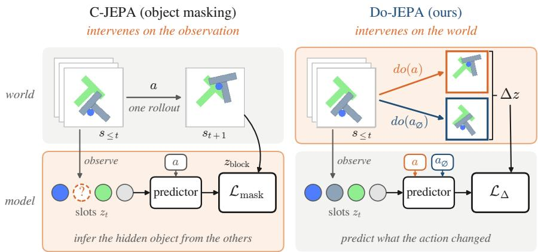
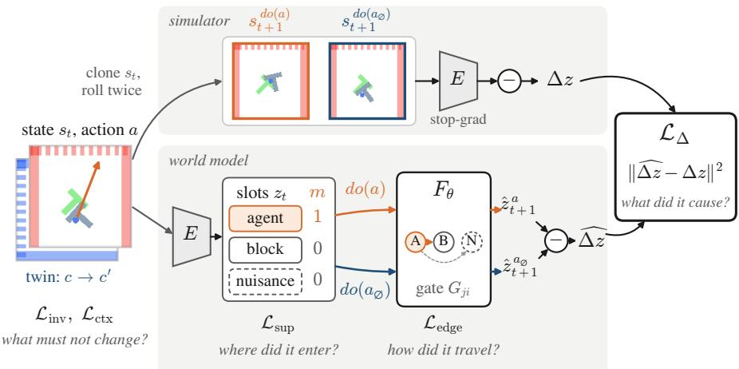
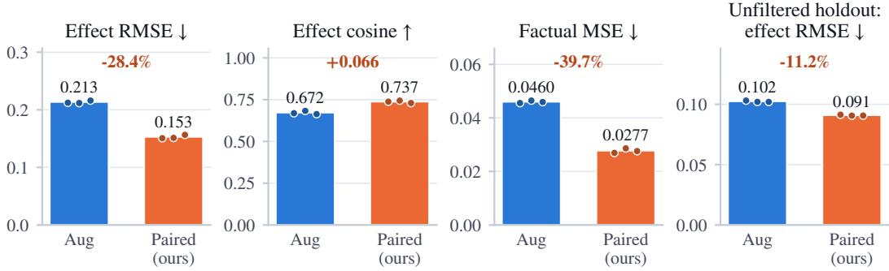
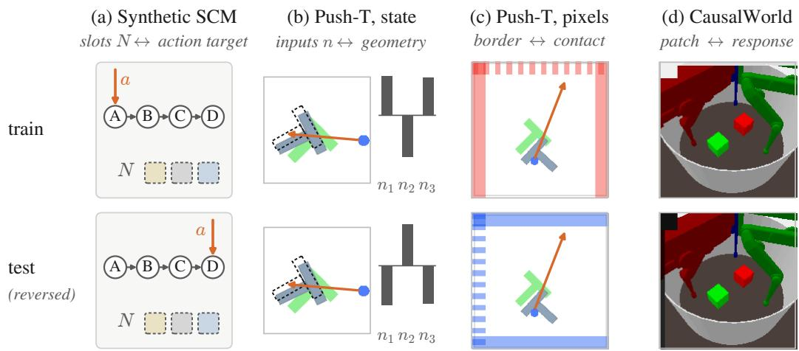
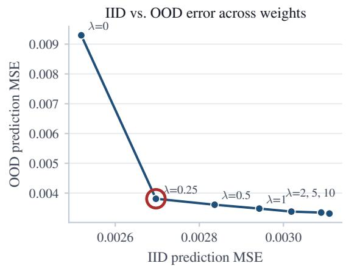
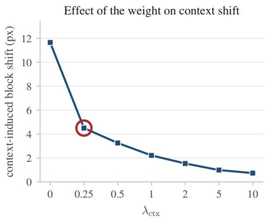
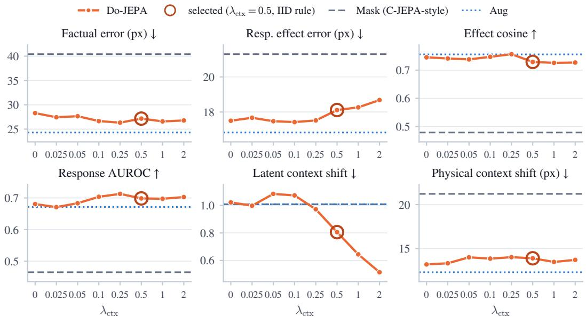
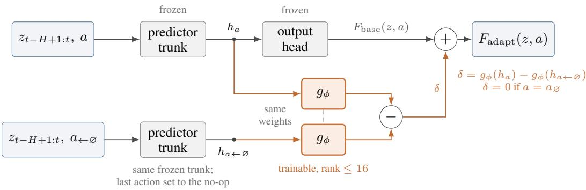

# DO-JEPA: FROM MASKING TO INTERVENTION IN LATENT WORLD MODELS

Hossein Resani1 & Javen Qinfeng Shi1,2

1Australian Institute for Machine Learning, Adelaide University

2Responsible AI Research Centre

## ABSTRACT

Latent world models are trained to predict what happens next, so nothing in their objective separates what an action caused from what merely co-occurred with it. Object-masking models such as C-JEPA intervene on what the predictor can see; we intervene on what physically happens. From one saved simulator state we run the dynamics under an action a and under a reference action $a _ { \emptyset }$ , and train the model to predict the difference ∆z = za − za∅ between the two latent futures. The resulting objective, DO-JEPA, has an effect loss, a support loss (where the action enters), a propagation loss (where its effect travels) and invariance losses (what must not change). In a synthetic system with object-aligned variables, support supervision finds the directly intervened object in 99.95% of test cases, where a sparse action mask sends the action to a nuisance slot in every case, and response-onset supervision recovers the ring-shaped propagation graph (edge AUROC 0.975 vs. 0.624). From pixels, the effect loss beats a control trained on exactly the same data: it lowers latent effect error by 28.4% on an end-to-end LeWM model and physical effect error by 13.5% when trained and tested on natural action sequences, and on three independently generated CausalWorld benchmarks it lowers responsive effect error by about 20% under physics shifts and the latent context sensitivity of predicted effects by 66%. Trained from scratch it costs factual accuracy; fine-tuning an existing model with it removes this cost. Together, these results show that intervening on the world, rather than on what the model sees, helps latent world models predict what their actions cause.

## 1 INTRODUCTION

Latent world models learn a transition $\hat { z } _ { t + 1 } = F _ { \theta } ( z _ { t } , a _ { t } )$ in a learned embedding space and use it to predict and to plan (Ha & Schmidhuber, 2018; Hafner et al., 2023; Zhou et al., 2024); jointembedding predictive architectures (JEPAs) are a common choice (LeCun, 2022; Assran et al., 2023; 2025; Balestriero & LeCun, 2025). A planner asks such a model a counterfactual question: what would happen if I took this action instead of that one? The model is trained on a different question: what happened next in the logged data? The two come apart when something the action does not control co-varies with the outcome, for example a hidden cause shared by the behaviour policy and the rendered scene. The model can then fit the logs by crediting the wrong variable, and prediction error does not show it. In our synthetic benchmark (Sec. 4.1), the model with the lowest prediction and effect error has no notion of where an action enters, and a model with a sparse action-entry mask sends every action into a nuisance slot.

Object-centric JEPAs add structure but keep the observational target. C-JEPA (Nam et al., 2026) masks whole object slots, so that the predictor must infer a hidden object from the others. As its authors note, this intervenes on observability, not on the process that generates the data: masking an object changes what the model sees, not what the world does, and the targets still come from the logged rollout.

A simulator allows a stronger intervention. We save its full state and run it forward twice, once with an action a and once with a reference action $a _ { \emptyset }$ (Fig. 1). State, context, history and noise are shared, so the difference between the two latent futures is the change caused by executing a instead of $a _ { \emptyset }$ in that state, and nothing else. We call objectives built on such pairs DO-JEPA: C-JEPA intervenes on the observation, DO-JEPA on the world. A world model that knows what its actions do should say what an action changed (effect), where it entered (support), where its effect can travel (propagation) and what must stay the same (invariance). DO-JEPA has one loss for each, computed from the pairs alone. We test each where it can be measured: support and propagation against known ground truth, invariance with given variables, and the effect loss end to end from pixels against a control that sees exactly the same data.

  
Figure 1: Masking versus intervention. Both methods see the same history, slots and action; orange marks where each intervenes. Left: C-JEPA (Nam et al., 2026) hides an object’s slots and predicts them from the others, with targets from the same logged rollout: it changes what the model sees. Right: DO-JEPA runs one saved simulator state forward under a and under $a _ { \mathcal { O } }$ and supervises the difference ∆z of the two latent futures (Eq. 3): it changes what happens. Frames: Push-T.

Our contributions are summarised as follows. First, we introduce DO-JEPA, an interventional ob jective for latent world models that derives four training signals from exact same-state rollout pairs: the effect of an action, where it enters, where its effect travels and what must not change. It needs no graph labels or object identities (Sec. 3). Second, we show that the direct target and the propagation graph can be recovered in controlled settings. Support supervision identifies the directly intervened object in 99.95–100% of test cases on three seeds, whereas a sparse mask picks the wrong slot at chance level. Onset supervision recovers the propagation graph, and the observation rate decides whether one-hop edges or only reachability can be recovered (Sec. 4.1). Third, we provide evidence from pixels against an information-matched control: paired supervision improves effect prediction on end-to-end LeWM and on three CausalWorld benchmarks against a control trained on the same data, and fine-tuning with it kept factual accuracy in our tests (Sec. 4.3).

## 2 RELATED WORK

Latent world models and JEPAs. JEPAs predict in embedding space (LeCun, 2022; Assran et al., 2023) and now drive action-conditioned video models and planners (Assran et al., 2025; Zhou et al., 2024). LeWM (Maes et al., 2026b) trains such a model end to end from pixels with the SIGReg regulariser (Balestriero & LeCun, 2025). We use LeWM as a backbone and, with its CEM planner (García et al., 1989; Rubinstein, 1999) unchanged, for a planning study (App. F).

Interventions and causal world models. Interventions make latent causal variables identifiable where observations do not (Schölkopf et al., 2021; Lippe et al., 2022; 2023; Brehmer et al., 2022; Ahuja et al., 2023; von Kügelgen et al., 2021); we share this premise but do not recover causal variables or graphs from pixels. Other work learns modular mechanisms (Lei et al., 2022) or interaction graphs (Li et al., 2020), chooses actions that separate causal hypotheses (Sontakke et al., 2021), or argues for intervention-centric evaluation (Liu et al., 2023). Closest to us, C-JEPA (Nam et al., 2026) masks object-slot trajectories; we re-implement it on the same slots.

## 3 METHOD

## 3.1 SETTING

Setup and notation. An environment has a physical state $s _ { t } ,$ an action $a _ { t } \in \mathcal A$ and a context $c \in { \mathcal { C } }$ that changes the observation but not the physics: the next state is $s _ { t + 1 } = f ( s _ { t } , a _ { t } , \varepsilon _ { t } )$ , with exogenous noise $\varepsilon _ { t } ,$ , and the observation is $o _ { t } ~ = ~ g ( s _ { t } , c )$ . Examples of c are a pattern rendered into the image and a vector of nuisance variables. An encoder $E _ { \psi }$ maps an observation to K slots, $\boldsymbol { z } _ { t } = ( z _ { t } ^ { 1 } , \dots , z _ { t } ^ { K } )$ with $z _ { t } ^ { i } \in \mathbb { R } ^ { d }$ , and a predictor $F _ { \theta }$ maps a history of H latent states and an action to the next latent state:

$$
\begin{array} { r } { \hat { z } _ { t + 1 } = F _ { \theta } \left( z _ { t - H + 1 : t } , \ : a _ { t } \right) \in \mathbb { R } ^ { K \times d } . } \end{array}\tag{1}
$$

Object-slot models have one slot per object or nuisance variable $( K > 1 ) ;$ the LeWM backbone has one global latent $( K = 1 , d = 1 9 2 )$ . A hat marks a prediction, N is the batch size, and Table 5 lists every symbol with its shape, role and availability.

JEPA world models. A JEPA world model is trained to predict the latent of the next observation,

$$
\mathcal { L } _ { \mathrm { p r e d } } = \frac { 1 } { N } \sum _ { n = 1 } ^ { N } \left. \hat { z } _ { t + 1 , n } - z _ { t + 1 , n } \right. _ { 2 } ^ { 2 } ,\tag{2}
$$

where $z _ { t + 1 , n }$ encodes the observed next frame of example $n ,$ together with a term that prevents collapse (an exponential-moving-average target encoder, or SIGReg in LeWM). Targets, here and below, are fixed for given variables or a frozen encoder; in our end-to-end LeWM-class models, as in LeWM, gradients also flow into them. Eq. 2 is observational, meaning that no term says which part of the observed change the action caused.

Why masked prediction is not enough. C-JEPA recovers hidden slots from the others, with targets from the same logged trajectory. This teaches object interactions but does not change the data. If a nuisance c is correlated with the outcome in training and the state estimate is imperfect, a predictor can use c and fails when the correlation changes. DO-JEPA changes the data instead, adding a rollout that differs only in the action.

## 3.2 PAIRED INTERVENTIONS AND WHAT THEY REVEAL

Paired trajectories. From a state $s _ { t }$ we save the full simulator state, including contact caches and the random-number state, and run it twice for k steps with the same context and noise. The factual branch applies $^ { a ; }$ the reference branch applies $a _ { \emptyset }$ (a physical no-op unless stated otherwise) and later actions are identical. The result is a paired trajectory that differs only in the intervention, $d o ( a )$ versus $d o ( a _ { \mathcal { Q } } )$ ; replaying a branch reproduces it exactly (maximum difference 0.0). The paired effect at step $t + \ell$ and its prediction are

$$
\Delta z _ { t + \ell } = z _ { t + \ell } ^ { a } - z _ { t + \ell } ^ { a _ { \mathcal { G } } } , \qquad \widehat { \Delta z } _ { t + \ell } = \widehat { z } _ { t + \ell } ^ { a } - \widehat { z } _ { t + \ell } ^ { a _ { \mathcal { G } } } , \qquad \ell = 1 , \dots , k ,\tag{3}
$$

both in R $K \times d$ . The target $\Delta z$ needs both branches and exists only at training time, whereas the prediction $\widehat { \Delta z }$ runs the predictor twice from the same history. Because the branches share state, context and noise, $\Delta z$ is the effect of replacing $a _ { \emptyset }$ by a in this state, not an average over states. Any latent component shared by both branches cancels: exactly for an additive context contribution, but not for one that interacts with the state. A pair is responsive if the manipulated object moves by more than about $2 \mathrm { p x }$ (Push-T) or 2 mm (CausalWorld; App. C).

Support, responses and propagation. The direct target of an intervention is the set of variables it changes at once. With object-aligned slots, slot i belongs to the direct support if its immediate response $\| \Delta z _ { t + 1 } ^ { i } \|$ is large. This label comes from the pair, not from the simulator’s graph, and it is correct only if one observation step is too short for the effect to reach a second object (temporal resolvability; Sec. 4.1). The response set $R$ contains every slot $j$ with $\| \Delta z _ { t + \ell } ^ { j } \| > \tau$ for some $\ell \leq k ;$ its members outside the direct support are the downstream responders, and slots outside R are the invariant variables of the pair. The onset of slot $j$ is $t _ { j } = \operatorname* { m i n } \{ \ell : \| \Delta z _ { t + \ell } ^ { j } \| > \tau \}$ . If $\dot { \mathbf { \zeta } } _ { j }$ starts to respond one step after $i ,$ then i is a candidate cause of $j ^ { \flat } \mathbf { s }$ response, which gives a propagation label $y _ { j i } ^ { \mathrm { e d g e } } \in \{ 0 , 1 \}$ for the message from slot i to slot $j .$ . These labels describe how this intervention propagated. Therefore, an interaction that the rollout does not use receives no positive label.

  
Figure 2: DO-JEPA training. Top: the simulator runs the saved state $s _ { t }$ under $d o ( a )$ and $d o ( a _ { \mathcal { O } } ) ;$ ; the encoder E (frozen in the slot models shown here) gives the target $\Delta z$ . Bottom: the world model encodes the observation into slots $z _ { t } ,$ routes the action into a slot through the mask m and propagates its effect through the gates $G _ { j i } ;$ $\widehat { \Delta z }$ is the difference of its two predictions. $\mathcal { L } _ { \Delta } \mathrm { : }$ : what the action caused; $\mathcal { L } _ { \mathrm { s u p } } \mathrm { . }$ where it entered; $\mathcal { L } _ { \mathrm { e d g e } } \mathrm { : }$ how it travelled; $\mathcal { L } _ { \mathrm { i n v } } , \mathcal { L } _ { \mathrm { c t x } } \mathrm { : }$ what must not change.

Nuisance and context. A context twin keeps the state and the action and changes only the context, $o ^ { \prime } = g ( s , c ^ { \prime } )$ , so any difference between the predicted effects under c and $c ^ { \prime }$ is caused by the context alone. At test time a nuisance shift reverses a training correlation between c and the outcome, a mechanism shift changes physical parameters such as mass, and a composed shift does both; any of these makes a split out-of-distribution (OOD).

## 3.3 MODEL AND OBJECTIVE

Architecture. The slot predictor for object-aligned variables $( \mathrm { F i g . ~ } 2 )$ has three parts. (i) A transformer over the history predicts an action-free next state $b _ { t + 1 } \in \mathbb { R } ^ { \tilde { K } \times d }$ . (ii) An action-entry mask

$$
m = \mathrm { s o f t m a x } _ { i } \left( h _ { \phi } ( z _ { t } ^ { i } , a ) / T _ { m } \right) \cdot \mathcal { K } [ a \neq a _ { \mathcal { D } } ] \in [ 0 , 1 ] ^ { K } ,\tag{4}
$$

where $h _ { \phi }$ scores slot i for action a and $T _ { m }$ is a temperature, sums to one for a real action and is zero for $a _ { \emptyset }$ . It gates the direct residual $r ^ { i } = m _ { i } u _ { \phi } ( z _ { t } ^ { i } , a )$ of a small network $u _ { \phi }$ with bounded (tanh) output. (iii) Gated message passing, repeated $\dot { P }$ times, moves the residual between slots:

$$
\begin{array} { r } { r  r + \gamma \mathrm { t a n h } \big ( \big ( \big ( A \odot G \big ) r W _ { v } ^ { \top } \big ) W _ { o } ^ { \top } \big ) , \qquad G _ { j i } = \sigma \big ( q _ { \phi } ( z _ { t } ^ { j } , z _ { t } ^ { i } ) / T _ { G } \big ) , \quad G _ { j j } = 0 , } \end{array}\tag{5}
$$

where $\boldsymbol { r } \in \mathbb { R } ^ { K \times d }$ has one row per slot, A are attention weights, $G _ { j i }$ gates the message from slot i to slot j and depends on the slot states only, $W _ { v } , W _ { o }$ are bias-free linear maps and $\gamma$ is a fixed scale. Gated weights are not renormalised, so a closed gate blocks the message. The prediction is $\hat { z } _ { t + 1 } ^ { a } = b _ { t + 1 } + r$ . Only r depends on the action and $m = 0$ for $a _ { \emptyset }$ , so $\widehat { \Delta z } _ { t + 1 } = r$ . In state-based Push-T the action is known to move the agent, so it enters the agent slot and m is not learned. The LeWM-class backbones $( K = 1 )$ have no mask or gates.

Targets and losses. All targets come from the paired rollouts or the context twin; none uses the simulator’s graph or object identities (Table 6, App. A). The effect loss compares predicted and true paired effects, $\begin{array} { r } { \mathcal { L } _ { \Delta } = \frac { 1 } { N } \sum _ { n } \| \widehat { \Delta z } _ { n } - \Delta z _ { n } \| _ { 2 } ^ { 2 } } \end{array}$ . The support, propagation, invariance and context

losses are

$$
\mathcal { L } _ { \mathrm { s u p } } = - \frac { 1 } { N } \sum _ { n } \sum _ { i = 1 } ^ { K } y _ { n , i } ^ { \mathrm { s u p } } \log m _ { n , i } , \qquad y _ { n , i } ^ { \mathrm { s u p } } = \frac { \| \Delta z _ { n , t + 1 } ^ { i } \| ^ { 2 } } { \sum _ { i ^ { \prime } } \| \Delta z _ { n , t + 1 } ^ { i ^ { \prime } } \| ^ { 2 } } ,\tag{6}
$$

$$
\mathcal { L } _ { \mathrm { e d g e } } = \frac { 1 } { N } \sum _ { n } \Big ( \mathrm { B C E } _ { \mathrm { b a l } } \big ( G _ { n } , y _ { n } ^ { \mathrm { e d g e } } \big ) + \lambda _ { \mathrm { s p } } \| G _ { n } \| _ { 1 } \Big ) ,\tag{7}
$$

$$
\mathcal { L } _ { \mathrm { i n v } } = \frac { 1 } { N } \sum _ { n } \sum _ { j \notin { \cal R } _ { n } } \Big ( \big \| \widehat { \Delta z } _ { n } ^ { j } \big \| _ { 2 } ^ { 2 } + \lambda _ { \mathrm { g } } \sum _ { i } G _ { n , j i } \Big ) ,\tag{8}
$$

$$
\mathcal { L } _ { \mathrm { c t x } } = \frac { 1 } { N } \sum _ { n } \big \| \widehat { \Delta z } _ { n } ( c ) - \widehat { \Delta z } _ { n } ( c ^ { \prime } ) \big \| _ { 2 } ^ { 2 } .\tag{9}
$$

$\mathcal { L } _ { \mathrm { s u p } }$ is a cross-entropy between the mask and the normalised immediate response energy (an entropy regulariser keeps m sharp); $\mathcal { L } _ { \mathrm { e d g e } }$ is a class-balanced binary cross-entropy between gates and onset labels with an $\ell _ { 1 }$ penalty; ${ \mathcal { L } } _ { \mathrm { i n v } }$ pushes predicted effects on non-responders to zero and closes the gates into them; ${ \mathcal L } _ { \mathrm { c t x } }$ asks the predicted effect to be the same under a context and its twin (in state-based Push-T it compares factual predictions of the physical slots; in the end-to-end models it averages Eq. 9 with the same term on the target effects, without stopping gradients).

Full objective and model variants. The full objective is

$$
\begin{array} { r } { \mathcal { L } = \mathcal { L } _ { \mathrm { p r e d } } ( a ) + \lambda _ { \mathrm { r e f } } \mathcal { L } _ { \mathrm { p r e d } } ( a _ { \mathcal { D } } ) + \lambda _ { \Delta } \mathcal { L } _ { \Delta } + \lambda _ { \mathrm { s u p } } \mathcal { L } _ { \mathrm { s u p } } + \lambda _ { \mathrm { e d g e } } \mathcal { L } _ { \mathrm { e d g e } } + \lambda _ { \mathrm { i n v } } \mathcal { L } _ { \mathrm { i n v } } + \lambda _ { \mathrm { c t x } } \mathcal { L } _ { \mathrm { c t x } } + \mathcal { R } , } \end{array}\tag{10}
$$

where ${ \mathcal { L } } _ { \mathrm { p r e d } } ( a )$ and $\mathcal { L } _ { \mathrm { p r e d } } ( a _ { \emptyset } )$ apply Eq. 2 to the two branches and R collects the backbone’s regulariser and the setting-specific terms of App. D. The variants differ only in how they use the same collected data. OBS uses the factual branch only. AUG, the information-matched control, uses the factual branch, the reference branch and, where used, the context twin as ordinary examples $( \lambda _ { \mathrm { r e f } } > 0 , \lambda _ { \Delta } = 0 )$ but never compares them. PAIRED adds ${ \mathcal { L } } _ { \Delta } ;$ DO-JEPA (full) adds ${ \mathcal L } _ { \mathrm { c t x } }$ and, in slot models, the slot losses listed for each setting in Table 8. MASK is our re-implementation of C-JEPA on the same slots.

Training, inference and information. Training uses paired trajectories (plus context twins for $\mathcal { L } _ { \mathrm { c t x } } )$ . At test time the model receives only an observation history and an action; it predicts an effect by running the predictor with a and with $a _ { \emptyset }$ from the same history (Eq. 3), and planning uses only the factual prediction. The losses need an exactly restorable simulator (all losses), object-aligned slots $( { \mathcal { L } } _ { \mathrm { s u p } } , { \mathcal { L } } _ { \mathrm { e d g e } } , { \mathcal { L } } _ { \mathrm { i n v } } )$ and a way to change the context without changing the physics $( \mathcal { L } _ { \mathrm { c t x } } )$ PAIRED and AUG receive the same branches, so their comparison is matched in information. In the SCMs and state-based Push-T the model’s variables are the physical state; in the pixel settings physical state is used only to build benchmarks and to evaluate (Table 7).

## 4 EXPERIMENTS

We try to answer four questions, each in the setting that isolates it: Q1: where does the action enter? Q2: where does its effect travel? Q3: what must not change? Q4: does the effect loss help when the representation is learned from pixels? App. C and D describe the settings and training. Protocol. Checkpoints and hyperparameters are selected on in-distribution (IID) validation data, except in two development runs that we mark where they occur. In preregistered experiments, hypotheses, thresholds and seeds were fixed in a protocol file before data collection or before the OOD splits were opened, and OOD splits were evaluated once after the checkpoint was locked. Confirmed means that a result holds on at least 2 of 3 fresh seeds. App. B defines the metrics.

## 4.1 Q1–Q2: WHERE DOES THE ACTION ENTER, AND WHERE DOES ITS EFFECT TRAVEL?

Question and setup. Can a model find the directly intervened object, and the paths along which its effect spreads, from paired data alone? Sparsity is often assumed to localise an intervention; if it did, support labels would be unnecessary. A synthetic structural causal model (SCM) gives known ground truth: four objects on a directed ring $( i  i + 1$ mod 4) and three nuisance slots. The action, an impulse at a noisy contact point biased towards the next object, does not name its target; the first step changes only the direct target, and the effect then spreads along the ring for two steps. A hidden context makes the nuisances co-vary with the action in training $( \rho = 0 . 9 5 ) ;$ ; the test split reverses this. We compare MASK (global action), $\mathbf { M } \mathbf { A } \mathbf { S } \mathbf { K } { + } \mathcal { L } _ { \Delta }$ , a sparse action mask, the mask $+ \mathcal { L } _ { \Delta }$ and the mask $+ \mathcal { L } _ { \Delta } + \mathcal { L } _ { \mathrm { s u p } }$ , then gates without and with $\mathcal { L } _ { \mathrm { e d g e } }$ and the gate term of ${ \mathcal { L } } _ { \mathrm { i n v } } .$ . In state-based Push-T, where the agent is the known direct target, we ask whether the gate $G _ { \mathrm { b l o c k  a g e n t } }$ learns when the agent moves the block.

Table 1: Where does the action enter? Synthetic SCM, reversed-correlation test split, seed 7. Top-1 over all seven slots (chance $1 / 7 )$ and, in brackets, over the four objects (chance 0.25); nuis. mask: mask mass on nuisance slots; nuis. effect: mean RMS of the predicted effect per nuisance slot. All rows are evaluated with one history slot masked, as in MASK training; mask temperature is 1.0 in the sparse-mask rows and 0.7 in the last (App. E.1). Best in bold, second best underlined.
<table><tr><td></td><td>Top-1 all [obj.]↑ Target</td><td> $F _ { 1 } \uparrow$ </td><td></td><td>Nuis. mask ↓ Nuis. effect ↓ Effect MSE↓ Pred. MSE↓</td><td></td><td></td></tr><tr><td>MASK (global action)</td><td></td><td></td><td></td><td> $6 . 3 \times 1 0 ^ { - 3 }$ </td><td> $1 . 5 \times 1 0 ^ { - 3 }$ </td><td> $3 . 1 4 \times 1 0 ^ { - 3 }$ </td></tr><tr><td> $\mathbf { M } \mathbf { A } \mathbf { S } \mathbf { K } + \mathcal { L } _ { \Delta }$ </td><td></td><td></td><td></td><td> $\overline { { { \bf 2 . 9 \times 1 0 ^ { - 3 } } } }$ </td><td> $\mathbf { 3 . 5 \times 1 0 ^ { - 4 } }$ </td><td> $\mathbf { 2 . 6 7 \times 1 0 ^ { - 3 } }$ </td></tr><tr><td>Sparse mask</td><td>0.000 [0.243]</td><td>0.000</td><td>1.000</td><td> $2 . 5 \times 1 0 ^ { - 2 }$ </td><td> $1 . 1 \times 1 0 ^ { - 2 }$ </td><td> $8 . 7 0 \times 1 0 ^ { - 3 }$ </td></tr><tr><td> $\mathrm { S p a r s e ~ m a s k } + \mathcal { L } _ { \Delta }$ </td><td>0.000 [0.234]</td><td>0.000</td><td>1.000</td><td> $1 . 6 \times 1 0 ^ { - 2 }$ </td><td> $1 . 0 \times 1 0 ^ { - 2 }$ </td><td> $8 . 5 5 \times 1 0 ^ { - 3 }$ </td></tr><tr><td>Sparse mask  $+ \mathcal { L } _ { \Delta } + \mathcal { L } _ { \mathrm { s u p } }$ </td><td>0.9995 [0.9995]</td><td>0.9998</td><td> $\mathbf { 8 . 2 \times 1 0 ^ { - 5 } }$ </td><td> $9 . 1 \times 1 0 ^ { - 3 }$ </td><td> $9 . 3 \times 1 0 ^ { - 4 }$ </td><td> $3 . 4 3 \times 1 0 ^ { - 3 }$ </td></tr></table>

Result: the direct target. A sparse mask selects exactly one slot, as the sparsity term asks, but in every test case it selects a nuisance (top-1 0.000 over all slots; 0.243 if only objects are ranked; Table 1). Adding $\mathcal { L } _ { \Delta }$ does not help: the propagation step can move the effect wherever it is needed, so any entry slot satisfies the effect loss. Adding $\mathcal { L } _ { \mathrm { s u p } } ,$ , together with a lower mask temperature (we did not run a temperature-matched control), gives 0.9995 with almost no mask mass on nuisances. Sparsity sets how many slots the action enters; here the immediate paired response set which one. Prediction and effect error do not reveal this $( \mathbf { M } \mathbf { A } \mathbf { S } \mathbf { K } + \mathcal { L } _ { \Delta }$ has the lowest of both), and the supporttrained model still predicts effects on nuisances $( 9 . 1 \times 1 0 ^ { - 3 } )$ because nothing constrains how its effect spreads. An easier SCM shows the same pattern over five seeds (App. E.1).

Result: the propagation graph. Gates trained without $\mathcal { L } _ { \mathrm { e d g e } }$ are open almost everywhere (edge AUROC 0.624 against the test pairs’ onset labels; Table 12). With $\mathcal { L } _ { \mathrm { e d g e } }$ it is 0.975 on all three seeds, and thresholding the mean test gate at 0.5 recovers exactly the four ring edges on each seed (mean gate 0.95 on ring edges, 0.002–0.005 on other pairs), and predicted nuisance effects fall to $1 . 9 \times 1 \stackrel { \smile } { 0 } ^ { - 5 }$ , at the cost of a less accurate direct effect (MSE 0.0137 vs. 0.0033). In state-based Push-T the gate is state-dependent: edge AUROC is $0 . 9 9 4 4 \pm 0 . 0 0 0 2$ against 0.500 without gates, and the predicted action effect on nuisances falls from $1 . 9 \times 1 0 ^ { - 3 }$ (OBS) to $2 . 1 \times 1 0 ^ { - 7 }$ while prediction MSE differs by at most 2% across models (Table 14).

Result: time resolution. Onset labels assume that causal events are separated in time. In a second SCM (six objects on a ring), $\kappa \in \{ 1 , 2 , 3 , 4 \}$ of four propagation stages fall inside one observed step (App. E.2). As κ grows, one-hop edge $F _ { 1 }$ collapses $( \bar { 0 } . 9 9 9  0 . \bar { 5 } 4 9  0 . 5 0 2  0 . 3 3 7 )$ , while direct-target $F _ { 1 }$ stays at 0.997 and prediction MSE at 0.0103–0.0105. The onset labels themselves, scored as one-hop edges, fall from $F _ { 1 } = 1 . 0 0$ to 0.25: with two transitions between observations, a chain $A \to B \to C$ and a fork $\{ A \to B , A \to C \}$ produce the same data. Scored against reachability within the observation interval, the same gates reach $F _ { 1 } = 0 . 9 9 9 / 0 . 9 3 5 / 0 . 9 9 2 / \bar { 0 } . 8 9 4 ,$ and one gate head per time scale, tied by a reachability constraint, represents both levels (one-hop $F _ { 1 } = 0 . 9 7 7 ;$ ; coarse 0.909–0.977).

Takeaway. In our synthetic systems, with object-aligned variables and resolvable onsets, the immediate paired response identified the direct target and onset order recovered the ring graph; sparsity and the effect loss did not, and with coarser observation the recoverable relation became reachability, which prediction error does not reveal. On anonymous frozen slots of pixel Push-T, which have no ground-truth graph, a single-seed IID diagnostic gives onset-trained gates that reproduce the test onset labels (AUROC 1.000 vs. 0.823 without $\mathcal { L } _ { \mathrm { e d g e } } ; \mathrm { A p p . G ) }$

## 4.2 Q3: WHAT MUST NOT CHANGE?

The action-side losses do not stop a nuisance from changing the prediction. We test whether context twins remove a shortcut through a nuisance that is correlated with the outcome in training.

With given variables. In state-based Push-T a nuisance vector is correlated with contact geometry $( \rho = 0 . 9 5 )$ in training and reversed at test, and the physical inputs are corrupted with sensor noise. OBS degrades by 2.9× in prediction MSE and the gated model by 3.1×, although the latter’s effect error changes only by 1.02×. We chose $\lambda _ { \mathrm { c t x } } = 0 . 2 5$ on seed 7’s IID–OOD trade-off curve, so that seed’s OOD split informed the choice. On the two other seeds, ${ \mathcal L } _ { \mathrm { c t x } }$ lowers OOD error by 43.9% and 55.2% and closes 71.9% and 85.4% of the IID-to-OOD gap, at 4.2% and 3.5% higher IID error, with edge AUROC unchanged (App. E.3).

Boundary condition: learned pixel latents. On learned latents the same idea needs care. Applied as a generic, isotropic penalty on latent effects, ${ \mathcal L } _ { \mathrm { c t x } }$ lowers the latent context shift of predicted effects (20% on frozen VideoSAUR slots, 46–47% end to end in CausalWorld) but costs factual and effect accuracy, and on frozen slots the shift decoded to pixels does not fall. Diagnostics trace this to a mismatch between latent and physical distance: two latent directions carry about 99.8% of the decoded physical error, and a predictor-side variant of the penalty leaves 10–19% more residual energy exactly there (App. E.6). Pairing alone already lowers the latent context shift by about 66% without any context term (Sec. 4.3).

Takeaway. With given variables, nuisance interventions remove most of the shortcut at a small IID cost. On learned latents, invariance has to be measured in the directions that carry the physics; a generic latent penalty is not enough.

## 4.3 Q4: DOES THE EFFECT LOSS HELP FROM PIXELS?

On C-JEPA’s own frozen VideoSAUR slots of pixel Push-T, DO-JEPA beats C-JEPA-style masking on all six metrics and all three seeds: factual error is 30% lower, responsive effect error 12% lower, effect cosine 0.14 higher, response AUROC 0.21 higher (masking is at chance) and the context shift of predicted effects 31% lower in pixels (App. E.4). We test the effect loss itself where the representation is learned, end to end, against AUG, which sees exactly the same branches; this control matters because PAIRED receives both branches.

LeWM on pixel Push-T. We fine-tune the released LeWM checkpoint (Maes et al., 2026b) for 10 epochs on 10,000 exact same-state pairs (a 5-step action macro vs. a zero macro; half responsive), with and without $\mathcal { L } _ { \Delta }$ (weight 0.5). The preregistered rule needs 2 of 3 fresh seeds to lower effect RMSE by 5% or raise effect cosine by 0.05. All three pass (Fig. 3): effect RMSE falls by 28.4% $( 0 . 2 1 3  0 . 1 5 3 ;$ per seed 27.5–29.0%), cosine over all pairs rises by 0.066, and factual MSE also falls, by 39.7%. All are latent metrics, each in its own model’s latent space. On a fresh holdout of 5,000 pairs with actions drawn independently from the expert action distribution and no outcome filtering (6.5% responsive), effect RMSE is 11.2% lower (3/3 seeds) and factual MSE 17.5% lower, mostly on non-responsive pairs. A physical read-out, a linear map from latent effects to block displacement fitted per model, confirms the gain on the training distribution (responsive physical effect error 7% lower on every seed) but not on the holdout’s responsive pairs (3% higher; App. E.5). The gain follows the training intervention distribution. Trained with the same recipe on natural expert action sequences, PAIRED lowers the responsive physical effect error by 13.5% on an episodedisjoint natural test set and by 5.5% on the outcome-unfiltered holdout, on every seed.

CausalWorld: three independently generated benchmarks. In the CausalWorld pushing task (Ahmed et al., 2020) a robot finger pushes a block; the branches differ only in the first 9-D joint command, which the reference mirrors about the current joint position. OOD splits reverse a visual shortcut (visual), change mass and friction while making the context independent of the outcome (mechanism), or change the physics and reverse the shortcut (composed). A first version of the benchmark leaked the label through how samples were drawn (sampling-only AUROC 0.834). We rebuilt it with outcome-defined labels and exact covariate balance (AUROC 0.50; App. C.5), regenerated it from three dataset seeds, and fixed in advance the expected signature of PAIRED against

  
Figure 3: Effect loss on LeWM, pixel Push-T. AUG and PAIRED see the same paired images; PAIRED adds $\mathcal { L } _ { \Delta }$ . Latent metrics; means over three fresh seeds (dots: seeds); red: relative change (absolute for the cosine, taken over all pairs). Panels 1–3: held-out pairs from the training distribution (half responsive); panel 4: outcome-unfiltered holdout (6.5% responsive).

Table 2: CausalWorld: PAIRED vs. AUG on three independently generated benchmarks (dataset seeds 17/27/37, model seed 107, 40k updates), locked OOD splits. Mean relative changes; brackets count instances that move in the stated direction; “Signature” counts instances with the full preregistered benefit and cost. ∗The mechanism split also decorrelates the visual context (App. C.5).
<table><tr><td></td><td colspan="3">Benefit</td><td colspan="2">Cost</td><td></td></tr><tr><td>OOD split</td><td>Resp. effect RMSE</td><td>Effect cosine</td><td>Latent ctx. shift</td><td>Factual RMSE</td><td>Response AUROC</td><td>Signature</td></tr><tr><td>Visual</td><td>3.9% lower [2/3]</td><td>+0.018 [3/3]</td><td>66.2% lower [3/3]</td><td>52.8% higher [3/3]</td><td>-0.054 [3/3]</td><td>2/3</td></tr><tr><td>Mechanism*</td><td>20.3% lower [3/3]</td><td>+0.030 [2/3]</td><td>65.4% lower [3/3]</td><td>51.5% higher [3/3]</td><td>-0.070 [3/3]</td><td>2/3</td></tr><tr><td>Composed</td><td>19.5% lower [3/3]</td><td>+0.020 [2/3]</td><td>66.2% lower [3/3]</td><td>51.1% higher [3/3]</td><td>-0.073 [3/3]</td><td>2/3</td></tr></table>

AUG: lower responsive effect error and context shift and higher cosine (benefit), higher factual error and lower response AUROC (cost). Checkpoints were locked on IID data before the OOD splits were opened once.

Result. The preregistered signature holds on all three OOD splits (Table 2). PAIRED lowers the context shift of predicted effects by about 66% without any context loss, and lowers responsive effect error by about 20% under the mechanism and composed shifts, at the cost of 51–53% higher factual error and lower response AUROC. Three fresh model seeds on one benchmark instance show the same benefit and cost. In these runs the factual cost (15–18%) exceeds the preregistered 10% tolerance.

Where the factual cost comes from. In Push-T the effect loss fine-tunes a pretrained model and in CausalWorld it shapes the representation from scratch. To separate the two, we fine-tune each converged AUG model for 2,000 updates with and without $\mathcal { L } _ { \Delta }$ (the Push-T regime) and compare the last checkpoints. The factual cost disappears: factual error changes by −4 to +2% and response AUROC is unchanged on every instance, while responsive effect error falls by 8% IID and 13% under the physics shifts and the effect cosine rises on every instance and split (Table 3). From scratch, the effect weight sets the trade-off: α = 0.25 cuts the factual cost from 52% to 10% and the AUROC loss from 0.066 to 0.016, and keeps the IID effect gain and about two thirds of the gain under physics shifts.

Takeaway. In every comparison on end-to-end LeWM-class models, the effect loss lowered mean effect error relative to an information-matched control. Its effect on factual accuracy depends on the training regime: fine-tuning an existing model with it keeps factual accuracy (CausalWorld) or improves it (Push-T), while training from scratch trades factual accuracy and response AUROC fo a larger effect gain, in proportion to the effect weight.

Table 3: When does the effect loss cost factual accuracy? CausalWorld, PAIRED against the AUG model of the same regime, mean relative change over the three benchmark instances. OOD: mean over the three OOD splits; physics: mechanism and composed splits. Last column: instances whose factual error rises by at most 10% on every split. The last two rows are post-hoc diagnostics (App. E.6).
<table><tr><td></td><td colspan="2">Factual RMSE</td><td colspan="2">Resp. effect RMSE</td><td rowspan="2">Response AUROC</td><td rowspan="2">e Latent ctx. shift</td><td rowspan="2">Factual within 10%</td></tr><tr><td>Regime</td><td>IID</td><td>OOD</td><td>IID</td><td>Physics</td></tr><tr><td>From scratch, α = 1</td><td>+51.9%</td><td>+51.8%</td><td>-9.0%</td><td>-19.9%</td><td>-0.066</td><td>-66.0%</td><td>0/3</td></tr><tr><td>From scratch, α = 0.25</td><td></td><td>+10.3%+10.6%</td><td>-9.1%</td><td>-12.8%</td><td>-0.016</td><td>-33.6%</td><td>1/3</td></tr><tr><td>Fine-tuned from AUG, α = 1</td><td>-0.6%</td><td>-0.9%</td><td>-8.2%</td><td>-13.3%</td><td>+0.008</td><td>-26.2%</td><td>3/3</td></tr></table>

## 5 DISCUSSION AND LIMITATIONS

We show direct-target detection and responder prediction with object-aligned variables (Q1–Q2), nuisance robustness with given variables (Q3), and better effect prediction from pixels than an information-matched control, including lower responsive effect error under CausalWorld physics shifts (Q4). Paired supervision can also be added to a pretrained LeWM planner through a centered adapter, with success equivalent to the base planner within ±3 percentage points (App. F). Our supervision signals capture how interventions propagate in observed rollouts, under the training intervention distribution and at the observation rate. Learning them does not require identification of the underlying mechanism, and we do not claim it. Here do(·) names interventions and we use no do-calculus. Paired effects are counterfactual in the sense that both branches share state and noise in a simulator.

Limitations. DO-JEPA rests on several assumptions. First, exact pairs require a simulator whose full state can be saved and restored, and each pair costs two rollouts (a context twin changes only the observation, not the rollout). Real trials share neither noise nor exact state, so differences between them are noisy and may be biased. Second, the intervention and its reference must be known, although the direct target need not be. Third, support and onset labels require object-aligned slots, a known slot count, a single direct target per action (the support head is a softmax) and a frame rate at which response onsets separate in time. Finally, context twins assume that the context can change without changing the physics, and the nuisances in our benchmarks are rendered or synthetic. Relaxing these assumptions, for example with approximate real-world pairs or anonymous object slots, is a promising direction for future work.

## 6 CONCLUSION

In this work, we proposed DO-JEPA, a framework for training latent world models with interventions on the world rather than on what the model sees. From one saved simulator state, DO-JEPA contrasts an action with a reference action and learns what the action changed, where it entered, where its effect travelled and what must stay invariant. With object-aligned variables in synthetic systems, the immediate paired response identifies where an action enters, and onset order identifies where its effect travels, down to the time resolution at which events separate. From pixels, the paired effect loss improves effect prediction over a control trained on the same data in two environments, and fine-tuning with it preserved factual accuracy in our experiments. Context twins provide nuisance invariance with given variables, whereas on learned latents invariance must be measured in the directions that carry the physics. Finally, prediction error revealed little about these properties, which suggests that interventional metrics should become a routine part of world-model evaluation.

## REFERENCES

Ossama Ahmed, Frederik Träuble, Anirudh Goyal, Alexander Neitz, Yoshua Bengio, Bernhard Schölkopf, Manuel Wüthrich, and Stefan Bauer. CausalWorld: A robotic manipulation benchmark for causal structure and transfer learning. arXiv preprint arXiv:2010.04296, 2020.

Kartik Ahuja, Divyat Mahajan, Yixin Wang, and Yoshua Bengio. Interventional causal representation learning. In International Conference on Machine Learning (ICML), 2023.

Mahmoud Assran, Quentin Duval, Ishan Misra, Piotr Bojanowski, Pascal Vincent, Michael Rabbat, Yann LeCun, and Nicolas Ballas. Self-supervised learning from images with a joint-embedding predictive architecture. In IEEE/CVF Conference on Computer Vision and Pattern Recognition (CVPR), 2023.

Mahmoud Assran, Adrien Bardes, et al. V-jepa 2: Self-supervised video models enable understanding, prediction and planning. arXiv preprint arXiv:2506.09985, 2025.

Randall Balestriero and Yann LeCun. LeJEPA: Provable and scalable self-supervised learning without the heuristics. arXiv preprint arXiv:2511.08544, 2025.

Johann Brehmer, Pim De Haan, Phillip Lippe, and Taco Cohen. Weakly supervised causal representation learning. In Advances in Neural Information Processing Systems (NeurIPS), 2022.

Cheng Chi, Siyuan Feng, Yilun Du, Zhenjia Xu, Eric Cousineau, Benjamin Burchfiel, and Shuran Song. Diffusion policy: Visuomotor policy learning via action diffusion. In Robotics: Science and Systems (RSS), 2023.

Robert M. French. Catastrophic forgetting in connectionist networks. Trends in Cognitive Sciences, 3(4):128–135, 1999.

Carlos E. García, David M. Prett, and Manfred Morari. Model predictive control: Theory and practice — a survey. Automatica, 25(3):335–348, 1989.

David Ha and Jürgen Schmidhuber. Recurrent world models facilitate policy evolution. In Advances in Neural Information Processing Systems (NeurIPS), 2018.

Danijar Hafner, Jurgis Pasukonis, Jimmy Ba, and Timothy Lillicrap. Mastering diverse domain through world models. arXiv preprint arXiv:2301.04104, 2023.

Neil Houlsby, Andrei Giurgiu, Stanislaw Jastrzebski, Bruna Morrone, Quentin de Laroussilhe, Andrea Gesmundo, Mona Attariyan, and Sylvain Gelly. Parameter-efficient transfer learning for NLP. In International Conference on Machine Learning (ICML), 2019.

Edward J. Hu, Yelong Shen, Phillip Wallis, Zeyuan Allen-Zhu, Yuanzhi Li, Shean Wang, Lu Wang, and Weizhu Chen. LoRA: Low-rank adaptation of large language models. In International Conference on Learning Representations (ICLR), 2022.

James Kirkpatrick, Razvan Pascanu, Neil Rabinowitz, et al. Overcoming catastrophic forgetting in neural networks. Proceedings ofthe National Academy ofSciences, 114(13):3521–3526, 2017.

Yann LeCun. A path towards autonomous machine intelligence. Technical report, OpenReview, 2022. Version 0.9.2.

Anson Lei, Bernhard Schölkopf, and Ingmar Posner. Variational causal dynamics: Discovering modular world models from interventions. arXiv preprint arXiv:2206.11131, 2022.

Yunzhu Li, Antonio Torralba, Animashree Anandkumar, Dieter Fox, and Animesh Garg. Causal discovery in physical systems from videos. In Advances in Neural Information Processing Systems (NeurIPS), 2020.

Phillip Lippe, Sara Magliacane, Sindy Löwe, Yuki M. Asano, Taco Cohen, and Efstratios Gavves. CITRIS: Causal identifiability from temporal intervened sequences. In International Conference on Machine Learning (ICML), 2022.

Phillip Lippe, Sara Magliacane, Sindy Löwe, Yuki M. Asano, Taco Cohen, and Efstratios Gavves. BISCUIT: Causal representation learning from binary interactions. In Conference on Causal Learning and Reasoning (CLeaR), 2023.

Yuejiang Liu, Alexandre Alahi, Chris Russell, Max Horn, Dominik Zietlow, Bernhard Schölkopf, and Francesco Locatello. CausalTriplet: An open challenge for intervention-centric causal representation learning. In Conference on Causal Learning and Reasoning (CLeaR), 2023.

Lucas Maes, Quentin Le Lidec, Luiz Facury, Nassim Massaudi, Ayush Chaurasia, Francesco Capuano, Richard Gao, Taj Gillin, Dan Haramati, Damien Scieur, Yann LeCun, and Randall Balestriero. stable-worldmodel: A platform for reproducible world modeling research and evaluation. arXiv preprint arXiv:2605.21800, 2026a.

Lucas Maes, Quentin Le Lidec, Damien Scieur, Yann LeCun, and Randall Balestriero. LeWorld-Model: Stable end-to-end joint-embedding predictive architecture from pixels. arXiv preprint arXiv:2603.19312, 2026b.

Heejeong Nam, Quentin Le Lidec, Lucas Maes, Yann LeCun, and Randall Balestriero. Causal-JEPA: Learning world models through object-level latent masking. arXiv preprint arXiv:2602.11389, 2026.

Maxime Oquab, Timothée Darcet, Théo Moutakanni, et al. DINOv2: Learning robust visual features without supervision. Transactions on Machine Learning Research, 2024.

Reuven Y. Rubinstein. The cross-entropy method for combinatorial and continuous optimization. Methodology and Computing in Applied Probability, 1(2):127–190, 1999.

Bernhard Schölkopf, Francesco Locatello, Stefan Bauer, Nan Rosemary Ke, Nal Kalchbrenner, Anirudh Goyal, and Yoshua Bengio. Toward causal representation learning. Proceedings of the IEEE, 109(5):612–634, 2021.

Sumedh A. Sontakke, Arash Mehrjou, Laurent Itti, and Bernhard Schölkopf. Causal curiosity: RL agents discovering self-supervised experiments for causal representation learning. In International Conference on Machine Learning (ICML), 2021.

Julius von Kügelgen, Yash Sharma, Luigi Gresele, Wieland Brendel, Bernhard Schölkopf, Michel Besserve, and Francesco Locatello. Self-supervised learning with data augmentations provably isolates content from style. In Advances in Neural Information Processing Systems (NeurIPS), 2021.

Andrii Zadaianchuk, Maximilian Seitzer, and Georg Martius. Object-centric learning for real-world videos by predicting temporal feature similarities. In Advances in Neural Information Processing Systems (NeurIPS), 2023.

Gaoyue Zhou, Hengkai Pan, Yann LeCun, and Lerrel Pinto. DINO-WM: World models on pretrained visual features enable zero-shot planning. arXiv preprint arXiv:2411.04983, 2024.

## CONTENTS OF THE APPENDIX

A Notation and Terminology . . . . . . . . . . . . . . . . . . . . . . . . . . . . . 13   
B Metrics Guide . . . . . . . . . . . . . . . . . . . . . . . . . . . . . . . . . . . . . . . . . . . . . . . . . . . . . . . . . . . . . . . . . . . . . . . . . . . . . . . . 13   
C Benchmarks . . . . . . . . . . . . . . . . . . . . . . . . . . . . . . . . . . . . . . . . . . . . . . . . . . . . . . . . . . . . . . . . . . . . . . . . . . . . . . . . . 17   
C.1 Synthetic SCMs . . . . . . . . . . . . . . . . . . . . . . . . . . . . . . . . . . . . . . . . . . . . . . . . . . . . . . . . . . . . . . . . . . . . . . . . . . 17   
C.2 State-based Push-T . . . . . . . . . . . . . . . . . . . . . . . . . . . . . . . . . . . . . . . . . . . . . . . . . . . . . . . . . . . . . . . . . . . . . . . 18   
C.3 Vision Push-T . . . . . . . . . . . . . . . . . . . . . . . . . . . . . . . . . . . . . . . . . . . . . . . . . . . . . . . . . . . . . . . . . . . . . . . . . . . 18   
C.4 LeWM Push-T pairs and planning corpora . . . . . . . . . . . . . . . . . . . . . . . . . . . . . . . . . . . . . . . . . . . . . . . . . . 19   
C.5 CausalWorld pushing . . . . . . . . . .   
D Training and Evaluation Details . . . . . . . . . . . . . . . . . . . . . . . . . . . . . . . . . . . . . . . . . . . . . . . . . . . . . . . . . . . . . . 20   
E.1 Synthetic SCMs . . . . . . . . . . . . . . . . . . . . . . . . . . . . . . . . . . . . . . . . . . . . . . . . . . . . . . . . . . . . . . . . . . . . . . . . . . 22   
E.2 Temporal resolvability . . . . . . . . . . . . . . . . . . . . . . . . . . . . . . . . . . . . . . . . . . . . . . . . . . . . . . . . . . . . . . . . . . . . 22   
E.3 State-based Push-T . . . . . . . . . . . . . . . . . . . . . . . . . . . . . . . . . . . . . . . . . . . . . . . . . . . . . . . . . . . . . . . . . . . . . . . 23   
E.4 Vision Push-T . . . . . . . . . . . . . . . . . . . . . . . . . . . . . . . . . . . . . . . . . . . . . . . . . . . . . . . . . . . . . . . . . . . . . . . . . . . . 23   
E.5 LeWM Push-T: per-seed results . . . . . . . . . . . . . . . . . . . . . . . . . . . . . . . . . . . . . . . . . . . . . . . . . . . . . . . . . . . . 24   
E.6 CausalWorld . . . . . . . . . . . . . . . 25   
F Planning Study Details . . . . . . . . . . . . . 27   
G Boundary Conditions and Diagnostic Findings. . . . . . . . . . . . . . . 30

Table 4: Main results at a glance. Each row gives the strongest evidence for one finding and where it is reported. Seeds are model seeds; “instances” are independently generated benchmarks.
<table><tr><td>Finding</td><td>Evidence</td><td>Where</td></tr><tr><td>Support supervision finds where the action enters</td><td>direct target found in 99.95% of test cases; a sparse mask picks a nuisance slot in every case</td><td>Table 1</td></tr><tr><td>Onset supervision recovers where the effect travels</td><td>edge AUROC 0.975 vs. 0.624; the four ring edges recovered exactly on 3/3 seeds</td><td>Table 12</td></tr><tr><td>Gates confine effects to the right objects</td><td>state Push-T edge  $\mathrm { A U R O C 0 . 9 9 4 ~ v s . 0 . 5 0 0 } ;$  predicted effect on nuisances  $1 . 5 \times 1 0 ^ { - 3 } \to 2 . 1 \times 1 0 ^ { - 7 }$ </td><td>Table 14</td></tr><tr><td>Context twins remove a nuisance shortcut</td><td>on the two seeds not used to pick the weight: OOD error 44–55% lower, 72–85% of the IID-to-OOD gap closed, IID cost ≤ 4.2%</td><td>App. E.3</td></tr><tr><td>Intervention beats masking on C-JEPA&#x27;s own slots Effect loss helps from pixels</td><td>all six metrics, 3/3 seeds: factual error 30% lower, AUROC +0.21, pixel context shift 31% lower</td><td>Table 15</td></tr><tr><td>(LeWM)</td><td>latent effect error 28.4% lower (3/3); physical effect error 13.5% lower when trained and tested on natural sequences (3/3)</td><td>Fig. 3, Table 18</td></tr><tr><td>Effect loss helps under physics shifts (CausalWorld)</td><td>responsive effect error ≈20% lower and latent context shift 66% lower, on three benchmark instances</td><td>Table 2</td></tr><tr><td>Fine-tuning keeps factual accuracy</td><td>factual error —4 to +2%, effect error 8–13% lower, on 3/3 instances</td><td>Tables 3, 21</td></tr><tr><td>Compatible with a pretrained planner</td><td>success within ±3 points of the base planner (600 episodes)</td><td>App. F</td></tr></table>

## A NOTATION AND TERMINOLOGY

Table 5 lists every symbol used in the paper. The column “Role” says whether a quantity is observed (produced by the simulator or the encoder), predicted (produced by the predictor), a target (used inside a loss), a label (a target derived from paired rollouts), or a parameter. The column “When” says whether it exists at training time, at test time, or only for evaluation.

Terminology. We use each term in one sense only.

Intervention, do(a). Setting the action to a chosen value in a simulator from a saved state. We use the notation to name interventions, not to invoke do-calculus.

Reference action $a _ { \emptyset }$ . The action of the second branch. It is a physical no-op in Push-T and the synthetic SCMs, a mirrored joint command in CausalWorld, and a different real expert action in the reference-contrast test (App. F).

Paired trajectory. Two rollouts from one saved state with shared context and noise that differ only in the intervention. Counterfactual refers only to this construction.

Direct intervention, intervention target, direct target. The variables an intervention changes at once. Intervention support (direct support) is its estimate from the first step of a pair.

Response, responsive component. A variable responds if its paired effect exceeds a threshold within the horizon; the response set contains all such variables. A responsive pair is a pair in which the manipulated object moves by more than a threshold: 2 px in vision Push-T, 2 px or 0.02 rad in the LeWM Push-T corpora, and 2 mm in CausalWorld, where pairs between 0.5 and 2 mm are discarded (App. C).

Downstream (propagated) effect. A response of a variable that is not a direct target.

Temporal support, onset. The step at which a variable starts to respond. Causal propagation is the set of ordered pairs (i, j) such that j starts to respond one step after i.

Invariant variable, invariance. A variable outside the response set of a pair; the model should predict zero effect on it.

Context, nuisance context. A variable that changes the observation but not the physics. Context invariance means that predicted effects do not change when only the context changes.

Mechanism, mechanism shift. The physical parameters of the dynamics (mass, friction, moment of inertia); a mechanism shift changes them at test time. A composed shift changes both mechanism and context.

OOD. A test split with a nuisance, mechanism, composed or confounder shift; IID means the training distribution.

Targets and information flow. Table 6 lists each loss with its target and the source of that target, and Table 7 lists where each kind of information enters training, testing and evaluation.

## B METRICS GUIDE

For each metric we give its purpose, inputs, definition, range, better direction, interpretation, where it is used, and caveats. n indexes test examples; $\mathcal { P }$ is the set of responsive pairs; $\mathcal { N }$ is the set of nuisance slots. Physical quantities (px in Push-T, mm in CausalWorld) are decoded from latents by a read-out probe trained on training and IID data only.

Relative change and relative reduction. For a metric M where lower is better, the relative reduction of a method over a baseline is

$$
\mathrm { r e l a t i v e ~ r e d u c t i o n } = 1 0 0 \cdot \frac { M _ { \mathrm { b a s e } } - M _ { \mathrm { m e t h o d } } } { M _ { \mathrm { b a s e } } } \ \% ,
$$

so a positive value means the method is better. The relative change is $1 0 0 ( M _ { \mathrm { m e t h o d } } - M _ { \mathrm { b a s e } } ) / M _ { \mathrm { b a s e } } .$ the negative of the relative reduction. In the text we write “X% lower” or “X% higher”. Rates (success, accuracy) are compared in percentage points (pp): a change from 83.0% to 82.3% is −0.7 pp, which is a relative change of −0.8%. Cosine and AUROC differences are absolute differences.

Table 5: Notation. K: number of slots; d: slot dimension; H: history length; k: rollout horizon; N: batch size.
<table><tr><td>Symbol</td><td>Meaning</td><td>Shape</td><td>Role</td><td>When</td></tr><tr><td> $s _ { t }$ </td><td>physical simulator state</td><td>env.-specific observed</td><td></td><td>build/eval</td></tr><tr><td> $a , \ a _ { \scriptscriptstyle \mathscr { Q } }$ </td><td>action; reference action (a physical no-op unless stated)</td><td>A</td><td>input</td><td>train, test</td></tr><tr><td> $c , c ^ { \prime }$ </td><td>context (nuisance) value and its twin</td><td>env.-specific input</td><td></td><td>train (twin), test (c)</td></tr><tr><td> $u$ </td><td>confounder: affects action choice and outcome</td><td>scalar</td><td>hidden</td><td>build</td></tr><tr><td> $\varepsilon _ { t }$ </td><td>exogenous simulator noise, shared by both branches</td><td></td><td>hidden</td><td>build</td></tr><tr><td> $o _ { t }$ </td><td>observation  $g ( s _ { t } , c )$  (image or state vector)</td><td>env.-specific observed</td><td></td><td>train, test</td></tr><tr><td> $\boldsymbol { z } _ { t } = ( z _ { t } ^ { 1 } , \dots , z _ { t } ^ { K } )$   $z _ { t + \ell } ^ { a } , \ z _ { t + \ell } ^ { a _ { \mathcal { O } } }$ </td><td>encoder output, one row per slot encodings of the factual and</td><td> $K \times d$   $K \times d$ </td><td>observed target</td><td>train, test train</td></tr><tr><td> $\hat { z } _ { t + \ell } ^ { a } , \hat { z } _ { t + \ell } ^ { a \sigma }$ </td><td>reference branches predictions for the two branches</td><td></td><td></td><td></td></tr><tr><td> $\Delta z$ </td><td>true paired effect, Eq. 3</td><td> $K \times d$   $K \times d$ </td><td>predicted target</td><td>train, test train</td></tr><tr><td> $\widehat { \Delta z }$ </td><td>predicted paired effect, Eq. 3</td><td> $K \times d$ </td><td>predicted</td><td>train, test</td></tr><tr><td> $\Delta p , \ \Delta \hat { p }$ </td><td>true and decoded physical effect</td><td> $2 \mathrm { o r } 3 $ </td><td>observed / predicted eval</td><td></td></tr><tr><td> $m$ </td><td>of the manipulated object</td><td></td><td></td><td></td></tr><tr><td>r</td><td>action-entry mask, Eq. 4 direct (then propagated) residual</td><td>K  $K \times d$ </td><td>predicted predicted</td><td>train, test train, test</td></tr><tr><td> $G _ { j i }$ </td><td>gate on the message from slot i</td><td> $K \times K$ </td><td>predicted</td><td>train, test</td></tr><tr><td> $A$ </td><td>to slot j, Eq. 5 attention weights between slots</td><td></td><td></td><td></td></tr><tr><td> $y ^ { \mathrm { s u p } }$ </td><td>normalised immediate response</td><td> $K \times K$  K</td><td>predicted label</td><td>train, test train</td></tr><tr><td> $y _ { i i } ^ { \mathrm { e d g e } }$ </td><td>energy (support label) onset-order propagation label</td><td></td><td></td><td></td></tr><tr><td>R</td><td>response set: slots that respond</td><td> $K \times K$  set</td><td>label label</td><td>train train</td></tr><tr><td></td><td>within k steps</td><td></td><td></td><td></td></tr><tr><td> $T$ </td><td>true direct tārget</td><td>set</td><td>observed</td><td>eval only</td></tr><tr><td> $E _ { \psi } , \ F _ { \theta }$ </td><td>encoder and predictor</td><td></td><td>parameter</td><td></td></tr><tr><td> $h _ { \phi } , u _ { \phi } , q _ { \phi }$ </td><td>mask scorer, direct-effect network, gate scorer</td><td></td><td>parameter</td><td></td></tr><tr><td> $F _ { \mathrm { b a s e } } , F _ { \mathrm { a d a p t } } , g _ { \phi }$ </td><td>frozen planner predictor,</td><td></td><td>parameter</td><td></td></tr><tr><td> $\kappa$ </td><td>adapted predictor, adapter number of causal stages hidden</td><td>integer</td><td>design</td><td>build</td></tr><tr><td></td><td>in one observed step</td><td></td><td></td><td></td></tr><tr><td> $\lambda _ { \left( \cdot \right) } , \beta$ </td><td>loss weights (β = context weight scalar in CausalWorld)</td><td></td><td>hyperparameter</td><td>train</td></tr></table>

Table 6: Losses and their targets. Every target is computed from paired rollouts or context twins at training time. $e _ { i } = \| \Delta z _ { t + 1 } ^ { i } \| ^ { 2 }$ is the immediate response energy of slot i; R is the response set; “onset order” is defined in Sec. 3.2.
<table><tr><td>Loss</td><td>Question</td><td>Target</td><td>Source of the target</td></tr><tr><td> $\mathcal { L } _ { \mathrm { p r e d } }$ </td><td>what happens next?</td><td> $z _ { t + 1 } ^ { a } , z _ { t + 1 } ^ { a _ { \mathcal { O } } }$ </td><td>observed next frames</td></tr><tr><td> $\mathcal { L } _ { \Delta }$ </td><td>what did the action change?</td><td> $\Delta \dot { z } = \bar { z } ^ { \dot { a } } - z ^ { a _ { \mathcal { O } } }$ </td><td>paired rollouts, Eq. 3</td></tr><tr><td> $\mathcal { L } _ { \mathrm { s u p } }$ </td><td>where did it enter?</td><td> $\begin{array} { r } { y _ { i } ^ { \mathrm { s u p } } = e _ { i } / \sum _ { i ^ { \prime } } e _ { i ^ { \prime } } } \end{array}$ </td><td>first step of the pair</td></tr><tr><td> $\mathcal { L } _ { \mathrm { e d g e } }$ </td><td>where did it travel?</td><td> $y _ { j i } ^ { \mathrm { e d g e } } \in \{ 0 , 1 \}$ </td><td>onset order in the pair</td></tr><tr><td> ${ \mathcal { L } } _ { \mathrm { i n v } }$ </td><td>what must not change?</td><td> ${ \widehat { \Delta z } } ^ { j } = 0 \mathrm { f o r } j \notin R$ </td><td>response set of the pair</td></tr><tr><td> $\mathcal { L } _ { \mathrm { c t x } }$ </td><td>what must ignore context?</td><td> $\widehat { \Delta z } ( c ) = \widehat { \Delta z } ( c ^ { \prime } )$ </td><td>context twin</td></tr></table>

Table 7: Where information enters. “Input” means the model receives it; “target” means a loss uses it; “build/eval” means it is used only to construct benchmarks or to compute metrics. Test-time model inputs are the observation history and the action only.
<table><tr><td>Information</td><td>Training</td><td>Test</td><td>Build/eval only</td></tr><tr><td>Observation history, action a</td><td>input</td><td>input</td><td></td></tr><tr><td>Reference branch  $\dot { o } ^ { a _ { \mathcal { O } } }$ </td><td>input (AUG), target  $( \mathcal { L } _ { \Delta } )$ </td><td></td><td></td></tr><tr><td>Context twin o&#x27;</td><td>input (AUG), target  $( \mathcal { L } _ { \mathrm { c t x } } )$ </td><td></td><td></td></tr><tr><td>Support, onset and response labels</td><td>target (from the pair)</td><td></td><td></td></tr><tr><td>Object count and slot alignment</td><td>architecture (slot models) architecture</td><td></td><td>synthetic metrics</td></tr><tr><td>Ground-truth graph, object identities</td><td></td><td></td><td>metrics</td></tr><tr><td>Physical state, SCMs and state Push-T</td><td>input, target</td><td>input</td><td>metrics</td></tr><tr><td>Physical state, pixel settings (positions, mass, friction)</td><td></td><td></td><td>balancing, probes</td></tr></table>

Factual prediction error (↓). Purpose: how well the model predicts what actually happens. Inputs: predicted and target latents of the factual branch; for the physical version, a probe D from latents to physical state s. Definition: $\begin{array} { r } { \mathrm { M S E } _ { \mathrm { l a t } } = \frac { 1 } { N } \sum _ { n } \lVert \hat { z } _ { t + 1 , n } - z _ { t + 1 , n } \rVert ^ { 2 } . } \end{array}$ $\mathrm { R M S E } _ { \mathrm { p h y s } } =$ $\begin{array} { r } { \big ( \frac { 1 } { N } \sum _ { n } \| D ( \hat { z } _ { t + 1 , n } ) - s _ { t + 1 , n } \| ^ { 2 } \big ) ^ { 1 / 2 } } \end{array}$ . Range: [0, ∞). Interpretation: the “cost” side of the tradeoffs in Secs. 4.2–4.3. Used in: all settings (latent MSE in LeWM Push-T; block-position RMSE in vision Push-T and CausalWorld). Caveats: latent and physical versions can disagree: a model can have lower latent MSE and higher physical error (App. E.6). Good prediction does not imply correct causal structure (Sec. 4.1).

Effect error: effect MSE and effect RMSE (↓). Purpose: how accurately the model predicts the difference an action makes. Inputs: $\hat { \Delta z }$ and $\Delta z \ ( \mathrm { E q } . \ 3 )$ for the same state. Definition: $\begin{array} { r } { \mathrm { R M S E } _ { \Delta } = \left( \frac { 1 } { N } \sum _ { n } \lVert \widehat { \Delta z } _ { n } - \Delta z _ { n } \rVert ^ { 2 } \right) ^ { 1 / 2 } } \end{array}$ ; effect MSE is its square. Direct-effect MSE restricts the sum to the directly intervened slot. In code, latent MSEs (effect and prediction) also average over the Kd coordinates: they equal the square of the formula above divided by Kd. Range: [0, ∞). Interpretation: the quantity $\mathcal { L } _ { \Delta }$ optimises. Used in: all settings; the primary metric of the LeWM and planning studies. Caveats: if few pairs are responsive, the average is dominated by null effects (Sec. 4.3). A model with the wrong mechanism can have the lowest effect error (Table 1).

Responsive effect RMSE (↓). Purpose: effect accuracy only where something happened. Inputs: decoded physical effects $\Delta \hat { p } _ { n } , \Delta p _ { n }$ of the manipulated object on responsive pairs. Definition: $\begin{array} { r } { \mathrm { R M S E } _ { \mathcal P } = \left( \frac { 1 } { | \mathcal P | } \sum _ { n \in \mathcal P } \| \Delta \hat { p } _ { n } - \Delta p _ { n } \| ^ { 2 } \right) ^ { 1 / 2 } , \mathcal P = \{ n : \| \Delta p _ { n } \| > 2 \} } \end{array}$ (px or mm; App. C gives the exact rule per benchmark). Range: $[ 0 , \infty )$ , in px or mm. Interpretation: the main “benefit” metric in vision Push-T and CausalWorld. Caveats: depends on the threshold and on probe accuracy; with few responsive pairs it rests on a few hundred examples.

Effect cosine (↑). Purpose: whether the predicted effect points the right way, ignoring size. Inputs: predicted and true effect vectors on responsive pairs (physical, or latent where stated). Definition: $\begin{array} { r } { \overline { { \cos } } = \frac { 1 } { | \mathcal { P } | } \sum _ { n \in \mathcal { P } } \langle \Delta \hat { p } _ { n } , \Delta p _ { n } \rangle / ( \| \Delta \hat { p } _ { n } \| \| \Delta p _ { n } \| ) } \end{array}$ . Range: [−1, 1]; 0 means unrelated directions. Interpretation: the “how” of an intervention. Used in: vision Push-T, LeWM Push-T (latent;

over all pairs unless the responsive subset is named), CausalWorld. Caveats: noisy for near-zero effects and blind to magnitude; latent cosine can stay high while physical cosine drops.

Response AUROC (↑). Purpose: whether the model knows if an action will reach the object. Inputs: a score per pair, $\sigma _ { n } = \| \Delta \hat { p } _ { n } \|$ , and the physical responsive/non-responsive label. Definition: ${ \mathrm { A U R O C } } = { \mathrm { P r } } ( \sigma _ { i } > \sigma _ { j }$ | i responsive, $j$ non-responsive). Range: [0, 1]; 0.5 is chance; below 0.5 means reversed scores. Interpretation: detection of responses, not their size or direction. Used in: vision Push-T, CausalWorld, LeWM (App. G). Caveats: can be inflated by how samples were drawn (sampling-only AUROC 0.83 before the CausalWorld rebuild). Detecting a response is not predicting it.

Direct-target accuracy and F (↑). Purpose: whether the action is routed into the right slot. Inputs: mask m; true direct target T (evaluation only). Definition: top-1 accuracy $\frac { 1 } { N } \sum _ { n } | | \dot { < } |$ [arg maxi∈C $m _ { n , i } \in T _ { n } ]$ for a candidate set C: all K slots (all-slot) or the object slots only (object-only, the value our evaluators log); $F _ { 1 }$ of $\nVdash [ m _ { i } \geq 1 / K ]$ against $\vert k \vert i \in T ]$ . Range: [0, 1]; chance top-1 is $1 / K$ for all slots $( 1 / 7$ in the hard SCM) and $1 / K _ { \mathrm { o b j } }$ for objects only (0.25). Used in: synthetic SCMs. Caveats: object-only top-1 can look like chance when the mask puts almost all its mass on nuisances (Table 1: 0.243 object-only, 0.000 all-slot); read it with the nuisance mask. It saturates on easy benchmarks (every variant reaches object-only top-1 of 1.0 in the easy SCM) and needs object-aligned slots.

Mask leakage: nuisance mask (↓). Purpose: how much of the action enters slots it should not enter. Definition: $\begin{array} { r } { \bar { m } _ { N } = \frac { 1 } { N } \sum _ { n } \sum _ { i \in N } m _ { n , i } } \end{array}$ . Range: [0, 1]. Used in: synthetic SCMs. Caveats: a clean mask does not imply clean effects: the support-trained model has nuisance mask $8 . 2 \times 1 0 ^ { - 5 }$ but still predicts nuisance effects.

Nuisance effect (↓). Purpose: how much the model believes the action moves variables it cannot move. Definition: the mean per-slot RMS of the predicted effect on nuisance slots, $\begin{array} { r } { E _ {  { N } } = \frac { 1 } {  { N } } \sum _ { n } \frac { 1 } { |  { N } | } \sum _ { j \in  { N } } \big ( \frac { 1 } { d } \| \widehat { \Delta z } _ { n } ^ { j } \| ^ { 2 } \big ) ^ { 1 / 2 } } \end{array}$ . Range: [0, ∞), in latent units (not squared). Used in: synthetic SCMs, state Push-T. Caveats: scale-dependent; zero for a model that predicts no effects at all, so always read together with effect error.

Edge AUROC and gate means (↑ AUROC, ↑ true gate, ↓ false gate). Purpose: whether gates rank the edges an effect actually used above the other slot pairs. Inputs: gates $G _ { j i }$ of each test example; its onset labels $y _ { j i } ^ { \mathrm { e d g e } }$ , computed from the test pair’s rollouts as in training. Definition: AU-ROC of $\{ G _ { j i } \}$ against $\{ y _ { i i } ^ { \mathrm { e d g e } } \}$ over all off-diagonal slot pairs of all test examples (event-level); mean gate over positive $( ^ { 6 6 } \mathrm { { t r u e } ^ { 3 3 } } )$ and negative (“off-path”) pairs. Recovery of the structural graph is scored separately, by thresholding the mean test gate (structural $F _ { 1 }$ below). Range: [0, 1]; AUROC 0.5 is uninformative. Used in: synthetic SCMs, state Push-T, pixel Push-T diagnostic (App. G). Caveats: a correctly learned edge that a rollout did not use counts as a negative; the gates see slot states, not the action, so they cannot represent labels that differ between actions in the same state. In state Push-T the event-level edge precision equals the contact rate (0.724) and is not reported.

Structural, event-level and schedule-aware $F _ { 1 } \left( \uparrow \right)$ . Purpose: agreement of the thresholded graph with a reference relation. Inputs: $\hat { G } = \mathbb { W } [ G > 0 . 5 ]$ and a reference: the one-hop structural graph, the edges active in a rollout, or reachability within the observation interval of the schedule. Definition: $F _ { 1 } ( { \hat { G } } ,$ , reference) over off-diagonal slot pairs. Range: [0, 1]. Used in: synthetic SCMs (Sec. 4.1, App. E.2). Caveats: the wrong reference gives misleading numbers: event-level $F _ { 1 }$ is 0.667 where structural $F _ { 1 }$ is 1.0.

Temporal resolvability (↑). Purpose: whether the order of causal events is visible in the data. Inputs: per-slot effect curves $e _ { i } ( t ) \bar { = } \| \Delta z _ { t } ^ { i } \|$ from paired rollouts; slots matched over time. Definition: onset $t _ { i } = \operatorname* { m i n } \{ t : e _ { i } ( t ) \geq \tau \}$ ; margin between the first and second onsets; usable fraction of pairs with a unique earliest responder; temporal-label $F _ { 1 }$ of the onset labels against one-hop edges. Range: fractions and $F _ { 1 }$ in $[ 0 , { \bar { 1 } } ]$ ; margin in steps. Used in: temporal SCM; pixel preflight (App. G). Caveats: equal onsets are unresolved; results depend on τ.

Context shift of predicted effects (↓). Purpose: how much a change that should not matter alters the predicted effect. Inputs: predicted effects for the same state and action under c and c′. Definition: latent: $\begin{array} { r } { S _ { \mathrm { c t x } } = \frac { 1 } { N } \sum _ { n } \lVert \widehat { \Delta z } _ { n } ( c ) - \widehat { \Delta z } _ { n } ( c ^ { \prime } ) \rVert } \end{array}$ ; physical: the RMSE between the two decoded block effects, in px or mm. Range: $[ 0 , \infty )$ . Used in: vision Push-T, LeWM (App. G), CausalWorld. Caveats: latent and physical versions can disagree (Table 15); the true latent effect can itself depend on the context.

OOD/IID ratio and gap reduction (↓ ratio, ↑ gap reduction). Purpose: how much a correlation reversal hurts, and how much a method helps. Definition: $\rho = \varepsilon _ { 0 0 \mathrm { D } } / \varepsilon _ { \mathrm { I I D } } ;$ gap reduction = 1 − $( \varepsilon _ { 0 0 \mathrm { D } } ^ { \mathrm { n e w } } - \varepsilon _ { \mathrm { I I D } } ^ { \mathrm { n e w } } ) / ( \varepsilon _ { 0 0 \mathrm { D } } ^ { \mathrm { o l d } } - \varepsilon _ { \mathrm { I I D } } ^ { \mathrm { o l d } } )$ . Range: $\rho \geq 0 ( 1 = \mathtt { n o }$ degradation). Used in: state Push-T. Caveats: ρ also falls if IID error rises, so report both errors.

Physically weighted error (↓). Purpose: error measured in the latent directions that change physics. Inputs: a linear physical decoder $W _ { D }$ (latent to physics) fitted with privileged labels. Definition: $E _ { W } = \| W _ { D } ( \widehat { \Delta z } - \Delta z ) \| ^ { 2 }$ versus $E _ { \mathrm { r a w } } ~ = ~ \| \widehat { \Delta z } - \Delta z \| ^ { 2 }$ . Used in: CausalWorld diagnosis (App. E.6). Caveats: a diagnostic only; it needs privileged labels.

Standardised mean difference, SMD (| · | ↓). Purpose: whether responsive and non-responsive pairs differ before the intervention. Definition: $( \bar { x } _ { \mathrm { r e s p } } \mathrm { ~ - ~ } \bar { x } _ { \mathrm { n o n } } ) / \sqrt { ( s _ { \mathrm { r e s p } } ^ { 2 } + s _ { \mathrm { n o n } } ^ { 2 } ) / 2 }$ for a preintervention covariate x. Range: real; $| \mathrm { S M D } | \le 0 . 1 0$ counts as balanced. Used in: CausalWorld construction (App. C.5). Caveats: checks means of measured covariates only.

Sampling-only AUROC (→ 0.5). Purpose: whether the label can be guessed from how a sample was drawn. Inputs: only the variables used to construct the sample (initial geometry, action, warmup length), never its outcome. Definition: AUROC of a classifier trained on these variables to predict the response label. Range: [0, 1]; the ideal is 0.5; our threshold was 0.60. Used in: CausalWorld construction. Caveats: detects shortcuts only through the variables it is given.

Planning success (↑). Purpose: whether the model is useful for control. Definition: $\frac { 1 } { E } \sum _ { e } \mathcal { k }$ [goal reached within the budget] over E fixed start–goal episodes, with the official success criterion. Range: [0, 100]%. Used in: App. F. Caveats: dominated by the planner and its cost; with 50 episodes, differences of a few points are not significant. Different episode sets give different reference values (94%, 83.0%, 87.8%).

Rollout ratio (→ 1; eligible if ≤ 1.2). Purpose: how much adaptation changed the base dynamics. Definition: $r = \varepsilon _ { \mathrm { a d a p t e d } } / \varepsilon _ { \mathrm { b a s e } } .$ , the 5-step open-loop latent error on expert trajectories. Used in: planning adapters. Caveats: one-step versions are weak proxies: one-step cosine 0.999 with the base model still lost 16 pp of planning.

## C BENCHMARKS

Table 8 summarises the settings; the subsections below describe each benchmark and Fig. 4 shows its nuisances.

Table 8: Settings. Terms are the losses of Eq. 10 that are switched on. Seeds are model seeds unless stated.
<table><tr><td>Setting</td><td>Model input</td><td>Intervention vs. reference</td><td>Shift at test</td><td>Terms used</td><td>Train/val/test</td><td>Seeds</td></tr><tr><td>Synthetic SCM</td><td>7 slots, d=16</td><td>impulse at a noisy contact point vs. none</td><td>reversed action-nuisance corr.</td><td> $\mathcal { L } _ { \Delta } , \mathcal { L } _ { \mathrm { s u p } } , \mathcal { L } _ { \mathrm { e d g e } } , \mathcal { L } _ { \mathrm { i n v } }$ </td><td>5k/1k/2k</td><td>1-3</td></tr><tr><td>Temporal SCM</td><td>9 slots, d=18</td><td>impulse vs. none</td><td>observation stride κ</td><td> $\mathcal { L } _ { \Delta } , \mathcal { L } _ { \mathrm { s u p } } , \mathcal { L } _ { \mathrm { e d g e } } , \mathcal { L } _ { \mathrm { i n v } }$ </td><td>5k/1.2k/2k</td><td>3 3</td></tr><tr><td>State Push-T</td><td>state + 3 nuisance slots</td><td>action vs. no-op</td><td>reversed corr. (ρ=0.95)</td><td> $\mathcal { L } _ { \Delta } , \mathcal { L } _ { \mathrm { e d g e } } , \mathcal { L } _ { \mathrm { i n v } } , \mathcal { L } _ { \mathrm { c t x } }$ </td><td>20k/2.5k/2.5k</td><td>3</td></tr><tr><td>Vision Push-T</td><td>4 frozen slots, d=128</td><td>action vs. no-op</td><td>reversed pattern corr. (ρ=0.95)</td><td> $\mathcal { L } _ { \Delta } , \mathcal { L } _ { \mathrm { i n v } } , \mathcal { L } _ { \mathrm { c t x } }$ </td><td>12k/2k/2.5k</td><td></td></tr><tr><td>LeWM Push-T</td><td>2242 RGB, K=1, d=192</td><td>5-step macro vs. zero macro</td><td>none; mass, visual (planning)</td><td>L∆</td><td>9k/1k pairs</td><td></td></tr><tr><td>CausalWorld</td><td>642 RGB, K=1, d=192</td><td>first joint command vs. mirrored one</td><td>visual, mechanism, composed</td><td> $\mathcal { L } _ { \Delta } ^ { - } ( + \mathcal { L } _ { \mathrm { c t x } } )$ </td><td>6k/1k/1.5k per split</td><td>3 model, 3 data</td></tr></table>

## C.1 SYNTHETIC SCMS

Hard SCM (Q1, Q2). Seven slots of dimension 16: four objects and three nuisance variables. The objects sit on a jittered ring, and a directed interaction links object i to object i+1 mod 4. An action is a 4-vector: a contact point and a 2-D impulse. It never names its target. The contact point is the target’s position moved 18% of the way towards the next object on the ring, plus Gaussian noise (s.d. 0.12); the impulse points roughly towards that next object. The first step after the action applies the impulse to the target only; the next two steps propagate velocity along the ring (strength 0.42, drag 0.90). A hidden context sets the nuisance values and biases the behaviour policy, so nuisances co-vary with the action $( \rho = 0 . 9 5 )$ in training; the test split reverses this. Both branches of a pair share the hidden context and the noise. Splits: 5,000/1,000/2,000 (train/validation/test).

  
Figure 4: Nuisances and shifts in each benchmark. In every benchmark the nuisance is correlated with the outcome during training and the correlation is reversed (or, for mechanism shifts, the physics is changed) at test time. The physics of the two members of a context twin is identical by construction.

Easy SCM. An earlier version with three objects and one nuisance (a “light”) driven by the same hidden context as the action policy; the test split reverses the correlation. It was retired because every DO-JEPA variant reached target accuracy 1.0 on it, so it could not tell the ingredients apart.

Temporal SCM (App. E.2). Six objects on a directed ring and three nuisances (slot dimension 18), with four propagation stages after a direct intervention. The edge loss sees only coarsened rollouts: κ = 1 observes stages {0, 1, 2, 3, 4}, κ = 2 {0, 2, 4}, κ = 3 {0, 3, 4} and $\kappa = 4 \left\{ 0 , 4 \right\}$ The immediate factual/reference pair is available for every κ. Splits: 5,000/1,200/2,000.

## C.2 STATE-BASED PUSH-T

We use the gym-pusht simulator (Chi et al., 2023) with a 5-D state (agent position, block position and angle) and three synthetic nuisance slots. A pair branches the saved state under the factual action and a no-op; later rollout steps are identical. An early version restored only the body pose, not the collision and warm-start state, and replays differed by 1.6 units; we replaced it with a seeded reset plus identical context replay, which reproduces the branches exactly. Weak confound: nuisances correlated with the action in training and reversed at test. Strong confound: nuisances correlated with contact geometry at $\rho = 0 . 9 5$ , plus input-only sensor corruption (agent noise 6 px, block noise 18 px, angle noise 0.25 rad, dropout probability 0.15). Splits: 20,000/2,500/2,500, rollout horizon 3. The multi-step dataset uses the strong-confound protocol with 10-step action sequences.

## C.3 VISION PUSH-T

96 × 96 RGB frames. A nuisance pattern is rendered in the image border; in training it is correlated with contact and action geometry $( \rho = 0 . 9 5$ , strength 0.45) and at test the correlation is reversed. The pattern never changes the physics, and the encoder saw both appearances during pretraining, so the test is a correlation shift, not an unseen style. Each sample has three history frames, a factual future and a no-op future from the exactly restored state. Frozen slots: C-JEPA’s Push-T VideoSAUR/DINOv2 encoder (4 slots ×128). Splits: 12,000/2,000/2,500. Before training any predictor, we checked that the slots contain the physics: linear probes decode agent position to 7.06 px, block position to 4.88 px and angle to 0.026 rad (trivial baselines 89 px, 113 px, 1.61 rad), and the nuisance moves the slots 3.16× more than one step of physics. A home-made reconstruction slot autoencoder, tried first, gave probe errors of 75 px and 83◦ and was discarded.

## C.4 LEWM PUSH-T PAIRS AND PLANNING CORPORA

The LeWM studies use the stable-worldmodel Push-T environment (Maes et al., 2026a) at $2 2 4 \times 2 2 4$ . Five primitive controls form one 10-D model action; the reference is five exact zero relative controls. Table 9 lists the corpora. Labels always come from measured outcomes (≥ 2 px translation $\mathrm { o r \geq 0 . 0 2 }$ rad rotation of the block), never from the proposal that generated the action.

Table 9: Push-T intervention corpora for the LeWM studies. All use exact same-state branching with audited replay. “Resp.” is the fraction of responsive pairs.
<table><tr><td>Corpus</td><td>States</td><td>n</td><td>Resp.</td><td>Action source</td></tr><tr><td>Enriched (E) training</td><td>episode replay</td><td>10,000</td><td>50.0%</td><td>balanced toward/away proposal</td></tr><tr><td>Outcome-unfiltered holdout</td><td>episode replay</td><td>5,000</td><td>5.9%</td><td>i.i.d. from expert action marginal</td></tr><tr><td>Fresh outcome-unfiltered holdout</td><td>episode replay</td><td>5,000</td><td>6.5%</td><td>i.i.d. from expert action marginal</td></tr><tr><td>Expert contiguous</td><td>expert prefix</td><td>2,500</td><td>50.8%</td><td>contiguous expert macro</td></tr><tr><td>Expert shuffled</td><td>expert prefix</td><td>2,500</td><td>50.8%</td><td>same macro, order shuffled</td></tr><tr><td>Expert i.i.d. marginal</td><td>expert prefix</td><td>2,500</td><td>36.2%</td><td>i.i.d. from expert marginal</td></tr><tr><td>Natural (N) training</td><td>expert prefix</td><td>10,000</td><td>≈51%</td><td>contiguous expert macro</td></tr><tr><td>Reference contrast</td><td>expert prefix</td><td>2,500</td><td>52.7%</td><td>factual / other expert macro / zero</td></tr></table>

The enriched corpus proposes actions towards or away from the block to reach a 50/50 responsive split. Because this proposal is direction-biased, the corpus is stratified, not representative; App. F measures what this costs. The two “outcome-unfiltered” holdouts reject nothing on the basis of outcome, but each primitive action is drawn independently from the expert action marginal, which removes temporal structure. We call them outcome-unfiltered rather than natural for this reason.

## C.5 CAUSALWORLD PUSHING

The CausalWorld pushing task (Ahmed et al., 2020): a three-finger robot pushes a block. Observations are 64 × 64 RGB frames (upsampled to 224 for the encoder) at steps 0, 4, 8, 12 of a 12-step window; four primitive 9-D joint commands form one 36-D model action. A pair shares the snapshot, a warm-up and all commands except the first: the factual and reference first commands are mirrored about the current joint position. The label is the maximum difference in block displacement over the window: responsive if ≥ 2 mm, non-responsive if ≤ 0.5 mm, and rejected in between. Physical state is stored for evaluation only; models see RGB and actions. Splits and shifts:

<table><tr><td>Split</td><td>Visual shortcut</td><td>Physics (mass, friction)</td><td>Context-effect correlation</td></tr><tr><td>Train / IID val</td><td>present</td><td>Space A</td><td>+0.88 to +0.90</td></tr><tr><td>OOD visual</td><td>reversed</td><td>Space A</td><td>≈-0.90</td></tr><tr><td>OOD mechanism</td><td>independent</td><td>Space B (heavier)</td><td>0.0</td></tr><tr><td>OOD composed</td><td>reversed</td><td>Space B</td><td>≈-0.90</td></tr></table>

Block mass is in [0.015, 0.044] in Space A and [0.046, 0.099] in Space B (simulator units). The mechanism split changes the physics and also makes the visual context independent of the outcome, so it is not a physics-only shift. Splits: 6,000 train, 1,000 IID validation and 1,500 per OOD split. The benchmark has a single manipulated block, so it does not test direct-support recovery.

The label leak and the rebuild. The first version sampled responsive and non-responsive pairs separately: the collector accepted or rejected candidates depending on the requested class. Preintervention geometry then predicted the label: a classifier on sampling variables alone reached AUROC 0.834, and the standardised mean differences of pre-contact distance were −1.01 to −0.86. Results obtained on that version are diagnostic only and are not used for any claim. The rebuilt version samples geometry and action first, runs both branches, and assigns the label from the outcome.

It balances the classes by exact warm-up length, 1-mm bins of pre-contact distance and fingertip distances, with a 12× candidate pool, and it assigns the context only after balancing. Gates: $| \bar { \mathrm { S M D } } | \leq 0 . 1 0$ for all five geometry variables and sampling-only $\mathrm { A U R O C } \leq 0 . 6 0$ The rebuilt benchmark has sampling-only AUROC 0.500–0.501 and all |SMD| near $1 0 ^ { - 6 }$ . The three independent instances of Table 2 were generated with the same protocol from dataset seeds 17, 27 and 37, and all passed the same gates.

## D TRAINING AND EVALUATION DETAILS

Table 10 lists the settings used by the training scripts. All models use AdamW.

Evaluation and aggregation. Metrics are computed on held-out splits after checkpoint selection. Seeds are aggregated by the mean; we report the standard deviation or the per-seed values. Trainers derive their train/validation split from the run seed, so effect metrics are always computed within seed; evaluating a model on another seed’s split would expose up to 90% of its training data.

Hardware. All experiments ran on NVIDIA A100 40 GB GPUs, one GPU per run.

Table 10: Training settings. “Sel.” is the checkpoint-selection rule; all selection uses IID validation data. lr: learning rate; wd: weight decay.
<table><tr><td>Setting</td><td>Settings</td></tr><tr><td>Hard SCM</td><td>Transformer predictor (width 64, depth 2, 4 heads), history  $3 , 2$  propagation steps  $( \gamma = 0 . 5 5 ) $  25 epochs, batch  $1 2 8 , \mathrm { { l r } 3 \times 1 0 ^ { - 4 } }$  , wd  $\mathrm { \hat { 1 } 0 ^ { \hat { - 4 } } ; \hat { \lambda } \Delta = 5 , \hat { \lambda } _ { \mathrm { s u p } } = 2 }$  , mask temperature 1.0 (sparse-mask rows without  $\mathcal { L } _ { \mathrm { s u p } } )$  or 0.7 (with  $\mathcal { L } _ { \mathrm { s u p } } .$  , and all gated models), entropy regulariser 0.02 (a cardinality term, also 0.02, is zero under the softmax mask), no-op mask penalty 0.05; every model is trained and evaluated with one random history slot masked (masked-history loss 0.25); edge  $\lambda _ { \mathrm { i n v } } = 5$  (threshold 0.05),  $\lambda _ { \mathrm { e d g e } } = 5 ,$   $\ell _ { 1 }$ </td></tr><tr><td>Easy SCM</td><td>Transformer predictor (width 64, depth 2, 4 heads); 25 epochs, batch 128,  $\mathrm { l r ~ 3 \times 1 0 ^ { - 4 } }$  , wd  $1 0 ^ { - 4 } ; \lambda _ { \Delta } = 5 , \lambda _ { \mathrm { s u p } } = 2$  , mask temperature 0.7, entropy regulariser 0.02; 5,000/1,000/2,000 samples. Sel.: 1owest IID prediction MSE. Seeds  $7 / 1 7 / 2 7 / 3 7 / 4 7$ </td></tr><tr><td>Temporal SCM</td><td>Width 64, depth 2, 4 propagation steps; 25 epochs, batch 128, lr  $3 \times 1 0 ^ { - 4 }$  , wd  $1 0 ^ { - 4 } ; \hat { \lambda } _ { \Delta } = \bar { 5 } , \lambda _ { \mathrm { s u p } } \stackrel { \cdot } { = } 2 , \lambda _ { \mathrm { i n v } } = 5 , \lambda _ { \mathrm { e d g e } } = 5 . \mathrm { S e l . }$  lowest IID prediction MSE. Seeds  $7 / 1 7 / 2 7 .$  Width 96, depth 3, 4 heads; gate temperature 0.7; 30 epochs, batch 256, lr</td></tr><tr><td></td><td> $3 \times 1 0 ^ { - 4 }$  , wd  $1 0 ^ { - 4 }$  ; reference-branch weight  $0 . 5 , \lambda _ { \Delta } = 5 ,$  reward head  $1 , \lambda _ { \mathrm { i n v } } = 5$  (threshold 0.03),  $\lambda _ { \mathrm { e d g e } } = 2$  , gate invariance 2, gate l1 0.01,  $\lambda _ { \mathrm { c t x } } = 0 . 2 5$  (context twins by shuffling nuisances within a batch; evaluated by sign flip). Sel.: IID prediction and effect error (context not used). Seeds  $7 / 1 7 / 2 7 .$ </td></tr><tr><td>Vision Push-T</td><td>Frozen slots; transformer predictor (width 256, depth 6, 8 heads); 40 epochs, batch 512, lr  $3 \times \mathrm { \dot { 1 } 0 ^ { - 4 } }$  wd  $1 0 ^ { - 5 } ; \lambda _ { \Delta } = \hat { 4 } , \lambda _ { \mathrm { i n v } } = 1$  (soft weights, temperature 0.35), context-twin prediction weight 0.5, history loss  $1 , \lambda _ { \mathrm { c t x } } = 0 . 5$  (sensitivity run 0.25). Sel.: IID validation. Seeds  $7 / 1 7 / 2 7 $ </td></tr><tr><td></td><td>LeWM Push-T (PAIRED vs. AUG) Released LeWM checkpoint (ViT-tiny/14 encoder, 192-D latent, history 3, 6-layer predictor); 10 epochs, batch 64, lr  $1 0 ^ { - 5 }$  , wd  $1 0 ^ { - 3 }$  , SIGReg 0.09, reference-branch weight 1.0  $\lambda _ { \Delta } = 0 . 5 ,$  gradient clipping 1.0, 10% validation split, expert replay in every update. Seeds 7 (development),  $1 7 / 2 7 / 3 7$  (confirmation). Sel.: lowest validation paired-prediction loss, the same rule for AUG and PAIRED (no effect or planning metric).</td></tr><tr><td>Planning adapters</td><td>Rank-16 bias-free adapter  $( \alpha = 1 6 )$  on the frozen LeWM predictor; 10 epochs, batch 64, lr  $1 \hat { 0 } ^ { - 4 }$  , wd 0; reference-branch weight  $\bar { 1 } . 0 , \lambda _ { \Delta } = 0 . 5$  (PAIRED only), 5-step rollout preservation weight 10. Sel.: lowest held-out paired prediction MSE among epochs  $\geq$  1 whose 5-step rollout error is at most 1.2× the base model&#x27;s; effect and planning metrics are not</td></tr><tr><td>LeWM, full objective</td><td>used. Seeds 7, 17/27/37 (enriched),  $7 / 1 7 / 2 7$  (natural). Official LeWM training recipe  $( \ln 5 \times 1 0 ^ { - 5 }$  , wd  $1 0 ^ { - 3 } ,$  , bf16, SIGReg 0.09, frameskip 5, warm-up cosine schedule), four branches flattened into one batch of  $1 2 8 ; \alpha = 1 , \bar { \beta } = 0 . 5 ;$  update budget matched to standard LeWM. Seed 7.</td></tr><tr><td>CausalWorld</td><td>LeWM-class encoder and predictor, 192-D latent, identical initialisation for all conditions; lr  $5 \times 1 \mathrm { { \dot { 0 } } ^ { - 5 } } ,$  wd  $1 0 ^ { - 3 }$  , SIGReg 0.09, bf16; batch 128 (32 pairs × four branches for paired conditions); 40,000 updates with a cosine schedule (5,000 in the first run, 10k and 20k in the budget study); validation every 250 updates;  $\alpha = 1 ; \beta = 0 . 2 5$  for DO-JEPA. Sel.: lowest IID latent factual MSE; a frozen causal-aware selector was also tested. Model seeds  $4 7 / 5 7 / 6 7 $  model seed 107 with dataset seeds</td></tr></table>

Table 11: Easy SCM, reversed-correlation test split, mean over five seeds. Every mask-based variant reaches object-only target top-1 of 1.0. “Nuis. effect” is the RMS of the predicted effect on the nuisance slot. MASK with $\mathcal { L } _ { \Delta }$ has the lowest effect MSE but 282× more predicted nuisance effect than the full model. Best in bold, second best underlined.
<table><tr><td></td><td>Pred. MSE↓</td><td>Effect MSE↓</td><td>Nuis. effect↓</td><td>Nuis. mask↓</td></tr><tr><td>MASK (global action)</td><td>0.00612</td><td>0.00308</td><td>0.0875</td><td></td></tr><tr><td> $\mathbf { M } \mathbf { A } \mathbf { S } \mathbf { K } + \mathcal { L } _ { \Delta }$ </td><td>0.00280</td><td>0.000084</td><td>0.0110</td><td></td></tr><tr><td>Sparse mask</td><td>0.00446</td><td>0.00258</td><td>0.00606</td><td>0.0257</td></tr><tr><td>Sparse mask  $+ \mathcal { L } _ { \Delta }$ </td><td>0.00279</td><td>0.000261</td><td>0.00240</td><td>0.0112</td></tr><tr><td>Sparse mask  $+ \mathcal { L } _ { \Delta } + \mathcal { L } _ { \mathrm { s u p } }$ </td><td>0.00276</td><td>0.000232</td><td>0.000039</td><td>0.000197</td></tr></table>

Table 12: Where does the effect travel? Synthetic SCM, reversed-correlation test split; seed 7 except the last row (mean over seeds 7/17/27). Every row also uses $\mathcal { L } _ { \Delta } + \mathcal { L } _ { \mathrm { s u p } }$ and the effect part of ${ \mathcal { L } } _ { \mathrm { i n v } }$ . Edge AUROC and the true-edge gate are scored against the test pairs’ onset labels. “Off-path gate”: mean gate on slot pairs that are not on the rollout’s propagation path (this includes correctly learned but unused ring edges); “nuis. in-gate”: mean gate into nuisance slots; “nuis. effect”: as in Table 1.
<table><tr><td></td><td>Edge AUROC↑</td><td></td><td></td><td></td><td></td><td>True-edge gate ↑ Off-path gate ↓ Nuis. in-gate ↓ Nuis. effect ↓ Direct-effect MSE↓</td></tr><tr><td>Gates without  $\mathcal { L } _ { \mathrm { e d g e } }$ </td><td>0.624</td><td>0.974</td><td>0.465</td><td> $1 . 0 \times 1 0 ^ { - 3 }$ </td><td> $5 . 6 \times 1 0 ^ { - 5 }$ </td><td>0.0129</td></tr><tr><td>十  $- \mathcal { L } _ { \mathrm { e d g e } }$  (onset labels)</td><td>0.975</td><td>0.955</td><td>0.053</td><td> $2 . 7 \times 1 0 ^ { - 4 }$ </td><td> $3 . 9 \times 1 0 ^ { - 5 }$ </td><td>0.0134</td></tr><tr><td>+ gate term of  ${ \mathcal { L } } _ { \mathrm { i n v } }$ </td><td>0.975</td><td>0.947</td><td>0.052</td><td> $1 . 0 \times 1 0 ^ { - 4 }$ </td><td> $2 . 0 \times 1 0 ^ { - 5 }$ </td><td>0.0135</td></tr><tr><td>same, 3 seeds</td><td>0.9751±0.0002</td><td>0.950</td><td>0.051</td><td> $8 . 9 \times 1 0 ^ { - 5 }$ </td><td> $1 . 9 \times 1 0 ^ { - 5 }$ </td><td>0.0137</td></tr></table>

## E ADDITIONAL RESULTS

## E.1 SYNTHETIC SCMS

Evaluation protocol. Our evaluators log object-only top-1; we reloaded the saved checkpoints of Table 1 and recomputed top-1 over all slots with the same test split and masking (object-only values are reproduced exactly). The sparse-mask rows put almost all mask mass on nuisances (1.000), so their all-slot top-1 is 0.000; the support-trained row and the three gated models score the same under both definitions (0.9995–1.000). Every row is evaluated with one random history slot masked, as in training. C-JEPA itself predicts from the full history at test time, and the action path of the mask-based rows reads the unmasked last frame, which MASK does not see. The sparse-mask rows without $\mathcal { L } _ { \mathrm { s u p } }$ use mask temperature 1.0 and the row with $\mathcal { L } _ { \mathrm { s u p } }$ uses 0.7; we did not run a temperature-matched control, so the jump in Table 1 reflects both changes.

Easy SCM and gated models. Table 11 gives the easy SCM. Each added component removes about an order of magnitude of predicted nuisance effect; the support loss removes the last factor of 61. In the hard SCM, the three seeds of the gated model give prediction MSE 0.0041, direct-effect MSE 0.0137, target $F _ { 1 } \ 0 . 9 9 9 5 \pm 0 . 0 0 0 3$ , target mask 0.994, descendant mask 0.003 and nuisance in-gate $8 . 9 \times 1 0 ^ { - 5 }$ . Structural recovery per seed (mean test gate thresholded at 0.5): precision = recall = 1 on seeds 7, 17 and 27; mean ring-edge gate 0.947, 0.951, 0.953; mean gate on other pairs 0.0053, 0.0025, 0.0018; largest non-edge gate 0.059.

## E.2 TEMPORAL RESOLVABILITY

Table 13 gives the full results. The implied reachability horizon of the learned graph matches the schedule’s effective horizon (1, 3, 3, 4) on every seed. $\mathrm { A t } \kappa = 4$ the learned graph is too dense (edge density 1.0 against 0.8 for the schedule relation), which lowers its AUROC. The multi-timescale model has one gate head per schedule; coarse heads are tied to reachability of the one-hop head by a differentiable max–min path composition, $G ^ { ( \kappa ) }$ ≈ $\mathrm { R e a c h } _ { h _ { \kappa } } ( G ^ { ( 1 ) } )$ ). It reaches one-hop $F _ { 1 } = 0 . 9 7 7$ at κ = 1 and schedule $F _ { 1 } 0 . 9 5 5 / 0 . 9 7 7 / 0 . 9 0 9$ at $\kappa = 2 / 3 / 4$ (3 seeds). A single shared gate trained on all schedules reaches one-hop $F _ { 1 } \approx 0 . 5 0 9$ . Tying the heads improves cross-scale consistency by +0.083, +0.070 and +0.022 $F _ { 1 }$ over independent heads, at a small one-hop cost (0.977 vs. 0.999).

Table 13: Temporal SCM, reversed-correlation test split, mean over seeds 7/17/27. κ causal stages are hidden in one observed step. “Onset-label $F _ { 1 } { } ^ { \prime } { } ^ { * }$ scores the training labels themselves as one-hop edges. The scheduleaware relation is reachability within the observation interval.
<table><tr><td>κ</td><td>1</td><td>2</td><td>3</td><td>4</td></tr><tr><td>Direct-target  $F _ { 1 }$ </td><td>0.997</td><td>0.997</td><td>0.997</td><td>0.997</td></tr><tr><td>Descendant-effect  $F _ { 1 }$ </td><td>0.947</td><td>0.889</td><td>0.889</td><td>0.889</td></tr><tr><td>One-hop structural  $F _ { 1 }$ </td><td>0.999</td><td>0.549</td><td>0.502</td><td>0.337</td></tr><tr><td>One-hop structural AUROC</td><td>1.000</td><td>0.910</td><td>0.884</td><td>0.843</td></tr><tr><td>Onset-label  $F _ { 1 }$ </td><td>1.00</td><td>0.40</td><td>0.40</td><td>0.25</td></tr><tr><td>Schedule-aware  $F _ { 1 }$ </td><td>0.999</td><td>0.935</td><td>0.992</td><td>0.894</td></tr><tr><td>Schedule-aware AUROC</td><td>1.000</td><td>1.000</td><td>1.000</td><td>0.771</td></tr><tr><td>Prediction MSE</td><td>0.0105</td><td>0.0103</td><td>0.0105</td><td>0.0104</td></tr></table>

## E.3 STATE-BASED PUSH-T

Causal routing and gates. Table 14 gives the four models of Sec. 4.1.

Table 14: State-based Push-T, reversed-correlation split, mean of seeds 7/17/27. “Agent pos.” is the agentposition MSE in $\mathrm { p x } ^ { 2 } ;$ “nuis. effect” is the mean per-slot RMS of the predicted effect on nuisance slots; edge AUROC is scored against the test pairs’ onset labels. The agent is the known direct target in all rows. Arrows give the better direction. Best in bold, second best underlined.
<table><tr><td></td><td>Pred. MSE↓</td><td></td><td></td><td>Agent pos. ↓ Nuis. effect ↓ Edge AUROC ↑ Nuis. in-gate ↓</td><td></td></tr><tr><td>OBS (global action)</td><td> $2 . 7 7 \times 1 0 ^ { - 4 }$ </td><td>5.49</td><td> $1 . 9 \times 1 0 ^ { - 3 }$ </td><td></td><td></td></tr><tr><td>Global action,  $- \mathcal { L } _ { \Delta } + \mathcal { L } _ { \mathrm { i n v } }$ </td><td> $2 . 7 8 \times 1 0 ^ { - 4 }$ </td><td>3.16</td><td> $4 . 8 \times 1 0 ^ { - 4 }$ </td><td></td><td></td></tr><tr><td>Action routed to agent, no gates</td><td> $\underline { { 2 . 7 5 \times 1 0 ^ { - 4 } } }$ </td><td>0.93</td><td> $2 . 2 \times 1 0 ^ { - 4 }$ </td><td>0.500</td><td>1.000</td></tr><tr><td>Routed, + gates,  $\mathcal { L } _ { \mathrm { e d g e } } ,$  gate invariance</td><td> $\overline { { \bf { 2 . 7 2 \times 1 0 ^ { - 4 } } } }$ </td><td>0.95</td><td> $\overline { { \mathbf { 2 . 1 \times 1 0 ^ { - 7 } } } }$ </td><td>0.994</td><td> $\mathbf { 3 . 1 \times 1 0 ^ { - 5 } }$ </td></tr></table>

  
Figure 5: Context weight in state Push-T, strong confound. Left: IID and OOD prediction error against $\lambda _ { \mathrm { c t x } }$ (seed 7); the circled point (both panels) is $\lambda _ { \mathrm { c t x } } = 0 . 2 5$ , chosen as the point on the IID–OOD trade-off curve closest to the ideal, so this seed’s OOD split informed the choice. Right: the context-induced block displacement falls monotonically with $\lambda _ { \mathrm { c t x } }$

Context weight. Per seed, $\lambda _ { \mathrm { c t x } } = 0 . 2 5$ against $\lambda _ { \mathrm { c t x } } = 0$ changes the IID error by $+ 7 . 0 \% , + 4 . 2 \%$ and +3.5%, the OOD error by −59.0%, −43.9% and −55.2%, and the OOD/IID ratio from 3.69, 2.72, 2.95 to 1.41, 1.46, 1.28 (seeds 7, 17, 27). Edge AUROC is 0.994 in every run. The first context run used $\lambda _ { \mathrm { c t x } } = 5 ,$ , which closed 97% of the gap at a 19% IID cost.

## E.4 VISION PUSH-T

Main comparison. Vision Push-T models share frozen VideoSAUR/DINOv2 slots (Zadaianchuk et al., 2023; Oquab et al., 2024) from C-JEPA’s Push-T encoder; a pattern rendered in the image border is correlated with contact geometry $( \rho = 0 . 9 5 )$ in training and reversed at test. We compare MASK, AUG and DO-JEPA $( \mathcal { L } _ { \Delta } + \mathcal { L } _ { \mathrm { { i n v } } } + \mathcal { L } _ { \mathrm { { c t x } } } ; \lambda _ { \mathrm { { c t x } } } = 0 . 5 $ chosen on IID data; Table 15). DO-JEPA beats C-JEPA-style masking on every metric and every seed: factual error $3 9 . 0  2 7 . 2 \mathrm { p }$ x (30% lower), responsive effect error $2 0 . 3 \to 1 7 . 9 \ p \mathrm { x }$ (12% lower), cosine $0 . 6 0  0 . 7 4$ , response AUROC $0 . 4 9  0 . 6 9$ (masking is at chance), and context shift of predicted effects 18% lower in latent space and 31% lower in pixels. Against AUG, which sees the same branches, the result is mixed: DO-JEPA detects better whether the block will respond (AUROC +0.025, 3/3 seeds), and its predicted effects vary 20% less with the context in latent space $( 3 / 3 ) ;$ but it has 9.3% higher factual error and 6.5% higher responsive effect error than AUG, and in pixels AUG’s predicted effects are less context-sensitive (12.6 vs. $1 3 . 7 \mathrm { p x } ; 0 / 3$ seeds favour DO-JEPA).

Table 15: Vision Push-T, frozen VideoSAUR slots, reversed-pattern OOD split, mean±sd over seeds 7/17/27. Block effects are decoded to pixels by a context-balanced probe trained on IID data. “Latent ctx.” is the context shift of predicted effects in slot space; “Phys. ctx.” is the same shift decoded to pixels. Arrows give the better direction. Best in bold, second best underlined.
<table><tr><td></td><td></td><td>Factual (px) ↓ Resp. effect (px) ↓</td><td>Cosine ↑</td><td>AUROC↑</td><td>Latent ctx. ↓</td><td>Phys. ctx. (px) ↓</td></tr><tr><td>MASK (C-JEPA-style)</td><td> $3 9 . 0 2 \pm 1 . 2 4$ </td><td> $2 0 . 2 5 \pm 0 . 9 6$ </td><td> $0 . 6 0 0 \pm 0 . 1 0 8$ </td><td> $0 . 4 8 5 \pm 0 . 0 2 0$ </td><td> $\underline { { 1 . 0 0 3 } } \pm 0 . 0 5 4$ </td><td> $1 9 . 9 1 \pm 1 . 5 0$ </td></tr><tr><td>AUG</td><td> ${ \bf 2 4 . 8 8 \pm 0 . 5 8 }$ </td><td> ${ \bf 1 6 . 7 9 \pm 0 . 1 1 }$ </td><td> $\mathbf { 0 . 7 6 3 \pm 0 . 0 1 0 }$ </td><td> $0 . 6 6 6 \pm 0 . 0 0 8$ </td><td> $\overline { { 1 . 0 2 4 \pm 0 . 0 1 4 } }$ </td><td> ${ \bf 1 2 . 5 9 \pm 0 . 5 1 }$ </td></tr><tr><td>Do-JEPA</td><td> $2 7 . 1 9 \pm 0 . 1 6$ </td><td> $1 7 . 8 9 \pm 0 . 2 0 $ </td><td> $\underline { { 0 . 7 4 4 } } \pm 0 . 0 1 3$ </td><td> $\mathbf { 0 . 6 9 1 \pm 0 . 0 0 8 }$ </td><td> $\mathbf { 0 . 8 1 9 \pm 0 . 0 1 9 }$ </td><td> ${ \underline { { 1 3 . 7 4 } } } \pm 0 . 6 8$ </td></tr></table>

Table 16: Vision Push-T screen (seed 7, OOD). “Paired pred.” predicts both branches as separate targets (an AUG without context twins); “+ ctx. twins” adds context-swapped copies as data (AUG). DO-JEPA here uses $\lambda _ { \mathrm { c t x } } = 2 .$ . The true latent effect is itself context-sensitive (target context shift 2.13). Best in bold, second best underlined.
<table><tr><td></td><td>Factual (px) ↓</td><td>Resp. eff. (px) ↓</td><td>Cos. ↑</td><td>AUROC↑</td><td>Lat. ctx. ↓</td><td>Phys. ctx. (px) ↓</td></tr><tr><td>Object-centric JEPA, no mask</td><td>36.68</td><td>21.13</td><td>0.560</td><td>0.481</td><td>1.021</td><td>20.45</td></tr><tr><td>MASK</td><td>40.41</td><td>21.30</td><td>0.479</td><td>0.465</td><td>1.008</td><td>21.22</td></tr><tr><td>Paired pred.</td><td>33.23</td><td>20.51</td><td>0.620</td><td>0.529</td><td>1.027</td><td>17.07</td></tr><tr><td>Paired pred. + ctx. twins (AUG)</td><td>24.31</td><td>16.83</td><td>0.756</td><td>0.672</td><td>1.009</td><td>12.30</td></tr><tr><td>PAIRED</td><td>37.15</td><td>20.62</td><td>0.597</td><td>0.537</td><td>1.066</td><td>17.43</td></tr><tr><td>DO-JEPA  $( \lambda _ { \mathrm { { c t x } } } = 2 )$ </td><td>26.78</td><td>18.68</td><td>0.727</td><td>0.703</td><td>0.515</td><td>13.71</td></tr></table>

Screen and weight sweep. Table 16 gives the six-condition screen and Fig. 6 the weight sweep. The three-seed results (Table 15) also include a $\lambda _ { \mathrm { c t x } } = 0 . 2 5$ run: factual 27.17 px, responsive effect 17.53 px, cosine 0.751, AUROC 0.692, latent context shift 0.964, physical context shift 13.76 px.

## E.5 LEWM PUSH-T: PER-SEED RESULTS

Table 17: Effect loss on LeWM, pixel Push-T, per seed (AUG → PAIRED). Left: held-out pairs from the training distribution (half responsive). Right: fresh outcome-unfiltered holdout (5,000 pairs, 323 responsive). All metrics are latent, in each model’s own latent space; cosines are over all pairs. Factual columns give the relative change in factual MSE.
<table><tr><td rowspan="2">Seed</td><td colspan="3">Held-out training-distribution pairs</td><td colspan="3">Outcome-unfiltered holdout</td></tr><tr><td>Effect RMSE↓</td><td>Cosine ↑</td><td>Factual MSE</td><td>Effect RMSE↓</td><td>Cosine ↑</td><td>Factual MSE</td></tr><tr><td>17</td><td> $0 . 2 1 2 3  0 . 1 5 0 7$ </td><td> $0 . 6 6 9  0 . 7 3 8$ </td><td>-40.9%</td><td> $0 . 1 0 3 1  0 . 0 9 1 4$ </td><td> $0 . 1 7 7  0 . 1 4 9$ </td><td>-17.7%</td></tr><tr><td>27</td><td> $0 . 2 1 1 8  0 . 1 5 1 2$ </td><td> $0 . 6 8 3  0 . 7 4 4$ </td><td>-38.4%</td><td> $0 . 1 0 2 0  0 . 0 9 0 6$ </td><td> $0 . 1 6 9  0 . 1 4 5$ </td><td>-17.3%</td></tr><tr><td>37</td><td> $0 . 2 1 6 0  0 . 1 5 6 5$ </td><td> $0 . 6 6 3  0 . 7 3 0$ </td><td>-39.9%</td><td> $0 . 1 0 2 0  0 . 0 9 0 7$ </td><td> $0 . 1 7 3  0 . 1 4 5$ </td><td>-17.3%</td></tr><tr><td>Mean change</td><td>-28.4%</td><td>+0.066</td><td>-39.7%</td><td>-11.2%</td><td>-0.027</td><td>-17.5%</td></tr></table>

The outcome-unfiltered holdout was checked with a standalone evaluator that reproduces the original evaluation exactly (difference 0.0). On its responsive subset, the mean change is −0.5% in effect RMSE and −0.068 in cosine; the overall gain comes from non-responsive pairs (−17.3%). The single-seed development run gave −29.1% effect RMSE and +0.077 cosine.

  
Figure 6: Context weight in vision Push-T (seed 7, OOD). DO-JEPA across $\lambda _ { \mathrm { c t x } }$ (orange) against C-JEPAstyle masking (dashed) and AUG (dotted) on the same split. DO-JEPA beats masking on every metric at every weight, and a larger weight halves the latent context shift. The circled weight was selected on IID data as the smallest one with at least 20% lower latent context shift and at most 5% higher effect RMSE, 0.02 lower AUROC and 0.03 lower cosine; OOD values are shown.

Physical read-out. The metrics above live in each model’s own latent space. To read them in physical units we fit, for each model, a ridge map from its true latent paired effect $z ^ { a } - z ^ { a _ { \mathcal { O } } }$ to the block displacement (px) on its own training pairs (ridge weight chosen on a held-out tenth of them) and apply it to the model’s predicted effect $\hat { z } ^ { a } - \hat { z } ^ { \bar { a } \sigma }$ . This post-hoc diagnostic uses privileged labels for evaluation only (Table 19). On held-out pairs from the training distribution, PAIRED lowers the responsive physical effect error on every seed (mean 7.0%; 8.2% over all pairs) and turns the responsive direction from wrong to right (cosine −0.19 → +0.23). On the 323 responsive pairs of the outcome-unfiltered holdout it is 2.6–3.2% worse (cosine 0.18 → 0.11). Absolute accuracy is low for both models: their responsive error is close to predicting no displacement, whereas decoding the true latent effects reaches 6.0–9.5 px (cosine 0.71–0.75), so the latent code holds more of the effect than either predictor uses.

Training on natural action sequences. To test whether the gain follows the training intervention distribution, we trained AUG and PAIRED with the unchanged recipe on the natural corpus (10,000 pairs with contiguous expert macros; Table 9) and evaluated all twelve models on the expertcontiguous arm of the natural sequence benchmark (2,500 pairs whose episodes are excluded from the natural training corpus) and on the responsive pairs of the outcome-unfiltered holdout. The readout is fitted per model on the natural corpus. The design was fixed in the protocol file before the runs (Table 18). Trained on natural sequences, PAIRED lowers the responsive physical effect error on the natural test set by 13.3–13.6% and on the holdout by 5.3–5.7%; trained on the enriched corpus it is 6% and 4–5% worse on the same sets. The natural-trained models are also far more accurate in absolute terms (responsive error 10–12 px against 19.7 px for predicting no displacement; cosine 0.80). The same pattern appears in the planning transfer matrix (App. F).

## E.6 CAUSALWORLD

Training budget and a single-seed pass. On the rebuilt benchmark at 10k updates, the IID rule (factual error at most 10% higher, responsive effect error at most 5% higher, cosine and AUROC at most 0.03 lower, context shift at least 20% lower than PAIRED) selected $\beta = 0 . 2 5$ . On seed 7 this model passed its OOD gate on all three splits against AUG, and PAIRED alone would also have passed (+0.10 to +0.11 cosine; 9–11% lower responsive effect error), so the pass is attributable to pairing. This run was single-seed and not fully blind to OOD results, because OOD numbers for $\beta = 0$ and $\beta = 1$ were known. Across the checkpoints of longer runs, factual latent MSE and causal metrics were strongly anti-correlated $( | \mathrm { S p e a r m a n } | = 0 . 9 3 )$ , so we froze a causal-aware selector for the fresh-seed test.

Table 18: The LeWM Push-T gain follows the training intervention distribution. PAIRED vs. AUG trained with the same recipe on the enriched or the natural corpus; per-seed relative change (seeds 17/27/37) and mean responsive physical cosine (AUG → PAIRED). Latent effect RMSE is over all pairs, physical error over responsive pairs.
<table><tr><td>Trained on Tested on</td><td></td><td></td><td>Latent effect RMSE (%) Physical effect RMSE (%) Physical cosine</td><td></td></tr><tr><td>Natural</td><td>natural test (2,500)</td><td> $- 1 8 . 1 / - 1 8 . 4 / - 1 8 . 2$ </td><td> $- 1 3 . 6 / - 1 3 . 6 / - 1 3 . 3$ </td><td> $0 . 7 5 4  0 . 7 9 8$ </td></tr><tr><td>Natural</td><td>unfiltered holdout (323)</td><td> $- 8 . { \dot { 6 } } / - 8 . 1 { \dot { / } } - 8 . 2$ </td><td> $- 5 . { \dot { 7 } } / - 5 . 6 { \dot { / } } - 5 . 3$ </td><td> $0 . 4 4 1  0 . 5 4 7$ </td></tr><tr><td>Enriched</td><td>natural test (2,500)</td><td> $- 3 . 6 \dot { / } - 3 . 1 \dot { / } - 3 . 2$ </td><td> $+ 5 . 8 \dot { / } + 5 . 8 \dot { / } + 6 . 1$ </td><td> $0 . 3 5 4  0 . 2 4 1$ </td></tr><tr><td>Enriched</td><td>unfiltered holdout (323)</td><td> $- 1 . 0 / - 0 . 2 / - 0 . 3$ </td><td> $+ 3 . 7 / + 5 . 3 / + 5 . 2$ </td><td> $0 . 1 6 8  0 . 1 0 1$ </td></tr></table>

Table 19: Physical read-out of the LeWM Push-T effect gain (AUG → PAIRED, per seed; responsive pairs; px). “Zero”: error of predicting no displacement; “decoded true”: the read-out applied to the true latent effects (AUG / PAIRED).
<table><tr><td rowspan="2"></td><td colspan="4">Held-out training-distribution pairs</td><td colspan="3">Outcome-unfiltered holdout</td></tr><tr><td>Seed Effect RMSE↓</td><td>Cosine ↑</td><td>Zero</td><td>Decoded true</td><td>Effect RMSE↓</td><td>Cosine ↑</td></tr><tr><td>17</td><td> $1 1 . 7 5  1 1 . 0 3$ </td><td> $- 0 . 1 8 8 \to 0 . 2 4 0$ </td><td>10.96</td><td>7.49/7.24</td><td> $1 3 . 2 1  1 3 . 5 6$ </td><td> $0 . 2 0 6  0 . 1 2 4$ </td></tr><tr><td>27</td><td> $1 1 . 7 3  1 0 . 6 7$ </td><td> $- 0 . 1 9 8 \to 0 . 2 3 7$ </td><td>10.67</td><td> $6 . 2 3 / 6 . 0 2$ </td><td> $1 3 . 2 9  1 3 . 7 1$ </td><td> $0 . 1 7 7  0 . 1 1 2$ </td></tr><tr><td>37</td><td> $1 3 . 7 8 \to 1 3 . 0 0$ </td><td> $- 0 . 1 7 0  0 . 2 1 2$ </td><td>12.63</td><td> $9 . 5 4 / 9 . 3 3 $ </td><td> $1 3 . 3 8 \to 1 3 . 7 7$ </td><td> $0 . 1 6 0  0 . 0 8 4$ </td></tr></table>

Fresh-seed confirmation. Table 20 gives the full result. H1 reproduces the benefit of Table 2 on fresh model seeds (responsive effect error 11–24% lower, cosine +0.06) with a factual cost of 15–18%, just above the preregistered 10% tolerance, so it is not confirmed (only seed 67 passes); Table 21 shows that this cost is specific to training from scratch. The context term (H2, H3) lowers the latent context shift by 46–47% but costs accuracy, as discussed in Sec. 4.2. The frozen selector changed none of the nine checkpoints.

Diagnosis. The audits of Sec. 4.2 use IID data only. The effect norm of the full model falls with depth relative to PAIRED: 23% in the late encoder, 43% after the projection and 48% at the predictor output, where decoded physical error is 29% higher (3/3 seeds). The pair and context gradients are not in conflict (cosine ≈ 0.69), but the context gradient is 2.25 times larger and 58% of it comes from the target side. Shrinkage is not the explanation: only 0–1.3% of the suppressed discrepancy is radial, and rescaling effects made the gap larger. A predictor-side variant, which drops the targetside term, keeps the latent pair cosine at 0.94–0.95 while the physically weighted error rises by 76%, 17% and 12%. The linear physical decoder has nine outputs; an SVD shows that its top two directions in the 192-D latent space (not two coordinates) carry about 99.8% of the physical error; the variant has 19.4%, 9.6% and 17.5% more residual energy there (the audit criterion holds on 2/3 seeds). These diagnostics rely on decoders fitted with privileged labels.

IID results on three benchmark instances. Before opening the OOD splits of Table 2, the IID validation results showed the same pattern on all three instances: responsive effect error 8.76 → 7.96 mm, cosine $0 . 4 8 2  0 . 5 3 7$ , context shift $2 . 3 8  0 . 7 9$ , factual error 15.07 → 22.84 mm, AUROC 0.880 → 0.817 (AUG → PAIRED).

Where the factual cost comes from (post-hoc diagnostic). The Push-T runs fine-tune a pretrained model; the CausalWorld runs train from scratch. We therefore started from each instance’s converged AUG checkpoint (the one locked for Table 2) and trained it for 2,000 further updates as AUG or as PAIRED (α = 1), with learning rate $1 0 ^ { - 5 }$ held constant after 100 warm-up updates, the same data and batch composition, and no checkpoint selection (the last checkpoint is evaluated). Probes were fitted as in App. C.5. The design was fixed in a protocol file before the runs; it was chosen after the results of Table 2. Table 21 gives the per-instance results: factual error stays within −4.4 to +2.0%, response AUROC is unchanged, and responsive effect error, cosine and latent context shift improve on every instance and split.

Table 20: CausalWorld fresh-seed confirmation (model seeds 47/57/67, 40k updates, $\beta = 0 . 2 5$ , frozen selector, OOD opened once). Relative changes of the candidate against the reference, mean over seeds. The rule for each split: at least one benefit (AUROC +0.02, cosine +0.05 or 10% lower responsive effect error) with at most 10% higher factual error, on at least 2/3 seeds.
<table><tr><td>Hypothesis</td><td>Split</td><td>Resp. effect RMSE</td><td>Cosine</td><td>AUROC</td><td>Factual RMSE</td><td>Ctx. shift</td><td>Seeds</td><td>Result</td></tr><tr><td rowspan="3">H1: PAIRED VS. AUG</td><td>visual</td><td>11.3% lower</td><td>+0.056</td><td>-0.019</td><td>17.2% higher</td><td></td><td>1/3</td><td>not met</td></tr><tr><td>mechanism</td><td>22.0% lower</td><td>+0.067</td><td>-0.022</td><td>15.1% higher</td><td></td><td>1/3</td><td>not met</td></tr><tr><td>composed</td><td>24.3% lower</td><td>+0.059</td><td>-0.012</td><td>17.8% higher</td><td></td><td>1/3</td><td>not met</td></tr><tr><td rowspan="3">H2: DO-JEPA vs. PAIRED</td><td>visual</td><td>15.2% higher</td><td>-0.130</td><td>-0.019</td><td>33.3% higher</td><td>47.2% lower</td><td>0/3</td><td>not met</td></tr><tr><td>mechanism</td><td>7.1% higher</td><td>-0.113</td><td>-0.021</td><td>31.7% higher</td><td>46.1% lower</td><td>0/3</td><td>not met</td></tr><tr><td>composed</td><td>8.8% higher</td><td>-0.125</td><td>-0.031</td><td>32.3% higher</td><td>46.6% lower</td><td>0/3</td><td>not met</td></tr><tr><td rowspan="3">H3: Do-JEPA vs. AUG</td><td>visual</td><td>2.2% higher</td><td>-0.075</td><td>-0.038</td><td>56.2% higher</td><td></td><td>0/3</td><td>not met</td></tr><tr><td>mechanism</td><td>16.5% lower</td><td>-0.046</td><td>-0.043</td><td>51.6% higher</td><td></td><td>0/3</td><td>not met</td></tr><tr><td>composed</td><td>17.7% lower</td><td>-0.066</td><td>-0.043</td><td>55.8% higher</td><td></td><td>0/3</td><td>not met</td></tr></table>

We also retrained PAIRED from scratch with the full recipe (40k updates, model seed 107, IID factual-MSE selection) and the effect weight lowered to $\alpha = 0 . 2 5$ . Against the same AUG models, factual error rises by 3.7/11.5/15.8% (IID; instances 17/27/37) instead of 52%, responsive effect error falls by 10.2/6.5/10.5% IID and 10–15% under the physics shifts, cosine rises by 0.02–0.09 and response AUROC falls by at most 0.044. Against PAIRED with $\alpha = 1$ , factual error is 25–30% lower on every instance and split, IID responsive effect error is the same $( - 3 . 1 \mathrm { t o } + 1 . 6 \% )$ , and the latent context shift is about twice as large. The effect weight therefore sets the trade-off when the representation is trained from scratch (Table 3).

Table 21: CausalWorld, fine-tuning a trained AUG model with the effect loss (2,000 updates; PAIRED vs. AUG fine-tuned identically). Values are per benchmark instance (dataset seeds 17/27/37): relative changes in % for factual error, responsive effect error and latent context shift; differences for cosine and AUROC. ∗Also decorrelates the visual context.
<table><tr><td>Split</td><td>Factual RMSE (%)</td><td></td><td>Resp. effect RMSE (%)</td><td></td><td>Effect cosine</td><td>Response AUROC</td><td></td><td>Latent ctx. shift (%)</td><td></td></tr><tr><td>IID</td><td> $- 0 . 5 / + 1 . 7 / - 3 . 0$ </td><td></td><td>-6.1/ − 8.9/ − 9.5</td><td></td><td></td><td></td><td>+0.044/ + 0.051/ + 0.091 -0.006/ − 0.004/ − 0.001</td><td>-24.2/ − 24.7/ - 28.3</td><td></td></tr><tr><td>Visual</td><td>-0.2/ + 2.0/ − 4.4</td><td></td><td> -7.5/ − 8.7/ - 10.6</td><td></td><td></td><td></td><td>+0.060/ + 0.050/ + 0.080 +0.009/ + 0.006/ + 0.010 -24.8/ − 24.4/ − 28.1</td><td></td><td></td></tr><tr><td>Mechanism*</td><td></td><td></td><td></td><td></td><td></td><td>+0.1/ + 1.6/ − 4.0 −11.5/ − 12.5/ − 16.2 +0.042/ + 0.041/ + 0.085 +0.003/ + 0.006/ + 0.004 −25.7/ − 25.4/ − 28.4</td><td></td><td></td><td></td></tr><tr><td>Composed</td><td></td><td></td><td></td><td></td><td></td><td></td><td>−0.8/ + 1.9/ − 4.2 −11.4/ − 12.7/ − 15.7 +0.042/ + 0.064/ + 0.079 +0.011/ + 0.015/ + 0.011 −25.5/ − 24.9/ − 28.5</td><td></td><td></td></tr></table>

## F PLANNING STUDY DETAILS

Can paired supervision be added to a pretrained planner? Yes, with a centered adapter, but it does not improve planning; planning success never selects a checkpoint. Fine-tuning the released LeWM Push-T model (Maes et al., 2026b;a) with $\mathcal { L } _ { \Delta }$ lowers effect RMSE by 29.1% relative to AUG but drops planning success from 94% to 54% (AUG: 58%); the damage is in the predictor’s dynamics, not in the representation. A centered action-effect adapter (Eq. 11) adds $g _ { \phi } ( h _ { a } ) - g _ { \phi } ( h _ { a  a \sigma } )$ to the frozen predictor, so the no-op prediction cannot change. With a 5-step rollout-preservation loss and a checkpoint rule that caps rollout drift, it keeps 94% success; these three parts were introduced together, so centering alone is not shown to suffice. PAIRED lowers effect RMSE by 5.2–5.8% on four seeds, and at $n = 6 0 0$ episodes the adapted planners are equivalent to the base planner within ±3 pp. As in end-to-end training (App. E.5), the gain follows the training intervention distribution: adapters trained on natural sequences gain 2.47% on natural actions, against 0.62% for adapters trained on the enriched corpus. The rest of this section gives the details.

The ladder. Table 22 gives every configuration. With full fine-tuning, the embedding cosine to the base model falls to 0.689, and the Pearson correlation of squared latent distances to 0.553. Freezing encoder and projector makes the embeddings bitwise identical (embedding MSE 0, cosine 1, distance correlation 1) and still gives 36%. In the residual-adapter row, the PAIRED model’s selector returned epoch 0, the unchanged base model: its epoch-1 checkpoint missed the 1.20× preservation cap by 0.0006. Its 94% is the base model, not an adapted one; the next configuration forbids epoch 0. The AUG model of the preservation sweep has one-step prediction cosine 0.9994 with the base model and plans 10 pp worse.

Table 22: Ways of adding paired supervision to LeWM (seed 7, 50-episode planning; effect metrics on each configuration’s own validation pairs, so compare within a row group only). “Adapted” says whether the selected checkpoint differs from the base model.
<table><tr><td>Configuration</td><td>Model</td><td></td><td>Adapted Effect RMSE↓ Cosine ↑ Planning ↑</td><td></td><td></td></tr><tr><td>Base LeWM</td><td></td><td></td><td></td><td></td><td>94%</td></tr><tr><td rowspan="2">Full fine-tuning</td><td>AUG</td><td>yes</td><td>0.2145</td><td>0.659</td><td>58%</td></tr><tr><td>PAIRED</td><td>yes</td><td>0.1522</td><td>0.736</td><td>54%</td></tr><tr><td rowspan="2">Expert data only Frozen representation</td><td></td><td>yes</td><td>0.6588</td><td>0.428</td><td>94%</td></tr><tr><td>AUG PAIRED</td><td>yes</td><td>0.2998</td><td>0.810</td><td>36%</td></tr><tr><td>Residual adapter</td><td>AUG</td><td>yes</td><td>0.2889</td><td>0.863</td><td>36%</td></tr><tr><td rowspan="2">+ preservation sweep</td><td>PAIRED</td><td>yes no</td><td>0.6503 0.6580</td><td>0.443 0.441</td><td>78% (94%)</td></tr><tr><td>AUG</td><td>yes</td><td>0.6382</td><td>0.447</td><td>84%</td></tr><tr><td rowspan="2"></td><td>PAIRED</td><td>yes</td><td>0.5813</td><td>0.534</td><td>78%</td></tr><tr><td></td><td></td><td></td><td></td><td></td></tr><tr><td rowspan="2">Centered action-effect adapter</td><td>AUG PAIRED</td><td>yes</td><td>0.6014 0.5701</td><td>0.505</td><td>94%</td></tr><tr><td></td><td>yes</td><td></td><td>0.542</td><td>94%</td></tr></table>

  
Figure 7: Centered action-effect adapter (Eq. 11). The frozen predictor runs twice on the same history: with the action a, and with the last action replaced by the no-op. A trainable map $g _ { \phi }$ with shared weights is applied to both feature vectors, and their difference δ is added to the base prediction. δ is exactly zero for $a = a _ { \mathcal { O } }$ whatever the parameters ϕ.

Properties of the adapter. With $F _ { \mathrm { b a s e } }$ the frozen pretrained predictor, $h _ { a }$ its internal feature under action a, and $h _ { a  a _ { \emptyset } }$ the feature with the same history and the last action replaced by the no-op, the centered action-effect adapter is

$$
F _ { \mathrm { a d a p t } } ( z , a ) = F _ { \mathrm { b a s e } } ( z , a ) + g _ { \phi } ( h _ { a } ) - g _ { \phi } ( h _ { a  a \mathcal { Q } } ) ,\tag{11}
$$

where $g _ { \phi } ( h ) \ : = \ : W _ { \phi } h$ is bias-free, with $\begin{array} { r } { W _ { \phi } \ = \ \frac { \alpha } { r } B A , \ A \ \in \ \mathbb { R } ^ { 1 6 \times 2 0 4 8 } } \end{array}$ and $B \in \mathbb { R } ^ { 1 9 2 \times 1 6 }$ zeroinitialised, so $W _ { \phi }$ starts at zero and has rank at most 16. It is low-rank in the sense of Hu et al. (2022) and residual in the sense of Houlsby et al. (2019); the failure it avoids, the collapse of planning under fine-tuning, is a form of catastrophic forgetting (French, 1999; Kirkpatrick et al., 2017). It is trained with the paired prediction loss, a penalty on deviation from the base model’s own 5-step rollouts on expert data and, for PAIRED, $\mathcal { L } _ { \Delta }$ ; a checkpoint is eligible only if its 5-step rollout error is at most 1.2× the base model’s (Table 10).

Proposition 1 (Exact no-op invariance). For all z and all ϕ, Fadapt(z, a∅) = Fbase(z, a∅).

Proof. For $a = a _ { \emptyset }$ the two branches of Eq. 11 receive the same input, so $h _ { a _ { \mathcal { S } }  a _ { \mathcal { S } } } = h _ { a _ { \mathcal { S } } }$ and the adapter terms cancel. □

Proposition 2 (Linear, bounded correction). $g _ { \phi } ( h _ { a } ) - g _ { \phi } ( h _ { a ^ { \prime } } ) = W _ { \phi } ( h _ { a } - h _ { a ^ { \prime } } ) ,$ , so $\| g _ { \phi } ( h _ { a } ) -$ $g _ { \phi } ( \bar { h } _ { a ^ { \prime } } ) \vert \vert \leq \sigma _ { \operatorname* { m a x } } ( W _ { \phi } ) \vert \vert h _ { a } - h _ { a ^ { \prime } } \vert \vert$

Proposition 3 (Rollout drift). If the per-step correction has norm at most ε and the base transition is L-Lipschitz in its state, the k-step open-loop deviation is at most $\varepsilon ( L ^ { k } - 1 ) / ( L - 1 )$ for $L \neq 1$ and kε for $L = 1$

Proof. Let $\delta _ { j }$ be the deviation after $j$ steps. Then $\delta _ { j + 1 } \leq L \delta _ { j } + \varepsilon$ with $\delta _ { 0 } = 0 ;$ unrolling gives $\begin{array} { r } { \delta _ { k } \leq \varepsilon \sum _ { j = 0 } ^ { k - 1 } L ^ { j } } \end{array}$ □

Table 23: Numerical checks of the adapter properties (enriched-trained PAIRED adapter, seed 7, 256 examples).
<table><tr><td>Property</td><td>Measured</td><td>Check</td></tr><tr><td>Prop. 1: no-op correction</td><td>0.0 (bitwise)</td><td>pass</td></tr><tr><td>Prop. 2: linearity</td><td>max. error  $\leq 2 \times 1 0 ^ { - 7 }$ </td><td>pass</td></tr><tr><td>Prop. 2: operator bound</td><td>holds for all pairs; mean tightness 0.037</td><td>pass</td></tr><tr><td>Prop. 3: sampled  $\hat { L }$ </td><td>0.714 (lower bound, not certified)</td><td></td></tr><tr><td>Spectral / Frobenius norm of  $W _ { \phi }$ </td><td>0.857/1.203</td><td></td></tr><tr><td>Rank of  $W _ { \phi } \left( 1 9 2 \times 2 0 4 8 \right)$ </td><td>≤ 16 by construction</td><td></td></tr><tr><td>Mean correction norm / mean latent norm</td><td>0.282 / 13.9</td><td></td></tr></table>

We introduced Prop. 3 expecting errors to grow geometrically. The measured drift is 0.28, 0.35, 0.38, 0.38 and 0.42 for $k = 1 , \ldots , 5 ,$ , far below the bound evaluated with our Lipschitz estimate. That estimate $( \hat { L } \approx 0 . 7 1$ for the enriched-trained adapter, 0.75 for the natural-trained one) is the mean over 8 batches of the largest finite-difference ratio found with 24 random perturbations of the map from the 3-frame latent history to the next frame. It is a lower bound on the Lipschitz constant, not a certified value. Moreover, the rollout state is the whole 3-frame history, two frames of which are carried over unchanged at each step, so $\hat { L } < 1$ does not show that rollouts contract. A consequence of Prop. 2: the no-op anchor cancels in any pairwise contrast, so the architecture can express $d o ( a )$ versus $d o ( a ^ { \prime } )$ without change. Whether the learned map transfers is tested below.

Confirmation. Table 24 gives the three fresh seeds. All relative criteria of the protocol passed; its absolute criterion $( \geq 9 0 \% )$ was out of reach because the base model itself scores 83.0% on these 200 episodes.

Table 24: Centered adapter, three fresh seeds. Effect RMSE on held-out enriched pairs; planning over 200 episodes (base LeWM: 83.0%).
<table><tr><td></td><td>Seed 17</td><td>Seed 27</td><td>Seed 37</td></tr><tr><td>Effect RMSE, AUG</td><td>0.5835</td><td>0.5956</td><td>0.6043</td></tr><tr><td>Effect RMSE, PAIRED</td><td>0.5496</td><td>0.5640</td><td>0.5726</td></tr><tr><td>Relative reduction</td><td>5.80%</td><td>5.31%</td><td>5.25%</td></tr><tr><td>Rollout ratio, PAIRED</td><td>1.032</td><td>1.036</td><td>1.033</td></tr><tr><td>No-op and representation unchanged</td><td>yes</td><td>yes</td><td>yes</td></tr><tr><td>Planning, AUG</td><td>81.5%</td><td>84.5%</td><td>84.5%</td></tr><tr><td>Planning, PAIRED</td><td>80.5%</td><td>83.5%</td><td>83.0%</td></tr></table>

Training distribution. Training fresh adapters on naturally occurring expert action sequences and crossing training with test distributions gives:
<table><tr><td></td><td>Train E</td><td>Train N</td><td>Diagonal minus off-diagonal</td><td>95% CI</td></tr><tr><td>Test E</td><td>5.43%</td><td>0.56%</td><td>4.88 pp (9.8×)</td><td>[4.66, 5.09]</td></tr><tr><td>Test N</td><td>0.62%</td><td>2.47%</td><td>1.85 pp (4.0×)</td><td>[1.77, 1.93]</td></tr></table>

Both contrasts exclude zero: each adapter gains most on the distribution it was trained on. The natural-trained gain (2.47%, CI [2.37, 2.56]) is below the 5% threshold fixed in the protocol but clearly above zero.

Planning equivalence. At n = 600 episodes with per-episode pairing, the natural-trained PAIRED adapter (seed 7) reaches 87.7% against 87.8% for the base planner: a paired difference of −0.17 pp, exact McNemar $p ~ = ~ 1 . 0$ , and TOST equivalence at ±3 pp (90% CI [−2.20, +1.87]). All six natural-trained adapters and the enriched-trained adapters are equivalent at ±3 pp (enriched PAIRED: −0.56 pp, 90% CI [−2.28, +1.17]). $\mathrm { ~ A t ~ } n = 2 0 0$ the same test passed at ±5 pp but not at ±3 pp.

## G BOUNDARY CONDITIONS AND DIAGNOSTIC FINDINGS

Each item marks a condition under which the method, or a benchmark, does or does not apply. We give why it was considered, what we did, what we found, the lesson, and what it changes about our claims.

Benchmarks outside the method’s assumptions. Three further benchmarks did not fit the method’s assumptions. CLEVRER has no actions or paired videos, and its counterfactual questions name objects that anonymous VideoSAUR or SAVi slots could not be matched to (soft IoU at most 0.075), so named interventions could not be applied. In PHYRE, a support-trained model located the objects that respond to a placed ball much better than a matched control (support AUROC 0.810 vs. 0.583) but predicted their motion worse (responsive cosine −0.110 vs. +0.284): support identification is not effect prediction. In OGBench cube, exact MuJoCo restoration made the pairs exact, but the preliminary models were too undertrained for a conclusion.

Propagation from anonymous pixel slots (single-seed IID diagnostic). Why: to test the propagation result beyond object-aligned variables. What we did: a preflight on new pixel Push-T pairs with frozen VideoSAUR slots and no object identities: 5,000 pairs whose actions differ for 10 physics steps and then share a 20-step continuation. 79.2% of pairs have a unique earliest responder with median onset margin 1 step and 2.3% alignment ambiguity; each of the four slots is the earliest responder in about a quarter of the pairs, so roles are not tied to slot indices. We then trained the gated architecture with and without $\bar { \mathcal { L } } _ { \mathrm { e d g e } }$ on seed 7 and evaluated it on the IID test split, with pass/fail rules fixed in advance. What we found: against the test pairs’ onset labels (anonymous slots have no ground-truth graph), edge AUROC rose from 0.823 without $\mathcal { L } _ { \mathrm { e d g e } }$ to 1.000 with it and the mean gate on other slot pairs fell from 0.305 to 0.0002, while effect RMSE changed by only 2.8%, inside the 5% margin. Direct-target top-1 was 1.0 on the 583 evaluable cases. A context term added in the same study lowered the context shift by 14–15%, short of its 20% target, in line with Sec. 4.2. Effect on claims: onset supervision trains gates on anonymous visual slots that reproduce onset order (one seed, IID data); propagation is claimed only with object-aligned variables.