# DR. OPD: LEARNING WHAT TO FOLLOW FOR OPTIMAL ON-POLICY DISTILLATION OF LARGE LANGUAGE MODELS

Zhenyu Wang\* Tianze Wang\* Linjun Zhang<sup>†</sup> Yifan Hu<sup>†</sup>

Department of Statistics, Rutgers University

{zw425,tw522}@stat.rutgers.edu zlj11112222@gmail.com yifan.hu@rutgers.edu

## ABSTRACT

On-policy distillation (OPD) trains a student on its own generated responses using dense, token-level supervision from a stronger teacher. Vanilla OPD treats all teacher signals equally, assuming that the teacher’s supervision is equally important for every token. However, teacher signals at different tokens may have very different effects on the student’s performance: some correct important reasoning errors, while others have little effect on the final answer. Motivated by this observation, we introduce Dr. OPD (OPD Done Right), which defines the optimal weighted OPD to maximize the student’s performance. We formulate Dr. OPD as a bilevel optimization problem in which the student learns from weighted teacher supervision, while the weights are selected to maximize the expected reward of the resulting student. To solve Dr. OPD, we develop an efficient iterative solver that updates the token weights and student policy alternatively. At each round, it updates weights in closed form and then takes one gradient step on the resulting weighted OPD objective. Under regularity conditions, we show that this weighted update achieves a higher expected reward than a vanilla OPD update. Empirically, across strong-to-weak and same-size distillation on math and code, Dr. OPD consistently outperforms all evaluated baselines. In particular, in the strong-to-weak distillation setting, Dr. OPD improves average math performance by 9.7 points over vanilla OPD, and enables the smaller student to surpass its larger teacher.

## 1 INTRODUCTION

On-policy distillation (OPD) has become an important post-training approach for transferring capabil ities from a stronger teacher to a student model that is cheaper to deploy or has undergone less training (Agarwal et al., 2024; Xu et al., 2026; Team et al., 2026). Unlike outcome-reward reinforcement learning methods like RLOO and GRPO (Ahmadian et al., 2024; Shao et al., 2024), which update the model based on a scalar reward for an entire generated trajectory, OPD leverages the teacher model to provide dense, token-level supervision along with the student’s generated responses (Gu et al., 2024). Specifically, OPD trains the student by minimizing the divergence between the next-token distributions of the student and the teacher at each token visited by the student. Therefore, it provides a learning signal at every generated token rather than only at the end of a response.

Vanilla OPD assigns equal importance to the teacher’s supervisions across tokens. However, given a long response generated by the student, should every teacher signal be treated equally? Consider a student solving a math problem. The teacher could either correct a crucial reasoning step or simply prefer different wording under the same mathematical meaning. These two signals are supposed to enter the distillation loss with different weights, as their effects on the final answer can be very different. Indeed, recent work has likewise shown that not every signal from the teacher across each token is equally useful to the student (Armandpour et al., 2026; Xie et al., 2026; Xing et al., 2026).

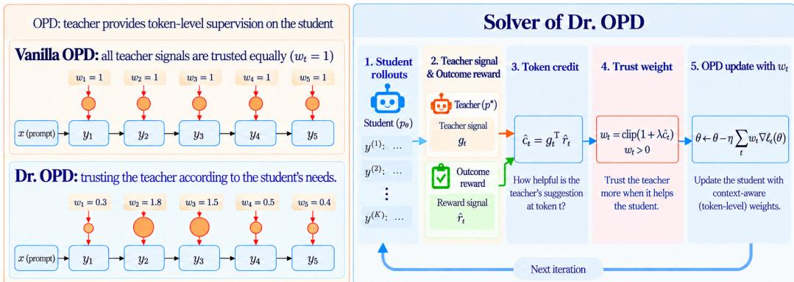  
Figure 1: Illustration of Dr. OPD. Left: vanilla OPD assigns the same weight to every teacher signal, while Dr. OPD adapts the weights according to their benefit to the student. Right: student rollouts receive teacher and outcome-reward signals, whose gradient alignment determines token credits. These credits are converted into weights for distillation, where λ controls the weighting strength.

To study how the student should trust teacher signals across tokens, we revisit the goal of OPD. In particular, note that the purpose of distillation is ultimately to improve the student’s task performance. Minimizing the divergence towards the stronger teacher policy is only an approach used to achieve this goal. Indeed, the teacher signal only tells us what the teacher prefers at each token, but not whether following the preference improves the student’s performance. This motivates us to adaptively choose the weight of each teacher signal according to its usefulness for the student. In this paper, we therefore study how to weight token-level teacher signals so that the student achieves the best performance.

Following this principle, we introduce Dr. OPD (OPD Done Right), which assigns weights $w ( s , v )$ to each teacher signal on the tokens v and context $\boldsymbol { s } = ( x , y )$ according to its usefulness for improving the student, as illustrated in Figure 1. A weight $w _ { t } > 1$ places more trust in the teacher at token t, while $0 < w _ { t } < 1$ places less trust. Vanilla OPD sets equal weights of $w _ { t } \equiv 1$ across all tokens. We note that for any positive weight w, the corresponding w-weighted OPD remains a valid distillation objective that pushes the student toward the teacher policy, just as vanilla OPD does. Dr. OPD then selects, among these valid weights, the one that gives the best resulting student:

$$
\operatorname* { m a x } _ { w } \biggl \{ \mathrm { S t u d e n t ' s ~ p e r f o r m a n c e ~ a f t e r ~ t r a i n i n g ~ w i t h ~ } w \mathrm { - w e i g h t e d ~ O P D } \biggr \} .\tag{1}
$$

The performance is measured by an outcome reward based on its generated responses (Ouyang et al., 2022; Shao et al., 2024). We formally formulate Dr. OPD as a bilevel optimization in Section 3.

Solving (1) exactly would require repeatedly training the student under different weight functions and then selecting the best weight, which is computationally infeasible. We therefore develop an iterative solver, illustrated in Figure 1. At each round, we build a surrogate objective of (1) to update the weights, leading to a simple closed-form update instead of learning a complex weight function. Then the student performs a weighted OPD update. Specifically, the student generates its own responses, from which we obtain the teacher’s token-level supervision and the outcome reward signal. We use these two signals to assess whether following the teacher more closely at each token would improve the student’s performance. Under regularity conditions, we show that the student, after the weighted update, achieves a higher reward than the corresponding vanilla OPD update.

## To summarize, we make the following contributions:

• Bilevel Formulation of Distillation. We introduce the concept of learning useful signals from the teacher via weighted OPD and propose Dr. OPD, a bilevel optimization formulation that defines the optimal weighted OPD to maximize the student’s performance. The lower-level problem trains the student under a given weight function, while the upper-level problem selects the weight according to the performance of the resulting student.

• Efficient Algorithm. Despite the challenge of solving Dr. OPD directly, we develop an efficient iterative solver with a closed-form weight update followed by a gradient update of the weighted OPD. To incorporate outcome rewards into the weight updates, it requires computing an inner product between two parameter-dimensional gradients for every token, which is prohibitively expensive for large models. We instead express each inner product as the product of two scalars, and then these products for all tokens can be computed altogether using a single Jacobian–vector product (JVP); see Section 4 for details.

• Significant Empirical Gains. We evaluate Dr. OPD across strong-to-weak and same-size distillation on math and code tasks, where it achieves the best performance across all evaluated settings and consistently outperforms all baselines. As shown in Figure 2, Dr. OPD improves Qwen3-1.7B over vanilla OPD by +9.7 points on math and even surpasses the larger Qwen3-4B teacher (35.0 vs. 34.1). In same-size distillation, it also surpasses both RL-trained teachers.

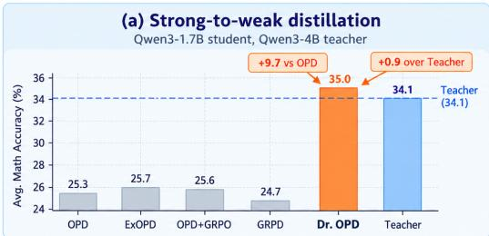

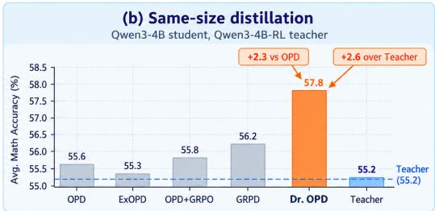  
Figure 2: Empirical gains. Across both distillation setups, Dr. OPD consistently outperforms existing baselines and even produces a student that surpasses its teacher (Full results in Section 5.2).

## 2 WEIGHTED ON-POLICY DISTILLATION

OPD trains a student model on its generated responses under the supervision from a stronger frozen teacher model. Let x be a prompt, and $y = ( y _ { 1 } , \dots , y _ { T } )$ a response generated by the student. At step t, the context $\boldsymbol { s } _ { t } = \left( x , y _ { < t } \right)$ contains the prompt and all the preceding tokens generated before t. We denote $p _ { \theta } ( v \mid s _ { t } )$ as the student’s probability of generating the next token $v \in \mathcal V .$ , and $p ^ { * } ( v \mid s _ { t } )$ as the teacher’s probability in the same context, where V is the vocabulary of tokens.

Vanilla OPD aims to train the student policy to mimic the teacher policy using the reverse KL divergence:

$$
\operatorname* { m i n } _ { \theta } D ( \theta ) : = \mathbb { E } \left[ \sum _ { t } \mathrm { K L } \left( p _ { \theta } ( \cdot  { | } s _ { t } )  { | | } p ^ { * } ( \cdot  { | } s _ { t } ) \right) \right] ,\tag{2}
$$

where

$$
\mathrm { K L } \left( p _ { \theta } ( \cdot \mid s ) \parallel p ^ { * } ( \cdot \mid s ) \right) = \sum _ { v } p _ { \theta } ( v \mid s ) \log \frac { p _ { \theta } ( v \mid s ) } { p ^ { * } ( v \mid s ) } ,
$$

and the expectation is taken over the prompts and responses generated by the student policy. Following prior works (Agarwal et al., 2024; Shao et al., 2026), the generated contexts are treated as fixed during each student update and are refreshed as the student changes.

As shown in (2), vanilla OPD assigns equal weights to teacher signals at every token. However, not all teacher signals are equally informative (Armandpour et al., 2026; Xie et al., 2026). We introduce a weight function $w ( s , v ) > 0 .$ , which controls the importance of matching the teacher’s probability of token v at context s. For a fixed context s, we use $w ( s , \cdot )$ to denote the corresponding vector of token weights. We then define a weighted KL divergence that generalizes the ordinary KL divergence.

Definition 1 (Weighted KL divergence). At a context s, given the positive weights $w ( s , \cdot )$ , we define

$$
\begin{array} { r l } & { { \mathrm { K L } } _ { w ( s , \cdot ) } ( p _ { \theta } ( \cdot  { | s  }  { \| p ^ { * } ( \cdot  { | s  } )  } } \\ & { \qquad : = \displaystyle \sum _ { v } w ( s , v ) [ p _ { \theta } ( v  { | s  } \log \frac { p _ { \theta } ( v  { | s  } } { p ^ { * } ( v  { | s  } } - p _ { \theta } ( v  { | s  } + p ^ { * } ( v  { | s  } ) ] . } \end{array}\tag{3}
$$

where the additional term $- p _ { \boldsymbol { \theta } } ( \boldsymbol { v } \mid \boldsymbol { s } ) + p ^ { * } ( \boldsymbol { v } \mid \boldsymbol { s } )$ ensures nonnegativity under token-dependent weighting, following the generalized KL divergence (also known as I-divergence) with nonnegative

measures (Csiszár, 1975; Banerjee et al., 2005). This weighted KL divergence equals zero if and only if $p _ { \theta } ( v \mid s ) = p ^ { * } ( v \mid s )$ for every token v. Moreover, when $w ( s , v ) \equiv 1$ for all $v ,$ it holds $\begin{array} { r } { \sum _ { v } w ( s , v ) \big ( p ^ { * } ( v \mid s ) - p _ { \theta } ( v \mid s ) \big ) = 0 , \operatorname { s o } \left( 3 \right) } \end{array}$ reduces to the ordinary KL divergence.

With the weighted KL divergence, we define the weighted OPD as follows.

Definition 2 (Weighted OPD). Given a weight function $w ( s , \cdot ) > 0$ for every context s, we define weighted OPD by

$$
\underset { \theta } { \operatorname* { m i n } } D _ { w } ( \theta ) : = { \mathbb { E } } \left[ \sum _ { t } { \mathrm { K L } } _ { w ( s _ { t } , \cdot ) } ( p _ { \theta } ( \cdot \mid s _ { t } ) \parallel p ^ { * } ( \cdot \mid s _ { t } ) ) \right] .\tag{4}
$$

We next show that this remains a valid distillation objective. In particular, minimizing $D _ { w } ( \theta )$ , for any positive w, still pushes the student to match the teacher.

Theorem 3 (Validity of weighted OPD). For any positive weight function $w ,$ we have

$$
D _ { w } ( \theta ) \geq 0 .
$$

Equality holds ifand only $i f p _ { \theta } ( v \mid s ) = p ^ { * } ( v \mid s )$ for every token v at almost every context under the reference context distribution. When $w ( s , v ) \equiv 1$ , weighted OPD in (4) reduces to vanilla OPD.

## 3 OPD DONE RIGHT: FIND THE BEST WEIGHT FOR OPD

We now study how to choose the weight function w. Recall that the ultimate goal of distillation is to improve the student’s task performance, while minimizing the divergence to a stronger teacher is merely a means to achieve this goal. This principle motivates us to select the weight function according to the performance of the resulting student, formulating a bilevel optimization problem.

## 3.1 FORMULATION OF DR. OPD

We evaluate the student’s performance using an outcome reward $V ( x , y ) \in [ 0 , 1 ]$ for each prompt– response pair $( x , y )$ . The student’s expected reward is then

$$
R ( \theta ) : = \mathbb { E } _ { x , y \sim p _ { \theta } ( . | x ) } \big [ V ( x , y ) \big ] .
$$

We now introduce DR. OPD (OPD done right), the optimal weighted OPD to maximize the student’s performance:

$$
\operatorname* { m a x } _ { w _ { \mathrm { m i n } } \leq w \leq w _ { \mathrm { m a x } } } R ( \theta ^ { * } ( w ) ) \qquad \mathrm { s u b j e c t t o } \qquad \theta ^ { * } ( w ) \in \arg \operatorname* { m i n } _ { \theta } D _ { w } ( \theta ) .\tag{5}
$$

Dr. OPD is a bilevel optimization problem, where the upper level chooses the weight function w to maximize the resulting student’s reward, and the lower level trains the student θ by minimizing $D _ { w } ( \theta )$ , under the given w. Here, the constraint $w \in [ w _ { \mathrm { m i n } } , w _ { \mathrm { m a x } } ]$ means pointwise that $w ( s , v ) \in$ $[ w _ { \mathrm { m i n } } , w _ { \mathrm { m a x } } ]$ for every $( s , v )$ , where $0 < w _ { \operatorname* { m i n } } < 1 < w _ { \operatorname* { m a x } }$ are prespecified bounds. For simplicity, we write $\theta ^ { * } ( w )$ as if the lower-level solution were unique. When multiple lower-level solutions exist, we choose the one that maximizes the upper-level reward; see the formal definition in Appendix C.3.

## 3.2 ITERATIVE SOLVER FOR DR. OPD

Solving the bilevel Dr. OPD problem in (5) exactly is computationally intractable, since evaluating each candidate weight function w would require fully optimizing the lower-level student and then evaluating its reward. In addition, the weight function $w ( s , v )$ is defined over all possible context– token pairs, making the upper-level optimization infinite-dimensional.

We therefore design an iterative solver that alternates between student and weight updates. At each round, starting from the current student ${ \bar { \theta } } ,$ we take one gradient update of weighted OPD with the weights fixed. We then update the weights according to the reward of the resulting updated student, restricting the weights update to the sampled tokens in responses. This reduces the original infinite-dimensional functional optimization into a finite-dimensional problem at each step.

Lower-level update. For a fixed weight function w, we take one gradient descent step from the current student <sup>¯</sup>θ. We generate a response $y = ( y _ { 1 } , \dots , y _ { T } )$ from $p _ { \bar { \theta } }$ and hold the sampled trajectory fixed during this round. Here, $y _ { t }$ is the realized token at step t, whereas the previous $v \in \nu$ in (2) indexes all possible tokens. We write

$$
w _ { t } : = w ( s _ { t } , y _ { t } ) , \qquad p _ { t } ( { \bar { \theta } } ) : = p _ { \bar { \theta } } ( y _ { t } \mid s _ { t } ) , \qquad p _ { t } ^ { * } : = p ^ { * } ( y _ { t } \mid s _ { t } ) .
$$

Differentiating the weighted OPD objective at $\bar { \theta }$ gives

$$
- \nabla _ { \theta } D _ { w } ( \bar { \theta } ) = \mathbb { E } \left[ \sum _ { t } w _ { t } g _ { t } \right] , \quad \mathrm { w h e r e } \quad g _ { t } : = \log \frac { p _ { t } ^ { * } } { p _ { t } ( \bar { \theta } ) } \ : \nabla _ { \theta } \log p _ { \theta } ( y _ { t } \mid s _ { t } ) | _ { \theta = \bar { \theta } } .\tag{6}
$$

The derivation is provided in Appendix C.2.2. The corresponding one-step update on the lower-level solution is therefore

$$
\theta ^ { + } ( w ) : = \bar { \theta } - \eta \nabla D _ { w } ( \bar { \theta } ) = \bar { \theta } + \eta \mathbb { E } \left[ \sum _ { t } w _ { t } g _ { t } \right] ,\tag{7}
$$

where $\eta > 0$ is the student step size. The expectation in (6)–(7) is taken over the current policy $p _ { \bar { \theta } }$

We call $g _ { t }$ in (6) the teacher correction at token $y _ { t }$ , which is interpreted as follows. If the teacher assigns token y a higher probability than the student, then $g _ { t }$ increases the student’s probability of generating $y _ { t } .$ . On the other hand, if the teacher assigns it a lower probability, then $g _ { t }$ decreases its probability. The weight $w _ { t }$ controls the strength of this teacher correction to the student update.

Upper-level update. We next update the weight function w according to the reward of the updated student $\theta ^ { + } ( w )$ . Since the weight function is defined over all possible context–token pairs and we do not impose a parametric form on $\mathbf { i t } ,$ a gradient update like in (7) does not apply here. Instead, we construct a tractable lower bound approximation on $R ( \theta ^ { + } ( w ) )$ and optimize this bound over the weight function. As shown below, this leads to a simple pointwise update for the weights.

We denote the one-step vanilla OPD update from the current student $\bar { \theta }$ as follows, which sets $w \equiv 1$

$$
\begin{array} { r } { \theta _ { \mathrm { v a n i } } ^ { + } : = \theta ^ { + } ( 1 ) . } \end{array}
$$

To determine how the weights should be updated, we ask how changing the weight $w _ { t }$ of the teacher signal at token t affects the resulting student’s reward. We define the credit at token t as

$$
c _ { t } : = \frac { 1 } { \eta } \left. \frac { \partial R ( \theta ^ { + } ( w ) ) } { \partial w _ { t } } \right| _ { w \equiv 1 } = g _ { t } ^ { \top } \nabla R \big ( \theta _ { \mathrm { v a n i } } ^ { + } \big ) ,\tag{8}
$$

where the second equality follows from the chain rule and (7). The derivative is understood per unit reference measure; Appendix C.4 gives its precise functional interpretation.

The credit $c _ { t }$ measures whether following the teacher more strongly at token t would locally improve the student’s reward. Recall that the teacher correction $g _ { t }$ in (6) locally moves the sampled token’s probability toward the teacher’s. However, moving closer to the teacher does not necessarily improve the student’s task performance. The credit $c _ { t }$ captures this distinction. If $c _ { t } > 0 .$ , placing more weight on the teacher correction is beneficial to the student’s reward, suggesting that we should trust this signal more and choose $w _ { t } > 1$ . On the other hand, if $c _ { t } < 0$ , following the teacher more strongly is harmful, suggesting that the signal should be downweighted with $w _ { t } < 1$ . Thus, $g _ { t }$ determines the direction of the token-level teacher correction, while $c _ { t }$ determines how strongly the student should follow the teacher signal.

We next derive a lower bound surrogate on the reward $R ( \theta ^ { + } ( w ) )$

Proposition 4 (Lower bound on reward). Suppose that the reward gradient $\nabla R ( \theta )$ is locally $L _ { R ^ { - } }$ Lipschitz in θ and that the regularity conditions in Appendix C.1 hold. Then, for any weight function w $\in [ w _ { \mathrm { m i n } } , w _ { \mathrm { m a x } } ]$ and any $\lambda > 0$ satisfying $\begin{array} { r } { \lambda \eta L _ { R } \dot { \mathbb { E } } \big [ \sum _ { t } \| g _ { t } \| ^ { 2 } \big ] \leq 1 } \end{array}$

$$
R \big ( \theta ^ { + } ( w ) \big ) \geq R \big ( \theta _ { \mathrm { v a n i } } ^ { + } \big ) + \eta \mathbb { E } \left[ \sum _ { t } \left( ( w _ { t } - 1 ) c _ { t } - \frac { ( w _ { t } - 1 ) ^ { 2 } } { 2 \lambda } \right) \right] .\tag{9}
$$

The right-hand side provides a tractable lower-bound surrogate for $R ( \theta ^ { + } ( w ) )$ . The parameter $\lambda > 0$ is introduced to simplify the lower bound; see Appendix C.1 for details.

Maximizing this surrogate with respect to w yields a closed-form update

$$
w _ { t } ^ { + } = \mathrm { c l i p } \left( 1 + \lambda c _ { t } , w _ { \mathrm { m i n } } , w _ { \mathrm { m a x } } \right) .\tag{10}
$$

The update implies that $\lambda$ can also be interpreted as the hyperparameter to control the weighting strength, with larger values allowing stronger adjustments to token-level weights. Importantly, this closed-form update removes the need to parameterize or train a separate model for the weight function. Instead, we directly compute the weight $w _ { t } ^ { + }$ for each sampled token, which substantially reduces the computational cost.

Note that the updated $w ^ { + }$ attains a higher reward than vanilla OPD, as long as $w _ { t } ^ { + } \not \equiv 1$

Theorem 5 (Reward improvement over vanilla OPD). Under the conditions ensuring (9),

$$
R \big ( \theta ^ { + } ( w ^ { + } ) \big ) - R \big ( \theta _ { \mathrm { v a n i } } ^ { + } \big ) \geq \frac { \eta } { 2 \lambda } \mathbb { E } \bigg [ \sum _ { t } ( w _ { t } ^ { + } - 1 ) ^ { 2 } \bigg ] \geq 0 .\tag{11}
$$

## 4 ALGORITHM

In this section, we propose a practical algorithm to solve Dr. OPD. At each round, starting from the current student ${ \bar { \boldsymbol { \theta } } } ,$ we sample multiple responses per prompt and obtain the teacher signals and outcome-rewards. Such outcome rewards are readily available for verifiable tasks such as math and code through answer checking and test execution (Guo et al., 2025), and can also be provided by learned reward models for more general tasks (Ouyang et al., 2022). Given the signals from both the teacher and the outcome reward, we estimate the token credits $c _ { t }$ in (8) and update the weights as in (10). Lastly, we update the student with one gradient step on the resulting weighted OPD.

Computation of credits. Recall that $c _ { t } = g _ { t } ^ { \top } \nabla R ( \theta _ { \mathrm { v a n i } } ^ { + } )$ , where the teacher correction $g _ { t }$ is directly computed as in (6) but estimating $\nabla R ( \theta _ { \mathrm { v a n i } } ^ { + } )$ can be computationally expensive. In particular, estimating $\nabla R ( \theta _ { \mathrm { v a n i } } ^ { + } )$ would require first applying a vanilla OPD update from the current $\bar { \theta }$ to obtain $\theta _ { \mathrm { v a n i } } ^ { + } ,$ then generating a new set of responses from this updated student and using them to estimate its gradient of reward. This would introduce an additional round of model update and response generation at every training iteration, substantially increasing the computational cost.

To avoid the cost, we approximate $\nabla R ( \theta _ { \mathrm { v a n i } } ^ { + } )$ by $\nabla R ( \bar { \theta } )$ evaluated at the current student ${ \bar { \theta } } ,$ which can be estimated using the responses already sampled. For a general outcome reward function, $\nabla R ( \bar { \theta } )$ can be estimated by weighting each response’s log-probability gradient by its reward. For the verifiable math and code tasks, we can follow GRPO (Shao et al., 2024) to estimate $\nabla R ( { \bar { \theta } } )$ by

$$
\widehat { r } : = \frac { 1 } { | \mathcal { B } | } \sum _ { ( x , y ) \in \mathcal { B } } A ( x , y ) \sum _ { t } \nabla _ { \theta } \log p _ { \theta } ( y _ { t } \mid s _ { t } ) | _ { \theta = \bar { \theta } } ,
$$

where $A ( x , y )$ denotes the group-relative advantage with the explicit expression in Appendix B, and B denotes the batch of prompt-response pairs. We then approximate the token credit by $g _ { t } ^ { \top } \widehat { r } .$

Efficient computation with Jacobian–vector product (JVP). For a response with $T$ tokens, we shall compute credits $\widehat { c } _ { t } = g _ { t } ^ { \top } \widehat { r }$ for each token $\bar { t } = 1 , \ldots , T$ . A naive implementation would require computing T parameter gradients $g _ { 1 } , . . . , g _ { T } \in \mathbb { R } ^ { | \bar { \theta } | }$ , one for each token. Since the number of model parameters $\bar { \left| \bar { \theta } \right| }$ is very large, explicitly forming all $\{ g _ { t } \} _ { t = 1 } ^ { T }$ is prohibitively expensive.

It turns out that we do not need to explicitly compute or store the parameter gradient $g _ { t }$ . Recall that

$$
g _ { t } = d _ { t } \nabla _ { \theta } \log { p _ { \theta } ( y _ { t } \mid s _ { t } ) } | _ { \theta = \bar { \theta } } , d _ { t } : = \log { \frac { p ^ { * } ( y _ { t } \mid s _ { t } ) } { p _ { \bar { \theta } } ( y _ { t } \mid s _ { t } ) } } \in \mathbb { R } .\tag{12}
$$

Substituting this expression into $\widehat { c } _ { t } = g _ { t } ^ { \top } \widehat { r }$ gives, for each token $t = 1 , \dots , T$

$$
\widehat { c } _ { t } = d _ { t }  \langle \nabla _ { \theta } \log p _ { \theta } ( y _ { t } \mid s _ { t } ) \vert _ { \theta = \bar { \theta } } , \widehat { r } \rangle = d _ { t }  \frac { \mathrm { d } } { \mathrm { d } \epsilon } \log p _ { \bar { \theta } + \epsilon \widehat { r } } ( y _ { t } \mid s _ { t } )  _ { \epsilon = 0 } ,\tag{13}
$$

where the second equality follows from the directional-derivative identity. Thus, instead of explicitly constructing the $T$ parameter-dimensional gradients $\{ g _ { t } \} _ { t = 1 } ^ { T }$ , we only need the T scalar directional derivatives $\left\{ \begin{array} { l }  \frac { \mathrm { d } } { \mathrm { d } \epsilon } \log p _ { \bar { \theta } + \epsilon \widehat { r } } ( y _ { t } \mid s _ { t } ) \Big | _ { \epsilon = 0 } \right\} _ { t = 1 } ^ { T } \end{array}$ , which can be computed altogether with a single JVP.

Updating weights. Following the closed-form update in (10), we update the token weights:

$$
\widehat { w } _ { t } = \mathrm { c l i p } \left( 1 + \lambda \frac { \widehat { c } _ { t } } { \operatorname* { m a x } ( \sigma , \epsilon ) } , w _ { \mathrm { m i n } } , w _ { \mathrm { m a x } } \right) ,\tag{14}
$$

where $\epsilon > 0$ prevents division by zero, and σ is the root-mean-squared (RMS) scale of the estimated credits, whose explicit expression is provided in Appendix B.3. This RMS normalization helps stabilize the weight updates.

We then perform one gradient step on the $\{ \widehat { w } _ { t } \}$ -weighted OPD, as in (7), but with the population expectation replaced by an empirical average. The complete procedure is in Algorithm 1. Compared with vanilla OPD, the only additional steps are computing the gradient of the outcome rewards, the token credits, and the corresponding weights. Since the credits can be computed with a single JVP and the weights are obtained in closed form, these computations add little overhead.

Algorithm 1 Solver for DR-OPD   
Require: Student $p _ { \theta }$ , teacher $p ^ { * }$ , outcome reward function V, weighting strength λ, bounds   
$w _ { \mathrm { m i n } } , w _ { \mathrm { m a x } }$   
1: Set current student policy $\bar { \theta }  \theta$   
2: for each training round do   
3: Sample multiple responses per prompt from ${ \bar { \theta } } .$   
4: Evaluate responses’ outcome reward and compute the estimated gradient of reward rb.   
5: Compute the token discrepancies $d _ { t }$ in (12).   
6: Compute credits $\widehat { c } _ { t }$ by JVP using (13).   
7: Update weights $\widehat { w } _ { t }$ using (14).   
8: Update $\bar { \theta }$ by gradient update of $\{ \widehat { w } _ { t } \}$ -weighted OPD in (7).   
9: end for

## 5 EXPERIMENTAL RESULTS

We evaluate Dr. OPD across four student–teacher configurations:

(Base, Instruct), (Instruct, Instruct), (Base, RL), (Instruct, RL),

where the first entry denotes the type of student model and the second denotes the type of teacher. These terms refer to different stages of post-training. A Base model is the pretrained model before instruction tuning, while an Instruct model has been post-trained to better follow user instructions and solve downstream tasks. An RL model is obtained through further reinforcement learning using outcome rewards and represents a more strongly post-trained model.

These configurations form two complementary distillation regimes. In strong-to-weak regime, a larger Instruct model serves as the teacher for either a Base or an Instruct student. In same-size regime, we use an RL-trained teacher and a base or Instruct model of the same size as the student.

## 5.1 EXPERIMENTAL SETUP

Models. We instantiate the four student–teacher configurations above using Qwen3 models, where models without the “Base” or “RL” suffix refer to their Instruct versions. For strong-to-weak distillation, we use Qwen3-4B (Yang et al., 2025) as the teacher and consider two students, Qwen3- 1.7B-Base and Qwen3-1.7B. For same-size distillation, we consider Qwen3-4B-Base with an RLtrained Qwen3-4B-Base teacher, and Qwen3-4B with an RL-trained Qwen3-4B teacher (Yang et al., 2026). All teachers are frozen during distillation.

Training data and protocol. For mathematical reasoning, we train on DeepMath-103K (He et al., 2026). For code generation, we train on Eurus-RL-Code (Cui et al., 2025). Following prior OPD work (Yang et al., 2026; Sun et al., 2026b), we use a small number of post-training steps: 50 steps in all settings. Full training details are provided in Appendix A.

Evaluation. For math, we evaluate on AIME24, AIME25, AMC, Minerva Math (Lewkowycz et al., 2022), and OlympiadBench (He et al., 2024), and report accuracy averaged over 16 sampled responses per problem (avg@16). For code, we evaluate on HumanEval+ and MBPP+ from EvalPlus (Liu et al., 2023), together with LiveCodeBench (Jain et al., 2025), and report avg@4. We evaluate checkpoints every 10 optimization steps on the evaluated datasets and report the best checkpoint for each method, as adopted in works (Ding and Zhang, 2026; Zhao et al., 2026).

Baselines. We compare Dr. OPD with four OPD-based baselines. OPD (Gu et al., 2024) is the standard on-policy distillation baseline with uniform token weighting. ExOPD (Yang et al., 2026) extrapolates the teacher’s distillation signal with the goal of moving the student beyond the teacher. With outcome reward signals, GRPD (Lin et al., 2026) considers reward-gated distillation, while OPD+GRPO (Xiaomi LLM-Core Team et al., 2026) adds an additional GRPO objective alongside the OPD objective. Implementation details are provided in Appendix A.

## 5.2 DISTILLATION RESULTS

Strong-to-weak distillation. We distill the Qwen3-4B teacher into the Qwen3-1.7B and Qwen3- 1.7B-Base students. As shown in Table 1, Dr. OPD achieves the best average performance on both math and code for both students. Notably, vanilla OPD still leaves a substantial gap between the student and the stronger teacher, suggesting that simply mimicking a stronger, larger teacher is insufficient to bring the student close to the teacher’s performance.

A smaller student can outperform its larger teacher. For the 1.7B student, Dr. OPD even surpasses the larger 4B teacher in average math performance (35.0 vs. 34.1). This improvement reflects the design of Dr. OPD, which does not merely mimic the teacher but also uses the student’s outcome reward to determine which teacher signals to follow more closely. However, simply adding outcome rewards is not sufficient, since both OPD+GRPO and GRPD also use such rewards but yield only marginal improvements. This suggests that how the outcome reward is incorporated into distillation is important.

For the 1.7B-Base student, Dr. OPD still improves over vanilla OPD by 1.8 points on math, while the gain is much larger on code, reaching 6.4 points. Compared with the 1.7B student, the 1.7B-Base student shows a smaller gain on math. We attribute this mainly to its much lower starting accuracy. Since the Base student produces fewer successful rollouts, the outcome-reward signal used to estimate token credits is less informative for identifying useful teacher supervision. Despite this, Dr. OPD still achieves the best average performance among all compared methods.

<table><tr><td rowspan="2">Method</td><td colspan="6">Math</td><td colspan="4">Code</td></tr><tr><td>AIME24</td><td>AIME25</td><td>AMC</td><td>Minerva</td><td>Olym.</td><td>Avg.</td><td>HE+</td><td>MBPP+</td><td>LCB</td><td>Avg.</td></tr><tr><td>Teacher (Qwen3-4B)</td><td>22.5</td><td>16.9</td><td>60.5</td><td>27.1</td><td>43.7</td><td>34.1</td><td>77.1</td><td>64.8</td><td>16.1</td><td>52.7</td></tr><tr><td>Student: Qwen3-1.7B</td><td></td><td></td><td></td><td></td><td></td><td></td><td></td><td></td><td></td><td></td></tr><tr><td>Initial</td><td>12.3</td><td>9.0</td><td>39.7</td><td>19.1</td><td>32.9</td><td>22.6</td><td>59.8</td><td>52.5</td><td>11.9</td><td>41.4</td></tr><tr><td>OPD</td><td>15.4</td><td>12.5</td><td>43.7</td><td>19.4</td><td>35.8</td><td>25.3</td><td>60.4</td><td>54.9</td><td>15.0</td><td>43.4</td></tr><tr><td>ExOPD</td><td>17.5</td><td>10.0</td><td>44.0</td><td>20.2</td><td>36.6</td><td>25.7</td><td>61.1</td><td>56.5</td><td>15.4</td><td>44.3</td></tr><tr><td>OPD+GRPO</td><td>16.0</td><td>13.1</td><td>42.9</td><td>21.0</td><td>35.1</td><td>25.6</td><td>60.7</td><td>55.4</td><td>14.9</td><td>43.7</td></tr><tr><td>GRPD</td><td>15.8</td><td>9.2</td><td>43.5</td><td>19.4</td><td>35.4</td><td>24.7</td><td>64.0</td><td>52.0</td><td>14.9</td><td>43.6</td></tr><tr><td>Dr. OPD</td><td>25.6+10.2</td><td>23.5+11.0</td><td>56.9+13.2</td><td>24.6+5.2</td><td>44.4+8.6</td><td>35.0+9.7</td><td>64.2+3.8</td><td>60.7+5.8</td><td>20.4+5.4</td><td>48.4+5.0</td></tr><tr><td>Student: Qwen3-1.7B-Base</td><td></td><td></td><td></td><td></td><td></td><td></td><td></td><td></td><td></td><td></td></tr><tr><td>Initial</td><td>1.7</td><td>1.5</td><td>10.8</td><td>4.4</td><td>7.8</td><td>5.2</td><td>5.5</td><td>4.2</td><td>1.3</td><td>3.7</td></tr><tr><td>OPD</td><td>6.9</td><td>5.0</td><td>28.8</td><td>20.1</td><td>23.3</td><td>16.8</td><td>54.0</td><td>55.0</td><td>11.7</td><td>40.2</td></tr><tr><td>ExOPD</td><td>6.7</td><td>5.6</td><td>27.5</td><td>20.6</td><td>23.8</td><td>16.8</td><td>61.1</td><td>54.7</td><td>14.3</td><td>43.4</td></tr><tr><td>OPD+GRPO</td><td>8.1</td><td>5.2</td><td>29.3</td><td>21.0</td><td>23.7</td><td>17.5</td><td>63.1</td><td>55.1</td><td>15.0</td><td>44.4</td></tr><tr><td>GRPD</td><td>6.9</td><td>5.6</td><td>28.8</td><td>20.0</td><td>23.0</td><td>16.9</td><td>59.3</td><td>50.3</td><td>13.0</td><td>40.9</td></tr><tr><td>Dr. OPD</td><td>9.2+2.3</td><td>4.8-0.2</td><td>31.3+2.5</td><td>21.3+1.2</td><td>26.5+3.2 18.6+1.8</td><td></td><td>64.3+10.3</td><td>58.5+3.5</td><td>16.9+5.2</td><td>46.6+6.4</td></tr></table>

Table 1: Strong-to-weak distillation. We distill Qwen3-4B into Instruct and Base Qwen3-1.7B students on math and code generation. Colored subscripts report the absolute change over vanilla OPD. Bold denotes the best distillation result within each student setting.

Same-size distillation. We next consider the setting where the student and teacher have the same model size, with the teacher obtained through further RL training. As shown in Table 2, vanilla OPD already brings the student close to or even beyond the teacher, leaving limited room for further gains by simply mimicking the teacher. Despite this, Dr. OPD still achieves the best average performance for both setups, improving over vanilla OPD by 2.3 and 3.0 points, respectively.

Surpassing the RL-trained teacher. Notably, Dr. OPD surpasses the RL-trained teacher in both settings. For the Instruct student, it exceeds the teacher on all five benchmarks, a level of consistent improvement not achieved by any competing method. For the Base student, Dr. OPD exceeds the teacher on four of the five benchmarks and improves the average performance from 34.1 to 36.0.

<table><tr><td>Method</td><td>AIME24</td><td>AIME25</td><td>AMC</td><td>Minerva</td><td>Olym.</td><td>Avg.</td></tr><tr><td>Student: Qwen3-4B</td><td colspan="6">Teacher: Qwen3-4B-RL</td></tr><tr><td>Teacher</td><td>54.0</td><td>46.5</td><td>81.0</td><td>36.9</td><td>57.7</td><td>55.2</td></tr><tr><td>Initial</td><td>22.5</td><td>16.9</td><td>60.5</td><td>27.1</td><td>43.7</td><td>34.1</td></tr><tr><td>OPD</td><td>55.8</td><td>45.8</td><td>81.0</td><td>37.3</td><td>57.9</td><td>55.6</td></tr><tr><td>ExOPD</td><td>56.9</td><td>43.3</td><td>82.3</td><td>37.6</td><td>56.6</td><td>55.3</td></tr><tr><td>OPD+GRPO</td><td>55.6</td><td>46.3</td><td>82.0</td><td>37.5</td><td>57.7</td><td>55.8</td></tr><tr><td>GRPD</td><td>55.8</td><td>49.2</td><td>81.6</td><td>37.6</td><td>57.0</td><td>56.2</td></tr><tr><td>Dr. OPD</td><td>58.3+2.5</td><td>51.7+5.8</td><td>82.9+1.9</td><td>37.8+0.5</td><td>58.5+0.6</td><td>57.8+2.3</td></tr><tr><td>Student: Qwen3-4B-Base Teacher: Qwen3-4B-Base-RL</td><td colspan="6"></td></tr><tr><td>Teacher</td><td>23.1</td><td>22.1</td><td>55.4</td><td>26.4</td><td>43.5</td><td>34.1</td></tr><tr><td>Initial</td><td>11.9</td><td>8.5</td><td>36.8</td><td>9.7</td><td>27.6</td><td>18.9</td></tr><tr><td>OPD</td><td colspan="6">21.0 19.2</td></tr><tr><td>ExOPD</td><td>26.9</td><td>19.2</td><td>56.0 56.7</td><td>27.4 25.6</td><td>41.5 43.1</td><td>33.0 34.3</td></tr><tr><td>OPD+GRPO</td><td>21.9</td><td>21.0</td><td>57.5</td><td>27.2</td><td>42.3</td><td>34.0</td></tr><tr><td>GRPD</td><td>21.5</td><td>18.8</td><td>56.8</td><td>27.6</td><td>43.1</td><td>33.5</td></tr><tr><td>Dr. OPD</td><td>25.4+4.4</td><td>20.0+0.8</td><td>58.4+2.4</td><td>31.9+4.5</td><td>44.1+2.6</td><td>36.0+3.0</td></tr></table>

Table 2: Same-size distillation. We evaluate Instruct and Base students distilled from their corresponding RL-trained teachers on mathematical reasoning. Colored subscripts in the Dr. OPD rows report the absolute improvement over vanilla OPD. Teacher and Initial are reference points; bold denotes the best distillation result within each student–teacher setting.

## 5.3 ABLATION STUDY: EFFECT OF λ

The weighting strength λ is the main hyperparameter in Algorithm 1, controlling how strongly the token weights can deviate from the vanilla OPD value of 1. When λ = 0, Dr. OPD reduces to vanilla OPD. As shown in Table 3, every positive value of λ improves over OPD on all five benchmarks and in average performance, suggesting that Dr. OPD does not require precise tuning of λ. Among the values tested, λ = 0.4 performs best overall and is used in our main experiments.

<table><tr><td>λ</td><td>AIME24</td><td>AIME25</td><td>AMC</td><td>Minerva</td><td>Olym.</td><td>Avg.</td></tr><tr><td>0 (OPD)</td><td>15.4</td><td>12.5</td><td>43.7</td><td>19.4</td><td>35.8</td><td>25.3</td></tr><tr><td>0.2</td><td>18.5</td><td>13.5</td><td>47.8</td><td>22.8</td><td>37.7</td><td>28.1</td></tr><tr><td>0.3</td><td>19.4</td><td>14.0</td><td>45.0</td><td>23.2</td><td>37.5</td><td>27.8</td></tr><tr><td>0.4</td><td>25.6</td><td>23.5</td><td>56.9</td><td>24.6</td><td>44.4</td><td>35.0</td></tr><tr><td>0.5</td><td>24.0</td><td>19.2</td><td>54.7</td><td>25.0</td><td>42.6</td><td>33.1</td></tr><tr><td>0.6</td><td>23.8</td><td>19.8</td><td>54.1</td><td>23.3</td><td>44.0</td><td>33.0</td></tr></table>

Table 3: Effect of the weighting strength λ on mathematical reasoning. We vary λ for the Qwen3-1.7B student distilled from Qwen3-4B. λ = 0 reduces to vanilla OPD, while larger λ allows stronger token-level weight adjustments. Bold denotes the best result in each column.

## 6 RELATED WORKS

On-policy distillation. Learning from teacher feedback on student-generated sequences addresses the mismatch between training trajectories and the contexts encountered by the student at inference. GKD studies this principle with a family of divergence objectives (Agarwal et al., 2024), while MiniLLM develops reverse-KL optimization for language-model distillation (Gu et al., 2024). Subsequent work demonstrates its effectiveness for reasoning post-training (Yang et al., 2025). Multi-teacher OPD also consolidates specialist capabilities in MiMo-V2-Flash, DeepSeek-V4, and Kimi K3 (Xiaomi LLM-Core Team et al., 2026; Xu et al., 2026; Team et al., 2026). Beyond direct teacher matching, G-OPD and ExOPD introduce a reference policy and reward extrapolation (Yang et al., 2026), and OPD<sup>2</sup> uses the difference between a reasoning-tuned teacher and its base model as the distillation signal (Heo et al., 2026). Analyses further identify teacher–student compatibility as a factor in successful transfer (Li et al., 2026).

Trust and weighting in OPD. Several methods already adapt the strength or location of teacher supervision. REOPOLD stabilizes learning through reward clipping and entropy-based token sampling (Ko et al., 2026). TrOPD identifies trustworthy regions through teacher–student agreement and treats outlier tokens with alternative objectives (Xing et al., 2026). IW-OPD weights tokens using accumulated distribution discrepancy to address deteriorating supervision along long student trajectories (Xie et al., 2026). REOPD combines token-level compatibility weights with a batchlevel budget to adapt extrapolation beyond the teacher (Sun et al., 2026b). For multiple teachers, TrustMOPD allocates token-level supervision using each specialist’s displacement from a shared pre-RL reference (Sun et al., 2026a). Outcome feedback also supports selective distillation: OPDVR gates sampled-token signals according to response correctness (Lin et al., 2026), while VG-OPD verifies an expert’s advantage on individual answer criteria and localizes its supervision through token disagreement (Xu and Zhang, 2026).

Concurrent work SparseOPD (Liu et al., 2026) studies extremely sparse supervision for OPD, showing that retaining only one or two token-level teacher signals per trajectory can match or outperform dense vanilla OPD. SparseOPD can be viewed as a binary-weighted OPD that masks most token-level signals, while Dr. OPD, instead, adaptively assigns continuous weights according to how each teacher signal affects the student’s performance. Thus, SparseOPD studies how little supervision is sufficient, while Dr. OPD studies how teacher supervision should be weighted to maximize student performance. Closely related to our motivation, Unmasking OPD diagnoses teacher signals through alignment with an estimated success-improving gradient in token-logit space (Armandpour et al., 2026). Dr. OPD uses the sensitivity of the updated student’s reward to each supervision weight as an optimization criterion. This yields parameter-space credits for teacher corrections and a clipped weighting rule derived from a reward lower bound relative to vanilla OPD.

Bilevel optimization, reweighting, and influence. Selecting supervision through the performance of the learner connects to bilevel optimization and differentiation through learning dynamics (Franceschi et al., 2018; Shaban et al., 2019). A common strategy in this literature is to evaluate the outer objective through one or a few gradient updates of the inner learner, as in MAML (Finn et al., 2017). This idea is also used for data reweighting, where Ren et al. (2018) selects example weights through a one-step learner update evaluated on clean validation data, leading to a gradient-alignment criterion. Influence-function methods study how upweighting training examples affects the learned model, typically through an inverse-Hessian correction (Koh and Liang, 2017), while TracIn uses gradient inner products along optimization trajectories (Pruthi et al., 2020). Our method brings these ideas to token-level teacher supervision: we measure the reward sensitivity of a one-step OPD update, use outcome reward as the outer objective, and derive finite weight updates from a lower bound on reward improvement.

## 7 CONCLUSION

We proposed Dr. OPD, a bilevel optimization formulation that finds the optimal weighted OPD objective for improving students’ task performance. The lower-level problem trains the student under a given weight function, while the upper-level problem selects the weights according to the reward of the resulting student. To solve Dr. OPD efficiently, we developed an iterative solver with closed-form weight updates followed by a standard gradient update on the weighted OPD. Across all evaluated experimental setups, Dr. OPD consistently outperforms existing baselines and can even enable students to surpass their teachers.

## AI USE STATEMENT

In this work, we used generative AI tools as follows. Among tasks requiring disclosure, AI tool assisted with implementing and debugging code, preparing scripts for experiments, and checking and refining mathematical derivations and proofs. All AI-assisted code was inspected and executed by the authors, all reported experimental results were obtained from our own training and evaluation runs, and all AI-assisted mathematical arguments were independently verified by the authors.

We did not use generative AI tools for research ideation, developing the proposed method, designing the experiments, selecting hyperparameters, or providing methodological feedback. Generative AI tools did not autonomously run experiments or generate experimental results.

Among the tasks for which disclosure is recommended, we used generative AI tools to assist with producing scientific figures and plotting code, as well as drafting and editing the manuscript for clarity and readability. All AI-assisted text were reviewed and revised by the authors. We take full responsibility for the final content of this work, including all text, claims, results, and artifact produced with the aid of generative AI.

## REFERENCES

Rishabh Agarwal, Nino Vieillard, Yongchao Zhou, Piotr Stanczyk, Sabela Ramos Garea, Matthieu Geist, and Olivier Bachem. On-Policy Distillation of Language Models: Learning from Self-Generated Mistakes. In International Conference on Learning Representations, pages 21246– 21263, 2024.

Arash Ahmadian, Chris Cremer, Matthias Gallé, Marzieh Fadaee, Julia Kreutzer, Olivier Pietquin, Ahmet Üstün, and Sara Hooker. Back to basics: Revisiting reinforce-style optimization for learning from human feedback in llms. In Proceedings of the 62nd Annual Meeting of the Association for Computational Linguistics (Volume 1: Long Papers), pages 12248–12267, 2024.

Mohammadreza Armandpour, Fatih Ilhan, David Harrison, Ajay Jaiswal, Duc NM Hoang, Fartash Faghri, Yizhe Zhang, Minsik Cho, and Mehrdad Farajtabar. Unmasking on-policy distillation: Where it helps, where it hurts, and why. arXiv preprint arXiv:2605.10889, 2026.

Arindam Banerjee, Srujana Merugu, Inderjit S Dhillon, and Joydeep Ghosh. Clustering with bregman divergences. Journal ofmachine learning research, 6(Oct):1705–1749, 2005.

Imre Csiszár. I-divergence geometry of probability distributions and minimization problems. The annals ofprobability, pages 146–158, 1975.

Ganqu Cui, Lifan Yuan, Zefan Wang, Hanbin Wang, Yuchen Zhang, Jiacheng Chen, Wendi Li, Bingxiang He, Yuchen Fan, Tianyu Yu, et al. Process reinforcement through implicit rewards. arXiv preprint arXiv:2502.01456, 2025.

Yi Ding and Ruqi Zhang. Does on-policy distillation really distill? from noisy teacher to selfimprovement. arXiv preprint arXiv:2608.31046, 2026.

Chelsea Finn, Pieter Abbeel, and Sergey Levine. Model-agnostic meta-learning for fast adaptation of deep networks. In Proceedings of the 34th International Conference on Machine Learning, volume 70 of Proceedings ofMachine Learning Research, pages 1126–1135. PMLR, 2017.

Luca Franceschi, Paolo Frasconi, Saverio Salzo, Riccardo Grazzi, and Massimiliano Pontil. Bilevel programming for hyperparameter optimization and meta-learning. In International conference on machine learning, pages 1568–1577. PMLR, 2018.

Yuxian Gu, Li Dong, Furu Wei, and Minlie Huang. Minillm: Knowledge distillation of large language models. In International Conference on Learning Representations, volume 2024, pages 32694–32717, 2024.

Daya Guo, Dejian Yang, Haowei Zhang, Junxiao Song, Peiyi Wang, Qihao Zhu, Runxin Xu, Ruoyu Zhang, Shirong Ma, Xiao Bi, et al. Deepseek-r1 incentivizes reasoning in llms through reinforcement learning. Nature, 645(8081):633–638, 2025.

Chaoqun He, Renjie Luo, Yuzhuo Bai, Shengding Hu, Zhen Thai, Junhao Shen, Jinyi Hu, Xu Han, Yujie Huang, Yuxiang Zhang, et al. Olympiadbench: A challenging benchmark for promoting agi with olympiad-level bilingual multimodal scientific problems. In Proceedings of the 62nd

Annual Meeting of the Association for Computational Linguistics (Volume 1: Long Papers), pages 3828–3850, 2024.

Zhiwei He, Tian Liang, Jiahao Xu, Qiuzhi Liu, Xingyu Chen, Yue Wang, Linfeng Song, Dian Yu, Zhenwen Liang, Wenxuan Wang, et al. Deepmath-103k: A large-scale, challenging, decontaminated, and verifiable mathematical dataset for advancing reasoning. In International Conference on Learning Representations, volume 2026, pages 138306–138322, 2026.

Dan Hendrycks, Steven Basart, Saurav Kadavath, Mantas Mazeika, Akul Arora, Ethan Guo, Collin Burns, Samir Puranik, Horace He, Dawn Song, et al. Measuring coding challenge competence with apps. arXiv preprint arXiv:2105.09938, 2021.

Byeongho Heo, Jaehui Hwang, Sangdoo Yun, and Dongyoon Han. On-policy delta distillation for multilingual math reasoning. arXiv preprint arXiv:2608.05802, 2026.

Naman Jain, Alex Gu, Wen-Ding Li, Fanjia Yan, Tianjun Zhang, Sida Wang, Armando Solar-Lezama, Koushik Sen, and Ion Stoica. Livecodebench: Holistic and contamination free evaluation of large language models for code. In International Conference on Learning Representations, volume 2025, pages 58791–58831, 2025.

Jongwoo Ko, Sara Abdali, Young Jin Kim, Tianyi Chen, and Pashmina Cameron. Scaling reasoning efficiently via relaxed on-policy distillation. arXiv preprint arXiv:2603.11137, 2026.

Pang Wei Koh and Percy Liang. Understanding black-box predictions via influence functions. In International conference on machine learning, pages 1885–1894. Pmlr, 2017.

Aitor Lewkowycz, Anders Andreassen, David Dohan, Ethan Dyer, Henryk Michalewski, Vinay Ramasesh, Ambrose Slone, Cem Anil, Imanol Schlag, Theo Gutman-Solo, et al. Solving quantitative reasoning problems with language models. Advances in neural information processing systems, 35:3843–3857, 2022.

Rongao Li, Jie Fu, Bo-Wen Zhang, Tao Huang, Zhihong Sun, Chen Lyu, Guang Liu, Zhi Jin, and Ge Li. Taco: Topics in algorithmic code generation dataset. arXiv preprint arXiv:2312.14852, 2023.

Yaxuan Li, Yuxin Zuo, Bingxiang He, Jinqian Zhang, Chaojun Xiao, Cheng Qian, Tianyu Yu, Huanang Gao, Wenkai Yang, Zhiyuan Liu, et al. Rethinking on-policy distillation of large language models: Phenomenology, mechanism, and recipe. arXiv preprint arXiv:2604.13016, 2026.

Wenze Lin, Jiale Zhao, Xitai Jiang, Songde Rao, Yining Li, Shenzhi Wang, Bingxiang He, and Gao Huang. On-policy distillation with verifiable reward. arXiv preprint arXiv:2608.24696, 2026.

Jiawei Liu, Chunqiu Steven Xia, Yuyao Wang, and Lingming Zhang. Is your code generated by chatgpt really correct? rigorous evaluation of large language models for code generation. Advances in neural information processing systems, 36:21558–21572, 2023.

Zhishuai Liu, Xingzi Xu, Mehmet Saygin Seyfioglu, Pan Xu, and Karim Bouyarmane. Extremely Sparse Supervision Incentivizes Reasoning Ability. arXiv preprint arXiv:2609.04565, 2026. URL https://arxiv.org/abs/2609.04565.

Long Ouyang, Jeffrey Wu, Xu Jiang, Diogo Almeida, Carroll Wainwright, Pamela Mishkin, Chong Zhang, Sandhini Agarwal, Katarina Slama, Alex Ray, et al. Training language models to follow instructions with human feedback. Advances in neural information processing systems, 35:27730– 27744, 2022.

Garima Pruthi, Frederick Liu, Satyen Kale, and Mukund Sundararajan. Estimating training data influence by tracing gradient descent. Advances in neural information processing systems, 33: 19920–19930, 2020.

Mengye Ren, Wenyuan Zeng, Bin Yang, and Raquel Urtasun. Learning to reweight examples for robust deep learning. In International conference on machine learning, pages 4334–4343. PMLR, 2018.

Amirreza Shaban, Ching-An Cheng, Nathan Hatch, and Byron Boots. Truncated back-propagation for bilevel optimization. In The 22nd international conference on artificial intelligence and statistics, pages 1723–1732. PMLR, 2019.

Bing Shao, Jiazheng Zhang, Long Ma, Yujiong Shen, Senjie Jin, Xin Guo, Yuming Yang, Mingxu Chai, Zhiheng Xi, Boyang Liu, Junlin Shang, Tao Gui, Qi Zhang, and Xuanjing Huang. A tokenlevel analysis of sampled-token reverse-kl on-policy distillation. arXiv preprint arXiv:2608.25643, 2026. URL https://arxiv.org/abs/2608.25643.

Zhihong Shao, Peiyi Wang, Qihao Zhu, Runxin Xu, Junxiao Song, Xiao Bi, Haowei Zhang, Mingchuan Zhang, YK Li, Yang Wu, et al. Deepseekmath: Pushing the limits of mathematical reasoning in open language models. arXiv preprint arXiv:2402.03300, 2024.

Guangming Sheng, Chi Zhang, Zilingfeng Ye, Xibin Wu, Wang Zhang, Ru Zhang, Yanghua Peng, Haibin Lin, and Chuan Wu. Hybridflow: A flexible and efficient rlhf framework. In Proceedings ofthe Twentieth European Conference on Computer Systems, pages 1279–1297, 2025.

Jie Sun, Mao Zheng, Mingyang Song, Zeyuan Liu, Gengsheng Li, Houcheng Jiang, Yilin Cheng, Bichuan Feng, Yuchen Cai, Junfeng Fang, and Xiang Wang. Distill What You Trust: Reliability-Aware Multi-Teacher On-Policy Distillation. arXiv preprint arXiv:2609.23697, 2026a.

Yang Sun, Lichao Ma, Houyuan Qin, Yuxin Liu, Hanyang Lu, Yao Zhu, Pinlong Cai, and Guohang Yan. Reopd: Reliability-adaptive reward extrapolation for on-policy distillation. arXiv preprint arXiv:2608.11698, 2026b.

Kimi Team, Tongtong Bai, Yifan Bai, Yiping Bao, Jianfeng Cai, Xinyuan Cai, Peizhou Cao, Yuxuan Cao, Ziwei Chai, Y Charles, et al. Kimi k3: Open frontier intelligence. arXiv preprint arXiv:2607.24653, 2026.

Xiaomi LLM-Core Team, Bangjun Xiao, Bingquan Xia, Bo Yang, Bofei Gao, Bowen Shen, Chen Zhang, Chenhong He, Chiheng Lou, Fuli Luo, et al. MiMo-V2-Flash Technical Report. arXiv preprint arXiv:2601.02780, 2026.

Yan Xie, Sijie Zhu, Tiansheng Wen, Bo Chen, and Yifei Wang. On the Position Bias of On-Policy Distillation. arXiv preprint arXiv:2606.22600, 2026.

Xingrun Xing, Haoqing Wang, Boyan Gao, Ziheng Li, and Yehui Tang. Trust Region On-Policy Distillation. arXiv preprint arXiv:2606.01249, 2026.

Anyi Xu, Bangcai Lin, Bing Xue, Bingxuan Wang, Bingzheng Xu, Bochao Wu, Bowei Zhang, Chaofan Lin, Chen Dong, Chenchen Ling, et al. Deepseek-v4: Towards highly efficient milliontoken context intelligence. arXiv preprint arXiv:2606.19348, 2026.

Xun Xu and Zaixi Zhang. Who Teaches Which Token? Verifier-Gated Multi-Expert On-Policy Distillation for Scientific Reasoning. arXiv preprint arXiv:2609.15404, 2026.

An Yang, Anfeng Li, Baosong Yang, Beichen Zhang, Binyuan Hui, Bo Zheng, Bowen Yu, Chang Gao, Chengen Huang, Chenxu Lv, et al. Qwen3 Technical Report. arXiv preprint arXiv:2505.09388, 2025.

Wenkai Yang, Weijie Liu, Ruobing Xie, Kai Yang, Saiyong Yang, and Yankai Lin. Learning beyond Teacher: Generalized On-Policy Distillation with Reward Extrapolation. arXiv preprint arXiv:2602.12125, 2026.

Siyan Zhao, Zhihui Xie, Mengchen Liu, Jing Huang, Guan Pang, Feiyu Chen, and Aditya Grover. Self-distilled reasoner: On-policy self-distillation for large language models. arXiv preprint arXiv:2601.18734, 2026.

## A HYPERPARAMETERS AND EXPERIMENTAL SETUP

## A.1 SHARED TRAINING CONFIGURATION

All methods are implemented on top of verl (Sheng et al., 2025) and share the same trainer, rollout engine, and outcome verifier; they differ only in how the per-token learning signal is constructed. Each run uses a single node with 8×H100 GPUs.

Both RL teachers are public checkpoints that we keep frozen, without any further training: the math-RL Qwen3-4B of Yang et al. (2026) and the GRPO-trained Qwen3-4B-Base of Li et al. (2026). Within each student–teacher setting, all methods use the same frozen teacher, so their comparison isolates the choice of training objective.

Table 4 lists the hyperparameters shared by all methods and both tasks. The learning rate, batch sizes, rollout settings, and sequence limits are identical for every method. Table 5 lists the method-specific settings. Dr. OPD reweights all valid response tokens, using a separate credit RMS for each prompt and the bounds $w _ { \mathrm { m i n } } = 0 . 0 0 1$ and $w _ { \mathrm { m a x } } = 3 ;$ Appendix B gives the full implementation.

Table 4: Hyperparameters shared by all methods and both tasks.
<table><tr><td>Hyperparameter</td><td>Value</td></tr><tr><td>Learning rate</td><td> $1 \times 1 0 ^ { - 5 }$ </td></tr><tr><td>LR schedule</td><td>constant</td></tr><tr><td>Gradient clipping</td><td>1.0</td></tr><tr><td>Batch / Mini-batch size</td><td>128</td></tr><tr><td>Rollouts per prompt K</td><td>8</td></tr><tr><td>Rollouts per step</td><td>1024</td></tr><tr><td>Max prompt length</td><td>1024 tokens</td></tr><tr><td>Max response length</td><td>12288 tokens</td></tr><tr><td>Temperature</td><td>1.0</td></tr></table>

Table 5: Method-specific hyperparameters. All other settings follow Table 4.
<table><tr><td>Method</td><td>Hyperparameters</td></tr><tr><td>OPD</td><td>None</td></tr><tr><td>ExOPD</td><td>λ = 1.25; the initial student as reference policy</td></tr><tr><td>OPD+GRPO</td><td>Equal weighting (1:1) of the distillation and outcome terms</td></tr><tr><td>GRPD</td><td>None (default settings of the released method)</td></tr><tr><td>Dr. OPD</td><td> $\lambda = 0 . 4 ; w _ { \operatorname* { m i n } } = 0 . 0 0 1 ; w _ { \operatorname* { m a x } } = 3$ </td></tr></table>

## A.2 TRAINING DATA

For mathematical reasoning, we train on DeepMath-103K (He et al., 2026). The dataset provides difficulty labels. We train the Qwen3-1.7B-Base student on the [3, 4) band and every other student on the [6, 10] band. For code generation, we train on Eurus-RL-Code (Cui et al., 2025), again with the Qwen3-1.7B-Base student as the exception: it is trained on an easier corpus drawn from APPS (introductory) (Hendrycks et al., 2021) and TACO (EASY) (Li et al., 2023). These easier subsets increase the frequency of groups containing both correct and incorrect responses for the Base student. Such groups provide nonzero group-relative advantages; groups with identical rewards have zero advantages.

## A.3 PROMPT TEMPLATES AND STOPPING RULES

Chat template For all students except Qwen3-1.7B-Base, we use the model’s own chat template with thinking disabled (enable\_thinking=False). The problem statement forms a single user message, followed by the suffix supplied with the training set. The math template is shown below:

[title={Zero-shot template, Qwen3-1.7B student (training and evaluation)}]   
{question}   
Please reason step by step, and put your final answer within \boxed{}.

Few-shot template Qwen3-1.7B-Base has no chat template and does not reliably follow the zero-shot instruction format. For this student, we use the fixed four-shot math prompt below.

```latex
[title={4-shot template, Qwen3-1.7B-Base student (training and evaluation)}]
Solve the following math problems. Reason step by step, and put your final
answer within \boxed{}.
Problem:
What is $1+2+3+\cdots+10$?
Solution:
The sum of the first $n$ positive integers is $\frac{n(n+1)}{2}$. For $n=10$
this is $\frac{10\cdot 11}{2}=55$. The final answer is $\boxed{55}$.
Problem:
Solve for $x$: $2x+3=11$.
Solution:
Subtracting $3$ from both sides gives $2x=8$. Dividing both sides by $2$ gives
$x=4$. The final answer is $\boxed{4}$.
Problem:
A rectangle has length $8$ and width $5$. What is its area?
Solution:
The area of a rectangle is length times width, so it is $8\times 5=40$. The
final answer is $\boxed{40}$.
Problem:
A fair coin is flipped twice. What is the probability that both flips are heads?
Solution:
The flips are independent, each heads with probability $\frac{1}{2}$. So both
are heads with probability $\frac{1}{2}\cdot\frac{1}{2}=\frac{1}{4}$. The final
answer is $\boxed{\frac{1}{4}}$.
Problem:
{question}
Solution:
```

Stopping rule. With the few-shot prompt, the student may continue by generating additional problems. We therefore truncate each response at the first completed \boxed $\{ \ \cdot \ \cdot \ \}$ or at the next-problem delimiter $" \setminus \mathrm { P }$ roblem $\colon "$ , whichever comes first; everywhere else generation ends at the end-of-sequence token or at the 12,288-token limit. Truncation is applied to the sampled token IDs after generation. We use the same stopping rule for every method during both training and evaluation.

## B IMPLEMENTATION OF DR. OPD

For simplicity, Algorithm 1 uses the raw GRPO estimate of the reward gradient $\widehat { r }$ to compute the token credits $c _ { t }$ . In our implementation, we additionally smooth $\widehat { r }$ and apply the coordinate-wise scaling induced by the actor optimizer, matching the transformation applied to the reward gradient in standard GRPO policy optimization.

## B.1 GROUP-RELATIVE REWARD SIGNAL

Index training rounds by $k ,$ prompts by $b ,$ and the $K$ responses to a prompt by i. We suppress k on rollout-level quantities when the round is clear. Let $r _ { b i } = V ( x _ { b } , y _ { b i } )$ , and let $T _ { b i }$ be the number of valid response tokens. The group-relative advantages are

$$
\overline { { r } } _ { b } = \frac { 1 } { K } \sum _ { i = 1 } ^ { K } r _ { b i } , \qquad s _ { b } = \left[ \frac { 1 } { K - 1 } \sum _ { i = 1 } ^ { K } ( r _ { b i } - \overline { { r } } _ { b } ) ^ { 2 } \right] ^ { 1 / 2 } , \qquad A _ { b i } = \frac { r _ { b i } - \overline { { r } } _ { b } } { s _ { b } + \epsilon _ { A } } .
$$

Here $K = 8$ and $\epsilon _ { A } > 0$ stabilizes the denominator. If all rewards in a group agree, its advantages are zero. With advantages and response lengths held fixed, the length-normalized reward direction is

$$
G _ { k } = \sum _ { b } \frac { 1 } { K } \sum _ { i = 1 } ^ { K } \frac { A _ { b i } } { T _ { b i } } \sum _ { t = 1 } ^ { T _ { b i } } \nabla _ { \theta } \log p _ { \theta } ( y _ { b i , t } \mid s _ { b i , t } ) | _ { \theta = \bar { \theta } _ { k } } ,
$$

up to the common distributed averaging factor. It is computed by differentiating a negative logprobability surrogate with detached coefficients $A _ { b i } / ( K T _ { b i } )$ and reversing the gradient’s sign. The factor $1 / T _ { b i }$ normalizes each response’s contribution; a response with no valid tokens contributes zero.

## B.2 OPTIMIZER-SCALED REWARD DIRECTION

We maintain a reward first moment, separate from the actor optimizer’s first moment:

$$
m _ { k } ^ { R } = \beta _ { 1 } m _ { k - 1 } ^ { R } + ( 1 - \beta _ { 1 } ) G _ { k } , \qquad m _ { 0 } ^ { R } = 0 .
$$

The direction used in round k is constructed from the state available before the current actor update. For $k > 1$ , let $\widehat { m } _ { k - 1 } ^ { R } = m _ { k - 1 } ^ { R } / ( 1 - \beta _ { 1 } ^ { k - 1 } )$ ). Let $v ^ { \mathrm { a c t o r } }$ be the actor AdamW optimizer’s stored second moment, $j$ its number of completed optimizer steps, and $\widehat { v } ^ { \mathrm { a c t o r } } = v ^ { \mathrm { a c t o r } } / ( 1 - \beta _ { 2 } ^ { j } )$ . The credit direction is

$$
u _ { k } = \frac { \widehat { m } _ { k - 1 } ^ { R } } { \sqrt { \widehat { v } ^ { \mathrm { a c t o r } } } + \epsilon _ { \mathrm { A d a m } } } ,
$$

where the operations are elementwise. Thus the numerator uses reward momentum, while the denominator reuses the actor’s second moment. The current $G _ { k }$ updates the reward momentum for subsequent rounds. If the required optimizer or momentum state is unavailable, all weights are set to one. The decoupled weight-decay term is excluded from $u _ { k }$

## B.3 TOKEN CREDITS, RMS SCALE, AND WEIGHT CLIPPING

For each sampled token, define the teacher log-ratio and credit by

$$
\begin{array} { r l } & { d _ { b i , t } = \log \frac { p ^ { * } \left( y _ { b i , t } \mid s _ { b i , t } \right) } { p _ { \bar { \theta } _ { k } } \left( y _ { b i , t } \mid s _ { b i , t } \right) } , } \\ & { \widehat { c } _ { b i , t } = d _ { b i , t } \left. \frac { \mathrm { d } } { \mathrm { d } \alpha } \log p _ { \bar { \theta } _ { k } + \alpha u _ { k } } ( y _ { b i , t } \mid s _ { b i , t } ) \right| _ { \alpha = 0 } = g _ { b i , t } ^ { \top } u _ { k } . } \end{array}
$$

A forward-mode JVP computes these directional derivatives without materializing a parameter gradient for each token. The student replica used for the JVP is synchronized with the actor, and dropout is disabled. The derivative is evaluated by automatic differentiation, without a finite-difference perturbation.

Let $\mathcal { T } _ { k b }$ contain all valid response-token positions across the K rollouts for prompt $x _ { b }$ in round k:

$$
\mathcal { T } _ { k b } = \{ ( i , t ) : 1 \leq i \leq K , 1 \leq t \leq T _ { b i } \} , \qquad N _ { k b } = | \mathcal { T } _ { k b } | = \sum _ { i = 1 } ^ { K } T _ { b i } .
$$

The explicit RMS scale used in (14) is

$$
\sigma _ { k b } = \left( \frac { 1 } { N _ { k b } } \sum _ { i = 1 } ^ { K } \sum _ { t = 1 } ^ { T _ { b i } } \widehat { c } _ { b i , t } ^ { 2 } \right) ^ { 1 / 2 } \qquad ( N _ { k b } > 0 ) .
$$

This is a token-weighted RMS across the responses to one prompt, without subtracting the mean credit. Prompt and padding tokens are excluded; valid response tokens with zero credit are included. No probability-based token selection is applied. For each $( i , t ) \in \mathcal { T } _ { k b }$ , we set

$$
\widehat { w } _ { b i , t } = \mathrm { c l i p } \left( 1 + \lambda \frac { \widehat { c } _ { b i , t } } { \mathrm { m a x } ( \sigma _ { k b } , \epsilon _ { \sigma } ) } , 0 . 0 0 1 , 3 \right) , \qquad \lambda = 0 . 4
$$

in the main experiments; the ablation varies $\lambda .$ Here $\epsilon _ { \sigma } > 0$ is the stability constant denoted by ϵ in (14). If all credits for a prompt are zero, its valid tokens receive weight one. If $N _ { k b } = 0$ , we set $\sigma _ { k b } = 0$ and that prompt contributes no response tokens to the actor loss. The positive lower bound preserves strictly positive weights, as required by the weighted-distillation formulation.

## B.4 ACTOR UPDATE

The detached products $\widehat { w } _ { b i , t } d _ { b i , t }$ are passed as token advantages to the actor loss used by vanilla OPD. The actor uses a PPO-style probability-ratio objective, including ratio clipping and dual clipping for negative advantages, token-mean aggregation, and AdamW. At the reference policy, where the probability ratio equals one, the ascent gradient is the token average of $\widehat { w } _ { b i , t } g _ { b i , t }$ . Gradients used to construct the reward direction are cleared before the actor update. The weights and teacher signal remain detached during that update.

## C PROOFS AND THEORETICAL DETAILS

This section collects the assumptions, derivations, and proofs used in Sections 2–3.2. We first specify the reference distribution for one optimization round, then establish the weighted-distillation properties and the reward-improvement guarantee.

## C.1 NOTATION AND REGULARITY CONDITIONS

Fix the current student ${ \bar { \theta } } .$ We assume a finite vocabulary and strictly positive student and teacher probabilities. A feasible weight function is a measurable function in

$$
\mathcal { W } = \lbrace w : w _ { \mathrm { m i n } } \leq w ( s , v ) \leq w _ { \mathrm { m a x } } \rbrace , \qquad 0 < w _ { \mathrm { m i n } } < 1 < w _ { \mathrm { m a x } } < \infty .
$$

The reference context distribution and w are held fixed when we differentiate the distillation objective. In particular, the loss for this round is

$$
D _ { w } ^ { \bar { \theta } } ( \theta ) : = \mathbb { E } _ { \boldsymbol { x } , \boldsymbol { y } \sim p _ { \bar { \theta } } ( \cdot \vert \boldsymbol { x } ) } \left[ \sum _ { t } \mathrm { K L } _ { w ( s _ { t } , \cdot ) } \big ( p _ { \theta } ( \cdot \vert s _ { t } ) \| p ^ { * } ( \cdot \vert s _ { t } ) \big ) \right] .\tag{C.1}
$$

We suppress the superscript $\bar { \theta }$ below and in the main text. The reference distribution is refreshed between rounds.

Define the reference measure on context–token pairs by

$$
\int f ( s , v ) \mathrm { d } \mu ( s , v ) : = \mathbb { E } _ { x , y \sim p _ { \bar { \theta } } ( \cdot \vert x ) } \left[ \sum _ { t = 1 } ^ { T } f ( s _ { t } , y _ { t } ) \right]
$$

for nonnegative measurable $f .$ Its total mass is $\mathbb { E } [ T ] ;$ thus $\mu$ is an unnormalized token-occupancy measure. It includes both context visitation and the conditional probability of the sampled token. We use $\begin{array} { r } { \langle f , h \rangle _ { \mu } = \int f h \mathrm { d } \mu } \end{array}$ and $\textstyle \| f \| _ { \mu } ^ { 2 } = \int f ^ { 2 } \mathrm { d } \mu$ for scalar functions, and write $g ( s _ { t } , y _ { t } ) = g _ { t }$ for the teacher correction in (6).

Assumption 6 (Local regularity and integrability). Let $\mu$ denote the fixed reference distribution over sampled trajectories, and let ${ \mathcal { W } } = \{ w : w _ { \operatorname* { m i n } } \leq w \leq w _ { \operatorname* { m a x } } \}$ . Assume the following conditions hold.

(i) Integrability. The expected response length is finite,

$$
\mathbb { E } _ { \mu } [ T ] < \infty .
$$

Moreover, the weighted OPD objective is finite in a neighborhood of ${ \bar { \theta } } ,$ and differentiation can be interchanged with expectation. In particular,

$$
\nabla _ { \boldsymbol { \theta } } D _ { w } ( \boldsymbol { \theta } ) = \mathbb { E } _ { \boldsymbol { \mu } } [ \nabla _ { \boldsymbol { \theta } } \ell _ { w } ( \boldsymbol { \theta } ; Z ) ] , \qquad w \in \mathcal { W } ,
$$

for all $\theta$ in this neighborhood.

(ii) Finite second moment. The token-level teacher correction satisfies

$$
M : = \mathbb { E } _ { \mu } \left[ \sum _ { t = 1 } ^ { T } \| g _ { t } \| ^ { 2 } \right] < \infty .
$$

(iii) Local smoothness of the reward. There exists an open convex set $U$ such that

$$
\{ \bar { \theta } \} \cup \{ \theta ^ { + } ( w ) : w \in \mathcal { W } \} \subset U ,
$$

and R is continuously differentiable on $U$ with $L _ { R ^ { - } }$ Lipschitz gradient:

$$
\| \nabla R ( \theta ) - \nabla R ( \theta ^ { \prime } ) \| \le L _ { R } \| \theta - \theta ^ { \prime } \| , \qquad \forall \theta , \theta ^ { \prime } \in U .
$$

All parameter norms are Euclidean.

Cauchy–Schwarz gives $\begin{array} { r } { \int \| g \| \mathrm { d } \mu \leq \sqrt { \mathbb { E } [ T ] M } } \end{array}$ , so the response in (7) satisfies

$$
\lVert \theta ^ { + } ( w ) - \bar { \theta } \rVert \leq \eta w _ { \mathrm { m a x } } \sqrt { \mathbb { E } [ T ] M } .
$$

Thus a sufficiently small student step size keeps all responses in a fixed neighborhood where the required smoothness holds. The condition $\lambda \eta L _ { R } M \le 1$ is equivalent to $\lambda \le 1 / ( \eta L _ { R } M )$ when $L _ { R } M > 0 ;$ when $L _ { R } M = 0$ , it imposes no further restriction on positive λ.

Unlike the fixed-reference distillation loss, the reward $R ( \theta )$ is evaluated under the student’s own response distribution. Under the corresponding differentiation and summability conditions,

$$
\nabla R ( \theta ) = \mathbb { E } _ { \boldsymbol { x } , \boldsymbol { y } \sim p _ { \theta } } \left[ V ( \boldsymbol { x } , \boldsymbol { y } ) \sum _ { t } \nabla _ { \theta } \log p _ { \theta } ( y _ { t } \mid \boldsymbol { s } _ { t } ) \right] .
$$

This follows by differentiating $\begin{array} { r } { p _ { \theta } ( y \mid x ) = \prod _ { t } p _ { \theta } ( y _ { t } \mid s _ { t } ) } \end{array}$ , with termination included in the response convention.

## C.2 PROPERTIES OF WEIGHTED OPD

## C.2.1 PROOF OF THEOREM 3

Proof. For positive $a , b ,$ define

$$
d ( a , b ) = a \log ( a / b ) - a + b = b \phi ( a / b ) , \qquad \phi ( u ) = u \log u - u + 1 .
$$

Since $\phi ^ { \prime } ( u ) = \log u$ and $\phi ^ { \prime \prime } ( u ) = 1 / u > 0$ , its unique minimum is $\phi ( 1 ) = 0$ . Hence $d ( a , b ) \geq 0$ with equality if and only if $a = b .$ . At each context s,

$$
\mathrm { K L } _ { w ( s , \cdot ) } ( p _ { \theta } \| p ^ { * } ) = \sum _ { v } w ( s , v ) d \big ( p _ { \theta } ( v \mid s ) , p ^ { * } ( v \mid s ) \big ) \ge 0 .
$$

Because every weight is strictly positive, equality holds precisely when the student and teacher probabilities agree for every token. Taking the reference expectation proves $D _ { w } ( \theta ) \geq 0 .$ The expected loss is zero if and only if the distributions agree at almost every context under the reference context measure. In particular, the claim holds at every context of positive reference mass; the objective places no restriction on contexts of zero measure. Finally, when $w \equiv 1$ , the correction terms sum to zero by normalization, leaving the ordinary reverse KL and the vanilla OPD loss.

The linear correction is needed for token-dependent weights. For example, if $p = ( 1 / 4 , 3 / 4 )$ $p ^ { * } = ( 1 / 2 , 1 / 2 )$ , and $w = ( 4 , 1 )$ , then $\begin{array} { r } { \sum _ { v } w _ { v } \bar { p } _ { v } \log ( p _ { v } / p _ { v } ^ { * } ) = - \log 2 + ( \bar { 3 } / 4 ) \log ( 3 / 2 ) < 0 } \end{array}$ . The corrected divergence remains nonnegative term by term. When $w ( s , v ) = a ( s )$ is independent of the token, the correction cancels and we recover $a ( s ) \mathrm { K L } ( p _ { \boldsymbol { \theta } } ( \cdot \mid s ) \| p ^ { * } ( \cdot \mid s ) )$ ).

## C.2.2 DERIVATION OF THE SAMPLED-TOKEN GRADIENT

Derivation of (6). At a fixed context, let $p _ { v } = p _ { \theta } ( v \mid s )$ and $q _ { v } = p ^ { * } ( v \mid s )$ . Differentiating with w fixed gives

$$
\begin{array} { r l } { \nabla _ { \theta } \operatorname { K L } _ { w ( s , \cdot ) } ( p _ { \theta } \| p ^ { * } ) = \displaystyle \sum _ { v } w ( s , v ) \left[ \log ( p _ { v } / q _ { v } ) + 1 - 1 \right] \nabla _ { \theta } p _ { v } } & { } \\ { \displaystyle } & { = \displaystyle \sum _ { v } p _ { v } w ( s , v ) \log ( p _ { v } / q _ { v } ) \nabla _ { \theta } \log p _ { v } . } \end{array}
$$

The derivative $\mathrm { o f } - p _ { \tau }$ cancels the additional 1 separately for each token. $\operatorname { A t } \theta = { \bar { \theta } } ,$ the last sum is a conditional expectation under the reference student’s next-token distribution. Taking the reference expectation over contexts therefore yields

$$
- \nabla D _ { w } ( \bar { \theta } ) = \mathbb { E } \left[ \sum _ { t } w _ { t } \log \frac { p _ { t } ^ { * } } { p _ { t } ( \bar { \theta } ) } \nabla _ { \theta } \log p _ { \theta } ( y _ { t } \mid s _ { t } ) \big | _ { \theta = \bar { \theta } } \right] = \mathbb { E } \left[ \sum _ { t } w _ { t } g _ { t } \right] .
$$

The interchange is justified by Assumption 6.

The identity allows token-dependent w because the full conditional expectation is retained. Differentiating the reference sampling law, or recomputing w as a function of the optimization variable, would introduce additional terms.

An explicit unbiased sampled loss is

$$
\widehat { D } _ { w } ( \theta ; x , y ) : = \sum _ { t } \frac { w _ { t } } { p _ { t } ( \bar { \theta } ) } \left[ p _ { t } ( \theta ) \log \frac { p _ { t } ( \theta ) } { p _ { t } ^ { * } } - p _ { t } ( \theta ) + p _ { t } ^ { * } \right] ,
$$

where $( x , y )$ is sampled from the reference policy and the denominator and weights are fixed. Conditional expectation over y recovers the vocabulary sum in (C.1). At <sup>¯</sup>θ, the factor $p _ { t } ( \theta ) / p _ { t } ( \bar { \theta } )$ in its gradient is one, $\begin{array} { r } { \mathbf { s o } - \nabla \widehat { D } _ { w } ( \bar { \theta } ; x , y ) = \sum _ { t } w _ { t } g _ { t } } \end{array}$ . This explains why (6) contains no explicit importance denominator. At another parameter value, the probability ratio must be retained when using the same reference rollouts.

For the interpretation of $g _ { t }$ , let $z _ { t } = \nabla _ { \theta }$ log $p _ { \theta } ( y _ { t } \mid s _ { t } ) \big | _ { \bar { \theta } }$ . Then

$$
\left. \frac { \mathrm { d } } { \mathrm { d } \epsilon } \log p _ { \bar { \theta } + \epsilon g _ { t } } ( y _ { t } \mid s _ { t } ) \right| _ { \epsilon = 0 } = \log \frac { p _ { t } ^ { * } } { p _ { t } ( \bar { \theta } ) } \left\| z _ { t } \right\| ^ { 2 } .
$$

Thus the infinitesimal correction increases or decreases the sampled token’s log-probability according to the teacher–student log-ratio, unless $z _ { t } = 0$ . This is a local statement about one token; descent of the full distillation loss follows from the aggregate gradient.

## C.2.3 DESCENT OF THE LOWER-LEVEL OBJECTIVE

If, in addition, $D _ { w }$ has an L<sub>D</sub>-Lipschitz gradient on $U .$ , uniformly over feasible w, its one-step response decreases the fixed-reference loss whenever $\eta L _ { D } \leq 1$

Proof. The smoothness inequality and $\theta ^ { + } ( w ) = \bar { \theta } - \eta \nabla D _ { w } ( \bar { \theta } )$ give

$$
\begin{array} { r l } & { D _ { w } \big ( \theta ^ { + } ( w ) \big ) \leq D _ { w } ( \bar { \theta } ) - \eta \left( 1 - \frac { \eta L _ { D } } { 2 } \right) \| \nabla D _ { w } ( \bar { \theta } ) \| ^ { 2 } } \\ & { \qquad \leq D _ { w } ( \bar { \theta } ) - \displaystyle \frac { \eta } { 2 } \| \nabla D _ { w } ( \bar { \theta } ) \| ^ { 2 } . } \end{array}
$$

This additional loss-smoothness assumption is only needed for the descent statement, not for the reward bounds below.

## C.3 BILEVEL FORMULATION WITH MULTIPLE INNER SOLUTIONS

Let P denote the student parameter space. For a fixed reference distribution, define

$$
\Theta ( w ) : = \underset { \theta \in \mathcal { P } } { \arg \operatorname* { m i n } } D _ { w } ( \theta ) .
$$

The optimistic convention used in (5) selects the highest-reward member of this set:

$$
\operatorname* { m a x } _ { w \in \mathcal { W } } \operatorname* { m a x } _ { \theta \in \Theta ( w ) } R ( \theta ) .\tag{C.2}
$$

We assume the inner solution sets are nonempty and that the displayed maxima are attained. If a reward maximum is not attained, the corresponding optimal value is written as a supremum; an empty inner solution set instead requires a different formulation.

If exact teacher matching is attainable, all feasible positive weightings share the same zero-loss minimizers by Theorem 3. Weighting can change the best attainable compromise when exact matching is infeasible and the learning trajectory before convergence. Our local analysis replaces $\Theta ( w )$ by the specified response $\theta ^ { + } ( w \bar { ) }$ . It therefore does not require an attained or unique global inner optimum and does not establish convergence to (C.2).

## C.4 CREDIT AS SENSITIVITY TO THE WEIGHT FUNCTION

Let $F ( w ) = R ( \theta ^ { + } ( w ) )$ ) and define $c ( s , v ) = g ( s , v ) ^ { \top } \nabla R ( \theta _ { \mathrm { v a n i } } ^ { + } )$ . The next calculation makes the derivative notation in (8) precise.

Derivation ofthe credit. For a bounded measurable perturbation h, the function $1 + \epsilon h$ is feasible for sufficiently small |ϵ|. Linearity of the response gives

$$
\theta ^ { + } ( 1 + \epsilon h ) = \theta _ { \mathrm { v a n i } } ^ { + } + \eta \epsilon \int h g \mathrm { d } \mu .
$$

Applying the chain rule,

$$
\frac { \mathrm { d } } { \mathrm { d } \epsilon } F ( 1 + \epsilon h ) \bigg | _ { \epsilon = 0 } = \eta \int h g ^ { \top } \nabla R ( \theta _ { \mathrm { v a n i } } ^ { + } ) \mathrm { d } \mu = \eta \langle h , c \rangle _ { \mu } .\tag{C.3}
$$

Moreover, $\| c \| _ { \mu } ^ { 2 } \leq M \| \nabla R ( \theta _ { \mathrm { v a n i } } ^ { + } ) \| ^ { 2 } < \infty$ . Thus the $L ^ { 2 } ( \mu )$ gradient of $F$ at $w = 1$ is $\eta c$

Accordingly, $\partial R ( \theta ^ { + } ( w ) ) / \partial w _ { t }$ in the main text denotes sensitivity per unit reference measure, evaluated at $( s _ { t } , y _ { t } )$ . For an atom $( s , v )$ , the ordinary coordinate derivative instead includes its mass:

$$
\left. \frac { \partial F ( w ) } { \partial w ( s , v ) } \right| _ { w = 1 } = \eta \mu ( \{ ( s , v ) \} ) c ( s , v ) .
$$

A derivative with respect to a weight in a finite sample average likewise includes that average’s coefficient. Changing weights only on a set of zero reference measure has no effect on $F$

## C.5 PROOF OF PROPOSITION 4

Proof. The argument has two steps: bound the change in the student response, then apply reward smoothness.

Step 1: Control the response change. Let $h = w - 1$ and $\begin{array} { r } { \Delta ( w ) = \theta ^ { + } ( w ) - \theta _ { \mathrm { v a n i } } ^ { + } = \eta \int } \end{array}$ hg dµ. By Cauchy–Schwarz,

$$
\| \Delta ( w ) \| ^ { 2 } \leq \eta ^ { 2 } \left( \int h ^ { 2 } \mathrm { d } \mu \right) \left( \int \| g \| ^ { 2 } \mathrm { d } \mu \right) = \eta ^ { 2 } M \| h \| _ { \mu } ^ { 2 } .
$$

All terms are finite because $h$ is bounded, $\mu$ has finite mass, and $M < \infty$ . The trajectory-length contribution is already included in $\mu$ and $M$

Step $2 \cdot$ Lower-bound the reward change. Both responses and the segment joining them lie in $U$ Therefore,

$$
\begin{array} { r l } & { R ( \theta ^ { + } ( w ) ) - R ( \theta _ { \mathrm { v a n i } } ^ { + } ) \geq \nabla R ( \theta _ { \mathrm { v a n i } } ^ { + } ) ^ { \top } \Delta ( w ) - \displaystyle \frac { L _ { R } } { 2 } \| \Delta ( w ) \| ^ { 2 } } \\ & { \qquad \geq \eta \langle h , c \rangle _ { \mu } - \displaystyle \frac { L _ { R } \eta ^ { 2 } M } { 2 } \| h \| _ { \mu } ^ { 2 } . } \end{array}
$$

Using $\lambda \eta L _ { R } M \le 1$ and the definition of $\mu$ gives

$$
R ( \theta ^ { + } ( w ) ) - R ( \theta _ { \mathrm { v a n i } } ^ { + } ) \geq \eta \int \left( h c - \frac { h ^ { 2 } } { 2 \lambda } \right) \mathrm { d } \mu ,
$$

which is (9). The bound is exact at $w = 1$ , and its first variation there agrees with (C.3). □

## C.6 CLIPPED WEIGHTS AND PROOF OF THEOREM 5

Proof. We first optimize the lower bound pointwise, then quantify its gain.

Step 1: Maximize the surrogate. Completing the square yields

$$
( w - 1 ) c - \frac { ( w - 1 ) ^ { 2 } } { 2 \lambda } = \frac { \lambda c ^ { 2 } } { 2 } - \frac { ( w - 1 - \lambda c ) ^ { 2 } } { 2 \lambda } .
$$

Its unique maximizer on $[ w _ { \mathrm { m i n } } , w _ { \mathrm { m a x } } ]$ is $w ^ { + } = \mathrm { c l i p } ( 1 + \lambda c , w _ { \mathrm { m i n } } , w _ { \mathrm { m a x } } )$ . This function is measurable and feasible. Since the surrogate is integrable, pointwise maximization also maximizes its expectation, uniquely up to sets of zero µ-measure.

Step 2: Bound the improvement. Write $h ^ { + } = w ^ { + } - 1$ . The first-order optimality condition, evaluated against the feasible choice $w = 1$ , gives

$$
\left( c - \frac { h ^ { + } } { \lambda } \right) ( 1 - w ^ { + } ) \leq 0 , \qquad h ^ { + } c \geq \frac { ( h ^ { + } ) ^ { 2 } } { \lambda } .
$$

Integrating and applying Proposition 4,

$$
R ( \theta ^ { + } ( w ^ { + } ) ) - R ( \theta _ { \mathrm { v a n i } } ^ { + } ) \geq \frac { \eta } { 2 \lambda } \| w ^ { + } - 1 \| _ { \mu } ^ { 2 } \geq 0 .
$$

This is (11). The gain is strictly positive when $w ^ { + } \neq 1$ 1 on a set of positive µ-measure. Because 1 lies strictly inside the feasible interval, this is equivalent to nonzero credit on a set of positive measure. If the credit vanishes almost everywhere, the update recovers vanilla OPD. □

## D SUPPLEMENTARY EXPERIMENTAL RESULTS

This section provides additional experimental results and training dynamics. All quantities below are measured on the student’s own training rollouts.

Figure 3 shows the training-reward dynamics for the experiments in Table 1.

Instruct student: Qwen3-1.7B  
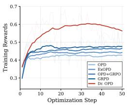  
Math

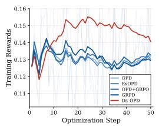  
Code

Base student: Qwen3-1.7B-Base

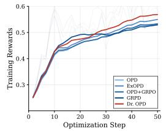  
Math

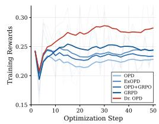  
Code  
Figure 3: Dynamics of training rewards across students and tasks, computed by verifier accuracy of the student’s own rollouts during training. Lines are exponential moving averages $( \alpha = 0 . 9 5 )$ .

Figure 4 shows the training dynamics for the Qwen3-4B-Base student distilled from an RL-trained teacher of the same model size. The training reward is the fraction of rollouts receiving a positive outcome reward, and the response length is the average number of generated tokens per rollout. Although the student and teacher differ only in post-training, Dr. OPD maintains a clear advantage in training reward.

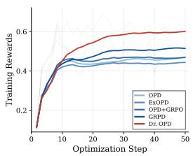  
(a) Training reward

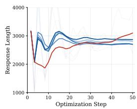  
(b) Response length  
Figure 4: Training dynamics for the Qwen3-4B-Base student distilled from the Qwen3-4B-Base-RL teacher on math. Thick lines show exponential moving averages $( \alpha = 0 . 9 5 )$ .

Figure 5 further examines the effect of the weighting strength λ, with λ = 0 corresponding to vanilla OPD. All tested positive values of λ achieve higher training rewards than vanilla OPD and exhibit broadly similar reward curves. In contrast, response length can vary substantially for larger values of λ, with differences of thousands of tokens late in training.

(a) Training reward  
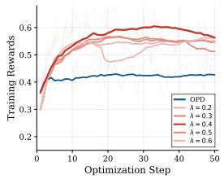

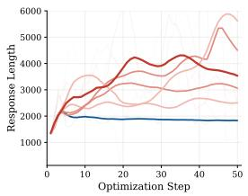  
(b) Response length

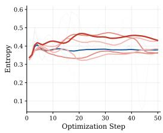  
(c) Entropy  
Figure 5: Training dynamics under different values of λ. (a) Training reward, (b) response length, and (c) entropy over training steps for vanilla OPD $( \lambda = 0 )$ and Dr. OPD with $\lambda \in \{ 0 . 2 , \bar { 0 } . 3 , 0 . 4 , \bar { 0 . 5 } , 0 . 6 \}$ using the Qwen3-1.7B student and Qwen3-4B teacher. Thick lines show exponential moving averages $( \alpha = 0 . 9 5 )$