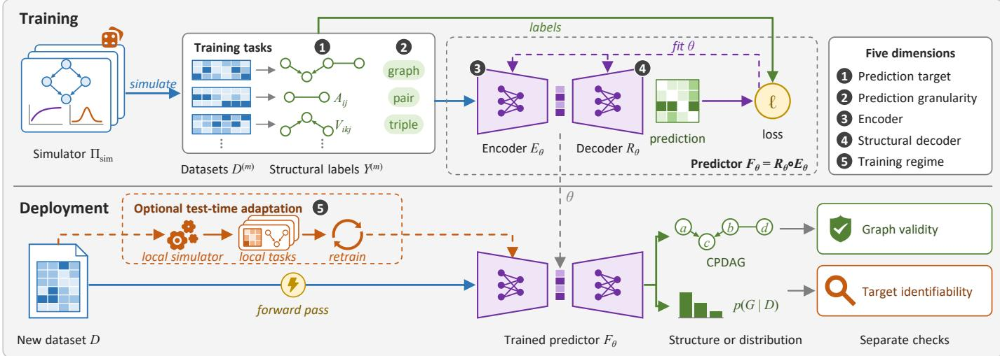
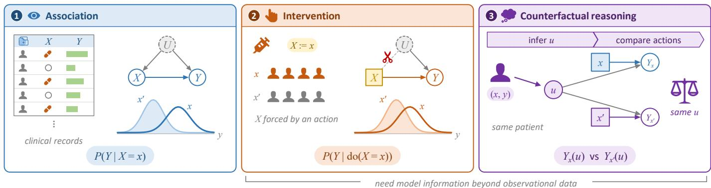
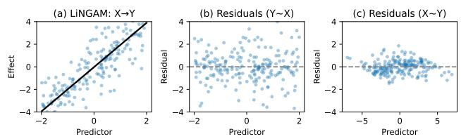
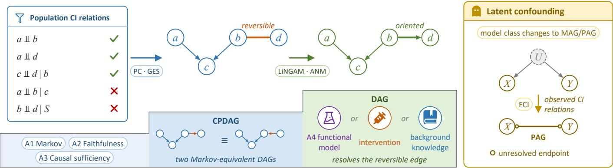
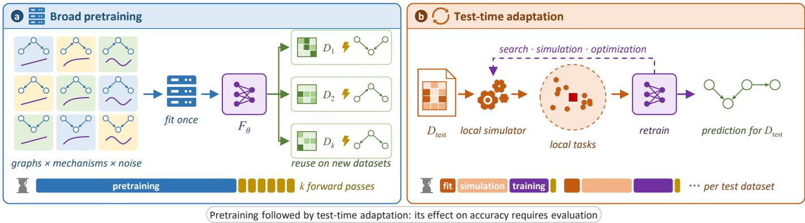
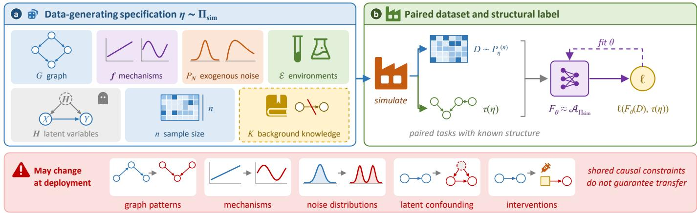
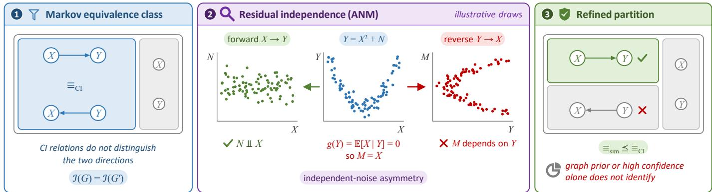
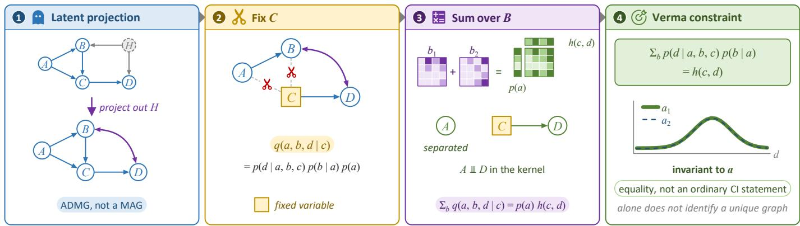

# Demistifying Data and Simulator Assumptions in Supervised Causal Discovery

Pingchuan Ma, Rui Ding, Bojun Huang, and Shuai Wang

Abstract—Supervised causal discovery learns to infer causal structure for a new dataset from training datasets paired with structural labels. These training pairs are typically simulated, making the simulator both a source of supervision and a carrier of assumptions about causal graphs, mechanisms, and noise. Understanding the resulting predictions therefore requires examining how these assumptions supplement the information available in observational data, which may be compatible with multiple causal graphs. This paper examines that relationship across representative methods available through June 2026. We organize these methods by prediction target, prediction granularity, encoder, structural decoder, and training regime to relate what each method predicts to how it uses data and simulatorbased supervision. Using this framework, we distinguish two questions: whether the target is identifiable under the assumed model class, and whether a trained predictor generalizes beyond its training distribution. Restrictions on mechanisms and noise can make otherwise ambiguous causal directions identifiable, but predictive accuracy under those restrictions does not establish transfer when they change. This distinction motivates evaluation that matches metrics to the identifiable graph target and tests changes in graphs, mechanisms, and noise between training and deployment. Extending such evaluation to real data also requires documenting the external causal evidence and uncertainty behind benchmark reference graphs. Together, these analyses guide method comparison and identify open questions in transfer, testtime adaptation, and uncertainty assessment.

Index Terms—Causal discovery, Bayesian networks, supervised learning, foundation models, identifiability.

## I. INTRODUCTION

Causal discovery uses data to infer relations between variables that can support reasoning about interventions. These relations are often represented by a directed acyclic graph (DAG), with edges denoting direct causal effects [1], [2]. Applications include biology, epidemiology, and economics, where an intervention may be costly or impossible and observational data are more readily available [3]–[5].

The available data may not determine a unique causal graph. A target is identifiable within a model class if any two models that generate the same observed distribution agree on that target. Under the Markov and faithfulness assumptions and in the absence of unobserved confounding, conditional independencies identify a Markov equivalence class, represented by a completed partially directed acyclic graph (CPDAG) [6]. PC and score-based GES recover this CPDAG under their respective statistical conditions [6], [7]. FCI allows latent confounding and targets a partial ancestral graph (PAG) [8]. Stronger restrictions on mechanisms or noise, such as those used by LiNGAM, can identify directions left unresolved by conditional independence [9], [10]. Each procedure must also estimate the relevant statistical information from a finite sample.

Supervised causal discovery (SCD) trains a predictor whose input is a dataset and whose output describes causal structure. Some studies call this task supervised causal learning (SCL) [11], [12]. We use SCD throughout and retain published method names such as TTT-SCL. For training, a simulator typically samples many causal models, generates a dataset from each model, and pairs the dataset with a structural label [13], [14]. The simulator supplies labels that are rarely available for real observational datasets. A trained predictor then estimates structure for a new dataset. Some methods supplement these training pairs with real examples, external knowledge, or estimates from classical discovery algorithms. Fig. 1 summarizes this workflow.

SCD methods differ in what they predict and how they use the input dataset. A predictor may directly estimate a structure, such as a skeleton, a set of v-structures, a CPDAG, or a DAG [11], [15]–[17]. It may estimate edge probabilities or a distribution over graphs, from which graph estimates or samples can be obtained [18], [19]. Some methods, such as SEA, use graph estimates computed on subsets of variables as inputs to a predictor of the complete graph [20]. Comparing these methods requires distinguishing the final graph target from the local relations used as inputs or training labels.

The model architecture determines how a dataset is converted into that target. An encoder can summarize conditionalindependence statistics, process samples with attention, or incorporate knowledge and estimates from other algorithms [15], [18], [20], [21]. A decoder converts this representation into local scores or a graph. Local scores may require aggregation and orientation rules; other decoders construct a DAG through an ordering of the variables [19], [22]. These decoding procedures determine whether the predicted graph is valid. Identifying its edge directions also requires sufficient information in the data under the assumed causal model.

Training can occur before deployment, on the test dataset, or at both stages. Pretrained predictors can reuse computation across datasets and reduce the cost of inference to a forward pass or a sampling procedure. The total saving depends on the cost of pretraining and the number of subsequent uses. Methods that fit a local simulator or retrain a predictor for each test dataset, including ML4S, TTT-SCL, and TICL, incur additional search, simulation, and optimization costs at deployment [12], [15], [23]. SPOT instead combines a pretrained skeleton predictor with per-dataset graph optimization [24]. Broad pretraining and test-time adaptation address different sources of mismatch between training tasks and the dataset being analyzed, and can be combined.

  
Fig. 1. A common SCD workflow. Training samples causal models, generates paired datasets and structural labels, and fits an encoder $E _ { \theta }$ and decoder $R _ { \theta } .$ The prediction target and granularity specify whether labels describe complete graphs or local units, such as pairs and triples. Deployment encodes a new dataset and decodes a structure or a distribution over structures; the illustrated output is a CPDAG. Optional test-time adaptation fits a local simulator to the new dataset, generates local tasks, and retrains the predictor. Graph validity and target identifiability require separate checks. Numbered badges mark the five dimensions used to compare methods.

The identifiability results used in classical discovery also apply to SCD. For example, a supervised method under the same observational assumptions as PC can target the same CPDAG. Its predictions also depend on the training distribution. A simulator may favor one member of a Markov equivalence class, so training on full-DAG labels can favor directions that are not identified by the observed distribution [11], [25]. A posterior can also favor one compatible graph because of its prior. Even a predictor trained on CPDAG labels can perform poorly on unfamiliar mechanisms or graph patterns. Target identifiability and generalization across training and test distributions therefore require separate checks.

Predictions can also help investigate the assumptions encoded in a simulator. For instance, varying the allowed graphs or mechanism family and examining predicted edge probabilities at different sample sizes can help determine which simulator assumptions affect predictions. These experiments also need to assess calibration and sensitivity to the prior, because a predictor can be confident even when the data do not identify a unique graph.

Scope and organization. This paper examines the assumptions and model choices at each step of an SCD workflow. After reviewing identifiability, we describe how training tasks and labels are produced, how the input dataset is encoded, and how predictions are assembled into a graph. We use five corresponding dimensions to compare methods: prediction target, prediction granularity, encoder, structural decoder, and training regime. For each target, we state the assumptions needed to interpret it causally. This organization lets readers compare methods that estimate the same target and identify differences in their inputs, models, and training procedures. The paper provides three analyses:

• We relate the targets of representative SCD methods to classical identifiability results and describe their encoders, decoders, and training regimes within a common workflow.

• We examine how simulators generate structural labels, directional asymmetries, and other distributional constraints, and where predictions based on those constraints may fail on new data.

• We discuss evaluation with metrics matched to graph targets, separate training and test simulators, and causal reference graphs supported by external evidence. These considerations also apply to broad pretraining and adaptation to individual test datasets.

Sec. II introduces structural causal models and identifiability. Sec. III presents the SCD workflow and compares representative methods. Sec. IV examines simulator assumptions, transfer to new datasets, and benchmark design. Sec. V discusses the remaining open questions.

## II. BACKGROUND

This section defines the causal models and graph targets used in this paper. We distinguish assumptions about the complete causal system from assumptions about which variables are observed, then state what conditional independence and functional restrictions can identify.

## A. Conceptual View of Causality

Causal discovery concerns relations between variables in a causal model. It is distinct from actual causality, which asks whether a particular event caused another in a specific context. Lewis’s counterfactual account analyzes dependence between events [26], but simple but-for dependence does not cover cases such as preemption. Structural accounts, including the Halpern–Pearl definition, address actual causality by considering interventions under specified contingencies [27]. We use structural causal models to define mechanisms and interventions; a definition of actual causality is not needed to state the graph discovery task.

Pearl’s ladder of causality distinguishes three kinds of query [1], [28]. The first rung is association, which concerns observational quantities such as $P ( Y \mid X = x )$ and answers questions about what is observed together. The second rung is intervention, which concerns quantities such as $P ( Y$ $\operatorname { d o } ( X = x ) )$ and asks what would happen if an action forced X to take a chosen value. The third rung is counterfactual reasoning, which asks what would have happened to the same unit under a different condition. Fig. 2 illustrates the three rungs with treatment X and recovery Y . Causal discovery often uses observational data to estimate a structure that will be used for interventional or counterfactual reasoning. The distinction between these queries explains why this use requires assumptions beyond the observed associations.

Structural causal models define these queries through equations for variable generation and intervention. We next introduce these models and their graphs, then define causal discovery as the recovery of a graph or equivalence class under stated assumptions.

## B. Notation, Structural Causal Models, and Graphical Models

We use X to denote a scalar variable, X to denote a set of variables and $P _ { X }$ to denote the joint distribution over X. Each variable corresponds to a node in a graph. A directed edge $X  Y$ implies that X is a direct cause (or parent) of $Y .$ . The graph $G = ( V _ { G } , E _ { G } )$ represents a causal structure, where $V _ { G }$ is the set of variables and $E _ { G }$ is the set of edges. $\operatorname { P a } _ { G } ( X ) : = \{ X ^ { \prime } \mid X ^ { \prime }  X \in E _ { G } \}$ denotes the parents of X in G.

We use the framework of a structural causal model (SCM) [1] to connect this graph to a data-generating process. An SCM associates each variable $X _ { i } \in X$ with a structural equation

$$
X _ { i } = f _ { i } ( \operatorname { P a } _ { G } ( X _ { i } ) , N _ { i } ) ,\tag{1}
$$

where $f _ { i }$ is a deterministic mechanism, $\mathrm { P a } _ { G } ( X _ { i } )$ are the parents of $X _ { i }$ in $G ,$ and $N _ { i }$ is an exogenous noise term. The model also specifies a joint distribution for the noise variables. Mutually independent noise terms are a standard assumption when shared causes are included explicitly in the graph. After unobserved common causes are marginalized out, the effective noise terms for observed variables may be dependent. An SCM therefore need not have independent errors on the observed variables. The graph records which variables enter each mechanism directly. Within the SCM, an intervention replaces a structural equation. Applying this model to a real system requires assessing whether its equations and intervention assumptions describe that system.

With latent confounding, an observed margin can be represented by mixed graphs. In a maximal ancestral graph (MAG), directed and bidirected edges summarize ancestral relations and dependence paths through omitted variables; a bidirected edge need not correspond to a single hidden common cause. Partial ancestral graphs (PAGs) represent Markov equivalence classes of MAGs [8], [29]. We focus on DAGs and CPDAGs under causal sufficiency, and MAGs/PAGs without selection bias when latent confounding is allowed.

## C. Task Description

Causal discovery asks which features of a causal model can be recovered from the available data under a stated model class. Let $\eta$ specify a causal model with graph $G ,$ let $P _ { \eta } ^ { \mathrm { o b s } }$ denote its observed distribution, and let ${ \mathcal { T } } ( G )$ be a graph target. The target is identifiable in a class M if

$$
P _ { \eta } ^ { \mathrm { o b s } } = P _ { \eta ^ { \prime } } ^ { \mathrm { o b s } } \quad \Longrightarrow \quad \mathcal { T } ( G ) = \mathcal { T } ( G ^ { \prime } ) ,\tag{2}
$$

The target may be a skeleton, v-structures, an equivalence class, or a full graph. Interventions and background knowledge can restrict the compatible models further. Identifiability concerns the population distribution; estimation from finite data introduces additional uncertainty.

An estimator takes a dataset D to a prediction $\widehat { \tau } = \mathcal { F } ( D )$ It may use independence tests, score-based search, or a learned function. A Bayesian method instead specifies a prior and estimates a posterior such as $p ( G \mid D )$ . This posterior is a distribution over candidate graphs conditional on the data and prior, rather than a graph feature ${ \mathcal { T } } ( G ) _ { : }$ ; it can remain non-degenerate even with unlimited observational data. The following assumptions describe the graph features that these procedures can identify.

## D. Standard Assumptions

Let $V \ = \ X \cup H$ contain the endogenous variables of an acyclic causal model, with observed variables X and latent variables H. We first state A1 and A2 for the full DAG G over V and its joint distribution $P _ { V }$ . A3 then states when the observed variables contain all their common causes. Under A3, the relevant observed causal model admits a DAG representation over X, so A1 and A2 can be used there without latent common causes.

a) A1: Markov Assumption: A directed acyclic graph (DAG) G satisfies the Markov condition with respect to $P _ { V }$ if:

$$
P _ { V } = \prod _ { X \in V } P ( X \mid \operatorname { P a } _ { G } ( X ) ) .\tag{3}
$$

This factorization implies that each variable is conditionally independent of its non-descendants given its parents. Equivalently, the global Markov property states:

$$
X \perp \perp _ { G } Y \mid Z \Rightarrow X \perp \perp Y \mid Z ,\tag{4}
$$

where $\bot G$ denotes d-separation in the graph and ⊥⊥ denotes conditional independence in the distribution. D-separation is defined as follows.

Definition 1 (d-Separation). Two nodes X and $Y$ are dseparated by a set of nodes Z in G if every undirected path

  
Fig. 2. Three causal queries, illustrated by treatment X and recovery Y . Clinical records describe association; intervening replaces the treatment mechanism by X = x. Counterfactual reasoning uses a causal model to infer an exogenous context u and compare actions for the same patient, Yx(u) versus $Y _ { x ^ { \prime } } ( u )$ The table and curves are schematic. Observational data alone need not identify the model information required by the latter two queries.

between X and Y is blocked by Z. A path is blocked if at least one of the following holds:

• Some non-collider node W on the path satisfies $W \in { \boldsymbol { Z } }$

• Some collider node W on the path satisfies neither $W \in$ Z nor “a descendant of W is in $z .$ 9

b) A2: Faithfulness.: The full joint distribution $P _ { V }$ is faithful to a DAG G if all conditional independencies in $P _ { V }$ correspond to d-separations in G:

$$
X \perp \perp Y \mid Z \Rightarrow X \perp \perp _ { G } Y \mid Z .\tag{5}
$$

Together, the Markov and faithfulness assumptions imply an equivalence between statistical independencies and graphical constraints in the DAG. This equivalence supports causal discovery methods that use conditional independence tests to infer the structure of G.

c) A3: Causal Sufficiency.: Causal sufficiency assumes that all common causes of the observed variables are themselves observed.

A3 is a restriction on what is observed, not a consequence of A1. For example, a full DAG $U \ \to \ X , \ U \ \to \ Y$ can be Markov and faithful while the observations of X, Y omit U. Marginalizing U generally invalidates the factorization associated with the induced observed subgraph, which has no edges. An observed distribution may nevertheless be Markov to some other DAG; that statistical factorization alone does not establish causal sufficiency. We state A3 explicitly when a result concerns the causal DAG on observed variables.

## E. Identifiability from Conditional Independence

Under a given set of assumptions, which features of the causal graph can be recovered from observational data? Under $_ { \mathrm { A l - A } 3 } $ , conditional independencies identify the skeleton and unshielded colliders of the observed causal DAG. Together these determine its Markov equivalence class. They need not determine every edge direction.

Definition 2 (Skeleton). The skeleton of a DAG G is an undirected graph $S = ( V _ { S } , E _ { S } )$ with $V _ { S } = V _ { G }$ such that:

$$
( X \to Y \in E _ { G } { \mathrm { ~ o r ~ } } Y \to X \in E _ { G } ) \iff ( X - Y \in E _ { S } ) .\tag{6}
$$

Theorem 1 (Spirtes et al. [6]). Let G be the causal DAG over the observed variables X. Under A1–A3, distinct X and Y are adjacent in G if and only if there exists no subset $Z \subseteq$ $X \setminus \{ X , Y \}$ such that $X \perp \perp Y \mid Z$

The theorem concerns the causal DAG over the observed variables X and therefore requires A3, although the graphical definition of a skeleton does not. Under A1–A3, the observed causal skeleton is uniquely identifiable from all conditional independence (CI) relations. Learning the skeleton alone is insufficient for determining causal directions. Orientation rules are used to infer edge directions, typically starting with unshielded triples (i.e., $X - Z - Y$ where X and Y are not adjacent).

Proposition 1 (Verma and Pearl [30]). Under A1–A3, let $X -$ $Z - Y$ be an unshielded triple in the skeleton of the observed causal DAG. It is a v-structure (or immorality), $X \right. Z \left. Y$ if and only if Z belongs to none of the sets $S \subseteq X \setminus \{ X , Y \}$ for which $X \perp \perp Y \mid s$

Applying this rule identifies v-structures. The remaining edges are then oriented using rules such as Meek’s rules [31], which enforce acyclicity and propagate orientations. However, under canonical assumptions, only the Markov equivalence class is identifiable.

Definition 3 (Markov Equivalence Class [2]). Two DAGs $G _ { 1 }$ and $G _ { 2 }$ are Markov equivalent if they imply the same set of CI relations:

$$
\mathcal { M } ( G _ { 1 } ) = \mathcal { M } ( G _ { 2 } ) .\tag{7}
$$

where ${ \mathcal { M } } ( G )$ is the set of distributions that are Markovian with respect to G.

Proposition 2. Two DAGs are Markov equivalent if and only if they have the same skeleton and the same set of immoralities.

Under A1–A3 and access to correct CI relations, these results and complete orientation rules recover the CPDAG [6], [31]. A DAG is recovered uniquely only when this equivalence class has one member. With latent confounding, the full causal DAG still exists, but observed CI relations generally identify an equivalence class of MAGs represented by a PAG. This requires the appropriate marginal graphical model and orientation rules [8], [29].

  
Fig. 3. LiNGAM asymmetry illustrated by 200 samples with $X \sim \mathcal { U } [ - 2 , 2 ]$ $Y = 2 X + \varepsilon$ , and independent $\varepsilon \sim \mathrm { L a p } (  { \mathrm { 0 } } , 1 )$ . The population forward noise is independent of $X ,$ whereas the population reverse linear-regression residual depends on Y. The plots show fitted finite-sample residuals and illustrate this asymmetry; they are not independence tests.

## F. Additional Assumptions

Directions unresolved within a Markov equivalence class require information beyond its CI relations. One source is a restriction on functional form and noise. We use A4 to refer to functional model classes whose restrictions ensure identifiability. Sufficiently informative interventions or background knowledge provide other sources of orientation information.

a) A4: Identifiable Functional Model Classes (IFMOCs): Identifiable Functional Model Classes (IFMOCs) [32] restrict each structural equation to a function of the variable’s parents and an independent noise term. Additional conditions on the functions or noise distributions ensure that the causal directions are identifiable.

b) A4.1: Additive Noise Models (ANM): In additive noise models, each variable is assumed to be generated as

$$
X _ { i } = f _ { i } ( \operatorname { P a } _ { G } ( X _ { i } ) ) + N _ { i } ,\tag{8}
$$

where $f _ { i }$ is a linear or nonlinear deterministic function and the noise terms are mutually independent. In the bivariate case $Y = f ( X ) + N _ { Y }$ with $N _ { Y } \perp \perp X$ , the reverse representation $X ~ = ~ g ( Y ) + N _ { X }$ with $N _ { X } \bot \bot \ Y$ generally does not exist within identifiable ANM classes. This asymmetry yields identifiability of the causal direction under the regularity and non-degeneracy conditions of the relevant ANM identifiability result [10], [33]. Nonlinearity alone is not sufficient in every case. Linear Gaussian models with unrestricted noise variances are a familiar exception; heteroscedastic models require a separate analysis because their noise scale depends on the parents.

Several practical methods build upon this assumption:

• The ANM method [33] tests for independence between residuals and predictors in both directions and selects the one consistent with the ANM assumption.

• LiNGAM (Linear Non-Gaussian Acyclic Model) [9] specializes ANM to linear functions and exploits non-Gaussian noise to identify the full DAG. The original estimator uses independent component analysis; DirectLiNGAM estimates a causal ordering through successive regressions and independence comparisons [34].

Fig. 3 illustrates the independent-noise asymmetry in a linear non-Gaussian model. Population noise independence is a model property; estimated regression residuals only approximate that noise. In this example, the LiNGAM assumptions identify $X  Y$ . Dependence after reverse linear regression alone would not rule out every nonlinear reverse model.

c) A4.2: Post-Nonlinear Models (PNL): Post-nonlinear models generalize ANMs by allowing a nonlinear distortion of the additive functional form [35]. Each variable is assumed to follow

$$
X _ { i } = g _ { i } ( f _ { i } ( \mathrm { P a } _ { G } ( X _ { i } ) ) + N _ { i } ) ,\tag{9}
$$

where $f _ { i }$ is a deterministic function of the parents, $N _ { i }$ is an independent noise variable, and $g _ { i }$ is an invertible nonlinear function. The outer nonlinearity $g _ { i }$ models effects such as sensor distortions or nonlinear transformations applied to the observed signal. This formulation also induces asymmetries: for the true causal direction, the noise remains independent after applying the inverse of $g _ { i } ,$ , whereas the reverse direction fails to satisfy this property in general.

Identifiable functional classes can resolve directions left open by CI relations when their additional conditions hold. Neural parameterizations can approximate structural functions, but flexibility and acyclicity alone do not preserve these identifiability conditions. Fig. 4 separates the observed DAG setting from the setting with latent confounding. Allowing latent variables changes the model class; it is not an intermediate step toward identifying a full DAG.

## G. Classical Causal Discovery Methods

Classical causal discovery methods solve a discovery problem separately for each dataset. They use conditional independence tests, graph scores, or continuous optimization. Although their algorithms differ, the causal interpretation of their output depends on the assumptions that identify the graph target.

Constraint-based methods. Constraint-based algorithms recover graph structure by testing conditional independence relations and translating them into graphical constraints. The PC algorithm is the canonical example under causal sufficiency: it removes adjacencies when a separating set is found and then orients v-structures and compelled edges using orientation rules such as Meek’s rules [6], [31]. When latent confounder or selection effects are allowed, FCI-style methods replace DAG or CPDAG semantics with ancestral-graph or PAG semantics, so that uncertain endpoints and possible hidden common causes are represented explicitly [29], [36], [37].

CI tests such as the kernel-based conditional-independence test can be used within PC [38]. Each edge deletion or orientation follows from CI relations under the algorithm’s assumptions. However, CI tests can be unreliable with finite samples. Even with correct CI relations, these methods generally recover an equivalence class unless additional information identifies the remaining directions.

Score-based methods. Score-based algorithms search over graphs using a criterion that trades off data fit and model complexity. Greedy Equivalence Search (GES) is representative: it searches over equivalence classes and, under standard score assumptions, targets the CPDAG rather than an arbitrary DAG representative [7]. Hybrid methods such as MMHC first use constraint-based screening to restrict the candidate neighborhood and then apply score-based search, improving scalability while retaining an explicit graphical search objective [39]. Exact and improved search methods further study score optimization and the assumptions needed for recovery [40].

  
Fig. 4. Graph targets under different assumptions. In an observed DAG satisfying A1–A3, population CI relations identify a CPDAG. The example a → c ← b with b−d has one reversible edge. Additional direction information can resolve it. Allowing latent confounding changes the model class to MAG/PAG semantics; circles in the two-variable PAG indicate unresolved endpoints. Chips on the arrows name representative algorithms.

Compared with constraint-based methods, score-based methods can be more robust to noisy CI decisions, but they inherit the assumptions encoded by the score, likelihood family, sparsity penalty, and search space. Thus, a high-scoring DAG should not be interpreted as fully causally identified unless the corresponding identifiability assumptions justify that target.

Differentiable methods. Differentiable causal discovery casts structure learning as continuous optimization by parameterizing an adjacency matrix and enforcing acyclicity through a smooth constraint or penalty. NOTEARS is the prototype of this line: it replaces discrete DAG search with a continuous objective subject to an analytic acyclicity constraint [41]. Subsequent methods extend this idea with nonlinear parameterizations, neural graph models, alternative DAG constraints, and more stable optimization strategies, including DAG-GNN, nonparametric NOTEARS, DAGMA, and related variants [42]–[46]. These formulations allow gradient-based optimization of the graph parameters.

An exactly satisfied acyclicity constraint ensures that the result is a DAG; numerical penalties and approximate optimization require a separate validity check. Neither acyclicity nor a low reconstruction loss establishes that its directions are identifiable. That requires the statistical conditions discussed above, such as A1–A3 for a CPDAG or the additional restrictions of an A4 functional model for a full DAG.

SCD reuses computation by training a predictor across datasets. The next section describes how these predictors are trained and how their outputs relate to the graph targets and assumptions introduced here.

## III. SUPERVISED CAUSAL DISCOVERY: WORKFLOW AND METHOD COMPARISON

The background results specify which graph targets are identifiable under given assumptions. SCD estimates these targets with a predictor trained on datasets paired with structural labels. Each training task contains a complete dataset, even when the predictor estimates individual edges or triples. Fig. 1 shows how simulation, encoding, decoding, and training form an SCD workflow.

Literature selection. Existing surveys discuss graphical causal discovery [47] and continuous optimization [48]; this paper focuses on learning prediction rules that map datasets to causal structure. We selected representative studies primarily through Google Scholar, including publications and preprints available through June 2026. We include methods trained on datasets paired with structural labels, either across tasks or at test time, and ADAG as a related approach without supervised graph labels. Work limited to causal effect estimation, time-series discovery, or causal representation learning from unstructured inputs is outside the comparison.

## A. From Simulated Tasks to Graph Predictions

A simulator first samples a causal model, generates a dataset $D ^ { ( m ) }$ , and computes a structural label Y(m) from the sampled graph. For example, to train a CPDAG predictor, we can simulate data from a DAG and convert that DAG to its CPDAG for supervision. If the model predicts local units, the same task provides adjacency labels and collider labels for its unshielded triples. This choice determines the prediction target and prediction granularity. Full-DAG labels are also available from the simulator, but whether their orientations can be inferred from the data depends on the model class, as discussed in Sec. II.

The predictor encodes the dataset and decodes a prediction. Write $F _ { \theta } = R _ { \theta } \circ E _ { \theta }$ , where $E _ { \theta }$ is an encoder and $R _ { \theta }$ includes the prediction head and any graph assembly procedure. A typical training objective is

$$
\widehat { \theta } \in \arg \operatorname* { m i n } _ { \theta } \frac { 1 } { M } \sum _ { m = 1 } ^ { M } \ell \Big ( R _ { \theta } \big ( E _ { \theta } \big ( D ^ { ( m ) } \big ) \big ) , Y ^ { ( m ) } \Big ) .\tag{10}
$$

For the CPDAG example, the encoder may extract CI statistics or learn a representation of the samples. The prediction heads estimate adjacencies and colliders, and orientation rules assemble them into a graph. A posterior predictor instead estimates a conditional graph distribution or its marginals using an appropriate probabilistic loss. Some methods also use knowledge or estimates on variable subsets as encoder inputs.

At deployment, a fixed predictor applies the learned rule to a new dataset. Its cost includes any feature extraction, classical estimators, graph assembly, or sampling required by that rule. An adaptive method generates or reweights training tasks for the new dataset and fits the predictor again. The training regime specifies both the source of training tasks and when this fitting occurs. These stages give the five dimensions used in Table I: prediction target, prediction granularity, encoder, structural decoder, and training regime. The target column records what each method predicts and the assumptions relevant to its interpretation.

Simulators are used by local methods such as RCC and ML4S, posterior methods such as AVICI and BCNP, and broadly pretrained methods such as Arrow [13], [15], [18], [19], [22]. Their role is to produce paired tasks with known structure. Classical estimators can provide intermediate inputs, as in SEA, and external knowledge can supplement the data, as in Kode [20], [21]. We also include ADAG as a related approach that trains a reusable predictor by reconstruction across domains, without supervised graph labels [49]. Sec. IV examines the distributions and constraints induced by these training sources in more detail.

The table groups related implementations for readability. These groups can overlap: a posterior predictor can use broad pretraining, and a model using external knowledge can also be adapted to a test dataset.

## B. Prediction Targets and Model Components

Prediction target. The target is the quantity the predictor is trained to estimate. Under A1–A3, a skeleton, unshielded colliders, and the resulting CPDAG are identifiable from population CI relations. With latent confounding, MAG/PAG targets require the corresponding graphical assumptions. For full-DAG labels, a study must identify the additional orientation information or interpret the output as a prediction conditional on the simulator prior. Edge marginals and graph samples both describe uncertainty about a graph. However, marginals alone do not specify the dependencies among edges that can be represented by samples from a joint graph distribution.

Prediction granularity. Granularity specifies whether a prediction is made for a pair, a triple, a variable subset, or the whole graph. In the workflow example, a CPDAG is the final target while adjacencies and colliders are the supervised units. RCC predicts bivariate directions, and SEA uses estimates on variable subsets as inputs to a global predictor. Local units provide many labels per simulated task and can reduce model size, but their predictions must be combined into a consistent graph. Predicting a pairwise direction requires different information from predicting a pairwise adjacency, even though both use the same prediction granularity.

Encoder. The encoder maps the input dataset and any side information to a representation. Local methods can use CItest statistics; attention models can learn from the samples directly. Other encoders also process background knowledge about possible ancestral relations or graph estimates computed on variable subsets. Comparing encoders requires examining which information they retain, how their outputs change when variables or samples are reordered, and how their computational costs grow with dataset size.

Structural decoder. The decoder turns the representation into scores, graphs, or graph samples. Independent edge scores are easy to predict, but thresholding them can introduce cycles or inconsistent collider decisions. Orientation rules, graph postprocessing, and decoders based on topological orders address different parts of this problem. A CPDAG decoder must return a valid equivalence-class representation; a DAG sampler must generate acyclic graphs. These requirements ensure a valid graph representation. Whether the data identify its directions depends on the causal assumptions.

## C. Training Data and Deployment

Training regime. The fifth dimension describes how tasks are generated and when the predictor is fitted. A simulator specifies a distribution over graphs, mechanisms, noise, and dataset sizes, together with a label rule. A simulator that varies few factors can simplify training, but the predictor may perform poorly on other mechanisms or graph structures. Broader simulators vary more factors. Training with background knowledge can also vary its reliability and density. These choices increase training diversity, although accuracy on unseen simulator families still needs to be evaluated.

Training schedules. Training can consist of pretraining before deployment, training for an individual test dataset, and pretraining followed by adaptation. The first fits a reusable model once. The second constructs a local simulator or augmented training set from the available test data, as in ML4S, TTT-SCL, and TICL [12], [15], [23]. The third combines the two stages. Fig. 5 illustrates broad pretraining and test-time adaptation. Test-time adaptation may reduce some mismatch with the test dataset, but it adds simulation and optimization costs and can reproduce sampling noise. Agreement between simulated and observed distributions alone cannot select between observationally equivalent causal models.

Transfer to new tasks. Evaluation should vary the factors expected to change at deployment. These include changes in graph size and degree, mechanisms, noise distributions, latent confounding, interventions, and side information. Compositional tests combine familiar local patterns into unfamiliar larger graphs. Robustness to one factor does not imply robustness to the others; recent work reports substantial difficulties under compositional shift [12]. Sec. IV returns to these questions using an explicit distribution over simulated tasks.

## D. Method-Level Analysis

The following comparison describes each method’s inputs, prediction target, model components, and training data. The equations summarize its training objective or prediction procedure.

RCC. RCC [13] predicts the causal relation between two variables. Given a bivariate sample, its classifier predicts $X  Y$

TABLE I  
REPRESENTATIVE METHODS COMPARED BY PREDICTION TARGET, GRANULARITY, MODEL COMPONENTS, AND TRAINING REGIME. THE ASSUMPTIONS QUALIFY THE INTERPRETATION OF THE TARGET. A SIMULATOR PRIOR DEFINES A PREDICTION PROBLEM BUT DOES NOT BY ITSELF GUARANTEE IDENTIFICATION. ADAG IS INCLUDED AS A RELATED RECONSTRUCTION APPROACH WITHOUT SUPERVISED GRAPH LABELS.
<table><tr><td>Method</td><td>Target / Assumption</td><td>Granularity</td><td>Encoder</td><td>Decoder</td><td>Training Regime</td></tr><tr><td colspan="6">Local and global supervised predictors</td></tr><tr><td>RCC [13]</td><td>Pairwise relation (sim. prior)</td><td>Bivariate pair</td><td>Kernel mean embedding</td><td>Classifier</td><td>Synthetic pairs; transductive tuning on Tübingen inputs</td></tr><tr><td>ML4C [16]</td><td>CPDAG given skeleton (A1-A3)</td><td>Unshielded triple</td><td>Data + skeleton; Classifier + vicinity statistics orientation rules</td><td></td><td>Synthetic triple labels</td></tr><tr><td>DAG-EQ [14]</td><td>DAG (sim. prior)</td><td>DAG</td><td>Correlation + EQ network</td><td>Edge scores + cycle-avoiding</td><td>Synthetic DAG tasks</td></tr><tr><td>CSIvA [17]</td><td>DAG labels (sim. prior)</td><td>Graph</td><td>attn.)</td><td>assembly Transformer (alt. Sequential; no DAG constraint</td><td>Observational / interventional tasks</td></tr><tr><td>SiCL [11]</td><td>CPDAG (A1–A3)</td><td>CPDAG</td><td>Transformer (feature attn.)</td><td>CPDAG-aware decoder</td><td>Skeleton / collider labels</td></tr><tr><td colspan="6">Posterior SCD</td></tr><tr><td>AVICI [18]</td><td>Directed-graph posterior approx. (sim. prior)</td><td>Edge marginals</td><td>Transformer (axial attn.)</td><td>DAG penalty</td><td>Edge head; optional SCM and dynamical GRN tasks</td></tr><tr><td>BCNP [19]</td><td>DAG posterior (sim. prior)</td><td>DAG samples</td><td>Set transformer</td><td>Hardened perm. + triangular edges</td><td>Bayesian-network task prior</td></tr><tr><td colspan="6">Knowledge-informed SCD</td></tr><tr><td>Kode [21]</td><td>DAG posterior (sim. prior + knowledge)</td><td>DAG samples</td><td>Data + knowledge</td><td>Knowledge-biased DAG sampler</td><td>Knowledge curriculum</td></tr><tr><td colspan="6">Supervised predictors combined with graph estimation SPOT [24]</td></tr><tr><td></td><td>Skeleton posterior; downstream MAG estimate</td><td>Adjacencies, then Local CI-test graph</td><td>statistics</td><td>Classifier + MAG optimization</td><td>Synthetic pretraining; per-dataset graph fitting</td></tr><tr><td>SEA [20]</td><td>DAG (sim. prior)</td><td>Subset inputs; global output</td><td>Stats + marginal- estimate encoder</td><td>Axial-attn aggregator</td><td>Sample-estimate-aggregate</td></tr><tr><td colspan="6">Broad pretraining and related predictors</td></tr><tr><td>ADAG [49]</td><td>DAG (linear-additive)</td><td>Weighted DAG</td><td>map</td><td>Attention kernel Attn kernel + DAG constraint</td><td>Shared structure/order SEMs</td></tr><tr><td>Arrow [22]</td><td>DAG (sim. prior)</td><td>DAG</td><td>Transformer (table)</td><td>Skeleton + total order</td><td>DAG labels; composite likelihood</td></tr><tr><td colspan="6">SCD with test-time adaptation</td></tr><tr><td>ML4S [15]</td><td>DAG skeleton (A1-A3)</td><td>Edge adjacency</td><td>Local CI-test statistics</td><td>Cascade classifiers</td><td>Fitted pseudo BN; vicinal simulation and training</td></tr><tr><td>TTT-SCL [12]</td><td>Base SCD target (local sim. prior)</td><td>Base SCD units</td><td>Re-trained SCD encoder</td><td>Base SCD decoder</td><td>Test-aligned local simulator</td></tr><tr><td>TICL [23]</td><td>Equivalence class + intervention orientations</td><td>Skeleton + orientation</td><td>JCI edge/triplet features</td><td>PC-style two-phase decoder</td><td>Self-augmented test-time data</td></tr></table>

Y → X, or a non-causal relation. RCC uses distributional features that can represent the functional asymmetries used by A4 methods, such as independence between a cause and the noise in the effect. Its directional predictions therefore depend on these asymmetries being present in both training and test data. A1–A3 alone do not identify the direction of a bivariate relation.

We focus here on RCC’s bivariate setting; the source paper also discusses extensions using multivariate context. Independently estimated pairwise directions may conflict and do not by themselves distinguish direct effects from confounding or indirect paths. The relation classifier is summarized as

$$
h _ { \theta } \Bigl ( \phi ( \widehat { P } _ { X , Y } ) \Bigr ) \in \{ X {  } Y , \ Y {  } X , \ \mathrm { n o n - c a u s a l } \} ,\tag{11}
$$

where $\phi ( \widehat { P } _ { X , Y } )$ denotes distributional features of a bivariate sample. This differs from a conventional pairwise independence test because the directional rule is learned from labeled cause-effect pairs rather than derived from a fixed analytic statistic. In the Tubingen experiment, RCC trains on synthetic¨ pairs and tunes their generator against unlabeled test inputs; the direction labels are used for evaluation. A separate experiment trains on labeled ChaLearn pairs, including independent and confounded cases.

  
Fig. 5. Training and deployment costs for broad pretraining and test-time adaptation. (a) One predictor is trained on diverse simulated tasks and reused across datasets. (b) A local simulator is fitted to a test dataset, then generates local tasks for retraining the predictor. Test-time adaptation adds simulation and training costs for each test dataset. Broad pretraining can also be followed by test-time adaptation; its effect on prediction accuracy requires evaluation. Cost bars are schematic.

ML4S. ML4S [15] learns the causal skeleton using a cascade of adjacency classifiers. Under A1–A3, adjacency is identified by the absence of a separating set. The classifiers use local CItest statistics and progressively prune candidate adjacencies.

Training is specific to the input dataset. A proxy discovery algorithm fits a pseudo Bayesian network, whose conditional probability tables are estimated from the data. Mutating this network and adjusting its parameters produces vicinal graphs from which labeled datasets are simulated. The resulting classifiers are then applied to the input dataset. Deployment therefore includes proxy discovery, parameter estimation, simulation, feature extraction, and classifier training. An adjacency decision is summarized by

$$
\widehat { A } _ { i j } = \mathbb { I } \Big [ f _ { \theta } \Big ( \psi ( \widehat { P } _ { X } , i , j ) \Big ) > \tau \Big ] ,\tag{12}
$$

where $\psi$ collects the local CI evidence. A skeleton provides adjacencies; additional orientation information is needed to recover a CPDAG.

SPOT. SPOT [24] combines a learned skeleton posterior with per-dataset stochastic graph optimization. Its supervised component estimates adjacency probabilities from CI statistics. These probabilities guide a second stage of differentiable MAG learning in the presence of latent confounding. The complete method therefore includes both amortized prediction and graph fitting. Its learned skeleton concerns the observed MAG, whose adjacencies need not be edges in the full latent-variable DAG. The Markov and faithfulness conditions identify the MAG skeleton, but a particular optimized MAG is not necessarily uniquely identified within its PAG equivalence class.

ML4C. ML4C [16] predicts whether an unshielded triple (UT) is a v-structure, taking both a dataset and a supplied skeleton $S _ { \mathrm { i n } }$ as inputs. The skeleton determines the triples and their vicinities. The method’s “latent vicinity” refers to this neighborhood information, not to unobserved confounders. Under A1–A3, unshielded colliders are identifiable from CI relations. Thus, this target identifies some edge directions that cannot be recovered from a bivariate relation alone.

The triple predictions are combined using conflict resolution and graph orientation rules. CPDAG recovery is conditional on the supplied skeleton; a complete pipeline must also account for skeleton estimation and its errors. Extending the procedure to latent confounding would require different graphical assumptions and MAG/PAG orientation rules. The classifier is written as

$$
\widehat { V } _ { i k j } = \mathbb { I } \Big [ g _ { \boldsymbol { \theta } } \Big ( \psi ( \widehat { P } _ { X } , S _ { \mathrm { i n } } , i , k , j , \mathcal { V } _ { i k j } ) \Big ) > \tau \Big ] ,\tag{13}
$$

where $\widehat { V } _ { i k j } = 1$ denotes the decision that an unshielded triple $X _ { i } - X _ { k } - X _ { j }$ is oriented as $X _ { i } \right. X _ { k } \left. X _ { j }$ , and $\nu _ { i k j }$ denotes its latent vicinity.

DAG-EQ. DAG-EQ [14] trains on simulated datasets with known DAGs and predicts edge probabilities from the Pearson correlation matrix of a new dataset. It then adds edges in descending probability order, retaining only probabilities above 0.5 and skipping any edge that would create a cycle. This graph-assembly step is part of deployment.

Its training labels specify every edge direction. Under A1– A3 alone, observational CI relations do not identify all of these directions. The reported Gaussian generator uses independent unit-variance errors, an identifying restriction on the raw linear SEM; non-Gaussian experiments are also reported. However, the correlation encoder can discard information that identifies direction. For example, opposite two-node models $X = N _ { X } , \ Y = 2 X + N _ { Y }$ and $Y = N _ { Y } , \ X = 2 Y + N _ { X }$ with independent standard Gaussian errors, have different covariance matrices but the same correlation matrix. Identifiability from the full distribution therefore does not ensure identifiability from this encoder’s input. The training objective is summarized by

$$
\displaystyle \operatorname* { m i n } _ { \theta } \sum _ { m } \sum _ { i \neq j } \mathrm { C E } \left( A _ { i j } ^ { ( m ) } , f _ { \theta } ( \widehat { \mathrm { C o r r } _ { X } } ^ { ( m ) } ) _ { i j } \right) ,\tag{14}
$$

where $A ^ { ( m ) }$ is the DAG label generated by the simulator for task $m .$ This objective fits the edge predictor across tasks; at test time, the fitted predictor supplies edge scores to the cycle-avoiding assembly rule.

CSIvA. CSIvA [17] learns from DAG labels using an autoregressive graph decoder. Each graph decision is conditioned on earlier decisions, so the decoder can represent dependencies among edges. The published decoder does not enforce acyclicity, so sequential generation alone does not guarantee a valid DAG.

Sequential decoding does not determine whether an edge direction is identifiable. The predicted directions may depend on functional restrictions or other orientation information in the training tasks, but may also reflect an ordering convention used by the simulator. The decoder factorizes the conditional graph distribution as

$$
p _ { \theta } ( G \mid \widehat { P } _ { X } ) = \prod _ { t = 1 } ^ { T } p _ { \theta } ( e _ { t } \mid \widehat { P } _ { X } , e _ { < t } ) ,\tag{15}
$$

where $e _ { t }$ denotes the t-th graph-construction decision. Unlike independent edge classification, this factorization lets later edge decisions condition on the partially generated graph.

AVICI. AVICI [18] estimates posterior edge probabilities with a transformer trained on diverse simulated tasks. The trained predictor can be applied to a new dataset without further training. Its variational outputs approximate posterior edge marginals under the simulator prior, rather than a flexible joint posterior over graphs. AVICI permits general directed causal structures. Its LINEAR and RFF experiments impose an acyclicity penalty, whereas its gene-regulatory experiments use steady-state data from a stochastic dynamical simulator. The penalty can affect the fitted approximation and does not guarantee acyclicity under approximate optimization.

When the data do not distinguish members of an equivalence class, posterior edge probabilities also depend on their prior probabilities. Functional restrictions such as A4 may provide additional information that identifies directions. Calibrated edge marginals can help assess uncertainty about individual edges. In an acyclic SCM setting, obtaining a valid DAG or CPDAG requires an appropriate graph-construction procedure; PAG inference would additionally require a model and labels for latent confounding. The marginal approximation is summarized as

$$
q _ { \theta } ( A _ { i j } = 1 \mid \widehat { P } _ { X } ) \approx p ( A _ { i j } = 1 \mid \widehat { P } _ { X } , \mathrm { { I I } } _ { \mathrm { { s i m } } } ) ,\tag{16}
$$

where $\Pi _ { \mathrm { s i m } }$ denotes the simulator prior over graphs and mechanisms. The model estimates an edge marginal under this prior; a thresholded collection of marginals still needs a graph construction rule.

BCNP. BCNP [19] learns an approximation $q _ { \phi } ( G \mid D )$ to the graph posterior of a Bayesian causal model. Its decoder samples a permutation matrix and a triangular Bernoulli edge matrix. The permutation specifies a topological ordering, and the triangular matrix selects edges consistent with that ordering. Each resulting sample is therefore a DAG, allowing BCNP to represent uncertainty over complete graphs.

The posterior approximation depends on the Bayesian causal model used to generate training tasks. Evaluation on a new task should therefore assess whether the predicted distribution remains calibrated when the graph, mechanism, or noise assumptions change, including changes in Markov, faithfulness, or causal sufficiency assumptions. The decoder samples graphs as

$$
\begin{array} { r l } & { \widetilde { Q } _ { s } \sim { \mathrm { G S } _ { \lambda } } \Bigl ( \Theta _ { \phi } ( \widehat { P } _ { X } ) \Bigr ) , } \\ & { Q _ { s } = \mathrm { H u n g a r i a n } ( \widetilde { Q } _ { s } ) , } \\ & { A _ { s } \sim \mathrm { B e r n } \Bigl ( \Phi _ { \phi } ( \widehat { P } _ { X } ) \Bigr ) , \qquad [ \Phi _ { \phi } ] _ { i j } = 0 \mathrm { ~ f o r ~ } i \geq j , } \\ & { G _ { s } = Q _ { s } A _ { s } Q _ { s } ^ { \top } . } \end{array}\tag{17}
$$

Here $\widetilde { Q } _ { s }$ is a soft Gumbel-Sinkhorn draw at temperature $\lambda > 0$ , and Hungarian hardening produces a discrete permutation $Q _ { s }$ for the forward pass. A straight-through estimator supplies gradients. Conjugating the triangular binary matrix $A _ { s }$ by this discrete permutation guarantees a DAG. Mixing over the shared sampled order induces dependencies among graph edges; shared deterministic network parameters alone would not make independent Bernoulli draws dependent.

SiCL. SiCL [11] predicts a CPDAG by separately estimating the skeleton and v-structures. These labels correspond to the graph features identifiable from observational CI relations under A1–A3. Conflict-resolution heuristics and orientation rules combine the local adjacency and collider predictions into a CPDAG estimate.

Evaluation should score this CPDAG target. Scoring a particular DAG representative would also reward or penalize directions that the assumed observational model does not identify. The prediction procedure is written as

$$
\begin{array} { r } { \widehat { \mathcal { C } } = \mathrm { C P D A G } \left( \widehat { S } _ { \theta } ( \widehat { P } _ { X } ) , \widehat { V } _ { \theta } ( \widehat { P } _ { X } ) \right) , } \end{array}\tag{18}
$$

where ${ \widehat { S } } _ { \theta }$ predicts the skeleton and $\widehat { V } _ { \theta }$ predicts v-structures.   
The decoder combines these estimates into a CPDAG.

Kode. Kode [21] takes observational data and background knowledge as inputs. Its knowledge matrix represents whether a causal influence is possible, impossible, or unknown. A possible influence can indicate an indirect ancestral relation, so the matrix does not directly specify edge labels. An encoder processes the data and knowledge matrix, and the encoded knowledge adds a weak bias before graph decoding. A decoder based on BCNP then samples DAGs using permutation and triangular edge matrices.

The knowledge input provides information about orientation and reachability in addition to the observational data. However, incorrect knowledge or too many asserted relations can bias the predictions. Kode varies the strength and sparsity of the knowledge input during pretraining. Varying its coverage and strength does not by itself establish robustness to arbitrary false knowledge. The predictor can be written as

$$
\begin{array} { r l } & { K _ { i j } \in \{ - 1 , 0 , 1 \} \quad ( \mathrm { i m p o s s i b l e , ~ u n k n o w n , m a y ~ h o l d } ) } \\ & { H _ { \theta } = E _ { \theta } ( \widehat { P } _ { \mathbf { X } } , K ) , \qquad \widetilde { H } _ { \theta } = H _ { \theta } + \alpha R _ { \theta } ( K ) , } \\ & { \widetilde { Q } _ { s } \sim \mathrm { G S } _ { \lambda } \Big ( \Theta _ { \theta } ( \widetilde { H } _ { \theta } ) \Big ) , } \\ & { Q _ { s } = \mathrm { H u n g a r i a n } ( \widetilde { Q } _ { s } ) , \qquad L _ { s } \sim \mathrm { B e r n } \Big ( \Phi _ { \theta } ( \widetilde { H } _ { \theta } ) \Big ) , } \\ & { [ \Phi _ { \theta } ] _ { i j } = 0 \mathrm { ~ f o r ~ } i \le j , \qquad G _ { s } = Q _ { s } L _ { s } Q _ { s } ^ { \top } . } \end{array}\tag{19}
$$

Here $K$ is the encoded reachability prior, $H _ { \theta }$ is the dual-source representation, α controls the strength of the knowledge bias, $Q _ { s }$ is a hardened permutation matrix, and $L _ { s }$ is a sampled lower-triangular edge matrix. As in BCNP, hardening preserves discreteness in the forward pass while a straight-through estimator supplies gradients. The knowledge bias influences graph sampling while keeping reachability information distinct from direct-edge labels.

SEA. SEA [20] combines estimates from classical discovery algorithms with a learned graph predictor. Its sample-estimateaggregate procedure samples small subsets of variables and data batches, then runs a classical discovery algorithm on each subset. An aggregator with axial attention combines these marginal graph estimates with global statistics, such as inverse covariance, to predict the complete graph. Training uses the complete synthetic graph as the label. The reported implementations use FCI for observational data and GIES for interventional data; the architecture also allows other sampling procedures, marginal estimators, and global statistics.

The marginal graph estimates must be interpreted under the assumptions of the classical estimator. FCI can represent latent confounding caused by omitting variables from a subset. GIES uses interventional data and depends on its score assumptions. The aggregator learns to combine these estimates, so it can reuse the classical computations. However, errors in the marginal estimates, inadequate coverage of variable subsets, or differences between the marginal and final graph targets can affect its predictions. The procedure is summarized by

$$
\begin{array} { r } { \rho = s ( D _ { 0 } ) , \qquad } \\ { E _ { t } ^ { \prime } = f ( D _ { t } [ S _ { t } ] ) , \qquad t = 1 , \dots , T , } \\ { \widehat { E } = a _ { \theta } \left( \rho , \{ ( S _ { t } , E _ { t } ^ { \prime } ) \} _ { t = 1 } ^ { T } \right) , \qquad } \end{array}\tag{20}
$$

where s computes global statistics on a batch $D _ { 0 } , \ S _ { t }$ is a sampled node subset, $D _ { t } [ S _ { t } ]$ is the restricted batch, $f$ is the marginal causal discovery algorithm, and $E _ { t } ^ { \prime }$ is the estimated marginal graph over $S _ { t } .$ The aggregator conditions jointly on the global statistics and indexed marginal estimates. Its deployment cost includes the classical estimators run on those subsets.

ADAG. ADAG [49] trains a predictor with an attentionbased kernel across several domains defined by structural equation models (SEMs). It predicts a weighted adjacency matrix that represents both the graph structure and linear SEM coefficients. Training minimizes a SEM reconstruction loss subject to an acyclicity constraint, without using ground-truth DAG labels.

ADAG considers two training settings. In heterogeneous domains, the graph is shared while mechanisms vary. In orderconsistent domains, the DAGs differ but share a topological ordering. The trained predictor uses these shared structural properties and can be applied to a new domain without retraining. The paper mainly studies linear SEMs under these assumptions. Identifying edge directions still depends on the noise assumptions and the relations between domains; linear additivity or acyclicity alone is insufficient. The training objective is

$$
\begin{array} { r } { \underset { \theta } { \operatorname* { m i n } } \displaystyle \sum _ { m = 1 } ^ { M } \mathcal { L } _ { \mathrm { S E M } } \Big ( X ^ { ( m ) } , K _ { \theta } ( X ^ { ( m ) } ) \Big ) , \quad \quad } \\ { \mathrm { s u b j e c t ~ t o } \quad h \Big ( K _ { \theta } \big ( X ^ { ( m ) } \big ) \Big ) = 0 , \quad m = 1 , \dots , M . } \end{array}\tag{21}
$$

Here $K _ { \theta }$ is the attention-based nonlinear kernel map from domain data to weighted adjacency, $\mathcal { L } _ { \mathrm { S E M } }$ is the linear-SEM reconstruction objective with sparsity regularization, and $h ( \cdot )$ is a continuous DAG constraint. The fitted map $K _ { \theta }$ is reused for new domains through a forward pass.

Arrow. Arrow [22] predicts an undirected skeleton and a topological order, then orients the skeleton edges according to that order. This construction guarantees an acyclic output. A pretrained transformer computes the skeleton and ordering scores for a new observational dataset without further training. The training simulator varies graph families, mechanisms, noise distributions, and dataset sizes. Supervision uses the directed adjacency matrix through a composite likelihood of directed edges. Skeleton probabilities and order scores are decoder outputs; a single chosen topological order is not the training label.

Although the decoder guarantees a DAG, the interpretation of its directions depends on the mechanisms and priors used in training and whether they apply to the test dataset. The decoder constructs the adjacency matrix as

$$
\begin{array} { r } { \widehat { A } _ { i j } = \widehat { S } _ { i j } \mathbb { I } [ \widehat { \pi } _ { i } < \widehat { \pi } _ { j } ] , \qquad ( \widehat { S } , \widehat { \pi } ) = F _ { \theta } ( \widehat { P } _ { X } ) , } \end{array}\tag{22}
$$

where $\widehat { S }$ is the predicted skeleton and $\widehat { \pi } _ { i }$ is the rank of node i in the selected total order. Orienting each skeleton edge according to this order guarantees acyclicity. Identifying the order from data requires additional orientation information.

TTT-SCL. TTT-SCL [12] trains an SCD predictor for an individual test dataset. The study reports that pretrained predictors can lose accuracy under distribution shift, especially when familiar local patterns occur in unfamiliar graph structures. It also reports differences in accuracy between synthetic benchmarks and real or pseudo-real data. TTT-SCL addresses this problem by generating training tasks matched to the test dataset. Its graph-generation procedure scores candidate graphs using an alignment-of-distribution criterion and a sparsity term. Stochastic graph search refines these graphs so that simulated datasets resemble the test dataset. The resulting local simulator generates tasks for retraining an existing SCD predictor.

TTT-SCL changes the training regime while retaining the base predictor’s target, encoder, and decoder. Because the local simulator is fitted to a single dataset, it can also fit sampling noise. Moreover, matching the observed distribution cannot resolve directions that are not identifiable without functional restrictions or external information. Sec. IV examines these limits in terms of the local task distribution.

TICL. TICL [23] uses test-time training when interventional data are available but the intervention targets are unknown. It combines observational and interventional data through the joint causal inference (JCI) protocol. A self-augmentation procedure generates training data for the test dataset. A supervised procedure based on PC then predicts the skeleton and orients edges using JCI priors and Meek’s rules.

TICL targets an equivalence class under assumptions based on A1–A3, with additional orientations supported by interventional data and JCI assumptions. These data can identify directions left unresolved by observational CI relations. Recovery therefore depends on which interventions are available and whether the intervention assumptions hold.

## E. Synthesis and Evaluation Implications

Evaluation metrics should match each method’s prediction target. Skeleton accuracy measures adjacency recovery, CPDAG accuracy includes identifiable orientations, and full-DAG accuracy also scores directions that may depend on functional restrictions or the simulator prior. Posterior methods additionally require uncertainty assessment. A common graph metric can obscure these distinctions if the graph target is left unspecified.

To compare methods, a study should state the prediction target and the training and test assumptions, then explain how model outputs are converted into the graph being scored. These details help distinguish recovery of identifiable graph features from agreement with directions favored by a particular simulator.

Training distributions can differ even under the same causal assumptions. Two simulators can both generate Markov, faithful, causally sufficient tasks while using different mechanisms, graph priors, and sample sizes. They can therefore induce different prediction rules and different failure modes. The next section examines these differences in more detail.

## IV. SIMULATORS AS SOURCES OF SUPERVISION

Simulators generate the datasets and structural labels used in the workflow of Sec. III-A. This section examines how their assumptions affect what a predictor can learn. We first define the distribution over training tasks, then discuss which graph features are identifiable within that distribution and what can change at deployment.

## A. Simulators as Data-and-Label Generators

Let η denote a complete data-generating specification sampled from a simulator prior $\Pi _ { \mathrm { s i m } } \colon$

$$
\eta = ( G , f , P _ { N } , \mathcal { E } , H , K , n ) \sim \Pi _ { \mathrm { s i m } } , \qquad D \sim P _ { \eta } ^ { ( n ) } .\tag{23}
$$

Here G is the causal graph, f denotes structural mechanisms, $P _ { N }$ denotes the exogenous noise distribution, E denotes available interventions or environments, H denotes latent variables, K denotes optional background knowledge, and n is the sample size. The prior $\Pi _ { \mathrm { s i m } }$ induces a joint distribution over datasets and structural labels. If $\tau ( \eta )$ is the target provided by the simulator, such as a DAG, CPDAG, PAG, skeleton, or edge indicator, the empirical training objective approximates

$$
\theta ^ { \star } \in \arg \operatorname* { m i n } _ { \theta } \mathbb { E } _ { \eta \sim \Pi _ { \mathrm { s i m } } } \mathbb { E } _ { D \sim P _ { \eta } ^ { ( n ) } } \left[ \ell ( F _ { \theta } ( D ) , \tau ( \eta ) ) \right] .\tag{24}
$$

With an appropriate probabilistic loss, these paired datasets and labels can train a predictor of the conditional graph distribution or its marginals. Each sampled graph provides a training label, while the posterior describes uncertainty over graphs given a dataset and the simulator prior. When side information K is used, the predictor and conditional expectations below also condition on K.

The learned predictor therefore approximates the prediction rule defined by the simulator prior and the loss (Fig. 6(b)):

$$
\begin{array} { r l } & { ~ F _ { \theta } ( D ) \approx \mathcal { A } _ { \Pi _ { \mathrm { s i m } } } ( D ) , } \\ & { \mathcal { A } _ { \Pi _ { \mathrm { s i m } } } ( D ) = \arg \operatorname* { m i n } _ { t } \mathbb { E } [ \ell ( t , \tau ( \eta ) ) \mid D , \Pi _ { \mathrm { s i m } } ] . } \end{array}\tag{25}
$$

A supervised predictor can use distributional features that are predictive of its labels under this joint distribution. Classical functional-model and Bayesian methods can also use information beyond CI relations; the supervised approach learns a reusable prediction rule from sampled tasks.

Simulators used by individual methods. Table II compares the data-generating distributions and structural label rules that define the training tasks of representative discovery methods.

Table II lists selected training settings, not every experiment. DAG-EQ also reports exponential, Gumbel, and Poisson noise; CSIvA additionally studies other continuous and discrete mechanisms. SiCL tests its continuous ER/SF-trained models on WS/SBM graphs and its discrete SF-trained model on ER graphs. These test families are distinct from the training generators shown in the table.

The simulators in Table II vary in their graph distributions, mechanisms, and available data. Graphs range from bivariate cause-effect pairs to larger DAGs, latent-variable graphs, and biological regulatory networks. Mechanisms include linear Gaussian, categorical, neural, and random-feature models, as well as domain-specific simulators such as SERGIO [50]. Training data can include observations, interventions, several domains, or labeled pairs from existing benchmarks. Unlabeled benchmark inputs can also guide simulation, as in RCC.

The structural label also varies: it can be a direction, skeleton, set of v-structures, CPDAG, or adjacency matrix. Arrow’s skeleton/order factorization specifies its decoder, while its supervised label is the directed graph. In the table, MAG(G, H) denotes a MAG representing the observed CI model after omitting H; it need not equal the ADMG latent projection. ADAG uses the displayed graph targets for evaluation and trains its predictor by reconstruction, as described in Sec. III.

B. Simulator-Induced Constraints and the Benefit of Supervision

From Markov equivalence to simulator-induced constraints. Under $_ { \mathrm { A } 1 - \mathrm { A } 3 }$ , the observational information used by classical constraint-based discovery is largely summarized by the conditional-independence model

$$
{ \mathcal { T } } ( P _ { \mathbf { X } } ) = \{ ( A , B , C ) : X _ { A } \ \bot \ | \ X _ { B } \ | \ X _ { C } \} .\tag{26}
$$

  
Fig. 6. Generation of training datasets and structural labels. (a) A data-generating specification η includes a graph, mechanisms, exogenous noise, environments, latent variables, sample size, and optional background knowledge. (b) The simulator generates a dataset D and structural label $\bar { \tau } ( \eta )$ from this specification to train $F _ { \theta }$ . The bottom row illustrates factors that may change at deployment. Sharing causal constraints between training and test distributions alone does not guarantee transfer.

Two DAGs are Markov equivalent when they imply the same such set, or equivalently when they have the same skeleton and unshielded colliders. This equivalence relation can be written as

$$
G \equiv _ { \mathrm { C I } } G ^ { \prime } \quad \Longleftrightarrow \quad { \mathcal { T } } ( G ) = { \mathcal { T } } ( G ^ { \prime } ) .\tag{27}
$$

The simulator can add information beyond this CI model, but only through the regularities actually built into its datagenerating family. Let $\mathcal { C } _ { \mathrm { s i m } }$ denote the collection of distributional regularities that hold across the simulator family:

$$
{ \mathcal { C } } _ { \mathrm { s i m } } = \{ c _ { \ell } : \ c _ { \ell } ( P _ { \eta } ) = 0 \ \mathrm { f o r \ a l l } \ \eta \in \mathrm { s u p p } ( \Pi _ { \mathrm { s i m } } ) \} .\tag{28}
$$

Constraints shared across all sampled graphs can be too weak to describe the directional information available in a task. For a fixed graph G, let $\mathcal { C } _ { \mathrm { s i m } } ( G )$ denote constraints that hold for every model with that graph in the simulator’s support. We can compare graphs using the pair $( { \mathcal { T } } ( G ) , { \mathcal { C } } _ { \mathrm { s i m } } ( G ) )$

$$
\begin{array} { r c l } { { G \equiv _ { \mathrm { s i m } } G ^ { \prime } } } & { { \longleftrightarrow } } & { { \mathcal { T } ( G ) = \mathcal { T } ( G ^ { \prime } ) , } } \\ { { } } & { { } } & { { \mathcal { C } _ { \mathrm { s i m } } ( G ) = \mathcal { C } _ { \mathrm { s i m } } ( G ^ { \prime } ) . } } \end{array}\tag{29}
$$

This definition refines the CI partition whenever the additional constraints differ within a Markov equivalence class $( \equiv _ { \mathrm { s i m } } \preceq \equiv _ { \mathrm { C I } } ;$ Fig. 7). Different constraint sets need not imply non-overlapping distribution families: exceptional distributions may satisfy both. Identifiability still requires the implication in (2), restricted to the simulator’s model class. A graph prior can also favor one graph without making it identifiable.

Several familiar examples fit this view. Functional-model simulators impose asymmetries such as additive independent noise or non-Gaussian linear noise, which can distinguish directions that are Markov equivalent under A1–A3. Multienvironment simulators impose invariance constraints, for example

$$
\begin{array} { r } { P ^ { ( e ) } ( X _ { j } \mid \mathrm { P a } _ { G } ( X _ { j } ) ) = P ^ { ( e ^ { \prime } ) } ( X _ { j } \mid \mathrm { P a } _ { G } ( X _ { j } ) ) , \phantom { x x x x x x x x x x x x x x x x x x x x x x x x x x x x x x x x x x x x x x x x } } \\ { \mathrm { f o r ~ e n v i r o n m e n t s ~ } e , e ^ { \prime } \not \in \mathcal { E } _ { j } , } \end{array}\tag{30}
$$

while allowing mechanisms targeted by interventions to vary. Latent-variable SCM simulators can also imply equality constraints on the observed margin that are not conditional independencies. As a running example, consider latent-variable

SCMs whose latent projection over $( A , B , C , D )$ is the Verma acyclic directed mixed graph (ADMG), with $A \to B , A \to C ,$ $B \to C , C \to D$ , and $B  D$ . This ADMG is not a MAG: B is an ancestor of D as well as being connected to it by a bidirected edge. The distinction matters because an ADMG retains information used by the nested Markov model that need not be expressed by ordinary observed CI relations [51], [52]. Fig. 8 shows the graph and the kernel obtained by fixing C. For a positive observed distribution, the dormant-independence argument fixes C to obtain the kernel

$$
q _ { \eta } ( a , b , d \mid c ) = p _ { \eta } ( d \mid a , b , c ) p _ { \eta } ( b \mid a ) p _ { \eta } ( a ) ,\tag{31}
$$

and, after marginalizing B, the fixed graph implies A ⊥⊥ D in this kernel. Therefore every sampled $\eta \in \mathrm { s u p p } ( \Pi _ { \mathrm { s i m } } )$ satisfies

$$
\sum _ { b } p _ { \eta } ( d \mid a , b , c ) p _ { \eta } ( b \mid a ) = h _ { \eta } ( c , d ) ,\tag{32}
$$

so the left-hand side is invariant to a. This equality is not an ordinary conditional-independence statement in $P _ { \eta } ( A , B , C , D )$ A simulator that generates data from this latent structure therefore produces distributions that satisfy the same equality constraint. A simulator over ordinary DAGs on the observed variables would not generally impose (32). The Verma constraint and its generalizations in nested Markov models are examples of such non-CI constraints [30], [51]–[53].

A predictor trained on datasets that satisfy these equality constraints may use information beyond observed CI relations. In nested Markov models, some of these constraints can be expressed as conditional independencies in a kernel obtained by fixing. Establishing whether a particular SCD predictor learns such constraints requires empirical evidence.

Prediction within the simulator’s model class. A supervised predictor can approximate an inference rule within a simulator’s model class and apply it to new datasets. For a structural label τ, the relevant identifiability condition is

$$
\begin{array} { r l } & { P _ { \eta } ^ { \mathrm { o b s } } = P _ { \eta ^ { \prime } } ^ { \mathrm { o b s } } \quad \Longrightarrow \quad \tau ( \eta ) = \tau ( \eta ^ { \prime } ) , } \\ & { \qquad \eta , \eta ^ { \prime } \in \mathrm { s u p p } ( \Pi _ { \mathrm { s i m } } ) . } \end{array}\tag{33}
$$

TABLE II  
SIMULATORS USED BY REPRESENTATIVE SUPERVISED CAUSAL DISCOVERY METHODS. HERE η DENOTES ONE SIMULATED DATA-GENERATING INSTANCE; τ(η) DENOTES THE STRUCTURAL TARGET. FOR ADAG, THE STRUCTURE IS AN EVALUATION TARGET, NOT A SUPERVISED TRAINING LABEL.
<table><tr><td>Method</td><td>Simulation Target</td><td>Instantiation</td></tr><tr><td rowspan="2">RCC [13]</td><td rowspan="2">Synthetic Bivariate ANM</td><td> $\eta = ( P _ { X } , f , P _ { N } , n ) \sim \Pi _ { \mathrm { A N M } } , \quad X \sim \sum _ { \iota } \pi _ { k } \mathcal { N } ( \mu _ { k } , \sigma _ { k } ^ { 2 } ) , \quad Y = f ( X ) + N ,$ </td></tr><tr><td> $N \perp \perp X , \quad N \sim \mathcal { N } ( 0 , \sigma _ { N } ^ { 2 } ) , \quad f \sim \Pi _ { \mathrm { s p l i n e } } , \quad \tau ( \eta ) = X \to Y , \quad ( Y , X ) \mapsto Y \to X .$ </td></tr><tr><td></td><td>Transductive Tübingen Setting</td><td>Generator parameters are fitted against unlabeled test-pair embeddings. Training labels come from synthetic pairs; Tübingen directions are evaluation labels. A separate ChaLearn experiment uses labeled pairs.  $( G _ { 0 } , \theta _ { 0 } ) = \mathrm { F i t B N } ( D _ { \mathrm { t e s t } } ) , \quad G ^ { \prime } \sim q _ { \mathrm { v i c } } ( \cdot \mid G _ { 0 } ) ,$ </td></tr><tr><td>ML4S [15]</td><td>Dataset-Specific Discrete Skeleton</td><td> $\theta ^ { \prime } = \mathrm { A d j u s t C P T } ( G ^ { \prime } , G _ { 0 } , \theta _ { 0 } ) , \quad D ^ { \prime } \sim P _ { G ^ { \prime } , \theta ^ { \prime } } ^ { ( n ) } ,$   $\eta = ( G ^ { \prime } , \theta ^ { \prime } , n ) , \qquad \tau ( \eta ) = \mathrm { s k e l } ( G ^ { \prime } ) .$   $\eta = ( G , H , \theta , n ) \sim \Pi _ { \mathrm { A D M G } } , \quad M = \mathrm { M A G } ( G , H ) ,$ </td></tr><tr><td>SPOT [24]</td><td>Linear Gaussian MAG Skeleton</td><td> $D \sim P _ { \eta } ^ { ( n ) } , \tau ( \eta ) = \mathrm { s k e l } ( M ) .$ </td></tr><tr><td>ML4C [16]</td><td>Discrete V-Structure</td><td> $\eta = ( G , \theta , n ) \sim \Pi _ { \mathrm { M L 4 C } } , \quad G \sim \Pi _ { \mathrm { E R / S F } } , \quad D \sim \prod P _ { \theta _ { i } } ( X _ { i } \mid X _ { \mathrm { P a } _ { G } ( i ) } ) ,$   $( i , k , j ) \in \operatorname { U T } ( G ) , \quad \tau ( \eta ) = \operatorname { v s t r } ^ { \circ } ( G ) .$ </td></tr><tr><td>DAG-EQ [14]</td><td>Equal-Variance Gaussian DAG</td><td> $\begin{array} { r } { \eta = ( G , B _ { G } , n ) \sim \Pi _ { \mathrm { L G } } , \quad G \sim \Pi _ { \mathrm { E R / S F } } , \quad X = B _ { G } ^ { \top } X + \varepsilon , \quad \varepsilon \sim \mathcal { N } ( 0 , I ) , } \end{array}$   $D = \{ x ^ { ( r ) } \} _ { r = 1 } ^ { n } , \qquad \tau ( \eta ) = A ( G ) .$ </td></tr><tr><td>CSIvA [17]</td><td>Dirichlet Categorical DAG</td><td> $\begin{array} { r } { \eta = ( G , \theta , \mathscr { E } , n ) \sim \Pi _ { \mathrm { c a t } } , \quad G \sim \Pi _ { \mathrm { E R } } , \quad \theta _ { j [ \mathrm { p a } } \sim \mathrm { D i r } ( \alpha ) , \quad X _ { j } \mid X _ { \mathrm { P a } _ { G } ( j ) } \sim \mathrm { C a t } ( \theta _ { j [ \mathrm { p a } } ) , } \\ { D = \{ D ^ { \mathrm { o b s } } , D ^ { \mathrm { i n t } } \} , \quad \tau ( \eta ) = A ( G ) . } \end{array}$ </td></tr><tr><td></td><td>Linear Continuous DAG</td><td> $\eta = ( G , W , P _ { N } , \mathcal { E } , n ) \sim \Pi _ { \mathrm { l i n } } , \quad G \sim \Pi _ { \mathrm { E R } } , \quad X _ { j } = \quad \sum _ { \mathbf { w } _ { i j } } X _ { i } + \varepsilon _ { j } ,$  i∈PaG(j)  ${ \cal D } = \{ { \cal D } ^ { \mathrm { o b s } } , { \cal D } ^ { \mathrm { i n t } } \} , \tau ( \eta ) = A ( G ) .$ </td></tr><tr><td></td><td>MLP Nonlinear DAG</td><td> $\eta = ( G , { \bf f } , P _ { N } , \mathcal { E } , n ) \sim \Pi _ { \mathrm { M L P } } , \quad G \sim \Pi _ { \mathrm { E R } } , \quad X _ { j } = f _ { j } ^ { \mathrm { M L P } } ( X _ { \mathrm { P a } _ { G } ( j ) } , \varepsilon _ { j } ) ,$   $\boldsymbol { D } = \{ \boldsymbol { D } ^ { \mathrm { o b s } } , \boldsymbol { D } ^ { \mathrm { i n t } } \} , \quad \boldsymbol { \tau } ( \eta ) = \boldsymbol { A } ( G ) .$ </td></tr><tr><td>AVICI [18]</td><td>Linear/RFF DAG</td><td> $\eta = ( G , \mathbf { f } , P _ { N } , \mathcal { E } , n ) \sim \Pi _ { \mathrm { A V I C I } } , \quad G \sim \Pi _ { \mathrm { E R / S F } } , \quad X _ { i } = f _ { i } ( X _ { \mathrm { P a } _ { G } ( i ) } ) + \varepsilon _ { i } ,$   $f _ { i } \in \{ \beta _ { i } ^ { \top } x , \mathrm { R F F } _ { i } ( x ) \} , \quad \varepsilon _ { i } \sim \Pi _ { N } , \quad D ^ { ( e ) } \sim P _ { \eta } ^ { ( e ) } ,$  τ(η) = A(G).</td></tr><tr><td></td><td>Gene-Regulatory Dynamics</td><td> $\eta = ( G , \theta , \mathcal { E } , n ) \sim \Pi _ { \mathrm { S E R G I O } } , \quad G \subseteq G _ { \mathrm { r e g } } , \quad Z \sim \mathrm { S E R G I O } ( G , \theta ) ,$   $X = h _ { \mathrm { p l a t f o r m } } ( Z ) + \xi , \quad D ^ { ( e ) } \sim P _ { \eta } ^ { \mathrm { K O } ( e ) } , \quad \tau ( \eta ) = A ( G ) .$ </td></tr><tr><td>BCNP [19]</td><td>Bayesian Causal DAG</td><td> $\begin{array} { r } { \eta = ( G , \theta , n ) \sim p ( G ) p ( \theta \mid G ) p ( n ) , \quad G \sim p ( G ) , \quad \theta \sim p ( \theta \mid G ) , \quad D \sim p _ { \theta } ( X \mid G ) , } \\ { \tau ( \eta ) = A ( G ) . \qquad } \end{array}$ </td></tr><tr><td>SiCL [11]</td><td>ER/SF Structural Labels</td><td> $\eta = ( G , \pmb { f } , P _ { N } , n ) \sim \Pi _ { \mathrm { S i C L } } , \quad G \sim \Pi _ { \mathrm { E R / S F } } \ ( \mathrm { c o n t i n u o u s } ) , \quad G \sim \Pi _ { \mathrm { S F } } \ ( \mathrm { d i s c r e t e } ) ,$   $f _ { i } \in \{ \beta _ { i } ^ { \top } x , \mathrm { R F F } _ { i } ( x ) , \mathrm { C P T } _ { i } \} , \quad \tau ( \eta ) = \big ( \mathrm { s k e l } ( G ) , \mathrm { v s t r } ( G ) \big ) , \quad \mathscr { C } = \mathrm { C P D A G } ( \tau ( \eta ) ) .$ </td></tr><tr><td>Kode [21]</td><td>ER Synthetic DAG</td><td> $\begin{array} { r } { \eta = ( G , \pmb { f } , P _ { N } , n ) \sim \Pi _ { \mathrm { S C M } } , \quad G \sim \Pi _ { \mathrm { E R } } , \quad \pmb { f } \in \{ \mathrm { l i n . \ h e t . , \eta . } , \quad D \sim P _ { \eta } ^ { ( n ) } , \quad \tau ( \eta ) = G . } \end{array}$ </td></tr><tr><td></td><td>Knowledge-Augmented DAG</td><td> $\begin{array} { c } { { \eta = ( G , { \pmb f } , P _ { N } , K , n ) \sim \Pi _ { \mathrm { K o d e } } , \quad K _ { i j } \ \in \{ - 1 , 0 , 1 \} , \quad K \sim q _ { \alpha , s } ( K \mid \mathrm { A n c } ( G ) ) , } } \\ { { D \sim P _ { \eta } ^ { ( n ) } , \quad \tau ( \eta ) = G . } } \end{array}$ </td></tr><tr><td>SEA [20]</td><td>Observational DAG</td><td> $\begin{array} { r } { \eta = ( G , \mathbf { f } , P _ { N } , n ) \sim \Pi _ { \mathrm { S E A } } ^ { \mathrm { o b s } } , \quad G \sim \Pi _ { \mathrm { E R / S F } } , \quad \mathbf { f } \in \{ \mathrm { l i n } . , \mathrm { N N ~ a d d } . , . . . \} , \quad D \sim P _ { \eta } ^ { \mathrm { o b s } } , } \end{array}$  τ(η) = A(G).</td></tr><tr><td></td><td>Interventional DAG</td><td> $\begin{array} { r } { \eta = ( G , { \boldsymbol { f } } , P _ { N } , \mathcal { E } , n ) \sim \Pi _ { \mathrm { S E A } } ^ { \mathrm { i n t } } , \quad G \sim \Pi _ { \mathrm { E R / S F } } , \quad D = \{ D ^ { \mathrm { o b s } } , D ^ { \mathrm { d o } ( j ) } \} _ { j \in V } , } \\ { \tau ( \eta ) = A ( G ) . \qquad } \end{array}$ </td></tr><tr><td>ADAG [49]</td><td>Shared-Graph Linear DAG</td><td> $\begin{array} { r } { \eta = ( A , \{ W _ { m } , P _ { m } , n _ { m } \} _ { m = \underline { { 1 } } } ^ { M } ) \sim \Pi _ { \mathrm { A D A G } } , \quad A _ { m } = A , \quad B _ { m } = A \odot W _ { m } , } \end{array}$   $X ^ { ( m ) } = \stackrel { \bar { \mathrm { \tiny ~ { \cal { B } } } } _ { m } ^ { \top } } { \sim } X ^ { ( m ) } + \varepsilon ^ { ( m ) } , \quad \tau ( \eta ) = A .$ </td></tr><tr><td></td><td>Order-Consistent Linear DAG</td><td> $\begin{array} { r } { \eta = ( \pi , \{ A _ { m } , W _ { m } , P _ { m } , n _ { m } \} _ { m = 1 } ^ { M } ) \sim \Pi _ { \mathrm { A D A G } } , \pi _ { m } = \pi , A _ { m } \sim \Pi ( A \mid \pi ) , } \end{array}$ </td></tr><tr><td>Arrow [22]</td><td>ER/SF Synthetic DAG</td><td> $\begin{array} { r } { B _ { m } = A _ { m } \odot W _ { m } , \quad \boldsymbol { X } ^ { ( m ) ^ { \ast } } = B _ { m } ^ { \top } \boldsymbol { X } ^ { ( m ) } + \varepsilon ^ { ( m ) } , \quad \boldsymbol { \tau } ( \eta ) = \{ A _ { m } \} _ { m = 1 } ^ { M } . } \end{array}$   $\eta = ( G , f , P _ { N } , n , d ) \sim \Pi _ { \mathrm { A r r o w } } , \quad G \sim \Pi _ { \mathrm { E R / S F } } , \quad f \in \{ \operatorname { l i n . , M L P } \} ,$ </td></tr></table>

When this condition holds, a predictor can in principle learn to estimate the target within that model class. Finite data, model capacity, and optimization still limit its accuracy. If the condition fails, a probabilistic predictor can represent uncertainty among compatible labels, with their probabilities depending on the prior. Identifiability in a different model class must be established under that class’s assumptions.

Examining simulator assumptions with SCD. As discussed in Sec. I, varying the simulator can help assess which restrictions affect a predictor. Consider a simulator for discrete data that excludes forks. For the three-node CPDAG $X - Y - Z ,$ this restriction excludes $X \ \left. \ Y \ \right. \ Z$ but leaves both $X \  \ Y \  \ Z$ and $X  Y  Z$ compatible with the same CI relations. Restricting graph support can thus remove representatives without identifying all remaining directions.

To examine this effect, a study can compare predicted edge probabilities at different sample sizes, vary the prior probabilities of compatible graphs, and evaluate data-generating models with the same observed distribution but different graph labels. Persistent uncertainty may indicate ambiguity, weak signal, or a limitation of the predictor. Conversely, probabilities near zero or one may reflect a concentrated prior, missing training cases, or poor calibration. Even a calibrated predictor can be confident because one compatible label dominates its training distribution. These experiments can help identify restrictions whose effect on identifiability warrants theoretical analysis. They do not prove the population implication in (33) or identify a unique graph outside the simulator family.

  
Fig. 7. Functional restrictions can distinguish Markov-equivalent directions. The illustrative draws use $X \sim \mathcal { U } [ - 2 , 2 ]$ and $Y = X ^ { 2 } + N .$ , with independent $\breve { N \sim } \mathcal { N } ( 0 , 0 . 4 ^ { 2 } )$ . The forward residual is N. Symmetry gives the reverse population regression $g ( Y ) = \operatorname { \mathbb { E } } [ X \mid Y ] { \overset { } { = } } 0 ,$ whose residual M = X depends on Y. Identification requires the functional-model conditions; a graph prior or high confidence alone does not supply them.

  
Fig. 8. The Verma constraint in four steps. Projecting out a common cause of B and D gives the bidirected edge in the ADMG. Fixing C removes its incoming edges and yields a derived kernel. Summing this kernel over B separates A and D conditional on fixed $C ;$ equivalently, the displayed weighted sum is invariant to a. The squares denote fixed variables; heat maps are schematic. This constraint alone does not establish a uniquely identified graph.

## C. Transfer, Test-time Adaptation, and Local Simulators

A predictor trained under $\Pi _ { \mathrm { s i m } }$ is evaluated on tasks drawn from a possibly different distribution $\Pi _ { \mathrm { t e s t } }$ (Fig. 6, bottom). With a common label rule τ , its expected test risk is

$$
R _ { \mathrm { t e s t } } ( \theta ) = \mathbb { E } _ { \eta \sim \Pi _ { \mathrm { t e s t } } } \mathbb { E } _ { D \sim P _ { \eta } ^ { ( n ) } } \left[ \ell ( F _ { \theta } ( D ) , \tau ( \eta ) ) \right] .\tag{34}
$$

Test risk can be high even when training risk is low because the simulator may favor a particular ordering, omit graph patterns, or restrict mechanisms and noise distributions. A predictor may then use features that predict training labels accurately but are unreliable on test data. Even if training and test distributions share causal constraints, task frequencies, finite-sample signal strength, and the learned representation can affect test risk.

The simulator choices in Table II illustrate these differences. A simulator with latent variables can impose equalities that do not hold under a different latent structure. A simulator with interventions can provide orientation information absent from observational test data. A restricted graph or noise prior can also improve average prediction within the training family without identifying the target in a broader class. These effects should be assessed by varying the relevant simulator factors. A single measure of distributional similarity does not distinguish these effects.

Local simulators. A method can use the test dataset $D _ { \mathrm { t e s t } }$ to construct training tasks for that instance. We write $\Pi _ { \mathrm { s i m } } ^ { D _ { \mathrm { t e s t } } }$ for the resulting local task distribution. ML4S [15] is an earlier instance: it fits a pseudo Bayesian network and generates training data from vicinal graphs. TTT-SCL [12] uses an alignment criterion and sparsity term to refine candidate graphs in the observational setting. TICL [23] uses self-augmentation with interventional data and JCI information. These methods incur additional computation to generate training data and fit a predictor for the test dataset.

Test-time adaptation can reduce some mismatch in observable features, but matching an observed marginal cannot distinguish causal models that generate that same marginal. Fitting the simulator to one dataset can also reproduce sampling noise. Evaluation should therefore measure the benefit on held-out tasks and include the time spent constructing tasks and retraining. A pretrained model followed by test-time adaptation is another possible schedule. The extent to which these procedures improve recovery on real data remains an empirical question.

## D. Evaluation and Trustworthy Benchmarks

Implications for evaluation. A study can make its training task reproducible by describing the simulator and label rule, including which factors are fixed, which vary, and how they depend on one another. For example, mechanism parameters depend on the sampled graph, and knowledge can be sampled conditional on its ancestral relations. These factors need not be independent. The report should also explain any conversion from predicted probabilities to the graph being scored.

Controlled changes to graph families, mechanisms, noise, latent confounding, interventions, or knowledge help assess specific transfer claims. The useful choices depend on the intended deployment setting. For example, a claim of robustness to new noise distributions calls for tests that vary those distributions. Such evaluations provide evidence about the tested shifts, without certifying performance under all possible shifts.

Causal reference graphs. Held-out tasks from the training simulator test generalization to new draws from that distribution. This is useful evidence of estimation and amortized inference within the family. Transfer to other families or real systems requires separate evidence. Describing the training and test simulators allows readers to distinguish these claims.

Benchmarks differ in how their causal reference graphs are obtained.

Synthetic benchmarks. These benchmarks generate data from a known SCM, so the generating graph is known. The test simulator may use the same assumptions as the training simulator or different ones. ER/SF graphs with linear or neural mechanisms are typical examples.

Semi-synthetic benchmarks. These benchmarks, also called pseudo-real benchmarks, use mechanisms or graphs derived from a real domain but simulate the observations. Examples include gene-expression data generated by SERGIO [50] and data sampled from domain-derived networks in the bnlearn Bayesian Network Repository [54]. Their reference graphs are specified by experts or models and need not have been established through interventions.

Real-world benchmarks. These benchmarks use external causal evidence, such as randomized experiments, interventions, or established domain mechanisms, to construct a reference graph. The protein-signaling network of Sachs et al. [3] is a widely used example. Its consensus graph is based on biological and interventional evidence. Any uncertainty in that graph should be considered when scoring predictions.

For each benchmark, a study should state the source of its causal reference graph, the type of graph it represents, and any uncertain edges or orientations. The metric should match the supported target. For example, CPDAG evaluation avoids penalizing a method for leaving an observationally unresolved direction open. Describing training and test simulators separately also makes clear which results test new draws within a family and which test transfer beyond it.

Evaluations of the compared methods illustrate these different evidence sources. ML4S evaluates on observations sampled from repository networks, while AVICI uses synthetic SCMs and simulated gene expression [15], [18]. SiCL and Arrow also evaluate on measurements from the Sachs system [11], [22]. These results do not by themselves establish reliability in other real systems. Further benchmarks should document the interventions or domain evidence used to construct their reference graphs, specify uncertain edges, and use metrics matched to the graph target.

## V. CONCLUSION AND FUTURE WORK

Supervised causal discovery trains a predictor on datasets with known structural labels and applies it to a new dataset. This paper relates the predictions of these methods to their training assumptions and the evidence available at deployment. When several causal graphs generate the same observed distribution, supervised learning alone cannot determine which graph generated the data. Additional restrictions on mechanisms or noise, interventions, or background knowledge may resolve this ambiguity. A decoder can ensure that its output is acyclic, but identifying its edge directions still requires these statistical assumptions or additional evidence.

The methods compared here differ in their prediction targets, model components, and training regimes. Local classifiers estimate adjacencies or colliders, while other predictors estimate complete graphs or posterior distributions. Some methods also use background knowledge or estimates from classical discovery algorithms as inputs. Simulators provide the datasets and structural labels needed for training. Their restrictions on graphs, mechanisms, and noise can provide information beyond conditional independence. A predictor’s encoder must retain that information for it to be useful. Testtime adaptation methods such as ML4S also fit their training generator to the input data, while hybrids such as SPOT retain a graph-optimization stage at deployment. Accuracy within one simulator family does not establish accuracy on data generated by other families.

Evaluation should therefore specify both the graph target and the training and test assumptions. For CPDAG recovery, the metric should score the equivalence class. For full-DAG recovery, the study should explain which assumptions or evidence identify the additional directions. It should also describe how model outputs are converted into the graph being scored. These recommendations follow from the comparisons in Sections III–IV.

Transfer to new data. Further work is needed to establish how well supervised predictors handle mechanisms, graph structures, or latent confounders absent from training. Broad pretraining and test-time adaptation may help, but their benefits need to be measured on data outside the training distribution.

Evaluations of test-time adaptation should also account for the additional computation and the risk of fitting sampling noise.

Evaluation on real data. Causal reference graphs for real systems are often incomplete or disputed. Evaluating predictions against these graphs requires documentation of the interventional or domain evidence behind them, as well as any uncertain edges or directions. Results on the benchmarks discussed here do not by themselves establish reliability in other real-world settings. Benchmarks with documented causal evidence and metrics matched to the graph target are needed to assess progress.

## REFERENCES

[1] J. Pearl, Causality: Models, Reasoning, and Inference, 2nd ed. Cambridge University Press, 2009.

[2] J. Peters, D. Janzing, and B. Scholkopf, ¨ Elements of causal inference. The MIT Press, 2017.

[3] K. Sachs, O. Perez, D. Pe’er, D. A. Lauffenburger, and G. P. Nolan, “Causal protein-signaling networks derived from multiparameter singlecell data,” Science, vol. 308, no. 5721, pp. 523–529, 2005.

[4] M. A. Hernan and J. M. Robins, ´ Causal Inference: What If. Chapman & Hall/CRC, 2020.

[5] G. W. Imbens and D. B. Rubin, Causal Inference for Statistics, Social, and Biomedical Sciences: An Introduction. Cambridge University Press, 2015.

[6] P. Spirtes, C. N. Glymour, R. Scheines, and D. Heckerman, Causation, Prediction, and Search, 2nd ed. MIT Press, 2000.

[7] D. M. Chickering, “Optimal structure identification with greedy search,” Journal of machine learning research, vol. 3, no. Nov, pp. 507–554, 2002.

[8] J. Zhang, “On the completeness of orientation rules for causal discovery in the presence of latent confounders and selection bias,” Artificial Intelligence, vol. 172, no. 16-17, pp. 1873–1896, 2008.

[9] S. Shimizu, P. O. Hoyer, A. Hyvarinen, A. Kerminen, and M. Jordan,¨ “A linear non-gaussian acyclic model for causal discovery,” Journal of Machine Learning Research, vol. 7, pp. 2003–2030, 2006.

[10] P. Hoyer, D. Janzing, J. M. Mooij, J. Peters, and B. Scholkopf,¨ “Nonlinear causal discovery with additive noise models,” Advances in Neural Information Processing Systems, vol. 21, 2008.

[11] J. Zhang, R. Ding, Q. Fu, B. Huang, Z. Deng, Y. Hua, H. Guan, S. Han, and D. Zhang, “Learning identifiable structures helps avoid bias in dnn-based supervised causal learning,” in Proceedings of The 28th International Conference on Artificial Intelligence and Statistics, ser. Proceedings of Machine Learning Research, vol. 258. PMLR, 2025, pp. 577–585.

[12] Z. Deng, J. Zhang, R. Ding, B. Huang, J. Wang, Q. Fu, S. Han, and D. Zhang, “Test time training for supervised causal learning,” arXiv preprint arXiv:2605.30015, 2026.

[13] D. Lopez-Paz, K. Muandet, B. Scholkopf, and I. Tolstikhin, “Towards a¨ learning theory of cause-effect inference,” in International Conference on Machine Learning. PMLR, 2015, pp. 1452–1461.

[14] H. Li, Q. Xiao, and J. Tian, “Supervised whole DAG causal discovery,” arXiv preprint arXiv:2006.04697, 2020.

[15] P. Ma, R. Ding, H. Dai, Y. Jiang, S. Wang, S. Han, and D. Zhang, “ML4S: Learning causal skeleton from vicinal graphs,” in Proceedings of the 28th ACM SIGKDD Conference on Knowledge Discovery and Data Mining, 2022, pp. 1213–1223.

[16] H. Dai, R. Ding, Y. Jiang, S. Han, and D. Zhang, “ML4C: Seeing causality through latent vicinity,” in Proceedings of the 2023 SIAM International Conference on Data Mining (SDM). SIAM, 2023, pp. 226–234.

[17] N. R. Ke, S. Chiappa, J. X. Wang, J. Bornschein, A. Goyal, M. Rey, T. Weber, M. Botvinick, M. C. Mozer, and D. J. Rezende, “Learning to induce causal structure,” in International Conference on Learning Representations, 2023.

[18] L. Lorch, S. Sussex, J. Rothfuss, A. Krause, and B. Scholkopf, “Amor-¨ tized inference for causal structure learning,” in Advances in Neural Information Processing Systems, vol. 35, 2022, pp. 13 104–13 118.

[19] A. Dhir, M. Ashman, J. Requeima, and M. van der Wilk, “A metalearning approach to bayesian causal discovery,” in The Thirteenth International Conference on Learning Representations, 2025.

[20] M. Wu, Y. Bao, R. Barzilay, and T. S. Jaakkola, “Sample, estimate, aggregate: A recipe for causal discovery foundation models,” Transactions on Machine Learning Research, 2025.

[21] W. Xu, Y. He, Y. Wang, X. Zhang, K. Kuang, Y. Chen, and P. Cui, “A knowledge-informed pretrained model for causal discovery,” arXiv preprint arXiv:2603.20842, 2026.

[22] R. Thompson, H. Zhao, D. M. Steinberg, and E. V. Bonilla, “Arrow: A foundation model for causal discovery,” arXiv preprint arXiv:2605.07204, 2026.

[23] W. Chen, R. Ding, B. Huang, Y. Zhang, Q. Fu, Y. Liang, H. Shi, and D. Zhang, “Test-time learning of causal structure from interventional data,” arXiv preprint arXiv:2602.19131, 2026.

[24] P. Ma, R. Ding, Q. Fu, J. Zhang, S. Wang, S. Han, and D. Zhang, “Scalable differentiable causal discovery in the presence of latent confounders with skeleton posterior,” in Proceedings of the 30th ACM SIGKDD Conference on Knowledge Discovery and Data Mining, 2024, pp. 2141–2152.

[25] F. Montagna, M. Cairney-Leeming, D. Sridhar, and F. Locatello, “Demystifying amortized causal discovery with transformers,” Transactions on Machine Learning Research, 2025.

[26] D. Lewis, “Causation,” The Journal of Philosophy, vol. 70, no. 17, pp. 556–567, 1973.

[27] J. Y. Halpern and J. Pearl, “Causes and explanations: A structural-model approach. part i: Causes,” The British Journal for the Philosophy of Science, vol. 56, no. 4, pp. 843–887, 2005.

[28] E. Bareinboim, J. D. Correa, D. Ibeling, and T. Icard, “On pearl’s hierarchy and the foundations of causal inference,” in Probabilistic and Causal Inference: The Works of Judea Pearl. ACM Books, 2022, pp. 507–556.

[29] T. Richardson and P. Spirtes, “Ancestral graph markov models,” The Annals of Statistics, vol. 30, no. 4, pp. 962–1030, 2002.

[30] T. S. Verma and J. Pearl, “Equivalence and synthesis of causal models,” in Probabilistic and causal inference: The works of Judea Pearl, 2022, pp. 221–236.

[31] C. Meek, “Causal inference and causal explanation with background knowledge,” in Proceedings of the Eleventh Conference on Uncertainty in Artificial Intelligence, 1995, pp. 403–410.

[32] J. Peters, J. M. Mooij, D. Janzing, and B. Scholkopf, “Identifiability of¨ causal graphs using functional models,” in Proceedings of the Twenty-Seventh Conference on Uncertainty in Artificial Intelligence, 2011, pp. 589–598.

[33] ——, “Causal discovery with continuous additive noise models,” The Journal of Machine Learning Research, vol. 15, no. 1, pp. 2009–2053, 2014.

[34] S. Shimizu, T. Inazumi, Y. Sogawa, A. Hyvarinen, Y. Kawahara,¨ T. Washio, P. O. Hoyer, and K. Bollen, “DirectLiNGAM: A direct method for learning a linear non-gaussian structural equation model,” Journal of Machine Learning Research, vol. 12, pp. 1225–1248, 2011.

[35] K. Zhang and A. Hyvarinen, “On the identifiability of the post-nonlinear¨ causal model,” in Proceedings of the Twenty-Fifth Conference on Uncertainty in Artificial Intelligence, 2009, pp. 647–655.

[36] D. Colombo, M. H. Maathuis, M. Kalisch, and T. S. Richardson, “Learning high-dimensional directed acyclic graphs with latent and selection variables,” The Annals ofStatistics, vol. 40, no. 1, pp. 294–321, 2012.

[37] J. M. Ogarrio, P. Spirtes, and J. Ramsey, “A hybrid causal search algorithm for latent variable models,” in Conference on Probabilistic Graphical Models. PMLR, 2016, pp. 368–379.

[38] K. Zhang, J. Peters, D. Janzing, and B. Scholkopf, “Kernel-based¨ conditional independence test and application in causal discovery,” in Proceedings of the Twenty-Seventh Conference on Uncertainty in Artificial Intelligence, 2011, pp. 804–813.

[39] I. Tsamardinos, L. E. Brown, and C. F. Aliferis, “The max-min hill-climbing bayesian network structure learning algorithm,” Machine Learning, vol. 65, pp. 31–78, 2006.

[40] I. Ng, Y. Zheng, J. Zhang, and K. Zhang, “Reliable causal discovery with improved exact search and weaker assumptions,” Advances in Neural Information Processing Systems, vol. 34, pp. 20 308–20 320, 2021.

[41] X. Zheng, B. Aragam, P. K. Ravikumar, and E. P. Xing, “DAGs with NO TEARS: Continuous optimization for structure learning,” Advances in Neural Information Processing Systems, vol. 31, 2018.

[42] Y. Yu, J. Chen, T. Gao, and M. Yu, “DAG-GNN: DAG structure learning with graph neural networks,” in International Conference on Machine Learning. PMLR, 2019, pp. 7154–7163.

[43] X. Zheng, C. Dan, B. Aragam, P. Ravikumar, and E. Xing, “Learning sparse nonparametric DAGs,” in International Conference on Artificial Intelligence and Statistics. PMLR, 2020, pp. 3414–3425.

[44] K. Bello, B. Aragam, and P. Ravikumar, “DAGMA: Learning DAGs via M-matrices and a log-determinant acyclicity characterization,” Advances in Neural Information Processing Systems, vol. 35, pp. 8226–8239, 2022.

[45] D. Wei, T. Gao, and Y. Yu, “DAGs with no fears: A closer look at continuous optimization for learning bayesian networks,” Advances in Neural Information Processing Systems, vol. 33, pp. 3895–3906, 2020.

[46] A. Nazaret, J. Hong, E. Azizi, and D. Blei, “Stable differentiable causal discovery,” in Proceedings of the 41st International Conference on Machine Learning, 2024, pp. 37 413–37 445.

[47] C. Glymour, K. Zhang, and P. Spirtes, “Review of causal discovery methods based on graphical models,” Frontiers in Genetics, vol. 10, p. 524, 2019.

[48] M. J. Vowels, N. C. Camgoz, and R. Bowden, “D’ya like DAGs? a¨ survey on structure learning and causal discovery,” ACM Computing Surveys, vol. 55, no. 4, pp. 82:1–82:36, 2023.

[49] N. Yin, T. Gao, and Y. Yu, “Learning causal graphs at scale: A foundation model approach,” arXiv preprint arXiv:2506.18285, 2025.

[50] P. Dibaeinia and S. Sinha, “SERGIO: A single-cell expression simulator guided by gene regulatory networks,” Cell Systems, vol. 11, no. 3, pp. 252–271, 2020.

[51] I. Shpitser and J. Pearl, “Dormant independence,” in Proceedings of the Twenty-Third AAAI Conference on Artificial Intelligence, 2008, pp. 1081–1087.

[52] T. S. Richardson, R. J. Evans, J. M. Robins, and I. Shpitser, “Nested markov properties for acyclic directed mixed graphs,” The Annals of Statistics, vol. 51, no. 1, pp. 334–361, 2023.

[53] I. Shpitser, R. J. Evans, T. S. Richardson, and J. M. Robins, “Introduction to nested markov models,” Behaviormetrika, vol. 41, no. 1, pp. 3–39, 2014.

[54] M. Scutari, “Bayesian network repository,” https://www.bnlearn.com/ bnrepository/.